## Strong Anti-SAT: Secure and Effective Logic Locking

Yuntao Liu, Michael Zuzak, Yang Xie, Abhishek Chakraborty, Ankur Srivastava {ytliu,mzuzak,yangxie,abhi1990,ankurs}@umd.edu
University of Maryland, College Park

#### **ABSTRACT**

Logic locking has been proposed as strong protection of intellectual property (IP) against security threats in the IC supply chain especially when the fabrication facility is untrusted. Such techniques use additional locking circuitry to inject incorrect behavior into the digital functionality when the key is incorrect. A family of attacks known as "SAT attacks" provides a strong mathematical formulation to find the correct key of locked circuits. Many conventional SAT-resilient logic locking schemes fail to inject sufficient error into the circuit when the key is incorrect: there are usually very few (or only one) input minterms that cause any error at the circuit output [18, 20-22]. The state-ofthe-art stripped functionality logic locking (SFLL) [24] technique provides a wide spectrum of configurations which introduced a trade-off between **security** (i.e. SAT attack complexity) and effectiveness (i.e. the amount of error injected by a wrong key). In this work, we prove that such a trade-off is universal among all logic locking techniques. In order to attain high effectiveness of locking without compromising security, we propose a novel secure and effective logic locking scheme, called Strong Anti-SAT (SAS). SAS has the following significant improvements over existing techniques. (1) We prove that SAS's security against SAT attack is not compromised by increases in *effectiveness*. (2) In contrast to prior work which focused solely on the circuitlevel locking impact, we integrate SAS-locked modules into an 80386 processor and show that SAS has a high application-level impact. (3) SAS's hardware overhead is smaller than that of existing techniques.

## **KEYWORDS**

Logic Locking, SAT Attack, IC Supply Chain Security

## 1 INTRODUCTION

Due to the increasing cost of maintaining IC foundries with advanced technology nodes, many chip designers have become fabless and outsource their fabrication to off-shore foundries. However, such foundries are not under the designer's control which puts the security of the IC supply chain at risk. Untrusted foundries are capable of malicious activities including hardware Trojan insertion, piracy and counterfeiting, overbuilding, etc. Many design-for-trust techniques have been studied as countermeasures among which logic locking has been the most widely studied [3]. A logic locked circuit requires a secret key input and the correct key is kept by the designer and not known to the foundry. The functionality of the circuit is correct only if the key is correct. After the foundry manufactures the locked circuit and returns it to the designer, the correct key is applied to the circuit by connecting a tamper-proof memory containing the key to the key inputs. This process is called *activation*. Over the years, different types of logic locking mechanisms have been suggested. Initially, locking involved inserting XOR/XNOR gates in a synthesized design netlist [11]. Later, techniques based on

VLSI testing principles have been outlined to improve logic locking schemes by manifesting high corruption at the output bits when an incorrect key is applied [9, 10].

The Boolean satisfiability-based attack, a.k.a. SAT attack [16] was a game changer and became the basis of many variants [4, 13, 14]. SAT provids a strong mathematical formulation to find the correct locking key of a logic locked IC which prunes out wrong keys in an iterative manner. In each iteration, an input (called the Distinguishing Input, or DI) is chosen by the SAT solver and all the wrong keys that corrupt the output of this DI are pruned out. All wrong keys are pruned out when no more DI can be found. Point function (PF)-based logic locking, including SARLock [21] and Anti-SAT [18, 20], force the number of SAT iterations to be exponential in the key size by pruning out only a very small number of wrong keys in each iteration. However, PFbased locking necessitates that there are very few (or only one) input minterms whose output is incorrect for each wrong key. Hence the overall error rate of the locked circuit with a wrong key is very small. This disadvantage is captured by approximate SAT attacks such as AppSAT [13] and Double-DIP [14]. These attack schemes are able to find an *approximate key (approx-key)* which makes the locked circuit behave correctly for most (but not all) of the input values.

More recently, Yasin et al. proposed stripped functionality logic locking (SFLL) which allows the designer to select a set of protected input patterns that are affected by almost all the wrong keys while other input patterns are affected by very few wrong keys [24]. However, when the number of protected patterns increases, SAT attacks need significantly fewer iterations to find the correct key. Essentially, SFLL creates a fundamental trade-off between security (i.e. SAT attack complexity) and effectiveness (i.e. the amount of error injected by a wrong key). This trade-off is problematic. On the one hand, if only very few input patterns are protected, a wrong key may not inject enough error into the circuit and useful work may still be done using the chip, rendering locking **ineffective**. On the other hand, having more protected input patterns will compromise the circuit's **security** against SAT attack. Addressing this dilemma is the main theme of our paper.

We propose *Strong Anti-SAT (SAS)* to address the challenges in achieving high effectiveness without sacrificing security. SAS ensures that, given any wrong (including approximate) key, the error injected by locking circuitry will have a significant application-level impact. Additionally, SAS is provably resilient to SAT attacks (*i.e.* requiring exponential time). This is a substantial improvement over the limitations posed by SFLL. The contribution of this work is as follows.

- (1) We prove the fundamental trade-off between *security* and *ef*-*fectiveness* which is applicable to any logic locking scheme.
- (2) We demonstrate the inability of existing locking techniques to secure hardware running real-world workloads due to such a trade-off. We show that, when the longest combinational path (*i.e.* the multiplier) in a 32-bit 80386 processor

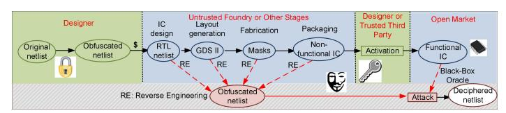

Figure 1: The targeted attack model of logic locking is locked using SFLL, the processor fails to simultaneously have high SAT complexity and high application-level impact on PARSEC benchmarks [1].

- (3) We propose *Strong Anti-SAT (SAS)* to address this challenge. In SAS, a set of input minterms that have higher impact on the applications are identified as *critical minterms*. We design the locking infrastructure of SAS such that given a wrong key, the critical minterms are more likely to introduce error in the circuit and hence result in an application-level error. We also prove that the SAT complexity is exponential in the number of key bits and does not deteriorate when the number of critical minterms increases. This is a substantial improvement over SFLL.
- (4) Experiment results show that, when SAS and SFLL have the same effectiveness, SAS achieves higher security and lower hardware overhead than SFLL.

## 2 BACKGROUND

## 2.1 Threat Model

Fig. 1 illustrates the threat model we consider which is consistent with the latest papers in the logic locking field [5, 13, 17–19, 21, 24]. The attacker can be either an untrusted foundry or an untrusted user who has the ability to reverse engineer the fabricated chip, obtaining the locked gate-level netlist. The attacker is considered to have the following resources:

- (1) The locked gate-level netlist of the circuit under attack. This can be obtained by reverse engineering the GDS-II file (which the foundry has) or a fabricated chip (which can be done by a capable end user).
- (2) *An activated chip.* The attacker is considered to own an activated chip (*i.e.* the one loaded with the correct key) since such a chip can be purchased from the open market.

In general, logic locking research does not assume that the attacker is able to insert probes into the activated circuit, *i.e.* to observe the intermediate values. This is because protection schemes (*e.g.* analog shield [8]) can counter probing attacks.

The Boolean satisfiability-based attack, a.k.a. SAT attack is a strong theoretical formulation to find the correct key of a locked circuit. In the context of the SAT attack, we use the *Conjunctive Normal Form (CNF)*:  $C(\vec{X}, \vec{K}, \vec{Y})$  to characterize Boolean satisfiability:  $C(\vec{X}, \vec{K}, \vec{Y}) = \text{TRUE}$  if  $\vec{X}, \vec{K}$ , and  $\vec{Y}$  satisfy  $\vec{Y} = F_L(\vec{X}, \vec{K})$ , where  $F_L$  stands for the Boolean functionality of the locked circuit.  $C(\vec{X}, \vec{K}, \vec{Y}) = \text{FALSE}$  otherwise. SAT attacks run iteratively and prune out incorrect keys in every iteration. The attack consists of the following steps:

(1) In the initial iteration, the attacker looks for a primary input,  $\vec{X}_1$ , and two keys,  $\vec{K}_{\alpha}$  and  $\vec{K}_{\beta}$ , such that the locked circuit produces two different outputs  $\vec{Y}_{\alpha}$  and  $\vec{Y}_{\beta}$ :

$$C(\vec{X}_1, \vec{K}_{\alpha}, \vec{Y}_{\alpha}) \wedge C(\vec{X}_1, \vec{K}_{\beta}, \vec{Y}_{\beta}) \wedge (\vec{Y}_{\alpha} \neq \vec{Y}_{\beta})$$
 (1)

 $\vec{X}_1$  is called the *Distinguishing Input (DI)*.

(2) The DI,  $\vec{X}_1$ , is applied to the activated circuit (the oracle) and the output  $\vec{Y}_1$  is recorded. Note that  $\vec{K}_{\alpha}$ ,  $\vec{Y}_{\alpha}$ , and  $\vec{K}_{\beta}$ ,  $\vec{Y}_{\beta}$  are

- not recorded. Only the DI and its correct output are carried over to the following iterations.
- (3) In the  $i^{\text{th}}$  iteration, a new DI and a pair of keys,  $\vec{K}_{\alpha}$  and  $\vec{K}_{\beta}$ , are found. The newly found  $\vec{K}_{\alpha}$  and  $\vec{K}_{\beta}$  should produce correct outputs for all the DIs found in previous iterations. To this end, we append a clause to Eq. (1):

$$C(\vec{X}_{i}, \vec{K}_{\alpha}, \vec{Y}_{\alpha}) \wedge C(\vec{X}_{i}, \vec{K}_{\beta}, \vec{Y}_{\beta}) \wedge (\vec{Y}_{\alpha} \neq \vec{Y}_{\beta})$$

$$\bigwedge_{i=1}^{i-1} (C(\vec{X}_{j}, \vec{K}_{\alpha}, \vec{Y}_{j}) \wedge C(\vec{X}_{j}, \vec{K}_{\beta}, \vec{Y}_{j}))$$
(2)

In this way, all the wrong keys that corrupt the output of previously found DIs (*i.e.* the output is different from that of the activated chip) are pruned out from the search space.

- (4) SAT solves Eq. (2) repeatedly until no more DI can be found, *i.e.* Eq. (2) is not satisfiable any more.
- (5) In this case, there is no more DI. The output of the SAT attack is a key  $\vec{K}$  that produces the same output as the activated circuit to all the DIs, which can be expressed using the following CNF:

$$\bigwedge_{i=1}^{\lambda} C(\vec{X}_i, \vec{K}, \vec{Y}_i) \tag{3}$$

where  $\lambda$  is the total number of SAT iterations.

## 2.2 Logic Locking

Multiple logic locking schemes have been proposed to thwart the SAT attack [18, 20, 21, 23, 24]. There are two ways to mitigate the SAT attack: one is to increase the time for each SAT iteration and the other is to increase the number of SAT iterations. The former requires either AES blocks [23] or reconfigurable logic [7], which is impractical for most circuits. The other approach is to exponentially increase the number of SAT iterations. This approach is also not perfect because a locking scheme must be rather ineffective to improve security. This is the case for Anti-SAT [18, 20], SARLock [21], and and TTL [22]. All these techniques are vulnerable to the approximate SAT attacks (such as AppSAT [13] and Double-DIP [14]).

The state-of-the-art, *stripped functionality logic locking (SFLL)* [24], explores the trade-off between security and effectiveness. SFLL comprises of two parts: a functionality stripped circuit (FSC) and a restore unit (RU). The FSC is the original circuit with the functionality modified for a set of *protected input cubes*. The RU stores the key, compares the circuit's input with the key, and outputs a restore vector which is XOR'ed with the FSC output. If the key is correct, the restore vector will fix the FSC's output and the circuit will have correct output. There are two variants of SFLL: SFLL-HD and SFLL-flex. SFLL-HD has been successfully attacked by a functional analysis based attack [15]. As the latter remains secure, provides higher flexibility in selecting protected cubes, and is more relevant to SAS, we focus on SFLL-flex in this paper. An SFLL-flex configuration can be described using the number of protected cubes, c, and the number of specified bits of each cube, k, denoted as SFLL-flex $c \times k$ . The authors of [24] derived the following characteristics of a circuit locked with SFLL-flex $^{c \times k}$ : (1) the fraction of input minterms whose output will be corrupted by a wrong key (i.e. the "error rate" of a wrong key) is  $c \cdot 2^{-k}$ ; and (2) the probability that a SAT attack finds the correct key within q iterations is  $q \cdot 2^{\lceil log_2 c \rceil - k}$ . We illustrate this relationship in Fig. 4. As a higher SAT success probability

indicates weaker security, SFLL inherently suffers from a tradeoff between security and effectiveness.

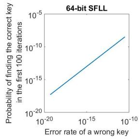

Figure 2: SFLL's error rate of wrong keys vs. the probability of SAT finding the correct key in 100 iterations

The rest of the paper is organized as follows. We show that SFLL's trade-off makes it infeasible to secure real-world applications in Section 3. We then mathematically prove that the trade-off applies to all logic locking schemes in Section 4. In Section 5, SAS's hardware structure is presented and its exponential SAT attack complexity is proved in theory. Section 6 shows the experimental results which demonstrate that when the same set of critical minterms are selected by SAS and SFLL, SAS achieves higher security than SFLL while maintaining similar application-level effectiveness. Section 7 concludes the paper.

## 3 INSUFFICIENCY OF SFLL

In this section, we investigate the application-level effectiveness of SFLL [24]. Specifically, we lock the multiplier within a 32-bit 80386 processor since it is the largest combinational component. The application-level impact is evaluated using the PARSEC Benchmark Suite [1]. In order to evaluate the application-level impact of a logic locking scheme, we modify the GEM5 [2] simulator so that error is injected into the locked processor module according to the hardware error profile due to the wrong key. In this way, the circuit-level error induced by an incorrect (including approximate) key can be evaluated at the application level. This framework is illustrated in Fig. 3 which is similar to the strategy used in [6, 25].

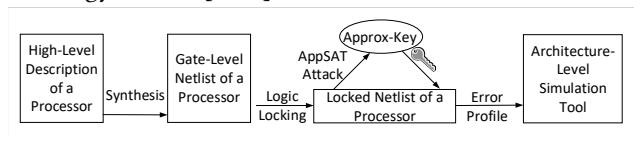

Figure 3: Our experimental framework

SFLL allows the designer to explore the trade-off between effectiveness and security. We show that a "sweet spot" does not exist. In our experiments, we lock the multiplier with various SFLL configurations, each having a different level of security against SAT attack, quantified by the average SAT iterations to unlock (as the X axis in Fig. 4). The effectiveness of locking is evaluated by running the PARSEC benchmarks on the locked processors loaded with approximate keys. The percentage of PARSEC benchmark runs with an incorrect outcome is the effectiveness criterion of each locking configuration. The trade-off is illustrated in Fig. 4 from which we observe that the wrong keys' impact decreases with the increase in SAT complexity. In order to have a visible accuracy drop for most benchmarks, the SFLL locked processor cannot endure more than roughly 1000 SAT iterations. Such a locking scheme is extremely vulnerable since 1000 SAT iterations can be fulfilled within minutes. Therefore, a

logic locking scheme that ensures high application-level impact without sacrificing SAT complexity is needed.

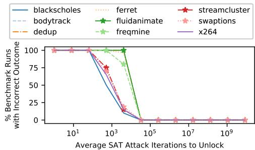

Figure 4: Security vs. effectiveness trade-off for SFLL-locked processor running PARSEC benchmarks.

# 4 LOGIC LOCKING'S UNIVERSAL TRADE-OFF

This section generalizes the trade-off of SFLL to all logic locking schemes. We start with definitions of concepts and then prove the relationship between security and effectiveness.

Definition 4.1. We say that a key  $\vec{K}$  **corrupts** a primary input minterm  $\vec{X}$  if and only if the locked circuit produces a different output to  $\vec{X}$  from the original circuit's output, *i.e.*  $F_L(\vec{X}, \vec{K}) \neq F(\vec{X})$ .

Definition 4.2. The **error rate**  $\epsilon_{\vec{K}}$  of a key  $\vec{K}$  is the portion of primary input minterms corrupted by the key  $\vec{K}$ .

Note that  $\epsilon_{\vec{K}}=0$  for any correct key. Let  $X_{\vec{K}}$  be the set of input minterms corrupted by  $\vec{K}$ . Then,  $\epsilon_{\vec{K}}=\frac{|X_{\vec{K}}|}{2^n}$ , where n is the number of bits in the primary input. We use  $\epsilon$  to denote the average error rate across all the keys. When the key is k bits long,

$$\epsilon = \frac{1}{2^k} \sum_{\vec{K} \in \{0,1\}^k} \epsilon_{\vec{K}}$$

*Definition 4.3.* The **corruptibility**  $\gamma_{\vec{X}}$  of a primary input minterm  $\vec{X}$  is the portion of wrong keys that corrupt this minterm.

Let  $\mathcal{K}_{\vec{X}}$  be the set of wrong keys that corrupts the primary input minterm  $\vec{X}$  and  $\mathcal{K}^W$  be the set of wrong keys. Then,  $\gamma_{\vec{X}} = \frac{|\mathcal{K}_{\vec{X}}|}{|\mathcal{K}^W|}$ . Let  $\gamma$  denote the average corruptibility over all input minterms, *i.e.* 

$$\gamma = \frac{1}{2^n} \sum_{\vec{X} \in \{0,1\}^n} \gamma_{\vec{X}}$$

Theorem 4.4. The average error rate of all wrong keys equals the average corruptibility of all input minterms, i.e.  $\epsilon = \gamma$ .

See proof in Appendix A. Let  $\lambda$  be the number of SAT iterations that a SAT attacker needs to find the correct key.

Theorem 4.5. The expected number of SAT iterations  $E[\lambda]$  is lower bounded by  $\frac{1}{\nu}$ .

PROOF. In each SAT iteration, the average number of wrong keys pruned by the DI  $\vec{X}$  is upper bounded by  $\gamma | \mathcal{K}^W |$  (because some of the wrong keys may have already pruned out by DIs of previous iterations). Therefore,

$$E[\lambda] \ge \frac{|\mathcal{K}^W|}{\gamma |\mathcal{K}^W|} = \frac{1}{\gamma}$$

Hence proved.

Theorems 4.4 and 4.5 explicitly point out that there exists an inverse relationship between  $\epsilon$  and the lower bound of  $E[\lambda]$ . This quantifies the trade-off between them. This trade-off applies to any logic locking scheme. Note that different input minterms may inject a different amount of error at the application level. By assigning higher corruptibility to a few minterms with high application-level impact, we can achieve high effectiveness while maintaining high security by keeping  $\gamma$  low and  $E[\lambda]$  high. This is the main intuition behind SAS.

## SAS'S ARCHITECTURE AND PROPERTIES

In Sec. 3 and 4, we demonstrated that two competing objectives exist for all logic locking schemes:

- (1) Effectiveness: Any incorrect key should have a high application-level error impact.
- **Security:** The complexity of determining the correct key via SAT attacks should be very high.

In this section, we introduce Strong Anti-SAT (SAS) logic locking scheme which aims to achieve both objectives simultaneously. SAS guarantees an exponential expected SAT solving time while having a large impact on the accuracy of real-world applications. In SAS, instead of uniformly distributing the error across all possible inputs, we identify certain input patterns which potentially have a higher impact on the overall application-level error. We call these inputs critical minterms. SAS is configured in such a way that any incorrect key corrupts any critical minterm. For the other minterms, the corruptibility is low.

#### The SAS Block 5.1

Let  $\mathcal{M}$  be the set of critical minterms and  $m = |\mathcal{M}|$  be the number of critical minterms. For the ease of implementation, we always choose m to be a power of 2. The basic locking infrastructure is the SAS block which is illustrated in Fig. 5. The key Kof an *n*-bit SAS block consists of two *n*-bit sub-keys,  $\vec{K}_1$  and  $\vec{K}_2$ . In order to describe the mechanism of the SAS locking scheme clearly, we use a reverse order and start our illustration from the output side.

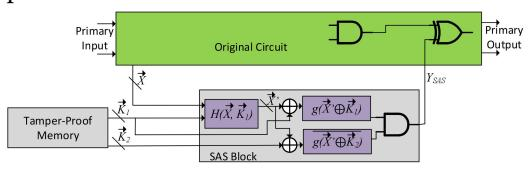

Figure 5: The architecture of SAS configuration 1 with the details of the SAS Block

 $Y_{SAS}$  is the output of the SAS block. If  $Y_{SAS} = 1$ , a fault will be injected into the original circuit. q is a function with an onset-size of 1, i.e. only one input minterm will have output 1 and all others will have output 0.  $\bar{g}$  has the opposite functionality of g. A function block  $\vec{X}' = H(\vec{X}, \vec{K}_1)$  is inserted before q and  $\bar{q}$  and it works as follows. If  $\vec{X}$  is not a critical minterm, then  $\vec{X}' = \vec{X}$ . In this case, only one combination of  $\vec{K}_1$  will make g output 1, therefore  $\vec{X}$  has a low corruptibility. If  $\vec{X}$  is a critical minterm, then for a portion of  $\vec{K}_1$ ,  $\vec{X}$  is adjusted according to  $\vec{K}_1$  to obtain  $\vec{X}'$  such that  $g(\vec{X}', \vec{K}_1) = 1$  and hence the corruptibility is increased.  $\vec{X}' = H(\vec{X}, \vec{K}_1)$  further ensures that the wrong keys that corrupts each critical minterm are mutually exclusive and evenly partition the set of wrong keys. More specifically, as the partitioning is based on the  $K_1$  part of the key, we have the following.

Table 1: Illustration of how m critical minterms partition the set of wrong keys

| $\vec{K}_1$ of wrom          | ng keys                                                                   | $ \vec{k}_1 $ |   | $\vec{k}_{\frac{2^n}{m}}$ | $\vec{k}_{\frac{2^n}{m}+1}$ |    | $\vec{k}_{2\frac{2^n}{m}}$ |   | $\vec{k}_2$ n |
|------------------------------|---------------------------------------------------------------------------|---------------|---|---------------------------|-----------------------------|----|----------------------------|---|---------------|
| critical minterms         | $\begin{array}{c} \vec{X}_1 \ \vec{X}_2 \ \vdots \ \vec{X}_m \end{array}$ | •             | • | •                         | •                           | •  | •                          | • | •             |
| non- critical minterms | $\vec{X}_{m+1}$ $\vec{X}_{m+2}$ $\dots$ $\vec{X}_{2}^{n}$                 | •             | • |                           |                             | ٠. |                            |   | •             |

Let  $\mathcal{K}_{\vec{X}}^1 = \{\vec{K}_1 | \forall \vec{K}_2 \text{ such that } (\vec{K}_1, \vec{K}_2) \in \mathcal{K}^W, \ (\vec{K}_1, \vec{K}_2) \in \mathcal{K}_{\vec{X}} \}.$  Then we have

$$\forall \vec{X}_{1}, \vec{X}_{2} \in \mathcal{M}, \ |\mathcal{K}_{\vec{X}_{1}}^{1}| = |\mathcal{K}_{\vec{X}_{2}}^{1}|, \ \mathcal{K}_{\vec{X}_{1}}^{1} \wedge \mathcal{K}_{\vec{X}_{2}}^{1} = \emptyset \bigcup_{\vec{X} \in \mathcal{M}} \mathcal{K}_{\vec{X}}^{1} = \mathbb{Z}_{2}^{n}$$
(4)

where n is the number of bits in  $\vec{X}$ ,  $\vec{K}_1$ , and  $\vec{K}_2$ . This effect is illustrated in Table 1. The 2 configurations of SAS will be introduced in the rest of this section.

## **Configuration 1: SAS with One SAS Block**

This configuration is illustrated in Fig. 5. In this configuration, there is one SAS block. As the critical minterms evenly partition the set of wrong keys, the corruptibility of each critical minterm is  $\gamma_c = \frac{1}{m}$ . Below we derive the security (SAT attack complexity) of this configuration assuming that the SAT solver chooses a DI uniformly at random in each iteration. This is a common assumption [12, 22, 24]. The security is quantified using the expected number of SAT iterations  $E[\lambda]$ . To start with, we give 2 useful lemmas. The proofs are given in Appendices B and C.

Lemma 5.1. Let  $\mathcal{D}^i$  be the set of DIs that have been chosen in the first i iterations and  $\vec{X}$  be a primary input minterm. If  $\mathcal{K}_{\vec{X}} \subset \bigcup_{\vec{X'} \in \mathcal{D}^i} \mathcal{K}_{\vec{X'}}$ , then  $\vec{X}$  cannot be the DI of any SAT iteration

LEMMA 5.2. For SAS Configuration 1, any critical minterm must exist in the set of DIs when SAT finishes:  $\vec{X} \in \mathcal{D}^{\lambda} \ \forall \vec{X} \in \mathcal{M}$ , where  $\lambda$  is the total number of SAT iterations and  $\mathcal{D}^{\lambda}$  is the set of all DIs.

THEOREM 5.3. The expected number of SAT iterations of SAS Configuration 1 is

$$E[\lambda] = \frac{2^n + m}{2} \tag{5}$$

on figuration 1 is  $E[\lambda] = \frac{2^n + m}{2}$  (5) PROOF. The total number of SAT iterations equals the total number of DIs. DIs consist of critical minterms and non-critical minterms. By Lemma 5.2, all the critical minterms must be in the set of DIs for SAT to terminate. Therefore, we only need to find the expected number of non-critical minterms that are chosen as DIs. As illustrated in Table 1,  $\forall \vec{X'} \notin \mathcal{M}$ ,  $\exists$  exactly one  $\vec{X} \in \mathcal{M}$  such that  $\mathcal{K}_{\vec{X}'} \subset \mathcal{K}_{\vec{X}}$ . By Lemma 5.1, if this  $\vec{X}$  is chosen as DI before  $\vec{X}'$ , then  $\vec{X}'$  cannot be chosen in further iterations any more. In other words,  $\vec{X}'$  will count towards the total number of iterations only when it is chosen before the critical minterm  $\vec{X}$ . By our assumption that the DI is chosen uniformly at random in each iteration,  $\vec{X}'$  has a probability of  $\frac{1}{2}$  to be chosen as DI before  $\vec{X}$  is chosen. As this is true for any non-critical minterm, the expected number of SAT iterations is  $E[\lambda] = \frac{1}{2}(2^n - m) + m = \frac{2^n + m}{2}.$ 

## 5.3 Configuration 2: Multiple SAS Blocks

In this configuration, we have l SAS blocks as illustrated in Fig. 6. Each SAS block takes an *n*-bit primary input  $\vec{X}$ , which is shared among all the SAS blocks, and a 2n-bit key input. The output of each SAS block is XOR'ed with a wire in the original circuit. Therefore, a fault is injected into the original circuit if at least 1 SAS block has output 1. Let  $\mathcal{M}^j$  be the set of critical minterms for the  $j^{\text{th}}$  SAS block ,  $j=1,2,\ldots,l$ . For ease of implementation, we choose l also to be a power of 2 and  $l \leq m$ . The relationship between  $\mathcal{M}^j$  and the total set of critical minterms  $\mathcal{M}$  is that  $\mathcal{M}^1, \mathcal{M}^2, \ldots, \mathcal{M}^l$  have the same cardinality, are mutually exclusive, and evenly partition  $\mathcal{M}$ , i.e.

$$|\mathcal{M}^1| = |\mathcal{M}^2| = \dots = |\mathcal{M}^l|, \ \mathcal{M}^i \cap \mathcal{M}^j = \emptyset \ \forall i \neq j, \ \bigcup_{k=1}^l \mathcal{M}^k = \mathcal{M}$$
 (6) In this way, each SAS block has  $\frac{m}{l}$  critical minterms. As each

In this way, each SAS block has  $\frac{m}{l}$  critical minterms. As each critical minterm receives high corruptibility from only one SAS block, the corruptibility of any critical minterm is  $\gamma_c = \frac{l}{m}$ .

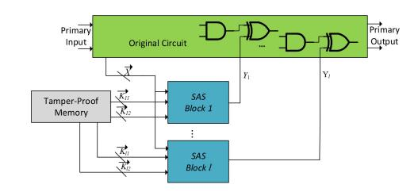

Figure 6: Configuration 2 with l SAS blocks

LEMMA 5.4. For SAS Configuration 2, any critical minterm must exist in the set of DIs when SAT finishes:  $\vec{X} \in \mathcal{D}^{\lambda} \ \forall \vec{X} \in \mathcal{M}$ , where  $\lambda$  is the total number of SAT iterations and  $\mathcal{D}^{\lambda}$  is the set of all DIs.

The proof is given in Appendix D. Below, we will analyze the security of this configuration by deriving the expected number of SAT iterations.

Theorem 5.5. The expected number of SAT iterations of SAS Configuration 2 with l SAS blocks and m critical minterms is

$$E[\lambda] = \frac{l \cdot 2^n + m}{l + 1} \tag{7}$$

PROOF. By Lemma 5.4, every critical minterm must count toward the total number of SAT iterations. Therefore, we only need to derive the expected number of non-critical minterms that are chosen as DIs.

For any non-critical minterm  $\vec{X'} \notin \mathcal{M}$ , in the  $i^{\text{th}}$  SAS block, there exists exactly one critical minterm  $\vec{X_i}$  such that the set of wrong keys that corrupt  $\vec{X'}$  in this SAS block,  $\mathcal{K}_{i,\vec{X'}}$ , is a subset of the set of wrong keys that corrupt  $\vec{X_i}$ ,  $\mathcal{K}_{i,\vec{X_i}}$ , i.e.  $\mathcal{K}_{i,\vec{X'}} \subset \mathcal{K}_{i,\vec{X_i}}$ . As the construction of the SAS block makes this true for any individual SAS block and the critical minterms for each SAS block are mutually exclusive, there are a total of l such critical minterms. When all of these l critical minterms are chosen as DI, they will cover the entire set of wrong keys that corrupt  $\vec{X'}$ . Therefore, by Lemma 5.1, in order to include  $\vec{X'}$  in the set of DIs, it must be selected before all l critical minterms are selected. This holds for any non-critical minterm.

By our assumption that the DIs are chosen uniformly at random in each SAT iteration, the probability that each non-critical minterm will be chosen as DI is  $\frac{l}{l+1}$ . Therefore, the expected number of SAT iterations is  $E[\lambda] = \frac{l}{l+1}(2^n-m)+m = \frac{l\cdot 2^n+m}{l+1}$ .  $\square$ 

The properties of both SAS configurations are summarized in Table 2.

Table 2: Properties of the 2 SAS configurations

| Configuration | 1               | $\gamma_c$    | $E[\lambda]$           |  |
|---------------|-----------------|---------------|------------------------|--|
| 1             | 1               | $\frac{1}{m}$ | $\frac{2^{n}+m}{2}$    |  |
| 2             | $1 \le l \le m$ | $\frac{l}{m}$ | $\frac{l2^n + m}{l+1}$ |  |

## 6 EXPERIMENTS

This section shows the experimental results of SAS as well as the comparison between SAS and SFLL. Recall that, as illustrated in Fig. 3, we obtain the gate-level netlists of a 32-bit 80386 processor by synthesizing the high-level description using Cadence RTL Compiler. Then we lock the netlist using various SAS configurations and SFLL-flex with the same set of critical minterms. Note that the critical minterms are selected from those that are present in each benchmark. The architecture-level simulation is conducted by a modified GEM5 [2] simulator where error is injected into the locked processor module according to the hardware error profile due to the wrong key. We conduct the following experiment to verify the security and effectiveness of SAS. We also compare SAS with SFLL.

## 6.1 Security and Effectiveness

We first verify whether the security of SAS against SAT attack (*i.e.* the actual number of SAT iterations) matches what we have derived in the last section. The security of SAS and SFLL is also compared. We lock the multiplier in the 32-bit 80386 processor with SAS configurations 1 (l=1) and 2 (l=2 and l=4) as well as SFLL. We choose m=4 for each evaluated locking scheme.

The expected and actual numbers of SAT iterations to break various SAS configurations are given in Fig. 7. The theoretical and experimental results are consistent with each other and grow exponentially in the key length n. Fig. 8 compares the actual SAT iterations of SAS and SFLL. In Fig. 8a, it can be observed that SAS's SAT complexity is higher than that of SFLL by a roughly constant factor when m is fixed. Note that the same set of four critical minterms (m = 4) are used for each locking scheme. In Fig. 8b, we vary the critical minterm count (m) from 4 to 32 and demonstrate its impact on the security of SAS and SFLL. While SAS configurations become stronger with more critical minterms, SFLL becomes weaker. Therefore, SAS is more secure against SAT attack and gives designers more flexibility when more critical minterms are needed.

We evaluate the effectiveness of SAS and SFLL at the application level using PARSEC [1] benchmarks. In our experiments, various numbers of critical minterms are locked. The same set of critical minterms are used for SAS and SFLL in each experiment. For SAS, we choose l=1 when m=1 and l=2 when  $m\geq 2$ . Fig. 9 shows that both SAS and SFLL are effective at the application level. Considering that SAS's security is not compromised with the increase in m as opposed to SFLL (as shown in Fig. 8b), SAS is a significant improvement over SFLL.

### 6.2 Hardware Overhead and Summary

Now that we have demonstrated the security of SAS against SAT attack and its application-level effectiveness, we evaluate its hardware overhead and compare with existing logic locking methods. The hardware (*i.e.* chip area) overhead is estimated using the number of gates. The baseline case is a 32-bit multiplier without any logic locking. The details of each compared approach are as follows.

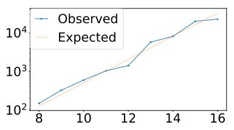

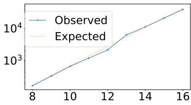

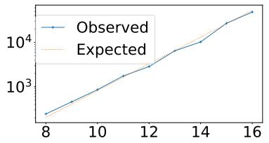

(a) l = 1. X: key length, Y: SAT iterations.

(b) l = 2. X: key length, Y: SAT iterations.

(c) l = 4. X: key length, Y: SAT iterations.

Figure 7: The theoretical vs. actual SAT iterations for the 3 experimented SAS configurations

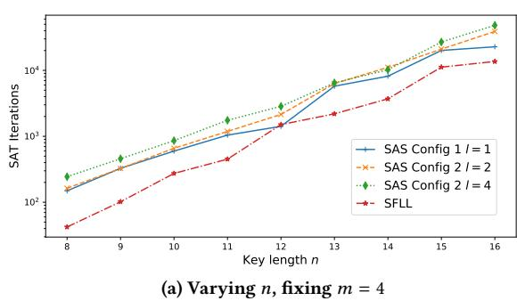

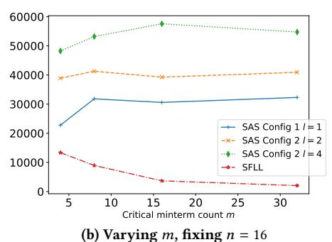

Figure 8: The observed SAT iterations of SAS and SFLL by varying key length and critical minterm count.

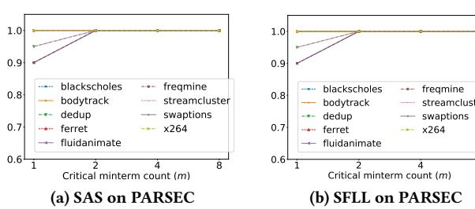

Figure 9: The fraction of PARSEC benchmark runs with incorrect outcome on SAS and SFLL Locked processors

- *SAS*: The multiplier is locked using a 32-bit SAS block with m = 4 and l = 2. This configuration has been shown both secure and effective.
- *Conventional locking scheme*: the processor's multiplier is locked using 32-bit Anti-SAT block + 5% fault-impact-based key-gates [10].
- *SFLL-flex*: the processor's multiplier is locked with SFLL-flex using the same set of 4 critical minterms as SAS.

Table 3: Comparison among logic locking techniques

| Locking Scheme          | Application-Level Impact | SAT Attack Complexity                           | HW Overhead |
|----------------------------|-----------------------------|----------------------------------------------------|-------------|
| Conventional logic locking | very low after AppSAT    | exponential in <i>n</i> ( <i>m</i> not applicable) | 7.93%       |
| SFLL-flex                  | high                        | exponential in $n$ , decreasing in $m$             | 7.87%       |
| SAS                        | high                        | exponential in $n$ , increasing in $m$             | 4.35%       |

The comparison between SAS and existing logic locking schemes are shown in Table 3. As seen, both SFLL and SAS have higher application-level impact than conventional logic locking. However, SAS has lower hardware overhead and stronger security than SFLL.

### 7 CONCLUSION

In this work, we investigate logic locking methodologies for securing real-world workloads. We motivate our work by demonstrating the insufficiency of the state-of-the-art logic locking scheme in securing such applications. We point out that this is due to the fundamental trade-off between *security* (SAT attack complexity) and *effectiveness* (error rate of wrong keys) of logic locking. We formally prove this trade-off. In order to address this dilemma, we propose Strong Anti-SAT (SAS) where a set of critical minterms are assigned higher corruptibility in order to ensure high application-level impact. Experimental results show that SAS secures processors against SAT attack by ensuring exponential SAT attack complexity and high application-level impact simultaneously given any wrong key. We also evaluate the hardware overhead of SAS and compare it with existing locking schemes where it is shown that SAS has lower hardware overhead.

#### **ACKNOWLEDGMENTS**

This work is supported by AFOSR MURI under Grant FA9550-14-1-0351 and Northrop Grumman Corporation and University of Maryland Seedling Grant.

#### REFERENCES

- [1] Christian Bienia, Sanjeev Kumar, Jaswinder Pal Singh, and Kai Li. 2008. The PARSEC benchmark suite: Characterization and architectural implications. In Proceedings of the 17th international conference on Parallel architectures and compilation techniques. ACM, 72–81.
- [2] Nathan Binkert, Bradford Beckmann, Gabriel Black, Steven K Reinhardt, Ali Saidi, Arkaprava Basu, Joel Hestness, Derek R Hower, Tushar Krishna, Somayeh Sardashti, et al. 2011. The gem5 simulator. ACM SIGARCH Computer Architecture News 39, 2 (2011), 1–7
- [3] Abhishek Chakraborty, Nithyashankari Gummidipoondi Jayasankaran, Yuntao Liu, Jeyavijayan Rajendran, Ozgur Sinanoglu, Ankur Srivastava, Yang Xie, Muhammad Yasin, and Michael Zuzak. 2019. Keynote: A Disquisition on Logic Locking. IEEE Transactions on Computer-Aided Design of Integrated Circuits and Systems (2019).
- [4] Abhishek Chakraborty, Yuntao Liu, and Ankur Srivastava. 2018. TimingSAT: timing profile embedded SAT attack. In *Proceedings*

- of the International Conference on Computer-Aided Design. ACM,
- [5] Abhishek Chakraborty, Yang Xie, and Ankur Srivastava. 2017. Template Attack Based Deobfuscation of Integrated Circuits. In Computer Design (ICCD), 2017 IEEE International Conference on. IEEE, 41-44.
- [6] Abhishek Chakraborty, Yang Xie, and Ankur Srivastava. 2018. GPU obfuscation: attack and defense strategies. In *Proceedings of* the 55th Annual Design Automation Conference. ACM, 122.
- Hadi Mardani Kamali, Kimia Zamiri Azar, Houman Homayoun, and Avesta Sasan. 2019. Full-Lock: Hard Distributions of SAT Instances for Obfuscating Circuits using Fully Configurable Logic and Routing Blocks. In Proceedings of the 56th Annual Design Automation Conference 2019. ACM, 89.
- Xuan Thuy Ngo, Jean-Luc Danger, Sylvain Guilley, Tarik Graba, Yves Mathieu, Zakaria Najm, and Shivam Bhasin. 2017. Cryptographically Secure Shield for Security IPs Protection. IEEE Trans. Comput. 66, 2 (2017), 354-360.
- [9] Jeyavijayan Rajendran and et al. 2012. Security analysis of logic obfuscation. In Proceedings of the 49th Annual Design Automation Conference. ACM, 83-89.
- Jeyavijayan Rajendran and et al. 2015. Fault Analysis-Based Logic Encryption. Computers, IEEE Transactions on 64, 2 (2015), 410-424.
- Jarrod A Roy and et al. 2008. EPIC: Ending piracy of integrated circuits. In Proceedings of the conference on Design, Automation and Test in Europe. ACM, 1069-1074.
- [12] Abhrajit Sengupta, Mohammed Nabeel, Muhammad Yasin, and Ozgur Sinanoglu. 2018. ATPG-based cost-effective, secure logic locking. In 2018 IEEE 36th VLSI Test Symposium (VTS). IEEE, 1-6.
- [13] Kaveh Shamsi and et al. 2017. Appsat: Approximately deobfuscating integrated circuits. In Hardware Oriented Security and Trust (HOST), 2017 IEEE International Symposium on. IEEE, 95-100.
- [14] Yuanqi Shen and Hai Zhou. 2017. Double dip: Re-evaluating security of logic encryption algorithms. In Proceedings of the on Great Lakes Symposium on VLSI 2017. ACM, 179-184.
- [15] Deepak Sirone and Pramod Subramanyan. 2019. Functional analysis attacks on logic locking. In 2019 Design, Automation & Test in Europe Conference & Exhibition (DATE). IEEE, 936-939.
- [16] Pramod Subramanyan and et al. 2015. Evaluating the security of logic encryption algorithms. In Hardware Oriented Security and Trust (HOST), 2015 IEEE International Symposium on. IEEE,
- [17] Yang Xie, Chongxi Bao, and Ankur Srivastava. 2017. Security-Aware 2.5 D Integrated Circuit Design Flow Against Hardware IP Piracy. Computer 5 (2017), 62-71.
- [18] Yang Xie and et al. 2016. Mitigating sat attack on logic locking. In International Conference on Cryptographic Hardware and Embedded Systems. Springer, 127–146.
- [19] Yang Xie and Ankur Srivastava. 2017. Delay locking: Security enhancement of logic locking against ic counterfeiting and overproduction. In Proceedings of the 54th Annual Design Automation Conference 2017. ACM, 9.
- [20] Yang Xie and Ankur Srivastava. 2018. Anti-SAT: Mitigating SAT Attack on Logic Locking. IEEE Transactions on Computer-Aided Design of Integrated Circuits and Systems (2018).
- [21] Muhammad Yasin and et al. 2016. SARLock: SAT attack resistant logic locking. In Hardware Oriented Security and Trust (HOST), 2016 IEEE International Symposium on. IEEE, 236-241.
- [22] Muhammad Yasin, Bodhisatwa Mazumdar, Jeyavijayan JV Rajendran, and Ozgur Sinanoglu. 2017. TTLock: Tenacious and traceless logic locking. In 2017 IEEE International Symposium on Hardware Oriented Security and Trust (HOST). IEEE, 166-166.
- [23] Muhammad Yasin, Jeyavijayan JV Rajendran, Ozgur Sinanoglu, and Ramesh Karri. 2016. On improving the security of logic locking. IEEE Transactions on Computer-Aided Design of Integrated

- Circuits and Systems 35, 9 (2016), 1411-1424.
- [24] Muhammad Yasin, Abhrajit Sengupta, Mohammed Thari Nabeel, Mohammed Ashraf, Jeyavijayan JV Rajendran, and Ozgur Sinanoglu. 2017. Provably-Secure Logic Locking: From Theory To Practice. In Proceedings of the 2017 ACM SIGSAC Conference on Computer and Communications Security. ACM, 1601–1618.
- M. Zuzak and A. Srivastava. 2019. Memory Locking: An Automated Approach to Processor Design Obfuscation. In 2019 IEEE Computer Society Annual Symposium on VLSI (ISVLSI). 541-546. https://doi.org/10.1109/ISVLSI.2019.00103

## **PROOF OF THEOREM 4.4**

 $\epsilon = \frac{1}{|\mathcal{K}^W|} \sum_{\vec{k} = \sigma \mathcal{K}^W} \epsilon_{\vec{k}} = \frac{1}{|\mathcal{K}^W|} \sum_{\vec{k}' \in \sigma \mathcal{K}^W} \frac{|\mathcal{X}_{\vec{k}}|}{2^n} = \frac{1}{2^n |\mathcal{K}^W|} \sum_{\vec{k}' \in \mathcal{K}^W} |\mathcal{X}_{\vec{k}}|$ 

and 
$$\gamma = \frac{1}{2^n} \sum_{\vec{X} \in \{0,1\}^n} \gamma_{\vec{X}} = \frac{1}{2^n} \sum_{\vec{X} \in \{0,1\}^n} \frac{|\mathcal{K}_{\vec{X}}|}{|\mathcal{K}^W|} = \frac{1}{2^n |\mathcal{K}^W|} \sum_{\vec{X} \in \{0,1\}^n} |\mathcal{K}_{\vec{X}}|$$
 Therefore, in order to prove  $\epsilon = \gamma$ , we only need to prove

$$\sum_{\vec{K} \in \mathcal{K}^W} |\mathcal{X}_{\vec{K}}| = \sum_{\vec{X} \in \{0,1\}^n} |\mathcal{K}_{\vec{X}}| \tag{8}$$

Let us consider the following bipartite graph  $G = (X, \mathcal{K}^W, \mathcal{E})$ where X is  $\{0, 1\}^n$  which is the set of all possible input minterms,  $\mathcal{K}^W$  is the set of wrong keys, and  $\mathcal{E} = \{(\vec{X}, \vec{K}) | \vec{X} \in \mathcal{X} \text{ and } \vec{K} \in \mathcal{X} \}$  $\mathcal{K}^W$ ,  $\vec{K}$  corrupts  $\vec{X}$ . Both sides of Eq. 8 denote the total number of elements in  $\mathcal E$  and hence must be equal.

### PROOF OF LEMMA 5.1

PROOF. Recall that Equation (2) gives the SAT formula for each SAT iteration:

$$C(\vec{X}_i, \vec{K}_{\alpha}, \vec{Y}_{\alpha}) \wedge C(\vec{X}_1, \vec{K}_{\beta}, \vec{Y}_{\beta}) \wedge (\vec{Y}_{\alpha} \neq \vec{Y}_{\beta})$$

$$\bigwedge_{i=1}^{i-1} (C(\vec{X}_j, \vec{K}_{\alpha}, \vec{Y}_j) \wedge C(\vec{X}_j, \vec{K}_{\beta}, \vec{Y}_j))$$

To satisfy the first line, at least one of  $\vec{K}_{\alpha}$  and  $\vec{K}_{\beta}$  must be a wrong key that corrupts  $\vec{X}$ . However, since any wrong key that corrupts  $\vec{X}$  also corrupts at least 1 previously found DI, this wrong key cannot satisfy the second line. Hence such  $\vec{X}$  cannot be the DI in future iterations.

## **PROOF OF LEMMA 5.2**

PROOF. Recall that g has on-set size 1. Let  $\vec{P}$  be the input that makes  $g(\vec{P}) = 1$ .  $\forall \vec{X} \in \mathcal{M}$ , let  $\vec{K}_1 = \vec{X} \oplus \vec{P}$ . Then, any  $\vec{K} =$  $(\vec{K}_1, \vec{K}_2) \in \mathcal{K}^W$  is a wrong key that only corrupts  $\vec{X}$ . Therefore,  $\vec{X}$  has to be chosen as a DI to prune out this wrong key.

## **PROOF OF LEMMA 5.4**

PROOF. This is a natural extension of Lemma 5.2. Let  $\vec{X}$  be a critical minterm and  $\vec{X} \in \mathcal{M}^j$ . Recall that q has on-set size 1. Let  $\vec{P}$  be the input that makes  $g(\vec{P}) = 1$ .  $\forall \vec{X} \in \mathcal{M}^j$ , let  $\vec{k} =$  $\vec{X} \oplus \vec{P}$ . Then, let us consider the following wrong key  $\vec{K} =$  $(\vec{K}^1, \vec{K}^2, \dots, \vec{K}^l) \in \mathcal{K}^W$  which is composed as follows:  $\vec{K}^j =$  $(\vec{k}, \vec{K}_2^j) \in \mathcal{K}_i^W$  where  $\mathcal{K}_i^W$  is the set of wrong keys for the  $j^{\text{th}}$ SAS block. For any i = 1, 2, ..., l that  $i \neq j, \vec{K}^i \in \mathcal{K}_i^C$  where  $\mathcal{K}_i^C$ is the set of correct keys for the  $i^{th}$  SAS block. Such a key  $\vec{K}$  is a wrong key that only corrupts X. Therefore, X has to be chosen as a DI to prune out this wrong key.