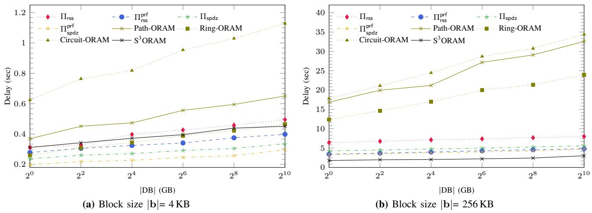
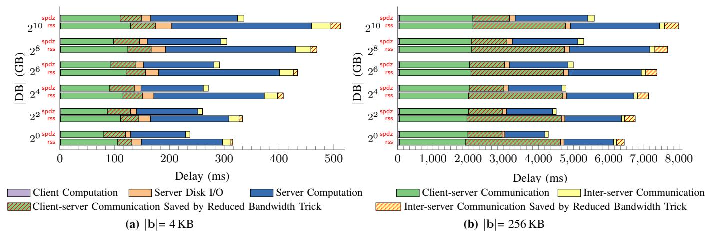
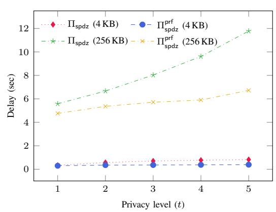
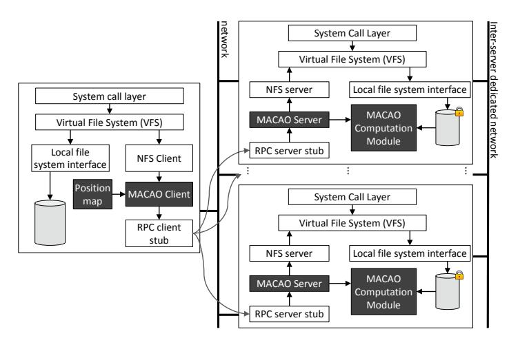

# MACAO: A Maliciously-Secure and Client-Efficient Active ORAM Framework

Thang Hoang CSE, University of South Florida hoangm@mail.usf.edu

Jorge Guajardo Robert Bosch LLC — RTC Jorge.GuajardoMerchan@us.bosch.com

Attila A. Yavuz CSE, University of South Florida attilaayavuz@usf.edu

*Abstract*—Oblivious Random Access Machine (ORAM) allows a client to hide the access pattern and thus, offers a strong level of privacy for data outsourcing. An ideal ORAM scheme is expected to offer desirable properties such as low client bandwidth, low server computation overhead and the ability to compute over encrypted data. S<sup>3</sup>ORAM (CCS'17) is an efficient active ORAM scheme, which takes advantage of secret sharing to provide ideal properties for data outsourcing such as low client bandwidth, low server computation and low delay. Despite its merits, S<sup>3</sup>ORAM only offers security in the semi-honest setting. In practice, an ORAM protocol is likely to operate in the presence of malicious adversaries who might deviate from the protocol to compromise the client privacy.

In this paper, we propose MACAO, a new multi-server ORAM framework, which offers integrity, access pattern obliviousness against active adversaries, and the ability to perform secure computation over the accessed data. MACAO harnesses authenticated secret sharing techniques and tree-ORAM paradigm to achieve low client communication, efficient server computation, and low storage overhead at the same time. We fully implemented MACAO and conducted extensive experiments in real cloud platforms (Amazon EC2) to validate the performance of MACAO compared with the state-of-the-art. Our results indicate that MACAO can achieve comparable performance to S<sup>3</sup>ORAM while offering security against malicious adversaries. MACAO is a suitable candidate for integration into distributed file systems with encrypted computation capabilities towards enabling an oblivious functional data outsourcing infrastructure.

# I. INTRODUCTION

Originally introduced in [\[30\]](#page-13-0), Oblivious Random Access Machine (ORAM) offers a strong level of privacy for data outsourcing by enabling data confidentiality and access pattern obliviousness simultaneously. Since then, many ORAM schemes have been proposed in both the single-server and distributed settings [\[30\]](#page-13-0), [\[59\]](#page-14-0), [\[64\]](#page-14-1), [\[51\]](#page-14-2), [\[63\]](#page-14-3), [\[9\]](#page-13-1), [\[66\]](#page-14-4). ORAM is accepted as a fundamental building block of privacypreserving data outsourcing applications in the single client or multi-client setting [\[45\]](#page-13-2), [\[15\]](#page-13-3), [\[10\]](#page-13-4) for passive and active security [\[70\]](#page-14-5), [\[41\]](#page-13-5), [\[44\]](#page-13-6), [\[56\]](#page-14-6), [\[62\]](#page-14-7), [\[69\]](#page-14-8), [\[45\]](#page-13-2).

## *A. ORAM Challenges and Desired Properties*

As a core building block of any oblivious data storage service, ORAM is expected to offer the following ideal properties:

- *Low communication and storage overhead*: Some of the most efficient ORAM constructions (*e.g.*, Tree-ORAM [\[59\]](#page-14-0), Path-ORAM [\[64\]](#page-14-1), Circuit-ORAM [\[66\]](#page-14-4), rORAM [\[14\]](#page-13-7)) focused on the *passive* setting, where the server exclusively offers a storage-only service (*i.e.*, no computation). It has been shown that there is a logarithmic communication lower bound in passive ORAM [\[40\]](#page-13-8), [\[31\]](#page-13-9), [\[12\]](#page-13-10). This overhead, however, can be costly in the standard client-server setting [\[70\]](#page-14-5), [\[41\]](#page-13-5), [\[62\]](#page-14-7), [\[69\]](#page-14-8). In particular, most efficient passive ORAM schemes must transmit 40×-80× extra blocks from the server to the client and vice versa to access a block [\[64\]](#page-14-1), [\[66\]](#page-14-4), [\[59\]](#page-14-0). Given a large block size, this overhead makes ORAM often unsuitable for bandwidth-constrained clients (*e.g.*, home Internet, mobile data plans). Other works (*e.g.*, [\[61\]](#page-14-9)) offer low client communication overhead at the expense of large client storage. For practical oblivious file systems, it is desirable that the underlying ORAM scheme provides both, low communication and low storage overhead at the client.
- *Low computational overhead:* To achieve low communication, *active* ORAM schemes have been proposed, in which the server can perform some computation on behalf of the client [\[5\]](#page-13-11), [\[22\]](#page-13-12), [\[25\]](#page-13-13), [\[47\]](#page-13-14), [\[46\]](#page-13-15), [\[21\]](#page-13-16), [\[53\]](#page-14-10). However, most of these constructions cannot surpass the logarithmic communication bound, unless sophisticated cryptographic primitives such as partially/somewhat/fully Homomorphic Encryption (HE) [\[50\]](#page-14-11), [\[27\]](#page-13-17) are used (*e.g.*, Onion-ORAM [\[22\]](#page-13-12)). While recent years have seen considerable improvements in the performance of HE implementations, the use of HE still incurs high computational overhead at the client and server during the online access. As a result, the access latency may significantly increase, thereby degrading the quality of service.
- *Secure computation over encrypted data*: It is highly desirable for an oblivious data outsourcing service to offer not only oblivious access but also secure computation over the outsourced data. Akin to the services offered by secure multi-party computation, such an ORAM offers an ideal cryptographic framework to construct privacy-persevering and functional data outsourcing services. Most proposed ORAM schemes do not offer this computation feature. To the best of our knowledge, only Onion-ORAM [\[22\]](#page-13-12) and S<sup>3</sup>ORAM [\[33\]](#page-13-18) support secure computation on accessed data. Unfortunately, Onion-ORAM is known to be inefficient, while S<sup>3</sup>ORAM only offers security against passive adversaries.
- *Security against active adversaries*: As previously mentioned, S<sup>3</sup>ORAM [\[33\]](#page-13-18) offers advantages in terms of computational overhead, low bandwidth and client storage but it only offers security in the semi-honest model (i.e., passive adversaries). In practice, an ORAM protocol is likely to operate in the presence of active adversaries, who might inject malicious inputs into the protocol to compromise the client

| <b>TABLE I:</b> Summary | of state-of-the-art | ORAM schemes. |
|-------------------------|---------------------|---------------|
|-------------------------|---------------------|---------------|

<span id="page-1-0"></span>

| Scheme                                                                                            | Bandwidth Overhead <sup>†</sup> |                       | Block              | Client                     | # servers§      | Security    | Comp. over |
|---------------------------------------------------------------------------------------------------|---------------------------------|-----------------------|--------------------|----------------------------|-----------------|-------------|------------|
|                                                                                                   | Client-server                   | Server-server         | Size*              | Block Storage <sup>‡</sup> | # SCIVEIS*      | Security    | Enc. Data  |
| Ring-ORAM [53]                                                                                    | $O(\log N)$                     | -                     | $\Omega(1)$        | $\mathcal{O}(\log N)$      | 1               | Semi-Honest | ×          |
| CKN+18 [16]                                                                                       | $\mathcal{O}(\log N)$           | -                     | $\Omega(\log^2 N)$ | $\mathcal{O}(1)$           | 3               | Semi-Honest | ×          |
| GKW18 [32]                                                                                        | $\mathcal{O}(\log N)$           | -                     | $\Omega(1)$        | $\mathcal{O}(\log N)$      | 2               | Semi-Honest | ×          |
| S <sup>3</sup> ORAM [33]                                                                          | $\mathcal{O}(1)$                | $\mathcal{O}(\log N)$ | $\Omega(\log^2 N)$ | $\mathcal{O}(1)$           | 2t + 1          | Semi-Honest | ✓          |
| Path-ORAM [64]                                                                                    | $\mathcal{O}(\log N)$           | -                     | $\Omega(1)$        | $\mathcal{O}(\log N)$      | 1               | Malicious   | ×          |
| Circuit-ORAM [66]                                                                                 | $\mathcal{O}(\log N)$           | -                     | $\Omega(1)$        | $\mathcal{O}(\log N)$      | 1               | Malicious   | ×          |
| SS13 [61]                                                                                         | $\mathcal{O}(1)$                | $\mathcal{O}(\log N)$ | $\Omega(\log^2 N)$ | $\mathcal{O}(\sqrt{N})$    | 2               | Malicious   | ×          |
| LO13 [42]                                                                                         | $\mathcal{O}(\log N)$           | ` - ´                 | $\Omega(1)$        | $\mathcal{O}(1)$           | 2               | Malicious   | ×          |
| Onion-ORAM [22]                                                                                   | $\mathcal{O}(1)$                | -                     | $\Omega(\log^6 N)$ | $\mathcal{O}(1)$           | 1               | Malicious   | ✓          |
| $\begin{array}{ c c c c }\hline MACAO~(\Pi_{rss})\\\hline MACAO~(\Pi_{spdz})\\\hline \end{array}$ | $\mathcal{O}(1)$                | $\mathcal{O}(\log N)$ | $\Omega(\log N)$   | $\mathcal{O}(\log N)$      | $\frac{3}{t+1}$ | Malicious   | ✓          |

<sup>•</sup> We refer reader to §V-B for the detail experimental comparisons between MACAO schemes and some of these counterparts.

access pattern and data integrity. While malicious security can be easily achieved with passive ORAMs (e.g., using Merkle tree or authentication techniques), it has not been extensively explored in the active ORAM setting. Devadas et al. [22] proposed a solution to achieve malicious security for active ORAM. However, it requires the client to transmit a large portion of data and perform homomorphic computations to verify the integrity of server computation. This strategy may significantly increase the access delay due to the increase of bandwidth and computation overhead at the client.

Our objective is to create an active ORAM framework that achieves low client communication and storage overhead, efficient computation, and security against active adversaries simultaneously. Our framework creates synergies among various secure multi-party computation techniques, information-theoretic message authentication codes and tree-ORAM paradigm to achieve these properties while offering a natural extension for secure computation over the encrypted data. The overall goal is to develop ORAM schemes that are suitable for privacy-preserving distributed applications such as oblivious distributed file systems.

#### B. Our Contributions

In this paper, we propose MACAO, a comprehensive MAliciously-secure and Client-efficient Active ORAM framework. MACAO harnesses suitable secret sharing techniques, efficient eviction strategy along with information-theoretic Message Authentication Code (MAC), which (i) offers integrity check, (ii) prevents malicious behaviors and (iii) achieves a comparable efficiency to state-of-the-art ORAM schemes simultaneously. Our MACAO framework comprises two main multi-server ORAM schemes:  $\Pi_{rss}$  and  $\Pi_{spdz}$ . We design  $\Pi_{rss}$  based on replicated secret sharing [35], which requires three servers and there is no collusion among the servers (privacy level t=1). On the other hand,  $\Pi_{spdz}$  is built on SPDZ secret sharing [20] following the preprocessing model, which

can operate in the  $\ell$ -server setting ( $\ell \geq 2$ ) with the optimal level of privacy (i.e.,  $t=\ell-1$ ). We construct a series of authenticated PIR protocols based on RSS and SPDZ and prove that they are secure against the malicious adversary. Additionally, we propose several optimization tricks to reduce the bandwidth overhead at the cost of reducing information-theoretic to computational security. Table I outlines some key characteristics of MACAO compared with state-of-the-art ORAM schemes.

In summary, our main contributions are as follows.

- Multi-server active ORAM with security against active adversaries: MACAO offers data confidentiality and integrity, access pattern obliviousness in the presence of malicious adversaries. MACAO enables the client to detect, with high probability, if the malicious server(s) has tampered with the inputs/outputs of the protocol.
- Oblivious distributed file system applications and secure computation: Our MACAO framework relies on secret sharing as the core building block, which offers additive and multiplicative homomorphic properties. Therefore, after a block is accessed, it can be computed further directly on the server(s). This property permits MACAO to serve as a core building block towards designing a full-fledged Oblivious Distributed File System (ODFS) with secure computation capacity.
- Full-fledged implementation and performance evaluation: We fully implemented MACAO framework and compared its performance with state-of-the-art ORAM schemes on real-cloud platforms (i.e., Amazon EC2). Our experimental results confirmed the efficiency of MACAO, in which it is up to seven times faster than single-server ORAMs. The delay of MACAO schemes is comparable to S<sup>3</sup>ORAM [33] while offering malicious security. We provide detail cost analysis of MACAO schemes in §V-B4.

In addition, it is important to point out that in the context of a multi-server active ORAM scheme with malicious security,

<sup>†</sup> Bandwidth overhead denotes the number of blocks being transmitted between the client and the server(s) or between the servers.

<sup>\*</sup>This indicates the minimal block size needed to absorb the transmission cost of the retrieval query and the eviction instructions, thereby achieving the desirable client-bandwidth overhead.

<sup>&</sup>lt;sup>‡</sup>Client block storage is defined as the number of data blocks being temporarily stored at the client. This is equivalent to the stash component used in [64], [53], which, therefore, does not include the cost of storing the position map of size  $\mathcal{O}(N \log N)$ . Notice that all the ORAM schemes in this table, except [42], [32], require such a position map component. However, we can apply recursive technique in [59] to store the position map on the server at the cost of increasing a small number of communication rounds [61], [59].

 $<sup>^\</sup>S S^3$ ORAM and  $\Pi_{\mathsf{spdz}}$  offer the property that allows a certain number of colluding servers in the system (privacy level  $t \geq 1$ ) by increasing the number of servers. Other multi-server ORAM schemes do not offer this scalability (t = 1) efficiently, and require a fixed number of servers.

we also achieve the following important properties, previously only attained in passive schemes in the semi-honest setting.

- Low client storage and communication overhead: MACAO offers  $\mathcal{O}(1)$  client-bandwidth overhead, compared with  $\mathcal{O}(\log N)$  of the most efficient passive ORAM schemes (e.g., [64], [53]). Moreover, MACAO features a smaller block size than other active ORAM schemes that also achieve the constant client-bandwidth blowup (e.g., S<sup>3</sup>ORAM [33], Onion-ORAM [22], Bucket-ORAM [25]). Observe that while asymptotically comparable to [22], [25], in practice MACAO schemes are more efficient since they feature a smaller block size.
- Low computational overhead at both client and server sides: In MACAO, the client and server(s) only perform bit-wise and arithmetic operations (e.g., addition, multiplication) during the *online* access. This is more efficient than other ORAM schemes requiring heavy computation due to partially/fully HE [22]. MACAO offers up to three orders of magnitude improvement over Onion-ORAM [22] thanks to the fact that all HE operations in MACAO are pre-computed in the offline phase between the servers and independent of the client and on-line (read or eviction) access phase. Therefore, the online access latency of  $\Pi_{\text{spdz}}$  is not impacted by the delay of HE. On the other hand,  $\Pi_{rss}$  does not require any pre-computation or HE operations. Due to the efficient computation at both client and server sides and the low client-bandwidth overhead, MACAO achieves low end-to-end delay to access a large block in a large database in real-world settings.

As a final remark, observe that in this paper, we focus on oblivious access in the single-client setting, where the client is fully trusted. This is in contrast to some of the distributed ORAM research targeting the fully distributed model, where there is no trusted party (i.e., client) at all [24], [67], [23], [38]. The problem of multi-client access to ORAM as in [41], [44], [45], [56], [70] is also outside of the scope of this study. We provide a further discussion of these works in §VI.

#### II. PRELIMINARIES

**Notation.**  $x \stackrel{\$}{\leftarrow} \mathcal{S}$  denotes that x is randomly and uniformly selected from S. |S| denotes the cardinality/size of S. We denote a finite field as  $\mathbb{F}_p$ , where p is a prime. Vectorized variables are denoted by bold symbols. Given a, B as vectorized variables,  $\mathbf{a} \times \mathbf{B}$  denotes the matrix multiplication.  $\mathbf{A}[i,j]$  denotes accessing the element at row i and column j of A. Unless otherwise stated,  $a \cdot b$  (or ab) denotes the scalar multiplication, and all arithmetic operations are performed over  $\mathbb{F}_p$ , and the index starts from 0.

## <span id="page-2-2"></span>A. Secret Sharing

A secret sharing scheme allows a secret value to be shared and computed securely among multiple untrusted parties. We recall an additive secret sharing scheme, which comprises two algorithms as follows.

- $(s_0,\ldots,s_{\ell-1}) \leftarrow \mathsf{Create}(s,\ell)$ : Given a secret  $s \in \mathbb{F}_p$  and a number of parties  $\ell$  as input, it outputs random values  $s_i$  as the shares for  $\ell$  parties such that  $s = \sum_i s_i$ . We denote the additive share of a value s for party  $P_i$  as  $[\![s]\!]_i$ , i.e.,  $[\![s]\!]_i = s_i$ .
- $\bullet$   $s \leftarrow \operatorname{Recover}(s_0, \dots, s_{\ell-1})$ : Given  $\ell$  shares as input, it returns the secret as  $s \leftarrow \sum_i s_i$ .

```
(\langle s \rangle_0, \dots, \langle s \rangle_{\ell-1}) \leftarrow \mathsf{AuthCreate}(\alpha, s, \ell):
([s]_0, \dots, [s]_{\ell-1}) \leftarrow \mathsf{Create}(s, \ell)
2: ([as]_0, \dots, [as]_{\ell-1} \leftarrow \mathsf{Create}(\alpha s, \ell)
3: \mathbf{return} \ (\langle s \rangle_0, \dots, \langle s \rangle_{\ell-1}), \ \mathsf{where} \ \langle s \rangle_i \leftarrow ([s]_i, [as]_i)
s \leftarrow \mathsf{AuthRecover}\big(\alpha, (\langle s \rangle_0, \dots, \langle s \rangle_{\ell-1})\big):
1: s \leftarrow \mathsf{Recover}(\llbracket s \rrbracket_0, \dots, \llbracket s \rrbracket_{\ell-1})
 2: \sigma \leftarrow \mathsf{Recover}(\bar{[\![}\alpha s]\!]_0, \dots, [\![}\alpha s]\!]_{\ell-1})
 3: if \alpha s \neq \sigma then return \perp
 4: return s
```

Fig. 1: Authenticated secret sharing [20].

**Security.** Additive secret sharing is *t-private* in the sense that no set of t or fewer shares reveals any information about the secret. More formally,  $\forall s, s' \in \mathbb{F}_p$ ,  $\forall \mathcal{L} \subseteq \{0, \dots, \ell - 1\}$  such that  $|\mathcal{L}| \leq t$  and for any  $\mathcal{S} = \{s_0, \dots, s_{|\mathcal{L}|-1}\}$  where  $s_i \in \mathbb{F}_p$ , the probability distributions of  $\{s_{i \in \mathcal{L}} : (s_0, \dots, s_{\ell-1}) \leftarrow \mathsf{Create}(s, \ell)\}$  and  $\{s'_{i \in \mathcal{L}} : (s'_0, \dots, s'_{\ell-1}) \leftarrow \mathsf{Create}(s', \ell)\}$  are identical and uniform.

Additive homomorphic properties. Additive secret sharing offers additive homomorphic properties as follows. Given additive shares  $[s_1]$  and  $[s_2]$  and  $c \in \mathbb{F}_p$ , each party can locally compute the additive share of addition and scalar multiplication as  $[s_1 + s_2] \leftarrow [s_1] + [s_2]$  and  $[cs] \leftarrow c[s]$ .

Homomorphic multiplication via replicated secret sharing. Replicated Secret Sharing (RSS) scheme enables homomorphic multiplication over additive shares with informationtheoretic security [35]. In the three-party setting, each party  $S_i \in \{S_0, S_1, S_2\}$  stores two additive shares of a secret  $s \in \mathbb{F}_p$ ,  $[s]_i$  and  $[s]_{i+1}^1$ . To compute [uv] from [u] and [v], RSS proceeds as follows. First, each party  $S_i$  (locally) computes proceeds as follows. First, each party  $S_i$  (locally) computes  $x_i \leftarrow \llbracket u \rrbracket_i \llbracket v \rrbracket_{i+1} + \llbracket u \rrbracket_{i+1} \llbracket v \rrbracket_{i}$  and represents  $x_i$  with the addition of random values as  $x_i = r_0^{(i)} + r_1^{(i)} + r_2^{(i)}$ . Each  $S_i$  retains  $(r_i^{(i)}, r_{i+1}^{(i)})$  and sends  $(r_{i-1}^{(i)}, r_i^{(i)})$  and  $(r_i^{(i)}, r_{i+1}^{(i)})$  to other parties  $S_{i-1}$  and  $S_{i+1}$ , respectively. Finally, each  $S_i$  obtains the shares of multiplication result by (locally) computing  $\llbracket uv \rrbracket_i \leftarrow r_i^{(0)} + r_i^{(1)} + r_i^{(2)}$  and  $\llbracket uv \rrbracket_{i+1} \leftarrow r_{i+1}^{(0)} + r_{i+1}^{(1)} + r_{i+1}^{(2)}$ .

Authenticated homomorphic multiplication in the online/ offline model. We recall the authenticated secret sharing in [20], in which each secret s is attached with an informationtheoretic Message Authenticated Code (MAC) computed as  $\alpha s$ , where  $\alpha$  is a global MAC key owned by the dealer. We denote the authenticated share of a secret s as  $\langle \cdot \rangle$ , which contains the additive share of s and the additive share of  $\alpha s$  as  $\langle s \rangle = (\llbracket s \rrbracket, \llbracket \alpha s \rrbracket)$ , where  $\llbracket \alpha s \rrbracket$  is created in the same manner as [s]. Figure 1 presents the algorithms to create authenticated shares and recover the secret. We present a homomorphic multiplication protocol with malicious security, which follows the pre-computation model [20], [36] using Beaver multiplication triples [7] of the form (a, b, c), where c = ab. In this setting, each untrusted party  $S_i$  owns a share of the MAC key as  $[\alpha]_i$ . In the offline phase, all untrusted parties harness homomorphic encryption and zeroknowledge protocols [36], [20] to compute the authenticated share of the Beaver triple and its MAC in such a way that no party learns about (a, b, c) and  $\alpha$ . To this end, each  $S_i$ obtains  $(\langle a \rangle_i, \langle b \rangle_i, \langle c \rangle_i)$ , where  $\langle a \rangle_i = ([a]_i, [\alpha a]_i)$  and so forth. In the online phase, given  $\langle u \rangle = (\llbracket u \rrbracket, \llbracket \alpha u \rrbracket)$  and

<span id="page-2-0"></span><sup>&</sup>lt;sup>1</sup>We note that the subscript index in this case is modulo 3.

 $\begin{array}{lll} \langle v \rangle &=& ([\![v]\!], [\![\alpha v]\!]) \text{ and all parties want to compute } \langle uv \rangle, \\ \text{each } S_i \text{ first (locally) computes } [\![\epsilon]\!]_i \leftarrow [\![u]\!]_i - [\![a]\!]_i, \text{ and } \\ [\![\rho]\!]_i \leftarrow [\![v]\!]_i - [\![b]\!]_i. \text{ All parties come together to open } \epsilon \text{ and } \rho \text{ by each } S_i \text{ broadcasting } [\![\epsilon]\!]_i \text{ and } [\![\rho]\!]_i. \text{ Finally, each } S_i \text{ (locally) computes the authenticated share of the multiplication as } \langle uv \rangle_i = ([\![uv]\!]_i, [\![\alpha uv]\!]_i), \text{ where } [\![uv]\!]_i \leftarrow [\![c]\!]_i + \epsilon [\![b]\!]_i + \rho [\![a]\!]_i + \epsilon \rho \text{ and } [\![\alpha uv]\!]_i \leftarrow [\![\alpha c]\!]_i + \epsilon [\![\sigma b]\!]_i + \rho [\![\sigma b]\!]_i + \epsilon \rho [\![\alpha]\!]_i. \end{array}$  At the end of the protocol, all parties can verify the integrity of opened values as follows. Let  $x_j$  be an opened value and  $[\![\alpha x_j]\!]_i$  is the share of its MAC to  $S_i$ . Let  $b_j$  be a random value that all parties agree on. Each  $S_i$  locally computes  $x \leftarrow \sum_j b_j x_j, [\![y]\!]_i \leftarrow \sum_j b_j [\![\alpha x_j]\!]_i$  and  $[\![\omega]\!]_i \leftarrow [\![y]\!]_i - x [\![\alpha]\!]_i.$  All parties come together to open  $\omega$  as  $\omega \leftarrow \sum_i [\![\omega]\!]_i.$  If  $\omega = 0$ , all the opened values pass the integrity check.

#### <span id="page-3-0"></span>B. Multi-server Private Information Retrieval

Private Information Retrieval (PIR) enables retrieval of an item  $y_i$  from an a set of items  $Y=(y_0,\ldots,y_{N-1})$ , without revealing i to the data storage provider. We present a multi-server PIR protocol [18], [29] between a client and  $\ell$  servers each storing a replicate of Y as follows. Given the index idx of the record to be retrieved and the number of records N, the client generates  $Q=(q_0,\ldots,q_{N-1})\in\{0\}^N$ , and then sets  $q_{\mathrm{idx}}=1$ . The client generates random queries  $X_i=(x_{i,0},\ldots,x_{i,N-1})$  such that  $Q=\sum_{i=0}^\ell X_i$ , and then sends  $X_i$  to  $S_i$ . Each  $S_i$  computes and responds with  $R_i=\sum_j x_{i,j}\cdot y_j$ . The client obtains  $y_{\mathrm{idx}}$  by computing  $y_{\mathrm{idx}}=\sum_i R_i$ .

**Security.** A multi-server PIR protocol is *correct* if the client always obtains the correct item with probability 1. A multi-server PIR protocol is *t-private* if any coalition of t servers reveals no information about the index of the item [29].

# <span id="page-3-1"></span>C. Tree-ORAM

We recall the Tree-ORAM paradigm by Shi et al. [59]. Basically, data blocks are organized into a full binary tree stored at the untrusted server, where each block is assigned to a path pid selected uniformly at random. A tree of height H can store up to  $N = A \cdot 2^{H+1}$  blocks, where A is a constant. Each node in the tree is called a "bucket", which has Z slots to contain data blocks. The path information of blocks in the tree is stored in a position map component pm. There are two main subroutines in the tree-ORAM access structure: retrieval and eviction. To access a block, the client first reads the block by executing the retrieval protocol on the path of the block stored in the position map. The client updates the block and assigns it to a new path selected uniformly at random. Finally, the client executes the eviction protocol on a random/deterministic path, which writes the block back to the top levels of the tree and obliviously pushes blocks down from top to bottom levels.

**Circuit-ORAM eviction.** We recall an efficient eviction strategy by Wang *et al.* in [66] over the ORAM-tree structure, which attempts to push the blocks on the eviction path towards the leaf as much as possible in *only a single scan* from the root to leaf. For efficiency, at any time of operation, the client should hold *at most* one block to be pushed down, and it should be dropped to somewhere before the client can pick another block. Therefore, the ideal way is to always pick the deepest blocks so that they can have a higher chance to be dropped later. To achieve this, the client scans the meta-data component of the eviction path to prepare which blocks should be picked

and dropped at each level of the path. Once the client begins to scan the block starting from the root, the client downloads the entire bucket in the currently scanning level to make the drop and pick operations oblivious.

## III. SYSTEM AND SECURITY MODELS

**System architecture.** Our system model consists of a client and  $\ell$  servers  $(S_0,\ldots,S_{\ell-1})$ . We assume that the channels between all the players are pairwise-secure. That is, no player can tamper with, read, or modify the contents of the communication channel of other players. We define a multi-server ORAM scheme as follows.

<span id="page-3-3"></span>Definition 1 (Multi-server ORAM). A Multi-server ORAM scheme is a tuple of two PPT algorithms ORAM = (Setup, Access) as follows.

- $\vec{\mathbf{T}} \leftarrow \mathsf{Setup}(\mathsf{DB}, 1^\lambda)$ : Given database DB and security parameter  $\lambda$  as input, it outputs a distributed data structure  $\vec{\mathbf{T}}$ .
- $\underline{\mathsf{data}'} \leftarrow \mathsf{Access}(\mathsf{op}, \mathsf{bid}, \mathsf{data})$ : Given an operation type  $\mathsf{op} \in \{\mathsf{read}, \mathsf{write}\}$ , an ID  $\mathsf{bid}$  of the block to be accessed, a data data, it outputs a block content  $\mathsf{data}'$  to the client.

Multi-server ORAM security model. The client is the only trusted party. The servers are untrusted and can behave maliciously, in which they can tamper with the inputs and/or outputs of the ORAM protocol. Our security model captures the privacy and verifiability of the honest client in the presence of a malicious adversary corrupting a number of servers in the system. The privacy property ensures that the adversary cannot infer the client access pattern or database content. The verifiability ensures that the client is assured to gain access to the trustworthy data from the server with integrity guarantee, and they can detect and abort the protocol if one of the servers cheats. Following the simulation-based security model in multi-party computation [13] and single-server ORAM [22], we define the security of multi-server ORAM in the malicious setting by augmenting the S<sup>3</sup>ORAM security model [33] to account for malicious adversaries as follows.

<span id="page-3-2"></span>Definition 2 (Simulation-based multi-server ORAM security with verifiability). We first define the ideal and real worlds as follows.

**Ideal world.** Let  $\mathcal{F}_{\text{oram}}$  be an ideal functionality, which maintains the latest version of the database on behalf of the client, and answers the client's requests as follows.

- Setup: An environment  $\mathcal{Z}$  provides a database DB to the client. The client sends DB to the ideal functionality  $\mathcal{F}_{\text{oram}}$ .  $\mathcal{F}_{\text{oram}}$  notifies the simulator  $\mathcal{S}_{\text{oram}}$  the completion of the setup operation and the DB size, but not the DB content.  $\mathcal{S}_{\text{oram}}$  returns ok or abort to  $\mathcal{F}_{\text{oram}}$ .  $\mathcal{F}_{\text{oram}}$  then returns ok or  $\bot$  to the client accordingly.
- Access: In each time step, the environment  $\mathcal{Z}$  specifies an operation op  $\in \{ \mathsf{read}(\mathsf{bid}, \bot), \mathsf{write}(\mathsf{bid}, \mathsf{data}) \}$  as the client's input, where bid is the ID of the block to be accessed and data is the block data to be updated. The client sends op to  $\mathcal{F}_{\mathsf{oram}}$ .  $\mathcal{F}_{\mathsf{oram}}$  notifies the simulator  $\mathcal{S}_{\mathsf{oram}}$  (without revealing the operation op to  $\mathcal{S}_{\mathsf{oram}}$ ). If  $\mathcal{S}_{\mathsf{oram}}$  returns ok to  $\mathcal{F}_{\mathsf{oram}}$ ,  $\mathcal{F}_{\mathsf{oram}}$  sends data'  $\leftarrow \mathsf{DB}[\mathsf{bid}]$  to the client, and updates  $\mathsf{DB}[\mathsf{bid}] \leftarrow \mathsf{data}$  accordingly if op = write. The client then returns the

block data data' to the environment  $\mathcal{Z}$ . If  $\mathcal{S}_{\text{oram}}$  returns abort to  $\mathcal{F}_{\text{oram}}$ ,  $\mathcal{F}_{\text{oram}}$  returns  $\perp$  to the client.

**Real world.** In the real world, an environment  $\mathcal{Z}$  gives the client a database DB. The client executes Setup protocol with servers  $(S_0,\ldots,S_{\ell-1})$  on DB. At each time step,  $\mathcal{Z}$  specifies an input op  $\in \{\operatorname{read}(\operatorname{bid},\bot),\operatorname{write}(\operatorname{bid},\operatorname{data})\}$  to the client. The client executes Access protocol with servers  $(S_0,\ldots,S_{\ell-1})$ . The environment  $\mathcal{Z}$  gets the view of the adversary  $\mathcal{A}$  after every operation. The client outputs to the environment  $\mathcal{Z}$  the data of block with ID bid being accessed or abort (indicating abort).

We say that a protocol  $\Pi_{\mathcal{F}}$  securely realizes the ideal functionality  $\mathcal{F}_{\text{oram}}$  in the presence of a malicious adversary corrupting t servers iff for any PPT real-world adversary that corrupts up to t servers, there exists a simulator  $\mathcal{S}_{\text{oram}}$ , such that for all non-uniform, polynomial-time environment  $\mathcal{Z}$ , there exists a negligible function negl such that

$$|\Pr[\mathsf{REAL}_{\Pi_{\mathcal{F}},\mathcal{A},\mathcal{Z}}(\lambda) = 1] - \Pr[\mathsf{IDEAL}_{\mathcal{F}_{\mathsf{oram}},\mathcal{S}_{\mathsf{oram}},\mathcal{Z}}(\lambda) = 1]| \leq \mathsf{negl}(\lambda).$$

#### IV. THE PROPOSED FRAMEWORK

In this section, we describe our ORAM framework in detail. We first present how state-of-the-art active ORAM schemes are vulnerable against the active adversary. We then develop sub-protocols that are used to build our framework.

## A. ORAM in the Malicious Setting

In passive ORAM schemes (*e.g.*, [64], [66], [59]), the server only acts as a storage-only service, which processes data sending and receiving requests by the client. Therefore, any malicious behavior can be easily detected by creating a MAC for each ORAM block being requested [64]. Malicious security is more difficult to achieve in the active ORAM setting, where the client delegates the computation to the server for reduced bandwidth overhead. Next, we review the attack introduced in [22] to illustrate the vulnerability of state-of-the-art active ORAM schemes in the malicious setting.

Most efficient active ORAMs (e.g., [33], [21], [53]) follow the tree-ORAM paradigm and harness PIR techniques to implement the retrieval phase efficiently. As outlined in §II-B, to privately retrieve the block indexed i, the client creates a PIR query, which is a unit vector v where all elements are set to zero, except the one at index i being set to 1. Such a query is either encrypted with HE or secret-shared. According to the PIR, the server computes a homomorphic inner product between v and the vector containing ORAM blocks on the retrieval path. So, if the adversary modifies ORAM blocks that will be likely multiplied with the ciphertext/share of the zero components in the retrieval vector, the final inner product will still be correct. In this case, the client is unable to tell whether the adversary has modified the ORAM structure, but the malicious server has learned if the vector component was zero or not, thus violating the privacy of the query. In the tree paradigm, the upper levels of the tree will likely contain blocks that have been recently accessed. By modifying data blocks in upper levels, the malicious server can learn whether the same blocks have been accessed again with high probability. To prevent this, Devadas et al. [22] suggested the client to download a large portion of data blocks, and apply the same homomorphic computation (like what server did) on them (as what should be done at the server), to verify if computation

```
Inputs:
                                              Client
                                                                                     has
                                                                                                                   input
                                                                                                                                                                                and
                   (\langle \mathbf{U} \rangle_i, \langle \mathbf{V} \rangle_i, \langle \mathbf{U} \rangle_{i+1}, \langle \mathbf{V} \rangle_{i+1}), \text{ where } \langle \mathbf{U} \rangle_i =
                                                                                                                                                                                                                               (\llbracket \mathbf{U} \rrbracket_i, \llbracket \alpha \dot{\mathbf{U}} \rrbracket_i)
                  and so forth. Each S_i has [\![r]\!]_i as the shares of a random value r \in \mathbb{F}_p
 1. Every S_i locally computes \mathbf{X}_i \leftarrow [\![\mathbf{U}]\!]_i \times [\![\mathbf{V}]\!]_i + [\![\mathbf{U}]\!]_i \times [\![\mathbf{V}]\!]_{i+1} +
                  2. Every S_i represents \mathbf{X}_i and \mathbf{Y}_i as the sum of random matrices as \mathbf{X}_i
                \begin{aligned} &\mathbf{R}_{0}^{(i)} + \mathbf{R}_{1}^{(i)} + \mathbf{R}_{2}^{(i)}, \text{ where } \mathbf{R}_{j}^{(i)} \overset{\$}{\leftarrow} \mathbb{F}_{p}^{m \times k} \text{ and } \mathbf{Y}_{i} = \mathbf{T}_{0}^{(i)} + \mathbf{T}_{1}^{(i)} + \\ &\mathbf{T}_{2}^{(i)}, \text{ where } \mathbf{T}_{j}^{(i)} \overset{\$}{\leftarrow} \mathbb{F}_{p}^{m \times k}. \ S_{i} \text{ retains } (\mathbf{R}_{i}^{(i)}, \mathbf{R}_{i+1}^{(i)}, \mathbf{T}_{i}^{(i)}, \mathbf{T}_{i+1}^{(i)}) \text{ and } \\ &\text{sends } (\mathbf{R}_{i-1}^{(i)}, \mathbf{R}_{i}^{(i)}, \mathbf{T}_{i-1}^{(i)}, \mathbf{T}_{i}^{(i)}) \text{ to } S_{i-1}, (\mathbf{R}_{i}^{(i)}, \mathbf{R}_{i+1}^{(i)}, \mathbf{T}_{i}^{(i)}, \mathbf{T}_{i+1}^{(i)}) \end{aligned}
3. Every S_{i} computes \langle \mathbf{Q} \rangle_{i} = ([\![\mathbf{Q}]\!]_{i}, [\![\alpha \mathbf{Q}]\!]_{i}) and \langle \mathbf{Q} \rangle_{i+1} = ([\![\mathbf{Q}]\!]_{i+1}, [\![\alpha \mathbf{Q}]\!]_{i+1}), where [\![\mathbf{Q}]\!]_{i} \leftarrow \mathbf{R}_{i}^{(0)} + \mathbf{R}_{i}^{(1)} + \mathbf{R}_{i}^{(2)}, [\![\mathbf{Q}]\!]_{i+1} \leftarrow \mathbf{R}_{i+1}^{(0)} + \mathbf{R}_{i+1}^{(1)} + \mathbf{R}_{i+1}^{(2)}, [\![\alpha \mathbf{Q}]\!]_{i} \leftarrow \mathbf{T}_{i}^{(0)} + \mathbf{T}_{i}^{(1)} + \mathbf{T}_{i}^{(2)}, [\![\alpha \mathbf{Q}]\!]_{i+1} \leftarrow \mathbf{T}_{i+1}^{(0)} + \mathbf{T}_{i+1}^{(1)} + \mathbf{T}_{i+1}^{(2)}
 Output: Each S_i sends [\![r]\!]_i to all other servers to compute r as r \leftarrow
                  Let S_i sends [r]_i to all other servers to compute T as T \leftarrow \sum_i [r]_i. All servers set r_t \leftarrow r^t for t = 1, \ldots, mp. Every S_i computes and sends to the client [x]_i \leftarrow \sum_j \sum_k r_t [\mathbf{Q}[j,k]]_i, [x]_{i+1} \leftarrow \sum_j \sum_k r_t [\mathbf{Q}[j,k]]_{i+1}, [y]_i \leftarrow \sum_j \sum_k r_t [\mathbf{Q}[j,k]]_i, [y]_{i+1} \leftarrow \sum_j \sum_k r_t [\mathbf{Q}[j,k]]_{i+1}, where t = jp + k. If ([x]_i, [y]_i) received from S_i and S_{i-1} are inconsistent or \alpha x \neq y, where x \leftarrow \sum_i [x]_i and y \leftarrow \sum_i [y]_i, the client sends \bot to all servers and aborts. Otherwise, the client sends ok and every S_i accents (\mathbf{Q})_i \leftarrow (\mathbf{Q})_{i+1} as
                   Otherwise, the client sends ok and every S_i accepts \langle \mathbf{Q} \rangle_i, \langle \mathbf{Q} \rangle_{i+1} as
                   its correct authenticated shares of \mathbf{U} \times \mathbf{V}.
```

Fig. 2: Authenticated matrix multiplication with RSS.

at the server is consistent with the one computed locally. This technique, however, incurs high bandwidth and computation overhead at the client.

#### B. Our Sub-Protocols

In this section, we design some sub-protocols for our MACAO framework. These sub-protocols offer security against the attacks targeting the inner product between the client queries and the ORAM data as presented above. We present the security proof of sub-protocols in the Appendix.

- <span id="page-4-2"></span>1) Authenticated Matrix Multiplication in the Shared Setting: We construct matrix multiplication protocols using RSS and SPDZ schemes described in §II-A.
- Matrix multiplication with RSS: We first extend RSS to be secure against a malicious adversary in the three-server setting. The key idea is to create an information-theoretic MAC for each secret as proposed in [20]. Let u, v be two secrets to be multiplied. The dealer (i.e., the client in our model) creates the authenticated shares of u and v, i.e.,  $\langle u \rangle = (\llbracket u \rrbracket, \llbracket \alpha \rrbracket)$  and  $\langle v \rangle = (\llbracket v \rrbracket, \llbracket \alpha v \rrbracket)$ , and distributes them appropriately to servers accordingly. More specifically, every  $S_i$  receives  $(\langle u \rangle_i, \langle u \rangle_{i+1}, \langle v \rangle_i, \langle v \rangle_{i+1})$ . All servers jointly execute the RSS multiplication protocol to compute  $\llbracket uv \rrbracket$  over  $\llbracket u \rrbracket, \llbracket v \rrbracket$ , and  $\llbracket \alpha uv \rrbracket$  over  $\llbracket \alpha u \rrbracket, \llbracket v \rrbracket$  (or  $\llbracket \alpha v \rrbracket, \llbracket u \rrbracket$ ), resulting in  $\langle uv \rangle = (\llbracket uv \rrbracket, \llbracket \alpha uv \rrbracket)$ . To this end, every  $S_i$  sends  $\langle uv \rangle_i, \langle uv \rangle_{i+1}$  to the client. The client executes  $x \leftarrow \text{AuthRecover}(\alpha, (\langle uv \rangle_0, \ldots, \langle uv \rangle_{\ell-1}))$  and aborts if  $x = \bot$ .

We now develop an authenticated matrix multiplication protocol based on the extended RSS. Given two matrices  $\mathbf{U} \in \mathbb{F}_p^{m \times n}$  and  $\mathbf{V} \in \mathbb{F}_p^{n \times p}$ ,  $\mathbf{U} \times \mathbf{V}$  incurs  $\mathcal{O}(mnp)$  number of pair-wise multiplications. Simply using RSS for each multiplication requires  $\mathcal{O}(mnp)$  shares being sent from one server to the other servers. Instead of doing so, we can perform the local matrix multiplication over the shares and then only re-share the computation result. This strategy saves a factor of n number of shares to be transferred among three

<span id="page-5-1"></span>Initialize: The servers invoke the pre-computation to generate sufficient number of authenticated shares of matrix multiplication triples  $(\langle \mathbf{A} \rangle, \langle \mathbf{B} \rangle, \langle \mathbf{C} \rangle).$ 

**Inputs:** The client has input  $\alpha$  and every  $S_i$  has inputs  $(\llbracket \alpha \rrbracket_i, \langle \mathbf{U} \rangle_i, \langle \mathbf{V} \rangle_i)$ . Each  $S_i$  has  $[\![r]\!]_i$ ,  $[\![\hat{r}]\!]_i$  as the shares of random values  $r, \hat{r} \in \mathbb{F}_p$ .

- 1. Every  $S_i$  locally computes  $[\![\mathbf{E}]\!]_i \leftarrow [\![\mathbf{U}]\!]_i [\![\mathbf{A}]\!]_i$ , and  $[\![\mathbf{P}]\!]_i \leftarrow [\![\mathbf{V}]\!]_i [\![\mathbf{E}]\!]_i$  and broadcast  $[\![\mathbf{E}]\!]_i$ ,  $[\![\mathbf{P}]\!]_i$ .
- 2. All servers open **E** and **P** by locally computing  $\mathbf{E} \leftarrow \sum_{i} [\![\mathbf{E}]\!]_{i}, \mathbf{P} \leftarrow$  $\sum_{i} \llbracket \mathbf{P} \rrbracket_i$ .
- 3. Every  $S_i^*$  locally computes  $\langle \mathbf{Q} \rangle_i = (\llbracket \mathbf{Q} \rrbracket_i, \llbracket \alpha \mathbf{Q} \rrbracket_i)$ , where  $\llbracket \mathbf{Q} \rrbracket_i \leftarrow \llbracket \mathbf{C} \rrbracket_i + \mathbf{E} \times \llbracket \mathbf{B} \rrbracket_i + \llbracket \mathbf{A} \rrbracket_i \times \mathbf{P} + \mathbf{E} \times \mathbf{P}$  and  $\llbracket \alpha \mathbf{Q} \rrbracket_i \leftarrow \llbracket \alpha \mathbf{C} \rrbracket_i + \mathbf{E} \times \llbracket \alpha \mathbf{B} \rrbracket_i + \llbracket \alpha \mathbf{A} \rrbracket_i \times \mathbf{P} + \llbracket \alpha \rrbracket_i \mathbf{E} \times \mathbf{P}$ .

**Output:** Each  $S_i$  sends  $[\![r]\!]_i, [\![\hat{r}]\!]_i$  to all other servers to open  $r, \hat{r}$  as  $r \leftarrow \sum_i [\![r]\!]_i, \hat{r} \leftarrow \sum_i [\![\hat{r}]\!]_i$ . All servers set  $r_t \leftarrow r^t$  and  $\hat{r}_t \leftarrow \hat{r}^t$  for  $t = 1, \ldots, mp$ . Every  $S_i$  locally computes and sends to the client  $x \leftarrow \sum_j \sum_k (r_t \mathbf{E}[j, k] + \hat{r}_t \mathbf{P}[j, k])$  and  $[\![y]\!]_i \leftarrow \sum_j \sum_k (r_t [\![\alpha \mathbf{E}[j, k]\!]_i + \hat{r}_t \mathbf{E}[j, k]\!]_i)$  where  $[\![\alpha \mathbf{E}]\!]_i = [\![\alpha \mathbf{E}]\!]_i = [\![\alpha \mathbf{E}]\!]_i = [\![\alpha \mathbf{E}]\!]_i = [\![\alpha \mathbf{E}]\!]_i = [\![\alpha \mathbf{E}]\!]_i = [\![\alpha \mathbf{E}]\!]_i = [\![\alpha \mathbf{E}]\!]_i = [\![\alpha \mathbf{E}]\!]_i = [\![\alpha \mathbf{E}]\!]_i = [\![\alpha \mathbf{E}]\!]_i = [\![\alpha \mathbf{E}]\!]_i = [\![\alpha \mathbf{E}]\!]_i = [\![\alpha \mathbf{E}]\!]_i = [\![\alpha \mathbf{E}]\!]_i = [\![\alpha \mathbf{E}]\!]_i = [\![\alpha \mathbf{E}]\!]_i = [\![\alpha \mathbf{E}]\!]_i = [\![\alpha \mathbf{E}]\!]_i = [\![\alpha \mathbf{E}]\!]_i = [\![\alpha \mathbf{E}]\!]_i = [\![\alpha \mathbf{E}]\!]_i = [\![\alpha \mathbf{E}]\!]_i = [\![\alpha \mathbf{E}]\!]_i = [\![\alpha \mathbf{E}]\!]_i = [\![\alpha \mathbf{E}]\!]_i = [\![\alpha \mathbf{E}]\!]_i = [\![\alpha \mathbf{E}]\!]_i = [\![\alpha \mathbf{E}]\!]_i = [\![\alpha \mathbf{E}]\!]_i = [\![\alpha \mathbf{E}]\!]_i = [\![\alpha \mathbf{E}]\!]_i = [\![\alpha \mathbf{E}]\!]_i = [\![\alpha \mathbf{E}]\!]_i = [\![\alpha \mathbf{E}]\!]_i = [\![\alpha \mathbf{E}]\!]_i = [\![\alpha \mathbf{E}]\!]_i = [\![\alpha \mathbf{E}]\!]_i = [\![\alpha \mathbf{E}]\!]_i = [\![\alpha \mathbf{E}]\!]_i = [\![\alpha \mathbf{E}]\!]_i = [\![\alpha \mathbf{E}]\!]_i = [\![\alpha \mathbf{E}]\!]_i = [\![\alpha \mathbf{E}]\!]_i = [\![\alpha \mathbf{E}]\!]_i = [\![\alpha \mathbf{E}]\!]_i = [\![\alpha \mathbf{E}]\!]_i = [\![\alpha \mathbf{E}]\!]_i = [\![\alpha \mathbf{E}]\!]_i = [\![\alpha \mathbf{E}]\!]_i = [\![\alpha \mathbf{E}]\!]_i = [\![\alpha \mathbf{E}]\!]_i = [\![\alpha \mathbf{E}]\!]_i = [\![\alpha \mathbf{E}]\!]_i = [\![\alpha \mathbf{E}]\!]_i = [\![\alpha \mathbf{E}]\!]_i = [\![\alpha \mathbf{E}]\!]_i = [\![\alpha \mathbf{E}]\!]_i = [\![\alpha \mathbf{E}]\!]_i = [\![\alpha \mathbf{E}]\!]_i = [\![\alpha \mathbf{E}]\!]_i = [\![\alpha \mathbf{E}]\!]_i = [\![\alpha \mathbf{E}]\!]_i = [\![\alpha \mathbf{E}]\!]_i = [\![\alpha \mathbf{E}]\!]_i = [\![\alpha \mathbf{E}]\!]_i = [\![\alpha \mathbf{E}]\!]_i = [\![\alpha \mathbf{E}]\!]_i = [\![\alpha \mathbf{E}]\!]_i = [\![\alpha \mathbf{E}]\!]_i = [\![\alpha \mathbf{E}]\!]_i = [\![\alpha \mathbf{E}]\!]_i = [\![\alpha \mathbf{E}]\!]_i = [\![\alpha \mathbf{E}]\!]_i = [\![\alpha \mathbf{E}]\!]_i = [\![\alpha \mathbf{E}]\!]_i = [\![\alpha \mathbf{E}]\!]_i = [\![\alpha \mathbf{E}]\!]_i = [\![\alpha \mathbf{E}]\!]_i = [\![\alpha \mathbf{E}]\!]_i = [\![\alpha \mathbf{E}]\!]_i = [\![\alpha \mathbf{E}]\!]_i = [\![\alpha \mathbf{E}]\!]_i = [\![\alpha \mathbf{E}]\!]_i = [\![\alpha \mathbf{E}]\!]_i = [\![\alpha \mathbf{E}]\!]_i = [\![\alpha \mathbf{E}]\!]_i = [\![\alpha \mathbf{E}]\!]_i = [\![\alpha \mathbf{E}]\!]_i = [\![\alpha \mathbf{E}]\!]_i = [\![\alpha \mathbf{E}]\!]_i = [\![\alpha \mathbf{E}]\!]_i = [\![\alpha \mathbf{E}]\!]_i = [\![\alpha \mathbf{E}]\!]_i = [\![\alpha \mathbf{E}]\!]_i = [\![\alpha \mathbf{E}]\!]_i = [\![\alpha \mathbf{E}]\!]_i$  $\begin{array}{l} \hat{r}_t \llbracket \alpha \mathbf{P}[j,k] \rrbracket_i), \text{ where } \llbracket \alpha \mathbf{E} \rrbracket_i = \llbracket \alpha \mathbf{U} \rrbracket_i - \llbracket \alpha \mathbf{A} \rrbracket_i, \; \llbracket \alpha \mathbf{P} \rrbracket_i = \llbracket \alpha \mathbf{V} \rrbracket_i - \llbracket \alpha \mathbf{B} \rrbracket_i \text{ and } t = jp + k. \text{ The client computes } y \leftarrow \sum_i \llbracket y \rrbracket_i. \text{ If } \alpha x \neq y, \end{array}$ the client sends  $\perp$  to all servers and aborts. Otherwise, the client sends ok and every  $S_i$  accepts  $\langle \mathbf{Q} \rangle_i$  as its correct authenticated share of  $\mathbf{U} \times \mathbf{V}$ .

Fig. 3: Authenticated matrix multiplication with SPDZ.

servers. Let  $\langle \mathbf{U} \rangle = (\llbracket \mathbf{U} \rrbracket, \llbracket \alpha \mathbf{U} \rrbracket)$  and  $\langle \mathbf{V} \rangle = (\llbracket \mathbf{V} \rrbracket, \llbracket \alpha \mathbf{V} \rrbracket)$  be the authenticated share of U and V, respectively. Figure 2 presents our matrix multiplication protocol with RSS scheme in the three-server setting with malicious security.

<span id="page-5-4"></span>**Lemma 1.** In the 3-server setting, the matrix multiplication protocol via RSS in Figure 2 is secure against a malicious adversary corrupting an arbitrary server.

In our framework, we only employ RSS for the specific three-server setting, where no server can collude with each other (level 1 of privacy). Although a higher privacy level can be achieved with the general  $(\ell - t)$ -threshold RSS, where  $\ell = 2t + 1$  is the number of servers and t is the privacy level, it requires  $\binom{\ell}{t}$  shares for each secret,  $\binom{\ell-1}{t}$  of which are stored in each server. This significantly increases the server storage, I/O access, communication and computation overhead, and therefore it is not desirable. In the following, we construct another matrix multiplication protocol, which is more suitable for applications that need a high privacy level.

• Matrix multiplication with SPDZ: Inspired by [48], we develop an efficient authenticated matrix multiplication protocol with SPDZ sharing. As discussed previously, the computation of  $\mathbf{U} \times \mathbf{V}$ , where  $\mathbf{U} \in \mathbb{F}_p^{m \times n}, \mathbf{V} \in \mathbb{F}_p^{n \times p}$  incurs  $\mathcal{O}(mnp)$  numbers of multiplication. Simply using the original SPDZ multiplication protocol [20] for the matrix multiplication will increase the communication overhead among the servers significantly<sup>2</sup>. To save a factor of n the bandwidth overhead, instead of using the standard Beaver triples of the form (a, b, ab), we generate matrix multiplication triples  $(\mathbf{A}, \mathbf{B}, \mathbf{C})$ , where  $C = A \times B$ . Now we assume that each server  $S_i$  stores an authenticated share of the triple as  $(\langle \mathbf{A} \rangle_i, \langle \mathbf{B} \rangle_i, \langle \mathbf{C} \rangle_i)$ . Figure 3 describes the matrix multiplication protocol by SPDZ. Note that in our setting, the client owns the global MAC key  $\alpha$  so they they can check the integrity of computation at the end of the protocol. In other words, servers do not need to multiply their share of the MAC key with the random linear combination of opened values.

<span id="page-5-5"></span>**Corollary 1.** In the  $\ell$ -server setting, the matrix multiplication

<span id="page-5-2"></span>**Parameters:** N denotes the number of shared items in the shared database. **Inputs:** The client has inputs  $(idx, \alpha)$  and each server  $S_i$  has inputs  $(\langle \mathbf{B} \rangle_i, \langle \mathbf{B} \rangle_{i+1}).$ 

- 1. For each authenticated shared database  $\langle \mathbf{B} \rangle_i$ , stored on  $S_i$  and  $S_{i-1}$ :
  - a) The client generates a random binary string of length N, The client generates a random binary string of length N,  $R^{(i)} = (r_0^{(i)}, \dots, r_{N-1}^{(i)})$ . The client generates  $R^{(i-1)} = (r_0^{(i-1)}, \dots, r_{N-1}^{(i-1)})$  by flipping the idx-th bit of  $R^{(i)}$ , i.e.,  $r_{\text{idx}}^{(i-1)} = \bar{r}_{\text{idx}}^{(i)}$  and  $r_j^{(i-1)} = r_j^{(i)}$  for all  $j \neq \text{idx}$ . The client sends  $R^{(i)}$  to  $S_i$  and  $R^{(i-1)}$  to  $S_{i-1}$ .
  - b)  $S_i$  computes and responds with  $\mathbf{x}_i = \sum_j \left( [\![ \mathbf{b}_j ]\!]_i \cdot r_j^{(i)} \right)$  and  $\mathbf{y}_i = \sum_j \left( [\![ \mathbf{b}_j ]\!]_i \cdot r_j^{(i)} \right)$  $\sum_{j} [\![\alpha \mathbf{b}_{j}]\!]_{i} \cdot r_{j}^{(i)}$ , where  $\sum$  represents the bit-wise XOR and represents the bit-wise AND. Similarly,  $S_{i-1}$  computes and responds with  $\mathbf{x}_{i-1} = \sum_{j} \left( [\![ \mathbf{b}_j ]\!]_i \cdot r_j^{(i-1)} \right)$  and  $\mathbf{y}_{i-1} = \sum_{j} [\![ \alpha \mathbf{b}_j ]\!]_i \cdot r_j^{(i-1)}$ . c) The client computes  $\mathbf{x}_i' = \mathbf{x}_i \oplus \mathbf{x}_{i-1}$  and  $\mathbf{y}_i' = \mathbf{y}_i \oplus \mathbf{y}_{i-1}$ .
- 2. The client interprets  $\mathbf{x}_i'$  and  $\mathbf{y}_i'$  as the *i*-th authenticated share of the retrieved block **b**, *i.e.*,  $\langle \mathbf{b} \rangle_i = ([\![\mathbf{b}]\!]_i, [\![\alpha \mathbf{b}]\!]_i) = (\mathbf{x}_i', \mathbf{y}_i')$ . The client executes  $\mathbf{b} \leftarrow \mathsf{AuthRecover}(\alpha, (\langle \mathbf{b} \rangle_0, \dots, \langle \mathbf{b} \rangle_2)).$

Output: The client outputs b.

Fig. 4: Authenticated XOR-PIR on additively shared database.

protocol by SPDZ in Figure 3 is secure against a malicious adversary corrupting  $(\ell-1)$  servers.

- <span id="page-5-3"></span>2) Authenticated PIR in the Shared Setting: We construct several PIR protocols in the shared setting with malicious security that will be used in our ORAM framework. In contrast to standard the PIR, where the database is public, the database in our setting is shared with authenticated secret sharing in Figure 1 and each server in the system stores one or multiple shares of the database. In this setting, each database item is split into m chunks as  $\mathbf{b}_i = (b_{i,1}, \dots, b_{i,m})$ , where  $b_{ij} \in \mathbb{F}_p$ . So a database with N items can be interpreted as a  $m \times N$  matrix  $\mathbf{B} = (\mathbf{b}_i) \in \mathbb{F}_p^{m \times N}$ . Let  $\langle \mathbf{B} \rangle = (\llbracket \mathbf{B} \rrbracket, \llbracket \alpha \mathbf{B} \rrbracket) =$  $(([\mathbf{b}_i]), ([\alpha \mathbf{b}_i]))$  be the authenticated share of **B**. Our PIR protocols are as follows.
- XOR-PIR: We extend the original XOR-PIR protocol [18] to privately retrieve a block in the shared setting with malicious security. In this paper, we consider the three-server case; however it can be extended to the general  $\ell$ -server setting. In this setting, the client creates three authenticated shares for database **B** as  $(\langle \mathbf{B} \rangle_0, \dots, \langle \mathbf{B} \rangle_2) \leftarrow \mathsf{AuthCreate}(\alpha, \mathbf{B}, 3)$ . Each  $S_i$  stores two out of three authenticated shares as  $(\langle \mathbf{B} \rangle_i, \langle \mathbf{B} \rangle_{i+1})$ . Our main idea is to harness the XOR-PIR protocol in [18] to retrieve each authenticated share of the database block, and then verify the integrity of the block from the shares. Figure 4 presents our protocol in details.

<span id="page-5-6"></span>**Lemma 2.** In the 3-server setting, the XOR-PIR protocol on an authenticated shared database in Figure 4 is secure against a malicious adversary corrupting an arbitrary server.

• RSS-PIR: We construct a PIR protocol with malicious security based on the RSS matrix multiplication protocol presented in §II-A. Similar to XOR-PIR, we consider the 3server setting, where each server  $S_i$  stores two authenticated shares  $(\langle \mathbf{B} \rangle_i, \langle \mathbf{B} \rangle_{i+1})$  of database B. Figure 5 presents the protocol in detail.

<span id="page-5-7"></span>**Corollary 2.** In the 3-server setting, the RSS-PIR protocol on an authenticated shared database in Figure 5 is secure against a malicious adversary corrupting an arbitrary server.

<span id="page-5-0"></span> $<sup>^2</sup>$ The authors in [8] observed that the offline phase can be optimized for functions. The approach is however, different. We are not aware of other published results that optimized the offline phase for matrix multiplication.

<span id="page-6-0"></span>Parameters: N denotes the number of shared items in the shared database. Inputs: The client has inputs (idx, α) and each server S<sub>i</sub> has inputs (⟨B⟩<sub>i</sub>, ⟨B⟩<sub>i+1</sub>,).
1. The client creates an indicator Q = (q<sub>0</sub>,...,q<sub>N-1</sub>) for the block to be retrieved, i.e., q<sub>idx</sub> = 1 and q<sub>j</sub> = 0 for 0 ≤ j ≠ idx < N. The client creates shares of Q by executing Create algorithm on each q<sub>i</sub>, resulting in [Q]<sub>0</sub>,..., [Q]<sub>ℓ-1</sub>. The client sends [Q]<sub>i</sub> to S<sub>i</sub> for 0 ≤ i ≤ 2.
2. Every S<sub>i</sub> executes step 1 of the matrix multiplication protocol based on RSS scheme in Figure 2. Specifically, every S<sub>i</sub> locally computes and responds with x<sub>i</sub> = [Q]<sub>i</sub> × [B]<sub>i</sub> + [Q]<sub>i</sub> × [B]<sub>i+1</sub> + [Q]<sub>i+1</sub> × [B]<sub>i</sub> and y<sub>i</sub> = [Q]<sub>i</sub> × [αB]<sub>i</sub> + [Q]<sub>i</sub> × [αB]<sub>i+1</sub> + [Q]<sub>i+1</sub> × [αB]<sub>i</sub>.
3. The client computes b ← ∑<sub>i</sub> x<sub>i</sub> and t ← ∑<sub>i</sub> y<sub>i</sub>.
Output: If αb = t, the client outputs b as the correct block. Otherwise, the client outputs ⊥.

Fig. 5: Authenticated RSS-PIR on additively shared database.

<span id="page-6-1"></span>**Parameters:** N denotes the number of shared items in the shared database. **Inputs:** The client has inputs (idx,  $\alpha$ ) and each server  $S_i$  has input  $\langle \mathbf{B} \rangle_i$ .

- 1. The client creates an indicator  $\mathbf{Q}=(q_0,\dots,q_{N-1})$  for the block to be retrieved, i.e.,  $q_{\mathrm{idx}}=1$  and  $q_j=0$  for  $0\leq j\neq \mathrm{idx}< N$ . The client creates the authenticated shares of  $\mathbf{Q}$  by executing AuthCreate algorithm on each  $q_i$ , resulting in  $\langle \mathbf{Q} \rangle_0,\dots,\langle \mathbf{Q} \rangle_{\ell-1}$ . The client sends  $\langle \mathbf{Q} \rangle_i$  to  $S_i$  for  $0\leq i<\ell$ .
- 2. The client and all servers jointly execute the SPDZ-based matrix multiplication protocol in Figure 3 to compute  $\langle \mathbf{Q} \times \mathbf{B} \rangle$ . If the client does not abort, every  $S_i$  sends its output  $\langle \mathbf{Q} \times \mathbf{B} \rangle_i$  to the client.
- 3. The client executes  $\mathbf{b} \leftarrow \mathsf{AuthRecover}(\alpha, \langle \mathbf{Q} \times \mathbf{B} \rangle_0, \dots, \langle \mathbf{Q} \times \mathbf{B} \rangle_{\ell-1})$ . **Output:** The client outputs  $\mathbf{b}$  as the retrieved block.

Fig. 6: Authenticated SPDZ-PIR on additively shared database.

• <u>SPDZ-PIR:</u> We construct a maliciously-secure PIR protocol based on the SPDZ matrix multiplication (Figure 6). This protocol works in the general  $\ell$ -server setting, in which every  $S_i$  stores a single authenticated share of the database as  $\langle \mathbf{B} \rangle_i$ .

<span id="page-6-11"></span>**Corollary 3.** In the  $\ell$ -server setting, the SPDZ-PIR protocol on an authenticated shared database setting in Figure 6 is secure against a malicious server corrupting up to  $(\ell - 1)$  servers.

<span id="page-6-9"></span>3) Oblivious Eviction via Permutation Matrix: As outlined in §II-C, the core idea of the eviction in [66] is to maximize the number of data blocks that can be pushed down in a single block scan on the eviction path via strategic pick and drop operations. To make these operations oblivious, the client needs to download and upload the entire bucket for each level scan, thereby suffering from the logarithmic communication overhead. Inspired by [33], our framework harnesses the permutation matrix concept to implement the Circuit-ORAM eviction strategy in a more communicationefficient manner. Figure 7 presents our algorithm with the highlights as follows. For each level h on the eviction path v, we create a  $(Z+1) \times (Z+1)$  matrix  $\mathbf{I}_h$  initialized with zeros. We consider the data to be computed with  $\mathbf{I}_h$  as a matrix  $\mathbf{U}_h \in \mathbb{F}_p^{(Z+1) \times m}$  containing Z blocks from the bucket at level h and the block supposed to be held by the client<sup>3</sup>. The main objective is to perform  $\mathbf{V}_h^{\top} = \mathbf{U}_h^{\top} \times \mathbf{I}_h$ , where  $\mathbf{V}_h \in \mathbb{F}_p^{(Z+1) \times m}$  contains the new data for the bucket at level h and the new block to be picked for deeper levels. Therefore, to drop the holding block to an empty slot indexed x in the bucket at level h, the client sets  $I_h[Z,x] \leftarrow 1$  (line 12). To pick a block at slot x', the client sets  $\mathbf{I}_h[x',Z] \leftarrow 1$  (line 17). To skip this level (no drop or pick), the client sets  $I_h[Z, Z] \leftarrow 1$ ,

```
(\mathbf{b}, (\mathbf{I}_0, \dots, \mathbf{I}_H)) \leftarrow \mathsf{CreatePermMat}(v):
 1: hold \leftarrow \bot, dest \leftarrow \bot, \mathbf{b} \leftarrow \{0\}^{|\mathbf{b}|}
 2: (deepest, deepestIdx) \leftarrow PrepareDeepest(v)
 3: target \leftarrow PrepareTarget(v)
 4: if target[0] \neq \bot then
            \mathsf{hold} \leftarrow \mathsf{deepestIdx}[0]; \, \mathsf{dest} \leftarrow \mathsf{target}[0]
            \mathbf{b} \leftarrow \mathbf{S}[\mathsf{hold}], \, \mathbf{S}[\mathsf{hold}] \leftarrow \{\}
 7: for h = 0 to H do
 8:
           \mathbf{I}_h[i,j] \leftarrow 0 \text{ for } 0 \leq i \leq Z, 0 \leq j \leq Z
 9.
           if hold \neq \perp then
10:
                  if h = \text{dest then}
                                                           ▷ Drop the on-hold block to this level
11:
                       hold \leftarrow \bot, dest \leftarrow \bot,
12:
                       \mathbf{I}_h[Z][x] \leftarrow 1 where x_h is an empty slot index at level h
13:
                                                   > Move the on-hold block to the next level
                       \mathbf{I}_h[Z][Z] \leftarrow 1
14:
15:
            if target[h] \neq \bot then

⊳ Pick a block at this level

                  \mathbf{I}_h[x'][Z] \leftarrow 1 \text{ where } x' \leftarrow \mathsf{deepestIdx}[h]
16:
17:
                  \mathsf{hold} \leftarrow x', \, \mathsf{dest} \leftarrow \mathsf{target}[h]
18:
            for each real block bid at level h do \triangleright Preserve existing blocks
19:
                  if pm[bid].pldx \mod Z \neq deepestldx[h] then
                       \mathbf{I}_h[\hat{x}][\hat{x}] \leftarrow 1 \text{ where } \hat{x} \leftarrow \mathsf{pm}[\mathsf{bid}].\mathsf{pldx} \mod Z
20:
21: return (\mathbf{b}, (\mathbf{I}_0, \dots, \mathbf{I}_H))
```

<span id="page-6-8"></span><span id="page-6-7"></span><span id="page-6-6"></span><span id="page-6-5"></span><span id="page-6-4"></span>Fig. 7: Permutation matrix for Circuit-ORAM eviction.

which moves the holding block to the next level (line 14). To preserve an existing block at this level, the client sets  $\mathbf{I}_h[\hat{x},\hat{x}] \leftarrow 1$  where  $\hat{x}$  is the slot index of the block in the bucket (lines 18-20).

### <span id="page-6-10"></span>C. MACAO Schemes

In this section, we construct two ORAM schemes in our framework called  $\Pi_{rss}$  and  $\Pi_{spdz}$  by putting sub-protocols in the previous section altogether. Our constructions follow the general tree-ORAM access structure [59] outlined in §II-C, which contains two main subroutines including retrieval and eviction. At the high level idea, our ORAM schemes use multiserver authenticated PIR protocols in §IV-B2 to implement the retrieval. For the eviction, our ORAM schemes harness the concept of permutation matrix in §IV-B3 and the homomorphic matrix multiplication protocols in §IV-B1. We first give the storage layout at the client- and server-side, and then present our ORAM schemes in detail.

**Server layout.** Our constructions follow the tree-ORAM paradigm outlined in §II-C. In  $\Pi_{\rm rss}$  scheme, there are three servers and each server  $S_i \in \{S_0, S_1, S_2\}$  stores two authenticated shares of the tree as  $\left(\langle \mathbf{T} \rangle_i, \langle \mathbf{T} \rangle_{i+1}\right)$ . In  $\Pi_{\rm spdz}$  scheme, there are  $\ell \geq 2$  servers, where each  $S_i \in \{S_0, \dots, S_{\ell-1}\}$  stores an authenticated share  $\langle \mathbf{T} \rangle_i$  and an additive share of the global MAC key,  $\llbracket \alpha \rrbracket_i$ .

Client state. The client maintains the position map of the form pm := (bid; pid, pldx), where bid is the block ID,  $0 \le \text{pid} < 2^H$  is the path ID and  $0 \le \text{pldx} < ZH$  is the index of the block in its assigned path. Notice that pm can be stored remotely at the servers by recursive ORAM [64] and metadata construction as discussed in [33] (see §IV-E). For ease of presentation, we assume that pm is locally stored. Since we follow Circuit-ORAM eviction, the client needs to maintain the stash component (S) to temporarily store blocks that cannot be evicted back to the tree. This stash can also be stored at the server-side for reduced storage overhead (see §IV-E2). Finally, the client stores the global MAC key  $\alpha$ .

Figure 8 presents the general access structure of MACAO

<span id="page-6-3"></span><sup>&</sup>lt;sup>3</sup>Remark that each database block is split into m chunks  $c_i \in \mathbb{F}_p$ .

Fig. 8: MACAO access structure.

```
 b \leftarrow \Pi_{rss}. Retrieve(pid, pldx): 
1. return b, where b ← The client executes either XOR-PIR protocol in Figure 4 or RSSS-PIR protocol in Figure 5 with 3 servers, in which the client has input (pldx, α) and each S_i has inputs as the blocks along the path pid of \langle \mathbf{T} \rangle_i, \langle \mathbf{T} \rangle_{i+1}.
```

Fig. 9:  $\Pi_{rss}$  retrieval.

schemes. In the following, we present in detail the retrieval and eviction phases of each scheme.

1)  $\Pi_{\rm rss}$  Scheme: Our  $\Pi_{\rm rss}$  scheme operates on the specific three-server setting.  $\Pi_{\rm rss}$  employs either XOR-PIR or RSS-PIR protocol for oblivious retrieval, and RSS matrix multiplication for eviction as follows.

**Retrieval.** Figure 9 presents the retrieval phase of  $\Pi_{\rm rss}$  scheme. Since we perform the PIR on the retrieval path, all the buckets on the path are interpreted as the database input of the PIR protocols. As a result, the length of the PIR query is Z(H+1) and the database input is interpreted as a matrix of size  $Z(H+1)\times m$ . Notice that we can use XOR-PIR and RSS-PIR protocols interchangeably in this phase. The difference is that XOR-PIR incurs less computation than RSS-PIR (XOR vs. arithmetic operations) with the smaller size of the client queries (binary string vs. finite field vector). As a trade-off, it doubles the number of data to be downloaded, and the computed blocks on the servers are in the form of XOR shares. This XOR-share format does not allow for further (homomorphic) arithmetic computations after being accessed once.

```
\Pi_{rss}.Evict():

Parameters: n_{-} denotes the number of evic
```

**Parameters:**  $n_e$  denotes the number of eviction operations initialized at 0, H denotes the height of ORAM tree,  $\ell=3$  denotes the number of servers in the system.

**Inputs:** The client has input  $\alpha$  and every  $S_i$  has inputs  $(\langle \mathbf{T} \rangle_i, \langle \mathbf{T} \rangle_{i+1})$ . Client:

```
 \begin{array}{l} \textbf{Client:} \\ 1. \ v \leftarrow \mathsf{DigitReverse}_2(n_e \mod 2^H), \ n_e \leftarrow n_e + 1 \\ 2. \ (\mathbf{b}, (\mathbf{I}_0, \dots, \mathbf{I}_H)) \leftarrow \mathsf{CreatePermMat}(v) \\ 3. \ (\langle \mathbf{b} \rangle_0, \dots, \langle \mathbf{b} \rangle_{\ell-1}) \leftarrow \mathsf{AuthCreate}(\alpha, \mathbf{b}, \ell) \\ 4. \ ([\![\mathbf{I}_h]\!]_0, \dots, [\![\mathbf{I}_h]\!]_{\ell-1}) \leftarrow \mathsf{Create}(\mathbf{I}_h, \ell) \ \text{for} \ 0 \leq h \leq H \\ 5. \ \mathsf{Send} \ (\langle \mathbf{b} \rangle_i, ([\![\mathbf{I}_0]\!]_i, \dots, [\![\mathbf{I}_H]\!]_i)) \ \text{to} \ S_i \ \text{and} \ S_{i-1} \ \text{for} \ 0 \leq i < \ell \\ \mathbf{Server:} \ \mathsf{For} \ \mathsf{each} \ \mathsf{level} \ h \ \mathsf{of} \ \mathsf{the} \ \mathsf{eviction} \ \mathsf{path} \ v \ \mathsf{starting} \ \mathsf{from} \ \mathsf{the} \ \mathsf{root} : \end{array}
```

- <span id="page-7-6"></span>6. Every  $S_i$  forms authenticated shared matrices  $\langle \mathbf{B}_h \rangle_i$ ,  $\langle \mathbf{B}_h \rangle_{i+1}$  by concatenating the bucket  $\mathcal{P}(v,h)$  of  $\langle \mathbf{T} \rangle_i$ ,  $\langle \mathbf{T} \rangle_{i+1}$  with  $\langle \mathbf{b} \rangle_i$ ,  $\langle \mathbf{b} \rangle_{i+1}$ , respectively.
- 7. All parties execute RSS-based matrix multiplication protocol in Figure 2, where the client inputs  $\alpha$  and every  $S_i$  inputs  $(\llbracket \mathbf{I}_h \rrbracket_i, \langle \mathbf{B}_h \rangle_i, \llbracket \mathbf{I}_h \rrbracket_{i+1}, \langle \mathbf{B}_h \rangle_{i+1})$ . Let  $\langle \mathbf{B}_h \times \mathbf{I}_h \rangle_i, \langle \mathbf{B}_h \times \mathbf{I}_h \rangle_{i+1}$  be the output of  $S_i$ .
- $\langle \mathbf{B}_h \rangle_{i+1}$ ). Let  $\langle \mathbf{B}_h \times \mathbf{I}_h \rangle_i$ ,  $\langle \mathbf{B}_h \times \mathbf{I}_h \rangle_{i+1}$  be the output of  $S_i$ . 8. Every  $S_i$  interprets the last row of  $\langle \mathbf{B}_h \times \mathbf{I}_h \rangle_i$ ,  $\langle \mathbf{B}_h \times \mathbf{I}_h \rangle_{i+1}$  as the holding blocks  $\langle \mathbf{b} \rangle_i$ ,  $\langle \mathbf{b} \rangle_{i+1}$  for the next level h+1, respectively, and updates the bucket  $\mathcal{P}(v,h)$  of  $\langle \mathbf{T} \rangle_i$ ,  $\langle \mathbf{T} \rangle_{i+1}$  with the other rows.

Fig. 10:  $\Pi_{rss}$  eviction.

```
\mathbf{b} \leftarrow \Pi_{\mathsf{rss}}.\mathsf{Retrieve}(\mathsf{pid},\mathsf{pldx}) :
```

1. **return b**, where  $\mathbf{b} \leftarrow$  The client executes SPDZ-PIR in Figure 6 with  $\ell$  servers, in which the client has input (pldx,  $\alpha$ ) and each  $S_i$  has inputs as the blocks along the path pid of  $\langle \mathbf{T} \rangle_i$ .

Fig. 11:  $\Pi_{spdz}$  retrieval.

```
Π<sub>spdz</sub>.Evict():

Parameters: Same as Figure 10, except \ell \geq 2.

Inputs: The client has input \alpha and every S_i has inputs (\llbracket \alpha \rrbracket_i, \langle \mathbf{T} \rangle_i).

Client: (\mathbf{b}, (\mathbf{I}_0, \dots, \mathbf{I}_H)) ← Execute lines 1–3 in Figure 10.

1. (\langle \mathbf{I}_h \rangle_0, \dots, \langle \mathbf{I}_h \rangle_{\ell-1}) ← AuthCreate(\mathbf{I}_h, \ell) for 0 \leq h \leq H

2. Send (\langle \mathbf{b} \rangle_i, (\langle \mathbf{I}_0 \rangle_i, \dots, \langle \mathbf{I}_H \rangle_i)) to S_i for 0 \leq i < \ell

Server: For each level h of the eviction path v starting from the root:

3. Every S_i forms authenticated shared matrices \langle \mathbf{B}_h \rangle_i by concatenating the bucket \mathcal{P}(v,h) of \langle \mathbf{T} \rangle_i with \langle \mathbf{b} \rangle_i, respectively.

4. All parties execute the SPDZ-based matrix multiplication protocol in Figure 3, where the client inputs \alpha and every S_i has inputs (\llbracket \alpha \rrbracket_i, \langle \mathbf{I}_h \rangle_i, \langle \mathbf{B}_h \rangle_i). Let \langle \mathbf{B}_h \times \mathbf{I}_h \rangle_i be the output of S_i.

5. Every S_i interprets the last row of \langle \mathbf{B}_h \times \mathbf{I}_h \rangle_i as the holding block \langle \mathbf{b} \rangle_i for the next level h + 1, and updates the buckets \mathcal{P}(v, h) of \langle \mathbf{T} \rangle_i with the other rows.
```

**Fig. 12:**  $\Pi_{\mathsf{spdz}}$  eviction.

**Eviction.** Figure 10 presents the eviction protocol of  $\Pi_{rss}$ scheme in detail. We follow the deterministic eviction strategy proposed in [28], where the eviction path is selected according to the reverse-lexicographical order of the number of evictions being performed so far (line 1). Intuitively, the client creates the permutation matrices for Circuit-ORAM eviction plans (line 2). The client creates authenticated shares for the block fetched from the stash and the permutation matrices (lines 3, 4), and then distributes the shares to corresponding servers. Notice that it is not necessary to create authenticated shares of permutation matrices because RSS scheme only needs one authenticated share to do the authenticated homomorphic multiplication. Once receiving all shares from the client, all servers execute the RSS-based authenticated matrix multiplication protocol in Figure 2 for each level h of the eviction path. The servers form the authenticated shared matrices to be multiplied with the shared permutation matrices by concatenating the buckets at level h of the authenticated shared ORAM trees with the authenticated shared blocks sent by the client. The servers interpret the last row of the resulting matrices as the authenticated shared blocks holding by the client for the next level (h + 1), and update the h-leveled buckets of the shared ORAM tree with the other rows of the resulting matrices.

2)  $\Pi_{\text{spdz}}$  Scheme: Our  $\Pi_{\text{spdz}}$  scheme operates on the general  $\ell$ -server setting with the pre-computation model.

**Retrieval.** As presented in Figure 11,  $\Pi_{spdz}$  employs the SPDZ-PIR protocol, instead of RSS-PIR or XOR-PIR in  $\Pi_{rss}$ , to implement the private retrieval phase.

**Eviction.** Figure 12 depicts the eviction phase of  $\Pi_{spdz}$ , which is similar to that of  $\Pi_{rss}$ , except that it employs matrix multiplication protocol by SPDZ to implement the oblivious pick and drop operations. In this case, the client creates and sends to the servers the *authenticated shares* of the permutation matrices, instead of only the additive shares as in  $\Pi_{rss}$ .

3) MACAO Security: We now present the security of MACAO schemes. The MACAO eviction follows the push-

down principle proposed in Circuit-ORAM [66] so that it has the same overflow probability as follows.

<span id="page-8-4"></span>**Lemma 3** (Stash overflow probability). Let the bucket size  $Z \geq 2$ . Let  $\operatorname{st}(\mathsf{MACAO}[\mathsf{s}])$  be a random variable denoting the stash size of a MACAO scheme after an access sequence s. Then, for any access sequence s,  $\Pr[\operatorname{st}(\mathsf{MACAO}[s]) \geq R] \leq 14 \cdot e^{-R}$ .

The security of MACAO can be stated as follows.

<span id="page-8-3"></span>**Theorem 1** (MACAO **security**). MACAO *framework is statistically (information-theoretically) secure by Definition 2.* 

## D. Cost Analysis

We analyze the asymptotic cost of our proposed MACAO schemes. We treat some parameters as constant including the finite field (p), the bucket size Z and the number of servers  $\ell$  (i.e.,  $\ell=3$  in  $\Pi_{\rm rss}$  and  $\ell\geq 2$  in  $\Pi_{\rm spdz}$ ). Following the tree ORAM literature (e.g., [59], [64], [66]), we consider the statistical security parameter as a function of database size, i.e.,  $\lambda=\mathcal{O}(\log N)$ . Let  $L=Z(H+1)=\mathcal{O}(\log N)$  be the length of the path in the MACAO structure, and  $C=|\mathbf{b}|/|\mathbb{F}_p|$  be the number of chunks per data block.

Client-server communication. In the  $\Pi_{\rm rss}$  retrieval, the client sends six L-bit binary strings and receives six  $2|\mathbf{b}|$ -bit replies if using XOR-PIR. If using RSS-PIR, the client sends six  $(L|\mathbb{F}_p|)$ -bit queries, and receives three  $2|\mathbf{b}|$ -bit replies. In the  $\Pi_{\rm rss}$  eviction, the client sends to each server two authenticated shares of a data block and (H+1) permutation matrices of size  $(Z+1)\times(Z+1)$ , where each element is  $\log_2 p$  bits. Since  $L=\mathcal{O}(\log N)$  and p is fixed, the client communication cost per  $\Pi_{\rm rss}$  access is  $\mathcal{O}(|\mathbf{b}|+\log N)$ .  $\Pi_{\rm spdz}$  has a similar asymptotic bandwidth cost as  $\Pi_{\rm rss}$  because they only differ in the fixed number of authenticated shares per server  $(2\ vs.\ 1)$ , and the number of servers  $\ell$  (yet  $\ell$  is fixed).

Server-server communication. In  $\Pi_{\rm rss}$ , servers communicate with each other only in the eviction phase, where two authenticated shares of the entire eviction path is transmitted from one server to the others. Hence, the server-server communication is  $4L(\ell-1)|\mathbf{b}| = \mathcal{O}(|\mathbf{b}|\log N)$ . In  $\Pi_{\rm spdz}$ , servers need to communicate with each other not only in the eviction but also in the retrieval phase. For each retrieval/eviction operation, every server sends the authenticated shares of the entire path and the client queries/matrices to all the others. Thus, its total server-server communication is  $2L(|\mathbb{F}_p|+|\mathbf{b}|+(Z+1)^2+|\mathbf{b}|)=\mathcal{O}(|\mathbf{b}|\log N)$ .

Client computation. In  $\Pi_{\rm rss}$  retrieval, the client generates 4L random bits and performs XOR on L-bit data and  $|\mathbf{b}|$ -bit data four times if using XOR-PIR. If using RSS-PIR, the client generates  $(\ell-1)L|\mathbb{F}_p|$  random bits. In both cases, the client additionally performs 2C additions (for block and MAC recovery) and C multiplications (for MAC comparison) over  $\mathbb{F}_p$  field. For each  $\Pi_{\rm rss}$  eviction, the client generates  $L(\ell-1)(Z+1)^2\log_2 p$  random bits, performs  $2L(Z+1)^2(\ell-1)$  additions and  $L(Z+1)^2$  multiplications over  $\mathbb{F}_p$ . The cost of  $\Pi_{\rm spdz}$  is similar to that of  $\Pi_{\rm rss}$  using RSS-PIR, but with  $\ell \geq 2$ .

**Server computation.** In  $\Pi_{\rm rss}$  retrieval, each server performs XOR operations on  $2|\mathbf{b}|$ -bit strings approximately L times if using XOR-PIR. If using RSS-PIR, each server performs 6LC modular multiplications, 4LC additions over  $\mathbb{F}_p$ . Each  $\Pi_{\rm rss}$  eviction incurs 6LC multiplications and 16LC additions over  $\mathbb{F}_p$  with  $4LC\log_2 p$  random bits being generated.

Client storage. In both  $\Pi_{\rm rss}$  and  $\Pi_{\rm spdz}$ , the position map is of size  $N(\log_2 N + \log_2 \log_2 N)$ . We follow the eviction in [66], which requires the client to maintain a stash of size  $\mathcal{O}(|\mathbf{b}|\lambda)$  for negligible overflow probability. In total, the asymptotic client storage overhead is  $\mathcal{O}(N(\log N + \log\log N) + |\mathbf{b}|\log N)$ .

Server Storage. An ORAM tree with N leaves can store 2N data blocks. Each node in the tree can store Z blocks. In  $\Pi_{\rm rss}$  and  $\Pi_{\rm spdz}$  schemes, each server stores one and two authenticated shares of the ORAM tree, respectively. Therefore, the storage overhead per server in  $\Pi_{\rm rss}$  and  $\Pi_{\rm spdz}$  is  $4Z|{\bf b}|N$  and  $2Z|{\bf b}|N$  bits =  $\mathcal{O}(N)$ , respectively.

#### <span id="page-8-0"></span>E. Extensions

In this section, we describe some tricks that can be applied to our MACAO schemes.

- <span id="page-8-2"></span>1) Reducing Bandwidth Overhead: Since our ORAM framework relies on XOR secret sharing and additive secret sharing as the main building blocks, the retrieval queries and eviction data can be created and distributed in a more communication-efficient manner. The client can generate the authenticated shares of retrieval queries, data blocks and permutation matrices using a Pseudo-Random Function (PRF) instead of a truly random function. To reduce the communication overhead, the client can create random seeds for such pseudo-random generator using a truly random function, and securely send the seeds to  $(\ell-1)$  servers so that they can generate their own shares themselves. Since the client only needs to send the shares to one server, this strategy can significantly reduce the client bandwidth overhead. The price to pay for this is the reduction of the security level from information-theoretic to computational due to the pseudorandom generation function. In  $\Pi_{rss}$  scheme, we can further apply this trick to reduce the server-server communication overhead in the eviction phase. After performing the local computation (e.g., line 1 in Figure 2), every server can generate and send the seeds to other servers to let them calculate their re-shared values. In this case, every server only needs to send a shared matrix (instead of four) to one other server.
- <span id="page-8-1"></span>2) Reducing Client Storage Overhead: In our framework, the client maintains two major components including a position map of size  $\mathcal{O}(N(\log N + \log \log N))$  and a stash S of size  $\mathcal{O}(|\mathbf{b}|\log N)$ . While the position map can be stored remotely on the server-side using the recursion and meta-data techniques [59], [22], we present two solutions to remove S at the client as follows. The first solution is to store S remotely at the server-side in the form of authenticated shares ( $\|\mathbf{S}\|$ ,  $\|\alpha\mathbf{S}\|$ ), and leverage homomorphic matrix multiplication protocols to obliviously pick and drop the block from/into S. We treat S as an additional level of the ORAM tree appended to the root as suggested in [66]. Thus, when executing the PIR protocol in the retrieval phase, we need to include the stash level, and therefore, the retrieval query length (and the number of data blocks in the path) will be  $(Z(H+1) + \lambda) = \mathcal{O}(\log N)$ . In the eviction phase, to obliviously put a block b into S[x], the

client creates a unit vector  $\mathbf{v}=(v_0,\ldots,v_{\lambda-1})$  where  $v_x=1$  and  $v_y=0$  for all  $0\leq y\neq x<\lambda$ . The client creates and sends authenticated shares  $\langle \mathbf{b} \rangle$  and  $\langle \mathbf{v} \rangle$ , and every server performs  $\langle \mathbf{S} \rangle \leftarrow \langle \mathbf{b} \rangle \times \langle \mathbf{v} \rangle^\top + \langle \mathbf{S} \rangle$ . To obliviously pick a block at  $\mathbf{S}[x']$ , the client creates a unit vector  $\mathbf{v}'=(v_0,\ldots,v_{\lambda-1})$ , where  $e_{x'}=1$  and  $e_y=0$  for all  $0\leq y\neq x<\lambda$ . The client creates and sends authenticated shares of  $\mathbf{v}'$  and the servers perform  $\langle \mathbf{b} \rangle \leftarrow \langle \mathbf{v}' \rangle \times \langle \mathbf{S} \rangle^\top$  and  $\langle \mathbf{S} \rangle \leftarrow \langle \mathbf{S} \rangle - \langle \mathbf{v}' \rangle \times \langle \mathbf{S} \rangle^\top$ .

The other method is to implement the triplet eviction principle proposed in [22] using homomorphic properties of additive shares as similar to [33]. Since this approach requires the bucket size to be of size  $\mathcal{O}(\log N)$  for negligible overflow, the computation and communication in the retrieval phase will be increased by a factor of  $\mathcal{O}(\log N)$ .

## V. IMPLEMENTATION AND PERFORMANCE EVALUATION

## A. Implementation

We fully implemented both MACAO schemes in §IV-C all the extensions in §IV-E. In  $\Pi_{spdz}$ , we implemented only the online phase of the SPDZ-based matrix multiplication protocol since we assume that authenticated shares of Beaverlike matrix triples were pre-computed sufficiently in the offline phase. The implementation was written in C++ consisting of more than 25K lines of code for the MACAO controllers at the client- and server-side. We used three main external libraries: (i) Shoup's NTL library v9.10.0 [60] for the server computation; (ii) ZeroMQ library [2] for the network communication; (iii) pthread for server computation parallelization. Our implementation made use of SIMD instructions to optimize the performance of bit-wise operations and vectorized computations on Intel x64 architecture. For the reduced bandwidth trick, we used tomorypt library [1] to implement seeded pseudo-random number generators using sober128 stream cipher. Each server stored a 128-bit secret seed shared with the client. In  $\Pi_{rss}$  scheme, each server stored two extra 128bit secret seeds shared with the other two servers, which are used to re-share the local computation during the RSS-based matrix multiplication in the eviction phase.

Our implementation is available at https://github.com/thanghoang/MACAO.

## <span id="page-9-0"></span>B. Performance Evaluation

We first describe our configuration and evaluation methodology followed by the main experimental results.

1) Configuration and Methodology: For the server-side, we employed three c5.4xlarge Amazon EC2 instances each equipped with 3.00 GHz 16-core Intel Xeon 8124M CPU, 16 GB RAM and 8 TB networked Elastic Block Storage (EBS)-based SSD. For the client, we used a Macbook Pro with 2.6 GHz 6-core Intel Core i7 8850H CPU and 32 GB RAM.

**Database.** We used a random database of size ranging from 1 GB to 1 TB. We selected two standard data block sizes including 4 KB and 256 KB as these are commonly used in small-scale and large-scale file systems, respectively.

**Network.** We used a standard home Internet setting for client-server communication. Specifically, the laptop client was connected to the Internet via WiFi with 54.5 Mbps download, 5.72 Mbps upload throughput and 20ms round-trip latency

to Amazon EC2 servers. The server instances were set up geographically close to each other, which resulted in the interserver throughput of 1 Gbps with 3ms round-trip latency.

Parameter choice and counterpart selection. We selected S<sup>3</sup>ORAM and Path-ORAM as the main counterparts for MACAO since S<sup>3</sup>ORAM is the most efficient multi-server ORAM scheme (but with no malicious security), while the others are state-of-the-art single-server ORAM schemes. Although Onion-ORAM offers similar properties to MACAO (e.g., constant bandwidth, malicious security), we did not explicitly compare our framework with it because the delay of Onion-ORAM was shown significantly higher than S<sup>3</sup>ORAM and Path-ORAM in [33]. The main performance evaluation metric is the end-to-end delay, which captures the processing time at client- and server-side (e.g., I/O, computation) as well as the network communication among parties. We configured the system parameters for all schemes as follows so that they achieve the same failure probability of 2<sup>-80</sup>.

- MACAO: We selected the bucket size Z=2, stash size  $|\mathbf{S}|=80$  and performed two deterministic evictions per access as suggested in [66]. We selected a 59-bit prime field for the computational advantage of 64-bit architecture and the optimization of NTL library. In this experiment, we demonstrated the performance of  $\Pi_{\rm rss}$  with the RSS-PIR protocol only. It is because this protocol allows to further enable secure computation on the accessed block, and its delay is higher than XOR-PIR (so the comparison with counterparts will be more conservative).
- $\underline{S^3ORAM}$ : We used the open-sourced implementation in [34]. We selected Z=74 and eviction frequency A=37. Notice that these selected parameters are more appropriate than the ones in [33], which suffer from the bucket overflow failure. Similar to MACAO, we selected a 59-bit prime field.
- <u>Path-ORAM</u>: We implemented a prototype of Path-ORAM. We selected Z=4 and  $|\mathbf{S}|=80$  [64]. We used Intel AES-NI library to accelerate cryptographic operations. We used AES with counter mode (CTR) for encryption and decryption. We created the MAC tag for each node in the Path-ORAM tree using AES-128 CMAC.
- Ring-ORAM: We selected standard parameters as suggested in  $\boxed{53}$  (i.e., Z=16 and A=20).
- <u>Circuit-ORAM</u>: We selected Z=2,  $|\mathbf{S}|=80$  and performed two evictions per access as in [66]. Similar to Path-ORAM, we used AES-128 CMAC for authentication and AES-CTR for encryption with Intel AES-NI.
- 2) Setup Delay: We first discuss the time to set up necessary MACAO components (e.g., authenticated shares of the ORAM trees, position maps) on the client machine. The delay grew linearly to the database size. Specifically, it took around 370 s to 357,601 s to construct  $\Pi_{\rm rss}$  components for 1 GB to 1 TB database with 4 KB block size. For  $\Pi_{\rm spdz}$  components, it took 244 s to 241,553 s, which was round 1.5 times faster than  $\Pi_{\rm rss}$  since  $\Pi_{\rm spdz}$  only needs 2 servers (vs. 3 in  $\Pi_{\rm rss}$ ). With 255 KB block size, the setup delay was 142 s to 135,927 s for  $\Pi_{\rm spdz}$  components, and 209 s to 215,482 s for  $\Pi_{\rm rss}$  components. We note that we did not measure the preprocessing cost to generate multiplication triples for  $\Pi_{\rm spdz}$  scheme as it is out-of-scope of this paper. We refer curious readers to [36] for its detailed benchmarks.
- 3) Overall Result: We present in Figure 13 the end-to-end delay of MACAO schemes compared with selected counter-

<span id="page-10-1"></span>

Fig. 13: End-to-end delay of MACAO schemes and their counterparts.

parts with 4 KB and 255 KB block sizes and database sizes from 1 GB to 1 TB. In the home network setting, all MACAO schemes outperformed Path-ORAM and Circuit-ORAM in all testing cases, especially when the block size was large (i.e., 256 KB). Specifically, Path-ORAM and Circuit-ORAM took 369 ms to 650 ms and 625 ms to 1.2 s to access a 4 KB block, respectively, whereas MACAO schemes took 198 ms to 336 ms. All MACAO schemes (except  $\Pi_{rss}$ ) were also faster than Ring-ORAM for 4KB block access. For 256KB block access, the performance gap between MACAO and singleserver ORAM schemes significantly increased since MACAO featured the constant client-bandwidth blowup. In particular, Path-ORAM, Circuit-ORAM and Ring-ORAM took 16 s to 32 s, 17 s to 34 s and 12 s to 24 s, respectively, for each 256 KB-block access, whereas MACAO schemes only took 3.3 s to 5.5 s. This resulted in MACAO being up to  $7\times$  faster than single-server ORAM schemes.

On the other hand, the performance of MACAO schemes was comparable to S<sup>3</sup>ORAM, where S<sup>3</sup>ORAM took 312 ms to 451 ms per 4 KB-block access, and 1.78 s to 3.11 s per 256 KB-block access, respectively.  $\Pi_{spdz}$  scheme was faster than S<sup>3</sup>ORAM for 4 KB-block access since it operated on two servers (vs. 3 in S<sup>3</sup>ORAM) with small amount of data, and the retrieval phase of MACAO incurred less number of blocks to be computed than S<sup>3</sup>ORAM ( $\mathcal{O}(\log N)$  vs.  $\mathcal{O}(\log^2 N)$ ). We notice that  $\Pi_{spdz}$  operates on the preprocessing model, where their online access operation performance depends on the availability of authenticated matrix multiplication shares computed in the offline phase. For 256 KB-block access, S<sup>3</sup>ORAM was approximately 1.5 times faster than MACAO schemes. This is mainly because MACAO schemes perform the computation on the information-theoretic MAC components, whose size is equal to the block size. Notice that S<sup>3</sup>ORAM does not have the MAC and it does not offer integrity and security against the malicious adversary.

One might also observe from Figure 13 that the bandwidth reduction trick in  $\S IV\text{-E}1$  significantly lowered the end-to-end delays of MACAO schemes (denoted as  $\Pi^{prf}_{rss}$  and  $\Pi^{prf}_{spdz}$  schemes). This trick allowed us to reduce the performance gap between the MACAO schemes using RSS and SPDZ when the amount of data to be transmitted was large as in the 256 KB-block access. The price to pay for such efficiency is the reduction from information-theoretic to computational

security. To aid more understanding, we provide the detailed cost of MACAO schemes in the following section.

<span id="page-10-0"></span>4) Cost Breakdown: We decomposed the delay of MACAO schemes to investigate cost factors that impact the performance. As shown in Figure 14, there were four main sources of delay including client processing, server processing, client-server communication and server-server communication.

Client-side processing. MACAO schemes incurred very low computation at the client-side thereby, making them the ideal choice for resource-limited clients such as mobile devices. The client main task was to generate shares of the retrieval query and permutation matrices for eviction by invoking pseudo/true-random number generator. The client recovered the accessed block and verified its integrity by performing some modular additions and multiplications. All these operations are very lightweight, all of which cost less than 4 ms and 40 ms for 4 KB and 256 KB block size on 1 TB database, respectively.

**Disk I/O access.** We disabled default caching mechanisms [52] to minimize the impact of random access sequence on the I/O latency. The disk access contributed a small amount to the delay of MACAO schemes due to the following reasons. The MACAO structure was stored on a network-based storage unit called EBS with 2.1 Gbps throughput. Meanwhile, the amount of data to be loaded per retrieval was small, which was only  $4|\mathbf{b}|(H+1)$  KB, where  $|\mathbf{b}| \in \{4, 256\}$  and  $H \in \{11, \dots, 27\}$ for up to 1 TB of outsourced data. In MACAO schemes, the disk I/O access only impacted the retrieval, but not eviction. This is because MACAO schemes follow the deterministic eviction, where the data along the eviction path can be preloaded into the memory before the push-down operation. Hence, the data can be read directly from the cache if needed, given that they were processed in the previous operations but have not been written to the disk yet.

Server computation. This contributed a large portion to the total delay, mostly due to the matrix multiplication in the eviction phase. The server computation in  $\Pi_{\text{rss}}$  was higher than in  $\Pi_{\text{spdz}}$  since it incurred more number of additions than  $\Pi_{\text{spdz}}$  for each homomorphic multiplication.

**Client-server communication.** MACAO schemes feature a constant client-bandwidth blowup similar to S<sup>3</sup>ORAM. Therefore, only the query size and the eviction matrix size increased

<span id="page-11-1"></span>

Fig. 14: Cost breakdown of MACAO schemes.

when the database size increased while the number of data blocks to be transmitted remained the same. Therefore, although it was one of the most significant factors contributing to the total delay, the client-server communication cost of MACAO schemes was likely to remain the same when increasing the database size as shown in Figure 14, where most of the time was spent to download/upload a constant number authenticated shares of the data blocks.  $\Pi_{\text{spdz}}$  incurred less client-server communication delay than  $\Pi_{\text{rss}}$  because it only needs two servers, instead of three. Figure 14 also shows that the bandwidth reduction trick significantly reduced the client communication delay (the green bar with red filled pattern). This trick allows the client to send the authenticated share to only one server, thereby making the client-communication overhead of  $\Pi_{\text{rss}}$  and  $\Pi_{\text{spdz}}$  schemes almost the same.

Server-server communication. It is the second smallest portion of the total delay. We can also see that the bandwidth reduction trick also helped to reduce the server-server communication in  $\Pi_{\rm rss}$  scheme (the yellow bar with red pattern in Figure 14). The  $\Pi_{\rm rss}$  scheme had higher inter-server communication delay than  $\Pi_{\rm spdz}$  since three servers communicated with each other, compared with only two in  $\Pi_{\rm spdz}$ .

Storage overhead. MACAO schemes harness the eviction strategy in [66] so that they incur a constant server storage blowup. In  $\Pi_{rss}$ , every server stores two authenticated shares of the ORAM tree so that storage overhead per server is 8|DB| (*i.e.*, 4 times blowup from [66]). On the other hand, every server in  $\Pi_{spdz}$  stores one authenticated shared ORAM tree, and therefore, the server storage overhead is 4|DB| (2 times blowup from [66]). Regarding the client storage,  $\Pi_{rss}$  schemes add an extra of  $\mathcal{O}(N\log\log N)$  bits to the storage overhead of [66], which is analytically  $|N|\log_2 N + \log_2(\log_2 N) + 80|\mathbf{b}|$  in total. Empirically, with 1 TB DB and 256 KB block size, the client storage overhead of  $\Pi_{rss}$ ,  $\Pi_{spdz}$  is 33.23 MB. With 1 TB DB and 4 KB block size, it is 1.33 GB.

5) MACAO Performance with Varying Privacy Levels: We conducted an experiment to evaluate the performance of  $\Pi_{spdz}$  and  $\Pi_{spdz}^{prf}$  schemes under higher privacy levels by increasing the number of servers. Due to RSS, we did not evaluate  $\Pi_{rss}$  and  $\Pi_{rss}^{prf}$  since they incur significant server storage for high privacy levels. Figure 15 outlines the delay of  $\Pi_{spdz}$  and  $\Pi_{spdz}^{prf}$  scheme under 1TB database with 4KB and 256KB block sizes. When increasing the number of servers,  $\Pi_{spdz}^{prf}$  incurred

<span id="page-11-2"></span>

Fig. 15: End-to-end delay with varied privacy levels.

much less delay than  $\Pi_{\text{spdz}}$ , especially in the 256 KB block size setting, since the client only sent data to one server while the other servers generated authenticated shares on their own.

## VI. RELATED WORKS

<span id="page-11-0"></span>Goldreich was the first to propose the ORAM concept for software protection [30]. Since then, several ORAM schemes have been proposed (e.g., [31], [51]); however, none of these can achieve the logarithmic bandwidth overhead that was proven as the ORAM lower bound under  $\mathcal{O}(1)$  blocks of client storage [31]. In 2011, Shi et al. proposed a breakthrough in ORAM constructions by using a tree structure [59]. This tree paradigm led to efficient ORAM scheme proposals (e.g., [64], [66], [53], [28], [67], [14]) that can achieve the Goldreich-Ostrovsky logarithmic communication bound in [31]. The most simple and efficient ORAM based on tree-ORAM paradigm is Path-ORAM [64], where the client only needs to perform read and write operations over a data path, whereas the server only needs to provide storage functionality (e.g., data sending and receiving only). Tree-based ORAMs have been adapted to enable access pattern obliviousness in many applications such as secure processors [43], oblivious data structures [68], [37], [54], multi-party computation [67] and oblivious storage [17], [56], [41], [70], [49], [4]. There are several ORAM schemes that are specifically designed for oblivious file systems (e.g., [6], [44], [45], [14], [10]). We note that all these schemes are different from our framework, where they focused on some specific properties in file system applications such as range queries [14], multi-client [44], [10] and/or parallel access [15].

Recently, Larsen and Nielsen in [\[40\]](#page-13-8) have re-confirmed the existence of the logarithmic bandwidth overhead in *passive* ORAM schemes (*i.e.*, the server is storage-only). To reduce the communication overhead, the concept of *active* ORAM has been proposed, where the server can perform some computation. Although many active ORAM schemes have been presented (*e.g.*, [\[53\]](#page-14-10), [\[22\]](#page-13-12), [\[25\]](#page-13-13), [\[46\]](#page-13-15), [\[5\]](#page-13-11), [\[26\]](#page-13-40), [\[21\]](#page-13-16), [\[47\]](#page-13-14)), most of them either cannot surpass the logarithmic bound (*i.e.*, [\[53\]](#page-14-10), [\[46\]](#page-13-15)) or were shown insecure (*i.e.*, [\[47\]](#page-13-14), [\[3\]](#page-12-2)). To the best of our knowledge, only active ORAM schemes that harness HE techniques [\[27\]](#page-13-17), [\[19\]](#page-13-41) can achieve the O(1) client bandwidth overhead under reasonably large block sizes (*e.g.*, O(log<sup>5</sup> N) where N is the number of data blocks) [\[5\]](#page-13-11), [\[22\]](#page-13-12), [\[25\]](#page-13-13). Despite their communication efficiency, it has been shown in [\[33\]](#page-13-18), [\[47\]](#page-13-14) that performing HE computation during the ORAM access incurred significantly more latency than streaming O(log N) data blocks as in passive ORAM schemes.

To improve computation efficiency, ORAM has been explored in the distributed setting [\[61\]](#page-14-9), [\[3\]](#page-12-2), [\[33\]](#page-13-18), [\[42\]](#page-13-21), [\[32\]](#page-13-20). The first multi-server ORAM was proposed by Stefanov *et al*. [\[61\]](#page-14-9), where the (single-server) Partition-ORAM [\[63\]](#page-14-3) paradigm was transformed into the multi-server setting to achieve O(1) client bandwidth overhead and low computation at the servers. The main limitation of this scheme is that it incurs high client storage overhead (*i.e.*, O( √ N)) due to the Partition-ORAM paradigm. Lu *et al*. [\[42\]](#page-13-21) and Kushilevitz *et al*. [\[39\]](#page-13-42) adapted the hierarchical ORAM construction in [\[31\]](#page-13-9) to the multi-server setting to reduce the communication overhead. Abraham *et al*. proposed a two-server ORAM scheme [\[3\]](#page-12-2), which exploits the XOR-PIR protocol [\[18\]](#page-13-29) for oblivious retrieval. Gordon *et al*. proposed a two-server ORAM scheme [\[32\]](#page-13-20), which removes the need of updating the position map component in the tree-ORAM paradigm, thereby saving the factor of O(log N) communication rounds incurred by accessing the position map recursively at the server. Chan *et al*. [\[16\]](#page-13-19) proposed a 3-server construction with perfect security based on the hierarchical model [\[31\]](#page-13-9). One of the most efficient multi-server ORAM schemes is S<sup>3</sup>ORAM [\[33\]](#page-13-18), which harnesses Shamir secret sharing [\[57\]](#page-14-19) to perform homomorphic computations efficiently over the tree-ORAM layout with triplet eviction [\[22\]](#page-13-12). These two schemes only offer semi-honest security.

Another line of distributed ORAM research focuses on the context of multi-party computation in the RAM model [\[24\]](#page-13-24), [\[67\]](#page-14-12), [\[23\]](#page-13-25), [\[38\]](#page-13-26). We note that this setting is different from the standard client-server setting, in which there is no trusted party having full access to the data, and all the client operations are emulated by multiple parties in a privacypreserving manner. The aim is to perform secure computation in the RAM model where both instructions and functions are hidden from participants and thus ORAM is simply used as a building block. Due to the stronger privacy model, all these distributed ORAM schemes are less efficient than the distributed ORAM in the standard client-server setting. In contrast to generic ORAM, there exist some special ORAMs that conceal only either read or write patterns (but not both) [\[11\]](#page-13-43), [\[55\]](#page-14-20), [\[65\]](#page-14-21). We note that most of these constructions are more efficient than generic ORAMs since they target on the specific operation type (read or write).

# VII. DISCUSSION AND CONCLUSION

In this paper, we proposed a new multi-server active ORAM framework called MACAO that provides integrity,

<span id="page-12-3"></span>

Fig. 16: The proposed ODFS model.

access pattern obliviousness against an active adversary, and the ability to perform secure computation simultaneously. MACAO synergies authenticated secret sharing and tree ORAM paradigm to offer low client communication and server computation while achieving a high level of security and privacy in the presence of active adversaries. We conducted extensive experiments on actual cloud platforms to validate the efficiency of MACAO compared with the state-of-the-art.

• *Use-Case – Oblivious Distributed File System:* Our main objective to design MACAO is to enable oblivious storage and secure computation against active adversaries in data outsourcing applications. MACAO schemes can be integrated into existing distributed file systems to enable secure computation with strong security and privacy including data confidentiality, integrity and access pattern obliviousness against active adversaries. For instance, we sketch in [Figure 16](#page-12-3) an instance of Oblivious Distributed File System (ODFS) by integrating MACAO (*i.e.*, gray boxes) into the Network File System (NFS) [\[58\]](#page-14-22). Since NFS components are independent with MACAO ones, the performance of ODFS can be easily estimated given that the cost of every MACAO component was presented in detail in §[V-B.](#page-9-0) We leave the actual integration and implementation of ODFS to our future work. Another critical feature is to support the multi-user setting in ODFS, where multiple users can obliviously access the outsourced data concurrently. This requires a trusted proxy (as in [\[56\]](#page-14-6)) to handle concurrent requests and enforce the access control policy. Our MACAO can also serve as the oblivious access protocol between the proxy and the servers. We leave such an implementation to our future work.

## ACKNOWLEDGMENT

This work is supported by the NSF CAREER Award CNS-1917627 and the unrestricted gift from Robert Bosch LLC.

# REFERENCES

- <span id="page-12-1"></span>[1] "Libtomcrypt, a fairly comprehensive, modular and portable cryptographic toolkit," Available at [https://github.com/libtom/libtomcrypt.](https://github.com/libtom/libtomcrypt)
- <span id="page-12-0"></span>[2] "Zeromq distributed messaging," Available at [http://zeromq.org.](http://zeromq.org)
- <span id="page-12-2"></span>[3] I. Abraham, C. W. Fletcher, K. Nayak, B. Pinkas, and L. Ren, "Asymptotically tight bounds for composing oram with pir," in *IACR International Workshop on Public Key Cryptography*. Springer, 2017, pp. 91–120.

- <span id="page-13-38"></span>[4] A. Ahmad, K. Kim, M. I. Sarfaraz, and B. Lee, "Obliviate: A data oblivious filesystem for intel sgx." in *NDSS*, 2018.
- <span id="page-13-11"></span>[5] D. Apon, J. Katz, E. Shi, and A. Thiruvengadam, "Verifiable oblivious storage," in *International Workshop on Public Key Cryptography*. Springer, 2014, pp. 131–148.
- <span id="page-13-39"></span>[6] A. J. Aviv, S. G. Choi, T. Mayberry, and D. S. Roche, "Oblivisync: Practical oblivious file backup and synchronization," in *NDSS*, 2017.
- <span id="page-13-28"></span>[7] D. Beaver, "Efficient multiparty protocols using circuit randomization," in *Annual International Cryptology Conference*. Springer, 1991, pp. 420–432.
- <span id="page-13-32"></span>[8] A. Ben-Efraim and E. Omri, "Turbospeedz: Double your online spdz! improving SPDZ using function dependent preprocessing," in *Applied Cryptography and Network Security — ACNS 2019*, June 5-7, 2019, to appear. Available at [https://eprint.iacr.org/2019/080.](https://eprint.iacr.org/2019/080)
- <span id="page-13-1"></span>[9] V. Bindschaedler, M. Naveed, X. Pan, X. Wang, and Y. Huang, "Practicing oblivious access on cloud storage: the gap, the fallacy, and the new way forward," in *Proceedings of the 22nd ACM SIGSAC Conference on Computer and Communications Security*. ACM, 2015, pp. 837–849.
- <span id="page-13-4"></span>[10] E.-O. Blass, T. Mayberry, and G. Noubir, "Multi-client oblivious ram secure against malicious servers," in *International Conference on Applied Cryptography and Network Security*. Springer, 2017, pp. 686– 707.
- <span id="page-13-43"></span>[11] E.-O. Blass, T. Mayberry, G. Noubir, and K. Onarlioglu, "Toward robust hidden volumes using write-only oblivious ram," in *Proceedings of the 2014 ACM SIGSAC Conference on Computer and Communications Security*. ACM, 2014, pp. 203–214.
- <span id="page-13-10"></span>[12] E. Boyle and M. Naor, "Is there an oblivious ram lower bound?" in *Proceedings of the 2016 ACM Conference on Innovations in Theoretical Computer Science*. ACM, 2016, pp. 357–368.
- <span id="page-13-31"></span>[13] R. Canetti, "Security and composition of multiparty cryptographic protocols," *Journal of CRYPTOLOGY*, vol. 13, no. 1, pp. 143–202, 2000.
- <span id="page-13-7"></span>[14] A. Chakraborti, A. J. Aviv, S. G. Choi, T. Mayberry, D. S. Roche, and R. Sion, "roram: Efficient range oram with o (log2 n) locality." in *NDSS*, 2019.
- <span id="page-13-3"></span>[15] A. Chakraborti and R. Sion, "Concuroram: High-throughput stateless parallel multi-client oram," in *NDSS*, 2019.
- <span id="page-13-19"></span>[16] T.-H. H. Chan, J. Katz, K. Nayak, A. Polychroniadou, and E. Shi, "More is less: Perfectly secure oblivious algorithms in the multi-server setting," in *International Conference on the Theory and Application of Cryptology and Information Security*. Springer, 2018, pp. 158–188.
- <span id="page-13-37"></span>[17] B. Chen, H. Lin, and S. Tessaro, "Oblivious parallel ram: Improved efficiency and generic constructions," in *Theory of Cryptography Conference*. Springer, 2016, pp. 205–234.
- <span id="page-13-29"></span>[18] B. Chor, E. Kushilevitz, O. Goldreich, and M. Sudan, "Private information retrieval," *Journal of the ACM (JACM)*, vol. 45, no. 6, pp. 965–981, 1998.
- <span id="page-13-41"></span>[19] I. Damgard and M. Jurik, "A generalisation, a simpli. cation and ˚ some applications of paillier's probabilistic public-key system," in *International Workshop on Public Key Cryptography*. Springer, 2001, pp. 119–136.
- <span id="page-13-23"></span>[20] I. Damgard, V. Pastro, N. Smart, and S. Zakarias, "Multiparty com- ˚ putation from somewhat homomorphic encryption," in *Advances in Cryptology–CRYPTO 2012*. Springer, 2012, pp. 643–662.
- <span id="page-13-16"></span>[21] J. Dautrich and C. Ravishankar, "Combining oram with pir to minimize bandwidth costs," in *Proceedings of the 5th ACM Conference on Data and Application Security and Privacy*. ACM, 2015, pp. 289–296.
- <span id="page-13-12"></span>[22] S. Devadas, M. van Dijk, C. W. Fletcher, L. Ren, E. Shi, and D. Wichs, "Onion oram: A constant bandwidth blowup oblivious ram," in *Theory of Cryptography Conference*. Springer, 2016, pp. 145–174.
- <span id="page-13-25"></span>[23] J. Doerner and A. Shelat, "Scaling oram for secure computation," in *Proceedings of the 2017 ACM SIGSAC Conference on Computer and Communications Security*. ACM, 2017, pp. 523–535.
- <span id="page-13-24"></span>[24] S. Faber, S. Jarecki, S. Kentros, and B. Wei, "Three-party oram for secure computation," in *International Conference on the Theory and Application of Cryptology and Information Security*. Springer, 2015, pp. 360–385.
- <span id="page-13-13"></span>[25] C. Fletcher, M. Naveed, L. Ren, E. Shi, and E. Stefanov, "Bucket oram: single online roundtrip, constant bandwidth oblivious ram," IACR Cryptology ePrint Archive, Report 2015, 1065, Tech. Rep., 2015.

- <span id="page-13-40"></span>[26] S. Garg, P. Mohassel, and C. Papamanthou, "Tworam: round-optimal oblivious ram with applications to searchable encryption," IACR Cryptology ePrint Archive, 2015: 1010, Tech. Rep., 2015.
- <span id="page-13-17"></span>[27] C. Gentry *et al.*, "Fully homomorphic encryption using ideal lattices." in *Stoc*, vol. 9, no. 2009, 2009, pp. 169–178.
- <span id="page-13-33"></span>[28] C. Gentry, K. A. Goldman, S. Halevi, C. Julta, M. Raykova, and D. Wichs, "Optimizing oram and using it efficiently for secure computation," in *International Symposium on Privacy Enhancing Technologies Symposium*. Springer, 2013, pp. 1–18.
- <span id="page-13-30"></span>[29] I. Goldberg, "Improving the robustness of private information retrieval," in *2007 IEEE Symposium on Security and Privacy (SP'07)*. IEEE, 2007, pp. 131–148.
- <span id="page-13-0"></span>[30] O. Goldreich, "Towards a theory of software protection and simulation by oblivious rams," in *Proceedings of the nineteenth annual ACM symposium on Theory of computing*. ACM, 1987, pp. 182–194.
- <span id="page-13-9"></span>[31] O. Goldreich and R. Ostrovsky, "Software protection and simulation on oblivious rams," *Journal of the ACM (JACM)*, vol. 43, no. 3, pp. 431–473, 1996.
- <span id="page-13-20"></span>[32] S. D. Gordon, J. Katz, and X. Wang, "Simple and efficient two-server oram," in *International Conference on the Theory and Application of Cryptology and Information Security*. Springer, 2018, pp. 141–157.
- <span id="page-13-18"></span>[33] T. Hoang, C. D. Ozkaptan, A. A. Yavuz, J. Guajardo, and T. Nguyen, "S3oram: A computation-efficient and constant client bandwidth blowup oram with shamir secret sharing," in *Proceedings of the 2017 ACM SIGSAC Conference on Computer and Communications Security*. ACM, 2017, pp. 491–505.
- <span id="page-13-34"></span>[34] T. Hoang and C. Ozkaptan D., "Implementation of s3oram," Available at [https://github.com/thanghoang/S3ORAM,](https://github.com/thanghoang/S3ORAM) 2017.
- <span id="page-13-22"></span>[35] M. Ito, A. Saito, and T. Nishizeki, "Secret sharing scheme realizing general access structure," *Electronics and Communications in Japan (Part III: Fundamental Electronic Science)*, vol. 72, no. 9, pp. 56–64, 1989.
- <span id="page-13-27"></span>[36] M. Keller, V. Pastro, and D. Rotaru, "Overdrive: making spdz great again," in *Annual International Conference on the Theory and Applications of Cryptographic Techniques*. Springer, 2018, pp. 158–189.
- <span id="page-13-36"></span>[37] M. Keller and P. Scholl, "Efficient, oblivious data structures for mpc," in *International Conference on the Theory and Application of Cryptology and Information Security*. Springer, 2014, pp. 506–525.
- <span id="page-13-26"></span>[38] M. Keller and A. Yanai, "Efficient maliciously secure multiparty computation for ram," in *Annual International Conference on the Theory and Applications of Cryptographic Techniques*. Springer, 2018, pp. 91–124.
- <span id="page-13-42"></span>[39] E. Kushilevitz and T. Mour, "Sub-logarithmic distributed oblivious ram with small block size," in *IACR International Workshop on Public Key Cryptography*. Springer, 2019, pp. 3–33.
- <span id="page-13-8"></span>[40] K. G. Larsen and J. B. Nielsen, "Yes, there is an oblivious ram lower bound!" in *Annual International Cryptology Conference*. Springer, 2018, pp. 523–542.
- <span id="page-13-5"></span>[41] J. R. Lorch, B. Parno, J. Mickens, M. Raykova, and J. Schiffman, "Shroud: Ensuring private access to large-scale data in the data center," in *Presented as part of the 11th* {*USENIX*} *Conference on File and Storage Technologies (*{*FAST*} *13)*, 2013, pp. 199–213.
- <span id="page-13-21"></span>[42] S. Lu and R. Ostrovsky, "Distributed oblivious ram for secure twoparty computation," in *Theory of Cryptography*. Springer, 2013, pp. 377–396.
- <span id="page-13-35"></span>[43] M. Maas, E. Love, E. Stefanov, M. Tiwari, E. Shi, K. Asanovic, J. Kubiatowicz, and D. Song, "Phantom: Practical oblivious computation in a secure processor," in *Proceedings of the 2013 ACM SIGSAC conference on Computer & communications security*. ACM, 2013, pp. 311–324.
- <span id="page-13-6"></span>[44] M. Maffei, G. Malavolta, M. Reinert, and D. Schroder, "Privacy ¨ and access control for outsourced personal records," in *2015 IEEE Symposium on Security and Privacy*. IEEE, 2015, pp. 341–358.
- <span id="page-13-2"></span>[45] M. Maffei, G. Malavolta, M. Reinert, and D. Schroder, "Maliciously secure multi-client oram," in *International Conference on Applied Cryptography and Network Security*. Springer, 2017, pp. 645–664.
- <span id="page-13-15"></span>[46] T. Mayberry, E.-O. Blass, and A. H. Chan, "Efficient private file retrieval by combining oram and pir." in *NDSS*. Citeseer, 2014.
- <span id="page-13-14"></span>[47] T. Moataz, T. Mayberry, and E.-O. Blass, "Constant communication oram with small blocksize," in *Proceedings of the 22nd ACM SIGSAC Conference on Computer and Communications Security*. ACM, 2015, pp. 862–873.

- <span id="page-14-13"></span>[48] P. Mohassel and Y. Zhang, "Secureml: A system for scalable privacy-preserving machine learning," in 2017 IEEE Symposium on Security and Privacy (SP). IEEE, 2017, pp. 19–38.
- <span id="page-14-18"></span>[49] V. Narkhede, K. Joshi, A. J. Aviv, S. G. Choi, D. S. Roche, and T. Finin, "Managing cloud storage obliviously," in 2016 IEEE 9th International Conference on Cloud Computing (CLOUD). IEEE, 2016, pp. 990–993.
- <span id="page-14-11"></span>[50] P. Paillier, "Public-key cryptosystems based on composite degree residuosity classes," in *International Conference on the Theory and Applications of Cryptographic Techniques*. Springer, 1999, pp. 223–238.
- <span id="page-14-2"></span>[51] B. Pinkas and T. Reinman, "Oblivious ram revisited," in Advances in Cryptology—CRYPTO 2010. Springer, 2010, pp. 502–519.
- <span id="page-14-15"></span>[52] J. Plenz, "nocache - minimize filesystem caching effects," Available at https://github.com/Feh/nocache.
- <span id="page-14-10"></span>[53] L. Ren, C. W. Fletcher, A. Kwon, E. Stefanov, E. Shi, M. van Dijk, and S. Devadas, "Ring oram: Closing the gap between small and large client storage oblivious ram." *IACR Cryptology ePrint Archive*, vol. 2014, p. 997, 2014.
- <span id="page-14-17"></span>[54] D. S. Roche, A. Aviv, and S. G. Choi, "A practical oblivious map data structure with secure deletion and history independence," in 2016 IEEE Symposium on Security and Privacy (SP). IEEE, 2016, pp. 178–197.
- <span id="page-14-20"></span>[55] D. S. Roche, A. Aviv, S. G. Choi, and T. Mayberry, "Deterministic, stash-free write-only oram," in *Proceedings of the 2017 ACM SIGSAC Conference on Computer and Communications Security*. ACM, 2017, pp. 507–521.
- <span id="page-14-6"></span>[56] C. Sahin, V. Zakhary, A. El Abbadi, H. Lin, and S. Tessaro, "Taostore: Overcoming asynchronicity in oblivious data storage," in 2016 IEEE Symposium on Security and Privacy (SP). IEEE, 2016, pp. 198–217.
- <span id="page-14-19"></span>[57] A. Shamir, "How to share a secret," Communications of the ACM, vol. 22, no. 11, pp. 612–613, 1979.
- <span id="page-14-22"></span>[58] S. Shepler, B. Callaghan, D. Robinson, R. Thurlow, C. Beame, M. Eisler, and D. Noveck, "Network file system (nfs) version 4 protocol," Tech. Rep., 2003.
- <span id="page-14-0"></span>[59] E. Shi, T.-H. H. Chan, E. Stefanov, and M. Li, "Oblivious ram with o ((logn) 3) worst-case cost," in *Advances in Cryptology–ASIACRYPT* 2011. Springer, 2011, pp. 197–214.
- <span id="page-14-14"></span>[60] V. Shoup, "Ntl: A library for doing number theory," Available at https://www.shoup.net/ntl/.
- <span id="page-14-9"></span>[61] E. Stefanov and E. Shi, "Multi-cloud oblivious storage," in *Proceedings of the 2013 ACM SIGSAC conference on Computer & communications security*. ACM, 2013, pp. 247–258.
- <span id="page-14-7"></span>[62] —, "Oblivistore: High performance oblivious cloud storage," in 2013 IEEE Symposium on Security and Privacy. IEEE, 2013, pp. 253–267.
- <span id="page-14-3"></span>[63] E. Stefanov, E. Shi, and D. Song, "Towards practical oblivious ram," arXiv preprint arXiv:1106.3652, 2011.
- <span id="page-14-1"></span>[64] E. Stefanov, M. Van Dijk, E. Shi, C. Fletcher, L. Ren, X. Yu, and S. Devadas, "Path oram: an extremely simple oblivious ram protocol," in *Proceedings of the 2013 ACM SIGSAC conference on Computer and Communications security*. ACM, 2013, pp. 299–310.
- <span id="page-14-21"></span>[65] S. Tople, Y. Jia, and P. Saxena, "Pro-oram: Practical read-only oblivious {RAM}," in 22nd International Symposium on Research in Attacks, Intrusions and Defenses ({RAID} 2019), 2020.
- <span id="page-14-4"></span>[66] X. Wang, H. Chan, and E. Shi, "Circuit oram: On tightness of the goldreich-ostrovsky lower bound," in *Proceedings of the 22nd ACM SIGSAC Conference on Computer and Communications Security*. ACM, 2015, pp. 850–861.
- <span id="page-14-12"></span>[67] X. S. Wang, Y. Huang, T. H. Chan, A. Shelat, and E. Shi, "Scoram: oblivious ram for secure computation," in *Proceedings of the 2014 ACM SIGSAC Conference on Computer and Communications Security*. ACM, 2014, pp. 191–202.
- <span id="page-14-16"></span>[68] X. S. Wang, K. Nayak, C. Liu, T. Chan, E. Shi, E. Stefanov, and Y. Huang, "Oblivious data structures," in *Proceedings of the 2014 ACM SIGSAC Conference on Computer and Communications Security*. ACM, 2014, pp. 215–226.
- <span id="page-14-8"></span>[69] P. Williams, R. Sion, and B. Carbunar, "Building castles out of mud: practical access pattern privacy and correctness on untrusted storage," in *Proceedings of the 15th ACM conference on Computer and communications security*. ACM, 2008, pp. 139–148.
- <span id="page-14-5"></span>[70] P. Williams, R. Sion, and A. Tomescu, "Privatefs: A parallel oblivious file system," in *Proceedings of the 2012 ACM conference on Computer* and communications security. ACM, 2012, pp. 977–988.

## APPENDIX

We first prove the security of matrix multiplication protocols in §IV-B1. We define the security model for the matrix multiplication with verifiability as follows.

<span id="page-14-23"></span>Definition 3 (Matrix multiplication with verifiability). We first define the ideal world and real world as follows.

**Ideal world.** Let  $\mathcal{F}_{\text{mult}}$  be an ideal functionality, which performs the matrix multiplication for each client request as follows. In each time step, the environment  $\mathcal{Z}$  specifies two matrices  $\mathbf{X}$  and  $\mathbf{Y}$  as the client's input. The client sends  $\mathbf{X}$  and  $\mathbf{Y}$  to  $\mathcal{F}_{\text{mult}}$ .  $\mathcal{F}_{\text{mult}}$  notifies the simulator  $\mathcal{S}_{\text{mult}}$  (without revealing  $\mathbf{X}$  and  $\mathbf{Y}$  to  $\mathcal{S}_{\text{mult}}$ ). If  $\mathcal{S}_{\text{mult}}$  returns ok to  $\mathcal{F}_{\text{mult}}$ ,  $\mathcal{F}_{\text{mult}}$  computes and sends  $\mathbf{Z} = \mathbf{X} \times \mathbf{Y}$  to the client. The client then returns  $\mathbf{Z}$  to the environment  $\mathcal{Z}$ . If  $\mathcal{S}_{\text{mult}}$  returns abort to  $\mathcal{F}_{\text{mult}}$ ,  $\mathcal{F}_{\text{mult}}$  returns  $\perp$  to the client.

**Real world.** In the real world,  $\mathcal{Z}$  specifies an input  $(\mathbf{X}, \mathbf{Y})$  to the client. The client executes the matrix multiplication protocol  $\Pi$  with servers  $(S_0, \ldots, S_{\ell-1})$ . The environment  $\mathcal{Z}$  gets the view of the adversary  $\mathcal{A}$  after every operation. The client outputs to the environment  $\mathcal{Z}$  the output of the protocol  $\Pi$  or abort.

We say that a protocol  $\Pi_{\mathcal{F}}$  securely realizes the ideal functionality  $\mathcal{F}_{\mathsf{mult}}$  in the presence of a malicious adversary corrupting t servers iff for any PPT real-world adversary that corrupts up to t servers, there exists a simulator  $\mathcal{S}_{\mathsf{mult}}$ , such that for all non-uniform, polynomial-time environment  $\mathcal{Z}$ , there exists a negligible function negl such that

 $|\Pr[\text{Real}_{\Pi_{\mathcal{F}},\mathcal{A},\mathcal{Z}}(\lambda) = 1] - \Pr[\text{Ideal}_{\mathcal{F}_{\text{mult}},\mathcal{S}_{\text{mult}},\mathcal{Z}}(\lambda) = 1]| \leq \mathsf{negl}(\lambda).$ 

*Proof of Lemma 1:* We prove by constructing a simulator such that the environment  $\mathcal{Z}$  cannot distinguish between the real protocol and the ideal functionality. We define the simulator  $\mathcal{S}_{\text{mult}}$  in the ideal world and a sequence of hybrid games as follows.

The simulator  $\mathcal{S}_{\text{mult}}$ . The simulator follows the honest procedure on behalf of the client to multiply two dummy matrices  $\mathbf{X} \in \mathbb{F}_p^{n \times m}$  and  $\mathbf{Y} \in \mathbb{F}_p^{m \times p}$ . During the multiplication, if the client (executed by the simulator) aborts then the simulator sends abort to  $\mathcal{F}_{\text{mult}}$  and stops. Otherwise, the simulator returns ok to  $\mathcal{F}_{\text{mult}}$  (causing it to output the result to the client).

**Sequence of Hybrid Games.** We define a sequence of hybrid games to show that the following real world and the simulation in the ideal world are statistically indistinguishable:

 $|\Pr[\mathsf{REAL}_{\Pi_{\mathcal{F}},\mathcal{A},\mathcal{Z}}(\lambda) = 1] - \Pr[\mathsf{IDEAL}_{\mathcal{F}_{\mathsf{mult}},\mathcal{S}_{\mathsf{mult}},\mathcal{Z}}(\lambda) = 1]| \leq \mathsf{negl}(\lambda).$ 

**Game 0.** This is the real game  $\text{REAL}_{\Pi_{\mathcal{F}},\mathcal{A},\mathcal{Z}}(\lambda)$  with an environment  $\mathcal{Z}$  and three servers in the presence of an adversary  $\mathcal{A}$  presented in Definition 3. In this case, the real matrix multiplication protocol  $\Pi_{\mathcal{F}}$  is the one presented in Figure 2. Without loss of generality, we assume server  $S_0$  is corrupted.

Game 1. In this game, the client locally computes  $\mathbf{Z} = \mathbf{X} \times \mathbf{Y}$ . Whenever the client executes the protocol  $\Pi_{\mathcal{F}}$  with three servers, if abort does not occur, the client uses their locally computed  $\mathbf{Z}$  for further processing. The difference between Game 0 and Game 1 happens if at some point, where the client obtains an incorrect computation from the servers, but unable to detect because the adversary generates a valid MAC of the computation (thus the abort does not occur). We claim that Game 0 and Game 1 are statistically indistinguishable. The

intuition is to show that if the adversarial server ever cheats by modifying the protocol input during the computation, it will be caught with high probability (thereby forcing the adversary to follow the protocol faithfully).

Let  $\langle \mathbf{X} \rangle_i = (\llbracket \mathbf{X} \rrbracket_i, \llbracket \alpha \mathbf{X} \rrbracket_i)$  and  $\langle \mathbf{X} \rangle_i = (\llbracket \mathbf{Y} \rrbracket_i, \llbracket \alpha \mathbf{Y} \rrbracket_i)$  be the authenticated shares of  $\mathbf{X}$  and  $\mathbf{Y}$  for every server  $S_i, \ 0 \leq i \leq 2$ . Due to additive secret sharing, we have that  $\mathbf{X} = \sum_i \llbracket \mathbf{X} \rrbracket_i, \ \mathbf{Y} = \sum_i \llbracket \mathbf{Y} \rrbracket_i, \ \alpha \mathbf{X} = \sum_i \llbracket \alpha \mathbf{X} \rrbracket_i$  and  $\alpha \mathbf{Y} = \sum_i \llbracket \alpha \mathbf{Y} \rrbracket_i$ . By replicated secret sharing,  $\mathbf{Z} = \mathbf{X} \times \mathbf{Y}$  can be expressed as

$$\mathbf{Z} = ([[\mathbf{X}]]_0 + [[\mathbf{X}]]_1 + [[\mathbf{X}]]_2) \times ([[\mathbf{Y}]]_0 + [[\mathbf{Y}]]_1 + [[\mathbf{Y}]]_2) 
= ([[\mathbf{X}]]_0 \times [[\mathbf{Y}]]_0 + [[\mathbf{X}]]_0 \times [[\mathbf{Y}]]_1 + [[\mathbf{X}]]_1 \times [[\mathbf{Y}]]_0)_{S_0} + 
([[\mathbf{X}]]_1 \times [[\mathbf{Y}]]_1 + [[\mathbf{X}]]_1 \times [[\mathbf{Y}]]_2 + [[\mathbf{X}]]_2 \times [[\mathbf{Y}]]_1)_{S_1} + 
([[\mathbf{X}]]_2 \times [[\mathbf{Y}]]_2 + [[\mathbf{X}]]_0 \times [[\mathbf{Y}]]_2 + [[\mathbf{X}]]_2 \times [[\mathbf{Y}]]_0)_{S_2} 
= (\mathbf{R}_0^{(0)} + \mathbf{R}_1^{(0)} + \mathbf{R}_2^{(0)})_{S_0} + (\mathbf{R}_0^{(1)} + \mathbf{R}_1^{(1)} + \mathbf{R}_2^{(1)})_{S_1} + 
(\mathbf{R}_0^{(2)} + \mathbf{R}_1^{(2)} + \mathbf{R}_2^{(2)})_{S_2}$$
(2)

$$= \begin{bmatrix} \left(\mathbf{R}_{0}^{(0)} + \mathbf{R}_{0}^{(1)} + \mathbf{R}_{0}^{(2)}\right)_{S_{0}} + \left(\mathbf{R}_{1}^{(0)} + \mathbf{R}_{1}^{(1)} + \mathbf{R}_{1}^{(2)}\right)_{S_{1}} + \\ \left(\mathbf{R}_{2}^{(0)} + \mathbf{R}_{2}^{(1)} + \mathbf{R}_{2}^{(2)}\right)_{S_{2}} \\ \left(\mathbf{R}_{1}^{(0)} + \mathbf{R}_{1}^{(1)} + \mathbf{R}_{1}^{(2)}\right)_{S_{0}} + \left(\mathbf{R}_{2}^{(0)} + \mathbf{R}_{2}^{(1)} + \mathbf{R}_{2}^{(2)}\right)_{S_{1}} + \\ \left(\mathbf{R}_{0}^{(0)} + \mathbf{R}_{0}^{(1)} + \mathbf{R}_{0}^{(2)}\right)_{S_{2}} \end{bmatrix}$$

 $S_0$  can cheat at three stages: (i) before the re-sharing phase where  $S_0$  modifies their own shares  $([\![\mathbf{X}]\!]_0, [\![\mathbf{Y}]\!]_0, [\![\mathbf{X}]\!]_1, [\![\mathbf{Y}]\!]_1)$  (Equation 1); (ii) during the re-sharing phase where  $S_0$  sends inconsistent shares to other servers (Equation 2); (iii) after the re-sharing phase where  $S_0$  deviates the linear combination (Equation 3). It can be seen that (ii) and (iii) may result in the servers storing inconsistent copies with each other, which can be detected at the output phase of the protocol. Specifically, every server  $S_i$  performs the random linear combination of all components  $[\![z_j]\!]_i$  in the resulting matrix  $[\![\mathbf{Z}]\!]_i$  as  $[\![x]\!]_i \leftarrow \sum_j r_j [\![z_j]\!]_i$ . Due to RSS,  $[\![x]\!]_i$  will be computed by two servers on their own shares. This means if  $[\![\mathbf{Z}]\!]_i$  is inconsistent from two servers, the client will receive two different  $x_i$  and, therefore, can tell whether one of the servers has cheated.

Finally, we show that if the adversary adds any error to his local computation before the re-sharing phase (i.e., stage (i)), they will also get caught. Let  $\mathbf{T}$  be an error introduced by  $S_0$  during its local computation. By Equation 1, the computation will now become  $(\mathbf{X} \times \mathbf{Y} + \mathbf{T})$ . Hence, to make the client not abort,  $S_0$  should modify its shares of the MACs in such a way that all servers will compute the valid share of the MAC of the form  $\alpha(\mathbf{X} \times \mathbf{Y} + \mathbf{T})$  at the end. Remark that the MAC of the multiplication  $\mathbf{X} \times \mathbf{Y}$  is  $\alpha(\mathbf{X} \times \mathbf{Y})$ , which can be computed by multiplying  $\alpha \mathbf{X}$  with  $\mathbf{Y}$  via replicated secret sharing as

$$\begin{split} \alpha\mathbf{X} \times \mathbf{Y} = &([\![\alpha\mathbf{X}]\!]_0 + [\![\alpha\mathbf{X}]\!]_1 + [\![\alpha\mathbf{X}]\!]_2) \times ([\![\mathbf{Y}]\!]_0 + [\![\mathbf{Y}]\!]_1 + [\![\mathbf{Y}]\!]_2) \\ = &([\![\alpha\mathbf{X}]\!]_0 \times [\![\mathbf{Y}]\!]_0 + [\![\alpha\mathbf{X}]\!]_0 \times [\![\mathbf{Y}]\!]_1 + [\![\alpha\mathbf{X}]\!]_1 \times [\![\mathbf{Y}]\!]_0)_{S_0} + \\ &([\![\alpha\mathbf{X}]\!]_1 \times [\![\mathbf{Y}]\!]_1 + [\![\alpha\mathbf{X}]\!]_1 \times [\![\mathbf{Y}]\!]_2 + [\![\alpha\mathbf{X}]\!]_2 \times [\![\mathbf{Y}]\!]_1)_{S_1} + \\ &([\![\alpha\mathbf{X}]\!]_2 \times [\![\mathbf{Y}]\!]_2 + [\![\alpha\mathbf{X}]\!]_2 \times [\![\mathbf{Y}]\!]_0 + [\![\alpha\mathbf{X}]\!]_0 \times [\![\mathbf{Y}]\!]_2)_{S_2}. \end{split}$$

Let  $\mathbf{T}'$  be an error introduced by  $S_0$  during the local computation in Equation 4. As shown above, the resulting MAC computation will be of the form  $(\alpha \mathbf{X} \times \mathbf{Y} + \mathbf{T}')$ . Thus,  $\alpha(\mathbf{X} \times \mathbf{Y}) + \mathbf{T}' = \alpha(\mathbf{X} \times \mathbf{Y} + \mathbf{T}) \iff \mathbf{T}' = \alpha \mathbf{T}$ . (5) Since  $\alpha$  is the global MAC key known only be the client, the probability that  $S_0$  can generate a valid  $(\mathbf{T}, \mathbf{T}')$  pair is  $\frac{1}{|\mathbb{F}_p|}$ . That means the adversary cannot deviate from the protocol, otherwise, they will cause the client to abort the protocol with

high probability.

**Game 1'.** In this game, the client executes  $\Pi_{\mathcal{F}}$  with three servers using dummy matrices, instead of the one chosen by the environment  $\mathcal{Z}$ . We introduce the ideal functionality  $\mathcal{F}_{\text{mult}}$ , which the client queries to answer the environment requests. During executing  $\Pi_{\mathcal{F}}$ , if the client does not abort, the output of  $\mathcal{F}$  is forwarded to  $\mathcal{Z}$ . We claim that Game 1 and Game 2 are statistically indistinguishable, in which the view of the adversary can be simulated given the view of the honest servers. At the beginning of the  $\Pi_{\mathcal{F}}$  protocol, the client distributes the authenticated share of the multiplication matrices to each server. Due to the perfect secrecy of additive secret sharing, all these shares are uniformly distributed. After the local computation, each server re-shares the computed result with additive secret sharing and distributes the shares to other servers (i.e., step 1 in Figure 2). Such shares are also uniformly distributed due to the security of additive secret sharing. All these properties permit to simulate the view of the adversary given the view of the honest servers.

<span id="page-15-2"></span><span id="page-15-1"></span><span id="page-15-0"></span>**Game 0'.** We define Game 0' similar to Game 0 except that the client uses dummy matrices to interact with the servers, instead of the ones provided by the environment  $\mathcal{Z}$ . The client queries the ideal functionality  $\mathcal{F}_{pir}$  on the actual input provided by  $\mathcal{Z}$  and forwards the output to  $\mathcal{Z}$ . We claim that Game 1' and Game 0' are indistinguishable using the same argument as between Game 1 and Game 0. We can see that Game 0' is the ideal game  $IDEAL_{\mathcal{F}_{mult},\mathcal{S}_{mult},\mathcal{Z}}$  with simulator  $\mathcal{S}_{mult}$  and the environment  $\mathcal{Z}$ .

Putting all the games together, we have that Game  $0 \equiv$  Game  $1 \equiv$  Game 1' = Game 0' and this completes the proof.

Proof of Corollary 1: This proof can be derived from the proof of Lemma 1 and the one in [20] so that we will not present it in detail due to repetition. Intuitively, the proof works by defining the simulator and the hybrid games similar to the ones in the proof of Lemma 1 with a slight tweak as follows. It was proven in [20] that the probability that the adversary can cheat during the SPDZ multiplication over two shared values is  $1/|\mathbb{F}_p|$ . Thus, we can follow the proof in [20] and present it for the vectorized values (*i.e.*, matrix) to construct Game 1. Similarly, it has been also proven in [20] that the view of the ideal process and the real process is statistically indistinguishable by the SPDZ multiplication over single values. We can follow [20] to construct Game 1' for vectorized values.

We now prove the security of multi-server PIR protocols in §IV-B2. We first present the security model of multi-server PIR based on simulation as follows.

<span id="page-15-3"></span>Definition 4 (Multi-server PIR with verifiability). We first define the ideal world and real world as follows.

**Ideal world.** Let  $\mathcal{F}_{pir}$  be an ideal functionality, which maintains a version of the database on behalf of the client and answers the client's requests as follows.

- Setup: An environment  $\mathcal Z$  provides a database  $\mathbf B$  to the client. The client sends  $\mathbf B$  to the ideal functionality  $\mathcal F_{pir}$ .  $\mathcal F_{pir}$  stores  $\mathbf B$  and notifies the simulator  $\mathcal S_{pir}$  the completion of the setup, but not the content of  $\mathbf B$ . The simulator  $\mathcal S_{pir}$  returns ok or abort to  $\mathcal F_{pir}$ .  $\mathcal F_{pir}$  then returns ok or  $\bot$  to the client accordingly.
- $\bullet$  Retrieve: In each time step, the environment  ${\mathcal Z}$  specifies an

index idx as the client's input. The client sends idx to  $\mathcal{F}_{pir}$ .  $\mathcal{F}_{pir}$  notifies the simulator  $\mathcal{S}_{pir}$  (without revealing idx to  $\mathcal{S}_{pir}$ ). If  $\mathcal{S}_{pir}$  returns ok to  $\mathcal{F}_{pir}$ ,  $\mathcal{F}_{pir}$  sends  $b \leftarrow \mathbf{B}[\text{idx}]$  to the client. The client then returns b to the environment  $\mathcal{Z}.$  If  $\mathcal{S}_{pir}$  returns abort to  $\mathcal{F}_{pir},$   $\mathcal{F}_{pir}$  returns  $\bot$  to the client.

**Real world.** In the real world,  $\mathcal{Z}$  gives the client a database  $\mathbf{B}$ . The client executes the Setup with  $\ell$  servers  $(S_0,\ldots,S_{\ell-1})$ . At each time step,  $\mathcal{Z}$  specifies an input idx to the client. The client executes the PIR protocol  $\Pi$  with  $(S_0,\ldots,S_{\ell-1})$ . The environment  $\mathcal{Z}$  gets the view of the adversary  $\mathcal{A}$  after every operation. The client outputs to the environment  $\mathcal{Z}$  the output of  $\Pi$  or abort.

We say that a protocol  $\Pi_{\mathcal{F}}$  securely realizes the ideal functionality  $\mathcal{F}_{\mathsf{pir}}$  in the presence of a malicious adversary corrupting t servers iff for any PPT real-world adversary that corrupts up to t servers, there exists a simulator  $\mathcal{S}_{\mathsf{pir}}$  such that for all non-uniform, polynomial-time environment  $\mathcal{Z}$ , there exists a negligible function negl such that

$$|\Pr[\text{Real}_{\Pi_{\mathcal{F}},\mathcal{A},\mathcal{Z}}(\lambda) = 1] - \Pr[\text{Ideal}_{\mathcal{F}_{\mathsf{pir}},\mathcal{S}_{\mathsf{pir}},\mathcal{Z}}(\lambda) = 1]| \leq \mathsf{negl}(\lambda).$$

*Proof of Lemma 2:* We prove this by constructing a simulator such that the environment  $\mathcal{Z}$  cannot distinguish between the real protocol and the ideal functionality. We define the simulator  $\mathcal{S}_{pir}$  in the ideal world and a sequence of hybrid games as follows.

The simulator  $S_{pir}$ . To simulate the setup protocol, the simulator follows the honest setup procedure with a dummy database  $\mathbf{B}'$  containing N dummy data items, on behalf of the client. For the retrieval simulation, the simulator follows the honest retrieval procedure, on behalf of the client, to read a block with dummy ID. During the access operation, if the client (executed by  $S_{pir}$ ) aborts then the simulator sends abort to  $F_{pir}$  and stops. Otherwise, the simulator returns ok to  $F_{pir}$ .

**Sequence of Hybrid Games.** We define a sequence of hybrid games to show that the following real world and the simulation in the ideal world are statistically indistinguishable:

$$|\Pr[\mathsf{REAL}_{\Pi_{\mathcal{F}},\mathcal{A},\mathcal{Z}}(\lambda) = 1] - \Pr[\mathsf{IDEAL}_{\mathcal{F}_{\mathsf{pir}},\mathcal{S}_{\mathsf{pir}},\mathcal{Z}}(\lambda) = 1]| \leq \mathsf{negl}(\lambda).$$

**Game 0.** This is the real game  $\operatorname{REAL}_{\Pi_{\mathcal{F}},\mathcal{A},\mathcal{Z}}(\lambda)$  with an environment  $\mathcal{Z}$  and three servers in the presence of an adversary  $\mathcal{A}$ . presented in Definition 3. In this case, the real PIR protocol  $\Pi_{\mathcal{F}}$  is the one presented in Figure 4. Without loss of generality, we assume server  $S_0$  is corrupted.

Game 1. In this game, the client maintains a copy of the database locally. Whenever the client privately retrieves a data item block from the servers, if abort does not occur, the client uses its version stored locally for further processing. The difference between Game 0 and Game 1 happens if at some point, the client retrieves an incorrect item from the servers, but unable to detect since the adversarial server generates a valid MAC for it (thus the abort does not occur). We claim that Game 0 and Game 1 are statistically indistinguishable. Similar to other proofs, the intuition is to show that if the adversarial server ever cheats during the PIR computation, it will be caught with high probability as follows.

Every server  $S_i \in \{S_0, S_1, S_2\}$  stores two authenticated shares of the database  $\mathbf{B}$  as  $\langle \mathbf{B} \rangle_i = ([\![\mathbf{B}]\!]_i, [\![\alpha \mathbf{B}]\!]_i) = (([\![\mathbf{b}_j]\!]_i), ([\![\alpha \mathbf{b}_j]\!]_i))$  and  $\langle \mathbf{B} \rangle_{i+1} = ([\![\mathbf{B}]\!]_{i+1}, [\![\alpha \mathbf{B}]\!]_{i+1}) = (([\![\mathbf{b}_j]\!]_{i+1}), ([\![\alpha \mathbf{b}_j]\!]_{i+1}))$ . According to the XOR-PIR protocol, every  $S_i$  aggregates (*i.e.*, XOR) all authenticated shares of the

blocks that correspond with the value '1' in the client queries. Let  $\mathbf{e}_0$  and  $\mathbf{e}_1$  be the queries that the client sends to  $S_0$ , which are the binary strings of length  $\ell$ , where  $\ell$  is the number of database blocks. Let  $\hat{e}_0$  (resp.  $\hat{e}_1$ ) be the error introduced by  $S_0$  during the bitwise operations between  $[\![\mathbf{B}]\!]_0$  (resp.  $[\![\mathbf{B}]\!]_1$ ) and  $\mathbf{e}_0$  (resp.  $\mathbf{e}_1$ ). So, the reply that the client obtains from  $S_0$  is of the form

$$\begin{bmatrix} \mathbf{b} \end{bmatrix}_0^{(0)} \oplus e_0 = \bigoplus_{\forall j : \mathbf{e}_0[j]=1} \llbracket \mathbf{b}_j \rrbracket_0 \\
\mathbf{b} \end{bmatrix}_1^{(0)} \oplus e_1 = \bigoplus_{\forall j : \mathbf{e}_1[j]=1} \llbracket \mathbf{b}_j \rrbracket_1$$
(6)

Since  $S_1, S_2$  are honest, the client obtains honest answers  $[\![\mathbf{b}]\!]_0^{(1)}$ ,  $[\![\mathbf{b}]\!]_1^{(1)}$ ,  $[\![\mathbf{b}]\!]_2^{(0)}$ ,  $[\![\mathbf{b}]\!]_2^{(1)}$  from them. Due to XOR-PIR, the client reconstructs the following shares from the server:

<span id="page-16-0"></span>
$$\begin{bmatrix} \mathbf{b} \end{bmatrix}_{0} \oplus e_{0} = \begin{bmatrix} \mathbf{b} \end{bmatrix}_{0}^{(0)} \oplus \begin{bmatrix} \mathbf{b} \end{bmatrix}_{0}^{(1)} = \begin{bmatrix} \mathbf{b} \end{bmatrix}_{0} + t_{0} \\
\mathbf{b} \end{bmatrix}_{1} \oplus e_{1} = \begin{bmatrix} \mathbf{b} \end{bmatrix}_{1}^{(0)} \oplus \begin{bmatrix} \mathbf{b} \end{bmatrix}_{1}^{(1)} = \begin{bmatrix} \mathbf{b} \end{bmatrix}_{1} + t_{1} \\
\mathbf{b} \end{bmatrix}_{2} = \begin{bmatrix} \mathbf{b} \end{bmatrix}_{2}^{(0)} \oplus \begin{bmatrix} \mathbf{b} \end{bmatrix}_{2}^{(1)} = \begin{bmatrix} \mathbf{b} \end{bmatrix}_{2}$$
(7)

By additive secret sharing, the client recovers a block of the form  $\mathbf{b}' = [\![\mathbf{b}]\!]_0 + [\![\mathbf{b}]\!]_1 + [\![\mathbf{b}]\!]_2 + t_0 + t_1 = \mathbf{b} + t$  where  $t = t_0 + t_1 \in \mathbb{F}_p$ . Equation 7 implies that if the adversary introduces any bit of error during the XOR computation, the client will recover incorrect shares of the original block  $\mathbf{b}$  thereby, obtaining an arbitrary block  $\mathbf{b}'$  different from  $\mathbf{b}$ . In order to make the client not abort, the adversary must inject the errors during the bitwise computation between  $\langle \alpha \mathbf{B} \rangle_0$  with  $\mathbf{e}_0$  and  $\langle \alpha \mathbf{B} \rangle_1$  with  $\mathbf{e}_1$ , in such a way that allows the client to reconstruct a valid MAC for  $\mathbf{b}'$ , i.e.,  $\alpha \mathbf{b}' = \alpha \mathbf{b} + \alpha t$ . Since  $\alpha$  is unknown, the probability that the adversary can cheat to make the client reconstruct a valid MAC for  $\mathbf{b}'$  is  $\frac{1}{|\mathbb{F}_p|}$ . That means the adversary must follow the protocol faithfully, otherwise they will cause the client to abort with high probability.

Game 1'. The client executes the Setup with a dummy database B' (as similar to  $\mathcal{S}_{pir}$ ) instead of the one provided by  $\mathcal{Z}$ . For each request, the client executes a dummy retrieval with three servers instead of the one chosen by  $\mathcal{Z}$ . In this game, we use the ideal functionality  $\mathcal{F}_{pir}$ , which store the database provided by  $\mathcal{Z}$  in the setup phase, to answer the environment requests. For each retrieval, if the client does not abort, it forwards the output of  $\mathcal{F}_{pir}$  to  $\mathcal{Z}$ .

We say that Game 1 and Game 1' are indistinguishable. Notice that if the client does not abort in these games, then the data item is retrieved correctly and the corrupted server follows the protocol faithfully as the honest servers. In our PIR protocol, the database is stored in the form of authenticated shares at the server, which are uniformly distributed due to the perfect privacy of additive secret sharing. The PIR queries are shared by XOR secret sharing, which are also uniformly distributed due to the perfect secrecy of XOR. Due to PIR, the computation is performed over the entire database at each server. All these security properties indicate that the view of the adversary can be simulated given the view of the honest servers that execute the XOR-PIR protocol with the client.

**Game 0'.** We define Game 0' similar to Game 0 except that the client uses a dummy database and a dummy retrieval index to interact with the servers, instead of the ones provided by the environment  $\mathcal{Z}$ . The client queries the ideal functionality  $\mathcal{F}_{pir}$  on the actual input provided by  $\mathcal{Z}$  and forwards the output to  $\mathcal{Z}$ . We claim that Game 1' and Game 0' are indistinguishable

using the same argument as between Game 1 and Game 0. Game 0' is the ideal game IDEAL $\mathcal{F}_{pir},\mathcal{S}_{pir},\mathcal{Z}$  with simulator  $\mathcal{S}_{pir}$  and the environment  $\mathcal{Z}$ . Putting all the games together, we have that Game  $0 \equiv$  Game  $1 \equiv$  Game 1'  $\equiv$  Game 0' and this completes the proof.

Proof of Corollary 2:

This can be derived from the proof of Lemma 2 so we will not repeat due to repetition. Intuitively, we construct the Simulator  $S_{pir}$  and the hybrid games similar to the ones in the proof of Lemma 2, with a small change as follows. This protocol interprets the PIR database as a matrix to execute the matrix multiplication protocol via replicated secret sharing. We have shown in the proof of Lemma 1 that the probability that the adversary can inject a malicious input to the stage (i) of the matrix multiplication without being caught is  $\frac{1}{|\mathbb{F}_p|}$ . We can use this argument to construct Game 1. In Game 1', we can argue that the view of the ideal process and the real process is statistically indistinguishable because the retrieval queries in this PIR are in the form of additive secret sharing, and therefore, are uniformly distributed.

*Proof of Corollary 3:* Similar to the proof of Corollary 2, this proof can be derived from the proof of Lemma 2 by replacing the XOR operations with the matrix multiplication protocol by SPDZ secret sharing.

*Proof of Theorem 1:* We define a simulator in the ideal world and a sequence of hybrid games as follows.

The simulator  $\mathcal{S}_{\text{oram}}$ . To simulate the setup protocol, the simulator follows the honest setup procedure with a database DB' containing N blocks  $\mathbf{b}_i$  for each  $\mathbf{b}_i \overset{\$}{\leftarrow} \{0,1\}^{|\mathbf{b}|}$ , on behalf of the client. For the access simulation, the simulator follows the honest access protocol, on behalf of the client, to read a dummy block with dummy ID. During the access operation, if the client protocol (executed by the simulator) aborts then the simulator sends abort to  $\mathcal{F}_{\text{oram}}$  and stops. Otherwise, the simulator returns ok to  $\mathcal{F}_{\text{oram}}$ .

**Sequence of Hybrid Games.** We define a sequence of hybrid games to show that the following real world and the simulation in the ideal world are statistically indistinguishable:

 $|\Pr[\operatorname{REAL}_{\Pi_{\mathcal{F}},\mathcal{A},\mathcal{Z}}(\lambda) = 1] - \Pr[\operatorname{IDEAL}_{\mathcal{F}_{\mathsf{oram}},\mathcal{S}_{\mathsf{oram}},\mathcal{Z}}(\lambda) = 1]| \leq \mathsf{negl}(\lambda).$ 

**Game 0.** This is the real game  $\operatorname{REAL}_{\Pi_{\mathcal{F}},\mathcal{A},\mathcal{Z}}(\lambda)$  with an environment  $\mathcal{Z}$  and  $\ell$  servers in the presence of an adversary  $\mathcal{A}$  as presented in Definition 1. In this game, the real ORAM access protocol  $\Pi_{\mathcal{F}}$  is the one presented in Figure 8, where the retrieval and evictions subroutines are presented in Figure 9, Figure 10, Figure 11, Figure 12.

**Game 1.** In this game, the client maintains a copy of the data blocks  $\mathbf{b}_i$  in plaintext locally. Whenever the client accesses a block  $\mathbf{b}_i$  from the servers, If abort does not occur, the client uses its plaintext stored locally for further processing. The difference between Game 0 and Game 1 happens if, at some point, the client retrieves a modified block from the servers, but unable to detect since the adversarial server generates a valid MAC for it (thus the abort does not occur).

We claim that Game 0 and Game 1 are statistically indistinguishable as follows. First, MACAO schemes harness multiserver PIR protocols based on XOR/RSS/SPDZ scheme to perform the retrieval phase. We have shown that all these protocols are secure against the malicious adversary by Lemma 2,

Corollary 2 and Corollary 3, where the probability that the adversary can tamper with the block and forge a valid MAC is  $\frac{1}{|\mathbb{F}_n|}$ . Second, MACAO schemes use the authenticated matrix multiplication protocols by RSS or SPDZ to perform the eviction. By Lemma 1 and Corollary 1, all these protocols are secure against the malicious adversary, where the probability that the adversary can deviate from the protocol without being caught is  $\frac{1}{|\mathbb{F}_n|}$ .

**Game 1'.** In this game, the client executes the Setup with a dummy database DB' similar to the simulation, instead of the one provided by the environment  $\mathcal{Z}$ . For each access operation, the client executes a dummy access with  $\ell$  servers instead of the one chosen by  $\mathcal{Z}$ . We also introduce the ideal functionality  $\mathcal{F}_{\text{oram}}$  storing the database provided by the environment  $\mathcal{Z}$  in the setup phase, which the client queries to answer the environment requests. At each time of access, if the client does not abort, it forwards the output of  $\mathcal{F}_{\text{oram}}$  to  $\mathcal{Z}$ .

We claim that Game 1 and Game 1' are statistically indistinguishable as follows. In both games, if the client does not abort then the data block is retrieved correctly. That means the corrupted server follows the protocol faithfully as the honest servers. We show that the view of the adversary in these games can be simulated given the view of the honest servers that execute Access protocol of MACAO with the client as follows. In MACAO, the client database is stored in the ORAM tree at the server in the form of authenticated shares, which achieves a perfect security due to the perfect privacy of additive secret sharing. MACAO schemes harness the tree-ORAM paradigm, where the client privately assigns each block to a path selected uniformly at random. Once a block is retrieved, the client locally assigns it to a new random path, and therefore, it is unknown to the server. Thus, given any data request sequence, the server observes a sequence of random retrieval paths. The eviction path in MACAO is deterministic following the reverse lexicographical order and therefore, it is publicly known by anyone. MACAO schemes employ the push-down strategy in [66], which achieves a negligible failure probability with fixed system parameters (e.g., bucket size, stash size) by Lemma 3. Therefore, given any two data request sequences of the same length, the servers observe two access patterns that are statistically indistinguishable from each other (the statistical bit comes from the negligible failure probability of push-down strategy). Moreover, any computation performed by the servers is secure due to the security multi-server PIR protocols by Corollary 2, Lemma 2, Corollary 3 and multiplicative homomorphic properties of SPDZ and RSS schemes. These security properties show that the view of the adversarial server can be simulated given the view of the honest servers in MACAO.

**Game 0'.** We define Game 0' similar to Game 0 except that the client uses a dummy database and dummy access operations to interact with the servers, instead of the ones provided by the environment  $\mathcal{Z}$ . The client queries the ideal functionality  $\mathcal{F}$  on the input of  $\mathcal{Z}$  and forwards its output to the environment  $\mathcal{Z}$ . We claim that Game 1' and Game 0' are indistinguishable using the same argument as between Game 1 and Game 0. It is easy to see that Game 0' is the ideal game IDEAL $\mathcal{F},\mathcal{S},\mathcal{Z}$  with simulator  $\mathcal{S}$  and the environment  $\mathcal{Z}$ .

Putting all the games together, we have that Game  $0 \equiv$  Game  $1 \equiv$  Game  $1' \equiv$  Game 0' and this completes the proof.