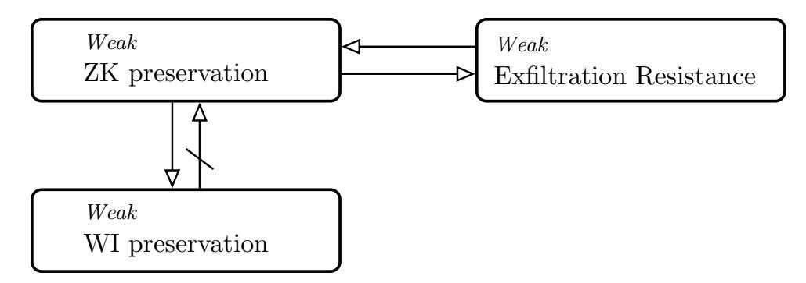
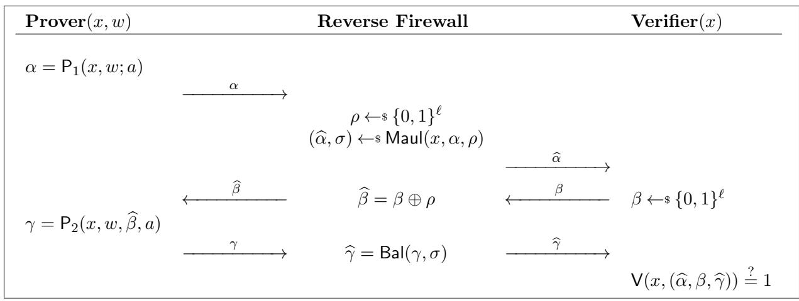
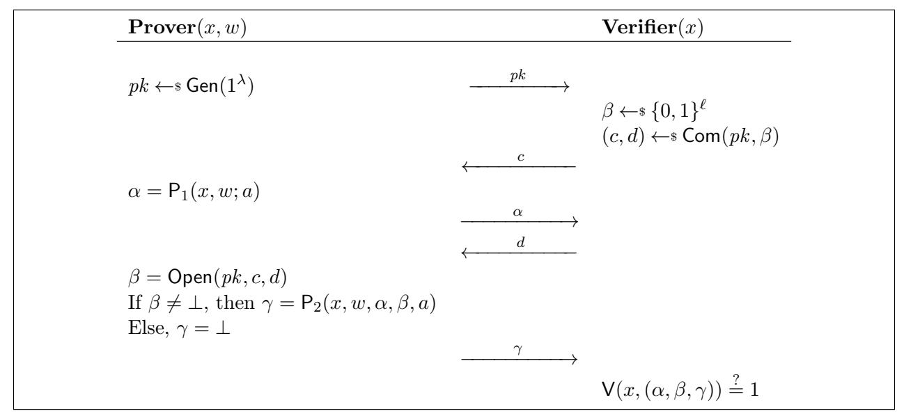
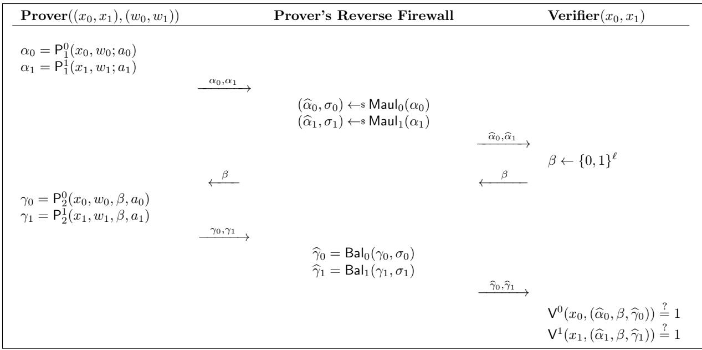
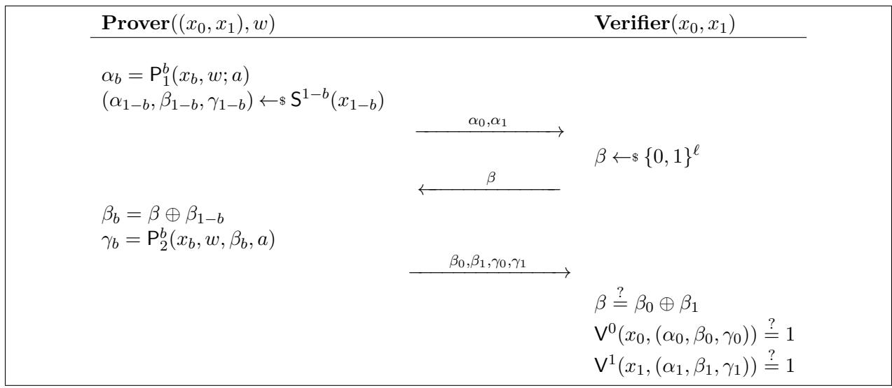
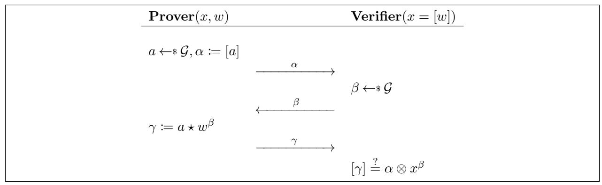

An abridged version of this paper appears in the proceedings of the 47th International Colloquium on Automata, Languages and Programming (ICALP 2020). This is the full version.

# Cryptographic Reverse Firewalls for Interactive Proof Systems

Chaya Ganesh1 , Bernardo Magri∗2 , and Daniele Venturi3

1

Indian Institute of Science, Bangalore, India chaya@iisc.ac.in 2Aarhus University, Aarhus, Denmark magri@cs.au.dk 3Sapienza University, Rome, Italy venturi@di.uniroma1.it

#### Abstract

We study interactive proof systems (IPSes) in a strong adversarial setting where the machines of honest parties might be corrupted and under control of the adversary. Our aim is to answer the following, seemingly paradoxical, questions:

- Can Peggy convince Vic of the veracity of an NP statement, without leaking any information about the witness even in case Vic is malicious and Peggy does not trust her computer?
- Can we avoid that Peggy fools Vic into accepting false statements, even if Peggy is malicious and Vic does not trust her computer?

At EUROCRYPT 2015, Mironov and Stephens-Davidowitz introduced cryptographic reverse firewalls (RFs) as an attractive approach to tackling such questions. Intuitively, a RF for Peggy/Vic is an external party that sits between Peggy/Vic and the outside world and whose scope is to sanitize Peggy's/Vic's incoming and outgoing messages in the face of subversion of her/his computer, e.g. in order to destroy subliminal channels.

In this paper, we put forward several natural security properties for RFs in the concrete setting of IPSes. As our main contribution, we construct efficient RFs for different IPSes derived from a large class of Sigma protocols that we call malleable. A nice feature of our design is that it is completely transparent, in the sense that our RFs can be directly applied to already deployed IPSes, without the need to re-implement them.

Keywords: subversion; algorithm-substitution attacks; cryptographic reverse firewalls; interactive proofs; zero knowledge; witness indistinguishability.

∗The author was supported by the Concordium Blockchain Research Center, Aarhus University, Denmark.

# Contents

| 1 |     | Introduction                                                                        | 1        |  |  |  |  |
|---|-----|-------------------------------------------------------------------------------------|----------|--|--|--|--|
|   | 1.1 | Our Question                                                                     | 2        |  |  |  |  |
|   | 1.2 | Our Contributions                                                                | 3        |  |  |  |  |
|   | 1.3 | Comparison with Mironov and Stephens-Davidowitz                                  | 6        |  |  |  |  |
|   | 1.4 | Related Works                                                                    | 7        |  |  |  |  |
| 2 |     | Preliminaries                                                                       | 8        |  |  |  |  |
|   | 2.1 | Notation                                                                         | 8        |  |  |  |  |
|   | 2.2 | Interactive Proofs                                                               | 8        |  |  |  |  |
|   | 2.3 | Commitment Schemes                                                               | 10       |  |  |  |  |
| 3 |     | Reverse Firewalls for Interactive Proofs                                            |          |  |  |  |  |
|   | 3.1 | Subversion of the Prover                                                         | 11 11 |  |  |  |  |
|   | 3.2 | Subversion of the Verifier                                                       | 13       |  |  |  |  |
|   | 3.3 | Possibilities and Impossibilities                                                | 13       |  |  |  |  |
|   |     | 3.3.1 Relating Zero Knowledge Preservation and Exfiltration Resistance        | 13       |  |  |  |  |
|   |     | 3.3.2 Relating Zero Knowledge Preservation and WI Preservation                | 16       |  |  |  |  |
|   |     | 3.3.3 Impossibility of Strong Exfiltration Resistance and Strong WI Preservation | 16       |  |  |  |  |
|   |     | 3.3.4 Impossibility of Strong Zero Knowledge Preservation                     | 17       |  |  |  |  |
|   |     | 3.3.5 Impossibility of Tampering with the Verifier                            | 17       |  |  |  |  |
| 4 |     | Firewall Constructions from Malleable Sigma Protocols                               | 17       |  |  |  |  |
|   | 4.1 | Malleable Sigma Protocols                                                        | 18       |  |  |  |  |
|   | 4.2 | HVZK Preservation                                                                | 19       |  |  |  |  |
|   | 4.3 | Soundness Preservation                                                           | 20       |  |  |  |  |
|   | 4.4 | Zero Knowledge Preservation                                                      | 22       |  |  |  |  |
| 5 |     | Firewalls for Proving Compound Statements                                           | 28       |  |  |  |  |
|   | 5.1 | AND Composition                                                                  | 28       |  |  |  |  |
|   | 5.2 | OR Composition                                                                   | 30       |  |  |  |  |
| 6 |     | Concrete Instantiations                                                             | 34       |  |  |  |  |
|   | 6.1 | Maurer's Unifying (Pre-image) Protocol                                           | 34       |  |  |  |  |
|   | 6.2 | Examples of Malleable Sigma Protocols                                            | 36       |  |  |  |  |
|   |     | 6.2.1 Proving Knowledge of a Discrete Logarithm                               | 36       |  |  |  |  |
|   |     | 6.2.2 Proving Knowledge of a DDH Tuple                                        | 36       |  |  |  |  |
|   |     | 6.2.3 Proving Knowledge of a Representation                                   | 36       |  |  |  |  |
|   |     | 6.2.4 Proving Knowledge of a Plaintext                                        | 37       |  |  |  |  |
|   | 6.3 | Instantiation of Key-Malleable Commitments                                       | 37       |  |  |  |  |
| 7 |     | Conclusion                                                                          | 38       |  |  |  |  |

# 1 Introduction

An interactive proof system (IPS) allows a prover to convince a verifier about the veracity of a public statement x ∈ L, where L is an NP language. The prover is facilitated by possessing a witness w to the fact that, indeed, x ∈ L, and the interaction with the verifier may consist of several rounds of communication, at the end of which the verifier outputs a verdict on the membership of x in L. In order to be useful, an IPS should satisfy the following properties:

- Completeness: If x ∈ L, the honest prover (almost) always convinces the honest verifier.
- Soundness: If x 6∈ L, no (computationally bounded) malicious prover can convince the honest verifier that x ∈ L. An even stronger guarantee, known as knowledge soundness [\[BG93\]](#page-40-0), is to require that the only way a prover can convince the honest verifier that x ∈ L is to "know" a valid witness w corresponding to x. Such proofs[1](#page-2-1) are called proofs of knowledge (PoKs).
- Zero Knowledge (ZK): A valid proof reveals nothing beyond the fact that x ∈ L, and thus in particular it leaks no information about the witness w, even in case the proof is conducted in the presence of a (computationally bounded) malicious verifier [\[GMR89\]](#page-42-0). A weaker guarantee, known as witness indistinguishability (WI) [\[FS90\]](#page-42-1), is that, whenever there are multiple witnesses attesting that x ∈ L, no (computationally bounded) malicious verifier can distinguish whether a proof is conducted using either of two witnesses.

One of the motivations for studying IPSes with the above properties is that they are ubiquitous in cryptography, with applications ranging from identification protocols [\[FS90\]](#page-42-1), blind digital signatures [\[OO90\]](#page-43-0), and electronic voting [\[CGS97\]](#page-40-1), to general-purpose maliciously secure multi-party computation [\[GM82\]](#page-42-2).

Sigma protocols. While WI/ZK PoKs exist for all of NP, based on minimal cryptographic assumptions [\[FLS90,](#page-41-0) [GMW91,](#page-42-3) [GK96\]](#page-42-4), efficiency is a different story. Fortunately, it is possible to design practical interactive proofs for specific languages, typically in the form of so-called Sigma protocols. Briefly, a Sigma protocol is a special type of IPS consisting of just three rounds, where the prover sends a first message α (the commitment), the verifier sends a random string β (the challenge), and finally the prover forwards a last message γ (the response). Sigma protocols satisfy two main properties: The first one, known as special soundness, is a strong form of knowledge soundness; the second one, known as honest-verifier zero knowledge (HVZK), is a weak form of the zero knowledge property that only holds against honest-but-curious verifiers.

The applications of Sigma protocols to cryptographic constructions are countless (see, e.g., [\[FS87,](#page-42-5) [DG03,](#page-41-1) [SV12,](#page-44-0) [FKMV12,](#page-41-2) [ORV14\]](#page-43-1)). These results are perhaps surprising, as Sigma protocols only satisfy HVZK and thus guarantee no security in the presence of malicious verifiers. In some cases, the solution to this apparent paradox is due to a beautiful technique put forward by Cramer, Damg˚ard, and Schoenmakers [\[CDS94\]](#page-40-2), which allows to add WI to any Sigma protocol. Moreover, it is relatively easy to transform any Sigma protocol into an interactive ZK PoK at the cost of adding a single round of interaction [\[GK96\]](#page-42-4).

1Sometimes, the term "proof" is used to refer to statistically sound IPSes, while computationally sound IPSes are typically called "arguments". We will ignore this distinction.

## 1.1 Our Question

The standard definitions of security for IPSes (implicitly) rely on the assumption that honest parties can fully trust their machines. In practice, however, such an assumption may just be too optimistic, as witnessed by the revelations of Edward Snowden about subversion of cryptographic standards [\[PLS13,](#page-43-2) [BBG13\]](#page-40-3), and in light of the numerous (seemingly accidental) bugs in widespread pieces of cryptographic software [\[LHA](#page-43-3)+12, [CVE14,](#page-41-3) [Jun15\]](#page-42-6).

Motivated by the above incidents, we ask the following question which constitutes the main source of inspiration for this work:

Can we design practical interactive proofs that remain secure even if the machines of the honest parties running them have been tampered with?

In order to see why the above question is well motivated and not trivial, let us analyze the dramatic consequences of subverting the prover of ZK IPSes. Clearly, the problem of subversion-resistant interactive zero knowledge is just impossible in its utmost generality, as a subverted prover could just reveal the witness to the verifier. However, one may argue that this kind of attacks are easily detectable, and thus can be avoided.

The problem becomes more interesting if we restrict the subversion to be undetectable, as suggested by Bellare, Paterson, and Rogaway [\[BPR14\]](#page-40-4) in their seminal work on subversion of symmetric encryption, where the authors show how to subvert any sufficiently randomized cipher in an undetectable manner, using rejection sampling. A moment of reflection shows that their attack can be adapted to the case of IPSes.[2](#page-3-1) The solution proposed by [\[BPR14\]](#page-40-4) is to rely on deterministic symmetric encryption. Unfortunately, this approach is not viable for the case of IPSes, as it is well-known that interactive proofs with deterministic provers can be zero knowledge only for trivial languages [\[Gol01,](#page-42-7) §4.5].

Reverse firewalls. The above described undetectable attacks show that the problem of designing IPSes that remain secure even when run on untrusted machines is simply impossible if we are not willing to make any further assumption. In this paper, we study how to tackle subversion attacks against interactive proofs in the framework of "cryptographic reverse firewalls (RFs)" introduced by Mironov and Stephens-Davidowitz [\[MS15\]](#page-43-4). In such a setting, both the prover and the verifier are equipped with their own RF, whose scope is solely to sanitize the parties' incoming and outgoing messages in the face of subversion.

Importantly, neither the prover nor the verifier put any trust in the RF, meaning that they are not allowed to share secrets with the firewall itself. The hope is that an uncorrupted[3](#page-3-2) RF can provide meaningful security guarantees even in case the honest prover's and/or verifier's machines have been tampered with. Note that a RF can never "create security", as it does not even know the inputs to the protocol, but at best can preserve the security guarantees satisfied by the initial IPS. At the same time, the RF should not ruin the functionality of the underlying IPS, in the sense that the sanitized IPS should still work in case no subversion takes place.

2 In particular, a subverted prover with an hardwired secret key k for a pseudorandom function Fk(·) could sample the random coins r (i) needed to generate the honest prover's message m(i) (for round i ∈ N) multiple times, until Fk(m(i) ) leaks one bit of the witness. This attack works provided that at least one of the prover's messages has high min-entropy.

3Clearly, if both the machine of the honest party and the firewall are corrupted, there is no hope for security. On the other hand, in case the machine is honest and the firewall is corrupt, the underlying protocol is still secure, since we can simply think of the RF as being part of the adversary [\[DMS16\]](#page-41-4).

Mironov and Stephens-Davidowitz construct general-purpose RFs that can be used in order to preserve both functionality and security of any two-party protocol. It is important to note that since ZK/WI IPSes are a special case of secure two-party computation, their RF constructions already seem to solve our problem.[4](#page-4-1) However, the solutions in [\[MS15\]](#page-43-4) are not practical. In particular, one of their RFs increases the round complexity of the initial IPS, and, more importantly, it requires to carry out the underlying IPS in the encrypted domain, thus requiring to completely change the original protocol. In contrast, we seek constructions of RFs that can be applied directly to existing IPSes, without adding any overhead, and without the need to re-implement them.

## 1.2 Our Contributions

As our first contribution, we put forward several natural properties that a RF for an IPS might satisfy. In particular, in §[3,](#page-12-0) we formalize the following notions.

- Completeness preservation: The sanitized IPS (i.e., the IPS obtained by sanitizing both the honest prover's and the honest verifier's messages) still satisfies completeness.
- Strong soundness preservation: Whenever x 6∈ L, no malicious prover can convince the verifier that x ∈ L, even if the verifier's implementation has been arbitrarily subverted.
- Strong ZK preservation: A valid proof reveals nothing beyond the fact that x ∈ L, even in case the proof is conducted in the presence of a malicious verifier talking to a prover whose implementation has been arbitrarily subverted.
- Strong WI preservation: Whenever there are multiple witnesses attesting that x ∈ L, no malicious verifier talking to a prover whose implementation has been arbitrarily subverted can distinguish whether a proof is conducted using either of two witnesses.
- Strong exfiltration resistance for the prover (resp. verifier): Transcripts produced by running the sanitized IPS in the presence of a malicious verifier (resp. prover) talking to a prover (resp. verifier) whose implementation has been arbitrarily subverted are indistinguishable to transcripts produced by running the sanitized IPS in the presence of a malicious verifier (resp. prover) talking to the honest prover (resp. verifier).

For each of the above properties (except for completeness), we also consider a weak variant which only holds w.r.t. functionality-maintaining provers/verifiers. Intuitively, a prover is functionality maintaining if, upon input a valid statement/witness pair, it still convinces the honest verifier with overwhelming probability. Similarly, a verifier is functionality maintaining if, upon input a valid statement, it still accepts with overwhelming probability in a protocol run with the honest prover.

What is possible and what is impossible. A moment of reflection shows that soundness preservation is impossible to achieve. In fact, an arbitrarily subverted verifier might always[5](#page-4-2) output 1, thus automatically accepting both true and false statements. Such a verifier is still functionality

4At least to some extent, since, strictly speaking, their results for IPSes are incomparable to ours. We refer the reader to §[1.3](#page-7-0) for more details.

5 If one insists on undetectability, the subverted verifier may output 1 upon some hard-wired, randomly chosen, false statement x 6∈ L.

maintaining,6 and thus this simple attack even rules out *weak* soundness preservation. One way to circumvent this impossibility (which we will investigate in this paper) would be to only consider *partial subversion*, *i.e.* split the verifier into different components, one for computing the next messages in the protocol, and another for determining the final verdict on the veracity of a statement; hence, assuming the latter component to be untamperable.

Turning to subversion of the prover, consider the subverted prover that always outputs the all-zero string. The soundness property of the underlying IPS implies that, for any RF and for any false statement  $x \notin \mathcal{L}$ , a sanitized transcript in this case can never be accepting. Moreover, assuming the language  $\mathcal{L}$  is non-trivial, the latter holds true even in case x is a true statement, which in turn rules out strong exfiltration resistance. For similar reasons, strong ZK/WI preservation are also impossible to achieve.

Hence, in what follows we turn our attention to the task of building RFs protecting the honest prover from functionality-maintaining subversion and the honest verifier from partial (yet arbitrary) subversion. As our first contribution, we provide a complete picture of the relationships between different notions of subversion security for IPSes using RFs. In particular, we establish that weak exfiltration resistance and weak ZK preservation are equivalent, whereas weak WI preservation is strictly weaker than weak ZK preservation (see Fig. 1 for a pictorial representation). As our second contribution, in §4 and §5, we identify a class of Sigma protocols which admit simple, and very efficient, RFs for both the prover and the verifier.

**HVZK preservation.** The main idea, in case the prover is subverted, is to use the RF to rerandomize the prover's messages in order to destroy any potential subliminal channel signaling information about the witness. The difficulty, though, is that such re-randomization must be carried out without knowing a witness, and while at the same time preserving the completeness property of the underlying IPS. We call Sigma protocols for which this is possible *malleable*.

As we show in §6.1, many natural Sigma protocols are already malleable. In particular, the latter holds true for Maurer's unifying protocol [Mau09], which includes the protocols by Fiat-Shamir [FS87], Guillou-Quisquater [GQ88], Schnorr [Sch90], Okamoto [Oka93], and many others as special cases. For the sake of concreteness, let us describe our firewall applied to the classical Sigma protocol for proving knowledge of a discrete logarithm [Sch90]. Here, the statement consists of a description of a cyclic group  $\mathbb G$  with generator g and prime order g, together with a value g such that g gw for some g for some g and prime order g, where g is a random group element g and g from a possibly subverted implementation of the prover as follows:

$$\widehat{\alpha} = \alpha \cdot g^{\sigma} \qquad \widehat{\gamma} = \gamma + \sigma,$$

for random  $\sigma \in \mathbb{Z}_q$ . Note that  $g^{\widehat{\gamma}} = g^a \cdot g^{\sigma} \cdot x^{-\beta} = \widehat{\alpha} \cdot x^{-\beta}$ , and thus the RF preserves completeness. We now sketch the proof of weak HVZK preservation. Observe that for any  $\widetilde{\alpha} = g^{\widetilde{\alpha}}$  sent by a functionality-maintaining subverted prover, the distribution of  $\widehat{\alpha} = g^{\widetilde{\alpha}+\sigma}$  is uniform over  $\mathbb{G}$  and independent of  $\widetilde{\alpha}, \widetilde{\alpha}$ , and in fact it is identical to the distribution of  $\alpha$  in an honest run of the original Sigma protocol (without the firewall). As for  $\widehat{\gamma}$ , note that if there would be two possible values  $\gamma, \gamma'$  which make both  $\tau = (\alpha, \beta, \gamma)$  and  $\tau' = (\alpha, \beta, \gamma')$  valid transcripts, the choice of which

&lt;sup>6The latter is because completeness is a guarantee that only concerns true statements.

response to pick could be used by a functionality-maintaining subverted prover as a subliminal channel signaling information about the witness. Hence, we exploit the fact that for any prefix  $\alpha, \beta$ , there exists a unique7 response  $\gamma$  such that the verifier accepts upon input x and  $(\alpha, \beta, \gamma)$ .

It follows that the distribution of  $\widehat{\gamma}$  is identical to that of  $\gamma$  in an honest run of the original Sigma protocol (without the firewall). Putting it all together, we have shown that the distribution of a sanitized transcript  $\widehat{\tau} = (\widehat{\alpha}, \beta, \widehat{\gamma})$  is identical to the distribution of an honest transcript  $\tau = (\alpha, \beta, \gamma)$ . Thus, weak HVZK preservation follows by the fact that Schnorr's Sigma protocol is HVZK.

**Soundness preservation.** In case the verifier is (partially) subverted, we must additionally randomize the verifier's message in such a way that the challenge remains unpredictable for the prover. The latter requires a slightly more powerful form of malleability, which we refer to as instance-dependent malleability, where the commitment  $\alpha$  is mauled to  $\widehat{\alpha}$  given the statement x and a randomizer  $\rho$ , so that the challenge  $\beta$  can later be randomized to  $\widehat{\beta} = \beta \oplus \rho$  in such a way that we can still balance the response  $\gamma$  to some  $\widehat{\gamma}$  which makes  $(\widehat{\alpha}, \widehat{\beta}, \widehat{\gamma})$  accepting. Luckily, as we explain in §6.1, Maurer's unifying protocol can easily be seen to satisfy this form of malleability as well. In particular, in the case of Schnorr's Sigma protocol, we can let  $\widehat{\alpha} = \alpha \cdot g^{\sigma} \cdot x^{-\rho}$  and  $\widehat{\gamma} = \gamma + \sigma$  for randomly chosen  $\sigma, \rho \in \mathbb{Z}_q$ , so long as we randomize the challenge  $\beta$  to  $\widehat{\beta} = \beta + \rho$ .

In order to prove strong soundness8 preservation against partial subversion of the verifier, we consider a reduction to the soundness property of the underlying Sigma protocol (which in turn follows by special soundness). The main idea is that any malicious prover able to prove false statements when talking to a partially subverted verifier must do so even if we replace the (possibly malicious) challenge with a uniformly random one, which intuitively allows the reduction to the standard soundness property to go through.

**ZK preservation.** As Sigma protocols are not in general zero knowledge, there is no hope to prove that the above firewalls weakly preserve ZK. However, a standard trick allows to transform any Sigma protocol into a 5-round IPS satisfying ZK. The idea is to let the prover send the public key pk of a commitment scheme during the first round. Then, during the second round, the verifier forwards to the prover a commitment c to the challenge  $\beta$ . Finally, the Sigma protocol is executed as before with the difference that the verifier also needs to open the commitment, with the prover aborting if the opening is invalid.

In order to build RFs for this IPS, we need to sanitize the additional messages from the (subverted, but functionality-maintaining) prover and from the (partially subverted, yet not necessarily functionality-maintaining) verifier. We do so by relying on a special type of key-malleable commitment, which intuitively allows to maul any public key pk into a uniformly random public key pk, in such a way that, given a commitment c with opening d w.r.t. pk, it is possible to map (c,d) into a commitment c with opening d w.r.t. d without changing the message inside the commitment. Moreover, the distribution of mauled public keys and commitments is identical, respectively, to that of honestly computed public keys and commitments. The above suffices to build a RF for the

&lt;sup>7This holds, in particular, for Schnorr's protocol, and, as we argue in §6.2, such a mild additional requirement is satisfied by many other Sigma protocols.

&lt;sup>8One could also consider special soundness preservation. However, since the definition of special soundness only involves the sub-routine of the verifier which checks validity of the final transcript, special soundness preservation is actually trivial to achieve in the setting of partial subversion. See §4.3 for a more in-depth discussion.

 $^{9}$ The other messages are sanitized as before, *i.e.* we still start with a malleable Sigma protocol.

prover; the RF for the verifier needs to additionally randomize the message inside the commitment (i.e. the challenge), which requires what we call a key-malleable randomizable commitment.

As we show, the above ideas allow us to build RFs that strongly preserve soundness against partial subversion of the verifier and that are weakly exfiltration resistant for the prover (and thus also weakly preserve ZK). Moreover, in §[6.3,](#page-38-1) we prove that the standard Pedersen's commitment [\[Ped92\]](#page-43-7) is easily seen to be both key-malleable and randomizable, thus yielding a concrete instantiation under the Discrete Logarithm assumption.

Compound statements and WI preservation. Finally, in §[5,](#page-29-0) we build RFs for proving compound statements using Sigma protocols. Given two Sigma protocols Σ0 and Σ1 for NP languages L0 and L1, it is easy to obtain a Sigma protocol ΣAND for the NP language LAND = {(x0, x1) : x0 ∈ L0 ∧x1 ∈ L1} by simply running Σ0 and Σ1 in parallel, with the verifier sending a single challenge.

In a similar vein, the OR technique by Cramer, Damg˚ard, and Schoenmakers [\[CDS94\]](#page-40-2) allows to obtain a Sigma protocol ΣOR for the NP language LOR = {(x0, x1) : x0 ∈ L0 ∨x1 ∈ L1}. Importantly, if Σ0 and Σ1 are both perfect HVZK, ΣOR satisfies perfect WI. On the other hand, Garay et al. [\[GMY06\]](#page-42-9) showed that if Σ0 and Σ1 are computational HVZK, ΣOR satisfies computational WI, although the latter holds only in case both statements x0, x1 in the definition of language LOR are true (but the prover knows either a witness for x0 or for x1).

So long as Σ0 and Σ1 are malleable, it is easy to build RFs for ΣAND and ΣOR using our techniques. The RF for the prover of ΣAND weakly preserves HVZK, whereas the RF for the prover of ΣOR weakly preserves both HVZK and WI. The RFs for the verifier of ΣAND and ΣOR strongly preserve soundness against partial subversion of the verifier.

# 1.3 Comparison with Mironov and Stephens-Davidowitz

In their original paper, Mironov and Stephens-Davidowitz [\[MS15\]](#page-43-4) build RFs for arbitrary two-party protocols. While their results are related to ours, since IPSes are just a special case of two-party computation, there are some crucial differences which we highlight below.

Their first RF construction sanitizes a specific combination of re-randomizable garbled circuits and oblivious transfer, for obtaining general-purpose private function evaluation. Their second RF construction sanitizes any two-party protocol, at the price of encrypting the full transcript under public keys that are broadcast at the beginning of the protocol. Both constructions can be instantiated based on (variants of) the DDH assumption. When cast to IPSes, their results yield:

- (i) A RF for the prover that weakly preserves ZK. This is comparable to our RF achieving weak ZK preservation using malleable Sigma protocols and key-malleable commitments. However, our constructions have the advantage that we do not need to change the initial IPS, and thus our RFs can be applied directly to already existing implementations in a fully transparent manner (and without introducing any overhead).
- (ii) A RF for the prover satisfying a property called strong exfiltration resistance against an eavesdropper, which means that exfiltration resistance holds w.r.t. an arbitrarily subverted prover talking to the honest verifier. Note that the latter does not contradict our impossibility result ruling out strong ZK preservation, as our attacks crucially rely on the fact that the distinguisher can (passively) corrupt the verifier.

(iii) A RF for the verifier satisfying both strong exfiltration resistance and the following weak guarantee: No malicious prover can find statements x0, x1 such that it can distinguish transcripts obtained by talking to an arbitrarily subverted verifier holding either input x0 or input x1. Note that the latter does not contradict our impossibility result that rules out weak soundness preservation, since none of the above guarantees imply soundness preservation.

We observe that the above results have at least one of the following drawbacks: (i) The RF is not transparent, i.e. it cannot be applied to the initial protocol as is; (ii) The resulting sanitized protocol is not efficient, as we first need to encode the function being computed as a circuit.

Our techniques allow to overcome these limitations in the concrete case of IPSes, as our RFs are both transparent (i.e. they can be applied directly to already deployed protocols) and efficient (i.e. the sanitized IPSes have exactly the same efficiency as the original, both in terms of round and communication complexity). We see this as the main novelty of our work.

# 1.4 Related Works

Besides the already mentioned constructions, RFs have also been realized in other settings including digital signatures [\[AMV15\]](#page-40-5), secure message transmission and key exchange [\[DMS16,](#page-41-4) [CMY](#page-40-6)+16], and oblivious transfer [\[MS15,](#page-43-4) [CMY](#page-40-6)+16].

Moreover, a few other lines of research recently[10](#page-8-1) emerged to tackle the challenge of protecting cryptographic algorithms against (different forms of) subversion. We review the main ones below.

Algorithm-substitution attacks. Bellare, Patterson, and Rogaway [\[BPR14\]](#page-40-4) studied subversion of symmetric encryption schemes in the form of algorithm-substitution attacks (ASAs). In particular, they show that undetectable subversion of the encryption algorithm is possible, and may lead to severe security breaches; moreover, they prove that deterministic, stateful, ciphers are secure against the same type of ASAs. Follow-up works improved the original paper in several aspects [\[DFP15,](#page-41-5) [BJK15\]](#page-40-7), and explored the power of ASAs in other contexts, e.g. digital signatures [\[AMV15\]](#page-40-5), secret sharing [\[GOR15\]](#page-42-10), and message authentication codes [\[AP19\]](#page-40-8).

Backdoors. Another form of subversion consists of all those attacks that surreptitiously generate public parameters (primes, curves, etc.) together with secret backdoors that allow to bypass security. The study of this type of subversion is motivated by the DUAL EC DRBG PRG incident.

A formal study of parameters subversion has been considered for several primitives, including pseudorandom generators [\[DGG](#page-41-6)+15, [DPSW16\]](#page-41-7), hash functions [\[FJM18\]](#page-41-8), non-interactive zero knowledge [\[BFS16\]](#page-40-9), and public-key encryption [\[ABK18\]](#page-39-1).

Cliptography. Russell et al. [\[RTYZ16\]](#page-43-8) (see also [\[RTYZ17,](#page-43-9) [AFMV19\]](#page-39-2)) consider a different approach to the immunization of cryptosystems against complete subversion (i.e., when all algorithms can be subverted by the attacker): offline/online black-box testing. This amounts to introducing an external entity, called the watchdog, whose goal is to test, either in an online or in an offline fashion, whether a given cryptographic implementation is compliant with its specification.

10All these research directions have their roots in the seminal works of Young and Yung [\[YY97\]](#page-44-2) and Simmons [\[Sim83\]](#page-44-3), in the settings of kleptography and subliminal channels.

Hence, a cryptosystem is deemed secure against complete subversion if there exists a universal watchdog such that, for every attacker subverting all algorithms, either the watchdog detects subversion with high probability, or the cryptoscheme remains secure even when using its subverted implementation.

**Self-guarding.** Yet another approach towards thwarting subversion is that of self-guarding [FM18]. The idea here is to assume a trusted initialization phase in which the honest parties possess a genuine implementation of the cryptosystem, before subversion takes place. This phase is used in order to generate samples that will be exploited later, together with additional simple operations that need to be implemented from scratch, to prevent leakage in the face of subversion attacks.

### 2 Preliminaries

### 2.1 Notation

We write [n] to represent the set of numbers  $\{1, 2, \ldots, n\}$ . For a string x, we denote its length by |x|; if  $\mathcal{X}$  is a set,  $|\mathcal{X}|$  represents the number of elements in  $\mathcal{X}$ . When x is chosen randomly in  $\mathcal{X}$ , we write  $x \leftarrow \mathcal{X}$ . When A is a randomized algorithm, we write  $y \leftarrow A(x)$  to denote a run of A on input x, implicit random coins x, and output y; the value y is a random variable, and A(x; r) denotes a run of A on input x and randomness x. An algorithm A is probabilistic polynomial-time (PPT) if A is randomized and for any input  $x, x \in \{0, 1\}^*$  the computation of A(x; x) terminates in a polynomial number of steps (in the size of the input).

We use  $\lambda \in \mathbb{N}$  to denote the security parameter, and implicitly assume that the security parameter is given as input (in unary) to all algorithms. A function p is a polynomial, denoted  $p(\lambda) \in poly(\lambda)$ , if  $p(\lambda) \in O(\lambda^c)$  for some constant c > 0. A function  $\nu : \mathbb{N} \to [0, 1]$  is negligible in the security parameter (or simply negligible) if it vanishes faster than the inverse of any polynomial in  $\lambda$ , i.e.  $\varepsilon(\lambda) \in O(1/p(\lambda))$  for all positive polynomials  $p(\lambda)$ . We sometimes write  $\nu(\lambda) \in negl(\lambda)$  to denote that  $\nu(\lambda)$  is negligible.

For a random variable  $\mathbf{X}$ , we write  $\mathbb{P}\left[\mathbf{X}=x\right]$  for the probability that  $\mathbf{X}$  takes on a particular value  $x \in \mathcal{X}$  (with  $\mathcal{X}$  being the set where  $\mathbf{X}$  is defined). A probability ensemble  $\mathbf{X}=\{\mathbf{X}(\lambda,\sigma)\}_{\lambda\in\mathbb{N},\sigma\in\{0,1\}^*}$  is an infinite sequence of random variables indexed by security parameter  $\lambda\in\mathbb{N}$  and a string  $\sigma\in\{0,1\}^*$ . In the context of zero-knowledge proofs, the string  $\sigma$  will represent the parties' inputs and the attacker's auxiliary input. Given two ensembles  $\mathbf{X}=\{\mathbf{X}(\lambda,\sigma)\}_{\lambda\in\mathbb{N},\sigma\in\{0,1\}^*}$  and  $\mathbf{Y}=\{\mathbf{Y}(\lambda,\sigma)\}_{\lambda\in\mathbb{N},\sigma\in\{0,1\}^*}$ , we write  $\mathbf{X}\overset{c}{\approx}\mathbf{Y}$  (resp.  $\mathbf{X}\overset{s}{\approx}\mathbf{Y}$ ) to denote that  $\mathbf{X}$  and  $\mathbf{Y}$  are computationally (resp. statistically) close, *i.e.* for all PPT (resp. unbounded) non-uniform distinguishers  $\mathbf{D}$  there exists a negligible function  $\nu:\mathbb{N}\to[0,1]$  such that for all  $\sigma\in\{0,1\}^*$ :

$$|\mathbb{P}\left[\mathsf{D}(\mathbf{X}(\lambda,\sigma)) = 1\right] - \mathbb{P}\left[\mathsf{D}(\mathbf{Y}(\lambda,\sigma)) = 1\right]| \leq \nu(\lambda).$$

If the above distance is zero, we say that X and Y are identically distributed, denoted  $X \equiv Y$ .

#### 2.2 Interactive Proofs

Let  $\mathcal{R} \subset \{0,1\}^* \times \{0,1\}^*$  be an NP relation, with associated language  $\mathcal{L}$ , *i.e.*  $\mathcal{L} = \{x : \exists w \text{ s.t. } (x,w) \in \mathcal{R}\}$ . We often call x the statement or theorem, and w the corresponding witness.

An interactive proof system (IPS) for R is a pair of algorithms Π = (P, V) modeled as interactive PPT Turing machines. The prover algorithm P takes as input a statement x ∈ L and a corresponding witness w for x. The verifier algorithm V takes as input a statement x, and at the end of the protocol outputs a decision bit indicating whether it is convinced that x ∈ L or not. We write P(x, w) V(x) for the random variable corresponding to the view of V in a run of Π on common input x to P, V, and auxiliary input w to P; such view includes the protocol's transcript τ ∈ {0, 1} ∗ (consisting of all messages exchanged during the protocol) and the internal coin tosses of the verifier. We also write hP(x, w), V(x)i to denote the random variable corresponding to the decision bit of the verifier in such an execution.

The completeness property says that whenever x ∈ L the honest prover successfully convinces the honest verifier.

Definition 2.1 (Completeness). Let Π = (P, V) be an IPS for a relation R. We say that Π satisfies completeness if for all (x, w) ∈ R the following holds: P [hP(x, w), V(x)i = 1] = 1.

Soundness. The soundness property says that no malicious prover can convince the verifier to accept a false statement, i.e. a statement x 6∈ L. The formal definition appears below.

Definition 2.2 (Soundness). Let Π = (P, V) be an IPS for a relation R. We say that Π satisfies computational soundness if for all x 6∈ L and for all PPT malicious provers P ∗ there exists a negligible function ν : N → [0, 1] such that

$$\mathbb{P}\left[\langle \mathsf{P}^*(x), \mathsf{V}(x) \rangle = 1\right] \leq \nu(\lambda).$$

Zero knowledge. The zero knowledge property states that an interactive proof reveals nothing on the witness w, even in case the verifier is malicious. The formal definition appears below.

Definition 2.3 (Zero knowledge). Let Π = (P, V) be an IPS for a relation R. We say that Π satisfies computational (black-box, auxiliary-input) zero knowledge if there exists a PPT simulator S such that for all (non-uniform) PPT malicious verifiers V ∗ the following holds:

$$\left\{\mathsf{P}(x,w) \leftrightarrows \mathsf{V}^*(x,z)\right\}_{(x,w)\in\mathcal{R},z\in\{0,1\}^*} \stackrel{c}{\approx} \left\{\mathsf{S}^{\mathsf{V}^*(x,z,\cdot;\cdot)}(x)\right\}_{x\in\mathcal{L},z\in\{0,1\}^*},$$

where V ∗ (x, z, ·; ·) denotes the next-message function of the interactive Turing machine V ∗ when the common input x, and auxiliary input z are fixed.

Witness indistinguishability (WI). The WI property intuitively says that for any statement x ∈ L admitting multiple witnesses w, w0 , transcripts produced by having the honest prover use w and w 0 should be computationally indistinguishable, even in case the verifier is malicious. The formal definition appears below.

Definition 2.4 (Witness indistinguishability). Let Π = (P, V) be an IPS for a relation R. We say that Π satisfies computational (auxiliary-input) witness indistinguishability (WI) if for all (nonuniform) PPT malicious verifiers V ∗ the following holds:

$$\left\{\mathsf{P}(x,w) \leftrightarrows \mathsf{V}^*(x,z)\right\}_{(x,w) \in \mathcal{R}, z \in \{0,1\}^*} \overset{c}{\approx} \left\{\mathsf{P}(x,w') \leftrightarrows \mathsf{V}^*(x,z)\right\}_{(x,w') \in \mathcal{R}, z \in \{0,1\}^*}.$$

In case the above two ensembles are identically distributed, we say that Π satisfies perfect WI.

Sigma protocols. Sigma protocols are special IPSes Σ = (P, V) consisting of 3 rounds, where the prover speaks first. Furthermore, the verifier's message is a random string, i.e. Sigma protocols are public coin. We write α for the prover's first message, β ∈ {0, 1} ` for the verifier's message (a.k.a. challenge, of length ` ∈ N), and γ for the prover's last message (a.k.a. response). The resulting transcript τ = (α, β, γ) is said to be accepting w.r.t. statement x if V(x, τ ) outputs one.

Besides completeness, Sigma protocols typically satisfy two properties which we review below. The first property is a strong form of soundness (which, in fact, implies Sigma protocols are not only sound but even proofs of knowledge [\[HL10\]](#page-42-12)).

Definition 2.5 (Special soundness). Let Σ be a Sigma protocol for a relation R. We say that Σ satisfies special soundness if there exists a polynomial-time algorithm called the extractor which when given x and two transcripts τ = (α, β, γ) and τ 0 = (α, β0 , γ0 ) that are accepting for x, with β 6= β 0 , outputs a value w such that (x, w) ∈ R.

The second property is a weaker flavor of zero knowledge that is only guaranteed to hold against honest-but-curious verifiers.

Definition 2.6 (Special honest-verifier zero knowledge). Let Σ be a Sigma protocol for a relation R. We say that Σ satisfies computational (resp. perfect) special honest-verifier zero knowledge (SHVZK) if there exists a PPT simulator taking as input x ∈ L and β ∈ {0, 1} ` , and outputting an accepting transcript for x where β is the challenge, such that the following holds: For all `-bit strings β, the distribution of the output of the simulator on input (x, β) is computationally indistinguishable from (resp. identically distributed to) the distribution of an honest transcript obtained when V sends β as challenge and P runs on common input x and any private input w such that (x, w) ∈ R.

In case the simulator takes only the statement as input, we simply say that Σ satisfies perfect (resp. computational) HVZK.

## 2.3 Commitment Schemes

A commitment scheme over message space M is a tuple of polynomial-time algorithms Γ = (Gen, Com, Open) specified as follows. (i) The probabilistic algorithm Gen takes as input the security parameter, and outputs a public key pk. (ii) The probabilistic algorithm Com takes as input a public key pk and a message m ∈ M, and outputs a commitment c along with opening information d. (iii) The deterministic algorithm Open takes as input a public key, a commitment c, and opening d, and outputs a message m or ⊥. We say that Γ satisfies correctness if for all λ ∈ N, for all pk ∈ Gen(1λ ), and for all messages m ∈ M, it holds that Open(pk, Com(pk, m)) = m, with probability one over the randomness of Gen, Com.

A commitment scheme typically satisfies two properties, known as binding and hiding. The first property intuitively says that it be hard to produce a commitment along with two openings yielding different (valid) messages. The second property intuitively says that a commitment hides the message. We define these properties (as needed for our purposes) below.

Definition 2.7 (Binding). We say that a commitment scheme Γ = (Gen, Com, Open) is computationally binding if for all PPT adversaries A there exists a negligible function ν : N → [0, 1] such that the following holds:

$$\mathbb{P}\left[\bot \neq \mathsf{Open}(pk,c,d) \neq \mathsf{Open}(pk,c,d') \neq \bot : \begin{array}{c} pk \leftarrow \mathsf{s} \; \mathsf{Gen}(1^\lambda); \\ (c,d,d') \leftarrow \mathsf{s} \; \mathsf{A}(pk) \end{array}\right] \leq \nu(\lambda).$$

Definition 2.8 (Hiding). We say that a commitment scheme Γ = (Gen, Com, Open) is perfectly hiding if for all m0, m1 ∈ M the following holds:

$$\begin{split} \left\{ (pk,c): \;\; pk \leftarrow & \operatorname{\mathsf{S}} \mathsf{Gen}(1^\lambda); c \leftarrow & \operatorname{\mathsf{S}} \mathsf{Com}(pk,m_0) \right\}_{\lambda \in \mathbb{N}} \\ & \equiv \left\{ (pk,c): \;\; pk \leftarrow & \operatorname{\mathsf{S}} \mathsf{Gen}(1^\lambda); c \leftarrow & \operatorname{\mathsf{S}} \mathsf{Com}(pk,m_1) \right\}_{\lambda \in \mathbb{N}}. \end{split}$$

# 3 Reverse Firewalls for Interactive Proofs

In this section, we give security definitions for RFs applied to IPSes. Our definitions can be seen as special cases of the generic framework by Mironov and Stephens-Davidowitz [\[MS15\]](#page-43-4), who defined security of RFs for the more general case of arbitrary two-party protocols.

Let Π = (P, V) be an IPS for a relation R, as defined in §[2.2.](#page-9-2) A cryptographic reverse firewall is an external party W that can be attached either to the prover P or to the verifier V, whose scope is to sanitize incoming and outgoing messages in the face of parties' subversion. Importantly, the RF is allowed to keep its own state but cannot share state with any of the parties. Similarly to [\[MS15\]](#page-43-4), we model an interactive Turing machine M as a triple of algorithms M := (Mnxt, Mrec, Mout) specified as follows: (i) Algorithm Mnxt takes as input the current state and outputs the next message to be sent; (ii) Algorithm Mrec takes as input an incoming message, and updates the state; (iii) Algorithm Mout takes as input the final state at the completion of the protocol, and returns a bit.

Definition 3.1 (RF for IPSes). Let Π = (P, V) be an IPS for a relation R. A cryptographic reverse firewall (RF) for Π is a stateful algorithm W that takes as input a message, its state, and outputs a sanitized message, together with an updated state. For an interactive Turing machine M = (Mnxt, Mrec, Mout) ∈ {P, V}, and RF W, the sanitized machine W◦M := Mb = (Mb nxt, Mb rec, Mb out) is specified as follows:

$$\begin{split} \widehat{\mathsf{M}}_{\mathsf{nxt}}(\sigma) &:= \mathsf{W}(\mathsf{M}_{\mathsf{nxt}}(\sigma)) \\ \widehat{\mathsf{M}}_{\mathsf{rec}}(\sigma, m) &:= \mathsf{M}_{\mathsf{rec}}(\sigma, \mathsf{W}(m)) \\ \widehat{\mathsf{M}}_{\mathsf{out}}(\sigma) &:= \mathsf{M}_{\mathsf{out}}(\sigma). \end{split}$$

## 3.1 Subversion of the Prover

Here, we focus on the scenario where a malicious verifier V ∗ attacks either the ZK or the WI property of the underlying IPS while at the same time subverting the implementation of the prover's algorithm P. In this case, the RF is attached to the prover and sanitizes its incoming and outgoing messages. Of course, the most basic requirement is that the RF should not ruin the protocol's functionality in case both parties are honest. This requirement is captured by the definition below.

Definition 3.2 (Completeness-preserving RF w.r.t. prover). Let Π = (P, V) be an IPS for a relation R, satisfying completeness. We say that a RF W preserves completeness for the prover if for any polynomial k ∈ poly(λ) the sanitized IPS Π := ( b Wk ◦ P, V) satisfies completeness, where Wk means W ◦ · · · ◦ W (for k times).

Looking ahead, the reverse firewalls we will describe in §[4](#page-18-2) and §[5](#page-29-0) automatically satisfy the above flavor of completeness preservation. In particular, all of our firewalls are "transparent", in the sense that the behavior of W◦P is identical to that of an honestly implemented P, thus allowing multiple firewalls to be "stacked" as defined above.

As for security, we consider 3 different properties: zero-knowledge preservation, witness indistinguishability preservation, and exfiltration resistance, as formally defined below. We refer the reader to §[3.3.1](#page-14-2) for a complete picture of relationships among these definitions. Looking ahead, since as we will show it is impossible to obtain any of these notions against an arbitrarily subverted prover, we formalize a weaker form of subversion where a tampered prover still needs to preserve the completeness property of the underlying IPS.

Definition 3.3 (Functionality-maintaining prover). Let Π = (P, V) be an IPS for a relation R. We say that a subverted prover Pe is functionality maintaining for Π, if for all (x, w) ∈ R there exists a negligible function ν : N → [0, 1] such that the following holds:

$$\mathbb{P}\left[\langle \widetilde{\mathsf{P}}(x,w),\mathsf{V}(x)\rangle=0\right]\leq \nu(\lambda).$$

Zero knowledge preservation. A first natural requirement is to ask that a RF should preserve the zero-knowledge property of the underlying IPS, even when the prover's implementation has been tampered with. Depending on the subversion of the prover being functionality maintaining or not, we obtain two flavors of zero knowledge preservation.

Definition 3.4 (Zero knowledge preservation). Let Π = (P, V) be an IPS for a relation R, satisfying zero knowledge. We say that a RF W strongly (resp. weakly) preserves zero knowledge for the prover if for all PPT (resp. for all functionality-maintaining PPT) subverted provers Pe, the sanitized IPS Π := ( b W ◦ Pe, V) satisfies zero knowledge.

Witness indistinguishability preservation. Similarly to above, it is natural to consider RFs preserving the WI property of the underlying IPS, even when the prover's implementation has been tampered with.

Definition 3.5 (WI preservation). Let Π = (P, V) be an IPS for a relation R, satisfying WI. We say that a RF W strongly (resp. weakly) preserves WI for the prover if for all PPT (resp. all functionality-maintaining PPT) subverted provers Pe, the sanitized IPS Π := ( b W ◦ Pe, V) satisfies WI.

Exfiltration resistance for the prover. A different type of concern is exfiltration, in which a tampered prover's implementation attempts to leak secret information (e.g., about the witness) to the adversary. Following [\[MS15\]](#page-43-4), we model exfiltration resistance of a RF by asking that it be hard to distinguish transcripts obtained by running the honest prover composed with the firewall from transcripts obtained by running a subverted prover composed with the firewall, even in case the verifier is malicious.

Definition 3.6 (Exfiltration resistance w.r.t. prover). Let Π = (P, V) be an IPS for a relation R. We say that a RF W is strongly exfiltration resistant for the prover if for all (non-uniform) PPT malicious verifiers V ∗ , and for all PPT subverted provers Pe the following holds:

$$\begin{split} \left\{ \mathsf{W} \circ \mathsf{P}(x,w) \leftrightarrows \mathsf{V}^*(x,z) \right\}_{(x,w) \in \mathcal{R}, z \in \{0,1\}^*} \\ & \stackrel{c}{\approx} \left\{ \mathsf{W} \circ \widetilde{\mathsf{P}}(x,w) \leftrightarrows \mathsf{V}^*(x,z) \right\}_{(x,w) \in \mathcal{R}, z \in \{0,1\}^*}. \end{split}$$

Whenever the above condition holds only w.r.t. all functionality-maintaining PPT subverted provers Pe, we say that W is weakly exfiltration resistant for the prover.

## 3.2 Subversion of the Verifier

Here, we focus on the scenario where a malicious prover P ∗ attacks the soundness property of the underlying IPS while at the same time subverting the implementation of the verifier's algorithm V. In this case, the RF is attached to the verifier and can sanitize its incoming and outgoing messages. As before, the most basic requirement is that the RF should not ruin the protocol's functionality in case both parties are honest. This requirement is captured by the definition below.

Definition 3.7 (Completeness-preserving RF w.r.t. verifier). Let Π = (P, V) be an IPS for a relation R, satisfying completeness. We say that a RF W preserves completeness for the verifier if the sanitized IPS Π := ( b P, W ◦ V) satisfies completeness.

Soundness preservation. Assuming the underlying IPS satisfies soundness, we would like the RF to preserve this property even in case the verifier's implementation has been tampered with. Also in this case, we consider two flavors of soundness preservation depending on the subverted verifier being arbitrarily tampered or functionality maintaining.

Definition 3.8 (Functionality-maintaining verifier). Let Π = (P, V) be an IPS for a relation R. We say that a subverted verifier Ve is functionality maintaining for Π, if for all (x, w) ∈ R there exists a negligible function ν : N → [0, 1] such that the following holds:

$$\mathbb{P}\left[\langle \mathsf{P}(x,w), \widetilde{\mathsf{V}}(x)\rangle = 0\right] \leq \nu(\lambda).$$

Definition 3.9 (Soundness preservation). Let Π = (P, V) be an IPS for a relation R, satisfying soundness. We say that a RF W strongly (resp. weakly) preserves soundness for the verifier if for all PPT (resp. all functionality-maintaining PPT) subverted verifiers Ve, the sanitized IPS Π := b (P, W ◦ Ve) satisfies soundness.

Note that the verifier of an IPS has no input, and therefore there are no secrets to be leaked. Hence, we do not consider the notion of exfiltration resistance for RFs sanitizing a subverted verifier.

### 3.3 Possibilities and Impossibilities

We conclude this section by showing that some of the above defined notions are just impossible to achieve, and by establishing some useful relations among the notions which instead are possible. See Fig. [1](#page-15-0) for a pictorial representation of implications/separations.

### 3.3.1 Relating Zero Knowledge Preservation and Exfiltration Resistance

We now relate the notions of zero knowledge preservation and exfiltration resistance for the prover, both in their weak and strong flavors. We prove the following result.

Theorem 3.10. Let Π = (P, V) be an IPS for a relation R satisfying the zero knowledge property, and W be a RF for the prover. If W is strongly (resp. weakly) exfiltration resistant for the prover, then W strongly (resp. weakly) preserves zero knowledge for the prover.

Figure 1: Diagram of relations among the (possible) security definitions for the prover's RF. We use  $A \to B$  to denote an implication from notion A to notion B, and  $A \nrightarrow B$  to denote a separation from notion A to notion B.

*Proof.* Assume first that W is strongly exfiltration resistant for the prover. This means that no PPT distinguisher can tell apart sanitized transcripts generated by running the honest prover P or any PPT functionality-maintaining prover  $\widetilde{P}$ . More formally, for all PPT malicious verifiers  $V^*$ , and for all PPT subverted provers  $\widetilde{P}$ :

$$\left\{ \mathsf{W} \circ \mathsf{P}(x,w) \leftrightarrows \mathsf{V}^*(x,z) \right\}_{(x,w) \in \mathcal{R}, z \in \{0,1\}^*} \overset{c}{\approx} \left\{ \mathsf{W} \circ \widetilde{\mathsf{P}}(x,w) \leftrightarrows \mathsf{V}^*(x,z) \right\}_{(x,w) \in \mathcal{R}, z \in \{0,1\}^*}. \tag{1}$$

We now show that the fact that  $\Pi$  satisfies the zero knowledge property implies that the sanitized IPS  $\widehat{\Pi} = (W \circ P, V)$  satisfies zero knowledge too, *i.e.* there exists a PPT simulator  $\widehat{S}$  such that no PPT malicious verifier  $\widehat{V}^*$  can distinguish transcripts obtained interacting with the real prover from simulated transcripts (using  $\widehat{S}$ ). More formally, there exists a PPT simulator  $\widehat{S}$  such that for all PPT malicious verifiers  $\widehat{V}^*$ :

$$\left\{ \mathsf{W} \circ \mathsf{P}(x,w) \leftrightarrows \widehat{\mathsf{V}}^*(x,z) \right\}_{(x,w) \in \mathcal{R}, z \in \{0,1\}^*} \stackrel{c}{\approx} \left\{ \widehat{\mathsf{S}}^{\widehat{\mathsf{V}}^*(x,z,\cdot;\cdot)}(x) \right\}_{x \in \mathcal{L}, z \in \{0,1\}^*}. \tag{2}$$

The latter can be seen as follows. By contradiction, assume that there exists a PPT distinguisher D, a PPT malicious verifier  $\hat{V}^*$ , and some polynomial  $p(\lambda)$ , such that for all PPT simulators  $\hat{S}$  and an infinite sequence (x, w, z) with  $(x, w) \in \mathcal{R}$  and  $z \in \{0, 1\}^*$ :

$$\left|\mathbb{P}\left[\mathsf{D}(\mathsf{W}\circ\mathsf{P}(x,w)\leftrightarrows\widehat{\mathsf{V}}^*(x,z))=1\right]-\mathbb{P}\left[\mathsf{D}(\widehat{\mathsf{S}}^{\widehat{\mathsf{V}}^*(x,z,\cdot;\cdot)}(x))=1\right]\right|\geq 1/p(\lambda).$$

Consider the PPT malicious verifier  $\mathsf{V}_\mathsf{W}^*$  for  $\Pi$  that simply runs  $\widehat{\mathsf{V}}^*(x,z)$ , and additionally sanitizes every message from/to  $\mathsf{P}(x,w)$  using the RF W. Since  $\mathsf{V}_\mathsf{W}^*$  perfectly emulates the view of  $\widehat{\mathsf{V}}^*(x,z)$  in an interaction with  $\mathsf{W} \circ \mathsf{P}(x,w)$ , it follows that, for all PPT simulators  $\mathsf{S}$ :

$$\left| \mathbb{P}\left[ \mathsf{D}(\mathsf{P}(x,w) \leftrightarrows \mathsf{V}_{\mathsf{W}}^*(x,z)) = 1 \right] - \mathbb{P}\left[ \mathsf{D}(\mathsf{S}^{\mathsf{V}_{\mathsf{W}}^*(x,z,\cdot;\cdot)}(x)) = 1 \right] \right| \geq 1/p(\lambda),$$

which contradicts the zero knowledge property of  $\Pi$ .

As the simulator  $\hat{S}$  of Eq. (2) works for any malicious verifier, it works in particular for  $\hat{V}^* \equiv V^*$ . Thus, we can write:

$$\left\{ \mathsf{W} \circ \mathsf{P}(x, w) \leftrightarrows \mathsf{V}^*(x, z) \right\}_{(x, w) \in \mathcal{R}, z \in \{0, 1\}^*} \stackrel{c}{\approx} \left\{ \widehat{\mathsf{S}}^{\mathsf{V}^*(x, z, \cdot; \cdot)}(x) \right\}_{x \in \mathcal{L}, z \in \{0, 1\}^*}. \tag{3}$$

Combining Eq. (1) and Eq. (3), we have obtained that there exists a PPT simulator  $\widehat{S}$  such that for all PPT malicious verifiers  $V^*$ , and for all PPT subverted provers  $\widetilde{P}$  the following holds:

$$\left\{\mathsf{W}\circ\widetilde{\mathsf{P}}(x,w)\leftrightarrows\mathsf{V}^*(x,z)\right\}_{(x,w)\in\mathcal{R},z\in\{0,1\}^*}\overset{c}{\approx}\left\{\widehat{\mathsf{S}}^{\mathsf{V}^*(x,z,\cdot;\cdot)}(x)\right\}_{x\in\mathcal{L},z\in\{0,1\}^*},$$

and thus W strongly preserves zero knowledge for the prover.

To conclude the proof it suffices to note that if W is weakly exfiltration resistant for the prover, Eq. (1) only holds w.r.t. all PPT functionality-maintaining provers  $\widetilde{P}$ , and thus W only weakly preserves zero knowledge for the prover.

The above theorem intuitively says that strong/weak exfiltration resistance for the prover implies strong/weak zero knowledge preservation, so long as the underlying IPS  $\Pi$  satisfies the zero knowledge property. Note that the latter assumption is necessary, as if  $\Pi$  does not satisfy the zero knowledge property there is no hope to prove that W strongly/weakly preserves zero knowledge (since a RF can never create security).

Next, we show that strong zero knowledge preservation implies strong exfiltration resistance, and moreover the same implication holds for the weak flavor of these properties (i.e., w.r.t. functionality-maintaining subversion of the prover). We prove the following result.

**Theorem 3.11.** Let  $\Pi = (P, V)$  be an IPS for a relation  $\mathcal{R}$  satisfying the zero knowledge property, and W be a RF for the prover. If W strongly (resp. weakly) preserves zero knowledge for the prover, then W is also strong (resp. weak) exfiltration resistant for the prover.

*Proof.* Since W strongly preserves zero knowledge for the prover, there exists a PPT simulator S such that for all PPT malicious verifiers  $V^*$  and for all PPT subverted provers  $\widetilde{P}$ , the following holds:

$$\left\{ \mathsf{W} \circ \widetilde{\mathsf{P}}(x,w) \leftrightarrows \mathsf{V}^*(x,z) \right\}_{(x,w) \in \mathcal{R}, z \in \{0,1\}^*} \stackrel{c}{\approx} \left\{ \mathsf{S}^{\mathsf{V}^*(x,z,\cdot;\cdot)}(x) \right\}_{x \in \mathcal{L}, z \in \{0,1\}^*}. \tag{4}$$

As S works for an arbitrarily subverted  $\widetilde{P}$ , it works in particular for  $\widetilde{P} \equiv P$ . Thus, for all PPT malicious verifiers  $V^*$ , the following holds:

$$\left\{ \mathsf{W} \circ \mathsf{P}(x, w) \leftrightarrows \mathsf{V}^*(x, z) \right\}_{(x, w) \in \mathcal{R}, z \in \{0, 1\}^*} \stackrel{c}{\approx} \left\{ \mathsf{S}^{\mathsf{V}^*(x, z, \cdot; \cdot)}(x) \right\}_{x \in \mathcal{L}, z \in \{0, 1\}^*}. \tag{5}$$

Combining Eq. (4) and Eq. (5), we have obtained that for all PPT malicious verifiers  $V^*$ , and for all PPT subverted provers  $\widetilde{P}$ , the following holds:

$$\begin{split} \left\{ \mathsf{W} \circ \widetilde{\mathsf{P}}(x,w) \leftrightarrows \mathsf{V}^*(x,z) \right\}_{(x,w) \in \mathcal{R}, z \in \{0,1\}^*} \\ & \stackrel{c}{\approx} \left\{ \mathsf{W} \circ \mathsf{P}(x,w) \leftrightarrows \mathsf{V}^*(x,z) \right\}_{(x,w) \in \mathcal{R}, z \in \{0,1\}^*}, \end{split}$$

and thus W is strongly exfiltration resistant for the prover.

Note that in case W weakly preserves zero knowledge for the prover, Eq. (4) only holds w.r.t. all PPT functionality-maintaining subverted provers  $\widetilde{P}$ . However, the honest prover P is of course functionality maintaining, and thus Eq. (5) still holds. The theorem follows.

#### 3.3.2 Relating Zero Knowledge Preservation and WI Preservation

The following statements relate zero knowledge preservation and WI preservation. Their proof follows in a straightforward manner by the well-known fact that zero knowledge implies WI, but not viceversa.

**Proposition 3.12.** Let  $\Pi = (P, V)$  be an IPS for a relation  $\mathcal{R}$  satisfying the zero knowledge property, and W be a RF for the prover. If W strongly (resp. weakly) preserves zero knowledge for the prover, then W strongly (resp. weakly) preserves WI for the prover.

**Proposition 3.13.** There exists an IPS  $\overline{\Pi} = (\overline{P}, \overline{V})$  for a relation  $\mathcal{R}$  satisfying WI, for which any completeness-preserving RF strongly (resp. weakly) preserving WI for the prover does not strongly (resp. weakly) preserve zero knowledge for the prover.

### 3.3.3 Impossibility of Strong Exfiltration Resistance and Strong WI Preservation

The proposition below says that strong exfiltration resistance is impossible to achieve.

**Proposition 3.14.** No completeness-preserving RF for the prover P of an IPS  $\Pi = (P, V)$  for a relation  $\mathcal{R}$ , satisfying the soundness property, can be strongly exfiltration resistant for the prover (unless  $\mathcal{L} \in \mathcal{BPP}$ ).

Proof. We show that the statement holds even when taking  $V^* \equiv V$  (and thus ignoring the auxiliary input z). Let  $\widetilde{P}$  be the subverted prover that always sends the all-zero string (completely ignoring the inputs x, w); note that  $\widetilde{P}$  is not functionality maintaining. Fix now any efficient RF W for the prover, and any  $(x, w) \in \mathcal{R}$ . We claim that an interaction between  $W \circ \widetilde{P}(x, w)$  and V(x) can never result in an accepting transcript, except with negligible probability. To see this, first note that, for all  $x \notin \mathcal{L}$ , it must hold that  $W \circ \widetilde{P}$  produces an accepting transcript at most with negligible probability, as otherwise we can use  $W \circ \widetilde{P}$  to break the soundness property of  $\Pi$ . Since  $\mathcal{L} \notin \mathcal{BPP}$ , the latter indeed implies that an interaction between  $W \circ \widetilde{P}(x, w)$  and V(x) can result in an accepting transcript at most with negligible probability, as otherwise we can efficiently decide the language  $\mathcal{L}$  using  $W \circ \widetilde{P}$ .

Consider now the following PPT distinguisher D attacking strong exfiltration resistance: Upon input the verifier's view, return the same11 as  $V_{out}(x,\tau)$ , where  $\tau$  is the protocol's transcript. In case the transcript  $\tau$  is generated using  $W \circ P(x,w) \leftrightarrows V(x)$ , the fact that W preserves completeness implies that distinguisher D outputs 1 with overwhelming probability. On the other hand, in case the transcript  $\tau$  is generated using  $W \circ \widetilde{P}(x,w) \leftrightarrows V(x)$ , as explained above the distinguisher D outputs 1 with at most a negligible probability. Hence, there exists a negligible function  $\nu : \mathbb{N} \to [0,1]$  such that

$$\left|\mathbb{P}\left[\mathsf{D}(\mathsf{W}\circ\mathsf{P}(x,w)\leftrightarrows\mathsf{V}(x))=1\right]-\mathbb{P}\left[\mathsf{D}(\mathsf{W}\circ\widetilde{\mathsf{P}}(x,w)\leftrightarrows\mathsf{V}(x))=1\right]\right|\geq 1-\nu(\lambda),$$

which violates the definition of strong exfiltration resistance.

By a similar argument, 12 it is not hard to show that strong WI preservation is impossible to achieve too.

 $^{11}$ Recall that the verifier's view includes its random coins. Hence, the distinguisher can check the transcript even in case the IPS is secret coin.

&lt;sup>12Without loss of generality, assume that w and w' differ in the first bit, and consider the subverted prover  $\widetilde{\mathsf{P}}$  that always outputs the all-zero string when the witness starts with zero.

**Proposition 3.15.** No completeness-preserving RF for the prover P of an IPS  $\Pi = (P, V)$  for a relation R, satisfying the WI property, can strongly preserve WI for the prover (unless  $L \in \mathcal{BPP}$ ).

### 3.3.4 Impossibility of Strong Zero Knowledge Preservation

By Theorem 3.11, we know that strong zero knowledge preservation implies strong exfiltration resistance. However, Proposition 3.14 says that strong exfiltration resistance is impossible which implies that strong zero knowledge preservation must be impossible too. Thus:

**Corollary 3.16.** No completeness-preserving RF for the prover P of an IPS  $\Pi = (P, V)$  for a relation  $\mathcal{R}$ , satisfying the zero knowledge property, can strongly preserve zero knowledge for the prover (unless  $\mathcal{L} \in \mathcal{BPP}$ ).

### 3.3.5 Impossibility of Tampering with the Verifier

Consider the subverted verifier  $\widetilde{V} := (V_{nxt}, V_{rec}, \widetilde{V}_{out})$  such that  $\widetilde{V}_{out}$  always outputs 1 independently of the transcript that it takes as input. Clearly, such a subverted verifier accepts false statements and no RF can avoid this from happening, since, by definition, a RF only acts on outgoing and incoming messages, and thus it is not allowed to read or write on the internal state of the verifier. Moreover,  $\widetilde{V}$  is a functionality-maintaining verifier according to Definition 3.8, thus showing that no RF can weakly preserve soundness for the verifier.

One might hope that (weak) soundness preservation is still possible for more restricted forms of subversion, e.g. in case the implementation of algorithm  $V_{\text{out}}$  is trusted. Unfortunately, it is not hard to see that also a subversion of the form  $\widetilde{V} := (V_{\text{nxt}}, \widetilde{V}_{\text{rec}}, V_{\text{out}})$  is problematic, as an arbitrarily subverted algorithm  $\widetilde{V}_{\text{rec}}$  could simply ignore all the messages received from the prover, and change the final state to any value  $\widetilde{\sigma}$  such that  $V_{\text{out}}(\widetilde{\sigma}) = 1$  on any statement.13

Hence, the only hope we are left with is to consider partial subversion of the form  $\widetilde{V}:=(\widetilde{V}_{nxt},V_{rec},V_{out})$  in Definition 3.9. Accordingly, we will say that a RF W partially preserves soundness for the verifier. Note that partial subversion is still harmful, as it can be seen by looking at the subverted  $\widetilde{V}_{nxt}$  that generates its own randomness using a hard-wired seed for a PRG (which is also known to the prover). The latter essentially makes the verifier deterministic, which is already enough to break soundness of many IPSes of interest. 14

# 4 Firewall Constructions from Malleable Sigma Protocols

In this section, we construct RFs for a class of Sigma protocols enjoying a special malleability property (which we define). As we show later, many natural Sigma protocols are already malleable.

In what follows, given a Sigma protocol  $\Sigma = (\mathsf{P},\mathsf{V})$ , we denote by  $\mathsf{P}_1$  and  $\mathsf{P}_2$  the algorithms that compute, respectively, the first prover's message  $\alpha$ , and the last prover's message (response)  $\gamma$ . Recall that the challenge space is represented as  $\{0,1\}^\ell$ , so that there are  $2^\ell$  possible challenges, and write  $\mathsf{V}$  for the algorithm that the verifier runs upon statement x and transcript  $\tau$  to make its final decision. Let  $\mathcal{A}$  be the space of all possible prover's first messages; we assume that membership in  $\mathcal{A}$  can be tested efficiently, so that  $\mathsf{V}$  always outputs  $\bot$  whenever  $\alpha \notin \mathcal{A}$ .

&lt;sup>13For instance, we could let  $\tilde{\sigma}$  be an honestly computed proof using any fixed pair  $(\bar{x}, \bar{w}) \in \mathcal{R}$ .

&lt;sup>14In fact, it is well known that for most Sigma protocols it is easy to violate soundness if the malicious prover can predict the challenge from the verifier.

Unique responses. An additional requirement that we need, already considered in several previous works [Fis05, FKMV12], and sometimes known as *strict soundness* [Unr12], is that the prover's responses are unique, meaning that for all  $x \in \mathcal{L}$ , and for any  $\alpha \in \mathcal{A}$  and  $\beta \in \{0,1\}^{\ell}$ , there exists at most one value  $\gamma$  such that  $V(x, (\alpha, \beta, \gamma)) = 1$ . In §6.1, we give concrete examples of Sigma protocols meeting this property.

## 4.1 Malleable Sigma Protocols

Intuitively, a Sigma protocol is malleable if it is possible to randomize the prover's first message  $\alpha$  into a value  $\widehat{\alpha}$  which is distributed identically to the first message of an honest prover. Moreover, for any challenge  $\beta$ , given the coins used to randomize  $\alpha$  and any response  $\gamma$  yielding a valid transcript  $\tau = (\alpha, \beta, \gamma)$ , it is possible to compute a balanced response  $\widehat{\gamma}$  such that  $(\widehat{\alpha}, \beta, \widehat{\gamma})$  is also valid.

**Definition 4.1** (Malleable Sigma protocol). Let  $\Sigma = (P_1, P_2, V)$  be a Sigma protocol for a relation  $\mathcal{R}$ . We say that  $\Sigma$  is malleable if there exists a pair of polynomial-time algorithms (Maul, Bal) specified as follows:

- (i) Maul is a probabilistic algorithm taking as input  $\alpha \in \mathcal{A}$  and outputting  $\widehat{\alpha} \in \mathcal{A}$  and state  $\sigma \in \{0,1\}^*$ ;
- (ii) Bal is a deterministic algorithm taking as input  $\gamma$  and the state  $\sigma$  output by Maul, and returning a balanced response  $\widehat{\gamma}$ .

Moreover, the following properties are met.

- Uniformity. For all  $(x, w) \in \mathcal{R}$ , and for all  $\alpha \in \mathcal{A}$ , the distribution of  $\widehat{\alpha}$  in  $(\widehat{\alpha}, \sigma) \leftarrow s$  Maul $(\alpha)$  is identical to that of  $\mathsf{P}_1(x, w)$ .
- Malleability. For all  $x \in \mathcal{L}$ , and for all  $\tau = (\alpha, \beta, \gamma)$  such that  $V(x, (\alpha, \beta, \gamma)) = 1$ , it holds that

$$\mathbb{P}\left[\mathsf{V}(x,(\widehat{\alpha},\beta,\widehat{\gamma}))=1:\ (\widehat{\alpha},\sigma) \leftarrow \$ \,\mathsf{Maul}(\alpha); \widehat{\gamma}=\mathsf{Bal}(\gamma,\sigma)\right]=1,$$

where the probability is over the randomness of Maul.

Some of our firewalls require a different form of malleability, where it should be possible to maul the prover's first message in such a way that we can later balance the prover's last message as well as the verifier's challenge. We define this flavor of malleability below.

**Definition 4.2** (Instance-dependent malleable Sigma protocol). Let  $\Sigma = (P_1, P_2, V)$  be a Sigma protocol for a relation  $\mathcal{R}$ . We say that  $\Sigma$  is instance-dependent malleable if there exists a pair of polynomial-time algorithms (Maul, Bal) specified as follows:

- (i) Maul is a probabilistic algorithm taking as input x,  $\alpha$ , and a randomizer  $\rho \in \{0,1\}^{\ell}$ , and returning  $\widehat{\alpha}$  along with state  $\sigma \in \{0,1\}^*$ ;
- (ii) Bal is a deterministic algorithm taking as input  $\gamma$  and the state  $\sigma$  output by Maul, and returning a balanced response  $\widehat{\gamma}$ .

Moreover, the following properties are met.

• Uniformity. For all  $(x, w) \in \mathcal{R}$ , for all  $\alpha \in \mathcal{A}$ , and for all  $\rho \in \{0, 1\}^{\ell}$ , the distribution of  $\widehat{\alpha}$  in  $(\widehat{\alpha}, \sigma) \leftarrow \operatorname{sMaul}(x, \alpha, \rho)$  is identical to that of  $\mathsf{P}_1(x, w)$ .

• Instance-dependent malleability. For all x ∈ L, for all ρ ∈ {0, 1} ` , and for all τ = (α, β, γ b ) such that V(x,(α, β, γ b )) = 1, where βb = β ⊕ ρ, the following holds :

$$\mathbb{P}\left[\mathsf{V}(x,(\widehat{\alpha},\beta,\widehat{\gamma}))=1:\ (\widehat{\alpha},\sigma)\leftarrow ^{\mathrm{s}}\mathsf{Maul}(x,\alpha,\rho); \widehat{\gamma}=\mathsf{Bal}(\gamma,\sigma)\right]=1,$$

where the probability is over the randomness of Maul.

As we show in §[6,](#page-35-0) a large class of Sigma protocols meets the above properties. Observe that algorithm Maul in the definition of instance-dependent malleability takes as input the statement x corresponding to the transcript τ = (α, β, γ). As a consequence, some of our RF need to be initialized with the statement. While our definitions from §[3](#page-12-0) do not directly allow the RF to take the statement being proven as input, it is straightforward to adapt them to cover this slightly more general setting as well.

## 4.2 HVZK Preservation

Here, we design a RF for preserving the (special) HVZK property of any malleable Sigma protocol. Let us first define formally what it means for a RF to preserve HVZK.[15](#page-20-1)

Definition 4.3 (HVZK preservation). Let Σ = (P = (P1, P2), V) be a Sigma protocol for a relation R, satisfying perfect (resp. computational) SHVZK. We say that a RF W weakly preserves HVZK for the prover if for all functionality-maintaining PPT subverted provers Pe, the sanitized Sigma protocol Σ := ( b W ◦ Pe, V) satisfies perfect (resp. computational) SHVZK.

Our RF construction is depicted in Fig. [2.](#page-20-2) Intuitively, the firewall uses the malleability property of the underlying Sigma protocol in order to re-randomize the prover's first and last messages, in such a way that a functionality-maintaining subverted prover cannot signal information about the witness through them.

| Prover(x, w)             |                            | Reverse Firewall    |                  | Verifier(x)                             |
|--------------------------|----------------------------|---------------------|------------------|-----------------------------------------|
| α = P1(x, w; a) | α −−−−−−−−−→ (α, σ b | ←\$ ) Maul(α) | αb −−−−−−−−−→    | `                                       |
|                          | β ←−−−−−−−−−               |                     | β ←−−−−−−−−−     | β ←\$ {0, 1}                   |
| γ = P2(x, w, β, a) | γ −−−−−−−−−→ γ       | = Bal(γ, σ) b | γb −−−−−−−−−→ |                                         |
|                          |                            |                     |                  | ?= 1 V(x,(α, β, γ )) b b |

Figure 2: Prover's reverse firewall for a malleable Sigma protocol

Theorem 4.4. Let Σ = (P = (P1, P2), V) be a malleable Sigma protocol with unique responses, for a relation R. The RF W of Fig. [2](#page-20-2) preserves completeness, and is weakly HVZK preserving for the prover.

Proof. We prove both properties of the firewall below.

15We only define weak HVZK preservation, as strong HVZK preservation is impossible along the lines of the negative results proven in §[3.3.1.](#page-14-2)

Completeness preservation. We need to show that the sanitized Sigma protocol  $\widehat{\Sigma} := (\mathsf{W} \circ \mathsf{P}, \mathsf{V})$  satisfies completeness, *i.e.* for all  $(x, w) \in \mathcal{R}$ , the sanitized prover  $\mathsf{W} \circ \mathsf{P}$  always makes the verifier accept. By completeness of  $\Sigma$ , we have that  $\mathsf{V}(x, (\alpha, \beta, \gamma)) = 1$  where  $\tau = (\alpha, \beta, \gamma)$  are the messages output by the honest prover and the honest verifier. The RF sanitizes such transcripts to  $\widehat{\tau} := (\widehat{\alpha}, \beta, \widehat{\gamma})$ , where

$$(\widehat{\alpha}, \sigma) \leftarrow \operatorname{Maul}(\alpha)$$
  $\widehat{\gamma} = \operatorname{Bal}(\gamma, \sigma).$ 

By the malleability property of the Sigma protocol, we have that  $V(x, \hat{\tau}) = 1$  so that W preserves completeness. The fact that our RF is transparent implies that it preserves completeness even when arbitrarily many RFs are composed with each other.

**HVZK preservation.** It remains to prove weak HVZK preservation. Fix any pair  $(x, w) \in \mathcal{R}$ , and any functionality-maintaining PPT subverted prover  $\widetilde{\mathsf{P}}$ , and let us analyze the distribution of a sanitized transcript  $\widetilde{\tau} := (\widehat{\alpha}, \beta, \widehat{\gamma})$  computed using  $\mathsf{W} \circ \widetilde{\mathsf{P}}(x, w)$  and  $\mathsf{V}(x)$ . Since  $\widetilde{\mathsf{P}}$  is functionality maintaining, it outputs a valid message  $\alpha \in \mathcal{A}$ . Now, the uniformity property of malleable Sigma protocols guarantees that, for any  $\alpha \in \mathcal{A}$ , the distribution of  $\widehat{\alpha}$  is identical to that of  $\alpha \leftarrow \mathsf{P}_1(x, w)$ , and thus it is in particular independent of  $\alpha$ . The distribution of  $\beta$  is uniform, as the verifier is honest. Finally, by unique responses, and by the fact that  $\widetilde{\mathsf{P}}$  is functionality maintaining, the prover's last message  $\gamma$  is the unique value that would make  $(\alpha, \beta, \gamma)$  a valid transcript; by malleability of the Sigma protocol, the sanitized  $\widehat{\gamma}$  is thus the unique value that makes  $(\widehat{\alpha}, \beta, \widehat{\gamma})$  a valid transcript.

Hence, we have shown that for all  $(x, w) \in \mathcal{R}$ , and for all functionality-maintaining PPT subverted provers  $\widetilde{\mathsf{P}}$ , the distribution of transcripts  $\widehat{\tau}$  produced by running  $\mathsf{W} \circ \widetilde{\mathsf{P}}(x, w)$  and  $\mathsf{V}(x)$  is identical to the distribution of transcripts  $\tau$  produced by running  $\mathsf{P}(x, w)$  and  $\mathsf{V}(x)$ , *i.e.* 

$$\left\{\mathsf{W}\circ\widetilde{\mathsf{P}}(x,w)\leftrightarrows\mathsf{V}(x)\right\}_{(x,w)\in\mathcal{R}}\equiv\left\{\mathsf{P}(x,w)\leftrightarrows\mathsf{V}(x)\right\}_{(x,w)\in\mathcal{R}}.$$

The theorem now follows directly by the perfect (resp. computational) SHVZK property of the underlying Sigma protocol  $\Sigma$ .

### 4.3 Soundness Preservation

Here, we design a RF that (partially) preserves the soundness property of any instance-dependent malleable Sigma protocol. Note that typically Sigma protocols satisfy special soundness (Definition 2.5), which is well known to imply soundness [HL10, Proposition 6.2.3].

However, the notion of special soundness preservation becomes uninteresting in the setting of partial subversion of the verifier (as it is trivially achieved, e.g., by considering the empty firewall). The latter is because special soundness speaks about any two accepting transcripts, and since partial subversion only allows tampering of algorithm  $V_{nxt}$ , accepting transcripts for a partially subverted verifier remain accepting for the honest verifier, and thus can be extracted using the same extraction algorithm of the underlying Sigma protocol. In contrast, (weak) soundness preservation against an arbitrarily subverted  $\widetilde{V}_{nxt}$  is non trivial to achieve as the empty RF fails to partially preserve soundness, as it can be seen, e.g., by considering a subverted  $\widetilde{V}_{nxt}$  that uses an hard-wired challenge already known by the malicious prover.

Our RF construction is depicted in Fig. 3. Intuitively, the firewall uses the instance-dependent malleability property of the underlying Sigma protocol in order to re-randomize the verifier's challenge, along with the prover's first and last messages.

Figure 3: Verifier's reverse firewall for an instance-dependent malleable Sigma protocol

**Theorem 4.5.** Let  $\Sigma = (P = (P_1, P_2), V)$  be an instance-dependent malleable Sigma protocol for a relation  $\mathcal{R}$ . The RF W of Fig. 3 preserves completeness, and is partially soundness preserving for the verifier.

*Proof.* We prove each property of the firewall below.

Completeness preservation. We need to show that the sanitized Sigma protocol  $\widehat{\Sigma} := (P, W \circ V)$  satisfies completeness, *i.e.* for all  $(x, w) \in \mathcal{R}$ , the prover always makes the sanitized verifier  $W \circ V$  accept. The verifier's RF sanitizes the challenge  $\beta$  to  $\widehat{\beta} = \beta \oplus \rho$  for  $\rho \leftarrow \{0, 1\}^{\ell}$ . By completeness of  $\Sigma$ , we have that  $V(x, (\alpha, \widehat{\beta}, \gamma)) = 1$  where  $\alpha, \gamma$  are the messages output by the honest prover on challenge  $\widehat{\beta}$ . The RF sanitizes such transcripts to  $\widehat{\tau} := (\widehat{\alpha}, \beta, \widehat{\gamma})$ , where for  $\rho \leftarrow \{0, 1\}^{\ell}$ :

$$(\widehat{\alpha},\sigma) \leftarrow \operatorname{\$} \operatorname{Maul}(x,\alpha,\rho) \qquad \widehat{\gamma} = \operatorname{Bal}(\gamma,\sigma).$$

By the instance-dependent mall eability property of the Sigma protocol, we have that  $\mathsf{V}(x,\widehat{\tau})=1$  so that W preserves completeness. The fact that our RF is transparent implies that it preserves completeness even when arbitrarily many RFs are composed with each other.

**Soundness preservation.** We will show that for all  $x \notin \mathcal{L}$ , for all PPT malicious provers  $\mathsf{P}^*$ , and for all partially subverted verifiers  $\widetilde{\mathsf{V}}$ , it holds that

$$\mathbb{P}\left[\langle \mathsf{P}^*(x), \mathsf{W} \circ \widetilde{\mathsf{V}}(x) \rangle = 1\right] \leq 2^{-\ell}.$$

The proof is by reduction to the soundness16 property of  $\Sigma$ . By contradiction, assume that there is some  $x \notin \mathcal{L}$ , and PPT P\* and  $\widetilde{V}_{nxt}$  such that the above equation does not hold17 for  $\widetilde{V} = (\widetilde{V}_{nxt}, V_{rec}, V_{out})$ . Consider the following malicious prover  $\widehat{P}^*$  trying to make the honest verifier  $V = (V_{nxt}, V_{rec}, V_{out})$  accept upon common input  $x \notin \mathcal{L}$ :

 $^{16}$ Recall that soundness (with error  $2^{-\ell}$ ) follows by special soundness, but for the proof to go through it suffices to assume that  $\Sigma$  is a 3-round public-coin IPS with computational soundness.

&lt;sup>17Note that since  $\Sigma = (\mathsf{P},\mathsf{V})$  is a Sigma protocol, algorithm  $\mathsf{V}_\mathsf{nxt}$  outputs a uniformly random challenge  $\beta \in \{0,1\}^\ell$ .

- Run  $P^*(x)$  obtaining the prover's first message  $\alpha$ .
- Let  $(\widehat{\alpha}, \sigma) \leftarrow s \mathsf{Maul}(x, \alpha, \rho)$  for random  $\rho \leftarrow s \{0, 1\}^{\ell}$ , and forward  $\widehat{\alpha}$  to the honest verifier.
- Upon receiving a random challenge  $\beta \leftarrow \$ \{0,1\}^{\ell}$ , let  $\widehat{\beta} = \beta \oplus \rho$  and forward  $\widehat{\beta}$  to  $\mathsf{P}^*$  obtaining the prover's last message  $\gamma$ .
- Let  $\widehat{\gamma} = \mathsf{Bal}(\gamma, \sigma)$ , and forward  $\widehat{\gamma}$  to the honest verifier.

By the uniformity property of the Sigma protocol, it follows that  $\widehat{\mathsf{P}}^*(x)$  makes  $\mathsf{V}(x)$  accept with exactly the same probability that  $\mathsf{P}^*(x)$  makes  $\widetilde{\mathsf{V}}(x)$  accept. The latter holds as  $\widehat{\mathsf{P}}^*$  perfectly mimics the RF W and moreover the uniformity property of  $\Sigma$  ensures that the distribution of  $\widehat{\alpha}$  is independent of  $\rho$ , which in turn implies that the distribution of  $\widehat{\beta}$  is uniform for any  $\beta$  chosen by  $\widetilde{\mathsf{V}}_{\mathsf{DXL}}$ . Hence,

$$\mathbb{P}\left[\langle \widehat{\mathsf{P}}^*(x), \mathsf{V}(x)\rangle = 1\right] > 2^{-\ell},$$

a contradiction. This finishes the proof.

Remark 4.6 (On instance dependence). It is easy to see that the firewall of Fig. 3 also works for the prover, in the sense that it weakly preserves HVZK. However, the firewall needs to be initialized with the statement being proven (and thus the parties need to be aware of the presence of the firewall). This limitation is not present in the firewall of Fig. 2.

## 4.4 Zero Knowledge Preservation

While it is well known that Sigma protocols are not in general zero knowledge, a standard technique [GK96] allows to compile any Sigma protocol into an IPS satisfying fully-fledged zero knowledge. The main idea is to let the verifier commit to the challenge  $\beta$  using a commitment scheme (Gen, Com, Open) with message space  $\{0,1\}^{\ell}$  (see §2.3). We depict the modified protocol in Fig. 4.

Figure 4: Sigma protocol compiled with standard techniques to obtain full zero knowledge

We now build RFs for the prover and verifier of the protocol in Fig. 4. Our firewall for the prover is depicted in Fig. 5. The main idea is to use a special type of malleable commitment that allows to re-randomize both public keys and commitments in a controlled manner. Moreover, given a valid opening d for a commitment c computed using a mauled key  $\widehat{pk}$  obtained by re-randomizing another (possibly malicious) public key pk, it should be possible to balance (c,d) to a pair  $(\widehat{c},\widehat{d})$  that is valid w.r.t. pk. A formal definition follows below.

**Definition 4.7** (Key-malleable commitment scheme). A commitment scheme  $\Gamma = (\mathsf{Gen}, \mathsf{Com}, \mathsf{Open})$  is called key-malleable if there exist polynomial-time algorithms MaulKey, MaulCom, BalOpen specified as follows:

- (i) MaulKey is a probabilistic algorithm taking as input a public key pk, and outputting a new public key  $\widehat{pk}$  and state  $\rho \in \{0,1\}^*$ ;
- (ii) MaulCom is a probabilistic algorithm taking as input a commitment c, and state  $\rho$ , and outputting a new commitment  $\hat{c}$ .
- (iii) BalOpen is a deterministic algorithm taking as input opening information d, and state  $\rho$ , and outputting a new opening  $\hat{d}$ .

Moreover, the following properties are met.

- **Key Uniformity.** For all (possibly malicious) strings pk, the distribution of  $\widehat{pk}$  in  $(\widehat{pk}, \rho) \leftarrow \$$  MaulKey(pk) is identical to the distribution of  $\mathsf{Gen}(1^\lambda)$ .
- Opening Malleability. For all (possibly malicious) strings pk, and for all messages  $m \in \mathcal{M}$ , it holds that:

$$\mathbb{P}\left[ \begin{aligned} \mathsf{Open}(pk,\widehat{c},\widehat{d}) &= m: \end{aligned} \begin{array}{c} (\widehat{pk},\rho) \leftarrow \mathsf{s} \; \mathsf{MaulKey}(pk); \\ (c,d) \leftarrow \mathsf{s} \; \mathsf{Com}(\widehat{pk},m); \\ \widehat{c} \leftarrow \mathsf{s} \; \mathsf{MaulCom}(c,\rho); \\ \widehat{d} &= \mathsf{BalOpen}(d,\rho) \end{aligned} \right] = 1,$$

where the probability is over the randomness of MaulKey, Com, MaulCom.

• Commitment Uniformity. For all (possibly malicious) strings pk and for all commitments c in the support of  $Com(\widehat{pk},\cdot)$ , where  $(\widehat{pk},\rho) \leftarrow sMaulKey(pk)$ , the distribution of  $\widehat{c}$  in  $\widehat{c} \leftarrow sMaulCom(c,\rho)$  is identical to the distribution of  $Com(pk,0^{\mu})$  where  $\mu$  is the cardinality of the message space  $\mathcal{M}$ .

**Theorem 4.8.** Let  $\Sigma = (P = (P_1, P_2), V)$  be a malleable Sigma protocol with unique responses for a relation  $\mathcal{R}$ , satisfying completeness and HVZK. Let  $\Gamma = (\mathsf{Gen}, \mathsf{Com}, \mathsf{Open})$  be a key-malleable commitment scheme with message space  $\{0,1\}^\ell$ . The RF W of Fig. 5 preserves completeness, and moreover is weakly exfiltration resistant and weakly zero-knowledge preserving for the prover.

*Proof.* We prove each property of the firewall below.

| $\boxed{  \mathbf{Prover}(x,w) }$                                                                       |                                  | Reverse Firewall                                                                                                                                                                                    |                                                  | $\mathbf{Verifier}(x)$                                           |
|---------------------------------------------------------------------------------------------------------|----------------------------------|-----------------------------------------------------------------------------------------------------------------------------------------------------------------------------------------------------|--------------------------------------------------|------------------------------------------------------------------|
| $pk \leftarrow$ s $Gen(1^\lambda)$                                                                      | $\xrightarrow{pk}$               | $(\widehat{pk},\rho) \leftarrow \operatorname{\$} MaulKey(pk)$                                                                                                                                      | $\overset{\widehat{pk}}{\longrightarrow}$        | $\beta \leftarrow \$ \{0,1\}^\ell$                               |
| $\alpha = P_1(x, w; a)$                                                                                 | $\leftarrow$ $\hat{c}$           | $\widehat{c} \leftarrow \operatorname{*MaulCom}(c,\rho)$                                                                                                                                            | <u>←                                      </u>   | $(c,d) \leftarrow \$ \operatorname{Com}(\widehat{pk},\beta)$     |
| 1( / / /                                                                                                | $\xrightarrow{\alpha}$ $\hat{d}$ | $(\widehat{\alpha}, \sigma) \leftarrow \operatorname{sMaul}(\alpha)$                                                                                                                                | $\xrightarrow{\widehat{\alpha}} \qquad \qquad d$ |                                                                  |
| $\beta = Open(pk, \widehat{c}, \widehat{d})$ If $\beta \neq \bot$ , then $\gamma = P_2(x, w, \beta, a)$ | <del>\</del>                     | $\widehat{d} = BalOpen(d,\rho)$                                                                                                                                                                     | <del>\</del>                                     |                                                                  |
|                                                                                                         | $\xrightarrow{\gamma}$           | $\begin{split} \beta &= Open(pk, \widehat{c}, \widehat{d}) \\ \text{If } \beta &= \bot, \text{ then } \widehat{\gamma} = \bot \\ \text{Else, } \widehat{\gamma} &= Bal(\gamma, \sigma) \end{split}$ | Ŷ                                                |                                                                  |
|                                                                                                         |                                  |                                                                                                                                                                                                     | <del></del>                                      | $V(x,(\widehat{\alpha},\beta,\widehat{\gamma}))\stackrel{?}{=}1$ |

Figure 5: Prover's RF for the protocol in Fig. 4

Completeness preservation. We need to show that the sanitized Sigma protocol  $\widehat{\Sigma} := (\mathsf{W} \circ \mathsf{P}, \mathsf{V})$  satisfies completeness, *i.e.* for all  $(x, w) \in \mathcal{R}$ , the sanitized prover  $\mathsf{W} \circ \mathsf{P}$  always makes the verifier accept. Note that whenever the verifier commits to  $\beta \in \{0, 1\}^{\ell}$ , the decommitment information d is such that  $\mathsf{Open}(pk, c, d) = \beta$  (by correctness of  $\Gamma$ ). Now, opening malleability implies that the mauled commitment  $\widehat{c}$ , and the corresponding balanced decommitment  $\widehat{d}$ , are also such that  $\mathsf{Open}(pk, \widehat{c}, \widehat{d}) = \beta$ .

Finally, since by completeness of  $\Sigma$  it holds that the triple  $(\alpha, \beta, \gamma)$  generated by the prover is such that  $V(x, (\alpha, \beta, \gamma)) = 1$ , the malleability property of the Sigma protocol implies that the sanitized triple  $(\widehat{\alpha}, \beta, \widehat{\gamma})$  computed by running

$$(\widehat{\alpha}, \sigma) \leftarrow \operatorname{Maul}(\alpha)$$
  $\widehat{\gamma} = \operatorname{Bal}(\gamma, \sigma),$ 

is also such that  $V(x,(\widehat{\alpha},\beta,\widehat{\gamma}))=1$ . Thus, W preserves completeness. The fact that our RF is transparent implies that it preserves completeness even when arbitrarily many RFs are composed with each other.

Weak exfiltration resistance. We will show that no unbounded distinguisher can tell apart sanitized transcripts generated by running the honest prover P with a malicious verifier  $V^*$  from sanitized transcript generated by running a functionality-maintaining prover  $\widetilde{P}$  with  $V^*$ . More formally, for all PPT non-uniform malicious verifiers  $V^*$ , and for all PPT functionality-maintaining

subverted provers  $\widetilde{P}$ :

$$\begin{split} \left\{ \mathsf{W} \circ \mathsf{P}(x,w) &\leftrightarrows \mathsf{V}^*(x,z) \right\}_{(x,w) \in \mathcal{R}, z \in \{0,1\}^*} \\ &\equiv \left\{ \mathsf{W} \circ \widetilde{\mathsf{P}}(x,w) \leftrightarrows \mathsf{V}^*(x,z) \right\}_{(x,w) \in \mathcal{R}, z \in \{0,1\}^*}. \end{split}$$

Fix any pair  $(x,w) \in \mathcal{R}$ , any PPT functionality-maintaining subverted prover  $\widetilde{\mathsf{P}}$ , any PPT malicious verifier  $\mathsf{V}^*$ , and any auxiliary input  $z \in \{0,1\}^*$  for the verifier. Let us denote by  $\widehat{\tau} = (\widehat{pk}, c^*, \widehat{\alpha}, d^*, \widehat{\gamma})$  (resp.  $\widetilde{\tau} = (\widehat{pk}, \widehat{c}^*, \widehat{\alpha}, \widehat{d}^*, \widehat{\gamma})$ ) the sanitized transcript in a run of the protocol between  $\mathsf{V}^*(x,z)$  and  $\mathsf{W} \circ \mathsf{P}(x,w)$  (resp.  $\mathsf{W} \circ \widetilde{\mathsf{P}}(x,w)$ ). Our goal is to show that  $\widehat{\tau} \equiv \widehat{\tau}$ , where the probability space of the random variables  $\widehat{\tau}, \widehat{\tau}$  is over the randomness of MaulKey, MaulCom, Maul, and over the coins of  $\mathsf{Gen}, \mathsf{P}_1, \mathsf{P}_2, \mathsf{V}^*$  (in case of  $\widehat{\tau}$ ) and  $\widetilde{\mathsf{P}}, \mathsf{V}^*$  (in case of  $\widehat{\tau}$ ). In what follows, we omit writing the probability space for simplicity. Note that a functionality-maintaining subverted prover  $\widetilde{\mathsf{P}}$  is allowed to send fixed values, known by the malicious verifier and by the distinguisher, in its outgoing messages. Therefore, the above distributions need to be identical even given the messages sent by  $\widetilde{\mathsf{P}}$ .

First, by key uniformity of the key-malleable commitment scheme, the distribution of  $\widehat{pk}$ ,  $\widetilde{pk}$  is identical to that of  $pk \leftarrow s \operatorname{\mathsf{Gen}}(1^\lambda)$ , and in particular it is independent of the public key sent by the subverted prover. Thus,

$$\widehat{\tau} \equiv (pk, c^*, \widehat{\alpha}, \widehat{d}^*, \widehat{\gamma})$$

$$\widetilde{\tau} \equiv (pk, c^*, \widetilde{\alpha}, \widetilde{d}^*, \widetilde{\gamma})$$

where  $\tilde{c}^* \equiv c^*$  has whatever distribution  $V^*$  decides (given pk). Second, by uniformity of the malleable Sigma protocol, the distribution of  $\widehat{\alpha}, \widetilde{\alpha}$  is identical to that of  $\alpha \leftarrow P_1(x, w)$ , and in particular it is independent of the first message for  $\Sigma$  as sent by the subverted prover. Thus,

$$\widehat{\tau} \equiv (pk, c^*, \alpha, d^*, \widehat{\gamma})$$
$$\widetilde{\tau} \equiv (pk, c^*, \alpha, d^*, \widetilde{\gamma})$$

where again  $\widetilde{d}^* \equiv d^*$  has whatever distribution  $\mathsf{V}^*$  decides (given  $pk, c^*, \alpha$ ). As for the prover's last message, we consider two cases:

- In case  $\operatorname{\mathsf{Open}}(pk,c^*,d^*) \neq \bot$ , the distribution of  $\widehat{\gamma}$  coincides with that of the unique value  $\gamma$  which would make the honest verifier of the underlying Sigma protocol accept. Furthermore, the commitment uniformity property of the key-malleable commitment scheme, together with the fact that  $\widetilde{\mathsf{P}}$  is functionality maintaining, imply that  $\widetilde{\gamma}$  is identically distributed to  $\widehat{\gamma}$ .
- In case  $\mathsf{Open}(pk, c^*, d^*) = \bot$ , the distribution of  $\widehat{\gamma}, \widetilde{\gamma}$  coincides with that of  $\gamma = \bot$  (as ensured by the RF).

Putting it all together, we have shown

$$\widehat{\tau} \equiv (pk, c^*, \alpha, d^*, \gamma) \equiv \widetilde{\tau}.$$

Weak zero-knowledge preservation. Weak zero-knowledge preservation of W follows from weak exfiltration-resistance of W (shown above) and Theorem 3.10.

For the verifier's firewall, we additionally need to randomize the verifier's challenge. To this end, we require a slightly more general notion of key-malleable commitments where both the commitment and the value inside the commitment can be mauled.

**Definition 4.9** (Key-malleable randomizable commitment scheme). A commitment scheme  $\Gamma =$  (Gen, Com, Open) is called key-malleable randomizable if there exist polynomial-time algorithms MaulKey, RandCom, BalOpen specified as follows:

- (i) MaulKey is a probabilistic algorithm taking as input a public key pk, and outputting a new public key  $\widehat{pk}$  and state  $\rho_1 \in \{0,1\}^*$ ;
- (iii) RandCom is a probabilistic algorithm taking as input a commitment c, state  $\rho_1$ , and outputting a new commitment  $\hat{c}$  and state  $\rho_2$ .
- (iv) BalOpen is a deterministic algorithm taking as input opening information d, and state  $\rho = (\rho_1, \rho_2)$ , and outputting a new opening  $\widehat{d}$ .

Moreover, the following properties are met.

- **Key Uniformity.** For all (possibly malicious) strings pk, the distribution of  $\widehat{pk}$  in  $(\widehat{pk}, \rho) \leftarrow \$$  MaulKey(pk) is identical to the distribution of  $\mathsf{Gen}(1^{\lambda})$ .
- Opening Malleability. For all (possibly malicious) strings pk, and for all messages  $m \in \mathcal{M}$ , it holds that:

$$\mathbb{P}\left[ \begin{array}{c} (\widehat{pk},\rho) \leftarrow \operatorname{s} \operatorname{MaulKey}(pk); \\ (c,d) \leftarrow \operatorname{s} \operatorname{Com}(\widehat{pk},m); \\ (\rho_1,\widehat{c}) \leftarrow \operatorname{s} \operatorname{RandCom}(c,\rho_1); \\ \widehat{d} = \operatorname{BalOpen}(d,(\rho_1,\rho_2)) \end{array} \right] = 1,$$

where the probability is over the randomness of MaulKey, Com, MaulCom.

• Commitment and Opening Uniformity. For all (possibly malicious) strings pk and for all commitments c in the support of  $\mathsf{Com}(\widehat{pk},\cdot)$ , where  $(\widehat{pk},\rho) \leftarrow \mathsf{s}$  MaulKey(pk), the distribution of  $\widehat{c}$  in  $\widehat{c} \leftarrow \mathsf{s}$  Rand $\mathsf{Com}(c,\rho_1)$  is identical to the distribution of  $\mathsf{Com}(pk,0^\mu)$  where  $\mu$  is the cardinality of the message space  $\mathcal{M}$ . Furthermore, the value  $m' = \mathsf{Open}(pk,\widehat{c},\widehat{d})$  is distributed uniformly in  $\mathcal{M}$ .

Our firewall for the verifier is depicted in Fig. 6. We prove the following result.

**Theorem 4.10.** Let  $\Sigma = (P = (P_1, P_2), V)$  be a malleable Sigma protocol for a relation  $\mathcal{R}$ . Let  $\Gamma = (\mathsf{Gen}, \mathsf{Com}, \mathsf{Open})$  be a key-malleable randomizable commitment scheme with message space  $\{0,1\}^\ell$ . The RF W of Fig. 6 preserves completeness, and moreover is partially soundness preserving for the verifier.

*Proof.* We prove each property of the firewall below.

Completeness preservation. Completeness preservation follows directly by completeness of  $\Sigma$  and by opening malleability of  $\Gamma$ .

| $\boxed{ \mathbf{Prover}(x,w) }$                                               | Reverse Firewall                                                                                                                                                                                                                                                           | $\mathbf{Verifier}(x)$                                                                                                                               |
|--------------------------------------------------------------------------------|----------------------------------------------------------------------------------------------------------------------------------------------------------------------------------------------------------------------------------------------------------------------------|------------------------------------------------------------------------------------------------------------------------------------------------------|
| $pk \leftarrow \$ \operatorname{Gen}(1^\lambda)$                               |                                                                                                                                                                                                                                                                            | $\beta \leftarrow \$ \{0,1\}^{\ell}$                                                                                                                 |
| $\alpha = P_1(x, w; a)$                                                        | $\longleftarrow \widehat{c} \qquad (\widehat{c},\rho_2) \leftarrow \operatorname{\$} RandCom(c,\rho_1)$                                                                                                                                                                    | $(c,d) \leftarrow \operatorname{sCom}(\widehat{pk},\beta)$ $\longleftarrow c$                                                                        |
| $\widehat{\beta} = Open(pk,\widehat{c},\widehat{d})$                           | $\begin{array}{ll} \xrightarrow{\alpha} & (\widehat{\alpha},\sigma) \leftarrow \operatorname{\$} \operatorname{Maul}(\alpha) \\ \longleftarrow & \widehat{d} = \operatorname{BalOpen}(d,(\rho_1,\rho_2)) \end{array}$                                                      | $ \begin{array}{c}                                     $                                                                                             |
| If $\widehat{\beta} \neq \bot$ , then $\gamma = P_2(x, w, \widehat{\beta}, a)$ | $\begin{array}{l} \xrightarrow{\gamma} \\ \widehat{\beta} = \operatorname{Open}(pk,\widehat{c},\widehat{d}) \\ \text{If } \widehat{\beta} = \bot, \text{ then } \widehat{\gamma} = \bot \\ \text{Else, } \widehat{\gamma} = \operatorname{Bal}(\gamma,\sigma) \end{array}$ |                                                                                                                                                      |
|                                                                                |                                                                                                                                                                                                                                                                            | $ \begin{array}{c} \stackrel{\widehat{\gamma}}{\longrightarrow} \\ V(x, (\widehat{\alpha}, \beta, \widehat{\gamma})) \stackrel{?}{=} 1 \end{array} $ |

Figure 6: Verifier's RF for the protocol in Fig. 4

**Partial soundness preservation.** We will show that for all  $x \notin \mathcal{L}$ , for all PPT malicious provers  $\mathsf{P}^*$ , and for all partially subverted verifiers  $\mathsf{V}$ , there is a negligible function  $\nu : \mathbb{N} \to [0,1]$  such that

$$\mathbb{P}\left[\langle \mathsf{P}^*(x), \mathsf{W} \circ \widetilde{\mathsf{V}}(x) \rangle = 1\right] \leq 2^{-\ell} + \nu(\lambda).$$

The proof is by reduction to the soundness18 property of the IPS from Fig. 4. By contradiction, assume that there is some  $x \notin \mathcal{L}$ , a polynomial  $p(\lambda) \in poly(\lambda)$ , and PPT P\* and  $\widetilde{\mathsf{V}}_{\mathsf{nxt}}$  such that

$$\mathbb{P}\left[\langle \mathsf{P}^*(x), \mathsf{W} \circ \widetilde{\mathsf{V}}(x) \rangle = 1\right] \ge 2^{-\ell} + 1/p(\lambda),$$

for  $\widetilde{V} = (\widetilde{V}_{nxt}, V_{rec}, V_{out})$ . Consider the following malicious prover  $\widehat{P}^*$  trying to make the honest verifier  $V = (V_{nxt}, V_{rec}, V_{out})$  accept upon common input  $x \notin \mathcal{L}$ :

- Run  $P^*(x)$  obtaining a public key pk.
- Let  $(\widehat{pk}, \rho_1) \leftarrow \operatorname{s} \mathsf{MaulKey}(pk)$ , and forward  $\widehat{pk}$  to the honest verifier.
- Upon receiving a commitment c, computed using public key  $\widehat{pk}$  and a uniformly random challenge  $\beta \leftarrow \$ \{0,1\}^{\ell}$ , let  $(\widehat{c},\rho_2) \leftarrow \$ \operatorname{\mathsf{RandCom}}(c,\rho_1)$  and forward  $\widehat{c}$  to  $\mathsf{P}^*$  obtaining a value  $\alpha$ .
- Let  $(\widehat{\alpha}, \sigma) \leftarrow s \mathsf{Maul}(\alpha)$ , and forward  $\widehat{\alpha}$  to the honest verifier.

18 It is easy to show that soundness (with soundness error  $2^{-\ell} + negl(\lambda)$ ) follows by special soundness of Σ and by the computational hiding property of Γ.

- Upon receiving the opening information d corresponding to c, let  $\widehat{d} = \mathsf{BalOpen}(d, (\rho_1, \rho_2))$  and forward  $\widehat{d}$  to  $\mathsf{P}^*$  obtaining a value  $\gamma$ .
- Let  $\widehat{\beta} = \mathsf{Open}(pk, \widehat{c}, \widehat{d})$ . If  $\widehat{\beta} = \bot$  set  $\widehat{\gamma} = \bot$  and else set  $\widehat{\gamma} = \mathsf{Bal}(\gamma, \sigma)$ . Forward  $\widehat{\gamma}$  to the honest verifier.

By the commitment and opening uniformity property of the commitment scheme, it follows that  $\widehat{\mathsf{P}}^*(x)$  makes  $\mathsf{V}(x)$  accept with exactly the same probability that  $\mathsf{P}^*(x)$  makes  $\widetilde{\mathsf{V}}(x)$  accept. The latter holds as  $\widehat{\mathsf{P}}^*$  perfectly mimics the RF W and moreover the commitment and opening uniformity property of  $\Gamma$  ensure that the distribution of  $\widehat{c}$  and of  $\widehat{\beta}$  is uniform for any sequence of messages chosen by  $\widetilde{\mathsf{V}}_{\mathsf{nxt}}$ . Hence,

$$\mathbb{P}\left[\langle \widehat{\mathsf{P}}^*(x), \mathsf{V}(x) \rangle = 1\right] \ge 2^{-\ell} + 1/p(\lambda),$$

is a contradiction. This finishes the proof.

Remark 4.11 (On knowledge soundness). The IPS of Fig. 4 satisfies soundness, but is not in general a proof of knowledge. However, we would like to note that the firewalls in Fig. 5 and Fig. 6 can be made to work for the standard transformation of a Sigma protocol into a zero-knowledge proof of knowledge. In such a transformation, a trapdoor commitment scheme is used to commit to the verifier's challenge. Then, after the verifier decommits, the prover sends the trapdoor to the verifier. This enables an extractor to learn the trapdoor, rewind the prover, and open the commitment to a different challenge, thus learning the response for two different challenges, which in turn allows to obtain a witness using special soundness.

The firewalls for the prover and the verifier for this protocol stay the same, except that they additionally need to provide a trapdoor for the mauled public key  $\widehat{pk}$  given a trapdoor for the original public key pk. This is possible, for instance, using Pedersen's commitment, where given a public key  $pk = (g, h = g^k)$  with trapdoor k, we can maul the key to  $(\widehat{g} = g^{t_1}, \widehat{h} = h^{t_2})$  for random  $t_1, t_2$ . Given the trapdoor k for pk, the trapdoor for the mauled key  $\widehat{pk}$  can be computed as  $t_2t_1^{-1}k$ .

# 5 Firewalls for Proving Compound Statements

In this section, we show how to construct firewalls for Sigma protocols that prove compound statements. Our RFs will preserve the HVZK (Definition 4.3), the WI (Definition 3.5), and the soundness (Definition 3.9) properties of the initial Sigma protocols. In what follows, let  $\mathcal{R}_0$ ,  $\mathcal{R}_1$  be relations with corresponding languages  $\mathcal{L}_0$ ,  $\mathcal{L}_1$ .

### 5.1 AND Composition

Given  $x_0, x_1$ , a prover wishes to prove to a verifier that  $x_0 \in \mathcal{L}_0$  and  $x_1 \in \mathcal{L}_1$ . More precisely, consider the derived relation:

$$\mathcal{R}_{\mathsf{AND}} = \{ ((x_0, x_1), (w_0, w_1)) : (x_0, w_0) \in \mathcal{R}_0 \land (x_1, w_1) \in \mathcal{R}_1 \}.$$

Let  $\Sigma_0 = ((\mathsf{P}^0_1, \mathsf{P}^0_2), \mathsf{V}^0)$  (resp.  $\Sigma_1 = ((\mathsf{P}^1_1, \mathsf{P}^1_2), \mathsf{V}^1)$ ) be a Sigma protocol for language  $\mathcal{L}_0$  (resp.  $\mathcal{L}_1$ ). A Sigma protocol  $\Sigma_{\mathsf{AND}}$  for the relation  $\mathcal{R}_{\mathsf{AND}}$  can be obtained by running the two provers of  $\Sigma_0$  and  $\Sigma_1$  in parallel, with the verifier sending a single challenge for both statements. Fig. 7 shows the RF for the prover of  $\Sigma_{\mathsf{AND}}$  assuming that both  $\Sigma_0$  and  $\Sigma_1$  are malleable (Definition 4.1). Fig. 8 shows

Figure 7: Prover's RF for AND composition of Sigma protocols

| <b>Prover</b> $((x_0, x_1), (w_0, w_1))$                               |                                   | Verifier's Reverse Firewall                                                                                                             |                                                                            | Verifier $(x_0, x_1)$                                                                                                                                       |
|------------------------------------------------------------------------|-----------------------------------|-----------------------------------------------------------------------------------------------------------------------------------------|----------------------------------------------------------------------------|-------------------------------------------------------------------------------------------------------------------------------------------------------------|
| $\alpha_0 = P^0_1(x_0, w_0; a_0)$ $\alpha_1 = P^1_1(x_1, w_1; a_1)$ | $\xrightarrow{\alpha_0,\alpha_1}$ | $\begin{array}{c} \rho \leftarrow & \{0,1\}^{\ell} \\ (\widehat{\alpha}_0,\sigma_0) \leftarrow & Maul_0(x_0,\alpha_0,\rho) \end{array}$ |                                                                            |                                                                                                                                                             |
|                                                                        |                                   | $(\widehat{\alpha}_1,\sigma_1) \leftarrow^{\mathrm{s}} Maul_1(x_1,\alpha_1,\rho)$                                                       | $\xrightarrow{\widehat{\alpha}_0, \widehat{\alpha}_1} \xrightarrow{\beta}$ | $\beta \leftarrow \{0,1\}^{\ell}$                                                                                                                           |
| $\gamma_0 = P_2^0(x_0, w_0, \widehat{\beta}, a_0)$                     | $\leftarrow$ $\widehat{\beta}$    | $\widehat{\beta}=\beta\oplus\rho$                                                                                                       | <b>\</b>                                                                   | $\rho \leftarrow \{0,1\}$                                                                                                                                   |
| $\gamma_1 = P_2^1(x_1, w_1, \widehat{\beta}, a_1)$                     | $\xrightarrow{\gamma_0,\gamma_1}$ | $\widehat{\gamma}_0 = Bal_0(\gamma_0, \sigma_0)$                                                                                        |                                                                            |                                                                                                                                                             |
|                                                                        |                                   | $\widehat{\gamma}_1 = Bal_1(\gamma_1, \sigma_1)$                                                                                        | $\xrightarrow{\widehat{\gamma}_0,\widehat{\gamma}_1} \rightarrow$          |                                                                                                                                                             |
|                                                                        |                                   |                                                                                                                                         |                                                                            | $V^0(x_0, (\widehat{\alpha}_0, \beta, \widehat{\gamma}_0)) \stackrel{?}{=} 1$ $V^1(x_1, (\widehat{\alpha}_1, \beta, \widehat{\gamma}_1)) \stackrel{?}{=} 1$ |

Figure 8: Verifier's RF for AND composition of Sigma protocols

the RF for the verifier of  $\Sigma_{\mathsf{AND}}$  assuming that both  $\Sigma_0$  and  $\Sigma_1$  are instance-dependent malleable (Definition 4.2).

**Theorem 5.1.** Let  $\Sigma_0 = (\mathsf{P}^0 = (\mathsf{P}^0_1, \mathsf{P}^0_2), \mathsf{V}^0)$  and  $\Sigma_1 = (\mathsf{P}^1 = (\mathsf{P}^1_1, \mathsf{P}^1_2), \mathsf{V}^1)$  be malleable Sigma protocols with unique responses, for relations  $\mathcal{R}_0$  and  $\mathcal{R}_1$ . The RF W of Fig. 7 preserves completeness, and is weakly HVZK preserving for the prover of the Sigma protocol  $\Sigma_{\mathsf{AND}}$  for relation  $\mathcal{R}_{\mathsf{AND}}$ .

*Proof.* The proof is almost identical to that of Theorem 4.4, hence we only give a brief sketch. The fact that W preserves completeness follows immediately by the malleability and completeness properties of  $\Sigma_0, \Sigma_1$ .

It remains to prove weak HVZK preservation. Fix any pair  $((x_0, x_1), (w_0, w_1)) \in \mathcal{R}_{\mathsf{AND}}$ , and any functionality-maintaining PPT subverted prover  $\widetilde{\mathsf{P}}$ , and let us analyze the distribution of a sanitized transcript  $\widetilde{\tau} := ((\widehat{\alpha}_0, \widehat{\alpha}_1), \beta, (\widehat{\gamma}_0, \widehat{\gamma}_1))$  computed using  $\mathsf{W} \circ \widetilde{\mathsf{P}}((x_0, x_1), (w_0, w_1))$  and  $\mathsf{V}(x_0, x_1)$ . Since  $\widetilde{\mathsf{P}}$  is functionality maintaining, it outputs  $\alpha_0, \alpha_1 \in \mathcal{A}$ . Now, the uniformity property of malleable Sigma protocols guarantees that, for any  $(\alpha_0, \alpha_1) \in \mathcal{A}^2$ , the distribution of  $(\widehat{\alpha}_0, \widehat{\alpha}_1)$  is identical to that of  $(\alpha_0, \alpha_1)$  in  $\alpha_0 \leftarrow \mathsf{P}^0_1(x_0, w_0)$  and  $\alpha_1 \leftarrow \mathsf{P}^1_1(x_1, w_1)$ . Finally, by unique responses, and by the fact that  $\widetilde{\mathsf{P}}$  is functionality maintaining, the prover's last message  $(\gamma_0, \gamma_1)$  consists of the unique values that would make  $(\alpha_0, \beta, \gamma_0)$  and  $(\alpha_1, \beta, \gamma_1)$  valid transcripts; by malleability of the Sigma protocols, the sanitized  $(\widehat{\gamma}_0, \widehat{\gamma}_1)$  is thus the unique pair that makes  $(\widehat{\alpha}_0, \beta, \widehat{\gamma}_0)$  and  $(\widehat{\alpha}_1, \beta, \widehat{\gamma}_1)$  valid transcripts.

Hence, we have shown that for all  $((x_0, x_1), (w_0, w_1)) \in \mathcal{R}_{\mathsf{AND}}$ , and for all functionality-maintaining PPT subverted provers  $\widetilde{\mathsf{P}}$ , the distribution of transcripts  $\widehat{\tau}$  produced by running  $\mathsf{W} \circ \widetilde{\mathsf{P}}((x_0, x_1), (w_0, w_1))$  and  $\mathsf{V}(x_0, x_1)$  is identical to the distribution of transcripts  $\tau$  produced by running  $\mathsf{P}((x_0, x_1), (w_0, w_1))$  and  $\mathsf{V}(x_0, x_1)$ , *i.e.* 

$$\begin{split} \left\{ \mathsf{W} \circ \widetilde{\mathsf{P}}((x_0, x_1), (w_0, w_1)) &\leftrightarrows \mathsf{V}(x_0, x_1) \right\}_{((x_0, x_1), (w_0, w_1)) \in \mathcal{R}_{\mathsf{AND}}} \\ &\equiv \left\{ \mathsf{P}((x_0, x_1), (w_0, w_1)) \leftrightarrows \mathsf{V}(x_0, x_1) \right\}_{((x_0, x_1), (w_0, w_1)) \in \mathcal{R}_{\mathsf{AND}}}. \end{split}$$

The theorem now follows directly by the perfect (resp. computational) special HVZK property of the Sigma protocol  $\Sigma_{\mathsf{AND}}$ .

**Theorem 5.2.** Let  $\Sigma_0 = (\mathsf{P}^0 = (\mathsf{P}^0_1, \mathsf{P}^0_2), \mathsf{V}^0)$  and  $\Sigma_1 = (\mathsf{P}^1 = (\mathsf{P}^1_1, \mathsf{P}^1_2), \mathsf{V}^1)$  be instance-dependent malleable Sigma protocols for relations  $\mathcal{R}_0$  and  $\mathcal{R}_1$ . The RF W of Fig. 8 preserves completeness, and is partially soundness preserving for the verifier of the Sigma protocol  $\Sigma_{\mathsf{AND}}$  for relation  $\mathcal{R}_{\mathsf{AND}}$ .

We omit a proof of partial soundness preservation (Theorem 5.2) as it is almost identical to the proof of Theorem 4.5.

### 5.2 OR Composition

Given  $x_0, x_1$ , a prover wishes to prove to a verifier that either  $x_0 \in \mathcal{L}_0$  or  $x_1 \in \mathcal{L}_1$  (without revealing which one is the case). More precisely, consider the derived relation

$$\mathcal{R}_{OR} = \{((x_0, x_1), w) : (x_0, w) \in \mathcal{R}_0 \lor (x_1, w) \in \mathcal{R}_1\}.$$

Let  $\Sigma_0 = ((\mathsf{P}^0_1, \mathsf{P}^0_2), \mathsf{V}^0)$  (resp.  $\Sigma_1 = ((\mathsf{P}^1_1, \mathsf{P}^1_2), \mathsf{V}^1)$ ) be a Sigma protocol for language  $\mathcal{L}_0$  (resp.  $\mathcal{L}_1$ ); we denote by  $\mathsf{S}^0$  (resp.  $\mathsf{S}^1$ ) the HVZK simulator for  $\Sigma_0$  (resp.  $\Sigma_1$ ). A Sigma protocol  $\Sigma_{\mathsf{OR}}$  for the relation  $\mathcal{R}_{\mathsf{OR}}$  has been constructed for the first time in [CDS94], where the authors shows that  $\Sigma_{\mathsf{OR}}$  satisfies both (perfect) special HVZK and (perfect) WI. We describe the protocol  $\Sigma_{\mathsf{OR}}$  in Fig. 9.

Our RF for the prover and the verifier for the protocol  $\Sigma_{OR}$  appears in Fig. 10. As in the case of AND composition, we still rely on the fact that the input Sigma protocols  $\Sigma_0, \Sigma_1$  are malleable. An additional difficulty, however, stems from the fact that a functionality maintaining prover could now try to change the distribution of the challenges  $\beta_0, \beta_1$  in such a way that, even if  $\beta_0 \oplus \beta_1 = \beta$ ,

Figure 9: OR composition of Sigma protocols, where  $b \in \{0,1\}$  is s.t.  $(x_b, w) \in \mathcal{R}_b$ .

| $\mathbf{Prover}((x_0, x_1), w)$                                                                                      |                                        | Reverse Firewall $(x_0, x_1)$                                                                                                                                                                                                                               |                                                                                           | Verifier $(x_0, x_1)$                                                                                                                                                                                                                                  |
|-----------------------------------------------------------------------------------------------------------------------|----------------------------------------|-------------------------------------------------------------------------------------------------------------------------------------------------------------------------------------------------------------------------------------------------------------|-------------------------------------------------------------------------------------------|--------------------------------------------------------------------------------------------------------------------------------------------------------------------------------------------------------------------------------------------------------|
| $\alpha_b = P_1^{1-b}(x_b, w; a)  (\alpha_{1-b}, \beta_{1-b}, \gamma_{1-b}) \leftarrow^{\mathrm{s}} S^{1-b}(x_{1-b})$ | $\xrightarrow{\alpha_0,\alpha_1}$      |                                                                                                                                                                                                                                                             |                                                                                           |                                                                                                                                                                                                                                                        |
|                                                                                                                       |                                        | $\begin{split} &\rho_0,\rho_1 \leftarrow \mathrm{s} \ \{0,1\}^\ell \\ &(\widehat{\alpha}_0,\sigma_0) \leftarrow \mathrm{s} \ Maul_0(x_0,\alpha_0,\rho_0) \\ &(\widehat{\alpha}_1,\sigma_1) \leftarrow \mathrm{s} \ Maul_1(x_1,\alpha_1,\rho_1) \end{split}$ | $\widehat{\alpha}_0,\widehat{\alpha}_1$                                                   |                                                                                                                                                                                                                                                        |
|                                                                                                                       |                                        |                                                                                                                                                                                                                                                             | β                                                                                         | $\beta \leftarrow \mathbf{s} \ \{0,1\}^{\ell}$                                                                                                                                                                                                         |
|                                                                                                                       | , $\widehat{\beta}$                    | $ \rho = \rho_0 \oplus \rho_1  \widehat{\beta} = \beta \oplus \rho $                                                                                                                                                                                        |                                                                                           |                                                                                                                                                                                                                                                        |
| $\beta_b = \widehat{\beta} \oplus \beta_{1-b}$ $\gamma_b = P_2^b(x_b, w, \beta_b, a)$                                 | $\gamma_0, \gamma_1, \beta_0, \beta_1$ |                                                                                                                                                                                                                                                             |                                                                                           |                                                                                                                                                                                                                                                        |
|                                                                                                                       |                                        | $\begin{aligned} \widehat{\beta}_0 &= \beta_0 \oplus \rho_0 \ \widehat{\beta}_1 &= \beta_1 \oplus \rho_1 \ \widehat{\gamma}_0 &= Bal_0(\gamma_0, \sigma_0) \ \widehat{\gamma}_1 &= Bal_1(\gamma_1, \sigma_1) \end{aligned}$                                 |                                                                                           |                                                                                                                                                                                                                                                        |
|                                                                                                                       |                                        | 12 2(12/ 2/                                                                                                                                                                                                                                                 | $\xrightarrow{\widehat{\gamma}_0,\widehat{\gamma}_1,\widehat{\beta}_0,\widehat{\beta}_1}$ | 2 ? 3 . 3                                                                                                                                                                                                                                              |
|                                                                                                                       |                                        |                                                                                                                                                                                                                                                             |                                                                                           | $\beta \stackrel{?}{=} \widehat{\beta}_0 \oplus \widehat{\beta}_1$ $V^0(x_0, (\widehat{\alpha}_0, \widehat{\beta}_0, \widehat{\gamma}_0)) \stackrel{?}{=} 1$ $V^1(x_1, (\widehat{\alpha}_1, \widehat{\beta}_1, \widehat{\gamma}_1)) \stackrel{?}{=} 1$ |

Figure 10: Reverse Firewall for the basic OR composition of Sigma protocols, where  $b \in \{0, 1\}$  is s.t.  $(x_b, w) \in \mathcal{R}_b$ .

the pair  $(\beta_0, \beta_1)$  signals some information about the witness w or about the hidden bit b. Intuitively, the RF in Fig. 10 tackles this attack by randomizing the challenges  $\beta, \beta_0, \beta_1$ . The latter requires instance-dependent malleability from the underlying Sigma protocols.

**Theorem 5.3.** Let  $\Sigma_0 = (\mathsf{P}^0 = (\mathsf{P}^0_1, \mathsf{P}^0_2), \mathsf{V}^0)$  and  $\Sigma_1 = (\mathsf{P}^1 = (\mathsf{P}^1_1, \mathsf{P}^1_2), \mathsf{V}^1)$  be instance-dependent malleable Sigma protocols with unique responses, for relations  $\mathcal{R}_0$  and  $\mathcal{R}_1$ . The RF W of Fig. 10 preserves completeness, and is weakly HVZK/WI preserving for the prover of the Sigma protocol  $\Sigma_{\mathsf{OR}}$  for relation  $\mathcal{R}_{\mathsf{OR}}$ .

*Proof.* We prove each property of the firewall below.

Completeness preservation. We need to show that the sanitized Sigma protocol  $\widehat{\Sigma} := (W \circ P, V)$  satisfies completeness, *i.e.* for all  $b \in \{0, 1\}$ , and for all  $((x_0, x_1), w) \in \mathcal{R}_{OR}$ , the sanitized prover  $W \circ P$  always makes the verifier accept. Fix  $b \in \{0, 1\}$  such that  $(x_b, w) \in \mathcal{R}_b$ . Note that the verifier accepts if and only if all of the constraints below are satisfied:

$$\widehat{\beta}_0 \oplus \widehat{\beta}_1 \stackrel{?}{=} \beta \tag{6}$$

$$V^{1-b}(x_{1-b}, \widehat{\alpha}_{1-b}, \widehat{\beta}_{1-b}, \widehat{\gamma}_{1-b}) \stackrel{?}{=} 1$$
 (7)

$$\mathsf{V}^b(x_b,\widehat{\alpha}_b,\widehat{\beta}_b,\widehat{\gamma}_b) \stackrel{?}{=} 1 \tag{8}$$

Eq. (6) holds, since the prover sets  $\beta_b = \widehat{\beta} \oplus \beta_{1-b}$  where  $\widehat{\beta} = \beta \oplus \rho$  and thus:

$$\widehat{\beta}_0 \oplus \widehat{\beta}_1 = (\beta_0 \oplus \rho_0) \oplus (\beta_1 \oplus \rho_1) = \widehat{\beta} \oplus \rho = \beta.$$

Further, note that the HVZK property of  $\Sigma_{1-b}$  implies that the simulated transcript  $(\alpha_{1-b}, \beta_{1-b}, \gamma_{1-b})$  computed by the prover is such that  $\mathsf{V}^{1-b}(x_{1-b}, (\alpha_{1-b}, \beta_{1-b}, \gamma_{1-b})) = 1$ . The RF sanitizes such transcripts to  $(\widehat{\alpha}_{1-b}, \widehat{\beta}_{1-b}, \widehat{\gamma}_{1-b})$ , where  $\widehat{\beta}_{1-b} = \beta_{1-b} \oplus \rho_{1-b}$  and

$$(\widehat{\alpha}_{1-b},\sigma_{1-b}) \leftarrow \operatorname{\$Maul}_{1-b}(x_{1-b},\alpha_{1-b},\rho_{1-b}) \qquad \widehat{\gamma}_{1-b} = \operatorname{Bal}_{1-b}(\gamma_{1-b},\sigma_{1-b}).$$

Hence, since the instance-dependent mall eability property of  $\Sigma_{1-b}$  holds for any choice of  $\rho_{1-b}$ , we have that  $\mathsf{V}_{1-b}(x_{1-b},(\widehat{\alpha}_{1-b},\widehat{\beta}_{1-b},\widehat{\gamma}_{1-b}))=1$  too, and thus Eq. (7) holds.

Finally, the completeness property of  $\Sigma_b$  implies that the transcript  $(\alpha_b, \beta_b, \gamma_b)$  computed by the prover is such that  $\mathsf{V}^b(x_b, (\alpha_b, \beta_b, \gamma_b)) = 1$ . The RF sanitizes such transcripts to  $(\widehat{\alpha}_b, \widehat{\beta}_b, \widehat{\gamma}_b)$ , where  $\widehat{\beta}_b = \beta_b \oplus \rho_b$  and

$$(\widehat{\alpha}_b, \sigma_b) \leftarrow \operatorname{\$} \mathsf{Maul}_b(x_b, \alpha_b, \rho_b) \qquad \widehat{\gamma}_b = \mathsf{Bal}_b(\gamma_b, \sigma_b).$$

Hence, since the instance-dependent malleability property of  $\Sigma_b$  holds for any choice of  $\widehat{\rho}_b$ , we have that  $\mathsf{V}^b(x_b,(\widehat{\alpha}_b,\widehat{\beta}_b,\widehat{\gamma}_b))=1$  too, and thus Eq. (8) holds. The fact that our RF is transparent implies that it preserves completeness even when arbitrarily many RFs are composed with each other.

Weak HVZK preservation. Next, we show that for all functionality maintaining PPT subverted provers  $\widetilde{\mathsf{P}}$ , the sanitized Sigma protocol  $\widehat{\Sigma} := (\mathsf{W} \circ \widetilde{\mathsf{P}}, \mathsf{V})$  satisfies perfect special HVZK. The simulator  $\mathsf{S}$  works as follows: Upon input  $\beta' \in \{0,1\}^\ell$ , choose  $\beta'_0, \beta'_1 \in \{0,1\}^\ell$  at random subject to  $\beta'_0 \oplus \beta'_1 = \beta'$ . Then, run the simulator  $\mathsf{S}^0$  for the protocol  $\Sigma_0$  to obtain  $(\alpha'_0, \beta'_0, \gamma'_0)$ , and the simulator  $\mathsf{S}^1$  for protocol  $\Sigma_1$  to obtain  $(\alpha'_1, \beta'_1, \gamma'_1)$ . Finally, set the simulated transcript to be  $\tau' := ((\alpha'_0, \alpha'_1), \beta', (\beta'_0, \beta'_1, \gamma'_0, \gamma'_1))$ . We now show that:

$$\left\{\mathsf{W}\circ\widetilde{\mathsf{P}}((x_0,x_1),w)\leftrightarrows\mathsf{V}(x_0,x_1)\right\}_{((x_0,x_1),w)\in\mathcal{R}_{\mathsf{OR}}}\equiv\left\{\mathsf{S}(x_0,x_1)\right\}_{(x_0,x_1)\in\mathcal{L}_{\mathsf{OR}}}.$$

Fix any pair  $((x_0, x_1), w) \in \mathcal{R}_{OR}$  and any PPT functionality-maintaining subverted prover  $\widetilde{\mathsf{P}}$ . Let  $\widetilde{\tau} = ((\widetilde{\alpha}_0, \widetilde{\alpha}_1), \beta, (\widetilde{\beta}_0, \widetilde{\beta}_1, \widetilde{\gamma}_0, \widetilde{\gamma}_1))$  be the sanitized transcript in a run of the protocol between  $\mathsf{V}(x_0, x_1)$  and  $\mathsf{W} \circ \widetilde{\mathsf{P}}((x_0, x_1), w)$ . We need to prove that  $\widetilde{\tau} \equiv \tau'$ , where the probability space of the random variables  $\widetilde{\tau}, \tau'$  is over the randomness of Maul, and over the coins tosses of  $\widetilde{\mathsf{P}}, \mathsf{V}$  (in case of  $\widetilde{\tau}$ ) and of  $\mathsf{S}$  (in case of  $\tau'$ ). In what follows, we omit writing the probability space for simplicity.

By uniformity of the malleable Sigma protocol, and by perfect HVZK of  $\Sigma_0, \Sigma_1$ , the distribution of  $(\widetilde{\alpha}_0, \widetilde{\alpha}_1)$  and  $(\alpha'_0, \alpha'_1)$  is identical to that of  $(\alpha_0, \alpha_1)$  in  $\alpha_b \leftarrow P_1^b(x_b, w)$  and  $\alpha_{1-b} \leftarrow S^{1-b}(x_{1-b})$ , and in particular it is independent of the first message sent by the subverted prover. Thus,

$$\widetilde{\tau} \equiv ((\alpha_0, \alpha_1), \beta, (\widetilde{\beta}_0, \widetilde{\beta}_1, \widetilde{\gamma}_0, \widetilde{\gamma}_1))$$
  
$$\tau' \equiv ((\alpha_0, \alpha_1), \beta, (\beta'_0, \beta'_1, \gamma'_0, \gamma'_1)).$$

As for the prover's last message, we claim that  $(\widetilde{\beta}_0, \widetilde{\beta}_1) \equiv (\beta_0, \beta_1) \equiv (\beta_0', \beta_1')$  where  $(\beta_0, \beta_1)$  are random subject to  $\beta_0 \oplus \beta_1 = \beta$ . In particular, the latter follows by the fact that  $\widetilde{P}$  is functionality maintaining, and that additionally  $\rho_0, \rho_1$  are uniformly random, in the case of  $(\widetilde{\beta}_0, \widetilde{\beta}_1)$ , and by definition of the simulator S in the case of  $(\beta_0', \beta_1')$ . Second, since  $\widetilde{P}$  is functionality maintaining, and by unique responses of  $\Sigma_0, \Sigma_1$ , the distribution of  $(\widetilde{\gamma}_0, \widetilde{\gamma}_1)$  coincides with that of the unique values  $(\gamma_0, \gamma_1)$  which would make the honest verifiers  $V^0(x_0, (\alpha_0, \beta_0, \gamma_0))$  and  $V^1(x_1, (\alpha_1, \beta_1, \gamma_1))$  of the underlying Sigma protocols output one, and the same holds by construction of S for  $(\gamma_0', \gamma_1')$ . Putting it all together, we have shown

$$\widetilde{\tau} \equiv ((\alpha_0, \alpha_1), \beta, (\beta_0, \beta_1, \gamma_0, \gamma_1)) \equiv \tau'.$$

Weak WI preservation. We note that, as long as  $\Sigma_0$  and  $\Sigma_1$  are perfect HVZK, the immunized protocol  $\widehat{\Sigma} := (W \circ \widetilde{P}, V)$  is also *perfectly* HVZK. Since perfect HVZK implies perfect WI [CDS94], it follows that W weakly preserves WI. The latter, however, is not true in case one of  $\Sigma_0$  and  $\Sigma_1$  is only computational HVZK. Thus, we prove below that W weakly preserves  $\Sigma_0$  (computational) WI, as long as  $\Sigma_0$  and  $\Sigma_1$  satisfy computational HVZK.

We need to show that the sanitized Sigma protocol  $\widehat{\Sigma} = (W \circ \widetilde{P}, V)$  satisfies computational WI, *i.e.* for all (non-uniform) PPT malicious verifiers  $V^*$ , and for all functionality-maintaining PPT subverted provers  $\widetilde{P}$ , the following holds:

$$\begin{split} \left\{ \mathsf{W} \circ \widetilde{\mathsf{P}}((x_0, x_1), w_0) &\leftrightarrows \mathsf{V}^*((x_0, x_1), z) \right\}_{((x_0, x_1), w_0) \in \mathcal{R}_{\mathsf{OR}}, z \in \{0, 1\}^*} \\ &\stackrel{c}{\approx} \left\{ \mathsf{W} \circ \widetilde{\mathsf{P}}((x_0, x_1), w_1) \leftrightarrows \mathsf{V}^*((x_0, x_1), z) \right\}_{((x_0, x_1), w_1) \in \mathcal{R}_{\mathsf{OR}}, z \in \{0, 1\}^*}. \end{split}$$

Fix any  $((x_0, x_1), w) \in \mathcal{R}_{OR}$ , any PPT functionality-maintaining subverted prover  $\widetilde{\mathsf{P}}$ , any PPT malicious verifier  $\mathsf{V}^*$ , and any auxiliary input  $z \in \{0,1\}^*$  for the verifier. Let  $b \in \{0,1\}$  be such that  $(x_b, w) \in \mathcal{R}_b$ , and denote by  $\widetilde{\tau}^b = ((\widetilde{\alpha}_0^b, \widetilde{\alpha}_1^b), \beta^b, (\widetilde{\beta}_0^b, \widetilde{\beta}_1^b, \widetilde{\gamma}_0^b, \widetilde{\gamma}_1^b))$  the sanitized transcript in a run of the protocol between  $\mathsf{V}^*((x_0, x_1), z)$  and  $\mathsf{W} \circ \widetilde{\mathsf{P}}((x_0, x_1), w)$ . We need to prove that  $\widetilde{\tau}^0 \stackrel{c}{\approx} \widetilde{\tau}^1$ , where the probability space of the random variables  $\widetilde{\tau}^0, \widetilde{\tau}^1$  is over the randomness of Maul, and over the coins tosses of  $\widetilde{\mathsf{P}}, \mathsf{V}^*$ . In what follows, we omit writing the probability space for simplicity.

19 As shown in [GMY06], computational WI of  $\Sigma_{\mathsf{OR}}$  only holds w.r.t. the slightly weaker relation  $\mathcal{R}'_{\mathsf{OR}} = \{((x_0, x_1), w) : ((x_0, w) \in \mathcal{R}_0 \land x_1 \in \mathcal{L}_1) \lor (x_0 \in \mathcal{L}_0 \land (x_1, w) \in \mathcal{R}_1)\}.$ 

By uniformity of the malleable Sigma protocol, and by computational HVZK of  $\Sigma_{1-b}$ , the distribution of  $(\widetilde{\alpha}_0^b, \widetilde{\alpha}_1^b)$  is identical to that of  $(\alpha_0, \alpha_1)$  in  $\alpha_b \leftarrow P_1^b(x_b, w)$  and  $\alpha_{1-b} \leftarrow S^{1-b}(x_{1-b})$ , and in particular it is independent of the first message sent by the subverted prover. Thus,

$$\begin{split} &\widetilde{\tau}^0 \overset{c}{\approx} ((\alpha_0, \alpha_1), \beta, (\widetilde{\beta}_0^0, \widetilde{\beta}_1^0, \widetilde{\gamma}_0^0, \widetilde{\gamma}_1^0)) \\ &\widetilde{\tau}^1 \overset{c}{\approx} ((\alpha_0, \alpha_1), \beta, (\widetilde{\beta}_0^1, \widetilde{\beta}_1^1, \widetilde{\gamma}_0^1, \widetilde{\gamma}_1^1)), \end{split}$$

where  $\beta$  has whatever distribution the verifier decides (given  $(x_0, x_1)$  and  $(\alpha_0, \alpha_1)$ ). As for the prover's last message, an argument similar to that used in the proof of HVZK preservation shows that its distribution is identical in  $\tau^0$  and  $\tau^1$ . This finishes the proof.

**Theorem 5.4.** Let  $\Sigma_0 = (\mathsf{P}^0 = (\mathsf{P}^0_1, \mathsf{P}^0_2), \mathsf{V}^0)$  and  $\Sigma_1 = (\mathsf{P}^1 = (\mathsf{P}^1_1, \mathsf{P}^1_2), \mathsf{V}^1)$  be instance-dependent malleable Sigma protocols for relations  $\mathcal{R}_0$  and  $\mathcal{R}_1$ . The RF W of Fig. 10 preserves completeness, and is partially soundness preserving for the verifier of the Sigma protocol  $\Sigma_{\mathsf{OR}}$  for relation  $\mathcal{R}_{\mathsf{OR}}$ .

As before, we omit the proof of partial soundness preservation (Theorem 5.4) as it is almost identical to the proof of Theorem 4.5.

# 6 Concrete Instantiations

In this section, we recall Maurer's pre-image protocol [Mau09] that abstracts a large class of Sigma protocols (e.g., [GQ90, Sch90, CD98]). Then, we give a few concrete instantiations of malleable (instance-dependent) Sigma protocols for different relations, such as for proving knowledge of a DDH tuple or knowledge of a plaintext hidden in a given ciphertext. Finally, we show that the standard commitment scheme by Pedersen [Ped92] is both key-malleable and randomizable.

# 6.1 Maurer's Unifying (Pre-image) Protocol

Consider two groups  $(\mathcal{G}, \star)$  and  $(\mathcal{H}, \otimes)$ , and a function  $f : \mathcal{G} \to \mathcal{H}$  that is a homomorphism, i.e.  $f(x \star y) = f(x) \otimes f(y)$ . We denote f(x) by [x]. The pre-image protocol for the relation  $\mathcal{R} = \{(x, w) : x = f(w)\}$  is given in Fig. 11. It is well known that the pre-image protocol is a Sigma protocol when the following conditions are satisfied for  $(x, w) \in \mathcal{R}$ , and for integers  $v, u \in \mathcal{G}$ : (i)  $\gcd(\beta_1, \beta_2, v) = 1$  for all challenges  $\beta_1 \neq \beta_2$ ; (ii)  $[u] = x^v$ .

Figure 11: Pre-image protocol for proving knowledge of w such that x = [w]

Next, we show that Maurer's pre-image protocol is a malleable Sigma protocol as per Definition [4.1.](#page-19-1) In fact, we also show that the same protocol is instance-dependent malleable[20](#page-36-0) as per Definition [4.2.](#page-19-2)

Theorem 6.1. The pre-image protocol depicted in Fig. [11](#page-35-3) is malleable.

Proof. The definition of the algorithms Maul and Bal is given below:

$$\mathsf{Maul}(\alpha) := (\alpha \otimes [\sigma], \sigma) \qquad \mathsf{Bal}(\gamma, \sigma) := \gamma \star \sigma,$$

where σ ←\$ G. We note that:

- For all pairs (x, w) such that x = [w], and for all a ∈ G and α = [a] ∈ H, the distribution of αb := α ⊗ [σ] = [a ? σ] over the choice of σ ←\$ G is identical to that of α = [a] over the choice of a ←\$ G. This shows uniformity.
- For all x ∈ H, and for all τ = (α, β, γ) such that [γ] = α ⊗ x β , it holds that

$$[\widehat{\gamma}] = [\gamma \star \sigma] = [\gamma] \otimes [\sigma] = \alpha \otimes x^{\beta} \otimes [\sigma] = \widehat{\alpha} \otimes x^{\beta},$$

with probability one over the choice of σ ←\$ G. This shows malleability.

Theorem 6.2. The pre-image protocol depicted in Fig. [11](#page-35-3) is instance-dependent malleable.

Proof. The definition of the algorithms Maul and Bal is given below:

$$\mathsf{Maul}(x,\alpha,\rho) := (\alpha \otimes [\sigma] \otimes x^{-\rho}, \sigma) \qquad \mathsf{Bal}(\gamma,\sigma) := \gamma \star \sigma,$$

where σ ←\$ G. We note that:

- For all pairs (x, w) such that x = [w], for all a ∈ G and α = [a] ∈ H, and for all ρ ∈ G, the distribution of αb := α ⊗ [σ] ⊗ x −ρ = [a ? σ ? wρ ] over the choice of σ ←\$ G is identical to that of α = [a] over the choice of a ←\$ G. This shows uniformity.
- For all x ∈ H, for all ρ ∈ G, and for all τ = (α, β, γ b ) such that [γ] = α ⊗ x βb with βb = β ? ρ, it holds that:

$$[\widehat{\gamma}] = [\gamma \star \sigma] = [\gamma] \otimes [\sigma] = \alpha \otimes x^{\widehat{\beta}} \otimes [\sigma] = \widehat{\alpha} \otimes x^{\rho} \otimes x^{\widehat{\beta}} = \widehat{\alpha} \otimes x^{\beta},$$

with probability one over the choice of σ, ρ ←\$ G. This shows instance-dependent malleability.

Since Maurer's pre-image protocol already captures a large class of Sigma protocols, e.g. [\[GQ90,](#page-42-13) [Sch90,](#page-44-1) [CD98\]](#page-40-10), as a corollary we get that all these protocols are (instance-dependent) malleable.

20Note that instance-dependent malleability does not directly imply malleability, as in the former algorithm Maul takes as input the statement being proven. The converse is also not true in general, as malleability does not allow to balance the challenge.

### 6.2 Examples of Malleable Sigma Protocols

In this section we present a few concrete instantiations of Maurer's pre-image Sigma protocol (and therefore malleable Sigma protocols) for different relations, such as for proving knowledge of a DDH tuple or for proving knowledge of a plaintext.

### 6.2.1 Proving Knowledge of a Discrete Logarithm

We describe the protocol by Schnorr [Sch90] that allows for a prover to convince a verifier about the knowledge of a discrete logarithm.

Let  $\mathbb{G}$  be a group of order q, let  $g \leftarrow \mathbb{G} \setminus \{1_{\mathbb{G}}\}, w \in \mathbb{Z}_q$ . The statement is  $(g, x = g^w)$ . The prover first samples  $a \leftarrow \mathbb{Z}_q$ , computes  $\alpha = g^a$  and sends  $\alpha$  to the verifier. The verifier will then sample a random challenge  $\beta \leftarrow \mathbb{Z}_q$  and send  $\beta$  to the prover. Finally, the prover computes  $\gamma = a - w \cdot \beta$  and sends it to the verifier that will accept only if  $g^{\gamma} = \alpha \cdot x^{-\beta}$ .

We observe that once  $\alpha = g^a$  and  $\beta$  are fixed, the prover needs to produce a response  $\gamma$  that will be accepting for  $g^{\gamma} = \alpha \cdot x^{-\beta}$ . Looking at the first equality, we note that all the variables on the right side are fixed, namely,  $x = g^w$ ,  $\beta$  and  $g^a$  are fixed; therefore, there is a unique value  $\gamma = a - w\beta$  such that  $g^{\gamma} = \alpha x^{-\beta}$  holds.

### 6.2.2 Proving Knowledge of a DDH Tuple

We describe a protocol by Chaum and Pedersen [CP93] where a prover tries to convince a verifier that he knows a value  $w \in \mathbb{Z}_q$  such that the tuple (g, h, x, y) is a DDH-tuple.

Let  $\mathbb{G}$  be a group of order q, let  $g \leftarrow \mathbb{S} \setminus \{1_{\mathbb{G}}\}, h \leftarrow \mathbb{S} \setminus \{1_{\mathbb{G}}\}, w \in \mathbb{Z}_q$ . The protocol in [CP93] is a  $\Sigma$ -protocol for the relation  $\mathcal{R}_{\mathsf{DDH}} = \{(x, y, w) : x = g^w \text{ and } y = h^w\}$ . The prover first samples  $a \leftarrow \mathbb{S} \mathbb{Z}_q$ , computes  $\alpha = (g^a, h^a) = (\alpha_1, \alpha_2)$  and sends  $\alpha$  to the verifier. The verifier will then sample a random challenge  $\beta \leftarrow \mathbb{S} \mathbb{Z}_q$  and send  $\beta$  to the prover. Finally, the prover computes  $\gamma = w \cdot \beta + a$  and sends it to the verifier, that will accept only if  $g^{\gamma} = x^{\beta} \cdot \alpha_1$  and  $h^{\gamma} = y^{\beta} \cdot \alpha_2$ .

To argue unique responses, we observe that once  $\alpha=(g^a,h^a)$  and  $\beta$  are fixed, the prover needs to produce a response  $\gamma$  that will be accepting for  $g^{\gamma}=x^{\beta}\cdot g^a$  and  $h^{\gamma}=y^{\beta}\cdot h^a$ . Looking at the first equality, we note that all the variables on the right side are fixed, namely,  $x=g^w$ ,  $\beta$  and  $g^a$  are fixed; therefore, there is a unique value  $\gamma=w\cdot\beta+a$  such that  $g^{\gamma}=x^{\beta}\cdot g^a$  holds. The same argument holds for the second equality checked by the verifier.

### 6.2.3 Proving Knowledge of a Representation

We describe a protocol by Okamoto [Oka93] that allows a prover to convince a verifier that he knows values  $w_1$  and  $w_2$  such that x is represented as  $x = g^{w_1} \cdot h^{w_2}$ .

More formally, let  $\mathbb{G}$  be a group of order q, let  $g \leftarrow \mathbb{G} \setminus \{1_{\mathbb{G}}\}, h \leftarrow \mathbb{G} \setminus \{1_{\mathbb{G}}\}, w_1 \in \mathbb{Z}_q$ , and  $w_2 \in \mathbb{Z}_q$ . The protocol in [Oka93] is a  $\Sigma$ -protocol for the relation  $\mathcal{R}_{\mathsf{OKA}} = \{(x, w_1, w_2) : x = g^{w_1} \cdot h^{w_2}\}$ . The prover first samples  $a_1 \leftarrow \mathbb{Z}_q^*$  and  $a_2 \leftarrow \mathbb{Z}_q^*$ , computes  $\alpha = (g^{a_1}, h^{a_2}) = (\alpha_1, \alpha_2)$  and sends  $\alpha$  to the verifier. The verifier will then sample a random challenge  $\beta \leftarrow \mathbb{Z}_q$  and send  $\beta$  to the prover. Finally, the prover computes  $\gamma = (\gamma_1, \gamma_2) = (a_1 + \beta \cdot w_1, a_2 + \beta \cdot w_2)$  and sends it to the verifier, that will accept only if  $g^{\gamma_1} \cdot h^{\gamma_2} = \alpha_1 \cdot \alpha_2 \cdot x^{\beta}$ .

To argue unique responses, we observe that once  $\alpha = (g^{a_1}, h^{a_2})$  and  $\beta$  are fixed, the prover needs to produce an accepting response to the verifier. We note that all the variables on the right

side are fixed, namely,  $\alpha=(g^{a_1},h^{a_2})$ ,  $\beta$  and  $x=(g^{w_1},h^{w_2})$  are fixed; therefore, there is a unique value  $\gamma=(a_1+\beta\cdot w_1,a_2+\beta\cdot w_2)$  such that  $g^{\gamma_1}\cdot h^{\gamma_2}=g^{a_1}\cdot h^{a_2}\cdot x^{\beta}$  holds.

### 6.2.4 Proving Knowledge of a Plaintext

A proof of plaintext knowledge (PPK) allows a prover to convince a verifier that he knows the message m corresponding to a ciphertext  $c = \mathsf{Enc}(pk, m)$  without revealing any information about the plaintext. We describe the protocol by Katz [Kat03] (inspired by [GQ88]) that is a PPK for the (extended) RSA encryption scheme [RSA78].

The RSA encryption scheme extended to encrypt  $\ell$ -bit messages consists of a public RSA modulus  $N = p \cdot q$  and encryption exponent e. Let  $\mathsf{hc}(\cdot)$  be the hardcore bit [GL89] for the RSA permutation, and define  $\mathsf{hc}^*(\cdot) = \mathsf{hc}(r^{e^{\ell-1}})||\dots||\mathsf{hc}(r^e)||\mathsf{hc}(r)$ . The encryption of an  $\ell$ -bit message m is computed by first sampling a random  $r \leftarrow \mathbb{Z}_N^*$ , and then returning  $c = (r^{e^\ell} \mod N, \mathsf{hc}^*(r) \oplus m)$  as the encryption of m under public key (e, N). To prove knowledge of r, the prover samples a random element  $a \leftarrow \mathbb{Z}_N^*$  and sends  $\alpha = a^{e^\ell}$  to the verifier that replies with a random challenge  $\beta \leftarrow \mathbb{Z}_e$ . The prover then sends  $\gamma = r^\beta \cdot a$ , and the verifier only accepts if  $\gamma^{e^\ell} = \alpha \cdot r^{e^\ell \beta}$ . Note that when the verifier sends his challenge  $\beta$ , all the variables on the right side of the acceptance equality are fixed, namely  $\alpha, \beta$  and c (part of the statement). Therefore, there is a unique response  $\gamma$  that makes the verifier accept.

### 6.3 Instantiation of Key-Malleable Commitments

We instantiate key-malleable commitments (Definition 4.7) using Pedersen's commitment [Ped92]. First, we recall how the commitment scheme works. Let  $\mathbb{G}$  be a group of prime order q, and consider the commitment scheme (Gen, Com, Open) defined below:

- Gen(1 $^{\lambda}$ ): Sample  $g \leftarrow \mathbb{G} \setminus \{1_{\mathbb{G}}\}$  and  $h \leftarrow \mathbb{G} \setminus \{1_{\mathbb{G}}\}$ , and return pk = (g, h).
- $\mathsf{Com}(pk, m)$ : Sample a random  $r \leftarrow \mathbb{Z}_q$ , and return  $c = g^m \cdot h^r$  and d = (m, r).
- Open(pk, c, d): If  $c = g^m \cdot h^r$  output m, otherwise output  $\perp$ .

The algorithms MaulKey, MaulCom, BalOpen are described below.

- MaulKey(pk): Sample  $t_1 \leftarrow \mathbb{Z}_q$  and  $t_2 \leftarrow \mathbb{Z}_q$ , set  $\widehat{pk} = (g^{t_1}, h^{t_2})$  and  $\rho = (t_1, t_2)$ , and return  $(\widehat{pk}, \rho)$ .
- MaulCom $(c, \rho)$ : Return  $\widehat{c} = c^{t_1^{-1}}$ .
- BalOpen $(d=(m,r), \rho=(t_1,t_2))$ : Return  $\widehat{d}=(m,\widehat{r}=r\cdot t_2\cdot t_1^{-1})$ .

We argue that for any pk = (g, h) the distribution of  $\widehat{pk} \leftarrow \operatorname{sMaulKey}(pk)$  is identical to the distribution of  $\operatorname{Gen}(1^{\lambda})$ , as even for an unbounded distinguisher, the values  $g^{t_1}$  and  $h^{t_2}$  for random  $t_1, t_2$  are random group elements. The property of opening malleability follows because for any message m and for any pk = (g, h), we have that

$$\widehat{c} = g^m \cdot \widehat{h}^{r \cdot t_1^{-1}} = g^m h^{r \cdot t_2 \cdot t_1^{-1}} = g^m h^{\widehat{r}}.$$

To show commitment uniformity, fix any string pk = (g,h) and let  $\widehat{pk} = (g^{t_1},h^{t_2}) = (\widehat{g},\widehat{h})$  and  $\rho = (t_1,t_2)$  be as defined above. Let  $c = \widehat{g}^m \cdot \widehat{h}^r$ , for some  $r \in \mathbb{Z}_q$ , be any commitment in the support of  $\mathsf{Com}(\widehat{pk},\cdot)$ , and denote by  $\widehat{c} = c^{t_1^{-1}}$  the corresponding sanitized commitment. Since  $t_1$  is uniform, the distribution of  $\widehat{c}$  is that of a uniformly random group element, and thus the commitment uniformity property holds.

Finally, it is easy to see that Pedersen's commitment is also key-malleable randomizable. The algorithms MaulKey, RandCom, BalOpen are described below:

- MaulKey(pk): Sample  $t_1 \leftarrow \mathbb{Z}_q$  and  $t_2 \leftarrow \mathbb{Z}_q$ , set  $\widehat{pk} = (g^{t_1}, h^{t_2})$  and  $\rho_1 = (t_1, t_2)$ , and return  $(\widehat{pk}, \rho_1 = (t_1, t_2))$ .
- RandCom $(c, \rho_1)$ : Sample  $t_3 \leftarrow \mathbb{Z}_q$ , set  $\widehat{c} = c^{t_1^{-1}} \cdot g^{t_3}$ , and return  $(\widehat{c}, \rho_2 = t_3)$ .
- BalOpen $(d = (m, r), \rho = (t_1, t_2, t_3))$ : Return  $\hat{d} = (m + t_3, \hat{r} = r \cdot t_2 \cdot t_1^{-1})$ .

The proof of key uniformity, opening malleability, and commitment uniformity are as before. Opening uniformity follows by the fact that  $m + t_3$  is uniform over the choice of  $t_3 \leftarrow \mathbb{Z}_q$ .

# 7 Conclusion

We showed how to design cryptographic reverse firewalls allowing to preserve security of interactive proof systems in the face of subversion. Our firewalls apply to a large class of Sigma protocols meeting a natural malleability property, and can be extended to cover classical applications of Sigma protocols for designing zero-knowledge proofs and for proving compound statements.

We leave it as an intriguing open problem to design a reverse firewall for the OR composition of Sigma protocols that are delayed input, as considered in [CPS+16a, CPS+16b].

# Acknowledgments

We thank the ICALP 2020 reviewers for useful comments and Yashvanth Kondi for pointing out an error in our RF construction for the OR composition of Sigma protocols in an earlier version of this paper (leading to the notion of instance-dependent malleability).

### References

- [ABK18] Benedikt Auerbach, Mihir Bellare, and Eike Kiltz. Public-key encryption resistant to parameter subversion and its realization from efficiently-embeddable groups. In Michel Abdalla and Ricardo Dahab, editors, *PKC 2018, Part I*, volume 10769 of *LNCS*, pages 348–377. Springer, Heidelberg, March 2018.
- [AFMV19] Giuseppe Ateniese, Danilo Francati, Bernardo Magri, and Daniele Venturi. Public immunization against complete subversion without random oracles. In Robert H. Deng, Valérie Gauthier-Umaña, Martín Ochoa, and Moti Yung, editors, ACNS 19, volume 11464 of LNCS, pages 465–485. Springer, Heidelberg, June 2019.

- [AMV15] Giuseppe Ateniese, Bernardo Magri, and Daniele Venturi. Subversion-resilient signature schemes. In Indrajit Ray, Ninghui Li, and Christopher Kruegel, editors, ACM CCS 2015, pages 364–375. ACM Press, October 2015.
- [AP19] Marcel Armour and Bertram Poettering. Substitution attacks against message authentication. IACR Trans. Symmetric Cryptol., 2019(3):152–168, 2019.
- [BBG13] James Ball, Julian Borger, and Glenn Greenwald. Revealed: How US and UK spy agencies defeat internet privacy and security. Guardian Weekly, September 2013.
- [BFS16] Mihir Bellare, Georg Fuchsbauer, and Alessandra Scafuro. NIZKs with an untrusted CRS: Security in the face of parameter subversion. In Jung Hee Cheon and Tsuyoshi Takagi, editors, ASIACRYPT 2016, Part II, volume 10032 of LNCS, pages 777–804. Springer, Heidelberg, December 2016.
- [BG93] Mihir Bellare and Oded Goldreich. On defining proofs of knowledge. In Ernest F. Brickell, editor, CRYPTO'92, volume 740 of LNCS, pages 390–420. Springer, Heidelberg, August 1993.
- [BJK15] Mihir Bellare, Joseph Jaeger, and Daniel Kane. Mass-surveillance without the state: Strongly undetectable algorithm-substitution attacks. In Indrajit Ray, Ninghui Li, and Christopher Kruegel, editors, ACM CCS 2015, pages 1431–1440. ACM Press, October 2015.
- [BPR14] Mihir Bellare, Kenneth G. Paterson, and Phillip Rogaway. Security of symmetric encryption against mass surveillance. In Juan A. Garay and Rosario Gennaro, editors, CRYPTO 2014, Part I, volume 8616 of LNCS, pages 1–19. Springer, Heidelberg, August 2014.
- [CD98] Ronald Cramer and Ivan Damg˚ard. Zero-knowledge proofs for finite field arithmetic; or: Can zero-knowledge be for free? In Hugo Krawczyk, editor, CRYPTO'98, volume 1462 of LNCS, pages 424–441. Springer, Heidelberg, August 1998.
- [CDS94] Ronald Cramer, Ivan Damg˚ard, and Berry Schoenmakers. Proofs of partial knowledge and simplified design of witness hiding protocols. In Yvo Desmedt, editor, CRYPTO'94, volume 839 of LNCS, pages 174–187. Springer, Heidelberg, August 1994.
- [CGS97] Ronald Cramer, Rosario Gennaro, and Berry Schoenmakers. A secure and optimally efficient multi-authority election scheme. In Walter Fumy, editor, EUROCRYPT'97, volume 1233 of LNCS, pages 103–118. Springer, Heidelberg, May 1997.
- [CMY+16] Rongmao Chen, Yi Mu, Guomin Yang, Willy Susilo, Fuchun Guo, and Mingwu Zhang. Cryptographic reverse firewall via malleable smooth projective hash functions. In Jung Hee Cheon and Tsuyoshi Takagi, editors, ASIACRYPT 2016, Part I, volume 10031 of LNCS, pages 844–876. Springer, Heidelberg, December 2016.
- [CP93] David Chaum and Torben P. Pedersen. Wallet databases with observers. In Ernest F. Brickell, editor, CRYPTO'92, volume 740 of LNCS, pages 89–105. Springer, Heidelberg, August 1993.

- [CPS+16a] Michele Ciampi, Giuseppe Persiano, Alessandra Scafuro, Luisa Siniscalchi, and Ivan Visconti. Improved OR-composition of sigma-protocols. In Eyal Kushilevitz and Tal Malkin, editors, TCC 2016-A, Part II, volume 9563 of LNCS, pages 112–141. Springer, Heidelberg, January 2016.
- [CPS+16b] Michele Ciampi, Giuseppe Persiano, Alessandra Scafuro, Luisa Siniscalchi, and Ivan Visconti. Online/offline OR composition of sigma protocols. In Marc Fischlin and Jean-S´ebastien Coron, editors, EUROCRYPT 2016, Part II, volume 9666 of LNCS, pages 63–92. Springer, Heidelberg, May 2016.
- [CVE14] Vulnerability summary for cve-2014-6271 (shellshock), September 2014.
- [DFP15] Jean Paul Degabriele, Pooya Farshim, and Bertram Poettering. A more cautious approach to security against mass surveillance. In Gregor Leander, editor, FSE 2015, volume 9054 of LNCS, pages 579–598. Springer, Heidelberg, March 2015.
- [DG03] Ivan Damg˚ard and Jens Groth. Non-interactive and reusable non-malleable commitment schemes. In 35th ACM STOC, pages 426–437. ACM Press, June 2003.
- [DGG+15] Yevgeniy Dodis, Chaya Ganesh, Alexander Golovnev, Ari Juels, and Thomas Ristenpart. A formal treatment of backdoored pseudorandom generators. In Elisabeth Oswald and Marc Fischlin, editors, EUROCRYPT 2015, Part I, volume 9056 of LNCS, pages 101–126. Springer, Heidelberg, April 2015.
- [DMS16] Yevgeniy Dodis, Ilya Mironov, and Noah Stephens-Davidowitz. Message transmission with reverse firewalls—secure communication on corrupted machines. In Matthew Robshaw and Jonathan Katz, editors, CRYPTO 2016, Part I, volume 9814 of LNCS, pages 341–372. Springer, Heidelberg, August 2016.
- [DPSW16] Jean Paul Degabriele, Kenneth G. Paterson, Jacob C. N. Schuldt, and Joanne Woodage. Backdoors in pseudorandom number generators: Possibility and impossibility results. In Matthew Robshaw and Jonathan Katz, editors, CRYPTO 2016, Part I, volume 9814 of LNCS, pages 403–432. Springer, Heidelberg, August 2016.
- [Fis05] Marc Fischlin. Communication-efficient non-interactive proofs of knowledge with online extractors. In Victor Shoup, editor, CRYPTO 2005, volume 3621 of LNCS, pages 152– 168. Springer, Heidelberg, August 2005.
- [FJM18] Marc Fischlin, Christian Janson, and Sogol Mazaheri. Backdoored hash functions: Immunizing HMAC and HKDF. In 31st IEEE Computer Security Foundations Symposium, CSF 2018, Oxford, United Kingdom, July 9-12, 2018, pages 105–118, 2018.
- [FKMV12] Sebastian Faust, Markulf Kohlweiss, Giorgia Azzurra Marson, and Daniele Venturi. On the non-malleability of the Fiat-Shamir transform. In Steven D. Galbraith and Mridul Nandi, editors, INDOCRYPT 2012, volume 7668 of LNCS, pages 60–79. Springer, Heidelberg, December 2012.
- [FLS90] Uriel Feige, Dror Lapidot, and Adi Shamir. Multiple non-interactive zero knowledge proofs based on a single random string (extended abstract). In 31st FOCS, pages 308–317. IEEE Computer Society Press, October 1990.

- [FM18] Marc Fischlin and Sogol Mazaheri. Self-guarding cryptographic protocols against algorithm substitution attacks. In 31st IEEE Computer Security Foundations Symposium, CSF 2018, Oxford, United Kingdom, July 9-12, 2018, pages 76–90, 2018.
- [FS87] Amos Fiat and Adi Shamir. How to prove yourself: Practical solutions to identification and signature problems. In Andrew M. Odlyzko, editor, CRYPTO'86, volume 263 of LNCS, pages 186–194. Springer, Heidelberg, August 1987.
- [FS90] Uriel Feige and Adi Shamir. Witness indistinguishable and witness hiding protocols. In 22nd ACM STOC, pages 416–426. ACM Press, May 1990.
- [GK96] Oded Goldreich and Ariel Kahan. How to construct constant-round zero-knowledge proof systems for NP. Journal of Cryptology, 9(3):167–190, June 1996.
- [GL89] Oded Goldreich and Leonid A. Levin. A hard-core predicate for all one-way functions. In 21st ACM STOC, pages 25–32. ACM Press, May 1989.
- [GM82] Shafi Goldwasser and Silvio Micali. Probabilistic encryption and how to play mental poker keeping secret all partial information. In 14th ACM STOC, pages 365–377. ACM Press, May 1982.
- [GMR89] Shafi Goldwasser, Silvio Micali, and Charles Rackoff. The knowledge complexity of interactive proof systems. SIAM Journal on Computing, 18(1):186–208, 1989.
- [GMW91] Oded Goldreich, Silvio Micali, and Avi Wigderson. Proofs that yield nothing but their validity or all languages in NP have zero-knowledge proof systems. Journal of the ACM, 38(3):691–729, 1991.
- [GMY06] Juan A. Garay, Philip D. MacKenzie, and Ke Yang. Strengthening zero-knowledge protocols using signatures. Journal of Cryptology, 19(2):169–209, April 2006.
- [Gol01] Oded Goldreich. Foundations of Cryptography: Basic Tools, volume 1. Cambridge University Press, Cambridge, UK, 2001.
- [GOR15] Irene Giacomelli, Ruxandra F. Olimid, and Samuel Ranellucci. Security of linear secretsharing schemes against mass surveillance. In Michael Reiter and David Naccache, editors, CANS 15, LNCS, pages 43–58. Springer, Heidelberg, December 2015.
- [GQ88] Louis C. Guillou and Jean-Jacques Quisquater. A practical zero-knowledge protocol fitted to security microprocessor minimizing both trasmission and memory. In C. G. G¨unther, editor, EUROCRYPT'88, volume 330 of LNCS, pages 123–128. Springer, Heidelberg, May 1988.
- [GQ90] Louis C. Guillou and Jean-Jacques Quisquater. A "paradoxical" indentity-based signature scheme resulting from zero-knowledge. In Shafi Goldwasser, editor, CRYPTO'88, volume 403 of LNCS, pages 216–231. Springer, Heidelberg, August 1990.
- [HL10] Carmit Hazay and Yehuda Lindell. Efficient Secure Two-Party Protocols - Techniques and Constructions. ISC. Springer, Heidelberg, 2010.
- [Jun15] Juniper vulnerability, 2015.

- [Kat03] Jonathan Katz. Efficient and non-malleable proofs of plaintext knowledge and applications. In Eli Biham, editor, EUROCRYPT 2003, volume 2656 of LNCS, pages 211–228. Springer, Heidelberg, May 2003.
- [LHA+12] Arjen K. Lenstra, James P. Hughes, Maxime Augier, Joppe W. Bos, Thorsten Kleinjung, and Christophe Wachter. Public keys. In Reihaneh Safavi-Naini and Ran Canetti, editors, CRYPTO 2012, volume 7417 of LNCS, pages 626–642. Springer, Heidelberg, August 2012.
- [Mau09] Ueli M. Maurer. Unifying zero-knowledge proofs of knowledge. In Bart Preneel, editor, AFRICACRYPT 09, volume 5580 of LNCS, pages 272–286. Springer, Heidelberg, June 2009.
- [MS15] Ilya Mironov and Noah Stephens-Davidowitz. Cryptographic reverse firewalls. In Elisabeth Oswald and Marc Fischlin, editors, EUROCRYPT 2015, Part II, volume 9057 of LNCS, pages 657–686. Springer, Heidelberg, April 2015.
- [Oka93] Tatsuaki Okamoto. Provably secure and practical identification schemes and corresponding signature schemes. In Ernest F. Brickell, editor, CRYPTO'92, volume 740 of LNCS, pages 31–53. Springer, Heidelberg, August 1993.
- [OO90] Tatsuaki Okamoto and Kazuo Ohta. Divertible zero knowledge interactive proofs and commutative random self-reducibility. In Jean-Jacques Quisquater and Joos Vandewalle, editors, EUROCRYPT'89, volume 434 of LNCS, pages 134–148. Springer, Heidelberg, April 1990.
- [ORV14] Rafail Ostrovsky, Vanishree Rao, and Ivan Visconti. On selective-opening attacks against encryption schemes. In Michel Abdalla and Roberto De Prisco, editors, SCN 14, volume 8642 of LNCS, pages 578–597. Springer, Heidelberg, September 2014.
- [Ped92] Torben P. Pedersen. Non-interactive and information-theoretic secure verifiable secret sharing. In Joan Feigenbaum, editor, CRYPTO'91, volume 576 of LNCS, pages 129– 140. Springer, Heidelberg, August 1992.
- [PLS13] Nicole Perlroth, Jeff Larson, and Scott Shane. N.S.A. able to foil basic safeguards of privacy on web. The New York Times, September 2013.
- [RSA78] Ronald L. Rivest, Adi Shamir, and Leonard M. Adleman. A method for obtaining digital signatures and public-key cryptosystems. Communications of the Association for Computing Machinery, 21(2):120–126, 1978.
- [RTYZ16] Alexander Russell, Qiang Tang, Moti Yung, and Hong-Sheng Zhou. Cliptography: Clipping the power of kleptographic attacks. In Jung Hee Cheon and Tsuyoshi Takagi, editors, ASIACRYPT 2016, Part II, volume 10032 of LNCS, pages 34–64. Springer, Heidelberg, December 2016.
- [RTYZ17] Alexander Russell, Qiang Tang, Moti Yung, and Hong-Sheng Zhou. Generic semantic security against a kleptographic adversary. In Bhavani M. Thuraisingham, David Evans, Tal Malkin, and Dongyan Xu, editors, ACM CCS 2017, pages 907–922. ACM Press, October / November 2017.

- [Sch90] Claus-Peter Schnorr. Efficient identification and signatures for smart cards. In Gilles Brassard, editor, CRYPTO'89, volume 435 of LNCS, pages 239–252. Springer, Heidelberg, August 1990.
- [Sim83] Gustavus J. Simmons. The prisoners' problem and the subliminal channel. In David Chaum, editor, CRYPTO'83, pages 51–67. Plenum Press, New York, USA, 1983.
- [SV12] Alessandra Scafuro and Ivan Visconti. On round-optimal zero knowledge in the bare public-key model. In David Pointcheval and Thomas Johansson, editors, EURO-CRYPT 2012, volume 7237 of LNCS, pages 153–171. Springer, Heidelberg, April 2012.
- [Unr12] Dominique Unruh. Quantum proofs of knowledge. In David Pointcheval and Thomas Johansson, editors, EUROCRYPT 2012, volume 7237 of LNCS, pages 135–152. Springer, Heidelberg, April 2012.
- [YY97] Adam Young and Moti Yung. Kleptography: Using cryptography against cryptography. In Walter Fumy, editor, EUROCRYPT'97, volume 1233 of LNCS, pages 62–74. Springer, Heidelberg, May 1997.