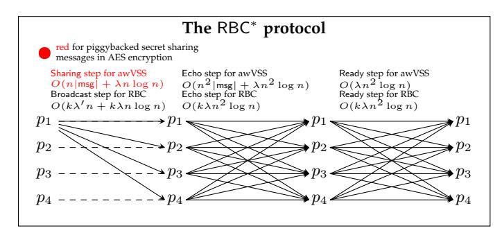
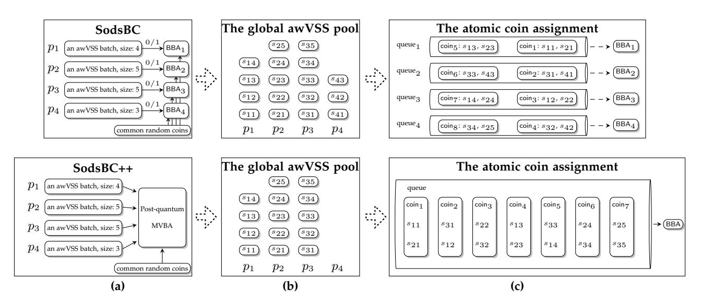
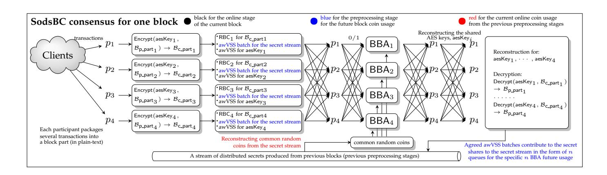
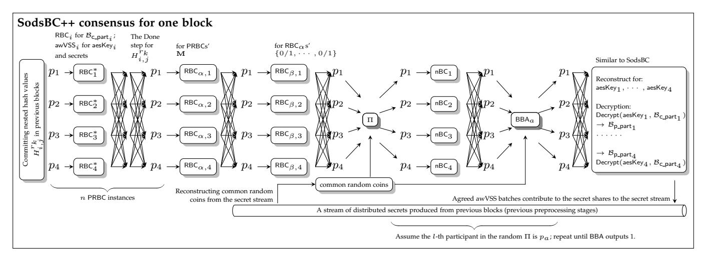
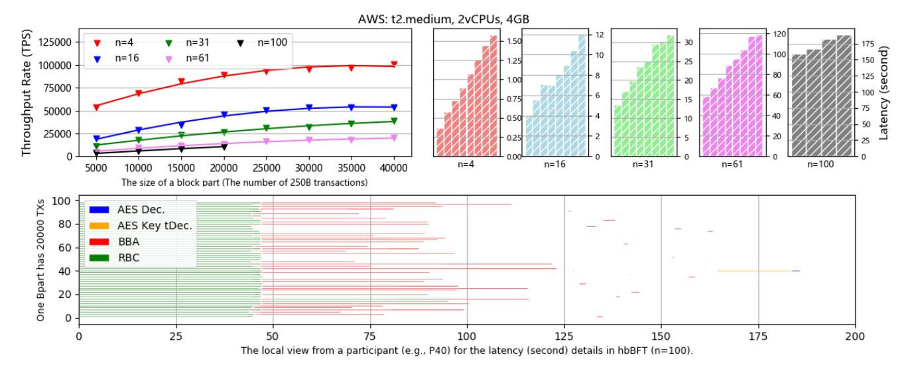
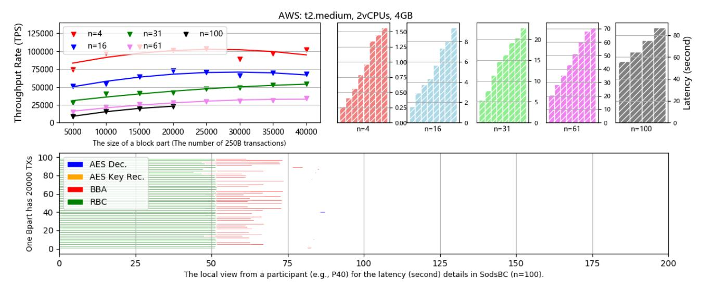
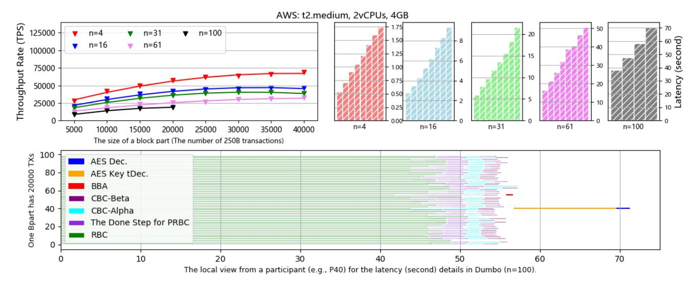
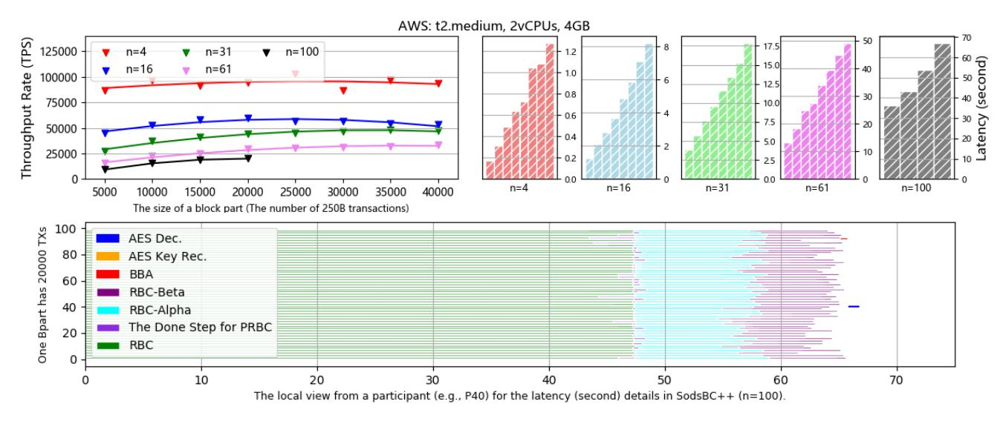
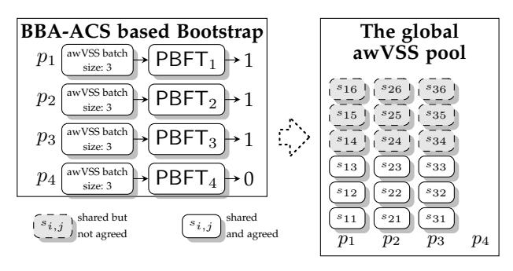

# SodsBC: A Post-quantum by Design Asynchronous Blockchain Framework

Shlomi Dolev, *Fellow, IEEE,* Bingyong Guo, *Student Member, IEEE,* Jianyu Niu, *Student Member, IEEE,* and Ziyu Wang, *Student Member, IEEE*

**Abstract**—We present a novel framework for asynchronous permissioned blockchain with high performance and post-quantum security for the first time. Specifically, our framework contains two asynchronous Byzantine fault tolerance (aBFT) protocols SodsBC and SodsBC++. We leverage concurrently preprocessing to accelerate the preparation of three cryptographic objects for the repeated consensus procedure, including common random coins as the needed randomness, secret shares of symmetric encryption keys for censorship resilience, and nested hash values for external validation predicates. All preprocessed objects utilize proved or commonly believed to be post-quantum cryptographic tools to resist an adversary equipped with quantum computation capabilities. The evaluation in AWS shows that SodsBC and SodsBC++ reduce the latency of two state-of-the-art but quantum-sensitive competitors Honeybadger and Dumbo by 53% and 6%, respectively in the setting that the number of participants is 100 and each block part has 20, 000 transactions.

**Index Terms**—Post-quantum, Asynchronous BFT, Concurrent preprocessing, Blockchain consensus, Secret sharing, Nested hash

✦

# **1 INTRODUCTION**

P ERMISSIONED blockchains employ Byzantine faulttolerance (BFT) protocols as their consensus cores to reach an agreement of ordered transactions without trusting a centralized authority [\[2\]](#page-13-0). The increasing popularity of blockchains has renewed interest in BFT protocols, especially in asynchronous BFT (aBFT) protocols that do not rely on any message transferred time upper bound. Several elegant aBFT protocols such as HoneyBadger [\[3\]](#page-13-1) and Dumbo [\[4\]](#page-13-2), which solve an asynchronous common subset (ACS) [\[5\]](#page-13-3) of block parts generated from all participants are proposed. In particular, Honeybadger [\[3\]](#page-13-1) is the first practical aBFT for blockchains using n randomized binary Byzantine agreement (BBA) instances in parallel to make participants one-by-one agree on whether a block part is accepted, which is named as the BBA-ACS architecture. On the contrary, Dumbo leverages a multi-value Byzantine agreement (MVBA) protocol instance to replace the n BBA instances in Honeybadger, which is referred to as the MVBA-ACS architecture. In particular, MVBA only requires a constant number of BBA rounds (rather than O(log n) rounds in Honeybadger) to output a consistent block. Both BBA-ACS and MVBA-ACS architectures are two main practical paths to achieve an aBFT protocol.

Unfortunately, the security of these state-of-the-art aBFT protocols is threatened by quantum computers [\[6\]](#page-13-4), [\[7\]](#page-13-5).

- *Shlomi Dolev is with Department of Computer Science, Ben-Gurion University of the Negev, Israel. E-mail: dolev@cs.bgu.ac.il*
- *Bingyong Guo is with School of Computer Science and Technology, University of Chinese Academy of Sciences, China. E-mail: guobingyong@tca.iscas.ac.cn*
- *Jianyu Niu is with School of Engineering, University of British Columbia, Canada. E-mail: jianyu.niu@ubc.ca*
- *Ziyu Wang is with School of Cyber Science and Technology, Beihang University, China. E-mail: wangziyu@buaa.edu.cn*

*The authors contributed equally and are listed alphabetically. Corresponding author: Ziyu Wang. An earlier version of this paper was presented at the IEEE Blockchain 2020 conference and was published in its proceedings [\[1\]](#page-13-6).*

For example, Honeybadger instantiates necessary randomness sources via quantum-sensitive threshold signature, and adopts quantum-sensitive threshold encryption for anticensorship. Dumbo also relies on the quantum-sensitive threshold signature scheme to design the MVBA external validity predicate. As these cryptography components depend on the discrete logarithm (Dlog) math intricate problem, these protocols will be broken by Shor's quantum algorithm in a polynomial time by a quantum computer [\[7\]](#page-13-5). Although the current quantum computer is not mature to apply Shor algorithm [1](#page-0-0) , many blockchain platforms have begun the studies of post-quantum secure protocols [\[8\]](#page-13-7), [\[9\]](#page-13-8), which also motivates us to design a post-quantum secure framework for asynchronous blockchain consensus protocols, i.e., aBFT protocols. Moreover, as blockchain applications like global payment usually have requirements for performance (i.e., low latency and high throughput), our post-quantum framework should not slow down the performance of existing blockchain protocols.

# **1.1 Our Contributions**

In this paper, we aim to design a *post-quantum secure* framework resulting in two aBFT protocols, SodsBC and SodsBC++, which outperform the quantum-sensitive competitors Honeybadger and Dumbo in performance, respectively [2](#page-0-1) . We leverage perfect information-theoretical (I.T.) secure and symmetric schemes to build post-quantum secure aBFT protocols for two reasons. First, a perfect I.T. secure algorithm is *proved* to resist an adversary with unlimited

- <span id="page-0-0"></span>1. Even though the current quantum computer is claimed to achieve 75 q-bits, far from the thousands of q-bit requirement for the Shor algorithm, information security leading institutes like NIST already warn the quantum attacking risks.
- <span id="page-0-1"></span>2. SodsBC compared to Honeybadger has been presented in the conference before Dumbo was proposed. SodsBC++ compared to Dumbo is later proposed in this journal version.

1

computation power (naturally including quantum computation), while symmetric cryptographic tools are *believed* to be post-quantum if the security parameter is long enough <sup>3</sup>. Second, the operations in a perfect I.T. secure or a symmetric scheme are generally faster than the ones in an asymmetric scheme (e.g., the ellipse curve operations).

However, it is challenging to directly apply I.T. or symmetric schemes to aBFT protocols since these schemes are usually one-time or limited-time used, which cannot support the repeated consensus service. To address this issue, we innovate a concurrent preprocessing design to advance these cryptography objects before usage. Preprocessing is widely used in secure multi-party computation (MPC) to offload heavy computational burden from an online stage to a preprocessing stage [11]. We do a further step from preprocessing to concurrent preprocessing in a consensus protocol. Specifically, we utilize the agreement process of the aBFT architecture to preprocesses objects for I.T. or symmetric schemes, and then use these objects in the subsequent agreement process. Hence, we do not need additional time to prepare the objects for I.T. or symmetric schemes. In other words, we design an aBFT based blockchain consensus, while the consensus itself provides the consensus ability for the aBFT protocol.

With the concurrent preprocessing technique, we design three building blocks for aBFT protocols. We propose a post-quantum common random coin scheme and a censorship resilience solution, by which we can realize a post-quantum aBFT protocol, SodsBC, compared to Honeybadger [3]. We also present a post-quantum external validation predicate to support MVBA, which renders another post-quantum aBFT protocol, SodsBC++, compared to Dumbo [4]. Our contributions are listed as follows:

- We design a post-quantum common random coin scheme from secret sharing, which supplies necessary randomness for aBFT. We also design a novel pool for the generated secret shares, and the agreement for this pool utilizes the same aBFT architecture.
- We design a post-quantum censorship resilience solution that provides the considerable anti-censorship property for aBFT, utilizing secretly shared symmetric encryption (AES) keys.
- We design a post-quantum external validation predicate utilizing concurrent preprocessed nested hash values for the SodsBC++ MVBA core.
- We implement and evaluate Honeybadger [3], SodsBC, Dumbo [4] and SodsBC++ in the same AWS environment. In a typical setting where the number of participants is 100 and each block part has 20,000 transactions, SodsBC latency is 53% of Honeybadger [3] latency, reducing from 186 seconds to 87 seconds, and SodsBC++ can have latency that is 6% less than the latency of Dumbo [4], reducing from 71 seconds to 67 seconds.

The following sections are organized as follows. Sect. 2 introduces the system model, designing target, and building blocks. Sect. 3 introduces the novel asynchronous weak

<span id="page-1-0"></span>3. The quantum Grover algorithm [10] cannot accelerate the brute-force breaking of a symmetric scheme too much. The NIST post-quantum finalist includes two alternate candidate signature schemes utilizing symmetric cryptography, Picnic and SPHINCS+. (https://csrc.nist.gov/Projects/post-quantum-cryptography/round-3-submissions)

verifiable secret sharing (awVSS) scheme, post-quantum awVSS-based censorship resilience solution and common random coin scheme. Sect. 4 and Sect. 5 describe the SodsBC/SodsBC++ design, respectively. Sect. 7 discusses a novel wait-free bootstrap design for aBFT and a post-quantum transaction structure. Sect 8 and Sect 9 presents the related works and concludes this paper, respectively.

# <span id="page-1-1"></span>2 SYSTEM MODEL, TARGETS AND COMPONENTS 2.1 System Model

We consider a system with a set of n = 3f + 1 mutuallydistrusting participants, say  $\mathcal{P} = \{p_1, \dots, p_n\}$ . We assume that up to f participants are Byzantine and are controlled by an adversary. We assume that each pair of participants is connected by reliable and authenticated channels following previous aBFT protocols [3], [4], [12], [13]. This is, the adversary cannot drop messages among honest participants, as in the TCP protocol. Most symmetric schemes for message authentication code (MAC) satisfies the authenticated requirement. We only add an extra post-quantum requirement for the used symmetric schemes. In particular, our protocols work in an asynchronous network, i.e., no timing assumptions for message delivery [5]. We assume that the adversary with quantum computers can efficiently break some known quantum-sensitive mathematical intractable problems, e.g., Dlog or integer factorization.

# 2.2 System Target: Post-quantum Secure Asynchronous BFT Protocol

In a permissioned blockchain, *users/clients* propose transactions, and participants batch transactions in blocks and make an agreement of these blocks by utilizing the consensus core, i.e., an aBFT protocol [14], [15], [16]. In addition, such a system should be post-quantum secure and so satisfy the following properties:

- **Agreement**: Every two honest participants deliver the same block  $\mathcal{B}$  in one block height.
- **Total order**: If an honest participant p delivers a sequence of blocks  $\mathcal{B}_1, \dots, \mathcal{B}_j$  and another honest participant p' has delivered  $\mathcal{B}'_1, \dots, \mathcal{B}'_{j'}$ , then  $\mathcal{B}_i = \mathcal{B}'_i$  for  $1 \le i \le \min(j, j')$ .
- Liveness: If a client submits a transaction TX to at least  $n\!-\!f$  participants, then there eventually will be a delivered block having TX  $^4$ .
- **Post-quantum security**: The known quantum-sensitive cryptographic tools will not be used in the protocol.

An aBFT protocol can be realized by solving a consistent union of block parts generated from all participants, which is known as an asynchronous common subset (ACS) protocol. An ACS protocol can be further implemented by two practical paths, BBA-ACS and MVBA-ACS.

Honeybadger [3], and its variants [12], [13] adopt the BBA-ACS [5] way to achieve aBFT. SodsBC follows this methodology but introduces novel ways to implement a post-quantum anti-censorship solution and a post-quantum common random coin scheme. Dumbo [4] deploys the MVBA-ACS way. SodsBC++ uses preprocessed nested hash

<span id="page-1-2"></span>4. Honeybadger [3] refers to **Liveness** as **Censorship resilience**. Cachin et al. [17] name it as **Fairness**. We follow **Liveness** as BEAT [12], and interchangeably use **Censorship resilience** in this paper.

to design a post-quantum external validation predicate to support a post-quantum MVBA in the MVBA-ACS aBFT architecture.

Both BBA-ACS and MVBA-ACS architectures have their advantages. At first, the BBA-ACS architecture is more simple for fewer building blocks, which is easier to understand. Secondly, even though the round complexity of a BBA-ACS or MVBA-ACS aBFT protocol is O(log n) or O(1), respectively, a BBA-ACS-based aBFT protocol still may spend less latency in a relatively low quorum size. When the number of participants, n, increases, the bottleneck of a BBA-ACS protocol gets worse for the n parallel BBA instances. Thirdly, throughput rate is another significant metric other than latency. When every participant is honest and the network condition is relatively good, a BBA-ACS-based aBFT protocol may collect all n block parts while an MVBA-ACS-based aBFT only can collect n − f block parts in the consensus output block.

# <span id="page-2-2"></span>**2.3 Components in SodsBC/SodsBC++**

We introduce several cryptographic primitives/protocols and their realization in SodsBC/SodsBC++.

**Reliable broadcast** (RBC) is a kind of protocols achieving an all-or-nothing style broadcast, which satisfies:

- **Validity**: If an honest broadcaster broadcasts msg, then all honest participants deliver msg.
- **Agreement**: Honest participants deliver an identical msg.
- **Totality**: Eventually, honest participants will deliver msg if msg is delivered for an honest participant.

SodsBC/SodsBC++ employs Cachin and Tessaro's RBC [\[3\]](#page-13-1), [\[18\]](#page-13-17) that utilize erasure code and Merkle tree crosschecksum.

**Provable reliable broadcast** (PRBC) provides a proof of termination for an RBC instance. Our PRBC (Algorithm [2\)](#page-6-0) deploys the preprocessed and post-quantum nested hash as the termination proofs (see Sect. [5.1\)](#page-5-1).

**Binary Byzantine agreement** (BBA) is a kind of asynchronous BA protocols focusing on binary input/output values, which satisfies:

- **Validity**: An output comes from an honest participant.
- **Agreement**: Honest participants output the same value.
- **Termination**: All honest participant will eventually have an output.

SodsBC/SodsBC++ adopts the refined signature-free asynchronous BBA protocol proposed by Mostefaoui et al. [\[19\]](#page-13-18), ´ [\[20\]](#page-13-19). The asynchronous BBA protocol relies on a common randomness source. In this paper, we offer post-quantum common random coins to the BBA instances as the randomness source (see Sect. [3.3\)](#page-3-0).

**Multi-value Byzantine Agreement** (MVBA) [5](#page-2-1) satisfies similar **Agreement** and **Termination** properties defined in BBA. Moreover, an MVBA protocol satisfies:

- **External validity**: An output satisfies a pre-defined external predicate.
- **Integrity**: An output comes from an input if all participants are honest.

<span id="page-2-1"></span>With **External validity**, an MVBA protocol output is valid even if the output comes from a malicious participant, since

a malicious input should satisfy a predicate Q. SodsBC++ designs a post-quantum and efficient MVBA (enlightened by Cachin et al.'s work [\[17\]](#page-13-16)) by relying on post-quantum secure threshold signature (see Sect. [5\)](#page-5-0). **Asynchronous Common Subset** (ACS) is used to finalize n

parallel computation instances, satisfying:

- **Validity**: The ACS output has at least n − f true values for n predicates. At least f + 1 true values correspond to the instances launched by honest participants.
- **Agreement**: Honest participants have a consistent result of n predicates.
- **Termination**: All honest participant will eventually output a result.

As said previously, ACS can be implemented by two paths: the BBA-ACS and MVBA-ACS. In BBA-ACS protocol [\[5\]](#page-13-3), participants vote 1 to a BBA if the corresponding computation instance is finished. After waiting for at least n − f terminated instances, honest participants intentionally exclude the too slow instances by voting 0 to the corresponding BBAs. In MVBA-ACS protocol [\[4\]](#page-13-2), honest participants use an expected constant number of BBA invocations to select a valid view of a random participant.

# <span id="page-2-0"></span>**3 DESIGNED BUILDING BLOCKS**

In this section, we introduce the post-quantum secure building blocks by design and how we utilize these building blocks to realize SodsBC/SodsBC++.

# <span id="page-2-3"></span>**3.1 Asynchronous Weak Verifiable Secret Sharing**

A secret sharing scheme has two algorithms, *sharing* and *reconstruction*. A participant who shares a secret is called a dealer. An asynchronous verifiable secret sharing (aVSS) scheme is to verify whether a dealer shares a secret under a correct threshold in an asynchronous network. Once correctly sharing shares, a consistent secret will be recovered by the reconstruction algorithm. In addition, we adopt the weak commitment concept for the sake of efficiency [\[21\]](#page-13-20). Honest participants will set the shared secret to a default value (e.g., zero) after reconstruction when they detect a malicious behavior of a dealer. Concretely, we use Merkletree-based hash cross-checksum [\[22\]](#page-13-21) to achieve the share validation. Formally, our awVSS scheme satisfies:

- **Secrecy**: At most f malicious participant cannot learn any information about the secret if a dealer is honest, before an honest participant invocates the reconstruction.
- **Share agreement**: Honest participants deliver shares corresponding to an identical Merkle root.
- **Share liveness**: At least f + 1 honest participants deliver consistent shares, and eventually all honest participants will deliver the identical Merkle root if one honest participant delivers a share and a corresponding Merkle root.
- **Weak commitment**: (Reconstruction correctness) Honest participants will reconstruct a consistent secret s if the dealer is honest. Otherwise, they will consistently set s to a default value (e.g., 0).

**A holistic structure.** Our awVSS scheme (Algorithm [4](#page-15-0) consists three steps: Sharing, Echo, and Ready) shares a similar structure with the classical RBC protocol (Algorithm [5](#page-16-0) has Broadcast, Echo, and Ready). Therefore, we combine these two protocols into an integrated protocol, i.e., a (batched) awVSS instance for sharing some secrets from a dealer can be piggybacked by an RBC instance from the same broadcaster. To avoid an adversary to eavesdrop the secret shares transmitted by honest participants, the piggybacked secret messages should be encrypted by a post-quantum and symmetric scheme like AES. The holistic combination is depicted in Fig. 1. We use RBC\* to denote a combined protocol instance in this paper. The detailed awVSS scheme is provided in Appendix A (Algorithm 4) <sup>6</sup>.

<span id="page-3-1"></span>

Fig. 1: The integrated reliable broadcast (RBC\*) protocol in which k secrets are piggybacked in a holistic style.  $p_1$  is  $p_{\text{broadcaster}}/p_{\text{dealer}}$ . |msg|: the size of a message to be broadcast.  $\lambda$ : the length of a hash function.  $\lambda'$ : the size of a secret. (Better read in colors.)

# <span id="page-3-3"></span>3.2 Post-quantum Censorship Resilience Solution

To prevent the adversary from intentionally excluding some particular block parts (e.g., containing unfavorable transactions), we follow the *encryption-consensus-decryption* idea [3] to achieve **Censorship resilience**. Specifically, each participant  $p_i$  packages some transactions into  $\mathcal{B}_{\mathsf{P\_part}_i}$ , AESencrypts it, and inputs the ciphertext  $\mathcal{B}_{\mathsf{C\_part}_i}$  into the consensus core. After the consensus, participants interact with each other, to decrypt the agreed encrypted block parts.

Unlike the previous protocols [3], [4], [12] that use quantum-sensitive threshold encryption schemes [23], [24] to encrypt the AES keys, a SodsBC/SodsBC++ participant shares its AES key by a post-quantum awVSS instance simultaneously as broadcasting the AES ciphertext block part. Concretely, an AES key aesKey $_i$  will be also secretly shared by  $p_i$ , and the secret sharing messages for aesKey $_i$  are piggybacked by the RBC $_i$  instance for  $\mathcal{B}_{\mathsf{C\_part}_i}$ . This integrated instance is denoted by RBC $_i^*$ .

After consensus, at least n-f ciphertext block parts and the shared roots of at least n-f AES key shares are consistently delivered. That is to say, the AES key sharing (preprocessing) is concurrent as the aBFT block consensus. Then, honest participants broadcast the shares to reconstruct the AES keys, decrypt the agreed block parts and finish the current round consensus. Each SodsBC/SodsBC++ consensus round is a preprocessing stage to sharing AES keys (before consensus), and it is also an online stage to reconstruct the shared keys (after consensus). The fresh AES key secret sharing (and the post-quantum awVSS scheme) offers

<span id="page-3-2"></span>6. A detailed description of the awVSS scheme was previously given in the conference paper [1].

SodsBC/SodsBC++ the post-quantum anti-censorship. Also note that only symmetric cryptography and algebra operations for secret sharing and reconstruction in fact accelerate the computation process, avoiding the use of the inefficient quantum-sensitive bilinear map pairings.

Since an encrypting participant is also the key share dealer and the ciphertext broadcaster, at least f+1 ciphertexts are guaranteed to be well-formatted and be successfully decrypted. This threshold is the same as in Honeybadger [3] and Dumbo [4], which, however, achieves a similar anti-censorship property by quantum-sensitive threshold encryption.

## <span id="page-3-0"></span>3.3 Post-quantum Common Random Coin Scheme

Besides sharing AES keys, SodsBC/SodsBC++ also concurrently preprocesses post-quantum common random coins. In online stages (i.e., the time epoch for agreeing on blocks), our BBA will consume post-quantum, fresh, and one-time used common random coins, reconstructing from the shared secrets distributed in history preprocessing stages. This online stage is also a preprocessing stage, simultaneously, in which each participant shares secrets for future coins by awVSS (Algorithm 4). Unlike the quantum-sensitive coin-flipping protocols [25], [26] used in previous aBFTs [3], [4], [12], the continuously produced secrets in SodsBC/SodsBC++ imply the use of fresh (and post-quantum) coins.

A common random coin in SodsBC/SodsBC++ encompasses f+1 shared random secrets produced by f+1 distinct dealers, i.e.,

$$coin = (secret_1 + \cdots + secret_{f+1}) \mod 2.$$

Our coin scheme have the following properties:

- Random. Honest participants will choose a random value uniformly, so that at least one random coin component makes the coin value uniformly random after the f+1 additions.
- Common. Every participant recovers f+1 consistent coin components when all the f+1 components are secretly shared before, resulting in the consistent recovery of the common coin value.
- **Unbiased.** Before the first honest participant invocates the coin recovery, at most f adversaries learn no information about the coin value if at least one coin component is well-shared by an honest participant under the f+1 threshold (the awVSS secrecy).

The coin structure goes through at most f failed secret reconstructions. Honest participants consistently set at most f coin components to zero when detecting malicious behaviors (i.e., at most f failed secret reconstructions), while one successful reconstruction still keeps a well-defined coin with random-value, common-value and anti-adversarial-bias.

However, only one coin is not enough for the repeated consensus service. Fig. 2 further shows how SodsBC/SodsBC++ supplies unlimited number of coins. In Fig. 2a, each SodsBC/SodsBC++ dealer runs an awVSS batch to share secrets, and n BBAs in SodsBC finalize (or a post-quantum MVBA in SodsBC++ finalizes) these n awVSS batches. The delivered Merkle tree roots help honest participants figure out the number of secrets shared from a

<span id="page-4-1"></span>

Fig. 2: n awVSS batches are finalized by n BBA instances or a post-quantum MVBA, and the finished awVSS shares construct a global pool. The pool can atomically assign finished secrets to n queues or one queue for the future BBA usage, in SodsBC or SodsBC++, respectively.

specific participant, leading to a global awVSS pool (Fig. 2b). The reason for applying n BBAs (or a post-quantum MVBA) is that different participants may have different observations about the secrets in an asynchronous network. In other words, a consistent view of the generated secrets is reduced to an asynchronous consensus problem. Fortunately, we can employ SodsBC/SodsBC++ itself to solve this secret pool consensus problem.

From Fig. 2b to 2c, we explain how SodsBC/SodsBC++ deploy the atomic coin assignment. If the finished awVSS pool is globally decided, honest participants can iterate each row from the button of the global pool and assign each f+1 secrets (shared from f+1 distinct dealers) to one coin, and further assign each coin to n BBA queues in SodsBC or one BBA queue in SodsBC++ (Fig. 2c).

## <span id="page-4-0"></span>4 SodsBC

In this section, we present SodsBC protocol, which is a post-quantum secure aBFT protocol based on the BBA-ACS architecture. In particular, we leverage an innovated concurrent preprocessing idea to improve the performance of the post-quantum censorship resilience solution and the post-quantum common random coin scheme, as we described in Sect. 3.2 and 3.3, respectively. The algorithm of SodsBC protocol is provided in Algorithm 1, and the architecture is depicted in Fig. 3. Due to space limitations, here we only present a summary and refer the reader to [1] for more details.

**SodsBC Overview.** We provide an overview to better understand SodsBC. A SodsBC participant launches three important sub-instances: a block part  $\mathcal{B}_{\mathsf{c\_part}_i}$  RBC proposal in AES encryption, aeskey, secretly sharing (by an awVSS invocation) and other random values secretly sharing for the future BBA coins (by another awVSS batch invocation). SodsBC participants finalize the three sub-instances launched by a participant by one BBA instance. Note that the secret-sharing messages (an awVSS batch for secrets and

another awVSS instance for aeskey, can be piggybacked by the RBC instance for  $\mathcal{B}_{c\_part_i}$ , as a holistic structure. So that we also can view the SodsBC architecture as that each RBC\* is finalized by one BBA. SodsBC Security Outline. Since SodsBC does not change the BBA-ACS architecture, after we have a well-defined common random design and an anticensorship solution, Algorithm 1 can satisfy the required aBFT agreement, total order, and liveness properties. Recall that the BBA-ACS output involves at least n-f terminated instances, i.e., n-f true predicates. SodsBC has a more strict predicate than the original BBA-ACS protocol [5]. A SodsBC predicate is not limited to whether an RBC is finished (Pred<sub>RBC</sub>). Besides, participants also agree on the termination of n awVSS batches distributed by a specific dealer for future coins ( $Pred_{awVSS\_coin}$ ), and n awVSSs for AES keys (Pred<sub>awVSS\_aeskey</sub>). Hence, a SodsBC predicate is  $Pred = Pred_{RBC} \wedge Pred_{awVSS\_coin} \wedge Pred_{awVSS\_aeskey}$ , which decides a complex instance having three sub-instances.

**SodsBC Communication Complexity.** In our complexity calculations, we denote  $|\mathcal{B}|$  as the size of a block which contains the n block parts ( $\mathcal{B}_{\mathsf{part}}$ ). After RS encoding, the size of one block part is expanded to  $|\mathcal{B}_{\mathsf{RSpart}}| = \frac{n}{f+1} |\mathcal{B}_{\mathsf{part}}|^7$ .

The total expected coin consumption amount for n BBA instances is cNum = 4n since one BBA is expected to be finalized in four BBA rounds [19]. Hence, a participant should generates cNum secrets in expectation since one coin involves f+1 secrets and SodsBC only guarantees at least f+1 honest (non-empty) awVSS batches.

One RBC communicates  $n(\frac{1}{n}|\mathcal{B}_{\mathsf{RSpart}}| + \lambda \log n) + n^2(\frac{1}{n}|\mathcal{B}_{\mathsf{RSpart}}| + \lambda \log n) + \lambda n^2$  bits. Moreover, the piggy-backed awVSS messages in one RBC (for one AES key and cNum secrets) communicate  $n \times (\lambda + \lambda \log n + \mathsf{cNum}(\lambda' + \lambda \log n)) + 2 \times n^2 \times (\mathsf{cNum} + 1) \times \lambda$  bits. The communication overhead for n RBC\* instances is  $O(|\mathcal{B}|n + \lambda n^4)$  bits.

<span id="page-4-2"></span>7. We pick  $\lambda=256$ bits as the security parameter for Sods/SodsBC++ symmetric cryptography schemes as the post-quantum security requirement, and choose a field  $\mathbb{F}=GF(251)$  for awVSS ( $\lambda'=8$ bits), which avoids the secret share conflict for at most 251 participants.

#### <span id="page-5-2"></span>**Algorithm 1** SodsBC Consensus (for $p_i$ ) [1].

- // Block part generation and encryption
- For B<sub>p\_part<sub>i</sub></sub>, AESEncrypt(aesKey<sub>i</sub>, B<sub>p\_part<sub>i</sub></sub>) → B<sub>c\_part<sub>i</sub></sub>.
   // Consensus core: make a union of block parts
- 2: In RBC<sub>i</sub>\*, broadcast  $\mathcal{B}_{c\_part_i}$ ; share aesKey<sub>i</sub> and secrets by piggybacked awVSS messages (Algorithm 4).
- 3: Input 1 to  $BBA_i$  if  $RBC_i^*$  finishes.
- 4: Input 0 to remained BBAs if n f BBAs output 1.
- // BBA coins are reconstructed by awVSS (Algorithm 4). // Decryption and output
- 5: If BBA<sub>j</sub> outputs 1, reconstruct aesKey<sub>j</sub> and AES decrypts  $\mathcal{B}_{\mathsf{c\_part}_j}$ . If the decryption fails, or RBC<sub>j</sub> is aborted (BBA<sub>j</sub> outputs 0), set  $\mathcal{B}_{\mathsf{part}_j} = \bot$ .
- 6: Make  $\mathcal{B} = \bigcup_{j=1}^{n} \mathcal{B}_{\mathsf{part}_{j}}$ , and assign agreed awVSS batches to n queues.



Fig. 3: SodsBC consensus overview [1]. RBC: reliable broadcast. awVSS: asynchronous weak secret sharing. BBA: binary Byzantine agreement.  $\mathcal{B}_{p\_part_i}$  &  $\mathcal{B}_{c\_part_i}$ : the *i*-th block part in plain/cipher-text. Better read in colors.

Calling cNum coins in n BBAs communicates  $O(\lambda n^4 \log n)$  bits. It takes  $O(\lambda n^3 \log n)$  bits to reconstruct n AES keys. Therefore, the total communication complexity of SodsBC is  $O(|\mathcal{B}|n + \lambda n^4 \log n)$  bits.

In HoneyBadger [3], n RBC instances have the  $O(|\mathcal{B}|n + \lambda n^3 \log n)$  communication overhead. n BBA instances consume  $O(\lambda n^3 \log n)$  bits for generating quantum-sensitive common random coins, since the size of a threshold signature share is also  $\lambda$  bits. There is another  $O(\lambda n^3)$  bits communication overhead for the AES key threshold decryption. So the total communication complexity of HoneyBadger is  $O(|\mathcal{B}|n + \lambda n^3 \log n)$  bits. Even with a slightly higher communication overhead than HoneyBadger, SodsBC still has a better performance in latency due to much lower computation overhead (see Sect. 6).

#### <span id="page-5-0"></span>5 SodsBC++

In this section, we present SodsBC++, which is a postquantum secure aBFT protocol based on the BBA-ACS architecture. Specifically, we replace the quantum-sensitive threshold signatures in the PRBC and consistent broadcast (CBC) instances with a post-quantum PRBC (pqPRBC) utilizing preprocessed nested-hash values (see Sect. 5.1). The nested-hash-based pqPRBC offers the external verification property in a post-quantum multi-value Byzantine agreement (MVBA) in Sect. 5.2.

# <span id="page-5-1"></span>5.1 Nested Hash based Post-quantum Provable Reliable Broadcast (pqPRBC)

Compared with RBC, PRBC can provide its participants a proof of termination for an RBC instance. The PRBC proposed in Dumbo [4] adds another Done step in which each participant broadcasts its threshold signature share when delivering the RBC output. The message to be signed by  $p_i$  for the RBC $_j$  instance is the round number r and the RBC index j, i.e.,  $\sigma_{i,j} \leftarrow \mathrm{Sign}(\mathrm{tSigKey}_i, \langle r, j \rangle)$ . The broadcaster  $p_j$  will aggregate the signature shares as  $\mathrm{tSig}_j \leftarrow \sum \sigma_{i,j}$  from f+1 valid shares. So that when  $p_j$  exhibits  $\mathrm{tSig}_j$  to another participant  $p_j'$ ,  $p_j'$  will believe that RBC $_j$  already finishes from the view of at least one honest participant (at most f signing participants may be malicious) after verifying the validity of  $\mathrm{tSig}_j$ . According to the RBC totality (see Sect. 2.3), all honest participant will finish RBC $_j$  eventually.

Note that a threshold signature in Dumbo's PRBC only signs a known message, so that we can use a preprocessed hash value to achieve a similar verification effect. For an honest participant,  $p_i$  first generates a random secret  $s_{i,j}$  and preprocesses  $H_{i,j} = \operatorname{Hash}(s_{i,j},i,j)$ . Then,  $p_i$  inserts  $H_{i,j}$  into a transaction and proposes this transaction to the blockchain. Assume  $H_{i,j}$  will be committed in the blockchain before the blockchain round r. Finally, after  $p_i$  finishes the RBC $_j$  instance in round r,  $p_i$  broadcasts  $s_{i,j}$  in the Done step. Other participants can verify  $s_{i,j}$  by re-computing  $H'_{i,j} = \operatorname{Hash}(s_{i,j},i,j)$  and comparing  $H_{i,j} \stackrel{?}{=} H'_{i,j}$ . When one participant receives f+1 correct hash pre-image values for the round r and RBC $_j$ , this

<span id="page-6-0"></span>**Algorithm 2** Post-quantum Provable Reliable Broadcast (pqPRBC) for  $p_i$ .

// (A preprocessing stage)

- 1: Generate  $s_{i,j}$ , and commit  $H^{r_k}_{i,j}$  in blockchain for  $j \in [1,\cdots,n]$ .
  - // (An online stage in the k-th blockchain round after  $p_i$  first consumes  $H_{i,j}^{r_k}$ .)

**RBC**:// (for a broadcaster,  $p_j$ )

2:  $p_{j'}$  inputs msg to RBC $_{j'}$ .

RBC-Done-step-send:

- 3: Upon finishing  $\mathsf{RBC}_{j'}$ , broadcast  $\left\langle \mathsf{Done}, H^r_{i,j'} \right\rangle$ .  $\mathsf{RBC}\text{-}\mathsf{Done}\text{-}\mathsf{step-receive}$ :
- 4: Upon receiving  $\left\langle \text{Done}, H^r_{j,j'} \right\rangle$  from  $p_j$ , store  $H^r_{i,j}$ , if  $H^{r_k}_{i,j} = \mathsf{Hash}(\cdots \mathsf{Hash}(H^r_{i,j},i,j)\cdots,i,j)$  after  $r_k r = k$  times of hash computation.

participant can believe that at least one honest participant finishes  $\mathsf{RBC}_j$  and all honest participants will eventually finish  $\mathsf{RBC}_j$ , which achieves a similar effect as the one for Dumbo's PRBC. In addition, for providing the future proving RBC ability,  $p_i$  in our PRBC should also preprocess another new  $H_{i,j}$  before the consensus round r+1.

Furthermore, we can use a nested hash to increase the usage times for one preprocessed value. We use  $H_{i,j}^{r_k}$  to denote the k times hash for a random secret  $s_{i,j}$ , i.e.,

$$H_{i,j}^{r_k} = \mathsf{Hash}(\cdots \mathsf{Hash}(\mathsf{Hash}(s_{i,j},i,j),i,j)\cdots,i,j).$$

If  $H_{i,j}^{r_k}$  is preprocessed and committed in blockchain,  $p_i$  can consume  $H_{i,j}^{r_k-1}$  in the first block after the committed block, and can consume  $H_{i,j}^{r_k-2}$  in the second block, so on and so forth. Until  $s_{i,j}$  is revealed,  $p_i$  has the ability to support the PRBC verification for k blocks. When  $H_{i,j}^{r_k}$  is almost exhausted,  $p_i$  generates a new  $H_{i,j}^{r_k}$  and repeats the process above. The usage of a preprocessed nested hash value (from a previous committed block) and generating a new nested hash value for the future PRBC usage reflects the third concurrent preprocessing case in this paper. The nested hash based pqPRBC details are described in Algorithm 2.

## <span id="page-6-1"></span>5.2 SodsBC++ Protocol

Algorithm 3 and Fig. 4 illustrate the procedure of SodsBC++. The preparing works before the consensus (line 1 to line 2) are similar to the ones of SodsBC. Each SodsBC++ participant  $p_i$  AES encrypts its  $\mathcal{B}_{\mathsf{p\_part}_i}$ , and broadcasts  $\mathcal{B}_{\mathsf{c\_part}_i}$ , shares aesKey $_i$  and several secrets in RBC $_i^*$ . During each PRBC instance (line 3),  $p_i$  broadcasts a hash value  $H_{i,j}^r$  in the last Done step after finishing each RBC instance RBC $_i^*$ .  $H_{i,j}^r$  committed in the blockchain after  $r_k - r = k$  times of hash computation. Then,  $p_i$  waits for receiving at least f+1 valid hash values leading to a valid column vector for RBC $_i^*$  (line 4).

For n parallel RBC instances,  $p_i$  receives a matrix  $\mathbf{M}$  having at least n-f valid column vector (line 5). We denote a predicate  $Q(\cdot)$  so that  $Q(\mathbf{M}) = \text{TRUE}$  when  $\mathbf{M}$  has n-f valid column vectors and each valid column in  $\mathbf{M}$  has at least f+1 valid hash values. A valid  $\mathbf{M}$  reflects the termination of n-f RBC\* instances. We use r to denote the k-th blockchain round after  $p_i$  consumes  $H_{i,j}^{r_k}$  for the

first time. The predicate  $Q(\cdot)$  acts as the external validation predicate for the following MVBA protocol.

We modify Cachin et al.'s MVBA [17] to avoid quantum-sensitive cryptographic tools, e.g., a threshold signature based consistent broadcast (CBC), to a post-quantum MVBA (pqMVBA) protocol (line 5 to line 13). If  $p_i$ 's view is valid,  $p_i$  inputs M into an RBC instance RBC $_{\alpha,i}$ . After n-f RBC $_{\alpha}$  instances output valid views satisfying the predicate  $Q(\cdot)$ ,  $p_i$  constructs a 0/1 vector columnC =  $[c_1, \cdots, c_n]$  to describe the results of RBC $_{\alpha}$  instances. If the output of RBC $_{\alpha,j}$  is valid,  $p_i$  sets  $c_j=1$ ; otherwise 0. If columnC has 2f+1 1-items,  $p_i$  inputs this commitment columnC to RBC $_{\beta,i}$ .  $p_i$  regards a received columnC $_j$  from  $p_j$  as valid when columnC $_j$  has 2f+1 1-items. The received columnC vectors construct a matrix C.

After n-f RBC $_{\beta}$  instances finish,  $p_i$  uses a random secret  $\Gamma$  to generate a random permutation  $\Pi$  (line 8). Specifically, the first index is  $\Pi(1) = \mathsf{Hash}(\Gamma)$ , and the second index is  $\Pi(2) = \mathsf{Hash}(\Pi(1))$ , so on and so forth. This permutation defines a loop as Cachin et al.'s MVBA [17].

The BBA input for a selected view should be carefully treated (line 11 to line 12). For each selected index  $a = \Pi(l)$ in the loop round l, participants require another round of normal broadcast (nBC) to coordinate their opinions, in order to make sure that a subsequent BBA decision has 1output bias. For the selected RBC $_{\alpha,a}$ , if it is finished from  $p_i$ 's observation and the output of RBC<sub> $\alpha,a$ </sub> satisfies the predicate  $Q(\cdot)$ ,  $p_i$  inputs 1 to the BBA instance and normal broadcast 1. If  $RBC_{\alpha,a}$  is finished but  $Q(\cdot)$  does not hold,  $p_i$  normal broadcasts 0 and inputs 0 to BBA. If RBC<sub> $\alpha,a$ </sub> is not finished from  $p_i$ 's observation,  $p_i$  normal broadcasts 0 and waits for other opinions. If  $p_i$  receives at least f + 1 $\langle \mathsf{MVBA}_{\mathsf{vote}}, 1 \rangle$  messages,  $p_i$  will input 1 to BBA. If  $p_i$  receives at least n-f valid  $\langle \mathsf{MVBA}_{\mathsf{vote}}, 0 \rangle$  messages,  $p_i$  will input 0. Note that a  $\langle \mathsf{MVBA}_{\mathsf{vote}}, 0 \rangle$  is valid from  $p_j$ , if and only if  $p_i$  has received column $C_j$  from the finished  $RBC_{\beta,j}$  and  $\mathsf{columnC}_j[a] = 0.$ 

If the BBA instance outputs 1, the pqMVBA loop terminates and the consensus is achieved (line 13). Otherwise, the loop repeats to the next selected view  $a \leftarrow \Pi(l+1)$  in line 10. After the pqMVBA finishes, participants continue to reconstruct the AES keys, decrypt the valid block parts in ciphertext, and assign the agreed secrets to the global awVSS pool for future usage (line 14, as the workflow in Fig. 2).

Our pqMVBA shares the same structure with Cachin et al.'s MVBA [17] leading to similar properties. There are at least 2f+1 honest views among all n=3f+1 views. But an asynchronous adversary can maliciously vote 0 to the selected honest view. So that the pqMVBA only guarantees the BBA 1-output for at least f+1 selected views, and at most f views of these f+1 selected views may come from malicious participants. Fortunately, with the assistance of the external validity predicate  $Q(\cdot)$ , an output view is also valid even this view is from Byzantine. Therefore, the pqMVBA has a  $\frac{1}{3}$  probability to terminate, and the pqMVBA loop will repeat three times in expectation.

**SodsBC++ Security.** Algorithm 2 is a PRBC protocol where we replace the threshold signature-based-proof with the post-quantum and preprocessed nested- hash-based proof, compared with the quantum-sensitive PRBC used in Dumbo [4].

#### <span id="page-7-0"></span>**Algorithm 3** SodsBC++: pqPRBC + pqMVBA (for participant $p_i$ in the consensus round r)

Let the predicate  $Q(\mathbf{M})=\text{TRUE}$  when the matrix  $\mathbf{M}$  has n-f valid columns. Let a column be valid when it has at least f+1 valid hash values. Let  $H^r_{j,j'}$  be valid when  $H^{rk}_{j,j'}=\text{Hash}(\cdots\text{Hash}(H^r_{j,j'},j,j')\cdots),j,j')$  after k times of hash computation.

// Prepare and Encryption

- 1: For  $\mathcal{B}_{\mathsf{p\_part}_i}$ , AESEncrypt(aesKey<sub>i</sub>,  $\mathcal{B}_{\mathsf{p\_part}_i}$ )  $\to \mathcal{B}_{\mathsf{c\_part}_i}$ .
- 2: Input  $\mathcal{B}_{\mathsf{C\_part}_i}$ , aesKey<sub>i</sub> and secrets to RBC<sub>i</sub>\*. // Consensus core
- 3: Upon finishing RBC $_{j}^{*}$ , broadcast  $H_{i,j}^{r}$ .
- 4: Upon receiving a valid  $H_{j,j'}^r$  from  $p_j$ , insert  $H_{j,j'}^r$  to M. // post-quantum MVBA
- 5: Upon a True  $Q(\mathbf{M})$ , input  $\langle \mathsf{MVBA}_{\mathsf{echo}}, \mathbf{M} \rangle$  to  $\mathsf{RBC}_{\alpha,i}$ .
- 6: Upon receiving n-f valid (Q holds)  $\mathsf{RBC}_\alpha$  outputs, make  $\mathsf{rowC} \leftarrow [c_1, \cdots, c_n]$  ( $c_j = 1$  if  $\mathbf{M_j} \neq \bot$ ; otherwise 0), and input  $\langle \mathsf{MVBA}_{\mathsf{commit}}, \mathsf{rowC} \rangle$  to  $\mathsf{RBC}_{\beta,i}$ .
- 7: Upon receiving n-f valid (at least n-f entires are 1) RBC $_{\beta}$  outputs, broadcast a share  $\langle \mathsf{MVBA}_{\pi}, \gamma_i \rangle$  from the

- awVSS pool.
- 8: Upon receiving f+1 valid  $\langle \mathsf{MVBA}_\pi, \gamma \rangle$  messages, reconstruct the secret  $\Gamma$  and generate  $\Pi$  from  $\Gamma$ .
- 9:  $l \leftarrow 0$
- 10: repeat
- 11:  $l \leftarrow l+1$ ;  $a \leftarrow \Pi(l)$ . Broadcast  $\langle \mathsf{MVBA}_{\mathsf{vote}}, 1 \rangle$  if  $V_r(\mathsf{columnC}_a)$ ; otherwise  $\langle \mathsf{MVBA}_{\mathsf{vote}}, 0 \rangle$ .
- 12: Set bbaVote  $\leftarrow 1$  if receive at least f+1  $\langle \mathsf{MVBA}_{\mathsf{vote}}, 1 \rangle$ . Set bbaVote  $\leftarrow 0$  if  $\mathsf{RBC}_{\alpha,a}$  finishes but  $Q(\mathbf{M_a})$  does not hold, or receive 2f+1  $\langle \mathsf{MVBA}_{\mathsf{vote}}, 0 \rangle$ . Accept a  $\langle \mathsf{MVBA}_{\mathsf{vote}}, 0 \rangle$  from  $p_j$  unless  $\mathsf{rowC}_j[a] = 0$ . Input bbaVote to BBA.
- 13: **until** BBA outputs 1 // *Decryption and output*
- 14: Reconstruct aesKey $_j$ , AES decrypt  $\mathcal{B}_{\mathsf{c\_part}_j}$  (set it as  $\bot$  if fails), assign the agreed awVSS secrets from  $p_j$ , and make  $\mathcal{B} = \bigcup \mathcal{B}_{\mathsf{part}_j}$ , if the j-th column of the RBC $_{\alpha,a}$  output is valid.

<span id="page-7-1"></span>

Fig. 4: SodsBC++ overview. RBC/nBC: reliable/normal broadcast. BBA: binary Byzantine agreement. awVSS: asynchronous weak verifiable secret sharing.  $\mathcal{B}_{p\_part_i}$  &  $\mathcal{B}_{c\_part_i}$ : the *i*-th block part in plain/cipher-text.

**Theorem 1.** Algorithm 2 satisfies the PRBC validity, totality, and agreement properties, given the well-committed preprocessed nested hash values in the blockchain.

*Proof:* **Agreement**: The pqPRBC invocates an RBC as a black-box so that agreement is directly obtained.

**Validity**: When a broadcaster  $p_j$  is honest, every honest participant  $p_i$  broadcasts  $H^r_{i,j}$  in the Done step, corresponding to the finished RBC $_j$  instance in the blockchain round r. Each  $H^r_{*,j}$  value can be validated after computing k times of hash and accessing a committed and preprocessed  $H^{r_k}_{*,j}$ . So that each participant will receive f+1 valid  $H^r_{*,j}$  values constructing a valid column vector.

**Totality**: If any participant has a valid column vector having f+1 valid items, then at least one honest participant finishes  $\mathsf{RBC}_j$  and broadcasts its  $H^r_{*,j}$  value. From the  $\mathsf{RBC}$  totality, all honest participants will eventually finish  $\mathsf{RBC}_j$  and broadcast the  $H^r_{*,j}$  values. Then, all honest participants will eventually obtain a valid vector.

The core of Algorithm 3 is a post-quantum MVBA since our pqMVBA enhances Cachin et al.'s MVBA [17] uses a stronger broadcast primitive (RBC relative to CBC) and modify the corresponding RBC validation method (the normal broadcast round).

**Theorem 2.** Algorithm 3 satisfies the asynchronous blockchain validity, agreement and totality properties.

*Proof:* We first prove the pqMVBA core of Algorithm 3 (Line 5 to 13) satisfy the MVBA external validity, agreement, and termination properties. The **pqMVBA-Integrity** is satisfied by the protocol inspection. These MVBA properties are the basis of the aBFT properties.

**pqMVBA-External-validity**: Assume honest participants output an invalid result, having a 1-value output from the BBA instance. This corresponds to at least one 1-value input from an honest participant, which means that at least one honest participant believes that the view of the selected index a, i.e., the input of  $\mathsf{RBC}_{\alpha,a}$  is valid. This is a

contradiction that no honest participant will convince that an invalid view is valid in  $RBC_{\alpha,a}$ .

**pqMVBA-Agreement**: The BBA properties guarantee that the pqMVBA loop outputs a consistent index, e.g.,  $p_a$ , to honest participants. Due to the RBC agreement, honest participants will eventually deliver the same  $\mathbf{M_a}$  from RBC $_{\alpha,a}$  and output the same  $\mathbf{M_a}$  in pqMVBA.

**pqMVBA-Termination**: If an honest participant  $p_i$  has a 1-output from BBA, then every honest participant will receive the BBA 1-output, which corresponds to a selected view as the output of  $\mathsf{RBC}_{\alpha,a}$ . As we analyzed for pqPRBC-External-validity, all honest participants will eventually deliver the outputs of the n-f RBC\* instances in  $\mathbf{M_a}$ .

**BFT** properties: Since the pqMVBA outputs a consistent view  $\mathbf{M_a}$ , eventually all honest participants output the consistent n-f block parts in the n-f RBC\* instances in  $\mathbf{M_a}$ , leading to a consistent block part union, which ensures the BFT agreement. Since the consistent block part union corresponds to a specific block round, the BFT total order is also obtained as the BFT agreement is achieved for every block round. Moreover, SodsBC++ does not modify the basic MVBA-ACS approach to achieve aBFT, naturally following the BFT liveness property.

SodsBC++ Communication Complexity. Since a preprocessed nest hash value can be used many times, we omit the communication overhead for committing the hash value  $H_{i,j}^{r_k}$  in a special transaction. In the Done step of an RBC instance, each participant broadcasts its hash value  $H_{i,j}^{r_k}$  leading to the  $O(\lambda n^2)$  bits communication complexity, for which  $\lambda$  is the length of a post-quantum hash function. Notice that the pqMVBA loop in Algorithm 3 terminates at an expectation of three rounds to select an honest view. Thus, the number of common random coins the pqMVBA requires is  $1+3\times 4=13$  in expectation, and the size of each awVSS batch is 13. Hence, n pqPRBCs with piggybacked messages communicate  $O(|\mathcal{B}|n+\lambda n^3\log n+14\lambda n^3)$  bits.

Next, n RBC $_{\alpha}$  instances require the  $O(n^2|\mathbf{M}| + \lambda n^3 \log n) = O(\lambda n^4)$  since  $|\mathbf{M}| = O(\lambda n^2)$  communication. n RBC $_{\beta}$  instances communicate  $O(n^2|\mathrm{rowC}| + \lambda n^3 \log n) = O(\lambda n^3 \log n)$  since  $|\mathrm{rowC}| = O(n)$  bits. The communication complexity of n normal broadcast instances is  $O(n^2)$ . The constant number of BBAs spend the communication overhead of  $O(\lambda n^3 \log n)$ . The secret reconstructions for O(n) shared AES keys require the  $O(\lambda n^3 \log n)$  bits communication. In total, the communication overhead of SodsBC++ is  $O(|\mathcal{B}|n + \lambda n^4)$  bits, slightly larger than the quantum-sensitive Dumbo,  $O(|\mathcal{B}|n + \lambda n^3 \log n)$ . However, SodsBC++ can be faster than Dumbo because of using significantly less computation overhead (see Sect. 6).

#### <span id="page-8-0"></span>**6 EVALUATION**

## 6.1 Implementation Setting, Workflow and Benchmark

We implemented Honeybadger [3], SodsBC, Dumbo [4] and SodsBC++ in a unified program architecture based on Python 3.6 <sup>8</sup>. We use the same libraries of Honeybadger and Dumbo (e.g., zfec for RS coding). The four prototypes

<span id="page-8-1"></span>8. We do not follow the open-source Honeybadger version which heavily utilizing GreenLet coroutine, which may lead to a bottleneck when n is large (https://github.com/initc3/HoneyBadgerBFT-Python).

are evaluated in the same AWS cloud region (Tokyo, apnorthwest-1)  $^9$ , using n=4 to n=100 t2.medium virtual machines (2vCPUs, 4GB memory).

Our evaluation follows the same workflow and benchmark as the quantum-sensitive aBFTs [3], [4], [12]. There is a trust setup offering threshold encryption keys and threshold signature keys for both Honeybadger and Dumbo, and offering distributed coins for SodsBC and SodsBC++. Then, SodsBC/SodsBC++ consumes existing coins and generates fresh coins for the future simultaneously as our concurrent preprocessing design. Besides, the trust setup also provides  $n^2$  preprocessed and committed nest hash values for SodsBC++. In SodsBC and SodsBC++, the piggybacked secret messages in the first step of RBC instances are AES encrypted using a common key.

The evaluation selects a dummy transaction sizing  $250\mathrm{B}$  as the previous testings [3], [4], [12], which is the size of a typical Bitcoin transaction (quantum-sensitive). We also introduce a post-quantum transaction structure in Sect. 7.2 keeping around  $250\mathrm{B}$  for a blockchain payment. Besides, every participant proposes an identical size of block parts in our implementations, and each block part has 5,000 to 40,000 transactions (to 20,000 when n=100).

The latency of these four protocols is recorded from the local view of every participant. Fig. 5, 6, 7 and 8 specially show the view from a participant (e.g.,  $p_{40}$ ) to compare the latency of different protocol components, in a typical setting where n=100 and  $\mathcal{B}_{\text{part}}$  has 20,000 transactions. The (n-f)-th fastest local latency is regarded as the system latency, among all n participants.

### 6.2 Latency

**SodsBC v.s. Honeybadger.** Although the communication complexity of SodsBC (i.e,.  $O(|\mathcal{B}|n + \lambda n^4 \log n)$ ) has a factor of  $O(\lambda n)$  worse than Honeybadger [3] (i.e.,  $O(|\mathcal{B}|n + \lambda n^3 \log n)$ ), the results show that SodsBC is outstandingly faster than Honeybadger. In the typical setting, SodsBC spends (87 seconds) around 100 seconds less latency than Honeybadger (186 seconds) for one consensus, an improvement of  $\frac{186-87}{186} \approx 53\%$ . Fig. 5 and 6 reflects the SodsBC efficiency improvements in two aspects.

- The faster common random coin invocations. In Honey-badger, n BBAs spend around 118 seconds while n BBAs only spend 34 seconds in SodsBC. SodsBC participants spend much less time consuming post-quantum coins via symmetric cryptography and algebra operations for coin component reconstructions, the latency of which is much shorter than the one of quantum-sensitive and heavy bilinear map pairings in Honeybadger. Even though a SodsBC coin is one-time used, the coin production overhead is negligible. Participants spend almost the same time for all n RBCs (SodsBC spends 51 seconds and Honeybadger spends 46 seconds). There is not an obvious difference for communicating the extra piggybacked secret sharing messages in SodsBC.
- The faster anti-censorship solution. In Honeybadger, one bilinear map pairing spends several milliseconds, and threshold-decrypting n AES keys require  $(f+1) \times n$

<span id="page-8-2"></span>9. Since our experiments have a large burden of communication, AWS LAN network via private IP can charge no traffic fee.

<span id="page-9-0"></span>

Fig. 5: Quantum-sensitive Honeybadger BFT implementation evaluation (Better read in colors).



Fig. 6: Post-quantum SodsBC BFT implementation evaluation (Better read in colors).

pairing operations leading to around 19 seconds when n = 100 and f = 33 in the typical setting. Instead, reconstructing n AES keys spend a negligible time in SodsBC.

**SodsBC++ v.s. Dumbo.** SodsBC++ and Dumbo are generally better than SodsBC and Honeybadger when the number of participants is increasing, since the bottleneck of SodsBC and Honeybadger lies in the expected log n rounds for n parallel BBA instances.

Comparing SodsBC++ with Dumbo, SodsBC++ is remarkable faster than Dumbo when n is not so large (n = 4, n = 16 and n = 31) in our testings. When n = 61 and n = 100, the latency of SodsBC++ is still faster than the one of Dumbo. In the typical setting, the consensus latency of SodsBC++ (i.e., 67 seconds) is 5 seconds less than the latency of Dumbo (i.e., 71 seconds); the improvement is around 6%. Compared with Dumbo, SodsBC++ achieves a shorter latency due to three improvements.

• **The faster common random coin invocations.** Even though the invocation of our post-quantum coins is faster than the one of the quantum-sensitive competitors, this effect is not obvious as the MVBA-ACS architecture requires a small number of coins in SodsBC++ and Dumbo.

- **The faster anti-censorship solution.** This improvement is still remarkable between SodsBC++ and Dumbo [10](#page-9-1) .
- **The faster MVBA predicates.** For the last Done step in n PRBCs, Dumbo participants construct O(n) threshold signatures spending around 3.66 seconds, while SodsBC++ participants verifies O(n 2 ) nested hash values only consume 0.69 seconds.

We also note that the two rounds of n RBCs in SodsBC++ spend more time than the two rounds of n CBCs in Dumbo since one RBC has a factor of O(λn log n) larger communication complexity than the CBC complexity. However, the RBC-CBC time difference is not significant when n is not so large. When n is large, the faster and post-quantum anti-

<span id="page-9-1"></span>10. SodsBC and Honeybadger prototypes finish an agreement of n block parts, while the union size in SodsBC++ and Dumbo is n − f. So that the AES key threshold decryption overhead for Dumbo in the n = 100 typical setting is around 12 seconds.

<span id="page-10-0"></span>

Fig. 7: Quantum-sensitive Dumbo BFT implementation evaluation (Better read in colors).



Fig. 8: Post-quantum SodsBC++ BFT implementation evaluation (Better read in colors).

censorship solution and MVBA predicates still make up the worse efficiency of 2n RBC instances, which still helps SodsBC++ run faster than Dumbo.

## 6.3 Throughput

We calculate the largest throughput in theory by  $\frac{n|\mathcal{B}_{part}|}{\mathsf{Latency}}$  for Honeybadger and SodsBC  $^{11}$ , and by  $\frac{(n-f)|\mathcal{B}_{part}|}{\mathsf{Latency}}$  for Dumbo and SodsBC++, respectively. Fig. 5, 6, 7 and 8 illustrate the throughput variation trend for different sizes of transactions in one block part or different network scale. We also explicitly compare the throughput for all four protocols in Tab. 1 when n=4 or n=100 and  $\mathcal{B}_{part}$  has 20,000 transactions.

Tab. 1 shows when n=4, SodsBC can achieve around 101,000 TPS compared with 90,000 TPS for Honeybadger. When n=100, the throughput for SodsBC is 23,000 TPS, while the corresponding for Honeybadger is 11,000 TPS. In both settings, SodsBC achieves a higher throughput rate

participant.).  $\begin{array}{|c|c|c|c|c|c|}\hline & n=4 & n=100 \\ \hline Protocol & latency & TP & latency & TP \\ \hline \end{array}$ 

<span id="page-10-2"></span>TABLE 1: The performance when n = 4 or n = 100,

 $|\mathcal{B}_{\mathsf{part}}| = 20,000$  transactions (TP: throughput. TPS: transac-

tions per second. The latency is from the (n-f)-th slowest

|             | n=4      |         | n = 100  |        |
|-------------|----------|---------|----------|--------|
| Protocol    | latency  | TP      | latency  | TP     |
|             | (second) | (TPS)   | (second) | (TPS)  |
| Honeybadger | 0.89     | 89,888  | 185.86   | 10,760 |
| SodsBC      | 0.79     | 101,266 | 87.17    | 22,944 |
| Dumbo       | 1.05     | 57,143  | 70.64    | 18,969 |
| SodsBC++    | 0.64     | 93,750  | 67.16    | 19,952 |

than Dumbo. It is obvious that SodsBC can significantly outperform Honeybadger for different network scales.

SodsBC++ can achieve around 94,000 TPS and 20,000 TPS when n=4 and n=100, respectively. Correspondingly, the throughput for Dumbo in n=4 or n=100 is 57,000 TPS and 19,000 TPS, respectively. This result shows that SodsBC++ has a better performance than Dumbo

<span id="page-10-1"></span><sup>11.</sup> We select the testings which finish all n RBCs in this paper.

with post-quantum security by design. When n is small, the performance advantage is obvious.

Note that even though SodsBC++ can be the fastest protocol, SodsBC has the best "largest throughput rate in theory" since SodsBC may collect all n block parts in one block part union.

The practical throughput should consider the random selection in each un-verified transaction pool when each participant packages a block part, to avoid selecting overlapping transactions. SodsBC/SodsBC++ also supports the random bucket technique [\[27\]](#page-13-26) for the unverified transaction pool, in order to mitigate the duplicated-transaction attack.

# <span id="page-11-0"></span>**7 DISCUSSION**

# **7.1 The Global Wait-free Bootstrap**

The SodsBC/SodsBC++ common random coin scheme offers randomness for an aBFT. However, since each block round only constructs fresh coins for future usage, there is no coin to be used in the very beginning. Usually a setup phase assigns the keys/coins as a bootstrap process, here we also present a practically wait- free alternative. Therefore, we strengthen the timing limitation in the bootstrap, i.e., allowing timeouts, and design the bootstrap in a similar way as a BBA-ACS-based aBFT, which is depicted in Fig. [9.](#page-11-2)

<span id="page-11-2"></span>

Fig. 9: A "wait-free" bootstrap using the BBA-ACS architecture. Each PBFT finalizes an awVSS batch. In this example, during the waiting time to 0-finalize awVSS4, p1, p2, and p<sup>3</sup> launch extra awVSS batches contributing to the pool.

In our bootstrap, all participants keep running awVSS in batches. These participants also join n PBFT [\[28\]](#page-13-27) instances to agree on the n awVSS batches, rather than n BBA instances in the regular stage as in Honeybadger [\[3\]](#page-13-1) and SodsBC (Algorithm [1\)](#page-5-2). Since a PBFT is a concrete protocol of the BA primitive, it is reasonable to replace n BBAs with n PBFTs.

These concurrent PBFTs allow honest dealers to contribute to the global finished awVSS pool, later used as coins, without significant influences from the waiting time delayed by malicious dealers. Even malicious participants can block some PBFT processes, we can require other honest participants to continue to launch extra awVSS batch instances, before all PBFT instances finish. From a global view, the increasing of the coin pool is still Byzantine waitfree. The generated but not agreed on secrets (extra shared during the local waiting time) can be agreed in the first block with newly generated secrets. In the example of Fig. [9,](#page-11-2) PBFT<sup>4</sup> may spend a lot of time to wait for 0-finalizing awVSS4. During this time, p1, p2, and p<sup>3</sup> launch extra awVSS batches.

Adding one partial-synchronous round in the very beginning before the full asynchronous protocol is introduced in asynchronous MPC [\[29\]](#page-13-28), which is referred to as a hybrid network model. This model does not change the fact that SodsBC/SodsBC++ is a fully asynchronous protocol in regular stages when a one-time setup provides the first coins or alternatively when these coins are provided by a partial-synchronous bootstrap. When the partial-synchrony concerning overcomes the distrusted worry for a trusted third party, SodsBC/SodsBC++ can also be launched from the distributed coins generated in a trusted setup, and start the first/genesis block in a fully asynchronous way, as we did in our implementation (see Sect. [6\)](#page-8-0).

# <span id="page-11-1"></span>**7.2 An Efficient Post-quantum Transaction Structure**

When a user wants to spend money in blockchain, the user should prove hers/his balance ownership. A Bitcoin user offers hers/his signature related to the public key input of a transaction. If we directly replace the ECDSA signature scheme with a hash-based and post-quantum signature scheme, the size of a transaction will be very large.

If a transaction ownership proof is only one-time used, the user can expose some secrets in a spent transaction related to the previous public information in the previous deposit transaction. For unforgeability, the user should not directly transfer hers/his secret to a participant who may be malicious. Therefore, we propose a *first-committhen-unlock* idea to divide an original transaction into *two successive* transactions. A committed transaction will commit a payment to a payee with an encrypted pad. An unlock transaction will open a committed transaction (decrypt the pad) and prove the ownership of a user by revealing the secret of the money source. We use an example to describe our design.

$$\begin{split} \mathsf{TX}_0: * \overset{\$100}{\to} \mathsf{Hash}(\mathsf{Hash}(\mathsf{secret}_{\mathsf{Alice}})) \\ \mathsf{TX}_{\mathsf{comm}}: \mathsf{Hash}(\mathsf{TX}_0) \overset{\$100}{\to} \mathsf{Hash}(\mathsf{Hash}(\mathsf{secret}_{\mathsf{Bob}})), \\ \mathsf{AESEncrypt}(\mathsf{secret}_{\mathsf{Alice}})_{\mathsf{Key} = \mathsf{Hash}(\mathsf{secret}_{\mathsf{Alice}})} \\ \mathsf{TX}_{\mathsf{unlock}}: \mathsf{Hash}(\mathsf{TX}_{\mathsf{comm}}), \mathsf{Hash}(\mathsf{secret}_{\mathsf{Alice}}) \end{split}$$

Assume a coin-base and agreed transaction minting \$100 for Alice in TX0. TX<sup>0</sup> includes the twice hash of the secret of Alice. When Alice is to transfer the money to Bob, Alice constructs a committed transaction TXcomm including the point to TX<sup>0</sup> to refer the money resource, also including the twice hash of the secret of Bob. secretAlice is AES-encrypted under the AES key Hash(secretAlice). Alice proposes TXcomm and waits for that TXcomm is committed in the blockchain.

After confirming TXcomm, Alice generates an unlock transaction TXunlock, which points to TXcomm and decrypts the ciphertext of secretAlice in TXcomm by the AES key Hash(secretAlice). If secretAlice corresponds to the twice hash in TX0, then TXunlock is enabled and Alice's money is indeed transferred to Bob. For the next payment, TXcomm acts as the next TX<sup>0</sup> (money source) for Bob.

If TXcomm or TXunlock is refused by a malicious participant, Alice can sent TXcomm or TXunlock to another participant. A malicious participant cannot modify TXcomm

without knowing secret<sub>Alice</sub>. Also, if a malicious participant steals secret<sub>Alice</sub> from  $TX_{unlock}$ , it cannot steal Alice's money. The modified  $TX'_{comm}$  and  $TX'_{unlock}$  will not be accepted since  $TX_{comm}$  is previously agreed. Honest participants will scan all pending committed transactions when enabling an unlock transaction.

In total,  $TX_{comm}$  and  $TX_{unlock}$  spend five 32B values when deploying AES-256 and SHA-256. When considering other relevant information and two payees, we still can make the total size of the two successive transactions around 250B as similar as the size of a typical Bitcoin transaction used as our benchmark (Sect. 6).

Note that our post-quantum transaction is to prove the ownership of a crypto-coin (i.e., a payment). If the Bitcoin-liked wallet is needed, a lattice-based signature may be better to support post-quantum and multi-use signatures.

# <span id="page-12-0"></span>8 RELATED WORKS

In this section, we introduce prior blockchain consensus from two aspects, i.e., asynchronous blockchain and postquantum blockchain protocols.

**Asynchronous blockchain consensus** (aBFT) protocols try to achieve a consistent block part union, i.e., a consistent block, via agreeing on the block parts proposed by different participants, which can be distinguished to BBA-ACS and MVBA-ACS architectures.

Under the BBA-ACS paradigm [5], Honeybadger BFT [3], BEAT [12] and EPIC [13] rely on n parallel BBA instances [19] to finalize each RBC-based block part proposal one-by-one, utilizing threshold signature or pseudorandom function (PRF) based common random coins as the randomness source. However, when n increases, the slowest BBA instance may become the system bottleneck especially when the consuming time for a BBA used common random coin is not negligible. HoneyBadger authors [3] already report around six minutes for one block when n = 104 in a WAN network, and recognize that the heavy use of bilinear map pairings for threshold signature [25] may account for the bottleneck. BEAT [12] focuses on several different performance metrics and application scenarios for aBFTs, replaces the bilinear map pairing-based threshold signature with a Dlog-based PRF [26], and proposes a homomorphic fingerprint [22] based partial blockchain structure. EPIC [13] considers an adaptive adversary and deploys an adaptive security PRF-based common random coin scheme [30], [31].

Dumbo [4] firstly adopts the MVBA-ACS architectures to achieve an aBFT protocol, which decreases n BBA instances to only a constant number. Aleph [32] combines an MVBA with the direct acyclic graph block structure resulting in an asynchronous permissionless blockchain.

Besides the usage of MVBA in the blockchain consensus area, the design of MVBA is also developing. Cachin et al. [17] first introduce external validity to MVBA, which enforces an output from a malicious participant to also satisfy a pre-defined predicate, in order to dramatically increase the probability of a valid output. Ittai et al. [33] employ the idea of Hotstuff [34] and four-stage lock each participant input, which removes the  $O(n^3)$  communication complexity item of Cachin et al.'s MVBA [17]. Dumbo-MVBA [35] further adopts erasure code and vector commitment to decrease the communication overhead of an MVBA

protocol to  $O(\ell n + \lambda n^2)$ , which is optimal. Still, these MVBA designs [17], [33], [35] heavily rely on quantum-sensitive threshold signature.

Post-quantum blockchain consensus protocols can be distinguished into two types, i.e., for a permissioned or permissionless setting. In the scope of permissioned blockchain, although recent researches make a leap in the efficiency of a partial-synchronous or asynchronous BFT, there is less concern about the potential quantum risk when designing a long-term used permissioned blockchain. More importantly, designing a post-quantum blockchain should not directly replace quantum-sensitive cryptographic tools like threshold signature. For one thing, to the best of our knowledge, there is no post-quantum non-interactive threshold signature. The state-of-the-art post-quantum signatures can not be converted to a non-interactive threshold scheme [36]. For another thing, most post-quantum signature schemes like lattice-based or hash-based are not efficient in length and computation. It may amplify the current BFT bottleneck if naively replacing the quantum-sensitive cryptographic tools. Praxxis [37] follows the Thunderella optimal responsiveness idea [38] to construct an efficient and quantumsafe blockchain based on WOTH<sup>+</sup> [39] signatures <sup>12</sup>. Even though WOTH<sup>+</sup> is the state-of-the-art one-time signature scheme achieving quantum-safety, Praxxis [37] still requires the network to be partial synchronous.

In the scope of permissionless blockchain, several works try to enhance post-quantum security also without considering the efficiency. BitcoinPQ [40] adopts post-quantum hash function Equihash96x3 and hash-based signature scheme XMSS [41] to resist quantum adversaries. Abelian [42] adopts lattice-based cryptographic schemes and especially uses ring signature and zero-knowledge proof in lattice to improve privacy. Shen et al. [43] suggest the multivariate signature scheme, Rainbow [44], in Ethereum. However, these post-quantum improvements do not cope with or even further deteriorate the low-efficiency problem of the proof-of-work consensus. No matter in a permissioned or a permissionless setting, a post-quantum blockchain consensus protocol with practical efficiency was an open question before our paper.

# <span id="page-12-1"></span>9 CONCLUSION

We present a post-quantum framework for aBFTs, and instantiate this framework to two protocols, SodsBC and SodsBC++. We leverage concurrent preprocessing to generate three cryptographic objects: symmetric keys, common random coins, and nested hashes. These preprocessed objects help SodsBC or SodsBC++ achieve aBFT under the BBA-ACS or MVBA-ACS architecture, respectively. Our evaluation results show that both SodsBC and SodsBC++ are faster than the quantum-sensitive competitors Honey-badger and Dumbo by 53% and 6%, respectively.

#### **ACKNOWLEDGMENT**

We would like to thank Dr. Alexander Binun for his great help and support in the Honeybadger, Dumbo, SodsBC, and SodsBC++ implementations.

<span id="page-12-2"></span>12. The Praxxis research team is led by David Chaum (https://praxxis.io/press-release/praxxis-emerges-from-stealth).

# **REFERENCES**

- <span id="page-13-6"></span>[1] S. Dolev and Z. Wang, "Sodsbc: Stream of distributed secrets for quantum-safe blockchain," in *IEEE Blockchain 2020*, pp. 247–256.
- <span id="page-13-0"></span>[2] Y. Liu, J. Liu, Q. Wu, H. Yu, Y. Hei, and Z. Zhou, "SSHC: A secure and scalable hybrid consensus protocol for sharding blockchains with a formal security framework," *IEEE Trans. Dependable Secur. Comput*, 2020.
- <span id="page-13-1"></span>[3] A. Miller, Y. Xia, K. Croman, E. Shi, and D. Song, "The honey badger of BFT protocols," in *CCS 2016*, pp. 31–42.
- <span id="page-13-2"></span>[4] B. Guo, Z. Lu, Q. Tang, J. Xu, and Z. Zhang, "Dumbo: Faster asynchronous BFT protocols," in *CCS 2020*, pp. 803–818.
- <span id="page-13-3"></span>[5] M. Ben-Or, B. Kelmer, and T. Rabin, "Asynchronous secure computations with optimal resilience," in *PODC 1994*, pp. 183–192.
- <span id="page-13-4"></span>[6] P. W. Shor, "Algorithms for quantum computation: Discrete logarithms and factoring," in *FOCS 1994*, 1994, pp. 124–134.
- <span id="page-13-5"></span>[7] J. Proos and C. Zalka, "Shor's discrete logarithm quantum algorithm for elliptic curves," *Quantum Inf. Comput.*, vol. 3, no. 4, pp. 317–344, 2003.
- <span id="page-13-7"></span>[8] V. Gheorghiu, S. Gorbunov, M. Mosca, and B. Munson, "Quantum proofing the blockchain," Tech. Rep., 2017.
- <span id="page-13-8"></span>[9] T. M. Fernandez-Caram ´ es and P. Fraga-Lamas, "Towards post- ´ quantum blockchain: A review on blockchain cryptography resistant to quantum computing attacks," *IEEE Access*, vol. 8, pp. 21 091–21 116, 2020.
- <span id="page-13-10"></span>[10] L. K. Grover, "A fast quantum mechanical algorithm for database search," in *STOC 1996*, pp. 212–219.
- <span id="page-13-9"></span>[11] D. Beaver, "Efficient multiparty protocols using circuit randomization," in *CRYPTO 1991*, pp. 420–432.
- <span id="page-13-11"></span>[12] S. Duan, M. K. Reiter, and H. Zhang, "BEAT: asynchronous BFT made practical," in *CCS 2018*, pp. 2028–2041.
- <span id="page-13-12"></span>[13] C. Liu, S. Duan, and H. Zhang, "EPIC: efficient asynchronous BFT with adaptive security," in *DSN 2020*, pp. 437–451.
- <span id="page-13-13"></span>[14] R. Friedman, A. Mostefaoui, and M. Raynal, "Simple and efficient ´ oracle-based consensus protocols for asynchronous byzantine systems," *IEEE Trans. Dependable Secur. Comput.*, vol. 2, no. 1, pp. 46– 56, 2005.
- <span id="page-13-14"></span>[15] J. Martin and L. Alvisi, "Fast byzantine consensus," *IEEE Trans. Dependable Secur. Comput.*, vol. 3, no. 3, pp. 202–215, 2006.
- <span id="page-13-15"></span>[16] R. Cortinas, F. C. Freiling, M. Ghajar-Azadanlou, A. Lafuente, ˜ M. Larrea, L. D. Penso, and I. S. Arriola, "Secure failure detection and consensus in trustedpals," *IEEE Trans. Dependable Secur. Comput.*, vol. 9, no. 4, pp. 610–625, 2012.
- <span id="page-13-16"></span>[17] C. Cachin, K. Kursawe, F. Petzold, and V. Shoup, "Secure and efficient asynchronous broadcast protocols," in *CRYPTO 2001*, pp. 524–541.
- <span id="page-13-17"></span>[18] C. Cachin and S. Tessaro, "Asynchronous veriable information dispersal," in *SRDS 2005*, pp. 191–202.
- <span id="page-13-18"></span>[19] A. Mostefaoui, M. Hamouma, and M. Raynal, "Signature-free ´ asynchronous byzantine consensus with t 2<n/3 and o(n2) messages," in *PODC 2014*, pp. 2–9.
- <span id="page-13-19"></span>[20] A. Miller, "Bug in aba protocol's use of common coin 59," Online Forum, 2018, [https://github.com/amiller/HoneyBadgerBFT/](https://github.com/amiller/HoneyBadgerBFT/issues/59) [issues/59.](https://github.com/amiller/HoneyBadgerBFT/issues/59)
- <span id="page-13-20"></span>[21] M. Backes, A. Kate, and A. Patra, "Computational verifiable secret sharing revisited," in *ASIACRYPT 2011*, pp. 590–609.
- <span id="page-13-21"></span>[22] J. Hendricks, G. R. Ganger, and M. K. Reiter, "Verifying distributed erasure-coded data," in *PODC 2007*, pp. 139–146.
- <span id="page-13-22"></span>[23] J. Baek and Y. Zheng, "Simple and efficient threshold cryptosystem from the gap diffie-hellman group," in *GLOBECOM 2003*, pp. 1491–1495.
- <span id="page-13-23"></span>[24] V. Shoup and R. Gennaro, "Securing threshold cryptosystems against chosen ciphertext attack," in *EUROCRYPT 1998*, pp. 1–16.
- <span id="page-13-24"></span>[25] A. Boldyreva, "Threshold signatures, multisignatures and blind signatures based on the gap-diffie-hellman-group signature scheme," in *PKC 2003*, pp. 31–46.
- <span id="page-13-25"></span>[26] C. Cachin, K. Kursawe, and V. Shoup, "Random oracles in constantinople: Practical asynchronous byzantine agreement using cryptography," *J. Cryptology*, vol. 18, no. 3, pp. 219–246, 2005.
- <span id="page-13-26"></span>[27] C. Stathakopoulou, T. David, and M. Vukolic, "Mir-BFT: Highthroughput BFT for blockchains," ARXIV 1906.05552, 2019.
- <span id="page-13-27"></span>[28] M. Castro and B. Liskov, "Practical byzantine fault tolerance," in *OSDI 1999*, pp. 173–186.
- <span id="page-13-28"></span>[29] Z. Beerliova-Trub ´ ´ıniova and M. Hirt, "Simple and efficient ´ perfectly-secure asynchronous MPC," in *ASIACRYPT 2007*, pp. 376–392.

- <span id="page-13-29"></span>[30] J. Loss and T. Moran, "Combining asynchronous and synchronous byzantine agreement: The best of both worlds," Cryptology ePrint Archive, Report 2018/235.
- <span id="page-13-30"></span>[31] B. Libert, M. Joye, and M. Yung, "Born and raised distributively: Fully distributed non-interactive adaptively-secure threshold signatures with short shares," *Theor. Comput. Sci.*, vol. 645, pp. 1–24, 2016.
- <span id="page-13-31"></span>[32] A. Gagol, D. Lesniak, D. Straszak, and M. Swietek, "Aleph: Efficient atomic broadcast in asynchronous networks with byzantine nodes," in *AFT 2019*, pp. 214–228.
- <span id="page-13-32"></span>[33] I. Abraham, D. Malkhi, and A. Spiegelman, "Asymptotically optimal validated asynchronous byzantine agreement," in *PODC 2019*, pp. 337–346.
- <span id="page-13-33"></span>[34] M. Yin, D. Malkhi, M. K. Reiter, G. Golan-Gueta, and I. Abraham, "Hotstuff: BFT consensus with linearity and responsiveness," in *PODC 2019*, pp. 347–356.
- <span id="page-13-34"></span>[35] Y. Lu, Z. Lu, Q. Tang, and G. Wang, "Dumbo-mvba: Optimal multi-valued validated asynchronous byzantine agreement, revisited," in *PODC 2020*, pp. 129–138.
- <span id="page-13-35"></span>[36] D. Cozzo and N. P. Smart, "Sharing the LUOV: threshold postquantum signatures," in *IMACC 2019*, pp. 128–153.
- <span id="page-13-36"></span>[37] T. P. Team, "Praxxis techical report," Tech. Rep., 2019, [https://](https://praxxis.io/technical-paper) [praxxis.io/technical-paper.](https://praxxis.io/technical-paper)
- <span id="page-13-37"></span>[38] R. Pass and E. Shi, "Thunderella: Blockchains with optimistic instant confirmation," in *EUROCRYPT 2018*, pp. 3–33.
- <span id="page-13-38"></span>[39] A. Hulsing, "WOTS+ - shorter signatures for hash-based signature ¨ schemes," Cryptology ePrint Archive, Report 2017/965.
- <span id="page-13-39"></span>[40] N. Anhao, "Bitcoin post-quantum," Tech. Rep., 2018, [https://](https://bitcoinpq.org/download/bitcoinpq-whitepaper-english.pdf) [bitcoinpq.org/download/bitcoinpq-whitepaper-english.pdf.](https://bitcoinpq.org/download/bitcoinpq-whitepaper-english.pdf)
- <span id="page-13-40"></span>[41] J. A. Buchmann, E. Dahmen, and A. Hulsing, "XMSS - A practi- ¨ cal forward secure signature scheme based on minimal security assumptions," in *PQCrypto 2011*, pp. 117–129.
- <span id="page-13-41"></span>[42] A. Foundation, "Abelian coin (abe) a quantum-resistant cryptocurrency balancing privacy and accountability," Tech. Rep., 2018, [https://www.abelianfoundation.org/wp-content/uploads/](https://www.abelianfoundation.org/wp-content/uploads/2018/08/Abelian-Whitepaper-CB20180615.pdf) [2018/08/Abelian-Whitepaper-CB20180615.pdf.](https://www.abelianfoundation.org/wp-content/uploads/2018/08/Abelian-Whitepaper-CB20180615.pdf)
- <span id="page-13-42"></span>[43] R. Shen, H. Xiang, X. Zhang, B. Cai, and T. Xiang, "Application and implementation of multivariate public key cryptosystem in blockchain (short paper)," in *CollaborateCom 2019*, pp. 419–428.
- <span id="page-13-43"></span>[44] J. Ding and D. Schmidt, "Rainbow, a new multivariable polynomial signature scheme," in *ACNS 2005*, pp. 164–175.
- <span id="page-13-44"></span>[45] G. R. Goodson, J. J. Wylie, G. R. Ganger, and M. K. Reiter, "Efficient byzantine-tolerant erasure-coded storage," in *DSN 2004*, pp. 135– 144.
- <span id="page-13-45"></span>[46] G. Bracha, "Asynchronous byzantine agreement protocols," *Inf. Comput.*, vol. 75, no. 2, pp. 130–143, 1987.


**Shlomi Dolev** Rita Altura Professor, IEEE Fellow, and EAI Fellow. Founding Chair of the Computer Science Department, Ben-Gurion University of the Negev. Served as the Dean of the Faculty of Natural Sciences, Chair of the Inter-University Computation Center, and of the computer science committee in the ministry of education of Israel. Co-founder of Secret Double Octopus and SecretSkyDB. Published more than 300 publications, including the *Self-Stabilization* book (MIT Press). Chaired the two leading con-

ferences in distributed computing DISC and PODC. Recently, initiated the Cyber Security Cryptology and Machine Learning Symposium.


**Jianyu Niu** received the B.Eng. and the M.A.Sc. degrees from the Department of Electronics and Information, Northwestern Polytechnical University, China, in 2014 and 2017, respectively. He is currently pursuing a Ph.D. degree from the School of Engineering, The University of British Columbia, Kelowna, Canada. His research interests focus on distributed system, blockchain systems, wireless communication, and Internetof-Things (IoT). He is a student member of the IEEE.


**Bingyong Guo** is a Ph.D student of Institute of Software Chinese Academy of Sciences and UCAS. His research interests focus on the analysis of cryptographic protocols, blockchain, BFT protocols.


**Ziyu Wang** received the B.S. degree, and the Ph.D. degree in Department of Electronic and Information Engineering from Beihang University, China, 2016, and 2021, respectively. His major research interests include cryptography and blockchain. He is a student member of the IEEE.

# <span id="page-15-1"></span>APPENDIX A ASYNCHRONOUS WEAK VERIFIABLE SECRET SHARING (AWVSS)

The motivation of a VSS scheme is to detect the malicious behavior of a dealer if it shares a secret under a higher reconstruction threshold than the one it claims. Some classical schemes achieve this motivation in a sharing stage, as the strong commitment property of a VSS scheme. A weak commitment VSS scheme delays the detection to a reconstruction stage [21], and consistently sets a shared secret to a default value when the dealer is dishonest.

Our asynchronous weak VSS (awVSS) scheme follows this weak commitment property and works in an asynchronous network. Secret sharing is not so easy in an asynchronous n=3f+1 environment. Due to the fact that an asynchronous adversary may delay the message delivery for an unlimited time, in a sharing stage, only 2f+1 confirmation messages can be relied on, since f of 2f+1 may be malicious. At most f honest participants may not express their opinions about the dealer. In the reconstruction stage, we only rely on 2f+1 received shares, and also at most f may be incorrect.

Therefore, we accompany a Merkle branch proof to each share, i.e., a hash-based cross checksum [45], and distribute the Merkle root as a reliable-broadcast style (all-or-nothing) simultaneously as a secret-sharing stage. Eventually, all honest participants will deliver the same Merkle root, which ensures that the following reconstruction stage only recovers one consistent secret or consistently sets the secret to default. Our awVSS scheme satisfies the secrecy, share agreement, share liveness, and weak commitment (reconstruction correctness) properties as we introduced in Sect. 3.1.

Note that the reconstruction correctness property of our awVSS scheme relies on the previous sharing stage termination, i.e., an honest participant should hold a well-distributed Merkle root and continue to execute the secret reconstruction. Hence, we always arrange the awVSS sharing before a consensus and reconstruct the shared secret after the consensus, which consistently finalizes the secret sharing and ensures the eventual Merkle tree root delivery. If a participant finishes a consensus without delivering the root temporarily, this participant should temporarily store a received share, and return to the reconstruction until waiting for the root delivery.

Our awVSS is the SodsBC/SodsBC++ basis, which shares AES keys for the censorship-resilient consensus (sharing symmetric keys before a consensus and recovering the keys after this round consensus) and shares distributed secrets for common random coins (sharing secrets before a consensus and the secrets for coins are recoverable after the next round consensus).

In Algorithm 4, the first Sharing step asks a dealer  $p_{\rm dealer}$  to insert a secret s in the free item of a random f-degree polynomial F(x), i.e., F(0)=s.  $p_{\rm dealer}$  regards all n shares as Merkle tree leaves rendering Root.  $p_{\rm dealer}$  sends a share  $[s]_i=F(i)$ , Root, and the corresponding Merkle tree proofs, branch $_i$  to  $p_i$ . In Echo and Ready, participants verify if receiving the same Merkle root as in an RBC protocol. Hence, if the dealer is honest, every participant delivers a share and a consistent Merkle tree root. If the dealer is

malicious and a condition (such as the same 2f+1 Echo messages) is not satisfied, then an awVSS for sharing a secret will not be finished. Moreover, Algorithm 4 only ensures the share deliver from at least f+1 honest participants. While all 2f+1 honest participants deliver an identical Merkle root eventually.

In our design, there are two Merkle tree checks during a reconstruction stage. Before interpolation, i.e., when receiving each share from another participant, a participant will use the previous delivered Merkle root to verify this received share, so that this participant can locate f+1 correct shares. Since a malicious dealer may distribute the shares under a  $t^\prime>f+1$  reconstructed threshold, honest participants may reconstruct inconsistent secrets without the second Merkle tree check. Hence, we require each participant to re-construct a Merkle tree from the n reconstructed shares, and compare the consistency of the re-construct Merkle root with the delivered root. Honest participants will not deliver a reconstructed secret and set the secret to default unless the second check passes.

<span id="page-15-0"></span>**Algorithm 4** Asynchronous Weak Verifiable Secret Sharing (awVSS) [1] for  $p_i \in \mathcal{P}$ .

// Sharing stage. (A finite field encompasses some elements covering  $p_i$ , s and the F(x) coefficients. A share  $[s]_i = F(p_i)$  satisfies branch $_i$  having Root.)

**Sharing**: // (For  $p_{dealer}$  and its secret s)

- 1: Generate an f-degree random polynomial F(x) with F(0)=s, make a Merkle tree from  $F(p_1),\cdots,F(p_n)$ , and send  $\langle \operatorname{sharing},[s]_i,\operatorname{branch}_i \rangle$  to  $\forall p_i \in \mathcal{P}.$  Echo:
- 2: Upon receiving a  $\langle sharing, [s]_i, branch_i \rangle$  message, extract Root from  $branch_i$  and  $echo \langle echo, Root \rangle$ , if  $branch_i$  satisfies  $[s]_i$ .
- 3: Upon receiving n-f echo messages having Root, broadcast  $\langle \texttt{ready}, \texttt{Root} \rangle$ .

#### Ready:

- 4: Upon receiving f + 1 ready messages having Root, broadcast  $\langle ready, Root \rangle$  if not yet broadcast a ready.
- 5: Upon receiving n-f ready messages having Root, deliver Root; also deliver  $[s]_i$  and branch $_i$  received in sharing, if  $[s]_i$  and branch $_i$  satisfy Root. // Reconstruction stage

#### Reconstruction-send:

6: Broadcast  $\langle \text{reconstruct}, [s]_i, \text{branch}_i \rangle$ , if have delivered  $[s]_i$  and  $\text{branch}_i$ .

#### **Reconstruction-receive:**

- 7: Upon receiving a  $\langle \texttt{reconstruct}, [s]_j, \texttt{branch}_j \rangle$ , disregard this message if  $\texttt{branch}_j$  does not have Root, or  $\texttt{branch}_j$  does not satisfy  $[s]_j$ .
- 8: Upon receiving f+1 reconstruct having Root and correct shares, reconstruct s' and all shares  $F'(p_1), \dots, F'(p_n)$ . If  $F'(p_1), \dots, F'(p_n)$  lead to Root' = Root, set  $s \leftarrow s'$ ; otherwise,  $s \leftarrow 0$ .

## Theorem 3. Algorithm 4 is an awVSS scheme.

*Proof:* The distribution of Root is in an identical way as the algorithm in Bracha's RBC [46], which ensures the root agreement and totality.

**Share agreement:** Assume an honest participant p delivers a share [s] corresponding to Root while another honest p' delivers [s'] corresponding to Root'. This assumption renders a contradiction which violets the root agreement.

Share liveness: If an honest participant  $p_i$  delivers a share  $[s]_i$  with a corresponding Merkle root, Root, then  $p_i$  must already receive 2f+1 ready messages having Root. Among these messages, at least f+1 honest participants sent ready messages. For these f+1 honest participants, they must already receive 2f+1 echo messages having Root. Similarly, there are at least f+1 echo messages among them being sent by honest participants. These f+1 honest participants receive a correct share and a Merkle branch accessing to Root, from the dealer, which renders the share liveness. Note that if the dealer is malicious, it is possible that at most f honest participants may not receive their corresponding shares. But these f honest participants still deliver Root eventually.

**Weak commitment**: Assume two honest participants p and p' reconstruct two different secrets, i.e.,  $s \neq s'$ , respectively. If p obtains s, then p must deliver a Merkle root, Root previously, which satisfies the n shares of the secret s. In a similar way, p' reconstructs s', which means p' delivers another Root' corresponding to the n shares of the secret s'. This is a contradiction to the root agreement argument. Hence, s = s' must be satisfied.

Moreover, assume an honest participant p reconstruct a secret s but another honest participant p' sets the secret to a default value, e.g.,  $s' \leftarrow 0$ . p reconstructs s, which means that p re-builds a new Merkle tree root after reconstruction and this new root equals to the previous delivered one, i.e., Root  $= \mathsf{Root}_{\mathsf{previous}}.$  If p' sets  $s' \leftarrow 0$ , then p' must re-built another Merkle tree root unequal to the previous delivered one, i.e.,  $\mathsf{Root}' \neq \mathsf{Root}_{\mathsf{previous}}.$  These two arguments lead to  $\mathsf{Root} \neq \mathsf{Root}'$ , which is also a contradiction violating the root agreement.

# APPENDIX B EXISTING ALGORITHM DETAILS

Bracha's broadcast protocol [46] is the first RBC protocol which makes sure the all-or-nothing style. The state-of-theart RBC protocol originates from Cachin and Tessaro [18] utilizing the Reed-Solomon erasure coding, in order to decrease the  $O(n^2)$  overhead for the all-to-all echoing. Miller et al. [3] additionally assign hash Merkle tree cross checksum (Algorithm 5) to achieve the  $O(|\text{msg}|n + \lambda n^2 \log n)$  communication overhead.

The widely used asynchronous BBA protocol is instantiated by Mostéfaoui et al. [19], which is signature-free and can terminate in constant (specifically, four) rounds (Algorithm 6). Note that the original BBA protocol design [19] requires a refinement [20] considering an imperfect common random coin scheme (a perfect coin source does not involve interaction).

# <span id="page-16-0"></span>**Algorithm 5** Reliable Broadcast (RBC) [3], [18] for $p_i \in P$

(Branch<sub>i</sub> corresponds to  $\mathcal{D}_i$  having Root.)

**Broadcast**: // (for  $p_{broadcaster}$  and a message msg)

1: (t = f + 1, n)-RS encode msg to  $\{\mathcal{D}_1, \cdots, \mathcal{D}_n\}$  constructing a Merkle tree having Root and send  $\langle \texttt{broadcast}, \mathcal{D}_i, \texttt{Branch}_i \rangle$  to  $\forall p_i \in \mathcal{P}$ .

#### Echo:

- 2: Upon receiving  $\langle broadcast, \mathcal{D}_i, Branch_i \rangle$ , broadcast  $\langle echo, \mathcal{D}_i, Branch_i \rangle$  if  $Branch_i$  corresponds to  $\mathcal{D}_i$ .
- 3: Upon receiving  $\langle echo, \mathcal{D}_i, Branch_i \rangle$ , disregard it if Branch<sub>i</sub> does not correspond to  $\mathcal{D}_i$ .
- 4: Upon receiving n-f echo messages having Root, decode msg from f+1 echo messages and get all n codewords leading to Root', and broadcast  $\langle \texttt{ready}, \texttt{Root} \rangle$  if Root' = Root; otherwise abort.

## Readv

- 5: Upon receiving f + 1 ready messages having Root, broadcast  $\langle ready, Root \rangle$  if do not broadcast ready yet.
- 6: Upon receiving n-f ready messages having Root, deliver msg if finish decoding in **Echo**; use Root to wait for f+1 correct echo messages, and obtain msg.

<span id="page-16-1"></span>**Algorithm 6** Binary Byzantine Agreement (BBA) [19] with the revision from [20] for  $p_i \in P$ 

```
round \leftarrow 0. Set estValue<sub>round</sub> = estValue<sub>0</sub> = res<sub>RBC</sub> (0: unfinished, 1: finished).
```

#### 1: repeat

- 2: Broadcast estValue<sub>round</sub>; sets {estValue<sub>round</sub>}  $\leftarrow$  [].
- 3: Upon receiving f+1 estValue<sub>round</sub>, broadcast estValue<sub>round</sub> if estValue<sub>round</sub> is not broadcast.
- 4: Upon receiving 2f+1 estValue<sub>round</sub>, set  $\{\mathsf{estValue_{round}}\} \leftarrow \{\mathsf{estValue_{round}}\} \cup \mathsf{estValue_{round}}.$
- 5: Upon  $\{\text{estValue}_{\text{round}}\} \neq \emptyset$ , broadcast  $\text{auxValue}_{\text{round}}$  where  $\text{auxValue}_{\text{round}} \in \{\text{estValue}_{\text{round}}\}$ .
- 6: Upon receiving at least n-f auxValue<sub>round</sub> values constructing {auxValue<sub>round</sub>} which satisfies {auxValue<sub>round</sub>}  $\subseteq$  {estValue<sub>round</sub>}, broadcast {estValue<sub>round</sub>}.
- 7: Upon receiving at least n-f {estValue<sub>round</sub>} $_j$  sets,  $p_i$  computes a union of the receive sets as {confValue<sub>round</sub>} =  $\bigcup_j$  {estValue<sub>round</sub>} $_j$ .

```
p_i calls a coin, rc = CommonRandomCoin().
          if |\{\text{confValue}_{\text{round}}\}| = 1 then
 9:
                if \ \mathsf{confValue}_\mathsf{round} = \mathsf{rc} \ then
10:
                     return rc.
11:
12:
               else
                     estValue_{round+1} \leftarrow confValue_{round}.
13:
14:
          else
15:
                \mathsf{est}_{\mathsf{round}+1} \leftarrow \mathsf{rc}.
          round \leftarrow round +1.
16:
17: until return
```