# **SITM: See-In-The-Middle**

## **Side-Channel Assisted Middle Round Differential Cryptanalysis on SPN Block Ciphers**

Shivam Bhasin<sup>1</sup> , Jakub Breier<sup>2</sup> , Xiaolu Hou<sup>3</sup> , Dirmanto Jap<sup>1</sup> , Romain Poussier<sup>1</sup> and Siang Meng Sim<sup>4</sup>

> <sup>1</sup> Temasek Laboratories, NTU Singapore <sup>2</sup> School of Computer Science and Engineering, NTU Singapore

<sup>3</sup> School of Computing, NUS Singapore

<sup>4</sup> DSO National Laboratories, Singapore

[{sbhasin,djap,rpoussier}@ntu.edu.sg,jbreier@jbreier.com,](mailto:{sbhasin,djap,rpoussier}@ntu.edu.sg, jbreier@jbreier.com,) [ho0001lu@e.ntu.edu.sg,ssiangme@dso.org.sg](mailto:ho0001lu@e.ntu.edu.sg, ssiangme@dso.org.sg)

**Abstract.** Side-channel analysis constitutes a powerful attack vector against cryptographic implementations. Techniques such as power and electromagnetic side-channel analysis have been extensively studied to provide an efficient way to recover the secret key used in cryptographic algorithms. To protect against such attacks, countermeasure designers have developed protection methods, such as masking and hiding, to make the attacks harder. However, due to significant overheads, these protections are sometimes deployed only at the beginning and the end of encryption, which are the main targets for side-channel attacks.

In this paper, we present a methodology for side-channel assisted differential cryptanalysis attack to target middle rounds of block cipher implementations. Such method presents a powerful attack vector against designs that normally only protect the beginning and end rounds of ciphers. We generalize the attack to SPN based ciphers and calculate the effort the attacker needs to recover the secret key. We provide experimental results on 8-bit and 32-bit microcontrollers. We provide case studies on state-of-the-art symmetric block ciphers, such as AES, SKINNY, and PRESENT. Furthermore, we show how to attack shuffling-protected implementations.

**Keywords:** Side-channel analysis, middle rounds attack, substitution-permutation network (SPN), differential cryptanalysis.

## **1 Introduction**

Over the past two decades, side-channel analysis (SCA) has become one of the most studied physical attack methods against cryptographic implementations. There are various methods, ranging from observing the timing of the algorithm [\[Koc96\]](#page-21-0), the power consumption [\[KJJ99\]](#page-21-1) or the electromagnetic emanation of the device [\[AARR02\]](#page-20-0), or even capturing the acoustic signals coming from the device during the encryption [\[ST04\]](#page-22-0).

Recently, the power of side-channel was combined with differential cryptanalysis to break bit-permutation based block ciphers like PRESENT and GIFT. This method is called "SCADPA" (Side-Channel Assisted Differential Plaintext Attack [\[BJB18,](#page-20-1) [BJHB19\]](#page-20-2)). The adversary inserts a difference through plaintext and learns the differential at the output of the first Sbox through side-channel, allowing trivial recovery of secret key. In [\[BJB18,](#page-20-1) [BJHB19\]](#page-20-2), SCADPA exploited the simplistic nature of bit permutation in PRESENT and GIFT to recover the Sbox differentials in the first round of the cipher. However, as stated by the authors, SCADPA is limited to bit permutation ciphers and

cannot be applied to more complex diffusion functions like MixColumns in AES. Another drawback of SCADPA is that it applies to initial rounds of the cipher only.

In this paper, we revisit the idea of SCADPA in a general setting and develop an attack methodology which applies across a wider class of Substitution-Permutation Network (SPN) ciphers. Moreover, the developed methodology is designed to target deeper rounds of the cipher as well. We call the proposed attack See-in-the-Middle (SITM), owing to the observability of differentials in middle rounds.

SITM can also defeat certain countermeasures like shuffling as shown later. Masking the whole cipher acts as a general countermeasure against all side-channel based attacks including SITM. However, in practice, applying masking to all rounds might be costly due to area/performance constraints. The overhead stands out for several lightweight ciphers where number of rounds can be over 50. As a compromise, designers would mask only few rounds and use no countermeasures or lightweight countermeasures like shuffling in middle rounds [\[SP06,](#page-22-1) [THM07\]](#page-22-2). We extend the SITM methodology to break middle round shuffling as well as determine the minimum numbers of round, if not all, to be masked in order to avoid such attacks.

## **1.1 Our Contribution**

The key contributions in this works are as follows:

- We generalize SCADPA in form of SITM to a wider class of block ciphers, targeting different diffusion functions and deeper round exploitation. As shown later, our attack can target block cipher as deep as the 12*th* round. This, to our knowledge, is the first side-channel based attack in a unprofiled setting which targets the encryption process at such deep rounds, unlike usual first and last round exploits.
- We provide a general methodology for launching SITM on SPN-based block ciphers.
- We practically evaluate our methodology on 8-bit AVR and 32-bit ARM microcontrollers and provide case studies on AES, SKINNY, and PRESENT. We note that these attacks can be easily extended to other ciphers with similar structure, such as GIFT, RECTANGLE, and MIDORI.
- We propose a deeper round attack on AES targeting the 4 *th* round with only 2 27*.*5 plaintexts.
- We propose a method to determine minimum number of rounds to mask to mitigate SITM.
- We demonstrate with practical experiments that SITM can attack middle rounds protected with shuffling countermeasure, even at low SNR.

**Organization.** The rest of this paper is structured as follows: In Section [2,](#page-1-0) the basics of SPN construction and side-channel attacks are discussed. Section [3](#page-3-0) highlights the considered attack model. In Section [4,](#page-5-0) the generic SITM attack is presented. In Section [5,](#page-7-0) we present the experimental setup and practical validations of the considered attack model. Based on the practical results, in Section [6,](#page-8-0) we elaborate the attack on various block ciphers. We propose a framework to estimate the number of rounds to be masked to protect against SITM in Section [7.](#page-14-0) Demonstration of SITM to target middle round shuffling is described in Section [8.](#page-15-0) Finally, in Section [9,](#page-19-0) we conclude the paper. Deeper round attack on AES and further optimization to the attack methodology is discussed in Appendix [A.](#page-23-0)

# <span id="page-1-0"></span>**2 Background**

In this section, we will first describe the construction of SPN based ciphers. Then, we will explain the principles of side-channel analysis attacks. Finally, we will discuss the related work.

### **2.1 Substitution-Permutation Network**

A Substitution-Permutation Network (SPN) is a cipher design that employs series of mathematical operations, together satisfying confusion and diffusion properties defined by Shannon [\[Sha49\]](#page-22-3). Some of the most popular modern symmetric block ciphers, such as AES [\[Pub01\]](#page-21-2) or PRESENT [\[BKL](#page-20-3)<sup>+</sup>07], are SPN-based. Typically, SPN cipher consists of a set of operations that are performed in iterative manner to produce the final ciphertext. The number of iteration is commonly referred as rounds and this set of operations is collectively referred as round function. A round function normally consists of (1) addition of round key, derived from a secret master key using a key schedule, to introduce secrecy to the encryption; (2) a non-linear substitution layer, which can be partitioned into multiple substitution boxes (Sboxes), to create confusion; and (3) a linear permutation layer, which is commonly represented by some diffusion matrix or bit permutation, to create diffusion.

## **2.2 Side Channel Attacks**

In general, for side-channel attacks, there are several main attack categories [\[KJJ99\]](#page-21-1):

- *Simple Side-Channel Attacks (SSCA)* In this type of attack, the attacker normally requires one or few side-channel traces. Such attacks are popular against public key cryptography where computation is performed bit-wise on the secret key and executes different set of operations depending on the value of the bit, thus observable directly in side-channel measurement. In the following, we use such techniques for basic reverse engineering of the execution of cryptographic algorithm on microcontroller, to identify basic operations like confusion (for example, identifying *load* instruction from the memory, which indicates Sbox lookup) or diffusion or identifying intermediate value processed by the device.
- *Differential Side-Channel Attacks (DSCA)* This type of attack involves statistical analysis, and normally requires more side-channel traces *T*. The attacker then constructs the hypothetical leakage value based on assumed leakage model on the hypothetical intermediate value (*L*(*f*(*x, k*))), where *f*(*x, k*) is computed with known input and secret key k. Common examples of *L* are Hamming weight and Hamming distance. To distinguish the correct key hypothesis, the attacker uses statistical distinguisher *D* (like correlation) with the collected traces (*D*(*L*(*f*(*x, k*))*, T*)). The hypothesis *k* <sup>∗</sup> with the best score returned by the distinguisher can be deemed as the correct secret key.
- *Side-Channel Assisted Differential Plaintext Attack (SCADPA)* SCADPA was recently introduced in [\[BJB18\]](#page-20-1) to attack bit permutation based cipher like PRESENT. SCADPA, as the name suggest, is an attack technique based on differential cryptanalysis, further assisted by side-channel information. SCADPA is differential in nature. An adversary encrypts two chosen plaintext and measures the side-channel trace (*T*1*, T*2). After measuring the traces, the attacker calculates the difference trace of the pair (*T*<sup>1</sup> − *T*2), and then observes the significant peaks in this trace to determine whether a particular value have changed in the observed operations in targeted rounds. The observed difference pattern, combined with differential cryptanalysis, could then lead to secret key recovery. In [\[BJB18\]](#page-20-1), authors exploited the property of bit permutation layer to recover value at the output of Sbox in first round, leading to secret key recovery in a simple manner. As the difference is observed in the earlier rounds, the attack complexity remains fairly low, allowing easy key recovery.

## **2.3 Related Works**

The combination of chosen plaintext and side-channel attacks has been exploited at several instances. Schramm et al. proposed a chosen plaintext side-channel based collision attack on DES [\[SWP03\]](#page-22-4). The attack detects collision in internal values at the initial rounds, leading to key recovery. Later, side-channel based reverse engineering of secret AESlike ciphers [\[CIW13\]](#page-20-4) was built upon it. Typically, chosen plaintext is also proposed for amplifying side-channel leakage either in power [\[VCS10\]](#page-22-5) or timing [\[KSWH98\]](#page-21-3). Public key cryptography [\[dBLW02\]](#page-20-5) and hash functions (HMAC [\[GWL](#page-21-4)<sup>+</sup>15]) have also seen application of such attacks.

Considering attack in middle rounds, few works have appeared in the literature. In [\[HP06\]](#page-21-5), Handschuh and Preneel showed how to combine differential cryptanalysis, using 2 <sup>19</sup> chosen plaintexts applied to the first 4 masked rounds of the cipher with power side-channel attacks to extract the secret key from unmasked values, even when these already depend on the secret key bits. In [\[BK07\]](#page-20-6), they showed impossible and multi-set collision attack, which exploit the inner round of masked AES up to 4 rounds. In [\[KLL10\]](#page-21-6), they showed that DES with any reduced masked rounds is not secure against collision based side-channel attacks and differential cryptanalysis with chosen plaintext (the attack was conducted up to 7 rounds masked). All these work are based on collision side-channel model, which might be hard to realize in practice, specially with the newer technology where Signal to Noise Ratio (SNR) is fairly low. Algebraic SCA (ASCA [\[RS09,](#page-22-6) [GS14\]](#page-21-7)) and soft-analytical SCA (SASCA [\[VCGS14,](#page-22-7) [GS14\]](#page-21-7)) are two other attacks which can apply to middle rounds. While ASCA is extremely sensitive to SNR variation, SASCA can be very demanding in terms of profiling. Exploitation at middle rounds were also proposed in context of fault attacks [\[DFL11\]](#page-20-7).

Breier et al. [\[BJB18\]](#page-20-1) proposed a side-channel based differential attack on lightweight ciphers with bit permutation based diffusion. The attack exploited the simple structure of bit permutation allowing direct retrieval of intermediate value through side-channel observation. Recently, Reparaz et al. [\[RG17\]](#page-21-8) proposed a chosen plaintext attack on DES third round. The attack follows a two-step approach where first step is a classical DPA on second round key followed by a differential cryptanalysis for first round key recovery, exploiting weak diffusion properties of DES.

SITM follows the same line of work as [\[BJB18,](#page-20-1) [RG17\]](#page-21-8), exploiting the properties of underlying diffusion function. It is a side-channel assisted differential cryptanlysis attack. However, both the previous attacks apply on a very specific cipher. SCADPA in particular was limited to first round of bit permutation based ciphers and was claimed not applicable on cipher with complex diffusion functions like in AES. On the contrary, proposed SITM is a generic attack targeting a wide class of block ciphers, allowing exploitation in deeper rounds.

Table [1](#page-4-0) summarizes the different attacks characteristics. We emphasize that as opposed to SASCA, SITM does not require the profiling of every single operation. Moreover, while both SITM and ASCA require to identify points of interest, this procedure is less intensive for SITM as only few operations are targeted. In addition, ASCA only works for very high SNR (>4 [\[VCGS14\]](#page-22-7)) and seems hard to adapt in a shuffling setting, which in case of SITM is feasible.

We would like to emphasize that while there have been works focusing on attacking middle rounds of particular ciphers ([\[KLL10,](#page-21-6) [RG17\]](#page-21-8)), this is the first work generalizing middle round side-channel attacks for all SPN ciphers.

Finally, as our setting assumes that the first rounds are protected with masking, our method naturally competes against higher order DPA. A discussion regarding such comparison is provided in Appendix [C.](#page-25-0)

## <span id="page-3-0"></span>**3 Attack Model**

The proposed attack assumes the following adversary model:

• The attack targets software implementation on a microcontroller, where sub-operations

<span id="page-4-0"></span>**Table 1:** Comparison of various side-channel attacks and their applicability to middle rounds.

| Attack         | Targets Middle Round | SNR Senstivity | Profiling Needed |
|----------------|----------------------|----------------|------------------|
| DSCA           | ×                    | Low            | Х                |
| Collison Based | ✓                    | High           | X                |
| ASCA           | <b>✓</b>             | Very High      | X                |
| SASCA          | <b>✓</b>             | Low            | ✓                |
| SITM           | ✓                    | Low            | X                |

are executed sequentially. The attack is performed in gray-box model (typical in side-channel analysis), where exact details of implementation are not known. The adversary knows (or deduces) some basic parameters like implemented algorithm, implementation style (round-based, bit-sliced, ...), etc.

- The adversary can query encryptions with chosen plaintext and fixed unknown key.
- As the proposed attack exploits side-channel leakage, it assumes observable side-channel leakage. More precisely, the adversary can observe through side-channel, if a particular intermediate value has changed between two different encryptions. Optionally, the attacker is expected to get clear side-channel measurement by applying techniques like averaging, denoising, filtering etc.

Although SCADPA [BJB18] also considered a similar attack model, it exploited properties of bit permutation to infer value of the differential. Since SCADPA uses precise value of the differential for the key recovery, the attack complexity remains fairly low. However, as stated before, SCADPA cannot be applied on ciphers with diffusion function other than bit permutation.

While it is a general recommendation that all rounds of the cipher must be protected (masked) against side-channel attacks, tight implementation constraints can sometimes force the designers to oversee these recommendations. Designers might implement side-channel countermeasures in corner rounds only, which are the prime target of typical side-channel attacks, while implementing no or low-cost countermeasures like shuffling in middle rounds. For example, a partially protected implementation of AES [THM07] applying masking and shuffling in first two and last two rounds was proposed on a 32-bit microcontroller. 6 rounds (3-8) out of 10 for this implementation are unprotected. The overhead of this implementation was reported  $13 \times$  to  $24 \times$  compared to unprotected reference, depending on the configuration. This would give some gain over an implementation where the remaining 6 rounds are also masked. In [SP06], authors propose to protect the first three and the last three rounds of AES with higher order masking. The gain of using unprotected middle rounds grows linearly as the number of rounds in cipher increases, which is the case of several lightweight ciphers, such as Skinny (56 rounds) and GIFT (48 rounds). If the first two and the last two rounds are masked in this case, around 92% of the cipher remain unmasked giving significant speed-ups. Certain cipher constructions can lead to enormous overheads when applying countermeasures as compared to AES, further motivating protection of corner rounds only [NJJ<sup>+</sup>18].

Later in this paper, we reinstate the fact that masking corner rounds can still be vulnerable to side-channel attacks and demonstrate a practical exploit. We attack an implementation where corner rounds are heavily protected with masking and shuffling, while inner rounds are only protected by shuffling. The proposed SITM exploits such scenarios. As shown later, SITM can be applied to deeper rounds (4 for AES, 7 for certain lightweight ciphers), thus making such protected implementations vulnerable.

Hardware implementations with round based architecture that normally leak in Hamming distance model, can also leak in Hamming weight model, although with low SNR [BGHD13]. Thus assuming the same attack model, theoretically, SITM can also be adapted for parallel hardware implementation with low SNR, however, we do not see the practical interest of having a hardware implementation with asymmetric rounds (protected rounds followed by unprotected). Thus, we keep hardware as out of scope for SITM.

## <span id="page-5-0"></span>**4 Attack Methodology**

## **4.1 Preliminary and Notations**

In this section, we give some definition and common notations that will be used for the rest of the paper.

The encryption process of a block cipher is as follows: given a secret master key *K*, it is fed into the key schedule of the cipher to generate the round keys *K<sup>i</sup>* . While the *n*-bit plaintext *P T* is loaded into the cipher state *S*0. In each round *i*, the state *Si*−<sup>1</sup> is updated using the round function to arrive at the next state *S<sup>i</sup>* . After *r* rounds, the final state *S<sup>r</sup>* is then output as the ciphertext *CT*. Conventionally, like AES, a whitening key is added to the final state *S<sup>r</sup>* before outputting it as ciphertext.

A cipher state is often divided into several *d*-bit cells, where *d* divides *n*. When *d* = 4 (resp. *d* = 8), we also call each individual cell *s<sup>i</sup>* a nibble (resp. byte). The substitution layer typically applies an identical *d*-bit Sbox *S* to every cell of the state, expressed as *S*(*si*), to create non-linearity. The permutation layer then takes groups of *m* state cells and applies a linear transformation. In most cases, the subset of cells can be seen as an *m*-tuple input vector *u* ∈ (F *d* 2 ) *<sup>m</sup>* to the linear transformation, expressed as an *m* × *m* matrix *M*, and the resultant cells as an output vector *v* = *Mu*.

**Definition 1.** The branch number B of an *m* × *m* diffusion matrix *M* is defined as B(*M*) = min*wt*(*u*)6=0(*wt*(*u*) + *wt*(*Mu*))*,* where *wt*(*u*) denotes the number of non-zero components in the vector *u*. If B(*M*) = *m* + 1, it is a Maximum Distance Separable (MDS) matrix.

Given two *n*-bit strings *x, y* ∈ F *n* 2 , the XOR difference (or simply difference) between *x* and *y* is the bit-wise XOR of *x* and *y*, denoted as ∆ = *x* ⊕ *y*. For brevity's sake, the "difference in *X*", also denoted as ∆*X*, refers to the XOR difference between a pair of binary strings *X* and *X*<sup>0</sup> .

In differential cryptanalysis, we analyse how the difference propagates from one state to the next, and a connected sequence of differential propagation, i.e. ∆*S*<sup>0</sup> Round 1 −−−−−→ ∆*S*<sup>1</sup> → · · · → ∆*Sr*−<sup>1</sup> Round *<sup>r</sup>* −−−−−→ ∆*Sr*, is referred as the differential characteristics. When we do not specify the values of the difference but treating it as some non-zero difference (so-called truncated difference), the sequence of truncated differential mapping is denoted as differential pattern.

**Definition 2.** Let ∆*<sup>i</sup> ,* ∆*<sup>o</sup>* ∈ F *d* <sup>2</sup> be the input and output differences of *d*-bit Sbox *S*; we define the differential probability from ∆*<sup>i</sup>* to ∆*<sup>o</sup>* under *S* (differential transition) as Pr(∆*<sup>i</sup> S* −→ ∆*o*) = *]*{*x* ∈ F *d* 2 | *S*(*x*) ⊕ *S*(*x* ⊕ ∆*i*) = ∆*o*}*/*2 *d ,* where *]*{·} denotes to the cardinality of the set. The maximal differential probability (MDP) of *S* is defined as *MDP*(*S*) = max<sup>∆</sup>*i*6=0*,* <sup>∆</sup>*o*6=0 Pr(∆*<sup>i</sup> S* −→ ∆*o*)*,* and the lowest differential probability (LDP) of *S* as *LDP*(*S*) = minPr(∆*i*→∆*o*)6=0 Pr(∆*<sup>i</sup> S* −→ ∆*o*)*.*

The MDP is a familiar terminology as cryptographic primitive designers often use it to bound the differential probability of their primitives, arguing that "any *r*-round differential characteristic is upper bounded by some probability, if this probability is low enough, then the attacker cannot exploit this property". However, since we are performing cryptanalysis, we reverse the mentality: "any valid differential characteristic is lower bounded by certain probability, if this probability is high enough, then the attacker could launch an attack". Therefore, we will use the LDP of an Sbox to estimate the amount of resources needed to launch an attack.

Given some valid differential transition through an Sbox, ∆*<sup>i</sup> S* −→ ∆*o*, the possible input values (not difference) *x* to the Sbox are those that satisfy the following equation

<span id="page-5-1"></span>
$$S(x) \oplus S(x \oplus \Delta_i) = \Delta_o. \tag{1}$$

Naturally, the solutions come in pairs, if *x* satisfies Equation [\(1\)](#page-5-1), then so does *x* ⊕ ∆*<sup>i</sup>* .

Lastly, we call a cell or an Sbox "active" if there is a non-zero difference. We informally describe a differential pattern in some state as small when there is low number of active cells.

## <span id="page-6-1"></span>**4.2 SITM Overview**

The main idea of SITM attack is to choose plaintext pairs with differential pattern that could potentially converge to a smaller differential pattern through the round functions. Next, the attacker observes the differential pattern in the middle rounds through sidechannel (like power consumption of EM emanation), to detect if such convergent pattern occurs. Lastly, when such encryption pair is found, with a smaller intermediate differential pattern, the attacker can exhaust the possible differential values to deduce the set of potential key candidates, which is often significantly smaller than the entire key space.

The attack methodology can be broken down into the following steps:

- 1. Find a target differential pattern for the attack.
- 2. Query plaintexts with the input differential pattern, and through side-channel, find a plaintext pair that has the target differential pattern.
- 3. Perform (partial) key-recovery using this plaintext pair.
- 4. Repeat Step 1-3 until the entire round key, or even the master key, is recovered.

**Step 1: Find a target differential pattern.** For the ease of distinguishing the target differential pattern from others through side-channel observation (Step 2) and exhaust the possible differential values (Step 3), we find our target differential pattern based on the following criteria:

- (C1) Have a small differential pattern, say a single active cell, in some intermediate state.
- (C2) From this small differential pattern, propagate backward to the point where the differential probability does not go below our lowest acceptable probability threshold.
- (C3) From the same intermediate differential pattern, propagate forward to the point where we can still distinguish that it originated from our small differential pattern and not some random differential pattern.

The lowest acceptable probability threshold is dependent on the maximum number of plaintexts that we can query encryption and observe leakage, which we will elaborate in the following step.

**Step 2: Query plaintexts with the input differential pattern and find a pair with target differential pattern.** As the convergence occurs by chance, the adversary needs sufficient data to find a pair with the desired differential convergence. Suppose that the differential probability of the convergence is 2 −*x* , we need approximately 2 0*.*5*x*+0*.*5 chosen plaintexts[1](#page-6-0) to have an expectation of 1 plaintext pair with the desired differential pattern. If we require the difference to be of specific values, then we will need 2 *<sup>x</sup>*+1 chosen plaintexts.

To observe the differential pattern, the adversary collects side-channel measurements during the encryption operation. The difference trace is computed for each pair of plaintexts and the changed intermediate values are noted. If for a given plaintext pair, the differential pattern is observed to converge as desired, the pair is used for the key recovery step else discarded.

**Step 3: Perform (partial) key-recovery.** As the details of the key-recovery attack varies from ciphers, we will leave the discussion to Section [6.](#page-8-0)

<span id="page-6-0"></span><sup>1</sup>With 2 *<sup>y</sup>* chosen plaintexts, we can construct about 2 <sup>2</sup>*y*−<sup>1</sup> pairwise differences. Since we expect 1 differential convergence in 2 *<sup>x</sup>* differential pairs, working backwards we need *y* = 0*.*5*x* + 0*.*5.

<span id="page-7-1"></span>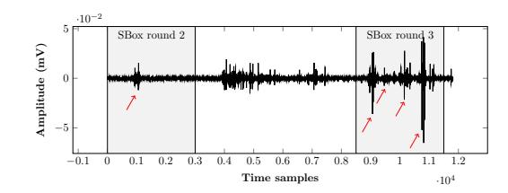

**Figure 1:** Differential power trace showing leakage at Sbox in round 2 and round 3 of AES-128 on 8-bit AVR microcontroller. Highlighted parts show how 1 byte difference propagates into 4 bytes.

SITM is a generic attack that can be applied to any block cipher (for example SPN, Feistel network) given a converging differential pattern can be observed. For demonstration purposes, we only focus on SPN.

## <span id="page-7-0"></span>**5 Practical Validation of the Attack Model**

In order to validate the attack model, we have conducted the experiments on AES software implementations on two different targets. The AES is implemented in assembly on 8-bit AVR ATmega328p microcontroller mounted on Arduino UNO board, and implemented with constant time C code on 32-bit ARM Cortex M3 microcontroller on Arduino DUE board. To obtain better SNR, the side-channel traces were collected using electromagnetic (EM) measurement with Langer near field RF-U 5-2 probe. The measurements are captured on a Lecroy 610Zi oscilloscope synchronized with a trigger in the design (the trigger encapsulated the first three rounds of AES). Individual sub-operations within a round were identifiable by visual inspection i.e. SSCA, which allows us to localize different rounds and different sub-operations with in a round like 16 sboxes in AES SubBytes. Each trace was measured at a sampling rate of 5 GSam/s and averaged 1000 times. While no averaging or averaging as few as 10 times was enough in some cases (for example AVR), we kept the experimental settings to 1000 averaging for better illustration. To illustrate how the traces look like, we chose specific plaintext pair (with known key) which the difference converges to a single byte in round 2 and observe the trace in round 3.

## **5.1 8-bit AVR Microcontroller**

In this experiment, the traces corresponding to both chosen plaintexts were collected, such that the difference is in exactly 1 byte in the second round. By SSCA, we can estimate the location of various operations, thereafter look for peaks in difference trace to check affected bytes. The difference trace is shown in Figure [1.](#page-7-1) As described earlier, the 4 bytes difference in the plaintexts converge to 1 byte difference in the second round (byte 0 here), resulting in 1 observable peak in the plot. This difference then propagate to 4 bytes due to MixColumns operation, leading to 4 peaks in the difference trace during third round.

## **5.2 32-bit ARM Microcontroller**

We equally validated the attacker model on a 32-bit ARM Cortex M3, which is a modern processor, with 3-stages of pipelines and running at 86 MHz. In Figure [2,](#page-8-1) the difference can be observed in byte 0 (top), byte 1 (bottom). This is corresponding to two different plaintext pair chosen based on the previously proposed attack. The two plaintext pair result in single byte difference at byte 0 and 1 respectively. With some difference in signal to noise ratio, the attacker model seems to work perfectly on both the attack targets.

<span id="page-8-1"></span>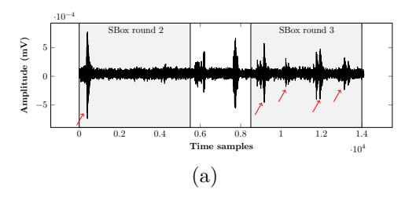

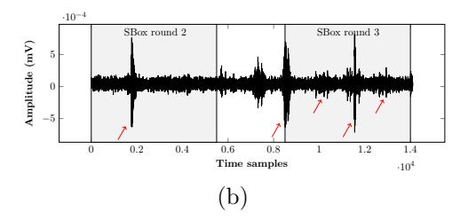

**Figure 2:** Differential power trace showing leakage at Sbox in round 2 and round 3 of AES-128 on 32-bit ARM microcontroller. Highlighted parts show how (a) difference in the first byte and (b) difference in the second byte propagates into 4 bytes.

# <span id="page-8-0"></span>6 Application of SITM to Ciphers

In the following, we describe how SITM can be applied to various block ciphers. The attack complexities are summarized in Table 2.

<span id="page-8-2"></span>

| Cimbon   | Block | Key     | Target | Data         | Memory      | Time                    | Ref.                    |           |
|----------|-------|---------|--------|--------------|-------------|-------------------------|-------------------------|-----------|
| Cipher   | size  | size    | depth  | (chosen PTs) | (bytes)     | 1 ime                   | nel.                    |           |
|          |       | 128     | 3      | $2^{13.73}$  | $2^{10}$    | $\mathcal{O}(2^{11.5})$ |                         |           |
|          | 128   | 192     | 3,4    | $2^{14.73}$  | $2^{10}$    | $\mathcal{O}(2^{11.5})$ | Sect. 6.1               |           |
| AES      |       | 256     | 3,4    | $2^{14.73}$  | $2^{10}$    | $\mathcal{O}(2^{11.5})$ |                         |           |
| ALS      |       | 128     | 4      | $2^{27.5}$   | $2^{12}$    | $\mathcal{O}(2^{26.5})$ |                         |           |
|          | 128   | 128 192 |        | 4,5          | $2^{28.5}$  | $2^{12}$                | $\mathcal{O}(2^{26.5})$ | Sect. A.2 |
|          |       | 256     | 4,5    | $2^{28.5}$   | $2^{12}$    | $\mathcal{O}(2^{26.5})$ |                         |           |
|          |       | 64      | 7,8    | $2^{13.02}$  | $2^{9.58}$  | $O(2^{10})$             |                         |           |
|          | 64    | 128     | 7-10   | $2^{14.02}$  | $2^{9.60}$  | $O(2^{10})$             |                         |           |
| SKINNY 1 |       | 192     | 7-12   | $2^{14.61}$  | $2^{9.61}$  | $\mathcal{O}(2^{10})$   | Sect. 6.2               |           |
|          |       | 128     | 7,8    | $2^{25.17}$  | $2^{19.58}$ | $O(2^{22})$             | Sect. 0.2               |           |
|          | 128   | 256     | 7-10   | $2^{26}$     | $2^{19.58}$ | $O(2^{22})$             |                         |           |
|          |       | 384     | 7-12   | $2^{26.58}$  | $2^{19.59}$ | $\mathcal{O}(2^{22})$   |                         |           |
| DDECENT  | 64    | 80      | 3,4    | $2^{12.32}$  | $2^{9}$     | $O(2^{9})$              | Soot 62                 |           |
| PRESENT  | 64    | 128     | 3,4    | $2^{13}$     | $2^{9.02}$  | $O(2^{9})$              | Sect. 6.3               |           |

Table 2: Summary of attack complexities on various ciphers

## <span id="page-8-3"></span>6.1 AES and Other AES-like Ciphers

Our attack is applicable to all versions of AES, namely AES-128, AES-196 and AES-256. As convention, the bytes in the cipher state are labeled column-wise from left to right.

The AES round function consists of: **AddRoundKey** bit-wise XOR the round key bits to the state, **SubBytes** apply 8-bit Sbox to every cell in the state, **ShiftRows** left-rotate of the 2nd, 3rd and last row of the state by 1, 2 and 3 respectively, and **MixColumns** apply an MDS diffusion matrix to every column of the state. We omit the description of the AES key schedule as it is not needed for our attack.

An example target differential pattern for AES is given in Figure 3, where  $S_i$  denote the state at the end of the round i.

As one can see that if we perform side-channel observation in round 4, we would expect to see the entire state  $S_3$  to be active, but such differential pattern occurs with very high probability even if the 4 active bytes in  $S_0$  do not converge to 1 byte in  $S_1$ . On the other hand, it is very distinctive to know if a convergence occurs when we observe the active bytes in round 3. In fact, the position of the active column gives us insight on the position

<span id="page-9-0"></span>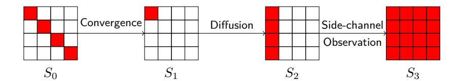

**Figure 3:** AES differential pattern. Active cells are coloured in red.

of the single active byte in *S*1:

```
s0 active in S1 ←→ s0, s1, s2, s3 active in S2,
s1 active in S1 ←→ s4, s5, s6, s7 active in S2,
s2 active in S1 ←→ s8, s9, s10, s11 active in S2,
s3 active in S1 ←→ s12, s13, s14, s15 active in S2.
```

Assuming that the differential values before the round 1 MixColumns is uniformly distributed, and since this 32-bit permutation is completely linear, any differential characteristic in *S*<sup>1</sup> comes from exactly one of the (2<sup>8</sup> − 1)<sup>4</sup> possible 4-byte differences. Therefore, the convergence probability for any particular differential characteristic is close to 2 −32 . As there are 2 <sup>8</sup> − 1 possible differential values for the active byte in *S*1, and the active byte can be at any position in the first column, the differential probability of convergence to occur in round 1 is 2 <sup>−</sup><sup>22</sup>. Therefore, we need an estimation of 2 <sup>11</sup>*.*<sup>5</sup> plaintexts, where we vary the values at *s*0*, s*5*, s*10*, s*<sup>15</sup> while fixing other bytes constant, to find a desired differential pattern.

Through side-channel observation in round 3, we can know the position of the single active byte in *S*<sup>1</sup> based on the position of the active column. Once we have a pair of plaintexts with the target differential pattern, we can guess the differential value of the single active byte in *S*1. For each guess, we compute backwards and solve for solutions for Equation [\(1\)](#page-5-1) and obtain the possible round key values at *s*0*, s*5*, s*10*, s*<sup>15</sup> by XORing the solutions to the plaintext value.

Since the majority of the valid differential transitions occurs with probability 2 −7 (there are 32,130 of them, and remaining 255 valid transitions occurs with probability 2 −6 ) we are expecting, for most of the time, 2 solutions for each byte when the differential transition is valid; While for the other half of the time, the transition is invalid and there is no solution for the given input and output difference pair. Therefore, we expect around 2 8 key candidates. For each key candidate, we run the encryption again with a different pair of plaintexts that should converge under that key candidate. This requires another 2 9 chosen plaintexts. As the chance of false positive is 2 <sup>−</sup><sup>24</sup> (having 3 inactive bytes in the active column in *S*1), it is likely that only the correct partial round key remains[2](#page-9-1) .

We performed 10,000 iterations of the experimental test and found that we need an average of 2572 (≈ 2 <sup>11</sup>*.*<sup>33</sup>) plaintexts to find the first convergence; And from this pair of plaintexts with the target differential pattern, it gave us an average of 268 (≈ 2 <sup>8</sup>*.*<sup>07</sup>) key candidates. The empirical result is rather close to our estimations.

For AES-128, we repeat the attack on the 4 different diagonals in *S*<sup>0</sup> to recover the entire first round key, which is also the full 128-bit master key. Thus, the attack requires 4 × (2<sup>11</sup>*.*<sup>5</sup> + 2<sup>9</sup> ) = 2<sup>13</sup>*.*<sup>73</sup> plaintexts, memory space to store the 4-byte key candidates 4 × 2 <sup>8</sup> = 2<sup>10</sup> bytes, time complexity of O(2<sup>11</sup>*.*<sup>5</sup> ) and side-channel observation at round 3. For AES-192 and AES-256, after recovering the first round key, we can repeat the attack recover the second round key by choosing plaintexts that has pairwise differential pattern beginning from *S*<sup>1</sup> and observe the leakage at round 4. Thus, the attack requires

<span id="page-9-1"></span><sup>2</sup> In comparison with Piret and Quisquater's differential fault attack technique [\[PQ03\]](#page-21-10), they used fault injection and partially decrypts known ciphertexts to some internal states, while we merely make observations, guess the difference of the internal states and decrypt back to the plaintexts. Thus, our technique is rather different and less invasive.

<span id="page-10-1"></span>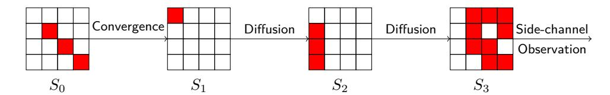

**Figure 4:** MIDORI differential pattern for 4-round attack. Active cells are in red.

8 × (2<sup>11</sup>*.*<sup>5</sup> + 2<sup>9</sup> ) = 2<sup>14</sup>*.*<sup>73</sup>, memory space of 2 <sup>10</sup> bytes, time complexity of O(2<sup>11</sup>*.*<sup>5</sup> ) and side-channel observation at round 3 and 4.

Our attack can easily be applied to other AES-like ciphers like MIDORI, both 64-bit and 128-bit versions. We provide an example differential pattern that can be used for our attack in Figure [4](#page-10-1) without further elaboration. In comparison to AES, due to the slower diffusion, we can deploy a deeper round side-channel observation at round 4 of MIDORI.

### <span id="page-10-0"></span>**6.2 SKINNY**

SKINNY was first proposed at CRYPTO 2016 and till date it is one of the most competitive lightweight encryption primitives. It is a tweakable block cipher with a total of 6 variants, with *n*-bit block size and *t*-bit tweakey size, where *n* = 64 or 128 and *t* = *n*, 2*n* or 3*n*. Our attack is applicable to all the variants.

Following the indexing used by the designers (which is different from AES), the cells (4-bit nibble for SKINNY-64 or 8-bit byte for SKINNY-128) in the SKINNY state are labeled row-wise from top to bottom.

One round of SKINNY, the round function consists of: **SubCells** apply Sbox to every cell in the state, **AddConstants** add round constants to the state, **AddRoundTweakey** bit-wise XOR the key bits to the upper half of the state, **ShiftRows** right-rotate of the 2nd, 3rd and last row of the state by 1, 2 and 3 respectively, and **MixColumns** row-wise XORs the rows of the state. More specifically, we have {*R*0*, R*1*, R*2*, R*3} ← {*R*0 ⊕ *R*2 ⊕ *R*3*, R*0*, R*1 ⊕ *R*2*, R*0 ⊕ *R*2}, where *Ri* is the (*i* + 1)-th row of the state.

Unlike AES, the non-linear layer (Sboxes) comes before the round key addition, and there is no whitening key. In addition, only the upper half of the state is updated by the round key. Naturally, we can denote the cells of the round key as {*rk*0*, rk*1*, rk*2*, rk*3} for *R*0 and {*rk*4*, rk*5*, rk*6*, rk*7} for *R*1.

The SKINNY key schedule is inspired by the tweakey framework introduced by Jean *et al.* at ASIACRYPT 2014. For the sake of brevity, we refer readers to [\[JNP14\]](#page-21-11) for more information on tweakey construction. Very briefly, the tweakey is arranged into 1, 2 or 3 tweakey states, denoted as *TKi*, for *t* = *n*, 2*n* and 3*n* respectively. The key schedule extracts the upper half of the tweakey state(s), bit-wise XOR them together for *t* = 2*n* and 3*n* to form the round key. After which, the extracted cells of *TK*2 and *TK*3 are updated by some linear-feedback shift register (LFSR), *L*<sup>2</sup> and *L*<sup>3</sup> respectively. Finally, all the tweakey state cells are updated by the same cell permutation *ρ*(*i*). The only feature of *ρ* that we need to know is that it sends the lower half to the upper half so it will be extracted as the round key in the following round. Having said that, the round keys can be expressed as follows:

$$\begin{split} rk_i^r &= TK1_j & \text{for } t = n \\ rk_i^r &= TK1_j \oplus L_2^{\lfloor \frac{r}{2} \rfloor}(TK2_j) & \text{for } t = 2n \\ rk_i^r &= TK1_j \oplus L_2^{\lfloor \frac{r}{2} \rfloor}(TK2_j) \oplus L_3^{\lfloor \frac{r}{2} \rfloor}(TK3_j) & \text{for } t = 3n \end{split}$$

where *rk<sup>r</sup>* is the round key for round *r*.

Expressing the cells of *S*<sup>1</sup> in terms of the plaintext cells *p<sup>i</sup>* and first round key cells *rk<sup>i</sup>* ,

<span id="page-11-1"></span>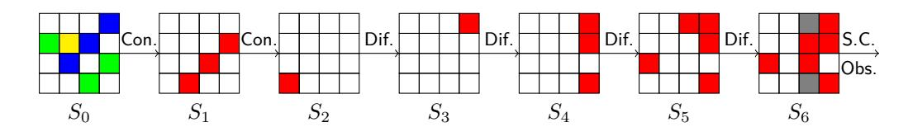

**Figure 5:** SKINNY differential pattern. Active cells are coloured in red. The blue and green cells in PT are chosen such that the difference will always converge to the 3 active cells in  $S_1$ . Grey cells may or may not be active.

we get

$$S_1 = \begin{bmatrix} p'_0 \oplus p'_{10} \oplus p'_{13} \oplus rk_0 & p'_1 \oplus p'_{11} \oplus p'_{14} \oplus rk_1 & p'_2 \oplus p'_8 \oplus p'_{15} \oplus rk_2 & p'_3 \oplus p'_9 \oplus p'_{12} \oplus rk_3 \\ p'_0 \oplus rk_0 & p'_1 \oplus rk_1 & p'_2 \oplus rk_2 & p'_3 \oplus rk_3 \\ p'_7 \oplus p'_8 \oplus rk_7 & p'_4 \oplus p'_9 \oplus rk_4 & p'_5 \oplus p'_{10} \oplus rk_5 & p'_6 \oplus p'_{11} \oplus rk_6 \\ p'_0 \oplus p'_{10} \oplus rk_0 & p'_1 \oplus p'_{11} \oplus rk_1 & p'_2 \oplus p'_8 \oplus rk_2 & p'_3 \oplus p'_9 \oplus rk_3 \end{bmatrix},$$

where  $p'_i = S(p_i)$  denotes the value after applying the Sbox. As all  $p'_i$ 's are known, our goal is to find the possible values of  $s_i$  in  $S_1$  and hence the round key values  $rk_i$ .

For the SKINNY Sboxes, Table 3 shows the tally of differential transitions with various probability of the 4-bit and 8-bit Sboxes. From there, we can easily see that the MDP of both 4-bit and 8-bit Sbox is  $2^{-2}$ , and the LDP (denote as  $2^{-t}$ ) of the 4-bit (resp. 8-bit) Sbox is  $2^{-3}$  (resp.  $2^{-7}$ ).

<span id="page-11-0"></span>**Table 3:** Tally of various differential probability of the 4-bit and 8-bit SKINNY Sbox. I.e.  $\sharp\{(\Delta_i,\Delta_o)\in\mathbb{F}_2^d\times\mathbb{F}_2^d\mid\Pr(\Delta_i\xrightarrow{S}\Delta_o)=2^x\}.$ 

| Sbox  | $2^{-7}$ | $2^{-6}$ | $2^{-5.4}$ | $2^{-5}$ | $2^{-4.4}$ | $2^{-4}$ | $2^{-3.7}$ | $2^{-3.4}$ | $2^{-3.2}$ | $2^{-3}$ | $2^{-2.7}$ | $2^{-2.4}$ | $2^{-2}$ |
|-------|----------|----------|------------|----------|------------|----------|------------|------------|------------|----------|------------|------------|----------|
| 4-bit | -        | -        | -          | -        | -          | -        | -          | -          | -          | 72       | -          | -          | 24       |
| 8-bit | 2688     | 5006     | 64         | 2828     | 78         | 652      | 2          | 18         | 2          | 101      | 2          | 4          | 23       |

Figure 5 depicts the differential pattern that we use for our attack. Since the non-linear layer (SubCells) comes before the key addition (AddRoundTweakey), we can always select plaintext pairs where the difference in  $S_0$  converges to 3 active cells in  $S_1$  with probability 1. For instance, we can select the values in the blue cells of the plaintext pairs such that after the SubCells all 3 cells have the same difference. During the MixColumns, the differences will cancel out and only a single active cell in the second row remains.

In round 2, the probability of a particular convergence is at least  $2^{-3t}$ , but unlike AES where we take any two plaintexts to form a differential, we select the plaintext in pairs with the 7-cell difference converging to 3-cell difference in round 1. Thus, we need approximately  $2^{3t+1}$  plaintexts to find one pair with the target differential pattern.

Because of the non-optimal diffusion, we can observe the leakage at much deeper round, as far as in round 7, where we expect to see exactly 3 active columns<sup>3</sup>. If the convergence did not occur in round 2, it is very likely that we will observe all columns to be active.

Once we find a pair of encryptions with our target differential pattern, we guess the differential value of the single active cell in  $S_2$ . As the MixColumns is a simple row-wise XORing, the output difference  $\Delta_o$  of the 3 active Sboxes in round 2 is the same. Solving Equation (1) yields us the possible values of  $s_i$ . Since we know the plaintext values  $p_i$ , we can easily compute the possible key values of  $rk_1, rk_3, rk_5$ . We can rotate the differential pattern horizontally and repeat the attack to collect key candidates for the entire first round key.

For SKINNY-64-64, we need  $2^{10}$  chosen plaintexts for each iteration of the attack. In the extreme case where each cell has 4 solutions (through solving Equation (1)), we

<span id="page-11-2"></span><sup>&</sup>lt;sup>3</sup>In case where the attacker's capabilities are insufficient to observe change in multiple columns, she can move to some of the earlier rounds where only one column is active.

have at most  $2^8$  partial key candidates in each iteration of the attack. Thus, we need another  $2^9$  plaintexts to filter the wrong partial round key candidates. Next, we repeat the attack by rotating the differential pattern 4 times to recover the first round key (32 bits). Next, we shift the entire attack one round deeper and launch the attack again to recover the second round key to obtain the full 64-bit master key. Therefore, the attack requires approximately  $8 \times (2^{10} + 2^9) = 2^{13.58}$  chosen plaintexts, memory space to store 3-nibble (4-bit) key candidates  $1.5 \times 2^9 = 2^{9.58}$  bytes, time complexity of  $\mathcal{O}(2^{10})$  and side-channel observation at round 7 and 8.

We performed 10,000 iterations of the experimental test and found that we need an average of 216 ( $\approx 2^{8.75}$ ) plaintexts to find the first convergence; And from this pair of plaintexts with the target differential pattern, it gave us an average of 41 ( $\approx 2^{5.36}$ ) key candidates. This is not surprising as our estimations are very conservative and this empirical result shows that in practice the attack could be much more efficient.

For SKINNY-128-128, we need  $2^{22}$  chosen plaintexts for each iteration of the attack. With at most  $2^{18}$  partial key candidates, we need another  $2^{19}$  plaintext pairs to filter the wrong partial round key candidates. Similar to SKINNY-64-64, we launch the attack 8 times to recover first 2 round keys which corresponds to the full 128-bit master key. Therefore, the attack requires  $8 \times (2^{22} + 2^{19}) = 2^{25.17}$  chosen plaintexts, memory space to store the 3-byte key candidates  $3 \times 2^{18} = 2^{19.58}$  bytes, time complexity of  $\mathcal{O}(2^{22})$  and side-channel observation at round 7 and 8.

Similarly, we performed 10,000 iterations of the experimental test and found that we need an average of  $2^{17.03}$  plaintexts to find the first convergence. And from this pair of plaintexts with the target differential pattern, it gave us an average of  $2^{13.34}$  key candidates. Once again, the empirical result shows that in practice the attack could be much more efficient.

For larger tweakey variants, notice that the round key is the XOR-sum of 2 or 3 tweakey states, thus we need to collect 2 (resp. 3) round key values of the same cell to recover the values in TKi. That is, for SKINNY-n-2n, we want to solving the following system of linear equations

$$rk_i^x = TK1_j \oplus TK2_j$$
  
$$rk_i^{x+2} = TK1_j \oplus L_2(TK2_j).$$

where x = 1, 2. And for SKINNY-n-3n, we have

$$rk_i^x = TK1_j \oplus TK2_j \oplus TK3_j$$
  

$$rk_i^{x+2} = TK1_j \oplus L_2(TK2_j) \oplus L_3(TK3_j)$$
  

$$rk_i^{x+4} = TK1_j \oplus L_2^2(TK2_j) \oplus L_3^2(TK3_j),$$

where x = 1, 2.

This means that for tweakey size t=2n and t=3n, we need to recover 4 and 6 round keys respectively. Therefore, for block size n=64, we need  $2^{14.58}$  and  $2^{15.17}$  chosen plaintexts respectively. While for n=128, we need  $2^{26.17}$  and  $2^{26.75}$  chosen plaintexts respectively. The increment in memory usage is negligible as we can free the storage space for the key candidates after every iteration of the attack.

#### <span id="page-12-0"></span>6.3 PRESENT and Other Bit Permutation Based Ciphers

PRESENT is a lightweight block cipher, published in CHES 2007. It is one of the first block ciphers that uses bit permutation instead of a diffusion matrix as the permutation layer.

The PRESENT round function consists of: **addRoundKey** bit-wise XOR the key bits to the state, **sBoxlayer** apply 4-bit Sbox to every nibble in the state, and **pLayer** bit-wise permute the entire state.

<span id="page-13-0"></span>**Table 4:** Differential transition of PRESENT Sbox where  $HW(\Delta_o) = 1$ .

| $\Delta_i$              | $\Delta_o$    |
|-------------------------|---------------|
| (hexadecimal)           | (hexadecimal) |
| 3, 5, 7*, b, d, f*      | 1             |
| $6, 7, 9, a, c, d^*, e$ | 2             |
| $3, 5, 9^*, b, d, f^*$  | 4             |
| $6, 7, 9, a, b^*, c, e$ | 8             |

 $\Delta_i$  with \* has differential probability  $2^{-2}$ , otherwise  $2^{-3}$ 

There are 2 variants of PRESENT, PRESENT-80 and PRESENT-128 with key length 80 and 128 bits respectively. For PRESENT-80, the key bits are represented as  $k_{79}k_{78}\dots k_0$ . After extracting the 64 leftmost bits as the round key  $rk_{63}rk_{62}\dots rk_0=k_{79}k_{78}\dots k_{16}$ , the key state is updated with a 61 bit left rotation, apply an Sbox on the 4 leftmost bits and addition of round constant c,

- 1.  $k_{79}k_{78}\dots k_0 \leftarrow k_{18}k_{17}\dots k_{19}$
- 2.  $k_{79}k_{78}k_{77}k_{76} \leftarrow S(k_{79}k_{78}k_{77}k_{76})$
- 3.  $k_{19}k_{18}k_{17}k_{16}k_{15} \leftarrow k_{19}k_{18}k_{17}k_{16}k_{15} \oplus c$

For PRESENT-128, the key schedule is quite similar. The key bits are represented as  $k_{127}k_{126}...k_0$ . After extracting the 64 leftmost bits as the round key  $rk_{63}rk_{62}...rk_0 = k_{127}k_{126}...k_{64}$ , the key state is updated with a 61 bit left rotation, apply two Sboxs on the 8 leftmost bits and addition of round constant c,

- 1  $k_{127}k_{126}\ldots k_0 \leftarrow k_{66}k_{65}\ldots k_{67}$
- 2.  $k_{127}k_{126}k_{125}k_{124} \leftarrow S(k_{127}k_{126}k_{125}k_{124})$
- 3.  $k_{123}k_{122}k_{121}k_{120} \leftarrow S(k_{123}k_{122}k_{121}k_{120})$
- 4.  $k_{66}k_{65}k_{64}k_{63}k_{62} \leftarrow k_{66}k_{65}k_{64}k_{63}k_{62} \oplus c$

Unlike ciphers with diffusion matrix, bit permutation based ciphers like PRESENT [BKL<sup>+</sup>07], RECTANGLE [ZBL<sup>+</sup>15] and GIFT [BPP<sup>+</sup>17] rely on their Sboxes for diffusion. To analyze the differential pattern, we have to look at the difference at the bit level, i.e. the number of active bits. Since we want convergence to occur, we are interested in the differential transitions where the output difference  $\Delta_o$  has Hamming weight 1. Table 4 shows the list of the input differences  $\Delta_i$  that can potentially go to some Hamming weight 1 output difference.

For our attack, we chose the differential transitions  $\Delta_i = \mathtt{0xf} \to \Delta_o \in \{\mathtt{0x1},\mathtt{0x4}\}$  for convergence.

In Figure 6 we present several desirable differential patterns that we can use. For convenience of our discussion, we denote the *i*-th Sbox in round r as  $S_{i-1}^r$ . Starting with input difference (in red) in the 16 least significant bits, each of these 4 active Sboxes in round 1 could potentially have output difference  $0 \times 1$  (in blue) or  $0 \times 4$  (in yellow). If all 4 active Sboxes have the same output difference, all the 4 active bits will go to a same Sbox (blue or yellow) in round 2, which could potentially converge again to output difference  $0 \times 1$  or  $0 \times 4$ . When we observe a single active Sbox in round 3, we know that the convergence occurs. In addition, if  $S_0^3$  or  $S_8^3$  (in purple) is active, we know that all the Sboxes  $S_0^1, S_1^1, S_2^1, S_3^1$  have the same output difference  $0 \times 1$ . On the other hand, if  $S_2^3$  or  $S_{10}^3$  (in green) is active, then the output difference was  $0 \times 4$ .

Each of these differential pattern occurs with probability  $2^{-10}$ , but since any of these 4 differential patterns can be used for the attack, the probability of getting one such differential pattern is  $2^{-8}$ . Thus, with  $2^9$  chosen plaintexts we are likely to find one such differential pattern.

Based on the position of the active Sbox in round 3, we deduce the output differential value of all the 4 active Sboxes in round 1 to be either 0x1 or 0x4. Next, together with

<span id="page-14-1"></span>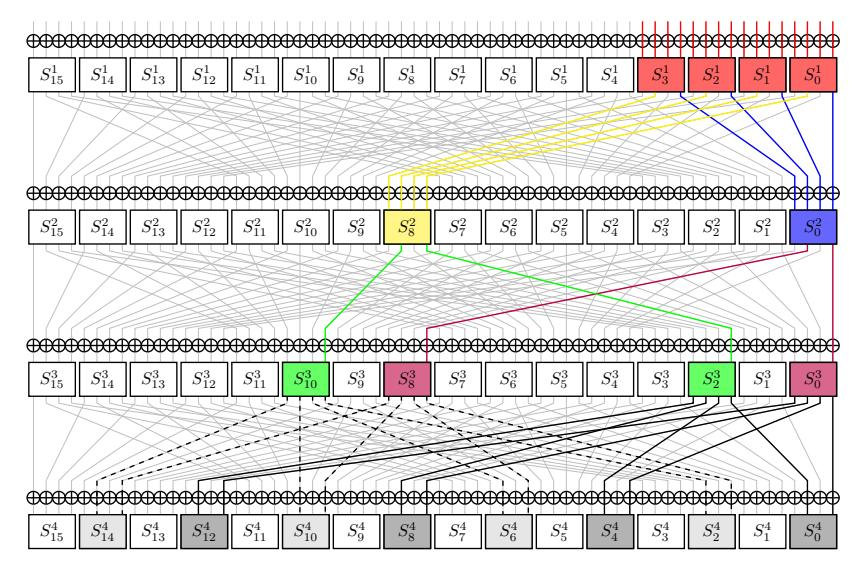

**Figure 6:** PRESENT differential patterns. Input differences are in red and the round 1 convergence goes to either the blue or yellow pattern. The round 2 convergence then goes to exactly one of the purple (if comes from blue path) or green (if comes from yellow path) paths.

the plaintext difference we solve Equation (1) and XORing the solutions to the plaintext to get  $2^8$  key candidates. Just like the previous attacks, we run the encryption for another  $2^9$  chosen plaintexts to find the correct partial round key.

Next, we can repeat the attack with input difference at  $\{S_4^1, S_5^1, S_6^1, S_7^1\}$ ,  $\{S_8^1, S_9^1, S_{10}^1, S_{11}^1\}$ , and  $\{S_{12}^1, S_{13}^1, S_{14}^1, S_{15}^1\}$  to recover the entire first round key.

For PRESENT-80, the first round key contains 64 bits of the master key  $\{k_{79}k_{78}\dots k_{16}\}$ , the remaining 16 unknown bits are  $\{k_{15}\dots k_0\}$ . We can go one round deeper and repeat the attack with input difference at  $\{S_{12}^2, S_{13}^2, S_{14}^2, S_{15}^2\}$  to recover another 13 key bits  $\{k_{15},\dots,k_3\}$ , and simply exhaustively guess the remaining 3 unknown bits. In summary, the attack requires  $5\times(2^9+2^9)=2^{12\cdot32}$  chosen plaintexts, memory space to store 16-bit key candidates  $2\times2^8=2^9$  bytes, time complexity of  $\mathcal{O}(2^9)$  and side-channel observation at round 3 and 4.

For PRESENT-128, after recovering the first round key, we obtain 64 out of 128 bits of the master key. Next, we repeat the entire attack at one round deeper to recover the second round key which contains another 61 bit of the master key  $\{k_{66},\ldots,k_3\}$ , and simply exhaustively guess the remaining 3 unknown bits. In summary, the attack requires  $8 \times (2^9 + 2^9) = 2^{13}$  chosen plaintexts, memory space to store 16-bit key candidates plus the first round key  $2 \times 2^8 + 8 = 2^{9.02}$  bytes, time complexity of  $\mathcal{O}(2^9)$  and side-channel observation at round 3 and 4.

We performed 10,000 iterations of the experimental test and found that we need an average of 257 ( $\approx 2^{9.01}$ ) plaintexts to find the first convergence; And from this pair of plaintexts with the target differential pattern, we obtain exactly  $2^8$  key candidates. The empirical result is very close to our estimation.

Our attack can also be applied to other bit permutation based ciphers like RECTANGLE and GIFT.

# <span id="page-14-0"></span>7 Number of Rounds to Mask to Mitigate SITM

In this section, we provide a framework for estimating the number of rounds to be masked in a conservative manner. Recall in Section 4.2, (C2) states that the attacker can propagate

<span id="page-15-2"></span>

| Cipher  | Block                        | Key    | # of  | h f.      |         | Rounds to | % of  |
|---------|------------------------------|--------|-------|-----------|---------|-----------|-------|
| Cipilei | size size rounds $b_p$ $f_d$ |        | $f_d$ | be masked | masking |           |       |
|         |                              | 128    | 10    |           |         | 10        | 100%  |
| AES     | 128                          | 192    | 12    | 4         | 2       | 12        | 100%  |
|         |                              | 256    | 14    |           |         | 12        | 85.7% |
|         |                              | 64     | 32    |           |         | 28        | 87.5% |
|         | 64                           | 128    | 36    | 8         | 6       | 28        | 77.8% |
| SKINNY  |                              | 192    | 40    |           |         | 28        | 70%   |
|         | 128                          | 128    | 40    |           |         | 40        | 100%  |
|         |                              | 256    | 48    | 15        | 6       | 42        | 87.5% |
|         |                              | 384    | 56    |           |         | 42        | 75%   |
| PRESENT | 64                           | 80/128 | 31    | 16        | 3       | 31        | 100%  |

**Table 5:** Number of rounds to be masked for various ciphers.

backward as long as the differential probability is larger than the acceptable probability threshold. Suppose the threshold is  $2^{-n}$  where n is the block size, we denote  $b_p$  the number of rounds to guarantee the differential probability is at most  $2^{-n4}$ . In the forward direction, (C3) states that the attack can propagate forward as long as one can distinguish if the differential pattern originates from some target intermediate differential pattern. Here, we denote the minimum number of rounds achieve full diffusion as  $f_d$ . Therefore, the number of rounds to be masked (at both ends of the cipher) is simply  $b_p + f_d$ .

Table 5 summarizes the number of rounds to be masked for various ciphers. For brevity sake, we detail how  $b_p$ ,  $f_d$  are derived in the Appendix B. For instance, for AES, any 4-round differential characteristic has probability at most  $2^{-150}$  ( $b_p = 4$ ), and a single bit difference will propagate to the entire state in 2 rounds ( $f_d = 2$ ). Therefore, for AES-128 and AES-192, the entire cipher should be masked, and for AES-256 the masking can be saved for the middle 2 rounds. It can be thus seen that majority of the cipher rounds, if not whole, must be masked and protecting only corner rounds is largely insufficient. Note that this is a quick and conservative estimation, it does not imply that the existence of an attack if lesser number of rounds is masked.

# <span id="page-15-0"></span>8 SITM on Middle Round Shuffling

Shuffling countermeasures randomize the order of operations. In the following, we show how to adapt SITM against shuffling. We start by describing shuffling and discussing the implications on the attack. We then show our method to tackle a shuffled implementation and show results on simulated traces. We finally validate the method against a real shuffled implementation of the AES.

#### 8.1 Description and Discussion

Shuffled AES implementation: We assume that at the beginning of every AES execution, a random permutation P of 16 elements is randomly selected among the  $16! \simeq 2^{44}$  possible ones. The Sbox computations are then reordered according to P, and we denote by P(0), ..., P(15) the associated new Sbox ordering. That is, when considering only the 16 time samples of each Sbox computation, the leakage index i corresponds to the manipulation of the byte  $s_{P(i)}$ .

**Leakage traces**: In the following, we assume a leakage model of the form L(x) = L(x) + B, where L denotes the deterministic part of the leakage and B corresponds to a Gaussian noise with some variance  $\sigma^2$ . For a trace Tr, we denote by Tr(i) the leakage corresponding to the i-th byte manipulation. That is,  $Tr(i) = L(s_{P(i)}) = L(s_{P(i)}) + B_i$ .

<span id="page-15-1"></span> $<sup>^4</sup>$ Under the assumption that the adversary has limited chosen plaintexts or observation of traces, one could choose a higher probability threshold, at his/her own discretion, to reduce the number of rounds to be masked.

Attacking the **AES**: As for the unprotected AES, the goal is to identify whether a convergence happened in  $S_1$ . As detecting a correct convergence is the condition required for the complete attack to succeed, we only focus on this. As shown in Figure 3, we perform two AES executions and obtain two traces  $Tr_0$  and  $Tr_1$  where the plaintexts only differ in the diagonal (in red), corresponding to the indices  $s_0$ ,  $s_5$ ,  $s_{10}$ , and  $s_{15}$  in  $S_0$ . We recall that a convergence consists of a single active byte in the first column of  $S_1$ , thus leading to a single active column in  $S_2$ . The goal of the SCA part is to detect this event. If there is no convergence, we expect multiple columns of  $S_2$  to be active. We assume that the first two rounds are protected with (e.g.) masking, and thus use the 3rd round ( $S_2$ ) to detect the convergence. Furthermore, as false positives would make the attack to fail, we must detect convergences with certainty.

Handling shuffled noisy traces: In the unprotected case, handling synchronized noisy traces is quite straightforward. Indeed, it is sufficient to do some averaging to detect a collision within the traces, using a threshold value. However, as we now assume that all the rounds are protected with shuffling, we do not know if the same time sample of two distinct traces corresponds to the same Sbox or not. Subsequently, all the 16 Sboxes have to be taken into account simultaneously, which makes the detection more difficult for two main reasons. First, this will add algorithmic noise. Second, as the leakage functions corresponding to two different time sample for real leakages might differ, a collision occurring at two different indices is hard to detect. Yet, we show in the next subsection a method to detect convergences with high confidence.

## 8.2 Simulated Traces and Analysis

**Detection method:** In order to detect collisions without false positive, we process the traces by using a statistical method. We emphasize that while the following method might not be statistically optimal, it gives satisfying results, especially considering our unprofiled setting. Finding a more optimal criteria, potentially in a (different) profiled setting could be an interesting research direction. From two traces  $Tr_0$  and  $Tr_1$ , we denote by  $D^s$  the sample-wise differential vector, computed as follow:

 $D^s = (Tr_0(0) - Tr_1(0), Tr_0(1) - Tr_1(1), ..., Tr_0(15) - Tr_1(15))$ . Note that  $D^s$  only computes differences between the same time samples, in order to handle the case (likely for real traces) where the leakage function differs for each time sample. If a collision occurs at some time sample, there are more chances for  $\left|\sum_j D^s(j)\right|$  to be lower than if there is no collision. If a convergence has occurred, this will happen if, by chance, at least one of the indices of the two shuffling permutations used for both  $Tr_0$  and  $Tr_1$  are the same for any of the 12 non-active bytes in  $S_2$ . Indeed, this would cause the same non-active byte to be processed at the same time sample. From this observation, we compute a discriminant  $\delta$ :

- 1. Collect N traces pairs  $(Tr_0^i, Tr_1^i)$ ,  $i \in [0, N-1]$ , having the same differential pattern as in Figure 3. All pairs have the same diagonal difference in order to produce the same convergence pattern. However, two different pairs have a different non-diagonal difference. The goal of varying the non-diagonal terms for two different pairs is to reduce the algorithmic noise.
- 2. For each trace pair indices i, compute its sample-wise differential vector  $D_i^s = (Tr_0^i(0) Tr_1^i(0), Tr_0^i(1) Tr_1^i(1), ..., Tr_0^i(15) Tr_1^i(15))$ .
- 3. For each differential vector  $D_i^s$ , compute its absolute sum  $\Sigma_i = \left|\sum_{j=0}^{15} D_i^s(j)\right|$ .
- 4. Compute the average discriminant  $\delta = \frac{\sum_{i=0}^{N-1} \Sigma_i}{N}$ .

Intuitively, since there are more chances for  $\left|\sum_{j} D^{s}(j)\right|$  to be lower if there is a collision, and since there are on average more collisions if there is a convergence, we expect  $\delta$  to be lower in the case of convergence than in the case of no convergence. Increasing the value

<span id="page-17-0"></span>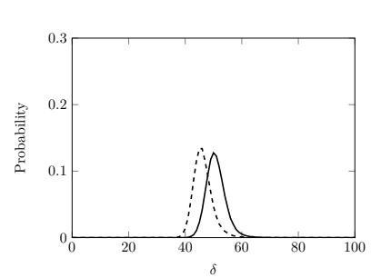

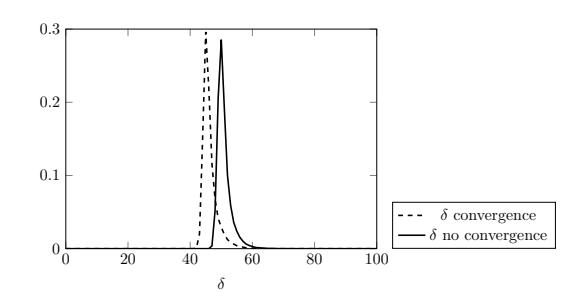

**Figure 7:** Distribution of *δ* when there is no convergence (plain) and when there is convergence (dashed). Left: *N* = 200. Right: *N* = 2000. SNR = 0*.*296

of *N* will improve this phenomenon for two reasons. First, it increases the chance that some of the 12 non-active bytes in *S*<sup>2</sup> might be processed at the same time sample for some pairs. Secondly, it reduces the algorithmic noise introduced when the bytes are not processed at the same time sample (which is the case most of the time).

**Simulated results:** In order to show the performance of our detection method, we look at a simulated setting. We simulated the leakages corresponding to a shuffled AES implementation by setting *L* as being the same leakage function as the 8-bit Atmel device described in Section [5,](#page-7-0) computed using linear regression [\[SLP05\]](#page-22-8). The corresponding signal is equal to 29*.*6325. we simulate the noise using a Gaussian distribution with variance *σ* <sup>2</sup> = 100, thus leading to SNR of 0*.*296.

The result of our method is illustrated in Figure [7,](#page-17-0) which shows the distribution of *δ* computed for different value of *N*. The dashed (resp. plain) distribution corresponds to the case where a (resp. no) convergence occurred. The left (resp. right) figure has been computed using *N* = 200 (resp. *N* = 2000). As we can see, the two distributions are clearly different for both cases. However, the region where the two distributions overlap indicates a value of *δ* that does not allow stating if a convergence occurred with certainty. Interestingly, any low enough value that only belongs to the dashed distribution necessarily corresponds to a convergence. This validates the fact that our methods can be used to accurately detects the convergence event. Note that, as expected, increasing *N* allows better detection. Intuitively, increasing *N* can be seen as increasing the number of traces that are used for averaging in the unprotected scenario. Indeed, there is a difference between the plaintext complexity and the trace complexity of the attack. The later one must take into account the ability to properly detect a convergence without false positive, even for the unprotected case.

### **8.3 Experiments with Real Traces**

We now validate the previous method against real traces of a shuffled AES implementation. We first describe the implementation and the experimental setup. To validate the method, we then perform the same analysis as for the simulated setting. As this analysis require the knowledge of the real key, we finally show a concrete unprofiled attack scenario.

**Setup and implementation**: The practical experiments are conducted using a similar setup as the one described previously in Section [5.](#page-7-0) The AES with shuffling countermeasure is implemented in C on AVR ATmega328p board. For the shuffling part, we use the permutation generation and double indexing, as described in [\[VMKS12\]](#page-22-9). For this setup, the estimated SNRs related to the 3rd round Sboxes (without shuffling) is around 0*.*5.

**Analysis**: As a first experiment, we aim at showing that the distribution of the discriminant *δ* is indeed different depending on if a convergence occurred or not. For that purpose, we generate two sets of traces. The first one (resp. second one) consists of *N<sup>p</sup>* = 300 plaintext pairs that produce a convergence (resp. do not produce a convergence). As the SNR is

<span id="page-18-0"></span>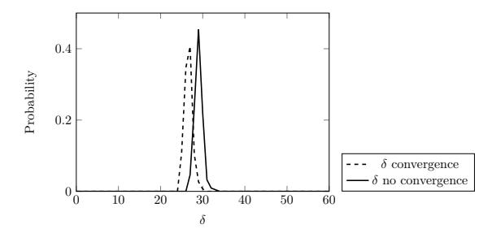

**Figure 8:** Distribution of *δ* when there is no convergence (plain) and when there is convergence (dashed) for real shuffled traces, using *N* = 1000 repetitions and 300 samples for each distribution.

a bit higher than for the simulations, we set the repetition value *N* to be equal to 1000. We thus acquired a total of 300 × 1000 = 300000 pairs of traces for each set. Note that the ability to generates such sets requires the knowledge of the actual master key, and is thus not feasible in a non-profiled setting. For this experiment, we additionally used the knowledge of the used permutation to trivially find the 16 points of interest using a correlation method.

The results are displayed in Figure [8,](#page-18-0) which shows the corresponding experimental distribution of *δ*. The dashed (resp. plain) distribution corresponds to the case where a (resp. no) convergence occurred. As we can see, the two distributions are indeed clearly different, which indicate that a convergence detection is feasible. More specifically, we see that a value of *δ <* 27 is never achieved when there is no convergence, while still likely in the case of a convergence. While 300 samples for each case is not enough to accurately estimate the distributions, it is enough to highlight the difference and to justify the validity of the approach.

**Unprofiled attack**: We now move to the case of a real attacker in an unprofiled manner. Obviously, the behavior of *δ* according to the distribution of Figure [8](#page-18-0) is not known to the adversary as it would require a profiling phase to be computed. Yet, we show below how to perform the attack in a fully unprofiled setting.

The first problem is the identification of the point of interests in the third round in an unprofiled manner. Yet, the 16 shuffled points of interest of the 3rd round can still easily be found using the SNR as a detection technique. For that purpose, we set the first plaintext byte as varying, and the 15 remaining ones as fixed. As a result, the variation of the whole state in the third round only depends on the first plaintext byte. Consequently, computing the SNR by grouping the traces according to that value allows finding the corresponding points of interest. The result of this POI detection is displayed in Figure [9,](#page-19-1) which has been done using 100000 traces. We can clearly see 16 distinct SNR peaks, corresponding to the 16 shuffled Sboxes. Note that the SNR obtained by this method is obviously lower than the actual one (0*.*5), due to the shuffling countermeasure introducing algorithmic noise. More specifically, we can see that the obtained SNR is around 0*.*03. Note that when multiplied by 16, it is roughly equals to 0*.*5, which corresponds to the SNR without shuffling.

Now that the 16 points of interest are found, we move to the actual attack. For that purpose, we speeded up the process by using a 4-time averaging with the same permutation for each trace. While such averaging is not possible in a real shuffling setting, we only used it to artificially increase the SNR to ease the attack. The corresponding new SNR without shuffling is increase up to 1.5, and the actual SNR with shuffling (as in Figure [9\)](#page-19-1) is equal to 0.09. We acquired *N<sup>p</sup>* = 2000 (averaged) trace sets using a repetition value of *N* = 1000, thus leading to a total of 2000000 traces. Note that the attack would still be feasible with the raw traces, at the cost of a higher repetition value *N*. We denote the corresponding plaintexts by *Mi,j* , *i* ∈ [0*,* 1999]*, j* ∈ [0*,* 999]. For a fix value *i*, we have the diagonal of *Mi,j* which is fixed ∀*j* ∈ [0*,* 999], and the non-diagonal bytes that are varying. For a fix value *j*, the non diagonal of *Mi,j* is constant ∀*i* ∈ [0*,* 1999], while the diagonal is

<span id="page-19-1"></span>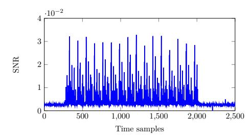

**Figure 9:** SNR result over the different time samples for the real shuffled AES traces, when only varying the first plaintext byte.

varying. This is illustrated by Figure 10. As a result, we obtained  $\binom{2000}{2} = 1999000$  pairs of plaintext diagonals that are to be tested for convergence. Among these pairs, 4 of them correspond to a convergence (obviously, this is not known to the attacker). The goal of the attacker is to correctly find 2 pairs in order to fully recover the key. For each pair, the attacker uses the corresponding repetition of N = 1000 to compute the discriminant  $\delta$ . As we know that  $\delta$  tends to be lower when a convergence occurred, we ranked the 1999000 pairs in increasing order of value  $\delta$ . The pairs corresponding to actual convergences were ranked 1, 20, 237 and 2006. As a strategy to find two correct pairs, the adversary can test all the N combination of pairs with the lowest  $\delta$ , requiring a complexity of  $\binom{N}{2}$ . This would be achieved in at most  $\binom{20}{2} = 190$  trials, thus validating the attack. Overall, the full attack on the 32 bits of the key required a plaintext complexity of  $\simeq 2^{12}$ , with a repetition N = 1000, leading to a trace complexity of  $\simeq 2^{22}$ . As the attack needs specific plaintexts for each 32-bit portion of the key, the trace complexity of a full key is multiplied by 4.

<span id="page-19-2"></span>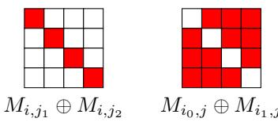

**Figure 10:** Illustration of the different plaintext values used for the real traces, viewed as  $4 \times 4$  matrices of bytes. A red (resp. white) square indicates a non-zero (resp. zero) value.

### <span id="page-19-0"></span>9 Conclusion

In this work, we have presented SITM, a new attack methodology for side-channel attacks, motivated by recently proposed SCADPA, in combination with differential cryptanalysis method. This attack could be generalized to SPN structure to target the middle rounds of a block cipher (up to 12 rounds for case of SKINNY due to its simple diffusion function). Here, we show the practical applicability of the attack based on experiment validation on 8-bit and 32-bit microcontroller. We then present case study on state-of-the-art block ciphers, namely AES, SKINNY, and PRESENT. Next, deeper round attacks targeting AES and PRESENT are presented, as well as further optimizations based on stronger leakage model. SITM is also shown to defeat lightweight countermeasures like shuffling in the middle rounds, even at low SNR. In this respect, finding a more optimal criteria than the proposed one for the attack against shuffling could be an interesting research direction. With shown middle round attacks, protecting corner rounds is not a sufficient solutions. Additionally a framework to estimate minimum rounds to protect is proposed.

# Acknowledgments

The authors acknowledge the support from the Singapore National Research Foundation ("SOCure" grant NRF2018NCR-NCR002-0001 – www.green-ic.org/socure).

## **References**

- <span id="page-20-0"></span>[AARR02] Dakshi Agrawal, Bruce Archambeault, Josyula R Rao, and Pankaj Rohatgi. The EM side—channel (s). In *International Workshop on Cryptographic Hardware and Embedded Systems*, pages 29–45. Springer, 2002.
- <span id="page-20-8"></span>[BGHD13] Shivam Bhasin, Sylvain Guilley, Annelie Heuser, and Jean-Luc Danger. From cryptography to hardware: analyzing and protecting embedded Xilinx BRAM for cryptographic applications. *Journal of Cryptographic Engineering*, 3(4):213– 225, 2013.
- <span id="page-20-1"></span>[BJB18] Jakub Breier, Dirmanto Jap, and Shivam Bhasin. SCADPA: Side-channel assisted differential-plaintext attack on bit permutation based ciphers. In *2018 Design, Automation & Test in Europe Conference & Exhibition (DATE)*, pages 1129–1134. IEEE, 2018.
- <span id="page-20-2"></span>[BJHB19] Jakub Breier, Dirmanto Jap, Xiaolu Hou, and Shivam Bhasin. On Side Channel Vulnerabilities of Bit Permutations in Cryptographic Algorithms. *IEEE Transactions on Information Forensics and Security*, 2019.
- <span id="page-20-10"></span>[BJK<sup>+</sup>16] Christof Beierle, Jérémy Jean, Stefan Kölbl, Gregor Leander, Amir Moradi, Thomas Peyrin, Yu Sasaki, Pascal Sasdrich, and Siang Meng Sim. The SKINNY family of block ciphers and its low-latency variant MANTIS. In Matthew Robshaw and Jonathan Katz, editors, *Advances in Cryptology - CRYPTO 2016 - 36th Annual International Cryptology Conference, Santa Barbara, CA, USA, August 14-18, 2016, Proceedings, Part II*, volume 9815 of *Lecture Notes in Computer Science*, pages 123–153. Springer, 2016.
- <span id="page-20-6"></span>[BK07] Alex Biryukov and Dmitry Khovratovich. Two new techniques of side-channel cryptanalysis. In Pascal Paillier and Ingrid Verbauwhede, editors, *Cryptographic Hardware and Embedded Systems - CHES 2007, 9th International Workshop, Vienna, Austria, September 10-13, 2007, Proceedings*, volume 4727 of *Lecture Notes in Computer Science*, pages 195–208. Springer, 2007.
- <span id="page-20-3"></span>[BKL<sup>+</sup>07] Andrey Bogdanov, Lars R Knudsen, Gregor Leander, Christof Paar, Axel Poschmann, Matthew JB Robshaw, Yannick Seurin, and Charlotte Vikkelsoe. PRESENT: An ultra-lightweight block cipher. In *CHES*, volume 4727, pages 450–466. Springer, 2007.
- <span id="page-20-9"></span>[BPP<sup>+</sup>17] Subhadeep Banik, Sumit Kumar Pandey, Thomas Peyrin, Yu Sasaki, Siang Meng Sim, and Yosuke Todo. GIFT: A Small Present. *Cryptographic Hardware and Embedded Systems-CHES*, pages 25–28, 2017.
- <span id="page-20-4"></span>[CIW13] Christophe Clavier, Quentin Isorez, and Antoine Wurcker. Complete SCARE of AES-Like Block Ciphers by Chosen Plaintext Collision Power Analysis. In *INDOCRYPT*, volume 8250, pages 116–135. Springer, 2013.
- <span id="page-20-5"></span>[dBLW02] Bert den Boer, Kerstin Lemke, and Guntram Wicke. A DPA Attack against the Modular Reduction within a CRT Implementation of RSA. In *CHES*, volume 2523, pages 228–243. Springer, 2002.
- <span id="page-20-7"></span>[DFL11] Patrick Derbez, Pierre-Alain Fouque, and Delphine Leresteux. Meet-in-themiddle and impossible differential fault analysis on AES. In *International Workshop on Cryptographic Hardware and Embedded Systems*, pages 274–291. Springer, 2011.

- <span id="page-21-7"></span>[GS14] Vincent Grosso and François-Xavier Standaert. ASCA, SASCA and DPA with Enumeration: Which One Beats the Other and When? In *International Conference on the Theory and Application of Cryptology and Information Security*, pages 291–312. Springer, 2014.
- <span id="page-21-4"></span>[GWL<sup>+</sup>15] Limin Guo, Lihui Wang, Dan Liu, Weijun Shan, Zhimin Zhang, Qing Li, and Jun Yu. A chosen-plaintext differential power analysis attack on HMAC-SM3. In *Computational Intelligence and Security (CIS), 2015 11th International Conference on*, pages 350–353. IEEE, 2015.
- <span id="page-21-5"></span>[HP06] Helena Handschuh and Bart Preneel. Blind differential cryptanalysis for enhanced power attacks. In Eli Biham and Amr M. Youssef, editors, *Selected Areas in Cryptography, 13th International Workshop, SAC 2006, Montreal, Canada, August 17-18, 2006 Revised Selected Papers*, volume 4356 of *Lecture Notes in Computer Science*, pages 163–173. Springer, 2006.
- <span id="page-21-11"></span>[JNP14] Jérémy Jean, Ivica Nikolic, and Thomas Peyrin. Tweaks and keys for block ciphers: The TWEAKEY framework. In *Advances in Cryptology - ASIACRYPT 2014 - 20th International Conference on the Theory and Application of Cryptology and Information Security, Kaoshiung, Taiwan, R.O.C., December 7-11, 2014, Proceedings, Part II* [\[JNP14\]](#page-21-11), pages 274–288.
- <span id="page-21-1"></span>[KJJ99] Paul Kocher, Joshua Jaffe, and Benjamin Jun. Differential power analysis. In *Advances in cryptology - CRYPTO'99*, pages 789–789. Springer, 1999.
- <span id="page-21-6"></span>[KLL10] Jongsung Kim, Yuseop Lee, and Sangjin Lee. DES with any reduced masked rounds is not secure against side-channel attacks. *Computers & Mathematics with Applications*, 60(2):347–354, 2010.
- <span id="page-21-0"></span>[Koc96] Paul C Kocher. Timing attacks on implementations of Diffie-Hellman, RSA, DSS, and other systems. In *Annual International Cryptology Conference*, pages 104–113. Springer, 1996.
- <span id="page-21-3"></span>[KSWH98] John Kelsey, Bruce Schneier, David Wagner, and Chris Hall. Side channel cryptanalysis of product ciphers. *Computer Security - ESORICS 98*, pages 97–110, 1998.
- <span id="page-21-9"></span>[NJJ<sup>+</sup>18] Zakaria Najm, Dirmanto Jap, Bernhard Jungk, Stjepan Picek, and Shivam Bhasin. On comparing side-channel properties of AES and ChaCha20 on microcontrollers. In *2018 IEEE Asia Pacific Conference on Circuits and Systems (APCCAS)*, pages 552–555. IEEE, 2018.
- <span id="page-21-10"></span>[PQ03] Gilles Piret and Jean-Jacques Quisquater. A differential fault attack technique against SPN structures, with application to the AES and KHAZAD. In *Cryptographic Hardware and Embedded Systems - CHES 2003, 5th International Workshop, Cologne, Germany, September 8-10, 2003, Proceedings*, pages 77–88, 2003.
- <span id="page-21-2"></span>[Pub01] NIST FIPS Pub. 197: Advanced encryption standard (AES). *Federal information processing standards publication*, 197(441):0311, 2001.
- <span id="page-21-8"></span>[RG17] Oscar Reparaz and Benedikt Gierlichs. A first-order chosen-plaintext DPA attack on the third round of DES. In Thomas Eisenbarth and Yannick Teglia, editors, *Smart Card Research and Advanced Applications - 16th International Conference, CARDIS 2017, Lugano, Switzerland, November 13-15, 2017, Revised Selected Papers*, volume 10728 of *Lecture Notes in Computer Science*, pages 42–50. Springer, 2017.

- <span id="page-22-6"></span>[RS09] Mathieu Renauld and François-Xavier Standaert. Algebraic side-channel attacks. In *International Conference on Information Security and Cryptology*, pages 393–410. Springer, 2009.
- <span id="page-22-3"></span>[Sha49] C. E. Shannon. Communication theory of secrecy systems. *The Bell System Technical Journal*, 28(4):656–715, Oct 1949.
- <span id="page-22-8"></span>[SLP05] Werner Schindler, Kerstin Lemke, and Christof Paar. A stochastic model for differential side channel cryptanalysis. In *International Workshop on Cryptographic Hardware and Embedded Systems*, pages 30–46. Springer, 2005.
- <span id="page-22-1"></span>[SP06] Kai Schramm and Christof Paar. Higher order masking of the AES. In *Cryptographers' track at the RSA conference*, pages 208–225. Springer, 2006.
- <span id="page-22-0"></span>[ST04] Adi Shamir and Eran Tromer. Acoustic cryptanalysis. *presentation available from http://www. wisdom. weizmann. ac. il/ tromer*, 2004.
- <span id="page-22-11"></span>[SVCO<sup>+</sup>10] François-Xavier Standaert, Nicolas Veyrat-Charvillon, Elisabeth Oswald, Benedikt Gierlichs, Marcel Medwed, Markus Kasper, and Stefan Mangard. The world is not enough: Another look on second-order DPA. In *International Conference on the Theory and Application of Cryptology and Information Security*, pages 112–129. Springer, 2010.
- <span id="page-22-4"></span>[SWP03] Kai Schramm, Thomas Wollinger, and Christof Paar. A new class of collision attacks and its application to DES. In *FSE*, volume 2887, pages 206–222. Springer, 2003.
- <span id="page-22-2"></span>[THM07] Stefan Tillich, Christoph Herbst, and Stefan Mangard. Protecting AES software implementations on 32-bit processors against power analysis. In *International Conference on Applied Cryptography and Network Security*, pages 141–157. Springer, 2007.
- <span id="page-22-7"></span>[VCGS14] Nicolas Veyrat-Charvillon, Benoît Gérard, and François-Xavier Standaert. Soft analytical side-channel attacks. In *International Conference on the Theory and Application of Cryptology and Information Security*, pages 282–296. Springer, 2014.
- <span id="page-22-5"></span>[VCS10] Nicolas Veyrat-Charvillon and François-Xavier Standaert. Adaptive chosenmessage side-channel attacks. In *ACNS*, volume 6123, pages 186–199. Springer, 2010.
- <span id="page-22-9"></span>[VMKS12] Nicolas Veyrat-Charvillon, Marcel Medwed, Stéphanie Kerckhof, and François-Xavier Standaert. Shuffling against side-channel attacks: A comprehensive study with cautionary note. In Xiaoyun Wang and Kazue Sako, editors, *Advances in Cryptology - ASIACRYPT 2012 - 18th International Conference on the Theory and Application of Cryptology and Information Security, Beijing, China, December 2-6, 2012. Proceedings*, volume 7658 of *Lecture Notes in Computer Science*, pages 740–757. Springer, 2012.
- <span id="page-22-10"></span>[Wan08] Meiqin Wang. Differential cryptanalysis of reduced-round PRESENT. In Serge Vaudenay, editor, *Progress in Cryptology - AFRICACRYPT 2008, First International Conference on Cryptology in Africa, Casablanca, Morocco, June 11-14, 2008. Proceedings*, volume 5023 of *Lecture Notes in Computer Science*, pages 40–49. Springer, 2008.

<span id="page-23-2"></span>[ZBL<sup>+</sup>15] Wentao Zhang, Zhenzhen Bao, Dongdai Lin, Vincent Rijmen, Bohan Yang, and Ingrid Verbauwhede. RECTANGLE: a bit-slice lightweight block cipher suitable for multiple platforms. *Science China Information Sciences*, 58(12):1–15, 2015.

## <span id="page-23-0"></span>A Other Attack Models

We present deeper round attacks on AES and PRESENT in the following and discuss about attack under precise leakage models.

## A.1 Further Optimizations with Precise Leakage Models

The previously presented analysis is developed on a difference-based leakage model, which is also practically validated on two different microcontrollers. Under the current model, the adversary can only learn, if a target intermediate value has changed between two executions when the plaintexts changes.

This attack can be further improved if we consider a stronger adversary capable of acquiring better side-channel measurements. In other words, if the adversary can extract more information from side-channel measurement like value or Hamming weight (HW) of the output difference, the analysis can be largely simplified. Naturally, if the value or HW of  $\Delta_o$  is known, the satisfying candidates for Equation (1) will converge faster to a solution, reducing the attack complexity. This can be clearly observed in [BJHB19], where authors could learn the value of the  $\Delta_o$ , as a result needing only  $\sim 2^4$  encryptions compared to  $\sim 2^{11}$  in our attack. Please note that authors in [BJHB19] were also working with the difference model, however, this was converted to value model due to properties of bit permutations.

#### <span id="page-23-1"></span>A.2 Deeper Round Attack on AES

In Section 6.1, we presented key-recovery attack on various variant of AES by collecting the side-channel measurements during round 3 of the encryption operation, and progressively going deeper into the rounds to recover the entire master key. While it seems like 3 rounds is the deepest we can go, as the AES round function achieves full diffusion in merely 2 rounds, we show that this is not necessary the case.

Recall that the diffusion matrix of AES is MDS, meaning the sum of non-zero components in the input and output vectors is at least 5. By exploiting the case where the bound is tight, we call it the "pessimal diffusion", we are able to perform key-recover attack through side-channel observation on round 4. Table 6 shows the list of representatives of pessimal diffusion of AES diffusion matrix where the input vector has 2 non-zero components and the output vector has 3 non-zero components. Any of these 2-to-3 non-zero components mapping can be represented by one of these representatives through some rotation and non-zero scalar multiplication. For example,  $\{0x3e,0x00,0x00,0x3e\} \rightarrow \{0x42,0x00,0x7c,0x3e\}$  is simply a left-rotation of the first representative multiplied by scalar factor 0x3e. In short, given the value of 1 of the 2 non-zero components of the input vector, there are 4 possible values for the other non-zero component that would result in 3 non-zero components in the output vector.

When one of such pessimal diffusions occurs, there are only 3 active bytes in  $S_2$  which will propagate to exactly 3 active columns in  $S_3$ . Thus, we can observe in round 4 for exactly 3 active columns to and deduce that both the convergence in round 1 and pessimal diffusion in round 2 occurred.

Figure 11 depicts an example differential pattern for our attack where we vary the values of the bytes in two diagonals,  $\{s_0, s_5, s_{10}, s_{15}\}$  and  $\{s_1, s_6, s_{11}, s_{12}\}$ , of  $S_0$  while

<span id="page-24-0"></span>**Table 6:** Representatives of pessimal diffusion of AES diffusion matrix.

| Input vector (hexadecimal) | Output vector (hexadecimal) | 1 4         | Output vector (hexadecimal) |  |  |
|----------------------------|-----------------------------|-------------|-----------------------------|--|--|
| 01 01 00 00                | 01 03 00 02                 | 01 00 02 00 | 00 07 05 01                 |  |  |
| 01 03 00 00                | 07 07 02 00                 | 01 00 03 00 | 01 04 07 00                 |  |  |
| 01 8d 00 00                | 8e 00 8c 8e                 | 01 00 8d 00 | 8f 8d 00 8e                 |  |  |
| 01 f7 00 00                | 00 f4 f6 f4                 | 01 00 f6 00 | f4 00 f6 f5                 |  |  |

keeping the other bytes constant. The 2 active bytes in  $S_1$  need be in the same diagonal, i.e.  $\{s_0, s_{15}\}, \{s_1, s_{12}\}, \{s_2, s_{13}\}$  or  $\{s_3, s_{14}\}$ , so that they will be in the same column after the ShiftRows operation.

<span id="page-24-1"></span>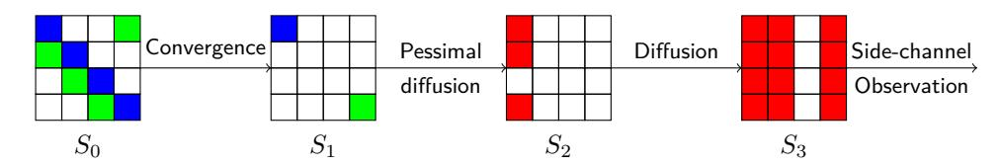

**Figure 11:** AES differential pattern for 4-round attack. Active bytes are in red, blue or green, where blue bytes in PT converge to a single blue byte in  $S_1$ , similarly for the green bytes.

The key-recovery attack is pretty much the same drill as before with slight modification. Since we have 8 active bytes in  $S_0$ , given a particular differential characteristic the convergence occurs with probability  $2^{-64}$ . As there are  $2^8 - 1$  possible differential values for each of  $s_0$  and  $s_{15}$ , and the active byte in the first column of  $S_1$  (in blue) can be at any of the 4 positions in the column, thus the differential probability of a convergence occurring in round 1 is approximately  $2^{-46}$ . Suppose the 2 active bytes are in the correct positions, in round 2, there are 4 in  $2^8 - 1$  chances that a pessimal diffusion occurs. Therefore, the probability of finding such differential pattern is  $2^{-52}$  and we need approximately  $2^{26.5}$  chosen plaintexts.

When we find a plaintext pairs with exactly 3 active columns in  $S_3$ , it is highly likely that convergence occurred in round 1 and pessimal diffusion occurred in round 2. In addition, the 2 active bytes in  $S_1$  are at one of the 4 sets of positions. For each set of positions, we exhaust the  $2^8-1$  possible pairs of values and deduce the key candidate. In total, there are approximately  $2^{10}$  possible key candidates. We then need another  $2^{11}$  chosen plaintexts to find the correct partial round key. Finally, we repeat the attack on the other 2 diagonals to recover the entire round key. In summary, recovering the first round key of AES requires  $2 \times (2^{26.5} + 2^{11}) = 2^{27.5}$  chosen plaintexts, memory space to store the 32-bit key candidates  $4 \times 2^{10} = 2^{12}$  bytes and time complexity of  $\mathcal{O}(2^{26.5})$ . For AES-192 and AES-256, we simply repeat the attack targeting one round deeper to find the second round key to recover the entire key.

#### A.3 Deeper Round Attack on PRESENT

In Section 6.3, we presented key-recovery attack on PRESENT through side-channel observation at round 3. If the adversary is capable of measuring the change in individual Sboxes, she can go one more round deeper and observe leakage at round 4, see Figure 6. If the active Sboxes fall in exactly one of these subsets  $\{S_0^4, S_4^4, S_8^4, S_{12}^4\}$  (in gray) or  $\{S_2^4, S_6^4, S_{10}^4, S_{14}^4\}$  (in light-gray), it is very likely that the convergence occurs. The only difference is that she is unable to tell if all the output differences in round 1 are  $0 \times 1$  or  $0 \times 4$  and the number of key candidates doubles. Nevertheless, the attack complexity is still relatively small.

## <span id="page-25-1"></span>B Deriving $b_p$ and $f_d$

Recall that we denote  $b_p$  the number of rounds to guarantee any  $b_p$ -round differential characteristics has differential probability at most  $2^{-n}$ , where n is the block size, and  $f_d$  the minimum number of rounds to achieve full diffusion.

**AES.** There exists 3-round differential characteristics with 9 active Sboxes as seen in Figure 11, such a valid characteristic has differential probability not lower than  $2^{-63}$ . Thus, we have  $b_p = 4$  for AES as there are at least 25 active Sboxes in any 4-round differential characteristic has differential probability not more than  $2^{-150}$ . The optimal diffusion property of AES ensures full diffusion in 2 rounds, thus  $f_d = 2$ .

**SKINNY.** Since the Sboxes of SKINNY-64 (n=64) and SKINNY-128 (n=128) has MDP=  $2^{-2}$ , we need at least 32 and 64 active Sboxes resprectively. As presented in [BJK<sup>+</sup>16], there are at least 36 and 66 active Sboxes for 8-round and 15-round differential characteristic, thus we set  $b_p$  to be 8 and 15 respectively. Independent of the Sbox dimension, the diffusion layer of SKINNY [BJK<sup>+</sup>16] guarantees full diffusion in 6 rounds, thus  $f_d=6$ .

**PRESENT.** In [Wan08], Wang showed that there exists iterative differential characteristic with 2 active Sboxes per round. Conservatively, we need 16 rounds to have at least 32 active Sboxes and differential probability at most  $2^{-64}$ , thus  $b_p = 16$ . The bit permutation of PRESENT maps 4 output bits of an Sbox to 4 Sboxes in different groups [BKL<sup>+</sup>07], achieving full diffusion in 3 rounds, thus  $f_d = 3$ .

## <span id="page-25-0"></span>C DPA on Corner Rounds vs SCADPA

We recall that we investigate a scenario where the first and last rounds are heavily protected with masking using n shares, leaving the middle rounds either unprotected or protected by lightweight countermeasures like shuffling. As an alternative to attacking the middle rounds like in SCADPA, an adversary can simply apply a n-order DPA on the first round. A natural question is thus whether it is better to use our method or a higher order DPA. While answering this question is not trivial, we provide a qualitative comparison. In the case of a higher order first round DPA, the adversary would first need to find the corresponding combination of n time samples that provide leakages on each share. As we consider an unprofiled setting, this is a complicated task whose complexity increases exponentially for the naïve methods. Yet, we now assume that these points of interest are given to the adversary and only look at the trace complexity. In this respect, the Figure 8 of [SVCO<sup>+</sup>10] shows an estimation of the trace complexity required by an adversary attacking the masking countermeasure. More precisely, using Hamming weight simulated leakages, it shows the number of traces required to achieve a 90% success rate depending on the number of shares n and the noise level  $\sigma^2$ , which we now use as a reference. In our attack against real shuffled traces, the SNR was equal to 0.09 (artificially increased). Assuming a Hamming weight model, this corresponds to a noise level equal to  $\frac{2}{0.09} = 22$ in [SVCO+10]. Achieving a 90% success rate with such noise level would require more than  $10^4$  for first order masking,  $10^6$  for second order and  $10^8$  for third order. We emphasize that the estimations of [SVCO<sup>+</sup>10] are generated using simulated Hamming weight leakages. As a result, an unprofiled attack would likely require more traces than the numbers we reported above. These numbers show that the trace complexity against the first order masking is close to our method when there is no shuffling. As a result, our method against unprotected middle round would be more efficient than applying a  $3^{rd}$  order attack against a 3-share masking. In the case of shuffled middle round, we see that the trace complexity of our method is close to a  $3^{rd}$  order attack, showing that our method would be more efficient than applying a  $4^{th}$  order attack against a 4-share masking.