# Mode-Level vs. Implementation-Level Physical Security in Symmetric Cryptography

A Practical Guide Through the Leakage-Resistance Jungle

Davide Bellizia1 , Olivier Bronchain1 , Ga¨etan Cassiers1 , Vincent Grosso2 , Chun Guo3 , Charles Momin1 , Olivier Pereira1 , Thomas Peters1 , Fran¸cois-Xavier Standaert1

 Crypto Group, ICTEAM Institute, UCLouvain, Louvain-la-Neuve, Belgium CNRS/Laboratoire Hubert Curien, Universit´e de Lyon, France School of Cyber Science and Technology and Key Laboratory of Cryptologic Technology and Information Security, Ministry of Education, Shandong University

Abstract. Triggered by the increasing deployment of embedded cryptographic devices (e.g., for the IoT), the design of authentication, encryption and authenticated encryption schemes enabling improved security against side-channel attacks has become an important research direction. Over the last decade, a number of modes of operation have been proposed and analyzed under different abstractions. In this paper, we investigate the practical consequences of these findings. For this purpose, we first translate the physical assumptions of leakage-resistance proofs into minimum security requirements for implementers. Thanks to this (heuristic) translation, we observe that (i) security against physical attacks can be viewed as a tradeoff between mode-level and implementationlevel protection mechanisms, and (ii) security requirements to guarantee confidentiality and integrity in front of leakage can be concretely different for the different parts of an implementation. We illustrate the first point by analyzing several modes of operation with gradually increased leakage-resistance. We illustrate the second point by exhibiting leveled implementations, where different parts of the investigated schemes have different security requirements against leakage, leading to performance improvements when high physical security is needed. We finally initiate a comparative discussion of the different solutions to instantiate the components of a leakage-resistant authenticated encryption scheme.

# 1 Introduction

State-of-the-art. Since the introduction of side-channel attacks in the late nineties [\[58,](#page-31-0)[60\]](#page-31-1), securing cryptographic implementations against leakage has been a major research challenge. These attacks raise critical security concerns, as they enable recovering sensitive information such as long-term secret keys, and are virtually applicable to any type of implementation if no countermeasures are deployed [\[64\]](#page-31-2). As a result, various types of protection mechanisms have been introduced, working at different abstraction levels. Due to the physical nature of the leakage, the first countermeasures were typically proposed at low abstraction levels. For example, hardware countermeasures can target a reduction of the sidechannel information by blurring the signal into noise in the time or amplitude domains [\[24](#page-29-0)[,63\]](#page-31-3), or by reducing this signal thanks to special (dual-rail) circuit technologies [\[86](#page-33-0)[,87\]](#page-33-1). These hardware countermeasures can then be augmented by implementation-level randomization mechanisms aimed at amplifying the sidechannel leakage reduction. Masking achieves this goal by exploiting data randomization (i.e., secret sharing) [\[22,](#page-29-1)[43\]](#page-30-0) and shuffling does it by randomizing the order of execution of the operations [\[51,](#page-31-4)[90\]](#page-33-2). Steady progresses have been made in order to improve the understanding of these different countermeasures. For example, masking is supported by a strong theoretical background (see [\[52,](#page-31-5)[34,](#page-30-1)[35,](#page-30-2)[6\]](#page-28-0) to name a few). Yet, it remains that the secure implementation of low-level countermeasures (e.g., masking) is quite sensitive to physical defaults [\[65,](#page-32-0)[70,](#page-32-1)[25,](#page-29-2)[4\]](#page-28-1), and is expensive both in software and hardware contexts [\[45,](#page-30-3)[46\]](#page-31-6).

In view of the sensitive and expensive nature of hardware-level and implementation-level side-channel countermeasures, a complementary line of works initiated the investigation of cryptographic primitives with inherently improved security against physical leakage. In the case of symmetric cryptography, this trend started with heuristic proposals such as [\[59,](#page-31-7)[73](#page-32-2)[,66,](#page-32-3)[40\]](#page-30-4). It was then formalized by Dziembowski and Pietrzak under the framework of leakage-resilient cryptography [\[36\]](#page-30-5), which has been the inspiration of many follow up works and designs. Simple and efficient PRGs & stream ciphers were proposed in [\[74,](#page-32-4)[92,](#page-33-3)[91](#page-33-4)[,83\]](#page-32-5). PRFs and PRPs can be found in [\[84](#page-32-6)[,38,](#page-30-6)[1,](#page-28-2)[33\]](#page-30-7). Concretely, such leakage-resilient primitives typically require some type of bounded leakage assumption, which was found to be significantly easier to fulfill for PRGs and stream ciphers that are naturally amenable to key evolution schemes than for PRFs and PRPs for which each execution requires the manipulation of a long-term secret key [\[9\]](#page-29-3).

The concept of leveled implementations introduced by Pereira et al. closely followed this finding: it aims at combining the minimum use of a PRF or PRP heavily protected against side-channel attacks thanks to (possibly expensive) hardware-level and implementation-level countermeasures with a mode of operation designed to cope with leakage, requiring much less protections (or even no protection at all) in order to process the bulk of the computation [\[72\]](#page-32-7).

These seed results on basic cryptographic primitives (such as PRGs, PRFs and PRPs) next triggered analyzes of complete functionalities like encryption and authentication, and rapidly shifted the attention of designers to Authenticated Encryption (AE) schemes mixing both integrity and confidentiality guarantees. Following the seminal observation of Micali and Reyzin that indistinguishability-based notions are significantly harder to capture and ensure with leakage than unpredictability-based notions [\[68\]](#page-32-8), strong integrity properties with leakage have then been investigated, first with leakage in encryption only [\[14\]](#page-29-4), next with leakage in encryption and decryption [\[15\]](#page-29-5). It turns out they could indeed be satisfied with weak physical assumptions for the bulk of the computation. For example, ciphertext intergrity can be achieved with full leakage of all the intermediate computations of an AE scheme and two manipulations of a long-term secret key with a strongly protected block cipher implementation. This is obviously insufficient for any type of confidentiality guarantee, as it would leak plaintexts immediately. This last conclusion motivated a systematic analysis of composite security definitions, enabling different physical requirements for integrity and confidentiality guarantees with leakage [\[49\]](#page-31-8). Eventually, various full-fledged AE schemes have been analyzed against leakage, based on Tweakable Block Ciphers (TBCs) [\[13\]](#page-29-6), permutations [\[28](#page-30-8)[,30,](#page-30-9)[27\]](#page-30-10) and combinations of both [\[50\]](#page-31-9).

We note that our following investigations are restricted to symmetric cryptography, which is the most investigated target for practical side-channel attacks. Yet, security against leakage has also been considered for other important objects such as digital signatures schemes (e.g., [\[55,](#page-31-10)[37,](#page-30-11)[62\]](#page-31-11)), public-key encryption schemes (e.g., [\[69,](#page-32-9)[57\]](#page-31-12)) and more advanced cryptographic functionalities like secure computation (e.g., [\[42,](#page-30-12)[18\]](#page-29-7)). We refer to [\[53\]](#page-31-13) for a recent survey.

Contribution. The starting point of our investigations is the observation that the development of low-level side-channel countermeasures and the one of primitives and modes of operation to prevent leakage have for now followed quite independent paths. This can, in part, be explained by the very different abstractions used to analyze them. While low-level countermeasures are typically evaluated experimentally based on statistical metrics [\[82\]](#page-32-10), proving the security of the aforementioned modes against leakage is rather based on cryptographic reductions leveraging some physical assumptions. In this respect, the quest for sound physical assumptions that are at the same time realistic (e.g., are falsifiable and can be quantified by evaluation laboratories) and sufficient for proofs has been and still is an important problem: see again [\[53\]](#page-31-13). To a large extent, the current situation therefore mimics the one of black box security proofs, with efficient schemes proven under idealized assumptions (e.g., the oracle-free leakages introduced in [\[92\]](#page-33-3) and used for analyzing sponge constructions in [\[30,](#page-30-9)[50\]](#page-31-9)) and a quest for more standard analyses under weaker assumptions. Combined with the massive amount of definitions capturing all the possible combinations of security targets for confidentiality and integrity with leakage [\[49\]](#page-31-8), the complexity of these theoretical investigations is therefore calling for a systematization effort towards the concrete interpretation of leakage security proofs, in order to determine how these results can help developers in the design of secure implementations.

## Our main contributions in this direction are threefold:

1. We provide a simplifying framework that allows us (a) to identify a reduced number of relevant security targets (compared to the full zoo of definitions in [\[49\]](#page-31-8)); and (b) to translate the physical assumptions used in leakage security proofs into practical implementation guidelines, stated in terms of security against Simple Power Analysis (SPA) and Differential Power Analysis (DPA), as can be evaluated by evaluation laboratories with tools such as [\[23,](#page-29-8)[81\]](#page-32-11) and extensions thereof. Despite SPA and DPA requirements are only necessary conditions for the formal physical security assumptions to hold, this analysis allows us to pinpoint the minimum level of efforts that implementers must devote to protect different parts of an AE implementation in function of the security target.

- 2. We use this framework to illustrate that reasoning about security against leakage can be viewed as a tradeoff between mode-level and implementation-level (or hardware-level) protections. To give a simple example, a physical security property (e.g., the aforementioned ciphertext integrity with leakage) can theoretically be obtained from standard modes of operation like OCB [\[79\]](#page-32-12), given that all the block cipher executions in the mode are strongly protected against DPA (which has high cost). Modes with better resistance against leakage can relax this DPA security requirement for certain parts of the implementations. Interestingly, we additionally observe that the literature already includes different modes of operation corresponding to different leakage security targets. This allows us to illustrate the physical security tradeoff based on actual algorithms, including candidates to the ongoing NIST standardization effort.[1](#page-3-0) We will focus on OCB-Pyjamask [\[44\]](#page-30-13), PHOTON-Beetle [\[5\]](#page-28-3), Ascon [\[29\]](#page-30-14), Spook [\[11\]](#page-29-9), ISAP [\[28\]](#page-30-8) and TEDT [\[13\]](#page-29-6), but our analysis applies to many other similar ciphers.
- 3. Finally, we answer concrete questions that these analyzes suggest, namely:
- We discuss the interest of leveled implementations compared to uniformly protected implementations based on a hardware implementation case study.
- We compare the (masked) TBC-based and permutation-based initialization/ finalization steps of two AE schemes (namely, Ascon [\[29\]](#page-30-14) and Spook [\[11\]](#page-29-9)) thanks to a software case study, and evaluate their respective advantages.
- We compare a standard tag verification mechanism (that requires hardwarelevel or implementation-level DPA protections) with the inverse-based tag verification proposed in [\[15\]](#page-29-5) that does not require DPA protections.
- We evaluate the pros and cons of the two main solutions to implement a strongly protected component for AE, namely masking and fresh re-keying based on a leakage-resilient PRF [\[10\]](#page-29-10), which is for example used in ISAP [\[28\]](#page-30-8).

For completeness, and despite the practical focus of the paper, we additionally provide a high-level view of the formal security guarantees that the analyzed AE schemes offer. For this purpose, we leverage the existing literature and tailor some existing generic results to the investigated cases studies.

Related work. In an independent line of work, Barwell et al. analyzed the security of AE schemes in a model where the leakage is excluded from the challenge encryption [\[7\]](#page-28-4). This model corresponds to a context of leakage-resilience, where security guarantees may vanish in the presence of leakage, but are restored once leakage is removed from the adversary's view. It enables strong composition results similar to the ones obtained without leakage, strong security against nonce misuse (i.e., misuse-resistance in the sense of Rogaway and Shrimpton [\[80\]](#page-32-13)) and has been instantiated with uniformly protected implementations (e.g., the scheme in [\[7\]](#page-28-4) is based on masking and pairings). Here, we rather focus on the composite definitions introduced by Guo et al. [\[49\]](#page-31-8) which consider integrity and confidentiality properties separately, rely on the setting of leakage-resistance (i.e., aim to resist against leakage even during the challenge encryption) and can only

1 <https://csrc.nist.gov/projects/lightweight-cryptography>

be combined with a weaker guarantee of nonce misuse-resilience (introduced by Ashur et al. [\[3\]](#page-28-5)) for the confidentiality guarantees in the presence of leakage.[2](#page-4-0) The motivations for this choice are twofold. First, composite definitions enable the identification of meaningful security targets matching existing AE schemes that a single "all-in-one" definition as the one of Barwell et al. cannot capture. Second, the security gains of some design tweaks we aim to analyze (e.g., ephemeral key evolution) cannot be reflected in the leakage-resilience setting. We refer to Section [2.2](#page-5-0) for more discussion about this definitional choice.

Cautionary notes. By focusing on the qualitative requirements that masking security proofs imply for implementers, our next analyzes and discussions naturally elude some additional important points that should also be considered in the evaluation of a leakage-resistant AE scheme, namely:

- (i) We do not consider the quantitative aspects: for example, do the modes provide beyond-birthday and/or multi-user security against leakage attacks?
- (ii) We ignore the impact of the primitives (e.g., the internals of the block ciphers and permutations) on the cost of low-level side-channel countermeasures. Yet, it is for example a well-known fact that minimizing the multiplicative complexity and depth of a block cipher is beneficial for masking [\[75,](#page-32-14)[41,](#page-30-15)[47\]](#page-31-14).

The first point is an important scope for further research. A complete analysis would indeed require having quantitative (and ideally tight) bounds for all the investigated schemes. For the second one, we believe it should have limited impact since most current lightweight ciphers aimed at security against side-channel attacks (e.g., the NIST Lightweight Cryptography candidates) are based on small S-boxes with minimum AND complexity and depth.

# 2 Simplifying framework

In this section, we present the simplifying framework that we will use in order to reason about leakage-resistant AE modes based on concrete (SPA and DPA) attacks. For this purpose, we first propose an informal decomposition of the modes that we will consider, and then list the design tweaks that such modes can leverage in order to reach different leakage security guarantees.

# 2.1 Leakage-resistant AE modes decomposition

We decompose the AE modes of operation under investigation into four informal parts, as illustrated in Figure [1](#page-5-1) for a simple Inner Keyed Sponge (IKS) design [\[16\]](#page-29-11). An optional Key Generation Function (KGF) is used to generate a fresh key K∗ based on a long-term master key K and a nonce N. Next, the message processing part uses the (optionally fresh) key in order to encrypt the

2 This limitation only holds in the presence of leakage, so nothing prevents to ask for black box misuse-resistance as an additional requirement of a mode, which we do not consider in this paper but could be investigated as future work.

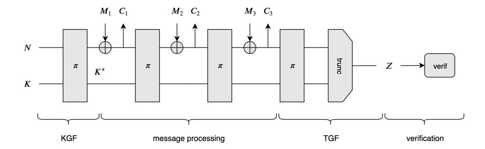

Fig. 1: Exemplary decomposition of an AE scheme.

message blocks. A Tag Generation Function (TGF) finally uses the result of the message processing part and outputs a tag for message authentication. The tag is only verified (i.e., compared to the genuine tag) in case of decryption.

We note that we make no claim regarding the generality of this decomposition. As will be clear next, it nicely matches a number of recent AE schemes with different levels of security against side-channel attacks, but other modes may not be directly adaptable to this simple framework. We believe this limitation is natural for a work aiming at specializing leakage-resistance analyzes to practical AE schemes. We note also that for simplicity, we ignore the associated data in our discussions, since it has limited impact on leakage analyzes.

#### 2.2 Design tweaks and security levels

The main design tweaks that enhance mode-based side-channel security are:

- 1. Key evolution. As formalized by Dziembowski and Pietrzak, updating the ephemeral keys of an implementation so that each of them is only used – and therefore leaks – minimally can improve confidentiality with leakage [\[36\]](#page-30-5).
- 2. Strengthened KGF and TGF. As formalized by Berti et al., using key and tag generation functions so that, given their input (resp., output), it is not direct to compute their output (resp., input) can improve security with leakage [\[14,](#page-29-4)[15\]](#page-29-5) – for example by preventing that recovering an ephemeral secret during message processing leads to the long-term master key.
- 3. Two-pass designs. As formalized by Guo et al. (resp., Barwell et al.) in the leakage-resistance setting [\[49\]](#page-31-8) (resp., leakage-resilience setting [\[7\]](#page-28-4)), two-pass modes can improve message confidentiality with decryption leakages, if the tag verification does not require the manipulation of sensitive plaintexts.

Based on these three main design tweaks, we select a number of practicallyrelevant security targets that reflect existing AE schemes from the leakageresistance definition zoo of [\[49\]](#page-31-8). For this purpose, we first recall Guo et al.'s definitions of integrity and confidentiality with leakage in an abstracted way, which will be sufficient to guide our attack-based analysis in the next section. Their more formal introduction is additionally provided in Appendix [A.](#page-33-5)

Definition 1 (Ciphertext Integrity with Leakage [\[15\]](#page-29-5), Informal.). In the ciphertext integrity with leakage security game, the adversary can perform a number of queries to encryption and decryption oracles enhanced with leakage functions, that capture the implementation of an AE scheme. His goal is to produce a valid fresh ciphertext and the implementation is considered secure if the adversary cannot succeed with good probability. Variants that we will use next include: ciphertext integrity with (nonce-respecting adversary and) leakage in encryption only (CIL1) and ciphertext integrity with misuse-resistance (i.e., no constraint on nonces) and leakage in encryption and decryption (CIML2).

Definition 2 (Confidentiality with Leakage [\[49\]](#page-31-8), Informal.). In the Chosen Ciphertext Attack (CCA) with leakage security game, the adversary can perform a number of queries to encryption and decryption oracles enhanced with leakage functions, that capture the implementation of an AE scheme. During a so-called "challenge query", he picks up two fresh messages X0 and X1 and receives a ciphertext Yb encrypting Xb for b ∈ {0, 1}, with the corresponding leakage. His goal is to guess b and the implementation is considered secure if the adversary cannot succeed with good advantage. Variants that we will use next include: chosen ciphertext security with nonce-respecting adversary and leakage in encryption only (CCAL1), chosen ciphertext security with nonce misuseresilience (i.e., fresh challenge nonce) and leakage in encryption only (CCAmL1) and chosen ciphertext security with nonce misuse-resilience and leakage in encryption and decryption, including decryption of the challenge Yb (CCAmL2).[3](#page-6-0)

In our notations, small caps are for resilience to misuse or leakage and capital letters for resistance. For integrity guarantees, it is possible to ensure misuseresistance and leakage-resistance jointly. As discussed in [\[49\]](#page-31-8), such a combination is believed to be impossible under reasonable leakage models for confidentiality guarantees and one has to choose between Barwell at al.'s CCAMl2 security or Guo et al.'s CCAL1, CCAmL1 or CCAmL2 security (see also Section [3.1\)](#page-7-0).

Based on these definitions, we list our security targets and their link with the aforementioned design tweaks. We insist that these links hold for the AE schemes investigated in the next section. We do not claim they are necessary to reach the security targets and admit other design ideas could be leveraged. We further reckon a finer-grain analysis may be useful in order to analyze other modes.

- Grade-1a. CIL1 and CCAL1 security thanks to key evolution.
- Grade-1b. CIML2 security thanks to strengthened KGF and TGF (and only black box security guarantees for message confidentiality).
- Grade-2. CIML2 and CCAmL1 security thanks to a combination of key evolution (i.e., Grade-1a) and strengthened KGF and TGF (i.e., Grade-1b).
- Grade-3. CIML2 and CCAmL2 security thanks to a combination of key evolution and strengthened KGF and TGF with a two-pass design.

3 We focus on the single-challenge definition for simplicity. Multi-challenge extensions are treated in the extended version of [\[49\]](#page-31-8) – see also Appendix [A.](#page-33-5)

We also denote as Grade-0 the AE schemes without leakage-resistant features.

Definitional framework motivation. The grades and design tweaks that we just described motivate our choice of definitions. On the one hand, the different grades exploit Micali and Reyzin's seminal observation that integrity requirements may be significantly easier to fulfill with leakage than confidentiality requirements. For example, Grade-2 designs achieve stronger integrity guarantees (with decryption leakage) than confidentiality guarantees (without decryption leakage). In Barwell et al.'s all-in-one definition, removing decryption leakage could only be done jointly for confidentiality and integrity guarantees. On the other hand, the security gains of some design tweaks cannot be reflected in the leakage-resilience setting. For example, excluding the challenge leakage implies that an implementation leaking challenge messages (and ephemeral keys) in full is deemed secure according to Barwell et al.'s definition. Hence, ephemeral key evolution has no impact in this case (and the construction in [\[7\]](#page-28-4) is indeed based on CFB). We insist that this observation does not invalidate the interest of the leakage-resilience setting: whether (stronger) leakage-resistance or (weaker) leakage-resilience is needed depends on application constraints. In general, our only claim is that the definitional framework of Guo et al. enables a fine-grain analysis that can capture various designs and application constraints which are not apparent when using an all-in-one definition of leakage-resilience.

# 3 From leakage-resistance to side-channel security

In this section, we first discuss how the physical assumptions used in leakage security proofs can be translated into minimum requirements for implementers. Next, we illustrate what are these minimum requirements for concrete instances of existing AE schemes. From the current literature, we identify Grade-0, Grade-1a, Grade 2 and Grade-3 AE schemes, which suggests the design of an efficient Grade-1b instance as an interesting scope for further investigations. We show that the minimum requirements suggested by security proofs are (qualitatively) tight and that failing to meet them leads to realistic SPA and DPA attacks.

# 3.1 Translating physical assumptions into implementation goals

Leakage security proofs for AE schemes rely on physical assumptions. As mentioned in introduction, the quest for sound and realistic assumptions is still a topic of ongoing research. In this section, we observe that the (sometimes strong) assumptions needed in proofs can be translated into minimum security requirements, expressed in terms of security against practical side-channel attacks.

Integrity with leakage requirements can be limited to the KGF, TGF (and optionally verification functions) for AE schemes with good leakage properties, and are extended to all the components of a mode of operation without such good properties (see Section [5](#page-24-0) for the details). The simplest assumption is to consider the underlying blocks to be leak-free [\[72\]](#page-32-7). A recent relaxation introduces a weaker requirement of unpredictability with leakage [12]. In both cases, these assumptions need that implementations manipulating a long-term key limit the probability of success of key-recovery DPA attacks, which we express as:

$$\Pr\left[\mathcal{A}_{\mathsf{kr}}^{\mathsf{L}(.,.)}\big(X_1,\mathsf{L}(X_1,K),\ldots,X_q,\mathsf{L}(X_q,K)\big)\to K|K\overset{\mathrm{u}}{\leftarrow}\{0,1\}^n\right]\approx 2^{-n+q\cdot\lambda(r)},\tag{1}$$

where  $\mathcal{A}_{kr}^{\mathsf{L}(\cdot,\cdot)}$  is the key recovery adversary able to make offline calls to the (unkeyed) leakage function  $\mathsf{L}(\cdot,\cdot),\,X_1,\ldots,X_q$  the different inputs for which the primitive is measured, K the long-term key of size n bits and  $\lambda(r)$  the (informal) amount of information leakage obtained for a single input  $X_i$  measured r times (i.e., repeating the same measurement multiple times can be used to reduce the leakage noise). For security against DPA, it is required that this probability remains small even for large q values, since there is nothing that prevents the adversary to measure the target implementation for many different inputs. Such DPA attacks reduce the secrecy of the long-term key exponentially in q. Hence, preventing them requires a mechanism that counteracts this reduction. For example, masking can be used for this purpose and makes  $\lambda(r)$  exponentially small in a security parameter (i.e., the number of masks or shares) [22,35].

Confidentiality with leakage requirements are significantly more challenging to nail down. For the KGF and TGF parts of the implementation, they at least require the same DPA security as required for integrity guarantees. For the message processing part, various solutions exist in the literature:

- 1. Only computation leaks assumption and bounded leakage, introduced by Dziembowski and Pietrzak [36]. By splitting a key in two parts and assuming that they leak independently, it allows maintaining some computational entropy in a key evolution scheme under a (strong) bounded leakage assumption.4
- 2. Oracle-free and hard-to-invert leakage function, introduced by Yu Yu et al. [92]. The motivation for Dziembowski and Pietrzak's alternating structure is to limit the computational power of the leakage function, which can otherwise compute states of a leaking device before they are even produced in the physical world. A straightforward way to prevent such unrealistic attacks is to assume the underlying primitives of a symmetric construction to behave as random oracles and to prevent the leakage function to make oracle calls. This comes at the cost of an idealized assumption, but can be combined with a minimum requirement of hard-to-invert leakages.5

&lt;sup>4 Precisely, [36] assumes high min-entropy or high HILL pseudoentropy, which are quite high in the hierarchy of assumptions analyzed by Fuller and Hamlin [39]. Note also that for non-adaptive leakages, the "alternating structure" that splits the key in two parts can be replaced by alternating public randomness [92,38,91].

&lt;sup>5 The hard-to-invert leakage assumption was introduced beforehand [32,31], and is substantially weaker than entropic leakage requirements (see again [39]). For example, suppose L(K) is the leakage, where K is secret and L is a one-way permutation. Then the leakage is non-invertible, but the conditional entropy of K could be 0.

3. Simulatability, introduced by Standaert et al., is an attempt to enable standard security proofs with weak and falsifiable physical assumptions, without alternating structure [\[83\]](#page-32-5). It assumes the existence of a leakage simulator that can produce fake leakages that are hard to distinguish from the real ones, using the same hardware as used to produce the real leakages but without access to the secret key. The first instances of simulators were broken in [\[61\]](#page-31-15). It remains an open problem to propose new (stronger) ones.

Despite technical caveats, all these assumptions aim to capture the same intuition that an ephemeral key manipulated minimally also leaks in a limited manner, preserving some of its secrecy. As a result, they share the minimum requirement that the probability of success of a key-recovery SPA attack remains small. Such a probability of success has a similar expression to the one of Equation [1,](#page-8-2) with as only (but paramount) difference that the number of inputs that can be measured is limited by design. Typically, q = 2 for leakage-resilient stream ciphers where one input is used to generate a new ephemeral key and the other to generate a key stream to be XORed with the plaintexts [\[74,](#page-32-4)[92](#page-33-3)[,91,](#page-33-4)[83\]](#page-32-5).

Note that because of these limited q values, the possibility to repeat measurements (by increasing the r of the leakage expression λ(r)) is an important asset for SPA adversaries. As will be detailed next, this creates some additional challenges when leakages can be obtained with nonce misuse or in decryption.

Besides the aforementioned requirements of security against key-recovery DPA and SPA, definitions of leakage-resistance provide the adversary with the leakage of the challenge query. In this setting, another path against the confidentiality of an AE scheme is to directly target the manipulation of the message blocks (e.g., in Figure [1,](#page-5-1) this corresponds to the loading of the Mi blocks and their XOR with the rate of the sponge). Following [\[85\]](#page-33-6), we express the probability of success of such Message Comparison (MC) attacks with:

$$\Pr\left[\mathcal{A}_{\mathsf{mc}}^{\mathsf{L}(\cdot,\cdot)}\big(X_0,X_1,\mathsf{L}(X_b,K)\big) \to b|K \stackrel{\mathsf{u}}{\leftarrow} \{0,1\}^n, b \stackrel{\mathsf{u}}{\leftarrow} \{0,1\}\right]. \tag{2}$$

In this case, the adversary has to find out whether the leakage L(Xb, K) is produced with input X0 or X1. As discussed in [\[49\]](#page-31-8), there are currently no mode-level solutions enabling to limit this probability of success to negligible values. So implementers have to deal with the goal to minimize the message leakage with lower-level countermeasures. Yet, as will be discussed next, even in this case it is possible to leverage mode-level protection mechanisms, by trying to minimize the manipulation of sensitive messages (e.g., in decryption).

Discussion. We note that combining leakage-resistance with misuse-resistance would require to resist attacks similar to the one of Equation [2,](#page-9-0) but with a "State Comparison" (SC) adversary A L(.,K) sc able to make offline calls to a keyed leakage function. As discussed in [\[49,](#page-31-8)[85\]](#page-33-6), this allows the adversary to win the game by simply comparing L(X0, K) and L(X1, K) with L(Xb, K), which is believed to be hard to avoid (unless all parts of the implementations are assumed leak-free). As a result, we next consider a combination of misuse-resilience with leakageresistance as our strongest target for confidentiality with leakage.

Summary. The heuristic security requirements for the different parts of an AE scheme with leakage (following the decomposition of Section [2.1\)](#page-4-1) include:

#### – For integrity guarantees:

- For the KGF and TGF: security against (long-term key) DPA.
- For the message processing part: security against (ephemeral key) DPA or no requirements (i.e., full leakage of ephemeral device states).
- For tag verification: security against DPA or no requirements.

# – For confidentiality guarantees:

- For the KGF and TGF: security against (long-term key) DPA.
- For the message processing part: security against (ephemeral key) DPA or (ephemeral key) SPA and security against MC attacks.

As detailed next, for some parts of some (leakage-resistant) AE schemes, different levels of physical security are possible, hence enabling leveled implementations. For readability, we will illustrate our discussions with the following color code: blue for the parts of an AE scheme that require DPA security, light (resp., dark) green for the parts of an AE scheme that require SPA security without (resp., with) averaging, light (resp., dark) orange for the parts of an AE scheme that require security against MC attacks without (resp., with) averaging and white for the parts of an AE scheme that tolerate unbounded leakages.[6](#page-10-0) We draw the tag verification in light grey when it is not computed (i.e., in encryption).

We note that precisely quantifying the implementation overheads associated with SPA and DPA security is highly implementation-dependent, and therefore beyond the scope of this paper. For example, the number of shares necessary to reach a given security level in software (with limited noise) may be significantly higher than in (noisier) hardware implementations [\[35\]](#page-30-2). Yet, in order to provide the reader with some heuristic rule-of-thumb, we typically assume that preventing SPA implies "small" overheads (i.e., factors from 1 to 5) [\[90\]](#page-33-2) while preventing DPA implies "significant" overheads (i.e., factors from 5 to > 100) [\[45](#page-30-3)[,46\]](#page-31-6). Some exemplary values will be given in our more concrete discussions of Section [4.](#page-16-0) We insist that the only requirement for the following reasoning to be practicallyrelevant is that enforcing SPA security is significantly cheaper than enforcing DPA security, which is widely supported by the side-channel literature.

In the rest of this section, we illustrate the taxonomy of Section [2.2](#page-5-0) with existing modes of operation. For each grade, we first exhibit how leakage-resistance (formally analysed in Section [5\)](#page-24-0) translates into leveled implementations; we then show that this analysis is qualitatively tight and describe attacks breaking the proposed implementations for stronger security targets than proven in Section [5;](#page-24-0) we finally discuss the results and their applicability to other ciphers.

6 For the MC attacks, SPA without averaging is only possible in the single-challenge setting. In case multiple challenges are allowed, all MC-SPA attacks are with averaging. This change is not expected to create significant practical differences when the adversary can anyway use challenge messages with many identical blocks.

# 3.2 Grade-0 case study: OCB-Pyjamask

Mode-level guarantees. The OCB mode of operation does not provide modelevel security against leakage. This is due to the use of the same long-term key in all the (T)BC invocations of the mode. As a result, all the (T)BC calls must be strongly protected against DPA. For completeness, a uniformly protected implementation of OCB-Pyjamask is illustrated in Appendix [B,](#page-35-0) Figure [13.](#page-35-1)

Proofs' (qualitative) tightness. Not applicable (no leakage-resistance proofs).

Discussion. As mentioned in introduction (cautionary notes) and will be further illustrated in Section [3.6,](#page-15-0) the absence of mode-level leakage-resistance does not prevent a mode of operation to be well protected against side-channel attacks: it only implies that the protections have to be at the primitive, implementation or hardware level. In this respect, the Pyjamask cipher is better suited to masking than (for example) the AES and should allow efficient masked implementations, thanks to its limited multiplicative complexity. A similar comment applies to the NIST lightweight candidates SKINNY-AEAD and SUNDAE-GIFT.

## 3.3 Grade-1a case study: PHOTON-Beetle

Mode-level guarantees. As detailed in Section [5.2,](#page-24-1) PHOTON-Beetle is CCAL1 and CIL1 under physical assumptions that, as discussed in Section [3.1,](#page-7-0) translate into SPA security requirements for its message processing part. Therefore, it can be implemented in a leveled fashion as illustrated in Figure [2.](#page-11-0) Note that nonce repetition is prevented in the CCAL1 and CIL1 security games, which explains the light grey and orange color codes (for SPA security without averaging).

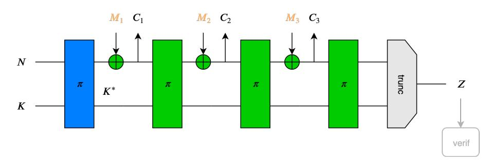

Fig. 2: PHOTON-Beetle, leveled implementation, CCAL1, CIL1.

Proofs' qualitative tightness. As soon as nonce misuse or decryption leakages are granted to the adversary, the following DPA becomes possible against the message processing part of PHOTON-Beetle: fix the nonce and the ephemeral key K∗ ; generate several plaintext (or ciphertext) blocks M1 (or C1); recover the capacity part of the state including M1 (or C1) and finally inverse the permutation to recover the long-term key K. The number of plaintext/ciphertext blocks that can be measured in this way equals 2r , where r (i.e., the rate of the sponge) equals 128 in the case of PHOTON-Beetle. This is (considerably) more than needed to perform a successful side-channel attack against a permutation without DPA protections [\[64\]](#page-31-2). Hence, we conclude that for any stronger security target than CCAL1 and CIL1, uniform protections are again needed.

Discussion. A similar analysis applies to many IKS designs in the literature, for example the NIST lightweight candidates Gimli and Oribatida and the CAESAR competition candidate Ketje. It formalizes the intuition that when encrypting without misuse, it is not necessary to protect the message processing part of IKS modes as strongly as their KGF. But this guarantee vanishes with nonce misuse or decryption leakage because it is then possible to control the ephemeral keys and the KGF is invertible. Hence, for stronger security targets, lower-level countermeasures have to be uniformly activated, the cost of which again depends on the structure (e.g., multiplicative complexity) of the underlying primitives. We mention the special case of the NIST candidate DryGascon which is a Grade-1a design, but uses a re-keying mechanism aimed at preventing DPA attacks everywhere (which we will further discuss in Section [4.4\)](#page-21-0). So the interest of leveled implementations for this cipher is limited by design. The practical pros and cons of leveled implementations will be discussed in Section [4.1.](#page-16-1)

# 3.4 Grade-2 case studies: Ascon and Spook

Mode-level guarantees. As detailed in Section [5.3,](#page-25-0) Ascon and Spook are CCAmL1 and CIML2 under different sets of physical assumptions for confidentiality and integrity guarantees. They represent interesting case studies where the composite nature of Guo et al.'s security definition enables different practical requirements for different parts of a mode and different security targets. We note that the previous requirement of DPA security for the KGF and TGF cannot be relaxed, so it will be maintained in this and the next subsection, without further discussion. By contrast, the security requirements for the message processing and tag verification parts can significantly vary, which we now discuss.

We start with Ascon's CCAmL1 requirements, illustrated in Figure [3.](#page-12-0) They translate into SPA security (without averaging) for the message processing part even with nonce misuse. This is because (i) in the misuse-resilience setting, the

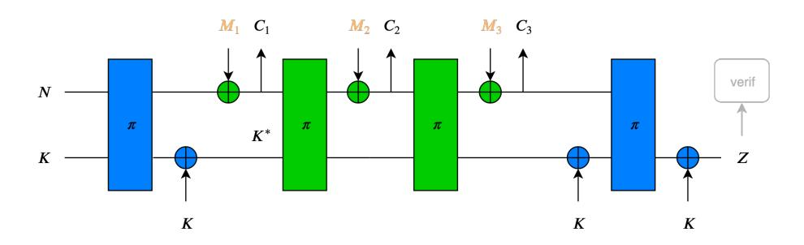

Fig. 3: Ascon, leveled implementation, CCAmL1.

challenge query of Definition [2](#page-6-1) comes with a fresh nonce (i.e., nonce misuse is only granted during non-challenge queries), and (ii) even a full permutation state leakage obtained for non-challenge queries (e.g., thanks to the same DPA as described against PHOTON-Beetle) does not lead to the long-term key K on which confidentiality relies (thanks to the strengthened KGF). A similar situation holds for Spook and is illustrated in Appendix [B,](#page-35-0) Figure [14.](#page-36-0)

We follow with Spook's CIML2 requirements, illustrated in Figure [4.](#page-13-0) The main observation here is that integrity is proven in a weak (unbounded leakage) model where all the intermediate permutation states are given in full to the adversary. This is possible thanks to the strengthening of the KGF and TGF which prevents any of these ephemeral states to leak about long-term secrets and valid tags. In the case of Spook, even the tag verification can be implemented in such a leaky manner (thanks to the inverse-based verification trick analyzed in [\[15\]](#page-29-5)). Optionally, a direct tag verification verifB can be used but requires DPA protections. A similar situation holds for the integrity of Ascon and is illustrated in Appendix [B,](#page-35-0) Figure [15,](#page-36-1) with as only difference that it can only be implemented with a direct DPA-secure tag verification. Note that without an inverse-based or DPA-secure verification, it is possible to forge valid messages without knowledge of the master key [\[15\]](#page-29-5), which is for example critical for secure bootloading [\[71\]](#page-32-15). We will confirm the practical feasibility of such attacks in Section [4.3.](#page-20-0)

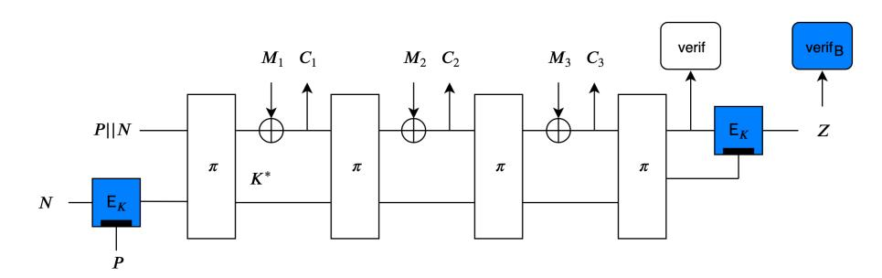

Fig. 4: Spook, leveled implementation, CIML2.

Proofs' qualitative tightness. From Figure [3](#page-12-0) (and [14](#page-36-0) in Appendix [B\)](#page-35-0), it can be observed that as soon as decryption leakages are granted to the adversary, a DPA attack against the confidentiality of the messages becomes possible. The beginning of the attack is exactly the same as the one against PHOTON-Beetle: fix the nonce and the ephemeral key K∗ ; generate several plaintext (or ciphertext) blocks M1 (or C1) and recover the capacity part of the state including M1 (or C1). This time, the full state leakage cannot lead to the long-term key K but it still allows recovering all the decrypted messages in full. Note that this attack actually targets a weaker notion than CCAmL2 since it only exploits the decryption leakage, without access to the decryption oracle. Yet, as discussed in [\[15\]](#page-29-5), it is a quite practical one in case of applications where IP protection matters (e.g., when a code or content can be decrypted and used but not copied).

Discussion. A similar analysis applies to other IKS designs with strengthened KGF and TGF, for example the NIST lightweight candidates ACE, WAGE and SPIX and the CAESAR competition candidate GIBBON. The TBC-based TET scheme also offers the same guarantees [\[13\]](#page-29-6). These designs reach the best integrity with leakage but due to their one-pass nature, cannot reach CCAmL2. The main concrete differences between Ascon and Spook are: (i) The KGF and TGF of Ascon are based on a permutation while Spook uses a TBC for this purpose, and (ii) the tag verification of Spook can be implemented in a leaky way with an inverse TBC call or in a DPA-protected way with a direct TBC call, while the tag verification of Ascon can only be implemented in the DPA-protected manner. The pros and cons of these options will be discussed in Sections [4.2](#page-19-0) and [4.3.](#page-20-0)

# 3.5 Grade-3 case studies: ISAP and TEDT

Mode-level guarantees. Leveled implementations of Ascon and Spook reach the highest security target for integrity with leakage (i.e., CIML2) but they are only CCAmL1 without uniform protections. ISAP and TEDT cross the last mile and their leveled implementations are proven CCAmL2 in Section [5.4,](#page-26-0) while also maintaining CIML2 security. The integrity guarantees of ISAP and TEDT follow the same principles as Ascon and Spook. Therefore, we only provide their CIML2 implementations in Appendix [B,](#page-35-0) Figures [16](#page-36-2) and [17,](#page-37-0) and next focus on their practical requirements for confidentiality with decryption leakage.

We start with the ISAP design for which a leveled implementation is illustrated in Figure [5.](#page-15-1) For now skipping the details of the re-keying function RK which aims at providing "out-of-the-box" DPA security without implementationlevel countermeasures such as masking, the main observation is that ISAP is a two-pass design where the tag verification does not require manipulating plaintext blocks. Hence, as long as the KGF, TGF (instantiated with RK) and the default tag verification are secure against DPA, the only attack paths against the confidentiality of the message are a SPA against the message processing part and a MC attack against the manipulation of the plaintext blocks. In both cases, averaging is possible due to the deterministic nature of the decryption.

The default tag verification of Figure [5](#page-15-1) must be secure against DPA. An exemplary attack path that becomes possible if this condition is not fulfilled is the following: given a challenge ciphertext (C, Z), flip some bits of C leading to related ciphertexts C 0 , C00 , . . . (which, due to the malleability of the encryption scheme, correspond to messages M0 , M00 , . . . with single bits flipped compared to the target M); forge valid tags for these ciphertexts thanks to the leaking message comparison (as experimentally validated in Section [4.3\)](#page-20-0) and finally perform a DPA against M thanks to the related messages' decryption leakage, which breaks the SPA requirements guaranteed by the proofs in Section [5.4](#page-26-0) and leads to the same (practical) IP protection issue as mentioned for Ascon and Spook.

Alternatively, ISAP also comes with a tag verification that provides similar guarantees as Spook's inverse one at the cost of another permutation call.

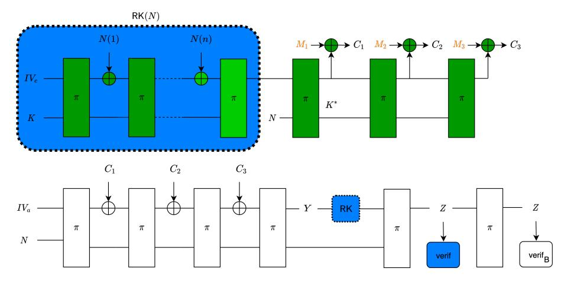

Fig. 5: ISAP, leveled implementation, CCAmL2.

TEDT's CCAmL2 requirements, illustrated in Appendix [B,](#page-35-0) Figure [18,](#page-37-1) are mostly identical: the only difference is that the RK function is replaced by a TBC which must be secure against DPA thanks to masking or other low-level countermeasures, and optionally enables an inverse-based tag verification.

Discussion. TEDTSponge, a sponge-based variant of TEDT with similar guarantees, is proposed in [\[50\]](#page-31-9). Besides their DPA resistant tag verifications, the main difference between ISAP and TEDT is their KGF and TGF. The concrete pros and cons of both approaches will be discussed in Section [4.4.](#page-21-0) We also mention that TBC-based constructions allow proofs in the standard model (under the simulatability assumption), which is currently not possible with sponge-based constructions, for which idealized assumptions are frequently used even in black box security proofs. Whether this gap can be bridged (with the simulatability or a weaker physical assumption) is an interesting open problem.

# 3.6 Summary table

The practical requirements that implementers must ensure for the different parts of the different modes of operation investigated in this section are summarized in Figure [6,](#page-16-2) in function of the security target. It nicely supports the conclusion that security against side-channel attacks can be viewed as a tradeoff between mode-level and implementation-level (or hardware-level) protections.

In general, even the highest security targets (i.e., CCAmL2 and CIML2) can be reached by modes without any leakage-resistance features like OCB, but then require strong low-level countermeasures for all the implementation parts. As the security targets and the quantitative security levels needed by an application increase, it is expected that leveled implementations will lead to better performance figures, which will be further analyzed in the next section.

|                  |            | CCAL1 |     | CCAmL1 CCAmL2 | CIL1 | CIML1 | CIML2 |
|------------------|------------|-------|-----|---------------|------|-------|-------|
| OCB Pyjamask  | KGF/TGF    | DPA   | DPA | DPA           | DPA  | DPA   | DPA   |
|                  | mess. proc | DPA   | DPA | DPA           | DPA  | DPA   | DPA   |
|                  | verif.     | NA    | NA  | unb.          | NA   | NA    | DPA   |
|                  | MC         | SPA   | SPA | SPA+avg       | NA   | NA    | NA    |
| PHOTON Beetle | KGF/TGF    | DPA   | DPA | DPA           | DPA  | DPA   | DPA   |
|                  | mess. proc | SPA   | DPA | DPA           | SPA  | DPA   | DPA   |
|                  | verif.     | NA    | NA  | unb.          | NA   | NA    | DPA   |
|                  | MC.        | SPA   | SPA | SPA+avg       | NA   | NA    | NA    |
| Ascon            | KGF/TGF    | DPA   | DPA | DPA           | DPA  | DPA   | DPA   |
|                  | mess. proc | SPA   | SPA | DPA           | unb. | unb.  | unb.  |
|                  | verif.     | NA    | NA  | unb.          | NA   | NA    | DPA   |
|                  | MC.        | SPA   | SPA | SPA+avg       | NA   | NA    | NA    |
| Spook            | KGF/TGF    | DPA   | DPA | DPA           | DPA  | DPA   | DPA   |
|                  | mess. proc | SPA   | SPA | DPA           | unb. | unb.  | unb.  |
|                  | verif.     | NA    | NA  | unb.          | NA   | NA    | unb.  |
|                  | MC.        | SPA   | SPA | SPA+avg       | NA   | NA    | NA    |
| ISAP             | KGF/TGF    | DPA   | DPA | DPA           | DPA  | DPA   | DPA   |
|                  | mess. proc | SPA   | SPA | SPA+avg       | unb. | unb.  | unb.  |
|                  | verif.     | NA    | NA  | DPA           | NA   | NA    | DPA   |
|                  | MC.        | SPA   | SPA | SPA+avg       | NA   | NA    | NA    |
| TEDT             | KGF/TGF    | DPA   | DPA | DPA           | DPA  | DPA   | DPA   |
|                  | mess. proc | SPA   | SPA | SPA+avg       | unb. | unb.  | unb.  |
|                  | verif.     | NA    | NA  | DPA           | NA   | NA    | unb.  |
|                  | MC.        | SPA   | SPA | SPA+avg       | NA   | NA    | NA    |

Fig. 6: Leveled implementations requirements (NA refers to attacks that cannot be mounted as they need access to leakage that is not available in the game).

# 4 Design choices and concrete evaluations

The framework of Section [2](#page-4-2) allowed us to put forward a range of AE schemes with various levels of leakage-resistance in Section [3.](#page-7-1) These modes of operation leverage a combination of design ideas in order to reach their security target. In this section, we analyze concrete questions related to these ideas and, when multiple options are possible, we discuss their pros and cons in order to clarify which one to use in which context. We insist that our goal is not to compare the performances of AE schemes but to better understand their designs.[7](#page-16-3)

#### 4.1 Uniform vs. leveled implementations

Research question. One important pattern shared by several designs analyzed in the previous section is that they can enable leveled implementations where different parts of the designs have different levels of security against side-channel

7 For unprotected implementations, we refer to ongoing benchmarking initiatives for this purpose. For protected ones, this would require agreeing on security targets and evaluating the security levels that actual implementations provide.

attacks. This raises the question whether and to what extent such leveled implementations can be beneficial. In software, it has already been shown in [\[13\]](#page-29-6) that gains in cycles can be significant and increase with the level of security and message size. We next question whether the same observation holds in hardware, which is more tricky to analyze since enabling more speed vs. area tradeoffs. Precisely, we investigate whether leveled implementations can imply energy gains (which is in general a good metric to capture a design's efficiency [\[56\]](#page-31-16)).

Experimental setting. In order to investigate the energy efficiency aspects of leveled implementations in presence of side-channel protections, we have designed FPGA and ASIC leveled implementations of Spook. We applied the masking countermeasure with d = 2 and d = 4 shares (with the HPC2 masking scheme [\[20\]](#page-29-13)) to the Clyde 128-bit TBC (used as KGF and TGF in Spook), and no countermeasure to the Shadow 512-bit permutation. We used a 32-bit architecture for Clyde and a 128-bit architecture for Shadow. The FPGA implementations have been synthesized, tested and measured on a Sakura-G board, running on a Xilinx Spartan-6 FPGA at a clock frequency of 6 MHz. As a case study, we encrypted a message composed of one block of authentication data and six blocks of plaintext. ASIC implementations have been designed using Cadence Genus 18 with a commercial 65 nm technology, and the power consumption has been been estimated post-synthesis, running at a clock frequency of 333 MHz.

Experimental results. The power consumption versus time of the Spook FPGA implementation is shown in Figure [7.](#page-17-0) Its main phases can be recognized: first, the Clyde KGF, then the Shadow executions and finally the Clyde TGF. We observe that a Shadow execution (48 clock cycles) is shorter than a masked Clyde execution (157 clock cycles). The power consumption of Shadow is independent of the masking order d, while the one of Clyde increases with d. The figure intu-

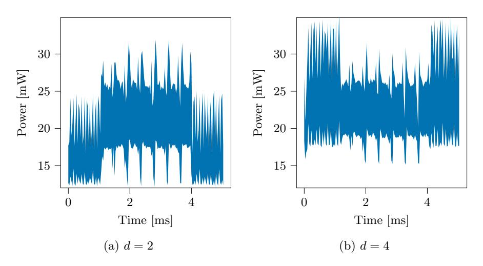

Fig. 7: Power consumption of a leveled implementation of Spook with a masked Clyde on a FPGA (Xilinx Spartan 6) at clock frequency fCLK = 6 MHz, for the encryption of one block of associated data and 5 blocks of message.

itively confirms the energy gains that leveled implementations enable. We note that larger architectures for Clyde would not change the picture: latency could be reduced down to 24 cycles (i.e., twice the AND depth of the algorithm) but this would cause significant area and dynamic power consumption increases.

We confirm this intuitive figure with performance results for the ASIC implementations of Spook. For this purpose, we have extracted energy estimations for one execution of Clyde (about 3.4 nJ for d = 2 and 8.1 nJ for d = 4) and one execution of (unprotected) Shadow (about 1.2 nJ) independently, in order to easily study the contributions of the two primitives. Assuming that only the execution of the primitives consumes a significant amount of energy, we can then estimate the energy consumption per byte for both Spook (i.e., 2 Clyde executions and n + 1 Shadow executions where n is the number of 32-byte message blocks) and OCB-Clyde-A (resp., OCB-Clyde-B), asumming n + 2 (resp., n + 1) Clyde executions (where n is the number of 16-byte message blocks). The OCB mode was used as an example of Grade-0 mode, and we used the Clyde TBC in order to have a fairer comparison between the modes. The A (resp., B) variant models the case where the OCB initialization is not amortized (resp., amortized) over a larger number of encryptions. The estimated energy per byte encrypted on ASIC is shown in Figure [8.](#page-18-0) For short messages (at most 16 bytes) and for both masking orders, OCB-Clyde-B consumes the least (with 2 Clyde executions), followed by Spook (2 Clyde and 2 Shadow executions), and OCB-Clyde-A is the most energy-intensive (with 3 Clyde executions). For long messages, both OCB-Clyde-A and -B converge to 1 Clyde execution per 16-byte block, while Spook converges to 1 Shadow execution per 32-byte block. In that scenario, a leveled implementation of Spook is therefore much more energy-efficient than OCB (e.g., 5 times more efficient for d = 2, and the difference increases with d).

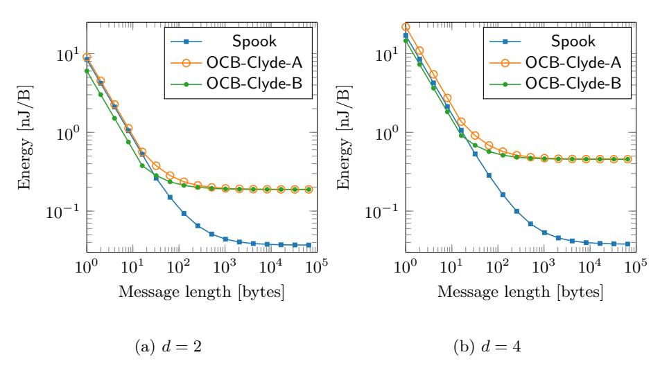

Fig. 8: Energy consumption of leveled Spook and uniform OCB-Clyde implementations on ASIC (65 nm technology), in function of the message length.

Discussion. Both the FPGA measurements and the ASIC synthesis results confirm that leveled implementations can lead to significant energy gains for long messages. This derives from the fact that the energy per byte of a protected primitive is larger than for a non-protected one. More interstingly, even for short messages our results show that leveled implementations can be beneficial. For example, Spook requires only two TBC executions. Hence, it is always more energy-efficient than OCB, excepted when the OCB initialization is perfectly amortized, and the message lenght is less than 16 bytes. Furthermore, even in this case, the Spook overhead is only 35% for d = 2 and 15% for d = 4.

These energy gains come at the cost of some area overheads since the leveled nature of the implementations limits the possibility to share resources between their strongly and weakly protected parts. In the case of Spook studied in this section, the total area requirements of a 2-share (resp., 4-share & 8-share) leveled implementation is worth 53,897 (resp., 90,311 & 191,214) µm2 . The Shadow-512 part of the implementation is only 22% of this total for the 2-share implementation and decreases to 13% (resp., 6%) with 4 shares (resp., 8 shares).[8](#page-19-1)

# 4.2 TBC-based vs. Sponge-based KGF and TGF

Research question. The Grade-2 designs Ascon and Spook use strengthened KGF and TGF instantiated with a permutation and a TBC. This raises the question whether both approaches are equivalent or if one or the other solution is preferable in some application context. We next answer this question by leveraging recent results analyzing the (software) overheads that masked implementations of the Ascon permutation and Spook TBC imply.

Experimental setting. The Ascon permutation (used for the KGF and TGF) and Spook TBC have conveniently similar features: both are based on a quadratic S-box and both have 12 rounds. Hence, both have the same multiplicative depth and the different number of AND gates that these primitives have to mask (which usually dominates the overheads as soon as the number of shares increases) only depends on their respective sizes: 384 bits for the Ascon permutation and 128 bits for the Spook TBC. We next compare the cycle counts for masked implementations of these two primitives in an ARM Cortex-M4 device.

Experimental results. A work from Eurocrypt 2020 investigates the proposed setting. It uses a tool to automatically generate masked software implementations that are secure in the (conservative) register probing model [\[8\]](#page-28-6). The Ascon permutation and Spook TBC (denoted as Clyde) are among the analyzed primitives. As expected, the resulting cycle counts for the full primitive are roughly doubled for Ascon compared to Clyde (reflecting their state sizes). For example, with a fast RNG to generate the masks and d = 3 (resp., d = 7) shares, the Ascon permutation requires 42,000 (resp., 123,200) cycles and Clyde only 15,380 (resp., 56,480). When using a slower RNG, these figures become 53,600 (resp., 182,800) for the Ascon permutation and 30,080 (resp., 121,280) for Clyde.

8 All the results in this subsection include the cost of the PRNG used to generate the shares (we used a 128-bit LFSR) and the area costs include the interface.

Discussion. Assuming similar security against cryptanalysis, Spook's TBC allows reduced overheads for the KGF and TGF by an approximate factor two compared to Ascon's permutation. Since TBCs generally rely on smaller state sizes than the permutations used in sponge designs, we believe this conclusion generally holds qualitatively. That is, a DPA-protected KGF or TGF based on a TBC allows reduced multiplicative complexities compared to a (wider) permutationbased design. It implies performance gains, especially for small messages for which the execution of the KGF & TGF dominates the performance figures. This gain comes at the cost of two different primitives for Spook (which can be mitigated by re-using similar components for these two primitives). Based on the results of Section [4.1,](#page-16-1) we assume a similar conclusion holds in hardware. So overall, we conclude that the TBC-based KGF/TGF should lead to (mild) advantages when high security levels are required while the permutation-based design enjoys the simplicity of a single-primitive mode of operation which should lead to (mild) advantages in the unprotected (or weakly protected) cases.

# 4.3 Forward vs. inverse tag verification

Research question. Another difference between Ascon and Spook is the possibility to exploit an inverse-based tag verification with unbounded leakage rather than a DPA-protected direct verification. We next question whether protecting the tag verification is needed and describe a DPA against an unprotected tag verification enabling forgeries for this purpose. We then estimate the cost of these two types of protections and discuss their benefits and disadvantages.

Experimental setting. We analyze a simple 32-bit tag verification algorithm implemented in a Cortex-M0 device running at 48 [MHz], and measured the power side-channel at a sampling frequency of 500 [MSamples/s]. It computes the bitwise XNOR of both tags and the AND of all the resulting bits. The adversary uses multivariate Gaussian templates estimated with 100, 000 profiling traces corresponding to random tag candidates and ciphertexts [\[23\]](#page-29-8). During the online phase, she performs a template attack on each byte of the tag individually. To do so, she records traces corresponding to known random tag candidates.

Experimental results. Figure [9](#page-21-1) shows the guessing entropy of the correct tag according to the number of attack measurements. It decreases with the number of traces meaning that the attack converges to the correct tag. After the observation of 300 tag candidates, the guessing entropy is already reduced below 232. The correct tag can then be obtained by performing enumeration (e.g., with [\[76\]](#page-32-16)).

Discussion. The DPA of Figure [9](#page-21-1) is slightly more challenging than attacks targeting non-linear operations (e.g., S-box outputs) [\[77\]](#page-32-17), but still succeeds in low number of traces unless countermeasures are implemented. As discussed in Section [3.4,](#page-12-1) two solutions can be considered to prevent it. First, protecting the tag verification against DPA with masking. Masking the XNOR operations is cheap since it is an affine operation. Masking the AND operations is more costly and implies performing 127 two-input secure AND gates (for a 128-bit tag), with a multiplicative depth of at least 7. The overall cost can be estimated as about

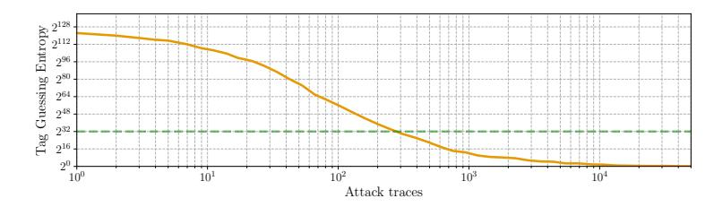

Fig. 9: Security of tag verification on ARM Cortex M0.

15% of a Clyde execution in cycle count / latency (in software and hardware), and corresponds to 20% in hardware area (for a 32-bit architecture similar to the one of Section 4.1). The second method is only applicable to TBC-based TGF. It computes the inverse of the TBC on the candidate tag, allowing a secure comparison with unbounded leakage. Being unprotected, the comparison is cheap but the inverse leads to overheads. For example, for the Clyde TBC, the inverse does not change the execution time, but increases the hardware area by 24% or the software code size by 23%. We conclude that protecting the tag verification leads to limited overheads in front of other implementation costs, with a (mild) simplicity and performance advantage for the inverse-based solution.

We recall that ISAP also comes with a possibility to avoid the DPA-protected tag verification, at the cost of an additional call to its internal permutation. It implies an increase of the execution time (rather than area overheads).

#### 4.4 Masked vs. deterministic initialization/finalization

Research question. One important difference between ISAP and TEDT is the way they instantiate their KGF and TGF. TEDT relies on a TBC that has to resist DPA thanks to masking, for which we can rely on a wide literature. ISAP rather uses a re-keying mechanism which is aimed to provide out-of-the-box DPA security. In this case, the best attack is a SPA with averaging, which is a much less investigated context. We therefore question the security of ISAP against advanced Soft Analytical Side-Channel Attacks (SASCA) [89], and then discuss its pros and cons compared to a masked TBC as used in TEDT.

We insist that the following results do not contradict the security claims of ISAP since the investigated attacks are SPA, not DPA. Yet, they allow putting the strengths and weaknesses of ISAP and TEDT in perspective.

Experimental setting. In order to study the out-of-the-box side-channel security of ISAP, we target its reference implementation where the permutations of Figure 5 are instantiated with the Keccak-400 permutation. We performed experiments against a Cortex-MO device running at 48 [MHz], and measured the power side-channel at a sampling frequency of 500 [MSamples/s]. Even though this target has a 32-bit architecture, the compiler generates code processing 16-bit words at a time. This is a natural approach since it is the size of a lane in

9 https://www.spook.dev/implementations

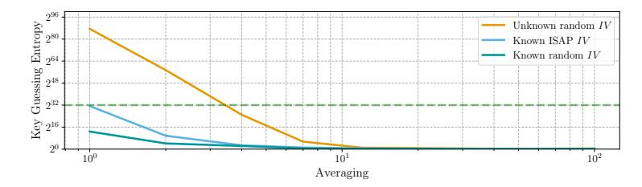

Fig. 10: Security of ISAP's re-keying in an ARM Cortex M0.

Keccak-400. Therefore, the intermediate variables exploited are 16-bit wide. We used 10,000 averaged traces corresponding to known (random)  $IV_e$  and K values for profiling. The profiling method is a linear regression with a 17-element basis corresponding to the 16 bits manipulated by the implementation and a constant [81]. We profiled models for all the intermediate variables produced when computing the permutation. During the attack phase the adversary is provided with a single (possibly averaged) leakage and optionally with  $IV_e$  (which is public in ISAP). She performs SASCA following the same (practical) steps as [48], but with 16-bit intermediate targets rather than 8-bit ones. For time & memory efficiency, she only exploits the first round of the full permutation.

**Experimental results.** Figure 10 shows the guessing entropy of the 128-bit key K in function of the number of times the leakage is averaged. We note that the adversary can average her measurements for the permutations of ISAP's rekeying, since the first permutation has a fixed input and the next ones only integrate the nonce bit per bit (so for example, even without controlling the nonce, 50% of the second permutation calls are identical). Increased averaging allows reducing the noise and therefore reducing the key's guessing entropy.

Overall, if  $IV_e$  is known (as in the ISAP design) the guessing entropy of the key is already lower than  $2^{32}$  without averaging. The correct key can then be retrieved by performing key enumeration. Interestingly, we observe that the value of  $IV_e$  has some impact on the attack success (i.e., the ISAP value, which has a lot of zeros, leads to slightly more challenging attacks than a random value). We further analyzed the unknown  $IV_e$  case and could successfully perform the same attack with a slight averaging (i.e., the attack trace measured ten times). The difference with the known  $IV_e$  case derives from the additional efforts that the adversary has to pay for dealing with more secret intermediate states.

**Discussion.** One important difference between the ISAP and TEDT approaches relates to the presence of a security parameter. While masking a TBC can use a number of shares as security parameter, there is no such security parameter for ISAP if used out-of-the-box. In this respect, the choice between one or the other approach can be viewed as a tradefoff between simplicity and expertise. On the one hand, implementations of ISAP deployed without specific countermeasures already enjoy security against a wide-class of (DPA) attacks; on the other hand, the deterministic nature of the (out-of-the-box implementation of the) re-keying function makes it susceptible to advanced (SPA) attacks that randomized countermeasures such as masking can prevent for TEDT implementations.

Admittedly, this conclusion is in part implementation-specific and the efficiency of SASCA generally degrades with the size of the implementation. In this respect, targeting 32-bit operations would be more challenging, which is an interesting scope for further investigations. Yet, we note that in case the size of the architecture makes power analysis attacks difficult, advanced measurement capabilities may be used [\[88\]](#page-33-8), maintiaining the intuition that for high-security levels, some algorithmic amplification of the noise is generally needed.

We mention that our results are in line with the recent investigations in [\[54\]](#page-31-18) where similar attacks are reported. The authors conclude that "unprotected implementations should always be avoided in applications sensitive to side-channel attacks, at least for software targets", and suggest (low-order) masking and shuffling as potential solutions to prevent SPA. The concrete investigation of these minimum protections and their implementation cost is an interesting open problem given the difficulty to protect embedded software implementations [\[19\]](#page-29-14).

A second important difference is that the performance overheads of ISAP are primitive-based while they are implementation-based for the TBC used in TEDT, which can therefore be masked in function of application constraints.

Overall, we conclude that in their basic settings, ISAP and TEDT target different goals: reduction from DPA security to SPA security with primitive-based performance oveaheads for ISAP and high-security against advanced adversaries with flexible overheads (e.g., if side-channel security is not needed) for TEDT.

We also mention the case of DryGascon, which implements a re-keying function sharing some similarities with the ISAP one, but with more secret material (somewhat building on the ideas outlined in [\[67\]](#page-32-18)). The results of our attacks with secret IVe suggest that this idea could lead to improved security. As mentioned in Section [3.3,](#page-11-1) and contrary to other ciphers that we consider in the paper, Dry-Gascon was not designed so that it can be implemented in a leveled manner. It suggests both the investigation of DryGascon's re-keying and the tweak of Dry-Gascon in order to enable leveled implementations and become more efficient (for some security targets) as other possible directions for future research.

#### 4.5 TBC-based vs. Sponge-based message processing

We finally mention that another significant difference between ISAP and TEDT (and more generally between different leakage-resistant AE schemes) is the way they instantiate the message processing part (i.e., with permutations or TBCs). Since in the context of leveled implementation, the message processing part is weakly protected (or even not protected at all), the respective interest of these two approaches essentially depends on their performances in this (unprotected) setting. We refer to the literature on lightweight cryptography (e.g., the survey in [\[17\]](#page-29-15)) for this purpose, observe that the most notable differences are due to more or less aggressive parameters and conclude that both solutions can lead to good results. We also recall that in the current state-of-the-art, and as already observed in Section [3.5,](#page-14-0) TBC-based solutions seem more amenable to proofs in the standard model than their permutation-based counterparts.

#### 5 Formal qualitative analysis

We conclude the paper with the security analysis of Beetle, Spook, Ascon, TEDT and ISAP, in the ideal permutation model. All the theorems below highlight that integrity requires weaker assumptions than confidentiality even in attack models where the adversary gets more leakage and nonce-misuse capabilities. The reader can find the formal definitions of the security notions in Appendix A.

# 5.1 Background: definitions and assumptions

For leaking components, we follow [50] and enforce limitations on the leakages of the permutation calls as well as those of the XOR executions. Precisely:

- For the former, we define  $(\mathsf{L}^{in}(U), \mathsf{L}^{out}(V))$  as the leakages of a permutation call  $\pi(U) \to V$ , where both  $\mathsf{L}^{in}$  and  $\mathsf{L}^{out}$  are probabilistic functions. Note that this means the leakage of a single permutation call is viewed as two independent "input" and "output" halves. And we assume the following non-invertibility: given the leakages  $(\mathsf{L}^{out}(Y|X), \mathsf{L}^{in}(Y'|X))$  of a secret c-bit value X and two adversarially chosen r-bit values Y, Y', the probability to guess X is negligible. Note that this is a special case of Equation (1).
- For the XOR executions, we define  $L_{\oplus}(Y, M)$  as the leakage of an XOR computation  $Y \oplus M \to C$ , where  $L_{\oplus}$  is also a probabilistic function. This time, we make an assumption on the following message distinguishing advantage: given the leakages ( $L^{out}(Y||X), L_{\oplus}(Y, M^b)$ ) of a secret r-bit key Y and adversarially chosen r-bit values  $X, M^0, M^1$ , the probability to guess b is bounded to ε. Note that this assumption is a special case of Equation (2).

#### 5.2 CCAL1 and CIL1 security of PHOTON-Beetle

We first consider Grade-1a schemes and focus on PHOTON-Beetle. As mentioned in Section 3.3, the leakage properties of other IKS schemes are similar.

**Theorem 1.** Assuming that a PHOTON-Beetle implementation satisfies (i) its KGF is leak-free, and (ii) the leakage of unprotected permutation calls are non-invertible as assumed in Section 5.1, the circuit ensure CIL1 integrity. Moreover, if this implementation also satisfies (iii) the leakages of XOR executions are bounded as assumed in Section 5.1, the circuit ensures CCAL1 confidentiality.

Proof (Sketch). We rely on an idealized scheme  $\mathsf{Beetle}^{\pi'}$ , which performs its computations using a secret random function  $\pi'$  that is independent from the publicly accessible permutation  $\pi$ . Denote by  $\mathsf{G}_1$  the game capturing the interaction between any adversary  $\mathcal{A}$  and the real Beetle circuit using  $\pi$ , and by  $\mathsf{G}_2$  the game capturing the interaction between  $\mathcal{A}$  and the idealized scheme  $\mathsf{Beetle}^{\pi'}$ . The crucial step of the proof is to establish the equivalence of  $\mathsf{G}_1$  and  $\mathsf{G}_2$ . For this purpose, we identify the following two bad events in  $\mathsf{G}_1$ : (1)  $\mathcal{A}$  makes a forward query to  $\pi(\star \| S)$  or a backward query to  $\pi^{-1}(\star \| S)$  using the capacity part S of any of the internal state involved in encryption/decryption queries; (2)  $\mathcal{A}$  makes a forward query to  $\pi(\star \| K)$  using the secret master key K. In order to reason about the first event, we need to consider two types of state values.

- Case 1: the partial state S is only involved decryption queries. Then S is random and perfectly secret as no leakage about S is given, and thus S appears in adversarial  $\pi$  queries with only a negligible probability;
- Case 2: the state S is involved in encryption queries. Then its corresponding probability can be bounded using the non-invertible assumption. Assume that  $\mathcal{A}$  triggers the second event with an overwhelming probability, then we can build an adversary  $\mathcal{A}'$  recovering its challenge secret X from the leakages  $(\mathsf{L}^{out}(Y|X), \mathsf{L}^{in}(Y'|X))$ :  $\mathcal{A}'$  simulates the encryption and decryption of a real Beetle circuit against  $\mathcal{A}$ , plugs  $(\mathsf{L}^{out}(Y|X), \mathsf{L}^{in}(Y'|X))$  at a random position in its simulation, and then extracts X from the  $\pi$  queries made by  $\mathcal{A}$ . The simulation is possible because: (i) the encryption queries are nonce respecting, which means the probability that the same partial state appears in two different encryption queries is negligible, and thus  $\mathcal{A}'$  does not need two "copies" of the leakages on X; (ii)  $\mathcal{A}'$  does not need to serve additional leakages of X during simulating decryption queries since they don't leak.

Conditioned on that the first event does not occur, the second event is also negligible, since the master key K is random and secret with no leakage, and since no query of the form  $\pi^{-1}(\star \| S)$  happened for any key generation action  $\pi(N\|K) \to (\star \| S)$  that appeared during encryption actions. It can be seen that  $\mathsf{G}_1$  and  $\mathsf{G}_2$  behave the same as long as neither of the above two events occurs. Hence,  $\mathsf{G}_1$  and  $\mathsf{G}_2$  are indistinguishable. Then, no adversary could forge in the game  $\mathsf{G}_2$ : this follows from the standard unforgability result of Beetle [21]. By the above equivalence, this implies the CIL1 security of the real Beetle circuit.

For CCAL1, we consider two games  $G_{2,0}$  and  $G_{2,1}$ . For b=0,1, the game  $G_{2,b}$  captures the interaction between an arbitrary CCAL1 adversary  $\mathcal{A}$  and the idealized Beetle $\pi'$ , in which Beetle $\pi'$  encrypts  $M_0$  among the two challenge messages  $(M_0, M_1)$ . The gap between  $G_{2,0}$  and  $G_{2,1}$  can be bounded by the bounded leakage assumption on XOR executions. A bit more precisely, following the methodology of [72,50], the gap can be bounded to  $O(\ell\varepsilon)$ , where  $\ell$  is the number of blocks in  $M_0$ . This means Beetle $\pi'$  is CCAL1 secure, which further implies the CCAL1 security of the real Beetle circuit by the above equivalence.

#### 5.3 CCAmL1 and CIML2 security of Ascon/Spook

As the mode of Spook is analyzed in [50], we only focus on Ascon.

**Theorem 2.** Assuming that an Ascon implementation satisfies (i) its KGF is leak-free, and (ii) the tag verification process is leak-free, the circuit ensures CIML2 integrity. Moreover, if the Ascon implementation also satisfies (iii) the leakages of unprotected permutation calls are non-invertible as assumed in Section 5.1, and (iv) the leakages of XOR executions are bounded as assumed in Section 5.1, then the Ascon implementation ensures CCAmL1 confidentiality.

&lt;sup>10 By our non-invertibility assumption,  $\mathcal{A}'$  obtains a single copy of the leakages  $(\mathsf{L}^{out}(Y\|X),\mathsf{L}^{in}(Y'\|X))$ . So if the partial state X appears twice in encryption queries (with nonce reuse),  $\mathcal{A}'$  does not have enough leakages to simulate the answers.

Proof (Sketch). The proof flow follows the proof ideas of Spook in [\[50\]](#page-31-9). In detail, we first modify Ascon as follows to obtain an idealized scheme:

- First, we replace KGFK(N) := π(NkK) ⊕ (0b−|K|kK) by a secret random function F(N) that maps N to b-bit uniform values, and next,
- We replace TGFK(S) := lsb|K| π(S ⊕ (0b−|K|kK)) ⊕ K by another secret random function G(S) mapping b-bit inputs S to |K|-bit uniform values.

It can be seen that both KGFK(N) and TGFK(S) are based on the "partial-key Even-Mansour cipher" [\[2\]](#page-28-7), the PRF security of which follows from [\[2\]](#page-28-7). Therefore, the idealized Ascon circuit is indistinguishable from the real Ascon circuit.

For CIML2 integrity, we can actually leak all the intermediate values to the adversary. With this "unbounded leakage" scenario, it can be seen that the idealized Ascon collapses to a Hash-then-PRF MAC, which consists of two steps: (1) S ← H(N, c), (2) Z ← G(S). The sponge-based hash H is non standard. Though, via a deeper analysis, it can be shown that H(N, c) is collision resistant, which implies the unforgability of the idealized Ascon— or the Hash-then-PRF MAC — even if nonces are reused in the encryption queries. Since the ideal and the real Ascon circuits are indistinguishable, the CIML2 security follows.

For CCAmL1 confidentiality, we denote by G1 the game capturing the interaction between any CCAmL1 adversary A and the real Ascon circuit, and by G2 the game capturing the interaction between A and the idealized Ascon circuit. We further introduce a game G3, which deviates from G2 in the following aspects: (1) in G3, the challenge encryption actions are performed using uniformly random internal states that are independent from π; (2) in G3, decryption queries always return ⊥. By the already established CIML2 result, the second change makes essentially no difference. The gap due to the first change is bounded using the non-invertibility leakage assumption, and the proof idea resembles the proof of Theorem [1.](#page-24-3) Note that this is possible because: (i) challenge encryption queries are nonce respecting; (ii) the initial states for challenge and non-challenge encryption queries are derived by F using different nonce values, and are thus independent; and (iii) decryption queries do not leak and thus do not affect the encryption query leakages. Hence, the gap between G2 and G3 is negligible.

Finally, following the methodology of [\[72,](#page-32-7)[50\]](#page-31-9), the CCAmL1 advantage of A in G3 can be bounded to O(`ε), where ` is the number of blocks in M0, and ε is the assumed leakage distinguishability advantage of a single XOR execution. Since we have proved that G1 ⇔ G2 ⇔ G3, the Ascon circuit is CCAmL1 secure. ut

#### 5.4 CCAmL2 and CIML2 security of ISAP/TEDT

We finally consider 2-pass Encrypt-then-MAC designs. TEDT has been thoroughly analyzed in [\[13\]](#page-29-6). Hence we focus on (the 2.0 version of) ISAP.

Theorem 3. Assuming that an ISAP implementation satisfies (i) its KGF is leak-free, and (ii) the tag verification process is leak-free, the circuit ensures CIML2 integrity. Moreover, if the ISAP implementation also satisfies (iii) the leakages of unprotected permutation calls are non-invertible as assumed in Section [5.1,](#page-24-2) and (iv) the leakages of XOR executions are bounded as assumed in Section [5.1,](#page-24-2) then the ISAP implementation ensures CCAmL2 confidentiality.

Proof (Sketch). The proof flow follows the proof idea of TEDT in [\[13\]](#page-29-6). In detail, we first modify ISAP as follows to obtain an idealized scheme: (1) we replace KGFK(N) by a secret random function F(N) that maps a nonce N to (b − n)-bit uniform values, and (2) we replace TGFK(Y kU) by a secret random function G(Y kU) that maps a b-bit input Y kU to n-bit uniform values. By the specification of ISAP 2.0, the core component of KGF and TGF is a standard inner keyed duplex function ISAPRKK (RK in Figure [5\)](#page-15-1), the PRF security of which has been studied [\[2,](#page-28-7)[26\]](#page-30-19). By this, it is easy to see that TGFK(Y kU) = msbn π4(ISAPRKK(Y )kU) is a PRF. Therefore, the aforementioned idealized ISAP circuit is indistinguishable from the real ISAP circuit.

For CIML2 integrity, with "unbounded leakages" the idealized ISAP collapses to a Hash-then-PRF MAC made of two steps: (1) Y kU ← H(N, c), (2) Z ← G(Y kU). It can be seen that the sponge-based hash function H(N, c) is collision resistant, and thus the unforgability of the idealized ISAP follows. Since the ideal and the real ISAP circuits are indistinguishable, the CIML2 proof is completed.

For confidentiality CCAmL2 security, we denote by G1 the game capturing the interaction between any CCAmL2 adversary A and the real ISAP circuit, and by G2 the game capturing the interaction between A and the above idealized ISAP circuit. We further introduce a new game G3, which deviates from G2 in the following aspects: (1) in G3, the challenge encryption actions are performed using uniformly random internal states that are independent from π; (2) in G3, decryption queries always return ⊥. By the already established CIML2 result, the second change makes essentially no difference. The gap due to the first change is bounded using the non-invertibility leakage assumption, and the proof idea resembles the proof of Theorem [1.](#page-24-3) Note that this is possible because: (i) challenge encryption queries are nonce respecting, (ii) the initial states for challenge and non-challenge encryption queries are derived by F using different nonce values, and are thus independent, and (iii) decryption queries only leak some random public values that have nothing to do with the encryption actions, and thus do not affect the encryption query leakages (which slightly deviates from the proof of Theorem [2\)](#page-25-2). Overall, the gap between G2 and G3 is negligible.

Following the methodology of [\[72,](#page-32-7)[50\]](#page-31-9), the CCAmL2 advantage of A in G3 can be bounded to O(`ε), where ` is the number of blocks in M0, and ε is the assumed leakage distinguishability advantage of a single XOR execution. With the games equivalence, it proves the CCAmL2 security of the ISAP circuit. ut

We note that the analyses in Sections [5.2,](#page-24-1) [5.3](#page-25-0) and [5.4](#page-26-0) use a leak-free model for the KGF & TGF for simplicity. The recent work in [\[12\]](#page-29-12) relaxes this assumption (to unpredicatbility with leakage) for integrity guarantees. Both assumption translate to DPA requirements in our simplifying framework of Section [3.1.](#page-7-0)

# 6 Conclusion and open problems

The research in this work underlines that there is no single "right definition" of leakage-resistant AE. As the security targets (e.g., the grades of the designs we investigated) and the security levels required by an application increase, it becomes more interesting to exploit schemes that allow minimizing the implementation overheads of side-channel countermeasures. This observation suggests the connection of actual security targets with relevant application scenarios and the performance evaluation of different AE schemes to reach the same physical security levels as a natural next step of this study. Looking for security targets that are not captured by our taxonomy and improving existing designs to reach various targets more efficiencly are other meaningful goals to investigate.

Acknowledgments. Ga¨etan Cassiers, Thomas Peters and Fran¸cois-Xavier Standaert are respectively PhD student, postdoctoral researcher and senior research associate of the Belgian Fund for Scientific Research (F.R.S.-FNRS). Chun Guo was partly supported by the Program of Qilu Young Scholars (Grant Number 61580089963177) of Shandong University, the National Natural Science Foundation of China (Grant Number 61602276), and the Shandong Nature Science Foundation of China (Grant Number ZR2016FM22). This work has been funded in parts by the ERC project SWORD (Grant Number 724725), the Win2Wal project PIRATE and the UCLouvain ARC project NANOSEC.

# References

- 1. M. Abdalla, S. Bela¨ıd, and P. Fouque. Leakage-Resilient Symmetric Encryption via Re-keying. In CHES, volume 8086 of LNCS, pages 471–488. Springer, 2013.
- 2. E. Andreeva, J. Daemen, B. Mennink, and G. V. Assche. Security of Keyed Sponge Constructions Using a Modular Proof Approach. In FSE, volume 9054 of LNCS, pages 364–384. Springer, 2015.
- 3. T. Ashur, O. Dunkelman, and A. Luykx. Boosting Authenticated Encryption Robustness with Minimal Modifications. In CRYPTO (3), volume 10403 of LNCS, pages 3–33. Springer, 2017.
- 4. J. Balasch, B. Gierlichs, V. Grosso, O. Reparaz, and F. Standaert. On the Cost of Lazy Engineering for Masked Software Implementations. In CARDIS, volume 8968 of LNCS, pages 64–81. Springer, 2014.
- 5. Z. Bao, A. Chakraborti, N. Datta, J. Guo, M. Nandi, T. Peyrin, and K. Yasuda. PHOTON-Beetle. Submission to the NIST Lightweight Cryptography Standardization Effort, 2019.
- 6. G. Barthe, S. Bela¨ıd, F. Dupressoir, P. Fouque, B. Gr´egoire, P. Strub, and R. Zucchini. Strong Non-Interference and Type-Directed Higher-Order Masking. In ACM CCS, pages 116–129. ACM, 2016.
- 7. G. Barwell, D. P. Martin, E. Oswald, and M. Stam. Authenticated Encryption in the Face of Protocol and Side Channel Leakage. In ASIACRYPT (1), volume 10624 of LNCS, pages 693–723. Springer, 2017.
- 8. S. Bela¨ıd, P. Dagand, D. Mercadier, M. Rivain, and R. Wintersdorff. Tornado: Automatic Generation of Probing-Secure Masked Bitsliced Implementations. In EUROCRYPT (3), volume 12107 of LNCS, pages 311–341. Springer, 2020.

- 9. S. Bela¨ıd, V. Grosso, and F. Standaert. Masking and leakage-resilient primitives: One, the other(s) or both? Cryptography and Communications, 7(1):163–184, 2015.
- 10. S. Bela¨ıd, F. D. Santis, J. Heyszl, S. Mangard, M. Medwed, J. Schmidt, F. Standaert, and S. Tillich. Towards fresh re-keying with leakage-resilient PRFs: cipher design principles and analysis. J. Cryptographic Engineering, 4(3):157–171, 2014.
- 11. D. Bellizia, F. Berti, O. Bronchain, G. Cassiers, S. Duval, C. Guo, G. Leander, G. Leurent, I. Levi, C. M. Charles, O. Pereira, T. Peters, F. Standaert, and F. Wiemer. Spook: Sponge-Based Leakage-Resistant Authenticated Encryption with a Masked Tweakable Block Cipher. Submission to the NIST Lightweight Cryptography Standardization Effort, 2019.
- 12. F. Berti, C. Guo, O. Pereira, T. Peters, and F. Standaert. Strong Authenticity with Leakage Under Weak and Falsifiable Physical Assumptions. In Inscrypt, volume 12020 of LNCS, pages 517–532. Springer, 2019.
- 13. F. Berti, C. Guo, O. Pereira, T. Peters, and F. Standaert. TEDT, a Leakage-Resist AEAD Mode for High Physical Security Applications. IACR Trans. Cryptogr. Hardw. Embed. Syst., 2020(1):256–320, 2020.
- 14. F. Berti, F. Koeune, O. Pereira, T. Peters, and F. Standaert. Ciphertext Integrity with Misuse and Leakage: Definition and Efficient Constructions with Symmetric Primitives. In AsiaCCS, pages 37–50. ACM, 2018.
- 15. F. Berti, O. Pereira, T. Peters, and F. Standaert. On Leakage-Resilient Authenticated Encryption with Decryption Leakages. IACR Trans. Symmetric Cryptol., 2017(3):271–293, 2017.
- 16. G. Bertoni, J. Daemen, M. Peeters, and G. Van Assche. Duplexing the Sponge: Single-Pass Authenticated Encryption and Other Applications. In Selected Areas in Cryptography, volume 7118 of LNCS, pages 320–337. Springer, 2011.
- 17. A. Biryukov and L. Perrin. State of the Art in Lightweight Symmetric Cryptography. IACR Cryptology ePrint Archive, 2017:511, 2017.
- 18. E. Boyle, S. Goldwasser, A. Jain, and Y. T. Kalai. Multiparty Computation Secure against Continual Memory Leakage. In STOC, pages 1235–1254. ACM, 2012.
- 19. O. Bronchain and F. Standaert. Side-Channel Countermeasures' Dissection and the Limits of Closed Source Security Evaluations. IACR Trans. Cryptogr. Hardw. Embed. Syst., 2020(2):1–25, 2020.
- 20. G. Cassiers, B. Gr´egoire, I. Levi, and F. Standaert. Hardware Private Circuits: From Trivial Composition to Full Verification (aka Repairing Glitch-Resistant Higher-Order Masking). IACR ePrint Archive, 2020.
- 21. A. Chakraborti, N. Datta, M. Nandi, and K. Yasuda. Beetle Family of Lightweight and Secure Authenticated Encryption Ciphers. IACR Trans. Cryptogr. Hardw. Embed. Syst., 2018(2):218–241, 2018.
- 22. S. Chari, C. S. Jutla, J. R. Rao, and P. Rohatgi. Towards Sound Approaches to Counteract Power-Analysis Attacks. In CRYPTO, volume 1666 of LNCS, pages 398–412. Springer, 1999.
- 23. S. Chari, J. R. Rao, and P. Rohatgi. Template Attacks. In CHES, volume 2523 of LNCS, pages 13–28. Springer, 2002.
- 24. C. Clavier, J. Coron, and N. Dabbous. Differential Power Analysis in the Presence of Hardware Countermeasures. In CHES, volume 1965 of LNCS, pages 252–263. Springer, 2000.
- 25. J. Coron, C. Giraud, E. Prouff, S. Renner, M. Rivain, and P. K. Vadnala. Conversion of Security Proofs from One Leakage Model to Another: A New Issue. In COSADE, volume 7275 of LNCS, pages 69–81. Springer, 2012.

- 26. J. Daemen, B. Mennink, and G. V. Assche. Full-State Keyed Duplex with Built-In Multi-user Support. In ASIACRYPT (2), volume 10625 of LNCS, pages 606–637. Springer, 2017.
- 27. J. P. Degabriele, C. Janson, and P. Struck. Sponges Resist Leakage: The Case of Authenticated Encryption. In ASIACRYPT (2), volume 11922 of LNCS, pages 209–240. Springer, 2019.
- 28. C. Dobraunig, M. Eichlseder, S. Mangard, F. M. B. Mennink, R. Primas, and T. Unterluggauer. ISAP v2.0. Submission to the NIST Lightweight Cryptography Standardization Effort, 2019.
- 29. C. Dobraunig, M. Eichlseder, F. Mendel, and M. Schl¨affer. Ascon v1.2. Submission to the NIST Lightweight Cryptography Standardization Effort, 2019.
- 30. C. Dobraunig and B. Mennink. Leakage Resilience of the Duplex Construction. In ASIACRYPT (3), volume 11923 of LNCS, pages 225–255. Springer, 2019.
- 31. Y. Dodis, S. Goldwasser, Y. T. Kalai, C. Peikert, and V. Vaikuntanathan. Public-Key Encryption Schemes with Auxiliary Inputs. In TCC, volume 5978 of LNCS, pages 361–381. Springer, 2010.
- 32. Y. Dodis, Y. T. Kalai, and S. Lovett. On Cryptography with Auxiliary Input. In STOC, pages 621–630. ACM, 2009.
- 33. Y. Dodis and K. Pietrzak. Leakage-Resilient Pseudorandom Functions and Side-Channel Attacks on Feistel Networks. In CRYPTO, volume 6223 of LNCS, pages 21–40. Springer, 2010.
- 34. A. Duc, S. Dziembowski, and S. Faust. Unifying Leakage Models: From Probing Attacks to Noisy Leakage. In EUROCRYPT, volume 8441 of LNCS, pages 423–440. Springer, 2014.
- 35. A. Duc, S. Faust, and F. Standaert. Making Masking Security Proofs Concrete - Or How to Evaluate the Security of Any Leaking Device. In EUROCRYPT (1), volume 9056 of LNCS, pages 401–429. Springer, 2015.
- 36. S. Dziembowski and K. Pietrzak. Leakage-Resilient Cryptography. In FOCS, pages 293–302. IEEE Computer Society, 2008.
- 37. S. Faust, E. Kiltz, K. Pietrzak, and G. N. Rothblum. Leakage-Resilient Signatures. In TCC, volume 5978 of LNCS, pages 343–360. Springer, 2010.
- 38. S. Faust, K. Pietrzak, and J. Schipper. Practical Leakage-Resilient Symmetric Cryptography. In CHES, volume 7428 of LNCS, pages 213–232. Springer, 2012.
- 39. B. Fuller and A. Hamlin. Unifying Leakage Classes: Simulatable Leakage and Pseudoentropy. In ICITS, volume 9063 of LNCS, pages 69–86. Springer, 2015.
- 40. B. Gammel, W. Fischer, and S. Mangard. Generating a Session Key for Authentication and Secure Data Transfer, 2014. US Patent 8,861,722.
- 41. B. G´erard, V. Grosso, M. Naya-Plasencia, and F. Standaert. Block Ciphers That Are Easier to Mask: How Far Can We Go? In CHES, volume 8086 of LNCS, pages 383–399. Springer, 2013.
- 42. S. Goldwasser and G. N. Rothblum. Securing Computation against Continuous Leakage. In CRYPTO, volume 6223 of LNCS, pages 59–79. Springer, 2010.
- 43. L. Goubin and J. Patarin. DES and Differential Power Analysis (The "Duplication" Method). In CHES, volume 1717 of LNCS, pages 158–172. Springer, 1999.
- 44. D. Goudarzi, J. Jean, S. K¨olbl, T. Peyrin, M. Rivain, Y. Sasaki, and S. M. Sim. Pyjamask v1.0. Submission to the NIST Lightweight Cryptography Standardization Effort, 2019.
- 45. D. Goudarzi and M. Rivain. How Fast Can Higher-Order Masking Be in Software? In EUROCRYPT (1), volume 10210 of LNCS, pages 567–597, 2017.

- 46. H. Groß, S. Mangard, and T. Korak. An Efficient Side-Channel Protected AES Implementation with Arbitrary Protection Order. In CT-RSA, volume 10159 of LNCS, pages 95–112. Springer, 2017.
- 47. V. Grosso, G. Leurent, F. Standaert, and K. Varici. LS-Designs: Bitslice Encryption for Efficient Masked Software Implementations. In FSE, volume 8540 of LNCS, pages 18–37. Springer, 2014.
- 48. V. Grosso and F. Standaert. ASCA, SASCA and DPA with Enumeration: Which One Beats the Other and When? In ASIACRYPT (2), volume 9453 of LNCS, pages 291–312. Springer, 2015.
- 49. C. Guo, O. Pereira, T. Peters, and F. Standaert. Authenticated Encryption with Nonce Misuse and Physical Leakage: Definitions, Separation Results and First Construction - (Extended Abstract). In LATINCRYPT, volume 11774 of LNCS, pages 150–172. Springer, 2019.
- 50. C. Guo, O. Pereira, T. Peters, and F. Standaert. Towards Low-Energy Leakage-Resistant Authenticated Encryption from the Duplex Sponge Construction. IACR Trans. Symmetric Cryptol., 2020(1):6–42, 2020.
- 51. C. Herbst, E. Oswald, and S. Mangard. An AES Smart Card Implementation Resistant to Power Analysis Attacks. In ACNS, volume 3989 of LNCS, pages 239–252, 2006.
- 52. Y. Ishai, A. Sahai, and D. A. Wagner. Private Circuits: Securing Hardware against Probing Attacks. In CRYPTO, volume 2729 of LNCS, pages 463–481. Springer, 2003.
- 53. Y. T. Kalai and L. Reyzin. A Survey of Leakage-Resilient Cryptography. In Providing Sound Foundations for Cryptography, pages 727–794. ACM, 2019.
- 54. M. J. Kannwischer, P. Pessl, and R. Primas. Single-Trace Attacks on Keccak. IACR Cryptol. ePrint Arch., 2020:371, 2020.
- 55. J. Katz and V. Vaikuntanathan. Signature Schemes with Bounded Leakage Resilience. In ASIACRYPT, volume 5912 of LNCS, pages 703–720. Springer, 2009.
- 56. S. Kerckhof, F. Durvaux, C. Hocquet, D. Bol, and F. Standaert. Towards Green Cryptography: A Comparison of Lightweight Ciphers from the Energy Viewpoint. In CHES, volume 7428 of LNCS, pages 390–407. Springer, 2012.
- 57. E. Kiltz and K. Pietrzak. Leakage Resilient ElGamal Encryption. In ASIACRYPT, volume 6477 of LNCS, pages 595–612. Springer, 2010.
- 58. P. C. Kocher. Timing Attacks on Implementations of Diffie-Hellman, RSA, DSS, and Other Systems. In CRYPTO, volume 1109 of LNCS, pages 104–113. Springer, 1996.
- 59. P. C. Kocher. Leak-Resistant Cryptographic Indexed Key Update, 2003. US Patent 6,539,092.
- 60. P. C. Kocher, J. Jaffe, and B. Jun. Differential Power Analysis. In CRYPTO, volume 1666 of LNCS, pages 388–397. Springer, 1999.
- 61. J. Longo, D. P. Martin, E. Oswald, D. Page, M. Stam, and M. Tunstall. Simulatable Leakage: Analysis, Pitfalls, and New Constructions. In ASIACRYPT (1), volume 8873 of LNCS, pages 223–242. Springer, 2014.
- 62. T. Malkin, I. Teranishi, Y. Vahlis, and M. Yung. Signatures Resilient to Continual Leakage on Memory and Computation. In TCC, volume 6597 of LNCS, pages 89–106. Springer, 2011.
- 63. S. Mangard. Hardware Countermeasures against DPA ? A Statistical Analysis of Their Effectiveness. In CT-RSA, volume 2964 of LNCS, pages 222–235. Springer, 2004.
- 64. S. Mangard, E. Oswald, and T. Popp. Power Analysis Attacks - Revealing the Secrets of Smart Cards. Springer, 2007.

- 65. S. Mangard, T. Popp, and B. M. Gammel. Side-Channel Leakage of Masked CMOS Gates. In CT-RSA, volume 3376 of LNCS, pages 351–365. Springer, 2005.
- 66. M. Medwed, F. Standaert, J. Großsch¨adl, and F. Regazzoni. Fresh Re-keying: Security against Side-Channel and Fault Attacks for Low-Cost Devices. In AFRICACRYPT, volume 6055 of LNCS, pages 279–296. Springer, 2010.
- 67. M. Medwed, F. Standaert, V. Nikov, and M. Feldhofer. Unknown-Input Attacks in the Parallel Setting: Improving the Security of the CHES 2012 Leakage-Resilient PRF. In ASIACRYPT (1), volume 10031 of LNCS, pages 602–623, 2016.
- 68. S. Micali and L. Reyzin. Physically Observable Cryptography (Extended Abstract). In TCC, volume 2951 of LNCS, pages 278–296. Springer, 2004.
- 69. M. Naor and G. Segev. Public-Key Cryptosystems Resilient to Key Leakage. In CRYPTO, volume 5677 of LNCS, pages 18–35. Springer, 2009.
- 70. S. Nikova, V. Rijmen, and M. Schl¨affer. Secure Hardware Implementation of Nonlinear Functions in the Presence of Glitches. J. Cryptology, 24(2):292–321, 2011.
- 71. C. O'Flynn and Z. D. Chen. Side Channel Power Analysis of an AES-256 Bootloader. In CCECE, pages 750–755. IEEE, 2015.
- 72. O. Pereira, F. Standaert, and S. Vivek. Leakage-Resilient Authentication and Encryption from Symmetric Cryptographic Primitives. In ACM CCS, pages 96– 108. ACM, 2015.
- 73. C. Petit, F. Standaert, O. Pereira, T. Malkin, and M. Yung. A Block Cipher Based Pseudo Random Number Generator Secure against Side-Channel Key Recovery. In AsiaCCS, pages 56–65. ACM, 2008.
- 74. K. Pietrzak. A Leakage-Resilient Mode of Operation. In EUROCRYPT, volume 5479 of LNCS, pages 462–482. Springer, 2009.
- 75. G. Piret, T. Roche, and C. Carlet. PICARO - A Block Cipher Allowing Efficient Higher-Order Side-Channel Resistance. In ACNS, volume 7341 of LNCS, pages 311–328. Springer, 2012.
- 76. R. Poussier, F. Standaert, and V. Grosso. Simple Key Enumeration (and Rank Estimation) Using Histograms: An Integrated Approach. In CHES, volume 9813 of LNCS, pages 61–81. Springer, 2016.
- 77. E. Prouff. DPA Attacks and S-Boxes. In FSE, volume 3557 of LNCS, pages 424– 441. Springer, 2005.
- 78. P. Rogaway. Authenticated Encryption with Associated Data. In CCS, pages 98–107. ACM, 2002.
- 79. P. Rogaway, M. Bellare, and J. Black. OCB: A Block Cipher Mode of Operation for Efficient Authenticated Encryption. ACM Trans. Inf. Syst. Secur., 6(3):365–403, 2003.
- 80. P. Rogaway and T. Shrimpton. A Provable-Security Treatment of the Key-Wrap Problem. In EUROCRYPT, volume 4004 of LNCS, pages 373–390. Springer, 2006.
- 81. W. Schindler, K. Lemke, and C. Paar. A Stochastic Model for Differential Side Channel Cryptanalysis. In CHES, volume 3659 of LNCS, pages 30–46. Springer, 2005.
- 82. F. Standaert. Towards Fair and Efficient Evaluations of Leaking Cryptographic Devices - Overview of the ERC Project CRASH, Part I (Invited Talk). In SPACE, volume 10076 of LNCS, pages 353–362. Springer, 2016.
- 83. F. Standaert, O. Pereira, and Y. Yu. Leakage-Resilient Symmetric Cryptography under Empirically Verifiable Assumptions. In CRYPTO (1), volume 8042 of LNCS, pages 335–352. Springer, 2013.
- 84. F. Standaert, O. Pereira, Y. Yu, J. Quisquater, M. Yung, and E. Oswald. Leakage Resilient Cryptography in Practice. In Towards Hardware-Intrinsic Security, Information Security and Cryptography, pages 99–134. Springer, 2010.

- 85. F.-X. Standaert. Towards and Open Approach to Secure Cryptographic Implementations (Invited Talk). In EUROCRYPT I, volume 11476 of LNCS, pages xv, <https://www.youtube.com/watch?v=KdhrsuJT1sE>, 2019.
- 86. K. Tiri and I. Verbauwhede. Securing Encryption Algorithms against DPA at the Logic Level: Next Generation Smart Card Technology. In CHES, volume 2779 of LNCS, pages 125–136. Springer, 2003.
- 87. K. Tiri and I. Verbauwhede. A Logic Level Design Methodology for a Secure DPA Resistant ASIC or FPGA Implementation. In DATE, pages 246–251. IEEE Computer Society, 2004.
- 88. F. Unterstein, J. Heyszl, F. D. Santis, R. Specht, and G. Sigl. High-Resolution EM Attacks Against Leakage-Resilient PRFs Explained - And an Improved Construction. In CT-RSA, volume 10808 of LNCS, pages 413–434. Springer, 2018.
- 89. N. Veyrat-Charvillon, B. G´erard, and F. Standaert. Soft Analytical Side-Channel Attacks. In ASIACRYPT (1), volume 8873 of LNCS, pages 282–296. Springer, 2014.
- 90. N. Veyrat-Charvillon, M. Medwed, S. Kerckhof, and F. Standaert. Shuffling against Side-Channel Attacks: A Comprehensive Study with Cautionary Note. In ASI-ACRYPT, volume 7658 of LNCS, pages 740–757. Springer, 2012.
- 91. Y. Yu and F. Standaert. Practical Leakage-Resilient Pseudorandom Objects with Minimum Public Randomness. In CT-RSA, volume 7779 of LNCS, pages 223–238. Springer, 2013.
- 92. Y. Yu, F. Standaert, O. Pereira, and M. Yung. Practical Leakage-Resilient Pseudorandom Generators. In ACM CCS, pages 141–151. ACM, 2010.

# A Security definitions with leakage

Definition 3 (Nonce-Based AEAD [\[78\]](#page-32-19)). A nonce-based authenticated encryption scheme with associated data is a tuple AEAD = (Gen, Enc, Dec) such that, for any security parameter n, and keys in K generated from Gen(1n):

- Enc : K × N × AD ×M → C deterministically maps a key selected from K, a nonce value from N , some blocks of associated data selected from AD, and a message from M to a ciphertext in C.
- Dec : K × N × AD × C → M ∪ {⊥} deterministically maps a key from K, a nonce from N , some associated data from AD, and a ciphertext from C to a message in M or to a special symbol ⊥ if integrity checking fails.

The sets K, N , AD,M, C are completely specified by n. Given a key k ← Gen(1n), Enck(N, A, M) := Enc(k, N, A, M) and Deck(N, A, M) := Dec(k, N, A, M) are deterministic functions whose implementations may be probabilistic.

We recall the confidentiality definitions of CCAL1, CCAmL1 and CCAmL2 due to [\[49\]](#page-31-8). We start by the strongest notion of CCAmL2 where the adversary A tries to guess the bit b in the experiment PrivKCCAmL2,b A,AEAD,L , described in Figure [11.](#page-34-0)

Definition 4 (CCAmL2). A nonce-based authenticated encryption with associated data AEAD = (Gen, Enc, Dec) with leakage function pair L = (LEnc, LDec) PrivK $_{\mathcal{A},\mathsf{AEAD},\mathsf{L}}^{\mathsf{CCAmL2},b}(1^n)$  is the output of the following experiment: Initialization: generates a secret key  $k \leftarrow \mathsf{Gen}(1^n)$  and sets  $\mathcal{E} \leftarrow \emptyset$ 

Pre-challenge queries:  $A^{L}$  gets adaptive access to  $LEnc(\cdot,\cdot,\cdot)$  and  $LDec(\cdot,\cdot,\cdot)$ 

- (1)  $\mathsf{LEnc}(N,A,M)$  computes  $C \leftarrow \mathsf{Enc}_k(N,A,M)$  and  $\mathsf{leak_e} \leftarrow \mathsf{L}_{\mathsf{Enc}}(k,N,A,M)$  updates  $\mathcal{E} \leftarrow \mathcal{E} \cup \{N\}$  and finally returns  $(C,\mathsf{leak_e})$
- (2)  $\mathsf{LDec}(N,A,C)$  computes  $M \leftarrow \mathsf{Dec}_k(N,A,C)$  and  $\mathsf{leak_d} \leftarrow \mathsf{L_{Dec}}(k,N,A,C)$  and returns  $(M,\mathsf{leak_d})$  — we stress that  $M = \bot$  may occur

Challenge query: on a single occasion  $\mathcal{A}^{\mathsf{L}}$  submits a tuple  $(N_{\mathsf{ch}}, A_{\mathsf{ch}}, M^0, M^1)$ If  $M^0$  and  $M^1$  have different (block) length or  $N_{\mathsf{ch}} \in \mathcal{E}$  return  $\bot$ Else compute  $C^b \leftarrow \mathsf{Enc}_k(N_{\mathsf{ch}}, A_{\mathsf{ch}}, M^b)$  and  $\mathsf{leak}^b_{\mathsf{e}} \leftarrow \mathsf{L}_{\mathsf{Enc}}(k, N_{\mathsf{ch}}, A_{\mathsf{ch}}, M^b)$ and return  $(C^b, \mathsf{leak}^b_{\mathsf{e}})$ 

Post-challenge queries:  $\mathcal{A}^L$  can keep accessing LEnc and LDec with some restrictions but it can also get an unlimited access to  $L_{decch}$ 

- (3)  $\mathsf{LEnc}(N,A,M)$  returns  $\bot$  if  $N=N_\mathsf{ch}$  otherwise computes  $C \leftarrow \mathsf{Enc}_k(N,A,M)$  and  $\mathsf{leak}_\mathsf{e} \leftarrow \mathsf{L}_\mathsf{Enc}(k,N,A,M)$  and finally returns  $(C,\mathsf{leak}_\mathsf{e})$
- (4)  $\mathsf{LDec}(N, A, C)$  returns  $\bot$  if  $(N, A, C) = (N_{\mathsf{ch}}, A_{\mathsf{ch}}, C^b)$  otherwise computes  $M \leftarrow \mathsf{Dec}_k(N, A, C)$  and  $\mathsf{leak}_\mathsf{d} \leftarrow \mathsf{L}_{\mathsf{Dec}}(k, N, A, C)$  and returns  $(M, \mathsf{leak}_\mathsf{d})$
- (5)  $\mathsf{L}_{\mathsf{decch}}$  outputs the leakage trace  $\mathsf{leak}_{\mathsf{d}}^b \leftarrow \mathsf{L}_{\mathsf{Dec}}(k, N_{\mathsf{ch}}, A_{\mathsf{ch}}, C^b)$  of the challenge Finalization:  $\mathcal{A}^{\mathsf{L}}$  outputs a guess bit b' which is defined as the output of the game

Fig. 11: The  $\mathsf{PrivK}_{\mathcal{A},\mathsf{AEAD},\mathsf{L}}^{\mathsf{CCAmL2},b}(1^n)$  game.

is  $(q_e, q_d, q_c, q_l, t, \varepsilon)$ -CCAmL2 secure for a security parameter n if, for every  $(q_e, q_d, q_c, q_l, t)$ -bounded adversary  $\mathcal{A}^{\mathsf{L}}$ ,  $^{11}$  we have:

$$\left| \Pr \left[ \mathsf{PrivK}^{\mathsf{CCAmL2},0}_{\mathcal{A},\mathsf{AEAD},\mathsf{L}} (1^n) \Rightarrow 1 \right] - \Pr \left[ \mathsf{PrivK}^{\mathsf{CCAmL2},1}_{\mathcal{A},\mathsf{AEAD},\mathsf{L}} (1^n) \Rightarrow 1 \right] \right| \leq \varepsilon,$$

where the adversary  $\mathcal{A}^{\mathsf{L}}$  makes at most  $q_e$  leaking encryption queries,  $q_d$  leaking decryption queries,  $q_c$  challenge decryption leakage queries and  $q_l$  leakage evaluation queries on arbitrarily chosen keys.

The security notions of CCAL1 and CCAmL1 follows the same description as in Definition 4 based on slightly modified experiments. In  $\mathsf{PrivK}_{\mathcal{A},\mathsf{AEAD},\mathsf{L}}^{\mathsf{CCAmL1},b}(1^n)$ , the decryption oracle no more provides the decryption leakage  $\mathsf{L}_{\mathsf{Dec}}$ : at steps (2) and (4) of Figure 11 the LDec oracle is replaced by a blackbox oracle  $\mathsf{Dec}$ , and step (5) is simply dropped from the experiment. For  $\mathsf{PrivK}_{\mathcal{A},\mathsf{AEAD},\mathsf{L}}^{\mathsf{CCAL1},b}(1^n)$ , we additionally restrict the leaking encryption being nonce-respecting so that any repetition of a nonce in encryption is forbidden in the game.

We also recall the integrity definitions of CIL1 and CIML2.

**Definition 5** (CIML2). An authenticated encryption AEAD = (Gen, Enc, Dec) with leakage function pair  $L = (L_{Enc}, L_{Dec})$  provides  $(q_e, q_d, q_l, t, \varepsilon)$ -ciphertext integrity with nonce misuse and leakages (both in encryption and decryption) given

&lt;sup>11 The notation of  $\mathcal{A}^{\mathsf{L}}$  indicates that the adversary may query  $\mathsf{L}$  on chosen inputs including *chosen keys* selected and known by the adversary  $\mathcal{A}$ .

Fig. 12: The CIML2 security game.

a security parameter n if, for all  $(q_e, q_d, q_l, t)$ -bounded adversaries  $\mathcal{A}^{\mathsf{L}}$ , we have:

$$\Pr\left[\mathsf{PrivK}^{\mathsf{CIML2}}_{\mathcal{A},\mathsf{AEAD},\mathsf{L}}(1^n) \Rightarrow 1\right] \leq \varepsilon,$$

with the  $PrivK_{\mathcal{A},AEAD,L}^{CIML2}$  game of Figure 12 where  $\mathcal{A}^{L}$  makes at most  $q_e$  leaking encryption queries,  $q_d$  leaking decryption queries and  $q_l$  leakage evaluation queries.

Likewise, the integrity notion CIL1 is defined in a game-based fashion but where the adversary does not have access to the leakage in decryption with respect to the CIML2 game, i.e.  $\mathcal{A}^{\mathsf{LEnc}_k,\mathsf{Dec}_k,\mathsf{L}}$ , and cannot repeat nonces in LEnc.

Remark 1. An extension of all these definitions to the multi-user (or multi-key) and multi-challenge setting can be found in [49,13,50]. But the above definitions are enough for a qualitative analysis of the modes studied in this paper.

# B Additional figures

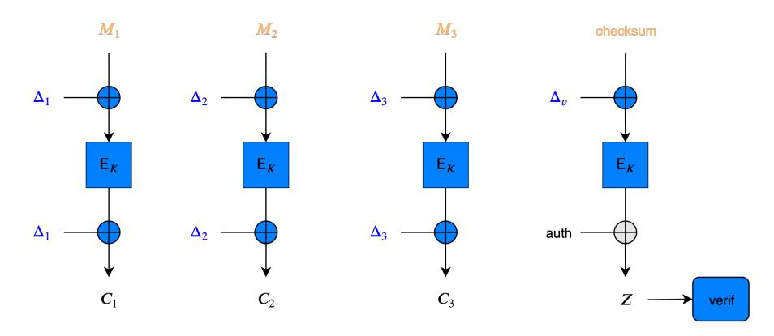

Fig. 13: OCB-Pyjamask, uniformly protected implementation.

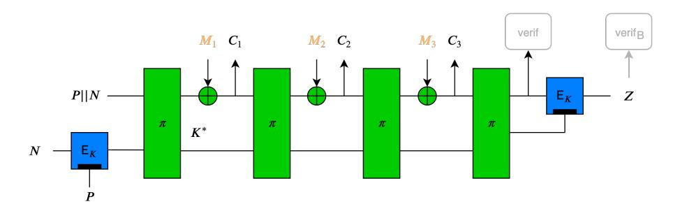

Fig. 14: Spook, leveled implementation, CCAmL1.

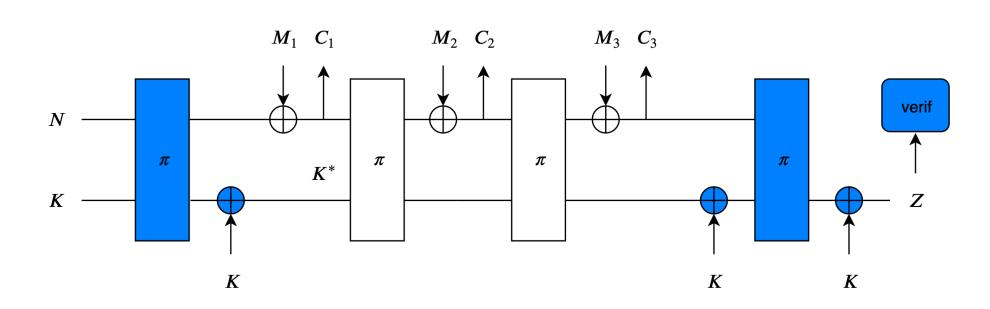

Fig. 15: Ascon, leveled implementation, CIML2.

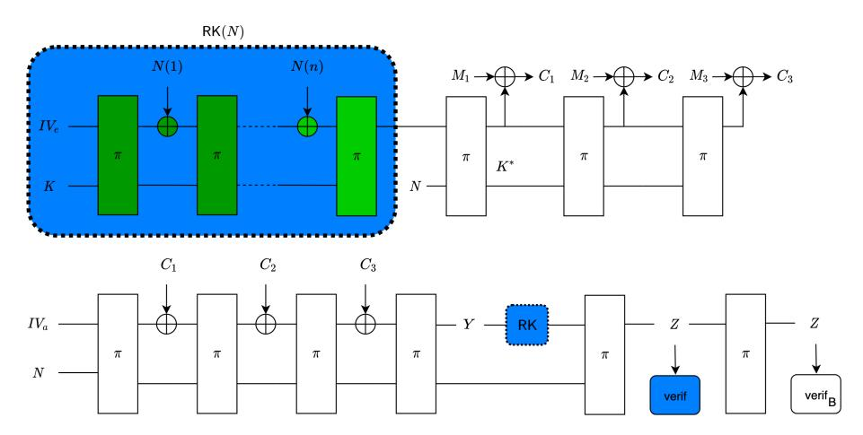

Fig. 16: ISAP, leveled implementation, CIML2.

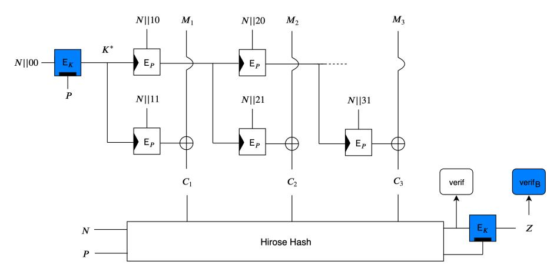

Fig. 17: TEDT, leveled implementation, CIML2.

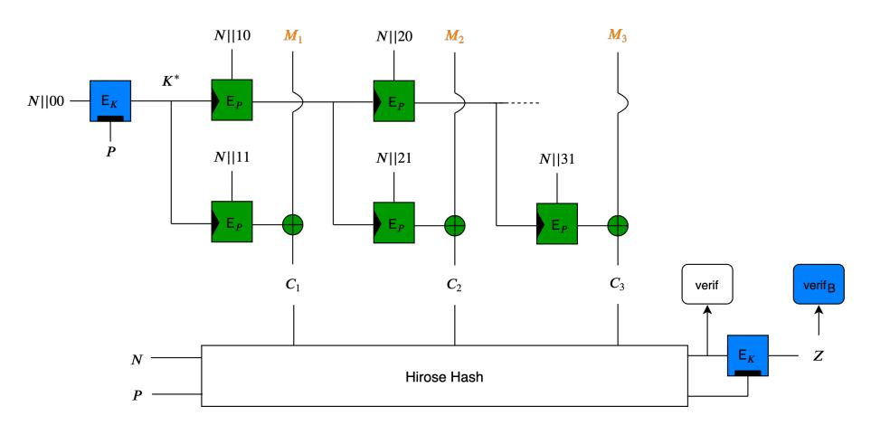

Fig. 18: TEDT, leveled implementation, CCAmL2.