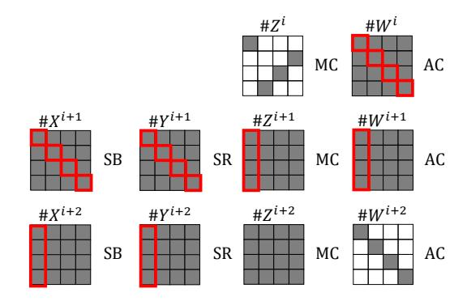
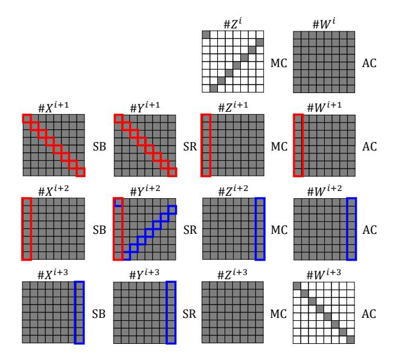
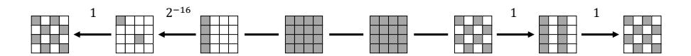
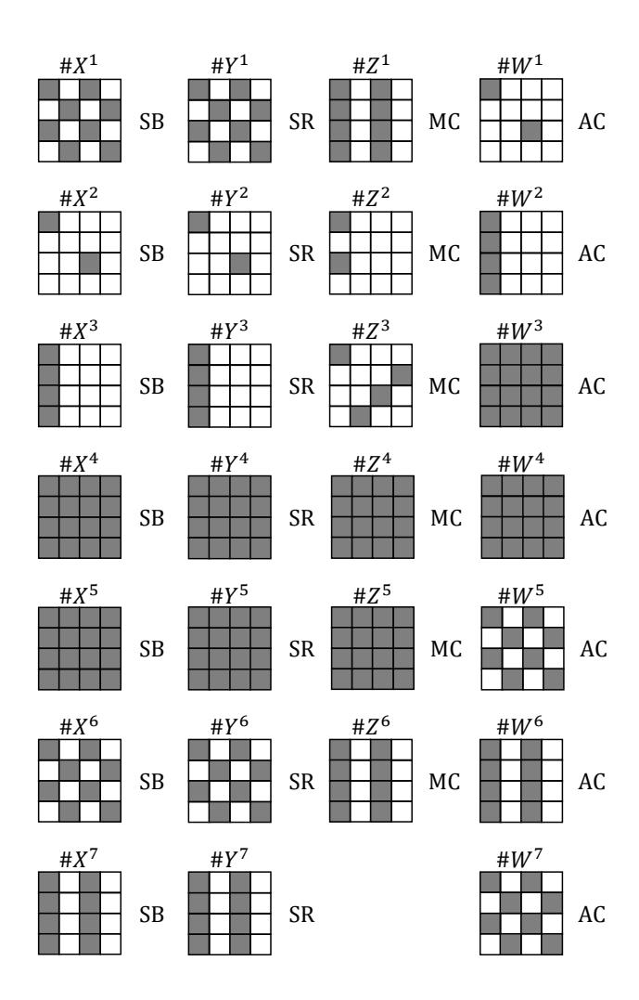
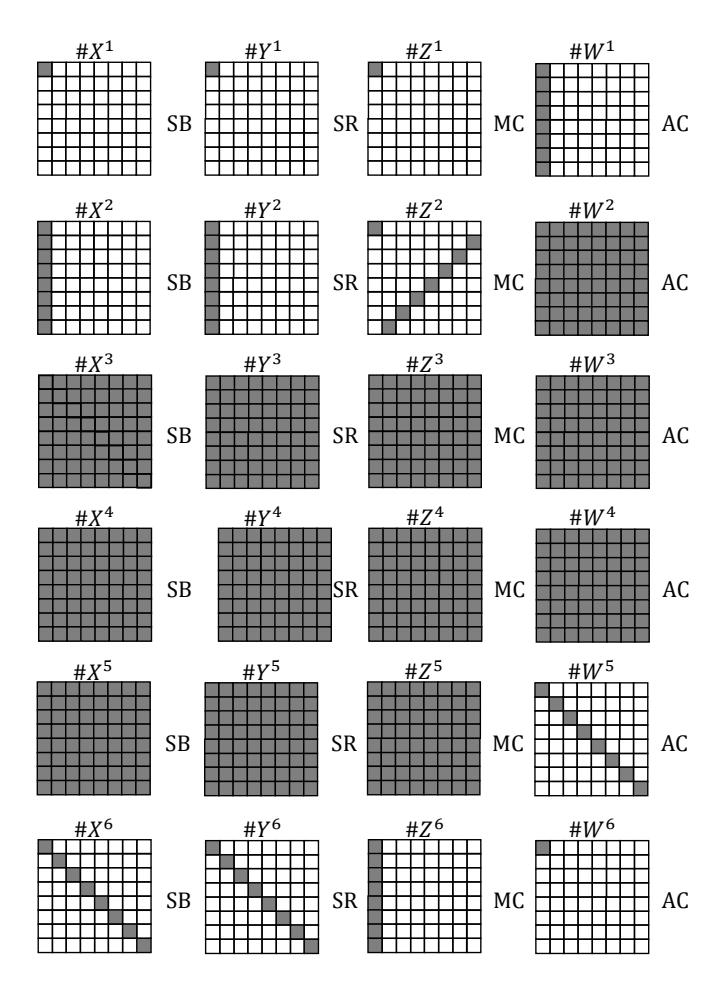
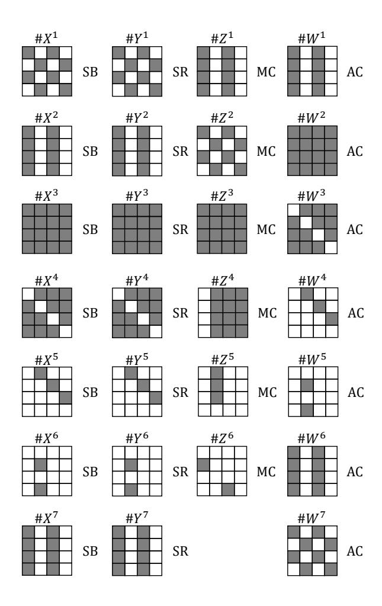

## Finding Hash Collisions with Quantum Computers by Using Differential Trails with Smaller Probability than Birthday Bound

Akinori Hosoyamada1,2 and Yu Sasaki1

1 NTT Secure Platform Laboratories, Tokyo, Japan, {akinori.hosoyamada.bh,yu.sasaki.sk}@hco.ntt.co.jp 2 Nagoya University, Nagoya, Japan, hosoyamada.akinori@nagoya-u.jp

Abstract. In this paper we spot light on dedicated quantum collision attacks on concrete hash functions, which has not received much attention so far. In the classical setting, the generic complexity to find collisions of an n-bit hash function is O(2n/2 ), thus classical collision attacks based on differential cryptanalysis such as rebound attacks build differential trails with probability higher than 2−n/2 . By the same analogy, generic quantum algorithms such as the BHT algorithm find collisions with complexity O(2n/3 ). With quantum algorithms, a pair of messages satisfying a differential trail with probability p can be generated with complexity p −1/2 . Hence, in the quantum setting, some differential trails with probability up to 2−2n/3 that cannot be exploited in the classical setting may be exploited to mount a collision attack in the quantum setting. In particular, the number of attacked rounds may increase. In this paper, we attack two international hash function standards: AES-MMO and Whirlpool. For AES-MMO, we present a 7-round differential trail with probability 2−80 and use it to find collisions with a quantum version of the rebound attack, while only 6 rounds can be attacked in the classical setting. For Whirlpool, we mount a collision attack based on a 6-round differential trail from a classical rebound distinguisher with a complexity higher than the birthday bound. This improves the best classical attack on 5 rounds by 1. We also show that those trails are optimal in our approach. Our results have two important implications. First, there seems to exist a common belief that classically secure hash functions will remain secure against quantum adversaries. Indeed, several second-round candidates in the NIST post-quantum competition use existing hash functions, say SHA-3, as quantum secure ones. Our results disprove this common belief. Second, our observation suggests that differential trail search should not stop with probability 2−n/2 but should consider up to 2−2n/3 . Hence it deserves to revisit the previous differential trail search activities.

Keywords: symmetric key cryptography, hash function, cryptanalysis, collision, quantum attack, AES-MMO, Whirlpool, rebound attack

### 1 Introduction

Recently, post-quantum security has received a lot of attention from the cryptographic community. The security of public-key cryptographic schemes is often reduced to some mathematically difficult problem, which can be affected by quantum machines directly. In contrast, symmetric-key cryptographic schemes may not have such a security reduction and post-quantum security of symmetric-key cryptographic schemes has not been discussed until recently. In 2010, Kuwakado and Morii [\[28\]](#page-29-0) pointed out that the 3-round Feistel network would be distinguished only with polynomially many queries by using Simon's algorithm [\[40\]](#page-29-1) in the quantum setting. After their discovery, a lot of researchers have tried to apply Simon's algorithm to symmetric-key schemes to obtain a drastic reduction of the complexity in the quantum setting, e.g. key-recovery attacks against the Even-Mansour construction [\[29\]](#page-29-2) and universal forgery attacks on various message authentication codes (MACs) [\[24\]](#page-28-0).

Simon's algorithm allows to find a "hidden period" by only polynomially many queries. From its nature, all the previous applications of Simon's algorithm are keyed primitives. Namely, a key or a key-dependent secret value takes a role of the hidden period. Then, queries need to be made in a quantum manner, which is called "superposition queries." (An exception is a recently published paper that utilizes Simon's algorithm without superposition queries [\[6\]](#page-28-1), but this is the only exception.) Superposition queries can still be practical if one considers the situation that keyed primitives are implemented in a keyless manner, white-box implementation for example. Meanwhile, there seems to exist consensus that to make superposition queries is more difficult than to make classical queries.

In contrast, the analysis of the keyless primitives does not require any online queries because all computations can be done offline. In this work, we are targeting hash functions, and thus do not make any superposition queries to keyed oracles.

To find collisions of hash functions in the quantum setting is indeed important. Recently many public-key schemes have been proven to be post-quantum secure in the quantum random oracle model (QROM) [\[5\]](#page-28-2), which is an analogue of the random oracle model in the classical setting. These schemes include many second-round candidates in the NIST post-quantum public-key standardization process [\[36\]](#page-29-3). A quantum random oracle is an ideal model of concrete hash functions that allows superposed quantum queries for adversaries, and the QROM implicitly assumes that there exists a concrete hash function that behaves like a random oracle against adversaries that make quantum superposed queries. In particular, if a hash function is used to instantiate a quantum random oracle, there should not exist any dedicated quantum collision attack on the hash function that is faster than the generic quantum collision attack. When the best collision attack on a hash function is the generic one in the classical setting, it is often believed to be also the case in the quantum setting. Thus, to find dedicated quantum collision attacks on classically collision-resistant hash functions will give significant impacts in the real world.

In the classical setting, the generic attack complexity to find collisions against an n-bit hash function is O(2n/2 ) by the birthday paradox. Therefore any dedicated attack that finds collisions with less than O(2n/2 ) complexity is regarded as a meaningful attack. In the quantum setting, the generic attack complexity depends on the model (or assumptions) of the actual quantum machines. Irrespective of the model, the lower bound of the query complexity is proven to be Ω(2n/3 ) [\[45\]](#page-29-4) and there is an attack matching this bound if O(2n/3 ) qubits are available (BHT) [\[11\]](#page-28-3). By the same analogy, any dedicated attack with less than O(2n/3 ) quantum complexity should be regarded as a meaningful attack.

However, in the quantum setting, dedicated attacks need to be compared with the generic attack complexity very carefully because the generic attack complexity depends on the model of the quantum computations. For example, BHT cannot be better than the classical computations by considering the fact that each qubit can behave as either processor or memory [\[4\]](#page-28-4). (By running 2 n/3 processors in parallel, collisions can be found in time O(2n/6 ) even with classical machines.) However, if a quantum computer of polynomial size with exponentially large quantum random access memory (qRAM) is available, BHT is the best collision attack. It is hard to predict which model is more likely to be realized in the future than others, and it would be useful to discuss advantages of attacks in various models with various generic attack complexities.

While there are various generic attacks, we observe that there does not exist any dedicated quantum attack against hash functions. This is a strange tendency especially considering the fact that there are many attempts to speed up dedicated cryptanalysis against block ciphers e.g. differential and linear cryptanalysis [\[25\]](#page-28-5), impossible differential cryptanalysis [\[44\]](#page-29-5), meet-in-the-middle attacks [\[21,](#page-28-6)[8\]](#page-28-7), slide attacks [\[7\]](#page-28-8), and so on. In this paper, we explore dedicated collision attacks against hash functions to find collisions faster than generic quantum attacks.

Here we briefly review dedicated collision attacks in the classical setting. Some of famous collision attacks are ones presented by Wang et al. against SHA-1 [\[41\]](#page-29-6) and MD5 [\[42\]](#page-29-7). In short, they first derive the differential trail, and then efficiently find message pairs which satisfy the first part of the differential trail by using a "message modification" technique. The generated message pairs are simply propagated to the last round to probabilistically satisfy the differential trail of the remaining part. When the cost of message modification is 1, the latter part of the differential trail can be up to 2−n/2 (if the differential probability is smaller than 2−n/2 , the attack becomes worse than the birthday attack). Another important direction is the rebound attack by Mendel et al. [\[32,](#page-29-8)[31\]](#page-29-9) which is particularly useful against hash functions based on the substitution-permutation network (SPN). In short, it divides the computation into three parts (outbound, inbound, and another outbound), and derives a differential trail such that the probability of the differential propagation in the outbound parts is high. Then, pairs of messages to satisfy the inbound part are found with average cost 1 and those are propagated to outbound parts. Hence, the probability of the outbound differential trail can be up to 2−n/2 to be faster than the birthday attack.

#### 1.1 Our Contribution

This paper gives an observation that dedicated quantum collision attacks based on differential cryptanalysis may break hash functions that are secure in the classical setting, and shows that we can actually mount quantum versions of rebound attacks that find collisions of 7-round AES-MMO and 6-round Whirlpool, on which there has not been found any dedicated collision attack that is faster than the generic collision attack in the classical setting.

An observation on quantum differential cryptanalysis. In the classical setting, if we mount an attack that uses a differential trail with differential probability p, the attack requires at least 1/p operations. Thus, the trail cannot be used to find hash collisions if p < 2 −n/2 . On the other hand, in the quantum setting, Kaplan et al. [\[25\]](#page-28-5) showed that we can find a message pair that satisfies the differential in time around p 1/p. Thus, if we have a differential trail with probability p, we can mount a collision attack in time around p 1/p. Such an attack is faster than the generic attack (BHT) if p 1/p < 2 n/3 , or equivalently p > 2 −2n/3 (in the quantum setting where a small quantum computer with exponentially large qRAM is available). In particular, if we find a differential trail for a hash function with probability 2−n/2 > p > 2 −2n/3 , we can make a dedicated quantum collision attack that is faster than the quantum generic attack.

Observations without qRAM. So far we have discussed the setting where qRAM is available and the best generic attack is BHT. The generic attack changes in other settings where qRAM of exponential size is not available. In this paper we consider two settings in which qRAM is not available, and observe that we can still use differential trails with smaller differential probabilities than 2 −n/2 to find collisions: In the first setting, the efficiency of quantum algorithms is measured by the tradeoff between time T and space S (the maximum of the size of quantum computer and classical memory) and parallelizations are taken into account. Since qubits for computation and qubits for quantum memory may be realized in physically the same way, if a quantum algorithm requires lots of qubits for quantum memory, it is plausible to compare the algorithm to other algorithms that use the same amount of qubits for parallelization [\[19\]](#page-28-9). In the second setting, a small quantum computer of polynomial size and exponentially large classical memory are available (and we do not consider parallelizations).

In the first setting of time-space tradeoff, the generic collision finding algorithm is the parallel rho method [\[37\]](#page-29-10) that gives the tradeoff T = 2n/2/S even in the quantum setting, as observed by Bernstein [\[4\]](#page-28-4). Thus, in this setting, we have to compare the efficiency of dedicated quantum attacks to the parallel rho method. As briefly introduced before, rebound attacks consist of inbound phase and outbound phase. Intuitively, if we use a differential trail of probability pout for the outbound phase, the time complexity for the outbound phase becomes about p 1/pout with the Grover search. The inbound phase can be done in a constant time if large memory (and qRAM) is available, but here we aim to construct space-efficient attacks since now we are in the setting without qRAM where quantum memory is usually quite expensive. Suppose that we can construct a quantum circuit of size  $S_0$  that performs the inbound phase in time  $T_{in}$ . Then the rebound attack runs in time  $T = T_{in} \cdot \sqrt{1/p_{out}}$  on a quantum computer of size around  $S_0$ . We observe that this attack is more efficient than the generic attack (the parallel rho method) if  $p_{out} > T_{in}^2 S_0^2 2^{-n}$  holds. In addition, if a quantum computer of size  $S(\geq S_0)$  is available, by parallelizing the Grover search for the outbound phase we obtain the tradeoff  $T = T_{in} \cdot \sqrt{1/p_{out}} \sqrt{S_0/S}$ , which is better than the generic tradeoff  $T = 2^{n/2}/S$  as long as  $S < 2^n \cdot p_{out}/(T_{in}^2 \cdot S_0)$ .

In the second setting that a small computer of polynomial size and exponentially large classical memory is available, the best collision-finding algorithm is the one by Chailloux et al [13] that runs in time  $\tilde{O}(2^{2n/5})$  with a quantum computer of size  $\tilde{O}(1)$  and classical memory of size  $O(2^{n/5})$ . We observe that our rebound attack is faster than this algorithm if  $p_{out} > T_{in}^2 2^{-4n/5}$  holds.

#### Rebound attacks on 7-round AES-MMO and 6-round Whirlpool.

Rebound attacks on 7-round AES-MMO. AES-MMO is an AES-based compression function that is widely considered for practical use. AES-MMO is standardized by Zigbee [1] and used to be standardized by IETF [12]. In addition, due to its efficiency with a support by AES-NI, many multi-party computation protocols are implemented by using AES-MMO, e.g. [27,20]. Here, the Matyas-Meyer-Oseas (MMO) construction [26, Section 9.4] makes a compression function  $h^E: \{0,1\}^n \times \{0,1\}^n \to \{0,1\}$  from an n-bit block cipher  $E_k(m)$  as  $h^E(\text{iv},m) := E_{\text{iv}}(m) \oplus m$ . The compression function can be used to construct hash functions by using the Merkle-Damgård construction [33,16].

In the classical setting, the best collision attacks on AES-MMO are for 6 rounds [17,30]. Here, the goal of collision attacks on the compression function is to find messages  $m, m' \in \{0,1\}^n$  such that  $h^E(\text{iv}, m) = h^E(\text{iv}, m')$  (E is AES-128), given iv  $\in \{0,1\}^n$  arbitrarily. If we can mount such a collision attack on  $h^E$ , we can extend it to the entire hash function.

In this paper, we give a new 7-round differential trail of AES with the differential probability  $p_{out} = 2^{-80} (> 2^{-128 \cdot 2/3})$  and show that it can be used to mount rebound attacks in the quantum settings: In the setting that a small computer with qRAM is available, we can mount a rebound attack that is slightly faster than the generic attack (BHT) by using large classical and quantum memory. 3 In the setting that the efficiency of quantum algorithms is measured by

&lt;sup>3 Our attack in this setting is just a demonstration that differential trails with such a small probability can actually be used to mount rebound attacks that are comparable to the generic attack. We assume that 1 memory access is faster than 1 execution of the entire function, which allows a memory size (248) to be larger than the time complexity (242.5) counted by the unit time (see also Table 1). Since some readers may disagree this counting and the advantage of our attack over BHT is small, we do not claim that 7-round AES-MMO is broken by our attack in this setting.

Table 1. Comparison of Dedicated Attacks against AES Hashing Modes and Whirlpool

AES-MMO and AES-MP

| Attack    | Rounds | Time                        | Space                  | Setting | Model                   | Ref.    |
|-----------|--------|-----------------------------|------------------------|---------|-------------------------|---------|
| collision | 5      | 256                         | 4 2                 | classic |                         | [32]    |
| collision | 6      | 256                         | 32 2                | classic |                         | [17,30] |
| collision | 7      | 242.5                       | (248)                  | quantum | qRAM                    | Ours    |
| collision | 7      | 259.5 p / S/2 3 | 3 ≤ 6 2 S < 2 |         | quantum time-space Ours |         |
| preimage  | 7      | 2120                        | 8 2                 | classic |                         | [38]    |

Whirlpool

| Attack               | Rounds | Time                   | Space                   | Setting | Model                   | Ref.    |  |  |
|----------------------|--------|------------------------|-------------------------|---------|-------------------------|---------|--|--|
| collision            | 4      | 2120                   | 16 2                 | classic |                         | [32]    |  |  |
| collision            | 5      | 2120                   | 64 2                 | classic |                         | [17,30] |  |  |
| collision            | 6      | 2228/ p 8 S/2 | 8 ≤ 48 2 S < 2 |         | quantum time-space Ours |         |  |  |
| semi-free-start coll | 5      | 2120                   | 16 2                 | classic |                         | [32]    |  |  |
| semi-free-start coll | 7      | 2184                   | 8 2                  | classic |                         | [30]    |  |  |
| free-start collision | 8      | 2120                   | 8 2                  | classic |                         | [39]    |  |  |
| preimage             | 5      | 2504                   | 8 2                  | classic |                         | [38]    |  |  |
| preimage             | 5      | 2481.5                 | 64 2                 | classic |                         | [43]    |  |  |
| preimage             | 6      | 2481                   | 256 2                | classic |                         | [39]    |  |  |
| distinguisher        | 9      | 2368                   | 64 2                 | classic |                         | [23]    |  |  |
| distinguisher        | 10     | 2188                   | 8 2                  | classic |                         | [30]    |  |  |

Semi-free-start collisions, free-start collisions, and differential distinguishers are attacks on the compression function and cannot be applied to real Whirlpool with fixed IV.

the tradeoff between time and space, we can also mount a rebound attack and its time-tradeoff is better than the generic one. However, in the setting that a small quantum computer of polynomial size and exponentially large classical memory is available, our rebound attack is lower than the best attack by Chailloux et al. See Table [1](#page-5-0) for details on attack complexities and comparisons. As well as the best classical attack, in which the Super-Sbox technique [\[17,](#page-28-14)[30\]](#page-29-14) is used to perform inbound phases.

Our attacks are also valid for AES-MP, where the Miyaguchi-Preneel (MP) construction [\[26,](#page-29-12) Section 9.4] makes a compression function h E : {0, 1} n × {0, 1} n → {0, 1} n from a block cipher Ek(m) as h E(iv, m) = Eiv(m) ⊕ m ⊕ iv.

A Rebound Attack on 6-round Whirlpool. Whirlpool is a hash function of 512 bit output designed by Barreto and Rijmen [\[3\]](#page-27-1), which is recommended by the NESSIE project and adopted by ISO/IEC 10118-3 standard [\[22\]](#page-28-16). Whirlpool is a block cipher based hash function that uses a 10-round AES-like cipher as the underlying block cipher. Both of the block and key lengths of the block cipher are 512 bits. Unlike AES, it performs MixColumns in the last round.

In this paper, we show that a technique for the classical distinguishing attack [\[23\]](#page-28-15), which covers three full active rounds for the inbound phase can be used to find collisions of 6-round Whirlpool in the quantum setting. The attack on 6-round Whirlpool is only valid in the setting that the efficiency of quantum algorithms is measured by the tradeoff between time and space, and the attack is worse than generic attacks in other quantum settings. See Table [1](#page-5-0) for details.

Optimality. We also show that our 7-round differential trail for AES and 6 round differential trail for Whirlpool are optimal from the view point of rebound attacks to find collisions. We show the optimality by using MILP.

Future work. An important future work is to search for more differential trails of which differential probabilities are too small in the classical setting but large enough in the quantum settings. The number of attacked rounds of other concrete hash functions may be improved in the quantum settings.

#### 1.2 Paper Outline

Section [2](#page-6-0) gives preliminaries on AES-like block ciphers and quantum computations. Section [3](#page-9-0) reviews generic quantum collision attacks in various settings. Section [4](#page-10-0) reviews the framework of classical rebound attacks. Section [5](#page-15-0) gives our main observation on quantum computation and differential trails with smaller differential probabilities than the birthday bound. Sections [6](#page-18-0) and [7](#page-24-0) show our rebound attacks in the quantum settings on 7-round AES-MMO and 6-round Whirlpool, respectively. Section [8](#page-26-0) shows optimality of our differential trails given in Sections [6](#page-18-0) and [7.](#page-24-0) Section [9](#page-27-2) concludes the paper.

## 2 Preliminaries

#### 2.1 AES-like Ciphers

An AES-like cipher is a (c·r 2 )-bit block cipher based on Substitution-Permutation Network (SPN) such that its internal states consist of r × r c-bit cells (each cell is regarded as an element in GF(2c )) and each round transformation consists of the four operations SubBytes (SB), ShiftRows (SR), MixColumns (MC), and AddRoundKey (AK). SubBytes is the non-linear operation that applies a c-bit S-box to each cell. ShiftRows is the linear operation that rotates the i-th row by i cells to the left. MixColumns is the linear operation that multiplies an r × r matrix over GF(2c ) to each column vector. AddRoundKey is the operation that adds a round key to the state. Given an input message to encrypt, an AES-like cipher first adds a pre-whitening key to message, and then applies the round transformation iteratively.

In this paper, when we consider attacks on compression functions based on AES-like ciphers, the keys of the ciphers are fixed to constants (initialization vectors). Thus, we call the operation of adding a round key AddConstant instead of AddRoundKey.

**AES.** The original AES is a 128-bit block cipher designed by Daemen and Rijmen [14]. The parameters r and c are set as r=4 and c=8. The key length k can be chosen from 128, 192, or 256, and the number of rounds r is specified depending on k as r=6+(k/32). AES uses  $4\times r$  S-box applications in its key schedules. Thus one encryption with AES requires  $20\times r$  S-box applications in total. In particular, one encryption with AES-128 requires 200 S-box applications in total. An important feature of the original AES is that MixColumns is skipped in the last round. In our attacks in later sections, whether or not MixColumns in the last round is skipped impacts to the number of attacked rounds.

Whirlpool. Whirlpool is a hash function designed by Barreto and Rijmen [3]. It is constructed from an AES-like 512-bit block cipher  $E^4$  with Merkle-Damgård and Miyaguchi-Preneel constructions [26, Section 9.4]. The parameters r and c of the underlying block cipher E are set as r=8 and c=8. The key length k and the number of rounds r are specified as k=512 and r=10, respectively. The key schedule of E is the same as the round transformations for internal states except that fixed constants are added instead of round keys. Thus, one encryption with E requires  $(64+64) \times r=1280$  S-box applications. Unlike AES, E does not skip MixColumns in the last round.

#### 2.2 Quantum Computation

We use the standard quantum circuit model [35] and adopt the basic gate set  $\{H, CNOT, T\}$  (Clifford+T gates). Here, H is the single qubit Hadamard gate  $H: |b\rangle \mapsto \frac{1}{\sqrt{2}}(|0\rangle + (-1)^b |1\rangle)$ , CNOT is the two-qubit CNOT gate  $CNOT: |a\rangle |b\rangle \mapsto |a\rangle |b\oplus a\rangle$ , and T is the  $\pi/8$  gate defined as  $T: |0\rangle \mapsto |0\rangle$  and  $T: |1\rangle \mapsto e^{i\pi/4} |1\rangle$ . We denote the identity operator on n-qubit states by  $I_n$ . The quantum oracle of a function  $f: \{0,1\}^m \to \{0,1\}^n$  is modeled as the unitary operator  $U_f$  defined by  $U_f: |x\rangle |y\rangle \mapsto |x\rangle |y\oplus f(x)\rangle$ . We also use an alternative model for the quantum oracle of f, which is the unitary operator defined as  $\tilde{U}_f: |x\rangle |y\rangle \mapsto (-1)^{y \cdot f(x)} |x\rangle |y\rangle$ . When f is a Boolean function,  $\tilde{U}_f = (I_n \otimes H)U_f(I_n \otimes H)$  holds. Thus  $\tilde{U}_f$  can be simulated with one application of  $U_f$ , and vice versa.

When we estimate time complexity of an attack on a primitive, we assume unit of time to be the time required to run the primitive once (e.g., the time required for one encryption if the primitive is a block cipher). The actual time to run a quantum attack will depend on hardware architectures of quantum computers, but we just consider the simple computational model that each pair of qubits in a quantum computer can interact with one another. Based on this model, we evaluate the time of dedicated attacks on a primitive to discuss if it is more efficient than the generic attacks in this model. In addition, when we estimate space complexity of a quantum attack on a primitive, we regard the number of qubits to implement the target primitive as the unit of space size.

&lt;sup>4 In the specification of Whirlpool [3] Shift "Columns" and Mix "Rows" operations are used instead of ShiftRows and MixColumns, but they are mathematically equivalent up to transposition of internal states.

Grover's algorithm. Consider the following database search problem.

Problem 1. Let  $F: \{0,1\}^n \to \{0,1\}$  be a Boolean function. Suppose that F is given as a black-box. Then, find x such that F(x) = 1.

Let  $a:=|f^{-1}(1)|/2^n$ , which is the probability that we obtain x such that F(x)=1 when we randomly choose  $x\in\{0,1\}^n$ . Suppose that a>0. In the classical setting, we have to make 1/a queries to find x such that F(x)=1. On the other hand, in the quantum setting, when F is given as a quantum black-box oracle and a>0, Grover's algorithm finds x by making  $\Theta(\sqrt{1/a})$  quantum queries to F [9,10,18]. That is, Grover's algorithm achieves a quadratic speed up compared to classical algorithms. Below we review Grover's algorithm and its variants.

Let  $S_F$  and  $S_0$  be the unitary operators that act on n-qubit states defined as  $S_F|x\rangle = (-1)^{F(x)}|x\rangle$  for  $x \in \{0,1\}^n$ , and  $S_0|x\rangle = |x\rangle$  if  $x \neq 0^n$  and  $S_0|0^n\rangle = -|0^n\rangle$ , respectively. (Note that  $S_F$  can be simulated by using the operator  $\tilde{U}_F$  since  $(S_F|x\rangle) \otimes |1\rangle = \tilde{U}_F(|x\rangle \otimes |1\rangle)$  holds.) Let  $V_F := -H^{\otimes n}S_0H^{\otimes n}S_F$ . Then the following proposition holds.

**Proposition 1 (Grover's algorithm [10,18]).** Let  $\theta$  be the parameter such that  $0 \le \theta \le \pi/2$  and  $\sin^2 \theta = a$ . Set  $m := \lfloor \pi/4\theta \rfloor$ . When we compute  $V_F^m H^{\otimes n} \mid 0^n \rangle$  and measure the resulting state, we will obtain  $x \in \{0,1\}^n$  such that F(x) = 1 with a probability at least  $\max\{1-p,p\}$ .

Grover's algorithm with certainty. Grover's algorithm can be modified so that it will return the solution with certainty by slightly changing the last application of  $V_F$  and doing some rotations [10]. In this case we will obtain the superposition  $\sum_{x \in f^{-1}(1)} \frac{1}{\sqrt{|f^{-1}(1)|}} |x\rangle$  before the final measurement. In particular, if there exists only a single  $x_0$  such that  $f(x_0) = 1$ , we will obtain the state  $|x_0\rangle$ . 6

Parallelization. Suppose that P classical processors can be used for parallelization to solve Problem 1. Then, by dividing  $\{0,1\}^n$  into P subspaces  $X_1,\ldots,X_P$  such that  $|X_i|=2^n/P$  for each i and using the i-th classical processor to search in  $X_i$ , we can solve Problem 1 in time  $1/(a\cdot P)$  (provided a>0). On the other hand, when Q quantum processors (small quantum computers) can be used for parallelization, by using the i-th quantum processor to run Grover search on  $X_i$ , we can solve Problem 1 in time  $O(\sqrt{1/(a\cdot P)})$ .

&lt;sup>5 Here we are assuming that the probability a is known in advance. However, even if we do not know the probability a in advance, we can find x such that F(x) = 1 with  $O(\sqrt{1/a})$  quantum queries by introducing some intermediate measurements.

&lt;sup>6 To be more precise, in the real world, we will still have some small errors since we can only approximate unitary operators by using Clifford + T gates. However, since we can efficiently make such approximation errors sufficiently small, we ignore these errors.

#### 3 Generic Quantum Collision-Finding Algorithms

This section reviews generic quantum collision-finding algorithms and their complexities in various settings. Here we consider finding collisions of a random function with range {0, 1} n and sufficiently large domain (e.g., {0, 1} n).

The BHT algorithm (the setting with qRAM). The first important generic quantum collision-finding algorithm is the BHT algorithm (BHT) developed by Brassard, Høyer, and Tapp [\[11\]](#page-28-3). It finds a collision in time O˜(2n/3 ) by making O(2n/3 ) quantum queries when exponentially large quantum random access memory (qRAM) is available.

Here, qRAM is a quantum analogue of random access memory (RAM), which allows us to efficiently access stored data in quantum superpositions. Suppose that there is a list of classical data L = (x0, . . . , x2m−1), where xi ∈ {0, 1} n for each i. Then, the qRAM for L is modeled as an unitary operator UqRAM(L) defined by

$$U_{\mathsf{qRAM}}(L): |i\rangle \otimes |y\rangle \mapsto |i\rangle \otimes |y \oplus x_i\rangle \tag{1}$$

for i ∈ {0, 1} m and y ∈ {0, 1} n. When we say that qRAM is available, we assume that a quantum gate that realizes the unitary operation [\(1\)](#page-9-1) (for a list L of classical data) is available in addition to basic quantum gates.

BHT consists of two steps. Suppose that our current goal is to find a collision of a random function f : {0, 1} n → {0, 1} n. The first step performs a classical precomputation that chooses a subset X ⊂ {0, 1} n of size |X| = 2n/3 and computes the value f(x) for all x ∈ X (which requires queries and time in O(2n/3 )). The 2n/3 pairs L = {(x, f(x))}x∈X are stored into qRAM so that they can be accessed in quantum superpositions. Then, the second step performs the Grover search to find x 0 ∈ {0, 1} n \X such that (x, f(x)) ∈ L and f(x) = f(x 0 ) for some x ∈ X, which runs in time O( p 2 n/|L|) = O(2n/3 ) on average. If we find such an x 0 ∈ {0, 1} n \ X (and x ∈ X), it implies that we find a collision for f since f(x 0 ) = f(x).

Consider the model that a small quantum computer of polynomial size and a qRAM that allows us to access exponentially many classical data in quantum superposition are available. Here we do not consider any parallelized computations. In this model, the best collision-finding algorithm is BHT since we can implement it with qRAM (of size O(2n/3 )) and its time complexity matches the tight quantum query complexity Θ(2n/3 ).

Tradeoffs between time and space. BHT achieves time complexity O˜(2n/3 ), however, it also uses a large qRAM of size O˜(2n/3 ). The model that each adversary can use a small quantum computer with qRAM is simple and theoretically worth studying since it generalizes the classical attack model that each adversary can use a single processor and large memory, but it is not clear whether such qRAM will be available in some future. Even if qRAM of size O(2n/3 ) is not available, we can simulate it with a quantum circuit of size O(2n/3 ). However, such a usage of exponentially large number of qubits causes discussions on parallelizations: When we evaluate the efficiency of a quantum algorithm that uses exponentially many qubits to realize quantum memory, it is plausible to compare the algorithm to other quantum algorithms that may use the same amount of qubits for parallel computations.

As observed by Bernstein [4], from the view point of time-space complexity, BHT is worse than the classical parallel rho method by Oorschot and Wiener [37]: Roughly speaking, when P classical processors are available, the parallel rho method finds a collision in time  $O(2^{n/2}/P)$ . Thus, if a quantum computer of size  $2^{n/3}$  is available but qRAM is not available, by just running the parallel rho method on the quantum computer, we can find a collision in time  $2^{n/6}$ , which is much faster than BHT. 7

In the classical setting, there exists a memory-less collision finding algorithm that finds a collision in time  $O(2^{n/2})$ , which matches the classical tight bound for query complexity. On the other hand, in the quantum setting, there has not been known any memory-less quantum collision finding algorithm such that its *time* complexity matches the optimal query complexity  $2^{n/3}$ .

Let S denote the size of computational resources required for a quantum algorithm (i.e., S is the maximum size of quantum computers and classical memory) and T denote its time complexity. Then the tradeoff  $T \cdot S = 2^{n/2}$  given by the parallel rho method is the best one even in the quantum setting.

Small quantum computer with large classical memory. Next, suppose that only a small quantum computer of polynomial size is available but we can use a exponentially large classical memory. In this situation, Chailloux et al. [13] showed that we can find a collision in time  $\tilde{O}(2^{2n/5})$  with a quantum computer of size  $\tilde{O}(1)$  and  $\tilde{O}(2^{n/5})$  classical memory. The product of T and S becomes around  $2^{3n/5}$ , which is larger than  $2^{n/2}$ , but it is quite usual to consider a classical memory of size  $\tilde{O}(2^{n/5})$ , which is usually available. The algorithm by Chailloux et al. shows that we can obtain another better tradeoff between time and space if we treat the sizes of quantum hardware and classical hardware separately.

Remark 1. To be precise, it is not clear what the term "quantum computer of polynomial size" means in practical settings since the security parameter n is usually fixed to a constant in concrete primitives. For convenience, by "quantum computer of polynomial size" we arbitrarily denote a quantum computer of size at most  $n^2$ . (Note that we regard the space (the number of qubits) required to implement the target primitive as the unit of space.)

#### 4 Previous Works in the Classical Setting

In this section, we briefly review the previous work of collision attacks against AES-like hash functions. Note that whether or not the MixColumns operation

&lt;sup>7 Here we are considering the model that is called *free communication model* by Banegas and Bernstein [2].

in the last round is omitted impacts on the number of attacked rounds with respect to the collision attack, which is different from the number of attacked rounds for differential distinguishers.

#### 4.1 Framework of Collision Attacks

Our target constructions are the MMO and Miyaguchi-Preneel modes that compute the output as Ek(p) ⊕ p or Ek(p) ⊕ p ⊕ k respectively, where Ek is AES or an AES-like cipher and p is a plaintext input to the cipher. Moreover, we assume that the key input k is fixed to an initial value iv. Namely, for a 1-block message m, the hash value is computed as Eiv(m) ⊕ m or Eiv(m) ⊕ m ⊕ iv, respectively.

Given the above target, the attackers' strategy is to inject a non-zero difference ∆ on the plaintext input m and to process m and m ⊕ ∆ with fixed iv with zero difference. If the ciphertext difference matches the plaintext difference, i.e. Eiv(m) ⊕ Eiv(m ⊕ ∆) = ∆, two hash values collide because the differences are canceled through the feed-forward operation.

AES-like ciphers with r rows and r columns (with MixColumns in the last round) is known to allow the 4-round differential propagation with the following number of active S-boxes per round: 1 −→ r −→ r 2 −→ r −→ 1, where the second, third, and fourth rounds have r active bytes in a column, fully active, and have r active bytes in a diagonal, respectively. If the active-byte positions at the beginning and the end, as well as the actual difference, are identical, collisions are obtained.

For AES (with r = 4, without MixColumns in the last round), one more rounds can be attacked by the following pattern of the number of active S-boxes: 1 −→ 4 −→ 16 −→ 4 −→ 1 −→ 1.

The most interesting part of hash function analysis is to find the minimum complexity to find a pair of values that satisfies such differential propagation patterns. Owing to the nature of the keyless primitives, the attacker can first choose pairs such that the most difficult part (unlikely to be satisfied by randomly chosen pairs) is satisfied, and then the remaining propagation is satisfied probabilistically. This strategy, in particular for AES-like ciphers, was explored by Mendel et al. [\[32\]](#page-29-8) as the "rebound attack" framework. Very intuitively, the differential propagation is designed to be dense in the middle and sparse at the beginning and the end. The attacker first efficiently collects paired values satisfying the middle part. This procedure is called "inbound phase" and the paired values are called "starting points." Then, starting points are simply propagated to the beginning and the end to check if the sparse propagation is probabilistically satisfied or not. This procedure is called "outbound phase."

Mendel et al. showed that a pair of values satisfying the 2-round transformation r −→ r 2 −→ r can be generated with complexity 1 on average. Hence, 4-round collisions can be generated only by satisfying the differential transformation r −→ 1 twice and 1-byte cancellation for the feed-forward operation.

Fig. 1. Inbound Phase of Super-Sbox Cryptanalysis.

#### 4.2 Super-Sbox Cryptanalysis

There are many previous works that improve or extend the rebound attack. An important improvement is the Super-Sbox cryptanalysis presented by Gilbert and Peyrin [17] and independently observed by Lamberger et al. [30], which generates a pair of values satisfying the 3-round transformation  $r \longrightarrow r^2 \longrightarrow r^2 \longrightarrow r$  with complexity 1 on average.

Inbound Phase. The involved states are depicted in Fig. 1 for the case of r=4. The procedure is iterated for all the choices of the difference at state  $\#Z^i$ . Hence for each iteration, the difference at  $\#Z^i$  is fixed. Because MixColumns is a linear operation, the corresponding difference at state  $\#X^{i+1}$  is uniquely computed. From the opposite side, the number of possible differences at state  $\#W^{i+2}$  is  $2^{rc}$  and those are handled in parallel. The attacker computes the corresponding  $2^{rc}$  differences at state  $\#Y^{i+2}$  and stores them in a list L.

The attacker then searches for the paired values that connect  $\#X^{i+1}$  and  $\#Y^{i+2}$ . The core observation is that this part can be computed independently for each group of r bytes, which is known to the Super-Sbox. One of the r-byte groups is highlighted by thick squares in Fig. 1. For each of  $2^{rc}$  input values to a Super-Sbox at  $\#X^{i+1}$ , the corresponding difference (along with paired values) at  $\#Y^{i+2}$  is computed. Each difference in L will be hit once on average because L contains  $2^{rc}$  differences. The same analysis is applied for r Super-Sboxes. Then, each of the  $2^{rc}$  difference in L can be produced once on average from all the Super-Sboxes.

Complexity of the Inbound Phase. L requires a memory of size  $2^{rc}$ . Each Super-Sbox is computed for  $2^{rc}$  distinct inputs. Considering that the size of each Super-Sbox is 1/r of the entire state, computations of r Super-Sboxes are regarded as a single computation for the entire construction. After the analysis, the attacker obtains  $2^{rc}$  starting points, hence the average complexity to obtain

a starting point is 1. The inbound phase can be iterated up to  $2^{rc}$  times by choosing  $2^{rc}$  differences at State  $\#Z^i$ . Hence the degrees of freedom to satisfy the outbound phase is up to  $2^{2rc}$ .

**Outbound Phase.** The extension of the inbound phase increases the number of attacked rounds by one as follows.

$$\begin{array}{cccccccccccccccccccccccccccccccccccc$$

The probability for the outbound phase stays unchanged from the original rebound attack, which is  $2^{-2(r-1)c}$  to satisfy the transformation  $r \to 1$  twice and  $2^{-c}$  for the cancellation at the feed-forward operation. Hence, collisions of 5-round Whirlpool are generated with complexity  $2^{120} (= 2^{2(8-1)8} \times 2^8)$  and collisions of 6-round AES-MMO are generated with complexity  $2^{56} (= 2^{2(4-1)8} \times 2^8)$ .

#### 4.3 Covering Three Full Active Rounds on $8 \times 8$ State

Jean et al. presented another extension of the rebound attack, which covers one more fully active state for the inbound phase [23], namely

$$r \longleftarrow 1 \overset{2^{-(r-1)c}}{\longleftarrow} r - r^2 - r^2 - r^2 - r \overset{2^{-(r-1)c}}{\longrightarrow} 1 \longrightarrow r \longrightarrow \mathcal{L}(r),$$

where  $\mathcal{L}(r)$  is a linear subspace of dimension  $2^{rc}$ . However the drawback of this analysis is that the amortized cost to find a starting point is  $2^{r^2c/2}$ , which reaches the complexity of the birthday paradox. This is significantly more expensive than the amortized cost 1 for the original rebound attack and the Super-Sbox analysis. Owing to its complexity, the technique cannot be used for finding collisions, while it is still sufficient to mount a differential distinguisher up to 9 rounds. Here we briefly explain the procedure to satisfy the inbound phase with complexity  $2^{r^2c/2}$  and omit the explanation of the outbound phase and advantages of the distinguisher because our goal is to find collisions.

The involved states are depicted in Fig 2 for the case of r=8. The analysis of the inbound phase starts with a fixed pair of difference at state  $\#Z^i$  and  $\#W^{i+3}$ . Similarly to the Super-Sbox cryptanalysis, the corresponding differences at  $\#X^{i+1}$  and  $\#Y^{i+3}$  are linearly computed. The attacker then computes r Super-Sboxes that cover from  $\#X^{i+1}$  to  $\#Y^{i+2}$ . The results for the i-th Super-Sbox are stored in a list  $L_j^f$ , where  $0 \le j < r$ . To be precise, each  $L_j^f$  contains  $2^{rc}$  pairs of r-byte values (2r-byte values) at  $\#Y^{i+2}$ . Similarly, the attacker computes r inverse Super-Sboxes from  $\#Y^{i+3}$  to  $\#Y^{i+2}$ , and the results are stored in a list  $L_j^i$ , where  $0 \le j < r$ .

The attacker then finds a match of those 2r lists. The attacker exhaustively tries  $r^2/2$ -byte values at  $\#Y^{i+2}$  that can be fixed by choosing the entries of  $L_0^f, L_1^f, \ldots, L_{r/2-1}^f$  (a half of the Super-Sboxes). As shown in Fig. 2, this will

Fig. 2. Inbound Phase for Covering Three Rounds with Fully Active States.

fix a pair of values for  $r^2/2$  bytes at  $\#Y^{i+2}$ , i.e.  $r^2$ -byte values are fixed for the left-half of  $\#Y^{i+2}$ . The attacker then checks if those fixed values can be produced from  $L^b_j$ . For each  $L^b_j$ , r-byte values have already been fixed, and those play a role of the rc-bit filter. Considering that the degrees of freedom in each  $L^b_j$  is  $2^{rc}$ , the attacker can expect one match on average for each  $L^b_j$ , and the state  $\#Y^{i+2}$  is now fully fixed. The attacker finally checks if the paired values at  $\#Y^{i+2}$  for the remaining  $r^2/2$ -byte value (right-half of  $\#Y^{i+2}$ ) can be produced from  $L^f_{r/2}, L^f_{r/2+1}, \ldots, L^f_{r-1}$ . The number of the constraints is  $2^{r^2c}$  while the total degrees of freedom in r/2 Super-Sboxes is  $2^{r^2c/2}$ . Therefore, a match will be found with probability  $2^{-r^2c/2}$ , and by exhaustively testing  $2^{r^2c/2}$  choices of  $L^f_0, L^f_1, \ldots, L^f_{r/2-1}$  at the beginning, a solution can be found.

The procedure of the inbound phase can be summarized as follows.

- 1. For exhaustive combinations of the values of  $L_0^f,\dots,L_{r/2-1}^f,$  do as follows.
- 2. Find an entry of  $L_j^b$  for each  $0 \le j < r$ .
- 3. Check if the fixed state can be produced by  $L_{r/2}^f, \dots, L_{r-1}^f$ .

The attacker can find a starting point after  $2^{r^2c/2}$  iterations of the first step. Note that the computation of each  $L_j^f$  and  $L_j^b$  only requires  $2^{rc}$  computations and memory. The bottleneck is to find a match in the middle, which requires  $2^{r^2c/2}$  computations, while the required memory is negligible in the context of finding a match.

A memoryless variant. The technique for the inbound phase introduced above can easily converted into a memoryless variant by increasing the running time by a factor of  $2^{rc}$  (actually we use the memoryless variant in a later section rather than the original technique). That is, given the differences at state  $\#Z^i$  and  $\#W^{i+3}$ , we can find a starting point in time  $2^{r^2c/2+rc}$  by using negligible memory by just doing the exhaustive search for inputs or outputs of the Super-Sboxes corresponding to  $L_0^f, \ldots, L_{r/2-1}^f$  (parallelly, which costs time  $2^{r^2c/2}$ ) and  $L_j^b$  for each  $0 \le j < r$  (sequentially, which costs time  $2^{rc}$ ). See Section A for more details.

#### 5 New Observation

This section gives a new observation: when quantum computers are available, differential trails with probability even smaller than the birthday bound can be used to find hash collisions faster than the generic quantum collision attacks.

Section 5.1 observes that the probability of differential trails that can be used in classical rebound attacks is up to the birthday bound. Section 5.2 shows that small quantum computers with qRAM can break the classical barrier. Section 5.3 shows that we can break the classical barrier even if qRAM is not available.

#### 5.1 Birthday Bound Barrier for Classical Differential Probabilities

Recall that rebound attacks consist of inbound phase and outbound phase (see Section 4). Roughly speaking, for an input difference  $\Delta_{in}$  and output difference  $\Delta_{out}$  for some intermediate rounds of E ( $\Delta_{in}$  and  $\Delta_{out}$  correspond to the differences at state  $\#Z^i$  and  $\#W^{i+2}$  in Fig. 1, respectively), firstly the inbound phase searches for an input pair (M, M') and an output pair  $(\tilde{M}, \tilde{M}')$  that satisfy the differential propagation  $\Delta_{in} \longrightarrow \Delta_{out}$  (i.e., starting points). Then the outbound phase checks whether the pairs (M, M') and  $(\tilde{M}, \tilde{M}')$  satisfy differential transformations for the remaining rounds (which implies that we find a collision of the target compression function).

Let  $p_{out}$  be the probability that the pairs (M, M') and  $(\tilde{M}, \tilde{M}')$  satisfy the differential transformations for the outbound phase (including the cancellation for the feed-forward operation). Then, since the inbound phase can usually be done in a constant time by doing some precomputations and using some classical memory, the whole time complexity of the attack becomes  $T = 1/p_{out}$ .

memory, the whole time complexity of the attack becomes  $T=1/p_{out}$ . If  $p_{out}>2^{-n/2}$ ,  $T<2^{n/2}$  holds and the rebound attack is faster than the classical generic collision finding algorithm. However, the attack is worse than the generic attack if  $2^{-n/2}>p_{out}$ . Thus, a differential trail for the outbound phase can be used only if  $p_{out}>2^{-n/2}$  holds. In other words,  $2^{-n/2}$  is the barrier for differential probabilities to be used in classical rebound attacks.

#### 5.2 Breaking the Barrier with Quantum Computers and qRAM

Below we explain how the attack complexity and the limitation for differential probability  $p_{out}$  changes in the quantum setting. To simplify explanations, here

we consider the theoretically simple setting that a small quantum computer of polynomial size and exponentially large qRAM is available.

In the quantum setting, to implement rebound attacks on quantum computers, we use the Grover search on a Boolean function F(∆in, ∆out) defined as F(∆in, ∆out) = 1 if and only if both of the following conditions hold.

- 1. In the inbound phase, there exists an input pair (M, M0 ) and output pair (M, ˜ M˜ 0 ) that satisfies the differential trail ∆in −→ ∆out (i.e., starting points), and
- 2. The pairs (M, M0 ) and (M, ˜ M˜ 0 ) satisfy the differential transformation in the outbound phase.

(Here, without loss of generality we assume that M < M0 . We ignore the possibility that two or more starting points exist in the inbound phase, to simplify explanations.) For each input (∆in, ∆out), we have to perform the inbound and outbound phases to compute the value F(∆in, ∆out). Once we find a pair (∆in, ∆out) such that F(∆in, ∆out) = 1, we can easily find a collision by performing the inbound and outbound phases again.

Small quantum computer with qRAM. Recall that, the generic collision finding attack in this setting (a small quantum computer of polynomial size and exponentially large qRAM is available) is BHT that finds a collision in time O(2n/3 ). (See Section [3.](#page-9-0) We do not consider any parallelized computations in this setting.) Therefore, dedicated attacks that can find collisions in time less than O(2n/3 ) with a small quantum computer of polynomial size and qRAM are regarded to be valid. To mount rebound attacks, we perform some classical precomputations and store the results into qRAM so that we can perform the inbound phase in a constant time. Then the time complexity for the Grover search becomes p 1/pout. Let Tpre denote the time required for the classical precomputation.

Recall that BHT performs 2n/3 classical precomputations and then does 2n/3 iterations in the Grover search. Suppose that the time for our classical precomputation Tpre satisfies Tpre ≤ 2 n/3 , for simplicity. Then, our rebound attack is more efficient than the generic attack (BHT) if p 1/pout < 2 n/3 , or equivalently pout > 2 −2n/3 holds. Thus, roughly speaking, even if a compression function is secure in the classical setting, if there exists a differential trail for the outbound phase with 2−n/2 > pout > 2 −2n/3 , there exists a collision attack for the function that is more efficient than the generic attack in this setting. In other words, we can break the birthday bound barrier 2−n/2 for the differential probability with quantum computers and qRAM.

#### 5.3 Breaking the Barrier without qRAM

Here we show that the barrier of the birthday bound can be broken even if qRAM is not available.

If we perform heavy precomputations for the inbound phase, it may use huge quantum memory. When qRAM is not available, quantum memory is usually very expensive and sometimes only a small number of qubits can be used to store data. To reduce the amount of quantum memory required, when we implement rebound attacks on quantum computers without qRAM, we do not perform heavy precomputations and increase the time to perform the inbound phase if necessary. Let  $T_{in}$  denote the time to perform the inbound phase.

**Tradeoffs between time and space.** Consider the setting that efficiency of a quantum algorithm is measured by the tradeoff between time T and space S (S is the maximum of the size of quantum computer and the size of classical memory), and parallelized computations are taken into account. In this setting, the generic collision finding algorithm is the parallel rho method (see Section 3), which gives the tradeoff  $T \cdot S = 2^{n/2}$ , or equivalently  $T = 2^{n/2}/S$ .

Suppose that the inbound phase of a rebound attack can be done in time  $T_{in}$  by using a quantum circuit of size  $S_0$ , where  $S_0$  may be exponentially large. Then the rebound attack runs in time  $T = T_{in} \cdot \sqrt{1/p_{out}}$ . When we measure the efficiency of a quantum algorithm by tradeoff between time and space, this rebound attack is more efficient than the generic attack (that uses a quantum computer and classical memory of size at most  $S_0$ ) if  $T = T_{in} \cdot \sqrt{1/p_{out}} < 2^{n/2}/S_0$ , or equivalently  $p_{out} > T_{in}^2 S_0^2 2^{-n}$  holds.

In other words, even if a compression function is secure in the classical setting, if we can construct a quantum algorithm that performs the inbound phase in time  $T_{in}$  by using a quantum circuit of size  $S_0$  and there exists a differential trail for the outbound phase with probability  $p_{out}$  such that  $2^{-n/2} > p_{out} > T_{in}^2 S_0^{-2} 2^{-n}$ , there exists a collision attack for the function that is more efficient than the generic attack in this setting.

Parallelization of the rebound attack. If a quantum computer of size  $S(\geq S_0)$  is available, we can use it to parallelize the Grover search in the rebound attack, which leads to the time-memory tradeoff  $T=T_{in}\cdot\sqrt{1/p_{out}}\cdot\sqrt{S_0/S}$ . Since the time-memory tradeoff for the generic attack in this setting is  $T=2^{n/2}/S$ , our rebound attack works if a quantum computer of size  $S\geq S_0$  is available and it is more efficient than the generic attack as long as  $T_{in}\cdot\sqrt{1/p_{out}}\cdot\sqrt{S_0/S}<2^{n/2}/S$ , or equivalently  $S<2^n\cdot p_{out}/(T_{in}^2\cdot S_0)$ .

Small quantum computer with large classical memory. Consider the setting that a small quantum computer of polynomial size and exponentially large classical memory are available (here we do not consider parallelization). In this setting, the generic collision finding algorithm is the one by Chailloux et al. that finds a collision in time  $\tilde{O}(2^{2n/5})$  (see Section 3).

Suppose that the outbound phase can be done in time  $T_{in}$  by using a quantum circuit of size  $S_0$ , where  $S_0$  is relatively small (polynomial in n). When we are in the situation that a quantum computer of polynomial size and large classical memory is available, this rebound attack is more efficient than the generic attack

(the algorithm by Chailloux et al.) if  $T = T_{in} \cdot \sqrt{1/p_{out}} < 2^{2n/5}$ , or equivalently  $p_{out} > T_{in}^2 2^{-4n/5}$  holds.

In other words, even if a compression function is secure in the classical setting, if we can construct a quantum algorithm that performs the inbound phase in time  $T_{in}$  with a quantum circuit of polynomial size and there exists a differential trail for the outbound phase with probability  $p_{out}$  such that  $2^{-n/2} > p_{out} > T_{in}^2 2^{-4n/5}$ , there exists a collision attack for the compression function that is more efficient than the generic attack in this setting.

## 6 Finding Collisions for 7-Round AES-MMO

This section gives a new differential trail for 7-round AES and shows how to use the trail to mount rebound attacks on 7-round AES-MMO in the quantum settings.

#### 6.1 New Differential trail for 7-Round AES

Here we give a new differential trail with the differential probability  $p_{out} = 2^{-80}$  for 7-round AES that can be used to find collisions for 7-round AES-MMO: With some effort, we can come up with a differential trail shown in Fig. 3. Here, each  $4 \times 4$  square in Fig. 3 shows the active byte pattern at the beginning of each round except for the square on the right hand side. The square on the right hand side shows the active byte pattern at the end of the last round. (See Fig. 4 in Section B.1 for more details on the differential transformations.) This trail gives

Fig. 3. A new differential trail for 7-round AES. The numbers over arrows are the probabilities for differential transformations.

 $p_{out} = 2^{-80}$  since the probability for the 8-byte cancellation for the feed-forward operation is  $2^{-64}$ .

The cancellation probability  $2^{-64}$  is too small to be used in classical rebound attacks since it reaches the classical birthday bound barrier, but it can be used when quantum computers are available. We use this trail to mount rebound attacks on 7-round AES-MMO in the quantum settings.

In a later section (Section 8) we show that there exists no trail with  $p_{out} > 2^{-80}$  for 7-round AES and there exist another trail with  $p_{out} = 2^{-80}$ .

#### 6.2 Demonstration: an Attack with qRAM

Here we consider to use the above differential trail with probability  $2^{-80}$  to implement a rebound attack on a small quantum computer with qRAM. Note

that here we do not consider any parallelized computations. Our attack is based on the framework in Section 5.2, but here we give more detailed discussions to analyze attack complexities precisely. The attack in this section is just a demonstration that we can use very small differential probability (less than  $2^{-n/2}$ ) to mount attacks that are comparable to the generic collision-finding algorithm. In particular, we do not intend to claim that 7-round AES-MMO is "broken" by our attack.

**Detailed settings and remarks.** Since the S-box can be implemented by using random access memory, we regard that 1 random access to a classical memory or qRAM is equivalent to 1 application of the S-box, which is further equivalent to 1/140 encryption with 7-round AES (recall that 7-round AES requires 140 S-box applications). We assume that the cost for sequential accesses to classical data is negligible.

Let  $\Delta_{in}$ ,  $\Delta_{out} \in \{0, 1\}^{128}$  be the input and output differences for the inbound phase (i.e., the difference just after the SubBytes of the 3rd round (#Y³ in Fig. 4 in Section B.1) and at the beginning of the 6-th round (#X⁵ in Fig. 4 in Section B.1), respectively). Note that 4 cells ( $2^{32}$  bits) and 8 cells ( $2^{64}$  bits) are active in  $\Delta_{in}$  and  $\Delta_{out}$ , respectively. Since now the differential probability is  $2^{-80}$ , we have to make  $2^{80}$  starting points. As well as classical rebound attacks, we expect that one starting point exists for each pair ( $\Delta_{in}$ ,  $\Delta_{out}$ ) on average. Thus we check  $2^{16}$  values for  $\Delta_{in}$  and  $2^{64}$  values for  $\Delta_{out}$ . Then we can expect that there exists 1 starting point that leads to a collision of 7-round AES-MMO among the  $2^{80}$  pairs of ( $\Delta_{in}$ ,  $\Delta_{out}$ ).

Recall that an initialization vector  $iv \in \{0,1\}^{128}$  is given before we start attacks on 7-round AES-MMO. We precompute and store all the round constants that are derived from iv and added in the AddConstant phase in each round. Since the cost to compute the round constants is negligible and we need the constants only for *sequential* applications of AddConstant in our attack (in particular, we do not need random accesses to the round constants in quantum super positions), we ignore the cost to precompute and store the round constants.

**Precomputation for the inbound phase.** We label the 4 Super-Sboxes involved in the inbound phase as  $SSB^{(1)}, \ldots, SSB^{(4)}$ . We perform the following precomputations and store the results in qRAM so that the inbound phase can be done efficiently.

- 1. For  $1 \le i \le 4$ , do the following Steps 2 9.
- 2. Let  $L_i$  and  $L'_i$  be empty lists.
- 3. Compute  $SSB^{(i)}(x)$  for each  $x \in \{0,1\}^{32}$  and store the pair  $(x, SSB^{(i)}(x))$  into  $L'_i$ .
- 4. For each  $x \in \{0, 1\}^{32}$ , do Steps 5 9.
- 5. Compute  $y := \mathsf{SSB}^{(i)}(x)$  by accessing to the stored list  $L_i'$ .
- 6. For each value of  $\Delta_{in}$  (from  $2^{16}$  values), do the following Steps 7 9:
- 7. Compute the corresponding input difference  $\delta_{in}^{(i)}$  for  $\mathsf{SSB}^{(i)}$ .

- 8. If  $x \leq x \oplus \delta_{in}^{(i)}$ , do Step 9:
- 9. Compute  $y' := \mathsf{SSB}^{(i)}(x \oplus \delta_{in}^{(i)})$  and  $\delta_{out}^{(i)} := y \oplus y'$  by accessing to the stored list  $L'_i$ , and add  $((\delta_{in}^{(i)}, \delta_{out}^{(i)}), \{x, x \oplus \delta_{in}^{(i)}\}, \{y, y'\})$  into the list  $L_i$  (each element of  $L_i$  is indexed by  $(\delta_{in}^{(i)}, \delta_{out}^{(i)})$ ).

Analysis for the precomputation for the inbound phase. Here we give an analysis for the time  $T_{pre}$  required to perform the precomputation. First, we estimate the cost of Steps 2 - 9 for each i: Step 3 requires  $8 \cdot 2^{32} = 2^{35}$  S-box applications. Each iteration of Step 5 requires 1 random memory access. Each iteration of Step 9 requires around 1 random memory access (here we regard the combination of reading data from  $L'_i$  and writing data into  $L_i$  as a single random memory access). Since there exists around  $2^{32} \cdot 2^{16}/2 = 2^{47}$  pairs of  $(x, \Delta_{in})$  such that  $x \leq x \oplus \delta_{in}^{(i)}$ , Step 9 is performed  $2^{47}$  times in total for each i. In addition, Step 5 is performed  $2^{32}$  times in total. Therefore, Steps 5 - 9 require  $2^{32} + 2^{47} \approx 2^{47}$  random memory accesses in total. This is equivalent to  $2^{47}$  S-box applications. Thus the cost for Steps 2 - 8 is around  $(2^{35} + 2^{47}) \approx 2^{47}$  S-box applications for each i.

Since a single S-box application is equivalent to 1/140 single encryption by 7-round AES and we have to treat 4 Super-Sboxes, the total cost for these precomputations is equal to the cost of  $4\times 2^{47}/140 < 2^{42}$  encryptions. 8 Therefore we have  $T_{pre} < 2^{42}$ .

**Precomputations for the outbound phase.** We also perform some additional precomputations so that the outbound phase will run efficiently. We compute input-output tables of the Super-Sboxes for the 2nd and 3rd rounds, and 6th and 7th rounds, in advance. We also precompute the entire table of the 4-parallel S-box applications  $(x, y, z, w) \mapsto (\mathsf{SB}(x), \mathsf{SB}(y), \mathsf{SB}(z), \mathsf{SB}(w))$  so that the computation for the 1st round in the outbound phase can be done efficiently. These computations require time  $2^{32} \times c$  for a small constant c, which is negligible compared to  $T_{pre}$ .

**Application of the Grover search.** Recall that, when we mount rebound attacks in the quantum setting, we define a function  $F(\Delta_{in}, \Delta_{out})$  so that  $F(\Delta_{in}, \Delta_{out}) = 1$  if and only if there exists a starting point corresponding to  $(\Delta_{in}, \Delta_{out})$  that satisfies the differential transformations for the outbound phase, and we apply the Grover search on F. Here  $\Delta_{in}$  and  $\Delta_{out}$  are chosen from  $2^{16}$  and  $2^{64}$  values, respectively.

Given a pair  $(\Delta_{in}, \Delta_{out})$ , if there exists one input-output pair (x, x') and (y, y') that satisfies the differential trail  $\delta_{in}^{(i)} \longrightarrow \delta_{out}^{(i)}$  for  $SSB^{(i)}$  for each  $1 \le i \le 4$ , there exist  $(2 \cdot 2 \cdot 2 \cdot 2)/2 = 8$  choices for starting points for each  $(\Delta_{in}, \Delta_{out})$ .

Because the entire truth table of the Super-Sbox is computed and stored in qRAM in the precomputation phase, we assume that the time for a single qRAM access is equivalent to a single S-box evaluation.

To simplify the explanations, temporarily we assume that there exist exactly 8 starting points for each  $(\Delta_{in}, \Delta_{out})$  under the condition that at least one starting point exists for  $(\Delta_{in}, \Delta_{out})$ . We slightly modify the definition of F so that it will take additional 3-bit input  $\alpha$  as inputs that specify which starting point we choose among 8 choices. Since here we check  $2^{16}$  values for  $\Delta_{in}$  and  $2^{64}$  values for  $\Delta_{out}$ , the size of the domain of  $F(\Delta_{in}, \Delta_{out}; \alpha)$  becomes  $2^{16} \cdot 2^{64} \cdot 2^3 = 2^{83}$ .

We implement the function  $F(\Delta_{in}, \Delta_{out}; \alpha)$  on quantum computers as follows:

- 1. (Inbound phase.) Given an input  $(\Delta_{in}, \Delta_{out})$  (in addition to the 3-bit additional input  $\alpha$ ), we obtain the corresponding starting point (pairs of messages (M, M') and  $(\tilde{M}, \tilde{M}')$  that satisfies the differential trail  $\Delta_{in} \longrightarrow \Delta_{out}$ ) by accessing the precomputed lists  $L_1, \ldots, L_4$  stored in qRAM.
- 2. (Outbound phase.) Propagate (M, M') and  $(\tilde{M}, \tilde{M}')$  to the beginning and the end of the cipher to check whether the differential transformations are satisfied, and compute the value of  $F(\Delta_{in}, \Delta_{in}; \alpha)$ .
- 3. Uncompute Steps 1 and 2.

Analysis for the Grover search. Step 1 (inbound phase) of F requires 4 qRAM accesses. Step 2 (outbound phase) of F can be done with  $2 \times ((4+4)+4) = 24$  random access to the precomputed tables (recall that we precomputed the tables of the Super-Sboxes and the 4-parallel S-box applications). Then the computational cost for F is around  $2 \times (4+24) = 56$  qRAM accesses, which is equivalent to 56/140 = 2/5 7-round AES encryptions. Since we can expect there exists exactly 1 input  $(\Delta_{in}, \Delta_{out}; \alpha)$  such that  $F(\Delta_{in}, \Delta_{out}; \alpha) = 1$ , the Grover search requires about  $\frac{\pi}{4}\sqrt{2^{83}} = \frac{\pi}{4}2^{41.5}$  evaluations of F, of which cost is around  $\frac{\pi}{4} \cdot \frac{2}{5} \cdot 2^{41.5} \leq 2^{40}$  encryptions.

Even if there exist more than 8 starting points for some  $(\Delta_{in}, \Delta_{out})$ , we can still find collisions in time  $2^{41}$  by slightly modifying the definition of F. See Section B.2 for details on how to find collisions in such a general setting.

**Summary.** Our rebound attack requires  $T_{pre} < 2^{42} (< 2^{128/3})$  classical precomputations and  $2^{41} (< 2^{128/3})$  costs for the Grover search. On the other hand, the generic collision finding attack in the current setting (BHT) performs  $2^{128/3}$  classical precomputations and requires time  $2^{128/3}$  for the Grover search on quantum computers. Therefore, our rebound attack is slightly faster than the generic collision finding attack in this setting and it runs in time around  $2^{42.5}$ . It uses large memory of size  $2^{48}$ .

#### 6.3 Attack without qRAM: A Time-Space Tradeoff

Here we show a rebound attack that is more efficient than the current generic attack in the setting that efficiency of a quantum algorithm is measured by tradeoff between time T and space S (S is the maximum of the size of quantum computer and classical memory), and parallelized computations are taken into

account. We again use the differential trail of  $p_{out} = 2^{-80}$  for the outbound phase. Recall that the generic collision finding algorithm in this setting is the parallel rho method (see Section 3), which gives the tradeoff  $T \cdot S = 2^{n/2}$ , or equivalently  $T = 2^{n/2}/S$ . Recall that we regard the size (the number of qubits) required to implement the attack target (here, 7-round AES) as the unit of space size.

Again, let  $\Delta_{in}$ ,  $\Delta_{out} \in \{0,1\}^{128}$  be the input and output differences for the inbound phase. Unlike Section 6.2, here we check  $2^{32}$  values for  $\Delta_{in}$  and  $2^{48}$  values for  $\Delta_{out}$ . (Again we expect that there exists 1 starting point that leads to a collision of 7-round AES-MMO among the  $2^{80}$  pairs of  $(\Delta_{in}, \Delta_{out})$ .) As in Section 6.2, we precompute and store all the round constants that are derived from iv and added in the AddConstant phase in each round, and ignore the costs related to those constants.

We again assume that there exist exactly 8 starting points for each  $(\Delta_{in}, \Delta_{out})$  under the condition that at least one starting point exists for  $(\Delta_{in}, \Delta_{out})$ , temporarily, to simplify explanations. We define the function  $F(\Delta_{in}, \Delta_{out}; \alpha)$  in the same way as we did in Section 6.2, but here we implement the function F on quantum computers without heavy precomputation. To reduce the amount of quantum memory required, instead of doing heavy precomputation, we just use the Grover search to find a starting point for each  $(\Delta_{in}, \Delta_{out}; \alpha)$  to perform the inbound phase in F. Explanations on how to deal with pairs  $(\Delta_{in}, \Delta_{out})$  with more than 8 starting points will be given later.

Implementation of F with the Grover search. Here we carefully explain how to implement F on quantum computers, or equivalently, how to implement the unitary operator  $U_F$  that is defined by  $U_F: |\Delta_{in}, \Delta_{out}; \alpha\rangle |y\rangle \mapsto |\Delta_{in}, \Delta_{out}; \alpha\rangle |y \oplus F(\Delta_{in}, \Delta_{out}; \alpha)\rangle$ . First, to solve the equation  $SSB^{(i)}(x_i) \oplus SSB^{(i)}(x_i \oplus \delta_{in}^{(i)}) = \delta_{out}^{(i)}$  for  $x_i$  in the inbound phase in F, we define additional functions  $G^{(i)}$  for  $1 \le i \le 4$ .

For  $1 \leq i \leq 3$ , let us define a Boolean function  $G^{(i)}(\delta_{in}^{(i)}, \delta_{out}^{(i)}, \alpha_i; x_i)$  (here  $\delta_{in}^{(i)}, \delta_{out}^{(i)}, x_i \in \{0, 1\}^{32}$  and  $\alpha_i \in \{0, 1\}$ ) by  $G^{(i)}(\delta_{in}^{(i)}, \delta_{out}^{(i)}, \alpha_i; x_i) = 1$  if and only if:  $x_i < x_i \oplus \delta_{in}^{(i)}$  (if  $\alpha_i = 0$ ) or  $x_i > x_i \oplus \delta_{in}^{(i)}$  (if  $\alpha_i = 1$ ) and  $\mathsf{SSB}^{(i)}(x_i) \oplus \mathsf{SSB}^{(i)}(x_i \oplus \delta_{in}^{(i)}) = \delta_{out}^{(i)}$  holds. In addition, we define a Boolean function  $G^{(4)}(\delta_{in}^{(4)}, \delta_{out}^{(4)}; x_4)$  by  $G^{(4)}(\delta_{in}^{(4)}, \delta_{out}^{(4)}; x_4) = 1$  if and only if  $x_i < x_i \oplus \delta_{in}^{(i)}$  and  $\mathsf{SSB}^{(4)}(x_4) \oplus \mathsf{SSB}^{(4)}(x_4 \oplus \delta_{in}^{(4)}) = \delta_{out}^{(4)}$  holds.

Note that the following unitary operator  $U_F$  is defined regardless of whether or not we assume there exists exactly 8 starting points for each  $(\Delta_{in}, \Delta_{out})$  under the condition that there exists at least one starting point for  $(\Delta_{in}, \Delta_{out})$ .

Implementation of  $U_F$ .

- 1. Suppose that  $|\Delta_{in}, \Delta_{out}; \alpha\rangle |y\rangle$  is given as an input  $(\alpha = \alpha_1 \|\alpha_2\|\alpha_3)$  and  $\alpha_i \in \{0, 1\}$ .
- 2. Compute the corresponding differences  $\delta_{in}^{(i)} \longrightarrow \delta_{out}^{(i)}$  for  $\mathsf{SSB}^{(i)}$  for  $1 \leq i \leq 4$  from  $(\Delta_{in}, \Delta_{out})$ .

- 3. Do Step 4 for  $1 \le i \le 3$ .
- 4. Run the Grover search with certainty on the function  $G^{(i)}(\delta_{in}^{(i)}, \delta_{out}^{(i)}, \alpha_i; \cdot) : \{0,1\}^{32} \to \{0,1\}$ . Let  $x_i$  be the output and set  $x_i' := x_i \oplus \delta_{in}^{(i)}$ .
- 5. Run the Grover search with certainty on the function  $G^{(4)}(\delta_{in}^{(4)}, \delta_{out}^{(4)}, \cdot)$ :  $\{0,1\}^{32} \to \{0,1\}$ . Let  $x_4$  be the output and set  $x_4' := x_4 \oplus \delta_{in}^{(4)}$ .
- $\{0,1\}^{32} \to \{0,1\}$ . Let  $x_4$  be the output and set  $x_4' := x_4 \oplus \delta_{in}^{(4)}$ . 6. Set  $M := x_1 \| \cdots \| x_4$  and  $M' := x_1' \| \cdots \| x_4'$  (now (M,M') is chosen as a candidate for the starting point for  $(\Delta_{in}, \Delta_{out}; \alpha)$ ).
- 7. Check if the (M, M') is in fact a starting point for  $(\Delta_{in}, \Delta_{out})$  (i.e., it satisfies the differential  $\Delta_{in} \longrightarrow \Delta_{out}$ ). If so, set a 1-bit flag flag1 as flag1 := 1. If not, set the flag as flag1 := 0.
- 8. Do the outbound phase with the starting point (M, M') to check whether (M, M') leads to a collision. If so, set a 1-bit flag flag2 as flag2 := 1. If not, set the flag as flag2 := 0.
- 9. Return 1 as the value for  $F(\Delta_{in}, \Delta_{out}; \alpha)$  (i.e., add the value 1 into the  $|y\rangle$  register) if  $\mathsf{flag}_1 = \mathsf{flag}_2 = 1$ . Return 0 (i.e., do nothing for the  $|y\rangle$  register) otherwise.
- 10. Uncompute Steps 2 8.

Properties and the cost estimation for  $U_F$  are summarized in the following lemma.

**Lemma 1.**  $U_F | \Delta_{in}, \Delta_{out}; \alpha \rangle | y \rangle = | \Delta_{in}, \Delta_{out}; \alpha \rangle | y \oplus F(\Delta_{in}, \Delta_{out}; \alpha) \rangle$  holds for all y if there does not exist any starting point for  $(\Delta_{in}, \Delta_{out})$  that leads to a collision of 7-round AES-MMO. If  $(\Delta_{in}, \Delta_{out}; \alpha)$  is a tuple such that there exists exactly 8 starting points for  $(\Delta_{in}, \Delta_{out}; \alpha)$  and  $(\Delta_{in}, \Delta_{out}; \alpha)$  leads to a collision of 7-round AES-MMO,  $U_F | \Delta_{in}, \Delta_{out}; \alpha \rangle | y \rangle = | \Delta_{in}, \Delta_{out}; \alpha \rangle | y \oplus F(\Delta_{in}, \Delta_{out}; \alpha) \rangle$  holds for all y. We can implement  $U_F$  on a quantum circuit in such a way that it runs in time around  $2^{16.5}$  encryptions with 7-round AES, by using ancillary quantum register of size around  $2^3$ .

See Section B.3 for a proof of Lemma 1.

Our rebound attack in the current setting. Finally we describe our rebound attack and give its complexity analysis in the current setting that efficiency of a quantum algorithm is measured by the tradeoff between time T and space S. Recall that 4 cells ( $2^{32}$  bits) and 8 cells ( $2^{64}$  bits) are active in  $\Delta_{in}$  and  $\Delta_{out}$ , respectively. In addition, recall that we consider to check  $2^{32}$  values and  $2^{48}$  values for  $\Delta_{in}$  and  $\Delta_{out}$ , respectively, when we perform the Grover search on F. In particular,  $2^{48}$  values for  $\Delta_{out}$  are randomly chosen among  $2^{64}$  possible values.

Description of the rebound attack.

- 1. Iterate the following Steps 2 and 3 until a collision of 7-round AES-MMO is found (change the choice of  $2^{48}$  values for  $\Delta_{out}$  completely (among possible  $2^{64}$  values), for each iteration):
- 2. Apply the Grover search on F and let  $(\Delta_{in}, \Delta_{out}; \alpha)$  be the output.
- 3. Apply the inbound and outbound phases again for the obtained tuple ( $\Delta_{in}$ ,  $\Delta_{out}$ ;  $\alpha$ ) and check if it leads to a collision of 7-round AES-MMO.

Analysis. First, assume that there exist exactly 8 starting points for each (∆in, ∆out). Then, there exists exactly one tuple (∆in, ∆out; α) such that F(∆in, ∆out; α) = 1 holds, and thus we can find a collision with only one iteration of Steps 2 and 3, from Lemma [1.](#page-23-0)

Since the domain size of F is 283, it follows that Step 2 runs in time around π 4 · 2 41.5 · 2 16.5 ≈ 2 58 encryptions with 7-round AES by using ancillary quantum register of size around 23 from Lemma [1.](#page-23-0) The time required for Step 3 is negligible compared to Step 2, and Step 3 can be done by using almost the same number of qubits as used in Step 2. Thus each iteration of Steps 2 and 3 runs in time around 258 encryptions with AES, and uses a quantum circuit of size around 23 .

Even if we consider the the general case in which there exist more than 8 starting points for some (∆in, ∆out), we can show that only 3 iterations of Steps 2 and 3 find a collision with a high probability. (See Section [B.4](#page-34-0) for a detailed proof.) Therefore our attack runs in time around 3 ·2 58 ≈ 2 59.5 encryptions with AES-MMO, by using a quantum circuit of size 23 . When a quantum computer of size S (S ≥ 2 3 ) is available, by parallelizing the Grover search for F we can mount the attack in time T = 259.5/ p S/2 3.

Summary. When the efficiency of a quantum algorithm is measured by the tradeoff between time T and space S, the generic attack gives time-space tradeoff T = 264/S. On the other hand, when a quantum computer of size S is available, our rebound attack runs in time around T = 259.5/ p S/2 3 ≈ 2 61/ √ S. Therefore our attack works for S ≥ 2 3 and it is more efficient than the generic attack as long as S < 2 6 .

#### 6.4 Small Quantum Computer with Large Classical Memory

When a small (polynomial size) quantum computer and large (exponential size) classical memory is available, the generic collision finding attack is the one by Chailloux et al., which runs in time around 22n/5 = 251.2 encryptions with 7 round AES when we apply the algorithm on 7-round AES-MMO. Since our rebound attack in Section [6.3](#page-21-0) requires time 259.5 (if it is not parallelized), it is slower than the generic attack in this setting. We do not know whether we can mount a quantum attack that is better than the generic attack in this setting.

### 7 Finding Collisions for 6-Round Whirlpool

This section shows a quantum rebound attack that finds collisions for 6-round Whirlpool. Basically this section considers the setting that the efficiency of quantum algorithms are measured by the tradeoff of time and space. (Our attack is worse than the generic attack in other settings.)

Recall that there exists a 5-round differential propagation

$$1 \stackrel{2^{-(r-1)c}}{\longleftarrow} r - r^2 - r^2 - r \stackrel{2^{-(r-1)c}}{\longrightarrow} 1$$

for Whirlpool, which can be used to mount a classical rebound attack with Super-Sboxes (see Section 4.2). Here we use the 6-round differential propagation

$$1 \stackrel{2^{-(r-1)c}}{\longleftarrow} r - r^2 - r^2 - r^2 - r^2 \stackrel{2^{-(r-1)c}}{\longrightarrow} 1$$

with the technique that covers three active rounds on  $8 \times 8$  state introduced in Section 4.3, instead of usual Super-Sboxes (See Fig. 5 in Section C.1). We use the memoryless variant rather than the original technique, which runs in time  $2^{r^2c/2+rc}$ . The technique can be used for classical distinguishing attacks but cannot be used for classical collision attacks since its time complexity reaches the birthday bound  $2^{r^2c/2} = 2^{n/2}$ . However, the power of quantum computation enables us to use the technique. The optimality of the 6-round differential trail trail is shown in Section 8.

When we implement the rebound attack with the above 6-round differential propagation and the memoryless variant of the technique from Section 4.3 in the classical setting, the attack time complexity becomes  $2^{(r-1)c} \cdot 2^{(r-1)c} \cdot 2^c \cdot 2^{r^2c/2+rc} = 2^{(r^2+6r-2)c/2} = 2^{440}$  (here r=8 and c=8). This attack is essentially a combination of an exhaustive search on differences in the two internal states (the difference just after the SubBytes application in the 2nd round ( $\#Y^2$  in Fig. 5 in Section C.1) and the difference at the beginning of the 6th round ( $\#X^6$ in Fig. 5 in Section C.1)) with the exhaustive search for the inbound phase (the memoryless variant introduced in Section 4.3). Since we can obtain the quadratic speed up for exhaustive searches with Grover's algorithm in the quantum setting, roughly speaking, we can implement the attack so that it runs in time around  $2^{220}$ on a small size quantum computer. Roughly speaking, if S quantum computers are available, we will obtain a time-space tradeoff  $T=2^{220}/\sqrt{S}$ , which is better than the generic time-space tradeoff  $T = 2^{n/2}/S = 2^{256}/S$  for  $S \leq 2^{72}$ . Note that this rough cost analysis gives just an underestimation since it ignores additional costs such as uncomputations and ancilla qubits to implement Boolean functions for the Grover search. The precise tradeoff will be somewhat worse than T = $2^{220}/\sqrt{S}$  in practice, but  $T \leq 2^{232}/\sqrt{S}$  holds. (See Section C.2 for detailed discussions on precise analysis.) We assume that our attack follows the worstcase tradeoff  $T = 2^{232}/\sqrt{S}$ .

**Summary.** Our rebound attack on 6-round Whirlpool runs in time  $T=2^{228}$  on a quantum computer of size  $S_0=2^8$ . When a large quantum computer of size S ( $S \geq 2^8$ ) is available and we use them to parallelize the Grover search, our rebound attack runs in time  $T=2^{232}/\sqrt{S}$ . It is better than the generic attack in the setting where the efficiency of a quantum algorithm is measured by the tradeoff between time T and space S as long as S 2 48, but it is worse than the generic attack in other settings. (See Section C.3 for detailed discussions in other settings.)

### 8 Optimality of Differential Trails

MILP Model. We checked the optimality of the differential trail by using the Mixed Integer Linear Programming (MILP) based tool. The MILP model to derive the minimum number of active S-boxes for AES was described by Mouha et al. [\[34\]](#page-29-19). We modify the model by Mouha et al. to minimize the complexity of the collision attack. The model by Mouha et al. describes valid differential propagation patterns according to the AES diffusion. The model can simply be converted to the collision search by adding the constraints such that the active byte patterns of the first round input and the last round output are identical.

The objective function of the model by Mouha et al. is to minimize the number of active S-boxes, while we need a different objective function to minimize the complexity of the collision attack in the rebound attack framework. Regarding AES-MMO, we assume the usage of the Super-Sbox analysis, which generates a pair of values satisfying MixColumns in three consecutive rounds by cost 1 per starting point. For each model, we fix a position of the inbound phase. Namely we fix the round index r in which MixColumns in rounds r, r + 1, and r + 2 are satisfied with cost 1. Because the last round does not have MixColumns, we only have 4 choices in the case of the 7-round attack: r ∈ {1, 2, 3, 4} by starting the round counting from 1. For example, the 7-round trail introduced in Section [6.1](#page-18-3) is the case with r = 3. The probability of the outbound phase is affected by two factors.

- 1. the number of difference cancellation in MixColumns
- 2. the number of difference cancellation in the feed-forward

The latter can be simply counted by counting the number of active S-boxes in the first round. Let x0, x1, . . . , x15 be 16 binary variables to denote whether the ith byte of the initial state is active or not. Then, the number of canceling bytes in the feed-forward is x0 + x1 + · · · + x15. The impact of the former is evaluated by counting the number of inactive bytes in active columns in MixColumns. Suppose that xi0, xi1, xi2, xi3 are 4 binary variables to denote whether each of 4 input bytes to a MixColumns is active or not. Similarly yi0, yi1, yi2, yi3 denote the same for output bytes. Also let d be a binary variable to denote whether the column is active or not. Note that the model proposed by Mouha et al. satisfies this configuration. We introduce an integer variable b, 0 ≤ b ≤ 3 for each column to count the number of inactive bytes in active columns. Then, proper relationships can be modeled in the following equality.

$$\begin{cases}
-xi_0 - xi_1 - xi_2 - xi_3 + 4d = b \\
-yi_0 - yi_1 - yi_2 - yi_3 + 4d = b
\end{cases}$$
 for backward outbound, for forward outbound.

For the rounds located before the Super-Sbox (the first round to round r−1) we compute in backwards, hence we use the first equation. For the rounds located after the Super-Sbox (round r + 3 to the last round) we compute in forwards, hence we use the second equation. When the column is inactive, all of xi , yi and d are 0, thus b becomes 0. When column is active, b is set to 4 minus the sum of the number active bytes, which is the number of bytes with difference cancellation. In the end, the objective function can be to minimize the sum of x0 to x15 for the feed-forward and b for all the columns.

Regarding the Whirlpool, the only difference from the AES-MMO is the number of rounds covered by the inbound phase (and the last round transformation). The extension is straightforward and thus we omit the details.

Search Results. The resulted system of linear inequalities can be solved easily by using a standard laptop in a few seconds. The result shows that the minimum number of difference cancellation to derive 7-round collisions is 10, i.e. probability 2 −80. Hence the trail introduced in Section [6.1](#page-18-3) is one of the best.

As noted before, we generated different models depending on the starting round of the Super-Sbox. An interesting result is that besides r = 3 (the trail introduced in Section [6.1\)](#page-18-3), r = 2 also achieves the trail with probability 2−80 . (No such trail for r = 1 and r = 4.) To the completeness, we show the detected trail in Fig. [6](#page-37-0) in Section [D.](#page-37-1)

We also verified the optimality for Whirlpool and difficulty of attacking 1 more round with the approaches considered in this paper.

## 9 Concluding Remarks

This paper observed that there is a possibility that differential trails of which differential probabilities are smaller than the birthday bound can be used to mount collision attacks in the quantum settings and classically secure hash functions may be broken in the quantum settings. In fact we showed the quantum versions of rebound attacks on 7-round AES-MMO and 6-round Whirlpool, on which there has not been found any dedicated collision attack that is faster than the generic one in the classical setting.

An important future work is to find differential trails (that are suitable to mount collision-finding attacks) such that the differential probabilities are too small to be used for collision finding attacks in the classical setting but large enough to be used in the quantum settings. Our observation suggests that differential trail search should not stop with probability 2−n/2 but should consider up to 2−2n/3 or more. By revisiting previous differential trail search activities, we will be able to construct more and more dedicated quantum collision-finding attacks.

## References

- 1. Alliance, Z.: Zigbee-2007 specification. available at <https://zigbee.org/> (2007), document 053474r17
- 2. Banegas, G., Bernstein, D.J.: Low-communication parallel quantum multi-target preimage search. In: SAC 2017. LNCS, vol. 10719, pp. 325–335. Springer (2018)
- 3. Barreto, P.S., Rijmen, V.: The WHIRLPOOL Hashing Function. Submitted to NESSIE. (2000), revised on May 24, 2003

- 4. Bernstein, D.J.: Cost analysis of hash collisions: Will quantum computers make SHARCS obsolete? In: SHARCS (2009)
- 5. Boneh, D., Dagdelen, O., Fischlin, M., Lehmann, A., Schaffner, C., Zhandry, M.: ¨ Random oracles in a quantum world. In: ASIACRYPT 2011. LNCS, vol. 7073, pp. 41–69. Springer (2011)
- 6. Bonnetain, X., Hosoyamada, A., Naya-Plasencia, M., Sasaki, Y., Schrottenloher, A.: Quantum attacks without superposition queries: The offline simon's algorithm. In: ASIACRYPT 2019, Part I. LNCS, vol. 11921, pp. 552–583. Springer (2019)
- 7. Bonnetain, X., Naya-Plasencia, M., Schrottenloher, A.: On quantum slide attacks. In: SAC 2019. LNCS, vol. 11959, pp. 492–519. Springer (2019)
- 8. Bonnetain, X., Naya-Plasencia, M., Schrottenloher, A.: Quantum security analysis of AES. IACR Trans. Symmetric Cryptol. 2019(2), 55–93 (2019)
- 9. Boyer, M., Brassard, G., Høyer, P., Tapp, A.: Tight bounds on quantum searching. Fortschritte der Physik: Progress of Physics 46(4-5), 493–505 (1998)
- 10. Brassard, G., Hoyer, P., Mosca, M., Tapp, A.: Quantum amplitude amplification and estimation. Contemporary Mathematics 305, 53–74 (2002)
- 11. Brassard, G., Høyer, P., Tapp, A.: Quantum cryptanalysis of hash and claw-free functions. In: LATIN 1998. LNCS, vol. 1380, pp. 163–169. Springer (1998)
- 12. Campagna, M., Zaverucha, G., Corp, C.: A Cryptographic Suite for Embedded Systems (SuiteE). Internet-Draft (October 2012)
- 13. Chailloux, A., Naya-Plasencia, M., Schrottenloher, A.: An efficient quantum collision search algorithm and implications on symmetric cryptography. In: ASI-ACRYPT 2017, Part II. LNCS, vol. 10625, pp. 211–240. Springer (2017)
- 14. Daemen, J., Rijmen, V.: The design of Rijndeal: AES – the Advanced Encryption Standard (AES). Springer (2002)
- 15. Daemen, J., Rijmen, V.: Probability distributions of correlation and differentials in block ciphers. J. Mathematical Cryptology 1(3), 221–242 (2007)
- 16. Damg˚ard, I.: A design principle for hash functions. In: CRYPTO 1989. LNCS, vol. 435, pp. 416–427. Springer (1989)
- 17. Gilbert, H., Peyrin, T.: Super-Sbox cryptanalysis: Improved attacks for AES-like permutations. In: FSE 2010. LNCS, vol. 6147, pp. 365–383. Springer (2010)
- 18. Grover, L.K.: A Fast Quantum Mechanical Algorithm for Database Search. In: ACM STOC 1996. pp. 212–219. ACM (1996)
- 19. Grover, L.K., Rudolph, T.: How significant are the known collision and element distinctness quantum algorithms? Quantum Information & Computation 4(3), 201– 206 (2004)
- 20. Guo, C., Katz, J., Wang, X., Yu, Y.: Efficient and secure multiparty computation from fixed-key block ciphers. IACR Cryptology ePrint Archive 2019/74 (2019)
- 21. Hosoyamada, A., Sasaki, Y.: Quantum Demirci-Sel¸cuk Meet-in-the-Middle Attacks: Applications to 6-Round Generic Feistel Constructions. In: SCN 2018. LNCS, vol. 11035, pp. 386–403. Springer (2018)
- 22. ISO: IT Security techniques - Hash-functions - Part 3: Dedicated hash-functions, ISO/IEC 10118-3:2018 (2018)
- 23. Jean, J., Naya-Plasencia, M., Peyrin, T.: Improved rebound attack on the finalist Grøstl. In: FSE 2012. LNCS, vol. 7549, pp. 110–126. Springer (2012)
- 24. Kaplan, M., Leurent, G., Leverrier, A., Naya-Plasencia, M.: Breaking symmetric cryptosystems using quantum period finding. In: CRYPTO 2016, Part II. LNCS, vol. 11693, pp. 207–237. Springer (2016)
- 25. Kaplan, M., Leurent, G., Leverrier, A., Naya-Plasencia, M.: Quantum differential and linear cryptanalysis. IACR Trans. Symmetric Cryptol. 2016(1), 71–94 (2016)

- 26. Katz, J., Menezes, A.J., Van Oorschot, P.C., Vanstone, S.A.: Handbook of applied cryptography. CRC press (1996)
- 27. Keller, M., Orsini, E., Scholl, P.: MASCOT: faster malicious arithmetic secure computation with oblivious transfer. In: ACM SIGSAC, 2016. pp. 830–842 (2016)
- 28. Kuwakado, H., Morii, M.: Quantum distinguisher between the 3-round Feistel cipher and the random permutation. In: ISIT 2010. pp. 2682–2685. IEEE (2010)
- 29. Kuwakado, H., Morii, M.: Security on the quantum-type Even-Mansour cipher. In: ISITA 2012. pp. 312–316. IEEE (2012)
- 30. Lamberger, M., Mendel, F., Rechberger, C., Rijmen, V., Schl¨affer, M.: Rebound distinguishers: Results on the full Whirlpool compression function. In: ASIACRYPT 2009. LNCS, vol. 5912, pp. 126–143. Springer (2009)
- 31. Lamberger, M., Mendel, F., Schl¨affer, M., Rechberger, C., Rijmen, V.: The rebound attack and subspace distinguishers: Application to Whirlpool. J. Cryptology 28(2), 257–296 (2015)
- 32. Mendel, F., Rechberger, C., Schl¨affer, M., Thomsen, S.S.: The rebound attack: Cryptanalysis of reduced whirlpool and grøstl. In: Dunkelman, O. (ed.) FSE 2009. Lecture Notes in Computer Science, vol. 5665, pp. 260–276. Springer (2009)
- 33. Merkle, R.C.: A certified digital signature. In: CRYPTO 1989. LNCS, vol. 435, pp. 416–427. Springer (1989)
- 34. Mouha, N., Wang, Q., Gu, D., Preneel, B.: Differential and linear cryptanalysis using mixed-integer linear programming. In: Inscrypt 2011. LNCS, vol. 7537, pp. 57–76. Springer (2011)
- 35. Nielsen, M.A., Chuang, I.L.: Quantum Computation and Quantum Information: 10th Anniversary Edition (2010)
- 36. NIST: Post-quantum cryptography standardization, See [https://csrc.nist.gov/Projects/post-quantum-cryptography/](https://csrc.nist.gov/Projects/post-quantum-cryptography/Post-Quantum-Cryptography-Standardization) [Post-Quantum-Cryptography-Standardization](https://csrc.nist.gov/Projects/post-quantum-cryptography/Post-Quantum-Cryptography-Standardization) (2019/9/26)
- 37. van Oorschot, P.C., Wiener, M.J.: Parallel collision search with application to hash functions and discrete logarithms. In: ACM CCS 1994. pp. 210–218. ACM (1994)
- 38. Sasaki, Y.: Meet-in-the-Middle preimage attacks on AES hashing modes and an application to Whirlpool. In: FSE 2011. LNCS, vol. 6733, pp. 378–396. Springer (2011)
- 39. Sasaki, Y., Wang, L., Wu, S., Wu, W.: Investigating fundamental security requirements on whirlpool: Improved preimage and collision attacks. In: ASIACRYPT 2012. LNCS, vol. 7658, pp. 562–579. Springer (2012)
- 40. Simon, D.R.: On the power of quantum computation. SIAM J. Comput. 26(5), 1474–1483 (1997)
- 41. Wang, X., Yin, Y.L., Yu, H.: Finding collisions in the full SHA-1. In: CRYPTO 2005. LNCS, vol. 3621, pp. 17–36. Springer (2005)
- 42. Wang, X., Yu, H.: How to break MD5 and other hash functions. In: EUROCRYPT 2005. LNCS, vol. 3494, pp. 19–35. Springer (2005)
- 43. Wu, S., Feng, D., Wu, W., Guo, J., Dong, L., Zou, J.: (pseudo) preimage attack on round-reduced Grøstl hash function and others. In: FSE 2012. LNCS, vol. 7549, pp. 127–145. Springer (2012)
- 44. Xie, H., Yang, L.: Quantum impossible differential and truncated differential cryptanalysis. CoRR abs/1712.06997 (2017)
- 45. Zhandry, M.: A note on the quantum collision and set equality problems. Quantum Info. Comput. 15(7-8), 557–567 (May 2015)

## A Details on the Memoryless Variant of the Technique in Section 4.3

Here we show details on the memoryless variant of the technique for the inbound phase introduced in A. Our memoryless variant can find a starting point with time  $2^{r^2c/2+rc}$  by using negligible memory. Let  $\mathsf{SSB}^{f,(j)}$  and  $\mathsf{SSB}^{b,(j)}$  denote the Super Sboxes corresponding to the lists  $L^f_j$  and  $L^b_j$ , respectively, for  $0 \le j < r$ .

First, note that we can perform Steps 1 and 3 in the inbound phase without storing the lists  $L_j^f$   $(0 \le j < r)$  and without increasing time complexity: For Step 1, instead of checking the exhaustive combinations of the values of  $L_0^f, \ldots, L_{r/2-1}^f$ , we can do the exhaustive search for the inputs to  $\mathsf{SSB}^{f,(0)}, \ldots$ ,  $\mathsf{SSB}^{f,(r/2-1)}$ . That is, we compute  $\mathsf{SSB}^{f,(j)}(x_j)$  and  $\mathsf{SSB}^{f,(j)}(x_j \oplus \delta_{in}^{f,(j)})$  on the fly for  $1 \le j < r$  and we perform the exhaustive search on  $(x_0, \ldots, x_{r/2-1})$ , where  $\delta_{in}^{f,(j)}$  is the input difference for  $\mathsf{SSB}^{f,(j)}$  computed from the fixed difference at  $\#Z^i$ . Step 3 can be done by just propagating the value at  $\#Y^{i+2}$  to  $\#X^{i+1}$  and  $\#Y^{i+3}$ . Below we consider that Steps 1 and 3 are done without storing the lists  $L_j^f$  as above, and in Step 1, an input  $x_j \in \{0,1\}^{rc}$  for  $\mathsf{SSB}^{f,(j)}$  is fixed for  $0 \le j \le r/2 - 1$ .

Second, Step 2 in the inbound phase can be performed without storing the lists  $L^b_j$  ( $0 \le j < r$ ) by increasing the time complexity by a factor of  $2^{rc}$ : At the beginning of Step 2, a pair of  $r^2/2$  bytes (i.e.,  $r^2$  bytes) at  $\#Y^{i+2}$  are fixed. What is done in Step 2 is essentially finding an input pair for  $\mathsf{SSB}^{b,(j)}$  that is compatible with the fixed values at  $\#Y^{i+2}$  and the fixed difference at  $\#W^{i+3}$  for  $0 \le j < r$ . This can be done without the lists  $L^b_j$  just by exhaustive search (for inputs to  $\mathsf{SSB}^{b,(j)}$ ) that runs in time  $2^{rc}$ .

## B Detailed Discussions for Section 6

# B.1 Details on the Differential Trail of Probability $2^{-80}$ for 7-round AES in Section 6.1

**Fig. 4.** Details on the trail with  $p_{out} = 2^{-80}$ .

#### B.2 Finding Collisions in the General Setting with qRAM

Here we show that we can still find collisions in time  $2^{41}$  with qRAM by slightly modifying the definition of F, even if there exist more than 8 starting points for some  $(\Delta_{in}, \Delta_{out})$ .

For a permutation and an input-output difference  $a \longrightarrow b$ , we call message pairs that satisfies the differential solutions for the differential. We assume that the permutation  $\mathsf{SSB}^{(i)}$  behaves in an ideal manner from the view point of differential distribution: First, we assume that, under the condition that there exists at least one solution  $\{x,x'\}$  for a differential  $a \longrightarrow b$  for  $\mathsf{SSB}^{(i)}$   $(a,b \ne 0)$ , there exists no other solution with a probability at least 3/4. Second, we assume that the differential distribution is sufficiently concentrated and the probability that 3 or more solutions exist for a randomly given differential  $a \longrightarrow b$   $(a,b \ne 0)$  is negligible. Then, when a pair  $(\Delta_{in}, \Delta_{out})$  is randomly given and  $\delta_{in}^{(i)} \longrightarrow \delta_{out}^{(i)}$  is the corresponding differential for  $\mathsf{SSB}^{(i)}$  (for  $1 \le i \le 4$ ), the probability that there exists only one solution for the differential  $\delta_{in}^{(i)} \longrightarrow \delta_{out}^{(i)}$  for at least two of  $i \in \{1,2,3,4\}$  (which implies that there exists at most 32 starting points for  $(\Delta_{in}, \Delta_{out})$ ) under the condition that there exists at least one solution for all  $i \in \{1,2,3,4\}$  (which implies that there exists at least 1 starting point for  $(\Delta_{in}, \Delta_{out})$ ) is larger than 0.9.

From the above arguments, with a high probability (> 0.9) there exists at most  $2^5 = 32$  starting points for the pair  $(\Delta_{in}, \Delta_{out})$  that leads to a collision for 7-round AES-MMO. Thus we modify the definition of F so that it will ignore pairs  $(\Delta_{in}, \Delta_{out})$  that produce more than 32 starting points, and take 5-bit input  $\beta \in \{0, 1\}^5$  to specify the choice of starting points instead of 3-bit input  $\alpha$ . This modification increases the number of the iterations of the Grover search by the factor of  $\sqrt{2^5/2^3} = 2$ . Eventually, the cost for the Grover search becomes around  $2^{40} \times 2 = 2^{41}$  encryptions with 7-round AES. Once we find a tuple  $(\Delta_{in}, \Delta_{out}; \beta)$  such that  $F(\Delta_{in}, \Delta_{out}; \beta) = 1$ , we can produce a collision of the 7-round AES-MMO with a cost that is negligible compared to  $2^{41}$ , by performing inbound and outbound phases again for  $(\Delta_{in}, \Delta_{out}; \beta)$ .

#### B.3 Proof of Lemma 1

This section proves Lemma 1. Before giving an analysis for  $U_F$ , we give cost estimations to implement  $G^{(i)}$  ( $1 \le i \le 4$ ). Recall that the unit of size is the size (the number of qubits) required to implement 7-round AES.

**Lemma 2.** For each i, we can construct a quantum circuit that computes  $G^{(i)}$  and runs in time around 32 S-box applications, by using ancillary quantum register of size around 1/4.

&lt;sup>9 Let N be the number of message pairs that satisfy a differential  $a \longrightarrow b$   $(a, b \neq 0)$  for a random permutation. Then N approximately follows the Poisson distribution with the parameter  $\lambda = \frac{1}{2}$  [15], which implies that this assumption is true for a random permutation.

*Proof.* We give an analysis for  $1 \le i \le 3$ . The analysis for i = 4 can be done in a similar way.

We consider to implement the unitary operator

$$\tilde{U}_{G^{(i)}}: \left|\delta_{in}^{(i)}, \delta_{out}^{(i)}, \alpha_i\right\rangle \left|x_i\right\rangle \mapsto (-1)^{G^{(i)}(\delta_{in}^{(i)}, \delta_{out}^{(i)}, \alpha_i; x_i)} \left|\delta_{in}^{(i)}, \delta_{out}^{(i)}, \alpha_i\right\rangle \left|x_i\right\rangle$$

as follows.

Implementation of  $G^{(i)}$ .

- 1. Let  $|\delta_{in}^{(i)}, \delta_{out}^{(i)}, \alpha_i \rangle |x_i \rangle$  be a given input.
- 2. Compute  $SSB^{(i)}(x_i)$  and  $SSB^{(i)}(x_i \oplus \delta_{in}^{(i)})$  to obtain the state

$$|\delta_{in}^{(i)}, \delta_{out}^{(i)}, \alpha_i\rangle |x_i\rangle \otimes |\mathsf{SSB}^{(i)}(x_i) \oplus \mathsf{SSB}^{(i)}(x_i \oplus \delta_{in}^{(i)})\rangle$$

- 3. If  $SSB^{(i)}(x_i) \oplus SSB^{(i)}(x_i \oplus \delta_{in}^{(i)}) = \delta_{out}^{(i)}$  and  $x_i < x_i \oplus \delta_{in}^{(i)}$  (if  $\alpha_i = 0$ ) or  $x_i > x_i \oplus \delta_{in}^{(i)}$  (if  $\alpha_i = 1$ ), multiply the phase (-1) to the state. Otherwise, do nothing.
- 4. Uncompute Steps 1 and 2.

We need 2 Super-Sbox applications in Step 2, which is equivalent to 16 S-box applications. Thus the time complexity is around 32 S-box applications in total. Step 2 requires some ancillary quantum registers to compute  $\mathsf{SSB}^{(i)}(x_i) \oplus \mathsf{SSB}^{(i)}(x_i \oplus \delta_{in}^{(i)})$ , of which size is around 1/4 (the block size of Super-Sboxes is 1/4 of the internal state size of AES). Therefore, the claim of the lemma follows.

Next, we show Lemma 1.

Proof (of Lemma 1). Suppose that there does not exist any starting point for  $(\Delta_{in}, \Delta_{out})$  that leads to a collision of 7-round AES-MMO (then  $F(\Delta_{in}, \Delta_{out}; \alpha)$  = 0 holds for all  $\alpha$ ). Then  $\mathsf{flag}_1 \land \mathsf{flag}_2 = 0$  always holds. Thus  $U_F | \Delta_{in}, \Delta_{out}; \alpha \rangle | y \rangle$  =  $|\Delta_{in}, \Delta_{out}; \alpha \rangle | y \oplus F(\Delta_{in}, \Delta_{out}; \alpha) \rangle$  holds for all y in this case.

Next, suppose that  $(\Delta_{in}, \Delta_{out}; \alpha)$  is a tuple such that there exists exactly 8 starting points for  $(\Delta_{in}, \Delta_{out})$  and  $(\Delta_{in}, \Delta_{out}; \alpha)$  leads to a collision of 7-round AES-MMO (then  $F(\Delta_{in}, \Delta_{out}; \alpha) = 1$  holds). Then, since we use the Grover search with certainty to search for  $x_1, \ldots, x_4$ , the quantum state after Step 9 is exactly

$$\begin{split} |\Delta_{in}, \Delta_{out}; \alpha \rangle & | y \oplus 1 \rangle \\ \otimes & | M = x_1 || \cdots || x_4 \rangle & | M' = x_1' || \cdots || x_4' \rangle \otimes |\mathsf{flag}_1 = 1 \rangle & |\mathsf{flag}_2 = 1 \rangle \otimes |z \rangle \end{aligned} \tag{2}$$

without any error, 10 for a *classical* bit string z used for intermediate computations (e.g., values for  $\delta_{in}^{(i)}$  and  $\delta_{out}^{(i)}$ ). Thus  $U_F | \Delta_{in}, \Delta_{out}; \alpha \rangle | y \rangle = | \Delta_{in}, \Delta_{out}; \alpha \rangle | y \oplus F(\Delta_{in}, \Delta_{out}; \alpha) \rangle$  holds for all y in this case.

&lt;sup>10 See the explanations below Proposition 1 in Section 2.2 for Grover's algorithm with certainty.

Next we analyze the running time. Step 2 of  $U_F$  does not require any S-box applications. For each i, to compute  $G^{(i)}$ , we need 32 S-box applications from Lemma 2. Since we perform about  $\frac{\pi}{4}\sqrt{2^{32}} = \frac{\pi}{4}2^{16}$  iterations in the Grover search for  $G^{(i)}$ , Steps 3 - 5 requires  $4\times 32\times \frac{\pi}{4}2^{16} = \pi\cdot 2^{21}$  S-box applications in total, which is equivalent to  $\pi\cdot 2^{21}/140\approx 2^{15.5}$  encryption with 7-round AES. The cost of Steps 7 and 8 is around 4 encryptions in total. Therefore, the cost of  $U_F$  is around  $2\times (2^{15.5}+4)\approx 2^{16.5}$  encryptions in total.

Finally we analyze the size of ancillary quantum register required to realize  $U_F$ . Recall that the unit of size is the size (the number of qubits) required to implement 7-round AES. To compute and store the values  $(\delta_{in}^{(i)}, \delta_{out}^{(i)})$  for  $1 \leq i \leq 4$  in Step 2, we use ancillary quantum register of size around  $4 \times (2 \times 1/4) = 2$  (note that the block size of Super-Sboxes is 1/4 of the internal state size of AES). In Steps 4 - 5, we have to use a quantum register of size around 1/4 to store  $x_i$  and another quantum register of size 1/4 to compute  $G^{(i)}$ , from Lemma 2. Thus additional quantum register of size  $4 \times (1/4 + 1/4) = 2$  is required for Steps 3 - 5 in total. In Steps 7 and 8, we use additional quantum register of size around 4. The 2 qubits required for flag1 and flag2 are quite small and we ignore them. In total, we use additional quantum register of size  $2+2+4=2^3$ . Therefore the claim of the lemma follows.

#### B.4 Finding Collisions in the General Setting without qRAM

Here we show that, in the rebound attack on 7-round AES-MMO without qRAM in Section 6.3, only 3 iterations of Steps 2 and 3 find a collision with a high probability even in the the general case such that there exist more than 8 starting points for some  $(\Delta_{in}, \Delta_{out})$ .

Even in this case, we can still reasonably assume that Super-Sboxes behaves ideally from the view point of differential distributions. In particular, as described in Section B.2, we can reasonably assume that, under the condition that there exists at least one solution (x,x') for a differential  $a \longrightarrow b$  for  $SSB^{(i)}$   $(a,b \ne 0)$ , there exists no other solution with a probability at least 3/4. Thus, the probability that there exists exactly 8 starting points for the pair  $(\Delta_{in}, \Delta_{out})$  that leads to a collision of AES-MMO when  $\Delta_{in}$  is chosen randomly from  $2^{32}$  values and  $\Delta_{out}$  is chosen from  $2^{48}$  values is about  $(3/4)^4 \approx 1/3$ . Hence, by performing 3 iterations (of Steps 2 and 3) on average, we can find a collision with a high probability. Therefore our attack runs in time around  $3 \cdot 2^{58} \approx 2^{59.5}$  encryptions with AES-MMO, by using a quantum circuit of size  $2^3$ .

#### C Detailed Discussions for Section 7

## C.1 Details on the Differential Trail for 6-round Whirlpool in Section 7

Fig. 5. 6-round differential propagation for Whirlpool.

#### C.2 Discussion on Precise Analysis

Here we observe that the precise time-space tradeoff of the attack on 6-round Whirlpool will not be much different from the roughly estimated tradeoff  $T = 2^{220}/\sqrt{S}$ .

First, we observe that the precise time complexity for the attack on 7-round AES-MMO without qRAM in Section 6.3 is not far from a roughly estimated time complexity: If we use the same notations and perform a rough estimations as in Section 5.3 for the attack in Section 6.3,  $T_{in} = \sqrt{2^{32}} = 2^{16}$  holds since here the time required for the inbound phase is dominated by the time for the exhaustive search on inputs to Super-Sboxes. Thus, the rough estimation for the total time complexity of the attack in Section 6.3 becomes  $T = T_{in} \cdot \sqrt{1/p_{out}} = T_{in} \cdot \sqrt{1/p_{out}}$ 

 $2^{16} \cdot 2^{40} = 2^{56}$ . This is not much different from the precise time complexity  $2^{59.5}$  in Section 6.3.

From this observation we see that, even if we give precise analysis for the time complexity of the attack on 6-round Whirlpool, it will not be much different from the roughly estimated time complexity  $2^{220}$ . In particular, the time complexity will not exceed  $2^8 \cdot 2^{220} = 2^{228}$  even if we do not consider parallelization. In addition, since we just perform simple exhaustive search on  $(\Delta_{in}, \Delta_{out})$  and inputs to Super-Sboxes, the size of ancillary quantum register required will not exceed  $2^8$  when we do not consider parallelization (Recall that the unit of space size is the size (the number of qubits) required to implement Whirlpool). Thus, our rebound attack runs in time  $T=2^{228}$  on a quantum computer of size  $S_0=2^8$ . When a large quantum computer of size  $S_0=2^8$  is available and we use them to parallelize the Grover search, our rebound attack runs in time  $T=2^{228}/(\sqrt{S/2^8})=2^{232}/\sqrt{S}$ .

These discussions show that the time-space tradeoff for our rebound attack on 6-round Whirlpool lies between  $T = 2^{220}/\sqrt{S}$  and  $T = 2^{232}/\sqrt{S}$ .

## C.3 Comparison of the Attack on 6-round Whirlpool to the Generic Attacks

Here we give detailed comparison of our rebound attack on 6-round Whirlpool in Section 7 to the generic attack in various quantum settings.

Small quantum computer with qRAM. In the setting that a small quantum computer with large qRAM is available (and parallelizations are not taken into account), the generic attack is BHT that runs in time  $2^{n/3} = 2^{192}$ . Since the time complexity  $2^{228}$  of our attack (non-parallelized version) exceeds  $2^{192}$ , our attack is worse than the generic attack in this setting.

Tradeoff between time and space. In the setting that the efficiency of a quantum algorithm is measured by the tradeoff between time T and space S where the generic attack is the parallel rho method that achieves the tradeoff  $T=2^{n/2}/S=2^{256}/S$ , our algorithm is better than the generic attack as long as  $2^8 \leq S < 2^{48}$  since our attack runs in time  $T=2^{232}/\sqrt{S}$  when  $S \times n$  qubits are available.

Small quantum computer with large classical memory. In the setting that a small quantum computer with large classical memory is available (and parallelizations are not taken into account) where the generic attack is the one by Chailloux et al. that runs in time  $2^{2n/5} = 2^{204.8}$ , our attack is worse than the generic attack since it requires time  $2^{228}$  when it is not parallelized.

# D Another Differential Trail for 7-round AES-MMO of Type 2

Fig. 6. AES-MMO 7 Rounds (Type 2).