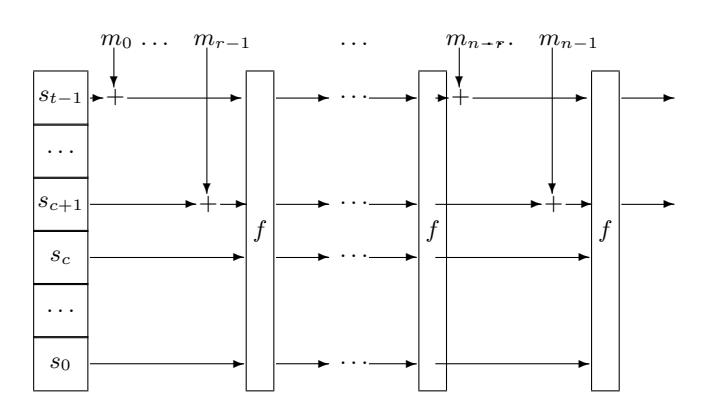
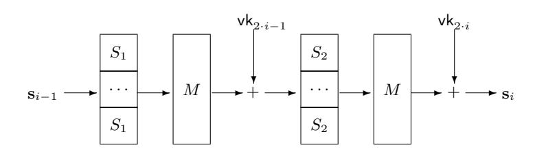

# Thresholdizing HashEdDSA: MPC to the Rescue

Charlotte Bonte1[0000−0002−4365−1845], Nigel P. Smart1,2[0000−0003−3567−3304], and Titouan Tanguy1[0000−0002−7965−620X]

1 imec-COSIC, KU Leuven, Leuven, Belgium. 2 University of Bristol, Bristol, UK. charlotte.bonte@kuleuven.be, nigel.smart@kuleuven.be, titouan.tanguy@kuleuven.be

Abstract. Following recent comments in a NIST document related to threshold cryptographic standards, we examine the case of thresholdizing the HashEdDSA signature scheme. This is a deterministic signature scheme based on Edwards elliptic curves. Unlike DSA, it has a Schnorr like signature equation, which is an advantage for threshold implementations, but it has the disadvantage of having the ephemeral secret obtained by hashing the secret key and the message. We show that one can obtain relatively efficient implementations of threshold HashEdDSA with no modifications to the behaviour of the signing algorithm; we achieve this using a doubly-authenticated bit (daBit) generation protocol tailored for Q2 access structures, that is more efficient than prior work. However, if one was to modify the standard algorithm to use an MPC-friendly hash function, such as Rescue, the performance becomes very fast indeed.

# 1 Introduction

Recent developments, like blockchain, have produced scenarios where creating valid signatures are extremely valuable. Even a single valid signature on an incorrect message can result in catastrophic consequences. This creates a problem that we can describe as fraudulent key usage. Threshold signature schemes can be used to mitigate the risk that an adversary can produce such a valid signature, by distributing signing power to a qualified set for a given access structure. Threshold signature schemes replace the key generation and signing algorithms of a digital signature scheme with an interactive protocol that requires participation of a certain number of parties to generate the signatures. Hence an adversary would have to corrupt multiple parties in order to generate a valid signature.

Threshold signatures schemes were previously studied in [\[Sho00,](#page-22-0)[DK01,](#page-21-0)[GJKR96,](#page-21-1)[MR01\]](#page-22-1). With the emergence of the scenarios where creating valid signatures can cause severe threats to the system, interest in threshold signature schemes renewed and new methods to generate ECDSA signatures were constructed [\[CDK](#page-21-2)+18,[CCL](#page-20-0)+20,[DOK](#page-21-3)+20,[DJN](#page-21-4)+20,[DKLs18,](#page-21-5)[GGN16,](#page-21-6)[GG18,](#page-21-7)[Lin17,](#page-22-2) [LN18,](#page-22-3)[LNR18\]](#page-22-4). As a consequence, the standardisation body NIST has initiated a Threshold Cryptography project in which they aim to standardise threshold schemes. By making threshold versions of their earlier standardised cryptographic primitives, they aim to develop the ability to distribute trust in operations of the various real systems that already base their security on NIST-approved cryptographic primitives.

In one of the documents NIST published in this effort [\[BDV19\]](#page-20-1), threshold schemes for several cryptographic primitives are described. Amongst others, the document mentions the Edwards-curve Digital Signature Algorithm (EdDSA). The Edwards-curve digital signature algorithm consists of a deterministic variant of a Schnorr signature based on Edwards curves. In deterministic Schnorr signatures, the ephemeral secret key is obtained by hashing the secret key and the message. There are many (secure implementation) reasons for using such a variant of Schnorr signatures, even though a verifier is unable to verify if the correct deterministic procedure was indeed carried out. However, this deterministic structure creates a technical difficulty for achieving a corresponding threshold version, as distributing the computation of a hash over different parties is not straightforward. In [\[BDV19\]](#page-20-1), NIST therefore raised concerns that this difficulty would lead to a longer path of standardisation. In particular they ask in the document

> The concrete (deterministic) EdDSA replaces the randomness by a hash of the concatenation of the secret signing key and the message being signed. This creates a technical difficulty for achieving a corresponding threshold interchangeable mode, which may either imply for it a more complex longer path of standardization, or additional possible considerations about the exact intended threshold mode.

On the NIST mailing list associated with their standardization of threshold schemes they also posted the request for further comments

> The preliminary roadmap briefly acknowledges (lines 600–608) the technical difficulty, with respect to thresholdization, associated with EdDSA requiring a hash of the secret key and other material, which would be expensive to obtain in a threshold manner. Specific comments about this are also welcome.

In private communication with the authors, they also expressed interest in whether choosing different hash functions in the EdDSA algorithm could help mitigate these issues, as the official standardization of EdDSA is not yet fully complete.

Note, the standard is not focused on the situation where a system designer has a choice of algorithm to use in an application where threshold signatures are required. In such a situation, the obvious choice is clearly to use standard Schnorr signatures. The proposed standard is focused on situations where an algorithm has already been selected in an application, and the organization performing the signing operations wants to secure the underlying cryptographic key using threshold cryptography.

NIST as an organization also validates cryptographic modules and thus any module implementation of the threshold variant of the algorithm must output signatures which are identical to the non-threshold variant; i.e. exactly the same deterministic signature needs to be produced by the threshold module as it would via normal cryptographic module, with the same key. Thus the threshold variant should produce signatures which are perfectly indistinguishable from nonthreshold signatures.

A more detailed description of EdDSA is provided in NIST's Digital Signature Standard document [\[Nat19\]](#page-22-5). There are two variants of EdDSA, the first obtained the ephemeral secret key using

$$r = H(\ H(d) \parallel m\ )$$

where d is the signing key and both d, r ∈ Fq. The second variant, called HashEdDSA, hashes the message first, thus we obtain

$$r = H(H(d) \parallel H(m))$$

To transform a signature scheme to a threshold signature scheme, we need to replace the key generation and signing algorithms with interactive protocols between multiple parties. In this work we consider Q2 access structure; this is an access structure in which no union of two unqualified sets covers the whole set of parties. These quorum based access structures were introduced by Hirt and Maurer [HM00] and are now commonly used in the MPC literature. For simplicity one can consider threshold (t,n) access structures where the t < n/2 and no subset of fewer than t+1 parties can recover the underlying secret or more specifically in this setting, a subset of fewer than t+1 parties can not forge a signature. Hence in a threshold protocol at least t+1 parties have to agree on signing a message before a valid signature of this message can be produced using a protocol. The resulting signature is identical to a signature which is obtained in a non-threshold manner, thus the verification algorithm of the signature remains unchanged.

The required security notion is that an active adversary, controlling an unqualified set of parties, who can arbitrarily deviate from the protocol, is unable to learn any information about the secret key or to produce a valid signature. In this work, we concentrate on active security-with-abort as this often is more relevant in practical situations. Formally we require that the adversary cannot determine when interacting with the protocol whether it is interacting with a real protocol, or with a simulator which has access to an ideal signing functionality. In particular, this means that the output signatures from the protocol need to be the same as those produced by the non-threshold ideal signing functionality.

If we apply this to EdDSA, one sees that, since the ephemeral signing key r needs to be kept secret, one needs to compute the hash via a form of multi-party computation (MPC) in order to create a signature. This is the biggest challenge in transforming the EdDSA signature to a threshold signature. As hashing in an MPC setting will be the most expensive part of our protocol, EdDSA will be slow if it is used on long messages, and hence we focus on the HashEdDSA variant of the protocol.

#### 1.1 Our Contribution

We answer to the concerns raised by NIST in [BDV19] by showing that with some (minor) changes to existing MPC-techniques, it is possible to create a threshold version of the standardised HashEdDSA signing algorithm. Since the long term and ephemeral secrets of HashEdDSA lie in the finite field  $\mathbb{F}_q$  (for q a large prime), it makes a lot of sense to utilize a generic MPC framework for  $\mathbb{F}_q$  to do most of the heavy elliptic curve operations; see [DOK+20, ST19] where this idea is used before. However, to evaluate the SHA512/SHAKE256 hash functions, it is more convenient to work with binary numbers. We will apply two different strategies to compute these hash functions.

Our first strategy is to securely evaluate the hash function using a Garbled Circuit (GC) based approach for n parties. In particular, we use a variant of the HSS protocol [HSS17]. This produces an additive authenticated bit-wise sharing of the hash function output between the n-parties. Our second approach is to use evaluate the hash function circuit using a secret sharing based approach over  $\mathbb{F}_2$ . In particular we adapted the method of Araki et al. [ABF+17], which focuses on the threshold case of (n,t)=(3,1) to work with any multiplicative  $\mathcal{Q}_2$  access structure instantiated by a replicated secret sharing scheme. These methods are explained in Section 3, and are to be incorporated in the v1.11 release of SCALE-MAMBA [ACC+20].

We then convert these bit-sharings into an  $\mathbb{F}_q$ -sharing for the desired  $\mathcal{Q}_2$  access structure using a modification of the daBit procedure from [RW19, AOR+19]. A daBit is a doubly-authenticated bit, namely a bit b which is secret shared in two different secret sharing schemes with respect to potentially two different moduli, e.g.  $\langle b \rangle_{p_1}$  and  $\langle b \rangle_{p_2}$ .

The most efficient daBit generation procedure is given in [RST+19]. But this procedure is focused on producing daBits which are shared with respect to two large primes  $p_1$  and  $p_2$ , with respect to a full threshold secret sharing scheme for both moduli. In our work, we require to

generate daBits in the 'classic' setting where p1 = 2 and p2 = q a large prime; but where the sharing modulus p1 = 2 is full threshold and the sharing modulus p2 = q is with respect to a Q2 access structure. Thus in Section [4,](#page-9-0) we provide a variant of the method in [\[RST](#page-22-8)+19] which works in our situation. This variant works by only requiring a qualified subset of the parties to contribute to the computation of the so-called correction terms in the big field. We also have to pay attention to how each party in this qualified subset contributes to this computation using its share of the bit and the recombination vector of the underlying secret sharing scheme.

In Section [5,](#page-12-0) we present an actively secure threshold variant of the standard HashEdDSA. Unlike threshold variants of standard (non-deterministic) DSA or Schnorr, we do not use zero-knowledge proofs to ensure correctness of the values produced by the adversary. This is because we rely on the underlying actively UC-secure MPC protocol to enable extraction of adversarial input for our simulation. In particular, it is important that we use an underlying MPC protocol which is UCsecure. Hence, we also provided specimen runtimes for our threshold protocols and compare these with timings from other MPC frameworks that allow similar setups in Section [7.](#page-17-0)

The main problem, and the most expensive part of our threshold protocol, is the need to evaluate a hash function which is designed to operate on binary data and then convert it into data which is represented as elements in Fq. Thus, we also investigate in Section [6](#page-14-0) the effect of replacing the standard hash functions SHA512 and SHAKE256 used in HashEdDSA with recently developed more MPC-Friendly hash functions to estimate the effect of this change on the efficiency of the threshold signing algorthm. We choose this modification as the MPC friendly hash functions look promising for improving the efficiency of our setup and we consider changing the hash function a non-invasive change to the standard that can easily be carried out in real-life systems currently using this standardised signing algorithm. In particular, we examine the Rescue hash function given in [\[AAB](#page-20-5)+19] as this is a hash function particularly suited to operating on Fq data. In Section [7,](#page-17-0) we also give experimental runtimes for executing Rescue in this context.

Why focus on Q2 and not full threshold? Our focus in this paper is on multiplicative Q2 access structures and not full threshold access structures for the following reason. Full threshold access structure poses additional complexity when utilized for MPC, in particular the full threshold access structure cannot be associated with a multiplicative secret sharing scheme. This means that it is not possible to compute an additive sharing of the product of two secrets by performing only local computations. Therefore, the input independent preprocessing phase needs to rely on more complex machinery such as Homomorphic Encryption [\[DPSZ12\]](#page-21-10) or Oblivious Transfer [\[KOS16\]](#page-22-9). The most efficient method is to use Homomorphic Encryption, but here we require special properties of the underlying prime modulus q. These conditions are not satisfied for the two curve parameters in the NIST standards. On the other hand, using Oblivious Transfer one can design an offline phase for any prime modulus q but at a relatively large cost. Thus, we focus on the case of Q2 access structures only.

### 2 Preliminaries

As in [\[Nat19\]](#page-22-5), we will consider two variants of HashEdDSA, based on the Edwards curves Ed25519 and Ed448. Both are variants of a Schnorr signature based on twisted Edwards curves. They use, however, different curves, hash functions and bitsizes, which means they provide different security levels. We will briefly describe Prehash EdDSA (HashEdDSA) for both Ed25519 and Ed448 signatures here. This is the version of EdDSA where the ephemeral key is generated on the hash of the message rather than on the message itself. For more details on EdDSA, we refer the reader to the original paper [\[BDL](#page-20-6)+11]. An interested reader can find a generalised version of EdDSA in [\[BJL](#page-20-7)+15].

First, we will define the notation of the parameters needed in these signatures. Let λ be the required security level. Set b the number of bits for the public HashEdDSA keys. Then the HashEd-DSA signatures will consist of exactly 2b bits. This value b is always a multiple of 8 and will hence be considered as a string of octets. We will let H denote the hash function used in HashEdDSA, for Ed25519 this is SHA512 and for Ed448 this is SHAKE256. HashEdDSA also relies on the parameters of the Edwards curve. Let G be a base point of prime order on the curve with coordinates (xG, yG). The order of the point G will be indicated with q. The private key of the signature scheme is denoted by sk and the public key with pk. The Edwards curve is itself defined over the prime field Fp.

## 2.1 The Signature Algorithms

Having defined the parameters and encoding/decoding techniques used in the EdDSA signature schemes, we now clarify the prehashed version of the Ed25519 signature scheme in Figure [1](#page-5-0) and the prehashed version of the Ed448 signature scheme in Figure [2.](#page-6-0) The algorithms make use of octet string encodings of elliptic curve points. This is done using a form of point compression tailored to the case of Edwards curves, for details see [\[Nat19\]](#page-22-5). For our purposes, we note that the encoding of a point for Ed25519 requires 32 octets, whilst that for Ed448 requires 57 octets.

Ed25519 and SHA512 We need to determine the number of SHA512 calls we will need to compute using MPC in the Ed25519 signing algorithm. From the description of SHA512, we know the blocksize is 1024 bits and that some preprocessing is performed on the input of the hash function. In the preprocessing of the input data of SHA512, one bit and a 128-bit string encoding the length of the message are appended to the message.

The description of Ed25519 includes 3 calls to the hash function. The first occurence computes the hash of the secret key H(sk). Remember that we can precompute this value, so we should not take this instance of the hash function into account. In the signing protocol, we first need to compute the hash on the message H(m). The number of hash calls needed for this computation depends on the size of the message. If l is the length of the message we want to hash, the number of hash calls we need to do considering the preprocessing of the message before hashing, is d(l + 1 + 128)/1024e. This can be computed in the clear since all parties know the message.

Afterwards, we need to compute another hash with input the second half of the resulting bitstring of H(sk), the hash of the secret key, concatenated with the hash of the message H(m). Since SHA512 outputs a bitstring of 512 bits, the input size of this last hash call is 256+512+1+128 = 897 bits, taking into account the length padding needed in a standard call to SHA512. This is smaller than the blocklength, hence this will only require one call to the underlying compression function.

Ed448 and SHAKE256 We can carry out a similar analysis for the case of the usage of SHAKE256 in the Ed448 signing algorithm. Note SHAKE256 always takes a second parameter which defines how many bits of output this application of SHAKE256 should produce; this should be contrasted with SHA512 which always produces a block of 512-bits as output. In SHAKE256, the suffix 1111 is appended to the message before padding, then the padding needs to assure the message can be

#### Hashed Ed25519 Signature Algorithm

#### KeyGen(b, λ):

- 1. Use a random bit generator to obtain a string of b = 256 bits. The private key sk equals this string of 256 bits.
- 2. Compute the hash H of the private key sk with SHA512, which results in a bitstring of length 512, i.e. H(sk) = SHA512(sk) = (h0, h1, h2, . . . , h2b−1).
- 3. Use HL(sk) the first half of H(sk) to generate the public key by setting the first three bits of the first octet and the last bit of the last octet to zero and setting the second last bit of the last octet to one. Hence we set h0 = h1 = h2 = hb−1 = 0 and hb−2 = 1. Determine from this new bitstring an integer s ∈ Fq using little-endian convention.
- 4. Compute Q = [s]G, the corresponding public key pk is the encoding of Q.

#### Sign(m,sk, pk):

- 1. Taking the second half of the hash value computed above we set HR(sk) = hb||hb+1|| . . . ||h2b−1 and compute with it r = SHA512(HR(sk)||SHA512(m)). This r will be 64 octets long, and we treat it as a little-endian integer modulo q.
- 2. Compute the encoding R of the point [r]G.
- 3. Define S as the encoding of r + SHA512(R||pk||SHA512(m)) · s (mod q).
- 4. The signature is constructed as the concatenation of R and S.

#### Verify(R||S, m, pk):

- 1. Split the signature into two equal parts and decode the first half R as a point and the second half S as an integer s. Verify that s lies in the half open interval [0, q). Decode the public key pk into a point. Reject the signature if any of the decodings fail.
- 2. Create a bit string of the concatenation of the octet strings R, pk, m, and HashData = R||pk||SHA512(m).
- 3. Compute SHA512(HashData) and interpret this bit string as a little-endian integer t.
- 4. Verify the equation [23 · S]G = [23 ]R + [23 · t]pk. Reject the signature if this verification fails, otherwise accept the signature.

Figure 1. Hashed Ed25519 Signature Algorithm

#### Hashed Ed448 Signature Algorithm

#### KeyGen(b, λ):

- 1. Use a random bit generator to obtain a string of b = 456 bits. The private key sk equals this string of 456 bits.
- 2. Compute the hash H of the private key sk with SHAKE256, which results in a bitstring of length 912. H(sk) = SHAKE256(sk, 912) = (h0, h1, h2, . . . , h2b−1)
- 3. Use HL(sk) the first half of H(sk) to generate the public key by setting the first two bits of the first octet and all eight bits of the last octet to zero and setting the last bit of the second to last octet to one. Hence we set h0 = h1 = hb−8 = . . . = hb−1 = 0 and hb−9 = 1. Determine from this new bitstring an integer s using little-endian convention.
- 4. Compute Q = [s]G, the corresponding public key pk is the encoding of Q.

Sign(m,sk, pk, context): A string context with maximum length of 255 octets is set by the signer and verifier, by default this string context is the empty string.

- 1. Taking the second half of the hash value of the private key sk computed above, we set HR(sk) = hb||hb+1|| . . . ||h2b−1. This value can already be precomputed.
- 2. We define dom4(f, c) to be the value

$$(\mathsf{SigEd448}||\mathsf{octet}(f)||\mathsf{octet}(\mathsf{octetlength}(c))||c),$$

where string SigEd448 is 8 octets in ASCII, the value octet(f) is the octet with f a value in the range 0 − 255 and octetlength(c) is the number of octets in string c. We compute r as the value

$$r = \mathsf{SHAKE}256(\mathsf{dom}4(0,\mathsf{context})||H_R(\mathsf{sk})||\mathsf{SHAKE}256(m,912),912).$$

This r will be 114-octets long, and treated as an integer modulo q.

- 3. Compute the encoding R of the point [r]G.
- 4. The value S is defined as the encoding of r+SHAKE256(dom4(0, context)||R||pk||SHAKE256(m, 912), 912)· s (mod q).
- 5. The signature is constructed as the concatenation of R and S.

Verify(R||S, m, pk, context): A string context with maximum length of 255 octets is set by the signer and verifier, by default this string context is the empty string.

- 1. Split the signature into two equal parts and decode the first half R as a point and the second half S as an integer s. Verify that s lies in the half open interval [0, q). Decode the public key pk into a point. Reject the signature if any of the decodings fail.
- 2. Create a bit string of the concatenation of the octet strings R, pk, m, and HashData = R||pk||SHAKE256(m, 912).
- 3. Compute SHAKE256(dom4(0, context)||HashData, 912) and interpret this bit string as a little-endian integer t.
- 4. Verify the equation [22 · S]G = [22 ]R + [22 · t]pk. Reject the signature if this verification fails, otherwise accept the signature.

Figure 2. Hashed Ed448 Signature Algorithm

divided into blocks of bitsize 1088. Hence zeros are attached to the message in order to make the message size a multiple of 1088. However, the final bit added is a 1 and not a 0. Therefore, we have to at least add 5 ones to the message. If we consider a message of length l, we will have to process  $\lceil (l+5)/1088 \rceil$  blocks, which equals the number of calls to the permutation function of SHAKE256.

Just as for the case of Ed25519 above, Ed448 uses three calls to this hash function. The first is to compute the hash of the secret key, which can again be done in preprocessing. The second is to compute the hash of the message, depending on the length l of the message we need  $\lceil (l+5)/1088 \rceil$  calls to SHAKE256 to compute this.

The final, crucial for us, hash function call is applied to the concatenation of dom4(0, context), half of the bitstring encoding the hash of the secret key and the hash of the message. For the default setting where context is the empty string, the length of the message we want to sign here is 80 + 456 + 912 + 5 = 1453 bits, which corresponds to the need for 2 blocks. For the maximal size of context, which corresponds to 255 octets, we need 2120 + 456 + 912 + 5 = 3493 bits, which corresponds to needing 4 blocks. Thus we need to apply the SHAKE256 permutation function between two and four times.

#### 3 MPC Functionalities

Our key MPC functionality needs to process shared values in  $\mathbb{F}_q$  as well as evaluate binary garbled circuits using the HSS protocol, [HSS17]. We therefore adopt the Zaphod framework from [AOR+19].

Let  $\mathcal{P} = \{P_1, \dots, P_n\}$  be a set of parties,  $\Gamma, \Delta \in 2^{\mathcal{P}}$  be respectively the monotonically increasing set of qualified sets and the monotonically decreasing set of unqualified sets. Then if  $\Gamma \cap \Delta = \emptyset$ ,  $(\Gamma, \Delta)$  defines a monotone access structure. For our matter, we only consider complete monotone access structures, that is those for which  $\Delta = 2^{\mathcal{P}} \setminus \Gamma$  holds. Eventually the access structure is said to be  $\mathcal{Q}_2$  if no union of two sets in  $\Delta$  is the whole set of parties  $\mathcal{P}$ .

We let  $\langle \cdot \rangle_q$  denote a linear secret sharing scheme (LSSS) over the finite field  $\mathbb{F}_q$  which realizes a  $\mathcal{Q}_2$ -access structure. We restrict the set of supported LSSS to one which is multiplicative, which means that given  $\langle x \rangle_q$  and  $\langle y \rangle_q$  then the value  $x \cdot y$  can be expressed as a linear combination of local products of shares. Since the access structure is  $\mathcal{Q}_2$ , the shares are in some-sense automatically authenticated through redundancy among the honest players, thus one can easily define actively secure MPC (with abort) protocols for such a secret sharing scheme, see e.g. [CGH+18,SW19].

The sharing  $\langle \cdot \rangle_q$  is defined via monotone span programs (MSPs), which were first introduced by Karchmer and Widgerson [KW93]. Let  $M \in \mathbb{F}_q^{m \times k}$  be a matrix, choose a non-zero "target" vector  $\mathbf{t} \in \mathbb{F}_q^k$  and a surjective index function  $\iota: \{1, \ldots, m\} \longrightarrow \{1, \ldots, n\}$ . If we consider for example Shamir based  $\mathcal{Q}_2$  access structure, the number of shares m are equal to the number of parties n and if we consider the (3,1)-threshold replicated secret sharing, the number of shares m equals 6. To share a secret s using this matrix, "target" vector and index function, the dealer samples a vector  $\mathsf{vk} \leftarrow \mathbb{F}_q^k$  such that  $\mathbf{t} \cdot \mathsf{vk}^\mathsf{T} = s \in \mathbb{F}_q$ , sets  $\mathbf{s} = (s_1, \ldots, s_m) = M \cdot \mathsf{vk}$ , and for each  $j \in [m]$  computes  $i = \iota(j)$  and sends  $s_j$  to party  $P_i$  over a synchronous secure channel3. The matrix is chosen in such a way that for any qualified set of parties  $Q \in \Gamma$ , there is a (public) recombination vector  $\mathbf{r}_Q$  that given the share vector  $\mathbf{s}$  (i.e. the concatenation of shares held by the qualified set of parties) can recover the secret by computing  $s = \mathbf{r}_Q \cdot \mathbf{s}^\mathsf{T}$  (mod q). To authenticate a set of shares there is a

&lt;sup>3 Standard TLS satisfies the properties we need for our secure channels.

public parity check matrix H, which for a valid set of shares  $\mathbf{s}$  will satisfy  $H \cdot \mathbf{s}^{\mathsf{T}} = \mathbf{0}$ . Unfamiliar readers are referred to [KRSW18] for a more detailed introduction to MSPs.

As mentioned above, we will use two different strategies to compute the hash functions over  $\mathbb{F}_2$ . For the HSS GC-based protocol [HSS17], we use a full threshold authenticated sharing of bits  $\langle \cdot \rangle_2$ , according to the pairwise BDOZ-style MAC introduced by Bendlin et al. [BDOZ11]. We extend the sharing of bits  $\langle x \rangle_2$  to sharings of vectors of bits  $\langle x \rangle_2$  in the obvious manner.

For the  $Q_2$  based protocol for replicated secret sharing we use a generalisation of the method of [ABF+17]. Thus when working with a  $Q_2$  structure modulo q for the main sharing  $\langle \cdot \rangle_q$  above, we select a replicated secret sharing with the same access structure to obtain a similar sharing over  $\mathbb{F}_2$ . For the protocol to execute MPC over  $\mathbb{F}_2$ , we use Maurer's passively secure multiplication protocol [Mau06] to generate passively secure multiplication triples over  $\mathbb{F}_2$ . These are then turned into actively secure triples using the method of [ABF+17][Protocol 3.1]. Finally the triples are consumed in a standard GMW/CCD style online phase, using the methodology of [SW19] to ensure active security, whilst using the techniques of [KRSW18] to reduce the total amount of communication performed. This combination of techniques works for any replicated secret sharing scheme over  $\mathbb{F}_2$ , and produces an online phase requiring the least number of rounds4.

The different types of shares and their functionalities are combined by applying the Zaphod framework [AOR+19] using the functionality in Figure 3. Note that unlike the paper [AOR+19] we are only interested in converting from binary sharings  $\langle \cdot \rangle_2$  to an equivalent shared bit in the  $\langle \cdot \rangle_q$ -world. We also allow the circuits  $C_f$  to produce multiple outputs. Each value in  $\mathcal{F}_{\mathsf{MPC}}$  is uniquely identified by an identifier  $varid \in I$ , where I is a set of valid identifiers, and a domain set  $domain \in \{\mathbb{F}_q, \mathbb{F}_2\}$ . Note the functionality is modelled in such a way that it is independent of the details of the authentication technique used. In addition, the functionality captures all the MPC computations we will require from a system such as SCALE-MAMBA. Note, we will be using the reactive nature of the MPC functionality as we will be calling it to perform the key generation, as well as repeatedly calling it for the signing operation.

In expressing algorithms based on this functionality, we shall use the shorthand  $\langle x \rangle_q$  to denote an item stored in a *varid* for domain  $\mathbb{F}_q$  and  $\langle x \rangle_2$  to denote an item stored in a *varid* for domain  $\mathbb{F}_2$ . The functionalities and protocols expressed in this work require all parties to participate in order to produce an output. However, a qualified set of parties should suffice to request and generate an output, the formalization of this setup would be an extension of our paper which is left for future work.

&lt;sup>4 Note, other methodologies can reduce the total number of rounds or the total number of multiplications; i.e. when considering online and offline phases as one.

#### Functionality $\mathcal{F}_{\mathsf{MPC}}$

The functionality runs with parties  $P_1, \ldots, P_n$  and an ideal adversary Adv. Let  $\mathcal{A}$  be the set of corrupt parties. Given a set I of valid identifiers, all values are stored in the form (varid, domain, x), where  $varid \in I$ ,  $domain \in \{\mathbb{F}_2, \mathbb{F}_q\}$  and  $x \in domain$ .

Initialize: On input (Init) from all parties, the functionality activates.

If (Init) was received before, do nothing.

**Input:** On input  $(Input, P_i, varid, domain, x)$  from  $P_i$  and  $(input, P_i, varid, domain)$  from all other parties, with varid a fresh identifier, store (varid, domain, x).

**Random:** On input (Random, varid, domain) from all parties, with varid a fresh identifier, generate a uniformly random value  $x \in \mathbb{F}_q$  or  $x \in \mathbb{F}_2$  depending on the value of domain and store (varid, domain, x).

**Evaluate:** Upon receiving  $((varid_j)_{j \in [n_I]}, (varid_i)_{i \in [n_O]}, domain, C_{\bar{f}})$ , from all parties, where  $\bar{f} : \{domain\}^{n_I} \to \{domain\}^{n_O}$  and the  $varid_i$  are all fresh identifiers, if  $\{varid_j\}_{j \in [n_I]}$  were previously stored, proceed as follows:

- 1. Retrieve  $(varid_j, domain, x_j)$ , for each  $j \in [n_I]$
- 2. For each  $i \in [n_O]$  store  $(varid_i, domain, y_i)$  where  $(y_1, \dots, y_{n_O}) \leftarrow \bar{f}(x_1, \dots, x_{n_I})$

Output: On input (Output, varid, domain, type), from all parties (if varid is present in memory):

- 1. If type = 0 (**Public Output**): Retrieve (varid, domain, y) and send y to Adv. If the adversary sends Deliver, send y to all parties.
- 2. Otherwise type = i (**Private Output**): Wait for the adversary. If the adversary sends **Deliver**, retrieve (varid, domain, y) and send y to  $P_i$

Abort: The adversary can at any time send abort, upon which send abort to all honest parties and halt.

**Convert:** On input (Convert, varid1,  $\mathbb{F}_2$ , varid2,  $\mathbb{F}_q$ ):

- 1. Retrieve  $(varid_1, \mathbb{F}_2, x)$  and convert  $x \in \{0, 1\}$  to an element  $y \in \mathbb{F}_q$  by setting y = x
- 2. Store  $(varid_2, \mathbb{F}_q, y)$ .

**Figure 3.** The ideal functionality for MPC with Abort over  $\mathbb{F}_q$  and  $\mathbb{F}_2$  - Evaluation

# 4 Improved daBit Technique for $Q_2$ -LSSS

In the following we want to adapt the daBit scheme to generate daBits to switch between binary shares and any multiplicative LSSS with a  $Q_2$  access structure following the method by Rotaru and Wood [RW19]. This base protocol was improved in [AOR+19], and then again in [RST+19]. However, the latter improvement was only in the case of producing daBits between two full threshold LSSS systems both over large prime moduli. Since our interest lies in  $Q_2$  access structures, we need to modify the technique in [RST+19] for the case where  $q_1$  is the prime modulus of a  $Q_2$  LSSS and  $q_2 = 2$ .

We note that to realize the GC protocol implemented in the SCALE-MAMBA [ACC+20] framework, and described in [HSS17], the sharing in  $\mathbb{F}_2$  is a full threshold sharing irrespective of the access structure of the LSSS in  $\mathbb{F}_q$ . As an the alternative strategy, as explained earlier, we can utilize a replicated secret sharing scheme to implement the  $\mathcal{Q}_2$  access structure over  $\mathbb{F}_2$ . In either case the daBit protocols and the conversion scheme are identical; all that differs is how shared bits are represented and authenticated.

We recall that we denote by  $\langle . \rangle_q$  a sharing in the multiplicative LSSS and by  $\langle . \rangle_2$  a full threshold sharing (GC) or honest majority sharing (mod 2 sharing) in  $\mathbb{F}_2$  (with all sharings authenticated). The protocol follows closely the one described in [RST+19, Figure 6] as we want to achieve the same goal. In our case, the smallest modulo we work with is  $q_{min} = 2$ . As is the case in [RST+19], our protocol requires that  $q_{min}^{\gamma} > 2^{\text{sec}}$ . We therefore set  $\gamma = \text{sec} + 1$  where sec is the security parameter (typically sec = 128). Informally, the protocol asks the parties to generate a random bit in the LSSS

through a call to the GenBit protocol, which extends the  $\mathcal{F}_{\mathsf{MPC}}$  functionality and for which we give the ideal functionality in Figure 4 and its secure realisation in Figure 5. The protocol also makes a call to the ideal functionality  $\mathcal{F}_{\mathsf{Rand}}^{2\mathsf{sec}}$  which is described in Figure 6. The ideal functionalities and the protocol are taken from [RST+19] and are given here for completeness.

### Functionality $\mathcal{F}_{MPC}$ .GenBit()

- 1. For each corrupt party  $P_i$ , the functionality waits for inputs  $b_i \in \mathbb{F}_q$ .
- 2. The functionality waits for a message abort or ok from the adversary. If the message is ok then it continues.
- 3. The functionality then samples a bit  $b \in \{0,1\}$  and then completes the sharing to  $b = \sum_i b_i$  by selecting shares for the honest parties.
- 4. The (authenticated) shares are passed to the honest parties.
- 5. The bit b is stored in the functionality  $\mathcal{F}_{MPC}$ .

Figure 4. The ideal functionality for single random bits

#### Entering a Random Bit $\Pi_{MPC}^q$ .GenBit()

- 1. For  $i=1,\ldots,n$  execute  $\mathcal{F}_{MPC}$ .Input such that  $P_i$  inputs  $x_i$  and all parties obtain the share of  $\langle x_i \rangle_q$ , where  $x_i$  is a random element in  $\mathbb{F}_q$ .
- 2.  $\langle x \rangle_q \leftarrow \sum_{i=1}^n \langle x_i \rangle_q$ . 3.  $\langle y \rangle_q \leftarrow \langle x \rangle_q \cdot \langle x \rangle_q$ .
- 4. Execute  $\mathcal{F}_{MPC}$ .Output to publicly reveal y from its sharing  $\langle y \rangle_q$ .
- 5. If y = 0 then restart the process.
- 6.  $z \leftarrow \sqrt{y}$ , picking the value  $z \in [0, \dots, q/2)$ .
- 7.  $\langle a \rangle_q \leftarrow \langle x \rangle_q / z$ . 8.  $\langle b \rangle_q \leftarrow (\langle a \rangle_q + 1) / 2$ .
- 9. Return  $\langle b \rangle_q$ .

**Figure 5.** 'Standard' method to produce a shared random bit in  $\Pi_{MPC}^q$ 

#### Functionality $\mathcal{F}_{\mathsf{Rand}}^B(M)$

- 1. On input (Rand, cnt) from all parties, if the counter value is the same for all parties and has not been used before, the functionality samples  $r_i \leftarrow [0, B)$  for i = 1, ..., M.
- 2. The values  $r_i$  are sent to the adversary, and the functionality waits for an input.
- 3. If the input is Deliver then the values  $r_i$  are sent to all parties, otherwise the functionality aborts.

Figure 6. The ideal  $\mathcal{F}_{\mathsf{Rand}}^B(M)$  functionality

Then one party is given enough information to compute, with probability at least  $1-\frac{1}{a}$ , how many 'wrap arounds' modulo q the sharing of these random bits induced. Therefore, this party knows what its input should be modulo 2 to correct for the shares held by the other parties. We therefore end up with a sharing of the same bit modulo q and modulo 2. Eventually, to check that the protocol was correctly executed, the parties open  $\gamma = \sec + 1$  linear combinations of the same random bits in both modulo q and modulo 2 and make sure that the linear combinations are equal modulo 2.

We note that the only differences between our variant of the protocol presented in Figure 7 and the one from [RST+19] lie in step 2. In fact, because in our protocol we consider any multiplicative LSSS with a  $Q_2$  access structure we do not require all parties to take part in the computation of the correction terms  $k_i$ . All we need is that enough of them, that is any set of parties in  $\Gamma$ , help  $P_1$  in doing so. That is we select a set  $Q_1$  which is the smallest qualified set which contains party  $P_1$ . Moreover, the definition of the bits  $b_{i,j}$  slightly changes from the original protocol as we need to take into account the reconstruction vector for the set  $Q_1$ , and not only the raw shares. We stress here that for the full threshold case the full set of parties is the only subset that can reconstruct a sharing. Therefore if one considers  $Q_1 = \mathcal{P}$  and  $\mathbf{r}_{Q_1} = \mathbf{1}$ , then our definition of  $b_{i,j}$  is identical to the one given in [RST+19]. This alteration means that the proof of security from [RST+19], which relies on assuming a variant of the subset sum problem, also applies to our modification.

#### Protocol $\Pi_{\mathsf{daBit}}$

Let  $Q_1$  be the smallest set in  $\Gamma$  that contains  $P_1$ .

- 1. Set  $\delta = \lceil q/|Q_1| \rceil$ .
- 2. For  $i = 1, \dots, m + \gamma \cdot \text{sec do}$ 
  - (a)  $\langle b_i \rangle_q \leftarrow \mathcal{F}_{\mathsf{MPC}}.\mathsf{GenBit}()$ .
  - (b) For  $j \in Q_1$  let  $b_{i,j} = \langle \mathbf{r}_{Q_1}^{\{P_j\}}, \langle b_i \rangle_q^{\{P_j\}} \rangle$  denote party j's value such that  $\sum_{j \in Q_1} b_{i,j} = b_i \pmod{q}$ . Such a  $b_{i,j}$  always exists by definition of our LSSS.
  - (c) For  $j \in Q_1$ , party  $P_j$  writes  $b_{i,j} = l_{i,j} + \delta \cdot h_{i,j}$  with  $0 \le l_{i,j} < \delta$ .
  - (d) For  $j \in Q_1$ , party  $P_j$  sends  $h_{i,j}$  to party  $P_1$ .
  - (e) Party  $P_1$  sets

$$k_i = \left\lceil \frac{\delta \cdot \sum_{j \in Q_1} h_{i,j}}{q} \right\rceil.$$

- (f) Parties re-randomize the sharing in  $\mathbb{F}_q$ 
  - All parties execute  $\mathcal{F}_{MPC}$ .Input, for  $j \in Q_1$ , such that  $P_j$  inputs  $b_{i,j} \pmod{q}$  and all parties obtain the sharing  $\langle b_i^{(j)} \rangle_q$ .
  - The parties compute  $\langle b_i \rangle_q = \sum_{j \in Q_1} \langle b_i^{(j)} \rangle_q$ .
- (g) Parties re-share the same bit in  $\mathbb{F}_2$ 
  - All parties execute  $\mathcal{F}_{MPC}$ .Input such that  $P_1$  inputs  $b_{i,1} k_i \cdot q \pmod{2}$  and all parties obtain the sharing  $\langle b_i^{(1)} \rangle_2$ .
  - All parties execute  $\mathcal{F}_{\mathsf{MPC}}$ .Input, for  $j \in Q_1 \setminus \{P_1\}$ , such that  $P_j$  inputs  $b_{i,j} \pmod 2$  and all parties obtain the sharing  $\langle b_i^{(j)} \rangle_2$ .
  - The parties compute  $\langle b_i \rangle_2 = \sum_{j \in Q_1} \langle b_i^{(j)} \rangle_2$ .
- 3. The parties initialize an instance of the functionality  $\mathcal{F}_{\mathsf{Rand}}^{2^{\mathsf{sec}}}$ . [Implementation note this needs to be done after the previous step so the parties have no prior knowledge of the output].
- 4. For  $j = 1, \ldots, \gamma$  do
  - (a) For  $i = 1, ..., m + \gamma \cdot \text{sec}$  generate  $r_{i,j} \leftarrow \mathcal{F}_{\mathsf{Rand}}^{2^{\mathsf{sec}}}(m + \gamma \cdot \mathsf{sec})$ .
  - (b) Compute the sharing  $\langle S_{j,2} \rangle_2 = \sum_i r_{i,j} \cdot \langle b_i \rangle_2$ .
  - (c) Compute  $\langle S_j \rangle_q = \sum_i r_{i,j} \cdot \langle b_i \rangle_q$ .
  - (d) Execute  $\mathcal{F}_{MPC}$ . Output to publicly reveal  $S_{j,2}$  from its sharing  $\langle S_{j,2} \rangle_2$ .
  - (e) Execute  $\mathcal{F}_{MPC}$ . Output to publicly reveal  $S_j$  from its sharing  $\langle S_j \rangle_q$ .
  - (f) Abort if  $S_j \pmod{2} \neq S_{j,2}$ .
- 5. Output  $\langle b_i \rangle_q$  and  $\langle b_i \rangle_2$  for  $i = 1, \ldots, m$

Figure 7. Method to produce m shared daBits

### 5 Threshold Variant of Standard HashEdDSA

We now present our threshold variant of HashEdDSA and show that it is secure when instantiated with a UC-secure instantiation of the MPC functionality from Figure [3.](#page-9-1) We concentrate on the HashEdDSA signature based on the Ed22519 curve given in Figure [1,](#page-5-0) with the case of Ed448 being virtually identical (bar using a different hash function and a different elliptic curve). We also focus on the KeyGen and Sign algorithms, as Verify is fixed irrespective of whether one signs with a threshold variant or not. Our goal is to realise the functionality given in Figure [8.](#page-12-1)

#### Distributed Signature Functionality: FSign

We let A denote the set of parties controlled by the adversary.

KeyGen: This proceeds as follows:

- 1. The functionality generates a public/private key pair; s ∈ Fq and pk = [s]G and the value pk is output to the adversary.
- 2. The functionality waits for an input from the adversary.
- 3. The adversary returns with either abort or deliver. If deliver the functionality returns pk to the honest parties, otherwise it aborts.

Sign: On input of the same message m from all parties the functionality proceeds as follows:

- 1. The functionality adversary waits from an input from the adversary.
- 2. If the input is not abort then the functionality generates a signature σ on the message m.
- 3. The signature is returned to the adversary, and the functionality again waits for input. If the input is again not abort then the functionality returns σ to the honest parties.

Figure 8. Distributed Signature Functionality: FSign

The two relevant threshold-ized algorithms are given in Figure [9.](#page-13-0) They are presented in the FMPC-hybrid model. At two points in the algorithm we need to take a sharing hsiq and output in public the value Q = [hsiq]G. This is done using the following process:

- For each element sj in the share vector held by party Pi the party publishes Qj = [sj ]G.
- The parties compute Q = r · (Q1, . . . , Qm) T for the reconstruction vector r of the underlying MSP.
- The parties also verify the output is correct by checking that

$$H \cdot (Q_1, \ldots, Q_m)^\mathsf{T} = \mathbf{0}$$

and aborting if this does not hold.

This algorithm hides the underlying secret s assuming the discrete logarithm problem on the elliptic curve is hard as s and the shares of s come from a high entropy distribution. Note the abort test on the shares Q above using the matrix H is the reason why we have a potential abort in our Key Generation functionality in Figure [8.](#page-12-1)

Theorem 5.1. The protocol in Figure [9](#page-13-0) securely realises the distributed signing functionality given in Figure [8](#page-12-1) in the FMPC-hybrid model, assuming the discrete logarithm problem is hard.

Proof. The simulator has access to the functionality FMPC and thus when simulating the KeyGen procedure it executes steps [1–](#page-13-1)[3](#page-13-2) of the threshold KeyGen procedure using the functionality FMPC.

#### Threshold Variant of the Hashed Ed25519 Signature Algorithm

KeyGen $(b, \lambda)$ : This algorithm proceeds as follows

- 1. Call  $\mathcal{F}_{MPC}$ .Random a total of 256 times to generate shared random bits  $\langle \mathsf{sk} \rangle_2 = \{\langle d_i \rangle_2\}_{i=0}^{255}$ .
- 2. For the circuit  $C_f = \mathsf{SHA512}$  compute the hash value  $\mathsf{SHA512}(\langle \mathsf{sk} \rangle_2) = (\langle h_0 \rangle_2, \langle h_1 \rangle_2, \ldots, \langle h_{511} \rangle_2)$  by calling  $\mathcal{F}_{\mathsf{MPC}}$ . Evaluate
- 3. Apply  $\mathcal{F}_{\mathsf{MPC}}$ . Convert to convert  $\langle h_i \rangle_2$  for  $i=3,\ldots,253$  to  $\langle h_i \rangle_q$ , and then set  $\langle s \rangle_q = 2^{254} + \sum_{i=3}^{253} 2^i \cdot \langle h_i \rangle_q$ .
- 4. Compute the point  $[\langle s \rangle_q]G$  using the method described in the text. The corresponding Ed25519 public key pk is the encoding of this point.

Sign(m, sk, pk): Signing proceeds as follows

- 1. We compute the hash of the message m in the clear to obtain  $SHA512(m) = (h'_0, h'_1, \ldots, h'_{511})$ .
- 2. We then apply the SHA512 circuit using  $\mathcal{F}_{MPC}$ . Evaluate to the bit string,  $(\langle h_{256}\rangle_2, \langle h_{257}\rangle_2, \ldots, \langle h_{511}\rangle_2, h_0', h_1', \ldots, h_{511}')$  consisting of 256 unknown bits and 512 known bits. Note, this requires only one iteration of the SHA512 compression function. Let the output be  $(\langle r_0\rangle_2, \langle r_1\rangle_2, \ldots, \langle r_{511}\rangle_2)$
- 3. We apply  $\mathcal{F}_{MPC}$ . Convert to convert  $\langle r_i \rangle_2$  for  $i = 0, \ldots, 511$  to  $\langle r_i \rangle_q$  and set  $\langle r \rangle_q = \sum_{i=0}^{511} 2^i \cdot \langle r_i \rangle_q$ .
- 4. Compute the point  $[\langle r \rangle_q]G$  using the method above, and the result opened to all parties. The resulting point is converted to a public octet string R.
- 5. The parties compute  $\langle S \rangle_q = \langle r \rangle_q + e \cdot \langle s \rangle_q$  where  $e = \mathsf{SHA512}(R||\mathsf{pk}||\mathsf{SHA512}(m))$  can be computed publicly.
- 6. Finally  $\langle S \rangle_q$  is opened to all parties.

Figure 9. Threshold Variant of the Hashed Ed25519 Signature Algorithm

The simulator, from the simulation of the MPC functionality, obtains the adversarial shares  $s_j$  for  $i = \iota(j) \in \mathcal{A}$  and computes  $Q_j = [s_j]G$ . The simulator calls the KeyGen functionality on  $\mathcal{F}_{\mathsf{Sign}}$  and obtains a public key  $\mathsf{pk} = [s]G$  for some hidden value of  $s \in \mathbb{F}_q$ . With overwhelming probability there is a choice of random bits  $d_i$  which produce the secret key corresponding to s, and thus there is a way for this value to have arisen in the protocol. The simulator now needs to generate  $Q_j$  for  $i = \iota(j) \notin \mathcal{A}$  which is consistent with the  $Q_j$  computed above. The unknown  $Q_j$  define a series of linear equations in elliptic curve points (one equation defined by the reconstruction vector  $\mathbf{r}$  and a set of equations defined by the parity check matrix H). This set of equations will have a solution since there is an assignment which produces this hidden value s. Thus the values  $Q_j$  for  $i = \iota(j) \notin \mathcal{A}$  can be perfectly simulated, and by the hardness of the discrete logarithm problem, the combined set hide the unknown hidden value s. The values  $Q_j$  for  $i = \iota(j) \notin \mathcal{A}$  are sent to the adversary, who returns his own set  $Q_j^*$  for  $i = \iota(j) \in \mathcal{A}$ . If the  $Q_j^* \neq Q_j$  then the simulator passes abort to  $\mathcal{F}_{\mathsf{Sign}}$  and exits. Note, that this abort will be caught in the real protocol as well by using the error detecting properties of the  $Q_2$  secret sharing scheme; see [SW19, Lemma 2].

For the signing algorithm, the simulator obtains a signature (R,S) from the signing oracle. The steps 1–4 of the threshold signing algorithm are simulated in the same way as the steps to generate pk in the KeyGen algorithm. All that remains, is to simulate the opening of  $\langle S \rangle_q$ . As before, from the simulation of  $\mathcal{F}_{MPC}$ , we know the adversarial shares of  $\langle r \rangle_q$  and  $\langle s \rangle_q$ , thus we know what the adversary should output as their shares of  $\langle S \rangle_q$ . Thus we are able, this time by solving linear equations over  $\mathbb{F}_q$ , to find a set of consistent shares for the honest parties which open to the correct value of S. If the adversary sends incorrect values for his opening of  $\langle R \rangle_q$  or  $\langle S \rangle_q$  which would cause the real protocol to abort, then the simulator passes abort to  $\mathcal{F}_{\text{Sign}}$ .

It is clear that the above simulation perfectly simulates the algorithms  $\mathsf{KeyGen}$  and  $\mathsf{Sign}$ . Thus the security of the protocol follows.

### 6 Using MPC-Friendly Hash Functions

Up to now, we have concentrated on following the precise definition in the NISTs Digital Signature Standard [\[Nat19\]](#page-22-5). Thus we used SHA-512 and SHAKE-256 as the underlying hash functions; which gave a potential performance penalty in the deterministic signature environment. However, as part of the NIST Threshold Cryptography initiative, there is some interest in examining variants which are more amendable to a threshold implementation. The obvious 'tweak' which could be applied to the standard HashEdDSA and EdDSA algorithms is to replace the use of SHA-512 and SHAKE-256 with so-called 'MPC-Friendly' hash functions.

In recent years, there has been considerable interest in MPC-Friendly variants of symmetric cryptographic primitives; for example block ciphers [\[AGR](#page-20-9)+16, [ARS](#page-20-10)+15, [GRR](#page-21-12)+16] modes-ofoperation [\[RSS17\]](#page-22-14), and more recently hash functions [\[AAB](#page-20-5)+19,[GKK](#page-21-13)+19]. The hash function constructions are sponge-based, and designs have been given which are suitable for MPC over characteristic two fields (StarkAD and Vision), as well as over large prime fields (Poseidon and Rescue). In this paper, we concentrate on the Rescue design from [\[AAB](#page-20-5)+19], which seems more suited to our application.

Rescue has a state of t = r+c finite field elements Fq. The initial state of the sponge is defined to be the vector of t zero elements. A message is divided into n = d·r elements in Fq, m0, m1, . . . , mn−1. The elements are absorbed into the sponge in d absorption phases, where r elements are absorbed in each phase. At each phase a permutation f : F t q −→ F t q is applied; see Figure [10.](#page-14-1) This results in a state s0, . . . , st−1. At the end of the absorption, the r values sc, . . . , st−1 are output from the state. This process can then be repeated, with more data absorbed and then squeezed out. Thus we are defining a map H : F n q −→ F r q . To obtain security of the sponge itself, we require that min(r, c)· log2 q ≥ 2 · κ, where κ is the desired security parameter. We will always take c = 2 in our application[5](#page-14-2) .

Fig. 10. The Rescue Sponge Function

Each primitive call f in the Rescue sponge is performed by executing a round function rnds times. The round function is parametrized by a (small prime) value α, an MDS matrix M ∈ F t×t q and 2 step constants vki ∈ F t q . The value α is chosen to be the smallest prime such that gcd(q −1, α) = 1.

5 We note this is a conservative choice since taking c = 1 is possible due to us having q ≈ 2 2·κ .

The round function is given in Figure 11, where  $S_1$  is the S-Box which maps  $x \in \mathbb{F}_q$  to  $x^{1/\alpha}$  and  $S_2$  is the S-Box which maps  $x \in \mathbb{F}_q$  to  $x^{\alpha}$ . To obtain security of the permutation f we require that the round function is repeated

$$\mathsf{rnds} = \max(\ 2 \cdot \lceil \kappa/4 \cdot t \rceil, \ 10 \ )$$

times.

Notice, that the product  $t \cdot \mathsf{rnds}$  is (to a first approximation) fixed by the security parameter. The 'cost' of evaluating f in terms of number of multiplications will be proportional to  $t \cdot \mathsf{rnds}$ , but the online evaluation time will depend (in an MPC system) mainly only on the value of  $\mathsf{rnds}$ . Thus having a larger t value will improve performance compared to a smaller t value. To show the dependence of f on t, we will write  $f_t$  for this function in what follows.

Fig. 11. The Rescue Round Function

We will require different variants of the Rescue hash function for different values of the rate r, respectively t = r + 2. Thus we define the function  $R_r$  which takes an arbitrary sized input, which is divided into blocks of size  $r \mathbb{F}_q$ -elements, and produces a final output block of size  $r \mathbb{F}_q$ -elements.

$$R_r: (\mathbb{F}_q^r)^* \longrightarrow \mathbb{F}_q^r.$$

When one applies  $R_r$  to messages always of the same number of blocks, there is no need for a padding scheme, however when  $R_r$  is applied to messages of variable length, we need to pad the input. Thus for arbitrary length messages m, we first pad by adding a single  $\mathbb{F}_q$  element consisting of the one element, and then we pad by enough zero elements so as to obtain a message which is a multiple of r field elements long.

If we apply  $R_r$  as a hash function where the initial state is not the zero state, but another set of t values  $s_0, \ldots, s_{t-1}$ , then we write  $R_r(m; s_0, \ldots, s_{t-1})$ . Thus we have  $R_r(m) = R_r(m; 0, \ldots, 0)$ .

To examine the cost of an MPC implementation, we consider only the online round complexity, assuming a 'standard' SDPZ-like offline procedure (which produces multiplication triples, square pairs and random shared values only). We note that in a constant number of rounds we can produce from the standard pre-processing as many pairs of the form  $(\langle r \rangle_q, \langle r^{-\alpha} \rangle_q)$  as we like. In fact, using existing pre-processed squares, this will require one round for  $\alpha = 3$  and two rounds for  $\alpha = 5$ .

Given this pre-processing, we can produce  $\langle x^{\alpha} \rangle_q$  given  $\langle x \rangle_q$  in two rounds, irrespectly of  $\alpha$ . This is done by computing  $\langle y \rangle_q = \langle x \rangle_q \cdot \langle r \rangle_q$ , for one of our pre-computed pairs  $(\langle r \rangle_q, \langle r^{-\alpha} \rangle_q)$ , which requires one round of communication. We then open  $\langle y \rangle_q$  to obtain y, requiring another round of communication. The value  $\langle x^{\alpha} \rangle_q$  can then be locally computed as  $y^{\alpha} \cdot \langle r^{-\alpha} \rangle_q$ . This will only produce an incorrect result when r=0, which happens with negligible probability.

To compute  $\langle x^{1/\alpha} \rangle_q$  given  $\langle x \rangle_q$  we again take a pre-computed pair  $(\langle r \rangle_q, \langle r^{-\alpha} \rangle_q)$  and this time compute and open  $\langle y \rangle_q = \langle x \rangle_q \cdot \langle r^{-\alpha} \rangle_q$ ; requiring two rounds. Opening the result we obtain  $\langle x^{1/\alpha} \rangle_q$  locally as  $y^{1/\alpha} \cdot \langle r \rangle_q$ .

Summing up, the total MPC-round complexity of evaluating Rescue is given by  $4 \cdot \text{rnds}$  irrespective of the value of  $\alpha$ .

#### 6.1 Ed25519 with Rescue

The curve Ed25519 aims to obtain roughly 128 bits of security and uses q with  $\log_2 q \approx 252$ . We concentrate still on HashEdDSA, although now with the use of Rescue it is easy to apply the thresholdizing technique to normal EdDSA, as we shall describe below. We have  $q \pmod{3} = 1$  and  $q \pmod{5} = 4$ , thus we select  $\alpha = 5$  in the Rescue construction. We use r = 4 in our construction of Rescue and so will use the functions  $R_4$  and  $R_6$  defined above, thus the number of rounds is rnds = 12. The permutation  $R_6$  will be used to perform the internal hashes within the HashEd25519 algorithm, with  $R_4$  used in the case of producing a thresholdized EdDSA (as opposed to HashEdDSA) algorithm.

We modify the threshold variant of the algorithm in Figure 9 as follows to obtain a Rescueenabled variant of both HashEd25519 and Ed25519. Deriving non-threshold variants of these Rescueenabled variants can be done in an obvious manner.

- 1. In line 1 of KeyGen we select  $\langle \mathsf{sk} \rangle_q \in \mathbb{F}_q$  by calling  $\mathcal{F}_{\mathsf{MPC}}$ .Random once.
- 2. In line 2 of KeyGen we apply the Rescue permutation  $f_6$  once to the input state  $(\langle \mathsf{sk} \rangle_q, 0, 0, 0, 0, 0) \in \mathbb{F}_q^6$ . This produces a value  $(\langle h_0 \rangle_q, \langle h_1 \rangle_q, \langle h_2 \rangle_q, \langle h_3 \rangle_q, \langle h_4 \rangle_q, \langle h_5 \rangle_q) \in \mathbb{F}_q^6$ , which is stored for use later.
- 3. In line 3 of KeyGen we set  $\langle s \rangle_q = \langle h_0 \rangle_q$ . There is no need to expand by applying another hash function, as in the standard HashEdDSA algorithm, since the Rescue function works natively with  $\mathbb{F}_q$  elements.
- 4. In line 1 of Sign we apply SHA512 to the message m to obtain a 512 bit output. This is split into two 248 bit chunks and a 16 bit chunk, and then each chunk is treated as en element of  $\mathbb{F}_q$ . This results in three finite field elements  $(c_0, c_1, c_2)$ .
- 5. Line 2 of Sign then involves applying the Rescue permutation  $f_6$  once to the input state  $(\langle h_0 \rangle_q + c_0, \langle h_1 \rangle_q + c_1, \langle h_2 \rangle_q + c_2, \langle h_3 \rangle_q, \langle h_4 \rangle_q, \langle h_5 \rangle_q)$ . This will produce an output  $(\langle r_0 \rangle_q, \ldots, \langle r_5 \rangle_q)$ .
- 6. Finally, the output in Line 2 of Sign is replaced by setting  $\langle r \rangle_q = \langle r_0 \rangle_q$ .

With these changes the rest of our threshold implementation of HashEdDSA follows immediately. To obtain a threshold variant of EdDSA, we replace lines 4 and 5 above, by the following operations:

- We split m into 248-bit blocks  $m_0, \ldots, m_{l'}$ , and treat each block as an element in  $\mathbb{F}_q$ .
- We pad with a one block, and then enough zero blocks to make the entire block length a multiple of t=4. Thus we obtain the message as  $m_0,\ldots,m_l\in\mathbb{F}_q^{l+1}$
- We compute

$$(\langle r_0 \rangle_q, \dots, \langle r_3 \rangle_q) = H_4(m_0, \dots, m_l; (\langle h_0 \rangle_q, \dots, \langle h_5 \rangle_q))$$

and take  $\langle r \rangle_q = \langle r_0 \rangle_q$  as before.

Note, we apply Rescue as hash function here as this is easier to implement via MPC, and we apply SHA512 to compute the hash of the message for HashEd25519 as this is easier to implement in the clear compared to Rescue.

### 6.2 Ed448 with Rescue

The curve Ed448 aims to obtain roughly 224 bits of security and we have log2 q ≈ 446. We again have q (mod 3) = 1 and q (mod 5) = 4, thus we select α = 5 in the Rescue construction. Again we utilize the Rescue functions, but this time we select t = 10 and r = 8, i.e. f10 and R8, and with rnds = 12. The modifications to the KeyGen and Sign algorithms follow as above. f

# 7 Experimental Results

We now present some experimental results. To put these into context, we first recap on what the state-of-the-art is for standard ECDSA threshold signing algorithms. Prior experimental work has focused on standard ECDSA, which has the complexity of needing to divide by the ephemeral secret within the signing equation, and has been focused on curves at the 128-bit security level; e.g. curves such as secp256k1 or secp256r1.

The paper [\[LNR18\]](#page-22-4) looks at the case of full threshold ECDSA signing. The complexity growth of their implementation is roughly linear. For two parties, they obtain a signing time of 304 milliseconds, and for three parties they obtain a signing time of 575 milliseconds. In [\[DKLs18\]](#page-21-5) the full threshold case is also considered, but this time restricted only to two parties; where they obtain a signing time of 81 milliseconds. They also present timings for a protocol which is in the 2-out-of-n threshold situation where they obtain a signing time of also 81 milliseconds. In [\[Lin17\]](#page-22-2) the two party full threshold case is considered, and a time of 37 milliseconds for signing is reported on. In [\[GG18\]](#page-21-7), the authors present again a full threshold protocol for ECDSA. The complexity scales with the number of parties t which engage in the signing protocol, resulting in a runtime of approximately 29 + 24 · t milliseconds for ECDSA threshold signing, for a curve over a field of 256-bits. Recent, work [\[CCL](#page-20-0)+20], improves on the above work, and extends the experiments to larger field sizes. They give the functions depending on the number of signing parties t as run times (in milliseconds) for distributed signing operations, which we show in Table [1.](#page-17-1)

| Curve      | [LN18]    | [GG18]   | [CCL+20]        |
|------------|-----------|----------|-----------------|
| NIST P-256 | 310 · t   | 88 · t   | 237 + 730 · t   |
| NIST P-384 | 3000 · t  | 857 · t  | 903 + 2780 · t  |
| NIST P-521 | 16741 · t | 4783 · t | 2608 + 8011 · t |

Table 1. Function of runtime (in milliseconds) as a function of t for various threshold ECDSA algorithms for various curves. Data taken from [\[CCL](#page-20-0)+20]

The recent work closest to ours is that of [\[DOK](#page-21-3)+20] and [\[DJN](#page-21-4)+20] who look at ECDSA in the case of an honest majority. In [\[DOK](#page-21-3)+20], the authors give an online time of (at best) 2.78ms for a three party honest majority protocol (i.e. threshold (n, t) = (3, 1)), the protocol is an example of a more general methodology to thresholdize 'any' general elliptic curve based protocol which was given in [\[ST19\]](#page-22-6). In [\[DJN](#page-21-4)+20] the authors present a protocol, implemented in Java, which has an online signing time of 19.9ms when (n, t) = (3, 1) and 25.0ms when (n, t) = (5, 2) on a LAN.

In our situation, using the standard HashECDSA algorithm with standard hash functions, our signing equation is easier (there is no costly conversion), but we need to evaluate the hash function in MPC and convert the output to a shared value modulo q; as explained in the introduction. In the case of Ed25519 HashECDSA signing the key time critical operations are lines [2–](#page-13-7)[3](#page-13-2) in Figure [9](#page-13-0) for Ed25519, with the equivalent lines for Ed448 being also the most costly operations. The rest of the computation is relatively marginal (and equivalent to a standard ECDSA non-threshold signing cost) thus we timed only these parts of our algorithm, for different threshold Q2 access structures.

Our implementation was done using a modification of the SCALE-MAMBA system and tested in a LAN setting, with each party running on an Intel i7-7700K CPU (4 cores at 4.20GHz with 2 threads per core) with 32GB of RAM over a 10Gb/s network switch. The results are presented in Table [2;](#page-18-0) note that in the case of Ed448 signing the cost depends on the size of the context field which controls the number of times v the underlying SHAKE256 permutation needs to be called; as discussed earlier we are guaranteed that 2 ≤ v ≤ 4. For each case we give two run-times, one for an HSS-based evaluation of the underlying hash function and one for a evaluation using a our replicated secret sharing based approach described earlier, denoted RSS in the table. Note; to perform the latter efficiently, we need to generate circuit representations of the SHA-256 and Keccak round functions which used the smallest number of rounds possible. These circuits we have made available at <https://homes.esat.kuleuven.be/~nsmart/MPC/>.

|                  |     | Ed25519  |         | Ed448    |         |           |         |           |         |  |
|------------------|-----|----------|---------|----------|---------|-----------|---------|-----------|---------|--|
| Access Structure |     |          |         | v = 2    |         | v = 3     |         | v = 4     |         |  |
| (n, t)           | HSS |          | RSS     | HSS      | RSS     | HSS       | RSS     | HSS       | RSS     |  |
| (3,1)            |     | 75.8 ms  | 23.0 ms | 80.9 ms  | 13.0 ms | 123.27 ms | 17.4 ms | 198.47 ms | 21.3 ms |  |
| (4,1)            |     | 110.2 ms | 23.6 ms | 149.6 ms | 13.2 ms | 209.2 ms  | 17.5 ms | 299.3 ms  | 22.5 ms |  |
| (5,1)            |     | 138.8 ms | 25.6 ms | 189.2 ms | 14.3 ms | 290.7 ms  | 18.5 ms | 389.0 ms  | 24.1 ms |  |
| (5,2)            |     | 116.8 ms | 38.8 ms | 191.6 ms | 15.4 ms | 288.4 ms  | 21.3 ms | 341.4 ms  | 27.3 ms |  |

Table 2. Running times for computing the SHA512/SHAKE256 hash function and converting the h·i2 to h·iq. These timings are averaged over 100 experiments and performed with SCALE-MAMBA.

We can see from the timing results that the binary LSSS method outperforms the garbled circuit strategy. The timings for the RSS strategy are in the same order of magnitude of the results from [\[DJN](#page-21-4)+20], but still one order of magnitude bigger than the results of [\[DOK](#page-21-3)+20]. However, these timings are over a Local-Area-Network in which the downside of the high-round complexity the RSS strategy may not apply. As the ping-time between machines increases, it may be that the HSS strategy becomes more useful. The increase in time, compared to [\[DOK](#page-21-3)+20], are almost all down to the need to perform a secure hash within the signing operation itself.

Next, for completeness, we compare our results with the MP-SPDZ framework [\[Kel20\]](#page-21-14) on the same problem. The MP-SPDZ framework also allows a combination of different MPC protocols in order to achieve the computation of the hash function over a binary sharing and the subsequent elliptic curve operations over Fq. We use the following constructions for MP-SPDZ: for the (3, 1) access structure we use the malicious replicated sharing scheme based protocol of Lindell and Nof [\[LN17\]](#page-22-15). For the other access structures MP-SPDZ only allows the execution of a protocol based on the ancient protocol of [\[CCD88\]](#page-20-11), which utilizes Shamir sharing to obtain the threshold access structure modulo 2; but over a large finite field. To generate the best comparison, we also produce timings for the RSS case in SCALE-MAMBA.

The results of our experiments are given in Table [3.](#page-19-0) From Table [3,](#page-19-0) we see that only for the (3, 1) access structure does MP-SPDZ give better timings than SCALE-MAMBA, in all other cases

|                  | Ed25519 |         | Ed448   |         |         |         |                                                                                 |          |  |  |
|------------------|---------|---------|---------|---------|---------|---------|---------------------------------------------------------------------------------|----------|--|--|
| Access Structure |         |         | v = 2   |         | v = 3   |         | v = 4                                                                           |          |  |  |
| (n, t)           |         |         |         |         |         |         | SCALE-MAMBA MP-SPDZ SCALE-MAMBA MP-SPDZ SCALE-MAMBA MP-SPDZ SCALE-MAMBA MP-SPDZ |          |  |  |
| (3,1)            | 23.0 ms | 17.7 ms | 13.0 ms | 3.1 ms  | 17.4 ms | 3.7 ms  | 21.3 ms                                                                         | 4.7 ms   |  |  |
| (4,1)            | 23.6 ms | 58.3 ms | 13.2 ms | 42.8 ms | 17.5 ms | 59.3 ms | 22.5 ms                                                                         | 82.9 ms  |  |  |
| (5,1)            | 25.6 ms | 49.5 ms | 14.3 ms | 37.0 ms | 18.5 ms | 52.3 ms | 24.1 ms                                                                         | 71.4 ms  |  |  |
| (5,2)            | 38.8 ms | 80.8 ms | 15.4 ms | 64.1 ms | 21.3 ms | 94.5 ms | 27.3 ms                                                                         | 123.5 ms |  |  |

Table 3. Running times for computing the SHA512/SHAKE256 hash function and converting the h·i2 to h·iq. These timings are averaged over 100 experiments.

SCALE-MAMBA outperforms MP-SPDZ. The reason for this is two fold; firstly MP-SPDZ in the case (n, t) = (3, 1) uses specialised code for the underlying three party replicated access structure, whereas SCALE-MAMBA uses code for a generic n-party replicated access structure. For the other cases the protocol in MP-SPDZ requiring larger finite fields adds an added complexity compared to the protocol used in SCALE-MAMBA for threshold structures other than (n, t) = (3, 1).

We also examined applying Rescue in the same context. For ease of comparison, we examined simply the cost of applying the Rescue hash function in the situation and for the primes needed in our application. The cost of the full signing algorithm on top of these runtimes is equivalent to the cost of a non-threshold ECDSA operation, and can thus be discounted. Again we present times for different access structures; also note that with Rescue and the Ed448 signing algorithm we can avoid the complication with the use of various values of v, by passing the context into the hash of the message. For the run times see Table [4.](#page-19-1)

| Access structure | Ed25519 | Ed448 |
|------------------|---------|-------|
| (3,1)            | 7 ms    | 14 ms |
| (4,1)            | 9 ms    | 14 ms |
| (5,1)            | 11 ms   | 15 ms |
| (5,2)            | 15 ms   | 17 ms |

Table 4. Running times for computing the Rescue hash function. This works on elements of Fq directly so we do not have to convert the results. These timings are averaged over 100 000 hash function calls.

Here we see that using Rescue enables us to obtain execution times which are now well within an order of magnitude of standard ECDSA signing. Thus one can conclude that NIST, if it wishes to support threshold variants of its standard algorithms, should consider also standardizing MPC friendly hash and block cipher components such as Rescue.

## Acknowledgments

The authors would like to thank Tomer Ashur, Siemen Dhooghe, Marcel Keller, Emmanuela Orsini and Dragos Rotaru for various conversations whilst the work was carried out.

This work has been supported in part by ERC Advanced Grant ERC-2015-AdG-IMPaCT, by the Defense Advanced Research Projects Agency (DARPA) and Space and Naval Warfare Systems Center, Pacific (SSC Pacific) under contract No. FA8750-19-C-0502, by the Office of the Director of National Intelligence (ODNI), Intelligence Advanced Research Projects Activity (IARPA) via Contract No. 2019-1902070006, by the FWO under an Odysseus project GOH9718N, and by CyberSecurity Research Flanders with reference number VR20192203.

Any opinions, findings and conclusions or recommendations expressed in this material are those of the author(s) and do not necessarily reflect the views of the ERC, ODNI, United States Air Force, IARPA, DARPA, the US Government or FWO. The U.S. Government is authorized to reproduce and distribute reprints for governmental purposes notwithstanding any copyright annotation therein.

# References

- AAB+19. Abdelrahaman Aly, Tomer Ashur, Eli Ben-Sasson, Siemen Dhooghe, and Alan Szepieniec. Design of symmetric-key primitives for advanced cryptographic protocols. Cryptology ePrint Archive, Report 2019/426, 2019. <https://eprint.iacr.org/2019/426>.
- ABF+17. Toshinori Araki, Assi Barak, Jun Furukawa, Tamar Lichter, Yehuda Lindell, Ariel Nof, Kazuma Ohara, Adi Watzman, and Or Weinstein. Optimized honest-majority MPC for malicious adversaries - breaking the 1 billion-gate per second barrier. In 2017 IEEE Symposium on Security and Privacy, pages 843–862, San Jose, CA, USA, May 22–26, 2017. IEEE Computer Society Press.
- ACC+20. Abdelrahaman Aly, Kelong Cong, Daniele Cozzo, Marcel Keller, Emmanuela Orsini, Dragos Rotaru, Oliver Scherer, Peter Scholl, Nigel P. Smart, Titouan Tanguyu, and Tim Wood. SCALE and MAMBA documentation, v1.10, 2020.
- AGR+16. Martin R. Albrecht, Lorenzo Grassi, Christian Rechberger, Arnab Roy, and Tyge Tiessen. MiMC: Efficient encryption and cryptographic hashing with minimal multiplicative complexity. In Jung Hee Cheon and Tsuyoshi Takagi, editors, Advances in Cryptology – ASIACRYPT 2016, Part I, volume 10031 of Lecture Notes in Computer Science, pages 191–219, Hanoi, Vietnam, December 4–8, 2016. Springer, Heidelberg, Germany.
- AOR+19. Abdelrahaman Aly, Emmanuela Orsini, Dragos Rotaru, Nigel P. Smart, and Tim Wood. Zaphod: Efficiently combining LSSS and garbled circuits in SCALE. In Michael Brenner, Tancr`ede Lepoint, and Kurt Rohloff, editors, Proceedings of the 7th ACM Workshop on Encrypted Computing & Applied Homomorphic Cryptography, WAHC@CCS 2019, London, UK, November 11-15, 2019, pages 33–44. ACM, 2019.
- ARS+15. Martin R. Albrecht, Christian Rechberger, Thomas Schneider, Tyge Tiessen, and Michael Zohner. Ciphers for MPC and FHE. In Elisabeth Oswald and Marc Fischlin, editors, Advances in Cryptology – EURO-CRYPT 2015, Part I, volume 9056 of Lecture Notes in Computer Science, pages 430–454, Sofia, Bulgaria, April 26–30, 2015. Springer, Heidelberg, Germany.
- BDL+11. Daniel J. Bernstein, Niels Duif, Tanja Lange, Peter Schwabe, and Bo-Yin Yang. High-speed high-security signatures. In Bart Preneel and Tsuyoshi Takagi, editors, Cryptographic Hardware and Embedded Systems – CHES 2011, volume 6917 of Lecture Notes in Computer Science, pages 124–142, Nara, Japan, September 28 – October 1, 2011. Springer, Heidelberg, Germany.
- BDOZ11. Rikke Bendlin, Ivan Damg˚ard, Claudio Orlandi, and Sarah Zakarias. Semi-homomorphic encryption and multiparty computation. In Kenneth G. Paterson, editor, Advances in Cryptology – EUROCRYPT 2011, volume 6632 of Lecture Notes in Computer Science, pages 169–188, Tallinn, Estonia, May 15–19, 2011. Springer, Heidelberg, Germany.
- BDV19. Luis T. A. N. Brandao, Michael Davidson, and Apostol Vassilev. NIST 8214A (Draft): Towards NIST standards for threshold schemes for cryptographic primitives: A preliminary roadmap, 2019.
- BJL+15. Daniel J. Bernstein, Simon Josefsson, Tanja Lange, Peter Schwabe, and Bo-Yin Yang. EdDSA for more curves. Cryptology ePrint Archive, Report 2015/677, 2015. <http://eprint.iacr.org/2015/677>.
- CCD88. David Chaum, Claude Cr´epeau, and Ivan Damg˚ard. Multiparty unconditionally secure protocols (extended abstract). In 20th Annual ACM Symposium on Theory of Computing, pages 11–19, Chicago, IL, USA, May 2–4, 1988. ACM Press.
- CCL+20. Guilhem Castagnos, Dario Catalano, Fabien Laguillaumie, Federico Savasta, and Ida Tucker. Bandwidthefficient threshold EC-DSA. In Aggelos Kiayias, Markulf Kohlweiss, Petros Wallden, and Vassilis Zikas, editors, PKC 2020: 23rd International Conference on Theory and Practice of Public Key Cryptography, Part II, volume 12111 of Lecture Notes in Computer Science, pages 266–296, Edinburgh, UK, May 4–7, 2020. Springer, Heidelberg, Germany.

- CDK+18. Benoˆıt Cogliati, Yevgeniy Dodis, Jonathan Katz, Jooyoung Lee, John P. Steinberger, Aishwarya Thiruvengadam, and Zhe Zhang. Provable security of (tweakable) block ciphers based on substitution-permutation networks. In Hovav Shacham and Alexandra Boldyreva, editors, Advances in Cryptology – CRYPTO 2018, Part I, volume 10991 of Lecture Notes in Computer Science, pages 722–753, Santa Barbara, CA, USA, August 19–23, 2018. Springer, Heidelberg, Germany.
- CGH+18. Koji Chida, Daniel Genkin, Koki Hamada, Dai Ikarashi, Ryo Kikuchi, Yehuda Lindell, and Ariel Nof. Fast large-scale honest-majority MPC for malicious adversaries. In Hovav Shacham and Alexandra Boldyreva, editors, Advances in Cryptology – CRYPTO 2018, Part III, volume 10993 of Lecture Notes in Computer Science, pages 34–64, Santa Barbara, CA, USA, August 19–23, 2018. Springer, Heidelberg, Germany.
- DJN+20. Ivan Damg˚ard, Thomas Pelle Jakobsen, Jesper Buus Nielsen, Jakob Illeborg Pagter, and Michael Bæksvang Østergaard. Fast threshold ECDSA with honest majority. In Clemente Galdi and Vladimir Kolesnikov, editors, SCN 20: 12th International Conference on Security in Communication Networks, volume 12238 of Lecture Notes in Computer Science, pages 382–400, Amalfi, Italy, September 14–16, 2020. Springer, Heidelberg, Germany.
- DK01. Ivan Damg˚ard and Maciej Koprowski. Practical threshold RSA signatures without a trusted dealer. In Birgit Pfitzmann, editor, Advances in Cryptology – EUROCRYPT 2001, volume 2045 of Lecture Notes in Computer Science, pages 152–165, Innsbruck, Austria, May 6–10, 2001. Springer, Heidelberg, Germany.
- DKLs18. Jack Doerner, Yashvanth Kondi, Eysa Lee, and abhi shelat. Secure two-party threshold ECDSA from ECDSA assumptions. In 2018 IEEE Symposium on Security and Privacy, pages 980–997, San Francisco, CA, USA, May 21–23, 2018. IEEE Computer Society Press.
- DOK+20. Anders P. K. Dalskov, Claudio Orlandi, Marcel Keller, Kris Shrishak, and Haya Shulman. Securing DNSSEC keys via threshold ECDSA from generic MPC. In Liqun Chen, Ninghui Li, Kaitai Liang, and Steve A. Schneider, editors, ESORICS 2020: 25th European Symposium on Research in Computer Security, Part II, volume 12309 of Lecture Notes in Computer Science, pages 654–673, Guildford, UK, September 14–18, 2020. Springer, Heidelberg, Germany.
- DPSZ12. Ivan Damg˚ard, Valerio Pastro, Nigel P. Smart, and Sarah Zakarias. Multiparty computation from somewhat homomorphic encryption. In Reihaneh Safavi-Naini and Ran Canetti, editors, Advances in Cryptology – CRYPTO 2012, volume 7417 of Lecture Notes in Computer Science, pages 643–662, Santa Barbara, CA, USA, August 19–23, 2012. Springer, Heidelberg, Germany.
- GG18. Rosario Gennaro and Steven Goldfeder. Fast multiparty threshold ECDSA with fast trustless setup. In David Lie, Mohammad Mannan, Michael Backes, and XiaoFeng Wang, editors, ACM CCS 2018: 25th Conference on Computer and Communications Security, pages 1179–1194, Toronto, ON, Canada, October 15–19, 2018. ACM Press.
- GGN16. Rosario Gennaro, Steven Goldfeder, and Arvind Narayanan. Threshold-optimal DSA/ECDSA signatures and an application to bitcoin wallet security. In Mark Manulis, Ahmad-Reza Sadeghi, and Steve Schneider, editors, ACNS 16: 14th International Conference on Applied Cryptography and Network Security, volume 9696 of Lecture Notes in Computer Science, pages 156–174, Guildford, UK, June 19–22, 2016. Springer, Heidelberg, Germany.
- GJKR96. Rosario Gennaro, Stanislaw Jarecki, Hugo Krawczyk, and Tal Rabin. Robust threshold DSS signatures. In Ueli M. Maurer, editor, Advances in Cryptology – EUROCRYPT'96, volume 1070 of Lecture Notes in Computer Science, pages 354–371, Saragossa, Spain, May 12–16, 1996. Springer, Heidelberg, Germany.
- GKK+19. Lorenzo Grassi, Daniel Kales, Dmitry Khovratovich, Arnab Roy, Christian Rechberger, and Markus Schofnegger. Starkad and Poseidon: New hash functions for zero knowledge proof systems. Cryptology ePrint Archive, Report 2019/458, 2019. <https://eprint.iacr.org/2019/458>.
- GRR+16. Lorenzo Grassi, Christian Rechberger, Dragos Rotaru, Peter Scholl, and Nigel P. Smart. MPC-friendly symmetric key primitives. In Edgar R. Weippl, Stefan Katzenbeisser, Christopher Kruegel, Andrew C. Myers, and Shai Halevi, editors, ACM CCS 2016: 23rd Conference on Computer and Communications Security, pages 430–443, Vienna, Austria, October 24–28, 2016. ACM Press.
- HM00. Martin Hirt and Ueli M. Maurer. Player simulation and general adversary structures in perfect multiparty computation. Journal of Cryptology, 13(1):31–60, January 2000.
- HSS17. Carmit Hazay, Peter Scholl, and Eduardo Soria-Vazquez. Low cost constant round MPC combining BMR and oblivious transfer. In Tsuyoshi Takagi and Thomas Peyrin, editors, Advances in Cryptology – ASIACRYPT 2017, Part I, volume 10624 of Lecture Notes in Computer Science, pages 598–628, Hong Kong, China, December 3–7, 2017. Springer, Heidelberg, Germany.
- Kel20. Marcel Keller. Mp-spdz: A versatile framework for multi-party computation. IACR Cryptol. ePrint Arch., 2020:521, 2020.

- KOS16. Marcel Keller, Emmanuela Orsini, and Peter Scholl. MASCOT: Faster malicious arithmetic secure computation with oblivious transfer. In Edgar R. Weippl, Stefan Katzenbeisser, Christopher Kruegel, Andrew C. Myers, and Shai Halevi, editors, ACM CCS 2016: 23rd Conference on Computer and Communications Security, pages 830–842, Vienna, Austria, October 24–28, 2016. ACM Press.
- KRSW18. Marcel Keller, Dragos Rotaru, Nigel P. Smart, and Tim Wood. Reducing communication channels in MPC. In Dario Catalano and Roberto De Prisco, editors, SCN 18: 11th International Conference on Security in Communication Networks, volume 11035 of Lecture Notes in Computer Science, pages 181–199, Amalfi, Italy, September 5–7, 2018. Springer, Heidelberg, Germany.
- KW93. Mauricio Karchmer and Avi Wigderson. On span programs. In Proceedings of Structures in Complexity Theory, pages 102–111, 1993.
- Lin17. Yehuda Lindell. Fast secure two-party ECDSA signing. In Jonathan Katz and Hovav Shacham, editors, Advances in Cryptology – CRYPTO 2017, Part II, volume 10402 of Lecture Notes in Computer Science, pages 613–644, Santa Barbara, CA, USA, August 20–24, 2017. Springer, Heidelberg, Germany.
- LN17. Yehuda Lindell and Ariel Nof. A framework for constructing fast MPC over arithmetic circuits with malicious adversaries and an honest-majority. In Bhavani M. Thuraisingham, David Evans, Tal Malkin, and Dongyan Xu, editors, ACM CCS 2017: 24th Conference on Computer and Communications Security, pages 259–276, Dallas, TX, USA, October 31 – November 2, 2017. ACM Press.
- LN18. Yehuda Lindell and Ariel Nof. Fast secure multiparty ECDSA with practical distributed key generation and applications to cryptocurrency custody. In David Lie, Mohammad Mannan, Michael Backes, and XiaoFeng Wang, editors, ACM CCS 2018: 25th Conference on Computer and Communications Security, pages 1837–1854, Toronto, ON, Canada, October 15–19, 2018. ACM Press.
- LNR18. Yehuda Lindell, Ariel Nof, and Samuel Ranellucci. Fast secure multiparty ECDSA with practical distributed key generation and applications to cryptocurrency custody. Cryptology ePrint Archive, Report 2018/987, 2018. <https://eprint.iacr.org/2018/987>.
- Mau06. Ueli M. Maurer. Secure multi-party computation made simple. Discret. Appl. Math., 154(2):370–381, 2006.
- MR01. Philip D. MacKenzie and Michael K. Reiter. Two-party generation of DSA signatures. In Joe Kilian, editor, Advances in Cryptology – CRYPTO 2001, volume 2139 of Lecture Notes in Computer Science, pages 137–154, Santa Barbara, CA, USA, August 19–23, 2001. Springer, Heidelberg, Germany.
- Nat19. National Institute of Standards and Technology. FIPS PUB 186-5 (Draft): Digital Signature Standard (DSS), 2019.
- RSS17. Dragos Rotaru, Nigel P. Smart, and Martijn Stam. Modes of operation suitable for computing on encrypted data. IACR Transactions on Symmetric Cryptology, 2017(3):294–324, 2017.
- RST+19. Dragos Rotaru, Nigel P. Smart, Titouan Tanguy, Frederik Vercauteren, and Tim Wood. Actively secure setup for SPDZ. Cryptology ePrint Archive, Report 2019/1300, 2019. [https://eprint.iacr.org/2019/](https://eprint.iacr.org/2019/1300) [1300](https://eprint.iacr.org/2019/1300).
- RW19. Dragos Rotaru and Tim Wood. MArBled circuits: Mixing arithmetic and Boolean circuits with active security. In Feng Hao, Sushmita Ruj, and Sourav Sen Gupta, editors, Progress in Cryptology - IN-DOCRYPT 2019: 20th International Conference in Cryptology in India, volume 11898 of Lecture Notes in Computer Science, pages 227–249, Hyderabad, India, December 15–18, 2019. Springer, Heidelberg, Germany.
- Sho00. Victor Shoup. Practical threshold signatures. In Bart Preneel, editor, Advances in Cryptology – EU-ROCRYPT 2000, volume 1807 of Lecture Notes in Computer Science, pages 207–220, Bruges, Belgium, May 14–18, 2000. Springer, Heidelberg, Germany.
- ST19. Nigel P. Smart and Younes Talibi Alaoui. Distributing any elliptic curve based protocol. In Martin Albrecht, editor, 17th IMA International Conference on Cryptography and Coding, volume 11929 of Lecture Notes in Computer Science, pages 342–366, Oxford, UK, December 16–18, 2019. Springer, Heidelberg, Germany.
- SW19. Nigel P. Smart and Tim Wood. Error detection in monotone span programs with application to communication-efficient multi-party computation. In Mitsuru Matsui, editor, Topics in Cryptology – CT-RSA 2019, volume 11405 of Lecture Notes in Computer Science, pages 210–229, San Francisco, CA, USA, March 4–8, 2019. Springer, Heidelberg, Germany.