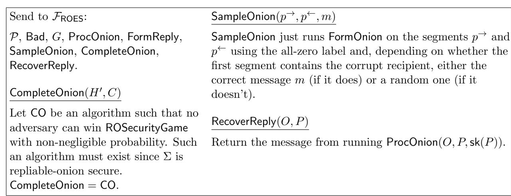

# Cryptographic Shallots: A Formal Treatment of Repliable Onion Encryption

Megumi Ando<sup>∗</sup> Anna Lysyanskaya†

May 29, 2020

#### Abstract

Onion routing is a popular, efficient, and scalable method for enabling anonymous communications. To send a message m to Bob via onion routing, Alice picks several intermediaries, wraps m in multiple layers of encryption — a layer per intermediary — and sends the resulting "onion" to the first intermediary. Each intermediary "peels off" a layer of encryption and learns the identity of the next entity on the path and what to send along; finally Bob learns that he is the recipient, and recovers the message m.

Despite its wide use in the real world (e.g., Tor, Mixminion), the foundations of onion routing have not been thoroughly studied. In particular, although two-way communication is needed in most instances, such as anonymous Web browsing or anonymous access to a resource, until now no definitions or provably secure constructions have been given for two-way onion routing. Moreover, the security definitions that existed even for one-way onion routing were found to have significant flaws.

In this paper, we (1) propose an ideal functionality for a repliable onion encryption scheme; (2) give a game-based definition for repliable onion encryption and show that it is sufficient to realize our ideal functionality; and finally (3), our main result is a construction of repliable onion encryption that satisfies our definitions.

Keywords: Anonymity, privacy, onion routing.

<sup>∗</sup>Computer Science Department, Brown University, mando@cs.brown.edu

<sup>†</sup>Computer Science Department, Brown University, anna@cs.brown.edu

## Contents

| 1 | Introduction                                                                                                                                                                                                                                                                                                                             | 1                                      |
|---|------------------------------------------------------------------------------------------------------------------------------------------------------------------------------------------------------------------------------------------------------------------------------------------------------------------------------------------|----------------------------------------|
| 2 | Repliable onion encryption: syntax and correctness<br>2.1<br>Onion evolutions, forward paths, return paths and layerings                                                                                                                                                                                                                 | 5<br>6                                 |
| 3 | FROES: onion routing in the SUC Framework<br>3.1<br>Ideal functionality<br>FROES<br><br>3.1.1<br>Setting up.<br><br>3.1.2<br>Forming an onion.<br><br>3.1.3<br>Processing an onion.<br><br>3.1.4<br>Forming a reply.<br>                                                                                                                 | 8<br>8<br>10<br>11<br>13<br>14         |
|   | FROES<br>3.2<br>SUC-realizability of<br><br>3.3<br>Remarks                                                                                                                                                                                                                                                                               | 14<br>15                               |
| 4 | Repliable-onion security: a game-based definition of security<br>4.1<br>Formal description of<br>ROSecurityGame<br>variant (a)<br>4.2<br>Brief formal descriptions of<br>ROSecurityGame<br>variants (b) and (c)<br><br>4.3<br>Definition of repliable-onion security<br>                                                                 | 15<br>16<br>18<br>18                   |
| 5 | FROES<br>Repliable-onion security implies SUC-realizability of<br>S<br>5.1<br>Description of simulator<br><br>5.1.1<br>Sampling an onion<br>5.1.2<br>Completing an onion.<br><br>5.1.3<br>Recovering a reply message<br>5.2<br>Proof of Theorem 1<br>5.3<br>Is repliable-onion security necessary to SUC-realize<br>FROES?<br>           | 18<br>19<br>19<br>20<br>21<br>21<br>26 |
| 6 | Shallot Encryption: our repliable onion encryption scheme<br>6.1<br>Setting up<br>6.2<br>Forming a repliable onion<br><br>6.3<br>Processing a repliable onion (in the forward direction)<br><br>6.4<br>Replying to the anonymous sender<br><br>6.5<br>Processing a repliable onion (in the return direction)<br>6.6<br>Reading the reply | 27<br>28<br>28<br>30<br>30<br>31<br>32 |
| 7 | Shallot Encryption Scheme is secure                                                                                                                                                                                                                                                                                                      | 33                                     |
| A | Supplementary material<br>A.1<br>Pseudocode for ideal functionality<br>FROES's onion forming algorithm<br>A.2<br>Security game for variants (b) and (c)<br><br>A.2.1<br>Variant (b)<br><br>A.2.2<br>Variant (c)<br>                                                                                                                      | 43<br>43<br>43<br>43<br>44             |

## <span id="page-2-0"></span>1 Introduction

Suppose Alice wants to send a message to Bob, anonymously, over a point-to-point network such as the Internet. What cryptographic techniques exist to make this possible? One popular approach is onion routing: Alice sends her message through intermediaries, who mix it with other traffic and forward it on to Bob. In order to make this approach secure from an adversary eavesdropping on the network, she needs to wrap her message in several layers of encryption, one for each intermediary, giving rise to the term onion routing.

Onion routing is at the heart of Tor [\[DDM03,](#page-42-0) [DMS04\]](#page-42-1), which is a tool used by millions of people to obscure their communication and browsing patterns. Although the security properties guaranteed by the Tor protocol are a subject of study and debate, it appears clear that because of its scalable nature — the more "onions" are sent over the network, the better the protocol hides the origin of each onion, — as well as its fault tolerance — if some of the intermediaries fail or are malicious, an onion won't get to it its destination, but another one can be sent on instead, and other onions are not affected, — onion routing is the favored method for achieving anonymity over the Internet [\[ALU18\]](#page-41-0).

As originally proposed by Chaum [\[Cha81\]](#page-42-2), onion routing meant that Alice just uses regular encryption to derive each subsequent layer of her onion before sending it on to the first intermediary. I.e., if the intermediaries are Carol (public key pkC), David (public key pkD) and Evelyn (public key pkE), then to send message m to Bob (public key pkB), Alice forms her onion by first encrypting m under pkB, then encrypting the resulting destination-ciphertext pair (Bob, cB) under pkE, and so forth:

$$O = \mathsf{Enc}(\mathsf{pk}_C, (\mathsf{David}, \mathsf{Enc}(\mathsf{pk}_D, (\mathsf{Evelyn}, \mathsf{Enc}(\mathsf{pk}_E, (\mathsf{Bob}, \mathsf{Enc}(\mathsf{pk}_B, m)))))))$$

If we use this approach using regular public-key encryption, then the "peeled" onion O<sup>0</sup> that Carol will forward to David is going to be a shorter (in bit length) ciphertext than O, because ciphertexts are longer than the messages they encrypt. So even if Carol serves as an intermediary for many onions, an eavesdropping adversary can link O and O<sup>0</sup> by their lengths, unless Carol happens to be the first intermediary for another onion.

To ensure that all onions are the same length, no matter which layer an intermediary is responsible for, Camenisch and Lysyanskaya [\[CL05\]](#page-42-3) introduced onion encryption, a tailor-made public-key encryption scheme where each onion layer looks the same and has the same length and you can't tell how far an intermediary, e.g. Carol, is from an onion's destination, even if you are Carol. They gave an ideal functionality [\[Can01\]](#page-41-1) for onion encryption and a cryptographic scheme that, they argued, UC-realized it.

However, their work did not altogether solve the problem of anonymous communication via onion routing. As Kuhn et al. [\[KBS19\]](#page-42-4) point out, there were significant definitional issues. Also, as, for example, Ando et al. [\[ALU18,](#page-41-0) [ALU19\]](#page-41-2) show, onion routing by itself does not guarantee anonymity, as a sufficient number of onions need to be present before any mixing occurs.

Those issues aside, however, Camenisch and Lysyanskaya (CL) left open the problem of "repliable" onions. In other words, once Bob receives Alice's message and wants to respond, what does he do? This is not just an esoteric issue. If one wants to, for example, browse the Web anonymously, or anonymously download and fill out a feedback form, or carry out most Internet tasks anonymously, a two-way channel between Alice and Bob needs to be established. Although CL point out that their construction can be modified to potentially allow two-way communication, this is nothing more than a suggestion, since they don't provide any definitions or proofs.

Babel [\[GT96\]](#page-42-5), Mixminion [\[DDM03\]](#page-42-0), Minx [\[DL04\]](#page-42-6) and Sphinx [\[DG09\]](#page-42-7) all provide mechanisms for the recipient to reply to the sender but don't provide any formal definitions or proofs either. This left a gap between proposed ideas for a repliable onion encryption scheme and rigorous examinations of these ideas. For instance, Kuhn et al. [\[KBS19\]](#page-42-4) pointed out a fatal security flaw in the current stateof-the-art, Sphinx. They also pointed out some definitional issues in the CL paper and proposed fixes for some of these issues but left open the problem of formalizing repliable onion encryption.

The challenge. Let us see why repliable onion encryption is not like other types of encryption. Traditionally, to be able to prove that an encryption scheme satisfies a definition of security along the lines of CCA2 security, we direct honest parties (for example, an intermediary Iris) to check whether a ciphertext (or, for our purposes, an onion) she has received is authentic or has been "mauled;" Iris can then refuse to decrypt a "mauled" ciphertext (correspondingly, process a "mauled" onion). Most constructions of CCA2-secure encryption schemes work along these lines; that way, in the proof of security, the decryption oracle does not need to worry about decrypting ciphertexts that do not pass such a validity check, making it possible to prove security. This approach was made more explicit by Cramer and Shoup [\[CS98,](#page-42-8) [CS02\]](#page-42-9) who defined encryption with tags, where tags defined the scope of a ciphertext, and a ciphertext would never be decrypted unless it was accompanied by the correct tag.

The CL construction of onion encryption also works this way; it uses CCA2-secure encryption with tags in order to make it possible for each intermediary to check the integrity of an onion it received. So, when constructing an onion, the sender had to construct each layer so that it would pass the integrity check, and in doing so, the sender needed to know what each layer was going to look like. This was not a problem for onion security in the forward direction since the sender knew all the puzzle pieces — the message m and the path (e.g. Carol, David, Evelyn) to the recipient Bob, — so the sender could compute each layer and derive the correct tag that would allow the integrity check to pass.

But in the reverse direction, the recipient Bob needs to form a reply onion without knowing part of the puzzle pieces. He should not know what any subsequent onion layers will look like: if he did, then an adversarial Bob, together with an adversarial intermediary and the network adversary, will be able to trace the reply onion as it gets back to Alice. So he cannot derive the correct tag for every layer. The sender Alice cannot do so either since she does not know in advance what Bob's reply message is going to be. So it is not clear how a CCA2-style definition can be satisfied at all.

Another difficult technical issue to address is how to make sure that reply onions are indistinguishable (even to intermediaries who process them) from forward onions. As pointed out in prior work [\[DDM03\]](#page-42-0), this is crucial because "replies may be very rare relative to forward messages, and thus much easier to trace."

Our first contribution: a definition of secure repliable onion encryption in the SUC model. We define security by describing an ideal functionality FROES in the simplified UC model [\[CCL15\]](#page-42-10); from now on we refer to it as the "SUC model." We chose the SUC model so that our functionality and proof did not have to explicitly worry about network issues and other subtleties of the full-blown UC model [\[Can01\]](#page-41-1).

As should be expected of secure onion routing, FROES represents onions originating at honest senders, or formed as replies to honest senders, using bit strings that are computed independently on the contents of messages, their destinations, whether the onion is traveling in the forward direction or is a reply, and identities and number of intermediaries that follow or precede an honest intermediary.

To process an onion, an honest party P sends it to the functionality FROES, which then informs P what its role is — an intermediary, the recipient, or the original sender of this onion. If P is an intermediary, the functionality sends it a string of bits that represents the next layer of the same onion (again, formed independently of the input). If P is the recipient, it learns the contents of the message m and whether the onion can be replied to, and can direct the functionality to create a reply onion containing a reply message r. Finally, if P is the sender of the original onion, then he learns r, the reply; he also learns which one of his previous outgoing onions this is in reference to. We describe FROES in detail in Section [3.](#page-9-0)

It is important to note that our functionality FROES is defined in such a way that it allows for a scheme in which checking that an onion has been "mauled" is not entirely the job of each intermediary. More precisely, we think of the onion as consisting of two pieces. The first piece is the header H that, in FROES, is a pointer to a data structure that contains the onion's information. The second piece is the payload, the content C that can be thought of as a pointer to a data structure inside FROES that contains the message m. The content C does not undergo an integrity check until it gets to its destination. This is the way in which we overcome the challenge (described above) of having a definition that enables replies.

### Our second contribution: a game-style definition of secure repliable onion encryption.

Although UC-style definitions of security are a good way to capture the security properties of a novel cryptographic object such as secure repliable onion encryption, they are often difficult to work with. The simplified UC (SUC) model makes the job much easier, but it is still cumbersome to prove that a construction SUC-realizes an ideal functionality, especially a functionality as involved as FROES. So to make it easier, we provide a game-style definition, called "repliable-onion security," in Section [4.](#page-16-1)

This definition boils down to a game between an adversary and a challenger.

The challenger generates the key pairs for two participants under attack: a sender S and an honest intermediary I. Similarly to CCA2-security for public-key encryption, the challenger also responds (before and after the creation of a challenge onion) to the adversary's queries to S and I; i.e. the adversary may send onions to the parties under attack and learn how these onions are peeled.

The adversary then requests that a challenge repliable onion be formed by the sender S; the adversary picks the recipient R for this onion, as well as the message m to be routed to this recipient, and the identities and public keys of all the intermediate routers on the path from the sender to the recipient (other than S and I), and on the return path from the recipient to the sender. The honest intermediary I must appear somewhere on this path: either (a) I is on the forward path from S to R, or (b) I is the recipient, or (c) I is on the return path from R to S.

The challenger then tosses a coin, and depending on the outcome, forms the challenge onion in one of two ways; the adversary's job to win the game is to correctly guess the outcome of the coin toss. If the coin comes up heads, the challenger forms the onion correctly, using the routing path provided by the adversary. If it comes up tails, then the challenger makes a "switch:" he forms two unrelated onions, one from S to I, and the other from I back to S; the details depend on whether this is case (a), (b), or (c). He then patches up the oracles for S and I so as to be able to pretend that the challenge onion was formed correctly. For details, see Section [4.](#page-16-1)

We then show, in Section [5,](#page-19-2) that our game-based definition is sufficient to SUC-realize FROES. Conversely, we also show that (the non-adaptive variant of) it is necessary: any repliable onion encryption scheme SUC-realizing FROES will satisfy it.

Here is how we overcome the definitional challenge of having a CCA2-style definition while enabling replies. When forming a repliable onion, the sender S will generate not just the onion to send on to the first intermediary, but, as a byproduct of forming that onion, will generate all the onion layers — to be precise, the header H<sup>i</sup> and the content C<sup>i</sup> of the i th onion layer for every i — on the path from himself to the recipient R. However, in the return direction, S is unable to know in advance the content of the onion (otherwise the recipient has no ability to send a return message); but the sender can still form just the header parts {Hi} of those onion layers. So it is the headers that must satisfy CCA2-style non-malleability, while the content accompanying the header can be "mauled" on its way to its destination, be it the recipient R, or, in the case of a reply onion, the original sender S. However, upon arrival to its destination, any "mauled" content should be peeled to ⊥.

Our main contribution: realizing secure repliable onion encryption. We resolve the problem that CL left open fifteen years ago of constructing provably secure repliable onion encryption. Namely, we give a scheme, which we call shallot encryption, for repliable onion encryption. Our scheme is based on a CCA2-secure cryptosystem with tags, a strong PRP (in other words, a block cipher), and a collision-resistant hash function.

In a nutshell, here is how our construction works. As we explained above, we split up the onion into two pieces, the header H and the content C. H contains (in layered encryption form) the routing information and symmetric keys that are needed to process C. C contains the message and, in case this is a forward onion, instructions for forming the reply onion; this part is wrapped in layers of symmetric encryption. This way, the original sender Alice can form the headers for all the layers of the reply onion even though she does not know the contents of the reply in advance; Bob's contribution to the reply onion is just the content C. Each intermediary is responsible for peeling a layer off of H, learning its key k, and applying a strong PRP keyed by k to the contents C. In a nutshell, the adaptive security properties guarantee that H cannot be "mauled," but checking the integrity of C is postponed until the onion gets to its destination — recipient Bob or original sender Alice — who check it using a MAC key. This is also why our scheme is called shallot encryption: the layered structure of the resulting onion resembles a shallot! (Shallots are a sub-family of onions.) See Section [6](#page-28-0) for the technical details.

Related work. Onion routing and mixes were introduced by David Chaum in 1981 [\[Cha81\]](#page-42-2). Tremendous interest from applied security researchers that resulted in numerous implementations [\[Par96,](#page-43-0) [Cot95,](#page-42-11) [MC00,](#page-43-1) [DDM03\]](#page-42-0). To illustrate the importance of onion routing, note that the Tor project, <https://www.torproject.org/>, which maintains a network of about six thousand onion routing servers ready to help you be anonymous online, estimates that it serves about two million users every day.

In spite of this significant interest from practitioners and the Internet community, the theoretical foundations of onion routing are somewhat shaky. None of the implementation papers mentioned above provided definitions or proofs of security. In 2005, Camenisch and Lysyanskaya (CL) [\[CL05\]](#page-42-3) provided the first formal treatment of onion encryption in one direction (i.e. without replies); they presented the input/output (I/O) syntax of onion encryption schemes for one-way anonymous channels and an ideal functionality Fonion of an onion encryption schemes in Canetti's universal composability (UC) framework [\[Can01\]](#page-41-1). Additionally, they gave a set of game-based definitions – onion-correctness, onion-integrity and onion-security – that they claimed imply the realizability of the ideal functionality Fonion. Finally, they also provided a construction that they showed satisfied these cryptographic properties. They mentioned the possibility of having a reply option (this possibility was already brought up in Chaum's 1981 paper), but their formal treatment did not extend to it.

Unfortunately, in a recent paper, Kuhn et al. [\[KBS19\]](#page-42-4) found a mistake in CL's game-based

definition. In a nutshell, CL's onion-security game proceeded as follows: An adversary attacking an honest participant P is given P's public key, and specifies the input to the algorithm for forming an onion; this input includes the identities and public keys of all the intermediaries and of the final recipient, and the contents of the message m; P is somewhere on the routing path. The challenger either responds with a correctly formed onion, or with an onion whose routing path is cut off at P, i.e., for this onion, P is the recipient of a random unrelated message m<sup>0</sup> .

Kuhn et al. point out that, although this property indeed hides where the onion is headed after P, it does not hide where the onion has been before it got to P. Thus, the CL proof that their onion-security definition was sufficient to UC-realize Fonion had a missing step, which Kuhn et al. found. Kuhn et al. also showed how to use this unfortunate theoretical mistake to attack Sphinx [\[DG09\]](#page-42-7).

On the theory front, Kuhn et al. proposed a game-based definition that, in addition to CL's onion-security, includes two new properties: tail-indistinguishability (i.e., the adversary cannot tell whether the honest party is the sender or an intermediary of the challenge onion) and layerunlinkability (i.e., onion layers are computationally unrelated to each other). They argued that together they imply realizability of CL's ideal functionality Fonion; they also showed that the mistake in CL's proof was not fatal for the CL construction of onion encryption, which meets their new definition. The Kuhn et al. paper is, therefore, the state-of-the-art as far as the definition of security for one-directional onion routing is concerned.

The focus of our paper, in contrast, is the problem of repliable onions. This problem, originally brought up by Chaum, has not been formally addressed until now.

## <span id="page-6-0"></span>2 Repliable onion encryption: syntax and correctness

In this paper, an onion O is a pair, consisting of the (encrypted) content C and the header H, i.e., O = (H, C). The maximum length of a path of an onion, be it the forward path or the return path, is N; we assume that N is one of the public parameters pp.

Here, we give the formal input/output (I/O) specification for a repliable onion encryption scheme. In contrast to the I/O specification for an (unrepliable) onion encryption scheme given by Camenisch and Lysyanskaya [\[CL05\]](#page-42-3), a repliable onion encryption scheme contains an additional algorithm, FormReply, for forming return onions. This algorithm allows the recipient of a message contained in a repliable onion to respond to the anonymous sender of the message without needing to know who the sender is.

The algorithm for forming onions, FormOnion, also takes as one of its parameters, the label `. This is so that when the sender receives a reply message m<sup>0</sup> along with the label `, the sender can identify to which message m<sup>0</sup> is responding.

Definition 1 (Repliable onion encryption scheme I/O). The set Σ = (G, FormOnion, ProcOnion, FormReply) of algorithms satisfies the I/O specification of a repliable onion encryption scheme for the label space L(1<sup>λ</sup> ), the message space M(1<sup>λ</sup> ), and a set P of router names if:

• G is a probabilistic polynomial-time (p.p.t.) key generation algorithm. On input the security parameter 1 λ (written in unary), the public parameters pp, and the party name P, the algorithm G returns a key pair, i.e.,

$$(\mathsf{pk}(P), \mathsf{sk}(P)) \leftarrow G(1^{\lambda}, \mathsf{pp}, P).$$

• FormOnion is a p.p.t. algorithm for forming onions. On input

- i. a label ` ∈ L(1<sup>λ</sup> ) from the label space,
- ii. a message m ∈ M(1<sup>λ</sup> ) from the message space,
- iii. a forward path P <sup>→</sup> = (P1, . . . , Pd) (d stands for destination),
- iv. the public keys pk(P <sup>→</sup>) associated with the parties in P <sup>→</sup>,
- v. a return path P <sup>←</sup> = (Pd+1, . . . , Ps) (s stands for sender), and
- vi. the public keys pk(P <sup>←</sup>) associated with the parties in P <sup>←</sup>,

the algorithm FormOnion returns a sequence O<sup>→</sup> = (O1, . . . , Od) of onions for the forward path, a sequence H<sup>←</sup> = (Hd+1, . . . , Hs) of headers for the return path, and a key κ, i.e.,

$$(O^{\rightarrow}, H^{\leftarrow}, \kappa) \leftarrow \mathsf{FormOnion}(\ell, m, P^{\rightarrow}, \mathsf{pk}(P^{\rightarrow}), P^{\leftarrow}, \mathsf{pk}(P^{\leftarrow}))$$

Note: the key κ contains some state information that the sender of the onion might need for future reference; a scheme can still satisfy our definition if κ = ⊥.

• ProcOnion is a deterministic polynomial-time (d.p.t.) algorithm for processing onions. On input an onion O, a router name P, and the secret key sk(P) belonging to P, the algorithm ProcOnion returns (role, output), i.e.,

$$(\mathsf{role}, \mathsf{output}) \leftarrow \mathsf{ProcOnion}(O, P, \mathsf{sk}(P)).$$

When role = I (for "intermediary"), output is the pair (O<sup>0</sup> , P<sup>0</sup> ) consisting of the peeled onion O<sup>0</sup> and the next destination P <sup>0</sup> of O<sup>0</sup> . When role = R (for "recipient"), output is the message m for recipient P. When role = S (for "sender"), output is the pair (`, m) consisting of the label ` and the reply message m for sender P.

• FormReply is a d.p.t. algorithm for replying to an onion. On input a reply message m ∈ M(1<sup>λ</sup> ), an onion O, a router name P, and the secret key sk(P) belonging to P, the algorithm FormReply returns the onion O<sup>0</sup> and the next destination P <sup>0</sup> of O<sup>0</sup> , i.e.,

$$(O',P') \leftarrow \mathsf{FormReply}(m,O,P,\mathsf{sk}(P)).$$

Note: FormReply may output (⊥, ⊥) if P is not the correct recipient of O.

## <span id="page-7-0"></span>2.1 Onion evolutions, forward paths, return paths and layerings

Now that we have defined the I/O specification for a repliable onion encryption scheme, we can define what it means for a repliable onion encryption scheme to be correct. Before we do this, we first define what onion evolutions, paths, and layerings are; the analogous notions for the unrepliable onion encryption scheme were introduced by Camenisch and Lysyanskaya [\[CL05\]](#page-42-3).

Let Σ = (G, FormOnion, ProcOnion, FormReply) be a repliable onion encryption scheme for the label space L(1<sup>λ</sup> ), the message space M(1<sup>λ</sup> ), and the set P of router names. Let H ⊆ P be parties with honestly formed keys. For any P 6∈ H, let sk(P) = ⊥ (i.e., secret keys that were not formed honestly are not well-defined for the purposes of this experiment).

Let O<sup>1</sup> = (H1, C1) be an onion received by party P<sup>1</sup> ∈ H, not necessarily formed using FormOnion.

We define a sequence of onion-location pairs recursively as follows: Let d be the first onion layer of (H1, C1) that when peeled, produces either "R" or "S" (if it exists, otherwise d = ∞). For all i ∈ [d − 1], let

$$(\mathsf{role}_{i+1}, ((H_{i+1}, C_{i+1}), P_{i+1})) = \mathsf{ProcOnion}((H_i, C_i), P_i, \mathsf{sk}(P_i)).$$

Let s=d if peeling  $(H_d, C_d)$  produces "S." Otherwise, let  $m \in \mathcal{M}(1^{\lambda})$  be a reply message from the message space, and let

$$((H_{d+1},C_{d+1}),P_{i+1}) = \mathsf{FormReply}(m,(H_d,C_d),P_d,\mathsf{sk}(P_d)).$$

Let s be the first onion layer of  $(H_{d+1}, C_{d+1})$  that when peeled, produces either "R" or "S" (if it exists, otherwise  $s = \infty$ ). For all  $i \in \{d+1, \ldots, s-1\}$ , let

$$(\mathsf{role}_{i+1}, ((H_{i+1}, C_{i+1}), P_{i+1})) = \mathsf{ProcOnion}((H_i, C_i), P_i, \mathsf{sk}(P_i)).$$

We call the sequence  $\mathcal{E}(H_1, C_1, P_1, m) = ((H_1, C_1, P_1), \dots, (H_s, C_s, P_s))$  of onion-location pairs the "evolution of the onion  $(H_1, C_1)$  starting at party  $P_1$  given m as the reply message." The sequence  $\mathcal{P}^{\rightarrow}(H_1, C_1, P_1, m) = (P_1, \dots, P_d)$  is its forward path; the sequence  $\mathcal{P}^{\leftarrow}(H_1, C_1, P_1, m) = (P_{d+1}, \dots, P_s)$  is its return path; and the sequence  $\mathcal{L}(H_1, C_1, P_1, m) = (H_1, C_1, \dots, H_d, C_d, H_{d+1}, \dots, H_s)$  is its layering.

We define correctness as follows:

<span id="page-8-0"></span>**Definition 2** (Correctness). Let G, FormOnion, ProcOnion, and FormReply form a repliable onion encryption scheme for the label space  $\mathcal{L}(1^{\lambda})$ , the message space  $\mathcal{M}(1^{\lambda})$ , and the set  $\mathcal{P}$  of router names.

Let N be the upper bound on the path length (in public parameters pp). Let  $P = (P_1, \ldots, P_s)$ ,  $|P| = s \leq 2N$  be any list (not containing  $\perp$ ) of router names in  $\mathcal{P}$ . Let  $d \in [s]$  be any index in [s] such that  $d \leq N$  and  $s - d + 1 \leq N$ . Let  $\ell \in \mathcal{L}(1^{\lambda})$  be any label in  $\mathcal{L}(1^{\lambda})$ . Let  $m, m' \in \mathcal{M}(1^{\lambda})$  be any two messages in  $\mathcal{M}(1^{\lambda})$ .

For every party  $P_i$  in P, let  $(\mathsf{pk}(P_i), \mathsf{sk}(P_i)) \leftarrow G(1^{\lambda}, \mathsf{pp}, P_i)$  be  $P_i$ 's key pair.

Let  $P^{\to} = (P_1, \dots, P_d)$ , and let  $\mathsf{pk}(P^{\to})$  be a shorthand for the public keys associated with the parties in  $P^{\to}$ . Let  $P^{\leftarrow} = (P_{d+1}, \dots, P_s)$ , and let  $\mathsf{pk}(P^{\leftarrow})$  be a shorthand for the public keys associated with the parties in  $P^{\leftarrow}$ .

Let  $((H_1,C_1),\ldots,(H_d,C_d),H_{d+1},\ldots,H_s,\kappa)$  be the output of FormOnion on input the label  $\ell$ , the message m, the forward path  $P^{\rightarrow}=(P_1,\ldots,P_d)$ , the public keys  $\mathsf{pk}(P^{\rightarrow})$  associated with the parties in  $P^{\rightarrow}$ , the return path  $P^{\leftarrow}=(P_{d+1},\ldots,P_s)$ , and the public keys  $\mathsf{pk}(P^{\leftarrow})$  associated with the parties in  $P^{\leftarrow}$ .

The scheme  $\Sigma$  is correct if with overwhelming probability in the security parameter  $\lambda$ ,

- i. Correct forward path.
  - $\mathcal{P}^{\to}(H_1, C_1, P_1, m') = (P_1, \dots, P_d).$
  - For every  $i \in [d]$  and content C such that  $|C| = |C_i|$ ,  $\mathcal{P}^{\rightarrow}(H_i, C, P_i, m') = (P_i, \dots, P_d)$ .
- ii. Correct return path.
  - $\mathcal{P}^{\leftarrow}(H_1, C_1, P_1, m') = (P_{d+1}, \dots, P_s).$
  - For every  $i \in \{d+1,\ldots,s\}$ , reply message m'', and content C such that  $|C| = |C_i|$ ,  $\mathcal{P}^{\rightarrow}(H_i,C,P_i,m'') = (P_{d+1},\ldots,P_s)$ .
- iii. Correct layering.  $\mathcal{L}(H_1, C_1, P_1, m') = (H_1, C_1, \dots, H_d, C_d, H_{d+1}, \dots, H_s),$
- iv. Correct message. ProcOnion $((H_d, C_d), P_d, \mathsf{sk}(P_d)) = (\mathsf{R}, m),$
- v. Correct reply message. ProcOnion $((H_s, C_s), P_s, \operatorname{sk}(P_s)) = (S, (\ell, m'))$  where  $(H_s, C_s)$  are the header and content of the last onion in the evolution  $\mathcal{E}(H_1, C_1, P_1, m')$ .

**Remark** We define onion evolution, (forward and return) paths, and layering so that we can articulate what it means for an onion encryption scheme to be correct. We define correctness to mean that how an onion peels (the evolution, paths, and layerings) exactly reflects the reverse process of how the onion was built up. Thus, for our definition to make sense, both ProcOnion and FormReply must be deterministic algorithms.

## <span id="page-9-0"></span>3 FROES: onion routing in the SUC Framework

In this section, we provide a formal definition of security for repliable onion encryption schemes. We chose to define security in the simplified universal composability (SUC) model [\[CCL15\]](#page-42-10) as opposed to the universal composability (UC) model [\[Can01\]](#page-41-1) as this choice greatly simplifies how communication is modeled, in turn, allowing for a more easily digestible description of the ideal functionality. Additionally, since SUC-realizability implies UC-realizability [\[CCL15\]](#page-42-10), we do not lose generality by simplifying the model in this manner.

Communication model In the SUC model, the environment Z can communicate directly with each party P by writing inputs into P's input tape and by reading P's output tape. The parties communicate with each other and also with the ideal functionality through an additional party, the router R.

## <span id="page-9-1"></span>3.1 Ideal functionality FROES

Notation In this section, honest parties are capitalized, e.g., P, P<sup>i</sup> ; and corrupt parties are generally written in lowercase, e.g., p, p<sup>i</sup> . An onion formed by an honest party is honestly formed and is capitalized, e.g., O, O<sup>i</sup> ; whereas, an onion formed by a corrupt party is generally written in lowercase, e.g., o, o<sup>i</sup> . Recall that an onion O is a pair, consisting of the (encrypted) content C and the header H, i.e., O = (H, C).

How should we define the ideal functionality of a repliable onion encryption scheme? Honestly formed onions in an onion routing protocol should mix at honest nodes. This property is what enables anonymity from the standard adversary who can observe the network traffic on all communication links. Ideally, onions should mix (i) even if the distances from their respective origins or the distances to their respective destinations differ, and (ii) regardless of whether they are forward or return onions. Here, we define the ideal functionality so that a scheme that realizes the ideal functionality necessarily satisfies properties (i) and (ii) above.

Intuitively, onions mix iff onion layers are (computationally) unrelated to each other. Let O<sup>0</sup> be the onion we get from peeling the onion O. If the values of O and O<sup>0</sup> are correlated with each other, then O cannot mix with other onions. Conversely, if the values O and O<sup>0</sup> are unrelated to each other, then O can mix with other onions. However, the adversary necessarily knows how some onions layers are linked together. If the corrupt party p peels onion o, getting peeled onion o 0 , then p knows that o and o <sup>0</sup> are linked.

Thus, we settle on our idea for an ideal functionality FROES (ROES, for "repliable onion encryption scheme") as follows: Let a segment of a routing path be a subpath of the path consisting of a sequence of corrupt parties possibly ending with a single honest party. Note that if there are two consecutive honest parties, (Alice, Bob) on the routing path, then (Bob) is a segment of the path. Each routing path can be uniquely broken up into a sequence (s1, . . . , su) of non-overlapping segments, such that each segment s<sup>i</sup> contains exactly one honest participant, except for the last segment that may end in an adversarial recipient. For i 6= j, onion layers corresponding to segment s<sup>i</sup> should be computationally unrelated to the layers corresponding to segment s<sup>j</sup> .

Thus, the ideal functionality FROES forms the onion layers for each segment of a routing path separately and independently from each other. FROES internally keeps tracks of how these layers are linked using two data structures, OnionDict and PathDict. If FROES forms an onion layer O for Alice (the last party of a segment) that should peel to an onion layer O<sup>0</sup> for Bob (the first party of the next segment), then it keeps track of this link in OnionDict; the output (O<sup>0</sup> , Bob) is stored under the label (Alice, O). FROES initially forms and stores the onion links only for the forward path and stores the return path in PathDict; onion links for the return path are generated later on when they are needed. To produce the onion layers for a segment, FROES runs the algorithm SampleOnion, which it gets from the ideal adversary A.

Sometimes, the environment Z instructs an ideal party to process an onion O (or form a reply to an onion O), not stored in either OnionDict or PathDict. If the header of O is not honestly formed, then FROES processes it according to the algorithm ProcOnion (or FormReply) supplied by A. Otherwise, if O is the result of "mauling" just the content of an honestly formed onion X that peels to X<sup>0</sup> , then FROES returns the onion O<sup>0</sup> with the same header as X<sup>0</sup> . To do this, it runs the algorithm CompleteOnion, also provided by A.

Suppose that we have an onion sent by an honest sender Sandy to an adversarial recipient Robert. Our functionality allows Robert to respond; eventually an honest intermediary Iris will receive an onion O which contains Robert's response to Sandy. When FROES is called by Iris with onion O, it will be tipped off to the fact that O = (H, C) is a return onion from Robert to Sandy because the header H will be stored in PathDict. At this point, FROES knows what path the onion will have to follow from now on and will be able to create the correct onion layers using SampleOnion and store them in OnionDict. Once the return onion makes its way to Sandy, Sandy will ask FROES to process it; at this point, FROES will need to know the return message r that Robert sent to Sandy. The algorithm RecoverReply serves precisely that purpose: it takes Robert's onion O (received by Iris) as input, and recovers his response r.

So, at setup, the algorithms ProcOnion, FormReply, CompleteOnion, and RecoverReply are provided to FROES by A.

See Figure [1](#page-10-0) for a summary of the ideal functionality FROES for the repliable onion encryption scheme. Below that, we provide a formal, detailed description of FROES.

#### IdealSetup

- 1: Get from ideal adversary A: P, Bad, G, ProcOnion, FormReply, SampleOnion, CompleteOnion, RecoverReply.
- 2: Initialize dictionaries OnionDict and PathDict.

## IdealFormOnion(`, m, P <sup>→</sup>, P <sup>←</sup>)

- 1: Break forward path into segments.
- 2: Run SampleOnion on segments to generate onion layers.
- 3: Store onion layers in OnionDict.
- <span id="page-10-0"></span>4: Store label ` and (rest of) return path in PathDict.

## IdealProcOnion((H, C), P)

- 1: If (P, H) is "familiar," i.e., stored in one of our dictionaries
  - If (P, H, C) in OnionDict, return next stored onion layer.
  - Else if exists (P, H,(X 6= C)) in OnionDict, return output of CompleteOnion and stored next party (if stored next party exists), or "⊥" (if next party doesn't exist).
  - Else if (P, H, ?) in PathDict, return output of IdealFormOnion on message recovered using RecoverReply and label and path stored in PathDict.
- 2: Else if (P, H) is not familiar, return output of ProcOnion((H, C), P,sk(P)).

## IdealFormReply(m,(H, C), P)

- 1: If (P, H, C) in PathDict, return output of IdealFormOnion on m and label and path stored in PathDict.
- 2: Else, return output of FormReply(m,(H, C), P,sk(P)).

Figure 1: Summary of ideal functionality FROES.

### <span id="page-11-0"></span>3.1.1 Setting up.

The ideal functionality  $\mathcal{F}_{ROES}$  handles requests from the environment (to form an onion, process an onion, or form a return onion) on behalf of the ideal honest parties.

Each static setting for a fixed set of participants and a fixed public key infrastructure requires a separate setup. During setup,  $\mathcal{F}_{\mathsf{ROES}}$  gets the following from the ideal adversary  $\mathcal{A}$ . For each algorithm in items (iv)-(vi), we first describe the input of the algorithm in normal font and then, in italics, provide a brief preview of how the algorithm will be used.  $\mathcal{F}_{\mathsf{ROES}}$  only runs for a polynomial number of steps which is specified in the public parameters  $\mathsf{pp}$  and can time out on running these algorithms from the ideal adversary.

- i. The set  $\mathcal{P}$  of participants.
- ii. The set  $\mathsf{Bad}$  of corrupt parties in  $\mathcal{P}$ .
- iii. The repliable onion encryption scheme's G, ProcOnion, and FormReply algorithms:
  - G is used for generating the honest parties' keys.
  - ProcOnion is used for processing onions formed by corrupt parties.
  - FormReply is used for replying to onions formed by corrupt parties.
- iv. The p.p.t. algorithm SampleOnion( $1^{\lambda}$ , pp,  $p^{\rightarrow}$ ,  $p^{\leftarrow}$ , m) that takes as input the security parameter  $1^{\lambda}$ , the public parameters pp, the forward path  $p^{\rightarrow}$ , the (possibly empty) return path  $p^{\leftarrow}$ , and the (possibly empty) message m. The routing path  $(p^{\rightarrow}, p^{\leftarrow}) = (p_1, \dots, p_i, P_{i+1})$  is always a sequence  $(p_1, \dots, p_i)$  of adversarial parties, possibly ending in an honest party  $P_{i+1}$ .  $\mathcal{F}_{\mathsf{ROES}}$  fails if SampleOnion ever samples a repeating header or key.

SampleOnion is used to compute an onion to send to  $p_1$  which will be "peelable" all the way to an onion for  $P_{i+1}$ . If the return path  $p^{\leftarrow}$  is non-empty and ends in an honest party  $P_{i+1}$ , SampleOnion produces an onion o for the first party  $p_1$  in  $p^{\rightarrow}$  and a header H for the last party  $P_{i+1}$  in  $p^{\leftarrow}$ . Else if the return path  $p^{\leftarrow}$  is empty, and the forward path  $p^{\rightarrow}$  ends in an honest party  $P_{i+1}$ , SampleOnion produces an onion o for the first party  $p_1$  in  $p^{\rightarrow}$  and an onion O for the last party  $P_{i+1}$  in  $p^{\rightarrow}$ . Else if the return path  $p^{\leftarrow}$  is empty, and the forward path  $p^{\rightarrow}$  ends in a corrupt party  $p_i$ , SampleOnion produces an onion o for the first party  $p_1$  in  $p^{\rightarrow}$ .

v. The p.p.t. algorithm CompleteOnion( $1^{\lambda}$ , pp, H', C) that takes as input the security parameter  $1^{\lambda}$ , the public parameters pp, the identity of the party P, the header H', and the content C, and outputs an onion O = (H', C').  $\mathcal{F}_{\mathsf{ROES}}$  fails if CompleteOnion ever produces a repeating onion.

CompleteOnion produces an onion (H', C') that resembles the result of peeling an onion with content C.

vi. The d.p.t. algorithm  $\mathsf{RecoverReply}(1^\lambda, \mathsf{pp}, O, P)$  that takes as input the security parameter  $1^\lambda$ , the public parameters  $\mathsf{pp}$ , the onion O, and the party P, and outputs a label  $\ell$  and a reply message m.

This algorithm is used for recovering the label  $\ell$  and reply message m from the return onion O that carries the response from a corrupt recipient to an honest sender.

Let sid denote the session id that is specific to all the parameters that the setup, above, creates.  $\mathcal{F}_{\mathsf{ROES}}^{\mathsf{sid}}$  denotes the session of  $\mathcal{F}_{\mathsf{ROES}}$  that has been set up with this sid.

 $\mathcal{F}_{\mathsf{ROES}}^{\mathsf{sid}}$  generates a public key pair  $(\mathsf{pk}(P), \mathsf{sk}(P))$  for each honest party  $P \in \mathcal{P} \setminus \mathsf{Bad}$  using the key generation algorithm G and sends the public keys to their respective party. (If working within the global PKI framework, each party then relays his/her key to the global bulletin board functionality [CSV16].)

 $\mathcal{F}_{\mathsf{ROES}}^{\mathsf{sid}}$  also creates the following (initially empty) dictionaries:

• The onion dictionary OnionDict supports:

- A method put((P, H, C), (role, output)) that stores under the label (P, H, C): the role "role" and the output "output." Should participant P later direct  $\mathcal{F}^{sid}_{ROES}$  to process onion O = (H, C), it will receive the values (role, output) stored in OnionDict corresponding to (P, H, C).
- A method lookup(P, H, C) that looks up the entry (role, output) corresponding to the label (P, H, C). This method will be used when P directs  $\mathcal{F}_{\mathsf{ROES}}^{\mathsf{sid}}$  to process onion O = (H, C).
- The return path dictionary PathDict supports:
  - A method  $\operatorname{put}((P,H,C),(P^{\leftarrow},\ell))$  that stores under the label (P,H,C): the return path  $P^{\leftarrow}$  and the label  $\ell$ . This method is used to store the return path  $P^{\leftarrow}$  for the onion corresponding to label  $\ell$ .
  - A method lookup(P, H, C) that looks up the entry  $(P^{\leftarrow}, \ell)$  corresponding to the label (P, H, C). Should participant P later direct  $\mathcal{F}^{sid}_{ROES}$  to either reply to the onion (H, C) or to process an onion with header H, the stored return path  $P^{\leftarrow}$  and label  $\ell$  will be used to form the rest of the return onion layers.

These data structures are stored internally at  $\mathcal{F}_{\mathsf{ROES}}^{\mathsf{sid}}$  and are accessible only by  $\mathcal{F}_{\mathsf{ROES}}^{\mathsf{sid}}$ .

#### <span id="page-12-0"></span>3.1.2 Forming an onion.

After setup, the environment  $\mathcal{Z}$  can instruct an honest party P to form an onion using the session id sid, the label  $\ell$ , the message m, the forward path  $P^{\rightarrow}$ , and the return path  $P^{\leftarrow}$ . To form the onion, P forwards the instruction from  $\mathcal{Z}$  to  $\mathcal{F}^{\text{sid}}_{\text{ROES}}$  (via the router  $\mathcal{R}$ ).

The goal of the ideal functionality  $\mathcal{F}^{\text{sid}}_{\text{ROES}}$  is to create and maintain state information for handling

The goal of the ideal functionality  $\mathcal{F}_{\mathsf{ROES}}^{\mathsf{sid}}$  is to create and maintain state information for handling an onion O (the response to the "form onion" request). O should be "peelable" by the parties in the forward path  $P^{\to}$ , internally associated with the return path  $P^{\leftarrow}$ , and for the purpose of realizing this functionality by an onion encryption scheme, each layer of the onion should look "believable" as onions produced from running FormOnion, ProcOnion, or FormReply.

Importantly, O and its onion layers should reveal no information to  $\mathcal{A}$ , by which we mean the following:

- Each onion routed to an honest party  $P_i$  is formed initially with just  $(P_i)$  as the routing path and, therefore, reveals only that it is for  $P_i$ . When forming the onion, no message is part of the input; this ensures that the onion is information-theoretically independent of any message m.
- For every party  $p_i$  or  $P_i$  in the forward path, let  $\mathsf{next}(i)$  denote the index of the next honest party  $P_{\mathsf{next}(i)}$  following  $p_i$ . For example, if the forward path is  $(P_1, p_2, p_3, P_4, P_5, p_6, p_7)$ , then  $\mathsf{next}(2) = 4$ .

Conceptually, each onion routed to an adversarial party  $p_i$  is formed by "wrapping" an onion layer for each corrupt party in  $(p_i,\ldots,p_{\mathsf{next}(i)-1})$  (or  $(p_{i+1},\ldots,p_{|P^{\rightarrow}|})$  if no honest party after  $p_i$  exists) around an onion formed for an honest party  $P_{\mathsf{next}(i)}$  (or a message if no honest party after  $p_i$  exists). This reveals at most the sequence  $(p_i,\ldots,p_{\mathsf{next}(i)-1},P_{\mathsf{next}(i)})$  (or the sequence  $(p_i,\ldots,p_{|P^{\rightarrow}|})$  and the message m if no honest party after  $p_i$  exists). How this wrapping occurs depends on the internals of the SampleOnion algorithm provided by the ideal adversary.

To ensure these properties, the ideal functionality partitions the forward path  $P^{\to}$  into segments, where each segment starts with a sequence of corrupt parties and can end with a single honest party: Let  $P_f$  (f, for first) be the first honest party in the forward path. The first couple of segments are  $(p_1, \ldots, p_{f-1}, P_f)$ ,  $(p_{f+1}, \ldots, p_{\mathsf{next}(f)-1}, P_{\mathsf{next}(f)})$ , etc.

For each segment  $(p_i, \ldots, p_{j-1}, P_j)$ , the ideal functionality  $\mathcal{F}_{\mathsf{ROES}}^{\mathsf{sid}}$  samples onions

 $(h_i, c_i)$  and  $(H_j, C_j)$  using the algorithm SampleOnion, i.e.,  $((h_i, c_i), (H_j, C_j)) \leftarrow \text{SampleOnion}(1^{\lambda}, \text{pp}, (p_i, \dots, p_{j-1}, P_j), (), \bot)$ . As we explained when introducing the SampleOnion input/output structure,  $(h_i, c_i)$  is the onion that is intended for the participant  $p_i \in \text{Bad}$ ; once the adversarial participants take turns peeling it, the innermost layer  $(H_j, C_j)$  can be processed by the honest participant  $P_j$ .

If the recipient  $P_d$  is honest, this process will create all the onions in the forward direction. Suppose that the recipient  $p_d$  is corrupt. Let  $P_e$  (e, for end) be the last honest party in the forward path  $P^{\rightarrow}$ , and let  $P_{\mathsf{next}(d)}$  denote the first honest party in the return path  $P^{\leftarrow}$ .  $\mathcal{F}^{\mathsf{sid}}_{\mathsf{ROES}}$  also runs  $\mathsf{SampleOnion}(1^{\lambda},\mathsf{pp},(p_{e+1},\ldots,p_d),(p_{d+1},\ldots,p_{\mathsf{next}(d)-1},P_{\mathsf{next}(d)}),m)$ ; as we explained when introducing the  $\mathsf{SampleOnion}$  input/output structure, this produces an onion  $o_{e+1}$  and a header  $H_{\mathsf{next}(d)}$ .

For every honest intermediary party  $P_i$  in the forward path,  $\mathcal{F}_{\mathsf{ROES}}^{\mathsf{sid}}$  stores under the label  $(P_i, H_i, C_i)$  in the onion dictionary OnionDict the role "I," the  $(i+1)^{st}$  onion layer  $(H_{i+1}, C_{i+1})$ , and destination  $P_{i+1}$ . The  $(d+1)^{st}$  onion layer doesn't exist for the innermost layer  $(H_d, C_d)$  for an honest recipient  $P_d$ . In this case,  $\mathcal{F}_{\mathsf{ROES}}^{\mathsf{sid}}$  stores just the role "R" and the message m.

an honest recipient  $P_d$ . In this case,  $\mathcal{F}_{\mathsf{ROES}}^{\mathsf{sid}}$  stores just the role "R" and the message m.

If the recipient  $P_d$  is honest,  $\mathcal{F}_{\mathsf{ROES}}^{\mathsf{sid}}$  stores the entry  $((P_d, H_d, C_d), (P^{\leftarrow}, \ell))$  in the dictionary PathDict. Otherwise if the recipient  $p_d$  is corrupt,  $\mathcal{F}_{\mathsf{ROES}}^{\mathsf{sid}}$  stores the entry  $((P_{\mathsf{next}(d)}, H_{\mathsf{next}(d)}, *), (p^{\leftarrow}, \ell))$  in PathDict where  $p^{\leftarrow} = (p_{\mathsf{next}(d)+1}, \ldots, P_s)$ . "\*" is the unique symbol that means "any content."

See Appendix A.1 for the pseudocode for the ideal functionality's "onion forming" algorithm. Example 1. The recipient  $P_7$  is honest. The forward path is  $P^{\rightarrow} = (P_1, p_2, p_3, P_4, P_5, p_6, P_7)$ , and the return path is  $P^{\leftarrow} = (p_8, p_9, P_{10}, p_{11}, P_{12})$ . In this case, the first segment is  $(P_1)$ , and the second segment is  $(p_2, p_3, P_4)$  and so on; and

```
\begin{split} (\bot,(H_1,C_1)) \leftarrow &\mathsf{SampleOnion}(1^\lambda,\mathsf{pp},(P_1),(),\bot) \\ ((h_2,c_2),(H_4,C_4)) \leftarrow &\mathsf{SampleOnion}(1^\lambda,\mathsf{pp},(p_2,p_3,P_4),(),\bot) \\ (\bot,(H_5,C_5)) \leftarrow &\mathsf{SampleOnion}(1^\lambda,\mathsf{pp},(P_5),(),\bot) \\ ((h_6,c_6),(H_7,C_7)) \leftarrow &\mathsf{SampleOnion}(1^\lambda,\mathsf{pp},(p_6,P_7),(),\bot). \end{split}
```

 $\mathcal{F}_{\mathsf{ROES}}^{\mathsf{sid}}$  stores in OnionDict and PathDict:

```
\begin{split} & \mathsf{OnionDict.put}((P_1, H_1, C_1), (\mathsf{I}, ((h_2, c_2), p_2))) \\ & \mathsf{OnionDict.put}((P_4, H_4, C_4), (\mathsf{I}, ((H_5, C_5), P_5))) \\ & \mathsf{OnionDict.put}((P_5, H_5, C_5), (\mathsf{I}, ((h_6, c_6), p_6))) \\ & \mathsf{OnionDict.put}((P_7, H_7, C_7), (\mathsf{R}, m)), \\ & \mathsf{PathDict.put}((P_7, H_7, C_7), ((p_8, p_9, P_{10}, p_{11}, P_{12}), \ell)). \end{split}
```

Example 2. The recipient  $p_7$  is corrupt. The forward path is  $P^{\to} = (P_1, p_2, p_3, P_4, P_5, p_6, p_7)$ , and the return path is  $P^{\leftarrow} = (p_8, p_9, P_{10}, p_{11}, P_{12})$ . In this case,

```
\begin{split} (\bot, (H_1, C_1)) \leftarrow & \mathsf{SampleOnion}(1^{\lambda}, \mathsf{pp}, (P_1), (), \bot) \\ ((h_2, c_2), (H_4, C_4)) \leftarrow & \mathsf{SampleOnion}(1^{\lambda}, \mathsf{pp}, (p_2, p_3, P_4), (), \bot) \\ (\bot, (H_5, C_5)) \leftarrow & \mathsf{SampleOnion}(1^{\lambda}, \mathsf{pp}, (P_5), (), \bot) \\ (o_6, H_{10}) \leftarrow & \mathsf{SampleOnion}(1^{\lambda}, \mathsf{pp}, (p_5, p_6, p_7), (p_8, p_9, P_{10}), m). \end{split}
```

 $\mathcal{F}_{\mathsf{ROES}}^{\mathsf{sid}}$  stores in OnionDict and PathDict:

```
OnionDict.put((P_1, H_1, C_1), (I, ((h_2, c_2), p_2)))
OnionDict.put((P_4, H_4, C_4), (I, ((H_5, C_5), P_5)))
OnionDict.put((P_5, H_5, C_5), (I, ((h_6, c_6), p_6))),
PathDict.put((P_{10}, H_{10}, *), ((p_{11}, P_{12}), \ell)).
```

After updating OnionDict and PathDict,  $\mathcal{F}_{\mathsf{ROES}}^{\mathsf{sid}}$  returns the first onion  $O_1 = (H_1, C_1)$  to party P (via the router  $\mathcal{R}$ ). Upon receiving  $O_1$  from  $\mathcal{F}$ , P outputs the session id sid and  $O_1$ .

### <span id="page-14-0"></span>3.1.3 Processing an onion.

After setup, the environment  $\mathcal{Z}$  can instruct an honest party P to process an onion O = (H, C) for the session id sid. To process the onion, party P forwards the instruction to the ideal functionality  $\mathcal{F}_{\mathsf{ROES}}^{\mathsf{sid}}$  (via the router  $\mathcal{R}$ ).

Case 1 There is an entry (role, output) under the label (P, H, C) in OnionDict. In this case,  $\mathcal{F}_{\mathsf{ROES}}^{\mathsf{sid}}$  responds to P (via the router  $\mathcal{R}$ ) with (role, output).

Case 2 There is no entry under the label (P, H, C) in OnionDict, but there exists  $X \neq C$  such that there is an entry  $(\mathsf{I}, ((H', X'), P'))$  under the label (P, H, X) in OnionDict. This means that, P has received an onion with a properly formed header, but an improperly formed content. This is where we use the algorithm CompleteOnion to direct  $\mathcal{F}_{\mathsf{ROES}}$  how to peel this "mauled" onion. Recall that CompleteOnion was provided by the adversary at setup.  $\mathcal{F}_{\mathsf{ROES}}^{\mathsf{sid}}$  uses it to sample an onion  $(H', C') \leftarrow \mathsf{CompleteOnion}(1^{\lambda}, \mathsf{pp}, H', C)$ .  $\mathcal{F}_{\mathsf{ROES}}$  then stores the new entry  $(\mathsf{I}, ((H', C'), P'))$  under the label (P, H, C) in OnionDict, and responds to P with  $(\mathsf{I}, ((H', X'), P'))$ .

Case 3 There is no entry under the label (P, H, C) in OnionDict, but there exists  $X \neq C$  such that there is an entry (R, m) under the label (P, H, X) in OnionDict. This means that P is the intended recipient of the onion (H, X) but instead just received the properly formed header H with "mauled" content C. In this case,  $\mathcal{F}_{ROFS}^{sid}$  responds to P with  $(R, \bot)$ .

Case 4 There is no entry under the label (P, H, C) in OnionDict, but there exists  $X \neq C$  such that there is an entry  $(S, (\ell, m))$  under the label (P, H, X) in OnionDict. This means that P was the original sender of an onion, and header H is the correct header for his reply onion. Unfortunately, the content C got "mauled" in transit: the correct reply onion was supposed to have content X (since that's what's stored in OnionDict). In this case,  $\mathcal{F}^{\text{sid}}_{\text{ROES}}$  responds to P with  $(S, \bot)$ .

Case 5 There is no entry starting with (P, H) in OnionDict, but there is an entry  $(P^{\leftarrow}, \ell)$  under the label (P, H, \*) in PathDict. This means that P is the first honest intermediary on the return path of an onion whose recipient was adversarial.  $\mathcal{F}_{\mathsf{ROES}}$  needs to compute the reply message m' that the adversarial recipient meant to send back to the honest sender. This is the purpose of the RecoverReply algorithm that the adversary provides to  $\mathcal{F}_{\mathsf{ROES}}$  at setup. Let m' be the message obtained by running RecoverReply( $1^{\lambda}$ , pp, O, P).

obtained by running RecoverReply( $1^{\lambda}$ , pp, O, P). Next,  $\mathcal{F}_{\mathsf{ROES}}$  computes the layers of the reply onion. If  $P^{\leftarrow}$  is not empty,  $\mathcal{F}_{\mathsf{ROES}}^{\mathsf{sid}}$  runs its "form onion" code (see Section 3.1.2 and Appendix A.1) with  $(\ell, m')$  as the "message,"  $P^{\leftarrow}$  as the forward path, and the empty list "()" as the return path. (The code is run with auxiliary information for correctly labeling the last party in  $P^{\leftarrow}$  as the sender.) In this case,  $\mathcal{F}^{\mathsf{sid}}_{\mathsf{ROES}}$  responds to P with  $(\mathsf{I},((H',C'),P'))$ , where (H',C') is the returned onion, and P' is the first party in  $P^{\leftarrow}$ .

Otherwise if  $P^{\leftarrow}$  is empty, then P is the recipient of the return onion, so  $\mathcal{F}^{\mathsf{sid}}_{\mathsf{ROES}}$  responds to P with  $(\mathsf{S}, (\ell, m'))$ .

Case 6  $\mathcal{F}^{\sf sid}_{\sf ROES}$  doesn't know how to peel O (i.e., there is no entry starting with (P,H) in OnionDict and no entry under (P,H,\*) in PathDict). In this case, O does not have an honestly formed header; so,  $\mathcal{F}^{\sf sid}_{\sf ROES}$  responds to P with (role, output) =  $\sf ProcOnion(1^{\lambda}, pp, O, P, sk(P))$  (recall that  $\sf ProcOnion$  is an algorithm supplied by the ideal adversary at setup).

The cases above cover all the possibilities. Upon receiving the response (role, output) from  $\mathcal{F}_{\mathsf{ROES}}^{\mathsf{sid}}$ , P outputs the session id sid and (role, output).

### <span id="page-15-0"></span>3.1.4 Forming a reply.

After setup, the environment  $\mathcal{Z}$  can instruct an honest party P to form a reply using the session id sid, the reply message m, and an onion O=(H,C). To form the return onion, P forwards the instruction to the ideal functionality  $\mathcal{F}^{\mathsf{sid}}_{\mathsf{ROES}}$  (via the router  $\mathcal{R}$ ).

Case 1 There is an entry  $(P^{\leftarrow}, \ell)$  under the label (P, H, C) in PathDict. Then  $\mathcal{F}^{\mathsf{sid}}_{\mathsf{ROES}}$  runs its "form onion" code (see Section 3.1.2 and Appendix A.1) with  $(\ell, m)$  as the "message,"  $P^{\leftarrow}$  as the forward path, and the empty list "()" as the return path. (The code is run with auxiliary information for correctly labeling the last party in  $P^{\leftarrow}$  as the sender.)  $\mathcal{F}^{\mathsf{sid}}_{\mathsf{ROES}}$  responds to P (via the router  $\mathcal{R}$ ) with the returned onion O' and the first party P' in  $P^{\leftarrow}$ .

Case 2 No entry exists for (P, H, C) in PathDict. Then P is replying to an onion formed by an adversarial party, so  $\mathcal{F}^{\mathsf{sid}}_{\mathsf{ROES}}$  replies to P with  $(O', P') = \mathsf{FormReply}(1^{\lambda}, \mathsf{pp}, m, O, P, \mathsf{sk}(P))$ . Upon receiving the response (O', P') from  $\mathcal{F}^{\mathsf{sid}}_{\mathsf{ROES}}$ , P outputs the session id sid and (O', P').

#### <span id="page-15-1"></span>3.2 SUC-realizability of $\mathcal{F}_{\mathsf{ROES}}$

Let us remind the reader what it means for a cryptographic onion encryption scheme to SUC-realize our ideal functionality [CCL15].

Ideal protocol In the ideal onion routing protocol, the environment  $\mathcal{Z}$  interacts with the participants by writing instructions into the participants' input tapes and reading the participants' output tapes. Each input is an instruction to form an onion, process an onion, or form a return onion. When an honest party P receives an instruction from  $\mathcal{Z}$ , it forwards the instruction to the ideal functionality  $\mathcal{F}_{\mathsf{ROES}}$  via the router  $\mathcal{R}$ . Upon receiving a response from  $\mathcal{F}_{\mathsf{ROES}}$  (via  $\mathcal{R}$ ), P outputs the response. Corrupt parties are controlled by the adversary  $\mathcal{A}$  and behave according to  $\mathcal{A}$ .  $\mathcal{F}_{\mathsf{ROES}}^{\mathsf{sid}}$  does not interact with  $\mathcal{A}$  after the setup phase.

At the end of the protocol execution,  $\mathcal{Z}$  outputs a bit b. Let  $\mathsf{IDEAL}_{\mathcal{F}_{\mathsf{ROES}},\mathcal{A},\mathcal{Z}}(1^{\lambda},\mathsf{pp})$  denote  $\mathcal{Z}$ 's output after executing the ideal protocol for security parameter  $1^{\lambda}$  and public parameters  $\mathsf{pp}$ .

**Real protocol** Let  $\Sigma$  be a repliable onion encryption scheme. The real onion routing protocol for  $\Sigma$  is the same as the ideal routing protocol (described above), except that the honest parties simply run  $\Sigma$ 's algorithms to form and process onions.

Let  $\mathsf{REAL}_{\Sigma,\mathcal{A},\mathcal{Z}}(1^{\lambda},\mathsf{pp})$  denote  $\mathcal{Z}$ 's output after executing the real protocol.

<span id="page-16-2"></span>**Definition 3** (SUC-realizability of  $\mathcal{F}_{\mathsf{ROES}}$ ). The repliable onion encryption scheme  $\Sigma$  SUC-realizes the ideal functionality  $\mathcal{F}_{\mathsf{ROES}}$  if for every p.p.t. real-model adversary  $\mathcal{A}$ , there exists a p.p.t. ideal-model adversary  $\mathcal{S}$  such that for every polynomial-time balanced environment  $\mathcal{Z}$ , there exists a negligible function  $\nu(\lambda)$  such that

$$\left|\Pr\Big[\mathsf{IDEAL}_{\mathcal{F}_{\mathsf{ROES}},\mathcal{S},\mathcal{Z}}(1^{\lambda},\mathsf{pp}) = 1\Big] \right. \\ \left. -\Pr\Big[\mathsf{REAL}_{\Sigma,\mathcal{A},\mathcal{Z}}(1^{\lambda},\mathsf{pp}) = 1\Big]\right| \leq \nu(\lambda).$$

### <span id="page-16-0"></span>3.3 Remarks

On the assumption that keys are consistent with PKI In describing the ideal functionality, we made an implicit assumption that for every instruction to form an onion, the keys match the parties on the routing path. However, generally speaking, the environment  $\mathcal{Z}$  can instruct an honest party to form an onion using the wrong keys for some of the parties on the routing path. Using the dictionary OnionDict, it is easy to extend our ideal functionality to cover this case: the ideal functionality would store in OnionDict, every onion layer for an honest party, starting from the outermost layer, until it reaches a layer with a mismatched key. To keep the exposition clean, we will continue to assume that inputs are well-behaved, i.e., router names are valid, and keys are as published.

On replayed onions As originally noted by Camenisch and Lysyanskaya [CL05], the environment is allowed to repeat the same input (e.g., a "process onion" request) in the UC framework (likewise, in the SUC framework). Thus, replay attacks are not only allowed in our model but inherent in the SUC framework. The reason that replay attacks are a concern is that they allow the adversary to observe what happens in the network as a result of repeatedly sending an onion over and over again — which intermediaries are involved, etc — and that potentially allows the adversary to trace this onion. Our functionality does not protect from this attack (and neither did the CL functionality), but a higher-level protocol can address this by directing parties to ignore repeat "process onion" and "form reply" requests. Other avenues to address this (which can be added to our functionality, but we chose not to so as not to complicate it further) may include letting onions time out, so the time frame for repeating them could be limited.

## <span id="page-16-1"></span>4 Repliable-onion security: a game-based definition of security

In the previous section, we gave a detailed description of an ideal functionality  $\mathcal{F}_{\mathsf{ROES}}$  of repliable onion encryption in the SUC model. However, given the complexity of the description, proving that an onion encryption scheme realizes  $\mathcal{F}_{\mathsf{ROES}}$  seems onerous. To address this, we provide an alternative, game-based definition of security that implies realizability of  $\mathcal{F}_{\mathsf{ROES}}$ . We call this definition, repliable-onion security.

Informally, an onion encryption scheme is repliable-onion secure if the following three properties hold: (a), no adversary can tell (with a non-negligible advantage over random guessing) whether an honest transmitter of an honestly formed onion is the sender of the onion or an intermediary on the forward path. (b), given an honestly formed onion O received by the recipient, no adversary can tell (with non-negligible advantage) whether the recipient is replying to O or sending an onion unrelated to O. (c), no adversary can tell (with non-negligible advantage) whether an honest transmitter of an honestly formed onion is the sender of the onion or an intermediary on the return path. In each of these three security games, the adversary is given oracles for processing onions on behalf of the honest parties under attack. The adversary also selects additional inputs of each game, such as the identities of intermediaries, the message conveyed by the onion, etc.

In Figure 2, we give the high-level description of the game ROSecurityGame and its three variants, (a), (b), and (c). The three variants of the game differ only in steps 4 and 5.

- 1: A picks honest parties' router names I and S. I is the honest intermediary router under attack, while S is the honest sender under attack.
- 2: C sets keys for honest parties I and S.
- 3:  $\mathcal{A}$  gets access to oracles— $\mathcal{O}.\mathsf{PO}_\mathsf{I},\,\mathcal{O}.\mathsf{FR}_\mathsf{I},\,\mathcal{O}.\mathsf{PO}_\mathsf{S},\,$  and  $\mathcal{O}.\mathsf{FR}_\mathsf{S}$  for processing onions and replying to them on behalf of I and S.
- 4:  $\mathcal{A}$  provides input for the challenge onion: a label  $\ell$ , a message m, a forward path  $P^{\to} = (P_1, \dots, P_d)$ , a return path  $P^{\leftarrow} = (P_{d+1}, \dots, P_s)$ , and keys associated with the routing path  $(P^{\to}, P^{\leftarrow})$ . If the return path is non-empty, it ends with S so that  $P_s = S$ . I appears somewhere on the routing path so that  $P_j$  is the first appearance of I on the path. The location of  $P_j$  determines which variant of the security game the adversary is playing:
  - (a)  $P_j$  is an intermediary on the forward path (i.e., j < d),
  - (b)  $P_j$  is the recipient (i.e., j = d) or
  - (c)  $P_j$  is on the return path (i.e., j > d).
- 5:  $\mathcal{C}$  flips a coin  $b \leftarrow \{0,1\}$ . If b = 0,  $\mathcal{C}$  forms the onion O as specified by  $\mathcal{A}$ . If b = 1,  $\mathcal{C}$  forms the onion O with a "switch" at I and modifies ("rigs") the oracles accordingly.
  - (a) To peel the challenge onion O on behalf of forward-path intermediary I,  $\mathcal{O}.\mathsf{PO}_\mathsf{I}$  will form (in answer to a query from  $\mathcal{A}$ ) a new onion using the remainder of the routing path. To peel an onion  $O' \neq O$  with the same header as the challenge onion,  $\mathcal{O}.\mathsf{PO}_\mathsf{I}$  uses the algorithm CompleteOnion.
  - (b) To form a reply to the challenge onion O on behalf of I,  $\mathcal{O}.\mathsf{FR}_\mathsf{I}$  will form a new onion using the return path as the forward path (and the empty return path).
  - (c) To peel the challenge onion O on behalf of the return-path intermediary I,  $\mathcal{O}.\mathsf{PO}_\mathsf{I}$  will form a new onion using the remainder of the return path as the forward path (and the empty return path).
- 6:  $\mathcal{A}$  once again gets oracle access to  $\mathcal{O}.PO_I$ ,  $\mathcal{O}.FR_I$ ,  $\mathcal{O}.PO_S$ , and  $\mathcal{O}.FR_S$ .
- <span id="page-17-1"></span>7:  $\mathcal{A}$  guesses b' and wins if b' = b.

Figure 2: Summary of the repliable onion security game, ROSecurityGame. The parameters of the game are the security parameter  $\lambda$ , the repliable onion encryption scheme  $\Sigma$ , the p.p.t. algorithm CompleteOnion and the adversary A.

## <span id="page-17-0"></span>4.1 Formal description of ROSecurityGame variant (a)

We now expand on what we described in Figure 2 and provide a formal, detailed description of ROSecurityGame for the first variant, (a).

ROSecurityGame( $1^{\lambda}$ ,  $\Sigma$ , CompleteOnion,  $\mathcal{A}$ ) is parametrized by the security parameter  $1^{\lambda}$ , the repliable onion encryption scheme  $\Sigma = (G, \mathsf{FormOnion}, \mathsf{ProcOnion}, \mathsf{FormReply})$ , the p.p.t. algorithm CompleteOnion, and the adversary  $\mathcal{A}$ .

- 1. The adversary  $\mathcal{A}$  picks two router names  $I, S \in \mathcal{P}$  ("I" for intermediary and "S" for sender) and sends them to the challenger  $\mathcal{C}$ .
- 2. The challenger  $\mathcal{C}$  generates key pairs  $(\mathsf{pk}(I), \mathsf{sk}(I))$  and  $(\mathsf{pk}(S), \mathsf{sk}(S))$  for I and S using the key generation algorithm G and sends the public keys  $(\mathsf{pk}(I), \mathsf{pk}(S))$  to  $\mathcal{A}$ .
- 3.  $\mathcal{A}$  is given oracle access to (i)  $\mathcal{O}.\mathsf{PO}_I(\cdot)$ , (ii)  $\mathcal{O}.\mathsf{FR}_I(\cdot,\cdot)$ , (iii)  $\mathcal{O}.\mathsf{PO}_S(\cdot)$ , and (iv)  $\mathcal{O}.\mathsf{FR}_S(\cdot,\cdot)$  where
  - i-ii.  $\mathcal{O}.\mathsf{PO}_I(\cdot)$  and  $\mathcal{O}.\mathsf{FR}_I(\cdot,\cdot)$  are, respectively, the oracle for answering "process onion" re-

quests made to honest party I and the oracle for answering "form reply" requests made to I.

iii-iv.  $\mathcal{O}.PO_S(\cdot)$  and  $\mathcal{O}.FR_S(\cdot,\cdot)$  are, respectively, the oracle for answering "process onion" requests made to honest party S and the oracle for answering "form reply" requests made to S, i.e.,

$$\begin{split} \mathcal{O}.\mathsf{PO}_\mathsf{I}(O) &= \mathsf{ProcOnion}(O, I, \mathsf{sk}(I)) \\ \mathcal{O}.\mathsf{FR}_\mathsf{I}(m', O) &= \mathsf{FormReply}(m', O, I, \mathsf{sk}(I)) \\ \mathcal{O}.\mathsf{PO}_\mathsf{S}(O) &= \mathsf{ProcOnion}(O, S, \mathsf{sk}(S)) \\ \mathcal{O}.\mathsf{FR}_\mathsf{S}(m', O) &= \mathsf{FormReply}(m', O, S, \mathsf{sk}(S)) \end{split}$$

Since ProcOnion and FormReply are deterministic algorithms, WLOG, the oracles don't respond to repeating queries.

- 4.  $\mathcal{A}$  chooses a label  $\ell \in \mathcal{L}(1^{\lambda})$  and a message  $m \in \mathcal{M}(1^{\lambda})$ .  $\mathcal{A}$  also chooses names of participants on a forward path  $P^{\to} = (P_1, \dots, P_d)$ , and a return path  $P^{\leftarrow} = (P_{d+1}, \dots, P_s)$  such that (i) if  $P^{\leftarrow}$  is non-empty, then  $P_s = S$ , and (ii) I appears somewhere on  $P^{\rightarrow}$  before the recipient. For each  $P_i \notin \{S, I\}$ ,  $\mathcal{A}$  also chooses its public key  $\mathsf{pk}(P_i)$ .  $\mathcal{A}$  sends to  $\mathcal{C}$  the parameters for the challenge onion:  $\ell$ , m,  $P^{\rightarrow}$ , the public keys  $pk(P^{\rightarrow})$  of the parties in  $P^{\rightarrow}$ ,  $P^{\leftarrow}$  and the public keys  $pk(P^{\leftarrow})$  of the parties in  $P^{\leftarrow}$ .
- 5.  $\mathcal{C}$  samples a bit  $b \leftarrow \{0, 1\}$ .

If b = 0, C runs FormOnion on the parameters specified by A, i.e.,

$$((O_1^0,\dots,O_d^0),H^\leftarrow,\kappa) \leftarrow \mathsf{FormOnion}(\ell,m,P^\rightarrow,\mathsf{pk}(P^\rightarrow),P^\leftarrow,\mathsf{pk}(P^\leftarrow)).$$

In this case, the oracles— $\mathcal{O}.\mathsf{PO}_I(\cdot),\,\mathcal{O}.\mathsf{FR}_I(\cdot,\cdot),\,\mathcal{O}.\mathsf{PO}_S(\cdot),\,\mathrm{and}\,\mathcal{O}.\mathsf{FR}_S(\cdot,\cdot)$ —remain unmodified. Otherwise, if b = 1, C performs the "switch" at honest party  $P_i$  on the forward path  $P^{\rightarrow}$ . where  $P_j$  is the first appearance of I on the forward path. C runs FormOnion twice. First, Cruns it on input a random label  $x \leftarrow \mathcal{L}(1^{\lambda})$ , a random message  $y \leftarrow \mathcal{M}(1^{\lambda})$ , the "truncated" forward path  $p^{\rightarrow} = (P_1, \dots, P_i)$ , and the empty return path "()," i.e.,

$$((O_1^1,\ldots,O_j^1),(),\kappa) \leftarrow \mathsf{FormOnion}(x,y,p^{\rightarrow},\mathsf{pk}(p^{\rightarrow}),(),()).$$

 $\mathcal{C}$  then runs FormOnion on a random label  $x' \leftarrow \mathcal{L}(1^{\lambda})$ , the message m (that had been chosen by  $\mathcal{A}$  in step 4), the remainder  $q^{\rightarrow} = (P_{i+1}, \dots, P_d)$  of the forward path, and the return path  $P^{\leftarrow}$ , i.e.,

$$((O^1_{j+1},\ldots,O^1_d),H^{\leftarrow},\kappa') \leftarrow \mathsf{FormOnion}(x',m,q^{\rightarrow},\mathsf{pk}(q^{\rightarrow}),P^{\leftarrow},\mathsf{pk}(P^{\leftarrow})),$$

We modify the oracles as follows. Let  $O_j^1 = (H_j^1, C_j^1)$  and  $O_{j+1}^1 = (H_{j+1}^1, C_{j+1}^1)$ , and let  $H_s^1$  be the last header in  $H^{\leftarrow}$ .  $\mathcal{O}.\mathsf{PO}_{\mathsf{I}}$  does the following to "process" an onion O = (H, C):
\ni. If  $O = O_j^1$  and  $\mathsf{ProcOnion}(O, P_j, \mathsf{sk}(P_j)) = (\mathsf{R}, y)$ , then return  $(\mathsf{I}, (O_{j+1}^1, P_{j+1}))$ .
\nii. If  $O = O_j^1$  and  $\mathsf{ProcOnion}(O, P_j, \mathsf{sk}(P_j)) \neq (\mathsf{R}, y)$ , then fail.
\niii. If  $O \neq O_j^1$  but  $H = H_j^1$  and  $\mathsf{ProcOnion}(O, P_j, \mathsf{sk}(P_j)) = (\mathsf{R}, \bot)$ , then return

- $(\mathsf{I},((H^1_{j+1},\mathsf{CompleteOnion}(H^1_{j+1},C)),P_{j+1})).$  iv. If  $O \neq O^1_j$  but  $H = H^1_j$  and  $\mathsf{ProcOnion}(O,P_j,\mathsf{sk}(P_j)) \neq (\mathsf{R},\bot),$  then fail.
- $\mathcal{O}.\mathsf{PO}_\mathsf{S}$  does the following to "process" an onion O:
  - v. If the header of O is  $H_s^1$  and  $\mathsf{ProcOnion}(O, P_s, \mathsf{sk}(P_s)) = (\mathsf{R}, m')$  for some message  $m' \neq 0$  $\perp$ , then return  $(S, (\ell, m'))$ .
- vi. If the header of O is  $H_s^1$  and  $\mathsf{ProcOnion}(O, P_s, \mathsf{sk}(P_s)) = (\mathsf{R}, \bot)$ , then return  $(\mathsf{S}, \bot)$ .

vii. If the header of O is  $H_s^1$  and  $\mathsf{ProcOnion}(O, P_s, \mathsf{sk}(P_s)) \neq (\mathsf{R}, m')$  for any message m', then fail.

All other queries are processed as before.

 $\mathcal{C}$  sends to  $\mathcal{A}$ , the first onion  $O_1^b$  in the output of FormOnion.

- 6.  $\mathcal{A}$  submits a polynomially-bounded number of (adaptively chosen) queries to oracles  $\mathcal{O}.PO_I(\cdot)$ ,  $\mathcal{O}.FR_I(\cdot,\cdot)$ ,  $\mathcal{O}.PO_S(\cdot)$ , and  $\mathcal{O}.FR_S(\cdot,\cdot)$ .
- 7. Finally,  $\mathcal{A}$  guesses a bit b' and wins if b' = b.

## <span id="page-19-0"></span>4.2 Brief formal descriptions of ROSecurityGame variants (b) and (c)

Variant (b) differs from variant (a) in steps 4 and 5. In step 4,  $P_j$  is the recipient as opposed to an intermediary on the forward path. In step 5, the challenger still samples a random bit  $b \leftarrow \$ \{0,1\}$  and, if b=0, forms the challenge onion as specified by the adversary. If b=1, the challenger runs FormOnion on input a random label, a random message, the forward path (provided by the adversary), and the empty path. The oracle for forming a reply on behalf of I is modified so that the oracle replies with the output of FormOnion on input a random label, a random message, the return path (provided by the adversary), and the empty path "()." For the full description, see Appendix A.2.1.

Variant (c) also differs from variant (a) in steps 4 and 5. In step 4,  $P_j$  is an intermediary on the return path  $(P_{d+1}, \ldots, P_s)$ , i.e., j > d, as opposed to an intermediary on the forward path  $(P_1, \ldots, P_d)$ . In step 5, the challenger still samples a random bit  $b \leftarrow \{0,1\}$  and, if b=0, forms the challenge onion as specified by the adversary. If b=1, the challenger runs FormOnion on input a random label, a message (provided by the adversary), the forward path  $(P_1, \ldots, P_d)$ , and the subpath  $(P_{d+1}, \ldots, P_j)$ . The oracle for processing an onion on behalf of I is modified so that the oracle replies with the output of FormOnion on input a random label, a random message, the rest of the return path  $(P_{j+1}, \ldots, P_s)$ , and the empty path "()." For the full description, see Appendix A.2.2.

#### <span id="page-19-1"></span>4.3 Definition of repliable-onion security

We define repliable-onion security as follows.

<span id="page-19-3"></span>**Definition 4** (Repliable-onion security). A repliable onion encryption scheme  $\Sigma$  is repliable-onion secure if there exist a p.p.t. algorithm CompleteOnion and a negligible function  $\nu : \mathbb{N} \to \mathbb{R}$  such that every p.p.t. adversary  $\mathcal{A}$  wins the security game ROSecurityGame( $1^{\lambda}, \Sigma$ , CompleteOnion,  $\mathcal{A}$ ) with negligible advantage, i.e.,

$$\left|\Pr\left[\mathcal{A} \ wins \ \mathsf{ROSecurityGame}(1^{\lambda}, \Sigma, \mathsf{CompleteOnion}, \mathcal{A})\right] - \frac{1}{2}\right| \leq \nu(\lambda).$$

Remarks on Definition 4 An onion formed by running a secure onion encryption scheme and received (resp. transmitted) by an honest party P does not reveal how many layers are remaining (resp. came before) since the adversary cannot distinguish between the onion and another onion formed using the same parameters except with the path truncating at the recipient (resp. sender) P.

## <span id="page-19-2"></span>5 Repliable-onion security implies SUC-realizability of $\mathcal{F}_{\mathsf{ROES}}$

In this section, we prove the following theorem:

<span id="page-20-2"></span>**Theorem 1.** If the onion encryption scheme  $\Sigma$  is correct (Definition 2) and repliable-onion secure (Definition 4), then it SUC-realizes the ideal functionality  $\mathcal{F}_{\mathsf{ROES}}$  (Definition 3).

To do this, we must show that for any static setting (fixed adversary  $\mathcal{A}$ , set Bad of corrupted parties, and public key infrastructure), there exists a simulator  $\mathcal{S}$  such that for all  $\mathcal{Z}$ , there exists a negligible function  $\nu : \mathbb{N} \mapsto \mathbb{R}$  such that

$$\left|\Pr\Big[\mathsf{IDEAL}_{\mathcal{F}_{\mathsf{ROES}},\mathcal{S},\mathcal{Z}}(1^{\lambda},\mathsf{pp}) = 1\Big] \right. \\ \left. -\Pr\Big[\mathsf{REAL}_{\Sigma,\mathcal{A},\mathcal{Z}}(1^{\lambda},\mathsf{pp}) = 1\Big] \right| \leq \nu(\lambda).$$

We first provide a description of the simulator  $\mathcal{S}$ :

Recall that during setup, the ideal adversary (i.e.,  $\mathcal{S}$ ) sends to the ideal functionality, (i) the set  $\mathcal{P}$  of participants, (ii) the set  $\mathsf{Bad} \subseteq \mathcal{P}$  of corrupted parties, (iii) the onion encryption scheme's algorithms: G,  $\mathsf{ProcOnion}$ , and  $\mathsf{FormReply}$ , (iv) the algorithm  $\mathsf{SampleOnion}$ , (v) the algorithm  $\mathsf{CompleteOnion}$ , and (vi) the algorithm  $\mathsf{RecoverReply}$ . (See Section 3.1.1 for the syntax of these algorithms.) In order for our construction to be secure, the simulator  $\mathcal{S}$  must provide items (i)-(vi) to  $\mathcal{F}_{\mathsf{ROES}}$  such that when the ideal honest parties respond to the environment, one input at a time, the running history of outputs looks like one produced from running the real protocol using the onion encryption scheme.

To complete the description of S, we must provide internal descriptions of how the last three items above – SampleOnion, CompleteOnion, and RecoverReply – work. Since we are in the static setting, we will assume, WLOG, that these algorithms "know" who is honest, who is corrupt, and all relevant keys. See Figure 3 for a summary of the simulator.



Figure 3: Summary of simulator S

## <span id="page-20-3"></span><span id="page-20-0"></span>5.1 Description of simulator S

We now expand on the summary of the simulator in Figure 3.

#### <span id="page-20-1"></span>5.1.1 Sampling an onion.

Let  $\mathcal{F}_{\mathsf{ROES}}^{\mathsf{sid}}$  denote the ideal functionality corresponding to the static setting. When the ideal functionality  $\mathcal{F}_{\mathsf{ROES}}^{\mathsf{sid}}$  receives a request from the honest party P to form an onion using the label  $\ell$ , the message m, the forward path  $P^{\rightarrow}$ , and the return path  $P^{\leftarrow}$ ,  $\mathcal{F}_{\mathsf{ROES}}^{\mathsf{sid}}$  partitions the routing path  $(P^{\rightarrow}, P^{\leftarrow})$  into non-overlapping "segments" where each segment is a sequence of adversarial parties

that must end in a single honest party, unless it ends in the adversarial recipient. (See Section 3.1.2 for a more formal description of these segments.)  $\mathcal{F}_{\mathsf{ROES}}^{\mathsf{sid}}$  runs the algorithm SampleOnion independently on each segment of the routing path. Additionally, if the forward path ends in a corrupt party,  $\mathcal{F}_{\mathsf{ROES}}^{\mathsf{sid}}$  runs SampleOnion on the last segment of the forward path and the first segment of the return path. Using SampleOnion in this way produces onions with the property that onions belonging to different segments are information-theoretically unrelated to each other.

The algorithm SampleOnion takes as input the security parameter  $1^{\lambda}$ , the public parameters pp, the forward path  $p^{\rightarrow}$ , and the return path  $p^{\leftarrow}$ .

Case 0 The routing path  $(p^{\rightarrow}, p^{\leftarrow})$  is not a sequence of adversarial parties, possibly ending in an honest party. In this case, the input is invalid, and SampleOnion returns an error.

Case 1 The return path  $p^{\leftarrow}$  is non-empty and ends in an honest party  $P_j$ . In this case, SampleOnion first samples a random label  $x \leftarrow_{\$} \mathcal{L}(1^{\lambda})$  and then runs FormOnion on the label x, the message m (from the "form onion" request), the forward path  $p^{\rightarrow} = (p_1, \ldots, p_i)$ , the public keys  $\mathsf{pk}(p^{\rightarrow})$  associated with the parties in  $p^{\rightarrow}$ , the return path  $p^{\leftarrow} = (p_{i+1}, \ldots, P_j)$ , and the public keys  $\mathsf{pk}(p^{\leftarrow})$  associated with the parties in  $p^{\leftarrow}$ . Finally, SampleOnion outputs the first onion  $o_1$  and the last header  $H_j$  in the output  $((o_1, \ldots, o_i), (h_{i+1}, \ldots, H_j), \kappa) \leftarrow \mathsf{FormOnion}(1^{\lambda}, \mathsf{pp}, x, m, p^{\rightarrow}, \mathsf{pk}(p^{\rightarrow}), p^{\leftarrow}, \mathsf{pk}(p^{\leftarrow}))$ .

Case 2 The return path  $p^{\leftarrow}$  is empty, and the forward path  $p^{\rightarrow}$  ends in an honest party  $P_i$ . In this case, SampleOnion first samples a random label  $x \leftarrow \mathcal{L}(1^{\lambda})$  and a random message  $y \leftarrow \mathcal{L}(1^{\lambda})$  and then runs FormOnion on the label x, the message y, the forward path  $p^{\rightarrow} = (p_1, \ldots, P_i)$ , the public keys  $\mathsf{pk}(p^{\rightarrow})$  associated with the parties in  $p^{\rightarrow}$ , the empty return path "()," and the empty sequence "()" of public keys. Finally, SampleOnion outputs the first onion  $o_1$  and the last onion  $o_i$  in the output  $((o_1, \ldots, O_i), (), \kappa) \leftarrow \mathsf{FormOnion}(1^{\lambda}, \mathsf{pp}, x, y, p^{\rightarrow}, \mathsf{pk}(p^{\rightarrow}), (), ())$ .

Case 3 The return path  $p^{\leftarrow}$  is empty, and the forward path  $p^{\rightarrow}$  ends in a corrupt party  $p_i$ . In this case, SampleOnion first samples a random label  $x \leftarrow_{\$} \mathcal{L}(1^{\lambda})$  and then runs FormOnion on the label x, the message m (from the "form onion" request), the forward path  $p^{\rightarrow} = (p_1, \ldots, p_i)$ , the public keys  $\mathsf{pk}(p^{\rightarrow})$  associated with the parties in  $p^{\rightarrow}$ , the empty return path "()," and the empty sequence "()" of public keys. Finally, SampleOnion outputs the first onion  $o_1$  in the output  $((o_1, \ldots, o_i), h^{\leftarrow}, \kappa) \leftarrow$  FormOnion $(1^{\lambda}, \mathsf{pp}, x, m, p^{\rightarrow}, \mathsf{pk}(p^{\rightarrow}), (), ())$ .

#### <span id="page-21-0"></span>5.1.2 Completing an onion.

The environment  $\mathcal{Z}$  can modify just the content of an honestly formed onion O=(H,X), leaving the header H intact. When  $\mathcal{Z}$  instructs an honest party P to process this kind of onion O=(H,C), the ideal functionality  $\mathcal{F}^{\mathsf{sid}}_{\mathsf{ROES}}$  runs the algorithm CompleteOnion to produce an onion (H',C') that (i) looks like the output of ProcOnion on (H,C) and (ii) has the same header H' that  $\mathcal{F}^{\mathsf{sid}}_{\mathsf{ROES}}$  assigned to the peeled onion (H',X') of (H,X).

Since the onion encryption scheme  $\Sigma$  is repliable-onion secure (Definition 4), by definition, there exist an algorithm CO and a negligible function  $\nu$  such that no adversary can win ROSecurityGame( $1^{\lambda}, \Sigma, CO, \mathcal{A}$ ) with probability greater than  $\nu(\lambda)$ . We shall use this algorithm as the simulator's CompleteOnion algorithm, i.e., CompleteOnion = CO.

#### <span id="page-22-0"></span>5.1.3 Recovering a reply message.

The environment  $\mathcal{Z}$  can instruct an honest party P to process a return onion O formed by a corrupt recipient  $p_d$  in response to an onion from an honest sender; P can be an intermediary party on the return path or the original sender. In such a situation, the ideal functionality  $\mathcal{F}_{\mathsf{ROES}}^{\mathsf{sid}}$  runs the algorithm RecoverReply to recover the reply message from O.

The algorithm  $\mathsf{RecoverReply}(1^\lambda, \mathsf{pp}, O, P)$  simply runs  $\mathsf{ProcOnion}(O, P, \mathsf{sk}(P))$  and returns the message in the output (if it exists). If no message is returned, then  $\mathsf{RecoverReply}$  outputs an error.

### <span id="page-22-1"></span>5.2 Proof of Theorem 1

We now show that the view that any environment  $\mathcal{Z}$  obtains by running the real protocol is indistinguishable from its view when the honest participants run the ideal protocol  $\mathcal{F}_{\mathsf{ROES}}$  with our simulator  $\mathcal{S}$ .

<u>Proof idea:</u> An onion encryption scheme SUC-realizes  $\mathcal{F}_{ROES}$  if the environment cannot distinguish whether an honest onion's evolution (the sequence of onion layers) comes from a single call to FormOnion (the real setting), or if it is produced by  $\mathcal{F}_{ROES}$ . Recall that, to form an honest onion's evolution,  $\mathcal{F}_{ROES}$  calls SampleOnion (which, for our simulator, is the same algorithm as FormOnion) multiple times, each call corresponding to a segment of the onion's routing path.

Our game-based definition of repliable-onion security has a very similar requirement: the adversary cannot distinguish whether the evolution of an honestly formed onion comes from a single FormOnion call or from two computationally unrelated FormOnion calls. More precisely, if the game picks b=0, then no switch occurs, and the onion layers are formed "honestly," i.e., via a single call to FormOnion. If the game picks b=1, then the onion layers are formed using a "switch:" the path is broken up into two segments, and for each segment of the path, the onion layers are formed using separate calls to FormOnion.

At the heart of our proof is a hybrid argument that shows that onion layers formed using i calls to FormOnion (so they have i-1 such "switches") are indistinguishable from those formed by i+1 such calls. Thus, we show that onion layers of the real protocol (produced by a single call to FormOnion) are indistinguishable from those in the ideal world (produced by  $\mathcal{F}_{ROES}$  that calls FormOnion separately for each segment of the routing path).

Therefore, we conclude that if an onion encryption scheme is repliable-onion secure, then it SUC-realizes  $\mathcal{F}_{\mathsf{ROES}}$ . See below for the formal proof.

Proof. We now complete our proof that repliable-onion security implies SUC-realizability of  $\mathcal{F}_{\mathsf{ROES}}$ . Let  $\mathsf{Ideal}(1^{\lambda}, \mathcal{Z})$  be the view that the environment  $\mathcal{Z}$  obtains when the ideal onion routing protocol is run, i.e., when the ideal honest parties query  $\mathcal{F}_{\mathsf{ROES}}$  to form onions, process onions, and form return onions.  $\mathcal{F}_{\mathsf{ROES}}$  obtains the algorithms  $(G, \mathsf{ProcOnion}, \mathsf{FormReply}, \mathsf{SampleOnion}, \mathsf{CompleteOnion}, \mathsf{RecoverReply})$  from the simulator (a.k.a. the ideal adversary) described above.

Let  $\mathsf{Real}(1^{\lambda}, \mathcal{Z})$  be the view that the environment  $\mathcal{Z}$  obtains when the honest participants run  $\Sigma$ 's algorithms to form onions, process onions, and form return onions.

Let  $\mathsf{Hybrid}^0(1^\lambda, \mathcal{Z})$  be the adversary's view in a game between the challenger and the adversary, organized as follows. The adversary is the environment  $\mathcal{Z}$  interacting with the honest participants running the real protocol. The challenger controls the honest parties and also runs, on the side, the ideal functionality  $\mathcal{F}_{\mathsf{ROES}}$ . When an honest party is instructed to form an onion, the challenger uses the FormOnion algorithm of the onion encryption scheme  $\Sigma$  to form onions. For all of an honest party's other queries, the challenger uses  $\mathcal{F}_{\mathsf{ROES}}$  with our simulator  $\mathcal{S}$ . Thus, the challenger uses the ideal functionality's algorithms  $\mathsf{IdealProcOnion}$  and  $\mathsf{IdealFormReply}$  to process onions and to form

replies. Note that these ideal algorithms will end up just using the real algorithms ProcOnion or FormReply since those are what S supplies to  $\mathcal{F}_{ROES}$ .

Claim 1: Real $(1^{\lambda}, \mathcal{Z})$  is identical to Hybrid $^{0}(1^{\lambda}, \mathcal{Z})$ .

<u>Proof of Claim 1:</u> The claim is true by construction: all honest participants are running the same algorithms in both experiments. [end of proof of claim]

Let numFOs be the upper bound on the number of honest "form onion" queries from the environment. We now define  $\mathsf{Hybrid}^1(1^\lambda, \mathcal{Z})$  through  $\mathsf{Hybrid}^\mathsf{numFOs}(1^\lambda, \mathcal{Z})$ .

In  $\mathsf{Hybrid}^1(1^\lambda,\mathcal{Z})$ : To handle the first "form onion" query, the challenger runs  $\mathcal{F}_{\mathsf{ROES}}$ 's algorithm  $\mathsf{IdealFormOnion}$ . (See Figure 1 for a summary of the algorithm.) When the algorithm runs, it stores the onion links (for the formed onion) in the challenger's local data structure  $\mathsf{OnionDict}$  and stores the return path and label (for the formed onion) in the challenger's local data structure  $\mathsf{PathDict}$ . To handle any subsequent "form onion" query, the challenger runs  $\mathsf{FormOnion}$ . To process an onion or to form a reply, the challenger always runs  $\mathsf{IdealProcOnion}$  or  $\mathsf{IdealFormReply}$ .  $\mathsf{IdealProcOnion}$  may call on the algorithms  $\mathsf{CompleteOnion}$  or  $\mathsf{RecoverReply}$  as a subroutine. (See Figure 1 for a summary of  $\mathsf{IdealProcOnion}$ .) The output of  $\mathsf{Hybrid}^1(1^\lambda,\mathcal{Z})$  is the adversary's (i.e., the environment's) view.

We generalize this description for  $\mathsf{Hybrid}^i$  as follows.

In Hybrid<sup>i</sup>( $1^{\lambda}$ ,  $\mathcal{Z}$ ): To handle the  $k^{th}$  "form onion" query, if  $k \leq i$ , the challenger runs IdealFormOnion; otherwise (if k > i), the challenger runs FormOnion. (IdealFormOnion stores the onion links in OnionDict and the return path and label in PathDict.) To process an onion or to form a reply, the challenger always runs IdealProcOnion or IdealFormReply. The output of Hybrid<sup>i</sup>( $1^{\lambda}$ ,  $\mathcal{Z}$ ) is the adversary's (i.e., the environment's) view.

Claim 2: Hybrid<sup>numFOs</sup> $(1^{\lambda}, \mathcal{Z})$  is identical to Ideal $(1^{\lambda}, \mathcal{Z})$ .

Proof of Claim 2: The claim is true by construction. [end of proof of claim]

To complete our proof, we need to show that for each  $i, 0 \leq i < \mathsf{numFOs}$ , for any p.p.t. adversary  $\mathcal{Z}$ , the distribution  $\mathsf{Hybrid}^i(1^\lambda, \mathcal{Z})$  is indistinguishable from  $\mathsf{Hybrid}^{i+1}(1^\lambda, \mathcal{Z})$ . To do this, we first define "two-dimensional" hybrids,  $\mathsf{Hybrid}^{i,0}, \ldots, \mathsf{Hybrid}^{i,2N}$ , between  $\mathsf{Hybrid}^i(1^\lambda, \mathcal{Z})$  and  $\mathsf{Hybrid}^{i+1}(1^\lambda, \mathcal{Z})$ , such that  $\mathsf{Hybrid}^i$  is identical to  $\mathsf{Hybrid}^{i,0}$  by construction, and  $\mathsf{Hybrid}^{i,2N}$  is identical to  $\mathsf{Hybrid}^{i+1}$  by construction. Then, we complete our proof by showing that each hybrid  $\mathsf{Hybrid}^{i,j}$  is indistinguishable from the next consecutive hybrid  $\mathsf{Hybrid}^{i,j+1}$ . (These two-dimensional hybrids are also parametrized by the security parameter  $1^\lambda$  and the environment  $\mathcal{Z}$ , but we leave these out since they are now understood by context.)

At a high-level,  $\mathsf{Hybrid}^{i,j}$  is the experiment in which the first i "form onion" queries and the first j segments of the  $(i+1)^{st}$  "form onion" query are "simulated," and all remaining segments are "real." To describe this more formally, we modify the ideal functionality's algorithms:

Let ModifiedIdealFO be the algorithm that on input a label  $\ell$ , a message m, a forward path  $(P_1^{\rightarrow},\ldots,P_u^{\rightarrow})$  partitioned into subpaths (e.g., segments), a return path  $(P_1^{\leftarrow},\ldots,P_v^{\leftarrow})$  partitioned into subpaths, and the position of recipient on the routing path, runs steps 2-4 of IdealFormOnion (in Figure 1). That is, the algorithm runs SampleOnion on each of the forward subpaths (step 2), stores the onion links in OnionDict (step 3), and stores the subpaths for the return path and label in PathDict (step 4). Note that, if the recipient is adversarial, the "forward" subpath that contains the recipient may also include part of the return path. In this case, by the "return" path, we really mean the part of the return path not covered by any forward subpath. (See Example 2 in Section 3.1.2 to see how this can happen.)

Let ModifiedIdealPO and ModifiedIdealFR be the same algorithms as IdealProcOnion and IdealFormReply, respectively, except that they run ModifiedIdealFO on the partitioned return path stored in PathDict, rather than running IdealFormOnion on the unpartitioned return path.

Recall that N is the upper bound on the length of the forward (or return) path. Thus, 2N is an upper bound on the number of segments per "form onion" query. We now provide a more formal description of the hybrids: Hybridi,<sup>1</sup> , . . . , Hybridi,2<sup>N</sup> .

In Hybridi,<sup>1</sup> : The only time that the challenger in Hybridi,<sup>1</sup> acts differently from the challengers in Hybrid<sup>i</sup> and Hybridi+1 is in handling the (i + 1)st "form onion" query.

Just as both Hybrid<sup>i</sup> and Hybridi+1, the first i "form onion" queries are handled by FROES.

To respond to the (i+ 1)st "form onion" query, the challenger in Hybridi,<sup>1</sup> partitions the routing path s into at most two non-overlapping subpaths s<sup>1</sup> and s<sup>2</sup> such that s<sup>1</sup> is the first segment of s ending in an honest party, and s<sup>2</sup> is the remainder of s not covered by s1, i.e., s = (s1, s2). Note that it may be possible to divide s<sup>2</sup> into multiple segments. The challenger then runs ModifiedIdealFO (described in boxed, above) on the subpaths s<sup>1</sup> and s2. In particular, if the recipient is in s1, then the challenger runs ModifiedIdealFO on the partitioned forward path (s1) and the partitioned return path (s2). Otherwise, the challenger runs ModifiedIdealFO on the partitioned forward path (s1, s2) and the empty return path "()." (ModifiedIdealFO stores the onion links in OnionDict and the return path and label in PathDict.)

To handle any subsequent "form onion" query (i.e. after the first i + 1 "form onion" queries have been made), the challenger in Hybridi,<sup>1</sup> runs FormOnion, just as the challengers in Hybrid<sup>i</sup> and Hybridi+1 would.

To process an onion or to form a reply, the challenger runs IdealProcOnion or IdealFormReply, just as the challengers in Hybrid<sup>i</sup> and Hybridi+1 would.

We generalize this description for Hybridi,j as follows.

In Hybridi,j : To handle the k th "form onion" query,

- if k ≤ i, the challenger runs IdealFormOnion;
- if k > i + 1, the challenger runs FormOnion;
- otherwise (if k = i + 1), the challenger partitions the routing path s into at most j + 1 non-overlapping subpaths (s1, . . . , sj+1) such that (s1, . . . , s<sup>j</sup> ) are the first j segments of s ending in an honest party and sj+1 is the remainder of s not covered by (s1, . . . , s<sup>j</sup> ), i.e., s = (s1, . . . , sj+1) and runs ModifiedIdealFO on the subpaths (s1, . . . , sj+1). (ModifiedIdealFO stores the onion links in OnionDict and the return path and label in PathDict.)

To process an onion or to form a reply, the challenger runs IdealProcOnion or IdealFormReply.

Claim 3: For all i ∈ [numFOs], Hybrid<sup>i</sup> and Hybridi,<sup>0</sup> produce identical results, and Hybridi−1,2<sup>N</sup> and Hybrid<sup>i</sup> produce identical results.

Proof of Claim 3: The claim is true by construction. [end of proof of claim]

Claim 4: If Σ is repliable-onion secure, then for any i ∈ [numFOs] and j ∈ [2N − 1], Hybridi,j and Hybridi,j+1 are indistinguishable.

Proof of Claim 4: The proof of Claim 4 is by reduction.

For the sake of reaching a contradiction, suppose that there exist an adversary A and hybrids Hybridi,j and Hybridi,j+1 such that A can distinguish between Hybridi,j and Hybridi,j+1 with nonnegligible advantage. Then, we can construct a reduction B that can break the repliable-onion security of Σ. B runs A as a subroutine and interacts with its own challenger C for the repliableonion security game, as follows:

- 1. As in the real/ideal/hybrid setup, the reduction B chooses the identities of all honest parties.
- 2. Then, B chooses two honest parties, I and S uniformly at random. For each party P<sup>i</sup> other than I and S, it generates the keys for P<sup>i</sup> using Σ's key generation algorithm G: (pk(Pi),sk(Pi)) ← G(1<sup>λ</sup> , pp, Pi).
- 3. Next, B queries its challenger C for the public keys (pk(I), pk(S)).
- 4. Having run the above steps, B is done setting the stage for an execution of the onion routing protocol with the adversary A. Next, A provides the public keys of all the participants under

the adversarial environment's control.

- 5. To handle the  $k^{th}$  "form onion" query from  $\mathcal{A}$ , the reduction  $\mathcal{B}$  does the following:
  - If  $k \leq i$ :  $\mathcal{B}$  runs IdealFomOnion and sends the output of IdealFomOnion to  $\mathcal{A}$ .
  - If k > i + 1:  $\mathcal{B}$  runs FormOnion and sends the output of FormOnion to  $\mathcal{A}$ .
  - If k = i + 1:
    - $\mathcal{B}$  first partitions the routing path s into at most j+1 segments,  $(s_1, \ldots, s_j, s_{j+1})$  such that the first j subpaths are the first j segments of s that each end in an honest party, and  $s_{j+1}$  is the remainder of s.
    - Next,  $\mathcal{B}$  runs ModifiedOF on the subpaths  $(s_1, \ldots, s_j, s_{j+1})$ . (ModifiedIdealFO stores the onion links in OnionDict and the return path and label in PathDict.)
    - Let  $O_{j+1}$  be the onion that ModifiedOF generates for the  $(j+1)^{st}$  subpath. Let  $(\ell, m, P^{\rightarrow}, \mathsf{pk}(P^{\rightarrow}), P^{\leftarrow}, \mathsf{pk}(P^{\leftarrow}))$  be the parameters used by ModifiedOF to form  $O_{j+1}$ , where  $\ell$  is the label, m is the message, and  $P^{\rightarrow}$  and  $P^{\leftarrow}$  are the forward and return paths such that  $s_{j+1} = (P^{\rightarrow}, P^{\leftarrow})$ .
    - If S is the not last party of the return path  $P^{\leftarrow}$  (when the return path is non-empty), or if I is not in the routing path  $x_{j+1}$ , then  $\mathcal{B}$  exits the execution and outputs a random bit  $b' \leftarrow \{0,1\}$ .
    - Next,  $\mathcal{B}$  sends  $(\ell, m, P^{\rightarrow}, P^{\leftarrow})$  to its challenger  $\mathcal{C}$ .
    - $\mathcal{B}$  replaces the onion  $O_{j+1}$  with  $\mathcal{C}$ 's response  $\hat{O}_{j+1}$  in the local onion dictionary OnionDict and sends the output  $O_1$  of ModifiedOF to  $\mathcal{A}$ .
- 6. To handle a "process onion" or a "form reply" queries:
  - If the party  $P_i$  in the query is not I nor S, then  $\mathcal{B}$  responds by running  $\mathcal{F}_{\mathsf{ROES}}$  using  $P_i$ 's secret key.
  - Otherwise (if the party  $P_i$  in the query is I or S),  $\mathcal{B}$  does not know the secret key of the honest party  $P_i$ , but its challenger  $\mathcal{C}$  allows oracle access to ProcOnion and FormReply. So,  $\mathcal{B}$  forwards the request to  $\mathcal{C}$  and responds to  $\mathcal{A}$  with  $\mathcal{C}$ 's response.
- 7. At the end of the execution, if  $\mathcal{A}$  outputs Hybrid<sup>i,j</sup>, then  $\mathcal{B}$  guesses b' = 0 (no switch); otherwise if  $\mathcal{A}$  outputs Hybrid<sup>i,j+1</sup>, then  $\mathcal{B}$  guesses b' = 1 (switch).

Now that we have described the reduction, next, let us analyze it.

Clearly, the reduction runs in polynomial time.

Case b=0. If the bit that the challenger  $\mathcal{C}$  chooses is zero (i.e., b=0), then  $\mathcal{C}$  forms the challenge onion  $\hat{O}_{j+1}$  exactly as specified by the reduction  $\mathcal{B}$  with label  $\ell$ , message m, the forward path  $P^{\rightarrow}$ , and the return path  $P^{\leftarrow}$ . Thus, the replacement onion layer  $\hat{O}_{j+1}$  is statistically the same as  $O_{j+1}$ , and the adversary's view, in this case, is identical to Hybrid<sup>i,j</sup>.

Let  $P^{\to}$  and  $P^{\leftarrow}$  be the forward and return paths of the routing subpath  $x_{j+1}$  described in step 5 of the description of the reduction  $\mathcal{B}$ . Let  $p_d$  denote the recipient, i.e., the last party on the forward path  $P^{\to}$ . If the bit is one (i.e., b=1), then there are three variants to consider. The three variants correspond to where I first appears relative to the recipient  $p_d$ .

Case b=1, variant (a). In variant (a), the first appearance of I comes before  $p_d$ . For example, suppose that the forward path is  $P^{\rightarrow}=(p_1,p_2,p_3,I,p_5,p_d)$ , and the return path is  $P^{\leftarrow}=(p_7,p_8,S)$ .

In step 5, when k = i + 1, the challenger  $\mathcal{C}$  receives the parameters for the challenger onion:  $(\ell, m, P^{\rightarrow}, P^{\leftarrow})$ . To form the challenge onion, the challenger  $\mathcal{C}$  picks a random bit  $b \leftarrow \{0, 1\}$ .

In this case, b is one, so C runs FormOnion twice. (See Section 4.1 for the description of variant (a) of the repliable-onion security game.) First, C forms an onion on using the forward path  $(p_1, p_2, p_3, I)$  and the return path "()," i.e.,

$$((O_1,O_2,O_3,O_I)) \leftarrow \mathsf{FormOnion}(x,y,(p_1,p_2,p_3,I),()),$$

where x is a random label and y is a random message. Then,  $\mathcal C$  runs FormOnion on the remainder

of the forward path, (p5, pd) and the return path (p7, p8, S), i.e.,

$$((O_5, O_d), (H_7, H_8, H_S)) \leftarrow \mathsf{FormOnion}(x', m, (p_5, p_d), (p_8, p_8, S)),$$

where x 0 is another independent random label. (Note: We omit writing the keys here for readability, but it should be understood that they are also part of the inputs to FormOnion.)

Next, C modifies the oracles that process onions and form replies on behalf of I and S. Importantly, if the reduction B subsequently asks to have the challenge onion O<sup>I</sup> = Oˆ <sup>j</sup>+1 peeled, the modified oracle replies with the correct "next" onion layer O<sup>5</sup> and destination p5.

This is exactly what the challenger in Hybridi,j+1 does to generate the onion layers corresponding to the routing subpath xj+1. First, the subpath is partitioned into the segment (p1, p2, p3, I) and the subpath ((p5, pd),(p7, p8, S)). Then, the challenger runs ModifiedFO on these subpaths. This causes SampleOnion (i.e., FormOnion) to be run separately on these subpaths. By storing the onion link corresponding to these onion layers in OnionDict, the challenger of the hybrid is able to correctly "peel" the onion O<sup>I</sup> to get the onion O<sup>5</sup> and destination p<sup>5</sup> in a future "process onion" query. Thus, the view generated by the reduction is identical to Hybridi,j+1 .

Case b = 1, variants (b) and (c).

In variant (b), the first appearance of I is the recipient pd. For example, the forward path is P <sup>→</sup> = (p1, p2, p3, I/pd), and the return path is P <sup>←</sup> = (p5, p6, p7, p8, S); and so the "switch" occurs at the recipient I/pd. (See Section [4.2](#page-19-0) for a brief description of variant (b) of the security game, or Appendix [A.2.1](#page-44-3) for a full description.) Rather than forming the onion layers for the entire subpath s = (P <sup>→</sup>, P <sup>←</sup>) in one go by running FormOnion on P <sup>→</sup> and P <sup>←</sup>, the challenger first forms the onion layers for the forward path by running FormOnion on just the forward path P <sup>→</sup> and the empty return path "()." The corresponding return onions are formed in a subsequent "form reply" query from the adversary A (via B); the oracle for forming replies is modified so that these return onions are formed by running FormOnion on the return path P <sup>←</sup> as the forward path and the empty return path "()." This is precisely what the challenger in Hybridi,j+1 does; the challenger handles "form reply" queries using the path dictionary PathDict to internally link the forward onion layers to the information-theoretically unrelated return onion layers.

In variant (c), the first appearance of I comes after the recipient pd. For example, the forward path is P <sup>→</sup> = (p1, p2, pd), and the return path is P <sup>←</sup> = (I, p5, p6, p7, p8, S); and so the "switch" occurs at the intermediary I on the return path. (See Section [4.2](#page-19-0) for a brief description of variant (c) of the security game, or Appendix [A.2.2](#page-45-0) for a full description.) Rather than forming the onion layers for the entire subpath s = (P <sup>→</sup>, P <sup>←</sup>) by running FormOnion on P <sup>→</sup> and P <sup>←</sup>, the challenger first forms the onion layers for the forward subpath by running FormOnion on the forward path P <sup>→</sup> and the return path (I). The return onions past I are formed in a subsequent "process onion" query from A; the oracle for processing onions is modified so that these return onions are formed by running FormOnion on the rest of the return path, i.e., (p5, p6, p7, p8, S), as the forward path and the empty return path "()." Again, this is precisely what the challenger in Hybridi,j+1 does; the challenger handles "process onion" queries using the path dictionary PathDict to internally link the previously formed onion layers to the information-theoretically unrelated return onion layers.

Thus, when b = 1, the adversary's view is identical to Hybridi,j+1 .

Since I and S are chosen uniformly at random, if A wins with non-negligible advantage, so too does B. [end of proof of claim]

From Claims 1-4, every consecutive pair of hybrids are indistinguishable by the environment. Since the total number of segments is polynomially bounded in the security parameter, it follows that the environment cannot distinguish between running Real and running Ideal. In other words, Σ SUC-realizes FROES.

### <span id="page-27-0"></span>5.3 Is repliable-onion security necessary to SUC-realize $\mathcal{F}_{ROES}$ ?

Let us now address the converse of the theorem. Given an onion encryption scheme  $\Sigma$  that SUC-realizes  $\mathcal{F}_{\mathsf{ROES}}$ , does it follow that it is correct and repliable-onion secure?

In order to prove that it does, we would have to give a reduction  $\mathcal{B}$  that acts as the environment towards honest participants I and S;  $\mathcal{B}$ 's goal is to determine whether I and S are running  $\Sigma$  or, instead, using  $\mathcal{F}_{\mathsf{ROES}}$  with some simulator S.  $\mathcal{B}$  would obtain I's and S's public keys from the setup step of the system, and would pass them on to  $\mathcal{A}$ . Whenever  $\mathcal{A}$  issues ProcOnion queries for I and S,  $\mathcal{B}$  acts as the environment that sends these onions to I and S.

Next comes the challenge step, and this is where this proof would run into difficulty. In our repliable-onion security game, it is at this point that  $\mathcal{A}$  specifies the names and public keys of the rest of the participants in the system. But our functionality assumed that this setup was done ahead of time; modeling it this way made the functionality more manageable and interacted well with the SUC model.

However, we can show that a modified, non-adaptive version of repliable-onion security is, in fact, necessary to SUC-realize  $\mathcal{F}_{\mathsf{ROES}}$ . Let NAROSecurityGame( $1^{\lambda}$ ,  $\Sigma$ , CompleteOnion,  $\mathcal{A}$ ) be the ROSecurityGame security game modified as follows: instead of waiting until the challenge step to specify the names and public keys on the routing path of the challenge onion,  $\mathcal{A}$  specifies them at the very beginning. Other than that, we define *non-adaptive repliable-onion security* completely analogously to repliable-onion security, as follows:

<span id="page-27-1"></span>**Definition 5** (Non-adaptive repliable-onion security). A repliable onion encryption scheme  $\Sigma$  is non-adaptive repliable-onion secure if there exist a p.p.t. algorithm CompleteOnion and a negligible function  $\nu: \mathbb{N} \to \mathbb{R}$  such that every p.p.t. adversary A wins the security game NAROSecurityGame( $1^{\lambda}, \Sigma$ , CompleteOnion, A) with negligible advantage, i.e.,

$$\left|\Pr\left[\mathcal{A} \ wins \ \mathsf{NAROSecurityGame}(1^{\lambda}, \Sigma, \mathsf{CompleteOnion}, \mathcal{A})\right] - \frac{1}{2}\right| \leq \nu(\lambda).$$

We are now ready to state the closest we can show to the converse of Theorem 1:

**Theorem 2.** If an onion encryption scheme  $\Sigma$  SUC-realizes the ideal functionality  $\mathcal{F}_{\mathsf{ROES}}$  (Definition 3) then it is non-adaptive repliable-onion secure (Definition 5).

We omit the formal proof and instead give a sketch. The proof is by hybrid argument.

Let  $\mathsf{Experiment}^0(1^\lambda, \mathcal{A})$  be the adversary's view in the non-adaptive repliable-onion security game when b=0. Let I and S denote the names of the honest parties chosen by  $\mathcal{A}$ .

Let Hybrid<sup>realo</sup> $(1^{\lambda}, \mathcal{A})$  be the same as Experiment<sup>0</sup> except in organization. Here, we split up the NAROSecurityGame challenger into components: one component is responsible for executing  $\Sigma$  on behalf of participant S (i.e., generate S's keys, process and where possible, reply to onions routed to S, and form the challenge onion on behalf of S), another is responsible for executing  $\Sigma$  on behalf of I (i.e. i.e., generate I's keys and deal with onions routed to I), and the third component,  $\mathcal{B}$  carries out everything else, including interacting with  $\mathcal{A}$ . When organized this way, it is easy to see that  $\mathcal{B}$  and  $\mathcal{A}$  jointly act as the environment (from the SUC model) for the real-world execution of  $\Sigma$  by the honest participants S and S. The environment here isn't doing very much: other than sending onions to the two honest participants and observing how they are going to respond to them, it directs only one of the participants S to ever form an onion, just the one challenge onion and nothing else. The output of Hybrid<sup>realo</sup> $(1^{\lambda}, \mathcal{A})$  is the adversary's view.

Let  $\mathsf{Hybrid}^{ideal_0}(1^\lambda, \mathcal{A})$  be the same as  $\mathsf{Hybrid}^{real_0}(1^\lambda, \mathcal{A})$  except that now the real execution of  $\Sigma$  is replaced with executing  $\mathcal{F}_{\mathsf{ROES}}$  with simulator  $\mathcal{S}$ .  $\mathsf{Hybrid}^{real_0}$  and  $\mathsf{Hybrid}^{ideal_0}$  are indistinguishable by the hypothesis.

Let us look under the hood of  $\mathsf{Hybrid}^{ideal_0}(1^\lambda, \mathcal{A})$ . We cannot assume anything about  $\mathcal{S}$  other than the fact that it is a successful simulator. In particular, we don't know how  $\mathcal{S}$ 's algorithms for sampling and processing onions compare to the real-world analogues that come from  $\Sigma$ . We do, however, know, by construction of  $\mathcal{F}_{\mathsf{ROES}}$ , that the layers of the sole onion that's ever created by  $\mathcal{F}_{\mathsf{ROES}}$  are computed by splitting the routing path into two segments: one that ends in I and the other one that ends in S.

Let us consider another game Hybrid<sup>ideal</sup><sub>1</sub>(1<sup> $\lambda$ </sup>,  $\mathcal{A}$ ). This game is identical to Hybrid<sup>ideal</sup><sub>0</sub>(1<sup> $\lambda$ </sup>,  $\mathcal{A}$ ) except in how it is internally organized. Here, acting as the environment responsible for supplying inputs to S,  $\mathcal{B}$  will cause two onions to be formed. In case (a), both onions are formed by S: one with I as the recipient, and the second onion is formed using the rest of the routing path; in case (b), S sends a non-repliable onion to I who then replies to S by forming a fresh onion; in case (c), I forms an onion using the first segment of the path, and then a fresh onion with S as the recipient. The parts that are visible to  $\mathcal{A}$  are just the onions themselves, and therefore Hybrid<sup>ideal</sup><sub>1</sub>(1<sup> $\lambda$ </sup>,  $\mathcal{A}$ ) is identical to Hybrid<sup>ideal</sup><sub>0</sub>(1<sup> $\lambda$ </sup>,  $\mathcal{A}$ ).

Next, define  $\mathsf{Hybrid}^{real_1}(1^\lambda, \mathcal{A})$ : here, the environment ( $\mathcal{B}$  acting jointly with  $\mathcal{A}$ ) interacts with S and I exactly as in  $\mathsf{Hybrid}^{ideal_1}(1^\lambda, \mathcal{A})$ , but S and I are running  $\Sigma$  instead of  $\mathcal{F}_{\mathsf{ROES}}$  with S. By the hypothesis,  $\mathsf{Hybrid}^{real_1}(1^\lambda, \mathcal{A})$  is indistinguishable from  $\mathsf{Hybrid}^{ideal_1}(1^\lambda, \mathcal{A})$ . It is easy to see that  $\mathsf{Hybrid}^{real_1}(1^\lambda, \mathcal{A})$  and  $\mathsf{Hybrid}^{ideal_1}(1^\lambda, \mathcal{A})$  are identical when I appears only once in the routing path. When I appears more than once in the routing path, the views are indistinguishable due to the realizability of  $\mathcal{F}_{\mathsf{ROES}}$ .

Finally, let  $\mathsf{Experiment}^1(1^\lambda, \mathcal{A})$  be the adversary's view in the non-adaptive repliable-onion security game when b=1. Hybrid  $^{real_1}(1^\lambda, \mathcal{A})$  and  $\mathsf{Experiment}^1$  are identical by construction.

Therefore, we have shown that  $\mathsf{Experiment}^1(1^\lambda, \mathcal{A}) \approx \mathsf{Experiment}^1(1^\lambda, \mathcal{A})$ , and therefore,  $\Sigma$  is non-adaptive repliable-onion secure.

## <span id="page-28-0"></span>6 Shallot Encryption: our repliable onion encryption scheme

In this section, we provide our construction of a repliable onion encryption scheme dubbed "Shallot Encryption Scheme." Inspired by the Camenisch and Lysyanskaya (CL) approach [CL05], our construction forms each onion layer for a party P by encrypting the previous layer under a key k which, in turn, is encrypted under the public key of P and a tag t. Our construction differs from the CL construction in that the tag t is not a function of the layer's content. Instead, authentication of the message happens separately, using a message authentication code. The resulting object is more like a shallot than an onion; it consists of two separate layered encryption objects: the header and the content (which may contain a "bud," i.e., another layered encryption object, namely the header for the return onion). We still call these objects "onions" to be consistent with prior work, but the scheme overall merits the name "shallot encryption."

### **Notation** Let $\lambda$ denote the security parameter.

Let  $F_{(\cdot)}(\cdot,\cdot)$  be a pseudorandom function family such that, whenever  $seed \in \{0,1\}^k$ ,  $F_{seed}$  takes as input two k-bit strings and outputs a k-bit string. Such a function can be constructed from a regular one-input PRF in a straightforward fashion.

Let  $\{f_k(\cdot)\}_{k\in\{0,1\}^*}$  and  $\{g_k(\cdot)\}_{k\in\{0,1\}^*}$  be block ciphers, i.e., pseudorandom permutations (PRPs). We use the same key to key both block ciphers: one  $(\{f_k(\cdot)\}_{k\in\{0,1\}^*})$  with a "short" blocklength  $L_1(\lambda)$  is used for forming headers, and the other  $(\{g_k(\cdot)\}_{k\in\{0,1\}^*})$  with a "long" blocklength  $L_2(\lambda)$  is used for forming contents. This is standard and can be constructed from regular block ciphers. Following the notational convention introduced by Camenisch and Lysyanskaya [CL05],

let  $\{X\}_k$  denote  $f_k(X)$  if  $|X| = L_1(\lambda)$ , or  $g_k(X)$  if  $|X| = L_2(\lambda)$ , and let  $\{X\}_k$  correspondingly denote  $f_k^{-1}(X)$  or  $g_k^{-1}(X)$ .

Let  $\mathcal{E} = (\mathsf{Gen}_{\mathcal{E}}, \mathsf{Enc}, \mathsf{Dec})$  be a CCA2-secure encryption scheme with tags [CS98], let  $\mathsf{MAC} = (\mathsf{Gen}_{\mathsf{MAC}}, \mathsf{Tag}, \mathsf{Ver})$  be a message authentication code (MAC), and let h be a collision-resistant hash function.

### <span id="page-29-0"></span>6.1 Setting up

Each party  $P_i$  forms a public key pair  $(\mathsf{pk}(P_i), \mathsf{sk}(P_i))$  using the public key encryption scheme's key generation algorithm  $\mathsf{Gen}_{\mathcal{E}}$ , i.e.,  $(\mathsf{pk}(P_i), \mathsf{sk}(P_i)) \leftarrow \mathsf{Gen}_{\mathcal{E}}(1^{\lambda}, \mathsf{pp}, P_i)$ .

## <span id="page-29-1"></span>6.2 Forming a repliable onion

Each onion consists of (1) the header (i.e., the encrypted routing path and associated keys) and (2) the content (i.e., the encrypted message).

Forming the header In our example, let Alice (denoted  $P_s$ ) be the sender, and let Bob (denoted  $P_d$ , d for destination) be the recipient. To form a repliable onion, Alice receives as input a label  $\ell$ , a message m, a forward path to Bob

$$P^{\to} = P_1, \dots, P_{d-1}, P_d,$$
  $|P^{\to}| = d \le N,$ 

and a return path to herself:

$$P^{\leftarrow} = P_{d+1}, \dots, P_{s-1}, P_s,$$
  $|P^{\leftarrow}| = s - d + 1 \le N.$ 

All other participants  $P_i$  are intermediaries.

Let "seed" be a seed stored in  $\operatorname{sk}(P_s)$ . Alice computes (i) an encryption key  $k_i = F_{\operatorname{seed}}(\ell, i)$  for every party  $P_i$  on the routing path  $(P^{\to}, P^{\leftarrow})$ , (ii) an authentication key  $K_d$  for Bob using  $\operatorname{\mathsf{Gen}}_{\mathsf{MAC}}(1^{\lambda})$  with  $F_{\operatorname{\mathsf{seed}}}(d,\ell)$  sourcing the randomness for running the key generation algorithm, and (iii) an authentication key  $K_s$  for herself using  $\operatorname{\mathsf{Gen}}_{\mathsf{MAC}}(1^{\lambda})$  with  $F_{\operatorname{\mathsf{seed}}}(s,\ell)$  sourcing the randomness for running the key generation algorithm.

*Remark:* We can avoid using a PRF in exchange for requiring state; an alternative to using a PRF is to store keys computed from true randomness locally, e.g., in a dictionary.

The goal of FormOnion is to produce an onion  $O_1$  for the first party  $P_1$  on the routing path such that  $P_1$  processing  $O_1$  produces the onion  $O_2$  for the next destination  $P_2$  on the routing path, and so on.

Suppose for the time being that both the forward path and the return path are of the maximum length N, i.e., d = s - d + 1 = N.

Let O be an onion that we want party P to "peel." The header of O is a sequence  $H = (E, B^1, \ldots, B^{N-1})$ . E is an encryption under P's public key and the tag  $t = h(B^1, \ldots, B^{N-1})$  of the following pieces of information that P needs to correctly process the onion: (i) P's role, i.e., is P an intermediary, or the onion's recipient, or the original sender of the onion whose reply P just received; (ii) in case P is an intermediary or recipient, the encryption key k necessary for making sense of the rest of the onion; (iii) in case P is the original sender, the label  $\ell$  necessary for making sense of the rest of the onion; and (iv) in case P is the recipient, the authentication key K.

If P is an intermediary, it will next process  $(B^1, \ldots, B^{N-1})$  by inverting each of them, in turn, using the block cipher's key k, to obtain the values  $B^1\{k, \ldots, B^{N-1}\}$ . The value  $B^1\{k\}$  reveals the destination B' and the ciphertext B' of the peeled onion. For each 1 < j < N, the value

 $B^{j}$   $B^{j}$  is block  $(B')^{j-1}$  of the peeled onion, so the header of the peeled onion will begin with  $(E', (B')^{1}, \ldots, (B')^{N-2})$ . The final block  $(B')^{N-1}$  of the header is formed by computing the inverse of the PRP keyed by k of the all-zero string of length  $L_{1}(\lambda)$ , i.e.,  $(B')^{N-1} = \{0, \ldots, 0\}_{k}$ .

Therefore, sender Alice needs to form her onion so that each intermediary applying the procedure described above will peel it correctly. Using the keys  $k_1, \ldots, k_d$  and  $K_d$ , Alice first forms the header  $H_d = (E_d, B_d^1, \ldots, B_d^{N-1})$  for the last onion  $O_d$  on the forward path (the one to be processed by Bob): For every  $i \in \{1, \ldots, N-1\}$ , let

$$B_d^i = \} \dots \} 0 \dots 0 \{k_i \dots \{k_{d-1}\}$$

The tag  $t_d$  for integrity protection is the hash of these blocks concatenated together, i.e.,

$$t_d = h(B_d^1, \dots, B_d^{N-1}).$$

The ciphertext  $E_d$  is the encryption of  $(R, k_d, K_d)$  under the public key  $pk(P_d)$  and the tag  $t_d$ , i.e.,

$$E_d \leftarrow \operatorname{Enc}(\operatorname{pk}(P_d), t_d, (\mathsf{R}, k_d, K_d)).$$

The headers of the remaining onions in the evolution are formed recursively. Let

$$\begin{split} B_{d-1}^1 &= \{P_d, E_d\}_{k_{d-1}}, \\ B_{d-1}^i &= \{B_d^{i-1}\}_{k_{d-1}}, & \forall i \in \{2, \dots, N-1\}, \\ t_{d-1} &= h(B_{d-1}^1, \dots, B_{d-1}^{N-1}), \\ E_{d-1} &\leftarrow \operatorname{Enc}(\operatorname{pk}(P_{d-1}), t_{d-1}, (\mathsf{I}, k_{d-1})); \end{split}$$

and so on. (WLOG, we assume that  $(P_d, E_d)$  "fits" into a block; i.e.,  $|P_d, E_d| \leq L_1(\lambda)$ . A block cipher with the correct blocklength can be built from a standard one [KL14,BS15].) See FormHeader in Figure 4.

#### Forming the encrypted content Alice then forms the encrypted content for Bob.

First, if the return path  $P^{\leftarrow}$  is non-empty, Alice forms the header  $H_{d+1}$  for the return onion using the same procedure that she used to form the header  $H_1$  for the forward onion, but using the return path  $P^{\leftarrow}$  instead of the forward path  $P^{\rightarrow}$  and encrypting  $(S, \ell)$  instead of  $(R, k_s, K_s)$ . That is, the ciphertext  $E_s$  of the "innermost" header  $H_s$  is the encryption  $\text{Enc}(\mathsf{pk}(P_s), t_s, (S, \ell))$  rather than  $\text{Enc}(\mathsf{pk}(P_s), t_s, (R, k_s, K_s))$ . If the return path is empty, then  $H_{d+1}$ ,  $k_s$  and  $K_s$  are the empty string.

When Bob processes the onion, Alice wants him to receive (i) the message m, (ii) the header  $H_{d+1}$  for the return onion, (iii) the keys  $k_s$  and  $K_s$  for forming a reply to the anonymous sender (Alice), and (iv) the first party  $P_{d+1}$  on the return path. So, Alice sets the "meta-message" M to be the concatenation of m,  $H_{d+1}$ ,  $k_s$ ,  $K_s$ , and  $P_{d+1}$ :  $M = (m, H_{d+1}, k_s, K_s, P_{d+1})$ .

Alice wants Bob to be able to verify that M is the meta-message, so she also computes the tag  $\sigma_d = \mathsf{Tag}(K_d, M)$ . (WLOG,  $(M, \sigma_d)$  "fits" exactly into a block; i.e.,  $|M| \leq L_2(\lambda)$ .)

The encrypted content  $C_i$  for each onion  $O_i$  on the forward path is given by:

$$C_i = \{\ldots\{M, \sigma_d\}_{k_d} \ldots\}_{k_i};$$

see FormContent in Figure 4.

We now explain what happens when  $d \neq N$ , or  $s - d + 1 \neq N$ :

If either d or s-d+1 exceed the upper bound N, then FormOnion returns an error. If d is strictly less than N, the header is still "padded" to N-1 blocks by sampling N encryption keys as before. Likewise if s-d+1 < N, the header is padded to N-1 blocks in similar fashion.

#### <span id="page-31-0"></span>6.3 Processing a repliable onion (in the forward direction)

Let Carol be an intermediary node on the forward path from Alice to Bob. When Carol receives the onion  $O_i = (H_i, C_i)$  consisting of the header  $H_i = (E_i, B_i^1, \dots B_i^{N-1})$  and the content  $C_i$ , she processes it as follows:

Carol first computes the tag  $t_i = h(B_i^1, \dots B_i^{N-1})$  for integrity protection and then attempts to decrypt the ciphertext  $E_i$  of the header using her secret key  $\mathsf{sk}(P_i)$  and the tag  $t_i$  to obtain her role and key(s), i.e.,

$$(I, k_i) = \mathsf{Dec}(\mathsf{sk}(P_i), t_i, E_i).$$

Carol succeeds in decrypting  $E_i$  only if the header has not been tampered with. In this case, she gets her role "I" and the key  $k_i$  and proceeds with processing the header and content:

Carol first decrypts the first block  $B_i^1$  of the current header to retrieve the next destination  $P_{i+1}$  and ciphertext  $E_{i+1}$  of the processed header (header of the next onion), i.e.,

$$(P_{i+1}, E_{i+1}) = B_i^1 \{k_i.$$

To obtain the first N-2 blocks of the processed header, Carol decrypts the last N-2 blocks of H:

$$B_{i+1}^{j} = B_i^{j+1} \{k_i \qquad \forall j \in [N-2].$$

To obtain the last block of the processed header, Carol "decrypts" the all-zero string "(0...0):"

$$B_{i+1}^{N-1} = \{0 \dots 0\}_{k_i}.$$

To process the content, Carol simply decrypts the current content  $C_i$ :

$$C_{i+1} = C_i \{k_i\}$$

See ProcOnion in Figure 5.

#### <span id="page-31-1"></span>6.4 Replying to the anonymous sender

When Bob receives the onion  $O_d = (H_d, C_d)$ , he processes it in the same way that the intermediary party Carol does, by running ProcOnion:

Bob first decrypts the ciphertext  $E_d$  of the header to retrieve his role "R" and the keys  $k_d$  and  $K_d$ . If  $O_d$  hasn't been tampered with, Bob retrieves the meta-message  $M = (m, H_{d+1}, k_s, K_s, P_{d+1})$  and the tag  $\sigma_d$  that Alice embedded into the onion by decrypting the content  $C_d$  using the key  $k_d$ :

$$((m, H_{d+1}, k_s, K_s, P_{d+1}), \sigma_d) = C_d \{k_d\}$$

Bob can verify that the message is untampered by running the MAC's verification algorithm  $\mathsf{Ver}(K_d, M, \sigma_d)$ .

To respond to the anonymous sender (Alice) with the message m', Bob creates a new encrypted content using the keys  $k_s$  and  $K_s$ :

$$C_{d+1} = \{m', \mathsf{Tag}(K_s, m')\}_{k_s}.$$

Bob sends the reply onion  $O_{d+1} = (H_{d+1}, C_{d+1})$  to the next destination  $P_{d+1}$ . See ProcOnion and FormReply in Figures 5 and 6.

```
SES.FormOnion(\ell, m, (P_1, \dots, P_d), P^{\leftarrow})
 1: (H_1, \ldots, H_d, k_1, \ldots, k_d, K_d) \leftarrow \mathsf{FormHeader}(\rightarrow, \ell, (P_1, \ldots, P_d))
 2: (C_1, \ldots, C_d), H^{\leftarrow}, k^{\leftarrow}) \leftarrow \mathsf{FormContent}(\ell, m, P^{\leftarrow}, k_1, \ldots, k_d, K_d)
 3: return (((H_1, C_1), \dots, (H_d, C_d)), H^{\leftarrow}, ((k_1, \dots, k_d, K_d), k^{\leftarrow}))
SES.FormHeader(direction, \ell, (P_1, \ldots, P_N))
 1: k_i = F_{\text{seed}}(\ell, j), \forall j \in [N]
 2: K_N = \mathsf{Gen}_{\mathsf{MAC}}(1^{\lambda}, F_{\mathsf{seed}}(N, \ell))
 3: B_N^i = \dots    0 \dots 0    \{k_i \dots \{k_{N-1}, \forall i \in \{1, \dots, N-1\}  
 4: if direction =\rightarrow
      E_N \leftarrow \mathsf{Enc}(\mathsf{pk}(P_N), h(B_N^1, \dots, B_N^{N-1}), (\mathsf{R}, k_N, K_N))
 6: else (if direction =\leftarrow)
       E_N \leftarrow \mathsf{Enc}(\mathsf{pk}(P_N), h(B_N^1, \dots, B_N^{N-1}), (\mathsf{S}, \ell))
 8: H_N = (E_N, B_N^1, \dots, B_N^{N-1})
 9: for all j from N-1 to 1
         B_i^1 = \{P_N, E_N\}_{k_i}
      B_i^i = \{B_{i+1}^{i-1}\}_{k_i}, \forall i \in \{2, \dots, N-1\}
        E_j \leftarrow \mathsf{Enc}(\mathsf{pk}(P_j), h(B_j^1, \dots, B_j^{N-1}), (\mathsf{I}, k_j))
        H_i = (E_i, B_i^1, \dots, B_i^{N-1})
14: return (H_1, ..., H_N, k_1, ..., k_N, K_N)
SES.FormContent(\ell, m, (P_{d+1}, \ldots, P_s), k_1, \ldots, k_d, K_d)
 1: (H_{d+1}, \ldots, H_s, k_{d+1}, \ldots, k_s, K_s) \leftarrow \mathsf{FormHeader}(\leftarrow, \ell, (P_{d+1}, \ldots, P_s))
 2: M = (H_{d+1}, m, k_s, K_s, P_{d+1})
 3: \quad \sigma_d = \mathsf{Tag}(K_d, M)
 4: C_d = \{M, \sigma_d\}_{k_d}
 5: for all i from d-1 to 1
       C_i = \{C_{i+1}\}_{k_i}
 7: return ((C_1, \ldots, C_d), (H_{d+1}, \ldots, H_s), (k_1, \ldots, k_d, K_d))
```

**Figure 4:** Pseudocode for Shallot Encryption Scheme's FormOnion. On input the label  $\ell$ , the message m, the forward path  $P^{\rightarrow}$ , and the return path  $P^{\leftarrow}$  (and the public keys associated with the routing path), FormOnion outputs onions  $O^{\rightarrow}$ , headers  $H^{\leftarrow}$ , and associated keys  $\kappa$ .

## <span id="page-32-0"></span>6.5 Processing a repliable onion (in the return direction)

Let David be an intermediary party on the return path. When David receives the onion  $O_j$ , he processes it exactly in the same way that Carol processed the onion  $O_i$  in the forward direction; he also runs ProcOnion in Figure 5. (Critically, David does not know that he is on the return path as opposed to the forward path.)

```
SES.ProcOnion(((E, B1
                          , . . . , BN−1
                                      ), C), P)
 1 : (role, key, H0
                  , P0
                      ) ← ProcHeader((E, B1
                                              , . . . , BN−1
                                                         ), P)
 2 : C
       0 = ProcContent(role, key, C)
 3 : if role = I, return (I,((H0
                                 , C0
                                     ), P0
                                         ))
 4 : else, return (role, C0
                            )
SES.ProcHeader((E, B1
                          , . . . , BN−1
                                      ), P)
 1 : t = h(B
              1
               , . . . , BN−1
                          )
 2 : (role, key) = Dec(sk(P), t, E)
 3 : if role = I
 4 : (P
          0
           , E0
               ) = }B
                      1
                       {key
 5 : (B
          0
           )
            j = }B
                   j+1{key , ∀j ∈ [N − 2]
 6 : (B
          0
           )
            N−1 = }0 . . . 0{key
 7 : return (I, key,(E
                          0
                           ,(B
                               0
                               )
                                1
                                 , . . . ,(B
                                         0
                                          )
                                           N−1
                                               ), P0
                                                    )
 8 : else
 9 : return (role, key, ⊥, ⊥)
SES.ProcContent(role, key, C)
 1 : if role = I
 2 : return }C{key
 3 : if role = R
 4 : parse key = (kd, Kd)
 5 : ((Hd+1, m, ks, Ks, Pd+1), σd) = }C{kd
 6 : if Ver(Kd,(Hd+1, m, ks, Ks, Pd+1), σd) = 1, return m
 7 : else, return ⊥
 8 : else
 9 : reconstruct keys kd+1, . . . , ks, Ks from key
10 : (m, σs) = }{. . . {C}ks−1
                                . . . }kd+1 {ks
11 : if Ver(Ks, m, σs) = 1, return (`, m)
12 : else, return ⊥
```

Figure 5: Pseudocode for Shallot Encryption Scheme's ProcOnion. On input the onion ((E, B<sup>1</sup> , . . . , BN−<sup>1</sup> ), C) and the party P (and the secret key of P), ProcOnion returns a role (either I, R, or S) and an output (either an onion and next destination ((H<sup>0</sup> , C<sup>0</sup> ), P<sup>0</sup> ) or a decrypted content C 0 ).

## <span id="page-33-0"></span>6.6 Reading the reply

When Alice receives the onion Os, she retrieves the reply from Bob by first processing the onion, by running ProcOnion:

Alice first decrypts the ciphertext E<sup>s</sup> of the header to retrieve her role "S" and the label `. She reconstructs the each encryption key k<sup>i</sup> = Fseed(`, i) and the authentication key K<sup>s</sup> using the pseudo-randomness Fseed(s, `). (Alternatively, if she stored the keys locally, she looks up the keys associated with label ` in a local data structure). If O<sup>s</sup> hasn't been tampered with, Alice

```
SES.FormReply(m0
                  ,(H, C), P)
1 : (role, key, H0
                , P0
                    ) ← ProcHeader(H, P)
2 : if role = R
3 : parse key = (kd, Kd)
4 : ((Hd+1, m, ks, Ks, Pd+1), σd) = }C{kd
5 : if Ver(Kd,(Hd+1, m, ks, Ks, Pd+1), σd) = 1
6 : σs = Tag(Ks, m0
                         )
7 : return ((Hd+1, {m0
                             , σs}ks
                                   ), Pd+1)
8 : else, return (⊥, ⊥)
9 : else, return (⊥, ⊥)
```

Figure 6: Pseudocode for Shallot Encryption Scheme's FormReply. On input the reply message m<sup>0</sup> , the onion (H, C), and the party P (and the secret key of P), FormReply returns a return onion (Hd+1, {m<sup>0</sup> , σs}k<sup>s</sup> ) and next destination Pd+1.

retrieves the reply m<sup>0</sup> that Bob embedded into the onion by decrypting the content C<sup>s</sup> using the keys (kd+1, . . . , ks):

<span id="page-34-1"></span>
$$(m', \sigma_s) = \} \{ \dots \{C_s\}_{k_{s-1}} \dots \}_{k_{d+1}} \{k_s.$$

Alice can verify that the message is untampered by running Ver(Ks, m<sup>0</sup> , σs). See ProcOnion in Figure [5.](#page-33-1)

## <span id="page-34-0"></span>7 Shallot Encryption Scheme is secure

In this section, we prove our main theorem:

Theorem 3. Shallot Encryption Scheme (in Section [6\)](#page-28-0) SUC-realizes the ideal functionality FROES (Definition [3\)](#page-16-2).

By Theorem [2,](#page-34-2) it suffices to prove the following two lemmas:

Lemma 1. Shallot Encryption Scheme is correct (Definition [2\)](#page-8-0).

Proof. This lemma follows by inspection.

<span id="page-34-2"></span>Lemma 2. Shallot Encryption Scheme is repliable-onion secure (Definition [4\)](#page-19-3) under the assumption that (i) {fk}k∈{0,1} <sup>∗</sup> is a PRP, (ii) E is a CCA2-secure encryption scheme with tags, (iii) MAC is a message authentication code, and (iv) h is a collision-resistant hash function.

Proof idea: In cases (a) and (c) (in these cases, P<sup>j</sup> is an intermediary, not the recipient), we can prove that A's view when b = 0 is indistinguishable from A's view when b = 1 using a hybrid argument. The gist of the argument is as follows: First, P<sup>j</sup> 's encryption key k<sup>j</sup> is protected by CCA2-secure encryption, so it can be swapped out for the all-zero key "0 . . . 0." Next, blocks (N −j −1) to (N −1) of the onion for Pj+1 look random as they are all "decryptions" under k<sup>j</sup> , so they can be swapped out for truly random blocks. Next, blocks 1 to (N − j − 1) and the content of the onion for P<sup>j</sup> look random as they are encryptions under k<sup>j</sup> , so they can be swapped out for truly random blocks. At this point, the keys for forming Oj+1 can be independent of the keys for forming O<sup>j</sup> , and these onions may be formed via separate FormOnion calls.

For case (b)  $(P_j)$  is the recipient), we can use a simpler hybrid argument since only the content of a forward onion can be computationally related to the keys for the return path. Thus, we can swap out just the content for a truly random string. See below for the formal proof.

*Proof.* We present the proof of security for case (a) when the switch occurs at intermediary  $P_j = I$  on the forward path. The proofs for cases (b) and (c) are similar.

For the analysis of the scheme's repliable-onion security, we will make the simplifying assumption that labels are truly random as opposed to generated using a PRF (this can be dealt with via a straightforward reduction).

To prove the lemma, we need to prove that  $\mathcal{A}$  cannot distinguish between  $\mathsf{Experiment}^0$  (game with b=0) and  $\mathsf{Experiment}^1$  (game with b=1). To do this, we define hybrids  $\mathsf{Hybrid}^1$  through  $\mathsf{Hybrid}^9$  and prove that (i)  $\mathsf{Hybrid}^1$  is identical to  $\mathsf{Experiment}^0$ , (ii)  $\mathcal{A}$  cannot distinguish between any two consecutive hybrids, and (iii)  $\mathsf{Hybrid}^9$  is identical to  $\mathsf{Experiment}^1$ . See Figure 7 for the road map of the proof.

```
Experiment<sup>0</sup>—game with b=0, same as Hybrid<sup>1</sup>
Hybrid<sup>1</sup>—make O_{j+1}, then O_1
Hybrid<sup>2</sup>—same as Hybrid<sup>1</sup> except swap \ell for random label
Hybrid<sup>3</sup>—same as Hybrid<sup>2</sup> except swap k_j for fake key "0...0"
Hybrid<sup>4</sup>—same as Hybrid<sup>3</sup> except swap (B_{j+1}^{N-j-1},\ldots,B_{j+1}^{N-1}) for truly random blocks
Hybrid<sup>5</sup>—same as Hybrid<sup>4</sup> except swap (B_j^1,\ldots,B_j^{N-j-1}) and content C_j for truly random blocks
Hybrid<sup>6</sup>—same as Hybrid<sup>5</sup> except swap onion for intermediary P_j for onion for recipient P_j
Hybrid<sup>7</sup>—same as Hybrid<sup>6</sup> except swap truly random blocks and content in O_j for pseudo-random blocks (B_j^1,\ldots,B_j^{N-j-1},C_j)
Hybrid<sup>8</sup>—same as Hybrid<sup>7</sup> except swap truly random blocks in H_{j+1} for pseudo-random blocks (B_{j+1}^{N-j-1},\ldots,B_{j+1}^{N-j-1})
Hybrid<sup>9</sup>—same as Hybrid<sup>8</sup> except swap key "0...0" for for real key k_j
Experiment<sup>1</sup>—game with b=1, same as Hybrid<sup>9</sup>
```

Figure 7: Road map of proof of Lemma 2

<span id="page-35-0"></span>Experiment<sup>1</sup>: security game with b = 1. Let Experiment<sup>1</sup>( $1^{\lambda}$ ,  $\mathcal{A}$ ) be the adversary's view in the security game when b = 1. To create this view, the challenger does the following:

- 1: get from A router names I and S
- 2: generate keys for I and S and sends public keys (pk(I), pk(S)) to A
- 3: give  $\mathcal{A}$  oracle access to  $\mathcal{O}.PO_I,\,\mathcal{O}.FR_I,\,\mathcal{O}.PO_S,\,\mathrm{and}\,\mathcal{O}.FR_S$
- 4: get from  $\mathcal{A}$  parameters for challenge onion: label  $\ell$ , message m, forward path  $P^{\rightarrow} = (P_1, \ldots, P_d)$ , and return path  $P^{\leftarrow} = (P_{j+1}, \ldots, P_s)$  such that  $P_j = I$  and  $P_s = S$ , and the public keys of the adversarial parties in the routing path
- 5: pick a random message  $y \leftarrow_{\$} \mathcal{M}(1^{\lambda})$ ; let  $p^{\rightarrow} = (P_1, \dots, P_j)$  and  $q^{\rightarrow} = (P_{j+1}, \dots, P_d)$ ; run FormOnion $(x, y, p^{\leftarrow}, \mathsf{pk}(p^{\leftarrow}), (), ()) \rightarrow ((O_1, \dots, O_j), (), \kappa)$ ; run FormOnion $(x', m, q^{\leftarrow}, \mathsf{pk}(q^{\leftarrow}), P^{\leftarrow}, \mathsf{pk}(P^{\leftarrow})) \rightarrow ((O_{j+1}, \dots, O_d), H^{\leftarrow}, \kappa')$
- 6: modify  $\mathcal{O}.\mathsf{PO}_{\mathsf{I}}$ : to "process" an onion  $(H_j,C) \neq O_j$  with the same header  $H_j$  as  $O_j$ ,  $\mathcal{O}.\mathsf{PO}_{\mathsf{I}}$  returns  $(\mathsf{I}, (\mathsf{CompleteOnion}(1^{\lambda}, \mathsf{pp}, H_{j+1}, C), P_{j+1});$  modify  $\mathcal{O}.\mathsf{PO}_{\mathsf{S}}$ : to "process" an onion O with the header  $H_s$  (i.e., last header in  $H^{\leftarrow}$ ),  $\mathcal{O}.\mathsf{PO}_{\mathsf{S}}$  computes the message  $m' = \mathsf{ProcOnion}(\lambda, \mathsf{pp}, O, P_j, \mathsf{sk}(P_j))$  and returns  $(\mathsf{S}, (\ell, m'))$

- 7: send to  $\mathcal{A}$  the first onion  $O_1$
- 8: give  $\mathcal{A}$  oracle access to  $\mathcal{O}.PO_I,\,\mathcal{O}.FR_I,\,\mathcal{O}.PO_S,\,\mathrm{and}\,\mathcal{O}.FR_S$

Experiment<sup>0</sup>: security game with b = 0. Let Experiment<sup>0</sup>( $1^{\lambda}$ ,  $\mathcal{A}$ ) be the adversary's view when in the security game when b = 0. To create this view, the challenger does the following:

- 1: get from  $\mathcal A$  router names I and S
- 2: generate keys for I and S and sends public keys  $(\mathsf{pk}(I), \mathsf{pk}(S))$  to  $\mathcal A$
- 3: give  $\mathcal A$  oracle access to  $\mathcal O.\mathsf{PO}_I,\, \mathcal O.\mathsf{FR}_I,\, \mathcal O.\mathsf{PO}_S,\, \mathrm{and}\,\, \mathcal O.\mathsf{FR}_S$
- 4: get from  $\mathcal{A}$  parameters for challenge onion: label  $\ell$ , message m, forward path  $P^{\rightarrow} = (P_1, \ldots, P_d)$ , and return path  $P^{\leftarrow} = (P_{j+1}, \ldots, P_s)$  such that  $P_j = I$  and  $P_s = S$ , and the public keys of the adversarial parties in the routing path
- 5:  $\boxed{\text{run FormOnion}(\ell, m, P^{\rightarrow}, \mathsf{pk}(P^{\rightarrow}), P^{\leftarrow}, \mathsf{pk}(P^{\leftarrow})) \rightarrow ((O_1, \dots, O_d), H^{\leftarrow}, \kappa)}$
- 6: keep the oracles unmodified
- 7: send to  $\mathcal{A}$  the first onion  $O_1$
- 8: give  $\mathcal{A}$  oracle access to  $\mathcal{O}.\mathsf{PO}_I,\,\mathcal{O}.\mathsf{FR}_I,\,\mathcal{O}.\mathsf{PO}_S,\,\mathrm{and}\,\mathcal{O}.\mathsf{FR}_S$

Note: Only steps 5 and 6 (boxed) are different from the procedure for producing Experiment<sup>1</sup>( $1^{\lambda}$ ,  $\mathcal{A}$ ). Thus, the procedures (below) for producing the hybrids that go between Experiment<sup>0</sup>( $1^{\lambda}$ ,  $\mathcal{A}$ ) and Experiment<sup>1</sup>( $1^{\lambda}$ ,  $\mathcal{A}$ ) also differ only in steps 5-6, and so our descriptions of them are what happens in these steps.

Hybrid<sup>1</sup>—make  $O_{j+1}$ , then  $O_1$ . Let the procedure for Hybrid<sup>1</sup>( $1^{\lambda}$ ,  $\mathcal{A}$ ) be the same as that of Experiment<sup>0</sup>( $1^{\lambda}$ ,  $\mathcal{A}$ ) except in step 5. In step 5, the challenger (i) first, forms the onion  $O_{j+1}$  using the label  $\ell$ , the message m, the forward path  $(P_{j+1}, \ldots, P_d)$ , and the return path  $P^{\leftarrow}$  (ii) then, samples keys  $k_1, \ldots, k_j$ , and (iii) finally, forms the onion  $O_1$  by "wrapping"  $O_{j+1}$  with multiple layers of encryption using keys  $k_1, \ldots, k_j$ .

See below for a description of what we mean by wrapping a layer of encryption.

```
\begin{array}{ll} 5{\rm i}: & ((O_{j+1},\dots,O_d),H^{\leftarrow},(k_{j+1},\dots,k_s,K_d,K_s)) \leftarrow {\sf FormOnion}(\ell,m,(P_{j+1},\dots,P_d),P^{\leftarrow}) \\ 5{\rm i}{\rm i}: & k_1,\dots,k_j \leftarrow {\sf s} \, \{0,1\}^{{\sf keylength}(\lambda)} \\ 5{\rm i}{\rm i}{\rm i}: & B_j^1 = \{P_{j+1},E_{j+1}\}_{k_j} \\ & B_j^i = \{B_{j+1}^{i-1}\}_{k_j} \, , \forall i \in \{2,\dots,N-1\} \\ & E_j \leftarrow {\sf Enc}({\sf pk}(P_j),h(B_j^1,\dots,B_j^{N-1}),k_j) \\ & C_j = \{C_{j+1}\}_{k_i} \end{array}
```

 $\mathsf{Hybrid}^1(1^\lambda,\mathcal{A})$  is identical to  $\mathsf{Experiment}^0(1^\lambda,\mathcal{A})$  by construction.

Hybrid<sup>2</sup>—swap  $\ell$  for random label. Let the procedure for Hybrid<sup>2</sup>( $1^{\lambda}$ ,  $\mathcal{A}$ ) be the same as that of Hybrid<sup>1</sup>( $1^{\lambda}$ ,  $\mathcal{A}$ ) except in steps 5-6. In step 5i, the challenger swaps out the label  $\ell$  (from  $\mathcal{A}$ ) for a random label x, i.e.,

$$((O_{j+1},\ldots,O_d),H^{\leftarrow},(k_{j+1},\ldots,k_s,K_d,K_s))\leftarrow \mathsf{FormOnion}(x,m,(P_{j+1},\ldots,P_d),P^{\leftarrow}).$$

In step 6, the challenger modifies the oracle  $\mathcal{O}.\mathsf{PO}_\mathsf{S}$ , accordingly. To "process" an onion O with the header  $H_s$  (i.e., last header in  $H^\leftarrow$ ), the oracle computes the message  $m' = \mathsf{ProcOnion}(\lambda, \mathsf{pp}, O, P_j, \mathsf{sk}(P_j))$  and returns  $(\mathsf{S}, (\ell, m'))$ .

Here, we prove that  $\mathcal{A}$  cannot distinguish between  $\mathsf{Hybrid}^1(1^\lambda, \mathcal{A})$  and  $\mathsf{Hybrid}^2(1^\lambda, \mathcal{A})$ . For the sake of reaching a contradiction, suppose that  $\mathcal{A}$  can distinguish between  $\mathsf{Hybrid}^1$  (i.e., b=0) and  $\mathsf{Hybrid}^2$  (i.e., b=1), then we can construct a reduction  $\mathcal{B}$  that can break the CCA2-security of the underlying encryption scheme as follows:

- 1:  $\mathcal{B}$  receives the router names I, S from  $\mathcal{A}$ .
- 2:  $\mathcal{B}$  generates keys  $(\mathsf{pk}(I), \mathsf{sk}(I))$  for I using the key generation algorithm G but gets the public key  $\mathsf{pk}(S)$  of S from its challenger.  $\mathcal{B}$  sends the public keys  $(\mathsf{pk}(I), \mathsf{pk}(S))$  to  $\mathcal{A}$ .
- 3:  $\mathcal{B}$  gives oracle access to  $\mathcal{A}$ ; whenever  $\mathcal{B}$  needs to process an onion  $O = ((E, B^1, \dots, B^{N-1}), C)$  for S,  $\mathcal{B}$  uses the decryption oracle  $\mathcal{O}$ . Dec to decrypt the ciphertext E. For all other "process onion" requests,  $\mathcal{B}$  simply runs ProcOnion.
- 4:  $\mathcal{B}$  gets from  $\mathcal{A}$  the challenge onion parameters: the label  $\ell$ , the message m, the forward path  $P^{\rightarrow}$ , the return path  $P^{\leftarrow}$ , and the public keys of the adversarial parties in the routing path.  $\mathcal{B}$  sends the challenge messages  $m^0 = \ell$  and  $m^1 \leftarrow \mathcal{L}(\lambda)$  to the challenger, and the challenger responds with the encryption  $E_s^b$  of one of the messages.
- 5:  $\mathcal{B}$  uses  $E_s^b$  to form onion  $O_1$ :  $\mathcal{B}$  (i) forms the header  $H_d$  (as in the procedure for Hybrid<sup>1</sup>), (ii) forms the blocks  $(B_s^1, \ldots, B_s^{N-1})$  for the header  $H_s$ , (iii) sets the header  $H_s$  to equal  $(E_s^b, B_s^1, \ldots, B_s^{N-1})$ , (iv) forms the header  $H_{d+1}$  by "wrapping"  $H_s$  in multiple layers of encryption, (v) forms the content  $C_d$  using the header  $H_{d+1}$ , and (vi) forms the onion  $O_1$  by "wrapping" the onion  $(H_d, C_d)$  in multiple layers of encryption.
- 6:  $\mathcal{B}$  (possibly) modifies  $\mathcal{O}.\mathsf{PO}_\mathsf{S}$  so that if running ProcOnion on an onion with header  $H_s$  outputs  $(\mathsf{S},(x,m'))$  for some label x and message m,  $\mathcal{O}.\mathsf{PO}_\mathsf{S}$  outputs  $(\mathsf{S},(\ell,m'))$  instead. (All other "process onion" requests are handled by running ProcOnion.)
- 7:  $\mathcal{B}$  sends  $O_1$  to  $\mathcal{A}$ .
- 8:  $\mathcal{B}$  gives oracle access to  $\mathcal{A}$  (again using  $\mathcal{O}.\mathsf{Dec}$  to decrypt ciphertexts for S). Finally,  $\mathcal{B}$  guesses the bit b' that  $\mathcal{A}$  outputs.

The reduction works since  $\mathcal{B}$  wins if  $\mathcal{A}$  wins; otherwise,  $\mathcal{A}$  would be able to break the CCA2-security of the underlying encryption scheme. Clearly, the reduction runs in polynomial time.

Hybrid<sup>3</sup>—swap  $k_j$  for fake key "0...0." Let the procedure for Hybrid<sup>3</sup>(1<sup> $\lambda$ </sup>,  $\mathcal{A}$ ) be the same as that of Hybrid<sup>2</sup>(1<sup> $\lambda$ </sup>,  $\mathcal{A}$ ) except that in step 5iii, the challenger obtains ciphertext  $E_j$  by encrypting the all-zero key "0...0" instead of key  $k_j$ , i.e.,

$$\begin{array}{ll} 5\mathrm{i}: & ((O_{j+1},\ldots,O_d),H^{\leftarrow},(k_{j+1},\ldots,k_s,K_d,K_s)) \leftarrow \mathsf{FormOnion}(x,m,(P_{j+1},\ldots,P_d),P^{\leftarrow}) \\ 5\mathrm{ii}: & k_1,\ldots,k_j \leftarrow \$\left\{0,1\right\}^{\mathsf{keylength}(\lambda)} \\ 5\mathrm{iii}: & B_j^1 = \{P_{j+1},E_{j+1}\}_{k_j} \\ & B_j^i = \{B_{j+1}^{i-1}\}_{k_j} \cdot \forall i \in \{2,\ldots,N-1\} \\ & E_j \leftarrow \mathsf{Enc}(\mathsf{pk}(P_j),h(B_j^1,\ldots,B_j^{N-1}),(0\ldots0)) \\ & C_j = \{C_{j+1}\}_{k_j} \end{array}$$

Here, we prove that  $\mathcal{A}$  cannot distinguish between  $\mathsf{Hybrid}^2(1^\lambda, \mathcal{A})$  and  $\mathsf{Hybrid}^3(1^\lambda, \mathcal{A})$ . For the sake of reaching a contradiction, suppose that  $\mathcal{A}$  can distinguish between  $\mathsf{Hybrid}^2$  (i.e., b=0) and  $\mathsf{Hybrid}^3$  (i.e., b=1), then we can construct a reduction  $\mathcal{B}$  that can break the CCA2-security of the underlying encryption scheme as follows:

- 1:  $\mathcal{B}$  receives the router names I, S from  $\mathcal{A}$ .
- 2:  $\mathcal{B}$  generates keys  $(\mathsf{pk}(S), \mathsf{sk}(S))$  for S using the key generation algorithm G but gets the public key  $\mathsf{pk}(I)$  of I from its challenger.  $\mathcal{B}$  sends the public keys  $(\mathsf{pk}(I), \mathsf{pk}(S))$  to  $\mathcal{A}$ .
- 3:  $\mathcal{B}$  gives oracle access to  $\mathcal{A}$ ; whenever  $\mathcal{B}$  needs to process an onion  $O = ((E, B^1, \dots, B^{N-1}), C)$  for I,  $\mathcal{B}$  uses the decryption oracle  $\mathcal{O}$ . Dec to decrypt the ciphertext portion E of O. For all other "process onion" requests,  $\mathcal{B}$  simply runs ProcOnion.
- 4:  $\mathcal{B}$  gets from  $\mathcal{A}$  the challenge onion parameters: the label  $\ell$ , the message m, the forward path  $P^{\rightarrow}$ , the return path  $P^{\leftarrow}$ , and the public keys of the adversarial parties in the routing

path.  $\mathcal{B}$  sends the challenge messages  $m^0 = k_j$  and  $m^1 = (0...0)$  to the challenger, and the challenger responds with the encryption  $E_j^b$  of one of the messages.

5:  $\mathcal{B}$  (i) forms onion  $O_{j+1}$  like in the procedure for Hybrid<sup>2</sup>, (ii) samples keys  $(k_1, \ldots, k_j)$ , and (iii) sets onion  $O_j$  to be  $((E_j^b, B_j^1, \ldots, B_j^{N-1}), C_j)$  where

$$B_j^1 = \{P_{j+1}, E_{j+1}\}_{k_j}$$
  

$$B_j^i = \{B_{j+1}^{i-1}\}_{k_j} \, \forall i \in \{2, \dots, N-1\}$$
  

$$C_j = \{C_{j+1}\}_{k_j}.$$

Finally,  $\mathcal{B}$  forms onion  $O_1$  by wrapping onion layers around  $O_j$ .

- 6:  $\mathcal{B}$  modifies oracle  $\mathcal{O}.\mathsf{PO}_\mathsf{S}$  so that if running ProcOnion on an onion with header  $H_s$  outputs  $(\mathsf{S},(x,m'))$  for some label x and message m,  $\mathcal{O}.\mathsf{PO}_\mathsf{S}$  outputs  $(\mathsf{S},(\ell,m'))$  instead. (All other "process onion" requests are handled by running ProcOnion.)
- 7:  $\mathcal{B}$  sends  $O_1$  to  $\mathcal{A}$ .
- 8:  $\mathcal{B}$  gives oracle access to  $\mathcal{A}$  (again using  $\mathcal{O}$ .Dec to decrypt ciphertexts for I). Finally,  $\mathcal{B}$  guesses the bit b' that  $\mathcal{A}$  outputs.

The reduction works since  $\mathcal{B}$  wins if  $\mathcal{A}$  wins; otherwise,  $\mathcal{A}$  would be able to break CCA2-security. Clearly, the reduction runs in polynomial time.

 $\frac{\mathsf{Hybrid}^4 - \mathrm{swap}\ (B_{j+1}^{N-j-1}, \dots, B_{j+1}^{N-1})\ \text{for truly random blocks.}}{\text{be the same as that of }\mathsf{Hybrid}^3(1^\lambda, \mathcal{A})\ \text{except in step 5.}}\ \text{In step 5, the challenger first forms onion}\ O_j = ((H_j, B_j^1, \dots, B_j^{N-1}), C_j)\ \text{like in }\mathsf{Hybrid}^3.$  Then, the challenger computes  $O_j$  as

$$\begin{split} O_{j+1} &= \mathsf{ProcOnion}(O_j, P_j, \mathsf{sk}(P_j)) \\ &= ((E_{j+1}, B_{j+1}^1, \dots, B_{j+1}^{N-1}), C_{j+1}), \end{split}$$

and forms an alternate  $(j+1)^{st}$  onion  $\hat{O}_{j+1}$  by replacing the pseudo-random blocks  $(B_{j+1}^{N-j-1},\ldots,B_{j+1}^{N-1})$  with truly random blocks  $(R_{j+1}^{N-j-1},\ldots,R_{j+1}^{N-1})$  so that

$$\hat{O}_{j+1} = ((E_{j+1}, B_{j+1}^1, \dots, B_{j+1}^{N-j-2}, R_{j+1}^{N-j-1}, \dots, R_{j+1}^{N-1}), C_{j+1}).$$

Finally, the challenger forms the onion  $O_1$  by "wrapping"  $\hat{O}_{j+1}$  with multiple layers of encryption. Here, we prove that  $\mathcal{A}$  cannot distinguish between  $\mathsf{Hybrid}^3(1^\lambda, \mathcal{A})$  and  $\mathsf{Hybrid}^4(1^\lambda, \mathcal{A})$ . For the sake of reaching a contradiction, suppose that  $\mathcal{A}$  can distinguish between  $\mathsf{Hybrid}^3$  (i.e., b=0) and  $\mathsf{Hybrid}^4$  (i.e., b=1), then we can construct a reduction  $\mathcal{B}$  that can break the underlying PRP-CCA security of the PRP as follows:

- 1:  $\mathcal{B}$  receives the router names I, S from  $\mathcal{A}$ .
- 2:  $\mathcal{B}$  generates keys  $(\mathsf{pk}(I), \mathsf{sk}(I))$  for I and keys  $(\mathsf{pk}(S), \mathsf{sk}(S))$  for S using the key generation algorithm G and sends the public keys  $(\mathsf{pk}(I, \mathsf{pk}(S)))$  to  $\mathcal{A}$ .
- 3:  $\mathcal{B}$  gives oracle access to  $\mathcal{A}$ .
- 4:  $\mathcal{B}$  gets from  $\mathcal{A}$  the challenge onion parameters: the label  $\ell$ , the message m, the forward path  $P^{\rightarrow}$ , the return path  $P^{\leftarrow}$ , and the public keys of the adversarial parties in the routing path.
- 5:  $\mathcal{B}$  first forms onion  $O_j = ((E_j, B_j^1, \dots, B_j^{N-1}), C_j)$  (like in Hybrid<sup>3</sup>) and then computes

$$\begin{split} O_{j+1} &= \mathsf{ProcOnion}(O_j, P_j, \mathsf{sk}(P_j)) \\ &= ((E_{j+1}, B_{j+1}^1, \dots, B_{j+1}^{N-1}), C_{j+1}). \end{split}$$

 $\mathcal{B}$  then sends to the challenger the blocks  $(B_j^2, \dots, B_j^{N-j-1})$ , and the challenger either responds with the pseudo-random permutations

$$(B_{j+1}^{0,N-j-1},\ldots,B_{j+1}^{0,N-1})=(B_{j+1}^{N-j-1},\ldots,B_{j+1}^{N-1})$$

of  $(B_j^2, \ldots, B_j^{N-j-1})$  if b = 0, or truly random permutations

$$(B_{j+1}^{1,N-j-1},\ldots,B_{j+1}^{1,N-1})=(R_{j+1}^{N-j-1},\ldots,R_{j+1}^{N-1}),$$

of  $(B_j^2, \ldots, B_j^{N-j-1})$  if b = 1.  $\mathcal{B}$  sets  $\hat{O}_{j+1}$  to be

$$\hat{O}_{j+1} = ((E_{j+1}, B_{j+1}^1, \dots, B_{j+1}^{N-j-2}, B_{j+1}^{b,N-j-1}, \dots, B_{j+1}^{b,N-1}), C_{j+1}),$$

and forms onion  $O_1$  by wrapping onion layers around  $\hat{O}_{j+1}$ .

- 6:  $\mathcal{B}$  modifies oracle  $\mathcal{O}.\mathsf{PO}_\mathsf{S}$  so that if running ProcOnion on an onion with header  $H_s$  outputs  $(\mathsf{S},(x,m'))$  for some label x and message m,  $\mathcal{O}.\mathsf{PO}_\mathsf{S}$  outputs  $(\mathsf{S},(\ell,m'))$  instead. (All other "process onion" requests are handled by running ProcOnion.)
- 7:  $\mathcal{B}$  sends  $O_1$  to  $\mathcal{A}$ .
- 8:  $\mathcal{B}$  gives oracle access to  $\mathcal{A}$ .

Finally,  $\mathcal{B}$  guesses the bit b' that  $\mathcal{A}$  outputs.

The reduction works since  $\mathcal{B}$  wins if  $\mathcal{A}$  wins; otherwise,  $\mathcal{A}$  would be able to break the security of the PRP. Clearly, the reduction runs in polynomial time.

Hybrid<sup>5</sup>—swap  $(B_j^1, \ldots, B_j^{N-j-1})$  and content  $C_j$  for truly random blockss. Let the procedure for Hybrid<sup>5</sup> $(1^{\lambda}, \mathcal{A})$  be the same as that of Hybrid<sup>4</sup> $(1^{\lambda}, \mathcal{A})$  except in step 5. In step 5, the challenger first forms onion

$$\hat{O}_{j+1} = ((E_{j+1}, B_{j+1}^1, \dots, B_{j+1}^{N-j-2}, R_{j+1}^{N-j-1}, \dots, R_{j+1}^{N-1}), C_{j+1})$$

with some truly random blocks (like in  $\mathsf{Hybrid}^4$ ). Then, the challenger forms  $O_j = ((H_j, B_j^1, \dots, B_j^{N-1}), C_j)$  by wrapping a layer of encryption around  $\hat{O}_{j+1}$  and forms an alternate  $j^{th}$  onion  $\hat{O}_j$  by replacing the pseudo-random blocks  $(B_j^1, \dots, B_j^{N-j-1})$  and  $C_j$  with truly random blocks  $(R_j^1, \dots, R_j^{N-j-1})$  and  $R_j$  so that

$$\hat{O}_j = ((E_{j+1}, R_j^1, \dots, R_j^{N-j-1}, B_j^{N-j}, \dots, B_j^{N-1}), R_j).$$

Finally, the challenger forms the onion  $O_1$  by "wrapping"  $\hat{O}_j$  with multiple layers of encryption.

Here, we prove that  $\mathcal{A}$  cannot distinguish between  $\mathsf{Hybrid}^4(1^\lambda, \mathcal{A})$  and running  $\mathsf{Hybrid}^5(1^\lambda, \mathcal{A})$ . For the sake of reaching a contradiction, suppose that  $\mathcal{A}$  can distinguish between  $\mathsf{Hybrid}^4$  (i.e., b=0) and  $\mathsf{Hybrid}^5$  (i.e., b=1), then we can construct a reduction  $\mathcal{B}$  that can break the underlying pseudo-randomness of the PRP as follows:

- 1:  $\mathcal{B}$  receives the router names I, S from  $\mathcal{A}$ .
- 2:  $\mathcal{B}$  generates keys  $(\mathsf{pk}(I), \mathsf{sk}(I))$  for I and keys  $(\mathsf{pk}(S), \mathsf{sk}(S))$  for S using the key generation algorithm G and sends the public keys  $(\mathsf{pk}(I, \mathsf{pk}(S)))$  to  $\mathcal{A}$ .
- 3:  $\mathcal{B}$  gives oracle access to  $\mathcal{A}$ .
- 4:  $\mathcal{B}$  gets from  $\mathcal{A}$  the challenge onion parameters: the label  $\ell$ , the message m, the forward path  $P^{\rightarrow}$ , the return path  $P^{\leftarrow}$ , and the public keys of the adversarial parties in the routing path.

5:  $\mathcal{B}$  first forms onion  $O_{j+1} = ((E_{j+1}, B_{j+1}^1, \dots, B_{j+1}^{N-j-2}, R_{j+1}^{N-j-1}, \dots, R_{j+1}^{N-1}), C_{j+1})$  with some truly random blocks (like in Hybrid<sup>4</sup>) and then forms the onion  $O_j = ((H_j, B_j^1, \dots, B_j^{N-1}), C_j)$  by "wrapping"  $O_{j+1}$  with a layer of encryption. Next,  $\mathcal{B}$  sends to the challenger the sequence

$$((P_{j+1}, E_{j+1}), B_{j+1}^1, \dots, B_{j+1}^{N-j-2}, C_{j+1}),$$

and the challenger responds with  $(E_j^b, B_j^{b,1}, \dots, B_j^{b,N-j-1}, C_j^b)$  which are either pseudo-random permutations (if b = 0) or truly random permutations (if b = 1).  $\mathcal{B}$  sets  $\hat{O}_j$  to be

$$\hat{O}_j = ((E_j, B_j^{b,1}, \dots, B_j^{b,N-j-1}, B_j^{N-j}, \dots, B_j^{N-1}), C_j^b).$$

Finally,  $\mathcal{B}$  forms onion  $O_1$  by wrapping onion layers around  $\hat{O}_i$ .

- 6:  $\mathcal{B}$  modifies oracle  $\mathcal{O}.\mathsf{PO}_\mathsf{S}$  so that if running ProcOnion on an onion with header  $H_s$  outputs  $(\mathsf{S},(x,m'))$  for some label x and message m,  $\mathcal{O}.\mathsf{PO}_\mathsf{S}$  outputs  $(\mathsf{S},(\ell,m'))$  instead. (All other "process onion" requests are handled by running ProcOnion.)
- 7:  $\mathcal{B}$  sends  $O_1$  to  $\mathcal{A}$ .
- 8:  $\mathcal{B}$  gives oracle access to  $\mathcal{A}$ .

Finally,  $\mathcal{B}$  guesses the bit b' that  $\mathcal{A}$  outputs.

The reduction works since  $\mathcal{B}$  wins if  $\mathcal{A}$  wins; otherwise,  $\mathcal{A}$  would be able to break the pseudorandomness of the PRP. Clearly, the reduction runs in polynomial time.

Hybrid<sup>6</sup>—swap onion for intermediary  $P_j$  for onion for recipient  $P_j$ . Recall from the definition of repliable-onion security (Definition 4), that SES is repliable-onion secure if there exist an algorithm CompleteOnion such that for every adversary  $\mathcal{A}$ ,  $\mathcal{A}$  can win the security game ROSecurityGame( $1^{\lambda}$ , SES, CompleteOnion,  $\mathcal{A}$ ) with only negligible advantage.

For our proof, let CompleteOnion( $1^{\lambda}$ , pp, H', C) be the algorithm that samples a random string  $C' \leftarrow_{\$} \{0,1\}^{L_2(\lambda)}$ , where  $\{0,1\}^{L_2(\lambda)}$  corresponds to the blocklength for the PRP (in the construction), and outputs (H',C'). This will be used for the next hybrid (below).

Let the procedure for  $\mathsf{Hybrid}^6(1^\lambda, \mathcal{A})$  be the same as that of  $\mathsf{Hybrid}^5(1^\lambda, \mathcal{A})$  except in steps 5-6. In step 5, the challenger first forms onion  $O_{j+1}$  with some truly random blocks (like in  $\mathsf{Hybrid}^5$ ). Next, the challenger forms a completely bogus onion  $O_j = ((E_j, R^1, \dots, R^{N-1}, R), \mathbb{R})$  where all blocks  $(R^1, \dots, R^{N-1}, R)$  are truly random and  $E_j = \mathsf{Enc}(\mathsf{pk}(P_j), h(R^1, \dots, R^{N-1}), R)$ . Finally, the challenger forms the onion  $O_1$  by "wrapping"  $O_j$  with multiple layers of encryption. In step 6, the challenger modifies the oracle  $\mathcal{O}.\mathsf{PO}_1$  for processing onions on behalf of I. To "process" an onion  $(H_j, C) \neq O_j$  with the same header  $H_j$  as  $O_j$ ,  $\mathcal{O}.\mathsf{PO}_1$  returns  $(\mathsf{I}, (\mathsf{CompleteOnion}(1^\lambda, \mathsf{pp}, H_{j+1}, C), P_{j+1})$ .

<u>The analysis:</u> The adversary can query the oracle  $\mathcal{O}.PO_I$  to process an onion with the correct challenge header but with "mangled" content. In this case, the peeled onion in Hybrid<sup>5</sup> looks like the peeled onion in Hybrid<sup>6</sup> because the former has a truly random header and content whereas the latter has a truly random header and pseudo-random content. For all other queries, the responses in the hybrids are statistically the same. Thus, using a straightforward hybrid argument, we can show that the adversary cannot distinguish between running Hybrid<sup>5</sup> and running Hybrid<sup>6</sup>.

<u>Hybrid</u><sup>7</sup>—swap truly random blocks and content in  $O_j$  for pseudo-random blocks  $(B_j^1, \ldots, B_j^{N-j-1}, C_j)$ . Let the procedure for Hybrid<sup>7</sup> $(1^{\lambda}, \mathcal{A})$  be the same as that of Hybrid<sup>6</sup> $(1^{\lambda}, \mathcal{A})$  except in step 5. In step 5, the challenger first forms onion  $O_{j+1}$  with some truly random blocks (like in Hybrid<sup>6</sup>). Next, the challenger forms the onion  $O_j$  using the algorithm FormOnion on input:

the random label  $x' \in \mathcal{L}(\lambda)$ , the random message  $y \in \mathcal{M}(\lambda)$ , the forward path  $(P_j)$ , and the return path "()," i.e.,

$$(O_j, (), \kappa) \leftarrow \mathsf{FormOnion}(x', y, (P_j), \mathsf{pk}(P_j), (), ()).$$

Finally, the challenger forms the onion  $O_1$  by "wrapping"  $O_i$  with multiple layers of encryption.

 $\mathcal{A}$  cannot distinguish between Hybrid<sup>6</sup> and Hybrid<sup>7</sup>. Otherwise, we could construct a reduction (very similar to the reduction used for proving that Hybrid<sup>4</sup>  $\approx$  Hybrid<sup>5</sup>) that can break the underlying pseudo-randomness of the PRP.

Hybrid<sup>8</sup>—swap truly random blocks in  $H_{j+1}$  for pseudo-random blocks  $(B_{j+1}^{N-j-1}, \ldots, B_{j+1}^{N-1})$ . Let the procedure for Hybrid<sup>8</sup> $(1^{\lambda}, \mathcal{A})$  be the same as that of Hybrid<sup>7</sup> $(1^{\lambda}, \mathcal{A})$  except in step 5. In step 5, the challenger first forms onion  $O_{j+1}$  with all pseudo-random blocks (like in Hybrid<sup>3</sup>). Next, the challenger forms the onion  $O_j$  using the algorithm FormOnion using a random label and a random message (like in Hybrid<sup>7</sup>). Finally, the challenger forms the onion  $O_1$  by "wrapping"  $O_j$  with multiple layers of encryption.

 $\mathcal{A}$  cannot distinguish between  $\mathsf{Hybrid}^7$  and  $\mathsf{Hybrid}^8$ . Otherwise, we could construct a reduction (very similar to the reduction used for proving that  $\mathsf{Hybrid}^3 \approx \mathsf{Hybrid}^4$ ) that can break the underlying PRP-CCA2 security of the PRP.

Hybrid<sup>9</sup>—swap key "0...0" for for real key  $k_j$ . Let the procedure for Hybrid<sup>9</sup>(1<sup> $\lambda$ </sup>,  $\mathcal{A}$ ) be the same as that of Hybrid<sup>8</sup>(1<sup> $\lambda$ </sup>,  $\mathcal{A}$ ) except in step 5. In step 5, the challenger first forms onion  $O_{j+1}$  with the real key  $p_j$  (like in Hybrid<sup>2</sup>). Next, the challenger forms the onion  $O_j$  using the algorithm FormOnion using a random label and a random message (like in Hybrid<sup>8</sup>). Finally, the challenger forms the onion  $O_1$  by "wrapping"  $O_j$  with multiple layers of encryption.

 $\mathcal{A}$  cannot distinguish between Hybrid<sup>8</sup> and Hybrid<sup>9</sup>. Otherwise, we could construct a reduction (very similar to the reduction used for proving that Hybrid<sup>2</sup>  $\approx$  Hybrid<sup>3</sup>) that can break the underlying CCA2-security of the encryption scheme.

Finally,  $\mathsf{Hybrid}^9$  and  $\mathsf{Experiment}^1$  are identical. In both, onion  $O_1$  is formed using a random label x, a random message y, the truncated path  $(P_1,\ldots,P_j)$  as the forward path, and the empty return path "()." The oracle  $\mathcal{O}.\mathsf{PO}_\mathsf{I}$  ensures that  $O_j$  "peels" to the separately formed onion  $O_{j+1}$ . This concludes our proof for case (a). The proofs for cases (b) and (c) are similar.

### References

- <span id="page-41-0"></span>[ALU18] Megumi Ando, Anna Lysyanskaya, and Eli Upfal. Practical and provably secure onion routing. In Ioannis Chatzigiannakis, Christos Kaklamanis, Dániel Marx, and Donald Sannella, editors, *ICALP 2018*, volume 107 of *LIPIcs*, pages 144:1–144:14. Schloss Dagstuhl, July 2018.
- <span id="page-41-2"></span>[ALU19] Megumi Ando, Anna Lysyanskaya, and Eli Upfal. On the complexity of anonymous communication through public networks. arXiv preprint arXiv:1902.06306, 2019.
- <span id="page-41-3"></span>[BS15] Dan Boneh and Victor Shoup. A graduate course in applied cryptography. Draft 0.2, 2015.
- <span id="page-41-1"></span>[Can01] Ran Canetti. Universally composable security: A new paradigm for cryptographic protocols. In 42nd FOCS, pages 136–145. IEEE Computer Society Press, October 2001.

- <span id="page-42-10"></span>[CCL15] Ran Canetti, Asaf Cohen, and Yehuda Lindell. A simpler variant of universally composable security for standard multiparty computation. In Rosario Gennaro and Matthew J. B. Robshaw, editors, CRYPTO 2015, Part II, volume 9216 of LNCS, pages 3–22. Springer, Heidelberg, August 2015.
- <span id="page-42-2"></span>[Cha81] David L Chaum. Untraceable electronic mail, return addresses, and digital pseudonyms. Communications of the ACM, 24(2):84–90, 1981.
- <span id="page-42-3"></span>[CL05] Jan Camenisch and Anna Lysyanskaya. A formal treatment of onion routing. In Victor Shoup, editor, CRYPTO 2005, volume 3621 of LNCS, pages 169–187. Springer, Heidelberg, August 2005.
- <span id="page-42-11"></span>[Cot95] Lance Cottrell. Mixmaster and remailer attacks, 1995.
- <span id="page-42-8"></span>[CS98] Ronald Cramer and Victor Shoup. A practical public key cryptosystem provably secure against adaptive chosen ciphertext attack. In Hugo Krawczyk, editor, CRYPTO'98, volume 1462 of LNCS, pages 13–25. Springer, Heidelberg, August 1998.
- <span id="page-42-9"></span>[CS02] Ronald Cramer and Victor Shoup. Universal hash proofs and a paradigm for adaptive chosen ciphertext secure public-key encryption. In Lars R. Knudsen, editor, EURO-CRYPT 2002, volume 2332 of LNCS, pages 45–64. Springer, Heidelberg, April / May 2002.
- <span id="page-42-12"></span>[CSV16] Ran Canetti, Daniel Shahaf, and Margarita Vald. Universally composable authentication and key-exchange with global PKI. In Chen-Mou Cheng, Kai-Min Chung, Giuseppe Persiano, and Bo-Yin Yang, editors, PKC 2016, Part II, volume 9615 of LNCS, pages 265–296. Springer, Heidelberg, March 2016.
- <span id="page-42-0"></span>[DDM03] George Danezis, Roger Dingledine, and Nick Mathewson. Mixminion: Design of a type III anonymous remailer protocol. In 2003 IEEE Symposium on Security and Privacy, pages 2–15. IEEE Computer Society Press, May 2003.
- <span id="page-42-7"></span>[DG09] George Danezis and Ian Goldberg. Sphinx: A compact and provably secure mix format. In 2009 IEEE Symposium on Security and Privacy, pages 269–282. IEEE Computer Society Press, May 2009.
- <span id="page-42-6"></span>[DL04] George Danezis and Ben Laurie. Minx: A simple and efficient anonymous packet format. In Proceedings of the 2004 ACM workshop on Privacy in the electronic society, pages 59–65, 2004.
- <span id="page-42-1"></span>[DMS04] Roger Dingledine, Nick Mathewson, and Paul F. Syverson. Tor: the second-generation onion router. In Proceedings of the 13th USENIX Security Symposium, August 9-13, 2004, San Diego, CA, USA, pages 303–320, 2004.
- <span id="page-42-5"></span>[GT96] Ceki Gulcu and Gene Tsudik. Mixing e-mail with babel. In Proceedings of Internet Society Symposium on Network and Distributed Systems Security, pages 2–16. IEEE, 1996.
- <span id="page-42-4"></span>[KBS19] Christiane Kuhn, Martin Beck, and Thorsten Strufe. Breaking and (partially) fixing provably secure onion routing. arXiv preprint arXiv:1910.13772, 2019.
- <span id="page-42-13"></span>[KL14] Jonathan Katz and Yehuda Lindell. Introduction to modern cryptography. Chapman and Hall/CRC, 2014.

- <span id="page-43-1"></span>[MC00] Ulf M¨oller and Lance Cottrell. Mixmaster protocol—version 2. unfinished draft, Jan 2000.
- <span id="page-43-0"></span>[Par96] Sameer Parekh. Prospects for remailers. First Monday, 1(2), 1996.

## <span id="page-44-0"></span>A Supplementary material

## <span id="page-44-1"></span>A.1 Pseudocode for ideal functionality FROES's onion forming algorithm

```
IdealFormOnion(`, m,(P1, . . . , Pd),(Pd+1, . . . , Ps))
 1 : cur = 1
 2 : next = next(cur)
 3 : while next ≤ d
 4 : p
         → = (pcur+1, . . . , pnext−1, Pnext)
 5 : (ocur+1, Onext, κnext) ← SampleOnion(1λ
                                                , pp, p→,(), ⊥)
 6 : cur = next
 7 : next = next(cur)
 8 : if the recipient pd is corrupt
 9 : p
         → = (pcur+1, . . . , pd)
10 : p
         ← = (pd+1, . . . , pnext(d)−1, Pnext(d))
11 : (ocur+1, Hnext(d)
                       , κnext(d)) ← SampleOnion(1λ
                                                     , pp, p→, p←, m)
12 : cur = next(1)
13 : while cur < d
14 : OnionDict.put((Pcur, Hcur, Ccur),(I,((Hcur+1, Ccur+1), Pcur+1), κcur+1)
15 : if the recipient Pd is honest
16 : OnionDict.put((Pd, Hd, Cd),(R, m), ⊥)
17 : PathDict.put((Pd, Hd, Cd),(P
                                      ←, `))
18 : else if next(d) ≤ s
19 : ((Pnext(d)
                 , Hnext(d)
                          , ∗),((pnext(d)+1, . . . , Ps, `))
20 : return (H1, C1)
```

Figure 8: Pseudocode for FROES's "onion forming" algorithm IdealFormOnion. On input the label `, the message m, the forward path (P1, . . . , Pd), and the return path (Pd+1, . . . , Ps), IdealFormOnion outputs an onion (H1, C1). When IdealFormOnion forms onions for the return path, it outputs string "S" in place of "R" (in line 19).

## <span id="page-44-2"></span>A.2 Security game for variants (b) and (c)

## <span id="page-44-3"></span>A.2.1 Variant (b)

Below, we provide a description of steps 4 and 5 of the repliable-onion security game, ROSecurityGame, in Section [4](#page-16-1) for case (b).

- 4. A chooses a label ` ∈ L(1<sup>λ</sup> ) and a message m ∈ M(1<sup>λ</sup> ). A also chooses a forward path P <sup>→</sup> = (P1, . . . , Pd) and a return path P <sup>←</sup> = (Pd+1, . . . , Ps) such that (i) if P <sup>←</sup> is non-empty, then it ends with S, (ii) I appears in the routing path, and (iii) the first time it appears in the path is at the recipient Pd. A sends to C the parameters for the challenge onion: `, m, P <sup>→</sup>, the public keys pk(P <sup>→</sup>) of the parties in P <sup>→</sup>, P <sup>←</sup>, and the public keys pk(P <sup>←</sup>) of the parties in P <sup>←</sup>.
- 5. C samples a bit b ←\$ {0, 1}.

If b = 0, C runs FormOnion on the parameters specified by A, i.e.,

$$((O_1^0,\dots,O_d^0),H^\leftarrow,\kappa) \leftarrow \mathsf{FormOnion}(\ell,m,P^\rightarrow,\mathsf{pk}(P^\rightarrow),P^\leftarrow,\mathsf{pk}(P^\leftarrow)).$$

In this case, the oracles— $\mathcal{O}.\mathsf{PO}_\mathsf{I}(\cdot),\,\mathcal{O}.\mathsf{FR}_\mathsf{I}(\cdot,\cdot),\,\mathcal{O}.\mathsf{PO}_\mathsf{S}(\cdot),\,$  and  $\mathcal{O}.\mathsf{FR}_\mathsf{S}(\cdot,\cdot)$ —remain unmodified. Otherwise, if  $b=1,\,\mathcal{C}$  performs the "switch" at honest recipient  $P_d.\,\mathcal{C}$  runs FormOnion on input a random label  $x \leftarrow \mathcal{L}(1^\lambda)$ , a random message  $y \leftarrow \mathcal{M}(1^\lambda)$ , the forward path  $P^\to$ , and the empty return path "()", i.e.,

$$((O_1^1,\dots,O_d^1),(),\kappa) \leftarrow \mathsf{FormOnion}(x,y,P^{\to},\mathsf{pk}(P^{\to}),(),()).$$

We modify the oracles as follows.  $\mathcal{O}.\mathsf{FR}_\mathsf{I}$  does the following to "form a reply" using message m' and onion  $O = O_d^1$ :  $\mathcal{O}.\mathsf{FR}_\mathsf{I}$  runs FormOnion on a random label x', a random message y', the return path  $P^{\leftarrow}$  as the forward path, and the empty return path "()", i.e.,

$$((O^{m'}_{j+1},\ldots,O^{m'}_s),(),\kappa^{m'}) \leftarrow \mathsf{FormOnion}(x',y',P^\leftarrow,\mathsf{pk}(P^\leftarrow),(),()),$$

stores the pair  $(O_s^{m'}, m')$  (such that the pair is accessible by  $\mathcal{O}.\mathsf{PO}_\mathsf{S}$ ), and returns  $(O_{j+1}^{m'}, P_{j+1})$ .  $\mathcal{O}.\mathsf{PO}_\mathsf{S}$  does the following to "process" an onion O:

- i. If O = O' for some stored pair (O', m') and  $\mathsf{ProcOnion}(O, P_s, \mathsf{sk}(P_s)) = (\mathsf{R}, m')$ , then return  $(\mathsf{S}, (\ell, m'))$ .
- ii. If O = O' for some stored pair (O', m') and  $ProcOnion(O, P_s, sk(P_s)) \neq (R, m')$ , then fail.
- iii. If  $O \neq O'$  for any stored pair (O', m') but O = (H', C) for some stored pair ((H', C'), m') and  $\mathsf{ProcOnion}(O, P_s, \mathsf{sk}(P_s)) = (\mathsf{R}, \bot)$ , then return  $(\mathsf{S}, \bot)$ .
- iv. If  $O \neq O'$  for any stored pair (O', m') but O = (H', C) for some stored pair ((H', C'), m') and  $\mathsf{ProcOnion}(O, P_s, \mathsf{sk}(P_s)) \neq (\mathsf{R}, \bot)$ , then fail.

All other queries are processed as before.

#### <span id="page-45-0"></span>A.2.2 Variant (c)

Below, we provide a description of steps 4 and 5 of the repliable-onion security game, ROSecurityGame, in Section 4 for case (c).

- 4.  $\mathcal{A}$  chooses a label  $\ell \in \mathcal{L}(1^{\lambda})$  and a message  $m \in \mathcal{M}(1^{\lambda})$ .  $\mathcal{A}$  also chooses a forward path  $P^{\to} = (P_1, \ldots, P_d)$  and a return path  $P^{\leftarrow} = (P_{d+1}, \ldots, P_s)$  such that (i) if  $P^{\leftarrow}$  is non-empty, then it ends with S, (ii) I doesn't appear on the  $P^{\to}$ , and (iii) I appears somewhere on  $P^{\leftarrow}$ .  $\mathcal{A}$  sends to  $\mathcal{C}$  the parameters for the challenge onion:  $\ell$ , m,  $P^{\to}$ , the public keys  $\mathsf{pk}(P^{\to})$  of the parties in  $P^{\to}$ ,  $P^{\leftarrow}$ , and the public keys  $\mathsf{pk}(P^{\leftarrow})$  of the parties in  $P^{\leftarrow}$ .
- 5. C samples a bit  $b \leftarrow s \{0, 1\}$ .

If b = 0, C runs FormOnion on the parameters specified by A, i.e.,

$$((O_1^0,\dots,O_d^0),H^\leftarrow,\kappa)\leftarrow\mathsf{FormOnion}(\ell,m,P^\rightarrow,\mathsf{pk}(P^\rightarrow),P^\leftarrow,\mathsf{pk}(P^\leftarrow)).$$

In this case, the oracles— $\mathcal{O}.\mathsf{PO}_{\mathsf{I}}(\cdot)$ ,  $\mathcal{O}.\mathsf{FR}_{\mathsf{I}}(\cdot,\cdot)$ ,  $\mathcal{O}.\mathsf{PO}_{\mathsf{S}}(\cdot)$ , and  $\mathcal{O}.\mathsf{FR}_{\mathsf{S}}(\cdot,\cdot)$ —remain unmodified. Otherwise, if b=1,  $\mathcal{C}$  performs the "switch" at honest party  $P_j$  on the return path  $P^{\leftarrow}$ , where  $P_j$  is the first appearance of I on the routing path.  $\mathcal{C}$  runs FormOnion on input a random label  $x \leftarrow \mathcal{L}(1^{\lambda})$ , the message m (that had been chosen by  $\mathcal{A}$  in step 4), the forward path  $P^{\rightarrow}$ , and the "truncated" return path  $p^{\leftarrow} = (P_{d+1}, \ldots, P_j)$ , i.e.,

$$(O^{\rightarrow},(H^1_{d+1},\ldots,H^1_j),\kappa) \leftarrow \mathsf{FormOnion}(x,m,P^{\rightarrow},\mathsf{pk}(P^{\rightarrow}),p^{\leftarrow},\mathsf{pk}(p^{\leftarrow})).$$

We modify the oracles as follows.  $\mathcal{O}.\mathsf{PO}_1$  does the following to "process" an onion O:

i. If  $O=(H_j^1,C)$  for some content C and  $\mathsf{ProcOnion}(O,P_j,\mathsf{sk}(P_j))=(\mathsf{R},m')$  for some message m' (possibly equal to " $\bot$ "), then runs FormOnion on a random label x', a random message y', the remainder the return path  $q^{\leftarrow}=(P_{j+1},\ldots,P_s)$  as the forward path, and the empty return path "()", i.e.,

$$((O_{j+1}^{m'},\ldots,O_s^{m'}),(),\kappa^{m'}) \leftarrow \mathsf{FormOnion}(x',y',q^\leftarrow,\mathsf{pk}(q^\leftarrow),(),()),$$

- stores the pair  $(O_s^{m'}, m')$  (such that the pair is accessible by  $\mathcal{O}.\mathsf{PO}_\mathsf{S}$ ), and returns  $(O_{i+1}^{m'}, P_{i+1})$ .
- ii. If  $O = (H_j^1, C)$  for some content C and  $\mathsf{ProcOnion}(O, P_j, \mathsf{sk}(P_j)) \neq (\mathsf{R}, m')$  for some message m', then fails.
- $\mathcal{O}.\mathsf{PO}_\mathsf{S}$  does the following to "process" an onion O:
- iii. If O = O' for some stored pair (O', m') and  $ProcOnion(O, P_s, sk(P_s)) = (R, m')$ , then return  $(S, (\ell, m'))$ .
- iv. If O = O' for some stored pair (O', m') and  $\mathsf{ProcOnion}(O, P_s, \mathsf{sk}(P_s)) \neq (\mathsf{R}, m')$ , then fail.
- v. If  $O \neq O'$  for any stored pair (O', m') but O = (H', C) for some stored pair ((H', C'), m') and  $\mathsf{ProcOnion}(O, P_s, \mathsf{sk}(P_s)) = (\mathsf{R}, \bot)$ , then return  $(\mathsf{S}, \bot)$ .
- vi. If  $O \neq O'$  for any stored pair (O', m') but O = (H', C) for some stored pair ((H', C'), m') and  $\mathsf{ProcOnion}(O, P_s, \mathsf{sk}(P_s)) \neq (\mathsf{R}, \bot)$ , then fail.

All other queries are processed as before.