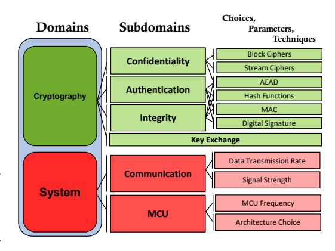
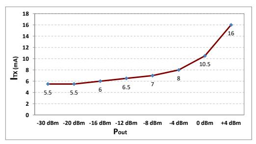
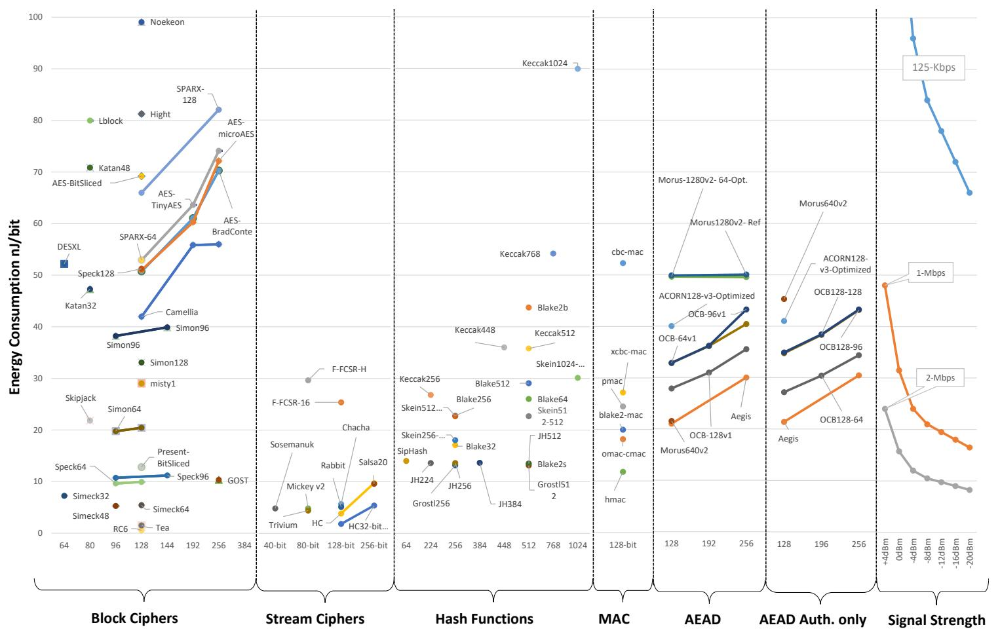
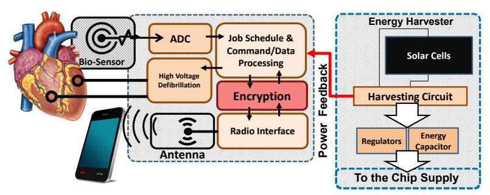
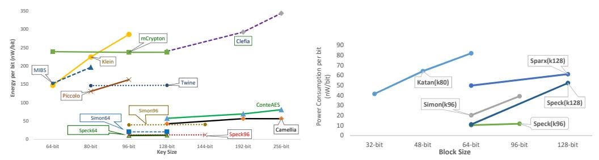

# Design Space Exploration for Ultra-Low Energy and Secure IoT MCUs

EHSAN AERABI, Iran University of Science and Technology, Iran.(\*Corresponding Author)

MILAD BOHLOULI, Iran University of Science and Technology, Iran

MOHAMMADHASAN AHMADI LIVANY, University of Tehran, Iran

MAHDI FAZELI◦ , Iran University of Science and Technology, Iran.(\*Corresponding Author)

ATHANASIOS PAPADIMITRIOU, Univ. Grenoble Alpes, Grenoble INP ESISAR, ESYNOV, France

DAVID HELY, Univ. Grenoble Alpes, Grenoble INP, LCIS, France

This paper explores the design space of secure communication in ultra-low-energy IoT devices based on Micro-Controller Units (MCUs). It tries to identify, benchmark and compare security-related design choices in a Commercial-Off-The-Shelf (COTS) embedded IoT system which contributes to the energy consumption. We conduct a study over a large group of software crypto algorithms: symmetric, stream, hash, AEAD, MAC, digital signature and key exchange. A comprehensive report of the targeted optimization attributes (memory, performance and specifically energy) will be presented from over 450 experiments and 170 different crypto source codes. The paper also briefly explores a few system-related choices which can affect the energy consumption of secure communication, namely: architecture choice, communication bandwidth, signal strength, and processor frequency. In the end, the paper gives an overview of the obtained results and the contribution of all. Finally, it shows, in a case study, how the results could be utilized to have a secure communication in an exemplary IoT device. This paper gives IoT designers an insight on the ultra-low-energy security, helps them to choose appropriate cryptographic algorithms, reduce trial-and-error of alternatives, save effort and hence cut the design costs.

CCS Concepts: • Security and privacy → Cryptography; • Hardware → Power and energy.

Additional Key Words and Phrases: Ciphers, Cyber-physical systems, Cryptography, Embedded software, Energy consumption, Benchmarking

#### ACM Reference Format:

Ehsan Aerabi, Milad Bohlouli, MohammadHasan Ahmadi Livany, Mahdi Fazeli◦ , Athanasios Papadimitriou, and David Hely. 2020. Design Space Exploration for Ultra-Low Energy and Secure IoT MCUs. ACM Trans. Embedd. Comput. Syst. 1, 1, Article 1 (January 2020), [26](#page-25-0) pages. <https://doi.org/10.1145/3384446>

# 1 INTRODUCTION

Global trends for ubiquitous computing and new advances in computer networks and cyber-physical systems (CPS) have served to foster the emerging era of the Internet of Things (IoT) with countless smart objects being connected to the Internet. Smart buildings, factories, farms, cities, wearable and implantable medical devices are being materialized. It is expected that the IoT is consisted of 30 billion smart things by 2020[\[1\]](#page-18-0). Many of these IoT devices are mobile embedded systems with limited resources, because they should be price-competitive and (ultra) low-energy. They generally come with low power Micro-Controller Units (MCUs) and limited memory. In some cases, like battery-less RFIDs and implantable medical devices, critical energy provision should be taken into account.

Emerging energy harvesting technologies [\[2\]](#page-18-1) necessitate even more precise energy provisioning for batteryless devices. For these devices, an energy harvester converts an environmental energy resource into the

Permission to make digital or hard copies of all or part of this work for personal or classroom use is granted without fee provided that copies are not made or distributed for profit or commercial advantage and that copies bear this notice and the full citation on the first page. Copyrights for components of this work owned by others than ACM must be honored. Abstracting with credit is permitted. To copy otherwise, or republish, to post on servers or to redistribute to lists, requires prior specific permission and/or a fee. Request permissions from permissions@acm.org.

© 2020 Association for Computing Machinery.

1539-9087/2020/1-ART1 \$15.00

<https://doi.org/10.1145/3384446>

◦ He is currently with the department of Computer Engineering, Bogazici University. Istanbul, Turkey. Authors' addresses: Ehsan Aerabi, Iran University of Science and Technology , Narmak, Tehran, 16846-13114, Iran.(\*Corresponding Author), e\_aerabi@comp.iust.ac.ir/ehsan.aerabi@lcis.grenoble-inp.fr; Milad Bohlouli, Iran University of Science and Technology, Narmak, Tehran, 16846-13114, Iran, miladbohlouli@comp.iust.ac.ir; MohammadHasan Ahmadi Livany, University of Tehran, Tehran, 1417466191, Iran, mhasan.ahmadi@ut.ac.ir; Mahdi Fazeli◦ , Iran University of Science and Technology , Narmak, Tehran, 16846-13114, Iran.(\*Corresponding Author), m\_fazeli@iust.ac.ir; Athanasios Papadimitriou, Univ. Grenoble Alpes, Grenoble INP ESISAR, ESYNOV, Valence, 26000, France, athanasios.papadimitriou@esisar.grenoble-inp.fr; David Hely, Univ. Grenoble Alpes, Grenoble INP, LCIS, Valence, France, david.hely@ grenoble-inp.fr.

electrical current. Some examples are solar cells and piezoelectric generators in wearable devices[\[3\]](#page-18-2) and fuel cells in medical implants[\[4\]](#page-18-3). Obviously, the amount of the harvested energy is variable and the device should comply with the existing energy to complete its tasks. Therefore, IoT designers are usually challenged to identify the available choices or parameters that they can modify in order to optimize the design attributes like the energy consumption, performance and memory.

Recent reported attacks and privacy concerns oblige IoT devices to apply modern cryptography as the solution for a majority of the security threats [\[5\]](#page-18-4). Unlike personal computers with bountiful computation and memory resources, embedded system designers are challenged to utilize lightweight cryptographic primitives in order to minimize the memory size and energy consumption and maximize the performance[\[6\]](#page-18-5).

Cryptography is one of the most frequent and complex tasks in an IoT device which is executed for each data transmission (and for storage in several cases). Therefore, appropriate algorithms and mechanisms are needed to cope with the limited energy profile. During the last decade, several cryptographic primitives have been introduced including stream ciphers, asymmetric and symmetric block ciphers and hash functions. Each primitive may target either software or hardware implementations or both. From a designer's point of view, there are plenty of cryptographic algorithms available to be integrated into an IoT solution, each of which destined different criteria whether it is code size, performance, chip area , memory or energy consumption. Therefore, a designer may choose a subset which is well suited with the targeted platform, whether it is a Field-Programmable Gate Array (FPGA), Application Specific Integrated Circuits (ASIC) or COTS CPUs with the aim to maximize security and performance at the minimum costs (e.g energy, code size, etc). In order to choose one appropriate cipher (among many options), it is necessary to have an insight on the energy costs of each one and how cryptography choices (like key size) affect them. The importance of this insight will intensify with the perspective of the IoT trend, because devices tend to have more communication and hence need executive processing for cryptography which makes them even more dependent on the limited battery-based energy reserves. Therefore, any decision on cryptography can negatively affect the battery life. Especially in the case of dependable applications, such as medical implants, battery life becomes a crucial factor, which must be taken into account from the beginning of the design phase [\[7,](#page-18-6) [8\]](#page-18-7).

We target security of ultra-low-energy commercial-of-the-shelf (COTS) CPUs in this paper. Using offthe-shelf CPUs, has several advantages for manufacturers of embedded devices. It considerably reduces the hardware design costs and time-to-market gap. Moreover, such CPUs are robust and mature. Designers also can take advantage of the previously developed tool-chains like compilers and debuggers for the targeted CPU. The overall design cost for low- to mid-scale production justifies using COTS-based CPUs.

Using COTS-based CPU usually imposes software-implemented cryptography (except for high-end CPUs with crypto-processors). There exists a significant number of software-oriented cryptographic algorithms which have been designed with the insight to compile and run optimally using common CPUs instructions. Therefore, the scope of this paper entails software cryptography.

This paper gives IoT designers an insight on the ultra-low-power security, helps them to choose appropriate cryptographic algorithms, reduce trial-and-error of alternatives, save effort and hence cut the design costs.

The contribution of the paper is to identify, explore and analyse the design choices and their impacts on the attributes and costs of a secure IoT system with the focus on the energy consumption. We only focus on the software realm and what a software designer can control on a COTS-based system design. Briefly, the contributions of this paper are five-fold:

- This paper attempts to identify design choices associated with secure communication and quantify their contributions on the system costs. In order to explore the influential design parameters in a secure IoT device, we identified and categorized a comprehensive set of design parameters from two aspects: Cryptography and System.
- In order to explore security-related design choices, this work identifies over 80 different software cryptographic functions, ciphers and mechanisms. This also includes a list of the previous benchmarking reports on these ciphers. We will explain why the previous benchmarking and comparison works are not enough and a new study is needed by the designers of IoT devices.
- In order to present consistent and comparable results on each domain and its corresponding subdomains, the paper provides a comprehensive benchmarking reports on over 170 cipher source codes using over

450 separate experiments which we have carried out in our laboratory. The source codes have been clustered and shared in a public repository for further researches.

- The paper draws a comparative overview upon all the experiments that have conducted and the information that have been gathered which helps the readers to conclude about the contribution of each parameter on the system energy consumption as well as other costs. As the experiments have been performed on the same test-bed, the results can be consistently compared against each other.
- Through a case study, the paper gives an example of how the obtained results could be used in designing a low energy embedded system. The case study encompasses a medical implant which harvests solar energy for its operation.

For further investigations by future works, we gathered all the source codes used in this report in a repository which is available online[\[9\]](#page-18-8).

This paper continues on Section [2](#page-2-0) with the required backgrounds and an explanation on the methodology. Then Section [3](#page-5-0) covers the related work. Section [4](#page-7-0) and [5](#page-9-0) provide the design space exploration results for "system" and "Cryptography" domains respectively. Section [6](#page-13-0) presents a big picture of the obtained results explain how they can be used in a case study. Section [7](#page-16-0) follows some discussion on the obtained results and finally, this paper ends with a conclusion in Section [8.](#page-18-9)

# 2 BACKGROUND & METHODOLOGY

In this section we briefly introduce the background of the cryptography space and the assumptions and methodology used to explore it.

# 2.1 Identifying Design Choices, Parameters and Techniques

Our assumptions for security services for embedded IoT communication is as follows: The IoT device needs to establish a secure connection session and exchange information with a remote server or cloud system. In ultra-low-power cases, the IoT device may connect to a close proxy device (e.g. a cell phone) using an ultra-low power wireless communication technology (e.g. Bluetooth Low Energy - BLE[\[10\]](#page-18-10)) which relays information back and forth between the IoT device and the remote server or cloud system[\[8\]](#page-18-7).

First of all, each side of communication should authenticate itself to the other side and establish or exchange a session key. The session key is either a random number generated by one side or a combination of two random numbers from both sides of the communication. Afterwards, they can start a secure communication using the session key. They can ex-

Fig. 1. Abstraction Levels of Cryptography Implementation on MCUs

change messages only with authentication or both encryption and authentication (authenticated encryption). Data integrity is commonly associated with that. Therefore the required services could be 1) Secure key establishment 2) Confidentiality 3) Authenticity and 4) Integrity.

In this section, we identify and categorize the design space into domains and sub-domains in order to explore the design space of the secure and embedded IoT design. The aim of this perspective is to identify, benchmark, study and compare major implementation parameters from an IoT designer's point of view. Figure [1](#page-2-1) presents this categorization. The domains of system and cryptography are comprised of different sub-domains:

2.1.1 System Domain. At the system domain, we consider the MCU and the communication sub-domains. For the MCU domain, we try to find the energy reduction benefits that can be obtained by alternating among different CPU architectures. Also, the effect of MCU operating frequency on the power consumption will be studied.

At the communication sub-domain, we study the effect of the data transmission rate and the signal strength on the energy consumption.

Table 1. A list of lightweight block ciphers

| Cipher      | Reference | Key Size    | Block Size | Year | Attacks      |
|-------------|-----------|-------------|------------|------|--------------|
| AES         | [11]      | 128/192/256 | 128        | 2000 | [12–14]      |
| Camellia    | [15]      | 128/192/256 | 128        | 2000 | [16, 17]     |
| Clefia      | [18]      | 128/192/256 | 128        | 2007 | [19, 20]     |
| DESLX       | [21]      | 184         | 64         | 2007 | -            |
| GOST        | [22]      | 256         | 64         | 1970 | [23]         |
| Hight       | [24]      | 128         | 64         | 2006 | [25–28]      |
| Iceberg     | [29]      | 128         | 64         | 2004 | [30, 31]     |
| Idea        | [32]      | 128         | 64         | 1991 | [33, 34]     |
| ITUbee      | [35]      | 80          | 80         | 2013 | [36]         |
| Katan       | [37]      | 80          | 32/48/64   | 2009 | [38, 39]     |
| Ktantan     | [37]      | 80          | 32/48/64   | 2009 | [40]         |
| Khudra      | [41]      | 80          | 64         | 2014 | [42, 43]     |
| Klein       | [44]      | 64/80/96    | 64         | 2012 | [45, 46]     |
| Lblock      | [47]      | 80          | 64         | 2011 | [48–52]      |
| LEA         | [53]      | 128,192,256 | 128        | 2014 | [54, 55]     |
| Led         | [56]      | 64/128      | 64         | 2011 | [57, 58]     |
| LS-Design   | [59]      | 128         | 128        | 2015 | [60]         |
| mCrypton    | [61]      | 64/96/128   | 64         | 2006 | [62]         |
| Mibs        | [63]      | 64/80       | 64         | 2009 | [64, 65]     |
| Midori      | [66]      | 128         | 64/128     | 2015 | [67–69]      |
| Misty1      | [70]      | 128         | 64         | 1997 | [71, 72]     |
| Mysterion   | [73]      | 128/256     | 128/256    | 2015 | -            |
| Noekeon     | [74]      | 128         | 128        | 2000 | [75]         |
| Picaro      | [76]      | 128         | 128        | 2012 | [77]         |
| Piccolo     | [78]      | 80/128      | 64         | 2011 | [79, 80]     |
| Present     | [81]      | 80/128      | 64         | 2007 | [82–84]      |
| Prince      | [85]      | 128         | 64         | 2012 | [77, 86, 87] |
| PRINTcipher | [88]      | 48/96       | 48/96      | 2010 | [89, 90]     |
| Puffin-2    | [91]      | 80          | 64         | 2009 | [92]         |
| RC2         | [93]      | 8-1024      | 64         | 1998 | [94]         |
| RC5         | [95]      | 0-2040      | 32/64/128  | 1995 | [96, 97]     |
| RC6         | [98]      | 128/192/256 | 128        | 1998 | [96]         |
| Rectangle   | [99]      | 80/128      | 64         | 2015 | [100]        |
| RoadRunneR  | [101]     | 80/128      | 64         | 2015 | [102]        |
| Sea         | [103]     | 48,96,      | 48,96      | 2006 | -            |
| Seed        | [104]     | 128         | 128        | 2005 | [105]        |
| Serpent     | [106]     | 128/192/256 | 128        | 1998 | [107]        |
|             |           |             |            |      |              |
| Simeck      | [108]     | 64/96/128   | 32/48/64   | 2015 | [109]        |
| Simon       | [110]     | 64256       | 32128      | 2015 | [111–114]    |
| SKINNY      | [115]     | arbitrary   | 64/128     | 2016 | [116]        |
| Skipjack    | [117]     | 80          | 64         | 1999 | [118]        |
| SPARX       | [119]     | 128/256     | 64/128     | 2016 | [120]        |
| Speck       | [110]     | 64256       | 32.128     | 2015 | [121, 122]   |
| Tea         | [123]     | 128         | 64         | 1995 | [124]        |
| Twofish     | [125]     | 128/192/256 | 128        | 1994 | [126]        |
| Twine       | [127]     | 80/128      | 64         | 2011 | [128]        |
| Xtea        | [129]     | 128         | 64         | 1997 | [124]        |
| Zorro       | [130]     | 128         | 128        | 2013 | [131]        |

| Table 2. Lightweight stream ciphers |            |          |      |            |
|-------------------------------------|------------|----------|------|------------|
| Cipher                              | Ref.       | Key Size | Year | Attacks    |
| ChaCha                              | [132]      | 256      | 2008 | [133, 134] |
| F-FCSR-H V3                         | [135]      | 128      | 2009 | [136, 137] |
| F-FCSR-16                           | [135]      | 128      | 2009 | [136, 137] |
| Grain                               | [138, 139] | 80/128   | 2006 | [140]      |
| Rabbit                              | [141]      | 128      | 2004 | [142]      |
| Trivium                             | [143]      | 80       | 2006 | [144]      |
| Mickey v2                           | [145]      | 80/128   | 2008 | [146]      |
| HC-128                              | [147]      | 128      | 2008 | [148]      |
| HC-256                              | [149]      | 256      | 2004 | [148]      |
| Snow3G                              | [149]      | 128      | 2006 | -          |
| Sosemanuk                           | [150]      | 128      | 2008 | [151]      |
| Salsa20                             | [152]      | 256      | 2008 | [134]      |

Table 3. Lightweight hash functions Algorithm Ref. Digest(bits) Year Attacks BLAKE2 [\[153\]](#page-22-22) 224/256/384/512 2013 [\[154\]](#page-22-23) Grøstl [\[155\]](#page-22-24) 8 to 512 2009 [\[156,](#page-22-25) [157\]](#page-22-26) JH [\[158\]](#page-22-27) 224/256/384/512 2008-2012 [\[159\]](#page-22-28) Keccak [\[160\]](#page-22-29) 224/256/384/512 2013 [\[161](#page-22-30)[–163\]](#page-22-31) PHOTON [\[164\]](#page-22-32) 80/128/160/224/256 2011 [\[165\]](#page-22-33)

QUARK [\[166\]](#page-22-34) 136/176/265 2013 - SipHash-2-4 [\[167\]](#page-22-35) 64/128 2012 [\[168\]](#page-22-36) Skein [\[169\]](#page-22-37) 256/512/1024 2010 [\[170,](#page-22-38) [171\]](#page-23-0) SPONGENT [\[172\]](#page-23-1) 80/128/160/224/265 2013 -

Table 4. A list of message authentication codes (MAC) Name Ref. Application/Standard

| CBC-MAC   | [173] | ZigBee, IEEE802.11i(WPA2), IPSec, TLS1.2, Bluetooth4.x |
|-----------|-------|-----------------------------------------------------------|
| OMAC-CMAC | [174] |                                                           |
| PMAC      | [175] | ANSI C12.22                                               |
| XCBC-MAC  | [176] |                                                           |
| HMAC      | [177] | IPSec, TLS                                                |

Table 5. Digital signature mechanisms

| Mechanism | Description                             | Ref.  |
|-----------|-----------------------------------------|-------|
| DSA       | Digital Singnature Algorithm            | [178] |
| EC-DSA    | Elliptic-Curve DSA                      | [179] |
| Ed25519   | Edwards-curve DSA                       | [180] |
| NTRU-PASS | Polynomial Authentication and Signature | [181] |
| RSA-PSS   | RSA Probabilistic Signature Scheme      | [182] |

2.1.2 Cryptography Domain. The cryptography domain encompasses the services that previously assumed for an IoT device. As there are plenty of primitives available on the literature, we will examine and compare a comprehensive set of them in our measurement setup. This will form a significant part of the contribution of this paper. At the end, we can compare the cost of each algorithm in each cipher category. The categories include: symmetric block ciphers, stream ciphers, Authenticated Encryption with Associated Data (AEAD) and hash functions, Message Authentication Code (MAC) structures, digital signature and key exchange. Here is a short explanation for each category including a list of their algorithms and primitives.

Block (symmetric) ciphers are a group of deterministic functions which are used to encrypt bulk data in form of blocks. Table [1](#page-3-0) presents the list of the block ciphers. We have evaluated a large group of them, namely those which we had access to their source codes. Table [1](#page-3-0) (as well as the other primitives in this section) presents also the reported attacks for each primitive in the last column. We should note that the attack list is not exhaustive. Moreover, reported attacks have different severity. Studying the severity of each attack is beyond the scope of this paper. Finally, newer and less-known primitives may have less or no reported attacks. In conclusion, a cipher which has more reported attack is not necessarily less secure.

Stream ciphers are symmetric functions and like block ciphers, provide data encryption. The difference is that they are mainly bit-oriented. Table [2](#page-3-0) provides a list of stream ciphers.

Cryptographic hash functions are a group of one-way deterministic functions which have several applications in cryptography. A hash function projects an unlimited or a very big-size message into a relatively small and fixed size digest. This digest then is used in cryptographic mechanisms like in message authentication codes or digital signatures. Table 3 presents a list of hash functions measured in this work. The list includes NIST1 SHA3 competition2 finalists as well as some famous hash functions which have been invented after the SHA3 competition. namely, PHOTON, QUARK, Sip-Hashand SPONGENT[183].

Message Authentication & Digital Signature is accomplished by attaching a short tag to the data being transmitted in order to provide sender authentication on the receiver side. The tag is a small piece of information derived from the plain-text (usually by means of hash functions), encrypted and then sent along with the message which proves the sender's identity and the integrity of the message. Message authentication can utilize symmetric or asymmetric encryption. The symmetric model is called message authentication code (MAC) and the asymmetric one is called digital signature. Table 4 and Table 5 contain a list of well-known MAC and digital signature mechanisms, respectively. For digital signature, we will cover a list from Table-5.

Authenticated Encryption with Associated Data (AEAD) is a group of cryptographic structures which are designed to provide both secrecy (confidentiality) and authenticity (and hence integrity) in network communications. Previous authenticated encryption structures were normally a combination of encryption algorithms to provide confidentiality along with Message Authentication Codes (MAC) for authentication purposes. Table 6 presents a list of the old AE structures which we will not examine in this study. AES-GCM[184] is one of the most frequent authenticated encryption structures which is used in IEEE 802.1AE (MACsec[185]), TLSv1.2[186], IEEE 802.11ad (WiGig), IPSec, SSH[187], OpenVPN[188], etc.

In 2012, the international cryptologic research community initiated CAESAR competition[201], which is an abbreviation for "Competition for Authenticated Encryption: Security, Applicability, and Robustness". The goal was to improve some features over AES-GCM. A large number of volunteers participated in their performance analysis and after six years and three rounds of competition, eventually in March 2018, seven AEAD finalists have been announced. namely: ACORN, AEGIS, Ascon, COLM, Deoxys-II, MORUS and OCB(Table-7). We only examined the finalists, as they are expected to replace the old AE mechanisms.

For *key exchange protocols*, we examined the classic Diffie-Hellman and Elliptic-Curve Diffie-Hellman(ECDH) scheme based on curve25519[202] which has been widely adopted in recent libraries and applications (*e.g.* OpenSSH).

#### 2.2 Source Codes

We gathered all the source codes and published them in a repository[9] and made it available for other researchers to participate and upload optimized versions in the future and compare them with the previous ones.

Table 6. A list of conventional authenticated encryption mechanisms

| Protocol | Ref.  | Year | Application/Standard                                                                                                                          |
|----------|-------|------|-----------------------------------------------------------------------------------------------------------------------------------------------|
| ССМ      | [189] | 2007 | ZigBee, IEEE 802.11i(WPA2), IPSec, TLS 1.2, Bluetooth 4.0                                                                                  |
| CWC      | [190] | 2004 |                                                                                                                                               |
| EAX      | [191] | 2003 | ANSI C12.22                                                                                                                                   |
| GCM      | [192] | 2005 | IEEE802.1AE(MACsec), IEEE802.11ad(WiGig), Fibre Channel Security Protocols, IEEE P1619.1 tape storage, IETF IPsec standards, SSH and TLS 1.2. |
| IAPM     | [193] | 2000 |                                                                                                                                               |
| ОСВ      | [194] | 2003 | IEEE 802.11 IEEE 802.11(Optional), ISO/IEC 19772:2009, RFC 7253                                                                            |

Table 7. CAESAR competition finalists

| Mechanism       | Ref.  | Key(bit)  | MAC(bit)    | Year |
|-----------------|-------|-----------|-------------|------|
| ACRON v3        | [195] | 128       | 128         | 2016 |
| AEGIS v1.1      | [196] | 128       | 128/256     | 2016 |
| ASCON v1.2      | [197] | 128       | 128         | 2016 |
| Deoxys-II v1.41 | [198] | 141       | 128/256     | 2016 |
| Morus v2        | [199] | 64/128    | 128/256     | 2016 |
| OCB v1.1        | [200] | 64/96/128 | 128/192/256 | 2016 |

In order to collect the source codes, we utilized several libraries and online repositories; namely, Wolfcryp library[203] LibTomCrypt[204], Supercop [205] and several other pages. Due to the lack of space, we provides the links3 of the original repositories along with the ciphers names in our Github database[9].

It is worth to mention that the set of cryptographic services and mechanisms mentioned here is not exhaustive. There are other services which are not normally considered as an embedded device security requirement, like blind authentication, secret sharing or secure multi-party computation. Hence we exclude them in this study.

&lt;sup>1National Institute of Standards and Technology

&lt;sup>2https://csrc.nist.gov/projects/hash-functions/sha-3-project

&lt;sup>3https://github.com/ehsanaerabi/BlockCiphers/blob/master/README.md

#### 2.3 Targeted Optimization Attributes and Costs

We chose a set of attributes to report in our experiments which is normally assumed the optimization target for an ultra-low-power IoT designer. Here is a list of these attributes associated with the "cryptography" domain described in the previous section:

- *Per-bit Energy Consumption*: The main attribute of a crypto task with regards to the aim of this paper is the energy consumption. As it was previously mentioned, it can determine the battery life or in case of an energy-harvested IoT device, it can determine how many crypto tasks the IoT device can fulfill before its harvested energy is exhausted. We report this attribute in form of nano Joule per bit (*nJ/bit*) in order to make it independent from the MCU frequency and the crypto input block size. Therefore, it reports how much energy is required to encrypt a bit of information.
- *Per-bit Performance*: In real-time or interactive IoT devices, the performance can determine the device's responsiveness. We show this attribute in form of *cycle/bit*. It shows how many cycles are needed in order to process a bit of information.
- *Memory*: in form of bytes determines how much memory is required for the crypto binary and its constants (to be stored in ROM) and also for its data during the computation (to be stored in RAM).
- FOM: Some previous work(e.g. [206]) used Figure-of-Merit (FOM) as a combined metric to compare ciphers in terms of memory, energy or performance. We also use a similar formula which combines memory usage and energy consumption for encryption and decryption to calculate FOM:

$$FOM = w_{mem}.(ROM + RAM) \times w_{eng}.(E_{Enc.} + E_{Dec.})/2$$
 (1)

In which,  $w_{mem}$  and  $w_{eng}$  are importance weights and were assumed '1' for simplicity. A designer can balance them based on the design cost criterion.

For the "system" domain we have used these attributes specifically when we wanted to compare different architecture choices:

- *Unit price*: which affects the price of the final product and is important in mass production and competitive markets.
- Memory: on-chip RAM and ROM.
- *Maximum frequency:* which is directly associated with the system performance.
- *Minimum active current consumption*: normalized in the form of uA/MHz, which affects the energy consumption.

#### 2.4 The Dedicated Platform

The main part of this paper is crypto benchmarking on an emmbedded IoT platform. As the test-bed, we chose Nordic-Semiconductor nRF51822[207], an ultra low power 32-bit System on Chip (SoC) equipped with Bluetooth 4.0 LE, as our targeted device. It is built around a Cortex M0 which have 256KB flash and 32KB RAM memories and is able to operate on 16 and 32MHz oscillator frequencies and a wide supply voltage of 1.8 V to 3.6 V. It comes with flexible power management schemes. Therefore, this device is an appropriate choice for low power wireless applications. All the source codes were compiled using GCC with optimization level 3[208]. In order to calculate the energy consumption, we inserted a shunt resistor at the positive supply voltage ( $V_{dd}$ ) path and connected probes of a digital oscilloscope to both ends of the resistor. All the power traces are read from the oscilloscope operating at 1GHz sampling rate and processed by a post-processing tool developed in MATLAB in our laboratory. A trigger signal determined the start and end of the crypto algorithm. The post-processing tool uses the captured data to calculate the energy consumption by means of discrete integration and also to determine the execution time using the trigger signal. Therefore, the results are based on the data from real executions and not based on a debugger emulation.

Beside the nRF51822 board, we required an 8-bit MCU for a case study comparison later in Section 4. We chose an Arduino Uno board which is built around an Atmega328 AVR MCU[209]. Atmega328 is an 8-bit microcontroller 32KB flash and 2KB SRAM memories. It can operate with the frequency up to 20MHz.

#### 3 RELATED WORK

Eisenbarth *et.al* published one of the first lightweight block ciphers comparison reports in 2007. Since then, several reports have been published by researcher in an effort to characterize lightweight block ciphers. Table 8 presents previous block cipher benchmarking works including their references, year of publication,

Table 8. Previous work on block cipher benchmarking

|                | Reference                         | Year | #Ciphers         | Platform                |   |   | Perform. Area Memory Energy |   |
|----------------|-----------------------------------|------|------------------|-------------------------|---|---|-----------------------------|---|
| Block Ciphers  |                                   |      |                  |                         |   |   |                             |   |
|                | 1 Eisenbarth et al.[210]          | 2007 | 8                | 8-bit AVR               | * |   | *                           |   |
|                | 2 Rolfes et al.[211]              | 2008 | 1                | ASIC 180-250-350nm      | * | * |                             | * |
|                | 3 Yalla et al.[212]               | 2009 | 2                | FPGA                    | * | * | *                           | * |
|                | 6 Eisenbarth et al.[213]          | 2012 | 12               | 8-bit AVR               | * |   | *                           | * |
|                | 7 Kerckhof et al.[214]            | 2012 | 6                | ASIC 65nm               | * | * |                             | * |
|                | 8 Hanley et al.[215]              | 2012 | 2                | FPGA                    | * | * |                             | * |
|                | 9 Batina et al.[216]              | 2013 | 7                | ASIC 130nm              | * | * |                             | * |
|                | 10 Manifavas et al.[217]          | 2013 | 16               | 8-bit AVR/FPGA          | * | * | *                           |   |
|                | 11 Cazorla et al.[218]            | 2013 | 18               | 16-bit MSP430           | * |   | *                           |   |
|                | 12 Beaulieu et al.[219]           | 2014 | 10               | 8-bit AVR               | * |   | *                           |   |
|                | 13 Malina et al.[220]             | 2014 | 20               | Java                    | * |   |                             |   |
|                | 14 Dinu et al.[206]               | 2015 | 13               | AVR-MSP-ARM             | * |   | *                           |   |
|                | 15 Yang et al.[221]               | 2015 | 2                | ASIC 65nm               | * | * |                             | * |
|                | 16 Banik et al.[222]              | 2015 | 9                | ASIC 90nm               | * | * |                             | * |
|                | 17 Bogdanov et al.[223]           | 2015 | 2                | ASIC 130nm              | * | * |                             | * |
|                | 18 Diehl et al.[224]              | 2017 | 6                | FPGA- 16-bit MSP430     | * | * |                             | * |
|                | 19 Hatzivasilis et .al[225]       | 2014 | 6                | ARM Cortex-A8           | * |   | *                           |   |
| Hash functions |                                   |      |                  |                         |   |   |                             |   |
|                | 1 Balasch et al.[226]             | 2012 | 18               | 8-bit AVR               | * |   | *                           |   |
|                | 2 Homsirikamol et al.[227] 2015   |      | 5(SHA3)          | FPGA                    | * | * |                             |   |
|                | MAC                               |      |                  |                         |   |   |                             |   |
|                | 3 Hatzivasilis et .al[225]        | 2014 | 8                | ARM Cortex-A8           | * |   | *                           |   |
| Stream Ciphers |                                   |      |                  |                         |   |   |                             |   |
|                | 1 Fournel et al.[228]             |      | 2007 13(eSTREAM) | 32-bit ARM              | * |   | *                           | * |
|                | 2 Good et al.[229]                |      | 2007 9(eSTREAM)  | ASIC                    | * | * |                             | * |
|                | 3 Manifavas et al.[230]           | 2016 | 6                | ARM(A9)-FPGA-ASIC       | * | * | *                           | * |
|                | 4 Hatzivasilis et .al[225]        | 2014 | 9                | ARM Cortex-A8           | * |   | *                           |   |
| Authen. Enc.   |                                   |      |                  |                         |   |   |                             |   |
|                | 1 Simplicio et al.[231, 232] 2011 |      | 6                | 16-bit MSP430           | * |   | *                           | * |
|                | 2 Krovetz et al.[233]             | 2011 | 6                | Intel/ARM/PowerPC/SPARC | * |   |                             |   |
|                | 3 Ankele et al.[234]              |      | 2016 21(CAESAR)  | Intel Core.i5           | * |   |                             |   |
|                | 4 Diehl et al.[224]               |      | 2017 29(CAESAR)  | FPGA                    | * | * |                             |   |

number of ciphers tested, platform and also the type of information that they provide on their results like: energy, performance, code size (for microprocessors) and area (for FPGA and ASICs). Six reports exist on microprocessors and one of them([\[206\]](#page-23-35)) has used a 32-bit architecture (ARM) which itself lacks reporting on energy consumption.

Table [8](#page-6-0) presents related benchmarking reports on hash functions. The number of reports is limited in comparison to the block ciphers and the first work has been published in 2012[\[226\]](#page-24-8).

Concerning stream cipher benchmarking (Table [8\)](#page-6-0), the first benchmarking paper was published in 2007[\[229\]](#page-24-11). The evaluation in this paper is on the eSTREAM[\[235\]](#page-24-17) project's stream ciphers and results include energy consumption along with other parameters on 32-bit ARM-9. But the MCU and the ciphers they used are now outdated after a decade. The work of [\[230\]](#page-24-12) Manifavas et al. includes comprehensive results on different platforms, but they have used ARM Cortex-A9 which targets high-end computers, tablets and cell phones.

MAC structures mainly use block ciphers as their building blocks in their construction and hence their cost normally are associated with the cost of the block cipher they employ. The only related work we found on this part is [\[236\]](#page-24-18) which uses high-end CPUs from Intel and AMD in their evaluation.

There are few benchmarking reports on the previous rounds of the CAESAR competition which concern high-end Intel Core.i5 processors and FPGAs[\[237,](#page-24-19) [238\]](#page-24-20). Their goal was to compare the performance of the competitors. Therefore, still comprehensive benchmarking reports on embedded processor are needed on finalists.

# 4 SYSTEM DOMAIN EXPLORATION

In this part, we explore the system domain of the design space described in Figure [1.](#page-2-1) We separate the design parameters into two categories: "MCU" and "communication".

# 4.1 MCU Subdomain

Here we investigate the effect of two options at the MCU level on the targeted parameters: 1) MCU data-path choices 2) MCU operating frequency.

4.1.1 MCU data-path choices. To see the effect of MCU data-path choices on the targeted parameters, we performed two studies. Firstly, we gathered a list MCUs available "off-the-shelf" to an IoT designer and compared them. Secondly, we conducted a case study experiment on an 8-bit and a 32-bit MCUs to see their differences. Here is an overview of them:

Off-the-Shelf MCUs study: We chose and studied a set of 8-bit, 16-bit and 32-bit MCUs from different manufacturers [4](#page-7-1) . In order to align similar MCUs, first we considered a specific price window (around 1.5 Euros per unit) and gathered a list of MCUs in the price range from online distributors. Figure [9](#page-8-0) presents the information extracted from their data-sheets. The MCUs are classified based on their data-widths. For comparison purposes, some parameters in the Table [9](#page-8-0) have colors in the spectrum between red and green. The green color indicates desired (smaller) values for all parameters. Namely the colored columns are ROM (flash) & RAM memories, maximum frequency and minimum active current consumption in MCU's active mode. The other parameters may occasionally gain importance based on the application (e.g. extreme operating temperature).

This is obvious from Table [9](#page-8-0) that at the same price window, 32-bit MCU choices offer better features, including current consumption. Apart from this, a 32-bit architecture can host modern embedded operating systems (e.g. Linux, Android and Window10-IoT) which in turn offers more featured and robust software environment (e.g. networking, event handling, multi-taking and high-level programming). While small MCUs (8-bit) are more common for small applications (without crypto), 32-bit MCUs are more susceptible candidates for future of low-power embedded cryptography, as they consume less power consumption and propose higher features at the same price.

Case study on 8-bit and 32-bit MCUs: There is another aspect of 32-bit MCUs which can tip the balance even more in their favor. Due to wider data-paths, the 32-bit MCUs can process more data than 8-bit or 16-bit ones during the same clock cycles. Therefore, if a well-crafted program can take advantage of the 4-byte computation in a 32-bit MCU, it would have theoretically a performance boost of four times in comparison to a 1-byte computation 8-bit MCUs. This makes energy-per-byte during the computation even smaller.

Moreover, the programming models of different architectures can also affect energy consumption. For example, a limited number of general purpose registers resorts more memory load and storage operations since there are not enough general purpose CPU registers to keep data within the CPU. On the other hand, diversity of machine-level operations (e.g. bit manipulation) can make cryptography building blocks faster(e.g. bit permutation). Aside from all the above-mentioned differences, cipher structure is also important. For example, some ciphers (e.g. AES) are byte-oriented ciphers and some others have wider data-block operations (e.g. Speck). Therefore, we expect to see different performance improvement when a byte-oriented (8-bit) cipher runs rather than a double-word-oriented (32-bit) cipher.

Just as a case study, we compiled Speck (double-word-oriented)[\[239\]](#page-24-21) and AES (byte-oriented [\[240\]](#page-24-22)) on two MCUs: an ARM Cortex-M0 (32-bit) on nRF51822 and an AVR (8-bit) on Arduino Uno. The goal was to observe the resources that each architecture needs to host the algorithms and also the performance that they present. Table [10](#page-8-1) presents the results for memory consumption and execution time. The ARM architecture consumes more memory for AES cipher but its performance is significantly superior. For the Speck case, ARM uses nearly the same RAM, but it needs lower ROM and provides extremely better performance. The improvement over Speck mainly comes from the fact that this cipher is an inherently 32-bit cipher and better suits 32-bit

4 <https://mou.sr/2UR6YJX> - <https://mou.sr/2UOF2Gw> - <https://mou.sr/2ULVxTM>

Table 9. Comparison of MCUs in price range of 1.35 to 1.55 Euros

|                                                                                                                                                                                                                                                                                                                                                                                                                                                                                                                                                                                                                                                                                                                                                                                                                                                                                                                                                                                                                                                                                                                                                                                                                                                                                                                                                                                                                                                                                                                                                                                                                                                                                                                                                                                                                                                                                                                                                                                                                                                                                                                                |                 |                | Table 9. Co        |                | _     |     |            |                                             |                |             |                      | _                                   | _        |                          |
|--------------------------------------------------------------------------------------------------------------------------------------------------------------------------------------------------------------------------------------------------------------------------------------------------------------------------------------------------------------------------------------------------------------------------------------------------------------------------------------------------------------------------------------------------------------------------------------------------------------------------------------------------------------------------------------------------------------------------------------------------------------------------------------------------------------------------------------------------------------------------------------------------------------------------------------------------------------------------------------------------------------------------------------------------------------------------------------------------------------------------------------------------------------------------------------------------------------------------------------------------------------------------------------------------------------------------------------------------------------------------------------------------------------------------------------------------------------------------------------------------------------------------------------------------------------------------------------------------------------------------------------------------------------------------------------------------------------------------------------------------------------------------------------------------------------------------------------------------------------------------------------------------------------------------------------------------------------------------------------------------------------------------------------------------------------------------------------------------------------------------------|-----------------|----------------|--------------------|----------------|-------|-----|------------|---------------------------------------------|----------------|-------------|----------------------|-------------------------------------|----------|--------------------------|
| Image                                                                                                                                                                                                                                                                                                                                                                                                                                                                                                                                                                                                                                                                                                                                                                                                                                                                                                                                                                                                                                                                                                                                                                                                                                                                                                                                                                                                                                                                                                                                                                                                                                                                                                                                                                                                                                                                                                                                                                                                                                                                                                                          | Manuf.          | Data- width | Core Family     | Model          | Flash | RAM | ADC Res.   | Interfaces                                  | Maxi. Freq. | Temp. ∘C | Operating Voltage | Min. Active Current µA/MHz | I/O Pins | <b>Price</b> EUR/unit |
| The state of the state of the state of the state of the state of the state of the state of the state of the state of the state of the state of the state of the state of the state of the state of the state of the state of the state of the state of the state of the state of the state of the state of the state of the state of the state of the state of the state of the state of the state of the state of the state of the state of the state of the state of the state of the state of the state of the state of the state of the state of the state of the state of the state of the state of the state of the state of the state of the state of the state of the state of the state of the state of the state of the state of the state of the state of the state of the state of the state of the state of the state of the state of the state of the state of the state of the state of the state of the state of the state of the state of the state of the state of the state of the state of the state of the state of the state of the state of the state of the state of the state of the state of the state of the state of the state of the state of the state of the state of the state of the state of the state of the state of the state of the state of the state of the state of the state of the state of the state of the state of the state of the state of the state of the state of the state of the state of the state of the state of the state of the state of the state of the state of the state of the state of the state of the state of the state of the state of the state of the state of the state of the state of the state of the state of the state of the state of the state of the state of the state of the state of the state of the state of the state of the state of the state of the state of the state of the state of the state of the state of the state of the state of the state of the state of the state of the state of the state of the state of the state of the state of the state of the state of the state of the state of the state of the state of the s | Cypress         | 32-bit         | ARM Cortex-M0+  | PSoC4100       | 64k   | 8k  | 12 bits | I2C, SPI/UART                               | 48 MHz      | -40 +85  | 1.7V 5.5V         | 27                                  | 32/48    | 1.35                     |
|                                                                                                                                                                                                                                                                                                                                                                                                                                                                                                                                                                                                                                                                                                                                                                                                                                                                                                                                                                                                                                                                                                                                                                                                                                                                                                                                                                                                                                                                                                                                                                                                                                                                                                                                                                                                                                                                                                                                                                                                                                                                                                                                | Silicon Lab     | 32-bit         | ARM Cortex-M0+  | EFM32TG11      | 64k   | 32k | 12 bits | CAN, I2C, SPI, UART, USB                 | 48 MHz      | -40 +85  | 1.8V 3.8V         | 38                                  | 24       | 1.48                     |
|                                                                                                                                                                                                                                                                                                                                                                                                                                                                                                                                                                                                                                                                                                                                                                                                                                                                                                                                                                                                                                                                                                                                                                                                                                                                                                                                                                                                                                                                                                                                                                                                                                                                                                                                                                                                                                                                                                                                                                                                                                                                                                                                | Microchip       | 32-bit         | ARM Cortex- M23 | ATSAML10       | 16k   | 4k  | 12 bits | I2C, SPI, UART, ISO7816, RS- 485, LIN | 32 MHz      | -40 +125 | 1.62V 3.63V       | 22                                  | 25       | 1.55                     |
|                                                                                                                                                                                                                                                                                                                                                                                                                                                                                                                                                                                                                                                                                                                                                                                                                                                                                                                                                                                                                                                                                                                                                                                                                                                                                                                                                                                                                                                                                                                                                                                                                                                                                                                                                                                                                                                                                                                                                                                                                                                                                                                                | Maxim           | 32-bit         | ARM Cortex M4   | MAX32660       | 256k  | 96k | 12 bits | I2C, SPI, UART                              | 96 MHz      | -40 +105 | 1.1V 1.8V         | 50                                  | 14       | 1.56                     |
|                                                                                                                                                                                                                                                                                                                                                                                                                                                                                                                                                                                                                                                                                                                                                                                                                                                                                                                                                                                                                                                                                                                                                                                                                                                                                                                                                                                                                                                                                                                                                                                                                                                                                                                                                                                                                                                                                                                                                                                                                                                                                                                                | Microchip       | 16-bit         | PIC24              | PIC24F04KL10x  | 4k    | 512 | NA         | I2C, SPI, UART                              | 32 MHz      | -40 +85  | 1.8V 3.6V         | 150                                 |          | 1.49                     |
|                                                                                                                                                                                                                                                                                                                                                                                                                                                                                                                                                                                                                                                                                                                                                                                                                                                                                                                                                                                                                                                                                                                                                                                                                                                                                                                                                                                                                                                                                                                                                                                                                                                                                                                                                                                                                                                                                                                                                                                                                                                                                                                                | Texas           | 16-bit         | MSP430             | MSP430G2232    | 2k    | 256 | 10 bits | I2C, SPI                                    | 16 MHZ      | -40 +85  | 1.8V 3.6V         | 220                                 | 10       | 1.50                     |
|                                                                                                                                                                                                                                                                                                                                                                                                                                                                                                                                                                                                                                                                                                                                                                                                                                                                                                                                                                                                                                                                                                                                                                                                                                                                                                                                                                                                                                                                                                                                                                                                                                                                                                                                                                                                                                                                                                                                                                                                                                                                                                                                | Renesas         | 16-bit         | RL78               | RL78           | 8k    | 768 | 10 bits | CSI, I2C, UART                              | 24 MHz      | -40 +85  | 1.8V 5.5 V        | 45                                  | 18       | 1.51                     |
|                                                                                                                                                                                                                                                                                                                                                                                                                                                                                                                                                                                                                                                                                                                                                                                                                                                                                                                                                                                                                                                                                                                                                                                                                                                                                                                                                                                                                                                                                                                                                                                                                                                                                                                                                                                                                                                                                                                                                                                                                                                                                                                                | ST Micro.    | 8-bit          | STM8               | STM8L151C2     | 4k    | 1k  | 12 bits | I2C, SPI, USART                             | 16 MHZ      | -40 +85  | 1.8V 3.6V         | 115                                 | 40       | 1.50                     |
| TO TO THE OWNER OF THE OWNER OWNER OWNER OWNER OWNER OWNER OWNER OWNER OWNER OWNER OWNER OWNER OWNER OWNER OWNER OWNER OWNER OWNER OWNER OWNER OWNER OWNER OWNER OWNER OWNER OWNER OWNER OWNER OWNER OWNER OWNER OWNER OWNER OWNER OWNER OWNER OWNER OWNER OWNER OWNER OWNER OWNER OWNER OWNER OWNER OWNER OWNER OWNER OWNER OWNER OWNER OWNER OWNER OWNER OWNER OWNER OWNER OWNER OWNER OWNER OWNER OWNER OWNER OWNER OWNER OWNER OWNER OWNER OWNER OWNER OWNER OWNER OWNER OWNER OWNER OWNER OWNER OWNER OWNER OWNER OWNER OWNER OWNER OWNER OWNER OWNER OWNER OWNER OWNER OWNER OWNER OWNER OWNER OWNER OWNER OWNER OWNER OWNER OWNER OWNER OWNER OWNER OWNER OWNER OWNER OWNER OWNER OWNER OWNER OWNER OWNER OWNER OWNER OWNER OWNER OWNER OWNER OWNER OWNER OWNER OWNER OWNER OWNER OWNER OWNER OWNER OWNER OWNER OWNER OWNER OWNER OWNER OWNER OWNER OWNER OWNER OWNER OWNER OWNER OWNER OWNER OWNER OWNER OWNER OWNER OWNER OWNER OWNER OWNER OWNER OWNER OWNER OWNER OWNER OWNER OWNER OWNER OWNER OWNER OWNER OWNER OWNER OWNER OWNER OWNER OWNER OWNER OWNER OWNER OWNER OWNER OWNER OWNER OWNER OWNER OWNER OWNER OWNER OWNER OWNER OWNER OWNER OWNER OWNER OWNER OWNER OWNER OWNER OWNER OWNER OWNER OWNER OWNER OWNER OWNER OWNER OWNER OWNER OWNER OWNER OWNER OWNER OWNER OWNER OWNER OWNER OWNER OWNER OWNER OWNER OWNER OWNER OWNER OWNER OWNER OWNER OWNER OWNER OWNER OWNER OWNER OWNER OWNER OWNER OWNER OWNER OWNER OWNER OWNER OWNER OWNER OWNER OWNER OWNER OWNER OWNER OWNER OWNER OWNER OWNER OWNER OWNER OWNER OWNER OWNER OWNER OWNER OWNER OWNER OWNER OWNER OWNER OWNER OWNER OWNER OWNER OWNER OWNER OWNER OWNER OWNER OWNER OWNER OWNER OWNER OWNER OWNER OWNER OWNER OWNER OWNER OWNER OWNER OWNER OWNER OWNER OWNER OWNER OWNER OWNER OWNER OWNER OWNER OWNER OWNER OWNER OWNER OWNER OWNER OWNER OWNER OWNER OWNER OWNER OWNER OWNER OWNER OWNER OWNER OWNER OWNER OWNER OWNER OWNER OWNER OWNER OWNER OWNER OWNER OWNER OWNER OWNER OWNER OWNER OWNER OWNER OWNER OWNER OWNER OWNER OWNER OWNER OWNER OWNER OWNER OWNER OWNER OWNER OWNER OWNER OWNER OWNER OWNER OWNER OWNER OWNER OWNER O | Silicon Labs | 8-bit          | 8051               | C8051F818      | 8k    | 512 | 10 bits | I2C, SPI, UART                              | 25 MHz      | -55 +125 | 1.8V 3.6V         | 184                                 | 17       | 1.50                     |
|                                                                                                                                                                                                                                                                                                                                                                                                                                                                                                                                                                                                                                                                                                                                                                                                                                                                                                                                                                                                                                                                                                                                                                                                                                                                                                                                                                                                                                                                                                                                                                                                                                                                                                                                                                                                                                                                                                                                                                                                                                                                                                                                | Microchip       | 8-bit          | PIC16              | PIC16(L)F18445 | 14k   | 1k  | 12 bits | Serial                                      | 32 MHz      | -40 +125 | 2.3V 5.5 V        | 112                                 | 18       | 1.51                     |
|                                                                                                                                                                                                                                                                                                                                                                                                                                                                                                                                                                                                                                                                                                                                                                                                                                                                                                                                                                                                                                                                                                                                                                                                                                                                                                                                                                                                                                                                                                                                                                                                                                                                                                                                                                                                                                                                                                                                                                                                                                                                                                                                | Microchip       | 8-bit          | PIC12              | PIC12F675      | 1.75k | 64  | 10 bits | NA                                          | 20 MHz      | -40 +85  | 2 V 5.5 V         | 45                                  | 6        | 1.51                     |
|                                                                                                                                                                                                                                                                                                                                                                                                                                                                                                                                                                                                                                                                                                                                                                                                                                                                                                                                                                                                                                                                                                                                                                                                                                                                                                                                                                                                                                                                                                                                                                                                                                                                                                                                                                                                                                                                                                                                                                                                                                                                                                                                | ST Micro.    | 8-bit          | ST7                | ST7FOXK1       | 4k    | 384 | 10 bits | I2C                                         | 8 MHz          | -40 +85  | 4.5 V 5.5 V       | 625                                 | 24       | 1.51                     |
|                                                                                                                                                                                                                                                                                                                                                                                                                                                                                                                                                                                                                                                                                                                                                                                                                                                                                                                                                                                                                                                                                                                                                                                                                                                                                                                                                                                                                                                                                                                                                                                                                                                                                                                                                                                                                                                                                                                                                                                                                                                                                                                                | Silicon Labs | 8-bit          | CIP-51             | EFM8LB1        | 64k   | ~4k | 14 bits | Serial                                      | 72 MHz      | -40 +105 | 2.2 V 3.6V        | 179                                 | 29       | 1.21                     |
|                                                                                                                                                                                                                                                                                                                                                                                                                                                                                                                                                                                                                                                                                                                                                                                                                                                                                                                                                                                                                                                                                                                                                                                                                                                                                                                                                                                                                                                                                                                                                                                                                                                                                                                                                                                                                                                                                                                                                                                                                                                                                                                                | Microchip       | 8-bit          | AVR                | ATmega168PA    | 16k   | 1k  | 10 bits | 2-Wire, SPI, USART                       | 20 MHz      | -40 +85  | 1.8V 5.5 V        | 325                                 | 23       | 1.53                     |

ARM architecture. It means that each 32-bit operation on ARM is equivalent of several 8-bit operation on AVR. AES intrinsically is an 8-bit cipher. Therefore, the performance improvement is not the same as for Speck.

Nevertheless, this study shows that 32-bit architectures generally outperform 8-bit architectures in price, energy and performance.

4.1.2 MCU operating frequency. MCUs present different operating frequencies and an IoT designer wants to select one with the lowest energy consumption. Here we present a case study on our nRF51822 device and short discussion about choosing the right frequency.

Table 10. Comparing a 8-bit and a 32-bit MCUs with Speck and AES encryption

| Architecture | R.   | AM    | R    | OM    | Execution time |       |  |  |
|--------------|------|-------|------|-------|----------------|-------|--|--|
| Algo.        | AES  | Speck | AES  | Speck | AES            | Speck |  |  |
| AVR          | 398  | 227   | 3329 | 656   | 61102          | 23354 |  |  |
| ARM          | 596  | 240   | 4228 | 220   | 6771           | 619   |  |  |
| Improvement  | -%50 | -%5   | -%27 | %66   | %89            | %97   |  |  |

Referring to the nRF51822 specification [241], we find that the typical current consumption of the entire device are 520  $\mu$ A and 560  $\mu$ A when it works on its two intended frequencies: 16Mhz and 32Mhz, respectively. This means that the power consumption is higher at 32Mhz as is normally expected. But we should notice that for energy consumption, which is the aim of this paper, both current and time are determining factors. We can simply assume that an MCU working on 32MHz will finish its cryptography task in half of amount of time that it takes if it works on 16MHz. Therefore we can state that the *per-bit* energy consumption ratio of a task on 16MHz and 32MHz is 520  $\mu$ A to 560/2  $\mu$ A. This means that energy consumption at 32MHz is about %53 lower than at 16MHz.In other words, an MCU at a higher frequency can finish its task sooner and go to a sleep mode (with current consumption of order of nA) in order to save the energy.

As a conclusion, setting up an MCU to work on higher frequency along with using power management (sleep mode) can effectively reduce the energy consumption.

### 4.2 Communication Sub-domain

Here we shortly present a study on two parameters regarding the communication in IoT devices: data transmission rates and Transmission Signal Strength.

- 4.2.1 Data Transmission Rates. The per-bit energy consumption is lower for higher communication data rates. For instance, current consumption for data rates 250Kbps, 1Mbps and 2Mbps is 12.6, 13.0 and 13.4 mA, respectively[\[241\]](#page-24-23). The data rate of 2Mbps is twice faster than 1Mbps and eight times faster than 250Kbps. This means that the per-bit current consumption are respectively, 50, 13 and 6.7 µA for 250Kbps, 1Mbps and 2Mbps, respectively. Hence, its per-bit energy consumption is roughly two and eight times lower than the two other data rates. This implies using higher data rates for data transmission.
- 4.2.2 Transmission Signal Strength. Lower signal strength consumes less energy, but at the expense of quality of service . Therefore, an embedded system designer may decide to trade Quality of Service (QoS) with lower energy consumption. However, calculating the overall power reduction is not straightforward and depends on the application, the presence of other devices at the same frequency and the distance between the peers [\[242,](#page-24-24) [243\]](#page-24-25). For example, a lower signal strength reduces the current consumption but it decreases the signal to noise ratio (SNR) which consequently can increase the rate of data transmis-

Fig. 2. Effect of transmission signal power on the MCU current[\[241\]](#page-24-23)

sion error and extra energy for packet re-transmission[\[244\]](#page-24-26). This is beyond the scope of this paper and we only study the effect of simple signal strength variations and omit other influential parameters like distance and environmental noises.

Figure [2](#page-9-1) illustrates the relation between transmission power and the device's current[\[241\]](#page-24-23). We observe that the relation is not linear and as we decrease the transmission power, the energy reduction gain will be less significant. And after -20 dBm, there is no energy gain for transmission power reduction.

# 5 CRYPTOGRAPHY DOMAIN

This domain is divided into three sub-domains: "confidentiality", "authentication" and "key exchange" as described in Section [2.](#page-2-0) It should be noted for all the ciphers, we omitted any initialization phase for this comparison, because any initialization could be carried out offline and out of the device to save energy. Here we present our benchmarking results on each sub-domain separately:

### 5.1 Confidentiality

5.1.1 Results for Symmetric Encryption. Table [11](#page-10-0) presents the benchmarking results. It also includes memory consumption for the sake of completeness. The energy and performance are "per-bit" results for encryption and decryption executions. This provides normalized and comparable results. As the majority of the ciphers require a "Key-Scheduling" phase to generate round keys prior to the encryption or decryption, we provided the results for ciphers "with" and "without" their key scheduling phase in two different columns. For those ciphers which do not have key scheduling (e.g. TEA) we repeated the same results for both columns. Normally, the results without key scheduling matters more in our energy optimization study, as the key scheduling runs only when the old key is revoked and a new key is renewal. Also, in separate columns, we ranked ciphers based on their encryption performance along with the common ciphers in [\[206\]](#page-23-35). We chose this work for comparison because they used ARM Cortex-M4 which is the closest to our chosen MCU architecture. The ranking from [\[206\]](#page-23-35) is almost the same except for few ciphers (HIGHT& LBlock) with close performance record.

Low-energy choices: Table [11](#page-10-0) is colored in a spectrum from green to red, which green cells have desirable values. In this table, we can observe that Simon, Speck and Simeck families show acceptable energy/performance for all key and block sizes, while Simeck has significantly better FOM, after that Speckis slightly more efficient in terms of memory than Simon. Another two compact, fast and low energy ciphers are TEA and RC6 which have the best FOMs. GOST also has an acceptable energy performance profile but its memory usage is significant. The next comparable families are Camellia and AES.

Table 11. Benchmark results for block ciphers on nRF51822 (ARM Cortex-M0)

| CipherName                           | Key        | RAM         | ROM          | Energy             | (nJ/bit)           | Performan          | ce(Cycle/bit)    | Enery(            | nJ/bit)           | Performano         | ce(Cycle/bit)    |          | Rank c. Perf.) | FOM                  | Rank     |
|--------------------------------------|------------|-------------|--------------|--------------------|--------------------|--------------------|------------------|-------------------|-------------------|--------------------|------------------|----------|-------------------|----------------------|----------|
|                                      |            |             |              |                    | with key 5         | Scheduling         |                  |                   | without ke        | y Scheduling       |                  | This     | Dinu              | (Lower is better) | FOM      |
|                                      | Bit        | Byte        | Byte         | Decryption         |                    | Decryption         | Encryption       | Decryption        |                   | Decryption         | Encryption       | work     | [208]             | better)              |          |
| AES-BradConte 128                    | 128        | 596         | 4228         | 220.895            | 214.465            | 252.75             | 247              | 57.352            | 50.730            | 58.825             | 52.9             | 21       | 6                 | 521387               | 48       |
| AES-BradConte 192                    | 192        | 596         | 4228         | 245.970            | 236.270            | 280.25             | 273              | 69.277            | 61.050            | 70.75              | 63.55            | 29       |                   | 628696               | 52       |
| AES-BradConte 256                    | 256        | 548         | 4168         | 275.488            | 265.244            | 315.25             | 306.5            | 80.839            | 70.287            | 82.7               | 74.05            | 34       |                   | 712709               | 54       |
| AES-microAES 128 AES-microAES 192 | 128 192 | 332 404  | 1692 1952 | 416.743 510.777 | 64.269 76.253   | 497.5 604.5     | 71.8 84.3     | 39.260 49.218  | 50.972 60.282  | 482.5 589       | 57.5 69       | 25 31 | 6                 | 182629 257982     | 24 32 |
| AES-microAES 256                     | 256        | 404         | 1952         | 601.054            | 76.253 88.362   | 713                | 98.2             | 49.218 58.168  | 72.140            | 695.5              | 81               | 36       |                   | 307527               | 40       |
| AES-TinyAES 128                      | 128        | 312         | 1956         | 613.251            | 85.222             | 713                | 94.5             | 58.791            | 52.913            | 59.675             | 53,775           | 22       | 6                 | 254238               | 31       |
| AES-TinyAES 192                      | 192        | 392         | 2060         | 613.251            | 231.826            | 717                | 264.5            | 70.819            | 63.628            | 71.9               | 64.65            | 30       | Ü                 | 329665               | 43       |
| AES-TinyAES 256                      | 256        | 372         | 1312         | 885.954            | 118.894            | 1025               | 133              | 82.829            | 74.110            | 84.1               | 75.5             | 35       |                   | 264287               | 33       |
| AES-BitSliced                        | 128        | 8480        | 4204         | 283.738            | 285.607            | 318.281            | 315.246          | 75.381            | 69.180            | 85.625             | 84.225           | 37       |                   | 1833615              | 59       |
| Camellia- 128                        | 128        | 208         | 2156         | 78.140             | 77.777             | 82.35              | 82.25            | 42.298            | 41.964            | 44.35              | 44.3             | 19       |                   | 199195               | 26       |
| Camellia- 192                        | 192        | 208         | 2220         | 105.984            | 105.764            | 111.2              | 111.05           | 56.274            | 55.838            | 59                 | 58.8             | 27       |                   | 272209               | 34       |
| Camellia- 256                        | 256        | 208         | 2288         | 105.078            | 105.190            | 110.95             | 110.8            | 56.077            | 55.985            | 58.95              | 58.75            | 26       |                   | 279707               | 36       |
| Clefia- 128                          | 128        | 904         | 2632         | 478.939            | 475.847            | 506.5              | 505              | 239.906           | 240.214           | 256.5              | 256.5            | 58       |                   | 1697706              | 58       |
| Clefia- 192                          | 192        | 904         | 2632         | 662.848            | 648.284            | 696.5              | 695              | 292.115           | 292.005           | 312                | 311.75           | 59       |                   | 2065451              | 60       |
| Clefia- 256                          | 256        | 904         | 2636         | 727.047            | 711.586            | 764                | 762.500          | 343.477           | 344.108           | 367.000            | 367.000          | 61       |                   | 2434050              |          |
| DESXL                                | 64         | 184         | 1900         | 106.374            | 103.298            | 115.9              | 112.8            | 55.356            | 52.188            | 58.35              | 55.35            | 24       |                   | 224121               | 29       |
| GOST                                 | 256        | 108         | 1124         | 18.297             | 18.265             | 19.49              | 19.49            | 10.452            | 10.329            | 11.025             | 10.888           | 9        | 0                 | 25602                | 12       |
| Hight IDFA                        | 128 128 | 196         | 588          | 113.852 719.329 | 116.701 253.252 | 118.45             | 123.9 264.7   | 76.671 244.341 | 81.241 240.919 | 82.55 255.4     | 88.2 252.2    | 39       | 8                 | 123803 522140     | 19       |
| Katan32                              | 128 80  | 312 2020 | 764 2740  | 719.329 41.618  | 253.252 47.307  | 752 42.156      | 264.7 47.688  | 244.341 41.618 | 240.919 47.307 | 255.4 42.156    | 252.2 47.688  | 57 20 |                   | 522140 423285     | 49 46 |
| Katan32 Katan48                   | 80 80   | 2020        | 2740 2932 | 41.618 64.192   | 47.307 70.846   | 42.156 64.688   | 47.688 71.719 | 41.618 64.192  | 47.307 70.846  | 42.156 64.688   | 47.688 71.719 | 32       |                   | 423285 690315     | 46 53 |
| Katan64                              | 80         | 2324        | 3028         | 81.979             | 100.314            | 82.813             | 99.219           | 81.979            | 100.314           | 82.813             | 99.219           | 41       |                   | 975635               | 56       |
| Klein64                              | 64         | 148         | 736          | 147.047            | 124.691            | 154.6              | 128.9            | 147.047           | 124.691           | 154.6              | 128.9            | 41       |                   | 240216               | 30       |
| Klein80                              | 80         | 84          | 708          | 224.366            | 179.841            | 234.9              | 128.9            | 224.366           | 179.841           | 234.9              | 128.9            | 51       |                   | 320132               | 41       |
| Klein96                              | 96         | 84          | 716          | 285.647            | 230.262            | 300.9              | 238.2            | 285.647           | 230.262           | 300.9              | 238.2            | 53       |                   | 412727               | 45       |
| KTantan32                            | 80         | 1168        | 48           | 478.300            | 490.600            | 539.680            | 551,210          | 474.000           | 488.500           | 538.669            | 550.325          | 62       |                   | 1170400              | 57       |
| KTantan48                            | 80         | 3248        | 3708         | 499.350            | 512.140            | 563.438            | 576.25           | 499.350           | 512.140           | 563.438            | 576.25           | 63       |                   | 7035925              |          |
| KTantan64                            | 80         | 3392        | 3852         | 522.982            | 536.090            | 585.938            | 600.625          | 522.982           | 536.090           | 585.938            | 600.625          | 65       |                   | 7671916              |          |
| Lblock                               | 80         | 208         | 716          | 159.875            | 159.184            | 165.4              | 163.9            | 81.899            | 79.960            | 87.8               | 86.35            | 38       | 9                 | 149558               | 21       |
| LED64                                | 64         | 144         | 620          | 1689.661           | 1689.629           | 1996               | 1989             | 1689.661          | 1689.629          | 1996               | 1989             | 71       | 11                | 2581778              | 62       |
| LED128                               | 128        | 144         | 624          | 2522.948           | 2510.556           | 2995               | 2982.5           | 2522.948          | 2510.556          | 2995               | 2982.5           | 73       |                   | 3865731              | 63       |
| mCrypton64                           | 64         | 312         | 940          | 409.941            | 248.291            | 440.75             | 263.25           | 238.726           | 237.005           | 251                | 249.5            | 54.5     |                   | 595615               | 51       |
| mCrypton96                           | 96         | 184         | 804          | 409.071            | 245.168            | 437.5              | 260.75           | 236.943           | 236.514           | 251                | 249.5            | 54.5     |                   | 467776               | 47       |
| mCrypton128                          | 128        | 304         | 852          | 410.868            | 247.809            | 439.75             | 262.5            | 237.147           | 237.657           | 251.25             | 249.75           | 56       |                   | 548873               | 50       |
| MIBS64                               | 64         | 88          | 540          | 152.667            | 155.479            | 165                | 168.6            | 152.667           | 155.479           | 165                | 168.6            | 50       |                   | 193516               | 25       |
| MIBS80                               | 80         | 116         | 656          | 196.161            | 199.018            | 210.5              | 214.7            | 196.161           | 199.018           | 210.500            | 214.700          | 52       |                   | 305078               | 39       |
| misty1                               | 128        | 232         | 2228         | 41.374             | 41.168             | 45.375             | 45.25            | 29.091            | 29.014            | 31.75              | 31.725           | 15       |                   | 142939               | 20       |
| Noekeon                              | 128        | 112         | 340          | 104.359            | 104.308            | 112.6              | 114.6            | 99.102            | 99.061            | 106.65             | 108.65           | 43       |                   | 89570                | 16       |
| piccolo80                            | 80         | 316         | 844          | 305.363            | 294.506            | 324.4              | 312.8            | 130.737           | 120.099           | 139.5              | 128.1            | 45       |                   | 290970               | 37       |
| piccolo128                           | 128        | 364         | 824          | 207.827            | 195.060            | 220.4              | 206.3            | 162.452           | 149.003           | 173.2              | 159              | 49       |                   | 370009               | 44       |
| Present- Size                        | 128        | 420         | 1092         | 14782.738          | 14972.935          | 15720              | 15830            | 14782.738         | 14972.935         | 15720              | 15830            | 74       |                   | 44990577             | 74       |
| Present- Speed                       | 128        | 144         | 19420        | 204.350            | 115.252            | 212.3              | 119.7            | 204.350           | 115.252           | 212.3              | 119.7            | 44       | 10                | 6252686              | 66       |
| Present- BitSliced                   | 128        | 2220        | 4816         | 731.860            | 726.563            | 817.5              | 815.5            | 12.890            | 12.813            | 9.277              | 9.344            | 5        |                   | 180847               | 23       |
| RC6                                  | 128        | 108         | 664          | 0.568              | 0.564              | 0.66625            | 0.66625          | 0.568             | 0.564             | 0.666              | 0.666            | 1        |                   | 874                  | 1        |
| Sea                                  | 96         | 708         | 584          | 686.327            | 688.613            | 731.333            | 734              | 343.361           | 345.387           | 363.733            | 366.133          | 60       |                   | 889862               | 55       |
| SEED                                 | 128        | 256         | 4788         | 618.027            | 603.373            | 644.5              | 631              | 582.616           | 567.988           | 606.5              | 593              | 64       |                   | 5803645              | 64       |
| Simeck32-64                          | 64         | 44          | 180          | 7.229              | 7.229              | 7.688              | 7.688            | 7.229             | 7.229             | 7.688              | 7.688            | 4        |                   | 3239                 | 5        |
| Simeck48-96 Simeck64-128          | 96         | 80          | 196          | 5.288              | 5.288              | 5.625              | 5.625            | 5.288             | 5.288             | 5.625              | 5.625            | 2        |                   | 2919                 | 3        |
|                                      | 128        | 84          | 212          | 5.431              | 5.431              | 5.656              | 5.656            | 5.431             | 5.431             | 5.656              | 5.656            | 3        | -                 | 3215                 | 4        |
| Simon64-96 Simon64-128            | 96         | 212         | 252 224   | 39.903             | 38.631 41.471   | 40.075 26.425   | 38.675           | 20.321            | 19.752            | 20.3               | 19.675           | 12       | 3                 | 18594 18144       | 9        |
| Simon64-128 Simon96-96            | 128 96  | 220 484  | 400          | 25.771 70.520   | 41.471 69.874   | 26.425 71.467   | 41.55 70.5    | 20.433 39.268  | 20.433 38.217  | 20.45 38.933    | 20.45 37.833  | 13       | 4                 | 18144 68497       | 13       |
| Simon96-144                          | 96 144  | 484 500  | 400 392   | 70.520 66.268   | 69.874 72.192   | 71.467 66.733   | 70.5 72.633   | 39.268 40.474  | 38.217 39.891  | 38.933 40.233   | 37.833 39.467 | 17       |                   | 68497 71685       | 13       |
| Simon96-144 Simon128-128          | 144        | 608         |              |                    |                    |                    |                  | -                 |                   |                    |                  | 18       |                   |                      | 14       |
| Skinny- 64-64-ref                    | 128 64  | 608 348  | 484 2568  | 63.304 1262.73  | 63.299 744.66   | 63.9               | 63.95 843.89  | 33.161 1262.73 | 33.069 744.66  | 32.85              | 32.875 843.89 |          |                   | 72323                |          |
| Skinny- 64-64-ref                    | 128        | 348         | 2568 2568 | 2093.52            | 744.66 1185.17  | 1433.33 2345.56 | 1325.00          | 2093.52           | 1185.17           | 1433.33 2345.56 | 1325.00          | 66 68 |                   | 5853560 9560659   | 65 70 |
| Skinny- 64-128-ref                   | 128        | 348 348  | 2568         | 3137.58            | 1730.12            | 3502.78            | 1935.56          | 3137.58           | 1730.12           | 3502.78            | 1325.00          | 70       |                   | 14194212             |          |
| Skinny- 64-192-ref                   | 128        | 348 348  | 2568         | 1611.28            | 950.56             | 1790.00            | 1935.56          | 1611.28           | 950.56            | 1790.00            | 1935.56          | 67       |                   | 7470330              |          |
| Skinny- 128-256 -ref                 | 256        | 348         | 2568         | 2796.28            | 1577.23            | 3094.44            | 1743.33          | 2796.28           | 1577.23           | 3094.44            | 1743.33          | 69       |                   | 12753160             |          |
| Skinny- 128-384-ref                  | 384        | 348         | 2568         | 4348.52            | 2392.83            | 4805.56            | 2645.56          | 4348.52           | 2392.83           | 4805.56            | 2645.56          | 72       |                   | 19657782             |          |
| Skipjack                             | 80         | 2688        | 2220         | 20.930             | 21.786             | 23.72              | 24.6             | 20.905            | 21.809            | 23.72              | 24.6             | 14       |                   | 209638               | 28       |
| SPARX-64-128                         | 128        | 312         | 796          | 104.953            | 108.196            | 117.1              | 120.3            | 49.857            | 52.935            | 56.375             | 59.625           | 28       | 5                 | 113894               | 18       |
| SPARX-128-128                        | 128        | 648         | 920          | 129.818            | 134.257            | 143.9              | 148.4            | 61.199            | 65.974            | 68.95              | 73.4             | 33       | 7                 | 199407               | 27       |
| SPARX-128-256                        | 256        | 792         | 964          | 213.133            | 219.251            | 239                | 244.75           | 76.488            | 82.081            | 85.85              | 91.45            | 40       |                   | 278446               | 35       |
| Speck64-96                           | 96         | 240         | 220          | 41.689             | 40.538             | 43.975             | 42.85            | 10.493            | 9.628             | 10.485             | 9.68             | 6        | 1                 | 9256                 | 6        |
| Speck64-128                          | 128        | 256         | 228          | 43.769             | 42,750             | 46.15              | 45.225           | 11.203            | 9.938             | 11.1               | 10.075           | 7        | 2                 | 10232                | 7        |
| Speck96-96                           | 96         | 508         | 348          | 46.651             | 45.438             | 49.6               | 48.225           | 11.890            | 10.730            | 12.05              | 10.6875          | 8        | 1                 | 19362                | 10       |
| Speck96-144                          | 144        | 532         | 364          | 48.843             | 47.559             | 51.675             | 50.45            | 12.238            | 11.186            | 12.275             | 11.175           | 10       |                   | 20987                | 11       |
| Speck128-128                         | 128        | 572         | 344          | 52.139             | 51.154             | 55.2               | 54.25            | 52.327            | 51.246            | 55.25              | 54.25            | 23       |                   | 94873                | 17       |
| Tea                                  | 128        | 36          | 112          | 15.531             | 14.998             | 15.85              | 15.35            | 15.531            | 1.500             | 15.85              | 15.35            | 11       |                   | 2521                 | 2        |
|                                      |            |             |              |                    |                    |                    | 206.2            |                   | 146.468           | 154.7              | 154.8            | 47       | 9                 |                      | 38       |
| Twine80                              | 80         | 444         | 564          | 194.812            | 195.481            | 205.7              | 206.2            | 146.259           |                   |                    |                  |          |                   | 295069               | 38       |
|                                      | 80 128  | 444 464  | 656          | 213.546            | 212.506            | 205.7              | 224.5            | 146.259           | 147.085           | 154.8              | 154.9            | 48       | ,                 | 295069 329488     | 42       |

\* - For Skinny, we found a more efficient implementation, and we try to benchmark and add it soon

5.1.2 Results for Stream Ciphers. Table 12 presents benchmarking results for the same parameters described for block ciphers. According to the results, optimized version of HC128 has the lowest energy consumption but Trivium, Rabbit and Mikcey-v2 have the best FOMs.

# 5.2 Authentication and Integrity

Authentication and Integrity sub-domains utilize of 1)AEAD 2)Hash Functions 2)MAC 3)Digital Signature. Here are the results for each category.

5.2.1 Results for AEAD mechanism. Table 13 illustrates the results for AEAD algorithms. The columns contain the results when the algorithms provide "confidentiality and authentication" services which entails both encryption and authentication and also the results for "authentication-only" service which provides only authenticity.

Some of the ciphers have different implementations available and can be distinguished by their names. For example, Deoxys2 has a reference and a

Table 12. Benchmark results for stream ciphers on nRF51822 (ARM Cortex-M0)

| CipherName         | Key | RAM ROM Energy |       | Energy  | Performance | Rank Perf. | FOM (Lower is better) | Rank |
|--------------------|-----|----------------|-------|---------|-------------|---------------|-----------------------------|------|
|                    | Bit | Byte           | Byte  | nJ/bit  | Cycle/bit   |               |                             |      |
| Chacha             | 128 | 552            | 1256  | 5.68    | 5.94        | 8             | 10278                       | 4    |
| F-FCSR-16          | 128 | 580            | 1116  | 25.36   | 26.43       | 11            | 43018                       | 9    |
| F-FCSR-H           | 80  | 452            | 840   | 29.63   | 31.19       | 12            | 38287                       | 7    |
| Grain-v1           | 80  | 1124           | 1680  | 3314.24 | 3671.88     | 14            | 9293115                     | 15   |
| Grain128           | 128 | 740            | 608   | 5003.54 | 5453.13     | 15            | 6744776                     | 14   |
| HC128              | 128 | 9564           | 848   | 3.86    | 4.33        | 2             | 40139                       | 8    |
| HC128 32-bit speed | 128 | 6368           | 4952  | 1.83    | 1.94        | 1             | 20729                       | 6    |
| HC256              | 256 | 18820          | 756   | 9.72    | 10.87       | 10            | 190356                      | 12   |
| HC256 32-bit speed | 256 | 8704           | 6344  | 5.40    | 5.75        | 7             | 81190                       | 11   |
| Mickey v2          | 80  | 688            | 964   | 4.83    | 5.08        | 4             | 7971                        | 3    |
| Rabbit             | 128 | 472            | 724   | 5.14    | 5.22        | 6             | 6144                        | 2    |
| Salsa20            | 256 | 528            | 1048  | 9.61    | 9.57        | 9             | 15149                       | 5    |
| Sosemanuk          | 40  | 940            | 12864 | 4.83    | 5.08        | 4             | 66607                       | 10   |
| Snow3g             | 128 | 288            | 1980  | 1243.58 | 1442.50     | 13            | 2820445                     | 13   |
| Trivium            | 80  | 444            | 752   | 4.43    | 4.50        | 3             | 5299                        | 1    |

table-based implementations. MORUS and ACORN have optimized versions along with their reference codes. Moreover, ciphers have one or two numbers after their names. The first number indicates the key length and the second (if any) indicates the internal parameters of the cipher (commonly state or block size). Both numbers are necessary to distinguish the code among different implementations in the code repository. Exceptionally for OCB, the second number indicates the authentication tag size.

On average, we can see that AEGIS, ACORN, OCB and MORUS and families have the lowest energy consumption. Among them, for AEGIS and ACORN, the energy consumption on encryption and decryption are nearly the same which makes them better choices for low-power crypto.

From another perspective, we expected to observe energy reduction for the "authentication-only" service, as it does not provide encryption. But, this is not always the case, specifically for our low-power choices, ACORN, AEGIS and OCB, the energy consumption is the same with or without the confidentiality service. This is due to the fact that for these AEAD algorithms, the authentication and confidentiality services both utilize the same cryptographic operations. Therefore, excluding one service does not yield in less operations. In conclusion, while we utilize low-power AEAD, switching from authenticated-encryption service to authentication-only is futile and does not yield in significant energy reduction.

Table 13. Benchmark results for AEAD ciphers on nRF51822 (ARM Cortex-M0)

| CipherName               | Key | RAM  | ROM   | Energy (nJ/bit) |              | Performance (Cycle/bit) |        | Rank  | Energy (nJ/bit) |           | Performance (Cycle/bit) |        | Rank  | FOM (Lower is |
|--------------------------|-----|------|-------|--------------------|--------------|----------------------------|--------|-------|--------------------|-----------|----------------------------|--------|-------|------------------|
|                          |     |      |       | Con                | fidentiality | + Authentica               | ition  | Enc.  |                    | Authentic | ation-only                 |        | Enc.  | better)          |
|                          | Bit | Byte | Byte  | Enc.               | Dec.         | Enc.                       | Dec.   | Perf. | Enc.               | Dec.      | Enc.                       | Dec.   | Perf. |                  |
| ACORN128-v3-Optimized    | 128 | 824  | 3492  | 40.03              | 41.01        | 42.63                      | 43.19  | 12    | 40.39              | 39.92     | 42.38                      | 42.34  | 14    | 349755           |
| Aegis128                 | 128 | 812  | 6312  | 20.99              | 21.38        | 23.06                      | 23.33  | 2     | 21.23              | 20.94     | 23.29                      | 23.00  | 2     | 301840           |
| Aegis256                 | 256 | 892  | 6396  | 30.00              | 30.43        | 32.75                      | 33.03  | 5     | 30.32              | 30.32     | 33.06                      | 33.06  | 7     | 440427           |
| Ascon128-128             | 128 | 840  | 3788  | 149.36             | 238.64       | 161.88                     | 271.25 | 20    | 154.46             | 156.30    | 167.13                     | 169.63 | 20    | 1795666          |
| Deoxysii128-141-Ref      | 128 | 1200 | 17116 | 401.91             | 402.37       | 450.00                     | 450.31 | 21    | 212.54             | 212.71    | 238.75                     | 238.50 | 21    | 14731183         |
| Deoxysii128-141-Table    | 128 | 1432 | 26788 | 57.50              | 55.88        | 61.41                      | 59.34  | 18    | 34.54              | 34.05     | 37.19                      | 36.88  | 10    | 3199714          |
| Deoxysii256-141-Ref      | 256 | 1232 | 17116 | 636.08             | 633.68       | 717.19                     | 717.81 | 22    | 338.39             | 338.52    | 380.00                     | 380.31 | 22    | 23297534         |
| Deoxysii256-141-Table    | 256 | 1464 | 26788 | 141.57             | 142.86       | 154.63                     | 155.63 | 19    | 114.41             | 113.92    | 129.69                     | 129.50 | 19    | 8035632          |
| Morus128-1280v2- 64-Opt. | 128 | 1072 | 8196  | 49.63              | 101.79       | 50.25                      | 103.06 | 15    | 49.80              | 101.79    | 50.38                      | 50.31  | 15    | 1403390          |
| Morus128-1280v2- Ref     | 128 | 1072 | 8196  | 49.86              | 102.09       | 50.31                      | 103.13 | 16    | 49.86              | 49.49     | 50.38                      | 50.22  | 15    | 1408296          |
| Morus256-1280v2- 64-Opt. | 256 | 1088 | 8184  | 49.54              | 101.79       | 50.06                      | 102.75 | 14    | 99.11              | 49.13     | 100.56                     | 50.00  | 17    | 1403116          |
| Morus256-1280v2-Ref      | 256 | 1088 | 4228  | 50.03              | 101.71       | 50.34                      | 103.19 | 17    | 99.16              | 49.38     | 100.94                     | 50.28  | 18    | 806621           |
| Morus128-640v2           | 128 | 808  | 2424  | 21.53              | 45.30        | 21.98                      | 46.38  | 1     | 21.53              | 21.53     | 21.98                      | 21.78  | 1     | 215975           |
| OCB-128v1                | 128 | 1648 | 12536 | 27.87              | 27.16        | 28.26                      | 27.60  | 3     | 27.13              | 27.31     | 27.50                      | 27.70  | 3     | 780493           |
| OCB-64v1                 | 128 | 1648 | 12536 | 32.83              | 34.73        | 33.71                      | 35.71  | 6     | 31.20              | 33.98     | 31.95                      | 34.75  | 5     | 958207           |
| OCB-96v1                 | 128 | 1152 | 17628 | 32.83              | 34.89        | 33.71                      | 35.81  | 6     | 31.19              | 33.69     | 31.95                      | 34.80  | 5     | 1271713          |
| OCB-128v1                | 192 | 1656 | 12536 | 30.94              | 30.38        | 31.71                      | 31.01  | 4     | 30.68              | 30.84     | 31.10                      | 31.25  | 4     | 870259           |
| OCB-64v1                 | 192 | 1656 | 12536 | 36.11              | 38.31        | 37.11                      | 39.41  | 9     | 37.64              | 37.64     | 38.55                      | 38.55  | 11    | 1056132          |
| OCB-96v1                 | 192 | 1160 | 17628 | 36.17              | 38.41        | 37.11                      | 39.51  | 9     | 34.57              | 37.65     | 35.40                      | 38.60  | 9     | 1401074          |
| OCB-128v1                | 256 | 1664 | 12544 | 35.51              | 34.36        | 35.91                      | 35.21  | 8     | 35.28              | 35.17     | 35.30                      | 35.45  | 8     | 992714           |
| OCB-64v1                 | 256 | 1664 | 12544 | 40.42              | 43.14        | 41.21                      | 44.11  | 11    | 38.79              | 42.79     | 39.50                      | 43.35  | 12    | 1187135          |

ACM Trans. Embedd. Comput. Syst., Vol. 1, No. 1, Article 1. Publication date: January 2020

43.23

43.23

44.21

44.21

13

38.72

42.49

39.50

43.40

1625957

1168 17636

OCB-96v1

5.2.2 Results for Hash Functions on nRF51822 (ARM Cortex-M0). Table 14 presents the results for the SHA3 competition finalists. Among them, Grøst1, JH and BLAKE have the lowest energy consumption, respectively; Keccak as the SHA3 winner consumes about two or three times more energy. Sip-Hash and BLAKE family have the best FOM because of their small memory footprint, followed by JH family stands in third place.

5.2.3 Results for MAC structures. Table 15 presents the benchmarking results for the message authentication codes (MAC). Among them, the first four mechanisms (CBC, OMAC, PMAC and XCBC) are based on symmetric ciphers and use block encryption (AES) in order to produce authentication tag. The last two, namely, BLAKE2 and HMAC-SHA1 are based on the hash functions. The first one uses BLAKE and later uses SHA1 as their hash function.

| CipherName | Input | Key/IV | Digest | RAM   | ROM   | Energy   | Perform.  | Rank Perf. | FOM (Lower is | Rank FOM |
|------------|-------|--------|--------|-------|-------|----------|-----------|---------------|------------------|-------------|
|            | Bytes | Bit    | Bit    | Bytes | Bytes | nJ/bit   | Cycle/bit |               | (                |             |
| Blake256   | 1024  | 512    | 256    | 1448  | 2304  | 22.81    | 23.00     | 12            | 85594            | 3           |
| Blake2b    | 1024  | 512    | 512    | 2168  | 16188 | 43.73    | 47.50     | 20            | 802626           | 17          |
| Blake2s    | 1024  | 256    | 512    | 1736  | 8128  | 13.52    | 14.40     | 7             | 133384           | 8           |
| Blake32    | 1024  | 512    | 256    | 1448  | 2404  | 17.09    | 17.38     | 9             | 65835            | 2           |
| Blake512   | 1024  | 512    | 512    | 1904  | 4184  | 29.08    | 28.75     | 16            | 177015           | 11          |
| Blake64    | 1024  | 512    | 512    | 1904  | 4184  | 26.02    | 25.63     | 14            | 158402           | 9           |
| Grostl256  | 1024  | 512    | 256    | 1244  | 23956 | 13.18    | 13.23     | 1             | 332236           | 14          |
| Grostl512  | 1024  | 512    | 512    | 1244  | 23956 | 13.16    | 13.23     | 2             | 331670           | 13          |
| JH224      | 1024  | 512    | 224    | 1628  | 5084  | 13.61    | 13.29     | 3             | 91321            | 4           |
| JH256      | 1024  | 512    | 256    | 1660  | 5084  | 13.62    | 13.29     | 3             | 91842            | 5           |
| JH384      | 1024  | 512    | 384    | 1788  | 5084  | 13.65    | 13.30     | 5             | 93823            | 6           |
| JH512      | 1024  | 512    | 512    | 1916  | 5084  | 13.52    | 13.30     | 6             | 94646            | 7           |
| Keccak1024 | 1024  | 512    | 1024   | 2944  | 28912 | 89.91    | 92.54     | 22            | 2864300          | 22          |
| Keccak256  | 1024  | 512    | 256    | 2176  | 28908 | 26.78    | 27.55     | 15            | 832520           | 18          |
| Keccak448  | 1024  | 512    | 448    | 2368  | 28908 | 36.00    | 37.09     | 19            | 1125862          | 20          |
| Keccak512  | 1024  | 512    | 512    | 2432  | 28912 | 35.79    | 36.91     | 18            | 1121715          | 19          |
| Keccak768  | 1024  | 512    | 768    | 2688  | 28912 | 54.17    | 55.59     | 21            | 1711869          | 21          |
| Skein1024  | 1024  | 1024   | 1024   | 2548  | 5932  | 30.12    | 30.18     | 17            | 255394           | 12          |
| Skein256   | 1024  | 256    | 256    | 1764  | 7956  | 18.03    | 18.23     | 10            | 175300           | 10          |
| Skein512   | 1024  | 512    | 256    | 1980  | 15900 | 22.69    | 22.96     | 11            | 405693           | 15          |
| Skein512   | 1024  | 512    | 512    | 1980  | 15900 | 22.69    | 23.11     | 13            | 405723           | 16          |
| Photon-80  | 1024  | 200    | 80     | 1352  | 3888  | 1780.73  | 2015.63   | 23            | 9331046          | 23          |
| Photon-128 | 1024  | 288    | 128    | 1360  | 3916  | 3719.41  | 4171.88   | 27            | 19623592         | 27          |
| Photon-160 | 1024  | 392    | 160    | 1376  | 3936  | 2603.19  | 2889.06   | 24            | 13828133         | 24          |
| Photon-192 | 1024  | 392    | 192    | 1376  | 3936  | 23797.44 | 26453.13  | 29            | 126412026        | 29          |
| Photon-224 | 1024  | 512    | 224    | 1384  | 3860  | 3032.83  | 3410.16   | 26            | 15904165         | 26          |
| Photon-256 | 1024  | 288    | 256    | 1360  | 4068  | 2766.03  | 3107.81   | 25            | 15014030         | 25          |
| Quark      | 1024  | 384    | 384    | 2828  | 1516  | 7078.69  | 7085.94   | 28            | 30749814         | 28          |
| SipHash    | 1024  | 128    | 64     | 1152  | 2192  | 14.01    | 15.50     | 8             | 46854            | 1           |
| Spongent   | 1024  | 128    | 128    | 1212  | 1384  | 79604.63 | 86328.13  | 30            | 206653631        | 30          |

HMAC-SHA1 has the lowest energy consumption among all mechanisms; But if we want to choose a cipher-based MAC mechanism, OMAC is the most effective low-energy structure.

5.2.4 Results for Signature structures. Now, we present the benchmarking results for asymmetric cryptography services. Table 16 shows the results for authentication service using digital signature. For this purpose, we signed a fixed amount of plaintext using all the four digital signature schemes, namely, two prime factorization based schemes (DSA & RSA-PSS) and two elliptic curve based schemes (Ed25519 & ECDSA). In order to compare algorithms at the same order of security strength, based on NIST recommendations for key lengths [245], we can choose DSA and RSA-PSS with key length of 2048 to be compared with ECDSA and Ed25519 at the key length of 256. In comparison, RSA-PSS is the most efficient for generating and DSA for verifying them. The prime factorizationbased schemes (RSA-PSS and DSA) show different performance and energy consumption on singing and verification, while elliptic-curve based schemes (ECDSA and Ed25519) have nearly the same numbers for both functions. It is worth to mention that there would be many parameters that can tip the balance in favor of each scheme if we go more in depth of their constructing mathematics [246, 247]. For example, their internal random number generators can affect the time needed for modular exponentiation of the generated numbers. However, this report was an example of what a developer has available in her hand when she wants to apply cryptography using exist-

Table 15. Benchmark results for MAC structures on nRF51822 (ARM Cortex-M0)

| CipherName    | Key | RAM  | ROM   | Power (nJ/bit) | Perform. (Cycle/bit) | FOM (Lower is better) |
|---------------|-----|------|-------|-------------------|-------------------------|-----------------------------|
| CBC-MAC-AES   | 128 | 1224 | 3984  | 52.314            | 53.477                  | 272453                      |
| OMAC-CMAC-AES | 128 | 4416 | 23644 | 18.089            | 18.047                  | 507585                      |
| PMAC-AES      | 128 | 4416 | 24436 | 24.455            | 24.906                  | 705572                      |
| XCBC-MAC-AES  | 128 | 4416 | 23520 | 27.173            | 27.875                  | 759110                      |
| BLAKE2-MAC    | 128 | 2472 | 24876 | 19.943            | 19.703                  | 545398                      |
| HMAC-SHA1     | 128 | 1376 | 4776  | 11.771            | 12.234                  | 72415                       |

Table 16. Benchmark results for signature algorithms on nRF51822 (ARM Cortex-M0)

| Cipher       | Key  | Energy (nJ/bit) | Perf. (Cycle/bit) | Energy (nJ/bit) | Perf. (Cycle/bit) |
|--------------|------|--------------------|----------------------|--------------------|----------------------|
|              | Bit  | Signatu            | ire                  | Verif              | y                    |
| DSA-1024     | 1024 | 183245.12          | 203688               | 366139.06          | 406125               |
| DSA-2048     | 2048 | 666758.33          | 741750               | 1425011.07         | 1486250              |
| ECDSA-256    | 256  | 503939.71          | 543125               | 501457.29          | 544875               |
| ECDSA-384    | 348  | 1184861.98         | 1261875              | 1179392.58         | 1263125              |
| ECDSA-512    | 512  | 2696798.18         | 2880625              | 2736593.75         | 2880625              |
| ED25519-256  | 256  | 601686.7           | 640000               | 628210.16          | 640000               |
| RSA-PSS-1024 | 1024 | 434597.40          | 465750               | 37937.06           | 42250                |
| RSA-PSS-2048 | 2048 | 2624384.11         | 2767500              | 146531.51          | 154438               |

Table 17. Benchmark results for key generation mechanisms on nRF51822 (ARM Cortex-M0)

| Cipher     | Key  | Energy   | Performance |  |
|------------|------|----------|-------------|--|
|            | Bit  | nJ/bit   | Cycle/bit   |  |
| CURVE25519 | 1024 | 69908.43 | 75469       |  |
| DH-1952    | 2048 | 41317.45 | 45369       |  |

ing libraries and available components without the need to modify the library for optimization.

5.2.5 Results for Key Generation Mechanisms. Finally, Table [17](#page-12-1) presents results for the key generation schemes. It is obvious that Diffie-Hellman (DH) has lower energy consumption and better performance than Curve25519. The reason mainly lies on the fact that modular exponentiation in DH runs faster on MCUs than elliptic curve mathematics. Diffie-Hellman is faster than Curve25519 by one order of magnitude.

## 6 OVERALL COMPARISON AND A CASE STUDY

Now, we try to provide a big picture over the obtained results which are presented in this paper. Before that, we exclude digital signature and key establishment services from our overview, because their scale is too large to fit in a figure with the other crypto constructions. Regarding the tremendous amount of energy needed for asymmetric cryptography, we assume that a system designer decides not to use digital signature for each message transmission in her ultra-low-power system, and instead, she uses MAC or AEAD for authentication. She may only decide to use it for authentication in symmetric session key exchange. Key establishment in an embedded system can be necessary if the crypto key is compromised or its life-time exceeds. This is assumed an extremely rare event in comparison to the device lifetime.

Figure [3](#page-14-0) provides the intended picture. It contains per-bit energy consumption of the crypto algorithms and communication modes on the same scale. The cryptography computation part includes symmetric and stream ciphers, hash functions, MAC mechanisms and AEAD structures. In order to have a better image, we excluded the ciphers with more than 100 nJ/bit energy consumption. The results are presented for different key sizes or for different digest sizes (only for hash functions). Some points in this figure are connected together with a line. They indicate the same cipher or structures with different key lengths. The communication part includes the effect of signal strength on energy consumption for different bandwidths.

The first obvious point is the comparison of computation and communication in the per-bit energy consumption. Here we should refer that roughly ten years ago, the energy consumed by the communication part of an embedded system was three orders of magnitude larger than the energy consumed by the cryptography computation part[\[248\]](#page-24-30). In other words, the communication energy would have overshadowed that of the computation. Therefore, ten years ago, optimizing cryptography was important only for the sake of performance, rather than energy consumption. But nowadays, due to the emergence of ultra-low-energy communication technologies, optimization on computation energy is as important as the communication.

The next point is about the energy consumption for confidentiality. Stream ciphers were previously known as the faster and simpler structures for data encryption, but some symmetric ciphers exist which their energy and performance can successfully scale with wider data-path (32-bit) MCUs (e.g. Simeck, RC6 and TEA) and consequently their energy consummation is comparable with stream ciphers.

It should be noted that we are not taking their reported attacks into the consideration. A low-energy cipher (like TEA) may be prone to some severe attacks which can cross it out from the list.

Finally, for the authentication service, it seems that conventional MAC mechanisms are still efficient in comparison to the new AEAD mechanisms. Another point about MAC functions is their internal symmetric functions. There are other low-energy symmetric ciphers discussed in this paper which could substitute AES in order to have considerably lower energy consumption. For instance, if we apply Simeck instead of AES in the OMAC construction, we expect to have significant power reduction. In conclusion, although AEAD are newer ciphers intended to replace the old authenticated encryption modes (e.g. GCM) on different aspects (including security), but from the energy consumption's point of view, conventional MAC constructions still have advantages.

### 6.1 A Case Study: An Energy Harvested Medical Implant

In this part, through a case study, we explain how the results in this paper can be used in designing security for power-constrained embedded systems. In this case study, a battery-less Implantable Medical Device (IMD) is powered by a variable energy source. IMDs are Cyber-Physical systems which are surgically implanted inside an animal's or human's body in order to monitor physiological parameters and perform therapeutic functions. These in vivo devices allow physicians to perform diagnosis, prognosis and biological investigations. This is an appropriate energy optimization scenario because we are dealing with a safety-critical device which requires strict energy provision in order to last for a long period of time in the patient's body.

Fig. 3. Overall comparison of ciphers

Fig. 4. Block diagram of an energy-harvested Implantable Cardioverter-Defibrillator (ICD)

For the IMD case selection, we assume an energy-harvested implantable cardioverter-defibrillator (ICD). ICD is an electrical impulse generator that is implanted into a patient's body who suffers from ventricular fibrillation and ventricular tachycardia. The goal is to detect cardiac arrhythmia and correct it by delivering a jolt of electricity. The device can send the health status and alarms to a base station near the patient's body (e.g. a cell phone). Figure-4 illustrates the block diagram of the energy-harvested ICD which is inspired from the device introduced in [249]. We assume that a periodic task,  $T_{sampling}$ , samples the patient's heart beats using the bio-sensor (left side of the Figure-4) and then encrypts and transmits the samples to a cell phone within a time interval. In the case of detecting cardiac arrhythmia, another aperiodic task  $T_{defibrillation}$  should be instantiated in order to correct the heart beat using the "High Voltage Defibrillation" part.

In order to have a variable energy source, we assume that the ICD is powered by the energy which is harvested from the patient's body or the environment. We decided to use a *solar-powered* generator model. Recent studies shows the feasibility of implanting solar cells under the human skin and utilize it to drive a battery-less ICD [250]. The harvested energy is enough to drive the ICD even in-door and energy buffers allow to survive some darkness periods. Finally, for the sake of reliability, a back-up battery can guarantee the operation in rare and unexpected long darkness experience. Figure-4, in the right side, has a solar generator device which supplies the ICD with the energy harvested from the ambient light. We used the device characterizations of an under-skin solar-powered generator studied in [250]. This device featured a 4.6  $cm^2$  solar module which can generate approx. 9029  $\mu W$  (1963  $\mu W/cm^2$ ) when the patient's skin is exposed the the full sunlight and 947  $\mu W$  (206  $\mu W/cm^2$ ) when patient is in outdoor shadow.

Some extra assumptions are as follows: we study only the periodic task  $T_{sampling}$  comprised of "heart beat sampling by ADC", "encryption" the samples and "transmission" to the external device. Likewise,  $R_{sampling}$  indicates data throughput and  $E_{sampling}$  indicates per-bit energy consumption of the periodic task  $T_{sampling}$ . We show the harvested power from the solar cells by  $P_{harvest}$ . For simplicity, energy consumption of the other components are assumed constant and negligible, including the bio-sensor and the aperiodic task  $T_{defibrillation}$ .

Under the previously mentioned assumptions, we study a possible design-time scenario. A designer wants to provide secure communication for the ICD using only the OCB-128 AEAD cipher and hence she wants to find the data throughput ( $R_{sampling}$ ) of the ICD system, with regards to the harvested energy budget  $P_{harvest}$ . More specifically, she wants to know for the two (previously mentioned) corner cases, "full sunlight" and "outdoor shadow", how much data the device can sample and securely transmit when we utilize OCB AEAD cipher from Table-13.

The per-bit energy consumption of  $T_{sampling}$  is

$$E_{sampling} = E_{ADC} + E_{Encryption} + E_{Transmission}$$
 (2)

First, we quantified the power consumption of the two other parts of the periodic task (except "encryption") as it follows:

• Heart beat ADC sampling energy ( $E_{ADC}$ ): based on the NRF51822 product specification, each 10-bit ADC conversion takes 68ns and draws 260  $\mu A$  at 1.8 volts[241]. Thus, the energy consumption for a 10-bit ADC sampling is  $260\mu \times 68\mu \times 1.8 = 31.824nJ$  (E=I.t.V). Therefore the per-bit energy consumption is approx. 3.2 nJ/bit.

• *Transmission energy* (*E**Transmission*): based on the NRF51822 product specification, with -8dbm signal strength at 2Mbps data-rate, the device will consume nominal energy of 10.5 nJ/bit. We ignore the data transmission packets overheads for simplicity.

Therefore  $E_{sampling} = 10.5 + 3.2 + E_{encryption}$ .

Obviously the energy used by  $T_{sampling}$  during a period of  $\tau$  should be less than the harvested energy from the solar cells:

$$P_{harvest}.\tau \ge E_{sampling} \times R_{sampling} \times \tau$$
 (3)

Now we study two corner cases:

- Full-sunlight: in this case  $9029 \ge (13.7 + E_{sampling}) \times R_{sampling}$ .
- Outdoor shadow: in this case  $947 \ge (13.7 + E_{sampling}) \times R_{sampling}$ .

Table 18 presents the maximum obtainable throughput of the ICD based on the harvested energy and the energy consumption of OCB-128 from Table 13. The numbers show the minimum and maximum throughput of the system. For the case that the harvested energy is somewhere between the maximum and minimum, the ICD system can tune the key length or bit-rate in order to achieve the desired performance without running out of energy. A more accurate study of this system needs a research on stochastic behavior of the

Table 18. Maximum throughput(bit/sec) of OCB cipher based on the harvested power Key lengths

|                                 | ricy rengino    |                 |                 |  |
|---------------------------------|-----------------|-----------------|-----------------|--|
|                                 | 128             | 192             | 256             |  |
| Full-Sunlight Outdoor shadow | 220.16 23.09 | 203.44 21.33 | 184.34 19.33 |  |

harvested energy and energy consumption of all periodic and sporadic tasks. Also, the energy consumption of communication can be studied with the presence of error and protocol handshake and overheads. These will be assumed as the future work of this paper.

#### 7 FURTHER DISCUSSION

During the conducted experiments, we found some considerations regarding the software development techniques that can affect the memory, energy and performance costs. We describe them in this part.

#### 7.1 Bit-Slicing

We have two bit-sliced implementations of AES[251] and PRESENT [252] in our set. Bit-slicing or byte-slicing is an implementation approach to boost the performance on bit- or byte-oriented algorithms which are intended to run on MCUs with wider (e.g. 32-bit) data-paths. A cipher-related example, AES is a byte-oriented cipher. Normally for AES to run on a 32-bit MCU, 24 bits out of a 32-bit data word stored in a register are empty. The idea is to simply use the three unused bytes of the registers with three other instances of AES executions which all run simultaneously. This ideally can quadruplicate performance. This method is called byte-slicing. Usually, the achieved performance is less than 4 times, because the byte-sliced version either requires some extra instructions or some of the instructions cannot be byte-sliced (like modular addition).

Bit-slicing is based on a similar idea but the difference is that each bit of the data word belongs to a different computation. For instance, a 32-bit bit-sliced algorithm computes 32 instances of the same algorithm in parallel and each bit belongs to a different input data. On each instruction, 32 single bits from 32 instances are being computed simultaneously. Bit-slicing is more appropriate for ciphers with bit manipulation structure, like bit permutation.

In general, bit- and byte- slicing prolong the entire algorithm execution time; but computing several instances of the cipher, makes them faster than normal implementation.

Here, we compare two AES and PRESENT reference codes with their byte-sliced version to see the per-bit performance and energy gain. We can find the bit-sliced results in Table-11 among the other ciphers. Here we focus only on the results *without* a key scheduling phase. For PRESENT, bit-slicing has considerable gain. The reason is that the original algorithm contains many bit operations. As only one bit of Arithmatic Logic Unit (ALU) and registers are used on each bit operation, bit-slicing can take advantage of the rest of the unused resources. Therefore, bit-slicing helps to consider PRESENT as a low-energy cipher. This is not the case for bit-sliced version of AES and the gain is not significant. This is mainly because of the S-Box look-up operation. Table look-up can not be bit-sliced. In other words, reading from different location of the memory is not possible in parallel in common MCUs with a single RAM channel. Therefore, this bit-sliced AES implementation

Fig. 5. Effect of the key size on energy consumption Fig. 6. Effect of the block size on energy consumption does not use table look-up for S-Box calculation, and instead, calculate bit-sliced S-Box values on-the-fly using its mathematical method [253] which is time consuming.

In conclusion, bit- and byte-slicing can improve the performance and energy consumption, specifically on hardware-oriented ciphers which have several bit operations. This is not the case for the software structures, like look-up tables.

# 7.2 Manual Optimizations

For some widely-used ciphers (*e.g.* AES) there are plenty of implementations available on the Internet. The authors have tried to optimize one criterion of RAM, performance or code size. The optimization normally has an adverse effect on the other criteria. An IoT designer may want to employ one optimization type, according to her desired energy fingerprint. As a case study, we chose three of the well-known and open-source AES implementations; namely, TinyAES 5, microAES6 and Conte's implementation7 in order to show the effect of manual optimization on software implementation. The results exist in Table 11. Among them, Conte's AES has better energy-performance footprints. It has unfolded AES loop iterations to achieve smaller runtime. Moreover, while the other two codes use look-up tables only for S-Box function, Conte's implementation utilizes other look-up tables for the MixColumn function, which makes it faster than the others. Subsequently, Conte's AES presents better energy and performance in exchange of memory consumption.

Another example of trading memory for energy and performance is the PRESENT results. We chose a 32-bit optimized implementation from [254]. There are two versions of the cipher: one optimized for memory and another for performance. The speed-optimized version uses look-up tables for computation which is faster and memory expensive. As it is expected, speed optimization has drastic improvement on energy and performance.

### 7.3 Effect of the Key Length

In this part, we inspect the effect of key length on energy consumption. Key length is a security parameter which determines the cipher strength against brute-force attacks. Larger key size means more attacking costs (time or processing) to exhaust the key space by attackers.

Normally, a larger key means more cipher processing time and hence more energy consumption on the device. We examined this effect for ciphers in Table 11 with different key sizes. Figure 5 illustrates this for these ciphers. In the figure, for Simon and Speck family, the number next to their name is their block size.

Therefore, we examine each cipher with fix block size and different key sizes. For instance, in Figure 5, SIMON96 is a version of this cipher with 96-bit blocks of data, to which the key size could be 96, 128 and 144 bits. This figure illustrates some ciphers of which their energy consumption significantly increases by the key size; namely, MIBS, KLEIN, Clefia, and Piccolo. Two other ciphers, namely, tinyAES and Camellia also show slightly alleviated behavior in response to their key size. But, "per-bit" energy consumption of ConteAES, TWINE, mCrypton, Simon and Speck are nearly constant for all key sizes. Obviously, these ciphers could be utilized with higher security (larger key size) without significant energy penalty.

#### 7.4 Effect of the Block Size

It is also possible to learn whether larger block sizes yield lower per-bit energy consumption. For this, we again compared ciphers with different block sizes but with the same key length from Table 11. Figure 6 shows these ciphers. The key length is written in parenthesis after each cipher name (e.g. Simon(k96)). With this

 $^{5}{\rm https://github.com/kokke/tiny\text{-}AES\text{-}c\ [Online; accessed\ 28\text{-}July\text{-}2018]}$ 

 $^{6}\ \ https://github.com/SmarterDM/micro-aes\ [Online; accessed\ 28-July-2018]$ 

 $^{7}{\rm https://github.com/B-Con/crypto-algorithms~[Online; accessed~28-July-2018]}$ 

respect, we observe that, in general, smaller block sizes are better choices for low-energy encryption. Another point about Simon and Speck in Figure [6](#page-17-3) is notable: The energy consumption of Speck and SPARX are almost independent of the block size, which makes it a unique choice based on all design criteria so far.

### 8 CONCLUSION

This paper identified, evaluated and compared the cryptographic choices of secure communication in an ultra-low-energy IoT device. The study gives the energy consumption (performance and memory consumption) of a large number of crypto algorithms on a real MCU-based IoT device along with the experimental results. The paper also compares the contribution of a few other system-related choices, like transmission bandwidth, signal strength and MCU frequency. The IoT designers can find the obtained results and apply them in the design phase of an energy IoT device. This will reduce the trial and error and the design cost of the device.

# 9 ACKNOWLEDGMENT

This work is partially carried out under the SERENE-IoT project, a project labeled within the framework of PENTA, the EUREKA cluster for Application and Technology Research in Europe on NanoElectronics.

# REFERENCES

- [1] Amy Nordrum et al., "Popular internet of things forecast of 50 billion devices by 2020 is outdated", IEEE spectrum, vol. 18, 2016.
- [2] Jiayu Li, Ji HoonHyun, and Dong SamHa, "A multi-source energy harvesting system to power microcontrollers for cryptography", in IECON 2018-44th Annual Conference of the IEEE Industrial Electronics Society. IEEE, 2018, pp. 901–906.
- [3] Suranga Seneviratne, Yining Hu, Tham Nguyen, Guohao Lan, Sara Khalifa, Kanchana Thilakarathna, Mahbub Hassan, and Aruna Seneviratne, "A survey of wearable devices and challenges", IEEE Communications Surveys & Tutorials, vol. 19, no. 4, pp. 2573–2620, 2017.
- [4] Achraf Amar, Ammar Kouki, and Hung Cao, "Power approaches for implantable medical devices", sensors, vol. 15, no. 11, pp. 28889–28914, 2015.
- [5] Arsalan Mosenia and Niraj K Jha, "A comprehensive study of security of internet-of-things", IEEE Transactions on Emerging Topics in Computing, vol. 5, no. 4, pp. 586–602, 2017.
- [6] Sergey Panasenko and Sergey Smagin, "Lightweight cryptography: Underlying principles and approaches", International Journal of Computer Theory and Engineering, vol. 3, no. 4, pp. 516, 2011.
- [7] Charles Suslowicz, Archanaa S Krishnan, and Patrick Schaumont, "Optimizing cryptography in energy harvesting applications", in Proceedings of the 2017 Workshop on Attacks and Solutions in Hardware Security. ACM, 2017, pp. 17–26.
- [8] Guanglou Zheng, Rajan Shankaran, Mehmet A Orgun, Li Qiao, and Kashif Saleem, "Ideas and challenges for securing wireless implantable medical devices: A review", IEEE Sensors Journal, vol. 17, no. 3, pp. 562–576.
- [9] "github cipher sources".
- [10] Carles Gomez, Joaquim Oller, and Josep Paradells, "Overview and evaluation of bluetooth low energy: An emerging low-power wireless technology", Sensors, vol. 12, no. 9, pp. 11734–11753, 2012.
- [11] Vincent Rijmen and Joan Daemen, "Advanced encryption standard", Proceedings of Federal Information Processing Standards Publications, National Institute of Standards and Technology, pp. 19–22, 2001.
- [12] Hamid Mala, Mohammad Dakhilalian, Vincent Rijmen, and Mahmoud Modarres-Hashemi, "Improved impossible differential cryptanalysis of 7-round aes-128", in International Conference on Cryptology in India. Springer, 2010, pp. 282–291.
- [13] Alex Biryukov and Dmitry Khovratovich, "Related-key cryptanalysis of the full aes-192 and aes-256", in International Conference on the Theory and Application of Cryptology and Information Security. Springer, 2009, pp. 1–18.
- [14] Andrey Bogdanov, Dmitry Khovratovich, and Christian Rechberger, "Biclique cryptanalysis of the full aes", in International Conference on the Theory and Application of Cryptology and Information Security. Springer, 2011, pp. 344–371.
- [15] Kazumaro Aoki, Tetsuya Ichikawa, Masayuki Kanda, Mitsuru Matsui, Shiho Moriai, Junko Nakajima, and Toshio Tokita, Camellia: A 128-Bit Block Cipher Suitable for Multiple Platforms — Design andAnalysis, pp. 39–56, Springer Berlin Heidelberg, Berlin, Heidelberg, 2001.
- [16] Dongxia Bai and Leibo Li, "New impossible differential attacks on camellia", in International Conference on Information Security Practice and Experience. Springer, 2012, pp. 80–96.
- [17] Alex Biryukov and Ivica Nikolic, "Security analysis of the block cipher camellia".
- [18] Taizo Shirai, Kyoji Shibutani, Toru Akishita, Shiho Moriai, and Tetsu Iwata, The 128-Bit Blockcipher CLEFIA (Extended Abstract), pp. 181–195, Springer Berlin Heidelberg, Berlin, Heidelberg, 2007.
- [19] Yanjun Li, Wenling Wu, and Lei Zhang, "Improved integral attacks on reduced-round clefia block cipher", in International Workshop on Information Security Applications. Springer, 2011, pp. 28–39.
- [20] Cihangir Tezcan, "The improbable differential attack: Cryptanalysis of reduced round clefia", in International Conference on Cryptology in India. Springer, 2010, pp. 197–209.
- [21] Gregor Leander, Christof Paar, Axel Poschmann, and Kai Schramm, New Lightweight DES Variants, pp. 196–210, Springer Berlin Heidelberg, Berlin, Heidelberg, 2007.
- [22] Nicolas T. Courtois, "Security evaluation of gost 28147-89 in view of international standardisation", Cryptologia, vol. 36, no. 1, pp. 2–13, 2012.
- [23] Itai Dinur, Orr Dunkelman, and Adi Shamir, "Improved attacks on full gost", in International Workshop on Fast Software Encryption. Springer, 2012, pp. 9–28.
- [24] Deukjo Hong, Jaechul Sung, Seokhie Hong, Jongin Lim, Sangjin Lee, Bon-Seok Koo, Changhoon Lee, Donghoon Chang, Jesang Lee, Kitae Jeong, Hyun Kim, Jongsung Kim, and Seongtaek Chee, HIGHT: A New Block Cipher Suitable for Low-Resource Device, pp. 46–59, Springer Berlin Heidelberg, Berlin, Heidelberg, 2006.
- [25] Deukjo Hong, Bonwook Koo, and Daesung Kwon, "Biclique attack on the full hight", in International Conference on Information Security and Cryptology. Springer, 2011, pp. 365–374.

- [26] Bonwook Koo, Deukjo Hong, and Daesung Kwon, "Related-key attack on the full hight", in International Conference on Information Security and Cryptology. Springer, 2010, pp. 49–67.
- [27] Onur Özen, Kerem Varıcı, Cihangir Tezcan, and Çelebi Kocair, "Lightweight block ciphers revisited: Cryptanalysis of reduced round present and hight", in Australasian Conference on Information Security and Privacy. Springer, 2009, pp. 90–107.
- [28] Peng Zhang, Bing Sun, and Chao Li, "Saturation attack on the block cipher hight", in International Conference on Cryptology and Network Security. Springer, 2009, pp. 76–86.
- [29] Francois-Xavier Standaert, Gilles Piret, Gael Rouvroy, Jean-Jacques Quisquater, and Jean-Didier Legat, ICEBERG : An Involutional Cipher Efficient for Block Encryption in Reconfigurable Hardware, pp. 279–298, Springer Berlin Heidelberg, Berlin, Heidelberg, 2004.
- [30] Yue Sun, "Linear cryptanalysis of light-weight block cipher iceberg", in Advances in Electronic Commerce, Web Application and Communication, pp. 529–532. Springer, 2012.
- [31] Yue Sun, Meiqin Wang, Shujia Jiang, and Qiumei Sun, "Differential cryptanalysis of reduced-round iceberg", in International Conference on Cryptology in Africa. Springer, 2012, pp. 155–171.
- [32] Xuejia Lai and James L. Massey, A Proposal for a New Block Encryption Standard, pp. 389–404, Springer Berlin Heidelberg, Berlin, Heidelberg, 1991.
- [33] John Kelsey, Bruce Schneier, and David Wagner, "Key-schedule cryptanalysis of idea, g-des, gost, safer, and triple-des", in Annual International Cryptology Conference. Springer, 1996, pp. 237–251.
- [34] Eli Biham, Alex Biryukov, and Adi Shamir, "Miss in the middle attacks on idea and khufu", in International Workshop on Fast Software Encryption. Springer, 1999, pp. 124–138.
- [35] Ferhat Karakoç, Hüseyin Demirci, and A. Emre Harmancı, ITUbee: A Software Oriented Lightweight Block Cipher, pp. 16–27, Springer Berlin Heidelberg, Berlin, Heidelberg, 2013.
- [36] Hadi Soleimany, "Self-similarity cryptanalysis of the block cipher itubee", IET Information Security, vol. 9, no. 3, pp. 179–184, 2014.
- [37] Christophe De Cannière, Orr Dunkelman, and Miroslav Knežević, KATAN and KTANTAN — A Family of Small and Efficient Hardware-Oriented Block Ciphers, pp. 272–288, Springer Berlin Heidelberg, Berlin, Heidelberg, 2009.
- [38] Martin R Albrecht and Gregor Leander, "An all-in-one approach to differential cryptanalysis for small block ciphers", in International Conference on Selected Areas in Cryptography. Springer, 2012, pp. 1–15.
- [39] Bo Zhu and Guang Gong, "Multidimensional meet-in-the-middle attack and its applications to katan32/48/64", Cryptography and Communications, vol. 6, no. 4, pp. 313–333, 2014.
- [40] Andrey Bogdanov and Christian Rechberger, "A 3-subset meet-in-the-middle attack: cryptanalysis of the lightweight block cipher ktantan", in International Workshop on Selected Areas in Cryptography. Springer, 2010, pp. 229–240.
- [41] Souvik Kolay and Debdeep Mukhopadhyay, Khudra: A New Lightweight Block Cipher for FPGAs, pp. 126–145, Springer International Publishing, Cham, 2014.
- [42] Qianqian Yang, Lei Hu, Siwei Sun, and Ling Song, "Related-key impossible differential analysis of full khudra", in International Workshop on Security. Springer, 2016, pp. 135–146.
- [43] Xiaoshuang Ma and Kexin Qiao, "Related-key rectangle attack on round-reduced khudra block cipher", in International Conference on Network and System Security. Springer, 2015, pp. 331–344.
- [44] Zheng Gong, Svetla Nikova, and Yee Wei Law, KLEIN: A New Family of Lightweight Block Ciphers, pp. 1–18, Springer Berlin Heidelberg, Berlin, Heidelberg, 2012.
- [45] Jean-Philippe Aumasson, María Naya-Plasencia, and Markku-Juhani O Saarinen, "Practical attack on 8 rounds of the lightweight block cipher klein", in International Conference on Cryptology in India. Springer, 2011, pp. 134–145.
- [46] Virginie Lallemand and María Naya-Plasencia, "Cryptanalysis of klein (full version).", IACR Cryptology ePrint Archive, vol. 2014, pp. 90, 2014.
- [47] Wenling Wu and Lei Zhang, LBlock: A Lightweight Block Cipher, pp. 327–344, Springer Berlin Heidelberg, Berlin, Heidelberg, 2011.
- [48] Christina Boura, Marine Minier, María Naya-Plasencia, and Valentin Suder, Improved impossible differential attacks against round-reduced LBlock, PhD thesis, IACR Cryptology ePrint Archive, 2014.
- [49] Yu Sasaki and Lei Wang, "Comprehensive study of integral analysis on 22-round lblock", in International Conference on Information Security and Cryptology. Springer, 2012, pp. 156–169.
- [50] Hadi Soleimany and Kaisa Nyberg, "Zero-correlation linear cryptanalysis of reduced-round lblock", Designs, codes and cryptography, vol. 73, no. 2, pp. 683–698, 2014.
- [51] Ya Liu, Dawu Gu, Zhiqiang Liu, and Wei Li, "Impossible differential attacks on reduced-round lblock", in International Conference on Information Security Practice and Experience. Springer, 2012, pp. 97–108.
- [52] Marine Minier and MaríA Naya-Plasencia, "A related key impossible differential attack against 22 rounds of the lightweight block cipher lblock", Information Processing Letters, vol. 112, no. 16, pp. 624–629, 2012.
- [53] Deukjo Hong, Jung-Keun Lee, Dong-Chan Kim, Daesung Kwon, Kwon Ho Ryu, and Dong-Geon Lee, LEA: A 128-Bit Block Cipher for Fast Encryption on Common Processors, pp. 3–27, Springer International Publishing, Cham, 2014.
- [54] Ling Song, Zhangjie Huang, and Qianqian Yang, "Automatic differential analysis of arx block ciphers with application to speck and lea", in Australasian Conference on Information Security and Privacy. Springer, 2016, pp. 379–394.
- [55] Ashutosh Dhar Dwivedi and Gautam Srivastava, "Differential cryptanalysis of round-reduced lea", IEEE Access, vol. 6, pp. 79105–79113, 2018.
- [56] Jian Guo, Thomas Peyrin, Axel Poschmann, and Matt Robshaw, The LED Block Cipher, pp. 326–341, Springer Berlin Heidelberg, Berlin, Heidelberg, 2011.
- [57] Zhihao Jiang, Miroslav Pajic, and Rahul Mangharam, "Cyber–physical modeling of implantable cardiac medical devices", Proceedings of the IEEE, vol. 100, no. 1, pp. 122–137, 2012.
- [58] Ivica Nikolić, Lei Wang, and Shuang Wu, "Cryptanalysis of round-reduced led", in International Workshop on Fast Software Encryption. Springer, 2013, pp. 112–129.
- [59] Vincent Grosso, Gaëtan Leurent, François-Xavier Standaert, and Kerem Varıcı, "Ls-designs: Bitslice encryption for efficient masked software implementations", in International Workshop on Fast Software Encryption. Springer, 2014, pp. 18–37.
- [60] Gregor Leander, Brice Minaud, and Sondre Rønjom, "A generic approach to invariant subspace attacks: Cryptanalysis of robin, iscream and zorro", in Annual International Conference on the Theory and Applications of Cryptographic Techniques. Springer, 2015, pp. 254–283.
- [61] Chae Hoon Lim and Tymur Korkishko, mCrypton – A Lightweight Block Cipher for Security of Low-Cost RFID Tags and Sensors, pp. 243–258, Springer Berlin Heidelberg, Berlin, Heidelberg, 2006.

- [62] Yonglin Hao, Dongxia Bai, and Leibo Li, "A meet-in-the-middle attack on round-reduced mcrypton using the differential enumeration technique", in Network and System Security, Man Ho Au, Barbara Carminati, and C.-C. Jay Kuo, Eds., Cham, 2014, pp. 166–183, Springer International Publishing.
- [63] Maryam Izadi, Babak Sadeghiyan, Seyed Saeed Sadeghian, and Hossein Arabnezhad Khanooki, MIBS: A New Lightweight Block Cipher, pp. 334–348, Springer Berlin Heidelberg, Berlin, Heidelberg, 2009.
- [64] Asli Bay, Jorge Nakahara, and Serge Vaudenay, "Cryptanalysis of reduced-round mibs block cipher", in International Conference on Cryptology and Network Security. Springer, 2010, pp. 1–19.
- [65] Aslı Bay, Jialin Huang, and Serge Vaudenay, "Improved linear cryptanalysis of reduced-round mibs", in International Workshop on Security. Springer, 2014, pp. 204–220.
- [66] Subhadeep Banik, Andrey Bogdanov, Takanori Isobe, Kyoji Shibutani, Harunaga Hiwatari, Toru Akishita, and Francesco Regazzoni, "Midori: A block cipher for low energy", in International Conference on the Theory and Application of Cryptology and Information Security. Springer, 2014, pp. 411–436.
- [67] Zhan Chen and XY Wang, "Impossible differential cryptanalysis of midori", in Mechatronics and Automation Engineering: Proceedings of the International Conference on Mechatronics and Automation Engineering (ICMAE2016). World Scientific, 2017, pp. 221–229.
- [68] David Gérault and Pascal Lafourcade, "Related-key cryptanalysis of midori", in International Conference on Cryptology in India. Springer, 2016, pp. 287–304.
- [69] Yu Sasaki and Yosuke Todo, "New impossible differential search tool from design and cryptanalysis aspects", in Annual International Conference on the Theory and Applications of Cryptographic Techniques. Springer, 2017, pp. 185–215.
- [70] Mitsuru Matsui, New block encryption algorithm MISTY, pp. 54–68, Springer Berlin Heidelberg, Berlin, Heidelberg, 1997.
- [71] Achiya Bar-On and Nathan Keller, "A 2 70 attack on the full misty1", in Annual International Cryptology Conference. Springer, 2016, pp. 435–456.
- [72] Yosuke Todo, "Integral cryptanalysis on full misty1", Journal of Cryptology, vol. 30, no. 3, pp. 920–959, 2017.
- [73] Anthony Journault, François-Xavier Standaert, and Kerem Varici, "Improving the security and efficiency of block ciphers based on ls-designs", Designs, Codes and Cryptography, vol. 82, no. 1-2, pp. 495–509, 2017.
- [74] Peeters M. Van Assche G. Daemen, J. and Rijmen V., "Nessie proposal: Noekeon.", 2000, http://gro.noekeon.org/Noekeon-spec.pdf.
- [75] Muhammad Reza Z'aba, Håvard Raddum, Matt Henricksen, and Ed Dawson, "Bit-pattern based integral attack", in International Workshop on Fast Software Encryption. Springer, 2008, pp. 363–381.
- [76] Gilles Piret, Thomas Roche, and Claude Carlet, "Picaro–a block cipher allowing efficient higher-order side-channel resistance", in International Conference on Applied Cryptography and Network Security. Springer, 2012, pp. 311–328.
- [77] Anne Canteaut, Virginie Lallemand, and María Naya-Plasencia, "Related-key attack on full-round picaro", in International Conference on Selected Areas in Cryptography. Springer, 2015, pp. 86–101.
- [78] Kyoji Shibutani, Takanori Isobe, Harunaga Hiwatari, Atsushi Mitsuda, Toru Akishita, and Taizo Shirai, Piccolo: An Ultra-Lightweight Blockcipher, pp. 342–357, Springer Berlin Heidelberg, Berlin, Heidelberg, 2011.
- [79] Marine Minier, "On the security of piccolo lightweight block cipher against related-key impossible differentials", in International Conference on Cryptology in India. Springer, 2013, pp. 308–318.
- [80] Yanfeng Wang, Wenling Wu, and Xiaoli Yu, "Biclique cryptanalysis of reduced-round piccolo block cipher", in International Conference on Information Security Practice and Experience. Springer, 2012, pp. 337–352.
- [81] A. Bogdanov, L. R. Knudsen, G. Leander, C. Paar, A. Poschmann, M. J. B. Robshaw, Y. Seurin, and C. Vikkelsoe, PRESENT: An Ultra-Lightweight Block Cipher, pp. 450–466, Springer Berlin Heidelberg, Berlin, Heidelberg, 2007.
- [82] Joo Yeon Cho, "Linear cryptanalysis of reduced-round present", in Cryptographers' Track at the RSA Conference. Springer, 2010, pp. 302–317.
- [83] Baudoin Collard and F-X Standaert, "A statistical saturation attack against the block cipher present", in Cryptographers' Track at the RSA Conference. Springer, 2009, pp. 195–210.
- [84] Céline Blondeau and Kaisa Nyberg, "Links between truncated differential and multidimensional linear properties of block ciphers and underlying attack complexities", in Annual International Conference on the Theory and Applications of Cryptographic Techniques. Springer, 2014, pp. 165–182.
- [85] Julia Borghoff, Anne Canteaut, Tim Güneysu, Elif Bilge Kavun, Miroslav Knezevic, Lars R. Knudsen, Gregor Leander, Ventzislav Nikov, Christof Paar, Christian Rechberger, Peter Rombouts, Søren S. Thomsen, and Tolga Yalçın, PRINCE – A Low-Latency Block Cipher for Pervasive Computing Applications, pp. 208–225, Springer Berlin Heidelberg, Berlin, Heidelberg, 2012.
- [86] Anne Canteaut, María Naya-Plasencia, and Bastien Vayssiere, "Sieve-in-the-middle: improved mitm attacks", in Annual Cryptology Conference. Springer, 2013, pp. 222–240.
- [87] Hadi Soleimany, Céline Blondeau, Xiaoli Yu, Wenling Wu, Kaisa Nyberg, Huiling Zhang, Lei Zhang, and Yanfeng Wang, "Reflection cryptanalysis of prince-like ciphers", Journal of Cryptology, vol. 28, no. 3, pp. 718–744, 2015.
- [88] Lars Knudsen, Gregor Leander, Axel Poschmann, and Matthew J. B. Robshaw, PRINTcipher: A Block Cipher for IC-Printing, pp. 16–32, Springer Berlin Heidelberg, Berlin, Heidelberg, 2010.
- [89] Mohamed Ahmed Abdelraheem, Gregor Leander, and Erik Zenner, "Differential cryptanalysis of round-reduced printcipher: Computing roots of permutations", in International Workshop on Fast Software Encryption. Springer, 2011, pp. 1–17.
- [90] Gregor Leander, Mohamed Ahmed Abdelraheem, Hoda AlKhzaimi, and Erik Zenner, "A cryptanalysis of printcipher: the invariant subspace attack", in Annual Cryptology Conference. Springer, 2011, pp. 206–221.
- [91] C. Wang and H. M. Heys, "An ultra compact block cipher for serialized architecture implementations", in 2009 Canadian Conference on Electrical and Computer Engineering, May 2009, pp. 1085–1090.
- [92] Céline Blondeau and Benoıt Gérard, "Differential cryptanalysis of puffin and puffin2", in ECRYPT Workshop on Lightweight Cryptography. Citeseer, 2011, p. 1.
- [93] Lars R. Knudsen, Vincent Rijmen, Ronald L. Rivest, and Matthew J. B. Robshaw, On the Design and Security of RC2, pp. 206–221, Springer Berlin Heidelberg, Berlin, Heidelberg, 1998.
- [94] Lars R Knudsen, Vincent Rijmen, Ronald L Rivest, and Matthew JB Robshaw, "On the design and security of rc2", in International Workshop on Fast Software Encryption. Springer, 1998, pp. 206–221.
- [95] Ronald L. Rivest, The RC5 encryption algorithm, pp. 86–96, Springer Berlin Heidelberg, Berlin, Heidelberg, 1995.
- [96] Johan Borst, Bart Preneel, and Joos Vandewalle, "Linear cryptanalysis of rc5 and rc6", in International Workshop on Fast Software Encryption. Springer, 1999, pp. 16–30.

- [97] Alex Biryukov and Eyal Kushilevitz, "Improved cryptanalysis of rc5", in International Conference on the Theory and Applications of Cryptographic Techniques. Springer, 1998, pp. 85–99.
- [98] Sidney R. Rivest R., Robshaw M. and Yin Y., "The rc6 block cipher", in In Proceedings of the first advanced encryption standard conference (AES), 1998.
- [99] Wentao Zhang, Zhenzhen Bao, Dongdai Lin, Vincent Rijmen, Bohan Yang, and Ingrid Verbauwhede, "Rectangle: a bit-slice lightweight block cipher suitable for multiple platforms", Science China Information Sciences, 2015.
- [100] Cihangir Tezcan, Galip Oral Okan, Asuman Şenol, Erol Doğan, Furkan Yücebaş, and Nazife Baykal, "Differential attacks on lightweight block ciphers present, pride, and rectangle revisited", in International Workshop on Lightweight Cryptography for Security and Privacy. Springer, 2016, pp. 18–32.
- [101] Adnan Baysal and Sühap Şahin, "Roadrunner: A small and fast bitslice block cipher for low cost 8-bit processors", in International Workshop on Lightweight Cryptography for Security and Privacy. Springer, 2015, pp. 58–76.
- [102] Qianqian Yang, Lei Hu, Siwei Sun, and Ling Song, "Extension of meet-in-the-middle technique for truncated differential and its application to roadrunner", in International Conference on Network and System Security. Springer, 2016, pp. 398–411.
- [103] François-Xavier Standaert, Gilles Piret, Neil Gershenfeld, and Jean-Jacques Quisquater, SEA: A Scalable Encryption Algorithm for Small Embedded Applications, pp. 222–236, Springer Berlin Heidelberg, Berlin, Heidelberg, 2006.
- [104] Jongwook Park, Sungjae Lee, Jeeyeon Kim, and Jaeil Lee, ", 2005, https://tools.ietf.org/html/rfc4269.
- [105] Hitoshi Yanami and Takeshi Shimoyama, "Differential cryptanalysis of a reduced-round seed", in International Conference on Security in Communication Networks. Springer, 2002, pp. 186–198.
- [106] Eli Biham, Ross Anderson, and Lars Knudsen, Serpent: A New Block Cipher Proposal, pp. 222–238, Springer Berlin Heidelberg, Berlin, Heidelberg, 1998.
- [107] Miia Hermelin, Joo Yeon Cho, and Kaisa Nyberg, "Multidimensional linear cryptanalysis of reduced round serpent", in Australasian Conference on Information Security and Privacy. Springer, 2008, pp. 203–215.
- [108] Gangqiang Yang, Bo Zhu, Valentin Suder, Mark D Aagaard, and Guang Gong, "The simeck family of lightweight block ciphers", in International Workshop on Cryptographic Hardware and Embedded Systems. Springer, 2015, pp. 307–329.
- [109] Kexin Qiao, Lei Hu, and Siwei Sun, "Differential security evaluation of simeck with dynamic key-guessing techniques.", IACR Cryptology ePrint Archive, vol. 2015, pp. 902, 2015.
- [110] R. Beaulieu, S. Treatman-Clark, D. Shors, B. Weeks, J. Smith, and L. Wingers, "The simon and speck lightweight block ciphers", in 2015 52nd ACM/EDAC/IEEE Design Automation Conference (DAC), June 2015, pp. 1–6.
- [111] Ning Wang, Xiaoyun Wang, Keting Jia, and Jingyuan Zhao, "Improved differential attacks on reduced simon versions.", IACR Cryptology ePrint Archive, vol. 2014, pp. 448, 2014.
- [112] Farzaneh Abed, Eik List, Stefan Lucks, and Jakob Wenzel, "Differential and linear cryptanalysis of reduced-round simon", Cryptology ePrint Archive, Report 2013/526, 2013, 2013.
- [113] Huaifeng Chen and Xiaoyun Wang, "Improved linear hull attack on round-reduced simon with dynamic key-guessing techniques", in International Conference on Fast Software Encryption. Springer, 2016, pp. 428–449.
- [114] Alex Biryukov, Arnab Roy, and Vesselin Velichkov, "Differential analysis of block ciphers simon and speck", in International Workshop on Fast Software Encryption. Springer, 2014, pp. 546–570.
- [115] Christof Beierle, Jérémy Jean, Stefan Kölbl, Gregor Leander, Amir Moradi, Thomas Peyrin, Yu Sasaki, Pascal Sasdrich, and Siang Meng Sim, "The skinny family of block ciphers and its low-latency variant mantis", in Annual Cryptology Conference. Springer, 2016, pp. 123–153.
- [116] Mohamed Tolba, Ahmed Abdelkhalek, and Amr M Youssef, "Impossible differential cryptanalysis of reduced-round skinny", in International Conference on Cryptology in Africa. Springer, 2017, pp. 117–134.
- [117] Eli Biham, Alex Biryukov, and Adi Shamir, Cryptanalysis of Skipjack Reduced to 31 Rounds Using Impossible Differentials, pp. 12–23, Springer Berlin Heidelberg, Berlin, Heidelberg, 1999.
- [118] Eli Biham, Alex Biryukov, and Adi Shamir, "Cryptanalysis of skipjack reduced to 31 rounds using impossible differentials", in Advances in Cryptology — EUROCRYPT '99, Jacques Stern, Ed., Berlin, Heidelberg, 1999, pp. 12–23, Springer Berlin Heidelberg.
- [119] Daniel Dinu, Léo Perrin, Aleksei Udovenko, Vesselin Velichkov, Johann Großschädl, and Alex Biryukov, "Design strategies for arx with provable bounds: Sparx and lax", in International Conference on the Theory and Application of Cryptology and Information Security. Springer, 2016, pp. 484–513.
- [120] Ahmed Abdelkhalek, Mohamed Tolba, and Amr M. Youssef, "Impossible differential attack on reduced round sparx-64/128", in Progress in Cryptology - AFRICACRYPT 2017, Marc Joye and Abderrahmane Nitaj, Eds., Cham, 2017, pp. 135–146, Springer International Publishing.
- [121] Farzaneh Abed, Eik List, Stefan Lucks, and Jakob Wenzel, "Differential cryptanalysis of round-reduced simon and speck", in Fast Software Encryption, Carlos Cid and Christian Rechberger, Eds., Berlin, Heidelberg, 2015, pp. 525–545, Springer Berlin Heidelberg.
- [122] Itai Dinur, "Improved differential cryptanalysis of round-reduced speck", in Selected Areas in Cryptography – SAC 2014, Antoine Joux and Amr Youssef, Eds., Cham, 2014, pp. 147–164, Springer International Publishing.
- [123] David Wheeler and Roger Needham, "Tea, a tiny encryption algorithm.", 1995, pp. 97–110, Springer-Verlag.
- [124] Dukjae Moon, Kyungdeok Hwang, Wonil Lee, Sangjin Lee, and Jongin Lim, "Impossible differential cryptanalysis of reduced round xtea and tea", in Fast Software Encryption, Joan Daemen and Vincent Rijmen, Eds., Berlin, Heidelberg, 2002, pp. 49–60, Springer Berlin Heidelberg.
- [125] Bruce Schneier, John Kelsey, Doug Whiting, David Wagner, Chris Hall, and Niels Ferguson, "Twofish: A 128-bit block cipher", in in First Advanced Encryption Standard (AES) Conference, 1998.
- [126] Stefan Lucks, "The saturation attack — a bait for twofish", in Fast Software Encryption, Mitsuru Matsui, Ed., Berlin, Heidelberg, 2002, pp. 1–15, Springer Berlin Heidelberg.
- [127] Tomoyasu Suzaki, Kazuhiko Minematsu, Sumio Morioka, and Eita Kobayashi, "Twine: A lightweight, versatile block cipher", in InECRYPT Workshop on Lightweight Cryptography (Vol. 2011)., 2011 Nov 28.
- [128] Mustafa Çoban, Ferhat Karakoç, and Özkan Boztaş, "Biclique cryptanalysis of twine", in Cryptology and Network Security, Josef Pieprzyk, Ahmad-Reza Sadeghi, and Mark Manulis, Eds., Berlin, Heidelberg, 2012, pp. 43–55, Springer Berlin Heidelberg.
- [129] Roger M. Needham, David J. Wheeler, and David Wagner, "Tea extensions", http://www.tcl.tk/doc/tea/TEAOverview.html.
- [130] Benoît Gérard, Vincent Grosso, María Naya-Plasencia, and François-Xavier Standaert, "Block ciphers that are easier to mask: How far can we go?", in International Workshop on Cryptographic Hardware and Embedded Systems. Springer, 2013, pp. 383–399.

- [131] Gregor Leander, Brice Minaud, and Sondre Rønjom, "A generic approach to invariant subspace attacks: Cryptanalysis of robin, iscream and zorro", in Advances in Cryptology – EUROCRYPT 2015, Elisabeth Oswald and Marc Fischlin, Eds., Berlin, Heidelberg, 2015, pp. 254–283, Springer Berlin Heidelberg.
- [132] Daniel J Bernstein, "Chacha, a variant of salsa20", http://ai2-s2-pdfs.s3.amazonaws.com/2ea9/7a1597dfa8d74c6e544fb4709532ef587c69.pdf.
- [133] Subhamoy Maitra, "Chosen iv cryptanalysis on reduced round chacha and salsa", Discrete Applied Mathematics, vol. 208, pp. 88–97, 2016.
- [134] Kakumani KC Deepthi and Kunwar Singh, "Cryptanalysis of salsa and chacha: Revisited", in International Conference on Mobile Networks and Management. Springer, 2017, pp. 324–338.
- [135] Franço¸ois Arnault, Thierry Berger, Cédric Lauradoux, Marine Minier, and Benjamin Pousse, A New Approach for FCSRs, pp. 433–448, Springer Berlin Heidelberg, Berlin, Heidelberg, 2009.
- [136] Éliane Jaulmes and Frédéric Muller, "Cryptanalysis of the f-fcsr stream cipher family", in International Workshop on Selected Areas in Cryptography. Springer, 2005, pp. 20–35.
- [137] Martin Hell and Thomas Johansson, "Breaking the f-fcsr-h stream cipher in real time", in International Conference on the Theory and Application of Cryptology and Information Security. Springer, 2008, pp. 557–569.
- [138] Martin Hell, Thomas Johansson, Alexander Maximov, and Willi Meier, "A stream cipher proposal: Grain-128", in Information Theory, 2006 IEEE International Symposium on. IEEE, 2006, pp. 1614–1618.
- [139] Martin Hell, Thomas Johansson, and Willi Meier, "Grain: a stream cipher for constrained environments", International Journal of Wireless and Mobile Computing, vol. 2, no. 1, pp. 86–93, 2007.
- [140] H. P R and J. Jose, "Cryptanalysis of the grain family of ciphers: A review", in 2019 International Conference on Communication and Signal Processing (ICCSP), April 2019, pp. 0892–0897.
- [141] Martin Boesgaard, Mette Vesterager, Thomas Pedersen, Jesper Christiansen, and Ove Scavenius, Rabbit: A New High-Performance Stream Cipher, pp. 307–329, Springer Berlin Heidelberg, Berlin, Heidelberg, 2003.
- [142] Yi Lu, Huaxiong Wang, and San Ling, "Cryptanalysis of rabbit", in International Conference on Information Security. Springer, 2008, pp. 204–214.
- [143] Christophe De Cannière, "Trivium: a stream cipher construction inspired by block cipher design principles", in Proceedings of the 9th international conference on Information Security. Springer-Verlag, 2006, pp. 171–186.
- [144] Michal Hojsík and Bohuslav Rudolf, "Differential fault analysis of trivium", in International Workshop on Fast Software Encryption. Springer, 2008, pp. 158–172.
- [145] Steve Babbage and Matthew Dodd, "The mickey stream ciphers", in New Stream Cipher Designs, pp. 191–209. Springer, 2008.
- [146] Lin Ding and Jie Guan, "Cryptanalysis of mickey family of stream ciphers", Security and Communication Networks, vol. 6, no. 8, pp. 936–941, 2013.
- [147] Hongjun Wu, "The stream cipher hc-128", New Stream Cipher Designs, pp. 39–47, 2008.
- [148] Goutam Paul, Subhamoy Maitra, and Shashwat Raizada, "A combinatorial analysis of hc-128.".
- [149] Hongjun Wu, "A new stream cipher hc-256", in Fast Software Encryption. Springer, 2004, pp. 226–244.
- [150] Côme Berbain, Olivier Billet, Anne Canteaut, Nicolas Courtois, Henri Gilbert, Louis Goubin, Aline Gouget, Louis Granboulan, Cédric Lauradoux, Marine Minier, et al., "Sosemanuk, a fast software-oriented stream cipher", pp. 98–118, 2008.
- [151] Joo Yeon Cho and Miia Hermelin, "Improved linear cryptanalysis of sosemanuk", in International Conference on Information Security and Cryptology. Springer, 2009, pp. 101–117.
- [152] Daniel J Bernstein, "The salsa20 family of stream ciphers", pp. 84–97, 2008.
- [153] Jean-Philippe Aumasson, Samuel Neves, Zooko Wilcox-O'Hearn, and Christian Winnerlein, "Blake2: simpler, smaller, fast as md5", in International Conference on Applied Cryptography and Network Security. Springer, 2013, pp. 119–135.
- [154] Yonglin Hao, "The boomerang attacks on blake and blake2", in International Conference on Information Security and Cryptology. Springer, 2014, pp. 286–310.
- [155] Praveen Gauravaram, Lars R Knudsen, Krystian Matusiewicz, Florian Mendel, Christian Rechberger, Martin Schläffer, and Søren S Thomsen, "Grøstl-a sha-3 candidate", in Dagstuhl Seminar Proceedings. Schloss Dagstuhl-Leibniz-Zentrum für Informatik, 2009.
- [156] Florian Mendel, Christian Rechberger, Martin Schläffer, and Søren S Thomsen, "Rebound attacks on the reduced grøstl hash function", in Cryptographers' Track at the RSA Conference. Springer, 2010, pp. 350–365.
- [157] Florian Mendel, Vincent Rijmen, and Martin Schläffer, "Collision attack on 5 rounds of grøstl", in International Workshop on Fast Software Encryption. Springer, 2014, pp. 509–521.
- [158] Hongjun Wu, "The Hash Function JH", [Online; accessed 14-Nov-2018].
- [159] Vincent Rijmen, Deniz Toz, and Kerem Varıcı, "Rebound attack on reduced-round versions of jh", in International Workshop on Fast Software Encryption. Springer, 2010, pp. 286–303.
- [160] Guido Bertoni, Joan Daemen, Michaël Peeters, Gilles Van Assche, and Gaithersburg NIST, "Keccak and the sha-3 standardization", 2013.
- [161] Paweł Morawiecki and Marian Srebrny, "A sat-based preimage analysis of reduced keccak hash functions", Information Processing Letters, vol. 113, no. 10-11, pp. 392–397, 2013.
- [162] Itai Dinur, Orr Dunkelman, and Adi Shamir, "New attacks on keccak-224 and keccak-256", in International Workshop on Fast Software Encryption. Springer, 2012, pp. 442–461.
- [163] Alexandre Duc, Jian Guo, Thomas Peyrin, and Lei Wei, "Unaligned rebound attack: application to keccak", in International Workshop on Fast Software Encryption. Springer, 2012, pp. 402–421.
- [164] Jian Guo, Thomas Peyrin, and Axel Poschmann, "The photon family of lightweight hash functions", Advances in Cryptology–CRYPTO 2011, pp. 222–239, 2011.
- [165] Chia-Yu Lu, You-Wei Lin, Shang-Ming Jen, and Jar-Ferr Yang, "Cryptanalysis on photon hash function using cube attack", in 2012 International Conference on Information Security and Intelligent Control. IEEE, 2012, pp. 278–281.
- [166] Jean-Philippe AUMASSON, Luca HENZEN, Willi MEIER, and Maria NAYA-PLASENCIA, "Quark: A lightweight hash", Journal of cryptology, vol. 26, no. 2, pp. 313–339, 2013.
- [167] Jean-Philippe Aumasson and Daniel J Bernstein, "Siphash: A fast short-input prf.", Springer, 2012.
- [168] Christoph Dobraunig, Florian Mendel, and Martin Schläffer, "Differential cryptanalysis of siphash", in International Conference on Selected Areas in Cryptography. Springer, 2014, pp. 165–182.
- [169] Niels Ferguson and Stefan Lucks, "The skein hash function family".
- [170] Dmitry Khovratovich, Ivica Nikolić, and Christian Rechberger, "Rotational rebound attacks on reduced skein", in International Conference on the Theory and Application of Cryptology and Information Security. Springer, 2010, pp. 1–19.

- [171] Dmitry Khovratovich, Christian Rechberger, and Alexandra Savelieva, "Bicliques for preimages: attacks on skein-512 and the sha-2 family", in International Workshop on Fast Software Encryption. Springer, 2012, pp. 244–263.
- [172] Andrey Bogdanov, Miroslav Knezevic, Gregor Leander, Deniz Toz, Kerem Varici, and Ingrid Verbauwhede, "Spongent: The design space of lightweight cryptographic hashing", IEEE Transactions on Computers, vol. 62, no. 10, pp. 2041–2053, 2013.
- [173] B Preneel, "Cbc-mac and variants", in Encyclopedia of Cryptography and Security, pp. 63–66. Springer, 2005.
- [174] Tetsu Iwata and Kaoru Kurosawa, "Omac: One-key cbc mac—addendum", 2003.
- [175] Phillip Rogaway, "PMAC - A Parallelizable MAC - Background", [Online; accessed 18-December-2017].
- [176] Sheila Frankel and Howard Herbert, "The aes-xcbc-mac-96 algorithm and its use with ipsec", Tech. Rep., 2003.
- [177] Hugo Krawczyk, Mihir Bellare, and Ran Canetti, "Hmac: Keyed-hashing for message authentication", Tech. Rep., 1997.
- [178] Cameron F Kerry, "Digital signature standard (dss)".
- [179] Thomas Pornin, "Deterministic usage of the digital signature algorithm (dsa) and elliptic curve digital signature algorithm (ecdsa)", Tech. Rep., 2013.
- [180] Daniel J Bernstein, Niels Duif, Tanja Lange, Peter Schwabe, and Bo-Yin Yang, "High-speed high-security signatures", Journal of Cryptographic Engineering, vol. 2, no. 2, pp. 77–89, 2012.
- [181] Jeffrey Hoffstein and Joseph H Silverman, "Polynomial rings and efficient public key authentication ii", in Cryptography and Computational Number Theory, pp. 269–286. Springer, 2001.
- [182] Johannes Böck, "Rsa-pss–provable secure rsa signatures and their implementation", 2011.
- [183] Shu-jen Chang, Ray Perlner, William E Burr, Meltem Sönmez Turan, John M Kelsey, Souradyuti Paul, and Lawrence E Bassham, "Third-round report of the sha-3 cryptographic hash algorithm competition", NIST Interagency Report, vol. 7896, pp. 121, 2012.
- [184] Shay Gueron, "Aes-gcm for efficient authenticated encryption–ending the reign of hmac-sha-1".
- [185] "802.1ae: Mac security (macsec)", [https://1.ieee802.org/security/802-1ae/,](https://1.ieee802.org/security/802-1ae/) "[Online; accessed 17-Sep-2019]".
- [186] "The transport layer security (tls) protocol, version 1.2", [https://tools.ietf.org/html/rfc5246,](https://tools.ietf.org/html/rfc5246) "[Online; accessed 17-Sep-2019]".
- [187] "Openssl source code", [https://github.com/openssl,](https://github.com/openssl) "[Online; accessed 6-Feb-2019]".
- [188] Markus Feilner, OpenVPN: Building and integrating virtual private networks, Packt Publishing Ltd, 2006.
- [189] "Using aes-ccm and aes-gcm authenticated encryption in the cryptographic message syntax (cms)", vol. 7417, pp. 31–49, 2012.
- [190] Tadayoshi Kohno, John Viega, and Doug Whiting, "Cwc: A high-performance conventional authenticated encryption mode", in Fast Software Encryption. Springer, 2004, pp. 408–426.
- [191] M. Bellare, P. Rogaway, and D. Wagner, "Eax: A conventional authenticated-encryption mode", Cryptology ePrint Archive, Report 2003/069, 2003, http://eprint.iacr.org/2003/069.
- [192] David McGrew and John Viega, "The galois/counter mode of operation (gcm)", 2005, https://csrc.nist.gov/projects/block-ciphertechniques/bcm.
- [193] Charanjit Jutla, "Parallelizable encryption mode with almost free message integrity", 2000.
- [194] Phillip Rogaway, Mihir Bellare, and John Black, "Ocb: A block-cipher mode of operation for efficient authenticated encryption", ACM Transactions on Information and System Security (TISSEC), vol. 6, no. 3, pp. 365–403, 2003.
- [195] Hongjun Wu, "ACORN v3", [Online; accessed 16-Nov-2018].
- [196] Bart Preneel Hongjun Wu, "AEGIS v1.1", [Online; accessed 16-Nov-2018].
- [197] Christoph Dobraunig, Maria Eichlseder, Florian Mendel, and Martin Schläffer, "Ascon v1. 2", 2016.
- [198] Jérémy Jean, Ivica Nikolic, Thomas Peyrin, and Yannick Seurin, "Deoxys v1. 41", 2016.
- [199] Tao Huang Hongjun Wu, "Morus v2", 2016.
- [200] Ted Krovetz and Phillip Rogaway, "Ocb (v1. 1)", 2016.
- [201] Farzaneh Abed, Christian Forler, and Stefan Lucks, "General classification of the authenticated encryption schemes for the caesar competition", Computer Science Review, vol. 22, pp. 13–26, 2016.
- [202] Daniel J Bernstein, "Curve25519: new diffie-hellman speed records", in International Workshop on Public Key Cryptography. Springer, 2006, pp. 207–228.
- [203] "Wolfcrypt website", [https://www.wolfssl.com/,](https://www.wolfssl.com/) "[Online; accessed 6-Feb-2019]".
- [204] "Libtomcrypt website", [https://www.libtom.net/LibTomCrypt/,](https://www.libtom.net/LibTomCrypt/) "[Online; accessed 6-Feb-2019]".
- [205] Daniel J Bernstein and Tanja Lange, "ebacs: Ecrypt benchmarking of cryptographic systems", 2013.
- [206] Daniel Dinu, Yann Le Corre, Dmitry Khovratovich, Léo Perrin, Johann Großschädl, and Alex Biryukov, "Triathlon of lightweight block ciphers for the internet of things", IACR Cryptology ePrint Archive, vol. 2015, pp. 209, 2015.
- [207] "Bluetooth 4.0 nrf51822 eval kit", [https://www.waveshare.com/nrf51822-eval-kit.htm,](https://www.waveshare.com/nrf51822-eval-kit.htm) "[Online; accessed 17-Sep-2019]".
- [208] "Gcc", [https://gcc.gnu.org/onlinedocs/gcc/Optimize-Options.html,](https://gcc.gnu.org/onlinedocs/gcc/Optimize-Options.html) "[Online; accessed 17-Sep-2019]".
- [209] "Arduino uno rev3", [https://store.arduino.cc/arduino-uno-rev3,](https://store.arduino.cc/arduino-uno-rev3) "[Online; accessed 17-Sep-2019]".
- [210] Thomas Eisenbarth and Sandeep Kumar, "A survey of lightweight-cryptography implementations", IEEE Design & Test of Computers, vol. 24, no. 6, 2007.
- [211] Carsten Rolfes, Axel Poschmann, Gregor Leander, and Christof Paar, "Ultra-lightweight implementations for smart devices–security for 1000 gate equivalents", Springer.
- [212] Panasayya Yalla and Jens-Peter Kaps, "Lightweight cryptography for fpgas", in Reconfigurable Computing and FPGAs, 2009. ReConFig'09. International Conference on. IEEE, 2009, pp. 225–230.
- [213] Thomas Eisenbarth, Zheng Gong, Tim Güneysu, Stefan Heyse, Sebastiaan Indesteege, Stéphanie Kerckhof, François Koeune, Tomislav Nad, Thomas Plos, Francesco Regazzoni, François-Xavier Standaert, and Loic van Oldeneel tot Oldenzeel, "Compact implementation and performance evaluation of block ciphers in attiny devices", in Proceedings of the 5th International Conference on Cryptology in Africa, Berlin, Heidelberg, 2012, AFRICACRYPT'12, pp. 172–187, Springer-Verlag.
- [214] Stéphanie Kerckhof, François Durvaux, Cédric Hocquet, David Bol, and François-Xavier Standaert, Towards Green Cryptography: A Comparison of Lightweight Ciphers from the Energy Viewpoint, pp. 390–407, Springer Berlin Heidelberg, Berlin, Heidelberg, 2012.
- [215] Neil Hanley and Maire ONeill, "Hardware comparison of the iso/iec 29192-2 block ciphers", in (ISVLSI), 2012 IEEE Computer Society Annual Symposium on. IEEE, 2012, pp. 57–62.
- [216] Lejla Batina, Amitabh Das, Baris Ege, Elif Bilge Kavun, Nele Mentens, Christof Paar, Ingrid Verbauwhede, and Tolga Yalçin, "Dietary recommendations for lightweight block ciphers: Power, energy and area analysis of recently developed architectures.", in RFIDSec, Michael Hutter and Jörn-Marc Schmidt, Eds. 2013, vol. 8262 of Lecture Notes in Computer Science, pp. 103–112, Springer.
- [217] Charalampos Manifavas, George Hatzivasilis, Konstantinos Fysarakis, and Konstantinos Rantos, "Lightweight cryptography for embedded systems — a comparative analysis", in Revised Selected Papers of the 8th International Workshop on Data Privacy

- Management and Autonomous Spontaneous Security Volume 8247, New York, NY, USA, 2014, pp. 333–349, Springer-Verlag New York, Inc.
- [218] M. Cazorla, K. Marquet, and M. Minier, "Survey and benchmark of lightweight block ciphers for wireless sensor networks", in 2013 International Conference on Security and Cryptography (SECRYPT), July 2013, pp. 1–6.
- [219] Ray Beaulieu, Douglas Shors, Jason Smith, Stefan Treatman-Clark, Bryan Weeks, and Louis Wingers, "The simon and speck block ciphers on avr 8-bit microcontrollers", in International Workshop on Lightweight Cryptography for Security and Privacy. Springer, 2014, pp. 3–20.
- [220] Lukas Malina, Vlastimil Clupek, Zdenek Martinasek, Jan Hajny, Kimio Oguchi, and Vaclav Zeman, Evaluation of Software-Oriented Block Ciphers on Smartphones, pp. 353–368, Springer International Publishing, Cham, 2014.
- [221] Gangqiang Yang, Bo Zhu, Valentin Suder, Mark D Aagaard, and Guang Gong, "The simeck family of lightweight block ciphers", in International Workshop on Cryptographic Hardware and Embedded Systems. Springer, 2015, pp. 307–329.
- [222] Subhadeep Banik, Andrey Bogdanov, and Francesco Regazzoni, "Exploring energy efficiency of lightweight block ciphers", in International Conference on Selected Areas in Cryptography. Springer, 2015, pp. 178–194.
- [223] Andrey Bogdanov and Takanori Isobe, "White-box cryptography revisited: Space-hard ciphers", in Proceedings of the 22nd ACM SIGSAC Conference on Computer and Communications Security. ACM, 2015, pp. 1058–1069.
- [224] W. Diehl, F. Farahmand, P. Yalla, J. P. Kaps, and K. Gaj, "Comparison of hardware and software implementations of selected lightweight block ciphers", in 2017 27th International Conference on Field Programmable Logic and Applications (FPL), Sept 2017, pp. 1–4.
- [225] George Hatzivasilis, Apostolos Theodoridis, Elias Gasparis, Charalampos Manifavas, and I Papaefstathiou, "Ulcl-an ultra-lightweight cryptographic library for embedded systems.", in PECCS, 2014, pp. 247–254.
- [226] Josep Balasch, Bariş Ege, Thomas Eisenbarth, Benoit Gérard, Zheng Gong, Tim Güneysu, Stefan Heyse, Stéphanie Kerckhof, François Koeune, Thomas Plos, et al., "Compact implementation and performance evaluation of hash functions in attiny devices", in International Conference on Smart Card Research and Advanced Applications. Springer, 2012, pp. 158–172.
- [227] Ekawat Homsirikamol and Kris Gaj, "Hardware benchmarking of cryptographic algorithms using high-level synthesis tools: The sha-3 contest case study", in International Symposium on Applied Reconfigurable Computing. Springer, 2015, pp. 217–228.
- [228] Nicolas Fournel, Marine Minier, and Stéphane Ubéda, "Survey and benchmark of stream ciphers for wireless sensor networks", in IFIP International Workshop on Information Security Theory and Practices. Springer, 2007, pp. 202–214.
- [229] Tim Good and Mohammed Benaissa, "Hardware results for selected stream cipher candidates".
- [230] Charalampos Manifavas, George Hatzivasilis, Konstantinos Fysarakis, and Yannis Papaefstathiou, "A survey of lightweight stream ciphers for embedded systems", Security and Communication Networks, vol. 9, no. 10, pp. 1226–1246, 2016.
- [231] Marcos A Simplicio, Bruno T de Oliveira, Paulo SLM Barreto, Cintia B Margi, Tereza CMB Carvalho, and Mats Naslund, "Comparison of authenticated-encryption schemes in wireless sensor networks", in Local Computer Networks (LCN), 2011 IEEE 36th Conference on. IEEE, 2011, pp. 450–457.
- [232] Marcos A Simplicio, Bruno T de Oliveira, Cintia B Margi, Paulo SLM Barreto, Tereza CMB Carvalho, and Mats Näslund, "Survey and comparison of message authentication solutions on wireless sensor networks", Ad Hoc Networks, vol. 11, no. 3, pp. 1221–1236, 2013.
- [233] Ted Krovetz and Phillip Rogaway, "The software performance of authenticated-encryption modes", in International Workshop on Fast Software Encryption. Springer, 2011, pp. 306–327.
- [234] Ralph Ankele and Robin Ankele, "Software benchmarking of the 2nd round caesar candidates".
- [235] "eSTREAM: the ECRYPT Stream Cipher Project", [Online; accessed 9-May-2018].
- [236] Abdulmonem M Rashwan, AE M Taha, and Hossam S Hassanein, "Benchmarking message authentication code functions for mobile computing", in Global Communications Conference (GLOBECOM), 2012 IEEE. IEEE, 2012, pp. 2585–2590.
- [237] William Diehl and Kris Gaj, "Rtl implementations and fpga benchmarking of selected caesar round two authenticated ciphers", Microprocessors and Microsystems, vol. 52, pp. 202–218, 2017.
- [238] Ralph Ankele and Robin Ankele, "Software benchmarking of the 2nd round caesar candidates.", 2016.
- [239] R. Beaulieu, S. Treatman-Clark, D. Shors, B. Weeks, J. Smith, and L. Wingers, "The simon and speck lightweight block ciphers", in 2015 52nd ACM/EDAC/IEEE Design Automation Conference (DAC), June 2015, pp. 1–6.
- [240] "brad conte's aes implementation".
- [241] "nrf51822 product specification v3.1", [http://infocenter.nordicsemi.com/pdf/nRF51822\\_PS\\_v3.1.pdf,](http://infocenter.nordicsemi.com/pdf/nRF51822_PS_v3.1.pdf) 2014, "[Online; accessed 7-Jan-2019]".
- [242] Ali Nikoukar, Mansour Abboud, Borna Samadi, Mesut Güneş, and Behnam Dezfouli, "Empirical analysis and modeling of bluetooth low-energy (ble) advertisement channels", in 2018 17th Annual Mediterranean Ad Hoc Networking Workshop (Med-Hoc-Net). IEEE, 2018, pp. 1–6.
- [243] Jacopo Tosi, Fabrizio Taffoni, Marco Santacatterina, Roberto Sannino, and Domenico Formica, "Performance evaluation of bluetooth low energy: a systematic review", Sensors, vol. 17, no. 12, pp. 2898, 2017.
- [244] Hak-Soo Kim, "Method of controlling signal power level and a bluetooth device for performing the same", June 17 2008, US Patent 7,389,088.
- [245] Elaine Barker, William Barker, William Burr, William Polk, and Miles Smid, "Nist special publication 800-57", NIST Special publication, vol. 800, no. 57, pp. 1–142.
- [246] Dan Boneh and Hovav Shacham, "Fast variants of rsa".
- [247] Chae Hoon Lim and Hyo Sun Hwang, "Fast implementation of elliptic curve arithmetic in gf (p n)", in International Workshop on Public Key Cryptography. Springer, 2000, pp. 405–421.
- [248] Giacomo De Meulenaer, François Gosset, François-Xavier Standaert, and Olivier Pereira, "On the energy cost of communication and cryptography in wireless sensor networks", in Networking and Communications, 2008. WIMOB'08. IEEE International Conference on Wireless and Mobile Computing,. IEEE, 2008, pp. 580–585.
- [249] Tae-Ho Hwang, Dong-Sun Kim, and Jung-Guk Kim, "An on-time power-aware scheduling scheme for medical sensor soc-based wban systems", Sensors, vol. 13, no. 1, pp. 375–392, 2013.
- [250] Andreas Haeberlin, Adrian Zurbuchen, Sébastien Walpen, Jakob Schaerer, Thomas Niederhauser, Christoph Huber, Hildegard Tanner, Helge Servatius, Jens Seiler, Heinrich Haeberlin, et al., "The first batteryless, solar-powered cardiac pacemaker", Heart rhythm, vol. 12, no. 6, pp. 1317–1323, 2015.
- [251] "Bitsliced aes source code", [https://github.com/conorpp/bitsliced-aes,](https://github.com/conorpp/bitsliced-aes) "[Online; accessed 6-Feb-2019]".
- [252] "Bitsliced present source code", [https://github.com/conorpp/bitsliced-aes,](https://github.com/conorpp/bitsliced-aes) "[Online; accessed 6-Feb-2019]".

- [253] David Canright and Dag Arne Osvik, "A more compact aes", in International Workshop on Selected Areas in Cryptography. Springer, 2009, pp. 157–169.
- [254] D. Klose, "Popular internet of things forecast of 50 billion devices by 2020 is outdated", [http://www.lightweightcrypto.org/](http://www.lightweightcrypto.org/implementations.php) [implementations.php,](http://www.lightweightcrypto.org/implementations.php) 18 August 2016, "[Online; accessed 18-June-2018]".