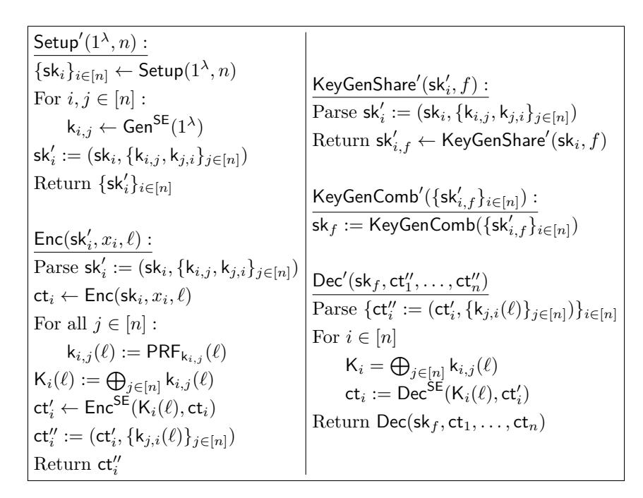

# <span id="page-0-0"></span>**Multi-Client Functional Encryption for Separable Functions**

Michele Ciampi<sup>1</sup> [,](https://orcid.org/0000-0001-5062-0388) Luisa Siniscalchi<sup>2</sup> , and Hendrik Waldner<sup>1</sup>

<sup>1</sup> The University of Edinburgh, Edinburgh, UK [{michele.ciampi,hendrik.waldner}@ed.ac.uk](mailto:michele.ciampi@ed.ac.uk,hendrik.waldner@ed.ac.uk) <sup>2</sup> Concordium Blockchain Research Center, Aarhus University, Aarhus, Denmark [lsiniscalchi@cs.au.dk](mailto:lsiniscalchi@cs.au.dk)

**Abstract.** In this work, we provide a compiler that transforms a *single-input functional encryption* scheme for the class of polynomially bounded circuits into a *multi-client functional encryption* (MCFE) scheme for the class of *separable functions*. An *n*-input function *f* is called separable if it can be described as a list of polynomially bounded circuits *f* 1 *, . . . , f <sup>n</sup>* s.t. *f*(*x*1*, . . . , xn*) = *f* 1 (*x*1) + · · · + *f n* (*xn*) for all *x*1*, . . . , xn*. Our compiler extends the works of Brakerski et al. [Eurocrypt 2016] and of Komargodski et al. [Eurocrypt 2017] in which a generic compiler is proposed to obtain *multi-input functional encryption* (MIFE) from single-input functional encryption. Our construction achieves the stronger notion of MCFE but for the less generic class of separable functions. Prior to our work, a long line of results has been proposed in the setting of MCFE for the inner-product functionality, which is a special case of a separable function. We also propose a modified version of the notion of *decentralized* MCFE introduced by Chotard et al. [Asiacrypt 2018] that we call *outsourceable multi-client functional encryption* (OMCFE). Intuitively, the notion of OMCFE makes it possible to distribute the load of the decryption procedure among at most *n* different entities, which will return decryption shares that can be combined (e.g., additively) thus obtaining the output of the computation. This notion is especially useful in the case of a very resource consuming decryption procedure, while the combine algorithm is non-time consuming. We also show how to extend the presented MCFE protocol to obtain an OMCFE scheme for the same functionality class.

| 1 |               | Introduction                                               | 1      |  |  |
|---|---------------|------------------------------------------------------------|--------|--|--|
|   | 1.1           | Our Contribution                                           | 2      |  |  |
|   | 1.2           | Overview of our Techniques                                 | 3      |  |  |
|   | 1.3           | Related Work                                               | 5      |  |  |
| 2 | Preliminaries |                                                            |        |  |  |
|   | 2.1           | Secret-Key Functional Encryption                           | 6<br>7 |  |  |
|   | 2.2           | Multi-Client Functional Encryption                         | 8      |  |  |
|   | 2.3           | Security Compiler                                          | 11     |  |  |
|   | 2.4           | Separable Functions                                        | 12     |  |  |
|   | 2.5           | Pseudorandom Functions                                     | 13     |  |  |
| 3 |               | Symmetric Encryption and One-Time Pad Extension            | 13     |  |  |
| 4 |               | Multi-Client Functional Encryption for Separable Functions | 15     |  |  |
|   | 4.1           | Selective Security                                         | 17     |  |  |
|   | 4.2           | Adaptive Security                                          | 26     |  |  |
| 5 |               | Decentralized Multi-Client Functional Encryption           | 36     |  |  |
|   | 5.1           | Definition                                                 | 36     |  |  |
|   | 5.2           | Construction                                               | 37     |  |  |
| 6 |               | Outsourceable Multi-Client Functional Encryption           | 39     |  |  |
|   | 6.1           | Definition                                                 | 39     |  |  |
|   | 6.2           | Construction                                               | 39     |  |  |

### <span id="page-1-0"></span>1 Introduction

Compared to traditional public-key encryption, functional encryption (FE) [BSW11, O'N10] enables fine-grained access control over encrypted data. In more detail, a FE scheme is equipped with a key generation algorithm that allows the owner of a master secret key to generate a functional key  $\mathsf{sk}_f$  associated with a function f. Using such a functional key  $\mathsf{sk}_f$  for the decryption of a ciphertext  $\mathsf{ct} = \mathsf{Enc}(\mathsf{sk}, x)$  yields only f(x). Roughly speaking, the security of a functional encryption scheme guarantees that no other information except for f(x) is leaked. In the classical notion of FE, the decryption algorithm takes as input a single ciphertext and a functional key for a single-input (one-variable) function. The more general notion of Multi-Input Functional Encryption (MIFE) [GGG<sup>+</sup>14] allows the evaluation of an n-input function on n encrypted inputs. In more detail, the decryption algorithm takes as an input n ciphertexts  $\mathsf{Enc}(\mathsf{sk}, x_1), \ldots, \mathsf{Enc}(\mathsf{sk}, x_n)$  and a functional key for an n-input function f' and outputs  $f'(x_1, \ldots, x_n)$ .

In this work we consider an even stronger notion than MIFE called multi-client functional encryption (MCFE) [GGG+14]. In the MCFE setting, each ciphertext  $\mathsf{Enc}(\mathsf{sk}_i, x_i)$  is encrypted using a different secret key  $\mathsf{sk}_i$ . Moreover, an arbitrary set of secret keys  $\mathcal{I} = \{\mathsf{sk}_{i_1}, \ldots, \mathsf{sk}_{i_m}\}$  can be leaked to the adversary. Intuitively, the notion of MCFE, says that the adversary cannot learn more about the ciphertexts generated using the disclosed keys than what it can learn by evaluating f'. Note that the adversary in this case can evaluate f' using any input that it chooses with respect to the positions  $i_1, \ldots, i_m$ . In general, we can distinguish between two types of MCFE schemes: labeled and unlabeled [ABKW19, ACF+18]. In the labeled case every ciphertext is encrypted under a label  $\ell$ . A valid decryption requires that the input ciphertexts have been encrypted under the same label (otherwise the decryption procedure generates an invalid output). Our results are proven secure under the stronger notion of security with labels, which also allows the adversary to obtain multiple ciphertexts under the same label. This additional security requirement has been considered since [CDG+18b, ABKW19].

In this work we focus on MCFE for a specific functionality class called separable functions [MS08, MAS06] A separable function is an efficiently computable function f that can be separated into a list of efficiently computable functions  $f^1, \ldots, f^n$  s.t.  $f(x_1, \ldots, x_n) = f^1(x_1) + \cdots + f^n(x_n)$  for all  $x_1, \ldots, x_n$ , with  $x_i$  contained in the domain of  $f^i$ . This is not restricted to addition but to any group operation, therefore also multiplication (i.e.,  $f(x_1, \ldots, x_n) = f^1(x_1) \cdot \ldots \cdot f^n(x_n)$  for all  $x_1, \ldots, x_n$ , with  $x_i$  contained in the domain of  $f^i$ ). Separable functions are used in many real-world applications, and a MCFE scheme, covering such a functionality class, would enable privacy in these scenarios. For example, consider the problem of counting a specific word w in ndifferent files, provided by n different parties, that contain sensitive information. In more detail, assume that we have n parties and each party  $P_i$  owns a file which is encrypted using a FE scheme under the secret key  $sk_i$ . Consider now an entity  $P_{w}$  that receives all the encrypted files and wants to count the number of times that the word w occurs in all these files. In addition,  $P_{\mathsf{w}}$  receives a functional key  $\mathsf{sk}_{f_{\mathsf{w}}}$  for the separable function  $f_{\mathsf{w}} = f_{\mathsf{w}}^1, \dots, f_{\mathsf{w}}^n$ , where each function  $f_{\mathsf{w}}^i$  simply counts the number of occurrences of the word w in a file. Given all the encrypted files and  $\mathsf{sk}_{f_\mathsf{w}}, P_\mathsf{w}$  can compute the number of occurrences of  $\mathsf{w}$  over all the encrypted files. In addition, even if  $P_{\mathsf{w}}$  manages to obtain some of the encryption keys, the content of the files remains partially hidden.<sup>3</sup> A second scenario where a MCFE scheme can be useful is the aggregation of SQL-queries. In this context, it would be possible to do the computation of sums, counting, and averages over multiple (n) encrypted tables held by different authorities. As already mentioned in [MS08] separable functions have several applications in sensor and peer-to-peer networks, where different functions are computed over the data of the different sensors (or resp. peers) and only the sum of evaluations should be learned by the decryptor, but nothing about the individual results of the sensors (resp. peers).

Decentralized MCFE. Both, the notions of MIFE and MCFE, assume the existence of a central trusted authority that generates and distributes the secret and functional keys. This is undesirable in some scenarios, given that an adversarial trusted authority can compromise the security of the MCFE scheme (note that the trusted authority can generate any functional key, hence also the functional key for the identity function). To

<span id="page-1-1"></span><sup>&</sup>lt;sup>3</sup> For example in the worst case, where the adversary has all but the key  $\mathsf{sk}_j$ , it should be able to compute the number of times that the word w appears in the *i*-th file, but nothing more than that.

<span id="page-2-3"></span>remove the need for a trusted authority, Chotard et al. [\[CDG](#page-41-4)<sup>+</sup>18a] introduced the notion of *decentralized multi-client functional encryption* (DMCFE), where the generation of the secret keys and the functional keys happens in a decentralized way. In this work, we consider DMCFE for the case of separable functions.

### <span id="page-2-0"></span>**1.1 Our Contribution**

In this paper we investigate the feasibility of constructing MCFE for separable functions starting from *any* general-purpose FE scheme. In more detail, we provide a compiler that takes as input any secret-key FE scheme and outputs a MCFE scheme for separable functions that is *selectively* secure[4](#page-2-1) and supports an a priori bounded (but still polynomial) number of encryption and an unbounded number of *n*-input functional key queries (where *n* is polynomially related to the security parameter). We show how to extend the above scheme to the case of *adaptive* security[5](#page-2-2) (where the adversary can request an a priori bounded number of encryptions and functional keys at any time). We now state our theorems informally.

**Theorem 1** (informal). *Assuming the existence of any selective secure secret-key FE scheme that supports an a priori bounded number of encryption queries and an unbounded number of functional key queries, then there exists a selective secure MCFE scheme for separable functions that supports a bounded number of encryption queries and an unbounded number of functional key queries.*

**Theorem 2** (informal). *Assuming the existence of any adaptive secure secret-key FE scheme that supports an a priori bounded number of encryption and functional key queries, then there exists an adaptive secure MCFE scheme for separable functions that supports a bounded number of encryption queries and functional key queries.*

We prove our constructions for the so-called *pos*<sup>+</sup> security notion [\[ABG19,](#page-40-1)[CDG](#page-41-3)<sup>+</sup>18b]. In a pos<sup>+</sup> security game an adversary is required to ask a left-or-right query under a specific label in either every or none position. A second notion called *any* security [\[ABG19,](#page-40-1)[CDG](#page-41-3)<sup>+</sup>18b] allows the adversary to ask a left-or-right encryption query on as many positions as it wants without any restrictions. To achieve the notion of any security, we make use of a slightly modified version of a black-box compiler presented in [\[ABG19\]](#page-40-1) which amplifies any pos<sup>+</sup> secure MCFE scheme into an any secure MCFE scheme.

In the next step, we discuss how to modify our constructions in order to obtain a DMCFE scheme for separable functions and prove the following theorem.

**Theorem 3** (informal). *Assuming the existence of any selective (adaptive) secure secret-key FE scheme that supports an a priori bounded number of encryptions queries (and a bounded number of functional key queries), then there exists a selective (adaptive) secure DMCFE scheme for separable functions that supports a bounded number of encryption queries (and a bounded number of functional key queries).*

*Outsourceable MCFE.* As an additional contribution, we introduce a new notion called outsourceable multiclient functional encryption (OMCFE). Intuitively, the notion of OMCFE makes it possible to outsource the load of the decryption procedure among *n* different entities. In more detail, let *f* be the *n*-input separable function that we want to evaluate, then the key-generation algorithm of an OMCFE scheme generates *n* partial functional keys sk*f,*1*, . . . ,*sk*f,n* (one for each input-slot of *f*), instead of generating one functional key sk*<sup>f</sup>* for *f*. Each of the functional keys sk*f,i* can be applied on a ciphertext ct*i,`* (a ciphertext under label *`* that contains the *i*-th input of the function) to obtain a decryption share *ϕi,`*. An evaluator that obtains all the *n* share (one for each input slot), can compute the final output by running a *combine* algorithm taking the shares as an input.

<span id="page-2-1"></span><sup>4</sup> We actually mean static-selective, i.e. the adversary has to submit all its message and corruption queries at the beginning of the game.

<span id="page-2-2"></span><sup>5</sup> We consider adaptive-adaptive security, which means that the adversary is allowed to query all the oracles, i.e. message and corruption oracles, throughout the whole game.

<span id="page-3-2"></span>This notion becomes important in the case where the combine algorithm is significantly more efficient than the partial decryption procedure. More formally, we require that the computational complexity of the combine algorithm is independent from the computational complexity of the function f.

Coming back to the word count example, it is possible to give  $\mathsf{sk}_{f_\mathsf{w}^i}$  and an encryption of the i'th part of a huge file, to an entity  $P_i$  (for each  $i \in [n]$ ) and let  $P_i$  generate the decryption share by executing the decryption procedure. In this way, an evaluator  $P_\mathsf{w}$  would receive the decryption shares from  $P_1, \ldots, P_n$ , and execute the (light) combine algorithm to obtain the final output of the computation. The word count example can also be seen as a special case of a class of problems that can be parallelized using the MapReduce paradigm [DG08]. This parallelization paradigm consists of a map phase which divides the problem into sub-problems and a reduce phase which parallelizes the aggregation of the partial solutions. It is easy to see that if the reduce phase consists of addition/multiplication operations then our OMCFE scheme could be particularly useful to implement a layer of privacy on top of this parallelization paradigm.

The security definition of this notion is almost identical to the security definition of MCFE. They mainly differ in their correctness definition (since the key generation algorithm and the decryption algorithm are different). We show how to obtain an OMCFE for the class of separable functions. In particular, we have the following informal theorem.

**Theorem 4** (informal). Assuming the existence of any selective (adaptive) secure secret-key FE scheme that supports an a priori bounded number of encryptions queries (and a bounded number of functional key queries), then there exists a selective (adaptive) secure OMCFE scheme for separable functions that supports a bounded number of encryption queries (and a bounded number of functional key queries).

Instantiations. Our constructions can be instantiated from various assumptions. There exists a general-purpose secret-key FE scheme from indistinguishability obfuscation or multilinear maps [BKS18]. We can obtain our adaptive secure MCFE scheme (and the decentralized one) from learning with errors [GKP<sup>+</sup>13], one-way functions or low-depth pseudorandom generators [GVW12]. In more detail, as already mentioned in [BKS18], based on the results of Ananth et al. [ABSV15] and Brakerski et al. [BS18], it is possible to generically obtain a function-hiding scheme by relying on any selectively secure and message-private functional encryption scheme.<sup>6</sup> This implies that function-hiding schemes for any number of encryption and key-generation queries can be based on indistinguishability obfuscation [GGH<sup>+</sup>13, Wat15], differing-input obfuscation [BCP14, ABG<sup>+</sup>13], and multilinear maps [GGHZ16]. Besides this, it is possible to construct function-hiding schemes for a polynomially bounded number, denoted by q, of encryption and key-generation queries by relying on the Learning with Errors (LWE) assumption (where the length of ciphertexts grows with q and with a bound on the depth of allowed functions) [GKP<sup>+</sup>13], or on pseudorandom generators computable by small-depth circuits (where the length of ciphertexts grows with q and with an upper bound on the circuit size of the functions) [GVW12], and based on one-way functions (for q = 1) [GVW12].

### <span id="page-3-0"></span>1.2 Overview of our Techniques

Our Compiler. We present a compiler that transforms any selectively secure single-input FE scheme  $\mathsf{FE}$  into a selectively secure MCFE scheme  $\mathsf{MCFE}$  for the class of n-input separable functions. We provide an incremental description of how our compiler works.

In the setup procedure of MCFE we execute n times the setup of FE thus obtaining n master secret keys  $\mathsf{msk}_1,\ldots,\mathsf{msk}_n$ . We define the i'th secret key for MCFE as  $\mathsf{sk}_i := \mathsf{msk}_i$  for  $i=1,\ldots,n$ , whereas the master secret key of MCFE is represented by all the secret keys  $\{\mathsf{sk}_1,\ldots,\mathsf{sk}_n\}$ . To encrypt a message  $x_i$  for the position i we simply run the encryption algorithm of FE using the secret key  $\mathsf{sk}_i$  and the message  $x_i$  thus obtaining the ciphertext  $\mathsf{ct}_i$ . To generate a functional key for a separable function  $f := \{f^1,\ldots,f^n\}$  the key generation algorithm randomly samples a secret sharing of  $0: r_1 + \cdots + r_n = 0$  (we refer to this values as r-values) and

<span id="page-3-1"></span><sup>&</sup>lt;sup>6</sup> In the informal theorems above we actually require the underlying functional encryption scheme to be function-hiding, but since this property comes for free from any selectively secure and message-private functional encryption scheme, we do not state it specifically.

<span id="page-4-1"></span>runs, using the master secret key  $\mathsf{msk}_i$  (which corresponds to  $\mathsf{sk}_i$ ) of FE the key generation algorithms for FE to generate a functional key  $\mathsf{sk}_{f^i_{r_i}}$  for  $f^i_{r_i}$ . The function  $f^i_{r_i}$  takes as an input  $x_i$  and outputs  $f^i(x_i) + r_i$ . The output of the key generation algorithm is then represented by  $\{\mathsf{sk}_{f^1_{r_1}}, \ldots, \mathsf{sk}_{f^n_{r_n}}\}$ . The decryption algorithm of MCFE, on input the ciphertext  $\mathsf{ct} := \{\mathsf{ct}_1, \ldots, \mathsf{ct}_n\}$  and the functional keys  $\{\mathsf{sk}_{f^1_{r_1}}, \ldots, \mathsf{sk}_{f^n_{r_n}}\}$  runs the decryption algorithm for FE on input  $\mathsf{sk}_{f^i_{r_i}}$  and  $\mathsf{ct}_i$  thus obtaining  $\varphi_i$  for  $i=1,\ldots,n$ . The output of the decryption procedure is then given by  $\varphi_1 + \cdots + \varphi_n$  which is equal to  $f(x_1,\ldots,x_n)$  due to the property of f and the way the values  $r_1,\ldots,r_n$  are sampled. Intuitively, the security of this scheme comes from the fact that a functional key  $\mathsf{sk}_{f^i_{r_i}}$  for FE hides the description of the function, hence it hides the value  $r_i$ . The fact that the value  $r_i$  is protected allows us to argue that  $\varphi_i$  encrypts the partial output  $f^i(x_i)$  (that the adversary is not supposed to see). Indeed,  $\varphi_i$  can be seen as the one-time pad encryption of  $f^i(x_i)$  using the key  $r_i$ .

We show that for the class of separable functions the described one-time pad encryption is sufficient for several encryption queries. This is possible by exploiting the fact that the security game for functional encryption requires that  $f(x_1^0,\ldots,x_n^0)=f(x_1^1,\ldots,x_n^1)$  for all the challenge queries  $(x_i^0,x_i^1)$  and all the functional key queries f. This means, in the case of separable functions, that  $\sum_{i\in[n]}f^i(x_i^0)=\sum_{i\in[n]}f^i(x_i^1)$ , which is equivalent to  $f^{i^*}(x_{i^*}^0)-f^{i^*}(x_{i^*}^1)=\sum_{i\in[n]\backslash\{i^*\}}f^i(x_i^1)-f^i(x_i^0)$ . This restriction enforces the security of the information-theoretic encryption under many queries (we show this using a simple reduction).

To extend our scheme to the labeled setting, we start by considering a technique from the work of Abdalla et al.  $[ABG19]^7$ , that allows multiple parties to generate a secret sharing of 0 non-interactively by agreeing on a set (of size n) of pseudo-random function (PRF) keys for every of the n parties during the setup.

In more detail, the master secret key is augmented with  $n^2$  PRF keys  $\{K_{i,j}\}_{i,j\in[n]}$ . To generate a functional key, as before we generate a functional key for each single input FE instance. But this time, for each  $i\in[n]$  we generate the key  $\mathsf{sk}_{f_{\mathsf{k}_i}^i}$  for the function  $f_{\mathsf{K}_i}^i$  where  $\mathsf{K}_i \coloneqq \{\mathsf{K}_{i,j}\}_{j\in[n]\setminus\{i\}}$ . The function  $f_{\mathsf{K}_i}^i$  takes as an input  $(x_i,\ell)$ , where  $\ell$  represents the label, and outputs  $f^i(x_i) + t_{f,\ell}^i$ , where  $t_{f,\ell}^i = \sum_{j\neq i} (-1)^{j< i} \mathsf{PRF}_{\mathsf{K}_{i,j}}(f,\ell)$ . The output of the key generation algorithm is then represented by  $\{\mathsf{sk}_{f_{\mathsf{k}_i}^1},\ldots,\mathsf{sk}_{f_{\mathsf{k}_i}^n}^n\}$ . The way in which each functional key evaluates the PRF guarantees that for each i the sum of the values  $t_{i,\ell}$  for a fixed f and a fixed  $\ell$  is 0.

We refer to Section 4.1 for more details. The adaptive q-message q-function bounded MCFE scheme works in a similar way, the main differences are regarding the size of the ciphertext and the size of the functional keys. For the selective scheme only the size of the functional keys depends on q, whereas in the adaptive scheme also the ciphertexts grow with q. The details for this proof can be found in Section 4.2.

Decentralized Multi-Client Functional Encryption. In a DMCFE scheme, as introduced in [CDG<sup>+</sup>18a], the key-generation phase is decentralized in the sense that each secret key owner should be able to compute a partial functional key for a function f, such that the combination of all these partial functional keys allows the generation of a valid functional key for f. Additionally, it is assumed that the setup procedure is a protocol between the different parties that allows for the generation of the different secret keys. This results in a completely decentralized setup that does not require a trusted authority. The MCFE scheme presented above is easily translatable into the decentralized setting.

Outsourceable Multi-Client Functional Encryption. We show how to obtain, with minor modifications to the presented compiler, an OMCFE scheme. The proof works, as already mentioned in the previous sections, by relying on the fact that the values  $\varphi_{i,\ell}$  do not reveal any information on the encrypted messages.

Remark 1.1. Without loss of generality, in the remainder of this paper, we only refer to the case of additive separability. However, our compiler also works for the case of multiplicative separability. To achieve multiplicative separability all the additive operators need to be replaced by its multiplicative counterparts (i.e. addition with multiplication and subtraction with division). Also the group we need to operate in needs to be changed from an additive group to a multiplicative group, e.g. from  $\mathbb{Z}_p$  to  $\mathbb{Z}_p^*$ 

<span id="page-4-0"></span><sup>&</sup>lt;sup>7</sup> This technique has previously been used in [CC09] to remove the central authority in the context of multi-authority attribute based encryption and in [KDK11] in the context of privacy-friendly aggregation.

<span id="page-5-2"></span><span id="page-5-1"></span>

|                       | Number of Inputs                           | Functions              | Setting                | Assumptions                          |
|-----------------------|--------------------------------------------|------------------------|------------------------|--------------------------------------|
| [BKS16]               | Constant                                   | Generic                | MIFE                   | SK Single-Input FE                   |
| [KS17]                | $\log(\lambda)^{\delta} \\ 0 < \delta < 1$ | Generic                | MIFE                   | SK Single-Input FE                   |
| [ACF <sup>+</sup> 18] | $\operatorname{poly}(\lambda)$             | Inner-Product          | (D)MCFE<br>(no labels) | SK Single-Input FE for Inner-Product |
| [ABG19]               | $\operatorname{poly}(\lambda)$             | Inner-Product          | (D)MCFE                | PK Single-Input FE for Inner-Product |
| This<br>work          | $\operatorname{poly}(\lambda)$             | Separable<br>Functions | (D)MCFE                | SK Single-Input FE                   |

Table 1: Comparison with the most relevant compilers.  $\lambda$ : the security parameter, SK: secret key, PK: public key.

#### <span id="page-5-0"></span>1.3 Related Work

Multi-Input/Client Functional Encryption. Since the introduction of multi-input and multi-client functional encryption [GGG<sup>+</sup>14] several contributions have been made to provide constructions in these areas. In this work we follow the notation of [GKL<sup>+</sup>13], which means that we denote a scheme with a single encryption key that can be used to generate ciphertexts for every position as a MIFE scheme and a scheme where every position is associated with its own encryption key as multi-client functional encryption scheme. One of the main techniques that have been proposed to construct MIFE schemes are "liftings" from single-input functional encryption into the multi-input setting. The first foundational work that presents such a "lifting" in the secret-key setting is the work of Brakerski et al. [BKS16]. In this work, the authors manage to transform a single-input selectively secure functional encryption scheme into an adaptive function-hiding multi-input functional encryption scheme which supports a constant number of inputs. In [KS17] the authors, among other results, improve the result of [BKS16] by obtaining a MIFE scheme that supports functions with  $2^t = (\log \lambda)^{\delta}$ inputs, where  $0 < \delta < 1$ . Both of these transformations require a single-input functional encryption scheme for the class of polynomially bounded circuits as an input. The schemes that cover the class of polynomially bounded circuits can be divided into two categories. The first category is only able to handle a bounded number of plaintexts (a so called message-bounded scheme) and (or) a bounded number of functional keys, whereas the second class is able to handle an unbounded number of queries and functional keys. A construction that falls into the first category is given by Gorbunov, Vaikuntanathan and Wee [GVW12]. Their construction relies only on the existence of one-way functions. A second construction in this category has been proposed by Goldwasser et al. [GKP<sup>+</sup>13] and it is based on the Learning with Errors (LWE) assumption.

In the case of unbounded message security most of the known constructions are based on less standard assumptions like indistinguishable obfuscation [BGJS15, Wat15, GGH $^+$ 13], multilinear maps [GGHZ16] and differing-input obfuscation [ABG $^+$ 13, BCP14]. All of the mentioned schemes are also covering the functionality class of polynomially bounded circuits.

Beside the class of polynomially bounded circuits, it is also possible to construct multi-input functional encryption schemes for more specific functionality classes, like inner-products. The first multi-input functional encryption scheme for inner-product functions has been provided by Abdalla et al. [AGRW17]. The construction they present relies on pairings. A follow up work [ACF<sup>+</sup>18] proposes a compiler that takes as input a single-input functional encryption scheme that fulfills some special properties and outputs a MIFE scheme for inner-product functions. This construction does not require pairings and can be instantiated using DDH, Paillier or LWE. It turns out that the construction of Abdalla et al. [ACF<sup>+</sup>18] also fulfills the stronger notion of multi-client functional encryption (without labels) which has been proven in [ABKW19]. In the case of multi-client functional encryption, it can be distinguished between two cases, the labeled and the unlabeled

<span id="page-6-1"></span>case. Labels enforce an additional restriction on the decryption procedure. Namely, it is only possible to decrypt tuples of ciphertexts that are encrypted under the same label, otherwise the decryption procedure outputs an invalid value. The first labeled scheme for the inner-product functionality has been proposed in [CDG<sup>+</sup>18a]; its security is proven based on DDH in the random oracle model. Following, Abdalla et al. [ABG19] and Libert and Titiu [LT19] show how to construct multi-client functional encryption with labels in the standard model. In more detail, Abdalla et al. [ABG19] present a compiler that lifts a single-input public key functional encryption scheme, which can be instantiated using MDDH, DCR or LWE, into a MCFE scheme with labels. Whereas, Libert and Titiu [LT19] show how to directly construct a MCFE scheme with labels based on LWE. More recently, Abdalla et al. [ABM<sup>+</sup>20] show how to construct a MCFE scheme with labels in the random oracle model based on MDDH, DCR or LWE, which extends the results of Chotard et al. [CDG<sup>+</sup>18a]. In Table 1 we provide a short comparison between the most relevant compilers that turn a single-input FE scheme into a MIFE or MCFE scheme.

Decentralization. The notion of DMCFE has been introduced in the work of Chotard et al. [CDG<sup>+</sup>18a] in the context of inner product functional encryption. In their work, the authors also present a construction based on the symmetric external Diffie-Hellman assumption in the random oracle model that achieves security in the DMCFE setting. Since then, several compilers for inner product functional encryption have been proposed [ABKW19, ABG19, CDG<sup>+</sup>18b] that turn a MCFE scheme into a DMCFE scheme. In the works [ABKW19, ABG19] the authors present decentralization compilers that purely rely on information theoretic arguments in the standard model and in the work of Chotard et al. [CDG<sup>+</sup>18b] the authors present a compiler based on either the CDH assumption in the random oracle model or the DDH assumption in the standard model. The standard notion of DMCFE [CDG<sup>+</sup>18a], with and without labels [ABKW19], has the main limitation that it is not possible to let parties join or leave adaptively after the setup procedure has been executed. This problems has been first considered in the work of Agrawal et al. [ACF<sup>+</sup>20], where the authors propose the notion of Ad Hoc Multi-Input Functional Encryption. In this setting every user generates its own public and secret key. Functional key shares are generated with respect to the public keys of other parties. Combining all the functional keys of the specified subset of parties yields the full functional key. This notion allows every party to join the system adaptively and to decide during the key generation which parties' data can be used in the decryption. The authors show how to realize this notion by bootstrapping standard MIFE to ad hoc MIFE without relying on additional assumptions. They also present a direct construction of an ad hoc MIFE for the inner product functionality based on the LWE assumption. In both constructions malicious security is achieved in the common reference string (CRS) model. The high level idea of these constructions is to combine standard MIFE and two-round secure multi-party computation. Another work that considers the above mentioned limitation is the work of Chotard et al. [CDSG<sup>+</sup>20]. In their work, the authors introduce the notion of dynamic decentralized MCFE, which generalizes the notion of ad-hoc MIFE. The notion of dynamic DMCFE does not require a specified group of users for the generation of a functional key. Additionally, their notion also considers labels, to prevent certain mix and match attacks and leaks less information about the underlying plaintexts. The authors present a dynamic DMCFE scheme for the inner product functionality from standard assumptions in the random oracle model.

## <span id="page-6-0"></span>2 Preliminaries

**Notation.** We denote the security parameter with  $\lambda \in \mathbb{N}$ . A randomized algorithm  $\mathcal{A}$  is running in *probabilistic polynomial time* (PPT) if there exists a polynomial  $p(\cdot)$  such that for every input x the running time of  $\mathcal{A}(x)$  is bounded by p(|x|). We call a function negl:  $\mathbb{N} \to \mathbb{R}^+$  negligible if for every positive polynomial  $p(\lambda)$  a  $\lambda_0 \in \mathbb{N}$  exists, such that for all  $\lambda > \lambda_0 : \epsilon(\lambda) < 1/p(\lambda)$ . We denote by [n] the set  $\{1, \ldots, n\}$  for  $n \in \mathbb{N}$ . We use "=" to check equality of two different elements (i.e. a = b then...) and ":=" as the assigning operator (e.g. to assign to a the value of b we write a := b. A randomized assignment is denoted with  $a \leftarrow A$ , where A is a randomized algorithm and the randomness used by A is not explicit. If the randomness is explicit we write a := A(x; r) where x is the input and x is the randomness. We denote the winning probability of an adversary A in a game or experiment G as  $\mathsf{Win}_A^G(\lambda, n)$ , which is  $\mathsf{Pr}[G(\lambda, n, A) = 1]$ . The probability is taken

<span id="page-7-1"></span>over the random coins of G and A. We define the distinguishing advantage between games  $G_0$  and  $G_1$  of an adversary A in the following way:  $Adv_A^G(\lambda, n) = \left| Win_A^{G_0}(\lambda, n) - Win_A^{G_1}(\lambda, n) \right|$ . The notation  $(-1)^{j < i}$  denotes -1 if j < i and 1 otherwise.

## <span id="page-7-0"></span>2.1 Secret-Key Functional Encryption

In this section, we define the notion of secret-key functional encryption (SK-FE) [BS15]. They are an adaption of the notion from [BSW11, O'N10].

**Definition 2.1 (Secret-Key Functional Encryption).** Let  $\mathcal{F} = \{\mathcal{F}_{\lambda}\}_{{\lambda} \in \mathbb{N}}$  be a collection of function families (indexed by  $\lambda$ ), where every  $f \in \mathcal{F}_{\lambda}$  is a polynomial time function  $f \colon \mathcal{X}_{\lambda} \to \mathcal{Y}_{\lambda}$ . A secret-key functional encryption scheme (SK-FE) for the function family  $\mathcal{F}_{\lambda}$  is a tuple of four algorithms  $\mathsf{FE} = (\mathsf{Setup}, \mathsf{KeyGen}, \mathsf{Enc}, \mathsf{Dec})$ :

Setup(1 $^{\lambda}$ ): Takes as input a unary representation of the security parameter  $\lambda$  and generates a master secret key msk.

KeyGen(msk, f): Takes as input the master secret key msk and a function  $f \in \mathcal{F}_{\lambda}$ , and outputs a functional key sk<sub>f</sub>.

Enc(msk, x): Takes as input the master secret key msk, a message  $x \in \mathcal{X}_{\lambda}$  to encrypt, and outputs a ciphertext ct.

 $\mathsf{Dec}(\mathsf{sk}_f,\mathsf{ct})$ : Takes as input a functional key  $\mathsf{sk}_f$  and a ciphertext  $\mathsf{ct}$  and outputs a value  $y \in \mathcal{Y}_\lambda$ .

A scheme FE is correct, if for all  $\lambda \in \mathbb{N}$ ,  $\operatorname{msk} \leftarrow \operatorname{Setup}(1^{\lambda}), f \in \mathcal{F}_{\lambda}, x \in \mathcal{X}_{\lambda}, when \operatorname{sk}_f \leftarrow \operatorname{KeyGen}(\operatorname{msk}, f), we have$ 

$$\Pr\left[\mathsf{Dec}(\mathsf{sk}_f,\mathsf{Enc}(\mathsf{msk},x)) = f(x)\right] = 1 \ .$$

We define the security of a SK-FE scheme using a left-or-right oracle. We distinguish between selective and adaptive submission of the encryption challenges. We consider a function-hiding secure SK-FE scheme, which, intuitively, means that the SK-FE scheme guarantees privacy for both, the description of the functions and the encrypted messages. We will recall now the formal definition.

**Definition 2.2 (Function-Hiding of SK-FE).** Let FE be an SK-FE scheme,  $\mathcal{F} = \{\mathcal{F}_{\lambda}\}_{{\lambda} \in \mathbb{N}}$  a collection of function families indexed by  $\lambda$ . For  $xx \in \{\text{sel}, \text{ad}\}$  and  $\beta \in \{0,1\}$ , we define the experiment xx-FH<sub>\beta</sub><sup>FE</sup> in Fig. 1, where the oracles are defined as:

**Left-or-Right oracle** QLeftRight( $x^0, x^1$ ): Outputs  $\mathsf{ct} \leftarrow \mathsf{Enc}(\mathsf{msk}, x^{\beta, j})$  on a query  $(x^0, x^1)$ . We denote by  $Q_{\mathsf{LeftRight}}$  the set containing the queries  $(x^0, x^1)$ .

**Key generation oracle**  $\mathsf{QKeyG}(f^0, f^1)$ :  $Outputs \, \mathsf{sk}_f \leftarrow \mathsf{KeyGen}(\mathsf{msk}, f^\beta)$  on a query  $(f^0, f^1)$ . We denote by  $Q_f$  the queries of the form  $\mathsf{QKeyG}(\cdot, \cdot)$ .

and where Condition (\*) holds if all the following condition holds:

- For every query  $(f^0, f^1)$  to QKeyG, and every query  $(x^0, x^1) \in Q_{\mathsf{LeftRight}}$ , we require that:

$$f^0(x^0) = f^1(x^1)$$
.

We define the advantage of an adversary A for  $xx \in \{sel, ad\}$  in the following way:

$$\mathsf{Adv}^{xx\text{-}\mathrm{FH}}_{\mathsf{FE},\mathcal{A}}(\lambda) = |\Pr[xx\text{-}\mathrm{FH}_0^{\mathsf{FE}}(\lambda,\mathcal{A}) = 1] - \Pr[xx\text{-}\mathrm{FH}_1^{\mathsf{FE}}(\lambda,\mathcal{A}) = 1]| \ .$$

A secret-key functional encryption scheme FE is xx-FH secure, if for any polynomial-time adversary  $\mathcal{A}$ , there exists a negligible function negl such that:  $\operatorname{Adv}_{\mathsf{FE},\mathcal{A}}^{\mathsf{xx-FH}}(\lambda) \leq \operatorname{negl}(\lambda)$ . In addition, we call a scheme q-message bounded, if  $|Q_{\mathsf{LeftRight}}| < q$  and  $|Q_f| < q$ , with  $q = \operatorname{poly}(\lambda)$ .

```
 \begin{array}{|c|c|c|c|c|} \hline & \operatorname{sel-FH}^{\mathsf{FE}}_{\beta}(\lambda,\mathcal{A}) & & \operatorname{ad-FH}^{\mathsf{FE}}_{\beta}(\lambda,\mathcal{A}) \\ \hline Q_{\mathsf{LeftRight}} \leftarrow \mathcal{A}(1^{\lambda}) & & \operatorname{msk} \leftarrow \mathsf{Setup}(1^{\lambda}) \\ \operatorname{nsk} \leftarrow \mathsf{Setup}(1^{\lambda}) & & \alpha \leftarrow \mathcal{A}^{\mathsf{QLeftRight}}(\cdot,\cdot), \mathsf{QKeyG}(\cdot,\cdot)(1^{\lambda}) \\ \operatorname{ct}^{j} \leftarrow \mathsf{QLeftRight}(x^{j,0}, x^{j,1}), & & \operatorname{output:} \alpha \text{ if Condition (*) is} \\ & & \operatorname{satisfied, or a uniform} \\ \alpha \leftarrow \mathcal{A}^{\mathsf{QKeyG}(\cdot,\cdot)}(\{\mathsf{ct}^{j}\}_{j \in [Q_{\mathsf{Enc}}]}) & & \operatorname{bit otherwise} \\ \hline & \operatorname{or a uniform bit otherwise} \\ \hline \end{array}
```

Fig. 1: Function-Hiding Games for SK-FE

## <span id="page-8-0"></span>2.2 Multi-Client Functional Encryption

Now, we introduce multi-client functional encryption (MCFE) as in [GGG<sup>+</sup>14, ABKW19, ABG19]. In a multi-client functional encryption scheme, every client can encrypt its own input (corresponding to a slot) and the evaluation of a functional key is executed over the ciphertexts of all the clients.

<span id="page-8-3"></span>**Definition 2.3 (Multi-Client Functional Encryption).** Let  $\mathcal{F} = \{\mathcal{F}_{\lambda}\}_{{\lambda} \in \mathbb{N}}$  be a collection of function families (indexed by  $\lambda$ ), where every  $f \in \mathcal{F}_{\lambda}$  is a polynomial time function  $f : \mathcal{X}_{\lambda,1} \times \cdots \times \mathcal{X}_{\lambda,n} \to \mathcal{Y}_{\lambda}$ . Let Labels  $= \{0,1\}^*$  or  $\{\bot\}$  be a set of labels. A multi-client functional encryption scheme (MCFE) for the function family  $\mathcal{F}_{\lambda}$  supporting n users, is a tuple of four algorithms MCFE  $= \{Setup, KeyGen, Enc, Dec\}$ :

Setup $(1^{\lambda}, n)$ : Takes as input a unary representation of the security parameter  $\lambda$ , and the number of parties n and generates n secret keys  $\{sk_i\}_{i\in[n]}$ , and a master secret key msk.

KeyGen(msk, f): Takes as input the master secret key msk and a function  $f \in \mathcal{F}_{\lambda}$ , and outputs a functional key  $\mathsf{sk}_f$ .

Enc( $\mathsf{sk}_i, x_i, \ell$ ): Takes as input a secret key  $\mathsf{sk}_i$ , a message  $x_i \in \mathcal{X}_{\lambda,i}$  to encrypt, a label  $\ell \in \mathsf{Labels}$ , and outputs a ciphertext  $\mathsf{ct}_{i,\ell}$ .

 $\mathsf{Dec}(\mathsf{sk}_f,\mathsf{ct}_{1,\ell},\ldots,\mathsf{ct}_{n,\ell})$ : Takes as input a functional key  $\mathsf{sk}_f$  and n ciphertexts under the same label  $\ell$  and outputs a value  $y \in \mathcal{Y}_\lambda$ .

A scheme MCFE is correct, if for all  $\lambda, n \in \mathbb{N}$ ,  $(\{\mathsf{sk}_i\}_{i \in [n]}, \mathsf{msk}) \leftarrow \mathsf{Setup}(1^{\lambda}, n), \ f \in \mathcal{F}_{\lambda}, \ x_i \in \mathcal{X}_{\lambda, i}, \ when \ \mathsf{sk}_f \leftarrow \mathsf{KeyGen}(\mathsf{msk}, f), \ we \ have$ 

$$\Pr\left[\mathsf{Dec}(\mathsf{sk}_f,\mathsf{Enc}(\mathsf{sk}_1,x_1,\ell),\ldots,\mathsf{Enc}(\mathsf{sk}_n,x_n,\ell))=f(x_1,\ldots,x_n)\right]=1\ .$$

A scheme can either be without labels, in this case Labels =  $\{\bot\}$  or with labels/labeled, where Labels =  $\{0,1\}^*$ . In this work, we only consider schemes that are labeled, i.e. Labels =  $\{0,1\}^*$ . Where the latter case implies the former.

<span id="page-8-2"></span>The security definition is the initial definition of Goldwasser et al. [GGG $^+$ 14] (more specifically [GKL $^+$ 13]), whereas we also allow the adversary to determine under which label it wants to query the left-or-right oracle and, in addition, we give the adversary access to an encryption oracle. Besides this, we also allow the adversary to query a single label several times. This security definition has initially been considered in [CDG $^+$ 18b, ABG19]. As also noted in [ABKW19, ABG19] the security model of multi-client functional encryption is similar to the security model of standard multi-input functional encryption, whereas in the latter only a single master secret key msk is used to generate encryptions for every slot i. In comparison to the standard multi-input functional encryption model, we also consider static and adaptive corruption of the different slots and selective and adaptive left-or-right and encryption oracle queries in the multi-client case. In more detail, in the selective case the adversary is required to ask all his left-or-right, encryption and corruption queries in the beginning of the game. In the adaptive case, the adversary is allowed to ask left-or-right, encryption and corruption queries throughout the whole game.

**Definition 2.4 (Security of MCFE).** Let MCFE be an MCFE scheme,  $\mathcal{F} = \{\mathcal{F}_{\lambda}\}_{{\lambda} \in \mathbb{N}}$  a collection of function families indexed by  $\lambda$  and Labels a label set. For  $xx \in \{\text{sel, ad}\}$ ,  $yy \in \{\text{pos}^+, \text{any}\}$  and  $\beta \in \{0, 1\}$ , we define the experiment sel-yy-IND $_{\beta}^{\mathsf{MCFE}}$  in Fig. 2 and ad-yy-IND $_{\beta}^{\mathsf{MCFE}}$  in Fig. 3, where the oracles are defined

Corruption oracle QCor(i): Outputs the encryption key  $sk_i$  of slot i. We denote by CS the set of corrupted slots at the end of the experiment.

**Left-or-Right oracle** QLeftRight $(i, x_i^0, x_i^1, \ell)$ : Outputs  $\mathsf{ct}_{i,\ell} \leftarrow \mathsf{Enc}(\mathsf{sk}_i, x_i^\beta, \ell)$  on a query  $(i, x_i^0, x_i^1, \ell)$ . We denote the queries of the form  $\mathsf{QLeftRight}(i,\cdot,\cdot,\ell)$  by  $Q_{i,\ell}$  and the set of queried labels by QL.

**Encryption oracle**  $\mathsf{QEnc}(i, x_i, \ell)$  *Outputs*  $\mathsf{ct}_{i,\ell} \leftarrow \mathsf{Enc}(\mathsf{sk}_i, x_i, \ell)$  *on a query*  $(i, x_i, \ell)$ . We denote the queries of the form  $\mathsf{QEnc}(i,\cdot,\ell)$  by  $Q'_{i,\ell}$  and the set of queried labels by QL'.

**Key generation oracle**  $\mathsf{QKeyG}(f)$ :  $Outputs \, \mathsf{sk}_f \leftarrow \mathsf{KeyGen}(\mathsf{msk},f) \, on \, a \, query \, f. \, We \, denote \, by \, Q_f \, the$ queries of the form  $QKeyG(\cdot)$ .

and where Condition (\*) holds if all the following conditions hold:

- $\begin{array}{l} \text{ If } i \in \mathcal{CS} \text{ (i.e., slot $i$ is corrupted): for any query } \mathsf{QLeftRight}(i, x_i^0, x_i^1, \ell), \ x_i^0 = x_i^1. \\ \text{ For any label } \ell \in \mathsf{Labels, for any family of queries } \{\mathsf{QLeftRight}(i, x_i^0, x_i^1, \ell) \text{ or } \mathsf{QEnc}(i, x_i, \ell)\}_{i \in [n] \setminus \mathcal{CS}, \ for labels} \}_{i \in [n] \setminus \mathcal{CS}, \ for labels} \\ + (\mathsf{QLeftRight}(i, x_i^0, x_i^1, \ell), x_i^0 = x_i^1. \\ + (\mathsf{QLeftRight}(i, x_i^0, x_i^1, \ell), x_i^0 = x_i^1. \\ + (\mathsf{QLeftRight}(i, x_i^0, x_i^1, \ell), x_i^0 = x_i^1. \\ + (\mathsf{QLeftRight}(i, x_i^0, x_i^1, \ell), x_i^0 = x_i^0. \\ + (\mathsf{QLeftRight}(i, x_i^0, x_i^1, \ell), x_i^0 = x_i^0. \\ + (\mathsf{QLeftRight}(i, x_i^0, x_i^1, \ell), x_i^0 = x_i^0. \\ + (\mathsf{QLeftRight}(i, x_i^0, x_i^1, \ell), x_i^0 = x_i^0. \\ + (\mathsf{QLeftRight}(i, x_i^0, x_i^1, \ell), x_i^0 = x_i^0. \\ + (\mathsf{QLeftRight}(i, x_i^0, x_i^1, \ell), x_i^0 = x_i^0. \\ + (\mathsf{QLeftRight}(i, x_i^0, x_i^1, \ell), x_i^0 = x_i^0. \\ + (\mathsf{QLeftRight}(i, x_i^0, x_i^1, \ell), x_i^0 = x_i^0. \\ + (\mathsf{QLeftRight}(i, x_i^0, x_i^1, \ell), x_i^0 = x_i^0. \\ + (\mathsf{QLeftRight}(i, x_i^0, x_i^1, \ell), x_i^0 = x_i^0. \\ + (\mathsf{QLeftRight}(i, x_i^0, x_i^1, \ell), x_i^0 = x_i^0. \\ + (\mathsf{QLeftRight}(i, x_i^0, x_i^1, \ell), x_i^0 = x_i^0. \\ + (\mathsf{QLeftRight}(i, x_i^0, x_i^1, \ell), x_i^0 = x_i^0. \\ + (\mathsf{QLeftRight}(i, x_i^0, x_i^1, \ell), x_i^0 = x_i^0. \\ + (\mathsf{QLeftRight}(i, x_i^0, x_i^1, \ell), x_i^0 = x_i^0. \\ + (\mathsf{QLeftRight}(i, x_i^0, x_i^1, \ell), x_i^0 = x_i^0. \\ + (\mathsf{QLeftRight}(i, x_i^0, x_i^1, \ell), x_i^0 = x_i^0. \\ + (\mathsf{QLeftRight}(i, x_i^0, x_i^1, \ell), x_i^0 = x_i^0. \\ + (\mathsf{QLeftRight}(i, x_i^0, x_i^1, \ell), x_i^0 = x_i^0. \\ + (\mathsf{QLeftRight}(i, x_i^0, x_i^1, \ell), x_i^0 = x_i^0. \\ + (\mathsf{QLeftRight}(i, x_i^0, x_i^1, \ell), x_i^0 = x_i^0. \\ + (\mathsf{QLeftRight}(i, x_i^0, x_i^1, \ell), x_i^0 = x_i^0. \\ + (\mathsf{QLeftRight}(i, x_i^0, x_i^1, \ell), x_i^0 = x_i^0. \\ + (\mathsf{QLeftRight}(i, x_i^0, x_i^1, \ell), x_i^0 = x_i^0. \\ + (\mathsf{QLeftRight}(i, x_i^0, x_i^0, \ell), x_i^0 = x_i^0. \\ + (\mathsf{QLeftRight}(i, x_i^0, x_i^0, \ell), x_i^0 = x_i^0. \\ + (\mathsf{QLeftRight}(i, x_i^0, x_i^0, \ell), x_i^0 = x_i^0. \\ + (\mathsf{QLeftRight}(i, x_i^0, x_i^0, \ell), x_i^0 = x_i^0. \\ + (\mathsf{QLeftRight$ any family of inputs  $\{x_i \in \mathcal{X}_{\lambda,i}\}_{i \in \mathcal{CS}}$ , we define  $x_i^0 = x_i^1 = x_i$  for any slot  $i \in \mathcal{CS}$  and any slot queried to  $\mathsf{QEnc}(i, x_i, \ell)$ , and we require that for any query  $\mathsf{QKeyG}(f)$ :

$$f(\mathbf{x}^0) = f(\mathbf{x}^1) \text{ where } \mathbf{x}^b = (x_1^b, \dots, x_n^b) \text{ for } b \in \{0, 1\}$$
.

- When yy = pos<sup>+</sup>: If there exists a slot  $i \in [n]$  and a  $\ell \in \mathsf{Labels}$ , such that  $|Q_{i,\ell}| > 0$ , then for any slot  $k \in [n] \setminus \mathcal{CS}, |Q_{k,\ell}| > 0$ . In other words, for any label, either the adversary makes no left-or-right encryption query or makes at least one left-or-right encryption query for each slot  $i \in [n] \setminus \mathcal{CS}$ .
- <span id="page-9-0"></span>- When yy = any: there is no restriction in the left-or-right queries of the adversary.

```
\frac{\text{sel-yy-IND}_{\beta}^{\mathsf{MCFE}}(\lambda, n, \mathcal{A})}{(\mathcal{CS}, \{Q_{i,\ell}\}_{i \in [n], \ell \in QL}, \{Q'_{i,\ell}\}_{i \in [n], \ell \in QL'}) \leftarrow \mathcal{A}(1^{\lambda}, n)}
     (\{\mathsf{sk}_i\}_{i\in[n]},\mathsf{msk}) \leftarrow \mathsf{Setup}(1^{\lambda},n)
 \begin{vmatrix} \mathsf{ct}_{i,\ell}^j \leftarrow \mathsf{QLeftRight}(i, x_i^{j,0}, x_i^{j,1}, \ell), \text{ for all } (x_i^{j,0}, x_i^{j,1}) \in Q_{i,\ell}, \\ \text{ for all } i \in [n] \text{ and } \ell \in QL. \end{aligned} 
 for all i \in [n] and \ell \in QL.

\mathsf{ct}'^{j}_{i,\ell} \leftarrow \mathsf{QEnc}(i, x^{j}_{i}, \ell), \text{ for all } x^{j}_{i} \in Q'_{i,\ell}, \text{ for all } i \in [n]
 and \ell \in QL'.
\alpha \leftarrow \mathcal{A}^{\mathsf{QKeyG}(\cdot)}(\{\mathsf{sk}_i\}_{i \in \mathcal{CS}}, \{\mathsf{ct}_{i,\ell}^j\}_{i \in [n], \ell \in QL, j \in [|Q_{i,\ell}|]}, \{\mathsf{ct}_{i,\ell}^{j'j}\}_{i \in [n], \ell \in QL, j \in [|Q_{i,\ell}|]}, \{\mathsf{ct}_{i,\ell}^{j'j}\}_{i \in [n], \ell \in QL, j \in [n]}, \{\mathsf{ct}_{i,\ell}^{j'j}\}_{i \in [n], \ell \in QL, j \in [n]}, \{\mathsf{ct}_{i,\ell}^{j'j}\}_{i \in [n], \ell \in QL, j \in [n]}, \{\mathsf{ct}_{i,\ell}^{j'j}\}_{i \in [n], \ell \in QL, j \in [n]}, \{\mathsf{ct}_{i,\ell}^{j'j}\}_{i \in [n], \ell \in QL, j \in [n]}, \{\mathsf{ct}_{i,\ell}^{j'j}\}_{i \in [n], \ell \in QL, j \in [n]}, \{\mathsf{ct}_{i,\ell}^{j'j}\}_{i \in [n], \ell \in QL, j \in [n]}, \{\mathsf{ct}_{i,\ell}^{j'j}\}_{i \in [n], \ell \in QL, j \in [n]}, \{\mathsf{ct}_{i,\ell}^{j'j}\}_{i \in [n], \ell \in QL, j \in [n]}, \{\mathsf{ct}_{i,\ell}^{j'j}\}_{i \in [n], \ell \in QL, j \in [n]}, \{\mathsf{ct}_{i,\ell}^{j'j}\}_{i \in [n], \ell \in QL, j \in [n]}, \{\mathsf{ct}_{i,\ell}^{j'j}\}_{i \in [n], \ell \in QL, j \in [n]}, \{\mathsf{ct}_{i,\ell}^{j'j}\}_{i \in [n], \ell \in QL, j \in [n]}, \{\mathsf{ct}_{i,\ell}^{j'j}\}_{i \in [n], \ell \in QL, j \in [n]}, \{\mathsf{ct}_{i,\ell}^{j'j}\}_{i \in [n], \ell \in QL, j \in [n]}, \{\mathsf{ct}_{i,\ell}^{j'j}\}_{i \in [n], \ell \in QL, j \in [n]}, \{\mathsf{ct}_{i,\ell}^{j'j}\}_{i \in [n], \ell \in QL, j \in [n]}, \{\mathsf{ct}_{i,\ell}^{j'j}\}_{i \in [n], \ell \in QL, j \in [n]}, \{\mathsf{ct}_{i,\ell}^{j'j}\}_{i \in [n], \ell \in QL, j \in [n]}, \{\mathsf{ct}_{i,\ell}^{j'j}\}_{i \in [n], \ell \in QL, j \in [n]}, \{\mathsf{ct}_{i,\ell}^{j'j}\}_{i \in [n], \ell \in QL, j \in [n]}, \{\mathsf{ct}_{i,\ell}^{j'j}\}_{i \in [n], \ell \in QL, j \in [n]}, \{\mathsf{ct}_{i,\ell}^{j'j}\}_{i \in [n], \ell \in QL, j \in [n]}, \{\mathsf{ct}_{i,\ell}^{j'j}\}_{i \in [n], \ell \in QL, j \in [n]}, \{\mathsf{ct}_{i,\ell}^{j'j}\}_{i \in [n], \ell \in QL, j \in [n]}, \{\mathsf{ct}_{i,\ell}^{j'j}\}_{i \in [n], \ell \in QL, j \in [n]}, \{\mathsf{ct}_{i,\ell}^{j'j}\}_{i \in [n], \ell \in QL, j \in [n]}, \{\mathsf{ct}_{i,\ell}^{j'j}\}_{i \in [n], \ell \in QL, j \in [n]}, \{\mathsf{ct}_{i,\ell}^{j'j}\}_{i \in [n], \ell \in QL, j \in [n]}, \{\mathsf{ct}_{i,\ell}^{j'j}\}_{i \in [n], \ell \in QL, j \in [n]}, \{\mathsf{ct}_{i,\ell}^{j'j}\}_{i \in [n], \ell \in QL, j \in [n]}, \{\mathsf{ct}_{i,\ell}^{j'j}\}_{i \in [n], \ell \in QL, j \in [n]}, \{\mathsf{ct}_{i,\ell}^{j'j}\}_{i \in [n], \ell \in QL, j \in [n]}, \{\mathsf{ct}_{i,\ell}^{j'j}\}_{i \in [n], \ell \in QL, j \in [n]}, \{\mathsf{ct}_{i,\ell}^{j'j}\}_{i \in [n], \ell \in QL, j \in [n]}, \{\mathsf{ct}_{i,\ell}^{j'j}\}_{i \in [n], \ell \in QL, j \in [n]}, \{\mathsf{ct}_{i,\ell}^{j'j}\}_{i \in [n], \ell \in QL, j \in [n]}, \{\mathsf{ct}_{i,\ell}^{j'j}\}_{i \in [n], \ell \in QL, j \in [n]}, \{\mathsf{ct}_{i,\ell}^{j'j}\}_{i \in [n], \ell \in QL, j \in [n]}, \{\mathsf{
                                                                                                                                                                                                                                                                                                                                                             \{\mathsf{ct}_{i,\ell}'^{j}\}_{i\in[n],\ell\in QL',j\in[|Q_{i,\ell}'|]})
       Output: \alpha if Condition (*) is satisfied, or a uniform bit
                                                                                                      otherwise
```

Fig. 2: Selective Security Games for MCFE

We define the advantage of an adversary  $\mathcal{A}$  for  $xx \in \{sel, ad\}$ ,  $yy \in \{pos^+, any\}$  in the following way:

$$\mathsf{Adv}_{\mathsf{MCFE},\mathcal{A}}^{\mathsf{xx-yy-IND}}(\lambda,n) = |\Pr[\mathsf{xx-yy-IND}_0^{\mathsf{MCFE}}(\lambda,n,\mathcal{A}) = 1] - \Pr[\mathsf{xx-yy-IND}_1^{\mathsf{MCFE}}(\lambda,n,\mathcal{A}) = 1]| \ .$$

A multi-client functional encryption scheme MCFE is xx-yy-IND secure, if for any polynomial-time adversary  $\mathcal{A}$ , there exists a negligible function negl such that:  $\mathsf{Adv}_{\mathsf{MCFE}}^{\mathsf{xx-yy-IND}}(\lambda, n) \leq \mathsf{negl}(\lambda)$ .

In addition, we call a scheme q-message bounded, if  $\sum_{i \in [n]} (\sum_{\ell \in QL} |Q_{i,\ell}| + \sum_{\ell \in QL'} |Q'_{i,\ell}|) < q$  and q-message-and-key bounded, if  $\sum_{i \in [n]} (\sum_{\ell \in QL} |Q_{i,\ell}| + \sum_{\ell \in QL'} |Q'_{i,\ell}|) < q$  and  $|Q_f| < q$ , with  $q = \text{poly}(\lambda)$ .

```
ad-yy-IND_{\beta}^{\mathsf{MCFE}}(\lambda, n, \mathcal{A})
(\{\mathsf{sk}_i\}_{i\in[n]},\mathsf{msk})\leftarrow\mathsf{Setup}(1^\lambda,n)
\alpha \leftarrow \mathcal{A}^{\mathsf{QCor}(\cdot),\mathsf{QKeyG}(\cdot),\mathsf{QEnc}(\cdot,\cdot,\cdot),\mathsf{QLeftRight}(\cdot,\cdot,\cdot,\cdot)}(1^{\lambda})
Output: \alpha if Condition (*) is satisfied, or
                   a uniform bit otherwise
```

Fig. 3: Adaptive Security Games for MCFE

<span id="page-10-2"></span><span id="page-10-0"></span>We omit n when it is clear from the context. We also often omit A as a parameter of experiments or games when it is clear from the context.

Multi-input functional encryption (MIFE) and functional encryption (FE) are special cases of MCFE. MIFE is the same as MCFE without corruption, and FE is the special case of n=1 (in which case, MIFE and MCFE coincide as there is no non-trivial corruption). In the case of single-input functional encryption, we only consider the two security definitions of sel-FH and ad-FH. For simplicity, in the notion of MCFE security, we denote by sel the case of static corruption, and selective left-or-right and encryption queries. By ad we denote the case in which all three, corruption, left-or-right and encryption queries, are adaptive.

We recap the notion of 1-label security as introduced by Abdalla et al. [ABG19]. Additionally, we also recap their lemma that a 1-label security scheme is also a "many label" secure scheme. We use this result to make the security proofs in the rest of the paper easier.

**Definition 2.5 (IND-1-label Security).** Let MCFE be an MCFE scheme,  $\mathcal{F} = \{\mathcal{F}_{\lambda}\}_{{\lambda} \in \mathbb{N}}$  a collection of function families indexed by  $\lambda$  and Labels a label set. For  $yy \in \{pos^+, any\}$  and  $\beta \in \{0, 1\}$ , we define the experiment ad-yy-IND $_{\beta}^{\mathsf{MCFE}}$  as in Fig. 3, where the oracles are defined as in Definition 2.4, except:

 $\textbf{Left-or-Right oracle QLeftRight}(i, x_i^0, x_i^1, \ell) \textbf{:} \ \ Outputs \ \mathsf{ct}_{i, \ell} \leftarrow \ \mathsf{Enc}(\mathsf{sk}_i, x_i^\beta, \ell) \ \ on \ \ a \ \ query \ (i, x_i^0, x_i^1, \ell). \ \ We \ \ a \ \ decomposition{ \begin{tabular}{c} \textbf{Left-or-Right oracle QLeftRight}(i, x_i^0, x_i^1, \ell) \ \ decomposition{ \begin{tabular}{c} \textbf{Left-or-Right oracle QLeftRight}(i, x_i^0, x_i^1, \ell) \ \ decomposition{ \begin{tabular}{c} \textbf{Left-or-Right oracle QLeftRight}(i, x_i^0, x_i^1, \ell) \ \ decomposition{ \begin{tabular}{c} \textbf{Left-or-Right oracle QLeftRight}(i, x_i^0, x_i^1, \ell) \ \ decomposition{ \begin{tabular}{c} \textbf{Left-or-Right oracle QLeftRight}(i, x_i^0, x_i^1, \ell) \ \ decomposition{ \begin{tabular}{c} \textbf{Left-or-Right oracle QLeftRight}(i, x_i^0, x_i^1, \ell) \ \ decomposition{ \begin{tabular}{c} \textbf{Left-or-Right}(i, x_i^0, x_i^1, \ell) \ \ decomposition{ \begin{tabular}{c} \textbf{Left-or-Right}(i, x_i^0, x_i^1, \ell) \ \ decomposition{ \begin{tabular}{c} \textbf{Left-or-Right}(i, x_i^0, x_i^1, \ell) \ \ decomposition{ \begin{tabular}{c} \textbf{Left-or-Right}(i, x_i^0, x_i^1, \ell) \ \ decomposition{ \begin{tabular}{c} \textbf{Left-or-Right}(i, x_i^0, x_i^1, \ell) \ \ decomposition{ \begin{tabular}{c} \textbf{Left-or-Right}(i, x_i^0, x_i^1, \ell) \ \ decomposition{ \begin{tabular}{c} \textbf{Left-or-Right}(i, x_i^0, x_i^1, \ell) \ \ decomposition{ \begin{tabular}{c} \textbf{Left-or-Right}(i, x_i^0, x_i^1, \ell) \ \ decomposition{ \begin{tabular}{c} \textbf{Left-or-Right}(i, x_i^0, x_i^1, \ell) \ \ decomposition{ \begin{tabular}{c} \textbf{Left-or-Right}(i, x_i^0, x_i^1, \ell) \ \ decomposition{ \begin{tabular}{c} \textbf{Left-or-Right}(i, x_i^0, x_i^1, \ell) \ \ decomposition{ \begin{tabular}{c} \textbf{Left-or-Right}(i, x_i^0, x_i^1, \ell) \ \ decomposition{ \begin{tabular}{c} \textbf{Left-or-Right}(i, x_i^0, x_i^1, \ell) \ \ decomposition{ \begin{tabular}{c} \textbf{Left-or-Right}(i, x_i^0, x_i^1, \ell) \ \ decomposition{ \begin{tabular}{c} \textbf{Left-or-Right}(i, x_i^0, x_i^1, \ell) \ \ decomposition{ \begin{tabular}{c} \textbf{Left-or-Right}(i, x_i^0, x_i^1, \ell) \ \ decomposition{ \begin{tabular}{c} \textbf{Left-or-Right}(i, x_i^0, x_i^1, \ell) \ \ decomposition{ \begin{tabular}$ denote the queries of the form  $\mathsf{QLeftRight}(i,\cdot,\cdot,\ell)$  by  $Q_{i,\ell}$  and the set of queried labels by QL. This oracle can be queried at most on one label. Further queries with distinct labels will be ignored.

**Encryption oracle**  $\mathsf{QEnc}(i, x_i, \ell)$  *Outputs*  $\mathsf{ct}_{i,\ell} \leftarrow \mathsf{Enc}(\mathsf{sk}_i, x_i, \ell)$  *on a query*  $(i, x_i, \ell)$ . We denote the queries of the form  $\mathsf{QEnc}(i,\cdot,\ell)$  by  $Q'_{i,\ell}$  and the set of queried labels by QL'. If this oracle is queried on the same label that is queried to QLeftRight, the game ends and return 0.

and where Condition (\*) is defined as in Definition 2.4.

We define the advantage of an adversary  $\mathcal{A}$  for  $xx \in \{sel, ad\}$ ,  $yy \in \{pos^+, any\}$  in the following way:

```
\mathsf{Adv}_{\mathsf{MCFE},\mathcal{A}}^{\mathsf{xx-yy-IND-1-label}}(\lambda,n) = |\Pr[\mathsf{xx-yy-IND-1-label}_0^{\mathsf{MCFE}}(\lambda,n,\mathcal{A}) = 1] - \Pr[\mathsf{xx-yy-IND-1-label}_1^{\mathsf{MCFE}}(\lambda,n,\mathcal{A}) = 1]| \ .
```

A multi-client functional encryption scheme MCFE is xx-yy-IND-1-label secure, if for any polynomial-time adversary  $\mathcal{A}$ , there exists a negligible function negl such that:  $\operatorname{Adv}_{\mathsf{MCFE},\mathcal{A}}^{\mathsf{xx-yy-IND-1-label}}(\lambda,n) \leq \operatorname{negl}(\lambda)$ . In addition, we call a scheme q-message bounded, if  $\sum_{i \in [n]} (\sum_{\ell \in QL} |Q_{i,\ell}| + \sum_{\ell \in QL'} |Q'_{i,\ell}|) < q$  and q-message-and-key bounded, if  $\sum_{i \in [n]} (\sum_{\ell \in QL} |Q_{i,\ell}| + \sum_{\ell \in QL'} |Q'_{i,\ell}|) < q$  and  $|Q_f| < q$ , with  $q = \operatorname{poly}(\lambda)$ .

<span id="page-10-1"></span>Lemma 2.6 (From one to many labels). Let MCFE be an MCFE scheme that is ad-yy-IND-1-label secure, for  $yy \in \{pos^+, any\}$ , then it is also secure against PPT adversaries that query QLeftRight on many distinct labels (ad-yy-IND-1-label). Namely, for any PPT adversary A, there exists a PPT adversary B such that:

$$\mathsf{Adv}^{\mathrm{ad}\text{-}\mathrm{yy}\text{-}\mathrm{IND}}_{\mathsf{MCFE},\mathcal{A}}(\lambda,n) \leq q_{\mathsf{Enc}} \cdot \mathsf{Adv}^{\mathrm{ad}\text{-}\mathrm{yy}\text{-}\mathrm{IND}}_{\mathsf{MCFE},\mathcal{B}}(\lambda,n),$$

where  $\mathsf{Adv}^{\mathsf{ad-yy-IND}}_{\mathsf{MCFE},\mathcal{B}}(\lambda,n)$  denotes the advantage of  $\mathcal B$  against an experiment defined as above, except  $\mathsf{QLeftRight}$ can be queried on at most one label and QEnc must not be queried on that label. By q<sub>Enc</sub> we denote the number of distinct labels queried by A to QLeftRight in the original security game.

#### <span id="page-11-2"></span><span id="page-11-0"></span>**2.3 Security Compiler**

As already mentioned in previous works [\[ABG19,](#page-40-1)[ABKW19,](#page-40-0)[AGRW17,](#page-41-16)[ACF](#page-41-2)<sup>+</sup>18,[CDG](#page-41-3)<sup>+</sup>18b] there exist two different types of security, namely pos<sup>+</sup> and any security. In the case of pos<sup>+</sup>, the adversary is forced to ask a left-or-right query for every slot *i* ∈ [*n*]. The any security definition does not enforce any requirements on the slots that are asked to the left-or-right oracle by the adversary. Multi-client functional encryption schemes do not usually directly fulfill the notion of any security, since it is possible to ask left-or-right oracle queries in a few slots, such that Condition (\*) cannot be evaluated, but the adversary is able to use its queries and its (partial) functional keys to distinguish if the left or right challenge message has been encrypted. Since these types of attacks are not possible in the setting of pos<sup>+</sup> security, a common approach is to construct a MCFE schemes that is pos<sup>+</sup> secure and then a compiler [\[ABKW19,](#page-40-0)[ABG19,](#page-40-1)[CDG](#page-41-3)<sup>+</sup>18b] is applied to achieve the desired notion of any security. In this paper we follow the same approach.

In the recent work [\[ABG19\]](#page-40-1), an additional encryption oracle, besides the left-or-right oracle, has been considered. As already mentioned in [\[ABG19,](#page-40-1) Remark 2.3], the security definition without the encryption oracle QEnc, as defined in [\[ABKW19,](#page-40-0)[CDG](#page-41-4)<sup>+</sup>18a], is only equivalent to the security notion with the encryption oracle in the case of any security but not in the case of pos<sup>+</sup> security. If we want to simulate the encryption oracle in the case of pos<sup>+</sup> security, we would simulate it by asking the message the adversary queries in both positions to the left or right oracle, but since pos<sup>+</sup> enforces the reduction to ask a message in all the remaining positions it might not be possible to find such a message. Therefore the definition with the additional encryption oracle is slightly stronger.

Now, we recap the recent "pos<sup>+</sup>" to "any" security compiler as introduced in [\[ABG19\]](#page-40-1) w.r.t. a decentralized MCFE scheme that follows the definition of [\[ABG19\]](#page-40-1) We now provide a proof sketch that shows that the result also holds in the case of a selectively secure (key and) message bounded multi-client functional encryption scheme.

<span id="page-11-1"></span>

Fig. 4: Compiler from an xx-pos<sup>+</sup>-IND-secure DMCFE scheme, DMCFE, into an xx-any-IND-secure DMCFE scheme, DMCFE<sup>0</sup> .

<span id="page-12-1"></span>**Theorem 2.7.** Let DMCFE = (Setup, KeyGenShare, KeyGenComb, Enc, Dec) be an xx-pos<sup>+</sup>-IND-secure (key and) message bounded DMCFE scheme for a family of functions  $\mathcal{F}$ . Let  $SE = (Gen^{SE}, Enc^{SE}, Dec^{SE})$  be an IND-CPA secure symmetric key encryption scheme and let PRF be a IND secure pseudorandom function. Then the DMCFE scheme DMCFE' = (Setup', KeyGenShare', KeyGenComb', Enc', Dec') described in Fig. 4 is (key and) message bounded xx-any-IND secure.

*Proof* (Sketch). The proof uses the xx-pos<sup>+</sup>-IND security of the scheme DMCFE for the case where all honest slots are queried to  $\mathsf{QLeftRight}(\cdot,\cdot,\cdot,\ell^*)$ , for a single label  $\ell^*$ , and the security of the PRF together with the IND-CPA security of SE for the case where all honest slots are queried to  $\mathsf{QLeftRight}(\cdot,\cdot,\cdot,\ell^*)$ .

We define the game  $\mathsf{G}^{\star}_{\beta}$  as the ad-pos<sup>+</sup>-IND $^{\mathsf{DMCFE'}}_{\beta}(\lambda, n, \mathcal{A})$  game, except that the game guesses uniformly random an honest slot  $i^{\star} \leftarrow \{0, \dots, n\}$ , where  $i^{\star} = 0$  means that all honest slots are queried, that is not going to be queried to  $\mathsf{QLeftRight}(\cdot, \cdot, \cdot, \ell^{\star})$ . In the case that the guess  $i^{\star}$  is unsuccessful,  $\mathsf{G}^{\star}_{\beta}$  outputs 0. This guessing is not necessary in the case of selective security. In the case of selective security, we can just pick an honest slot, since the honest slots are directly disclosed by the adversary in the beginning of the game.

If  $i^* = 0$ , we are in the case of pos<sup>+</sup> and therefore, we can directly reduce the security to the security of DMCFE.

To prove the security for all  $i^* \in [n]$ , we use the fact that if there is a left-or-right oracle query  $\mathsf{QLeftRight}(i, x_i^{j,0}, x_i^{j,1})$  with  $x_i^{j,0} \neq x_i^{j,1}$ , then the slot cannot be corrupted anymore after Condition (\*) of Definition 5.2. Such a slot and the corresponding query is called explicitly honest.

We define hybrid games  $\mathsf{G}_{0,\rho}^{\star}$  for all  $\rho \in \{0,\dots,n\}$  as  $\mathsf{G}_{0}^{\star}$  except that every explicitly honest query  $\mathsf{QLeftRight}(i,x_{i}^{j,0},x_{i}^{j,1},\ell^{\star})$  is answered by  $\mathsf{Enc}'(\mathsf{sk}_{i}',x_{i}^{j,1},\ell^{\star})$  for  $i \leq \rho$  and by  $\mathsf{Enc}'(\mathsf{sk}_{i},x_{i}^{j,0},\ell^{\star})$  for  $i > \rho$ . It follows that  $\mathsf{G}_{0,0}^{\star} = \mathsf{G}_{0}^{\star}$  and  $\mathsf{G}_{0,n}^{\star} = \mathsf{G}_{1}^{\star}$ . We note that, again, in the case of selective security all the honest slots are known from the beginning and therefore we directly know how to answer which slots.

To go from hybrid  $\mathsf{G}_{0,\rho-1}^\star$  to  $\mathsf{G}_{0,\rho}^\star$ , we distinguish between two different cases. First, slot  $\rho$  is never queried on an explicitly honest slot, in this case the two games are the same by definition. Otherwise, we rely on the security of the PRF to make the key  $\mathsf{k}_{\rho,i^\star}(\ell^\star)$  uniformly random. This switch is possible, since we know the slots  $i^\star$  and  $\rho$ . If the guess  $i^\star$  is correct, the key  $\mathsf{k}_{\rho,i^\star}(\ell^\star)$  only appears in the output of  $\mathsf{QLeftRight}(\rho,\cdot,\cdot,\ell^\star)$ . This results in the fact that we have a uniformly random key  $\mathsf{K}_\rho(\ell^\star)$ , which allows us to rely on the IND-CPA security of the the symmetric encryption scheme, since  $\mathsf{Gen}^\mathsf{SE}$  just generates a random element as the encryption key, and change the encryptions of  $x_i^{j,0}$  in  $\mathsf{G}_{0,\rho-1}^\star$  to encryptions of  $x_i^{j,1}$  in  $\mathsf{G}_{0,\rho}^\star$ . Afterwards, we switch back the key  $\mathsf{k}_{\rho,i^\star}$  from uniformly random to pseudorandom by relying on the security of the PRF an additional time.

Applying this reduction for all the n different slots and all the queried labels yields the theorem.

For more details on this proof, we refer to [ABG19].

#### <span id="page-12-0"></span>2.4 Separable Functions

In this work, we focus on the class of additive separable functions. We recap the definition of a separable function and the corresponding functionality:

**Definition 2.8 (Separable Functions [MAS06]).** A function  $f: \mathcal{X}_{\lambda,1} \times \cdots \times \mathcal{X}_{\lambda,n} \to \mathcal{Y}_{\lambda}$ , is called separable, if there exists a function  $f^i: \mathcal{X}_{\lambda,i} \to \mathcal{Y}_{\lambda}$  for all  $i \in [n]$ , such that

$$f(x_1, \ldots, x_n) = \sum_{i \in [n]} f^i(x_i), \text{ with } x_i \in \mathcal{X}_{\lambda, i} \text{ for all } i \in [n].$$

Functionality Class. We define the functionality class for separable functions as  $\mathcal{F}_n^{\mathsf{sep}} := \{ f(x_1, \dots, x_n) = f^1(x_1) + \dots + f^n(x_n), \text{ with } f^i : \mathcal{X}_{\lambda,i} \to \mathcal{Y}_{\lambda} \}.$ 

In this work, we consider the class of separable functions over the group  $\mathbb{Z}_p$ . Since the separability of a function f is not necessarily unique, we require the adversary to submit its functional key generation query as a set of the separated functions  $\{f^i\}_{i\in[n]}$ .

#### <span id="page-13-3"></span><span id="page-13-0"></span>2.5 Pseudorandom Functions

In this section, we recap the definition of a pseudorandom function (PRF) as in [GGM86].

**Definition 2.9 (Pseudorandom Function).** Let PRF:  $\mathcal{K} \times \mathcal{V} \to \mathcal{W}$  be a deterministic polynomial-time algorithm, with key space  $\mathcal{K} = \{0,1\}^{\lambda}$ , domain  $\mathcal{V}$  and range  $\mathcal{W}$ . For  $\beta \in \{0,1\}$ , we define the experiment IND<sub>\beta</sub><sup>PRF</sup> in Fig. 5, where the oracle  $\mathcal{O}_{PRF}$  is defined as:

$$\mathcal{O}_{\mathsf{PRF}}(\ell) = \begin{cases} \mathsf{PRF}_{\mathsf{K}}(\ell) & \quad \textit{if } \beta = 0 \\ \mathsf{RF}(\ell) & \quad \textit{if } \beta = 1 \end{cases} \; .$$

with  $RF(\ell)$  denoting a random function. We define the advantage of an adversary A in the following way:

$$\mathsf{Adv}_{\mathsf{PRF},\mathcal{A}}^{\mathrm{IND}}(\lambda) = |\Pr[\mathrm{IND}_0^{\mathsf{PRF}}(\lambda,\mathcal{A})] - \Pr[\mathrm{IND}_1^{\mathsf{PRF}}(\lambda,\mathcal{A})]| \ .$$

<span id="page-13-2"></span>A pseudorandom function PRF is secure, if for any polynomial-time adversary  $\mathcal{A}$ , there exists a negligible function negl such that:  $\mathsf{Adv}^{\mathsf{IND}}_{\mathsf{PRF},\mathcal{A}}(\lambda) \leq \mathsf{negl}(\lambda)$ .

Fig. 5: Security Games for PRF

### <span id="page-13-1"></span>3 Symmetric Encryption and One-Time Pad Extension

In this section, we recap some definitions regarding symmetric encryption. This consists of the security definition and the one-time pad. We start by formally defining symmetric encryption.

**Definition 3.1 (Symmetric Encryption).** A symmetric encryption scheme (SE) for the key space K and the message space M is a couple of algorithms SE = (Enc, Dec):

Enc(K, m): Takes as input the symmetric key K, a message  $m \in \mathcal{M}$  to encrypt, and outputs a ciphertext ct. Dec(K, ct): Takes as input the symmetric key K and a ciphertext ct and outputs a message or  $\bot$  if decryption fails.

A scheme SE is correct, if for all  $\lambda \in \mathbb{N}$ ,  $K \leftarrow \mathcal{K}$ ,  $m \in \mathcal{M}$ , we have

$$\Pr\left[\mathsf{Dec}(\mathsf{K},\mathsf{Enc}(\mathsf{K},m))=m\right]=1$$
 .

Before formally introducing the one-time pad, we recap the security definition for a symmetric encryption scheme.

**Definition 3.2 (IND-CPA Security of SE).** Let SE = (Enc, Dec) be an SE scheme, for the message space  $\mathcal{M}$ . We define the experiment IND-CPA $_{\beta}^{SE}$  in Fig. 6, where the oracle is defined as:

**Left-or-Right oracle** QLeftRight $(m^{j,0}, m^{j,1})$ : Outputs  $\operatorname{ct}^j = \operatorname{Enc}(\mathsf{K}, m^{j,\beta})$  on a query  $(m^{j,0}, m^{j,1})$ . We denote by  $Q_{\mathsf{LeftRight}}$  the set containing the queries  $(m^0, m^1)$ .

<span id="page-14-2"></span>We define the advantage of an adversary A in the following way:

$$\mathsf{Adv}_{\mathsf{SE},\mathcal{A}}^{\mathrm{IND-CPA}}(\lambda) = |\Pr[\mathrm{IND-CPA}_0^{\mathsf{SE}}(\lambda,\mathcal{A}) = 1] - \Pr[\mathrm{IND-CPA}_1^{\mathsf{SE}}(\lambda) = 1]| \enspace .$$

A symmetric encryption scheme SE is called IND-CPA secure, if for any PPT adversary  $\mathcal A$  it holds that  $\mathsf{Adv}^{\mathrm{IND-CPA}}_{\mathsf{SE},\mathcal A}(\lambda) \leq \mathrm{negl}(\lambda)$ .

Additionally, we define the advantage

$$\mathsf{Adv}_{\mathsf{SE},\mathcal{A}}^{\mathrm{PERF-IND}}(\lambda) = |\Pr[\mathrm{IND\text{-}CPA}_0^{\mathsf{SE}}(\lambda,\mathcal{A}) = 1] - \Pr[\mathrm{IND\text{-}CPA}_1^{\mathsf{SE}}(\lambda) = 1]| \enspace ,$$

where we require that the QLeftRight oracle in the IND-CPA game is only queried once.

<span id="page-14-0"></span>A symmetric encryption scheme SE is called perfectly (one-time) secure, if for any adversary  $\mathcal A$  it holds that  $\mathsf{Adv}^{\mathsf{PERF-IND}}_{\mathsf{SE},\mathcal A}(\lambda) = 0$ .

Fig. 6: IND-CPA Security Game for a symmetric encryption scheme

<span id="page-14-1"></span>One-Time Pad. Now, we recap a specific symmetric encryption scheme, the one-time pad.

```
\frac{\mathsf{Enc}(\mathsf{K}, m \in \mathcal{M}) :}{\mathsf{ct} := m + \mathsf{K}} Return ct \frac{\mathsf{Dec}(\mathsf{K}, \mathsf{ct}) :}{m := \mathsf{ct} - \mathsf{K}} Return m
```

Fig. 7: The One-Time Pad.

It has been proven in [Sha01] that the one-time pad is perfectly secure under the XOR operation. An adaption of this proof to finite groups is straightforward and can be found for example in [Wic15].

Theorem 3.3 (One-Time Pad). The scheme SE = (Enc, Dec) defined in Fig. 7 is perfectly (one-time) secure. Namely, for any  $\mathcal A$  it holds that  $Adv_{SE,\mathcal A}^{\mathrm{PERF-IND}} = 0$ .

After introducing the one time pad and recapping that it fulfills perfect security, we introduce a new notion called conditional perfect security.

Definition 3.4 (Conditional Perfect Security of SE). Let SE = (Enc, Dec) be an SE scheme, for the message space  $\mathcal{M}$ . We define the experiment CON-PERF-IND $_{\beta}^{SE}$  in Fig. 8, where the oracle is defined as:

**Left-or-Right oracle** QLeftRight $(m^{j,0}, m^{j,1})$ : Outputs  $\operatorname{ct}^j = \operatorname{Enc}(\mathsf{K}, m^{j,\beta})$  on a query  $(m^{j,0}, m^{j,1})$ . We denote by  $Q_{\mathsf{LeftRight}}$  the set containing the queries  $(m^0, m^1)$ .

$$\begin{split} & \frac{\text{CON-PERF-IND}^{\mathsf{SE}}_{\beta}(\lambda,\mathcal{A})}{\mathsf{K} \leftarrow \mathcal{K}} \\ & \alpha \leftarrow \mathcal{A}^{\mathsf{QLeftRight}(\cdot,\cdot)}(1^{\lambda}) \\ & \text{Output: } \alpha \text{ if Condition (*) is satisfied,} \\ & \text{or a uniform bit otherwise} \end{split}$$

Fig. 8: Conditional Perfect Security Game

<span id="page-15-1"></span>and where Condition (\*) holds if for all couple of queries  $(m^{j,0},m^{j,1}),(m^{k,0},m^{k,1})\in Q_{\mathsf{LeftRight}}$  we have that

$$m^{j,0} - m^{j,1} = m^{k,0} - m^{k,1}$$
.

We define the advantage of an adversary A in the following way:

$$\mathsf{Adv}_{\mathsf{SE},\mathcal{A}}^{\mathrm{CON\text{-}PERF\text{-}IND}}(\lambda) = |\Pr[\mathrm{CON\text{-}PERF\text{-}IND}_0^{\mathsf{SE}}(\lambda,\mathcal{A}) = 1] - \Pr[\mathrm{CON\text{-}PERF\text{-}IND}_1^{\mathsf{SE}}(\lambda) = 1]| \enspace .$$

A symmetric encryption scheme SE is called conditional perfectly secure, if for any adversary  $\mathcal{A}$  it holds that  $\mathsf{Adv}^{\mathsf{CON-PERF-IND}}_{\mathsf{SE},\mathcal{A}}(\lambda) = 0$ .

Now, we show that the one-time pad also achieves conditional perfect security.

<span id="page-15-2"></span>**Lemma 3.5.** Let SE = (Enc, Dec) be the perfectly secure one-time pad, then SE = (Enc, Dec) is also conditional perfectly secure. Namely, for any adversay A, there exists an adversary B such that

$$\mathsf{Adv}^{\mathsf{CON}\text{-}\mathsf{PERF}\text{-}\mathsf{IND}}_{\mathsf{SE},\mathcal{A}}(\lambda) = \mathsf{Adv}^{\mathsf{PERF}\text{-}\mathsf{IND}}_{\mathsf{SE},\mathcal{B}}(\lambda)$$

*Proof.* We build an adversary  $\mathcal{B}$  that simulates the CON-PERF-IND<sub> $\beta$ </sub><sup>SE</sup> game to  $\mathcal{A}$ , when interacting with the PERF-IND<sub> $\beta$ </sub><sup>SE</sup> experiment.

When  $\mathcal{A}$  submits its first encryption query  $(m^{1,0}, m^{1,1})$  to  $\mathcal{B}$ ,  $\mathcal{B}$  forwards it to its experiment, receives  $\mathsf{ct}^1$  as an answer and sends  $\mathsf{ct}^1$  to  $\mathcal{A}$ . For every further query  $(m^{j,0}, m^{j,1})$  that  $\mathcal{A}$  asks,  $\mathcal{B}$  computes  $c_j := m^{j,1} - m^{1,1}$  and sends  $\mathsf{ct}^j := \mathsf{ct}^1 + c_j$  as a reply to  $\mathcal{A}$ .

To complete the proof, we show that  $\mathsf{ct}^j$  corresponds to an encryption of  $m^{j,\beta}$ . This results in a perfect simulation and therefore the theorem follows.

In the first step,  $\mathcal{B}$  receives  $\mathsf{ct}^1 = m^{1,\beta} + \mathsf{K}$  from its experiment. For all the following queries made by  $\mathcal{A}$ , it holds that  $m^{j,1} - m^{j,0} = m^{1,1} - m^{1,0}$ . Therefore we can write the two different queries  $m^{j,0}$  and  $m^{j,1}$  as follows:

$$m^{j,0} = m^{1,0} + m^{j,1} - m^{1,1}$$
  
 $m^{j,1} = m^{1,1} + m^{j,0} - m^{1,0}$ 

For the message  $m^{j,1}$ , we can also write  $m^{j,1} = m^{1,1} + m^{j,1} - m^{1,1}$  through zero addition. By setting  $c_j = m^{j,1} - m^{1,1}$  and calculation  $\operatorname{ct}^1 + c_j$ , we get an encryption of  $\operatorname{ct}^j$  and therefore the theorem follows.  $\square$ 

## <span id="page-15-0"></span>4 Multi-Client Functional Encryption for Separable Functions

In this section, we present our compiler, described in Fig. 9, that turns a single-input functional encryption scheme for class  $\mathcal{F}_1^{\mathsf{sep}}$  into a multi-client functional encryption scheme MCFE with labels Labels for the class of separable functions  $\mathcal{F}_n^{\mathsf{sep}}$ , by relying on a PRF instantiated with the keyspace  $\mathcal{K} := \{0,1\}^{\lambda}$ , the domain  $\mathcal{V} := \mathsf{Labels}$  and the range  $\mathcal{W} := \mathcal{Y}_{\lambda}$ , where  $\mathcal{Y}_{\lambda}$  is the range of the functions  $f \in \mathcal{F}_n^{\mathsf{sep}}$ .

The construction works in the following way: In the setup procedure, n different instances of the single-input functional encryption scheme  $\{\mathsf{msk}_i\}_{i\in[n]}$  and shared keys  $\mathsf{K}_{i,j}$  (shared between slot i and j) for all  $i,j\in[n],i\neq j$ , with  $\mathsf{K}_{i,j}=\mathsf{K}_{j,i}$  are generated. These keys are used as PRF keys in the functional keys. The setup procedure outputs a master secret key  $\mathsf{msk}$  containing all the different master secret keys from the different single-input instances and a secret key  $\mathsf{sk}_i := (\mathsf{msk}_i, \{\mathsf{K}_{i,j}\}_{j\in[n]\setminus\{i\}})$  for every slot  $i\in[n]$ .

To generate the ciphertext  $\mathsf{ct}_{i,\ell}$  for position i, the encryption algorithm for the single-input scheme is evaluated using  $\mathsf{msk}_i$ , taking a message  $x_i$  and a label  $\ell$  as an input.

The key generation procedure, takes as inputs the master secret key msk and a function  $f \in \mathcal{F}_n^{\text{sep}}$  separated into the functions  $f^1, \ldots, f^n$  with  $f^i \in \mathcal{F}_1^{\text{sep}}$  for all  $i \in [n]$ . To generate the functional key, a functional key  $\mathsf{sk}_{f^i_{\mathsf{K}_i,f}}$  for the function  $f^i_{\mathsf{K}_i,f}$  is generated for every single-input instance  $i \in [n]$ . The function  $f^i_{\mathsf{K}_i,f}$  takes as input a message  $x_i$  and a label  $\ell$  and outputs the addition of the message  $x_i$  together with a masking value  $t^i_{f,\ell}$ , i.e.  $f^i_{\mathsf{K}_i,f}(x_i,\ell) = f^i(x_i) + t^i_{f,\ell}$ , this masking value is generated on the fly using the PRF keys taking the function f and the label  $\ell$  as an input. The functional key  $\mathsf{sk}_f$  is defined as the set of all the functional keys generated by the single-input instances  $\{\mathsf{sk}_{f^i_{\mathsf{K},i,f}}\}_{i\in[n]}$ .

<span id="page-16-0"></span>

Fig. 9: The generic construction of q-message bounded sel-pos<sup>+</sup>-IND-secure MCFE and q-message-and-key bounded ad-pos<sup>+</sup>-IND-secure MCFE multi-client functional encryption from single-input functional encryption. We note that " $\perp$ " denotes a slot of size q.

<span id="page-16-1"></span>

Fig. 10: Description of the function that is used for the key generation under the different security definitions.

To decrypt a set of ciphertexts  $\{\mathsf{ct}_{i,\ell}\}_{i\in[n]}$  using a decryption key  $\mathsf{sk}_f = \{\mathsf{sk}_{f_{\mathsf{k}_i,f}^i}\}_{i\in[n]}$ , the decryptions of all the instances are generated and the final output is computed by adding up all of the decryptions. In more

<span id="page-17-4"></span>detail,  $\mathsf{Dec}(\mathsf{sk}_{f^i_{\mathsf{K}_i,f}},\mathsf{ct}_{i,\ell}) = f^i(x_i) + t^i_{f,\ell}$  is computed for all  $i \in [n]$  and the final output  $f(x_1,\ldots,x_n)$  is equal to  $\sum_{i\in [n]} f^i(x_i) + t^i_{f,\ell}$ .

The output of the decryption of a single-input instance, i.e.  $f^i(x_i) + t^i_{f,\ell}$  ensures that it is not possible to combine ciphertexts encrypted under different labels or functional keys generated in different key generation procedures. If one of the ciphertexts in the decryption procedure is generated under a different label or a different partial functional key has been used the decryption procedure will not output the correct  $f(x_1, \ldots, x_n)$ .

Correctness. The correctness of the multi-client scheme follows from the correctness of the single input scheme and the fact that  $\sum_{i\in[n]}t^i_{f,\ell}=0$ . Let us consider in more detail the decryption of the correctly generated ciphertexts  $\mathsf{ct}_{1,\ell},\ldots,\mathsf{ct}_{n,\ell}$  under a correctly generated functional key  $\mathsf{sk}_f=\{\mathsf{sk}_{f^i_{k_i,f}}\}_{i\in[n]}$ . Due to the correctness of the single-input scheme it holds that  $f^i(x_i)+t^i_{f,\ell}=\mathsf{Dec}^{\mathsf{si}}(\mathsf{sk}_{f^i_{k_i,f}},\mathsf{ct}_{i,\ell})$  and together with the properties of the  $t^i_{f,\ell}$  values it follows that  $\sum_{i\in[n]}f^i(x_i)+t^i_{f,\ell}=\sum_{i\in[n]}f^i(x_i)$ . Together with the separability property of the function  $\sum_{i\in[n]}f^i(x_i)=f(x_1,\ldots,x_n)$  correctness follows.

## <span id="page-17-0"></span>4.1 Selective Security

To prove the selective security of the proposed construction, we proceed via a hybrid argument. We start by encoding all the function evaluations of the left submitted challenges, i.e.  $f^i(x_i^0) + t_{f,\ell}^i$  inside the functional keys<sup>8</sup> and switch from encryptions of  $(x_i^0,\ell)$  to encryptions of  $(x_i^1,\ell)$ .<sup>9</sup> In the next hybrid, we replace the PRF evaluations with random function evaluations between a selected honest party  $i^*$  and all the remaining honest parties  $i \in \mathcal{HS} \setminus i^*$  such that the padding values  $t_{f,\ell}^i$  are randomly generated. Since, after this step, all the random values are part of the functional key, we can rely on an information theoretic argument and change the values encoded in the functional key from  $f^i(x_i^0) + t_{f,\ell}^i$  to  $f^i(x_i^1) + t_{f,\ell}^i$ . In the next hybrid, we replace the random function evaluations back to pseudorandom function evaluations. In the last hybrid, we generate the functional key as described in the construction which concludes the security proof. We present the formal security proof:

<span id="page-17-3"></span>**Theorem 4.1** (q-message sel-pos<sup>+</sup>-IND-security of MCFE). Let  $FE = (Setup^{si}, KeyGen^{si}, Enc^{si}, Dec^{si})$  be a q-message bounded sel-FH-secure single-input functional encryption scheme for the functionality class  $\mathcal{F}_1^{sep}$ , and PRF an IND secure pseudorandom function, then the MCFE scheme MCFE =  $(Setup^{mc}, KeyGen^{mc}, Enc^{mc}, Dec^{mc})$  described in Fig. 9 is a q-message bounded sel-pos<sup>+</sup>-IND-secure for the functionality class  $\mathcal{F}_n^{sep}$ . Namely, for any PPT adversary  $\mathcal{A}$ , there exists PPT adversaries  $\mathcal{B}$  and  $\mathcal{B}'$  such that:

$$\mathsf{Adv}_{\mathsf{MCFE},\mathcal{A}}^{\mathrm{sel\text{-}pos}^+\text{-}\mathrm{IND}}(\lambda) \leq 2n \cdot \mathsf{Adv}_{\mathsf{FE},\mathcal{B}}^{\mathrm{sel\text{-}FH}}(\lambda) + 2(n-1) \cdot \mathsf{Adv}_{\mathsf{PRF},\mathcal{B}'}^{\mathrm{IND}}(\lambda) \enspace .$$

*Proof.* The arguments used for the generation of the values  $t_{i,\ell}$  are based on the proof in [ABG19] and we recap those parts here adapted to our construction. For the case with only one honest (non-corrupted) position, we can rely directly on the sel-FH security of the underlying single-input functional encryption scheme FE.

Namely, we build a PPT adversary  $\mathcal{B}$  such that  $\mathsf{Adv}^{\mathsf{sel-pos}^+-\mathsf{IND}}_{\mathsf{MCFE},\mathcal{A}}(\lambda,n) \leq \mathsf{Adv}^{\mathsf{sel-pos}^+-\mathsf{FH}}_{\mathsf{FE},\mathcal{B}}(\lambda)$ . After  $\mathcal{B}$  has received  $\{Q_{i,\ell}\}_{i\in[n],\ell\in QL}, \{Q'_{i,\ell}\}_{i\in[n],\ell\in QL'}$  and  $\mathcal{CS}$  from  $\mathcal{A}$ , it generates  $\mathsf{msk}_i \leftarrow \mathsf{Setup}^{\mathsf{si}}(1^{\lambda})$  for all  $i\in[n]\setminus i^*$ , where  $i^*$  denotes the honest slot, and samples  $\mathsf{K}_{i,j}$  for all  $i< j\in[n]$ . Finally  $\mathcal{B}$  sets  $\mathsf{sk}_i:=(\mathsf{msk}_i,\mathsf{K}_i)$ 

<span id="page-17-1"></span><sup>&</sup>lt;sup>8</sup> This encoding results in a functional key size that polynomially depends on the number of challenge and encryption queries. The security of our construction can therefore only been shown if the number of challenge and encryption queries is bounded such that the desired programming is possible.

<span id="page-17-2"></span><sup>&</sup>lt;sup>9</sup> For our compiler to work, it is required that the underlying single-input functional encryption scheme allows for the desired programmability of the functional keys. Therefore every functional encryption scheme which allows for the desired programming can be used in our compiler and not only functional encryption schemes for a general functionality class, as stated in the formal theorem.

with  $\mathsf{K}_i \coloneqq \{\mathsf{K}_{i,j}\}_{j \in [n] \setminus \{i\}}$  and sends  $\{\mathsf{sk}_i\}_{i \in [n] \setminus \{i^*\}}$  to  $\mathcal{A}$ . It must hold for the queries  $\{Q_{i,\ell}\}_{i \in [n], \ell \in QL}$ , i.e.  $\{(i, x_i^{j,0}, x_i^{j,1}, \ell)\}_{i \in [n], \ell \in QL, j \in [|Q_{i,\ell}|]}$ , of  $\mathcal{A}$  that  $x_i^{j,0} = x_i^{j,1}$  for all  $i \in [n] \setminus \{i^*\}$  and  $j \in [|Q_{i,\ell}|]$ . This results in the fact that  $f_{\mathsf{K}_i,f}^i(x_i^{j,0},\ell) = f_{\mathsf{K}_i,f}^i(x_i^{j,1},\ell)$  in every slot  $i \in [n] \setminus \{i^*\}$  and for all queries  $j \in [|Q_{i,\ell}|]$ , which implies that  $f_{\mathsf{K}_{i^*},f}^{i^*}(x_{i^*}^{j,0},\ell) = f_{\mathsf{K}_{i^*},f}^{i^*}(x_{i^*}^{j,1},\ell)$ . The left-or-right queries  $\{Q_{i,\ell}\}_{i\in[n]\setminus i^*,\ell\in QL}$  can directly be answered by  $\mathcal{B}$ , it submits  $\{((x_{i^*}^{j,0},\ell),(x_{i^*}^{j,1},\ell))\}_{\ell\in QL,j\in[|Q_{i,\ell}|]}$  for all  $\ell\in QL$  computed by  $\mathcal{B}$ , as its own left-or-right queries to the experiment. It receives  $\{\mathsf{ct}_{i^*,\ell}^j\}_{\ell\in QL,j\in[|Q_{i,\ell}|]}$  as an answer and sends  $\{\mathsf{ct}_{i^*,\ell}^j\}_{i\in[n],\ell\in QL,j\in[|Q_{i,\ell}|]}$  as a reply

For the submitted queries  $\{Q'_{i,\ell}\}_{i\in[n],\ell\in QL'}$ , i.e.  $\{(i,x_i^j,\ell)\}_{i\in[n],\ell\in QL',j\in[Q'_{i,\ell}]}$ , to the encryption oracle  $\mathsf{QEnc}$ , we distinguish between two different cases. In the case that  $\mathcal{A}$  asks for an encryption for all positions  $i \neq i^*$ ,  $\mathcal{B}$  computes  $\mathsf{ct}_{i,\ell}^j \leftarrow \mathsf{Enc}^{\mathsf{si}}(\mathsf{msk}_i, (x_i^j, \ell))$  for all  $j \in [|Q_{i,\ell}'|]$  and  $\ell \in QL'$ . If  $\mathcal{A}$  queries  $\mathsf{QEnc}$  for the position  $i^*$ , i.e. it queries  $(i^*, x^j, \ell)$ ,  $\mathcal{B}$  queries its own left-or-right encryption oracle on  $((i^*, x^j, \ell), (i^*, x^j, \ell))$  for all  $j \in [|Q_{i,\ell}'|] \text{ and } \ell \in QL'. \text{ Finally, } \mathcal{B} \text{ sends the answer } \{\mathsf{ct}_{i,\ell}^j\}_{i \in [n], \ell \in QL', j \in [|Q_{i,\ell}'|]} \text{ to } \mathcal{A}.$ 

Whenever  $\mathcal A$  asks a key generation query  $\mathsf{QKeyG}(\{f^i\}_{i\in[n]}),\,\mathcal B$  generates  $\mathsf{sk}_{f^i_{\mathsf{K}_i,f}}\leftarrow\mathsf{KeyGen}(\mathsf{msk}_i,f^i_{\mathsf{K}_i,f})$  for all  $i \in [n] \setminus \{i^*\}$ . For the functional key  $\mathsf{sk}_{f_{\mathsf{K}_{i^*},f}^{i^*}}$ ,  $\mathcal{B}$  queries its own key generation oracle on  $(f_{\mathsf{K}_{i^*},f}^{i^*},f_{\mathsf{K}_{i^*},f}^{i^*})$ . Finally it sends  $\mathsf{sk}_f := \{\mathsf{sk}_{f^i_{\mathsf{K}..f}}\}_{i \in [n]}$  as a reply to  $\mathcal{A}$ .

This results in the fact that  $\mathsf{Adv}_{\mathsf{MCFE},\mathcal{A}}^{\mathsf{sel-pos}^+\text{-}\mathsf{IND}}(\lambda,n) \leq \mathsf{Adv}_{\mathsf{FE},\mathcal{B}}^{\mathsf{sel-FH}}(\lambda)$ . For the cases with more than one honest position, we use a hybrid argument with the games defined in Fig. 11. Note that  $G_0$  corresponds to the game sel-pos<sup>+</sup>-IND<sub>0</sub><sup>MCFE</sup> $(\lambda, n, \mathcal{A})$ , and  $G_5$  corresponds to the game sel-pos<sup>+</sup>-IND<sub>1</sub><sup>MCFE</sup>( $\lambda, n, A$ ). This results in:

$$\mathsf{Adv}_{\mathsf{MCFE},\mathcal{A}}^{\mathsf{sel-pos}^+\text{-}\mathsf{IND}}(\lambda,n) = |\mathsf{Win}_{\mathcal{A}}^{\mathsf{G}_0}(\lambda,n) - \mathsf{Win}_{\mathcal{A}}^{\mathsf{G}_5}(\lambda,n)| \ .$$

We describe the different intermediate games in more detail:

**Game**  $\mathsf{G}_1$ : We replace the encryptions of  $(x_i^{j,0},\ell)$  with the encryptions of  $(x_i^{j,1},\ell)$  for all  $(x_i^{j,0},x_i^{j,1}) \in Q_{i,\ell}$ , all  $\ell \in QL$  and all  $i \in [n]$  in the left-or-right oracle. We also replace the functional key  $\mathsf{sk}_f := \{\mathsf{sk}_{f^i_{\mathsf{k}_i,f}}\}_{i \in [n]}$ (see Fig. 10a for the function description) with  $\mathsf{sk}_f := \{\mathsf{sk}_{f^i_{\mathcal{Q}_i,Y_i}}\}_{i\in[n]}$  (see Fig. 13 for the function description). The hardcoded values  $y_{i,\ell}^{j,f^i} \in Y_i$  are generated using the queries  $(x_i^{j,0}, x_i^{j,1}) \in Q_{i,\ell}$  and by computing the masking values  $t^i_{f,\ell}$ , i.e.  $y^{j,f^i}_{i,\ell}:=f^i(x^{j,0}_i)+t^i_{f,\ell}$ . The same holds for the hardcoded values  $y_{i,\ell}^{j,f^i} \in Y_i$ . They are generated using the queries  $x_i^j \in Q_{i,\ell}$  and by computing the masking values  $t_{f,\ell}^i$ , i.e.  $y_{i,\ell}^{\prime j,f^i}:=f^i(x_i^j)+t_{f,\ell}^i$ . The transition from  $\mathsf{G}_0$  to  $\mathsf{G}_1$  is achieved using a hybrid argument with a sequence of games  $\mathsf{G}_{0.k}$ , for  $k\in[n]$ . As already described in Fig. 11, it holds that  $\mathsf{G}_0=\mathsf{G}_{0.0}$  and  $\mathsf{G}_1=\mathsf{G}_{0.n}$ . This

$$|\mathsf{Win}_{\mathcal{A}}^{\mathsf{G}_0}(\lambda,n) - \mathsf{Win}_{\mathcal{A}}^{\mathsf{G}_1}(\lambda,n)| \leq \sum_{k=1}^n |\mathsf{Win}_{\mathcal{A}}^{\mathsf{G}_{0,k-1}}(\lambda,n) - \mathsf{Win}_{\mathcal{A}}^{\mathsf{G}_{0,k}}(\lambda,n)| \enspace,$$

for any PPT adversary A. The transition from  $G_{0,k-1}$  to  $G_{0,k}$  is justified by the function-hiding of FE. Namely, in Lemma 4.3, we exhibit a PPT adversary  $\mathcal{B}_k$  for all  $k \in [n]$  such that:

$$|\mathsf{Win}_{\mathcal{A}}^{\mathsf{G}_{0.k-1}}(\lambda,n) - \mathsf{Win}_{\mathcal{A}}^{\mathsf{G}_{0.k}}(\lambda,n)| \leq \mathsf{Adv}^{\mathrm{sel-FH}}_{\mathsf{FE},\mathcal{B}_k}(\lambda) \enspace .$$

Combining both of the statements and noticing that a PPT adversary  $\mathcal{B}_0$  can be obtained by picking  $i \in [n]$  and running  $\mathcal{B}_i$ , we can justify the transition from  $\mathsf{G}_0$  to  $\mathsf{G}_1$ . Namely, in Lemma 4.2, we exhibit a PPT adversary  $\mathcal{B}_0$  such that:

$$|\mathsf{Win}_{\mathcal{A}}^{\mathsf{G}_0}(\lambda,n) - \mathsf{Win}_{\mathcal{A}}^{\mathsf{G}_1}(\lambda,n)| \leq n \cdot \mathsf{Adv}_{\mathsf{FE},\mathcal{B}_0}^{\mathsf{sel-FH}}(\lambda) \ .$$

**Game**  $G_2$ : We replace the PRF evaluation for the computation of the masking values  $t_{f,\ell}^i$  in the functional keys  $\mathsf{sk}_f$  for the non-corrupted positions  $i \in [n] \setminus \mathcal{CS}$  with random function evaluations. In more detail, we switch from the PRF generated values  $\mathsf{PRF}_{\mathsf{K}_{i_1,i_s}}(f,\ell)$  to  $\mathsf{RF}_s(f,\ell)$ , for all  $s \in \{2,\ldots,h\}$ , where the set of honest users is denoted as  $\mathcal{HS} := \{i_1,\ldots,i_h\}$ ,  $h \leq n$  denotes the number of honest users, and RF denotes a random function (see Fig. 12 for more details). The transition from  $\mathsf{G}_1$  to  $\mathsf{G}_2$  is justified by the security of the PRF. Namely, in Lemma 4.4, we exhibit a PPT adversary  $\mathcal{B}_1$  such that:

$$|\mathsf{Win}^{\mathsf{G}_1}_{\mathcal{A}}(\lambda,n) - \mathsf{Win}^{\mathsf{G}_2}_{\mathcal{A}}(\lambda,n)| \leq (h-1) \cdot \mathsf{Adv}^{\mathsf{IND}}_{\mathsf{PRF},\mathcal{B}_1}(\lambda) \enspace .$$

Game  $G_3$ : We change the generation of all the values  $y_{i,\ell}^{j,f^i} \in Y_i$ , which are computed using the queries  $(x_i^{j,0},x_i^{j,1}) \in Q_{i,\ell}$  and the masking values  $t_{f,\ell}^i$ . We change the generation from  $y_{i,\ell}^{j,f^i} := f^i(x_i^{j,0}) + t_{f,\ell}^i$  to  $y_{i,\ell}^{j,f^i} := f^i(x_i^{j,1}) + t_{f,\ell}^i$ . The transition from  $G_2$  to  $G_3$  is justified by an information theoretic argument and happens for all  $i \in [n]$ . In more detail, we prove the transition by relying on the conditioned perfect security of several instances of the one-time pad as shown in Lemma 3.5. Namely, in Lemma 4.5, we show that

$$|\mathsf{Win}_{\mathcal{A}}^{\mathsf{G}_2}(\lambda,n) - \mathsf{Win}_{\mathcal{A}}^{\mathsf{G}_3}(\lambda,n)| = 0 \ ,$$

for all adversaries A.

Game  $G_4$ : We replace the random function evaluations for the computation of the masking values  $t_{f,\ell}^i$  in the functional keys  $\mathsf{sk}_f$  for the non-corrupted positions  $i \in [n] \setminus \mathcal{CS}$  with PRF evaluations. The transition from  $G_3$  to  $G_4$  is almost symmetric to the transition from  $G_1$  to  $G_2$ , justified by the security of the PRF. Namely, it can be proven as in Lemma 4.4 that there exists a PPT adversary  $\mathcal{B}_2$  such that:

$$|\mathsf{Win}_{\mathcal{A}}^{\mathsf{G}_3}(\lambda,n) - \mathsf{Win}_{\mathcal{A}}^{\mathsf{G}_4}(\lambda,n)| \leq (h-1) \cdot \mathsf{Adv}_{\mathsf{PRF},\mathcal{B}_2}^{\mathsf{IND}}(\lambda) \enspace .$$

We defer to the proof of Lemma 4.4 for further details.

Game  $G_5$ : This game is identical to sel-pos<sup>+</sup>-IND<sub>1</sub><sup>MCFE</sup>( $\lambda, n, A$ ). We replace the functional key  $\mathsf{sk}_f := \{\mathsf{sk}_{f_{Q_i,Y_i}^i}\}_{i \in [n]}$  (see Fig. 13 for the function description) with  $\mathsf{sk}_f := \{\mathsf{sk}_{f_{K_i,f}^i}\}_{i \in [n]}$  (see Fig. 10a for the function description). The transition from  $G_4$  to  $G_5$  is almost symmetric to the transition from  $G_0$  to  $G_1$ , justified by the function-hiding of FE applied on every slot  $i \in [n]$ . Namely, it can be proven as in Lemma 4.5 that there exists a PPT adversary  $\mathcal{B}_3$  such that:

$$|\mathsf{Win}_{\mathcal{A}}^{\mathsf{G}_4}(\lambda,n) - \mathsf{Win}_{\mathcal{A}}^{\mathsf{G}_5}(\lambda,n)| \leq n \cdot \mathsf{Adv}_{\mathsf{FE},\mathcal{B}_3}^{\mathsf{sel-FH}}(\lambda) \enspace .$$

We defer to the proof of Lemma 4.5 for further details.

Putting everything together, we obtain the theorem.

<span id="page-20-0"></span>

| Game      | $ct^j_{i.\ell}$                                                                                                                                                                                       | $sk_f$                                                                                                                                                                                                                                                                                                                                                                                                                                                                                                                                                                                                                                                                                                                                                                                                                                                                 | justification/           |
|-----------|-------------------------------------------------------------------------------------------------------------------------------------------------------------------------------------------------------|------------------------------------------------------------------------------------------------------------------------------------------------------------------------------------------------------------------------------------------------------------------------------------------------------------------------------------------------------------------------------------------------------------------------------------------------------------------------------------------------------------------------------------------------------------------------------------------------------------------------------------------------------------------------------------------------------------------------------------------------------------------------------------------------------------------------------------------------------------------------|--------------------------|
|           | <i>i</i> ,ℓ                                                                                                                                                                                           | ,                                                                                                                                                                                                                                                                                                                                                                                                                                                                                                                                                                                                                                                                                                                                                                                                                                                                      | remark                   |
| $G_0$     | $Enc^{si}(msk_i,(x_i^{j,0},\ell))$                                                                                                                                                                    | $KeyGen^{si}(msk_i, f^i_{K_i,f})$                                                                                                                                                                                                                                                                                                                                                                                                                                                                                                                                                                                                                                                                                                                                                                                                                                      |                          |
| $G_{0.k}$ | $\begin{aligned} &Enc^{\mathsf{si}}(msk_i, \left( \boxed{x_i^{j,1}}, \ell \right)), \\ & \text{for } i \leq k \\ & Enc^{\mathsf{si}}(msk_i, (x_i^{j,0}, \ell)), \\ & \text{for } i > k \end{aligned}$ | $\begin{split} &\text{If } i \leq k \\ &\text{For all } \ell \in QL, (x_i^{j,0}, x_i^{j,1}) \in Q_{i,\ell} \\ &t_{f,\ell}^i := \operatorname{Gen}(K_i, i, f, \ell) \\ &y_{i,\ell}^{j,f^i} := f^i(x_i^{j,0}) + t_{f,\ell}^i \\ &\text{For all } \ell \in QL', x_i^j \in Q'_{i,\ell} \\ &t_{f,\ell}^i := \operatorname{Gen}(K_i, i, f, \ell) \\ &y_{i,\ell}^{'j,f^i} := f^i(x_i^j) + t_{f,\ell}^i \\ &Q_i := \{\{Q_{i,\ell}\}_{\ell \in QL}, \{Q'_{i,\ell}\}_{\ell \in QL'}\} \\ &Y_i := \{\{y_{i,\ell}^{j,f^i}\}_{\ell \in QL, j \in [ Q_{i,\ell} ]}, \\ &\{y_{i,\ell}^{'j,f^i}\}_{\ell \in QL', j \in [ Q'_{i,\ell} ]}\} \\ &\text{If } i \leq k : \\ &\text{KeyGen}^{\text{si}}(msk_i, f_{Q_i,Y_i}^i) \\ &\text{If } i > k : \\ &\text{KeyGen}^{\text{si}}(msk_i, f_{K_i,f}^i) \\ \\ &\text{For all } \ell \in QL, (x_i^{j,0}, x_i^{j,1}) \in Q_{i,\ell} \end{split}$ | Function-Hiding<br>of FE |
| $G_1$     | $Enc^{si}(msk_i,(\boxedsymbol{x}_i^{j,1},\ell))$                                                                                                                                                      | $\begin{aligned} & \text{For all } \ell \in QL, (x_i^{j,0}, x_i^{j,1}) \in Q_{i,\ell} \\ & t_{f,\ell}^i := \text{Gen}(K_i, i, f, \ell) \\ & y_{i,\ell}^{j,f^i} := f^i(x_i^{j,0}) + t_{f,\ell}^i \\ & \text{For all } \ell \in QL', x_i^j \in Q_{i,\ell}' \\ & t_{f,\ell}^i := \text{Gen}(K_i, i, f, \ell) \\ & y_{i,\ell}^{'j,f^i} := f^i(x_i^j) + t_{f,\ell}^i \\ & \mathcal{Q}_i := \{\{Q_{i,\ell}\}_{\ell \in QL}, \{Q_{i,\ell}'\}_{\ell \in QL'}\} \\ & Y_i := \{\{y_{i,\ell}^{j,f^i}\}_{\ell \in QL, j \in [ Q_{i,\ell} ]}, \\ & \{y_{i,\ell}^{'j,f^i}\}_{\ell \in QL', j \in [ Q_{i,\ell}' ]}\} \end{aligned}$ $& \text{KeyGen}^{\text{si}}(msk_i, f_{\mathcal{Q}_i, Y_i}^i)$                                                                                                                                                                                    | $G_2=G_{1.n}$            |

Fig. 11a: Description of the games  $\mathsf{G}_0$  to  $\mathsf{G}_1$  for the proof of selective security. The procedure  $\mathsf{Gen}$ , for the generation of the tags, is defined in Fig. 12.

| Game                  | $ct_{i,\ell}^j$                      | $sk_f$                                                                                                                                                                                                                                                                                                                                                                                                                                                                                                                                                                                                                                                                                                                                                                                                                                                                                  | justification/ |
|-----------------------|--------------------------------------|-----------------------------------------------------------------------------------------------------------------------------------------------------------------------------------------------------------------------------------------------------------------------------------------------------------------------------------------------------------------------------------------------------------------------------------------------------------------------------------------------------------------------------------------------------------------------------------------------------------------------------------------------------------------------------------------------------------------------------------------------------------------------------------------------------------------------------------------------------------------------------------------|----------------|
| Game                  | $\iota_{i,\ell}$                     | 3N f                                                                                                                                                                                                                                                                                                                                                                                                                                                                                                                                                                                                                                                                                                                                                                                                                                                                                    | remark         |
| $G_2$                 | $Enc^{si}(msk_i,(x_i^{j,1},\ell))$   | $\begin{aligned} g_{i,\ell} &:= f(w_i) + t_{f,\ell} \\ Q_i &:= \{\{Q_{i,\ell}\}_{\ell \in QL}, \{Q'_{i,\ell}\}_{\ell \in QL'}\} \\ Y_i &:= \{\{y^{j,f^i}_{i,\ell}\}_{\ell \in QL, j \in [ Q_{i,\ell} ]}, \\ &\qquad \qquad \{y'^{j,f^i}_{i,\ell}\}_{\ell \in QL', j \in [ Q'_{i,\ell} ]}\} \end{aligned}$                                                                                                                                                                                                                                                                                                                                                                                                                                                                                                                                                                               | PRF            |
| <b>G</b> <sub>3</sub> | $Enc^{si}(msk_i, (x_i^{j,1}, \ell))$ | $\begin{split} & \operatorname{KeyGen^{si}}(\operatorname{msk}_{i}, f_{\mathcal{Q}_{i}, Y_{i}}^{i}) \\ & \operatorname{For all} \ \ell \in QL, (x_{i}^{j,0}, x_{i}^{j,1}) \in Q_{i,\ell} \\ & t_{f,\ell}^{i} := \operatorname{Gen'}(\operatorname{K}_{i}, i, f, \ell) \\ & y_{i,\ell}^{j,f^{i}} := f^{i}(x_{i}^{j,1}) + t_{f,\ell}^{i} \\ & \operatorname{For all} \ \ell \in QL', x_{i}^{j} \in Q'_{i,\ell} \\ & t_{f,\ell}^{i} := \operatorname{Gen'}(\operatorname{K}_{i}, i, f, \ell) \\ & y_{i,\ell}^{'j,f^{i}} := f^{i}(x_{i}^{j}) + t_{f,\ell}^{i} \\ & Q_{i} := \{\{Q_{i,\ell}\}_{\ell \in QL}, \{Q'_{i,\ell}\}_{\ell \in QL'}\} \\ & Y_{i} := \{\{y_{i,\ell}^{j,f^{i}}\}_{\ell \in QL, j \in [ Q_{i,\ell} ]}, \\ & \{y_{i,\ell}^{'j,f^{i}}\}_{\ell \in QL', j \in [ Q'_{i,\ell} ]}\} \\ & \operatorname{KeyGen^{si}}(\operatorname{msk}_{i}, f_{Q_{i},Y_{i}}^{i}) \end{split}$ | inf. theoretic |

Fig. 11b: Description of the games  $\mathsf{G}_2$  to  $\mathsf{G}_3$  for the proof of selective security. The procedure  $\mathsf{Gen}'$ , for the generation of the tags, is defined in Fig. 12.

| Game  | $ct_{i,\ell}^j$                      | $sk_f$                                                                                                                                                                                                                                                                                                                                                                                                                                                                                                                                                                                                                                                                                                                                                                                                                                      | justification/<br>remark |
|-------|--------------------------------------|---------------------------------------------------------------------------------------------------------------------------------------------------------------------------------------------------------------------------------------------------------------------------------------------------------------------------------------------------------------------------------------------------------------------------------------------------------------------------------------------------------------------------------------------------------------------------------------------------------------------------------------------------------------------------------------------------------------------------------------------------------------------------------------------------------------------------------------------|--------------------------|
| $G_4$ | $Enc^{si}(msk_i, (x_i^{j,1}, \ell))$ | $\begin{split} & \text{For all } \ell \in QL, (x_i^{j,0}, x_i^{j,1}) \in Q_{i,\ell} \\ & \underbrace{\begin{bmatrix} t_{f,\ell}^i := \text{Gen}(K_i, i, f, \ell) \\ y_{i,\ell}^{j,f^i} := f^i(x_i^{j,1}) + t_{f,\ell}^i \end{bmatrix}}_{y_{i,\ell}^{j,f^i} := f^i(x_i^{j,1}) + t_{f,\ell}^i} \\ & \text{For all } \ell \in QL', x_i^j \in Q'_{i,\ell} \\ & \underbrace{\begin{bmatrix} t_{f,\ell}^i := \text{Gen}(K_i, i, f, \ell) \\ y_{i,\ell}^{j,f^i} := f^i(x_i^j) + t_{f,\ell}^i \end{bmatrix}}_{y_{i,\ell}^{j,f^i}} \\ & \mathcal{Q}_i := \{\{Q_{i,\ell}\}_{\ell \in QL}, \{Q'_{i,\ell}\}_{\ell \in QL'}\}\\ & Y_i := \{\{y_{i,\ell}^{j,f^i}\}_{\ell \in QL, j \in [ Q_{i,\ell} ]}, \\ & \{y_{i,\ell}^{j,f^i}\}_{\ell \in QL', j \in [ Q'_{i,\ell} ]}\} \end{split}$ $& \text{KeyGen}^{\text{si}}(msk_i, f_{Q_i, Y_i}^i) \end{split}$ | PRF                      |
|       | $Enc^{si}(msk_i,(x_i^{j,1},\ell))$   | $\begin{split} &\text{If } i > k \\ &\text{For all } \ell \in QL, (x_i^{j,0}, x_i^{j,1}) \in Q_{i,\ell} \\ &t_{f,\ell}^i := \text{Gen}(K_i, i, f, \ell) \\ &y_{i,\ell}^{j,f^i} := f^i(x_i^{j,0}) + t_{f,\ell}^i \\ &\text{For all } \ell \in QL', x_i^j \in Q_{i,\ell}' \\ &t_{f,\ell}^i := \text{Gen}(K_i, i, f, \ell) \\ &y_{i,\ell}^{'j,f^i} := f^i(x_i^j) + t_{f,\ell}^i \\ &\mathcal{Q}_i := \{\{Q_{i,\ell}\}_{\ell \in QL}, \{Q_{i,\ell}'\}_{\ell \in QL'}\} \\ &Y_i := \{\{y_{i,\ell}^{j,f^i}\}_{\ell \in QL, j \in [ Q_{i,\ell} ]}, \\ &\{y_{i,\ell}^{'j,f^i}\}_{\ell \in QL', j \in [ Q_{i,\ell}' ]}\} \end{split}$ $&\text{If } i \leq k : \\ &\text{KeyGen}^{\text{si}}(msk_i, f_{K_i,f}^i) \\ &\text{If } i > k : \\ &\text{KeyGen}^{\text{si}}(msk_i, f_{\mathcal{Q}_i, Y_i}^i) \end{split}$                                   | Function-Hiding<br>of FE |
| $G_5$ | $Enc^{si}(msk_i,(x_i^{j,1},\ell))$   | $KeyGen^{si}(msk_i, f^i_{K_i,f})$                                                                                                                                                                                                                                                                                                                                                                                                                                                                                                                                                                                                                                                                                                                                                                                                           | $G_5 = G_{4.n}$          |

Fig. 11c: Description of the games  $\mathsf{G}_4$  to  $\mathsf{G}_5$  for the proof of selective security. The procedure  $\mathsf{Gen}$ , for the generation of the tags, is defined in Fig. 12.

<span id="page-23-3"></span>
$$\begin{array}{l}$$

Fig. 12: Generation of the tags in the selective security case.

<span id="page-23-0"></span>

Fig. 13: Description of the function that is used in the reduction for the selective security reduction.

<span id="page-23-2"></span>**Lemma 4.2 (Transition from G\_0 to G\_1).** For any PPT adversary A, there exists a PPT adversary  $\mathcal{B}'$  such that

$$|\mathsf{Win}_{\mathcal{A}}^{\mathsf{G}_0}(\lambda,n) - \mathsf{Win}_{\mathcal{A}}^{\mathsf{G}_1}(\lambda,n)| \leq n \cdot \mathsf{Adv}_{\mathsf{FE},\mathcal{B}'}^{\mathrm{sel-FH}}(\lambda) \enspace .$$

*Proof.* To prove that  $G_0$  is indistinguishable from  $G_1$  we need to apply a hybrid argument over the n slots, using the function-hiding of the single-input functional encryption scheme.

Using the definition of the games in Fig. 11 and the triangle inequality, we can see that

$$|\mathsf{Win}_{\mathcal{A}}^{\mathsf{G}_0}(\lambda,n) - \mathsf{Win}_{\mathcal{A}}^{\mathsf{G}_1}(\lambda,n)| \leq \sum_{k=1}^n |\mathsf{Win}_{\mathcal{A}}^{\mathsf{G}_{0,k-1}}(\lambda,n) - \mathsf{Win}_{\mathcal{A}}^{\mathsf{G}_{0,k}}(\lambda,n)| \enspace,$$

where  $G_0$  corresponds to game  $G_{0.0}$  and whereas  $G_1$  is identical to game  $G_{0.n}$ . Now, we can bound the difference between each consecutive pair of games for every  $k \in [n]$ .

**Lemma 4.3.** For every  $k \in [n]$ , there exists a PPT adversary  $\mathcal{B}_k$  against the sel-FH property of the single-input scheme FE such that

<span id="page-23-1"></span>
$$|\mathsf{Win}_{\mathcal{A}}^{\mathsf{G}_{0.k-1}}(\lambda,n) - \mathsf{Win}_{\mathcal{A}}^{\mathsf{G}_{0.k}}(\lambda,n)| \leq \mathsf{Adv}^{\mathrm{sel}\text{-}\mathrm{FH}}_{\mathsf{FE},\mathcal{B}_k}(\lambda) \enspace .$$

<span id="page-24-1"></span>*Proof.* We build an adversary  $\mathcal{B}_k$  that simulates  $\mathsf{G}_{0.k-1+\beta}$  to  $\mathcal{A}$  when interacting with the underlying sel-FH<sup>FE</sup> experiment.

In the beginning of the reduction,  $\mathcal{B}_k$  receives  $\mathcal{CS}$ ,  $\{Q_{i,\ell}\}_{i\in[n],\ell\in QL}$  and  $\{Q'_{i,\ell}\}_{i\in[n],\ell\in QL'}$  from  $\mathcal{A}$  and sets  $\mathcal{Q}_i:=\{\{Q_{i,\ell}\}_{\ell\in QL},\{Q'_{i,\ell}\}_{\ell\in QL'}\}$ . If  $k\in\mathcal{CS}$ , the adversary  $\mathcal{B}_k$  directly outputs  $\alpha\leftarrow\{0,1\}$ . This is due to the fact that the games  $\mathsf{G}_{0,k-1}$  and  $\mathsf{G}_{0,k}$  are identical in this case, which results in an advantage equal to 0 and Lemma 4.3 trivially holds. If  $k\notin\mathcal{CS}$ ,  $\mathcal{B}_k$  generates  $\mathsf{msk}_i\leftarrow\mathsf{Setup}^{\mathsf{si}}(1^\lambda)$  for all  $i\in[n]\setminus\{k\}$ , samples  $\mathsf{K}_{i,j}=\mathsf{K}_{j,i}\leftarrow\{0,1\}^\lambda$  for all  $i< j\in[n]$ , and sets  $\mathsf{sk}_i:=(\mathsf{msk}_i,\mathsf{K}_i)$ , with  $\mathsf{K}_i=\{\mathsf{K}_{i,j}\}_{j\in[n]\setminus\{i\}}$  for all  $i\in[n]\setminus\{k\}$ .

To answer the left-or-right queries,  $\mathcal{B}_k$  computes the ciphertexts  $\mathsf{ct}_{i,\ell}^j \leftarrow \mathsf{Enc}^\mathsf{si}(\mathsf{msk}_i, (x_i^{j,1}, \ell))$  for all  $(x_i^{j,0}, x_i^{j,1}) \in Q_{i,\ell}, \ell \in QL$  with i < k and  $i \in \mathcal{HS}$  and  $\mathsf{ct}_{i,\ell}^j \leftarrow \mathsf{Enc}^\mathsf{si}(\mathsf{msk}_i, (x_i^{j,0}, \ell))$  for all  $(x_i^{j,0}, x_i^{j,1}) \in Q_{i,\ell}, \ell \in QL$  with i > k or  $i \in \mathcal{CS}$ . To compute  $\mathsf{ct}_{k,\ell}^j \leftarrow \mathsf{Enc}^\mathsf{si}(\mathsf{msk}_k, x_k^{j,\beta}, \ell)$ ,  $\mathcal{B}_k$  submits the set  $\{((x_k^{j,0}, \ell), (x_k^{j,1}, \ell))\}_{\ell \in QL, j \in [|Q_{i,\ell}|]}$  as its own left-or-right queries to the experiment. It receives  $\{\mathsf{ct}_{k,\ell}^j\}_{\ell \in QL, j \in [|Q_{i,\ell}|]}$  as an answer to its queries.

The adversary  $\mathcal{B}_k$  behaves similar to answer the encryption oracle queries. If i=k,  $\mathcal{B}_k$  submits the left-or-right query  $((x_k^j,\ell),(x_k^j,\ell))$  for all  $x_k^j\in Q'_{k,\ell}$  for all  $\ell\in QL'$  to its own left-or-right oracle and receives  $\mathsf{ct}_{k,\ell}^{'j}$  as an answer. For i< k and  $i\in \mathcal{HS}$ ,  $\mathcal{B}_k$  uses its master secret key  $\mathsf{msk}_i$  and computes  $\mathsf{ct}_{i,\ell}^{'j}\leftarrow \mathsf{Enc}(\mathsf{msk}_i,(x_i^j,\ell))$  for all  $\ell\in QL'$  and for i>k and  $i\in \mathcal{CS}$ ,  $\mathcal{B}_k$  uses its master secret key  $\mathsf{msk}_i$  and computes  $\mathsf{ct}_{i,\ell}^{'j}\leftarrow \mathsf{Enc}(\mathsf{msk}_i,(x_i^j,\ell))$  for all  $x_i^j\in Q'_{i,\ell}$  for all  $\ell\in QL'$ .

As an answer to the queries asked by  $\mathcal{A}$  in the beginning of the game,  $\mathcal{B}_k$  sends  $(\{\mathsf{sk}_i\}_{i \in \mathcal{CS}}, \{\mathsf{ct}_{i,\ell}^j\}_{i \in [n], \ell \in QL, j \in [|Q_{i,\ell}|]}, \{\mathsf{ct}_{i,\ell}^{\prime j}\}_{i \in [n], \ell \in QL', j \in [|Q_{i,\ell}'|]})$  to  $\mathcal{A}$ .

Whenever the adversary  $\mathcal{A}$  asks a key generation query  $\mathsf{QKeyG}(\{f^i\}_{i\in[n]})$ ,  $\mathcal{B}_k$  generates  $t^i_{f,\ell} := \mathsf{Gen}(\mathsf{K}_i,i,f,\ell)$  for all  $i\in[k]\backslash\mathcal{CS}$ ,  $\ell\in QL$  and computes  $y^{j,f^i}_{i,\ell} := f^i(x^{j,0}_i) + t^i_{f,\ell}$  for all  $(x^{j,0}_i,x^{j,1}_i)\in Q_{i,\ell},\ell\in QL$  with  $i\in[k]\backslash\mathcal{CS}$ . Additionally,  $\mathcal{B}_k$  generates  $t^i_{f,\ell} := \mathsf{Gen}(\mathsf{K}_i,i,f,\ell)$  for all  $i\in[k]\setminus\mathcal{CS}$ ,  $\ell\in QL'$  and computes  $y'^{j,f^i}_{i,\ell} := f^i(x^j_i) + t_{i,\ell} + r_i$  for all  $x^j_i\in Q'_{i,\ell}$ ,  $\ell\in QL'$  with  $i\in[k]\setminus\mathcal{CS}$ .  $\mathcal{B}_k$  sets  $Y_i := \{\{y^{j,f^i}_{i,\ell}\}_{\ell\in QL,j\in[|Q_{i,\ell}|]},\{y^{j,f^i}_{i,\ell}\}_{\ell\in QL',j\in[|Q'_{i,\ell}|]}\}$  for all  $i\in[k]\setminus\mathcal{CS}$  and computes  $\mathsf{sk}_{f^i_{Q_i,Y_i}}\leftarrow \mathsf{KeyGen^{si}}(\mathsf{msk}_i,f^i_{Q_i,Y_i})$  for the slots i< k with  $i\in\mathcal{HS}$  and  $\mathsf{sk}_{f^i_{\mathsf{K}_i,f}}\leftarrow \mathsf{KeyGen^{si}}(\mathsf{msk}_i,f^i_{\mathsf{K}_i,f})$  for i>k or  $i\in\mathcal{CS}$ . To generate  $\mathsf{sk}_{f^k}$ ,  $\mathcal{B}_k$  queries its own key generation oracle  $\mathsf{QKeyG}$  on  $(f^k_{\mathsf{K}_k,f},f^k_{Q_k,Y_k})$ , this query fulfills the functional restriction, i.e. it holds that  $f^k_{\mathsf{K}_k,f}(x^{j,0}_k,\ell) = f^k_{Q_k,Y_k}(x^{j,0}_k,\ell)$  for all  $(x^{j,0}_k,\cdot) \in Q_{k,\ell}$  for all  $\ell\in QL$ .  $\mathcal{B}_k$  receives  $\mathsf{sk}_{f^k}$  as an answer, sets  $\mathsf{sk}_{f}:=\{\mathsf{sk}_{f^i_{Q_i,Y_i}}\}_{i\in[k-1]\setminus\mathcal{CS}}\cup\{\mathsf{sk}_{f^k}\}\cup\{\mathsf{sk}_{f^k_{k,f}}\}_{i\in(\{k+1,\ldots,n\})\cup\mathcal{CS}})$  and sends  $\mathsf{sk}_{f}$  to  $\mathcal{A}$ .

This covers the simulation of the game  $G_{0.k-1+\beta}$ . Finally,  $\mathcal{B}_k$  outputs the same bit  $\beta'$  returned by  $\mathcal{A}$ . Thus, we obtain the lemma.

The proof of the lemma follows by noticing that the adversary  $\mathcal{B}''$  in the lemma statement can be obtained by picking  $k \in [n]$  and running  $\mathcal{B}_k$ .

<span id="page-24-0"></span>**Lemma 4.4 (Transition from G\_1 to G\_2).** For any PPT adversary  $\mathcal{A}$ , there exists a PPT adversary  $\mathcal{B}''$  such that

$$|\mathsf{Win}^{\mathsf{G}_1}_{\mathcal{A}}(\lambda,n) - \mathsf{Win}^{\mathsf{G}_2}_{\mathcal{A}}(\lambda,n)| \leq (h-1) \cdot \mathsf{Adv}^{\mathsf{IND}}_{\mathsf{PRF},\mathcal{B}^{\prime\prime}}(\lambda,n) \enspace,$$

where  $h \leq n$  denotes the number of honest users.

*Proof.* This proof works mainly as described in [ABG19].

For all the honest positions  $i, j \in \mathcal{HS}$ , we can replace the PRF PRF with a random function RF. This is due to the fact that the keys  $K_{i,j}$  (with  $i, j \in \mathcal{HS}$ ) are totally hidden from the adversary  $\mathcal{A}$ . We can show that it is sufficient for the transition of game  $\mathsf{G}_0$  to  $\mathsf{G}_1$  to rely on the security of the PRF in h-1 chosen slots. In more detail, we write the ordered set  $\mathcal{HS} := \{i_1, \ldots, i_h\}$ , with  $i_1 < i_2 < \cdots < i_h$ . For all keys of the form  $\mathsf{K}_{i_1,j}$  with  $j \in \mathcal{HS} \setminus \{i_1\}$  we rely on the security of the PRF.

The adversary  $\mathcal{B}''$  works as follows. After receiving  $\mathcal{CS}$  and the challenge messages  $\{Q_{i,\ell}\}_{i\in[n],\ell\in QL}$  and  $\{Q'_{i,\ell}\}_{i\in[n],\ell\in QL'}$  from  $\mathcal{A}$ , it samples  $\mathsf{msk}_i\leftarrow\mathsf{Setup}^{\mathsf{si}}(1^\lambda)$  for all  $i\in[n]$  and sets  $\mathsf{msk}:=\{\mathsf{msk}_i\}_{i\in[n]}$ . In the

next step,  $\mathcal{B}'$  samples  $\mathsf{K}_{i,j} = \mathsf{K}_{j,i} \leftarrow \{0,1\}^{\lambda}$ , for all  $i \in [n] \setminus \{i_1\}$  and j > i. The secret keys for the corrupted positions  $i \in \mathcal{CS}$  are defined as  $\mathsf{sk}_i := (\mathsf{msk}_i, \mathsf{K}_i)$  with  $\mathsf{K}_i := \{\mathsf{K}_{i,j}\}_{j \in [n] \setminus \{i\}}$ . After  $\mathcal{B}'$  has set the secret keys for the corrupted positions, it sends them to  $\mathcal{A}$ .  $\mathcal{B}'$  answers the queries to  $\mathsf{QLeftRight}(i, x_i^{j,0}, x_i^{j,1}, \ell)$  and  $\mathsf{QEnc}(i, x_i^j, \ell)$  using  $\mathsf{msk}_i$  for all  $i \in [n]$ .

The generation of the masking values  $t_{f,\ell}^i$  for the honest position, used in the key generation, depends on the queried slot. For the first honest slot  $i_1$ ,  $\mathcal{B}'$  computes

$$t^i_{f,\ell} := \sum_{j \in \mathcal{CS}} (-1)^{j < i_1} \mathsf{PRF}_{\mathsf{K}_{i_1,j}}(f,\ell) + \sum_{s=2}^h \mathsf{RF}_s(f,\ell) \enspace.$$

For all the other honest slots,  $\mathcal{B}'$  computes

$$t^i_{f,\ell} := \sum_{j \in [n] \backslash \{i_s,i_1\}} (-1)^{j < i_s} \mathsf{PRF}_{\mathsf{K}_{i_s,j}}(f,\ell) + \sum_{s=2}^h \mathsf{RF}_s(f,\ell) \ ,$$

and uses it to answer the key generation queries asked to QKeyG.

In this experiment, the adversary  $\mathcal{B}''$  is interacting with h-1 instances of the  $\mathrm{IND}_{\beta}^{\mathsf{PRF}}(\lambda,\mathcal{B}'')$  experiment. With many instances we mean that the adversary is querying many different experiments but in all of these experiments the reply is either the random function evaluation or the pseudorandom functions evaluation. It can be shown via a simple hybrid argument that the many instances experiment follows from a single instance experiment.

## <span id="page-25-0"></span>Lemma 4.5 (Transition from $G_2$ to $G_3$ ). For any adversary A it holds that

$$|\mathsf{Win}_{\mathcal{A}}^{\mathsf{G}_2}(\lambda,n) - \mathsf{Win}_{\mathcal{A}}^{\mathsf{G}_3}(\lambda,n)| = 0 \ .$$

Proof. We build a PPT adversary  $\mathcal{B}'''$  that simulates  $\mathsf{G}_{2+\beta}$  to  $\mathcal{A}$ , when interacting with  $(|\mathcal{HS}|-1)\cdot |QL|\cdot |Q_f|$  instances of the one-time pad in the CON-PERF-IND $_{\beta}$  experiment, as proven in Lemma 3.5. With manyinstances we mean that encryption oracle of the one-time pad can be queried several times, but always the same position (left or right) is encrypted. In more detail, a new key  $t_{f,\ell}^i$  is chosen for every position  $i\in\mathcal{HS}$  but one, for every label  $\ell\in QL$  and for every function  $f\in Q_f$ .

In the beginning of the reduction,  $\mathcal{B}'''$  receives  $\mathcal{CS}$ ,  $\{Q_{i,\ell}\}_{i\in[n],\ell\in QL}$  and  $\{Q'_{i,\ell}\}_{i\in[n],\ell\in QL'}$  from  $\mathcal{A}$  and sets  $\mathcal{Q}_i := \{\{Q_{i,\ell}\}_{\ell\in QL}, \{Q'_{i,\ell}\}_{\ell\in QL'}\}$ . Then  $\mathcal{B}'''$  generates  $\mathsf{msk}_i \leftarrow \mathsf{Setup}^{\mathsf{si}}(1^\lambda)$  for all  $i\in[n]$ , samples  $\mathsf{K}_{i,j} = \mathsf{K}_{j,i} \leftarrow \{0,1\}^\lambda$  for all  $i< j\in[n]$ , with  $i\in\mathcal{CS}$  and sets  $\mathsf{sk}_i := (\mathsf{msk}_i,\mathsf{K}_i)$  with  $\mathsf{K}_i \coloneqq \{\mathsf{K}_{i,j}\}_{j\in[n]\setminus\{i\}}$  for  $i\in\mathcal{CS}$ .

To answer the left-or-right queries,  $\mathcal{B}'''$  proceeds differently corresponding to the queried position i. For all  $(x_i^{j,0}, x_i^{j,1}) \in Q_{i,\ell}$  for all  $\ell \in QL$ ,  $\mathcal{B}'''$  computes the ciphertexts  $\mathsf{ct}_{i,\ell}^j \leftarrow \mathsf{Enc}^\mathsf{si}(\mathsf{msk}_i, (x_i^{j,1}, \ell))$  if  $i \in \mathcal{HS}$  and it computes the ciphertext  $\mathsf{ct}_{i,\ell}^j \leftarrow \mathsf{Enc}^\mathsf{si}(\mathsf{msk}_i, (x_i^{j,0}, \ell))$  for  $i \in \mathcal{CS}$ .

To answer the encryption oracle queries  $x_i^j \in Q'_{i,\ell}$  for all  $\ell \in QL'$ ,  $\mathcal{B}'''$  uses its master secret key  $\mathsf{msk}_i$  to compute  $\mathsf{ct}'^{j}_{i,\ell} \leftarrow \mathsf{Enc}(\mathsf{msk}_i, (x_i^j, \ell))$  for all  $i \in [n]$ .

As an answer to the queries asked by  $\mathcal{A}$  in the beginning of the game,  $\mathcal{B}'''$  sends  $(\{\mathsf{sk}_i\}_{i \in \mathcal{CS}}, \{\mathsf{ct}_{i,\ell}^j\}_{i \in [n], \ell \in QL, j \in [|Q_{i,\ell}|]}, \{\mathsf{ct}_{i,\ell}'^j\}_{i \in [n], \ell \in QL', j \in [|Q_{i,\ell}'|]})$  to  $\mathcal{A}$ .

Whenever the adversary  $\mathcal{A}$  asks a key generation query  $\mathsf{QKeyG}(\{f^i\}_{i\in[n]})$ ,  $\mathcal{B}'''$  queries the underlying one-time pad for all the honest slots except one, i.e. for all  $i\in\mathcal{HS}\setminus\{k\}$ . In more detail,  $\mathcal{B}'''$  queries the underlying one-time pad with  $(f^i(x_i^{j,0}), f^i(x_i^{j,1}))$  for all  $i\in\mathcal{HS}\setminus\{k\}$ , all  $(x_i^{j,0}, x_i^{j,1})\in Q_{i,\ell}$  and all  $\ell\in QL$ .  $\mathcal{B}'''$  also queries the underlying one-time pad with  $(f^i(x_i^j), f^i(x_i^j))$  for all  $i\in\mathcal{HS}\setminus\{k\}$ , all  $x_i^j\in Q'_{i,\ell}$  and all  $\ell\in QL'$ . To prove that this query made by  $\mathcal{B}'''$  is valid, in the sense of the CON-PERF-IND $_{\mathcal{B}}$  game, we need to show that for all  $i\in\mathcal{HS}\setminus\{k\}$ , all  $(x_i^{j,0}, x_i^{j,1})\in Q_{i,\ell}$  and all  $\ell\in QL$  it holds that  $f^i(x_i^{1,1})-f^i(x_i^{1,0})=f^i(x_i^{j,1})-f^i(x_i^{j,0})$ . This follows immediately from the fact that a left-or-right query needs to be asked in every position and the fact that  $f(x_1^{j,0},\ldots,x_n^{j,0})=f(x_1^{j,1},\ldots,x_n^{j,1})$  for all  $i\in[n]$ , all  $(x_i^{j,0},x_i^{j,1})\in Q_{i,\ell}$  and all  $\ell\in QL$ , which

<span id="page-26-2"></span>is equivalent to  $\sum_{i \in [n]} f^i(x_i^{j,0}) = \sum_{i \in [n]} f^i(x_i^{j,1})$  in the case of separable functions. In more detail, we consider the case in which a left-or-right query has been asked in every position at least once and another left-or-right query,  $(x_i^{j,0}, x_i^{j,1})$ , is made for the slot  $i^*$ . For the function evaluation of this query, it must hold that  $\sum_{i \in [n] \setminus \{i^*\}} f^i(x_i^{1,0}) + f^{i^*}(x_i^{j,0}) = \sum_{i \in [n] \setminus \{i^*\}} f^i(x_i^{1,0}) + f^{i^*}(x_i^{j,0}) = \sum_{i \in [n] \setminus \{i^*\}} f^i(x_i^{1,0}) - \sum_{i \in [n] \setminus \{i^*\}} f^i(x_i^{1,1})$ , since this holds for all  $j \in [|Q_{i,\ell}|]$  it directly follows that  $f^{i^*}(x_i^{j,1}) - f^{i^*}(x_i^{j,0}) = f^{i^*}(x_i^{j,0}) - f^{i^*}(x_i^{j,0}) = f^{i^*}(x_i^{j,0}) + f^{i^*}(x_i^{j,0}) = f^{i^*}(x_i^{j,0}) + f^{i^*}(x_i^{j,0}) + f^{i^*}(x_i^{j,0}) + f^{i^*}(x_i^{j,0}) + f^{i^*}(x_i^{j,0}) + f^{i^*}(x_i^{j,0}) + f^{i^*}(x_i^{j,0}) + f^{i^*}(x_i^{j,0}) + f^{i^*}(x_i^{j,0}) + f^{i^*}(x_i^{j,0}) + f^{i^*}(x_i^{j,0}) + f^{i^*}(x_i^{j,0}) + f^{i^*}(x_i^{j,0}) + f^{i^*}(x_i^{j,0}) + f^{i^*}(x_i^{j,0}) + f^{i^*}(x_i^{j,0}) + f^{i^*}(x_i^{j,0}) + f^{i^*}(x_i^{j,0}) + f^{i^*}(x_i^{j,0}) + f^{i^*}(x_i^{j,0}) + f^{i^*}(x_i^{j,0}) + f^{i^*}(x_i^{j,0}) + f^{i^*}(x_i^{j,0}) + f^{i^*}(x_i^{j,0}) + f^{i^*}(x_i^{j,0}) + f^{i^*}(x_i^{j,0}) + f^{i^*}(x_i^{j,0}) + f^{i^*}(x_i^{j,0}) + f^{i^*}(x_i^{j,0}) + f^{i^*}(x_i^{j,0}) + f^{i^*}(x_i^{j,0}) + f^{i^*}(x_i^{j,0}) + f^{i^*}(x_i^{j,0}) + f^{i^*}(x_i^{j,0}) + f^{i^*}(x_i^{j,0}) + f^{i^*}(x_i^{j,0}) + f^{i^*}(x_i^{j,0}) + f^{i^*}(x_i^{j,0}) + f^{i^*}(x_i^{j,0}) + f^{i^*}(x_i^{j,0}) + f^{i^*}(x_i^{j,0}) + f^{i^*}(x_i^{j,0}) + f^{i^*}(x_i^{j,0}) + f^{i^*}(x_i^{j,0}) + f^{i^*}(x_i^{j,0}) + f^{i^*}(x_i^{j,0}) + f^{i^*}(x_i^{j,0}) + f^{i^*}(x_i^{j,0}) + f^{i^*}(x_i^{j,0}) + f^{i^*}(x_i^{j,0}) + f^{i^*}(x_i^{j,0}) + f^{i^*}(x_i^{j,0}) + f^{i^*}(x_i^{j,0}) + f^{i^*}(x_i^{j,0}) + f^{i^*}(x_i^{j,0}) + f^{i^*}(x_i^{j,0}) + f^{i^*}(x_i^{j,0}) + f^{i^*}(x_i^{j,0}) + f^{i^*}(x_i^{j,0}) + f^{i^*}(x_i^{j,0}) + f^{i^*}(x_i^{j,0}) + f^{i$ 

This shows the perfect simulation of  $G_{2+\beta}$ . Finally,  $\mathcal{B}'''$  outputs the same bit  $\beta'$  returned by  $\mathcal{A}$ . Thus, we obtain the lemma.

#### <span id="page-26-0"></span>4.2 Adaptive Security

To prove the adaptive security of our construction, we face two main problems that do not occur in the case of selective security: First, we do not know all the honest slots in advance and therefore cannot directly replace the honest pseudorandom function evaluations with random function evaluations. The second problem is that we cannot encode all the function evaluations inside the functional keys since we do not know all the message queries in advance.

We overcome the first problem using a proof technique borrowed from [ABG19]. We define an explicitly honest slots (as in [ABG19]) as slots where the first left-or-right oracle query to a specific label  $\ell^*$  happens for different messages  $x_i^0$  and  $x_i^1$ , i.e.  $x_i^{1,0} \neq x_i^{1,1}$ . Notice that if a slot i is disclosed as explicitly honest it cannot be corrupted afterwards anymore and we can replace the pseudorandomness in this slot with real randomness (i.e. by relying on the security of the PRF). To know which slots are going to be explicitly honest, we will guess, at a very high level, the number of corrupted slots and the index of the first and the last slots that will be corrupted. This results only in a polynomial loss in the reduction instead of an exponential loss. To solve the second issue, we make use of the  $\bot$  slot in the different encryptions. In more detail, we create a list that contains all the functions that have already been queried to the key generation oracle and whenever the adversary queries the left-or-right oracle or the encryption oracle on a new challenge, we place all the function evaluations for every previous queried functions inside the  $\bot$  position of the ciphertext. Combining this with the approach from the selective security proof, we ensure that the function evaluation happens correctly no matter if the encryption or left-or-right oracle query happened before or after a functional key query. Since the ciphertext also contains function evaluations, we need to replace them together with function evaluations contained inside the functional key. This happens with the same information theoretic argument as in the selective security case extended to the ciphertexts. The formal proof is described below.

<span id="page-26-1"></span>Theorem 4.6 (q-message-and-key ad-pos<sup>+</sup>-IND-security of MCFE). Let FE = (Setup<sup>si</sup>, KeyGen<sup>si</sup>, Enc<sup>si</sup>, Dec<sup>si</sup>) be a q-message-and-key bounded ad-FH-secure single-input functional encryption scheme for the functionality class  $\mathcal{F}_1^{\mathsf{sep}}$ , and PRF an IND secure pseudorandom function, then the MCFE scheme MCFE described in Fig. 9 is a q-message-and-key bounded ad-pos<sup>+</sup>-IND-secure functional encryption scheme for the functionality class  $\mathcal{F}_n^{\mathsf{sep}}$ . Namely, for any PPT adversary  $\mathcal{A}$ , there exists PPT adversaries  $\mathcal{B}$  and  $\mathcal{B}'$  such that:

$$\mathsf{Adv}^{\mathrm{ad\text{-}pos}^+\text{-}\mathrm{IND}}_{\mathsf{MCFE},\mathcal{A}}(\lambda) \leq 4n(n+1)q_{\mathsf{Enc}} \cdot \mathsf{Adv}^{\mathrm{ad\text{-}FH}}_{\mathsf{FE},\mathcal{B}}(\lambda) + 2(n+1)n(n-1)^2q_{\mathsf{Enc}} \cdot \mathsf{Adv}^{\mathrm{IND}}_{\mathsf{PRF},\mathcal{B}'}(\lambda) \enspace ,$$

where q<sub>Enc</sub> denotes the number of distinct labels queried to QLeftRight.

<span id="page-27-0"></span>*Proof.* Due to Lemma 2.6, we can assume that the adversary  $\mathcal{A}$  only queries QLeftRight on one label  $\ell^*$ , that is not queried to QEnc it is sufficient to show that:

$$\mathsf{Adv}_{\mathsf{MCFE},\mathcal{A}}^{\mathrm{ad-pos}^+\text{-}\mathrm{IND-1-label}}(\lambda) \leq 4n(n+1) \cdot \mathsf{Adv}_{\mathsf{FE},\mathcal{B}}^{\mathrm{ad-FH}}(\lambda) + 2(n+1)n(n-1)^2 \cdot \mathsf{Adv}_{\mathsf{PRF},\mathcal{B}'}^{\mathrm{IND}}(\lambda).$$

The arguments used for the generation of the values  $t_{f,\ell}^i$  is based on the proof in [ABG19] and we recap those parts here adapted to our construction.

We denote by  $Q_{i,\ell}$  the encryption queries of the form  $(x_i^{j,0}, x_i^{j,1}, \ell)$  made for position i and by  $Q_{i,f}$  the key queries of the form  $(f^i, f)$  made for every position  $i \in [n]$ .

For the case with only one explicitly honest position, we proceed in the same way as for the selective security case, with a direct reduction to the underlying adaptive secure single input functional encryption scheme.

As in Abdalla et al. [ABG19], we consider a slot i as explicitly honest if the first left-or-right oracle query for the label  $\ell^{\star}$ , i.e. QLeftRight $(i, x_i^{1,0}, x_i^{1,1}, \ell^{\star})$ , that has been made for this slot contains two challenges such that  $x_i^{1,0} \neq x_i^{1,1}$ . For the slots that are not explicitly honest, i.e. it holds for the first query that  $x_i^{1,0} = x_i^{1,1}$ , it must hold that for all further queries j in this slot that  $f^i(x_i^{j,0}) = f^i(x_i^{j,1})$  (a detailed reasoning why this holds can be found in the proof of Lemma 4.11) and therefore the security of such a slot i can be directly reduced to the security of the underlying functional encryption scheme.

For the cases with more than one honest position, we use a hybrid argument with the games defined in Fig. 14. This results in:

$$\mathsf{Adv}_{\mathsf{MCFE},\mathcal{A}}^{\mathrm{ad\text{-}pos}^+\text{-}\mathrm{IND}}(\lambda,n) = |\mathsf{Win}_{\mathcal{A}}^{\mathsf{G}_0^\star}(\lambda,n) - \mathsf{Win}_{\mathcal{A}}^{\mathsf{G}_5^\star}(\lambda,n)| \ .$$

We describe the different intermediate games in more detail:

Game  $G_0^*$  The game is the same as the ad-pos<sup>+</sup>-IND-1-label<sub>0</sub> game, but with the difference that the number of explicitly honest slots is guessed in advance. This happens by choosing a uniformly random  $\kappa^* \leftarrow \{0,\ldots,n\}$ . This guess is necessary since the honest slots are not known in advance as in the selective case. The game behaves exactly as the ad-pos<sup>+</sup>-IND-1-label<sub>0</sub> game, except that it outputs 0 and ignores  $\mathcal{A}$ 's output in the case that the guess  $\kappa^*$  was incorrect. Since the guess is correct with probability  $\frac{1}{n+1}$ , we have

$$\mathsf{Win}_{\mathcal{A}}^{\mathsf{G}_0^\star}(\lambda,n) = \frac{1}{(n+1)} \cdot \mathsf{Win}^{\mathrm{ad-pos}^+\text{-IND-1-label}_0}(\lambda,n).$$

Game  $\mathsf{G}_1^\star$ : We replace the encryptions of  $(x_i^{j,0}, \perp, \ell^\star)$  with the encryptions of  $(x_i^{j,1}, Z_i, \ell^\star)$  for all  $(x_i^{j,0}, x_i^{j,1}) \in Q_{i,\ell^\star}$  and all  $i \in [n]$  in the left-or-right oracle. The hardcoded values  $z_{i,\ell^\star}^{j,f^i} \in Z_i$  are generated using the values  $(f^i, f) \in Q_{i,f}$ , the queries  $(x_i^{j,0}, x_i^{j,1}) \in Q_{i,\ell^\star}$  and by computing the masking values  $t_{f,\ell^\star}^i$ , i.e.  $z_{i,\ell^\star}^{j,f^i} := f^i(x_i^{j,0}) + t_{f,\ell^\star}^i$ . We also replace the functional key  $\mathsf{sk}_f := \{\mathsf{sk}_{f_{k_i,f}^i}\}_{i\in[n]}$  (see Fig. 10b for the function description) with  $\mathsf{sk}_f := \{\mathsf{sk}_{f_{k_i,f,\mathcal{Q}\mathcal{Y}_i}^i}\}_{i\in[n]}$  (see Fig. 16 for the function description). The hardcoded values  $y_{i,\ell^\star}^{j,f^i} \in \mathcal{Q}\mathcal{Y}_i$  are generated using the queries  $(x_i^{j,0}, x_i^{j,1}) \in Q_{i,\ell^\star}$  and by computing the masking values  $t_{f,\ell^\star}^i$ , i.e.  $y_{i,\ell^\star}^{j,f^i} := f^i(x_i^{j,0}) + t_{f,\ell^\star}^i$ . The transition from  $\mathsf{G}_0^\star$  to  $\mathsf{G}_1^\star$  is achieved using a hybrid argument with sequence  $\mathsf{G}_{0,k}^\star$ , for  $k \in [n]$ . As already described in Fig. 14, it holds that  $\mathsf{G}_0^\star = \mathsf{G}_{0,0}^\star$  and  $\mathsf{G}_1^\star = \mathsf{G}_{0,n}^\star$ . This results in

$$|\mathsf{Win}_{\mathcal{A}}^{\mathsf{G}_0^\star}(\lambda,n) - \mathsf{Win}_{\mathcal{A}}^{\mathsf{G}_1^\star}(\lambda,n)| \leq \sum_{k=1}^n |\mathsf{Win}_{\mathcal{A}}^{\mathsf{G}_{0,k-1}^\star}(\lambda,n) - \mathsf{Win}_{\mathcal{A}}^{\mathsf{G}_{0,k}^\star}(\lambda,n)| \enspace,$$

for any PPT adversary  $\mathcal{A}$ . The transition from  $\mathsf{G}_{0.k-1}^\star$  to  $\mathsf{G}_{0.k}^\star$  is justified by the function-hiding of FE. Namely, in Lemma 4.8, we exhibit a PPT adversary  $\mathcal{B}_k$  for all  $k \in [n]$  such that:

$$|\mathsf{Win}^{\mathsf{G}^{\star}_{0.k-1}}_{\mathcal{A}}(\lambda,n) - \mathsf{Win}^{\mathsf{G}^{\star}_{0.k}}_{\mathcal{A}}(\lambda,n)| \leq \mathsf{Adv}^{\mathrm{ad-FH}}_{\mathsf{FE},\mathcal{B}_k}(\lambda) \enspace .$$

combining both of the statements and noticing that a PPT adversary  $\mathcal{B}_0$  can be obtained by picking  $i \in [n]$  and running  $\mathcal{B}'_i$ , we can justify the transition from  $\mathsf{G}^\star_0$  to  $\mathsf{G}^\star_1$ . Namely, in Lemma 4.7, we exhibit a PPT adversary  $\mathcal{B}_0$  such that:

$$|\mathsf{Win}^{\mathsf{G}^{\star}}_{\mathcal{A}}(\lambda,n) - \mathsf{Win}^{\mathsf{G}^{\star}}_{\mathcal{A}}(\lambda,n)| \leq n \cdot \mathsf{Adv}^{\mathrm{ad-FH}}_{\mathsf{FE}.\mathcal{B}_0}(\lambda) \ .$$

Game  $\mathsf{G}_2^\star$ : We change the distribution of the  $t^i_{f,\ell^\star}$  values, for the case  $\kappa^\star \geq 2$ . For these, the  $t^i_{f,\ell^\star}$  vector gets computed as usual, but a share of a perfect  $\kappa^\star$  out of  $\kappa^\star$  secret sharing is added. This game is similar to the game  $\mathsf{G}_1$  from Fig. 11 for the proof of Theorem 4.1. Similarly to Lemma 4.4, we justify this transition using the security of the PRF with the crucial difference that corruptions happen adaptive here. Therefore, the reduction does not know the set of honest slot in advance. Since guessing the entire set of explicitly honest slot would incur an exponential security loss, we gradually introduce the shares. Starting with 2 out of 2 perfect secret sharing, then 3 out of 3 until we reach the the  $\kappa^\star$  out of  $\kappa^\star$  secret sharing among all the queried slots. This gradual introduction happens via a hybrid argument that is described in Fig. 17. To go from one hybrid to another, we only require to guess a pair of slot (i,j) (namely the first and the last slot to be revealed) to use the security of the PRF on the key  $\mathsf{K}_{i,j}$ . Namely, in Lemma 4.9, we show that there exists a PPT adversary  $\mathcal{B}_1$  such that:

$$|\mathsf{Win}_{\mathcal{A}}^{\mathsf{G}_1^\star}(\lambda,n) - \mathsf{Win}_{\mathcal{A}}^{\mathsf{G}_2^\star}(\lambda,n)| \leq n(n-1)^2 \cdot \mathsf{Adv}_{\mathsf{PRF},\mathcal{B}_1}^{\mathsf{IND}}(\lambda,n) \enspace .$$

Game  $\mathsf{G}_3^\star$ : We change the generation of all the values  $y_{i,\ell^\star}^{j,f^i} \in Y_i$  and  $z_{i,\ell^\star}^{j,f^i} \in Z_i$ , which are computed using the queries  $Q_{i,\ell^\star}$  and  $Q_{i,f}$  and the masking values  $t_{f,\ell^\star}^i$ . We change the generation from  $y_{i,\ell^\star}^{j,f^i} := f^i(x_i^{j,0}) + t_{f,\ell^\star}^i$  to  $y_{i,\ell^\star}^{j,f^i} := f^i(x_i^{j,1}) + t_{f,\ell^\star}^i$  and from  $z_{i,\ell^\star}^{j,f^i} := f^i(x_i^{j,0}) + t_{f,\ell^\star}^i$  to  $z_{i,\ell^\star}^{j,f^i} := f^i(x_i^{j,1}) + t_{f,\ell^\star}^i$ . The transition from  $\mathsf{G}_2^\star$  to  $\mathsf{G}_3^\star$  is justified by an information theoretic argument and happens for all  $i \in [n]$ . In more detail, we prove the transition by relying on the conditioned perfect security of several instances of the one-time pad as shown in Lemma 3.5. Namely, in Lemma 4.11, we show that

$$|\mathsf{Win}_{\mathcal{A}}^{\mathsf{G}_2^\star}(\lambda,n) - \mathsf{Win}_{\mathcal{A}}^{\mathsf{G}_3^\star}(\lambda,n)| = 0 \ ,$$

for all adversaries A.

**Game**  $\mathsf{G}_4^\star$ : We change the distribution of the  $t_{f,\ell^\star}^i$  values back to the PRF evaluations without additional shares. As in  $\mathsf{G}_3^\star$  we do this gradually. The transition from  $\mathsf{G}_3^\star$  to  $\mathsf{G}_4^\star$  is almost symmetric to the transition from  $\mathsf{G}_1^\star$  to  $\mathsf{G}_2^\star$ , justified by the security of the PRF. Namely, it can be proven as in Lemma 4.9 that there exists a PPT adversary  $\mathcal{B}_2$  such that:

$$|\mathsf{Win}_{\mathcal{A}}^{\mathsf{G}_3^\star}(\lambda,n) - \mathsf{Win}_{\mathcal{A}}^{\mathsf{G}_4^\star}(\lambda,n)| \leq n(n-1)^2 \cdot \mathsf{Adv}^{\mathsf{-}\mathrm{IND}}_{\mathsf{PRF},\mathcal{B}_2}(\lambda,n) \enspace .$$

We defer to the proof of Lemma 4.9 for further details.

Game  $\mathsf{G}_5^\star$ : We replace the encryptions of  $(x_i^{j,1}, Z_i, \ell^\star)$  with the encryptions of  $(x_i^{j,1}, \bot, \ell^\star)$  for all  $(x_i^{j,0}, x_i^{j,1}) \in Q_{i,\ell^\star}$  and all  $i \in [n]$  in the left-or-right oracle. We also replace the functional key  $\mathsf{sk}_f := \{\mathsf{sk}_{f_{\mathsf{K}_i,f}}\}_{i\in[n]}$  (see Fig. 10b for the function description) with  $\mathsf{sk}_f := \{\mathsf{sk}_{f_{\mathsf{K}_i,f}}\}_{i\in[n]}$  (see Fig. 16 for the function description). The transition from  $\mathsf{G}_4^\star$  to  $\mathsf{G}_5^\star$  is almost symmetric to the transition from  $\mathsf{G}_0^\star$  to  $\mathsf{G}_1^\star$ , justified by the function-hiding of FE applied on every slot  $i \in [n]$ . Namely, it can be proven as in Lemma 4.7 that there exists a PPT adversary  $\mathcal{B}_3$  such that:

$$|\mathsf{Win}_{\mathcal{A}}^{\mathsf{G}_{4}^{\star}}(\lambda,n) - \mathsf{Win}_{\mathcal{A}}^{\mathsf{G}_{5}^{\star}}(\lambda,n)| \leq n \cdot \mathsf{Adv}_{\mathsf{FE},\mathcal{B}_{3}}^{\mathsf{ad-FH}}(\lambda) \enspace .$$

We defer to the proof of Lemma 4.7 for further details.

Since  $\mathsf{G}_5^{\star}$  is exactly as the game ad-pos<sup>+</sup>-IND-1-label<sub>1</sub><sup>MCFE</sup> $(\lambda, n, \mathcal{A})$  except the guess  $\kappa^{\star} \leftarrow \{0, \dots, n\}$ , we have

$$\mathsf{Win}_{\mathcal{A}}^{\mathsf{G}_5^{\star}}(\lambda,n) = \frac{1}{(n+1)} \cdot \mathsf{Win}^{\mathrm{ad\text{-}pos^{+}\text{-}IND\text{-}1\text{-}label}_{1}}(\lambda,n).$$

Putting everything together, we obtain the theorem.

| Game              | $ct^j_{i,\ell^\star}$                                                                                                                                                                                                                                                                                                                                                                                                                                                                                                                                                                          | $sk_f$                                                                                                                                                                                                                                                                                                                                                                                                                                                                                                                                                                                                            | justification/<br>remark    |
|-------------------|------------------------------------------------------------------------------------------------------------------------------------------------------------------------------------------------------------------------------------------------------------------------------------------------------------------------------------------------------------------------------------------------------------------------------------------------------------------------------------------------------------------------------------------------------------------------------------------------|-------------------------------------------------------------------------------------------------------------------------------------------------------------------------------------------------------------------------------------------------------------------------------------------------------------------------------------------------------------------------------------------------------------------------------------------------------------------------------------------------------------------------------------------------------------------------------------------------------------------|-----------------------------|
| G <sub>0</sub> *  | $Enc^{si}(msk_i, (x_i^{j,0}, \bot, \ell^\star))$                                                                                                                                                                                                                                                                                                                                                                                                                                                                                                                                               | $KeyGen^{si}(msk_i, f^i_{K_i,f})$                                                                                                                                                                                                                                                                                                                                                                                                                                                                                                                                                                                 |                             |
| $G_{0.k}^{\star}$ | If $i \le k$ Add $(x_i^{j,0}, x_i^{j,1})$ to $Q_{i,\ell^*}$ For all $(f^i, f) \in Q_{i,f}$ $t_{f,\ell^*}^i := Gen(K_i, i, f, \ell^*)$ $z_{i,\ell^*}^{j,f^i} := f^i(x_i^{j,0}) + t_{f,\ell^*}^i$ $Z_i := \{z_{i,\ell^*}^{j,f^i}\}_{(f^i,\cdot) \in Q_{i,f}}$                                                                                                                                                                                                                                                                                                                                    | If $i \leq k$ Add $(f^{i}, f)$ to $Q_{i,f}$ For all $(x_{i}^{j,0}, x_{i}^{j,1}) \in Q_{i,\ell^{\star}}$ $t_{f,\ell^{\star}}^{i} := \operatorname{Gen}(K_{i}, i, f, \ell^{\star})$ $y_{i,\ell^{\star}}^{j,f^{i}} := f^{i}(x_{i}^{j,0}) + t_{f,\ell^{\star}}^{i}$ $\mathcal{QY}_{i} := \{Q_{i,\ell^{\star}}, \{y_{i,\ell^{\star}}^{j,f^{i}}\}_{j \in [ Q_{i,\ell^{\star}} ]}\}$                                                                                                                                                                                                                                     | Function-Hiding<br>of FE    |
|                   | $\begin{split} & Enc^{si}(msk_i, (\boxed{x_i^{j,1}, Z_i}, \ell^\star)), \\ &  for \ i \leq k \\ &  Enc^{si}(msk_i, (x_i^{j,0}, \bot, \ell^\star)), \\ &  for \ i > k \end{split}$                                                                                                                                                                                                                                                                                                                                                                                                              | $\begin{split} \text{If } i \leq k \text{:} \\ \text{KeyGen}^{\text{si}}(msk_i, f^i_{K_i,f,\mathcal{Q}\mathcal{Y}_i}) \\ \text{If } i > k \text{:} \\ \text{KeyGen}^{\text{si}}(msk_i, f^i_{K_i,f}) \end{split}$                                                                                                                                                                                                                                                                                                                                                                                                  |                             |
| G <sub>1</sub> *  | $ \begin{aligned} &\operatorname{Add}\ (x_i^{j,0}, x_i^{j,1}) \ \operatorname{to}\ Q_{i,\ell^\star} \\ &\operatorname{For}\ \operatorname{all}\ (f^i, f) \in Q_{i,f} \\ &t^i_{f,\ell^\star} := \operatorname{Gen}(K_i, i, f, \ell^\star) \\ &z^{j,f^i}_{i,\ell^\star} := f^i(x_i^{j,0}) + t^i_{f,\ell^\star} \\ &Z_i := \{z^{j,f^i}_{i,\ell^\star}\}_{(f^i,\cdot) \in Q_{i,f}} \end{aligned} $ $ \begin{aligned} &\operatorname{Enc}^{\operatorname{si}}(\operatorname{msk}_i, \left( x^{j,1}_i, Z_i \right, \ell^\star)) \end{aligned} $                                                      | $\begin{split} & \text{Add } (f^i,f) \text{ to } Q_{i,f} \\ & \text{For all } (x_i^{j,0},x_i^{j,1}) \in Q_{i,\ell^\star} \\ & t_{f,\ell^\star}^i := \text{Gen}(K_i,i,f,\ell^\star) \\ & y_{i,\ell^\star}^{j,f^i} := f^i(x_i^{j,0}) + t_{f,\ell^\star}^i \\ & \mathcal{Q}\mathcal{Y}_i := \{Q_{i,\ell^\star}, \{y_{i,\ell}^{j,f^i}\}_{j \in [ Q_{i,\ell^\star} ]}\} \\ & \text{KeyGen}^{si}(msk_i, f_{K_i,f,\mathcal{Q}\mathcal{Y}_i}^i) \end{split}$                                                                                                                                                              | $G_1^\star = G_{0.n}^\star$ |
| $G_{1.k}^{\star}$ | $\begin{array}{c} \operatorname{Add} \ (x_{i}^{j,0}, x_{i}^{j,1}) \ \operatorname{to} \ Q_{i,\ell^{\star}} \\ \operatorname{For} \ \operatorname{all} \ (f^{i}, f) \in Q_{i,f} \\ \hline \begin{bmatrix} t_{f,\ell^{\star}}^{i} := \operatorname{Gen}_{k,\ell^{\star}}^{\prime\prime}(K_{i}, i, f, \ell^{\star}) \\ z_{i,\ell^{\star}}^{j,f^{i}} := f^{i}(x_{i}^{j,0}) + t_{f,\ell^{\star}}^{i} \\ Z_{i} := \{z_{i,\ell^{\star}}^{j,f^{i}}\}_{(f^{i},\cdot) \in Q_{i,f}} \\ \\ \operatorname{Enc}^{\operatorname{si}}(\operatorname{msk}_{i}, (x_{i}^{j,1}, Z_{i}, \ell^{\star})) \end{array}$ | $\begin{split} &\operatorname{Add}\ (f^i,f) \ \operatorname{to}\ Q_{i,f} \\ &\operatorname{For}\ \operatorname{all}\ (x_i^{j,0},x_i^{j,1}) \in Q_{i,\ell^\star} \\ &\underbrace{\begin{bmatrix} t_{f,\ell^\star}^i := \operatorname{Gen}_{k,\ell^\star}''(K_i,i,f,\ell^\star) \end{bmatrix}}_{y_{i,\ell^\star}^{j,f^i} := f^i(x_i^{j,0}) + t_{f,\ell^\star}^i} \\ & \mathcal{Q}\mathcal{Y}_i := \{Q_{i,\ell^\star}, \{y_{i,\ell^\star}^{j,f^i}\}_{j\in[ Q_{i,\ell^\star} ]} \} \end{split} \\ &\operatorname{KeyGen}^{\operatorname{si}}(\operatorname{msk}_i, f_{K_i,f,\mathcal{Q}\mathcal{Y}_i}^i) \end{split}$ | PRF (see Fig. 17)           |
| G <u>*</u>        | $\begin{array}{l} \operatorname{Add}\;(x_{i}^{j,0},x_{i}^{j,1})\; \operatorname{to}\; Q_{i,\ell^{\star}} \\ \operatorname{For\; all}\;(f^{i},f) \in Q_{i,f} \\ \hline\\ t_{f,\ell^{\star}}^{i} := \operatorname{Gen}_{\ell^{\star}}''(K_{i},i,f,\ell^{\star}) \\ z_{i,\ell^{\star}}^{j,f^{i}} := f^{i}(x_{i}^{j,0}) + t_{f,\ell^{\star}}^{i} \\ Z_{i} := \{z_{i,\ell^{\star}}^{j,f^{i}}\}_{(f^{i},\cdot) \in Q_{i,f}} \\ \\ \operatorname{Enc}^{\operatorname{si}}(\operatorname{msk}_{i},(x_{i}^{j,1},Z_{i},\ell^{\star})) \end{array}$                                                       | $\begin{split} &\operatorname{Add}\left(f^{i},f\right) \operatorname{to} Q_{i,f} \\ &\operatorname{For all}\left(x_{i}^{j,0},x_{i}^{j,1}\right) \in Q_{i,\ell^{\star}} \\ &\left[t_{f,\ell^{\star}}^{i} := \operatorname{Gen}_{\ell^{\star}}^{\prime\prime}(K_{i},i,f,\ell^{\star})\right] \\ &y_{i,\ell^{\star}}^{j,f^{i}} := f^{i}(x_{i}^{j,0}) + t_{f,\ell^{\star}}^{i} \\ &\mathcal{QY}_{i} := \{Q_{i,\ell^{\star}}, \{y_{i,\ell^{\star}}^{j,f^{i}}\}_{j \in [ Q_{i,\ell^{\star}} ]}\} \\ &\operatorname{KeyGen^{si}}(msk_{i},f_{K_{i},f,\mathcal{QY}_{i}}^{i}) \end{split}$                                  | $G_2^\star = G_{1.n}^\star$ |

Fig. 14a: Description of the games  $\mathsf{G}_0^\star$  to  $\mathsf{G}_2^\star$  for the proof of adaptive security. The procedures  $\mathsf{Gen}$  and  $\mathsf{Gen}_{\ell \star}''$  are defined in Fig. 15 and  $\mathsf{Gen}_{k,\ell^\star}''$  is defined in Fig. 17. All of the procedure specify the generation of the tags.

<span id="page-31-0"></span>

| Game                    | $ct^j_{i,\ell^\star}$                                                                                                                                                                                                                                                                                                                                                                                                                                                                                                                       | $sk_f$                                                                                                                                                                                                                                                                                                                                                                                                                                                                                                                                                                                                                   | justification/<br>remark    |
|-------------------------|---------------------------------------------------------------------------------------------------------------------------------------------------------------------------------------------------------------------------------------------------------------------------------------------------------------------------------------------------------------------------------------------------------------------------------------------------------------------------------------------------------------------------------------------|--------------------------------------------------------------------------------------------------------------------------------------------------------------------------------------------------------------------------------------------------------------------------------------------------------------------------------------------------------------------------------------------------------------------------------------------------------------------------------------------------------------------------------------------------------------------------------------------------------------------------|-----------------------------|
| G <sub>3</sub> *        | $\begin{array}{c} \operatorname{Add}\;(x_i^{j,0},x_i^{j,1})\;\operatorname{to}\;Q_{i,\ell^\star}\\ \operatorname{For\;all}\;(f^i,f)\in Q_{i,f}\\ t^i_{f,\ell^\star}:=\operatorname{Gen}''_{\ell^\star}(K_i,i,f,\ell^\star)\\ \\ z^{j,f^i}_{i,\ell^\star}:=f^i(x_i^{j,1})+t^i_{f,\ell^\star}\\ \\ Z_i:=\{z^{j,f^i}_{i,\ell^\star}\}_{(f^i,\cdot)\in Q_{i,f}}\\ \\ \operatorname{Enc}^{\operatorname{si}}(\operatorname{msk}_i,(x_i^{j,1},Z_i,\ell^\star)) \end{array}$                                                                       | $\begin{split} &\operatorname{Add}\;(f^i,f)\;\operatorname{to}\;Q_{i,f}\\ &\operatorname{For\;all}\;(x_i^{j,0},x_i^{j,1})\in Q_{i,\ell^\star}\\ &t^i_{f,\ell^\star}:=\operatorname{Gen}''_{\ell^\star}(K_i,i,f,\ell^\star)\\ &y^{j,f^i}_{i,\ell^\star}:=f^i(x_i^{j,1})+t^i_{f,\ell^\star}\\ &\mathcal{Q}\mathcal{Y}_i:=\{Q_{i,\ell^\star},\{y^{j,f^i}_{i,\ell^\star}\}_{j\in[ Q_{i,\ell^\star} ]}\} \end{split}$ $\operatorname{KeyGen}^{\operatorname{si}}(\operatorname{msk}_i,f^i_{K_i,f,\mathcal{Q}\mathcal{Y}_i})$                                                                                                  | inf. theoretic              |
| $G^{\star}_{3.k}$       | $\begin{split} & \text{Add } (x_i^{j,0}, x_i^{j,1}) \text{ to } Q_{i,\ell^*} \\ & \text{For all } (f^i, f) \in Q_{i,f} \\ & \underbrace{ \begin{bmatrix} t_{f,\ell^*}^i := \text{Gen}_{n-k,\ell^*}'(\text{K}_i, i, f, \ell^*) \\ z_{i,\ell^*}^{j,f^i} := f^i(x_i^{j,1}) + t_{f,\ell^*}^i \\ Z_i := \{z_{i,\ell^*}^{j,f^i}\}_{(f^i,\cdot) \in Q_{i,f}} \\ & \text{Enc}^{\text{si}}(\text{msk}_i, (x_i^{j,1}, Z_i, \ell^*)) \end{split} $                                                                                                     | $\begin{aligned} & \text{ReyGen}^{\text{cir}}(msk_i, f_{K_i, f_i} \mathcal{Q} \mathcal{Y}_i) \\ & \text{Add}^{}(f^i, f) \text{ to } Q_{i,f} \\ & \text{For all } (x_i^{j,0}, x_i^{j,1}) \in Q_{i,\ell^\star} \\ & \underbrace{\begin{bmatrix} t_{f,\ell^\star}^i := Gen_{n-k,\ell^\star}^{\prime\prime}(K_i, i, f, \ell^\star) \\ y_{i,\ell^\star}^{j,f^i} := f^i(x_i^{j,1}) + t_{f,\ell^\star}^i \\ \mathcal{Q} \mathcal{Y}_i := \{Q_{i,\ell^\star}, \{y_{i,\ell^\star}^{j,f^i}\}_{j \in [ Q_{i,\ell^\star} ]} \} \end{aligned}} \\ & \text{KeyGen}^{si}(msk_i, f_{K_i, f, \mathcal{Q} \mathcal{Y}_i}^i) \end{aligned}$ | PRF (see Fig. 17)           |
| <b>G</b> *              | $\begin{array}{c} \operatorname{Add}\;(x_i^{j,0},x_i^{j,1})\;\operatorname{to}\;Q_{i,\ell^\star}\\ \\ \operatorname{For\;all}\;(f^i,f)\in Q_{i,f}\\ \\ \hline t^i_{f,\ell^\star}:=\operatorname{Gen}(K_i,i,f,\ell^\star)\\ \\ z^{j,f^i}_{i,\ell^\star}:=f^i(x_i^{j,1})+t^i_{f,\ell^\star}\\ \\ Z_i:=\{z^{j,f^i}_{i,\ell^\star}\}_{(f^i,\cdot)\in Q_{i,f}}\\ \\ \operatorname{Enc}^{\operatorname{si}}(msk_i,(x_i^{j,1},Z_i,\ell^\star)) \end{array}$                                                                                        | $\begin{split} &\operatorname{Add}\ (f^i,f) \ \operatorname{to}\ Q_{i,f} \\ &\operatorname{For}\ \operatorname{all}\ (x_i^{j,0},x_i^{j,1}) \in Q_{i,\ell^\star} \\ &\left[t_{f,\ell^\star}^i := \operatorname{Gen}(K_i,i,f,\ell^\star)\right] \\ &y_{i,\ell^\star}^{j,f^i} := f^i(x_i^{j,1}) + t_{f,\ell^\star}^i \\ &\mathcal{Q}\mathcal{Y}_i := \{Q_{i,\ell^\star}, \{y_{i,\ell}^{j,f^i}\}_{j\in[ Q_{i,\ell^\star} ]}\} \end{split}$ $\operatorname{KeyGen}^{\operatorname{si}}(\operatorname{msk}_i, f_{K_i,f,\mathcal{Q}\mathcal{Y}_i}^i)$                                                                           | $G_4^\star = G_{3.n}^\star$ |
| $G_{4.k}^{\star}$       | $\begin{split} &\text{If } i > k \\ &\text{Add } (x_i^{j,0}, x_i^{j,1}) \text{ to } Q_{i,\ell^\star} \\ &\text{For all } (f^i, f) \in Q_{i,f} \\ &t^i_{f,\ell^\star} := \text{Gen}(K_i, i, f, \ell^\star) \\ &z^{j,f^i}_{i,\ell^\star} := f^i(x_i^{j,1}) + t^i_{f,\ell^\star} \\ &Z_i := \{z^{j,f^i}_{i,\ell^\star}\}_{(f^i,\cdot) \in Q_{i,f}} \end{split}$ $&\text{Enc}^{si}(msk_i, (x_i^{j,1}, \bot, \ell^\star)), \\ &\text{for } i \leq k \\ &\text{Enc}^{si}(msk_i, (x_i^{j,1}, Z_i, \ell^\star)), \\ &\text{for } i > k \end{split}$ | $\begin{split} &\text{If } i > k \\ &\text{Add } (f^i,f) \text{ to } Q_{i,f} \\ &\text{For all } (x_i^{j,0},x_i^{j,1}) \in Q_{i,\ell^\star} \\ &t^i_{f,\ell^\star} := \text{Gen}(K_i,i,f,\ell^\star) \\ &y^{j,f^i}_{i,\ell^\star} := f^i(x_i^{j,1}) + t^i_{f,\ell^\star} \\ &\mathcal{Q}\mathcal{Y}_i := \{Q_{i,\ell^\star}, \{y^{j,f^i}_{i,\ell}\}_{j \in [ Q_{i,\ell^\star} ]}\} \end{split}$ $&\text{If } i \leq k : \\ &\text{KeyGen}^{si}(msk_i,f^i_{K_i,f}) \\ &\text{If } i > k : \\ &\text{KeyGen}^{si}(msk_i,f^i_{K_i,f,\mathcal{Q}\mathcal{Y}_i}) \end{split}$                                                 | Function-Hiding<br>of FE    |
| <b>G</b> <sub>5</sub> * | $Enc^{si}(msk_i, (x_i^{j,1}, \boxed{\bot}, \ell^\star))$                                                                                                                                                                                                                                                                                                                                                                                                                                                                                    |                                                                                                                                                                                                                                                                                                                                                                                                                                                                                                                                                                                                                          | $G_5^\star = G_{4.n}^\star$ |

Fig. 14b: Description of the games  $\mathsf{G}_3^\star$  to  $\mathsf{G}_5^\star$  for the proof of adaptive security. The procedures  $\mathsf{Gen}$  and  $\mathsf{Gen}_{\ell^\star}''$  are defined in Fig. 15 and  $\mathsf{Gen}_{n-k,\ell^\star}''$  is defined in Fig. 17. All of the procedure specify the generation of the tags.

<span id="page-32-1"></span>
$$\begin{array}{l} \overline{\operatorname{Gen}(\mathsf{K}_i,i,f,\ell)} \\ \overline{\operatorname{Parse}\ \mathsf{K}_i := \{\mathsf{K}_{i,j}\}_{j \in [n] \backslash \{i\}}} \\ t^i_{f,\ell} := \sum_{j \neq i} (-1)^{j < i} \operatorname{PRF}_{\mathsf{K}_{i,j}}(f,\ell) \\ \operatorname{Return}\ t^i_{f,\ell} \end{array} \\ = \overline{\operatorname{Cen}''_{\ell^{\star}}(\mathsf{K}_i,i,f,\ell)} \\ \operatorname{Return}\ t^i_{f,\ell} := \sum_{j \neq i} (-1)^{j < i} \operatorname{PRF}_{\mathsf{K}_{i,j}}(f,\ell) \\ \operatorname{We \ denote \ by}\ \{i_1,\ldots,i_\kappa\} \ \operatorname{the \ set \ of \ explicitly} \\ \operatorname{honest \ slots \ in \ the \ order \ they \ are \ revealed.} \\ \operatorname{If}\ i \in \{i_1,\ldots,i_\kappa\} \ \operatorname{and}\ \ell = \ell^{\star}, \ \operatorname{then:} \\ \bullet \ \operatorname{If}\ i = i_1 \\ t^i_{f,\ell} := \sum_{j \neq i} (-1)^{j < i} \operatorname{PRF}_{\mathsf{K}_{i,j}}(f,\ell) \\ + \sum_{s=2}^{\kappa} u^s_{f,\ell^{\star}} \\ \bullet \ \operatorname{If}\ i = i_s, \ \operatorname{for}\ s \in \{2,\ldots,\kappa^{\star}\} \\ t^i_{f,\ell} := \sum_{j \neq i} (-1)^{j < i} \operatorname{PRF}_{\mathsf{K}_{i,j}}(f,\ell) \\ -u^s_{f,\ell^{\star}} \\ \operatorname{Return}\ t^i_{f,\ell} \end{aligned} \\ \operatorname{Return}\ t^i_{f,\ell} \end{aligned}$$

Fig. 15: Generation of the tags in the adaptive security case.

```
\begin{split} & \frac{f_{\mathsf{K}_{i},f,\mathcal{Q}\mathcal{Y}_{i}}^{i}(x,\overline{Z_{i},\ell}):}{\operatorname{Parse}\ \mathcal{Q}\mathcal{Y}_{i} := \{Q_{i,\ell^{\star}},\{y_{i,\ell^{\star}}^{j,f^{i}}\}_{j\in[Q_{\ell^{\star}}]}\}} & \text{If}\ \ell = \ell^{\star}\ \text{and}\ x = x_{i}^{j,1}\ \text{with}\ (\cdot,x_{i}^{j,1}) \in Q_{i,\ell^{\star}} \\ & \operatorname{Parse}\ Z_{i} := \{z_{i,\ell^{\star}}^{j,f^{i}}\}_{(f^{i},\cdot)\in Q_{i,f}} \\ & \text{If}\ y_{i,\ell^{\star}}^{j,f^{i}}\ \text{is defined} \\ & \operatorname{Return}\ y_{i,\ell^{\star}}^{j,f^{i}} \\ & \operatorname{Return}\ z_{i,\ell^{\star}}^{j,f^{i}} \end{split} \operatorname{Return}\ z_{i,\ell^{\star}}^{j,f^{i}} & \text{Else} \\ & t_{f,\ell}^{i} := \sum_{j\neq i} (-1)^{j< i} \mathsf{PRF}_{\mathsf{K}_{i,j}}(f,\ell) \\ & \operatorname{Return}\ f^{i}(x) + t_{f,\ell}^{i} \end{split}
```

Fig. 16: Description of the function that is used in the reduction for the adaptive security.

```
\kappa^* \leftarrow \{0,\ldots,n\}, for all s \in \{2,\ldots,\kappa^*\} and all
possible number q of functions f^{10}, sample u_{f,\ell^*}^s \leftarrow \mathcal{Y}_{\lambda}
\begin{split} & (\{\mathsf{sk}_i\}_{i \in [n]}, \mathsf{msk}) \leftarrow \mathsf{Setup'}(1^\lambda, n) \\ & \alpha \leftarrow \mathcal{A}^{\mathsf{QCor}(\cdot), \mathsf{QKeyG}(\cdot), \mathsf{QEnc}(\cdot, \cdot, \cdot), \mathsf{QLeftRight}(\cdot, \cdot, \cdot, \cdot)}(1^\lambda) \end{split}
Output \alpha if Condition (*) is satisfied AND the guesses \kappa^* is correct, or
0 otherwise.
\frac{\mathsf{Gen}''_{k,\ell^{\star}}(\mathsf{K}_i,i,f,\ell):}{\mathrm{Parse}\;\mathsf{K}_i:=\{\mathsf{K}_{i,j}\}_{j\in[n]\setminus\{i\}}}
v_{f,\ell}^i := \sum_{j \neq i} (-1)^{j < i} \mathsf{PRF}_{\mathsf{K}_{i,j}}(f,\ell).
We denote by \{i_1,\ldots,i_\kappa\} the set of explicitly honest slots in the order they are
revealed (i_1 is the first honest slot, i_2 the second, ...), and we set \theta := \min(\kappa^*, k)
If \theta \geq 2 and \ell = \ell^* then do the following:
     - If i = i_1, then t_{f,\ell}^i := v_{f,\ell}^i + \sum_{s=2}^{\theta} u_{f,\ell^*}^s
     - If i = i_s, for s \in \{2, \dots, \theta\}, then t^i_{f,\ell} := v^i_{f,\ell} - u^s_{f,\ell}
     - If i = i_s, for s \in \{\theta + 1, \dots, \kappa^*\}, then t_{f,\ell}^i := v_{f,\ell}^i
     – If i = i_s, for s > \kappa^*, that means k > \kappa^*, the guess was incorrect.
         Ends the game and outputs 0.
Else, then t_{f,\ell}^i := v_{f,\ell}^i.
Return t_{f,\ell}^i
```

 $\mathsf{G}_{1\,k}^{\star} \text{ for } k \in \{0, \dots, n\}:$ 

Fig. 17: Games for the proof of Lemma 4.9. The guess  $\kappa^*$  is correct if it equals the size of the set of explicitly honest slots.

<span id="page-33-1"></span>**Lemma 4.7** (Transition from  $G_0^{\star}$  to  $G_1^{\star}$ ). For any PPT adversary A, there exists a PPT adversary  $\mathcal{B}'$  such that

$$|\mathsf{Win}_{\mathcal{A}}^{\mathsf{G}_0^\star}(\lambda,n) - \mathsf{Win}_{\mathcal{A}}^{\mathsf{G}_1^\star}(\lambda,n)| \leq n \cdot \mathsf{Adv}_{\mathsf{FE},\mathcal{B}'}^{\mathrm{ad-FH}}(\lambda) \enspace .$$

*Proof.* To prove that  $\mathsf{G}_1^{\star}$  is indistinguishable from  $\mathsf{G}_0^{\star}$  we need to apply a hybrid argument over the n slots, using the function-hiding of the single-input functional encryption scheme.

Using the definition of the games in Fig. 14 and the triangular inequality, we can see that

$$|\mathsf{Win}_{\mathcal{A}}^{\mathsf{G}_0^{\star}}(\lambda,n) - \mathsf{Win}_{\mathcal{A}}^{\mathsf{G}_1^{\star}}(\lambda,n)| \leq \sum_{k=1}^{n} |\mathsf{Win}_{\mathcal{A}}^{\mathsf{G}_{0,k-1}^{\star}}(\lambda,n) - \mathsf{Win}_{\mathcal{A}}^{\mathsf{G}_{0,k}^{\star}}(\lambda,n)| \enspace ,$$

where  $\mathsf{G}_0^\star$  corresponds to game  $\mathsf{G}_{0.0}^\star$  and where  $\mathsf{G}_1^\star$  is identical to game  $\mathsf{G}_{0.n}^\star$ .

Now, we can bound the difference between each consecutive pair of games for every  $k \in [n]$ .

**Lemma 4.8.** For every  $k \in [n]$ , there exists a PPT adversary  $\mathcal{B}_k$  against the ad-FH property of the single-input scheme FE such that

<span id="page-33-0"></span>
$$|\mathsf{Win}_{\mathcal{A}}^{\mathsf{G}^{\star}_{0.k-1}}(\lambda,n) - \mathsf{Win}_{\mathcal{A}}^{\mathsf{G}^{\star}_{0.k}}(\lambda,n)| \leq \mathsf{Adv}_{\mathsf{FE},\mathcal{B}_{k}}^{\mathsf{ad-FH}}(\lambda) \enspace .$$

<span id="page-33-3"></span> $<sup>\</sup>overline{^{10}}$  It is also possible to sample the shares for the different f's whenever a new f is queried to the generation procedure. For a better presentation, we sample them here at the beginning of the game.

*Proof.* We build an adversary  $\mathcal{B}_k$  that simulates  $\mathsf{G}_{0.k-1+\beta}^{\star}$  to  $\mathcal{A}$  when interacting with the underlying ad- $\mathrm{FH}_{\beta}^{\mathsf{FE}}$  experiment.

We denote by  $\mathcal{EHS}$  the set of explicitly honest slots and by  $\mathcal{RS}$  the set of remaining slots. Before answering any oracle queries, the adversary  $\mathcal{B}_k$  initializes the lists  $Q_{i,\ell^*}$  for all  $i \in [n]$  and the list  $Q_{i,f}$  for all  $i \in [n]$ . Afterwards,  $\mathcal{B}_k$  generates  $\mathsf{msk}_i \leftarrow \mathsf{Setup}^{\mathsf{si}}(1^{\lambda})$  for all  $i \in [n] \setminus \{k\}$ , samples  $\mathsf{K}_{i,j} = \mathsf{K}_{j,i} \leftarrow \{0,1\}^{\lambda}$  for all  $i \in [n], i < j$  and sets  $\mathsf{sk}_i := (\mathsf{msk}_i, \mathsf{K}_i)$  with  $\mathsf{K}_i := \{\mathsf{K}_{i,j}\}_{j \in [n] \setminus \{i\}}$ .

 $i \in [n], i < j$  and sets  $\mathsf{sk}_i := (\mathsf{msk}_i, \mathsf{K}_i)$  with  $\mathsf{K}_i \coloneqq \{\mathsf{K}_{i,j}\}_{j \in [n] \setminus \{i\}}$ . For every corruption query  $\mathsf{QCor}(i)$  with  $i \neq k$ ,  $\mathcal{B}_k$  sends  $\mathsf{sk}_i$  to  $\mathcal{A}$ . If a corruption query is asked for k, the adversary  $\mathcal{B}_k$  directly outputs  $\alpha \leftarrow \{0,1\}$ . This is due to the fact that the games  $\mathsf{G}_{0.k-1}^\star$  and  $\mathsf{G}_{0.k}^\star$  are identical in this case, which results in an advantage equal to 0 and Lemma 4.8 trivially holds. The same happens in the case that k is not an explicitly honest slot.

Whenever  $\mathcal{A}$  asks a left-or-right query  $(i, x_i^{j,0}, x_i^{j,1}, \ell^*)$ ,  $\mathcal{B}_k$  adds  $(x_i^{j,0}, x_i^{j,1})$  to the list  $Q_{i,\ell^*}$  and computes  $t_{f,\ell^*}^i := \mathsf{Gen}(\mathsf{K}_i, i, f, \ell^*)$ . To generate the final ciphertext  $\mathcal{B}_k$  proceeds different corresponding to the different positions i. For i < k and  $i \in \mathcal{EHS}$ ,  $\mathcal{B}_k$  computes  $z_{i,\ell^*}^{j,f^i} := f^i(x_i^{j,0}) + t_{f,\ell^*}^i$  for all  $(f^i, f) \in Q_{i,f}$ , sets  $Z_i := \{z_{i,\ell^*}^{j,f^i}\}_{(f^i,\cdot)\in Q_{i,f}}$  and computes  $\mathsf{ct}_{i,\ell^*}^j \leftarrow \mathsf{Enc}^\mathsf{si}(\mathsf{sk}_i, (x_i^{j,1}, Z_i, \ell^*))$ . For i = k,  $\mathcal{B}_k$  computes  $z_{i,\ell^*}^{j,f^i} := f^k(x_k^{j,0}) + t_{f,\ell^*}^k$  for all  $(f^k, f) \in Q_{k,f}$ , sets  $Z_k := \{z_{i,\ell^*}^{j,f^i}\}_{(f^i,\cdot)\in Q_{i,f}}$  and submits  $((x_k^{j,0}, \bot, \ell^*), (x_k^{j,1}, Z_k, \ell^*))$  to its own left-or-right oracle and receives the ciphertext  $\mathsf{ct}_{i,\ell^*}^j \leftarrow \mathsf{Enc}^\mathsf{si}(\mathsf{msk}_k, (x_k^{j,\beta}, Z^\beta, \ell^*))$  (with  $Z^0 = \bot$ ,  $Z^1 = Z_k$ ) as an answer. For i > k and  $i \in \mathcal{RS}$ ,  $\mathcal{B}_k$  computes  $\mathsf{ct}_{i,\ell^*}^j \leftarrow \mathsf{Enc}^\mathsf{si}(\mathsf{sk}_i, (x_i^{j,1}, \bot, \ell^*))$ . Finally  $\mathcal{B}_k$  sends  $\mathsf{ct}_{i,\ell^*}^j$  as a reply to  $\mathcal{A}$ .

To answer an encryption query  $(i, x_i^j, \ell)$  asked by  $\mathcal{A}$ , the adversary  $\mathcal{B}_k$  proceeds different corresponding to the different positions i. For  $i \neq k$ ,  $\mathcal{B}_k$  computes  $\mathsf{ct}_{i,\ell}^{'j} \leftarrow \mathsf{Enc}^{\mathsf{si}}(\mathsf{sk}_i, (x_i^j, \bot, \ell))$ . For i = k,  $\mathcal{B}_k$  submits  $((x_k^j, \bot, \ell), (x_k^j, \bot, \ell))$  to its own left-or-right oracle and receives the ciphertext  $\mathsf{ct}_{k,\ell}^{'j} \leftarrow \mathsf{Enc}^{\mathsf{si}}(\mathsf{msk}_k, (x_k^j, \bot, \ell))$  as an answer.

Whenever the adversary  $\mathcal{A}$  asks a key generation query  $\mathsf{QKeyG}(\{f^i\}_{i\in[n]})$ ,  $\mathcal{B}_k$  adds  $(f^i,f)$  to the list  $Q_{i,f}$ . For all the left-or-right oracle queries  $(x_i^{j,0},x_i^{j,1})\in Q_{i,\ell^\star}$ ,  $\mathcal{B}_k$  generates  $t_{f,\ell^\star}^i:=\mathsf{Gen}(\mathsf{K}_i,i,f,\ell^\star)$  for all  $i\in[k]\backslash\mathcal{RS}$  and computes  $y_{i,\ell^\star}^{j,f^i}:=f^i(x_i^{j,0})+t_{f,\ell^\star}^i$  for all  $j\in[|Q_\ell^\star|]$ .  $\mathcal{B}_k$  sets  $\mathcal{QY}_i:=\{Q_{i,\ell^\star}\{y_{i,\ell^\star}^{j,f^i}\}_{j\in[|Q_\ell^\star|]}\}$  and computes  $\mathsf{sk}_{f_{\mathcal{QY}_i}^i}\leftarrow\mathsf{KeyGen}^\mathsf{si}(\mathsf{msk}_i,f_{\mathsf{K}_i,f}^i,\mathcal{Qy}_i)$  for the slots i< k with  $i\in\mathcal{EHS}$  and  $\mathsf{sk}_{f_{\mathsf{K}_i,f}^i}\leftarrow\mathsf{KeyGen}^\mathsf{si}(\mathsf{msk}_i,f_{\mathsf{K}_i,f}^i)$  for i>k or  $i\in\mathcal{RS}$ . To generate  $\mathsf{sk}_{f^k}$ ,  $\mathcal{B}_k$  queries its own key generation oracle  $\mathsf{QKeyG}$  on  $(f_{\mathsf{K}_k,f}^k,f_{\mathsf{K}_k,f,\mathcal{QY}_k}^k)$ , this query fulfills the functional restriction, i.e. it holds that  $f_{\mathsf{K}_k,f}^k(x_k^{j,0},\ell^\star)=f_{\mathsf{K}_k,f,\mathcal{QY}_k}^k(x_k^{j,0},\ell^\star)$  for all  $(x_k^{j,0},\cdot)\in Q_{k,\ell^\star}$  as well as all the encryption queries under different labels than  $\ell^\star$ .  $\mathcal{B}_k$  receives  $\mathsf{sk}_{f^k}$  as an answer, sets  $\mathsf{sk}_f:=\{\mathsf{sk}_{f_{\mathcal{QY}_i}^i}\}_{i\in[k-1]\setminus\mathcal{RS}}\cup\{\mathsf{sk}_{f^k}\}\cup\{\mathsf{sk}_{f_{\mathsf{K}_i,f}^i}\}_{i\in(\{k+1,\ldots,n\}\cup\mathcal{RS})}$  and sends  $\mathsf{sk}_f$  to  $\mathcal{A}$ .

This covers the simulation of the game  $\mathsf{G}_{0.k-1+\beta}^{\star}$ . Finally,  $\mathcal{B}_k$  outputs the same bit  $\beta'$  returned by  $\mathcal{A}$ . Thus, we obtain the lemma.

The proof of the lemma follows by noticing that the adversary  $\mathcal{B}'$  in the lemma statement can be obtained by picking  $k \in [n]$  and running  $\mathcal{B}_k$ .

<span id="page-34-0"></span>**Lemma 4.9 (Transition from**  $G_1^{\star}$  **to**  $G_2^{\star}$ ). For any PPT adversary  $\mathcal{A}$ , there exists a PPT adversary  $\mathcal{B}''$  such that

$$|\mathsf{Win}_{\mathcal{A}}^{\mathsf{G}_1^{\star}}(\lambda,n) - \mathsf{Win}_{\mathcal{A}}^{\mathsf{G}_2^{\star}}(\lambda,n)| \leq n(n-1)^2 \cdot \mathsf{Adv}_{\mathsf{PRF},\mathcal{B}''}^{\mathsf{IND}}(\lambda) \enspace .$$

*Proof.* To prove that  $\mathsf{G}_2^{\star}$  is indistinguishable from  $\mathsf{G}_1^{\star}$  we need to apply a hybrid argument over the explicitly honest users by relying on the security of the PRF.

Using the definition of the games in Figs. 14 and 17 and the triangular inequality, we can see that

$$|\mathsf{Win}_{\mathcal{A}}^{\mathsf{G}_1^{\star}}(\lambda,n) - \mathsf{Win}_{\mathcal{A}}^{\mathsf{G}_2^{\star}}(\lambda,n)| \leq \sum_{k=2}^{n} |\mathsf{Win}_{\mathcal{A}}^{\mathsf{G}_{1,k-1}^{\star}}(\lambda,n) - \mathsf{Win}_{\mathcal{A}}^{\mathsf{G}_{1,k}^{\star}}(\lambda,n)| \enspace ,$$

where  $\mathsf{G}_1^\star$  corresponds to game  $\mathsf{G}_{1.0}^\star$  (and  $\mathsf{G}_{1.1}^\star$ ) and whereas  $\mathsf{G}_2^\star$  is identical to game  $\mathsf{G}_{1.n}^\star$ . Since  $\mathsf{G}_{1.0}^\star = \mathsf{G}_{1.1}^\star$ , we do not need to analyze the transition between these two games.

Now, we can bound the difference between each consecutive pair of games for every  $k \in \{2, ..., n\}$ .

<span id="page-35-1"></span>**Lemma 4.10.** For every  $k \in \{2, ..., n\}$ , there exists a PPT adversary  $\mathcal{B}'_k$  against the IND property of PRF such that

$$|\mathsf{Win}_{\mathcal{A}}^{\mathsf{G}^{\star}_{1.k-1}}(\lambda,n) - \mathsf{Win}_{\mathcal{A}}^{\mathsf{G}^{\star}_{1.k}}(\lambda,n)| \leq n(n-1) \cdot \mathsf{Adv}_{\mathsf{PRF},\mathcal{B}'_{k}}^{\mathsf{IND}}(\lambda) \enspace .$$

*Proof.* This proof works mainly as described in [ABG19].

We build an adversary  $\mathcal{B}'_k$  that simulates  $\mathsf{G}^{\star}_{1.k-1+\beta}$  for  $k \in \{2,\ldots,n\}$  to  $\mathcal{A}$  when interacting with the underlying  $\mathrm{IND}^{\mathsf{PRF}}_{\beta}$  experiment.

If  $\kappa^* < 2$ , the games  $\mathsf{G}^*_{1.k-1}$  and  $\mathsf{G}^*_{1.k}$  are the same. Therefore, we only consider the case where  $\kappa^* \geq 2$ . The adversary  $\mathcal{B}'_k$  starts by guessing the first and k'th honest slots  $i^*$  and  $j^*$ , by sampling random  $i^*, j^* \leftarrow [n]$ , with  $i^* < j^*$ . Whenever  $\mathcal{A}$  asks a left-or-right or key generation query,  $\mathcal{B}'_k$  generates the value  $t^i_{f,\ell^*}$ , if required, as described in Fig. 17 for every explicitly honest slot in the order they are revealed. Since  $\mathcal{B}'_k$  guessed the first and k'th explicitly honest slot, it knows how to answer the queries for every explicitly honest slot that is revealed in between. If it turns out that the guess of  $\mathcal{B}'_k$  is incorrect, the simulation ends and returns 0. If the guess turns out to be correct, we can rely on the indistinguishability of the PRF on the key  $\mathsf{K}_{i^*,j^*}$  and a random function evaluation  $\mathsf{RF}(f,\ell^*)$ . Then we argue that  $\mathsf{RF}(f,\ell^*)$  is identically distributed to  $\mathsf{RF}(f,\ell^*) + u^s_{f,\ell^*}$  and therefore, since the former distribution corresponds to  $\mathsf{G}^*_{1.k-1}$  and the latter game  $\mathsf{G}^*_{1.k}$ , the computational indistinguishability between  $\mathsf{G}^*_{1.k}$  and  $\mathsf{G}^*_{1.k-1}$  follows. We analyze the advantage of this transition in more detail. The guessing of the two honest slots happens with probability  $\frac{2}{n(n-1)}$ , which results in a security loss of  $\frac{n(n-1)}{2}$ , i.e.  $\frac{2}{n(n-1)} \cdot |\mathsf{Win}^{\mathsf{G}^*_{1.k-1}}_{\mathcal{A}}(\lambda,n) - \mathsf{Win}^{\mathsf{G}^*_{1.k}}_{\mathcal{A}}(\lambda,n)| \leq \mathsf{Adv}^{\mathsf{IND}}_{\mathsf{PRF},\mathcal{B}'_k}(\lambda)$  Finally, we switch  $\mathsf{RF}(f,\ell^*)$  back to  $\mathsf{PRF}_{\mathsf{K}_{i^*,j^*}}(f,\ell^*)$  using the security of the PRF on the key  $\mathsf{K}_{i^*,j^*}$  a second time. This results in the advantage described in the

For every corruption query  $\mathsf{QCor}(i)$ ,  $\mathcal{B}'_k$  just returns  $\mathsf{sk}_i$ .

<span id="page-35-0"></span>Lemma 4.11 (Transition from  $G_2^*$  to  $G_3^*$ ). For any adversary A it holds that

$$|\mathrm{Win}_{A}^{\mathsf{G}_{2}^{\star}}(\lambda,n) - \mathrm{Win}_{A}^{\mathsf{G}_{3}^{\star}}(\lambda,n)| = 0 \ .$$

Proof. We build a PPT adversary  $\mathcal{B}'''$  that simulates  $\mathsf{G}_{2+\beta}^{\star}$  to  $\mathcal{A}$ , when interacting with  $(|\mathcal{EHS}|-1)\cdot |Q_f|$  instances of the one-time pad in the CON-PERF-IND $_{\beta}$  experiment, as proven in Lemma 3.5. With many-instances we mean that encryption oracle of the one-time pad can be queried several times, but always the same position (left or right) is encrypted. In more detail, a new key  $t_{f,\ell^{\star}}^{i}$  is chosen for every position  $i\in[n]$  and for every function  $f\in Q_f$ .

We denote by  $\mathcal{EHS}$  the set of explicitly honest slots and by  $\mathcal{RS}$  the set of remaining slots. Before answering any oracle queries, the adversary  $\mathcal{B}'''$  initializes the lists  $Q_{i,\ell^*}$  for all  $i \in [n]$  and the list  $Q_{i,f}$  for all  $i \in [n]$  Afterwards,  $\mathcal{B}'''$  generates  $\mathsf{msk}_i \leftarrow \mathsf{Setup^{si}}(1^\lambda)$  for all  $i \in [n]$ , samples  $\mathsf{K}_{i,j} = \mathsf{K}_{j,i} \leftarrow \{0,1\}^\lambda$  for all  $i \in [n], i < j$  and sets  $\mathsf{sk}_i := (\mathsf{msk}_i, \mathsf{K}_i)$  with  $\mathsf{K}_i := \{\mathsf{K}_{i,j}\}_{j \in [n] \setminus \{i\}}$  for all  $i \in [n]$ .

For every corruption query QCor(i) asked by  $\mathcal{A}$ ,  $\mathcal{B}'''$  sends  $\mathsf{sk}_i$  to  $\mathcal{A}$ .

Whenever the adversary  $\mathcal{A}$  asks a key generation query  $\mathsf{QKeyG}(\{f^i\}_{i\in[n]})$ ,  $\mathcal{B}'''$  adds  $(f^i,f)$  to  $Q_{i,f}$ . Afterwards,  $\mathcal{B}'''$  queries the underlying one-time pad for the explicitly honest slots  $i\in\mathcal{EHS}$  unequal to the  $\kappa^\star$ 'th explicitly honest slot. In more detail,  $\mathcal{B}'''$  queries the underlying one-time pad with  $(f^i(x_i^{j,0}), f^i(x_i^{j,1}))$  for all  $(x_i^{j,0}, x_i^{j,1}) \in Q_{i,\ell^\star}$ . To prove that this query made by  $\mathcal{B}'''$  is valid, in the sense of the CON-PERF-IND $_\beta$  game, we need to show that for all  $(x_i^{j,0}, x_i^{j,1}) \in Q_{i,\ell^\star}$  it holds that  $f^i(x_i^{1,1}) - f^i(x_i^{j,0}) = f^i(x_i^{j,1}) - f^i(x_i^{j,0})$ . This follows immediately from the fact that a left-or-right query needs to be asked in every position, and the fact that  $f(x_1^{j,0}, \dots, x_n^{j,0}) = f(x_1^{j,1}, \dots, x_n^{j,1})$  for all  $(x_i^{j,0}, x_i^{j,1}) \in Q_{i,\ell^\star}$ , which is equivalent to  $\sum_{i\in[n]} f^i(x_i^{j,0}) = \sum_{i\in[n]} f^i(x_i^{j,0})$  in the case of separable functions. In more detail, we consider the case in which a left-or-right query has been asked in every position at least once and another left-or-right query,  $(x_i^{j,0}, x_i^{j,1})$ , is made for the slot  $i^*$ . For the function evaluation of this query, it must hold that  $\sum_{i\in[n]\backslash\{i^*\}} f^i(x_i^{i,0}) + f^{i^*}(x_i^{j,0}) = \sum_{i\in[n]\backslash\{i^*\}} f^i(x_i^{i,1}) + f^{i^*}(x_i^{j,1})$ , which results in  $f^{i^*}(x_i^{j,1}) - f^{i^*}(x_i^{j,0}) = \sum_{i\in[n]\backslash\{i^*\}} f^i(x_i^{i,0}) - f^{i^*}(x_i^{j,0})$ 

<span id="page-36-4"></span> $\sum_{i \in [n] \backslash \{i^*\}} f^i(x_i^{1,1}), \text{ since this holds for all } j \in [|Q_\ell^\star|] \text{ it directly follows that } f^{i^*}(x_{i^*}^{1,1}) - f^{i^*}(x_{i^*}^{1,0}) = f^{i^*}(x_{i^*}^{j,1}) - f^{i^*}(x_{i^*}^{1,0}) = f^{i^*}(x_{i^*}^{j,1}) - f^{i^*}(x_{i^*}^{j,0}) = f^{i^*}(x_{i^*}^{j,0}) - f^{i^*}(x_{i^*}^{j,0}) \text{ for all } (x_i^{j,0}, x_i^{j,1}) \in Q_{i,\ell^*}. \text{ After showing that the condition of the CON-PERF-IND}_\beta \text{ game is fulfilled, we show that } \mathcal{B}''' \text{ perfectly simulates the key generation. After } \mathcal{B}''' \text{ received the replies } y_{i,\ell^*}^{j,f^*} \text{ of its queries } (f^i(x_i^{j,0}), f^i(x_i^{j,1})) \text{ for all } i \in \mathcal{EHS} \backslash \{\kappa^*\} \text{ and all } (x_i^{j,0}, x_i^{j,1}) \in Q_{i,\ell^*} \text{ and, if left-or-right oracle queries have already been submitted for all of the } \kappa^* \text{ explicitly honest slots under the label } \ell^*, \text{ it computes } e_{f,\ell^*}^j := f(x_1^{j,0}, \dots, x_n^{j,0}) = f(x_1^{j,1}, \dots, x_n^{j,1}) \text{ for all } j \in [|Q_\ell^*|] \text{ and sets } y_{\kappa^*,\ell^*}^{j,f^*} := e_{f,\ell^*}^j - (\sum_{i \in [n] \backslash \{\kappa^*\}} y_{i,\ell^*}^{j,f^*} + \sum_{i \in [n] \backslash \{\kappa^*\}} z_{i,\ell^*}^{j,f^i}) \text{ for all } j \in [|Q_\ell^*|] \text{ B'''} \text{ sets } \mathcal{QY}_i := \{Q_{i,\ell^*}, \{y_{i,\ell^*}^{j,f^*}\}_{j \in [|Q_\ell^*|]}\}. \text{ In the final step, } \mathcal{B}''' \text{ generates sk}_{f_{k,\ell}^0} \leftarrow \text{KeyGen}(\text{msk}_i, f_{k,f}^i, Q\mathcal{Y}_i) \text{ for all } i \in \mathcal{RS}, \text{ sets sk}_{f_{k,\ell}^0} = \{\text{sk}_{f_{k,\ell}^0}, \}_{i \in \mathcal{EHS}} \cup \{\text{sk}_{f_{k,\ell}^0}, \}_{i \in \mathcal{EHS}} \text{ and sends sk}_f \text{ to } \mathcal{A}.$ 

For every left-or-right query  $(i, x_i^{j,0}, x_i^{j,1}, \ell^*)$  asked by  $\mathcal{A}$ ,  $\mathcal{B}'''$  adds  $(x_i^{j,0}, x_i^{j,1})$  to the list  $Q_{i,\ell^*}$ . To generate the final ciphertexts  $\mathcal{B}'''$  proceeds different corresponding to the different positions i. For the explicitly honest slots  $i \in \mathcal{EHS}$  unequal to the  $\kappa^*$ 'th explicitly honest slot,  $\mathcal{B}'''$  queries the underlying one-time pad. In more detail,  $\mathcal{B}'''$  queries the underlying one-time pad with  $(f^i(x_i^{j,0}), f^i(x_i^{j,1}))$  for all  $(f^i, \cdot) \in Q_{i,f}$ . These queries are valid for the same reason as described in the key generation queries. After  $\mathcal{B}'''$  received the replies  $z_{i,\ell^*}^{j,f_i}$  of its queries  $(f^i(x_i^{j,0}), f^i(x_i^{j,1}))$ , for all  $(f^i, \cdot) \in Q_{i,f}$ , it sets  $Z_i := \{z_{i,\ell^*}^{j,f_i^*}\}_{(f^i, \cdot) \in Q_{i,f}}$  and generates  $\operatorname{ct}_{i,\ell^*}^j \leftarrow \operatorname{Enc}^{\operatorname{si}}(\operatorname{sk}_i, (x_i^{j,1}, Z_i, \ell^*))$  as a reply for  $\mathcal{A}$ . For a left-or-right query for the  $\kappa^*$ 'th explicitly honest slot,  $\mathcal{B}'''$  computes  $e_{f,\ell^*}^{\prime j} := f(x_1^{j,0}, \ldots, x_n^{j,0}) = f(x_1^{j,1}, \ldots, x_n^{j,1})$  for all  $f \in Q_f$  and all  $(x_i^{j,0}, x_i^{j,1}) \in Q_{i,\ell^*}$ . Then,  $\mathcal{B}'''$  sets  $z_{\kappa^*,\ell^*}^{j,f^*} := e_{f,\ell^*}^{\prime j} - (\sum_{i \in [n] \setminus \{\kappa^*\}} y_{i,\ell^*}^{j,f^i} + \sum_{i \in [n] \setminus \{\kappa^*\}} z_{i,\ell^*}^{j,f^i})$  for all  $f^{\kappa^*} \in Q_{\kappa^*,f}$ . Afterwards,  $\mathcal{B}'''$  sets  $Z_{\kappa^*,\ell^*} := \{z_{\kappa^*,\ell^*}^{j,f^{\kappa^*}}\}_{(f^{\kappa^*},\cdot) \in Q_{\kappa^*,f}}$  and generates  $\operatorname{ct}_{\kappa^*,\ell^*}^j \leftarrow \operatorname{Enc}^{\operatorname{si}}(\operatorname{sk}_{\kappa^*}, (x_{\kappa^*}^{j,1}, Z_{\kappa^*}, \ell^*))$  and sends it as a reply to  $\mathcal{A}$ . For all the remaining slots  $i \in \mathcal{RS}$ ,  $\mathcal{B}'''$  computes  $\operatorname{ct}_{i,\ell^*}^j \leftarrow \operatorname{Enc}^{\operatorname{si}}(\operatorname{sk}_i, (x_i^{j,0}, \bot, \ell))$  as a reply for  $\mathcal{A}$ .

To answer an encryption query  $(i, x_i^j, \ell)$  asked by  $\mathcal{A}$ , the adversary  $\mathcal{B}_k$  computes  $\mathsf{ct}'^j_{i,\ell} \leftarrow \mathsf{Enc}^{\mathsf{si}}(\mathsf{sk}_i, (x_i^j, \bot, \ell))$  and sends  $\mathsf{ct}'^j_{i,\ell}$  answer to  $\mathcal{A}$ .

This shows the perfect simulation of  $\mathsf{G}_{2+\beta}^{\star}$ . Finally,  $\mathcal{B}'''$  outputs the same bit  $\beta'$  returned by  $\mathcal{A}$ . Thus, we obtain the lemma.

## <span id="page-36-0"></span>5 Decentralized Multi-Client Functional Encryption

#### <span id="page-36-1"></span>5.1 Definition

Here, we recap the definition of decentralized multi-client functional encryption (DMCFE) as introduced in [CDG<sup>+</sup>18a].

<span id="page-36-3"></span>**Definition 5.1 (Decentralized Multi-Client Functional Encryption).** Let  $\mathcal{F} = \{\mathcal{F}_{\lambda}\}_{\lambda}$  be a family (indexed by  $\lambda$ ) of sets  $\mathcal{F}_{\lambda}$  of functions  $f \colon \mathcal{X}_{\lambda,1} \times \cdots \times \mathcal{X}_{\lambda,n} \to \mathcal{Y}_{\lambda}$ . Let Labels  $= \{0,1\}^*$  or  $\{\bot\}$  be a set of labels. A decentralized multi-client functional encryption scheme (DMCFE) for the function family  $\mathcal{F}$  and the label set Labels is a tuple of six algorithms DMCFE = (Setup, KeyGenShare, KeyGenComb, Enc, Dec):

Setup =  $(\mathcal{P}_1, \dots, \mathcal{P}_n)$ : Is an interactive protocol between n PPT algorithms  $\mathcal{P}_1, \dots, \mathcal{P}_n$ , s.t. for all  $i \in [n]$   $\mathcal{P}_i$  on input  $1^{\lambda}$  and interacting with  $\mathcal{P}_j$  for all  $j \in [n]$  with  $i \neq j$  obtains the i-th secret key  $\mathsf{sk}_i$ .

KeyGenShare( $\mathsf{sk}_i, f$ ): Takes a secret key  $\mathsf{sk}_i$  from position i and a function  $f \in \mathcal{F}_\lambda$ , and outputs a partial functional key  $\mathsf{sk}_{i,f}$ .

KeyGenComb( $\mathsf{sk}_{1,f},\ldots,\mathsf{sk}_{n,f}$ ): Takes as input n partial functional decryption keys  $\mathsf{sk}_{1,f},\ldots,\mathsf{sk}_{n,f}$  and outputs the functional key  $\mathsf{sk}_f$ .

 $\mathsf{Enc}(\mathsf{sk}_i, x_i, \ell)$  is defined as for MCFE in Definition 2.3.

 $\mathsf{Dec}(\mathsf{sk}_f,\mathsf{ct}_{1,\ell},\ldots,\mathsf{ct}_{n,\ell})$  is defined as for MCFE in Definition 2.3.

<span id="page-36-2"></span> $<sup>\</sup>overline{\mathbf{x}_{i}^{0,j}} = x_{i}^{j,1} = 0 \text{ for all } i \in \mathcal{RS}$ 

<span id="page-37-3"></span>A scheme DMCFE is correct, if for all  $\lambda, n \in \mathbb{N}$ ,  $\{\mathsf{sk}_i\}_{i \in [n]}$  are the output of  $\mathsf{Setup} = (\mathcal{P}_1, \dots, \mathcal{P}_n)$  executed between  $\mathcal{P}_1, \dots, \mathcal{P}_n$ ,  $f \in \mathcal{F}_{\lambda}$ ,  $\ell \in \mathsf{Labels}$ ,  $x_i \in \mathcal{X}_{\lambda,i}$ , when  $\mathsf{sk}_{i,f} \leftarrow \mathsf{KeyGenShare}(\mathsf{sk}_i, f)$  for  $i \in [n]$ , and  $\mathsf{sk}_f \leftarrow \mathsf{KeyGenComb}(\mathsf{sk}_{1,f}, \dots, \mathsf{sk}_{n,f})$ , we have

$$\Pr\left[\mathsf{Dec}(\mathsf{sk}_f,\mathsf{Enc}(\mathsf{sk}_1,x_1,\ell),\ldots,\mathsf{Enc}(\mathsf{sk}_n,x_n,\ell)) = f(x_1,\ldots,x_n)\right] = 1.$$

<span id="page-37-1"></span>**Definition 5.2 (Security of DMCFE).** The xx-yy-IND security notion of DMCFE (xx  $\in$  {sel, ad} with yy  $\in$  {pos<sup>+</sup>, any}) is similar to the notion of MCFE (Definition 2.4), except that the Setup is executed by  $\mathcal{P}_1, \ldots, \mathcal{P}_n$  and the adversary  $\mathcal{A}$  can corrupt a subset of them, namely  $\mathcal{P}_{j_1}, \ldots, \mathcal{P}_{j_n}$  s.t.  $j_i \in \mathcal{CS}$ . Moreover, there is no msk and the key generation oracle is now defined as:

**Key generation oracle** QKeyG(f): Computes  $\mathsf{sk}_{i,f} \leftarrow \mathsf{KeyGenShare}(\mathsf{sk}_i, f^i)$  for all  $i \in [n]$  and outputs  $\{\mathsf{sk}_{i,f}\}_{i \in [n]}$ .

#### <span id="page-37-0"></span>5.2 Construction

In this section, we describe the necessary modifications to turn the presented MCFE of Fig. 9 into a decentralized MCFE scheme (DMCFE). In the decentralized setting, following Definition 5.1, the setup algorithm Setup is an interactive protocol and the key generation algorithm KeyGen is separated into two algorithms KeyGenShare and KeyGenComb. We decentralize the setup procedure by letting the parties execute a multiparty computation protocol to generate the different PRF keys. In more detail, setup is executed between a set of players  $\mathcal{P}_1, \ldots, \mathcal{P}_n$ , (i.e.,  $\mathcal{P}_i$  is the *i*-th client of DMCFE scheme), where  $\mathcal{I} = (P_1, \ldots, P_n)$  is a *n*-party MPC protocol [Yao86] that securely computes the function  $F_{\mathcal{K}}$  that on input the indexes  $1, \ldots, n$  outputs for each index *i* the keys  $\{K_{i,j}\}_{j\in[n]\setminus\{i\}}$ . s.t. for all  $i < j \in [n]$ :  $K_{i,j} = K_{j,i} \leftarrow \{0,1\}^{\lambda}$ . In the setup phase  $\mathcal{P}_i$  executes the player  $P_i$  of  $\mathcal{I}$  to obtain the PRF keys. The KeyGenShare procedure simply executes the key generation procedure of the single-input scheme for the function  $f_{K_i,f}^i$ . The complete functional key  $\mathsf{sk}_f$  output by KeyGenComb contains of all the keys of the different single input instances, i.e.  $\mathsf{sk}_f \coloneqq \{\mathsf{sk}_{f_{K_i,f}^i}\}_{i\in[n]}$ .

<span id="page-37-2"></span>We formally describe the algorithms Setup, KeyGenShare and KeyGenComb of our DMCFE scheme in Fig. 18. The Enc and Dec algorithms are defined as for the MCFE scheme (Fig. 9).

Fig. 18: The description of the Setup, KeyGenShare and KeyGenComb procedure for the generic construction of a q-message bounded sel-DMCFE and q-message-and-key bounded ad-DMCFE decentralized multi-client functional encryption from single-input functional encryption. The encryption procedure Enc and decryption procedure Dec are defined as in Fig. 9.

Following the approach of Section 4.2 we also obtain a decentralized MCFE scheme DMCFE that is ad-IND secure with a bounded number of message-and-functional key queries.

<span id="page-38-1"></span>**Correctness.** The correctness of DMCFE follows from the correctness of FE, and the completeness of  $\Pi$ . We note that  $\mathsf{Dec}(\mathsf{sk}_f,\mathsf{ct}_{1,\ell},\ldots,\mathsf{ct}_{n,\ell})$  outputs the value  $\sum_{i\in[n]}f^i(x_i)+t^i_{f,\ell}=\sum_{i\in[n]}f^i(x_i)$ , where the equality follows from the fact that  $\sum_{i\in[n]}t^i_{f,\ell}=0$ . This shows the correctness of the construction.

**Theorem 5.3 (sel-pos<sup>+</sup>-IND security).** Let  $\mathsf{FE} = (\mathsf{Setup}^{\mathsf{si}}, \mathsf{KeyGen}^{\mathsf{si}}, \mathsf{Enc}^{\mathsf{si}}, \mathsf{Dec}^{\mathsf{si}})$  be a q-message bounded sel-FH-secure single-input functional encryption scheme for the functionality class  $\mathcal{F}_1^{\mathsf{sep}}$ , PRF an IND secure pseudorandom function, and  $\Pi$  secure realizes function  $F_{\mathcal{K}}$ , then DMCFE described in Fig. 18 is q-message bounded sel-pos<sup>+</sup>-IND-secure for the functionality class  $\mathcal{F}_n^{\mathsf{sep}}$ .

*Proof* (Sketch). The security proof proceeds very similar to the one of Theorem 4.1, with the difference that we consider an initial game  $\mathsf{G}_1^*$  where we switch to the simulator  $\mathcal{S}_{\varPi}$  of  $\varPi$  in order to simulate  $\mathcal{P}_{j_1}, \ldots, \mathcal{P}_{j_n}$  s.t.  $j_i \in \mathcal{HS}$ . The transition from  $\mathsf{G}_1^*$  to  $\mathsf{G}_1$  follows from the security of  $\varPi$ .

**Theorem 5.4 (ad-pos**<sup>+</sup>-**IND security).** Let  $FE = (Setup^{si}, KeyGen^{si}, Enc^{si}, Dec^{si})$  be a q-message-and-key bounded ad-FH-secure single-input functional encryption scheme for the functionality class  $\mathcal{F}_1^{sep}$ , PRF an IND secure pseudorandom function and  $\Pi$  secure realizes function  $F_K$  with security against adaptive corruption, then the DMCFE scheme described in Fig. 9 is a q-message-and-key bounded ad-FH-secure for the functionality class  $\mathcal{F}_n^{sep}$ .

The security proof proceeds very similar to the one of Theorem 4.6 with the argument described above. Moreover correctness of DMCFE follows from the same arguments as the correctness of DMCFE.

<span id="page-38-0"></span>Finally, we note that the compiler of Section 2.3 can be slightly modified in order to obtain the decentralized schemes DMCFE' and DMCFE', which are sel-any-IND and ad-any-IND secure. The algorithms KeyGenShare', KeyGenComb', Enc', Dec' work as described in Fig. 4, whereas the algorithm Setup' is defined as an interactive algorithm in order to preserve the decentralized nature of the schemes DMCFE' and DMCFE'. We notice that the algorithm Setup' as described in Fig. 4 can be easily decentralized using the same decentralization techniques as for DMCFE and DMCFE. In particular, let  $\Pi = (P_1, \ldots, P_n)$  be a n-party MPC protocol [Yao86] that securely computes the function  $F_{\text{key}}$ , which is defined as follows: On input a index i,  $F_{\text{key}}$  outputs the keys  $\{k_{i,j}, k_{i,j}\}_{j \in [n]}$ , where  $k_{i,j}, k_{i,j} \leftarrow \{0,1\}^{\lambda}$ . Formally, Setup' is defined as follows:

Fig. 19: Description of the setup procedure Setup' for the security compiler defined in Fig. 4.

**Theorem 5.5.** Let DMCFE = (Setup, KeyGenShare, KeyGenComb, Enc, Dec) be an xx-pos<sup>+</sup>-IND-secure (key and) message bounded DMCFE scheme for a family of functions  $\mathcal{F}$ ,  $SE = (Gen^{SE}, Enc^{SE}, Dec^{SE})$  an IND-CPA secure symmetric key encryption scheme,  $\Pi$  secure realizes function  $F_{key}$  (with security against adaptive corruption), then the DMCFE scheme DMCFE' = (Setup', KeyGenShare', KeyGenComb', Enc', Dec') described in Figs. 4 and 19 is (key and) message bounded xx-any-IND secure.

*Proof* (Sketch). The security proof proceeds very similar to the one of Theorem 4.1, but we consider an initial (different) game  $\bar{\mathsf{G}}_0^\star$  where we switch to the simulator  $\mathcal{S}_{\varPi}$  of  $\varPi$  in order to simulate  $\mathcal{P}_{j_1},\ldots,\mathcal{P}_{j_n}$  with  $j_i\in\mathcal{HS}$ . The transition from  $\bar{\mathsf{G}}_0^\star$  to  $\mathsf{G}_0^\star$  follows immediately from the security of  $\varPi$ .

## <span id="page-39-4"></span><span id="page-39-0"></span>**6 Outsourceable Multi-Client Functional Encryption**

### <span id="page-39-1"></span>**6.1 Definition**

In addition to the definition of (decentralized) multi-client functional encryption, we present another definition called outsourceable multi-client functional encryption (OMCFE). The notion of OMCFE makes it possible to outsource the decryption procedure of the *n* different ciphertexts to at most *n* different entities. This notion is especially useful in the case of a very resource consuming decryption procedure. The different ciphertexts ct*i,`* can be sent together with the corresponding partial functional key sk*i,f* to the *i*-th entity. The partial decryption procedure applied on ct*i,`* using sk*i,f* generates a decryption share *si,`*. Finally, the shares *si,`* for every position *i* ∈ [*n*] can be used to reconstruct the final functional output *f*(*x*1*, . . . , xn*). We capture this notion formally:

<span id="page-39-3"></span>**Definition 6.1 (Outsourceable Multi-Client Functional Encryption).** *Let* F = {F*λ*}*λ*∈<sup>N</sup> *be a collection of function families (indexed by λ), where every f* ∈ F*<sup>λ</sup> is a polynomial time function f* : X*λ,*<sup>1</sup> × · · · × X*λ,n* → Y*λ. Let* Labels = {0*,* 1} ∗ *or* {⊥} *be a set of labels. A outsourceable multi-client functional encryption scheme (OMCFE) for the function family* F*<sup>λ</sup> supporting n users, is a tuple of four algorithms* OMCFE = (Setup*,*KeyGen*,* Enc*,* PartDec*,* DecComb)*:*

Setup(1*<sup>λ</sup> , n*)**:** *Takes as input a unary representation of the security parameter λ and the number of parties n, and generates n secret keys* {sk*i*}*i*∈[*n*] *and a master secret key* msk*.*

KeyGen(msk*, f*)**:** *Takes as input the master secret key* msk *and a function f* ∈ F*λ, and outputs n functional keys* sk1*,f , . . .*sk*n,f .*

Enc(sk*<sup>i</sup> , x<sup>i</sup> , `*)**:** *Takes as input a secret key* sk*i, a message x<sup>i</sup>* ∈ X*λ,i to encrypt, a label `* ∈ Labels*, and outputs a ciphertext* ct*i,`.*

PartDec(sk*i,f ,* ct*i,`*)**:** *Takes as input a functional key* sk*i,f and a ciphertext* ct*i,` and outputs a decryption share si,`* ∈ Y*λ.*

DecComb({*si,`*}*i*∈[*n*]) *Takes as input n decryption shares* {*si,`*}*i*∈[*n*] *under the same label ` and outputs a value y* ∈ Y*λ.*

*We require that the computational complexity of* DecComb *is independent from the computational complexity of the function f, where f* ∈ F*λ.*

*A scheme* OMCFE *is correct, if for all λ, n* ∈ N*,* ({sk*i*}*i*∈[*n*] *,* msk) ← Setup(1*<sup>λ</sup> , n*)*, f* ∈ F*λ, x<sup>i</sup>* ∈ X*λ,i, when* {sk*i,f* }*i*∈[*n*] ← KeyGen(msk*, f*)*, we have*

$$\Pr[\mathsf{DecComb}(\mathsf{PartDec}(\mathsf{sk}_{1,f},\mathsf{Enc}(\mathsf{sk}_1,x_1,\ell)),\ldots,\mathsf{PartDec}(\mathsf{sk}_{n,f},\mathsf{Enc}(\mathsf{sk}_n,x_n,\ell))) = f(x_1,\ldots,x_n)] = 1 \ .$$

The security definition for this new notion is the same as for multi-client functional encryption (Definition [2.4\)](#page-8-2). We remark that in [\[FT18\]](#page-41-22) the authors describe a definition of distributed public key FE that has a similar syntax as our definition of OMCFE. Our main goal is to provide a notion of MCFE with an outsourceable decryption procedure, whereas Fan and Tang [\[FT18\]](#page-41-22) try to construct a public-key functional encryption scheme that achieves a notion of function-hiding. In particular, our definition does not require any privacy w.r.t. the partial functional key.

Respectively, we can also define a decentralized version of OMCFE by decentralizing the key generation procedure and the setup as in Definition [5.1.](#page-36-3) This adaption is straightforward and we omit it here.

## <span id="page-39-2"></span>**6.2 Construction**

In our OMCFE = (Setup*,*KeyGen*,* Enc*,* PartDec*,* DecComb) scheme the algorithms Setup*,*KeyGen*,* and Enc are defined as for the MCFE scheme MCFE described in Fig. [9](#page-16-0) and the algorithms PartDec and DecComb are defined as follows:

We observe that DecComb satisfies the efficiency requirement stated in Definition [6.1](#page-39-3) since it only consists of a single addition of shares.

```
PartDec(ski,f , cti,`) :
Return si,` = Decsi(ski,f , cti,`)
DecComb({si,`}i∈[n]) :
Return P
           i∈[n]
                 si,`
```

Fig. 20: Description of PartDec and DecComb.

<span id="page-40-4"></span>**Correctness.** The correctness of the OMCFE scheme follows from the correctness of FE. We note that the values *si,`* correspond to *f i* (*xi*) + *t i f,`* for *i* ∈ [*n*], which in turns implies that DecComb({*si,`*}*i*∈[*n*]) outputs the value P *i*∈[*n*] *si,`* = P *i*∈[*n*] *f i* (*xi*) + *t i f,`* = P *i*∈[*n*] *f i* (*xi*), where the equality follows from the fact that P *i*∈[*n*] *t i f,`* = 0. This shows the correctness of the construction.

<span id="page-40-3"></span>**Theorem 6.2.** *Let* FE = (Setupsi *,*KeyGensi *,* Encsi *,* Decsi) *be a q-message bounded* sel-FH*-secure single-input functional encryption scheme for the functionality class* F sep 1 *and* PRF *an* IND *secure pseudorandom function, then the* OMCFE *scheme described above is q-message bounded* ad-pos<sup>+</sup>-IND*-secure scheme for the functionality class* F sep *n .*

We notice that the proof of Theorem [4.6](#page-26-1) can be carried out in the same way for Theorem [6.2](#page-40-3) with the only difference that the decryption phase is composed of the algorithms PartDec and DecComb.

Following the approach of Section [4.2](#page-26-0) we also obtain an outsourceable MCFE scheme OMCFE that is ad-pos<sup>+</sup>-IND-secure with a bounded number of message-and-key queries. In the adaptively secure scheme OMCFE = (Setup*,*KeyGen*,* Enc*,* PartDec*,* DecComb) the algorithms Setup*,*KeyGen*,* Enc correspond to the ones of the MCFE scheme MCFE as described in Fig. [9,](#page-16-0) whereas PartDec*,* DecComb are defined as described in Fig. [20.](#page-40-4)

**Theorem 6.3.** *Let* FE = (Setupsi *,*KeyGensi *,* Encsi *,* Decsi) *be a q-message-and-key bounded* ad-FH*-secure singleinput functional encryption scheme for the functionality class* F sep 1 *and* PRF *an* IND *secure pseudorandom function, then the* OMCFE *scheme described above is q-message-and-key bounded* ad-pos<sup>+</sup>-IND*-secure scheme for the functionality class* F sep *n .*

The proof proceeds with the same arguments as the proof of Theorem [6.2.](#page-40-3) We remark that we achieve sel-pos<sup>+</sup>-IND and ad-pos<sup>+</sup>-IND security for the schemes OMCFE and OMCFE respectively.

**Acknowledgments.** We thank Michel Abdalla, Christian Badertscher and Christian Matt for helpful discussions. This work was supported in part by the European Union's Horizon 2020 Research and Innovation Programme under grant agreement 780108 (FENTEC) and by the European Union's Horizon 2020 Research and Innovation Programme under grant agreement 780477 (PRIVILEDGE).

## **References**

- <span id="page-40-2"></span>ABG<sup>+</sup>13. P. Ananth, D. Boneh, S. Garg, A. Sahai, and M. Zhandry. Differing-inputs obfuscation and applications. Cryptology ePrint Archive, Report 2013/689, 2013. <http://eprint.iacr.org/2013/689>. (Pages [3](#page-3-2) and [5.](#page-5-2))
- <span id="page-40-1"></span>ABG19. M. Abdalla, F. Benhamouda, and R. Gay. From single-input to multi-client inner-product functional encryption. In *ASIACRYPT 2019, Part III*, *LNCS* 11923, pages 552–582. Springer, Heidelberg, December 2019. (Pages [2,](#page-2-3) [4,](#page-4-1) [5,](#page-5-2) [6,](#page-6-1) [8,](#page-8-4) [10,](#page-10-2) [11,](#page-11-2) [12,](#page-12-1) [17,](#page-17-4) [24,](#page-24-1) [26,](#page-26-2) [27,](#page-27-0) and [35.](#page-35-1))
- <span id="page-40-0"></span>ABKW19. M. Abdalla, F. Benhamouda, M. Kohlweiss, and H. Waldner. Decentralizing inner-product functional encryption. In *PKC 2019, Part II*, *LNCS* 11443, pages 128–157. Springer, Heidelberg, April 2019. (Pages [1,](#page-0-0) [5,](#page-5-2) [6,](#page-6-1) [8,](#page-8-4) and [11.](#page-11-2))

- <span id="page-41-17"></span>ABM<sup>+</sup>20. M. Abdalla, F. Bourse, H. Marival, D. Pointcheval, A. Soleimanian, and H. Waldner. Multi-client innerproduct functional encryption in the random-oracle model. In *SCN 20*, *LNCS* 12238, pages 525–545. Springer, Heidelberg, September 2020. (Page [6.](#page-6-1))
- <span id="page-41-7"></span>ABSV15. P. Ananth, Z. Brakerski, G. Segev, and V. Vaikuntanathan. From selective to adaptive security in functional encryption. In *CRYPTO 2015, Part II*, *LNCS* 9216, pages 657–677. Springer, Heidelberg, August 2015. (Page [3.](#page-3-2))
- <span id="page-41-2"></span>ACF<sup>+</sup>18. M. Abdalla, D. Catalano, D. Fiore, R. Gay, and B. Ursu. Multi-input functional encryption for inner products: Function-hiding realizations and constructions without pairings. In *CRYPTO 2018, Part I*, *LNCS* 10991, pages 597–627. Springer, Heidelberg, August 2018. (Pages [1,](#page-0-0) [5,](#page-5-2) and [11.](#page-11-2))
- <span id="page-41-18"></span>ACF<sup>+</sup>20. S. Agrawal, M. Clear, O. Frieder, S. Garg, A. O'Neill, and J. Thaler. Ad hoc multi-input functional encryption. In *ITCS 2020*, pages 40:1–40:41. LIPIcs, January 2020. (Page [6.](#page-6-1))
- <span id="page-41-16"></span>AGRW17. M. Abdalla, R. Gay, M. Raykova, and H. Wee. Multi-input inner-product functional encryption from pairings. In *EUROCRYPT 2017, Part I*, *LNCS* 10210, pages 601–626. Springer, Heidelberg, April / May 2017. (Pages [5](#page-5-2) and [11.](#page-11-2))
- <span id="page-41-10"></span>BCP14. E. Boyle, K.-M. Chung, and R. Pass. On extractability obfuscation. In *TCC 2014*, *LNCS* 8349, pages 52–73. Springer, Heidelberg, February 2014. (Pages [3](#page-3-2) and [5.](#page-5-2))
- <span id="page-41-15"></span>BGJS15. S. Badrinarayanan, D. Gupta, A. Jain, and A. Sahai. Multi-input functional encryption for unbounded arity functions. In *ASIACRYPT 2015, Part I*, *LNCS* 9452, pages 27–51. Springer, Heidelberg, November / December 2015. (Page [5.](#page-5-2))
- <span id="page-41-13"></span>BKS16. Z. Brakerski, I. Komargodski, and G. Segev. Multi-input functional encryption in the private-key setting: Stronger security from weaker assumptions. In *EUROCRYPT 2016, Part II*, *LNCS* 9666, pages 852–880. Springer, Heidelberg, May 2016. (Page [5.](#page-5-2))
- <span id="page-41-6"></span>BKS18. Z. Brakerski, I. Komargodski, and G. Segev. Multi-input functional encryption in the private-key setting: Stronger security from weaker assumptions. *Journal of Cryptology*, 31(2):434–520, April 2018. (Page [3.](#page-3-2))
- <span id="page-41-20"></span>BS15. Z. Brakerski and G. Segev. Function-private functional encryption in the private-key setting. In *TCC 2015, Part II*, *LNCS* 9015, pages 306–324. Springer, Heidelberg, March 2015. (Page [7.](#page-7-1))
- <span id="page-41-8"></span>BS18. Z. Brakerski and G. Segev. Function-private functional encryption in the private-key setting. *Journal of Cryptology*, 31(1):202–225, January 2018. (Page [3.](#page-3-2))
- <span id="page-41-0"></span>BSW11. D. Boneh, A. Sahai, and B. Waters. Functional encryption: Definitions and challenges. In *TCC 2011*, *LNCS* 6597, pages 253–273. Springer, Heidelberg, March 2011. (Pages [1](#page-0-0) and [7.](#page-7-1))
- <span id="page-41-12"></span>CC09. M. Chase and S. S. M. Chow. Improving privacy and security in multi-authority attribute-based encryption. In *ACM CCS 2009*, pages 121–130. ACM Press, November 2009. (Page [4.](#page-4-1))
- <span id="page-41-4"></span>CDG<sup>+</sup>18a. J. Chotard, E. Dufour Sans, R. Gay, D. H. Phan, and D. Pointcheval. Decentralized multi-client functional encryption for inner product. In *ASIACRYPT 2018, Part II*, *LNCS* 11273, pages 703–732. Springer, Heidelberg, December 2018. (Pages [2,](#page-2-3) [4,](#page-4-1) [6,](#page-6-1) [11,](#page-11-2) and [36.](#page-36-4))
- <span id="page-41-3"></span>CDG<sup>+</sup>18b. J. Chotard, E. Dufour Sans, R. Gay, D. H. Phan, and D. Pointcheval. Multi-client functional encryption with repetition for inner product. Cryptology ePrint Archive, Report 2018/1021, 2018. [https://eprint.](https://eprint.iacr.org/2018/1021) [iacr.org/2018/1021](https://eprint.iacr.org/2018/1021). (Pages [1,](#page-0-0) [2,](#page-2-3) [6,](#page-6-1) [8,](#page-8-4) and [11.](#page-11-2))
- <span id="page-41-19"></span>CDSG<sup>+</sup>20. J. Chotard, E. Dufour-Sans, R. Gay, D. H. Phan, and D. Pointcheval. Dynamic decentralized functional encryption. Cryptology ePrint Archive, Report 2020/197, 2020. <https://eprint.iacr.org/2020/197>. (Page [6.](#page-6-1))
- <span id="page-41-5"></span>DG08. J. Dean and S. Ghemawat. Mapreduce: Simplified data processing on large clusters. *Commun. ACM*, 51(1):107–113, January 2008. (Page [3.](#page-3-2))
- <span id="page-41-22"></span>FT18. X. Fan and Q. Tang. Making public key functional encryption function private, distributively. In *PKC 2018, Part II*, *LNCS* 10770, pages 218–244. Springer, Heidelberg, March 2018. (Page [39.](#page-39-4))
- <span id="page-41-1"></span>GGG<sup>+</sup>14. S. Goldwasser, S. D. Gordon, V. Goyal, A. Jain, J. Katz, F.-H. Liu, A. Sahai, E. Shi, and H.-S. Zhou. Multiinput functional encryption. In *EUROCRYPT 2014*, *LNCS* 8441, pages 578–602. Springer, Heidelberg, May 2014. (Pages [1,](#page-0-0) [5,](#page-5-2) and [8.](#page-8-4))
- <span id="page-41-9"></span>GGH<sup>+</sup>13. S. Garg, C. Gentry, S. Halevi, M. Raykova, A. Sahai, and B. Waters. Candidate indistinguishability obfuscation and functional encryption for all circuits. In *54th FOCS*, pages 40–49. IEEE Computer Society Press, October 2013. (Pages [3](#page-3-2) and [5.](#page-5-2))
- <span id="page-41-11"></span>GGHZ16. S. Garg, C. Gentry, S. Halevi, and M. Zhandry. Functional encryption without obfuscation. In *TCC 2016-A, Part II*, *LNCS* 9563, pages 480–511. Springer, Heidelberg, January 2016. (Pages [3](#page-3-2) and [5.](#page-5-2))
- <span id="page-41-21"></span>GGM86. O. Goldreich, S. Goldwasser, and S. Micali. How to construct random functions. *Journal of the ACM*, 33(4):792–807, October 1986. (Page [13.](#page-13-3))
- <span id="page-41-14"></span>GKL<sup>+</sup>13. S. D. Gordon, J. Katz, F.-H. Liu, E. Shi, and H.-S. Zhou. Multi-input functional encryption. Cryptology ePrint Archive, Report 2013/774, 2013. <http://eprint.iacr.org/2013/774>. (Pages [5](#page-5-2) and [8.](#page-8-4))

- <span id="page-42-3"></span>GKP<sup>+</sup>13. S. Goldwasser, Y. T. Kalai, R. A. Popa, V. Vaikuntanathan, and N. Zeldovich. Reusable garbled circuits and succinct functional encryption. In *45th ACM STOC*, pages 555–564. ACM Press, June 2013. (Pages [3](#page-3-2) and [5.](#page-5-2))
- <span id="page-42-4"></span>GVW12. S. Gorbunov, V. Vaikuntanathan, and H. Wee. Functional encryption with bounded collusions via multi-party computation. In *CRYPTO 2012*, *LNCS* 7417, pages 162–179. Springer, Heidelberg, August 2012. (Pages [3](#page-3-2) and [5.](#page-5-2))
- <span id="page-42-6"></span>KDK11. K. Kursawe, G. Danezis, and M. Kohlweiss. Privacy-friendly aggregation for the smart-grid. In *PETS 2011*, *LNCS* 6794, pages 175–191. Springer, Heidelberg, July 2011. (Page [4.](#page-4-1))
- <span id="page-42-7"></span>KS17. I. Komargodski and G. Segev. From minicrypt to obfustopia via private-key functional encryption. In *EUROCRYPT 2017, Part I*, *LNCS* 10210, pages 122–151. Springer, Heidelberg, April / May 2017. (Page [5.](#page-5-2))
- <span id="page-42-8"></span>LT19. B. Libert and R. Titiu. Multi-client functional encryption for linear functions in the standard model from LWE. In *ASIACRYPT 2019, Part III*, *LNCS* 11923, pages 520–551. Springer, Heidelberg, December 2019. (Page [6.](#page-6-1))
- <span id="page-42-2"></span>MAS06. D. Mosk-Aoyama and D. Shah. Computing separable functions via gossip. In *25th ACM PODC*, pages 113–122. ACM, July 2006. (Pages [1](#page-0-0) and [12.](#page-12-1))
- <span id="page-42-1"></span>MS08. D. Mosk-Aoyama and D. Shah. Fast distributed algorithms for computing separable functions. *IEEE Trans. Information Theory*, 54(7):2997–3007, 2008. (Page [1.](#page-0-0))
- <span id="page-42-0"></span>O'N10. A. O'Neill. Definitional issues in functional encryption. Cryptology ePrint Archive, Report 2010/556, 2010. <http://eprint.iacr.org/2010/556>. (Pages [1](#page-0-0) and [7.](#page-7-1))
- <span id="page-42-9"></span>Sha01. C. E. Shannon. A mathematical theory of communication. *Mobile Computing and Communications Review*, 5(1):3–55, 2001. (Page [14.](#page-14-2))
- <span id="page-42-5"></span>Wat15. B. Waters. A punctured programming approach to adaptively secure functional encryption. In *CRYPTO 2015, Part II*, *LNCS* 9216, pages 678–697. Springer, Heidelberg, August 2015. (Pages [3](#page-3-2) and [5.](#page-5-2))
- <span id="page-42-10"></span>Wic15. D. Wichs. Lecture 1: Perfect secrecy and statistical authentication. In *CS 7880 Graduate Cryptography*, 2015. (Page [14.](#page-14-2))
- <span id="page-42-11"></span>Yao86. A. C.-C. Yao. How to generate and exchange secrets (extended abstract). In *27th FOCS*, pages 162–167. IEEE Computer Society Press, October 1986. (Pages [37](#page-37-3) and [38.](#page-38-1))