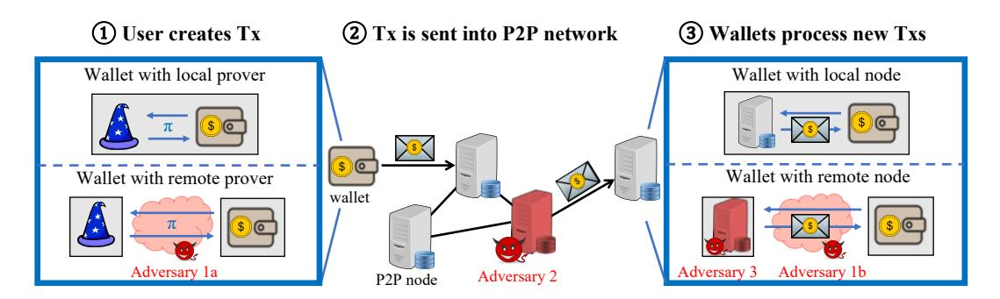
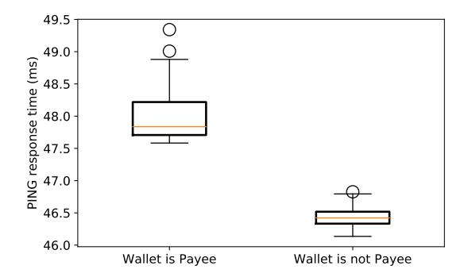
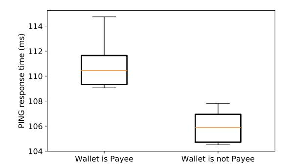
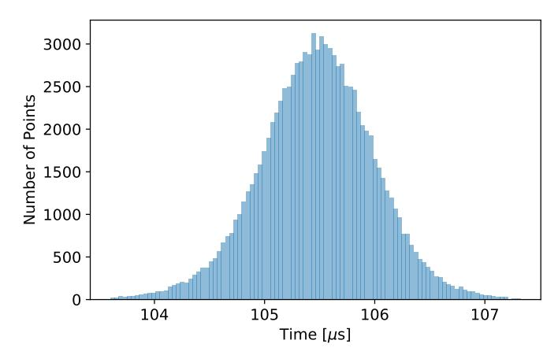
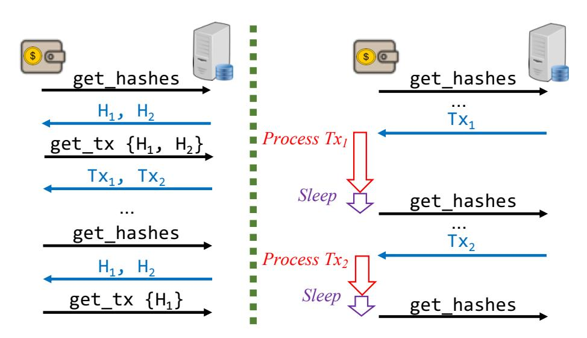
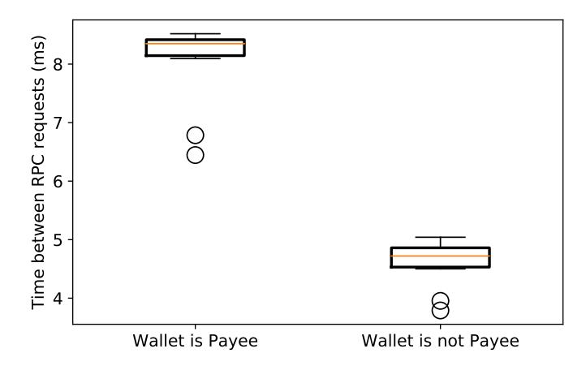
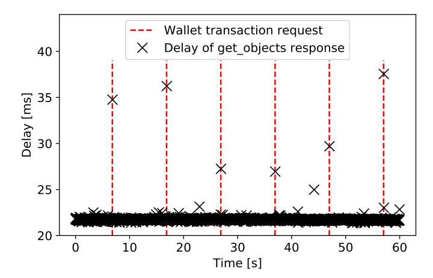
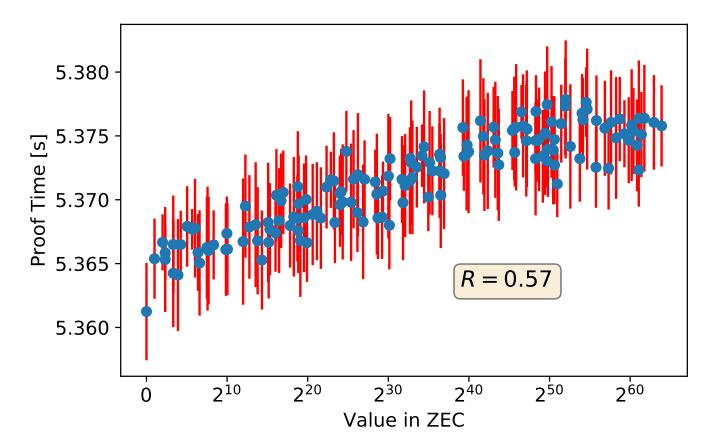
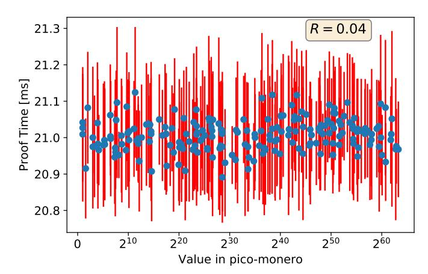

# Remote Side-Channel Attacks on Anonymous Transactions

Florian Tram`er<sup>∗</sup> Stanford University [tramer@cs.stanford.edu](mailto:tramer@cs.stanford.edu)

Dan Boneh Stanford University [dabo@cs.stanford.edu](mailto:dabo@cs.stanford.edu)

Kenneth G. Paterson ETH Z¨urich [kenny.paterson@inf.ethz.ch](mailto:kenny.paterson@inf.ethz.ch)

#### Abstract

Privacy-focused crypto-currencies, such as Zcash or Monero, aim to provide strong cryptographic guarantees for transaction confidentiality and unlinkability. In this paper, we describe side-channel attacks that let remote adversaries bypass these protections.

We present a general class of timing side-channel and traffic-analysis attacks on receiver privacy. These attacks enable an active remote adversary to identify the (secret) payee of any transaction in Zcash or Monero. The attacks violate the privacy goals of these cryptocurrencies by exploiting side-channel information leaked by the implementation of different system components. Specifically, we show that a remote party can link all transactions that send funds to a user, by measuring the response time of that user's P2P node to certain requests. The timing differences are large enough that the attacks can be mounted remotely over a WAN. We responsibly disclosed the issues to the affected projects, and they have patched the vulnerabilities.

We further study the impact of timing side-channels on the zero-knowledge proof systems used in these crypto-currencies. We observe that in Zcash's implementation, the time to generate a zero-knowledge proof depends on secret transaction data, and in particular on the amount of transacted funds. Hence, an adversary capable of measuring proof generation time could break transaction confidentiality, despite the proof system's zero-knowledge property.

Our attacks highlight the dangers of side-channel leakage in anonymous crypto-currencies, and the need to systematically protect them against such attacks.

## 1 Introduction

Bitcoin, the largest crypto-currency, is not private: several academic studies [\[2,](#page-22-0) [32,](#page-24-0) [39,](#page-25-0) [41,](#page-25-1) [22\]](#page-24-1) and multiple commercial products [\[10,](#page-23-0) [11,](#page-23-1) [21\]](#page-23-2) show that one can effectively de-anonymize Bitcoin's transaction graph. The same holds for many other crypto-currencies.

For those who want transaction privacy on a public blockchain, systems like Zcash [\[42\]](#page-25-2), Monero [\[44\]](#page-25-3), and several others offer differing degrees of unlinkability against a party who records all the transactions in the network. We focus in this paper on Zcash and Monero, since they are the two largest anonymous crypto-currencies by market capitalization. However our approach is more generally applicable, and we expect other anonymous crypto-currencies to suffer from similar vulnerabilities.

Zcash and Monero use fairly advanced cryptographic primitives such as succinct zero-knowledge arguments (zkSNARKs) [\[5\]](#page-22-1) and ring signatures [\[40\]](#page-25-4). Despite these strong cryptographic protections,

<sup>∗</sup>Part of this work was performed while the first author was visiting ETH Z¨urich.

<span id="page-1-0"></span>

Figure 1: Side-channels in the anonymous transaction life cycle. (1) A user's wallet creates a transaction, which involves generating a cryptographic proof. This computation might be performed locally or outsourced to a remote service. (2) The wallet sends the new transaction to a P2P node which propagates it into the network. (3) A P2P node shares a received transaction with a connected wallet; the connection may be local or remote. During transaction creation, Adversary 1a can time an outsourced proof generation to leak some transaction secrets (Section [3.3\)](#page-7-0). When processing a new transaction, a wallet's behavior may change when it is the transaction's payee. If the wallet connects to a remote node, this can be inferred by Adversary 1b that observes traffic patterns between the wallet and node, or by Adversary 3 that controls the node. If the wallet and node are co-located, changes in the wallet behavior can be inferred by Adversary 2 that interacts with the user's P2P node (Section [3.2\)](#page-5-0).

some protocol-level attacks on transaction privacy have been found [\[35,](#page-24-2) [26,](#page-24-3) [4\]](#page-22-2) and corrected (we discuss these attacks in the related work in Section [7\)](#page-21-0).

In this paper we take a different approach to analyzing the privacy guarantees for anonymous transactions. Rather than attacking the abstract protocols, we look at side-channel information that is leaked by the implementation of different components in the system. Specifically, we look at timing side-channels and traffic patterns, as measured by a remote network attacker. We show that, while the abstract zero-knowledge protocols used in these systems can hide information from an observer, these protocols are vulnerable to side-channel leakage. Any information leakage can invalidate the zero-knowledge property, and weaken or break the privacy guarantees of anonymous transactions.

### 1.1 Our results

We describe multiple attacks on transaction privacy in Zcash and Monero that exploit communication patterns or timing information leaked by different parts of the system. We take a systematic approach, looking at the life cycle of an anonymous transaction as it traverses the system. At every step, we look for side-channels and asses their impact on user privacy.

The life-cycle of an anonymous transaction is shown in [Figure 1.](#page-1-0) First, the transaction is created in the payer's wallet, possibly with the help of a remote server to generate the necessary zero-knowledge proof to prove transaction validity. Then the transaction is transmitted through the P2P network. Finally, the transaction is received by the payee wallet, possibly with the help of a remote P2P node that records all transactions in the P2P network. The payee's wallet must scan through all anonymous transactions in the network to find those transactions of which it is the recipient.

An attacker can observe side-channel information at each of these steps and attempt to learn information about the transaction, such as: the identity of the intended payee (e.g., their public key, or the IP address of their P2P node), the amount of funds transferred in the transaction, or the source of the funds. We next summarize our results.

Zcash. In Zcash, a user's wallet and P2P node are run in a single process. The wallet checks if it is the payee of every incoming transaction by attempting to decrypt it using its secret key. This results in two sources of side-channel leakage: (1) if decryption succeeds and the decrypted transaction (called a Note plaintext) is well-formed, the wallet performs an extra Pedersen commitment check; (2) if decryption succeeds, but the decrypted transaction is malformed, the wallet throws an exception that is propagated to the node's P2P layer.

In the first case, the time taken to perform the extra Pedersen commitment check causes a delay in the P2P node's response to subsequent network messages. Consequently, we show an attack, termed PING, which sends a transaction to a node followed immediately by a network "ping" (a standard P2P message). The attacker can use the delay in the ping response to infer whether the node was the transaction's payee or not. This constitutes a break of transaction unlinkability.

In the second case, we propose the REJECT attack wherein an attacker carefully crafts a malformed transaction, encrypts it under a known (but anonymous) public key, and sends it to a target P2P node. If decryption succeeds, then the exception is triggered, and the target node sends an explicit "reject" message back to the attacker. Receipt of this message then tells the attacker that the selected public key belongs to the owner of the target P2P node — a breach of anonymity.

Details of the PING and REJECT attacks are in Section [4.](#page-8-0)

Monero. For Monero, where wallets and nodes are run in separate processes, we show that receipt of a payment alters the communication pattern between a wallet and its node. If the wallet is connected to a remote node (as is common for mobile wallets or when first syncing with the network), we show in Section [5](#page-14-0) that a passive network adversary can infer if the wallet is the payee of a recent transaction. Furthermore, even if the user's wallet and node are co-located, we show that a remote adversary can infer the wallet-to-node communication pattern by causing and observing lock contention over the node's resources. We validate this timing attack in a WAN, where an attacker (located in London) infers if a victim (running a node and wallet in Z¨urich) receives a payment.

For both Zcash and Monero, our attacks enable a remote adversary to link anonymous transactions by identifying the P2P node of each transaction payee. As described in Section [3.2,](#page-5-0) the attacks can be further exploited to: (1) identify the IP address of a user's P2P node, given her public key; (2) break the unlinkability of diversified addresses belonging to the same user. For Zcash, the attacks further enable to: (3) remotely crash a Zcash node, given the user's public key, and (4) create a remote timing side-channel on an (non constant-time) ECDH key-exchange involving the user's long-term secret viewing key, which potentially results in leakage of that key.

These attacks can put privacy-conscious crypto-currency users (e.g., whistle-blowers or activists) at risk. For example, an adversary that links a user's anonymous public key to her P2P node could uncover the user's physical identity or location. An adversary that breaks unlinkability — and monitors transactions as they enter the P2P network — can infer which P2P nodes belong to users that are transacting with each other.

Side-channels in zkSNARK generation. In Section [6](#page-19-0) we look at timing side-channels at transaction creation time, where the payer generates a zkSNARK to prove that the transaction is valid. We observe that in Zcash, the time to generate a zkSNARK is not constant, but depends on secret information such as the Hamming weight of the transaction amount. Our experiments show that the current implementation is therefore not zero-knowledge in practice: the information gleaned from timing leakage invalidates the zero-knowledge property. An adversary can extract this information if it can measure the running time of the zkSNARK generation procedure. However, as we explain in Section [3.3,](#page-7-0) it may be difficult to exploit this leakage in the current Zcash system.

#### 1.2 Disclosure and remediation.

All the vulnerabilities discussed in this paper were disclosed to Zcash and Monero, and have subsequently been fixed in recent versions of both projects [\[15,](#page-23-3) [18,](#page-23-4) [20,](#page-23-5) [33\]](#page-24-4).

We hope that this work will help inform other privacy-oriented blockchain projects about the dangers of side-channel leakage in anonymous payment systems. It should also motivate the development of constant-time implementations of cryptographic primitives such as zkSNARK provers.

# <span id="page-3-1"></span>2 Architecture of an Anonymous Payment System

This section introduces some core design concepts of privacy-focused crypto-currencies such as Zcash and Monero.

These crypto-currencies build on top of Bitcoin's so-called UTXO model. Each transaction spends outputs from prior transactions and produces new outputs. The set of "unspent transaction outputs" (UTXOs) is recorded in a blockchain, and represents the total currency in circulation.

Each user of the currency possesses one or more public keys (also known as addresses), and connects to a P2P network to send and receive transactions.

Privacy goals. In Bitcoin, a UTXO is a tuple of the form (amount, pk), where pk is the recipient's public key. To later spend this UTXO, the recipient produces a signature under the corresponding secret key. A transaction thus reveals the amount of spent currency, the origin of funds (i.e., which UTXOs are spent), and their destination (i.e., the public key of the owner of the new UTXOs). Moreover, a user's public key can be linked to the P2P node that she connects to when sending transactions into the network.

Currencies such as Zcash and Monero aim to provide the following stronger privacy guarantees:

- Confidentiality: A transaction does not reveal the transacted amount.
- Untraceability: When a transaction spends a UTXO, it is hard to identify the transaction that produced that UTXO.
- Unlinkability: Given two transactions sent into the network (at most one of which is sent by the adversary), the adversary cannot tell whether they pay the same address. Moreover, given two addresses, an adversary cannot determine whether they belong to the same user.[1](#page-3-0)

<span id="page-3-0"></span><sup>1</sup>The latter property enables a user to receive payments from different entities without those entities knowing that they are paying the same user. This can be trivially done if the user maintains multiple public-key pairs. A more efficient solution is given by diversified addresses, described hereafter.

• User anonymity: Given a user's address (i.e., a public key), an adversary cannot determine how the owner of that address is connected to the P2P network.

Privacy techniques. These privacy guarantees are achieved via a combination of cryptographic techniques, which we informally describe next.

Confidential transactions [\[31\]](#page-24-5) hide the amount of transacted funds. A confidential transaction's UTXOs are of the form (Commit(amount), pk), i.e., they only reveal a cryptographic commitment to the transacted amount. The transaction further includes a proof that its total balance is zero.

UTXO anonymity sets provide untraceability by concealing the identity of a transaction's inputs. Specifically, an anonymous transaction does not reveal the UTXOs it spends, but only a super-set of UTXOs along with a zero-knowledge proof of ownership of some UTXOs in this set.

Obfuscated and diversified addresses guarantee unlinkability. To prevent linkability of transactions sent to the same address, the UTXOs of anonymous transactions contain an "obfuscated" public key (e.g., a commitment to the key in Zcash). Diversified addresses (or sub-addresses in Monero) enable a user to anonymously transact with multiple entities, without managing multiple secret keys. From a single secret key sk, users can create multiple public keys pk<sup>1</sup> , . . . , pkn. These keys are unlinkable: it is hard to determine whether two public keys pk, pk<sup>0</sup> are derived from the same secret key.

Blockchain scanning is a technical consequence of unlinkability. Since an anonymous transaction's UTXOs do not reveal the recipient's public key in the clear, users have to scan every new transaction and perform various cryptographic operations to check whether a transaction is intended for them.

User anonymity is guaranteed by untraceability and unlinkability. Since a transaction reveals nothing about the sender's or receiver's public key, a user's public key cannot be linked to the P2P node that she uses to send or receive transactions.

Software deployments. Deployments of crypto-currency software differ across projects (and among users of the same currency). Various deployment choices greatly influence a user's vulnerability to the side-channel attacks we present.

We distinguish three types of software: (1) Nodes are P2P clients that handle the blockchain's consensus layer by exchanging and validating transactions and blocks; (2) A wallet (possibly backed by a hardware module) stores a user's keys and UTXOs and connects to a node to send or receive transactions. (3) A prover produces the zero-knowledge (ZK) proofs required to privately spend a user's UTXOs.

We consider the following common deployment modes, which refer to the interaction between a user's wallet and a P2P node or prover.

- 1. Integrated. The wallet, node and prover functionalities are all part of the same process. This is the current design of the official Zcash client.
- 2. Local. Different components are run in separate processes in a local network (this is Monero's default for wallets and nodes). Some hardware wallets also delegate the generation of cryptographic proofs to a local software.
- 3. Remote owned. Due to restricted computation power or memory, a wallet may connect to a remote P2P node or prover hosted by the user. Remote P2P nodes are commonly used, e.g., in Monero or Zcash's mobile wallets. Outsourcing cryptographic proofs is uncommon, but is explicitly enabled in Zcash's design [\[25\]](#page-24-6) and was implemented in an earlier protocol version [\[13\]](#page-23-6).

4. Remote third-party. As running a P2P node is costly, users may connect their wallet to a node hosted by a third party. This is common in Monero: newly created wallets connect to third party nodes while a local node downloads the blockchain. Such a deployment is unlikely for ZK provers as the third-party prover has to be trusted for privacy [\[25\]](#page-24-6).

The anonymous transaction life-cycle. Figure [1](#page-1-0) illustrates how anonymous transactions are created and shared with nodes and wallets via a P2P network:

- 1. To send a new transaction, a user's wallet selects some UTXOs and produces a zero-knowledge proof of validity for the transaction.
- 2. The transaction is sent to the P2P node connected to the wallet and shared with the network. P2P nodes store these transactions in their "Memory Pool" (Mempool).
- 3. P2P nodes share these transactions with connected wallets. A wallet scans every new transaction to check whether it is the transaction's payee.

Steps 2 and 3 are also performed once a transaction is included in a block. When a block is mined, the block and the transactions it contains are propagated to all P2P nodes. The block's transactions are then shared with user wallets.

## 3 Overview of the Attacks

This section gives an overview of our attack strategies. Section [4,](#page-8-0) [5](#page-14-0) and [6](#page-19-0) then describe instantiations and evaluations of these attacks in both Zcash and Monero.

#### 3.1 Threat Model

The attacks described in this paper are remote side-channel attacks. We thus never assume that a victim's software is compromised.[2](#page-5-1) In line with the software deployments described in Section [2,](#page-3-1) we consider the following remote adversaries, which are illustrated in Figure [1.](#page-1-0)

- 1. A network adversary (Adversary 1a and 1b in Figure [1\)](#page-1-0) passively monitors the encrypted traffic between a victim's wallet and a remote service (e.g., a node or prover).
- 2. A P2P adversary (Adversary 2) participates in the P2P network. The attacker may deviate from the P2P protocol.
- 3. A remote node adversary (Adversary 3) controls a third-party P2P node and passively monitors the (plaintext) communication between a victim's wallet and this node.

## <span id="page-5-0"></span>3.2 Attack Type I: Side-Channels at the Receiving Party

The most practical and pervasive side-channel attacks that we discovered affect the last stage of the anonymous transaction life-cycle depicted in Figure [1](#page-1-0) — when a wallet processes new transactions. These attacks enable remote adversaries to break the system's unlinkability and anonymity guarantees.

Our attacks exploit prevalent design flaws in the way that a user's wallet periodically checks whether it is the payee of any new transactions.

<span id="page-5-1"></span><sup>2</sup>An adversary co-located with a user's wallet could resort to more powerful attacks (e.g., cache side-channel attacks). However, such adversaries are explicitly outside of the threat model considered by Monero and Zcash [\[16\]](#page-23-7).

Attack goals. Our attacks target transaction unlinkability and user anonymity. The attacker's goals are thus to: (1) determine whether two transactions pay the same address, and (2) to determine how the user of a known address connects to the P2P network.

Our attacks are tailored to common deployment of wallets and P2P nodes. The actual goal achieved by all of our attacks is to identify the P2P node that is being used by the payee of a transaction. In a setting where multiple users connect their local wallet to a shared remote P2P node, the attacks mounted by a network adversary or by a remote node adversary further recover the actual wallet used by the transaction payee.

We consider two different attack scenarios:

- The adversary knows an anonymous public key and sends a transaction to this key to determine which P2P node (or wallet) the key's owner uses to receive transactions.
- An honest user sends a transaction for which the adversary does not know the intended payee or her public key. The adversary determines which P2P node (or wallet) is used by the transaction's payee.

The latter attack scenario subsumes the first, as the adversary can send honestly crafted transactions to a known public key. The latter scenario directly leads to a break of transaction unlinkability. Given two transactions sent into the network, the adversary simply determines whether the payees of both transactions use the same P2P node or wallet. In addition, both attack scenarios represent a break of user anonymity and can be bootstrapped for additional privacy violations:

- IP address recovery. The adversary can link a public key to the IP address of the owner's P2P node (or her wallet if it connects to a remote node), unless the owner uses anonymization tools such as Tor.[3](#page-6-0) This information can be used to de-anonymize or geo-localize the victim.
- Diversified address linkability. Given two public keys, an attacker can determine if they belong to the same user or not. The attacker sends a transaction to each public key, and checks if the same node or wallet is identified. This breaks the unlinkability property of diversified addresses.
- Private key recovery. The vulnerabilities underlying some of our attacks also open avenues for extracting a victim's secret "viewing" key via timing side-channels. Theft of this key lets the adversary passively link all transactions sent to the victim (but not steal the victim's funds).

Attack strategies. Our attacks exploit a difference in the way that a wallet processes a transaction when it is the payee and when it is not. This difference is due to additional cryptographic operations performed to retrieve received funds.

Such differences in wallet behavior are not an issue per se, as a remote attacker cannot directly interact with a user's wallet. Yet, we find that due to various design flaws, differences in wallet behavior impact the interactions between the wallet and its P2P node. In turn, we show that a remote attacker can infer changes in the wallet-to-node interactions via various side-channels. We develop two general attack strategies:

• Strategy 1: Traffic analysis of wallet-to-node communication. If a wallet connects to a remote node, a network adversary or remote node adversary can passively observe changes in the walletto-node interaction.

<span id="page-6-0"></span><sup>3</sup>An attacker who obtains a victim's public key does not necessarily know the victim's IP address. The victim could have shared the key using a third party messaging system or forum. An attacker might also have obtained some public keys by hacking a service supporting anonymous transactions.

• Strategy 2: Inferring wallet behavior from the P2P layer. If the wallet and node are co-located, a remote adversary cannot observe their interactions. Nevertheless, if changes in wallet behavior impact the interactions between the user's P2P node and remote peers, information still leaks to the adversary.

Both strategies apply not only when a transaction is created and sent into the P2P network, but also when it is included in a block. At that point, the block and all its transactions are shared with each peer, and wallets re-process the transactions to ensure they are valid (e.g., they did not double spend).

## <span id="page-7-0"></span>3.3 Attack Type II: Side-Channels at the Sending Party

The attacks described in Section [3.2](#page-5-0) — which break transaction unlinkability and user anonymity — exploit flaws in the system design of P2P clients and wallets. As such, they do not directly target any of the protocol's cryptographic protections. To broaden the scope of our investigation of side-channel vulnerabilities in anonymous transactions, we initiate a study of attacks on the cryptographic tools that guarantee confidentiality and untraceability at transaction creation-time — specifically succinct zero-knowledge arguments (zk-SNARKs).

The attacks in this section are of a more conceptual nature. While they are less likely to affect current users, these attacks illustrate once more the importance of having side-channelfree cryptographic implementations for future-proof and in-depth security of anonymity-preserving systems.

Attack goals. The transaction sender is responsible for ensuring confidentiality and untraceability. As we argue below, the most plausible target for a remote attack is to recover transaction amounts — thereby breaking confidentiality.

Challenges. Remote side-channel attacks on transaction creation face a number of challenges:

- 1. Non-interactivity: Users can create transactions without interacting with any other parties.
- 2. Ephemeral secrets: Many transaction secrets (e.g., transaction amounts, and secrets related to UTXOs) are single-use. Thus, even if a side-channel exists, an adversary gets a single attempt at extracting these secrets.
- 3. High-entropy secrets: Long-lived secrets used in creating transactions (e.g., the user's secret key) have high-entropy, and require a high-precision side-channel to be extracted.

We show that these challenges can be overcome by an adversary that targets the proving phase of the transaction creation process and that aims to (partially) recover a transaction's confidential amount.

SNARKs in anonymous transactions. Zero-knowledge proofs are a fundamental building block for anonymous transactions. In a zk-SNARK protocol, a prover has some secret input (called a witness), and convinces the verifier that this witness satisfies a given predicate, without revealing anything else about the witness. In Zcash and Monero, such proofs certify the validity of transactions while preserving their privacy. In Zcash for example, a proof witness contains a list of spent UTXOs, a receiver address, and a transacted amount, and the proof guarantees that these UTXOs exist and belong to the spender, and that all funds are transferred to the receiver.

Timing side-channels in zk-SNARK provers. Our thesis is that in current implementations, the time taken to produce a proof leaks information about the prover's secret witness—and in particular about the amount of currency being spent.

Yet, as noted above, it may be hard for a remote adversary to obtain a timing side-channel on the proof generation process, due to the non-interactive nature of transaction creation. Worse, timing a proof generation may be insufficient to extract secrets that are ephemeral or have highentropy. Despite these challenges, we argue below that remote timing attacks on zk-SNARK provers in anonymous crypto-currencies are possible in some deployment scenarios, and we demonstrate in Section [6](#page-19-0) that the timing of a proof generation can leak significant information about secret transaction amounts.

Regarding non-interactivity, we make two observations:

- If a weak client (e.g., a mobile wallet) outsources proofs to a remote service, a network adversary can time the prover. While proof outsourcing is uncommon, the Zcash protocol enables this feature [\[25\]](#page-24-6) and remote proving services were designed for early protocol versions [\[13\]](#page-23-6). Proof delegation is also recommended for hardware wallets [\[14\]](#page-23-8). Some users may opt for delegating proofs to a remote service.
- More generally, an adversary may get out-of-band information on when the transaction creation process starts and observe when it ends by monitoring the P2P network. For example, a user could setup recurring payments, where transactions are created at a fixed time. An adversary may also have the ability to trigger a transaction as part of some outer protocol. We draw a connection to timing side-channels for digital signatures. While signatures are non-interactive, protocols that use them (e.g., TLS) can introduce remote side-channels [\[8,](#page-23-9) [7\]](#page-23-10).

Due to the high-entropy of many transaction secrets, our attacks target the transacted amount, a non-cryptographic value for which even a coarse approximation (as leaked by a single timing measurement) constitutes a privacy breach.[4](#page-8-1)

Attack strategy. We consider a cryptographic timing attack that exploits timing variations in arithmetic operations depending on the operands' values. Such attacks have been studied for many cryptographic primitives [\[27,](#page-24-7) [8,](#page-23-9) [7\]](#page-23-10), but had not been considered for zk-SNARKs prior to this work.

We exploit the fact that the time to produce a proof is correlated with the value of the prover's witness. As the witness contains the transaction amount, we expect this amount to be correlated with the proof time. For example, Zcash's proofs decompose the transaction amount into bits and compute an elliptic curve operation for each non-zero bit. The proof time is thus strongly correlated with the Hamming weight of the transaction amount, which is in turn correlated with its value.

# <span id="page-8-0"></span>4 Attacks on Unlinkability and Anonymity in Zcash

We now evaluate the side-channel attacks on transaction processing described in Section [3.2.](#page-5-0) We first demonstrate attacks against Zcash. Attacks on Monero are described in Section [5.](#page-14-0)

Our attacks on Zcash adopt the second strategy from Section [3.2,](#page-5-0) that exploits a lack of isolation between a user's wallet and P2P node to leak wallet behaviors to a remote P2P adversary. In the Zcash client, the two components are part of a single process that sequentially processes received

<span id="page-8-1"></span><sup>4</sup>A co-located adversary (which is not part of Zcash's threat model [\[16\]](#page-23-7)) can likely recover significantly more information by exploiting more fine-grained timing side-channels, e.g., from a shared cache.

messages (including new transactions). We describe two side-channel attacks that exploit this tight coupling. Throughout this section, we often use the term "node" to refer to the single process that implements both a P2P client and a wallet.

## <span id="page-9-1"></span>4.1 Unlinkability in Zcash

To understand our side-channel attacks, we first describe how Zcash guarantees unlinkability. From Section [2,](#page-3-1) recall that unlinkability relies on two concepts: (1) transactions only contain a commitment to the recipient's public key, and (2) a user can derive multiple unlinkable public keys (diversified addresses) from a single secret key.

Zcash's diversified addresses are static Diffie-Hellman keys. The private key is a scalar, ivk (the incoming viewing key). A diversified public key is of the form (Gd, PKd) where G<sup>d</sup> is a random point in an elliptic curve group and PK<sup>d</sup> = ivk · Gd.

A payment to the address (Gd, PKd) contains a UTXO (a Note commitment) of the form:

$$cm = Commit(G_d||PK_d||v; rcm)$$
,

where v is the sent amount and rcm the commitment randomness. To later spend this UTXO, the receiver has to prove that she knows an opening of cm.

In-band secret distribution. The sender uses El-Gamal encryption to share an opening of cm with the recipient. The sender samples an ephemeral secret key esk, computes the public key EPK = esk · Gd, and derives the shared key

$$k = esk \cdot PK_d = esk \cdot ivk \cdot G_d$$
 .

The opening of the commitment cm is included in the Note plaintext (np). The sender encrypts the Note plaintext np using the key k, and appends the ciphertext C and the ephemeral public key EPK to the transaction.

<span id="page-9-0"></span>Blockchain scanning. To recover her funds, a user scans each transaction with her private key ivk. For a transaction with public key EPK, Note ciphertext C and Note commitment cm, she computes:

TrialDecrypt(ivk, EPK, C, cm)

```
1: k = ivk · EPK
2: np = Decryptk
                 (C)
3: if np = ⊥, return ⊥
4: Parse np as np := (Gd, v,rcm, memo)
5: PKd = ivk · Gd
6: if cm 6= Commit(Gd||PKd||v;rcm), return ⊥
7: return np
```

That is, if decrypting C succeeds (which means the user is the transaction's payee), the user checks that the Note plaintext np contains a valid opening of the Note commitment cm.

### 4.2 Our Attacks

Our attacks — PING and REJECT — enable an adversary to tell whether a remote Zcash node succeeded in decrypting the Note ciphertext of a transaction. From this, the adversary learns that this remote node belongs to the transaction's payee.

The two attacks differ in their setup (REJECT only applies to transactions crafted by the attacker, while PING applies to any transaction), and in the side-channel they exploit (an error message for REJECT, and a timing side-channel for PING).

As described in Section [3.2,](#page-5-0) identifying the P2P node of a transaction payee further lets an adversary link transactions, recover a user's IP address, link diversified payment addresses, and even open a timing side-channel that (in principle) enables remote extraction of the victim's private viewing key, ivk.

#### 4.2.1 The PING Attack

Our first attack, PING, exploits the tight coupling between wallet and P2P components in the Zcash client. More precisely, we exploit the fact that the Zcash client serially processes all incoming P2P messages, including those that contain new transactions. As a result, the time taken to process a transaction impacts the node's processing of other messages. A remote P2P adversary can thus build a timing side-channel that leaks weather a node is the payee of a transaction.

The PING attack applies to any transaction, even those sent by honest users and for which the adversary does not know the payee's public key.

A timing side-channel in transaction processing. If a Zcash wallet successfully decrypts a Note ciphertext, it checks that the opening of the Note commitment is valid (line [6](#page-9-0) in TrialDecrypt). This involves computing a Pedersen hash [\[25\]](#page-24-6) with two elliptic curve scalar multiplications. A TrialDecrypt call thus takes longer (by about one millisecond on a desktop machine) when the decryption succeeds.

A P2P adversary can measure the duration of the TrialDecrypt call by sending a "ping" message to a Zcash node immediately after it receives a new transaction. The node's wallet first processes the transaction and calls TrialDecrypt, before the node responds to the ping. The time elapsed until the receipt of the ping response leaks information about the success of the Note decryption, and therefore on whether the node was the payee of the relayed transaction.

A timing side-channel in block processing. The above attack applies to unconfirmed transactions that enter a victim node's memory pool. The same vulnerability also applies to the processing of transactions included in a mined block.

Upon receiving a new block, a Zcash node sequentially processes and trial-decrypts each transaction in it. The total time to validate the block thus depends on the number of transactions that pay the user. As above, a remote adversary can leak this validation time by pinging the victim node right after it receives a fresh block.

Applying the attack. The attacker first builds a baseline by running the PING attack against a target node, using a transaction that does not pay the target (the attacker can send funds to itself). The timing of the ping responses from a baseline for a TrialDecrypt call where decryption fails. The attacker then compares this baseline to timings obtained from attacks on new transactions.

<span id="page-11-0"></span>



Figure 2: **PING** attack on unconfirmed **Zcash** transactions in a **WAN**. For 200 transactions sent to a node, we time the node's response to a subsequent ping message. When the node's wallet is the transaction's payee, the ping response is delayed. The figure shows standard box plots with outliers.

Figure 3: PING attack on mined Zcash transactions in a WAN. For 20 blocks (each containing a single transaction) sent to a Zcash node, we time the node's response to a subsequent ping message. When the node's wallet is the payee of the transaction in the block, the ping response is delayed.

The attack requires reliable measurements of a node's transaction processing time. Note that for transactions sent by honest users, the attack cannot be repeated to average out network jitter, because, once a node has validated a transaction, it ignores further messages containing it. One optimization consists in running both above variants of the PING attack, once when the transaction enters a node's mempool and once when it is included in a block (wallets re-process a transaction when it is mined). The attacker thus gets two timing measurements, thereby halving the variance caused by the network.

**Evaluation.** We run the attack in a WAN, with a victim node in Zürich and an attacker in London (21 ms round trip latency). The attacker sends 200 transactions, half of which pay the victim. Figure 2 plots the victim's response time to the attacker's subsequent ping message. The attacker can distinguish between the two scenarios with 100% precision.

We further validate the attack on block processing. The adversary relays 20 blocks to the victim, each of which contains a single transaction that either pays the victim or another user. Figure 3 plots the delay of the victim's ping response. The attack achieves 100% precision. The attack extends to blocks with N>1 transactions, by using as baseline the time to validate a block with N non-paying transactions.

#### 4.2.2 The REJECT Attack

Our second attack, REJECT, exploits a flaw in the handling of certain malformed transactions. It allows an adversary, in possession of a user's public key, to send a transaction that causes the user's P2P node to respond with a "reject" message.

The REJECT attack is weaker than PING, in that it only applies to transactions sent by the attacker to a known address. At the same time, the REJECT attack does not rely on any timing signals and is thus easier to mount and more reliable.

```
SaplingNotePlaintext :: decrypt in Note . cpp
pt = AttemptSaplingEncDecryption (C , ivk , epk ) ;
if (! pt ) {
  return boost :: none ; // decryption failed
}
CDataStream ss ( SER_NETWORK , PROTOCOL_VERSION ) ;
ss << pt . get () ; // serialize the plaintext
SaplingNotePlaintext :: SerializationOp in Note . hpp
unsigned char leadingByte = 0 x01 ;
READWRITE ( leadingByte ) ;
if ( leadingByte != 0 x01 ) {
  throw std::ios_base::failure (...) ;
}
ProcessMessages in main . cpp
try {
  fRet = ProcessMessage ( pfrom , strCommand , ...) ;
} catch ( const std::ios_base::failure & e ) {
  pfrom - > PushMessage (" reject ", ...) ;
}
```

Figure 4: Error handling exploited by the REJECT attack. The code is from Zcash version 2.0.7, before the attack was patched. Top: if decryption of a Note ciphertext C succeeds, the decrypted stream is serialized into a Note plaintext. Middle: an exception is thrown if the plaintext's first byte does not encode the protocol version. Bottom: the client's message-processing thread catches the exception, and sends a "reject" message to the peer that sent the malformed transaction.

The flaw exploited by the attack is in the parsing of the Note plaintext in TrialDecrypt (line [4\)](#page-9-0). The first byte of a plaintext encodes the protocol version (0x01 in the current Sapling version). If the version byte is incorrect (i.e., other than 0x01 for Sapling transactions), the parser throws an exception that is caught in the client's main message-processing thread, where it causes a "reject" message to be sent to the peer that shared the transaction (see Figure [4\)](#page-12-0).

This provides a P2P adversary with an oracle indicating the successful decryption of a Note ciphertext with a specifically malformed plaintext (e.g., with a version byte of 0x02).

Linking a public key to a node. Given a public key (Gd, PKd), the attacker can identify the Zcash node that holds this key. The attacker builds a Note plaintext with an incorrect leading byte, encrypts it under a key derived from (Gd, PKd) and adds it to a transaction. The attacker sends the transaction to all P2P nodes and checks which one replies with a "reject" message. We validated this attack in a local test network.

A potential issue is that a peer that receives the malformed transaction could relay it to the payee before the attacker's own message reaches the payee. In this case, the payee will send a "reject" message to the relaying peer, and ignore the attacker's later message. Yet, as nodes validate transactions before relaying them, the attacker's message is likely to reach the payee first. In the event that the attacker does fail to receive a "reject" message, the attack can simply be repeated.

<span id="page-13-0"></span>

Figure 5: Time to compute  $ivk \cdot P$  for a fixed ivk and one million random points P in the elliptic-curve group.

#### <span id="page-13-1"></span>4.2.3 Attacks beyond Recipient Discovery

The vulnerabilities underlying the above attacks can be further exploited for adversarial goals beyond linking transactions and de-anonymizing public keys.

**Denial of service.** A curious consequence of the REJECT attack is that once a transaction containing a malformed Note plaintext is included in a mined block, the transaction payee's client crashes when attempting to validate the block.

This flaw is pernicious. Even if the Zcash client is manually restarted, it re-crashes immediately while validating the block.

If an attacker were to get hold of payment addresses for a large number of Zcash users, this flaw could lead to a strong DoS attack vector. Worse, if an attacker knows the payment addresses of many Zcash miners, such a DoS attack could be exploited to stifle the network's mining power (e.g., in preparation for a 51% attack or to remove mining competition).

**Key recovery via ECDH timing.** The PING and REJECT attacks also yield a remote timing channel on Zcash's implementation of the ECDH key exchange, in particular the Elliptic curve multiplication ivk · EPK in TrialDecrypt (line 1).

The Zcash team was aware that the ECDH key exchange is not constant time, and that this might be exploitable by a *co-located* adversary [16]. The REJECT and PING attacks further open up the possibility of this side-channel being exploited *remotely*.

Zcash's Elliptic Curve multiplication routine is indeed not constant-time: it uses a standard double-and-add procedure, and the underlying field arithmetic is not constant time. We adapted Kocher's timing attack [27] to Zcash's Elliptic Curve multiplication routine. For a fixed secret ivk, we locally timed the multiplication for 1 million random points. The timing distribution is plotted in Figure 5, and is clearly not constant.

Assuming we have already recovered the j most significant bits of ivk, we recover the (j+1)-th bit by correlating the time of a point doubling or point multiplication with the total multiplication time. Conditioned on all previous bits being recovered, the following bit is recovered with 98.4%

probability. Using a suitable backtracking mechanism to resolve the few false guesses, the full key could thus be recovered with about one million samples.

The query complexity of this attack is fairly high. The attack was performed in an "idealized" setting that ignores the time taken by the network and transaction verification, which would add significant noise and further increase the sample complexity of a full remote attack. Our proof-ofconcept of course also confirms the Zcash team's suspicion that a co-located adversary could exploit timing side-channels to recover a user's secret keys.

## 4.3 Remediation

Fixing the REJECT attack is simple: treat a plaintext parsing failure as a decryption failure and ignore the offending ciphertext. This fix was added in release 2.0.7-3 of Zcash [\[18,](#page-23-4) [15\]](#page-23-3).

The PING attack exploits a lack of isolation between a Zcash node's P2P and wallet components. Release 2.0.7-3 addresses this issue by refactoring the wallet into a separate thread, that periodically pulls the list of recent transactions and calls TrialDecrypt. The timing of the TrialDecrypt call thus no longer affects the timing of other P2P functionalities. Yet, release 2.0.7-3 only fixes the PING attack on unconfirmed transactions. Refactoring the node's processing of new blocks was more complex, and ultimately fixed in release 2.1.1 [\[20\]](#page-23-5).

A simple defense against the type of attacks we present is to run two Zcash nodes, a "firewall" node that connects to the P2P network and a local node holding the user's keys that only connects to the firewall. This setup requires storing and validating the entire blockchain twice, yet prevents all our attacks — except for the DoS attack in Section [4.2.3.](#page-13-1)

We note that running a Zcash node over Tor [\[17\]](#page-23-11) does not prevent our attacks. A P2P adversary with an active Tor connection to a victim's P2P node could still link transactions that pay the victim, or link the victim's diversified addresses.

Finally, we believe that Zcash should produce a side-channel resistant implementation of their core cryptographic primitives. Side-channel resistance may have seemed like a secondary concern, given that the Zcash protocol is primarily non-interactive. As our attacks have shown, a single bug in the in-band secret distribution routine inadvertently allowed for a two-way interaction between an attacker and victim, thereby opening up a potential remote timing side-channel on the Zcash non-interactive key-exchange mechanism.

# <span id="page-14-0"></span>5 Attacks on Unlinkability and Anonymity in Monero

We now describe side-channel attacks on unlinkability and user anonymity in Monero. These attacks differ conceptually from those we found in Zcash, as the Monero client separates the wallet and P2P components into different processes.

While such a design is safer in principle, we found that wallet actions still leak to a remote adversary through network traffic and timing side-channels. First, we describe attacks that infer receipt of a transaction by passively analyzing the traffic between a wallet and remote node (Strategy 1 in Section [3.2\)](#page-5-0). Second, we show that even if a user's wallet and node are co-located, the local wallet-to-node interactions affect the node's P2P behavior, which leaks to a remote adversary via a timing side-channel. This latter attack combines aspects from both of the attack strategies described in Section [3.2.](#page-5-0)

#### 5.1 Monero Deployments

Before introducing our attacks, we discuss typical deployments of the official Monero client. While all common setups are subject to some form of our attacks, some are more vulnerable than others.

Remote nodes. Due to memory and computation requirements of P2P nodes, many users connect their wallet to a remote node, possibly hosted by a third-party (e.g., [moneroworld](moneroworld.com).com). By default, Monero wallets connect to a third-party node upon creation, until a local node downloads the blockchain (a process that can take several days).

Since a P2P node cannot access the wallet's keys, using a third-party node is safe in principle. Yet, some privacy risks are known (e.g., the node's host learns the wallet's IP address and can launch an easily detectable attack to trace the wallet's transactions [\[34\]](#page-24-8)). However, there are no known attacks that allow a third-party node to link transactions, nor any known attacks on wallets that connect to a remote owned node or to a local node. We show examples of such attacks.

Wallet types. The Monero client has three wallet implementations, whose distinct refresh policies impact our attacks. The main RPC interface — and the GUI wallet built on top of it — refresh at fixed intervals (every 20 or 10 seconds) to fetch new blocks and unconfirmed transactions from the P2P node. The command-line interface (CLI) wallet refreshes every second, but only fetches new blocks of confirmed transactions. While all wallet types are vulnerable, the CLI wallet is susceptible to different attacks. We focus here on the RPC and GUI wallets, and discuss the CLI wallet in Appendix [A.2.](#page-26-0)

#### 5.2 Our Attacks

Our attacks exploit differences in the interactions between a wallet and node, when the wallet is the payee of a new unconfirmed or mined transaction.

If the wallet connects to a remote node, a network adversary (or a malicious remote node) can infer receipt of a payment by passively monitoring the encrypted traffic between the wallet and remote node (see Section [5.2.1](#page-15-0) and Section [5.2.2\)](#page-16-0).

Moreover, even if a user's P2P node and wallet are co-located, we show that a P2P adversary can still exploit side-channels to infer when the wallet receives a payment. We show an active attack that sends requests to a victim's P2P node and times the responses, in order to reveal lock contention over the victim P2P node's resources that indicates the receipt of a payment (see Section [5.2.3\)](#page-17-0).

As in Zcash, these attacks further enable linking a known public key to the IP address of the owner's P2P node or wallet, as well as linking of a user's diversified addresses.

#### <span id="page-15-0"></span>5.2.1 Traffic Analysis Attacks for Remote Nodes

We first describe attacks that exploit the communication patterns between a wallet and remote node. Upon an automatic refresh, the wallet first requests the list of unconfirmed transactions from the node, and receives a list of hashes. It then requests the bodies for two types of transactions: (1) those that the wallet has not processed before; and (2) previously seen transactions of which the wallet is the payee.

A malicious remote node thus trivially learns which transactions pay the wallet, by reading the wallet's requests. Even if the remote node is trusted, a passive network adversary can detect the



Figure 6: Side-channels in the communication between a Monero wallet and P2P node. Left: a traffic analysis side-channel (Section [5.2.1\)](#page-15-0). The wallet polls its node for new transaction hashes, and requests transactions Tx<sup>1</sup> and Tx2. During its next refresh, the wallet re-requests Tx1, which reveals that it is the payee. Right: a timing side-channel (Section [5.2.2\)](#page-16-0). Because the wallet is the payee of Tx1, the processing time for this transaction is increased. The delay before the wallet's next request reveals that it is the payee of Tx1.

wallet's transaction request (the communication between a wallet and node is easy to fingerprint, as the wallet refreshes at fixed intervals). The mere presence of this request can leak that the wallet was the payee of a recent transaction. With Monero's current traffic (about 5,000 transactions per day, or one every 17 seconds) it is common that no new transaction enters the mempool between two wallet refreshes. If the wallet issues a transaction request even though the mempool has not changed, the request must be for a previously seen unconfirmed transaction that pays the wallet.

We validated the attack in a local Monero network, but note that the attack succeeds with 100% accuracy regardless of the network type, because it relies only on the presence or absence of transaction messages and not timing signals.

#### <span id="page-16-0"></span>5.2.2 Timing Attacks for Remote Nodes

In addition to the number of network requests exchanged between a wallet and node, we now show that the time elapsed between requests also leaks whether a wallet was paid.

For each new transaction, the wallet checks if it is the transaction's payee. If so, it further decrypts the obtained value (see Appendix [A.1](#page-25-5) for more details). As a result, processing a transaction takes more time if the wallet is the payee of that transaction (the delay on a desktop machine is about 2-3 ms).

This difference in processing time leads to two timing attacks. The first targets the processing of new blocks. Upon a refresh, the wallet serially downloads a new block from the node and processes its transactions. The time between two block requests thus leaks the processing time of the first block's transactions. The second attack targets unconfirmed transactions. Recall that the wallet

<span id="page-17-1"></span>

Figure 7: **Timing of block requests in Monero.** Plots the delay between block requests from a wallet to a remote node, when the first block has one transaction for the wallet (left), or for another user (right). The experiment is repeated 20 times.

refreshes at fixed intervals (e.g., every 20 seconds for the RPC wallet). More precisely, the wallet sleeps for a fixed amount of time at the end of a refresh. Thus, the time at which the wallet wakes and sends a new request depends on the time it took to process the transactions received in the previous refresh.

**Evaluation.** Figure 7 plots the delay between block requests made by a user's wallet when the first received block contains a single transaction. If the wallet is the transaction's payee, the next block request is delayed by 3.4 ms on average. A similar delay is observed between two wallet refresh periods when the wallet processes a transaction of which it is the payee. These timing differences are large enough to be reliably observable in a WAN setting.

The attack extends to blocks with N>1 transactions. The adversary first estimates the time taken to process N transactions that do not pay a wallet, and compares this estimate to the observed delay

#### <span id="page-17-0"></span>5.2.3 Timing Attacks for Local Nodes

The attacks from Section 5.2.1 and Section 5.2.2 require that the victim's wallet connects to a remote node. We now describe a more complex attack that applies even to a co-located wallet and node.

In this case, a remote adversary cannot observe communication patterns between the victim's node and wallet. Yet, we develop an attack that lets a P2P adversary infer these communication patterns. Specifically, we show that an attacker can detect when a remote wallet issues a transaction request to its node. As we described in Sections 5.2.1 and 5.2.2, the presence of this request (or the time between two requests) leaks that the wallet is the payee of an unconfirmed transaction.

Our attack exploits overly-coarse locking in Monero's P2P nodes. When processing a transaction request — sent either by a wallet or by a peer via a get\_objects message — the P2P node acquires a global lock on its mempool. Thus, if a P2P adversary sends a get\_objects message right after

<span id="page-18-1"></span>

Figure 8: Remote lock timing attack on Monero. Plots the response time of a victim's local P2P node to get\_objects requests from a P2P adversary in a WAN. The attacker sends 2365 requests in one minute. The dotted red lines indicate when the victim's wallet issued a request for a transaction of which it is the payee. The wallet's requests cause lock contention which delays the P2P node's response to the attacker.

a request from the victim wallet, lock contention in the P2P node will delay the response to the attacker. The chances of lock contention are high as the P2P node validates requested transactions before releasing the lock, which results in the lock being held for tens of milliseconds upon a wallet request. To reduce the risk of the attacker's request locking out the wallet's request, the attacker only sends requests for non-existing transactions so that the lock duration is small. Observing the size of the response delay indicates to the attacker whether the wallet has issued a transaction request to its node, or not. In turn this tells the attacker if a particular transaction is a payment to the target wallet or not.

**Evaluation.** The timing difference induced by the lock contention depends on the current size of the node's memory pool. With 20 transactions in the mempool, the lock is acquired for about 15-20 ms upon a request from the wallet.

We ran the attack in a WAN, with the victim's wallet and node co-located in Zürich, and an attacker in London (21 ms round trip latency). The memory pool contains 20 transactions one of which pays the wallet. Every 10 seconds, the wallet refreshes and sends a transaction request (as there is a payment for the wallet in the mempool). The attacker continuously sends <code>get\_objects</code> messages to the victim's node and times the response.<sup>5</sup> Our experimental results are shown in Figure 8. The correlation between timing delay and wallet requests is abundantly clear.

As described, the attack assumes that the mempool is unchanged for at least two wallet refreshes (i.e., for 20-40 seconds) after the payment to the wallet enters the pool. Since Monero has about one transaction every 17 seconds and a new block every 2 minutes, such periods of inactivity are common.

<span id="page-18-0"></span><sup>&</sup>lt;sup>5</sup>A technical issue is that the attacker cannot send messages at a faster rate than the round trip latency, as otherwise TCP congestion control delays messages while awaiting ACKS, thereby introducing significant noise in the timing measurements.

### <span id="page-19-2"></span>5.3 Remediation

Our attacks were fixed in Monero's v.0.15.0 release. The wallet now only requests unseen transactions from its P2P node, thus preventing the attacks in Section [5.2.1](#page-15-0) and Section [5.2.3.](#page-17-0) The wallet also requests and processes new blocks in batches of 1,000 blocks. Thus, the timing attack on block processing from Section [5.2.2](#page-16-0) can at best infer that a wallet was paid by some transaction in a batch. A stronger defense would be to issue block requests on a fixed schedule, as described below.

Decoupling refresh time from processing time. The timing attack on the processing of unconfirmed transactions in Section [5.2.2](#page-16-0) is due to a design flaw that has the wallet sleep for a fixed amount of time after a refresh. The start time of a refresh thus leaks the duration of the previous refresh period, which itself reveals if a payment was processed.

This issue is pernicious. Zcash's recently released mobile SDKs [\[19\]](#page-23-12) have the same flaw: the mobile wallet repeatedly: (1) requests new transactions from a remote node; (2) processes these transactions; and (3) sleeps for a fixed duration.

An incomplete fix, which was originally proposed by both Monero and Zcash, randomizes the sleep duration after a refresh. This fix may suffice against an adversary that targets a transaction sent by an honest user, and is thus limited to a single timing measurement. However, randomized delays are insufficient against an adversary that targets a known public key. In this case, the adversary can create multiple payments for this public key, and time the duration between refreshes of a target wallet for each transaction. If the wallet holds the public key, the average refresh time will be larger.

A better fix consists in fully decoupling the starting times and processing times of wallet refreshes. A simple approach is to have the wallet wake at fixed time intervals (e.g., at the start of every minute). Since an adversary can tell when a refresh period starts but not when it ends, this prevents our attacks. Both Zcash and Monero implemented this solution.

Our attacks on Monero's CLI wallet (see Appendix [A.2\)](#page-26-0) have only been partially addressed as the current fix uses a variant of the above incomplete randomization defense.

# <span id="page-19-0"></span>6 Timing Attacks on zkSNARK Provers

The side-channel attacks we described in Section [4](#page-8-0) and Section [5](#page-14-0) circumvent unlinkability and anonymity guarantees by exploiting flaws in the system design of P2P clients and wallets. In this section, we further investigate the potential for side-channel vulnerabilities in one of the fundamental cryptographic primitives used in these systems: succinct zero-knowledge arguments (zkSNARKs).

Following the strategy outlined in Section [3.3,](#page-7-0) we aim to recover information about the confidential transaction amount, from a single timing measurement of the proof generation. In Section [6.1,](#page-19-1) we demonstrate that such timing attacks reveal information about transaction amounts in Zcash. In contrast, we show in Appendix [A.3](#page-27-0) that similar attacks are ineffective for the special-purpose proofs implemented in Monero.

## <span id="page-19-1"></span>6.1 Timing Side-Channels in the Zcash Prover

We show that for Zcash's zkSNARK system, proving times heavily depend on the value of the prover's witness. In particular, for anonymous transactions, we show that proving times are heavily correlated with a transaction's confidential value.

To send a transaction, the sender creates two proofs, one that proves ownership of the spent UTXOs, and one that proves that new UTXOs are well-formed. In both proofs, the witness is a vector that contains, among other terms, a binary decomposition of the transacted value.

Zcash uses the Groth16 proof system [\[23\]](#page-24-9). For our purposes, it suffices to know that the prover encodes the witness as a vector (a1, . . . , am) of field elements, and that the prover's main computation is a "multi-exponentiation" of the form:

<span id="page-20-0"></span>
$$\sum_{i=1}^{m} a_i G_i , \qquad (1)$$

where the G<sup>i</sup> are fixed elliptic curve points. Importantly, Zcash's implementation optimizes away terms aiG<sup>i</sup> where a<sup>i</sup> = 0. The proof time thus correlates with the number of non-zero field elements in the prover's witness.

Since the transaction amount is encoded in binary in the witness, its Hamming weight influences the proving time. And since the weight of a number's binary representation is correlated with the number's absolute value, the proof duration leaks information about confidential transaction amounts.

Evaluation. To evaluate the timing attack, we picked 200 transaction amounts of the form 2<sup>t</sup> for t uniformly random in [0, 64). Note that the proof witness contains other ephemeral terms besides the amount (e.g., commitment openings), which also contribute to the variability in proving time. For each of the 200 random amounts, we thus create 20 transactions by randomizing over all other ephemeral witness components. We then time the prover for each of these 4,000 transactions.

Figure [9](#page-21-1) shows the mean and standard deviation of proving times for each amount. Proving time and transaction amount are strongly correlated (R = 0.57). While the timing leaks only a coarse approximation of the amount, this could suffice to confidently identify rare transactions of large value.

The left-most proof timings in Figure [9](#page-21-1) correspond to transaction amounts of zero. Fingerprinting such proofs is particularly interesting due to Zcash's "dummy Notes" (see [\[25\]](#page-24-6)): to obfuscate the number of UTXOs in a transaction (e.g., to resist the attacks from [\[4\]](#page-22-2)), users can create dummy UTXOs with zero value. An adversary capable of timing a prover could thus re-identify dummy UTXOs with good accuracy.

#### 6.2 Discussion

Compared to the attacks described in Section [4](#page-8-0) and Section [5,](#page-14-0) the above timing attack is not easy to apply. It requires that an adversary can time a proof generation, an assumption that depends on users' common usage patterns (e.g., recurring payments) or deployment strategies (e.g. outsourcing proofs to a remote service). If a timing opportunity does exist, we show that the resulting leakage allows for a coarse approximation of the private transaction amount.

Of course, local side-channel attacks would be much more effective. Yet, Zcash explicitly discounts this threat and makes no claims of security against a co-located adversary [\[16\]](#page-23-7).

Ultimately, this attack serves as a warning about potential future dangers arising from nonconstant-time cryptographic implementations. A more mature implementation of Zcash's elliptic curve arithmetic is in development [\[6\]](#page-23-13) and likely to be incorporated into the main client in the future.

<span id="page-21-1"></span>

Figure 9: Correlation between transaction amount and prover time in Zcash. For each of 200 random values, we plot the mean and standard deviation in proof time for 20 transactions of that amount. The correlation coefficient between the value (in log-scale) and proof time is R = 0.57.

#### <span id="page-21-0"></span>7 Related Work

Several protocol-level issues with the privacy of anonymous transactions were previously studied. In Monero, biases in the choice of anonymity set were shown to enable transaction tracing [35]. In Zcash, the low volume of anonymous transactions was shown to enable tracing of many transactions via usage pattern heuristics [26, 4]. These works suggest protocol-level issues with these schemes, which is very different to the side-channel information leakage studied in this paper.

Our side-channel attacks complement a large body of work on de-anonymization of cryptocurrency transactions. Many authors have shown that analyzing Bitcoin's public transaction graph breaks users' pseudonymity [2, 32, 39, 41, 22]. In privacy-focused currencies, common usage patterns can be exploited to link and trace certain transactions in Zcash [26, 38, 4] and Monero [35, 28]. These attacks exploit protocol-level leakage and are agnostic to the protocol's system-level implementation. As a consequence, these attacks are ineffective against transactions with particularly strong cryptographic anonymity guarantees, such as Zcash's fully shielded transactions. In contrast, our side-channel attacks exploit implementation flaws and bypass these cryptographic protections to link or break confidentiality of arbitrary transactions.

Closest to our work are early attacks on Bitcoin by Lerner [29]. These attacks — which are similar in spirit to our attacks on Zcash — let an attacker link a Bitcoin address to the IP address of the owner's P2P node.

Our attacks further relate to the larger study of remote side-channels in anonymization tools such as Tor [36, 24, 37, 3] or mix-networks [30, 43].

Our remote timing attacks on zk-SNARKs extend the rich literature on similar attacks for other cryptographic primitives or protocols [27, 8, 1]. Dall et al. [12] proposed a cache-timing attack on a special-purpose zero-knowledge proof used for anonymous attestation in Intel SGX. The challenges for timing of provers in anonymous transactions (see Section 3.3) do not apply in this setting: the adversary can trigger arbitrarily many attestations in a co-located enclave and perform high-precision local cache-timing measurements of the prover.

# 8 Conclusion

We have presented a number of remote side-channel attacks on anonymous transaction systems such as Zcash and Monero. We have shown powerful attacks on transaction unlinkability and user anonymity that exploit timing side-channels and communication patterns leaked by a user's P2P node upon receipt of a payment. We have demonstrated that a remote adversary can use this leakage to identify the P2P node used by the secret payee of any transaction, and bootstrap this ability to break user anonymity, transaction unlinkability, and diversified address unlinkability.

We have further studied the impact of timing side-channels on the zero-knowledge proof systems used in these currencies. We have shown that Zcash's implementation leaks secret transaction data through the timing of a proof generation. In principle, an attacker that can time a proof generation can exploit this leakage to extract information about the transacted amount, thereby breaking transaction confidentiality.

Our attacks reveal a new facet of the difficulty of designing secure systems for anonymous transactions. We hope that this work will help inform privacy-oriented crypto-currencies about the dangers of side-channel leakage, and motivate the development of constant-time implementations of cryptographic primitives such as zkSNARK provers.

# Acknowledgments

We thank the Zcash and Monero security teams for their professional handling of the vulnerability disclosure process, for insightful discussions, and for the prompt deployment of remediations.

Florian Tram`er's research was supported in part by the Swiss National Science Foundation (SNSF project P1SKP2 178149). Dan Boneh's research was supported in part by NSF, ONR, the Simons Foundation and a Google faculty fellowship. Kenneth G. Paterson's research was supported in part by a gift from VMware.

## References

- <span id="page-22-4"></span>[1] Nadhem J Al Fardan and Kenneth G Paterson. Lucky thirteen: Breaking the TLS and DTLS record protocols. In 2013 IEEE Symposium on Security and Privacy, pages 526–540. IEEE, 2013.
- <span id="page-22-0"></span>[2] Elli Androulaki, Ghassan Karame, Marc Roeschlin, Tobias Scherer, and Srdjan Capkun. Evaluating user privacy in Bitcoin. In International Conference on Financial Cryptography and Data Security, pages 34–51. Springer, 2013.
- <span id="page-22-3"></span>[3] Daniel Arp, Fabian Yamaguchi, and Konrad Rieck. Torben: A practical side-channel attack for deanonymizing Tor communication. In Proceedings of the 10th ACM Symposium on Information, Computer and Communications Security, pages 597–602. ACM, 2015.
- <span id="page-22-2"></span>[4] Alex Biryukov, Daniel Feher, and Giuseppe Vitto. Privacy aspects and subliminal channels in Zcash. In ACM SIGSAC Conference on Computer and Communications Security, 2019.
- <span id="page-22-1"></span>[5] Nir Bitansky, Ran Canetti, Alessandro Chiesa, and Eran Tromer. From extractable collision resistance to succinct non-interactive arguments of knowledge, and back again. In Innovations

- in Theoretical Computer Science 2012, Cambridge, MA, USA, January 8-10, 2012, pages 326– 349, 2012.
- <span id="page-23-13"></span>[6] Sean Bowe. Rust crate bls12 381 v0.1.0. https://github.[com/zkcrypto/bls12](https://github.com/zkcrypto/bls12_381) 381, 2019.
- <span id="page-23-10"></span>[7] Billy Bob Brumley and Nicola Tuveri. Remote timing attacks are still practical. In European Symposium on Research in Computer Security, pages 355–371. Springer, 2011.
- <span id="page-23-9"></span>[8] David Brumley and Dan Boneh. Remote timing attacks are practical. Computer Networks, 48(5):701–716, 2005.
- <span id="page-23-15"></span>[9] Benedikt B¨unz, Jonathan Bootle, Dan Boneh, Andrew Poelstra, Pieter Wuille, and Greg Maxwell. Bulletproofs: Short proofs for confidential transactions and more. In 2018 IEEE Symposium on Security and Privacy (SP), pages 315–334. IEEE, 2018.
- <span id="page-23-0"></span>[10] Chainalysis. https://www.[chainalysis](https://www.chainalysis.com/).com/.
- <span id="page-23-1"></span>[11] Ciphertrace. https://www.[ciphertrace](https://www.ciphertrace.com/).com/.
- <span id="page-23-14"></span>[12] Fergus Dall, Gabrielle De Micheli, Thomas Eisenbarth, Daniel Genkin, Nadia Heninger, Ahmad Moghimi, and Yuval Yarom. Cachequote: Efficiently recovering long-term secrets of SGX EPID via cache attacks. IACR Transactions on Cryptographic Hardware and Embedded Systems, pages 171–191, 2018.
- <span id="page-23-6"></span>[13] Electric Coin Company. Zcash pull request #2120: Experimental feature: remote proving service. https://github.[com/zcash/zcash/pull/2120](https://github.com/zcash/zcash/pull/2120), 2017.
- <span id="page-23-8"></span>[14] Electric Coin Company. [ZIP 305] best practices for hardware wallets supporting Sapling. https://github.[com/zcash/zcash/issues/3038](https://github.com/zcash/zcash/issues/3038), 2018.
- <span id="page-23-3"></span>[15] Electric Coin Company. Security announcement 2019-09-24. https://z.[cash/support/](https://z.cash/support/security/announcements/security-announcement-2019-09-24/) [security/announcements/security-announcement-2019-09-24/](https://z.cash/support/security/announcements/security-announcement-2019-09-24/), 2019.
- <span id="page-23-7"></span>[16] Electric Coin Company. Zcash documentation—security warnings—side-channel attacks. https://zcash.readthedocs.[io/en/latest/rtd](https://zcash.readthedocs.io/en/latest/rtd_pages/security_warnings.html#side-channel-attacks) pages/security warnings.html#side[channel-attacks](https://zcash.readthedocs.io/en/latest/rtd_pages/security_warnings.html#side-channel-attacks), 2019. Revision fe830a5a.
- <span id="page-23-11"></span>[17] Electric Coin Company. Zcash documentation—Tor support in Zcash. [https://](https://zcash.readthedocs.io/en/latest/rtd_pages/tor.html) zcash.readthedocs.[io/en/latest/rtd](https://zcash.readthedocs.io/en/latest/rtd_pages/tor.html) pages/tor.html, 2019. Revision fe830a5a.
- <span id="page-23-4"></span>[18] Electric Coin Company. Zcash release v2.0.7-3. https://github.[com/zcash/zcash/](https://github.com/zcash/zcash/releases/tag/v2.0.7-3) [releases/tag/v2](https://github.com/zcash/zcash/releases/tag/v2.0.7-3).0.7-3, 2019.
- <span id="page-23-12"></span>[19] Electric Coin Company. Ecc releases resources for building mobile, shielded-Zcash wallets. https://electriccoin.[co/blog/ecc-releases-resources-for-building-mobile](https://electriccoin.co/blog/ecc-releases-resources-for-building-mobile-shielded-zcash-wallets/)[shielded-zcash-wallets/](https://electriccoin.co/blog/ecc-releases-resources-for-building-mobile-shielded-zcash-wallets/), 2020.
- <span id="page-23-5"></span>[20] Electric Coin Company. Zcash release v2.1.1. https://github.[com/zcash/zcash/releases/](https://github.com/zcash/zcash/releases/tag/v2.1.1) [tag/v2](https://github.com/zcash/zcash/releases/tag/v2.1.1).1.1, 2020.
- <span id="page-23-2"></span>[21] Elliptic forensics software. [https://www](https://www.elliptic.co/).elliptic.co/.

- <span id="page-24-1"></span>[22] Michael Fleder, Michael S Kester, and Sudeep Pillai. Bitcoin transaction graph analysis. arXiv preprint arXiv:1502.01657, 2015.
- <span id="page-24-9"></span>[23] Jens Groth. On the size of pairing-based non-interactive arguments. In Annual International Conference on the Theory and Applications of Cryptographic Techniques, pages 305–326. Springer, 2016.
- <span id="page-24-12"></span>[24] Dominik Herrmann, Rolf Wendolsky, and Hannes Federrath. Website fingerprinting: attacking popular privacy enhancing technologies with the multinomial na¨ıve-Bayes classifier. In Proceedings of the 2009 ACM workshop on Cloud computing security, pages 31–42. ACM, 2009.
- <span id="page-24-6"></span>[25] Daira Hopwood, Sean Bowe, Taylor Hornby, and Nathan Wilcox. Zcash protocol specification. Technical report, Electric Coin Company, 2019. Version 2019.0.1 [https://github](https://github.com/zcash/zips/blob/d39ed0/protocol/protocol.pdf).com/zcash/ [zips/blob/d39ed0/protocol/protocol](https://github.com/zcash/zips/blob/d39ed0/protocol/protocol.pdf).pdf.
- <span id="page-24-3"></span>[26] George Kappos, Haaroon Yousaf, Mary Maller, and Sarah Meiklejohn. An empirical analysis of anonymity in Zcash. In 27th USENIX Security Symposium, pages 463–477, 2018.
- <span id="page-24-7"></span>[27] Paul C Kocher. Timing attacks on implementations of Diffie-Hellman, RSA, DSS, and other systems. In Annual International Cryptology Conference, pages 104–113. Springer, 1996.
- <span id="page-24-10"></span>[28] Amrit Kumar, Cl´ement Fischer, Shruti Tople, and Prateek Saxena. A traceability analysis of Monero's blockchain. In European Symposium on Research in Computer Security, pages 153–173. Springer, 2017.
- <span id="page-24-11"></span>[29] Sergio Lerner. About my new Bitcoin vulnerability: get your peer public addresses. https://bitslog.[com/2013/01/23/new-bitcoin-vulnerability-get-your-peer](https://bitslog.com/2013/01/23/new-bitcoin-vulnerability-get-your-peer-public-addresses/)[public-addresses/](https://bitslog.com/2013/01/23/new-bitcoin-vulnerability-get-your-peer-public-addresses/), 2013.
- <span id="page-24-13"></span>[30] Brian N Levine, Michael K Reiter, Chenxi Wang, and Matthew Wright. Timing attacks in lowlatency mix systems. In International Conference on Financial Cryptography, pages 251–265. Springer, 2004.
- <span id="page-24-5"></span>[31] Greg Maxwell. Confidential transactions. [https://people](https://people.xiph.org/~greg/confidential_values.txt).xiph.org/~greg/ [confidential](https://people.xiph.org/~greg/confidential_values.txt) values.txt, 2016.
- <span id="page-24-0"></span>[32] Sarah Meiklejohn, Marjori Pomarole, Grant Jordan, Kirill Levchenko, Damon McCoy, Geoffrey M Voelker, and Stefan Savage. A fistful of Bitcoins: characterizing payments among men with no names. In Proceedings of the 2013 conference on Internet measurement conference, pages 127–140. ACM, 2013.
- <span id="page-24-4"></span>[33] Monero. Monero Pull Request #6074: Fix info leak when using a remote daemon. [https:](https://github.com/monero-project/monero/pull/6074) //github.[com/monero-project/monero/pull/6074](https://github.com/monero-project/monero/pull/6074), 2019.
- <span id="page-24-8"></span>[34] Monero-Hax123. Corrupt RPC responses from remote daemon nodes can lead to transaction tracing. https://hackerone.[com/reports/304770](https://hackerone.com/reports/304770), 2018.
- <span id="page-24-2"></span>[35] Malte M¨oser, Kyle Soska, Ethan Heilman, Kevin Lee, Henry Heffan, Shashvat Srivastava, Kyle Hogan, Jason Hennessey, Andrew Miller, Arvind Narayanan, and Nicolas Christin. An empirical analysis of traceability in the Monero blockchain. Proceedings on Privacy Enhancing Technologies, 2018(3):143–163, 2018.

- <span id="page-25-7"></span>[36] Steven J Murdoch and George Danezis. Low-cost traffic analysis of Tor. In 2005 IEEE Symposium on Security and Privacy (S&P'05), pages 183–195. IEEE, 2005.
- <span id="page-25-8"></span>[37] Andriy Panchenko, Lukas Niessen, Andreas Zinnen, and Thomas Engel. Website fingerprinting in onion routing based anonymization networks. In Proceedings of the 10th annual ACM workshop on Privacy in the electronic society, pages 103–114. ACM, 2011.
- <span id="page-25-6"></span>[38] Jeffrey Quesnelle. On the linkability of Zcash transactions. arXiv preprint arXiv:1712.01210, 2017.
- <span id="page-25-0"></span>[39] Fergal Reid and Martin Harrigan. An analysis of anonymity in the Bitcoin system. In Security and privacy in social networks, pages 197–223. Springer, 2013.
- <span id="page-25-4"></span>[40] Ronald L. Rivest, Adi Shamir, and Yael Tauman. How to leak a secret. In Advances in Cryptology - ASIACRYPT, pages 552–565, 2001.
- <span id="page-25-1"></span>[41] Dorit Ron and Adi Shamir. Quantitative analysis of the full Bitcoin transaction graph. In International Conference on Financial Cryptography and Data Security, pages 6–24. Springer, 2013.
- <span id="page-25-2"></span>[42] Eli Ben Sasson, Alessandro Chiesa, Christina Garman, Matthew Green, Ian Miers, Eran Tromer, and Madars Virza. Zerocash: Decentralized anonymous payments from Bitcoin. In 2014 IEEE Symposium on Security and Privacy, pages 459–474. IEEE, 2014.
- <span id="page-25-9"></span>[43] Vitaly Shmatikov and Ming-Hsiu Wang. Timing analysis in low-latency mix networks: Attacks and defenses. In European Symposium on Research in Computer Security, pages 18–33. Springer, 2006.
- <span id="page-25-3"></span>[44] Nicolas Van Saberhagen. Cryptonote v2.0, 2013.

## A Additional Details on Monero Side-Channels

### <span id="page-25-5"></span>A.1 Stealth Addresses in Monero

We provide a high-level overview of Monero's use of stealth-addresses, a technique for deriving a re-randomized public key for every transaction sent to the same recipient.

Alice's public key is a pair

$$(A,B) = (aG,bG) ,$$

where G is a base point in an elliptic curve group. The pair of scalars (a, b) ∈ Z 2 q is Alice's secret key. Alice shares her public key (A, B) with Bob.

When Bob sends a transaction to Alice, he produces a randomized public key via a Diffie-Hellman key exchange with the first half of Alice' key (A), which is further mixed with the second key half of the key (B). The goal is to produce a point P such that only Alice can compute the discrete logarithm of P with respect to G.

Concretely, Bob picks an ephemeral secret key r <sup>r</sup>←− <sup>Z</sup><sup>q</sup> and computes

$$P = \mathcal{H}(rA) \cdot G + B ,$$

where H : {0, 1} <sup>∗</sup> → Z<sup>q</sup> is a hash function. The public keys P and R = rG are included in the transaction. Note that P hides Alice's public key (A, B).

To spend her UTXO, Alice needs to know a scalar x such that P = xG. Given (P, R), she can compute this secret as

$$P = \mathcal{H}(rA) \cdot G + B = (\underbrace{\mathcal{H}(aR) + b}_{x}) \cdot G$$
.

In-band secret distribution. As with Zcash's in-band secret distribution described in Section [4.1,](#page-9-1) the sender transmits some secret information to the receiver as part of the transaction. In Monero, the only information the receiver needs is the amount of transacted funds (which is hidden inside a commitment). For this, the sender derives a symmetric key k from the shared secret P and encrypts the transaction amount under k. The ciphertext is appended to the transaction.

Blockchain scanning. Upon seeing a transaction with keys (P, R), a user with private key (a, b) and public key (A, B) first computes

$$x = \mathcal{H}(aR) + b$$
$$P' = xG ,$$

and checks whether P <sup>0</sup> = P. If the points match, the user is the transaction's payee. The user further decrypts the transaction amount using the symmetric key k derived from P. This extra decryption, and some bookkeeping for received funds, is the basis for the timing side-channel attacks in Section [5.2.2.](#page-16-0)

#### <span id="page-26-0"></span>A.2 Side-Channel Attacks on the Monero CLI Wallet

The command-line interface (CLI) for the Monero wallet has a slightly different behavior than the RPC and GUI versions analyzed in Section [5.](#page-14-0) As a result, the side-channel attacks that apply to the CLI wallet are also different.

The CLI wallet makes use of a Monero privacy feature known as a tracking key. Note that in the above description of blockchain scanning, a user only needs "half" of her secret key (the scalar a) to check whether she is the recipient of a transaction. To compute the secret value x required to later spend the received funds further involves the use of the second half of the key, the scalar b. The CLI wallet only keeps the "tracking key" a in memory, to determine when the user has received transactions. At that point, it prompts the user for a password to decrypt the "spending key" b. This behavior differs from the RPC and GUI wallets that hold both keys in memory (or in a hardware wallet).

The attacks described in Section [5](#page-14-0) do not directly apply to the CLI wallet. The CLI wallet only refreshes its copy of the memory pool of unconfirmed transactions on an explicit user prompt, so the attacks from Section [5](#page-14-0) that target unconfirmed transactions do not apply. Instead, the wallet is vulnerable to a much more pernicious timing attack on block processing, in a setting where the wallet connects to a remote node.

Indeed, recall that the CLI wallet requires a user password in order to obtain the user's spending key. When processing new blocks, if the wallet detects that it is the payee of a transaction (using the tracking key), it displays a password prompt to the user and interrupts any further refreshes until the user responds. This is trivially observable by a remote node or by a network adversary as

<span id="page-27-1"></span>

Figure 10: Correlation between transaction amount and prover time in Monero. For each of 200 random values, we plot the mean and standard deviation in proof time for 20 transactions of that amount. The correlation coefficient between the value (in log-scale) and proof time is R = 0.04.

this interrupts the flow of requests for new blocks, potentially for several seconds, minutes or hours depending on the user's activity.

This attack vector has only been partially fixed. As of release v0.15.0, the CLI wallet refreshes at randomized intervals, to obfuscate delays between refreshes caused by an unanswered password prompt. Yet, as noted in Section 5.3, such a randomized defense approach is likely insufficient against a determined adversary that aims to identify the owner of a specific public key. Such an attacker can send multiple transactions to this key, and obtain multiple timing measurements that would average out the variability caused by the randomized delays between refreshes.

#### <span id="page-27-0"></span>A.3 Absence of Timing Side-Channels in the Monero Prover

In contrast to Zcash, Monero does not make use of a general-purpose zk-SNARK system. Instead, the spender of a Monero transaction only proves that the confidential transaction contains a commitment to a value that is in the range  $[0, 2^{64})$ . These so-called range proofs are based on Bulletproofs [9].

At a first glance, we may expect Monero's proofs to exhibit a similar relationship between proving time and transaction amount as in Zcash. Indeed, Monero's range proof also performs a multi-exponentiation over a binary decomposition of the transaction value, similarly to equation 1. However, a crucial difference is that Bulletproofs operate not only on the binary decomposition of a value but also on its bit-wise complement. More specifically, given a transaction amount  $v \in [0, 2^n)$ , the prover computes the vector  $\mathbf{a}_L \in \{0, 1\}^n$  as the binary decomposition of v, and sets  $\mathbf{a}_R = \mathbf{a}_L - \mathbf{1}^n \in \{-1, 0\}^n$ . The prover then computes a Pedersen commitment of the form

$$\sum_{i=1}^{n} (a_L)_i \cdot G_i + (a_R)_i \cdot H_i ,$$

where the  $G_i$  and  $H_i$  are fixed base points in an elliptic curve group. All further prover operations are on randomized values independent of v. As a result, the number of computed elliptic curve

operations is a constant independent of the transaction amount v. We note that this property is inherent to the proof protocol described by B¨unz et al. [\[9\]](#page-23-15) and was not included as an explicit countermeasure against side-channel attacks.

Similarly to our Zcash experiment in Section [6.1,](#page-19-1) for a range of random transaction values, we timed 20 proofs with other witness elements chosen at random (in Monero's case, the witness consists of the transaction amount and a random blinding vector). Figure [10](#page-27-1) shows that proof times are essentially independent of the transaction amount (the slight correlation can be attributed to measurement noise). Nevertheless, we do observe that proof times are not constant, with variations of up to 0.5 milliseconds between proof times. This can be attributed to the fact that Monero's implementation of the elliptic curve multi-exponentiation is not constant-time, with some datadependent operations and memory-access patterns. However, the small resulting timing differences seem insufficient to reliably extract secret information from a single remote timing measurement. Of course, performing local attacks would be a much simpler matter.