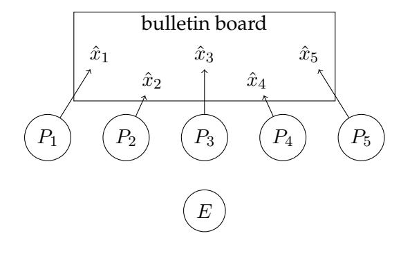
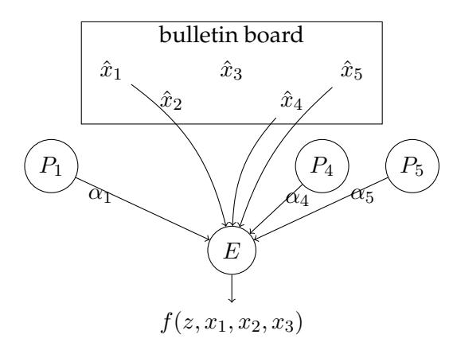
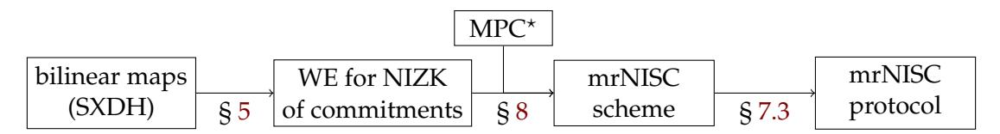
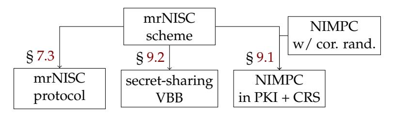

# Mr NISC:

# Multiparty Reusable Non-Interactive Secure Computation

Fabrice Benhamouda\* Huijia Lin†

### **Abstract**

Reducing interaction in Multiparty Computation (MPC) is a highly desirable goal in cryptography. It is known that 2-round MPC can be based on the minimal assumption of 2-round Oblivious Transfer (OT) [Benhamouda and Lin, Garg and Srinivasan, EC 2018], and 1-round MPC is impossible in general. In this work, we propose a natural "hybrid" model, called *multiparty reusable Non-Interactive Secure Computation (mrNISC)*. In this model, parties publish encodings of their private inputs *x<sup>i</sup>* on a public bulletin board, once and for all. Later, any subset *I* of them can compute *on-the-fly* a function *f* on their inputs *x<sup>I</sup>* = {*xi*}*i*∈*<sup>I</sup>* by just sending a single message to a stateless evaluator, conveying the result *f*(*x<sup>I</sup>* ) and nothing else. Importantly, the input encodings can be *reused* in any number of on-the-fly computations, and the same classical simulation security guaranteed by multi-round MPC, is achieved. In short, mrNISC has a minimal yet "tractable" interaction pattern.

We initiate the study of mrNISC on several fronts. First, we formalize the model of mrNISC protocols, and present both a UC security definition and a game-based security definition. Second, we construct mrNISC protocols in the plain model with semi-honest and semi-malicious security based on pairing groups. Third, we demonstrate the power of mrNISC by showing two applications: non-interactive MPC (NIMPC) with reusable setup and a distributed version of program obfuscation.

At the core of our construction of mrNISC is a witness encryption scheme for a special language that verifies Non-Interactive Zero-Knowledge (NIZK) proofs of the validity of computations over committed values, which is of independent interest.

<sup>\*</sup>fabrice.benhamouda@normalesup.org, Algorand Foundation, New York, US

<sup>†</sup>rachel@cs.washington.edu, University of Washington, Seattle, US

# **Contents**

| 1 | Introduction<br>1.1<br>Our Results in More Detail                                                                                                                                                                                                                                                                                                                                          | 3<br>4                                       |
|---|--------------------------------------------------------------------------------------------------------------------------------------------------------------------------------------------------------------------------------------------------------------------------------------------------------------------------------------------------------------------------------------------|----------------------------------------------|
| 2 | Technical Overview<br>2.1<br>Security Definition of mrNISC Schemes<br><br>2.2<br>Overview of Our mrNISC Scheme<br><br>2.3<br>Construction of WE for NIZK of Commitments                                                                                                                                                                                                                    | 9<br>9<br>10<br>12                           |
| 3 | Related Works                                                                                                                                                                                                                                                                                                                                                                              | 15                                           |
| 4 | Preliminaries<br>4.1<br>Statistical and Computational Indistinguishability<br><br>4.2<br>Garbled Circuit<br><br>4.3<br>Collision-Resistant Hash Function Family<br>4.4<br>Pseudorandom Functions<br><br>4.5<br>Background on Universal Composability<br><br>4.6<br>Network and Corruption Model Used, and Definition of UC-Security<br>4.7<br>Semi-Malicious Output-Delayed Simulatability | 17<br>17<br>17<br>18<br>18<br>19<br>20<br>21 |
| 5 | NC1<br>WE for NIZK of Commitments:<br>5.1<br>Definition of Witness Encryption for NIZK of Commitments<br><br>5.2<br>Bilinear Commitments with Proofs of Quadratic Relations<br><br>WE for NIZK of Commitments for NC1<br>5.3<br>                                                                                                                                                           | 23<br>23<br>26<br>31                         |
| 6 | NC1<br>P<br>WE for NIZK of Commitments: From<br>to<br>6.1<br>Preliminary: Computational Randomized Encodings.<br><br>From NC1<br>to P.<br>6.2<br>                                                                                                                                                                                                                                          | 34<br>35<br>36                               |
| 7 | Definitions of mrNISC Schemes and Protocols<br>7.1<br>Definition of mrNISC Schemes<br><br>7.2<br>The mrNISC Functionality<br>7.3<br>UC-secure mrNISC Protocols from mrNISC Schemes<br>                                                                                                                                                                                                     | 38<br>38<br>40<br>40                         |
| 8 | Construction of mrNISC Schemes                                                                                                                                                                                                                                                                                                                                                             | 44                                           |
| 9 | Applications of mrNISC<br>9.1<br>NIMPC: From Correlated Randomness to the PKI Setting<br>9.2<br>Secret-Sharing VBB<br>                                                                                                                                                                                                                                                                     | 49<br>49<br>58                               |

<span id="page-2-2"></span><span id="page-2-1"></span>



(a) Parties *P<sup>i</sup>* publish the encodings *x*ˆ*<sup>i</sup>* of their inputs *x<sup>i</sup>* . (Step done a single time, usable for multiple computations.)

(b) Parties *P*1*, P*4*, P*<sup>5</sup> want to let the evaluator *E* compute *f*(*z, x*1*, x*4*, x*5) by each sending a single message *α<sup>i</sup>* .

Figure 1: mrNISC (*z* is a public input to the function)

# <span id="page-2-0"></span>**1 Introduction**

Reducing interaction in Multiparty Computation (MPC) is a highly desirable goal in cryptography, both because each round of communication is expensive and because the liveness of parties is hard to guarantee, especially when the number of participants is large. Contrary to throughput, latency is now essentially limited by physical constraints, and the time taken by a round of communication cannot be significantly reduced anymore. Moreover, non-interactive primitives are more versatile and more amenable to be used as powerful building blocks. Recent works [\[BL18,](#page-62-0)[GS18\]](#page-64-0) constructed 2-round MPC protocols from the minimal primitive of 2-round Oblivious Transfer (OT), where in each round all participants simultaneously broadcast one message. Is it possible to further reduce interaction? The answer is no in general as any non-interactive (i.e., one-round) protocol is susceptible to the so-called residual attack, and cannot achieve the classical simulation security.

In this work, we introduce and study a natural "hybrid" model, between the 2-round and the 1-round settings, which gets us close to having non-interactive protocols while still providing classical security guarantees. We call this model **multiparty reusable Non-Interactive Secure Computation (mrNISC)**. In this model, parties publish encodings of their private inputs *x<sup>i</sup>* on a public bulletin board, once and for all. Later, any subset *I* of them can compute *on-the-fly* a function *f* on their inputs *x<sup>I</sup>* = {*xi*}*i*∈*<sup>I</sup>* by just sending a single public message to a stateless evaluator, conveying the result *f*(*x<sup>I</sup>* ) and nothing else. Importantly, the input encodings are reusable across any number of computation sessions, and are generated independently of any information of later computation sessions — each later computation can evaluate any polynomial-time function, among any polynomial-size subset of participants. Figure [1](#page-2-1) depicts the setting. The security guarantee is that an adversary corrupting a subset of parties, chosen statically at the beginning, learns no information about the private inputs of honest parties, beyond the outputs of the computations they participated in. This holds for any polynomial number of computation sessions.

**Our Contributions.** We initiate the study of mrNISC at the following fronts:

Modeling: We introduce the mrNISC model and formalize both UC security through an ideal

<span id="page-3-1"></span>mrNISC functionality, and a simpler game-based security notion that implies UC security. Our model aims for maximal flexibility. Consider the simplest form of 2-round MPC with reusable first messages, where the first messages could potentially depend on the number of parties, complexity of the computations, and potentially all parties must participate in all computations. mrNISC does not have such restriction. In addition, our model allows adaptive choices of inputs and computations, uses weak communication channels, and allows honest parties to individually opt out of computations.

Construction: We construct the first mrNISC protocols based on SXDH in asymmetric (primeorder) pairing groups. Our protocols are in the plain-model (without any trusted setup), and satisfies semi-honest, and semi-malicious security. For malicious security, reliance on some trusted setups is inevitable. We use a CRS.

Techniques: At the core of our construction is a witness encryption (WE) scheme for a special language that verifies non-interactive zero-knowledge (NIZK) proofs of the validity of computations over committed values. We construct it from bilinear groups. This significantly extends the range of languages for which we know how to construct WE from standard assumptions, which is a result of independent interest.

Applications: We demonstrate the power of mrNISC protocols in two cryptographic applications. First mrNISC allows to generically transform non-interactive MPC protocols [\[BGI](#page-62-1)+14] using correlated randomness into non-interactive MPC protocols in the PKI plus CRS model. Second, mrNISC enables a secret-sharing analogue of Virtual Black-Box program obfuscation [\[BGI](#page-62-2)+01] — called secret sharing VBB.

Comparing with previous models of MPC with minimal interaction, mrNISC naturally generalizes the beautiful notion of reusable NISC by Ishai et al. [\[IKO](#page-65-0)+11] from two party to multiple parties. It differs from the notions of non-interactive MPC (NIMPC) [\[BGI](#page-62-1)+14] and Private Simultaneous Messages (PSM) [\[FKN94,](#page-63-0)[IK97\]](#page-64-1) which achieves weaker security or restricts the corruption pattern. It also differs from the notion of on-the-fly MPC [\[LTV12\]](#page-65-1) which leverages a powerful server to reduce the communication and computation complexity of the parties to be independent of the complexity of the functions computed, but allows the parties to interact in multiple rounds in the computation phase.

It is very plausible that multi-key fully-homomorphic encryption (MKFHE) with threshold decryption, which implies 2-round MPC [\[AJL](#page-61-0)+12[,MW16,](#page-65-2)[CM15\]](#page-63-1), is sufficient for mrNISC. However, proving it is not straightforward. For instance, the current definitions of threshold decryption e.g., [\[MW16,](#page-65-2) [BJMS18\]](#page-62-3) are insufficient for constructing mrNISC, as simulatability only ensures that a single partial decryption can be simulated (hence this definition does not allow to re-use ciphertexts.) See detailed comparisons with more related works in Section [3.](#page-14-0)

# <span id="page-3-0"></span>**1.1 Our Results in More Detail**

**Definition** We start with defining a mrNISC scheme, consisting of an input encoding Com, computation Encode, and output Eval algorithms. An mrNISC scheme immediately yields an MPC protocol with minimal interaction pattern, called an mrNISC protocol. We formalize a game-based security notion for mrNISC scheme, as well as UC-security for mrNISC protocols, and show that the former implies the latter. We have both definitions since they each has its own advantage: UC

<span id="page-4-0"></span>security is the strongest security notion for MPC protocols, and implies security under composition. The ideal mrNISC functionality we define provides a simple interface for using our protocols in bigger systems. On the other hand, the game-based security notion is more succinct and easier to manipulate. By showing that game-based security implies UC security, we have the best of both sides.

mrNISC Scheme. A mrNISC scheme is defined by:

- Input Encoding: A party  $P_i$  encodes its private input  $x_i$  by invoking  $(\hat{x}_i, s_i) \leftarrow \mathsf{Com}(1^{\lambda}, x_i)$ . It then publishes the encoding  $\hat{x}_i$  and keeps the secret state  $s_i$ .
- Computation: In order for a subset of parties  $\{P_i\}_{i\in I}$  to compute the functionality f on their private inputs  $x_I$  and a public input z, each party in I generates a computation encoding  $\alpha_i \leftarrow \mathsf{Encode}(z, \{\hat{x}_j\}_{j\in I}, s_i)$  and sends it to the evaluator. Here, z can be viewed as part of the description of the function  $f(z,\star)$  that is computed.
- Output: The evaluator reconstructs the output  $y = \text{Eval}(z, \{\hat{x}_i\}_{i \in I}, \{\alpha_i\}_{i \in I})$ . (Note that reconstruction is *public* as the evaluator has no secret state.) Correctness requires that  $y = f(z, \{x_i\}_{i \in I})$  when everything is honestly computed.

It is easy to see that an mrNISC scheme for f immediately gives an mrNISC protocol for f. Simulation-security requires that the view of an adversary corrupting the evaluator and any subset of parties, can be simulated using just the outputs of the computations that honest parties participate in. We consider static corruption: The set of corrupted parties C are chosen at the beginning and fixed; later, in a computation involving parties I, the corrupted and honest parties are respectively  $I \cap C$  and  $I \cap \bar{C}$ .

The same security intuition can be formalized with different degree of flexibility. In the simplest selective setting, where the function f, parties' inputs  $x_1, \ldots, x_m$ , and  $(z^1, I^1), \ldots, (z^K, I^K)$  for different computations are all chosen selectively at the beginning, the view of corrupted parties in C is simulatable by a universal simulator S as follows.

$$\begin{split} \text{Selective Security:} & \quad \left\{ \{x_i, r_i\}_{i \in C}, \; \{\hat{x}_i\}_{i \in \bar{C}}, \; \{\alpha_i^1\}_{i \in I^1 \cap \bar{C}}, \; \dots, \; \{\alpha_i^K\}_{i \in I^K \cap \bar{C}} \right\} \\ & \approx \quad \left\{ \mathcal{S}\left( \{x_i\}_{i \in C}, \; \left(y^1, z^1, I^1\right), \dots, \left(y^K, z^K, I^K\right) \right) \right\} \quad y^k = f(z^k, \pmb{x}_{I^k}), \; \forall k \in [K] \end{split}$$

where  $\{x_i, r_i\}_{i \in C}$  are the inputs and randomness of corrupted parties,  $\hat{x}_i$  is the input encoding of an honest party  $P_i$ , and  $\alpha_i^k$  the computation encoding from an honest party  $P_i$  in session k. The above definition captures *semi-honest* security. In the stronger *semi-malicious* security [AJL<sup>+</sup>12], the corrupted parties still follow the protocol specification but are allowed to choose the randomness arbitrarily.

**Dynamics in the mrNISC.** The simple selective setting has several drawbacks undesirable for capturing a dynamic mrNISC setting we envision. Instead, in mrNISC, we have:

• Adaptive Choices: Each party's input  $x_i$  is chosen adaptively. Each computation specified by (z, I) is chosen adaptively, before it starts. Different computation can use the same z and/or I, or different ones. Parties outside I are not involved in and not even aware of computation (z, I).  $f(z, \star)$  can be any polynomial time computable function, and I any polynomial size subset.

- <span id="page-5-0"></span>• *Asynchronous P2P Communication:* Parties have access to a common public bulletin board, but otherwise should only use asynchronous point-to-point authenticated channels. We do not assume any broadcast channel.
- *Optional Participation:* In a computation session (*z k , I<sup>k</sup>* ), honest parties in *I <sup>k</sup>* may opt in or out of any computation. We do not require all honest parties to participate. Furthermore, the output of a computation is revealed only after all parties in *I k* send their computation encoding. (This means that, in any computation session, the simulation of all but the last honest computation encoding must be done without knowing the output of the computation.)

Our mrNISC ideal functionality in the UC framework [\[Can00\]](#page-62-4) captures all above features (see Section [7.2\)](#page-39-0). Clearly, selective security is insufficient for implementing the mrNISC ideal functionality. We thus formalize a game-based adaptive-security of mrNISC schemes, Definition [2.1](#page-8-2) in the overview (Section [2.1\)](#page-8-1) and we show that it implies UC-security. We emphasize that our adaptive security does not mean security against adaptive corruptions.

**Lemma 1.1** (Informal)**.** *An mrNISC scheme for a function f satisfying adaptive semi-malicious (or semihonest) privacy implies a protocol that UC-implements the mrNISC ideal functionality for f in the plain model with semi-malicious (or semi-honest) security.*

Following standard techniques [\[AJL](#page-61-0)+12], semi-malicious UC protocols in the plain model can be transformed into malicious UC protocols in the CRS model using malicious UC-NIZK.

**Plain-Model mrNISC from Bilinear Groups.** We construct mrNISC schemes for polynomial time computable functions in the plain model from bilinear maps.

**Theorem 1.2** (Informal)**.** *Our construction in Section [8](#page-43-0) gives an mrNISC scheme in the plain model for any function in* P*, satisfying adaptive semi-malicious security, based on the SXDH assumption on asymmetric bilinear groups.*

Our construction builds upon the construction of 2-round MPC protocols using general purpose WE and NIZK [\[GLS15\]](#page-64-2), which in turn improves upon the protocols of [\[GGHR14\]](#page-63-2) based on indistinguishability obfuscation. (Unfortunately, follow-up works based on standard assumptions [\[GS17,](#page-64-3)[BL18,](#page-62-0)[GS18\]](#page-64-0) do not have reusable first messages.)

So far, known WE schemes can be split into two categories. The first is WE for general NP language from very strong obfuscation-like assumptions, e.g., [\[GGSW13\]](#page-64-4). The second is WE from standard assumptions, but for very specific languages, such as, language of commitment (or hashes) of a given message, like in [\[CS02,](#page-63-3) [DG17\]](#page-63-4), and languages of commitments that commit to value satisfying up to quadratic equations, like in [\[GS17,](#page-64-3)[GS18\]](#page-64-0). These functionality, however, is too weak for constructing 2-round MPC.

**WE for NIZK of Com.** We observe that it suffices to have witness encryption for a language that verifies NIZK proofs for the validity of computation over committed values. We then construct a commitment scheme Com, a NIZK proof system NIZK, and a WE scheme for the language LWE of statements of form *X*WE = (crs*, c*1*, . . . , cm, G, y*) (where crs is a CRS of NIZK, every *c<sup>i</sup>* is a commitment of Com, and *G* is an arbitrary polynomial-sized circuit). The statement is true if and only if there exists a NIZK proof *π* (i.e., the witness) proving w.r.t. crs that *G* evaluated on the values *v*1*, . . . , v<sup>m</sup>* committed in *c*1*, . . . , c<sup>m</sup>* through Com outputs *y*, i.e., *G*(*v*1*, . . . , vm*) = *y*. More

<span id="page-6-3"></span>

<span id="page-6-0"></span>Figure 2: Construction of mrNISC schemes and protocols (mrNISC protocols implement the mrNISC ideal functionality; MPC\* is an MPC with some special properties defined in Section 4.7)

<span id="page-6-2"></span><span id="page-6-1"></span>

Figure 3: Applications of mrNISC schemes (mrNISC protocols implement the mrNISC ideal functionality)

precisely, the witness relations for WE and NIZK proof are:

$$\mathcal{R}_{\text{WE}}(X_{\text{WE}} = (\text{crs}, c_1, \dots, c_m, G, y), \ \pi) = 1 \quad \text{iff} \quad \text{NIZKVer}(\text{crs}, X_{\text{NIZK}}, \pi) = 1 \tag{1}$$
 
$$\mathcal{R}_{\text{NIZK}}(X_{\text{NIZK}} = (c_1, \dots, c_m, G, y), \ ((v_1, \rho_1), \dots, (v_m, \rho_m))) = 1$$
 
$$\text{iff} \quad \forall i \in [m], \ (v_i, \rho_i) \text{ is a valid opening of } c_i \text{ and } G(v_1, \dots, v_m) = y \tag{2}$$

We call such a triple (Com, NIZK, WE) as WE for NIZK of commitments and construct it from bilinear pairing groups.

**Theorem 1.3** (Informal). *Our construction in Section 5 and Section 6 gives a WE for NIZK of commitments* (Com, NIZK, WE) *based on SXDH over asymmetric bilinear pairing groups.* 

We remark that our construction co-designs (Com, NIZK, WE) together. It significantly extends the range of statements that WE supports, and is based on standard assumptions, which is of independent interest.

**Applications.** We show two applications of mrNISC. A summary of the applications is in Fig. 3.

NON-INTERACTIVE MPC WITH REUSABLE SETUP [BGI+14] proposed the model of non-interactive MPC (NIMPC), where to jointly compute a function, each party sends a single message to an evaluator, without initially committing to their inputs. In this setting, adversaries can always evaluate the residual function  $f|_{H,\{x_i\}_{i\in H}}$  where the inputs of the honest parties are fixed, on all possible inputs of the corrupted parties, a.k.a. the residual attack. Thus, NIMPC aims at achieving the best-possible security that the only information of honest parties' inputs revealed is the residual function  $f|_{H,\{x_i\}_{i\in H}}$ . NIMPC is a powerful and flexible concept equivalent, under different corruption models (i.e., what set C of parties can be corrupted), to garbled circuits, Private Simultaneous Messages [FKN94, IK97] protocols, and program obfuscation. Almost all NIMPC protocols are constructed in a model where parties receive correlated randomness sampled by a trusted third party from some distribution. However, correlated randomness is not reusable, and must be re-sampled independently for each computation session. So far, the only construction of NIMPC protocols

<span id="page-7-0"></span>with reusable setups is by [HIJ<sup>+</sup>17], which makes use of a (reusable) PKI plus CRS, but is based on the sub-exponential security of IO and DDH. Using mrNISC, we give a generic transformation from any NIMPC protocols using correlated randomness to ones in the PKI plus CRS model.

**Corollary 1.4.** Applying our transformation to known NIMPC protocols [BGI<sup>+</sup>14, BKR17], gives the following NIMPC protocols in the PKI plus CRS model assuming mrNISC for P and UC-NIZK for NP.

- 1. NIMPC for the iterated product function  $f(x_1, ..., x_n) = x_1 \cdot ... \cdot x_n$  over a group, against any number of corruption.
- 2. NIMPC for P from multi-input functional encryption, against any number of corruption.
- 3. NIMPC for P, against a constant nubmer of corruption (each holding a O(1)-bit input).

The first and third bullets are achieved for the first time, using only reusable setups. We weaken the assumption needed for the second bullet from sub-exponentially secure IO in [HIJ<sup>+</sup>17] to polynomially secure IO, equivalent to multi-input functional encryption [GGG<sup>+</sup>14], which is a necessary assumption.

SECRET-SHARING VBB We propose a new primitive called *secret-sharing VBB* obfuscation. As the name suggests, it enables the owner of a private program M to secret share M among N servers, where the i'th server holds share  $M_i$ . Later, the servers can evaluate the program on any input x, by sending one message, called the output shares, to an evaluator who learns the output M(x) and nothing else; this holds even if the evaluator colludes with all but one server. Analogous to VBB obfuscation, the secret shares of M are reusable and security is simulation-based. While VBB is impossible in general, secret-sharing VBB can be implemented using mrNISC in a simple way. Though the construction from mrNISC is simple, we found secret-sharing VBB conceptually interesting and it can be readily used to turn applications of VBB into their secret-sharing counterparts. For instance, for cryptographic primitives, such as, IBE, ABE, PE, and FE, where a central trusted authority issues secret keys for identities, key policies, and functions respectively, we can decentralize the trusted authority by creating a secret-sharing VBB obfuscation of the key generation algorithm among multiple servers. Importantly, the servers do not need to communicate with each other and only need to send a single message to the inquirer of a key.

The notion of secret-sharing VBB appears similar to the notions of Homomorphic Secret Sharing and Function Secret Sharing (HSS/FSS) [BGI15,BGI16]. The main difference is that in secret-sharing VBB the evaluator may collude with all but one servers, whereas in HSS/FSS the evaluator is honest. Consequently, the security of secret-sharing VBB must hold even when all output shares are made public, whereas HSS/FSS does not guarantee security in this setting. Another similar notion is bit-fixing homomorphic sharing proposed in [LM18], which is tailor made for the construction there. Secret sharing VBB is simpler and more natural.

See Section 9.1 for details of the application to NIMPC, and Section 9.2 for secret sharing VBB.

**Organization of the Paper** We start by giving a formal definition of mrNISC schemes, and an overview of our construction of mrNISC from bilinear maps in Section 2; the technical bulk of the construction is constructing WE for NIZK of commitments. Next we discuss more about related works in Section 3. After some preliminaries in Section 4, we define witness encryption for NIZK of commitments, and construct a scheme for NC<sup>1</sup> in Section 5; and show bootstrapping from NC<sup>1</sup> to a scheme for P in Section 6. The UC definition of mrNISC protocols is presented in Section 7.2,

the formal constructions of UC-secure mrNISC protocols from mrNISC schemes in Section [8,](#page-43-0) and the applications of mrNISC in Section [9.](#page-48-0)

# <span id="page-8-0"></span>**2 Technical Overview**

# <span id="page-8-1"></span>**2.1 Security Definition of mrNISC Schemes**

We now present the game-based definition of adaptive security of mrNISC scheme. In Section [7.2,](#page-39-0) we present the ideal mrNISC functionality and show that the definition below implies UC-security.

<span id="page-8-2"></span>**Definition 2.1** (Adaptive Security)**.** An mrNISC scheme mrNISC for *f* is semi-honest (or semimalicious) private if there exists a PPT simulator S, such that, for all PPT adversary A, the views of A in the following experiments ExpA*,*<sup>S</sup> (Real*, λ, f*) and ExpA*,*<sup>S</sup> (Ideal*, λ, f*) are indistinguishable.

**Experiment** ExpA*,*<sup>S</sup> (Real*, λ, f*)**:** A chooses the number of parties *M* and the set of honest parties *H* ⊆ [*M*]; the set of corrupted parties is *H*¯ . It interacts with a challenger in an arbitrary number of iterations till it terminates. In every iteration *k*, it can submit *one query* of one of the following three types.

CORRUPT INPUT ENCODING: Upon A sending a query (input*, P<sup>i</sup> , x<sup>i</sup> , ρi*) for a corrupt party *i* ∈ *H*¯ , record *x*ˆ*<sup>i</sup>* generated by (ˆ*x<sup>i</sup> , si*) = Com(1*<sup>λ</sup> , x<sup>i</sup>* ; *ρi*). In the semi-honest case, *ρ<sup>i</sup>* is randomly sampled, whereas in the semi-malicious case, it is chosen by A.

HONEST INPUT ENCODING: Upon A choosing the input (input*, P<sup>i</sup> , xi*) of an honest party *i* ∈ *H*, generate (ˆ*x<sup>i</sup> , si*) ← Com(1*<sup>λ</sup> , xi*) and send *x*ˆ*<sup>i</sup>* to A.

A is restricted to submit one input query for each party *P<sup>i</sup>* .

HONEST COMPUTATION ENCODING: Upon A querying (compute*, P<sup>i</sup> , z, I*) for an honest party *i* ∈ *H* ∩ *I*, if the input encodings {*x*ˆ*j*}*j*∈*<sup>I</sup>* of all parties in *H* ∩ *I* have been generated, send A the computation encoding *α<sup>i</sup>* ← Encode(*z,* {*x*ˆ*j*}*j*∈*<sup>I</sup> , si*). ((*z, I*) is the unique identifier of a computation.)

**Experiment** ExpA*,*<sup>S</sup> (Ideal*, λ, f*)**:** Same as the above experiment, except: Invoke S(1*<sup>λ</sup> , f*).

CORRUPT INPUT ENCODING: Additionally send query (input*, P<sup>i</sup> , x<sup>i</sup> , ρi*) to S.

HONEST INPUT ENCODING: Upon A choosing (input*, P<sup>i</sup> , xi*) for *i* ∈ *H*, send query (input*, Pi*) to S who generates a simulated input encoding *x*˜*<sup>i</sup>* for Adv.

HONEST COMPUTATION ENCODING: Upon A choosing (compute*, P<sup>i</sup> , z, I*), if this is the last honest computation encoding to be generated for computation (*z, I*) (i.e., ∀ *j* ̸= *i* ∈ *I* ∩ *H*, A has queried (compute*, P<sup>j</sup> , z, I*) before), send S the query (compute*, P<sup>i</sup> , z, I*) and the output *y* = *f*(*z,* {*xt*}*t*∈*<sup>I</sup>* ); otherwise, send S the query (compute*, P<sup>i</sup> , z, I*) without *y*. S generates a simulated computation encoding *α*˜*<sup>i</sup>* for Adv.

We emphasize that the definition above captures all dynamic choices described in the introduction. For instance, in the ideal world, for each computation session, simulation of all but the last honest computation encoding do not use the output of that session, ensuring that the output remains hidden until all honest computation encodings are sent.

### <span id="page-9-1"></span><span id="page-9-0"></span>2.2 Overview of Our mrNISC Scheme

Our construction of mrNISC scheme follows the round collapsing approach for constructing 2-round MPC protocols started in [GGHR14]; in particular, we build on the work of [GLS15].

The Round Collapsing Approach. The round-collapsing approach collapses a inner MPC protocol with a polynomial L number of rounds into a 2-round outer MPC protocol as follows. Assume that each party  $P_i$  in the inner MPC broadcast one message  $m_i^\ell$  in each round  $\ell$ . In the first round of outer MPC, each party  $P_i$  commits  $c_i \leftarrow \text{COM}(x_i, r_i)$  to its input  $x_i$  and some random tape  $r_i$  to be used to execute the inner MPC protocol. In the second round, each party  $P_i$  sends one garbled circuit  $\hat{\mathsf{F}}_i^\ell$  per round  $\ell \in [L]$  of the inner MPC protocol corresponding to the next message function  $\mathsf{F}_i^\ell$  of  $P_i$ . This garbled circuit takes as input all the messages  $m^{<\ell} = \{m_j^l\}_{l<\ell,j\in[n]}$  sent in previous rounds, and outputs the next message  $m_i^\ell$  of  $P_i$  of the inner MPC (or the output for the last round  $\ell = L$ ).

To compute the output from all garbled circuits  $\{\hat{\mathsf{F}}_i^\ell\}_{\ell\in[L],i\in[n]}$ , each  $P_i$  needs to provide a way to compute the labels of its garbled circuits  $\hat{\mathsf{F}}_i^\ell$  that correspond to the correct messages of the inner MPC, where a message  $m_j^l$  is correct if it is computed from  $P_j$ 's input and randomness  $(x_j,r_j)$  committed to in the first round. For this, [GLS15] proposed the following mechanism using a general purpose WE and NIZK. Let  $k_0, k_1$  be two labels of  $P_i$ 's garbled circuit  $\hat{\mathsf{F}}_i^\ell$  for an input wire that takes in the t'th bit  $y=m_{j,t}^l$  of a message from  $P_j$ . Recall that  $m_j^l$  is output by  $P_j$ 's garbled circuit  $\hat{\mathsf{F}}_j^\ell$ . The goal is translating the valid bit y to the corresponding label  $k_y$  — that is "let  $\hat{\mathsf{F}}_j^l$  communicate y to  $\hat{\mathsf{F}}_i^\ell$ ". [GLS15] modifies the garbled circuits as follows.

- To "receive" y,  $\hat{\mathsf{F}}_i^{\ell-1}$  for round  $\ell-1$  additionally outputs  $\operatorname{ct}_y \leftarrow \mathsf{WEnc}(X_y, k_y)$  for  $y \in \{0, 1\}$ , under the statement  $X_y$  that there is a NIZK proof  $\pi_y$  proving that  $y = m_{j,t}^l$  is computed correctly from  $P_j$ 's input and randomness  $(x_j, r_j)$  committed in  $c_j$ , according to the protocol specification and the partial transcript of messages  $m^{< l}$  before round l.
- To "send" y,  $\hat{\mathsf{F}}_j^l$  additionally outputs a NIZK proof  $\pi$  that  $y=m_{j,t}^l$  is computed correctly from  $(x_j,r_j)$  committed in  $c_j$ .

For correctness, decrypting  $\operatorname{ct}_y$  using  $\pi$  as a witness reveals  $k_y$ . For security,  $k_{1-y}$  remains hidden, thanks to the security of WE and soundness NIZK. Moreover, the ZK property of NIZK ensures that  $P_j$ 's committed input and randomness  $(x_j, r_j)$  remains hidden, protecting  $P_j$ 's privacy.

Observe that the first messages of the [GLS15] protocol consist of a commitment to parties' input  $x_i$  and randomness  $r_i$ . We show (as a corollary of our mrNISC construction) that the first messages can be made reusable if we replace  $r_i$  with a PRF seed  $s_i$  which can generate pseudo-random tapes for an unbounded number of computations.

Challenge and Our Method The problem is we do not have general purpose WE from standard assumptions. Previous 2-round MPC constructions from standard assumptions circumvent this problem using weaker tools, namely functional commitment with witness encryption from OT in [BL18], or homomorphic proof commitment with encryption from bilinear pairing groups in [GS17], or achieving its effect using OT in [GS18]. Unfortunately, as we explain shortly, using these weaker tools kills the reusability of the first messages.

We restore the reusability of first messages using WE for NIZK of commitments, which suffices for the purpose of [GLS15]. WE for NIZK of commitments is a triple (Com, NIZK, WE) of commitment, NIZK, and WE schemes. It allows to commit to any values  $c_1 \leftarrow \mathsf{Com}(v_1) \dots c_m \leftarrow \mathsf{Com}(v_1) \dots c_m$ 

<span id="page-10-0"></span> $\mathsf{Com}(v_m)$  and later reveal multiple NIZK proofs  $\pi^k$  w.r.t. a crs that  $G^k(v_1\dots v_m)=y^k$  for multiple polynomial-size circuits  $G^k$  and outputs  $y^k$ . In addition, the proofs  $\pi^k$  can be used to decrypt ciphertexts  $\mathsf{ct} \leftarrow \mathsf{WEnc}((\mathsf{crs}, c_1 \dots c_m, G^k, y^k), \mathsf{m})$  tied to a statement  $X^k = (\mathsf{crs}, c_1 \dots c_m, G^k, y^k)$ , so that, the message  $\mathsf{m}$  is recovered if and only if  $\pi^k$  is an accepting proof that  $G^k(v_1 \dots v_m) = y^k$  w.r.t.  $\mathsf{crs}$ . The formal witness relation for WE is in Eq. (1) and that for NIZK in Eq. (2).

The two key properties of WE for NIZK of commitments are i) reusability of commitments – one can generate an unbounded number of NIZK proofs and WE ciphertexts w.r.t. them while keeping committed values hidden (only information in the statements is revealed), and ii) support for P computation – the statements  $X^k = (c, G, y)$  are about the correctness of arbitrary polynomial-sized circuits. These two properties are crucial for achieving the reusability of MPC first messages. Our specific definition and construction of WE for NIZK of commitments has an additional bonus feature that it is "dual-mode" in the sense that in a binding mode, binding of commitments, soundness of NIZK, and semantic security of WE are all information theoretic and perfect, and in a simulation mode, the commitments are perfectly equivocable, NIZK perfectly zero-knowledge. These two modes are controlled by how the CRS is sampled and are indistinguishable. The "dual-mode" feature is not necessary for mrNISC, but might be useful for other applications. We give an overview of our WE for NIZK of commitments in Section 2.3, and formal construction in Section 5 and Section 6.

Combined with the round-collapsing approach of [GLS15], we obtain semi-honest, in fact semi-malicious, mrNISC protocols in the CRS model from pairing groups. We can further remove the CRS, by letting each party  $P_i$  sample a CRS in the binding mode for generating its own commitments and NIZK proofs, while generating WE ciphertexts w.r.t. other parties' CRS, yielding protocols in the plain model. This does not hurt security because for every correctly generated binding CRS, the binding of commitments and the soundness of NIZK hold information theoretically; hence semi-malicious corrupted parties can't cheat and the WE ciphertexts they receive are information theoretically secure. The simulator on the other hand can sample honest parties' CRS in the simulation mode to simulate their commitments and NIZK proofs.

**Implementing Additional Features in mrNISC** Beyond making the first messages reusable, we carefully implement features in mrNISC — namely, adaptive choices of inputs and computations, asynchronous P2P communication, and optional participation of honest parties. Technically, this means simulation of a message can only use information that is available to the simulator at the moment, e.g., only the last delivered honest message in a session can be simulated using the output of that session, all other honest messages are simulated with no information. We show this can be achieved if the inner MPC satisfies *output-delayed simulatability* — all but the last message from honest parties can be simulated without the output, which is the case w.r.t. the GMW protocol [GMW87]. We then show that the resulting collapsed protocols achieves dynamics in mrNISC.

Comparison with Homomorphic Proof Commitments with Encryption The homomorphic proof commitment with encryption of [GS17,GS18] can be viewed as a WE for NIZK of the statement that (a linear combination of) committed values is 0 or 1. This in turns gives WE for NIZK of NAND, which verifies NIZK proofs that  $c_1, c_2, c_3$  commit to three values  $v_1, v_2, v_3$  such that  $v_3 = \text{NAND}(v_1, v_2)$ . The acute reader may remark that being able to prove NAND relations between committed values allow to prove any statement  $X^k = (c, G^k, y^k)$ , by including, in the NIZK proof, commitments to intermediate values in the computation of  $G^k$ , and proofs of correctness of every NAND gate computation w.r.t. them. This is the whole idea of GOS NIZK [GOS12], on which

<span id="page-11-1"></span>[GS17] is based. However, we do not know how to construct WE for verifying such NIZK proofs, because checking these proofs require verifying *quadratic* relations among (committed) elements in the proof. The essence of the problem is that we do not how to construct WE verifying quadratic relations in the *witness* (i.e., the NIZK proof here); if we knew, we would have obtained general purpose WE. This should be distinguished from checking quadratic relations between (committed) elements in the *statement*. The latter is the case in [GS17] and is easier, because the WE encryption procedure knows the statement and can use it to create the ciphertext, but it cannot do the same with the witness.

### <span id="page-11-0"></span>2.3 Construction of WE for NIZK of Commitments

**Key Ideas.** Our key idea is to design NIZK proofs  $\pi$  that can be verified by a linear equation, so that we can construct WE for verifying the proofs using a WE for linear languages, which are essentially hash proof systems (see, e.g., [ABP15]). More specifically, we want to turn verifying a NIZK proof  $\pi$  of a statement X=(c,G,y) into verifying a system of linear equations  $\theta=\Gamma\pi$ . Crucially,  $\theta$  and  $\Gamma$ , which describe the linear equations, must depend only on the statement X (independent of  $\pi$ ). As such,  $\theta$ ,  $\pi$  are known at WE encryption time, and we can use hash proof systems to generate a WE ciphertext that reveals the message given a witness  $\pi$  satisfying the linear system, and information theoretically hides the message if no such witness exists. More precisely, commitments and NIZKs are pairing group elements, and the linear equations are on values in the exponent; at the moment, we ignore this detail.

Unfortunately, verifying known NIZK proofs requires verifying quadratic relations between elements in the proof — the proof contains intermediate computation values, and verification checks the correctness of computation of each gate, which is quadratic. Designing WE for checking quadratic relations between elements in the witness is a barrier, which would give general purpose WE. Our next idea is leveraging that  $NC^1$  circuits can be represented as *restricted multiplication straight-line* (RMS) programs, where multiplication occurs between intermediate values and input elements; importantly, the latter are committed in c contained in the statement C. This asymmetry in multiplication allows to design NIZK proofs c0 verified by a *linear* system c0, c1 defined by the statement. Roughly speaking, the proof c2 contain (encodings of) intermediate values, while c3, c4 contain (encodings of) inputs elements. Then, multiplication between c4 and c4 captures multiplication between input elements and intermediate values in RMS programs. Hence, we can use WE for linear language to obtain WE for NIZK of commitments for c3. Finally, we present a generic bootstrapping technique for lifting from a scheme for c6. Finally, we present a generic bootstrapping technique for lifting from a scheme for c6.

Our NIZK for NC<sup>1</sup> with linear verification equations makes use of the homomorphic commitment schemes developed in existing NIZK proofs and some of the ideas behind these proofs [GOS12, GS12]. For simplicity, our description below uses GOS homomorphic proof commitments which are based on composite-order bilinear groups. Our final solution in Section 5 uses the same ideas but is based on the Groth and Sahai NIZK [GS12] which uses prime order bilinear groups.

WE for Linear Languages. We start with witness encryption for linear languages. A linear language over  $\mathbb{Z}_p$  consists of tuples of a matrix  $\Gamma \in \mathbb{Z}_p^{K \times k}$  and a vector  $\theta \in \mathbb{Z}_p^K$  in the column span of  $\Gamma$ . A witness for  $(\theta, \Gamma)$  is a vector  $\pi$  s.t.  $\theta = \Gamma \pi$ . There is an extremely simple WE scheme for linear language: A ciphertext encrypting  $m \in \mathbb{Z}_p$  consists of  $\alpha^T \Gamma$  and  $\alpha^T \theta + m$  for a random row vector  $\alpha^T$ . When the statement is false, that is,  $\theta$  is outside the column span of  $\Gamma$ ,  $\alpha^T \Gamma$  contains no

<span id="page-12-2"></span>information of  $\alpha^T \theta$ , which hides m.

Linear WE 
$$\mathsf{LWEnc}((\boldsymbol{\theta}, \Gamma), \mathsf{m}): \ \boldsymbol{\alpha} \leftarrow \mathbb{Z}_p^K, \ \ \mathsf{ct} = \boldsymbol{\alpha}^T \boldsymbol{\theta} + \mathsf{m}, \boldsymbol{\alpha}^T \Gamma$$

Can we use linear WE to verify a complex computation G(v)=y over committed values v? If we had a fully homomorphic commitment scheme for which verification of the opening (i.e., decommitment) is linear, we would solve the problem. Verifying that "c opens to v and G(v)=y" is equivalent to that "c' opens to y" w.r.t. c' obtained from homomorphic evaluation of G on c. Now a message m can be encrypted using linear WE w.r.t. c', y (which decides  $\theta$ ,  $\Gamma$ ) and a proof  $\pi$  is simply an opening of c' (ignoring ZK for now). Unfortunately, we do not know how to construct such commitment scheme.

**Linear Proof for One Multiplication.** GOS [GOS12] constructed a commitment scheme with linear opening that can do one homomorphic multiplication, using pairing groups.

Let  $(N, \mathbb{G}_1, \mathbb{G}_2, \mathbb{G}_t, e, g_1, g_2)$  describe a bilinear group of order N. We use the bracket notation  $[a]_b := g_b^a$  in  $G_b$  for  $a \in \mathbb{Z}_N$  – referred to as an encoding of a, and write  $a[a']_b = [aa']_b$  as applying group exponentiation in  $G_b$  and  $[aa']_t = [a]_1[a']_2$  as applying the pairing operation. GOS uses a composite order N = pq symmetric bilinear group, where the two source groups are the same  $\mathbb{G} = \mathbb{G}_1 = \mathbb{G}_2$ ; we simply write [a] as a source group element.

The CRS of the commitment scheme contains [h] for a random element in  $\mathbb{Z}_N$  of order q. A commitment to v in  $\mathbb{Z}_p$  is simply [c] = [rh + v] using a random scalar  $r \leftarrow \mathbb{Z}_N$ . Such a commitment is perfectly binding, because h has order q, and v is in  $\mathbb{Z}_p$ . Given two commitments  $[c_1] = [r_1h + v_1]$  and  $[c_2] = [r_2h + v_2]$ , we can compute a commitment of the product in the target group. Furthermore, we can prove that the product  $v_1v_2$  is equal to some value  $v_{12}$ , and the verification is linear in the proof  $\pi$ :

One Multiplication 
$$[c_1c_2]_t = [c_1][c_2] = [(r_1r_2 \frac{h}{h} + r_1v_2 + r_2v_1) \frac{h}{h} + v_1v_2]_t$$
 Proof 
$$[\pi] := [t_1 + t_2h] \quad \text{for } t_1 = r_1v_2 + r_2v_1, \ t_2 = r_1r_2$$
 Verification 
$$0 \stackrel{?}{=} [c_1][c_2] - [h][\pi] - [1][v_{12}]$$

In other words, the last equation shows that  $[\pi] = [t_1 + t_2 h]$  is a proof for the statement " $[c_1]$  and  $[c_2]$  commits to values  $v_1$  and  $v_2$  so that  $v_1v_2 = v_{12}$ ."

Since the verification is linear, combined with WE for linear language, this immediately gives a WE for NIZK of correctness of one multiplication. This approach was exploited in [GS17] for obtaining WE for NIZK of correctness of one NAND.

**Going beyond one Multiplication (Step 1)** The main issue of the above construction is that a GOS commitment only allows for the evaluation of a single multiplication gate (or equivalently a single NAND), as  $[c_1c_2]_t$  is now in the target group. To evaluate more complex functions G, we need to be able to make further multiplications. The idea is that the prover can commit to  $v_1v_2$  in the source group:  $[c_{\times}] = [r_{\times}h + v_1v_2]$  and then prove that  $[c_{\times}]$  indeed commits to the same value as  $[c_1c_2]_t$ :

<span id="page-12-1"></span><span id="page-12-0"></span>Multiplication 
$$[c_{\times} - c_1 c_2]_t = [1][c_{\times}] - [c_1][c_2] = [(-r_1 r_2 h + r_{\times} - r_1 v_2 - r_2 v_1) h]_t$$
 Proof 
$$[\pi_{\times}] := [t_1 + t_2 h] \text{ for } t_1 = r_{\times} - r_1 v_2 - r_2 v_1, \ t_2 = -r_1 r_2$$
 (3) Verification 
$$0 \stackrel{?}{=} [1][c_{\times}] - [c_1][c_2] - [h][\pi_{\times}]$$
 (4)

Furthermore, by linearity of the GOS commitment, it is also possible to prove that a commitment  $[c_+] = [r_+h + v_+]$  commits to a value  $v_+$  that is a linear combination of values  $v_1$  and  $v_2$  committed

<span id="page-13-2"></span>in **[***c*1**]** and **[***c*2**]**: *v*<sup>+</sup> = *µ*1*v*<sup>1</sup> + *µ*2*v*<sup>2</sup> (for some public scalars *µ*1*, µ*2).

<span id="page-13-1"></span><span id="page-13-0"></span>Linear 
$$[c_{+} - \mu_{1}c_{1} - \mu_{2}c_{2}]_{t} = [c_{+}] - \mu_{1}[c_{1}] - \mu_{2}[c_{2}] = [(r_{+} - \mu_{1}r_{1} - \mu_{2}r_{2}) h]_{t}$$
  
Proof  $[\pi_{+}] := r_{+} - \mu_{1}r_{1} - \mu_{2}r_{2}$  (5)

Verification 
$$0 \stackrel{?}{=} [c_+] - \mu_1[c_1] - \mu_2[c_2] - [h][\pi_+]$$
 (6)

To extend to proving P computations, we can proceed as follows. To commit a bitstring *v*, we commit each bit individually as a GOS commitment: **[***ci***]** = **[***rih* + *vi***]**. Then, to prove that *G*(*v*) = *y*, we represent *G* as a sequence of linear operations and multiplications, and introduce an intermediate commitment for each intermediate result. The proof consists of these intermediate commitments h *c* ′ *j* i , intermediate proofs that they were computed properly (using Eq. [\(3\)](#page-12-0) or Eq. [\(5\)](#page-13-0)) and the opening *r* ′ *<sup>o</sup>* of the commitment **[***c* ′ *o* **]** = **[***r* ′ *<sup>o</sup>h* + *y***]** corresponding to the output of *G*. Verification would consist of verifying the intermediate proofs (using Eqs. [\(4\)](#page-12-1) and [\(6\)](#page-13-1)) and the opening of the output commitment.

The final proof would actually be a zero-knowledge proof and would in essence be a GOS or a Groth-Sahai proof [\[GOS12,](#page-64-7)[GS12\]](#page-64-8). The zero-knowledge property comes from the following two facts: (1) if *h* is chosen to be of order *N* (instead of *q*), commitments are fully equivocable, and (2) there is a single proof **[***π*×**]** (resp., **[***π*+**]** satisfying the verification equation [3](#page-12-0) (resp., Eq. [\(5\)](#page-13-0)). Leveraging these two facts, a ZK simulator for a proof of, say one multiplication, can equivocate *c*1*, c*2*, c*<sup>×</sup> to any values satisfying *v*˜<sup>×</sup> = ˜*v*1*v*˜2, the equivocation gives a fake witness for computing the unique proof.

Unfortunately, the final proof verification is not linear: if two intermediate values *v*1*, v*<sup>2</sup> need to be multiplied, Eq. [\(4\)](#page-12-1) would involve a product of the corresponding two commitments *c*1*, c*2, which is quadratic in the final proof.

**Restricted Multiplication Program (Step 2).** To keep verification linear in the final proof, we remark that we just need to ensure that every multiplication involves at least one input commitment, but never two intermediate commitments (which are part of the final proof). In that case Eq. [\(4\)](#page-12-1) becomes linear in the intermediate commitment. Hence, we can use the above ideas to verify any restricted multiplication straight-line (RMS) computation [\[Cle91,](#page-63-6)[BGI16\]](#page-62-7), which includes all NC<sup>1</sup> computations. Indeed, in an RMS program, the only allowed operations are linear operations over inputs or intermediate values, and multiplications of one intermediate value *v* ′ *<sup>j</sup>* with one input *v<sup>i</sup>* (but not of two intermediate values).

**Improved** NC<sup>1</sup> **Scheme Based on** SXDH**.** The above construction of WE for NIZK of commitments for NC<sup>1</sup> uses composite group order with pairings which are notoriously inefficient. In Section [5,](#page-22-0) we propose a construction solely based on the standard assumption SXDH over asymmetric prime order pairing groups. The construction follows the same ideas described above, but is based on the Groth-Sahai NIZK proofs, which use vector subspaces to implement features of the subgroup structure. The scheme becomes more complex. That's why we explain our ideas w.r.t. the simpler GOS NIZK system.

**Polynomial-Size Circuits.** We now present a generic bootstrapping technique from a WE scheme for NIZK of commitments for RMS to one for P. We can encode any polynomial-size computation *y* = *G*(*v*) into a randomized encoding *o* = RE(*G, v*; PRF(*k*)) that reveals only *y* (with randomness expanded from a seed *k* using a PRF). Since both RE and PRF are computable in NC<sup>1</sup> , our RMSscheme can verify whether *o* is correctly computed from *v, k* committed in some commitments *c*, <span id="page-14-1"></span>but cannot verify that o indeed decodes to y (which belongs to P). Instead, we use a garbled circuit to verify the latter and use WE to ensure that only labels corresponding to the correct RE encoding o are revealed. More precisely, a WE ciphertext of m w.r.t. (G,c,y) for a polynomial-size circuit G contains 1) a garbled circuit  $\hat{F}_{y,m}$  of  $F_{y,m}$  that outputs m iff given an input o' that decodes to y, and 2) WE encryption (using the RMS-scheme) of labels under statements that verify the computation of o from (k,v) committed in o. Decryption requires NIZK proofs certifying the correctness of o, which allows recovering labels for o, and then m.

**Applications** Due to the lack of space, we refer the reader to Section 9 for applications of mrNISC. At a very high-level, in scenarios where a set of parties need many copies of freshly sampled correlated randomness, we can use mrNISC to replace correlated randomness with reusable PKI and CRS setup: Parties' public key in the PKI is simply an encoding of their private PRF key, later on, they can jointly run mrNISC to sample fresh correlated randomness using the pseudorandom coins generated from all parties' PRF keys. In NIMPC, sampling correlated randomness and generating NIMPC message using this correlated randomness can be combined in one mrNISC computation.

### <span id="page-14-0"></span>3 Related Works

RELATION WITH PRIOR 2-ROUND MPC PROTOCOLS. It is natural to ask whether prior 2-round MPC protocols can be used to construct mrNISC protocols. Our construction builds upon that of 2-round MPC protocols of [GLS15] using general purpose WE and NIZK (which in turn builds upon the protocols of [GGHR14] from indistinguishability obfuscation). As a corollary of this work, these 2-round MPC protocols [GLS15,GGHR14] yield mrNISC protocols.

It is plausible that multi-key fully-homomorphic encryption (MKFHE) with threshold decryption that is sufficient for 2-round MPC [AJL<sup>+</sup>12, MW16, CM15] is also sufficient for mrNISC. However, modification and a new proof is required. For instance, the current definitions of threshold decryption, such as, [MW16, BJMS18] are insufficient for constructing mrNISC.

We observe that the most recent 2-round MPC protocols based on pairing [GS17] or 2-round oblivious transfer [BL18, GS18] (and follow-up works) cannot be adapted to the mrNISC setting, as their first messages are not reusable. The work of [BL18] uses a tool called functional commitments with witness encryption, which plays the role of WE for NIZK of commitments in our construction. They constructed this tool from 2-round OT, but unfortunately, losing reusability – only a *single* NIZK proof can be given w.r.t. their commitments, or else committed values are revealed.

As mentioned in technical overview, homomorphic proof commitments with encryption of [GS17,GS18] essentially gives a WE for NIZK of *NAND* (instead of general P computation). Nevertheless, [GS17] showed that this tool is sufficient for 2-round MPC, by first converting the inner MPC protocols with general next step functions into one whose next step functions simply computes NAND only. Such MPCs are *conforming*. More specifically, at each round, a single party computes a NAND between two values in its state masked by some *one-time pad*, and broadcasts the resulting value, and finally the other parties append this value to their states. The one-time pads are important for the security of conforming protocols, but make the first messages non-reusable: two executions of the MPC with the same first messages will use the same one-time pad.

WE for NIZK of commitments can be seen as having the features of both homomorphic commitments with encryption (namely reusability) and of functional commitments with witness selector

<span id="page-15-0"></span>(namely support for P computations). However, our construction of WE for NIZK of commitments departs significantly from their constructions and introduces new ideas.

RELATION WITH SENDER-RECEIVER NISC. A reusable NISC protocol [\[IKO](#page-65-0)+11,[CJS14,](#page-63-7)[AMPR14,](#page-61-2) [BGI](#page-62-8)+17,[BJOV18,](#page-62-9)[CDI](#page-63-8)+18] for computing a function *f* is a sender-receiver MPC protocol where a receiver can publish an encoding of its input *x*ˆ in such a way that a sender holding an input *z* can send a single message so that the receiver learns *y* = *f*(*z, x*) and nothing else. Clearly, reusable NISC is closely related with our notion of mrNISC, especially when the number of parties is just 2. However, these two notions are actually incomparable. The first difference is that in reusable NISC, the receiver may reconstruct the output *y* using its secret state and hence the output reconstruction is *private*, whereas in mrNISC the evaluator reconstructs the output without any secret state and hence output reconstruction is *public*. The second difference is that in mrNISC, parties must commit to their inputs before computation occurs, whereas in reusable NISC, the sender may choose its input online. We note that these two differences are intertwined: to have public reconstruction, it is necessary that parties commit to their inputs in the first round. Indeed, if a sender-receiver protocol has public output reconstruction, an adversary given the encoding of receiver's input can evaluate *f*(*z, x*) for any function *f* and input *z* by generating the sender's message for *f, z* and reconstruct the output, violating security.

RELATION WITH NIMPC AND PSM. Proposed by [\[BGI](#page-62-1)+14], a NIMPC protocol for computing a function *f* enables a set of parties with private inputs *x*1*, . . . , x<sup>n</sup>* to send a single message to an evaluator conveying only *f*(*x*1*, . . . , xn*). As explained above, this setting is inherently susceptible to the residual attack, in contrast to mrNISC in which inputs are committed. Furthermore, fully secure NIMPC implies obfuscation, hence this object is in a much more powerful league than mrNISC.

The notion of Private Simultaneous Message (PSM) proposed by [\[FKN94\]](#page-63-0) and named by [\[IK97\]](#page-64-1) precedes the notion of NIMPC and is a special case of NIMPC, where the adversaries can only corrupt the evaluator (and not any other party), and correspondingly learns only the output of the function and nothing else. Despite of the restriction, PSM protocols still cannot be realized in the CRS model and known protocols rely on either PKI or common randomness shared by the parties but unknown to the evaluator.

RELATION WITH ON-THE-FLY MPC. In [\[LTV12\]](#page-65-1), Lopez-Alt, Tromer, and Vaikuntanathan proposed a novel notion of MPC, called on-the-fly MPC. In their model, 1) users upload encryption of their inputs to a server, unaware of other users' identities or even the number of users in the system; 2) the server later can dynamically choose a subset of inputs and a function to (homomorphically) compute without the help of any users; 3) finally the subset of parties whose inputs are involved engages in a decryption phase to reveal the final output. In this model, the clients are very efficient — their communication and computation complexity in the first and third phases are independent of the complexity of the function, whereas the server computation scales with the complexity of the function. Lopez-Alt, Tromer, and Vaikuntanathan then introduced the notion of Multi-Key FHE (MKFHE) and constructed the first MKFHE from NTRU. They showed that any MKFHE can be used to realize on-the-fly MPC with an *interactive* decryption phase, where relevant parties jointly decrypt the output ciphertext of MKFHE using a MPC protocol.

One-the-fly MPC and mrNISC share the feature that users commit/encrypt their inputs in an initial phase oblivious of other uses, and later computations can be done on subsets of the inputs. However, they differ on two important points:

• On-the-fly MPC requires the complexity of users to be independent of the run-time of the

function. The computation pattern is heavy computation by the server followed by efficient computation by the users. MrNISC allows users to run as long as the run-time of the function, and the computation pattern is heavy computation by the users (generating the computation message), followed by heavy computation (reconstruction) by the server.

Because of the stringent efficiency requirement on users, so far we can only implement on-the-fly MPC using MKFHE, whereas mrNISC can be realized from assumptions that are not known to imply HE, namely bilinear maps in this work.

On-the-fly MPC allows an *interactive* decryption phase, whereas mrNISC requires a *non-interactive* computation phase. In the mrNISC setting where the users' complexity can be as high as the function complexity, if interactive computation phase is allowed, the notion collapses to standard MPC. (Just let parties commit to their inputs, and later use standard MPC protocols to compute functions on subsets of committed inputs.) In contrast, in on-the-fly MPC, because client complexity must be low, even an interactive computation phase is non-trivial to achieve.

In summary, on-the-fly MPC extends standard MPC to the direction of having efficient client computation by leveraging server computation power, whereas mrNISC extends to the direction of having a non-interactive computation phase.

### <span id="page-16-0"></span>4 Preliminaries

# <span id="page-16-1"></span>4.1 Statistical and Computational Indistinguishability

A function negl:  $\mathbb{N} \to \mathbb{N}$  is negligible if for any polynomial  $p \colon \mathbb{N} \to \mathbb{N}$ , for any large enough  $\lambda \in \mathbb{N}$ ,  $\operatorname{negl}(\lambda) < 1/p(\lambda)$ .

**Definition 4.1** (Indistinguishability). Let  $S = \{S_{\lambda}\}_{{\lambda} \in \mathbb{N}}$  be an ensemble of subsets of  $\{0,1\}^*$ , where every element in set  $S_{\lambda}$  has length  $\operatorname{poly}({\lambda})$ . Then ensembles  $X = \{X_{\lambda,w}\}_{{\lambda} \in \mathbb{N}, w \in S_{\lambda}}$  and  $Y = \{Y_{\lambda,w}\}_{{\lambda} \in \mathbb{N}, w \in S_{\lambda}}$  are *statistically* (resp., *computationally*) *indistinguishable*, denoted as  $X \approx_s Y$  (resp.,  $X \approx Y$ ), if for any arbitrary-size (resp., polynomial-size) circuit family  $D = \{D_{\lambda}\}_{{\lambda} \in \mathbb{N}}$  and any polynomial-size sequence of index  $\{w_{\lambda} \in S\}_{{\lambda} \in \mathbb{N}}$ , there exists a negligible function negl such that, for every  ${\lambda} \in \mathbb{N}$ ,

$$|\Pr\left[D_{\lambda}(w_{\lambda}, X_{\lambda, w_{\lambda}}) = 1\right] - \Pr\left[D_{\lambda}(w_{\lambda}, Y_{\lambda, w_{\lambda}}) = 1\right]| \le \operatorname{negl}(\lambda) \ .$$

Two statistically indistinguishable ensembles are also said to be statistically close.

### <span id="page-16-2"></span>4.2 Garbled Circuit

**Definition 4.2** (Garbled Circuit). Let  $\mathcal{C} = \{\mathcal{C}_{\lambda}\}_{\lambda \in \mathbb{N}}$  be a poly-size circuit class with input and output lengths n and l. A *garbled circuit* scheme GC for  $\mathcal{C}$  is a tuple of four polynomial-time algorithms  $\mathsf{GC} = (\mathsf{GC}.\mathsf{Gen}, \mathsf{GC}.\mathsf{Garble}, \mathsf{GC}.\mathsf{Eval}, \mathsf{GC}.\mathsf{Sim})$ :

- Input Labels Generation: key  $\leftarrow$  GC.Gen $(1^{\lambda})$  generates input labels key  $= \{ \ker[i,b] \}_{i \in [n], b \in \{0,1\}}$  (with  $\ker[i,b] \in \{0,1\}^{\kappa}$  being the input label corresponding to the value b of the i-th input wire) for the security parameter  $\lambda$ , input length n, and input label length  $\kappa$ ;
- Circuit Garbling:  $\hat{C} \leftarrow \mathsf{GC}.\mathsf{Garble}(\mathsf{key},C)$  garbles the circuit  $C \in \mathcal{C}_{\lambda}$  into  $\hat{C}$ ;

- Evaluation:  $y = \mathsf{GC.Eval}(\widehat{C}, \mathsf{key'})$  evaluates the garbled circuit  $\mathsf{GC.Garble}$  using input labels  $\mathsf{key'} = \{\mathsf{key'}[i]\}_{i \in [n]}$  (where  $\mathsf{key'}[i] \in \{0,1\}^\kappa$ ) and returns the output  $y \in \{0,1\}^l$ ;
- <u>Simulation:</u>  $(\text{key}', \widetilde{C}) \leftarrow \text{GC.Sim}(1^{\lambda}, y)$  simulates input labels  $\text{key}' = \{\text{key}'[i]\}_{i \in [n]}$  and a garbled circuit  $\widetilde{C}$  for the security parameter  $\lambda$  and the output  $y \in \{0, 1\}^l$ ;

satisfying the following security properties:

<u>Correctness.</u> For any security parameter  $\lambda \in \mathbb{N}$ , for any circuit  $C \in \mathcal{C}_{\lambda}$ , for any input  $x \in \{0,1\}^n$ , for any key in the image of GC.Gen(1 $^{\lambda}$ ) and any  $\widehat{C}$  in the image of GC.Garble(key, C):

$$\mathsf{GC.Eval}(\widehat{C}, \{ \mathsf{key}[i, x_i] \}_{i \in [n]}) = C(x) \enspace .$$

Simulatability. The following two distributions are computationally indistinguishable:

$$\begin{split} \left\{ (\{ \mathsf{key}[i, x_i] \}_{i \in [n]}, \widehat{C}) \ : \ \begin{array}{l} \mathsf{key} \leftarrow \mathsf{GC}.\mathsf{Gen}(1^\lambda); \\ \widehat{C} \leftarrow \mathsf{GC}.\mathsf{Garble}(\mathsf{key}, C) \end{array} \right\}_{\lambda, C \in \mathcal{C}_\lambda, x \in \{0,1\}^n}, \\ \left\{ (\mathsf{key'}, \widehat{C}) \ : \ (\mathsf{key'}, C) \leftarrow \mathsf{GC}.\mathsf{Sim}(1^\lambda, C(x)) \end{array} \right\}_{\lambda, C \in \mathcal{C}_\lambda, x \in \{0,1\}^n}. \end{split}$$

We recall that garbled circuit schemes can be constructed from one-way functions.

## <span id="page-17-0"></span>4.3 Collision-Resistant Hash Function Family

**Definition 4.3** (Collision-Resistant Hash Function Family). A collision-resistant hash function family is an ensemble  $\{\mathcal{HF}_{\lambda}\}_{\lambda}$  of families of functions  $\mathcal{H}$  from  $\{0,1\}^*$  to  $\{0,1\}^{2\lambda}$ , satisfying the following property:

<u>Collision Resistance.</u> For any PPT adversary A, there exists a negligible function negl such that for every  $\lambda \in \mathbb{N}$ :

$$\Pr\left[\mathcal{H} \ \leftarrow \ \mathcal{H}\!\mathcal{F}_{\lambda}, (m_0, m_1) \ \leftarrow \ \mathcal{A}(\mathcal{H}) \ : \ \mathcal{H}(m_0) \ = \ \mathcal{H}(m_1) \text{ and } m_0 \ \neq \ m_1\right] \ \leq \ \mathrm{negl}(\lambda) \ .$$

### <span id="page-17-1"></span>4.4 Pseudorandom Functions

**Definition 4.4** (Pseudorandom Functions). A pseudorandom function is a deterministic polynomial-time algorithm PRF taking as input a key  $K \in \{0,1\}^{\lambda}$  and an input  $x \in \{0,1\}^{\text{poly}(\lambda)}$  and outputting a bit  $y \in \{0,1\}$ , satisfying the following property:

<u>Pseudorandomness.</u> For any PPT adversary A, there exists a negligible function negl such that for every  $\lambda \in \mathbb{N}$ :

$$\left| \Pr\left[ K \leftarrow \{0,1\}^{\lambda} \ : \ \mathcal{A}^{\mathsf{PRF}(K,\cdot)}(1^{\lambda}) = 1 \right] - \Pr\left[ \mathcal{A}^{R(\cdot)}(1^{\lambda}) = 1 \right] \right| \leq \mathrm{negl}(\lambda) \ .$$

<span id="page-17-2"></span>where R is a random oracle taking as input a bit string  $x \in \{0,1\}^{\operatorname{poly}(\lambda)}$  and outputting a bit. Remark 4.5. For simplicity of notation, we often write  $\operatorname{PRF}(\operatorname{fk},z'\|\{z_1,\ldots,z_\ell\}\|\mathbf{0}) = r$  for  $z' \in \{0,1\}^{\operatorname{poly}(\lambda)}$  and  $z_i \in \{0,1\}^{\operatorname{poly}(\lambda)}$  to mean evaluating PRF on all inputs of form  $z'\|z_i$  padded with zeros to the input length if necessary, and concatenating all output bits to a  $\ell$ -bit string r. In particular, we use  $\operatorname{PRF}(\operatorname{fk},z'\|[\ell]\|\mathbf{0})$  to generate a  $\ell$ -bit pseudo-random string for z'. Integers  $z_i \in [\ell]$  are supposed to be written in binary with the most significant bit on the left. In addition, for the sake of simplicity, we often omit  $\mathbf{0}$  in the above notation.

### <span id="page-18-1"></span><span id="page-18-0"></span>**4.5 Background on Universal Composability**

In this section we recall basics of the UC framework; for full details see [\[Can01\]](#page-62-10). A large part of this introduction has been taken verbatim from [\[CLP10\]](#page-63-9).

**The basic model of execution.** Following [\[GMR89,](#page-64-9)[Gol01\]](#page-64-10), a protocol is represented as an interactive Turing machine (ITM), which represents the program to be run within each participant. Specifically, an ITM has three tapes that can be written to by other ITMs: the input and subroutine output tapes model the inputs from and the outputs to other programs running within the same "entity" (say, the same physical computer), and the incoming communication tapes and outgoing communication tapes model messages received from and to be sent to the network. It also has an identity tape that cannot be written to by the ITM itself. The identity tape contains the program of the ITM (in some standard encoding) plus additional identifying information specified below. Adversarial entities are also modeled as ITMs.

We distinguish between ITMs (which represent static objects, or programs) and *instances of ITMs*, or ITIs, that represent interacting processes in a running system. Specifically, an ITI is an ITM along with an identifier that distinguishes it from other ITIs in the same system. The identifier consists of two parts: A session-identifier (SID) which identifies which protocol instance the ITM belongs to, and a party identifier (PID) that distinguishes among the parties in a protocol instance. Typically the PID is also used to associate ITIs with "parties" or clusters, that represent some administrative domains or physical computers.

The model of computation consists of a number of ITIs that can write on each other's tapes in certain ways (specified in the model). The pair (SID,PID) is a unique identifier of the ITI in the system.

We assume that all ITMs are probabilistic polynomial time (PPT). An ITM is PPT if there exists a constant *c >* 0 such that, at any point during its run, the overall number of steps taken by *M* is at most *λ c* , where *n* is the overall number of bits written on the *input tape* of *M* in this run. execution process is bounded by a polynomial, we define *λ* as the total number of bits written to the input tape of *M*, *minus the overall number of bits written by M to input tapes of other ITMs*; see [\[Can01\]](#page-62-10). )

**Security of protocols.** Protocols that securely carry out a given task (or protocol problem) are defined in three steps, as follows. First, the process of executing a protocol in an adversarial environment is formalized. Next, an "ideal process" for carrying out the task at hand is formalized. In the ideal process the parties do not communicate with each other. Instead they have access to an "ideal functionality," which is essentially an incorruptible "trusted party" that is programmed to capture the desired functionality of the task at hand. A protocol is said to securely realize an ideal functionality if the process of running the protocol amounts to "emulating" the ideal process for that ideal functionality. Below we overview the model of protocol execution (called the *real-world model*), the ideal process, and the notion of protocol emulation.

**Real-world execution.** The model of computation consists of the parties running an instance of a protocol Π, an *adversary* A that controls the communication among the parties, and an *environment* Z that controls the inputs to the parties and sees their outputs. We assume that all parties have a security parameter *λ* ∈ N. (We remark that this is done merely for convenience and is not essential for the model to make sense). The execution consists of a sequence of *activations*, where in each activation a single participant (either Z, A, or some other ITM) is activated, and may write on a tape of at most *one* other participant, subject to the rules below. Once the activation of a participant is complete (i.e., once it enters a special waiting state), the participant whose tape was written on is <span id="page-19-1"></span>activated next. (If no such party exists then the environment is activated next.)

The environment is given an external input *z* and is the first to be activated. In its first activation, the environment invokes the adversary A, providing it with some arbitrary input. In the context of UC security, the environment can from now on invoke (namely, provide input to) only ITMs that consist of a single instance of protocol Π. That is, all the ITMs invoked by the environment must have the same SID and the code of Π.

Once the adversary is activated, it may read its own tapes and the outgoing communication tapes of all parties. It may either deliver a message to some party by writing this message on the party's incoming communication tape or report information to Z by writing this information on the subroutine output tape of Z. For simplicity of exposition, in the rest of this paper we assume authenticated communication; that is, the adversary may deliver only messages that were actually sent. (This is however not essential as shown in [\[BCL](#page-61-3)+05].)

Once a protocol party (i.e., an ITI running Π) is activated, either due to an input given by the environment or due to a message delivered by the adversary, it follows its code and possibly writes a local output on the subroutine output tape of the environment, or an outgoing message on the adversary's incoming communication tape. Finally the adversary can decide to corrupt any honest party. In this case the input and the random coins used by this party are revealed to the adversary.

The protocol execution ends when the environment halts. The output of the protocol execution is the output of the environment. Without loss of generality we assume that this output consists of only a single bit.

Let RealΠ*,*A*,*Z(*λ, z, r*) denote the output of the environment Z when interacting with parties running protocol Π on security parameter *λ*, input *z*, and randomness *r* = *r*Z*, r*A*, r*1*, r*2*, . . .* (where *z* and *r*<sup>Z</sup> for Z; *r*<sup>A</sup> for A, *r<sup>i</sup>* for party *Pi*). Let RealΠ*,*A*,*Z(*λ, z*) be the random variable describing RealΠ*,*A*,*Z(*λ, z, r*) where *r* is uniformly chosen. Let RealΠ*,*A*,*<sup>Z</sup> denote the ensemble {RealΠ*,*A*,*Z(*λ, z*)}*λ*∈N*,z*∈{0*,*1} ∗ .

**Ideal functionalities and ideal protocols.** Security of protocols is defined by comparing the protocol execution to an *ideal protocol* for carrying out the task at hand. A key ingredient in the ideal protocol is the *ideal functionality* that captures the desired functionality, or the specification, of that task. The ideal functionality is modeled as another ITM (representing a "trusted party") that interacts with the parties and the adversary. More specifically, in the ideal protocol for functionality F all parties simply hand their inputs to an ITI running F. We will simply call this ITI F. The SID of F is the same as the SID of the ITIs running the ideal protocol and the PID of F is null.

In addition, F can interact with the adversary according to its code. Whenever F outputs a value to a party, the party immediately copies this value to its own output tape. We call the parties in the ideal protocol dummy parties. Let Π(F) denote the ideal protocol for functionality F.

# <span id="page-19-0"></span>**4.6 Network and Corruption Model Used, and Definition of UC-Security**

Here, we specify the network and corruption model we use for mrNISC protocols and recall UC security definition.

**Network Model.** We assume that parties have access to both a public bulletin board and point to point channels and all channels are authenticated. Assuming authenticated channel is without loss of generality, as in our mrNISC protocols, parties publish their first messages on the public bulletin board, and hence each party can additionally publish a verification key of a signature scheme, and use signatures to ensure the integrity of their messages sent later.

<span id="page-20-1"></span>**Corruption Models.** We consider 1) static corruption, meaning that the adversary chooses the set of corrupted parties  $\bar{H}$  at the beginning of the execution, and 2) security with aborts, meaning that the adversary obtains the outputs first, and may prevent the honest parties from obtaining the outputs.

Three standard types of adversarial behaviors are considered: semi-honest, malicious, and semi-malicious adversaries. We assume familiarity with the first two types, and briefly describe the third type. Semi-malicious adversaries follow the protocol specification (like semi-honest adversaries), but may choose arbitrary random tape to its advantage (like malicious adversaries). In slight more detail, a semi-malicious adversary is model as follows: After sending each message m as a corrupted party  $P_j$  to an honest party  $P_i$ , the adversary outputs on a special output tape, an input  $x_j$  and a random tape  $\rho_j$ , such that, m is the right next message generated by  $P_j$  according to the protocol specification on input  $x_j$ , random tape  $\rho_j$ , after receiving messages it has received so far — the pair  $(x_j, \rho_j)$  is called a *witness* of the message m. In the case that the adversary fails to output a valid witness, the message m is overwritten to  $\bot$ . See [AJL+12] for more detailed formalization of semi-malicious adversaries.

**UC Security.** A protocol  $\Pi$  *emulates* protocol  $\phi$  if for any adversary  $\mathcal{A}$  there exists an adversary  $\mathcal{S}$  such that no environment  $\mathcal{Z}$ , on any input, can tell whether it is interacting with  $\mathcal{A}$  and parties running  $\Pi$ , or it is interacting with  $\mathcal{S}$  and parties running  $\phi$ . This means that, from the point of view of the environment, running protocol  $\Pi$  is "just as good" as interacting with  $\phi$ . We say that  $\Pi$  *securely realizes* an ideal functionality  $\mathcal{F}$  if it emulates the ideal protocol  $\Pi(\mathcal{F})$ , where participants interacts with  $\mathcal{F}$  instead of with each other.

**Definition 4.6.** Let  $\Pi$  and  $\phi$  be protocols. We say that  $\Pi$  UC-emulates  $\phi$  against (static) semi-honest / semi-malicious / malicious adversaries if for every semi-honest / semi-malicious / malicious adversary  $\mathcal A$  (corrupting a set of parties statically) there exists an adversary  $\mathcal S$  such that for any environment  $\mathcal Z$  that obeys the rules of interaction for UC security we have  $\{\mathsf{Real}_{\Pi,\mathcal A,\mathcal Z}(\lambda,z)\}_{\lambda\in\mathbb N,z\in\{0,1\}^*} \approx \{\mathsf{Ideal}_{\phi,\mathcal S,\mathcal Z}(\lambda,z)\}_{\lambda\in\mathbb N,z\in\{0,1\}^*}$ 

Above  $\mathsf{Ideal}_{\phi,\mathcal{S},\mathcal{Z}}(\lambda,z)$  and  $\mathsf{Real}_{\Pi,\mathcal{A},\mathcal{Z}}(\lambda,z)$  are the random variables describing the outputs of the environment in the respective experiments with security parameter  $\lambda$  and auxiliary input z to the adversary. See definitions in Section 4.5.

**Definition 4.7.** Let  $\mathcal{F}$  be an ideal functionality and let  $\Pi$  be a protocol (in the  $\mathcal{G}$ -Hybrid model). We say that  $\Pi$  UC-realizes  $\mathcal{F}$  with (static) semi-honest / semi-malicious / malicious security (in  $\mathcal{G}$ -hybrid model) if  $\Pi$  UC-emulates the ideal process  $\Pi(\mathcal{F})$  against (static) semi-honest / semi-malicious / malicious adversaries.

# <span id="page-20-0"></span>4.7 Semi-Malicious Output-Delayed Simulatability

Our mrNISC construction makes use of a special MPC protocol for which the transcript excluding the last messages can be simulated for all-but-one honest parties before knowing the output. We define it below.

**Definition 4.8** (MPC Protocol). An L-rounds MPC scheme for a class of functions  $\mathcal{C}$  and n parties consists of two polynomial-time algorithms  $\Pi = (\mathsf{Next}, \mathsf{Output})$ :

• Next Message:  $m_i^\ell \coloneqq \operatorname{Next}_i(1^\lambda, 1^n, z, x_i, r_i, \boldsymbol{m}^{<\ell})$  is the message broadcasted by party  $P_i$  for  $i \in [n]$  in round  $\ell \in [L]$ , on input  $x_i$ , on random tape  $r_i \in \{0,1\}^{\nu_r}$ , after receiving the messages  $\operatorname{Msg}^{<\ell} = \{m_j^{\ell'}\}_{j \in [n], \ell' < \ell'}$  where  $m_j^{\ell'}$  is the message broadcasted by party  $P_j$  on round  $\ell' \in [\ell-1]$ .

• Output:  $y \coloneqq \text{Output}(1^{\lambda}, 1^n, z, \text{Msg})$  is the public output of the MPC protocol, for the public input  $\overline{z}$ , and the transcript  $\text{Msg} = \{m_j^{\ell}\}_{i \in [n], \ell \in [L]}$ .

satisfying the perfect correctness property (formally recalled in Definition 4.9).

We omit  $1^{\lambda}$  and  $1^n$  when clear from context. We remark that anybody seeing the transcript  $\mathsf{Msg} = \{m_j^\ell\}_{j \in [n], \ell \in [L]}$  can compute the output y of the function.

Security properties are defined below.

<span id="page-21-0"></span>**Definition 4.9** (Perfect Correctness of MPC Protocol). An L-rounds MPC protocol  $\Pi = (\mathsf{Next}, \mathsf{Output})$  for  $\mathcal{C}$  is perfectly secure if for any security parameter  $\lambda \in \mathbb{N}$ , for any public input z, for any inputs  $(x_1, \ldots, x_n)$ ,

$$\Pr\left[\bar{r} \leftarrow (\{0,1\}^{\nu_r})^n \ : \ \mathsf{Output}(1^\lambda,1^n,z,\mathsf{Msg}) = f(z,x_1,\ldots,x_n)\right] = 1 \ ,$$

where  $m_i^{\ell} = \mathsf{Next}_i(1^{\lambda}, 1^n, z, x_i, r_i, \mathsf{Msg}^{<\ell})$  for  $i \in [n]$  and  $\ell \in [L]$ .

**Definition 4.10** (Semi-Malicious Output-Delayed Simulatability). A L-rounds MPC scheme for  $\mathcal C$  is semi-malicious output-delayed simulatable, if there exists a PPT simulator  $\mathcal S$ , such that, for all PPT adversary  $\mathcal A$  and  $f \in \mathcal C$ , the view of  $\mathcal A$  in the following experiments  $\mathsf{Exp}_{\mathcal A,\mathcal S}(\mathsf{Real},\lambda,f)$  and  $\mathsf{Exp}_{\mathcal A,\mathcal S}(\mathsf{Ideal},\lambda,f)$  are indistinguishable: **Experiment**  $\mathsf{Exp}_{\mathcal A,\mathsf{Sim}}(\mathsf{Real},\lambda,f)$ :

- 1. The adversary  $\mathcal A$  chooses the number of parties M, the set of honest parties  $H\subseteq [M]$ , the public input z, the inputs  $\{x_i\}_{i\in [n]}$  of all the parties and the random tapes  $\{r_i\}_{i\in \bar{H}}$  of the corrupt parties.
- 2. The challenger picks fresh random tapes  $\{r_i\}_{i\in H}$  for the honest parties. It runs the MPC protocol with all the inputs and random tapes above, and sends the adversary the resulting transcript without the last message of the honest parties:  $(\mathsf{Msg}^{< L}, \{m_i^L\}_{i\in \bar{H}})$ .
- 3. The adversary A interacts with the challenger by sending queries (compute,  $P_i$ ) for  $i \in H$ . Upon receiving each query, the challenger sends the last message  $m_i^L$  of  $P_i$ .

Upon receiving each query, the challenger sends the last message  $m_i^L$  of  $P_i$ . Experiment  $\text{Exp}_{\mathcal{A},\text{Sim}}(\text{Ideal},\lambda,f)$ :

- 1. The adversary  $\mathcal{A}$  chooses the number of parties M, the set of honest parties  $H\subseteq [M]$ , the public input z, the inputs  $\{x_i\}_{i\in [n]}$  of all the parties and the random tapes  $\{r_i\}_{i\in \bar{H}}$  of the corrupt parties.
- 2. The challenger sends the inputs and random tapes  $(\{x_i\}_{i\in\bar{H}})$  of the corrupt parties to the simulator Sim. The simulator then outputs a transcript without the last message of the honest parties:  $(\mathsf{Msg}^{< L}, \{m_i^L\}_{i\in\bar{H}})$ , that the challenger sends back to  $\mathcal{A}$ .
- 3. The adversary  $\mathcal{A}$  interacts with the challenger by sending queries (compute,  $P_i$ ) for  $i \in \mathcal{H}$ . Upon receiving each query, if all the honest parties have not been queried yet (after this query), the challenger sends (compute,  $P_i$ ) to Sim which answers with  $m_i^L$  that the challenger forwards to  $\mathcal{A}$ . If all the honest parties have been queried, the challenger sends (compute,  $P_i$ ,  $f(x_1, \ldots, x_n)$ ) to Sim, which answers with  $m_i^L$  that the challenger forwards to  $\mathcal{A}$ .

<span id="page-22-3"></span>We note that our notion of semi-malicious is weak as it forces the adversary to commit to its random tape and input from the beginning. This definition is sufficient for our purpose.

We also remark that from any semi-malicious MPC, we can construct a semi-malicious output-delayed simulatable MPC. Let f be the single-output function we consider. We define the following function f':

$$f'((x_1,t_1),\ldots,(x_n,t_n)) := f(x_1,\ldots,x_n) \oplus t_1 \oplus \cdots \oplus t_n$$
,

where  $t_i$  is a bit string of the same length as the output of f, and  $\oplus$  is the XOR operation. Given a L-round semi-malicious MPC  $\Pi'$  for f', we construct a (L+1)-round semi-malicious output-delayed simulatable MPC for f as follows: each party  $P_i$  with input  $x_i$  samples  $t_i$  uniformly randomly and runs  $\Pi'$  with input  $(x_i, t_i)$ . Then, each party  $P_i$  broadcasts in the last additional round the value  $t_i$ . The final output can be recovered using the output of  $\Pi'$  and the values  $\{t_i\}_{i\in [n]}$ .

Simulation of  $\Pi$  can be done just by simulating  $\Pi'$  with a random output. Only when the last party is corrupted, the simulator needs to know the actual output y, to program correctly the last message  $t_i$  to be revealed.

# <span id="page-22-0"></span>5 WE for NIZK of Commitments: $NC^1$

In this section, we define and construct our new primitive: witness encryption (WE) for NIZK of commitments (for the complexity class P), which is the main component for the construction of our mrNISC scheme.

As explained in Section 2.3, from a high-level point of view, WE for NIZK of commitments combines the properties of homomorphic proof commitments with encryption [GS17] and of functional commitments with witness selector [BL18]. Compared with the former, it supports general statements in P (instead of a single NAND gate evaluation). Compared with the latter, it allows for zero-knowledge to hold when multiple NIZK proofs are generated.

# <span id="page-22-1"></span>5.1 Definition of Witness Encryption for NIZK of Commitments

We start by defining dual-mode commitment schemes (a.k.a., hybrid commitments [CV05]), where the CRS can be generated in two computationally indistinguishable ways: one yielding perfectly binding commitments and one yielding equivocal (a.k.a., simulatable or trapdoor) commitments. The term "dual-mode commitment" comes from [Lin15].

We may not need dual-mode commitments to construct mrNISC, but just simulatable/equivocal commitments (without a perfectly binding setup). However using dual-mode commitments significantly simplifies definitions and proofs. Since our constructions achieve this stronger security notion, we use it. More precisely, without a dual-mode commitment, we could not use the standard definition of witness encryption: witness encryption indeed just ensures that ciphertexts related to a false statement (about the committed value, in our setting) cannot be decrypted. Without the dual mode, because of equivocality of the commitments, it would be possible to open any commitment to any value. Hence any statement about a committed value would be always true or always false (independently of the committed value).

<span id="page-22-2"></span>**Definition 5.1** (Dual-Mode Commitments). A (dual-mode) commitment scheme COM has a *binding* mode and a *simulation* mode, each involves three polynomial-time algorithms.

- Binding Setup:  $\operatorname{crs} \leftarrow \operatorname{CSetup_{bind}}(1^{\lambda})$  on input the security parameter  $\lambda$  generates a binding CRS  $\operatorname{crs}$ .
- Commitment:  $(c,d) \leftarrow \mathsf{CCom}(\mathsf{crs},v)$  on input the CRS crs and a message v in some implicitly defined message set  $\mathcal{V}$ , generates a commitment c of v and an associated decommitment (a.k.a., opening) d.
- <u>Verification</u>:  $b := \mathsf{CVer}(\mathsf{crs}, c, v, d)$  on input the CRS crs, a commitment c, a message  $v \in \mathcal{V}$ , and a decommitment d, outputs 1 if c indeed commits to v, and 0 otherwise.
- Simulation Setup:  $(crs, \tau) \leftarrow CSetup_{sim}(1^{\lambda})$  on input the security parameter  $\lambda$  generates a simulation CRS crs and an associated trapdoor  $\tau$ .
- Commitment Simulation:  $(c, \mathsf{aux}) \leftarrow \mathsf{CSimCom}(\tau)$  on input a simulation trapdoor  $\tau$ , generates a simulated commitment c and some auxiliary data  $\mathsf{aux}$ .
- Opening Simulation:  $d \leftarrow \mathsf{CSimOpen}(\tau, \mathsf{aux}, v)$  on input an auxiliary data aux and a message  $v \in \mathcal{V}$ , generates some decommitment d corresponding to an opening of the associated commitment c to v.

satisfying the following properties:

 $\frac{\textit{Perfect Correctness.}}{\mathsf{CSetup_{sim}}(1^{\lambda})}, \text{ message } v \in \mathcal{V}, \text{ and commitment } (c,d) \leftarrow \mathsf{CCom}(\mathsf{crs},v), \text{ we have: } \mathsf{CVer}(\mathsf{crs},c,v,d) = 1.$ 

Setup Indistinguishability. The following two distributions are computationally indistinguishable:

$$\left\{\mathsf{crs} \leftarrow \mathsf{CSetup}_{\mathsf{bind}}(1^\lambda) \ : \ \mathsf{crs}\right\}_\lambda \approx \left\{(\mathsf{crs},\tau) \leftarrow \mathsf{CSetup}_{\mathsf{sim}}(1^\lambda) \ : \ \mathsf{crs}\right\}_\lambda \ .$$

Perfect Binding in Binding Mode. For every security parameter  $\lambda \in \mathbb{N}$ , binding CRS crs  $\leftarrow$  CSetup<sub>bind</sub> $(1^{\lambda})$ , message  $v \in \mathcal{V}$ , commitment  $(c,d) \leftarrow$  CCom(crs, v), message  $v' \in \mathcal{V}$ , bitstring d', if  $v' \neq v$ : CVer(crs, c, v', d') = 0.

<u>Perfect Equivocality in Simulation Mode.</u> For every security parameter  $\lambda \in \mathbb{N}$ , simulation CRS  $(\operatorname{crs}, \tau) \leftarrow \operatorname{CSetup}_{\operatorname{sim}}(1^{\lambda})$ , message  $v \in \mathcal{V}$ , the following two distributions are identical:

$$\{(c,d) \leftarrow \mathsf{CCom}(\mathsf{crs},v) \,:\, (c,d)\} \ ,$$
 
$$\{(c,\mathsf{aux}) \leftarrow \mathsf{CSimCom}(\tau), \ d \leftarrow \mathsf{CSimOpen}(\tau,\mathsf{aux},v) \,:\, (c,d)\} \ .$$

We are interested in proving statements "in zero-knowledge" of the form: "c commits to some value v such that G(v) = y," where G is a circuit in some circuit class  $\mathcal G$  and y is the expected output of the function. In our construction, the trapdoor of the NIZK will actually be the trapdoor of the commitment. That is why we cannot easily rely on a generic definition of NIZK and instead introduce the notion of dual-mode NIZK of commitments. The binding setup yields perfectly sound NIZK proofs, while the simulation setup yields zero-knowledge proofs.

<span id="page-23-1"></span><span id="page-23-0"></span><sup>&</sup>lt;sup>1</sup>The message set  $\mathcal V$  may depend on the CRS crs. The only required constraints are that messages in  $\mathcal V$  have polynomial size in the security parameter  $\lambda$  and that testing membership to  $\mathcal V$  can be done in polynomial-time given crs. The reason to use messages spaces more complicated than  $\{0,1\}^{\mathrm{poly}(\lambda)}$  is to allow messages to be elements of some finite field  $\mathbb Z_p$  for the definition of bilinear commitments with proofs of quadratic relations.

**Definition 5.2** (Dual-Mode NIZK of Commitments). Let COM be as in Definition 5.1, and  $\mathcal{G}$  be a class of polynomial-size circuits. A dual-mode NIZK NIZK associated with COM for  $\mathcal{G}$  consists of two polynomial-time algorithms:

- Proof:  $\pi \leftarrow \mathsf{CProve}(\mathsf{crs}, c, G, v, d)$  on input the CRS crs, a commitment c, a circuit  $G \in \mathcal{G}$ , the committed message  $v \in \mathcal{V}$ , the decommitment d, as defined by COM, generates a proof  $\pi$  that G on input the value v committed in c outputs y = G(v). Refer to (c, G, y) as the statement and (v, d) the witness.
- <u>Proof Verification:</u>  $b := \mathsf{CPVer}(\mathsf{crs}, c, G, y, \pi)$  on input the CRS crs, a statement (c, G, y), and a proof  $\pi$ , accepts or rejects the proof.

The algorithms satisfy the following properties:

 $\frac{\textit{Perfect Proof Correctness.}}{(\mathsf{crs},\tau) \leftarrow \mathsf{CSetup_{sim}}(1^\lambda), \, \mathsf{message} \, v \in \mathcal{V}, \, \mathsf{circuit} \, G \in \mathcal{G}, \, \mathsf{commitment} \, (c,d) \leftarrow \mathsf{CCom}(\mathsf{crs},v) \\ \text{and proof} \, \pi \leftarrow \mathsf{CProve}(\mathsf{crs},c,G,v,d), \, \mathsf{we have:} \, \mathsf{CPVer}(\mathsf{crs},c,G(v),\pi) = 1.$ 

Perfect Soundness in Binding Mode. For every security parameter  $\lambda \in \mathbb{N}$ , binding CRS crs  $\leftarrow$  CSetup<sub>bind</sub> $(1^{\lambda})$ , message  $v \in \mathcal{V}$ , commitment  $(c,d) \leftarrow$  CCom(crs, v), circuit  $G \in \mathcal{G}$ , incorrect output  $y' \neq G(v)$ , and bitstring  $\pi$ , we have: CPVer(crs,  $c, y', \pi) = 0$ .

<u>Zero-Knowledge in Simulation Mode.</u> There exists a PPT simulator algorithm CPSim, such that for any PPT adversary A, the quantity is negligible in λ:

$$\begin{split} \left| \Pr \left[ \begin{array}{l} (\mathsf{crs},\tau) \leftarrow \mathsf{CSetup}_{\mathsf{sim}}(1^\lambda), \ (\mathsf{st},v) \leftarrow \mathcal{A}(\mathsf{crs},\tau), \\ (c,\mathsf{aux}) \leftarrow \mathsf{CSimCom}(\tau), \ d \leftarrow \mathsf{CSimOpen}(\tau,\mathsf{aux},v) \end{array} \right] : \ \mathcal{A}^{\mathsf{Prove}}(\mathsf{st}) = 1 \\ - \Pr \left[ \begin{array}{l} (\mathsf{crs},\tau) \leftarrow \mathsf{CSetup}_{\mathsf{sim}}(1^\lambda), \ (\mathsf{st},v) \leftarrow \mathcal{A}(\mathsf{crs},\tau), \\ (c,\mathsf{aux}) \leftarrow \mathsf{CSimCom}(\tau) \end{array} \right] : \ \mathcal{A}^{\mathsf{Sim}}(\mathsf{st}) = 1 \\ \end{array} \right] \ , \end{split}$$

where  $\mathsf{Prove}(G) \coloneqq \mathsf{CProve}(\mathsf{crs}, c, G, v, d)$  and  $\mathsf{Sim}(G) \coloneqq \mathsf{CPSim}(\tau, \mathsf{aux}, G, G(v))$ .

We remark that our notion of zero-knowledge allows the adversary to see the trapdoor  $\tau$  but not the auxiliary data aux, that is why we let the adversary consider a single simulated commitment but as many simulated proofs as it wants. The reason that aux is not given to the adversary is because we need to store a PRF key in aux, to generate the randomness for simulation, to be sure to use the same randomness if the simulation is called twice with the same circuit G in the construction for P.

**Definition 5.3** (Witness Encryption for NIZK of Commitments). Let COM, NIZK, and  $\mathcal{G}$  be as in Definition 5.1 and 5.2. A Witness Encryption WE associated with COM, NIZK for  $\mathcal{G}$  consists of two polynomial-time algorithms:

- Witness Encryption: ct  $\leftarrow$  CWEnc(crs, c, G, y, m) on input the CRS crs, a statement (c, G, y) where  $G \in \mathcal{G}$ , and a bitstring m, encrypts m into a ciphertext ct, under that statement.
- Witness Decryption:  $m := \text{CWDec}(\text{crs}, \text{ct}, c, G, y, \pi)$  on input the CRS crs, a ciphertext ct, a statement (c, G, y), and a NIZK proof  $\pi$ , decrypts ct into the message m, or outputs  $\bot$ .

<span id="page-24-0"></span> $<sup>^2</sup>$ We implicitly systematically assume that G has input size corresponding to the size of messages in the message set  $\mathcal{V}$ .

The algorithms satisfy the following properties:

*Semantic Security.* For any PPT adversary A, the following is negligible in  $\lambda$ :

$$\begin{vmatrix} 2 \cdot \Pr \begin{bmatrix} (\mathsf{st}, \rho') \leftarrow \mathcal{A}(1^\lambda), \ \mathsf{crs} \leftarrow \mathsf{CSetup}_{\mathsf{bind}}(1^\lambda; \rho'), \\ (\mathsf{st}, v, \rho, G, y, \mathsf{m}_0, \mathsf{m}_1) \leftarrow \mathcal{A}(\mathsf{st}, \mathsf{crs}), \\ (c, d) \coloneqq \mathsf{CCom}(\mathsf{crs}, v; \rho), \\ b \leftarrow \{0, 1\}; \ \mathsf{ct} \leftarrow \mathsf{CWEnc}(\mathsf{crs}, c, G, y, \mathsf{m}_b) \\ \mathsf{ct} \coloneqq \bot \ \text{if} \ G(v) = y \end{aligned} \right. \quad : \quad \mathcal{A}(\mathsf{st}, \mathsf{ct}) = b$$

where  $\rho$  denotes the random tape used by CCom to generate the commitment c of the message v ( $\rho$  is provided by the adversary).

We remark that semantic security of our WE holds even when the binding CRS is generated semi-maliciously, i.e., the adversary chooses the random tape  $\rho'$ . This is important for our semi-malicious construction of mrNISC schemes, as the adversary generates itself the binding CRS. We also note that our construction for  $NC^1$  actually achieves perfect semantic security for binding CRS, however, our transformation from  $NC^1$  to P only achieves computational semantic security.

## <span id="page-25-0"></span>5.2 Bilinear Commitments with Proofs of Quadratic Relations

As a tool to construct witness encryption for NIZK of commitments, we first introduce the notion of bilinear commitments with proofs of quadratic relations. Such commitments essentially allow to "prove linearly and in a strong form of zero-knowledge" that one commitment  $c_{\times}$  commits to the product of the values committed by two commitments  $c_1$  and  $c_2$  (quadratic proofs), and that one commitment  $c_+$  commits to some linear combination of the values committed by two commitments  $c_1$  and  $c_2$  (linear proofs). These proofs are amenable to be verified by hash proof systems and can be combined to construct WE for NIZK of commitments.

### 5.2.1 Bilinear Groups and Notations.

Denote by  $(p, \mathbb{G}_1, \mathbb{G}_2, \mathbb{G}_t, e, g_1, g_2)$  a bilinear group where  $e: \mathbb{G}_1 \times \mathbb{G}_2 \to \mathbb{G}_t$  is an efficiently computable bilinear map (called a pairing) such that  $e(g_1, g_2) = g_T$  generates  $\mathbb{G}_t$ . We use the bracket notation  $[a]_t$  to denote the element  $g_t^a$  in group  $\mathbb{G}_t$  for  $a \in \mathbb{Z}_p$  and write  $a[a']_t = [aa']_t$  as applying group exponentiation in  $\mathbb{G}_t$  and  $[aa']_t = [a]_1[a']_2$  as applying the pairing operation. This notation extends to vectors and matrices. We assume the *Symmetric External Diffie-Hellman assumption* (SXDH) assumption over asymmetric bilinear pairing groups, which requires the Decisional Diffie-Hellman (DDH) assumption to hold in each source group  $\mathbb{G}_1$  and  $\mathbb{G}_2$ , namely, for any  $t \in \{1, 2\}$ ,  $\{[r]_t, [s]_t, [rs]_t\} \approx \{[r]_t, [s]_t, [t]_t\}$ , where r, s, t are random scalars sampled from  $\mathbb{Z}_p$ . All vectors are denoted by bold letters and all matrices are denoted by uppercase letters.

#### <span id="page-26-1"></span>5.2.2 Bilinear Commitments.

Our construction starts from the SXDH-based commitment scheme used in Groth-Sahai NIZK [GS08]. This commitment scheme allows to commit values both in  $\mathbb{G}_1$  and  $\mathbb{G}_2$ . The resulting commitments are dual-mode and called type-1 and type-2 commitments respectively. More formally we define:

- Binding Setup: crs  $\leftarrow$  QSetup<sub>bind</sub> $(1^{\lambda})$  generates a bilinear group  $(p, \mathbb{G}_1, \mathbb{G}_2, \mathbb{G}_t, e, g_1, g_2)$ , and for  $\iota \in \{1, 2\}$ , generates a random matrix  $A_{\iota} \in \mathbb{Z}_p^{2 \times 2}$  of rank 1 such that the vector  $\mathbf{1} := (1, 1)^T \in \mathbb{Z}_p^2$  is not in the column span of  $A_{\iota}$ , and outputs crs  $= (p, \mathbb{G}_1, \mathbb{G}_2, \mathbb{G}_t, e, g_1, g_2, [A_1]_1, [A_2]_2)$ .
- Simulation Setup:  $(crs, \tau) \leftarrow QSetup_{sim}(1^{\lambda})$  is identical to binding setup except that  $A_1$  and  $A_2$  are chosen of rank 2. The trapdoor is  $\tau = (A_1, A_2)$ . Note that 1 is in the column spans of  $A_1$  and  $A_2$ .
- Commitment:  $(c, d) \leftarrow \mathsf{QCom}_{\iota}(\mathsf{crs}, v)$  generates a type- $\iota$  commitment of a message  $v \in \mathcal{V} \coloneqq \mathbb{Z}_p$  as follows:

$$\boldsymbol{d} \leftarrow \mathbb{Z}_p^2 \; , \qquad \qquad \boldsymbol{c} \coloneqq \left[ \tilde{\boldsymbol{c}} \right]_\iota \coloneqq \left[ A_\iota \cdot \boldsymbol{d} + v \cdot \mathbf{1} \right]_\iota \in \mathbb{G}_\iota^2 \; .$$

• <u>Verification</u>:  $b := \mathsf{QVer}_{\iota}(\mathsf{crs}, \boldsymbol{c}, v, \boldsymbol{d})$  checks whether  $\boldsymbol{c}$  is a valid type- $\iota$  commitment of v as follows: it returns 1 if and only if:

<span id="page-26-0"></span>
$$\mathbf{c} \stackrel{?}{=} [A_{\iota} \cdot \mathbf{d} + v \cdot \mathbf{1}]_{\iota} . \tag{7}$$

• Commitment Simulation:  $(c, \mathbf{aux}) \leftarrow \mathsf{QSimCom}_{\iota}(\tau)$  simulates a type- $\iota$  commitment as follows:

$$\mathbf{aux} \leftarrow \mathbb{Z}_p^2 \;, \qquad \qquad \mathbf{c} \coloneqq \left[ \mathbf{aux} \right]_\iota \in \mathbb{G}_\iota^2 \;.$$
 (8)

• Opening Simulation:  $d \leftarrow \mathsf{QSimOpen}_{\iota}(\tau = (A_1, A_2), \mathsf{aux}, v)$  opens the type- $\iota$  commitment corresponding to  $\mathsf{aux}$  as follows:

$$\mathbf{d} := A_{\iota}^{-1} \cdot (\mathbf{aux} - v \cdot \mathbf{1}) \in \mathbb{Z}_p^2 . \tag{9}$$

We have the following lemma following directly from [GS08].

**Lemma 5.4** (in [GS08]). The two commitment schemes ( $\mathsf{QSetup}_{\mathsf{bind}}, \mathsf{QCom}_{\iota}, \mathsf{QVer}_{\iota}, \mathsf{QSetup}_{\mathsf{sim}}, \mathsf{QSimCom}_{\iota}, \mathsf{QSimOpen}_{\iota}$ ) (for  $\iota \in \{1,2\}$ ) described above are both dual-mode commitments.

Remark 5.5. Jumping ahead, for semi-malicious security of mrNISC in the plain model, we want the binding of COM, soundness of NIZK, and semantic security of WE to hold against every CRS in the support of QSetup<sub>bind</sub>. This boils down to ensuring that the bilinear group generated by QSetup<sub>bind</sub> is always a valid one: p must be a prime number,  $g_1, g_2$  generates the cyclic groups  $\mathbb{G}_1$  and  $\mathbb{G}_2$  of order p, and it is possible to check in polynomial time whether an element is in  $\mathbb{G}_1$  or  $\mathbb{G}_2$ . This can be done, and we implicitly assume that this is the case.

#### 5.2.3 Bilinear Commitments with Proofs of Linear Relations.

We now show how to prove that a type-2 commitment  $c_+$  commits to a given linear combination of values committed in two type-2 commitments  $c_1$  and  $c_2$ . Concretely, we want to prove that

 $c_1, c_2, c_+$  respectively commit to values  $v_1, v_2, v_+$  that satisfy the linear relation:  $v_+ = \mu_1 v_1 + \mu_2 v_2$ , where  $\mu_1, \mu_2 \in \mathbb{Z}_p$  are some public parameters.

Statement: (Linear, crs, 
$$\{\mu_i, c_i\}_{i \in \{1,2\}}, c_+$$
), Witness:  $(v_1, d_1, v_2, d_2, d_+)$ 

The main idea of the construction is to remark that the commitments are linearly homomorphic and the above statement is equivalent to proving that  $[\tilde{c}_+ - \mu_1 \tilde{c}_1 - \mu_2 \tilde{c}_2]_2$  is a commitment of 0, where for  $i \in \{1, 2, +\}$ ,  $c_i = [\tilde{c}_i]_2$ . Hence the proof  $\pi_+$  is the opening of this commitment to the value v = 0:

$$[\tilde{\mathbf{c}}_{+} - \mu_1 \tilde{\mathbf{c}}_1 - \mu_2 \tilde{\mathbf{c}}_2]_2 = [A_2 \cdot \boldsymbol{\pi}_+ + 0 \cdot \mathbf{1}]_2$$
.

Zero-knowledge comes from the fact that this value  $\pi_+$  always exists and is unique in the simulation mode, as the matrix  $A_2$  is full rank in that mode.

Formally, the construction is as follows:

• <u>Linear Proof:</u> QLinProve(crs,  $\{\mu_i, c_i, v_i, d_i\}_{i \in [2]}, (c_+, d_+)$ ), given information of both statement and witness, outputs:

$$\boldsymbol{\pi}_{+} \coloneqq \boldsymbol{d}_{+} - \mu_{1} \boldsymbol{d}_{1} - \mu_{2} \boldsymbol{d}_{2} \in \mathbb{Z}_{p}^{2} . \tag{10}$$

• Linear Proof Verification: QLinVer(crs,  $\{\mu_i, c_i\}_{i \in [2]}, c_+, \pi_+$ ) returns 1 iff:

<span id="page-27-0"></span>
$$[\tilde{c}_{+} - \mu_1 \tilde{c}_1 - \mu_2 \tilde{c}_2]_2 \stackrel{?}{=} [A_2 \cdot \pi_+]_2 ,$$
 (11)

where  $c_i = [\tilde{c}_i]_2$  for  $i \in \{1, 2, +\}$ .

**Lemma 5.6.** For any security parameter  $\lambda \in \mathbb{N}$ , for any CRS crs  $\leftarrow$  QSetup<sub>bind</sub> $(1^{\lambda})$  or  $(\operatorname{crs}, \tau) \leftarrow$  QSetup<sub>sim</sub> $(1^{\lambda})$ , messages  $v_1, v_2, v_+ \in \mathbb{Z}_p$ , scalars  $\mu_1, \mu_2, \mu_+ \in \mathbb{Z}_p$ , bitstrings  $\boldsymbol{c}_1, \boldsymbol{d}_1, \boldsymbol{c}_2, \boldsymbol{d}_2, \boldsymbol{c}_+, \boldsymbol{d}_+$  s.t.  $\forall i \in \{1, 2, +\}, \operatorname{QVer}_2(\operatorname{crs}, \boldsymbol{c}_i, v_i, \boldsymbol{d}_i) = 1$ ,

 $\frac{\textit{Perfect Correctness.}}{\textit{verification: } \textit{QL} \textit{inVer}(\textit{crs}, \{\mu_i, \boldsymbol{c}_i\}_{i \in [2]}, \boldsymbol{c}_+, \boldsymbol{\pi}_+) = 1} = \mu_1 v_1 + \mu_2 v_2, \textit{a proof } \pi_+ \leftarrow \textit{QLinProve}(\textit{crs}, \{\mu_i, \boldsymbol{c}_i, v_i, \boldsymbol{d}_i\}_i, (\boldsymbol{c}_+, \boldsymbol{d}_+)) \textit{ passes } verification: \textit{QLinVer}(\textit{crs}, \{\mu_i, \boldsymbol{c}_i\}_{i \in [2]}, \boldsymbol{c}_+, \boldsymbol{\pi}_+) = 1$ 

<u>Perfect Uniqueness.</u> If  $v_+ = \mu_1 v_1 + \mu_2 v_2$  and the CRS is simulated, then there is a unique vector  $\boldsymbol{\pi}_+ = (\tilde{\boldsymbol{c}}_+ - \mu_1 \tilde{\boldsymbol{c}}_1 - \mu_2 \tilde{\boldsymbol{c}}_2) A_2^{-1} \in \mathbb{Z}_p^2$  that passes verification.

<u>Perfect Soundness.</u> If  $v_+ \neq \mu_1 v_1 + \mu_2 v_2$  and the CRS is binding, then no vector  $\boldsymbol{\pi}_+ \in \mathbb{Z}_p^2$  passes verification: QLinVer(crs,  $\{\mu_i, \boldsymbol{c}_i\}_{i \in [2]}, \boldsymbol{c}_+, \boldsymbol{\pi}_+ \} = 0$  for all  $\boldsymbol{\pi}_+ \in \mathbb{Z}_p^2$ .

*Proof.* **Perfect correctness** is straightforward. **Perfect uniqueness** follows from Eq. (11) and the fact that when the CRS is simulated, the matrix  $A_2$  is full rank. **Perfect soundness** comes from the fact that:

$$[\mu_1 \tilde{\boldsymbol{c}}_1 + \mu_2 \tilde{\boldsymbol{c}}_2]_2 = [A_2 \cdot (\mu_1 \boldsymbol{d}_1 + \mu_2 \boldsymbol{d}_2) + (\mu_1 v_1 + \mu_2 v_2) \cdot \mathbf{1}]_2 \in \mathbb{G}_2^2$$

is a (perfectly binding) commitment of  $\mu_1v_1 + \mu_2v_2 \neq v_+$ .

<span id="page-27-1"></span>Remark 5.7 (Zero-knowledge of the linear proof  $\pi_+$  in simulation mode). Perfect uniqueness of the proof  $\pi_+$  in simulation mode is a very strong form of witness indistinguishability: whatever witness  $(v_1, \boldsymbol{d}_1, v_2, \boldsymbol{d}_2, \boldsymbol{d}_+)$  is used, the proof is exactly the same  $\pi_+ = (\tilde{\boldsymbol{c}}_+ - \mu_1 \tilde{\boldsymbol{c}}_1 - \mu_2 \tilde{\boldsymbol{c}}_2) A_2^{-1}$ . To show further that it is ZK, we need to argue that  $\pi_+$  is also efficiently computable. This the case when the commitments  $\boldsymbol{c}_i = [\tilde{\boldsymbol{c}}_i]_2$  are simulated with QSimCom, as the simulator can then equivocate  $\boldsymbol{c}_1, \boldsymbol{c}_2, \boldsymbol{c}_+$  to any  $v_1', v_2', v_+'$  satisfying  $v_+' = \mu_1 v_1' + \mu_2 v_2'$  with decommitments  $\boldsymbol{d}_1', \boldsymbol{d}_2', \boldsymbol{d}_+'$  using QSimOpen. This gives a valid witness  $(v_1', \boldsymbol{d}_1', v_2', \boldsymbol{d}_2', \boldsymbol{d}_2', \boldsymbol{d}_+')$  for the statement and a simulated proof can be generated by running the honest prover algorithm QLinProve with this witness.

### <span id="page-28-2"></span>5.2.4 Bilinear Commitments with Proofs of Quadratic Relations.

We now show how to prove that a **type-2** commitment  $c_{\times}$  commits to the product of values committed in a **type-1** commitment  $c_1$  and a **type-2** commitment  $c_2$ . Concretely, we want to prove that  $c_1, c_2, c_+$  respectively commit to values  $v_1, v_2, v_{\times}$  that satisfy the quadratic relation  $v_{\times} = v_1 \cdot v_2$ .

Statement: (Mult, crs, 
$$\{c_i\}_{i \in \{1,2,\times\}}$$
), Witness:  $(v_1, d_1, v_2, d_2, d_{\times})$  (12)

The main idea of the construction is to construct from  $c_1 = [\tilde{c}_1]_1$  and  $c_2 = [\tilde{c}_2]_2$  a commitment of  $v_1 \cdot v_2$ . Remember that in the technical overview Section 2.3, we could multiply commitments  $c_1$  and  $c_2$  directly (by using a pairing operation) to get a commitment of  $v_1 \cdot v_2$ , as commitments were a single group element. Intuitively, the equivalent of this multiplication to vector of group elements  $c_1$  and  $c_2$  is the tensor product operation  $\otimes$ . And we want to prove that  $[1 \otimes \tilde{c}_{\times} - \tilde{c}_1 \otimes \tilde{c}_2]_t$  is a "commitment" of 0 in  $\mathbb{G}_t$ , where 1 is used as a type-1 commitment of 1.3 Similar to multiplication of commitments in Section 2.3, computing these tensor products uses pairings.

The basic idea is then that the proof is a decommitment of this commitment  $[1 \otimes \tilde{c}_{\times} - \tilde{c}_{1} \otimes \tilde{c}_{2}]_{t}$  to 0. Unfortunately, this would not be zero-knowledge since there are multiple possible decommitments and choosing one may reveal information about the witness  $(v_{1}, \boldsymbol{d}_{1}, v_{2}, \boldsymbol{d}_{2}, \boldsymbol{d}_{\times})$ . To tackle this subtle issue (which does not happen with the commitments from the technical overview in Section 2.3 nor with proof of linear relations), the prover needs to rerandomize this decommitment, similarly to what is done in [GS08] to get perfect witness indistinguishability. This is the purpose of the vector  $\boldsymbol{\rho}$  in Eq. (14).

TENSOR PRODUCTS. We first need to briefly recall the notion of tensor products. The tensor product of two matrices  $M \in \mathbb{Z}_p^{k \times m}$  and  $M' \in \mathbb{Z}_p^{k' \times m'}$  is the matrix  $T = M \otimes M' \in \mathbb{Z}_p^{kk' \times mm'}$  defined as:

$$T = \begin{pmatrix} M_{1,1} \cdot M' & \cdots & M_{1,m} \cdot M' \\ \vdots & & \vdots \\ M_{k,1} \cdot M' & \cdots & M_{k,m} \cdot M' \end{pmatrix} .$$

We extensively use the following identity: if  $M \in \mathbb{Z}_p^{k \times m}$ ,  $M' \in \mathbb{Z}_p^{k' \times m'}$ ,  $N \in \mathbb{Z}_p^{m \times n}$  and  $N' \in \mathbb{Z}_p^{m' \times n'}$ , then we have,

<span id="page-28-1"></span>
$$(M \otimes M') \cdot (N \otimes N') = (M \cdot N) \otimes (M' \cdot N') . \tag{13}$$

Construction. Recall that the construction essentially consists of proving that  $[1 \otimes \tilde{c}_{\times} - \tilde{c}_{1} \otimes \tilde{c}_{2}]_{t}$  is a commitment of 0, which is what Eq. (15) below ensures. To better understand how this value is computed (in term of group elements, pairings, and exponentiations), we explicitly write it down:

$$[\mathbf{1} \otimes \tilde{\boldsymbol{c}}_{\times} - \tilde{\boldsymbol{c}}_{1} \otimes \tilde{\boldsymbol{c}}_{2}]_{t} = \begin{pmatrix} e(g_{1}, c_{\times,1}) \cdot e(c_{1,1}, c_{2,1})^{-1} \\ e(g_{1}, c_{\times,1}) \cdot e(c_{1,1}, c_{2,2})^{-1} \\ e(g_{1}, c_{\times,2}) \cdot e(c_{1,2}, c_{2,1})^{-1} \\ e(g_{1}, c_{\times,2}) \cdot e(c_{1,2}, c_{2,2})^{-1} \end{pmatrix} \quad \text{where } \boldsymbol{c}_{i} = \begin{pmatrix} c_{i,1} \\ c_{i,2} \end{pmatrix}$$

<span id="page-28-0"></span>The construction is as follows:

 $<sup>{}^{3}</sup>$ [1  $\otimes \tilde{c}_{\times} - \tilde{c}_{1} \otimes \tilde{c}_{2}]_{t}$  is not a type-1 commitment (using the matrix  $A_{1}$ ) nor a type-2 commitment (using the matrix  $A_{2}$ ) but yet another type of commitment using another matrix B (formally defined in the proof in Eq. (17)). When the CRS is binding, this matrix B is such that the commitment is also binding.

• Quadratic Proof:  $\pi_{\times} \leftarrow \mathsf{QQuadProve}(\mathsf{crs}, \{\boldsymbol{c}_i, v_i, \boldsymbol{d}_i\}_{i \in [2]}, \boldsymbol{c}_{\times}, \boldsymbol{d}_{\times})$  picks  $\boldsymbol{\rho} \in \mathbb{Z}_p^4$  and outputs:

<span id="page-29-0"></span>
$$\boldsymbol{\pi}_{\times} := \begin{pmatrix} \begin{bmatrix} \tilde{\boldsymbol{\pi}}_{\times}^{\top} \end{bmatrix}_{2} \\ \begin{bmatrix} \tilde{\boldsymbol{\pi}}_{\times}^{\perp} \end{bmatrix}_{1}^{2} \end{pmatrix} = \begin{pmatrix} \begin{bmatrix} -v_{2} \cdot \boldsymbol{d}_{1} \otimes \boldsymbol{1} + (\operatorname{Id} \otimes A_{2}) \cdot \boldsymbol{\rho} \end{bmatrix}_{2} \\ [\mathbf{1} \otimes \boldsymbol{d}_{\times} - \tilde{\boldsymbol{c}}_{1} \otimes \boldsymbol{d}_{2} - (A_{1} \otimes \operatorname{Id}) \cdot \boldsymbol{\rho} \end{bmatrix}_{1} \end{pmatrix} , \tag{14}$$

where  $\operatorname{Id} \in \mathbb{Z}_p^{2 \times 2}$  is the identity matrix. Recall that the vector  $\rho$  is used to randomize the proof so that it is uniformly random among the valid proofs, and hence is perfectly witness indistinguishable.

• Quadratic Proof Verification:  $b \coloneqq \mathsf{QQuadVer}(\mathsf{crs}, \boldsymbol{c}_1, \boldsymbol{c}_2, \boldsymbol{c}_{\times}, \boldsymbol{\pi}_{\times})$  returns 1 if and only if:

<span id="page-29-1"></span>
$$[\mathbf{1} \otimes \tilde{\mathbf{c}}_{\times} - \tilde{\mathbf{c}}_{1} \otimes \tilde{\mathbf{c}}_{2}]_{t} = ([A_{1} \otimes \mathsf{Id}]_{1} \quad [\mathsf{Id} \otimes A_{2}]_{2}) \cdot \boldsymbol{\pi}_{\times} , \qquad (15)$$

where  $\operatorname{Id} \in \mathbb{Z}_p^{2 \times 2}$  is the identity matrix. Note that computing  $[\tilde{\boldsymbol{c}}_1 \otimes \tilde{\boldsymbol{c}}_2]_t$  involves pairing operations between elements of vectors  $\boldsymbol{c}_1 \in \mathbb{G}_1^2$  and  $\boldsymbol{c}_2 \in \mathbb{G}_2^2$ . Computing the right hand side also involves pairing operations.

<span id="page-29-3"></span>*Remark* 5.8. Quadratic proof verification just consists of checking a linear equation in  $(c_2, c_{\times}, \pi_{\times})$ . Indeed, thanks to Eq. (13), Eq. (15) is equivalent to:

$$0 = \begin{pmatrix} \left[\mathbf{1} \otimes \mathsf{Id}\right]_1 & \left[-\tilde{\boldsymbol{c}}_1 \otimes \mathsf{Id}\right]_1 & \left[A_1 \otimes \mathsf{Id}\right]_1 & \left[\mathsf{Id} \otimes A_2\right]_2 \end{pmatrix} \cdot \begin{pmatrix} \begin{bmatrix} \tilde{\boldsymbol{c}}_\times \end{bmatrix}_2 \\ \begin{bmatrix} \tilde{\boldsymbol{c}}_2 \end{bmatrix}_2 \\ \begin{bmatrix} \tilde{\boldsymbol{\pi}}_\times^\top \end{bmatrix}_2 \\ \begin{bmatrix} \tilde{\boldsymbol{\pi}}_\times^\top \end{bmatrix}_1 \end{pmatrix} \ .$$

**Lemma 5.9.** For any security parameter  $\lambda \in \mathbb{N}$ , for any CRS crs  $\leftarrow$  QSetup<sub>bind</sub> $(1^{\lambda})$  or  $(\operatorname{crs}, \tau) \leftarrow$  QSetup<sub>sim</sub> $(1^{\lambda})$ , messages  $v_1, v_2, v_{\times} \in \mathbb{Z}_p$ , bitstrings  $\boldsymbol{c}_1, \boldsymbol{d}_1, \boldsymbol{c}_2, \boldsymbol{d}_2, \boldsymbol{c}_{\times}, \boldsymbol{d}_{\times}$  such that  $\forall i \in \{1, 2, \times\}$ , QVer<sub>i</sub> $(\operatorname{crs}, \boldsymbol{c}_i, v_i, \boldsymbol{d}_i) = 1$ , we have:

 $\frac{\textit{Perfect Correctness.}}{\textit{tion: } \mathsf{QQuadVer}(\mathsf{crs}, \{\mu_i, \boldsymbol{c}_i\}_{i \in [2]}, \boldsymbol{c}_{\times}, \boldsymbol{\pi}_{\times}) = 1}{\mathsf{QQuadVer}(\mathsf{crs}, \{\mu_i, \boldsymbol{c}_i\}_{i \in [2]}, \boldsymbol{c}_{\times}, \boldsymbol{\pi}_{\times}) = 1}$ 

<u>Perfect Uniformity.</u> If  $v_{\times} = v_1 v_2$  and the CRS is simulated, then the vector  $\pi_{\times}$  generated by QQuadProve follows a uniform distribution among the solutions of Eq. (15).

<u>Perfect Soundness.</u> If  $v_{\times} \neq v_1 v_2$  and the CRS is binding, then no  $\pi_{\times} \in \mathbb{Z}_p^8$  passes verification: QQuadVer(crs,  $c_1, c_2, c_{\times}, \pi_0$ ) for all  $\pi_{\times} \in \mathbb{Z}_p^8$ .

*Proof.* To prove **perfect correctness**, we use Eqs. (13) and (14) and remark:

<span id="page-29-2"></span>
$$\mathbf{1} \otimes \tilde{\boldsymbol{c}}_{\times} - \tilde{\boldsymbol{c}}_{1} \otimes \tilde{\boldsymbol{c}}_{2} = \mathbf{1} \otimes (A_{2}\boldsymbol{d}_{\times} + v_{\times} \cdot \mathbf{1}) - \tilde{\boldsymbol{c}}_{1} \otimes (A_{2}\boldsymbol{d}_{2} + v_{2} \cdot \mathbf{1}) 
= \mathbf{1} \otimes (A_{2}\boldsymbol{d}_{\times}) + v_{\times} \cdot \mathbf{1} \otimes \mathbf{1} - \tilde{\boldsymbol{c}}_{1} \otimes (A_{2}\boldsymbol{d}_{2}) - (A_{1}\boldsymbol{d}_{1} + v_{1} \cdot \mathbf{1}) \otimes (v_{2} \cdot \mathbf{1}) 
= \mathbf{1} \otimes (A_{2}\boldsymbol{d}_{\times}) - \tilde{\boldsymbol{c}}_{1} \otimes (A_{2}\boldsymbol{d}_{2}) - (A_{1}\boldsymbol{d}_{1}) \otimes (v_{2} \cdot \mathbf{1}) + (v_{\times} - v_{1}v_{2}) \cdot (\mathbf{1} \otimes \mathbf{1}) 
= (\operatorname{Id} \otimes A_{2}) \cdot (\mathbf{1} \otimes \boldsymbol{d}_{\times}) - (\operatorname{Id} \otimes A_{2}) \cdot (\tilde{\boldsymbol{c}}_{1} \otimes \boldsymbol{d}_{2}) 
- (A_{1} \otimes \operatorname{Id}) \cdot (v_{2}\boldsymbol{d}_{1} \otimes \mathbf{1}) + (v_{\times} - v_{1}v_{2}) \cdot (\mathbf{1} \otimes \mathbf{1}) .$$
(16)

<span id="page-30-3"></span>We conclude by remarking that  $v_{\times} = v_1 v_2$  and that:

$$\left( A_1 \otimes \operatorname{Id} \quad \operatorname{Id} \otimes A_2 \right) \cdot \left( \begin{matrix} (\operatorname{Id} \otimes A_2) \cdot \boldsymbol{\rho} \\ -(A_1 \otimes \operatorname{Id}) \cdot \boldsymbol{\rho} \end{matrix} \right) = 0 \ .$$

**Perfect soundness** follows from Eq. (16) and the fact that  $1 \otimes 1$  is not in the subspace generated by the columns of the matrix

<span id="page-30-1"></span>
$$B := (A_1 \otimes \mathsf{Id} \quad \mathsf{Id} \otimes A_2) \in \mathbb{Z}_p^{4 \times 8} , \qquad (17)$$

when the CRS is binding, because if  $a_1, a_2 \in \mathbb{Z}_p^2$  are two vectors generating the column space of  $A_1$  and  $A_2$  respectively, then  $(a_1 \otimes a_2, a_1 \otimes 1, 1 \otimes a_2, 1 \otimes 1)$  is a basis of  $\mathbb{Z}_p^4$ .

Finally, **perfect uniformity** comes from the fact that the kernel of the matrix B (from Eq. (17)) consists of all the vectors:

$$\begin{pmatrix} (\operatorname{Id} \otimes A_2) \cdot \boldsymbol{\rho} \\ -(A_1 \otimes \operatorname{Id}) \cdot \boldsymbol{\rho} \end{pmatrix} ,$$

for  $\rho \in \mathbb{Z}_p^4$ , since these elements are clearly in the kernel and form a subspace of dimension 4, and the kernel is of dimension 4 as  $B \in \mathbb{Z}_p^{8 \times 4}$  is of rank 4 (because  $A_1$  is of full rank and hence  $A_1 \otimes \mathsf{Id} \in \mathbb{Z}_p^{4 \times 4}$  is of full rank).

<span id="page-30-2"></span>Remark 5.10 (Zero-knowledge of the quadratic proof  $\pi_{\times}$  in simulation mode). Perfect uniformity in the simulation mode is a very strong form of witness indistinguishability: whatever witness is used, the proof follows exactly the same uniform distribution over solutions of Equation 15. To show that  $\pi_{\times}$  is zero-knowledge, it remains to argue that this distribution can be efficiently sampled. This can be done similarly as in Remark 5.7: for simulated commitments  $c_i$ , the simulator can equivocate  $c_1, c_2, c_{\times}$  to any  $v_1', v_2', v_{\times}'$  satisfying  $v_{\times}' = v_1'v_2'$  with decommitment  $d_1', d_2', d_{\times}'$  using QSimOpen. This gives a valid witness  $(v_1', d_1', v_2', d_2', d_2', d_{\times}')$  for the statement and a simulated proof can be generated by running the honest prover algorithm QQuadProve with this witness.

## <span id="page-30-0"></span>5.3 WE for NIZK of Commitments for $NC^1$

We now describe our construction of WE for NIZK of commitments for  ${\rm NC}^1$ . It follows the technical overview Section 2.3. The idea is to represent the function by a Restricted Multiplication Straightline (RMS) Program [Cle91, BGI16], which only performs multiplications or quadratic operations between an intermediate variable and an input. We start with defining a variant of RMS where operations are done modulo some prime number p.

**Definition 5.11** (RMS Programs). Let p be a prime. A Restricted Multiplication Straight-line (RMS) program modulo p with input  $v = v_1 \| \cdots \| v_n \in \{0,1\}^n$  and output  $y = y_1 \| \cdots \| y_m \in \{0,1\}^m$  is a sequence of the following instructions:

- Load a constant  $\omega \in \mathbb{Z}_p$  into the memory value  $u_j$ :  $(u_j \leftarrow \omega)$ .
- Linearly combine memory values  $u_i$  and  $u_j$  into the memory value  $u_k$ :  $(u_k \leftarrow \mu u_i + \mu' u_j \mod p)$ , with  $(\mu, \mu') \in \mathbb{Z}_p^2 \setminus \{(0, 0)\}$  a non-zero pair of constants.
- Multiply the input value  $v_i$  by the memory value  $u_j$  into the memory value  $u_k$ :  $(u_k \leftarrow v_i \cdot u_j \mod p)$ .

<span id="page-31-0"></span>where each memory value is written at most once and each memory value that is read was written before. The program aborts if one memory value *u<sup>k</sup>* is not in {0*,* 1}. If it does not abort, it outputs *y* = *y*1∥ · · · ∥*y<sup>m</sup>* = *u*1∥ *. . .* ∥*um*.

The *size* of an RMS is the number of instructions. Furthermore, any NC<sup>1</sup> circuit *G* can be written as an RMS program of polynomial size, because deterministic branching programs can be encoded into RMS with constant overhead [\[BGI16,](#page-62-7) Claim A.2]. The resulting RMS program outputs the correct value when evaluated modulo any prime number *p*, as when evaluated without modulo, all the memory values are in {0*,* 1}.

## **5.3.1 Construction.**

Let QC = (QSetupbind*,* QSetupsim*,* {QCom*<sup>i</sup> ,* QVer*<sup>i</sup> ,* QSimCom*<sup>i</sup> ,* QSimOpen*i*}*i*∈{1*,*2} *,* QQuadProve*,* QQuadVer) be the bilinear commitment scheme with proofs of quadratic relations from the previous section. We construct a witness encryption WE for NIZK of commitments for NC<sup>1</sup> below. To help differentiate type-1 and type-2 commitments, all type-*ι* commitments have subscript starting with *ι*, such as, *cι,k*.

- Commitment: (*c, d*) ← CCom(crs*, v*) for *v* ∈ V := {0*,* 1} *n* , generates type-1 commitments for each bit of *v* = *v*1∥ *. . .* ∥*vn*. More formally, *c* = (*c*1*,*1*, . . . , c*1*,n* and *d* = (*d*1*,*1*, . . . , d*1*,n*), where for *i* ∈ [*n*], (*c*1*,i, d*1*,i*) ← QCom1(crs*, vi*).
- Verification, Commitment Simulation and Opening: just consist in running the respective algorithms QVer1*,* QSimCom1*,* QSimOpen<sup>1</sup> in parallel for each commitment *c*1*,i*.
- Proof: *π* ← CProve(crs*, c, G, v, d*), for an NC<sup>1</sup> circuit *G* represented as an RMS program with *n*-bit input and *m*-bit output works as follows. Let *Sω*, *S*+, and *S*<sup>×</sup> be the sets of memory indexes written by constant loading, linear, and multiplication instructions respectively. We suppose that the used memory values are *u*1*, . . . , uL*. The proof *π* is a tuple ({*c*2*,k*}*k*∈[*L*] *,* {*d*2*,k*}*k*∈[*m*]∪*S<sup>ω</sup> ,* {*πk*}*k*∈*S*+∪*S*<sup>×</sup> ) where these values are generated as follows, for each instruction

```
– (uk ← ω): generate (c2,k, d2,k) ← QCom2(crs, ω).
```

**–** (*u<sup>k</sup>* ← *µu<sup>i</sup>* + *µ* ′*u<sup>j</sup>* mod *p*): compute

$$\begin{split} (\boldsymbol{c}_{2,k}, \boldsymbol{d}_{2,k}) \leftarrow \mathsf{QCom}_2(\mathsf{crs}, \mu u_i + \mu' u_j) \ , \\ \boldsymbol{\pi}_k \coloneqq \mathsf{QLinProve}(\mathsf{crs}, (\mu, \boldsymbol{c}_{2,i}, u_i, \boldsymbol{d}_{2,i}), (\mu', \boldsymbol{c}_{2,j}, u_j, \boldsymbol{d}_{2,j}), (\boldsymbol{c}_{2,k}, \boldsymbol{d}_{2,k})) \ . \end{split}$$

**–** (*u<sup>k</sup>* ← *v<sup>i</sup>* · *u<sup>j</sup>* mod *p*): compute

$$\begin{split} (\boldsymbol{c}_{2,k}, \boldsymbol{d}_{2,k}) \leftarrow \mathsf{QCom}_2(\mathsf{crs}, v_i \cdot u_j) \ , \\ \boldsymbol{\pi}_k \coloneqq \mathsf{QQuadProve}(\mathsf{crs}, (\boldsymbol{c}_{1,i}, v_i, \boldsymbol{d}_{1,i}), (\boldsymbol{c}_{2,j}, u_j, \boldsymbol{d}_{2,j}), (\boldsymbol{c}_{2,k}, \boldsymbol{d}_{2,k})) \ . \end{split}$$

(Note that values *v<sup>i</sup>* and *u<sup>j</sup>* are known by the prover.)

- Proof Verification: just consists in verifying the provided openings and quadratic proofs. More formally, CPVer(crs*, c, G, y, π*) where *y* = *y*1∥ · · · ∥*y<sup>m</sup>* returns 1 if and only if all the following tests pass:
  - **–** For every *i* ∈ [*m*], check that QVer2(crs*, c*2*,i, y<sup>i</sup> , d*2*,i*) ?= 1.

- <span id="page-32-3"></span>- For every instruction:
- \*  $(u_k \leftarrow \omega)$ : check  $\mathsf{QVer}_2(\mathsf{crs}, \boldsymbol{c}_{2,k}, \omega, \boldsymbol{d}_{2,k}) \stackrel{?}{=} 1$ .
- \*  $(u_k \leftarrow \mu u_i + \mu' u_j \mod p)$ : check QLinVer(crs,  $(\mu, \boldsymbol{c}_{2,i}), (\mu', \boldsymbol{c}_{2,j}), \boldsymbol{c}_{2,k}, \boldsymbol{\pi}_k) \stackrel{?}{=} 1$ .
- \*  $(u_k \leftarrow v_i \cdot u_j \bmod p)$ : check QQuadVer(crs,  $c_{1,i}, c_{2,j}, c_{2,k}, \pi_k) \stackrel{?}{=} 1$ .
- Proof Simulation:  $\pi \leftarrow \mathsf{CPSim}(\tau, \mathsf{aux}, c, G, y)$  where  $c = (c_{1,1}, \dots, c_{1,n})$  are simulated with auxiliary data  $\mathsf{aux} = (\mathsf{aux}_{1,1}, \dots, \mathsf{aux}_{1,n})$ , simulates a proof  $\pi = (\{c_{2,k}\}_{k \in [L]}, \{d_{2,k}\}_{k \in [m] \cup S_\omega}, \{\pi_k\}_{k \in S_+ \cup S_\times})$  as follows: Run through the instructions in RMS in order and for each instruction do:
  - $(u_k \leftarrow \omega)$ : generate

<span id="page-32-1"></span>
$$(\boldsymbol{c}_{2,k}, \mathbf{aux}_{2,k}) \leftarrow \mathsf{QSimCom}_2(\tau) \;, \quad \boldsymbol{d}_{2,k} \leftarrow \mathsf{QSimOpen}_2(\tau, \mathbf{aux}_{2,k}, \omega) \;.$$

-  $(u_k \leftarrow \mu u_i + \mu' u_j \mod p)$ : set  $u_k' \coloneqq y_k$  if  $k \in [m]$  or 0 otherwise, and let  $u_i', u_j' \in \mathbb{Z}_p$  be arbitrary scalars such that  $\mu u_i' + \mu' u_j' = u_k'$  (which is possible as  $(\mu, \mu') \neq 0$ ), and compute:

$$\begin{aligned} &(\boldsymbol{c}_{2,k}, \boldsymbol{\mathsf{aux}}_{2,k}) \leftarrow \mathsf{QSimCom}_2(\tau) \ , \\ &\boldsymbol{d}'_{2,\ell} \leftarrow \mathsf{QSimOpen}_2(\tau, \boldsymbol{\mathsf{aux}}_{2,\ell}, u'_\ell) \quad \text{for } \ell \in \{i, j, k\} \ , \\ &\boldsymbol{\pi}_k \coloneqq \mathsf{QLinProve}(\mathsf{crs}, (\mu, \boldsymbol{c}_{2,i}, u'_i, \boldsymbol{d}'_{2,i}), (\mu', \boldsymbol{c}_{2,j}, u'_i, \boldsymbol{d}'_{2,j}), (\boldsymbol{c}_{2,k}, \boldsymbol{d}'_{2,k})) \ . \end{aligned} \tag{18}$$

Note: values  $u'_i$ ,  $u'_j$ ,  $u'_k$  are local and may be different for different instructions.

-  $(u_k \leftarrow v_i \cdot u_j \mod p)$ : set  $u_k' \coloneqq y_k$  is  $k \in [m]$  or 0 otherwise, as well as  $u_i' \coloneqq 1$  and  $u_j' \coloneqq u_k'$  (so that  $u_k' = u_i' u_j'$  — again values  $u_i'$ ,  $u_j'$ ,  $u_k'$  are local) and compute:

$$\begin{split} (\boldsymbol{c}_{2,k}, \mathbf{aux}_{2,k}) &\leftarrow \mathsf{QSimCom}_2(\tau) \ , \\ \boldsymbol{d}'_{1,i} &\leftarrow \mathsf{QSimOpen}_1(\tau, \mathbf{aux}_{1,i}, u'_i) \\ \boldsymbol{d}'_{2,\ell} &\leftarrow \mathsf{QSimOpen}_2(\tau, \mathbf{aux}_{2,\ell}, u'_\ell) \ \text{for } \ell \in \{j,k\} \ , \\ \boldsymbol{\pi}_k &\coloneqq \mathsf{QQuadProve}(\mathsf{crs}, (\boldsymbol{c}_{1,i}, u'_i, \boldsymbol{d}'_{1,i}), (\boldsymbol{c}_{2,i}, u'_j, \boldsymbol{d}'_{2,j}), (\boldsymbol{c}_{2,k}, \boldsymbol{d}'_{2,k})) \ . \end{split}$$

• Witness Encryption: Looking at Eqs. (7) and (11) and Remark 5.8, we remark that the proof verification  $\mathsf{CPVer}(\mathsf{crs},c,G,y,\pi)$  is affine in the vector  $\pi$ . Concretely, there exists a matrix  $[\Gamma_{\mathsf{crs},c,G,y}]_{\star}$  and a vector  $[\theta_{\mathsf{crs},c,G,y}]_{\star}$  (both only depend on  $\mathsf{crs},c,G,y$  and can be efficiently computed from these three values — the star  $\star$  denotes the fact that elements are not necessarily in the same group), such that, seeing  $\pi$  as a vector of elements in  $\mathbb{Z}_p, \mathbb{G}_1, \mathbb{G}_2$  of length  $\beta$ , and denoting by  $\tilde{\pi} \in \mathbb{Z}_p^{\beta}$  the vector derived from  $\pi$  by replacing every  $\mathbb{G}_{\iota}$  element with its discrete logarithm, we have:

<span id="page-32-2"></span><span id="page-32-0"></span>
$$\left[\boldsymbol{\theta}_{\mathsf{crs},c,G,y}\right]_t = \left[\Gamma_{\mathsf{crs},c,G,y}\cdot \tilde{\pi}\right]_t$$
 .

(Note: This is because: By Equation 7 and 11, verification of opening and verification of a linear proof are both linear equations whose coefficients are either constants or elements in crs. By remark 5.8, verification of a quadratic proof is a linear equation whose coefficients are constants, or elements in crs, or commitments  $\mathbf{c}_{1,i}$  (as in Equation 19) to the first operand in the multiplication. Since in RMS the first operand of multiplication is always an input bit,  $\mathbf{c}_{1,i}$  is contained in c.)

The witness encryption then just uses hash proof systems from [ABP15]. More formally, to encrypt a bit message  $m \in \{0,1\}$ , CWEnc(crs, c,G,y,m) picks a uniformly random row vector

<span id="page-33-1"></span> $\alpha \in \mathbb{Z}_p^{1 \times \nu}$ , where  $\nu$  is the number of rows of  $\Gamma_{\mathsf{crs},c,G,y}$ , and outputs the ciphertext  $\mathsf{ct} = ([\gamma]_\star,[\delta]_t)$  where:

$$[\gamma]_{\star} \coloneqq [\alpha \cdot \Gamma_{\mathsf{crs},c,G,y}]_{\star} \ , \qquad \qquad [\delta]_{t} \coloneqq [\alpha \cdot \theta_{\mathsf{crs},c,G,y} + \mathsf{m}]_{t} \ .$$

• Witness Decryption: Using the notation from witness encryption, CWDec(crs, ct, c, G, y,  $\pi$ ) outputs  $m \in \{0,1\}$  satisfying

$$[\mathsf{m}]_t = [\delta - \gamma \cdot \tilde{\pmb{\pi}}]_t$$
 .

<u>EFFICIENCY:</u> The algorithms CSetup<sub>bind</sub>, CCom, CVer (as well as the simulators CSetup<sub>sim</sub>, CSimCom,  $\overline{\text{CSimOpen}}$ ) of the resulting WE for NIZK of commitments run in time polynomial in their inputs. The algorithms CProve, CPVer, CWEnc, CWDec run in time polynomial in their inputs and *exponential in the depth of the circuit G*. This exponential blow up is due to the representation by a RMS program and explains the restriction to  $\overline{\text{NC}}^1$ .

**Theorem 5.12.** Assuming SXDH over bilinear groups. The construction  $\Pi$  described above is a WE for NIZK of commitments for  $NC^1$ .

*Proof.* **Perfect correctness** of the commitment, **setup indistinguishability**, **perfect binding**, and **perfect equivocality** follow directly from the fact that (QSetup<sub>bind</sub>, QSetup<sub>sim</sub>, QCom<sub>1</sub>, QVer<sub>1</sub>, QSimCom<sub>1</sub>, QSimOpen<sub>1</sub>) is a dual-mode commitment scheme. **Perfect proof correctness** follows from perfect correctness of linear and quadratic proofs. **Perfect soundness** follows from perfect binding of type-1 and type-2 commitments as well as perfect soundness of linear and quadratic proofs. **Perfect encryption correctness** and **perfect semantic security** follow immediately from correctness and smoothness of the hash proof systems in [ABP15]. It remains to prove the **perfect zero-knowledge property**. This is where the uniqueness of linear proofs (Remark 5.7) and the perfect uniformity (Remark 5.10) of the quadratic proofs are used. We give a proof by games:

- Game 0 corresponds to the zero-knowledge game where proofs are honestly generated.
- Game 1 is similar to Game 0 except that all the commitments are simulated but still opened to the value a real prover would use. This game is perfectly indistinguishable from the previous one by perfect equivocality of type-1 and type-2 commitments.
- Game 2 is similar to Game 1, except that the decommitments  $d_{2,k}$  for  $k \in (S_+ \cup S_\times) \setminus [m]$  (i.e., the ones which are not published) and  $d'_{\star,\star}$  used to generate the linear and quadratic proofs (see Eqs. (18) to (20)) are generated as by CPSim. By perfect equivocality of type-1 and type-2 commitments, these values  $d_{2,k}$  and  $d'_{\star,\star}$  are valid decommitments. Hence by uniqueness of linear proofs and perfect uniformity of quadratic proofs, the resulting proofs  $\pi_k$  are perfectly indistinguishable between Game 1 and Game 2.

As Game 2 corresponds to the zero-knowledge game where proofs are simulated, this conclude the proof of perfect zero-knowledge.  $\Box$ 

# <span id="page-33-0"></span>6 WE for NIZK of Commitments: From ${\rm NC}^1$ to ${\rm P}$

In Section 5, we constructed WE for NIZK of commitments for  $NC^1$ . In this section, we show the transformation from WE for NIZK of commitments for  $NC^1$  to a scheme for P and prove its security. The construction follows the technical overview (Section 2.3). Below, we first quickly recall the notions of computational randomized encodings, which is used in this transformation.

### <span id="page-34-1"></span><span id="page-34-0"></span>6.1 Preliminary: Computational Randomized Encodings.

We recall the definition of computational randomized encodings from [IK00, AIK06].

**Definition 6.1** (Computational Randomized Encoding). Let  $\mathcal{G}$  be a class of polynomial-size circuits. A *computational randomized encoding scheme* for  $\mathcal{G}$  is a tuple of three polynomial-time algorithms (CRE.Enc, CRE.Dec, CRE.Sim) with the following syntax:

- Encoding:  $\hat{G} := \mathsf{CRE}.\mathsf{Enc}(1^\lambda, G)$  on input the security parameter, a circuit  $G \in \mathcal{G}$   $(G : \{0,1\}^n \to \{0,1\}^\ell)$ , outputs another circuit called a *computational randomized encoding*  $\hat{G} : \{0,1\}^n \times \{0,1\}^m \to \{0,1\}^s$ . CRE.Enc is deterministic.
- Decoding:  $y := \mathsf{CRE.Dec}(1^\lambda, G, \hat{y})$  on input the security parameter, a circuit  $G \in \mathcal{G}$   $(G : \{0, 1\}^n \to \{0, 1\}^\ell)$ , and the output of  $\hat{y}$  of the randomized encoding  $\hat{G}$ , outputs y the output of G. CRE.Dec is deterministic.
- Simulation:  $\hat{G} \leftarrow \mathsf{CRE.Sim}(1^\lambda, G, y)$  on input the security parameter, a circuit  $G \in \mathcal{G}$   $(G \colon \{0, 1\}^n \to \{0, 1\}^\ell)$ , and an output  $y \in \{0, 1\}^\ell$ , outputs a simulated computational randomized encoding  $\hat{G}$ .

and satisfying the following properties:

<u>Perfect Correctness.</u> For every security parameter  $\lambda \in \mathbb{N}$ , for every circuit  $G \in \mathcal{G}$   $(G: \{0,1\}^n \to \{0,1\}^\ell)$ , for every input  $v \in \{0,1\}^n$ , for every bit string  $r \in \{0,1\}^m$ , if  $\hat{G} = \mathsf{CRE}.\mathsf{Enc}(1^\lambda,G)$ , then  $\mathsf{CRE}.\mathsf{Dec}(1^\lambda,G,\hat{G}(v,r)) = G(v)$ .

<u>Privacy.</u> For every circuit  $G \in \mathcal{G}$   $(G: \{0,1\}^n \to \{0,1\}^\ell)$ , for every input  $v \in \{0,1\}^\ell$ , the following two distributions are computationally indistinguishable:

$$\begin{split} \left\{ \hat{G} \coloneqq \mathsf{CRE}.\mathsf{Enc}(1^{\lambda},G), \; r \leftarrow \{0,1\}^m \; : \; \hat{G}(v,r) \right\} \;\; , \\ \left\{ \mathsf{CRE}.\mathsf{Sim}(1^{\lambda},G,G(v) \right\} \;\; . \end{split}$$

We focus on computational randomized encodings in  $NC^1$ , namely where m, s are both polynomial in  $n, \lambda$ , and the size of G; and where  $\hat{G}$  is in  $NC^1$ .

Our definition slightly diverges from [IK00, AIK06]: we introduce an explicit computational randomized encoder, as to make explicit the fact that computational randomized encoding must be efficiently computable.

*Remark* 6.2. We require a computational randomized encoding scheme to be perfectly correct. Without this, perfect soundness (or even soundness) of the NIZK for commitments might not hold. In the construction below, nothing would prevent the adversary from choosing a PRF fk inducing some bad randomness for which correctness does not hold.

As  ${\rm NC^1}$  contains  ${\rm NC^0}$ , and as the existence of a PRF in  ${\rm NC^1}$  implies the Easy PRG assumption from [AIK06], we have the following theorem

**Theorem 6.3** (Corollary of [AIK06]). Assuming the existence of a PRF in  $NC^1$ , there exists a computational randomized encoding scheme (with computational randomized encodings in  $NC^1$ ) for P.

## <span id="page-35-0"></span>6.2 From $NC^1$ to P.

Our construction uses the following building blocks:

- A WE for NIZK of commitments for  $NC^1$ ,  $\Pi = (CSetup_{bind}, CSetup_{sim}, CCom, CVer, CSimCom, CSimOpen, CProve, CPVer, CPSim, CWEnc', CWDec'), with message space <math>\mathcal{V} \coloneqq \{0,1\}^{n+\lambda}$ .
- A PRF PRF:  $\{0,1\}^{\lambda} \times \{0,1\}^{\text{poly}(\lambda)} \to \{0,1\}$ . We recall the notation defined in Remark 4.5.
- A collision-resistant family of hash functions  $\mathcal{H}F$ .
- $\bullet$  A computational randomized encoding scheme (CRE.Enc, CRE.Dec, CRE.Sim) for P with computational randomized encodings in  $NC^1.$

We construct below  $\Pi' = (\mathsf{CSetup'_{bind}}, \mathsf{CSetup'_{sim}}, \mathsf{CCom'}, \mathsf{CVer'}, \mathsf{CSimCom'}, \mathsf{CSimOpen'}, \mathsf{CProve'}, \mathsf{CPVer'}, \mathsf{CPSim'}, \mathsf{CWEnc}, \mathsf{CWDec})$  a WE for NIZK of commitments for P with message space  $\mathcal{V} \coloneqq \{0,1\}^n$ :

- <u>Setup</u>: CSetup'<sub>bind</sub> and CSetup'<sub>sim</sub> are the same as CSetup<sub>bind</sub> and CSetup<sub>sim</sub> except that they also sample a collision-resistant hash function  $\mathcal{H} \leftarrow \mathcal{HF}$
- <u>Commitment</u>:  $(c',d') \leftarrow \mathsf{CCom'}(\mathsf{crs},v)$  for  $v \in \mathcal{V} \coloneqq \{0,1\}^n$ , generates  $\mathsf{fk} \leftarrow \{0,1\}^\lambda$ , and generates

$$(c,d) \leftarrow \mathsf{CCom}(\mathsf{crs},v \| \mathsf{fk})$$
,

and outputs (c', d') := (c, (d, fk)).

- Verification:  $\mathsf{CVer}'(\mathsf{crs}, c', v, d' = (d, \mathsf{fk}))$  returns  $\mathsf{CVer}(\mathsf{crs}, c, v \| \mathsf{fk}, d)$ .
- $\bullet \ \underline{\mathsf{Commitment}\,\mathsf{Simulation:}}\ (c',\mathsf{aux'}) \leftarrow \mathsf{CSimCom'}(\tau)\ \mathsf{computes}$

$$(c, \mathsf{aux}) \leftarrow \mathsf{CSimCom}(\tau)$$
,

picks  $fk' \leftarrow \{0,1\}^{\lambda}$ , and outputs  $(c', \mathsf{aux}') \coloneqq (c, (\mathsf{aux}, fk'))$ .

- Commitment Opening:  $d' \leftarrow \mathsf{CSimOpen'}(\mathsf{aux'} = (\mathsf{aux}, \mathsf{fk'}), v)$  generates  $\mathsf{fk} \leftarrow \{0,1\}^{\lambda}$ , computes  $d' \leftarrow \mathsf{CSimOpen}(\mathsf{aux}, v \| \mathsf{fk})$  and outputs  $d' \coloneqq (d, \mathsf{fk})$ .
- Proof:  $\pi' \leftarrow \mathsf{CProve'}(\mathsf{crs}, c', G, v, d' = (d, \mathsf{fk}))$  computes  $h \coloneqq \mathcal{H}(G)$  as well as the computational randomized encoding  $\hat{G} \coloneqq \mathsf{CRE}.\mathsf{Enc}(1^\lambda, G)$ , where  $\hat{G} \colon \{0,1\}^n \times \{0,1\}^m \to \{0,1\}^s$ , defines the circuits  $\{G_i'\}_{i \in [s]}$  and computes  $\hat{y}$  and  $\{\pi_i\}_{i \in [s]}$  as follows, for  $i \in [s]$ :

$$G_i'(v||\mathbf{fk}) := [\hat{G}(v, \mathsf{PRF}(\mathbf{fk}, h||[s])]_i , \qquad (21)$$

<span id="page-35-1"></span>
$$\hat{y} \coloneqq \hat{G}(v, \mathsf{PRF}(\mathsf{fk}, h || [s])) ,$$

$$\pi_i \leftarrow \mathsf{CProve}(\mathsf{crs}, c', G'_i, v || \mathsf{fk}, d) ,$$
(22)

where  $[x]_i$  denotes the i'th bit of the bit string x. This is possible as G' is in  $NC^1$ , as both PRF and  $\hat{G}$  are. Then, CProve' outputs  $\pi' := (\hat{y}, \{\pi_i\}_{i \in [s]})$ .

• Proof Verification: CPVer(crs,  $c', G, y, \pi' = (\hat{y}, \{\pi_i\}_{i \in [s]}))$  defines  $\{G'_i\}_{i \in [s]}$  as in Eq. (21) and outputs 1 is and only if CRE.Dec( $1^{\lambda}, G, \hat{y}$ ) = y and CPVer(crs,  $c', G'_i, \hat{y}_i, \pi$ ) = 1 for  $i \in [s]$ , where  $\hat{y}_i$  is the i-bit of  $\hat{y}$ .

• Proof Simulation: *π* ′ ← CPSim′ (aux′ = (aux*,* fk′ )*, G, y*) computes:

<span id="page-36-1"></span>
$$\rho := \mathsf{PRF}(\mathsf{fk}', G || [\nu]) \; , \tag{23}$$

$$\hat{G} := \mathsf{CRE.Sim}(1^{\lambda}, G, y; \rho) \; ,$$

with *ν* being the size of the randomness used by CRE*.*Sim. *π* ′ then defines {*G*′ *i* }*i*∈[*s*] as in Eq. [\(21\)](#page-35-1), and computes for *i* ∈ [*s*]:

<span id="page-36-0"></span>
$$\pi'_i \leftarrow \mathsf{CPSim}'(\mathsf{aux}', G'_i, \hat{y}_i) \ ,$$
 (24)

and outputs *π* ′ := (ˆ*y,* {*πi*}*i*∈[*s*] ). Deriving the randomness *ρ* from fk′ is important to ensure that the same *y*ˆ is used each time CPSim′ is called for the same circuit *G*.

• Witness Encryption: ct ← CWEnc′ (crs*, c*′ *, G, y,* m) defines {*G*′ *i* }*i*∈[*s*] as in Eq. [\(21\)](#page-35-1), as well as the following circuit *C*:

$$C(\hat{y}) = \begin{cases} \mathsf{m} & \text{if CRE.Dec}(1^{\lambda}, G, \hat{y}) = y \\ \bot & \text{otherwise.} \end{cases} \tag{25}$$

It then garbles *C*:

$$\begin{split} \text{key} \coloneqq \{ \ker[i,b] \}_{i \in [s], b \in \{0,1\}} \leftarrow \text{GC.Gen}(1^\lambda) \enspace , \\ \widehat{C} \leftarrow \text{GC.Garble}(\text{key},C) \enspace , \end{split}$$

and generates the following ciphertexts for *i* ∈ [*s*] and *b* ∈ {0*,* 1}:

$$\mathsf{ct}_{i,b} \leftarrow \mathsf{CWEnc}(\mathsf{crs}, c', G_i', b, \mathsf{key}[i, b]) \enspace .$$

It then outputs ct′ := (*C,* <sup>b</sup> {ct*i,b*}*i*∈[*s*]*,b*∈{0*,*1} ).

• Witness Decryption: CWDec′ (crs*,* ct′ *, c*′ *, G, y, π*) where *π* ′ = (ˆ*y,* {*πi*}*i*∈[*s*] ) and ct′ = (*C,* <sup>b</sup> {ct*i,b*}*i*∈[*s*]*,b*∈{0*,*1} ), decrypts the following ciphertexts for *i* ∈ [*s*]:

$$\mathsf{key}'[i] \coloneqq \mathsf{CWDec}(\mathsf{crs}, c', G_i', \hat{y}_i, \pi_i') \enspace .$$

Finally, it outputs GC*.*Eval(*C,* <sup>b</sup> key′ ).

**Theorem 6.4.** *Assuming* Π *is a WE for NIZK of commitments for* NC<sup>1</sup> *,* PRF *is pseudorandom,* HF *is collision-resistant,* (CRE*.*Enc*,* CRE*.*Dec*,* CRE*.*Sim) *is a computational randomized encodings, the construction* Π′ *described above is a WE for NIZK of commitments for* P*.*

*Proof.* **Perfect correctness** of the commitment, **setup indistinguishability**, **perfect binding**, and **perfect equivocality** are straightforward.

**Perfect proof correctness** follows from perfect correctness of the computational randomized encoding.

**Perfect soundness** follows from perfect soundness of Π and perfect correctness of the computational randomized encoding. We remark that collisions in hash function does not break soundness and that we do not need either to rely on the pseudorandomness property of the PRF, because the computational randomized encoding is perfectly correct.

Let us prove the **zero-knowledge property**. We do a proof by games:

- Game 0 corresponds to the zero-knowledge game where proofs are honestly generated.
- Game 1 is similar to Game 0 except we abort if the adversary queries two distinct circuits  $G_0$  and  $G_1$  with the same hash value:  $\mathcal{H}(G_0) = \mathcal{H}(G_1)$ . This game is indistinguishable from the previous one thanks to the collision resistance property of the hash function family. We can now suppose that all the values h are different.
- Game 2 is similar to Game 1, except that the proofs  $\pi'_i$  are simulated as in Eq. (24). The randomized encoding  $\hat{G}$  and the circuits  $\{G'_i\}_{i\in[s]}$  are still computed as before. This game is indistinguishable from the previous one thanks to the zero-knowledge property of  $\Pi$ .
- Game 3 is similar to Game 2, except that  $\hat{y}$  is generated with fresh randomness  $r \leftarrow \{0,1\}^m$  (for each distinct G, but the same r for the same G) instead of randomness derived from the PRF:

$$\hat{y} \coloneqq \hat{G}(v, r) .$$

This game is indistinguishable from the previous one thanks to the pseudorandomness property of PRF (and the fact that all the values h queries for a given commitment c are distinct).

• Game 4 is similar to Game 3, except that the randomized encoding  $\hat{G}$  is now computed as:

$$\hat{G} \leftarrow \mathsf{CRE}.\mathsf{Sim}(1^{\lambda}, G, y; \rho)$$
,

where  $\rho$  is fresh randomness for each distinct G. This game is indistinguishable from the previous one thanks to the privacy property of the computational randomized encoding.

• Game 5 is similar to Game 4, except that  $\rho$  is generated as by CPSim' in Eq. (23). This game is indistinguishable from the previous one thanks to the pseudorandomness property of PRF.

As Game 5 corresponds to the zero-knowledge game where proofs are simulated, this conclude the proof of zero-knowledge.

**Perfect encryption correctness** follows from perfect correctness of the computational randomized encoding, perfect encryption correction of  $\Pi$ , and perfect correctness of the garbled circuit.

Let us now prove **encryption semantic security**. From the semantic security of  $\Pi$ , everything can be simulated knowing only  $\{\ker[i,\hat{y}_i]\}_i$ , where  $\hat{y}_i$  corresponds to the outputs of  $G'_i$  applied on the committed value of c. By perfect correctness of the randomized encodings,  $\hat{y} = \hat{y}_1 \| \cdots \| \hat{y}_m$  is always decoded by CRE.Dec to  $G(v) \neq y$ . We conclude using the security of the garbled circuit scheme.

### <span id="page-37-0"></span>7 Definitions of mrNISC Schemes and Protocols

### <span id="page-37-1"></span>7.1 Definition of mrNISC Schemes

Definition of mrNISC schemes has appeared in the introduction and technical overview. We repeat them here for convenient reference.

**Definition 7.1** (mrNISC Schemes). An mrNISC scheme for a function f from  $\bigcup_{n=1}^{\infty} \left(\{0,1\}^*\right)^{n+1}$  to  $\{0,1\}^*$  (i.e., a function which can take any number  $\geq 2$  of inputs) consists of a tuple of polynomial-time algorithms mrNISC = (Com, Encode, Eval) with the following syntax.

- Input:  $(\hat{x}_i, s_i) \leftarrow \mathsf{Com}(1^{\lambda}, x_i)$  on input the security parameter and an input  $x_i \in \{0, 1\}^{\nu}$ , generates an input encoding  $\hat{x}_i$  and a secret state  $s_i$ , where the input length  $\nu$  is polynomial in the security parameter  $\nu$ .
- Computation of  $f(z,\star)$ :  $\alpha_i \leftarrow \text{Encode}(z, \{\hat{x}_j\}_{j\in I}, s_i)$ , on input a public input  $z \in \{0,1\}^{\nu}$ , a set of input encodings  $\{\hat{x}_j\}_{j\in I}$ , and the secret state  $s_i$  generated together with the i'th input encoding  $\hat{x}_i$ , generates the i'th computation encoding  $\alpha_i$  of  $f(z, x_1, \cdots, x_n)$ .
- Output:  $y = \text{Eval}(z, \{\hat{x}_i\}_{i \in [n]}, \{\alpha_i\}_{i \in [n]})$ , on input a public input  $z \in \{0, 1\}^{\nu}$ , a set of input encodings  $\{\hat{x}_i\}_{i \in I}$  and the corresponding set of computation encodings  $\{\hat{x}_i\}_{i \in I}$ , produces an output  $y \in \{0, 1\}^* \cup \{\bot\}$ .

**Definition 7.2** (Correctness). An mrNISC scheme mrNISC for f is correct if: For every  $\lambda \in \mathbb{N}$ , every family of private inputs  $\{x_i\}_{i\in I}$ , every public input z,

$$\Pr\left[\begin{array}{l} \forall i \in I, \ (\hat{x}_i, s_i) \leftarrow \mathsf{Com}(1^\lambda, x_i) \\ \forall i \in I, \ \alpha_i \leftarrow \mathsf{Encode}(z, \{\hat{x}_j\}_{j \in I}, s_i) \end{array}\right. : \quad \mathsf{Eval}(z, \{\hat{x}_i\}_{i \in I}, \{\alpha_i\}_{i \in I}) = f(z, \{x_i\}_{i \in I}) \right] = 1 \ .$$

Note that it suffices to define the correctness w.r.t. a single set of input and computation encodings, which directly implies correctness w.r.t. an arbitrary number of input and computation encodings as in the mrNISC setting. Furthermore, since correctness is perfect, it means correctness holds even if the private and public inputs, the  $x_i$ 's and z's, and the random tapes used for generating the input and computation encodings are chosen maliciously and adaptively — in short, correctness holds against semi-malicious adversaries.

<span id="page-38-0"></span>**Definition 7.3** (Adaptive Security). An mrNISC scheme mrNISC for f is semi-malicious (or semi-honest) private if there exists a PPT simulator  $\mathcal{S}$ , such that, for all PPT adversary  $\mathcal{A}$ , the views of  $\mathcal{A}$  in the following experiments  $\mathsf{Exp}_{\mathcal{A},\mathcal{S}}(\mathsf{Real},\lambda,f)$  and  $\mathsf{Exp}_{\mathcal{A},\mathcal{S}}(\mathsf{Ideal},\lambda,f)$  are indistinguishable.

**Experiment**  $\operatorname{Exp}_{\mathcal{A},\mathcal{S}}(\operatorname{Real},\lambda,f)$ : The adversary  $\mathcal{A}$  chooses the number of parties M and the set of honest parties  $H\subseteq [M]$ . It then interacts with a challenger in an arbitrary number of iterations until it terminates. In every iteration k, it can submit *one query* of one of the following three types.

CORRUPT INPUT ENCODING: Upon  $\mathcal{A}$  sending a query (input,  $P_i, x_i, \rho_i$ ) for a corrupt party  $i \in \overline{H}$ , record the input encoding  $\hat{x}_i$  generated as  $(\hat{x}_i, s_i) = \mathsf{Com}(1^\lambda, x_i; \rho_i)$ , using input  $x_i$  and randomness  $\rho_i$ . (In the semi-honest case,  $\rho_i$  must be randomly sampled, whereas in the semi-malicious case, it can be arbitrary chosen by  $\mathcal{A}$ .)

HONEST INPUT ENCODING: Upon  $\mathcal{A}$  choosing the input (input,  $P_i, x_i$ ) of an honest party  $i \in \mathcal{H}$ , generate  $(\hat{x}_i, s_i) \leftarrow \mathsf{Com}(1^{\lambda}, x_i)$  and send  $\hat{x}_i$  to  $\mathcal{A}$ .

HONEST COMPUTATION ENCODING: Upon  $\mathcal{A}$  querying (compute,  $P_i, z, I$ ) for an honest party  $i \in H \cap I$ , if the input encodings  $\{\hat{x}_j\}_{j \in I}$  of all participants have been generated, send  $\mathcal{A}$  the computation encoding  $\alpha_i \leftarrow \mathsf{Encode}(z, \{\hat{x}_j\}_{j \in I}, s_i)$ .

**Experiment**  $\operatorname{Exp}_{\mathcal{A},\mathcal{S}}(\operatorname{Ideal},\lambda,f)$ : The ideal experiment proceeds identically as above, except for the following differences: Invoke  $\mathcal{S}(1^{\lambda},f)$ .

CORRUPT INPUT ENCODING: Additionally send query (input,  $P_i, x_i, \rho_i$ ) to S.

HONEST INPUT ENCODING: Upon  $\mathcal{A}$  choosing (input,  $P_i, x_i$ ) for  $i \in \mathcal{H}$ , send query (input,  $P_i$ ) to the simulator  $\mathcal{S}$  and forward to  $\mathcal{A}$  the simulated input encoding  $\tilde{x}_i$  generated by  $\mathcal{S}$ .

HONEST COMPUTATION ENCODING: Upon  $\mathcal A$  choosing (compute,  $P_i, z, I$ ), if this is the last honest computation encoding to be generated for computation  $f(z,\star)$  with I (i.e.,  $\forall \ j \neq i \in I \cap H$ ,  $\mathcal A$  has queried (compute,  $P_j, z, I$ ) before), send  $\mathcal S$  the query (compute,  $P_i, z, I, y$ ) with the output  $y = f(z, \{x_t\}_{t \in I})$ ; otherwise, send  $\mathcal S$  the query (compute,  $P_i, z, I$ ) without y. Forward to  $\mathcal A$  the simulated computation encoding  $\tilde \alpha_i$  generated by  $\mathcal S$ .

Above, A is restricted to submit one input query for each party  $P_i$ .

We we say that a mrNISC protocol is private, we mean semi-maliciously private by default.

# <span id="page-39-0"></span>7.2 The mrNISC Functionality

In this section, we define the mrNISC functionality  $\mathcal{F}_f$  for computing a general n-party single-output function f. Here by n-party, we mean that the function f takes n private inputs  $(x_1, \cdots, x_n)$  from f input parties. In addition, the function takes an additional public input f0, shared by the f1 input parties. An example of such a function is a universal function f2 that interprets f3 as the actual function f5 to be computed and outputs f6 and outputs f7. As we will see shortly, the existence of the public input allows us to consider multiple computations f7. With different public inputs on the same set of private inputs.

We define the mrNISC functionality  $\mathcal{F}^f_{\mathsf{mrNISC}}$ , which allows an arbitrary (polynomial) number M of parties to register their inputs, and later any subset of n parties can compute  $f(z,\star)$  on their private inputs using z of their choice, while enabling an evaluator to obtain the output. Importantly, the computation can happen repeatedly between different subset of parties, and using different public inputs.

The mrNISC Functionality. Let f be a family of n-party single-output functions. The functionality  $\mathcal{F}^f_{\mathsf{mrNISC}}$  for computing f is defined in Figure 4. At a high-level,  $\mathcal{F}^f_{\mathsf{mrNISC}}$  interacts with  $M \geq n$  input parties  $P_1, \cdots, P_M$ , an evaluator E, and an adversary  $\mathcal{S}$  as follows. First, each party  $P_i$  can register its private input  $x_i$  with the functionality. Later in a compute phase, any subset  $I \subseteq [M]$  of |I| = n parties can agree to compute f on their private inputs  $\{x_i\}_{i \in I}$  and a public input z, and enable the evaluator E (and only E) to obtain the output  $y = f(z, \{x_i\}_{i \in I})$ . Importantly, the compute phase can be invoked for an arbitrary number of times, where each computation is uniquely identified by the public input used and the set of participants (z,I). Finally, since we achieve only security with aborts, for each computation, the functionality always delivers the output to the adversary first, who then decides whether the evaluator obtains the output or not.

### <span id="page-39-1"></span>7.3 UC-secure mrNISC Protocols from mrNISC Schemes

We show that given an mrNISC scheme for class  $\mathcal{C}$ , for any  $f \in \mathcal{C}$ , we construct an mrNISC protocol  $\Pi^f$  for computing f that UC-implements the mrNISC functionality  $\mathcal{F}^f_{\mathsf{mrNISC}}$  against semi-malicious adversaries. The protocol  $\Pi^f$  is described in Figure 5. Note in particular that the input parties do not communicate with each other except for publishing the initial input encoding on the public bulletin board.

# Functionality $\mathcal{F}_{\mathsf{mrNISC}}^f$

<span id="page-40-0"></span> $\mathcal{F}^f_{\mathsf{mrNISC}}$  parameterized by a function f from  $\bigcup_{n=1}^{\infty} \left(\{0,1\}^*\right)^{n+1}$  to  $\{0,1\}^*$ , running with M parties  $\mathcal{P} = \{P_1, \dots P_M\}$  for any  $M \geq n$ , an evaluator E, and an adversary  $\mathcal{S}$ , proceeds as follows. A subset of the input parties with indexes  $\bar{H} \subseteq [M]$  are corrupted while the rest with indexes H are honest. (The functionality is agnostic of whether E is corrupted or not.)

*Input:* Upon receiving from  $P_i$  message (input, sid,  $P_i$ ,  $x_i$ ) where  $x_i \in \mathcal{X}^i$ , record the message, send (input, sid,  $P_i$ ) to the evaluator E and the adversary S, and ignore subsequent messages of form (input, sid,  $P_i$ ,  $\star$ ).

Computation of  $f(z,\star)$  with Parties in I: Upon receiving from  $P_i$  message (compute, sid,  $P_i,z,I$ ), where  $z\in\mathcal{X}_0$  is a public input, and  $I\subseteq\mathcal{P}$  is a subset of |I|=n parties, do: Ignore this message if there is no record (input, sid,  $P_i,x_i$ ). Otherwise, forward the same message to the evaluator E and the adversary S, and record the message.

Output: For any (z, I), upon collecting records (compute, sid,  $P_i, z, I$ ) from all *honest* input parties in I (i.e,  $H \cap I$ ), send (output, sid, y) to the adversary S, where  $y = f(z, \{x_i\}_{i \in I})$ .

Upon collecting records (compute, sid,  $P_i, z, I$ ) from all  $P_i \in I$  (honest or corrupted), and receiving (deliver, sid,  $z, I, b_{z,I}$ ) from the adversary  $\mathcal S$  where  $b_{z,I} \in \{0,1\}$ , send (output, sid, y) to the evaluator, where y is overwritten to  $\bot$  if  $b_{z,I} = 0$ . In the case where no input party in I is corrupted (i.e.,  $\bar{H} \cap I = \emptyset$ ),  $b_{z,I}$  must be 1.

Computation can be invoked many times with different (z, I)'s. In addition, messages belonging to the input and computation phases can arbitrarily interleave each other.

Figure 4: General Functionality for mrNISC

### mrNISC Protocol $\Pi^f$

<span id="page-41-0"></span> $\Pi^f$  parameterized by a function f, running with n input parties  $\mathcal{P} = \{P_1, \dots P_M\}$  and an evaluator E proceeds as follows:

*Input*: Every  $P_i$  upon receiving (input, sid,  $P_i$ ,  $x_i$ )<sup>a</sup>, generates ( $\hat{x}_i$ ,  $s_i$ )  $\leftarrow$  Com(1 $^{\lambda}$ ,  $x_i$ ), publish the input encoding  $\hat{x}_i$  on the public bulletin board, and keeps the secret  $s_i$ .

Any party,  $P_j$  or E, upon receiving  $\hat{x}_i$  from  $P_i$ , ignores this message if  $\hat{x}_i = \perp^b$ .

Computation of  $f(z,\star)$  with parties in I: Every  $P_i$  upon receiving (compute, sid,  $P_i,z,I$ ), where  $i\in I\subseteq [M]$  and |I|=n, do: Ignore the message if  $P_i$  has not committed to its input or has not received the input encodings from other parties in I. Otherwise, it generates  $\alpha_i\leftarrow \mathsf{Encode}(z,\{\hat{x}_j\}_{j\in I},s_i)$ , and sends  $(z,I,\alpha_i)$  to E.

Output: For any (z, I), upon receiving  $\hat{x}_i$  and  $(z, I, \alpha_i)$  from all  $P_i$  with  $i \in I$ , the evaluator E outputs  $\bot$  if any  $\alpha_i = \bot$ , and outputs  $y = \text{Eval}(z, \{\hat{x}_i\}_{i \in I}, \{\alpha_i\}_{i \in I})$  otherwise.

Figure 5: A generic mrNISC protocol from an mrNISC scheme

**Lemma 7.4** (Semi-malicious UC security). Let mrNISC be an mrNISC scheme for f satisfying correctness and privacy. Then the protocol  $\Pi^f$  described in Figure 5 UC-implements  $\mathcal{F}^f_{\mathsf{mrNISC}}$  against semi-malicious adversaries.

*Proof.* To show that  $\Pi^f$  satisfies semi-malicious UC-security, we need to show that for any adversary  $\mathcal{A}'$ , there is a simulator  $\mathcal{S}'$ , such that, for every environment  $\mathcal{Z}$ , the output of the environment  $\mathcal{Z}$  in an execution of the protocol  $\Pi^f$  with  $\mathcal{A}'$  and honest parties  $\mathcal{P} = \{P_1, \cdots, P_M\}$ , is indistinguishable to its output in an execution of  $\mathcal{F}^f_{\text{mrNISC}}$  with  $\mathcal{S}'$  and  $\mathcal{P}$ .

Let  $\mathcal S$  be the simulator guaranteed by the privacy property of mrNISC as in Definition 7.3. We construct the simulator  $\mathcal S'$  using  $\mathcal S$ . Externally,  $\mathcal S'$  interacts with  $\mathcal F^f_{\mathsf{mrNISC}}$  and  $\mathcal Z$ ; internally, it simulates an execution of  $\Pi^f$  with  $\mathcal A$ , by corrupting the same set of parties as  $\mathcal A$  does, invoking  $\mathcal S(f)$ , and proceeding as follows:

- *Communication with*  $\mathcal{Z}$ : Forward all communication between  $\mathcal{A}$  and  $\mathcal{Z}$ .
- <u>Honest Input Encoding</u>: Upon receiving (input, sid,  $P_i$ ) for an honest party  $P_i$  from  $\mathcal{F}^f_{\mathsf{mrNISC}}$ ,  $\mathcal{S}'$  simulates the input encoding  $\bar{x}_i$  for  $\mathcal{A}$  using  $\mathcal{S}$ .
- Corrupted Input Encoding: Upon receiving  $\bar{x}_j$  for a corrupted party  $P_j$  from  $\mathcal{A}$ . Check whether  $\mathcal{A}$  outputs a valid explanation  $(x_j, \rho_j)$ , such that,  $(\bar{x}_j, s_j) = \mathsf{Com}(1^\lambda, x_j; \rho_j)$ . If not, ignore the message (recall that in the semi-malicious model, in the real world, when  $\mathcal{A}$  fails to output a valid explanation, its message  $\bar{x}_j$  is replaced with  $\bot$  and honest parties receiving  $\bot$  would ignore this input encoding, as  $\mathcal{S}'$  does here). If yes, register this input (input, sid,  $P_j, x_j$ ) to  $\mathcal{F}_{\mathsf{mrNISC}}^f$ .

<span id="page-41-1"></span><sup>&</sup>lt;sup>a</sup>Recall that in the UC framework, the inputs to parties, namely, messages of form (input, sid,  $P_i$ ,  $x_i$ ) and (compute, sid, z, I) are issued by the environment.

<span id="page-41-2"></span> $<sup>^</sup>b$ Recall that in the semi-malicious model, if the adversary sends any message m without a valid explanation, the message m is overwritten to  $\bot$ 

- <span id="page-42-0"></span>• <u>Honest Computation Encoding:</u> Upon receiving (compute, sid,  $P_i, z, I$ ) for an honest party  $P_i$  from  $\mathcal{F}^f_{\mathsf{mrNISC'}}$ 
  - if *not all* honest parties in *I* have sent such a message, simulate the computation encoding  $\bar{\alpha}_i$  using S;
  - if *all* honest parties in I have sent such a message, wait for message (output, sid, z, I, y) from  $\mathcal{F}^f_{\mathsf{mrNISC}}$ , and then simulate the computation encoding  $\bar{\alpha}_i$  using  $\mathcal{S}$  with input y.
- <u>Corrupted Computation Encoding:</u> Upon receiving  $(z, I, \bar{\alpha}_j)$  from a corrupted party  $P_j$  controlled by  $\mathcal{A}$ , send (compute, sid,  $P_j, z, I$ ) to  $\mathcal{F}^f_{\mathsf{mrNISC}}$ . If  $\mathcal{A}$  fails to output a valid explanation of  $\bar{\alpha}_j$  that is,  $(x_j, \rho_{j,1}, \rho_{j,2})$ , such that,  $(\bar{x}_j, s_j) = \mathsf{Com}(1^\lambda, x_j; \rho_{j,1})$  and  $\bar{\alpha}_j = \mathsf{Encode}(f, z, \{\bar{x}_t\}_{t \in I}, s_j; \rho_{j,2})$  set  $b_{z,I}$ , which is initialized to 1, to 0.
- <u>Output</u>: For any (z, I), upon  $\mathcal{A}$  delivering all input encodings  $\{\bar{x}_t\}_{t \in I}$  and all computation encodings  $\{\alpha_t\}_{t \in I}$  related to (z, I) to the evaluator E, send (deliver, sid,  $z, I, b_{z, I}$ ) to  $\mathcal{F}^f_{\mathsf{mrNISC}}$ .

To argue that the outputs of the environment  $\mathcal Z$  in the real and ideal worlds are indistinguishable, it suffices to argue that the view of  $\mathcal A$  and the outputs of the evaluator E if not corrupted in the real world, is indistinguishable to the view of  $\mathcal A$  in simulation by  $\mathcal S'$  and the output of E in the ideal world. This is because in the UC framework, the only information the environment  $\mathcal Z$  observes is the inputs/outputs of all parties and its communicates with  $\mathcal A/\mathcal S'$ . It follows from the privacy property of mrNISC that the real-world view of  $\mathcal A$  is indistinguishable to its view simulated by  $\mathcal S$ , employed by  $\mathcal S'$ . Furthermore, by construction of the protocol  $\Pi^f$  and the simulator  $\mathcal S'$ , whenever  $\mathcal A'$  outputs an input encoding  $\bar x_j$  without a valid explanation, the input encoding is ignore. Moreover, whenever  $\mathcal A'$  outputs a computation encoding  $\bar \alpha_j$  for computation. Otherwise, if the input and computation encodings  $\{\bar x_j,\alpha_j\}_{j\in I}$  related to a computation (z,I) do not contain any  $\bot$ , in the real world, evaluator would output the valid output  $y=f(z,\{x_j\}_{j\in I})$  by the correctness of mrNISC, while in the ideal world,  $\mathcal S'$  sends the deliver message with flag  $b_{z,I}=1$  to  $\mathcal F^f_{\mathsf{mrNISC}}$ , who sends E the correct output y. In summary, we conclude that  $\Pi^f$  satisfies semi-malicious UC security.

Next, we observe that using ZK, our semi-malicious UC-secure protocols can be "lifted" to be malicious UC-secure. If NIZK is used, the protocols remain non-interactive.

**Lemma 7.5** (Malicious UC Security [AJL<sup>+</sup>12]). There is a generic transformation that turns  $\Pi^f$  into  $\Pi^{f'}$  that UC-implements  $\mathcal{F}^f_{\text{mrNISC}}$  against malicious adversaries in the  $\mathcal{F}_{\text{ZK}}$ -hybrid model, for any  $f \in \mathcal{C}$ .

*Proof Sketch.* The work of [AJL<sup>+</sup>12] presents a transformation that compiles any semi-malicious UC-secure protocol Π using the broadcast (authenticated) channel into a malicious UC-secure protocol Π' in the ideal zero-knowledge  $\mathcal{F}_{ZK}$  hybrid model. The transformation is very simple: Π' is identical to Π except that each party after sending each message proves using  $\mathcal{F}_{ZK}$  that the message correctly generated with respect to a pair of input and random tape  $(x, \rho)$ , and all the messages this party has received so far. We observe that though our protocol uses both a public bulletin boards and P2P channels, the same transformation still applies. This is because each party  $P_i$  first publish its input encoding  $\hat{x}_i$ , in which case it can invoke  $\mathcal{F}_{ZK}$  to prove the correctness of  $\hat{x}_i$  as in [AJL<sup>+</sup>12]. Later, when party  $P_i$  sends an encoding  $\alpha_i$  for computation (z, I) to the evaluator

E, it can again invoke  $\mathcal{F}_{ZK}$  and prove to E alone that the encoding is well-formed. Note that E can verify this statement as it knows all messages  $P_i$  has received so far (in fact, E knows all messages ever sent).

### <span id="page-43-0"></span>8 Construction of mrNISC Schemes

Let us now show our construction of mrNISC schemes. Our transformation uses the following building blocks:

- A WE scheme for NIZK of commitments for P,  $\Pi = (CSetup_{bind}, CSetup_{sim}, CCom, CVer, CSimCom, CSimOpen, CProve, CPVer, CPSim, CWEnc, CWDec). (Defined in Section 5 and constructed in Section 5 and 6).$
- A semi-malicious output-delayed simulatable L-round MPC protocol  $\Pi = (\text{Next}, \text{Output})$  for f, as defined in Section 4.7. Output-delayed simulatability ensures that the transcript excluding the last messages can be simulated for all-but-one honest parties before knowing the output. The reason behind this requirement is that in an mrNISC protocol, only when all the honest parties agreed to provide a computation encoding, the adversary (and so the simulator) should be able to learn the output.
- A garbled circuit scheme GC = (GC.Gen, GC.Garble, GC.Eval, GC.Sim) for P.

Our mrNISC scheme is constructed as follows:

• Input:  $(\hat{x}_i, s_i) \leftarrow \mathsf{Com}(1^{\lambda}, x_i)$  samples a PRF key  $\mathsf{fk}_i \leftarrow \{0, 1\}^{\lambda}$ , generates a binding CRS  $\mathsf{crs}_i \leftarrow \mathsf{CSetup}_{\mathsf{bind}}(1^{\lambda})$ , and uses it to commit to  $x_i \| \mathsf{fk}_i$ :

$$(c_i, d_i) \leftarrow \mathsf{CCom}(\mathsf{crs}_i, x_i || \mathsf{fk}_i)$$
.

Finally, it sets  $\hat{x}_i := (crs_i, c_i)$  and  $s_i := (\hat{x}_i, x_i, fk_i, d_i)$ .

- Computation of  $f(z,\star)$ :  $\alpha_i \leftarrow \text{Encode}(f,z,\{\hat{x}_j\}_{j\in[n]},s_i)$  proceeds as follows:
  - For  $\ell \in [L]$ , generate input labels that will be used to garble the evaluation circuit  $\mathsf{F}_i^\ell$  defined in Fig. 6:

$$(\mathbf{stateKey}_i^\ell,\ \{\mathbf{msgKey}_{i,j}^\ell\}_i) \leftarrow \mathsf{GC.Gen}(1^\lambda)\ .$$

For  $\ell=1$ , all the input labels are empty, as  $\mathsf{F}_i^1$  does not take any input. We also define  $\mathbf{stateKey}_i^{L+1}$  and  $\{\mathbf{msgKey}_{i,j}^{L+1}\}_j$  to be empty strings.

– For  $\ell \in [L]$ , garble the evaluation circuit  $\mathsf{F}_i^\ell$ :

$$\hat{\mathsf{F}}_i^\ell \leftarrow \mathsf{GC.Garble}((\mathbf{stateKey}_i^\ell, \ \{\mathbf{msgKey}_{i,j}^\ell\}_{j \in [n]}), \ \mathsf{F}_i^\ell) \ .$$

- Set  $\alpha_i := \{\hat{\mathsf{F}}_i^\ell\}_{\ell \in [L]}$ .
- Output:  $y = \text{Eval}(f, z, \{\hat{x}_i\}_{i \in [n]}, \{\alpha_i\}_{i \in [n]})$  proceeds as follows in L iterations, for  $\ell = 1, \dots, L$ :

<span id="page-43-1"></span><sup>&</sup>lt;sup>4</sup>For simplicity, we suppose that the set of parties participating in the computation is I = [n].

<span id="page-44-1"></span>– Evaluate the garbled circuits for round  $\ell$ , for  $i \in [n]$ :

$$\begin{split} \left(\mathbf{stateKey}_i'^{\ell+1}, \ \left\{\mathsf{ct}_{i,j,k,b}^{\ell}\right\}_{j,k,b}, \ m_i^{\ell}, \ \left\{\pi_{i,k}^{\ell}\right\}_k\right) \\ &\coloneqq \mathsf{GC.Eval}(\hat{\mathsf{F}}_i, \ (\mathbf{stateKey}_i'^{\ell}, \ \left\{\mathbf{msgKey}_{i,j}^{\ell}[m_j^{\ell-1}]\right\}_{j \in [n]})) \ . \end{split}$$

We recall that for round  $\ell=1$ , all the input labels are empty strings, so the evaluation can be performed.

– If  $\ell \neq L$ , decrypt the input labels for the next round, for  $i, j \in [n]$  and  $k \in [\nu_m]$ , define  $G_{j,k}^{\ell}$  as in Fig. 6 and compute:

$$\mathbf{msgKey}_{i,j}^{\ell+1}[m_j^\ell] \coloneqq \left\{ \mathsf{CWDec}(\mathsf{crs}_j, \ \mathsf{ct}_{i,j,k,m_{j,k}^\ell}^{\ell+1}, \ c_j, \ G_{j,k}^\ell, \ m_{j,k}^\ell, \ \pi_{i,j,k}^\ell) \right\}_{k \in [\nu_m]}$$

At the end, Eval got the full transcript of the inner MPC  $\mathsf{Msg} = \{m_j^\ell\}_{j \in [n], \ell \in [L]}$  and set  $y \coloneqq \mathsf{Output}(z, \mathsf{Msg}).$ 

The correctness of the mrNISC scheme is straightforward: it follows from the perfect correctness properties of the inner MPC protocol, of the WE for NIZK for commitments, and of the garbled circuit scheme.

We now state the security of our mrNISC.

**Theorem 8.1.** Assume that the PRF scheme is pseudorandom, that the GC scheme is simulation-secure, that the  $\Pi$  scheme is WE for NIZK of commitments for P, that the inner MPC is semi-maliciously delayed-output simulatable, the mrNISC scheme described above is private.

*Proof.* The proof is similar to the security of the 2-round MPC protocol from [BL18]. We construct a simulator  $\mathcal S$  for the mrNISC. We develop the simulator  $\mathcal S$  via a sequence of hybrids  $H_0, H_{1,1,1}, H_{1,1,2}, H_{1,2,1}, \ldots, H_{1,L,1}$ , where  $H_0$  is the real experiment  $\mathsf{Exp}_{\mathcal A,\mathcal S}(\mathsf{Real},\lambda,f)$  and  $H_3$  is the ideal experiment  $\mathsf{Exp}_{\mathcal A,\mathcal S}(\mathsf{Ideal},\lambda,f)$ , which also contains the description of Sim.

Hybrid  $H_0$  is identical to the experiment  $Exp_{A,pSim}(Real, \lambda, f)$ .

Hybrid  $H_{1,\ell^\star,1}$   $(\ell^\star \in [L])$  is identical to  $H_0$ , except that for all queried honest computation encodings (compute,  $P_i, z, I$ ) (we assume for the sake of simplicity that I = [n] and recall that  $P_i$  is honest),  $\mathcal S$  computes the transcript  $\mathsf{Msg} = \{m_j^\ell\}_{j \in [n], \ell \in [L]}$  of the inner MPC protocol between parties  $\{P_j\}_{j \in I}$  with respective inputs  $\{x_j\}_{j \in I}$  and the respective random tapes  $\{r_j \coloneqq \mathsf{PRF}(\mathsf{fk}_j, z \| [\nu_r])\}$ , where  $\mathsf{fk}_j$  can be derived from the randomness  $\rho_j$  used to commit to inputs  $x_j$ ,  $(\hat{x}_j, s_j) = \mathsf{Com}(1^\lambda, x_j; \rho_j)$ .

1. The simulator  $\mathcal S$  computes  $\pi_{i,k}^\ell$  for  $\ell \leq \ell^\star$  and  $\operatorname{ct}_{i,j,k,b}^{\ell+1}$  for  $\ell = \ell^\star$ ,  $j \in [n]$ ,  $k \in [\nu_m]$ ,  $b \in \{0,1\}$ , as done by  $\mathsf F_i^\ell$  described in Fig. 6 (see Eqs. (26) and (27)). It also computes  $\operatorname{ct}_{i,j,k,b}^{\ell+1}$  similarly for  $\ell < \ell^\star$  for  $j \in [n]$ ,  $k \in [\nu_m]$ , when  $b = G_{j,k}^\ell(x_j, \operatorname{fk}_j) = m_{j,k}^\ell$ , but when  $b \neq m_{j,k}$ , it encrypts instead an arbitrary value 0:

<span id="page-44-0"></span>
$$\mathsf{ct}_{i,j,k,b}^{\ell+1} \leftarrow \mathsf{CWEnc}(\mathsf{crs}_j, c_j, G_{j,k}^\ell, b, \mathbf{0}) \ . \tag{28}$$

## Circuit $F_i^{\ell}$

<span id="page-45-0"></span>Hardwired Values:  $1^{\lambda}$ ,  $\ell$ , i, z,  $\{\hat{x}_j = (\text{crs}_j, c_j)\}_{j \in [n]}$ ,  $s_i = (\hat{x}_i, x_i, \text{fk}_i, d_i)$ ,  $\text{stateKey}_i^{\ell+1}$ ,  $\{\text{msgKey}_{i,j}^{\ell+1}\}_{j \in [n]}$ .

*Inputs*:  $(\mathsf{Msg}^{<\ell-1}, \boldsymbol{m}^{\ell-1})$  where for  $\ell > 1$ :

- The input messages  $\mathsf{Msg}^{<\ell-1}$  are the messages of protocol  $\Pi$  of the first  $\ell-2$  rounds. Corresponding garble labels are denoted by  $\mathsf{stateKey}_i^\ell$ .
- The input messages  $\boldsymbol{m}^{\ell-1} := \left\{m_j^{\ell-1}\right\}_{j \in [n]}$  are the  $\ell-1$  round messages of protocol  $\Pi$ . Corresponding garble labels are denoted by  $\left\{\mathbf{msgKey}_{i,j}^{\ell}\right\}_{j \in [n]}$ .

Procedure: (for randomized algorithms, randomness is implicitly hardwired)

1. For  $j \in [n]$ , define the circuit  $G_i^{\ell}$  by:

$$G_j^{\ell}(x_j, \mathbf{fk}_j) = \mathsf{Next}_j(z, x_j, \mathsf{PRF}(\mathbf{fk}_j, z \| [\nu_r]), \mathsf{Msg}^{<\ell-1}, \boldsymbol{m}^{\ell-1}) \ ,$$

and define the circuits  $G_{j,k}^{\ell}$  to output the k'th bit of  $G_{j}^{\ell}$ , for  $k \in [\nu_{m}]$ .

2. Compute the  $\ell$ -th round message  $m_i^\ell = m_{i,1}^\ell \| \cdots \| m_{i,\nu_m}^\ell$  of  $P_i$  in the inner protocol  $\Pi$ , and proofs  $\pi_{i,k}^\ell$  that each bit has been computed correctly:

<span id="page-45-1"></span>
$$m_i^{\ell} := G_i^{\ell}(x_i, \mathrm{fk}_i) ,$$
  

$$\pi_{i,k}^{\ell} \leftarrow \mathsf{CProve}(\mathsf{crs}_i, c_i, G_{i,k}^{\ell}, x_i \| \mathrm{fk}_i, d_i) \quad \text{for } k \in [\nu_m] .$$
 (26)

3. For  $j \in [n]$  and  $k \in [\nu_m]$ , witness encrypt labels  $\mathbf{msgKey}_{i,j}^{\ell+1}[k,b]$  so that  $\mathbf{msgKey}_{i,j}^{\ell+1}[m_j^\ell] = \{\mathbf{msgKey}_{i,j}^{\ell+1}[k,m_{j,k}^\ell]\}_{k \in [\nu_m]}$  can be decrypted for the valid message  $m_j^\ell$ :

<span id="page-45-2"></span>
$$\mathsf{ct}_{i,j,k,b}^{\ell+1} \leftarrow \mathsf{CWEnc}(\mathsf{crs}_j, c_j, G_{j,k}^\ell, b, \mathbf{msgKey}_{i,j}^{\ell+1}[k,b]) \qquad \text{for } b \in \{0,1\} \enspace . \tag{27}$$

If  $\ell = L$ , these ciphertexts are set to be empty strings.

4. Select the input labels  $\mathbf{stateKey}_i^{\ell+1}[\mathsf{Msg}^{<\ell-1}\|\boldsymbol{m}^{\ell-1}]$  for the next round  $(\ell+1)$ , corresponding to the messages  $\mathsf{Msg}^{<\ell-1}\|\boldsymbol{m}^{\ell-1}$ . If  $\ell=L$ , these values are set to be empty strings.

 $\textit{Output: } (\mathbf{stateKey}_i^{\ell+1} [\mathsf{Msg}^{<\ell-1} \| \boldsymbol{m}^{\ell-1}], \ \{\mathsf{ct}_{i,j,k,b}^{\ell+1}\}_{i,k,b}, \ m_i^\ell, \ \{\pi_{i,k}^\ell\}_k).$ 

Figure 6: Circuit  $\mathsf{F}_i^\ell$  for the construction of mrNISC in Section 8

2. Instead of honestly garbling  $\mathsf{F}_i^{\ell^\star}$  for  $\ell \leq \ell^\star$ , the simulator  $\mathcal S$  simulates the garbled circuits:

$$((\mathbf{stateKey}_i^\ell[\mathsf{Msg}^{\leq \ell-2}],\ \{\mathbf{msgKey}_{i,j}^\ell[m_j^{\ell-1}]\}_{j\in[n]}),\ \hat{\mathsf{F}}_i^\ell) \leftarrow \mathsf{GC.Sim}(1^\lambda,y_i^\ell)\ ,$$

where

$$y_i^{\ell} \coloneqq \left(\mathbf{stateKey}_i^{\ell+1}[\mathsf{Msg}^{\leq \ell-1}], \; \left\{\mathsf{ct}_{i,j,k,b}^{\ell+1}\right\}_{j,k,b}, \; m_i^{\ell}, \; \left\{\pi_{i,k}^{\ell}\right\}_k\right) \; .$$

For  $\ell^\star=1$ , the only difference between  $H_{1,\ell^\star,1}$  and  $H_0$  is the fact that the garbled circuit  $\hat{\mathsf{F}}_i^{\ell^\star}$  is simulated. As  $\mathsf{F}_i^{\ell^\star}$  has no inputs, these two hybrids are indistinguishable thanks to simulation security of GC.

Hybrid  $H_{1,\ell^\star,2}$  ( $\ell^\star \in [L-1]$ ) is identical to  $H_{\ell^\star,1}$ , except that for all queried honest computation encodings (compute,  $P_i,z,I$ ),  $\operatorname{ct}_{i,j,k,b}^{\ell+1}$  also encrypts an arbitrary value  $\mathbf{0}$  (Eq. (28)) when  $\ell=\ell^\star$  and  $b\neq m_{j,k}$ .

This hybrid is indistinguishable from  $H_{1,\ell^*,1}$  by semantic security of the witness encryption.

Furthermore, we remark that in  $H_{1,\ell^\star,2}$ , for  $j\in[n]$ ,  $k\in[\nu_m]$ ,  $\ell\leq\ell^\star$ , only the keys  $\mathbf{stateKey}_i^{\ell+1}[\mathsf{Msg}^{\leq\ell-1}]$ , and  $\{\mathbf{msgKey}_{i,j}^{\ell+1}[m_j^\ell]\}_{j\in[n]}$  are used, but not the full keys  $\mathbf{stateKey}_i^{\ell+1}$  and  $\{\mathbf{msgKey}_{i,j}^{\ell+1}\}_{j\in[n]}$ . In addition, the only difference between  $H_{1,\ell^\star+1,1}$  and  $H_{1,\ell^\star,2}$  is the fact that in the former  $\hat{\mathsf{F}}_i^{\ell^\star+1}$  is also simulated. These two hybrids are indistinguishable thanks to simulation security of GC.

Hybrid  $H_2$  This hybrid is identical to  $H_{1,L,1}$  except that for all honest commitments  $\hat{x}_i = (\mathsf{crs}_i, c_i)$ ,  $\mathsf{crs}_i$  is a simulation CRS:  $(\mathsf{crs}_i, \tau_i) \leftarrow \mathsf{CSetup}_{\mathsf{sim}}(1^\lambda)$ .

This hybrid is indistinguishable from the previous one  $(H_{1,L,1})$  under setup indistinguishability of  $\Pi$ .

We remark that in this hybrid, for all queried honest computation encodings (compute,  $P_i, z, I$ ), the simulator  $\mathcal S$  only uses  $d_i$  to compute the proofs  $\left\{\pi_{i,k}^\ell\right\}_{\ell\in[L],k\in[\nu_m]}$ .

Hybrid  $H_3$  This hybrid is identical to  $H_2$ , except that all the honest commitments  $c_i$  and all the proofs  $\{\pi_{i,k}^\ell\}_{\ell\in[L],k\in[\nu_m]}$  generated by the simulator are now simulated:

$$\begin{split} (c_i, \mathsf{aux}_i) \leftarrow \mathsf{CSimCom}(\tau_i) \ , \\ \pi_{i,k}^\ell \leftarrow \mathsf{CPSim}(\mathsf{aux}_i, G_{j,k}^\ell, m_i^\ell) \ . \end{split}$$

Note we slightly abuse notation as there might be many different  $\pi_{i,k}$  for different honest computation encoding queries. The adversary may also query twice the same honest computation encoding query, in which case two fresh proofs are generated. This is not an issue, as the zero-knowledge property we rely one can handle such cases.

This hybrid is indistinguishable from the previous one under zero-knowledge of  $\boldsymbol{\Pi}.$ 

We remark that in this hybrid, for all honest computation encodings (compute,  $P_i, z, I$ ), the simulator  $\mathcal S$  only uses the input  $x_i$  to compute the transcript  $\mathsf{Msg} = \{m_j^\ell\}_{j \in [n], \ell \in [L]}$  of the inner MPC protocol. We recall that the randomness used by party  $P_i$  is  $r_i \coloneqq \mathsf{PRF}(\mathsf{fk}_j, z \| [\nu_r])$ , and that  $\mathsf{fk}_i$  is not used directly either ( $\mathsf{fk}_i$  was committed in  $c_i$  in the previous hybrid but now commitments are simulated), but only  $r_i$  is used.

Hybrid  $H_4$  This hybrid is identical to  $H_3$ , except that the first time an honest computation encoding is queried for some z and I, randomness  $r_i$  of all the honest parties  $P_i$  from I (i.e.,  $i \in H \cap I$ ) is chosen uniformly randomly. The subsequent queries for the same z and I will use the same randomness.

This hybrid is indistinguishable from the previous one under pseudorandomness of PRF.

*Hybrid*  $H_5$  This hybrid is identical to  $H_4$ , except that for any honest computation encoding query (compute,  $P_i$ , z, I):

- If it is the first one for some z and I, the transcript  $\mathsf{Msg}^{< L}$  without the last messages  $\{m_j^L\}_{j\in H}$  is computed.
- If after this query, all the honest  $P_j$ 's have been queries for z and I, then  $m_i^L$  is simulated using the output  $y = f(x_1, \ldots, x_n)$ . Otherwise,  $m_i^L$  is simulated without using the output y.

This hybrid is well-defined and indistinguishable from the previous one thanks to the semi-malicious output-delayed simulatability of the inner MPC.

In addition, this hybrid corresponds to  $\mathsf{Exp}_{\mathcal{A},\mathsf{pSim}}(\mathsf{Ideal},\lambda,f)$ , with the simulator  $\mathcal{S}$  answering queries as follows:

- Corrupt Input Encoding: On query (input,  $P_i, x_i, \rho_i$ ) for  $i \in \bar{H}$  for the first time, S records (input,  $P_i, x_i, \rho_i$ ).
- *Honest Input Encoding*: On query (input,  $P_i$ ) for  $i \in H$  for the first time, generates:

$$(\operatorname{crs}_i, \tau_i) \leftarrow \operatorname{CSetup_{sim}}(1^{\lambda}) ,$$
  
 $(c_i, \operatorname{aux}_i) \leftarrow \operatorname{CSimCom}(\tau_i) .$ 

And outputs  $\hat{x}_i := (crs_i, c_i)$ .

• <u>Honest Computation Encoding</u>: On query (compute,  $P_i, z, I, y$ ), simulate the transcript  $\mathsf{Msg}^{< L}$  without the last messages  $\{m_j^L\}_{j\in H}$  if it has not already been done, and simulate  $m_i^L$  using  $y=f(x_1,\ldots,x_n)$  if all  $P_j$ 's have been queries, and without using y otherwise. Set  $\mathsf{stateKey}_i^{L+1}[\mathsf{Msg}^{\leq L}]$  and  $\mathsf{ct}_{i,j,k,b}^{L+1}$  to be the empty strings. Then, for  $\ell$  from L down to 1, compute the following (for  $j\in [n]$  and  $k\in [\nu_m]$ ):

$$\begin{split} \operatorname{ct}_{i,j,k,m_{i,k}^{\ell}}^{\ell+1} &\leftarrow \operatorname{CWEnc}(\operatorname{crs}_{j}, c_{j}, G_{j,k}^{\ell}, m_{i,k}^{\ell}, \operatorname{\mathbf{msgKey}}_{i,j}^{\ell+1}[k, m_{i,k}^{\ell}]) \ , \\ \operatorname{ct}_{i,j,k,1-m_{i,k}^{\ell}}^{\ell+1} &\leftarrow \operatorname{CWEnc}(\operatorname{crs}_{j}, c_{j}, G_{j,k}^{\ell}, 1-m_{i,k}^{\ell}, \mathbf{0}) \ , \\ \pi_{i,k}^{\ell} &\leftarrow \operatorname{CPSim}(\operatorname{aux}_{i}, G_{j,k}^{\ell}, m_{i}^{\ell}) \ , \\ y_{i}^{\ell} &\coloneqq \left(\operatorname{\mathbf{stateKey}}_{i}^{\ell+1}[\operatorname{Msg}^{\leq \ell-1}], \left\{\operatorname{\mathbf{ct}}_{i,j,k,b}^{\ell}\right\}_{j,k,b}, m_{i}^{\ell}, \left\{\pi_{i,k}^{\ell}\right\}_{k}\right) \ , \\ ((\operatorname{\mathbf{stateKey}}_{i}^{\ell}[\operatorname{Msg}^{\leq \ell-2}], \left\{\operatorname{\mathbf{msgKey}}_{i,j}^{\ell}[m_{j}^{\ell-1}]\right\}_{j}), \ \hat{\mathsf{F}}_{i}^{\ell}) &\leftarrow \operatorname{GC.Sim}(1^{\lambda}, y_{i}^{\ell}) \ , \end{split}$$

and output  $\alpha_i = \{\hat{\mathsf{F}}_i^\ell\}_{\ell \in [L]}$ 

This concludes the proof.

# <span id="page-48-2"></span><span id="page-48-0"></span>**9 Applications of mrNISC**

In this section, we formally describe two applications of mrNISC — transforming NIMPC protocols with correlated randomness into NIMPC protocols in the *PKI* supplemented with a CRS model, and constructing *secret-sharing VBB* obfuscation.

# <span id="page-48-1"></span>**9.1 NIMPC: From Correlated Randomness to the PKI Setting**

Non-interactive MPC (NIMPC) [\[BGI](#page-62-1)+14] is a very powerful notion equivalent, under different corruption model, to garbled circuits, Private Simultaneous Messages protocols [\[IK97\]](#page-64-1), and obfuscation. It enables *n* parties *P*1*, . . . , P<sup>n</sup>* to securely compute a function *f* on their private inputs *x*1*, . . . , x<sup>n</sup>* by each party *P<sup>i</sup>* sending just one message, *mi,x<sup>i</sup>* , to an evaluator *E*. The key difference between NIMPC and mrNISC is that mrNISC requires parties to initially publish an encoding *x*ˆ1*, . . . , x*ˆ*n*, of their inputs *x*1*, . . . , xn*, and later computation of *f* on *x*1*, . . . , x<sup>n</sup>* is enabled by sending *another* message *α*1*, . . . , α<sup>n</sup>* to the evaluator. Therefore, if considering only a single computation, each party in an mrNISC protocol sends in total two messages (ˆ*x<sup>i</sup> , αi*), whereas each party in an NIMPC protocol sends only a single message. However, since mrNISC supports reusing the input encodings, the *amortized* round complexity across many computations is just one. In addition, mrNISC provides stronger security guarantees — adversaries corrupting up to *n* parties learn only the outputs of the computation. In contrast, NIMPC, due to the lack of initial commitments to parties' inputs, inherently allows the adversaries to learn (in the sense of having black-box oracle access to) the *residual function f*(*xH, ⋆*) with honest parties' input *x<sup>H</sup>* hardcoded in. In other words, mrNISC and NIMPC are the optimal solutions in two different settings.

As an application of mrNISC, we present a generic transformation from any NIMPC protocol using correlated randomness into a protocol in the PKI model if the adversary is semi-malicious, or a protocol in the PKI plus a CRS if the adversary is malicious. The key difference between the PKI model and correlated randomness lies in that the PKI is *reusable*: once parties have published their public keys via the PKI, they can compute many *different* functions *f <sup>k</sup>* on *different* private inputs (*x k* 1 *, . . . , x<sup>k</sup> n* ) by just sending one message to an evaluator. On the other hand, correlated randomness cannot be reused and requires a trusted third party to sample them independently for each computation and distribute them. Beyond this key difference, PKI can also be seen as a minimal form of correlated randomness, in the sense that the key pair of each party can be sampled independently and corrupted parties can control their public keys. Our transformation preserves the efficiency of the underlying NIMPC protocol, as well as its *simulation*-security, admitting a simulator that is slower by a multiplicative polynomial factor, compared to the simulator of the underlying NIMPC. (Indistinguishability security can be viewed as simulation security with an unbounded simulator, and hence is also preserved.) Applying our transformation to known NIMPC protocols [\[BGI](#page-62-1)+14[,BKR17,](#page-62-5)[HIJ](#page-64-5)+17] yields their counterpart protocols in the PKI plus CRS model, under the same assumption underlying the original protocols plus the existence of mrNISC for P and UC-NIZK for NP, which in turn can be based on either a circular secure variant of LWE or the SXDH assumption on bilinear maps.

Below, we start with describing the definitions of NIMPC with correlated randomness and in the PKI model, and then the generic transformation from the former to the latter. Finally, we note corollaries obtained by applying our transformation to known NIMPC protocols with correlated randomness.

<span id="page-49-1"></span>**Definition of NIMPC with Correlated Randomness.** We recall the definition of NIMPC protocols from [BGI<sup>+</sup>14]. We will use the following notations: For a function  $f: \mathcal{X} \to \Omega$  where  $\mathcal{X} := \mathcal{X}_1 \times \cdots \times \mathcal{X}_n$ , we denote by  $f|_{H,x_H}$  the function f with the inputs corresponding to positions H fixed to the entries of vector  $\mathbf{x}_H$ .

**Definition 9.1** (NIMPC Protocol). Let  $\mathcal{C} = \{\mathcal{C}_n\}_{n \in \mathbb{N}_{>0}}$  be a family of sets  $\mathcal{C}_n$  of functions of the form:  $f \colon \mathcal{X}_1 \times \dots \times \mathcal{X}_n \to \Omega$  (functions in  $\mathcal{C}_n$  have n inputs, but the input sets can be different for each function). A *non-interactive secure multiparty computation (NIMPC) protocol* for  $\mathcal{C}$  is a tuple of three algorithms NIMPC = (Setup, Msg, Rec), where:

- Sample correlated randomness:  $(\rho_0, \rho_1, \dots, \rho_n) \leftarrow \mathsf{Setup}(1^\lambda, 1^n, f)$ , on input the unary representations of number of inputs n and of the security parameter  $\lambda$ , and (a representation of) a function  $f \in \mathcal{C}_n$ , outputs a tuple  $(\rho_0, \rho_1, \dots, \rho_n)$ ;
- Encode Input:  $m_{i,x_i} = \mathsf{Msg}(\rho_i, x_i)$  on input a value  $\rho_i$  and an input  $x_i$ , outputs a message  $m_{i,x_i}$ ;
- Reconstruct Output:  $y = \text{Rec}(\rho_0, (m_{i,x_i})_{i=[n]})$  on input a value  $\rho_0$  and a tuple of n messages  $(m_{i,x_i})_{i=[n]}$ , outputs an element of  $\Omega \cup \{\bot\}$ .

satisfying the following property:

*Correctness:* For any values  $n \in \mathbb{N}$ , security parameter  $\lambda \in \mathbb{N}$ ,  $f \in \mathcal{C}_n$ , and  $x \in \mathcal{X}$ , the following holds

$$\Pr\left[\begin{array}{l} (\rho_0,\ldots,\rho_n) \leftarrow \mathsf{Setup}(1^\lambda,1^n,f) \\ \forall i \in [n], \ m_{i,x_i} \leftarrow \mathsf{Msg}(\rho_i,x_i) \end{array} \right] : \ \mathsf{Rec}(\rho_0,m_{i,x_1},\ldots,m_{n,x_n}) = f(\boldsymbol{x}) \right] = 1 \ .$$

While the previous definition is abstract, in the sequel, we will often view NIMPC protocols as protocols with n parties  $P_1, \ldots, P_n$  with respective inputs  $x_1, \ldots, x_n$ , and an evaluator E. More precisely, NIMPC = (Setup, Msg, Rec) yields a protocol in three phases as follows:

Offline preprocessing. For the security parameter  $\lambda$  and the function  $f \in \mathcal{C}_n$ , a trusted party generates  $(\rho_0, \rho_1, \dots, \rho_n) \leftarrow \mathsf{Setup}(1^n, 1^\lambda, f)$  and gives  $\rho_i$  to party  $P_i$  (for  $i \in [n]$ ) and  $\rho_0$  to the evaluator E.

Online messages. On input  $x_i$ , party  $P_i$  computes  $m_{i,x_i} := \mathsf{Msg}(\rho_i, x_i)$  and outputs  $m_{i,x_i}$  to the evaluator E.

Reconstruction. After receiving  $m_{i,x_i}$  from all the parties  $P_i$  (for  $i \in [n]$ ), the evaluator E computes and outputs  $\text{Rec}(\rho_0, m_{1,x_1}, \dots, m_{n,x_n})$ .

We now recall the notions of robustness for NIMPC protocols. Informally,  $\bar{H}$ -robustness for a set  $\bar{H}\subseteq [n]$  of colluding parties means that if  $x_H$  represents the inputs of the honest parties, then an evaluator colluding with the parties in set  $\bar{H}$  can compute the residual function  $f|_{H,x_H}$  on any input  $x_{\bar{H}}$  but cannot learn anything else about the input of the honest parties. This describes the best privacy guarantee attainable in this adversarial setting. The formal definition is stated in terms of a simulator that can generate the view of the adversary (evaluator plus the colluding parties in set  $\bar{H}$ ) with sole oracle access to the residual function  $f|_{H,x_H}$ .

<span id="page-49-0"></span><sup>&</sup>lt;sup>5</sup>One refers to the vector  $(\rho_0, \rho_1, \dots, \rho_n)$  as the *correlated randomness* of the parties, with  $\rho_0$  called *public randomness*.

<span id="page-50-0"></span>Since our transformation is computational, and would always produce a NIMPC protocol with computational security, even if the starting point protocol is statistically secure. Below, we only recall computational security.

**Definition 9.2** (NIMPC Robustness)**.** Let *n* ∈ N be a positive integer, *H* ⊆ [*n*] be a subset. An NIMPC protocol NIMPC is computationally *H*¯ *-robust* if there exists a randomized algorithm Sim (called a *simulator*) such that, the following distributions are computationally indistinguishable:

$$\begin{split} & \{\mathsf{Sim}^{f|_{H,\boldsymbol{x}_H}}(1^n,1^\lambda,f,\bar{H})\}_{\lambda,n,f\in\mathcal{C}_n,\boldsymbol{x}_H\in\mathcal{X}_H} \\ \approx & \{\mathsf{View}(1^n,1^\lambda,f,\bar{H},\boldsymbol{x}_H)\}_{\lambda,n,f\in\mathcal{C}_n,\boldsymbol{x}_H\in\mathcal{X}_H} \,, \end{split}$$

where View(1*<sup>n</sup> ,* 1 *λ , f, H,* ¯ *xH*) is the view of the evaluator *E* and of the colluding parties *P<sup>i</sup>* (for *i* ∈ *H*¯ ) from running NIMPC on inputs *x<sup>H</sup>* for the honest parties *P<sup>i</sup>* (for *i* ∈ *H*): namely, ((*mi,xH,i* ) *i*∈*H , ρ*0*,* (*ρi*) *<sup>i</sup>*∈*H*¯ ) where (*ρ*0*, . . . , ρn*) ← Setup(1*<sup>n</sup> ,* 1 *λ , f*) and *mi,xH,i* ← Msg(*ρ<sup>i</sup> , xH,i*) for *i* ∈ *H*.

Let *t* be an integer which is a function of *n*, then an NIMPC protocol Π is computationally *t-robust* if for any *n* ∈ N and any subset *H*¯ ⊆ [*n*] of size at most *t* = *t*(*n*), Π is computationally *t*-robust. It is computationally *fully robust*, if it is computationally *n*-robust.

Note that robustness does not necessarily imply that the simulator Sim is the same for any *n* and *H*¯ nor that it runs in polynomial time in *n*, *λ*, and |*f*|. Our transformation preserves the efficiency of the simulator.

**Definition of NIMPC in the PKI model.** We now recall the definition of NIMPC in the (reusable) PKI model from [\[HIJ](#page-64-5)+17], by describing the difference in syntax and security requirements from the definition of NIMPC with correlated randomness above. Since the PKI is reusable, the robustness property must guarantee simulation of multiple computation sessions sharing the same PKI. In order to prevent adversaries from mixing-and-matching messages generated for different computation sessions, each session is identified by a unique session id sid.

**Definition 9.3** (NIMPC Protocol in the PKI model)**.** A NIMPC protocol *in the PKI model* for C is a tuple of three algorithms pNIMPC = (pKgen*,* pMsg*,* pRec) with the following syntax:

- Key Generation: (pk*,*sk) ← pKgen(1*<sup>λ</sup>* ) on input the unary representations of the security parameter samples a pair of public and secret key.
  - For *n* parties, where the *i*'th (*i* ∈ [*n*]) party holds keys (pk*<sup>i</sup> ,*sk*i*), the correlated randomness is set to *ρ*<sup>0</sup> = **pk** = {pk*j*} *j*∈[*n*] , and for every *i* ∈ [*n*], *ρ<sup>i</sup>* = (**pk***,*sk*<sup>i</sup> , i*).
- Encode Input: *mi,x<sup>i</sup>* ← pMsg(*ρ<sup>i</sup> , x<sup>i</sup> , f ,*sid) on input a value *ρ<sup>i</sup>* , an input *x<sup>i</sup>* , the description of a function *f* ∈ C*n*, and a session id sid ∈ {0*,* 1} *λ* , outputs a message *mi,x<sup>i</sup>* ;
- Reconstruct Output: *y* = pRec(*ρ*0*,* {*mi,x<sup>i</sup>* }*i*∈[*n*] ) on input a value *ρ*<sup>0</sup> and a tuple of *n* messages {*mi,x<sup>i</sup>* }*i*∈[*n*] , outputs an element of Ω ∪ {⊥}.

satisfying the following

<span id="page-51-0"></span>*Correctness:* For any values  $n \in \mathbb{N}$ , security parameter  $\lambda \in \mathbb{N}$ ,  $f \in \mathcal{C}_n$ ,  $\boldsymbol{x} \in \mathcal{X}$ , and sid  $\in \{0,1\}^{\lambda}$ , the following holds

$$\Pr \left[ \begin{array}{l} \forall i \in [n], \; (\mathbf{pk}_i, \mathbf{sk}_i) \leftarrow \mathsf{pKgen}(1^\lambda) \\ \rho_0 = \mathbf{pk} = \left\{ \mathbf{pk}_j \right\}_{j \in [n]} \\ \forall i \in [n], \; \rho_i = (\mathbf{pk}, \mathbf{sk}_i, i) \\ \forall i \in [n], \; m_{i,x_i} \leftarrow \mathsf{pMsg}(\rho_i, x_i, f, \mathsf{sid}) \end{array} \right] : \; \mathsf{pRec}(\rho_0, (m_{i,x_i})_{i = [n]}) = f(\boldsymbol{x}) \right] = 1 \; .$$

Next, we give simulation based security definition of robustness in the PKI model, against *semi-malicious* or *malicious* adversaries. Semi-malicious adversaries choose their public and secret keys using the pKgen algorithm with an arbitrarily chosen random tape, and malicious adversaries are not bound to follow the pKgen algorithm. Since the PKI is shared between different computations sessions, we directly define simulation of multiple sessions. The work of [HIJ<sup>+</sup>17] defined indistinguishability-based security in the PKI model, which can be obtained by allowing the simulator in our definition to run in unbounded time.

**Definition 9.4** (NIMPC Robustness in the PKI Model). Let  $n \in \mathbb{N}$  be a positive integer,  $H \subseteq [n]$  be a subset. An NIMPC protocol NIMPC in the PKI model is semi-maliciously (or maliciously)  $\bar{H}$ -robust if there exists a randomized algorithm  $\mathsf{Sim} = (\mathsf{Sim}_1, \mathsf{Sim}_2)$  (called a *simulator*) such that, for every PPT adversary  $\mathcal{A}$ , its views in the following experiments are computationally indistinguishable:

**Experiment** pExp<sub>A,Sim</sub>(Real,  $1^{\lambda}$ ,  $1^{n}$ ) interacts with  $A(1^{\lambda}, 1^{n})$  in following steps:

1. Send honestly generated  $\mathbf{pk}_H$  to A, where

$$\forall i \in H, \qquad (\mathrm{pk}_i, \mathrm{sk}_i) \leftarrow \mathsf{pKgen}(1^{\lambda}) \ .$$

- 2. Semi-malicious  $\mathcal{A}$  outputs  $(\mathbf{pk}_{\bar{H}}, r_{\bar{H}})$ . Verify that  $\forall i \in \bar{H}$ ,  $(\mathbf{pk}_i, \mathbf{sk}_i) = \mathsf{pKgen}(1^\lambda; r_i)$ , and abort if not. (Malicious  $\mathcal{A}$  does not send the explanation  $r_{\bar{H}}$ .)
- 3. Interact with  $\mathcal{A}$  in many iterations until it terminates. In iteration k, upon  $\mathcal{A}$  choosing a function  $f^k \in \mathcal{C}_n$ , a set of inputs for honest parties  $x_H^k \in \mathcal{X}_H$ , and a session id  $\mathrm{sid}^k \in \{0,1\}^\lambda$ , send  $\mathcal{A}$  messages  $m_{H,x_H}^k$  generated honestly as

$$\forall i \in H, \ m_{i,x_i}^k \leftarrow \mathsf{pMsg}((\mathbf{pk}, \mathrm{sk}_i, i), x_i^k, f^k, \mathsf{sid}^k) \ ,$$

if  $\operatorname{sid}^k$  was never used before, or  $\operatorname{send} \perp$  otherwise.

**Experiment**  $\mathsf{pExp}_{\mathcal{A},\mathsf{Sim}}(\mathsf{Ideal},1^\lambda,1^n)$  interacts with  $\mathcal{A}(1^\lambda,1^n)$  in following steps:

1. Send simulated  $\widetilde{\mathbf{pk}}_H$  to  $\mathcal{A}$ , where

$$(\widetilde{\mathbf{pk}}_H, \ \mathsf{st}^0) \leftarrow \mathsf{Sim}_1(1^\lambda, 1^n, H) \ .$$

2. Semi-malicious  $\mathcal A$  outputs  $(\mathbf p\mathbf k_{\bar H}, \boldsymbol r_{\bar H})$ . Verify that  $\forall i\in \bar H$ ,  $(\mathrm{pk}_i, \mathrm{sk}_i)=\mathrm{pKgen}(1^\lambda;\ r_i)$ , and abort if not. Update  $st^0=st^0\|(\mathbf p\mathbf k_{\bar H}, \boldsymbol r_{\bar H})$ . (Malicious  $\mathcal A$  does not send the explanation  $\boldsymbol r_{\bar H}$ . Update  $st^0=st^0\|\mathbf p\mathbf k_{\bar H}$ .)

3. Interact with  $\mathcal{A}$  in many iterations until it terminates. In iteration k, upon  $\mathcal{A}$  choosing a function  $f^k \in \mathcal{C}_n$ , a set of inputs for honest parties  $\boldsymbol{x}_H^k \in \mathcal{X}_H$ , and a session id  $\operatorname{sid}^k \in \{0,1\}^{\lambda}$ , send  $\mathcal{A}$  messages  $\widetilde{\boldsymbol{m}}_H^k$  simulated as

$$(\widetilde{\boldsymbol{m}}_{H}^{k},\ \mathsf{st}^{k}) \leftarrow \mathsf{Sim}_{2}^{f^{k}\big|_{H,\boldsymbol{x}_{H}^{k}}}(1^{\lambda},1^{n},f,\mathsf{sid}^{k},\mathsf{st}^{k-1})\ ,$$

if  $sid^k$  was never used before, or  $send \perp$  otherwise.

From Correlated Randomness to the PKI Model. We now describe our generic transformation from a NIMPC protocol NIMPC = (Setup, Msg, Rec) for  $\mathcal C$  with correlated randomness to a NIMPC protocol pNIMPC = (pKgen, pMsg, pRec) in the PKI model for the same function class, and show that for any  $n \in \mathbb N$  and any  $H \subseteq [n]$  if NIMPC is  $\bar H$ -robust with a simulator Sim, then pNIMPC is semi-malicious  $\bar H$ -robust with a simulator pSim with only additive polynomial slow-down.

Our transformation uses the following building blocks:

- An mrNISC scheme mrNISC = (Com, Encode, Eval) for the function Setup' described in Figure 7 with simulator S.
- A PRF PRF:  $\{0,1\}^{\lambda} \times \{0,1\}^{\text{poly}(\lambda)} \to \{0,1\}$ . We recall the notation defined in Remark 4.5.
- $\bullet \ \ A \ garbled \ circuit \ scheme \ \mathsf{GC} = (\mathsf{GC}.\mathsf{Gen},\mathsf{GC}.\mathsf{Garble},\mathsf{GC}.\mathsf{Eval},\mathsf{GC}.\mathsf{Sim}) \ for \ P.$

Our pNIMPC protocol in the PKI model proceeds as follows:

• Key Generation: pKgen(1 $^{\lambda}$ ) samples (pk, sk) as follows: Sample a random PRF key fk  $\leftarrow \{0,1\}^{\lambda}$ , encode it using the mrNISC scheme (fk, s)  $\leftarrow$  Com(1 $^{\lambda}$ , fk), and set pk = fk and sk = (fk, s). For n parties, where the i'th party holds keys (pk $_i$  = fk $_i$ , sk $_i$  = (fk $_i$ , s $_i$ ), the correlated randomness is set to

$$\rho'_0 = \mathbf{pk} = \widehat{\mathbf{fk}}, \quad \forall i \in [n], \ \rho'_i = (\mathbf{pk}, \mathrm{sk}_i = (\mathrm{fk}_i, s_i), i).$$

- Encode Input:  $pMsg((\mathbf{pk}, sk_i, i), x_i, f, sid)$  generates the message  $m_{i,x_i}$  as follows:
  - Generate an mrNISC computation encoding for the computation  $\mathsf{Setup}'(z = (\mathsf{sid}, \lambda, f), \mathbf{fk})$  described in Figure 7.

$$\alpha_i \leftarrow \mathsf{Encode}(\mathsf{Setup}', z = (\mathsf{sid}, \lambda, f), \widehat{\mathbf{fk}}, s_i)$$

- Sample garbled circuit labels exactly as done in Setup' in Figure 7.

$$\tau_i = \mathsf{PRF}(\mathrm{fk}_i, \; \mathsf{sid} \| 1 \| [\ell_\tau] \| \mathbf{0}) \;, \quad \mathsf{key}_i = \mathsf{GC}.\mathsf{Gen}(1^\lambda, 1^{\ell_\rho} \; ; \; \tau_i) \;.$$

– Garble the circuit for computing the Msg algorithm of NIMPC, with the input  $x_i$  hardcoded in. For convenience, we write  $\mathsf{Msg}_{x_i}$  to represent this circuit, which satisfies  $\mathsf{Msg}_{x_i}(\rho_i) = \mathsf{Msg}(\rho_i, x_i)$ .

$$\widehat{\mathsf{Msg}}_{x_i} \leftarrow \mathsf{GC}.\mathsf{Garble}(\mathsf{key}_i, \mathsf{Msg}_{x_i})$$

Finally, set the message *mi,x<sup>i</sup>* to

$$m_{i,x_i} = (\alpha_i, \widehat{\mathsf{Msg}}_{x_i}, \mathsf{sid}, n, \lambda)$$
.

- Reconstruct Output: pRec(**pk***,*(*mi,x<sup>i</sup>* ) *i*=[*n*] ) computes the output as follows:
  - **–** Invoke the mrNISC evaluation algorithm to compute

$$\begin{split} & \mathsf{Eval}(z = (\mathsf{sid}, \lambda, f), \widehat{\mathbf{fk}}, \{\alpha_j\}_{j \in [n]}) \\ & = & \mathsf{Setup'}(z, \mathbf{fk}) = (\rho_0, \{\mathsf{key}_j[\rho_j]\}_{j \in [n]}) \end{split}$$

**–** For every *j* ∈ [*n*], evaluate the garbled circuit Msg <sup>d</sup> *<sup>x</sup><sup>j</sup>* with keys key*<sup>j</sup>* [*ρ<sup>j</sup>* ],

$$\mathsf{GC.Eval}(\widehat{\mathsf{Msg}}_{x_j}, \mathsf{key}_j[\rho_j]) = \mathsf{Msg}_{x_j}(\rho_j) = i m_{j, x_j} \; .$$

**–** Invoke the reconstruct algorithm of NIMPC to compute the output,

$$\operatorname{Rec}(\rho_0, \left\{im_{j,x_j}\right\}_{j\in[n]}) = f(\boldsymbol{x}) = y \;.$$

Output *y*. (If any of the Eval, GC*.*Eval, Rec outputs ⊥, output ⊥.)

<span id="page-53-0"></span>The correctness of our pNIMPC protocol follows directly from that of the underlying mrNISC, GC, NIMPC protocols, as illustrated already in the description of the reconstruction pRec algorithm.

The function 
$$\mathsf{Setup}'(z = (\mathsf{sid}, \lambda, f), \mathsf{fk}_1, \dots, \mathsf{fk}_n)$$

The function proceeds as follows:

• Sample correlated randomness of NIMPC

$$\begin{split} r_j &= \mathsf{PRF}(\mathrm{fk}_j, \, \mathsf{sid} \| 0 \| [\ell_r] \| \mathbf{0}) \;, \\ (\rho_0, \rho_1, \dots, \rho_n) &= \mathsf{Setup}(1^\lambda, 1^n, f \; ; \; \oplus_{j \in [n]} r_j) \;, \end{split}$$

where the randomness ⊕*j*∈[*n*]*r<sup>j</sup>* has length *ℓ<sup>r</sup>* = poly(*λ, n,* |*f*|).

• For every *j* ∈ [*n*], sample garbled circuit labels,

$$\begin{split} \tau_j &= \mathsf{PRF}(\mathrm{fk}_j, \; \mathsf{sid} \| 1 \| [\ell_\tau] \| \mathbf{0}) \;, \\ \mathsf{key}_j &= \mathsf{GC.Gen}(1^\lambda, 1^{\ell_\rho} \; ; \; \tau_j) \;, \end{split}$$

where *ℓ<sup>ρ</sup>* = max*j*∈[*n*] (|*ρ<sup>i</sup>* |) = poly(*λ, n,* |*f*|) is the maximal length of *ρ<sup>i</sup>* and the random tape *τ<sup>j</sup>* has length *ℓ<sup>τ</sup>* = poly(*λ, n,* |*f*|).

Finally, output (*ρ*0*,* {key*<sup>j</sup>* [*ρ<sup>j</sup>* ]} *j*∈[*n*] ).

Figure 7: The function Setup′ used in the construction of pNIMPC

**Security of** pNIMPC**.** We now show the security of our protocol.

**Theorem 9.5.** Assume that the PRF scheme is pseudorandom, the GC scheme is simulation-secure, the mrNISC scheme mrNISC is private. Let  $n \in \mathbb{N}$  be a positive integer,  $H \subseteq [n]$  be a subset. If NIMPC is  $\bar{H}$ -robust with simulator Sim, pNIMPC is semi-malicious  $\bar{H}$ -robust with simulator pSim = (pSim<sub>1</sub>, pSim<sub>2</sub>), who is a multiplicative polynomial (in  $\lambda$ ) factor slower than Sim.

Assume additionally UC-secure NIZK (with simulation-extractability), pNIMPC can be turned into a NIMPC protocol in the PKI plus CRS model that is malicious  $\bar{H}$ -robust.

*Proof.* We construct the simulator pSim using the simulator Sim of NIMPC, the simulator  $\mathcal S$  of mrNISC, and the simulator GC.Sim of the garbled circuits GC scheme. We develop the simulator pSim via a sequence of hybrids  $H_0, \ldots, H_3$ , where  $H_0$  is the real experiment pExp $_{\mathcal A, \mathsf{pSim}}(\mathsf{Real}, 1^\lambda, 1^n)$  and  $H_3$  is the ideal experiment pExp $_{\mathcal A, \mathsf{pSim}}(\mathsf{Ideal}, 1^\lambda, 1^n)$ , which also contains the description of Sim.

 $Hybrid\ H_0$  is identical to the experiment  $pExp_{\mathcal{A},pSim}(Real,1^{\lambda},1^n)$ . We describe the experiment below with details of the protocol pNIMPC filled in. Interact with  $\mathcal{A}(1^{\lambda},1^n)$  in following steps:

1. Send honestly generated  $\mathbf{pk}_H$  to  $\mathcal{A}$ , where

$$\begin{split} \forall i \in H, & \qquad (\mathrm{pk}_i = \mathrm{fk}_i, \mathrm{sk}_i = (\mathrm{fk}_i, s_i)) \leftarrow \mathsf{pKgen}(1^\lambda) \;, \\ & \qquad \mathrm{fk}_i \leftarrow \{0, 1\}^\lambda \;, \; \mathrm{and} \; (\mathrm{fk}_i, s_i) \leftarrow \mathsf{Com}(1^\lambda, \mathrm{fk}_i) \;. \end{split}$$

- 2.  $\mathcal{A}$  outputs  $(\mathbf{pk}_{\bar{H}}, r_{\bar{H}})$ . Verify that  $\forall i \in \bar{H}$ ,  $(\mathbf{pk}_i, \mathbf{sk}_i) = \mathsf{pKgen}(1^{\lambda}; r_i)$ , and abort if not.
- 3. Interact with  $\mathcal A$  in many iterations until it terminates. In iteration k, upon  $\mathcal A$  choosing  $(f^k, \boldsymbol x_H^k, \operatorname{sid}^k)$ , and a session id  $\operatorname{sid}^k$ , send  $\mathcal A$  messages  $\boldsymbol m_{H,x_H}^k$  generated honestly as

$$\begin{split} \forall i \in H, \qquad m_{i,x_i}^k &= (\alpha_i^k, \widetilde{\mathsf{Msg}}_{x_i^k}, \mathsf{sid}^k, n, \lambda, f^k) \leftarrow \mathsf{Msg}((\mathbf{pk}, \mathsf{sk}_i, i), x_i^k, f^k, \mathsf{sid}^k) \;, \\ &\quad \mathsf{where} \; \alpha_i^k \leftarrow \mathsf{Encode}(z = (\mathsf{sid}^k, \lambda, f^k), \widehat{\mathbf{fk}}, s_i) \\ &\quad \mathsf{and} \; \widehat{\mathsf{Msg}}_{x_i^k} \leftarrow \mathsf{GC}.\mathsf{Garble}(\mathsf{key}_i, \mathsf{Msg}_{x_i^k}) \;. \end{split}$$

Hybrid  $H_1$  is identical to  $H_0$ , except that all the input and computation encodings of mrNISC related to the honest parties are simulated using the mrNISC simulator S. More precisely, Interact with  $A(1^{\lambda}, 1^n)$  in following steps: Invoke  $S(1^{\lambda}, \text{Setup}'_n)$ .

- 1. For every  $i \in H$ , sample a random PRF key  $\mathrm{fk}_i \leftarrow \{0,1\}^{\lambda}$ , and simulate the public key  $\mathrm{pk}_i = \widetilde{\mathrm{fk}}_i$ , using  $\mathcal{S}$ .
- 2.  $\mathcal{A}$  outputs  $(\mathbf{pk}_{\bar{H}}, \mathbf{r}_{\bar{H}})$ . Verify that  $\forall i \in \bar{H}$ ,  $(\mathbf{pk}_i, \mathbf{sk}_i) = \mathsf{pKgen}(1^{\lambda}; \nu_i)$ , that is,  $\nu_i = (\mathbf{fk}_i, \nu_i')$  such that  $(\mathbf{pk}_i = \hat{\mathbf{fk}}_i, \mathbf{sk}_i = s_i) = \mathsf{Com}(1^{\lambda}, \mathbf{fk}_i; \nu_i')$ , and abort if not.
- 3. Interact with  $\mathcal{A}$  in many iterations until it terminates. In iteration k, upon  $\mathcal{A}$  choosing  $(f^k, \mathbf{x}_H^k, \operatorname{sid}^k)$ , and a session id  $\operatorname{sid}^k$ , send  $\mathcal{A}$  messages  $\mathbf{m}_{H,x_H}^k$  generated as follows:
  - (a) For every  $i \in H$ , sample the garbled circuit labels  $\ker^k_i$  honestly as

$$\tau_i^k = \mathsf{PRF}(\mathrm{fk}_i, \ \mathsf{sid}^k \| 1 \| [\ell_\tau] \| \mathbf{0}) \ , \quad \widehat{\mathsf{Msg}}_{x_i^k} \leftarrow \mathsf{GC.Garble}(\mathsf{key}_i, \mathsf{Msg}_{x_i^k}) \ .$$

(b) For every  $i \in H$ , simulate the computation encoding  $\widetilde{\alpha}_i^k$  using  $\mathcal{S}$ . For the last one to be simulated, send  $\mathcal{S}$  the correct output of the computation

$$\mathsf{Setup}'(z=(\mathsf{sid}^k,\lambda,f^k),\mathbf{fk})=(\rho_0^k,\mathsf{key}_i^k[\rho_i^k])\;.$$

The only difference between  $H_0$  and  $H_1$  is whether the input and computation encodings of the honest parties are simulated using the simulators S of the mrNISC scheme or not. It thus follows directly from the privacy guarantee of mrNISC that these two hybrids are indistinguishable.

- Hybrid  $H_2$  is identical to  $H_1$  except that all the garbled circuits and keys belonging to the honest parties are simulated using the simulator GC.Sim of GC. More precisely,  $H_2$  interacts with  $\mathcal{A}$  identically as  $H_1$  does in Step 1 and 2, but simulates Step 3 differently as follows:
  - 3 Interact with  $\mathcal{A}$  in many iterations until it terminates. In iteration k, upon  $\mathcal{A}$  choosing  $(f^k, \mathbf{x}_H^k, \operatorname{sid}^k)$ , and a session id  $\operatorname{sid}^k$ , send  $\mathcal{A}$  messages  $\mathbf{m}_{H,\mathbf{x}_H}^k$  generated as follows:
    - (a) For every  $i \in H$ , simulate the garbled circuit and keys

$$(\widetilde{\mathsf{Msg}}_i^k, \widetilde{\mathsf{key}}_i^k) \leftarrow \mathsf{GC.Sim}(1^\lambda, im_i^k) \;, \; \text{where} \; im_i^k = \mathsf{Msg}_{x_i^k}(\rho_i^k) \;.$$

(b) For every  $i \in H$ , simulate the computation encoding  $\widetilde{\alpha}_i^k$  using  $\mathcal{S}$ . For the last one to be simulated, send  $\mathcal{S}$  the partially simulated output  $(\rho_0^k, \widecheck{\ker}_i^k)$ .

It follows directly from the simulation security of the garbled circuits scheme GC that  $H_2$  is indistinguishable to  $H_1$ .

- Hybrid  $H_3$  is identical to  $H_2$  except that all the NIMPC messages  $\{im_i^k\}_{k,i\in H}$  and the public randomness  $\{\rho_0^k\}_k$  are simulated using the simulator Sim of NIMPC. More precisely,  $H_3$  interacts with  $\mathcal A$  identically as  $H_2$  does in Step 1 and 2, but simulates Step 3 differently as follows:
  - 3 In iteration k, upon  $\mathcal{A}$  choosing  $(f^k, \mathbf{x}_H^k, \operatorname{sid}^k)$ , send  $\mathcal{A}$  messages  $\mathbf{m}_{H, \mathbf{x}_H}^k$  generated as follows:
    - (a) Simulate the message and public randomness of NIMPC as

$$(\widehat{\rho}_0^k, \widetilde{\boldsymbol{im}}^k) \leftarrow \mathsf{Sim}^{f^k \big|_{H, \boldsymbol{x}_H^k}}(1^\lambda, 1^n, f, \bar{H}) \ .$$

(b) For every  $i \in H$ , simulate the garbled circuit and keys using the simulated NIMPC messages,

$$(\widetilde{\mathsf{Msg}}_i^k, \widetilde{\mathsf{key}}_i^k) \leftarrow \mathsf{GC.Sim}(1^{\lambda}, \widetilde{im}_i^k)$$
.

(c) For every  $i \in H$ , simulate the computation encoding  $\widetilde{\alpha}_i^k$  using  $\mathcal{S}$ . For the last one to be simulated, send  $\mathcal{S}$  the partially simulated output  $(\widetilde{\rho}_0^k, \widetilde{\ker}_i^k)$ .

It follows directly from the  $\bar{H}$ -robustness of NIMPC that  $H_3$  is indistinguishable to  $H_2$ .

Note that in  $H_3$ , the view of the adversary  $\mathcal A$  in Step 1 is simulated by  $\mathcal S$  of mrNISC using no information of the functions and honest parties' inputs chosen later, and the view in each iteration k in Step 3 is simulated with oracle access to the residual function  $f^k\Big|_{H,x_H^k}$  as required in the ideal experiment pExp $_{\mathcal A,\mathsf{pSim}}(\mathsf{Real},1^\lambda,1^n)$  (with pSim implicitly defined). Therefore by a hybrid argument, we conclude that the real and the ideal experiments are indistinguishable and pNIMPC is  $\bar H$ -robust.

<span id="page-56-1"></span>RUN TIME ANALYSIS OF pSim. The adversary  $\mathcal A$  runs in time  $\operatorname{poly}(\lambda)$ , as a result, it engages in at most  $\operatorname{poly}(\lambda)$  iterations in the experiments and all messages (e.g., the description of functions  $f^k$ ) it outputs in the experiments have  $\operatorname{poly}(\lambda)$  length. The run time of  $\operatorname{pSim}_1$  for simulating the view of  $\mathcal A$  in Step 1 is the same as the run time of  $\mathcal S$  of  $\operatorname{mrNISC}$ , which is  $\operatorname{poly}(\lambda)$ . The run time of  $\operatorname{pSim}_2$  for simulating the view of  $\mathcal A$  in interaction k of Step 2 is the run time of the NIMPC simulator  $\operatorname{Sim}, T^{n,\bar H}_{\operatorname{Sim}}(\lambda)$ , plus other polynomial-time operations. Thus, the total run time of  $\operatorname{pSim}_2$  is  $\operatorname{poly}(\lambda)T^{n,\bar H}_{\operatorname{Sim}}(\lambda)$ . In summary, the simulator  $\operatorname{pSim}$  is a polynomial factor slower than the simulator  $\operatorname{Sim}$  of the underlying NIMPC.

SECURITY AGAINST MALICIOUS ADVERSARIES. Assume additionally UC-secure NIZK, pNIMPC can be turned into a malicious  $\bar{H}$ -robust NIMPC protocol in the PKI plus CRS model, by letting the key generation algorithm additionally generate a NIZK proof  $\pi$  of the correctness of the public key pk produced, and set the new public key pk' to  $(pk,\pi)$ . In the security proof, a malicious adversary participating pExp experiments does not provide witnesses  $r_{\bar{H}}$ ) of the correctness of the public keys  $pk_{\bar{H}}$  of corrupted parties in Step 2. Nevertheless, since  $pk'_{\bar{H}}$  contains NIZK proofs  $\{\pi_j\}_{j\in\bar{H}}$ ) of the correctness of  $pk_{\bar{H}}$ , the simulator can extract witnesses from the NIZK proofs. The rest of simulation and security proof remain the same as in the semi-malicious case.

**Application of Our Transformation.** In the literature, the following NIMPC protocols with correlated randomness has been presented.

- 1. Information theoretically fully robust NIMPC for any efficiently computable functions, with communication complexity exponential in the total input length [BGI<sup>+</sup>14].
- 2. Information theoretically fully robust NIMPC for the iterated product function  $f(x_1, ..., x_n) = x_1 \cdots x_n$  over a group  $\mathbb{G}$  [BGI<sup>+</sup>14].
- 3. Computationally fully robust NIMPC for any efficiently computable functions with indistinguishability based security (implied by exponential-time simulation), from multi-input functional encryption [GGG<sup>+</sup>14].
- 4. Information theoretically O(1)-robust NIMPC for NC<sup>1</sup> with domains that are the Cartesian products of *constant-sized sets*, i.e.,  $\mathcal{X} = \mathcal{X}_1 \times \cdots \times \mathcal{X}_n$  where  $|\mathcal{X}_i| = O(1)^6$  [BKR17].
- 5. Computationally O(1)-robust NIMPC for P with domains that are the Cartesian products of constant-sized sets from one-way functions [BKR17].

Applying our transformation to the above NIMPC protocols in bullets 2, 3, 5 yields their computationally secure counterparts in the PKI plus CRS model.

**Corollary 9.6.** Apply our transformation above to existing NIMPC protocols 2, 3, 5 gives the following protocols in the PKI plus CRS model assuming mrNISC for P and UC-NIZK for NP (both of which can be based on a circular variant of LWE or the SXDH assumption on bilinear maps).

1. Computationally fully robust NIMPC for the iterated product function  $f(x_1, ..., x_n) = x_1 \cdots x_n$  over a group  $\mathbb{G}$ .

<span id="page-56-0"></span><sup>&</sup>lt;sup>6</sup>If the domains the Cartesian products of exponential-sized alphabet, even 1-robust NIMPC implies IO.

- <span id="page-57-1"></span>*2. Computationally fully robust NIMPC for any efficiently computable functions with indistinguishability based security from multi-input functional encryption.*
- *3. Computationally O*(1)*-robust NIMPC for* P *with domains the Cartesian products of* constant-sized sets*.*

The first and third bullets are achieved for the first time in the PKI plus CRS model, while the second was previously achieved by [\[HIJ](#page-64-5)+17] using *sub-exponentially* secure IO and DDH. We now achieve it using multi-input functional encryption, which in turn can be based on *polynomially secure* IO and one-way functions, assuming additionally circular secure LWE or SXDH on bilinear maps. We note that the use of polynomially secure IO is necessary, as fully robust NIMPC for P implies IO for P.

# <span id="page-57-0"></span>**9.2 Secret-Sharing VBB**

In this section, we use mrNISC to construct a primitive called (*N, t*)*-secret-sharing VBB*. As the name suggests, secret-sharing VBB allows to secret share a function *f* among *N* servers, each holding a *function share f<sup>i</sup>* for *i* ∈ [*N*], and later to evaluate this function on any input *x*, by letting each server generate an output share *y*ˆ*<sup>i</sup>* ← *fi*(*x*) independently using its own function share. Output shares together reveal the actual output *f*(*x*). Analogous to VBB obfuscation, the secret shares of *f* is reusable — one can use them to evaluate any number of inputs. Moreover, security is simulation-based: for any sequence of inputs *x*1*, x*2*, . . . , xK*, observing *all* the output shares {*y*ˆ1*i*}*,* {*y*ˆ2*i*}*, . . . ,* {*y*ˆ*Ki*}, and any subset *S* ⊂ [*N*] of up to *t* function shares {*fi*}*i*∈*<sup>S</sup>* reveals only the actual outputs *y*1*, y*2*, . . . , y<sup>K</sup>* and nothing else.

**Definition 9.7.** A (*N, t*)-secret share VBB scheme ssVBB for a class C of functions consists of polynomial-time algorithms (VShare*,* Eval*,* Recon) with the following syntax:

- Function Sharing: (*f*1*, . . . , f<sup>N</sup>* ) ← VShare(1*<sup>λ</sup> , f*), on input the security parameter *λ*, and the description of a function *f*, generates *N* function shares *f*1*, . . . , f<sup>N</sup>* .
- Output Sharing: *y*ˆ*<sup>i</sup>* ← VEncode(*x, fi*) on input an input *x* and a function share *f<sup>i</sup>* , generates an output share *y*ˆ*<sup>i</sup>* .
- Evaluation: *y* = VEval({*yi*}*i*∈[*N*] ) on input all output shares, reconstructs the actual output *y*. and satisfying the following properties:

Correctness. For every *λ* ∈ N, every function *f* ∈ C, and every input *x*

$$\Pr\left[\begin{array}{l} (f_1,\ldots,f_N) \leftarrow \mathsf{VShare}(1^\lambda,f) \\ \forall i \in [N], \ \hat{y}_i \leftarrow \mathsf{VEncode}(x,f_i) \end{array}\right. : \ \mathsf{VEval}(\hat{y}_1,\ldots,\hat{y}_N) = f(x) \right] = 1 \ .$$

(*N, t*)-Simulation Security. There exists a PPT simulator S, such that, for every PPT adversary A, the view of A in the following two experiments are indistinguishable.

**Experiment** VExpA*,*<sup>S</sup> (Real*,* 1 *λ* ) : Interact with A in two steps:

1. *Function Shares Query*: Upon A choosing a function *f* ∈ C and a subset *S* ⊂ [*N*] of size at most *t*, |*S*| ≤ *t*, secret share the function *f* to obtain (*f*1*, . . . , f<sup>N</sup>* ) ← VShare(1*<sup>λ</sup> , f*), and reveal {*fi*}*i*∈*<sup>S</sup>* to A.

<span id="page-58-1"></span>2. <u>Honest Output Share Query:</u> Interact with  $\mathcal{A}$  until it terminates. In each iteration, upon  $\overline{\mathcal{A}}$  choosing (x,i) for  $i \notin S^7$ , reply with the i'th output share  $\hat{y}_i \leftarrow \mathsf{VEncode}(x,f_i)$  for evaluating x.

**Experiment**  $VExp_{\mathcal{A},\mathcal{S}}(Ideal, 1^{\lambda})$ : The ideal experiment simulates the view of  $\mathcal{A}$  as follows: Invoke  $\mathcal{S}(1^{\lambda})$ .

- Function Shares Query: Upon  $\mathcal A$  choosing a function  $f \in \mathcal C$  and a subset  $S \subset [N]$  of size at most t,  $|S| \leq t$ , send only S to  $\mathcal S$  who generates simulated function shares  $\{\widetilde f_i\}_{i \in S}$ , and forward them to  $\mathcal A$ .
- Honest Output Share Query: Interact with  $\mathcal{A}$  until it terminates. In each iteration, upon  $\mathcal{A}$  choosing (x,i) for  $i\in \bar{S}$ , send (x,i,y') to  $\mathcal{S}$ , where y'=f(x) if all output shares in  $\bar{S}$  for evaluating input x have been queried (i.e.,  $\forall j\in \bar{S}$ ,  $\mathcal{A}$  has queried (x,j)), and  $y'=\bot$  otherwise.  $\mathcal{S}$  generates a simulated output share  $\hat{y}_i$ , which is forwarded to for  $\mathcal{A}$ .

Related Notions. The primitive of secret-sharing VBB is very close to the primitive of bit-fixing homomorphic sharing proposed in the recent work of [LM18], except that they considered an indistinguishability based definition (analogous to IO) and requires the security to hold even when the functions shares are sampled from a conditional distribution where a few bits in the shares are fixed (i.e.,  $(f_1, \dots, f_N) \leftarrow \text{VShare}(1^\lambda, 1^N, f)$  conditioned on a substring  $(f_1 \| \dots \| f_N)_J = u$  of length  $|J| = o(\lambda)$  being fixed to an arbitrary string u). The latter strengthening is for their specific application to constructing indistinguishability obfuscation from bilinear maps, LWE, and degree 2 pseudo flawed-smudging generator (a type of weak PRG). We observe that in the secret sharing setting, even simulation-based security can be achieved, and remove the latter strengthening to make the definition simpler and more natural. (The security of our construction of secede sharing VBB from mrNISC nevertheless holds even in the strengthened setting. Hence, our construction can also be used in their application.)

Another related notion is Homomorphic Secret Sharing (HSS) — the secret-sharing version of homomorphic encryption — and Function Secret Sharing [BGI15, BGI16]. The key difference from HSS / FSS is that they *do not* guarantee security when all output shares are revealed. (See Section 7.1 in [LM18] for more detail.) Analogous to obfuscation, secret sharing VBB considers the setting where outputs and hence output shares are all public. This is useful in applications where we want a third party to obtain the outputs of the computations, such as, enabling servers to perform spam filtering on clients' encrypted emails without involving the clients.

**Construction from mrNISC.** We now give a very simple construction of (N, N-1)-secret sharing VBB for a function class  $\mathcal C$  from an mrNISC scheme mrNISC = (Com, Encode, Eval) for the following universal function  $U^{\mathcal C}$  for class  $\mathcal C$ :  $U^{\mathcal C}(x,v_1,\cdots,v_N)$  interprets  $f=v_1\oplus\cdots\oplus v_N$  as the description of a function  $f\in\mathcal C$  and outputs f(x).

• VShare( $1^{\lambda}$ , f): On input the description of a function f, sample a random XOR secret sharing  $v_1, \ldots, v_N$  of f (i.e.,  $v_i$ 's are random strings subject to  $v_1 \oplus \cdots \oplus v_N = f$ . For every  $i \in [N]$ , generate an input encoding of the i'th secret share  $(\hat{v}_i, s_i) \leftarrow \mathsf{Com}(1^{\lambda}, v_i)$ . Set the i'th function share to  $f_i = (\{\hat{v}_j\}_{j \in [N]}, s_i)$ , and output  $(f_1, \ldots, f_N)$ .

<span id="page-58-0"></span>Note that  $\mathcal{A}$  can already generate output shares  $\{y_i\}_{i\in S}$  itself using the function shares it obtain from the last stage.

- VEncode $(x, f_i)$ : on input an input x and a function share  $f_i$ , parse  $f_i$  as  $(\{\hat{v}_j\}_{j \in [N]}, s_i)$ , generate the i'th computation encoding  $\alpha_i = \mathsf{Encode}(x, \{\hat{v}_j\}_{j \in [N]}, s_i)$  for the computation  $U^{\mathcal{C}}(x, v_1, \ldots, v_N)$ , and output  $y_i = (x, \hat{v}_i, \alpha_i)$  as the i'th output share.
- VEval( $\{y_i\}_{i\in[N]}$ ) on input all output shares, parse each  $y_i=(x,\hat{v}_i,\alpha_i)$ , and reconstruct the actual output  $y=\text{Eval}(U^{\mathcal{C}},x,\{\hat{v}_i\}_N,\{\alpha_i\}_N)$ .

The correctness of the scheme follows directly from that of mrNISC: The latter guarantees that y output by Eval equals to  $U^{\mathcal{C}}(x, v_1, \dots, v_N)$ , which by definition equals to f(x).

**Proof of Simulation Security.** The security of our ssVBB scheme against revealing up to N-1 function shares follows directly from the privacy guarantee of mrNISC. This is because an adversary against ssVBB observing up to N-1 function shares and an arbitrary number of output shares, can be emulated by an *semi-honest* adversary against mrNISC corrupting up to N-1 input parties.

**Theorem 9.8.** For any  $N \in \mathbb{N}$  and any function class C, if mrNISC for  $\{U_N^C\}$  is private, then ssVBB for C described above is (N, N-1)-simulation secure.

*Proof.* We show that the view of any adversary  $\mathcal A$  participating in the real experiment  $\mathsf{VExp}_{\mathcal A,\mathcal S}(\mathsf{Real},1^\lambda)$  of ssVBB can be emulated by a wrapper adversary  $\mathcal A'$  participating in the real experiment  $\mathsf{Exp}_{\mathcal A,\mathcal S}(\mathsf{Real},1^\lambda)$  of mrNISC, who is semi-honest and corrupts up to N-1 input parties. Thus, we can use the mrNISC simulator  $\mathcal S'$  that simulates the view of  $\mathcal A'$  to construct the simulator  $\mathcal S$  for  $\mathcal A$ .

We now describe the wrapper adversary  $\mathcal{A}'$  that runs  $\mathcal{A}$  internally and participates in  $\mathsf{Exp}_{\mathcal{A}',\mathcal{S}'}(\mathsf{Real},1^\lambda)$  externally.

- Function Shares Query: Upon  $\mathcal{A}$  choosing a function  $f \in \mathcal{C}$ , and a subset  $S \subset [N]$  of size at most N-1  $\mathcal{A}'$  generates the function shares in S as follows:
  - corrupt input parties in set S.
  - sample a random additive secret share  $v_1, \ldots, v_N$  of f.
  - for every corrupted input party  $i \in S$ , generate its input encoding of  $v_i$  honestly,  $(\hat{v}_i, s_i) = \mathsf{Com}(1^\lambda, v_i; \rho_i)$  using randomly string  $\rho_i \leftarrow \{0, 1\}^{\mathsf{poly}(\lambda)}$ , and announce this input encoding externally by sending (input,  $P_i, v_i, \rho_i$ ).
  - for every honest input party  $j \in \bar{S}$ , send a query (input,  $P_j, v_j$ ) externally, and receive an honest input encoding  $\hat{v}_j$ .
  - Finally, set every function share  $f_i$  for  $i \in S$  as  $(\{\hat{v}_j\}_{j \in [N]}, s_i)$ , and send them to  $\mathcal{A}$ .
- Honest Output Share Query: In each iteration, upon  $\mathcal{A}$  choosing (x,i) for  $i \in S$ ,  $\mathcal{A}'$  send a query (compute,  $P_j, x, I = [N]$ ) externally, and receive an honest computation encoding  $\alpha_j$ . It then sends  $\hat{y}_i = (x, \hat{v}_i, \alpha_i)$  to  $\mathcal{A}$ .

It is easy to see that  $\mathcal{A}'$  follows the rules in the experiment  $\operatorname{Exp}_{\mathcal{A}',\mathcal{S}'}(\operatorname{Real},1^\lambda)$ , in particular, it corrupts a strict subset S of input parties statically, and it generates all corrupt input encodings semi-maliciously, in fact, honestly. Therefore, by the privacy guarantee of mrNISC, there is a simulator  $\mathcal{S}'$  that can simulate the view of  $\mathcal{A}'$  (more specifically,  $\mathcal{S}'$  can simulate the input and computation encodings of honest parties in  $\overline{S}$ ). Thus, we can construct a simulator  $\mathcal{S}$  for  $\mathcal{A}$  that internally emulates both  $\mathcal{S}'$  and  $\mathcal{A}'$ . Note that the only information that the mrNISC simulator  $\mathcal{S}'$  needs to

<span id="page-60-0"></span>receive is the correct output  $y = U_N^{\mathcal{C}}(x, v_1, \dots, v_N) = f(x)$ , whenever  $\mathcal{A}$  has queried all output shares in  $\bar{S}$  for evaluating a specific input x. At this point,  $\mathcal{S}$  in  $\mathsf{VExp}_{\mathcal{A},\mathcal{S}}(\mathsf{Ideal},1^\lambda)$  indeed receives y and hence can forward it to  $\mathcal{S}'$  emulated internally. The construction of  $\mathcal{S}$  is mechanic and we omit details here.

Extension to Secret-sharing Multiparty VBB. A recent work [HIJ<sup>+</sup>17] proposed a generalization of obfuscation called *multiparty* obfuscation. Here, multiple function (we use function instead of program to be consistent in terminology) owners, each holding a function  $f_i$  for  $i \in [J]$ , can individually obfuscate their functions into  $\hat{f_i}$ , such that, the collection of obfuscated functions  $\{\hat{f_i}\}_J$  acts as an obfuscated function of Combine  $(f_1,\ldots,f_J)$  according to some fixed public Combine function. When J=1, multiparty obfuscation degenerates to the classical notion of obfuscation. One can similarly consider both VBB or indistinguishability security.

We can similarly have a secret-sharing multiparty VBB (ssMVBB), where each function owner can secret share its function into shares  $f_{i,1},\ldots,f_{i,N}\leftarrow \mathsf{VShare}(1^\lambda,f_i)$ , and upload the j'th share  $f_{i,j}$  to the j'th server. To evaluate an input x, each server independently generates output shares  $y_j\leftarrow \mathsf{VEncode}(x,\{f_{i,j}\}_{i\in[J]})$ , which together reveals the output  $y=\mathsf{VEval}(\{y_j\}_{j\in[N]})=\mathsf{Combine}(f_1,\ldots,f_J)(x)$ . Security guarantees that if up to some  $0\leq t< N$  servers were corrupted, given all the output shares for any number of evaluations with inputs  $x_1,x_2,\ldots,x_T$ , the only information revealed are the actual outputs of  $\mathsf{Combine}(f_1,\ldots,f_J)$  on these inputs.

It is easy to observe that essentially the same construction from mrNISC above gives a secret sharing multiparty VBB ssMVBB scheme, with some slight modification:

- $\{f_{i,j}\}_j \leftarrow \mathsf{VShare}(1^\lambda, f_i)$  stays the same. Thus  $f_{i,j} = (\{\hat{v}_{i,j}\}_j, s_{i,j})$  where  $\hat{v}_{i,j}$  is the mrNISC input encoding for a XOR share of  $f_i$  and  $s_{i,j}$  is the secret state associated with it.
- VEncode $(x,\{f_{i,j}\}_{i\in [J]})$  generates J mrNISC computation encodings  $\{\alpha_{i,j}\leftarrow \mathsf{Encode}(U,x,\{\hat{v}_{i,j}\}_{i,j},s_{i,j})\}_i$  where  $U(x,\{v_{i,j}\}_{i,j})$  is the universal function that computes  $\mathsf{Combine}(f_1,\ldots,f_J)(x)$  for  $f_i=\oplus_j v_{i,j}$ . It sets the j'th output share to be  $y_j=(x,\{v_{i,j},\alpha_{i,j}\}_i)$ .
- $\bullet \ \ \text{Finally, VEval}(\{y_j\}_j) \ \text{simply runs Eval}(x, \{v_{i,j}\}_{i,j}, \{\alpha_{i,j}\}_{i,j}) \ \text{to obtain the output.}$

Intuitively, this scheme simply XOR secret shares each function, and encode all  $J \times N$  of them using mrNISC, to evaluate an input x, the evaluator simply needs  $J \times N$  computation encodings, one for each share of each function. The ssMVBB scheme puts the j'th input encodings related to all function at the j'th server, such that, if one server remains uncorrupted, all functions remain hidden.

Strengthening to Semi-Malicious Security. Above, we think of the use case of ssVBB as having an honest function owner generate the function shares and upload them to the servers, and an adversary may corrupt a subset of the servers and a subset of the function shares and many output shares. One may also consider stronger security where the adversary can *tamper* a subset S of function shares. This tampering may be semi-malicious in the sense that the function shares are generated correctly using VShare where the randomness related to generating shares  $\{f_i\}_{i\in S}$  are controlled by the adversary. More precisely, the adversaries chooses XOR shares  $\{v_i\}_{i\in S}$  and random tapes  $\{\rho_i\}_{i\in S}$ , such that,  $\{(\hat{v}_i,s_i)=\operatorname{Com}(1^\lambda,v_i;\;\rho_i)\}_{i\in S}$ . On the other hand, the rest of the XOR shares and input encodings are generated randomly and honestly:  $\{v_j\}_{j\in \bar{S}}$  are random subject to  $\oplus_k v_k = f$  and  $\{(\hat{v}_j,s_j)\leftarrow\operatorname{Com}(1^\lambda,v_j)\}_{j\in \bar{S}}$ . Then the function shares are  $\{(f_i=\{\hat{v}_i\}_{i\in [N]},s_i)\}_{i\in [N]}$ .

<span id="page-61-5"></span>Since the privacy of mrNISC guarantees security against semi-malicious adversaries. Our ssVBB constructed from it remains secure under such semi-malicious tampering of function shares.

This means our scheme satisfies the strengthened security requirement in [\[LM18\]](#page-65-3) that considers the function shares sampled honestly from (*f*1*, . . . , f<sup>N</sup>* ) ← VShare(1*<sup>λ</sup> , f*) conditioned on some substring (*f*1∥ *. . .* ∥*f<sup>N</sup>* )*<sup>J</sup>* of length |*J*| *< N* being fixed. This is because fixing a up to *N* − 1 bits in the shares can be achieved by a semi-malicious adversary tampering the same number of shares. Therefore, our ssVBB scheme is secure against such fixing attacks, and can be used in the application of [\[LM18\]](#page-65-3) for constructing IO from bilinear maps, LWE, and a special type of weak PRG.

### **Acknowledgments**

The authors would like to thank Yuval Ishai and Stefano Tessaro for many helpful discussions.

Huijia Lin was supported by NSF grants CNS-1528178, CNS-1514526, CNS-1652849 (CAREER), CNS-2026774, a Hellman Fellowship, a JP Morgan Research Award, the Defense Advanced Research Projects Agency (DARPA) and Army Research Office (ARO) under Contract No. W911NF-15-C-0236, and a subcontract No. 2017-002 through Galois. Part of the work was done while Huijia Lin was visiting the Simons Institute for the Theory of Computing, Berkeley. The views expressed are those of the authors and do not reflect the official policy or position of the Department of Defense, the National Science Foundation, or the U.S. Government.

# **References**

- <span id="page-61-1"></span>[ABP15] Michel Abdalla, Fabrice Benhamouda, and David Pointcheval. Disjunctions for hash proof systems: New constructions and applications. In Elisabeth Oswald and Marc Fischlin, editors, *EUROCRYPT 2015, Part II*, volume 9057 of *LNCS*, pages 69–100. Springer, Heidelberg, April 2015. (Pages [12,](#page-11-1) [33,](#page-32-3) and [34.](#page-33-1))
- <span id="page-61-4"></span>[AIK06] Benny Applebaum, Yuval Ishai, and Eyal Kushilevitz. Computationally private randomizing polynomials and their applications. *computational complexity*, 15(2):115–162, Jun 2006. (Page [35.](#page-34-1))
- <span id="page-61-0"></span>[AJL+12] Gilad Asharov, Abhishek Jain, Adriana López-Alt, Eran Tromer, Vinod Vaikuntanathan, and Daniel Wichs. Multiparty computation with low communication, computation and interaction via threshold FHE. In David Pointcheval and Thomas Johansson, editors, *EUROCRYPT 2012*, volume 7237 of *LNCS*, pages 483–501. Springer, Heidelberg, April 2012. (Pages [4,](#page-3-1) [5,](#page-4-0) [6,](#page-5-0) [15,](#page-14-1) [21,](#page-20-1) and [43.](#page-42-0))
- <span id="page-61-2"></span>[AMPR14] Arash Afshar, Payman Mohassel, Benny Pinkas, and Ben Riva. Non-interactive secure computation based on cut-and-choose. In Phong Q. Nguyen and Elisabeth Oswald, editors, *EUROCRYPT 2014*, volume 8441 of *LNCS*, pages 387–404. Springer, Heidelberg, May 2014. (Page [16.](#page-15-0))
- <span id="page-61-3"></span>[BCL+05] Boaz Barak, Ran Canetti, Yehuda Lindell, Rafael Pass, and Tal Rabin. Secure computation without authentication. In Victor Shoup, editor, *CRYPTO 2005*, volume 3621 of *LNCS*, pages 361–377. Springer, Heidelberg, August 2005. (Page [20.](#page-19-1))

- <span id="page-62-2"></span>[BGI+01] Boaz Barak, Oded Goldreich, Russell Impagliazzo, Steven Rudich, Amit Sahai, Salil P. Vadhan, and Ke Yang. On the (im)possibility of obfuscating programs. In Joe Kilian, editor, *CRYPTO 2001*, volume 2139 of *LNCS*, pages 1–18. Springer, Heidelberg, August 2001. (Page [4.](#page-3-1))
- <span id="page-62-1"></span>[BGI+14] Amos Beimel, Ariel Gabizon, Yuval Ishai, Eyal Kushilevitz, Sigurd Meldgaard, and Anat Paskin-Cherniavsky. Non-interactive secure multiparty computation. In Juan A. Garay and Rosario Gennaro, editors, *CRYPTO 2014, Part II*, volume 8617 of *LNCS*, pages 387–404. Springer, Heidelberg, August 2014. (Pages [4,](#page-3-1) [7,](#page-6-3) [8,](#page-7-0) [16,](#page-15-0) [49,](#page-48-2) [50,](#page-49-1) and [57.](#page-56-1))
- <span id="page-62-6"></span>[BGI15] Elette Boyle, Niv Gilboa, and Yuval Ishai. Function secret sharing. In Elisabeth Oswald and Marc Fischlin, editors, *EUROCRYPT 2015, Part II*, volume 9057 of *LNCS*, pages 337–367. Springer, Heidelberg, April 2015. (Pages [8](#page-7-0) and [59.](#page-58-1))
- <span id="page-62-7"></span>[BGI16] Elette Boyle, Niv Gilboa, and Yuval Ishai. Breaking the circuit size barrier for secure computation under DDH. In Matthew Robshaw and Jonathan Katz, editors, *CRYPTO 2016, Part I*, volume 9814 of *LNCS*, pages 509–539. Springer, Heidelberg, August 2016. (Pages [8,](#page-7-0) [14,](#page-13-2) [31,](#page-30-3) [32,](#page-31-0) and [59.](#page-58-1))
- <span id="page-62-8"></span>[BGI+17] Saikrishna Badrinarayanan, Sanjam Garg, Yuval Ishai, Amit Sahai, and Akshay Wadia. Two-message witness indistinguishability and secure computation in the plain model from new assumptions. In Tsuyoshi Takagi and Thomas Peyrin, editors, *ASI-ACRYPT 2017, Part III*, volume 10626 of *LNCS*, pages 275–303. Springer, Heidelberg, December 2017. (Page [16.](#page-15-0))
- <span id="page-62-3"></span>[BJMS18] Saikrishna Badrinarayanan, Aayush Jain, Nathan Manohar, and Amit Sahai. Threshold multi-key fhe and applications to round-optimal mpc. Cryptology ePrint Archive, Report 2018/580, 2018. <https://eprint.iacr.org/2018/580>. (Pages [4](#page-3-1) and [15.](#page-14-1))
- <span id="page-62-9"></span>[BJOV18] Saikrishna Badrinarayanan, Abhishek Jain, Rafail Ostrovsky, and Ivan Visconti. Noninteractive secure computation from one-way functions. In Thomas Peyrin and Steven Galbraith, editors, *ASIACRYPT 2018, Part III*, volume 11274 of *LNCS*, pages 118–138. Springer, Heidelberg, December 2018. (Page [16.](#page-15-0))
- <span id="page-62-5"></span>[BKR17] Fabrice Benhamouda, Hugo Krawczyk, and Tal Rabin. Robust non-interactive multiparty computation against constant-size collusion. In Jonathan Katz and Hovav Shacham, editors, *CRYPTO 2017, Part I*, volume 10401 of *LNCS*, pages 391–419. Springer, Heidelberg, August 2017. (Pages [8,](#page-7-0) [49,](#page-48-2) and [57.](#page-56-1))
- <span id="page-62-0"></span>[BL18] Fabrice Benhamouda and Huijia Lin. k-round multiparty computation from k-round oblivious transfer via garbled interactive circuits. In Jesper Buus Nielsen and Vincent Rijmen, editors, *EUROCRYPT 2018, Part II*, volume 10821 of *LNCS*, pages 500–532. Springer, Heidelberg, April / May 2018. (Pages [3,](#page-2-2) [6,](#page-5-0) [10,](#page-9-1) [15,](#page-14-1) [23,](#page-22-3) and [45.](#page-44-1))
- <span id="page-62-4"></span>[Can00] Ran Canetti. Security and composition of multiparty cryptographic protocols. *Journal of Cryptology*, 13(1):143–202, January 2000. (Page [6.](#page-5-0))
- <span id="page-62-10"></span>[Can01] Ran Canetti. Universally composable security: A new paradigm for cryptographic protocols. In *42nd FOCS*, pages 136–145. IEEE Computer Society Press, October 2001. (Page [19.](#page-18-1))

- <span id="page-63-8"></span>[CDI+18] Melissa Chase, Yevgeniy Dodis, Yuval Ishai, Daniel Kraschewski, Tianren Liu, Rafail Ostrovsky, and Vinod Vaikuntanathan. Reusable non-interactive secure computation. Cryptology ePrint Archive, Report 2018/940, 2018. [https://eprint.iacr.org/](https://eprint.iacr.org/2018/940) [2018/940](https://eprint.iacr.org/2018/940). (Page [16.](#page-15-0))
- <span id="page-63-7"></span>[CJS14] Ran Canetti, Abhishek Jain, and Alessandra Scafuro. Practical UC security with a global random oracle. In Gail-Joon Ahn, Moti Yung, and Ninghui Li, editors, *ACM CCS 14*, pages 597–608. ACM Press, November 2014. (Page [16.](#page-15-0))
- <span id="page-63-6"></span>[Cle91] Richard Cleve. Towards optimal simulations of formulas by bounded-width programs. *computational complexity*, 1(1):91–105, Mar 1991. (Pages [14](#page-13-2) and [31.](#page-30-3))
- <span id="page-63-9"></span>[CLP10] Ran Canetti, Huijia Lin, and Rafael Pass. Adaptive hardness and composable security in the plain model from standard assumptions. In *51st FOCS*, pages 541–550. IEEE Computer Society Press, October 2010. (Page [19.](#page-18-1))
- <span id="page-63-1"></span>[CM15] Michael Clear and Ciaran McGoldrick. Multi-identity and multi-key leveled FHE from learning with errors. In Rosario Gennaro and Matthew J. B. Robshaw, editors, *CRYPTO 2015, Part II*, volume 9216 of *LNCS*, pages 630–656. Springer, Heidelberg, August 2015. (Pages [4](#page-3-1) and [15.](#page-14-1))
- <span id="page-63-3"></span>[CS02] Ronald Cramer and Victor Shoup. Universal hash proofs and a paradigm for adaptive chosen ciphertext secure public-key encryption. In Lars R. Knudsen, editor, *EURO-CRYPT 2002*, volume 2332 of *LNCS*, pages 45–64. Springer, Heidelberg, April / May 2002. (Page [6.](#page-5-0))
- <span id="page-63-10"></span>[CV05] Dario Catalano and Ivan Visconti. Hybrid trapdoor commitments and their applications. In Luís Caires, Giuseppe F. Italiano, Luís Monteiro, Catuscia Palamidessi, and Moti Yung, editors, *ICALP 2005*, volume 3580 of *LNCS*, pages 298–310. Springer, Heidelberg, July 2005. (Page [23.](#page-22-3))
- <span id="page-63-4"></span>[DG17] Nico Döttling and Sanjam Garg. Identity-based encryption from the Diffie-Hellman assumption. In Jonathan Katz and Hovav Shacham, editors, *CRYPTO 2017, Part I*, volume 10401 of *LNCS*, pages 537–569. Springer, Heidelberg, August 2017. (Page [6.](#page-5-0))
- <span id="page-63-0"></span>[FKN94] Uriel Feige, Joe Kilian, and Moni Naor. A minimal model for secure computation (extended abstract). In *26th ACM STOC*, pages 554–563. ACM Press, May 1994. (Pages [4,](#page-3-1) [7,](#page-6-3) and [16.](#page-15-0))
- <span id="page-63-5"></span>[GGG+14] Shafi Goldwasser, S. Dov Gordon, Vipul Goyal, Abhishek Jain, Jonathan Katz, Feng-Hao Liu, Amit Sahai, Elaine Shi, and Hong-Sheng Zhou. Multi-input functional encryption. In Phong Q. Nguyen and Elisabeth Oswald, editors, *EUROCRYPT 2014*, volume 8441 of *LNCS*, pages 578–602. Springer, Heidelberg, May 2014. (Pages [8](#page-7-0) and [57.](#page-56-1))
- <span id="page-63-2"></span>[GGHR14] Sanjam Garg, Craig Gentry, Shai Halevi, and Mariana Raykova. Two-round secure MPC from indistinguishability obfuscation. In Yehuda Lindell, editor, *TCC 2014*, volume 8349 of *LNCS*, pages 74–94. Springer, Heidelberg, February 2014. (Pages [6,](#page-5-0) [10,](#page-9-1) and [15.](#page-14-1))

- <span id="page-64-4"></span>[GGSW13] Sanjam Garg, Craig Gentry, Amit Sahai, and Brent Waters. Witness encryption and its applications. In Dan Boneh, Tim Roughgarden, and Joan Feigenbaum, editors, *45th ACM STOC*, pages 467–476. ACM Press, June 2013. (Page [6.](#page-5-0))
- <span id="page-64-2"></span>[GLS15] S. Dov Gordon, Feng-Hao Liu, and Elaine Shi. Constant-round MPC with fairness and guarantee of output delivery. In Rosario Gennaro and Matthew J. B. Robshaw, editors, *CRYPTO 2015, Part II*, volume 9216 of *LNCS*, pages 63–82. Springer, Heidelberg, August 2015. (Pages [6,](#page-5-0) [10,](#page-9-1) [11,](#page-10-0) and [15.](#page-14-1))
- <span id="page-64-9"></span>[GMR89] Shafi Goldwasser, Silvio Micali, and Charles Rackoff. The knowledge complexity of interactive proof systems. *SIAM Journal on Computing*, 18(1):186–208, 1989. (Page [19.](#page-18-1))
- <span id="page-64-6"></span>[GMW87] Oded Goldreich, Silvio Micali, and Avi Wigderson. How to play any mental game or A completeness theorem for protocols with honest majority. In Alfred Aho, editor, *19th ACM STOC*, pages 218–229. ACM Press, May 1987. (Page [11.](#page-10-0))
- <span id="page-64-10"></span>[Gol01] Oded Goldreich. *Foundations of Cryptography: Basic Tools*, volume 1. Cambridge University Press, Cambridge, UK, 2001. (Page [19.](#page-18-1))
- <span id="page-64-7"></span>[GOS12] Jens Groth, Rafail Ostrovsky, and Amit Sahai. New techniques for noninteractive zero-knowledge. *Journal of the ACM (JACM)*, 59(3):11, 2012. (Pages [11,](#page-10-0) [12,](#page-11-1) [13,](#page-12-2) and [14.](#page-13-2))
- <span id="page-64-11"></span>[GS08] Jens Groth and Amit Sahai. Efficient non-interactive proof systems for bilinear groups. In Nigel P. Smart, editor, *EUROCRYPT 2008*, volume 4965 of *LNCS*, pages 415–432. Springer, Heidelberg, April 2008. (Pages [27](#page-26-1) and [29.](#page-28-2))
- <span id="page-64-8"></span>[GS12] Jens Groth and Amit Sahai. Efficient noninteractive proof systems for bilinear groups. *SIAM J. Comput.*, 41(5):1193–1232, 2012. (Pages [12](#page-11-1) and [14.](#page-13-2))
- <span id="page-64-3"></span>[GS17] Sanjam Garg and Akshayaram Srinivasan. Garbled protocols and two-round MPC from bilinear maps. In Chris Umans, editor, *58th FOCS*, pages 588–599. IEEE Computer Society Press, October 2017. (Pages [6,](#page-5-0) [10,](#page-9-1) [11,](#page-10-0) [12,](#page-11-1) [13,](#page-12-2) [15,](#page-14-1) and [23.](#page-22-3))
- <span id="page-64-0"></span>[GS18] Sanjam Garg and Akshayaram Srinivasan. Two-round multiparty secure computation from minimal assumptions. In Jesper Buus Nielsen and Vincent Rijmen, editors, *EUROCRYPT 2018, Part II*, volume 10821 of *LNCS*, pages 468–499. Springer, Heidelberg, April / May 2018. (Pages [3,](#page-2-2) [6,](#page-5-0) [10,](#page-9-1) [11,](#page-10-0) and [15.](#page-14-1))
- <span id="page-64-5"></span>[HIJ+17] Shai Halevi, Yuval Ishai, Abhishek Jain, Ilan Komargodski, Amit Sahai, and Eylon Yogev. Non-interactive multiparty computation without correlated randomness. In Tsuyoshi Takagi and Thomas Peyrin, editors, *ASIACRYPT 2017, Part III*, volume 10626 of *LNCS*, pages 181–211. Springer, Heidelberg, December 2017. (Pages [8,](#page-7-0) [49,](#page-48-2) [51,](#page-50-0) [52,](#page-51-0) [58,](#page-57-1) and [61.](#page-60-0))
- <span id="page-64-1"></span>[IK97] Yuval Ishai and Eyal Kushilevitz. Private simultaneous message protocols with applications. In *Proceedings of ISTCS*, pages 174–184, 1997. (Pages [4,](#page-3-1) [7,](#page-6-3) [16,](#page-15-0) and [49.](#page-48-2))
- <span id="page-64-12"></span>[IK00] Yuval Ishai and Eyal Kushilevitz. Randomizing polynomials: A new representation with applications to round-efficient secure computation. In *41st FOCS*, pages 294–304. IEEE Computer Society Press, November 2000. (Page [35.](#page-34-1))

- <span id="page-65-0"></span>[IKO+11] Yuval Ishai, Eyal Kushilevitz, Rafail Ostrovsky, Manoj Prabhakaran, and Amit Sahai. Efficient non-interactive secure computation. In Kenneth G. Paterson, editor, *EURO-CRYPT 2011*, volume 6632 of *LNCS*, pages 406–425. Springer, Heidelberg, May 2011. (Pages [4](#page-3-1) and [16.](#page-15-0))
- <span id="page-65-4"></span>[Lin15] Yehuda Lindell. An efficient transform from sigma protocols to NIZK with a CRS and non-programmable random oracle. In Yevgeniy Dodis and Jesper Buus Nielsen, editors, *TCC 2015, Part I*, volume 9014 of *LNCS*, pages 93–109. Springer, Heidelberg, March 2015. (Page [23.](#page-22-3))
- <span id="page-65-3"></span>[LM18] Huijia Lin and Christian Matt. Pseudo flawed-smudging generators and their application to indistinguishability obfuscation. Cryptology ePrint Archive, Report 2018/646, 2018. <https://eprint.iacr.org/2018/646>. (Pages [8,](#page-7-0) [59,](#page-58-1) and [62.](#page-61-5))
- <span id="page-65-1"></span>[LTV12] Adriana López-Alt, Eran Tromer, and Vinod Vaikuntanathan. On-the-fly multiparty computation on the cloud via multikey fully homomorphic encryption. In Howard J. Karloff and Toniann Pitassi, editors, *44th ACM STOC*, pages 1219–1234. ACM Press, May 2012. (Pages [4](#page-3-1) and [16.](#page-15-0))
- <span id="page-65-2"></span>[MW16] Pratyay Mukherjee and Daniel Wichs. Two round multiparty computation via multikey FHE. In Marc Fischlin and Jean-Sébastien Coron, editors, *EUROCRYPT 2016, Part II*, volume 9666 of *LNCS*, pages 735–763. Springer, Heidelberg, May 2016. (Pages [4](#page-3-1) and [15.](#page-14-1))