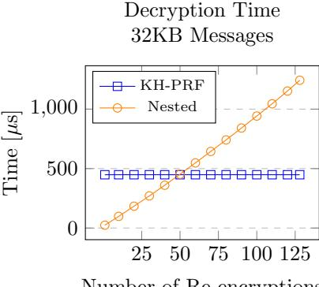

# Improving Speed and Security in Updatable Encryption Schemes

Dan Boneh<sup>∗</sup> Saba Eskandarian† Sam Kim‡ Maurice Shih§

#### Abstract

Periodic key rotation is a common practice designed to limit the long-term power of cryptographic keys. Key rotation refers to the process of re-encrypting encrypted content under a fresh key, and overwriting the old ciphertext with the new one. When encrypted data is stored in the cloud, key rotation can be very costly: it may require downloading the entire encrypted content from the cloud, re-encrypting it on the client's machine, and uploading the new ciphertext back to the cloud.

An updatable encryption scheme is a symmetric-key encryption scheme designed to support efficient key rotation in the cloud. The data owner sends a short update token to the cloud. This update token lets the cloud rotate the ciphertext from the old key to the new key, without learning any information about the plaintext. Recent work on updatable encryption has led to several security definitions and proposed constructions. However, existing constructions are not yet efficient enough for practical adoption, and the existing security definitions can be strengthened.

In this work we make three contributions. First, we introduce stronger security definitions for updatable encryption (in the ciphertext-dependent setting) that capture desirable security properties not covered in prior work. Second, we construct two new updatable encryption schemes. The first construction relies only on symmetric cryptographic primitives, but only supports a bounded number of key rotations. The second construction supports a (nearly) unbounded number of updates, and is built from the Ring Learning with Errors (RLWE) assumption. Due to complexities of using RLWE, this scheme achieves a slightly weaker notion of integrity compared to the first. Finally, we implement both constructions and compare their performance to prior work. Our RLWE-based construction is 200× faster than a prior proposal for an updatable encryption scheme based on the hardness of elliptic curve DDH. Our first construction, based entirely on symmetric primitives, has the highest encryption throughput, approaching the performance of AES, and the highest decryption throughput on ciphertexts that were re-encrypted fewer than fifty times. For ciphertexts re-encrypted over fifty times, the RLWE construction dominates it in decryption speed.

# <span id="page-0-0"></span>1 Introduction

Consider a ciphertext ct that is a symmetric encryption of some data using key k. Key rotation is the process of decrypting ct using k, and re-encrypting the result using a fresh key k 0 to obtain a new ciphertext ct<sup>0</sup> . One then stores ct<sup>0</sup> and discards ct. Periodic key rotation is recommended, and even required, in several security standards and documents, including NIST publication 800-57 [\[Bar16\]](#page-26-0), the Payment Card Industry Data Security Standard (PCI DSS) [\[PCI18\]](#page-28-0), and Google's cloud security recommendations [\[Goo\]](#page-27-0).

Key rotation ensures that secret keys are periodically revoked. In the event that a key is compromised, regular key rotation limits the amount of data that is vulnerable to compromise. Limiting the amount of data

<sup>∗</sup>Stanford University. Email: dabo@cs.stanford.edu.

<sup>†</sup>Stanford University. Email: saba@cs.stanford.edu.

<sup>‡</sup>Stanford University and Simons Institute for the Theory of Computing. Email: skim13@cs.stanford.edu.

<sup>§</sup>Cisco Systems. Email: maushih@cisco.com

that is encrypted with the same key for extended periods of time also helps prevent advanced brute-force attacks. Key update on ciphertexts can also be used to revoke old users from accessing newly encrypted data.

Key rotation can be expensive when the ciphertext is stored in the cloud, and the cloud does not have access to the keys. Key rotation requires the client to retrieve all the encrypted data from the cloud, re-encrypt it by decrypting with the old key and re-encrypting with the new key, and then upload the resulting ciphertext back to the cloud. The traffic to and from the cloud can incur significant networking costs when large amounts of data are involved. Alternatively, the client can send the old and the new key to the cloud, and have the cloud re-encrypt in place, but this gives the cloud full access to the data in the clear. We note that either way, the cloud must be trusted to discard the old ciphertext.

Updatable encryption [\[BLMR13,](#page-26-1) [EPRS17,](#page-27-1) [LT18,](#page-27-2) [KLR19,](#page-27-3) [BDGJ20\]](#page-26-2) is a much better approach to key rotation for encrypted data stored in the cloud. Updatable encryption is a symmetric encryption scheme that supports the standard key-generation, encryption, and decryption algorithms, along with two additional algorithms called ReKeyGen and ReEncrypt used for key rotation. The re-key generation algorithm is invoked as ReKeyGen(k, k 0 ) → ∆, taking as input a pair of keys, k and k 0 , and outputting a short "update token" ∆, also called a re-encryption key. The re-encryption algorithm is invoked as ReEncrypt(∆, ct) → ct<sup>0</sup> , taking as input a short ∆ and a ciphertext ct encrypted under k, and outputting an updated ciphertext ct<sup>0</sup> that is the encryption of the same data as in ct, but encrypted under k 0 .

If the client's data is encrypted using an updatable encryption scheme, then the client can use the re-key generation algorithm ReKeyGen to generate a short update token ∆ to send the cloud. The cloud then runs the re-encryption algorithm ReEncrypt to update all the client's ciphertexts. As before, the cloud must be trusted to discard the old ciphertexts.

Defining security Intuitively, the update token ∆ must not reveal any "useful" information to the cloud. This was formalized by Boneh et al. [\[BLMR13\]](#page-26-1) against passive adversaries, and was improved and extended to provide security against active adversaries by Everspaugh et al. [\[EPRS17\]](#page-27-1).

However, we show in Section [3](#page-6-0) that these existing elegant definitions can be insufficient, and may not prevent some undesirable information leakage. In particular, we give a simple construction that satisfies the existing definitions, and yet an observer can easily learn the age of a ciphertext, namely the number of times that the ciphertext was re-encrypted since it was initially created. Ideally, this information should not leak to an observer who only sees the ciphertext. This issue was recently independently pointed out in [\[BDGJ20\]](#page-26-2).

The age of a ciphertext (i.e., the number of times that the ciphertext was re-encrypted) can leak sensitive private information about the plaintext in many real-world situations. We give two illustrative examples assuming an annual key rotation policy is in use:

- Consider a national database managed in the cloud where information about each individual is stored in a single fixed-size encrypted record. Suppose a newborn is recorded in the database at birth. If an annual key rotation policy is used, and records are encrypted using a scheme that leaks the number of key rotations, then an adversary (or a cloud administrator), who examines the stored ciphertexts will learn every person's age, even though age is regarded as personal identifiable information (PII) and must be protected.
- Consider a dating app, like Tinder or Match.com, that maintains customer information in an encrypted cloud storage. The number of key-updates on a person's file can indicate how long the person has been a customer, which is sensitive information that should be protected.

To address this definitional shortcoming, we define a stronger confidentiality property that requires that a re-encrypted ciphertext is always computationally indistinguishable from a freshly generated ciphertext, no matter how many times it was re-encrypted (Sections [3.2](#page-7-0) and [3.3\)](#page-8-0). This ensures that an observer who sees the encrypted content at a particular point in time, cannot tell the ciphertext age. We also strengthen the integrity definition of [\[EPRS17\]](#page-27-1) to cover additional tampering attacks, as discussed in Section [3.4.](#page-13-0)

Constructing updatable encryption Next, we look for efficient constructions that satisfy our definitions. We give two new constructions: one based on nested authenticated encryption and another based on the Ring Learning With Errors (RLWE) problem [\[Reg05,](#page-28-1) [LPR13\]](#page-27-4).

Our first construction, presented in Section 4, makes use of carefully designed nested encryption, and can be built from any authenticated encryption cipher. It satisfies our strong confidentiality and integrity requirements, so that an adversary cannot learn the age of a ciphertext. However, the scheme only supports a bounded number of re-encryptions, where the bound is set when the initial ciphertext is created. Another limitation of this scheme is that decryption time grows linearly with the age of the ciphertext. Hence, the scheme is practical as long as the maximum number of re-encryptions is not too large. Our implementation and experiments, discussed below, make this precise.

Our second construction, presented in Section 5, makes use of an almost key-homomorphic PRF (KH-PRF) built from the RLWE problem. Recall that a key-homomorphic PRF (KH-PRF) [NPR99, BLMR13] is a secure PRF  $F: \mathcal{K} \times \mathcal{X} \to \mathcal{Y}$ , where  $(\mathcal{K}, +)$  and  $(\mathcal{Y}, +)$  are finite groups, and the PRF is homomorphic with respect to its key, namely  $F(k_1, x) + F(k_2, x) = F(k_1 + k_2, x)$  for all  $k_1, k_2 \in \mathcal{K}$  and  $x \in \mathcal{X}$ . We say that the PRF is an almost KH-PRF if the equality above holds up to a small additive error (see Definition 2.5). To see why a KH-PRF is useful for updatable encryption, consider a single message block  $m_i \in \mathcal{Y}$  that is encrypted using counter mode as  $\mathsf{ct}_i \leftarrow \mathsf{m}_i + F(\mathsf{k}, i)$ , for some  $i \in \mathcal{X}$  and  $\mathsf{k} \in \mathcal{K}$ . To rotate the key, the client chooses a new key  $\mathsf{k}' \leftarrow \mathcal{K}$  and sends  $\Delta = \mathsf{k}' - \mathsf{k} \in \mathcal{K}$  to the cloud. The cloud computes  $\mathsf{ct}_i' = \mathsf{ct}_i + F(\Delta, i)$ , which by the key-homomorphic property satisfies  $\mathsf{ct}_i' = \mathsf{m}_i + F(\mathsf{k}', i)$ , as required.

It remains an open challenge to construct a secure KH-PRF whose performance is comparable to AES. However, there are several known algebraic constructions. In the random oracle model [FS86, BR93], there is a simple KH-PRF based on the Decision Diffie-Hellman (DDH) assumption [NPR99], and a simple almost KH-PRF based on the Learning With Rounding (LWR) problem [BLMR13]. There are also several KH-PRFs whose security does not depend on random oracles, as discussed in the related work section.

Everspaugh et al. [EPRS17] construct an updatable encryption scheme that supports unbounded key updates by combining a key-homomorphic PRF with authenticated encryption and a collision-resistant hash function. They evaluate their construction using the KH-PRF derived from DDH, in the random oracle model, instantiated in the 256-bit elliptic curve Curve25519 [Ber06]. We show that the Everspaugh et al. [EPRS17] construction satisfies our new confidentiality security definitions for updatable encryption. However, compared to our first nested encryption construction that relies only on generic authenticated encryption, the implementation of the Everspaugh et al. construction is much slower as it uses expensive group operations.

In our second updatable encryption scheme, we significantly improve on the performance of the Everspaugh et al. [EPRS17] construction by extending it to work with an *almost* key-homomorphic PRF. Our construction supports nearly unbounded key-updates, and outperforms the Everspaugh et al. construction by  $200 \times$  in speed. The high performance of the scheme is, in part, due to a new almost KH-PRF construction from the RLWE assumption. Almost KH-PRFs can already be constructed from the (Ring-) Learning with Rounding (RLWR) assumption [BPR12, BLMR13]. However, we observe that for the specific setting of updatable encryption, the parameters of the PRF can be further optimized by modifying the existing PRF constructions to base security directly on the standard RLWE assumption. We provide the details of our construction in Section 6.

The use of an *almost* key-homomorphic PRF leads to some complications. First, there is a small ciphertext expansion to handle the noise that arises from the imperfection of the KH-PRF key-homomorphism. More importantly, due to the noisy nature of the ciphertext, we show that an adversary may gain information about the age of the corresponding plaintext using a chosen ciphertext attack, which violates our new security definition. Therefore, while this construction is attractive due to its performance, it can only be used in settings where revealing the age of a ciphertext is acceptable. In Section 5.3 we capture this security property using a relaxed notion of ciphertext integrity, and show that the scheme is secure in this model.

Implementation and experiments In Section 7, we experiment with our two updatable encryption schemes and measure their performance. For our first construction based on authenticated encryption, we measure the trade-off between its efficiency and the number of key rotations it can support. Based on our evaluation, our first construction performs better than the other schemes in both speed and ciphertext size, as long as any given ciphertext is to be re-encrypted at most twenty times over the course of its lifetime. It outperforms the other schemes in speed (but not in ciphertext size) as long as ciphertexts are re-encrypted at most fifty times.

For our second construction, which uses an almost key-homomorphic PRF based on RLWE, we compare its performance with that of Everspaugh et al. [\[EPRS17\]](#page-27-1), which uses a key-homomorphic PRF over Curve25519. Since we use an almost key-homomorphic PRF that is inherently noisy, any message to be encrypted must be padded on the right to counteract the noise. Therefore, compared to the elliptic-curve based construction of Everspaugh et al., our construction produces larger ciphertexts (32% larger than those of Everspaugh et al.). However, in terms of speed, our implementation shows that our construction outperforms that of Everspaugh et al. by over 200×. We provide a more detailed analysis in Section [7.](#page-23-0) Implementations of both our constructions are open source and available at [\[imp\]](#page-27-8).

Summary of our contributions. Our contributions are threefold. First, we strengthen the definition of updatable encryption to provide stronger confidentiality and integrity guarantees. Second, we propose two new constructions. Finally, we experiment with both constructions and report on their real world performance and ciphertext expansion. Encryption throughput of our first construction, while allowing only a bounded number of key rotations, is close to the performance of AES. Our second construction, based on a key-homomorphic PRF from RLWE, is considerably faster than the previous construction of Everspaugh et al. [\[EPRS17\]](#page-27-1), which is based on elliptic curves.

### 1.1 Related Work

Two flavors of updatable encryption There are two flavors of updatable encryption: ciphertext-dependent schemes [\[BLMR13,](#page-26-1) [EPRS17\]](#page-27-1) and ciphertext-independent schemes [\[LT18,](#page-27-2) [KLR19,](#page-27-3) [BDGJ20\]](#page-26-2). In a ciphertextdependent updatable encryption scheme, the client can re-download a tiny fraction of the ciphertext that is stored by the server before generating the update tokens. In a ciphertext-independent updatable encryption scheme, the client generates its update token without needing to download any components of its ciphertext. In this work, we focus on the ciphertext-dependent setting, where constructions are considerably more efficient. We provide a detailed comparison of the two settings in Appendix [B.](#page-31-0) Further discussion of the two models can be found in [\[LT18\]](#page-27-2).

Key-homomorphic PRFs. The concept of key-homomorphic PRFs was introduced by Naor, Pinkas, and Reingold [\[NPR99\]](#page-28-2), and was first formalized as a cryptographic primitive by Boneh et al. [\[BLMR13\]](#page-26-1), who construct two KH-PRFs secure without random oracles: one from LWE, and another from multilinear maps. They also observe that any seed homomorphic PRG G : S → S<sup>2</sup> gives a key-homomorphic PRF. More constructions for key-homomorphic PRFs from LWE include [\[BP14,](#page-27-9) [BV15,](#page-27-10) [Kim20\]](#page-27-11).

# 2 Preliminaries

Basic notation. For an integer n ≥ 1, we write [n] to denote the set of integers {1, . . . , n}. For a distribution D, we write x ← D to denote that x is sampled from D; for a finite set S, we write x ←<sup>R</sup> S to denote that x is sampled uniformly from S. We say that a family of distributions D = {Dλ}λ∈<sup>N</sup> is B-bounded if the support of D is {−B, . . . , B − 1, B} with probability 1.

Unless specified otherwise, we use λ to denote the security parameter. We say a function f(λ) is negligible in λ, denoted by negl(λ), if f(λ) = o(1/λ<sup>c</sup> ) for all c ∈ N. We say an algorithm is efficient if it runs in probabilistic polynomial time in the length of its input. We use poly(λ) to denote a quantity whose value is bounded by a fixed polynomial in λ.

#### 2.1 Basic Cryptographic Primitives

In this section, we review a number of basic cryptographic primitives that we use in this work. To analyze the exact security of our constructions in Sections [4](#page-14-0) and [5,](#page-17-0) we parameterize the security of these notions with respect to advantage functions ε : N → R that bound the probability of an efficient adversary in breaking the security of the primitive.

**Definition 2.1** (Collision-Resistant Hash Functions). Let  $\mathcal{H}_{\lambda} = \{H : \mathcal{X} \to \mathcal{Y}_{\lambda}\}$  be a family of hash functions. We say that  $\mathcal{H}$  is  $\varepsilon_{cr}$ -secure as a *collision resistant hash function* if for all efficient adversaries  $\mathcal{A}$ , we have

$$\Pr\left[\mathcal{A}(1^{\lambda}, H) \to (x_0, x_1) \land H(x_0) = H(x_1) : H \stackrel{\mathbb{R}}{\leftarrow} \mathcal{H}_{\lambda}\right] = \varepsilon_{\mathsf{cr}}(\lambda).$$

We say that  $\mathcal{H}$  is secure as a collision resistant hash function if  $\varepsilon_{\mathsf{cr}}(\lambda) = \mathsf{negl}(\lambda)$ .

<span id="page-4-2"></span>**Definition 2.2** (Pseudorandom Generators). Let  $G: \mathcal{X}_{\lambda} \to \mathcal{Y}_{\lambda}$  be a keyed function. We say that G is  $\varepsilon_{prg}$ -secure as a *pseudorandom generator* (PRG) if for all efficient adversaries  $\mathcal{A}$ , we have

$$\left| \Pr \left[ \mathcal{A}(1^{\lambda}, y_0) = 1 : s \xleftarrow{\mathbb{R}} \mathcal{X}_{\lambda}, y_0 \leftarrow G(s) \right] - \Pr \left[ \mathcal{A}(1^{\lambda}, y_1) = 1 : y_1 \xleftarrow{\mathbb{R}} \mathcal{Y}_{\lambda} \right] \right| = \varepsilon_{\mathsf{prg}}(\lambda).$$

We say that G is a secure pseudorandom generator if  $|\mathcal{X}_{\lambda}| < |\mathcal{Y}_{\lambda}|$ , and  $\varepsilon_{prg}(\lambda) = negl(\lambda)$ .

#### 2.2 Pseudorandom Functions

In this section, we review the definition of a pseudorandom function.

<span id="page-4-1"></span>**Definition 2.3** (Pseudorandom Functions [GGM84]). Let  $F : \mathcal{K}_{\lambda} \times \mathcal{X} \to \mathcal{Y}$  be a keyed function. We say that F is  $\varepsilon_{\mathsf{prf}}$ -secure as a pseudorandom function (PRF) if for all efficient adversaries  $\mathcal{A}$ , we have

$$\left| \Pr \left[ \mathcal{A}^{F(\mathsf{k},\cdot)}(1^{\lambda}) = 1 : \mathsf{k} \xleftarrow{\mathbb{R}} \mathcal{K}_{\lambda} \right] - \Pr \left[ \mathcal{A}^{f(\cdot)}(1^{\lambda}) = 1 : f \xleftarrow{\mathbb{R}} \mathsf{Funs}[\mathcal{X}_{\lambda},\mathcal{Y}_{\lambda}] \right] \right| = \varepsilon_{\mathsf{prf}}(\lambda),$$

where  $\mathsf{Funs}[\mathcal{X},\mathcal{Y}]$  denotes the set of all functions with domain  $\mathcal{X}$  and range  $\mathcal{Y}$ . We say that F is a secure pseudorandom function if  $\varepsilon_{\mathsf{prf}}(\lambda) = \mathsf{negl}(\lambda)$ .

In this work, we use a special family of pseudorandom functions called *key-homomorphic PRFs* (KH-PRFs) that satisfy additional algebraic properties. Specifically, the key space  $\mathcal{K}$  and the range  $\mathcal{Y}$  of the PRF exhibit certain group structures such that its evaluation on any fixed input  $x \in \mathcal{X}$  is homomorphic with respect to these group structures. Formally, we define a key-homomorphic PRF as follows.

**Definition 2.4** (Key-Homomorphic PRFs [NPR99, BLMR13]). Let  $(\mathcal{K}, \oplus)$ ,  $(\mathcal{Y}, \otimes)$  be groups. Then, a keyed function  $F : \mathcal{K}_{\lambda} \times \mathcal{X}_{\lambda} \to \mathcal{Y}_{\lambda}$  is a *key-homomorphic* PRF (KH-PRF) if

- F is a secure PRF as specified in Definition 2.3.
- For every key  $k_1, k_2 \in \mathcal{K}$  and every input  $x \in \mathcal{X}$ , we have

$$F(\mathsf{k}_1,x)\otimes F(\mathsf{k}_2,x)=F(\mathsf{k}_1\oplus \mathsf{k}_2,x).$$

We also work with a slight relaxation of the notion of key-homomorphic PRFs. Namely, instead of requiring that the PRF outputs are perfectly homomorphic with respect to the PRF keys, we require that they are "almost" homomorphic in that  $F(k_1, x) \otimes F(k_2, x) \approx F(k_1 \oplus k_2, x)$ . Precisely, we define an almost key-homomorphic PRF as follows.

<span id="page-4-0"></span>**Definition 2.5** (Almost Key-Homomorphic PRFs [BLMR13]). Let  $(\mathcal{K}, \oplus)$  be a group and let m and q be positive integers. Then, an efficiently computable deterministic function  $F : \mathcal{K} \times \mathcal{X} \to \mathbb{Z}_q^m$  is a  $\gamma$ -almost key-homomorphic PRF if

- F is a secure PRF (Definition 2.3).
- For every key  $k_1, k_2 \in \mathcal{K}$  and every  $x \in \mathcal{X}$ , there exists a vector  $\mathbf{e} \in [0, \gamma]^m$  such that

$$F(k_1, x) + F(k_2, x) = F(k_1 \oplus k_2, x) + \mathbf{e} \pmod{q}.$$

#### <span id="page-5-2"></span>2.3 Authenticated Encryption

We recall the notion of an authenticated encryption scheme [BN00].

**Definition 2.6** (Authenticated Encryption [BN00]). An authenticated encryption scheme for a message space  $\mathcal{M}$  is a tuple of efficient algorithms  $\Pi_{\mathsf{AE}} = (\mathsf{KeyGen}, \mathsf{Encrypt}, \mathsf{Decrypt})$  that have the following syntax:

- $\mathsf{Key}\mathsf{Gen}(1^{\lambda}) \to \mathsf{k}$ : On input a security parameter  $\lambda$ , the key-generation algorithm returns a key  $\mathsf{k}$ .
- Encrypt $(k,m) \to ct$ : On input a key k and a message  $m \in \mathcal{M}$ , the encryption algorithm returns a ciphertext ct.
- $Decrypt(k,ct) \to m/\bot$ : On input a key k and a ciphertext ct, the decryption algorithm returns a message m or  $\bot$ .

We define the correctness, confidentiality, and integrity properties for an authenticated encryption scheme in the standard way.

<span id="page-5-3"></span>**Definition 2.7** (Correctness). We say that an authenticated encryption scheme  $\Pi_{AE} = (KeyGen, Encrypt, Decrypt)$  is *correct* if for all  $\lambda \in \mathbb{N}$  and  $m \in \mathcal{M}$ , we have

$$\Pr\left[\mathsf{Decrypt}\big(\mathsf{k},\mathsf{Encrypt}(\mathsf{k},\mathsf{m})\big)=\mathsf{m}\right]=1,$$

where  $k \leftarrow \mathsf{KeyGen}(1^{\lambda})$ .

<span id="page-5-0"></span>**Definition 2.8** (Confidentiality). Let  $\Pi_{\mathsf{AE}} = (\mathsf{KeyGen}, \mathsf{Encrypt}, \mathsf{Decrypt})$  be an authenticated encryption scheme for a message space  $\mathcal{M}$ . We say that  $\Pi_{\mathsf{AE}}$  satisfies  $\varepsilon_{\mathsf{ae}}^{\mathsf{conf}}$ -confidentiality if for all efficient adversaries  $\mathcal{A}$ , we have

$$\Big|\Pr\left[\mathcal{A}^{\mathcal{O}_{k,0}(\cdot,\cdot)}(1^{\lambda})=1\right]-\Pr\left[\mathcal{A}^{\mathcal{O}_{k,1}(\cdot,\cdot)}(1^{\lambda})=1\right]\Big|=\varepsilon_{\mathsf{ae}}^{\mathsf{conf}}(\lambda),$$

where  $k \leftarrow \mathsf{KeyGen}(1^{\lambda})$ , and the oracle  $\mathcal{O}_{k,b}$  for  $b \in \{0,1\}$  is defined as follows:

•  $\mathcal{O}_{k,b}(\mathsf{m}^{(0)},\mathsf{m}^{(1)})$ : On input two messages  $\mathsf{m}^{(0)},\mathsf{m}^{(1)}\in\mathcal{M},$  the oracle computes  $\mathsf{ct}\leftarrow\mathsf{Encrypt}(\mathsf{k},\mathsf{m}^{(b)})$  and returns  $\mathsf{ct}.$ 

We say that  $\Pi_{AE}$  satisfies confidentiality if  $\varepsilon_{ae}^{conf}(\lambda) = negl(\lambda)$ .

<span id="page-5-4"></span>**Definition 2.9** (Integrity). Let  $\Pi_{\mathsf{AE}} = (\mathsf{KeyGen}, \mathsf{Encrypt}, \mathsf{Decrypt})$  be an authenticated encryption scheme for a message space  $\mathcal{M}$ . We say that  $\Pi_{\mathsf{AE}}$  satisfies  $\varepsilon_{\mathsf{ae}}^{\mathsf{int}}$ -integrity if for all efficient adversaries  $\mathcal{A}$ , we have

$$\Pr\left[\mathcal{A}^{\mathcal{O}_{\mathsf{k}}(\cdot)}(1^{\lambda}) = \mathsf{ct} \land \mathsf{Decrypt}(\mathsf{k},\mathsf{ct}) \neq \bot \land \mathsf{ct} \notin \mathsf{Table}\right] = \varepsilon_{\mathsf{ae}}^{\mathsf{int}}(\lambda),$$

where  $k \stackrel{\scriptscriptstyle{\mathbb{R}}}{\leftarrow} \mathsf{KeyGen}(1^{\lambda})$ , and the oracle  $\mathcal{O}_k$  and table Table are defined as follows:

•  $\mathcal{O}_k(m)$ : On input a message  $m \in \mathcal{M}$ , the oracle computes  $ct \leftarrow \mathsf{Encrypt}(k,m)$ , adds  $\mathsf{Table} = \mathsf{Table} \cup \{ct\}$ , and returns ct.

We say that  $\Pi_{\mathsf{AE}}$  satisfies integrity if  $\varepsilon_{\mathsf{ae}}^{\mathsf{int}}(\lambda) = \mathsf{negl}(\lambda)$ .

<span id="page-5-1"></span>For our updatable encryption scheme in Section 4, we make use of authenticated encryption schemes that satisfy a stronger confidentiality requirement than Definition 2.8. Namely, we rely on authenticated encryption schemes that satisfy *ciphertext pseudorandomness*, which requires that an encryption of any message is computationally indistinguishable from a random string of suitable length. Authenticated encryption schemes that satisfy ciphertext pseudorandomness can be constructed from pseudorandom functions or block ciphers in a standard way. Widely-used modes for authenticated encryption such as AES-GCM also satisfy ciphertext pseudorandomness.

**Definition 2.10** (Ciphertext Pseudorandomness). Let  $\Pi_{\mathsf{AE}} = (\mathsf{KeyGen}, \mathsf{Encrypt}, \mathsf{Decrypt})$  be an authenticated encryption scheme for a message space  $\mathcal{M}$ . We say that  $\Pi_{\mathsf{AE}}$  satisfies  $\varepsilon_{\mathsf{ae}}^{\mathsf{rand}}$ -ciphertext pseudorandomness if for all efficient adversaries  $\mathcal{A}$ , we have

$$\Big|\Pr\left[\mathcal{A}^{\mathcal{O}_{k,0}(\cdot)}(1^{\lambda})=1\right]-\Pr\left[\mathcal{A}^{\mathcal{O}_{k,1}(\cdot)}(1^{\lambda})=1\right]\Big|=\varepsilon_{\mathsf{ae}}^{\mathsf{rand}}(\lambda),$$

where  $k \leftarrow \text{KeyGen}(1^{\lambda})$ , and the oracles  $\mathcal{O}_{k,b}$  for  $b \in \{0,1\}$  are defined as follows:

- $\bullet$   $\mathcal{O}_{k,0}(m)$ : On input a message  $m \in \mathcal{M}$ , the oracle computes  $ct \leftarrow \mathsf{Encrypt}(k,m)$  and returns ct.
- $\mathcal{O}_{k,1}(m)$ : On input a message  $m \in \mathcal{M}$ , the oracle computes  $\mathsf{ct} \leftarrow \mathsf{Encrypt}(k,m)$ , samples  $\mathsf{ct}' \stackrel{R}{\leftarrow} \{0,1\}^{|\mathsf{ct}|}$ , and returns  $\mathsf{ct}'$ .

We say that  $\Pi_{\mathsf{AE}}$  satisfies ciphertext pseudorandomness if  $\varepsilon_{\mathsf{ae}}^{\mathsf{rand}}(\lambda) = \mathsf{negl}(\lambda)$ .

# <span id="page-6-0"></span>3 New Definitions for Updatable Encryption

In this section, we present new security definitions for updatable encryption in the ciphertext dependent setting. Our definitions build upon and strengthen the confidentiality and integrity definitions for an updatable authenticated encryption scheme from Everspaugh et al. [EPRS17]. We start by defining the syntax for an updatable encryption scheme and its compactness and correctness conditions in Section 3.1. We then present security definitions for confidentiality and integrity, comparing each to prior definitions as we present them.

## <span id="page-6-1"></span>3.1 Updatable Encryption Syntax

For ciphertext-dependent updatable encryption schemes, it is useful to denote ciphertexts as consisting of two parts: a short ciphertext header ct, which the client can download to generate its update token, and a ciphertext body ct that encrypts the actual plaintext.

Formally, we define the syntax for an updatable encryption scheme as follows. To emphasize the ciphertext integrity properties of our constructions in Section 4 and Section 5, we refer to an updatable encryption scheme as an *updatable authenticated encryption* scheme in our definitions.

**Definition 3.1** (Updatable Authenticated Encryption). An updatable authenticated encryption (UAE) scheme for a message space  $\mathcal{M} = (\mathcal{M}_{\lambda})_{\lambda \in \mathbb{N}}$  is a tuple of efficient algorithms  $\Pi_{\mathsf{UAE}} = (\mathsf{KeyGen}, \mathsf{Encrypt}, \mathsf{ReKeyGen}, \mathsf{ReEncrypt}, \mathsf{Decrypt})$  that have the following syntax:

- KeyGen $(1^{\lambda}) \to k$ : On input a security parameter  $\lambda$ , the key generation algorithm returns a secret key k.
- Encrypt(k, m)  $\rightarrow$  (ct, ct): On input a key k and a message  $m \in \mathcal{M}_{\lambda}$ , the encryption algorithm returns a ciphertext header ct and a ciphertext body ct.
- $ReKeyGen(k_1, k_2, \hat{ct}) \rightarrow \Delta_{1,2,\hat{ct}}/\bot$ : On input two keys  $k_1, k_2$ , and a ciphertext header  $\hat{ct}$ , the re-encryption key generation algorithm returns an update token  $\Delta_{1,2,\hat{ct}}$  or  $\bot$ .
- ReEncrypt( $\Delta$ , ( $\hat{\mathsf{ct}}$ ,  $\mathsf{ct}'$ ))  $\to$  ( $\hat{\mathsf{ct}}'$ ,  $\mathsf{ct}'$ )/ $\bot$ : On input an update token  $\Delta$ , and a ciphertext ( $\hat{\mathsf{ct}}$ ,  $\mathsf{ct}$ ), the re-encryption algorithm returns a new ciphertext ( $\hat{\mathsf{ct}}'$ ,  $\mathsf{ct}'$ ) or  $\bot$ .
- $Decrypt(k, (\hat{ct}, ct)) \rightarrow m/\bot$ : On input a key k, and a ciphertext  $(\hat{ct}, ct)$ , the decryption algorithm returns a message m or  $\bot$ .

<span id="page-6-2"></span>A trivial way of achieving an updatable authenticated encryption scheme is to allow a client to re-download the entire ciphertext, re-encrypt it, and send it back to the server. Therefore, for a UAE scheme to be useful and meaningful, we require that the communication between the client and server be bounded and independent of the size of the message encrypted in the ciphertext to be updated. This is captured by the compactness property, which requires that any ciphertext header and update token have lengths that depend only on the security parameter.

Definition 3.2 (Compactness). We say that an updatable authenticated encryption scheme ΠUAE = (KeyGen, Encrypt, ReKeyGen, ReEncrypt, Decrypt) for a message space M = (Mλ)λ∈<sup>N</sup> is compact if there exist polynomials f1(·), f2(·) such that for any λ ∈ N and message m ∈ Mλ, we have (with probability 1)

$$|\hat{\mathsf{ct}}| \le f_1(\lambda), \qquad |\Delta_{1,2,\hat{\mathsf{ct}}}| \le f_2(\lambda),$$

where k1, k<sup>2</sup> ← KeyGen(1<sup>λ</sup> ), (ctˆ , ct) ← Encrypt(k1, m), and ∆1,2,ct<sup>ˆ</sup> ← ReKeyGen(k1, k2, ctˆ ). That is, the lengths of the ciphertext header and update token are independent of the message length.

The correctness condition for an updatable encryption scheme is defined in a natural way.

<span id="page-7-1"></span>Definition 3.3 (Correctness). We say that an updatable authenticated encryption scheme ΠUAE = (KeyGen, Encrypt, ReKeyGen, ReEncrypt, Decrypt) for a message space M = (Mλ)λ∈<sup>N</sup> is correct if for any λ ∈ N, N ∈ N and m ∈ Mλ, we have

$$\Pr\left[\mathsf{Decrypt}(\mathsf{k}_N,(\hat{\mathsf{ct}}_N,\mathsf{ct}_N))=\mathsf{m}\right]=1,$$

where k1, . . . , k<sup>N</sup> ← KeyGen(1<sup>λ</sup> ), (ctˆ <sup>1</sup>, ct1) ← Encrypt(k1, m), and

$$(\hat{\mathsf{ct}}_{i+1}, \mathsf{ct}_{i+1}) \leftarrow \mathsf{ReEncrypt} \big( \mathsf{ReKeyGen}(\mathsf{k}_i, \mathsf{k}_{i+1}, \hat{\mathsf{ct}}_i), (\hat{\mathsf{ct}}_i, \mathsf{ct}_i) \big),$$

for 
$$i = 1, ..., N - 1$$
.

We note that the definition above requires that the correctness of decryption to hold even after unbounded number of key updates. In Definition [4.1,](#page-15-0) we define a relaxation of this definition that requires correctness of decryption for a bounded number of updates.

## <span id="page-7-0"></span>3.2 Prior Notions of Confidentiality

Standard semantic security for a symmetric encryption scheme requires that an encryption of a message does not reveal any information about the message. In a regular symmetric encryption scheme, there exists only one way to produce a ciphertext: via the encryption algorithm. In an updatable authenticated encryption scheme, there exist two ways of producing a ciphertext: the encryption algorithm Encrypt that generates fresh ciphertexts and the re-encryption algorithm ReEncrypt that generates re-encrypted ciphertexts. Previous security formulations of updatable encryption capture the security of these algorithms in two separate security experiments. The security of the regular encryption algorithm Encrypt is captured by the notion of message confidentiality [\[BLMR13,](#page-26-1) [EPRS17\]](#page-27-1) while the security of the re-encryption algorithm ReEncrypt is captured by the notion of re-encryption indistinguishability [\[EPRS17\]](#page-27-1).

Both security experiments are divided into three phases, and are parameterized by h, the number of honest keys, and d, the number of dishonest keys. During the setup phase of the security experiment, the challenger generates h keys k1, . . . , k<sup>h</sup> ← KeyGen(1<sup>λ</sup> ) that are kept private from the adversary, and d keys kh+1, . . . , kh+<sup>d</sup> that are provided to the adversary. During the query phase of the experiment, the adversary is given access to a set of oracles that evaluate the algorithms Encrypt, ReKeyGen, and ReEncrypt, allowing the adversary to obtain ciphertexts under honest keys and rekey them.

The only distinction between the message-confidentiality and re-encryption indistinguishability experiments is in the way we define the final challenge phase. In the message confidentiality experiment, the adversary is given access to a challenge oracle where it can submit a pair of messages (m0, m1). As in a standard semantic security definition, the challenge oracle provides the adversary with an encryption of either m<sup>0</sup> or m<sup>1</sup> under a specified honest key, and the adversary's goal is to guess which of the messages was encrypted. In the re-encryption indistinguishability experiment, on the other hand, the adversary submits a pair of ciphertexts (ctˆ <sup>0</sup>, ct0),(ctˆ <sup>1</sup>, ct1) of the same length to the challenge oracle and receives a re-encryption of one of the ciphertexts. The adversary's goal in the re-encryption indistinguishability experiment is to guess which of the two ciphertexts was re-encrypted.

During the query phase of the experiment, the adversary can make queries to all four oracles as long as their evaluations do not allow the adversary to "trivially" learn which messages are encrypted by the challenge oracle. In particular, this means that no oracle will be allowed to rekey a challenge ciphertext from an honest key to a dishonest key. To this end, the challenger in each experiment keeps a table of challenge ciphertexts generated under each honest key and their re-encryptions. Much of the apparent complexity of formalizing the definition arises from enforcing this straightforward check. We provide the full definitions of Everspaugh et al. [\[EPRS17\]](#page-27-1) for reference in Appendix [A.](#page-29-0) [1](#page-8-1)

## <span id="page-8-0"></span>3.3 Improving Confidentiality

One property of an updatable authenticated encryption scheme that is not captured by the combination of message confidentiality and re-encryption indistinguishability is hiding the number of times that a ciphertext was re-encrypted, which contains information about the age of a ciphertext. Consider a UAE scheme where the length of a ciphertext grows every time re-encryption is applied to the ciphertext. In such a scheme, the length of a ciphertext reveals information about the number of times key rotation was carried out on a ciphertext. However, this scheme can still suffice to satisfy re-encryption indistinguishability since the adversary in the security experiment is always required to submit two challenge ciphertexts ct0, ct<sup>1</sup> that have the same size |ct0| = |ct1| and therefore the same age.

One natural way to rule out this type of UAE schemes is to simply require that any ciphertexts that are produced by the encryption or re-encryption algorithm to always have fixed length. However, this strong compactness property is still insufficient to completely hide the age of a ciphertext. For instance, take any secure UAE scheme that satisfies message confidentiality and re-encryption indistinguishability, but modify the encryption and re-encryption algorithms as follows:

- The encryption algorithm takes a message, applies the original encryption algorithm, but attaches the bit 0 to the end of the final ciphertext.
- The re-encryption algorithm applies the original re-encryption algorithm (on all but the last bit), but attaches the bit 1 to the end of the final ciphertext.

In this UAE scheme, the re-encryption algorithm does not modify the length of a given ciphertext. However, the last of bit of a ciphertext completely reveals whether a ciphertext is a freshly generated ciphertext or a re-encryption of an already existing ciphertext. This UAE scheme still satisfies message confidentiality and re-encryption indistinguishability as the adversary in these security experiments is always required to submit two fresh ciphertexts and two re-encrypted ciphertexts to the challenge oracle respectively. None of the existing confidentiality experiments require an adversary to distinguish between fresh ciphertexts and re-encrypted ciphertexts.

New confidentiality and strong compactness. To capture the additional security properties discussed above, we define a new confidentiality security experiment (Definition [3.4\)](#page-9-0) where the adversary can submit either a message m<sup>0</sup> or an existing ciphertext ct<sup>1</sup> to the challenge oracle. The challenge oracle returns either a fresh encryption of the message m<sup>0</sup> or a re-encryption of the ciphertext ct1. If an adversary cannot distinguish between these two possible ciphertexts, then this implies that any re-encrypted ciphertexts are indistinguishable from freshly generated ciphertexts.

Formalizing this experiment requires some care. To prevent trivial wins, we must also require an admissibility condition that a fresh encryption of m<sup>0</sup> and a re-encryption of ct<sup>1</sup> results in ciphertexts of the same length. For instance, we must forbid an adversary from submitting a ciphertext ct<sup>1</sup> that encrypts a message m<sup>1</sup> for which |m0| 6= |m1| such that it can easily break the security game by observing the length of the resulting ciphertext. However, with this strict admissibility condition, the confidentiality security experiment fails to rule out UAE schemes where the re-encryption algorithm modifies the length of a ciphertext.

Therefore, in addition to the new confidentiality experiment in Definition [3.4,](#page-9-0) we define an additional strong compactness requirement (Definition [3.5\)](#page-9-1), which enforces that the length of a ciphertext remains

<span id="page-8-1"></span><sup>1</sup>The definitions that we present in Appendix [A](#page-29-0) are actually simpler variants of the Everspaugh et al. [\[EPRS17\]](#page-27-1) definitions. Our improvements to their definitions, presented in this section, are orthogonal to any simplifications that we make. See the appendix for a full discussion.

```
\mathsf{Expt}^{\mathsf{conf}}_{\Pi_{\mathsf{HAF}}}(\lambda,h,d,\mathcal{A},b) \text{:}
                                                                                                                                             \mathcal{O}_{\mathsf{ReKeyGen}}(i,j,\hat{\mathsf{ct}}):
k_1, \ldots, k_{h+d} \leftarrow \mathsf{KeyGen}(1^{\lambda})
                                                                                                                                            if j > h and T[i, \hat{\mathsf{ct}}] \neq \bot:
b' \leftarrow \mathcal{A}^{\mathcal{O}}(k_{h+1}, ..., k_{h+d})
                                                                                                                                                   Output \perp
Output b' = b
                                                                                                                                             \Delta_{i,j,\hat{\mathsf{ct}}} \leftarrow \mathsf{ReKeyGen}(\mathsf{k}_i,\mathsf{k}_j,\hat{\mathsf{ct}})
\mathcal{O}_{\mathsf{Encrypt}}(i,\mathsf{m}):
                                                                                                                                             if T[i, \hat{\mathsf{ct}}] \neq \bot:
Output Encrypt(k_i, m)
                                                                                                                                                   (\hat{\mathsf{ct}}', \mathsf{ct}') \leftarrow \mathsf{ReEncrypt}(\Delta_{i,i,\hat{\mathsf{ct}}}, (\hat{\mathsf{ct}}, \mathsf{T}[i, \hat{\mathsf{ct}}]))
                                                                                                                                                   T[j, \hat{ct}'] \leftarrow ct'
\mathcal{O}_{\mathsf{Challenge}}(i, j, \mathsf{m}, (\hat{\mathsf{ct}}, \mathsf{ct})):
                                                                                                                                             Output \Delta_{i,i,\hat{\mathsf{ct}}}
if j > h:
        Output \perp
                                                                                                                                             \mathcal{O}_{\mathsf{ReEncrypt}}(i, j, (\hat{\mathsf{ct}}, \mathsf{ct})):
(\hat{\mathsf{ct}}_0', \mathsf{ct}_0') \leftarrow \mathsf{Encrypt}(\mathsf{k}_i, \mathsf{m})
                                                                                                                                             \Delta_{i,j,\hat{\mathsf{ct}}} \leftarrow \mathsf{ReKeyGen}(\mathsf{k}_i,\mathsf{k}_j,\hat{\mathsf{ct}})
\Delta_{i,j,\hat{\mathsf{ct}}} \leftarrow \mathsf{ReKeyGen}(\mathsf{k}_i,\mathsf{k}_j,\hat{\mathsf{ct}})
                                                                                                                                             (\hat{\mathsf{ct}}', \mathsf{ct}') \leftarrow \mathsf{ReEncrypt}(\Delta_{i,i,\hat{\mathsf{ct}}}, (\hat{\mathsf{ct}}, \mathsf{ct}))
(\hat{\mathsf{ct}}_1', \mathsf{ct}_1') \leftarrow \mathsf{ReEncrypt}(\Delta_{i,j,\hat{\mathsf{ct}}}, (\hat{\mathsf{ct}}, \mathsf{ct}))
                                                                                                                                             if j > h and T[i, \hat{\mathsf{ct}}] \neq \bot:
if (\hat{\mathsf{ct}}_0', \mathsf{ct}_0') = \bot or (\hat{\mathsf{ct}}_1', \mathsf{ct}_1') = \bot:
                                                                                                                                                      Output \perp
        Output \perp
                                                                                                                                            if j \leq h and \mathsf{T}[i,\hat{\mathsf{ct}}] \neq \bot:
if |\hat{\mathsf{ct}}_0'| \neq |\hat{\mathsf{ct}}_1'| or |\mathsf{ct}_0'| \neq |\mathsf{ct}_1'|:
                                                                                                                                                     T[j,\hat{\mathsf{ct}}'] \leftarrow \mathsf{ct}'
        Output \perp
                                                                                                                                             Output (ct', ct')
T[j, \hat{\mathsf{ct}}_h'] \leftarrow \mathsf{ct}_h'
Output (\hat{\mathsf{ct}}_b', \mathsf{ct}_b')
```

Figure 1: Security experiment for confidentiality (Definition 3.4) and update independence (Definition 3.6)

a fixed length no matter how many times re-encryption is performed on the ciphertext. Both of these definitions must be satisfied to ensure a notion of confidentiality that hides ciphertext age. Conceptually, the new confidentiality definition enforces that any freshly generated ciphertexts are indistinguishable from any re-encrypted ciphertexts under the condition that these two ciphertexts are of the same length. The strong compactness definition complements the new confidentiality requirement by enforcing that the length of a ciphertext remains a fixed length no matter how many times a re-encryption was performed on the ciphertext. We provide each of these two definitions below.

<span id="page-9-0"></span>**Definition 3.4** (Confidentiality). Let  $\Pi_{\mathsf{UAE}} = (\mathsf{KeyGen}, \mathsf{Encrypt}, \mathsf{ReKeyGen}, \mathsf{ReEncrypt}, \mathsf{Decrypt})$  be an updatable authenticated encryption scheme for a message space  $\mathcal{M} = (\mathcal{M}_{\lambda})_{\lambda \in \mathbb{N}}$ . Then, for a security parameter  $\lambda$ , positive integers  $h, d \in \mathbb{N}$ , an adversary  $\mathcal{A}$ , and a binary bit  $b \in \{0, 1\}$ , we define the confidentiality experiment  $\mathsf{Expt}^{\mathsf{conf}}_{\mathsf{\Pi}_{\mathsf{UAE}}}(\lambda, h, d, \mathcal{A}, b)$  and oracles  $\mathcal{O} = (\mathcal{O}_{\mathsf{Encrypt}}, \mathcal{O}_{\mathsf{ReKeyGen}}, \mathcal{O}_{\mathsf{ReEncrypt}}, \mathcal{O}_{\mathsf{Challenge}})$  in Figure 1. The experiment maintains a look-up table T, accessible by all the oracles, that maps  $\mathit{key index}$  and  $\mathit{ciphertext header}$  pairs to  $\mathit{ciphertext bodies}$ .

We say that an updatable authenticated encryption scheme  $\Pi_{\mathsf{UAE}}$  satisfies *confidentiality* if there exists a negligible function  $\mathsf{negl}(\cdot)$  such that for all  $h, d \leq \mathsf{poly}(\lambda)$  and efficient adversaries  $\mathcal{A}$ , we have

$$\Big|\Pr\left[\mathsf{Expt}^{\mathsf{conf}}_{\Pi_{\mathsf{UAE}}}(\lambda,h,d,\mathcal{A},0) = 1\right] - \Pr\left[\mathsf{Expt}^{\mathsf{conf}}_{\Pi_{\mathsf{UAE}}}(\lambda,h,d,\mathcal{A},1) = 1\right]\Big| \leq \mathsf{negl}(\lambda).$$

<span id="page-9-1"></span>**Definition 3.5** (Strong Compactness). We say that an updatable authenticated encryption scheme  $\Pi_{\mathsf{UAE}} = (\mathsf{KeyGen}, \mathsf{Encrypt}, \mathsf{ReKeyGen}, \mathsf{ReEncrypt}, \mathsf{Decrypt})$  for a message space  $\mathcal{M} = (\mathcal{M}_{\lambda})_{\lambda \in \mathbb{N}}$  is *strongly compact* if for any  $\lambda \in \mathbb{N}$  and any message  $\mathsf{m} \in \mathcal{M}_{\lambda}$ , if we set

```
k0, k1, . . . , kN ← KeyGen(1λ
                                )
(ctˆ 0, ct0) ← Encrypt(k0, m)
for i ∈ [N]:
  ∆i,i−1,ctˆ i−1 ← ReKeyGen(ki−1, ki
                                         , ctˆ i−1)
  (ctˆ i
      , cti) ← ReEncrypt
                             ∆i,i−1,ctˆ i−1
                                          ,(ctˆ i−1, cti−1)
```

Then with probability 1, we have

- |ctˆ <sup>i</sup> | = |ctˆ <sup>j</sup> | and |ct<sup>i</sup> | = |ct<sup>j</sup> | for all 0 ≤ i, j ≤ N
- |∆i,i−1,ct<sup>ˆ</sup> <sup>i</sup>−<sup>1</sup> | = |∆j,j−1,ct<sup>ˆ</sup> <sup>j</sup>−<sup>1</sup> | for all 1 ≤ i, j ≤ N.

As discussed above, the original goal of the new confidentiality experiment above is to enforce the condition that any re-encrypted ciphertexts are computationally indistinguishable from fresh ciphertexts. However, the confidentiality experiment in Definition [3.4](#page-9-0) captures a much wider class of confidentiality properties for a UAE scheme. In fact, it is straightforward to show that a UAE scheme that satisfies the single confidentiality definition above automatically satisfies both message confidentiality (Definition [A.1\)](#page-29-1) and re-encryption indistinguishability (Definition [A.2\)](#page-29-2), the separate security definitions for fresh and re-encrypted ciphertexts in prior work [\[EPRS17\]](#page-27-1). Since the confidentiality definition above implies that an encryption of a message is indistinguishable from a re-encryption of a ciphertext (given that the resulting ciphertexts are of the same length), this implies that for any two messages m0, m<sup>1</sup> such that |m0| = |m1|, we have

$$\mathsf{Encrypt}(\mathsf{k},\mathsf{m}_0) \approx_c (\hat{\mathsf{ct}}',\mathsf{ct}') \approx_c \mathsf{Encrypt}(\mathsf{k},\mathsf{m}_1),$$

for any key k that is hidden from an adversary and any re-encrypted ciphertext (ctˆ 0 , ct<sup>0</sup> ) of appropriate length. Similarly, the confidentiality definition above implies that for two ciphertexts (ctˆ <sup>0</sup>, ct0) and (ctˆ <sup>1</sup>, ct1) of the same length,

$$\mathsf{ReEncrypt}\big(\mathsf{ReKeyGen}(\mathsf{k},\mathsf{k}',\hat{\mathsf{ct}}_0),\!(\hat{\mathsf{ct}}_0,\mathsf{ct}_0)\big) \approx_c (\hat{\mathsf{ct}}',\mathsf{ct}') \approx_c \mathsf{ReEncrypt}\big(\mathsf{ReKeyGen}(\mathsf{k},\mathsf{k}',\hat{\mathsf{ct}}_1),(\hat{\mathsf{ct}}_1,\mathsf{ct}_1)\big),$$

for an appropriate key k 0 that is hidden from an adversary and any fresh ciphertext (ctˆ 0 , ct<sup>0</sup> ) of appropriate length.

In combination with our new strong compactness requirement in Definition [3.5,](#page-9-1) the security experiment in Definition [3.4](#page-9-0) captures all the confidentiality properties we expect from an updatable encryption scheme. This is why we refer to the experiment in Definition [3.4](#page-9-0) simply as the "confidentiality" experiment.

#### 3.3.1 Intuition

As discussed in Section [1,](#page-0-0) the main motivation behind updatable encryption is to facilitate periodic key rotations on ciphertexts that are outsourced to a remote server. In the event that a key is compromised, regular key rotation limits the amount of data that is vulnerable to compromise. Key rotation can also be used to revoke a user's access to encrypted data by updating the ciphertext with a newly generated key. Therefore, when reasoning about confidentiality in updatable encryption, it is useful to consider adversaries that have access to the previous keys and previous versions of a newly updated challenge ciphertext. In an updatable encryption, any newly re-encrypted ciphertext must be indistinguishable from a freshly generated ciphertext even to adversaries that had key-access to previous versions of a ciphertext.

This security property can be subtle. If an adversary already had access to a previous version of a ciphertext and its key, then it already has access to the entire data in the ciphertext. On first sight, it can be unclear what security property an updatable encryption provides with respect to any newly updated ciphertexts. For this, it is useful to reason about highly evolving data that is stored on a remote server. Suppose that an adversary compromises a key for some data that is encrypted in a remote server. This means that the adversary does have access to the snapshot of the entire data at the time of the compromise. However, once the data evolves and the ciphertext is re-encrypted with a fresh key, the adversary should not

have access to any new version (snapshot) of the data. The same principle applies if the data is static but the adversary did not exfiltrate all the data when it had a chance to do so.

Below, we discuss two natural but insecure updatable encryption schemes that violate our notion of confidentiality in Definition 3.4. These schemes also fail to satisfy the security definitions of prior work. In Section 4, we describe a scheme that does satisfy previous security definitions but does not satisfy ours.

**Hybrid Encryption.** One natural way to construct an updatable encryption is via a hybrid encryption. Let  $\Pi_{AE} = (AE.KeyGen, AE.Encrypt, AE.Decrypt)$  be an authenticated encryption scheme with message space  $\mathcal{M}$ .

- KeyGen(1 $^{\lambda}$ ): Sample  $k_{hdr} \leftarrow AE.KeyGen(1^{\lambda})$  and return  $k = k_{hdr}$ .
- Encrypt(k, m): Sample  $k_{body} \leftarrow AE.KeyGen(1^{\lambda})$  and set
  - $\ \hat{\mathsf{ct}} \leftarrow \mathsf{AE}.\mathsf{Encrypt}(\mathsf{k}_{\mathsf{hdr}}, \mathsf{k}_{\mathsf{bodv}}),$
  - $\ \mathsf{ct} \leftarrow \mathsf{AE}.\mathsf{Encrypt}(\mathsf{k}_{\mathsf{body}},\mathsf{m}).$
- ReKeyGen( $k_1, k_2, \hat{ct}$ ): Given  $k_1 = k_{hdr,1}$  and  $k_2 = k_{hdr,2}$ , set

$$\Delta = \mathsf{AE}.\mathsf{Encrypt}(\mathsf{k}_{\mathsf{hdr},2},\mathsf{AE}.\mathsf{Decrypt}(\mathsf{k}_{\mathsf{hdr},1},\hat{\mathsf{ct}})).$$

- ReEncrypt( $\Delta$ , ( $\hat{\mathsf{ct}}$ , ct)): Given  $\Delta = \hat{\mathsf{ct}}'$ , return ( $\hat{\mathsf{ct}}'$ , ct) as the updated ciphertext.
- $Decrypt(k, (\hat{ct}, ct))$ : Given  $k = k_{hdr}$ , let  $k_{body} \leftarrow AE.Decrypt(k_{hdr}, \hat{ct})$  and return  $AE.Decrypt(k_{body}, ct)$ .

In this scheme, an AE key  $k_{body}$  is used to encrypt the message, and the resulting ciphertext is the ciphertext body ct. The AE key  $k_{body}$  is then encrypted by another AE key  $k_{hdr}$ , which forms the ciphertext header ct. Each key rotation then consists of simply downloading the ciphertext header ct and re-encrypting it with a new AE key  $k'_{hdr}$ .

By the security of the authenticated encryption scheme, as long as an adversary does not know a valid decryption key for a challenge ciphertext or any previous version of the challenge ciphertext, the hybrid encryption above is a secure updatable encryption. However, any adversary that has access to a valid decryption key for a previous version of a challenge ciphertext can easily decrypt the challenge ciphertext since it knows the fixed AE key  $k_{body}$ , which is never rotated.

In the context of Definition 3.4, an adversary can easily win the security game by generating a ciphertext using one of the *dishonest* encryption keys that it has access to and then submitting that ciphertext as part of its challenge to the challenge oracle. Since the adversary knows  $k_{body}$  of the ciphertext that it generated, it can decrypt any re-encryption of this ciphertext. Therefore, the hybrid encryption above is insecure as an updatable encryption.

**Insecure nested construction.** Another natural way to construct an updatable encryption scheme is to nest multiple layers of encryption.

- $\mathsf{Key}\mathsf{Gen}(1^{\lambda})$ : Sample  $\mathsf{k}_{\mathsf{hdr}} \leftarrow \mathsf{AE}.\mathsf{Key}\mathsf{Gen}(1^{\lambda})$  and return  $\mathsf{k} = \mathsf{k}_{\mathsf{hdr}}.$
- Encrypt(k, m): Sample  $k_{inner}$ ,  $k_{outer} \leftarrow AE.KeyGen(1^{\lambda})$  and set
  - $\ \hat{\mathsf{ct}} \leftarrow \mathsf{AE}.\mathsf{Encrypt}(\mathsf{k}_{\mathsf{hdr}},(\mathsf{k}_{\mathsf{outer}},\mathsf{k}_{\mathsf{inner}})),$
  - $ct \leftarrow AE.Encrypt(k_{outer}, AE.Encrypt(k_{inner}, m)).$
- ReKeyGen $(k_1, k_2, \hat{ct})$ : Given  $k_1 = k_{hdr,1}$  and  $k_2 = k_{hdr,2}$ , first decrypt

$$(k_{outer}, k_{inner}) \leftarrow AE.Decrypt(k_{hdr,1}, \hat{ct})$$

and sample a new  $k'_{outer} \leftarrow AE.KeyGen(1^{\lambda})$ . Then, set

$$\hat{\mathsf{ct}}' = \mathsf{AE}.\mathsf{Encrypt}(\mathsf{k}_{\mathsf{hdr},2},(\mathsf{k}'_{\mathsf{outer}},\mathsf{k}_{\mathsf{inner}}))$$

and output  $\Delta \leftarrow (\hat{\mathsf{ct}}', \mathsf{k}_{\mathsf{outer}}, \mathsf{k}'_{\mathsf{outer}})$ .

• ReEncrypt( $\Delta$ , (ct, ct)): Given  $\Delta = (ct', k_{outer}, k'_{outer})$ , compute  $ct' \leftarrow AE.Encrypt(k'_{outer}, AE.Decrypt(k_{outer}, ct)).$ 

Return (ct', ct') as the updated ciphertext.

• Decrypt $(k, (\hat{ct}, ct))$ : Given  $k = k_{hdr}$ , let  $(k_{outer}, k_{inner}) \leftarrow AE.Decrypt(k_{hdr}, \hat{ct})$  and return

$$AE.Decrypt(k_{inner}, AE.Decrypt(k_{outer}, ct)).$$

Now an adversary that has access to an old key and an old version of the ciphertext can still learn  $k_{inner}$ , but it cannot decrypt an updated ciphertext as it does not know  $k_{outer}$ . However, if the adversary can gain access to just the most recent update token, it can learn  $k_{outer}$  and still decrypt the plaintext. The security of updatable encryption requires that an adversary learns nothing about a new ciphertext even when it gains access to any old versions of a challenge ciphertext, valid decryption keys for any of the old versions of the ciphertext, and all but one of subsequent update tokens. Therefore, the nested construction above is insecure as an updatable encryption scheme.

An attack on the scheme in the context of Definition 3.4 is more subtle. To win the security game, an attacker first generates a ciphertext using one of the *dishonest* encryption keys that it has access to and makes note of the key  $k_{outer}$ . It submits that ciphertext as part of its challenge to the challenge oracle. Next, it re-encrypts the challenge ciphertext under another honest key, using the ReKeyGen oracle to get an update token ( $\hat{ct}$ ,  $k_{outer}^*$ ,  $k_{outer}'$ ). If  $k_{outer}^* = k_{outer}$ , then the adversary knows that the ciphertext it submitted was the one chosen by the challenge oracle and can win the game.

In Section 4, we show how to properly construct an updatable encryption scheme by nesting multiple layers of encryption.

#### 3.3.2 Update independence.

In Construction 4.2, we present a UAE scheme that satisfies the strong compactness property of Definition 3.5 as well as the message confidentiality (Definition A.1) and re-encryption indistinguishability (Definition A.2) definitions from prior work, but does not fully satisfy the stronger notion of confidentiality as defined in Definition 3.4. Therefore, we define a slight relaxation of the confidentiality requirement as formulated in Definition 3.4 that we call *update independence* and show that Construction 4.2 satisfies this security definition. An update independence security experiment is defined identically to the confidentiality security experiment but without the re-encryption key generation oracle  $\mathcal{O}_{\mathsf{ReKeyGen}}$ . Since this oracle is removed update independence does not suffice to imply message confidentiality and re-encryption indistinguishability on its own, whereas our stronger confidentiality definition above implies both. However, update independence still suffices to guarantee that fresh ciphertexts are indistinguishable from re-encrypted ciphertexts as long as update tokens are hidden from an adversary.

<span id="page-12-0"></span>**Definition 3.6** (Update Independence). Let  $\Pi_{\mathsf{UAE}} = (\mathsf{KeyGen}, \mathsf{Encrypt}, \mathsf{ReKeyGen}, \mathsf{ReEncrypt}, \mathsf{Decrypt})$  be an updatable authenticated encryption scheme for a message space  $\mathcal{M} = (\mathcal{M}_{\lambda})_{\lambda \in \mathbb{N}}$ . Then, for a security parameter  $\lambda$ , positive integers  $h, d \in \mathbb{N}$ , an adversary  $\mathcal{A}$ , and a binary bit  $b \in \{0, 1\}$ , we define the update independence experiment  $\mathsf{Expt}^{\mathsf{upd-ind}}_{\mathsf{IDAE}}(\lambda, h, d, \mathcal{A}, b)$  and oracles  $\mathcal{O} = (\mathcal{O}_{\mathsf{Encrypt}}, \mathcal{O}_{\mathsf{ReEncrypt}}, \mathcal{O}_{\mathsf{Challenge}})$  as in Figure 1 with the  $\mathcal{O}_{\mathsf{ReKeyGen}}$  oracle omitted. The experiment maintains a look-up table T, accessible by all the oracles, that maps  $\mathit{key index}$  and  $\mathit{ciphertext header}$  pairs to  $\mathit{ciphertext bodies}$ .

We say that an updatable authenticated encryption scheme  $\Pi_{\mathsf{UAE}}$  satisfies update independence if there exists a negligible function  $\mathsf{negl}(\cdot)$  such that for all  $h, d \leq \mathsf{poly}(\lambda)$  and efficient adversaries  $\mathcal{A}$ , we have

$$\Big|\Pr\left[\mathsf{Expt}^{\mathsf{upd-ind}}_{\Pi_{\mathsf{UAE}}}(\lambda,h,d,\mathcal{A},0) = 1\right] - \Pr\left[\mathsf{Expt}^{\mathsf{upd-ind}}_{\Pi_{\mathsf{UAE}}}(\lambda,h,d,\mathcal{A},1) = 1\right]\Big| \leq \mathsf{negl}(\lambda).$$

In combination with the message confidentiality and re-encryption indistinguishability properties, this relaxed requirement of update independence suffices for many practical scenarios. Since update tokens are

```
\mathcal{O}_{\mathsf{ReEncrypt}}(i, j, (\hat{\mathsf{ct}}, \mathsf{ct})):
\mathsf{Expt}^{\mathsf{int}}_{\Pi_{\mathsf{HAE}}}(\lambda, h, d, \mathcal{A}):
                                                                                                                             \Delta_{i,j,\hat{\mathsf{ct}}} \leftarrow \mathsf{ReKeyGen}(\mathsf{k}_i,\mathsf{k}_j,\hat{\mathsf{ct}})
\mathsf{k}_1,\ldots,\mathsf{k}_{h+d} \leftarrow \mathsf{KeyGen}(1^{\lambda})
(i,(\hat{\mathsf{ct}},\mathsf{ct})) \leftarrow \mathcal{A}^{\mathcal{O}}(k_{h+1},...,k_{h+d})
                                                                                                                             (\hat{\mathsf{ct}}', \mathsf{ct}') \leftarrow \mathsf{ReEncrypt}(\Delta_{i,j,\hat{\mathsf{ct}}}, (\hat{\mathsf{ct}}, \mathsf{ct}))
if i > h:
                                                                                                                             if j < h:
                                                                                                                                     \mathsf{T}[j,\hat{\mathsf{ct}}'] \leftarrow \mathsf{ct}'
        Output 0
                                                                                                                             Output (ct', ct')
m \leftarrow Decrypt(k_i, (\hat{ct}, ct))
if m = \bot or T[i, \hat{ct}] = ct:
                                                                                                                             \mathcal{O}_{\mathsf{ReKeyGen}}(i,j,\hat{\mathsf{ct}}):
        Output 0
                                                                                                                             if i > h and j < h:
                                                                                                                                   Output ⊥
        Output 1
                                                                                                                             \Delta_{i,j,\hat{\mathsf{ct}}} \leftarrow \mathsf{ReKeyGen}(\mathsf{k}_i,\mathsf{k}_j,\hat{\mathsf{ct}})
\mathcal{O}_{\mathsf{Encrypt}}(i,\mathsf{m}):
                                                                                                                             if T[i, \hat{ct}] \neq \bot:
                                                                                                                                     (\hat{\mathsf{ct}}', \mathsf{ct}') \leftarrow \mathsf{ReEncrypt}(\Delta_{i,i,\hat{\mathsf{ct}}}, (\hat{\mathsf{ct}}, \mathsf{T}[i,\hat{\mathsf{ct}}]))
(\hat{\mathsf{ct}}, \mathsf{ct}) \leftarrow \mathsf{Encrypt}(\mathsf{k}_i, \mathsf{m})
                                                                                                                                     T[i, \hat{ct}'] \leftarrow ct'
T[i, \hat{ct}] \leftarrow ct
                                                                                                                             Output \Delta_{i,i,\hat{ct}}
Output (ct, ct)
```

Figure 2: Security experiment for integrity (Definition 3.7)

generally sent over secure channels (e.g. TLS connection) from a client to a server, no malicious eavesdropper can gain access to them. For malicious servers that have access to update tokens, on the other hand, hiding how many times a re-encryption operation was previously applied on a ciphertext is less useful since the storage metadata of the ciphertexts already reveal this information to the server. In essence, update independence, when combined with message confidentiality and re-encryption indistinguishability, seems to satisfy the two properties we wanted from our new confidentiality definition without the convenient benefit of a single unified definition.

#### <span id="page-13-0"></span>3.4 Integrity

The final security property that an updatable authenticated encryption scheme must provide is *ciphertext integrity*. The ciphertext integrity experiment for UAE is analogous to the standard ciphertext integrity experiment of an authenticated encryption scheme. As in the confidentiality experiment, the challenger starts the experiment by generating a set of honest keys, which are kept private from the adversary, and dishonest keys, which are provided to the adversary. Then, given oracle access to  $\mathcal{O}_{\mathsf{Encrypt}}$ ,  $\mathcal{O}_{\mathsf{ReEncrypt}}$ , and  $\mathcal{O}_{\mathsf{ReKeyGen}}$ , the adversary's goal is to generate a new valid ciphertext that was not (1) previously output by  $\mathcal{O}_{\mathsf{Encrypt}}$  or  $\mathcal{O}_{\mathsf{ReEncrypt}}$ , and (2) cannot be trivially derived via update tokens output by  $\mathcal{O}_{\mathsf{ReKeyGen}}$ .

Our integrity definition is similar to that of Everspaugh et al. [EPRS17] (rewritten in Appendix A), except the previous definition does not include the re-encryption oracle  $\mathcal{O}_{\mathsf{ReEncrypt}}$ , which we add. Giving the adversary access to a re-encryption oracle captures scenarios that are not covered by the previous definition. For instance, security with respect to our stronger integrity experiment guarantees that an adversary who compromises the key for a ciphertext cannot tamper with the data after the key has been rotated and the data re-encrypted.

<span id="page-13-1"></span>**Definition 3.7** (Integrity). Let  $\Pi_{\mathsf{UAE}} = (\mathsf{KeyGen}, \mathsf{Encrypt}, \mathsf{ReKeyGen}, \mathsf{ReEncrypt}, \mathsf{Decrypt})$  be an updatable authenticated encryption scheme for a message space  $\mathcal{M} = (\mathcal{M}_{\lambda})_{\lambda \in \mathbb{N}}$ . Then, for a security parameter  $\lambda$ , positive integers  $h, d \in \mathbb{N}$ , and an adversary  $\mathcal{A}$ , we define the re-encryption integrity experiment  $\mathsf{Expt}^{\mathsf{int}}_{\Pi_{\mathsf{UAE}}}(\lambda, h, d, \mathcal{A})$  and oracles  $\mathcal{O} = (\mathcal{O}_{\mathsf{Encrypt}}, \mathcal{O}_{\mathsf{ReKeyGen}}, \mathcal{O}_{\mathsf{ReEncrypt}})$  in Figure 2. The experiment maintains a look-up table T, accessible by all the oracles, that maps  $\mathit{key index}$  and  $\mathit{ciphertext header}$  pairs to  $\mathit{ciphertext bodies}$ .

We say that an updatable authenticated encryption scheme  $\Pi_{\mathsf{UAE}}$  satisfies re-encryption integrity if there exists a negligible function  $\mathsf{negl}(\cdot)$  such that for all  $h, d \leq \mathsf{poly}(\lambda)$  and any efficient adversary  $\mathcal{A}$ , we have

$$\Pr\left[\mathsf{Expt}^{\mathsf{int}}_{\Pi_{\mathsf{UAE}}}(\lambda,h,d,\mathcal{A}) = 1\right] \leq \mathsf{negl}(\lambda).$$

Although our UAE construction in Section 4 can be shown to satisfy the strong notion of integrity formulated above, the construction in Section 5 that relies on almost key-homomorphic PRFs is not sufficient to satisfy the stronger notion. In Section 5, we formulate a relaxation of the notion of integrity that we call *relaxed integrity* and show that Construction 5.2 satisfies this weaker variant.

# <span id="page-14-0"></span>4 UAE with Bounded Updates

We begin this section by presenting an *insecure* UAE scheme that demonstrates the importance of the new definitions presented in Section 3. This scheme leaks the age of ciphertexts but nonetheless satisfies all security definitions for ciphertext-dependent UAE from prior work.

Next, we extend the insecure scheme to hide the age of ciphertexts, thereby satisfying the definition of update independence (Section 3.3, Definition 3.6). This upgrade comes at the cost of relaxing the correctness requirement of an updatable encryption scheme: the correctness of decryption is guaranteed only for an a priori bounded number of key updates.

## 4.1 A Simple Nested Construction

In this section, we provide a simple updatable authenticated encryption scheme using any authenticated encryption scheme. Our simple construction inherently leaks information about the message; namely, the construction leaks how many re-encryption operations were previously performed on a given ciphertext, thereby leaking information about the age of the encrypted message. Despite this information leakage, the construction satisfies all the UAE security definitions of Everspaugh et al. [EPRS17]. Hence, this construction demonstrates that prior security definitions did not yet capture all the necessary security properties that an updatable encryption scheme must provide.

The construction uses an authenticated encryption (AE) scheme. A key for this UAE scheme is a standard AE key  $\hat{k}$ , which we call the *header key*. The UAE encryption algorithm implements standard chained encryption. To encrypt m using  $\hat{k}$ , first generate a fresh *body key*  $k_{ae}$  and then encrypt the plaintext  $ct \leftarrow AE.Encrypt(k_{ae}, m)$ . Next, the body key  $k_{ae}$  is encrypted under the header key  $\hat{ct} \leftarrow AE.Encrypt(\hat{k}, k_{ae})$  to form the ciphertext header. Finally, output the UAE ciphertext  $(\hat{ct}, ct)$ .

To update a ciphertext, the client and server proceed as follows:

- Client: The client downloads the ciphertext header  $\hat{ct}$  to recover the body key  $k_{ae}$ . It then generates fresh header and body keys  $\hat{k}'$  and  $k'_{ae}$ , and sends a new ciphertext header  $\hat{ct}' \leftarrow AE.Encrypt(\hat{k}',(k'_{ae},k_{ae}))$  along with  $k'_{ae}$  to the server.
- Server: The server replaces the old ciphertext header  $\hat{\mathsf{ct}}$  with the new header  $\hat{\mathsf{ct}}'$ . It also generates a new ciphertext body by encrypting the original ciphertext as  $\mathsf{ct}' \leftarrow \mathsf{AE}.\mathsf{Encrypt}(\mathsf{k}_{\mathsf{ae}}',(\hat{\mathsf{ct}},\mathsf{ct}))$ .

Now, even with many such key updates, the client can still recover the original ciphertext. Specifically, the client can first use its current header key  $\hat{k}$  to decrypt the ciphertext header and recover a body key  $k_{ae}$  and the old header key  $\hat{k}'$ . It uses  $k_{ae}$  to remove the outer layer of encryption and recover the old ciphertext  $(\hat{ct}', ct')$ . The client repeats the same procedure with the old header key  $\hat{k}'$  and the old ciphertext  $(\hat{ct}', ct')$ . Note that decryption time grows linearly in the number of re-encryption operations.

To prove security, we must introduce an additional step during a ciphertext update. Namely, instead of setting the new ciphertext body as the encryption of the old ciphertext header and body  $ct' \leftarrow AE.Encrypt(k'_{ae},(\hat{ct},ct))$ , the server replaces  $\hat{ct}$  with a new ciphertext header  $\hat{ct}_{history}$  that the client provides to the server encrypted under a new key  $\hat{k}_{history}$ . The main intuition of the construction, however, remains

unchanged from the description above. Since the construction is a simpler form of the one formalized in Construction [4.2,](#page-15-1) we defer the formal statement of the construction and its associated security theorems for strong compactness, correctness, update independence, message confidentiality, re-encryption indistinguishability, and ciphertext integrity to Appendix [C.](#page-32-0)

### 4.2 Bounded Correctness

We now define a variation of correctness that we call bounded correctness. The bounded correctness condition is defined in a natural way and analogously to Definition [3.3](#page-7-1) (correctness). However, we do modify the syntax of the key generation algorithm KeyGen to additionally take in a parameter t ∈ N that specifies an upper bound on the number of key updates that a scheme can support. This allows the key generator to flexibly set this parameter according to its needs.

<span id="page-15-0"></span>Definition 4.1 (Bounded Correctness). We say that an updatable authenticated encryption scheme ΠUAE = (KeyGen, Encrypt, ReKeyGen, ReEncrypt, Decrypt) for a message space M = (Mλ)λ∈<sup>N</sup> satisfies bounded correctness if for any λ, t ∈ N, and m ∈ Mλ, we have (with probability 1)

$$\Pr\left[\mathsf{Decrypt}(\mathsf{k}_t,(\hat{\mathsf{ct}}_t,\mathsf{ct}_t)) = \mathsf{m}\right] \geq 1 - \mathsf{negl}(\lambda),$$
 where  $\mathsf{k}_1,\ldots,\mathsf{k}_t \leftarrow \mathsf{KeyGen}(1^\lambda,1^t),\,(\hat{\mathsf{ct}}_1,\mathsf{ct}_1) \leftarrow \mathsf{Encrypt}(\mathsf{k}_1,\mathsf{m}),\,\mathrm{and}$  
$$(\hat{\mathsf{ct}}_{i+1},\mathsf{ct}_{i+1}) \leftarrow \mathsf{ReEncrypt}\big(\mathsf{ReKeyGen}(\mathsf{k}_i,\mathsf{k}_{i+1},\hat{\mathsf{ct}}_i),(\hat{\mathsf{ct}}_i,\mathsf{ct}_i)\big),$$
 for  $i=1,\ldots,t-1$ .

## 4.3 Nested Construction with Padding

Our modification of the nested construction is straightforward: we pad the ciphertexts such that as long as the number of key updates is bounded, their lengths are independent of the number of key updates that are performed on the ciphertexts. However, executing this simple idea requires some care. First, padding the (original) ciphertexts with structured strings reveals information about how many updates were previously performed on the ciphertexts. Therefore, we modify the encryption algorithm such that it pads the ciphertexts with random strings. If the underlying authenticated encryption scheme satisfies ciphertext pseudorandomness (Definition [2.10\)](#page-5-1), an adversary cannot determine which component of a ciphertext corresponds to the original ciphertext and which component corresponds to a pad.[2](#page-15-2)

However, simply padding the (original) ciphertexts with random strings also makes them highly malleable and easy to forge. To achieve integrity, we modify the encryption and re-encryption algorithms to additionally sample a pseudorandom generator (PRG) seed and include it as part of the UAE ciphertext header. The encryption and re-encryption algorithms then generate the ciphertext pads from an evaluation of the PRG. By PRG security, the original ciphertext components and the pads are still computationally indistinguishable to an adversary, but now the adversary cannot easily forge ciphertexts as the decryption algorithm can verify the validity of a pad using the PRG seed.

The only remaining issue is correctness. Since the ciphertexts of our UAE scheme are pseudorandom, the re-encryption algorithm also does not have information about where the original ciphertext ends and padding begins. Therefore, we include this information as part of the re-encryption key (update token). This is the reason why this scheme satisfies update independence instead of our full confidentiality definition – even though ciphertexts fully hide their age, update tokens reveal information about the age of the ciphertext they are updating. The re-encryptor can now apply the re-encryption on the original ciphertext and adjust the padding length accordingly. We formalize the construction below.

<span id="page-15-2"></span><span id="page-15-1"></span><sup>2</sup>As discussed in Section [2.3,](#page-5-2) authenticated encryption schemes that satisfy pseudorandomness can be constructed from pseudorandom functions or block ciphers in a standard way. Widely-used modes for authenticated encryption such as AES-GCM also satisfy pseudorandomness.

```
\mathsf{KeyGen}(1^{\lambda}, 1^t):
                                                                                                                                                         ReEncrypt (\Delta_{1,2,\hat{\mathsf{ct}}},(\hat{\mathsf{ct}},\mathsf{ct})):
\hat{k} \leftarrow AE.KeyGen(1^{\lambda})
                                                                                                                                                         (\hat{\mathsf{ct}}', \hat{\mathsf{ct}}_{\mathsf{history}}, \ell, \mathsf{k}_{\mathsf{ae}}', s') \leftarrow \Delta_{1,2,\hat{\mathsf{ct}}}
k \leftarrow (\hat{k}, t)
                                                                                                                                                         (\mathsf{ct}_{\mathsf{payload}}, \mathsf{ct}_{\mathsf{pad}}) \leftarrow \mathsf{ct} \in \{0,1\}^\ell \times \{0,1\}^{|\mathsf{ct}|-\ell}
Output k
                                                                                                                                                         if |ct| < \ell, output \perp
                                                                                                                                                         \mathsf{ct}'_{\mathsf{pavload}} \leftarrow \mathsf{AE}.\mathsf{Encrypt}\big(\mathsf{k}'_{\mathsf{ae}},(\mathsf{ct}_{\mathsf{payload}},\hat{\mathsf{ct}}_{\mathsf{history}})\big)
Encrypt(k, m)
                                                                                                                                                         if |ct'_{payload}| > |ct|, output \perp
(\hat{\mathbf{k}}, t) \leftarrow \mathbf{k}
                                                                                                                                                         \mathsf{ct}'_{\mathsf{pad}} \leftarrow G(s')[1,...,|\mathsf{ct}|-|\mathsf{ct}'_{\mathsf{payload}}|]
k_{ae} \leftarrow AE.KeyGen(1^{\lambda})
                                                                                                                                                        \mathsf{ct}' \leftarrow (\mathsf{ct}'_\mathsf{payload}, \mathsf{ct}'_\mathsf{pad}) \in \{0,1\}^{|\mathsf{ct}|}
s \stackrel{\mathbb{R}}{\leftarrow} \{0,1\}^{\lambda}
                                                                                                                                                         Output (ct', ct')
ct_{payload} \leftarrow AE.Encrypt(k_{ae}, m)
\mathsf{ct}_{\mathsf{pad}} \leftarrow G(s) \text{ such that } \mathsf{ct}_{\mathsf{pad}} \in \{0,1\}^{t \cdot (2\rho + \nu)}
                                                                                                                                                         Decrypt(k, (ct, ct)):
\hat{\mathsf{ct}} \leftarrow \mathsf{AE}.\mathsf{Encrypt}(\hat{\mathsf{k}}, (s, |\mathsf{ct}_{\mathsf{payload}}|, \mathsf{k}_{\mathsf{ae}}, \bot))
                                                                                                                                                         (\hat{\mathbf{k}}, t) \leftarrow \mathbf{k}
\mathsf{ct} \leftarrow (\mathsf{ct}_{\mathsf{payload}}, \mathsf{ct}_{\mathsf{pad}})
                                                                                                                                                         (s, \ell, \mathsf{k}'_{\mathsf{ae}}, \hat{\mathsf{k}}'_{\mathsf{history}}) \leftarrow \mathsf{AE}.\mathsf{Decrypt}(\hat{\mathsf{k}}, \hat{\mathsf{ct}})
Output (ct, ct)
                                                                                                                                                         if (s, \ell, \mathsf{k}'_{\mathsf{ae}}, \hat{\mathsf{k}}'_{\mathsf{history}}) = \bot, output \bot
                                                                                                                                                         if |ct| < \ell, output \perp
ReKeyGen(k_1, k_2, \hat{ct}):
                                                                                                                                                         (\mathsf{ct}_{\mathsf{payload}}, \mathsf{ct}_{\mathsf{pad}}) \leftarrow \mathsf{ct} \in \{0,1\}^{\ell} \times \{0,1\}^{|\mathsf{ct}|-\ell}
(\hat{\mathsf{k}}_1,t)\leftarrow \mathsf{k}_1
                                                                                                                                                         \mathsf{ct}'_{\mathsf{pad}} \leftarrow G(s) \text{ such that } |\mathsf{ct}'_{\mathsf{pad}}| = |\mathsf{ct}_{\mathsf{pad}}|
(\hat{\mathbf{k}}_2, t) \leftarrow \mathbf{k}_2
                                                                                                                                                         if \mathsf{ct}'_{\mathsf{pad}} \neq \mathsf{ct}_{\mathsf{pad}}, output \bot
(s, \ell, k_{ae}, \hat{k}_{history}) \leftarrow AE.Decrypt(\hat{k}_1, \hat{ct})
                                                                                                                                                         (\mathsf{ct}', \hat{\mathsf{ct}}'_{\mathsf{history}}) \leftarrow \mathsf{AE}.\mathsf{Decrypt}(\mathsf{k}'_{\mathsf{ae}}, \mathsf{ct}_{\mathsf{payload}})
if (s, \ell, k_{ae}, \hat{k}_{history}) = \bot, output \bot
                                                                                                                                                         if (ct', \hat{ct}'_{history}) = \bot, output \bot
\hat{\mathsf{k}}'_{\mathsf{history}} \leftarrow \mathsf{AE}.\mathsf{KeyGen}(1^{\lambda})
                                                                                                                                                         while \hat{k}'_{history} \neq \bot:
\hat{\mathsf{ct}}_{\mathsf{history}} \leftarrow \mathsf{AE}.\mathsf{Encrypt}(\hat{\mathsf{k}}'_{\mathsf{history}},(\mathsf{k}_{\mathsf{ae}},\hat{\mathsf{k}}_{\mathsf{history}}))
                                                                                                                                                                 k_{ae} \leftarrow k'_{ae}
k'_{ae} \leftarrow AE.KeyGen(1^{\lambda})
                                                                                                                                                                 \hat{k}_{history} \leftarrow \hat{k}'_{history}
s' \stackrel{\mathbb{R}}{\leftarrow} \{0,1\}^{\lambda}
                                                                                                                                                                 \mathsf{ct} \leftarrow \mathsf{ct}'
\ell' \leftarrow \ell + |\hat{\mathsf{ct}}_{\mathsf{history}}|
                                                                                                                                                                 \hat{\mathsf{ct}}_{\mathsf{history}} \leftarrow \hat{\mathsf{ct}}'_{\mathsf{history}}
\hat{\mathsf{ct}}' \leftarrow \mathsf{AE}.\mathsf{Encrypt}(\hat{\mathsf{k}}_2, (s', \ell', \mathsf{k}'_{\mathsf{ae}}, \hat{\mathsf{k}}'_{\mathsf{history}}))
                                                                                                                                                                 (k'_{ae}, \hat{k}'_{history}) \leftarrow AE.Decrypt(\hat{k}_{history}, \hat{ct}_{history})
\Delta_{1,2,\hat{\mathsf{ct}}} \leftarrow (\hat{\mathsf{ct}}', \hat{\mathsf{ct}}_{\mathsf{history}}, \ell, \mathsf{k}_{\mathsf{ae}}', s')
                                                                                                                                                                 if (k'_{ae}, \hat{k}'_{history}) = \bot, output \bot
Output \Delta_{1,2,\hat{\mathsf{ct}}}
                                                                                                                                                                 (\mathsf{ct}', \hat{\mathsf{ct}}'_{\mathsf{history}}) \leftarrow \mathsf{AE}.\mathsf{Decrypt}(\mathsf{k}_{\mathsf{ae}}, \mathsf{ct})
                                                                                                                                                                 if (ct', \hat{ct}'_{history}) = \bot, output \bot
                                                                                                                                                         m \leftarrow AE.Decrypt(k'_{ae}, ct')
                                                                                                                                                         Output m
```

Figure 3: Our nested scheme.

Construction 4.2 (Nested Authenticated Encryption). Our construction uses the following building blocks:

• An authenticated encryption scheme  $\Pi_{AE} = (\text{KeyGen}, \text{Encrypt}, \text{Decrypt})$  with message space  $\mathcal{M} = (\mathcal{M}_{\lambda})_{\lambda \in \mathbb{N}}$ . We additionally assume that AE.Encrypt satisfies  $\varepsilon_{ae}^{\text{rand}}$ -ciphertext pseudorandomness, i.e., that encryptions under AE are indistinguishable from random strings.

For the construction description below, we let  $\rho = \rho_{\lambda}$  denote the maximum size of an authenticated encryption key and we let  $\nu = \mathsf{poly}(\lambda)$  be an additive overhead incurred by the encryption algorithm. For any key  $k_{\mathsf{ae}} \leftarrow \mathsf{AE}.\mathsf{KeyGen}(1^{\lambda})$  and any message  $\mathsf{m} \in \mathcal{M}_{\lambda}$ , we have  $|k_{\mathsf{ae}}| = \rho$  and  $|\mathsf{ct}| \leq |\mathsf{m}| + \nu$ ,

where  $ct \leftarrow AE.Encrypt(k_{ae}, m)$ .

• A pseudorandom generator  $G: \{0,1\}^{\lambda} \to \{0,1\}^*$ . To simplify the presentation of the construction, we assume that G has unbounded output that is truncated to the required length on each invocation.

We construct an updatable authenticated encryption scheme  $\Pi_{\mathsf{UAE}} = (\mathsf{KeyGen}, \mathsf{Encrypt}, \mathsf{ReKeyGen}, \mathsf{ReEncrypt}, \mathsf{Decrypt})$  for message space  $\mathcal{M} = (\mathcal{M}_{\lambda})_{\lambda \in \mathbb{N}}$  in Figure 3.

We formally state the strong compactness, correctness, and security properties of Construction 4.2 in the following theorem. We provide the formal proof in Appendix E.

<span id="page-17-2"></span>**Theorem 4.3.** Suppose the authenticated encryption scheme  $\Pi_{AE}$  satisfies correctness,  $\varepsilon_{ae}^{conf}$ -confidentiality,  $\varepsilon_{ae}^{int}$ -integrity, and  $\varepsilon_{ae}^{rand}$ -ciphertext pseudorandomness, and G satisfies  $\varepsilon_{prg}$  PRG security. Then the updatable authenticated encryption scheme  $\Pi_{UAE}$  in Construction 4.2 satisfies strong compactness, correctness, update independence, message confidentiality, and re-encryption indistinguishability.

For confidentiality, we have the following concrete security bounds for all  $h, d = poly(\lambda)$  and efficient adversaries A that make at most Q oracle queries:

$$\left| \Pr \left[ \mathsf{Expt}^{\mathsf{upd-ind}}_{\Pi_{\mathsf{UAE}}}(\lambda, h, d, \mathcal{A}, 0) = 1 \right] - \Pr \left[ \mathsf{Expt}^{\mathsf{upd-ind}}_{\Pi_{\mathsf{UAE}}}(\lambda, h, d, \mathcal{A}, 1) = 1 \right] \right| \\ \leq 2h \cdot \varepsilon_{\mathsf{ae}}^{\mathsf{conf}}(\lambda) + 2h \cdot \varepsilon_{\mathsf{ae}}^{\mathsf{int}}(\lambda) + 2Q \cdot \varepsilon_{\mathsf{prg}}(\lambda) + 4Q \cdot \varepsilon_{\mathsf{ae}}^{\mathsf{rand}}(\lambda) \\ \left| \Pr \left[ \mathsf{Expt}^{\mathsf{msg-conf}}_{\Pi_{\mathsf{UAE}}}(\lambda, h, d, \mathcal{A}, 0) = 1 \right] - \Pr \left[ \mathsf{Expt}^{\mathsf{msg-conf}}_{\Pi_{\mathsf{UAE}}}(\lambda, h, d, \mathcal{A}, 1) = 1 \right] \right| \\ \leq (2h + 4Q) \cdot \varepsilon_{\mathsf{ae}}^{\mathsf{conf}}(\lambda) + 2h \cdot \varepsilon_{\mathsf{ae}}^{\mathsf{int}}(\lambda) \\ \left| \Pr \left[ \mathsf{Expt}^{\mathsf{re-enc-ind}}_{\Pi_{\mathsf{UAE}}}(\lambda, h, d, \mathcal{A}, 0) = 1 \right] - \Pr \left[ \mathsf{Expt}^{\mathsf{re-enc-ind}}_{\Pi_{\mathsf{UAE}}}(\lambda, h, d, \mathcal{A}, 1) = 1 \right] \right| \\ \leq (2h + 4Q) \cdot \varepsilon_{\mathsf{ae}}^{\mathsf{conf}}(\lambda) + 2h \cdot \varepsilon_{\mathsf{ae}}^{\mathsf{int}}(\lambda) \\ \leq (2h + 4Q) \cdot \varepsilon_{\mathsf{ae}}^{\mathsf{conf}}(\lambda) + 2h \cdot \varepsilon_{\mathsf{ae}}^{\mathsf{int}}(\lambda) \\ \leq (2h + 4Q) \cdot \varepsilon_{\mathsf{ae}}^{\mathsf{conf}}(\lambda) + 2h \cdot \varepsilon_{\mathsf{ae}}^{\mathsf{int}}(\lambda) \\ \leq (2h + 4Q) \cdot \varepsilon_{\mathsf{ae}}^{\mathsf{conf}}(\lambda) + 2h \cdot \varepsilon_{\mathsf{ae}}^{\mathsf{int}}(\lambda) \\ \leq (2h + 4Q) \cdot \varepsilon_{\mathsf{ae}}^{\mathsf{conf}}(\lambda) + 2h \cdot \varepsilon_{\mathsf{ae}}^{\mathsf{int}}(\lambda) \\ \leq (2h + 4Q) \cdot \varepsilon_{\mathsf{ae}}^{\mathsf{conf}}(\lambda) + 2h \cdot \varepsilon_{\mathsf{ae}}^{\mathsf{int}}(\lambda) \\ \leq (2h + 4Q) \cdot \varepsilon_{\mathsf{ae}}^{\mathsf{conf}}(\lambda) + 2h \cdot \varepsilon_{\mathsf{ae}}^{\mathsf{int}}(\lambda) \\ \leq (2h + 4Q) \cdot \varepsilon_{\mathsf{ae}}^{\mathsf{conf}}(\lambda) + 2h \cdot \varepsilon_{\mathsf{ae}}^{\mathsf{int}}(\lambda) \\ \leq (2h + 4Q) \cdot \varepsilon_{\mathsf{ae}}^{\mathsf{conf}}(\lambda) + 2h \cdot \varepsilon_{\mathsf{ae}}^{\mathsf{int}}(\lambda) \\ \leq (2h + 4Q) \cdot \varepsilon_{\mathsf{ae}}^{\mathsf{conf}}(\lambda) + 2h \cdot \varepsilon_{\mathsf{ae}}^{\mathsf{int}}(\lambda) \\ \leq (2h + 4Q) \cdot \varepsilon_{\mathsf{ae}}^{\mathsf{conf}}(\lambda) + 2h \cdot \varepsilon_{\mathsf{ae}}^{\mathsf{int}}(\lambda) \\ \leq (2h + 4Q) \cdot \varepsilon_{\mathsf{ae}}^{\mathsf{conf}}(\lambda) + 2h \cdot \varepsilon_{\mathsf{ae}}^{\mathsf{int}}(\lambda) \\ \leq (2h + 4Q) \cdot \varepsilon_{\mathsf{ae}}^{\mathsf{conf}}(\lambda) + 2h \cdot \varepsilon_{\mathsf{ae}}^{\mathsf{int}}(\lambda) \\ \leq (2h + 4Q) \cdot \varepsilon_{\mathsf{ae}}^{\mathsf{conf}}(\lambda) + 2h \cdot \varepsilon_{\mathsf{ae}}^{\mathsf{int}}(\lambda) \\ \leq (2h + 4Q) \cdot \varepsilon_{\mathsf{ae}}^{\mathsf{conf}}(\lambda) + 2h \cdot \varepsilon_{\mathsf{ae}}^{\mathsf{int}}(\lambda) \\ \leq (2h + 4Q) \cdot \varepsilon_{\mathsf{ae}}^{\mathsf{int}}(\lambda) + 2h \cdot \varepsilon_{\mathsf{ae}}^{\mathsf{int}}(\lambda) \\ \leq (2h + 4Q) \cdot \varepsilon_{\mathsf{ae}}^{\mathsf{int}}(\lambda) + 2h \cdot \varepsilon_{\mathsf{ae}}^{\mathsf{int}}(\lambda)$$

For integrity, we have the following bound for all  $h, d = \mathsf{poly}(\lambda)$  and efficient adversaries  $\mathcal A$  that make at most Q challenge, ReKeyGen, or ReEncrypt queries:

$$\Pr\left[\mathsf{Expt}^\mathsf{int}_{\Pi_\mathsf{UAE}}(\lambda,h,d,\mathcal{A}) = 1\right] \leq (h+Q) \cdot \varepsilon^\mathsf{int}_\mathsf{ae}(\lambda) + (h+Q) \cdot \varepsilon^\mathsf{conf}_\mathsf{ae}(\lambda) + Q/2^\lambda$$

# <span id="page-17-0"></span>5 UAE from Key-Homomorphic PRFs

In this section, we generalize the updatable authenticated encryption construction of Everspaugh et al. [EPRS17] that is built from a perfectly key-homomorphic PRF to also work using an almost key-homomorphic PRF. We do this by incorporating a plaintext encoding scheme into the construction such that encrypted messages can still be decrypted correctly after noisy key rotations. We show that this generalized UAE construction satisfies our notion of confidentiality (Definition 3.4), but only satisfies a relaxed integrity property.

### 5.1 Encoding Scheme

<span id="page-17-1"></span>Our construction of an updatable authenticated encryption scheme relies on an *almost* key-homomorphic PRF for which key-homomorphism holds under small noise. To cope with the noise in our updatable encryption scheme in Section 5.2, we must encode messages prior to encrypting them such that they can be fully recovered during decryption. A simple way of encoding the messages is to pad them with additional least-significant bits. However, more sophisticated ways of encoding the messages are possible with general error-correcting codes. In our construction description in Section 5.2, we use the syntax of a general encoding scheme that is described in Fact 5.1 below. In Section 7, we test the performance of our construction in Section 5.2 with simple padding.

**Fact 5.1.** Let  $n, q, \gamma$  be positive integers such that  $\gamma < q/4$ ,  $\mu = \mu(\lambda)$  be a polynomial in  $\lambda$ , and  $\mathcal{M} = (\{0,1\}^{\mu(\lambda)})_{\lambda \in \mathbb{N}}$  be a message space. Then there exists a set of algorithms (Encode, Decode) with the following syntax:

- Encode(m)  $\to$  (m<sub>1</sub>,..., m<sub> $\ell$ </sub>): On input a message  $m \in \mathcal{M}_{\lambda}$ , the encoding algorithm returns a set of vectors  $m_1, \ldots, m_{\ell} \in \mathbb{Z}_q^n$  for some  $\ell \in \mathbb{N}$ .
- $\mathsf{Decode}(\mathsf{m}_1,\ldots,\mathsf{m}_\ell)\to\mathsf{m}$ : On input a set of vectors  $\mathsf{m}_1,\ldots,\mathsf{m}_\ell\in\mathbb{Z}_q^n$ , the decoding algorithm returns a message  $\mathsf{m}\in\mathcal{M}_\lambda$ .

The algorithms (Encode, Decode) satisfy the following property: for all strings  $m \in \mathcal{M}_{\lambda}$  and any error vectors  $\mathbf{e} = \mathbf{e}_1, \dots, \mathbf{e}_{\ell} \in [\gamma]^n$ , if we set  $(m_1, \dots, m_{\ell}) \leftarrow \text{Encode}(m)$ , we have

$$\mathsf{Decode}(\mathsf{m}_1 + \mathbf{e}_1, \dots, \mathsf{m}_\ell + \mathbf{e}_\ell) = \mathsf{m}.$$

Due to the use of an encoding scheme, our construction can be viewed as supporting only a bounded number of updates – the encoding can only support so much noise before decoding fails. However, for our almost key-homomorphic PRF construction in Section 5.2, a simple padding scheme can be used as the encoding scheme. In this case, the bound on the number of updates grows exponentially in the size of the parameters of the scheme and therefore, the construction can be interpreted as permitting unbounded updates.

#### <span id="page-18-2"></span>5.2 Construction

We next present our UAE scheme from an almost key-homomorphic PRF. We analyze its security in the next two subsections.

<span id="page-18-1"></span>Construction 5.2 (UAE from almost Key-Homomorphic PRFs). Let  $n, q, \gamma$ , and  $\beta$  be positive integers. Our construction uses the following:

- A standard authenticated encryption scheme  $\Pi_{AE} = (AE.KeyGen, AE.Encrypt, AE.Decrypt)$  with message space  $\mathcal{M} = (\mathcal{M}_{\lambda})_{\lambda \in \mathbb{N}}$ .
- A  $\beta$ -almost key-homomorphic PRF  $F: \mathcal{K}_{\mathsf{PRF}} \times \{0,1\}^* \to \mathbb{Z}_q^n$  where  $(\mathcal{K}_{\mathsf{PRF}},+)$  and  $(\mathbb{Z}_q^n,+)$  form groups.
- A collision resistant hash family  $\mathcal{H} = \{H : \mathcal{M}_{\lambda} \to \{0,1\}^{\lambda}\}$ . To simplify the construction, we assume that a description of a concrete hash function  $H \stackrel{\mathcal{H}}{\leftarrow} \mathcal{H}$  is included in each algorithm as part of a global set of parameters.
- An encoding scheme (Encode, Decode) that encodes messages in  $(\mathcal{M}, \lambda)_{\lambda \in \mathbb{N}}$  as elements in  $\mathbb{Z}_q^n$ . The Decode algorithm decodes any error vectors  $\mathbf{e} \in [\gamma]^n$  as in Fact 5.1 for any fixed  $\gamma = \beta \cdot \lambda^{\omega(1)}$ .

We construct an updatable authenticated encryption scheme  $\Pi_{\mathsf{UAE}} = (\mathsf{KeyGen}, \mathsf{Encrypt}, \mathsf{ReKeyGen}, \mathsf{ReEncrypt}, \mathsf{Decrypt})$  for message space  $(\mathcal{M}_{\lambda})_{\lambda \in \mathbb{N}}$  in Figure 4.

### <span id="page-18-0"></span>5.3 Security Under Relaxed Integrity

We will show in the next subsection that neither Construction 5.2 nor the construction of Everspaugh et al. [EPRS17] satisfy our integrity definition. To prove security of either scheme we must relax the notion of integrity in Definition 3.7 to obtain what we call *relaxed integrity*. In this section we define relaxed integrity and then prove security of Construction 5.2. In the next subsection we discuss the implications of relaxed integrity to the security of the scheme in practice.

The relaxed integrity experiment modifies Definition 3.7 (integrity) in two ways. First, we require that an adversary's queries to the re-encryption oracle are well-formed ciphertexts that do not decrypt to " $\perp$ ".

```
\mathsf{Key}\mathsf{Gen}(1^{\lambda},1^t):
                                                                                                                                                                 Encrypt(k, m)
k \leftarrow AE.KeyGen(1^{\lambda})
                                                                                                                                                                 (m_1, \ldots, m_\ell) \leftarrow \mathsf{Encode}(\mathsf{m})
                                                                                                                                                                 k_{prf} \stackrel{\scriptscriptstyle{R}}{\leftarrow} \mathcal{K}_{PRF}
Output k
                                                                                                                                                                 h \leftarrow H(m)
ReKeyGen(k_1, k_2, \hat{ct}):
                                                                                                                                                                 \hat{ct} \leftarrow AE.Encrypt(k_{ae}, (k_{prf}, h))
\mu \leftarrow AE.Decrypt(k_1, \hat{ct})
                                                                                                                                                                 for i \in [\ell]:
if \mu = \bot, output \bot
                                                                                                                                                                         \mathsf{ct}_i \leftarrow \mathsf{m}_i + F(\mathsf{k}_{\mathsf{prf}}, i)
(k_{prf}, h) \leftarrow \mu
                                                                                                                                                                 \mathsf{ct} = (\mathsf{ct}_1, \dots, \mathsf{ct}_\ell)
k_{prf}' \xleftarrow{\scriptscriptstyle R} \mathcal{K}_{PRF}
                                                                                                                                                                 Output (ct, ct)
k_{prf}^{up} \leftarrow k_{prf}' - k_{prf}
                                                                                                                                                                 Decrypt (k, (\hat{ct}, ct)):
\hat{\mathsf{ct}}' \leftarrow \mathsf{AE}.\mathsf{Encrypt} \big( \mathsf{k}_2, (\mathsf{k}'_{\mathsf{prf}}, \mathsf{h}) \big)
                                                                                                                                                                 \mu \leftarrow AE.Decrypt(k, \hat{ct})
\Delta_{1.2.\hat{\mathsf{ct}}} \leftarrow (\hat{\mathsf{ct}}', \mathsf{k}_{\mathsf{prf}}^{\mathsf{up}})
                                                                                                                                                                 if \mu = \bot, output \bot
\mathsf{ReEncrypt} \left( \Delta_{1,2,\hat{\mathsf{ct}}}, (\hat{\mathsf{ct}}, \mathsf{ct}) \right):
                                                                                                                                                                 (\mathsf{k}_{\mathsf{prf}},\mathsf{h}) \leftarrow \mu
                                                                                                                                                                 (\mathsf{ct}_1, \dots, \mathsf{ct}_\ell) \leftarrow \mathsf{ct}
(\hat{\mathsf{ct}}', \mathsf{k}^{\mathsf{up}}_{\mathsf{prf}}) \leftarrow \Delta_{1,2,\hat{\mathsf{ct}}}
                                                                                                                                                                 for i \in [\ell]:
(\mathsf{ct}_1, \dots, \mathsf{ct}_\ell) \leftarrow \mathsf{ct}
                                                                                                                                                                         m_i \leftarrow \mathsf{ct}_i - F(\mathsf{k}_{\mathsf{prf}}, i)
for i \in [\ell]:
                                                                                                                                                                 m' \leftarrow Decode(m_1, \ldots, m_\ell)
       \mathsf{ct}_i' \leftarrow \mathsf{ct}_i + F(\mathsf{k}_{\mathsf{prf}}^{\mathsf{up}}, i)
                                                                                                                                                                 if H(m') = h, output m'
\mathsf{ct}' \leftarrow (\mathsf{ct}'_1, \dots, \mathsf{ct}'_\ell)
                                                                                                                                                                 else, output \perp
Output (\hat{ct}', ct')
```

Figure 4: Our UAE from almost Key-Homomorphic PRFs.

Without this restriction, there is an attack on both Construction 5.2 and the Everspaugh et al. [EPRS17] scheme, as we will discuss below.

Second, we modify the adversary's winning condition in the integrity game. When we use an *almost* key-homomorphic PRFs to instantiate Construction 5.2, any re-encryption incurs a small error that affects the low-order bits of the ciphertext. Therefore, to achieve correctness, we encrypt an encoding of a message (Fact 5.1) such that the decryption algorithm can still recover the full message even if the low-ordered bits are corrupted. This forces the construction to violate traditional ciphertext integrity as an adversary can forge new ciphertexts by adding noise to the low-order bits of a ciphertext. Our construction still guarantees that an adversary cannot generate new ciphertexts by modifying plaintexts or the high-order bits of ciphertexts. To capture this formally, we require that the ciphertext space  $\mathcal{CT}$  associated with the UAE has a corresponding metric function  $d: \mathcal{CT} \times \mathcal{CT} \to \mathbb{Z}$  (e.g., Euclidean distance) that gives a distance between any two ciphertexts. Then, in our relaxed integrity definition that is parameterized with a positive integer  $\gamma \in \mathbb{N}$ , an adversary wins the security experiment only if it produces a valid ciphertext that differs from any of the ciphertexts that it is given by more than  $\gamma$ .

The rest of the definition of relaxed integrity exactly matches Definition 3.7. We present the formal definition of relaxed integrity in Appendix D.

**Security.** The following theorem states the compactness, correctness, and security properties of Construction 5.2. The proof is presented in Appendix F.

<span id="page-19-1"></span>**Theorem 5.3.** Let  $\Pi_{\mathsf{UAE}}$  be the updatable authenticated encryption scheme in Construction 5.2. If the authenticated encryption scheme  $\Pi_{\mathsf{AE}}$  satisfies correctness,  $\varepsilon_{\mathsf{ae}}^{\mathsf{conf}}$ -confidentiality and  $\varepsilon_{\mathsf{ae}}^{\mathsf{int}}$ -integrity,  $F: \mathcal{K}_{\mathsf{PRF}} \times \{0,1\}^* \to \mathcal{Y}$  satisfies  $\varepsilon_{\mathsf{prf}}$ -security, and  $H: \mathcal{M}_{\lambda} \to \{0,1\}^{\lambda}$  is a  $\varepsilon_{\mathsf{cr}}$ -secure collision resistant hash function, then  $\Pi_{\mathsf{UAE}}$  satisfies strong compactness, correctness, confidentiality, and  $\gamma$ -relaxed integrity.

For confidentiality, we have the following concrete security bounds for all  $h, d = poly(\lambda)$  and efficient adversaries A that make at most Q challenge queries:

$$\begin{split} \Big| \Pr \left[ \mathsf{Expt}^{\mathsf{conf}}_{\Pi_{\mathsf{UAE}}}(\lambda, h, d, \mathcal{A}, 0) = 1 \right] - \Pr \left[ \mathsf{Expt}^{\mathsf{conf}}_{\Pi_{\mathsf{UAE}}}(\lambda, \, h, d, \mathcal{A}, 1) = 1 \right] \Big| \\ & \leq 2h \cdot \varepsilon_{\mathsf{ae}}^{\mathsf{conf}}(\lambda) + 2h \cdot \varepsilon_{\mathsf{ae}}^{\mathsf{int}}(\lambda) + 2Q \cdot \varepsilon_{\mathsf{prf}}(\lambda) \end{split}$$

For integrity, we have the following bound for all  $h, d = poly(\lambda)$  and efficient adversaries A:

$$\Pr\left[\mathsf{Expt}^{\mathsf{relaxed-int}}_{\Pi_{\mathsf{UAE}}}(\lambda,h,d,\gamma,\mathcal{A}) = 1\right] \leq h \cdot \varepsilon_{\mathsf{ae}}^{\mathsf{int}}(\lambda) + \varepsilon_{\mathsf{cr}}(\lambda)$$

We note that when we instantiate Construction 5.2 with a perfect key-homomorphic PRF, we can use the trivial encoding scheme for  $\gamma = 0$ .

## 5.4 Consequences of Relaxed Integrity

The relaxed integrity definition from Section 5.3 places two restrictions on the adversary relative to our full integrity definition (Definition 3.7). We discuss these two restrictions and their implications below.

Weakened Re-encryption oracle. The first restriction of relaxed integrity is the weakened re-encryption oracle, which only re-encrypts well-formed ciphertexts. This relaxation of the definition is necessary to prove security of Construction 5.2 as there exists a simple adversary that breaks the integrity experiment when it is provided arbitrary access to the re-encryption oracle  $\mathcal{O}_{\mathsf{ReEncrypt}}$ . This attack applies equally well to the construction of Everspaugh et al. [EPRS17].

To carry out the attack, the adversary does the following:

- 1. Uses encryption oracle  $\mathcal{O}_{\mathsf{Encrypt}}$  to receive a ciphertext  $(\hat{\mathsf{ct}},\mathsf{ct}) \leftarrow \mathcal{O}_{\mathsf{Encrypt}}(i,\mathsf{m})$  for a message  $\mathsf{m} \in \mathcal{M}_\lambda$  and an honest key index i. For simplicity, suppose that the message  $\mathsf{m}$  is encoded as a single vector in  $\mathbb{Z}_q^n$ :  $\mathsf{Encode}(\mathsf{m}) \in \mathbb{Z}_q^n$  and therefore,  $\mathsf{ct} \in \mathbb{Z}_q^n$ .
- 2. Subtracts an arbitrary vector  $\mathbf{m}'$  from the ciphertext body  $\tilde{\mathsf{ct}} \leftarrow \mathsf{ct} \mathsf{m}'$ .
- 3. Submits the ciphertext  $(\hat{\mathsf{ct}}, \tilde{\mathsf{ct}})$  to the re-encryption oracle  $\mathcal{O}_{\mathsf{ReEncrypt}}$  to receive a new ciphertext  $(\hat{\mathsf{ct}}', \tilde{\mathsf{ct}}') \leftarrow \mathcal{O}_{\mathsf{ReEncrypt}}(i, j, (\hat{\mathsf{ct}}, \tilde{\mathsf{ct}}))$  for an honest key index j.
- 4. Returns  $(\hat{ct}', \tilde{ct}' + m')$  as the ciphertext forgery.

Since the re-encryption algorithm is homomorphic, we have

$$\mathcal{O}_{\mathsf{ReEncrypt}}(i,j,\hat{\mathsf{ct}},\tilde{\mathsf{ct}}-\mathsf{m}') + \mathsf{m}' = \mathcal{O}_{\mathsf{ReEncrypt}}(i,j,\hat{\mathsf{ct}},\tilde{\mathsf{ct}}),$$

where "+m'" is interpreted as adding m' to the ciphertext body. Therefore, the ciphertext  $(\hat{ct}', \tilde{ct}' + m)$  is a valid forgery. This attack is ruled out in the relaxed integrity experiment, where the re-encryption oracle  $\mathcal{O}_{ReEncrypt}$  outputs a re-encrypted ciphertext only when the input ciphertexts are well-formed.

To carry out the attack above, an adversary must have arbitrary access to a re-encryption oracle. Therefore, Construction 5.2 still provides security against any active adversary that has arbitrary access to the decryption oracle, but only observes key rotations on well-formed ciphertexts. For applications where an adversary (e.g. a corrupted server) gains arbitrary access to the re-encryption oracle, Construction 5.2 provides passive security as opposed to active security. This also applies to [EPRS17].

**Handling noise.** The second restriction imposed on the adversary is needed due to the noise allowed in Construction 5.2. In particular, the encoding scheme used in the construction allows an adversary to create new ciphertexts by adding small amounts of noise to an existing ciphertext. In combination with the decryption oracle, an adversary can take advantage of this property to gain information about the age of a ciphertext using a chosen ciphertext attack. Namely, an adversary can take a ciphertext and incrementally

add noise to it before submitting the ciphertext to the decryption oracle. Based on how much noise an adversary can add to the ciphertext before the decryption oracle returns  $\bot$ , the adversary can approximate the relative size of the noise in the ciphertext. Since each key rotation in increases the noise associated with a ciphertext by a fixed amount, an adversary can gain information about the age of the ciphertext by learning the size of the noise in the ciphertext. Hence, the age of a ciphertext can be exposed using a chosen ciphertext attack.

For applications where the age of a ciphertext is not sensitive information, Construction 5.2 can be used as an efficient alternative to existing UAE schemes. When combined with confidentiality (Definition 3.4), the relaxed integrity definition provides an "approximate" analogue of the traditional chosen-ciphertext security. To see this, take any CCA-secure encryption scheme  $\Pi_{\mathsf{Enc}}$  and modify it into a scheme  $\Pi'_{\mathsf{Enc}}$  that is identical to  $\Pi_{\mathsf{Enc}}$ , but the encryption algorithm appends a bit 0 to every resulting ciphertext, and the decryption algorithm discards the last bit of the ciphertext before decrypting. The scheme  $\Pi'_{\mathsf{Enc}}$  is no longer CCA-secure as an adversary can take any ciphertext and flip its last bit to produce different valid ciphertext. However, the introduction of the last bit does not cause the scheme  $\Pi'_{\mathsf{Enc}}$  to be susceptible to any concrete attack that violates security. Similarly, Construction 5.2 does not satisfy full ciphertext integrity due to its noisy nature; however, it still suffices to guarantee CCA security in practice.

These variants of CCA security were previously explored under the name of  $Replayable\ CCA$  and  $Detectable\ CCA\ [CKN03,\ HLW12],$  where it was argued that they are sufficient to provide security against an active attacker in practice.

# <span id="page-21-0"></span>6 Almost Key-Homomorphic PRFs from Lattices

In this section, we construct an almost key-homomorphic PRF from the Learning with Errors (LWE) assumption [Reg05]. There are a number of standard variants of the LWE assumption in the literature that give rise to efficient PRF constructions. For instance, using the Learning with Rounding (LWR) [BPR12, BLMR13] assumption, one can construct an almost key-homomorphic PRF in both the random-oracle and standard models. However, any LWR-based PRF involves a modular rounding step [BPR12] that forces the output space of the PRF to be quite small compared to the key space. Hence, these PRFs are less optimal for the application of updatable encryption as the noise that is incurred by each key update grows faster in the smaller output space. In this work, we modify the existing LWR-based KH-PRF constructions to work over the ring variant of the LWE problem called the Ring Learning with Errors (RLWE) problem [LPR10]. We provide the precise definition in Definition 6.1. The use of RLWE as opposed to LWR (or Ring-LWR) allows us to construct almost KH-PRFs that can support more key updates when applied to Construction 5.2.

#### 6.1 Ring Learning with Errors.

The Ring Learning with Errors (RLWE) problem works over a polynomial ring of the form  $\mathcal{R} = \mathbb{Z}[X]/(\phi)$  and  $\mathcal{R}_q = \mathcal{R}/q\mathcal{R}$  for some polynomial  $\phi \in \mathbb{Z}[X]$ . The degree of the polynomial  $\phi$ , denoted by n, works as a security parameter for the problem. For simplicity in this work, we restrict to power-of-two positive integers n and cyclotomic polynomials  $\phi = X^n + 1 \in \mathbb{Z}[X]$ . A ring element  $b \in \mathcal{R}$  ( $\mathcal{R}_q$ ) can be represented as a vector of its polynomial coefficients in  $\mathbb{Z}(\mathbb{Z}_q)$ . Then, for a ring element  $b \in \mathcal{R}$  with vector representation  $b = (b_1, \ldots, b_n)$ , we define its norm ||b|| as the infinity norm of its vector representation  $\max_{i \in [n]} |b_i|$ . For a positive integer  $B \in \mathbb{N}$ , we let  $\mathcal{E}_B \subseteq \mathcal{R}$  to denote the set of all elements in  $\mathcal{R}$  with norm at most B.

<span id="page-21-1"></span>**Definition 6.1** (Ring Learning with Errors [Reg05, SSTX09, LPR10]). Let n, q, B be positive integers, let  $\mathcal{R} = \mathbb{Z}[X]/(\phi)$  be a polynomial ring for some  $\phi \in \mathbb{Z}[X]$ , and  $\mathcal{R}_q = \mathcal{R}/q\mathcal{R}$ . Then, for an error distribution  $\chi$  over  $\mathcal{E}_B \subseteq \mathcal{R}$ , the (decisional) *Ring Learning with Errors* (RLWE) problem RLWE<sub> $n,q,\chi$ </sub> asks an adversary to distinguish the following two distributions:

•  $\mathcal{O}_s^{\mathsf{Real}}$ : On its invocation, the oracle samples a random ring element  $a \overset{\mathbb{R}}{\leftarrow} \mathcal{R}_q$ , noise element  $e \leftarrow \chi$ , and returns  $(a, a \cdot s + e) \in \mathcal{R}_q \times \mathcal{R}_q$ .

•  $\mathcal{O}^{\mathsf{Ideal}}$ : On its invocation, the oracle samples random ring elements  $a, u \overset{\mathbb{R}}{\leftarrow} \mathcal{R}_q$  and returns  $(a, u) \in \mathcal{R}_q \times \mathcal{R}_q$ .

More precisely, we say that  $\mathsf{RLWE}_{n,q,\chi}$  is  $\varepsilon_{\mathsf{RLWE}}$ -secure if for all efficient adversaries  $\mathcal{A}$ , we have

$$\big|\Pr\big[\mathcal{A}^{\mathcal{O}_s^{\mathsf{Real}}}(1^\lambda) = 1\big] - \Pr\big[\mathcal{A}^{\mathcal{O}_s^{\mathsf{Ideal}}}(1^\lambda) = 1\big]\big| = \varepsilon_{\mathsf{RLWE}}(\lambda),$$

where  $s \stackrel{\text{\tiny R}}{\leftarrow} \mathcal{R}_q$ .

For certain choices of the parameters n, q, B and error distribution  $\chi$ , the Ring Learning with Errors problem is hard assuming that certain worst-case lattice problems such as approx-SVP on n-dimensional ideal lattices are hard to approximate within  $\mathsf{poly}(n \cdot q/B)$  by a quantum algorithm. [Reg05, Pei09, ACPS09, LPR10, MM11, MP12, LPR13, BLP+13, LS15].

## 6.2 Almost Key-Homomorphic PRFs from RLWE

We construct an almost key-homomorphic PRF from the hardness of the Ring Learning with Errors problem as follows.

<span id="page-22-0"></span>Construction 6.2. Let  $n, q, B, r, \ell$  be positive integers,  $\mathcal{R} = \mathbb{Z}[X]/(\phi)$  a polynomial ring for  $\phi \in \mathbb{Z}[X]$ ,  $\mathcal{R}_q = \mathbb{Z}_q[X]/(\phi)$ , and  $\chi$  an error distribution over  $\mathcal{E}_B \subseteq \mathcal{R}$ . We let  $\mathsf{Samp}_\chi : \{0,1\}^r \to \mathcal{E}_B$  be a sampler for the error distribution  $\chi$  that takes in a uniformly random string in  $\{0,1\}^r$  and produces a ring element in  $\mathcal{E}_B$  according to the distribution  $\chi$ . For our construction, we set  $\mathcal{X} = \{0,1\}^\ell$  to be the domain of the PRF and use two hash functions that are modeled as random oracles:

```
• H_0: \{0,1\}^{\ell} \to \mathcal{R}_q,
• H_1: \mathcal{R}_q \times \{0,1\}^{\ell} \to \{0,1\}^r.
```

We define our pseudorandom function  $F: \mathcal{R}_q \times \{0,1\}^\ell \to \mathcal{R}_q$  as follows:

```
F(s,x):

1. Evaluate a \leftarrow H_0(x), \ \rho \leftarrow H_1(s,x).

2. Sample e \leftarrow \mathsf{Samp}_{\chi}(\rho).

3. Output y \leftarrow a \cdot s + e.
```

We summarize the security and homomorphic properties of the PRF construction above in the following theorem. We provide its proof in Appendix G.

<span id="page-22-1"></span>**Theorem 6.3.** Let  $n,q,B,r,\ell$  be positive integers,  $\mathcal{R} = \mathbb{Z}[X]/(\phi)$  a polynomial ring for  $\phi \in \mathbb{Z}[X]$ ,  $\mathcal{R}_q = \mathbb{Z}_q[X]/(\phi)$ , and  $\chi$  an error distribution over  $\mathcal{E}_B \subseteq \mathcal{R}_q$ . Then, assuming that  $\mathsf{RLWE}_{n,q,\chi}$  (Definition 6.1) is  $\varepsilon_{\mathsf{RLWE}}$ -secure, the pseudorandom function in Construction 6.2 is a  $\varepsilon_{\mathsf{prf}}$ -secure 2B-almost key-homomorphic PRF (Definition 2.5) with key space and range  $(\mathcal{R}_q, +)$  such that  $\varepsilon_{\mathsf{prf}}(\lambda) = \varepsilon_{\mathsf{RLWE}}(\lambda)$ .

### 6.3 Implementation Considerations

In Section 7, we implement our updatable authenticated encryption schemes in Constructions 4.2 and 5.2. For the scheme in Construction 5.2, we instantiate the (almost) key-homomorphic PRF with the lattice-based PRF in Construction 6.2. For the implementation of Construction 6.2, there are a number of design decisions that must be taken into account. We now discuss a subset of these issues and provide the actual evaluation numbers in Section 7.

**Modulus.** An important parameter to consider when implementing the key-homomorphic PRF in Construction 6.2 is the modulus q that defines the ring  $\mathcal{R}_q$ . Naturally, the smaller the modulus q is, the faster the ring operations become and therefore, it is preferable to set q to be as small as possible to optimize the *speed* of the PRF evaluation. At the same time, since Construction 6.2 is an almost key-homomorphic PRF, it is

#### RLWE Parameters

|   | q  = 28 | q  = 60 | q  = 120 | q  = 128 |
|---|---------|---------|----------|----------|
| n | 1024    | 2048    | 4096     | 4096     |
| B | 352     | 498     | 704      | 704      |

<span id="page-23-1"></span>Figure 5: RLWE parameters for each value of |q| (length of q in bits) used in our evaluation.

beneficial to set q to be as big as possible to minimize the padding that must be added on to the messages before their encryption, thereby minimizing the space required to store these ciphertexts. In Section [7,](#page-23-0) to test for the optimal trade-offs between speed and space, we test Construction [6.2](#page-22-0) with a number of different moduli to evaluate their performance.

Number-Theoretic Transform. An evaluation of the PRF in Construction [6.2](#page-22-0) consists of a polynomial y = a · s + e where s ∈ R<sup>q</sup> is the PRF key and a ∈ Rq, e ∈ R are polynomials that are derived from the input to the PRF x ∈ {0, 1} ` . Then to multiply two polynomials a and s, it is natural to use fast multiplication via the number-theoretic transform (NTT). Since the polynomial a is derived from the hash of the PRF input, a ← H(x), one can directly interpret the hash H(x) as a representation of a polynomial already in the NTT representation. Since s is re-used for multiple PRF evaluations, its NTT representation can also be pre-processed once at setup. This allows the PRF evaluation to require only a single NTT conversion as opposed to the three required to convert a, s to NTT form and convert their product back.

Noise distribution and message encodings. Finally, when instantiating Construction [5.2](#page-18-1) with Construction [6.2,](#page-22-0) an important factor to consider is the noise distribution χ and the message encoding scheme. For the evaluations in Section [7,](#page-23-0) we chose to use the uniform distribution over a bounded space. We set the norm bounds for the uniform distribution based on the best known attacks on the RLWE problem.

For the message encodings, we chose to trivially pad the messages with additional insignificant bits to cope with noise growth during key rotation. It is possible to use more sophisticated error correcting codes to achieve better message-to-ciphertext ratios. We considered a number of options such as BCH codes and LDPC codes [\[Gal62\]](#page-27-19); however, the actual savings in the ciphertext size appeared to be minimal compared to other optimizations.

# <span id="page-23-0"></span>7 Evaluation

In this section we evaluate the performance of our nested and KH-PRF based UAE constructions (Constructions [4.2](#page-15-1) and [5.2\)](#page-18-1), comparing their performance to that of the ReCrypt scheme of Everspaugh et al. [\[EPRS17\]](#page-27-1) both in terms of running time and ciphertext size. We find that our constructions dramatically improve on the running time of the Everspaugh et al. [\[EPRS17\]](#page-27-1) UAE at the cost of an increase in ciphertext size (albeit our ciphertext sizes are still smaller than those of ciphertext-independent schemes [\[LT18,](#page-27-2) [KLR19,](#page-27-3) [BDGJ20\]](#page-26-2)).

We implemented our constructions in C and evaluated their performance on an 8-core Ubuntu virtual machine with 4GB of RAM running on a Windows 10 computer with 64GB and a 12-core AMD 1920x processor @3.8GHz. We use AES-NI instructions to accelerate AES and AVX instructions for applicable choices of lattice parameters. Our implementation is single-threaded and does not take advantage of opportunities for parallelism beyond a single core. We rely on OpenSSL for standard cryptographic primitives and rely on prior implementations of NTT and the SHAKE hash function [\[ADPS16,](#page-26-6) [Sei18\]](#page-28-6). All numbers reported are averages taken over at least 1,000 trials. Our choice of lattice parameters for each modulus size |q| (the length of q in bits) is based on the best known attacks on RLWE [\[APS15\]](#page-26-7), as shown in Figure [5.](#page-23-1) Our implementation is open source and available at [\[imp\]](#page-27-8).

Encryption and Re-encryption Costs. Figure [6](#page-24-0) shows encryption and re-encryption times for our KH-PRF based UAE construction for various block sizes of the underlying KH-PRF as well as the ReCrypt scheme [\[EPRS17\]](#page-27-1) and our nested construction with padding configured to support up to 128 re-encryptions.

#### Encrypt and ReEncrypt Throughput (MB/sec)

<span id="page-24-0"></span>

|                |       |                                                                      | KH-PRF UAE |      |      | ReCrypt | Nested |
|----------------|-------|----------------------------------------------------------------------|------------|------|------|---------|--------|
|                |       | q  = 28  q  = 28 (AVX)  q  = 60  q  = 120  q  = 128 [EPRS17] t = 128 |            |      |      |         |        |
| 4KB Messages   |       |                                                                      |            |      |      |         |        |
| Encrypt        | 24.85 | 31.97                                                                | 20.32      | 0.76 | 0.70 | 0.12    | 406.69 |
| ReEncrypt      | 29.80 | 41.03                                                                | 32.13      | 0.82 | 0.74 | 0.14    | 706.37 |
| 32KB Messages  |       |                                                                      |            |      |      |         |        |
| Encrypt        | 29.85 | 39.89                                                                | 61.90      | 5.94 | 5.50 | 0.12    | 1836.9 |
| ReEncrypt      | 32.33 | 44.51                                                                | 83.06      | 6.43 | 5.85 | 0.15    | 2606.8 |
| 100KB Messages |       |                                                                      |            |      |      |         |        |
| Encrypt        | 31.03 | 41.63                                                                | 65.11      | 9.42 | 9.12 | 0.12    | 3029.5 |
| ReEncrypt      | 33.30 | 45.77                                                                | 79.63      | 9.92 | 8.70 | 0.14    | 3766.2 |

<span id="page-24-1"></span>Figure 6: Comparing the throughput of our KH-PRF, ReCrypt, and our nested construction configured to allow 128 re-encryptions, for messages of length 4KB, 32KB, and 100KB. Higher numbers are better. Our KH-PRF is evaluated with four choices of q. The AVX column refers to an implementation that takes advantage of Intel's AVX vector instructions.

| KeyGen and ReKeyGen Time (µsecs) |         |        |
|----------------------------------|---------|--------|
| KH-PRF UAE                       | ReCrypt | Nested |

|          | q  = 60       | [EPRS17] | t = 128 |
|----------|---------------|----------|---------|
|          | 32KB Messages |          |         |
| KeyGen   | 3.0           | 1.0      | 2.6     |
| ReKeyGen | 72.7          | 308.8    | 10.1    |

Figure 7: KeyGen and ReKeyGen costs. The main differences in performance are caused by whether the ReKeyGen algorithm needs to sample only AES keys or also KH-PRF keys, the type of KH-PRF used, and the number of ciphertexts contained in the update token.

Our lattice-based KH-PRF scheme, when run with the best parameters, has from 250× to over 500× higher encryption throughput than ReCrypt as the message size increases from 4KB to 100KB. We note that, since KH-PRFs imply key exchange [\[AMP19\]](#page-26-8), we should not expect to be able to instantiate the KH-PRF approach with performance any better than that of public key primitives. The nested AES construction, on the other hand, has 13 − 47× the encryption throughput of our KH-PRF based construction. The nested AES scheme approaches the machine's peak AES throughput of 4.45GB/sec as the message size increases.

We find that for small messages (4KB), our KH-PRF with 28 bit output space (and accelerated with AVX instructions) performs the best, but as messages grow larger the KH-PRF with 60 bit output space outperforms other categories. Larger block sizes tend to perform worse because the output of the PRF no longer fits into compiler provided primitive types, causing arithmetic operations to become less efficient. Increasing the message size improves performance because the proportion of total time occupied by fixed-cost operations decreases, e.g., due to the large blocks in which the KH-PRF output is generated. We run our remaining experiments with |q| = 60 because it has the overall best performance.

Key generation. Key generation is a faster and less time-sensitive operation than encryption, re-encryption, and decryption because it only occurs once for a small ciphertext header before an entire ciphertext is encrypted or re-encrypted. We show the performance of our KH-PRF based UAE as well as ReCrypt and nested encryption on KeyGen and ReKeyGen operations in Figure [7.](#page-24-1) Generating a key in all three schemes is very fast because it only requires generating a random 128-bit symmetric key. The cost of rekeying depends on the underlying tool used to re-encrypt. ReKeyGen runs very quickly in the nested construction because it only consists of a couple AES-GCM encryptions of a fixed-size ciphertext header. The other two constructions rely on different types of KH-PRFs and incur most of their costs in generating the update keys for those PRFs.

<span id="page-25-0"></span>

| Number of Re-encryptions                                    |
|-------------------------------------------------------------|
| Figure 8: KH-PRF based UAE ( q  = 60) and nested UAE        |
| (t = 128) decryption times. The KH-PRF construction         |
| decrypts faster than nested AES when there are more than    |
| 50 re-encryptions. ReCrypt is not depicted as it takes 500× |
| longer than our KH-PRF based UAE to decrypt.                |

| Ciphertext Expansion<br>32KB Messages |      |  |
|---------------------------------------|------|--|
| KH-PRF UAE                            |      |  |
| q  = 28                               | 133% |  |
| q  = 60                               | 36%  |  |
| q  = 120                              | 20%  |  |
| q  = 128                              | 19%  |  |
| Nested UAE                            |      |  |
| t = 20                                | 3%   |  |
| t = 128                               | 19%  |  |
| ReCrypt [EPRS17]                      | 3%   |  |

Figure 9: Ciphertext body expansion for the KH-PRF based UAE, Nested UAE, and ReCrypt. Our constructions generally have larger ciphertext expansion than ReCrypt, although the Nested UAE matches ReCrypt for some settings, e.g., annually re-keying data for 20 years.

Decryption Costs. Figure [8](#page-25-0) shows decryption costs for our two main constructions and the tradeoffs between them. We omit the decryption performance of ReCrypt from this graph because it is 500× slower than our KH-PRF based construction and is strictly dominated by both schemes for the range of parameters we measured. Decryption time for the nested AES construction depends linearly on the number of re-encryptions that have occurred because decryption needs to remove each layer of encryption to reach the plaintext. As such, it begins much faster than the KH-PRF construction, as it only requires standard symmetric primitives for which hardware acceleration is available, but becomes slower after about 50 re-encryptions. The KH-PRF construction could also vary its performance slightly based on the number of expected re-encryptions by varying the amount of padding applied in the message encoding process. However, we chose to evaluate the scheme with a fixed amount of padding that is enough to support about 128 re-encryptions.

Ciphertext Size. The ciphertext size of a ciphertext-dependent UAE scheme consists of two parts: a fixedsize header and the body, whose size depends on the plaintext. Figure [9](#page-25-0) compares ciphertext body expansion between our constructions and ReCrypt. Our KH-PRF based scheme and ReCrypt have 80-Byte headers, while our nested construction has a 116-Byte header. Our KH-PRF based construction is implemented with padding on each block depending on the size |q|. For example, a 60-bit block contains 44 bits of plaintext and 16 bits of padding. This corresponds to a 36% ciphertext size expansion. The lowest ciphertext expansion for our evaluation of the KH-PRF based scheme occurred when |q| = 128, with 19% expansion. ReCrypt has lower ciphertext expansion, at 3%. The ciphertext size of our nested construction depends on the expected number of encryptions. It has a constant 32-Byte overhead on top of the plaintext, followed by another 48 Bytes for each re-encryption. For a 32KB message, a ReCrypt ciphertext takes 33KB and a ciphertext under our KH-PRF scheme takes 43.6KB. A ciphertext under our nested construction will match the size of a ReCrypt ciphertext after 19 re-encryptions. This fits well with a ciphertext that is re-encrypted once a year over a 20-year lifetime. Supporting 128 re-encryptions still only requires a 38.3KB ciphertext, matching the expansion of the KH-PRF based PRF when |q| = 128.

Recommendations. Based on the performance of the schemes we evaluated, we can make the following recommendations:

- If a ciphertext is to be re-encrypted only 10 or 20 times over the course of its lifetime, say once a year for twenty years to satisfy NIST recommendations [\[Bar16\]](#page-26-0) and PCI DSS [\[PCI18\]](#page-28-0) requirements, then one should use the nested construction, as it will provide the best performance and ciphertext size. This is especially true of ciphertexts that are decrypted infrequently.
- If a ciphertext is to be re-encrypted more frequently and its age is sensitive information, then Recrypt [\[EPRS17\]](#page-27-1) should be used.

• If a ciphertext is to be re-encrypted frequently, but its age is less sensitive, then our almost KH-PRF based scheme can be used for high performance.

## 8 Conclusion and Future Work

We have presented new security definitions for updatable encryption in the ciphertext-dependent setting that provide stronger protections than prior work. Most importantly, our definitions capture the requirement that updatable ciphertexts hide the age of the ciphertext, i.e., how many times it has been re-encrypted. We have also constructed two performant updatable encryption schemes, one based on authenticated encryption and another based on RLWE, that outperform prior work. The implementations of both our constructions are open source and available at [\[imp\]](#page-27-8).

Future work. Our scheme based on authenticated encryption satisfies security guarantees that should suffice for typical use-cases of updatable encryption, but it does not satisfy our strongest confidentiality definition (Definition [3.4\)](#page-9-0). Our scheme based on RLWE satisfies a relaxed integrity notion (Definition [D.1\)](#page-34-2). Our work suggests two open problems for future work. First, is there a practical UAE scheme that simultaneously satisfies our strongest confidentiality and integrity definitions? Second, can we build a UAE scheme from our RLWE-based almost key homomorphic PRF that satisfies our strongest integrity definition, with decryption time independent of ciphertext age? We hope that future work will result in such constructions.

# Acknowledgments

This work was funded by NSF, DARPA, a grant from ONR, and the Simons Foundation. Opinions, findings and conclusions or recommendations expressed in this material are those of the authors and do not necessarily reflect the views of DARPA. Part of this work was done while the third author was visiting the Simons Institute for the Theory of Computing as a Ripple Research Fellow.

# References

- <span id="page-26-4"></span>[ACPS09] Benny Applebaum, David Cash, Chris Peikert, and Amit Sahai. Fast cryptographic primitives and circular-secure encryption based on hard learning problems. In CRYPTO, 2009.
- <span id="page-26-6"></span>[ADPS16] Erdem Alkim, L´eo Ducas, Thomas P¨oppelmann, and Peter Schwabe. Post-quantum key exchange - A new hope. In USENIX Security, 2016.
- <span id="page-26-8"></span>[AMP19] Navid Alamati, Hart Montgomery, and Sikhar Patranabis. Symmetric primitives with structured secrets. In CRYPTO, pages 650–679, 2019.
- <span id="page-26-7"></span>[APS15] Martin R Albrecht, Rachel Player, and Sam Scott. On the concrete hardness of learning with errors. Journal of Mathematical Cryptology, 9(3):169–203, 2015.
- <span id="page-26-0"></span>[Bar16] Elaine Barker. Nist special publication 800-57 part 1 revision 4: Recommendation for key management, 2016.
- <span id="page-26-2"></span>[BDGJ20] Colin Boyd, Gareth T. Davies, Kristian Gjøsteen, and Yao Jiang. Fast and secure updatable encryption. In CRYPTO, 2020.
- <span id="page-26-3"></span>[Ber06] Daniel J. Bernstein. Curve25519: New diffie-hellman speed records. In PKC, 2006.
- <span id="page-26-1"></span>[BLMR13] Dan Boneh, Kevin Lewi, Hart William Montgomery, and Ananth Raghunathan. Key homomorphic prfs and their applications. In CRYPTO, 2013.
- <span id="page-26-5"></span>[BLP<sup>+</sup>13] Zvika Brakerski, Adeline Langlois, Chris Peikert, Oded Regev, and Damien Stehl´e. Classical hardness of learning with errors. In STOC, 2013.

- <span id="page-27-13"></span>[BN00] Mihir Bellare and Chanathip Namprempre. Authenticated encryption: Relations among notions and analysis of the generic composition paradigm. In ASIACRYPT, 2000.
- <span id="page-27-9"></span>[BP14] Abhishek Banerjee and Chris Peikert. New and improved key-homomorphic pseudorandom functions. In CRYPTO, 2014.
- <span id="page-27-7"></span>[BPR12] Abhishek Banerjee, Chris Peikert, and Alon Rosen. Pseudorandom functions and lattices. In EUROCRYPT, 2012.
- <span id="page-27-6"></span>[BR93] Mihir Bellare and Phillip Rogaway. Random oracles are practical: A paradigm for designing efficient protocols. In CCS, 1993.
- <span id="page-27-10"></span>[BV15] Zvika Brakerski and Vinod Vaikuntanathan. Constrained key-homomorphic prfs from standard lattice assumptions. In TCC, 2015.
- <span id="page-27-14"></span>[CKN03] Ran Canetti, Hugo Krawczyk, and Jesper Buus Nielsen. Relaxing chosen-ciphertext security. In CRYPTO, 2003.
- <span id="page-27-1"></span>[EPRS17] Adam Everspaugh, Kenneth G. Paterson, Thomas Ristenpart, and Samuel Scott. Key rotation for authenticated encryption. In CRYPTO, 2017.
- <span id="page-27-5"></span>[FS86] Amos Fiat and Adi Shamir. How to prove yourself: Practical solutions to identification and signature problems. In CRYPTO, 1986.
- <span id="page-27-19"></span>[Gal62] Robert Gallager. Low-density parity-check codes. IRE Transactions on information theory, 8(1):21–28, 1962.
- <span id="page-27-12"></span>[GGM84] Oded Goldreich, Shafi Goldwasser, and Silvio Micali. On the cryptographic applications of random functions. In CRYPTO, 1984.
- <span id="page-27-0"></span>[Goo] Google. Key rotation. https://cloud.google.com/kms/docs/key-rotation.
- <span id="page-27-15"></span>[HLW12] Susan Hohenberger, Allison B. Lewko, and Brent Waters. Detecting dangerous queries: A new approach for chosen ciphertext security. In EUROCRYPT, 2012.
- <span id="page-27-8"></span>[imp] Source code repository. [https://github.com/moshih/UpdateableEncryption\\_Code](https://github.com/moshih/UpdateableEncryption_Code).
- <span id="page-27-11"></span>[Kim20] Sam Kim. Key-homomorphic pseudorandom functions from lwe with small modulus. In EURO-CRYPT, 2020.
- <span id="page-27-3"></span>[KLR19] Michael Klooß, Anja Lehmann, and Andy Rupp. (R)CCA secure updatable encryption with integrity protection. In EUROCRYPT, 2019.
- <span id="page-27-16"></span>[LPR10] Vadim Lyubashevsky, Chris Peikert, and Oded Regev. On ideal lattices and learning with errors over rings. In EUROCRYPT, 2010.
- <span id="page-27-4"></span>[LPR13] Vadim Lyubashevsky, Chris Peikert, and Oded Regev. A toolkit for ring-lwe cryptography. In EUROCRYPT, 2013.
- <span id="page-27-18"></span>[LS15] Adeline Langlois and Damien Stehl´e. Worst-case to average-case reductions for module lattices. Designs, Codes and Cryptography, 75(3):565–599, 2015.
- <span id="page-27-2"></span>[LT18] Anja Lehmann and Bj¨orn Tackmann. Updatable encryption with post-compromise security. In EUROCRYPT, 2018.
- <span id="page-27-17"></span>[MM11] Daniele Micciancio and Petros Mol. Pseudorandom knapsacks and the sample complexity of LWE search-to-decision reductions. In CRYPTO, 2011.

- <span id="page-28-5"></span>[MP12] Daniele Micciancio and Chris Peikert. Trapdoors for lattices: Simpler, tighter, faster, smaller. In EUROCRYPT, 2012.
- <span id="page-28-2"></span>[NPR99] Moni Naor, Benny Pinkas, and Omer Reingold. Distributed pseudo-random functions and kdcs. In EUROCRYPT, 1999.
- <span id="page-28-0"></span>[PCI18] PCI Security Standards Council. Payment card industry data security standard, 2018.
- <span id="page-28-4"></span>[Pei09] Chris Peikert. Public-key cryptosystems from the worst-case shortest vector problem. In STOC, 2009.
- <span id="page-28-1"></span>[Reg05] Oded Regev. On lattices, learning with errors, random linear codes, and cryptography. In STOC, 2005.
- <span id="page-28-6"></span>[Sei18] Gregor Seiler. Faster AVX2 optimized NTT multiplication for ring-lwe lattice cryptography. IACR Cryptology ePrint Archive, 2018:39, 2018.
- <span id="page-28-3"></span>[SSTX09] Damien Stehl´e, Ron Steinfeld, Keisuke Tanaka, and Keita Xagawa. Efficient public key encryption based on ideal lattices. In ASIACRYPT, 2009.

## <span id="page-29-0"></span>A Everspaugh et al. [EPRS17] Security Definitions

This section states the message confidentiality, re-encryption indistinguishability, and ciphertext integrity definitions of Everspaugh et al. [EPRS17].

The confidentiality security definitions stated here are in fact slight modifications of the definitions of Everspaugh et al. [EPRS17]. The difference between the two sets of definitions is in the way the challenger handles trivial wins. In both sets of definitions (the originals and the ones presented here), an adversary is prohibited from ever receiving a re-encryption of the challenge ciphertext under any of the dishonest keys. Allowing the adversary to do so makes the security game trivial as the adversary can use these keys to decrypt the challenge ciphertext and always win the game. In Definitions A.1 and A.2, we define the re-encryption oracle  $\mathcal{O}_{\text{ReEncrypt}}$  to take in a pair of indices i, j and a ciphertext (ct, ct), and output " $\perp$ " if both the target index j is a compromised key (i.e. j > h) and (ct, ct) is either a challenge ciphertext or one of its derivations via re-encryption. In the definitions of Everspaugh et al. [EPRS17], if an adversary submits a re-encryption oracle query that satisfies these conditions, the challenger still returns the ciphertext header "ct'" (but not the ciphertext body ct') of the re-encrypted ciphertext instead of outputting  $\perp$ .

The original [EPRS17] definitions provide theoretically stronger security as an adversary in their security experiments receives more power from the re-encryption oracle. However, it is difficult to deduce what additional security property the stronger variant of the definition captures. In the stronger confidentiality experiments, an adversary has the power to essentially decrypt the ciphertext headers from a challenge ciphertext. Although ciphertext headers are necessarily transmitted during key updates and therefore more likely to be exposed to attackers, these headers are still *ciphertexts* that are designed precisely to provide confidentiality when they are exposed over public channels. Therefore, assuming that an adversary may decrypt a challenge ciphertext header without compromising an honest key in the process is unrealistic and appears to add unnecessary complication to the definition. For this work, we choose to present the simpler and clear variant of the original set of definitions. The limitations of the definitions that we discuss in Section 3 are more fundamental to the way the existing confidentiality experiments are designed and are orthogonal to the issue of handling trivial wins.

We do note that Everspaugh et al. [EPRS17] showed an elegant way of upgrading an updatable encryption scheme that satisfies the simpler variant of the confidentiality security definitions (Definitions A.1 and A.2) to the stronger variant of [EPRS17] via a secret-sharing technique. This transformation incurs minimal efficiency overhead and can also be applied to the constructions in this work. We present our constructions without this transformation for simplicity in the notations and proofs.

<span id="page-29-1"></span>**Definition A.1** (Message Confidentiality [BLMR13, EPRS17]). Let  $\Pi_{\mathsf{UAE}} = (\mathsf{KeyGen}, \mathsf{Encrypt}, \mathsf{ReKeyGen}, \mathsf{ReEncrypt}, \mathsf{Decrypt})$  be an updatable authenticated encryption scheme for a message space  $\mathcal{M} = (\mathcal{M})_{\lambda \in \mathbb{N}}$ . Then, for a security parameter  $\lambda$ , positive integers  $h, d \in \mathbb{N}$ , an adversary  $\mathcal{A}$ , and a binary bit  $b \in \{0, 1\}$ , we define the message confidentiality experiment  $\mathsf{Expt}^{\mathsf{msg-conf}}_{\mathsf{\Pi}_{\mathsf{UAE}}}(\lambda, h, d, \mathcal{A}, b)$  and oracles  $\mathcal{O} = (\mathcal{O}_{\mathsf{Encrypt}}, \mathcal{O}_{\mathsf{ReKeyGen}}, \mathcal{O}_{\mathsf{ReEncrypt}}, \mathcal{O}_{\mathsf{Challenge}})$  in Figure 10. The experiment maintains a look-up table T, accessible by all the oracles, that maps  $\mathit{key}$  index and  $\mathit{ciphertext}$  header pairs to  $\mathit{ciphertext}$  bodies.

We say that an updatable authenticated encryption scheme  $\Pi_{\mathsf{UAE}}$  satisfies message confidentiality if there exists a negligible function  $\mathsf{negl}(\cdot)$  such that for all  $h, d \leq \mathsf{poly}(\lambda)$  and efficient adversaries  $\mathcal{A}$ , we have

$$\Big|\Pr\left[\mathsf{Expt}^{\mathsf{msg-conf}}_{\Pi_{\mathsf{UAE}}}(\lambda,h,d,\mathcal{A},0) = 1\right] - \Pr\left[\mathsf{Expt}^{\mathsf{msg-conf}}_{\Pi_{\mathsf{UAE}}}(\lambda,h,d,\mathcal{A},1) = 1\right]\Big| \leq \mathsf{negl}(\lambda).$$

<span id="page-29-2"></span>**Definition A.2** (Re-Encryption Indistinguishability [EPRS17]). Let  $\Pi_{\mathsf{UAE}} = (\mathsf{KeyGen}, \mathsf{Encrypt}, \mathsf{ReKeyGen}, \mathsf{ReEncrypt}, \mathsf{Decrypt})$  be an updatable authenticated encryption scheme for a message space  $\mathcal{M}_{\lambda}$ . Then, for a security parameter  $\lambda$ , positive integers  $h, d \in \mathbb{N}$ , an adversary  $\mathcal{A}$ , and a binary bit  $b \in \{0, 1\}$ , we define the re-encryption indistinguishability experiment  $\mathsf{Expt}^{\mathsf{re-enc-ind}}_{\mathsf{\Pi}\mathsf{UAE}}(\lambda, h, d, \mathcal{A}, b)$  and oracles  $\mathcal{O} = (\mathcal{O}_{\mathsf{Encrypt}}, \mathcal{O}_{\mathsf{ReKeyGen}}, \mathcal{O}_{\mathsf{ReEncrypt}}, \mathcal{O}_{\mathsf{Challenge}})$  in Figure 11. The experiment maintains a look-up table T, accessible by all the oracles, that maps  $key\ index\ and\ ciphertext\ header\ pairs\ to\ ciphertext\ bodies.$ 

```
\mathsf{Expt}^{\mathsf{re-enc-ind}}_{\Pi_{\mathsf{UAE}}}(\lambda, h, d, \mathcal{A}, b):
                                                                                                                                                 \mathcal{O}_{\mathsf{Encrypt}}(i,\mathsf{m}):
k_1, \ldots, k_{h+d} \leftarrow \mathsf{KeyGen}(1^{\lambda})
                                                                                                                                                 Output Encrypt(k_i, m)
b' \leftarrow \mathcal{A}^{\mathcal{O}}(k_{h+1}, ..., k_{h+d})
Output b' = b
\mathcal{O}_{\mathsf{ReKeyGen}}(i,j,\hat{\mathsf{ct}}):
                                                                                                                                                 \mathcal{O}_{\mathsf{ReEncrypt}}(i, j, (\hat{\mathsf{ct}}, \mathsf{ct})):
if i > h and T[i, \hat{\mathsf{ct}}] \neq \bot:
                                                                                                                                                 \Delta_{i,j,\hat{\mathsf{ct}}} \leftarrow \mathsf{ReKeyGen}(\mathsf{k}_i,\mathsf{k}_j,\hat{\mathsf{ct}})
      Output \perp
                                                                                                                                                 (\hat{\mathsf{ct}}', \mathsf{ct}') \leftarrow \mathsf{ReEncrypt}(\Delta_{i,i,\hat{\mathsf{ct}}}, (\hat{\mathsf{ct}}, \mathsf{ct}))
\Delta_{i,j,\hat{\mathsf{ct}}} \leftarrow \mathsf{ReKeyGen}(\mathsf{k}_i,\mathsf{k}_j,\hat{\mathsf{ct}})
                                                                                                                                                if j > h and \mathsf{T}[i,\hat{\mathsf{ct}}] \neq \bot:
if T[i, \hat{\mathsf{ct}}] \neq \bot:
                                                                                                                                                        Output \perp
     (\hat{\mathsf{ct}}', \mathsf{ct}') \leftarrow \mathsf{ReEncrypt} \big( \Delta_{i, j, \hat{\mathsf{ct}}}, (\hat{\mathsf{ct}}, \mathsf{T}[i, \hat{\mathsf{ct}}]) \big)
                                                                                                                                                if j \leq h and \mathsf{T}[i,\hat{\mathsf{ct}}] \neq \bot:
     T[j, \hat{ct}'] \leftarrow ct'
                                                                                                                                                         T[i, \hat{ct}'] \leftarrow ct'
Output \Delta_{i,j,\hat{\mathsf{ct}}}
                                                                                                                                                 Output (\hat{ct}', ct')
\mathcal{O}_{\mathsf{Challenge}}(i,\mathsf{m}_0,\mathsf{m}_1):
if i > h or |\mathbf{m}_0| \neq |\mathbf{m}_1|:
        Output ⊥
(\hat{\mathsf{ct}},\mathsf{ct}) \leftarrow \mathsf{Encrypt}(k_i,\mathsf{m}_b)
T[i, \hat{ct}] \leftarrow ct
Output (ct, ct)
```

Figure 10: Simplified confidentiality definition of Everspaugh et al. [EPRS17] (Definition A.1)

We say that an updatable authenticated encryption scheme  $\Pi_{\mathsf{UAE}}$  satisfies re-encryption indistinguishability if there exists a negligible function  $\mathsf{negl}(\cdot)$  such that for all  $h, d \leq \mathsf{poly}(\lambda)$  and efficient adversaries  $\mathcal{A}$ , we have

$$\left|\Pr\left[\mathsf{Expt}^{\mathsf{re-enc-ind}}_{\Pi_{\mathsf{UAE}}}(\lambda,h,d,\mathcal{A},0) = 1\right] - \Pr\left[\mathsf{Expt}^{\mathsf{re-enc-ind}}_{\Pi_{\mathsf{UAE}}}(\lambda,h,d,\mathcal{A},1) = 1\right]\right| \leq \mathsf{negl}(\lambda).$$

The Everspaugh et al. integrity definition differs from ours in that instead of having the adversary submit one forgery at the end of the game, the adversary is given ongoing access to a Try oracle to which it can submit attempted forgeries. This does not materially impact the definition as the two definitions imply each other. The reduction from our definition to one with a Try oracle uses a guessing argument and simulates the Try oracle by always returning  $\bot$  except for on one randomly chosen query which is forwarded as the reduction's attempt to forge.

<span id="page-30-1"></span>**Definition A.3** (Ciphertext Integrity [EPRS17]). Let  $\Pi_{\mathsf{UAE}} = (\mathsf{KeyGen}, \mathsf{Encrypt}, \mathsf{ReKeyGen}, \mathsf{ReEncrypt}, \mathsf{Decrypt})$  be an updatable authenticated encryption scheme for a message space  $\mathcal{M} = (\mathcal{M}_{\lambda})_{\lambda \in \mathbb{N}}$ . Then, for a security parameter  $\lambda$ , positive integers  $h, d \in \mathbb{N}$ , and an adversary  $\mathcal{A}$ , we define the ciphertext integrity experiment  $\mathsf{Expt}^{\mathsf{ctxt-int}}_{\Pi_{\mathsf{UAE}}}(\lambda, h, d, \mathcal{A})$  and oracles  $\mathcal{O} = (\mathcal{O}_{\mathsf{Encrypt}}, \mathcal{O}_{\mathsf{ReKeyGen}}, \mathcal{O}_{\mathsf{Try}})$  in Figure 12. The experiment maintains a look-up table T, accessible by all the oracles, that maps  $\mathit{key index}$  and  $\mathit{ciphertext header}$  pairs to  $\mathit{ciphertext bodies}$ . The oracles also have access to the variable win.

We say that an updatable authenticated encryption scheme  $\Pi_{\mathsf{UAE}}$  satisfies *ciphertext integrity* if there exists a negligible function  $\mathsf{negl}(\cdot)$  such that for all  $h, d \in \mathbb{N}$  and any efficient adversary  $\mathcal{A}$ , we have

$$\Pr\left[\mathsf{Expt}^{\mathsf{ctxt-int}}_{\Pi_{\mathsf{UAE}}}(\lambda,h,d,\mathcal{A}) = 1\right] \leq \mathsf{negl}(\lambda).$$

```
\mathsf{Expt}^{\mathsf{re-enc-ind}}_{\Pi_{\mathsf{UAE}}}(\lambda,h,d,\mathcal{A},b):
                                                                                                                                                          \mathcal{O}_{\mathsf{Encrypt}}(i,\mathsf{m}):
\mathsf{k}_1,\dots,\mathsf{k}_{h+d} \leftarrow \mathsf{KeyGen}(1^\lambda)
                                                                                                                                                          Output Encrypt(k_i, m)
b' \leftarrow \mathcal{A}^{\mathcal{O}}(k_{h+1}, ..., k_{h+d})
Output b' = b
\mathcal{O}_{\mathsf{ReKeyGen}}(i,j,\hat{\mathsf{ct}}):
                                                                                                                                                          \mathcal{O}_{\mathsf{ReEncrypt}}(i, j, (\hat{\mathsf{ct}}, \mathsf{ct})):
if i > h and T[i, \hat{\mathsf{ct}}] \neq \bot:
                                                                                                                                                          \Delta_{i,j,\hat{\mathsf{ct}}} \leftarrow \mathsf{ReKeyGen}(\mathsf{k}_i,\mathsf{k}_j,\hat{\mathsf{ct}})
      Output 1
                                                                                                                                                          (\hat{\mathsf{ct}}', \mathsf{ct}') \leftarrow \mathsf{ReEncrypt}(\Delta_{i,i,\hat{\mathsf{ct}}}, (\hat{\mathsf{ct}}, \mathsf{ct}))
\Delta_{i,j,\hat{\mathsf{ct}}} \leftarrow \mathsf{ReKeyGen}(\mathsf{k}_i,\mathsf{k}_j,\hat{\mathsf{ct}})
                                                                                                                                                          if j > h and \mathsf{T}[i,\hat{\mathsf{ct}}] \neq \bot:
if T[i, \hat{\mathsf{ct}}] \neq \bot:
                                                                                                                                                                  Output \perp
      (\hat{\mathsf{ct}}', \mathsf{ct}') \leftarrow \mathsf{ReEncrypt}(\Delta_{i,j,\hat{\mathsf{ct}}}, (\hat{\mathsf{ct}}, \mathsf{T}[i, \hat{\mathsf{ct}}]))
                                                                                                                                                         if j \leq h and \mathsf{T}[i,\hat{\mathsf{ct}}] \neq \bot:
      T[j, \hat{ct}'] \leftarrow ct'
                                                                                                                                                                  T[i, \hat{ct}'] \leftarrow ct'
Output \Delta_{i,j,\hat{\mathsf{ct}}}
                                                                                                                                                          Output (\hat{ct}', ct')
\mathcal{O}_{\mathsf{Challenge}}\big(i,j,(\hat{\mathsf{ct}}_0,\mathsf{ct}_0),(\hat{\mathsf{ct}}_1,\mathsf{ct}_1)\big) \colon
if j > h or |(\hat{ct}_0, ct_0)| \neq |(\hat{ct}_1, ct_1)|:
         Output ⊥
for \beta \in \{0, 1\}:
        \Delta_{i,j,\hat{\mathsf{ct}}_\beta} \leftarrow \mathsf{ReKeyGen}(\mathsf{k}_i,\mathsf{k}_j,\hat{\mathsf{ct}}_\beta)
        (\hat{\mathsf{ct}}_\beta', \mathsf{ct}_\beta') \leftarrow \mathsf{ReEncrypt}(\Delta_{i,j,\hat{\mathsf{ct}}_\beta}, (\hat{\mathsf{ct}}_\beta, \mathsf{ct}_\beta))
        if \Delta_{i,j,\hat{\mathsf{ct}}_\beta} = \bot or (\hat{\mathsf{ct}}'_\beta,\mathsf{ct}'_\beta) = \bot:
               Output \perp
\mathsf{T}[j,\hat{\mathsf{ct}}_b'] \leftarrow \mathsf{ct}_b'
Output (\hat{\mathsf{ct}}_b', \mathsf{ct}_b')
```

Figure 11: Simplified re-encryption in distinguishability definition of Everspaugh et al. [EPRS17] Definition A.2

# <span id="page-31-0"></span>B Comparison to the Ciphertext-Independent Setting

Adaptive vs. Static corruption. Security definitions in the ciphertext-independent setting are largely defined analogously to those in ciphertext-dependent setting. One distinction, however, is in the way an adversary can query the oracles  $\mathcal{O}_{\mathsf{ReKeyGen}}$  and  $\mathcal{O}_{\mathsf{ReEncrypt}}$ . In the security definitions for ciphertext-dependent updatable encryption, an adversary can query these oracles arbitrarily in any order, as long as the adversary does not make a sequence of queries that allows it to trivially win the game. In the ciphertext-independent setting as formulated in [LT18], the confidentiality security experiment is divided into epochs that must be executed in a fixed order. Each key that is generated in the experiment is associated with a unique epoch and therefore, an adversary is required to query these keys in a fixed order. Furthermore, the security definitions in the ciphertext-independent setting allow for separate compromises of keys and update tokens. These distinctions allow the existing updatable encryption constructions in the ciphertext-independent setting to satisfy adaptive security where the adversary can corrupt additional malicious keys throughout the progression of the experiment. In contrast, all existing constructions in the ciphertext-dependent setting, including the constructions in this work, satisfy static security.

Integrity. The first work that considers integrity for updatable encryption in the ciphertext-independent setting is that of Klooß et al. [KLR19], which provides two integrity definitions. In the first definition, the re-

```
Exptctxt-int
     ΠUAE
           (λ, h, d, A):
win ← false
k1, . . . , kh+d ← KeyGen(1λ
                               )
A
  O(kh+1, ..., kh+d)
Output win
                                                                 OEncrypt(i, m):
                                                                 (ctˆ , ct) ← Encrypt(ki, m)
                                                                 T[i, ctˆ ] ← ct
                                                                 Output (ctˆ , ct)
OReKeyGen(i, j, ctˆ ):
if i > h and j ≤ h:
  Output ⊥
∆i,j,ctˆ ← ReKeyGen(ki, kj , ctˆ )
if T[i, ctˆ ] 6= ⊥:
   (ctˆ
      0
       , ct0
           ) ← ReEncrypt
                              ∆i,j,ctˆ ,(ctˆ , T[i, ctˆ ])
   T[j, ctˆ
          0
           ] ← ct0
Output ∆i,j,ctˆ
                                                                 OTry(i,(ctˆ , ct)):
                                                                 if i > h:
                                                                     Output ⊥
                                                                 m ← Decrypt
                                                                                  ki,(ctˆ , ct)

                                                                 if m = ⊥ or T[i, ctˆ ] = ct:
                                                                     Output ⊥
                                                                 else:
                                                                     win ← true
                                                                     Output m
```

Figure 12: Ciphertext integrity definition of Everspaugh et al. [\[EPRS17\]](#page-27-1) (Definition [A.3\)](#page-30-1)

encryption oracle only accepts the ciphertexts that are honestly derived from ciphertexts that were previously provided by the challenger. The second integrity definition removes this restriction on re-encryption oracle queries. The first definition is analogous to the relaxed integrity notion that we describe in Definition [D.1,](#page-34-2) and their stronger integrity definition is analogous to the integrity described in Definition [3.7.](#page-13-1) Klooß et al. [\[KLR19\]](#page-27-3) also provide two constructions that each satisfy one of these definitions: a practical updatable encryption construction that satisfies the weaker integrity definition, and a theoretical construction that satisfies the stronger definition. The SHINE [\[BDGJ20\]](#page-26-2) constructions satisfy a slightly modified version of the stronger Klooß et al. definition.

Efficiency. Although none of the existing updatable encryption schemes in the ciphertext-independent setting have yet been implemented, we can compare their asymptotic performance with those of the constructions in this work. The most efficient family of ciphertext-independent updatable encryption schemes, SHINE [\[BDGJ20\]](#page-26-2), requires a similar number of symmetric and group operations as the ReCrypt updatable encryption scheme of [\[EPRS17\]](#page-27-1), which works in the ciphertext-dependent setting. In Section [7,](#page-23-0) we show that the constructions in this work further improve the performance of ReCrypt and therefore, they would also outperform the existing updatable encryption schemes in the ciphertext-independent setting.

# <span id="page-32-0"></span>C Full Construction of Simple Nested Scheme

<span id="page-32-2"></span>Construction C.1. Our construction uses the following building block:

• A standard authenticated encryption scheme ΠAE = (KeyGen, Encrypt, Decrypt) with message space M = (Mλ)λ∈<sup>N</sup>.

We construct an updatable authenticated encryption scheme ΠUAE = (KeyGen, Encrypt, ReKeyGen, ReEncrypt, Decrypt) for message space M = (Mλ)λ∈<sup>N</sup> in Figure [13.](#page-33-0)

We state the compactness, correctness, and the security properties of Construction [C.1](#page-32-2) as follows.

Theorem C.2 (Compactness). The updatable authenticated encryption scheme ΠUAE in Construction [C.1](#page-32-2) satisfies compactness (Definition [3.2\)](#page-6-2).

```
Encrypt(k, m)
              \mathsf{Key}\mathsf{Gen}(1^{\lambda}):
                                                                                                                                                                                                                    k_{ae} \leftarrow AE.KeyGen(1^{\lambda})
              k \leftarrow AE.KeyGen(1^{\lambda})
                                                                                                                                                                                                                    \hat{\mathsf{ct}} \leftarrow \mathsf{AE}.\mathsf{Encrypt}(\hat{\mathsf{k}},(\mathsf{k}_{\mathsf{ae}},\bot))
              Output k
                                                                                                                                                                                                                    \mathsf{ct} \leftarrow \mathsf{AE}.\mathsf{Encrypt} \big( \mathsf{k}_{\mathsf{ae}}, (\mathsf{m}, \bot) \big)
                                                                                                                                                                                                                    Output (ct, ct)
              ReKeyGen(k_1, k_2, \hat{ct}):
                                                                                                                                                                                                                    \mathsf{ReEncrypt}\big(\Delta_{1,2,\hat{\mathsf{ct}}},(\hat{\mathsf{ct}},\mathsf{ct})\big) \colon
              \hat{k}_{history} \leftarrow AE.KeyGen(1^{\lambda})
                                                                                                                                                                                                                    (\mathsf{k}_{\mathsf{ae}}',\hat{\mathsf{ct}}',\hat{\mathsf{ct}}_{\mathsf{history}}) \leftarrow \Delta_{1.2,\hat{\mathsf{ct}}}
              k'_{ae} \leftarrow AE.KeyGen(1^{\lambda})
                                                                                                                                                                                                                    \mathsf{ct}' \leftarrow \mathsf{AE}.\mathsf{Encrypt}(\mathsf{k}'_{\mathsf{ae}},(\mathsf{ct},\hat{\mathsf{ct}}_{\mathsf{history}}))
              \hat{\mathsf{ct}}_{\mathsf{history}} \leftarrow \mathsf{AE}.\mathsf{Encrypt}\big(\hat{k}_{\mathsf{history}}, \mathsf{AE}.\mathsf{Decrypt}(\hat{k}_1, \hat{\mathsf{ct}})\big)
                                                                                                                                                                                                                    Output (\hat{ct}', ct')
             \hat{\mathsf{ct}} \leftarrow \mathsf{AE}.\mathsf{Encrypt}\big(\hat{\mathsf{k}}_2,(\mathsf{k}_{\mathsf{ae}}',\hat{\mathsf{k}}_{\mathsf{history}})\big)
             \Delta_{1,2,\hat{\mathsf{ct}}} \leftarrow (\mathsf{k}_{\mathsf{ae}}',\hat{\mathsf{ct}}',\hat{\mathsf{ct}}_{\mathsf{history}})
             Output \Delta_{1,2,\hat{\mathsf{ct}}}
              \mathsf{Decrypt}\big(k,(\hat{\mathsf{ct}},\mathsf{ct})\big) \colon
  2. (k'_{ae}, \hat{k}'_{history}) \leftarrow AE.Decrypt(\hat{k}, \hat{ct})

3. if (k'_{ae}, \hat{k}'_{history}) = \bot, output \bot

4. (ct', \hat{ct}'_{history}) \leftarrow AE.Decrypt(k'_{ae}, ct)

5. if (ct', \hat{ct}'_{history}) = \bot, output \bot
11. \ \mathsf{m} \leftarrow \mathsf{ct}'
12. Output m
```

Figure 13: Our simple nested scheme.

**Theorem C.3** (Correctness). Suppose that  $\Pi_{AE}$  satisfies correctness (Definition 2.7). Then, the updatable authenticated encryption scheme  $\Pi_{UAE}$  in Construction C.1 satisfies correctness (Definition 3.3).

**Theorem C.4** (Message Confidentiality). Let  $\Pi_{\mathsf{UAE}}$  be the updatable authenticated encryption scheme in Construction C.1. If  $\Pi_{\mathsf{AE}}$  satisfies correctness,  $\varepsilon_{\mathsf{ae}}^{\mathsf{conf}}$ -confidentiality, and  $\varepsilon_{\mathsf{ae}}^{\mathsf{int}}$ -integrity, then for all  $h, d = \mathsf{poly}(\lambda)$  and efficient adversaries  $\mathcal A$  that make at most Q oracle queries, we have

$$\begin{split} \Big| \Pr \left[ \mathsf{Expt}^{\mathsf{msg-conf}}_{\Pi_{\mathsf{UAE}}}(\lambda, h, d, \mathcal{A}, 0) = 1 \right] - \Pr \left[ \mathsf{Expt}^{\mathsf{msg-conf}}_{\Pi_{\mathsf{UAE}}}(\lambda, h, d, \mathcal{A}, 1) = 1 \right] \Big| \\ & \leq (2h + 4Q) \cdot \varepsilon_{\mathsf{ae}}^{\mathsf{conf}}(\lambda) + 2h \cdot \varepsilon_{\mathsf{ae}}^{\mathsf{int}}(\lambda). \end{split}$$

In particular, if  $\Pi_{AE}$  satisfies correctness, confidentiality, and integrity, then  $\Pi_{UAE}$  satisfies message confidentiality (Definition A.1).

**Theorem C.5** (Re-Encryption Indistinguishability). Let  $\Pi_{\mathsf{UAE}}$  be the updatable authenticated encryption scheme in Construction C.1. If  $\Pi_{\mathsf{AE}}$  satisfies correctness,  $\varepsilon_{\mathsf{ae}}^{\mathsf{conf}}$ -confidentiality, and  $\varepsilon_{\mathsf{ae}}^{\mathsf{int}}$ -integrity, then for all

 $h, d = \mathsf{poly}(\lambda)$  and efficient adversaries  $\mathcal{A}$  that make at most Q oracle queries, we have

$$\begin{split} \Big| \Pr \left[ \mathsf{Expt}^{\mathsf{re-enc-ind}}_{\Pi_{\mathsf{UAE}}}(\lambda, h, d, \mathcal{A}, 0) = 1 \right] - \Pr \left[ \mathsf{Expt}^{\mathsf{re-enc-ind}}_{\Pi_{\mathsf{UAE}}}(\lambda, h, d, \mathcal{A}, 1) = 1 \right] \Big| \\ & \leq (2h + 4Q) \cdot \varepsilon_{\mathsf{ae}}^{\mathsf{conf}}(\lambda) + 2h \cdot \varepsilon_{\mathsf{ae}}^{\mathsf{int}}(\lambda). \end{split}$$

In particular, if  $\Pi_{AE}$  satisfies correctness, confidentiality, and integrity, then  $\Pi_{UAE}$  satisfies confidentiality (Definition A.2).

**Theorem C.6** (Ciphertext Integrity). Let  $\Pi_{\mathsf{UAE}}$  be the updatable authenticated encryption scheme in Construction C.1. If  $\Pi_{\mathsf{AE}}$  satisfies correctness,  $\varepsilon_{\mathsf{ae}}^{\mathsf{conf}}$ -confidentiality,  $\varepsilon_{\mathsf{ae}}^{\mathsf{int}}$ -integrity, then for all  $h, d = \mathsf{poly}(\lambda)$  and efficient adversaries  $\mathcal A$  that make at most Q challenge, ReKeyGen, or ReEncrypt queries, we have

$$\Pr\left[\mathsf{Expt}^{\mathsf{ctxt-int}}_{\Pi_{\mathsf{UAE}}}(\lambda,h,d,\mathcal{A}) = 1\right] \leq (h+Q) \cdot \varepsilon_{\mathsf{ae}}^{\mathsf{int}}(\lambda) + (h+Q) \cdot \varepsilon_{\mathsf{ae}}^{\mathsf{conf}}(\lambda) + Q/2^{\lambda}.$$

In particular, if  $\Pi_{AE}$  satisfies correctness, confidentiality, and integrity then  $\Pi_{UAE}$  satisfies integrity (Definition 3.7).

In Section 4 (Construction 4.2), we augment Construction C.1 such that it achieves our new security definitions of body compactness (Definition 3.5) and update independence (Definition 3.6). As the proofs of compactness, correctness, and security for Construction C.1 are identical to the proofs of compactness, correctness, and security for Construction 4.2, we refrain from duplicating the proofs.

# <span id="page-34-1"></span>D Full Definition of Relaxed Integrity

For completeness, this section states the full definitions relaxed integrity, which was omitted from the body of the text due to its similarity to the integrity definition already described earlier.

<span id="page-34-2"></span>**Definition D.1** (γ-Relaxed Integrity). Let n and q be a positive integers, and let  $\Pi_{\mathsf{UAE}} = (\mathsf{KeyGen}, \mathsf{Encrypt}, \mathsf{ReKeyGen}, \mathsf{ReEncrypt}, \mathsf{Decrypt})$  be an updatable authenticated encryption scheme for a message space  $\mathcal{M}$  and ciphertext space  $\mathcal{CT}$  with an associated metric function  $d: \mathcal{CT} \times \mathcal{CT} \to \mathbb{Z}$ . Then, for a security parameter  $\lambda$ , positive integers  $h, d \in \mathbb{N}$ , noise bound  $\gamma \in \mathbb{N}$ , and an adversary  $\mathcal{A}$ , we define the  $\mathit{relaxed}$  integrity experiment  $\mathsf{Expt}^{\mathsf{relaxed-int}}_{\mathsf{IUAE}}(\lambda, h, d, \gamma, \mathcal{A})$  and oracles  $\mathcal{O} = (\mathcal{O}_{\mathsf{Encrypt}}, \mathcal{O}_{\mathsf{ReKeyGen}}, \mathcal{O}_{\mathsf{ReEncrypt}})$  in Figure 14. The experiment maintains a look-up table T, accessible by all the oracles, that maps  $\mathit{key index}$  and  $\mathit{ciphertext header}$  pairs to  $\mathit{ciphertext bodies}$ .

We say that an updatable authenticated encryption scheme  $\Pi_{\mathsf{UAE}}$  satisfies  $\gamma$ -relaxed integrity if there exists a negligible function  $\mathsf{negl}(\cdot)$  such that for all  $h, d \in \mathbb{N}$  and any efficient adversary  $\mathcal{A}$ , we have

$$\Pr\left[\mathsf{Expt}^{\mathsf{relaxed-int}}_{\Pi_{\mathsf{UAE}}}(\lambda,h,d,\gamma,\mathcal{A}) = 1\right] \leq \mathsf{negl}(\lambda).$$

#### <span id="page-34-0"></span>E Proof of Theorem 4.3

#### E.1 Proof of Strong Compactness

Fix the security parameter  $\lambda$ , number of updates  $N \in \mathbb{N}$ , and any message  $\mathbf{m} \in \mathcal{M}_{\lambda}$ . Let  $\mathbf{k}_0, \dots, \mathbf{k}_N \leftarrow \mathsf{KeyGen}(1^{\lambda}, 1^N)$ ,  $(\hat{\mathsf{ct}}_0, \mathsf{ct}_0) \leftarrow \mathsf{Encrypt}(\mathbf{k}_0, \mathsf{m})$ ,

$$\Delta_{i,i+1,\hat{\mathsf{ct}}_i} \leftarrow \mathsf{ReKeyGen}(\mathsf{k}_i,\mathsf{k}_{i+1},\hat{\mathsf{ct}}_i), \ \mathsf{and}$$

$$(\hat{\mathsf{ct}}_{i+1}, \mathsf{ct}_{i+1}) \leftarrow \mathsf{ReEncrypt} (\Delta_{i,i+1,\hat{\mathsf{ct}}_i}, (\hat{\mathsf{ct}}_i, \mathsf{ct}_i)),$$

for i = 0, ..., N - 1.

```
\mathcal{O}_{\mathsf{Encrypt}}(i,\mathsf{m}):
\mathsf{Expt}^{\mathsf{relaxed-int}}_{\Pi_{\mathsf{UAE}}}(\lambda,h,d,\gamma,\mathcal{A}) \colon
                                                                                                                              (\hat{\mathsf{ct}}, \mathsf{ct}) \leftarrow \mathsf{Encrypt}(\mathsf{k}_i, \mathsf{m})
k_1, \ldots, k_{h+d} \leftarrow \mathsf{KeyGen}(1^{\lambda})
                                                                                                                              T[i, \hat{\mathsf{ct}}] \leftarrow \mathsf{ct}
(i, (\hat{\mathsf{ct}}, \mathsf{ct})) \leftarrow \mathcal{A}^{\mathcal{O}}(k_{h+1}, ..., k_{h+d})
                                                                                                                              Output (ct, ct)
if i > h:
       Output 0
                                                                                                                              \mathcal{O}_{\mathsf{ReKeyGen}}(i,j,\hat{\mathsf{ct}}):
m \leftarrow Decrypt(k_i, (\hat{ct}, ct))
                                                                                                                             if i > h and j \le h:
Interpret \mathsf{ct} = (\mathsf{ct}_1, \dots, \mathsf{ct}_\ell) \in (\mathbb{Z}_q^n)^\ell
                                                                                                                                   Output \perp
(\mathsf{ct}',\mathsf{m}') \leftarrow \mathsf{T}[i,\hat{\mathsf{ct}}]
                                                                                                                              \Delta_{i,j,\hat{\mathsf{ct}}} \leftarrow \mathsf{ReKeyGen}(\mathsf{k}_i,\mathsf{k}_j,\hat{\mathsf{ct}})
Interpret \mathsf{ct}' = (\mathsf{ct}'_1, \dots, \mathsf{ct}'_{\ell'}) \in (\mathbb{Z}_q^n)^{\ell}
                                                                                                                             if T[i, \hat{ct}] \neq \bot:
FarFromTable \leftarrow false
                                                                                                                                     (\hat{\mathsf{ct}}', \mathsf{ct}') \leftarrow \mathsf{ReEncrypt} \big( \Delta_{i,j,\hat{\mathsf{ct}}}, (\hat{\mathsf{ct}}, \mathsf{T}[i,\hat{\mathsf{ct}}]) \big)
for j \in [\ell]:
                                                                                                                                     T[i, \hat{ct}'] \leftarrow ct'
       if d(\mathsf{ct}_i, \mathsf{ct}_i') \not\leq \gamma:
                                                                                                                              Output \Delta_{i,j,\hat{\mathsf{ct}}}
             FarFromTable \leftarrow true
                                                                                                                              \mathcal{O}_{\mathsf{ReEncrypt}}(i, j, (\hat{\mathsf{ct}}, \mathsf{ct})):
if m' \neq m or \ell \neq \ell'
                                                                                                                              m \leftarrow Decrypt(k_i, (\hat{ct}, ct))
       FarFromTable \leftarrow false
                                                                                                                             if m = \bot:
if m = \bot or FarFromTable:
                                                                                                                                     Output \perp
       Output 0
                                                                                                                              \Delta_{i,j,\hat{\mathsf{ct}}} \leftarrow \mathsf{ReKeyGen}(\mathsf{k}_i,\mathsf{k}_j,\hat{\mathsf{ct}})
else:
                                                                                                                              (\hat{\mathsf{ct}}', \mathsf{ct}') \leftarrow \mathsf{ReEncrypt} \big( \Delta_{i,j,\hat{\mathsf{ct}}}, (\hat{\mathsf{ct}}, \mathsf{ct}) \big)
       Output 1
                                                                                                                             if j \leq h:
                                                                                                                                     \mathsf{T}[j,\hat{\mathsf{ct}}'] \leftarrow \mathsf{ct}'
                                                                                                                              Output (ct', ct')
```

Figure 14: Security experiment for relaxed integrity (Definition D.1)

Ciphertext header: By the specification of Encrypt and ReKeyGen, we have that for all i,  $\hat{\mathsf{ct}}_i = \mathsf{AE}.\mathsf{Encrypt} \big( \mathsf{k}_i, (s, \ell, \mathsf{k}_{\mathsf{ae}}, \hat{\mathsf{k}}_{\mathsf{history}}) \big)$ . Here,  $\mathsf{k}_{\mathsf{ae}}, \hat{\mathsf{k}}_{\mathsf{history}}$  are authenticated encryption keys and s is a PRG seed whose lengths depend only on the security parameter  $\lambda$ . The positive integer  $\ell$  specifies the length of the ciphertext body, whose length can fixed to be  $\mathsf{poly}(\lambda)$ . Thus every ciphertext header has the same fixed length.

Ciphertext body: By construction, the ciphertext body  $\mathsf{ct}_i$  for i > 0 always has the same size  $|\mathsf{ct}_{i-1}|$  as the preceding ciphertext because padding is added until the new ciphertext matches the length of the previous ciphertext.

Re-encryption key: The re-encryption key  $\Delta_{i,i+1,\hat{\mathsf{ct}}}$  consists of a new ciphertext header  $\hat{\mathsf{ct}}'$ , a ciphertext  $\hat{\mathsf{ct}}_{\mathsf{history}} \leftarrow \mathsf{AE}.\mathsf{Encrypt}(\hat{\mathsf{k}}'_{\mathsf{history}},(\mathsf{k}_{\mathsf{ae}},\hat{\mathsf{k}}_{\mathsf{history}}))$ , length bound  $\ell$ , a PRG seed s', and an encryption key  $\mathsf{k}'_{\mathsf{ae}}$ . As described above, the lengths of  $\hat{\mathsf{ct}}'$ ,  $\ell$ ,  $\mathsf{k}_{\mathsf{ae}}$ , and s' are all either fixed or depend only on  $\lambda$ . This is also true of  $|\hat{\mathsf{ct}}_{\mathsf{history}}|$  because it is an encryption of two encryption keys, each of which has a length that depends only on  $\lambda$ . Thus every re-encryption key also has the same fixed length.

#### E.2 Proof of Correctness

Fix the security parameter  $\lambda$ , number of updates  $N \in \mathbb{N}$ , and any message  $\mathbf{m} \in \mathcal{M}_{\lambda}$ . Let  $k_1, \ldots, k_N \leftarrow \text{KeyGen}(1^{\lambda})$ ,  $(\hat{\mathsf{ct}}_1, \mathsf{ct}_1) \leftarrow \text{Encrypt}(k_1, \mathsf{m})$ , and

$$(\hat{\mathsf{ct}}_{i+1}, \mathsf{ct}_{i+1}) \leftarrow \mathsf{ReEncrypt}(\mathsf{ReKeyGen}(\mathsf{k}_i, \mathsf{k}_{i+1}, \hat{\mathsf{ct}}_i), (\hat{\mathsf{ct}}_i, \mathsf{ct}_i)),$$

for i = 1, ..., N - 1. We must show that

$$\mathsf{Decrypt} \big( \mathsf{k}_N, (\hat{\mathsf{ct}}_N, \mathsf{ct}_N) \big) = \mathsf{m}.$$

We will prove correctness of Construction 4.2 by induction on i, the number of layers of encryption on the ciphertext body ct. First we consider the base case of i = 1, where  $(\hat{\mathsf{ct}}_1, \mathsf{ct}_1) \leftarrow \mathsf{Encrypt}(\mathsf{k}_1, \mathsf{m})$ . In this case we have

```
- \operatorname{ct_{payload}} \leftarrow \operatorname{AE.Encrypt}(\mathsf{k_{ae}},\mathsf{m})

- \operatorname{ct_{pad}} \leftarrow G(s) such that \operatorname{ct_{pad}} \in \{0,1\}^{t \cdot (2\rho + \nu)}

- \operatorname{ct_1} \leftarrow (\operatorname{ct_{payload}},\operatorname{ct_{pad}})

- \operatorname{\hat{ct_1}} \leftarrow \operatorname{AE.Encrypt}(\hat{\mathsf{k}_1},(s,|\operatorname{ct_{payload}}|,\mathsf{k_{ae}},\bot))
```

During decryption, by the correctness of  $\Pi_{AE}$ , we have that  $AE.Decrypt(\hat{k}_1,\hat{ct}_1) = (s,|ct_{payload}|,k_{ae},\perp)$ . Thus the Decrypt algorithm correctly regenerates  $G(s) = ct_{pad}$  and strips it from  $ct_1$ . Finally, again using the correctness of  $\Pi_{AE}$ ,  $AE.Decrypt(k_{ae},ct_{payload}) = m$ .

Next, assuming  $\mathsf{Decrypt}(\mathsf{k}_i,(\hat{\mathsf{ct}}_i,\mathsf{ct}_i)) = \mathsf{m}$ , and that decryption of  $\mathsf{ct}_{\mathsf{payload},i}$  under  $\mathsf{k}_{\mathsf{ae},i}$  outputs  $\mathsf{m}$ , we show that  $\mathsf{Decrypt}(\mathsf{k}_{i+1},(\hat{\mathsf{ct}}_{i+1},\mathsf{ct}_{i+1})) = \mathsf{m}$  as well. For consistency of notation, we will denote ciphertexts corresponding to the encryption under  $\mathsf{k}_i$  without a subscript and denote ciphertexts corresponding to the encryption under  $\mathsf{k}_{i+1}$  with a prime, e.g.,  $\hat{\mathsf{ct}}'$ . Now we have

```
\begin{split} &- \hat{\mathsf{ct}}_{\mathsf{history}} \leftarrow \mathsf{AE}.\mathsf{Encrypt}(\hat{\mathsf{k}}'_{\mathsf{history}}, (\mathsf{k}_{\mathsf{ae}}, \hat{\mathsf{k}}_{\mathsf{history}})) \\ &- \mathsf{ct}'_{\mathsf{payload}} \leftarrow \mathsf{AE}.\mathsf{Encrypt}\big(\mathsf{k}'_{\mathsf{ae}}, (\mathsf{ct}_{\mathsf{payload}}, \hat{\mathsf{ct}}_{\mathsf{history}})\big) \\ &- \mathsf{ct}'_{\mathsf{pad}} \leftarrow G(s') \\ &- \mathsf{ct}' \leftarrow (\mathsf{ct}'_{\mathsf{payload}}, \mathsf{ct}'_{\mathsf{pad}}) \\ &- \hat{\mathsf{ct}}' \leftarrow \mathsf{AE}.\mathsf{Encrypt}\big(\hat{\mathsf{k}}_{i+1}, (s', \ell, \mathsf{k}'_{\mathsf{ae}}, \hat{\mathsf{k}}'_{\mathsf{history}})\big) \end{split}
```

As above, during decryption, by the correctness of  $\Pi_{AE}$ , we have that  $AE.Decrypt(\hat{k}',\hat{ct}') = (s',\ell,k'_{ae},\hat{k}'_{history})$ . Thus the Decrypt algorithm correctly regenerates  $G(s') = \operatorname{ct}_{pad}$  and strips it from  $\operatorname{ct}_1$ . By again using the correctness of  $\Pi_{AE}$ , we have that  $AE.Decrypt(k'_{ae},\operatorname{ct}'_{payload}) = (\operatorname{ct}_{payload},\hat{\operatorname{ct}}_{history})$  and that  $AE.Decrypt(\hat{k}'_{history},\hat{\operatorname{ct}}_{history}) = (k_{ae},\hat{k}_{history})$ . Now, by the induction hypothesis, we have  $\operatorname{ct}_{payload}$  under  $k_{ae}$  decrypts to m.

# E.3 Proofs of Update Independence, Message Confidentiality, and Re-encryption Indistinguishability

The proofs of update independence, message confidentiality, and re-encryption indistinguishability are almost identical. Therefore, we provide a full proof of update independence and discuss the minor modifications that are required to adapt the proof for message confidentiality and re-encryption indistinguishability.

**Update independence.** We proceed via a sequence of hybrid experiments that are defined as follows:

- $\mathsf{Hyb}_0$ : This hybrid experiment corresponds to the real updatable authenticated encryption update independence experiment  $\mathsf{Expt}^{\mathsf{upd-ind}}_{\Pi_{\mathsf{UAE}}}(\lambda,h,d,\mathcal{A},0)$  that is instantiated with Construction 4.2.
- $Hyb_1$ : In this hybrid experiment, we introduce an additional abort condition to the challenger's simulation. Namely, throughout the query phase of the experiment, the challenger maintains an additional look-up table  $T_{header}$  that keeps track of all of the "well-formed" ciphertext headers under honest keys that  $\mathcal{A}$  receives from the challenger throughout the experiment. The table is initially set to be empty, and the challenger answers each of  $\mathcal{A}$ 's oracle queries as follows:

–  $\mathcal{O}_{\mathsf{Encrypt}}(i,\mathsf{m})$ : The challenger answers the oracle exactly as in  $\mathsf{Hyb}_0$  by generating the ciphertext header

$$\hat{\mathsf{ct}} \leftarrow \mathsf{AE}.\mathsf{Encrypt}(\hat{\mathsf{k}}_i, (s, |\mathsf{ct}_{\mathsf{payload}}|, \mathsf{k}_{\mathsf{ae}}, \bot)),$$

and the ciphertext body as specified in construction 4.2. However, after returning the ciphertext  $(\hat{\mathsf{ct}}, \mathsf{ct})$  to  $\mathcal{A}$ , it additionally adds the mapping  $\mathsf{T}_{\mathsf{header}}[i, \hat{\mathsf{ct}}] \leftarrow (s, |\mathsf{ct}_{\mathsf{payload}}|, \mathsf{k}_{\mathsf{ae}}, \bot)$  to the table if i < h.

- $-\mathcal{O}_{\mathsf{ReEncrypt}}(i,j,(\hat{\mathsf{ct}},\mathsf{ct}))$ : The challenger first checks if  $\mathsf{T}_{\mathsf{header}}[i,\hat{\mathsf{ct}}] = \bot$  and outputs  $\bot$  if so. This check is skipped if i > h (if i does not correspond to an honest key). If it does not abort, then the challenger proceeds exactly as in  $\mathsf{Hyb}_0$  by setting  $\hat{\mathsf{ct}}' \leftarrow \mathsf{AE}.\mathsf{Encrypt}(\hat{\mathsf{k}}_j,(s',l,\mathsf{k}'_{\mathsf{ae}},\hat{\mathsf{k}}'_{\mathsf{history}}))$ , computing  $\Delta_{i,j,\hat{\mathsf{ct}}}$ , and returning  $\mathsf{ReEncrypt}(\Delta_{i,j,\hat{\mathsf{ct}}},(\hat{\mathsf{ct}},\mathsf{ct}))$  to  $\mathcal{A}$ . However, after returning the updated ciphertext to  $\mathcal{A}$ , it adds the mapping  $\mathsf{T}_{\mathsf{header}}[j,\hat{\mathsf{ct}}'] \leftarrow (s',l,\mathsf{k}'_{\mathsf{ae}},\hat{\mathsf{k}}'_{\mathsf{history}})$  to the table.
- $-\mathcal{O}_{\mathsf{Challenge}}(i,j,\mathsf{m},(\hat{\mathsf{ct}},\mathsf{ct}))$ : The challenger first checks if  $\mathsf{T}_{\mathsf{header}}[i,\hat{\mathsf{ct}}] = \bot$  and outputs  $\bot$  if so. This check is skipped if i > h (if i does not correspond to an honest key). If it does not abort, then the challenger answers the oracle query exactly as in  $\mathsf{Hyb}_0$  by generating the ciphertext header

$$\hat{\mathsf{ct}}' \leftarrow \mathsf{AE}.\mathsf{Encrypt} \big( \mathsf{k}_j, (s, |\mathsf{ct}_{\mathsf{payload}}|, \mathsf{k}_{\mathsf{ae}}, \bot) \big),$$

and the ciphertext body  $\mathsf{ct}'$  according to the specification of  $\mathsf{Encrypt}(\mathsf{k}_j,\mathsf{m})$  when b=0 or by generating the ciphertext header

$$\hat{\mathsf{ct}}' \leftarrow \mathsf{AE}.\mathsf{Encrypt}\big(\mathsf{k}_j, (s', l, \mathsf{k}_{\mathsf{ae}}', \hat{\mathsf{k}}_{\mathsf{history}}')\big)$$

and ciphertext body ct' according to  $\mathsf{ReEncrypt} \big( \Delta_{i,j,\hat{\mathsf{ct}}}, (\hat{\mathsf{ct}},\mathsf{ct}) \big)$  when b=1. However, after returning the ciphertext  $(\hat{\mathsf{ct}}',\mathsf{ct}')$  to  $\mathcal{A}$ , it additionally adds the mapping  $\mathsf{T}_{\mathsf{header}}[j,\hat{\mathsf{ct}}'] \leftarrow (s,|\mathsf{ct}_{\mathsf{payload}}|,\mathsf{k}_{\mathsf{ae}},\bot)$  to the table when b=0 or  $\mathsf{T}_{\mathsf{header}}[j,\hat{\mathsf{ct}}'] \leftarrow (s',l,\mathsf{k}'_{\mathsf{ae}},\hat{\mathsf{k}}'_{\mathsf{history}})$  when b=1.

The rest of the experiment remains unchanged from  $\mathsf{Hyb}_0$ .

In Lemma E.1 below, we show that the hybrid experiments  $\mathsf{Hyb}_0$  and  $\mathsf{Hyb}_1$  are computationally indistinguishable assuming that  $\Pi_{\mathsf{AE}}$  satisfies integrity.

- $\mathsf{Hyb}_2$ : In this hybrid experiment, we erase the decryption algorithm  $\mathsf{AE.Decrypt}$  from the challenger's simulation for honest keys in ciphertext headers. Namely, the challenger answers  $\mathcal{A}$ 's re-encryption oracle and challenge oracle as follows when  $i \leq h$ :
  - $-\mathcal{O}_{\mathsf{ReEncrypt}}(i,j,(\hat{\mathsf{ct}},\mathsf{ct}))$ : The challenger answers the oracle exactly as in  $\mathsf{Hyb}_1$ , but instead of decrypting the ciphertext header  $\mu \leftarrow \mathsf{AE.Decrypt}(\mathsf{k}_i,\hat{\mathsf{ct}})$ , it sets  $\mu \leftarrow \mathsf{T}_{\mathsf{header}}[i,\hat{\mathsf{ct}}]$ . If no such entry exists in  $\mathsf{T}_{\mathsf{header}}$ , then it immediately aborts the experiment and outputs  $\bot$ .
  - $-\mathcal{O}_{\mathsf{Challenge}}(i,j,\mathsf{m},(\hat{\mathsf{ct}},\mathsf{ct}))$ : The challenger answers the oracle exactly as in  $\mathsf{Hyb}_1$ , but instead of decrypting the ciphertext header  $\mu \leftarrow \mathsf{AE.Decrypt}(\mathsf{k}_i,\hat{\mathsf{ct}})$  in the call to  $\mathsf{ReKeyGen}$ , it sets  $\mu \leftarrow \mathsf{T}_{\mathsf{header}}[i,\hat{\mathsf{ct}}]$ . If no such entry exists in  $\mathsf{T}_{\mathsf{header}}$ , then it immediately aborts the experiment and outputs  $\bot$ .

The rest of the experiment remains unchanged from  $\mathsf{Hyb}_1$ .

In Lemma E.2 below, we show that the hybrid experiments  $\mathsf{Hyb}_1$  and  $\mathsf{Hyb}_2$  are perfectly indistinguishable assuming that  $\Pi_\mathsf{AE}$  is correct.

•  $\mathsf{Hyb}_3$ : In this hybrid experiment, we erase the contents of ciphertext headers for honest keys. Namely, the challenger answers each of  $\mathcal{A}$ 's oracle queries as follows, where intlen represents the number of bits required to represent an integer:

-  $\mathcal{O}_{\mathsf{Encrypt}}(i,\mathsf{m})$ : If  $i \leq h$ , the challenger answers the oracle query exactly as in  $\mathsf{Hyb}_2$ , but it sets the ciphertext header  $\hat{\mathsf{ct}}$  to be

$$\hat{\mathsf{ct}} \leftarrow \mathsf{AE}.\mathsf{Encrypt}(\hat{\mathsf{k}}_i, (0^{|s|}, 0^{\mathsf{intlen}}, 0^{|\mathsf{k}_{\mathsf{ae}}|}, 0^{\lambda})).$$

The rest of the simulation in answering A's queries remain unchanged.

-  $\mathcal{O}_{\mathsf{ReEncrypt}}(i, j, (\hat{\mathsf{ct}}, \mathsf{ct}))$ : If  $j \leq h$ , the challenger answers the oracle query exactly as in  $\mathsf{Hyb}_2$ , but it sets the ciphertext header  $\hat{\mathsf{ct}}'$  to be

$$\hat{\mathsf{ct}}' \leftarrow \mathsf{AE}.\mathsf{Encrypt}\big(\hat{\mathsf{k}}_j, (0^{|s'|}, 0^{\mathsf{intlen}}, 0^{|\mathsf{k}'_{\mathsf{ae}}|}, 0^{|\hat{\mathsf{k}}'_{\mathsf{history}}|})\big).$$

The rest of the simulation in answering  $\mathcal{A}$ 's queries remain unchanged.

-  $\mathcal{O}_{\mathsf{Challenge}}(i, j, \mathsf{m}, (\hat{\mathsf{ct}}, \mathsf{ct}))$ : If  $j \leq h$ , the challenger answers the oracle query exactly as in  $\mathsf{Hyb}_2$ , but it sets the ciphertext header  $\hat{\mathsf{ct}}'$  to be

$$\hat{\mathsf{ct}}' \leftarrow \mathsf{AE}.\mathsf{Encrypt}\big(\hat{\mathsf{k}}_j, ((0^{|s|}, 0^{\mathsf{intlen}}, 0^{|\mathsf{k}_{\mathsf{ae}}|}, 0^\lambda)\big)$$

when b = 0 or

$$\hat{\mathsf{ct}}' \leftarrow \mathsf{AE}.\mathsf{Encrypt}\big(\hat{\mathsf{k}}_j, ((0^{|s'|}, 0^{\mathsf{intlen}}, 0^{|\mathsf{k}_{\mathsf{ae}}'|}, 0^{\hat{\mathsf{k}}_{\mathsf{history}}'})\big)$$

when b=1. The rest of the simulation in answering  $\mathcal{A}$ 's queries remain unchanged.

The rest of the experiment remains unchanged from  $\mathsf{Hyb}_2$ .

In Lemma E.3 below, we show that the hybrid experiments  $\mathsf{Hyb}_2$  and  $\mathsf{Hyb}_3$  are computationally indistinguishable assuming that  $\Pi_{\mathsf{AE}}$  satisfies confidentiality.

- $\mathsf{Hyb}_4$ : In this hybrid experiment, we replace the output of  $G(\cdot)$  with a random string. Namely, the challenger answers each of  $\mathcal{A}$ 's oracle queries as follows:
  - $-\mathcal{O}_{\mathsf{Encrypt}}(i,\mathsf{m})$ : If  $i \leq h$ , the challenger answers the oracle exactly as in  $\mathsf{Hyb}_3$ , but instead of evaluating  $\mathsf{ct}_{\mathsf{pad}} \leftarrow G(s)$ , it sets  $\mathsf{ct}_{\mathsf{pad}} \overset{\mathbb{R}}{\leftarrow} \{0,1\}^{t(2\rho+\nu)}$ . The rest of the simulation in answering  $\mathcal{A}$ 's queries remains unchanged.
  - $-\mathcal{O}_{\mathsf{ReEncrypt}}(i, j, (\hat{\mathsf{ct}}, \mathsf{ct}))$ : If  $j \leq h$ , the challenger answers the oracle exactly as in  $\mathsf{Hyb}_3$ , but instead of evaluating  $\mathsf{ct'}_{\mathsf{pad}} \leftarrow G(s')$ , it sets  $\mathsf{ct'}_{\mathsf{pad}} \stackrel{\mathsf{R}}{\leftarrow} \{0, 1\}^{|\mathsf{ct}| |\mathsf{ct'}_{\mathsf{payload}}|}$ . The rest of the simulation in answering  $\mathcal{A}$ 's queries remains unchanged.
  - $-\mathcal{O}_{\mathsf{Challenge}}(i,j,\mathsf{m},(\hat{\mathsf{ct}},\mathsf{ct}))$ : If  $j \leq h$ , the challenger answers the oracle exactly as in  $\mathsf{Hyb}_3$ , but instead of evaluating  $\mathsf{ct'}_{\mathsf{pad}} \leftarrow G(s')$  when b=1, it sets  $\mathsf{ct'}_{\mathsf{pad}} \stackrel{\mathbb{R}}{\leftarrow} \{0,1\}^{|\mathsf{ct}|-|\mathsf{ct'}_{\mathsf{payload}}|}$ . The rest of the simulation in answering  $\mathcal{A}$ 's queries remains unchanged.

The rest of the experiment remains unchanged from Hyb<sub>3</sub>.

In Lemma E.5 below, we show that the hybrid experiments  $\mathsf{Hyb}_3$  and  $\mathsf{Hyb}_4$  are computationally indistinguishable assuming that G satisfies PRG security.

- $\mathsf{Hyb}_5$ : In this hybrid we replace  $\mathsf{AE}.\mathsf{Encrypt}(\hat{k}'_{\mathsf{history}},\cdot)$  in oracle queries made under honest keys with a completely random function. Namely, the challenger answers each of  $\mathcal{A}$ 's oracle queries as follows:
  - $-\mathcal{O}_{\mathsf{ReEncrypt}}(i,j,(\hat{\mathsf{ct}},\mathsf{ct}))$ : If  $j \leq h$ , the challenger answers the oracle exactly as in  $\mathsf{Hyb}_4$ , but instead of setting  $\hat{\mathsf{ct}}_{\mathsf{history}} \leftarrow \mathsf{AE}.\mathsf{Encrypt}(\hat{\mathsf{k}}'_{\mathsf{history}},(\mathsf{k}_{\mathsf{ae}},\hat{\mathsf{k}}_{\mathsf{history}}))$ , it sets  $\hat{\mathsf{ct}}_{\mathsf{history}} \leftarrow f_{\hat{\mathsf{k}}'_{\mathsf{history}}}((\mathsf{k}_{\mathsf{ae}},\hat{\mathsf{k}}_{\mathsf{history}}))$ , for a random function  $f_{\hat{\mathsf{k}}'_{\mathsf{history}}}(\cdot)$ . The rest of the simulation in answering  $\mathcal{A}$ 's queries remains unchanged.
  - $-\mathcal{O}_{\mathsf{Challenge}}(i,j,\mathsf{m},(\hat{\mathsf{ct}},\mathsf{ct}))$ : If  $j \leq h$ , the challenger answers the oracle exactly as in  $\mathsf{Hyb}_4$ , but instead of setting  $\hat{\mathsf{ct}}_{\mathsf{history}} \leftarrow \mathsf{AE}.\mathsf{Encrypt}(\hat{\mathsf{k}}'_{\mathsf{history}},(\mathsf{k}_{\mathsf{ae}},\hat{\mathsf{k}}_{\mathsf{history}}))$  when b=1, it sets  $\hat{\mathsf{ct}}_{\mathsf{history}} \leftarrow f_{\hat{\mathsf{k}}'_{\mathsf{history}}}((\mathsf{k}_{\mathsf{ae}},\hat{\mathsf{k}}_{\mathsf{history}}))$ , for a random function  $f_{\hat{\mathsf{k}}'_{\mathsf{history}}}(\cdot)$ . The rest of the simulation in answering  $\mathcal{A}$ 's queries remains unchanged.

- In Lemma E.7 below, we show that the hybrid experiments  $\mathsf{Hyb}_4$  and  $\mathsf{Hyb}_5$  are computationally indistinguishable assuming that  $\mathsf{AE}.\mathsf{Encrypt}$  has ciphertext pseudorandomness.
- Hyb<sub>6</sub>: In this hybrid experiment, we replace the output of AE.Encrypt(k<sub>ae</sub>,·) in oracle queries made\nunder honest keys with that of a completely random function. Namely, the challenger answers each of
  A's oracle queries as follows:
  - $-\mathcal{O}_{\mathsf{Encrypt}}(i,\mathsf{m})$ : If  $i \leq h$ , the challenger answers the oracle exactly as in  $\mathsf{Hyb}_5$ , but instead of setting  $\mathsf{ct}_{\mathsf{payload}} \leftarrow \mathsf{AE}.\mathsf{Encrypt}(\mathsf{k}_{\mathsf{ae}},\mathsf{m})$ , it sets  $\mathsf{ct}_{\mathsf{payload}} \leftarrow f_{\mathsf{k}_{\mathsf{ae}}}(\mathsf{m})$  for a random function  $f_{\mathsf{k}_{\mathsf{ae}}}(\cdot)$ . The rest of the simulation in answering  $\mathcal{A}$ 's queries remains unchanged.
  - $-\mathcal{O}_{\mathsf{ReEncrypt}}(i,j,(\hat{\mathsf{ct}},\mathsf{ct}))$ : If  $j \leq h$ , the challenger answers the oracle exactly as in  $\mathsf{Hyb}_5$ , but instead of setting  $\mathsf{ct'}_{\mathsf{payload}} \leftarrow \mathsf{AE.Encrypt}(\mathsf{k'}_{\mathsf{ae}},(\mathsf{ct}_{\mathsf{payload}},\hat{\mathsf{ct}}_{\mathsf{history}}))$ , it sets  $\mathsf{ct'}_{\mathsf{payload}} \leftarrow f_{\mathsf{k'}_{\mathsf{ae}}}((\mathsf{ct}_{\mathsf{payload}},\hat{\mathsf{ct}}_{\mathsf{history}}))$  for a random function  $f_{\mathsf{k'}_{\mathsf{ae}}}(\cdot)$ . The rest of the simulation in answering  $\mathcal{A}$ 's queries remains unchanged.
  - $-\mathcal{O}_{\mathsf{Challenge}}(i,j,\mathsf{m},(\hat{\mathsf{ct}},\mathsf{ct}))$ : If  $j \leq h$ , the challenger answers the oracle exactly as in  $\mathsf{Hyb}_5$ , but instead of setting  $\mathsf{ct'}_{\mathsf{payload}} \leftarrow \mathsf{AE}.\mathsf{Encrypt}(\mathsf{k'}_{\mathsf{ae}},(\mathsf{ct}_{\mathsf{payload}},\hat{\mathsf{ct}}_{\mathsf{history}}))$  when b=1, it sets  $\mathsf{ct'}_{\mathsf{payload}} \leftarrow f_{\mathsf{k'}_{\mathsf{ae}}}((\mathsf{ct}_{\mathsf{payload}},\hat{\mathsf{ct}}_{\mathsf{history}}))$  for a random function  $f_{\mathsf{k'}_{\mathsf{ae}}}(\cdot)$ . The rest of the simulation in answering  $\mathcal{A}$ 's queries remains unchanged.
  - In Lemma E.9 below, we show that the hybrid experiments  $\mathsf{Hyb}_5$  and  $\mathsf{Hyb}_6$  are computationally indistinguishable assuming that  $\mathsf{AE}.\mathsf{Encrypt}$  has ciphertext pseudorandomness.
- $\mathsf{Hyb}_7$ : In this hybrid experiment, we modify the challenger from directly encrypting the message  $\mathsf{m}$  to  $\mathit{re-encrypting}$  the ciphertext  $(\hat{\mathsf{ct}},\mathsf{ct})$  when answering  $\mathcal{A}$ 's challenge query  $\mathcal{O}_{\mathsf{Challenge}}(i,j,\mathsf{m},(\hat{\mathsf{ct}},\mathsf{ct}))$ . Namely, on a query  $\mathcal{O}_{\mathsf{Challenge}}(i,j,\mathsf{m},(\hat{\mathsf{ct}},\mathsf{ct}))$ , instead of proceeding with b=0, the challenge is handled with b=1. The rest of the experiment remains unchanged from  $\mathsf{Hyb}_6$ .
  - In Lemma E.10 below, we show that the hybrid experiments  $\mathsf{Hyb}_6$  and  $\mathsf{Hyb}_7$  are perfectly indistinguishable.
- $\mathsf{Hyb}_8$ : Starting from this hybrid, we start unrolling back the changes that we made from  $\mathsf{Hyb}_0$ . In this hybrid experiment, we undo the changes that we made in  $hyb_6$  by replacing the evaluations of random functions  $f_{\mathsf{k}_{\mathsf{ae}}}$  and  $f_{\mathsf{k}_{\mathsf{ae}}'}$  with evaluations of  $\mathsf{AE}.\mathsf{Encrypt}(\mathsf{k}_{\mathsf{ae}},\cdot)$  and  $\mathsf{AE}.\mathsf{Encrypt}(\mathsf{k}_{\mathsf{ae}}',\cdot)$  respectively.
  - In Lemma E.11 below, we show that the hybrid experiments  $hyb_7$  and  $hyb_8$  are computationally indistinguishable assuming that AE.Encrypt has ciphertext pseudorandomness.
- $\mathsf{Hyb}_9$ : In this hybrid experiment, we undo the changes that we made in  $\mathsf{Hyb}_5$  by replacing the evaluations of random functions  $f_{\hat{\mathsf{k}}'_{\mathsf{inter}}}$  with evaluations of  $\mathsf{AE}.\mathsf{Encrypt}(\hat{\mathsf{k}}'_{\mathsf{history}},\cdot)$ .
  - In Lemma E.12 below, we show that the hybrid experiments  $\mathsf{Hyb}_8$  and  $\mathsf{Hyb}_9$  are computationally indistinguishable assuming that  $\mathsf{AE}.\mathsf{Encrypt}$  has ciphertext pseudorandomness.
- $\mathsf{Hyb}_{10}$ : In this hybrid experiment, we undo the changes that we made in  $\mathsf{Hyb}_4$  by replacing the random strings in oracle responses under honest keys with true PRG outputs.
  - In Lemma E.13 below, we show that the hybrid experiments  $\mathsf{Hyb}_9$  and  $\mathsf{Hyb}_{10}$  are computationally indistinguishable assuming that  $G: \{0,1\}^{\lambda} \to \{0,1\}^*$  is a secure PRG.
- $\mathsf{Hyb}_{11}$ : In this hybrid experiment, we undo the changes that we made in  $\mathsf{Hyb}_3$  by including the real contents of the ciphertext headers instead of encryptions of zero.
  - In Lemma E.14 below, we show that the hybrid experiments  $\mathsf{Hyb}_{10}$  and  $\mathsf{Hyb}_{11}$  are computationally indistinguishable assuming that  $\Pi_{\mathsf{AE}}$  satisfies confidentiality.
- $\bullet$  Hyb<sub>12</sub>: In this hybrid experiment, we undo the changes that we made in Hyb<sub>2</sub> by re-introducing the decryption algorithm AE.Decrypt in the challenger's simulation.
  - In Lemma E.15 below, we show that the hybrid experiments  $\mathsf{Hyb}_{11}$  and  $\mathsf{Hyb}_{12}$  are perfectly indistinguishable assuming that  $\Pi_\mathsf{AE}$  is correct.

 $\bullet$  Hyb<sub>13</sub>: In this hybrid experiment, we undo the changes that we made in Hyb<sub>1</sub> by removing the additional abort condition.

In Lemma E.16 below, we show that the hybrid experiments  $\mathsf{Hyb}_{12}$  and  $\mathsf{Hyb}_{13}$  are computationally indistinguishable assuming that  $\Pi_{\mathsf{AE}}$  satisfies integrity.

This hybrid experiment corresponds to the real updatable authenticated encryption update independence experiment  $\mathsf{Expt}^{\mathsf{upd-ind}}_{\Pi_{\mathsf{UAE}}}(\lambda, h, d, \mathcal{A}, 1)$ .

We now show that each of the consecutive hybrid experiments are indistinguishable. For a hybrid experiment Hyb and an adversary  $\mathcal{A}$ , we use  $\mathsf{Hyb}(\mathcal{A})$  to denote the random variable that represents the output of experiment Hyb with adversary  $\mathcal{A}$ .

<span id="page-40-0"></span>**Lemma E.1.** Suppose that  $\Pi_{AE}$  satisfies  $\varepsilon_{ae}^{int}$ -integrity (Definition 2.9). Then, for all efficient adversaries  $\mathcal{A}$ , we have

$$\big|\Pr[\mathsf{Hyb}_0(\mathcal{A})=1] - \Pr[\mathsf{Hyb}_1(\mathcal{A})=1]\big| \leq h \cdot \varepsilon_{\mathsf{ae}}^{\mathsf{int}}(\lambda).$$

*Proof.* Let  $\mathcal{A}$  be an adversary that distinguishes experiments  $\mathsf{Hyb}_0$  and  $\mathsf{Hyb}_1$ . We construct an algorithm  $\mathcal{B}$  that uses  $\mathcal{A}$  to break the integrity of  $\Pi_\mathsf{AE}$  (Definition 2.9). Algorithm  $\mathcal{B}$  works as follows:

- Setup phase: At the start of the experiment, algorithm  $\mathcal{B}$  samples a random index  $i^* \leftarrow [h]$ . It generates the keys  $k_i$  for  $i \in [h+d] \setminus \{i^*\}$  according to the (identical) specifications of  $\mathsf{Hyb}_0$  and  $\mathsf{Hyb}_1$ . For  $k_{i^*}$ , algorithm  $\mathcal{B}$  leaves it unspecified.
- Query phase: Algorithm  $\mathcal B$  simulates the responses to  $\mathcal A$ 's oracle queries as follows:
  - $\mathcal{O}_{\mathsf{Encrypt}}(i,\mathsf{m})$ : If  $i \neq i^*$ , algorithm  $\mathcal{B}$  proceeds according to  $\mathsf{Hyb}_0$ . If  $i = i^*$ , it proceeds according to the specification in  $\mathsf{Hyb}_1$ . Whenever  $\mathcal{B}$  must use  $\mathsf{k}_{i^*}$  to generate the ciphertext header  $\hat{\mathsf{ct}} \leftarrow \mathsf{AE}.\mathsf{Encrypt}(\hat{\mathsf{k}}_{i^*},(s,|\mathsf{ct}_{\mathsf{payload}}|,\mathsf{k}_{\mathsf{ae}},\bot))$ , it uses the encryption oracle  $\mathcal{O}_{\mathsf{k}_i^*}(\cdot)$  for  $\Pi_{\mathsf{AE}}$ .
  - $\mathcal{O}_{\mathsf{ReEncrypt}}(i, j, (\hat{\mathsf{ct}}, \mathsf{ct}))$ : If  $i = i^*$ , algorithm  $\mathcal{B}$  proceeds according to the specification in  $\mathsf{Hyb}_1$ . Otherwise, it proceeds according to  $\mathsf{Hyb}_0$ . In both cases, whenever  $\mathcal{B}$  must use  $\mathsf{k}_{i^*}$  to generate the ciphertext header  $\hat{\mathsf{ct}}' \leftarrow \mathsf{AE}.\mathsf{Encrypt}(\hat{\mathsf{k}}_{i^*}, (s', \ell, \mathsf{k}'_{\mathsf{ae}}, \hat{\mathsf{k}}'_{\mathsf{history}}))$ , it uses the encryption oracle  $\mathcal{O}_{\mathsf{k}_i^*}(\cdot)$  for Π<sub>AE</sub> (Definition 2.9). If  $i = i^*$  and  $\mathcal{B}$  must abort, it submits  $\hat{\mathsf{ct}}$  as a forgery for  $\Pi_{\mathsf{AE}}$ .
  - $-\mathcal{O}_{\mathsf{Challenge}}(i,j,\mathsf{m},(\hat{\mathsf{ct}},\mathsf{ct}))$ : If  $i=i^*$ , algorithm  $\mathcal{B}$  proceeds according to the specification in  $\mathsf{Hyb}_1$ . Otherwise, it proceeds according to  $\mathsf{Hyb}_0$ . In both cases, whenever  $\mathcal{B}$  must use  $\mathsf{k}_{i^*}$  to generate the ciphertext header  $\hat{\mathsf{ct}}' \leftarrow \mathsf{AE}.\mathsf{Encrypt}(\hat{\mathsf{k}}_{i^*},(s',\ell,\mathsf{k}'_{\mathsf{ae}},\hat{\mathsf{k}}'_{\mathsf{history}}))$ , it uses the encryption oracle  $\mathcal{O}_{\mathsf{k}_i^*}(\cdot)$  for  $\Pi_{\mathsf{AE}}$  (Definition 2.9). If  $i=i^*$  and  $\mathcal{B}$  must abort, then it submits  $\hat{\mathsf{ct}}$  as a forgery for  $\Pi_{\mathsf{AE}}$ .
- Output phase: At the end of the experiment, adversary  $\mathcal{A}$  outputs a bit  $b \in \{0,1\}$ , which algorithm  $\mathcal{B}$  returns as the output of the experiment.

By definition, the only difference between the hybrid experiments  $\mathsf{Hyb}_0$  and  $\mathsf{Hyb}_1$  is the additional abort condition when the challenger answers an adversary's re-encryption or challenge queries in  $\mathsf{Hyb}_1$ . Therefore, by definition, algorithm  $\mathcal B$  perfectly simulates  $\mathcal A$ 's views of the experiments  $\mathsf{Hyb}_0$  and  $\mathsf{Hyb}_1$  modulo the abort conditions. Furthermore, by the specification of  $\mathcal B$ , if  $\mathcal A$  forces  $\mathcal B$  to abort in any of these queries, then  $\mathcal B$  successfully forges a new ciphertext for  $\Pi_{\mathsf{AE}}$ .

To formally analyze the probability that  $\mathcal{B}$  successfully forges a new ciphertext, let us define the following set of random variables:

- $\bullet$  Let Z denote the event that  $\mathcal B$  successfully forges a ciphertext at the end of the simulation above.
- Let  $X_i$  for  $i \in [h]$  denote the event that  $i = i^*$  during  $\mathcal{B}$ 's simulation above.
- Let  $Y_i$  for  $i \in [h]$  denote the event that adversary  $\mathcal{A}$  forces the challenger to abort in  $\mathsf{Hyb}_1$  by submitting a query  $\mathcal{O}_{\mathsf{ReEncrypt}}(i,j,(\hat{\mathsf{ct}},\mathsf{ct}))$  or  $\mathcal{O}_{\mathsf{Challenge}}(i,j,\mathsf{m},(\hat{\mathsf{ct}},\mathsf{ct}))$ .

Then, by definition, algorithm  $\mathcal{B}$  successfully forges a new authenticated encryption ciphertext when  $\mathcal{A}$  forces algorithm  $\mathcal{B}$  to abort on a query  $\mathcal{O}_{\mathsf{ReEncrypt}}(i^*, j, (\hat{\mathsf{ct}}, \mathsf{ct}))$  or  $\mathcal{O}_{\mathsf{Challenge}}(i^*, j, \mathsf{m}, (\hat{\mathsf{ct}}, \mathsf{ct}))$ :

$$\Pr[Z] = \sum_{i \in [h]} \Pr[X_i \cap Y_i]$$

$$= \sum_{i \in [h]} \Pr[X_i \mid Y_i] \cdot \Pr[Y_i]$$

$$= \sum_{i \in [h]} \frac{1}{h} \cdot \Pr[Y_i]$$

$$= \frac{1}{h} \sum_{i \in [h]} \Pr[Y_i]$$

$$\geq \frac{1}{h} \cdot \Pr[Y_1 \cup \ldots \cup Y_h],$$

where the last inequality follows by the union bound. Now, since the only difference between the hybrid experiments  $\mathsf{Hyb}_0$  and  $\mathsf{Hyb}_1$  is the additional abort condition when the challenger answers  $\mathcal{O}_{\mathsf{ReEncrypt}}(i,j,(\hat{\mathsf{ct}},\mathsf{ct}))$  or  $\mathcal{O}_{\mathsf{Challenge}}(i,j,\mathsf{m},(\hat{\mathsf{ct}},\mathsf{ct}))$ , an adversary's advantage in distinguishing the two experiments is bounded by the probability of the event  $Y_1 \cup \ldots \cup Y_h$ :

$$\big|\Pr[\mathsf{Hyb}_0(\mathcal{A})=1] - \Pr[\mathsf{Hyb}_1(\mathcal{A})=1]\big| \leq \Pr\big[Y_1 \cup \ldots \cup Y_h\big].$$

Putting the two inequalities together, we have

$$\begin{split} \big| \Pr[\mathsf{Hyb}_0(\mathcal{A}) = 1] - \Pr[\mathsf{Hyb}_1(\mathcal{A}) = 1] \big| &\leq \Pr\big[ Y_1 \cup \ldots \cup Y_h \big] \\ &\leq h \cdot \Pr\big[ Z \big] \\ &\leq h \cdot \varepsilon_{\mathsf{ae}}^{\mathsf{int}}(\lambda), \end{split}$$

and the lemma follows.

<span id="page-41-0"></span>**Lemma E.2.** Suppose that  $\Pi_{AE}$  is correct (Definition 2.7). Then, for all (unbounded) adversaries A, we have

$$\big|\Pr[\mathsf{Hyb}_1(\mathcal{A})=1] - \Pr[\mathsf{Hyb}_2(\mathcal{A})=1]\big| = 0.$$

*Proof.* The only difference between the two hybrid experiments is in the way the challenger decrypts the ciphertext headers. For each query to  $\mathcal{O}_{\mathsf{ReEncrypt}}(i,j,(\hat{\mathsf{ct}},\mathsf{ct}))$  and  $\mathcal{O}_{\mathsf{Challenge}}(i,j,\mathsf{m},(\hat{\mathsf{ct}},\mathsf{ct}))$ , the challenger in  $\mathsf{Hyb}_1$  computes  $\mu \leftarrow \mathsf{AE.Decrypt}(k_i,\hat{\mathsf{ct}})$  while the challenger in  $\mathsf{Hyb}_2$  sets  $\mu \leftarrow \mathsf{T}_{\mathsf{header}}[i,\hat{\mathsf{ct}}]$ . The rest of the experiments remain identical.

By the correctness condition for  $\Pi_{\mathsf{AE}}$ , these two distributions of  $\mu$  in the two experiments are identically distributed as long as  $(i, \hat{\mathsf{ct}})$  is contained in  $\mathsf{T}_{\mathsf{header}}$ . However, in both  $\mathsf{Hyb}_1$  and  $\mathsf{Hyb}_2$ , if  $\hat{\mathsf{ct}}$  is not contained in  $\mathsf{T}_{\mathsf{header}}$ , the challenger returns  $\bot$ . Therefore, the view of  $\mathcal{A}$  in the two experiments are identically distributed.

<span id="page-41-1"></span>**Lemma E.3.** Suppose that  $\Pi_{AE}$  satisfies  $\varepsilon_{ae}^{conf}$ -confidentiality (Definition 2.8). Then, for all efficient adversaries A, we have

$$\big|\Pr[\mathsf{Hyb}_2(\mathcal{A})=1] - \Pr[\mathsf{Hyb}_3(\mathcal{A})=1]\big| \leq h \cdot \varepsilon_{\mathsf{ae}}^{\mathsf{conf}}(\lambda).$$

*Proof.* To prove the lemma, we proceed via a sequence of inner hybrid experiments. For  $\gamma = 0, \dots, h$ , we define the hybrid experiments  $\mathsf{Hyb}_{2,\gamma}$  as follows:

•  $\mathsf{Hyb}_{2,\gamma}$ : The challenger proceeds through the setup phase of the experiment according to the specifications in  $\mathsf{Hyb}_2$  and  $\mathsf{Hyb}_3$  (which are identical). The challenger answers each of  $\mathcal{A}$ 's queries during the query phase of the experiment as follows:

- $\mathcal{O}_{\mathsf{Encrypt}}(i,\mathsf{m})$ : If  $i>\gamma$ , then the challenger proceeds as in  $\mathsf{Hyb}_2$ . Otherwise, the challenger proceeds as in  $\mathsf{Hyb}_3$ .
- $\mathcal{O}_{\mathsf{ReEncrypt}}(i, j, (\hat{\mathsf{ct}}, \mathsf{ct}))$ : If  $i > \gamma$ , then the challenger proceeds as in  $\mathsf{Hyb}_2$ . Otherwise, the challenge proceeds as in  $\mathsf{Hyb}_3$ .
- $-\mathcal{O}_{\mathsf{Challenge}}(i,j,\mathsf{m},(\hat{\mathsf{ct}},\mathsf{ct}))$ : If  $i>\gamma$ , then the challenger proceeds as in  $\mathsf{Hyb}_2$ . Otherwise, the challenger proceeds as in  $\mathsf{Hyb}_3$ .

At the end of the experiment, adversary A outputs a bit b, which the challenger returns as the output of the experiment.

By definition, experiment  $\mathsf{Hyb}_{2,0}$  corresponds to experiment  $\mathsf{Hyb}_2$ , and experiment  $\mathsf{Hyb}_{2,h}$  corresponds to experiment  $\mathsf{Hyb}_3$ . To prove the lemma, we show that each consecutive hybrid experiments  $\mathsf{Hyb}_{2,\gamma-1}$  and  $\mathsf{Hyb}_{2,\gamma}$  for  $\gamma=1,\ldots,h$  are computationally indistinguishable.

<span id="page-42-0"></span>Claim E.4. Suppose that  $\Pi_{AE}$  satisfies  $\varepsilon_{ae}^{conf}$ -confidentiality. Then, for all  $\gamma \in [h]$  and all efficient adversaries A, we have

$$\big|\Pr[\mathsf{Hyb}_{2,\gamma-1}(\mathcal{A})=1] - \Pr[\mathsf{Hyb}_{2,\gamma}(\mathcal{A})]\big| \leq \varepsilon_{\mathsf{ae}}^{\mathsf{conf}}(\lambda).$$

*Proof.* Let  $\mathcal{A}$  be an adversary that distinguishes experiments  $\mathsf{Hyb}_{2,\gamma-1}$  and  $\mathsf{Hyb}_{2,\gamma}$ . We construct an algorithm  $\mathcal{B}$  that uses  $\mathcal{A}$  to break the confidentiality of  $\Pi_{\mathsf{AE}}$ . Algorithm  $\mathcal{B}$  works as follows:

- **Setup phase**: For the setup phase, algorithm  $\mathcal{B}$  proceeds according to the specifications in  $\mathsf{Hyb}_{2,\gamma-1}$  and  $\mathsf{Hyb}_{2,\gamma}$  (which are identical). However, for the key  $\mathsf{k}_{\gamma}$ , it leaves it unspecified.
- Query phase: Algorithm  $\mathcal B$  simulates the responses to  $\mathcal A$ 's oracle queries as follows:
  - $-\mathcal{O}_{\mathsf{Encrypt}}(i,\mathsf{m})$ : Algorithm  $\mathcal{B}$  follows the exact specification of the two experiments. However, since  $\mathsf{k}_{\gamma}$  is unspecified, it uses the encryption oracle

$$\mathcal{O}_{\mathsf{k}_\gamma,b}\big((s,|\mathsf{ct}_{\mathsf{payload}}|,\mathsf{k}_{\mathsf{ae}},\bot),(0^{|s|},0^{\mathsf{intlen}},0^{|\mathsf{k}_{\mathsf{ae}}|},0^\lambda)\big),$$

 $\text{in place of AE.Encrypt}\big(\mathsf{k}_{\gamma},(s,|\mathsf{ct}_{\mathsf{payload}}|,\mathsf{k}_{\mathsf{ae}},\bot)\big) \text{ or AE.Encrypt}\big(\mathsf{k}_{\gamma},(0^{|s|},0^{\mathsf{intlen}},0^{|\mathsf{k}_{\mathsf{ae}}|},0^{\lambda})\big).$ 

-  $\mathcal{O}_{\mathsf{ReEncrypt}}(i, j, (\hat{\mathsf{ct}}, \mathsf{ct}))$ : Algorithm  $\mathcal{B}$  follows the exact specification of the two experiments. However, since  $\mathsf{k}_{\gamma}$  is unspecified, it uses the encryption oracle

$$\mathcal{O}_{\mathsf{k}_{\gamma},b}\big((s',\ell,\mathsf{k}_{\mathsf{ae}}',\hat{\mathsf{k}}_{\mathsf{history}}'),(\hat{\mathsf{k}}_{j},(0^{|s'|},0^{\mathsf{intlen}},0^{|\mathsf{k}_{\mathsf{ae}}'|},0^{|\hat{\mathsf{k}}_{\mathsf{history}}'|})\big),$$

 $\mathrm{in~place~of~AE.Encrypt}\big(\mathsf{k}_{\gamma},(s',\ell,\mathsf{k}_{\mathsf{ae}}',\hat{\mathsf{k}}_{\mathsf{history}}')\big)~\mathrm{or~AE.Encrypt}\big(\mathsf{k}_{\gamma},(0^{|s'|},0^{\mathsf{intlen}},0^{|\hat{\mathsf{k}}_{\mathsf{ae}}'|},0^{|\hat{\mathsf{k}}_{\mathsf{history}}'|})\big).$ 

- $-\mathcal{O}_{\mathsf{Challenge}}(i,j,\mathsf{m},(\hat{\mathsf{ct}},\mathsf{ct}))$ : Algorithm  $\mathcal{B}$  follows the exact specification of the two experiments. However, since  $\mathsf{k}_{\gamma}$  is unspecified, it uses the encryption oracle  $\mathcal{O}_{\mathsf{k}_{\gamma},b}$  instead of  $\mathsf{AE}.\mathsf{Encrypt}(\mathsf{k}_{\gamma},\cdot)$  as described above for encryption and re-encryption.
- Output phase: At the end of the experiment, adversary  $\mathcal{A}$  outputs a bit  $b \in \{0,1\}$ , which  $\mathcal{B}$  returns as its own output.

By specification, algorithm  $\mathcal{B}$  perfectly simulates the experiments  $\mathsf{Hyb}_{2,\gamma}$  and  $\mathsf{Hyb}_{2,\gamma-1}$  as long as the output of the oracle  $\mathcal{O}_{\mathsf{k}_{\gamma},b}(\cdot,\cdot)$  is consistent with the specifications of the two experiments. By specification (Definition 2.8), we have

$$\mathcal{O}_{\mathsf{k}_{\gamma},0}\big((s,|\mathsf{ct}_{\mathsf{payload}}|,\mathsf{k}_{\mathsf{ae}},\bot),(0^{|s|},0^{\mathsf{intlen}},0^{|\mathsf{k}_{\mathsf{ae}}|},0^{\lambda})\big) = \mathsf{AE}.\mathsf{Encrypt}\big(\mathsf{k}_{\gamma},(s,|\mathsf{ct}_{\mathsf{payload}}|,\mathsf{k}_{\mathsf{ae}},\bot)\big),$$

and

$$\mathcal{O}_{\mathsf{k}_{\gamma},1}\big((s,|\mathsf{ct}_{\mathsf{payload}}|,\mathsf{k}_{\mathsf{ae}},\bot),(0^{|s|},0^{\mathsf{intlen}},0^{|\mathsf{k}_{\mathsf{ae}}|},0^{\lambda})\big) = \mathsf{AE}.\mathsf{Encrypt}\big(\mathsf{k}_{\gamma},(0^{|s|},0^{\mathsf{intlen}},0^{|\mathsf{k}_{\mathsf{ae}}|},0^{\lambda})\big).$$

This means that if  $\mathcal{B}$  is interacting with the oracle  $\mathcal{O}_{k_{\gamma},0}$ , then it perfectly simulates  $\mathsf{Hyb}_{2,\gamma-1}$ , and if it is interacting with the oracle  $\mathcal{O}_{k_{\gamma},1}$ , then it perfectly simulates  $\mathsf{Hyb}_{2,\gamma}$ . Therefore, with the same distinguishing advantage of the two experiments by  $\mathcal{A}$ , algorithm  $\mathcal{B}$  breaks the confidentiality of  $\Pi_{\mathsf{AE}}$ . The claim now follows.

The statement of the lemma now follows from Claim [E.4](#page-42-0) and the triangle inequality.

<span id="page-43-0"></span>Lemma E.5. Suppose that G : {0, 1} <sup>λ</sup> → {0, 1} ∗ satisfies εprg PRG security (Definition [2.2\)](#page-4-2). Then, for all efficient adversaries A that make at most Q oracle queries, we have

$$\big|\Pr[\mathsf{Hyb}_3(\mathcal{A})=1] - \Pr[\mathsf{Hyb}_4(\mathcal{A})=1]\big| \leq Q \cdot \varepsilon_{\mathsf{prg}}(\lambda).$$

Proof. To prove the lemma, we proceed via a sequence of inner hybrid experiments. For γ = 0, . . . , Q, we define the hybrid experiments Hyb3,γ as follows:

- Hyb3,γ: The challenger proceeds through the setup phase of the experiment according to the specifications in Hyb<sup>3</sup> and Hyb<sup>4</sup> (which are identical). The challenger numbers A's oracle queries and answers each of A's kth query during the query phase of the experiment as follows:
  - OEncrypt(i, m): If k > γ, then the challenger proceeds as in Hyb<sup>3</sup> . Otherwise, the challenger proceeds as in Hyb<sup>4</sup> .
  - OReEncrypt i, j,(ctˆ , ct) : If k > γ, then the challenger proceeds as in Hyb<sup>3</sup> . Otherwise, the challenge proceeds as in Hyb<sup>4</sup> .
  - OChallenge(i, j, m,(ctˆ , ct)): If k > γ, then the challenger proceeds as in Hyb<sup>3</sup> . Otherwise, the challenger proceeds as in Hyb<sup>4</sup> .

At the end of the experiment, adversary A outputs a bit b, which the challenger returns as the output of the experiment.

By definition, experiment Hyb3,<sup>0</sup> corresponds to experiment Hyb<sup>3</sup> , and experiment Hyb3,Q correponds to experiment Hyb<sup>3</sup> . To prove the lemma, we show that each consecutive hybrid experiments Hyb3,γ−<sup>1</sup> and Hyb3,γ for γ = 1, . . . , Q are computationally indistinguishable.

<span id="page-43-2"></span>Claim E.6. Suppose that G : {0, 1} <sup>λ</sup> → {0, 1} ∗ satisfies εprg PRG security (Definition [2.2\)](#page-4-2). Then, for all γ ∈ [Q] and all efficient adversaries A, we have

$$\big|\Pr[\mathsf{Hyb}_{3,\gamma-1}(\mathcal{A})=1] - \Pr[\mathsf{Hyb}_{3,\gamma}(\mathcal{A})]\big| \leq \varepsilon_{\mathsf{prg}}(\lambda).$$

Proof. Let A be an adversary that distinguishes experiments Hyb3,γ−<sup>1</sup> and Hyb3,γ. We construct an algorithm B that uses A to break the PRG security of G. Algorithm B proceeds according to the specification of Hyb3,γ−<sup>1</sup> , except in the γth call to G, if it is in an execution of OEncrypt(i, m) where i ≤ h or of OReEncrypt i, j,(ctˆ , ct) or OChallenge(i, j, m,(ctˆ , ct)) where j ≤ h, it passes on its input instead of evaluating G. At the end of the experiment, B passes on A's output as its own output.

Since the seed on which G is evaluated by the challenger does not appear in the view of the adversary A, B provides a perfect simulation of Hyb3,γ−<sup>1</sup> if its input is a PRG evaluation and a perfect simulation of Hyb3,γ if its input is a truly random string. Therefore, with the same distinguishing advantage of the two experiments by A, algorithm B breaks the PRG security of G. The claim now follows.

The statement of the lemma now follows from Claim [E.6](#page-43-2) and the triangle inequality.

<span id="page-43-1"></span>Lemma E.7. Suppose that AE.Encrypt satisfies ε rand ae ciphertext pseudorandomness (Definition [2.10\)](#page-5-1). Then, for all efficient adversaries A that make at most Q oracle queries, we have

$$\big|\Pr[\mathsf{Hyb}_4(\mathcal{A})=1] - \Pr[\mathsf{Hyb}_5(\mathcal{A})=1]\big| \leq Q \cdot \varepsilon_{\mathsf{ae}}^{\mathsf{rand}}(\lambda).$$

Proof. To prove the lemma, we proceed via a sequence of inner hybrid experiments. For γ = 0, . . . , Q, we define the hybrid experiments Hyb4,γ as follows:

• Hyb4,γ: The challenger proceeds through the setup phase of the experiment according to the specifications in Hyb<sup>4</sup> and Hyb<sup>5</sup> (which are identical). The challenger numbers A's oracle queries, starting from Q and counting backwards, and answers A's kth last query during the query phase of the experiment as follows:

- $\mathcal{O}_{\mathsf{Encrypt}}(i,\mathsf{m})$ : If  $k>\gamma$ , then the challenger proceeds as in  $\mathsf{Hyb}_4$ . Otherwise, the challenger proceeds as in  $\mathsf{Hyb}_5$ .
- $\mathcal{O}_{\mathsf{ReEncrypt}}(i, j, (\hat{\mathsf{ct}}, \mathsf{ct}))$ : If  $k > \gamma$ , then the challenger proceeds as in  $\mathsf{Hyb}_4$ . Otherwise, the challenge proceeds as in  $\mathsf{Hyb}_5$ .
- $-\mathcal{O}_{\mathsf{Challenge}}(i,j,\mathsf{m},(\hat{\mathsf{ct}},\mathsf{ct}))$ : If  $k>\gamma$ , then the challenger proceeds as in  $\mathsf{Hyb}_4$ . Otherwise, the challenger proceeds as in  $\mathsf{Hyb}_5$ .

At the end of the experiment, adversary A outputs a bit b, which the challenger returns as the output of the experiment.

By definition, experiment  $\mathsf{Hyb}_{4,0}$  corresponds to experiment  $\mathsf{Hyb}_4$ , and experiment  $\mathsf{Hyb}_{4,Q}$  corresponds to experiment  $\mathsf{Hyb}_5$ . To prove the lemma, we show that each consecutive hybrid experiments  $\mathsf{Hyb}_{4,\gamma-1}$  and  $\mathsf{Hyb}_{4,\gamma}$  for  $\gamma=1,\ldots,Q$  are computationally indistinguishable.

<span id="page-44-2"></span>Claim E.8. Suppose that AE.Encrypt satisfies  $\varepsilon_{ae}^{rand}$  ciphertext pseudorandomness (Definition 2.10). Then, for all  $\gamma \in [Q]$  and all efficient adversaries A, we have

$$\big|\Pr[\mathsf{Hyb}_{4,\gamma-1}(\mathcal{A})=1] - \Pr[\mathsf{Hyb}_{4,\gamma}(\mathcal{A})]\big| \leq \varepsilon_{\mathsf{ae}}^{\mathsf{rand}}(\lambda).$$

*Proof.* Let  $\mathcal{A}$  be an adversary that distinguishes experiments  $\mathsf{Hyb}_{4,\gamma-1}$  and  $\mathsf{Hyb}_{4,\gamma}$ . We construct an algorithm  $\mathcal{B}$  that uses  $\mathcal{A}$  to break the ciphertext pseudorandomness of AE.Encrypt. Algorithm  $\mathcal{B}$  answers each of  $\mathcal{A}$ 's oracle queries exactly as the challenger in  $\mathsf{Hyb}_{4,\gamma}$ , except it answers the  $\gamma$ th query (starting counting queries from Q and counting downward) as follows:

- $\mathcal{O}_{\mathsf{Encrypt}}(i,\mathsf{m})$ : This query is handled identically to challenger  $\mathsf{Hyb}_{4,\gamma}.$
- $\mathcal{O}_{\mathsf{ReEncrypt}}(i, j, (\hat{\mathsf{ct}}, \mathsf{ct}))$ : If  $j \leq h$ ,  $\mathcal{B}$  answers the oracle query exactly as in  $\mathsf{Hyb}_{4,\gamma}$ , but it sets the value  $\hat{\mathsf{ct}}_{\mathsf{history}} \leftarrow F((\mathsf{k}_{\mathsf{ae}}, \hat{\mathsf{k}}_{\mathsf{history}}))$  where  $F(\cdot)$  is the oracle provided to  $\mathcal{B}$  in the ciphertext pseudorandomness experiment. The rest of the simulation in answering  $\mathcal{A}$ 's queries remains unchanged.
- $\mathcal{O}_{\mathsf{Challenge}}(i, j, \mathsf{m}, (\hat{\mathsf{ct}}, \mathsf{ct}))$ : If  $j \leq h, \mathcal{B}$  answers the oracle query exactly as in  $\mathsf{Hyb}_{4,\gamma}$ , but it sets the value  $\hat{\mathsf{ct}}_{\mathsf{history}} \leftarrow F((\mathsf{k}_{\mathsf{ae}}, \hat{\mathsf{k}}_{\mathsf{history}}))$  where  $F(\cdot)$  is the oracle provided to  $\mathcal{B}$  in the ciphertext pseudorandomness experiment. The rest of the simulation in answering  $\mathcal{A}$ 's queries remains unchanged.

Apart from the changes described above,  $\mathcal{B}$  simulates the challenger of  $\mathsf{Hyb}_{4,\gamma}$  exactly. At the end of the experiment, adversary  $\mathcal{A}$  outputs a bit  $b \in \{0,1\}$ , which  $\mathcal{B}$  returns as its own output.

By specification, algorithm  $\mathcal{B}$  perfectly simulates the experiment  $\mathsf{Hyb}_{4,\gamma}$  or  $\mathsf{Hyb}_{4,\gamma-1}$  depending on whether the output of the oracle  $F(\cdot)$  corresponds to evaluation of  $\mathsf{AE}.\mathsf{Encrypt}(\cdot,\cdot)$  or a randomly chosen function  $f(\cdot)$ . This is the case because if  $j \leq h$ , the key  $\hat{\mathsf{k}}'_{\mathsf{history}}$  does not appear in the adversary  $\mathcal{A}$ 's view: it was erased from the ciphertext header in  $\mathsf{Hyb}_3$ , and the value of  $\hat{\mathsf{ct}}_{\mathsf{history}}$  that is based on it was replaced with the output of a random function in a previous subhybrid  $\mathsf{Hyb}_{4,\gamma'}$  (this is why we begin counting queries from the last query instead of the first). If  $j \geq h$ , the hybrids  $\mathsf{Hyb}_{4,\gamma}$  and  $\mathsf{Hyb}_{4,\gamma-1}$  are defined identically. Therefore, with the same distinguishing advantage of the two experiments by  $\mathcal{A}$ , algorithm  $\mathcal{B}$  breaks the ciphertext pseudorandomness of  $\mathsf{AE}.\mathsf{Encrypt}$ . The claim now follows.

The statement of the lemma now follows from Claim E.8 and the triangle inequality.

<span id="page-44-0"></span>**Lemma E.9.** Suppose that AE.Encrypt satisfies  $\varepsilon_{ae}^{rand}$  ciphertext pseudorandomness (Definition 2.10). Then, for all efficient adversaries A that make at most Q oracle queries, we have

$$\big|\Pr[\mathsf{Hyb}_5(\mathcal{A})=1] - \Pr[\mathsf{Hyb}_6(\mathcal{A})=1]\big| \leq Q \cdot \varepsilon_{\mathsf{ae}}^{\mathsf{rand}}(\lambda).$$

<span id="page-44-1"></span>*Proof.* This proof is analogous to the proof of Lemma E.7, so we omit it.

**Lemma E.10.** For all (unbounded) adversaries A, we have

$$\big|\Pr[\mathsf{Hyb}_6(\mathcal{A}) = 1] - \Pr[\mathsf{Hyb}_7(\mathcal{A}) = 1]\big| = 0.$$

Proof. The only difference between the two hybrid experiments is in the way the challenger responds to  $\mathcal{A}$ 's challenge oracle queries to  $\mathcal{O}_{\mathsf{Challenge}}$ . Namely, to generate a ciphertext body  $\mathsf{ct'}$  on a query  $\mathcal{O}_{\mathsf{Challenge}}(i,j,\mathsf{m},(\hat{\mathsf{ct}},\mathsf{ct}))$ , the challenger in  $\mathsf{Hyb}_6$  computes  $\mathsf{ct'}_{\mathsf{payload}} \leftarrow f_{\mathsf{k_{ae}}}(\mathsf{m})$  and  $\mathsf{ct'}_{\mathsf{pad}} \overset{\mathbb{R}}{\leftarrow} \{0,1\}^{t\cdot(2\rho+\nu)}$ , and then it sets  $\mathsf{ct'} \leftarrow (\mathsf{ct'}_{\mathsf{payload}}, \mathsf{ct'}_{\mathsf{pad}})$ . The challenger in  $\mathsf{Hyb}_7$  computes  $\Delta_{i,j,\hat{\mathsf{ct}}} \leftarrow \mathsf{ReKeyGen}(\mathsf{k}_i,\mathsf{k}_j,\hat{\mathsf{ct}})$ ,  $\mathsf{ct'}_{\mathsf{payload}} \leftarrow f_{\mathsf{k'}_{\mathsf{ae}}}(\mathsf{ct}_{\mathsf{payload}},\hat{\mathsf{ct}}_{\mathsf{history}})$ , and  $\mathsf{ct'}_{\mathsf{pad}} \overset{\mathbb{R}}{\leftarrow} \{0,1\}^{|\mathsf{ct}|-|\mathsf{ct'}_{\mathsf{payload}}|}$  and then sets  $\mathsf{ct'} \leftarrow (\mathsf{ct'}_{\mathsf{payload}},\mathsf{ct'}_{\mathsf{pad}})$ . However, since  $f_{\mathsf{k}_{\mathsf{ae}}}(\cdot)$  are completely random functions, these two distributions of the ciphertext body components are identically distributed independent of  $\mathsf{m}$  or  $\mathsf{ct}$  as long as the resulting ciphertexts have the same length. By specification, the challenger returns  $\mathsf{ct'}$  only when this is the case. Therefore, the view of  $\mathcal{A}$  in  $\mathsf{Hyb}_6$  and  $\mathsf{Hyb}_7$  are identically distributed and the lemma follows.

<span id="page-45-0"></span>**Lemma E.11.** Suppose that AE.Encrypt satisfies  $\varepsilon_{ae}^{rand}$  ciphertext pseudorandomness (Definition 2.10). Then, for all efficient adversaries A that make at most Q oracle queries, we have

$$\big|\Pr[\mathsf{Hyb}_7(\mathcal{A})=1] - \Pr[\mathsf{Hyb}_8(\mathcal{A})=1]\big| \leq Q \cdot \varepsilon_{\mathsf{ae}}^{\mathsf{rand}}(\lambda).$$

*Proof.* The proof is identical to the proof of Lemma E.9.

<span id="page-45-1"></span>**Lemma E.12.** Suppose that AE.Encrypt satisfies  $\varepsilon_{\mathsf{ae}}^{\mathsf{rand}}$  ciphertext pseudorandomness (Definition 2.10). Then, for all efficient adversaries  $\mathcal{A}$  that make at most Q oracle queries, we have

$$\big|\Pr[\mathsf{Hyb}_8(\mathcal{A})=1] - \Pr[\mathsf{Hyb}_9(\mathcal{A})=1]\big| \leq Q \cdot \varepsilon_{\mathsf{ae}}^{\mathsf{rand}}(\lambda).$$

*Proof.* The proof is identical to the proof of Lemma E.7.

<span id="page-45-2"></span>**Lemma E.13.** Suppose that  $G: \{0,1\}^{\lambda} \to \{0,1\}^*$  satisfies  $\varepsilon_{prg}$  PRG security (Definition 2.2). Then, for all efficient adversaries A that make at most Q oracle queries, we have

$$\big|\Pr[\mathsf{Hyb}_9(\mathcal{A})=1] - \Pr[\mathsf{Hyb}_{10}(\mathcal{A})=1]\big| \leq Q \cdot \varepsilon_{\mathsf{prg}}(\lambda).$$

*Proof.* The proof is identical to the proof of Lemma E.5.

<span id="page-45-3"></span>**Lemma E.14.** Suppose that  $\Pi_{AE}$  satisfies  $\varepsilon_{ae}^{conf}$ -confidentiality (Definition 2.8). Then, for all efficient adversaries A, we have

$$\big|\Pr[\mathsf{Hyb}_{10}(\mathcal{A})=1] - \Pr[\mathsf{Hyb}_{11}(\mathcal{A})=1]\big| \leq h \cdot \varepsilon_{\mathsf{ae}}^{\mathsf{conf}}(\lambda).$$

*Proof.* The proof is identical to the proof of Lemma E.3.

<span id="page-45-4"></span>**Lemma E.15.** Suppose that  $\Pi_{AE}$  is correct (Definition 2.7). Then, for all (unbounded) adversaries A, we have

$$\big|\Pr[\mathsf{Hyb}_{11}(\mathcal{A})=1] - \Pr[\mathsf{Hyb}_{12}(\mathcal{A})=1]\big| = 0.$$

*Proof.* The proof is identical to the proof of Lemma E.2.

<span id="page-45-5"></span>**Lemma E.16.** Suppose that  $\Pi_{AE}$  satisfies  $\varepsilon_{ae}^{int}$ -integrity (Definition 2.9). Then, for all efficient adversaries A, we have

$$\big|\Pr[\mathsf{Hyb}_{12}(\mathcal{A})=1] - \Pr[\mathsf{Hyb}_{13}(\mathcal{A})=1]\big| \leq h \cdot \varepsilon_{\mathsf{ae}}^{\mathsf{int}}(\lambda).$$

*Proof.* The proof is identical to the proof of Lemma E.1.

By combining the lemmas above and using the triangle inequality, the proof of update independence follows.

Message confidentiality and re-encryption indistinguishability. The proofs of message confidentiality and re-encryption indistinguishability are almost identical to the proof of update independence. In addition to modifying the first and the final hybrid experiments, we can adapt the proof of update independence as follows:

- The proofs of message confidentiality and re-encryption indistinguishability do not include hybrids  $\mathsf{Hyb}_4$  and  $\mathsf{Hyb}_{10}$ , which rely on the security of the PRG G. The definitions of message confidentiality and re-encryption indistinguishability (Definition A.1 and Definition A.2) do not require hiding whether a ciphertext is a fresh encryption or a re-encryption.
- The proofs of message confidentiality and re-encryption indistinguishability rely on the confidentiality of  $\Pi_{AE}$  instead of ciphertext pseudorandomness in the hybrid experiments  $\mathsf{Hyb}_5$ ,  $\mathsf{Hyb}_6$ ,  $\mathsf{Hyb}_8$  and  $\mathsf{Hyb}_9$ . The definitions of message confidentiality and re-encryption indistinguishability do not hide whether a ciphertext is a fresh encryption or a re-encryption, so the content of an encryption need not appear random to hide where the encryption ends and a PRG output begins.
- The definitions of message confidentiality and re-encryption indistinguishability include an additional ReKeyGen oracle  $\mathcal{O}_{ReKeyGen}$ , so the the proofs of message confidentiality and re-encryption indistinguishability must also discuss this oracle. Changes made to this oracle in all hybrids are identical to changes made to the  $\mathcal{O}_{ReEncrypt}$  oracle in the proof above.

## E.4 Proof of Integrity

We proceed via a sequence of hybrid experiments that are defined as follows:

- $\mathsf{Hyb}_0$ : This hybrid experiment corresponds to the real updatable authenticated encryption update independence experiment  $\mathsf{Expt}^\mathsf{int}_{\Pi_\mathsf{UAF}}(\lambda, h, d, \mathcal{A})$  that is instantiated with Construction 4.2.
- $\mathsf{Hyb}_1$ : In this hybrid experiment, we introduce an additional abort condition to the challenger's simulation. Namely, throughout the query phase of the experiment, the challenger maintains an additional look-up table  $\mathsf{T}_{\mathsf{header}}$  that keeps track of all of the "well-formed" ciphertext headers (under honest keys) that  $\mathcal{A}$  receives from the challenger throughout the experiment. The table is initially set to be empty, and the challenger answers each of  $\mathcal{A}$ 's oracle queries as follows:
  - $\mathcal{O}_{\mathsf{Encrypt}}(i,\mathsf{m})$ : The challenger answers the oracle exactly as in  $\mathsf{Hyb}_0$  by generating the ciphertext header

$$\hat{\mathsf{ct}} \leftarrow \mathsf{AE}.\mathsf{Encrypt}\big(\hat{\mathsf{k}}_i, (s, |\mathsf{ct}_{\mathsf{payload}}|, \mathsf{k}_{\mathsf{ae}}, \bot)\big),$$

and the ciphertext body as specified in construction 4.2. After returning the ciphertext  $(\hat{\mathsf{ct}}, \mathsf{ct})$  to  $\mathcal{A}$ , it additionally adds the mapping  $\mathsf{T}_{\mathsf{header}}[i,\hat{\mathsf{ct}}] \leftarrow (s, |\mathsf{ct}_{\mathsf{payload}}|, \mathsf{k}_{\mathsf{ae}}, \bot)$  to the table if  $i \leq h$ .

- $-\mathcal{O}_{\mathsf{ReKeyGen}}(i,j,\hat{\mathsf{ct}})$ : If  $i \leq h$ , then the challenger first checks if  $\mathsf{T}_{\mathsf{header}}[i,\hat{\mathsf{ct}}] = \bot$  and outputs  $\bot$  if this is the case. If  $\mathsf{T}_{\mathsf{header}}[i,\hat{\mathsf{ct}}] \neq \bot$  or i > h, then the challenger proceeds exactly as in  $\mathsf{Hyb}_0$ , by setting  $\hat{\mathsf{ct}}' \leftarrow \mathsf{AE}.\mathsf{Encrypt}(\hat{\mathsf{k}}_j,(s',l,\mathsf{k}'_{\mathsf{ae}},\hat{\mathsf{k}}'_{\mathsf{history}}))$ , computing  $\Delta_{i,j,\hat{\mathsf{ct}}}$ , and returning it to  $\mathcal{A}$ . After returning  $\Delta_{i,j,\hat{\mathsf{ct}}}$  to  $\mathcal{A}$ , it adds the mapping  $\mathsf{T}_{\mathsf{header}}[j,\hat{\mathsf{ct}}'] \leftarrow (s',l,\mathsf{k}'_{\mathsf{ae}},\hat{\mathsf{k}}'_{\mathsf{history}})$  to the table.
- $\mathcal{O}_{\mathsf{ReEncrypt}}(i, j, (\hat{\mathsf{ct}}, \mathsf{ct}))$ : If  $i \leq h$ , then the challenger first checks if  $\mathsf{T}_{\mathsf{header}}[i, \hat{\mathsf{ct}}] = \bot$  and output  $\bot$  if this is the case. If  $\mathsf{T}_{\mathsf{header}}[i, \hat{\mathsf{ct}}] \neq \bot$  or i > h, then the challenger proceeds exactly as in  $\mathsf{Hyb}_0$  by setting  $\hat{\mathsf{ct}}' \leftarrow \mathsf{AE}.\mathsf{Encrypt}(\hat{\mathsf{k}}_j, (s', l, \mathsf{k}'_{\mathsf{ae}}, \hat{\mathsf{k}}'_{\mathsf{history}}))$ , computing  $\Delta_{i,j,\hat{\mathsf{ct}}}$ , and returning  $\mathsf{ReEncrypt}(\Delta_{i,j,\hat{\mathsf{ct}}}, (\hat{\mathsf{ct}}, \mathsf{ct}))$  to  $\mathcal{A}$ . After returning the updated ciphertext to  $\mathcal{A}$ , it adds the mapping  $\mathsf{T}_{\mathsf{header}}[j, \hat{\mathsf{ct}}'] \leftarrow (s', l, \mathsf{k}'_{\mathsf{ae}}, \hat{\mathsf{k}}'_{\mathsf{history}})$  to the table.

At the end of the experiment, adversary  $\mathcal{A}$  outputs an index  $i \leq h$  and a ciphertext ( $\hat{\mathsf{ct}}$ ,  $\mathsf{ct}$ ). As specified in  $\mathsf{Hyb}_0$ , the challenger checks the following conditions, outputting  $\bot$  if either are met:

$$\begin{aligned} &- &\mathsf{m} = \bot, \\ &- &\mathsf{T}[i, \hat{\mathsf{ct}}] = \mathsf{ct}. \end{aligned}$$

In addition, when invoking the decryption algorithm Decrypt above, the challenger verifies whether  $T_{\mathsf{header}}[i,\hat{\mathsf{ct}}] = \bot$ . If this is the case, then the challenger also outputs  $\bot$ . If none of the conditions are met, then the challenger returns 1 as the output of the experiment.

During the output phase of the experiment, when the challenger is decrypting the purported forged ciphertext ( $\hat{\mathsf{ct}}$ ,  $\mathsf{ct}$ ), when the challenger computes  $\mu \leftarrow \mathsf{AE.Decrypt}(\hat{\mathsf{k}},\hat{\mathsf{ct}})$  (which occurs in step 1 of decryption), it also checks the table  $\mathsf{T}_{\mathsf{header}}$  and sets  $\mu' \leftarrow \mathsf{T}_{\mathsf{header}}[i,\hat{\mathsf{ct}}]$ . If  $\mu \neq \mu'$ , the challenger aborts the experiment and outputs  $\bot$ .

The rest of the experiment remains unchanged from  $\mathsf{Hyb}_0$ .

In Lemma E.17 below, we show that the hybrid experiments  $\mathsf{Hyb}_0$  and  $\mathsf{Hyb}_1$  are computationally indistinguishable assuming that  $\Pi_{\mathsf{AE}}$  satisfies integrity.

- $\mathsf{Hyb}_2$ : In this hybrid experiment, we erase the decryption algorithm  $\mathsf{AE.Decrypt}$  from the challenger's simulation for honest keys in ciphertext headers. Namely, the challenger answers  $\mathcal{A}$ 's  $\mathsf{ReKeyGen}$  and  $\mathsf{ReEncrypt}$  oracle queries as follows when  $i \leq h$ :
  - $-\mathcal{O}_{\mathsf{ReKeyGen}}(i,j,\hat{\mathsf{ct}})$ : The challenger answers the oracle exactly as in  $\mathsf{Hyb}_1$ , but instead of decrypting the ciphertext header  $\mu \leftarrow \mathsf{AE.Decrypt}(\mathsf{k}_i,\hat{\mathsf{ct}})$ , it sets  $\mu \leftarrow \mathsf{T}_{\mathsf{header}}[i,\hat{\mathsf{ct}}]$ . If no such entry exists in  $\mathsf{T}_{\mathsf{header}}$ , then it immediately aborts the experiment and outputs  $\bot$ .
  - $-\mathcal{O}_{\mathsf{ReEncrypt}}(i,j,(\hat{\mathsf{ct}},\mathsf{ct}))$ : The challenger answers the oracle exactly as in  $\mathsf{Hyb}_1$ , but instead of decrypting the ciphertext header  $\mu \leftarrow \mathsf{AE.Decrypt}(\mathsf{k}_i,\hat{\mathsf{ct}})$ , it sets  $\mu \leftarrow \mathsf{T}_{\mathsf{header}}[i,\hat{\mathsf{ct}}]$ . If no such entry exists in  $\mathsf{T}_{\mathsf{header}}$ , then it immediately aborts the experiment and outputs  $\bot$ .

In the output phase, the challenger answers the oracle exactly as in  $\mathsf{Hyb}_1$ , but instead of decrypting the ciphertext header  $\mu \leftarrow \mathsf{AE.Decrypt}(\mathsf{k}_i,\hat{\mathsf{ct}})$ , it sets  $\mu \leftarrow \mathsf{T}_{\mathsf{header}}[i,\hat{\mathsf{ct}}]$ . If no such entry exists in  $\mathsf{T}_{\mathsf{header}}$ , then it immediately aborts the experiment and outputs  $\bot$ .

The rest of the experiment remains unchanged from  $\mathsf{Hyb}_1$ .

In Lemma E.18 below, we show that the hybrid experiments  $\mathsf{Hyb}_1$  and  $\mathsf{Hyb}_2$  are perfectly indistinguishable assuming that  $\Pi_\mathsf{AE}$  is correct.

- $\mathsf{Hyb}_3$ : In this hybrid experiment, we erase the contents of ciphertext headers for honest keys. Namely, the challenger answers each of  $\mathcal{A}$ 's oracle queries as follows, where intlen represents the number of bits required to represent an integer:
  - $\mathcal{O}_{\mathsf{Encrypt}}(i,\mathsf{m})$ : If  $i \leq h$ , the challenger answers the oracle query exactly as in  $\mathsf{Hyb}_2$ , but it sets the ciphertext header  $\hat{\mathsf{ct}}$  to be

$$\hat{\mathsf{ct}} \leftarrow \mathsf{AE}.\mathsf{Encrypt}\big(\hat{\mathsf{k}}_i, (0^{|s|}, 0^{\mathsf{intlen}}, 0^{|\mathsf{k}_{\mathsf{ae}}|}, 0^\lambda)\big).$$

The rest of the simulation in answering A's queries remain unchanged.

 $-\mathcal{O}_{\mathsf{ReKeyGen}}(i,j,\hat{\mathsf{ct}})$ : If  $j \leq h$ , the challenger answers the oracle query exactly as in  $\mathsf{Hyb}_2$ , but it sets the ciphertext header  $\hat{\mathsf{ct}}'$  to be

$$\hat{\mathsf{ct}}' \leftarrow \mathsf{AE}.\mathsf{Encrypt}\big(\hat{\mathsf{k}}_j, (0^{|s'|}, 0^{\mathsf{intlen}}, 0^{|\mathsf{k}'_{\mathsf{ae}}|}, 0^{|\hat{\mathsf{k}}'_{\mathsf{history}}|})\big).$$

The rest of the simulation in answering A's queries remain unchanged.

-  $\mathcal{O}_{\mathsf{ReEncrypt}}(i, j, (\hat{\mathsf{ct}}, \mathsf{ct}))$ : If  $j \leq h$ , the challenger answers the oracle query exactly as in  $\mathsf{Hyb}_2$ , but it sets the ciphertext header  $\hat{\mathsf{ct}}'$  to be

$$\hat{\mathsf{ct}}' \leftarrow \mathsf{AE}.\mathsf{Encrypt}\big(\hat{\mathsf{k}}_j, (0^{|s'|}, 0^{\mathsf{intlen}}, 0^{|\mathsf{k}'_{\mathsf{ae}}|}, 0^{|\hat{\mathsf{k}}'_{\mathsf{history}}|})\big).$$

The rest of the simulation in answering A's queries remain unchanged.

The rest of the experiment remains unchanged from Hyb<sub>2</sub>.

In Lemma E.19 below, we show that the hybrid experiments  $\mathsf{Hyb}_2$  and  $\mathsf{Hyb}_3$  are computationally indistinguishable assuming that  $\Pi_{\mathsf{AE}}$  satisfies confidentiality.

- $Hyb_4$ : In this hybrid we erase the contents of  $\hat{ct}_{history}$  ciphertexts produced under honest keys. Namely, the challenger answers each of  $\mathcal{A}$ 's ReKeyGen and ReEncrypt oracle queries as follows:
  - $-\mathcal{O}_{\mathsf{ReKeyGen}}(i,j,\hat{\mathsf{ct}})$ : If  $j \leq h$ , the challenger answers the oracle exactly as in  $\mathsf{Hyb}_3$ , but instead of setting  $\hat{\mathsf{ct}}_{\mathsf{history}} \leftarrow \mathsf{AE}.\mathsf{Encrypt}(\hat{\mathsf{k}}'_{\mathsf{history}},(\mathsf{k}_{\mathsf{ae}},\hat{\mathsf{k}}_{\mathsf{history}}))$ , it sets  $\hat{\mathsf{ct}}_{\mathsf{history}}$  to be

$$\hat{\mathsf{ct}}_{\mathsf{history}} \leftarrow \mathsf{AE}.\mathsf{Encrypt}(\hat{\mathsf{k}}'_{\mathsf{history}}, (0^{|\mathsf{k}_{\mathsf{ae}}|}, 0^{|\hat{\mathsf{k}}_{\mathsf{history}}|})).$$

The rest of the simulation in answering A's queries remains unchanged.

-  $\mathcal{O}_{\mathsf{ReEncrypt}}(i, j, (\hat{\mathsf{ct}}, \mathsf{ct}))$ : If j < h, the challenger answers the oracle exactly as in  $\mathsf{Hyb}_3$ , but instead of setting  $\hat{\mathsf{ct}}_{\mathsf{history}} \leftarrow \mathsf{AE}.\mathsf{Encrypt}(\hat{\mathsf{k}}'_{\mathsf{history}}, (\mathsf{k}_{\mathsf{ae}}, \hat{\mathsf{k}}_{\mathsf{history}}))$ , it sets  $\hat{\mathsf{ct}}_{\mathsf{history}}$  to be

$$\hat{\mathsf{ct}}_{\mathsf{history}} \leftarrow \mathsf{AE}.\mathsf{Encrypt}(\hat{\mathsf{k}}_{\mathsf{history}}', (0^{|\mathsf{k}_{\mathsf{ae}}|}, 0^{|\hat{\mathsf{k}}_{\mathsf{history}}|})).$$

The rest of the simulation in answering  $\mathcal{A}$ 's queries remains unchanged.

In Lemma E.20 below, we show that the hybrid experiments  $\mathsf{Hyb}_3$  and  $\mathsf{Hyb}_4$  are computationally indistinguishable assuming that  $\Pi_\mathsf{AE}$  satisfies confidentiality.

- $Hyb_5$ : In this hybrid experiment, we introduce an additional abort condition to the challenger's simulation. Namely, throughout the query phase of the experiment, the challenger maintains an additional look-up table  $T_{payload}$  that keeps track of all of the "well-formed" payload ciphertexts  $ct_{payload}$  under honest keys that  $\mathcal{A}$  receives from the challenger throughout the experiment. The table is initially set to be empty, and the challenger answers  $\mathcal{A}$ 's Encrypt and ReEncrypt oracle queries as follows:
  - $-\mathcal{O}_{\mathsf{Encrypt}}(i,\mathsf{m})$ : The challenger proceeds exactly as in  $\mathsf{Hyb}_4$  and sets  $\mathsf{ct}_{\mathsf{payload}} \leftarrow \mathsf{AE}.\mathsf{Encrypt}(\mathsf{k}_{\mathsf{ae}},\mathsf{m})$ . However, it also adds the mapping  $\mathsf{T}_{\mathsf{payload}}[\mathsf{k}_{\mathsf{ae}},\mathsf{ct}_{\mathsf{payload}}] \leftarrow \mathsf{m}$  to the table.
  - $-\mathcal{O}_{\mathsf{ReEncrypt}}(i,j,(\hat{\mathsf{ct}},\mathsf{ct}))$ : The challenger proceeds exactly as in  $\mathsf{Hyb}_4$  and sets  $\mathsf{ct'}_{\mathsf{payload}} \leftarrow \mathsf{AE.Encrypt}(\mathsf{k'}_{\mathsf{ae}}, \mathsf{ct'}_{\mathsf{payload}}, \hat{\mathsf{ct}}_{\mathsf{history}}))$ . However, it also adds the mapping  $\mathsf{T}_{\mathsf{payload}}[\mathsf{k'}_{\mathsf{ae}}, \mathsf{ct'}_{\mathsf{payload}}] \leftarrow (\mathsf{ct}_{\mathsf{payload}}, \hat{\mathsf{ct}}_{\mathsf{history}})$  to the table.

During the output phase of the experiment, when the challenger is decrypting the purported forged ciphertext ( $\acute{ct}$ , ct), each time the challenger computes  $\mu \leftarrow \text{AE.Decrypt}(k'_{ae}, \text{ct}_{payload})$  or  $\mu \leftarrow \text{AE.Decrypt}(k_{ae}, \text{ct})$  (which occurs in steps 4 and 6 of decryption), it also checks the table  $T_{payload}$  and sets  $\mu' \leftarrow T_{payload}[k'_{ae}, \text{ct}_{payload}]$  or  $\mu' \leftarrow T_{payload}[k_{ae}, \text{ct}]$  respectively. If  $\mu \neq \mu'$ , the challenger aborts the experiment and outputs  $\bot$ . This check is skipped if there is no entry in  $T_{payload}[k'_{ae}, \cdot]$  or  $T_{payload}[k_{ae}, \cdot]$  respectively, i.e., if the payload key in question was never used by the challenger. The rest of the experiment remains unchanged from  $Hyb_4$ .

In Lemma E.22 below, we show that the hybrid experiments  $\mathsf{Hyb}_4$  and  $\mathsf{Hyb}_5$  are computationally indistinguishable assuming that  $\Pi_{\mathsf{AE}}$  satisfies integrity.

Finally, in Lemma E.23 below, we show that an adversary has negligible advantage in forcing the challenger to output 1 in  $\mathsf{Hyb}_5$ .

We now show that each of the consecutive hybrid experiments are indistinguishable. For a hybrid experiment  $\mathsf{Hyb}$  and an adversary  $\mathcal{A}$ , we use  $\mathsf{Hyb}(\mathcal{A})$  to denote the random variable that represents the output of experiment  $\mathsf{Hyb}$  with adversary  $\mathcal{A}$ .

<span id="page-49-0"></span>**Lemma E.17.** Suppose that  $\Pi_{AE}$  satisfies  $\varepsilon_{ae}^{int}$ -integrity (Definition 2.9). Then, for all efficient adversaries A, we have

$$\big|\Pr[\mathsf{Hyb}_0(\mathcal{A})=1] - \Pr[\mathsf{Hyb}_1(\mathcal{A})=1]\big| \leq h \cdot \varepsilon_{\mathsf{ae}}^{\mathsf{int}}(\lambda).$$

*Proof.* This proof is almost identical to that of Lemma E.1, so we omit the full proof.  $\Box$ 

<span id="page-49-1"></span>**Lemma E.18.** Suppose that  $\Pi_{AE}$  is correct (Definition 2.7). Then, for all (unbounded) adversaries A, we have

$$\big|\Pr[\mathsf{Hyb}_1(\mathcal{A})=1] - \Pr[\mathsf{Hyb}_2(\mathcal{A})=1]\big| = 0.$$

*Proof.* The only difference between the two hybrid experiments is in the way the challenger decrypts the ciphertext headers. For each query to  $\mathcal{O}_{\mathsf{ReKeyGen}}(i,j,\hat{\mathsf{ct}})$  or  $\mathcal{O}_{\mathsf{ReEncrypt}}(i,j,(\hat{\mathsf{ct}},\mathsf{ct}))$ , as well as in the output phase, the challenger in  $\mathsf{Hyb}_1$  computes  $\mu \leftarrow \mathsf{AE.Decrypt}(\mathsf{k}_i,\hat{\mathsf{ct}})$  while the challenger in  $\mathsf{Hyb}_2$  sets  $\mu \leftarrow \mathsf{T}_{\mathsf{header}}[i,\hat{\mathsf{ct}}]$ . The rest of the experiments remains identical.

By the correctness condition for  $\Pi_{\mathsf{AE}}$ , these two distributions of  $\mu$  in the two experiments are identically distributed as long as  $(i, \hat{\mathsf{ct}})$  is contained in  $\mathsf{T}_{\mathsf{header}}$ . However, in both  $\mathsf{Hyb}_1$  and  $\mathsf{Hyb}_2$ , if  $\hat{\mathsf{ct}}$  is not contained in  $\mathsf{T}_{\mathsf{header}}$ , the challenger returns  $\bot$ . Therefore, the view of  $\mathcal{A}$  in the two experiments are identically distributed.

<span id="page-49-2"></span>**Lemma E.19.** Suppose that  $\Pi_{AE}$  satisfies  $\varepsilon_{ae}^{conf}$ -confidentiality (Definition 2.8). Then, for all efficient adversaries A, we have

$$\big|\Pr[\mathsf{Hyb}_2(\mathcal{A})=1] - \Pr[\mathsf{Hyb}_3(\mathcal{A})=1]\big| \leq h \cdot \varepsilon_{\mathsf{ae}}^{\mathsf{conf}}(\lambda).$$

*Proof.* This proof is almost identical to that of Lemma E.3, so we omit the full proof.

<span id="page-49-3"></span>**Lemma E.20.** Suppose that  $\Pi_{AE}$  satisfies  $\varepsilon_{ae}^{conf}$ -confidentiality (Definition 2.8). Then, for all efficient adversaries A that make at most Q oracle queries, we have

$$\big|\Pr[\mathsf{Hyb}_3(\mathcal{A})=1] - \Pr[\mathsf{Hyb}_4(\mathcal{A})=1]\big| \leq Q \cdot \varepsilon_{\mathsf{ae}}^{\mathsf{conf}}(\lambda).$$

*Proof.* To prove the lemma, we proceed via a sequence of inner hybrid experiments. For  $\gamma = 0, \dots, Q$ , we define the hybrid experiments  $\mathsf{Hyb}_{3,\gamma}$  as follows:

- $\mathsf{Hyb}_{3,\gamma}$ : The challenger proceeds through the setup phase of the experiment according to the specifications in  $\mathsf{Hyb}_3$  and  $\mathsf{Hyb}_4$  (which are identical). The challenger numbers  $\mathcal{A}$ 's oracle queries, starting from Q and counting backwards, and answers  $\mathcal{A}$ 's kth last query during the query phase of the experiment as follows:
  - $-\mathcal{O}_{\mathsf{Encrypt}}(i,\mathsf{m})$ : If  $k>\gamma$ , then the challenger proceeds as in  $\mathsf{Hyb}_3$ . Otherwise, the challenger proceeds as in  $\mathsf{Hyb}_4$ .
  - $-\mathcal{O}_{\mathsf{ReKeyGen}}(i,j,\hat{\mathsf{ct}})$ : If  $k>\gamma$ , then the challenger proceeds as in  $\mathsf{Hyb}_3$ . Otherwise, the challenger proceeds as in  $\mathsf{Hyb}_4$ .
  - $\mathcal{O}_{\mathsf{ReEncrypt}}(i, j, (\hat{\mathsf{ct}}, \mathsf{ct}))$ : If  $k > \gamma$ , then the challenger proceeds as in  $\mathsf{Hyb}_3$ . Otherwise, the challenge proceeds as in  $\mathsf{Hyb}_4$ .

At the end of the experiment, adversary A outputs a bit b, which the challenger returns as the output of the experiment.

<span id="page-49-4"></span>By definition, experiment  $\mathsf{Hyb}_{3,0}$  corresponds to experiment  $\mathsf{Hyb}_3$ , and experiment  $\mathsf{Hyb}_{3,Q}$  corresponds to experiment  $\mathsf{Hyb}_4$ . To prove the lemma, we show that each consecutive hybrid experiments  $\mathsf{Hyb}_{3,\gamma-1}$  and  $\mathsf{Hyb}_{3,\gamma}$  for  $\gamma=1,\ldots,Q$  are computationally indistinguishable.

Claim E.21. Suppose that  $\Pi_{AE}$  satisfies  $\varepsilon_{ae}^{conf}$ -confidentiality. Then, for all  $\gamma \in [h]$  and all efficient adversaries A, we have

$$\big|\Pr[\mathsf{Hyb}_{3,\gamma-1}(\mathcal{A})=1] - \Pr[\mathsf{Hyb}_{3,\gamma}(\mathcal{A})]\big| \leq \varepsilon_{\mathsf{ae}}^{\mathsf{conf}}(\lambda).$$

*Proof.* Let  $\mathcal{A}$  be an adversary that distinguishes experiments  $\mathsf{Hyb}_{3,\gamma-1}$  and  $\mathsf{Hyb}_{3,\gamma}$ . We construct an algorithm  $\mathcal{B}$  that uses  $\mathcal{A}$  to break the confidentiality of  $\Pi_{\mathsf{AE}}$ . Algorithm  $\mathcal{B}$  answers each of  $\mathcal{A}$ 's oracle queries exactly as the challenger in  $\mathsf{Hyb}_{3,\gamma}$ , except it answers the  $\gamma$ th query (starting couting queries from Q and counting downwards) as follows:

- $\mathcal{O}_{\mathsf{Encrypt}}(i,\mathsf{m})$ : This query is handled identically to challenger  $\mathsf{Hyb}_{3,\gamma}$ .
- $\mathcal{O}_{\mathsf{ReKeyGen}}(i,j,\hat{\mathsf{ct}})$ : If  $j \leq h$ ,  $\mathcal{B}$  answers the oracle query exactly as in  $\mathsf{Hyb}_{3,\gamma}$ , but it sets

$$\hat{\mathsf{ct}}_{\mathsf{history}} \leftarrow \mathcal{O}_{k_\gamma,b}((\mathsf{k_{\mathsf{ae}}}, \hat{\mathsf{k}}_{\mathsf{history}}), (0^{|\mathsf{k_{\mathsf{ae}}}|}, 0^{|\hat{\mathsf{k}}_{\mathsf{history}}|}))$$

instead of setting

$$\hat{\mathsf{ct}}_{\mathsf{history}} \leftarrow \mathsf{AE}.\mathsf{Encrypt}(\hat{\mathsf{k}}_{\mathsf{history}}',(\mathsf{k}_{\mathsf{ae}},\hat{\mathsf{k}}_{\mathsf{history}}))$$

or

$$\hat{\mathsf{ct}}_{\mathsf{history}} \leftarrow \mathsf{AE}.\mathsf{Encrypt}(\hat{\mathsf{k}}'_{\mathsf{history}}, (0^{|\mathsf{k}_{\mathsf{ae}}|}, 0^{|\hat{\mathsf{k}}_{\mathsf{history}}|})).$$

The rest of the simulation in answering  $\mathcal{A}$ 's queries remains unchanged.

•  $\mathcal{O}_{\mathsf{ReEncrypt}}(i, j, (\hat{\mathsf{ct}}, \mathsf{ct}))$ : If  $j \leq h$ ,  $\mathcal{B}$  answers the oracle query exactly as in  $\mathsf{Hyb}_{3,\gamma}$ , but it sets

$$\hat{\mathsf{ct}}_{\mathsf{history}} \leftarrow \mathcal{O}_{k_\gamma,b}((\mathsf{k_{\mathsf{ae}}}, \hat{\mathsf{k}}_{\mathsf{history}}), (0^{|\mathsf{k_{\mathsf{ae}}}|}, 0^{|\hat{\mathsf{k}}_{\mathsf{history}}|}))$$

instead of setting

$$\hat{\mathsf{ct}}_{\mathsf{history}} \leftarrow \mathsf{AE}.\mathsf{Encrypt}(\hat{\mathsf{k}}'_{\mathsf{history}},(\mathsf{k}_{\mathsf{ae}},\hat{\mathsf{k}}_{\mathsf{history}}))$$

or

$$\hat{\mathsf{ct}}_{\mathsf{history}} \leftarrow \mathsf{AE}.\mathsf{Encrypt}(\hat{\mathsf{k}}'_{\mathsf{history}}, (0^{|\mathsf{k}_{\mathsf{ae}}|}, 0^{|\hat{\mathsf{k}}_{\mathsf{history}}|})).$$

The rest of the simulation in answering  $\mathcal{A}$ 's queries remains unchanged.

Apart from the changes described above,  $\mathcal{B}$  simulates the challenger of  $\mathsf{Hyb}_{3,\gamma}$  exactly. At the end of the experiment, adversary  $\mathcal{A}$  outputs a bit  $b \in \{0,1\}$ , which  $\mathcal{B}$  returns as its own output.

By specification, algorithm  $\mathcal{B}$  perfectly simulates the experiments  $\mathsf{Hyb}_{3,\gamma}$  and  $\mathsf{Hyb}_{3,\gamma-1}$  as long as the output of the oracle  $\mathcal{O}_{\mathsf{k}_{\gamma},b}(\cdot,\cdot)$  is consistent with the specifications of the two experiments. By specification (Definition 2.8), we have

$$\mathcal{O}_{k_{\gamma},0}((\mathsf{k}_{\mathsf{ae}},\hat{\mathsf{k}}_{\mathsf{history}}),(0^{|\mathsf{k}_{\mathsf{ae}}|},0^{|\hat{\mathsf{k}}_{\mathsf{history}}|})) = \hat{\mathsf{ct}}_{\mathsf{history}} \leftarrow \mathsf{AE}.\mathsf{Encrypt}(\hat{\mathsf{k}}_{\mathsf{history}}',(\mathsf{k}_{\mathsf{ae}},\hat{\mathsf{k}}_{\mathsf{history}})),$$

and

$$\mathcal{O}_{k_{\gamma},1}((\mathsf{k}_{\mathsf{ae}},\hat{\mathsf{k}}_{\mathsf{history}}),(0^{|\mathsf{k}_{\mathsf{ae}}|},0^{|\hat{\mathsf{k}}_{\mathsf{history}}|})) = \mathsf{AE}.\mathsf{Encrypt}(\hat{\mathsf{k}}'_{\mathsf{history}},(0^{|\mathsf{k}_{\mathsf{ae}}|},0^{|\hat{\mathsf{k}}_{\mathsf{history}}|})).$$

This means that if  $\mathcal{B}$  is interacting with the oracle  $\mathcal{O}_{\mathsf{k}_{\gamma},0}$ , then it perfectly simulates  $\mathsf{Hyb}_{3,\gamma-1}$ , and if it is interacting with the oracle  $\mathcal{O}_{\mathsf{k}_{\gamma},1}$ , then it perfectly simulates  $\mathsf{Hyb}_{3,\gamma}$ . This is the case because if  $j \leq h$ , the key  $\hat{\mathsf{k}}'_{\mathsf{history}}$  does not appear in the adversary  $\mathcal{A}$ 's view: it was erased from the ciphertext header in  $\mathsf{Hyb}_3$ , and it was erased from  $\hat{\mathsf{ct}}_{\mathsf{history}}$  in a previous subhybrid  $\mathsf{Hyb}_{3,\gamma'}$  (this is why we begin counting queries from the last query instead of the first). If  $j \geq h$ , the hybrids  $\mathsf{Hyb}_{3,\gamma}$  and  $\mathsf{Hyb}_{3,\gamma-1}$  are defined identically. Therefore, with the same distinguishing advantage of the two experiments by  $\mathcal{A}$ , algorithm  $\mathcal{B}$  breaks the confidentiality of  $\Pi_{\mathsf{AE}}$ . The claim now follows.

<span id="page-50-0"></span>The statement of the lemma now follows from Claim E.21 and the triangle inequality.

**Lemma E.22.** Suppose that  $\Pi_{AE}$  satisfies  $\varepsilon_{ae}^{int}$ -integrity (Definition 2.9). Then, for all efficient adversaries A that make at most Q oracle queries, we have

$$\big|\Pr[\mathsf{Hyb}_4(\mathcal{A})=1] - \Pr[\mathsf{Hyb}_5(\mathcal{A})=1]\big| \leq Q \cdot \varepsilon_{\mathsf{ae}}^{\mathsf{int}}(\lambda).$$

*Proof.* Let  $\mathcal{A}$  be an adversary that distinguishes experiments  $\mathsf{Hyb}_4$  and  $\mathsf{Hyb}_5$ . We construct an algorithm  $\mathcal{B}$  that uses  $\mathcal{A}$  to break the integrity of  $\Pi_{\mathsf{AE}}$  (Definition 2.9). Algorithm  $\mathcal{B}$  proceeds through the setup phase of the experiment according to the specifications in  $\mathsf{Hyb}_4$  and  $\mathsf{Hyb}_5$  (which are identical). Then it samples a random index  $c^* \stackrel{\mathbb{R}}{\leftarrow} [Q]$ . The challenger counts  $\mathcal{A}$ 's oracle queries and answers each of  $\mathcal{A}$ 's cth query during the query phase of the experiment as follows:

- $\mathcal{O}_{\mathsf{Encrypt}}(i,\mathsf{m})$ : If  $c=c^*$ , algorithm  $\mathcal{B}$  proceeds according to the specification in  $\mathsf{Hyb}_5$ . Otherwise, it proceeds according to  $\mathsf{Hyb}_4$ . In both cases, whenever  $\mathcal{B}$  must use  $c^*$ th value of  $\mathsf{k}_{\mathsf{ae}}$  to generate the ciphertext  $\mathsf{ct}_{\mathsf{payload}} \leftarrow \mathsf{AE}.\mathsf{Encrypt}(\mathsf{k}_{\mathsf{ae}},\mathsf{m})$ , it uses the encryption oracle  $\mathcal{O}_{\mathsf{k}_{c^*}}(\cdot)$  for  $\Pi_{\mathsf{AE}}$  (Definition 2.9). If  $c=c^*$  and  $\mathcal{B}$  must abort, it submits the  $c^*$ th value of  $\hat{\mathsf{ct}}_{\mathsf{history}}$  as a forgery for  $\Pi_{\mathsf{AE}}$ .
- $\mathcal{O}_{\mathsf{ReKeyGen}}(i,j,\hat{\mathsf{ct}})$ : If  $c=c^*$ , algorithm  $\mathcal{B}$  proceeds according to the specification in  $\mathsf{Hyb}_5$ . Otherwise, it proceeds according to  $\mathsf{Hyb}_4$ . In both cases, whenever  $\mathcal{B}$  must use  $c^*$ th value of  $\mathsf{k}'_{\mathsf{ae}}$  to generate the ciphertext  $\mathsf{ct}'_{\mathsf{payload}} \leftarrow \mathsf{AE}.\mathsf{Encrypt}(\mathsf{k}'_{\mathsf{ae}},(\mathsf{ct}_{\mathsf{payload}},\hat{\mathsf{ct}}_{\mathsf{history}}))$ , it uses the encryption oracle  $\mathcal{O}_{\mathsf{k}_{c^*}}(\cdot)$  for  $\Pi_{\mathsf{AE}}$ . (Definition 2.9). If  $c=c^*$  and  $\mathcal{B}$  must abort, it submits the  $c^*$ th value of  $\hat{\mathsf{ct}}_{\mathsf{history}}$  as a forgery for  $\Pi_{\mathsf{AE}}$ .
- $\mathcal{O}_{\mathsf{ReEncrypt}}(i, j, (\hat{\mathsf{ct}}, \mathsf{ct}))$ : If  $c = c^*$ , algorithm  $\mathcal{B}$  proceeds according to the specification in  $\mathsf{Hyb}_5$ . Otherwise, it proceeds according to  $\mathsf{Hyb}_4$ . In both cases, whenever  $\mathcal{B}$  must use  $c^*$ th value of  $\mathsf{k}'_{\mathsf{ae}}$  to generate the ciphertext  $\mathsf{ct}'_{\mathsf{payload}} \leftarrow \mathsf{AE}.\mathsf{Encrypt}(\mathsf{k}'_{\mathsf{ae}}, (\mathsf{ct}_{\mathsf{payload}}, \hat{\mathsf{ct}}_{\mathsf{history}}))$ , it uses the encryption oracle  $\mathcal{O}_{\mathsf{k}_{c^*}}(\cdot)$  for  $\Pi_{\mathsf{AE}}$ . (Definition 2.9). If  $c = c^*$  and  $\mathcal{B}$  must abort, it submits the  $c^*$ th value of  $\hat{\mathsf{ct}}_{\mathsf{history}}$  as a forgery for  $\Pi_{\mathsf{AE}}$ .

At the end of the experiment, adversary  $\mathcal{A}$  outputs a bit  $b \in \{0,1\}$ , which algorithm  $\mathcal{B}$  returns as the output of the experiment.

By definition, the only difference between the hybrid experiments  $\mathsf{Hyb}_4$  and  $\mathsf{Hyb}_5$  is the additional abort condition when the challenger answers an adversary's oracle queries in  $\mathsf{Hyb}_5$ . Therefore, by definition, algorithm  $\mathcal B$  perfectly simulates  $\mathcal A$ 's views of the experiments  $\mathsf{Hyb}_4$  and  $\mathsf{Hyb}_5$  modulo the abort conditions. Furthermore, by the specification of  $\mathcal B$ , if  $\mathcal A$  forces  $\mathcal B$  to abort in any of these queries, then  $\mathcal B$  successfully forges a new ciphertext for  $\Pi_{\mathsf{AE}}$ .

To formally analyze the probability that  $\mathcal{B}$  successfully forges a new ciphertext, let us define the following set of random variables:

- Let Z denote the event that  $\mathcal{B}$  successfully forges a ciphertext at the end of the simulation above.
- Let  $X_c$  for  $c \in [Q]$  denote the event that  $c = c^*$  during  $\mathcal{B}$ 's simulation above.
- Let  $Y_c$  for  $c \in [Q]$  denote the event that adversary  $\mathcal{A}$  forces the challenger to abort in  $\mathsf{Hyb}_5$  by submitting a query  $\mathcal{O}_{\mathsf{Encrypt}}(i,\mathsf{m})$ ,  $\mathcal{O}_{\mathsf{ReKeyGen}}(i,j,\hat{\mathsf{ct}})$ , or  $\mathcal{O}_{\mathsf{ReEncrypt}}(i,j,(\hat{\mathsf{ct}},\mathsf{ct}))$ .

The lemma now follows from the identical argument used to prove Lemma E.1.

<span id="page-51-0"></span>**Lemma E.23.** For all (unbounded) adversaries A, we have

$$\big|\Pr[\mathsf{Hyb}_5(\mathcal{A})=1]\big| \leq Q/2^{\lambda}.$$

*Proof.* We now prove that the adversary in  $\mathsf{Hyb}_5$  has an at most negligible probability of forging a UAE ciphertext  $(\hat{\mathsf{ct}}, \mathsf{ct})$  under a key  $\mathsf{k}_i$  of its choosing,  $i \leq h$ . For the sake of contradiction, suppose that  $\mathcal{A}$  successfully produces such a forgery.

First, recall that if the experiment completes without aborting, then  $\hat{\mathsf{ct}}$  must appear in  $\mathsf{T}_{\mathsf{header}}$ . Thus we can recover  $(s',\ell,\mathsf{k}'_{\mathsf{ae}},\hat{\mathsf{k}}'_{\mathsf{history}}) \leftarrow \mathsf{T}_{\mathsf{header}}[i,\hat{\mathsf{ct}}]$ , the plaintext of  $\hat{\mathsf{ct}}$ . If  $G(s') \neq \mathsf{ct}_{\mathsf{pad}}$ , then decryption would fail (in step 3), so it must be that  $G(s') = \mathsf{ct}_{\mathsf{pad}}$ . This means we can strip off  $\mathsf{ct}_{\mathsf{pad}}$  from  $\mathsf{ct}$  to recover  $\mathsf{ct}_{\mathsf{payload}}$ .

Now consider  $\mu \leftarrow \mathsf{T}_{\mathsf{payload}}[\mathsf{k}'_{\mathsf{ae}},\mathsf{ct}_{\mathsf{payload}}]$ . Since decryption completes without aborting, this entry must exist. Observe that since  $\mathsf{k}'_{\mathsf{ae}}$  contains  $\lambda$  bits of entropy, the probability of  $\mathsf{T}_{\mathsf{payload}}$  containing two or more entries of the form  $\mathsf{T}_{\mathsf{payload}}[\mathsf{k}'_{\mathsf{ae}},\cdot]$  is at most  $Q/2^{\lambda}$ . We will only consider the case where there is only one such entry. By construction,  $\mathsf{T}_{\mathsf{payload}}[\mathsf{k}'_{\mathsf{ae}},\mathsf{ct}_{\mathsf{payload}}]$  must be added to  $\mathsf{T}_{\mathsf{payload}}$  in the same oracle call that  $\mathsf{T}_{\mathsf{header}}[i,\hat{\mathsf{ct}}]$  is added to  $\mathsf{T}_{\mathsf{header}}$ . This means that, in the same oracle call, the entry  $\mathsf{T}[i,\hat{\mathsf{ct}}] \leftarrow \mathsf{ct}$  was added to  $\mathsf{T}$ , for  $\mathsf{ct} = (\mathsf{ct}_{\mathsf{payload}},\mathsf{ct}_{\mathsf{pad}})$ . But this is a contradiction because  $(\hat{\mathsf{ct}},\mathsf{ct})$  cannot be a forgery for  $\mathsf{k}_i$  if it appears in the table. Thus a successful forgery in  $\mathsf{Hyb}_5$  leads to a contradiction with probability at least  $1 - Q/2^{\lambda}$ , completing the proof.

By combining the lemmas above and using the triangle inequality, the proof of integrity follows.

## <span id="page-52-0"></span>F Proof of Theorem 5.3

## F.1 Proof of Strong Compactness

Fix the security parameter  $\lambda$ , number of updates  $N \in \mathbb{N}$ , and any message  $\mathbf{m} \in \mathcal{M}_{\lambda}$ . Let  $k_0, \ldots, k_N \leftarrow \mathsf{KeyGen}(1^{\lambda}), \ (\hat{\mathsf{ct}}_0, \mathsf{ct}_0) \leftarrow \mathsf{Encrypt}(k_0, \mathsf{m}),$ 

$$\Delta_{i,i+1,\hat{\mathsf{ct}}_i} \leftarrow \mathsf{ReKeyGen}(\mathsf{k}_i,\mathsf{k}_{i+1},\hat{\mathsf{ct}}_i), \ \mathsf{and}$$

$$(\hat{\mathsf{ct}}_{i+1},\mathsf{ct}_{i+1}) \leftarrow \mathsf{ReEncrypt} \big( \Delta_{i,i+1,\hat{\mathsf{ct}}_i}, (\hat{\mathsf{ct}}_i,\mathsf{ct}_i) \big),$$

for i = 0, ..., N - 1.

Ciphertext header: by the specification of Encrypt and ReEncrypt, we have that  $\hat{\mathsf{ct}}_i = \mathsf{AE}.\mathsf{Encrypt}(\mathsf{k}_i, (\mathsf{k}_{\mathsf{prf}}, \mathsf{h}))$ , where  $\mathsf{k}_{\mathsf{prf}} \in \mathcal{K}_{\mathsf{PRF}}$  and  $\mathsf{h} = H(\mathsf{m})$ . The PRF key space  $\mathcal{K}_{\mathsf{PRF}}$  depends only on the security parameter, and by definition of  $\mathcal{H}$ , we have  $|\mathsf{h}| = \lambda$ . Thus every ciphertext header has the same fixed length.

Ciphertext body: by construction, the ciphertext body  $\mathsf{ct}_i$  has the form  $\mathsf{ct}_i = (\mathsf{ct}_1, ..., \mathsf{ct}_\ell)$  where  $\ell \in \mathbb{N}$  is the size of the output, in blocks, of  $(\mathsf{m}_1, ..., \mathsf{m}_\ell) \leftarrow \mathsf{Pad}(\mathsf{m})$ , which depends only on  $\mathsf{m}$  and does not change with the number of re-encryptions. Thus every ciphertext body has the same length, dependent only on the underlying plaintext message.

Re-encryption key: The re-encryption key  $\Delta_{i,i+1,\hat{c}t_i}$  consists of a new ciphertext header  $\hat{ct}'$  and a PRF key  $k_{prf}^{up}$ . By the specification of ReEncrypt, we have  $\hat{ct}' = (k_{i+1}, (k'_{prf}, h))$  where  $k'_{prf} \in \mathcal{K}_{PRF}$  and h = H(m), and therefore, we have  $|\hat{ct}'| = |\hat{ct}|$ , as established above. Furthermore, by specification,  $k_{prf}^{up} \in \mathcal{K}_{PRF}$  and therefore, the size  $|k_{prf}^{up}|$  is always fixed and depends only on the security parameter. This shows that the size  $|\Delta_{i,i+1,\hat{ct}}|$  always has the same fixed length.

#### F.2 Proof of Correctness

Fix the security parameter  $\lambda \in \mathbb{N}$ , number of updates  $N = \mathsf{poly}(\lambda)$ , and any message  $\mathsf{m} \in \mathcal{M}_{\lambda}$ . Let  $\mathsf{k}_1, \ldots, \mathsf{k}_N \leftarrow \mathsf{KeyGen}(1^{\lambda}), \ (\hat{\mathsf{ct}}_1, \mathsf{ct}_1) \leftarrow \mathsf{Encrypt}(\mathsf{k}_1, \mathsf{m}), \ \mathsf{and}$ 

$$(\hat{\mathsf{ct}}_{i+1}, \mathsf{ct}_{i+1}) \leftarrow \mathsf{ReEncrypt} \big( \mathsf{ReKeyGen}(\mathsf{k}_i, \mathsf{k}_{i+1}, \hat{\mathsf{ct}}_i), (\hat{\mathsf{ct}}_i, \mathsf{ct}_i) \big),$$

for i = 1, ..., N - 1. We must show that

$$\mathsf{Decrypt} \big( \mathsf{k}_N, (\hat{\mathsf{ct}}_N, \mathsf{ct}_N) \big) = \mathsf{m}.$$

To do this, we show that  $(\hat{\mathsf{ct}}_i, \mathsf{ct}_i)$  for  $i \in [N]$  satisfies:

•  $\hat{\mathsf{ct}}_i = \mathsf{AE}.\mathsf{Encrypt} \big( \mathsf{k}, (\mathsf{k}_{\mathsf{prf}}, \mathsf{h}) \big) \text{ for a PRF key } \mathsf{k}_{\mathsf{prf}} \in \mathcal{K}_{\mathsf{PRF}} \text{ and } \mathsf{h} = \mathit{H}(\mathsf{m}).$ 

•  $\mathsf{ct}_i = (\mathsf{ct}_{i,1}, \dots, \mathsf{ct}_{i,\ell})$  where each ciphertext block  $\mathsf{ct}_{i,j}$  for  $j \in [\ell]$  has the form

$$\mathsf{ct}_{i,j} \leftarrow \mathsf{m}_j + F(\mathsf{k}_{\mathsf{prf},i},j) + e_{i,j},$$

for some  $|e_{i,j}| \leq i \cdot \beta$  and  $(\mathsf{m}_1, \dots, \mathsf{m}_\ell) \leftarrow \mathsf{Pad}(\mathsf{m})$ .

This implies that  $\mathsf{Decrypt}(\mathsf{k}_N,(\hat{\mathsf{ct}}_N,\mathsf{ct}_N)) = \mathsf{m}$  by the specification of  $\mathsf{Decrypt}$  and the correctness of the encoding scheme.

The show that  $(\hat{\mathsf{ct}}_i, \mathsf{ct}_i)$  for  $i \in [N]$  has the form as above, we proceed via induction.

- The ciphertext  $(\hat{ct}_1, ct_1)$  has the form above simply by the specification of the Encrypt algorithm.
- Now assuming that  $(\hat{\mathsf{ct}}_{i-1}, \mathsf{ct}_{i-1})$  for some  $i \in [N]$  has the form above, let us consider  $(\hat{\mathsf{ct}}_i, \mathsf{ct}_i)$ . We know that  $(\hat{\mathsf{ct}}_{i-1}, \mathsf{ct}_{i-1}, \mathsf{satisfies})$ 
  - $-\hat{\mathsf{ct}}_{i-1} = \mathsf{AE}.\mathsf{Encrypt} \big( \mathsf{k}_{i-1}, (\mathsf{k}_{\mathsf{prf},i-1}, \mathsf{h}) \big) \text{ for a PRF key } \mathsf{k}_{\mathsf{prf},i-1} \in \mathcal{K}_{\mathsf{PRF}} \text{ and } \mathsf{h} = H(\mathsf{m}).$
  - $-\mathsf{ct}_{i-1} = (\mathsf{ct}_{i-1,1}, \dots, \mathsf{ct}_{i-1,\ell})$  where each ciphertext block for  $j \in [\ell]$  has the form

$$\mathsf{ct}_{i-1,j} \leftarrow \mathsf{m}_{i-1,j} + F(\mathsf{k}_{\mathsf{prf}}, j) + e_{i-1,j},$$

for some noise  $|e_{i-1,j}| \leq (i-1) \cdot \beta$ .

On input two keys  $k_{i-1}, k_i$ , and ciphertext header  $\hat{ct}_{i-1}$ , the ReKeyGen algorithm proceeds as follows:

- 1. It decrypts  $(\mathsf{k}'_{\mathsf{prf},i-1},\mathsf{h}') \leftarrow \mathsf{AE}.\mathsf{Decrypt}(\mathsf{k}_{i-1},\hat{\mathsf{ct}}_{i-1}).$
- 2. It samples a new PRF key  $k_{prf,i} \stackrel{R}{\leftarrow} \mathcal{K}_{PRF}$  and defines  $k_{prf}^{up} \leftarrow k_{prf,i} k'_{prf,i-1}$ .
- 3. It sets  $\hat{\mathsf{ct}}_i' \leftarrow \mathsf{AE}.\mathsf{Encrypt} \big( \mathsf{k}_i, (\mathsf{k}_{\mathsf{prf},i}, \mathsf{h}') \big)$  and  $\Delta_{i-1,i} \leftarrow (\hat{\mathsf{ct}}_i', \mathsf{k}_{\mathsf{prf}}^{\mathsf{up}})$ .

By the correctness of  $\Pi_{AE}$  (Definition 2.7), we have  $k'_{\mathsf{prf},i-1} = k_{\mathsf{prf},i-1}$  and h' = h. Therefore, we have  $\hat{\mathsf{ct}}'_i = \mathsf{AE}.\mathsf{Encrypt}\big(k_i,(k_{\mathsf{prf},i},h)\big)$  and  $k_{\mathsf{prf}}^{\mathsf{up}} = k_{\mathsf{prf},i} - k_{\mathsf{prf},i-1}$ .

Now, on input  $\Delta_{i-1,i} = (\hat{\mathsf{ct}}_i, \mathsf{k}^{\mathsf{up}}_{\mathsf{prf}})$  and ciphertext  $(\hat{\mathsf{ct}}_{i-1}, \mathsf{ct}_{i-1})$ , the ReEncrypt algorithm proceeds as follows:

- 1. It sets  $\hat{\mathsf{ct}}_i \leftarrow \hat{\mathsf{ct}}_i' = \mathsf{AE}.\mathsf{Encrypt} \big( \mathsf{k}_i, (\mathsf{k}_{\mathsf{prf},i}, \mathsf{h}) \big).$
- 2. For  $\mathsf{ct}_i = (\mathsf{ct}_{i,1}, \dots, \mathsf{ct}_{i,\ell})$ , it sets

$$\begin{split} \mathsf{ct}_{i,j} \leftarrow \mathsf{ct}_{i-1,j} + F(\mathsf{k}_{\mathsf{prf}}^{\mathsf{up}}, j) &= \left(\mathsf{m}_i + F(\mathsf{k}_{\mathsf{prf},i-1}, j) + e_{i-1,j}\right) + \left(F(\mathsf{k}_{\mathsf{prf},i} - \mathsf{k}_{\mathsf{prf},i-1}, j)\right) \\ &= \mathsf{m}_i + F(\mathsf{k}_{\mathsf{prf},i}, j) + e_{i-1,j} + e'_{i,j}, \end{split}$$

for error  $|e'_{i,j}| \leq \beta$  for  $j = 1, \dots, \ell$ . This means that  $|e_{i-1,j} + e'_{i,j}| \leq i \cdot \beta$ .

Correctness now follows.

### F.3 Proof of Confidentiality

We proceed via a sequence of hybrid experiments that are defined as follows:

- $\mathsf{Hyb}_0$ : This hybrid experiment corresponds to the real updatable authenticated encryption confidentiality experiment  $\mathsf{Expt}^\mathsf{conf}_{\Pi_\mathsf{UAF}}(\lambda, h, d, \mathcal{A}, 0)$  that is instantiated with Construction 5.2.
- $\mathsf{Hyb}_1$ : In this hybrid experiment, we introduce an abort condition to the challenger's simulation. Namely, throughout the query phase of the experiment, the challenger maintains an additional look-up table  $\mathsf{T}_{\mathsf{header}}$  that keeps track of all of the "well-formed" ciphertext headers under honest keys that  $\mathcal{A}$  receives from the challenger throughout the experiment. The table is initially set empty and the challenger answers each of  $\mathcal{A}$ 's oracle queries as follows:

–  $\mathcal{O}_{\mathsf{Encrypt}}(i,\mathsf{m})$ : The challenger answers the oracle exactly as in  $\mathsf{Hyb}_0$  by generating the ciphertext header

$$\hat{\mathsf{ct}} \leftarrow \mathsf{AE}.\mathsf{Encrypt} \big( \mathsf{k}_i, (\mathsf{k}_{\mathsf{prf}}, \mathsf{h}) \big),$$

and the ciphertext body  $\mathsf{ct} = (\mathsf{ct}_1, \dots, \mathsf{ct}_\ell)$  according to the specification of  $\mathsf{Encrypt}(\mathsf{k}_i, \mathsf{m})$ . Furthermore, after returning the ciphertext  $(\hat{\mathsf{ct}}, \mathsf{ct})$  to  $\mathcal{A}$ , it additionally adds the mapping  $\mathsf{T}_{\mathsf{header}}[i, \hat{\mathsf{ct}}] \leftarrow (\mathsf{k}_{\mathsf{prf}}, \mathsf{h})$  to the table.

- $-\mathcal{O}_{\mathsf{ReKeyGen}}(i,j,\hat{\mathsf{ct}})$ : If  $i \leq h$ , then the challenger checks if  $\mathsf{T}_{\mathsf{header}}[i,\hat{\mathsf{ct}}] = \bot$  and outputs  $\bot$  if this is the case. If  $\mathsf{T}_{\mathsf{header}}[i,\hat{\mathsf{ct}}] \neq \bot$  or i > h, then the challenger proceeds exactly as in  $\mathsf{Hyb}_0$  by computing  $\hat{\mathsf{ct}}' \leftarrow \mathsf{AE}.\mathsf{Encrypt}(\mathsf{k}_j,(\mathsf{k'_{prf}},\mathsf{h}))$ , and returning  $\Delta_{i,j,\hat{\mathsf{ct}}} \leftarrow (\hat{\mathsf{ct}}',\mathsf{k'_{prf}})$  to  $\mathcal{A}$ . Furthermore, if  $j \leq h$ , then it adds the mapping  $\mathsf{T}_{\mathsf{header}}[j,\hat{\mathsf{ct}}'] \leftarrow (\mathsf{k'_{prf}},\mathsf{h})$  to the table.
- $-\mathcal{O}_{\mathsf{ReEncrypt}}(i,j,(\hat{\mathsf{ct}},\mathsf{ct}))$ : If  $i \leq h$ , then the challenger checks if  $\mathsf{T}_{\mathsf{header}}[i,\hat{\mathsf{ct}}] = \bot$  and outputs  $\bot$  if this is the case. If  $\mathsf{T}_{\mathsf{header}}[i,\hat{\mathsf{ct}}] \neq \bot$  or i > h, then the challenger proceeds exactly as in  $\mathsf{Hyb}_0$  by computing  $\hat{\mathsf{ct}}' \leftarrow \mathsf{AE}.\mathsf{Encrypt}(\mathsf{k}_j,(\mathsf{k}'_{\mathsf{prf}},\mathsf{h}))$ , setting  $\Delta_{i,j,\hat{\mathsf{ct}}} \leftarrow (\hat{\mathsf{ct}}',\mathsf{k}^{\mathsf{up}}_{\mathsf{prf}})$ , and returning  $\mathsf{ReEncrypt}(\Delta_{i,j,\hat{\mathsf{ct}}},(\hat{\mathsf{ct}},\mathsf{ct}))$  to  $\mathcal{A}$ . Furthermore, if  $j \leq h$ , then it adds the mapping  $\mathsf{T}_{\mathsf{header}}[j,\hat{\mathsf{ct}}'] \leftarrow (\mathsf{k}'_{\mathsf{prf}},\mathsf{h})$  to the table.
- $-\mathcal{O}_{\mathsf{Challenge}}(i,j,\mathsf{m},(\hat{\mathsf{ct}},\mathsf{ct}))$ : If  $i \leq h$ , then the challenger checks if  $\mathsf{T}_{\mathsf{header}}[i,\hat{\mathsf{ct}}] = \bot$  and outputs  $\bot$  if this is the case. If  $\mathsf{T}_{\mathsf{header}}[i,\hat{\mathsf{ct}}] \neq \bot$  or i > h, then the challenger answers the oracle query exactly as in  $\mathsf{Hyb}_0$  by generating the ciphertext header

$$\hat{\mathsf{ct}}' \leftarrow \mathsf{AE}.\mathsf{Encrypt}(\mathsf{k}_i,(\mathsf{k}_{\mathsf{prf}},\mathsf{h})),$$

and the ciphertext body  $\mathsf{ct}' = (\mathsf{ct}_1', \dots, \mathsf{ct}_\ell')$  according to the specification of  $\mathsf{Encrypt}(k_j, \mathsf{m})$ . After returning the ciphertext  $(\hat{\mathsf{ct}}', \mathsf{ct}')$  to  $\mathcal{A}$ , it adds the mapping  $\mathsf{T}_{\mathsf{header}}[j, \hat{\mathsf{ct}}'] \leftarrow (\mathsf{k}_{\mathsf{prf}}, \mathsf{h})$  to the table.

The rest of the experiment remains unchanged from  $\mathsf{Hyb}_0$ .

In Lemma F.1 below, we show that the hybrid experiments  $\mathsf{Hyb}_0$  and  $\mathsf{Hyb}_1$  are computationally indistinguishable assuming that  $\Pi_{\mathsf{AE}}$  satisfies integrity.

- $\mathsf{Hyb}_2$ : In this hybrid experiment, we erase the decryption algorithm  $\mathsf{AE.Decrypt}$  from the challenger's simulation. Namely, the challenger answers  $\mathcal{A}$ 's oracle queries exactly as in  $\mathsf{Hyb}_1$ . However, for the re-encryption key generation, re-encryption, and challenge oracle queries where the input index  $i \leq h$ , the challenger works as follows:
  - $-\mathcal{O}_{\mathsf{ReKeyGen}}(i,j,\hat{\mathsf{ct}})$ : The challenger answers the oracle exactly as in  $\mathsf{Hyb}_1$ , but instead of decrypting the ciphertext header  $\mu \leftarrow \mathsf{AE.Decrypt}(\mathsf{k}_i,\hat{\mathsf{ct}})$ , it sets  $\mu \leftarrow \mathsf{T}_{\mathsf{header}}[i,\hat{\mathsf{ct}}]$ . If no such entry exists in  $\mathsf{T}_{\mathsf{header}}$ , then it aborts the experiment and outputs  $\bot$ .
  - $-\mathcal{O}_{\mathsf{ReEncrypt}}(i,j,(\hat{\mathsf{ct}},\mathsf{ct}))$ : The challenger answers the oracle exactly as in  $\mathsf{Hyb}_1$ , but instead of decrypting the ciphertext header  $\mu \leftarrow \mathsf{AE.Decrypt}(\mathsf{k}_i,\hat{\mathsf{ct}})$ , it sets  $\mu \leftarrow \mathsf{T}_{\mathsf{header}}[i,\hat{\mathsf{ct}}]$ . If no such entry exists in  $\mathsf{T}_{\mathsf{header}}$ , then it aborts the experiment and outputs  $\bot$ .
  - $-\mathcal{O}_{\mathsf{Challenge}}(i,j,\mathsf{m},(\hat{\mathsf{ct}},\mathsf{ct}))$ : The challenger answers the oracle exactly as in  $\mathsf{Hyb}_1$ , but whenever it must compute  $\mu \leftarrow \mathsf{AE.Decrypt}(\mathsf{k}_i,\hat{\mathsf{ct}})$  in the call to  $\mathsf{ReKeyGen}$ , it sets  $\mu \leftarrow \mathsf{T}_{\mathsf{header}}[i,\hat{\mathsf{ct}}]$ . If no such entry exists in  $\mathsf{T}_{\mathsf{header}}$ , then it aborts the experiment and outputs  $\bot$ .

The rest of the experiment remains unchanged from  $\mathsf{Hyb}_1$ .

In Lemma F.2 below, we show that the hybrid experiments  $\mathsf{Hyb}_1$  and  $\mathsf{Hyb}_2$  are perfectly indistinguishable assuming that  $\Pi_\mathsf{AE}$  is correct.

•  $Hyb_3$ : In this hybrid experiment, we erase the PRF keys  $k_{prf}$  and any information about the plaintext m from the ciphertext headers. Namely, the challenger answers each of  $\mathcal{A}$ 's oracle queries as follows:

-  $\mathcal{O}_{\mathsf{Encrypt}}(i,\mathsf{m})$ : The challenger answers the oracle query exactly as in  $\mathsf{Hyb}_2$ , but instead of setting the ciphertext header  $\hat{\mathsf{ct}} \leftarrow \mathsf{AE}.\mathsf{Encrypt}(\mathsf{k}_i,(\mathsf{k}_{\mathsf{prf}},\mathsf{h}))$ , it sets

$$\hat{\mathsf{ct}} \leftarrow \mathsf{AE}.\mathsf{Encrypt}\big(\mathsf{k}_i,(0^{|\mathsf{k}_{\mathsf{prf}}|},0^{|\mathsf{h}|})\big).$$

The rest of the simulation in answering  $\mathcal{A}$ 's queries remains unchanged.

 $-\mathcal{O}_{\mathsf{ReKeyGen}}(i,j,\hat{\mathsf{ct}})$ : If j>h, then the challenger answers the oracle query exactly as in  $\mathsf{Hyb}_2$ . If  $j\leq h$ , then instead of setting the new ciphertext header  $\hat{\mathsf{ct}}'\leftarrow\mathsf{AE}.\mathsf{Encrypt}\big(\mathsf{k}_2,(\mathsf{k}'_{\mathsf{orf}},\mathsf{h})\big)$ , it sets

$$\hat{\mathsf{ct}}' \leftarrow \mathsf{AE}.\mathsf{Encrypt} \big( \mathsf{k}_2, (0^{|\mathsf{k}'_{\mathsf{prf}}|}, 0^{|\mathsf{h}|}) \big).$$

-  $\mathcal{O}_{\mathsf{ReEncrypt}}(i, j, (\hat{\mathsf{ct}}, \mathsf{ct}))$ : If j > h, then the challenger answers the oracle query exactly as in  $\mathsf{Hyb}_2$ . If  $j \leq h$ , then instead of setting the new ciphertext header  $\hat{\mathsf{ct}}' \leftarrow \mathsf{AE}.\mathsf{Encrypt}(\mathsf{k}_2, (\mathsf{k}'_{\mathsf{prf}}, \mathsf{h}))$ , it sets

$$\hat{\mathsf{ct}}' \leftarrow \mathsf{AE}.\mathsf{Encrypt}\big(\mathsf{k}_2,(0^{|\mathsf{k}'_{\mathsf{prf}}|},0^{|\mathsf{h}|})\big).$$

-  $\mathcal{O}_{\mathsf{Challenge}}(i, j, \mathsf{m}, (\hat{\mathsf{ct}}, \mathsf{ct}))$ : The challenger answers the oracle query exactly as in  $\mathsf{Hyb}_2$ , but instead of setting the ciphertext header  $\hat{\mathsf{ct}}' \leftarrow \mathsf{AE}.\mathsf{Encrypt}(\mathsf{k}_j, (\mathsf{k}_{\mathsf{prf}}, \mathsf{h}))$ , it sets

$$\hat{\mathsf{ct}}' \leftarrow \mathsf{AE}.\mathsf{Encrypt}\big(\mathsf{k}_j,(0^{|\mathsf{k}_{\mathsf{prf}}|},0^{|\mathsf{h}|})\big).$$

The rest of the simulation in answering A's queries remain unchanged.

The rest of the experiment remains unchanged from  $\mathsf{Hyb}_2$ .

In Lemma F.3 below, we show that the hybrid experiments  $\mathsf{Hyb}_2$  and  $\mathsf{Hyb}_3$  are computationally indistinguishable assuming that  $\Pi_\mathsf{AE}$  satisfies confidentiality.

- $\mathsf{Hyb}_4$ : In this hybrid experiment, we replace the PRF F with a completely random function. Namely, when answering  $\mathcal{A}$ 's challenge oracle queries  $\mathcal{O}_{\mathsf{Challenge}}(i,j,\mathsf{m},(\hat{\mathsf{ct}},\mathsf{ct}))$ , instead of evaluating the PRFs  $F(\mathsf{k}_{\mathsf{prf}},\cdot)$  and  $F(\mathsf{k}_{\mathsf{prf}}^{\mathsf{up}},\cdot)$ , it uses a random function  $f_{\mathsf{k}_{\mathsf{prf}}}(\cdot)$  or  $f_{\mathsf{k}_{\mathsf{prf}}^{\mathsf{up}}}(\cdot)$  instead (for the PRF output that affects the returned ciphertext). The rest of the experiment remains unchanged from  $\mathsf{Hyb}_3$ .
  - In Lemma F.5 below, we show that the hybrid experiments  $\mathsf{Hyb}_3$  and  $\mathsf{Hyb}_4$  are computationally indistinguishable assuming that  $F:\mathcal{K}_\mathsf{PRF}\times\{0,1\}^*\to\mathcal{Y}$  is a secure PRF.
- Hyb<sub>5</sub>: In this hybrid experiment, we modify the challenger from directly encrypting the message m to re-encrypting the ciphertext (ct, ct) when answering  $\mathcal{A}$ 's challenge query  $\mathcal{O}_{\mathsf{Challenge}}(i, j, \mathsf{m}, (ct, \mathsf{ct}))$ . Namely, on a query  $\mathcal{O}_{\mathsf{Challenge}}(i, j, \mathsf{m}, (ct, \mathsf{ct}))$ , instead of computing  $(\mathsf{m}_1, \ldots, \mathsf{m}_\ell) \leftarrow \mathsf{Pad}(\mathsf{m})$  and setting  $\mathsf{ct}'_i \leftarrow \mathsf{m}_i + f_{\mathsf{k}_{\mathsf{prf}}}(i)$  for  $i \in [\ell]$ , the challenger proceeds as follows:
  - 1. It computes  $\Delta_{i,j,\hat{\mathsf{ct}}} \leftarrow \mathsf{ReKeyGen}(\mathsf{k}_i,\mathsf{k}_j,\hat{\mathsf{ct}})$ ,
  - 2. It parses  $\Delta_{i,j,\hat{\mathsf{ct}}} = (\hat{\mathsf{ct}}',\mathsf{k}^{\mathsf{up}}_{\mathsf{prf}}),\,\mathsf{ct} = (\mathsf{ct}_1,\dots,\mathsf{ct}_\ell),$
  - 3. It sets  $\mathsf{ct}_i' \leftarrow \mathsf{ct}_i + f_{\mathsf{k}_\mathsf{nef}^\mathsf{up}}(i)$  for  $i \in [\ell]$ .

The rest of the experiment remains unchanged from  $Hyb_3$ .

In Lemma F.7 below, we show that the hybrid experiments  $\mathsf{Hyb}_4$  and  $\mathsf{Hyb}_5$  are perfectly indistinguishable.

 $\bullet$  Hyb<sub>6</sub>: Starting from this hybrid, we start unrolling back the changes that we made from Hyb<sub>0</sub>. In this hybrid experiment, we undo the changes that we made in Hyb<sub>4</sub> by replacing the random function evaluations with true PRF evaluations.

In Lemma F.8 below, we show that the hybrid experiments  $\mathsf{Hyb}_5$  and  $\mathsf{Hyb}_6$  are computationally indistinguishable assuming that  $F:\mathcal{K}_\mathsf{PRF}\times\{0,1\}^*\to\mathcal{Y}$  is a secure PRF.

- $Hyb_7$ : In this hybrid experiment, we undo the changes that we made in  $Hyb_3$  by including the PRF keys  $k_{prf}$  and information about the plaintext m in the ciphertext headers.
  - In Lemma F.9 below, we show that the hybrid experiments  $\mathsf{Hyb}_6$  and  $\mathsf{Hyb}_7$  are computationally indistinguishable assuming that  $\Pi_{\mathsf{AE}}$  satisfies confidentiality.
- $\mathsf{Hyb}_8$ : In this hybrid experiment, we undo the changes that we made in  $\mathsf{Hyb}_2$  by re-introducing the decryption algorithm  $\mathsf{AE}.\mathsf{Decrypt}$  in the challenger's simulation.
  - In Lemma F.10 below, we show that the hybrid experiments  $\mathsf{Hyb}_7$  and  $\mathsf{Hyb}_8$  are perfectly indistinguishable assuming that  $\Pi_{\mathsf{AE}}$  is correct.
- $\mathsf{Hyb}_9$ : In this hybrid experiment, we undo the changes that we made in  $\mathsf{Hyb}_1$  by removing the additional abort condition.
  - In Lemma F.11 below, we show that the hybrid experiments  $\mathsf{Hyb}_8$  and  $\mathsf{Hyb}_9$  are computationally indistinguishable assuming that  $\Pi_{\mathsf{AE}}$  satisfies integrity.
  - This hybrid experiment corresponds to the real updatable authenticated encryption confidentiality experiment  $\mathsf{Expt}^\mathsf{conf}_{\Pi_\mathsf{UAF}}(\lambda, h, d, \mathcal{A}, 1)$ .

We now show that each of the consecutive hybrid experiments are indistinguishable. For a hybrid experiment Hyb and an adversary  $\mathcal{A}$ , we use  $\mathsf{Hyb}(\mathcal{A})$  to denote the random variable representing the output of experiment Hyb with adversary  $\mathcal{A}$ .

<span id="page-56-0"></span>**Lemma F.1.** Suppose that  $\Pi_{AE}$  satisfies  $\varepsilon_{ae}^{int}$ -integrity (Definition 2.9). Then, for all efficient adversaries  $\mathcal{A}$ , we have

$$\big|\Pr[\mathsf{Hyb}_0(\mathcal{A})=1] - \Pr[\mathsf{Hyb}_1(\mathcal{A})=1]\big| \leq h \cdot \varepsilon_{\mathsf{ae}}^{\mathsf{int}}(\lambda).$$

*Proof.* Let  $\mathcal{A}$  be an adversary that distinguishes experiments  $\mathsf{Hyb}_0$  and  $\mathsf{Hyb}_1$ . We construct an algorithm  $\mathcal{B}$  that uses  $\mathcal{A}$  to break the integrity of  $\Pi_\mathsf{AE}$  (Definition 2.9). Algorithm  $\mathcal{B}$  works as follows:

- Setup phase: At the start of the experiment, algorithm  $\mathcal{B}$  samples a random index  $i^* \leftarrow [h]$ . It generates the keys  $k_i$  for  $i \in [h+d] \setminus \{i^*\}$  according to the (identical) specifications of  $\mathsf{Hyb}_0$  and  $\mathsf{Hyb}_1$ . For  $k_{i^*}$ , algorithm  $\mathcal{B}$  leaves it unspecified.
- Query phase: Algorithm  $\mathcal{B}$  simulates the responses to  $\mathcal{A}$ 's oracle queries as follows:
  - $\mathcal{O}_{\mathsf{Encrypt}}(i,\mathsf{m})$ : If  $i \neq i^*$ , algorithm  $\mathcal{B}$  proceeds according to  $\mathsf{Hyb}_0$ . If  $i = i^*$ , it proceeds according to the specification in  $\mathsf{Hyb}_1$ . Whenever  $\mathcal{B}$  must use  $\mathsf{k}_{i^*}$  to generate the ciphertext header  $\hat{\mathsf{ct}} \leftarrow \mathsf{AE}.\mathsf{Encrypt}(\mathsf{k}_{i^*},(\mathsf{k}_{\mathsf{prf}},\mathsf{h}))$ , it uses the encryption oracle  $\mathcal{O}_{\mathsf{k}_i^*}(\cdot)$  for  $\Pi_{\mathsf{AE}}$ .
  - $-\mathcal{O}_{\mathsf{ReKeyGen}}(i,j,\hat{\mathsf{ct}})$ : If  $i \neq i^*$ , then  $\mathcal{B}$  proceeds according to the specification in  $\mathsf{Hyb}_0$ . If  $i = i^*$ , then it proceeds according to the specification in  $\mathsf{Hyb}_1$ . In both cases, whenever  $\mathcal{B}$  must use  $\mathsf{k}_{i^*}$  to generate the ciphertext header  $\hat{\mathsf{ct}}' \leftarrow \mathsf{AE}.\mathsf{Encrypt}(\mathsf{k}_{i^*},(\mathsf{k}'_{\mathsf{prf}},\mathsf{h}))$ , it uses the encryption oracle  $\mathcal{O}_{\mathsf{k}_i^*}(\cdot)$  for  $\Pi_{\mathsf{AE}}$  (Definition 2.9). If  $i = i^*$  and  $\mathcal{B}$  must abort, it submits  $\hat{\mathsf{ct}}$  as a forgery for  $\Pi_{\mathsf{AE}}$ .
  - $-\mathcal{O}_{\mathsf{ReEncrypt}}(i,j,(\hat{\mathsf{ct}},\mathsf{ct}))$ : If  $i=i^*$ , algorithm  $\mathcal{B}$  proceeds according to the specification in  $\mathsf{Hyb}_1$ . Otherwise, it proceeds according to  $\mathsf{Hyb}_0$ . In both cases, whenever  $\mathcal{B}$  must use  $\mathsf{k}_{i^*}$  to generate the ciphertext header  $\hat{\mathsf{ct}}' \leftarrow \mathsf{AE.Encrypt}(\mathsf{k}_{i^*},(\mathsf{k}'_{\mathsf{prf}},\mathsf{h}))$ , it uses the encryption oracle  $\mathcal{O}_{\mathsf{k}_i^*}(\cdot)$  for  $\Pi_{\mathsf{AE}}$  (Definition 2.9). If  $i=i^*$  and  $\mathcal{B}$  must abort, it submits  $\hat{\mathsf{ct}}$  as a forgery for  $\Pi_{\mathsf{AE}}$ .
  - $\mathcal{O}_{\mathsf{Challenge}}(i,j,\mathsf{m},(\hat{\mathsf{ct}},\mathsf{ct}))$ : If  $i=i^*$ , algorithm  $\mathcal{B}$  proceeds according to the specification in  $\mathsf{Hyb}_1$ . Otherwise, it proceeds according to  $\mathsf{Hyb}_0$ . In both cases, whenever  $\mathcal{B}$  must use  $\mathsf{k}_{i^*}$  to generate the ciphertext header  $\hat{\mathsf{ct}}' \leftarrow \mathsf{AE}.\mathsf{Encrypt}(\mathsf{k}_{i^*},(\mathsf{k}'_{\mathsf{prf}},\mathsf{h}))$ , it uses the encryption oracle  $\mathcal{O}_{\mathsf{k}_i^*}(\cdot)$  for  $\Pi_{\mathsf{AE}}$  (Definition 2.9). If  $i=i^*$  and  $\mathcal{B}$  must abort, then it submits  $\hat{\mathsf{ct}}$  as a forgery for  $\Pi_{\mathsf{AE}}$ .
- Output phase: At the end of the experiment, adversary  $\mathcal{A}$  outputs a bit  $b \in \{0,1\}$ , which algorithm  $\mathcal{B}$  returns as the output of the experiment.

By definition, the only difference between the hybrid experiments  $\mathsf{Hyb}_0$  and  $\mathsf{Hyb}_1$  is the additional abort condition when the challenger answers an adversary's re-encryption key generation, re-encryption, or challenge queries in  $\mathsf{Hyb}_1$ . Therefore, by definition, algorithm  $\mathcal B$  perfectly simulates  $\mathcal A$ 's views of the experiments  $\mathsf{Hyb}_0$  and  $\mathsf{Hyb}_1$  modulo the abort conditions. Furthermore, by the specification of  $\mathcal B$ , if  $\mathcal A$  forces  $\mathcal B$  to abort in any of these queries, then  $\mathcal B$  successfully forges a new ciphertext for  $\Pi_{\mathsf{AE}}$ .

To formally analyze the probability that  $\mathcal{B}$  successfully forges a new ciphertext, let us define the following set of random variables:

- $\bullet$  Let Z denote the event that  $\mathcal B$  successfully forges a ciphertext at the end of the simulation above.
- Let  $X_i$  for  $i \in [h]$  denote the event that  $i = i^*$  during  $\mathcal{B}$ 's simulation above.
- Let  $Y_i$  for  $i \in [h]$  denote the event that adversary  $\mathcal{A}$  forces the challenger to abort in  $\mathsf{Hyb}_1$  by submitting a query  $\mathcal{O}_{\mathsf{ReKeyGen}}(i,j,\hat{\mathsf{ct}}),\,\mathcal{O}_{\mathsf{ReEncrypt}}(i,j,(\hat{\mathsf{ct}},\mathsf{ct}))$ , or  $\mathcal{O}_{\mathsf{Challenge}}(i,j,\mathsf{m},(\hat{\mathsf{ct}},\mathsf{ct}))$ .

Then, by definition, algorithm  $\mathcal{B}$  successfully forges a new authenticated encryption ciphertext when  $\mathcal{A}$  forces algorithm  $\mathcal{B}$  to abort on a query  $\mathcal{O}_{\mathsf{ReKeyGen}}(i^*, j, \hat{\mathsf{ct}})$ ,  $\mathcal{O}_{\mathsf{ReEncrypt}}(i^*, j, (\hat{\mathsf{ct}}, \mathsf{ct}))$ , or  $\mathcal{O}_{\mathsf{Challenge}}(i^*, j, \mathsf{m}, (\hat{\mathsf{ct}}, \mathsf{ct}))$ :

$$\Pr[Z] = \sum_{i \in [h]} \Pr[X_i \cap Y_i]$$

$$= \sum_{i \in [h]} \Pr[X_i \mid Y_i] \cdot \Pr[Y_i]$$

$$= \sum_{i \in [h]} \frac{1}{h} \cdot \Pr[Y_i]$$

$$= \frac{1}{h} \sum_{i \in [h]} \Pr[Y_i]$$

$$\geq \frac{1}{h} \cdot \Pr[Y_1 \cup \ldots \cup Y_h],$$

where the last inequality follows by the union bound. Now, since the only difference between the hybrid experiments  $\mathsf{Hyb}_0$  and  $\mathsf{Hyb}_1$  is the additional abort condition when the challenger answers  $\mathcal{O}_{\mathsf{ReKeyGen}}(i,j,\hat{\mathsf{ct}})$ ,  $\mathcal{O}_{\mathsf{ReEncrypt}}(i,j,(\hat{\mathsf{ct}},\mathsf{ct}))$ , or  $\mathcal{O}_{\mathsf{Challenge}}(i,j,\mathsf{m},(\hat{\mathsf{ct}},\mathsf{ct}))$ , an adversary's advantage in distinguishing the two experiments is bounded by the probability of the event  $Y_1 \cup \ldots \cup Y_h$ :

$$\big|\Pr[\mathsf{Hyb}_0(\mathcal{A})=1] - \Pr[\mathsf{Hyb}_1(\mathcal{A})=1]\big| \leq \Pr\big[Y_1 \cup \ldots \cup Y_h\big].$$

Putting the two inequalities together, we have

$$\begin{split} \big| \Pr[\mathsf{Hyb}_0(\mathcal{A}) = 1] - \Pr[\mathsf{Hyb}_1(\mathcal{A}) = 1] \big| &\leq \Pr\big[ Y_1 \cup \ldots \cup Y_h \big] \\ &\leq h \cdot \Pr\big[ Z \big] \\ &\leq h \cdot \varepsilon_{\mathsf{ae}}^{\mathsf{int}}(\lambda), \end{split}$$

and the lemma follows.

<span id="page-57-0"></span>**Lemma F.2.** Suppose that  $\Pi_{AE}$  is correct (Definition 2.7). Then, for all (unbounded) adversaries A, we have

$$\big|\Pr[\mathsf{Hyb}_1(\mathcal{A})=1] - \Pr[\mathsf{Hyb}_2(\mathcal{A})=1]\big| = 0.$$

*Proof.* The only difference between the two hybrid experiments is in the way the challenger decrypts the ciphertext headers. For each queries  $\mathcal{O}_{\mathsf{ReKeyGen}}(i,j,\hat{\mathsf{ct}}),\,\mathcal{O}_{\mathsf{ReEncrypt}}(i,j,(\hat{\mathsf{ct}},\mathsf{ct})),\,$  and  $\mathcal{O}_{\mathsf{Challenge}}(i,j,\mathsf{m},(\hat{\mathsf{ct}},\mathsf{ct})),\,$  the challenger in  $\mathsf{Hyb}_1$  computes  $\mu \leftarrow \mathsf{AE.Decrypt}(\mathsf{k}_i,\hat{\mathsf{ct}})$  while the challenger in  $\mathsf{Hyb}_2$  sets  $\mu \leftarrow \mathsf{T}_{\mathsf{header}}[i,\hat{\mathsf{ct}}]$ . The rest of the experiments remains identical.

By the correctness condition for  $\Pi_{\mathsf{AE}}$ , these two distributions of  $\mu$  in the two experiments are identically distributed as long as  $(i,\hat{\mathsf{ct}})$  is contained in  $\mathsf{T}_{\mathsf{header}}$ . However, in both  $\mathsf{Hyb}_1$  and  $\mathsf{Hyb}_2$ , if  $\hat{\mathsf{ct}}$  is not contained in  $\mathsf{T}_{\mathsf{header}}$ , the challenger returns  $\bot$ . Therefore, the view of  $\mathcal{A}$  in the two experiments are identically distributed.

<span id="page-58-0"></span>**Lemma F.3.** Suppose that  $\Pi_{AE}$  satisfies  $\varepsilon_{ae}^{conf}$ -confidentiality (Definition 2.8). Then, for all efficient adversaries A, we have

$$\big|\Pr[\mathsf{Hyb}_2(\mathcal{A})=1] - \Pr[\mathsf{Hyb}_3(\mathcal{A})=1]\big| \leq h \cdot \varepsilon_{\mathsf{ae}}^{\mathsf{conf}}(\lambda).$$

*Proof.* To prove the lemma, we proceed via a sequence of inner hybrid experiment. For  $\gamma = 0, \dots, h$ , we define the hybrid experiments  $\mathsf{Hyb}_{2,\gamma}$  as follows:

- $\mathsf{Hyb}_{2,\gamma}$ : The challenger proceeds through the setup phase of the experiment according to the specifications in  $\mathsf{Hyb}_2$  and  $\mathsf{Hyb}_3$  (which are identical). The challenger answers each of  $\mathcal{A}$ 's queries during the query phase of the experiment as follows:
  - $\mathcal{O}_{\mathsf{Encrypt}}(i,\mathsf{m})$ : If  $i>\gamma$ , then the challenger proceeds as in  $\mathsf{Hyb}_2$ . Otherwise, the challenger proceeds as in  $\mathsf{Hyb}_3$ .
  - $-\mathcal{O}_{\mathsf{ReKeyGen}}(i,j,\hat{\mathsf{ct}})$ : If  $i>\gamma$ , then the challenger proceeds as in  $\mathsf{Hyb}_2$ . Otherwise, the challenger proceeds as in  $\mathsf{Hyb}_3$ .
  - $\mathcal{O}_{\mathsf{ReEncrypt}}(i, j, (\hat{\mathsf{ct}}, \mathsf{ct}))$ : If  $i > \gamma$ , then the challenger proceeds as in  $\mathsf{Hyb}_2$ . Otherwise, the challenge proceeds as in  $\mathsf{Hyb}_3$ .
  - $-\mathcal{O}_{\mathsf{Challenge}}(i,j,\mathsf{m},(\hat{\mathsf{ct}},\mathsf{ct}))$ : If  $i>\gamma$ , then the challenger proceeds as in  $\mathsf{Hyb}_2$ . Otherwise, the challenger proceeds as in  $\mathsf{Hyb}_3$ .

At the end of the experiment, adversary A outputs a bit b, which the challenger returns as the output of the experiment.

By definition, experiment  $\mathsf{Hyb}_{2,0}$  corresponds to experiment  $\mathsf{Hyb}_2$ , and experiment  $\mathsf{Hyb}_{2,\gamma}$  corresponds to experiment  $\mathsf{Hyb}_3$ . To prove the lemma, we show that each consecutive hybrid experiments  $\mathsf{Hyb}_{2,\gamma-1}$  and  $\mathsf{Hyb}_{2,\gamma}$  for  $\gamma=1,\ldots,h$  are computationally indistinguishable.

<span id="page-58-1"></span>Claim F.4. Suppose that  $\Pi_{AE}$  satisfies  $\varepsilon_{ae}^{conf}$ -confidentiality. Then, for all  $\gamma \in [h]$  and all efficient adversaries A, we have

$$\big|\Pr[\mathsf{Hyb}_{2,\gamma-1}(\mathcal{A})=1] - \Pr[\mathsf{Hyb}_{3,\gamma}(\mathcal{A})]\big| \leq \varepsilon_{\mathsf{ae}}^{\mathsf{conf}}(\lambda).$$

*Proof.* Let  $\mathcal{A}$  be an adversary that distinguishes experiments  $\mathsf{Hyb}_{2,\gamma-1}$  and  $\mathsf{Hyb}_{2,\gamma}$ . We construct an algorithm  $\mathcal{B}$  that uses  $\mathcal{A}$  to break the confidentiality of  $\Pi_{\mathsf{AE}}$ . Algorithm  $\mathcal{B}$  works as follows:

- **Setup phase**: For the setup phase, algorithm  $\mathcal{B}$  proceeds according to the specifications in  $\mathsf{Hyb}_{2,\gamma-1}$  and  $\mathsf{Hyb}_{2,\gamma}$  (which are identical). However, for the key  $\mathsf{k}_{\gamma}$ , it leaves it unspecified.
- Query phase: Algorithm  $\mathcal{B}$  simulates the responses to  $\mathcal{A}$ 's oracle queries as follows:
  - $-\mathcal{O}_{\mathsf{Encrypt}}(i,\mathsf{m})$ : Algorithm  $\mathcal{B}$  follows the exact specification of the two experiments. However, since  $\mathsf{k}_{\gamma}$  is unspecified, it uses the encryption oracle

$$\mathcal{O}_{\mathsf{k}_\gamma,b}\big((\mathsf{k}_{\mathsf{prf}},\mathsf{h}),(0^{|\mathsf{k}_{\mathsf{prf}}|},0^{|\mathsf{h}|})\big),$$

 $\mathrm{in~place~of~AE.Encrypt}\big(k_{\gamma},(k_{prf},h)\big)~\mathrm{or~AE.Encrypt}\big(k_{\gamma},(0^{|k_{prf}|},0^{|h|})\big).$ 

–  $\mathcal{O}_{\mathsf{ReKeyGen}}(i, j, \hat{\mathsf{ct}})$ : Algorithm  $\mathcal{B}$  follows the exact specification of the two experiments. However, since  $\mathsf{k}_{\gamma}$  is unspecified, it uses the encryption oracle

$$\mathcal{O}_{\mathsf{k}_\gamma,b}\big((\mathsf{k}'_{\mathsf{prf}},\mathsf{h}),(0^{|\mathsf{k}'_{\mathsf{prf}}|},0^{|\mathsf{h}|})\big),$$

 $\mathrm{in~place~of~AE.Encrypt}\big(k_{\gamma},(k_{prf},h)\big)~\mathrm{or~AE.Encrypt}\big(k_{\gamma},(0^{|k_{prf}'|},0^{|h|})\big).$ 

-  $\mathcal{O}_{\mathsf{ReEncrypt}}(i, j, (\hat{\mathsf{ct}}, \mathsf{ct}))$ : Algorithm  $\mathcal{B}$  follows the exact specification of the two experiments. However, since  $\mathsf{k}_{\gamma}$  is unspecified, it uses the encryption oracle

$$\mathcal{O}_{\mathsf{k}_{\gamma},b}\big((\mathsf{k}_{\mathsf{prf}}',\mathsf{h}),(0^{|\mathsf{k}_{\mathsf{prf}}'|},0^{|\mathsf{h}|})\big),$$

 $\mathrm{in\ place\ of\ AE.Encrypt}\big(k_{\gamma},(k_{prf},h)\big)\ \mathrm{or\ AE.Encrypt}\big(k_{\gamma},(0^{|k_{prf}'|},0^{|h|})\big).$ 

–  $\mathcal{O}_{\mathsf{Challenge}}(i,j,\mathsf{m},(\hat{\mathsf{ct}},\mathsf{ct}))$ : Algorithm  $\mathcal{B}$  follows the exact specification of the two experiments. However, since  $\mathsf{k}_{\gamma}$  is unspecified, it uses the encryption oracle

$$\mathcal{O}_{\mathsf{k}_{\gamma},b}\big((\mathsf{k}_{\mathsf{prf}},\mathsf{h}),(0^{|\mathsf{k}_{\mathsf{prf}}|},0^{|\mathsf{h}|})\big),$$

 $\mathrm{in~place~of~AE.Encrypt}\big(k_{\gamma},(k_{prf},h)\big)~\mathrm{or~AE.Encrypt}\big(k_{\gamma},(0^{|k_{prf}|},0^{|h|})\big).$ 

• Output phase: At the end of the experiment, adversary  $\mathcal{A}$  outputs a bit  $b \in \{0,1\}$ , which  $\mathcal{B}$  returns as its own output.

By specification, algorithm  $\mathcal{B}$  perfectly simulates the experiments  $\mathsf{Hyb}_{2,\gamma}$  and  $\mathsf{Hyb}_{2,\gamma-1}$  as long as the output of the oracle  $\mathcal{O}_{\mathsf{k}_{\gamma},b}(\cdot,\cdot)$  is consistent with the specifications of the two experiments. By specification (Definition 2.8), we have

$$\mathcal{O}_{k_{\gamma},0}\big((k_{\text{prf}},h),(0^{|k_{\text{prf}}|},0^{|h|})\big) = \mathsf{AE}.\mathsf{Encrypt}\big(k_{\gamma},(k_{\text{prf}},h)\big),$$

and

$$\mathcal{O}_{\mathsf{k}_{\gamma},1}\big((\mathsf{k}_{\mathsf{prf}},\mathsf{h}),(0^{|\mathsf{k}_{\mathsf{prf}}|},0^{|\mathsf{h}|})\big) = \mathsf{AE}.\mathsf{Encrypt}\big(\mathsf{k}_{\gamma},(0^{|\mathsf{k}_{\mathsf{prf}}|},0^{|\mathsf{h}|})\big).$$

This means that if  $\mathcal{B}$  is interacting with the oracle  $\mathcal{O}_{k_{\gamma},0}$ , then it perfectly simulates  $\mathsf{Hyb}_{2,\gamma-1}$ , and if it is interacting with the oracle  $\mathcal{O}_{k_{\gamma},1}$ , then it perfectly simulates  $\mathsf{Hyb}_{2,\gamma}$ . Therefore, with the same distinguishing advantage of the two experiments by  $\mathcal{A}$ , algorithm  $\mathcal{B}$  breaks the confidentiality of  $\Pi_{\mathsf{AE}}$ . The claim now follows.

The statement of the lemma now follows from Claim F.4 and the triangle inequality.  $\Box$ 

<span id="page-59-0"></span>**Lemma F.5.** Suppose that  $F: \mathcal{K}_{\mathsf{PRF}} \times \{0,1\}^* \to \mathcal{Y}$  satisfies  $\varepsilon_{\mathsf{prf}}$ -security (Definition 2.3). Then, for all efficient adversaries  $\mathcal{A}$  that makes Q challenge oracle queries to  $\mathcal{O}_{\mathsf{Challenge}}$ , we have

$$\big|\Pr[\mathsf{Hyb}_3(\mathcal{A})=1] - \Pr[\mathsf{Hyb}_4(\mathcal{A})=1]\big| \leq Q \cdot \varepsilon_{\mathsf{prf}}(\lambda).$$

*Proof.* To prove the lemma, we proceed via a sequence of inner hybrid experiments. For  $\gamma=0,\ldots,Q,$  we define the hybrid experiments  $\mathsf{Hyb}_{3,\gamma}$  as follows:

- $\mathsf{Hyb}_{3,\gamma}$ : The challenger proceeds through the setup phase of the experiments according to the specifications in  $\mathsf{Hyb}_3$  and  $\mathsf{Hyb}_4$  (which are identical). The challenger also answers each of  $\mathcal{A}$ 's oracle queries  $\mathcal{O}_{\mathsf{ReKeyGen}}$ ,  $\mathcal{O}_{\mathsf{Encrypt}}$ ,  $\mathcal{O}_{\mathsf{ReEncrypt}}$  queries according the specifications in the two experiments. Algorithm  $\mathcal{B}$  answers  $\mathcal{A}$ 's challenge oracle queries as follows:
  - $-\mathcal{O}_{\mathsf{Challenge}}(i,j,\mathsf{m},(\hat{\mathsf{ct}},\mathsf{ct}))$ : For  $\mathcal{A}$ 's first  $\gamma$  queries, the challenger proceeds exactly as in  $\mathsf{Hyb}_3$ . For the rest of the queries, it proceeds as in  $\mathsf{Hyb}_4$ .

At the end of the experiment, adversary A outputs a bit b, which the challenger returns as the output of the experiment.

<span id="page-59-1"></span>By definition, experiment  $\mathsf{Hyb}_{3,0}$  corresponds to experiment  $\mathsf{Hyb}_3$ , and experiment  $\mathsf{Hyb}_{3,Q}$  corresponds to experiment  $\mathsf{Hyb}_4$ . The lemma follows by the computational indistinguishability of the consecutive hybrid experiments  $\mathsf{Hyb}_{3,\gamma-1}$  and  $\mathsf{Hyb}_{3,\gamma}$  for  $\gamma=1,\ldots,Q$ . The proof of the following claim follows immediately from the definition of PRF security (Definition 2.3) and the fact that the adversary's view is independent of the PRF key  $\mathsf{k_{prf}}$  or  $\mathsf{k_{prf}^{up}}$  used in the output of  $\mathcal{O}_{\mathsf{Challenge}}(i,j,\mathsf{m},(\hat{\mathsf{ct}},\mathsf{ct}))$  as enforced by the checks on the table T in the confidentiality definition.

Claim F.6. Suppose that  $F: \mathcal{K}_{\mathsf{PRF}} \times \{0,1\}^* \to \mathcal{Y}$  satisfies  $\varepsilon_{\mathsf{prf}}$ -securitry. Then, for all  $\gamma \in [Q]$  and all efficient adversaries  $\mathcal{A}$  that makes at most Q challenge oracle queries  $\mathcal{O}_{\mathsf{Challenge}}$ , we have

$$\big|\Pr[\mathsf{Hyb}_{3,\gamma-1}(\mathcal{A})=1] - \Pr[\mathsf{Hyb}_{3,\gamma}(\mathcal{A})=1]\big| \leq \varepsilon_{\mathsf{prf}}(\lambda).$$

The statement of the lemma now follows from Claim F.6 and the triangle inequality.  $\Box$ 

<span id="page-60-0"></span>**Lemma F.7.** For all (unbounded) adversaries A, we have

$$\big|\Pr[\mathsf{Hyb}_4(\mathcal{A})=1] - \Pr[\mathsf{Hyb}_5(\mathcal{A})=1]\big| = 0.$$

*Proof.* The only difference between the two hybrid experiments is in the way the challenger responds to  $\mathcal{A}$ 's challenge oracle queries to  $\mathcal{O}_{\mathsf{Challenge}}$ . Namely, to generate a ciphertext body  $\mathsf{ct'}$  on a query  $\mathcal{O}_{\mathsf{Challenge}}(i, j, \mathsf{m}, (\hat{\mathsf{ct}}, \mathsf{ct}))$ , the challenger in  $\mathsf{Hyb}_4$  computes  $(\mathsf{m}_1, \ldots, \mathsf{m}_\ell) \leftarrow \mathsf{Pad}(\mathsf{m})$  and sets

$$\mathsf{ct}_i' \leftarrow \mathsf{m}_i + f_{\mathsf{k}_{\mathsf{prf}}}(i)$$

for  $i \in [\ell]$ , while the challenger in  $\mathsf{Hyb}_5$  computes  $\Delta_{i,j,\hat{\mathsf{ct}}} \leftarrow \mathsf{ReKeyGen}(\mathsf{k}_i,\mathsf{k}_j,\hat{\mathsf{ct}})$  and sets

$$\mathsf{ct}_i' \leftarrow \mathsf{ct}_i + f_{\mathsf{k}_{\mathsf{--f}}^{\mathsf{up}}}(i)$$

for  $i \in [\ell]$  where  $\Delta_{i,j,\hat{\mathsf{ct}}} = (\hat{\mathsf{ct}}',\mathsf{k}^{\mathsf{up}}_{\mathsf{prf}})$ ,  $\mathsf{ct} = (\mathsf{ct}_1,\ldots,\mathsf{ct}_\ell)$ . However, since  $f_{\mathsf{k}_{\mathsf{prf}}}(\cdot)$  and  $f_{\mathsf{k}^{\mathsf{up}}_{\mathsf{prf}}}(\cdot)$  are completely random functions, these two distributions of the ciphertext body components are identically distributed independent of  $\mathsf{m}$  or  $\mathsf{ct}$  as long as the resulting ciphertexts have the same length. By specification, the challenger returns  $\mathsf{ct}' = (\mathsf{ct}'_1,\ldots,\mathsf{ct}'_\ell)$  only when this is the case. Therefore, the view of  $\mathcal A$  in  $\mathsf{Hyb}_4$  and  $\mathsf{Hyb}_5$  are identically distributed and the lemma follows.

<span id="page-60-1"></span>**Lemma F.8.** Suppose that  $F: \mathcal{K}_{\mathsf{PRF}} \times \{0,1\}^* \to \mathcal{Y}$  satisfies  $\varepsilon_{\mathsf{prf}}$ -security (Definition 2.3). Then, for all efficient adversaries  $\mathcal{A}$  that makes Q challenge oracle queries to  $\mathcal{O}_{\mathsf{Challenge}}$ , we have

$$\big|\Pr[\mathsf{Hyb}_5(\mathcal{A})=1] - \Pr[\mathsf{Hyb}_6(\mathcal{A})=1]\big| \leq Q \cdot \varepsilon_{\mathsf{prf}}(\lambda).$$

*Proof.* The proof is identical to the proof of Lemma F.5.

<span id="page-60-2"></span>**Lemma F.9.** Suppose that  $\Pi_{AE}$  satisfies  $\varepsilon_{ae}^{conf}$ -confidentiality (Definition 2.8). Then, for all efficient adversaries A, we have

$$\big|\Pr[\mathsf{Hyb}_6(\mathcal{A})=1] - \Pr[\mathsf{Hyb}_7(\mathcal{A})=1]\big| \leq h \cdot \varepsilon_{\mathsf{ae}}^{\mathsf{conf}}(\lambda).$$

*Proof.* The proof is identical to the proof of Lemma F.3.

<span id="page-60-3"></span>**Lemma F.10.** Suppose that  $\Pi_{AE}$  is correct (Definition 2.7). Then, for all (unbounded) adversaries A, we have

$$\big|\Pr[\mathsf{Hyb}_7(\mathcal{A})=1] - \Pr[\mathsf{Hyb}_8(\mathcal{A})=1]\big| = 0.$$

*Proof.* The proof is identical to the proof of Lemma F.2.

<span id="page-60-4"></span>**Lemma F.11.** Suppose that  $\Pi_{AE}$  satisfies  $\varepsilon_{ae}^{int}$ -integrity (Definition 2.9). Then, for all efficient adversaries A, we have

$$\big|\Pr[\mathsf{Hyb}_8(\mathcal{A})=1] - \Pr[\mathsf{Hyb}_9(\mathcal{A})=1]\big| \leq h \cdot \varepsilon_{\mathsf{ae}}^{\mathsf{int}}(\lambda).$$

*Proof.* The proof is identical to the proof of Lemma F.1.

By combining the lemmas above and using the triangle inequality, the proof of confidentiality follows.

#### F.4 Proof of Relaxed Integrity

We proceed via a sequence of hybrid experiments that are defined as follows:

- $\mathsf{Hyb}_0$ : This hybrid experiment corresponds to the real updatable authenticated encryption relaxed integrity experiment  $\mathsf{Expt}^{\mathsf{relaxed-int}}_{\Pi_{\mathsf{UAE}}}(\lambda, h, d, \gamma, \mathcal{A})$  that is instantiated with Construction 5.2.
- $\mathsf{Hyb}_1$ : In this hybrid experiment, we introduce an additional abort condition to the challenger's simulation. Namely, throughout the experiment, the challenger maintains an additional look-up table  $\mathsf{T}_{\mathsf{header}}$  that keeps track of all of the "well-formed" ciphertext headers (under the honest keys) that  $\mathcal{A}$  receives from the challenger. Then, it answers each of  $\mathcal{A}$ 's oracle queries as follows:
  - $\mathcal{O}_{\mathsf{Encrypt}}(i,\mathsf{m})$ : The challenger answers the oracle exactly as in  $\mathsf{Hyb}_0$  by generating the ciphertext header

$$\hat{\mathsf{ct}} \leftarrow \mathsf{AE}.\mathsf{Encrypt} \big( \mathsf{k}_i, (\mathsf{k}_{\mathsf{prf}}, \mathsf{h}) \big),$$

and the ciphertext body  $\mathsf{ct} = (\mathsf{ct}_1, \dots, \mathsf{ct}_\ell)$  according to the specification of  $\mathsf{Encrypt}(\mathsf{k}_i, \mathsf{m})$ . After returning the ciphertext  $(\hat{\mathsf{ct}}, \mathsf{ct})$  to  $\mathcal{A}$ , it adds the mapping  $\mathsf{T}_{\mathsf{header}}[i, \hat{\mathsf{ct}}] \leftarrow ((\mathsf{k}_{\mathsf{prf}}, \mathsf{h}), \mathsf{m})$  to the table if  $i \leq h$ .

- $-\mathcal{O}_{\mathsf{ReKeyGen}}(i,j,\hat{\mathsf{ct}})$ : If i>h, then the challenger proceeds exactly as in  $\mathsf{Hyb}_0$ . Otherwise, if  $i\leq h$ , then the challenger first checks if  $\mathsf{T}_{\mathsf{header}}[i,\hat{\mathsf{ct}}] = \bot$  and outputs  $\bot$  if this is the case. If  $\mathsf{T}_{\mathsf{header}}[i,\hat{\mathsf{ct}}] \neq \bot$ , then the challenger proceeds as in  $\mathsf{Hyb}_0$  by computing  $\hat{\mathsf{ct}} \leftarrow \mathsf{AE}.\mathsf{Encrypt}(\mathsf{k}_j,(\mathsf{k}'_{\mathsf{prf}},\mathsf{h}))$ , and returning  $\Delta_{i,j,\hat{\mathsf{ct}}} \leftarrow (\hat{\mathsf{ct}}',\mathsf{k}^{\mathsf{up}}_{\mathsf{prf}})$  to  $\mathcal{A}$ . Furthermore, if  $j\leq h$ , then it sets  $(\mu,\mathsf{m})\leftarrow \mathsf{T}_{\mathsf{header}}[i,\hat{\mathsf{ct}}]$  and adds the mapping  $\mathsf{T}_{\mathsf{header}}[j,\hat{\mathsf{ct}}'] \leftarrow ((\mathsf{k}'_{\mathsf{prf}},\mathsf{h}),\mathsf{m})$  to the table.
- $\mathcal{O}_{\mathsf{ReEncrypt}}(i, j, (\hat{\mathsf{ct}}, \mathsf{ct}))$ : The challenger answers the query as follows:
  - \* If i > h, then the challenger proceeds exactly as in  $\mathsf{Hyb}_0$  by first computing  $\mathsf{m} \leftarrow \mathsf{Decrypt} \big( \mathsf{k}_i, (\hat{\mathsf{ct}}, \mathsf{ct}) \big)$ . If  $\mathsf{m} = \bot$ , then the challenger returns  $\bot$ . Otherwise, it computes  $\hat{\mathsf{ct}} \leftarrow \mathsf{AE}.\mathsf{Encrypt} \big( \mathsf{k}_j, (\mathsf{k}'_{\mathsf{prf}}, \mathsf{h}) \big)$ , sets  $\Delta_{i,j,\hat{\mathsf{ct}}} \leftarrow (\hat{\mathsf{ct}}', \mathsf{k}^{\mathsf{up}}_{\mathsf{prf}})$ , and returns  $(\hat{\mathsf{ct}}', \mathsf{ct}') \leftarrow \mathsf{ReEncrypt} \big( \Delta_{i,j,\hat{\mathsf{ct}}}, (\hat{\mathsf{ct}}, \mathsf{ct}) \big)$  to  $\mathcal{A}$ . If  $j \le h$ , then it additionally adds  $\mathsf{T}_{\mathsf{header}}[j,\hat{\mathsf{ct}}'] \leftarrow \big( (\mathsf{k}'_{\mathsf{prf}}, \mathsf{h}), \mathsf{m} \big)$  to the table.
  - \* If  $i \leq h$ , then the challenger first checks if  $\mathsf{T}_{\mathsf{header}}[i,\hat{\mathsf{ct}}] = \bot$  and outputs  $\bot$  if this is the case. If  $\mathsf{T}_{\mathsf{header}}[i,\hat{\mathsf{ct}}] \neq \bot$ , then the challenger proceeds as in  $\mathsf{Hyb}_0$  by computing  $\hat{\mathsf{ct}} \leftarrow \mathsf{AE}.\mathsf{Encrypt}\big(\mathsf{k}_j,(\mathsf{k}'_{\mathsf{prf}},\mathsf{h})\big)$ , and returning  $(\hat{\mathsf{ct}}',\mathsf{ct}') \leftarrow (\mathsf{ReEncrypt}\big(\Delta_{i,j,\hat{\mathsf{ct}}},(\hat{\mathsf{ct}},\mathsf{ct})\big)$  to  $\mathcal{A}$ . If  $j \leq h$ , then it additionally adds  $\mathsf{T}_{\mathsf{header}}[j,\hat{\mathsf{ct}}'] \leftarrow \big((\mathsf{k}'_{\mathsf{prf}},\mathsf{h}),\mathsf{m}\big)$  to the table.

At the end of the experiment, adversary  $\mathcal{A}$  outputs an index  $i \leq h$  and a ciphertext  $(\hat{\mathsf{ct}}, \mathsf{ct})$ . As specified in  $\mathsf{Hyb}_0$ , the challenger computes  $\mathsf{m} \leftarrow \mathsf{Decrypt}(\mathsf{k}_i, (\hat{\mathsf{ct}}, \mathsf{ct}))$  and checks the following conditions, outputting  $\bot$  if either is met:

$$- m = \bot$$
,  $- \text{For } (\mathsf{ct}', \mathsf{m}') \leftarrow \mathsf{T}[i, \hat{\mathsf{ct}}], \ \mathsf{ct}' = (\mathsf{ct}'_1, \dots, \mathsf{ct}'_\ell), \ \text{we have that } \mathsf{m} = \mathsf{m}', \ \ell = \ell', \ \text{and} \ \left\|\mathsf{ct}_j - \mathsf{ct}'_j\right\| \leq \gamma \ \text{for all} \ j \in [\ell].$ 

In addition, the challenger verifies whether  $\mathsf{T}_{\mathsf{header}}[i,\hat{\mathsf{ct}}] = \bot$ . If this is the case, then the challenger also outputs  $\bot$ . If none of the conditions above are met, then the challenger returns 1 as the output of the experiment.

In Lemma F.12 below, we show that the hybrid experiments  $\mathsf{Hyb}_0$  and  $\mathsf{Hyb}_1$  are computationally indistinguishable assuming that  $\Pi_{\mathsf{AE}}$  satisfies integrity.

•  $\mathsf{Hyb}_2$ : In this hybrid experiment, we erase the decryption algorithm  $\mathsf{AE.Decrypt}$  from the challenger's simulation for honest keys. Namely, the challenger answers  $\mathcal{A}$ 's re-encryption key generation oracle  $\mathcal{O}_{\mathsf{ReKeyGen}}$  and re-encryption oracle  $\mathcal{O}_{\mathsf{ReEncrypt}}$  as follows:

- $-\mathcal{O}_{\mathsf{ReKeyGen}}(i,j,\hat{\mathsf{ct}})$ : The challenger answers the oracle exactly as in  $\mathsf{Hyb}_1$ , but instead of decrypting the ciphertext header  $\mu \leftarrow \mathsf{AE.Decrypt}(\mathsf{k}_i,\hat{\mathsf{ct}})$ , it looks up  $(\mu,\mathsf{m}) \leftarrow \mathsf{T}[i,\hat{\mathsf{ct}}]$ . If no such entry exists in  $\mathsf{T}_{\mathsf{header}}$ , then it immediately aborts the experiments and outputs  $\bot$ .
- $-\mathcal{O}_{\mathsf{ReEncrypt}}(i,j,(\hat{\mathsf{ct}},\mathsf{ct}))$ : The challenger answers the oracle exactly as in  $\mathsf{Hyb}_1$ , but instead of decrypting the ciphertext header  $\mu \leftarrow \mathsf{AE.Decrypt}(\mathsf{k}_i,\hat{\mathsf{ct}})$ , it looks up  $(\mu,\mathsf{m}) \leftarrow \mathsf{T}_{\mathsf{header}}[i,\hat{\mathsf{ct}}]$ . If no such entry exists in  $\mathsf{T}_{\mathsf{header}}$ , then it immediately aborts the experiments and outputs  $\bot$ .

At the end of the experiment, adversary  $\mathcal{A}$  outputs an index  $i \leq h$  and a ciphertext  $(\hat{\mathsf{ct}}, \mathsf{ct})$ . As specified in  $\mathsf{Hyb}_1$ , the challenger computes  $\mathsf{m} \leftarrow \mathsf{Decrypt}(\mathsf{k}_i, (\hat{\mathsf{ct}}, \mathsf{ct}))$  and checks the following conditions, outputting  $\bot$  if either is met:

 $- \ \mathsf{m} = \bot,$   $- \ \mathsf{For} \ (\mathsf{ct}', \mathsf{m}') \leftarrow \mathsf{T}[i, \hat{\mathsf{ct}}], \ \mathsf{ct}' = (\mathsf{ct}'_1, \ldots, \mathsf{ct}'_\ell), \ \mathsf{we have that} \ \mathsf{m} = \mathsf{m}', \ \ell = \ell', \ \mathsf{and} \ \left\| \mathsf{ct}_j - \mathsf{ct}'_j \right\| \leq \gamma \ \mathsf{for}$ 

However, when computing  $\mu \leftarrow \mathsf{Decrypt}(\mathsf{k}_i, (\hat{\mathsf{ct}}, \mathsf{ct}))$ , instead of decrypting the header  $\mu \leftarrow \mathsf{AE.Decrypt}(\mathsf{k}_i, \hat{\mathsf{ct}})$ , it sets  $\mu \leftarrow \mathsf{T}_{\mathsf{header}}[i, \hat{\mathsf{ct}}]$ . If no such entry exists in  $\mathsf{T}_{\mathsf{header}}$ , then it aborts the experiment and outputs  $\bot$ . The rest of the output phase remains unchanged.

In Lemma F.13 below, we show that the hybrid experiments  $\mathsf{Hyb}_1$  and  $\mathsf{Hyb}_2$  are perfectly indistinguishable assuming that  $\Pi_\mathsf{AE}$  satisfies correctness.

Then in Lemma F.14, we show that an adversary's advantage in forcing the challenger to output 1 in  $\mathsf{Hyb}_2$  is negligible assuming that H is collision-resistant.

We now show that each of the consecutive hybrid experiments are indistinguishable. For a hybrid experiment  $\mathsf{Hyb}$  and an adversary  $\mathcal{A}$ , we use  $\mathsf{Hyb}(\mathcal{A})$  to denote the random variable that represents the output of experiment  $\mathsf{Hyb}$  with adversary  $\mathcal{A}$ .

<span id="page-62-0"></span>**Lemma F.12.** Suppose that  $\Pi_{AE}$  satisfies  $\varepsilon_{ae}^{int}$ -integrity (Definition 2.9). Then, for all efficient adversaries A, we have

$$\big|\Pr[\mathsf{Hyb}_0(\mathcal{A})=1] - \Pr[\mathsf{Hyb}_1(\mathcal{A})=1]\big| \leq h \cdot \varepsilon_{\mathsf{ae}}^{\mathsf{int}}(\lambda).$$

*Proof.* The proof is almost identical to the proof of Lemma F.1 aside from the different set of oracles that are available to the adversary in the integrity game. The only distinction between  $\mathsf{Hyb}_1$  that we consider for integrity and  $\mathsf{Hyb}_1$  that we consider for the confidentiality security proof in Lemma F.1 is the content of  $\mathsf{T}_{\mathsf{header}}$ . In  $\mathsf{Hyb}_1$  for integrity, the challenger additionally includes a plaintext message  $\mathsf{m}$  that is encrypted by the ciphertext body of each corresponding ciphertext headers. However, this distinction does not actually impact the security proof as long as there always exists a well-defined plaintext message  $\mathsf{m}$  for each of  $\mathcal{A}$ 's oracle queries to  $\mathcal{O}_{\mathsf{ReEncrypt}}$ . This condition is guaranteed by the relaxed integrity security game (Definition D.1) and therefore, the lemma follows by the same argument as in the proof of Lemma F.1.

<span id="page-62-1"></span>**Lemma F.13.** Suppose that  $\Pi_{AE}$  is correct (Definition 2.7). Then, for all (unbounded) adversaries A, we have

$$\big|\Pr[\mathsf{Hyb}_1(\mathcal{A})=1] - \Pr[\mathsf{Hyb}_2(\mathcal{A})=1]\big| = 0.$$

*Proof.* The proof is identical to the proof of Lemma F.2.

<span id="page-62-2"></span>**Lemma F.14.** Suppose that  $\mathcal{H}$  is a  $\varepsilon_{cr}$ -secure collision resistant hash function. Then, for all efficient adversaries  $\mathcal{A}$ , we have

$$\Pr[\mathsf{Hyb}_2(\mathcal{A}) = 1] \le \varepsilon_{\mathsf{cr}}(\lambda).$$

*Proof.* Let  $\mathcal{A}$  be an adversary that produces a ciphertext forgery in  $\mathsf{Hyb}_2$ . We construct an algorithm  $\mathcal{B}$  that uses  $\mathcal{A}$  to produce a collision for the hash function H. Algorithm  $\mathcal{B}$  works as follows:

• Algorithm  $\mathcal{B}$  simply follows the specification of the challenger in  $\mathsf{Hyb}_2$  until  $\mathcal{A}$  produces a forgery. Once  $\mathcal{A}$  produces a forgery, which consists of an index  $i \in [h]$  and a ciphertext  $(\hat{\mathsf{ct}}, \mathsf{ct})$ ,  $\mathcal{B}$  verifies if  $\mathsf{T}_{\mathsf{header}}[i,\hat{\mathsf{ct}}] = \bot$ . If this is the case, then it aborts and returns  $\bot$ . Otherwise, it decrypts the message  $\mathsf{m} \leftarrow \mathsf{Decrypt}(\mathsf{k}_i, (\hat{\mathsf{ct}}, \mathsf{ct}))$  and also looks up  $(\mu, \mathsf{m}') \leftarrow \mathsf{T}_{\mathsf{header}}[i,\hat{\mathsf{ct}}]$ . It returns  $(\mathsf{m}, \mathsf{m}')$  as the collision for the hash function H.

We now show that if  $\mathcal{A}$  successfully produces a valid forgery for  $\mathsf{Hyb}_2$ , then  $\mathcal{B}$ 's output  $(\mathsf{m}, \mathsf{m}')$  is a valid collision for  $H: H(\mathsf{m}) = H(\mathsf{m}')$  and  $\mathsf{m} \neq \mathsf{m}'$ . If  $\mathcal{A}$ 's forgery, which consists of an index  $i \in [h]$  and a ciphertext  $(\hat{\mathsf{ct}}, \mathsf{ct})$ , is a valid forgery, then it must be the case that for  $\mathsf{m} \leftarrow \mathsf{Decrypt}(\mathsf{k}_i, (\hat{\mathsf{ct}}, \mathsf{ct}))$ , we have

- $m \neq \bot$ .
- For  $(\mathsf{ct'}, \mathsf{m'}) \leftarrow \mathsf{T}[i, \hat{\mathsf{ct}}]$ ,  $\mathsf{ct'} = (\mathsf{ct'}_1, \dots, \mathsf{ct'}_\ell)$ , we have that  $\mathsf{m} = \mathsf{m'}$ ,  $\ell = \ell'$ , and  $\|\mathsf{ct}_j \mathsf{ct'}_j\| \leq \gamma$  for all  $j \in [\ell]$ .

Now, let  $((k_{prf}, h), m) \leftarrow T_{header}[i, \hat{ct}]$ . We first note that by the specification of the challenger in  $Hyb_2$ , we have h = H(m'). Furthermore, by the specification of the Decrypt algorithm, in order for  $m = Decrypt(k_i, (\hat{ct}, ct)) \neq \bot$ , we must have m = H(m). Finally, since  $T[i, \hat{ct}] \neq ct$ , the forged ciphertext  $(\hat{ct}, ct)$  was never output by the challenger during the simulation of the experiment. Since ct is uniquely determined by the underlying plaintext ct for a fixed PRF key ct we have ct ct The lemma follows.

By combining the lemmas above and using the triangle inequality, the proof of relaxed integrity follows.

## <span id="page-63-0"></span>G Proof of Theorem 6.3

### G.1 Security

Let  $\mathcal{A}$  be an adversary that distinguishes the PRF F(s,x) from a truly random function  $f \overset{\mathbb{R}}{\leftarrow} \mathsf{Funs}[\{0,1\}^\ell,\mathcal{R}_q]$ . We construct an algorithm  $\mathcal{B}$  that uses  $\mathcal{A}$  to break the Ring Learning with Errors problem  $\mathsf{RLWE}_{n,q,\chi}$ . Algorithm  $\mathcal{B}$  proceeds as follows:

- Setup phase: At the start of the experiment, algorithm  $\mathcal{B}$  initiates a look-up tables  $\mathsf{T}_0$  and  $\mathsf{T}_1$ :
  - $\mathsf{T}_0$  is indexed by PRF inputs  $x \in \{0,1\}^\ell$  and stores elements  $(a,v) \in \mathcal{R}_q \times \mathcal{R}_q$ .
  - $\mathsf{T}_1$  is indexed by elements (s,x) and stores elements  $r \in \{0,1\}^\ell$ .
- Query phase: Algorithm  $\mathcal{B}$  answers each of  $\mathcal{A}$ 's oracle queries as follows:
  - RO queries to  $H_0$ : For each query  $x \in \{0,1\}^{\ell}$  to  $H_0$ , algorithm  $\mathcal{B}$  checks if  $\mathsf{T}_1[x] = \bot$ . If this is the case, then it queries the  $\mathsf{RLWE}_{n,q,\chi}$  oracle to receive a sample  $(a,v) \in \mathcal{R}_q \times \mathcal{R}_q$ , sets  $\mathsf{T}_1[x] \leftarrow (a,v)$ , and returns a to  $\mathcal{A}$ . If  $\mathsf{T}_1[x] \neq \bot$ , then it looks up  $(a,v) \leftarrow \mathsf{T}[x]$ , and returns a to  $\mathcal{A}$ .
  - RO Queries to  $H_1$ : For each query  $(s',x) \in \mathcal{R}_q \times \{0,1\}^{\ell}$ , algorithm  $\mathcal{B}$  checks if  $\mathsf{T}_2[s',x] = \bot$ . If this is the case, then it samples a random element  $r \stackrel{\mathbb{R}}{\leftarrow} \{0,1\}^{\ell}$ , sets  $T[s',x] \leftarrow r$ , and returns r. If  $\mathsf{T}_2[s',x] \neq \bot$ , then it sets  $r \leftarrow \mathsf{T}_2[s',x]$ , and returns r.
  - Evaluation queries: On an evaluation query  $x \in \{0,1\}^{\ell}$ , algorithm  $\mathcal{B}$  checks if  $\mathsf{T}[x] = \bot$ . If this is the case, then it queries the  $\mathsf{RLWE}_{n,q,\chi}$  oracle to receive a sample  $(a,v) \in \mathcal{R}_q \times \mathcal{R}_q$ , sets  $\mathsf{T}[x] \leftarrow (a,v)$ , and returns v to  $\mathcal{A}$ . If  $\mathsf{T}[x] \neq \bot$ , then it looks up  $(a,v) \leftarrow \mathsf{T}[x]$ , and returns v to  $\mathcal{A}$ .
- Output phase: At the end of the experiment, adversary  $\mathcal{A}$  outputs a bit  $b \in \{0, 1\}$ . Now, algorithm  $\mathcal{B}$  proceeds as follows.
  - For each  $(s',x) \in \mathcal{R}_q \times \{0,1\}^{\ell}$  for which  $\mathsf{T}_2[s',x] \neq \bot$ , it checks if  $||v-a\cdot s'|| \leq 2B$  for each  $(a,v) \in \mathsf{T}_1$ . If there exists such entry  $(s',x) \in \mathcal{R}_q \times \{0,1\}^{\ell}$ , algorithm  $\mathcal{B}$  outputs 0.
  - If no such entry  $(s',x) \in \mathcal{R}_q \times \{0,1\}^{\ell}$  exists, then algorithm  $\mathcal{B}$  outputs b that  $\mathcal{A}$  returned.

Suppose that  $\mathcal{B}$  is interacting with the real RLWE oracle  $\mathcal{O}_s^{\mathsf{Real}}$ , which provides  $(a, a \cdot s + e)$  for  $a \overset{\mathbb{R}}{\leftarrow} \mathcal{R}_q$  and  $e \leftarrow \chi$  to  $\mathcal{B}$ . Then, by definition, algorithm  $\mathcal{B}$  perfectly simulates the responses to all of  $\mathcal{A}$ 's oracle queries as long as  $\mathcal{A}$  never submits (s, x) as a query to  $H_1$  for some  $x \in \{0, 1\}^{\ell}$ . However, if  $\mathcal{A}$  submits such a query to  $H_1$ , then algorithm  $\mathcal{B}$  uses s to verify whether it is interacting with the real oracle  $\mathcal{O}_s^{\mathsf{Real}}$  or  $\mathcal{O}^{\mathsf{Ideal}}$  at the output phase of the simulation.

Now, suppose that  $\mathcal{B}$  is interacting with the ideal RLWE oracle  $\mathcal{O}^{\mathsf{Ideal}}$ , which provides  $(a,u) \overset{\mathbb{R}}{\leftarrow} \mathcal{R}_q \times \mathcal{R}_q$ . Then, by definition, algorithm  $\mathcal{B}$  perfectly simulates the responses to  $\mathcal{A}$ 's queries. At the end of the simulation, algorithm  $\mathcal{B}$  returns the output of  $\mathcal{A}$  as long as  $\mathcal{A}$  never made a query (s',x) to  $H_1$  for which s' is a valid RLWE<sub>n,q,\chi</sub> secret. However, when  $\mathcal{B}$  is interacting with  $\mathcal{O}^{\mathsf{Ideal}}$ , no such s' can exist. Therefore, algorithm  $\mathcal{B}$  distinguishes oracles  $\mathcal{O}_s^{\mathsf{Real}}$  and  $\mathcal{O}^{\mathsf{Ideal}}$  with at least the distinguishing advantage of  $\mathcal{A}$  in distinguishing  $F(s,\cdot)$  and  $f(\cdot)$ .

## G.2 Key-Homomorphism

Key-homomorphism of the PRF follows straightforwardly from the following relation:

$$F(s_1, x) + F(s_2, x) - F(s_1 + s_2, x) = a \cdot s_1 + e_1 + a \cdot s_2 + e_2 - a \cdot (s_1 + s_2) + e_3$$
$$= e_1 + e_2 - e_3,$$

where  $e_1 = \mathsf{Samp}\big(H_1(s_1,x)\big)$ ,  $e_2 = \mathsf{Samp}\big(H_1(s_2,x)\big)$ , and  $e_3 = \mathsf{Samp}\big(H_1(s_1+s_2,x)\big)$ . By definition of  $\mathsf{Samp}$ , the norm of ring elements  $e_1, e_2$ , and  $e_3$  are bounded by B. Therefore,  $||e_1+e_2-e_3|| \le ||e_1|| + ||e_2|| + ||e_3|| \le 3B$ . The statement of the theorem now follows.