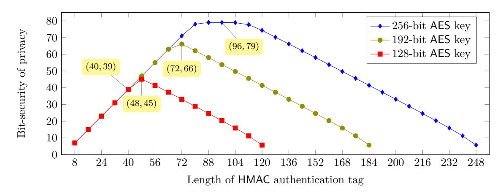
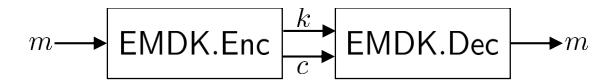
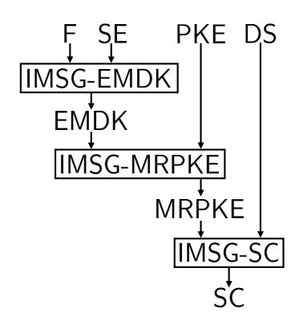
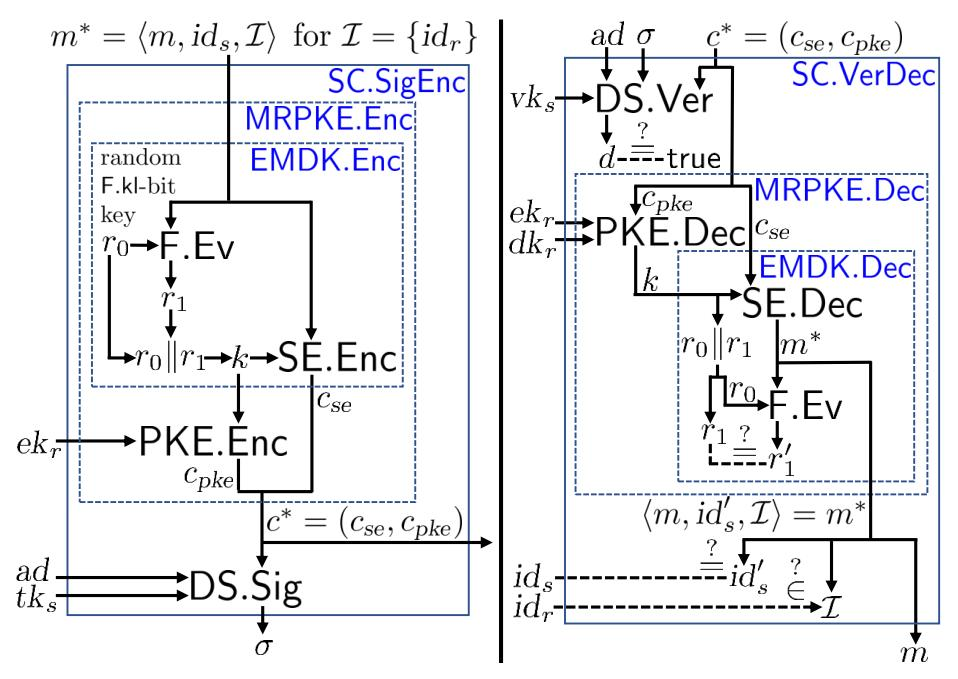

A preliminary version of this paper appears in EUROCRYPT 2020. This is the full version.

# **Security under Message-Derived Keys: Signcryption in iMessage**

Mihir Bellare1 Igors Stepanovs2

February 2020

#### **Abstract**

At the core of Apple's iMessage is a signcryption scheme that involves symmetric encryption of a message under a key that is derived from the message itself. This motivates us to formalize a primitive we call Encryption under Message-Derived Keys (EMDK). We prove security of the EMDK scheme underlying iMessage. We use this to prove security of the signcryption scheme itself, with respect to definitions of signcryption we give that enhance prior ones to cover issues peculiar to messaging protocols. Our provable-security results are quantitative, and we discuss the practical implications for iMessage.

<sup>1</sup> Department of Computer Science & Engineering, University of California San Diego, 9500 Gilman Drive, La Jolla, California 92093, USA. Email: mihir@eng.ucsd.edu. URL: https://cseweb.ucsd.edu/~mihir/. Supported in part by NSF grant CNS-1717640 and a gift from Microsoft.

<sup>2</sup> Department of Computer Science, ETH Zürich, Universitätstrasse 6, 8092 Zürich, Switzerland. Email: istepanovs@inf.ethz.ch. URL: https://sites.google.com/site/igorsstepanovs/. Supported in part by grants of first author. Work done while at UCSD.

### **Contents**

| 1 | Introduction                                                                                                                                                                                                                                                                                          | 2                                |
|---|-------------------------------------------------------------------------------------------------------------------------------------------------------------------------------------------------------------------------------------------------------------------------------------------------------|----------------------------------|
| 2 | Preliminaries                                                                                                                                                                                                                                                                                         | 6                                |
| 3 | Signcryption                                                                                                                                                                                                                                                                                          | 7                                |
| 4 | Encryption under message derived keys<br>4.1<br>Syntax, correctness and security of EMDK<br>4.2<br>iMessage-based EMDK scheme<br>                                                                                                                                                                     | 12<br>12<br>14                   |
| 5 | Design and security of<br>iMessage<br>5.1<br>iMessage-based signcryption scheme<br>IMSG-SC<br><br>5.2<br>Parameter-choice induced attacks on privacy of<br>iMessage<br><br>5.3<br>Authenticity of<br>iMessage<br><br>5.4<br>Privacy of<br>iMessage<br><br>5.5<br>Concrete security of<br>iMessage<br> | 16<br>16<br>19<br>21<br>24<br>25 |
| A | Prior work on signcryption                                                                                                                                                                                                                                                                            | 32                               |
| B | Legacy design of<br>iMessage                                                                                                                                                                                                                                                                          | 33                               |
| C | Combined security of signcryption                                                                                                                                                                                                                                                                     | 35                               |
| D | Standard definitions                                                                                                                                                                                                                                                                                  | 40                               |
| E | Proof of Theorem<br>4.1                                                                                                                                                                                                                                                                               | 44                               |
| F | Proof of Theorem<br>4.2                                                                                                                                                                                                                                                                               | 47                               |
| G | Proof of Theorem<br>4.3                                                                                                                                                                                                                                                                               | 49                               |
| H | Proof of Lemma<br>5.1                                                                                                                                                                                                                                                                                 | 50                               |
| I | Proof of Theorem<br>5.2                                                                                                                                                                                                                                                                               | 52                               |
| J | Proof of Theorem<br>5.3                                                                                                                                                                                                                                                                               | 56                               |
| K | Proof of Theorem<br>5.4                                                                                                                                                                                                                                                                               | 58                               |
| L | Proof of Theorem<br>5.5                                                                                                                                                                                                                                                                               | 61                               |

### <span id="page-2-1"></span><span id="page-2-0"></span>**1 Introduction**

Apple's iMessage app works across iOS (iPhone, iPad) and OS X (MacBook) devices. Laudably, it aims to provide end-to-end security. At its heart is a signcryption scheme.

The current scheme —we refer to the version in iOS 9.3 onwards, revised after the attacks of GGKMR [\[51](#page-30-0)] on the iOS 9.0 version— is of interest on two fronts. (1) *Applied*: iMessage encrypts (according to an Internet estimate) 63 quadrillion messages per year. It is important to determine whether or not the scheme provides the security expected by its users. (2) *Theoretical*: The scheme involves (symmetric) encryption of a message under a key that is derived from the message itself, an uncommon and intriguing technique inviting formalization and a foundational treatment.

Contributions in brief. *Signcryption theory*: We extend the prior Signcryption definitions of ADR [[4](#page-27-0)] to capture elements particular to messaging systems, and give general results that simplify the analysis of the candidate schemes. *EMDK*: We introduce, and give definitions (syntax and security) for, Encryption under Message Derived Keys. *iMessage EMDK scheme*: We extract from iMessage an EMDK scheme and prove its security in the random-oracle model. *Composition and iMessage Signcryption*: We give a way to compose EMDK, PKE and signatures to get signcryption, prove it works, and thereby validate the iMessage signcryption scheme for appropriate parameter choices.

Background. By default, the iMessage chatting app encrypts communications between any two iMessage users. The encryption is end-to-end, under keys stored on the devices, meaning Apple itself cannot decrypt. In this way, iMessage joins Signal, WhatsApp and other secure messaging apps as a means to counter mass surveillance, but the cryptography used is quite different, and while the cryptography underlying Signal and WhatsApp, namely ratcheting, has received an extensive theoretical treatment [[32,](#page-29-0) [21](#page-28-0), [54,](#page-30-1) [73](#page-31-0), [2](#page-27-1), [55,](#page-30-2) [44\]](#page-30-3), that underlying iMessage has not.

In 2016, Garman, Green, Kaptchuk, Miers and Rushanan (GGKMR) [[51\]](#page-30-0) gave chosen-ciphertext attacks on the then current, iOS 9 version, of iMessage that we will denote iMsg1. Its encryption algorithm is shown on the left in Figure [1.](#page-3-0) In response Apple acknowledged the attack as CVE-2016-1788 [\[33](#page-29-1)], and revised the protocol for iOS 9.3. We'll denote this version iMsg2. Its encryption algorithm is shown on the right in Figure [1](#page-3-0). It has been stable since iOS 9.3. It was this revision that, for the specific purpose of countering the GGMKR attack, introduced (symmetric) encryption with message-derived keys: message *M* at line 4 is encrypted under a key *K* derived, via lines 1–3, from *M* itself. The question we ask is, does the fix work?

Identifying the goal. To meaningfully answer the above question we must first, of course, identify the formal primitive and security goal being targeted. Neither Apple's iOS Security Guide [\[5\]](#page-27-2), nor GGKMR [\[51](#page-30-0)], explicitly do so. We suggest that it is signcryption. Introduced by Zheng [\[84\]](#page-32-1), signcryption aims to simultaneously provide privacy of the message (under the receiver's public encryption key) and authenticity (under the sender's secret signing key), and can be seen as the asymmetric analogue of symmetric authenticated encryption. A formalization was given by An, Dodis and Rabin (ADR) [\[4\]](#page-27-0). They distinguish between outsider security (the adversary is not one of the users) and the stronger insider security (the adversary could be a sender or receiver).

Identifying the iMessage goal as signcryption gives some perspective on, and understanding of, the schemes and history. The iMessage schemes can be seen as using some form of ADR's Encryptthen-Sign (*EtS*) method. The iMsg1 scheme turns out to be a simple scheme from ADR [\[4\]](#page-27-0). It may be outsider-secure, but ADR give an attack that shows it is not insider secure. (The adversary queries the sender encryption oracle to get a ciphertext ((*C*1*, C*2)*, S*), substitutes *S* with a signature *S ′* of *H* = SHA1(*C*1*∥C*2) under its own signing key, which it can do as an insider, and then queries this modified ciphertext to the recipient decryption oracle to get back the message underlying the

<span id="page-3-1"></span><span id="page-3-0"></span>

| iMsg1.Enc(pkr<br>,sks<br>, M)          | iMsg2.Enc(pkr<br>,sks<br>, M)          |
|----------------------------------------|----------------------------------------|
| 128<br>K ←\$ {0, 1}<br>1.              | 88<br>L ←\$ {0, 1}<br>1.               |
| C1<br>← AES-CTR.Enc(K, M)<br>2.        | h ← HMAC(L, pks∥pkr∥M)[140]<br>2.      |
| C2<br>← RSA-OAEP.Enc(pkr<br>, K)<br>3. | K ← L∥h<br>3.                          |
| H ← SHA1(C1∥C2)<br>4.                  | ← AES-CTR.Enc(K, M)<br>C1<br>4.        |
| S ← EC-DSA.Sign(sks<br>, H)<br>5.      | ← RSA-OAEP.Enc(pkr<br>C2<br>, K)<br>5. |
| Return<br>((C1, C2), S)<br>6.          | H ← SHA1(C1∥C2)<br>6.                  |
|                                        | S ← EC-DSA.Sign(sks<br>, H)<br>7.      |
|                                        | Return<br>((C1, C2), S)<br>8.          |

Figure 1: Encryption in iMsg1 (left) and iMsg2 (right). Here *pk<sup>r</sup>* is the recipient's public RSA encryption key, *sk<sup>s</sup>* is the sender's ECDSA secret signing key and *pk<sup>s</sup>* is the sender's ECDSA public verification key. Our analysis and proofs consider general schemes of which the above emerge as instantiations corresponding to particular choices of primitives and parameters.

original ciphertext.) The GGKMR [[51\]](#page-30-0) attack on iMsg1 is a clever improvement and real-world rendition of the ADR attack. That Apple acknowledged the GGKMR attack, and modified the scheme to protect against it, indicates that they want insider security, not just outsider security, for their modified iMsg2 scheme. So the question becomes whether this goal is achieved.

Signcryption theory extended. We could answer the above question relative to ADR's (existing) definitions of insider-secure signcryption, but we do more, affirming the iMsg2 signcryption scheme under stronger definitions that capture elements particular to messaging systems, making our results of more applied value.

When you send an iMessage communication to Alice, it is encrypted to *all* her devices (her iPhone, MacBook, iPad, ...), so that she can chat seamlessly across them. To capture this, we *enhance signcryption syntax*, making the encryption algorithm multi-recipient. (It takes not one, but a list of receiver public encryption keys.) We also allow associated data as in symmetric authenticated encryption [\[75](#page-31-1)].

We give, like in prior work [[4](#page-27-0)], a privacy definition (priv) and an authenticity definition (auth); but, unlike prior work, we also give a strong, unified definition (sec) that implies auth+priv. We show that (under certain conditions) sec is implied by auth+priv, mirroring analogous results for symmetric authenticated encryption [[24,](#page-29-2) [17](#page-28-1)]. Proving that a scheme satisfies sec (the definition more intuitively capturing the practical setting) now reduces to the simpler tasks of separately showing it satisfies auth and priv. These definitions and results are for both insider and outsider security, and parameterized by choices of *relaxing relations* that allow us to easily capture variants reflecting issues like plaintext or ciphertext integrity [\[16\]](#page-28-2), gCCA2 [\[4\]](#page-27-0) and RCCA [[28\]](#page-29-3).

EMDK definitions. Recall that a scheme for conventional symmetric encryption specifies a keygeneration algorithm that is run once, a prioi, to return a key *k*; the encryption algorithm then takes *k* and message *m* to return a ciphertext. In our definition of a scheme for (symmetric) Encryption under Message-Derived Keys (EMDK), there is no dedicated key-generation algorithm. Encryption algorithm EMDK*.*Enc takes only a message *m*, returning both a key *k* and a ciphertext *c*, so that *k* may depend on *m*. Decryption algorithm EMDK*.*Dec takes *k* —in the overlying signcryption scheme, this is communicated to the receiver via asymmetric encryption— and *c* to return either *m* or *⊥*.

We impose two security requirements on an EMDK scheme. (1) The first, called ae, adapts the authenticated encryption requirement of symmetric encryption [\[75](#page-31-1)]. (Our game formalizing ae is in <span id="page-4-0"></span>Figure [8](#page-13-0).) (2) The second, called rob, is a form of robustness or wrong-key detection [[1](#page-27-3), [27,](#page-29-4) [46,](#page-30-4) [47\]](#page-30-5). (Our game formalizing rob is also in Figure [8.](#page-13-0)) Of course one may define many other and alternative security goals for EMDK, so why these? We have focused on these simply because they suffice for our results.

EMDK is different from both (Symmetric) Encryption of Key-Dependent Messages (EKDM) [\[23,](#page-29-5) [26\]](#page-29-6) and (Symmetric) Encryption secure against Related-Key Attack (ERKA) [\[15\]](#page-28-3). To begin with, these definitions apply to *syntactically different objects*. Namely, both EKDM and ERKA are security metrics for the standard symmetric encryption syntax where the encryption algorithm takes a key and message as input and returns a ciphertext, while in EMDK the encryption algorithm takes only a message and itself produces a key along with the ciphertext. (Note that the latter is also different from the syntax of a Key-Encapsulation mechanism, where encryption does produce a key and ciphertext, but takes no input message.) These syntactic differences make comparison moot, but one can still discuss intuitively how the security requirements relate. In the security games for EKDM there is an honestly and randomly chosen target key *k*, and challenge messages to be encrypted may depend on *k*, but in our security games for EMDK, the key is not chosen honestly and could depend on the message being encrypted. In ERKA also, like EKDM but unlike EMDK, a target key *k* is chosen honestly and at random. One can now have the game apply the encryption algorithm under a key *k ′* derived from *k*, but this does not capture the encryption algorithm not taking a key as input but itself producing it as a function of the message, as in EKDM.

Deconstructing iMessage. Equipped with the above, we show how to cast the iMsg2 signcryption scheme as the result of a general transform (that we specify and call IMSG-SC) on a particular EMDK scheme (that we specify) and some standard auxiliary primitives (that we also specify). In Section [5](#page-16-0), we prove that IMSG-SC works, reducing insider security (priv, auth, sec) of the signcryption scheme to the security of the constituents, leaving us with what is the main technical task, namely showing security of the EMDK scheme.

In more detail, IMSG-SC takes a scheme EMDK for encryption under message-derived keys, a public-key encryption scheme PKE and a digital signature scheme DS to return a signcryption scheme SC = IMSG-SC[EMDK*,* PKE*,* DS]. (In the body of the paper, this is done in two steps, with a multi-recipient public-key encryption scheme [[13\]](#page-28-4) as an intermediate point, but for simplicity we elide this here.) Both iMessage signcryption schemes (i.e. iMsg1 and iMsg2) can be seen as results of this transform. The two make the same choices of PKE and DS, namely RSA-OAEP and EC-DSA respectively, differing only in their choice of EMDK, which for iMsg1 is a trivial scheme that we call the basic scheme, and for iMsg2 a more interesting scheme that we denote IMSG-EMDK[F*,* SE] and discuss below. Our Section [5](#page-16-0) result is that signcryption scheme SC = IMSG-SC[EMDK*,* PKE*,* DS] provides insider security (priv, auth, sec) assuming ae- and rob-security of EMDK and under standard assumptions on PKE and DS.

EMDK results. In Figure [10](#page-14-1) we specify an EMDK scheme IMSG-EMDK[F*,* SE] constructed from a given function family F and a given, ordinary one-time (assumed deterministic) symmetric encryption scheme SE. Setting F to HMAC and SE to AES-CTR recovers the EMDK scheme underlying iMsg2 signcryption. This EMDK scheme captures the heart of iMsg2 signcryption, namely lines 1–4 of the right side of Figure [1](#page-3-0).

The security analysis of IMSG-EMDK[F*,* SE] is somewhat complex. We prove ae-security of this EMDK scheme assuming F is a random oracle and SE has the following properties: one-time IND-CPA privacy, a property we define called uniqueness, and partial key recovery security. The latter strengthens key recovery security to say that, not only is it hard to recover the key, but it is hard to recover even a prefix, of a certain prescribed length, of this key. We prove rob-security of the

<span id="page-5-1"></span><span id="page-5-0"></span>

Figure 2: Lower bounds for the bit-security of privacy achieved by iMessage, depending on the key size of AES-CTR and the length of the authentication tag returned by HMAC. iMessage 10 uses 128-bit AES key and 40-bit long HMAC authentication tag, and hence guarantees at least 39 bits of security for privacy. (Any choice of parameters guarantees 71 bits of security for authenticity.)

EMDK scheme assuming F is a random oracle and SE satisfies uniqueness and weak robustness. The properties assumed of SE appear to be true for the AES-CTR used in iMessage, and could be shown in idealized models.

Practical implications for iMessage. What we have proved is that iMsg2 signcryption is secure in principle, in the sense that the underlying template is sound. (That is, the signcryption scheme given by our IMSG-SC transform is secure assuming the underlying primitives are secure.) For the practical implications, we must consider the quantitative security guaranteed by our theorems based on the particular choices of parameters and primitives made in iMsg2 signcryption scheme. Here, things seem a bit borderline, because iMsg2 signcryption has made some specific parameter choices that seem dangerous. Considering again the right side of Figure [1](#page-3-0), the 128-bit AES key *K* at line 3 has only 88 bits of entropy —all the entropy is from the choice of *L* at line 1 which is not only considered small in practice but also is less than for iMsg1. (On the left side of the Figure we see that line 1 selects an AES key *K* with the full 128 bits of entropy.) Also the tag *h* produced at line 2 of the right-hand-side of the Figure is only 40 bits, shorter than recommended lengths for authentication tags. To estimate the impact of these choices, we give concrete attacks on the scheme. They show that the bounds in our theorems are tight, but do not contradict our provable-security results.

Numerical estimates based on our provable-security results say that iMessage 10 guarantees at least 39 bits of security for privacy, and 71 bits of security for authenticity, if HMAC and AES are modeled as ideal primitives. Fig. [2](#page-5-0) shows the guaranteed bit-security of privacy for different choices of AES key length and HMAC tag length. For the small parameter choices made in iMsg2 signcryption, the attacks do approach feasibility in terms of computational effort, but we wouldn't claim they are practical, for two reasons. First, they only violate the very stringent security goals that are the target of our proofs. Second, following the GGKMR [[51\]](#page-30-0) attacks, Apple has implemented decryption-oracle throttling that will also curtail our attacks.

Still, ideally, a practical scheme would implement cryptography that meets even our stringent security goals without recourse to extraneous measures like throttling. We suggest that parameter and primitive choices in iMessage signcryption be revisited, for if they are chosen properly, our results do guarantee that the scheme provides strong security properties.

<span id="page-6-1"></span>Discussion. When a new primitive (like EMDK) is defined, the first question of a theoretical cryptographer is often, does it exist, meaning, can it be built, and under what assumptions? At least in the random-oracle model [[18\]](#page-28-5) in which our results are shown, it is quite easy to build, under standard assumptions, an EMDK scheme that provides the ae+rob-security we define, and we show such a scheme in Figure [9](#page-13-1). The issue of interest for us is less existence (to build some secure EMDK scheme) and more the security of the *particular* IMSG-EMDK[F*,* SE] scheme underlying iMsg2 signcryption. The motivation is mainly applied, stemming from this scheme running in security software (iMessage) that is used by millions.

But, one may then ask, WHY did Apple use their (strange) EMDK scheme instead of one like that in Figure [9](#page-13-1), which is simpler and provable under weaker assumptions? We do not know. In that vein, one may even ask, why did Apple use EMDK at all? The literature gives Signcryption schemes that are efficient and based on standard assumptions. Why did they not just take one of them? Again, we do not know for sure, but we can speculate. The EMDK-based template that we capture in our IMSG-SC transform provides *backwards decryption compatibility*; an iMsg1 implementation can decrypt an iMsg2 ciphertext. (Of course, security guarantees revert to those of the iMsg1 scheme under such usage, but this could be offset by operational gains.) Moving to an entirely new signcryption scheme would *not* provide this backwards compatibility. But we stress again that this is mere speculation; we did not find any Apple documents giving reasons for their choices.

Related work. We have discussed some related work above. However, signcryption is a big research area with a lot of work. We overview this in Appendix [A](#page-32-0).

# <span id="page-6-0"></span>**2 Preliminaries**

In Appendix [D](#page-40-0) we provide the following standard definitions. We state syntax, correctness and security definitions for function families, symmetric encryption, digital signatures, public-key encryption, and multi-recipient public-key encryption. We define the random oracle model, the ideal cipher model, and provide the birthday attack bounds. In this section we introduce the basic notation and conventions we use throughout the paper.

Basic notation and conventions. Let N = *{*1*,* 2*, . . .}* be the set of positive integers. For *i ∈* N we let [*i*] denote the set *{*1*, . . . , i}*. If *X* is a finite set, we let *x ←*\$ *X* denote picking an element of *X* uniformly at random and assigning it to *x*. Let *ε* denote the empty string. By *x ∥ y* we denote the concatenation of strings *x* and *y*. If *x ∈ {*0*,* 1*} ∗* is a string then *|x|* denotes its length, *x*[*i*] denotes its *i*-th bit, and *x*[*i..j*] = *x*[*i*] *. . . x*[*j*] for 1 *≤ i ≤ j ≤ |x|*. If mem is a table, we use mem[*i*] to denote the element of the table that is indexed by *i*. We use a special symbol *⊥* to denote an empty table position; we also return it as an error code indicating an invalid input to an algorithm or an oracle, including invalid decryption. We assume that adversaries never pass *⊥* as input to their oracles.

Uniquely decodable encoding. We write *⟨a, b, . . .⟩* to denote a string that is a uniquely decodable encoding of *a, b, . . .*, where each of the encoded elements can have an arbitrary type (e.g. a string or a set). For any *n ∈* N let *x*1*, x*2*, . . . , x<sup>n</sup>* and *y*1*, y*2*, . . . , y<sup>n</sup>* be two sequences of elements such that for each *i ∈* [*n*] the following holds: either *x<sup>i</sup>* = *y<sup>i</sup>* , or both *x<sup>i</sup>* and *y<sup>i</sup>* are strings of the same length. Then we require that *|⟨x*1*, x*2*, . . . , xn⟩|* = *|⟨y*1*, y*2*, . . . , yn⟩|*, and that *⟨x*1*, x*2*, . . . , xn⟩ ⊕ ⟨y*1*, y*2*, . . . , yn⟩* = *⟨*(*x*<sup>1</sup> *⊕ y*1)*,*(*x*<sup>2</sup> *⊕ y*2)*, . . . ,*(*x<sup>n</sup> ⊕ yn*)*⟩*.

Algorithms and adversaries. Algorithms may be randomized unless otherwise indicated. Running time is worst case. If *A* is an algorithm, we let *y ← A*(*x*1*, . . .* ; *r*) denote running *A* with random

<span id="page-7-1"></span>coins r on inputs  $x_1, \ldots$  and assigning the output to y. We let  $y \leftarrow A(x_1, \ldots)$  be the result of picking r at random and letting  $y \leftarrow A(x_1, \ldots; r)$ . We let  $[A(x_1, \ldots)]$  denote the set of all possible outputs of A when invoked with inputs  $x_1, \ldots$ . The instruction **abort** $(x_1, \ldots)$  is used to immediately halt the algorithm with output  $(x_1, \ldots)$ . Adversaries are algorithms.

<u>Security games and reductions.</u> We use the code based game playing framework of [20]. (See Fig. 5 for an example.) We let Pr[G] denote the probability that game G returns true. In the security reductions, we omit specifying the running times of the constructed adversaries when they are roughly the same as the running time of the initial adversary.

<u>IMPLICIT INITIALIZATION VALUES</u>. In algorithms and games, uninitialized integers are assumed to be initialized to 0, Booleans to false, strings to the empty string, sets to the empty set, and tables are initially empty.

BIT-SECURITY OF CRYPTOGRAPHIC PRIMITIVES. Let prim be any cryptographic primitive, and let sec be any security notion defined for this primitive. We say that prim has n bits of security with respect to sec (or n bits of sec-security) if for every adversary  $\mathcal{A}$  that has advantage  $\epsilon_{\mathcal{A}}$  and runtime  $T_{\mathcal{A}}$  against sec-security of prim it is true that  $\epsilon_{\mathcal{A}}/T_{\mathcal{A}} < 2^{-n}$ . In other words, if there exists an adversary  $\mathcal{A}$  with advantage  $\epsilon_{\mathcal{A}}$  and runtime  $T_{\mathcal{A}}$  against sec-security of prim, then prim has at most  $-\log_2(\epsilon_{\mathcal{A}}/T_{\mathcal{A}})$  bits of security with respect to sec. This is the folklore definition of bit-security for cryptographic primitives. Micciancio and Walter [68] recently proposed an alternative definition for bit-security.

BIT-SECURITY LOWER BOUNDS. Let  $\mathcal{BS}(\mathsf{prim}, \mathsf{sec})$  denote the bit-security of cryptographic primitive prim with respect to security notion  $\mathsf{sec}$ . Consider any security reduction showing  $\mathsf{Adv}^{\mathsf{sec}}_{\mathsf{prim}}(\mathcal{A}) \leq \sum_i \mathsf{Adv}^{\mathsf{sec}_i}_{\mathsf{prim}_i}(\mathcal{B}^{\mathcal{A}}_i)$  by constructing for any adversary  $\mathcal{A}$  and for each i a new adversary  $\mathcal{B}^{\mathcal{A}}_i$  with runtime roughly  $T_{\mathcal{A}}$ . Then we can lower bound the bit-security of  $\mathsf{prim}$  with respect to  $\mathsf{sec}$  as

$$\mathcal{BS}(\mathsf{prim},\mathsf{sec}) = \min_{\forall \mathcal{A}} - \log_2\left(\frac{\epsilon_{\mathcal{A}}}{T_{\mathcal{A}}}\right) \geq \min_{\forall \mathcal{A}} - \log_2\left(\frac{\sum_i \mathsf{Adv}^{\mathsf{sec}_i}_{\mathsf{prim}_i}(\mathcal{B}^{\mathcal{A}}_i)}{T_{\mathcal{A}}}\right) \geq -\log_2\left(\sum_i 2^{-\mathcal{BS}(\mathsf{prim}_i,\mathsf{sec}_i)}\right).$$

# <span id="page-7-0"></span>3 Signcryption

In this section we define syntax, correctness and security notions for multi-recipient signcryption schemes. We assume that upon generating any signcryption key pair (pk, sk), it gets associated to some identity id. This captures a system where users can indepenently generate their cryptographic keys prior to registering them with a public-key infrastructure. We require that all identities are distinct values in  $\{0,1\}^*$ . Depending on the system, each identity id serves as a label that uniquely identifies a device or a user. Note that pk cannot be used in place of the identity, because different devices can happen to use the same public keys (either due to generating the same key pairs by chance, or due to maliciously claiming someone's else public key). We emphasize that our syntax is not meant to capture identity-based signcryption, where a public key would have to depend on the identity. In Appendix A we provide an extensive summary of prior work on signcryption.

We focus on authenticity and privacy of signcryption in the *insider* setting, meaning that the adversary is allowed to adaptively compromise secret keys of any identities as long as that does not enable the adversary to trivially win the security games. Our definitions can also capture the *outsider* setting by considering limited classes of adversaries. We define our security notions with respect to *relaxing relations*. This allows us to capture a number of weaker security notions in a fine-grained way, by choosing an appropriate relaxing relation in each case. In Appendix C we define a *combined* security notion for signcryption that simultaneously encompasses authenticity

```
\begin{split} \pi &\leftarrow \text{\$ SC.Setup} \\ (pk, sk) &\leftarrow \text{\$ SC.Kg}(\pi) \\ \mathcal{C} &\leftarrow \text{\$ SC.SigEnc}(\pi, id_s, pk_s, sk_s, \mathcal{R}, m, ad) \\ m &\leftarrow \text{SC.VerDec}(\pi, id_s, pk_s, id_r, pk_r, sk_r, c, ad) \end{split}
```

<span id="page-8-2"></span><span id="page-8-1"></span><span id="page-8-0"></span>Figure 3: Syntax of the constituent algorithms of signcryption scheme SC.

```
 \begin{array}{l} \frac{\mathsf{R}_{\mathsf{m}}.\mathsf{Vf}(z_0,z_1)}{(x_0,y_0) \leftarrow z_0}\,;\; (x_1,y_1) \leftarrow z_1 & \frac{\mathsf{R}_{\mathsf{id}}.\mathsf{Vf}(z_0,z_1)}{\mathsf{Return}\; z_0 = z_1} \\ \\ \mathsf{Return}\; x_0 = x_1 & \end{array}
```

Figure 4: Relaxing relations  $R_m$  and  $R_{id}$ .

and privacy, and prove that it is equivalent to the separate notions under certain conditions.

MULTI-RECIPIENT SIGNCRYPTION SCHEMES. A multi-recipient signcryption scheme SC specifies algorithms SC.Setup, SC.Kg, SC.SigEnc, SC.VerDec, where SC.VerDec is deterministic. Associated to SC is an identity space SC.ID. The setup algorithm SC.Setup returns public parameters  $\pi$ . The key generation algorithm SC.Kg takes  $\pi$  to return a key pair (pk, sk), where pk is a public key and sk is a secret key. The signcryption algorithm SC.SigEnc takes  $\pi$ , sender's identity  $id_s \in$  SC.ID, sender's public key  $pk_s$ , sender's secret key  $sk_s$ , a set  $\mathcal{R}$  of pairs  $(id_r, pk_r)$  containing recipient identities and public keys, a plaintext  $m \in \{0,1\}^*$ , and associated data  $ad \in \{0,1\}^*$  to return a set  $\mathcal{C}$  of pairs  $(id_r, c)$ , each denoting that signcryption ciphertext c should be sent to the recipient with identity  $id_r$ . The unsigncryption algorithm SC.VerDec takes  $\pi$ , sender's identity  $id_s$ , sender's public key  $pk_s$ , recipient's identity  $id_r$ , recipient's public key  $pk_r$ , recipient's secret key  $sk_r$ , signcryption ciphertext c, and associated data ad to return  $m \in \{0,1\}^* \cup \{\bot\}$ , where  $\bot$  indicates a failure to recover plaintext. The syntax used for the constituent algorithms of SC is summarized in Fig. 3.

CORRECTNESS OF SIGNCRYPTION. The correctness of a signcryption scheme SC requires that for all  $\pi \in [SC.Setup]$ , all  $n \in \mathbb{N}$ , all  $(pk_0, sk_0), \ldots, (pk_n, sk_n) \in [SC.Kg(\pi)]$  all  $id_0 \in SC.ID$ , all  $distinct\ id_1, \ldots, id_n \in SC.ID$ , all  $m \in \{0, 1\}^*$ , and all  $ad \in \{0, 1\}^*$  the following conditions hold. Let  $\mathcal{R} = \{(id_i, pk_i)\}_{1 \leq i \leq n}$ . We require that for all  $\mathcal{C} \in [SC.SigEnc(\pi, id_0, pk_0, sk_0, \mathcal{R}, m, ad)]$ : (i)  $|\mathcal{C}| = |\mathcal{R}|$ ; (ii) for each  $i \in \{1, \ldots, n\}$  there exists a unique  $c \in \{0, 1\}^*$  such that  $(id_i, c) \in \mathcal{C}$ ; (iii) for each  $i \in \{1, \ldots, n\}$  and each c such that  $(id_i, c) \in \mathcal{C}$  we have  $m = SC.VerDec(\pi, id_0, pk_0, id_i, pk_i, sk_i, c, ad)$ .

RELAXING RELATIONS. A relaxing relation  $R \subseteq \{0,1\}^* \times \{0,1\}^*$  is a set containing pairs of arbitrary strings. Associated to a relaxing relation R is a membership verification algorithm R.Vf that takes inputs  $z_0, z_1 \in \{0,1\}^*$  to return a decision in  $\{\text{true}, \text{false}\}$  such that  $\forall z_0, z_1 \in \{0,1\}^*$ : R.Vf $(z_0, z_1) = \text{true}$  iff  $(z_0, z_1) \in R$ . We will normally define relaxing relations by specifying their membership verification algorithms. Two relaxing relations that will be used throughout the paper are defined in Fig. 4.

We define our security notions for signcryption with respect to relaxing relations. Relaxing relations are used to restrict the queries that an adversary is allowed to make to its unsigncryption oracle. The choice of different relaxing relations can be used to capture a variety of different security notions for signcryption in a fine-grained way. We will use relaxing relations  $R_{id}$  and  $R_m$  to capture strong vs. standard authenticity (or unforgeability) of signcryption, and IND-CCA vs. RCCA [28, 53] style indistinguishability of signcryption. In Section 5.3 we will aso define unforgeability of digital signatures with respect to relaxing relations, allowing to capture standard

```
Games Gauth
\pi \leftarrow s SC.Setup ; \mathcal{F}^{NewH,NewC,Exp,SigEnc,VerDec}(\pi) ; Return win
NewH(id)
If initialized[id] then return \bot
initialized[id] \leftarrow true; (pk, sk) \leftarrow sSC.Kg(\pi); pk[id] \leftarrow pk; sk[id] \leftarrow sk; Return pk
NewC(id, pk, sk)
If initialized[id] then return \bot
initialized[id] \leftarrow true; \exp[id] \leftarrow true; pk[id] \leftarrow pk; sk[id] \leftarrow sk; Return true
Exp(id)
If not initialized[id] then return \bot
\exp[id] \leftarrow \text{true} \; ; \; \text{Return sk}[id]
SIGENC(id_s, \mathcal{I}, m, ad)
If (not initialized[id_s]) or (\exists id \in \mathcal{I}: \text{not initialized}[id]) then return \bot
\mathcal{R} \leftarrow \emptyset: For each id \in \mathcal{I} do \mathcal{R} \leftarrow \mathcal{R} \cup \{(id, \mathsf{pk}[id])\}
\mathcal{C} \leftarrow s SC.SigEnc(\pi, id_s, pk[id_s], sk[id_s], \mathcal{R}, m, ad)
For each (id_r, c) \in \mathcal{C} do Q \leftarrow Q \cup \{((id_s, id_r, m, ad), c)\}
Return C
VerDec(id_s, id_r, c, ad)
If (not initialized[id_s]) or (not initialized[id_r]) then return \bot
m \leftarrow \mathsf{SC.VerDec}(\pi, id_s, \mathsf{pk}[id_s], id_r, \mathsf{pk}[id_r], \mathsf{sk}[id_r], c, ad); If m = \perp then return \perp
z_0 \leftarrow ((id_s, id_r, m, ad), c); If \exists z_1 \in Q : \mathsf{R.Vf}(z_0, z_1) then return m
cheated \leftarrow \exp[id_s]; If not cheated then win \leftarrow true
Return m
```

Figure 5: Game defining authenticity of sign cryption scheme  $\mathsf{SC}$  with respect to relaxing relation  $\mathsf{R}$ .

and strong unforgeability notions in a unified way.

AUTHENTICITY OF SIGNCRYPTION. Consider game G<sup>auth</sup> of Fig. 5 associated to a signcryption scheme SC, a relaxing relation R and an adversary  $\mathcal{F}$ . The advantage of adversary  $\mathcal{F}$  in breaking the AUTH-security of SC with respect to R is defined as  $Adv_{SC,R}^{auth}(\mathcal{F}) = \Pr[G_{SC,R,\mathcal{F}}^{auth}]$ . Adversary  $\mathcal{F}$ has access to oracles NewH, NewC, Exp, Sigenc, and Verdec. The oracles can be called in any order. Oracle NewH generates a key pair for a new honest identity id. Oracle NewC associates a key pair (pk, sk) of adversary's choice to a new corrupted identity id; it permits malformed keys, meaning sk should not necessarily be a valid secret key that matches with pk. Oracle Exp can be called to expose the secret key of any identity. The game maintains a table exp to mark which identities are exposed; all corrupted identities that were created by calling oracle NEWC are marked as exposed right away. The signcryption oracle SigEnc returns ciphertexts produced by sender identity  $id_s$  to each of the recipient identities contained in set  $\mathcal{I}$ , encrypting message m with associated data ad. Oracle VerDec returns the plainext obtained as the result of unsignerypting the ciphertext c sent from sender  $id_s$  to recipient  $id_r$ , with associated data ad. The goal of adversary  $\mathcal{F}$  is to forge a valid signcryption ciphertext, and query it to oracle VerDec. The game does not let adversary win by querying oracle VERDEC with a forgery that was produced for an exposed sender identity  $id_s$ , since the adversary could have trivially produced a valid ciphertext due to its knowledge of the sender's secret key. Certain choices of relaxing relation R can lead to another trivial attack.

A CHOICE OF RELAXING RELATION FOR AUTHENTICITY. When adversary  $\mathcal{F}$  in game  $G_{\mathsf{SC},\mathsf{R},\mathcal{F}}^{\mathsf{auth}}$  calls oracle Sigence on inputs  $id_s, \mathcal{I}, m, ad$ , then for each ciphertext c produced for a recipient  $id_r \in \mathcal{I}$  the game adds a tuple  $((id_s, id_r, m, ad), c)$  to set Q. This set is then used inside oracle Verdec. Oracle Verdece constructs  $z_0 = ((id_s, id_r, m, ad), c)$  and prevents the adversary from winning the game if  $\mathsf{R.Vf}(z_0, z_1)$  is true for any  $z_1 \in Q$ . If the relaxing relation is empty (meaning  $\mathsf{R} = \emptyset$  and hence  $\mathsf{R.Vf}(z_0, z_1) = \mathsf{false}$  for all  $z_0, z_1 \in \{0, 1\}^*$ ) then an adversary is allowed to trivially win the game by calling oracle Sigence and claiming any of the resulting ciphertexts as a forgery (without changing the sender and recipient identities). Let us call this a "ciphertext replay" attack.

In order to capture a meaningful security notion, the AUTH-security of SC should be considered with respect to a relaxing relation that prohibits the above trivial attack. The strongest such security notion is achieved by considering AUTH-security of SC with respect to the relaxing relation  $R_{id}$  that is defined in Fig. 4; this relaxing relation prevents *only* the ciphertext replay attack. The resulting security notion captures the strong authenticity (or unforgeability) of signcryption. Alternatively, one could think of this notion as capturing the ciphertext integrity of signcryption.

Note that a relaxing relation R prohibits the ciphertext replay attack iff  $R_{id} \subseteq R$ . Now consider the relaxing relation  $R_m$  as defined in Fig. 4; it is a proper superset of  $R_{id}$ . The AUTH-security of SC with respect to  $R_m$  captures the standard authenticity (or unforgeability, or plaintext integrity) of signcryption. The resulting security notion does not let adversary win by merely replaying an encryption of (m, ad) from  $id_s$  to  $id_r$  for any fixed  $(id_s, id_r, m, ad)$ , even if the adversary can produce a new ciphertext that was not seen before.

<u>Capturing outsider</u> Authenticity. Game  $G_{SC,R,\mathcal{F}}^{auth}$  captures the authenticity of SC in the *insider* setting, because it allows adversary to win by producing a forgery from an honest sender identity to an *exposed* recipient identity. This, in particular, implies that SC assures non-repudiation, meaning that the sender cannot deny the validity of a ciphertext it sent to a recipient (since the knowledge of the recipient's secret key does not help to produce a forgery). In contrast, the *outsider* authenticity only requires SC to be secure when both the sender and the recipient are honest. Our definition can capture the notion of outsider authenticity by considering a class of *outsider* adversaries that never query  $Verder (id_s, id_r, c, ad)$  when  $exp[id_r] = true$ .

PRIVACY OF SIGNCRYPTION. Consider game G<sup>priv</sup> of Fig. 6 associated to a signcryption scheme SC. a relaxing relation R and an adversary  $\mathcal{D}$ . The advantage of adversary  $\mathcal{D}$  in breaking the PRIVsecurity of SC with respect to R is defined as  $\mathsf{Adv}^{\mathsf{priv}}_{\mathsf{SC},\mathsf{R}}(\mathcal{D}) = 2\Pr[G^{\mathsf{priv}}_{\mathsf{SC},\mathsf{R},\mathcal{D}}] - 1$ . The game samples a challenge bit  $b \in \{0,1\}$ , and the adversary is required to guess it. Adversary  $\mathcal{D}$  has access to oracles NewH, NewC, Exp, LR, and VerDec. The oracles can be called in any order. Oracles NEWH, NEWC, and EXP are the same as in the authenticity game (with the exception of oracle Exp also checking table ch, which is explained below). Oracle LR encrypts challenge message  $m_b$ with associated data ad, produced by sender identity  $id_s$  to each of the recipient identities contained in set  $\mathcal{I}$ . Oracle LR aborts if  $m_0 \neq m_1$  and if the recipient set  $\mathcal{I}$  contains an identity  $id_r$  that is exposed. Otherwise, the adversary would be able to trivially win the game by using the exposed recipient's secret key to decrypt a challenge ciphertext produced by this oracle. If  $m_0 \neq m_1$  and none of the recipient identities is exposed, then oracle LR uses table ch to mark each of the recipient identities; the game will no longer allow to expose any of these identities by calling oracle Exp. Oracle VerDec returns the plaintext obtained as the result of unsigncrypting the ciphertext csent from  $id_s$  to  $id_r$  with associated data ad. We discuss the choice of a relaxing relation R below. However, note that oracle LR updates the set Q (used by relaxing relation) only when  $m_0 \neq m_1$ . This is because the output of LR does not depend on the challenge bit when  $m_0 = m_1$ , and hence such queries should not affect the set of prohibited queries to oracle VERDEC.

```
Game Gpriv
         SC,R,D
b ←$ {0, 1} ; π ←$ SC.Setup ; b
                                 ′ ←$ DNewH,NewC,Exp,LR,VerDec(π) ; Return b
                                                                                 ′ = b
NewH(id)
If initialized[id] then return ⊥
initialized[id] ← true ; (pk,sk) ←$ SC.Kg(π) ; pk[id] ← pk ; sk[id] ← sk ; Return pk
NewC(id, pk,sk)
If initialized[id] then return ⊥
initialized[id] ← true ; exp[id] ← true ; pk[id] ← pk ; sk[id] ← sk ; Return true
Exp(id)
If (not initialized[id]) or ch[id] then return ⊥
exp[id] ← true ; Return sk[id]
LR(ids
       , I, m0, m1, ad)
If (not initialized[ids
                     ]) or (∃id ∈ I : not initialized[id]) or |m0| ̸= |m1| then return ⊥
If m0 ̸= m1 then
  If ∃id ∈ I : exp[id] then return ⊥
  For each id ∈ I do ch[id] ← true
R ← ∅ ; For each id ∈ I do R ← R ∪ {(id, pk[id])}
C ←$ SC.SigEnc(π, ids
                       , pk[ids
                              ],sk[ids
                                      ], R, mb, ad)
For each (idr
              , c) ∈ C do
  If m0 ̸= m1 then
    Q ← Q ∪ {((ids
                     , idr
                         , m0, ad), c)}
    Q ← Q ∪ {((ids
                     , idr
                         , m1, ad), c)}
Return C
VerDec(ids
             , idr
                  , c, ad)
If (not initialized[ids
                     ]) or (not initialized[idr
                                             ]) then return (⊥, "init")
m ← SC.VerDec(π, ids
                       , pk[ids
                               ], idr
                                    , pk[idr
                                           ],sk[idr
                                                   ], c, ad)
If m =⊥ then return (⊥, "dec")
z0 ← ((ids
           , idr
               , m, ad), c) ; If ∃z1 ∈ Q: R.Vf(z0, z1) then return (⊥, "priv")
Return (m, "ok")
```

Figure 6: Games defining privacy of signcryption scheme SC with respect to relaxing relation R.

Outputs of oracle VerDec. The output of oracle VerDec in game Gpriv is a pair containing the plaintext (or the incorrect decryption symbol *⊥*) as its first element, and the status message as its second element. This ensures that the adversary can distinguish whether VerDec returned *⊥* because it failed to decrypt the ciphertext (yields error message "dec"), or because the relaxing relation prohibits the query (yields error message "priv"). Giving more information to the adversary results in a stronger security definition, and will help us prove equivalence between the joint and separate security notions of signcryption in Appendix [C](#page-35-0). Note that an adversary can distinguish between different output branches of all other oracles used in our authenticity and privacy games.

A choice of relaxing relation for privacy. Consider relaxing relations Rid and R<sup>m</sup> that are defined in Fig. [4](#page-8-1). We recover IND-CCA security of SC as the PRIV-security of SC with respect to Rid. And we capture the RCCA security of SC as the PRIV-security of SC with respect to Rm. Recall that the intuition behind the RCCA security [\[28](#page-29-3), [53\]](#page-30-6) is to prohibit the adversary from querying its decryption oracle with ciphertexts that encrypt a previously queried challenge message. In particular, this is the reason that two elements are added to set *Q* during each call to oracle



<span id="page-12-3"></span><span id="page-12-2"></span>Figure 7: Constituent algorithms of encryption scheme under message derived keys EMDK.

LR, one for each of  $m_0$  and  $m_1$ . Our definition of RCCA security for SC is very similar to that of IND-gCCA2 security as proposed by An, Dodis and Rabin [4]. The difference is that our definition passes the decrypted message as input to the relation, whereas IND-gCCA2 instead allows relations that take public keys of sender and recipient as input. It is not clear that having the relation take the public key would make our definition meaningfully stronger.

<u>Capturing outsider</u> Privacy. Game  $G_{SC,R,\mathcal{D}}^{priv}$  captures the privacy of SC in the *insider* setting, meaning that the adversary is allowed to request challenge encryptions from  $id_s$  to  $id_r$  even when  $id_s$  is exposed. This implies some form of forward security because exposing the sender's key does not help the adversary win the indistinguishability game. To recover the notion of *outsider* privacy, consider a class of *outsider* adversaries that never query  $LR(id_s, \mathcal{I}, m_0, m_1, ad)$  when  $exp[id_s] = true$ .

# <span id="page-12-0"></span>4 Encryption under message derived keys

We now define Encryption under Message Derived Keys (EMDK). It can be thought of as a special type of symmetric encryption allowing to use keys that depend on the messages to be encrypted. This type of primitive will be at the core of analyzing the security of iMessage-based signcryption scheme. In Section 4.1 we define syntax, correctness and basic security notions for EMDK schemes. In Section 4.2 we define the iMessage-based EMDK scheme and analyse its security.

### <span id="page-12-1"></span>4.1 Syntax, correctness and security of EMDK

We start by defining the syntax and correctness of encryption schemes under message derived keys. The interaction between constituent algorithms of EMDK is shown in Fig. 7. The main security notions for EMDK schemes are AE (authenticated encryption) and ROB (robustness). We also define the IND (indistinguishability) notion that will be used in Section 4.2 for an intermediate result towards showing the AE-security of the iMessage-based EMDK scheme.

ENCRYPTION SCHEMES UNDER MESSAGE DERIVED KEYS. An encryption scheme under message derived keys EMDK specifies algorithms EMDK.Enc and EMDK.Dec, where EMDK.Dec is deterministic. Associated to EMDK is a key length EMDK.kl  $\in \mathbb{N}$ . The encryption algorithm EMDK.Enc takes a message  $m \in \{0,1\}^*$  to return a key  $k \in \{0,1\}^{\mathsf{EMDK.kl}}$  and a ciphertext  $c \in \{0,1\}^*$ . The decryption algorithm EMDK.Dec takes k,c to return message  $m \in \{0,1\}^* \cup \{\bot\}$ , where  $\bot$  denotes incorrect decryption. Decryption correctness requires that EMDK.Dec(k,c) = m for all  $m \in \{0,1\}^*$ , and all  $(k,c) \in [\mathsf{EMDK.Enc}(m)]$ .

INDISTINGUISHABILITY OF EMDK. Consider game  $G^{ind}$  of Fig. 8, associated to an encryption scheme under message derived keys EMDK, and to an adversary  $\mathcal{D}$ . The advantage of  $\mathcal{D}$  in breaking the IND security of EMDK is defined as  $Adv_{EMDK}^{ind}(\mathcal{D}) = 2 \cdot Pr[G_{EMDK,\mathcal{D}}^{ind}] - 1$ . The game samples a random challenge bit b and requires the adversary to guess it. The adversary has access to an encryption oracle LR that takes two challenge messages  $m_0, m_1$  to return an EMDK encryption of  $m_b$ .

<span id="page-13-2"></span><span id="page-13-0"></span>

| $\mathrm{Game}\ G_{EMDK,\mathcal{D}}^{ind}$                     | $\boxed{ \text{Game } G^{\text{ae}}_{\text{EMDK},\mathcal{D}} }$ | Game $G_{EMDK,\mathcal{G}}^{rob}$                            |
|-----------------------------------------------------------------|------------------------------------------------------------------|--------------------------------------------------------------|
| $b \leftarrow *\{0,1\}; b' \leftarrow *\mathcal{D}^{LR}$        | $b \leftarrow \{0,1\}; b' \leftarrow \mathcal{D}^{LR,DEC}$       | $\overline{(i,k)} \leftarrow \mathfrak{S}^{\mathrm{Enc}}$    |
| Return $b = b'$                                                 | Return $b = b'$                                                  | If $i \notin [n]$ then return false                          |
| $LR(m_0, m_1)$                                                  | $LR(m_0, m_1)$                                                   | $m \leftarrow EMDK.Dec(k,c[i])$                              |
| $ \overline{\text{If }  m_0  \neq  m_1 }  $ then return $\perp$ | $\frac{1}{ If  m_0  \neq  m_1 }$ then return $\perp$             | Return $m \neq \perp$ and $m \neq m[i]$                      |
| $(k,c) \leftarrow \text{$FMDK.Enc}(m_b)$                        | $n \leftarrow n + 1$                                             | $ \underline{\operatorname{Enc}(m)} $                        |
| Return $c$                                                      | $(k[n],c[n]) \leftarrow s EMDK.Enc(m_b)$                         | $(k,c) \leftarrow s \text{ EMDK.Enc}(m)$                     |
|                                                                 | Return $(n, c[n])$                                               | $n \leftarrow n+1; \ m[n] \leftarrow m; \ c[n] \leftarrow c$ |
|                                                                 | $\mathrm{DEC}(i,c)$                                              | Return $(k, c)$                                              |
|                                                                 | If $i \notin [n]$ or $\mathbf{c}[i] = c$ then return $\perp$     |                                                              |
|                                                                 | $m \leftarrow EMDK.Dec(k[i],c)$                                  |                                                              |
|                                                                 | If $b = 1$ then return $m$ else return $\perp$                   |                                                              |

<span id="page-13-1"></span>Figure 8: Games defining indistinguishability, authenticated encryption security, and robustness of encryption scheme under message derived keys EMDK.

$$\begin{array}{c|c} \underline{\mathsf{EMDK}}.\mathsf{Enc}^{\mathrm{RO}}(m) \\ \hline k \leftarrow \$ \left\{ 0,1 \right\}^{\mathsf{EMDK}.\mathsf{kl}}; \ \ell \leftarrow |m| \\ x \leftarrow m \oplus \mathrm{RO}(k,\ell) \\ h \leftarrow \mathrm{RO}(k \parallel m,\ell) \\ c \leftarrow (x,h) \\ \mathrm{Return} \ (k,c) \\ \end{array} \begin{array}{c|c} \underline{\mathsf{EMDK}}.\mathsf{Dec}^{\mathrm{RO}}(k,c) \\ \hline (x,h) \leftarrow c \ ; \ \ell \leftarrow |x| \\ m \leftarrow x \oplus \mathrm{RO}(k,\ell) \\ h' \leftarrow \mathrm{RO}(k \parallel m,\ell) \\ \mathrm{If} \ h \neq h' \ \mathrm{then} \ \mathrm{return} \ \bot \\ \mathrm{Else} \ \mathrm{return} \ m \\ \end{array} \begin{array}{c|c} \underline{\mathrm{RO}(z,\ell)} \\ \mathrm{If} \ T[z,\ell] = \bot \ \mathrm{then} \\ T[z,\ell] \leftarrow \$ \left\{ 0,1 \right\}^{\ell} \\ \mathrm{Return} \ T[z,\ell] \end{array}$$

Figure 9: Sample EMDK scheme EMDK = SIMPLE-EMDK in the ROM.

AUTHENTICATED ENCRYPTION SECURITY OF EMDK. Consider game  $G^{ae}$  of Fig. 8, associated to an encryption scheme under message derived keys EMDK, and to an adversary  $\mathcal{D}$ . The advantage of  $\mathcal{D}$  in breaking the AE security of EMDK is defined as  $\mathsf{Adv}^{ae}_{\mathsf{EMDK}}(\mathcal{D}) = 2 \cdot \Pr[G^{ae}_{\mathsf{EMDK},\mathcal{D}}] - 1$ . Compared to the indistinguishability game from above, game  $G^{ae}$  saves the keys and ciphertexts produced by oracle LR, and also provides a decryption oracle DEC to adversary  $\mathcal{D}$ . The decryption oracle allows to decrypt a ciphertext with any key that was saved by oracle Enc, returning either the actual decryption m (if b=1) or the incorrect decryption symbol  $\bot$  (if b=0). To prevent trivial wins, the adversary is not allowed to query oracle DEC with a key-ciphertext pair that were produced by the same LR query.

ROBUSTNESS OF EMDK. Consider game G<sup>rob</sup> of Fig. 8, associated to an encryption scheme under message derived keys EMDK, and to an adversary  $\mathcal{G}$ . The advantage of  $\mathcal{G}$  in breaking the ROB security of EMDK is defined as  $Adv_{EMDK}^{rob}(\mathcal{G}) = Pr[G_{EMDK,\mathcal{G}}^{rob}]$ . To win the game, adversary  $\mathcal{G}$  is required to find  $(c, k_0, k_1, m_0, m_1)$  such that c decrypts to  $m_0$  under key  $k_0$ , and c decrypts to  $m_1$  under key  $k_1$ , but  $m_0 \neq m_1$ . Furthermore, the game requires that the ciphertext (along with one of the keys) was produced during a call to oracle ENC that takes a message m as input to return the output (k, c) of running EMDK.Enc(m) with honestly generated random coins. The other key can be arbitrarly chosen by the adversary. In the symmetric encryption setting, a similar notion called wrong-key detection was previously defined by Canetti et al. [27]. The notion of robustness for public-key encryption was formalized by Abdalla et al. [1] and further extended by Farshim et al. [46].

SAMPLE EMDK SCHEME SIMPLE-EMDK. It is easy to build an EMDK scheme that is both AE-

```
EMDK.Enc(m)
r0 ←$ {0, 1}
            F.kl ; r1 ← F.Ev(r0, m)
k ← r0 ∥ r1 ; cse ←$ SE.Enc(k, m)
Return (k, cse )
                                      EMDK.Dec(k, cse )
                                      m ← SE.Dec(k, cse ) ; If m =⊥ then return ⊥
                                      r0 ← k[1 . . . F.kl] ; r1 ← k[F.kl + 1 . . . SE.kl]
                                      If r1 ̸= F.Ev(r0, m) then return ⊥
                                      Return m
```

Figure 10: iMessage-based EMDK scheme EMDK = IMSG-EMDK[F*,* SE].

```
Game Gpkr
        SE,ℓ,P
P
 Enc,GuessKey ; Return win
Enc(m)
k ←$ {0, 1}
           SE.kl ; c ←$ SE.Enc(k, m)
n ← n + 1 ; k[n] ← k[1 . . . ℓ] ; Return c
GuessKey(p)
If ∃i ∈ [n]: k[i] = p then win ← true
                                            Game Gwrob
                                                     SE,ℓ,G
                                            G
                                              Enc ; Return win
                                            Enc(r0, m)
                                            r1 ←$ {0, 1}
                                                         ℓ
                                                          ; k ← r0 ∥ r1
                                            c ← SE.Enc(k, m)
                                            If ∃(m′
                                                    , c) ∈ W : m′ ̸= m then
                                               win ← true
                                            W ← W ∪ {(m, c)} ; Return r1
```

Figure 11: Games defining partial key recovery security of symmetric encryption scheme SE with respect to prefix length *ℓ*, and weak robustness of deterministic symmetric encryption scheme SE with respect to randomized key-suffix length *ℓ*.

secure and ROB-secure. One example of such scheme is the construction SIMPLE-EMDK in the random oracle model (ROM) that is defined in Fig. [9](#page-13-1). In the next section we will define the EMDK scheme used iMessage; it looks convoluted, and its security is hard to prove even in the ideal models. In Appendix [B](#page-33-0) we define the EMDK scheme that was initially used in iMessage; it was replaced with the current EMDK scheme in order to fix a security flaw in the iMessage design. We believe that the design of the currently used EMDK scheme was chosen based on a requirement to maintain backward-compatibility across the initial and the current versions of iMessage protocol.

#### <span id="page-14-0"></span>**4.2 iMessage-based EMDK scheme**

In this section we define the EMDK scheme IMSG-EMDK that is used as the core building block in the construction of iMessage (we use it to specify the iMessage-based signcryption scheme in Section [5](#page-16-0)). We will provide reductions showing the AE-security and the ROB-security of IMSG-EMDK. These security reductions will first require us to introduce two new security notions for symmetric encryption schemes: *partial key recovery* and *weak robustness*.

EMDK scheme IMSG-EMDK. Let SE be a symmetric encryption scheme. Let F be a function family with F*.*In = *{*0*,* 1*} ∗* such that F*.*kl + F*.*ol = SE*.*kl. Then EMDK = IMSG-EMDK[F*,* SE] is the EMDK scheme as defined in Fig. [10](#page-14-1), with key length EMDK*.*kl = SE*.*kl.

Informally, the encryption algorithm EMDK*.*Enc(*m*) samples a hash function key *r*<sup>0</sup> and computes hash *r*<sup>1</sup> *←*\$ F*.*Ev(*r*0*, m*). It then encrypts *m* by running SE*.*Enc(*k, m*), where *k* = *r*<sup>0</sup> *∥ r*<sup>1</sup> is a message-derived key. The decryption algorithm splits *k* into *r*<sup>0</sup> and *r*<sup>1</sup> and – upon recovering *m* – checks that *r*<sup>1</sup> = F*.*Ev(*r*0*, m*). In the iMessage construction, SE is instantiated with AES-CTR using 128-bit keys and a fixed IV=1, whereas F is instantiated with HMAC-SHA256 using F*.*kl = 88 and F*.*ol = 40.

Partial key recovery security of SE. Consider game Gpkr of Fig. [11](#page-14-2), associated to a sym-

metric encryption scheme SE, a prefix length  $\ell \in \mathbb{N}$  and an adversary  $\mathcal{P}$ . The advantage of  $\mathcal{P}$  in breaking the PKR-security of SE with respect to  $\ell$  is defined as  $\mathsf{Adv}^{\mathsf{pkr}}_{\mathsf{SE},\ell}(\mathcal{P}) = \Pr[\mathsf{G}^{\mathsf{pkr}}_{\mathsf{SE},\ell,\mathcal{P}}]$ . The adversary  $\mathcal{P}$  has access to oracle ENC that takes a message m and encrypts it under a uniformly random key k (independently sampled for each oracle call). The goal of the adversary is to recover the first  $\ell$  bits of  $\mathit{any}$  secret key that was used in prior ENC queries.

Weak robustness of deterministic SE. Consider game  $G^{\text{wrob}}$  of Fig. 11, associated to a deterministic symmetric encryption scheme SE, a randomized key-suffix length  $\ell \in \mathbb{N}$ , and an adversary  $\mathcal{G}$ . The advantage of  $\mathcal{G}$  in breaking the WROB-security of SE with respect to  $\ell$  is defined as  $\mathsf{Adv}^{\mathsf{wrob}}_{\mathsf{SE},\ell}(\mathcal{G}) = \Pr[G^{\mathsf{wrob}}_{\mathsf{SE},\ell,\mathcal{G}}]$ . The adversary has access to oracle Enc. The oracle takes a prefix of an encryption key  $r_0 \in \{0,1\}^{\mathsf{SE}.\mathsf{kl}-\ell}$  and message m as input. It then randomly samples the suffix of the key  $r_1 \in \{0,1\}^{\ell}$  and returns it to the adversary. The adversary wins if it succeeds to query Enc on some inputs  $(r_0,m)$  and  $(r'_0,m')$  such that  $m \neq m'$  yet the oracle mapped both queries to the same ciphertext c. In other words, the goal of the adversary is to find  $k_0, m_0, k_1, m_1$  such that  $\mathsf{SE}.\mathsf{Enc}(k_0,m_0) = \mathsf{SE}.\mathsf{Enc}(k_1,m_1)$  and  $m_0 \neq m_1$  (which also implies  $k_0 \neq k_1$ ), and the adversary has only a partial control over the choice of  $k_0$  and  $k_1$ . Note that this assumption can be validated in the ideal cipher model.

SECURITY REDUCTIONS FOR IMSG-EMDK. We now provide the reductions for AE-security and ROB-security of IMSG-EMDK. The former is split into Theorem 4.1 and Theorem 4.2, whereas the latter is provided in Theorem 4.3. Note that in Appendix D we provide the standard definitions for the random oracle model, the UNIQUE-security and the OTIND-security of symmetric encryption, and the TCR-security of function families. The proofs of Theorem 4.1, Theorem 4.2 and Theorem 4.3 are in Appendix E, Appendix F, and Appendix G respectively.

<span id="page-15-0"></span>**Theorem 4.1** Let SE be a symmetric encryption scheme. Let F be a function family with F.In =  $\{0,1\}^*$ , such that F.kl + F.ol = SE.kl. Let EMDK = IMSG-EMDK[F, SE]. Let  $\mathcal{D}_{AE}$  be an adversary against the AE-security of EMDK. Then we build an adversary  $\mathcal{U}$  against the UNIQUE-security of SE, an adversary  $\mathcal{H}$  against the TCR-security of F, and an adversary  $\mathcal{D}_{IND}$  against the IND-security of EMDK such that

$$\mathsf{Adv}^{\mathsf{ae}}_{\mathsf{EMDK}}(\mathcal{D}_{AE}) \leq 2 \cdot \mathsf{Adv}^{\mathsf{unique}}_{\mathsf{SE}}(\mathcal{U}) + 2 \cdot \mathsf{Adv}^{\mathsf{tcr}}_{\mathsf{F}}(\mathcal{H}) + \mathsf{Adv}^{\mathsf{ind}}_{\mathsf{EMDK}}(\mathcal{D}_{\mathrm{IND}}).$$

<span id="page-15-1"></span>**Theorem 4.2** Let SE be a symmetric encryption scheme. Let F be a function family with F.In =  $\{0,1\}^*$  and F.kl + F.ol = SE.kl, defined by F.Ev<sup>RO</sup> $(r,m) = \mathrm{RO}(\langle r,m\rangle,\mathrm{F.ol})$  in the random oracle model. Let EMDK = IMSG-EMDK[F,SE]. Let  $\mathcal{D}_{\mathsf{EMDK}}$  be an adversary against the IND-security of EMDK that makes  $q_{LR}$  queries to its LR oracle and  $q_{RO}$  queries to random oracle RO. Then we build an adversary  $\mathcal{P}$  against the PKR-security of SE with respect to F.kl, and an adversary  $\mathcal{D}_{\mathsf{SE}}$  against the OTIND-security of SE, such that

$$\mathsf{Adv}^{\mathsf{ind}}_{\mathsf{EMDK}}(\mathcal{D}_{\mathsf{EMDK}}) \leq 2 \cdot \gamma + 2 \cdot \mathsf{Adv}^{\mathsf{pkr}}_{\mathsf{SE},\mathsf{F},\mathsf{kl}}(\mathcal{P}) + \mathsf{Adv}^{\mathsf{otind}}_{\mathsf{SE}}(\mathcal{D}_{\mathsf{SE}}),$$

where

$$\gamma = \frac{(2 \cdot q_{\mathrm{RO}} + q_{\mathrm{LR}} - 1) \cdot q_{\mathrm{LR}}}{2^{\mathrm{F.kl} + 1}}.$$

<span id="page-15-2"></span>**Theorem 4.3** Let SE be a deterministic symmetric encryption scheme. Let F be a function family with F.In =  $\{0,1\}^*$  and F.kl + F.ol = SE.kl, defined by F.Ev<sup>RO</sup>(r,m) = RO $(\langle r,m\rangle,$  F.ol) in the random oracle model. Let EMDK = IMSG-EMDK[F, SE]. Let  $\mathcal{G}_{\text{EMDK}}$  be an adversary against the ROB-security of EMDK. Then we build an adversary  $\mathcal{U}$  against the UNIQUE-security of SE, and an adversary  $\mathcal{G}_{\text{SE}}$  against the WROB-security of SE with respect to F.ol such that

$$\mathsf{Adv}^{\mathsf{rob}}_{\mathsf{EMDK}}(\mathcal{G}_{\mathsf{EMDK}}) \leq \mathsf{Adv}^{\mathsf{unique}}_{\mathsf{SE}}(\mathcal{U}) + \mathsf{Adv}^{\mathsf{wrob}}_{\mathsf{SE},\mathsf{F.ol}}(\mathcal{G}_{\mathsf{SE}}).$$

<span id="page-16-3"></span><span id="page-16-2"></span>

| Scheme | Construction             | Figure |
|--------|--------------------------|--------|
| EMDK   | IMSG-EMDK[F,<br>SE]      | 10     |
| MRPKE  | IMSG-MRPKE[EMDK,<br>PKE] | 14     |
| SC     | IMSG-SC[MRPKE,<br>DS]    | 13     |

| Scheme | Instantiation                            |
|--------|------------------------------------------|
| F      | HMAC-SHA256 (F.kl<br>= 88,<br>F.ol = 40) |
| SE     | AES-CTR with 128-bit key and IV=1        |
| PKE    | RSA-OAEP with 1280-bit key               |
| DS     | ECDSA with NIST P-256 curve              |

Figure 12: Modular design of iMessage-based signcryption scheme. The boxed nodes in the diagram denote transforms that build a new cryptographic scheme from two underlying primitives.

# <span id="page-16-0"></span>**5 Design and security of iMessage**

In this section we define a signcryption scheme that models the current design of iMessage protocol for end-to-end encrypted messaging, and we analyze its security. All publicly available information about the iMessage protocol is provided by Apple in *iOS Security Guide* [\[5\]](#page-27-2) that is regularly updated but is very limited and vague. So in addition to the iOS Security Guide, we also reference work that attempted to reverse-engineer [[74,](#page-31-3) [70\]](#page-31-4) and attack [\[51](#page-30-0)] the prior versions of iMessage. A messagerecovery attack against iMessage was previously found and implemented by Garman et al.[[51\]](#page-30-0) in 2016, and subsequently fixed by Apple starting from version 9.3 of iOS, and version 10.11.4 of Mac OS X. The implemented changes to the protocol prevented the attack, but also made the protocol design less intuitive. It appears that one of the goals of the updated protocol design was to preserve backward-compatibility, and that could be the reason why the current design is a lot more more sophisticated than otherwise necessary. Apple has not formalized any claims about the security achieved by the initial or the current iMessage protocol, or the assumptions that are required from the cryptographic primitives that serve as the building blocks. We fill in the gap by providing precise claims about the security of iMessage design when modeled by our signcryption scheme. In this section we focus only on the current protocol design of iMessage. In Appendix [B](#page-33-0) we provide the design of the initial iMessage protocol, we explain the attack proposed by Garman et al. [\[51\]](#page-30-0), and we introduce the goal of backward-compatibility for signcryption schemes.

# <span id="page-16-1"></span>**5.1 iMessage-based signcryption scheme** IMSG**-**SC

Identifying signcryption as the goal. The design of iMessage combines multiple cryptographic primitives to build an end-to-end encrypted messaging protocol. It uses HMAC-SHA256, AES-CTR, RSA-OAEP and ECDSA as the underlying primitives. Apple's *iOS Security Guide* [[5](#page-27-2)] and prior work on reverse-engineering and analysis of iMessage [\[74,](#page-31-3) [70,](#page-31-4) [51](#page-30-0)] does not explicitly indicate what type of cryptographic scheme is built as the result of combining these primitives. We identify it as a signcryption scheme. We define the iMessage-based signcryption scheme IMSG-SC in a modular way that facilitates its security analysis. Fig. [12](#page-16-2) shows the order in which the underlying primitives are combined to build IMSG-SC, while also providing intermediate constructions along the way. We now explain this step by step.

Modular design of IMSG-SC. Our construction starts from choosing a function family F and

```
SC.Setup
                                                                         SC.Kg(\pi)
\pi \leftarrow \mathsf{MRPKE}.\mathsf{Setup}; Return \pi
                                                                         (vk, tk) \leftarrow s DS.Kg
                                                                         (ek, dk) \leftarrow *MRPKE.Kg(\pi)
SC.SigEnc(\pi, id_s, pk_s, sk_s, \mathcal{R}, m, ad)
                                                                         pk \leftarrow (vk, ek); sk \leftarrow (tk, dk)
\mathcal{I} \leftarrow \emptyset; \mathcal{R}_{pke} \leftarrow \emptyset; \mathcal{C} \leftarrow \emptyset
                                                                         Return (pk, sk)
For each (id_r, pk_r) \in \mathcal{R} do
                                                                         SC.VerDec(\pi, id_s, pk_s, id_r, pk_r, sk_r, c, ad)
     (vk_r, ek_r) \leftarrow pk_r
                                                                         (c_{pke}, \sigma) \leftarrow c \; ; \; (vk_s, ek_s) \leftarrow pk_s
    \mathcal{I} \leftarrow \mathcal{I} \cup \{id_r\}
    \mathcal{R}_{pke} \leftarrow \mathcal{R}_{pke} \cup \{(id_r, ek_r)\}
                                                                         (vk_r, ek_r) \leftarrow pk_r; (tk_r, dk_r) \leftarrow sk_r
                                                                         d \leftarrow \mathsf{DS.Ver}(vk_s, \langle c_{pke}, ad \rangle, \sigma)
m_{\text{pke}} \leftarrow \langle m, id_s, \mathcal{I} \rangle
C_{pke} \leftarrow MRPKE.Enc(\pi, \mathcal{R}_{pke}, m_{pke})
                                                                         If not d then return \perp
                                                                         m_{pke} \leftarrow \mathsf{MRPKE.Dec}(\pi, ek_r, dk_r, c_{pke})
(tk_s, dk_s) \leftarrow sk_s
For each (id_r, c_{pke}) \in \mathcal{C}_{pke} do
                                                                         If m_{pke} = \perp then return \perp
    \sigma \leftarrow \$ \mathsf{DS}.\mathsf{Sig}(tk_s, \langle c_{pke}, ad \rangle)
                                                                         \langle m, id_s^*, \mathcal{I} \rangle \leftarrow m_{pke}
    c \leftarrow (c_{pke}, \sigma); \ \mathcal{C} \leftarrow \mathcal{C} \cup \{(id_r, c)\}
                                                                         If id_s \neq id_s^* or id_r \notin \mathcal{I} then return \perp
Return C
                                                                         Return m
```

Figure 13: Signcryption scheme SC = IMSG-SC[MRPKE, DS].

a symmetric encryption scheme SE (instantiated with HMAC-SHA256 and AES-CTR in iMessage). It combines them to build an encryption scheme under message derived keys EMDK = IMSG-EMDK[F, SE]. The resulting EMDK scheme is combined with public-key encryption scheme PKE (instantiated with RSA-OAEP in iMessage) to build a multi-recipient public-key encryption scheme MRPKE = IMSG-MRPKE[EMDK, PKE] (syntax and correctness of MRPKE schemes is defined in Appendix D). Finally, MRPKE and digital signature scheme DS (instantiated with ECDSA in iMessage) are combined to build the iMessage-based signcryption scheme SC = IMSG-SC[MRPKE, DS]. The definition of IMSG-EMDK was provided in Section 4.2. We now define IMSG-SC and IMSG-MRPKE.

SIGNCRYPTION SCHEME IMSG-SC. Let MRPKE be a multi-recipient public-key encryption scheme. Let DS be a digital signature scheme. Then SC = IMSG-SC[MRPKE, DS] is the signcryption scheme as defined in Fig. 13, with SC.ID =  $\{0,1\}^*$ . In order to produce a signcryption of message m with associated data ad, algorithm SC.SigEnc performs the following steps. It builds a new message  $m_{pke} = \langle m, id_s, \mathcal{I} \rangle$  as the unique encoding of  $m, id_s, \mathcal{I}$ , where  $\mathcal{I}$  is the set of recipients. It then calls MRPKE.Enc to encrypt the same message  $m_{pke}$  for every recipient. Algorithm MRPKE.Enc returns a set  $\mathcal{C}_{pke}$  containing pairs  $(id_r, c_{pke})$ , each indicating that an MRPKE ciphertext  $c_{pke}$  was produced for recipient  $id_r$ . For each recipient, the corresponding ciphertext  $c_{pke}$  is then encoded with the associated data ad into  $\langle c_{pke}, ad \rangle$  and signed using the signing key  $tk_s$  of sender identity  $id_s$ , producing a signature  $\sigma$ . The pair  $(id_r, (c_{pke}, \sigma))$  is then added to the output set of algorithm SC.SigEnc. When running the unsigncryption of ciphertext c sent from  $id_s$  to  $id_r$ , algorithm SC.VerDec ensures that the recovered MRPKE plaintext  $m_{pke} = \langle m, id_s^*, \mathcal{I} \rangle$  is consistent with  $id_s = id_s^*$  and  $id_r \in \mathcal{I}$ .

MULTI-RECIPIENT PUBLIC-KEY ENCRYPTION SCHEME IMSG-MRPKE. Let EMDK be an encryption scheme under message derived keys. Let PKE be a public-key encryption scheme with PKE.In =  $\{0,1\}^{\mathsf{EMDK.kl}}$ . Then MRPKE = IMSG-MRPKE[EMDK, PKE] is the multi-recipient public-key encryption scheme as defined in Fig. 14. Algorithm MRPKE.Enc first runs  $(k,c_{se}) \leftarrow \mathsf{s}$  EMDK.Enc(m) to produce an EMDK ciphertext  $c_{se}$  that encrypts m under key k. The obtained key k is then independently encrypted for each recipient identity  $id_r$  using its PKE encryption key  $ek_r$ , and the corresponding tuple  $(id_r, (c_{se}, c_{pke}))$  is added to the output set of algorithm MRPKE.Enc.

COMBINING EVERYTHING TOGETHER. Let SC be the iMessage-based signcryption scheme that is

```
MRPKE.Setup
π ← ε ; Return π
MRPKE.Enc(π, R, m)
C ← ∅ ; (k, cse ) ←$ EMDK.Enc(m)
For each (idr
             , ekr ) ∈ R do
  cpke ←$ PKE.Enc(ekr
                       , k)
  c ← (cse , cpke ) ; C ← C ∪ {(idr
                                , c)}
Return C
                                       MRPKE.Kg(π)
                                       (ek, dk) ←$ PKE.Kg ; Return (ek, dk)
                                       MRPKE.Dec(π, ek, dk, c)
                                       (cse , cpke ) ← c
                                       k ← PKE.Dec(ek, dk, cpke )
                                       If k =⊥ then return ⊥
                                       m ← EMDK.Dec(k, cse )
                                       Return m
```

<span id="page-18-1"></span>Figure 14: Multi-recipient public-key encryption scheme MRPKE = IMSG-MRPKE[EMDK*,* PKE].



Figure 15: Algorithms SC*.*SigEnc (left panel) and SC*.*VerDec (right panel) for SC = IMSG-SC [MRPKE*,* DS], where MRPKE = IMSG-MRPKE[EMDK*,* PKE] and EMDK = IMSG-EMDK[F*,* SE]. For simplicity, we let *id<sup>r</sup>* be the only recipient, and we do not show how to parse inputs and combine outputs for the displayed algorithms. The dotted lines inside SC*.*VerDec denote equality check, and the dotted arrow denotes membership check.

produced by combining all of the underlying primitives described above. Then the data flow within the fully expanded algorithms SC*.*SigEnc and SC*.*VerDec is schematically displayed in Fig. [15.](#page-18-1) For simplicity, the diagrams show the case when a message *m* is sent to a single recipient *id<sup>r</sup>* .

Details not captured by our model. Our goal in this work was to capture the iMessage design as closely as possible. Garman et al. [\[51](#page-30-0)] provided the most detailed description of the iMessage design prior to the changes deployed in version 9.3 of iOS, and version 10.11.4 of Mac OS X. The only publicly available information about the current iMessage design is provided in *iOS Security Guide* [\[5\]](#page-27-2) and is very vague. We used the former in order to fill in the gaps in our understanding whenever the latter was too ambiguous. This approach seems to be justified by Apple's apparent goal to preserve backward-compatibility between the two versions of iMessage's end-to-end encryption protocol. Based on the above, we now list the main differences that we believe exist between <span id="page-19-1"></span>our constuction and the iMessage design.

In our construction, the message encrypted by the EMDK scheme is  $\langle m, id_s, \mathcal{I} \rangle$ , which is the uniquely decodable encoding of values  $m, id_s, \mathcal{I}$ . As per our requirements from Section 2, we assume that this encoding is trivially malleable. In the implementation of iMessage the values  $m, id_s, \mathcal{I}$  are encoded into a binary plist key-value data structure, then compressed using the gzip compression format, and only then encrypted with the EMDK scheme (i.e. using AES-CTR). In order to implement a practical attack against the initial iMessage design, Garman et al. [51] had to come up with a novel, non-trival technique of exploiting the malleability of AES-CTR when it encrypts gzip compressed data.

Now let  $c_{mrpke}$  be the MRPKE ciphertext and let  $c_{pke}$  be the PKE ciphertext (to disambiguate between different meanings of  $c_{pke}$  in our schemes). As per the description of Garman et al. [51], iMessage splits the EMDK ciphertext  $c_{se}$  into  $c_1 \parallel c_2$  such that  $c_1$  contains the first 101 bytes of  $c_{se}$ . It then computes  $c_{pke} \leftarrow PKE.Enc(ek_r, k \parallel c_1)$ , and sets  $c_{mrpke} = (c_2, c_{pke})$ . This is clearly done in order to optimize the bandwidth. It could also significantly improve the security of the entire scheme whenever the length of EMDK ciphertext does not exceed 101 bytes. However, according to Garman et al. [51], the first 101 bytes of the EMDK ciphertext will normally contain only plist key values and gzip header information (such as Huffman table). So we chose to omit this detail in our construction, and instead not put any part of the EMDK ciphertext into the PKE ciphertext.

Our iMessage-based signcryption scheme allows to use arbitrary associated data ad. The iMessage implementation does not appear to use associated data. In particular, iMessage implementation uses DS to sign only the MRPKE ciphertext, and it was our own choice to also sign associated data (as opposed to appending ad to the EMDK message).

### <span id="page-19-0"></span>5.2 Parameter-choice induced attacks on privacy of iMessage

The iMessage-based signcryption scheme SC uses the EMDK scheme EMDK = IMSG-EMDK[F, SE] as one of its underlying primitives. Recall that in order to encrypt a payload  $m' = \langle m, id_s, \mathcal{I} \rangle$ , the EMDK scheme samples a function key  $r_0 \leftarrow \$ \{0,1\}^{\mathsf{F.kl}}$ , computes a hash of m' as  $r_1 \leftarrow \mathsf{F.Ev}(r_0, m')$ , sets the encryption key  $k \leftarrow r_0 \parallel r_1$ , and produces a ciphertext as  $c_{\mathsf{se}} \leftarrow \$ \mathsf{SE.Enc}(k, m')$ . The implementation of iMessage uses parameters  $\mathsf{F.kl} = 88$  and  $\mathsf{F.ol} = 40$ . In this section we provide three adversaries against the privacy of SC whose success depends on the choice of  $\mathsf{F.kl}$  and  $\mathsf{F.ol}$ . In next sections we will provide security proofs for SC. We will show that each adversary in this section arises from an attack against a different step in our security proofs. We will be able to conclude that these are roughly the best attacks that arise from the choice of EMDK parameters. We will also explain why it is hard to construct any adversaries against the authenticity of SC. Now consider the adversaries of Fig. 16. The formal claims about each adversary will be stated at the end of this section.

EXHAUSTIVE KEY SEARCH. Adversary  $\mathcal{D}_{\mathsf{exhaustive},n}$  is parameterized by message length  $n \in \mathbb{N}$ . It calls oracle LR to produce a single challenge ciphertext (encrypting  $m_0$  or  $m_1$ ) from an honest sender  $id_s$  to an honest recipient  $id_r$ . Then for every possible value of  $r_0 \in \{0,1\}^{\mathsf{F.kl}}$ , it computes  $r_1$  as the hash of payload  $m'_1 = \langle m_1, id_s, \{id_r\} \rangle$ , sets  $k \leftarrow r_0 \parallel r_1$ , and uses it to decrypt the EMDK-encrypted part of the challenge ciphertext. The adversary returns 1 iff the ciphertext decrypts to  $m'_1$ .  $\mathcal{D}_{\mathsf{exhaustive},n}$  always returns 1 when b = 1, but it is very unlikely to return 1 when b = 0 because  $m_1$  is uniformly random and independent of  $m_0$ .

BIRTHDAY ATTACK. Adversary  $\mathcal{D}_{\text{birthday}}$  makes roughly  $2^{\text{F.kl/2}}$  queries to oracle LR, using distinct values for message  $m_0$  and a fixed value for message  $m_1$ . The adversary returns 1 iff two different challenge ciphertexts produced by LR contain the same EMDK ciphertext. Due to the birthday

```
\mathcal{D}_{\mathsf{exhaustive},n}^{\mathsf{NEWH},\mathsf{NEWC},\mathsf{Exp},\mathsf{LR},\mathsf{VERDEC}}(\pi)
                                                                                             \mathcal{D}^{\text{NewH},\text{NewC},\text{Exp},\text{LR},\text{VerDec}}_{\text{birthday}}(\pi)
id_s \leftarrow \text{"send"}; pk_s \leftarrow \text{*NewH}(id_s)
                                                                                             id_s \leftarrow \text{"send"} ; pk_s \leftarrow \text{*} \text{NewH}(id_s)
id_r \leftarrow \text{"recv"}; pk_r \leftarrow \text{*NewH}(id_r)
                                                                                             id_r \leftarrow \text{"recv"}; pk_r \leftarrow \text{*NewH}(id_r)
\mathcal{I} \leftarrow \{id_r\}; \ ad \leftarrow \varepsilon
                                                                                             \mathcal{I} \leftarrow \{id_r\}; ad \leftarrow \varepsilon
m_0 \leftarrow 0^n \; ; \; m_1 \leftarrow \$ \{0,1\}^n
                                                                                             S \leftarrow \emptyset; p \leftarrow \lceil \mathsf{F.kl}/2 \rceil; m_1 \leftarrow 0^p
\mathcal{C} \leftarrow \$ \operatorname{LR}(id_s, \mathcal{I}, m_0, m_1, ad)
                                                                                             For each m_0 \in \{0,1\}^p do
\{(id_r, c)\} \leftarrow \mathcal{C} \; ; \; ((c_{se}, c_{pke}), \sigma) \leftarrow c
                                                                                                  \mathcal{C} \leftarrow \text{s} LR(id_s, \mathcal{I}, m_0, m_1, ad)
m_1' \leftarrow \langle m_1, id_s, \mathcal{I} \rangle
                                                                                                  \{(id_r, c)\} \leftarrow \mathcal{C} \; ; \; ((c_{se}, c_{pke}), \sigma) \leftarrow c
For each r_0 \in \{0,1\}^{\mathsf{F.kl}} do
                                                                                                  If c_{se} \in S then return 1
     r_1 \leftarrow \mathsf{F.Ev}(r_0, m_1') \; ; \; k \leftarrow r_0 \parallel r_1
                                                                                                  S \leftarrow S \cup \{c_{se}\}
     If SE.Dec(k, c_{se}) = m'_1 then return 1
                                                                                             Return 0
Return 0
```

```
\begin{split} & \frac{\mathcal{D}_{\text{ADR02}}^{\text{NewH,NewC,Exp,LR,VerDec}}(\pi)}{id_s \leftarrow 0^{128}\;;\;pk_s \leftarrow \text{s NewH}(id_s)\;;\;id_r \leftarrow 1^{128}\;;\;pk_r \leftarrow \text{s NewH}(id_r)} \\ & \mathcal{I} \leftarrow \{id_r\}\;;\;m_0 \leftarrow 0^{128}\;;\;m_1 \leftarrow 1^{128}\;;\;ad \leftarrow \varepsilon \\ & \mathcal{C} \leftarrow \text{s LR}(id_s,\mathcal{I},m_0,m_1,ad)\;;\;\{(id_r,c)\} \leftarrow \mathcal{C}\;;\;((c_{\text{se}},c_{\text{pke}}),\sigma) \leftarrow c \\ & id_c \leftarrow 0^{64}1^{64}\;;\;(pk_c,sk_c) \leftarrow \text{s SC.Kg}(\pi)\;;\;\text{NewC}(id_c,pk_c,sk_c)\;;\;(tk_c,dk_c) \leftarrow sk_c \\ & m_1' \leftarrow \langle m_1,id_s,\{id_r\}\rangle\;;\;m_1'' \leftarrow \langle m_1,id_c,\{id_r\}\rangle\;;\;c_{\text{se}}' \leftarrow c_{\text{se}} \oplus (m_1' \oplus m_1'') \\ & \sigma' \leftarrow \text{s DS.Sig}(tk_c,\langle(c_{\text{se}}',c_{\text{pke}}),ad\rangle)\;;\;c' \leftarrow ((c_{\text{se}}',c_{\text{pke}}),\sigma') \\ & (m,\text{err}) \leftarrow \text{VerDec}(id_c,id_r,c',ad)\;;\;\text{If}\;m=m_1\;\text{then return}\;1\;\text{else return}\;0 \end{split}
```

Figure 16: Adversaries  $\mathcal{D}_{\mathsf{exhaustive},n}$ ,  $\mathcal{D}_{\mathsf{birthday}}$  and  $\mathcal{D}_{\mathsf{ADR02}}$  against the PRIV-security of SC = IMSG-SC[MRPKE, DS], where MRPKE = IMSG-MRPKE[EMDK, PKE] and EMDK = IMSG-EMDK[F, SE]. Adversary  $\mathcal{D}_{\mathsf{ADR02}}$  requires that SE is AES-CTR with a fixed IV.

paradox, this is likely to occur if b=1; it happens whenever the same value of  $r_0 \in \{0,1\}^{\mathsf{F.kl}}$  is sampled twice. But this is a lot less likely to occur if b=0; it happens whenever two distinct messages encrypted under two distinct EMDK keys produce the same EMDK ciphertext.

MULTI-USER ATTACK. Adversary  $\mathcal{D}_{\mathsf{ADR02}}$  calls oracle LR to get a challenge ciphertext  $c = ((c_{se}, c_{pke}), \sigma)$  encrypting message  $m_b$  from an honest sender  $id_s$  to an honest recipient  $id_r$ . It then creates a corrupted identity  $id_c$ , mauls the EMDK ciphertext  $c_{se}$  to replace the original sender identity  $id_s$  with  $id_c$ , resigns the MRPKE ciphertext  $(c_{se}, c_{pke})$  with  $id_c$ 's signing key  $tk_c$ , and passes the resulting ciphertext  $c' = ((c'_{se}, c_{pke}), \sigma')$  to oracle VERDEC in order to get the message  $m_b$  in plain. This attack uses the malleability of AES-CTR, and the malleability of the encoding  $\langle m_b, id_s, \{id_r\} \rangle$  (as required in Section 2). Furthermore, this attack only succeeds when F.Ev $(r_0, \langle m_b, id_c, \{id_r\} \rangle) = r_1$ , where  $k = r_0 \parallel r_1$  is the EMDK key that was used to encrypt the challenge message between honest identities. The advantage of adversary  $\mathcal{D}_{\mathsf{ADR02}}$  can be amplified by trying many distinct corrupted identities until the above condition is satisfied; but this comes at the expense of making a higher number of oracle queries (and hence a higher runtime complexity). This attack was initially proposed by An, Dodis and Rabin [4] to show that privacy of signcryption in two-user setting does not imply its privacy in multi-user setting. This also served as the starting point for the practical message-recovery attack implemented by Garman et al. [51] against the initial design of iMessage (see Appendix B for details).

FORMAL CLAIMS AND ANALYSIS. We provide the number of queries, the runtime complexity and the advantage of each adversary in Fig. 17. The assumptions necessary to prove the advantage are stated in Lemma 5.1 below. Note that  $\mathcal{D}_{\mathsf{birthday}}$  represents a purely theoretical attack, but both  $\mathcal{D}_{\mathsf{exhaustive}}$  and  $\mathcal{D}_{\mathsf{ADR02}}$  can lead to practical message-recovery attacks (the latter used by Garman

<span id="page-21-3"></span><span id="page-21-2"></span>

| Adversary     | qLR           | qNewC | qVerDec | Runtime complexity                          | Advantage             |
|---------------|---------------|-------|---------|---------------------------------------------|-----------------------|
| Dexhaustive,n | 1             | 0     | 0       | F.kl evaluations of<br>F.Ev,<br>2<br>SE.Enc | SE.kl−n<br>≥ 1 − 2    |
| Dbirthday     | ⌈F.kl/2⌉<br>2 | 0     | 0       | p<br>2<br>· p for<br>p = ⌈F.kl/2⌉           | F.kl−128<br>> 1/8 − 2 |
| DADR02        | 1             | 1     | 1       | 1 evaluation of<br>SC.Kg,<br>DS.Sig         | = 2−F.ol              |

Figure 17: The resources used by adversaries *D*exhaustive*,n*, *D*birthday and *D*ADR02, and the advantage achieved by each of them. Columns labeled *q*<sup>O</sup> denote the number of queries an adversary makes to oracle O. All adversaries make 2 queries to oracle NewH, and 0 queries to oracle Exp. See Lemma [5.1](#page-21-1) for necessary assumptions.

et al. [[51\]](#page-30-0)).

Let EMDK = IMSG-EMDK[F*,* SE]. Adversary *D*ADR02 shows that EMDK can have at most F*.*ol bits of security with respect to PRIV, and adversary *D*birthday shows that EMDK can have at most *≈* F*.*kl*/*2 + log<sup>2</sup> F*.*kl bits of security with respect to PRIV. It follows that setting F*.*ol *≈* F*.*kl*/*2 is a good initial guideline, and roughly corresponds to the parameter choices made in iMessage. We will provide a more detailed analysis in Section [5.5.](#page-25-0) The proof of Lemma [5.1](#page-21-1) is in Appendix [H.](#page-50-0)

<span id="page-21-1"></span>**Lemma 5.1** *Let* SE *be a symmetric encryption scheme. Let* F *be a function family with* F*.*In = *{*0*,* 1*} ∗ such that* F*.*kl + F*.*ol = SE*.*kl*. Let* EMDK = IMSG*-*EMDK[F*,* SE]*. Let* PKE *be a public-key encryption scheme with* PKE*.*In = *{*0*,* 1*}* SE*.*kl*. Let* MRPKE = IMSG*-*MRPKE[EMDK*,* PKE]*. Let* DS *be a digital signature scheme. Let* SC = IMSG*-*SC[MRPKE*,* DS]*. Let* R *⊆ {*0*,* 1*} ∗ × {*0*,* 1*} ∗ be any relaxing relation. Then for any n >* SE*.*kl*,*

$$\mathsf{Adv}^{\mathsf{priv}}_{\mathsf{SC},\mathsf{R}}(\mathcal{D}_{\mathsf{exhaustive},n}) \geq 1 - 2^{\mathsf{SE}.\mathsf{kl} - n}.$$

*Furthermore, for any* 1 *≤* F*.*kl *≤* 124*, if* SE *is AES-CTR with a fixed IV, and if AES is modeled as the ideal cipher, then*

$$\mathsf{Adv}^{\mathsf{priv}}_{\mathsf{SC},\mathsf{R}}(\mathcal{D}_{\mathsf{birthday}}) > 1/8 - 2^{\mathsf{F.kl} - 128}.$$

*Let* R<sup>m</sup> *be the relaxing relation defined in Fig. [4](#page-8-1). If* SE *is AES-CTR with a fixed IV, and if* F *is defined as* F*.*EvRO(*r, m*) = RO(*⟨r, m⟩,* F*.*ol) *in the random oracle model, then*

$$\mathsf{Adv}^{\mathsf{priv}}_{\mathsf{SC},\mathsf{R}_{\mathsf{m}}}(\mathcal{D}_{\mathsf{ADR02}}) = 2^{-\mathsf{F.ol}}.$$

### <span id="page-21-0"></span>**5.3 Authenticity of iMessage**

In this section we reduce the authenticity of the iMessage-based signcryption scheme SC to the security of its underlying primitives. First we reduce the authenticity of SC = IMSG-SC[MRPKE*,* DS] to the unforgeability of DS and to the robustness of MRPKE. And then we reduce the robustness of MRPKE = IMSG-MRPKE[EMDK*,* PKE] to the robustness of *either* PKE or EMDK; it is sufficient that only one of the two is robust.

Reduction showing authenticity of IMSG-SC. Recall that an SC ciphertext is a pair (*cpke , σ*) that consists of an MRPKE ciphertext *cpke* (encrypting some *⟨m, ids, I⟩*) and a DS signature *σ* of *⟨cpke , ad⟩*. Intuitively, the authenticity of SC requires some type of unforgeability from DS in order to prevent the adversary from producing a valid signature on arbitrary *cpke* and *ad* of its own choice. However, the unforgeability of DS is not a sufficient condition, because the adversary is allowed to win the game Gauth by forging an SC ciphertext for a corrupted recipient identity that uses maliciously chosen SC keys. So an additional requirement is that the adversary should not be able to find an SC key pair (*pk,sk*) that succesfully decrypts an honestly produced SC

```
\begin{split} & \underline{\mathsf{IMSG-AUTH-REL}[\mathsf{R}^*].\mathsf{Vf}(z,z^*)} \\ & \overline{((id_s,id_r,m,ad),(c_{pke},\sigma)) \leftarrow z} \; ; \; z_0 \leftarrow ((id_s,id_r,m,ad,c_{pke}),\sigma) \\ & \overline{((id_s^*,id_r^*,m^*,ad^*),(c_{pke}^*,\sigma^*))} \leftarrow z^* \; ; \; z_1 \leftarrow ((id_s^*,id_r^*,m^*,ad^*,c_{pke}^*),\sigma^*) \\ & \mathrm{Return} \; \mathsf{R}^*.\mathsf{Vf}(z_0,z_1) \end{split}
```

Figure 18: Relaxing relation IMSG-AUTH-REL[R\*].

ciphertext  $(c_{pke}, \sigma)$  to an unintended message. To ensure this, we require that MRPKE is robust, for a robustness notion that we define below. Note that finding a new key pair that decrypts the ciphertext to the *original* message will not help the adversary to win the game because then the decryption will fail by not finding the corrupted recipient's identity in recipient set  $\mathcal{I}$ .

The necessity for MRPKE to be robust is inherent in the construction of IMSG-SC, even if its authenticity was required only in the *outsider* setting. In the outsider setting, the authenticity game requires the adversary to use an honest recipient for the attack. But one would still need to make sure that an MRPKE ciphertext is unlikely to be decrypted to an unintended message using honestly generated keys of an unintended recipient. So this would still require a weak notion of robustness from MRPKE. This could have been avoided if the recipient's identity was directly signed by DS, e.g. by adding  $id_r$  to  $\langle c_{pke}, ad \rangle$ .

We define unforgeability UF of a digital signature scheme with respect to a relaxing relation R, such that the standard unforgeability is captured with respect to  $R_m$  and the strong unforgeability is captured with respect to  $R_{id}$ . We show that if DS is UF-secure with respect to a relaxing relation  $R^* \in \{R_m, R_{id}\}$  then SC is AUTH-secure with respect to the corresponding parameterized relaxing relation IMSG-AUTH-REL[ $R^*$ ], which we define below. ECDSA signatures are not strongly unforgeable [49], so iMessage is AUTH-secure with respect to IMSG-AUTH-REL[ $R_m$ ].

RELAXING RELATION IMSG-AUTH-REL. Let  $R_m$  and  $R_{id}$  be the relaxing relations defined in Section 3. Let  $R^* \in \{R_m, R_{id}\}$ . Then IMSG-AUTH-REL[ $R^*$ ] is the relaxing relation as defined in Fig. 18. Note that

$$R_{id} = IMSG-AUTH-REL[R_{id}] \subset IMSG-AUTH-REL[R_m] \subset R_m$$

where AUTH-security with respect to  $R_{id}$  captures the stronger security definition due to imposing the least number of restrictions regarding which queries are permitted to oracle VERDEC. Relaxing relation IMSG-AUTH-REL[ $R_m$ ] does not allow adversary to win the authenticity game by only mauling the signature  $\sigma$  and not changing anything else.

<u>Unforgeability of digital signatures</u>. Consider game  $G^{uf}$  of Fig. 19, associated to a digital signature scheme DS, a relaxing relation R, and an adversary  $\mathcal{F}$ . The advantage of  $\mathcal{F}$  in breaking the UF-security of DS with respect to R is defined as  $Adv_{DS,R}^{uf}(\mathcal{F}) = \Pr[G_{DS,R,\mathcal{F}}^{uf}]$ . UF-security with respect to  $R_m$  captures the standard unforgeability, and UF-security with respect to  $R_{id}$  captures the strong unforgeability.

ROBUSTNESS OF MRPKE. Consider game  $G^{\mathsf{rob}}$  of Fig. 20, associated to a multi-recipient public-key encryption scheme MRPKE and an adversary  $\mathcal{G}$ . The advantage of  $\mathcal{G}$  in breaking the ROB-security of MRPKE is defined as  $\mathsf{Adv}_{\mathsf{MRPKE}}^{\mathsf{rob}}(\mathcal{G}) = \Pr[G^{\mathsf{rob}}_{\mathsf{MRPKE},\mathcal{G}}]$ . Adversary  $\mathcal{G}$  has access to oracle ENC that returns MRPKE ciphertexts encrypting message m to every recipient from set  $\mathcal{R}$ . Set  $\mathcal{R}$  contains pairs (id, ek) each containing a user identity  $id \in \{0, 1\}^*$  and an MRPKE encryption key ek. In order to win the game, adversary  $\mathcal{G}$  has to find a key pair (ek, dk) that decrypts a ciphertext returned by ENC to a message that is different from the originally encrypted message. Throughout the game, adversary is allowed to use arbitrary MRPKE keys (including maliciously generated key

```
 \begin{array}{l}
```

<span id="page-23-2"></span>Figure 19: Game defining unforgeability of digital signature scheme DS with respect to relaxing relation R.

```
 \begin{array}{|c|c|c|} \hline \text{Game $G^{\mathsf{rob}}_{\mathsf{MRPKE}}, \underline{g}$} \\ \hline \pi \leftarrow \mathsf{MRPKE}.\mathsf{Setup} \; ; \; (ek, dk, c) \leftarrow \$ \, \mathcal{G}^{\mathsf{ENC}}(\pi) \\ \hline m_1 \leftarrow \mathsf{MRPKE}.\mathsf{Dec}(\pi, ek, dk, c) \\ \mathsf{Return} \; m_1 \neq \bot \; \mathsf{and} \; (\exists (m_0, c) \in W \colon m_0 \neq m_1) \\ \hline \hline E_{\mathsf{NC}}(\mathcal{R}, m) \\ \hline \mathcal{C} \leftarrow \$ \; \mathsf{MRPKE}.\mathsf{Enc}(\pi, \mathcal{R}, m) \\ \mathsf{For \; each} \; (id, c) \in \mathcal{C} \; \mathsf{do} \; W \leftarrow W \cup \{(m, c)\} \\ \hline \mathsf{Return} \; \mathcal{C} & & & & & & & & \\ \hline \hline & & & & & & & \\ \hline & & & &
```

Figure 20: Games defining robustness of multi-recipient public-key encryption scheme MRPKE, and robustness of public-key encryption scheme PKE.

pairs that do not provide decryption correctness). However, oracle Enc runs algorithm MRPKE.Enc with honestly sampled random coins.

<span id="page-23-0"></span>**Theorem 5.2** Let MRPKE be a multi-recipient public-key encryption scheme. Let DS be a digital signature scheme. Let SC = IMSG-SC[MRPKE, DS]. Let  $R^* \in \{R_m, R_{id}\}$ . Let  $\mathcal{F}_{SC}$  be an adversary against the AUTH-security of SC with respect to relaxing relation  $R = IMSG-AUTH-REL[R^*]$ . Then we build an adversary  $\mathcal{F}_{DS}$  against the UF-security of DS with respect to  $R^*$ , and an adversary  $\mathcal{G}$  against the ROB-security of MRPKE such that

$$\mathsf{Adv}^{\mathsf{auth}}_{\mathsf{SC},\mathsf{R}}(\mathcal{F}_{\mathsf{SC}}) \leq \mathsf{Adv}^{\mathsf{uf}}_{\mathsf{DS},\mathsf{R}^*}(\mathcal{F}_{\mathsf{DS}}) + \mathsf{Adv}^{\mathsf{rob}}_{\mathsf{MRPKE}}(\mathcal{G}).$$

The proof of Theorem 5.2 is in Appendix I.

REDUCTION SHOWING ROBUSTNESS OF MRPKE. The ciphertext of MRPKE = IMSG-MRPKE[EMDK, PKE] is a pair  $(c_{se}, c_{pke})$ , where  $c_{se}$  is an EMDK ciphertext encrypting some  $m^* = \langle m, id_s, \mathcal{I} \rangle$ , and  $c_{pke}$  is a PKE ciphertext encrypting the corresponding EMDK key k. The decryption algorithm of MRPKE first uses the PKE key pair (ek, dk) to decrypt  $c_{pke}$ , and then uses the recovered EMDK key k to decrypt  $c_{se}$ . We show that just one of PKE and EMDK being robust implies that MRPKE

<span id="page-24-2"></span>is also robust. Our definition of robustness for public-key encryption requires that it is hard to find a key pair (ek, dk) that decrypts an honestly produced ciphertext to a plaintext that is different from the originally encrypted message. If this condition holds for PKE, then clearly MRPKE is robust regardless of whether EMDK is robust. On the other hand, if PKE is not robust, then the robustness of EMDK (as defined in Section 4) would guarantee that the adversary is unlikely to decrypt  $c_{\rm se}$  to a message other than  $m^*$  even if it has full control over the choice of EMDK key k. It is not known whether RSA-OAEP is robust, so our concrete security analysis of iMessage in Section 5.5 will rely entirely on the robustness of EMDK = IMSG-EMDK.

ROBUSTNESS OF PKE. Consider game  $G^{rob}$  of Fig. 20, associated to a public-key encryption scheme PKE and an adversary  $\mathcal{G}$ . The advantage of  $\mathcal{G}$  in breaking the ROB-security of PKE is defined as  $Adv_{PKE}^{rob}(\mathcal{G}) = Pr[G_{PKE,\mathcal{G}}^{rob}]$ . The adversary has access to oracle ENC that takes ek, m as input to return a ciphertext c computed by running PKE.Enc(ek, m) with honestly sampled random coins; the adversary can call this oracle many times. In order to win the game, the adversary has to provide a key pair ek, dk that decrypts any of these ciphertexts (produced in ENC) to a message that is different from the message that was used to produce this specific ciphertext. Note that the key pair ek, dk is allowed to be maliciously generated and even malformed.

The notions of robustness for public-key encryption were first formalized by Abdalla et al. [1], and later extended by Farshim et al. [46]. Our security notion requires the adversary to come up with a ciphertext that is mapped to two distinct messages; this was not required by prior security notions. The prior security notions require the adversary to come up with two different key pairs that map some ciphertext to valid messages. In contrast, our security notion also allows adversary to win by coming up with a single malformed key pair that can encrypt some message m into a ciphertext c that decrypts to a different message  $m' \neq m$  (since decryption correctness is only required for honestly generated keys). So our security notion is incomparable to prior notions.

<span id="page-24-1"></span>**Theorem 5.3** Let EMDK be an encryption scheme under message derived keys. Let PKE be a public-key encryption scheme with PKE.In =  $\{0,1\}^{\mathsf{EMDK.kl}}$ . Let MRPKE = IMSG-MRPKE[EMDK, PKE]. Let  $\mathcal{G}_{\mathsf{MRPKE}}$  be an adversary against the ROB-security of MRPKE. Then we build an adversary  $\mathcal{G}_{\mathsf{EMDK}}$  against the ROB-security of EMDK such that

$$\mathsf{Adv}^{\mathsf{rob}}_{\mathsf{MRPKE}}(\mathcal{G}_{\mathsf{MRPKE}}) \leq \mathsf{Adv}^{\mathsf{rob}}_{\mathsf{EMDK}}(\mathcal{G}_{\mathsf{EMDK}}),$$

and an adversary  $\mathcal{G}_{\mathsf{PKE}}$  against the ROB-security of PKE such that

$$\mathsf{Adv}^{\mathsf{rob}}_{\mathsf{MRPKE}}(\mathcal{G}_{\mathsf{MRPKE}}) \leq \mathsf{Adv}^{\mathsf{rob}}_{\mathsf{PKE}}(\mathcal{G}_{\mathsf{PKE}}).$$

The proof of Theorem 5.3 is in Appendix J.

### <span id="page-24-0"></span>5.4 Privacy of iMessage

In this section we reduce the PRIV-security of SC = IMSG-SC[MRPKE, DS] to the INDCCA-security of MRPKE, then reduce the INDCCA-security of MRPKE = IMSG-MRPKE[EMDK, PKE] to the AE-security of EMDK and the INDCCA-security of PKE. The reductions are straightforward.

An adversary attacking the PRIV-security of SC is allowed to query oracle LR and get a challenge ciphertext from an exposed sender as long as the recipient is honest. This means that the adversary can use the sender's DS signing key to arbitrarily change associated data ad and signature  $\sigma$  of any challenge ciphertext prior to querying it to oracle VERDEC. Our security reduction for PRIV-security of SC will be with respect to a relation that prohibits the adversary from trivially winning this way. Note that if IMSG-SC was defined to instead put ad inside  $\langle m, id_s, \mathcal{I} \rangle$ , then our security reduction would be able to show the PRIV-security of SC with respect to  $R_{id}$  assuming DS

```
\frac{\mathsf{IMSG-PRIV-REL.Vf}(z,z^*)}{((id_s,id_r,m,ad),(c_{pke},\sigma))} \leftarrow z \; ; \; ((id_s^*,id_r^*,m^*,ad^*),(c_{pke}^*,\sigma^*)) \leftarrow z^* \\ \mathsf{Return} \; (id_s,id_r,m,c_{pke}) = (id_s^*,id_r^*,m^*,c_{pke}^*)
```

Figure 21: Relaxing relation IMSG-PRIV-REL.

had *unique* signatures. However, ECDSA does not have this property (for the same reason it is not strongly unforgeable, as explained in [49]).

RELAXING RELATION IMSG-PRIV-REL. Let IMSG-PRIV-REL be the relaxing relation defined in Fig. 21. It first discards the associated data ad and the signature  $\sigma$ , and then compares the resulting tuples against each other. This reflects the intuition that an adversary can trivially change the values of ad and  $\sigma$  in any challenge ciphertext when attacking the PRIV-security of IMSG-SC.

<span id="page-25-1"></span>**Theorem 5.4** Let MRPKE be a multi-recipient public-key encryption scheme. Let DS be a digital signature scheme. Let SC = IMSG-SC[MRPKE, DS]. Let  $\mathcal{D}_{SC}$  be an adversary against the PRIV-security of SC with respect to the relaxing relation R = IMSG-PRIV-REL. Then we build an adversary  $\mathcal{D}_{MRPKE}$  against the INDCCA-security of MRPKE such that

$$\mathsf{Adv}^{\mathsf{priv}}_{\mathsf{SC},\mathsf{R}}(\mathcal{D}_{\mathsf{SC}}) \leq \mathsf{Adv}^{\mathsf{indcca}}_{\mathsf{MRPKE}}(\mathcal{D}_{\mathsf{MRPKE}}).$$

<span id="page-25-2"></span>The proof of Theorem 5.4 is in Appendix K.

**Theorem 5.5** Let EMDK be an encryption scheme under message derived keys. Let PKE be a public-key encryption scheme with input set PKE.In =  $\{0,1\}^{\mathsf{EMDK.kl}}$ . Let MRPKE = IMSG-MRPKE[EMDK, PKE]. Let  $\mathcal{D}_{\mathsf{MRPKE}}$  be an adversary against the INDCCA-security of MRPKE. Then we build an adversary  $\mathcal{D}_{\mathsf{PKE}}$  against the INDCCA-security of PKE, and an adversary  $\mathcal{D}_{\mathsf{EMDK}}$  against the AE-security of EMDK such that

$$\mathsf{Adv}^{\mathsf{indcca}}_{\mathsf{MRPKE}}(\mathcal{D}_{\mathsf{MRPKE}}) \leq 2 \cdot \mathsf{Adv}^{\mathsf{indcca}}_{\mathsf{PKE}}(\mathcal{D}_{\mathsf{PKE}}) + \mathsf{Adv}^{\mathsf{ae}}_{\mathsf{EMDK}}(\mathcal{D}_{\mathsf{EMDK}}).$$

The proof of Theorem 5.5 is in Appendix L.

PRIVACY IN THE OUTSIDER SETTING. In the outsider setting, the PRIV-security of SC with respect to relaxing relation IMSG-AUTH-REL[R\*] can be shown assuming UF-security of DS with respect to R\* (same as in Section 5.3) and the INDCPA-security of MRPKE. The latter can be further reduced to the INDCPA-security of PKE and the IND-security of EMDK.

#### <span id="page-25-0"></span>5.5 Concrete security of iMessage

In this section we summarize the results concerning the security of our iMessage-based signcryption scheme. For simplicity, we use the constructions and primitives from all across our work without formally redefining each of them.

<u>COROLLARY FOR ABSTRACT SCHEMES.</u> Let SC be the iMessage-based signcryption scheme, defined based on the appropriate underlying primitives. Let  $R_{auth} = IMSG-AUTH-REL[R^*]$  and  $R_{priv} = IMSG-PRIV-REL$ . Then for any adversary  $\mathcal{F}_{SC}$  attacking the AUTH-security of SC we can build new adversaries such that:

$$\mathsf{Adv}^{\mathsf{auth}}_{\mathsf{SC},\mathsf{R}_{\mathsf{auth}}}(\mathcal{F}_{\mathsf{SC}}) \leq \mathsf{Adv}^{\mathsf{uf}}_{\mathsf{DS},\mathsf{R}^*}(\mathcal{F}_{\mathsf{DS}}) + \min(\mathsf{Adv}^{\mathsf{rob}}_{\mathsf{PKE}}(\mathcal{G}_{\mathsf{PKE}}), \alpha),$$

<span id="page-26-0"></span>where

$$\alpha = \mathsf{Adv}^{\mathsf{unique}}_{\mathsf{SE}}(\mathcal{U}_0) + \mathsf{Adv}^{\mathsf{wrob}}_{\mathsf{SE},\mathsf{F},\mathsf{ol}}(\mathcal{G}_{\mathsf{SE}}).$$

For any adversary  $\mathcal{D}_{SC}$  attacking the PRIV-security of SC, making  $q_{LR}$  queries to LR oracle and  $q_{RO}$  queries to RO oracle, we build new adversaries such that:

$$\mathsf{Adv}^{\mathsf{priv}}_{\mathsf{SC},\mathsf{R}_{\mathsf{priv}}}(\mathcal{D}_{\mathsf{SC}}) \leq 2 \cdot (\beta + \gamma) + \mathsf{Adv}^{\mathsf{otind}}_{\mathsf{SE}}(\mathcal{D}_{\mathsf{SE}}),$$

where

$$\begin{split} \beta &= \mathsf{Adv}^{\mathsf{indcca}}_{\mathsf{PKE}}(\mathcal{D}_{\mathsf{PKE}}) + \mathsf{Adv}^{\mathsf{unique}}_{\mathsf{SE}}(\mathcal{U}_1) + \mathsf{Adv}^{\mathsf{tcr}}_{\mathsf{F}}(\mathcal{H}) + \mathsf{Adv}^{\mathsf{pkr}}_{\mathsf{SE},\mathsf{F.kl}}(\mathcal{P}), \\ \gamma &= \frac{(2 \cdot q_{\mathrm{RO}} + q_{\mathrm{LR}} - 1) \cdot q_{\mathrm{LR}}}{2^{\mathsf{F.kl} + 1}}. \end{split}$$

BIT-SECURITY OF IMESSAGE. We now assess the concrete security of iMessage when the abstract schemes that constitute SC are instantiated with real-world primitives. First, note that  $Adv_{SE}^{unique}(\mathcal{U}) = 0$  for any  $\mathcal{U}$  when SE is AES-CTR. We will approximate the bit-security of SC based on the other terms above.

We assume that ECDSA with 256-bit keys (on the NIST P-256 curve) has 128 bits of UF-security with respect to  $R_m$  [34, 10]. We assume that RSA-OAEP with 1280-bit keys has 80 bits of INDCCA-security [34, 57]. SE is AES-CTR with key length SE.kl; we assume that SE has SE.kl bits of OTIND-security.

For every other term used above, we approximate the corresponding bit-security based on the advantage  $\epsilon$  and the runtime T of the best adversary we can come up with. For simplicity, we model F as the random oracle and we model SE as the ideal cipher. This simplifies the task of finding the "best possible" adversary against each security notion and then calculating its advantage. In each case we consider either a constant-time adversary making a single guess in its security game (achieving some advantage  $\epsilon$  in time  $T\approx 1$ ), or an adversary that runs a birthday attack (achieving advantage  $\epsilon\geq 0.3\cdot \frac{q\cdot(q-1)}{N}$  in time  $T\approx q\cdot\log_2 q$  for  $q=\sqrt{2N}$ ). We use the following adversaries:

- (i) Assume SE is AES-CTR where AES modeled as the ideal cipher with block length 128. In game  $G_{\mathsf{SE},\mathsf{F}.\mathsf{ol},\mathcal{G}}^{\mathsf{wrob}}$  consider an adversary  $\mathcal{G}$  that repeatedly queries its oracle ENC on inputs  $(r_0,m)$  where all  $r_0 \in \{0,1\}^{\mathsf{F}.\mathsf{kl}}$  are distinct and all  $m \in \{0,1\}^{128}$  are distinct. The adversary wins if a collision occurs across the 128-bit outputs of SE.Enc. Then  $\epsilon = \mathsf{Adv}_{\mathsf{SE},\mathsf{F.ol}}^{\mathsf{wrob}}(\mathcal{G}_{\mathsf{SE}}) \geq 0.3 \cdot \frac{q_{\mathsf{ENC}} * (q_{\mathsf{ENC}} 1)}{2^{128}}$  and  $T = q_{\mathsf{ENC}} \cdot \log_2 q_{\mathsf{ENC}}$  for  $q_{\mathsf{ENC}} = \sqrt{2^{128+1}}$ .
- (ii) In game  $G_{\mathsf{F},\mathcal{H}}^{\mathsf{tcr}}$  consider an adversary  $\mathcal{H}$  that queries its oracle NewKey $(x_0)$  for any  $x_0 \in \{0,1\}^*$  and then makes a guess  $(1,x_1)$  for any  $x_0 \neq x_1$ . Then  $\epsilon = \mathsf{Adv}_{\mathsf{F}}^{\mathsf{tcr}}(\mathcal{H}) = 2^{-\mathsf{F.ol}}$  and  $T \approx 1$  in the random oracle model.
- (iii) In game  $G^{\sf pkr}_{\sf SE,F.kl,\mathcal{P}}$  consider an adversary  $\mathcal{P}$  that makes a single call to Enc and then randomly guesses any key prefix  $p \in \{0,1\}^{\sf F.kl}$ . Then  $\epsilon = \mathsf{Adv}^{\sf pkr}_{\sf SE,F.kl}(\mathcal{P}) = 2^{\sf -F.kl}$  and  $T \approx 1$  in the ideal cipher model.
- (iv) The term  $\gamma$  upper bounds the probability of an adversary finding a collision when running the birthday attack (in the random oracle model). The corresponding lower bound (for  $q_{\rm RO}=0$ ) is  $\epsilon \geq 0.3 \cdot \frac{q_{\rm LR} \cdot (q_{\rm LR}-1)}{2^{\rm F.kl}}$  with  $T=q_{\rm LR} \cdot \log_2 q_{\rm LR}$  and  $q_{\rm LR}=\sqrt{2^{\rm F.kl}+1}$ .

We wrote a script that combines all of the above to find the lower bound for the bit-security of SC (with respect to PRIV and AUTH security notions) for different choices of SE.kl, F.kl and F.ol.

<span id="page-27-4"></span>

| SE.kl | F.kl | F.ol | PRIV bit-security | AUTH bit-security |
|-------|------|------|-------------------|-------------------|
| 128   | 88   | 40   | 39                | 71                |
|       | 80   | 48   | 45                |                   |
|       | 72   | 56   | 41                |                   |
| 192   | 128  | 64   | 63                |                   |
|       | 120  | 72   | 66                |                   |
|       | 112  | 80   | 62                |                   |
| 256   | 168  | 88   | 79                |                   |
|       | 160  | 96   | 79                |                   |

Figure 22: Lower bounds for bit-security of SC across different parameter choices.

This assumes that the above adversaries are optimal, and computes the lower bound according to Section [2.](#page-6-0) Fig. [2](#page-5-0) (in Section [1](#page-2-0)) shows the bit-security lower bounds with respect to privacy, depending on the choice of symmetric key length SE*.*kl and authentication tag length F*.*ol. Fig. [22](#page-27-4) shows the choices of F*.*kl and F*.*ol that yield the best lower bounds for the bit-security of PRIV for each SE*.*kl *∈ {*128*,* 192*,* 256*}*. According to our results, the security of the iMessage-based signcryption scheme would slightly improve if the value of F*.*ol was chosen to be 48 instead of 40. The bit-security of SC with respect to AUTH is constant because it does not depend on the values of SE*.*kl, F*.*kl, F*.*ol. The assumption that RSA-OAEP with 1280-bit long keys has 80 bits of INDCCA-security limits the bit-security that can be achieved when SE*.*kl = 256; otherwise, the PRIV bit-security for SE*.*kl = 256 would allow a lower bound of 86 bits. But note that using SE*.*kl *∈ {*192*,* 256*}* is likely not possible while maintaining the backward-compatibility of iMessage.

# **Acknowledgments**

Igors Stepanovs's work was done while at UCSD. We thank Adina Wollner, Wei Dai and Joseph Jaeger for discussions and insights.

### **References**

- <span id="page-27-3"></span>[1] M. Abdalla, M. Bellare, and G. Neven. Robust encryption. In D. Micciancio, editor, *TCC 2010*, volume 5978 of *LNCS*, pages 480–497. Springer, Heidelberg, Feb. 2010. [4](#page-4-0), [13](#page-13-2), [24](#page-24-2)
- <span id="page-27-1"></span>[2] J. Alwen, S. Coretti, and Y. Dodis. The double ratchet: Security notions, proofs, and modularization for the signal protocol. In Y. Ishai and V. Rijmen, editors, *EUROCRYPT 2019, Part I*, volume 11476 of *LNCS*, pages 129–158. Springer, Heidelberg, May 2019. [2](#page-2-1)
- <span id="page-27-5"></span>[3] J. H. An. Authenticated encryption in the public-key setting: Security notions and analyses. Cryptology ePrint Archive, Report 2001/079, 2001. <http://eprint.iacr.org/2001/079>. [32](#page-32-2)
- <span id="page-27-0"></span>[4] J. H. An, Y. Dodis, and T. Rabin. On the security of joint signature and encryption. In L. R. Knudsen, editor, *EUROCRYPT 2002*, volume 2332 of *LNCS*, pages 83–107. Springer, Heidelberg, Apr. / May 2002. [2](#page-2-1), [3](#page-3-1), [12](#page-12-3), [20](#page-20-1), [32](#page-32-2), [33](#page-33-1), [34](#page-34-0)
- <span id="page-27-2"></span>[5] Apple. iOS security: iOS 12.3. Technical whitepaper, [https://www.apple.com/business/docs/site/](https://www.apple.com/business/docs/site/iOS_Security_Guide.pdf) [iOS\\_Security\\_Guide.pdf](https://www.apple.com/business/docs/site/iOS_Security_Guide.pdf), May 2019. Accessed: 2019-09-26. [2,](#page-2-1) [16,](#page-16-3) [18](#page-18-2)
- <span id="page-27-6"></span>[6] C. Badertscher, F. Banfi, and U. Maurer. A constructive perspective on signcryption security. In D. Catalano and R. De Prisco, editors, *SCN 18*, volume 11035 of *LNCS*, pages 102–120. Springer, Heidelberg, Sept. 2018. [33](#page-33-1)

- <span id="page-28-8"></span>[7] J. Baek, R. Steinfeld, and Y. Zheng. Formal proofs for the security of signcryption. In D. Naccache and P. Paillier, editors, *PKC 2002*, volume 2274 of *LNCS*, pages 80–98. Springer, Heidelberg, Feb. 2002. [32](#page-32-2)
- <span id="page-28-10"></span>[8] F. Bao and R. H. Deng. A signcryption scheme with signature directly verifiable by public key. In H. Imai and Y. Zheng, editors, *PKC'98*, volume 1431 of *LNCS*, pages 55–59. Springer, Heidelberg, Feb. 1998. [33](#page-33-1)
- <span id="page-28-12"></span>[9] M. Barbosa and P. Farshim. Certificateless signcryption. In M. Abe and V. Gligor, editors, *ASIACCS 08*, pages 369–372. ACM Press, Mar. 2008. [33](#page-33-1)
- <span id="page-28-7"></span>[10] E. Barker. Recommendation for key management part 1: General (revision 5). *NIST special publication*, 800(57):1–174, 2019. [26](#page-26-0)
- <span id="page-28-11"></span>[11] P. S. L. M. Barreto, B. Libert, N. McCullagh, and J.-J. Quisquater. Efficient and provably-secure identity-based signatures and signcryption from bilinear maps. In B. K. Roy, editor, *ASIACRYPT 2005*, volume 3788 of *LNCS*, pages 515–532. Springer, Heidelberg, Dec. 2005. [33](#page-33-1)
- <span id="page-28-14"></span>[12] M. Bellare, A. Boldyreva, K. Kurosawa, and J. Staddon. Multi-recipient encryption schemes: Efficient constructions and their security. *IEEE Transactions on Information Theory*, 53(11):3927–3943, 2007. [42](#page-42-0)
- <span id="page-28-4"></span>[13] M. Bellare, A. Boldyreva, K. Kurosawa, and J. Staddon. Multirecipient encryption schemes: How to save on bandwidth and computation without sacrificing security. *IEEE Trans. Information Theory*, 53(11):3927–3943, 2007. [4](#page-4-0)
- <span id="page-28-15"></span>[14] M. Bellare, A. Boldyreva, and J. Staddon. Randomness re-use in multi-recipient encryption schemeas. In Y. Desmedt, editor, *PKC 2003*, volume 2567 of *LNCS*, pages 85–99. Springer, Heidelberg, Jan. 2003. [42](#page-42-0)
- <span id="page-28-3"></span>[15] M. Bellare and T. Kohno. A theoretical treatment of related-key attacks: RKA-PRPs, RKA-PRFs, and applications. In E. Biham, editor, *EUROCRYPT 2003*, volume 2656 of *LNCS*, pages 491–506. Springer, Heidelberg, May 2003. [4](#page-4-0)
- <span id="page-28-2"></span>[16] M. Bellare and C. Namprempre. Authenticated encryption: Relations among notions and analysis of the generic composition paradigm. In T. Okamoto, editor, *ASIACRYPT 2000*, volume 1976 of *LNCS*, pages 531–545. Springer, Heidelberg, Dec. 2000. [3](#page-3-1)
- <span id="page-28-1"></span>[17] M. Bellare, R. Ng, and B. Tackmann. Nonces are noticed: AEAD revisited. In A. Boldyreva and D. Micciancio, editors, *CRYPTO 2019, Part I*, volume 11692 of *LNCS*, pages 235–265. Springer, Heidelberg, Aug. 2019. [3](#page-3-1)
- <span id="page-28-5"></span>[18] M. Bellare and P. Rogaway. Random oracles are practical: A paradigm for designing efficient protocols. In D. E. Denning, R. Pyle, R. Ganesan, R. S. Sandhu, and V. Ashby, editors, *ACM CCS 93*, pages 62–73. ACM Press, Nov. 1993. [6](#page-6-1), [42](#page-42-0)
- <span id="page-28-13"></span>[19] M. Bellare and P. Rogaway. Collision-resistant hashing: Towards making UOWHFs practical. In B. S. Kaliski Jr., editor, *CRYPTO'97*, volume 1294 of *LNCS*, pages 470–484. Springer, Heidelberg, Aug. 1997. [41](#page-41-0)
- <span id="page-28-6"></span>[20] M. Bellare and P. Rogaway. The security of triple encryption and a framework for code-based gameplaying proofs. In S. Vaudenay, editor, *EUROCRYPT 2006*, volume 4004 of *LNCS*, pages 409–426. Springer, Heidelberg, May / June 2006. [7](#page-7-1), [37](#page-37-0), [44](#page-44-1), [47](#page-47-1), [49](#page-49-1), [53](#page-53-0)
- <span id="page-28-0"></span>[21] M. Bellare, A. C. Singh, J. Jaeger, M. Nyayapati, and I. Stepanovs. Ratcheted encryption and key exchange: The security of messaging. In J. Katz and H. Shacham, editors, *CRYPTO 2017, Part III*, volume 10403 of *LNCS*, pages 619–650. Springer, Heidelberg, Aug. 2017. [2](#page-2-1)
- <span id="page-28-9"></span>[22] T. E. Bjørstad and A. W. Dent. Building better signcryption schemes with tag-KEMs. In M. Yung, Y. Dodis, A. Kiayias, and T. Malkin, editors, *PKC 2006*, volume 3958 of *LNCS*, pages 491–507. Springer, Heidelberg, Apr. 2006. [33](#page-33-1)

- <span id="page-29-5"></span>[23] J. Black, P. Rogaway, and T. Shrimpton. Encryption-scheme security in the presence of key-dependent messages. In K. Nyberg and H. M. Heys, editors, *SAC 2002*, volume 2595 of *LNCS*, pages 62–75. Springer, Heidelberg, Aug. 2003. [4](#page-4-0)
- <span id="page-29-2"></span>[24] P. Bose, V. T. Hoang, and S. Tessaro. Revisiting AES-GCM-SIV: Multi-user security, faster key derivation, and better bounds. In J. B. Nielsen and V. Rijmen, editors, *EUROCRYPT 2018, Part I*, volume 10820 of *LNCS*, pages 468–499. Springer, Heidelberg, Apr. / May 2018. [3](#page-3-1)
- <span id="page-29-8"></span>[25] X. Boyen. Multipurpose identity-based signcryption (a swiss army knife for identity-based cryptography). In D. Boneh, editor, *CRYPTO 2003*, volume 2729 of *LNCS*, pages 383–399. Springer, Heidelberg, Aug. 2003. [33](#page-33-1)
- <span id="page-29-6"></span>[26] J. Camenisch and A. Lysyanskaya. An efficient system for non-transferable anonymous credentials with optional anonymity revocation. In B. Pfitzmann, editor, *EUROCRYPT 2001*, volume 2045 of *LNCS*, pages 93–118. Springer, Heidelberg, May 2001. [4](#page-4-0)
- <span id="page-29-4"></span>[27] R. Canetti, Y. T. Kalai, M. Varia, and D. Wichs. On symmetric encryption and point obfuscation. In D. Micciancio, editor, *TCC 2010*, volume 5978 of *LNCS*, pages 52–71. Springer, Heidelberg, Feb. 2010. [4,](#page-4-0) [13](#page-13-2)
- <span id="page-29-3"></span>[28] R. Canetti, H. Krawczyk, and J. B. Nielsen. Relaxing chosen-ciphertext security. In D. Boneh, editor, *CRYPTO 2003*, volume 2729 of *LNCS*, pages 565–582. Springer, Heidelberg, Aug. 2003. [3](#page-3-1), [8](#page-8-2), [11](#page-11-1)
- <span id="page-29-14"></span>[29] L. Chen and J. Malone-Lee. Improved identity-based signcryption. In S. Vaudenay, editor, *PKC 2005*, volume 3386 of *LNCS*, pages 362–379. Springer, Heidelberg, Jan. 2005. [33](#page-33-1)
- <span id="page-29-12"></span>[30] D. Chiba, T. Matsuda, J. C. N. Schuldt, and K. Matsuura. Efficient generic constructions of signcryption with insider security in the multi-user setting. In J. Lopez and G. Tsudik, editors, *ACNS 11*, volume 6715 of *LNCS*, pages 220–237. Springer, Heidelberg, June 2011. [33](#page-33-1)
- <span id="page-29-13"></span>[31] S. S. M. Chow, S.-M. Yiu, L. C. K. Hui, and K. P. Chow. Efficient forward and provably secure ID-based signcryption scheme with public verifiability and public ciphertext authenticity. In J. I. Lim and D. H. Lee, editors, *ICISC 03*, volume 2971 of *LNCS*, pages 352–369. Springer, Heidelberg, Nov. 2004. [33](#page-33-1)
- <span id="page-29-0"></span>[32] K. Cohn-Gordon, C. Cremers, B. Dowling, L. Garratt, and D. Stebila. A formal security analysis of the Signal messaging protocol. In *Proc. IEEE European Symposium on Security and Privacy (EuroS&P) 2017*. IEEE, April 2017. To appear. [2](#page-2-1)
- <span id="page-29-1"></span>[33] Common Vulnerabilities and Exposures system. Cve-2016-1788. Available at [https://cve.mitre.org/](https://cve.mitre.org/cgi-bin/cvename.cgi?name=CVE-2016-1788) [cgi-bin/cvename.cgi?name=CVE-2016-1788](https://cve.mitre.org/cgi-bin/cvename.cgi?name=CVE-2016-1788). Accessed: 2020-2-20. [2](#page-2-1)
- <span id="page-29-7"></span>[34] Damien Giry. Cryptographic key length recommendation. Available at <https://www.keylength.com>. Accessed: 2019-11-20. [26](#page-26-0)
- <span id="page-29-15"></span>[35] P. Datta, R. Dutta, and S. Mukhopadhyay. Compact attribute-based encryption and signcryption for general circuits from multilinear maps. In A. Biryukov and V. Goyal, editors, *INDOCRYPT 2015*, volume 9462 of *LNCS*, pages 3–24. Springer, Heidelberg, Dec. 2015. [33](#page-33-1)
- <span id="page-29-16"></span>[36] P. Datta, R. Dutta, and S. Mukhopadhyay. Functional signcryption: Notion, construction, and applications. In M. H. Au and A. Miyaji, editors, *ProvSec 2015*, volume 9451 of *LNCS*, pages 268–288. Springer, Heidelberg, Nov. 2015. [33](#page-33-1)
- <span id="page-29-11"></span>[37] A. W. Dent. Hybrid signcryption schemes with insider security. In C. Boyd and J. M. G. Nieto, editors, *ACISP 05*, volume 3574 of *LNCS*, pages 253–266. Springer, Heidelberg, July 2005. [33](#page-33-1)
- <span id="page-29-10"></span>[38] A. W. Dent. Hybrid signcryption schemes with outsider security. In J. Zhou, J. Lopez, R. H. Deng, and F. Bao, editors, *ISC 2005*, volume 3650 of *LNCS*, pages 203–217. Springer, Heidelberg, Sept. 2005. [33](#page-33-1)
- <span id="page-29-17"></span>[39] A. W. Dent. Aggregate signcryption. Cryptology ePrint Archive, Report 2012/200, 2012. [http:](http://eprint.iacr.org/2012/200) [//eprint.iacr.org/2012/200](http://eprint.iacr.org/2012/200). [33](#page-33-1)
- <span id="page-29-9"></span>[40] A. W. Dent, M. Fischlin, M. Manulis, M. Stam, and D. Schröder. Confidential signatures and deterministic signcryption. In P. Q. Nguyen and D. Pointcheval, editors, *PKC 2010*, volume 6056 of *LNCS*, pages 462–479. Springer, Heidelberg, May 2010. [33](#page-33-1)

- <span id="page-30-9"></span>[41] A. W. Dent and Y. Zheng, editors. *Practical Signcryption*. ISC. Springer, Heidelberg, 2010. [32](#page-32-2)
- <span id="page-30-13"></span>[42] Y. Dodis, M. J. Freedman, S. Jarecki, and S. Walfish. Optimal signcryption from any trapdoor permutation. Cryptology ePrint Archive, Report 2004/020, 2004. <http://eprint.iacr.org/2004/020>. [33](#page-33-1)
- <span id="page-30-16"></span>[43] S. Duan and Z. Cao. Efficient and provably secure multi-receiver identity-based signcryption. In L. M. Batten and R. Safavi-Naini, editors, *ACISP 06*, volume 4058 of *LNCS*, pages 195–206. Springer, Heidelberg, July 2006. [33](#page-33-1)
- <span id="page-30-3"></span>[44] F. B. Durak and S. Vaudenay. Bidirectional asynchronous ratcheted key agreement with linear complexity. In N. Attrapadung and T. Yagi, editors, *IWSEC 19*, volume 11689 of *LNCS*, pages 343–362. Springer, Heidelberg, Aug. 2019. [2](#page-2-1)
- <span id="page-30-10"></span>[45] L. El Aimani. Generic constructions for verifiable signcryption. In H. Kim, editor, *ICISC 11*, volume 7259 of *LNCS*, pages 204–218. Springer, Heidelberg, Nov. / Dec. 2012. [33](#page-33-1)
- <span id="page-30-4"></span>[46] P. Farshim, B. Libert, K. G. Paterson, and E. A. Quaglia. Robust encryption, revisited. In K. Kurosawa and G. Hanaoka, editors, *PKC 2013*, volume 7778 of *LNCS*, pages 352–368. Springer, Heidelberg, Feb. / Mar. 2013. [4](#page-4-0), [13](#page-13-2), [24](#page-24-2)
- <span id="page-30-5"></span>[47] P. Farshim, C. Orlandi, and R. Roşie. Security of symmetric primitives under incorrect usage of keys. *IACR Trans. Symm. Cryptol.*, 2017(1):449–473, 2017. [4](#page-4-0)
- <span id="page-30-15"></span>[48] V. Fehr and M. Fischlin. Sanitizable signcryption: Sanitization over encrypted data (full version). Cryptology ePrint Archive, Report 2015/765, 2015. <http://eprint.iacr.org/2015/765>. [33](#page-33-1)
- <span id="page-30-7"></span>[49] M. Fersch, E. Kiltz, and B. Poettering. On the provable security of (EC)DSA signatures. In E. R. Weippl, S. Katzenbeisser, C. Kruegel, A. C. Myers, and S. Halevi, editors, *ACM CCS 2016*, pages 1651–1662. ACM Press, Oct. 2016. [22,](#page-22-1) [25](#page-25-4)
- <span id="page-30-14"></span>[50] M. Gagné, S. Narayan, and R. Safavi-Naini. Threshold attribute-based signcryption. In J. A. Garay and R. D. Prisco, editors, *SCN 10*, volume 6280 of *LNCS*, pages 154–171. Springer, Heidelberg, Sept. 2010. [33](#page-33-1)
- <span id="page-30-0"></span>[51] C. Garman, M. Green, G. Kaptchuk, I. Miers, and M. Rushanan. Dancing on the lip of the volcano: Chosen ciphertext attacks on apple iMessage. In T. Holz and S. Savage, editors, *USENIX Security 2016*, pages 655–672. USENIX Association, Aug. 2016. [2,](#page-2-1) [3,](#page-3-1) [5,](#page-5-1) [16,](#page-16-3) [18,](#page-18-2) [19,](#page-19-1) [20,](#page-20-1) [21](#page-21-3), [33](#page-33-1), [34](#page-34-0)
- <span id="page-30-11"></span>[52] M. C. Gorantla, C. Boyd, and J. M. González Nieto. On the connection between signcryption and onepass key establishment. In S. D. Galbraith, editor, *11th IMA International Conference on Cryptography and Coding*, volume 4887 of *LNCS*, pages 277–301. Springer, Heidelberg, Dec. 2007. [33](#page-33-1)
- <span id="page-30-6"></span>[53] J. Groth. Rerandomizable and replayable adaptive chosen ciphertext attack secure cryptosystems. In M. Naor, editor, *TCC 2004*, volume 2951 of *LNCS*, pages 152–170. Springer, Heidelberg, Feb. 2004. [8](#page-8-2), [11](#page-11-1)
- <span id="page-30-1"></span>[54] J. Jaeger and I. Stepanovs. Optimal channel security against fine-grained state compromise: The safety of messaging. In H. Shacham and A. Boldyreva, editors, *CRYPTO 2018, Part I*, volume 10991 of *LNCS*, pages 33–62. Springer, Heidelberg, Aug. 2018. [2](#page-2-1)
- <span id="page-30-2"></span>[55] D. Jost, U. Maurer, and M. Mularczyk. Efficient ratcheting: Almost-optimal guarantees for secure messaging. In Y. Ishai and V. Rijmen, editors, *EUROCRYPT 2019, Part I*, volume 11476 of *LNCS*, pages 159–188. Springer, Heidelberg, May 2019. [2](#page-2-1)
- <span id="page-30-17"></span>[56] K. Kurosawa. Multi-recipient public-key encryption with shortened ciphertext. In D. Naccache and P. Paillier, editors, *PKC 2002*, volume 2274 of *LNCS*, pages 48–63. Springer, Heidelberg, Feb. 2002. [42](#page-42-0)
- <span id="page-30-8"></span>[57] A. K. Lenstra. Key length. Contribution to the handbook of information security. 2004. [26](#page-26-0)
- <span id="page-30-12"></span>[58] F. Li, M. Shirase, and T. Takagi. Certificateless hybrid signcryption. In *International Conference on Information Security Practice and Experience*, pages 112–123. Springer, 2009. [33](#page-33-1)

- <span id="page-31-11"></span>[59] B. Libert and J.-J. Quisquater. A new identity based signcryption scheme from pairings. In *Proceedings 2003 IEEE Information Theory Workshop (Cat. No. 03EX674)*, pages 155–158. IEEE, 2003. [33](#page-33-1)
- <span id="page-31-6"></span>[60] B. Libert and J.-J. Quisquater. Efficient signcryption with key privacy from gap Diffie-Hellman groups. In F. Bao, R. Deng, and J. Zhou, editors, *PKC 2004*, volume 2947 of *LNCS*, pages 187–200. Springer, Heidelberg, Mar. 2004. [33](#page-33-1)
- <span id="page-31-12"></span>[61] B. Libert and J.-J. Quisquater. Improved signcryption from q-Diffie-Hellman problems. In C. Blundo and S. Cimato, editors, *SCN 04*, volume 3352 of *LNCS*, pages 220–234. Springer, Heidelberg, Sept. 2005. [33](#page-33-1)
- <span id="page-31-14"></span>[62] J. K. Liu, J. Baek, and J. Zhou. Online/offline identity-based signcryption revisited. In *Proceedings of the 6th International Conference on Information Security and Cryptology*, Inscrypt'10, pages 36–51, Berlin, Heidelberg, 2011. Springer-Verlag. [33](#page-33-1)
- <span id="page-31-13"></span>[63] J. Malone-Lee. Identity-based signcryption. Cryptology ePrint Archive, Report 2002/098, 2002. [http:](http://eprint.iacr.org/2002/098) [//eprint.iacr.org/2002/098](http://eprint.iacr.org/2002/098). [33](#page-33-1)
- <span id="page-31-9"></span>[64] J. Malone-Lee. A general construction for simultaneous signing and encrypting. In N. P. Smart, editor, *10th IMA International Conference on Cryptography and Coding*, volume 3796 of *LNCS*, pages 116–135. Springer, Heidelberg, Dec. 2005. [33](#page-33-1)
- <span id="page-31-10"></span>[65] J. Malone-Lee and W. Mao. Two birds one stone: Signcryption using RSA. In M. Joye, editor, *CT-RSA 2003*, volume 2612 of *LNCS*, pages 211–225. Springer, Heidelberg, Apr. 2003. [33](#page-33-1)
- <span id="page-31-8"></span>[66] T. Matsuda, K. Matsuura, and J. C. N. Schuldt. Efficient constructions of signcryption schemes and signcryption composability. In B. K. Roy and N. Sendrier, editors, *INDOCRYPT 2009*, volume 5922 of *LNCS*, pages 321–342. Springer, Heidelberg, Dec. 2009. [33](#page-33-1)
- <span id="page-31-5"></span>[67] U. Maurer. Constructive cryptography–a new paradigm for security definitions and proofs. In *Joint Workshop on Theory of Security and Applications*, pages 33–56. Springer, 2011. [33](#page-33-1)
- <span id="page-31-2"></span>[68] D. Micciancio and M. Walter. On the bit security of cryptographic primitives. In J. B. Nielsen and V. Rijmen, editors, *EUROCRYPT 2018, Part I*, volume 10820 of *LNCS*, pages 3–28. Springer, Heidelberg, Apr. / May 2018. [7](#page-7-1)
- <span id="page-31-17"></span>[69] M. Naor and M. Yung. Universal one-way hash functions and their cryptographic applications. In *21st ACM STOC*, pages 33–43. ACM Press, May 1989. [41](#page-41-0)
- <span id="page-31-4"></span>[70] OpenIM wiki. iMessage. Available at <https://wiki.imfreedom.org/wiki/IMessage>. Accessed: 2019- 11-21. [16](#page-16-3)
- <span id="page-31-16"></span>[71] T. Pandit, S. K. Pandey, and R. Barua. Attribute-based signcryption : Signer privacy, strong unforgeability and IND-CCA2 security in adaptive-predicates attack. In S. S. M. Chow, J. K. Liu, L. C. K. Hui, and S.-M. Yiu, editors, *ProvSec 2014*, volume 8782 of *LNCS*, pages 274–290. Springer, Heidelberg, Oct. 2014. [33](#page-33-1)
- <span id="page-31-7"></span>[72] J. Pieprzyk and D. Pointcheval. Parallel authentication and public-key encryption. In R. Safavi-Naini and J. Seberry, editors, *ACISP 03*, volume 2727 of *LNCS*, pages 387–401. Springer, Heidelberg, July 2003. [33](#page-33-1)
- <span id="page-31-0"></span>[73] B. Poettering and P. Rösler. Towards bidirectional ratcheted key exchange. In H. Shacham and A. Boldyreva, editors, *CRYPTO 2018, Part I*, volume 10991 of *LNCS*, pages 3–32. Springer, Heidelberg, Aug. 2018. [2](#page-2-1)
- <span id="page-31-3"></span>[74] Quarkslab. iMessage privacy. Available at <https://blog.quarkslab.com/imessage-privacy.html>, Oct. 2013. Accessed: 2019-11-21. [16](#page-16-3)
- <span id="page-31-1"></span>[75] P. Rogaway. Authenticated-encryption with associated-data. In V. Atluri, editor, *ACM CCS 2002*, pages 98–107. ACM Press, Nov. 2002. [3](#page-3-1)
- <span id="page-31-15"></span>[76] S. S. D. Selvi, S. S. Vivek, and C. P. Rangan. Certificateless kem and hybrid signcryption schemes revisited. In *International Conference on Information Security Practice and Experience*, pages 294–307. Springer, 2010. [33](#page-33-1)

- <span id="page-32-6"></span><span id="page-32-2"></span>[77] S. S. D. Selvi, S. S. Vivek, and C. P. Rangan. Identity based public verifiable signcryption scheme. In S.-H. Heng and K. Kurosawa, editors, *ProvSec 2010*, volume 6402 of *LNCS*, pages 244–260. Springer, Heidelberg, Oct. 2010. [33](#page-33-1)
- <span id="page-32-8"></span>[78] S. S. D. Selvi, S. S. Vivek, J. Shriram, S. Kalaivani, and C. P. Rangan. Identity based aggregate signcryption schemes. In B. K. Roy and N. Sendrier, editors, *INDOCRYPT 2009*, volume 5922 of *LNCS*, pages 378–397. Springer, Heidelberg, Dec. 2009. [33](#page-33-1)
- <span id="page-32-7"></span>[79] S. S. D. Selvi, S. S. Vivek, D. Vinayagamurthy, and C. P. Rangan. ID based signcryption scheme in standard model. In T. Takagi, G. Wang, Z. Qin, S. Jiang, and Y. Yu, editors, *ProvSec 2012*, volume 7496 of *LNCS*, pages 35–52. Springer, Heidelberg, Sept. 2012. [33](#page-33-1)
- <span id="page-32-9"></span>[80] C. E. Shannon. Communication theory of secrecy systems. *Bell system technical journal*, 28(4):656–715, 1949. [42](#page-42-0)
- <span id="page-32-5"></span>[81] J.-B. Shin, K. Lee, and K. Shim. New DSA-verifiable signcryption schemes. In P. J. Lee and C. H. Lim, editors, *ICISC 02*, volume 2587 of *LNCS*, pages 35–47. Springer, Heidelberg, Nov. 2003. [33](#page-33-1)
- <span id="page-32-3"></span>[82] R. Steinfeld and Y. Zheng. A signcryption scheme based on integer factorization. In J. Pieprzyk, E. Okamoto, and J. Seberry, editors, *ISW 2000*, volume 1975 of *LNCS*, pages 308–322. Springer, Heidelberg, Dec. 2000. [32](#page-32-2), [33](#page-33-1)
- <span id="page-32-4"></span>[83] Y. Wang, M. Manulis, M. H. Au, and W. Susilo. Relations among privacy notions for signcryption and key invisible "Sign-then-Encrypt". In C. Boyd and L. Simpson, editors, *ACISP 13*, volume 7959 of *LNCS*, pages 187–202. Springer, Heidelberg, July 2013. [33](#page-33-1)
- <span id="page-32-1"></span>[84] Y. Zheng. Digital signcryption or how to achieve cost(signature & encryption) *≪* cost(signature) + cost(encryption). In B. S. Kaliski Jr., editor, *CRYPTO'97*, volume 1294 of *LNCS*, pages 165–179. Springer, Heidelberg, Aug. 1997. [2](#page-2-1), [32](#page-32-2), [33](#page-33-1)

# <span id="page-32-0"></span>**A Prior work on signcryption**

Signcryption combines public-key encryption and signatures into a single cryptographic primitive that performs both functionalities simultaneously. The main goal of signcryption is to provide a better efficiency than by performing the encryption and signing separately. The concept and the first scheme were proposed by Zheng [[84](#page-32-1)] in 1997, and over the years led to a wide body of research. In this section we summarize the prior work on signcryption, outlining the main research contributions in the literature. We note that a comprehensive analysis of early signcryption work was also provided by Dent and Zheng [[41\]](#page-30-9) in 2010.

Security notions. The initial paper by Zheng [[84\]](#page-32-1) did not propose a security definition. The first security notion for authenticity of signcryption (but not for privacy) was defined by Steinfeld and Zheng [[82\]](#page-32-3). Full security of signcryption (i.e. both authenticity and privacy) was concurrently defined in 2002 by An, Dodis and Rabin [[4](#page-27-0)], and by Baek, Steinfeld and Zheng [[7](#page-28-8)] (the former partially encompasses [\[3\]](#page-27-5)) These papers define separate security notions for authenticity and privacy of signcryption. Furthermore, either security notion can be defined in *two-user* or *multi-user* setting, and in *outsider* or *insider* setting. These papers show that the security of signcryption in multi-user setting is not implied by its security in two-user setting, so the subsequent work uses multi-user definitions.

In the insider setting, the adversary has access either to sender's secret key (when attacking privacy), or to recipient's secret key (when attacking authenticity). In the outsider setting, the adversary does not have access to sender's and recipient's secret keys. The security definitions in the insider setting are strictly stronger than in the outsider setting. In the insider setting, the privacy of signcryption guarantees some form of forward security, and the authenticity guarantees non-repudiation; neither property is guaranteed in the outsider setting. But it might not be clear

```
EMDK.Enc(m)
k ←$ {0, 1}
           SE.kl ; cse ←$ SE.Enc(k, m)
Return (k, cse )
                                        EMDK.Dec(k, cse )
                                        m ← SE.Dec(k, cse )
                                        Return m
```

Figure 23: Basic EMDK scheme EMDK = BASIC-EMDK[SE].

<span id="page-33-2"></span>that insider security is necessary to model the real-world requirements, so some of the subsequent work is done in the outsider setting. In a recent work, Badertscher, Banfi and Maurer [[6](#page-27-6)] analyzed the security notions for signcryption in the constructive cryptography framework [[67\]](#page-31-5) and concluded that the insider security notions should be considered as the standard for signcryption.

Boyen [[25\]](#page-29-8) proposed additional security notions for signcryption called ciphertext unlinkability and ciphertext anonymity (the later also called key privacy). Libert and Quisquater [[60](#page-31-6)] defined key invisibility of signcryption. Wang et al. [\[83](#page-32-4)] showed that key invisibility implies all other security notions for confidentiality of signcryption.

Constructions. Prior work proposes a variety of generic constructions to build signcryption schemes. This includes generic compositions of encryption and signature schemes [\[4,](#page-27-0) [72](#page-31-7), [66,](#page-31-8) [40,](#page-29-9) [45\]](#page-30-10), encompassing "encrypt-then-sign", "sign-then-encrypt", "encrypt-and-sign", "commit-thenencrypt-and-sign", "encrypt-then-sign-then-encrypt", and more. More generic constructions are known from hybrid KEM-DEM techniques [[38,](#page-29-10) [37,](#page-29-11) [64,](#page-31-9) [22,](#page-28-9) [52,](#page-30-11) [66,](#page-31-8) [58,](#page-30-12) [30\]](#page-29-12) and from any trapdoor permutation [\[42](#page-30-13)].

Direct constructions of signcryption schemes are known from DH assumptions [[84,](#page-32-1) [8,](#page-28-10) [81](#page-32-5)], from RSA problem or integer factorization [\[82](#page-32-3), [65](#page-31-10)], and from hard problems in groups with bilinear maps [[59](#page-31-11), [60](#page-31-6), [61\]](#page-31-12).

Extensions. In order to address certificate management challenges in a public-key infrastructure, prior work considers different types of signcryption schemes. The solutions include identity-based signcryption [\[63](#page-31-13), [25,](#page-29-8) [59](#page-31-11), [31,](#page-29-13) [29](#page-29-14), [11](#page-28-11), [62,](#page-31-14) [77](#page-32-6), [79\]](#page-32-7) and certificateless signcryption [[9,](#page-28-12) [58](#page-30-12), [76\]](#page-31-15). This can be further generalized to obtain attribute-based signcryption [\[50](#page-30-14), [71](#page-31-16), [35\]](#page-29-15) and functional signcryption [\[36](#page-29-16)].

Orthogonal to the certificate management problem, some of the prior work aims to build signcryption schemes with advanced functionality, such as deterministic signcryption [[40\]](#page-29-9), aggregate signcryption [[78,](#page-32-8) [39\]](#page-29-17), sanitizable signcryption [[48\]](#page-30-15), publicly verifiable signcryption [\[8,](#page-28-10) [31,](#page-29-13) [77,](#page-32-6) [45\]](#page-30-10), and multi-recipient signcryption [[43\]](#page-30-16).

# <span id="page-33-0"></span>**B Legacy design of iMessage**

An attack against the privacy of iMessage was found in 2016 by Garman et al. [[51](#page-30-0)]. In response, Apple updated the protocol design of iMessage and deployed the fix starting from iOS version 9.3 and Mac OS X version 10.11.4. In Section [5](#page-16-0) we analyzed the current version of iMessage. In this section we provide the initial design of iMessage, we explain the attack by Garman et al. [[51\]](#page-30-0), and we introduce the notion of backward-compatibility for signcryption schemes.

The initial design of iMessage was the same as the current design (defined in Section [5.1](#page-16-1)), except it used a different EMDK scheme. We call it BASIC-EMDK and define it below. This EMDK scheme samples the encryption key *k* for SE uniformly at random, independently of the message. Note that instantiating SE with AES-CTR allows trivial attacks against both the AE-security and the ROBsecurity of BASIC-EMDK.

EMDK scheme BASIC-EMDK. Let SE be a symmetric encryption scheme. Then EMDK =

<span id="page-34-0"></span> $\mathsf{BASIC\text{-}EMDK[SE]}$  is the encryption scheme under message derived keys as defined in Fig. 23, with key length  $\mathsf{EMDK.kl} = \mathsf{SE.kl.}$ 

The GGKMR16 attack. Let SC = IMSG-SC[MRPKE, DS] for MRPKE = IMSG-MRPKE[EMDK, PKE] and EMDK = BASIC-EMDK. Then BASIC-EMDK is used to encrypt  $m^* = \langle m, id_s, \mathcal{I} \rangle$ . When instantiated, AES-CTR is used to encrypt  $m^*$  using a uniformly random key k. Due to the malleability of AES-CTR, an adversary can maul the BASIC-EMDK ciphertext to replace  $id_s$  with an arbitrary corrupted identity  $id_c$  of its own choice. Adversary then replaces the DS signature of MRPKE ciphertext with  $id_c$ 's signature of the mauled ciphertext, and queries the VERDEC oracle (in privacy game) to get the decryption of the originally encrypted message. This trivally breaks the privacy of the scheme, yielding a message-recovery attack. We formalized this adversary as  $\mathcal{D}_{\text{ADR02}}$  defined in Fig. 16 of Section 5.2, where it was used to attack the new iMessage design. However, this adversary has a significantly better advantage against the initial iMessage design: it achieves advantage 1. We formalize this claim as follows.

**Proposition B.1** Let SE be a symmetric encryption scheme. Let EMDK = BASIC-EMDK[SE]. Let PKE be a public-key encryption scheme with PKE.In =  $\{0,1\}^{\text{SE.kl}}$ . Let MRPKE = IMSG-MRPKE[EMDK, PKE]. Let DS be a digital signature scheme. Let SC = IMSG-SC[MRPKE, DS]. Consider the relaxing relation  $R_m$  defined in Section 3, and the adversary  $\mathcal{D}_{ADR02}$  defined in Section 5.2. If SE is AES-CTR with a fixed IV, then  $Adv_{SC,R_m}^{priv}(\mathcal{D}_{ADR02}) = 1$ .

The basic attack idea used by this adversary was proposed by An, Dodis and Rabin [4] to show that two-user security of signcryption does not imply multi-user security of signcryption. In order to attack iMessage, Garman et al. [51] adapted the attack to also use the malleability of AES-CTR. However, the implementation of iMessage encodes  $m^* = \langle m, id_s, \mathcal{I} \rangle$  into a binary plist key-value data structure, and then compresses the result using the gzip compression format. In order to implement a practical attack against iMessage, Garman et al. [51] had to develop a novel attack technique to deal with this encoding. Also note that in the practical (message-recovery) attack implemented by Garman et al. [51], there is no ciphertext decryption oracle, but instead they are able to use an oracle that returns a single bit indicating whether a ciphertext could be decrypted correctly.

<u>Backward-compatibility of signcryption.</u> We believe that in response to the attack by Garman et al. [51], the iMessage protocol was changed in a way that its new design is backward-compatible with the initial design. We now formalize the requirement of backward-compatility for signcryption schemes.

Let  $SC_0$ ,  $SC_1$  be any signcryption schemes. We say that  $SC_1$  is backward-compatible with  $SC_0$  if algorithm  $SC_0$ . VerDec can be used to unsigncrypt ciphertexts produced by scheme  $SC_1$ . Formally, consider a new signcryption scheme  $SC_2$  such that  $SC_2$ . Setup =  $SC_1$ . Setup,  $SC_2$ . Kg =  $SC_1$ . Kg,  $SC_2$ . SigEnc =  $SC_1$ . SigEnc,  $SC_2$ . VerDec =  $SC_0$ . VerDec, and  $SC_2$ . ID =  $SC_1$ . ID. We say that  $SC_1$  is backward-compatible with  $SC_0$  if the correctness condition holds for signcryption scheme  $SC_2$ . The scheme  $SC_2$  in this claim models the interaction between a sender device using scheme  $SC_1$  and a recipient device using scheme  $SC_0$ .

We stress that backward-compatibility does not guaranteee that schemes  $SC_1$  and  $SC_2$  satisfy any security notions, regardless of the guarantees provided by  $SC_0$ . It is easy to construct contrived examples where  $SC_1$ .SigEnc appends all of its inputs (including secret key and plaintext) to the produced ciphertext. The scheme  $SC_1$  will be backward-compatible with  $SC_0$  if the latter correctly decrypts ciphertexts with arbitrary appended suffix strings, but schemes  $SC_1$ ,  $SC_2$  will not provide any security.

```
b \leftarrow \$ \{0,1\}; \ \pi \leftarrow \$ \mathsf{SC.Setup}; \ b' \leftarrow \$ \mathcal{D}^{\text{NewH,NewC,Exp,LR,VerDec}}(\pi); \ \text{Return } b' = b
NewH(id)
If initialized[id] then return \perp
initialized[id] \leftarrow true; (pk, sk) \leftarrow sSC.Kg(\pi); pk[id] \leftarrow pk; sk[id] \leftarrow sk; Return pk
NewC(id, pk, sk)
If initialized[id] then return \perp
initialized[id] \leftarrow true; \exp[id] \leftarrow true; pk[id] \leftarrow pk; sk[id] \leftarrow sk; Return true
Exp(id)
If (not initialized[id]) or \mathsf{ch}[id] then return \bot
\exp[id] \leftarrow \text{true} \; ; \; \text{Return sk}[id]
LR(id_s, \mathcal{I}, m_0, m_1, ad)
If (not initialized[id_s]) or (\exists id \in \mathcal{I}: \text{not initialized}[id]) or |m_0| \neq |m_1| then return \bot
If m_0 \neq m_1 then
    If \exists id \in \mathcal{I} : \exp[id] then return \bot
    For each id \in \mathcal{I} do \mathsf{ch}[id] \leftarrow \mathsf{true}
\mathcal{R} \leftarrow \emptyset; For each id \in \mathcal{I} do \mathcal{R} \leftarrow \mathcal{R} \cup \{(id, \mathsf{pk}[id])\}
\mathcal{C} \leftarrow s \mathsf{SC.SigEnc}(\pi, id_s, \mathsf{pk}[id_s], \mathsf{sk}[id_s], \mathcal{R}, m_b, ad)
For each (id_r, c) \in \mathcal{C} do
   If m_0 \neq m_1 then
        Q_{\mathsf{priv}} \leftarrow Q_{\mathsf{priv}} \cup \{((id_s, id_r, m_0, ad), c)\}
        Q_{\mathsf{priv}} \leftarrow Q_{\mathsf{priv}} \cup \{((id_s, id_r, m_1, ad), c)\}
    Else Q_{\mathsf{auth}} \leftarrow Q_{\mathsf{auth}} \cup \{((id_s, id_r, m_0, ad), c)\}
Return \mathcal{C}
VerDec(id_s, id_r, c, ad)
If (not initialized[id_s]) or (not initialized[id_r]) then return (\perp, "init")
m \leftarrow \mathsf{SC.VerDec}(\pi, id_s, \mathsf{pk}[id_s], id_r, \mathsf{pk}[id_r], \mathsf{sk}[id_r], c, ad)
If m = \perp then return (\perp, \text{"dec"})
z_0 \leftarrow ((id_s, id_r, m, ad), c)
If \exists z_1 \in Q_{\mathsf{priv}} \colon \mathsf{R}_{\mathsf{priv}}.\mathsf{Vf}(z_0, z_1) then return (\bot, \text{"priv"})
If \exists z_1 \in Q_{\mathsf{auth}} \colon \mathsf{R}_{\mathsf{auth}}.\mathsf{Vf}(z_0, z_1) then return (m, \text{``auth''})
cheated \leftarrow \exp[id_s]; If cheated then return (m, \text{``cheat''})
If b = 1 then return (m, \text{``ok"}) else return (\perp, \text{``chal"})
```

Figure 24: Games defining the combined security of signcryption scheme SC, simultaneously capturing the authenticity of SC with respect to relaxing relation  $R_{auth}$  and the privacy of SC with respect to relaxing relation  $R_{priv}$ .

# <span id="page-35-0"></span>C Combined security of signcryption

In this section we define a combined security notion for signcryption that simultaneously captures the authenticity and the privacy notions. We show that the combined security notion implies each of the two separate security notions. We also show that the separate security notions jointly imply the combined security notion for certain choices of relaxing relations.

COMBINED SECURITY OF SIGNCRYPTION. Consider game  $G^{sec}$  of Fig. 24 associated to a signcryption scheme SC, relaxing relations  $R_{auth}$ ,  $R_{priv}$ , and an adversary  $\mathcal{D}$ . The advantage of adversary  $\mathcal{D}$  in breaking the SEC-security of SC with respect to  $R_{auth}$ ,  $R_{priv}$  is defined as  $Adv_{SC,R_{auth}}^{sec}$ ,  $R_{priv}$ 

 $2\Pr[G_{\mathsf{SC},\mathsf{R}_{\mathsf{auth}},\mathsf{R}_{\mathsf{priv}},\mathcal{D}}^{\mathsf{sec}}] - 1.$ 

The combined security notion is defined with respect to two relaxing relations:  $R_{\text{auth}}$  specifying the restrictions for the authenticity purposes, and  $R_{\text{priv}}$  specifying the restrictions for the privacy purposes. The game accordingly builds a separate set for each of the relaxing relations, where  $Q_{\text{priv}}$  contains information relevant to the privacy, and  $Q_{\text{auth}}$  contains information relevant to the authenticity. The oracles of the combined security game can be thought of as merging the corresponding oracles of the separate security games for authenticity and privacy; only the definition of oracle VerDec requires some caution. Specifically, the relaxing relation for privacy has to be checked before checking the relaxing relation for authenticity. And the last line of the oracle should only be reached if the adversary did not attempt to cheat by using an exposed sender.

COMBINED SECURITY IN THE OUTSIDER SETTING. To capture the notion of combined security in the *outsider* setting, consider the class of outsider adversaries that (i) never query oracle  $LR(id_s, \mathcal{I}, m_0, m_1, ad)$  when  $\exp[id_s] = \text{true}$ , and (ii) never query oracle  $VerDec(id_s, id_r, c, ad)$  when  $exp[id_r] = \text{true}$ .

Relations between security notions. We reduce the SEC-security of SC with respect to  $R_{auth}$ ,  $R_{priv}$  (i) to the AUTH-security of SC with respect to  $R_{auth}$  (for any  $R_{priv}$ ), and (ii) to the PRIV-security of SC with respect to  $R_{priv}$  (for any  $R_{auth}$ ). The other direction is more complicated. For any relaxing relations  $R_{auth}$ ,  $R_{priv}$ , we provide a reduction from the AUTH-security of SC with respect to  $R_{auth} \cap R_{priv}$  jointly with the PRIV-security of SC with respect to  $R_{priv}$ , to the SEC-security of SC with respect to  $R_{auth}$ ,  $R_{priv}$ .

So we can claim that SEC-security with respect to  $R_{auth}$ ,  $R_{priv}$  is equivalent to AUTH-security with respect to  $R_{auth}$  and PRIV-security with respect to  $R_{priv}$  whenever  $R_{auth} \subseteq R_{priv}$  (which implies  $R_{auth} \cap R_{priv} = R_{auth}$ ). Note that this condition holds for the relaxing relations with respect to which we proved the security of our iMessage-based signcryption scheme, meaning IMSG-AUTH-REL[R\*]  $\subseteq$  IMSG-PRIV-REL for any  $R^* \in \{R_m, R_{id}\}$ .

<span id="page-36-0"></span>**Lemma C.1** Let SC be a signcryption scheme. Let  $R_{auth}$ ,  $R_{priv}$  be relaxing relations. Let  $\mathcal F$  be an adversary against the AUTH-security of SC with respect to  $R_{auth}$ . Then we build an adversary  $\mathcal D_{\rm SEC}$  against the SEC-security of SC with respect to  $R_{auth}$ ,  $R_{priv}$  such that

$$\mathsf{Adv}^{\mathsf{auth}}_{\mathsf{SC},\mathsf{R}_{\mathsf{auth}}}(\mathcal{F}) \leq \mathsf{Adv}^{\mathsf{sec}}_{\mathsf{SC},\mathsf{R}_{\mathsf{auth}},\mathsf{R}_{\mathsf{priv}}}(\mathcal{D}_{\mathrm{SEC}}).$$

**Proof of Lemma C.1:** We build adversary  $\mathcal{D}_{SEC}$  against the SEC-security of SC with respect to  $\mathsf{R}_{\mathsf{auth}}, \mathsf{R}_{\mathsf{priv}}$  as defined in Fig. 25. It simulates game  $\mathsf{G}_{\mathsf{SC},\mathsf{R}_{\mathsf{auth}}}^{\mathsf{auth}}$  for adversary  $\mathcal{F}$ . Note that  $\mathcal{F}$ 's oracle calls to Sigence are simulated by calling  $\mathcal{D}_{\mathsf{SEC}}$ 's oracle LR with  $m_0 = m_1$  as input, so table ch and set  $Q_{\mathsf{priv}}$  are always empty in game  $\mathsf{G}_{\mathsf{SC},\mathsf{R}_{\mathsf{auth}},\mathsf{R}_{\mathsf{priv}},\mathcal{D}_{\mathsf{SEC}}}^{\mathsf{sec}}$ . Meaning that  $\mathcal{D}_{\mathsf{SEC}}$ 's oracle Verdece never returns ( $\bot$ , "priv"). This allows  $\mathcal{D}_{\mathsf{SEC}}$  to answer most of  $\mathcal{F}$ 's oracle calls by directly calling its own oracles. Only the simulation of  $\mathcal{F}$ 's calls to oracle Verdece requires some care.

Adversary  $\mathcal{F}$  wins in game  $G^{\text{auth}}_{SC,R_{\text{auth}}}$  if it manages to set win flag to true. Whenever this happens, adversary  $\mathcal{D}_{\text{SEC}}$  gets a return value (m,err) from its own oracle VERDEC with either err = ``ok'' or err = ``chal'', thus being able to deduce that the challenge bit value in its own game is b' = 1 or b' = 0, respectively. In either case, adversary  $\mathcal{D}_{\text{SEC}}$  immediately calls abort(b') to halt with b' as its return value.

<span id="page-36-1"></span>**Lemma C.2** Let SC be a signcryption scheme. Let  $R_{auth}$ ,  $R_{priv}$  be relaxing relations. Let  $\mathcal{D}_{PRIV}$  be an adversary against the PRIV-security of SC with respect to  $R_{priv}$ . Then we build an adversary

```
Adversary \mathcal{D}_{SEC}^{NewH,NewC,Exp,LR,VerDec}(\pi)
                                                              Adversary \mathcal{D}_{SEC}^{NewH,NewC,Exp,LR,VerDec}(\pi)
\mathcal{T}NewH,NewC,Exp,SigEncSim,VerDecSim
                                                              b' \leftarrow \mathcal{D}_{\text{PRIV}}^{\text{NewH,NewC,Exp,LR,VerDecSim}}(\pi)
Return 0
                                                              Return b'
SIGENCSIM(id_s, \mathcal{I}, m, ad)
                                                              VerDecSim(id_s, id_r, c, ad)
Return LR(id_s, \mathcal{I}, m, m, ad)
                                                              (m, err) \leftarrow VerDec(id_s, id_r, c, ad)
                                                              If err \in \{\text{"init"}, \text{"dec"}, \text{"priv"}\}\ then
VerDecSim(id_s, id_r, c, ad)
                                                                  Return (m, err)
(m, err) \leftarrow VERDEC(id_s, id_r, c, ad)
                                                              If err \in {\text{"auth", "cheat"}} then
If \operatorname{\sf err} \not \in \{\text{``ok"}, \text{``chal"}\} then return m
                                                                  Return (m, \text{``ok''})
If err = "ok" then b' \leftarrow 1 else b' \leftarrow 0
                                                              If err = "ok" then b' \leftarrow 1 else b' \leftarrow 0
abort(b')
                                                              abort(b')
```

Figure 25: **Left:** Adversary  $\mathcal{D}_{SEC}$  for proof of Lemma C.1.  $\mathcal{D}_{SEC}$  simulates game  $G_{SC,R_{auth}}^{auth}$  for adversary  $\mathcal{F}$ . **Right:** Adversary  $\mathcal{D}_{SEC}$  for proof of Lemma C.2.  $\mathcal{D}_{SEC}$  simulates game  $G_{SC,R_{priv}}^{priv}$  for adversary  $\mathcal{D}_{PRIV}$ .

 $\mathcal{D}_{\mathrm{SEC}}$  against the SEC-security of SC with respect to  $R_{\mathsf{auth}}, R_{\mathsf{priv}}$  such that

$$\mathsf{Adv}^{\mathsf{priv}}_{\mathsf{SC},\mathsf{R}_{\mathsf{priv}}}(\mathcal{D}_{\mathrm{PRIV}}) \leq \mathsf{Adv}^{\mathsf{sec}}_{\mathsf{SC},\mathsf{R}_{\mathsf{auth}},\mathsf{R}_{\mathsf{priv}}}(\mathcal{D}_{\mathrm{SEC}}).$$

**Proof of Lemma C.2:** We build adversary  $\mathcal{D}_{SEC}$  against the SEC-security of SC with respect to  $\mathsf{R}_{\mathsf{auth}}, \mathsf{R}_{\mathsf{priv}}$  as defined in Fig. 25. It simulates game  $\mathsf{G}_{\mathsf{SC},\mathsf{R}_{\mathsf{priv}}}^{\mathsf{priv}}$  for adversary  $\mathcal{D}_{\mathsf{PRIV}}$ . The simulation is perfect unless  $\mathcal{D}_{\mathsf{SEC}}$  gets a response with  $\mathsf{err} \in \{\text{``ok''}, \text{``chal''}\}$  from oracle VERDEC, while attempting to simulate  $\mathcal{D}_{\mathsf{PRIV}}$ 's call to its corresponding oracle. However, whenever this happens,  $\mathcal{D}_{\mathsf{SEC}}$  deduces the challenge bit b' in its own game without waiting for  $\mathcal{D}_{\mathsf{PRIV}}$ 's guess, and calls  $\mathsf{abort}(b')$  to immediately halt with b' as its output.  $\blacksquare$ 

<span id="page-37-2"></span>**Theorem C.3** Let SC be a signcryption scheme. Let  $R_{auth}$ ,  $R_{priv}$  be relaxing relations. Let  $\mathcal{D}_{\rm SEC}$  be an adversary against the SEC-security of SC with respect to  $R_{auth}$ ,  $R_{priv}$ . Then we build an adversary  $\mathcal{F}$  against the AUTH-security of SC with respect to  $R_{auth} \cap R_{priv}$ , and an adversary  $\mathcal{D}_{\rm PRIV}$  against the PRIV-security of SC with respect to  $R_{priv}$  such that

$$\mathsf{Adv}^{\mathsf{sec}}_{\mathsf{SC},\mathsf{R}_{\mathsf{auth}},\mathsf{R}_{\mathsf{priv}}}(\mathcal{D}_{SEC}) \leq 2 \cdot \mathsf{Adv}^{\mathsf{auth}}_{\mathsf{SC},\mathsf{R}_{\mathsf{auth}} \cap \mathsf{R}_{\mathsf{priv}}}(\mathcal{F}) + \mathsf{Adv}^{\mathsf{priv}}_{\mathsf{SC},\mathsf{R}_{\mathsf{priv}}}(\mathcal{D}_{\mathrm{PRIV}}).$$

**Proof of Theorem C.3:** Consider games  $G_0$ – $G_1$  in Fig. 26. Lines not annotated with comments are common to both games. Game  $G_0$  is equivalent to  $G_{SC,R_{auth},R_{priv},\mathcal{D}_{SEC}}^{sec}$ , so

$$\mathsf{Adv}^{\mathsf{sec}}_{\mathsf{SC},\mathsf{R}_{\mathsf{auth}},\mathsf{R}_{\mathsf{priv}}}(\mathcal{D}_{SEC}) = 2 \cdot \Pr[G_0] - 1.$$

Games  $G_0$  and  $G_1$  are identical until bad<sub>0</sub>. According to the Fundamental Lemma of Game Playing [20] we have

$$\Pr[G_0] - \Pr[G_1] \leq \Pr[\mathsf{bad}_0^{G_0}],$$

where  $\Pr[\mathsf{bad}^\mathsf{Q}]$  denotes the probability of setting  $\mathsf{bad}$  flag in game  $\mathsf{Q}$ .

Adversary  $\mathcal{D}_{SEC}$  setting flag bad<sub>0</sub> in oracle VERDEC means that the sender  $id_s$  is not exposed, and the ciphertext c is not detected as trivial forgery according to  $\mathsf{R}_{\mathsf{auth}}$ . We build an adversary  $\mathcal{F}$  against the AUTH-security of SC with respect to  $\mathsf{R} = \mathsf{R}_{\mathsf{auth}} \cap \mathsf{R}_{\mathsf{priv}}$  as defined in Fig. 27, such that

$$\Pr[\mathsf{bad}_0^{G_0}] \leq \Pr[G^{\mathsf{auth}}_{\mathsf{SC},\mathsf{R},\mathcal{F}}].$$

```
Games G_0-G_1
b \leftarrow \$ \{0,1\}; \ \pi \leftarrow \$ \mathsf{SC.Setup}; \ b' \leftarrow \$ \mathcal{D}_{\mathsf{SEC}}^{\mathsf{NewH},\mathsf{NewC},\mathsf{Exp},\mathsf{LR},\mathsf{VerDec}}(\pi); \ \mathsf{Return} \ b' = b
NewH(id)
If initialized[id] then return \perp
initialized[id] \leftarrow true; (pk, sk) \leftarrow $ SC.Kg(\pi); \mathsf{pk}[id] \leftarrow pk; \mathsf{sk}[id] \leftarrow sk; Return pk
NewC(id, pk, sk)
If initialized[id] then return \perp
initialized[id] \leftarrow \mathsf{true}; \mathsf{exp}[id] \leftarrow \mathsf{true}; \mathsf{pk}[id] \leftarrow pk; \mathsf{sk}[id] \leftarrow sk; \mathsf{Return} true
Exp(id)
If (not initialized[id]) or \mathsf{ch}[id] then return \bot
exp[id] \leftarrow true ; Return sk[id]
LR(id_s, \mathcal{I}, m_0, m_1, ad)
If (not initialized[id_s]) or (\exists id \in \mathcal{I}: \text{not initialized}[id]) or |m_0| \neq |m_1| then return \bot
If m_0 \neq m_1 then
    If \exists id \in \mathcal{I} : \exp[id] then return \bot
    For each id \in \mathcal{I} do \mathsf{ch}[id] \leftarrow \mathsf{true}
\mathcal{R} \leftarrow \emptyset; For each id \in \mathcal{I} do \mathcal{R} \leftarrow \mathcal{R} \cup \{(id, \mathsf{pk}[id])\}
\mathcal{C} \leftarrow s \mathsf{SC.SigEnc}(\pi, id_s, \mathsf{pk}[id_s], \mathsf{sk}[id_s], \mathcal{R}, m_b, ad)
For each (id_r, c) \in \mathcal{C} do
    If m_0 \neq m_1 then
        Q_{\mathsf{priv}} \leftarrow Q_{\mathsf{priv}} \cup \{((id_s, id_r, m_0, ad), c)\}
        Q_{\mathsf{priv}} \leftarrow Q_{\mathsf{priv}} \cup \{((id_s, id_r, m_1, ad), c)\}
    Else Q_{\mathsf{auth}} \leftarrow Q_{\mathsf{auth}} \cup \{((id_s, id_r, m_0, ad), c)\}
Return C
VerDec(id_s, id_r, c, ad)
If (not initialized[id_s]) or (not initialized[id_r]) then return (\perp, "init")
m \leftarrow \mathsf{SC.VerDec}(\pi, id_s, \mathsf{pk}[id_s], id_r, \mathsf{pk}[id_r], \mathsf{sk}[id_r], c, ad)
If m = \perp then return (\perp, \text{"dec"})
|z_0 \leftarrow ((id_s, id_r, m, ad), c)|
If \exists z_1 \in Q_{\mathsf{priv}} \colon \mathsf{R}_{\mathsf{priv}} . \mathsf{Vf}(z_0, z_1) then return (\bot, \text{"priv"})
If \exists z_1 \in Q_{\mathsf{auth}} \colon \mathsf{R}_{\mathsf{auth}}.\mathsf{Vf}(z_0, z_1) then return (m, \text{``auth''})
cheated \leftarrow \exp[id_s]; If cheated then return (m, \text{``cheat''})
\mathsf{bad}_0 \leftarrow \mathsf{true}
Return (\perp, \text{"bad}_0")
                                                                                                                        /\!\!/ G_1
If b = 1 then return (m, \text{``ok''}) else return (\perp, \text{``chal''})
```

Figure 26: Games  $G_0$ – $G_1$  for proof of Theorem C.3. The code added for the transitions between games is highlighted in green.

Adversary  $\mathcal{F}$  simulates game  $G_0$  for adversary  $\mathcal{D}_{SEC}$ . It maintains its own copies of initialized, ch, exp,  $Q_{\mathsf{priv}}$ , and  $Q_{\mathsf{auth}}$ . Every time adversary  $\mathcal{D}_{SEC}$  makes a query to oracle LR, adversary  $\mathcal{F}$  produces a response using its own oracle Sigenc. As a result of this, the set Q in game  $G^{\mathsf{auth}}_{\mathsf{SC},\mathsf{R},\mathcal{F}}$  at any moment is a subset of  $Q^* = Q_{\mathsf{priv}} \cup Q_{\mathsf{auth}}$  in game  $G_0$ . So setting  $\mathsf{bad}_0$  in  $G_0$  means that  $\nexists z_1 \in Q_{\mathsf{priv}} : \mathsf{R}_{\mathsf{priv}}.\mathsf{Vf}(z_0,z_1)$  and  $\nexists z_1 \in Q_{\mathsf{auth}} : \mathsf{R}_{\mathsf{auth}}.\mathsf{Vf}(z_0,z_1)$ , where  $z_0$  is the tuple constructed during the corresponding call to  $\mathcal{D}_{\mathsf{SEC}}$ 's oracle VerDec. The two statements imply (but are not equivalent to)  $\not\exists z_1 \in Q^* : \mathsf{R.Vf}(z_0,z_1)$  for  $\mathsf{R} = \mathsf{R}_{\mathsf{auth}} \cap \mathsf{R}_{\mathsf{priv}}$ . This means that in game  $G^{\mathsf{auth}}_{\mathsf{SC},\mathsf{R},\mathcal{F}}$  the statement  $\not\exists z_1 \in Q : \mathsf{R.Vf}(z_0,z_1)$  for  $\mathsf{R} = \mathsf{R}_{\mathsf{auth}} \cap \mathsf{R}_{\mathsf{priv}}$  is also true, justifying the upper bound above.

We now build an adversary  $\mathcal{D}_{PRIV}$  against the PRIV-security of SC with respect to  $R_{priv}$  as defined

```
Adversary \mathcal{F}^{\text{NewH},\text{NewC},\text{Exp},\text{SigEnc},\text{VerDec}}(\pi)
\overline{b \leftarrow \$ \{0,1\}; \ b' \leftarrow \$ \, \mathcal{D}_{\text{SEC}}^{\text{NewHSim}, \text{NewCSim}, \text{ExpSim}, \text{LRSim}, \text{VerDecSim}}(\pi)}
NewHSim(id)
If initialized[id] then return \perp
initialized[id] \leftarrow true; Return NewH(id)
NewCSim(id, pk, sk)
If initialized[id] then return \perp
initialized[id] \leftarrow true; \exp[id] \leftarrow true; Return NEWC(id, pk, sk)
ExpSim(id)
If (not initialized[id]) or ch[id] then return \bot
\exp[id] \leftarrow \text{true}; \text{ Return Exp}(id)
LRSIM(id_s, \mathcal{I}, m_0, m_1, ad)
If (not initialized[id_s]) or (\exists id \in \mathcal{I}: \text{not initialized}[id]) or |m_0| \neq |m_1| then return \bot
If m_0 \neq m_1 then
    If \exists id \in \mathcal{I} : \exp[id] then return \bot
    For each id \in \mathcal{I} do \mathsf{ch}[id] \leftarrow \mathsf{true}
\mathcal{C} \leftarrow s \operatorname{SIGENC}(id_s, \mathcal{I}, m_b, ad)
For each (id_r, c) \in \mathcal{C} do
    If m_0 \neq m_1 then
        Q_{\mathsf{priv}} \leftarrow Q_{\mathsf{priv}} \cup \{((id_s, id_r, m_0, ad), c)\}
        Q_{\mathsf{priv}} \leftarrow Q_{\mathsf{priv}} \cup \{((id_s, id_r, m_1, ad), c)\}
    Else Q_{\mathsf{auth}} \leftarrow Q_{\mathsf{auth}} \cup \{((id_s, id_r, m_0, ad), c)\}
VerDecSim(id_s, id_r, c, ad)
If (not initialized [id_s]) or (not initialized [id_r]) then return (\bot, \text{"init"})
m \leftarrow \text{VerDec}(id_s, id_r, c, ad); If m = \perp then return (\perp, \text{``dec''})
z_0 \leftarrow ((id_s, id_r, m, ad), c)
If \exists z_1 \in Q_{\mathsf{priv}} \colon \mathsf{R}_{\mathsf{priv}}.\mathsf{Vf}(z_0, z_1) then return (\bot, \text{"priv"})
If \exists z_1 \in Q_{\mathsf{auth}} \colon \mathsf{R}_{\mathsf{auth}}.\mathsf{Vf}(z_0, z_1) then return (m, \text{``auth''})
cheated \leftarrow \exp[id_s]; If cheated then return (m, \text{``cheat''})
If b = 1 then return (m, \text{``ok''}) else return (\perp, \text{``chal''})
```

Figure 27: Adversary  $\mathcal{F}$  for proof of Theorem C.3.  $\mathcal{F}$  simulates game  $G_0$  for adversary  $\mathcal{D}_{SEC}$ . The highlighted lines mark the code of  $G_0$ 's simulated oracles changed by  $\mathcal{F}$ .

in Fig. 28 such that

$$\Pr[G_1] \leq \Pr[G_{\mathsf{SC},\mathsf{R}_{\mathsf{priv}},\mathcal{D}_{\mathrm{PRIV}}}^{\mathsf{priv}}].$$

Adversary  $\mathcal{D}_{PRIV}$  simulates game  $G_1$  for adversary  $\mathcal{D}_{SEC}$ . It maintains its own copies of exp and  $Q_{auth}$ , and uses them to check the two conditions in  $G_1$ 's simulated oracle VERDECSIM that are not checked during the corresponding call to oracle VERDEC in game  $G_{SC,R_{priv},\mathcal{D}_{PRIV}}^{priv}$ .

Together, all of the above produces the claim in the theorem statement.

```
Adversary D
            NewH,NewC,Exp,LR,VerDec
            PRIV (π)
b
′ ←$ D
       NewH,NewCSim,ExpSim,LRSim,VerDecSim
       SEC (π) ; Return b
                                                      ′
NewCSim(id, pk,sk)
d ← NewC(id, pk,sk) ; If d ̸=⊥ then exp[id] ← true
Return d
ExpSim(id)
sk ← Exp(id) ; If sk ̸=⊥ then exp[id] ← true
Return sk
LRSim(ids
          , I, m0, m1, ad)
C ←$ LRSim(ids
               , I, m0, m1, ad)
For each (idr
            , c) ∈ C do
  If m0 = m1 then Qauth ← Qauth ∪ {((ids
                                        , idr
                                            , m0, ad), c)}
Return C
VerDecSim(ids
                , idr
                   , c, ad)
(m, err) ← VerDec(ids
                       , idr
                          , c, ad) ; If m =⊥ then return (⊥, err)
z0 ← ((ids
         , idr
             , m, ad), c)
If ∃z1 ∈ Qauth : Rauth.Vf(z0, z1) then return (m, "auth")
cheated ← exp[ids
                 ] ; If cheated then return (m, "cheat")
Return (⊥, "bad0")
```

<span id="page-40-2"></span>Figure 28: Adversary *D*PRIV for proof of Theorem [C.3](#page-37-2). *D*PRIV simulates game G<sup>1</sup> for adversary *D*SEC.

| Game Gtcr<br>F,H                     | Game Gunique<br>SE,U                                  | Game Gotind<br>SE,D                                                                    |
|--------------------------------------|-------------------------------------------------------|----------------------------------------------------------------------------------------|
| (i, x1) ←\$ HNewKey                  | Enc<br>(i, c) ←\$ U                                   | ′ ←\$ DLR<br>b ←\$ {0, 1} ; b                                                          |
| If<br>i ̸∈ [n] then return<br>false  | If<br>i ̸∈ [n] then return<br>false                   | Return<br>b<br>′ = b                                                                   |
| y1<br>← F.Ev(fk[i], x1)              | m ← SE.Dec(k[i], c)                                   | LR(m0, m1)                                                                             |
| win1<br>← (x1<br≯= x0[i])           | win1<br>← (c ̸= c[i])                                 | If<br> m0  ̸=  m1  then<br>Return<br>⊥<br>SE.kl<br>k ←\$ {0, 1}<br>c ←\$ SE.Enc(k, mb) |
| win2<br>← (y1<br>= y0[i])            | win2<br>← (m = m[i])<br>Return<br>and<br>win1<br>win2 |                                                                                        |
| Return<br>win1<br>and<br>win2        |                                                       |                                                                                        |
| NewKey(x0)                           | Enc(k, m)                                             |                                                                                        |
| F.kl<br>n ← n + 1 ; fk[n] ←\$ {0, 1} | c ←\$ SE.Enc(k, m)                                    | Return<br>c                                                                            |
| x0[n] ← x0                           | n ← n + 1 ; k[n] ← k                                  |                                                                                        |
| y0[n] ← F.Ev(fk[n], x0)              | m[n] ← m ; c[n] ← c                                   |                                                                                        |
| Return<br>fk[n]                      | Return<br>c                                           |                                                                                        |

Figure 29: Games defining target collision resistance of function family F, ciphertext uniqueness of symmetric encryption scheme SE, and one-time indistinguishability of symmetric encryption scheme SE.

### <span id="page-40-0"></span>**D Standard definitions**

Function families. A family of functions F specifies a deterministic algorithm F*.*Ev. Associated to F is a key length F*.*kl *∈* N, an input set F*.*In, and an output length F*.*ol *∈* N. The evaluation algorithm F*.*Ev takes a function key *fk ∈ {*0*,* 1*}* <sup>F</sup>*.*kl and an input *x ∈* F*.*In to return an output *y ∈ {*0*,* 1*}* F*.*ol .

<span id="page-41-0"></span>TARGET COLLISION RESISTANCE OF FUNCTION FAMILY. Consider game G<sup>tcr</sup> of Fig. 29, associated to a function family F and an adversary  $\mathcal{H}$ . The advantage of  $\mathcal{H}$  in breaking the TCR-security of F is defined as  $\mathsf{Adv}^\mathsf{tcr}_\mathsf{F}(\mathcal{H}) = \Pr[\mathsf{G}^\mathsf{tcr}_\mathsf{F},\mathcal{H}]$ . To win the game, adversary  $\mathcal{H}$  must find inputs  $x_0, x_1$  such that  $\mathsf{F.Ev}(fk, x_0) = \mathsf{F.Ev}(fk, x_1)$  but  $x_0 \neq x_1$ . The adversary has to choose  $x_0$  prior to receiving the function key fk. It can choose multiple values of  $x_0$ , but a new uniformly random key fk is independently sampled for every choice of  $x_0$ . Target collision resistant hash functions were introduced by Naor and Yung [69] under the name of Universal One-Way Hash Functions (UOWHF). Bellare and Rogaway [19] redefined the corresponding security notion under the name of target collision resistance.

SYMMETRIC ENCRYPTION SCHEMES. A symmetric encryption scheme SE specifies algorithms SE.Enc and SE.Dec, where SE.Dec is deterministic. Associated to SE is a key length SE.kl  $\in \mathbb{N}$  and a ciphertext length function SE.cl:  $\mathbb{N} \to \mathbb{N}$ . The encryption algorithm SE.Enc takes a key  $k \in \{0,1\}^{\text{SE.kl}}$  and a message  $m \in \{0,1\}^*$  to return a ciphertext  $c \in \{0,1\}^{\text{SE.cl}(|m|)}$ . The decryption algorithm SE.Dec takes k,c to return message  $m \in \{0,1\}^* \cup \{\bot\}$ , where  $\bot$  denotes incorrect decryption. Decryption correctness requires that SE.Dec(k,c)=m for all  $k \in \{0,1\}^{\text{SE.kl}}$ , all  $m \in \{0,1\}^*$ , and all  $c \in [\text{SE.Enc}(k,m)]$ .

CIPHERTEXT UNIQUENESS OF SE. Consider game  $G^{\text{unique}}$  of Fig. 29, associated to a symmetric encryption scheme SE and an adversary  $\mathcal{U}$ . The advantage of  $\mathcal{U}$  in breaking the UNIQUE-security of SE is defined as  $Adv_{SE}^{\text{unique}}(\mathcal{U}) = \Pr[G_{SE,\mathcal{U}}^{\text{unique}}]$ . The game requires adversary  $\mathcal{H}$  to (roughly) find distinct ciphertexts  $c_0, c_1$  and some key k such that both ciphertexts decrypt to the same message under key k. However, the adversary does not have a full control over the choice of  $c_0$ . Instead, it has to query its ENC oracle on inputs k, m to get a ciphertext that is computed by runnning SE.Enc(k,m) with honestly sampled random coins. The adversary can call this oracle many times.

ONE-TIME INDISTINGUISHABILITY OF SE. Consider game  $G^{\text{otind}}$  of Fig. 29, associated to a symmetric encryption scheme SE and an adversary  $\mathcal{D}$ . The advantage of  $\mathcal{D}$  in breaking the OTIND-security of SE is defined as  $\mathsf{Adv}_{\mathsf{SE}}^{\mathsf{otind}}(\mathcal{D}) = 2 \cdot \Pr[G_{\mathsf{SE},\mathcal{D}}^{\mathsf{otind}}] - 1$ . The adversary has access to oracle LR and can query it on messages  $m_0, m_1$  to get back  $\mathsf{SE}.\mathsf{Enc}(k, m_b)$  for the challenge bit b. It can query the oracle many times, but for each of them the key k is sampled uniformly at random, independently of other LR calls. The adversary wins the game by guessing the challenge bit b.

<u>DIGITAL SIGNATURE SCHEMES.</u> A digital signature scheme DS specifies algorithms DS.Kg, DS.Sig, DS.Ver, where DS.Ver is deterministic. The key generation algorithm DS.Kg returns a verification key vk and a signing key tk. The signing algorithm DS.Sig takes tk and a message  $m \in \{0,1\}^*$  to return a signature  $\sigma$ . The verification algorithm DS.Ver takes  $vk, m, \sigma$  to return a decision  $d \in \{\text{true}, \text{false}\}$  regarding whether  $\sigma$  is a valid signature of m under vk. Correctness condition requires that DS.Ver $(vk, m, \sigma) = \text{true}$  for all  $(tk, vk) \in [\text{DS.Kg}]$ , all  $m \in \{0, 1\}^*$ , and all  $\sigma \in [\text{DS.Sig}(tk, m)]$ .

PUBLIC-KEY ENCRYPTION SCHEMES. A public-key encryption scheme PKE specifies algorithms PKE.Kg, PKE.Enc and PKE.Dec, where PKE.Dec is deterministic. Associated to PKE is an input set PKE.In. The key generation algorithm PKE.Kg returns a key pair (ek, dk), where ek is an encryption key and dk is a decryption key. The encryption algorithm PKE.Enc takes ek and a message  $m \in PKE.In$  to return a ciphertext c. The decryption algorithm PKE.Dec takes ek, dk, c to return  $m \in PKE.In \cup \{\bot\}$ , where  $\bot$  denotes incorrect decryption. Correctness condition requires that PKE.Dec(ek, dk, c) = m for all  $(ek, dk) \in [PKE.Kg]$ , all  $m \in PKE.In$ , and all  $c \in [PKE.Enc(ek, m)]$ .

INDCCA SECURITY OF PKE. Consider game  $G^{\text{indcca}}$  of Fig. 31, associated to a public-key encryption scheme PKE and an adversary  $\mathcal{D}$ . The advantage of  $\mathcal{D}$  in breaking the INDCCA-security of PKE is defined as  $Adv_{\text{PKE}}^{\text{indcca}}(\mathcal{D}) = 2 \cdot \Pr[G_{\text{PKE}}^{\text{indcca}}] - 1$ . The adversary can create an arbitrary number

```
\pi \leftarrow \text{$\$$ MRPKE.Setup} \\ (ek, dk) \leftarrow \text{$\$$ MRPKE.Kg}(\pi) \\ \mathcal{C} \leftarrow \text{$\$$ MRPKE.Enc}(\pi, \mathcal{R}, m) \\ m \leftarrow \text{MRPKE.Dec}(\pi, ek, dk, c)
```

<span id="page-42-1"></span><span id="page-42-0"></span>Figure 30: Syntax of the constituent algorithms of multi-recipient public-key encryption scheme MRPKE.

of user identities (key pairs) by calling oracle NewUser. For each user, the adversary can call LR to get a challenge ciphertext, call Dec to decrypt a ciphertext, and call Exp to get this user's decryption key. The adversary wins if it can guess the challenge bit b. To avoid trivial attacks, the game does not allow adversary to use Dec for decrypting challenge ciphertexts produced by LR, and it also enforces that oracles Exp and LR can be called for the same user simultaneously.

MULTI-RECIPIENT PUBLIC-KEY ENCRYPTION SCHEMES. A multi-recipient public-key encryption scheme MRPKE specifies algorithms MRPKE.Setup, MRPKE.Kg, MRPKE.Enc and MRPKE.Dec, where MRPKE.Dec is deterministic. The setup algorithm MRPKE.Setup returns public parameters  $\pi$ . The key generation algorithm MRPKE.Kg takes  $\pi$  to return a key pair (ek, dk), where ek is an encryption key and dk is a decryption key. The encryption algorithm MRPKE.Enc takes  $\pi$ , a set  $\mathcal{R}$  of pairs (id, ek) each containing recipient identity  $id \in \{0, 1\}^*$  and encryption key ek, and a message  $m \in \{0, 1\}^*$  to return a set  $\mathcal{C}$  of pairs (id, c), each denoting that ciphertext ek should be sent to recipient with identity ek. The decryption algorithm MRPKE.Dec takes ek, ek, ek, ek, ek, ek, ek, ek, ek, ek, ek, ek, ek, ek, ek, ek, ek, ek, ek, ek, ek, ek, ek, ek, ek, ek, ek, ek, ek, ek, ek, ek, ek, ek, ek, ek, ek, ek, ek, ek, ek, ek, ek, ek, ek, ek, ek, ek, ek, ek, ek, ek, ek, ek, ek, ek, ek, ek, ek, ek, ek, ek, ek, ek, ek, ek, ek, ek, ek, ek, ek, ek, ek, ek, ek, ek, ek, ek, ek, ek, ek, ek, ek, ek, ek, ek, ek, ek, ek, ek, ek, ek, ek, ek, ek, ek, ek, ek, ek, ek, ek, ek, ek, ek, ek, ek, ek, ek, ek, ek, ek, ek, ek, ek, ek, ek, ek, ek, ek, ek, ek, ek, ek, ek, ek, ek, ek, ek, ek, ek, ek, ek, ek, ek, ek, ek, ek, ek, ek, ek, ek, ek, ek, ek, ek, ek, ek, ek, ek, ek, ek, ek, ek, ek, ek, ek, ek, ek, ek, ek, ek, ek, ek, ek, ek, ek, ek, ek, ek, ek, ek, ek, ek, ek, ek, ek, ek, ek, ek, ek, ek, ek, ek, ek, ek, ek, ek, ek, ek, ek, ek, ek, ek, ek, ek, ek, ek, ek, ek, ek, ek, ek, ek, ek, ek, ek, ek, ek, ek, ek, ek, ek, ek, ek,

Decryption correctness of MRPKE requires that for all  $\pi \in [MRPKE.Setup]$ , all  $n \in \mathbb{N}$ , all  $(ek_1, dk_1), \ldots, (ek_n, dk_n) \in [MRPKE.Kg(\pi)]$ , all  $distinct\ id_1, \ldots, id_n \in \{0, 1\}^*$ , and all  $m \in \{0, 1\}^*$  the following conditions hold. Let  $\mathcal{R} = \{(id_i, ek_i)\}_{1 \leq i \leq n}$ . We require that for all  $\mathcal{C} \in [MRPKE.Enc(\pi, \mathcal{R}, m)]$ : (i)  $|\mathcal{C}| = |\mathcal{R}|$ ; (ii) for each  $i \in \{1, \ldots, n\}$  there exists a unique  $c \in \{0, 1\}^*$  such that  $(id_i, c) \in \mathcal{C}$ ; (iii) for each  $i \in \{1, \ldots, n\}$  and each c such that  $(id_i, c) \in \mathcal{C}$  we have  $m = MRPKE.Dec(\pi, ek_i, dk_i, c)$ .

INDCCA SECURITY OF MRPKE. Consider game  $G^{indcca}$  in the right panel of Fig. 31, associated to a multi-recipient public-key encryption scheme MRPKE and an adversary  $\mathcal{D}$ . The advantage of  $\mathcal{D}$  in breaking the INDCCA-security of MRPKE is defined as  $Adv_{MRPKE}^{indcca}(\mathcal{D}) = 2 \cdot Pr[G_{MRPKE,\mathcal{D}}^{indcca}] - 1$ . The game is defined in the same way as the INDCCA game for PKE, except now the LR oracle takes a set of recipients, and returns a set of pairs each containing a recipient identity and the corresponding ciphertext.

RANDOM ORACLE MODEL. In the random oracle model (ROM) [18], the random oracle RO models a truly random function  $f: \mathcal{D} \to \mathcal{R}$  with some domain  $\mathcal{D}$  and range  $\mathcal{R}$ . In this paper we use RO to model functions with  $\mathcal{D} = \{0,1\}^*$  and  $\mathcal{R} = \{0,1\}^\ell$  for some  $\ell \in \mathbb{N}$ . So we let  $f(z) = \mathrm{RO}(z,\ell)$  for the random oracle RO defined as follows:

$$\begin{split} &\frac{\mathrm{RO}(z,\ell)}{\mathrm{If}\ T[z,\ell]} = \bot \ \mathrm{then}\ T[z,\ell] \leftarrow \$ \left\{ 0,1 \right\}^{\ell} \\ &\mathrm{Return}\ T[z,\ell] \end{split}$$

It takes a string  $z \in \{0,1\}^*$  and an output length  $\ell \in \mathbb{N}$  as input, to return an element from  $\{0,1\}^{\ell}$ . <u>IDEAL CIPHER MODEL.</u> In the ideal cipher model [80], a block cipher is modeled by a random

```
Game G_{\mathsf{PKE},\mathcal{D}}^{\mathsf{indcca}}
                                                               Game G_{MRPKE,\mathcal{D}}^{indcca}
                                                               b \leftarrow \$ \{0,1\} : \pi \leftarrow \$ \mathsf{MRPKE.Setup}
b \leftarrow s \{0, 1\}
b' \leftarrow \mathcal{D}^{\text{NewUser,Exp,LR,Dec}}
                                                               b' \leftarrow \mathcal{D}^{\text{NewUser,Exp,LR,Dec}}(\pi)
Return b' = b
                                                               Return b' = b
NewUser(id)
                                                               NewUser(id)
If initialized[id] then return \bot
                                                               If initialized[id] then return \bot
initialized[id] \leftarrow true
                                                               initialized[id] \leftarrow true
(ek, dk) \leftarrow \text{*PKE.Kg}; \text{ ek}[id] \leftarrow ek
                                                               (ek, dk) \leftarrow MRPKE.Kg(\pi); ek[id] \leftarrow ek
dk[id] \leftarrow dk; Return ek
                                                               dk[id] \leftarrow dk; Return ek
Exp(id)
                                                               Exp(id)
If not initialized[id] then return \bot
                                                               If not initialized[id] then return \bot
If \mathsf{ch}[id] then return \bot
                                                               If \mathsf{ch}[id] then return \perp
\exp[id] \leftarrow \text{true} \; ; \; \text{Return dk}[id]
                                                               \exp[id] \leftarrow \text{true} \; ; \; \text{Return dk}[id]
LR(id, m_0, m_1)
                                                               LR(\mathcal{I}, m_0, m_1)
If not initialized[id] then return \bot
                                                               If \exists id \in \mathcal{I}: not initialized[id] then return \bot
If |m_0| \neq |m_1| then return \perp
                                                               \mathcal{R} \leftarrow \emptyset; If |m_0| \neq |m_1| then return \perp
If m_0 \neq m_1 then
                                                               If m_0 \neq m_1 then
   If \exp[id] then return \perp
                                                                   If \exists id \in \mathcal{I} : \exp[id] then return \bot
   \mathsf{ch}[id] \leftarrow \mathsf{true}
                                                                   For each id \in \mathcal{I} do \mathsf{ch}[id] \leftarrow \mathsf{true}
c \leftarrow * \mathsf{PKE}.\mathsf{Enc}(\mathsf{ek}[id], m_b)
                                                               For each id \in \mathcal{I} do \mathcal{R} \leftarrow \mathcal{R} \cup \{(id, \mathsf{ek}[id])\}
Q \leftarrow Q \cup \{(id, c)\}
                                                               \mathcal{C} \leftarrow s \mathsf{MRPKE}.\mathsf{Enc}(\pi,\mathcal{R},m_b)
Return c
                                                               For each (id, c) \in \mathcal{C} do Q \leftarrow Q \cup \{(id, c)\}
                                                               Return \mathcal{C}
Dec(id, c)
                                                               Dec(id, c)
If not initialized[id] then return \bot
If (id, c) \in Q then return \bot
                                                               If not initialized[id] then return \bot
m \leftarrow \mathsf{PKE.Dec}(\mathsf{ek}[id], \mathsf{dk}[id], c)
                                                               If (id, c) \in Q then return \perp
Return m
                                                               m \leftarrow \mathsf{MRPKE.Dec}(\pi, \mathsf{ek}[id], \mathsf{dk}[id], c)
                                                               Return m
```

Figure 31: Games defining indistinguishability of public-key encryption scheme PKE under chosen ciphertext attack, and indistinguishability of multi-recipient public-key encryption scheme MRPKE under chosen ciphertext attack.

permutation for every key in its key space. Formally, a block cipher  $E: \{0,1\}^{\kappa} \times \{0,1\}^{n} \to \{0,1\}^{n}$  is modeled as E(k,x) = EO(k,x) and its inverse is modeled as  $E^{-1}(k,y) = EO^{-1}(k,y)$  for all  $k \in \{0,1\}^{\kappa}$  and all  $x,y \in \{0,1\}^{n}$ , where oracles EO and EO<sup>-1</sup> are defined as follows:

```
 \begin{array}{l} \underline{\mathrm{EO}(k,x)} \\ \ell \leftarrow |x| \\ \mathrm{If} \ T[k,\ell,x] = \bot \ \mathrm{then} \\ y \leftarrow \mathrm{s} \ \{0,1\}^{\ell} \setminus R[k,\ell] \\ D[k,\ell] \leftarrow D[k,\ell] \cup \{x\} \\ R[k,\ell] \leftarrow R[k,\ell] \cup \{y\} \\ T[k,\ell,x] \leftarrow y \ ; \ T^{-1}[k,\ell,y] \leftarrow x \end{array} \quad \begin{array}{l} \underline{\mathrm{EO}^{-1}(k,y)} \\ \ell \leftarrow |y| \\ \mathrm{If} \ T^{-1}[k,\ell,y] = \bot \ \mathrm{then} \\ x \leftarrow \mathrm{s} \ \{0,1\}^{\ell} \setminus D[k,\ell] \\ D[k,\ell] \leftarrow D[k,\ell] \cup \{x\} \\ R[k,\ell] \leftarrow R[k,\ell] \cup \{y\} \\ T^{-1}[k,\ell,y] \leftarrow x \ ; \ T[k,\ell,x] \leftarrow y \end{array}   \begin{array}{l} \mathrm{Return} \ T[k,\ell,y] \\ \mathrm{Return} \ T[k,\ell,y] \end{array} \quad \begin{array}{l} \mathrm{EO}^{-1}(k,y) \\ \ell \leftarrow |y| \\ D[k,\ell] \leftarrow D[k,\ell] \cup \{x\} \\ R[k,\ell] \leftarrow R[k,\ell] \cup \{y\} \\ T^{-1}[k,\ell,y] \leftarrow x \ ; \ T[k,\ell,x] \leftarrow y \end{array}
```

Let  $\ell$  be the input/output length of the block cipher. Then the oracles maintain (shared) sets  $D[k,\ell]$  and  $R[k,\ell]$  with unused elements in the domain and range of the random permutation for

```
Games G_0–G_2
b \leftarrow \{0,1\}; b' \leftarrow \mathcal{D}_{\Delta E}^{LR,DEC}; Return b = b'
LR(m_0, m_1)
\overline{\text{If } |m_0|} \neq |m_1| \text{ then return } \bot
n \leftarrow n+1 \; ; \; r_0 \leftarrow \$ \; \{0,1\}^{\mathsf{F.kl}} \; ; \; r_1 \leftarrow \mathsf{F.Ev}(r_0,m_b) \; ; \; \mathsf{k}[n] \leftarrow r_0 \parallel r_1
c[n] \leftarrow s SE.Enc(k[n], m_b); m[n] \leftarrow m_b; Return (n, c[n])
Dec(i, c)
If i \notin [n] or c[i] = c then return \bot
m \leftarrow \mathsf{SE.Dec}(\mathsf{k}[i], c); If m = \perp then return \perp
If m = m[i] then
    \mathsf{bad}_0 \leftarrow \mathsf{true}
    Return \perp
s \leftarrow \mathsf{k}[i] \; ; \; r_0 \leftarrow s[1 \dots \mathsf{F.kl}] \; ; \; r_1 \leftarrow s[\mathsf{F.kl} + 1 \dots \mathsf{SE.kl}]
If r_1 \neq \mathsf{F.Ev}(r_0, m) then return \perp
\mathsf{bad}_1 \leftarrow \mathsf{true}
Return \perp
If b = 1 then return m else return \perp
```

Figure 32: Games  $G_0$ – $G_2$  for proof of Theorem 4.1. The code added by expanding the algorithms of EMDK in game  $G_{\text{EMDK},\mathcal{D}_{AE}}^{\text{ae}}$  is highlighted in gray. The code added for the transitions between games is highlighted in green.

key k, respectively. Furthermore, table entries  $T[k, \ell, \cdot]$  and  $T^{-1}[k, \ell, \cdot]$  are used to save the mapping between the input and output elements of the random permutation for key k.

BIRTHDAY PROBLEM. Let  $q, N \in \mathbb{N}$ . Consider an experiment that samples q values  $x_1, \ldots, x_q$  from a set S of size |S| = N. The values are sampled uniformly at random and independent of each other. Let

$$C(N,q) = \Pr[x_1, \dots, x_q \text{ are } \mathbf{not} \text{ all distinct}].$$

Then

$$0.3 \cdot \frac{q \cdot (q-1)}{N} \le C(N,q) \le 0.5 \cdot \frac{q \cdot (q-1)}{N},$$

where the lower bound holds for  $1 \le q \le \sqrt{2N}$ .

### <span id="page-44-0"></span>E Proof of Theorem 4.1

Consider games  $G_0$ – $G_2$  in Fig. 32. Lines not annotated with comments are common to all games. Game  $G_0$  is equivalent to  $G_{\mathsf{EMDK},\mathcal{D}_{AE}}^{\mathsf{ae}}$ , so

$$\mathsf{Adv}^{\mathsf{ae}}_{\mathsf{EMDK}}(\mathcal{D}_{AE}) = 2 \cdot \Pr[G_0] - 1.$$

Games  $G_0$  and  $G_1$  are identical until  $\mathsf{bad}_0$ ; games  $G_1$  and  $G_2$  are identical until  $\mathsf{bad}_1$ . According to the Fundamental Lemma of Game Playing [20] we have

$$\Pr[G_0] - \Pr[G_1] \leq \Pr[\mathsf{bad}_0^{G_0}] \ \ \mathrm{and} \ \ \Pr[G_1] - \Pr[G_2] \leq \Pr[\mathsf{bad}_1^{G_1}],$$

where  $\Pr[\mathsf{bad}^{\mathsf{Q}}]$  denotes the probability of setting  $\mathsf{bad}$  flag in game  $\mathsf{Q}$ . Setting flag  $\mathsf{bad}_0$  in game  $\mathsf{G}_0$  means that  $\mathsf{SE.Dec}(\mathsf{k}[i],\mathsf{c}[i]) = \mathsf{SE.Dec}(\mathsf{k}[i],c)$  for some  $c \neq \mathsf{c}[i]$ . We use this to build an adversary

```
Adversary \mathcal{U}^{\text{ENC}}
b \leftarrow \$ \{0,1\}; b' \leftarrow \$ \mathcal{D}_{\text{AE}}^{\text{LRSIM}, \text{DECSIM}}; \text{ Return out}
\frac{\text{LRSIM}(m_0, m_1)}{\text{If } |m_0| \neq |m_1| \text{ then return } \bot}
n \leftarrow n+1; r_0 \leftarrow \$ \{0,1\}^{\text{F.kl}}; r_1 \leftarrow \text{F.Ev}(r_0, m_b); \text{ k}[n] \leftarrow r_0 \parallel r_1
\text{c}[n] \leftarrow \$ \frac{\text{ENC}(\textbf{k}[n], m_b)}{\text{emp}}; \text{m}[n] \leftarrow m_b; \text{ Return } (n, \textbf{c}[n])
\frac{\text{DECSIM}(i, c)}{\text{If } i \notin [n] \text{ or } \textbf{c}[i] = c \text{ then return } \bot}
m \leftarrow \text{SE.Dec}(\textbf{k}[i], c); \text{ If } m = \bot \text{ then return } \bot
\text{If } m = \textbf{m}[i] \text{ then } \frac{\textbf{out} \leftarrow (i, c)}{\text{out} \leftarrow (i, c)}
s \leftarrow \textbf{k}[i]; r_0 \leftarrow s[1 \dots \text{F.kl}]; r_1 \leftarrow s[\text{F.kl} + 1 \dots \text{SE.kl}]
\text{If } r_1 \neq \text{F.Ev}(r_0, m) \text{ then return } \bot
\text{If } b = 1 \text{ then return } m \text{ else return } \bot
```

<span id="page-45-1"></span>Figure 33: Adversary  $\mathcal{U}$  for proof of Theorem 4.1.  $\mathcal{U}$  simulates game  $G_0$  for adversary  $\mathcal{D}_{AE}$ . The highlighted lines mark the code of  $G_0$ 's simulated oracles changed by  $\mathcal{U}$ .

```
Adversary \mathcal{H}^{\text{NewKeY}}
b \leftarrow s \{0,1\}; b' \leftarrow s \mathcal{D}_{\text{AE}}^{\text{LRSIM,DECSIM}}; Return out
\frac{\text{LRSIM}(m_0, m_1)}{\text{If } |m_0| \neq |m_1| \text{ then return } \perp}
n \leftarrow n+1; r_0 \leftarrow s \text{ NewKey}(m_b); r_1 \leftarrow \text{F.Ev}(r_0, m_b); k[n] \leftarrow r_0 \parallel r_1
c[n] \leftarrow s \text{ SE.Enc}(k[n], m_b); m[n] \leftarrow m_b; Return (n, c[n])
\frac{\text{DECSIM}(i, c)}{\text{If } i \notin [n] \text{ or } c[i] = c \text{ then return } \perp}
m \leftarrow \text{SE.Dec}(k[i], c); If m = \perp then return \perp
If m = m[i] then return \perp
s \leftarrow k[i]; r_0 \leftarrow s[1 \dots \text{F.kl}]; r_1 \leftarrow s[\text{F.kl} + 1 \dots \text{SE.kl}]
If r_1 \neq \text{F.Ev}(r_0, m) then return \perp
out \leftarrow (i, m)
If b = 1 then return m else return \perp
```

Figure 34: Adversary  $\mathcal{H}$  for proof of Theorem 4.1.  $\mathcal{H}$  simulates game  $G_1$  for adversary  $\mathcal{D}_{AE}$ . The highlighted lines mark the code of  $G_1$ 's simulated oracles changed by  $\mathcal{H}$ .

 $\mathcal{U}$  against the UNIQUE-security of SE, simulating game  $G_0$  for  $\mathcal{D}_{AE}$  as defined in Fig. 33, such that

$$\Pr[\mathsf{bad}_0^{G_0}] \leq G_{\mathsf{SE},\mathcal{U}}^{\mathsf{unique}}.$$

Setting flag bad<sub>1</sub> in game  $G_1$  means that  $F.Ev(r_0, m[i]) = F.Ev(r_0, m)$  for some  $m \neq m[i]$ , such that  $r_0 \in \{0, 1\}^{F.kl}$  was sampled uniformly at random and m[i] was chosen independently of it. We use this to build an adversary  $\mathcal{H}$  against the TCR-security of F, simulating game  $G_1$  for  $\mathcal{D}_{AE}$  as defined in Fig. 34, such that

$$\Pr[\mathsf{bad}_1^{G_0}] \leq G_{\mathsf{F},\mathcal{H}}^{\mathsf{tcr}}.$$

In game  $G_2$  the oracle DEC always returns  $\bot$ . We use this to build an adversary  $\mathcal{D}_{IND}$  against the IND-security of EMDK, simulating game  $G_2$  for  $\mathcal{D}_{AE}$  as defined in Fig. 35, such that

$$\Pr[G_2] = G^{\mathsf{ind}}_{\mathsf{EMDK}, \mathcal{D}_{\mathrm{IND}}}.$$

```
Adversary DLR
            IND
b
′ ←$ D
       LRSim,DecSim
       AE ; Return b
                            ′
LRSim(m0, m1)
If |m0| ̸= |m1| then return ⊥
n ← n + 1 ; c ←$ LR(m0, m1) ; Return (n, c)
DecSim(i, c)
Return ⊥
```

<span id="page-46-0"></span>Figure 35: Adversary *D*IND for proof of Theorem [4.1.](#page-15-0) *D*IND simulates game G<sup>2</sup> for adversary *D*AE. The highlighted lines mark the code of G2's simulated oracles changed by *D*IND.

Together, all of the above produce the claim in the theorem statement.

```
\overline{b \leftarrow \$ \{0,1\} \; ; \; b'} \leftarrow \$ \mathcal{D}_{\mathsf{EMDK}}^{\mathsf{LR},\mathsf{RO}} \; ; \; \mathsf{Return} \; b = b'
LR(m_0, m_1)
If |m_0| \neq |m_1| then return \perp
r_0 \leftarrow \$ \{0,1\}^{\mathsf{F.kl}}
r_1 \leftarrow \$ \operatorname{RO}(\langle r_0, m_b \rangle, \mathsf{F.ol})
 r_1 \leftarrow s \{0,1\}^{\mathsf{F.o}}
If T[\langle r_0, m_b \rangle, \mathsf{F.ol}] \neq \perp \text{ then}
     \mathsf{bad}_1 \leftarrow \mathsf{true}
     r_1 \leftarrow T[\langle r_0, m_b \rangle, \mathsf{F.ol}]
 T[\langle r_0, m_b \rangle, \mathsf{F.ol}] \leftarrow r_1
k \leftarrow r_0 \parallel r_1 \; ; \; c \leftarrow s \mathsf{SE}.\mathsf{Enc}(k, m_b) \; ; \; \mathsf{Return} \; c
RO(z,\ell)
If \mathsf{local}[z,\ell] then return T[z,\ell]
|| \log ||[z, \ell]| \leftarrow || \text{true} || h \leftarrow || \{0, 1\}||
If T[z,\ell] \neq \bot then
    \mathsf{bad}_2 \leftarrow \mathsf{true}
                                                                                                                                                               /\!\!/ G_0, G_1, G_2
     h \leftarrow T[z,\ell]; |\mathsf{local}[z,\ell] \leftarrow \mathsf{false}
T[z,\ell] \leftarrow h; Return T[z,\ell]
```

Figure 36: Games  $G_0$ – $G_3$  for proof of Theorem 4.2. The code added by expanding the algorithms of EMDK in game  $G_{\text{EMDK},\mathcal{D}}^{\text{ind}}$  is highlighted in gray. The code added for the transitions between games is highlighted in green.

#### <span id="page-47-0"></span>F Proof of Theorem 4.2

Consider games  $G_0$ – $G_3$  in Fig. 36. Lines not annotated with comments are common to all games. Game  $G_0$  is equivalent to  $G_{\mathsf{EMDK},\mathcal{D}_{\mathsf{EMDK}}}^{\mathsf{ind}}$  when F is modeled as the random oracle, so

$$\mathsf{Adv}^{\mathsf{ind}}_{\mathsf{EMDK}}(\mathcal{D}_{\mathsf{EMDK}}) = 2 \cdot \Pr[G_0] - 1.$$

Game  $G_1$  expands the code of the RO call inside oracle LR, so games  $G_0$  and  $G_1$  are equivalent, and

$$\Pr[G_0] = \Pr[G_1].$$

Games  $G_1$  and  $G_2$  are identical until  $\mathsf{bad}_1$ ; games  $G_2$  and  $G_3$  are identical until  $\mathsf{bad}_2$ . According to the Fundamental Lemma of Game Playing [20] we have

$$\Pr[G_1] - \Pr[G_2] \leq \Pr[\mathsf{bad}_1^{G_1}] \ \ \mathrm{and} \ \ \Pr[G_2] - \Pr[G_3] \leq \Pr[\mathsf{bad}_2^{G_3}],$$

where  $\Pr[\mathsf{bad}^Q]$  denotes the probability of setting  $\mathsf{bad}$  flag in game Q.

The probability of setting flag bad<sub>1</sub> in game G<sub>1</sub> can be upper bounded by assuming that (in the worst case) adversary will make  $q_{\rm RO}$  queries to oracle RO prior to its first query to oracle LR. Specifically, consider an adversary that queries its oracles only on inputs that require the game to access table T at indices  $z = \langle r_0, \mathsf{m} \rangle$  and  $\ell = \mathsf{F.ol}$  for some fixed message  $\mathsf{m}$ . All values of  $r_0$  used for calls to oracle RO should be chosen to be distinct, whereas oracle LR chooses  $r_0$  uniformly at random and there is a chance that it matches one of the values that was used before. Then the probability of the condition  $T[\langle r_0, m_b \rangle, \mathsf{F.ol}] \neq \bot$  being true (setting flag bad<sub>1</sub>) during some call to

```
Adversary \mathcal{D}^{\text{ENC,GUESSKEY}}

b \leftarrow s \{0,1\}; b' \leftarrow s \mathcal{D}^{\text{LRSIM,ROSIM}}_{\text{EMDK}}

\frac{\text{LRSIM}(m_0, m_1)}{\text{If } |m_0| \neq |m_1|} then return \perp

c \leftarrow s \text{ENC}(m_b); Return c

\frac{\text{ROSIM}(z, \ell)}{\text{If } |\text{local}[z, \ell]} then return T[z, \ell]

|\text{local}[z, \ell] \leftarrow \text{true}; h \leftarrow s \{0, 1\}^{\ell}; If |z| \geq \text{F.kl} then \text{GUESSKEY}(z[1...\text{F.kl}])

T[z, \ell] \leftarrow h; Return T[z, \ell]
```

<span id="page-48-1"></span>Figure 37: Adversary  $\mathcal{P}$  for proof of Theorem 4.2.  $\mathcal{P}$  simulates game  $G_3$  for adversary  $\mathcal{D}_{\mathsf{EMDK}}$ . The highlighted lines mark the code of  $G_3$ 's simulated oracles changed by  $\mathcal{P}$ .

```
Adversary \mathcal{D}_{\mathsf{SE}}^{\mathsf{LR}}
b' \leftarrow_{\mathsf{s}} \mathcal{D}_{\mathsf{EMDK}}^{\mathsf{LRSIM},\mathsf{ROSIM}}; Return b'
\frac{\mathsf{LRSIM}(m_0, m_1)}{\mathsf{Return} \ \mathsf{LR}(m_0, m_1)}
\frac{\mathsf{ROSIM}(z, \ell)}{\mathsf{If} \ \mathsf{local}[z, \ell] \ \mathsf{then} \ \mathsf{return} \ T[z, \ell]}
\mathsf{local}[z, \ell] \leftarrow \mathsf{true} : \ T[z, \ell] \leftarrow_{\mathsf{s}} \{0, 1\}^{\ell} : \ \mathsf{Return} \ T[z, \ell]
```

Figure 38: Adversary  $\mathcal{D}_{\mathsf{SE}}$  for proof of Theorem 4.2.  $\mathcal{D}_{\mathsf{SE}}$  simulates game  $G_3$  for adversary  $\mathcal{D}_{\mathsf{EMDK}}$ . The highlighted lines mark the code of  $G_3$ 's simulated oracles changed by  $\mathcal{D}_{\mathsf{SE}}$ .

oracle LR in game  $G_1$  can be upper bounded as follows:

$$\Pr[\mathsf{bad}_1^{\mathsf{G}_1}] \leq \sum_{i=0}^{q_{\mathsf{LR}}-1} \frac{q_{\mathsf{RO}} + i}{2^{\mathsf{F.kl}}} = \frac{(2 \cdot q_{\mathsf{RO}} + q_{\mathsf{LR}} - 1) \cdot q_{\mathsf{LR}}}{2^{\mathsf{F.kl}+1}}.$$

Setting flag bad<sub>2</sub> in game  $G_3$  means that table entry  $T[z,\ell]$  was initialized during adversary's call to  $LR(m_0,m_1)$ , so  $z=\langle r_0,m_b\rangle$  for some  $r_0$  that is the prefix of the secret key k that was subsequently used to run  $SE.Enc(k,m_b)$  at the end of this call to oracle LR. We use this observation to build an adversary  $\mathcal{P}$  against PKR-security of SE with respect to F.kl, simulating game  $G_3$  for  $\mathcal{D}_{EMDK}$  as defined in Fig. 37, such that

$$\Pr[\mathsf{bad}_2^{G_3}] \leq G_{\mathsf{SF}\,\mathsf{F}\,\mathsf{kl}\,\mathcal{P}}^{\mathsf{pkr}}.$$

Note that adversary  $\mathcal{P}$  makes a query to its oracle GUESSKEY regardless of whether  $T[z,\ell] \neq \bot$  would be true in game  $G_3$ , because it cannot check this condition itself. However, any time this condition would be true while  $\mathcal{D}_{\mathsf{EMDK}}$  is playing in (simulated) game  $G_3$  – adversary  $\mathcal{P}$  would succeed to break the PKR-security of SE accordingly.

In  $G_3$  the consistency between oracles LR and RO is no longer maintained (both oracles only write to table T and never read from it). We use this to build an adversary  $\mathcal{D}_{\mathsf{SE}}$  against OTIND-security of  $\mathsf{SE}$ , simulating game  $G_3$  for  $\mathcal{D}_{\mathsf{EMDK}}$  as defined in Fig. 38, such that

$$\Pr[G_3] \leq G_{\mathsf{SE},\mathcal{D}_{\mathsf{SE}}}^{\mathsf{otind}}.$$

Together, all of the above produce the claim in the theorem statement.

```
Games G_0–G_2
win \leftarrow true ; (i,k) \leftarrows \mathcal{G}_{\mathsf{EMDK}}^{\mathrm{ENC},\mathrm{RO}} ; If i \not\in [n] then return false
m \leftarrow \mathsf{SE.Dec}(k, \mathsf{c}[i]) \; ; \; \text{If } m = \perp \text{ then return false}
If c[i] \neq SE.Enc(k, m) then
    \mathsf{bad}_0 \leftarrow \mathsf{true}
    Return false
                                                                                                                                    /\!\!/ G_1, G_2
r_0 \leftarrow k[1 \dots \mathsf{F.kl}] \; ; \; r_1 \leftarrow k[\mathsf{F.kl} + 1 \dots \mathsf{SE.kl}]
If r_1 \neq \text{RO}(\langle r_0, m \rangle, \mathsf{F.ol}) then return false
Return m \neq \perp and m \neq m[i] and win
Enc(m)
r_0 \leftarrow \$ \{0,1\}^{\mathsf{F.kl}} \; ; \; r_1 \leftarrow \$ \operatorname{RO}(\langle r_0, m \rangle, \mathsf{F.ol}) \; ; \; k \leftarrow r_0 \parallel r_1 \; ; \; c \leftarrow \mathsf{SE.Enc}(k,m)
n \leftarrow n+1; m[n] \leftarrow m; c[n] \leftarrow c; Return (k,c)
RO(z,\ell)
If T[z,\ell] = \bot then
    \langle r_0, m \rangle \leftarrow z
    T[z,\ell] \leftarrow \$ \{0,1\}^{\ell}
    r_1 \leftarrow T[z,\ell] \; ; \; k \leftarrow r_0 \parallel r_1 \; ; \; c \leftarrow \mathsf{SE}.\mathsf{Enc}(k,m)
    If \exists (m',c) \in W : m' \neq m then
         \mathsf{bad}_1 \leftarrow \mathsf{true}
         win \leftarrow false
    W \leftarrow W \cup \{(m,c)\}
Return T[z,\ell]
```

Figure 39: Games  $G_0$ – $G_3$  for proof of Theorem 4.3. The code added by expanding the algorithms of EMDK in game  $G_{\text{EMDK},\mathcal{G}_{\text{EMDK}}}^{\text{rob}}$  is highlighted in gray. The code added for the transitions between games is highlighted in green.

#### <span id="page-49-0"></span>G Proof of Theorem 4.3

Consider games  $G_0$ – $G_2$  in Fig. 39. Lines not annotated with comments are common to all games. Game  $G_0$  is equivalent to  $G_{\text{EMDK},\mathcal{G}_{\text{EMDK}}}^{\text{rob}}$  when F is modeled as a random oracle, so

$$\mathsf{Adv}^{\mathsf{rob}}_{\mathsf{EMDK}}(\mathcal{G}_{\mathsf{EMDK}}) = \Pr[G_0].$$

Games  $G_0$  and  $G_1$  are identical until  $\mathsf{bad}_0$ ; games  $G_1$  and  $G_2$  are identical until  $\mathsf{bad}_1$ . According to the Fundamental Lemma of Game Playing [20] we have

$$\Pr[G_0] - \Pr[G_1] \leq \Pr[\mathsf{bad}_0^{G_0}] \ \mathrm{and} \ \Pr[G_1] - \Pr[G_2] \leq \Pr[\mathsf{bad}_1^{G_1}]$$

where  $\Pr[\mathsf{bad}^\mathsf{Q}]$  denotes the probability of setting  $\mathsf{bad}$  flag in game  $\mathsf{Q}.$ 

Setting flag bad<sub>0</sub> in game  $G_0$  means that  $c[i] \neq \mathsf{SE.Enc}(k,m)$  but  $m = \mathsf{SE.Dec}(k,c[i])$  meaning there exists  $c' = \mathsf{SE.Enc}(k,m)$  such that  $c' \neq c[i]$  and both decrypt to m under key k. We use this to build an adversary  $\mathcal{U}$  against UNIQUE-security of  $\mathsf{SE}$ , simulating game  $G_0$  for  $\mathcal{G}_{\mathsf{EMDK}}$  as defined in Fig. 40, such that

$$\Pr[\mathsf{bad}_0^{G_0}] \leq G_{\mathsf{SF},\mathcal{U}}^{\mathsf{unique}}$$

Note that our definition of symmetric encryption schemes requires the decryption correctness to hold for all keys in  $\{0,1\}^{\mathsf{SE}.\mathsf{kl}}$ , so the attack works even though the adversary  $\mathcal{G}_{\mathsf{EMDK}}$  can return an arbitrary key k. This step of the proof also uses the assumption that  $\mathsf{SE}$  is deterministic.

Intuitively, the ciphertext uniqueness property of SE (used in transition from  $G_0$  to  $G_1$ ) en-

```
 \frac{\operatorname{Adversary} \, \mathcal{U}^{\operatorname{Enc}}}{(i,k) \leftarrow^{\operatorname{s}} \, \mathcal{G}^{\operatorname{EncSim},\operatorname{ROSim}}_{\operatorname{EMDK}} \, ; \, \operatorname{If} \, i \not\in [n] \, \operatorname{then} \, \operatorname{return} \, \operatorname{false} \\ m \leftarrow \operatorname{SE.Dec}(k,\operatorname{c}[i]) \, ; \, \operatorname{If} \, m = \perp \, \operatorname{then} \, \operatorname{return} \, \operatorname{false} \\ c' \leftarrow \operatorname{Enc}(k,m) \, ; \, \operatorname{Return} \, (1,\operatorname{c}[i]) \\ \underline{\operatorname{EncSim}(m)} \\ \overline{r_0 \leftarrow^{\operatorname{s}} \{0,1\}^{\operatorname{F.kl}} \, ; \, r_1 \leftarrow^{\operatorname{s}} \operatorname{RO}(\langle r_0,m\rangle,\operatorname{F.ol}) \, ; \, k \leftarrow r_0 \parallel r_1 \, ; \, c \leftarrow \operatorname{SE.Enc}(k,m) \\ n \leftarrow n+1 \, ; \, \operatorname{m}[n] \leftarrow m \, ; \, \operatorname{c}[n] \leftarrow c \, ; \, \operatorname{Return} \, (k,c) \\ \underline{\operatorname{ROSim}(z,\ell)} \\ \operatorname{If} \, T[z,\ell] = \perp \, \operatorname{then} \, T[z,\ell] \leftarrow^{\operatorname{s}} \{0,1\}^{\ell} \\ \operatorname{Return} \, T[z,\ell]
```

<span id="page-50-2"></span>Figure 40: Adversary  $\mathcal{U}$  for proof of Theorem 4.3.  $\mathcal{U}$  simulates game  $G_0$  for adversary  $\mathcal{G}_{\mathsf{EMDK}}$ .

```
\begin{split} & \underbrace{\operatorname{Adversary}\,\mathcal{G}^{\operatorname{ENC}}_{\mathsf{SE}}}_{(i,k) \leftarrow \$}\,\mathcal{G}^{\operatorname{ENCSIM},\operatorname{ROSIM}}_{\mathsf{EMDK}} \\ & \underbrace{\operatorname{ENCSIM}(m)}_{r_0 \leftarrow \$} \left\{0,1\right\}^{\mathsf{F.kl}}; \ r_1 \leftarrow \$\operatorname{RO}(\langle r_0,m\rangle,\mathsf{F.ol}); \ k \leftarrow r_0 \parallel r_1; \ c \leftarrow \mathsf{SE.Enc}(k,m) \\ & n \leftarrow n+1; \ \mathsf{m}[n] \leftarrow m; \ \mathsf{c}[n] \leftarrow c; \ \operatorname{Return}\,(k,c) \\ & \underbrace{\operatorname{ROSIM}(z,\ell)}_{\mathsf{If}\,\,T[z,\ell] = \bot \ \mathsf{then}}_{\langle r_0,m\rangle \leftarrow z; \ } \underbrace{T[z,\ell] \leftarrow \$\operatorname{ENC}(r_0,m)}_{\mathsf{Return}\,\,T[z,\ell]} \end{split}
```

Figure 41: Adversary  $\mathcal{G}_{SE}$  for proof of Theorem 4.3.  $\mathcal{G}_{SE}$  simulates game  $G_1$  for adversary  $\mathcal{G}_{EMDK}$ . The highlighted lines mark the code of  $G_1$ 's simulated oracle changed by  $\mathcal{G}_{SE}$ .

sures that  $\mathcal{G}_{\mathsf{EMDK}}$  winning in game  $G_1$  is equivalent to finding  $k_1$  and  $m_0 \neq m_1$  such that  $m_1 = \mathsf{SE.Dec}(k_1, \mathsf{SE.Enc}(k_0, m_0))$  for a  $k_0$  that is generated during some call to ENC (and depends on  $m_0$ ). The next step of the proof will reduce this to breaking the weak robustness of  $\mathsf{SE}$ .

Setting flag bad<sub>1</sub> in game  $G_1$  means that  $(r_0, m)$  and  $(r'_0, m')$  for some  $m \neq m'$  are two inputs to oracle RO that both happened to produce the same ciphertext c. We use this to build an adversary  $\mathcal{G}_{\mathsf{SE}}$  against WROB-security of SE with respect to F.ol, simulating game  $G_1$  for  $\mathcal{G}_{\mathsf{EMDK}}$  as defined in Fig. 41. Adversary  $\mathcal{G}_{\mathsf{SE}}$  sets the falg win in game  $G_{\mathsf{SE},\ell}^{\mathsf{wrob}}$  whenever adversary  $\mathcal{G}_{\mathsf{EMDK}}$  sets flag bad<sub>1</sub> in game  $G_1$ , so

$$\Pr[\mathsf{bad}_1^{G_1}] \leq G^{\mathsf{wrob}}_{\mathsf{SE},\mathsf{F.ol},\mathcal{G}_{\mathsf{SE}}}.$$

Finally,  $G_2$ 's random oracle RO is programmed to set win  $\leftarrow$  false whenever its output would otherwise enable adversary  $\mathcal{G}_{\mathsf{EMDK}}$  to win in game  $G_2$ , meaning

$$\Pr[G_2] = 0.$$

Together, all of the above produce the claim in the theorem statement.

#### <span id="page-50-0"></span>H Proof of Lemma 5.1

First, we prove that  $\mathsf{Adv}^{\mathsf{priv}}_{\mathsf{SC},\mathsf{R}}(\mathcal{D}_{\mathsf{exhaustive},n}) \geq 1 - 2^{\mathsf{SE}.\mathsf{kl}-n}$ . Let b denote the challenge bit in game  $\mathsf{G}^{\mathsf{priv}}_{\mathsf{SC},\mathsf{R},\mathcal{D}_{\mathsf{exhaustive},n}}$ , and let b' denote the corresponding output value of  $\mathcal{D}_{\mathsf{exhaustive},n}$ . Adver-

sary  $\mathcal{D}_{\mathsf{exhaustive},n}$  runs an exhaustive search over each of the  $2^{\mathsf{F.kl}}$  possible keys that can be used by IMSG-EMDK for message  $m_1' = \langle m_1, id_s, \mathcal{I} \rangle$ . If b = 1 then the adversary will always find the real key k that satisfies  $\mathsf{SE.Dec}(k, c_{\mathsf{se}}) = m_1'$ , and hence  $\Pr[b' = 1 \mid b = 1] = 1$ . If b = 0 then  $m_1$  is uniformly random and independent of  $c_{\mathsf{se}}$ . The adversary returns 1 if the condition  $\mathsf{SE.Dec}(k, c_{\mathsf{se}}) = m_1'$  checks to be true. There are  $2^n$  distinct values that  $m_1'$  can take, and there are  $2^{\mathsf{SE.kl}}$  different keys that can be used to decrypt  $c_{\mathsf{se}}$ . So the probability that there exists a key that decrypts  $c_{\mathsf{se}}$  into  $m_1'$  is at most  $2^{\mathsf{SE.kl}}/2^n$ , meaning  $\Pr[b' = 1 \mid b = 0] \leq 2^{\mathsf{SE.kl}-n}$ . This proves the claim about  $\mathcal{D}_{\mathsf{exhaustive},n}$ .

Next, we prove that  $\mathsf{Adv}^{\mathsf{priv}}_{\mathsf{SC},\mathsf{R}}(\mathcal{D}_{\mathsf{birthday}}) \geq 1/8 - 2^{\mathsf{F.kl}-128}$ . Let b denote the challenge bit in game  $\mathsf{G}^{\mathsf{priv}}_{\mathsf{SC},\mathsf{R},\mathcal{D}_{\mathsf{birthday}}}$ , and let b' denote the corresponding output value of  $\mathcal{D}_{\mathsf{birthday}}$ . If b=1 then adversary  $\mathcal{D}_{\mathsf{birthday}}$  makes  $2^p$  calls to oracle LR, each time encrypting the same message  $m_1 = 0^{128}$ . If the value of  $r_0 \in \{0,1\}^{\mathsf{F.kl}}$  (sampled in IMSG-EMDK.Enc) is the same across any two calls to LR, then both calls will return the same SE ciphertext  $c_{se}$ , and the adversary will return 1. According to the birthday attack bounds from Appendix D, we have

$$\Pr[\,b'=1\,|\,b=1\,] \geq C(2^{\mathsf{F.kl}},2^p) \geq 0.3 \cdot \frac{2^p \cdot (2^p-1)}{2^{\mathsf{F.kl}}} > 2^{2p-\mathsf{F.kl}-3},$$

because  $0.3 \cdot 2^p \cdot (2^p - 1) > \frac{1}{8} \cdot 2^{2p}$  for all  $p \ge 1$ . The lower bound can be used because  $2^p = 2^{\lceil \mathsf{F.kl/2} \rceil} \le \sqrt{2 \cdot 2^{\mathsf{F.kl}}}$  holds. If b = 0 then adversary  $\mathcal{D}_{\mathsf{birthday}}$  calls oracle LR to encrypt  $2^p$  distinct messages. However, two distinct messages might get encrypted into the same IMSG-EMDK ciphertext  $c_{\mathsf{se}}$  since each message could get encrypted under a different key. We use the ideal cipher model to upper bound the probability that any two calls to LR result in the same ciphertext  $c_{\mathsf{se}}$ . Let AES be the ideal cipher with 128-bit block length. Let  $m' = \langle m_0, id_s, \{id_r\} \rangle$ . Without loss of generality, assume that  $|m'_0| \ge 128$  when  $|m_0| = p$ , and assume that the entirety of  $m_0$  is encoded in the first 128-bits of  $m'_0$ . Then the probability that two different calls to oracle LR returned ciphertexts that start with the same 128-bit block is as follows:

$$\Pr[b' = 1 \mid b = 0] \le C(2^{128}, 2^p) \le 0.5 \cdot \frac{2^p \cdot (2^p - 1)}{2^{128}} \le 2^{2p - 129}.$$

The above bounds for  $p = \lceil F.kI/2 \rceil$  give the following:

$$\mathsf{Adv}^{\mathsf{priv}}_{\mathsf{SC},\mathsf{R}}(\mathcal{D}_{\mathsf{birthday}}) > 2^{2p-\mathsf{F}.\mathsf{kl}-3} - 2^{2p-129} \ge 1/8 - 2^{\mathsf{F}.\mathsf{kl}-128}.$$

Adversary  $\mathcal{D}_{\mathsf{birthday}}$  has to maintain a set S that contains up to  $2^p$  elements, giving a runtime complexity roughly  $2^p \cdot \log_2 2^p = 2^p \cdot p$ .

Finally, we prove that  $\operatorname{Adv}_{\mathsf{SC},\mathsf{R}_m}^{\mathsf{priv}}(\mathcal{D}_{\mathsf{ADR02}}) \geq 2^{-\mathsf{F.ol}}$ . Let b denote the challenge bit in game  $\mathsf{G}_{\mathsf{SC},\mathsf{R}_m}^{\mathsf{priv}}\mathcal{D}_{\mathsf{ADR02}}$ , and let b' denote the corresponding output value of  $\mathcal{D}_{\mathsf{ADR02}}$ . The response from oracle LR contains IMSG-EMDK ciphertext  $c_{\mathsf{se}}$  that encrypts  $m_b' = \langle m_b, id_s, \{id_r\} \rangle$  under some key  $k = r_0 \parallel r_1$  such that  $r_1 = \mathsf{RO}(\langle r_0, m_b' \rangle, \mathsf{F.ol})$ . Scheme IMSG-EMDK is defined to use AES-CTR with a fixed IV as the underlying encryption scheme. Let  $m_1'' = \langle m_1, id_c, \{id_r\} \rangle$ , as defined in the code of adversary  $\mathcal{D}_{\mathsf{ADR02}}$ , where  $|id_s| = |id_c|$ . The adversary mauls  $c_{\mathsf{se}}$ , producing a new ciphertext  $c_{\mathsf{se}}' = c_{\mathsf{se}} \oplus m_1' \oplus m_1''$ . According to the properties of the uniquely decodable encoding  $\langle \ldots \rangle$  as defined in Section 2, and according to malleability of AES-CTR, the mauled AES-CTR ciphertext  $c_{\mathsf{se}}' = \mathsf{decrypts}$  to  $m_b'' = \langle m_b, id_c, \{id_r\} \rangle$  under the originally used key  $k = r_0 \parallel r_1$ . This causes the initial sender's identity  $id_s$  to be replaced with the corrupted sender's identity  $id_c$ . However, the IMSG-EMDK scheme also checks the integrity of the key (after decrypting the ciphertext with AES-CTR), meaning the decryption fails unless  $r_1 = \mathsf{RO}(\langle r_0, m_b'' \rangle, \mathsf{F.ol})$  is true. We know that  $m_b'' \neq m_b'$ , so the probability of this condition being true is  $2^{-\mathsf{F.ol}}$  in the ROM. It follow that  $\mathsf{Pr}[b' = 1 \mid b = 1] = 2^{-\mathsf{F.ol}}$  and  $\mathsf{Pr}[b' = 1 \mid b = 0] = 0$ . The latter is because even if the IMSG-EMDK decryption succeeds, the oracle VERDEC would return message  $m_0$  that is not equal to  $m_1$ .

```
Games G_0–G_2
\pi \leftarrow \mathsf{MRPKE}.\mathsf{Setup} \; ; \; \mathcal{F}^{\mathsf{NewH}, \mathsf{NewC}, \mathsf{Exp}, \mathsf{SigEnc}, \mathsf{VerDec}}_{\mathsf{SC}}(\pi) \; ; \; \mathsf{Return} \; \mathsf{win}
NewH(id)
If initialized[id] then return \perp
initialized[id] \leftarrow true; (vk, tk) \leftarrows DS.Kg; (ek, dk) \leftarrows MRPKE.Kg(\pi); pk \leftarrow (vk, ek)
\mathsf{pk}[id] \leftarrow pk; \mathsf{sk}[id] \leftarrow (tk, dk); Return pk
NewC(id, pk, sk)
If initialized[id] then return \perp
initialized[id] \leftarrow true; \exp[id] \leftarrow true; pk[id] \leftarrow pk; sk[id] \leftarrow sk; Return true
Exp(id)
If not initialized[id] then return \perp
\exp[id] \leftarrow \text{true} \; ; \; \text{Return sk}[id]
SIGENC(id_s, \mathcal{I}, m, ad)
If (not initialized[id_s]) or (\exists id \in \mathcal{I}: \text{not initialized}[id]) then return \bot
\mathcal{R}_{pke} \leftarrow \emptyset \; ; \; \mathcal{C} \leftarrow \emptyset
For each id_r \in \mathcal{I} do
    (vk_r, ek_r) \leftarrow \mathsf{pk}[id_r]; \ \mathcal{R}_{pke} \leftarrow \mathcal{R}_{pke} \cup \{(id_r, ek_r)\}
m_{\text{pke}} \leftarrow \langle m, id_s, \mathcal{I} \rangle \; ; \; \mathcal{C}_{\text{pke}} \leftarrow \text{\$ MRPKE.Enc}(\pi, \mathcal{R}_{\text{pke}}, m_{\text{pke}}) \; ; \; (tk_s, dk_s) \leftarrow \mathsf{sk}[id_s]
For each (id_r, c_{pke}) \in \mathcal{C}_{pke} do
    \sigma \leftarrow s \mathsf{DS.Sig}(tk_s, \langle c_{\mathsf{pke}}, ad \rangle) \; ; \; c \leftarrow (c_{\mathsf{pke}}, \sigma) \; ; \; \mathcal{C} \leftarrow \mathcal{C} \cup \{(id_r, c)\} \}
    Q^* \leftarrow Q^* \cup \{((id_s, id_r, m, ad, c_{pke}), \sigma)\}; \quad Q_{DS} \leftarrow Q_{DS} \cup \{((id_s, c_{pke}, ad), \sigma)\}\}
    W \leftarrow W \cup \{(m_{pke}, c_{pke})\}
Return \mathcal{C}
VerDec(id_s, id_r, c, ad)
If (not initialized[id_s]) or (not initialized[id_r]) then return \perp
(c_{\mathrm{pke}}, \sigma) \leftarrow c \; ; \; (vk_{\mathrm{s}}, \mathrm{ek}_{\mathrm{s}}) \leftarrow \mathsf{pk}[\mathrm{i}d_{\mathrm{s}}] \; ; \; (vk_{\mathrm{r}}, \mathrm{ek}_{\mathrm{r}}) \leftarrow \mathsf{pk}[\mathrm{i}d_{\mathrm{r}}] \; ; \; (tk_{\mathrm{r}}, dk_{\mathrm{r}}) \leftarrow \mathsf{sk}[\mathrm{i}d_{\mathrm{r}}]
d \leftarrow \mathsf{DS.Ver}(vk_s, \langle c_{pke}, ad \rangle, \sigma); If not d then return \bot
z_0^* \leftarrow ((id_s, c_{pke}, ad), \sigma)
If \not\exists z_1^* \in Q_{\mathsf{DS}} \colon \mathsf{R}^*.\mathsf{Vf}(z_0^*,z_1^*) and not \mathsf{exp}[id_s] then
   \mathsf{bad}_0 \leftarrow \mathsf{true}
                                                                                                                                       /\!\!/ G_1, G_2
   Return \perp
m_{\text{pke}} \leftarrow \mathsf{MRPKE.Dec}(\pi, ek_r, dk_r, c_{\text{pke}}) \; ; \; \text{If } m_{\text{pke}} = \perp \text{ then return } \perp
If \exists (m_0, c_{pke}) \in W : m_0 \neq m_{pke} then
    \mathsf{bad}_1 \leftarrow \mathsf{true}
    Return \perp
                                                                                                                                                    G_2
\langle m, id_s^*, \mathcal{I} \rangle \leftarrow m_{\text{pke}}; If id_s \neq id_s^* or id_r \notin \mathcal{I} then return \perp
If m = \perp then return \perp
z_0 \leftarrow ((id_s, id_r, m, ad, c_{pke}), \sigma); \text{ If } \exists z_1 \in Q^* : \mathsf{R}^*.\mathsf{Vf}(z_0, z_1) \text{ then return } m
cheated \leftarrow \exp[id_s]; If not cheated then win \leftarrow true
Return m
```

Figure 42: Games  $G_0$ – $G_2$  for proof of Theorem 5.2. The code added by expanding R.Vf and the algorithms of SC in game  $G_{SC,R,\mathcal{F}_{SC}}^{auth}$  is highlighted in gray. The code added for the transitions between games is highlighted in green.

#### <span id="page-52-0"></span>I Proof of Theorem 5.2

Consider games  $G_0$ – $G_2$  in Fig. 42. Lines not annotated with comments are common to all games. All games expand the code of R.Vf (for  $R = \mathsf{IMSG-AUTH-REL}[R^*]$ ) and that of algorithms of SC.

<span id="page-53-0"></span>The former means that oracle VERDEC now evaluates  $R^*$ .Vf, with respect to an adjusted set  $Q^*$  that is built according to the definition of IMSG-AUTH-REL[ $R^*$ ]. Game  $G_0$  is equivalent to  $G_{SC,R,\mathcal{F}_{SC}}^{auth}$ , so

$$\mathsf{Adv}^{\mathsf{auth}}_{\mathsf{SC},\mathsf{R}}(\mathcal{F}_{\mathsf{SC}}) = \Pr[G_0].$$

Games  $G_0$  and  $G_1$  are identical until  $\mathsf{bad}_0$ ; games  $G_1$  and  $G_2$  are identical until  $\mathsf{bad}_1$ . According to the Fundamental Lemma of Game Playing [20] we have

<span id="page-53-1"></span>
$$\Pr[G_0] - \Pr[G_1] \leq \Pr[\mathsf{bad}_0^{G_0}] \qquad \mathrm{and} \qquad \Pr[G_1] - \Pr[G_2] \leq \Pr[\mathsf{bad}_1^{G_1}],$$

where  $\Pr[\mathsf{bad}^Q]$  denotes the probability of setting  $\mathsf{bad}$  flag in game Q. We will build an adversary  $\mathcal{F}_{\mathsf{DS}}$  against the UF-security of DS with respect to  $\mathsf{R}^*$ , and an adversary  $\mathcal{G}$  against the ROB-security of MRPKE such that

$$\Pr[\mathsf{bad}_0^{G_0}] \le \Pr[G_{\mathsf{DS},\mathsf{R}^*,\mathcal{F}_{\mathsf{DS}}}^{\mathsf{uf}}],\tag{1}$$

and

$$\Pr[\mathsf{bad}_1^{G_1}] \le \Pr[G_{\mathsf{MRPKE},\mathcal{G}}^{\mathsf{rob}}]. \tag{2}$$

Finally, we will show that adversary  $\mathcal{F}_{SC}$  is unable to win in game  $G_2$ , so

<span id="page-53-2"></span>
$$\Pr[G_2] = 0. \tag{3}$$

Together, all of the above justifies the claim in the theorem statement:

$$\mathsf{Adv}^{\mathsf{auth}}_{\mathsf{SC},\mathsf{R}}(\mathcal{F}_{\mathsf{SC}}) \leq \mathsf{Adv}^{\mathsf{uf}}_{\mathsf{DS},\mathsf{R}^*}(\mathcal{F}_{\mathsf{DS}}) + \mathsf{Adv}^{\mathsf{rob}}_{\mathsf{MRPKE}}(\mathcal{G}).$$

We now explain each of the steps and build the corresponding adversaries.

The transition from  $G_0$  to  $G_1$  uses set  $Q_{DS}$ . This set is populated with an element  $((id_s, c_{pke}, ad), \sigma)$  each time the DS signing key of identity  $id_s$  is used to sign a message  $\langle c_{pke}, ad \rangle$  to produce a signature  $\sigma$ . If adversary  $\mathcal{F}_{SC}$  sets flag bad<sub>0</sub> in game  $G_0$ , then it produced a valid forgery  $((id_s, c_{pke}, ad), \sigma)$  for DS with respect to  $R^*$ . It means that the signature  $\sigma$  verifies with respect to sender  $id_s$  and message  $\langle c_{pke}, ad \rangle$ , while the sender  $id_s$  is not exposed, and checking the forgery with respect to  $Q_{DS}$  and  $R^*$  does not invalidate it as a trivial attack. To justify Equation (1), we build an adversary  $\mathcal{F}_{DS}$  against the UF-security of DS with respect to  $R^*$  as defined in Fig. 43. Adversary  $\mathcal{F}_{DS}$  simulates game  $G_0$  for adversary  $\mathcal{F}_{SC}$ . As soon as  $\mathcal{F}_{DS}$  detects a forgery (during the simulation of oracle VerDecSim for adversary  $\mathcal{F}_{SC}$ ), it calls **abort**, meaning it immediately halts the simulation of  $\mathcal{F}_{SC}$  and returns the forgery as its own output.

The transition from  $G_1$  to  $G_2$  requires that for any ciphertext  $c_{pke}$  produced in oracle Sigence using arbitrary MRPKE key pair and message  $m_{pke}$  of adversary's choice, it is hard to find another MRPKE key pair that decrypts  $c_{pke}$  to a different message. This should hold even for MRPKE keys that are maliciously chosen to be malformed. In particular, the key pairs used for Sigence do not need to satisfy the decryption correctness, whereas the key pairs used for Verdece do not have to work with the signcryption algorithm. In games  $G_1$ ,  $G_2$  the set W is used to save every message-ciphertext pair  $(m_{pke}, c_{pke})$  produced inside oracle Sigence. Adversary  $\mathcal{F}_{SC}$  setting bading game  $G_1$  means that it found a key pair that decrypts one of the ciphertexts from W into a different message (note that if two calls to Sigence map different messages to the same ciphertext, and one of the used key pairs can decrypt this ciphertext, then adversary can use that to win the game). To justify Equation (1), we build an adversary  $\mathcal{G}$  against the ROB-security of MRPKE, as defined in Fig. 44. Adversary  $\mathcal{G}$  simulates game  $G_1$  for adversary  $\mathcal{F}_{SC}$ . Whenever adversary  $\mathcal{F}_{SC}$  triggers bad1, adversary  $\mathcal{G}$  saves (in its output variable out) the ciphertext  $c_{pke}$  and the key pair  $ek_r$ ,  $dk_r$  that decrypts  $c_{pke}$  to a message different than the one that produced this ciphertext during

```
\underline{\text{Adversary } \mathcal{F}_{\text{DS}}^{\text{NewUser,Exp,Sign}}}
\pi \leftarrow \mathsf{MRPKE}.\mathsf{Setup} \; ; \; \mathcal{F}^{\mathsf{NewH}}_{\mathsf{SC}} {}^{\mathsf{NewH}}_{\mathsf{SIM}}, {}^{\mathsf{NewCSIM}}_{\mathsf{ExpSIM}}, {}^{\mathsf{SIgEncSIM}}_{\mathsf{NewCSIM}}(\pi)
NewHSIM(id)
If initialized[id] then return \bot
initialized[id] \leftarrow true; vk \leftarrow s NEWUSER(id); (ek, dk) \leftarrow s MRPKE.Kg(\pi)
pk \leftarrow (vk, ek); \mathsf{pk}[id] \leftarrow pk; \mathsf{sk}[id] \leftarrow (\bot, dk); Return pk
NewCSim(id, pk, sk)
If initialized[id] then return \bot
initialized[id] \leftarrow true; \exp[id] \leftarrow true; pk[id] \leftarrow pk; sk[id] \leftarrow sk; Return true
ExpSim(id)
If not initialized[id] then return \perp
If not \exp[id] then
     tk \leftarrow \text{Exp}(id) \; ; \; (\perp, dk) \leftarrow \mathsf{sk}[id] \; ; \; \mathsf{sk}[id] \leftarrow (tk, dk)
\exp[id] \leftarrow \text{true} \; ; \; \text{Return sk}[id]
SIGENCSIM(id_s, \mathcal{I}, m, ad)
If (not initialized[id_s]) or (\exists id \in \mathcal{I}: \text{not initialized}[id]) then return \bot
\mathcal{R}_{pke} \leftarrow \emptyset \; ; \; \mathcal{C} \leftarrow \emptyset
For each id_r \in \mathcal{I} do
     (vk_r, ek_r) \leftarrow \mathsf{pk}[id_r]; \ \mathcal{R}_{\mathsf{pke}} \leftarrow \mathcal{R}_{\mathsf{pke}} \cup \{(id_r, ek_r)\}
m_{pke} \leftarrow \langle m, id_s, \mathcal{I} \rangle \; ; \; \; \mathcal{C}_{pke} \leftarrow \text{\$ MRPKE.Enc}(\pi, \mathcal{R}_{pke}, m_{pke}) \; ; \; \; (tk_s, dk_s) \leftarrow \text{sk}[id_s]
For each (id_r, c_{pke}) \in \mathcal{C}_{pke} do
    If \exp[id_s] then \sigma \leftarrow $ DS.Sig(tk_s, \langle c_{pke}, ad \rangle) else \sigma \leftarrow $ SIGN(id_s, \langle c_{pke}, ad \rangle)
    c \leftarrow (c_{pke}, \sigma); \ \mathcal{C} \leftarrow \mathcal{C} \cup \{(id_r, c)\}
     Q^* \leftarrow Q^* \cup \{((id_s, id_r, m, ad, c_{\text{pke}}), \sigma)\}; \ Q_{\text{DS}} \leftarrow Q_{\text{DS}} \cup \{((id_s, c_{\text{pke}}, ad), \sigma)\}
Return \mathcal{C}
VerDecSim(id_s, id_r, c, ad)
If (not initialized[id_s]) or (not initialized[id_r]) then return \bot
(c_{\mathsf{pke}}, \sigma) \leftarrow c \; ; \; (vk_s, ek_s) \leftarrow \mathsf{pk}[id_s] \; ; \; (vk_r, ek_r) \leftarrow \mathsf{pk}[id_r] \; ; \; (tk_r, dk_r) \leftarrow \mathsf{sk}[id_r]
d \leftarrow \mathsf{DS.Ver}(vk_s, \langle c_{pke}, ad \rangle, \sigma); If not d then return \bot
z_0^* \leftarrow ((id_s, c_{pke}, ad), \sigma)
If \not\exists z_1^* \in Q_{DS} \colon \mathsf{R}^*.\mathsf{Vf}(z_0^*, z_1^*) and not \exp[id_s] then
    \mathsf{bad}_0 \leftarrow \mathsf{true} \; ; \; \; \mathbf{abort}(id_s, \langle c_{pke}, ad \rangle, \sigma)
m_{pke} \leftarrow \mathsf{MRPKE.Dec}(\pi, ek_r, dk_r, c_{pke}); If m_{pke} = \perp then return \perp
\langle m, id_s^*, \mathcal{I} \rangle \leftarrow m_{pke}; If id_s \neq id_s^* or id_r \notin \mathcal{I} then return \perp
If m = \perp then return \perp
z_0 \leftarrow ((id_s, id_r, m, ad, c_{pke}), \sigma); \text{ If } \exists z_1 \in Q^* : \mathsf{R}^*.\mathsf{Vf}(z_0, z_1) \text{ then return } m
cheated \leftarrow \exp[id_s]; If not cheated then win \leftarrow true
```

Figure 43: Adversary  $\mathcal{F}_{DS}$  for proof of Theorem 5.2.  $\mathcal{F}_{DS}$  simulates game  $G_0$  for adversary  $\mathcal{F}_{SC}$ . The highlighted lines mark the code of  $G_0$ 's simulated oracles changed by  $\mathcal{F}_{DS}$ .

a prior call to oracle SigEnc.

We now justify Equation (3). The adversary  $\mathcal{F}_{SC}$  can only win in game  $G_2$  by setting win in oracle VerDec. We show that this can never happen for any  $R^* \in \{R_m, R_{id}\}$ . Consider any  $\mathcal{F}_{SC}$ 's call to VerDec that reached the instruction  $z_0 \leftarrow ((id_s, id_r, m, ad, c_{pke}), \sigma)$ . We assume that  $\exp[id_s]$  is not true, otherwise VerDec will not set win. Then we can deduce that  $((id_s, c_{pke}, ad), \sigma') \in Q_{DS}$  for some  $\sigma'$ , where  $\sigma = \sigma'$  is required if  $R^* = R_{id}$ , and  $\sigma \neq \sigma'$  is allowed if  $R^* = R_m$ ; otherwise, ad-

```
Adversary \mathcal{G}^{\text{Enc}}(\pi)
\overline{\mathcal{F}_{\mathsf{SC}}^{\mathsf{NewHSim},\mathsf{NewCSim},\mathsf{ExpSim},\mathsf{SigEncSim},\mathsf{VerDecSim}}}(\pi); Return out
NewHSim(id)
If initialized[id] then return \perp
initialized[id] \leftarrow true; (vk, tk) \leftarrow s DS.Kg; (ek, dk) \leftarrow s MRPKE.Kg(\pi)
pk \leftarrow (vk, ek); \mathsf{pk}[id] \leftarrow pk; \mathsf{sk}[id] \leftarrow (tk, dk); Return pk
NewCSim(id, pk, sk)
If initialized[id] then return \perp
initialized[id] \leftarrow true; exp[id] \leftarrow true; pk[id] \leftarrow pk; sk[id] \leftarrow sk; Return true
ExpSim(id)
If not initialized[id] then return \perp
\exp[id] \leftarrow \text{true} \; ; \; \text{Return sk}[id]
SIGENCSIM(id_s, \mathcal{I}, m, ad)
If (not initialized[id_s]) or (\exists id \in \mathcal{I}: \text{not initialized}[id]) then return \bot
\mathcal{R}_{pke} \leftarrow \emptyset \; ; \; \mathcal{C} \leftarrow \emptyset
For each id_r \in \mathcal{I} do
     (vk_r, ek_r) \leftarrow \mathsf{pk}[id_r]; \ \mathcal{R}_{\mathsf{pke}} \leftarrow \mathcal{R}_{\mathsf{pke}} \cup \{(id_r, ek_r)\}
m_{pke} \leftarrow \langle m, id_s, \mathcal{I} \rangle; C_{pke} \leftarrow s \operatorname{ENC}(\mathcal{R}_{pke}, m_{pke}); (tk_s, dk_s) \leftarrow sk[id_s]
For each (id_r, c_{pke}) \in \mathcal{C}_{pke} do
    \sigma \leftarrow s \mathsf{DS.Sig}(tk_s, \langle c_{\mathsf{pke}}, ad \rangle) \; ; \; c \leftarrow (c_{\mathsf{pke}}, \sigma) \; ; \; \mathcal{C} \leftarrow \mathcal{C} \cup \{(id_r, c)\} 
    Q^* \leftarrow Q^* \cup \{((id_s, id_r, m, ad, c_{pke}), \sigma)\}; \ Q_{DS} \leftarrow Q_{DS} \cup \{((id_s, c_{pke}, ad), \sigma)\}
    W \leftarrow W \cup \{(m_{pke}, c_{pke})\}
Return \mathcal{C}
VerdecSim(id_s, id_r, c, ad)
If (not initialized [id_s]) or (not initialized [id_r]) then return \perp
(c_{pke}, \sigma) \leftarrow c; (vk_s, ek_s) \leftarrow \mathsf{pk}[id_s]; (vk_r, ek_r) \leftarrow \mathsf{pk}[id_r]; (tk_r, dk_r) \leftarrow \mathsf{sk}[id_r]
d \leftarrow \mathsf{DS.Ver}(vk_s, \langle c_{\mathsf{pke}}, ad \rangle, \sigma); If not d then return \bot
z_0^* \leftarrow ((id_s, c_{pke}, ad), \sigma)
If \not\exists z_1^* \in Q_{DS} \colon \mathsf{R}^*.\mathsf{Vf}(z_0^*, z_1^*) and not \exp[id_s] then
    \mathsf{bad}_0 \leftarrow \mathsf{true} \; ; \; \mathrm{Return} \perp
m_{pke} \leftarrow \mathsf{MRPKE.Dec}(\pi, ek_r, dk_r, c_{pke}); \text{ If } m_{pke} = \perp \text{ then return } \perp
If \exists (m_0, c_{pke}) \in W : m_0 \neq m_{pke} then
    \mathsf{bad}_1 \leftarrow \mathsf{true} \; ; \; \mathsf{out} \leftarrow (ek_r, dk_r, c_{\mathsf{pke}})
\langle m, id_s^*, \mathcal{I} \rangle \leftarrow m_{\text{pke}}; If id_s \neq id_s^* or id_r \notin \mathcal{I} then return \perp
If m = \perp then return \perp
z_0 \leftarrow ((id_s, id_r, m, ad, c_{pke}), \sigma); If \exists z_1 \in Q^* : \mathsf{R}^* . \mathsf{Vf}(z_0, z_1) then return m
cheated \leftarrow \exp[id_s]: If not cheated then win \leftarrow true
Return m
```

Figure 44: Adversary  $\mathcal{G}$  for proof of Theorem 5.2.  $\mathcal{G}$  simulates game  $G_1$  for adversary  $\mathcal{F}_{SC}$ . The highlighted lines mark the code of  $G_1$ 's simulated oracles changed by  $\mathcal{G}$ .

versary would set  $\mathsf{bad}_0$  and get  $\bot$  as output. Furthermore, we know that  $c_{pke}$  was decrypted to the unique  $m_{pke}$  for which  $(m_{pke}, c_{pke})$  was inserted into set W during an earlier call to oracle Sigenc; otherwise, adversary would set  $\mathsf{bad}_1$  and get  $\bot$  as output. Message  $m_{pke}$  can be uniquely decoded into  $\langle m, id_s^*, \mathcal{I} \rangle$ , binding  $(id_s, c_{pke}, ad)$  to m and to each recipient's identity from  $\mathcal{I}$ . It follows that  $z_1 = ((id_s, id_r, m, ad, c_{pke}), \sigma') \in Q^*$  for  $\sigma'$  as specified above. Then  $\exists z_1 \in Q^* \colon \mathsf{R}^*.\mathsf{Vf}(z_0, z_1)$  is true, so oracle Verdec returns m and does not reach the condition that sets win if cheated is false. This concludes the proof.

```
Adversary \mathcal{G}_{\mathsf{EMDK}}^{\mathsf{Enc}}
                                                                                         Adversary \mathcal{G}_{\mathsf{PKF}}^{\mathsf{Enc}}
(ek, dk, c) \leftarrow \mathcal{G}_{\mathsf{MRPKE}}^{\mathsf{ENcSim}}(\varepsilon) \; ; \; (c_{\mathsf{se}}, c_{pke}) \leftarrow c
                                                                                          (ek, dk, c) \leftarrow \mathcal{G}_{\mathsf{MRPKE}}^{\mathsf{EncSim}}(\varepsilon) \; ; \; (c_{\mathsf{se}}, c_{\mathsf{pke}}) \leftarrow c
k_1 \leftarrow \mathsf{PKE}.\mathsf{Dec}(ek, dk, c_{pke})
                                                                                          k_1 \leftarrow \mathsf{PKE}.\mathsf{Dec}(ek, dk, c_{pke})
If k_1 = \perp then return \perp
                                                                                          If k_1 = \perp then return \perp
                                                                                         Fir i = 1, \ldots, n do
m_1 \leftarrow \mathsf{EMDK}.\mathsf{Dec}(k_1, c_{se})
                                                                                              If c[i] = c and m[i] \neq k_1 then
If m_1 = \perp then return \perp
For i = 1, \ldots, n do
                                                                                                   return (i, ek, dk)
     If c[i] = c and m[i] \neq m_1 then
                                                                                          Return ⊥
          return (i, k_1)
                                                                                          ENCSIM(\mathcal{R}, m_0)
Return ⊥
                                                                                          \mathcal{C} \leftarrow \emptyset; (k_0, c_{se}) \leftarrow \text{$\in$ EMDK.Enc}(m_0)
ENCSIM(\mathcal{R}, m_0)
                                                                                          For each (id_r, ek_r) \in \mathcal{R} do
\mathcal{C} \leftarrow \emptyset; (k_0, c_{se}) \leftarrow s \operatorname{ENC}(m_0)
                                                                                               c_{\text{pke}} \leftarrow \text{s Enc}(ek_r, k_0) \; ; \; n \leftarrow n+1
n \leftarrow n+1; \mathbf{m}[n] \leftarrow m_0; \mathbf{c}[n] \leftarrow c_{\mathrm{se}}
                                                                                               \mathsf{m}[n] \leftarrow k_0 \; ; \; \mathsf{c}[n] \leftarrow c_{pke}
For each (id_r, ek_r) \in \mathcal{R} do
                                                                                               c \leftarrow (c_{\text{se}}, c_{\text{pke}}) \; ; \; \mathcal{C} \leftarrow \mathcal{C} \cup \{(id_r, c)\}
     c_{pke} \leftarrow *PKE.Enc(ek_r, k_0)
                                                                                               W \leftarrow W \cup \{(m_0, c)\}
     c \leftarrow (c_{se}, c_{pke}); \ \mathcal{C} \leftarrow \mathcal{C} \cup \{(id_r, c)\}
                                                                                          Return \mathcal{C}
     W \leftarrow W \cup \{(m_0, c)\}
```

Figure 45: Adversaries  $\mathcal{G}_{\mathsf{EMDK}}$  and  $\mathcal{G}_{\mathsf{PKE}}$  for proof of Theorem 5.3. Both adversaries simulate game  $G^{\mathsf{rob}}_{\mathsf{MRPKE}}$  for adversary  $\mathcal{G}_{\mathsf{MRPKE}}$ . The highlighted lines mark the code of  $G^{\mathsf{rob}}_{\mathsf{MRPKE}}$ 's simulated oracle changed by the corresponding adversary.

#### <span id="page-56-0"></span>J Proof of Theorem 5.3

We build an adversary  $\mathcal{G}_{\mathsf{EMDK}}$  against the ROB-security of EMDK, and an adversary  $\mathcal{G}_{\mathsf{PKE}}$  against the ROB-security of PKE as defined in Fig. 45. Both adversaries simulate game  $G^{\mathsf{rob}}_{\mathsf{MRPKE}}$  for adversary  $\mathcal{G}_{\mathsf{MRPKE}}$ , replacing the encryption algorithm of EMDK or PKE by a call to the corresponding scheme's encryption oracle.

Recall that adversary  $\mathcal{G}_{\mathsf{MRPKE}}$  wins in game  $\mathsf{G}_{\mathsf{MRPKE}}^{\mathsf{rob}}$  if it returns (ek, dk, c) such that decrypting  $c = (c_{\mathsf{se}}, c_{pke})$  produces a plaintext  $m_1 \neq \bot$  that is different from some other plaintext  $m_0$  that was used to build the ciphertext c. The latter condition means that  $\exists (m_0, c) \in W : m_0 \neq m_1$ . Adversary  $\mathcal{G}_{\mathsf{EMDK}}$  in game  $\mathsf{G}_{\mathsf{EMDK}}^{\mathsf{rob}}$  can directly use it to produce a ciphertext  $c_{\mathsf{se}}$  that correctly decrypts to plaintext  $m_1$  that is different from the plaintext  $m_0$  that was used to obtain  $c_{\mathsf{se}}$ , so

$$\mathsf{Adv}^{\mathsf{rob}}_{\mathsf{MRPKE}}(\mathcal{G}_{\mathsf{MRPKE}}) \leq \mathsf{Adv}^{\mathsf{rob}}_{\mathsf{EMDK}}(\mathcal{G}_{\mathsf{EMDK}}).$$

Now consider adversary  $\mathcal{G}_{\mathsf{PKE}}$  in game  $\mathsf{G}_{\mathsf{PKE}}^{\mathsf{rob}}$ . Adversary  $\mathcal{G}_{\mathsf{PKE}}$  runs  $(k_0, c_{\mathsf{se}}) \leftarrow \mathsf{s} \; \mathsf{EMDK}.\mathsf{Enc}(m_0)$  at the beginning of the oracle ENCSIM that it simulates for adversary  $\mathcal{G}_{\mathsf{MRPKE}}$ , meaning that decryption correctness holds for key  $k_0$ . In particular, it implies  $\mathsf{EMDK}.\mathsf{Dec}(k_0, c_{\mathsf{se}}) = m_0$ . As per above, adversary  $\mathcal{G}_{\mathsf{MRPKE}}$  wins its game by returning ek, dk, c for  $c = (c_{\mathsf{se}}, c_{\mathsf{pke}})$  that correctly decrypts to a different message  $m_1$ . This means that the key  $k_1$  obtained by by decrypting  $c_{\mathsf{pke}}$  under ek, dk is different from the key  $k_0$  used to produce  $c_{\mathsf{se}}$  in an earlier call to ENCSIM. So we have

$$\mathsf{Adv}^{\mathsf{rob}}_{\mathsf{MRPKE}}(\mathcal{G}_{\mathsf{MRPKE}}) \leq \mathsf{Adv}^{\mathsf{rob}}_{\mathsf{PKE}}(\mathcal{G}_{\mathsf{PKE}}).$$

```
\overline{\text{Games}} \text{ G}_0 - \text{G}_2
b \leftarrow s\{0,1\}; \pi \leftarrow \mathsf{MRPKE.Setup}; b' \leftarrow s\mathcal{D}_{\mathsf{SC}}^{\mathsf{NewH},\mathsf{NewC},\mathsf{Exp},\mathsf{LR},\mathsf{VerDec}}(\pi); Return b' = b
 NewH(id)
If initialized[id] then return \perp
 \mathsf{initialized}[id] \leftarrow \mathsf{true} \; ; \; (vk, tk) \leftarrow \mathsf{s} \; \mathsf{DS.Kg} \; ; \; (ek, dk) \leftarrow \mathsf{s} \; \mathsf{MRPKE.Kg}(\pi) \; ; \; pk \leftarrow (vk, ek)
\mathsf{pk}[id] \leftarrow pk; \mathsf{sk}[id] \leftarrow (tk, dk); Return pk
NewC(id, pk, sk)
If initialized[id] then return \bot
initialized[id] \leftarrow true; \exp[id] \leftarrow true; pk[id] \leftarrow pk; sk[id] \leftarrow sk; Return true
Exp(id)
If (not initialized[id]) or \mathsf{ch}[id] then return \bot
\exp[id] \leftarrow \text{true} \; ; \; \text{Return sk}[id]
LR(id_s, \mathcal{I}, m_0, m_1, ad)
If (not initialized[id_s]) or (\exists id \in \mathcal{I}: \text{not initialized}[id]) or |m_0| \neq |m_1| then return \bot
If m_0 \neq m_1 then
    If \exists id \in \mathcal{I} : \exp[id] then return \bot
    For each id \in \mathcal{I} do \mathsf{ch}[id] \leftarrow \mathsf{true}
\mathcal{R}_{pke} \leftarrow \emptyset \; ; \; \mathcal{C} \leftarrow \emptyset
For each id_r \in \mathcal{I} do
    (vk_r, ek_r) \leftarrow \mathsf{pk}[id_r]; \ \mathcal{R}_{pke} \leftarrow \mathcal{R}_{pke} \cup \{(id_r, ek_r)\}
m_{\text{pke}} \leftarrow \langle m_b, id_s, \mathcal{I} \rangle \; ; \; \mathcal{C}_{\text{pke}} \leftarrow \text{\$ MRPKE.Enc}(\pi, \mathcal{R}_{\text{pke}}, m_{\text{pke}}) \; ; \; (tk_s, dk_s) \leftarrow \mathsf{sk}[id_s]
For each (id_r, c_{pke}) \in \mathcal{C}_{pke} do
    \sigma \leftarrow s \mathsf{DS.Sig}(tk_s, \langle c_{\mathsf{pke}}, ad \rangle) \; ; \; c \leftarrow (c_{\mathsf{pke}}, \sigma) \; ; \; \mathcal{C} \leftarrow \mathcal{C} \cup \{(id_r, c)\} 
    Q_{\mathsf{MRPKE}} \leftarrow Q_{\mathsf{MRPKE}} \cup \{(id_r, c_{\mathsf{pke}})\}
    If m_0 \neq m_1 then
         Q^* \leftarrow Q^* \cup \{(id_s, id_r, m_0, c_{pke})\}
         Q^* \leftarrow Q^* \cup \{(id_s, id_r, m_1, c_{pke})\}
    Else \mathsf{m}[id_r, c_{\mathsf{pke}}] \leftarrow \langle m_0, id_s, \mathcal{I} \rangle
Return \mathcal{C}
 VerDec(id_s, id_r, c, ad)
If (not initialized[id_s]) or (not initialized[id_r]) then return (\perp, "init")
(c_{\mathsf{pke}}, \sigma) \leftarrow c \; ; \; (vk_s, ek_s) \leftarrow \mathsf{pk}[id_s] \; ; \; (vk_r, ek_r) \leftarrow \mathsf{pk}[id_r] \; ; \; (tk_r, dk_r) \leftarrow \mathsf{sk}[id_r]
d \leftarrow \mathsf{DS.Ver}(vk_s, \langle c_{pke}, ad \rangle, \sigma); If not d then return (\perp, "dec")
If \exp[id_r] then m_{pke} \leftarrow \mathsf{MRPKE.Dec}(\pi, ek_r, dk_r, c_{pke})
                                                                                                                                 /\!\!/ G_1, G_2
If (not \exp[id_r]) and \mathsf{m}[id_r, c_{\mathsf{pke}}] \neq \perp then m_{\mathsf{pke}} \leftarrow \mathsf{m}[id_r, c_{\mathsf{pke}}]
                                                                                                                                 /\!\!/ G_1, G_2
If (not \exp[id_r]) and \mathsf{m}[id_r, c_{\mathsf{pke}}] = \perp and (id_r, c_{\mathsf{pke}}) \in Q_{\mathsf{MRPKE}} then /\!/ G_1, G_2
    m_{\mathrm{pke}} \leftarrow \mathsf{MRPKE.Dec}(\pi, \mathrm{ek_r}, d\mathrm{k_r}, c_{\mathrm{pke}})
                                                                                                                                 /\!\!/ G_1
    Return (\perp, \text{"priv"})
If (not \exp[id_r]) and \mathsf{m}[id_r, c_{\mathsf{pke}}] = \perp and (id_r, c_{\mathsf{pke}}) \notin Q_{\mathsf{MRPKE}} then /\!/\!/ G_1, G_2
   m_{pke} \leftarrow \mathsf{MRPKE.Dec}(\pi, ek_r, dk_r, c_{pke})
If m_{pke} = \perp then return (\perp, \text{"dec"})
 \langle m, id_s^*, \mathcal{I} \rangle \leftarrow m_{pke}; If id_s \neq id_s^* or id_r \notin \mathcal{I} then return (\bot, \text{``dec''})
If m = \perp then return (\perp, \text{"dec"})
If (id_s, id_r, m, c_{pke}) \in Q^* then return (\bot, \text{"priv"})
Return (m, \text{``ok''})
```

Figure 46: Games  $G_0$ – $G_2$  for proof of Theorem 5.4. The code added by expanding R.Vf and the algorithms of SC in game  $G_{SC,R,\mathcal{D}_{SC}}^{\mathsf{priv}}$  is highlighted in gray. The code added for the transition between games is highlighted in green.

#### <span id="page-58-0"></span>K Proof of Theorem 5.4

Consider games  $G_0$ – $G_2$  of Fig. 46. Lines not annotated with comments are common to all games. Game  $G_0$  is equivalent to  $G_{\mathsf{SC},\mathsf{R},\mathcal{D}_{\mathsf{SC}}}^{\mathsf{priv}}$ , so

$$\mathsf{Adv}^{\mathsf{priv}}_{\mathsf{SC},\mathsf{R}}(\mathcal{D}_{\mathsf{SC}}) = 2 \cdot \Pr[G_0] - 1.$$

Game  $G_1$  expands oracle VERDEC to obtain plaintext  $m_{pke}$  depending on multiple different conditions. In three of four cases  $m_{pke}$  is obtained by decrypting  $c_{pke}$  as intended; only the second condition differs. For the second condition, note that if  $c_{pke}$  was produced as a result of calling oracle LR for some  $m_0 = m_1$  then the value of  $m_{pke}$  is saved in  $\mathbf{m}[id_r, c_{pke}]$ , and is used directly in Verdec, without having to decrypt  $c_{pke}$ . This is only done if the recipient's identity is not exposed, which guarantees that the recipient's keys were honestly generated and hence the decryption correctness holds (in contrast, keys added by calling oracle NewC might not provide decryption correctness). It follows that games  $G_0$  and  $G_1$  are equivalent, so

<span id="page-58-1"></span>
$$\Pr[G_0] = \Pr[G_1].$$

Below we will also show that games G<sub>1</sub> and G<sub>2</sub> are equivalent, meaning

<span id="page-58-2"></span>
$$Pr[G_1] = Pr[G_2]. \tag{4}$$

Next we will build an adversary  $\mathcal{D}_{\mathsf{MRPKE}}$  against the INDCCA-security of MRPKE such that

$$\Pr[G_2] \le G_{\mathsf{MRPKE}}^{\mathsf{indcca}}, \tag{5}$$

Together, all of the above proves the claim in the theorem statement:

$$\mathsf{Adv}^{\mathsf{priv}}_{\mathsf{SC},\mathsf{R}}(\mathcal{D}_{\mathsf{SC}}) \leq \mathsf{Adv}^{\mathsf{indcca}}_{\mathsf{MRPKE}}(\mathcal{D}_{\mathsf{MRPKE}}).$$

We now justify Equation (4) and build adversary  $\mathcal{D}_{\mathsf{MRPKE}}$ .

Games  $G_1$  and  $G_2$  are different only in cases when adversary  $\mathcal{D}_{SC}$  queries its oracle VerDec on input that triggers the following condition:

(not 
$$\mathsf{exp}[id_r])$$
 and  $\mathsf{m}[id_r,c_{pke}] = \perp \ \text{and} \ (id_r,c_{pke}) \in Q_\mathsf{MRPKE}$ 

Since the recipient  $id_r$  is not exposed, it means its keys were created by calling oracle NEWH, and hence provide decryption correctness. According to the decryption correctness of MRPKE, we know  $m_{pke} = \text{MRPKE.Dec}(\pi, ek_r, dk_r, c_{pke})$  is the same plaintext that was used in an earlier call to LR during which  $(id_r, c_{pke})$  was added to  $Q_{\text{MRPKE}}$ . The plaintext uniquely encodes some  $m_b, id_s, \mathcal{I}$ , and these values were also used in LR to populate set  $Q^*$  (as guaranteed by  $m[id_r, c_{pke}] = \bot$ ). It follows that  $Q^*$  contains the tuple  $(id_s, id_r, m_b, c_{pke})$ , and hence the current call to oracle VERDEC will eventually return  $(\bot, \text{"priv"})$ . In this case, game  $G_2$  is defined to immediately return  $(\bot, \text{"priv"})$ , and is hence functionally equivalent to  $G_1$ . This justifies Equation (4).

Next we construct an adversary  $\mathcal{D}_{\mathsf{MRPKE}}$  against the INDCCA-security of MRPKE as defined in Fig. 47. Adversary  $\mathcal{D}_{\mathsf{MRPKE}}$  simulates game  $G_2$  for adversary  $\mathcal{D}_{\mathsf{SC}}$ . Note that adversary  $\mathcal{D}_{\mathsf{MRPKE}}$  only calls its decryption oracle DEC in game  $G_{\mathsf{MRPKE}}^{\mathsf{indcca}}$  when initialized  $[id_r]$  and  $(id_r, c_{pke}) \notin Q_{\mathsf{MRPKE}}$ . This guarantees that DEC always returns the result of evaluating MRPKE.Dec $(\pi, ek_r, dk_r, c_{pke})$ , and hence ensures perfect simulation. It follows that  $\mathcal{D}_{\mathsf{MRPKE}}$  wins in game  $G_{\mathsf{MRPKE}}^{\mathsf{indcca}}$  whenever  $\mathcal{D}_{\mathsf{SC}}$  wins in game  $G_2$ , justifying Equation (5).

```
Adversary \mathcal{D}_{\mathsf{MRPKE}}^{\mathsf{NewUser},\mathsf{Exp},\mathsf{LR},\mathsf{Dec}}(\pi)
b' \leftarrow \mathcal{D}_{SC}^{\text{NewHSim}, \text{NewCSim}, \text{ExpSim}, \text{LRSim}, \text{VerDecSim}}(\pi); Return b'
NewHSIM(id)
If initialized[id] then return \perp
initialized[id] \leftarrow true; (vk, tk) \leftarrow DS.Kg; ek \leftarrow NEWUSER(id); pk \leftarrow (vk, ek)
\mathsf{pk}[id] \leftarrow pk; \mathsf{sk}[id] \leftarrow (tk, \bot); Return pk
NewCSim(id, pk, sk)
If initialized[id] then return \perp
initialized[id] \leftarrow true; \exp[id] \leftarrow true; pk[id] \leftarrow pk; sk[id] \leftarrow sk; Return true
ExpSim(id)
If (not initialized[id]) or ch[id] then return \perp
If not \exp[id] then
    dk \leftarrow \text{Exp}(id) \; ; \; (tk, \perp) \leftarrow \mathsf{sk}[id] \; ; \; \mathsf{sk}[id] \leftarrow (tk, dk)
\exp[id] \leftarrow \text{true} \; ; \; \text{Return sk}[id]
LRSIM(id_s, \mathcal{I}, m_0, m_1, ad)
If (not initialized[id_s]) or (\exists id \in \mathcal{I}: \text{not initialized}[id]) or |m_0| \neq |m_1| then return \perp
If m_0 \neq m_1 then
    If \exists id \in \mathcal{I} : \exp[id] then return \bot
    For each id \in \mathcal{I} do \mathsf{ch}[id] \leftarrow \mathsf{true}
\mathcal{C} \leftarrow \emptyset \; ; \; m_0' \leftarrow \langle m_0, \mathrm{id}_s, \mathcal{I} \rangle \; ; \; m_1' \leftarrow \langle m_1, \mathrm{id}_s, \mathcal{I} \rangle \; ; \; \mathcal{C}_{\mathrm{pke}} \leftarrow \mathrm{sLR}(\mathcal{I}, m_0', m_1')
(tk_s, dk_s) \leftarrow \mathsf{sk}[id_s]
For each (id_r, c_{pke}) \in \mathcal{C}_{pke} do
    \sigma \leftarrow \texttt{\$ DS.Sig}(tk_s, \langle c_{pke}, ad \rangle) \; ; \; \; c \leftarrow (c_{pke}, \sigma) \; ; \; \; \mathcal{C} \leftarrow \mathcal{C} \cup \{(id_r, c)\}
    Q_{\mathsf{MRPKE}} \leftarrow Q_{\mathsf{MRPKE}} \cup \{(id_r, c_{\mathsf{pke}})\}
    If m_0 \neq m_1 then
        Q^* \leftarrow Q^* \cup \{(id_s, id_r, m_0, c_{pke})\}
        Q^* \leftarrow Q^* \cup \{(id_s, id_r, m_1, c_{\text{pke}})\}
    Else \mathsf{m}[id_r, c_{\mathsf{pke}}] \leftarrow \langle m_0, id_s, \mathcal{I} \rangle
Return \mathcal{C}
VerDecSim(id_s, id_r, c, ad)
If (not initialized[id_s]) or (not initialized[id_r]) then return (\bot, "init")
(c_{\mathsf{pke}}, \sigma) \leftarrow c \; ; \; (vk_s, ek_s) \leftarrow \mathsf{pk}[id_s] \; ; \; (vk_r, ek_r) \leftarrow \mathsf{pk}[id_r] \; ; \; (tk_r, dk_r) \leftarrow \mathsf{sk}[id_r]
d \leftarrow \mathsf{DS.Ver}(vk_s, \langle c_{pke}, ad \rangle, \sigma); If not d then return (\bot, \text{``dec''})
If \exp[id_r] then m_{pke} \leftarrow \mathsf{MRPKE.Dec}(\pi, ek_r, dk_r, c_{pke})
If (not \exp[id_r]) and \mathsf{m}[id_r, c_{pke}] \neq \perp then m_{pke} \leftarrow \mathsf{m}[id_r, c_{pke}]
If (not \exp[id_r]) and m[id_r, c_{pke}] = \perp and (id_r, c_{pke}) \in Q_{MRPKE} then return (\perp, \text{"priv"})
If (not \exp[id_r]) and m[id_r, c_{pke}] = \perp and (id_r, c_{pke}) \notin Q_{MRPKE} then
    m_{pke} \leftarrow \text{DEC}(id_r, c_{pke})
If m_{pke} = \perp then return (\perp, \text{"dec"})
\langle m, id_s^*, \mathcal{I} \rangle \leftarrow m_{\text{pke}}; If id_s \neq id_s^* or id_r \notin \mathcal{I} then return (\bot, \text{``dec''})
If m = \perp then return (\perp, \text{"dec"})
If (id_s, id_r, m, c_{pke}) \in Q^* then return (\bot, \text{"priv"})
Return (m, \text{``ok''})
```

Figure 47: Adversary  $\mathcal{D}_{\mathsf{MRPKE}}$  for proof of Theorem 5.4.  $\mathcal{D}_{\mathsf{MRPKE}}$  simulates game  $G_2$  for adversary  $\mathcal{D}_{\mathsf{SC}}$ . The <u>highlighted</u> lines mark the code of  $G_2$ 's simulated oracles changed by  $\mathcal{D}_{\mathsf{MRPKE}}$ .

```
Games G_0–G_2
b \leftarrow \$ \{0,1\}; \ \pi \leftarrow \$ \varepsilon; \ b' \leftarrow \$ \mathcal{D}_{\mathsf{MRPKE}}^{\mathsf{NewUser, Exp, LR, Dec}}(\pi); \ \mathsf{Return} \ b' = b
NewUser(id)
If initialized[id] then return \bot
initialized[id] \leftarrow true; (ek, dk) \leftarrow PKE.Kg; ek[id] \leftarrow ek; dk[id] \leftarrow dk; Return ek
If (not initialized[id]) or ch[id] then return \bot
|\exp[id] \leftarrow \text{true} ; \text{ Return dk}[id]
|LR(\mathcal{I}, m_0, m_1)|
If (\exists id \in \mathcal{I}: \text{not initialized}[id]) or |m_0| \neq |m_1| then return \bot
If m_0 \neq m_1 then
   If \exists id \in \mathcal{I} : \exp[id] then return \bot
   For each id \in \mathcal{I} do \mathsf{ch}[id] \leftarrow \mathsf{true}
\mathcal{C} \leftarrow \emptyset
If m_0 \neq m_1 then
   (k_1, c_{se}) \leftarrow \text{$\in$ EMDK.Enc}(m_b); \quad \frac{k_0 \leftarrow 0^{\text{EMDK.k}}}{k_0 \leftarrow 0^{\text{EMDK.k}}}
Else
    (k_1, c_{se}) \leftarrow \text{$\in$ EMDK.Enc}(m_0); \ k_0 \leftarrow k_1
For each id \in \mathcal{I} do
    c_{pke} \leftarrow \text{*PKE.Enc}(\text{ek}[id], k_1)
                                                                                                                              /\!\!/ G_0, G_1
    c_{pke} \leftarrow \text{s PKE.Enc}(\text{ek}[id], k_0)
    c \leftarrow (c_{\text{se}}, c_{\text{pke}}); \ \mathcal{C} \leftarrow \mathcal{C} \cup \{(id, c)\}; \ Q \leftarrow Q \cup \{(id, c)\}
   Q_{\mathsf{PKE}} \leftarrow Q_{\mathsf{PKE}} \cup \{(id, c_{\mathsf{pke}})\}; \ \mathsf{k}[id, c_{\mathsf{pke}}] \leftarrow k_1
Return \mathcal{C}
Dec(id, c)
If (not initialized[id]) or (id, c) \in Q then return \bot
(c_{\text{se}}, c_{\text{pke}}) \leftarrow c
If (id, c_{pke}) \in Q_{PKE} then
    k \leftarrow \mathsf{PKE.Dec}(\mathsf{ek}[id], \mathsf{dk}[id], c_{\mathsf{pke}}); If k = \perp then return \perp
    k \leftarrow \mathsf{k}[id, c_{pke}]
    m \leftarrow \mathsf{EMDK}.\mathsf{Dec}(k, c_{se})
    k \leftarrow \mathsf{PKE.Dec}(\mathsf{ek}[id], \mathsf{dk}[id], c_{pke}); If k = \perp then return \perp
    m \leftarrow \mathsf{EMDK}.\mathsf{Dec}(k, c_{\mathsf{se}})
Return m
```

Figure 48: Games  $G_0$ – $G_2$  for proof of Theorem 5.5. The code added by expanding the algorithms of MRPKE in game  $G_{MRPKE,\mathcal{D}_{MRPKE}}^{indcca}$  is highlighted in gray. The code added for the transitions between games is highlighted in green.

### <span id="page-61-0"></span>L Proof of Theorem 5.5

Consider games  $G_0$ – $G_2$  of Fig. 48. Lines not annotated with comments are common to all games. Game  $G_0$  is equivalent to  $G_{MRPKE,\mathcal{D}_{MRPKE}}^{indcca}$ , so

$$\mathsf{Adv}^{\mathsf{indcca}}_{\mathsf{MRPKE}}(\mathcal{D}_{\mathsf{MRPKE}}) = 2 \cdot \Pr[G_0] - 1.$$

Every time a ciphertext  $c_{pke}$  is computed by running PKE.Enc(ek[id],  $k_1$ ) in oracle LR of game  $G_0$ , the encrypted key  $k_1$  is saved in table entry k[id,  $c_{pke}$ ]. Game  $G_1$  differs from game  $G_0$  in oracle DEC. Whenever possible, it recovers the value  $k_1$  directly from k[id,  $c_{pke}$ ] instead of explicitly running the decryption PKE.Dec(ek[id], dk[id],  $c_{pke}$ ). The two games are equivalent according to the decryption correctness of PKE, so

$$\Pr[G_0] = \Pr[G_1].$$

We will build an adversary  $\mathcal{D}_{\mathsf{PKE}}$  against the INDCCA-security of PKE as follows. Let g denote the challenge bit in game  $G^{\mathsf{indcca}}_{\mathsf{PKE},\mathcal{D}_{\mathsf{PKE}}}$ , and let g' denote the bit returned by  $\mathcal{D}_{\mathsf{PKE}}$  in this game. We claim that

<span id="page-61-1"></span>
$$\Pr[G_1] = \Pr[g' = 1 | g = 1]$$
 and  $\Pr[G_2] = \Pr[g' = 1 | g = 0],$  (6)

meaning that

$$\Pr[G_1] - \Pr[G_2] = \mathsf{Adv}^{\mathsf{indcca}}_{\mathsf{PKE}}(\mathcal{D}_{\mathsf{PKE}}).$$

Finally, we will build an adversary  $\mathcal{D}_{\mathsf{EMDK}}$  against the AE-security of EMDK such that

<span id="page-61-2"></span>
$$\Pr[G_2] \le \Pr[G_{\mathsf{EMDK},\mathcal{D}_{\mathsf{EMDK}}}^{\mathsf{ae}}]. \tag{7}$$

Together, all of the above proves the claim in the theorem statement:

$$\mathsf{Adv}^{\mathsf{indcca}}_{\mathsf{MRPKE}}(\mathcal{D}_{\mathsf{MRPKE}}) \leq 2 \cdot \mathsf{Adv}^{\mathsf{indcca}}_{\mathsf{PKE}}(\mathcal{D}_{\mathsf{PKE}}) + \mathsf{Adv}^{\mathsf{ae}}_{\mathsf{EMDK}}(\mathcal{D}_{\mathsf{EMDK}}).$$

We now build adversaries  $\mathcal{D}_{PKE}$  and  $\mathcal{D}_{EMDK}$ .

To justify the claims in Equation (6), we build an adversary  $\mathcal{D}_{PKE}$  against the INDCCA-security of PKE as defined in Fig. 49. Let g denote the challenge bit in game  $G_{PKE,\mathcal{D}_{PKE}}^{indcca}$ . Adversary  $\mathcal{D}_{PKE}$ simulates game  $G_1$  for adversary  $\mathcal{D}_{\mathsf{MRPKE}}$  when g=1, and it simulates game  $G_2$  for adversary  $\mathcal{D}_{\mathsf{MRPKE}}$  when g=0. Adversary  $\mathcal{D}_{\mathsf{PKE}}$  is defined to return 1 only when adversary  $\mathcal{D}_{\mathsf{MRPKE}}$  would have won in its own game. Note that adversary  $\mathcal{D}_{\mathsf{MRPKE}}$  is allowed to expose the decryption keys of any recipients for which it called oracle LR only on challenge messages  $m_0, m_1$  such that  $m_0 = m_1$ . In this case the outputs of challenge queries do not depend on the challenge bit b, so even exposing the key does not allow adversary  $\mathcal{D}_{\mathsf{MRPKE}}$  to trivially win the game. In a similar vein, adversary  $\mathcal{D}_{\mathsf{PKE}}$  ensures that  $k_0 = k_1$  whenever it has to simulate oracle LR for adversary  $\mathcal{D}_{\mathsf{MRPKE}}$  on an input for which  $m_0 = m_1$ . This subsequently allows adversary  $\mathcal{D}_{PKE}$  to use its EXP oracle to simulate adversary's  $\mathcal{D}_{\mathsf{MRPKE}}$  exposure queries. Finally, note that games  $G_1$  and  $G_2$  do not allow adversary  $\mathcal{D}_{\mathsf{MRPKE}}$  to call oracle DEC on inputs id, c such that c was previously produced by calling oracle LR to encrypt some message for recipient id. This avoids trivial attacks. However, games G<sub>1</sub> and G<sub>2</sub> do allow adversary  $\mathcal{D}_{\mathsf{MRPKE}}$  to call oracle LR to produce a ciphertext  $c = (c_{\mathsf{se}}, c_{\mathsf{pke}})$  for recipient id, and subsequently call oracle DEC on input id, c' for  $c' = (c'_{se}, c_{pke})$  such that  $c'_{se}$  was not produced during an earlier call to LR. The earlier transition from game  $G_0$  to game  $G_1$  ensures adversary  $\mathcal{D}_{\mathsf{PKE}}$  is able to simulate such calls to  $\mathcal{D}_{\mathsf{MRPKE}}$ 's oracle DEC by doing a lookup in  $\mathsf{k}[id, c_{\mathsf{pke}}]$  instead of calling its own decryption oracle.

To justify the claim in Equation (7), we build an adversary  $\mathcal{D}_{\mathsf{EMDK}}$  against the AE-security

```
Adversary \mathcal{D}_{\mathsf{PKE}}^{\mathsf{NewUser},\mathsf{Exp},\mathsf{LR},\mathsf{Dec}}
b \leftarrow \$ \{0,1\}; \ \pi \leftarrow \$ \varepsilon; \ b' \leftarrow \$ \mathcal{D}_{\mathsf{MRPKE}}^{\mathsf{NewUserSim},\mathsf{ExpSim},\mathsf{LRSim},\mathsf{DecSim}}(\pi)
If b = b' then return 1 else return 0
NewUserSim(id)
If initialized[id] then return \bot
initialized[id] \leftarrow true; ek \leftarrow s NEWUSER(id); ek[id] \leftarrow ek; dk[id] \leftarrow \bot; Return ek
If (not initialized[id]) or ch[id] then return \bot
If not \exp[id] then \mathsf{dk}[id] \leftarrow \mathrm{Exp}(id)
\exp[id] \leftarrow \text{true} \; ; \; \text{Return dk}[id]
LRSIM(\mathcal{I}, m_0, m_1)
If (\exists id \in \mathcal{I}: \text{not initialized}[id]) or |m_0| \neq |m_1| then return \perp
If m_0 \neq m_1 then
    If \exists id \in \mathcal{I} : \exp[id] then return \bot
    For each id \in \mathcal{I} do \mathsf{ch}[id] \leftarrow \mathsf{true}
\mathcal{C} \leftarrow \emptyset
If m_0 \neq m_1 then
    (k_1, c_{se}) \leftarrow \text{*EMDK.Enc}(m_b) \; ; \; k_0 \leftarrow 0^{\text{EMDK.kl}}
Else
    (k_1, c_{se}) \leftarrow * EMDK.Enc(m_0) ; k_0 \leftarrow k_1
For each id \in \mathcal{I} do
    c_{\text{pke}} \leftarrow \text{sLR}(id, k_0, k_1); c \leftarrow (c_{\text{se}}, c_{\text{pke}}); \mathcal{C} \leftarrow \mathcal{C} \cup \{(id, c)\}
    Q \leftarrow Q \cup \{(id, c)\}; \ Q_{\mathsf{PKE}} \leftarrow Q_{\mathsf{PKE}} \cup \{(id, c_{\mathsf{pke}})\}; \ \mathsf{k}[id, c_{\mathsf{pke}}] \leftarrow k_1
Return \mathcal{C}
DecSim(id, c)
If (not initialized[id]) or (id, c) \in Q then return \bot
(c_{\text{se}}, c_{\text{pke}}) \leftarrow c
If (id, c_{pke}) \in Q_{PKE} then
    k \leftarrow \mathsf{k}[id, c_{pke}] \; ; \; \; m \leftarrow \mathsf{EMDK.Dec}(k, c_{se})
    k \leftarrow \text{Dec}(id, c_{\text{pke}}); If k = \perp then return \perp
    m \leftarrow \mathsf{EMDK}.\mathsf{Dec}(k, c_{se})
Return m
```

Figure 49: Adversary  $\mathcal{D}_{\mathsf{PKE}}$  for proof of Theorem 5.5. Depending on the challenge bit in  $G^{\mathsf{indcca}}_{\mathsf{PKE}}$ , adversary  $\mathcal{D}_{\mathsf{PKE}}$  simulates game  $G_1$  or  $G_2$  for adversary  $\mathcal{D}_{\mathsf{MRPKE}}$ . The highlighted lines mark the code of  $G_1$ 's (or  $G_2$ 's) simulated oracles changed by  $\mathcal{D}_{\mathsf{PKE}}$ .

of EMDK as defined in Fig. 50. Adversary  $\mathcal{D}_{\mathsf{EMDK}}$  simulates game  $G_2$  for adversary  $\mathcal{D}_{\mathsf{MRPKE}}$ . To simulate  $\mathcal{D}_{\mathsf{MRPKE}}$ 's queries to oracle LR, adversary  $\mathcal{D}_{\mathsf{EMDK}}$  uses its own oracle LR if  $m_0 \neq m_1$ , and otherwise encrypts  $m_0$  by calling EMDK. $\mathsf{Enc}(m_0)$  on its own. Adversary  $\mathcal{D}_{\mathsf{EMDK}}$  saves either the key identity  $k_1^{\mathsf{id}}$  returned by its LR oracle, or the key  $k_1$  used for encrypting  $m_0$ , accordingly. The saved information is then used to simulate  $\mathcal{D}_{\mathsf{MRPKE}}$ 's queries to oracle DEC; either by calling  $\mathcal{D}_{\mathsf{EMDK}}$ 's oracle DEC for key identity  $k_1^{\mathsf{id}}$ , or by explicitly running the decryption algorithm EMDK.Dec with key  $k_1$ .

```
Adversary \mathcal{D}_{\mathsf{EMDK}}^{\mathrm{LR},\mathrm{Dec}}
\pi \leftarrow s \varepsilon; b' \leftarrow s \mathcal{D}_{\mathsf{MRPKE}}^{\mathsf{NewUSerSim},\mathsf{ExpSim},\mathsf{LRSim},\mathsf{DecSim}}(\pi); Return b'
 NewUserSim(id)
If initialized[id] then return \bot
initialized[id] \leftarrow true; (ek, dk) \leftarrows PKE.Kg; ek[id] \leftarrow ek; dk[id] \leftarrow dk; Return ek
If (not initialized[id]) or ch[id] then return \bot
\exp[id] \leftarrow \text{true}; \text{ Return } dk[id]
LRSIM(\mathcal{I}, m_0, m_1)
If (\exists id \in \mathcal{I}: \text{not initialized}[id]) or |m_0| \neq |m_1| then return \perp
If m_0 \neq m_1 then
            If \exists id \in \mathcal{I}: \exp[id] then return \bot
            For each id \in \mathcal{I} do \mathsf{ch}[id] \leftarrow \mathsf{true}
\mathcal{C} \leftarrow \emptyset \; ; \; k_1 \leftarrow \perp \; ; \; k_1^{\mathsf{id}} \leftarrow \perp
If m_0 \neq m_1 then
           (k_1^{\mathrm{id}}, c_{\mathrm{se}}) \leftarrow \mathrm{LR}(m_0, m_1) \; ; \; k_0 \leftarrow 0^{\mathrm{EMDK.kl}}
Else
             (k_1, c_{se}) \leftarrow \text{s EMDK.Enc}(m_0); \ k_0 \leftarrow k_1
For each id \in \mathcal{I} do
            c_{pke} \leftarrow \text{s PKE.Enc}(\text{ek}[id], k_0) \; ; \; c \leftarrow (c_{se}, c_{pke}) \; ; \; \mathcal{C} \leftarrow \mathcal{C} \cup \{(id, c)\} \; ; \; Q \leftarrow Q \cup \{(id, c)\} \; ; \; Q \leftarrow Q \cup \{(id, c)\} \; ; \; Q \leftarrow Q \cup \{(id, c)\} \; ; \; Q \leftarrow Q \cup \{(id, c)\} \; ; \; Q \leftarrow Q \cup \{(id, c)\} \; ; \; Q \leftarrow Q \cup \{(id, c)\} \; ; \; Q \leftarrow Q \cup \{(id, c)\} \; ; \; Q \leftarrow Q \cup \{(id, c)\} \; ; \; Q \leftarrow Q \cup \{(id, c)\} \; ; \; Q \leftarrow Q \cup \{(id, c)\} \; ; \; Q \leftarrow Q \cup \{(id, c)\} \; ; \; Q \leftarrow Q \cup \{(id, c)\} \; ; \; Q \leftarrow Q \cup \{(id, c)\} \; ; \; Q \leftarrow Q \cup \{(id, c)\} \; ; \; Q \leftarrow Q \cup \{(id, c)\} \; ; \; Q \leftarrow Q \cup \{(id, c)\} \; ; \; Q \leftarrow Q \cup \{(id, c)\} \; ; \; Q \leftarrow Q \cup \{(id, c)\} \; ; \; Q \leftarrow Q \cup \{(id, c)\} \; ; \; Q \leftarrow Q \cup \{(id, c)\} \; ; \; Q \leftarrow Q \cup \{(id, c)\} \; ; \; Q \leftarrow Q \cup \{(id, c)\} \; ; \; Q \leftarrow Q \cup \{(id, c)\} \; ; \; Q \leftarrow Q \cup \{(id, c)\} \; ; \; Q \leftarrow Q \cup \{(id, c)\} \; ; \; Q \leftarrow Q \cup \{(id, c)\} \; ; \; Q \leftarrow Q \cup \{(id, c)\} \; ; \; Q \leftarrow Q \cup \{(id, c)\} \; ; \; Q \leftarrow Q \cup \{(id, c)\} \; ; \; Q \leftarrow Q \cup \{(id, c)\} \; ; \; Q \leftarrow Q \cup \{(id, c)\} \; ; \; Q \leftarrow Q \cup \{(id, c)\} \; ; \; Q \leftarrow Q \cup \{(id, c)\} \; ; \; Q \leftarrow Q \cup \{(id, c)\} \; ; \; Q \leftarrow Q \cup \{(id, c)\} \; ; \; Q \leftarrow Q \cup \{(id, c)\} \; ; \; Q \leftarrow Q \cup \{(id, c)\} \; ; \; Q \leftarrow Q \cup \{(id, c)\} \; ; \; Q \leftarrow Q \cup \{(id, c)\} \; ; \; Q \leftarrow Q \cup \{(id, c)\} \; ; \; Q \leftarrow Q \cup \{(id, c)\} \; ; \; Q \leftarrow Q \cup \{(id, c)\} \; ; \; Q \leftarrow Q \cup \{(id, c)\} \; ; \; Q \leftarrow Q \cup \{(id, c)\} \; ; \; Q \leftarrow Q \cup \{(id, c)\} \; ; \; Q \leftarrow Q \cup \{(id, c)\} \; ; \; Q \leftarrow Q \cup \{(id, c)\} \; ; \; Q \leftarrow Q \cup \{(id, c)\} \; ; \; Q \leftarrow Q \cup \{(id, c)\} \; ; \; Q \leftarrow Q \cup \{(id, c)\} \; ; \; Q \leftarrow Q \cup \{(id, c)\} \; ; \; Q \leftarrow Q \cup \{(id, c)\} \; ; \; Q \leftarrow Q \cup \{(id, c)\} \; ; \; Q \leftarrow Q \cup \{(id, c)\} \; ; \; Q \leftarrow Q \cup \{(id, c)\} \; ; \; Q \leftarrow Q \cup \{(id, c)\} \; ; \; Q \leftarrow Q \cup \{(id, c)\} \; ; \; Q \leftarrow Q \cup \{(id, c)\} \; ; \; Q \leftarrow Q \cup \{(id, c)\} \; ; \; Q \leftarrow Q \cup \{(id, c)\} \; ; \; Q \leftarrow Q \cup \{(id, c)\} \; ; \; Q \leftarrow Q \cup \{(id, c)\} \; ; \; Q \leftarrow Q \cup \{(id, c)\} \; ; \; Q \leftarrow Q \cup \{(id, c)\} \; ; \; Q \leftarrow Q \cup \{(id, c)\} \; ; \; Q \leftarrow Q \cup \{(id, c)\} \; ; \; Q \leftarrow Q \cup \{(id, c)\} \; ; \; Q \leftarrow Q \cup \{(id, c)\} \; ; \; Q \leftarrow Q \cup \{(id, c)\} \; ; \; Q \leftarrow Q \cup \{(id, c)\} \; ; \; Q \leftarrow Q \cup \{(id, c)\} \; ; \; Q \leftarrow Q \cup \{(id, c)\} \; ; \; Q \leftarrow Q \cup \{(id, c)\} \; ; \; Q \leftarrow Q \cup \{(id, c)\} \; ; \; Q \leftarrow Q \cup \{(id, c)\} \; ; \; Q \leftarrow Q \cup \{(id, c)\} \; ; \; Q \leftarrow Q \cup \{(id, c)\} \; ; \; Q \leftarrow Q \cup \{(id, c)\} \; ; \; Q \leftarrow Q \cup \{(id, c)\} \; ; \; Q \leftarrow Q \cup \{(id, c)\} \; ; \; Q \leftarrow Q \cup \{(id, c)\} \; ;
             Q_{\mathsf{PKE}} \leftarrow Q_{\mathsf{PKE}} \cup \{(id, c_{\mathsf{pke}})\}; \ \mathsf{k}[id, c_{\mathsf{pke}}] \leftarrow (k_1, k_1^{\mathsf{id}})
Return \mathcal{C}
 DecSim(id, c)
If (not initialized[id]) or (id, c) \in Q then return \bot
 (c_{se}, c_{pke}) \leftarrow c
If (id, c_{pke}) \in Q_{PKE} then
             (k_1, k_1^{\mathsf{id}}) \leftarrow \mathsf{k}[id, c_{pke}]
            If k_1^{\mathsf{id}} \neq \perp then m \leftarrow \mathrm{DEC}(k_1^{\mathsf{id}}, c_{\mathsf{se}}) else m \leftarrow \mathsf{EMDK}.\mathsf{Dec}(k_1, c_{\mathsf{se}})
             k \leftarrow \mathsf{PKE}.\mathsf{Dec}(\mathsf{ek}[id],\mathsf{dk}[id],c_{pke})\;;\;\;\mathrm{If}\;k=\perp\;\mathrm{then}\;\mathrm{return}\;\perp
            m \leftarrow \mathsf{EMDK}.\mathsf{Dec}(k, c_{se})
Return m
```

Figure 50: Adversary  $\mathcal{D}_{\mathsf{EMDK}}$  for proof of Theorem 5.5.  $\mathcal{D}_{\mathsf{EMDK}}$  simulates game  $G_2$  for adversary  $\mathcal{D}_{\mathsf{MRPKE}}$ . The highlighted lines mark the code of  $G_2$ 's simulated oracles changed by  $\mathcal{D}_{\mathsf{EMDK}}$ .