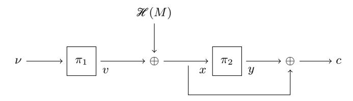
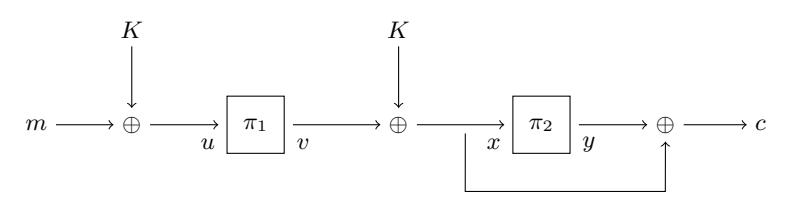

# Mind the Composition: Birthday Bound Attacks on EWCDMD and SoKAC21

Mridul Nandi

Indian Statistical Institute, Kolkata, India mridul.nandi@gmail.com

Abstract. In an early version of CRYPTO'17, Mennink and Neves proposed EWCDMD, a dual of EWCDM, and showed n-bit security, where n is the block size of the underlying block cipher. In CRYPTO'19, Chen et al. proposed permutation based design SoKAC21 and showed 2n/3 bit security, where n is the input size of the underlying permutation. In this paper we show birthday bound attacks on EWCDMD and SoKAC21, invalidating their security claims. Both attacks exploit an inherent composition nature present in the constructions. Motivated by the above two attacks exploiting the composition nature, we consider some generic relevant composition based constructions of ideal primitives (possibly in the ideal permutation and random oracle model) and present birthday bound distinguishers for them. In particular, we demonstrate a birthday bound distinguisher against (1) a secret random permutation followed by a public random function and (2) composition of two secret random functions. Our distinguishers for SoKAC21 and EWCDMD are direct consequences of (1) and (2) respectively.

Keywords: PRF, birthday bound, SoKAC21, EWCDMD.

## 1 Introduction

Motivated from DES block cipher design, Luby and Rackoff [\[LR88\]](#page-17-0) formally analyzed a paradigm of constructing a pseudorandom permutation (PRP) from a pseudorandom function (PRF). However, the opposite trend is more popular due to wide availability of block ciphers (modeled to be pseudorandom permutations). So pseudorandom functions are traditionally built upon block ciphers. A straightforward application of the classical PRP-PRF switch [\[Sho04\]](#page-17-1) gives security up to the birthday bound. However, in view of lightweight block ciphers [\[BPP](#page-16-0)+17[,BKL](#page-16-1)+07] this bound may not be suitable. For example, a birthday bound secure PRF construction based on DES (64-bit block cipher) may be broken in approximately 2<sup>32</sup> bits of data. In fact, Bhargavan and Leurent [\[BL16\]](#page-16-2) performed practical attacks on TLS and OpenVPN when a 64-bit block cipher is used. To resist such attacks, several beyond birthday bound secure constructions have been proposed. This includes popular constructions such as sum of permutations (or SoP in short) [\[HWKS98,](#page-17-2)[Pat08,](#page-17-3)[DHT17,](#page-17-4)[BN18b\]](#page-16-3), truncation of permutation [\[HWKS98,](#page-17-2)[BN18a\]](#page-16-4), EDM type constructions [\[CS16,](#page-16-5)[CS18\]](#page-17-5), Sum-ECBC [\[Yas10\]](#page-17-6), Pmac Plus [\[Yas11\]](#page-18-0), 3Kf9 [\[ZWSW12\]](#page-18-1), DbHtS [\[DDNP18\]](#page-17-7) and 1kPmac Plus [\[DDN](#page-17-8)+17a].

Apart from block cipher, the recent trend of using ideal (unkeyed) permutation has also motivated several pseudorandom functions from ideal permutation. Sponge-based PRF [\[BDPVA11b,](#page-16-6)[CDH](#page-16-7)+12[,BDPVA11a](#page-16-8)[,ADMVA15\]](#page-16-9) and Farfalle [\[BDH](#page-16-10)+17] are two such examples of PRF from ideal permutations. Recently, Chen et al. in Crypto 2019 [\[CLM19\]](#page-16-11) considered permutation versions of SoP and EDM-dual. Depending on the choice of the keys and the permutation, some of the constructions provide birthday bound security, while some achieve beyond the birthday bound. They have also claimed tight security by showing some matching attacks.

### 1.1 Some Beyond Birthday Bound Constructions

Most of the constructions mentioned above are sequential in nature. Some of these constructions can be viewed as composition of two simpler constructions. For a permutation π, we denote π(x) ⊕ x as π <sup>⊕</sup>(x) (this is known as Davies-Meyer function which has been used to define hash functions in case of public permutation). Let π<sup>1</sup> and π<sup>2</sup> be two independent keyed random permutations over {0, 1} n.

EDM and Its Dual. For a message m ∈ {0, 1} <sup>n</sup>, we define

$$\mathsf{EDM}(m) = \pi_2(\pi_1^{\oplus}(m)) \tag{1}$$

In other words, EDM (encrypted Davies-Meyer) is a composition function π2◦π ⊕ 1 . Here π<sup>1</sup> and π<sup>2</sup> are two independently keyed block ciphers (or random permutations). Dual version of EDM (denoted as EDMD) is defined as the composition in the other direction:

$$\mathsf{EDMD}(m) = \pi_1^{\oplus} \big( \pi_2(m) \big).$$

In [\[CS16,](#page-16-5)[CS18\]](#page-17-5) it has been proved that EDM is PRF secure up to 22n/<sup>3</sup> queries (i.e. 2n/3-bit secure). Later in Crypto 2017 [\[DHT17\]](#page-17-4), security of EDM is shown to be at least 3n/4-bit using χ 2 -method. Independently, Mennink and Neves in [\[MN17\]](#page-17-9) proved that EDM and EDMD have n-bit PRF security using the generalized version of Patarin's mirror theory [\[Pat08\]](#page-17-3). However, the proofs of mirror theory are extremely sketchy and contain several unverified gaps.

EWCDM and Its Dual. The previous constructions can only process n-bit message. With the help of universal hash H, one can extend the message space, using the Wegman Carter paradigm [\[WC81\]](#page-17-10). We now recall the construction EWCDM [\[CS16\]](#page-16-5) and its dual version EWCDMD [\[MN17\]](#page-17-9) (see Fig. [1.1\)](#page-2-0). For a nonce (which should be fresh for every execution of MAC) ν ∈ {0, 1} <sup>n</sup> and a message m ∈ M, we define

$$\mathsf{EWCDM}(\nu, m) = \pi_2(\pi_1^{\oplus}(\nu) \oplus \mathscr{H}(m)) \tag{2}$$

$$\mathsf{EWCDMD}(\nu, m) = \pi_2^{\oplus}(\pi_1(\nu) \oplus \mathscr{H}(m)) \tag{3}$$

<span id="page-2-0"></span>

Fig. 1.1: EWCDMD: Wegman-Carter followed by Davies-Meyer.

In [CS16], Cogliati and Seurin proved 2n/3-bit PRF (pseudorandom function) and MAC (message authentication) security for EWCDM in a nonce respecting model.

SoKAC21. So far we have considered constructions based on secret keyed primitives. Very recently, Chen et al. in CRYPTO 2019 [CLM19] proposed a pseudorandom function, called SoKAC21 (see Fig 1.2), based on ideal public permutations. It is designed for small message space and claimed to be achieving beyond birthday bound security. For an n-bit message m, and two ideal permutations  $\pi_1^{\text{pub}}$ ,  $\pi_2^{\text{pub}}$ , and an n-bit secret key K, we define

<span id="page-2-3"></span>
$$\mathsf{SoKAC21}(K,m) = \pi_2^{\mathsf{pub}} \big( \pi_1^{\mathsf{pub}}(m \oplus K) \oplus K \big) \oplus \pi_1^{\mathsf{pub}}(m \oplus K) \oplus K \tag{4}$$

<span id="page-2-1"></span>

Fig. 1.2: SoKAC21 - Sum of Key Alternating Cipher with a single key.

This construction can be viewed as a composition of Even Mansour followed by Davies-Meyer. We note that an equivalent view (due to which it is named sum of key alternating cipher) of the above construction is  $\pi_2(v \oplus K) \oplus \pi_1(m \oplus K) \oplus K$  where  $v = \pi_1(m \oplus K)$ .

#### <span id="page-2-2"></span>1.2 Composition Constructions and Our Contribution

All the constructions mentioned in the previous subsection can be viewed as composition of ideal primitives or some functions derived from ideal primitives.

PUBLIC AND SECRET IDEAL PRIMITIVES. Let  $\gamma \leftarrow s \operatorname{Func}(n)$  and  $\pi \leftarrow s \operatorname{Perm}(n)$  denote n-bit random function and random permutation respectively. A random function or permutation is called public if adversary has direct access to these

primitives or their inverses whenever exist, in addition with concerned constructions based on these primitives. In this case we call the adversarial model ideal function or ideal permutation model. We denote the public random function and permutation as γ pub and π pub respectively.

When the ideal primitives are secret (i.e. cannot accessed directly by an adversary), we denote them as γ sec and π sec. Note that secret primitives appears when a keyed function (e.g. a keyed compression function) or a keyed permutation (e.g., a block cipher) is replaced by the ideal counterpart through hybrid argument.

We use subscript notation to denote independent copies of the primitives. For example, π1, π<sup>2</sup> are two independent random permutations (either secret or public which would be understood from the superscript notation).

Our Contribution. In this paper, we first analyze the PRF or PRP constructions g ◦ f where

$$f,\ g\in\{\gamma^{\mathsf{pub}},\gamma^{\mathsf{sec}},\pi^{\mathsf{sec}}\}.$$

Due to a trivial reason[1](#page-3-0) we exclude π pub. Moreover, we must assume that at least one of the functions is secret. In this paper, we show birthday bound PRF attack on (1) γ sec <sup>2</sup> ◦ γ sec <sup>1</sup> and (2) γ pub ◦ π sec. The idea behind the attacks for these constructions are simple. For γ sec <sup>2</sup> ◦ γ sec <sup>1</sup> we expect more collisions than perfect random function. In other words, we have higher probability of realizing collision on γ sec <sup>2</sup> ◦ γ sec 1 than that of γ sec. For the second construction, we observe the outputs of public function γ pub and outputs of γ pub ◦ π sec (or γ sec in case of ideal oracle). We show that the probability of collision between these two lists is higher in case of the real world than the ideal world. In the real construction, collision can happen in two ways – (1) an output of π sec collides with an input of public function call γ pub, (2) accidental collision (which happens in the final outputs without having collision among inputs).

Birthday Attack on EWCDMD. We exploit the attack idea of γ sec <sup>2</sup> ◦ γ sec 1 to describe a PRF attack against EWCDMD in query complexity 2n/<sup>2</sup> . In an early version of CRYPTO 2017[2](#page-3-1) , Mennink and Neves [\[MN17\]](#page-17-9) showed almost n-bit PRF security for EWCDMD. So our result invalidates the initial claim of the construction.

The main idea of the attack is simple. EWCDMD can be viewed as a composition of two keyed non-injective functions (and so it follows birthday paradox), namely π ⊕ 2 and a function f mapping (ν, m) to π1(ν) ⊕ H(m). Thus, we expect that the collision probability of the composition π ⊕ 2 ◦ f is almost double of the collision probability for the random function. So, by observing a collision we can

<span id="page-3-0"></span><sup>1</sup> Note that if the outer function g is π pub or the inner function f is π pub then the composition is essentially reduced to a single primitive. An adversary can always uncover π pub by making calls to π pub and (π pub) −1 .

<span id="page-3-1"></span><sup>2</sup> The early version can be accessed on ePrint 2017/473 posted on 28-May-2017. This paper was initially accepted in CRYPTO 2017. Later, after finding the flaw in the analysis, authors removed this analysis from the final proceeding.

distinguish EWCDMD from a random function. Note that EWCDM is a composition of a permutation and a non-injective keyed function. Hence our observation is not applicable to it.

BIRTHDAY ATTACK ON SoKAC21. Similarly, we exploit the attack idea of  $\gamma^{\text{pub}} \circ \pi^{\text{sec}}$  to have birthday bound PRF attack on SoKAC21. In this construction we have  $\pi_2^{\oplus}$  instead of public random function. However, with a careful analysis (and using the recent result on sum of permutation) we can have birthday attack on SoKAC21. This again violates the beyond birthday security claimed in [CLM19].

#### 2 Preliminaries

**Notation.** For  $n \in \mathbb{N}$ , [n] denotes the set  $\{1, 2, \ldots, n\}$ . For  $n, k \in \mathbb{N}$ , such that  $n \geq k$ , we define the falling factorial  $(n)_k := n!/(n-k)! = n(n-1)\cdots(n-k+1)$ . For  $a \in \mathbb{N}$ , an a-tuple  $(x_1, x_2, \ldots, x_a)$  and also a multi-set  $\{x_1, \ldots, x_a\}$  is simply denoted as  $x^a$  (this should be clear from the context). For any set  $\mathcal{X}$ ,  $(\mathcal{X})_a$  denotes the set of all  $x^a$  so that  $x_1, \ldots, x_a$  are distinct. We call all those  $x^a$  element-wise distinct. Note,  $|(\mathcal{X})_q| = (|\mathcal{X}|)_q$ .

The set of all functions from  $\mathcal{X}$  to  $\mathcal{Y}$  is denoted as  $\mathsf{Func}(\mathcal{X},\mathcal{Y})$  and the set of all permutations over  $\mathcal{X}$  is denoted as  $\mathsf{Perm}(\mathcal{X})$ . We use shorthand notations  $\mathsf{Perm}(n)$  (or  $\mathsf{Func}(n)$ ) to denote the set of all permutations (or functions respectively) from  $\{0,1\}^n$  to itself.

For a finite set  $\mathcal{X}$ ,  $X \leftarrow_s \mathcal{X}$  denotes the uniform and random sampling of X from  $\mathcal{X}$ . We write  $X_1, \ldots, X_a \leftarrow_s \mathcal{D}$  when  $X_i$ 's are chosen uniformly and independently from the set  $\mathcal{D}$ . In other words,  $X_1, \ldots, X_a$  is a random with replacement sample. We write  $X_1, \ldots, X_a \leftarrow_{\mathsf{wor}} \mathcal{D}$  when  $X_i$ 's are chosen randomly from  $\mathcal{D}$  in without replacement manner. More precisely, for all element-wise distinct  $x^a \in (\mathcal{D})_a$ ,

$$\Pr(X_1 = x_1, \dots, X_a = x_a) = \frac{1}{(|\mathcal{D}|)_a}.$$

#### 2.1 Statistical Distance

Let X,Y be two random variables over a sample space  $\mathcal S.$  Then the statistical distance between X and Y is defined as

$$\mathsf{D}(\mathsf{X},\mathsf{Y}) := \frac{1}{2} \sum_{a \in \mathcal{S}} |\mathsf{Pr}(\mathsf{X} = a) - \mathsf{Pr}(\mathsf{Y} = a)|.$$

An equivalent definition of statistical distance is the following:

$$\mathsf{D}(\mathsf{X},\mathsf{Y}) = \max_{E \subset \mathcal{S}} |\mathsf{Pr}(\mathsf{X} \in E) - \mathsf{Pr}(\mathsf{Y} \in E)|.$$

To see why it is an equivalent definition, we first note that the maximization holds for  $E_1 = \{a \in \mathcal{S} : \Pr(X = a) > \Pr(Y = a)\}$ . From the definition of  $E_1$ , we

can write the sum  $\sum_{a \in \mathcal{S}} |\Pr(X = a) - \Pr(Y = a)|$  (after splitting over  $E_1$  and  $E_1^c$ ) as

$$\begin{split} &\sum_{a \in E_1} (\Pr(\mathsf{X} = a) - \Pr(\mathsf{Y} = a)) + \sum_{a \in E_1^c} \Pr(\mathsf{Y} = a) - \Pr(\mathsf{X} = a) \\ &= \Pr(\mathsf{X} \in E_1) - \Pr(\mathsf{Y} \in E_1) + \Pr(\mathsf{Y} \in E_1^c) - \Pr(\mathsf{X} \in E_1^c) \\ &= 2 \big( \Pr(\mathsf{X} \in E_1) - \Pr(\mathsf{Y} \in E_1) \big). \end{split}$$

Thus we have established the equivalence.

<span id="page-5-1"></span>**Lemma 1 (replacement lemma).** Let X, Y be two random variables over a sample space S and Z be independent with X and Y sampled from  $\mathcal{T}$ . Let  $E \subseteq S \times \mathcal{T}$  then

$$|Pr((X,Z) \in E) - Pr((Y,Z) \in E)| \le D(X,Y). \tag{5}$$

*Proof.* For every z, let  $E_z = \{s \in \mathcal{S} : (s,z) \in E\}$ . Then by independence, we have

1. 
$$p_1 := \Pr((\mathsf{X},\mathsf{Z}) \in E) = \sum_z \Pr(\mathsf{Z} = z) \cdot \Pr(\mathsf{X} \in E_z)$$
 and similarly,  
2.  $p_2 := \Pr((\mathsf{Y},\mathsf{Z}) \in E) = \sum_z \Pr(\mathsf{Z} = z) \cdot \Pr(\mathsf{Y} \in E_z)$ .

Hence.

$$\begin{split} |p_1 - p_2| &= |\sum_z \mathsf{Pr}(\mathsf{Z} = z) \cdot \mathsf{Pr}(\mathsf{X} \in E_z) - \sum_z \mathsf{Pr}(\mathsf{Z} = z) \cdot \mathsf{Pr}(\mathsf{Y} \in E_z)| \\ &\leq \sum_z \mathsf{Pr}(\mathsf{Z} = z) \cdot |\mathsf{Pr}(\mathsf{X} \in E_z) - \mathsf{Pr}(\mathsf{Y} \in E_z)| \\ &\leq \sum_z \mathsf{Pr}(\mathsf{Z} = z) \cdot \mathsf{D}(\mathsf{X}, \mathsf{Y}) \\ &= \mathsf{D}(\mathsf{X}, \mathsf{Y}) \end{split}$$

#### 2.2 Sum of Without Replacement Samples

Let  $\mathcal{D}$  be a set of size N. In [DHT17] it has been proved that sum of two independent without replacement sample almost behaves like one with replacement sample. More precisely, let  $X_1, \ldots, X_a \leftarrow_{\mathsf{wor}} \mathcal{D}, \ Y_1, \ldots, Y_a \leftarrow_{\mathsf{wor}} \mathcal{D}, \ Z_1, \ldots, Z_a \leftarrow_{\mathsf{s}} \mathcal{D}$  and  $X^a$ ,  $Y^a$  are independent. Define  $W_i = X_i \oplus Y_i$  for all  $i \in [a]$ . Then, in [DHT17] it is shown  $^3$  that

<span id="page-5-2"></span>
$$\mathsf{D}(\mathsf{Z}^a,\mathsf{W}^a) \le \frac{4a}{N}. \tag{6}$$

Due to Lemma 1, we can simply replace sum of random without replacement sample involved in an event by the random sample at the cost of probability 4a/N. We use this idea of replacement while we analyze SoKAC21 construction.

<span id="page-5-0"></span><sup>&</sup>lt;sup>3</sup> The original bound is  $\frac{1.5a}{N} + \frac{3\sqrt{a}}{N}$  which is less than the bound we consider here for all  $a \ge 3$ . For a = 2, one can easily establish the bound.

#### 2.3 Security Definitions

RANDOM FUNCTION AND RANDOM PERMUTATION.  $\gamma \leftarrow_{\$} \mathsf{Func}(\mathcal{X}, \mathcal{Y})$  is said to be the random function from the set  $\mathcal{X}$  to  $\mathcal{Y}$ . Similarly,  $\pi \leftarrow_{\$} \mathsf{Perm}(\mathcal{Y})$  is said to be the random permutation over the set  $\mathcal{Y}$ . In this paper we mostly use the set  $\mathcal{X} = \mathcal{Y} = \{0,1\}^n$ .

KEYED FUNCTION AND PERMUTATION. A keyed function with key space  $\mathcal{K}$ , domain  $\mathcal{X}$  and range  $\mathcal{Y}$  is a function  $\mathsf{F}:\mathcal{K}\times\mathcal{X}\to\mathcal{Y}$  and we denote  $\mathsf{F}(K,X)$  by  $\mathsf{F}_K(X)$ . Similarly, a keyed permutation with key space  $\mathcal{K}$  and domain  $\mathcal{X}$  is a mapping  $\mathsf{E}:\mathcal{K}\times\mathcal{X}\to\mathcal{X}$  such that for all key  $K\in\mathcal{K},X\mapsto\mathsf{E}(K,X)$  is a permutation over  $\mathcal{X}$  and we denote  $\mathsf{E}_K(X)$  for  $\mathsf{E}(K,X)$ .

PRF. Given an oracle algorithm A with oracle access to a function from  $\mathcal{X}$  to  $\mathcal{Y}$ , making at most q queries, running time at most t and outputting a single bit, we define the prf-advantage of A against the family of keyed functions F as

$$\mathbf{Adv}_{\mathsf{F}}^{\mathrm{PRF}}(\mathsf{A}) := |\mathsf{Pr}(K \leftarrow_{\hspace{-0.05cm} \mathtt{s}} \mathscr{K} : \mathsf{A}^{\mathsf{F}_K} = 1) - \mathsf{Pr}(\gamma \leftarrow_{\hspace{-0.05cm} \mathtt{s}} \mathsf{Func}(\mathscr{X}, \mathscr{Y}) : \mathsf{A}^{\gamma} = 1)|.$$

PRP. Given an oracle algorithm A with oracle access to a permutation of  $\mathcal{X}$ , making at most q queries, running time at most t and outputting a single bit, we define the prp-advantage of A against the family of keyed permutations E as

$$\mathbf{Adv}_{\mathsf{E}}^{\mathsf{PRP}}(\mathsf{A}) := |\mathsf{Pr}(K \leftarrow_{\!\!\texttt{S}} \mathscr{K} : \mathsf{A}^{\mathsf{E}_K} = 1) - \mathsf{Pr}(\pi \leftarrow_{\!\!\texttt{S}} \mathsf{Perm}(\mathscr{X}) : \mathsf{A}^\pi = 1)|.$$

PRF and PRP in Ideal Model. Some keyed constructions uses ideal public primitive such as a random function and a random permutation. Let  $P_1, \ldots, P_r$  be such all primitives used for a keyed construction  $\mathsf{F}_K := \mathsf{F}_K^{P_1, \ldots, P_r}$ . Let  $P_i^\pm$  denotes both  $P_i$  and its inverse  $P_i^{-1}$ . We define PRF and PRP-advantage in the public primitive model as follows.

$$\mathbf{Adv}^{\mathrm{PRF}}_{\mathsf{F}}(\mathsf{A}) := |\mathsf{Pr}(\mathsf{A}^{\mathsf{F}_K,P_1^\pm,\ldots,P_r^\pm} = 1) - \mathsf{Pr}(\mathsf{A}^{\gamma,P_1^\pm,\ldots,P_r^\pm} = 1)|.$$

In the above two probabilities,  $K, \gamma, P_1, \dots, P_r$  are all independently drawn. Similarly, we define PRP-advantage in public model as

$$\mathbf{Adv}^{\mathrm{PRP}}_{\mathsf{F}}(\mathsf{A}) := |\mathsf{Pr}(\mathsf{A}^{\mathsf{F}_K,P_1^\pm,\ldots,P_r^\pm} = 1) - \mathsf{Pr}(\mathsf{A}^{\pi,P_1^\pm,\ldots,P_r^\pm} = 1)|.$$

ALMOST XOR UNIVERSAL HASH FUNCTION. A keyed hash function  $\mathcal{H}_K: \mathcal{D} \to \mathcal{R}$  is called  $\epsilon$ -AXU (almost xor universal) if  $\Pr(\mathcal{H}_K(m) \oplus \mathcal{H}_K(m') = \delta) \leq \epsilon$  for all  $m \neq m'$  and for all  $\delta$ . Here the probability is computed under randomness of the key chosen uniformly from the key space.

#### 3 Collision Probability

Let  $\mathcal{D}$  be a set of size N. We quickly recall collision probability for a uniform random sample  $X_1, \ldots, X_a \leftarrow \mathcal{D}$ . For any positive integers  $a \leq N$ , we write

 $dp_N(a) := \frac{(N)_a}{N^a}$  and  $cp_N(a) := 1 - dp_N(a)$ . When N is understood from the context, we skip the notation N. If a is very small compared to N (i.e.  $a/N \approx 0$ ), a precise estimation of  $dp_N(a)$  is  $e^{-a(a-1)/2N}$ . This follows from the approximation  $1-\epsilon \approx e^{-\epsilon}$  for very small positive  $\epsilon$ . In fact the error term  $|e^{-\epsilon}-(1-\epsilon)|$  is in the order  $O(\epsilon^2)$ .

Given a list  $\mathcal{L}$  of elements  $x_1, \ldots, x_a$ , we write  $\mathsf{Dist}(\mathcal{L})$  if  $x_i$ 's are distinct. Otherwise, we write  $Coll(\mathcal{L})$ .

**Lemma 2** (collision probability). Let  $\mathscr{D}$  be a set of size N. Let  $X_1, \ldots, X_a \leftarrow_{\mathbb{S}} \mathscr{D}$ and let  $\mathcal{L}$  denote the list containing  $X_i$ 's,  $1 \leq i \leq a$ . Then,

- $\begin{array}{ll} \text{1.} & \textit{Pr}(\textit{Dist}(\mathcal{L})) = \textit{dp}_N(a). \\ \text{2.} & \textit{Pr}(\textit{Coll}(\mathcal{L})) = \textit{cp}_N(a) \leq a^2/2N. \end{array}$

We skip the proof as it is straightforward conclusion from the definition. The second statement follows from the union bound.

Now we compute probability for having a collision between two lists. We say that there is a collision between two lists, denoted as  $\mathsf{LColl}(\mathscr{L}_1,\mathscr{L}_2)$  if the lists are not disjoint.

<span id="page-7-0"></span>Lemma 3 (list-collision probability for without replacement sample). Let  $X_1, \ldots, X_p \leftarrow \text{wor} \mathcal{D}$  and  $Y_1, \ldots, Y_q \leftarrow \text{wor} \mathcal{D}$  such that  $X^p$  and  $Y^q$  are independent. Then,

$$\textit{Pr}(\textit{LCoII}(\textit{X}^p,\textit{Y}^q)) = 1 - \frac{(N-p)_q}{(N)_q}$$

*Proof.* We compute the complement event, i.e.,  $X^p$  and  $Y^q$  are disjoint. The conditional probability of the complement event conditioning on  $X^p = x^p$  is  $\frac{(N-p)_q}{(N)_q}$ . This can be easily seen as the number of choices of  $\mathsf{Y}^q$  is exactly  $(N-p)_q$ . As the conditional probability is independent of choice of  $x^p$ , the unconditional probability is also same as  $\frac{(N-p)_q}{(N)_q}$ . This completes the proof.

We denote the the probability  $1-\frac{(N-p)_q}{(N)_q}$  as  $\mathsf{lcp}_N^{wor}(p,q)$  (or simply  $\mathsf{lcp}^{wor}(p,q)$  whenever N is understood from the context).

When  $\mathcal{L}_1 := \mathsf{X}^p$  and  $\mathcal{L}_2 := \mathsf{Y}^q$ , where  $\mathsf{X}_1, \dots, \mathsf{X}_p, \mathsf{Y}_1, \dots, \mathsf{Y}_q \leftarrow \mathfrak{D}$ , we denote the list-collision probability  $\Pr(\mathsf{LColl}(\mathscr{L}_1,\mathscr{L}_2))$  as  $\mathsf{lcp}_N^\$(p,q)$  (or simply  $\mathsf{lcp}^\$(p,q)$ whenever N is understood from the context). Here  $\mathcal{D}$  is a set of size N.

<span id="page-7-1"></span>Lemma 4 (list-collision probability for random samples). For all positive integers p, q, we have

$$|\mathit{lcp}_{N}^{\$}(p,q) - 1 + \left(1 - \frac{q}{N}\right)^{p}| \le 2\mathit{cp}_{N}(p). \tag{7}$$

(When p is small compared to  $\sqrt{N}$ , the collision probability  $\operatorname{cp}_N(p)$  is almost zero and in that case, the above result says that  $1 - \left(1 - \frac{p}{N}\right)^q$  is a very good approximation of  $\mathsf{lcp}_N^{\$}(p,q).)$ 

*Proof.* Let  $X_1, \ldots, X_p, Y_1, \ldots, Y_q \leftarrow \mathfrak{D}$  and E denote the event  $\mathsf{Dist}(\mathsf{X}^p)$ . So  $\mathsf{Pr}(E) = \mathsf{dp}_N(p)$ . Fix any distinct  $x^p$ . Then, the list collision  $\mathsf{LColl}(x^p, \mathsf{Y}^q)$  holds with probability  $1 - (1 - \frac{p}{N})^q$ . Now,

$$\begin{split} \Pr(\mathsf{LColl}(\mathsf{X}^p,\mathsf{Y}^q)) &= \Pr(\mathsf{LColl}(\mathsf{X}^p,\mathsf{Y}^q) \wedge E) + \Pr(\mathsf{LColl}(\mathsf{X}^p,\mathsf{Y}^q) \wedge E^c) \\ &= \sum_{x^p \in (\mathscr{D})_p} \Pr(\mathsf{LColl}(x^p,\mathsf{Y}^q) \wedge \mathsf{X}^p = x^p) + \Pr(\mathsf{LColl}(\mathsf{X}^p,\mathsf{Y}^q) \wedge E^c) \\ &= (1 - (1 - \frac{p}{N})^q) \times \sum_{x^p \in (\mathscr{D})_p} \Pr(\mathsf{X}^p = x^p) + \Pr(\mathsf{LColl}(\mathsf{X}^p,\mathsf{Y}^q) \wedge E^c) \\ &= (1 - (1 - \frac{p}{N})^q) \times \Pr(E) + \Pr(\mathsf{LColl}(\mathsf{X}^p,\mathsf{Y}^q) \wedge E^c) \\ &= (1 - (1 - \frac{p}{N})^q) \times (1 - \Pr(E^c)) + \Pr(\mathsf{LColl}(\mathsf{X}^p,\mathsf{Y}^q) \wedge E^c) \end{split}$$

Note that in our notation,  $\mathsf{Pr}(\mathsf{LColl}(\mathsf{X}^p,\mathsf{Y}^q)) = \mathsf{lcp}_N^\$(p,q)$ . Hence,

$$\begin{split} |\mathsf{lcp}_N^{\$}(p,q) - 1 + \left(1 - \frac{q}{N}\right)^p| &= |(1 - (1 - \frac{p}{N})^q) \times \mathsf{Pr}(E^c) + \mathsf{Pr}(\mathsf{LColl}(\mathsf{X}^p,\mathsf{Y}^q) \wedge E^c)| \\ &\leq 2 \cdot \mathsf{Pr}(E^c). \end{split}$$

The lemma follows from the definition that  $Pr(E^c) = cp_N(p)$ .

# 4 Birthday Attack on Composition of Ideal Primitives

In this section, we analyze compositions of ideal primitives. We recall that  $\gamma \leftarrow_{\$} \mathsf{Func}(n)$  and  $\pi \leftarrow_{\$} \mathsf{Perm}(n)$  denote n-bit random function and random permutation respectively. We follow the notations described in Sect. 1.2. Here  $\equiv$  is used to mean two systems equivalent (i.e. the probabilistic behavior of interaction for any adversary would be same for both).

- 1. It is easy to verify that  $\pi^{\text{sec}} \circ \gamma^{\text{sec}} \equiv \gamma^{\text{sec}} \circ \pi^{\text{sec}} \equiv \gamma$  and  $\pi_1^{\text{sec}} \circ \pi_2^{\text{sec}} \equiv \pi$ . In [MS15]  $\pi^{\text{sec}} \circ \pi^{\text{sec}}$  (iterated random permutation) has been analyzed and it almost behaves as  $\pi^{\text{sec}}$  with a maximum distinguishing advantage  $O(q/2^n)$  where q is the number of queries. Authors of [MS15,Nan15] have actually analyzed a more general construction  $\pi^{\text{sec}} \circ \cdots \circ \pi^{\text{sec}}$  (applied r times).
- 2. In [BDD+17],  $\gamma^{\text{sec}} \circ \gamma^{\text{sec}}$  (iterated random function) has also been analyzed. This is equivalent to  $\gamma^{\text{sec}}$  with a maximum distinguishing advantage  $O(q^2/2^n)$ . Authors of [BDD+17] actually analyzed more general construction  $\gamma^{\text{sec}} \circ \cdots \circ \gamma^{\text{sec}}$  (applied r times). The main idea behind the distinguishing attack is that the collision probability of an iterated random function is more probable than that of a random function.

Using a similar argument, we can show that  $\gamma_2^{\sf sec} \circ \gamma_1^{\sf sec}$  can be distinguished from  $\gamma^{\sf sec}$  by making  $2^{n/2}$  queries. Let  $x_1, \ldots, x_q$  be q queries and let  $y_1, \ldots, y_q$ 

be the responses. In case of the real world,  $y_i = \gamma_2^{\text{sec}}(z_i)$  where  $z_i = \gamma_1^{\text{sec}}(x_i)$ . Let  $\mu := \mathsf{cp}_{2^n}(q)$ . Now,

$$\begin{split} \Pr(\mathsf{Coll}(y^q)) &= \Pr(\mathsf{Coll}(z^q)) + \Pr(\mathsf{Coll}(y^q) \mid \mathsf{Dist}(z^q)) \times \Pr(\mathsf{Dist}(z^q)) \\ &= \mu + \mu(1-\mu) \end{split}$$

Let  $\mathscr A$  return 1 if it observes a collision among outputs. Thus, the distinguishing advantage of the adversary is at least  $\mu(1-\mu)$ . When  $q=2^{n/2}$ ,  $\operatorname{cp}(q)\approx 1-\frac{1}{\sqrt{e}}$  and hence advantage is  $\frac{1}{\sqrt{e}}\times (1-\frac{1}{\sqrt{e}})$  which is at least 0.2. One can also choose q (which should be again  $O(2^{n/2})$ ) such that  $\mu\approx 1/2$  and hence the advantage would be about 0.25.

Same attack can be applied to  $\gamma^{\sf sec} \circ \gamma^{\sf pub}$  and  $\gamma^{\sf pub} \circ \gamma^{\sf sec}$  as if the adversary does not take an advantage of accessing the public random function  $\gamma^{\sf pub}$ .

- 3. Let us consider the construction  $\pi^{\text{sec}} \circ \gamma^{\text{pub}}$ . An adversary  $\mathscr A$  first finds a collision pair (m,m') of  $\gamma^{\text{pub}}$  by making  $2^{n/2}$  queries to it. Then,  $\pi^{\text{sec}} \circ \gamma^{\text{pub}}(m) = \pi^{\text{sec}} \circ \gamma^{\text{pub}}(m')$ . Clearly, in the ideal world,  $\gamma(m) = \gamma(m')$  holds with probability  $2^{-n}$ . So  $\mathscr A$  is a PRF-distinguisher against  $\pi^{\text{sec}} \circ \gamma^{\text{pub}}$  making about  $2^{n/2}$  queries to the public random function. The same attack is also applied to  $\gamma^{\text{sec}} \circ \gamma^{\text{pub}}$ .
- 4. Although  $\gamma^{\text{sec}} \circ \pi^{\text{sec}}$  is equivalent to a random function, we have the following birthday bound complexity PRF-attack on  $\gamma^{\text{pub}} \circ \pi^{\text{sec}}$  (replacing the outer layer of secret random function by public random function). Here we exploit the public access of  $\gamma^{\text{pub}}$  (since otherwise it is equivalent to a random function).

# PRF Distinguisher $\mathscr{A}^{\emptyset,\gamma^{\mathsf{pub}}}$

```
\mathbf{1}: \quad x_1, \dots, x_p \leftarrow \mathsf{wor} \left\{0, 1\right\}^n
```

2: queries  $x_1, \ldots, x_p$  to  $\gamma^{\mathsf{pub}}$ 

3:  $y_i = \gamma^{\mathsf{pub}}(x_i), i \in [p]$  be the responses

4: for  $i \in [q], i$  is queried to  $\mathscr O$ 

5: let  $c_i = \mathcal{O}(i), i \in [q]$  be the responses

**6**: **if**  $\exists i, j, y_i = c_j$ **7**: **return** 1

e . alaa

8: else

9: return 0

**Fig. 4.1:** Distinguisher for composition construction  $\gamma^{\mathsf{pub}} \circ \pi^{\mathsf{sec}}$ .

Let E denote the event that there are i, j such that  $y_i = c_j$ .

IDEAL WORLD: In the ideal world we have  $c_1, \ldots, c_q, y_1, \ldots, y_p \leftarrow s\{0,1\}^n$ . So

$$Pr(E) = Icp^{\$}(p, q) = \mu \text{ (say)}.$$

REAL WORLD: In the real world, let  $z_i = \pi^{\mathsf{sec}}(i)$ . So  $c_i = \gamma^{\mathsf{pub}}(z_i)$ . Thus,  $z_1, \ldots, z_q \leftarrow_{\mathsf{wor}} \{0,1\}^n$  independent of  $x^p$ . Now, we write the event E as the disjoint union (denoted as  $\sqcup$ )

$$\mathsf{LColl}(z^q, x^p) \ \sqcup \ \left( \neg \mathsf{LColl}(z^q, x^p) \land \mathsf{LColl}(c^q, y^p) \right).$$

Given that  $z^q$  is distinct from  $x^p$ , we have  $c_1, \ldots, c_q, y_1, \ldots, y_p \leftarrow s\{0, 1\}^n$ . Now,  $\Pr(\mathsf{LColl}(z^q, x^p)) = \mathsf{lcp}^{wor}(p, q) := \mu_1$  (say). Then,

$$\Pr(E) = \mu_1 + (1 - \mu_1)\mu.$$

So, the distinguishing advantage of our adversary is  $\mu_1(1-\mu)$ . By Lemma 3 and Lemma 4, the distinguishing advantage is at least

<span id="page-10-0"></span>
$$(1 - \frac{(2^n - p)_q}{(2^n)_q}) \times ((1 - \frac{p}{2^n})^q - 2\mathsf{cp}_{2^n}(q)). \tag{8}$$

Further, we have

$$\frac{(2^n - p)_q}{(2^n)_q} = \prod_{i=0}^{q-1} \left(1 - \frac{p}{2^n - i}\right)$$

$$\leq \left(1 - \frac{p}{2^n}\right)^q$$

$$\leq 1 - \frac{pq}{2^n} + \frac{pq^2}{2^{2n+1}}.$$

The last inequality follows from the following fact:

$$(1-x)^q \le 1 - \binom{q}{1}x + \binom{q}{2}x^2, \quad 0 \le x \le 1.$$

We also have  $(1 - \frac{p}{2^n})^q \ge 1 - \frac{pq}{2^n}$ . By substituting the above inequalities in Eq. 8, the distinguishing advantage is at least

$$(1 - \frac{pq}{2^n} - \frac{q^2}{2^n}) \times \frac{pq}{2^n} \times (1 - \frac{q}{2^{n+1}}).$$

Now if we choose  $p=q=\sqrt{2^n/3}$  then the advantage is at least  $\frac{1}{9}(1-\frac{1}{3\times 2^{n/2}})$ . This value is almost 1/9 for a reasonably large n.

## 5 Birthday Attack on SoKAC21

In the previous section we have shown the basic attacks on composition of ideal primitives. A similar idea can be used for composition of constructions which are not ideal. However, a more dedicated analysis of advantage computation is required. In this section we show a birthday attack on a recent proposal SoKAC21. In the following section we show birthday attack of Dual EWCDM.

We first recall the definition of SoKAC21 (see Fig. [1.2](#page-2-1) and Eq. [4](#page-2-3) for details.). It uses two public n-bit random permutations π pub 1 and π pub 2 . Given an n-bit key K, an n-bit input m, we define SoKAC21 output as

$$F_K(m) := \pi_2^{\mathsf{pub}}(x) \oplus x$$
, where  $x = \pi_1^{\mathsf{pub}}(m \oplus K) \oplus K$ .

Our attack does not exploit public queries to π pub 1 and hence π pub 1 (m ⊕ K) ⊕ K behaves identically to a secret random permutation π sec(m). Let DM(x) := π pub 2 (x)⊕x (Davies-Meyer construction based on a public random permutation). So SoKAC21 is actually the composition DM ◦ π sec. However, DM is not perfect random function. But if we choose the inputs of DM in a without replacement manner, the output of DM can be viewed as the sum of two WOR samples and hence it is very close to uniform distribution. We use this principle along with the attack strategy as described in the previous section for the composition construction γ pub ◦ π sec. We simply write π pub instead of π pub 2 and π sec instead of the Even-Mansour construction on π pub 1 .

# PRF Distinguisher A<sup>O</sup>,πpub

```
1 : x1, . . . , xp ←wor {0, 1}
                               n
```

2 : queries x1, . . . , x<sup>p</sup> to π pub

3 : x 0 <sup>i</sup> = π pub(xi), i ∈ [p] be the responses

4 : let y<sup>i</sup> = x 0 <sup>i</sup> ⊕ x<sup>i</sup>

5 : for i ∈ [q], i is queried to O

6 : let c<sup>i</sup> = O(i), i ∈ [q] be the responses

7 : if ∃i, j, y<sup>i</sup> = c<sup>j</sup> return 1

8 : else return 0

Fig. 5.1: Distinguisher for SoKAC21 which can be viewed as the composition construction DM ◦ π sec .

We define the event E := LColl(c q , y<sup>p</sup> ) (i.e. there exists i, j such that y<sup>i</sup> = c<sup>j</sup> ).

Ideal World: In the ideal world c1, . . . , c<sup>q</sup> ←\$ {0, 1} <sup>n</sup>. Moreover, y<sup>i</sup> is defined as sum of two without replacement sample. By Eq. [6,](#page-5-2) y<sup>i</sup> 's are close to a with replacement sample  $y'_1, \ldots, y'_p$  with the statistical distance at most  $4p/2^n$ . Moreover  $y'_i$ 's are independent of  $c^q$ . Let  $\mu := \mathsf{Pr}(\mathsf{LColl}(c^q, (y')^p)) = \mathsf{lcp}^\$(p, q)$ . So by using Lemma 1,

$$\Pr(E) = \Pr(\mathsf{LColl}(c^q, y^p)) \le \mathsf{lcp}^{\$}(p, q) + 4p/2^n.$$

REAL WORLD: In the real world, let  $z_i = \pi^{\mathsf{sec}}(i)$ . So  $c_i = \pi^{\mathsf{pub}}(z_i) \oplus z_i$  for all i and  $z_1, \ldots, z_q \leftarrow_{\mathsf{wor}} \{0, 1\}^n$  independent of  $x^p$ . Now, the event E can be written as a disjoint union  $E_1 \sqcup E_2$  where

- 1.  $E_1$  is  $\mathsf{LColl}(z^q, x^p)$  and
- 2.  $E_2$  is  $\neg \mathsf{LColl}(z^q, x^p) \land \mathsf{LColl}(c^q, y^p)$ .

Let  $Pr(E_1) = Icp^{wor}(p, q) = \mu_1$  (say).

Now, we compute the probability of the event  $E_2$  which is same as  $E_1^c \wedge \mathsf{LColl}(c^q, y^p)$ . Given that  $z^q$  is distinct from  $x^p$  (i.e.  $E_1^c$  holds) we have

$$z_1, \ldots, z_q, x_1, \ldots, x_p \leftarrow \operatorname{wor} \{0, 1\}^n.$$

As  $c_i = \mathsf{DM}(z_i)$  and  $y_i = \mathsf{DM}(x_i)$ ,  $c_i$ 's and  $y_i$ 's are almost uniformly distributed. More precisely, for  $c'_1, \ldots, c'_q, y'_1, \ldots, y'_p \leftarrow \{0, 1\}^n$ ,

$$\mathsf{D}((c^q, y^p); ((c')^q, (y')^p)) \le 4(p+q)/2^n.$$

So by Lemma 1,  $\Pr(E_2) \ge (1 - \mu_1) \times (\mu - 4(p+q)/2^n)$  where  $\mu = \mathsf{lcp}^{\$}(p,q)$ . Now,

$$\begin{split} \Pr(E) &= \Pr(E_1) + \Pr(E_2) \\ &\geq \mu_1 + (1 - \mu_1)(\mu - \frac{4(p+q)}{2^n}). \end{split}$$

So, subtracting the probability Pr(E) of the real world from that of the ideal world, the distinguishing advantage is at least

$$\mu_1(1-\mu) - \frac{8p+4q}{2^n}.$$

We have already shown that  $\mu_1(1-\mu)$  is at least  $\frac{1}{9} - \frac{1}{27 \cdot 2^{n/2}}$  when  $p = q = \sqrt{2^n/3}$  (see the last paragraph of our analysis on  $\gamma^{\mathsf{pub}} \circ \pi^{\mathsf{sec}}$ ). Hence the advantage is at least  $\frac{1}{9} - \frac{1}{2^{n/2-1}}$ .

### 6 Birthday Attack on Dual-EWCDM

In this section we provide details of a nonce respecting distinguishing attack on EWCDMD. For better understanding we consider a specific hash function  $\mathcal{H}(m) = K \cdot m$  where K is a nonzero random key chosen uniformly from  $\{0,1\}^n \setminus \{0\}$  and  $m \in \mathcal{M} := \{0,1\}^n$ . Here  $K \cdot m$  means the field multiplication with respect to a fixed primitive polynomial. Clearly,  $\mathcal{H}$  is  $\frac{1}{2^{n}-1}$  AXU hash.

Moreover it is injective hash. In other words, for distinct messages m1, . . . , mq, H(m1), . . . ,H(mq) are distinct.

Distinguishing Attack. A choses (ν1, m1), . . . ,(νq, mq) ∈ {0, 1} <sup>n</sup> × M where all ν<sup>i</sup> 's are distinct and all m<sup>i</sup> 's are distinct. Suppose T1, . . . , T<sup>q</sup> are all responses. A returns 1 if there is a collision among T<sup>i</sup> values, otherwise returns zero.

When A is interacting with a random function, Pr[A → 1] ≤ q(q − 1)/2 n+1 (by using the union bound). Now we provide lower bound of Pr[A → 1] while A is interacting with EWCDMD in which π1, π<sup>2</sup> are two independent random permutations and H is the above hash function whose key is chosen independently. To obtain a lower bound we first prove the following lemma. Let N = 2n.

Lemma 5. Let x1, . . . , x<sup>q</sup> ∈ {0, 1} <sup>n</sup> be q distinct values. Let π be a random permutation. Then, for all distinct ν1, . . . , νq, let C denote the event that there is a collision among values of π(νi) ⊕ xi, 1 ≤ i ≤ q. Then,

$$\alpha(1-\beta) \le \Pr[C] \le \alpha$$

where α = q(q−1) 2(N−1) and β = (q−2)(q+1) 4(N−3) . In particular, for distinct xi's, there is a collision among π(xi) ⊕ x<sup>i</sup> values has probability at least α(1 − β).

Proof. Let Ei,j denote the event that π(νi) ⊕ π(ν<sup>j</sup> ) = x<sup>i</sup> ⊕ x<sup>j</sup> . So for all i 6= j, Pr[Ei,j ] = 1/(N − 1). Let C = ∪i6=jEi,j denote the collision event. By using union bound we can easily upper bound

$$\Pr[C] \leq \alpha := \frac{q(q-1)}{2(N-1)}.$$

Now, we show the lower bound. For this, we apply Boole's inequality and we obtain lower bound of collision probability as

$$\Pr[C] \geq \alpha - \sum \Pr[E_{i,j} \cap E_{k,l}]$$

where the sum is taken over all possible choices of {{i, j}, {k, l}}, and the number of such choices is at most q(q−1)/2 2 = q(q − 1)(q + 1)(q − 2)/8. Note that for each such choice i, j, k, l,

$$\Pr[E_{i,j} \cap E_{k,l}] \le \frac{1}{(N-1)(N-3)}.$$

Hence,

$$\Pr[C] \ge \alpha - \frac{q(q-1)(q+1)(q-2)}{8(N-1)(N-3)} \tag{9}$$

$$= \alpha \left(1 - \frac{(q-2)(q+1)}{4(N-3)}\right) = \alpha (1-\beta). \tag{10}$$

This completes the proof. ut

Advantage Computation. Using the above Lemma we now show that the probability that A returns 1 while interacting with EWCDMD is significant when q = O(2n/<sup>2</sup> ).

Let C<sup>1</sup> denote the event that there is a collision among the values z<sup>i</sup> := π1(νi) ⊕ H(mi). We can apply our lemma as H(mi)'s are distinct due to our choice of the hash function. Thus, Pr[C1] ≥ α(1−β). Moreover, Pr[¬C1] ≥ (1−α). Given ¬C1, T values are outputs of Davies-Meyer based on random permutation π<sup>2</sup> for distinct inputs. So by using previous lemma,

$$\Pr(\text{collision in } T \text{ values } \mid \neg C_1) \ge \alpha(1-\beta).$$

Hence,

$$\begin{split} \Pr(\mathscr{A} \to 1) &\geq \Pr(C_1) + \Pr(\text{collision in } T \text{ values } \mid \neg C_1) \times \Pr[\neg C_1] \\ &\geq \alpha(1-\beta) + (1-\alpha) \times \Pr(\text{collision in } T \text{ values } \mid \neg C_1) \\ &\geq \alpha(1-\beta) + \alpha(1-\alpha)(1-\beta) \\ &= (2\alpha - \alpha^2)(1-\beta) \geq 2\alpha - 2\alpha\beta - \alpha^2. \end{split}$$

Thus, the advantage of the adversary is at least α − 2αβ − α 2 . It is easy to see that when 2q <sup>2</sup> ≥ N, we have 1 − 2β − α ≤ 1/2 and hence the advantage is at least α/2 = q(q − 1)/4(N − 1).

Remark 1. We would like to note that the distinguishing advantages of both constructions can be made closer to one if we repeat the whole process independently O(n) times.

### 6.1 Issues in the Previous Proofs

Now we briefly describe what were the issues in the proofs of [\[CLM19,](#page-16-11)[MN17\]](#page-17-9). Both proofs used H-technique and hence it is broadly divided into two parts: bounding probability of bad events and finding good lower bound for realizing any fixed good transcript in the real world. The flaws in their proof lie on the good transcript analysis.

Suppose π<sup>1</sup> and π<sup>2</sup> are two random permutations. In the both proofs, good transcript analysis deals to compute the probability distribution of sum of the two random permutations. More precisely, for fixed λ1, x1, y1, . . . xq, yq, λ<sup>q</sup> ∈ {0, 1} <sup>n</sup>, we want to provide a lower bound of the event π1(xi) ⊕ π2(yi) = λ<sup>i</sup> for all i. This is also known as mirror theory and have been studied in several papers[\[Pat10](#page-17-13)[,Pat13,](#page-17-14)[DDN](#page-17-15)<sup>+</sup>17b[,DDNY19,](#page-17-16)[DDNY18\]](#page-17-17). A desired lower bounds are known if the equality patterns of x<sup>i</sup> and y<sup>i</sup> 's satisfy certain conditions. In the proofs of [\[CLM19](#page-16-11)[,MN17\]](#page-17-9), equality pattern of y<sup>i</sup> 's depend on the values of π1(xi) for all i. So, clearly, we cannot use the mirror theory based lower bound. This is the main flaw of the proofs.

# 7 Concluding Discussion

We have demonstrated a distinguishing attack on EWCDMD. We would like to note that this attack does not work for EDM, EWCDM and EDMD as we can not write them as a composition of two non-injective functions. We also demonstrate a birthday attack on SoKAC21. Our attack also does not work if we mask the final output by a key (which is another variant of sum of key alternating ciphers). However, at the same time, we do not know how to prove its beyond birthday security.

### 7.1 Some Open Problems

Followings are some of open problems on which cryptography community could have interest.

- 1. We would like to note that our attack against EWCDMD is a PRF attack and it is not easy to extend to a forging attack in a nonce respecting situation. Thus, proving MAC security would be an interesting research problem.
- 2. One can consider the following dual variant:

$$\pi_2(\pi_1(\nu) \oplus \mathcal{H}(m)) \oplus \pi_1(\nu). \tag{11}$$

This is very close to the sum of permutations. However, the presence of H(m) makes it very difficult to prove (without using Patarin's claim or conjecture on the interpolation probability of sum of random permutations). Moreover, it can not be expressed as a composition function with n-bit outputs. Hence it is a potential dual candidate of EWCDM.

3. Another possibility is to use three independent random permutations. As mentioned in [\[CS16\]](#page-16-5), we can consider

$$\pi_3(\pi_1(\nu)\oplus\pi_2(\nu)\oplus\mathscr{H}(m)).$$

This will give 2<sup>n</sup> security in nonce respecting model assuming that the sum of permutations would give n-bit PRF security. However, we don't know the trade-off between the number of allowed repetition of nonce and the security bound.

4. Proving beyond birthday security (or demonstrating birthday attacks) of some other variants of SoKAC21 would be an interesting open problem.

Acknowledgment. This work is supported by the project Study and Analysis of IoT Security under Government of India at R.C.Bose Centre for Cryptology and Security, Indian Statistical Institute, Kolkata.

# References

- <span id="page-16-9"></span>ADMVA15. Elena Andreeva, Joan Daemen, Bart Mennink, and Gilles Van Assche. Security of keyed sponge constructions using a modular proof approach. In International Workshop on Fast Software Encryption, pages 364–384. Springer, 2015.
- <span id="page-16-12"></span>BDD<sup>+</sup>17. Ritam Bhaumik, Nilanjan Datta, Avijit Dutta, Nicky Mouha, and Mridul Nandi. The iterated random function problem. In International Conference on the Theory and Application of Cryptology and Information Security, pages 667–697. Springer, 2017.
- <span id="page-16-10"></span>BDH<sup>+</sup>17. Guido Bertoni, Joan Daemen, Seth Hoffert, Micha¨el Peeters, Gilles Van Assche, and Ronny Van Keer. Farfalle: parallel permutation-based cryptography. IACR Transactions on Symmetric Cryptology, pages 1–38, 2017.
- <span id="page-16-8"></span>BDPVA11a. Guido Bertoni, Joan Daemen, Micha¨el Peeters, and Gilles Van Assche. Duplexing the sponge: single-pass authenticated encryption and other applications. In International Workshop on Selected Areas in Cryptography, pages 320–337. Springer, 2011.
- <span id="page-16-6"></span>BDPVA11b. Guido Bertoni, Joan Daemen, Michael Peeters, and Gilles Van Assche. On the security of the keyed sponge construction. In Symmetric Key Encryption Workshop, volume 2011, 2011.
- <span id="page-16-1"></span>BKL<sup>+</sup>07. Andrey Bogdanov, Lars R. Knudsen, Gregor Leander, Christof Paar, Axel Poschmann, Matthew J. B. Robshaw, Yannick Seurin, and C. Vikkelsoe. PRESENT: an ultra-lightweight block cipher. In CHES 2007, Proceedings, pages 450–466, 2007.
- <span id="page-16-2"></span>BL16. Karthikeyan Bhargavan and Ga¨etan Leurent. On the practical (in-) security of 64-bit block ciphers: Collision attacks on http over tls and openvpn. In Proceedings of the 2016 ACM SIGSAC Conference on Computer and Communications Security, pages 456–467. ACM, 2016.
- <span id="page-16-4"></span>BN18a. Srimanta Bhattacharya and Mridul Nandi. A note on the chi-square method: A tool for proving cryptographic security. Cryptography and Communications, 10(5):935–957, 2018.
- <span id="page-16-3"></span>BN18b. Srimanta Bhattacharya and Mridul Nandi. Revisiting variable output length XOR pseudorandom function. IACR Trans. Symmetric Cryptol., 2018(1):314–335, 2018.
- <span id="page-16-0"></span>BPP<sup>+</sup>17. Subhadeep Banik, Sumit Kumar Pandey, Thomas Peyrin, Yu Sasaki, Siang Meng Sim, and Yosuke Todo. Gift: a small present. In International Conference on Cryptographic Hardware and Embedded Systems, pages 321–345. Springer, 2017.
- <span id="page-16-7"></span>CDH<sup>+</sup>12. Donghoon Chang, Morris Dworkin, Seokhie Hong, John Kelsey, and Mridul Nandi. A keyed sponge construction with pseudorandomness in the standard model. In The Third SHA-3 Candidate Conference (March 2012), volume 3, page 7, 2012.
- <span id="page-16-11"></span>CLM19. Yu Long Chen, Eran Lambooij, and Bart Mennink. How to build pseudorandom functions from public random permutations. In Advances in Cryptology - CRYPTO'19, volume 11692, pages 266–293. Springer, 2019.
- <span id="page-16-5"></span>CS16. Benoˆıt Cogliati and Yannick Seurin. EWCDM: an efficient, beyondbirthday secure, nonce-misuse resistant MAC. In CRYPTO 2016, Proceedings, Part I, pages 121–149, 2016.

- <span id="page-17-5"></span>CS18. Benoˆıt Cogliati and Yannick Seurin. Analysis of the single-permutation encrypted davies-meyer construction. Des. Codes Cryptography, 86(12):2703–2723, 2018.
- <span id="page-17-8"></span>DDN<sup>+</sup>17a. Nilanjan Datta, Avijit Dutta, Mridul Nandi, Goutam Paul, and Liting Zhang. Single key variant of pmac plus. IACR Transactions on Symmetric Cryptology, pages 268–305, 2017.
- <span id="page-17-15"></span>DDN<sup>+</sup>17b. Nilanjan Datta, Avijit Dutta, Mridul Nandi, Goutam Paul, and Liting Zhang. Single key variant of pmac plus. IACR Trans. Symmetric Cryptol., 2017(4):268–305, 2017.
- <span id="page-17-7"></span>DDNP18. Nilanjan Datta, Avijit Dutta, Mridul Nandi, and Goutam Paul. Doubleblock hash-then-sum: a paradigm for constructing bbb secure prf. IACR Transactions on Symmetric Cryptology, pages 36–92, 2018.
- <span id="page-17-17"></span>DDNY18. Nilanjan Datta, Avijit Dutta, Mridul Nandi, and Kan Yasuda. Encrypt or decrypt? to make a single-key beyond birthday secure nonce-based MAC. In Advances in Cryptology - CRYPTO 2018, Part I, volume 10991 of Lecture Notes in Computer Science, pages 631–661. Springer, 2018.
- <span id="page-17-16"></span>DDNY19. Nilanjan Datta, Avijit Dutta, Mridul Nandi, and Kan Yasuda. Dwcdm+: A BBB secure nonce based MAC. Adv. in Math. of Comm., 13(4):705– 732, 2019.
- <span id="page-17-4"></span>DHT17. Wei Dai, Viet Tung Hoang, and Stefano Tessaro. Information-theoretic indistinguishability via the chi-squared method. In Advances in Cryptology - CRYPTO 2017, Proceedings, Part III, pages 497–523, 2017.
- <span id="page-17-2"></span>HWKS98. Chris Hall, David A. Wagner, John Kelsey, and Bruce Schneier. Building prfs from prps. In CRYPTO 1998, Proceedings, pages 370–389, 1998.
- <span id="page-17-0"></span>LR88. Michael Luby and Charles Rackoff. How to construct pseudorandom permutations from pseudorandom functions. SIAM Journal on Computing, 17(2):373–386, 1988.
- <span id="page-17-9"></span>MN17. Bart Mennink and Samuel Neves. Encrypted davies-meyer and its dual: Towards optimal security using mirror theory. In CRYPTO 2017. Proceedings, Part III, pages 556–583, 2017.
- <span id="page-17-11"></span>MS15. Brice Minaud and Yannick Seurin. The iterated random permutation problem with applications to cascade encryption. In Annual Cryptology Conference, pages 351–367. Springer, 2015.
- <span id="page-17-12"></span>Nan15. Mridul Nandi. A simple proof of a distinguishing bound of iterated uniform random permutation. IACR Cryptology ePrint Archive, 2015:579, 2015.
- <span id="page-17-3"></span>Pat08. Jacques Patarin. A proof of security in o(2n) for the xor of two random permutations. In ICITS 2008, Proceedings, pages 232–248, 2008.
- <span id="page-17-13"></span>Pat10. Jacques Patarin. Introduction to mirror theory: Analysis of systems of linear equalities and linear non equalities for cryptography. IACR Cryptology ePrint Archive, 2010:287, 2010.
- <span id="page-17-14"></span>Pat13. Jacques Patarin. Security in o(2n) for the xor of two random permutations - proof with the standard H technique. IACR Cryptology ePrint Archive, 2013:368, 2013.
- <span id="page-17-1"></span>Sho04. Victor Shoup. Sequences of games: a tool for taming complexity in security proofs. IACR Cryptology ePrint Archive, 2004:332, 2004.
- <span id="page-17-10"></span>WC81. Mark N. Wegman and Larry Carter. New hash functions and their use in authentication and set equality. J. Comput. Syst. Sci., 22(3):265–279, 1981.
- <span id="page-17-6"></span>Yas10. Kan Yasuda. The sum of cbc macs is a secure prf. In Cryptographers Track at the RSA Conference, pages 366–381. Springer, 2010.

<span id="page-18-0"></span>Yas11. Kan Yasuda. A new variant of pmac: beyond the birthday bound. In Annual Cryptology Conference, pages 596–609. Springer, 2011.

<span id="page-18-1"></span>ZWSW12. Liting Zhang, Wenling Wu, Han Sui, and Peng Wang. 3kf9: enhancing 3gpp-mac beyond the birthday bound. In International Conference on the Theory and Application of Cryptology and Information Security, pages 296–312. Springer, 2012.