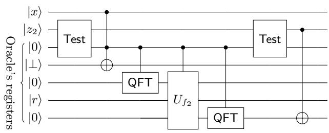
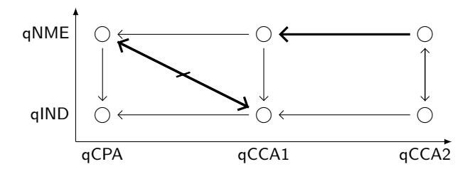
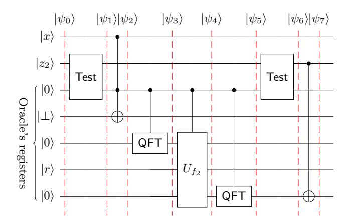

# **On Security Notions for Encryption in a Quantum World**

Céline Chevalier<sup>1</sup> , Ehsan Ebrahimi<sup>2</sup>*,*<sup>3</sup> , and Quoc-Huy Vu<sup>1</sup>

<sup>1</sup> CRED, Université Panthéon-Assas, Paris II, France {celine.chevalier, quoc.huy.vu}@ens.fr <sup>2</sup> SnT, University of Luxembourg <sup>3</sup> Work done while at École Normale Supérieure ehsan.ebrahimi@uni.lu

**Abstract.** Indistinguishability against adaptive chosen-ciphertext attacks (IND-CCA2) is usually considered the most desirable security notion for classical encryption. In this work, we investigate its adaptation in the quantum world, when an adversary can perform superposition queries. The security of quantum-secure classical encryption has first been studied by Boneh and Zhandry (CRYPTO'13), but they restricted the adversary to classical challenge queries, which makes the indistinguishability only hold for classical messages (IND-qCCA2). We extend their work by giving the first security notions for fully quantum indistinguishability under quantum adaptive chosen-ciphertext attacks, where the indistinguishability holds for superposition of plaintexts (qIND-qCCA2).

# <span id="page-0-0"></span>**1 Introduction**

Recent advances in quantum computing show the possible emergence of new kinds of attacks due to quantum adversaries. The first type of attacks would be due to adversaries owning a quantum computer and using it to break computational assumptions (thus attacking classical cryptographic cryptosystems). This has been made possible by the invention of quantum algorithms that solve factoring and discrete logarithm problems in polynomial time [\[Sho99\]](#page-30-0) and consequently, break the security of many classical public-key encryption schemes based on these assumptions. This threat has led to the emergence of so-called *post-quantum cryptography*, based on arguably quantum-resistant assumptions. But this change of assumptions may not be sufficient, and symmetric cryptosystems may also be impacted, in case we allow a quantum adversary, not only to perform computation on a quantum computer it may own, but also to carry out a second type of attacks, by interacting with the target in superposition. Quantum algorithms for unstructured search [\[Gro96\]](#page-29-0) or period finding [\[Sim94\]](#page-30-1) could then be applied to attack classical constructions using superposition queries [\[DFNS14,](#page-29-1)[KLLN16\]](#page-30-2). Cryptosystems secure against this type of attacks would be called *quantum secure*.

As we approach the quantum era, it thus becomes necessary to construct new public-key cryptosystems based on quantum-resistant assumptions, and to investigate the security of both symmetric and public-key cryptosystems against an attacker allowed to interact with honest parties using quantum communication. Recently, there has been towards this goal extensive research works that consider this scenario of quantum superposition attacks for different classical cryptographic constructions such as random oracles, pseudorandom functions, encryption and signature schemes [\[BDF](#page-28-0)<sup>+</sup>11[,Zha12,](#page-30-3)[BZ13b](#page-29-2)[,BZ13a](#page-29-3)[,GHS16](#page-29-4)[,AMRS20\]](#page-28-1) and give corresponding new security definitions. Furthermore, this new field of research is also motivated by the existence of concrete attacks against classical constructions using superposition queries (e.g., see [\[DFNS14,](#page-29-1)[KLLN16\]](#page-30-2) and their follow up works). In this paper, we continue this line of work and focus on the security for classical encryption schemes against quantum adversaries allowed to make quantum encryption and decryption queries.

# **1.1 Defining Security for Encryption Against Quantum Adversaries**

**Classical Security Notions.** Indistinguishability-based security definitions are modeled as a game between a challenger and an adversary A. In the Find-Then-Guess style (see Appendix [A.3](#page-31-0) for the Real-or-Random style), the game starts with a first learning phase (with access to some oracles), followed by a challenge phase where A sends a challenge query (two messages *x*<sup>0</sup> and *x*<sup>1</sup> to be encrypted) and receives a challenge ciphertext (encryption of *xb*). Afterwards, a second learning phase follows, and finally, A outputs a solution (its guess for the bit *b*). The security reduction consists in constructing a new adversary which simulates A and solves some hard underlying problem. The learning phases define the type of attacks: chosen-plaintext attacks (CPA) if the adversary has access to an encryption oracle in both learning phases, and chosen-ciphertext attacks (CCA) in case it also has access to a decryption oracle in the learning phases (non-adaptive or CCA1 if it is restricted to the first learning phase, and adaptive or CCA2 otherwise).

Indistinguishability against adaptive chosen-ciphertext attack (IND-CCA2) is usually considered the most desirable security notion for encryption. In the CCA2 games, the adversary is restricted not to ask for decryption of the challenge ciphertext, otherwise, this would lead to a trivial guess of the bit *b*. It is the role of the challenger to ensure that the adversary obeys this rule, which intrinsically requires the ability to copy, store and compare classical strings.

**Quantum Attacks on Encryption.** With recent advances in quantum computing, a quantum adversary may become a tangible threat in not so long. Switching to post-quantum computational assumptions is a beginning but may not be enough in case the adversary gains quantum access to honest parties and protocols. Consider for instance the well-known construction of CCA2 secure encryption schemes from lossy trapdoor functions [\[PW08\]](#page-30-4): if the construction is instantiated with lattice-based problems, it is arguably post-quantum secure. But we show later that, the insecurity may arise from the use of a one-time pad inside the construction (see [Section 4.2\)](#page-21-0). Furthermore, [\[DFNS14,](#page-29-1)[KLLN16\]](#page-30-2) and their follow up works show that the security of several classical constructions can be compromised if the adversary can perform superposition attacks.

**Boneh-Zhandry's Security Notions [\[BZ13b\]](#page-29-2).** Boneh and Zhandry propose the first definition of IND-CCA for both symmetric and public-key encryption schemes against quantum adversaries allowed to make quantum encryption and decryption queries. But they show that the natural translation of the classical Find-then-Guess paradigm to the quantum setting is unachievable, even for IND-CPA security (see [Section 1.4\)](#page-5-0). To overcome this impossibility, they resort to considering quantum queries during the learning phases only, and classical queries during the challenge phase. In addition to looking artificial, this inconsistency between the learning phases and the challenge phase may lead to a cryptographic construction that fulfills this security notion (IND-qCPA or IND-qCCA) while being subject to an attack.

For instance, in [\[ATTU16\]](#page-28-2), the authors verify IND-qCPA security of XTS mode of operation (with quantum learning queries and classical challenge queries). They design a block cipher such that an encryption scheme in XTS mode, instantiated with that block cipher, can be attacked during the learning phase using quantum learning queries. However, this attack cannot be used to violate the IND-qCPA security definition. The explanation for this inconsistency is that this attack cannot be implemented in the challenge phase due to the classical restriction imposed on the adversary. This example supports our claim that the inconsistency between the learning phases and the challenge phase can be problematic and should be overcome.

**IND-CCA2 Security Notions.** To date, defining the CCA2 security with quantum challenge queries remains unsolved. In [\[GHS16\]](#page-29-4), the authors address the inconsistency described above for the case of symmetric encryption, but only for IND-CPA, and leave as an open problem the IND-CCA definitions.

The main obstacle is to define how the challenger should reply to the quantum decryption queries after the adversary has made the quantum challenge queries. When the challenge queries are classical, they can be stored and later the challenger can return ⊥ if the adversary submits one of them as a decryption query. Although it is trivial and inherent to store the challenge ciphertext in the classical setting, it is highly non-trivial to store ciphertexts in the quantum world, due to a number of technical obstacles, all of which can be traced to quantum no-cloning and the destructiveness of quantum measurements.

Since we now consider the adversary's challenge queries as quantum states, it may be tempting to think that the approaches from the literature on quantum encryption (that is, the problem of encrypting *quantum* data) would work here. The notorious "recording barrier" that we face in this work has arisen previously in the literature on quantum encryption. In particular, devising the notions of quantum ciphertext indistinguishability under adaptive chosen-ciphertext attack and quantum authenticated encryption [\[AGM18\]](#page-28-3) requires circumventing similar obstacles. However, [\[AGM18\]](#page-28-3) defines IND-CCA2 security for *quantum encryption*, which inherently requires the users to have quantum computers, while in this work, we focus on classical encryption that can be implemented on classical computers and only needs to be secure against quantum adversaries. We show in [Section 1.4](#page-5-0) that indeed the approach of [\[AGM18\]](#page-28-3) would not help.

In this paper, we manage to overcome this recording barrier by using Zhandry's compressed oracle technique [\[Zha19\]](#page-30-5) (an overview is given in [Section 1.2\)](#page-3-0) and we propose the first quantum version for IND-CCA security notion. We justify our definitions in [Section 1.3.](#page-4-0) Finally, in [Section 1.4,](#page-5-0) we discuss our work compared to previous work [\[BZ13b](#page-29-2)[,GHS16,](#page-29-4)[MS16\]](#page-30-6) and we also briefly restate the approach of [\[AGM18\]](#page-28-3) and explain why it does not obliviously work in our setting.

# <span id="page-3-0"></span>**1.2 Our Approach**

Towards resolution, we start from a recent groundbreaking technique that allows for on-the-fly simulation of random oracles in the quantum setting: Zhandry's compressed oracles [\[Zha19\]](#page-30-5). The goal of his work is to overcome the recording barrier, by allowing the reduction to record information about the adversary's queries, which is a key feature of many classical ROM proofs.

Zhandry's key observations are threefold. First, instead of considering a random function *h* being chosen beforehand, one can purify the adversary's mixed state by putting *h* in uniform superposition P *h* |*h*⟩. This observation is a technicality that allows us to fulfill the two next points. Then, the next observation is that, by doing the queries in the Fourier basis, the data will be written to the oracle's registers instead of writing to the opposite direction. This enables the simulator to get some information about the adversary's queries. Finally, the last and most important one is that the simulator needs to be ready to forget some point it simulated previously, by performing a particular test on the database after answering the query. In particular, Zhandry defines a test computation that maps |+⟩ 7→ |+⟩ |1⟩ and |*ϕ*⟩ 7→ |*ϕ*⟩ |0⟩ for any |*ϕ*⟩ orthogonal to |+⟩, where |+⟩ = P *x* |*x*⟩ is the uniform superposition state. The "test-and-forget" procedure can be implemented by first performing the query in the Fourier basis and then doing the test operation on the output registers (of the simulator). This test determines whether the adversary has any information from the oracle at some input. If not, that pair will be removed from the database so that the adversary cannot detect that it is interacting with a simulated oracle.

This technique has been extended from random oracles to lazy-sampling of non-uniform random functions in [\[CMSZ19\]](#page-29-5). The intuition is almost the same, except that now one starts from the all-zero state, performs an *efficient* sampling operation that computes the function *f*(*x*) according to some nonuniform distribution – it is the quantum Fourier transform (QFT) operation in the uniform setting. One then performs the query in the Fourier basis, transforms back to the computational basis and applies the "test-and-forget" operation (which is defined similarly as in the uniform setting). For this to work, the two important requirements are that: i) the sampling operation must be efficient; ii) the function distribution must be independent for every input.

To define security for encryption, we choose the real-or-random paradigm to work with. This is because partially, the real-or-random paradigm does not suffer from Boneh-Zhandry's impossibility (discussion below). Furthermore, it is actually possible to define quantum chosen-ciphertext security for this paradigm using the quantum lazy-sampling technique we just described. In what follows, let us focus on the random world of the paradigm. For each challenge query in the

random world, the challenger applies a random function to the plaintext registers before encrypting, all aforementioned requirements are met: the encryption of each submitted plaintext is actually an encryption of another uniformly random plaintext, and since the encryption algorithm is efficient, the sampling operation can also be efficiently constructed.

The above idea gives us a reasonable way to define adaptive chosen ciphertext security against quantum challenge queries: by instantiating the encryption oracle with this lazy-sampling technique, we are able to keep track of the information needed to formulate the CCA2 notions, namely the challenge queries the adversary has made, and the challenge ciphertexts it has received. However, applying Zhandry's framework directly to our setting does not work, and more efforts are needed. For example, one main difference is that in our setting, when making queries to the random oracle, there is no response register (from the adversary). In Zhandry's framework, this response register is essential for the technique, as the "test-and-forget" procedure works based on the value of this register. Another problem is how to implement the oracle with an *one-shot* call to the encryption algorithm: this is necessary when defining "one-time" security, or when doing security reductions. We refer the reader to [Section 3](#page-10-0) for technical details.

### <span id="page-4-0"></span>**1.3 Our Contributions**

**New Notions of Quantum Indistinguishability and Their Achievability.** We define novel security notions for encryption in both the symmetric [\(Definition 2](#page-20-0) in [Section 4\)](#page-19-0) and public-key settings [\(Definition 3](#page-24-0) in [Section 5\)](#page-24-1). Our main contribution is to propose the first definitions for adaptive chosen ciphertext

security that support *fully quantum indistinguishability*, resolving an outstanding open problem posed by Gagliardoni *et al*. [\[GHS16\]](#page-29-4). Furthermore, to justify our formalization, we show that our notions

- **–** are achievable (see [Theorem 3](#page-23-0) and [Theorem 6\)](#page-27-0);
- **–** are all closed under composition (see [Theorem 1](#page-21-1) and [Theorem 4\)](#page-24-2);
- **–** are strictly stronger than previous notions with classical challenge queries (see [Theorem 2](#page-21-2) and [Theorem 11\)](#page-43-0). In particular, this shows the quantum (in)security of various symmetric encryption schemes including stream cipher and some block cipher modes of operation such as CFB, OFB, CTR. This even extends to authenticated encryption, in which some most widely used encryption modes like GCM are also resulting in an insecure scheme.
- **–** (when restricted to classical challenge queries) are equivalent to Boneh-Zhandry's notions [\[BZ13b\]](#page-29-2).

In this work, we adopt the Real-or-Random security definition (see [Ap](#page-31-0)[pendix A.3](#page-31-0) for classical definitions). Informally, in the real game, the adversary has no restrictions on the use of the decryption oracle Dec. Only in the random game, the challenge encryption oracle is implemented as a compressed oracle: it applies a *random function h* [1](#page-4-1) to the plaintext register before doing the encryption.

<span id="page-4-1"></span><sup>1</sup> We note that previous works ([\[MS16](#page-30-6)[,CETU21\]](#page-29-6)) use *random permutations* instead of random functions in the random world. It is arguable which security definition is the right adaptation of the classical Real-or-Random security definition to the

For each decryption query, the challenger looks for the query's basis state in the database (in superposition) and if found, it reasonably guesses that the adversary is trying to decrypt the challenge ciphertext, and so it returns the adversary's original message (which is what is stored in the database). Otherwise, it decrypts normally. Intuitively, the security is established by the distinguishing probability of the adversary between whether its message is encrypted with Enc or Enc ◦ *h*.

We then provide constructions satisfying these security notions in [Section 4.3](#page-23-1) and [Section 5.2.](#page-26-0) For the symmetric-key setting, our construction follows the classical Encrypt-then-Mac paradigm, in which we use a pseudorandom function in the role of the MAC scheme (see [Theorem 3\)](#page-23-0). Concerning the public-key setting, we propose a compiler that lifts any secure encryption scheme in the sense of [\[BZ13b\]](#page-29-2) to an encryption scheme secure in the sense of our notions in [Section 5.2](#page-26-0) [\(Theorem 6\)](#page-27-0). The compiler follows the classical hybrid encryption paradigm, where we encrypt the message with a one-time symmetric encryption which can be constructed from pseudorandom functions, and then encrypt the symmetric key with a secure public-key scheme (in the sense of [\[BZ13b\]](#page-29-2)).

**New Notions of Quantum Non-Malleability.** We initiate the study of definitions of non-malleability for classical public-key encryption in the quantum world. This notion, first introduced by Dolev, Dwork and Naor [\[DDN00\]](#page-29-7), is the strongest integrity-like notion that is achievable using public-key encryption only. The goal of the adversary, given a ciphertext *y*, is not to learn something about its plaintext *x*, but rather to output a different ciphertext *y* ′ such that its plaintext *x* ′ is "meaningfully related" to *x*. In the classical setting, the notion of non-malleability has been formalized using different definitional approaches: the indistinguishability-based approach [\[BDPR98,](#page-28-4)[BS06,](#page-28-5)[PsV07\]](#page-30-7) and the simulation-based approach [\[DDN00,](#page-29-7)[BS06](#page-28-5)[,PsV07\]](#page-30-7). In the scope of this paper, we give indistinguishability-based definitions [\(Definition 4\)](#page-25-0) and leave the simulation-based approach, as well as their full characterization as a future work. We show that our notions are closed under composition [\(Theorem 5\)](#page-25-1) and we give the relations between indistinguishability and non-malleability notions [\(Figure 2\)](#page-26-1).

**Completeness of Bit Encryption.** In the classical setting, we know that onebit encryption schemes are necessary and sufficient to build many-bit encryption schemes [\[Ms09\]](#page-30-8). We show that the same result also holds in the quantum setting in [Section 6.](#page-27-1) Unfortunately, if the adversary is allowed to send quantum challenge queries, classical constructions do not hold anymore. For example, the results for classical CPA and CCA1 security follows from bit-by-bit encryption, but the same constructions fail in the quantum setting. In order to obtain this result in the quantum setting, we construct quantum-secure many-bit encryption from quantum-secure bit encryption based on our feasibility theorems [\(Theorem 3](#page-23-0) and [Theorem 6\)](#page-27-0), armed with known results in literature.

<span id="page-5-0"></span>quantum setting. However, the two notions are equivalent if the message space has size superpolynomial. This is because in this case, random functions and random permutations are indistinguishable.

### **1.4 Related Work and Discussion**

This line of work on defining security for encryption in the quantum world started by Boneh and Zhandry in [\[BZ13b\]](#page-29-2). They show that quantizing the notion of classical "left-or-right" indistinguishability is unachievable, even for chosen-plaintext security. In more details, the adversary sends two input-message registers for the challenge phase:

$$\sum_{x_0, x_1, y} \alpha_{x_0, x_1, y} | x_0, x_1, y \rangle \mapsto \sum_{x_0, x_1, y} \alpha_{x_0, x_1, y} | x_0, x_1, y \oplus \operatorname{Enc}(x_b) \rangle.$$

For any classical encryption scheme, the adversary can perform an efficient attack which allows it to get the bit *b* with overwhelming probability. Followup works [\[GHS16](#page-29-4)[,MS16,](#page-30-6)[GKS20\]](#page-29-8) manage to bypass this impossibility and give security definitions that allow the adversary to send quantum challenge queries. These works use different approaches, we give a discussion on these approaches and relate them to ours below.

**On the query models.** In [\[CETU21\]](#page-29-6), all possible qIND-qCPA security notions for symmetric-key encryption have been studied. It was proven that "real-orrandom" in the standard oracle model and "left-or-right" in the minimal oracle model are among the strongest ones we could achieve, and at the same time, the two notions are provably incomparable[2](#page-6-0)[3](#page-6-1) . We believe that the standard oracle model is a more realistic query model, and thus security notions defined in this model might be a better one, for several reasons:

- **–** In the symmetric-key setting, [\[GHS16\]](#page-29-4) shows that with the decryption oracle, minimal oracles can be efficiently simulated by standard oracles. However, we stress that in general, unlike the symmetric setting, in the public-key setting, the requirement of having the decryption key simultaneously with the public key is unrealistic in most of the cases. The encryption machine should not hold the secret key for practical use. Thus, defining security for public-key encryption in the minimal oracle model is not possible in general.
- **–** Implementing queries in the minimal oracle model is only applicable to injective functions, which definitely does not include decryption. Thus, one still needs the standard oracle model to define chosen-ciphertext security: the minimal oracle model for encryption queries, and the standard oracle model for the decryption queries. This type of notions is not consistent in our opinion.
- **–** The standard oracle model captures the quantum fault attacks while the minimal oracle model does not (see [\[GHS16\]](#page-29-4)).
- **–** Oracles implemented in the minimal oracle model require extra quantum computation. That is, the challenger has to use its secret information/randomness

<span id="page-6-0"></span><sup>2</sup> In the standard oracle model, the query is implemented as |*x, y*⟩ 7→ |*x, y* ⊕ *f*(*x*)⟩. In the minimal oracle model, the query is implemented as |*x*⟩ 7→ |*f*(*x*)⟩.

<span id="page-6-1"></span><sup>3</sup> We note that in [\[CETU21\]](#page-29-6), instead of "real-or-random" (as we are considering here), they consider "real-or-permuted" notion. However, their results translate directly to "real-or-random" notions, and also to the public-key setting (using the hybrid encryption approach).

twice in the computation (once for encryption and once for recovering the message). In the standard oracle model, the second computation is not needed. (We note that in our notion, in the real game, the challenger implements the encryption oracle straightforwardly in the standard oracle model and does not need any extra computation.) This might limit some quantum attacks. For example, consider the smartcard frozen attacks [\[GHS16\]](#page-29-4), here if the adversary wants to make an encryption query in superposition, it is arguably better to "use" the standard oracle model, as the minimal oracle model requires a longer coherent time of the device, otherwise, the attacks might not work at all.

One might also ask whether the adversary can only prepare one message register per challenge query in the "real-or-random" notion is somehow limiting. [\[CETU21\]](#page-29-6) shows that that the currently known way to have 2 message registers per challenge query (as in the "left-or-right" paradigm) seems to be to consider the minimal oracle model if one wants to achieve a strong notion. Combining with Boneh-Zhandry's impossibility on defining "left-or-right" security in the standard model [\[BZ13b\]](#page-29-2), our notions might be the best we can hope for.

**Semantic Security in the Quantum World.** In the classical setting, semantic security [\[GM84\]](#page-29-9), the computational complexity analogue to perfect security, is considered as the strongest possible security notion and is shown to be equivalent to all indistinguishability notion. Semantic security formulates that whatever can be efficiently computed (represented by a target function *ftarget*(·)) from the ciphertext and additional partial information about the plaintext (represented by a function *faux*(·)) can be efficiently computed given only the length of the plaintext and the same partial information. Quantum semantic security was first studied in [\[GHS16\]](#page-29-4). Albeit with some restrictions on the adversary, this notion is equivalent to the "left-or-right" indistinguishability notion in the minimal oracle model. However, we note that this equivalence does not imply that this "left-or-right" indistinguishability notion in the minimal oracle model is the strongest one, as we explained above (essentially, this follows from the results given in [\[CETU21\]](#page-29-6)).

In the following, we show that a natural translation of semantic security to the quantum setting in the standard oracle model is unachievable. The impossibility follows essentially from the nature of the standard oracle model, in which each query is modeled as |*x, y*⟩ 7→ |*x, y* ⊕ *f*(*x*)⟩. The crucial point here is that the adversary receives in the challenge phase not only the ciphertext *but also the plaintext*, that is (a superposition of) |*x, y* ⊕ Enc(*x*)⟩. This allows the adversary to output any value *ftarget*(*x*) for some target function *ftarget*(·). In the simulation, the simulator receives no encryption, but only the auxiliary state *α* on |*x, y*⟩, computed by some quantum circuit *Caux* on the plaintext state. We note that since the quantum circuit *Caux* is given by the adversary, *Caux* does not necessarily preserve the input registers |*x*⟩ (for example, take *Caux* a quantum circuit tracing out the input registers and outputting a constant). As such, the simulator has no information on the plaintext, while the adversary does. Thus there is no simulator that can simulate the adversary efficiently. This gives

us some hints that defining a generic quantum semantic security might not be possible.

Quantum Encryption Approaches [AGM18]. On a high level, an adversary  $\mathcal{A}$  has negligible probability in distinguishing between two experiments: in the real one, it has access to encryption and decryption oracles with no restrictions, whereas in the random one, the challenge encryption oracle replaces  $\mathcal{A}$ 's queried plaintexts by random ones (half of a maximally-entangled state), and the decryption oracle answers with the originally queried plaintexts if the adversary asked for decryption of a challenge ciphertext (which can be done by first decrypting the ciphertext and applying a measurement on the entangled state), otherwise it answers normally. It is tempting to say that this approach resolves the problem of defining chosen-ciphertext security for the symmetric-key setting in the minimal oracle model. However, as explained above, the minimal oracle model does not support decryption queries, and it is not clear if this approach is compatible with the standard oracle model. In the context of standard oracles, this approach does not work unfortunately. The adversary can then use the same strategy to detect the random experiment's simulation: it prepares a maximally-entangled state  $|\phi^+\rangle_{XX'}$  and uses half of it (the registers X) as the challenge plaintext, and keeps X'. After receiving the challenge ciphertext, it measures the plaintext registers and X', and trivially distinguishes whether it is in the random experiment. We note that this attack cannot be performed without relaying, that is the plaintext registers X need to be available to  $\mathcal{A}$  after the challenge encryption. However, non-relaying is indistinguishable from being traced out the plaintext registers (from A's perspective). This inherently reduces to a definition with classical challenge queries, which defeats our goals<sup>4</sup>.

Related Work. The real-or-random approach that we use here was first proposed by Mossayebi and Schack in [MS16] (in which they call "real-or-permuted") for defining quantum security for symmetric encryption. However, their security definition (and a subsequent work of Carstens et al. [CETU21]) use random permutations for the random world instead of random functions as in ours. Furthermore, they have not overcome the main obstacle in defining notions for adaptive chosen-ciphertext security, that is, how the challenger can check if a quantum decryption query submitted by the adversary is not "related" to the challenge queries. Instead, in their definition, the adversary is imposed by a restriction that it cannot submit such decryption queries, which cannot be verified by the challenger. Without being able to verify that the adversary follows the restriction, the definition is not useful because the adversary can trivially break security without the challenger being aware of it. In our paper, we explicitly show how to impose this restriction on the adversary, and present a meaningful quantum counterpart of chosen-ciphertext security.

Chosen-plaintext security for symmetric-key encryption with quantum challenge queries was first defined in [GHS16] in the minimal oracle model. Gagliardoni, Krämer, and Struck [GKS20] extend the results from [GHS16] to the

<span id="page-8-0"></span><sup>&</sup>lt;sup>4</sup> A similar discussion also appeared in [GHS16].

public-key scenario, also using the minimal oracle model. They show that the minimal oracle for encryption can be implemented with the knowledge of the randomness for so-called "recoverable encryption schemes". Recall that in general, one would need both the standard encryption oracle and decryption oracle to efficiently implement a minimal encryption oracle.

Their notions and ours are inherently incomparable due to the difference in how we model quantum oracles access (see our discussion above). We leave the problem of unifying these security notions for future study.

### **Acknowledgments**

This work was supported in part by the French ANR project CryptiQ (ANR-18-CE39-0015) and the French *Programme d'Investissement d'Avenir* under national project RISQ P141580. The authors want to thank Damien Vergnaud, David Pointcheval and Christian Majenz for fruitful discussions, as well as the anonymous reviewers for useful comments.

### 2 Preliminaries

#### 2.1 Notations

Let  $\lambda \in \mathbb{N}$  be the security parameter. The notation  $\operatorname{negl}(\lambda)$  denotes any function f such that  $f(\lambda) = \lambda^{-\omega(1)}$ . When sampling uniformly at random a value a from a set  $\mathcal{U}$ , we employ the notation  $a \stackrel{\$}{\leftarrow} \mathcal{U}$ . When sampling a value a from a probabilistic algorithm  $\mathcal{A}$ , we employ the notation  $a \leftarrow \mathcal{A}$ . For  $a \in \mathbb{N}$ ,  $[a] = \{x \in \mathbb{N} \mid x \leq a\}$  will denote the closed integer interval with endpoints 0 and a. Let  $|\cdot|$  denote either the length of a string, or the cardinal of a finite set, or the absolute value. By PPT we mean a polynomial-time non-uniform family of probabilistic circuits, and by QPT we mean a polynomial-time non-uniform family of quantum circuits. Let  $\delta_{x,x'}$  denote the Kronecker delta function of x and x'.

### 2.2 Quantum Computing

For notation and conventions regarding quantum information, we refer the reader to [NC11]. We recall a few basics here. We let  $|\phi\rangle$  denote an arbitrary pure quantum state, let  $|x\rangle$  denote an element of the standard (computational) basis. A mixed state will be denoted by lowercase Greek letters, e.g.,  $\rho$ . We let  $|+\rangle$  denote the uniform superposition, that is  $|+\rangle \coloneqq \sum_x |x\rangle$ .

A pure state  $|\phi\rangle$  can be manipulated by performing a unitary transformation U to the state  $|\phi\rangle$ , which we denote  $U\,|\phi\rangle$ . The identity on a n-bit quantum system is denoted  $\mathcal{I}_n$ . Given two quantum systems A,B, with corresponding Hilbert spaces  $\mathcal{H}_A,\mathcal{H}_B$ , let  $|\phi\rangle=|\phi_0,\phi_1\rangle$  be a state of the joint system. We write  $U^A\,|\phi\rangle$  to denote that we act with U on register A, and with identity  $\mathcal{I}$  on register B, and we write  $U^{AB}$  to denote that we act with U on both registers A,B simultaneously, that is  $U^{AB}=U^A\otimes U^B$ .

**Quantum Computations.** Let Q be a n-bit quantum system over  $\mathbb{Z}_q$  for some integer q. The Quantum Fourier Transform (QFT) performs the following operation efficiently:

$$\mathsf{QFT}\left|x\right\rangle \coloneqq \frac{1}{\sqrt{q^n}} \sum_{y \in \{0,1\}^n} \omega_q^{x \cdot y} \left|y\right\rangle,$$

where *ω<sup>q</sup>* := exp( 2*πi q* ), and *x*· *y* denotes the dot product. In this paper, we usually consider *q* = 2, so that *ω<sup>q</sup>* = (−1).

Given a function *f* : X → Y, we model a quantum-accessible oracle O for *f* as a unitary transformation O*<sup>f</sup>* acting on three registers *X, Y, Z* with the property that O*<sup>f</sup>* : |*x, y,* 0⟩ 7→ |*x, y* ⊕ *f*(*x*)*,* 0⟩, where ⊕ is some involutive group operation (so-called quantum query model). Given an algorithm A, we sometimes write *y* ← A<sup>O</sup>1*,*O2*,...*(*x*) for the event that a quantum adversary A takes *x* as input, makes quantum queries to O1*,* O2*, . . .*, and finally outputs *y*.

# <span id="page-10-1"></span>**2.3 Cryptosystems and Notions of Security**

Here we briefly recall standard notations of classical cryptosystems [\[Gol04\]](#page-29-10), see [Appendix A](#page-31-1) for complete definitions.

**Symmetric-key Encryption.** A symmetric-key cryptosystem SE consists of three PPT algorithms SE = (K*,* SymEnc*,* SymDec).

The standard correctness requirement is that for any key k ← K(), any random coin *r* of SymEnc and any *x* ∈ X , we have SymDec<sup>k</sup> (SymEnc<sup>k</sup> (*x*; *r*)) = *x*. We sometimes omit the randomness *r* in SymEnc.

**Public-key Encryption.** A public-key cryptosystem E consists of three PPT algorithms E = (KeyGen*,* Enc*,* Dec).

The following correctness definition is taken from [\[HHK17\]](#page-29-11). We call a publickey encryption scheme E *δ-correct* if

$$\mathbb{E}\left[\max_{x\in\mathcal{X}}\Pr_{r\in\mathcal{R}}\left[\,\mathsf{Dec}_{\mathtt{sk}}(\mathsf{Enc}_{\mathtt{pk}}(x;r))\neq x\,\right]\right]\leq\delta,$$

where the expectation is taken over (pk*,* sk) ← KeyGen(*λ*).

**Game-based Definitions.** Previously, quantum indistinguishability for adaptive chosen-ciphertext security has been defined in the work of Boneh and Zhandry [\[BZ13b\]](#page-29-2). At a high level, their notions allow quantum encryption and decryption queries, but require challenge queries to be *classical*. Regarding the attack models, the following security notions are then defined: IND-qCPA, IND-qCCA1, IND-qCCA2. We briefly recall their definitions in [Appendix A.](#page-31-1)

# <span id="page-10-0"></span>**3 How to Record Encryption Queries in the Random World?**

The starting point towards our goal of defining indistinguishability-based security notions for encryption is to explain how the challenger should reply to quantum decryption queries in the second learning phase after the adversary has made the quantum encryption queries in the challenge phase. This implies explaining how it could record these quantum challenge queries. In this section, we show how this can be done in the random world.

### **3.1 Ciphertext Decomposition**

For simplicity, let we denote the encryption algorithm as a function *f* that takes as input a plaintext *x* ∈ X , a randomness *r* ∈ R and outputs a ciphertext *y* ← *f*(*x*; *r*) ∈ Y. We also assume that the domain of *f* is X = {0*,* 1} *<sup>m</sup>*, its range is Y = {0*,* 1} *<sup>n</sup>*, and the randomness space R = {0*,* 1} *ℓ* . We make a convention that *f*(⊥) = 0, where ⊥ denotes some symbol outside the domain X and the range Y. We define ciphertext decomposition as follows.

**Definition 1.** *For a function f, for all messages x* ∈ X *, we write y* := (*y*1∥*y*2) ← *f*(*x*; *r*) *and define:*

- **– Message-independent:** *y*<sup>1</sup> is message-independent if for all randomness *r*, there exists a function *g* such that *y*<sup>1</sup> := *g*(*r*). In other words, the messageindependent component of the ciphertext can be computed solely from the randomness *r*, independent of the message *x*. Furthermore, we require that 0 ≤ |*y*1| ≤ |*y*|.
- **– Message-dependent:** *y*<sup>2</sup> is message-dependent if for all randomness *r*, there exists no function *g* such that *y*<sup>2</sup> := *g*(*r*). In other words, the messagedependent component of the ciphertext can not be computed solely from the randomness *r*. Furthermore, we require that 1 ≤ |*y*2| ≤ |*y*|.

*We will also write f* := *f*<sup>2</sup> ◦ *f*1*, where f*<sup>1</sup> *acts only on the randomness, and f*<sup>2</sup> *acts on both the randomness and the plaintext.*

*Remark 1.* Our definition above can be defined for any encryption scheme, without losing of generality. Furthermore, it also does not exclude some artificial encryption scheme such that the encryption is deterministic when the plaintext *x* is some special value (for example, the secret key), that is, there exists a function *g* such that *y*<sup>2</sup> := *g*(*x*).

*Remark 2.* The definition of ciphertext decomposition is merely served as a technical step towards constructing the compressed encryption oracle in the random world in subsequent sections. We note that in an actual proof of security of an encryption scheme, one usually needs not to pay attention to this decomposition definition.

### **3.2 Oracle Variations**

Here, we describe some oracle variations which will be used later in subsequent sections, the so-called *standard oracle* and *Fourier oracle*. These oracles and their equivalence are proven in much of literature on quantum-accessible oracles (e.g., see [\[KKVB02,](#page-30-10)[Zha19,](#page-30-5)[CMSZ19\]](#page-29-5)).

**Standard oracles.** For any function *f* with domain X = {0*,* 1} *<sup>m</sup>* and range Y = {0*,* 1} *<sup>n</sup>*, the standard oracle for *f* is a unitary defined as

$$\mathsf{StdO}_f \sum_{x,y} \alpha_{x,y} \left| x,y \right\rangle_{XY} \mapsto \sum_{x,y} \alpha_{x,y} \left| x,y \oplus f(x) \right\rangle_{XY}.$$

The standard oracle can also be implemented in the truth table form: for each query, the oracle's internal state consists of *n*2 *<sup>m</sup>*-qubit *F* registers containing the truth table of the function. For short, we write |*f*(0)∥ *. . .* ∥*f*(2*<sup>m</sup>* − 1)⟩ as |*D*⟩. Then, StdO*<sup>f</sup>* performs the following map (on the adversary's basis states):

$$\begin{split} \mathsf{StdO}_f \left. | x, y \right\rangle_{XY} \otimes \left| D \right\rangle_F &\mapsto | x, y \oplus D(x) \right\rangle_{XY} \left| D \right\rangle_F \\ &= | x, y \oplus f(x) \right\rangle_{XY} \left| D \right\rangle_F \end{split}$$

The equivalence of these two oracle variations follows directly from the fact that for each query, if we trace out the oracle's internal registers, the mixed state of the adversary in both cases will be identical.

**Fourier oracles.** The Fourier oracle model FourierO*<sup>f</sup>* , while technically provides a different interface to the adversary, can be mapped to the standard oracle by QFT operations. The initial state of FourierO*<sup>f</sup>* is

$$\mathsf{QFT}^F \, |D\rangle_F = \frac{1}{\sqrt{2^{n2^m}}} \sum_E (-1)^{E \cdot F} \, |E\rangle_F \, .$$

On the basis states, the Fourier oracle FourierO*<sup>f</sup>* is defined as follows.

$$\begin{split} \mathsf{FourierO}_f \left| x, z \right\rangle_{XY} \otimes \frac{1}{\sqrt{2^{n2^m}}} \sum_E (-1)^{E \cdot D} \left| E \right\rangle_F \\ \mapsto & \frac{1}{\sqrt{2^{n2^m}}} \sum_E (-1)^{E \cdot D} \left| x, z \right\rangle_{XY} \left| E \oplus P_{x,z} \right\rangle_F \end{split}$$

where *Px,z* is the point function that outputs *z* on *x* and 0 everywhere else. Intuitively, with the Fourier oracle, instead of adding data from the oracle's registers to the adversary's registers, it adds in the opposite direction.

**Lemma 1 ([\[KKVB02,](#page-30-10)[Zha19\]](#page-30-5)).** *For any adversary* A *making queries to* StdO*<sup>f</sup> , let* B *be the adversary that is identical to* A*, except it performs the Fourier transformation to the response registers before and after each query. Then* Pr-AStdO*<sup>f</sup>* () = 1 = Pr-B FourierO*<sup>f</sup>* () = 1 *.*

*Proof.* Each oracle can be constructed by an *f*-independent quantum circuit containing just one copy of the other, that is

$$\begin{split} \operatorname{QFT}^{YF} \circ \operatorname{StdO}_f \circ \operatorname{QFT}^{\dagger YF} &= \operatorname{FourierO}_f, \\ \operatorname{QFT}^{\dagger YF} \circ \operatorname{FourierO}_f \circ \operatorname{QFT}^{YF} &= \operatorname{StdO}_f. \end{split}$$

<span id="page-12-0"></span>*.*

### <span id="page-12-1"></span>**3.3 Recording Queries in the Random World**

As we have explained in [Section 1,](#page-0-0) to define chosen-ciphertext security, we follow the real-or-random paradigm. In this section, we show how to process queries and record them in the random world, in which before applying the encryption algorithm *f*, the challenger chooses a random function *h* and applies it to the plaintext registers. As such, we also denote the encryption procedure in the random world as *f* ◦ *h*. In what follows, we abuse the notation and write *f* ◦ *h* in the subscript of the oracle's notation with this meaning: for each query, a random function *h* is chosen uniformly by the oracle, so that *h* is not a pre-defined function. We note that the function *f* is known to the adversary though.

**Single-query setting.** We first start describing the oracle operations handling a single query and describe the general case later.

Without loss of generality, we assume that the query's response register *Y* can be decomposed into two parts *Y*1*, Y*2, in which the first part corresponds to the message-independent component, and the second part corresponds to the message-dependent component. Let |*Y*1| := *n*<sup>1</sup> and |*Y*2| := *n*<sup>2</sup> where *n*<sup>1</sup> + *n*<sup>2</sup> = *n*.

In the standard oracle model, the encryption oracle is implemented by first sampling a randomness *r*, a function *h* : X → X uniformly at random, and then applying the encryption algorithm *f* on the input (*h*(*x*); *r*). From the adversary's point of view, this is equivalent to *h* being in uniform superposition P *h* |*h*⟩ and performing the following map:

<span id="page-13-0"></span>
$$|x,y\rangle_{XY}\otimes|r\rangle_{R}\sum_{h}|h\rangle_{H}\mapsto\sum_{h}|x,y\oplus f((h(x));r)\rangle_{XY}|r\rangle_{R}|h\rangle_{H}.$$
 (1)

Augmenting the joint system with a uniform superposition register *H* is a *purification* of the adversary's mixed state, and tracing out *H* (i.e., projecting onto the one-dimensional subspace spanned by |*h*⟩) recovers the original mixed state. Moreover, this projection, which is outside of the adversary's view, is undetectable by any adversary A.

Using ciphertext decomposition definition, we can write [Equation \(1\)](#page-13-0) as follows.

$$|x, y_1||y_2\rangle_{XY_1Y_2} \otimes |r\rangle_R \sum_h |h\rangle_H \mapsto \sum_h |x, (y_1||y_2) \oplus f(h(x); r)\rangle_{XY_1Y_2} \otimes |r\rangle_R |h\rangle_H$$
$$= \sum_h |x, y_1 \oplus f_1(r), y_2 \oplus f_2(h(x); r)\rangle_{XY_1Y_2} \otimes |r\rangle_R |h\rangle_H.$$

We further note that, since the same randomness *r* is used for all "slots" in superposition, *f*1(*r*) is also the same for all "slots". In other words, *f*1(*r*) is just a classical value, which can be computed independently from the adversary's query. As a result, only the message-dependent registers are needed for recording queries. From now on to the rest of this section, we only consider the message-dependent parts in the adversary's response registers as well as the oracle's registers. These parts are denoted with index 2 in subscript (e.g., *y*2*, z*2*, f*2*, . . .*).

Now we describe our compressed encryption oracles. We first introduce some local procedures acting on the oracle's side, possibly controlled by the adversary's registers. Let Decomp*<sup>x</sup>* be the identity operator except for

$$\mathsf{Decomp}_x\left(\left|r\right\rangle\left|x\right\rangle\frac{1}{\sqrt{2^m}}\sum_{u\in\{0,1\}^m}\left|u\right\rangle\frac{1}{\sqrt{2^{n_2}}}\sum_v(-1)^{f_2(u;r)\cdot v}\left|v\right\rangle\right)=\left|r\right\rangle\left|\bot\right\rangle\left|0\right\rangle\left|0\right\rangle,$$

and

$$\mathsf{Decomp}_x\left(\left|r\right\rangle\left|\bot\right\rangle\left|0\right\rangle\left|0\right\rangle\right) = \left|r\right\rangle\left|x\right\rangle \frac{1}{\sqrt{2^m}} \sum_{u \in \{0,1\}^m} \left|u\right\rangle \frac{1}{\sqrt{2^{n_2}}} \sum_v (-1)^{f_2(u;r) \cdot v} \left|v\right\rangle.$$

It is clear that Decomp*<sup>x</sup>* is a unitary operator. Furthermore, applying it twice results in the identity, thus Decomp*<sup>x</sup>* is an involution.

Using the notion similar to the description of Zhandry's compressed random oracle in [\[Zha19\]](#page-30-5), we introduce the notion of a database *D* that is maintained by the oracle as follows. A database *D* will be a collection of tuples (*x,*(*x* ′ *, y*)), where (*x,*(*x* ′ *, y*)) ∈ *D* corresponds to *D*(*x*) = (*x* ′ *, y*). We say *D*(*x*) = ⊥ if there is no such pair for an input *x*. For a database *D* with *D*(*x*) ̸= ⊥, we also write *D* = {*x, u, v*} ∪ *D*′ where *D*′ (*x*) = ⊥. *D* consists of all the oracle's registers, except the randomness registers *R*. Decomp is then defined as the related unitary acting on the joint quantum system as follows.

$$\mathsf{Decomp}\left|x,z_{2}\right\rangle \otimes\left|r\right\rangle \left|D\right\rangle =\left|x,z_{2}\right\rangle \otimes \mathsf{Decomp}_{x}\left|r\right\rangle \left|D\right\rangle .$$

Let Init be the procedure that samples a random *r* uniformly and initializes a new register |*r*⟩ |⊥*,* 0*,* 0⟩. Let FourierO′ be unitary defined on the adversary's basis states as:

$$\begin{split} & \operatorname{FourierO'}\left|x,z_{2}\right\rangle \otimes\left|r\right\rangle \left|D\right\rangle \\ &= \operatorname{FourierO'}\left|x,z_{2}\right\rangle \otimes\left|r\right\rangle \frac{1}{\sqrt{2^{m}}}\frac{1}{\sqrt{2^{n_{2}}}}\sum_{u,v}(-1)^{v\cdot f_{2}(u;r)}\left|\left\{x,u,v\right\}\cup D'\right\rangle \\ &= \left|x,z_{2}\right\rangle \otimes\left|r\right\rangle \frac{1}{\sqrt{2^{m}}}\frac{1}{\sqrt{2^{n_{2}}}}\sum_{u,v}(-1)^{v\cdot f_{2}(u;r)}\left|\left\{x,u,v\oplus z_{2}\right\}\cup D'\right\rangle. \end{split}$$

Finally, we define the CFourierO*f*2◦*<sup>h</sup>* oracle[5](#page-14-0) :

<span id="page-14-1"></span>
$$\mathsf{CFourierO}_{f_2 \circ h} \coloneqq \mathsf{Decomp} \circ \mathsf{FourierO}' \circ \mathsf{Decomp} \circ \mathsf{Init}.$$

We state the following lemma:

**Lemma 2.** *In the single-query setting, the compressed Fourier oracle* CFourierO*f*2◦*<sup>h</sup> acts on a basis state* |*x, z*2⟩ *where x* ∈ X *and z*<sup>2</sup> ∈ {0*,* 1} *n*<sup>2</sup> *, as follows.*

**–** *If z*<sup>2</sup> = 0*, then* CFourierO*f*2◦*<sup>h</sup>* |*x, z*2⟩ 7→ |*x, z*2⟩ ⊗ |*r*⟩ |⊥*,* 0*,* 0⟩*.* **–** *If z*<sup>2</sup> ̸= 0*, then* CFourierO*f*2◦*<sup>h</sup>* |*x, z*2⟩ 7→ |*x, z*2⟩ ⊗ |*ϕx,z*<sup>2</sup> ⟩*, where*

$$|\phi_{x,z_2}\rangle \coloneqq |r\rangle \, \frac{1}{\sqrt{2^{m+n_2}}} \sum_u \sum_v (-1)^{f_2(u;r)\cdot v} \, |x,u,v\oplus z_2\rangle \, .$$

*Furthermore, for any adversary* A *making a single query to* StdO*<sup>f</sup>*2◦*h, let* B *be the adversary that is identical to* A*, except it performs the Hadamard transformation* H <sup>⊗</sup>*<sup>n</sup> to the response registers before and after the query. Then* Pr-AStdO*f*2◦*<sup>h</sup>* () = 1 = Pr-B CFourierO*f*2◦*<sup>h</sup>* () = 1 *.*

<span id="page-14-0"></span><sup>5</sup> For notation consistency, we use the same subscript in compressed oracles as for standard oracles. However, we note that there is no real function *h* in the implementation of CFourierO and its variants.

*Proof.* To prove the lemma, it is enough to show that CFourierO<sub> $f_2 \circ h$ </sub> and FourierO<sub> $f_2 \circ h$ </sub> are perfectly indistinguishable.

We prove this through a sequence of games. In what follows, we ambiguously denote QFT  $|f_2(x;r)\rangle$  by  $|\eta_x\rangle$  for each  $x\in\{0,1\}^m$ . We will also take  $y\oplus \bot=y,y\cdot \bot=0$ . When the adversary's response register is  $|+\rangle$  (which corresponds to  $|0\rangle$  in the Fourier basis), we can write, on the truth table of the oracle (for both FourierO $_{f_2\circ h}$  and  $StdO_{f_2\circ h}$ ), the column with index x where x is the query's input as  $\bot$ .

**Game**  $G_0$ : In this game, the adversary interacts with the Fourier oracle Fourier  $O_{f_2 \circ h}$ , whose initial state is  $|r\rangle \frac{1}{\sqrt{2^{m2^m}}} \sum_h |(h(0), \eta_{h(0)})|| \cdots ||(h(2^{m-1}), \eta_{h(2^m-1)})\rangle$ .

**Game**  $G_1$ : In this game, we represent the oracle in the form:

$$|r\rangle \frac{1}{\sqrt{2^{m2^m}}} \sum_{h} |(0, h(0), \eta_{h(0)})|| \cdots ||(2^m - 1, h(2^{m-1}), \eta_{h(2^m - 1)})\rangle.$$

The update procedure for a query is then simply FourierO'.  $G_1$  is identical to  $G_0$ , since we have inserted the input points  $0, \ldots, 2^m - 1$  into the oracle's state, which is independent from the adversary's state.

**Game**  $G_2$ : In this game, the oracle starts out as the "zero" database:

$$|r\rangle |(\bot, 0, 0)|| \cdots |(\bot, 0, 0)\rangle$$
.

Then a query is implemented as  $\mathsf{Decomp'}^\dagger \circ \mathsf{FourierO'} \circ \mathsf{Decomp'}$ , where  $\mathsf{Decomp'} \coloneqq \bigotimes_{i=0}^{2^m-1} \mathsf{Decomp}_i$ . At the beginning,  $\mathsf{Decomp'}$  is applied to the "zero" database, which maps it to the complete database

$$|r\rangle \frac{1}{\sqrt{2^{m2^m}}} \sum_{h} |(0, h(0), \eta_{h(0)})|| \cdots ||(2^m - 1, h(2^{m-1}), \eta_{h(2^m - 1)})\rangle.$$

Then FourierO' is applied and the output state of  $G_2$  in this stage will be exactly the output state of  $G_1$ . Since  $\mathsf{Decomp'}^\dagger$  is a unitary that only operates on the oracle's register, its applications is undetectable to the adversary. So  $G_2$  is perfectly indistinguishable from  $G_1$ .

**Game**  $G_3$ : In this final game, we use the compressed oracle CFourierO $_{f_2 \circ h}$ . Let x be the query's input. We note that FourierO' and Decomp $_{x'}$  commute for any  $x' \neq x$ . Thus, we can move the computation of Decomp $_{x'}$  to come after FourierO', consequently, its applications cancel out. We then have:

$$\begin{aligned} &\mathsf{Decomp'}^{\dagger} \circ \mathsf{FourierO'} \circ \mathsf{Decomp'}(|x,z\rangle \otimes |r\rangle \, |D\rangle) \\ &= \, \mathsf{Decomp}_{x}^{\dagger} \circ \mathsf{FourierO'} \circ \mathsf{Decomp}_{x}(|x,z\rangle \otimes |r\rangle \, |D\rangle) \\ &= \, \mathsf{Decomp}^{\dagger} \circ \mathsf{FourierO'} \circ \mathsf{Decomp}(|x,z\rangle \otimes |r\rangle \, |D\rangle). \end{aligned}$$

We are left with a database D whose support has at most 1 defined point after the query in  $G_2$ . The remaining  $\geq 2^m - 1$  points are all  $(\perp, 0, 0)$ . So we may end

up with a superposition of databases that have at most one defined point. We then can move this defined point in the database to the first register (this is a unitary operator and is undetectable to the adversary) and obtain a superposition of databases that have a defined point only in the first register. Therefore we can discard all but the first register, without affecting the adversary's state. This shows that  $G_3$  and  $G_2$  are identical.

The compressed Fourier encryption oracle in the random world  $\mathsf{CFourierO}_{f \circ h}$  is straightforwardly obtained by running the message-independent function  $f_1$  on the randomness r, transforming it to the Fourier basis and then composing it with  $\mathsf{CFourierO}_{f_2 \circ h}$ . Formally,  $\mathsf{CFourierO}_{f \circ h} \coloneqq (\mathsf{QFT}^{F_1}U_{f_1}^R) \circ \mathsf{CFourierO}_{f_2 \circ h}$ . We then have

<span id="page-16-0"></span>**Lemma 3.** For any adversary  $\mathcal{A}$  making a single query to  $\mathsf{StdO}_{f \circ h}$ , let  $\mathcal{B}$  be the adversary that is identical to  $\mathcal{A}$ , except it performs the Hadamard transformation  $\mathsf{H}^{\otimes n}$  to the response registers before and after the query. Then  $\Pr\left[\mathcal{A}^{\mathsf{StdO}_{f \circ h}}() = 1\right] = \Pr\left[\mathcal{B}^{\mathsf{CFourierO}_{f \circ h}}() = 1\right]$ .

Compressed standard encryption oracles. By applying Hadamard to the adversary's response registers before and after the query, and to the oracle's register F after the query, we also obtain the compressed standard encryption oracle  $\mathsf{CStO}_{f \circ h}$ . The oracle's state after the query is (in superposition of)  $|r, x, u, f(u; r)\rangle$ . Formally,  $\mathsf{CStO}_{f \circ h} \coloneqq \mathsf{QFT}^{YF} \circ \mathsf{CFourierO}_{f \circ h} \circ \mathsf{QFT}^{Y}$ . By applying the same argument as in Lemma 1 to  $\mathsf{CFourierO}_{f \circ h}$  and  $\mathsf{CStO}_{f \circ h}$ , and combining with Lemma 3, the following lemma follows:

**Lemma 4.**  $\mathsf{CStO}_{f \circ h}$  and  $\mathsf{StdO}_{f \circ h}$  are perfectly indistinguishable. That is, for any adversary  $\mathcal{A}$ , we have that  $\Pr\left[\mathcal{A}^{\mathsf{StdO}_{f \circ h}}()=1\right] = \Pr\left[\mathcal{A}^{\mathsf{CStO}_{f \circ h}}()=1\right]$ .

Many-query setting. We denote  $\mathsf{CStO}_{f \circ H}$  as the following oracle: for each query,  $\mathsf{CStO}_{f \circ H}$  invokes a new instance of  $\mathsf{CStO}_{f \circ h}$  with uniformly and independently randomness r. Similarly,  $\mathsf{StdO}_{f \circ H}$  denote the following oracle: for each query,  $\mathsf{StdO}_{f \circ H}$  samples uniformly and independently a randomness r and a random function h, and then answers that query using  $\mathsf{StdO}_{f \circ h}$ . By the standard hybrid argument, it is easy to verify that:

**Lemma 5.**  $\mathsf{CStO}_{f \circ H}$  and  $\mathsf{StdO}_{f \circ H}$  are perfectly indistinguishable, in the many-query setting.

For each *i*-th query, its oracle's database is  $|D_i\rangle := |x_i, u_i, f(u_i; r_i)\rangle$ . Overall, the oracle's database D will be a collection of many tuples (x, (x', y)) where  $(x, (x', y)) \in D$  means f(x'; r) = y and h(x) = x' for different random functions h.

#### 3.4 A Technical Observation

Notice that from the proof of Lemma 2 above, we implement this compressed encryption oracle with at least two computations of  $f_2$  (and so f) via two applications of Decomp. However, as we will see in later sections, it is crucial for our security reductions to simulate CFourierO<sub> $f \circ h$ </sub> with only one computation of f,

which allows us to "outsource" *f* computations to other oracles. We now give an intuition why we can reduce many computations of *f* to one computation. Let's consider the following cases.

- **–** The *z*<sup>2</sup> registers are all-zero. Note that since the initial state of the oracle database *D* is also all-zero, applying the first Decomp and then XORing the adversary's registers to the oracle's (i.e., the application of FourierO′ ) does not change the database's state. Finally, the second application of Decomp brings it back to all-zero state, which can be discarded. At the end of this step, *D* is empty. In this case, we see that we can skip FourierO′ , and two applications of Decomp cancel out, leaving us no applications of *f*.
- **–** The *z*<sup>2</sup> registers are not zero. By a similar argument, we have that the second application of Decomp has no effects on the joint system, leaving us only one application of *f* in the first application of Decomp.

We describe a quantum circuit in [Figure 1,](#page-17-0) which applies a single computation of *f*<sup>2</sup> (denoted as a unitary *Uf*<sup>2</sup> ), implementing our compressed encryption oracle in the random world. Let Test be the unitary defined as Test|0⟩ |*b*⟩ 7→ |0⟩ |*b*⟩ and Test|*ϕ*⟩ |*b*⟩ 7→ |*ϕ*⟩ |*b* ⊕ 1⟩ for any |*ϕ*⟩ orthogonal to |0 *<sup>n</sup>*<sup>2</sup> ⟩ and *b* ∈ {0*,* 1}. A concrete computation (given in [Appendix B\)](#page-35-0) reveals that this circuit outputs the same quantum state as stated in [Lemma 2.](#page-14-1)



<span id="page-17-0"></span>**Fig. 1.** A quantum circuit implementing our CFourierO*<sup>f</sup>*2◦*<sup>h</sup>* oracle. Depending on the control bit *b* which is the output of Test, if *b* = 1, we apply *U<sup>f</sup>*<sup>2</sup> , otherwise, we apply the identity. The bit *b* will be discarded after the computation.

### <span id="page-17-1"></span>**3.5 How to Answer Decryption Queries?**

We now describe how to answer decryption queries in the random world using the database constructed above. Generally, we will consider any *δ*-correct encryption scheme (see Definition in [Section 2.3\)](#page-10-1).

We will start with a technical lemma, in which the decryption will answer "naively", that is if the ciphertext is *f*(*x* ′ ; *r*) for some *x* ′ , the decryption oracle is expected to return *x* ′ , even if *x* ′ was the output of a random function. (Roughly speaking, this decryption oracle mimics a standard decryption oracle with no restrictions on the adversary.) We call this decryption oracle the *naive decryption oracle*.

In the following, we abuse the notation and denote *f* <sup>−</sup><sup>1</sup> as the decryption algorithm. We then give the adversary access to a new oracle denoted CInvO*f*−<sup>1</sup> (this is our naive decryption oracle) which acts on the database, instead of StdO*f*−<sup>1</sup> . Given access to CInvO*f*−<sup>1</sup> , the bound on the distinguishing probability of the

adversary when interacting with the compressed oracle  $\mathsf{CStO}_{f \circ H}$  is stated in Lemma 6.

We define a classical procedure FindImage' which takes as input a ciphertext  $y \in \mathcal{Y}$ , and a database D. Then, it looks for a tuple  $(x, (x', y)) \in D$ . If found, it outputs (b = 1, w = x'), otherwise, it outputs (b = 0, w = 0). Notice that there may be many tuples with the same y in D, but since an encryption scheme must be injective (for decryption to work), these pairs must have the same x'.

We define the unitary operation  $\mathsf{CInvO}_{f^{-1}}$  for the inverse queries which maps the basis state  $|y,z\rangle\otimes|D\rangle$  to:

$$\begin{cases} U_{f^{-1}} \left| y,z \right\rangle \otimes \left| D \right\rangle = \left| y,z \oplus f^{-1}(y) \right\rangle \otimes \left| D \right\rangle & \text{if FindImage}'(y,D) = (0,0), \\ \left| y,z \oplus w \right\rangle \otimes \left| D \right\rangle & \text{if FindImage}'(y,D) = (1,w). \end{cases}$$

This unitary is implemented by a single call to  $f^{-1}$ , controlled by the output bit b of FindImage' recorded in some ancilla registers<sup>6</sup>.

**Lemma 6.** For any (unbounded) oracle algorithm  $\mathcal{A}$ , and any  $\delta$ -correct encryption scheme:

<span id="page-18-0"></span>
$$\left|\Pr\left[\mathcal{A}^{\mathsf{StdO}_{f \circ H},\mathsf{StdO}_{f^{-1}}}() = 1\right] - \Pr\left[\mathcal{A}^{\mathsf{CStO}_{f \circ H},\mathsf{CInvO}_{f^{-1}}}() = 1\right]\right| \leq \mathcal{O}\left(q_i \cdot \delta\right),$$

where  $q_i$  is the number of inverse queries.

*Proof.* We prove this lemma through a sequence of games.

**Game**  $G_0$ : This is the game where  $\mathcal{A}$  interacts with the standard oracles  $\mathsf{StdO}_{f \circ H}$  and  $\mathsf{StdO}_{f^{-1}}$ .

**Game**  $G_1$ : This is identical to  $G_0$ , except that now the oracle  $\mathsf{StdO}_{f \circ H}$  is simulated using the compressed oracle  $\mathsf{CStO}_{f \circ H}$ . Notice that  $\mathsf{StdO}_{f^{-1}}$  operation does not touch the database registers, thus it commutes with any  $\mathsf{CStO}_{f \circ h}$  operation. Since  $\mathsf{CStO}_{f \circ H}$  is equivalent to the standard oracle  $\mathsf{StdO}_{f \circ H}$ ,  $\mathcal{A}$  cannot distinguish  $G_1$  and  $G_0$ .

**Game**  $G_2$ : This is identical to  $G_1$ , except that now the oracle  $\mathsf{StdO}_{f^{-1}}$  is replaced by the oracle  $\mathsf{CInvO}_{f^{-1}}$ .

Let  $|\Psi\rangle$  be the joint system state of the adversary and the oracle before making any inverse query. Denote  $\Delta = \mathsf{StdO}_{f^{-1}} - \mathsf{CInvO}_{f^{-1}}$ . For each query  $|y,z\rangle$  to the inverse oracle, we consider the registers y,z,D. We now examine three cases.

(a) Let D be such that  $y \notin D$ , that is,  $\mathsf{FindImage}(y,D) = (0,0)$ . Let  $P_1$  be the projection onto the registers y,D such that  $y \notin D$ . In this case, the inverse oracle in both games applies the unitary mapping  $|y,z\rangle \otimes |D\rangle \mapsto |y,z \oplus f^{-1}(y)\rangle \otimes |D\rangle$ . Thus,  $\Delta P_1 |\Psi\rangle = 0$ .

<span id="page-18-1"></span><sup>&</sup>lt;sup>6</sup> The oracle first computes FindImage', records the output in some ancilla register, performs the CNOT operation controlled on the output and finally un-compute FindImage'.

- (b) Let D be such that  $y \in D$ , that is,  $\mathsf{FindImage}(y,D) = (1,w)$ . Let  $P_2$  be the projection onto the registers y,D such that  $y \in D$  and  $f^{-1}(y) = w$ . In this case, we also have  $\Delta P_2 |\Psi\rangle = 0$ .
- (c) Let D be such that  $y \in D$ . Let  $P_3$  be the projection onto the registers y, D such that  $y \in D$  but  $f^{-1}(y) \neq w$ . Thus  $\|P_3 |\Psi\rangle\|^2$  is the probability of measuring y, D and get  $y \in D$  such that  $f^{-1}(y = f(x)) \neq x$  for some pre-image x of y. In this case, we have  $\|\Delta P_3 |\Psi\rangle\|^2 \leq \delta$ , by the definition that the encryption scheme is  $\delta$ -correct.

Notice that  $P_1+P_2+P_3=\mathcal{I}$ . Therefore, we have  $\|\Delta |\Psi\rangle\|^2=\left\|\sum_{i=1}^3 \Delta P_i |\Psi\rangle\right\|^2 \leq \sum_{i=1}^3 \|\Delta P_i |\Psi\rangle\|^2 \leq \delta$ , where (\*) uses triangle inequality. Then the same holds true for any mixed state since any mixed state is in the convex hull of pure states. If  $\mathcal{A}$  makes at most  $q_i$  inverse queries, the trace distance of the mixed state of the adversary in games  $G_2$  and  $G_1$  is at most  $\mathcal{O}(q_i \cdot \delta)$ . This completes the proof.  $\square$ 

Now we describe our actual decryption oracle in the random world. Instead of using FindImage' which returns (1,x'), we use an identical FindImage except that it returns (b=1,w=x) when  $(x,(x',y)) \in D$ . The oracle  $\mathsf{CInvO}_{f^{-1}}$  is redefined using FindImage as follows. It maps the basis state  $|y,z\rangle \otimes |D\rangle$  to:

$$\begin{cases} U_{f^{-1}} \left| y,z \right> \otimes \left| D \right> = \left| y,z \oplus f^{-1}(y) \right> \otimes \left| D \right> & \text{if FindImage}(y,D) = (0,0), \\ \left| y,z \oplus w \right> \otimes \left| D \right> & \text{if FindImage}(y,D) = (1,w). \end{cases}$$

#### 3.6 Notation

From now on to the rest of the paper, we will use the following notation:

- $\mathcal{O}$  to denote the standard encryption and decryption oracles StdO (which are distinguished by subscript, e.g.,  $\mathcal{O}_{\mathsf{SymEnc}}$  for encryption and  $\mathcal{O}_{\mathsf{SymDec}}$  for decryption) in the real world.
- $-\mathcal{R}$  to denote the compressed encryption and decryption oracles (which are distinguished by subscript, e.g.,  $\mathcal{R}_{\mathsf{SymEnc}}$  for encryption and  $\mathcal{R}_{\mathsf{SymDec}}$  for decryption) in the random world. In particular, the encryption one will be implemented using CStO, and the decryption one using CInvO.

# <span id="page-19-0"></span>4 Quantum-Secure Symmetric Encryption

### 4.1 Definitions of Security

In this section, we use the compressed oracle technique defined above to define quantum real-or-random indistinguishability security notions.

**High-Level View.** During the learning phases,  $\mathcal{A}$  has access to the encryption standard oracle  $\mathcal{O}_{\mathsf{SymEnc_k}}$ . In the CCA case, it also has access to  $\mathcal{O}_{\mathsf{SymDec_k}}$  in the first learning phase. We describe informally how we handle the challenge phase and the decryption queries in the second learning phase. The goal is to mimic the (purely) classical CCA security game (see Appendix A.3) in which:  $\mathcal{A}$  gives a challenge plaintext and receives either encryption of it or encryption of a random message; during the second learning phase, if  $\mathcal{A}$  makes a decryption query on the challenge ciphertext, it is given back the challenge plaintext in both games.

In the real-world (b=1), the adversary has no restrictions on the use of the decryption oracle (in particular,  $\mathcal{A}$  can freely decrypt the challenge ciphertext – getting back the challenge plaintext, as in the classical case), so that the encryption oracle is simply implemented as the standard encryption oracle  $\mathcal{O}_{\mathsf{SymEnc}_{\bullet}}$  and the decryption oracle as the standard decryption oracle  $\mathcal{O}_{\mathsf{SymDec}_{*}}$ .

In the random-world (b = 0), the challenger implements the challenge encryption oracle using a compressed encryption oracle  $\mathcal{R}_{\mathsf{SymEnc}_k}$ , and the decryption oracle in the second phase  $\mathcal{R}_{SymDec_k}$  as described in Section 3.5. As in the realworld, this decryption oracle always returns the original plaintext (x) if the query is a challenge one, using the database. Otherwise, it just decrypts normally.

**Definitions.** Formally, denote  $\mathcal{A} = (\mathcal{A}_1, \mathcal{A}_2)$ . In both games,  $\mathcal{A}_1$  outputs an internal state  $|\Phi\rangle$  after the first phase (i.e., the first learning phase), which will be given to  $A_2$  in the second phase (including the challenge and the second learning phase). We define a "real-or-random" oracle  $\mathcal{RR}$  allowing  $\mathcal{A}_2$  to make quantum challenge queries. For learning queries,  $A_2$  has access to  $\mathcal{O}_{\mathsf{SymEnc}_{\flat}}$  and potentially a decryption oracle  $\mathcal{DEC}$  defined as follows.

$$\mathcal{RR}(b) = \begin{cases} \mathcal{O}_{\mathsf{SymEnc_k}} & \text{if } b = 1, \\ \mathcal{R}_{\mathsf{SymEnc_k}} & \text{if } b = 0, \end{cases} \\ \mathcal{DEC}(b) = \begin{cases} \mathcal{O}_{\mathsf{SymDec_k}} & \text{if } b = 1, \\ \mathcal{R}_{\mathsf{SymDec_k}} & \text{if } b = 0. \end{cases}$$

<span id="page-20-0"></span>Definition 2 (Indistinguishability notions for symmetric encryption (qIND-qCPA, qIND-qCCA1, qIND-qCCA2)).

Let SE = (K, SymEnc, SymDec) be a symmetric encryption scheme and let A = $(A_1, A_2)$  be a quantum adversary. For qatk  $\in$  [qcpa, qcca1, qcca2], we define the following game, where the oracles  $\mathcal{O}_1, \mathcal{O}_2$  are defined according to qatk:

$$\begin{array}{llllllllllllllllllllllllllllllllllll$$

 $\begin{array}{l} \textit{We define $\mathcal{A}$'s advantage by} \\ \mathsf{Adv}^{qind\text{-}qatk}_{\mathcal{A},\mathcal{SE}}(\lambda) \coloneqq \left| \Pr \left[ \mathsf{Expt}^{qind\text{-}qatk-1}_{\mathcal{SE}}(\lambda,\mathcal{A}) = 1 \right] - \Pr \left[ \mathsf{Expt}^{qind\text{-}qatk-0}_{\mathcal{SE}}(\lambda,\mathcal{A}) = 1 \right] \right|. \\ \textit{We say $\mathcal{SE}$ is secure in the sense of qIND-qatk if $\mathcal{A}$ being QPT implies that } \\ \vdots \quad \vdots \quad \vdots \quad \vdots \quad \vdots \quad \vdots \quad \vdots \quad \vdots \quad \vdots \quad \vdots$  $Adv_{\mathcal{A},\mathcal{S}\mathcal{E}}^{qind-qatk}(\lambda)$  is negligible.

Equivalence with Boneh-Zhandry's Notions. To justify our notions, we show that when restricting our definitions to classical challenge queries, they are equivalent to Boneh-Zhandry's notions (IND-qATK). If we denote our restricted notions by IND-qatk', a scheme SE is IND-qatk' secure iff it is IND-qatk secure.

Indeed, because the challenge queries are classical, the simulator can store the challenge plaintexts and the challenge ciphertexts. Any simulator that returns  $\perp$ if the adversary submits a challenge ciphertext in the sense of IND-qATK can be turned to a simulator that returns the original plaintext x in the sense of IND-qatk', and vice versa. More precisely, we have that:

```
\mathsf{Adv}_{\mathcal{A},\mathcal{SE}}^{ind\text{-}qatk}(\lambda) \leq 2 \cdot \mathsf{Adv}_{\mathcal{A},\mathcal{SE}}^{ind\text{-}qatk'}(\lambda), \text{ and } \mathsf{Adv}_{\mathcal{A},\mathcal{SE}}^{ind\text{-}qatk'}(\lambda) \leq \mathsf{Adv}_{\mathcal{A},\mathcal{SE}}^{ind\text{-}qatk}(\lambda). This is the standard argument (see [BDJR97]), we omit the details.
```

Single-message Versus Many-message Security. We have presented definitions which allow the adversary to make  $q(\lambda)$ -many challenge queries to the real-or-random oracle. A scheme satisfying the definitions in the case when  $q(\lambda) = 1$  is said to be single-message secure. The question of whether single-message security implies many-message security is the question of composability of the definitions, which is answered affirmatively below.

<span id="page-21-1"></span>**Theorem 1.** A symmetric encryption scheme SE is many-message qIND-qATK secure iff it is single-message qIND-qATK secure.

The proof follows the classical hybrid argument; we give it in Appendix C.1.

### <span id="page-21-0"></span>4.2 A Separation Example

We show that upgrading from classical challenge queries to quantum challenge queries gives the adversary more power. In particular, we show that the IND-qCCA2 secure symmetric encryption scheme given by Boneh and Zhandry [BZ13b] is insecure once the adversary can make even a single quantum challenge query in the sense of chosen plaintext security (qIND-qCPA). Our attack can be considered as an impossibility to achieve quantum indistinguishability for encryption schemes which follow the stream cipher-like paradigm (such as stream ciphers, block cipher modes of operation including CFB, OFB, CTR, or even some most widely used modes like GCM for authenticated encryptions).

<span id="page-21-2"></span>**Theorem 2.** Under the assumption that quantum-secure pseudorandom functions exist, there is an encryption scheme  $\mathcal{SE}$  which is IND-qCCA2 secure, but qIND-qCPA insecure.

*Proof.* We recall Boneh-Zhandry construction as follows.

<span id="page-21-3"></span>Construction 1 ([BZ13b]). Let F and G be quantum-secure pseudorandom functions. We construct the following encryption  $\mathcal{SE} = (\mathsf{SymEnc}, \mathsf{SymDec})$  where:

```
\begin{array}{lll} & \operatorname{SymEnc}_{\mathbf{k}_1 \parallel \mathbf{k}_2}(x): & \operatorname{SymDec}_{\mathbf{k}_1 \parallel \mathbf{k}_2}(r \parallel c_1 \parallel c_2): \\ & 1: & r \overset{\$}{\leftarrow} \{0,1\}^{\lambda} & 1: & x \leftarrow c_1 \oplus F(\mathbf{k}_1,r) \\ & 2: & c_1 \leftarrow F(\mathbf{k}_1,r) \oplus x & 2: & c_2' \leftarrow G(\mathbf{k}_2,(r,x)) \\ & 3: & c_2 \leftarrow G(\mathbf{k}_2,(r,x)) & 3: & \text{if } c_2 \neq c_2' \text{ then} \\ & 4: & \text{return } \bot \\ & 5: & \text{return } x \\ \end{array}
```

Lemma 7 ([BZ13b, Theorem 4.10]). The encryption scheme SE in Construction 1 is IND-qCCA2 secure.

To show the qIND-qCPA insecurity of this scheme, we establish the following quantum computation. Let  $U_{\text{OTP}}$  be the unitary implementing the one-time pad encryption, but using the same classical randomness r (which is uniformly chosen beforehand) in superposition. For fixed  $x_0, x_1 \in \{0,1\}^m$ , we prepare the following state:

$$|\psi_1\rangle = \frac{1}{\sqrt{2}} (|x_0\rangle + |x_1\rangle) |0^m\rangle.$$

Applying  $U_{\mathsf{OTP}}$  yields:

$$|\psi_2\rangle = \frac{1}{\sqrt{2}} \sum_{b \in \{0,1\}} |x_b, x_b \oplus r\rangle.$$

Then we apply a Hadamard transform to 2m qubits in all the registers. This yields the state:

$$|\psi_{3}\rangle = 2^{-\frac{2m+1}{2}} \sum_{b} \sum_{u \in \{0,1\}^{m}} (-1)^{x_{b} \cdot u} |u\rangle \sum_{v \in \{0,1\}^{m}} (-1)^{(x_{b} \oplus r) \cdot v} |v\rangle$$
$$= 2^{-\frac{2m-1}{2}} \sum_{u,v} \delta_{u \cdot (x_{0} \oplus x_{1}), v \cdot (x_{0} \oplus x_{1})} (-1)^{x_{0} \cdot u \oplus (x_{0} \oplus r) \cdot v} |u,v\rangle.$$

If we measure  $|\psi_3\rangle$ , with probability 1, we get a random pair (u,v) such that

<span id="page-22-0"></span>
$$u \cdot (x_0 \oplus x_1) = v \cdot (x_0 \oplus x_1). \tag{2}$$

If we apply a random function h to the first registers  $x_b$  of  $|\psi_1\rangle$  before applying  $U_{\mathsf{OTP}}$  and then un-compute it, we get the following state:

$$|\psi_2'\rangle = \frac{1}{\sqrt{2}} \sum_{b \in \{0,1\}} |x_b, h(x_b) \oplus r\rangle.$$

Continue with the Hadamard transform as above yields:

$$|\psi_3\rangle = 2^{-\frac{2m-1}{2}} \sum_{u,v} \delta_{u \cdot (x_0 \oplus x_1), v \cdot (h(x_0) \oplus h(x_1))} (-1)^{x_0 \cdot u \oplus (h(x_0) \oplus r) \cdot v} |u,v\rangle$$

Measuring  $|\psi_3'\rangle$  yields a random pair (u,v) such that  $u \cdot (x_0 \oplus x_1) = v \cdot (h(x_0) \oplus h(x_1))$  where  $h(x_b)$  are random m-bit strings. Thus, Equation (2) satisfies with probability at most  $\frac{1}{2}$ . It is now easy to see that:

### Lemma 8. SE is qIND-qCPA insecure.

*Proof.* In the challenge phase, the adversary  $\mathcal{A}$  chooses two fixed messages  $x_0, x_1$ , and prepares the following state as its challenge:

$$|\psi\rangle = \frac{1}{\sqrt{2}} \sum_{b} |x_b\rangle |0\rangle_R |0\rangle_F |+\rangle_G.$$

The challenge ciphertext state will be:

$$|\psi_0\rangle = \frac{1}{\sqrt{2}} \sum_b |x_b\rangle |r\rangle_F |x_b \oplus F(\mathbf{k}_1, r)\rangle_F |+\rangle_G \text{ if } b = 0,$$

$$|\psi_1\rangle = \frac{1}{\sqrt{2}} \sum_b |x_b\rangle |r\rangle_R |h(x_b) \oplus F(\mathbf{k}_1, r)\rangle_F |+\rangle_G \text{ if } b = 1.$$

Since r is a classical value,  $\mathcal{A}$  can discard two registers R and G, which are separate from the others.  $\mathcal{A}$  then applies the Fourier sampling (i.e., Hadamard transform followed by a measurement as described above), and outputs 1 if Equation (2) is satisfied, otherwise it outputs 0. We have  $\Pr\left[\mathsf{Expt}_{\mathcal{SE}}^{qind\text{-}qcpa-1}(\lambda,\mathcal{A})=1\right]=1$  and  $\Pr\left[\mathsf{Expt}_{\mathcal{SE}}^{qind\text{-}qcpa-0}(\lambda,\mathcal{A})=1\right] \leq \frac{1}{2},$  thus  $\mathsf{Adv}_{\mathcal{A},\mathcal{SE}}^{qind\text{-}qcpa}(\lambda) \geq \frac{1}{2},$  which is certainly not negligible.  $\square$ 

# <span id="page-23-1"></span>4.3 Feasibility of Quantum CCA2 Security

The classical Encrypt-then-MAC paradigm [BN08] shows that an IND-CPA secure symmetric encryption scheme can be made IND-CCA2 secure if combined with an EUF-CMA MAC scheme. However, it is not obvious how to prove security in the quantum setting, as the reduction algorithm has no way to tell which ciphertexts the adversary received as the result of an encryption query in the learning phases, and no way to decrypt the ciphertexts if it has received them. To remedy these problems, we choose a specific type of MAC scheme in the construction (that is, any quantum-secure PRF) and leave the general security proof as an open question. The encryption scheme can be instantiated with any qIND-qCPA encryption scheme. In the proof, we simulate the MAC with random oracle and use Zhandry's compressed oracles technique to efficiently check if the adversary has seen a particular ciphertext as a result of an encryption query, and to decrypt in this case. Due to space limitations, the proof of Theorem 3 is given in Appendix C.4.

<span id="page-23-2"></span>**Construction 2.** Let  $\mathcal{SE} = (\mathcal{K}_{\mathcal{SE}}, \mathsf{SymEnc}, \mathsf{SymDec})$  be a symmetric encryption scheme and  $\mathsf{qPRF} = \{\mathsf{qPRF}_k\}_{k \in \mathbb{N}}$  be a family of quantum-secure pseudorandom functions. A composition of base schemes  $\mathcal{SE}$  and  $\mathsf{qPRF}$  is the symmetric encryption scheme  $\mathcal{SE}' = (\mathcal{K}', \mathsf{SymEnc}', \mathsf{SymDec}')$  whose constituent algorithms are defined as follows.

$$\begin{array}{cccccccccccccccccccccccccccccccccccc$$

<span id="page-23-0"></span>**Theorem 3.** Let  $\mathcal{SE}$  be an qIND-qCPA secure symmetric encryption scheme. Let qPRF be a family of quantum-secure pseudorandom functions. Then the encryption scheme  $\mathcal{SE}'$  defined in Construction 2 is qIND-qCCA2 secure.

Remark 3. As shown in [Zha12], quantum-secure PRFs can be constructed from quantum-secure one-way functions. In addition, [GHS16,CETU21] shows how to

construct qIND-qCPA secure encryption schemes from quantum-secure pseudorandom permutations.

#### <span id="page-24-1"></span>Quantum-Secure Public-key Encryption 5

#### 5.1 **Definitions of Security**

Indistinguishability Security. The indistinguishability notions can be defined analogously to the ones given in Section 4. We define a real-or-random oracle allowing quantum queries and the decryption oracle in the second learning phase as follows.

$$\mathcal{RR}(b) = \begin{cases} \mathcal{O}_{\mathsf{Enc}_{\mathsf{pk}}} & \text{if } b = 1, \\ \mathcal{R}_{\mathsf{Enc}_{\mathsf{pk}}} & \text{if } b = 0, \end{cases} \ \mathcal{DEC}(b) = \begin{cases} \mathcal{O}_{\mathsf{Dec}_{\mathsf{sk}}} & \text{if } b = 1, \\ \mathcal{R}_{\mathsf{Dec}_{\mathsf{sk}}} & \text{if } b = 0. \end{cases}$$

<span id="page-24-0"></span>Definition 3 (qIND-qCPA, qIND-qCCA1, qIND-qCCA2).

Let  $\mathcal{E} = (KeyGen, Enc, Dec)$  be a public-key encryption scheme and let  $\mathcal{A} =$  $(A_1, A_2)$  be a quantum adversary. For  $qatk \in [qcpa, qcca1, qcca2]$ , we define the following game, where the oracles  $\mathcal{O}_1, \mathcal{O}_2$  are defined according to qatk:

Experiment 
$$\operatorname{Expt}_{\mathcal{E}}^{qind\text{-}qatk-b}(\lambda,\mathcal{A})$$
:  $qatk$  Oracle  $\mathcal{O}_1$  Oracle  $\mathcal{O}_2$ 

1:  $(\operatorname{pk},\operatorname{sk})\leftarrow\operatorname{KeyGen}(\lambda)$   $qcpa$   $\varnothing$   $\varnothing$ 

2:  $|\Phi\rangle\leftarrow\mathcal{A}_1^{\mathcal{O}_1}(\operatorname{pk})$   $qcca1$   $\mathcal{O}_{\operatorname{Dec}_{\operatorname{sk}}}$   $\varnothing$ 

3:  $b'\leftarrow\mathcal{A}_2^{\mathcal{R}\mathcal{R}(b),\mathcal{O}_2}(|\Phi\rangle)$   $qcca2$   $\mathcal{O}_{\operatorname{Dec}_{\operatorname{sk}}}$   $\mathcal{D}\mathcal{E}\mathcal{C}(b)$ 

We define A's advantage by

$$\mathsf{Adv}^{qind\text{-}qatk}_{\mathcal{A},\mathcal{E}}(\lambda) \coloneqq \left| \Pr \left[ \mathsf{Expt}^{qind\text{-}qatk-1}_{\mathcal{E}}(\lambda,\mathcal{A}) = 1 \right] - \Pr \left[ \mathsf{Expt}^{qind\text{-}qatk-0}_{\mathcal{E}}(\lambda,\mathcal{A}) = 1 \right] \right|.$$

We say  $\mathcal E$  is secure in the sense of qIND-qATK if  $\mathcal A$  being QPT implies that  $\operatorname{Adv}_{\mathcal A,\mathcal E}^{qind-qatk}(\lambda)$  is negligible.

Similarly as in Section 4, our definitions, restricted to classical challenge queries, are equivalent to Boneh-Zhandry's notions (IND-qatk). Furthermore, the following theorem shows that our notions are closed under composition.

**Theorem 4.** An encryption scheme  $\mathcal{E}$  is many-message gIND-qATK secure iff it is single-message qIND-qATK secure.

<span id="page-24-2"></span>The proof is similar to that of Theorem 1; we give it in Appendix C.1.

We also show a separation construction in Appendix C.3 showing that our notions are strictly stronger than Boneh-Zhandry's notions.

Non-Malleability Security. Intuitively, the classical definitions [BDPR98,BS06] involve having an adversary play a challenge-response game. In the challenge phase, the adversary is given an encryption y of a message x it produced itself. It must then output a vector of ciphertexts  $\mathbf{y}$  (whose components can be y - in this case, the decryption returns  $\perp$ ) called adversarial ciphertexts, together with an arbitrary string. The security definitions require that the distribution of the

adversary's output and the decryptions of the adversarial ciphertexts is indistinguishable from the distribution when the adversary receives an encryption of some random message  $\tilde{x}$  instead of x. The non-malleability property can be established by saying that when an encryption of x given to the adversary is replaced with an encryption of a random  $\tilde{x}$ , even the *contents* of encryption messages that the adversary sends cannot change in any computationally noticeable way.

A closer look at the adversarial ciphertexts distribution gives us different classical definitions, which leads to different composability properties. As pointed out by Pass, shelat and Vaikuntanathan [PsV07], indistinguishability-based definitions of encryption may or may not compose in the context of non-malleability, depending on how we treat an "invalid adversary" that outputs *invalid* ciphertexts as part of its adversarial output. In the quantum setting, the adversary can output a superposition of adversarial ciphertexts, which might include invalid ciphertexts, even if it is "hard" to generate invalid ciphertexts. This leaves us no choice but to incorporate invalid adversaries into the definitions. The definitions given here are syntactically close to the classical definitions of [BS06, Definition 4.1].

### <span id="page-25-0"></span>Definition 4 (qNME-qCPA, qNME-qCCA1, qNME-qCCA2).

Let  $\mathcal{E} = (\text{KeyGen}, \text{Enc}, \text{Dec})$  be an public-key encryption scheme and let  $\mathcal{A} = (\mathcal{A}_1, \mathcal{A}_2, \mathcal{A}_3)$  be a quantum adversary. For qatk  $\in [qcpa, qcca1, qcca2]$  and  $r \in \mathbb{N}$ , we define the following game, where the oracles  $\mathcal{O}_1, \mathcal{O}_2$  are defined according to qatk:

Experiment 
$$\operatorname{Expt}_{\mathcal{E}}^{qnme-qatk-b}(\lambda, \mathcal{A})$$
:

1:  $(\operatorname{pk}, \operatorname{sk}) \leftarrow \operatorname{KeyGen}(\lambda)$ 

2:  $|\Psi_1\rangle \leftarrow \mathcal{A}_1^{\mathcal{O}_1}(\operatorname{pk})$ 

3:  $|\Psi_2\rangle := \sum_{\mathbf{y},\mathbf{z}} \alpha_{\mathbf{y},\mathbf{z}} |\mathbf{y},\mathbf{z}\rangle |\phi_{\mathbf{y},\mathbf{z}}\rangle \leftarrow \mathcal{A}_2^{\mathcal{RR}(b),\mathcal{O}_2}(|\Psi_1\rangle)$ 

where  $|\mathbf{y}| = |\mathbf{z}| = r$ 

4:  $|\Psi_3\rangle \leftarrow \mathcal{R}_{\operatorname{Dec}_{\operatorname{sk}}} |\Psi_2\rangle$ 

5:  $b' \leftarrow \mathcal{A}_3^{\mathcal{O}_2}(|\Psi_3\rangle)$ 

6: **return**  $b'$ 

We define A's advantage by

$$\mathsf{Adv}^{qnme\text{-}qatk}_{\mathcal{A},\mathcal{E}}(\lambda) \coloneqq \left| \Pr \left[ \mathsf{Expt}^{qnme\text{-}qatk-1}_{\mathcal{E}}(\lambda,\mathcal{A}) = 1 \right] - \Pr \left[ \mathsf{Expt}^{qnme\text{-}qatk-0}_{\mathcal{E}}(\lambda,\mathcal{A}) = 1 \right] \right|.$$

We say  $\mathcal E$  is secure in the sense of qNME-qATK if  $\mathcal A$  being QPT implies that  $\mathrm{Adv}_{\mathcal A,\mathcal E}^{qnme-qatk}(\lambda)$  is negligible.

<span id="page-25-1"></span>The following theorem shows that our notions are closed under composition.

**Theorem 5.** An encryption scheme  $\mathcal{E}$  is many-message qNME-qATK secure iff it is single-message qNME-qATK secure.

The proof is similar to that of Theorem 4; we omit the details.

Relating Indistinguishability and Non-Malleability. A full characterization of fully-quantum indistinguishability and non-malleability notions is summarized in Figure 2. These results are identical as in the classical setting [BDPR98]. We use slightly modified constructions of [BDPR98]: the attacks carry in the classical manner, only the security proofs need to be adapted (see Appendix C.2).



<span id="page-26-1"></span>**Fig. 2.** An arrow is an implication. There is a path from **A** to **B** if and only if **A** implies **B**. The bold arrows represent non-trivial separations we actually prove in Appendix C.2.

### <span id="page-26-0"></span>5.2 A Lifting Theorem: From IND-qCCA2 to qIND-qCCA2

We present a compiler transforming IND-qatk security to qIND-qatk security. Our compiler follows the classical hybrid encryption paradigm. The message is encrypted under a random symmetric key each time, and the key is encrypted by the public-key encryption scheme. Since the same randomness is used for each query in superposition, we can use the same random symmetric key in superposition each time. This means that the adversary never has quantum access to the encryption algorithm of the public-key scheme, only the symmetric encryption needs to be secure against quantum queries, which we know how to construct from one-way functions (Theorem 3).

<span id="page-26-2"></span>Construction 3. Let  $\mathcal{E} = (\text{KeyGen}, \text{Enc}, \text{Dec})$  be a public-key encryption scheme which is IND-qATK secure and  $\delta$ -correct. Let  $\mathcal{SE} = (\text{SymEnc}, \text{SymDec})$  be a one-time qIND-qATK secure symmetric-key encryption scheme. We construct a new public-key encryption scheme  $\mathcal{E}' = (\text{KeyGen}', \text{Enc}', \text{Dec}')$  as follows.

$$\begin{tabular}{lll} {\sf KeyGen'}(\lambda): & & {\sf Enc'}_{\tt pk}(x): & & {\sf Dec'}_{\tt sk}(c_1\|c_2): \\ & 1: & (\tt pk,\tt sk) \overset{\$}{\leftarrow} {\sf KeyGen}\,(\lambda) & & 1: & \tt k \overset{\$}{\leftarrow} {\cal K}() & & 1: & \tt k \leftarrow {\sf Dec}_{\tt sk}(c_1) \\ & 2: & {\sf return}\,\,(\tt pk,\tt sk) & & 2: & c_1 \leftarrow {\sf Enc}_{\tt pk}(\tt k) & & 2: & x \leftarrow {\sf SymDec}_{\tt k}(c_2) \\ & & 3: & c_2 \leftarrow {\sf SymEnc}_{\tt k}(x) & & 3: & {\sf return}\,\,x \\ & & 4: & {\sf return}\,\,c_1\|c_2 & & & \\ \end{tabular}$$

Remark 4. In this construction, we make no extra assumptions. We know that the existence of IND-qatk secure encryption implies the existence of quantum-secure one-way functions. IND-qatk secure public-key encryption can be constructed based on quantum-resistant assumptions (e.g., Learning With Errors) [BZ13b].

We give the security proof for adaptive chosen-ciphertext security in Appendix C.5, the other cases can be treated similarly.

<span id="page-27-0"></span>**Theorem 6.** The encryption scheme  $\mathcal{E}'$  defined in Construction 3 is qIND-qCCA2 secure, if  $\mathcal{E}$  is IND-qCCA2 secure, and  $\mathcal{S}\mathcal{E}$  is one-time qIND-qCCA2 secure. In particular, for any QPT adversary  $\mathcal{A}$ , there exist QPT adversaries  $\mathcal{B}, \mathcal{C}$  such that

$$\mathsf{Adv}^{qind\text{-}qcca2}_{\mathcal{A},\mathcal{E}'}(\lambda) \leq \mathcal{O}(q_d \cdot \delta) + 2 \cdot \mathsf{Adv}^{ind\text{-}qcca2}_{\mathcal{B},\mathcal{E}}(\lambda) + \mathsf{Adv}^{qind\text{-}qcca2}_{\mathcal{C},\mathcal{S}\mathcal{E}}(\lambda),$$

where  $q_d$  is the number of decryption queries in the second phase.

# <span id="page-27-1"></span>6 Bit Encryption Is Complete

In this section, we summarize our result for a fundamental question: is bit encryption in the quantum world complete as in the classical world? We will show that the answer is affirmative, and give a construction for string encryption from bit encryption. We note that the question is not trivial even for simpler cases of CPA and CCA1 security. In the classical setting, under CPA and CCA1 attacks, a secure bit encryption scheme can be applied bit-by-bit to construct a secure many-bit encryption scheme. However, the same construction fails in the quantum setting. This result for the symmetric-key setting was observed in [BBC+20,CETU21]. Indeed, the same attack is also applicable to the public-key setting. For completeness, we describe the attack in Appendix D.

As an application of our Theorem 3 and Theorem 6, we can show that:

**Theorem 7.** Many-bit qIND-{qCPA, qCCA1, qCCA2}-secure encryption schemes exist if and only if 1-bit qIND-{qCPA, qCCA1, qCCA2}-secure encryption scheme exists.

*Proof (Sketch)*. We give a sketch of the proof for the claim below.

For the symmetric-key encryption. From our Theorem 3, we conclude that if we can construct many-bit qCPA-secure encryption from 1-bit qCPA-secure encryption, then we are done. The steps to achieve this goal are as follows.

- Many-bit qCPA-secure encryption can be constructed from quantum-secure pseudorandom permutations (qPRPs) [CETU21, Theorem 44]. We note that the construction given in [CETU21, Theorem 44] is prove to be secure with respect to real-or-permuted security, but the proof also holds for real-orrandom security which is used in our notions.
- qPRPs can be constructed from quantum-secure pseudorandom functions
   qPRFs [Zha16] (which uses function to permutation converters), or [HI19]
   (which uses the four-round Luby-Rackoff construction).
- qPRFs with one input bit implies qPRFs with many input bit (for example, via the GGM construction [Zha12]).
- The existence of one input bit qPRFs is implied by our assumptions that 1-bit encryption scheme exists: the existence of encryption implies the existence of quantum-secure one-way functions, and quantum-secure one-way functions implies quantum-secure pseudorandom number generators [HILL99], which in turn gives us one input bit qPRFs [Zha12].

**For the public-key encryption.** From our lifting theorem [Theorem 6,](#page-27-0) we know that if we can construct many-bit encryption from 1-bit encryption for publickey schemes which only need to be secure against classical challenge queries, armed with the results in the symmetric-key setting, we are also done. For IND-qCPA*,* IND-qCCA1 security (with *classical* challenge queries), this follows directly from the bit-by-bit construction. For IND-qCCA2 security, it is not difficult to adapt the classical security proof of [\[HLW12\]](#page-29-14) to the quantum setting. In particular, the construction and proof in [\[HLW12\]](#page-29-14) involve defining *detectable*-CCA2 security and some "bad events" when the adversary submits a decryption query. Fortunately, all these notions are defined relatively to the adversary's challenge queries which are classical. Thus they can be defined similarly for the IND-qCCA2 security and the proof carries through.

# **References**

- <span id="page-28-3"></span>AGM18. Gorjan Alagic, Tommaso Gagliardoni, and Christian Majenz. Unforgeable quantum encryption. In Jesper Buus Nielsen and Vincent Rijmen, editors, *EUROCRYPT 2018, Part III*, volume 10822 of *LNCS*, pages 489–519. Springer, Heidelberg, April / May 2018.
- <span id="page-28-1"></span>AMRS20. Gorjan Alagic, Christian Majenz, Alexander Russell, and Fang Song. Quantum-access-secure message authentication via blind-unforgeability. In Anne Canteaut and Yuval Ishai, editors, *EUROCRYPT 2020, Part III*, volume 12107 of *LNCS*, pages 788–817. Springer, Heidelberg, May 2020.
- <span id="page-28-2"></span>ATTU16. Mayuresh Vivekanand Anand, Ehsan Ebrahimi Targhi, Gelo Noel Tabia, and Dominique Unruh. Post-quantum security of the CBC, CFB, OFB, CTR, and XTS modes of operation. In Tsuyoshi Takagi, editor, *Post-Quantum Cryptography - 7th International Workshop, PQCrypto 2016*, pages 44–63. Springer, Heidelberg, 2016.
- <span id="page-28-8"></span>BBC<sup>+</sup>20. Ritam Bhaumik, Xavier Bonnetain, André Chailloux, Gaëtan Leurent, María Naya-Plasencia, André Schrottenloher, and Yannick Seurin. QCB: Efficient quantum-secure authenticated encryption. Cryptology ePrint Archive, Report 2020/1304, 2020. <https://eprint.iacr.org/2020/1304>.
- <span id="page-28-0"></span>BDF<sup>+</sup>11. Dan Boneh, Özgür Dagdelen, Marc Fischlin, Anja Lehmann, Christian Schaffner, and Mark Zhandry. Random oracles in a quantum world. In Dong Hoon Lee and Xiaoyun Wang, editors, *ASIACRYPT 2011*, volume 7073 of *LNCS*, pages 41–69. Springer, Heidelberg, December 2011.
- <span id="page-28-6"></span>BDJR97. Mihir Bellare, Anand Desai, Eric Jokipii, and Phillip Rogaway. A concrete security treatment of symmetric encryption. In *38th FOCS*, pages 394–403. IEEE Computer Society Press, October 1997.
- <span id="page-28-4"></span>BDPR98. Mihir Bellare, Anand Desai, David Pointcheval, and Phillip Rogaway. Relations among notions of security for public-key encryption schemes. In Hugo Krawczyk, editor, *CRYPTO'98*, volume 1462 of *LNCS*, pages 26–45. Springer, Heidelberg, August 1998.
- <span id="page-28-7"></span>BN08. Mihir Bellare and Chanathip Namprempre. Authenticated encryption: Relations among notions and analysis of the generic composition paradigm. *Journal of Cryptology*, 21(4):469–491, October 2008.
- <span id="page-28-5"></span>BS06. Mihir Bellare and Amit Sahai. Non-malleable encryption: Equivalence between two notions, and an indistinguishability-based characterization. Cryptology ePrint Archive, Report 2006/228, 2006. [https://eprint.iacr.org/](https://eprint.iacr.org/2006/228) [2006/228](https://eprint.iacr.org/2006/228).

- <span id="page-29-3"></span>BZ13a. Dan Boneh and Mark Zhandry. Quantum-secure message authentication codes. In Thomas Johansson and Phong Q. Nguyen, editors, *EURO-CRYPT 2013*, volume 7881 of *LNCS*, pages 592–608. Springer, Heidelberg, May 2013.
- <span id="page-29-2"></span>BZ13b. Dan Boneh and Mark Zhandry. Secure signatures and chosen ciphertext security in a quantum computing world. In Ran Canetti and Juan A. Garay, editors, *CRYPTO 2013, Part II*, volume 8043 of *LNCS*, pages 361–379. Springer, Heidelberg, August 2013.
- <span id="page-29-6"></span>CETU21. Tore Vincent Carstens, Ehsan Ebrahimi, Gelo Noel Tabia, and Dominique Unruh. Relationships between quantum IND-CPA notions. In Kobbi Nissim and Brent Waters, editors, *TCC 2021, Part I*, volume 13042 of *LNCS*, pages 240–272. Springer, 2021.
- <span id="page-29-5"></span>CMSZ19. Jan Czajkowski, Christian Majenz, Christian Schaffner, and Sebastian Zur. Quantum lazy sampling and game-playing proofs for quantum indifferentiability. Cryptology ePrint Archive, Report 2019/428, 2019. <https://eprint.iacr.org/2019/428>.
- <span id="page-29-7"></span>DDN00. Danny Dolev, Cynthia Dwork, and Moni Naor. Nonmalleable cryptography. *SIAM Journal on Computing*, 30(2):391–437, 2000.
- <span id="page-29-15"></span>DFMS21. Jelle Don, Serge Fehr, Christian Majenz, and Christian Schaffner. Onlineextractability in the quantum random-oracle model. Cryptology ePrint Archive, Report 2021/280, 2021. <https://eprint.iacr.org/2021/280>.
- <span id="page-29-1"></span>DFNS14. Ivan Damgård, Jakob Funder, Jesper Buus Nielsen, and Louis Salvail. Superposition attacks on cryptographic protocols. In Carles Padró, editor, *ICITS 13*, volume 8317 of *LNCS*, pages 142–161. Springer, Heidelberg, 2014.
- <span id="page-29-4"></span>GHS16. Tommaso Gagliardoni, Andreas Hülsing, and Christian Schaffner. Semantic security and indistinguishability in the quantum world. In Matthew Robshaw and Jonathan Katz, editors, *CRYPTO 2016, Part III*, volume 9816 of *LNCS*, pages 60–89. Springer, Heidelberg, August 2016.
- <span id="page-29-8"></span>GKS20. Tommaso Gagliardoni, Juliane Krämer, and Patrick Struck. Quantum indistinguishability for public key encryption. Cryptology ePrint Archive, Report 2020/266, 2020. <https://eprint.iacr.org/2020/266>.
- <span id="page-29-9"></span>GM84. Shafi Goldwasser and Silvio Micali. Probabilistic encryption. *Journal of Computer and System Sciences*, 28(2):270–299, 1984.
- <span id="page-29-10"></span>Gol04. Oded Goldreich. *Foundations of Cryptography: Basic Applications*, volume 2. Cambridge University Press, Cambridge, UK, 2004.
- <span id="page-29-0"></span>Gro96. Lov K. Grover. A fast quantum mechanical algorithm for database search. In *28th ACM STOC*, pages 212–219. ACM Press, May 1996.
- <span id="page-29-11"></span>HHK17. Dennis Hofheinz, Kathrin Hövelmanns, and Eike Kiltz. A modular analysis of the Fujisaki-Okamoto transformation. In Yael Kalai and Leonid Reyzin, editors, *TCC 2017, Part I*, volume 10677 of *LNCS*, pages 341–371. Springer, Heidelberg, November 2017.
- <span id="page-29-12"></span>HI19. Akinori Hosoyamada and Tetsu Iwata. 4-round Luby-Rackoff construction is a qPRP. In Steven D. Galbraith and Shiho Moriai, editors, *ASI-ACRYPT 2019, Part I*, volume 11921 of *LNCS*, pages 145–174. Springer, Heidelberg, December 2019.
- <span id="page-29-13"></span>HILL99. Johan Håstad, Russell Impagliazzo, Leonid A. Levin, and Michael Luby. A pseudorandom generator from any one-way function. *SIAM Journal on Computing*, 28(4):1364–1396, 1999.
- <span id="page-29-14"></span>HLW12. Susan Hohenberger, Allison B. Lewko, and Brent Waters. Detecting dangerous queries: A new approach for chosen ciphertext security. In David

- Pointcheval and Thomas Johansson, editors, *EUROCRYPT 2012*, volume 7237 of *LNCS*, pages 663–681. Springer, Heidelberg, April 2012.
- <span id="page-30-10"></span>KKVB02. Elham Kashefi, Adrian Kent, Vlatko Vedral, and Konrad Banaszek. Comparison of quantum oracles. *Physical Review A*, 65(5):050304, 2002.
- <span id="page-30-2"></span>KLLN16. Marc Kaplan, Gaëtan Leurent, Anthony Leverrier, and María Naya-Plasencia. Breaking symmetric cryptosystems using quantum period finding. In Matthew Robshaw and Jonathan Katz, editors, *CRYPTO 2016, Part II*, volume 9815 of *LNCS*, pages 207–237. Springer, Heidelberg, August 2016.
- <span id="page-30-8"></span>Ms09. Steven Myers and abhi shelat. Bit encryption is complete. In *50th FOCS*, pages 607–616. IEEE Computer Society Press, October 2009.
- <span id="page-30-6"></span>MS16. Shahram Mossayebi and Rüdiger Schack. Concrete security against adversaries with quantum superposition access to encryption and decryption oracles. *arXiv preprint arXiv:1609.03780*, 2016.
- <span id="page-30-9"></span>NC11. Michael A. Nielsen and Isaac L. Chuang. *Quantum Computation and Quantum Information: 10th Anniversary Edition*. Cambridge University Press, USA, 10th edition, 2011.
- <span id="page-30-7"></span>PsV07. Rafael Pass, abhi shelat, and Vinod Vaikuntanathan. Relations among notions of non-malleability for encryption. In Kaoru Kurosawa, editor, *ASI-ACRYPT 2007*, volume 4833 of *LNCS*, pages 519–535. Springer, Heidelberg, December 2007.
- <span id="page-30-4"></span>PW08. Chris Peikert and Brent Waters. Lossy trapdoor functions and their applications. In Richard E. Ladner and Cynthia Dwork, editors, *40th ACM STOC*, pages 187–196. ACM Press, May 2008.
- <span id="page-30-0"></span>Sho99. Peter W. Shor. Polynomial-time algorithms for prime factorization and discrete logarithms on a quantum computer. *SIAM Review*, 41(2):303–332, 1999.
- <span id="page-30-1"></span>Sim94. Daniel R. Simon. On the power of quantum computation. In *35th FOCS*, pages 116–123. IEEE Computer Society Press, November 1994.
- <span id="page-30-12"></span>Unr15. Dominique Unruh. Revocable quantum timed-release encryption. *Journal of the ACM (JACM)*, 62(6):49, 2015.
- <span id="page-30-3"></span>Zha12. Mark Zhandry. How to construct quantum random functions. In *53rd FOCS*, pages 679–687. IEEE Computer Society Press, October 2012.
- <span id="page-30-11"></span>Zha16. Mark Zhandry. A note on quantum-secure PRPs. Cryptology ePrint Archive, Report 2016/1076, 2016. <https://eprint.iacr.org/2016/1076>.
- <span id="page-30-5"></span>Zha19. Mark Zhandry. How to record quantum queries, and applications to quantum indifferentiability. In Alexandra Boldyreva and Daniele Micciancio, editors, *CRYPTO 2019, Part II*, volume 11693 of *LNCS*, pages 239–268. Springer, Heidelberg, August 2019.

# **Supplementary Material**

## <span id="page-31-1"></span>**A** Security Definitions

### A.1 Pseudorandom Functions

**Definition 5.** A quantum-secure pseudorandom function (qPRF) is a family of efficient classical functions qPRF:  $\{0,1\}^{\lambda} \times \{0,1\}^m \to \{0,1\}^n$  such that the following holds. For any polynomially bounded  $m=m(\lambda)$  and  $n=n(\lambda)$ , and any QPT adversary  $\mathcal{A}$ ,  $\mathcal{A}$  cannot distinguish  $\mathsf{qPRF}_k(\cdot)$  for a random  $k \stackrel{\leftarrow}{\leftarrow} \{0,1\}^{\lambda}$  from a truly random function  $H: \{0,1\}^m \to \{0,1\}^n$ . That is, there exists a negligible  $\mathsf{negl}(\lambda)$  such that

$$\left|\Pr\left[\mathcal{A}^{\mathsf{PRF}_k(\cdot)}(\lambda) = 1 \mid k \overset{s}{\leftarrow} \{0,1\}^{\lambda}\right] - \Pr\left[\mathcal{A}^{H(\cdot)}(\lambda) = 1\right]\right| \leq \mathsf{negl}(\lambda)\,.$$

### A.2 Pseudorandom Permutations

**Definition 6.** A (strongly) quantum-secure pseudorandom permutation (qPRP) is a family of efficient classical function pairs qPRP :  $\{0,1\}^{\lambda} \times \{0,1\}^m \to \{0,1\}^m$  and  $\mathsf{qPRP}^{-1}: \{0,1\}^{\lambda} \times \{0,1\}^m \to \{0,1\}^m$  such that the following holds. First, for every key k and  $m \in \mathbb{N}$ , the functions  $\mathsf{qPRP}$  and  $\mathsf{qPRP}^{-1}$  are inverses of each other. That is,  $\mathsf{qPRP}_k^{-1}(\mathsf{qPRP}_k(x)) = x$  for any k, x, m. This implies that  $\mathsf{qPRP}$  is a permutation.

Second, for any polynomially bounded  $m=m(\lambda)$ , and any QPT adversary  $\mathcal{A}$ ,  $\mathcal{A}$  cannot distinguish  $\mathsf{qPRP}_k(\cdot)$  for a random  $k \overset{\$}{\leftarrow} \{0,1\}^{\lambda}$  from a truly random permutation  $P: \{0,1\}^m \to \{0,1\}^m$ . That is, there exists a negligible  $\mathsf{negl}(\lambda)$  such that

$$\left|\Pr\left[\mathcal{A}^{\mathsf{qPRP}_k(\cdot),\mathsf{qPRP}_k^{-1}(\cdot)}(\lambda) = 1 \mid k \overset{\$}{\leftarrow} \{0,1\}^{\lambda}\right] - \Pr\left[\mathcal{A}^{P(\cdot),P^{-1}(\cdot)}(\lambda) = 1\right]\right| \leq \mathsf{negl}(\lambda)\,.$$

### <span id="page-31-0"></span>A.3 Symmetric-key Encryption

A symmetric-key cryptosystem  $\mathcal{SE} = (\mathcal{K}, \mathsf{SymEnc}, \, \mathsf{SymDec})$  consists of three PPT algorithms.

- $\mathcal{K}()$  is a probabilistic key generation algorithm which takes no input and outputs a secret key k.
- SymEnc<sub>k</sub>(x; r) is a probabilistic encryption algorithm which takes as input a secret key k, a plaintext  $x \in \mathcal{X}$  (where  $\mathcal{X}$  is some fixed message space), samples a random coin on each invocation  $r \in \mathcal{R}$  (where  $\mathcal{R}$  is the randomness space), and outputs a ciphertext y. We sometimes omit the random coin and write  $\mathsf{SymEnc_k}(x)$ .
- $\mathsf{SymDec_k}(y)$  is a deterministic decryption algorithm which takes as input a secret key  $\mathtt{k}$  and a ciphertext y, and outputs a message  $x \in \mathcal{X} \cup \{\bot\}$ , where  $\bot$  is a distinguished symbol indicating decryption failure.

**Security Definitions.** For the completeness, we give here a modified version of the Real-or-Random security definition in the classical setting. In this notion, the security game starts with a first learning phase, followed by a challenge phase where  $\mathcal{A}$  sends a challenge query (a message x to encrypt) and receives a challenge ciphertext, which is encryption of either x if b=1 or some random message x' if b=0. Note that encrypting a random message x' is equivalent to applying a random function h to x and then encrypting h(x). Afterward, a second learning phase follows, and finally,  $\mathcal{A}$  outputs a solution (its guess for the bit b).

In the standard IND-CCA2 security definition, the decryption oracle in the second learning phase would return  $\bot$  if the query is a challenge ciphertext (in both games). However, this is completely equivalent to return the original plaintext (which was sent to the challenge oracle by the adversary) in both games. We note that the challenger can do that in the classical setting, as it could keep both the challenge plaintext and the challenge ciphertext. We formalize this modified notion below.

We let the string atk be instantiated by any of the formal symbols cpa, cca1, cca2, while ATK is the corresponding formal symbol from CPA, CCA1, CCA2. When we say  $\mathcal{O}_i = \emptyset$  where  $i \in \{1, 2\}$ , we mean  $\mathcal{O}_i$  is the function which, on any input, returns  $\bot$ . For a random function h,  $h^0$  is identity, and  $h^1 := h$ .

## Definition 7 (Real-or-Random IND-CPA, IND-CCA1, IND-CCA2).

Let SE = (K, SymEnc, SymDec) be a symmetric encryption scheme and let  $A = (A_1, A_2)$  be a classical adversary. Let F is the family of all functions over X. For  $atk \in [cpa, cca1, cca2]$ , we define the following game, where the oracles  $\mathcal{O}_1, \mathcal{O}_2$  are defined according to atk:

$$\begin{array}{llllllllllllllllllllllllllllllllllll$$

Here,  $\mathsf{SymDec}_{\mathtt{k}}^*(y)$  returns x if  $y=y^*$ , otherwise it decrypts normally. We define  $\mathcal{A}$ 's advantage by

$$\mathsf{Adv}_{\mathcal{A},\mathcal{S}\mathcal{E}}^{ind\text{-}atk}(\lambda) \coloneqq \left| \Pr \left[ \mathsf{Expt}_{\mathcal{S}\mathcal{E}}^{ind\text{-}atk-1}(\lambda,\mathcal{A}) = 1 \right] - \Pr \left[ \mathsf{Expt}_{\mathcal{S}\mathcal{E}}^{ind\text{-}atk-0}(\lambda,\mathcal{A}) = 1 \right] \right|.$$

We say  $\mathcal{SE}$  is secure in the sense of IND-ATK if  $\mathcal{A}$  being PPT implies that  $\mathsf{Adv}_{\mathcal{A},\mathcal{SE}}^{ind-atk}(\lambda)$  is negligible.

Next, we give the definition (in the Find-then-Guess style) in the quantum setting, proposed by Boneh and Zhandry. In the following, we let the string qatk be instantiated by any of the formal symbols qcpa, qcca1, qcca2, while qATK is the

corresponding formal symbol from qCPA, qCCA1, qCCA2. When we say  $\mathcal{O}_i = \emptyset$  where  $i \in \{1, 2\}$ , we mean  $\mathcal{O}_i$  is the function which, on any input, returns  $\bot$ .

Definition 8 (IND-qCPA, IND-qCCA1, IND-qCCA2 [BZ13b]).

Let SE = (K, SymEnc, SymDec) be a symmetric encryption scheme and let  $A = (A_1, A_2)$  be a quantum adversary. For qatk  $\in$  [qcpa, qcca1, qcca2], we define the following game, where the oracles  $\mathcal{O}_1, \mathcal{O}_2$  are defined according to qatk:

| Experiment $Expt^{ind\text{-}qatk-b}_{\mathcal{SE}}(\lambda, \mathcal{A})$ :                                                                                              | $\underline{qatk}$ | Oracle $\mathcal{O}_1$       | Oracle $\mathcal{O}_2$                                    |
|---------------------------------------------------------------------------------------------------------------------------------------------------------------------------|--------------------|------------------------------|-----------------------------------------------------------|
| 1: $\mathbf{k} \stackrel{\$}{\leftarrow} \mathcal{K}()$                                                                                                                   | qcpa               | Ø                            | Ø                                                         |
| $2:   x_0, x_1\rangle  \phi\rangle \leftarrow \mathcal{A}_1^{\mathcal{O}_{SymEnc_k}, \mathcal{O}_1}(\lambda)$                                                             | qcca1              | $SymDec_{\mathtt{k}}(\cdot)$ | Ø                                                         |
| 3: if $ x_0  \neq  x_1 $ then return 0                                                                                                                                    | qcca2              | $SymDec_k(\cdot)$            | $SymDec_{\mathtt{k}}(\cdot) \text{ with } \cdot \neq y^*$ |
| $4:  y^* \leftarrow \mathcal{O}_{SymEnc_k}(x_b)$                                                                                                                          |                    |                              |                                                           |
| $5:  \boldsymbol{b}' \leftarrow \boldsymbol{\mathcal{A}}_{2}^{\mathcal{O}_{SymEnc_{\mathbf{k}}}, \mathcal{O}_{2}}( \boldsymbol{y}^{*}\rangle   \boldsymbol{\phi}\rangle)$ |                    |                              |                                                           |
| 6: return $b'$                                                                                                                                                            |                    |                              |                                                           |

We define A's advantage by

$$\mathsf{Adv}_{\mathcal{A},\mathcal{S}\mathcal{E}}^{ind\text{-}qatk}(\lambda) \coloneqq \left| \Pr \left[ \mathsf{Expt}_{\mathcal{S}\mathcal{E}}^{ind\text{-}qatk-1}(\lambda,\mathcal{A}) = 1 \right] - \Pr \left[ \mathsf{Expt}_{\mathcal{S}\mathcal{E}}^{ind\text{-}qatk-0}(\lambda,\mathcal{A}) = 1 \right] \right|.$$

We say  $\mathcal{SE}$  is secure in the sense of IND-qatk if  $\mathcal{A}$  being QPT implies that  $\mathsf{Adv}_{\mathcal{A},\mathcal{SE}}^{ind-qatk}(\lambda)$  is negligible.

#### A.4 Public-key Encryption

A public-key cryptosystem  $\mathcal{E} = (\mathsf{KeyGen}, \mathsf{Enc}, \mathsf{Dec})$  consists of three PPT algorithms.

- KeyGen( $\lambda$ ) is a probabilistic key generation algorithm which takes as input the security parameter  $\lambda$  and outputs a pair (pk, sk) of matching public and secret keys.
- $\mathsf{Enc_{pk}}(x;r)$  is a probabilistic encryption algorithm which takes as input a public key  $\mathsf{pk}$ , a plaintext  $x \in \mathcal{X}$  (where  $\mathcal{X}$  is some fixed message space), samples a random coin on each invocation  $r \in \mathcal{R}$  (where  $\mathcal{R}$  is the randomness space), and outputs a ciphertext y. We sometimes omit the random coin and write  $\mathsf{Enc_{pk}}(x)$ .
- $\mathsf{Dec}_{\mathsf{sk}}(y)$  is a deterministic decryption algorithm which takes as input a secret key  $\mathsf{sk}$  and a ciphertext y, and outputs a message  $x \in \mathcal{X} \cup \{\bot\}$ , where  $\bot$  is a distinguished symbol indicating decryption failure.

Security Definitions. Similar to the symmetric setting, we first give a Real-or-Random security definition for public-key encryption in the classical setting, then Boneh-Zhandry's definitions. For any subset D of the ciphertext space  $\mathcal{C}$ , we define the "punctured" decryption oracle  $\widetilde{\mathsf{Dec}}_{\mathtt{sk}}(y)$  which returns  $\mathsf{Dec}_{\mathtt{sk}}(y)$  if  $y \notin D$ , else it returns  $\bot$ .

### Definition 9 (Real-or-Random IND-CPA, IND-CCA1, IND-CCA2).

Let  $\mathcal{E} = (\text{KeyGen}, \text{Enc}, \text{Dec})$  be an public-key encryption scheme and let  $\mathcal{A} = (\mathcal{A}_1, \mathcal{A}_2)$  be a classical adversary. Let  $\mathcal{F}$  is the family of all functions over  $\mathcal{X}$ . For  $atk \in [cpa, cca1, cca2]$ , we define the following game, where the oracles  $\mathcal{O}_1, \mathcal{O}_2$  are defined according to atk:

Experiment 
$$\operatorname{Expt}^{ind-atk-b}_{\mathcal{E}}(\lambda, \mathcal{A})$$
:

1:  $(\operatorname{pk}, \operatorname{sk}) \leftarrow \operatorname{KeyGen}(\lambda)$ 

2:  $(x, \operatorname{state}) \leftarrow \mathcal{A}_1^{\mathcal{O}_{\operatorname{Enc_{pk}}}, \mathcal{O}_1}(\lambda)$ 

3:  $h \stackrel{\$}{\leftarrow} \mathcal{F}$ 

4:  $y^* \leftarrow \mathcal{O}_{\operatorname{Enc_{pk}}}(h^{1-b}(x))$ 

5:  $b' \leftarrow \mathcal{A}_2^{\mathcal{O}_{\operatorname{Enc_{pk}}}, \mathcal{O}_2}(y^*, \operatorname{state})$ 

6:  $\operatorname{return} b'$ 

Oracle  $\mathcal{O}_2$ 
 $\varnothing$ 
 $\varepsilon \operatorname{cal}$ 
 $\operatorname{Dec_{sk}}(\cdot)$ 
 $\varepsilon \operatorname{cal}$ 
 $\operatorname{Dec_{sk}}(\cdot)$ 
 $\operatorname{Dec_{sk}}(\cdot)$ 

Here,  $Dec_{sk}^*(y)$  returns x if  $y = y^*$ , otherwise it decrypts normally. We define A's advantage by

$$\mathsf{Adv}^{ind\text{-}atk}_{\mathcal{A},\mathcal{E}}(\lambda) \coloneqq \left| \Pr \left[ \mathsf{Expt}^{ind\text{-}atk-1}_{\mathcal{E}}(\lambda,\mathcal{A}) = 1 \right] - \Pr \left[ \mathsf{Expt}^{ind\text{-}atk-0}_{\mathcal{E}}(\lambda,\mathcal{A}) = 1 \right] \right|.$$

We say  $\mathcal{E}$  is secure in the sense of IND-ATK if  $\mathcal{A}$  being PPT implies that  $\mathsf{Adv}^{ind\text{-}atk}_{\mathcal{A},\mathcal{E}}(\lambda)$  is negligible.

## Definition 10 (IND-qCPA, IND-qCCA1, IND-qCCA2 [BZ13b]).

Let  $\mathcal{E} = (\text{KeyGen}, \text{Enc}, \text{Dec})$  be an public-key encryption scheme and let  $\mathcal{A} = (\mathcal{A}_1, \mathcal{A}_2)$  be a quantum adversary. For qatk  $\in [qcpa, qcca1, qcca2]$ , we define the following game, where the oracles  $\mathcal{O}_1, \mathcal{O}_2$  are defined according to qatk:

$$\begin{array}{llllllllllllllllllllllllllllllllllll$$

We define A's advantage by

$$\mathsf{Adv}^{ind\text{-}qatk}_{\mathcal{A},\mathcal{E}}(\lambda) \coloneqq \left| \Pr \left[ \mathsf{Expt}^{ind\text{-}qatk-1}_{\mathcal{E}}(\lambda,\mathcal{A}) = 1 \right] - \Pr \left[ \mathsf{Expt}^{ind\text{-}qatk-0}_{\mathcal{E}}(\lambda,\mathcal{A}) = 1 \right] \right|.$$

We say  $\mathcal E$  is secure in the sense of IND-qatk if  $\mathcal A$  being QPT implies that  $\operatorname{Adv}_{\mathcal A,\mathcal E}^{ind-qatk}(\lambda)$  is negligible.

#### A.5 Compressed Random Oracles

For more details on the description of the compressed random oracle, we refer the reader to [Zha19,DFMS21]. In this section, we give some technical lemmas that are used in our security proofs.

We denote  $\mathfrak{D} = \otimes_{x \in \mathcal{X}} \mathfrak{D}_x$  be the compressed random oracle registers, which corresponds to its database. The state space of  $\mathfrak{D}_x$  is generated with vectors  $|y\rangle$  for  $y \in \mathcal{Y} \cup \{\bot\}$ . The initial state of  $\mathfrak{D}$  register is  $\otimes_{x \in \mathcal{X}} |\bot\rangle$ . For a fixed relation  $R \subset \mathcal{X} \times \mathcal{Y}$ ,  $\Gamma_R$  is the maximum number of y's that fulfill the relation R where the maximum is taken over all  $x \in X$ :

$$\Gamma_R = \max_{x \in X} |\{y \in Y | (x, y) \in R\}|.$$

We define a projector  $\Pi_{\mathfrak{D}_x}^x$  that checks if the register  $\mathfrak{D}_x$  contains a value  $y \neq \bot$  such that  $(x,y) \in R$ :

$$\Pi_{\mathfrak{D}_x}^x \coloneqq \sum_{y:(x,y)\in R} |y\rangle\langle y|_{\mathfrak{D}_x}.$$

Let  $\bar{\Pi}_{\mathfrak{D}_x}^x = \mathcal{I}_{\mathfrak{D}_x} - \Pi_{\mathfrak{D}_x}^x$ . We define the measurement  $\mathbb{M}$  to be the set of projectors  $\{\Sigma^x\}_{x \in X \cup \{\bot\}}$  where

$$\Sigma^{x} := \bigotimes_{x' < x} \bar{\Pi}_{\mathfrak{D}_{x'}}^{x'} \otimes \Pi_{\mathfrak{D}_{x}}^{x} \text{ for } x \in X \text{ and } \Sigma^{\perp} := \mathcal{I} - \sum_{x} \Sigma^{x}.$$
 (3)

Informally, the measurement  $\mathbb{M}$  checks for the smallest x for which  $\mathfrak{D}_x$  contains a value  $y \neq \bot$  such that  $(x,y) \in R$ . If no register  $\mathfrak{D}_x$  contains a value  $y \neq \bot$  such that  $(x,y) \in R$ , the outcome of  $\mathbb{M}$  is  $\bot$ . We define a purified measurement  $\mathbb{M}_{\mathfrak{D}P}$  corresponding to  $\mathbb{M}$  that XORs the outcome of the measurement to an ancillary register:

$$\mathbb{M}_{\mathfrak{D}P} \left| \phi, z \right\rangle_{\mathfrak{D}P} \to \sum_{x \in X \cup \{\bot\}} \Sigma^x \left| \phi \right\rangle_{\mathfrak{D}} \left| z \oplus x \right\rangle_P.$$

The following lemma states that the compressed random oracle and  $\mathbb{M}_{\mathfrak{D}P}$  almost commute if  $\Gamma_R$  is small proportional to the size of  $\mathcal{Y}$ .

**Lemma 9 (Theorem 3.1 in [DFMS21]).** For any relation R and  $\Gamma_R$  defined above, the commutator [CStO,  $\mathbb{M}_{\mathfrak{D}P}$ ] is bounded as follows:

<span id="page-35-2"></span>
$$\|[\mathsf{CStO}, \mathbb{M}_{\mathfrak{D}P}]\| \le 8 \cdot 2^{-n/2} \sqrt{2\Gamma_R}.$$

# <span id="page-35-0"></span>**B** Additional Details on Quantum Oracles

We give a detailed computation for the quantum circuit (given in Figure 1). The intermediate states of the circuit are depicted in Figure 3.

Let us follow the states through this circuit. We denote the oracle registers as  $D^b, D^X, D^U, D^R, D^{Y_2}$  (in the order from top to bottom), in which  $D^{Y_2}$  corresponds to the message-dependent one. The Test operation writes its output to  $D^b$ , which acts as a control bit for later computations. The input state is

<span id="page-35-1"></span>
$$|\psi_0\rangle = |x, z_2\rangle \otimes |0\rangle_{D^b} |\bot\rangle_{D^X} |0\rangle_{D^U} |r\rangle_{D^R} |0\rangle_{D^{Y_2}}. \tag{4}$$



<span id="page-36-0"></span>**Fig. 3.** Quantum circuit for CFourierO*<sup>f</sup>*2◦*<sup>h</sup>* oracle.

Now let us first consider the case |*z*2⟩ = |0⟩. We have

$$|\psi_1\rangle = |x,z_2\rangle \otimes |0\rangle_{D^b} \, |\bot\rangle_{D^X} \, |0\rangle_{D^U} \, |r\rangle_{D^R} \, |0\rangle_{D^{Y_2}} \, .$$

In this case, since the control bit is 0, all the controlled operations (except the last one) are just identity. For the last operation, since |*z*2⟩ = |0⟩, it does not change the value of the register *DY*<sup>2</sup> , that is

<span id="page-36-1"></span>
$$|\psi_7\rangle = |x, z_2\rangle \otimes |0\rangle_{D^b} |\bot\rangle_{D^X} |0\rangle_{D^U} |r\rangle_{D^R} |0\rangle_{D^{Y_2}}.$$
 (5)

Now we consider the case |*z*2⟩ is orthogonal to |0⟩. The input state is still the same as of [Equation \(4\).](#page-35-1) We have

$$\begin{split} |\psi_1\rangle &= |x,z_2\rangle \otimes |1\rangle_{D^b} \, |\bot\rangle_{D^X} \, |0\rangle_{D^U} \, |r\rangle_{D^R} \, |0\rangle_{D^{Y_2}} \,, \\ |\psi_2\rangle &= |x,z_2\rangle \otimes |1\rangle_{D^b} \, |x\rangle_{D^X} \, |0\rangle_{D^U} \, |0\rangle_{D^R} \, |0\rangle_{D^{Y_2}} \,, \\ |\psi_3\rangle &= |x,z_2\rangle \otimes |1\rangle_{D^b} \, |x\rangle_{D^X} \, \frac{1}{\sqrt{2^m}} \sum_{u \in \{0,1\}^m} |u\rangle_{D^U} \, |0\rangle_{D^{Y_2}} \,. \end{split}$$

Next, the function *f*<sup>2</sup> is evaluated using *Uf*<sup>2</sup> acting on *D<sup>U</sup> , DR, DY*<sup>2</sup> , giving

$$|\psi_4\rangle = |x, z_2\rangle \otimes |1\rangle_{D^b} |x\rangle_{D^X} \frac{1}{\sqrt{2^m}} \sum_{u \in \{0,1\}^m} |u\rangle_{D^U} |f_2(u;r)\rangle_{D^{Y_2}}.$$

After the application of QFT on the register *D<sup>Y</sup>*<sup>2</sup> , we have

$$|\psi_5\rangle = |x,z_2\rangle \otimes |1\rangle_{D^b} |x\rangle_{D^X} \frac{1}{\sqrt{2^m}} \sum_{u \in \{0,1\}^m} |u\rangle_{D^U} \frac{1}{\sqrt{2^{n_2}}} \sum_{v \in \{0,1\}^{n_2}} (-1)^{v \cdot f_2(u;r)} |v\rangle_{D^{Y_2}}.$$

The second application of Test would un-compute it and return *D<sup>b</sup>* back to 0, thus we have

$$|\psi_6\rangle = |x,z_2\rangle \otimes |0\rangle_{D^b} \, |x\rangle_{D^X} \, \frac{1}{\sqrt{2^m}} \sum_{u \in \{0,1\}^m} |u\rangle_{D^U} \, \frac{1}{\sqrt{2^{n_2}}} \sum_{v \in \{0,1\}^{n_2}} (-1)^{v \cdot f_2(u;r)} \, |v\rangle_{D^{Y_2}} \, .$$

Finally, we have

<span id="page-37-1"></span>
$$|\psi_{7}\rangle = |x, z_{2}\rangle \otimes |0\rangle_{D^{b}} |x\rangle_{D^{X}} \frac{1}{\sqrt{2^{m}}} \sum_{u \in \{0,1\}^{m}} |u\rangle_{D^{U}} \frac{1}{\sqrt{2^{n_{2}}}} \sum_{v \in \{0,1\}^{n_{2}}} (-1)^{v \cdot f_{2}(u;r)} |v \oplus z_{2}\rangle_{D^{Y_{2}}}.$$
(6)

In both cases, at the end of the computation, we can discard the register  $D^b$ . From Equation (5) and Equation (6), we obtain the same state as stated in Lemma 2.

# C Missing Proofs

## <span id="page-37-0"></span>C.1 Composability of Our Definitions

Symmetric-key Encryption.

Proof (of Theorem 1). The forward implication follows directly.

For the reverse direction, we use the standard hybrid argument that uses an adversary  $\mathcal{A} = (\mathcal{A}_1, \mathcal{A}_2)$  with advantage  $\varepsilon$  to construct a new adversary  $\mathcal{B} = (\mathcal{B}_1, \mathcal{B}_2)$  which breaks the single-message security with advantage  $\varepsilon/q^2$ .

Define a sequence of games  $G_0, \ldots, G_q$  in which  $\mathcal{B}$  runs  $\mathcal{A}$  and returns  $\mathcal{A}$ 's output as follows: For any game  $G_i$ ,

- 1.  $\mathcal{B}_1$  simulates  $\mathcal{A}$ 's i-1 first challenge queries as learning queries, that is,  $\mathcal{B}$  just forwards  $\mathcal{A}$ 's directly to its encryption oracle.
- 2.  $\mathcal{B}$  uses  $\mathcal{A}$ 's *i*-th challenge query as its challenge query.
- 3. For all  $\mathcal{A}$ 's other challenge queries,  $\mathcal{B}_2$  treats them as encryption queries in the random world. In particular, it implements the encryption oracle for  $\mathcal{A}$  using the compressed oracle  $\mathcal{R}_{\mathsf{SymEnc}}$ , except that it queries to its own encryption oracle as a learning query during the oracle implementation. We note that this is possible as explained in Section 3.3.

In the case of CCA2 security,  $\mathcal{B}_2$  needs to be able to record  $\mathcal{A}$ 's  $(i+1,\ldots,q)$ -th challenge queries, since it needs to simulate the decryption correctly. This is done by using our recording technique as described.  $\mathcal{B}_2$  also uses a slightly different decryption oracle in the random world in the second phase as follows. Let  $\mathcal{R}'_{\mathsf{SymDec}}$  be the decryption oracle of  $\mathcal{B}_2$  in the random world in the second phase, D be its database for the challenge query, and  $\mathcal{R}_{\mathsf{SymDec}}$  be  $\mathcal{B}_2$  simulated decryption oracle for  $\mathcal{A}$ . Then

$$\mathcal{R}_{\mathsf{SymDec}} \left| y, z \right\rangle \left| D \right\rangle = \begin{cases} \mathcal{R}_{\mathsf{SymDec}}' \left| y, z \right\rangle \left| D \right\rangle & \text{ if } \mathsf{FindImage}(y, D) = (0, 0^m), \\ \left| y, z \oplus w \right\rangle \left| D \right\rangle & \text{ if } \mathsf{FindImage}(y, D) = (1, w). \end{cases}$$

This oracle can be implemented identically as described in Section 3.5, except that instead of applying  $f^{-1}$ , it sends a decryption query on the y, z registers to  $\mathcal{R}'_{\mathsf{SymDec}}$ .

Note that  $G_0 = \operatorname{Expt}_{\mathcal{S}\mathcal{E}}^{qind\text{-}qatk-1}(\lambda, \mathcal{A})$  and  $G_q = \operatorname{Expt}_{\mathcal{S}\mathcal{E}}^{qind\text{-}qatk-0}(\lambda, \mathcal{A})$ . Because  $\mathcal{A}$  is able to distinguish  $\operatorname{Expt}_{\mathcal{S}\mathcal{E}}^{qind\text{-}qatk-1}$  from  $\operatorname{Expt}_{\mathcal{S}\mathcal{E}}^{qind\text{-}qatk-0}$ , there exists some  $g \in [1, q]$  such that  $\mathcal{A}$  distinguishes  $G_g$  from  $G_{g+1}$  with advantage at least  $\varepsilon/q$ .  $\mathcal{B}$  can guess g correctly with probability 1/q, thus  $\mathcal{B}$ 's overall advantage in breaking the single-message security is  $\varepsilon/q^2$ .

#### Public-key Encryption.

Proof (of Theorem 4). The forward implication follows directly. For the reverse direction, we use the standard hybrid argument that uses an adversary  $\mathcal{A} = (\mathcal{A}_1, \mathcal{A}_2)$  with advantage  $\varepsilon$  to construct a new adversary  $\mathcal{B} = (\mathcal{B}_1, \mathcal{B}_2)$  which breaks the single-message security with advantage  $\varepsilon/q^2$ .

Define a sequence of games  $G_0, \ldots, G_q$  in which  $\mathcal{B}$  runs  $\mathcal{A}$  and returns  $\mathcal{A}$ 's output as follows: For any game  $G_i$ ,

- 1.  $\mathcal{B}_1$  simulates  $\mathcal{A}$ 's i-1 first challenge queries on its own, as in the experiment  $\mathsf{Expt}_{\mathcal{E}}^{qind-qatk-1}$ .
- 2.  $\mathcal{B}$  uses  $\mathcal{A}$ 's *i*-th challenge query as its challenge query.
- 3.  $\mathcal{B}_2$  simulates all  $\mathcal{A}$ 's other challenge queries on its own using the compressed encryption oracle, as in the experiment  $\mathsf{Expt}^{qind\text{-}qatk-0}_{\mathcal{E}}$ , obtaining a database D.

In the case of CCA2 security,  $\mathcal{B}_2$  uses a slightly different decryption oracle in the second phase as follows. Let  $\mathcal{R}'_{\mathsf{Dec}_{\mathsf{sk}}}$  be the decryption oracle of  $\mathcal{B}_2$  and  $\mathcal{R}_{\mathsf{Dec}}$  be  $\mathcal{B}_2$  simulated decryption oracle for  $\mathcal{A}$ . Then

$$\mathcal{R}_{\mathsf{Dec}} \left| y, z \right\rangle \left| D \right\rangle = \begin{cases} \left( \mathcal{R}'_{\mathsf{Dec_{sk}}} \left| y, z \right\rangle \right) \left| D \right\rangle & \text{ if } \mathsf{FindImage}(y, D) = (0, 0^m), \\ \left| y, z \oplus w \right\rangle \left| D \right\rangle & \text{ if } \mathsf{FindImage}(y, D) = (1, w). \end{cases}$$

Note that  $G_0 = \mathsf{Expt}_{\mathcal{E}}^{qind\text{-}qatk-1}(\lambda, \mathcal{A})$  and  $G_q = \mathsf{Expt}_{\mathcal{E}}^{qind\text{-}qatk-0}(\lambda, \mathcal{A})$ . Because  $\mathcal{A}$  is able to distinguish  $\mathsf{Expt}_{\mathcal{E}}^{qind\text{-}qatk-1}$  from  $\mathsf{Expt}_{\mathcal{E}}^{qind\text{-}qatk-0}$ , there exists some  $g \in [1, q]$  such that  $\mathcal{A}$  distinguishes  $G_g$  from  $G_{g+1}$  with advantage at least  $\varepsilon/q$ .  $\mathcal{B}$  can guess g correctly with probability 1/q, thus  $\mathcal{B}$ 's overall advantage in breaking the single-message security is  $\varepsilon/q^2$ .

### <span id="page-38-0"></span>C.2 Relating Indistinguishability and Non-Malleability

**Theorem 8** (qIND-qCCA1  $\Rightarrow$  qNME-qCPA). If there exists an encryption scheme  $\mathcal E$  that is qIND-qCCA1 secure, then there exists an encryption scheme  $\mathcal E'$  that is qIND-qCCA1 secure but qNME-qCPA insecure.

*Proof.* Assume there exists some qIND-qCCA1 secure encryption scheme  $\mathcal{E} = (\mathsf{KeyGen}, \mathsf{Enc}, \mathsf{Dec})$ . The new encryption scheme  $\mathcal{E}' = (\mathsf{KeyGen}', \mathsf{Enc}', \mathsf{Dec}')$  is defined as follows.

$$\begin{tabular}{lll} \hline {\sf KeyGen'}(\lambda): & & \underline{\sf Enc'_{pk}}(x): & & \underline{\sf Dec'_{sk}}(y\|b): \\ \hline 1: & (\tt pk,sk) & \overset{\$}{\leftarrow} {\sf KeyGen}(\lambda) & & 1: & b & \overset{\$}{\leftarrow} \{0,1\} & & 1: & x \leftarrow {\sf Dec_{sk}}(y) \\ 2: & {\bf return} & (\tt pk,sk) & & 2: & {\bf return} & x \\ & & & 3: & {\bf return} & y\|b & & \\ \hline \end{tabular}$$

Claim 8.1.  $\mathcal{E}'$  is qNME-qCPA insecure.

*Proof Sketch.* The scheme is malleable because given a ciphertext y||b of a plaintext x, it is trivial to create another ciphertext of x by just outputting  $y||\bar{b}$ .  $\square$ 

Claim 8.2.  $\mathcal{E}'$  is qIND-qCCA1 secure.

*Proof Sketch.* It is easy to see that any adversary  $\mathcal{A}$  against  $\mathcal{E}'$  can be used to construct an adversary  $\mathcal{B}$  that attacks  $\mathcal{E}$  as follows.  $\mathcal{B}$  runs  $\mathcal{A}$  using its own oracle  $\mathcal{O}_1$ , and uses  $\mathcal{A}$ 's challenge queries as its own challenge queries. Whenever  $\mathcal{B}$  receives a challenge ciphertext, it samples a random bit b and appends it to the challenge ciphertext before forwarding it to  $\mathcal{A}$ .  $\mathcal{B}$  outputs whatever  $\mathcal{A}$  outputs. One can verify that  $\mathsf{Adv}_{\mathcal{B},\mathcal{E}}(\lambda) = \mathsf{Adv}_{\mathcal{A},\mathcal{E}'}(\lambda)$ . Thus, the security of  $\mathcal{E}'$  follows from the security of  $\mathcal{E}$ .

**Theorem 9** (qNME-qCPA  $\Rightarrow$  qIND-qCCA1). If there exists an encryption scheme  $\mathcal E$  that is qNME-qCPA secure, then there exists an encryption scheme  $\mathcal E'$  that is qNME-qCPA secure but qIND-qCCA1 insecure.

*Proof.* Assume there exists some qNME-qCPA secure encryption scheme  $\mathcal{E} = (\text{KeyGen}, \text{Enc}, \text{Dec})$ . Fix a family qPRF =  $\{\text{qPRF}_k : \{0,1\}^\ell \to \{0,1\}^\ell\}$  of quantum-secure pseudorandom functions. The new encryption scheme  $\mathcal{E}' = (\text{KeyGen}', \text{Enc}', \text{Dec}')$  is defined as follows.

```
\begin{array}{c|ccccccccccccccccccccccccccccccccccc
```

Claim 9.1.  $\mathcal{E}'$  is qIND-qCCA1 insecure.

*Proof Sketch.* The adversary queries  $\mathsf{Dec}'_{\mathsf{sk}\parallel \Bbbk}(\cdot)$  at  $1\parallel 0$  to get  $v = \mathsf{qPRF}_{\Bbbk}(0)$ , and then queries it at the point  $1\parallel v$  to get  $\mathsf{sk}$ . At this point, the adversary can obviously break the security of  $\mathcal{E}'$ .

<span id="page-39-0"></span>Claim 9.2.  $\mathcal{E}'$  is qNME-qCPA secure.

*Proof.* Fix A and  $\lambda$ . We prove security through a sequence of games.

**Game**  $G_0$ : This is the standard attack game.

**Game**  $G_1$ : Replace qPRF with a truly random function H.

Since qPRF is a quantum-secure pseudorandom function,  $\mathcal{A}$  cannot distinguish  $G_1$  from  $G_0$ , except with negligible probability.

**Game**  $G_2$ : This is identical to  $G_1$ . The only change is to the decryption algorithm, in which instead of returning sk when y = H(0), it returns H(H(0)) which is a random value independent from the secret key sk.

<span id="page-39-1"></span>Games  $G_1$  and  $G_2$  proceed identically unless  $\mathcal{A}$  successfully outputs H(H(0)) with a single query. To bound the distinguishing probability, we invoke the following lemma.

**Lemma 10** ([Unr15, Theorem 6.6]). Let A be any quantum oracle algorithm making a single query to a random function H, with r inputs in the query. Then

$$\Pr\left[x = H(H(0)) : H \stackrel{s}{\leftarrow} (\{0,1\}^{\ell} \to \{0,1\}^{\ell}), x \leftarrow \mathcal{A}^H()\right] \leq 2^{-\Omega(\ell)}O(r).$$

This probability is negligible for polynomially-bounded r (number of inputs per query, which corresponds to the number of adversarial ciphertexts in a  $\mathsf{qNME}$  security game).

Finally, we design an adversary  $\mathcal{B} = (\mathcal{B}_1, \mathcal{B}_2, \mathcal{B}_3)$  attacking  $\mathcal{E}$  in the qNME-qCPA sense from the adversary  $\mathcal{A} = (\mathcal{A}_1, \mathcal{A}_2, \mathcal{A}_3)$  in this last game.  $\mathcal{B}$  runs  $\mathcal{A}$  as its subroutine and simulates a random oracle H itself.  $\mathcal{B}_1$  and  $\mathcal{B}_3$  output whatever  $\mathcal{A}_1$  and  $\mathcal{A}_3$  output, respectively. The algorithm  $\mathcal{B}_2$  is defined as follows.  $\mathcal{B}_2$  receives a vector (in superposition) of adversarial ciphertexts from  $\mathcal{A}_2$ .

- If the basis state is  $|1||y,z,\phi_{y,z}\rangle$ , then it maps this basis state to  $|\mathsf{Enc}(H(y)),z,1||\phi'_{y,z}\rangle$  by allocating new ancilla registers (with proper padding), computing  $\mathsf{Enc}(H(y))$  and then swapping these newly created registers with the y registers. The y registers are now included in the auxiliary registers  $|\phi'_{y,z}\rangle$ .
- Otherwise, it keeps the basis state the same, re-organizes the state to  $|y,z\rangle\,|0||\phi_{y,z}\rangle$ .

 $\mathcal{B}_2$  then outputs the resulting state as its adversarial ciphertexts.

Let D be the database of  $\mathcal{B}$ 's challenge queries. Consider  $\mathcal{B}_2$ 's adversarial ciphertexts state, let  $\mathsf{Dup}$  be the event that this state has a non-negligible weight on ciphertexts  $\mathsf{Enc}(H(y))$  such that  $\mathsf{Enc}(H(y)) \in D$ . The simulation is indistinguishable if this happens with negligible probability. To see that, imagine that in the real-world experiment,  $\mathcal{A}_3$  would receive exactly H(y). The only difference is in the random-world experiment:  $\mathsf{Enc}(H(y)) \in D$  means that H(y) is a random message obtained by apply a random function h.  $\mathcal{A}_3$  would receive a pre-image of h(H(y)) (by the definition of the  $\mathsf{qNME}$  decryption oracle), which is different from H(y) with overwhelming probability. This is only detectable if  $\mathsf{Dup}$  happens with non-negligible probability.

Indeed, we show that  $\Pr[\mathsf{Dup}]$  must be negligible, otherwise it would violate the security of  $\mathcal{E}$  even in the qIND-qCPA. This is a standard argument, we omit the details. The security of  $\mathcal{E}'$  now follows by the security of  $\mathcal{E}$ .

**Theorem 10** (qNME-qCCA1  $\Rightarrow$  qNME-qCCA2). If there exists an encryption scheme  $\mathcal{E}$  that is qNME-qCCA1 secure, then there exists an encryption scheme  $\mathcal{E}'$  that is qNME-qCCA1 secure but qNME-qCCA2 insecure.

*Proof.* Assume there exists some qNME-qCCA1 secure encryption scheme  $\mathcal{E}=(KeyGen, Enc, Dec)$ . Fix a family  $qPRF=\{qPRF_k\}$  of quantum-secure pseudorandom functions. The new encryption scheme  $\mathcal{E}'=(KeyGen', Enc', Dec')$  is defined as follows.

```
\operatorname{\mathsf{Enc}}'_{\mathtt{pk}}(x): \qquad \operatorname{\mathsf{Dec}}'_{\mathtt{sk}\parallel\mathtt{k}}(b\|y\|z):
                                             1: \quad y \leftarrow \mathsf{Enc}_{\mathtt{pk}}(x)
1: (pk, sk) \stackrel{\$}{\leftarrow} KeyGen(\lambda)
                                                                                       1: if b = 0 \land z = 0:
                                                2: return 0||y||0
                                                                                                  return Dec_{sk}(y)
                                                                                       2:
\mathbf{2}: \quad \mathbf{k} \xleftarrow{\$} \{0,1\}^{\lambda}
                                                                                       3: else if b = 1:
3: sk' \leftarrow sk||k|
                                                                                                  return qPRF_{k}(y)
                                                                                       4:
4: return (pk, sk')
                                                                                             else if b = 2 \wedge z = \mathsf{qPRF}_{k}(y):
                                                                                                  return Dec_{sk}(y)
                                                                                       7: else return \bot
```

Claim 10.1.  $\mathcal{E}'$  is qNME-qCCA2 insecure.

Proof Sketch. Let 0||y||0 be the classical challenge ciphertext. The adversary first queries  $\mathsf{Dec'_{sk}}|_{k}(\cdot)$  at 1||y||0 (which is not the challenge ciphertext) to get  $v = \mathsf{qPRF_k}(y)$ , and then queries it at the point 2||y||v to get the decryption of y, which is exactly the decryption of the challenge ciphertext. This helps the adversary to break the indistinguishability in the sense of  $\mathsf{qNME-qCCA2}$ .

Claim 10.2.  $\mathcal{E}'$  is qNME-qCCA1 secure.

*Proof.* The proof is similar to that of Claim 9.2: first the pseudorandom function qPRF is replaced by a truly random function H, and for any decryption query of the form 2||y||z, we return  $\bot$  where y is the challenge ciphertext.

The extra step is that we need to consider the case in which the adversary happens to query to the random function involving the challenge ciphertext. However, such event is unlikely since otherwise the scheme  $\mathcal E$  would not be secure even in the sense of qIND-qCCA1. We formally prove the security through a sequence of games. Fix  $\mathcal A$  and  $\lambda$ .

**Game**  $G_0$ : This is the standard attack game.

**Game**  $G_1$ : Replace qPRF with a truly random function H.

Since qPRF is a quantum-secure pseudorandom function,  $\mathcal{A}$  cannot distinguish  $G_1$  from  $G_0$ , except with negligible probability.

**Game**  $G_2$ : This is identical to  $G_1$ , except that now we will consider the encryption oracle and the decryption oracle where the random function H is involved as being implemented in the compressed oracle. Since these are equivalent to the standard oracles, these changes do not affect the adversary's success probability. We have  $\Pr[G_2] = \Pr[G_1]$ .

**Game**  $G_3$ : This is identical to  $G_2$ . Let D be the database of the challenge queries. The only change is to the decryption algorithm which is used in the last phase after the adversary has output its adversarial ciphertexts: if the ciphertext is 2||y||H(y) where  $y \in D$  (in the form of 0||y||0), then it returns  $\bot$ .

The intuition is that the adversary cannot make such a query (i.e., to put a non-negligible weight on inputs 2||y||H(y) where  $y \in D$ ), except with negligible

probability. Thus, the change is undetectable by the adversary. We formally bound the distinguishing probability between  $G_2$  and  $G_3$  by considering the two following events.

- Let ForgeOffline be the event that  $A_1$  (in the first phase) has a non-negligible query weight on inputs containing some  $y \in D$  in its queries to H. A result of Zhandry [Zha19, Lemma 5] shows that the success probability of a quantum adversary in an standard oracle game is close to its success probability in the corresponding compressed oracle game.

<span id="page-42-1"></span>**Lemma 11 ([Zha19, Lemma 5]).** Let p be the probability that an adversary making queries to a random oracle  $H: \{0,1\}^m \leftarrow \{0,1\}^n$  and outputting a tuple  $(\mathbf{a}, \mathbf{b}, c)$  such that  $|\mathbf{a}| = |\mathbf{b}| = k$  and  $H(a_i) = b_i$  for each  $i \in [k]$ . Let R be a collection of such tuples. Now consider running the adversary with the compressed oracle, and we measure the database D after the adversary procedures its output. Let p' be the probability that there exists a tuple  $(\mathbf{a}', \mathbf{b}', c') \in R$  such that  $D(a_i') = b_i'$  for each  $i \in [k]$ . Then  $\sqrt{p} \leq \sqrt{p'} + \sqrt{k/2^n}$ .

 $\sqrt{p} \leq \sqrt{p'} + \sqrt{k/2^n}$ . We now show that if ForgeOffline happens with non-negligible probability, we could design an adversary  $\mathcal{B}$  that break  $\mathcal{E}$  in the sense of qIND-qCCA1.

- In the first stage,  $\mathcal{B}$  implements a compressed random oracle and provides a simulation of the decryption oracle of  $\mathcal{A}$  using its decryption oracle. Let  $D^H$  is the database kept by  $\mathcal{B}$ .
- When  $\mathcal{A}$  outputs its challenge,  $\mathcal{B}$  measures its database  $D^H$  and gets many pairs  $D^H = \{(y, H(y))\}$ .  $\mathcal{B}$  then submits these y values to its decryption oracle, which are legitimately counted as decryption in the first phase, and gets back their plaintexts x. Only at this point,  $\mathcal{B}$  outputs  $\mathcal{A}$ 's challenge as its challenge. After receiving back the challenge ciphertexts,  $\mathcal{B}$  measures its challenge query, and checks if there is any value in  $D^H$ . If it does then it outputs a bit b depending on whether their plaintexts are the same, otherwise it decides by flipping a coin. Observe that the success of  $\mathcal{B}$  is exponentially close to one half the probability of ForgeOffline (by Lemma 11 and the standard argument).

Thus, we have Pr[ForgeOffline] must be negligible.

– Let ForgeOnline be the event that the adversary correctly computes H(H(y)) for some  $y \in D$  using only a single query to H in the last phase. By a similar argument to Lemma 10, we have that  $\Pr[\mathsf{ForgeOnline}]$  is negligible.

Therefore, we have that

$$|\Pr[G_3] - \Pr[G_2]| \le \Pr[\mathsf{ForgeOffline}] + \Pr[\mathsf{ForgeOnline}],$$

which is negligible.

<span id="page-42-0"></span>Finally, we construct an adversary  $\mathcal{B} = (\mathcal{B}_1, \mathcal{B}_2, \mathcal{B}_3)$  that attacks  $\mathcal{E}$  in the sense of qNME-qCCA1 from any adversary  $\mathcal{A} = (\mathcal{A}_1, \mathcal{A}_2, \mathcal{A}_3)$  of this last game. This can be argued analogously to the argument in Claim 9.2. We omit the details.

#### C.3 A Separation Example for Public-key Encryption

Here we show a separation example of our setting from the classical challenge queries setting of [BZ13b]. The idea is to install a backdoor that only a quantum adversary can use, by doing some quantum computation. We need to ensure that the backdoor is useless even if the adversary has quantum access to the decryption oracle in the learning phases. Our construction follows the hybrid encryption paradigm combining a CCA2-secure public-key encryption and a one-time CCA2-secure symmetric encryption. The attack is similar in spirit to that for symmetric encryption.

<span id="page-43-0"></span>**Theorem 11.** If there exists an encryption scheme  $\mathcal{E}$  which is IND-qCCA2 secure against QPT adversaries, then there exists an encryption scheme  $\mathcal{E}'$  which is also IND-qCCA2 secure, but qIND-qCPA insecure.

*Proof.* Assume there exists some IND-qCCA2 secure encryption scheme  $\mathcal{E} = (\mathsf{KeyGen}, \mathsf{Enc}, \mathsf{Dec})$ . Let  $\mathcal{H} = \{h_k\}_k$  be a family of pairwise independent hash functions with the key space  $\mathcal{K}$ . The new encryption scheme  $\mathcal{E}' = (\mathsf{KeyGen}', \mathsf{Enc}', \mathsf{Dec}')$  is defined as follows.

| $KeyGen'(\lambda)$ :                                                                               | $Enc'_{pk}(x)$ :                                                                      | $Dec'_{\mathtt{sk}}(c_1\ c_2\ \sigma)$ : |
|----------------------------------------------------------------------------------------------------|---------------------------------------------------------------------------------------|------------------------------------------|
| $_{1}:\ \left( \mathtt{pk},\mathtt{sk}\right) \overset{\$}{\leftarrow}KeyGen\left( \lambda\right)$ | 1: $r \stackrel{\$}{\leftarrow} \mathcal{X}, k \stackrel{\$}{\leftarrow} \mathcal{K}$ | 1: $r \  k \leftarrow Dec_{sk}(c_1)$     |
| 2: return $(pk, sk)$                                                                               | $2:  c_1 \leftarrow Enc_{\mathtt{pk}}(r  k)$                                          | 2: if $h_k(c_2) \neq \sigma$ then        |
|                                                                                                    | $3: c_2 \leftarrow x \oplus r$                                                        | $_3$ : return $\perp$                    |
|                                                                                                    | $4:  \sigma \leftarrow h_k(c_2)$                                                      | $4: x \leftarrow c_2 \oplus r$           |
|                                                                                                    | 5: return $c_1 \ c_2\  \sigma$                                                        | 5: <b>return</b> $x$                     |

The proof is completed by establishing that  $\mathcal{E}'$  is IND-qCCA2 secure but vulnerable to a qIND-qCPA attack.

### Lemma 12. $\mathcal{E}'$ is IND-qCCA2 secure.

*Proof.* Fix the adversary  $\mathcal{A}$  and  $\lambda$ . For the purpose of this separation, it is sufficient to assume that  $\mathcal{E}$  is perfectly correct. We prove security through a sequence of games. Let  $\Pr[G_i]$  be the probability the adversary wins game  $G_i$ .

**Game**  $G_0$ : This is the standard attack game. Let the challenge ciphertext be  $(c_1^*, c_2^*, \sigma^*)$ , and  $K^* = (r^*, k^*)$  be the randomness used during the encryption process. Then, the decryption oracle in the second phase can be written as  $\widetilde{\mathsf{Dec}}^{D_0}(\cdot)$  with  $D_0 = \{(c_1^*, c_2^*, \sigma^*)\}$ .

**Game**  $G_1$ : This is identical to  $G_0$ , except that whenever a ciphertext  $(c_1^*, \cdot, \cdot) \in D_0$  is submitted to the decryption oracle in the second phase, the decryption oracle does not apply  $\mathsf{Dec}_{\mathsf{sk}}(c_1^*)$ , but instead uses  $K^*$  produced in the challenge phase to perform steps 2-5.

This change is just conceptual, since we assume that  $\mathcal{E}$  is perfectly correct. Thus,  $\Pr[G_1] = \Pr[G_0]$ .

**Game**  $G_2$ : This is identical to  $G_1$ , but now the challenger computes  $c_1^*$  by encrypting a completely random value  $K^+ = (r^+, k^+)$  instead of  $K^*$ . That is,  $c_1^* = \mathsf{Enc}_{\mathsf{pk}}(r^+ || k^+)$ , but  $c_2^* = x \oplus r^*$  and  $\sigma^* = h_{k^*}(c_2^*)$ .

Notice that in games  $G_1$  and  $G_2$ , the ciphertext  $c_1^*$  need not be submitted for decryption. We show how to turn any distinguisher  $\mathcal{A}$  of games  $G_1$  and  $G_2$  into an adversary  $\mathcal{A}'$  against the security of the underlying scheme  $\mathcal{E}$ :  $\mathcal{A}'$  runs  $\mathcal{A}$  using its oracles to answer  $\mathcal{A}$ , outputs  $(K^*, K^+)$  as its challenge pair. Finally,  $\mathcal{A}'$  outputs whatever  $\mathcal{A}$  outputs. It is easy to see that we have:

$$|\Pr[G_2] - \Pr[G_1]| \le \mathsf{Adv}^{ind\text{-}qcca2}_{\mathcal{A}',\mathcal{E}}(\lambda).$$

**Game**  $G_3$ : We further modify  $G_2$  and now change the oracle  $\widetilde{\mathsf{Dec}}^{D_0}(\cdot)$  to be  $\widetilde{\mathsf{Dec}}^{D_1}(\cdot)$  with  $D_1 = \{(c_1^*, \cdot, \cdot)\}$ . In other words, it rejects any ciphertext  $(c_1, c_2, \sigma)$  such that  $c_1 = c_1^*$ .

Let Forge be the event that some ciphertext is rejected in game  $G_3$ , but would not have been rejected in the game  $G_2$ . Since games  $G_2$  and  $G_3$  are identical until event Forge, we have  $|\Pr[G_3] - \Pr[G_2]| \leq \Pr[\mathsf{Forge}]$ .

Notice that in the construction of  $\mathcal{E}'$ , the use of pairwise independent hash functions acts as a one-time secure message authentication code, thus  $\Pr[\mathsf{Forge}] = 0$ .

In this final game, the component  $c_2^*$  is one-time padded of the message  $x_b^*$  using a random string  $r^*$  chosen uniformly and independently of all other variables, including b. Thus,  $\Pr[G_3] = 0$ .

By the security of the underlying building blocks, we have the security of  $\mathcal{E}'$ .

### **Lemma 13.** $\mathcal{E}'$ is gIND-gCPA insecure.

*Proof.* In the challenge phase, the adversary  $\mathcal{A}$  chooses two fixed messages  $x_0, x_1$ , and prepares the following state as its challenge:

$$|\psi\rangle = \frac{1}{\sqrt{2}} \sum_{b} |x_b\rangle |+\rangle |0\rangle |+\rangle.$$

The challenge ciphertext state will be:

$$|\psi_0\rangle = \frac{1}{\sqrt{2}} \sum_b |x_b\rangle |+\rangle |x_b \oplus r\rangle |+\rangle \text{ if } b = 0,$$

or

$$|\psi_1\rangle = \frac{1}{\sqrt{2}} \sum_b |x_b\rangle |+\rangle |h(x_b) \oplus r\rangle |+\rangle \text{ if } b = 1.$$

<span id="page-44-0"></span> $\mathcal{A}$  then applies the Fourier sampling (as described in Section 4.2) and breaks the security of  $\mathcal{E}'$  with non-negligible probability.

## C.4 Security of Encrypt-then-PRF

Proof of Theorem 3. We proceed using hybrid games. Let  $\mathcal{A}$  be a QPT adversary. For any game  $G_{\mathsf{index}}$ , we denote by  $\Pr[G_{\mathsf{index}}] \coloneqq |\Pr[G_{\mathsf{index}}(\mathcal{A}) = 1 \mid b = 1] - \Pr[G_{\mathsf{index}}(\mathcal{A}) = 1 \mid b = 0]|$ . Also, by event  $G_{\mathsf{index}}(\mathcal{A})$ , we mean the output of the experiments (defined as in Definition 2) in game  $G_{\mathsf{index}}$  when interacting with  $\mathcal{A}$ .

**Game**  $G_0$ : This is the standard attack game. In what follows, let  $\mathtt{k} := \mathtt{k}_1 || \mathtt{k}_2 \leftarrow \mathcal{K}'()$ .

**Game**  $G_1$ : This is identical to  $G_0$ , except that we use, in the role of  $\mathsf{qPRF}_{\mathsf{k}_2}$ , a random function H. (Imagine that the reduction has oracle access to H and uses it in the role of  $\mathsf{qPRF}_{\mathsf{k}_2}$ , notice that the key  $\mathsf{k}_2$  is chosen uniformly at random and hidden from  $\mathcal{A}$ .) By security of  $\mathsf{qPRF}$ , we have that  $|\Pr[G_1] - \Pr[G_0]| \leq \mathsf{negl}(\lambda)$ .

**Game**  $G_2$ : This is identical to  $G_1$ , except that now we consider H as being implemented in Zhandry's compressed standard random oracle.

We give a description of how this compressed random oracle is implemented. A query to the compressed random oracle is in (superposition of) the form  $|c||x\rangle|y_2\rangle$  where the second register is the second part of the adversary's response registers. Furthermore, since the compressed oracle for the encryption makes only *one black-box call* to the unitary implementing the encryption algorithm for each challenge query, there is also only a single call to the compressed random oracle for each challenge query.

Let E denote the database of this compressed random oracle. In more details, E will be a collection of  $(c||x,\tau)$  pairs. For a pair  $(c,\tau)$  such that there is a pair  $(c||x,\tau) \in E$ , we call w=x an associated input of  $(c,\tau)$ .

Since the compressed random oracle is equivalent to the standard random oracle, this does not affect the adversary's success probability. We have that  $\Pr[G_2] = \Pr[G_1]$ .

**Game**  $G_3$ : This is identical to  $G_2$ , except now we make the following modification to the decryption oracle in the random world.

In the following, we take the notation as in Lemma 9. We define the relation  $R_c^H$  to be the set of all  $(x,\tau)$  such that  $x=\operatorname{SymDec}(c)\wedge H(c\|x)=\tau$ . Since  $\operatorname{SymEnc}$  has perfect correctness, for each c there is only one decryption x, and thus  $\Gamma_{R_c^H}=1$ . Given the relation  $R_c^H$ , the projectors  $\Sigma_c^x$  for  $x\in\mathcal{X}$  and  $\Sigma_c^\perp$  are defined as in Lemma 9. Now the measurement  $\mathbb{M}\coloneqq\{\Sigma_c^x\}_{x\in\mathcal{X}\cup\{\bot\}}$  checks whether there exists a pair in the database E satisfying the relation  $R_c^H$  or not. (Note that there is at most one pair satisfying the relation for each c.) Let  $\mathbb{M}_{E,P}^c$  be the following purified measurement corresponding to  $\mathbb{M}$ :

$$\mathbb{M}_{E,P}^{c} |y,z\rangle \to \sum_{x \in \mathcal{X} \cup \{\bot\}} \Sigma_{c}^{x} |y\rangle_{E} |z \oplus x\rangle_{P},$$

where E is the registers of the database E and P is some ancilla registers. We define the unitary  $\mathbb{M}_{E,P}$  that operates on the ciphertext, the registers E and P as:

$$\mathbb{M}_{E,P} |c||\tau\rangle |y,z\rangle_{E,P} \to |c||\tau\rangle \otimes \mathbb{M}_{E,P}^c |y,z\rangle_{E,P}.$$

Note that  $M_{E,P}$  is an evolution.

The modification is as follows. For each decryption query, if  $\mathsf{FindImage}_D$  returns (0,0) the decryption oracle in the random world  $\mathcal{R}^3_{\mathsf{SymDec'}_k}$  first applies the unitary  $\mathbb{M}_{E,P}$  with the ancilla register P initialized to 0. Then it executes  $\mathsf{SymDec'}_k$ . Finally it applies  $\mathbb{M}_{E,P}$  again.

$$\mathcal{R}^3_{\mathsf{SymDec'}_{\mathtt{k}}}\left|y,z\right\rangle\left|D\right\rangle\left|E\right\rangle \coloneqq \begin{cases} \mathbb{M}_{E,P} \circ \mathsf{SymDec'}_{\mathtt{k}} \circ \mathbb{M}_{E,P}\left|y,z\right\rangle\left|D\right\rangle\left|E\right\rangle & \text{if } \mathsf{FindImage}_D(y,D) = (0,0), \\ \left|y,z \oplus w\right\rangle\left|D\right\rangle\left|E\right\rangle & \text{if } \mathsf{FindImage}_D(y,D) = (1,w), \end{cases}$$

We show that  $\mathbb{M}_{E,P}$  and  $\mathsf{SymDec'}_k$  almost commute to show the indistinguishability of these two hybrids. By Lemma 9, we have that  $\mathbb{M}_{E,P}$  and  $\mathsf{SymDec'}_k$  almost commute, that is they are distinguishable to the adversary with probability at most  $8\sqrt{2} \cdot 2^{-\frac{\ell}{2}}$ , where  $\ell$  is the output's length of  $\mathsf{qPRF}$ , which is polynomial in the security parameter. This shows that  $|\Pr[G_3] - \Pr[G_2]| \leq \mathsf{negl}(\lambda)$ .

**Game**  $G_4$ : This is identical to  $G_3$ , except we change how decryption queries are answered in the random world when FindImage<sub>D</sub> returns (0,0). In this case, the oracle first applies  $\mathbb{M}_{E,P}$  with the register P initialized to 0. Then, it XORs the value of P to the response register. It finally applies  $\mathbb{M}_{E,P}$  again.

$$\mathcal{R}^4_{\mathsf{SymDec'}_{\mathtt{k}}} \left| y, z \right\rangle \left| D \right\rangle \left| E \right\rangle \coloneqq \begin{cases} \mathbb{M}_{E,P} U_{\mathtt{k}} \mathbb{M}_{E,P} \left| y, z \right\rangle \left| D \right\rangle \left| E \right\rangle & \text{if } \mathsf{FindImage}_D(y,D) = (0,0), \\ \left| y, z \oplus w \right\rangle \left| D \right\rangle \left| E \right\rangle & \text{if } \mathsf{FindImage}_D(y,D) = (1,w), \end{cases}$$

where  $U_{\mathbf{k}}$  is defined as

$$U_{\mathtt{k}}\left|y,z\right\rangle\left|D\right\rangle\left|E\right\rangle_{E}\left|x\right\rangle_{P} \coloneqq \begin{cases} \left|y,z\oplus\bot\right\rangle\left|D\right\rangle\left|E\right\rangle_{E}\left|x\right\rangle_{P} & \text{if } x=\bot,\\ \left|y,z\oplus x\right\rangle\left|D\right\rangle\left|E\right\rangle_{E}\left|x\right\rangle_{P} & \text{if } x\neq\bot. \end{cases}$$

The only difference between  $G_4$  and  $G_3$  is the definition of  $\mathcal{R}_{\mathsf{SymDec'}_k}$ , and that the adversary can distinguish between the two hybrids if and only if it sends a query in which  $y \in E \setminus D$  or  $y \notin D \cup E$  with non-negligible weight. This is because if  $y \in D$  then in both hybrids, the original plaintext x was returned.

- (i) We first consider the case in which  $y \in E \setminus D$ . First, we notice that for challenge queries, the challenger only queries the compressed random oracle H if it can record the query (see Figure 1). Thus, if  $y \in E \setminus D$ , in  $G_3$ , SymDec' is used to answer the queries, while in  $G_4$ ,  $\mathbb{M}_{E,P}$  is used to answer the queries. However, SymDec' and  $\mathbb{M}_{E,P}$  return the same output in this case
- <span id="page-46-0"></span>(ii) Consider the case in which  $y \notin D \cup E$ . The query is answered with  $\bot$  in  $G_4$  and using  $\mathsf{SymDec'}_{\mathtt{k}}$  in  $G_3$ . If  $\mathsf{SymDec'}_{\mathtt{k}}$  returns  $x \neq \bot$ , then the two hybrids are distinguishable. However, this means that the adversary must be able to procedure a ciphertext  $c \| \tau \notin E$  such that  $\mathsf{SymDec'}_{\mathtt{k}}(c \| \tau) \neq \bot$ . Since the underlying encryption scheme  $\mathcal{SE}$  never outputs  $\bot$ , it means that the adversary was able to produce a pair  $(\widetilde{c} \| \widetilde{x}, \widetilde{\tau}) \notin E$  such that  $H(\widetilde{c} \| \widetilde{x}) = \widetilde{\tau}$ . Let Forge be the event that at least one of the decryption queries in the random world contains some pairs  $(\widetilde{y} = \widetilde{c} \| \widetilde{\tau})$  with overall non-negligible weight such

<span id="page-47-0"></span>that  $H(\tilde{c}||\tilde{x}) = \tilde{\tau} \notin E$ .  $\mathcal{A}$  could distinguish the two games if and only if  $\Pr[\mathsf{Forge}]$  is non-negligible. We invoke the following lemma on compressed random oracles:

**Lemma 14 ([Zha19, Lemma 5]).** Let p be the probability that an adversary making queries to a random oracle  $H: \{0,1\}^m \leftarrow \{0,1\}^n$  and outputting a tuple  $(\mathbf{a},\mathbf{b},c)$  such that  $|\mathbf{a}|=|\mathbf{b}|=k$  and  $H(a_i)=b_i$  for each  $i\in[k]$ . Let R be a collection of such tuples. Now consider running the adversary with the compressed oracle, and we measure the database E after the adversary procedures its output. Let p' be the probability that there exists a tuple  $(\mathbf{a}',\mathbf{b}',c')\in R$  such that  $E(a_i')=b_i'$  for each  $i\in[k]$ . Then  $\sqrt{p}\leq\sqrt{p'}+\sqrt{k/2^n}$ .

Basically, the lemma says that the output of the adversary when making queries to a random oracle is identical to the one obtained by measuring the compressed database, except with negligible probability. We construct a QPT adversary  $\mathcal C$  from  $\mathcal A$  that breaks Lemma 14 if Forge happens with non-negligible probability. Assume that the adversary  $\mathcal A$  makes at most q queries to the random oracle (by making queries to the encryption and decryption oracle).  $\mathcal C$  runs  $\mathcal A$  as its subroutine, and randomly measures one of  $\mathcal A$ 's decryption queries in the second phase.  $\mathcal C$  would then obtain a pair that is not in E with probability p in Lemma 14 such that  $p = \frac{\Pr[\mathsf{Forge}]}{q}$ . Since the obtained pair is not in E, the probability p' is 0. If  $\Pr[\mathsf{Forge}]$  is non-negligible, p is also non-negligible. This breaks the bound given in Lemma 14.

Overall, the two hybrids are identical except for the last case in which  $y \notin D \cup E$ . However, in this case, the two hybrids are distinguishable with at most negligible probability. This shows that:  $|\Pr[G_4] - \Pr[G_3]| \leq \mathsf{negl}(\lambda)$ .

**Game**  $G_5$ : We define a procedure  $\mathsf{FindImage}_E$  over the database E similar to the one defined over D, except that it takes as input a pair  $((c,\tau),E)$ , searches over the database E and returns (1,w) where w is the associated input of  $(c,\tau)$  if  $\tau \in E$  and (0,0) otherwise. This hybrid is identical to  $G_4$ , except that in the random world, the decryption oracle in the second phase  $\mathcal{R}_{\mathsf{SymDec'}_k}$  is implemented as follows.

$$\mathcal{R}^{5}_{\mathsf{SymDec'}_{\mathtt{k}}} \left| y, z \right\rangle \left| D \right\rangle \left| E \right\rangle \coloneqq \begin{cases} \left| y, z \oplus w \right\rangle \left| D \right\rangle \left| E \right\rangle & \text{if} & \mathsf{FindImage}_{D}(y, D) = (1, w), \\ \left| y, z \oplus \bot \right\rangle \left| D \right\rangle \left| E \right\rangle & \text{if} & \mathsf{FindImage}_{D}(y, D) = (0, 0) \\ & & \wedge \mathsf{FindImage}_{E}(y, E) = (0, 0), \\ \left| y, z \oplus w' \right\rangle \left| D \right\rangle \left| E \right\rangle & \text{if} & \mathsf{FindImage}_{D}(y, D) = (0, 0) \\ & & \wedge \mathsf{FindImage}_{E}(y, E) = (1, w'). \end{cases}$$

By the correctness of  $\mathcal{SE}'$ , it must be the case that if  $\mathsf{FindImage}_E$  returns (1, w'),  $\mathbb{M}_{E,P}$  should have the same w' in the register P. Similarly, if  $\mathsf{FindImage}_E$  returns (0,0),  $\mathbb{M}_{E,P}$  should have  $\bot$  in P. Therefore, these two hybrids are identical, that is  $\Pr[G_5] = \Pr[G_4]$ .

**Game** *G*6: This is identical to *G*5, except that in the real world, the decryption oracle in the second phase OSymDec′ k is implemented as follows.

$$\mathcal{O}^6_{\mathsf{SymDec'}_{\Bbbk}} \left| y, z \right\rangle \left| E \right\rangle \coloneqq \begin{cases} \left| y, z \oplus \bot \right\rangle \left| E \right\rangle & \text{if } \mathsf{FindImage}_E(y, E) = (0, 0), \\ \left| y, z \oplus w \right\rangle \left| E \right\rangle & \text{if } \mathsf{FindImage}_E(y, E) = (1, w). \end{cases}$$

We can consider intermediate hybrids that make similar changes as in *G*3−<sup>6</sup> for the real world. By the same argument (except that now we do not have the database *D* in the real world, hence the arguments in *G*<sup>4</sup> is simplified), we also have that |Pr[*G*<sup>6</sup> ] − Pr[*G*<sup>5</sup> ]| ≤ negl(*λ*).

Note that from this hybrid, the decryption algorithm SymDec′ is no longer needed.

**Game** *G*7: This is identical to *G*6, except that in the random world, for each challenge encryption query, instead of applying the random oracle *H* on *c*∥*x* ′ (where *c* = SymEnc<sup>k</sup><sup>1</sup> (*x* ′ ) for some random *x* ′ ∈ X ), we apply *H* on *c*∥*x*, where *x* is the original plaintext. Formally, the challenge encryption oracle RSymEnc′ implements the following mapping:

$$|x,y_1\|y_2\rangle \mapsto |x,(y_1\oplus c)\|(y_2\oplus H(c\|x))\rangle \otimes |x,x',c\|H(c\|x)\rangle_D\,,$$

where *c* = SymEnc<sup>k</sup><sup>1</sup> (*x* ′ ) for some random *x* ′ ∈ X .

We note that the implementation of this oracle is similar to its implementation in *G*<sup>6</sup> (as described in [Figure 1\)](#page-17-0), except that the unitary *Uf*<sup>2</sup> (corresponding to the unitary of the encryption procedure) acts on four registers (including the original plaintext register): instead of using *c*∥*x* ′ (for some random *x* ′ where *c* = SymEnc<sup>k</sup><sup>1</sup> (*x* ′ )) as the input to the compressed random oracle *H*, we use *c*∥*x* (where *x* comes from the adversary's input registers).

Precisely, the function *f*<sup>2</sup> in [Figure 1](#page-17-0) (which denotes the encryption algorithm) is implemented (privately in the oracle's side) as follows.

$$U_{f_2}\left|x\right\rangle\left|x'\right\rangle\left|r\right\rangle\left|0\right\rangle \mapsto \left|x\right\rangle\left|x'\right\rangle\left|r\right\rangle\left|c\right\|H(c\|x')\right\rangle \ \ \text{for} \ \ c = \mathsf{SymEnc}_{\mathbf{k}_1}(x';r) \ \ \text{in} \ \ G_6,$$

and

$$U_{f_2} \left| x \right\rangle \left| x' \right\rangle \left| r \right\rangle \left| 0 \right\rangle \mapsto \left| x \right\rangle \left| x' \right\rangle \left| r \right\rangle \left| c \right\| H(c\|x) \rangle \ \, \text{for} \, \, c = \mathsf{SymEnc}_{\mathtt{k}_1}(x';r) \, \, \text{in} \, \, G_7.$$

The difference between *G*<sup>6</sup> and *G*<sup>7</sup> is that in *G*6, the adversary receives *H*(*c*∥*x* ′ ) for some random *x* ′ while in *G*7, the adversary receives *H*(*c*∥*x*) where *x* is its input and *c* is an encryption of some random plaintext. Since *H* is a random oracle, the two distributions are perfectly indistinguishable. Thus Pr[*G*<sup>7</sup> ] = Pr[*G*<sup>6</sup> ].

**Game** *G*8: This is identical to *G*7, except that we remove the uses of the database *D* in the decryption oracle in the random world. In particular, the decryption oracle in the random world RSymDec′ is implemented as follows:

$$\mathcal{R}^8_{\mathsf{SymDec'}_{\Bbbk}} \left| y, z \right\rangle \left| E \right\rangle \coloneqq \begin{cases} \left| y, z \oplus \bot \right\rangle \left| E \right\rangle & \text{if } \mathsf{FindImage}_E(y, E) = (0, 0), \\ \left| y, z \oplus w \right\rangle \left| E \right\rangle & \text{if } \mathsf{FindImage}_E(y, E) = (1, w). \end{cases}$$

The adversary can distinguish between the two hybrids if and only if it sends a query in which  $y \in D \setminus E$  with non-negligible weight. This is because if  $y \in D \cap E$  then in both hybrids, the original plaintext x was returned. In the case of  $y \in D \setminus E$ , the query is answered with  $\bot$  in  $G_8$  and  $x \ne \bot$  in  $G_7$ . However if the adversary can obtain  $x \ne \bot$  in  $G_7$  for this case, it means that it has obtained a pair  $(\tilde{c}, \tilde{\tau})$  such that  $\tilde{\tau} \notin E$  and  $H(\tilde{c}||\tilde{x}) = \tilde{\tau}$  for some  $\tilde{x}$ .

By a similar argument as in Item (ii), any distinguisher for these two hybrids can be used to construct an adversary breaking the bound given in Lemma 14. Thus, we also have that  $|\Pr[G_8] - \Pr[G_7]| \le \mathsf{negl}(\lambda)$ .

We note that in this final hybrid, the database D is no longer needed. Furthermore, the advantage of  $\mathcal{A}$  in this hybrid can be reduced to its advantage against  $\mathcal{SE}$ . To see that, we construct a QPT adversary  $\mathcal{B}$  from  $\mathcal{A}$  as follows:  $\mathcal{B}$  runs  $\mathcal{A}$  as its subroutine. For each encryption or challenge query,  $\mathcal{B}$  implements the compressed random oracle for the MAC. It first sends the plaintext registers to its challenger and receives back a ciphertext, it then tags the received ciphertext and the plaintext registers with the MAC using its compressed random oracle and forwards them to  $\mathcal{A}$ .

Notice in this hybrid,  $\mathcal{B}$  can always answer decryption queries, without needing to query to  $\mathcal{SE}$  decryption oracle, by using its own compressed random oracle's database. The advantage of  $\mathcal{B}$  against  $\mathcal{SE}$  is exactly the advantage of  $\mathcal{A}$  in this hybrid, showing that  $\Pr[G_8] \leq \mathsf{Adv}_{\mathcal{A},\mathcal{SE}}^{qind\text{-}qcpa}(\lambda)$ . Putting everything together, we finish the proof of the theorem.

## <span id="page-49-0"></span>C.5 From IND-qCCA2 to qIND-qCCA2

*Proof* (of Theorem 6). We prove this theorem using hybrid games. Since our definitions are closed under composition, it is sufficient to prove for the single-message security.

Let  $\mathcal{A}$  be a QPT adversary. For any game  $G_{\mathsf{index}}$ , we denote by  $\Pr[G_{\mathsf{index}}] \coloneqq |\Pr[G_{\mathsf{index}}(\mathcal{A}) = 1 \mid b = 1] - \Pr[G_{\mathsf{index}}(\mathcal{A}) = 1 \mid b = 0]|$ . Also, by event  $G_{\mathsf{index}}(\mathcal{A})$ , we mean the output of the experiments (defined as in Definition 3) in game  $G_{\mathsf{index}}$  when interacting with  $\mathcal{A}$ .

**Game**  $G_0$ : This is the standard attack game. Let  $k^*$  denote the symmetric key used during the encryption process within the oracle.

**Game**  $G_1$ : Notice that the same symmetric key  $k^*$  sampled during the encryption process within the challenger's oracle is used for all classical states of the superposition, the ciphertext state of the challenge query would be:

$$\sum_{x,y} \alpha_{x,y} |x,y\rangle \to |\operatorname{Enc}_{\operatorname{pk}}(\mathbf{k}^*)\rangle \sum_{x,y} \alpha_{x,y} |x,y \oplus \operatorname{SymEnc}_{\mathbf{k}^*}(x_b)\rangle, \tag{7}$$

where  $x_b$  denotes the actual encrypted plaintext, depending on whether it is the real-world (b=1) or the random-world (b=0) (but the key  $k^*$  is independent of b). Notice that the first component  $c_1$  of the ciphertext is a classical value.

This game is identical to  $G_0$ , except that now the real-or-random oracle  $\mathcal{RR}(b)$  will store the first component  $c_1$  of the challenge ciphertext in its local database

D'. Since  $c_1$  is classical, this action is undetectable. Thus, we have:

$$\Pr[G_0] = \Pr[G_1].$$

**Game**  $G_2$ : We define FindImage' that takes as input a tuple  $((c_1, \cdot), D')$  and returns 1 if  $c_1 \in D'$  and 0 otherwise. This is identical to  $G_1$ , except that in the real world we change the decryption oracle  $\mathcal{O}_{\mathsf{Dec'}}$  in the second phase to

$$\mathcal{O}_{\mathsf{Dec}'}^{2}\left|y,z\right\rangle\left|D'\right\rangle = \begin{cases} \left|y,z \oplus \mathsf{Dec'}_{\mathsf{sk}}(y)\right\rangle\left|D'\right\rangle & \text{if FindImage}'(y,D') = 0, \\ \left|y,z \oplus \mathsf{SymDec}_{\mathsf{k}^{*}}(c_{2})\right\rangle\left|D'\right\rangle & \text{if FindImage}'(y,D') = 1, \end{cases}$$

where FindImage' parses its input component y as  $y = (c_1, c_2)$ .

Essentially, in the second phase of this game, the decryption oracle in the real world does not apply algorithm Dec' to obtain the symmetric key, but instead just uses the key  $k^*$  produced by the challenge encryption oracle, if the query contains  $c_1 \in D'$ . (Notice that the database D' is classical.)

This change is slightly more than just conceptual, since  $\mathsf{KeyGen}'$  may generate a bad key pair. Let  $\mathsf{DecFail}$  be the event that  $\mathsf{Dec'}_{\mathtt{sk}}(\mathsf{Enc'}_{\mathtt{pk}}(x)) = x' \neq x$ . This event happens if and only if  $\mathsf{Dec}_{\mathtt{sk}}(\mathsf{Enc}_{\mathtt{pk}}(\mathtt{k}^*)) \neq \mathtt{k}^*$ . Unless this event occurs,  $G_2$  and  $G_1$  proceed identically. Since  $\mathcal{SE}$  is perfectly correct (by definition), any decryption failure of  $\mathcal{E}'$  is a decryption failure of  $\mathcal{E}$ . Thus  $\mathcal{E}'$  is also  $\delta$ -correct. We thus have

$$|\Pr[G_2] - \Pr[G_1]| \le \Pr[\mathsf{DecFail}] \le \mathcal{O}(q_d \cdot \delta),$$

where the last inequality follows from the definition of correctness.

**Game**  $G_3$ : This is identical to  $G_2$ , except that in the real-or-random oracle, we encrypt a complete random value  $k^+$  in place of the symmetric key  $k^*$ , that is we compute  $c_1 = \mathsf{Enc}_{\mathsf{pk}}(k^+)$ , but we still use  $k^*$  for symmetric encryption and decryption.

It is straightforward to see that any adversary  $\mathcal{A}$  that distinguishes games  $G_3$  from  $G_2$  can be turned to an adversary  $\mathcal{B}$  attacking the underlying scheme  $\mathcal{E}$ , whose running time is essentially the same as that of  $\mathcal{A}$ . To be more precise, we can define two intermediate hybrids  $G_{3.0}$  and  $G_{3.1} = G_3$ , in which this change is applied to the real world in  $G_{3.0}$  and then to the random world in  $G_{3.1}$ . In each hybrid, the adversary  $\mathcal{B}$  just runs the adversary  $\mathcal{A}$ , and uses  $(\mathbf{k}^*, \mathbf{k}^+)$  as its challenge pair. Note that in two consecutive hybrids  $(G_2$  and  $G_{3.0}$ ,  $G_{3.0}$  and  $G_{3.1}$ ), the challenge ciphertext of  $\mathcal{B}$  is  $c_1$ , which is classical, as argued above, and that  $\mathcal{B}$  never query to the decryption oracle on the challenge ciphertext, but instead uses  $\mathbf{k}^*$  to answer the query (if it is simulating the game in the real world), and its compressed encryption oracle's database (if it is simulating the game in the random world). We have

$$|\Pr[G_3] - \Pr[G_2]| \le 2 \cdot \mathsf{Adv}^{ind\text{-}qcca2}_{\mathcal{B},\mathcal{E}}(\lambda).$$

Furthermore, notice the fact that in this final game,  $k^+$  is independent of the adversary's view and b, we now turn any distinguisher  $\mathcal{A}$  of this game to an

adversary  $\mathcal{C}$  that breaks the one-time security of  $\mathcal{SE}$ .  $\mathcal{C}$  runs  $\mathcal{A}$ , when it receives the challenge query from  $\mathcal{A}$ , it first generates a random string  $k^+$  and encrypt it with the public key pk to get  $c_1$ , and sends  $\mathcal{A}$ 's challenge query directly to its challenger. After receiving the answer back,  $\mathcal{C}$  appends  $|c_1\rangle$  to the result and forwards it to  $\mathcal{A}$ . In the second phase, for any decryption query,  $\mathcal{C}$  removes the first component from the ciphertext and forwards the query to its challenger.

By the security of  $\mathcal{SE}$  we have  $|\Pr[G_3] - \Pr[G_2]| \leq \mathsf{Adv}_{\mathcal{C},\mathcal{SE}}^{\tilde{q}ind-qcca2}(\lambda)$ .

Putting everything together, by the security of the underlying building blocks, we have the security of  $\mathcal{E}'$ .

## <span id="page-51-0"></span>D Bit-by-bit Encryption Is Insecure

For this section, we denote the encryption function as f, since the attack applies to both the symmetric-key and the public-key setting. Furthermore, we will show a stronger version of the result, which is bit-by-bit encryption of a qIND-qCCA2-secure scheme is insecure even in the sense of qIND-qCPA.

**Theorem 12** ([BBC<sup>+</sup>20,CETU21]). *Bit-by-bit encryption of a* qIND-qCCA2 *is* qIND-qCPA-*insecure. It holds in both symmetric-key and public-key settings.* 

*Proof.* It is suffice to show the attack for 2-bit encryption. The adversary  $\mathcal{A}$  sends the following query as its challenge:

$$|\phi\rangle = |0|+\rangle_X |0|+\rangle_Y$$
.

Informally, the adversary inserts 0 to the first input register (the first qubit), and + to the second input register (the second qubit), and sets the response registers to be  $|0||+\rangle$ . The challenge ciphertext state will be:

$$|\phi_0\rangle = |0|+\rangle_X |f(0)|+\rangle_Y$$
 if  $b=0$ ,

and

$$|\phi_1\rangle = \sum_{x,y \in \{0,1\}} |0\|x\rangle_X \, |\big(0\|y\big) \oplus \big(f(h(0\|x)|_0)\|f(h(0\|x)|_1)\big)\rangle \ \ \text{if} \ b = 1,$$

where  $h: \{0,1\}^2 \to \{0,1\}^2$  is a random function, and we write  $h(z)|_0$  to denote its first output bit, and  $h(z)|_1$  to denote its last output bit.

Measuring the second input register in the Hadamard basis in the case b=0 returns 0 with probability 1, while in the case b=1, this register will be entangled with the response registers with high probability due to the application of h. Thus measuring the second input register in the Hadamard basis in the case b=1 returns 0 with small probability only.