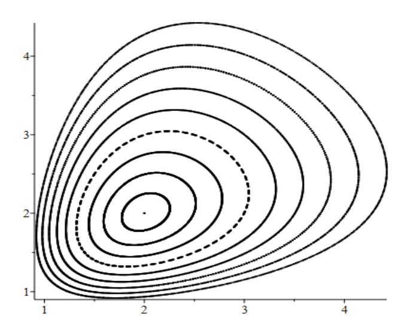
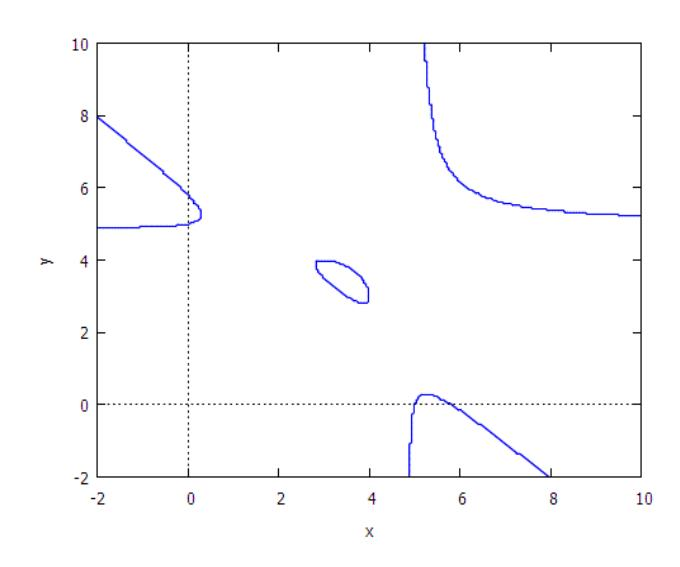

# Efficient ECM factorization in parallel with the Lyness map

Andrew Hone \*
School of Mathematics, Statistics & Actuarial Science
University of Kent
Canterbury CT2 7FS, UK
A.N.W.Hone@kent.ac.uk

#### **ABSTRACT**

The Lyness map is a birational map in the plane which provides one of the simplest discrete analogues of a Hamiltonian system with one degree of freedom, having a conserved quantity and an invariant symplectic form. As an example of a symmetric Quispel-Roberts-Thompson (QRT) map, each generic orbit of the Lyness map lies on a curve of genus one, and corresponds to a sequence of points on an elliptic curve which is one of the fibres in a pencil of biquadratic curves in the plane.

Here we present a version of the elliptic curve method (ECM) for integer factorization, which is based on iteration of the Lyness map with a particular choice of initial data. More precisely, we give an algorithm for scalar multiplication of a point on an elliptic curve, which is represented by one of the curves in the Lyness pencil. In order to avoid field inversion (I), and require only field multiplication (M), squaring (S) and addition, projective coordinates in  $\mathbb{P}^1 \times \mathbb{P}^1$  are used. Neglecting multiplication by curve constants (assumed small), each addition of the chosen point uses 2M, while each doubling step requires 15M. We further show that the doubling step can be implemented efficiently in parallel with four processors, dropping the effective cost to 4M.

In contrast, the fastest algorithms in the literature, using twisted Edwards curves with small curve constants, use 8M for point addition and 4M+4S for point doubling, both of which can be run in parallel with four processors to yield effective costs of 2M and 1M+1S, respectively. Thus our scalar multiplication algorithm should require, on average, roughly twice as many multiplications per bit as state of the art methods using twisted Edwards curves, but it can be applied to any elliptic curve over  $\mathbb Q$ , whereas twisted Edwards curves (equivalent to Montgomery curves) correspond to only a subset of all elliptic curves. Hence, if implemented in parallel, our method may have potential advantages for integer factorization or elliptic curve cryptography.

Permission to make digital or hard copies of all or part of this work for personal or classroom use is granted without fee provided that copies are not made or distributed for profit or commercial advantage and that copies bear this notice and the full citation on the first page. To copy otherwise, to republish, to post on servers or to redistribute to lists, requires prior specific permission and/or a fee.

Copyright 200X ACM X-XXXXX-XX-X/XX/XX ...\$10.00.

#### **Keywords**

Lyness map, elliptic curve method, scalar multiplication

#### 1. INTRODUCTION

In 1942 it was observed by Lyness [23] that iterating the recurrence relation

$$u_{n+2}u_n = a u_{n+1} + a^2 (1)$$

with an arbitrary pair of initial values  $u_0, u_1$  produces the sequence

$$u_0, u_1, \frac{a(u_1+a)}{u_0}, \frac{a^2(u_0+u_1+a)}{u_0u_1}, \frac{a(u_0+a)}{u_1}, u_0, u_1, \dots,$$

which is periodic with period five. The Lyness 5-cycle also arises in a frieze pattern [10], or as a simple example of Zamolodchikov periodicity in integrable quantum field theories [29], which can be explained in terms of the associahedron  $K_4$  and the cluster algebra defined by the  $A_2$  Dynkin quiver [15], leading to a connection with Abel's pentagon identity for the dilogarithm [24]. Moreover, the map corresponding to a=1, that is

$$(x,y) \mapsto \left(y, \frac{y+1}{x}\right),$$
 (2)

appears in the theory of the Cremona group: as proved by Blanc [8], the birational transformations of the plane that preserve the symplectic form

$$\omega = \frac{1}{xy} \, \mathrm{d}x \wedge \mathrm{d}y,\tag{3}$$

are generated by  $SL(2,\mathbb{Z})$ , the torus and transformation (2). More generally, the name Lyness map is given to

$$\varphi: (x,y) \mapsto \left(y, \frac{ay+b}{x}\right),$$
 (4)

which contains two parameters a,b (and there are also higher order analogues [27]). The parameter  $a \neq 0$  can be removed by rescaling  $(x,y) \to (ax,ay)$ , so that this is really a one-parameter family, referred to in [14] as "the simplest singular map of the plane." However, we will usually retain a below for bookkeeping purposes.

Unlike the special case  $b=a^2$ , corresponding to (1), in general the orbits of (4) do not all have the same period, and over an infinite field (e.g.  $\mathbb{Q}, \mathbb{R}$  or  $\mathbb{C}$ ) generic orbits are not periodic. However, the general map still satisfies  $\varphi^*(\omega) = \omega$ , i.e. the symplectic form (3) is preserved, and there is a

\*Work begun on leave in the School of Mathematics & Statistics, UNSW, Sydney, Australia.

Figure 1: A family of rational orbits of (4) in the positive quadrant, iterated for  $a=1,\ b=2$  with initial values (x,y)=(2+0.2k,2+0.2k) for  $k=0,\ldots,9$ .

conserved quantity K = K(x, y) given by

$$K = \frac{xy(x+y) + a(x+y)^2 + (a^2+b)(x+y) + ab}{xy}.$$
 (5)

Since  $\varphi^*(K) = K$ , each orbit lies on a fixed curve K = const. Thus the Lyness map is a simple discrete analogue of a Hamiltonian system with one degree of freedom, and (4) also commutes with the flows of the Hamiltonian vector field  $\dot{x} = \{x, K\}, \dot{y} = \{y, K\}, \text{ where } \{,\} \text{ is the Poisson bracket defined by (3). Moreover, generic level curves of } K \text{ have genus one, so that (real or complex) iterates of the Lyness map can be expressed in terms of elliptic functions [7].$ 

The origin of the conserved quantity (5) may seem mysterious, but becomes less so when one observes that (4) is a particular example of a symmetric QRT map [25, 26], and as such it can be derived by starting from a pencil of biquadratic curves, in this case

$$xy(x+y) + a(x+y)^{2} + (a^{2} + b)(x+y) + ab + \lambda xy = 0, \quad (6)$$

which by symmetry admits the involution  $\iota:(x,y)\mapsto(y,x)$ . On each curve  $\lambda=-K=$  const there are also the horizontal/vertical switches, obtained by swapping a point on the curve with the other intersection with a horizontal/vertical line. Using the Vieta formula for the product of roots of a quadratic, the horizontal switch can be written explicitly as the birational involution  $\iota_h:(x,y)\mapsto(x^{-1}(ay+b),y)$ , and then the Lyness map (4) is just the composition  $\varphi=\iota\circ\iota_h$ . Standard results about elliptic curves then imply that applying the map to a point  $\mathcal{P}_0=(x,y)$  corresponds to a translation  $\mathcal{P}_0\mapsto\mathcal{P}_0+\mathcal{P}$  in the group law of the curve, where the shift  $\mathcal{P}$  is independent of  $\mathcal{P}_0$ .

There is an associated elliptic fibration of the plane over  $\mathbb{P}^1$ , defined by  $(x,y)\mapsto \lambda=-K(x,y)$ , so that each point (x,y) in the plane lies on precisely one of the fibres, apart from the base points where  $xy(x+y)+a(x+y)^2+(a^2+b)(x+y)+ab$  and xy vanish simultaneously. (For more details on the geometry QRT maps see [19, 20, 28], or the book [12], where the Lyness map is analysed in detail in chapter 11.)

Part of one such fibration can be seen in Figure 1, which

Figure 2: The Lyness curve  $xy(x+y) - 5(x+y)^2 + 54(x+y) - 145 = 6xy$  in  $\mathbb{R}^2$ .

for the case  $a=1,\,b=2$  shows points on the fibres corresponding to the values

$$K = \frac{2(k^3 + 40k^2 + 575k + 2875)}{5(10+k)^2} \tag{7}$$

for k = 0, ..., 9.

In the next section we describe the group law on the invariant curves of the Lyness map. Section 3 describes an algorithm, first outlined in [18], for carrying out the elliptic curve method (ECM) of integer factorization using the Lyness map in projective coordinates. In section 4 we explain how this algorithm can be implemented efficiently in parallel, while the final section contains some conclusions.

#### 2. LYNESS CURVES AS ELLIPTIC CURVES

The affine curve defined by fixing K in (5), that is

$$xy(x+y) + a(x+y)^2 + (a^2+b)(x+y) + ab = Kxy.$$
 (8)

is both cubic (total degree three) and biquadratic in x, y, and (subject to a discriminant condition, described below) it extends to a smooth projective cubic in  $\mathbb{P}^2$ , or a smooth curve of bidegree (2,2) in  $\mathbb{P}^1 \times \mathbb{P}^1$ . See Figure 2 for a plot of a smooth Lyness curve in  $\mathbb{R}^2$ . An example of a singular Lyness curve is given by

$$xy(x+y) + (x+y)^2 + 3(x+y) + 2 = \frac{23}{2}xy$$

which is the case k = 0 of (7), and contains the fixed point at (x, y) = (2, 2) in Figure 1.

In order to consider a Lyness curve (8) as an elliptic curve, we must define the group law, in terms of addition of pairs of points, with a distinguished point  $\mathcal O$  as the identity element. One way to do this is to show birational equivalence with a Weierstrass cubic curve, and then use the standard chord and tangent formulae for a Weierstrass curve.

Given a choice of point  $(\nu, \xi)$  on the Weierstrass cubic curve

$$(y')^2 = (x')^3 + Ax' + B, (9)$$

one obtains an arbitrary point (x, y) on the Lyness curve (8) in terms of the coordinates (x', y') of a point on (9) by

$$x = -\frac{\beta(\alpha u + \beta)}{uv} - a, \quad y = -\beta uv - a, \tag{10}$$

where x, y are expressed using the intermediate quantities

$$u = \nu - x', \qquad v = \frac{4\xi y' + Ju - \alpha}{2u^2},$$
 (11)

and the parameters are connected by the relations

$$a = -\alpha^2 - \beta J, b = 2a^2 + a\beta J - \beta^3, K = -2a - \beta J,$$
 (12)

with

$$\alpha = 4\xi^2$$
,  $J = 6\nu^2 + 2A$ ,  $\beta = \frac{J^2}{4} - 12\nu\xi^2$ .

The inverse of the transformation (10) can be written

$$x' = \nu - u, \qquad y' = -\frac{u}{4\xi} \left( \frac{2(y+a)}{\beta} + J \right) + \frac{\alpha}{4\xi}, \quad (13)$$

where u is given in terms of the coordinates x, y for (8) by

$$u = \frac{1}{\alpha} \left( \frac{(x+a)(y+a)}{\beta^2} - \beta \right).$$

If (9) is defined over  $\mathbb{Q}$ , with a rational point  $(\nu, \xi) \in \mathbb{Q}^2$ , then it is clear from (12) that a, b, K are all rational numbers. However, for the inverse transformation, given arbitrary rational a, b, K, in general it is necessary to take a twist of (9) with the coefficients A, B relaced by  $\bar{A} = \alpha^2 \beta^4 A, \bar{B} = \alpha^3 \beta^6 B$ , respectively.

By rewriting  $\bar{A}, \bar{B}$  in terms of a, b, K via the above relations, one can compute the discriminant  $\Delta = -16(4\bar{A}^3 + 27\bar{B}^2)$ , such that  $\Delta \neq 0$  gives the condition for the curve (8) to be nonsingular. The j-invariant of the Lyness curve is given by

$$j = \frac{(K+a)^{-2}(Ka+b)^{-3}(\hat{g}_2)^3}{(Ka^3 - 8a^4 + K^2b - 10Kab + 13a^2b - 16b^2)},$$

where the numerator has the cube of

$$\hat{g}_2 = K^4 - 8K^3a + 16Ka^3 + 16a^4 - 16K^2b - 8Kab - 16a^2b + 16b^2$$

The preceding formulae follow from a sequence of transformations described in [18]: there is a birational equivalence between (9) and the biquadratic curve associated with the Somos-4 QRT map, that is the curve

$$u^2v^2 + \alpha(u+v) + \beta = Juv$$

on which the intermediate quantities (11) lie; then the latter is birationally equivalent to another intermediate curve which is omitted here, namely the biquadratic cubic associated with the Somos-5 QRT map [17] (which is the same as the invariant curve for the screensaver map [14]), and finally the Somos-5 curve is connected to (8) by an affine linear transformation applied to the coordinates (x, y).

With the above equivalence, the group law on the Lyness curve, with identity element given by the point  $\mathcal{O} = (\infty, \infty)$ , can be found by translating the standard Weierstrass addition formulae for (x', y') into the corresponding expressions for the coordinates (x, y). Alternatively, since the curve (8) is cubic, the usual chord and tangent method can be applied directly, yielding the formula for affine addition as

$$(x_1, y_1) + (x_2, y_2) = (x_3, y_3),$$
 (14)

$$x_3 = \frac{(ay_1 - ay_2 - x_1y_2 + x_2y_1)(ax_1y_2 - ax_2y_1 - by_1 + by_2)}{y_1y_2(x_1 - x_2)(x_1 - x_2 + y_1 - y_2)},$$

$$y_3 = \frac{(ax_1 - ax_2 + x_1y_2 - x_2y_1)(ax_2y_1 - ax_1y_2 - bx_1 + bx_2)}{x_1x_2(y_1 - y_2)(x_1 - x_2 + y_1 - y_2)}.$$

The elliptic involution that sends any point  $\mathcal{P}$  to its inverse  $-\mathcal{P}$  is the symmetry  $\iota:(x,y)\mapsto(y,x)$ .

The above addition law is not unified, in the sense that it cannot be applied when the two points to be added are the same; nor does it make sense if one of the points is  $\mathcal{O}$ . However, for adding  $(x_1, y_1)$  to either of the other two points at infinity, which are  $\mathcal{P} = (\infty, -a)$  and  $-\mathcal{P} = (-a, \infty)$ , this addition formula does make sense: taking the limit  $x_2 \to \infty$  with  $y_2 \to -a$ , we see that

$$(x_1, y_1) + (\infty, -a) = \varphi((x_1, y_1)),$$
 (15)

so on each level curve K = const an iteration of the Lyness map (4) corresponds to addition of the point  $\mathcal{P}$ .

In the case  $(x_1, y_1) = (x_2, y_2)$ , either by transforming the doubling formula for the Weierstrass curve (9), or by computing the tangent to (8) the formula for doubling  $(x, y) \mapsto 2(x, y)$  is found to be

$$\psi: (x,y) \mapsto \Big(R(x,y), R(y,x)\Big),$$
 (16)

where

$$R(x,y) = \frac{(xy - ay - b)(x^2y - a^2x - by - ab)}{x(x - y)(y^2 - ax - b)},$$
 (17)

and satisfies  $\psi^*(\omega) = 2\omega$ , so that the symplectic form is doubled by this transformation.

Apart from combinations involving exceptional points, such as  $\mathcal{O}$ , the formulae (14) and (16) define the abelian group law on the curve (8).

#### 3. ECM USING LYNESS

In order to factor a composite integer N, for finding small factors one can use trial division, Pollard's rho method or the p-1 method, while for the large prime factors of a modulus N used in RSA cryptography the number field sieve (NFS) is most effective [11]. However, for finding many medium-sized primes, the ECM is the method of choice, and is commonly used as a first stage in the NFS.

To implement the original version of the ECM, due to Lenstra [22], one should pick a random elliptic curve E, defined over  $\mathbb Q$  by a Weierstass cubic (9), and a random point  $\mathcal P \in E$ , then compute the scalar multiple  $s\mathcal P$  in the group law of the curve, using arithmetic in the ring  $\mathbb Z/N\mathbb Z$ . The method succeeds if, at some stage in the computation of this scalar multiple  $s\mathcal P$ , the denominator D of the coordinate x' has a has a non-trivial common factor with N, that is  $g = \gcd(D, N)$  with 1 < g < N.

Typically s is chosen as a prime power less than some bound  $B_1$ , or the product of all such prime powers. For composite N, the curve is no longer a group, but rather is a group scheme (or pseudocurve [11]) over  $\mathbb{Z}/N\mathbb{Z}$ , meaning that the addition law  $\mathcal{P}_1 + \mathcal{P}_2$  does not give a point in  $(\mathbb{Z}/N\mathbb{Z})^2$  for every pair of points  $\mathcal{P}_1, \mathcal{P}_2$ . The success of the method is an indication that, for some prime factor  $p|N, s\mathcal{P} = \mathcal{O}$  in the group law of the genuine elliptic curve  $E(\mathbb{F}_p)$ , which happens whenever s is a multiple of the order  $\#E(\mathbb{F}_p)$ .

The computation of the scalar multiple  $s\mathcal{P}$  is usually regarded as the first stage of the ECM. If it is unsuccessful,

then a second stage can be implemented, which consists of calculating multiples  $\ell s \mathcal{P}$  for small primes  $\ell$  less than some bound  $B_2 > B_1$ . If the second stage fails, then one can either increase the value of  $B_1$ , or start again with a new curve E and point  $\mathcal{P}$ . Here we are primarily concerned with calculating the scalar multiple  $s \mathcal{P}$  in stage 1.

The x-coordinate on a Weierstrass curve can be replaced with any rational function on the curve with a pole at  $\mathcal{O}$ . In particular, the x-coordinate on the Lyness curve (8) has a pole at  $\mathcal{O}$ . Since, from (15), any sequence of iterates  $(u_n, u_{n+1})$  of the Lyness map (4), satisfying the recurrence

$$u_{n+2}u_n = a u_{n+1} + b, (18)$$

corresponds to a sequence of points  $\mathcal{P}_n = \mathcal{P}_0 + n\mathcal{P}$  lying on a curve (8) with a value of K fixed by  $\mathcal{P}_0 = (u_0, u_1)$  and  $\mathcal{P} = (\infty, -a)$ , we can implement the ECM by choosing an orbit that starts with  $\mathcal{P}_0 = \mathcal{O} = (\infty, \infty)$ .

The point  $(\infty, \infty)$  is not a suitable initial value for the affine map (4), but by using the isomorphism (10) with a Weierstrass curve, which identifies the point  $(\nu, \xi)$  on (9) with  $\mathcal{P}$  on (8), or by using elliptic divisibility sequences as in [18], we can compute the first few multiples of  $\mathcal{P}$  as

$$\mathcal{P} = (\infty, -a) = (u_1, u_2), \quad 2\mathcal{P} = (-a, 0) = (u_2, u_3),$$

$$3\mathcal{P} = (0, -b/a) = (u_3, u_4),$$

and

$$4\mathcal{P} = \left(-\frac{b}{a}, -a - \frac{b(Ka+b)}{a(a^2-b)}\right) = (u_4, u_5)$$
 (19)

The points  $\mathcal{O}, \pm \mathcal{P}, \pm 2\mathcal{P}, \pm 3\mathcal{P}$  are precisely the base points in the pencil (6), where the Lyness map is undefined, but the point  $4\mathcal{P}$  (which depends on the value of K) is a suitable starting point for the iteration.

In terms of the choice of elliptic curve data, there are two ways to implement the ECM using the Lyness map: one can pick a Weierstrass curve (9) defined over  $\mathbb{Q}$  (most conveniently, with  $A, B \in \mathbb{Z}$ ) together with a choice of rational point  $(x', y') = (\nu, \xi)$ , and then use the birational equivalence given by (10) and (11) to find the corresponding point  $\mathcal{P}$  on a Lyness curve with parameters specified by (12); or instead, one can just pick the parameters a, b, K at random and proceed to calculate  $s\mathcal{P}$  starting from the point  $4\mathcal{P}$  given by (19). One should exclude the case  $b=a^2$ , in order to avoid the 5-cycle (1), when  $\mathcal{P}$  is a 5-torsion point.

In fact, as already mentioned, it suffices to set  $a \to 1$  before carrying out the iteration, since orbits with other values of a are equivalent to the case a=1 by rescaling. In the first case, where one starts with a point on a Weierstrass cubic, one can calculate a, b, K from (12) and then replace these values by  $1, b/a^2, K/a$ , respectively; while in the second case it is sufficient to set a=1 and just choose b, K at random, or even more simply one can just pick the values  $b, u_5$  at random and then iterate from the point  $4\mathcal{P} = (-b, u_5)$ .

In order to have an efficient implementation of scalar multiplication, one should use an addition chain to calculate  $s\mathcal{P}$  from  $4\mathcal{P}$  by a sequence of addition steps  $n\mathcal{P} \mapsto (n+1)\mathcal{P}$ , corresponding to (4), and doubling steps  $n\mathcal{P} \mapsto 2n\mathcal{P}$ , corresponding to (16), so that  $s\mathcal{P}$  can be obtained in a time  $O(\log s)$ . One can also subtract  $\mathcal{P}$  using the inverse map

$$\varphi^{-1}: (x,y) \mapsto \left(\frac{ax+b}{y}, x\right).$$
 (20)

Table 1: 2-Processor Lyness addition

| Cost       | Step | Processor 1                  | Processor 2                |
|------------|------|------------------------------|----------------------------|
| 1 <b>C</b> | 1    |                              | $R_2 \leftarrow b \cdot Z$ |
|            | 2    | $R_1 \leftarrow R_1 + R_2$   | idle                       |
|            | 3    | $X^* \leftarrow Y$           | $W^* \leftarrow Z$         |
| 1M         | 4    | $Y^* \leftarrow W \cdot R_1$ | $Z^* \leftarrow X \cdot Z$ |

The affine maps  $\varphi$  and  $\psi$  are not computationally efficient because they both involve costly inversions (I), but inversions can be avoided by working with projective coordinates, as is commonly done with Montgomery curves using the Montgomery ladder [6, 9], or with twisted Edwards curves in EECM-MPFQ [3]. In the ECM this means that the only arithmetic needed is multiplication (M), squaring (S), multiplication by constants (C), and addition in  $\mathbb{Z}/N\mathbb{Z}$ . These operations are listed in order of decreasing cost: S is cheaper than M, multiplication by constants is even cheaper and may be neglected if they are suitably small, while the cost of addition is negligible compared with the rest.

For an addition chain starting from  $4\mathcal{P}$ , we may write

$$s = 2^{k_m} (2^{k_{m-1}} (\cdots (2^{k_1} (4 + \delta_0) + \delta_1) \cdots) + \delta_{m-1}) + \delta_m, (21)$$

corresponding to  $\delta_0$  steps of adding  $\mathcal{P}$ , followd by  $k_1$  doubling steps, then  $|\delta_1|$  steps of adding or subtracting  $\mathcal{P}$ , etc. To avoid the base points we require  $\delta_0 \geq 0$ , and typically one might restrict to  $\delta_j = \pm 1$  for  $1 \leq j \leq m-1$ , with  $\delta_m = 0$  or  $\pm 1$ , if subtraction of  $\mathcal{P}$  is used, or only allow addition of  $\mathcal{P}$  and take  $0 \leq \delta_0 \leq 3$ ,  $\delta_j = 1$  for  $1 \leq j \leq m-1$  and  $\delta_m = 0$  or 1 only. So for instance we could use  $28 = 2^2 \times (2 \times 4 - 1)$  in the former case  $(m = 2, \delta_0 = \delta_2 = 0, \delta_1 = -1, k_1 = 1, k_2 = 2)$ , or  $2^2 \times (4 + 1 + 1 + 1)$  in the latter  $(m = 1, \delta_0 = 3, \delta_1 = 0, k_1 = 2)$ . As we shall see, the cost of each projective addition or subtraction step is so low that using both may lead to savings in the total number of operations.

To work with projective coordinates in  $\mathbb{P}^1 \times \mathbb{P}^1$ , we write the sequence of points generated by (18) as

$$n\mathcal{P} = (u_n, u_{n+1}) = \left(\frac{X_n}{W_n}, \frac{X_{n+1}}{W_{n+1}}\right),$$

and then each addition of  $\mathcal{P}$  or doubling can be written as a polynomial map for the quadruple

$$(X, W, Y, Z) = (X_n, W_n, X_{n+1}, W_{n+1}),$$

where an addition step sends

$$(X_n, W_n, X_{n+1}, W_{n+1}) \mapsto (X_{n+1}, W_{n+1}, X_{n+2}, W_{n+2}),$$
  
and doubling sends

$$(X_n, W_n, X_{n+1}, W_{n+1}) \mapsto (X_{2n}, W_{2n}, X_{2n+1}, W_{2n+1}).$$

Taking projective coordinates in  $\mathbb{P}^1 \times \mathbb{P}^1$ , from the affine coordinates  $x = X/W, \ y = Y/Z$  the Lyness map (4) becomes

$$((X:W),(Y:Z)) \mapsto ((X^*:W^*),(Y^*:Z^*)),$$
 (22)

where

$$X^* = Y, W^* = Z, Y^* = (aY + bZ)W, Z^* = XZ$$

with a included for completeness. If we set  $a \to 1$  for convenience then each addition step, adding the point  $\mathcal{P}$  using (22), requires  $2\mathbf{M} + 1\mathbf{C}$ , that is, two multiplications plus a

multiplication by the constant parameter b. One can also try to choose b to be small enough, so that the effective cost reduces to  $2\mathbf{M}$ . If one wishes to include subtraction of  $\mathcal{P}$ , i.e.  $n\mathcal{P} \mapsto (n-1)\mathcal{P}$ , then this is achieved using the projective version of the inverse (20), for which the cost is the same as for  $\varphi$ .

The doubling map  $\psi$  for the Lyness case, given by the affine map (16) with R defined by (17), lifts to the projective version

$$\Big((X:W),(Y:Z)\Big)\mapsto \Big((\hat{X}:\hat{W}),(\hat{Y}:\hat{Z})\Big), \qquad (23)$$

where

$$\hat{X} = A_1 B_1, \quad \hat{Y} = A_2 B_2, \quad \hat{W} = C_1 D_1, \quad \hat{Z} = C_2 D_2,$$

with

$$\begin{array}{lll} A_1 = A_+ + A_-, & A_2 = A_+ - A_-, \\ B_1 = B_+ + B_-, & B_2 = B_+ - B_-, \\ C_1 = 2XT, & C_2 = -2YT, \\ D_1 = ZA_2 + C_2, & D_2 = WA_1 + C_1, \\ A_+ = 2G - aS - 2H', & A_- = aT, \\ B_+ = S(G - a^2H - H') - 2aHH', & S = E + F, \\ B_- = T(G - a^2H + H'), & T = E - F, \\ E = XZ, F = YW, G = XY, & H = WZ, H' = bH. \end{array}$$

Setting  $a \to 1$  once again for convenience, and using the above formulae, we see that doubling can be achieved with  $15\mathbf{M} + 1\mathbf{C}$ , or  $15\mathbf{M}$  if multiplication by b is ignored. (Note that multiplication by 2 is equivalent to addition: 2X = X + X.)

We can illustrate the application of the ECM via the Lyness map with a simple example, taking

$$N = 3595474639$$
,  $s = 28$ ,  $a = 1$ ,  $b = -u_4 = 2$ ,  $u_5 = 17$ .

From (19) this means that

$$K = \left(1 - \frac{a^2}{b}\right)(u_5 + a) - \frac{b}{a} = 7,$$

but we shall not need this. Writing s as  $28 = 2^2(2 \times 4 - 1)$ , we compute  $28\mathcal{P}$  via the chain  $4\mathcal{P} \mapsto 8\mathcal{P} \mapsto 7\mathcal{P} \mapsto 14\mathcal{P} \mapsto 28\mathcal{P}$ . As initial projective coordinates, we start with the quadruple

$$(X_4, W_4, X_5, W_5) = (-2, 1, 17, 1),$$

and then after one projective doubling step using (23), the quadruple  $(X_8,W_8,X_9,W_9)$  is found to be

To obtain 7P we use the projective version of the inverse map (20), which gives

$$X_{n-1} = (aX_n + bW_n)W_{n+1}, W_{n-1} = X_{n+1}W_n$$

for any n, so we get

$$(X_7, W_7) = (2032516399, 3542705344).$$

Then applying doubling to the quadruple  $(X_7, W_7, X_8, W_8)$  we find that  $(X_{14}, W_{14}, X_{15}, W_{15})$  is

$$(160913035, 3261908647, 3049465821, 760206673),$$

and one final doubling step produces the projective coordinates of  $28\mathcal{P}$ , that is  $(X_{28}, W_{28}, X_{29}, W_{29})$  given by

(558084862, 1754538456, 252369828, 1216214157).

Now we compute  $gcd(W_{28}, N) = 6645979$ , and the method has succeeded in finding a prime factor of N. The projective coordinate  $W_{29}$  has the same common factor with N, although here we do not need the coordinates  $X_{29}, W_{29}$  at the final step; but if the method had failed then these would be needed for stage 2 of the ECM (computing multiples  $\ell sP$  for small primes  $\ell$ ).

It is worth comparing Lyness scalar multiplication with the most efficient state of the art method, which uses twisted Edwards curves, given by

$$ax^2 + y^2 = 1 + dx^2y^2, (24)$$

with projective points in  $\mathbb{P}^2$ , or with extended coordinates in  $\mathbb{P}^3$ : with standard projective points, adding a generic pair of points uses  $10\mathbf{M} + 1\mathbf{S} + 2\mathbf{C}$ , while doubling uses only  $3\mathbf{M} + 4\mathbf{S} + 1\mathbf{C}$  [3]; while with extended Edwards it is possible to achieve  $8\mathbf{M} + 1\mathbf{C}$  for addition of two points, or just  $8\mathbf{M}$  in the case a = -1, and  $4\mathbf{M} + 4\mathbf{S} + 1\mathbf{C}$  for doubling [16].

Clearly addition using the Lyness map is extremely efficient, compared with other methods. In contrast, Lyness doubling is approximately twice as costly as doubling with Edwards curves. Moreover, using (22) only allows addition of  $\mathcal{P}$  to any other point, rather than adding an arbitrary pair of points, which would be much more costly using a projective version of (14). Since any addition chain is asymptotically dominated by doubling, with roughly as many doublings as the number of bits of s, this means that, without any further simplification of the projective formulae, scalar multiplication with Lyness curves should use on average rougly twice as many multiplications per bit as with twisted Edwards curves.

However, as we shall see, using ideas from [16], it is possible to make Lyness scalar multiplication much more efficient if parallel processors are used, as described in the next section.

#### 4. DOUBLING IN PARALLEL

In [16] it was shown that if four processors are used in parallel in the case a=-1 of twisted Edwards curves (24), then with extended coordinates in  $\mathbb{P}^3$  each addition step can be achieved with an algorithm that has an effective cost of only  $2\mathbf{M}+1\mathbf{C}$ , reducing to just  $2\mathbf{M}$  if the constant d is small, i.e. an improvement in speed by a full factor of 4 better than the sequential case, while doubling can be achieved with an effective cost of just  $1\mathbf{M}+1\mathbf{C}$ . (Similarly, versions of these algorithms with two processors give an effective speed increase by a factor of 2.) Practical details of implementing the ECM in parallel with different types of hardware are discussed in [4].

Using two parallel processors, based on (22), each projective addition or subtraction step can be carried out in parallel with an effective cost of just  $1\mathbf{M} + 1\mathbf{C}$ . An algorithm with two processors is presented in Table 1 (where the parameter a has been included for reasons of symmetry, but can be set to 1). Spreading the addition step over four processors does not lead to any saving in cost.

For Lyness curves, the large amount of symmetry in the doubling formula (16) means that its projective version (23) can naturally be distributed over four processors in parallel, resulting in the algorithm presented in Table 2. This means that each Lyness doubling step is achieved with an effective cost of  $4\mathbf{M}+1\mathbf{C}$ , or just  $4\mathbf{M}$  if b is small.

Table 2: 4-Processor Lyness doubling

| Cost       | Step | Processor 1                        | Processor 2                        | Processor 3                           | Processor 4                          |
|------------|------|------------------------------------|------------------------------------|---------------------------------------|--------------------------------------|
| 1M         | 1    | $R_1 \leftarrow X \cdot Z$         | $R_2 \leftarrow Y \cdot W$         | $R_3 \leftarrow X \cdot Y$            | $R_4 \leftarrow W \cdot Z$           |
| 1 <b>C</b> | 2    | $R_5 \leftarrow R_1 + R_2$         | $R_6 \leftarrow R_1 - R_2$         | $R_7 \leftarrow b \cdot R_4$          | idle                                 |
| 1M         | 3    | $R_1 \leftarrow X \cdot R_6$       | $R_2 \leftarrow Y \cdot R_6$       | $R_8 \leftarrow R_4 \cdot R_7$        | $R_9 \leftarrow R_3 - R_7$           |
|            | 4    | $R_1 \leftarrow 2R_1$              | $R_2 \leftarrow -2R_2$             | $R_3 \leftarrow R_3 + R_7$            | $R_{10} \leftarrow 2R_9$             |
|            | 5    | $R_3 \leftarrow R_3 - R_4$         | $R_7 \leftarrow R_{10} - R_5$      | $R_8 \leftarrow 2R_8$                 | $R_{11} \leftarrow R_9 - R_4$        |
|            | 6    | $R_9 \leftarrow R_7 + R_6$         | $R_{10} \leftarrow R_7 - R_6$      | idle                                  | idle                                 |
| 1M         | 7    | $R_3 \leftarrow R_3 \cdot R_6$     | $R_4 \leftarrow W \cdot R_9$       | $R_7 \leftarrow Z \cdot R_{10}$       | $R_{11} \leftarrow R_{11} \cdot R_5$ |
|            | 8    | $R_5 \leftarrow R_2 + R_7$         | $R_6 \leftarrow R_1 + R_4$         | $R_{11} \leftarrow R_{11} - R_8$      | idle                                 |
|            | 9    | $R_7 \leftarrow R_{11} + R_3$      | $R_8 \leftarrow R_{11} - R_3$      | idle                                  | idle                                 |
| 1M         | 10   | $\hat{X} \leftarrow R_7 \cdot R_9$ | $\hat{W} \leftarrow R_1 \cdot R_5$ | $\hat{Y} \leftarrow R_8 \cdot R_{10}$ | $\hat{Z} \leftarrow R_2 \cdot R_6$   |

In an addition chain (21) for Lyness, starting from  $4\mathcal{P}$  with intermediate  $\delta_j=\pm 1$ , each step of adding or subtracting  $\mathcal{P}$  is followed by a doubling. Thus a combined addition-doubling or subtraction-doubling step can be carried out in parallel with four processors, resulting in an effective cost of  $5\mathbf{M}+2\mathbf{C}$ , but no cost saving is achieved by combining them.

It is also clear that the algorithm in Table 2 can be adapted to the case of two processors in parallel. This leads to an effective cost of  $8\mathbf{M}+1\mathbf{C}$  per Lyness doubling.

Thus we have seen that implementing scalar multiplication in the ECM with Lyness curves can be made efficient if implemented in parallel with two or four processors. In the concluding section that follows we weigh up the pros and cons of using Lyness curves for scalar multiplication.

#### 5. CONCLUSIONS

We have presented an algorithm for scalar multiplication using Lyness curves, which can be applied to any rational point on a Weierstrass curve defined over  $\mathbb{Q}$ , and have shown how it can be used to implement ECM factorization efficiently in parallel with four processors.

Each addition step, based on the Lyness map, has a remarkably low cost: only  $2\mathbf{M}+1\mathbf{C}$  if carried out sequentially, or an effective cost of just  $1\mathbf{M}+1\mathbf{C}$  in parallel with two processors. We believe that this sets a new record for elliptic curve addition, since the previous best known version using twisted Edwards curves (24) with the special parameter choice a=-1 requires  $8\mathbf{M}$ , or an effective cost of  $2\mathbf{M}$  with four parallel processors.

At  $15\mathbf{M} + 1\mathbf{C}$ , the cost of sequential Lyness doubling is much higher, and essentially twice the cost of sequential doubling with twisted Edwards curves [3]. Since asymptotically scalar multiplication consists entirely of doubling steps, it appears that on average using the Lyness map should require about twice as many multiplications per bit compared with the twisted Edwards version.

However, if it is performed in parallel with four processors, as in Table 2, then the effective cost of Lyness doubling is reduced to  $4\mathbf{M}+1\mathbf{C}$ , and this becomes only  $4\mathbf{M}$  in the case that the parameter b is small. This is still higher than the speed record for doubling with four processors  $(1\mathbf{M}+1\mathbf{C})$ , which is achieved in [16] with the a=-1 case of twisted Edwards curves. Nevertheless, performing Lyness addition and doubling in parallel is still very efficient, and may have other possible advantages, which we now consider.

For the ECM it is desirable to have a curve with large torsion over  $\mathbb{Q}$ , since for an unknown prime p|N this increases

the probability of smoothness of the group order  $\#E(\mathbb{F}_p)$  in the Hasse interval  $[p+1-2\sqrt{p},p+1+2\sqrt{p}]$ , making success more likely. Twisted Edwards curves, which are birationally equivalent to Montgomery curves, do not cover all possible elliptic curves over  $\mathbb{Q}$ . In particular, it is known from [3] that for twisted Edwards curves with the special parameter choice a=-1 (which gives the fastest addition step) the torsion subgroups  $\mathbb{Z}/10\mathbb{Z}$ ,  $\mathbb{Z}/12\mathbb{Z}$ ,  $\mathbb{Z}/2\mathbb{Z} \times \mathbb{Z}/8\mathbb{Z}$  are not possible, nor is  $\mathbb{Z}/2\mathbb{Z} \times \mathbb{Z}/6\mathbb{Z}$  possible for any choice of a.

In the case of Lyness curves (8), there is no such restriction on the choice of torsion subgroups that are allowed over  $\mathbb{Q}$ . It would be interesting to look for families of Lyness curves having large torsion and rank at least one, employing a combination of empirical and theoretical approaches similar to [1, 2].

Another potentially useful feature of scalar multiplication with Lyness curves is that, since there is no loss of generality in setting  $a \to 1$ , to be carried out it requires the choice of only two parameters b, K (or, perhaps better,  $b, u_5$ ), and these at the same time fix an elliptic curve E and a point  $P \in E$ . Moreover, both parameters can be chosen small. This parsimony is aesthetically pleasing because the moduli space of elliptic curves with a marked point is two-dimensional.

On the other hand, if one wishes to start from a given Weierstrass curve (9) with a point on it, then in general the formula in (12) produces a Lyness curve with a value of  $a \neq 1$ , so if the other parameters are subsequently rescaled to fix  $a \to 1$  then typically the requirement of smallness will need to be sacrificed for the new parameter b so obtained.

We have concentrated on scalar multiplication in stage 1 of the ECM, but for stage 2 one usually computes  $\ell_1 s \mathcal{P}, \ell_2 \ell_1 \mathcal{P}$ , etc. for a sequence of primes  $\ell_1, \ell_2, \ldots$  all smaller than some bound  $B_2$ . This can be carried out effectively using a baby-step-giant-step method [3], requiring addition of essentially arbitrary multiples of  $\mathcal{P}$ . For the latter approach, using addition with the Lyness map has the disadvantage that one can only add  $\mathcal{P}$  at each step, so to add some other multiple of  $\mathcal{P}$  one would need to redefine the parameters a, b, K (and then rescale  $a \to 1$  if desired), leading to extra intermediate computations.

Scalar multiplication is an essential feature of elliptic curve cryptography: in particular, it is required for Alice and Bob to perform the elliptic curve version of Diffie-Hellman key exchange [21]. In that context, one requires a curve  $E(\mathbb{F}_q)$  with non-smooth order, to make the discrete logarithm problem as hard as possible. It would be interesting to see if Lyness curves can offer advantages in a cryptographic setting.

### 6. ACKNOWLEDGMENTS

Funded by EPSRC fellowship EP/M004333/1. Thanks to the School of Mathematics and Statistics, UNSW for funding from the Distinguished Researcher Visitor Scheme, to John Roberts and Wolfgang Schief for providing additional financial support, and to Reinout Quispel and Igor Shparlinski for helpful comments.

## 7. REFERENCES

- [1] R. Barbulescu, J. W. Bos, C. Bouvier, T. Kleinjung and P. L. Montgomery, Finding ECM-friendly curves through a study of Galois properties, in ANTS X, The Open Book Series 1 (2013) 63–86.
- [2] D. J. Bernstein, P. Birkner and T. Lange, Starfish on strike, in LATINCRYPT 2010, Springer LNCS 6212 (2010) 61–80.
- [3] D. J. Bernstein, P. Birkner, T. Lange and C. Peters, ECM using Edwards curves, Math. Comput. 82 (2013) 1139–1179.
- [4] D. J. Bernstein, T.-R. Chen, C.-M. Cheng, T. Lange and B.-Y. Yang, ECM on Graphics Cards, in EUROCRYPT 2009, Springer LNCS 5479 (2009) 483–501.
- [5] D. J. Bernstein and T. Lange, Faster addition and doubling on elliptic curves, in ASIACRYPT 2007, Springer LNCS 4833 (2007) 29–50.
- [6] D. J. Bernstein and T. Lange, Montgomery Curves and the Montgomery Ladder, in Topics in Computational Number Theory Inspired by Peter L. Montgomery (J. W. Bos and A. K. Lenstra, eds.), Cambridge, 2017, pp. 82–115.
- [7] F. Beukers and R. Cushman, Zeeman's monotonicity conjecture, J. Differ. Equ. 143 (1998) 191–200.
- [8] J. Blanc, Symplectic birational transformations of the plane, Osaka J. Math. 50 (2013) 573–590.
- [9] C. Costello and B. Smith, Montgomery curves and their arithmetic, J. Cryptogr. Eng. 8 (2018) 227–240.
- [10] H. Coxeter, Frieze patterns, Acta Arithmetica 18 (1971) 297–310.
- [11] R. Crandall and C. Pomerance, Prime Numbers A Computational Perspective, 2nd edition, Springer, 2005.
- [12] J. J. Duistermaat, Discrete Integrable Systems: QRT Maps and Elliptic Surfaces, Springer, 2010.
- [13] H. M. Edwards, A normal form for elliptic curves, Bull. Amer. Math. Soc. 44 (2007) 393–422.
- [14] J. Esch and T. D. Rogers, The screensaver map: dynamics on elliptic curves arising from polygonal folding, Discrete Comput. Geom. 25 (2001) 477–502.
- [15] S. Fomin and A. Zelevinsky, Y-systems and generalized associahedra, Ann. of Math. 158 (2003) 977–1018.
- [16] H. Hisil, K. K.-H. Wong, G. Carter and E. Dawson, Twisted Edwards curves revisited, in ASIACRYPT 2008, Springer LNCS 5350 (2008) 326–343.
- [17] A. N. W. Hone, Sigma function solution of the initial value problem for Somos 5 sequences, Trans. Amer. Math. Soc. 359 (2007) 5019–5034.
- [18] A. N. W. Hone, ECM factorization with QRT maps, arXiv:2001.09076
- [19] A. Iatrou and J. A. G. Roberts, Integrable mappings

- of the plane preserving biquadratic invariant curves, J. Phys. A: Math. Gen. 34 (2001) 6617–36.
- [20] A. Iatrou and J. A. G. Roberts, Integrable mappings of the plane preserving biquadratic invariant curves II, Nonlinearity 15 (2002) 459–489.
- [21] N. Koblitz, Algebraic Aspects of Cryptography, Springer, 1998.
- [22] H. W. Lenstra, Jr., Factoring integers with elliptic curves, Ann. Math. 126 (1987) 649–673.
- [23] R. C. Lyness, Cycles, Math. Gaz. 26 (1942) 62.
- [24] T. Nakanishi, Periodicities in cluster algebras and dilogarithm identities, in Representations of Algebras and Related Topics EMS Series of Congress Reports, European Mathematical Society (2011) 407–444.
- [25] G. R. W. Quispel, J. A. G. Roberts and C. J. Thompson, Integrable mappings and soliton equations, Phys. Lett. A 126 (1988) 419–421.
- [26] G. R. W. Quispel, J. A. G. Roberts and C. J. Thompson, Integrable mappings and soliton equations II, Physica D 34 (1989) 183–192.
- [27] D. T. Tran, P. H. van der Kamp and G. R. W. Quispel, Sufficient number of integrals for the pth-order Lyness equation, J. Phys. A: Math. Theor. 43 (2010) 302001.
- [28] T. Tsuda, Integrable mappings via rational elliptic surfaces, J. Phys. A: Math. Gen. 37 (2004) 2721–2730.
- [29] Al. B. Zamolodchikov, On the thermodynamic Bethe ansatz equations for reflectionless ADE scattering theories, Phys. Lett. B 253 (1991) 391–394.