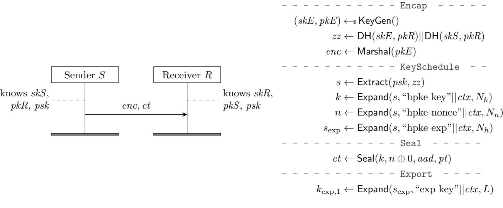
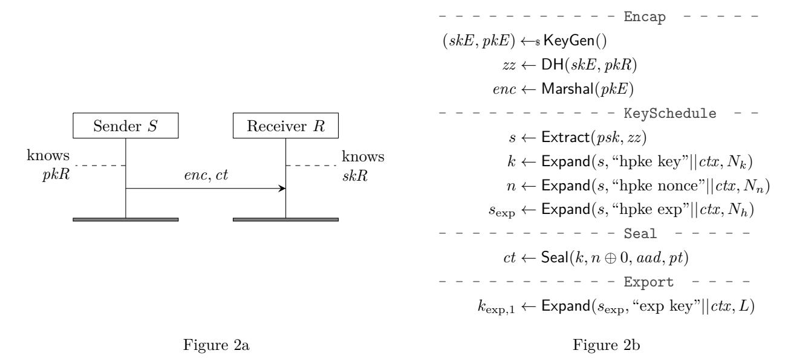
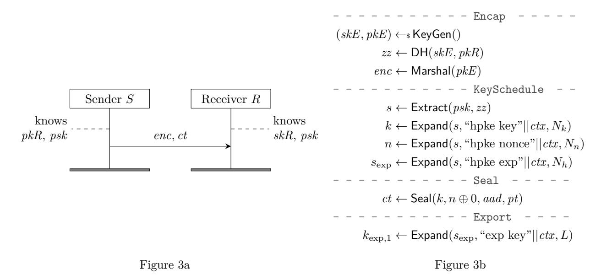
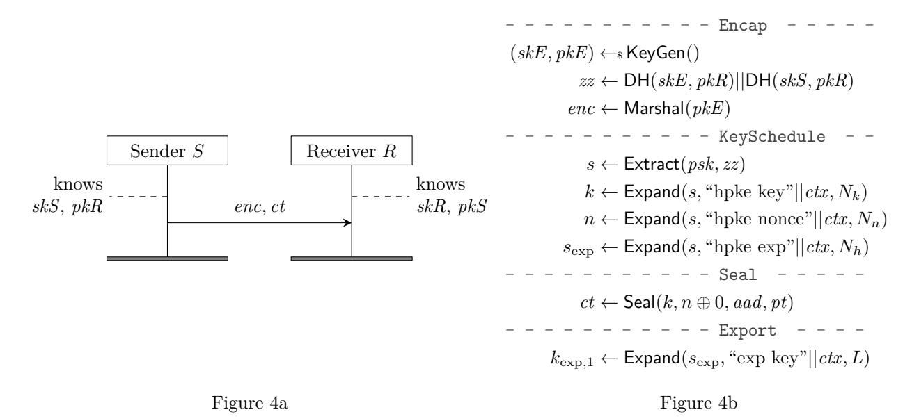

# **An Analysis of Hybrid Public Key Encryption**

Benjamin Lipp<sup>∗</sup>

# INRIA Paris

February 23, 2020

**Abstract.** Hybrid Public Key Encryption (HPKE) is a cryptographic primitive being standardized by the Crypto Forum Research Group (CFRG) within the Internet Research Task Force (IRTF). HPKE schemes combine asymmetric and symmetric cryptographic primitives for efficient authenticated encryption of arbitrary-sized plaintexts under a given recipient public key. This document presents a mechanized cryptographic analysis done with CryptoVerif, of all four HPKE modes, instantiated with a prime-order-group Diffie-Hellman Key Encapsulation Mechanism (KEM).

# **Contents**

| 1. | Introduction                   | 2  |
|----|--------------------------------|----|
| 2. | Background and Motivation      | 2  |
| 3. | Hybrid Public Key Encryption   | 5  |
| 4. | Cryptographic Assumptions      | 10 |
| 5. | Modeling HPKE                  | 12 |
| 6. | Verification Results           | 16 |
| 7. | Discussion                     | 16 |
|    | A. Figures for remaining modes | 21 |

## <span id="page-1-0"></span>**1. Introduction**

Classical public key encryption often operates on algebraic structures. For example, textbook RSA encryption proceeds by computing *m<sup>e</sup>* mod *n*, for message *m* ∈ Z*n*, and *n* = *p* · *q*, where *p* and *q* are large primes. Limiting messages to such structure makes such encryption schemes difficult to apply directly in practice. Thus, it is common to combine an asymmetric public key encryption scheme with symmetric cryptography, in a *hybrid* way, to allow for more efficient encryption with arbitrary-sized plaintext. For example, one might generate a random symmetric key of size 128 bits, encrypt arbitrarily-sized plaintext under said key, and then encrypt the *key* with traditional public key encryption. The recipient of this message ciphertext and encrypted key can then decrypt the key and, with the result, decrypt the ciphertext. Such schemes are called hybrid public-key encryption (HPKE), and have numerous applications in modern technologies and protocols, including: PGP message encryption, Messaging Layer Security [\[7\]](#page-17-0), TLS Encrypted SNI [\[27\]](#page-18-0), and even protection of 5G subscriber identities [\[4\]](#page-17-1).

Hybrid public key encryption is neither a new nor well-defined construction. Currently, there are numerous competing and non-interoperable standards and variants for hybrid encryption, mostly based on the Elliptic Curve Integrated Encryption System (ECIES) [\[29\]](#page-18-1), including ANSI X9.63 (ECIES) [\[6\]](#page-17-2), IEEE 1363a [\[19\]](#page-18-2), ISO/IEC 18033-2 [\[30\]](#page-19-0), and SECG SEC 1 [\[15\]](#page-18-3). See [\[16\]](#page-18-4) for a thorough comparison. All of these existing schemes have problems, e. g., because they rely on outdated primitives and cannot easily migrate to newer algorithms, lack proofs of IND-CCA2 security, or fail to provide test vectors.

HPKE [\[8\]](#page-17-3) is a recent variant of hybrid public key encryption currently being standardized by the Crypto Forum Research Group (CFRG) within the Internet Research Task Force (IRTF). It aims to provide a single, extensible, and future-proof public key encryption scheme that does not have the pitfalls previously mentioned. This document presents a mechanized cryptographic analysis of this new primitive. For this work, we rely on the CryptoVerif protocol verifier [\[13\]](#page-17-4), [\[12\]](#page-17-5). CryptoVerif relies on a computational model of cryptography, and generates machine-checkable proofs by sequences of games, like those manually written by cryptographers. It supports secrecy properties and correspondence properties like authentication.

# <span id="page-1-1"></span>**2. Background and Motivation**

RSA, ElGamal, and ECIES are classic examples of public key encryption. Variants of each are standardized in some way. RSA with Optional Asymmetric Encryption Padding (RSA-OAEP) is part of the PKCS#1 standard [\[17\]](#page-18-5), the DHAES variant of ElGamal encryption is part of the IEEE 1363a standard [\[19\]](#page-18-2), and ECIES is part of the ANSI X9.63 (ECIES) [\[6\]](#page-17-2),

IEEE 1363a [\[19\]](#page-18-2), ISO/IEC 18033-2 [\[30\]](#page-19-0), and SECG SEC 1 [\[15\]](#page-18-3) standards. ECIES is arguably the more popular variant, for two primary reasons:

- Size. Elliptic curve elements are substantially smaller than, say, RSAbased equivalent group elements.
- Simplicity. ECIES requires one scalar multiplication to derive shared secrets. In contrast, classical ElGamal requires at least two scalar multiplications.

The proliferation of ECIES variants highlights its usefulness as a public key encryption scheme. Most cryptographic libraries provide some variant of ECIES. For example, NaCl [\[11\]](#page-17-6) and related software libraries such as libsodium [\[2\]](#page-17-7) provide "box" and "seal" APIs for authenticated public key encryption. The "box" API takes as input a message, nonce, public encryption key, and private signing key to produce a ciphertext. Internally, this API performs a non-interactive Diffie-Hellman (DH) key exchange using Curve25519 and uses the result to encrypt and authenticate the message with XSalsa20-Poly1305. The "seal" API is similar in that the sender's key share is generated ephemerally. The Apple Security library provides support for the X9.63 standard variant of ECIES [\[3\]](#page-17-8). Java's Bouncy Castle library [\[1\]](#page-17-9) provides support for the 18033-2 standard variant. The Noise protocol framework [\[5\]](#page-17-10), which supports "one-way" handshakes for encrypting messages to static public keys, provides a similar flavor of ECIES, yet one that is not standardized.

These ECIES variants differ in many respects, including, though not limited to: algorithm composition and dependencies, shared secret and key derivation, and application domain separation. Such wide-spread adoption by applications, protocols, and software implementations without a consistent underlying standard makes it difficult to use ECIES in forward-looking IETF standards. Table [1](#page-3-0) lists the underlying cryptographic dependencies for different variants of ECIES standards, drawn from [\[16\]](#page-18-4), where KA, KDF, Hash, Enc, and MAC are the key agreement, key derivation, hash, encryption, and message authentication code functions for each variant, respectively. Not only are some dependent algorithms considered deprecated or legacy, some of them, such as SHA-1 [\[20\]](#page-18-6), are broken. Moreover, these standards do not permit extensibility as is required by modern IETF protocols. Examples of emerging protocols that require such encryption are described below:

- 1. Messaging Layer Security [\[7\]](#page-17-0): Prospective group members publish short-lived "Initialization Keys," which are public keys, used by other members of the group to encrypt group state to the client.
- 2. TLS Encrypted SNI [\[27\]](#page-18-0): Public key encryption protects the TLS SNI in transit between clients and servers. The key is obtained out of band, typically through DNS.

HPKE was thus born from the need for a common, extensible, and safe public key encryption standard. In doing so, HPKE also has several goals,

<span id="page-3-0"></span>Table 1: Cryptographic algorithm dependencies of various ECIES standard variants [16].

|         | <i>v</i> 1 0 | 1 0                       | *                     |                               |                               |
|---------|--------------|---------------------------|-----------------------|-------------------------------|-------------------------------|
| Variant | KA           | KDF                       | Hash                  | Enc                           | MAC                           |
| X9.63   | DH           | X9.63 KDF                 | SHA-1                 | XOR                           | DEA,<br>ASNI X9.71            |
| 1363a   | DH, DHC      | X9.63 KDF                 | SHA-1/2,<br>RIPEMD    | TDES, AES                     | MAC1                          |
| 18033-2 | DH, DHC      | KDF1, KDF2                | SHA-1/2, WP<br>RIPEMD | AES, CAST-128<br>TDES, MISTY1 | H-SHA-1, H-SHA-2,<br>H-RIPEMD |
| SEC 1   | DH, DHC      | X9.63 KDF,<br>NIST-800-56 | SHA-1/2               | XOR, AES                      | H-SHA-1, H-SHA-2,<br>AES-CMAC |

which we enumerate below.

- Modern cryptographic construction. HPKE should support context and domain separation within the construction and at the API surface. Internally, all static algorithm information, such as ciphersuite identifiers, and "runtime" information, such as the recipient public key, should be folded into the construction to prevent cross-protocol attacks. Externally, applications should be able to further differentiate invocations of HPKE with an explicit context separation string, similar to that provided by EdDSA [18].
- Algorithm agility. HPKE should allow for new cryptographic algorithms as needed. For example, it is critical that internal hash functions are agile given the recent collision [31] and chosen pre-image attacks on SHA-1 [20].
- Varied authentication properties. Traditional ECIES supports "anonymous" public key encryption, wherein the recipient cannot identify the originator of the message. HPKE should support modes wherein the sender authenticates itself using previously established secrets, i. e., symmetric keys or private/public key pairs.
- Efficiency. HPKE should be minimal in its dependencies and cryptographic operations. Moreover, HPKE should be applicable in a variety of environments and for a diverse set of use cases without compromising efficiency. In some environments, for example, public key operations are significantly more expensive than symmetric key operations. If applications in such environments require encrypting multiple messages to a single recipient, HPKE should allow for few (one) public key operations and many symmetric key operations. Note that, as post-quantum algorithms are integrated into HPKE, this sort of amortization will likely become increasingly useful.

• *Ease of use*. HPKE should expose a minimal and intuitive interface for application developers. For example, encrypting a message *m* with associated data *h* under recipient public key *pk* should require no additional information on behalf of the application. Some existing public key encryption APIs require, among other information, a permessage nonce, which increases application burden and chance for misuse.

# <span id="page-4-0"></span>**3. Hybrid Public Key Encryption**

This section describes HPKE in detail, including its internal construction, authentication variants, and the application interface. HPKE is a primitive for encrypting a message *m* from sender *S* to receiver *R* using the recipient's public key *pkR*. Senders and receivers may share additional state, such as a pre-shared symmetric key *psk*. Senders may also possess a private/public key pair (*skS*, *pkS*). Given this information, HPKE supports four modes of operation:

- 1. Base: Unauthenticated public key encryption from *S* to *R*, wherein *S* generates an ephemeral key pair and uses it in conjunction with *pkR* to derive a symmetric key.
- 2. PSK: Same as the Base mode, except that *psk* is mixed into the shared secret as the sender authentication mechanism.
- 3. Auth: Same as the Base mode, except that *S* uses *skS* in conjunction with *pkR* as the sender authentication mechanism.
- 4. AuthPSK: Combination of PSK and Auth modes.

HPKE is built on a number of simple cryptographic primitives, including a Key Encapsulation Mechanism (KEM), a Key Derivation Function (KDF), and an Authenticated Encryption with Associated Data algorithm (AEAD). HPKE is designed to permit any combination of KEM, KDF, and AEAD algorithm, as specified by a ciphersuite. (Some combinations may not be safe, so this flexibility must be restrained in practice.) We define the primitives and their interfaces for each of these primitives below. The complete HPKE construction using these interfaces follows.

#### **3.1. Cryptographic Primitives**

**Key Encapsulation Mechanism (KEM).** A KEM generally is a tuple of algorithms (KeyGen*,* Encap*,* Decap) and corresponding key space K*KEM*.

- KeyGen(): A probabilistic algorithm which produces a private/public key pair (*sk, pk*).
- Encap(*pk*): Given input *pk*, probabilistically output a ciphertext *enc* and key *zz* ∈ K*KEM*.

• Decap(*enc, sk*): Given an encapsulated key *enc* and a private key *sk*, deterministically output a key *zz* ∈ K*KEM* or ⊥ upon failure.

We say a KEM is -correct if for all (*sk, pk*) ← KeyGen() and (*enc, zz*) ← Encap(*pk*) it holds that Pr[Decap(*enc, sk*) 6= *zz*] ≤ .

For authenticated modes, we also require that a KEM provides a AuthEncap(*pkR, skS*) and AuthDecap(*skR, pkS*) interface. These are similar to Encap and Decap except that the outputs (and inputs) encode assurance that the owner of the corresponding private key *skS* produced the encapsulated key.

We also require the KEM to provide utility functions Marshal and Unmarshal. Marshal takes as input a public key *pk* and produces a unique encoding of key of length *Npk* bytes. Unmarshal reverses this process, i. e., Unmarshal(Marshal(*pk*)) = *pk*.

In this analysis, we focus on the instantiation by a Diffie-Hellman KEM with = 0, defined below.[1](#page-5-0)

- KeyGen(): produces a private/public Diffie-Hellman key pair (*sk, pk*).
- Encap(*pkR*): Given input *pkR*, probabilistically output a ciphertext *enc* of size *Nenc* bytes and key *zz* of size *Npk* bytes:

$$(skE, pkE) \leftarrow_s \mathsf{KeyGen}()$$
  
 $zz \leftarrow \mathsf{DH}(skE, pkR)$   
 $enc \leftarrow \mathsf{Marshal}(pkE)$ 

• AuthEncap(*pkR, skS*): Given input *pkR* and *skS*, probabilistically output a ciphertext *enc* of size *Nenc* bytes and key *zz* of size 2*Npk* bytes:

$$(skE, pkE) \leftarrow s \text{ KeyGen}()$$

$$zz \leftarrow \text{DH}(skE, pkR) \mid\mid \text{DH}(skS, pkR)$$

$$enc \leftarrow \text{Marshal}(pkE)$$

**Key Derivation Function (KDF).** A KDF is a tuple of deterministic algorithms (Hash*,* Extract*,* Expand) used for secret derivation and expansion. It is parameterized by a concrete hash function such as SHA-2 and, consequently, an output length *Nh*.

- Hash(*m*): Compute the *Nh*-byte hash of *m* using the underlying KDF hash algorithm.
- Extract(*salt,IKM*): Extract input keying material *IKM* with optional salt string *salt* to a pseudorandom key *PRK* of length *N<sup>h</sup>* bytes.
- Expand(*PRK, info, L*): Expand a pseudorandom key *PRK* using the optional byte string info to a string of *L* pseudorandom bytes.

<span id="page-5-0"></span><sup>1</sup>We leave analysis of non-DH-based KEMs to future work.

<span id="page-6-0"></span>

Figure [1a](#page-6-0) Figure [1b](#page-6-0)

Figure 1: (a) An overview of HPKE's protocol flow in mode AuthPSK; (b) the cryptographic computations used to create these messages on the sender's side; they need to be adapted accordingly for the receiving side. The computations are split up into parts like in the specification. For a detailed description of *ctx* and other variables, please see Section [3.](#page-4-0) Flow diagram and computations for the other three modes can be found in Appendix [A.](#page-20-0)

**Authenticated Encryption with Associated Data (AEAD).** An AEAD algorithm is a tuple of two algorithms (Seal*,* Open) defined over key, nonce, and message space K*aead* = {0*,* 1} <sup>8</sup>×*N<sup>k</sup>* , N = {0*,* 1} <sup>8</sup>×*N<sup>n</sup>* , M = {0*,* 1} ∗ , respectively.

- Seal(*k, n, h, m*): Given key *k* ∈ K*aead*, nonce *n* ∈ N , optional associated data *h*, and plaintext message *m*, produces ciphertext (including tag) *c*.
- Open(*k, n, h, c*): Given key *k* ∈ K*aead*, nonce *n* ∈ N , optional associated data *h*, and ciphertext *c*, produces the corresponding plaintext *m* or error ⊥ if decryption fails.

#### **3.2. Key Schedule**

The key *zz* returned by the KEM is used in the following key schedule:

```
ciphersuite ← kem_id || kdf _id || aead_id
       ctx ← mode || ciphersuite || enc || pkRm || pkSm || pskID_hash || info_hash
          s ← Extract(psk, zz)
         k ← Expand(s, "hpke key"||ctx, Nk)
         n ← Expand(s, "hpke nonce"||ctx, Nn)
       sexp ← Expand(s, "hpke exp"||ctx, Nh)
```

The key schedule function returns an encryption context containing the symmetric key *k*, nonce *n*, and the exporter secret *s*exp. This encryption context can then be used through different interfaces which HPKE exposes.

### **3.3. Application Interface**

HPKE exposes a simple interface to developers. Namely, it allows one to provide: recipient public key, application auxiliary information, and a message to encrypt with additional authenticated data. Python code for mode Base is shown below. (Utility functions such as concat are not shown. See [\[8\]](#page-17-3) for their definition.)

Listing 1: HPKE Base mode APIs.

```
1 def Context.Nonce(seq):
2 encSeq = encode_big_endian(seq, len(self.nonce))
3 return xor(self.nonce, encSeq)
4
5 def Context.IncrementSeq():
6 if self.seq >= (1 << Nn) − 1:
7 return NonceOverflowError
8 self.seq += 1
9
10 def Context.Seal(aad, pt):
11 ct = Seal(self.key, self.Nonce(self.seq), aad, pt)
12 self.IncrementSeq()
13 return ct
14
15 def KeySchedule(mode, pkR, zz, enc, info, psk, pskID, pkSm):
16 VerifyMode(mode, psk, pskID, pkSm)
17
18 pkRm = Marshal(pkR)
19 ciphersuite = concat(kem_id, kdf_id, aead_id)
20 pskID_hash = Hash(pskID)
```

```
21 info_hash = Hash(info)
22 context = concat(mode, ciphersuite, enc, pkRm, pkSm,
23 pskID_hash, info_hash)
24
25 secret = Extract(psk, zz)
26 key = Expand(secret, concat("hpke key", context), Nk)
27 nonce = Expand(secret, concat("hpke nonce", context), Nn)
28 exporter_secret = Expand(secret,
29 concat("hpke exp", context), Nh)
30
31 return Context(key, nonce, exporter_secret)
32
33 def SetupBaseS(pkR, info):
34 zz, enc = Encap(pkR)
35 return enc, KeySchedule(mode_base, pkR, zz, enc, info,
36 default_psk, default_pskID,
37 default_pkRm)
38
39 def SetupBaseR(enc, skR, info):
40 zz = Decap(enc, skR)
41 return KeySchedule(mode_base, pk(skR), zz, enc, info,
42 default_psk, default_pskID,
43 default_pkRm)
```

The "default" parameters for marshalled public keys, PSKs, and PSK IDs are empty strings of length *Npk*, *Nh*, and 0, respectively.

Usage of this API is shown below. As illustrated, applications perform an initial setup phase (SetupBaseS) and then encrypt their message using the output (ctx.Seal). Applications may invoke the encryption function multiple times for more than a single message without repeating the underlying KEM operation or key derivation steps.

Listing 2: HPKE single-shot Base mode encryption example.

```
1 message_aad = ...
2 message = ...
3 enc, ctx = SetupBaseS(pkR, "application info")
4 ct = ctx.Seal(message_aad, message)
5 # emit (ct, enc)
```

HPKE also supports an Export interface, similar to that of TLS 1.3 [\[26\]](#page-18-8). This interface takes as input a context string exporter\_context and desired length *L* in bytes and produces a secret derived from the internal exporter secret using the corresponding KDF Expand function.

Listing 3: HPKE Export interface.

```
1 def Context.Export(exporter_context, L):
2 return Expand(exporter_secret, exporter_context, L)
```

## <span id="page-9-0"></span>**4. Cryptographic Assumptions**

In this section, we present on which cryptographic assumptions we base our analysis. HPKE is specified for a variety of cryptographic primitives; each instantiation must respect the following assumptions for our analysis to be applicable.

**Collision Résistance.** We assume that Hash is a collision-resistant hash function. This influences how *pskID* can be chosen. The draft calls it a "non-private parameter", "that is used to identify which PSK should be used". It might be tempting to choose *pskID* to be the hash of the *psk*. However, as *pskID* serves as identification of the *psk* it might be sent in the clear over the network. A collision-resistant hash function does not protect its inputs (e. g. the identity function is collision resistant, too), and thus the *psk* would leak. If users would like to use the hash of *psk* as *pskID*, Hash must be assumed to be a random oracle. (The PRF assumption is not useful because Hash is also used to hash the application's *info* value which should be assumed to be known by the adversary. Otherwise, the psk could just be a PRF's key because it is assumed to be a fresh random value.)

**Random Oracle.** We assume that Extract is a random oracle. This is justified by Theorem 4.4 in [\[14\]](#page-17-11). The theorem's prerequisites are met for all three variants SHA-256, SHA-384, and SHA-512 for which HPKE is specified: the key to Extract is the *psk* which has a size of *N<sup>h</sup>* bytes, and (block size minus one) is strictly larger than that for all three hash functions.

**Pseudo-Random Function Family.** We assume that HKDF-Expand (Expand) is a PRF. This is justified by [\[14\]](#page-17-11). *N<sup>k</sup>* and *N<sup>n</sup>* are ≤ 32 bytes for the AEAD schemes allowed in the specification. *N<sup>h</sup>* ≥ 32 bytes for allowed hash functions. This means Expand will use one hmac call only, internally. Because Extract is also just one hmac call, we are now using two different assumptions for the same primitive. Therefore, we need to establish that the hmac call inside Extract operates on a different input domain than the ones inside Expand:

The first argument to Extract's hmac call is the *psk* which has length *Nh*. The first argument to all hmac calls inside Expand is the result of Extract; and this has length *N<sup>h</sup>* as well. Thus, the first argument does not directly separate the input domains. The second argument to Extract's hmac call is the result from the DH operation. This has either length *Npk* or 2*Npk*. The second argument to all hmac calls inside Expand has *at least* the length of

the *ctx* variable, which is defined as:

$$ciphersuite = concat(\underbrace{kem\_id}_{1 \text{ byte}}, \underbrace{kdf\_id}_{2 \text{ bytes}}, \underbrace{aead\_id}_{2 \text{ bytes}})$$

$$ctx = concat(\underbrace{mode}_{1 \text{ byte}}, \underbrace{ciphersuite}_{6 \text{ bytes}}, \underbrace{enc}_{N_{enc}}, \underbrace{pkRm}_{N_{pk}}, \underbrace{pkSm}_{N_{pk}}, \underbrace{pskID\_hash}_{N_h}, \underbrace{info\_hash}_{N_h})$$

$$\underbrace{pskID\_hash}_{N_h}, \underbrace{info\_hash}_{N_h})$$

With this, we conclude that for all modes of HPKE, the length of *ctx* is strictly greater than the length of *zz*. In turn, the input domain of Extract's hmac call is different from the input domains to the hmac calls inside Expand.

**IND-CPA and INT-CTXT for AEAD.** We assume that the AEAD scheme used is IND-CPA (indistinguishable under chosen plaintext attacks) and INT-CTXT (ciphertext integrity) [\[9\]](#page-17-12), provided the same nonce is never used twice with the same key. IND-CPA means that the adversary has a negligible probability of distinguishing encryptions of two distinct messages of the same length that it has chosen. INT-CTXT means that an adversary with access to encryption and decryption oracles has a negligible probability of forging a ciphertext that decrypts successfully and has not been returned by the encryption oracle.

For the ChaCha20Poly1305 AEAD scheme [\[23\]](#page-18-9), these properties are justified in [\[25\]](#page-18-10), assuming ChaCha20 is a PRF (pseudo-random function) and Poly1305 is an -almost-∆-universal hash function. The latter property is shown to hold in [\[10\]](#page-17-13). For AES-GCM, these properties are justified in [\[22,](#page-18-11) [28\]](#page-18-12).

**Prime-Order Group and Gap Diffie-Hellman.** We assume that the DH scheme uses a prime-order group that satisfies the gap Diffie-Hellman (GDH) assumption [\[24\]](#page-18-13). This assumption means that given a generator *g*, *g a* , and *g b* for random *a, b*, the adversary has negligible probability to compute *g ab*, even when the adversary has access to a decisional Diffie-Hellman oracle, which, when given *G, X, Y, Z* outputs whether or not there exist *x, y* such that *X* = *G<sup>x</sup>* , *Y* = *G<sup>y</sup>* , and *Z* = *Gxy*. We also assume the the implementation of HPKE validates public keys before usage and validates the shared secret returned by Diffie-Hellman operations.

We leave for future work the refinement of our model to use CryptoVerif's detailed model of Curve25519 and Curve448 that was first established in [\[21\]](#page-18-14).

**On the Choice of Gap Diffie-Hellman and the Random Oracle Model.** We use the gap Diffie-Hellman assumption because the adversary has access to a DDH oracle. This means we will not, in the proof, make a game hop to substitute the result of a scalar multiplication by a fresh random value, as this would be using the DDH assumption.

In mode PSK and mode AuthPSK, we could model Extract as a PRF and use the *psk* as its key. Then, the result of DH is just an input to this PRF. Indeed we would not even use the gap Diffie-Hellman assumption for these proofs, as the participants already have a shared secret. However, we want to handle scenarios in which the *psk* is compromised. To do so, we must rely on gap Diffie-Hellman to proceed. If the *psk* is compromised, and if we modeled Extract as a PRF, we would not be able to apply the PRF assumption. This is because PRF does not give any guarantees if the key is compromised, i. .e not a fresh random value. Because we want to cover compromise of *psk* in our analysis, we use the random oracle model even for the modes using a *psk*. In any scenario in which we can prove security properties, the output of Extract is a fresh random value; this means there is always a key for Expand modeled as PRF.

**Using an HPKE Recipient as DDH Oracle.** As said above, HPKE exposes a DDH oracle to the adversary. In the following we sketch how the adversary can use an HPKE recipient to build a DDH oracle. Let the adversary receive a DDH triple (*g e , g<sup>r</sup> , g<sup>c</sup>* ). It uses *g <sup>e</sup>* as ephemeral (*pkE*), creating *enc* = Marshal(*g e* ) from it. It uses *g <sup>c</sup>* as *zz*. With that, the adversary constructed a possible return value of Encap. The adversary uses *g <sup>r</sup>* as the recipient's static key, creating *pkRm* = Marshal(*g r* ). With this, the adversary can call KeySchedule(*. . .*) to derive an encryption context; all the constants needed for KeySchedule are supposed to be known to the adversary, and we suppose there is no *psk* used or that the adversary shares a psk with the recipient. The adversary uses the encryption context to send a message to the recipient. If it gets a reply, the DDH triple was good, meaning *g <sup>c</sup>* = *g er*, and the adversary returns True as result of the DDH oracle. This only works if *g r* is the actual static key of a party the adversary can send messages to. In case of mode Auth, the procedure works the same just that the adversary needs a static key pair it can use as *pkS* to calculate DH(*pkR, skS*).

# <span id="page-11-0"></span>**5. Modeling HPKE**

#### **5.1. Execution Environment**

In our model, we consider two honest entities *S* and *R*. In the initial setup, we generate the static key pairs for these two entities and publish their public keys, such that the adversary can use them. After this setup, we run parallel processes that represent a number of executions of *S* and *R* polynomial in the security parameter.

The entities *S* and *R* can play both the sender and recipient role. These two entities can send HPKE messages between each other, but also with any number of dishonest entities included in the adversary: for each session, the adversary sends to the sender its *partner public key*, that is, the public

key under which the sender should encrypt the message. The recipient can also receive messages from any other entity besides *S*.

This setting allows us to prove security for any messages between two honest entities, in a system that may contain any number of (honest or dishonest) other entities. We prove security for messages where *S* is the sender and *R* is the recipient. We do not explicitly prove security for sessions in which *R* is the sender and *S* is the recipient, but the same security properties hold by symmetry.

The processes for the entities *S* and *R* model the entire protocol, including the secret export interface. Currently, we let the sender only encrypt *one* message with an HPKE key. Modeling multiple encryptions is left for future work. We allow the adversary to call the random oracle that we use for Extract, and provide an oracle to access the key that defines the hash function used for Hash.

#### **5.2. Variants**

For each of HPKE's four modes, we consider two variants:

oneshot The sender uses the oneshot API to use the key once to encrypt a plaintext.

export The same as oneshot, and the sender additionally exports two independent secrets using the secret export interface.

We leave it for future work to model a variant where the sender uses the key several times to encrypt multiple plaintexts – this model needs to cover the incrementation of the counter to produce unique nonces.

#### **5.3. Compromise Scenarios**

We consider compromises of *skS*, *skR*, and *psk*. We do not consider compromise of *skE*, or bad randomness. Depending on the mode, we analyze different compromise scenarios by either statically compromising keys from the start or by exposing an oracle through which the adversary can learn a key. As presented later in this section, we prove message and key secrecy, and sender authentication. We do not consider scenarios in which none of these properties can be guaranteed by HPKE. However, we do consider scenarios in which only some of the properties are preserved. In the model, we use functions has\_secrecy and has\_auth to return a Boolean value that specifies if we should attempt a proof of the corresponding property. In the following we summarize the scenarios we consider, for each mode, and what security properties we expect for them. They correspond to the scenarios listed in Table [2.](#page-16-0)

Base**.** The only key involved is *skR*, thus there is no sender authentication. Secrecy relies only on *skR*, which means we cannot allow its compromise.

PSK**.** The keys *skR* and *psk* are involved. Secrecy needs at least one of them, so we do not allow compromise of both. We use two scenarios, compromising one of the keys dynamically:

- *skR* **(dyn):** The *psk* guarantees both secrecy and sender authentication.
- *psk* **(dyn):** *skR* guarantees secrecy. Sender authentication is guaranteed for messages before the compromise.

Auth**.** The keys *skS* and *skR* are involved. Secrecy relies only on *skR*, which means we cannot allow its compromise. We allow dynamic compromise of *skS*. Sender authentication is guaranteed before the compromise.

AuthPSK**.** This mode has the keys *skS*, *skR*, and *psk*. We expect sender authentication to hold if:

$$psk$$
 secure  $\lor (skS \text{ secure} \land skR \text{ secure})$ 

The necessity of *skR* being secure for sender authentication is due to HPKE being vulnerable to key-compromise impersonation. Sender authentication is based on a Diffie-Hellman shared secret established between *skS* and *skR*. If *skR* is compromised, the adversary can compute the shared secret using *pkS* and *skR* – with no need to know *skS*. We expect secrecy to hold if:

$$psk$$
 secure  $\vee skR$  secure

We cover all possible combinations by a set of three scenarios with dynamic compromises and a set of three scenarios with static compromises. Either of the sets cover all combinations on its own; the proofs in the dynamic scenarios tend to be longer which is why we include the static scenarios with shorter proofs. The dynamic scenarios are as follows:

- *skS* **(dyn),** *skR* **(dyn):** Two individual compromise oracles.
- *skS* **and** *psk* **(dyn):** One compromise oracle for both at the same time. As *skR* is never compromised, secrecy always holds. Sender authentication holds for messages received before the corruption.
- *psk* **(dyn):** One individual compromise oracle. Without the *psk*, the mode is reduced to mode Auth without compromise.

The static scenarios are as follows:

- *skS* **and** *skR* **(static)**
- *skS* **and** *psk* **(static)**
- *psk* **(static)**.

#### **5.4. Public Key Validation**

As mentioned in Section [4,](#page-9-0) we assume that the implementation validates public keys before usage. This is reflected in the model by having the honest participants receive values that already have the correct type; this means participants receive already validated public keys (an element of the prime-order group). Receiving a bitstring, validating it and continue only if it represents a valid public key would be an equivalent modeling.

The point in infinity is not a valid public key. In CryptoVerif's modeling of a prime-order group, is is not part of the group, and nor is zero part of the allowed scalars. Thus, the result of a scalar multiplication cannot be the point in infinity, which matches our assumption that the implementation validates the result and aborts in case the neutral element is obtained.

#### **5.5. Cryptographic Properties**

**Secrecy.** We model message secrecy of an HPKE message's payload by a left-or-right message indistinguishability game, and secrecy of the exported secrets by real-or-random key indistinguishability. For message indistinguishability, the environment chooses a random bit *b* during setup. The adversary provides two same-length plaintexts *pt*<sup>0</sup> and *pt*<sup>1</sup> to sender processes, which chose *pt<sup>b</sup>* as payload for the HPKE ciphertext. The according secrecy query for CryptoVerif is query secret b. For key indistinguishability, we rely on CryptoVerif's built-in support for real-or-random indistinguishability. In the model, senders use the export interface to export two secrets. If the session is clean, the secrets are assigned to variables export\_1\_secr and export\_2\_secr, otherwise they are given to the adversary. The secrecy query in CryptoVerif then is

```
query secret export_1_secr public_vars export_2_secr.
query secret export_2_secr public_vars export_1_secr.
```

This proves that one exported key is secret even if the other one is known to the adversary, by using the public\_vars declaration.

**Authentication.** For the modes Auth and AuthPSK, we prove sender authentication by proving a correspondence property between two events sent and rcvd, which are emitted just before the sender sends a message and just after the recipient receives a message. We prove the following correspondence:

```
event(rcvd(true, mode, pkR, pkS, pskID, info, aad, pt, kexp,1, kexp,2)
⇒event(sent( mode, pkR, pkS, pskID, info, aad, pt, kexp,1, kexp,2)
```

We only prove a non-injective correspondence, which means that we do not prove that each rcvd event has a *unique* corresponding sent event. Instead, a single sent event can satisfy the condition for arbitrary many matching rcvd events. This is because HPKE does not provide protection against replay.

The last two parameters are only used in the export variants of the model and absent in the oneshot variants. The first parameter is *true* only in scenarios where sender authentication is possible; in others we do not attempt the proof.

# <span id="page-15-0"></span>**6. Verification Results**

Table [2](#page-16-0) summarizes the results of our analysis. We conducted the analysis with the hash function both modeled as random oracle and as collision resistant hash function. We provide proofs for all scenarios, modes, and variants and were able to confirm the expected secrecy and sender authentication properties of HPKE. One exception are the proofs for the export variant in mode AuthPSK for a collision-resistant hash functions, which we were not able to complete by the time of this writing.

# <span id="page-15-1"></span>**7. Discussion**

We presented an analysis of HPKE with respect to the most important security properties message secrecy, key secrecy, and authentication. We analyze all four modes of HPKE including the interface for secret export. The proofs we provide are currently only valid for a simplified model of Diffie-Hellman that only covers prime-order groups. However, we prepared the model for extension to more fine-grained models of Diffie-Hellman. CryptoVerif ships with detailed models of Curve25519 and Curve448 which we plan to use in a further analysis. Other limitations left for future work are: creation of an HPKE ciphertext in an authenticated mode for the sender's *own* public key, e. g. to cover the use-case of local file encryption; encryption of multiple plaintexts using the incremented nonces.

The model files of this analysis can be accessed at [https://github.com/](https://github.com/blipp/hpke-analysis-material) [blipp/hpke-analysis-material](https://github.com/blipp/hpke-analysis-material).

# **Acknowledgements**

The author thanks Karthik Bhargavan, Christopher A. Wood, and Benjamin Beurdouche for helpful discussions on HPKE. The author thanks Bruno Blanchet for his advice with regards to CryptoVerif. The author thanks Christopher A. Wood for his extensive contributions to Sections 1, 2, and 3, and editorial feedback on the entire paper. The author thanks Natalia Kulatova and Benjamin Beurdouche for helpful discussions on elliptic curve point validation. This research was partly funded by the European Union's ERC CIRCUS (grant agreement nº 683032), and ANR TECAP (decision number ANR-17-CE39-0004-03).

<span id="page-16-0"></span>Table 2: Cryptographic properties of HPKE modes in different corruption scenarios.

| mode         | corruption<br>scenario | variant           | message<br>secrecy | export key<br>secrecy | sender<br>auth. | time<br>(ROM)      | time<br>(coll.)   |
|--------------|------------------------|-------------------|--------------------|-----------------------|-----------------|--------------------|-------------------|
| base<br>none |                        | oneshot<br>export | X<br>X             | n. a.<br>X            | n. a.<br>n. a.  | 3.1 s<br>4.5 s     | 2.5 s<br>3.5 s    |
| psk          | skR (dyn)              | oneshot<br>export | X<br>X             | n. a.<br>X            | X<br>X          | 9.9 s<br>567.5 s   | 7.3 s<br>541.6 s  |
|              | psk (dyn)              | oneshot<br>export | X<br>X             | n. a.<br>X            | XU<br>XU        | 28.4 s<br>60.9 s   | 20.3 s<br>47.6 s  |
| auth         | skS (dyn)              | oneshot<br>export | X<br>X             | n. a.<br>X            | XU<br>XU        | 15.3 s<br>171.6 s  | 12.6 s<br>153.9 s |
| auth_psk     | skS, skR (dyn)         | oneshot<br>export | X<br>X             | n. a.<br>X            | X<br>X          | 33.0 s<br>4.6 s1   | 28.0 s<br>2<br>   |
|              | skS + psk (dyn)        | oneshot<br>export | X<br>X             | n. a.<br>X            | XU<br>XU        | 44.1 s<br>41.7 s   | 37.6 s<br>2<br>   |
|              | psk (dyn)              | oneshot<br>export | X<br>X             | n. a.<br>X            | X<br>X          | 36.1 s<br>1182.5 s | 31.8 s<br>2<br>   |
|              | skS, skR (static)      | oneshot<br>export | X<br>X             | n. a.<br>X            | X<br>X          | 33.6 s<br>5.2 s1   | 26.9 s<br>2<br>   |
|              | skS, psk (static)      | oneshot<br>export | X<br>X             | n. a.<br>X            | n. a.<br>n. a.  | 13.8 s<br>18.9 s   | 9.1 s<br>2<br>    |
|              | psk (static)           | oneshot<br>export | X<br>X             | n. a.<br>X            | X<br>X          | 34.2 s<br>1233.7 s | 29.1 s<br>2<br>   |

Compromises: for dynamic (dyn) compromises separated by comma, the adversary can call the oracles separately; when separated by +, the adversary has access to one oracle that compromises both keys. For static compromises, the keys are compromised directly at the beginning of execution.

For mode auth\_psk, the three scenarios with dynamic compromises cover the same cases than the three scenarios with static compromises.

X= proven, n. a.= not applicable either because not provided by the mode, or because trivially broken in the scenario.

*U* = If the message is received before the adversary uses the corruption oracle available in this scenario.

1 = It is remarkable that the proof for the export sub mode concludes faster than for the oneshot mode.

2 = By the time of writing, we were not able to conclude these proofs.

# <span id="page-17-9"></span>**References**

- [1] Bouncy Castle Cryptography Library. [https://people.eecs.](https://people.eecs.berkeley.edu/~jonah/bc/org/bouncycastle/jce/provider/JCEIESCipher.ECIES.html) [berkeley.edu/~jonah/bc/org/bouncycastle/jce/provider/](https://people.eecs.berkeley.edu/~jonah/bc/org/bouncycastle/jce/provider/JCEIESCipher.ECIES.html) [JCEIESCipher.ECIES.html](https://people.eecs.berkeley.edu/~jonah/bc/org/bouncycastle/jce/provider/JCEIESCipher.ECIES.html). Accessed: 2020-02-19.
- <span id="page-17-7"></span>[2] libsodium. <https://libsodium.gitbook.io/doc/>. Accessed: 2020- 02-19.
- <span id="page-17-8"></span>[3] SecKeyAlgorithm documentation. [https://developer.apple.com/](https://developer.apple.com/documentation/security/seckeyalgorithm?language=objc) [documentation/security/seckeyalgorithm?language=objc](https://developer.apple.com/documentation/security/seckeyalgorithm?language=objc). Accessed: 2020-02-19.
- <span id="page-17-1"></span>[4] Security architecture and procedures for 5G System.
- <span id="page-17-10"></span>[5] The Noise Protocol Framework. [https://noiseprotocol.org/noise.](https://noiseprotocol.org/noise.html#one-way-handshake-patterns) [html#one-way-handshake-patterns](https://noiseprotocol.org/noise.html#one-way-handshake-patterns). Accessed: 2020-02-19.
- <span id="page-17-2"></span>[6] A. B. Association et al. Ansi x9. 63 elliptic curve key agreement and key transport protocols.[on-line], 1999.
- <span id="page-17-0"></span>[7] R. Barnes, B. Beurdouche, J. Millican, E. Omara, K. Cohn-Gordon, and R. Robert. The Messaging Layer Security (MLS) Protocol. Internet-Draft draft-ietf-mls-protocol-08, Internet Engineering Task Force, Nov. 2019. Work in Progress.
- <span id="page-17-3"></span>[8] R. Barnes and K. Bhargavan. Hybrid Public Key Encryption. Internet-Draft draft-irtf-cfrg-hpke-03, Internet Engineering Task Force, Nov. 2019. Work in Progress.
- <span id="page-17-12"></span>[9] M. Bellare and C. Namprempre. Authenticated encryption: Relations among notions and analysis of the generic composition paradigm. In T. Okamoto, editor, *Advances in Cryptology – ASIACRYPT'00*, volume 1976 of *LNCS*, pages 531–545, Berlin, Heidelberg, Dec. 2000. Springer.
- <span id="page-17-13"></span>[10] D. J. Bernstein. The Poly1305-AES message-authentication code. In *FSE 2005*, volume 3557 of *LNCS*, pages 32–49. Springer, 2005.
- <span id="page-17-6"></span>[11] D. J. Bernstein, T. Lange, and P. Schwabe. Nacl: Networking and cryptography library. *URL: http://nacl. cr. yp. to (visited on 06/26/2014)*, 2011.
- <span id="page-17-5"></span>[12] B. Blanchet. Computationally sound mechanized proofs of correspondence assertions. In *IEEE CSF'07*, pages 97–111, July 2007. Extended version available at <http://eprint.iacr.org/2007/128>.
- <span id="page-17-4"></span>[13] B. Blanchet. A computationally sound mechanized prover for security protocols. *IEEE Transactions on Dependable and Secure Computing*, 5(4):193–207, Oct.–Dec. 2008.
- <span id="page-17-11"></span>[14] Y. Dodis, T. Ristenpart, J. Steinberger, and S. Tessaro. To hash or not to hash again? (In)differentiability results for *H*<sup>2</sup> and HMAC. In *CRYPTO 2012*, volume 7417 of *LNCS*, pages 348–366. Springer, 2012. Full version at <https://eprint.iacr.org/2013/382>.

- <span id="page-18-3"></span>[15] S. for Efficient Cryptography Group. Elliptic Curve Cryptography. 2000.
- <span id="page-18-4"></span>[16] V. Gayoso Martínez, L. Hernández Encinas, and C. Sánchez Ávila. A survey of the elliptic curve integrated encryption scheme. 2010.
- <span id="page-18-5"></span>[17] J. Jonsson and B. Kaliski. Public-key cryptography standards (pkcs)# 1: Rsa cryptography specifications version 2.1. Technical report, RFC 3447, February, 2003.
- <span id="page-18-7"></span>[18] S. Josefsson and I. Liusvaara. Edwards-Curve Digital Signature Algorithm (EdDSA). RFC 8032, Jan. 2017.
- <span id="page-18-2"></span>[19] B. S. Kaliski. Ieee p1363: A standard for rsa, diffie-hellman, and ellipticcurve cryptography (abstract). In *Proceedings of the International Workshop on Security Protocols*, page 117–118, Berlin, Heidelberg, 1996. Springer-Verlag.
- <span id="page-18-6"></span>[20] G. Leurent and T. Peyrin. Sha-1 is a shambles.
- <span id="page-18-14"></span>[21] B. Lipp, B. Blanchet, and K. Bhargavan. A mechanised cryptographic proof of the WireGuard virtual private network protocol. In *IEEE European Symposium on Security and Privacy (EuroS&P'19)*, pages 231–246, Stockholm, Sweden, June 2019. IEEE Computer Society.
- <span id="page-18-11"></span>[22] D. A. McGrew and J. Viega. The security and performance of the Galois/Counter Mode (GCM) of operation. In A. Canteaut and K. Viswanathan, editors, *Progress in Cryptology - INDOCRYPT 2004*, volume 3348 of *LNCS*, pages 343–355, Berlin, Heidelberg, Dec. 2004. Springer.
- <span id="page-18-9"></span>[23] Nir, Yoav and Langley, Adam. ChaCha20 and Poly1305 for IETF Protocols, June 2018. IETF RFC 8439.
- <span id="page-18-13"></span>[24] T. Okamoto and D. Pointcheval. The gap-problems: a new class of problems for the security of cryptographic schemes. In *PKC 2001*, volume 1992 of *LNCS*, pages 104–118. Springer, Feb. 2001.
- <span id="page-18-10"></span>[25] G. Procter. A security analysis of the composition of ChaCha20 and Poly1305. Cryptology ePrint Archive, Report 2014/613, 2014. <https://eprint.iacr.org/2014/613>.
- <span id="page-18-8"></span>[26] E. Rescorla. The Transport Layer Security (TLS) Protocol Version 1.3. RFC 8446, Aug. 2018.
- <span id="page-18-0"></span>[27] E. Rescorla, K. Oku, N. Sullivan, and C. A. Wood. Encrypted Server Name Indication for TLS 1.3. Internet-Draft draft-ietf-tls-esni-05, Internet Engineering Task Force, Nov. 2019. Work in Progress.
- <span id="page-18-12"></span>[28] P. Rogaway. Authenticated-encryption with associated-data. In *Ninth ACM Conference on Computer and Communications Security (CCS-9)*, pages 98–107, New York, NY, Nov. 2002. ACM Press.
- <span id="page-18-1"></span>[29] V. Shoup. A proposal for an iso standard for public key encryption (version 2.1). *IACR e-Print Archive*, 112, 2001.

- <span id="page-19-0"></span>[30] V. Shoup. Iso/iec 18033-2: 2006: Information technology–security techniques–encryption algorithms–part 2: Asymmetric ciphers. *International Organization for Standardization, Geneva, Switzerland*, 44, 2006.
- <span id="page-19-1"></span>[31] M. Stevens, E. Bursztein, P. Karpman, A. Albertini, and Y. Markov. The first collision for full sha-1. In *Annual International Cryptology Conference*, pages 570–596. Springer, 2017.

## <span id="page-20-1"></span><span id="page-20-0"></span>**A. Figures for remaining modes**



Figure 2: (a) An overview of HPKE's protocol flow in mode Base; (b) the cryptographic computations used to create these messages on the sender's side; they need to be adapted accordingly for the receiving side. The computations are split up into parts like in the specification. For a detailed description of *ctx* and other variables, please see Section [3.](#page-4-0) In mode base, *psk* is zero.

<span id="page-21-0"></span>

Figure 3: (a) An overview of HPKE's protocol flow in mode PSK; (b) the cryptographic computations used to create these messages on the sender's side; they need to be adapted accordingly for the receiving side. The computations are split up into parts like in the specification. For a detailed description of *ctx* and other variables, please see Section [3.](#page-4-0)

<span id="page-22-0"></span>

Figure 4: (a) An overview of HPKE's protocol flow in mode Auth; (b) the cryptographic computations used to create these messages on the sender's side; they need to be adapted accordingly for the receiving side. The computations are split up into parts like in the specification. For a detailed description of *ctx* and other variables, please see Section [3.](#page-4-0) In mode Auth, *psk* is zero.