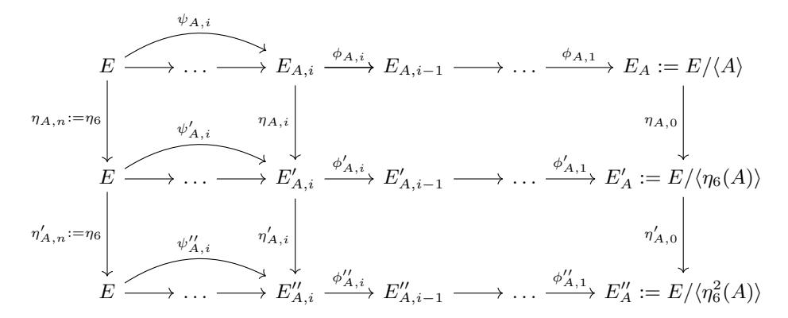
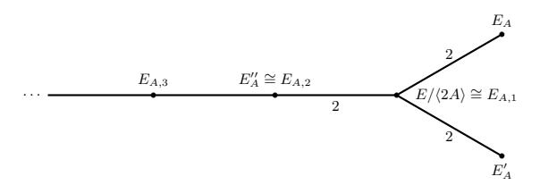

# On Adaptive Attacks against Jao-Urbanik's Isogeny-Based Protocol

Andrea Basso<sup>1</sup> , P´eter Kutas<sup>1</sup> , Simon-Philipp Merz<sup>2</sup> , Christophe Petit<sup>1</sup> , and Charlotte Weitk¨amper<sup>1</sup>

> <sup>1</sup> University of Birmingham, UK <sup>2</sup> Royal Holloway, University of London, UK

Abstract. The k-SIDH protocol is a static-static isogeny-based key agreement protocol. At Mathcrypt 2018, Jao and Urbanik introduced a variant of this protocol which uses non-scalar automorphisms of special elliptic curves to improve its efficiency.

In this paper, we provide a new adaptive attack on Jao-Urbanik's protocol. The attack is a non-trivial adaptation of Galbraith-Petit-Shani-Ti's attack on SIDH (Asiacrypt 2016) and its extension to k-SIDH by Dobson-Galbraith-LeGrow-Ti-Zobernig (IACR eprint 2019).

Our attack provides a speedup compared to a na¨ıve application of Dobson et al.'s attack to Jao-Urbanik's scheme, exploiting its inherent structure. Estimating the security of k-SIDH and Jao-Urbanik's variant with respect to these attacks, k-SIDH provides better efficiency.

Keywords: Elliptic curves · Isogenies · k-SIDH · Adaptive attack

# 1 Introduction

With the expected advent of quantum computers, current public key cryptography algorithms based on discrete logarithm and factorization problems will have to be replaced by stronger, so-called post-quantum cryptography algorithms. Isogenybased cryptography is among the leading approaches currently considered for post-quantum cryptography. A major protocol in isogeny-based cryptography is the SIDH key exchange protocol [\[7\]](#page-17-0), whose principles underlie the SIKE algorithm recently submitted to the NIST post-quantum standardization process [\[6,](#page-17-1)[8\]](#page-17-2).

In internet communication contexts, key exchange protocols are often used in a semi-static mode, where the server uses the same static secret key to establish any new session key with a client. Galbraith et al. have shown that the basic SIDH protocol is vulnerable to adaptive attacks in these contexts [\[4\]](#page-17-3). In SIKE the attacks are defeated by using a variant of the Fujisaki-Okamoto transform.

The k-SIDH protocol is an alternative countermeasure to Galbraith et al.'s attack suggested by Azarderakhsh et al. [\[2\]](#page-17-4). The protocol has the additional advantage to allow for static-static key exchange (where both parties use static keys), but it comes at the cost of a significant efficiency loss as it essentially involves running k 2 instances of the SIDH protocol in parallel for an integer k > 1, with k = 92 suggested by the authors. Very recently, Dobson et al. described an

adaptive attack against the 2-SIDH protocol [\[3\]](#page-17-5). Their attack also generalizes to the k-SIDH protocol with k > 2, though the required number of instances of the protocol with the server is exponential in k.

Our contributions. In this paper, we provide a new adaptive attack on a variant of the k-SIDH protocol suggested by Jao and Urbanik [\[10\]](#page-17-6). The Jao-Urbanik protocol introduces some redundancy in k-SIDH's secret keys using the non-trivial automorphisms of curves with j-invariants 0 or 1728 to increase efficiency. While the authors of the protocol conjectured that the inherent structure could be exploited in attacks and chose larger security parameters to account for this, we provide a concrete attack.

Our attack borrows from Galbraith et al. and Dobson et al.'s attacks, but it crucially differs from them in the following ways:

- We use the underlying relationship between the kernel generators of corresponding curves to match up triples of candidate curves instead of exhaustively searching over all possibilities when querying for the first key bits.
- Instead of separately computing the key bits and pullbacks at any step of the attack, we combine these stages by guessing the key bits and computing candidate pullbacks first to then validate any possible combination using the oracle.
- Contrasting to the attack in [\[3\]](#page-17-5), we manage to compute precise pullbacks at each step instead of having to keep track of multiple candidates which are indistinguishable to the attacker.
- Overall, we significantly reduce the number of oracle queries by exploiting the structure underlying the Jao-Urbanik protocol.

We show that our attack requires to run O(32k/<sup>3</sup> ) instances of the protocol with the server, if the Jao-Urbanik protocol is instantiated with secret isogenies of degree a power of two. This is almost a cube root speedup compared to Dobson et al.'s attack on the same instantiation.

While our attack does not break the security level for the parameter sets recommended by Jao and Urbanik, we give estimated attack costs for their parameters. Under consideration of currently known attacks against k-SIDH and Jao-Urbanik's protocol, we conclude that the former provides a better efficiency-security trade-off.

Outline. The remaining of this paper is organized as follows. To begin with, we give some background on isogenies and supersingular isogeny protocols in Section [2.](#page-1-0) We then recall the Dobson et al. attack on k-SIDH in Section [3](#page-5-0) and the Jao-Urbanik protocol in Section [4.](#page-6-0) We continue by describing our attack on Jao-Urbanik's scheme in Section [5,](#page-9-0) and conclude the paper in Section [6.](#page-16-0) The Appendix includes an extension of our attack.

## <span id="page-1-0"></span>2 Preliminaries

For a full treatment of background information on elliptic curves we refer to Silverman [\[9\]](#page-17-7).

### 2.1 Isogenies

Let  $\mathbb{F}_q$  be a finite field of characteristic p. In the following we assume p > 3 and therefore an elliptic curve E over  $\mathbb{F}_q$  can be defined by its short Weierstrass form

$$E(\mathbb{F}_q) = \{(x, y) \in \mathbb{F}_q^2 \mid y^2 = x^3 + Ax + B\} \cup \{\mathcal{O}_E\},\$$

where  $A, B \in \mathbb{F}_q$  and  $\mathcal{O}_E$  is the point (X : Y : Z) = (0 : 1 : 0) on the projective curve  $Y^2Z = X^3 + AXZ^2 + BZ^3$ . The set of points on an elliptic curve forms an abelian group with  $\mathcal{O}_E$  being the identity element. The *j-invariant* of an elliptic curve is

$$j(E) = 1728 \frac{4A^3}{4A^3 + 27B^2},$$

and there is an isomorphism  $f: E \to E'$  between the curves E and E' if and only if j(E) = j(E').

Given two elliptic curves  $E_1$  and  $E_2$  over a finite field  $\mathbb{F}_q$ , an isogeny is a morphism  $\phi: E_1 \to E_2$  such that  $\phi(\mathcal{O}_{E_1}) = \mathcal{O}_{E_2}$ . The condition implies that isogenies are also group homomorphisms. If there exists an isogeny  $\phi: E_1 \to E_2$ , then there exists a unique isogeny  $\hat{\phi}: E_2 \to E_1$ , called the dual isogeny, such that  $\phi \circ \hat{\phi} = [n]$  (where [n] denotes the multiplication-by-n map on  $E_2$ ). If there exists a non-constant isogeny between two curves, then they are called isogenous. The degree of an isogeny  $\phi$  is its degree when treated as an algebraic map. If the isogeny is separable (which is always the case in this work), the degree is equal to the size of the kernel of  $\phi$ . An isogeny from E to itself is called an endomorphism. Endomorphisms of an elliptic curve form a ring under addition and composition. If E is defined over a finite field then the endomorphism ring is either an order in an imaginary quadratic number field (such curves are called ordinary) or an order in the quaternion algebra ramified at p (the characteristic of the finite field) and at infinity. The latter curves are called supersingular. In this paper we will only consider supersingular elliptic curves.

Since an isogeny defines a group homomorphism  $E_1 \to E_2$ , its kernel is a subgroup of  $E_1$ . Conversely, any subgroup  $S \subset E_1$  determines a (separable) isogeny  $\phi: E_1 \to E_2$  with  $\ker(\phi) = S$  and  $E_2 = E_1/S$ . Furthermore, if the degree of the isogeny is smooth, Vélu's formulae [11] provide a polynomial time algorithm for computing the isogeny (as a rational map) from its kernel.

The following lemma [9, Chapter III, Corollary 4.11] describes how the isogenies corresponding to two subgroups can be related if one subgroup contains the other:

**Lemma 1.** Let  $E_i$ , i=1,2,3 be elliptic curves and let  $\phi: E_1 \to E_2$  and  $\psi: E_1 \to E_3$  be two isogenies such that  $ker(\phi) \subseteq ker(\psi)$ . Then there exists an isogeny  $\lambda: E_2 \to E_3$  such that  $\psi = \lambda \circ \phi$  which is unique up to isomorphism.

#### 2.2 SIDH

In this subsection, we recall Jao and De Feo's original scheme [7].

Let E be a supersingular elliptic curve. In the setup, one chooses two small primes  $\ell_A$  and  $\ell_B$  and a prime p which is of the form  $p = \ell_A^{e_A} \ell_B^{e_B} f - 1$ , where f is a small cofactor and  $e_A$  and  $e_B$  are large integers. Let  $P_A, Q_A$  be generators of the  $\ell_A^{e_A}$ -torsion and let  $P_B, Q_B$  be generators of the  $\ell_B^{e_B}$ -torsion of E. Then the protocol is as follows:

- 1. Alice chooses a random cyclic subgroup of  $E[\ell_A^{e_A}]$  of order  $\ell_A^{e_A}$ . As  $P_A, Q_A$  form a basis of the  $\ell_A^{e_A}$ -torsion, there exist integers  $x_A, y_A$  such that  $A = [x_A]P_A + [y_A]Q_A$  generates this subgroup. Similarly, Bob chooses a random cyclic subgroup of  $E[\ell_B^{e_B}]$  of order  $\ell_B^{e_B}$  generated by  $B = [x_B]P_B + [y_B]Q_B$  for some  $x_B, y_B$ .
- 2. Alice computes the isogeny  $\phi_A: E \to E/\langle A \rangle$  and Bob computes the isogeny  $\phi_B: E \to E/\langle B \rangle$ .
- 3. Alice sends the curve  $E/\langle A \rangle$  and the points  $\phi_A(P_B)$  and  $\phi_A(Q_B)$  to Bob and Bob similarly sends  $(E/\langle B \rangle, \phi_B(P_A), \phi_B(Q_A))$  to Alice.
- 4. Alice and Bob both use the images of the torsion points to compute the shared secret which is the curve  $E/\langle A,B\rangle$  (e.g. Alice can compute  $\phi_B(A)=[x_A]\phi_B(P_A)+[y_A]\phi_B(Q_A)$  and  $E/\langle A,B\rangle=E_B/\langle \phi_B(A)\rangle$ ).

Due to efficiency reasons in [7], the authors suggested the use of  $\ell_A = 2$  and  $\ell_B = 3$ . They also suggested to use the starting curve E with j-invariant 1728. In [1], the authors use a variant of the Fujisaki-Okamoto transform [5] to obtain an IND-CCA secure key encapsulation mechanism. For concrete parameters of the scheme the reader is referred to [1].

Note that by [4, Lemma 2.1], it is possible for Alice (and analogously for Bob) to always choose the secret integers  $x_A, y_A$  such that one of them equals 1 given that the generators  $P_A, Q_A$  of the  $2^{e_A}$ -torsion are independent. Hence it suffices to choose a single secret instead of two integers. In practice, this is usually done for efficiency reasons, and we will also use the convention in the following.

In [4] Galbraith et al. propose an adaptive attack against SIDH, showing that SIDH is not suitable for static-static key exchange; see Section 2.4 for a description of the GPST attack.

#### 2.3 k-SIDH

Now we recall the k-SIDH scheme of Azarderakhsh et al. [2]. This protocol is a modification of the original SIDH which is potentially secure against active attacks. The protocol is as follows. Both parties agree on a curve E as well as a basis of the  $2^{e_A}$ -torsion and a basis of the  $3^{e_B}$ -torsion. Alice chooses k different secret integers  $\alpha^{(1)}, \ldots, \alpha^{(k)}$  modulo  $2^{e_A}$  and Bob chooses k different secret integers  $\beta^{(1)}, \ldots, \beta^{(k)}$  modulo  $3^{e_B}$ . Let k be a preimage resistant hash function. The steps of the protocol are the following:

- 1. Alice computes the curves  $E_A^{(r)}=E/\langle P_A+[\alpha^{(r)}]Q_A\rangle$  and the corresponding isogenies  $\phi_{A,r}$ .
- 2. Bob computes the curves  $E_B^{(r)} = E/\langle P_B + [\beta^{(r)}]Q_B \rangle$  and the corresponding isogenies  $\phi_{B,r}$ .

- 3. Alice sends  $E_A^{(r)}$ ,  $\phi_{A,r}(P_B)$ ,  $\phi_{A,r}(Q_B)$  to Bob and Bob sends  $E_B^{(r)}$ ,  $\phi_{B,r}(P_A)$ ,  $\phi_{B,r}(Q_A)$  to Alice.
- 4. Alice and Bob perform the SIDH key exchange for every pair  $E_A^{(r)}, E_B^{(s)}$  and compute the corresponding j-invariant  $j_{r,s}$ .
- 5. The shared secret is the hash  $h(j_{1,1}||j_{1,2}||\dots||j_{k,k})$  of all the j-invariants.

#### <span id="page-4-0"></span>2.4 The GPST attack on static SIDH

The adaptive GPST attack actively recovers the static SIDH key  $\alpha$  of a party, say Alice, where  $\langle P_A + [\alpha]Q_A \rangle$  is the subgroup corresponding to her secret isogeny. An attacker uses the key exchange protocol as an oracle to recover Alice's static key bit-wise. For simplicity, we set  $n := e_A$  in the following.

**Definition 1 (Oracle in static SIDH).** Upon receipt of an elliptic curve E, two linearly independent points  $R, S \in E[2^n]$  of order  $2^n$  and another elliptic curve E', the oracle responds 1 if  $j(E/\langle R+[\alpha|S\rangle)=j(E')$  and 0 otherwise.

To recover Alice's secret key, an attacker first generates the ephemeral key  $(E_B, R := \phi_B(P_A), S := \phi_B(Q_A))$  honestly as specified by the SIDH key exchange. Then, they query the oracle on  $(E_B, R, S + [2^{n-1}]R, E_{AB})$ , which reveals whether  $E_B/\langle R + [\alpha](S + [2^{n-1}]R)\rangle$  is isomorphic to  $E_B/\langle R + [\alpha]S\rangle$ . By the following lemma, this reveals the least significant bit of the static secret  $\alpha$ .

**Lemma 2.** [4, Lemma 2] For linearly independent  $R, S \in E[2^n]$  of order  $2^n$ ,  $\alpha$  is even if and only if  $\langle R + [\alpha](S + [2^{n-1}]R) \rangle = \langle R + [\alpha]S \rangle$ .

Afterwards, the attacker can proceed iteratively for all but the last two bits. Assume the attacker has recovered the i least significant bits of  $\alpha$ , i.e. the partial key  $K_i := \sum_{k=0}^{i-1} \alpha_k 2^k$  such that  $\alpha = K_i + \alpha_i 2^i + \alpha' 2^{i+1}$ . To learn the next bit  $\alpha_i \in \{0,1\}$ , the attacker queries the oracle on

<span id="page-4-1"></span>
$$(E_B, [\theta](R - [2^{n-i-1}][K_i]S), [\theta]([1 + 2^{n-i-1}]S), E_{AB}).$$
(1)

Here,  $\theta$  is a suitable scaling parameter to avoid detection of the attack by Weil pairing validation. We omit further details as this has no relevance to the methods presented in this paper, and we refer to the original paper [4] for the computational details. In this exposition we omit such factors for simplicity.

The bit  $\alpha_i$  is deduced from the oracle's answer using the following lemma.

**Lemma 3** ([4]). The oracle call (1) returns 1 if and only if  $\alpha_i = 0$ .

*Proof.* The curve computed by Alice is 
$$E_B/G'$$
 where  $G' = \langle R' + [\alpha]S' \rangle = \langle (R - [2^{n-i-1}][K_i]S) + [\alpha]([1 + 2^{n-i-1}]S) \rangle = \langle R + [\alpha]S + [\alpha - K_i][2^{n-i-1}]S) \rangle$ . This is equal to  $G$  if and only if  $\alpha_i = 0$ .

The last two bits  $\alpha_{n-2}$ ,  $\alpha_{n-1}$  should be brute-forced, as there is no suitable scaling parameter  $\theta$  to avoid detection by Weil pairing validation. Note that this does not require any oracle query.

## <span id="page-5-0"></span>3 The DGLTZ attack

The DGLTZ attack [3] follows roughly the same methodology as the GPST one. In this section, let  $\alpha^{(r)}$  denote Alice's k secret keys associated to the kernel generators  $A^{(r)} = R + [\alpha^{(r)}]S$  for some points R, S spanning  $E[2^n]$ . For simplicity we will largely only use two secret keys  $\alpha, \beta$  with corresponding kernel generators A, B. Then we denote by  $\alpha_i$  the i-th bit of  $\alpha = K_i^{(a)} + \alpha_i 2^i + \alpha' 2^{i+1}$ , where  $K_i^{(a)}$  is the i-th partial key, and analogously for  $\beta$ . Dobson et al. first justify the existence of the following oracle.

**Definition 2 (Oracle in k-SIDH).** Let H be some public hash function. Upon receipt of an elliptic curve E, two points R, S spanning  $E[2^n]$  and a hash value h, the oracle reveals whether  $h = H(j(E/\langle R + [\alpha^{(1)}]S \rangle), \ldots, j(E/\langle R + [\alpha^{(k)}]S \rangle))$ .

Note that this oracle provides information related to the k-tuple of static secret keys  $(\alpha^{(1)}, \ldots, \alpha^{(k)})$ , but it does not immediately reveal information on each individual secret key separately.

To compensate for this limited information, multiple oracle queries will be made using the same malicious points but different hash values. After obtaining the curves  $E_{A^{(i)}} := E/\langle A^{(i)} \rangle$  from Alice's public keys, the attacker successively recovers the next bit of all the different secrets simultaneously. This is done by using malicious points in oracle queries as in the GPST attack, guessing all the j-invariants computed by Alice as a result of these malicious points, and verifying each guess with an oracle query.

The attacker recovers the first bit of all secrets with queries of the form  $(E, R, [1 + 2^{n-1}]S, H(j_1||...||j_k))$ , where the  $j_i$  are guesses on the k shared secret curves computed by Alice. Candidate tuples for the guess can be restricted by the following lemma.

**Lemma 4.** Let  $\alpha$  be any of Alice's secret keys. Consider the isogeny path from E to  $E_A$ , and replace the last step in this path by the only other possible step that leaves the path non-backtracking. Let  $E'_A$  be the final curve of this path. Let  $s \in \{0,1\}$ . Let  $R' := R - [s][2^{n-1}]S$  and  $S' := [1 + 2^{n-1}]S$ . Then the SIDH key computed by Alice is either  $E_A$  or  $E'_A$ . Moreover, it is  $E_A$  if and only if  $\alpha_0 = s$ .

The number of candidate tuples is  $7^k$  as for each secret there are 7 possible curves they have to query (the respective  $E_{A^{(i)}}$  and six curves which are 4-isogenous to it). In the iterative step the attacker uses queries of the form  $(E, R - [K_i^{(a)}][2^{n-i-1}]S, [1+2^{n-i-1}]S, H(j_1||\dots||j_k))$ , which correspond to the following elliptic curves:  $E/\langle A+[\alpha_i][2^{n-1}]S\rangle$ ,  $E/\langle B+[K_i^{(b)}-K_i^{(a)}][2^{n-i-1}]S+[\beta_i][2^{n-1}]S\rangle$ . If to recover the next bits one wanted to perform a similar exhaustive search as for the first bit computation, then one would need an exponential amount of queries even for k=2 as the distance (in the isogeny graph) from the second curves to  $E_A$  increases as i grows. To remedy this, the authors observe that  $E/\langle B+[K_i^{(b)}-K_i^{(a)}][2^{n-i-1}]S+[\beta_i][2^{n-1}]S\rangle$  is 2-isogenous to  $E_i/\langle \psi_{B,i}(B+[K_i^{(b)}-K_i^{(a)}][2^{n-i-1}]S+[\beta_i][2^{n-1}]S\rangle$  where  $E_i$  is the (n-i)-th

curve in the isogeny path from E to  $E_B$  and  $\psi_{B,i}$  is the corresponding partial isogeny. In order to be able to compute these curves, one has to compute certain intermediate points on  $E_i$  (which the authors refer to as "pullbacks"), namely  $\psi_i(B)$  and  $[2^{n-i}]\psi_i(S)$ . This pullback-computation is required after each key bit has been recovered, and at the *i*-th step makes use of the known partial keys with the following query:

$$(E, R - [K_{i+1}^{(a)}][2^{n-i-1}]S, [1 + 2^{n-i-1}]S, H(j_1, \dots, j_k)).$$

It can be computed that the corresponding curve is  $E_{i+1}/\langle \psi_{B,i+1}(B+[K_{i+1}^{(b)}-K_{i+1}^{(a)}][2^{n-i-1}]S)\rangle$  (and not 2-isogenous to it as in the previous stage). Naïvely, the attacker would query the oracle with all the possibilities for  $\psi_{B,i+1}(B)$  and  $[2^{n-i-1}]\psi_{B,i+1}(S)$ . Note however that when the oracle returns 1, there will be two possibilities for the correct pullbacks which, due to the oracle model, cannot be distinguished. One could either have found  $\psi_{B,i+1}(B)$  and  $[2^{n-i-1}]\psi_{B,i+1}(S)$  or  $\psi_{B,i+1}(B)+C$  and  $[2^{n-i-1}]\psi_{B,i+1}(S)+C$ , where C generates the kernel of the isogeny from  $E_{i+1}$  to  $E_i$ . Thus the authors choose one pullback  $\psi_{B,i}(B)$  for B and then have to keep a 2-element set of candidates for  $[2^{n-i-1}]\psi_{B,i+1}(S)$ . The computation of bits uses  $24^k$  queries<sup>3</sup> and the pullback computation uses  $16^k$  queries under certain technical conditions which are addressed in the appendix of [3]. At each step, the intermediate isogenies are computed using the following lemma:

**Lemma 5.** Let  $A^{(i)} = P + [\alpha^{(i)}]Q$  be the generator of the subgroup corresponding to the *i*-th secret isogeny and let  $\psi_i^{(i)} := \phi_n^{(i)} \circ \phi_{n-1}^{(i)} \circ \cdots \circ \phi_{j+1}^{(i)}$ . Then, we have

$$\ker \phi_j^{(i)} = \langle [2^{j-1}] \psi_j^{(i)}(A^{(i)}) \rangle, \qquad \ker \hat{\phi}_j^{(i)} = \langle [2^{n-1}] \psi_{j-1}^{(i)}(Q) \rangle.$$

## <span id="page-6-0"></span>4 The Jao-Urbanik protocol

In this section, we present the Jao-Urbanik protocol [10], the main target of our attack.

To reduce the cost associated to k-SIDH [2], Jao and Urbanik propose to exploit the existence of non-trivial automorphisms on certain elliptic curves for a non-interactive key exchange by using distinct isogenies between isomorphic curves. As in the original SIDH proposal [7], the authors suggest choosing parameters as follows: Let  $\ell_A$  and  $\ell_B$  be two small primes,  $e_A$  and  $e_B$  integers such that  $\ell_A^{e_A} \approx \ell_B^{e_B}$ ; then choose a small cofactor f such that  $p = \ell_A^{e_A} \ell_B^{e_B} f \pm 1$  is prime. To simplify our description, we will again set  $\ell_A = 2$  and  $\ell_B = 3$  (as widely used in discussions of SIDH) when describing the protocol here.

The only elliptic curves with non-trivial automorphisms are curves with j-invariants  $j \in \{0, 1728\}$ ; note these are all supersingular over  $\mathbb{F}_p$  for  $p = 2^{e_A}3^{e_B}f - 1$  since  $p \equiv 2 \pmod{3}$  and  $p \equiv 3 \pmod{4}$ . As Jao and Urbanik primarily suggest to use the former, we focus on curves with j(E) = 0 in this

<span id="page-6-1"></span><sup>&</sup>lt;sup>3</sup> Note that this estimation is not given in [3].

exposition. For such curves, there exists an automorphism  $\eta_6$  of order six defined by  $\eta_6(x,y) = (\zeta_3 x, -y)$  for  $\zeta_3$  a primitive third root of unity. Thus,  $\eta_6$  further satisfies  $\eta_6^2 = \eta_6 - 1$ .

The existence of these automorphisms can be exploited in the following way. If  $G\subseteq E$  is a subgroup,  $\eta_6(G)$  and  $\eta_6^2(G)$  are also subgroups of E and we may assume that all three are distinct<sup>4</sup>. Hence, the isogenies from E associated to the kernels  $G, \eta_6(G)$  and  $\eta_6^2(G)$ , respectively, are all distinct while the corresponding quotients are isomorphic. For example, consider  $\phi: E \to E/G$ ; the map  $\phi \circ \eta_6^{-1}: E \to E/G$  has kernel  $\eta_6(G)$  and hence we have  $E/G \cong E/\eta_6(G)$ . In an SIDH-setting when Alice sends a public key  $(E_A, \phi_A(P_B), \phi_A(Q_B))$ , we can thus view this as Alice actually having sent three distinct but related public keys. These keys all have isomorphic target curves  $E/\langle A\rangle \cong E/\langle \eta_6(A)\rangle \cong E/\langle \eta_6^2(A)\rangle$ , and hence share the same j-invariant, but the corresponding isogenies are not isomorphic. The same applies to any of Bob's public keys.

**Lemma 6.** Suppose a base curve E with j(E) = 0 together with the parameters as suggested by Jao and Urbanik [10] is used for SIDH. Then a single exchange of Alice's and Bob's SIDH public keys  $pk_A = (E_A, \phi_A(P_B), \phi_A(Q_B))$  and  $pk_B = (E_B, \phi_B(P_A), \phi_B(Q_A))$ , where  $\{P_A, Q_A = \eta_6(P_A)\}$  and  $\{P_B, Q_B = \eta_6(P_B)\}$  are bases of  $E[2^{e_A}]$  and  $E[3^{e_B}]$  respectively, yields three shared secret (isomorphism classes of) curves.

It follows that per public key pair, Alice and Bob obtain three shared secret curves, each identified by its j-invariant, as a secret in the Jao-Urbanik version of SIDH; see Figure 1. Hence, in the k'-SIDH setting where each party sends k' public keys, using the Jao-Urbanik technique results in a shared secret

$$h = \operatorname{Hash}(j_{1,1}||j'_{1,1}||j''_{1,1}||\dots||j_{k',k'}||j''_{k',k'}||j''_{k',k'}|,$$

obtained by hashing the concatenation of the *j*-invariants corresponding to the  $k = 3(k')^2$  shared secret curves instead of the  $(k')^2$  curves as in standard k'-SIDH.

#### 4.1 Parameter selection

In [10, Section 4] Jao and Urbanik discuss the security of their scheme for general  $\ell := \ell_A$ . They correctly identify that the relationship between the curves can be exploited for an attack but do not consider this extra structure fully when providing an estimate on the security of the scheme. Based on their brief analysis, they suggest the use of k' = 18 keys for  $\ell = 11$  when 256-bit security is required. We believe the proposed parameters are safe but that their security analysis could be elaborated on.

In their discussion, the authors do not disclose a precise attack model and consider an oracle which receives a list of curves and returns true if all of them

<span id="page-7-0"></span><sup>&</sup>lt;sup>4</sup> We have  $\eta_6(G) = G$  exactly when  $G \subset \ker(\eta_6 + k)$  for some odd k. Note that this is impossible since  $\eta_6^2 - \eta_6 + 1 = 0$  implies that  $\deg(\eta_6) = \operatorname{tr}(\eta_6) = 1$  so that  $\deg(\eta_6 + k) = (\eta_6 + k)(\bar{\eta}_6 + k) = \deg(\eta_6) + k\operatorname{tr}(\eta_6) + k^2 = 1 + k + k^2$  is odd and hence not divisible by  $2^{e_A}$ .

$$\begin{array}{c|c} \textbf{Alice} & \textbf{Bob} \\ \hline A \subseteq E[2^{e_A}] & B \subseteq E[3^{e_B}] \\ \text{with } A = \langle P_A + [\alpha] \eta_6(P_A) \rangle & \text{with } B = \langle P_B + [\beta] \eta_6(P_B) \rangle \\ \hline \phi_A : E \to E/A = E_A, & \phi_B : E \to E/B = E_B, \\ R_A := \phi_A(P_B), S_A := \phi_A(\eta_6(P_B)) & R_B := \phi_B(P_A), S_B := \phi_B(\eta_6(P_A)) \\ \hline pk_A = (E_A, R_A, S_A) & pk_B = (E_B, R_B, S_B) \\ \hline & pk_A & \\ \hline & pk_B & \\ \hline E_B/\langle [\alpha]R_A + S_A) \rangle & \cong E_{AB} \cong & E_A/\langle [\beta]R_B + S_B \rangle \\ E_B/\langle -R_A + [\alpha + 1]S_A \rangle & \cong E_{A\eta_6(B)} \cong & E_A/\langle -[\beta + 1]R_B + [\beta]S_B \rangle \\ E_B/\langle -[\alpha + 1]R_A + [\alpha]S_A \rangle & \cong E_{A\eta_6^2(B)} \cong & E_A/\langle -R_B + [\beta + 1]S_B \rangle \\ \hline & \text{Shared secret:} \\ h = \text{Hash} \big( j(E_{AB}), j(E_{A\eta_6^2(B)}), j(E_{A\eta_6(B)}) \big) \end{array}$$

<span id="page-8-0"></span>**Fig. 1.** Jao-Urbanik's protocol using one key and automorphism  $\eta_6$ ; public parameters:  $E: y^2 = x^3 + 1$  with j(E) = 0 defined over field of characteristic  $p = f2^{e_A}3^{e_B} - 1$ , bases  $\{P_A, \eta_6(P_A)\}$  of  $E[2^{e_A}]$  and  $\{P_B, \eta_6(P_B)\}$  of  $E[3^{e_B}]$ .

are on the secret isogeny path  $E \to E/\langle A \rangle$ . However, using such an oracle, the attack proposed by Jao-Urbanik is not optimal. We will show that the extra structure can be exploited further by realizing that all intermediate curves on the three paths associated to one secret are isomorphic. Furthermore, in [3] it is demonstrated that using the straightforward generalization of the GPST oracle to k-SIDH would lead to an exponential-time attack even for k=2. In order to go around this issue, Dobson et al. compute extra points which increases the complexity of the attack substantially. In other words, in the k-SIDH setting, the cost of the call to an oracle which returns true if and only if all the guessed curves are on the correct path is not constant but exponential in k. This observation clearly applies to the Jao-Urbanik scheme as well.

### 4.2 Current impact of DGLTZ on Jao-Urbanik protocol

Applying the DGLTZ attack to the Jao-Urbanik protocol is not straightforward. The DGLTZ attack assumes that all the secret kernels are of the form  $\langle [\alpha]P+Q\rangle$  which is not the case in the Jao-Urbanik scheme due to the following. To one secret the following three kernels are associated:  $\langle [\alpha]P+Q\rangle, \langle -P+[\alpha+1]Q\rangle, \langle -[\alpha+1]P+[\alpha]Q\rangle$ . The parity of the coefficient of Q in the second and the third kernel is different, thus in particular, it is impossible that both of them are odd

<span id="page-8-1"></span><sup>&</sup>lt;sup>5</sup> Note that the GPST attack [4] shows how to implement a similar oracle for SIDH.

(hence for every  $\lambda$ -multiple of the kernel the coefficient of Q will be even). This difficulty could potentially be overcome, however a number of  $\mathcal{O}(24^k)$  queries, where k=3k' and k' is the number of secrets, will still be required.

Our aim is that instead of treating the three curves independently we use that the three kernels are related and propose an attack in the next section which uses  $\mathcal{O}(32^{\frac{k}{3}})$  queries, thus providing a nearly cube root speedup.

# <span id="page-9-0"></span>5 Adaptive attack against the Jao-Urbanik scheme

In this section, we describe our adaptive attack on the  $\eta_6$  case of the Jao-Urbanik protocol [10]. Thus, the starting curve E has j-invariant 0 and admits an automorphism of order 6,  $\eta_6$ . We want to attack Alice's  $\ell_A^{e_A}$ -torsion, so for simplicity, we again write  $\ell := \ell_A$  and  $n := e_A$ , and set  $\ell = 2$  in our exposition. See Subsection 5.4 for a discussion on how this attack generalizes to larger  $\ell$ . Let P and  $Q = \eta_6(P)$  be such that  $\{P, Q\}$  form a basis of  $E[2^n]$  and let  $\alpha$  be one of Alice's secret keys, to which we associate the following three kernel generators

$$A = [\alpha]P + Q, \qquad A' = \eta_6(A) = -P + [\alpha + 1]Q,$$
  
$$A'' = \eta_6^2(A) = -[\alpha + 1]P + [\alpha]Q,$$

and the three isogenies

$$\psi_{A,0}: E \to E_A = E/\langle A \rangle, \qquad \psi'_{A,0}: E \to E'_A = E/\langle A' \rangle,$$
  
$$\psi''_{A,0}: E \to E''_A = E/\langle A' \rangle.$$

Similarly, we denote with  $\gamma$  any other secret key different from  $\alpha$ . The associated kernels are generated by C, C', C'', the curves are  $E_C$ ,  $E'_C$ ,  $E''_C$  and in general the notation corresponding to  $\gamma$  will have a subscript C. When there is no doubt about the corresponding secret key or when a property holds for all keys, we may drop the subscript.

The isogeny  $\psi_{A,0}$  can be decomposed into n individual 2-isogenies. We index intermediate curves by  $E_{A,i}$ , with  $E_{A,0}=E_A$  and  $E_{A,n}=E$ . The intermediate isogenies are denoted by  $\phi_{A,i}:E_{A,i}\to E_{A,i-1}$ . We also call  $\psi_{A,i}$  the composition  $\phi_{A,n}\circ\ldots\circ\phi_{A,i+1}$ . We introduce similar notations for  $E'_A$  and  $E''_A$ , and denote by  $\eta_i$  the isomorphism between  $E_A$  and  $E'_A$  (see Lemma 8). We summarize all notations in Figure 2.

We define

$$A_i = \psi_{A,i}(A), \quad P_i = \psi_{A,i}(P).$$

Our attack is a non-trivial adaption of the GPST and DGLTZ attacks [4,3]. It similarly has two stages. Firstly, we compute the first bit of each key (see Subsection 5.2) and we recover the "pullbacks"  $A_1$ ,  $A'_1$ ,  $A''_1$  and  $[2^{n-1}]P_1$ ,  $[2^{n-1}]P'_1$ ,  $[2^{n-1}]P'_1$  (for every secret A). In the second stage, we show inductively that given the first i bits of every key and  $A_i$ ,  $[2^{n-i}]P_{A,i}$  (for every secret A), we can deduce the (i+1)-th bit and the new pullbacks (see Subsection 5.3). In other words, if we write

$$\alpha = 2^{i+1}\alpha' + 2^i\alpha_i + K_{A,i},$$



Fig. 2. Isogeny paths between the relevant curves.

<span id="page-10-1"></span>where  $K_{A,i}$  indicates the known part of the key, we can recover  $\alpha_i$  from knowledge of the *i*-th pullbacks.

This is not dissimilar to what is done in the DGLTZ attack, but our attack exploits the additional structure between the shared secrets in the Jao-Urbanik protocol to recover the exact pullbacks at each step (instead of keeping two candidates) and reduce the number of queries needed for bit recovery. We thus show that the security of the Jao-Urbanik protocol with k' secret keys is only slightly better than the security of k'-SIDH, thus greatly decreasing the benefits of the Jao-Urbanik protocol. A more detailed study of the complexity of our attack can be found at the end of Subsection 5.3.

We present our attack only by querying with points on the starting curve E, as in the DGLTZ attack. Appendix A presents a method to extend our attack to an arbitrary curve, which can also be applied to the DGLTZ attack.

We start by showing essential properties of the partial isogenies  $\psi_{A,i}$ ,  $\psi'_{A,i}$ ,  $\psi''_{A,i}$  and of the corresponding curves  $E_{A,i}$ ,  $E'_{A,i}$ ,  $E''_{A,i}$  in the following two lemmas.

<span id="page-10-2"></span>Lemma 7. For simplicity, denote subscripts of the form A, i by i. Then,

$$\begin{split} \ker(\psi_i) &= \langle [2^i]A\rangle, & \ker(\psi_i') &= \langle [2^i]A'\rangle, & \ker(\psi_i'') &= \langle [2^i]A''\rangle, \\ \ker(\phi_i) &= \langle [2^{i-1}]A_i\rangle, & \ker(\phi_i') &= \langle [2^{i-1}]A_i'\rangle, & \ker(\phi_i'') &= \langle [2^{i-1}]A_i''\rangle, \\ \ker(\hat{\phi}_i) &= \langle [2^{n-1}]P_{i-1}\rangle, & \ker(\hat{\phi}_i') &= \langle [2^{n-1}]P_{i-1}'\rangle, & \ker(\hat{\phi}_i'') &= \langle [2^{n-1}]P_{i-1}''\rangle. \end{split}$$

<span id="page-10-0"></span>**Lemma 8.** Let notation be as above. Then  $E_{A,i}$ ,  $E'_{A,i}$  and  $E''_{A,i}$  are isomorphic.

*Proof.* We have that  $\ker(\psi_{A,i}) \subseteq \ker(\psi'_{A,i} \circ \eta_{A,n})$ . Thus, there exists an isogeny  $\eta_{A,i}: E_{A,i} \to E'_{A,i}$  such that  $\psi'_{A,i} \circ \eta_{A,n} = \eta_{A,i} \circ \psi_{A,i}$ . By examining the degrees, we find that  $\deg \eta_{A,i} = 1$  and thus  $\eta_{A,i}$  is an isomorphism. The same reasoning holds for  $E''_{A,i}$ .

The isomorphisms  $\eta_{A,i}$  and  $\eta'_{A,i}$  are assumed to be known when  $E_{A,i}$ ,  $E'_{A,i}$  and  $E''_{A,i}$  are known, since they can be easily computed (a 1-isogeny between two curves can be recovered in  $\mathcal{O}(1)$ ).

#### 5.1 Attack model: a new oracle

In this section, we describe our assumptions and our attack model.

Firstly, let k' denote the number of Alice's secret keys. We assume that Alice has a static set of keys  $\alpha^{(1)}, \ldots, \alpha^{(k')}$  and that the attacker impersonates Bob to recover Alice's secret keys. The attacker engages with Alice on sessions of Jao-Urbanik's protocol and sends particularly chosen data, not necessarily conforming to the protocol. By checking whether the two parties have obtained the same shared secret, the attacker may recover information on Alice's keys. We model this information leakage in terms of an oracle and represent each interaction with Alice as an oracle query.

An adaption of the second oracle presented in [3] to the  $\eta_6$  variant of the Jao-Urbanik protocol gives an oracle  $O'(E^{(1)}, \dots, E^{(k')}, R^{(1)}, S^{(1)}, \dots, R^{(k')}, S^{(k')}, h)$  that returns true if

$$h = \text{Hash}(j_{1,1}||j_{1,2}||\dots||j_{k',k'-1}||j_{k',k'}),$$

where  $j_{r,s}$  denotes the concatenation of

$$\begin{split} j\left(E^{(r)}/\langle[\alpha^{(r)}]R^{(s)} + S^{(s)}\rangle\right), \ j\left(E^{(r)}/\langle -R^{(s)} + [\alpha^{(r)} + 1]S^{(s)}\rangle\right), \\ j\left(E^{(r)}/\langle -[\alpha^{(r)} + 1]R^{(s)} + [\alpha^{(r)}]S^{(s)}\rangle\right). \end{split}$$

Similarly to what is done for the third oracle in [3], we can simplify the oracle by assuming that the attacker generates one secret key and sends repeated copies of the same curve and points. Note that any information that can be recovered with querying with distinct curves can also be recovered by querying with repeated copies of the same curve.

Hence, we obtain the following oracle

<span id="page-11-1"></span>
$$O(E, R, S, h) = O'(E, \dots, E, R, S, \dots, R, S, h),$$
 (2)

which is the one we use in our attack. As noted in [3], the attacker could change one curve at each iteration, but all but one curves (k'-1, in this case) have to remain constant across iterations for the attack to succeed.

### <span id="page-11-0"></span>5.2 Exploiting the additional structure: first step

Let us focus on one of Alice's secrets  $\alpha$ . The attack extends straightforwardly to all the keys. In order to recover the first bits of  $\alpha$ , the attacker sends the modified points  $P' = [1 + 2^{n-1}]P$ , Q' = Q, so that Alice uses the following kernels in her computation of the shared secret:

$$\begin{array}{l} 1. \ \ \hat{A}=\langle [\alpha]P'+Q'\rangle=\langle [\alpha]P+Q+[\alpha_0][2^{n-1}]P\rangle,\\ 2. \ \ \hat{A}'=\langle -P'+[\alpha+1]Q'\rangle=\langle -P+[\alpha+1]Q+[2^{n-1}]P\rangle,\\ 3. \ \ \hat{A}''=\langle -[\alpha+1]P'+[\alpha]Q'\rangle=\langle -[\alpha+1]P+[\alpha]Q-[\alpha_0+1][2^{n-1}]P\rangle. \end{array}$$

Note that, depending on the value of the least significant bit  $\alpha_0$ , either the first or third curve computed has not been altered by using the modified points. Thus the attacker already knows one of  $j(\hat{E}_A)$  or  $j(\hat{E}_{A''})$ , where  $\hat{E}_A = E/\langle \hat{A} \rangle$ , although they do not know at this stage which one of the two.

The attacker now computes  $\mathcal{E}_A^*$ , the sets containing all six proper 4-neighbors of the curves  $E_A$  in Alice's public key, and their respective j-invariants. If  $\alpha_0 = 0$ ,  $\langle [\alpha]P' + Q' \rangle = \langle A \rangle$ , and hence the first curve Alice obtains is isomorphic to her original  $E_A$ . The second curve is independent of  $\alpha_0$  and is a 4-neighbor of  $E'_A$ , since they share the 2-neighbor  $E/\langle 2A' \rangle$ . Similarly, the third curve is a 4-neighbor of  $E''_A$  since they share 2-neighbor  $E/\langle 2A'' \rangle$ . Note that the intermediate 2-neighbors in this construction are isomorphic since their kernel generators differ only by an application of  $\eta_6$ . Hence, the three curves  $E_A$ ,  $E/\langle -P'+[\alpha+1]Q'\rangle$  and  $E/\langle -[\alpha+1]P'+[\alpha]Q'\rangle$  are the three distinct 2-neighbors of  $E/\langle 2A\rangle$  (distinctness follows from simple computations on the kernel generators), as depicted in Figure 3.



<span id="page-12-0"></span>**Fig. 3.** The isogeny paths between  $E_A$ ,  $E'_A$  and  $E''_A$ .

Analogously if  $\alpha_0 = 1$ , we find that the three computed curves all share a common 2-neighbor. The attacker proceeds analogously for the choices of any other curve. This allows the attacker to match up candidate curves for  $E_A$ ,  $E'_A$  and  $E''_A$  among the 4-neighbors of  $E_A$ , depending on which combination of first key bits they are querying for at the time: the attacker may choose any curve in  $\mathcal{E}_A^*$  as a candidate curve for  $E'_A$ , depending on the guessed bit they may select  $E_A$  or  $E''_A$  to be equal to  $E_A$  and then select the unique curve in  $\mathcal{E}_A^*$  which is also a 4-neighbor of  $E'_A$  as a candidate for the remaining curve. Querying the oracle for all possible combinations ( $12^{k/3}$  combinations, six for each neighbor and one for the curve itself) gives the attacker the first bit of each secret.

Now, given the position of  $E_A$ ,  $E'_A$  and  $E''_A$  in the isogeny graph, we know that  $E/\langle 2A \rangle$  must be the first intermediate curve  $E_{A,1}$  and similarly  $E''_A$  must be  $E_{A,2}$ . This means the attacker can easily recover the first two intermediate curves without additional oracle queries, unlike what happens in the DGLTZ attack. Since the isogenies between  $E_A$  and  $E_{A,1}$  (i.e.  $\phi_{A,1}$ ) and between  $E_{A,1}$  and  $E_{A,2}$  (i.e.  $\phi_{A,2}$ ) are known, the attacker can compute the first pullbacks of A and  $[2^{n-1}]P$  (up to odd scalar multiplication) by setting  $A_1$  to be a generator of  $\ker(\phi_{A,1})$  and  $[2^{n-1}]P_{A,1}$  a generator of  $\ker(\hat{\phi}_{A,2})$  (see Lemma 7). Finally, the

attacker obtains the pullbacks  $A'_1 = \eta_{A,1}(A_1)$  and  $A''_1 = \eta'_{A,1}(A_1)$ . This approach can be easily repeated for every following curve.

## <span id="page-13-0"></span>5.3 Intermediate bit and pullback computation

Suppose we have recovered the first i bits of each key and have the relevant pullbacks. Let  $\alpha$  be one of Alice's secrets keys and let  $\gamma$  denote any other secret key.

Now, we want to recover the (i+1)-th bit and compute the new pullbacks. In the DGLTZ attack, the bit recovery and pulling back are two separate stages, but in order to exploit the additional structure of Jao-Urbanik's scheme, we combine them together.

The attacker does not actively recover the (i+1)-th key bits, but instead tries all the  $2^{k'}$  possibilities and uses the pullback queries to validate both the bit guesses and the pullback candidates.

Using Lemma 7, it is possible to compute  $\hat{\phi}_{i+1}$  and thus recover  $\phi_{i+1}$ . With this information, the attacker can obtain candidates for the pullbacks of A and P. The same applies to  $\phi'_{i+1}$  and  $\phi''_{i+1}$ .

The attacker then queries the oracle with the following points

$$P' = [1 + 2^{n-i-1}]P$$
,  $Q' = Q - [K_{A,i}][2^{n-i-1}]P$ .

These are the oracle's internal kernel computations

$$\langle [\alpha]P' + Q' \rangle = \langle A + [\alpha_i][2^{n-1}]P \rangle,$$

$$\langle -P' + [\alpha + 1]Q' \rangle = \langle A' - [K_{A,i}^2 + K_{A,i} + 1][2^{n-i-1}]P + [K_{A,i}][\alpha_i][2^{n-1}]Q \rangle,$$

$$\langle -[\alpha + 1]P' + \alpha Q' \rangle = \langle A'' - [K_{A,i}^2 + K_{A,i} + 1][2^{n-i-1}]P - [K_{A,i} + 1][\alpha_i][2^{n-1}]P \rangle,$$

$$\begin{split} \langle [\gamma]P'+Q'\rangle &= \langle C+[K_{C,i}-K_{A,i}][2^{n-i-1}]P\\ &+ [\gamma_i][2^{n-1}]P\rangle,\\ \langle -P'+[\gamma+1]Q'\rangle &= \langle C'-[K_{C,i}K_{A,i}+K_{A,i}+1][2^{n-i-1}]P\\ &- [K_{A,i}][\gamma_i][2^{n-1}]P\rangle,\\ \langle -[\gamma+1]P'+[\gamma]Q'\rangle &= \langle C''-[K_{C,i}K_{A,i}+K_{A,i}+1][2^{n-i-1}]P\\ &- [K_{A,i}+1][\gamma_i][2^{n-1}]P\rangle. \end{split}$$

All kernels can be shifted with  $\psi_{i+1}$  (e.g.  $E/\langle C+[K_{C,i}-K_{A,i}][2^{n-i-1}]P+[\gamma_i][2^{n-1}]P\rangle=E_{C,i+1}/\langle C_{i+1}+[K_{C,i}-K_{A,i}][2^{n-i-1}]P_{C,i+1}+[\gamma_i][2^{n-1}]P\rangle)$  similarly to the DGLTZ attack by applying [9, Chapter III, Corollary 4.11.]. Now, since the candidate pullbacks for  $A_{i+1}$  (preimages of  $A_i$  via  $\phi_{A,i}$ ),  $C_{i+1}$  (preimages of  $C_i$  via  $\phi_{C,i}$ ),  $[2^{n-i-1}]P_{C,i+1}$  (preimages of  $\left[\frac{1}{2}\right][2^{n-i}]P_{C,i}$ ),  $[2^{n-i-1}]P_{A,i+1}$ 

(preimages of  $\left[\frac{1}{2}\right][2^{n-i}]P_{A,i}$ ) and their isomorphic correspondents are known, the attacker can query the oracle with the hash values of all  $2^{k'}2^{k'}8^{k'}$  possibilities (2 for each bit, 2 for the kernel generator pullback candidates and  $4\cdot 2$  for the P pullback candidates). Note that the attacker may try a candidate for the first curve and then shift it to the second curve using the isomorphisms  $\eta_i$  or  $\eta_i'$  (therefore reducing an a priori complexity of  $32^k$  to  $32^{k'}$ ). We show that if we find a match, then we have found the correct pullbacks for  $C_{i+1}$  and  $P_{C,i+1}$  as well as the correct key bits for C. First we prove a simple lemma about parities.

**Lemma 9.** Let  $K_{A,i}$ ,  $K_{C,i}$  be natural numbers. Then,

```
1. K_{A,i}^2 + K_{A,i} + 1 is odd.
2. It is not possible that all of (K_{A,i} - K_{C,i}), (K_{A,i}K_{C,i} + K_{A,i} + 1) and (K_{A,i}K_{C,i} + K_{C,i} + 1) have the same parity.
```

*Proof.* The first claim is trivial. For the second claim, observe that the sum of these quantities is even, thus it is not possible that all three of them are odd. If  $K_{A,i} - K_{C,i}$  is even, then  $K_{A,i}$  and  $K_{C,i}$  have the same parity and then  $K_{A,i}K_{C,i} + K_{A,i} + 1 = K_{A,i}(K_{C,i} + 1) + 1$  is odd.

<span id="page-14-1"></span>Now, we prove our main lemma.

**Lemma 10.** If the oracle query returns true, then we have found  $\gamma_i, C_{i+1}$  and  $P_{C,i+1}$ .

Proof. Suppose the attacker guesses that  $\alpha_i$  is 0. It is clear from the above computation that we always get at least one match when we substitute  $C_{i+1}, \gamma_i$  and  $P_{C,i+1}$ . If  $\gamma_i = 0$ , then it follows from the computation of [3, Claim 1], that the number of matches for the first curve is exactly two. The other match corresponds to choosing  $C_{i+1} + [2^i]C_{i+1}$  as the preimage of  $C_i$  and  $[2^{n-i-1}]P_{C,i+1} + [2^i]C_{i+1}$  as the preimage of  $\left[\frac{1}{2}\right][2^{n-i}]P_{C,i}$ . Due to Lemma 9, it is not possible that  $(K_{A,i} - K_{C,i}), (K_{A,i}K_{C,i} + K_{A,i} + 1)$  and  $(K_{A,i}K_{C,i} + K_{C,i} + 1)$  are all odd. Assume for instance that  $(K_{A,i} - K_{C,i})$  is odd and  $(K_{A,i}K_{C,i} + K_{A,i} + 1)$  is even. Then we show that the second curve will not match as its kernel will be generated by  $C'_{i+1} + [K_{C,i}K_{A,i} + K_{A,i} + 1][2^{n-i-1}]P_{C,i+1} + [2^i]C_{i+1}$ . Hence it will be 4-isogenous to the queried curve. The other cases follow similarly.

When  $\gamma_i=1$ , then there will be another match for the first curve. Namely when we pull back  $\left[\frac{1}{2}\right][2^{n-i}]P_i$  as  $[2^{n-i-1}]P_{i+1}+[2^{n-1}]P_{i+1}$ . However, again a similar calculation to [3, Claim 1] (one has to distinguish cases depending on the parity of  $K_{A,i}$  and  $K_{C,i}$ ) shows that either the second or the third curve will not match. The calculations when the attacker guesses  $\alpha_i$  to be 1 are analogous.  $\square$ 

Lemma 10 implies that for all secrets except  $\alpha$  we know the correct bits and pullbacks (as otherwise we cannot receive 1 from the oracle). However, we have seen that the coefficient  $K_{A,i}^2 + K_{A,i} + 1$  is odd, thus there will be multiple matches. In order to retrieve  $\alpha_i$  and the corresponding pullbacks we do another query with different points, switching  $K_{A,i}$  with  $K_{C,i}$ . For this, we can use the previously computed pullbacks and thus only query the oracle 32 times (corresponding to

the 32 possibilities for the pullbacks and the bit). Since the correct pullbacks are computed, we are able to recover the isogenies  $\phi_{A,i+1}$  and  $\phi_{C,i+1}$  using Lemma 7. Finally, since the next intermediate curves are computed we compute the isomorphisms between them. Thus, we have proven the following theorem.

**Theorem 1.** 1. There exists an algorithm that recovers the first bit of each secret using  $\mathcal{O}(12^{k'}) = \mathcal{O}(12^{\frac{k}{3}})$  queries to the oracle defined in (2).

<span id="page-15-1"></span>2. There exists an algorithm that recovers the intermediate bits and pullbacks using  $\mathcal{O}(32^{k'}) = \mathcal{O}(32^{\frac{k}{3}})$  queries to the oracle defined in (2).

#### <span id="page-15-0"></span>5.4 Attack costs for general $\ell$

So far, we have demonstrated our attack on the Jao-Urbanik protocol with parameter choice  $\ell=2$  for simplicity. However, in their proposal, the authors suggest the use of  $\ell=11$  or  $\ell=13$  and further compute that k'=18 keys are necessary to obtain security against Grover's algorithm for  $\ell=11$ ; see [10, Section 4]. Thus we briefly assess the cost of our attack and the DGLTZ attack for arbitrary  $\ell$ . We divide the discussion into two parts. First, we estimate the number of queries needed for computing the first key bits and later the number of queries needed in the iterative step.

The complexity estimate of our attack is a straightforward generalization of Theorem 1. During the recovery of the first bit of every key, we query - as before - for any of the  $\ell^{k'}$  possible first  $\ell$ -adic digit combinations by first fixing the curve (either  $E_A$  or  $E_A''$  using notation as in Subsection 5.2) corresponding to the guessed key digit to be the curve given in Alice's public key. Then we select any of the  $\ell(\ell+1)$   $\ell^2$ -neighbors of the correct curve to be  $E_A'$  and choose one of the remaining  $\ell-1$  curves which are  $\ell^2$ -isogneous to both previously selected curves as the third curve associated to a given key. Hence, for each possible combination of first key digits we have  $\left(\ell(\ell+1)(\ell-1)\right)^{k'}$  choices of curves. Thus, there exists an algorithm which recovers the first digit of each secret using  $\mathcal{O}(\ell^{k'}\ell^{3k'}) = \mathcal{O}(\ell^{4k'}) = \mathcal{O}(\ell^{4k'})$  oracle queries.

For the iterative step, we again first guess the *i*-th  $\ell$ -adic digits and then compute candidate preimages for the first curve and shift them to the other two curves using the respective isomorphisms. There are  $\ell^{k'}$  possibilities for the digits and  $\ell^{2k'}$  possibilities for each preimage. This implies that we need  $\mathcal{O}(\ell^{5k'})$  queries in total.

Hence, for general  $\ell$ , we can summarize our findings in the following theorem.

<span id="page-15-2"></span>**Theorem 2.** 1. There exists an algorithm that recovers the first digit of each secret using  $\mathcal{O}(\ell^{4k'}) = \mathcal{O}(\ell^{\frac{4k}{3}})$  queries to the oracle defined in (2).

2. There exists an algorithm that recovers the intermediate digits and pullbacks using  $\mathcal{O}(\ell^{5k'}) = \mathcal{O}(\ell^{\frac{5k}{3}})$  queries to the oracle defined in (2).

### 5.5 Comparison of k'-SIDH and Jao-Urbanik's protocol

Theorem 2 does not break the security parameters suggested by Jao and Urbanik. However, in order to assess the security gain of Jao-Urbanik's protocol, we compare it with the security of k'-SIDH for arbitrary  $\ell$ . Since the DGLTZ method requires an extra step which computes the i-th digits and then uses that information to compute candidate pullbacks, the overall complexity of the attack is  $\ell^{4k'}$  for k'-SIDH. The following table gives an overview of the number of SIDH-instances and public keys occurring when executing the different protocols, as well as the respective cost of attacking the  $\ell$ -torsion.

|                                                                                             | # SIDH instances                       | # public key<br>exchanges | Attack cost                                                    |
|---------------------------------------------------------------------------------------------|----------------------------------------|---------------------------|----------------------------------------------------------------|
| $ \begin{array}{c} \textbf{Jao-Urbanik} \\ \textbf{with} \ k' \ \textbf{keys} \end{array} $ | $3(k')^2$                              | $(k')^2$                  | $\mathcal{O}(\ell^{5k'})$                                      |
| k-SIDH with $k = k'$                                                                        | $(k')^2$                               | $(k')^2$                  | $\mathcal{O}(\ell^{4k'})$                                      |
| $k$ -SIDH with $k = \frac{5}{4}k'$                                                          | $(\frac{5}{4}k')^2 \approx 1.56(k')^2$ | $\approx 1.56(k')^2$      | $\mathcal{O}(\ell^{4\frac{5}{4}k'}) = \mathcal{O}(\ell^{5k'})$ |

Table 1. Comparisons between Jao-Urbanik's scheme and k-SIDH

Therefore, we can observe that the Jao-Urbanik protocol with k' secrets is as secure as  $\frac{5k'}{4}$ -SIDH when comparing necessary oracle queries. Consequently, it is more efficient to use  $\frac{5k'}{4}$ -SIDH than the Jao-Urbanik scheme with k' keys and the same  $\ell$  when measuring security with respect to the currently known attacks, as the former has a computational cost equivalent to  $3(k')^2$  SIDH exchanges, whereas the latter has a computational cost equivalent to  $1.56(k')^2$  SIDH exchanges. Note that the Jao-Urbanik scheme mantains a moderate advantage in public key size, since it requires sharing k' keys, compared to the  $\frac{5}{4}k'$  keys shared in k-SIDH.

#### <span id="page-16-0"></span>6 Conclusion

We have introduced an adaptive attack against Jao-Urbanik's protocol with parameter  $\ell=2$ . While Jao and Urbanik suggest using  $\ell=11$  or  $\ell=13$ , our attack can be extended to that case as briefly described in the previous section. The complexity of such an attack increases significantly, possibly reaching levels where the protocol is secure for the specified parameter sets. However, even in that case, our attack provides a nearly cubic speedup compared to a generic application of Dobson et al.'s attack against the Jao-Urbanik scheme. Assessing security of k-SIDH and Jao-Urbanik's variant of it with respect to currently known attacks, we conclude that Jao-Urbanik's protocol does not seem to offer a sufficient security improvement over k-SIDH with the same number of secret keys to justify the roughly two times more computations needed.

We leave a more thorough examination of whether a combination of stages in an attack on k-SIDH can evoke further optimizations to future work. Any

potential improvements in the attack cost would then make it necessary to reevaluate the efficiency-security trade-off when comparing k-SIDH and the Jao-Urbanik protocol.

Acknowledgments We would like to thank David Jao and David Urbanik for their valuable comments and feedback on this work. Furthermore, we are grateful to Samuel Dobson, Steven D. Galbraith, Jason LeGrow, Yan Bo Ti, and Lukas Zobernig for their helpful clarifications regarding the DGLTZ attack.

Work by the second and fourth authors was supported by an EPSRC New Investigator grant (EP/S01361X/1).

## References

- <span id="page-17-9"></span>1. Azarderakhsh, R., Campagna, M., Costello, C., Feo, L., Hess, B., Jalali, A., Jao, D., Koziel, B., LaMacchia, B., Longa, P., et al.: Supersingular isogeny key encapsulation. Submission to the NIST Post-Quantum Standardization project (2017)
- <span id="page-17-4"></span>2. Azarderakhsh, R., Jao, D., Leonardi, C.: Post-quantum static-static key agreement using multiple protocol instances. In: Adams, C., Camenisch, J. (eds.) Selected Areas in Cryptography – SAC 2017, vol. 10719, pp. 45–63. Springer International Publishing (2017), [http://link.springer.com/10.1007/978-3-319-72565-9](http://link.springer.com/10.1007/978-3-319-72565-9_3) 3
- <span id="page-17-5"></span>3. Dobson, S., Galbraith, S.D., LeGrow, J., Ti, Y.B., Zobernig, L.: An adaptive attack on 2-SIDH (2019), <http://eprint.iacr.org/2019/890>
- <span id="page-17-3"></span>4. Galbraith, S.D., Petit, C., Shani, B., Ti, Y.B.: On the security of supersingular isogeny cryptosystems. In: Cheon, J.H., Takagi, T. (eds.) Advances in Cryptology – ASIACRYPT 2016. pp. 63–91. Lecture Notes in Computer Science, Springer (2016)
- <span id="page-17-10"></span>5. Hofheinz, D., H¨ovelmanns, K., Kiltz, E.: A modular analysis of the Fujisaki-Okamoto transformation. In: Theory of Cryptography Conference. pp. 341–371. Springer (2017)
- <span id="page-17-1"></span>6. Jao, D., Azarderakhsh, R., Campagna, M., Costello, C., De Feo, L., Hess, B., Jalali, A., Koziel, B., LaMacchia, B., Longa, P., Naehrig, M., Renes, J., Soukharev, V., Urbanik, D.: SIKE: Supersingular isogeny key encapsulation. <http://sike.org/> (2017)
- <span id="page-17-0"></span>7. Jao, D., De Feo, L.: Towards quantum-resistant cryptosystems from supersingular elliptic curve isogenies. In: International Workshop on Post-Quantum Cryptography. pp. 19–34. Springer (2011)
- <span id="page-17-2"></span>8. National Institute of Standards and Technology: NIST post-quantum cryptography project. <http://csrc.nist.gov/groups/ST/post-quantum-crypto/> (2017)
- <span id="page-17-7"></span>9. Silverman, J.H.: The arithmetic of elliptic curves, vol. 106. Springer Science & Business Media (2009)
- <span id="page-17-6"></span>10. Urbanik, D., Jao, D.: New techniques for SIDH-based NIKE (accepted at MathCrypt 2018, to appear in J. Math. Cryptol.; personal communication)
- <span id="page-17-8"></span>11. V´elu, J.: Isog´enies entre courbes elliptiques. CR Acad. Sci. Paris, S´eries A 273, 305–347 (1971)

# <span id="page-17-11"></span>A Querying with E<sup>B</sup>

The following lemma shows how to lift from the path E<sup>B</sup> → EAB to the path E → EA.

**Lemma 11.** Let  $\psi_{A,i}$  be the partial isogeny from E to  $E_i$  and let  $\psi_{A,i}^B$  be the corresponding partial isogeny from  $E_B$  to  $E_{AB}$ . Let A be the kernel of the isogeny from E to  $E_A$  and let  $A_B = \phi_B(A)$ . Let  $E_i$  be the i-th curve in the isogeny path from E to  $E_A$  and  $E_i^B$  be the i-th curve in the isogeny path from  $E_B$  to  $E_{AB}$ . Let  $\delta_i : E_i^B \to E_i$  be the isogeny which is the SIDH lift of  $\phi_B$ . Assume we know  $\psi_i'(A_B)$  and  $\psi_i'(\phi_B(Q))$ . Then we can compute  $[3^n]\psi_i(A)$  and  $[3^n]\psi_i(Q)$ .

*Proof.* The proof follows from the observation that  $\delta_i \circ \psi_i' = \psi_i \circ \hat{\phi_B}$ .

The Lemma can be applied to compute the relevant pullbacks on the isogeny paths from E to  $E_A$ , E' to  $E'_A$  and E'' to  $E''_A$  in the following manner. First one computes a pullback candidate on the path starting from  $E_B$ . Then it is lifted with the above lemma to the path starting from E (using the fact that  $3^n$  is odd). Then it can further be shifted to the other two isomorphic curves. Finally these points can be shifted back with  $\phi_B$ .