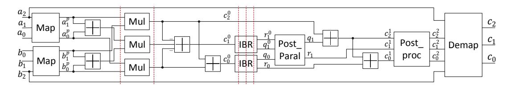
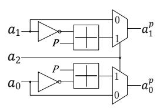
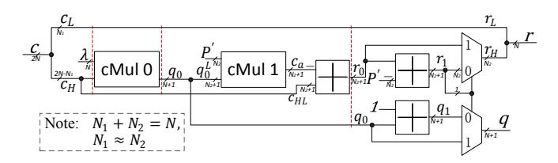
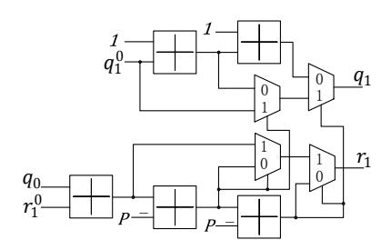
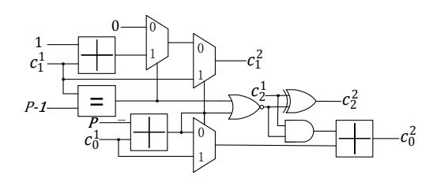
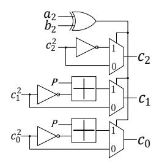

# Ultra-Fast Modular Multiplication Implementation for Isogeny-Based Post-Quantum Cryptography

Jing Tian, Jun Lin, and Zhongfeng Wang School of Electronic Science and Engineering, Nanjing University, Nanjing, China Email: jingtian nju@sina.com, {jlin, zfwang}@nju.edu.cn

*Abstract*—Supersingular isogeny key encapsulation (SIKE) protocol delivers promising public and secret key sizes over other post-quantum candidates. However, the huge computations form the bottleneck and limit its practical applications. The modular multiplication operation, which is one of the most computationally demanding operations in the fundamental arithmetics, takes up a large part of the computations in the protocol. In this paper, we propose an improved unconventional-radix finite-field multiplication (IFFM) algorithm which reduces the computational complexity by about 20% compared to previous algorithms. We then devise a new high-speed modular multiplier architecture based on the IFFM. It is shown that the proposed architecture can be extensively pipelined to achieve a very high clock speed due to its complete feedforward scheme, which demonstrates significant advantages over conventional designs. The FPGA implementation results show the proposed multiplier has about 67 times faster throughput than the state-of-the-art designs and more than 12 times better area efficiency than previous works. Therefore, we think that these achievements will greatly contribute to the practicability of this protocol.

*Index Terms*—Modular multiplication, supersingular isogeny Diffie-Hellman (SIDH) key exchange, post-quantum cryptography (PQC), hardware architecture, FPGA.

### I. INTRODUCTION

The supersingular isogeny key encapsulation (SIKE) protocol submitted to the NIST in November 2017 [1] has won two rounds of intense competitions, being one of the 26 candidates. It is a competitive candidate for standardized PQC application because it is the only one that resembles the classical ECC with the features of very small public and secret keys and providing perfect forward secrecy. The SIKE is developed based on the supersingular isogeny Diffie-Hellman (SIDH) key exchange, to enhance its anti-attack capability. The SIDH, which is multiple orders of magnitude faster than previous isogeny-based cryptosystems over ordinary curves, was first introduced by Jao and De Feo in 2011 to resist quantum attack based on the conjectured difficulty of finding isogenies between supersingular elliptic curves [2]. The authors also provided an extended version by adding a new zero-knowledge identification scheme and detailed security proofs for the SIDH protocol in [3]. The undeniable signatures based on the SIDH were presented in [4]. In [5], the authors presented a method for key compression which allows a reduction in transmission costs of per-party public information by about a factor of two with no effect on security. However, all of these algorithms currently encounter difficulties in practical applications because of the massive computations.

Recently, many researchers have focused on optimization implementations for SIDH key exchange on hardware, such as on FPGA [6]–[8] or on ARM [9], [10]. As one of the most computationally demanding elements in the fundamental arithmetics, the modular multiplication is the main concerned issue in these designs on whatever platforms. Koziel *et al.* proposed the first FPGA implementation for SIDH key exchange by parallelizing the multipliers in [6] based on the high-radix Montgomery multiplication for modular multiplication [11]. They further parallelized the multipliers to replace the inverter and improve the whole speed of SIDH in [7]. Inspired by the efficient finite field multiplication (EFFM) algorithm for SIDH proposed in [12], Liu *et al.* presented two new modular multipliers, the FFM1 and FFM2 [8] based on an unconventional radix, both of which achieve several times faster speed than the original EFFM. Besides, the SIDH is also implemented on ARM-embedded systems. In [9], Seo *et al.* proposed a unified ARM/NEON multi-precision multiplication on ARM based on specialized Montgomery reduction to accelerate the modular multiplications, and integrated it to the SIDH library [13] to speed up the original ARM design. In [10], Jalali *et al.* implemented the optimized field arithmetic operations on ARM for the SIKE protocol. Actually, much progress has been made to speed up the SIKE candidate and make it more practical. Nevertheless, the software and hardware implementations for this candidate still show more than one order of magnitude slower than those for other PQC candidates.

In this paper, we propose an improved unconventional-radix finite-field multiplication (IFFM) algorithm for SIDH, as the modular algorithms based on the unconventional radix [8], [12], [14] shows more efficiency than the conventional algorithms [15], [16]. The mathematical analysis shows that the proposed algorithm reduces computations by about 20% compared to the FFM1 which is the fastest algorithm in previous ones. Additionally, a new architecture for the IFFM is devised with a fully paralleling and pipelining scheme, where only one clock cycle is required to process a pair of inputs and each sub-module is utmostly optimized. We use a specific order of Karatsuba to optimize every multiplier and design the constant multipliers by using left shifters and adders. All these submodules are fully in use with exactly adapted data widths. We also code the proposed architecture with RTL and implement it on the Vertex-7 FPGA. The implementation results show that the proposed design achieves about 67 times faster throughput than the state-of-the-art designs and more than 12 times better area efficiency than previous works.

The rest of this paper is organized as follows. Section II gives a brief review of two classical modular multiplication algorithms, and three efficient modular multiplication algorithms for specific forms of prime. The proposed IFFM algorithm and the complexity comparisons with previous works are presented in Section III. In Section IV, the architecture for the proposed algorithm is devised. The FPGA implementation results and comparisons are provided in Section V. Section VI concludes this paper.

#### II. BACKGROUND

### A. Montgomery Reduction

The Montgomery reduction [15] is shown in Alg. 1. The algorithm transfers the numbers modulo P to modulo R such that numbers modulo R are inexpensive to process. As the computation complexity of numbers modulo R is negligible, we will not take this kind of computations into account in the following calculation. Therefore, this algorithm totally costs 2  $N \times N$  multiplications, 1 2N + 2N and 1 N + Nadders. The complexity is only related to the bit width of P. The drawback is that the output residue is not  $c \mod P$ but  $cR^{-1} \mod P$ . This can be compensated by converting the inputs into Montgomery presentations by multiplying R, and all of the arithmetic operations can be normally used. If an algorithm requires many multiplications and divisions, this conversion overhead will become negligible. Therefore, the Montgomery reduction is widely used in many complicated cryptosystems, like the SIDH [6], [7], [9].

## **Algorithm 1:** The Montgomery reduction [15].

```
Input: 0 \le c < RP < 2^{2N}, where R = 2^N and 2^{N-1} < P < 2^N; precompute P' = (-P^{-1}) \mod R.

1: t = ((c \mod R)P') \mod R

2: r = (c + t \cdot P)/R

3: if r \ge P then

4: r = r - P

5: end if

Output: r = cR^{-1} \mod P.
```

#### B. Barrett Reduction

The Barrett reduction is another efficient algorithm proposed by Paul Barrett in 1986 [16]. This algorithm can be described as in Alg. 2. The key idea is to transfer the complex division to a simpler one. Since adding or multiplying one number by a single-bit number is very easy, these kinds of operations are not counted in this paper. This algorithm requires  $1.2N \times (N+1)$  and 1.N(N+1) multiplications, and 1.2N+2N and 1.N+N adders. It should be pointed out that the complexity is changed with the input width. When the width of the input is the double of that of P, the multiplicative complexity of this algorithm is almost 1.5 times of the Montgomery reduction. The advantage is that it can directly obtain the quotient and remainder.

#### **Algorithm 2:** The Barrett reduction [16].

```
Input: 0 \le c < 2^{2N}; \lambda = \lfloor 2^{2N}/P \rfloor.

1: q = \lfloor \frac{c \cdot \lambda}{2^{2N}} \rfloor

2: r = c - q \cdot P

3: if r \ge P then

4: r = r - P, q = q + 1

5: end if

Output: q = \lfloor c/P \rfloor, r = c \mod P.
```

### C. Modular Multiplication for Modulus $Q = 2 \cdot 2^{2x} 3^{2y} - 1$

In [12], the authors proposed a modification based on the Barrett reduction for modulus  $P=2^x3^y$ . The process is summarized in Alg. 3, where  $2^x\approx 3^y$ , namely  $N_1+N_2=N$  and  $N_1\approx N_2\approx N/2$ . The modulus P is easily split into two parts:  $2^x$  and  $3^y$ . Since the cost of numbers modulo  $2^x$  is negligible, the cost is mainly for modulo  $3^y$ . The addition in Step 4 can be easily implemented by using one shifting operation. This algorithm costs  $1\ 3N/2(N+1)$  and  $1\ N/2(N+1)$  multiplications, and  $1\ 3N/2+3N/2$  and  $1\ N+N$  adders. The complexity of multiplication of this algorithm is almost the same as that of the Montgomery reduction, while the complexity of addition is reduced. In brief, this reduction algorithm is more efficient than the other two algorithms.

# **Algorithm 3:** The Barrett reduction (BR) for modulus $P = 2^x 3^y$ [12].

```
Input: c \in N^+, \ 0 \le c < 2^{2N}; \ P' = P/2^x = 3^y, \ \text{where}
x = N_1 \ \text{and} \ \lceil \log_2(3^y) \rceil = N_2; \ \lambda = \lfloor 2^{2N}/P \rfloor.
1: t = \lfloor c/2^{N_1} \rfloor, \ s = c \ \text{mod} \ 2^{N_1}
2: q = \lfloor \frac{t \cdot \lambda}{2^{2N-N_1}} \rfloor
3: r = t - q \cdot P'
4: r = r \ll N_1 + s
5: if r \ge P then
6: r = r - P, \ q = q + 1
7: end if
Output: q, r.
```

The modular multiplication algorithm called EFFM proposed in [12] is concluded in Alg. 4. Based on the unconventional radix P, it reduces the modulus Q to P using an interleaved way, where  $Q = 2 \cdot 2^{2x} 3^{2y} - 1$  and  $P = 2^x 3^y$ . The two input integers  $0 \le A, B < Q$  are expressed as in quadratic polynomials, such as  $A = a_2P^2 + a_1P + a_0$  for  $a_2 \in \{0,1\}$  and  $0 \le a_1, a_0 < P$ . We divide the process of the modular multiplication into three parts: 1) the first tentative computing; 2) the second tentative computing; and 3) post processing as shown in Alg. 4. In the first part, according to the rules provided in [12], the higher order (larger than two orders) terms are reduced and merged with the lower order terms. The common items are firstly calculated and the merged coefficients are temporarily saved in  $c_2$ ,  $c_1$ , and  $c_0$ . The second part is to further reduce the tentative results by adopting the BR function as presented in Alg. 3, where input c is divided **Algorithm 4:** The modular multiplication proposed in [12].

```
Input: A = a_2P^2 + a_1P + a_0, B = b_2P^2 + b_1P + b_0;
    Q = 2 \cdot 2^{2x} 3^{2y} - 1 = 2P^2 - 1;
    2^{N-1} < Q < 2^N, P < 2^{N/2}.
    1) The first tentative computing:
    Common items:
 1: t_1 = a_2b_1 + a_1b_2, t_2 = a_2b_0 + a_1b_1 + a_0b_2
    Results:
 2: c_2 = t_2 \mod 2, c_1 = \lfloor \frac{t_1}{2} \rfloor + a_1 b_0 + a_0 b_1,
    c_0 = (2^{-2} \bmod Q)a_2b_2 + a_0b_0 + (t_1 \bmod 2)\tfrac{P}{2} + \lfloor \tfrac{t_2}{2} \rfloor
    2) The second tentative computing:
    Reduction:
 3: [q_0, r_0] = BR(c_0, P)
 4: [q_1, r_1] = BR(c_1 + q_0, P)
    Common item:
 5: t = q_1 + c_2
    Results:
 6: c_2 = t \mod 2, c_1 = r_1, c_0 = \lfloor \frac{t}{2} \rfloor + r_0
    3) Post processing:
    Normalization:
 7: while c_0 \ge P do
       c_0 = c_0 - P
       c_1 = c_1 + 1
       if c_1 == P then
10:
          c_0 = c_2 + c_0, c_1 = 0, c_2 = 1 - c_2
11:
12:
       end if
13: end while
Output: C = A \times B \mod Q = c_2 P^2 + c_1 P + c_0.
```

by P, obtaining the quotient q and remainder r. In Step 3 of Alg. 4,  $c_0$  is reduced to  $q_0$  and  $r_0$ . In the next step  $q_0$  is added to  $c_1$  and the sum is reduced to  $q_1$  and  $r_1$ . This algorithm takes  $4\ N/2 \times N/2$ ,  $2\ 3N/4(N/2+1)$ , and  $2\ N/4(N/2+1)$  multiplications, and  $6\ N/2+N/2$ ,  $2\ 3N/4+3N/4$ ,  $3\ N/2+N$ , and  $3\ N+N$  additions.

The FFM1 in [8] removes the coefficients  $a_2$  and  $b_2$  of the inputs of Alg. 4, taking input A for example, by using the following formula:

$$a_i = \begin{cases} a_i, \ a_2 = 0 \\ P - a_i - 1, \ a_2 = 1 \end{cases}, i = \{1, 0\}.$$
 (1)

The inverse transformation for the output is almost the same as this equation except  $c_2 = a_2 \ b_2$ . This modification can efficiently avoid to precompute the number  $2^{-2} \mod Q$ . The number of multiplications is the same as before, and it takes  $10 \ N/2 + N/2$ ,  $2 \ 3N/4 + 3N/4$ ,  $1 \ N/2 + N$ , and  $2 \ N + N$  additions. Since the transformation for the inputs and output costs more extra additions, the reduction of additions is limited. The authors in [8] also proposed the FFM2 algorithm to expand the modulus P with the form of  $f \cdot 2^x 3^y \pm 1$  where x and y can be even or odd, and f is a small positive integer. It costs  $1 \ N \times N$ ,  $1 \ 3N/2 \times (N+1)$ , and  $1 \ N/2 \times (N+1)$  multiplications, and  $2 \ N + N$ , and  $1 \ 3N/2 + 3N/2$  additions.

It is clear that the FFM2 is inherently slower than the FFM1 when comparing the two multiplication counts.

#### III. PROPOSED IFFM ALGORITHM

### A. Improved Barrett Reduction

Reducing the complexity of the *BR* function can effectively improve the speed of the modular multiplication. In the following, we will introduce two optimization methods to the *BR* for higher hardware efficiency.

Firstly, the subtraction and multiplication operations in Step 3 of Alg. 3 is further simplified. We observe that the tentative residue r is smaller than 2P'. Since  $P' < 2^{N_2}$ , r is smaller than  $2^{N_2+1}$ . Thus the  $(2N-N_2-1)$  MSBs of c and those of  $q \cdot P$  are either equal to each other or with a difference of 1. Therefore, the sizes of the subtraction and multiplication can be reduced to  $N_2+N_2$  and  $(N_2+1)\times N_2$ , respectively. If the  $(N_2+1)$ -th MSBs of the two numbers are not equal, the residue r would be added by the parameter  $2^{N_2}$ . In the hardware design, this addition is actually unnecessary by taking advantage of the feature of hardware computing, for which more details will be introduced in the next section. Since  $N_2 \approx N/2 < N$ , the reduction in complexity is significant.

Secondly, for modulus  $P=2^x3^y$ , the size of the subtraction in Step 6 of Alg. 3 can be reduced from N+N to  $N_2+N_2$  by moving Step 4 to the end.

Based on the optimization methods introduced above, the improved Barrett reduction (IBR) only require about 1  $3N/2\times (N+1)$  and 1  $N/2\times (N/2+1)$  multiplications, and 3 N/2+N/2 additions. In the hardware implementation, the number of adders can be reduced to two. The complexity of multiplication is reduced by about 12.5% and that of addition by about 40%.

### B. Proposed Modular Multiplication

The IFFM is proposed in this section based on the FFM1 [8] which is the most efficient modular multiplication algorithm among the state-of-the-arts. As shown in Alg. 5, the *map* function is calculated by Eq. (1) and the *IBR* function is introduced above. As analyzed in Section II-C, the input c of the IBR is smaller than  $2P^2-P<2^{2\cdot N/2+1}$ , so the maximum data width of this function is N+1. Besides, the number of multiplications is further reduced by using the formula:

$$a_1b_0 + a_0b_1 = (a_1 + a_0)(b_1 + b_0) - a_0b_0 - a_1b_1.$$
 (2)

Therefore, the proposed IFFM only needs 2  $N/2 \times N/2$ , 1  $(N/2+1) \times (N/2+1)$ , 2  $3N/4 \times N/2$ , and 2  $N/4 \times N/4$  multiplications, and 6 N/4+N/4, 10 N/2+N/2, 1 N/2+N, and 3 N+N additions.

Assume that the upper bound of the input multiplier and multiplicand is  $2^N$  and the modulus P satisfies  $2^{N-1} < P < 2^N$ . For a fair comparison, the multiplication part is also included for the Montgomery and Barrett modular multiplication algorithms, abbreviated as MontM and BarM algorithms, respectively. Usually, N is as large as several hundred for public-key elliptic cryptographic algorithms. So the number of bits like N+1 is approximated to N. The N+N/2 addition, which can be split as one N/2+N/2



Fig. 1. The proposed top-level architecture.

## **Algorithm 5:** The proposed IFFM.

Input: 
$$A = a_2P^2 + a_1P + a_0$$
,  $B = b_2P^2 + b_1P + b_0$ ;  $Q = 2 \cdot 2^{2x}3^{2y} - 1 = 2P^2 - 1$ ;  $2^{N-1} < Q < 2^N$ ,  $P < 2^{N/2}$ .

1) The first tentative computing: mapping:

1: **for**  $i = \{1, 0\}$  **do** 

 $a_i = map(a_i, a_2), b_i = map(b_i, b_2)$ 

3: end for

Multiplication items:

4:  $m_1 = a_1b_1$ ,  $m_2 = a_0b_0$ ,  $m_3 = (a_1 + a_0)(b_1 + b_0)$ Results:

5:  $c_2 = m_1 \mod 2$ ,  $c_1 = m_3 - m_1 - m_2$ ,  $c_0 = m_2 + \lfloor \frac{m_1}{2} \rfloor$ 2) The second tentative computing:

# Reduction:

6: 
$$[q_0, r_0] = IBR(c_0, P)$$
  
7:  $[q_1, r_1] = IBR(c_1 + q_0, P)$ 

Common item:

8: 
$$t = q_1 + c_2$$

Results:

9: 
$$c_2 = t \mod 2$$
,  $c_1 = r_1$ ,  $c_0 = \lfloor \frac{t}{2} \rfloor + r_0$ 

# 3) Post processing:

Normalization:

10: **if** 
$$c_0 \ge P$$
 **then**

11: 
$$c_0 = c_0 - P$$
,  $c_1 = c_1 + 1$ 

12: **if** 
$$c_1 == P$$
 **then**

13: 
$$c_0 = c_2 + c_0, c_1 = 0, c_2 = (1 - c_2)$$

14: end if

15: end if

demapping:

16: 
$$t = a_2 \hat{b}_2$$

17: 
$$c_2 = c_2 \hat{t}$$
,  $c_1 = map(c_1, t)$ ,  $c_0 = map(c_0, t)$ 

**Output:**  $C = A \times B \mod Q = c_2 P^2 + c_1 P + c_0$ .

and one N/2 + 1 additions, is approximately treated as one N/2+N/2 addition. Besides, the complexities of addition and multiplication grow linearly and quadratically with the data width of the input, respectively. Thus, the numbers of additions and multiplications can be normalized to those of N + Nadditions and  $N \times N$  multiplications as shown in Table I, respectively. It can be seen that the proposed IFFM consumes the fewest number of multiplications and the number of additions is fewer than the EFFM's and FFM1's. Since a multiplication operation is much slower than an addition operation with the same size and the total numbers of normalized additions of

Comparisons of the Numbers of Normalized N+N additions AND  $N \times N$  Multiplications for Different Algorithms

|                      | MontM<br>[15] | BarM<br>[16] | EFFM<br>[12] | FFM1<br>[8] | FFM2<br>[8] | IFFM  |
|----------------------|---------------|--------------|--------------|-------------|-------------|-------|
| Norm. $(N+N)$        | 3             | 3            | 9            | 9           | 3.5         | 10    |
| Norm. $(N \times N)$ | 3             | 4            | 2            | 2           | 3           | 1.625 |

these algorithms are negligible compared to N, we can only take the multiplication numbers into consideration for the total computational complexity. Therefore, the proposed IFFM has the best performance among them, about 1.23 times faster than the state-of-the-art algorithms — the EFFM and FFM1.

#### IV. HARDWARE ARCHITECTURE

The top-level architecture is shown as in Fig. 1. The feedforward procedure is adopted and several pipeline stages are inserted so that the modular multiplier can be completed in only one cycle with a reasonable clock frequency and every part can be fully optimized. From Fig. 1, we can see that besides the explicit adders, the proposed modular multiplier architecture is composed of six modules: 1) map; 2) Mul; 3) IBR; 4) Post\_Paral; 5) Pros\_Proc; and 6) demap. They will be detailed in the following.

Map This module is used to map three items into two items. As computers use complement numbers to implement subtraction, Eq. (1) for  $a_2 = 1$  can be reformulated as:

$$a_i^p = P + (-a_i) - 1 = P + (a_i)_{comp} - 1$$
  
 $= P + ((a_i)_{inv} + 1) - 1$   
 $= P + (a_i)_{inv}, i = \{1, 0\}$  (3)

where the subscripts comp and inv represent the two's and ones' complements of  $a_i$ , respectively. By using this formula transformation, one adder can be reduced and the proposed architecture of this module is presented as in Fig. 2.



Fig. 2. The Map module.

*Mul* This module occupies the most hardware resources and the critical path of the whole design usually exists here. Theoretically, the Karatsuba decomposition can infinitely reduce the complexity of multipliers. However, the other overheads usually quickly increase along with the growing orders. The number of orders of such decomposition is specifically designed for the proposed module. We have carefully devised them and made a good tradeoff between speed and resource consumption.

IBR The proposed architecture is shown in Fig. 3. After a variable c, ranging from 0 to  $2^{2N}-1$ , is input in this module, it is split into two parts – the  $N_1$  LSBs saved in  $c_L$  and the other  $2N-N_1$  bits in  $c_H$ . The former part can be directly served as a part of the remainder r. The latter part should be further solved as the following. Firstly, variable  $c_H$  is multiplied by the constant value  $\lambda$  using a constant multiplier  $cMul\ 0$  and a tentative quotient  $q_0$  is output. Note that a constant multiplier can be implemented by shifters and adders instead of a normal multiplier. In that case, the hardware resources can be significantly reduced and fully utilized, and the data path can be efficiently shortened. On



Fig. 3. The IBR module.

the other hand, as only the N+1 MSBs are required to be computed and used, this unit can be further optimized when using the Karatsuba algorithm. Then, the tentative quotient  $q_0$  needs to be multiplied by the modulus P', which is also implemented by a constant multiplier cMul 1. The output is an approximation to  $c_H$ , denoted as  $c_a$ . Since the number of remaining bits of the remainder is only  $N_2 = N - N_1$ , we can deduce that the N MSBs of  $c_a$  and  $c_H$  are equal to each other or with a difference of 1. By making using of the feature of the hardware computer, we only use the  $N_2 + 1$  LSBs of  $c_H$  minus those of  $c_a$  to get the tentative remainder  $r_0$ , where the data width of the subtracter is reduced from  $2N - N_1$  to  $N_2 + 1$ . Stepping back to cMul 1, as only the  $N_2 + 1$  LSBs of  $c_a$  need to be output, we abandon the  $N_1 - 1$  MSBs of  $q_0$ and only put the  $N_2 + 1$  LSBs of  $q_0$  into cMul 1 to reduce the complexity. Additionally, averagely dividing the inputs into two parts can further reduce the hardware complexity and data path, as the sub-multiplier with two MSB-items can be omitted. Finally, the quotient q and the partial remainder  $r_H$ are selected from the corresponding tentative values and their modifications based on whether  $r_0$  is larger than P'. The final result of r is obtained by directly combining the  $r_L$  and  $r_H$ together. Pipelines can be inserted to reduce the critical path and increase the clock speed.

**Post\_Paral** In order to limit the whole latency,  $c_1^0$  and  $c_0^0$  are separately processed by two *IBR* modules in parallel. However,



Fig. 4. The Post\_Paral module.

their outputs need to be further merged. A flow chart of such parallel execution is preliminary presented in [12]. If it is directly implemented, five adders, two comparators, and four multiplexers will be cost, and the critical path will be three adders, two comparators, and two multiplexers. Therefore, we follow this idea and further improve it. The architecture is proposed in Fig. 4. We can see that the comparators are totally removed, and the critical path is only three adders and one multiplexer.



Fig. 5. The Post\_Proc module.

**Post\_Proc** This module is to meet the constraints  $c_2 \in \{0,1\}$  and  $0 \le c_1, c_0 < P$ . Meanwhile, all cases must be considered. The devised architecture is shown in Fig. 5. Since  $c_0^1$  is smaller than 2P, only one P should be subtracted. If  $P \le c_0^1 < 2P, c_1^1$  will be required to be added by 1. Considering  $0 \le c_1^1 < P$ , the case  $c_2^1 = P - 1$  is different from the others and should be discussed separately. In that case,  $c_1^1$  will be equal to 0 and  $c_2^1$  will be added by 1. If  $c_2^1$  is also equal to 1, it will be added to the final result of  $c_0^2$ . The total process is covered in Fig. 5. In order to optimize the data path, the left two adders and the comparator are processed in parallel, and the critical path is two adders and one multiplexer.



Fig. 6. The Demap module.

**Demap** The last step is to map the final results back to normal. The demapping is shown in Fig. 6 referred to as *Demap* module. The architecture of this module is the same

as that of the *Map* module except the one more output and the control signals.

#### V. IMPLEMENTATION RESULTS

The Xilinx Vivado 2016.4 EDA platform is adopted in FPGA implementation. The adopted SIDH-friendly prime modulus is  $p = 2 \cdot 2^{386}3^{242} - 1$ , targeting the 128-bit postquantum security level (PQSL). The proposed algorithm is implemented on the Virtex-7 xc7vx690tffg1157-3 board. There are totally 18 pipeline stages inserted to optimize the clock frequency  $f_{clk}$ . Since the proposed design is completely feedforward, it actually takes 1 clock cycle (CC) to process one pair of inputs with a latency of 18 CCs. The comparisons with previous algorithms implemented on FPGA are listed in Table II. It is clear that we achieve the fastest speed, about 66 times faster than the state-of-the-art design. To make a fairer comparison, we try to replace the DSP and BRAM with LUT equivalently. According to the performance and resource utilization of IP for Multiplier v12.0 announced by Xilinx [17], it can be found that whatever device families are used will not influence the number of LUTs, DSPs, or BRAMs. Thus we have designed sufficient experiments and found that under the same circumstance for a multiplier implementation, 1 DSP is equivalent to 249 LUTs and 1 BRAM is about equal to 50 LUTs. The equivalent LUTs (ELUTs) are calculated and listed as shown in the table. The throughput is computed as  $throughput = \frac{N \times f_{clk}}{CCs}$  and the area efficiency (AE) is defined as  $AE = \frac{throughput}{ELUTs}$ . It can be seen that our design achieves the fastest throughput and the best AE, about 67 times faster and 12 times better than the state-of-the-art designs, respectively.

TABLE II Comparisons of Modular Multipliers for Modulus  $Q=2\cdot 2^{386}3^{242}-1$  Implementing on FPGA

| Algorithms           | EFFM [12] | FFM1 [8] | FFM2 [8] | IFFM     |
|----------------------|-----------|----------|----------|----------|
| Platform             | Virtex-6  | Kintex-7 | Kintex-7 | Virtex-7 |
| FFs                  | 11,924    | 9,675    | 11,635   | 38,976   |
| LUTs                 | 12,790    | 16,627   | 33,051   | 63,173   |
| DSPs                 | 0         | 122      | 529      | 729      |
| BRAMs                | 0         | 0        | 0        | 574      |
| ELUTs <sup>1</sup>   | 12,790    | 47,005   | 164,772  | 273,394  |
| $f_{clk}$ (MHz)      | 31        | 55       | 25       | 60       |
| CCs                  | 236       | 64       | 28       | 1        |
| Time (ns)            | 7,613     | 1,164    | 1,120    | 17       |
| Throughput (Mb/s)    | 101       | 663      | 688      | 46,260   |
| AE<br>( Kb/(s·ELUT)) | 8         | 14       | 4        | 169      |

 $<sup>^{1}</sup>$  #ELUTs = #LUTs + 249 × #DSPs + 50 × #BRAMs.

#### VI. CONCLUSION

In this paper, we have presented a low-complexity modular multiplication algorithm called IFFM for the SIKE protocol. A fully paralleling architecture was proposed based on the IFFM. Many optimization methods, such as smart formula transformation and novel architectural techniques, were introduced and applied to this design. Hardware implementation results

have shown the proposed design is much more efficient than prior arts.

#### VII. ACKNOWLEDGMENT

This work was supported in part by the National Natural Science Foundation of China under Grant 61604068 and and Grant 61774082 in part by the Fundamental Research Funds for the Central Universities under Grant 021014380065. (Corresponding authors: Jun Lin; Zhongfeng Wang.)

#### REFERENCES

- R. Azarderakhsh, M. Campagna, C. Costello, L. Feo, B. Hess, A. Jalali,
   D. Jao, B. Koziel, B. LaMacchia, P. Longa et al., "Supersingular isogeny key encapsulation," Submission to the NIST Post-Quantum Standardization project, 2017.
- [2] D. Jao and L. De Feo, "Towards quantum-resistant cryptosystems from supersingular elliptic curve isogenies," in *International Workshop on Post-Quantum Cryptography*. Springer, 2011, pp. 19–34.
- [3] L. De Feo, D. Jao, and J. Plût, "Towards quantum-resistant cryptosystems from supersingular elliptic curve isogenies," *Journal of Mathematical Cryptology*, vol. 8, no. 3, pp. 209–247, 2014.
- [4] D. Jao and V. Soukharev, "Isogeny-based quantum-resistant undeniable signatures," in *International Workshop on Post-Quantum Cryptography*. Springer, 2014, pp. 160–179.
- [5] R. Azarderakhsh, D. Jao, K. Kalach, B. Koziel, and C. Leonardi, "Key compression for isogeny-based cryptosystems," in *Proceedings of the* 3rd ACM International Workshop on ASIA Public-Key Cryptography. ACM, 2016, pp. 1–10.
- [6] B. Koziel, R. Azarderakhsh, M. M. Kermani, and D. Jao, "Post-quantum cryptography on fpga based on isogenies on elliptic curves," *IEEE Transactions on Circuits and Systems I: Regular Papers*, vol. 64, no. 1, pp. 86–99, 2017.
- [7] B. Koziel, R. Azarderakhsh, and M. M. Kermani, "A high-performance and scalable hardware architecture for isogeny-based cryptography," *IEEE Transactions on Computers*, vol. 67, no. 11, pp. 1594–1609, 2018.
- [8] W. Liu, J. Ni, Z. Liu, C. Liu, and M. O'Neill, "Optimized modular multiplication for supersingular isogeny diffie-hellman," *IEEE Transactions on Computers*, pp. 1–1, 2019.
- [9] H. Seo, Z. Liu, P. Longa, and Z. Hu, "Sidh on arm: faster modular multiplications for faster post-quantum supersingular isogeny key exchange," *IACR Transactions on Cryptographic Hardware and Embedded Systems*, pp. 1–20, 2018.
- [10] A. Jalali, R. Azarderakhsh, and M. M. Kermani, "Neon sike: supersingular isogeny key encapsulation on armv7," in *International Conference on Security, Privacy, and Applied Cryptography Engineering*. Springer, 2018, pp. 37–51.
- [11] T. Blum and C. Paar, "High-radix montgomery modular exponentiation on reconfigurable hardware," *IEEE transactions on computers*, vol. 50, no. 7, pp. 759–764, 2001.
- [12] A. Karmakar, S. S. Roy, F. Vercauteren, and I. Verbauwhede, "Efficient finite field multiplication for isogeny based post quantum cryptography," in *International Workshop on the Arithmetic of Finite Fields*. Springer, 2016, pp. 193–207.
- [13] C. Costello, P. Longa, and M. Naehrig, "SIDH library," https://github.com/Microsoft/PQCrypto-SIDH, 2016-2019.
- [14] J. Bos and S. Friedberger, "Arithmetic considerations for isogeny based cryptography," *IEEE Transactions on Computers*, 2018.
- [15] P. L. Montgomery, "Modular multiplication without trial division," *Mathematics of computation*, vol. 44, no. 170, pp. 519–521, 1985.
- [16] P. Barrett, "Implementing the rivest shamir and adleman public key encryption algorithm on a standard digital signal processor," in *Conference on the Theory and Application of Cryptographic Techniques*. Springer, 1986, pp. 311–323.
- [17] Xilinx, "Performance and resource utilization for multiplier v12.0," https://www.xilinx.com/support/documentation/ip\_documentation/ru/multgen.html.