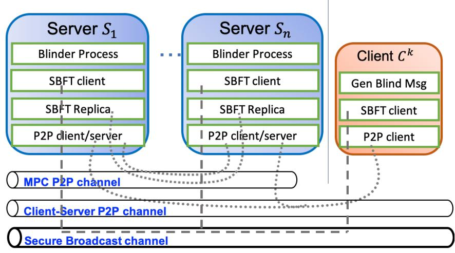
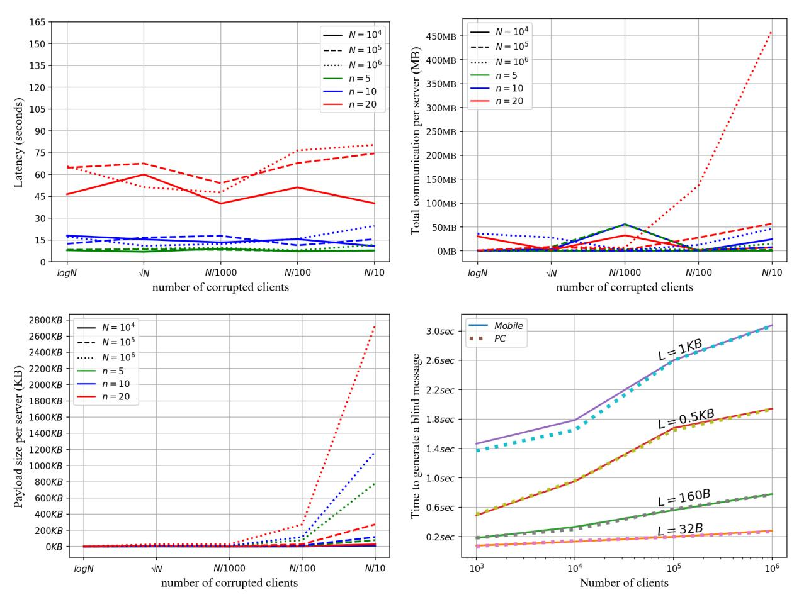
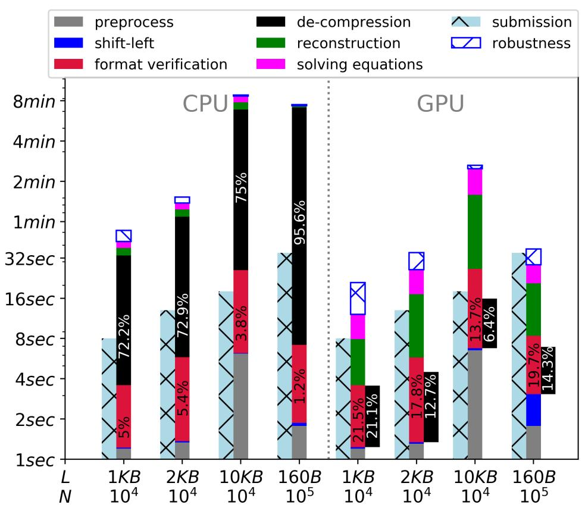
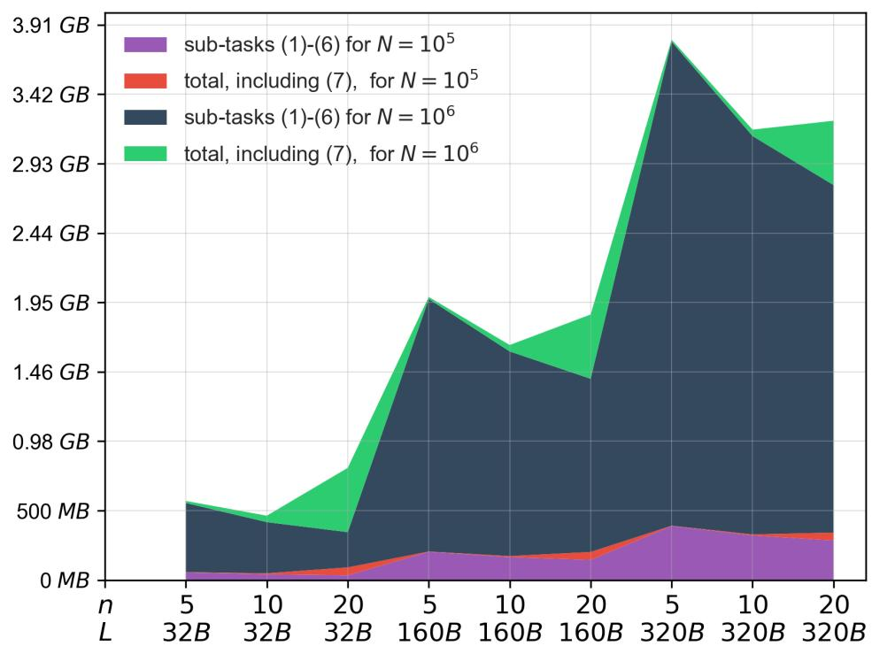
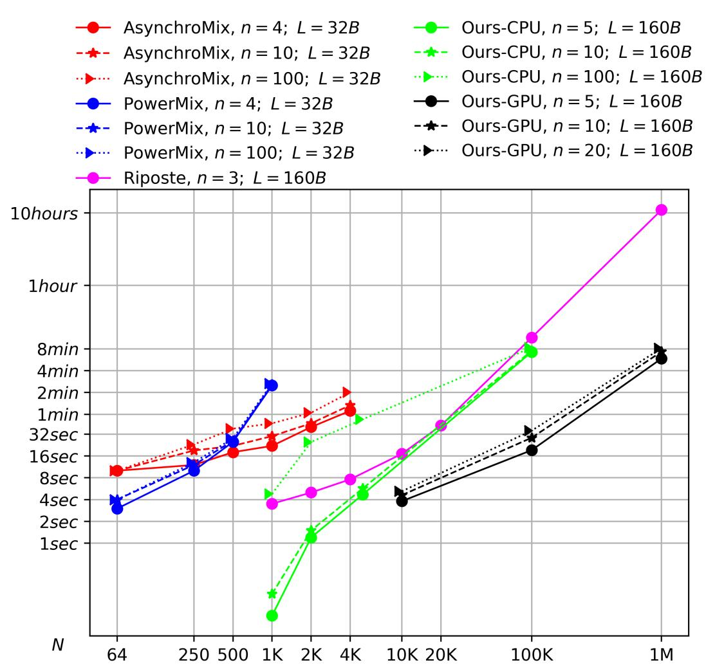
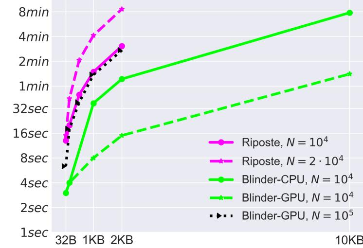
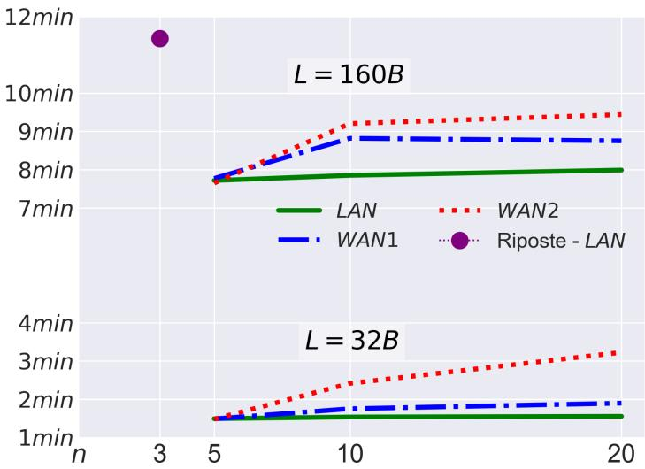
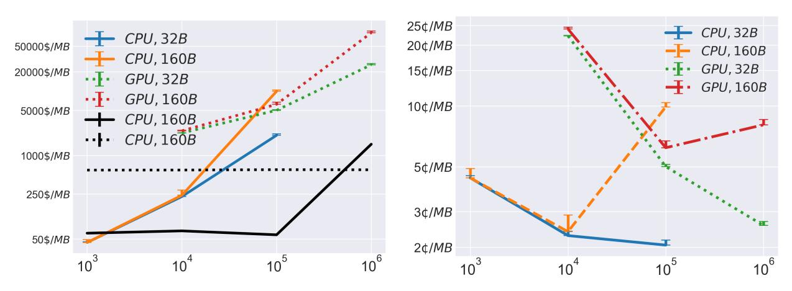

# <span id="page-0-0"></span>Blinder – MPC Based Scalable and Robust Anonymous Committed Broadcast

Ittai Abraham<sup>1</sup> , Benny Pinkas1,2, and Avishay Yanai\*1

> <sup>1</sup>VMware Research, Israel <sup>2</sup>Bar-Ilan University, Israel

> > July 23, 2020

#### Abstract

Anonymous Committed Broadcast is a functionality that extends DC-nets and allows a set of clients to privately commit a message to set of servers, which can then simultaneously open all committed messages in a random ordering. Anonymity holds since no one can learn the ordering or the content of the client's committed message.

We present Blinder, the first system that provides a scalable and fully robust solution for anonymous committed broadcast. Blinder maintains both properties of *security* (anonymity) and *robustness* (aka. 'guaranteed output delivery' or 'availability') in the face of a global active (malicious) adversary. Moreover, Blinder is *censorship resistant*, meaning that a honest client cannot be blocked from participating.

Blinder obtains its security and scalability by carefully combining classical and state-of-the-art techniques from the fields of anonymous communication and secure multiparty computation (MPC). Relying on MPC for such a system is beneficial since it naturally allows the parties (servers) to enforce some properties on accepted messages prior their publication.

In order to demonstrate scalability, we evaluate Blinder with up to 1 million clients, up to 100 servers and a message size of up to 10 kilobytes. In addition, we show that it is a perfect fit to be implemented on a GPU. A GPU based implementation of Blinder with 5 servers, which accepts 1 million clients, incurs a latency of less than 8 minutes; faster by a factor of > 100 than the 3-servers Riposte protocol (SOSP '15), which is not robust and not censorship resistant; we get an even larger factor when comparing to AsynchroMix and PowerMix (CCS '19), which are the only constructions that guarantee fairness (or robustness in the online phase).

# 1 Introduction

In the 80s Chaum [\[Cha88\]](#page-30-0) introduced a breakthrough protocol that enables a set of parties to communicate in an anonymous manner. Chaum presented it as the *Dining Cryptographers* problem and subsequent solutions are then called DC-networks (or a DC-net in short). Cast in modern terms, a DC-net protocol is an instance of a secure multi-party computation protocol. The ideal functionality of a DC-net protocol is to collect inputs from all parties such that all inputs are empty messages, ε, except for one input which contains a meaningful value, m. The functionality then broadcasts m. Anonymity holds since the identity of the sender of m is unknown and can potentially be any one of the participants. The set of participants is often called an *anonymity set*. Obviously, the larger the anonymity set the stronger the anonymity of the sender.

Systems like Dissent [\[WCFJ12\]](#page-33-0), Verdict [\[GWF13\]](#page-31-0) and Riposte [\[CBM15\]](#page-30-1) have extended the DC-nets architecture in several important ways:

1. To increase scalability, they adopt the *client-server* paradigm, where there are N clients that form the anonymity set, but only n N servers implement the functionality. This is a major step since a direct DC-net (with a full graph between clients) incurs an overall communication complexity of O(N<sup>2</sup> ) whereas servers-aided solution reduces this to roughly O(n · N).

<sup>\*</sup>Part of the work was done while in Bar-Ilan University.

- 2. Instead of dealing with a single non-empty message at each round, they allow multiple non-empty messages from different clients, such that at the end of a round the servers output all messages in a random and unknown order. Anonymity holds since the mapping between clients and messages is kept secret.
- 3. They devise mechanisms to detect and mask malicious clients that try to disrupt the system (e.g. DoS attacks).
- 4. Newer solutions (like Riposte [\[CBM15\]](#page-30-1) and Express [\[ECZB19\]](#page-30-2)) use techniques from function secret sharing (FSS) [\[BGI16\]](#page-29-0) to reduce client to server and server to server communication down to O(log N) and O(1) resp. per client, which enables a lighter client side and a faster verification of client messages.

The protocol we present in this work implements an ideal functionality (Definition [2.1\)](#page-6-0) for anonymous committed broadcast (ACB) and guarantees security via the simulation paradigm. Let us highlight important properties that the functionality captures: We want the protocol to be *correct*, meaning that messages output by the servers are those submitted by the clients; we want it to be *secure*, which in our context means that the system preserves the anonymity of the clients, so the mapping between the clients and the messages must be kept secret; and finally, we want it to be *robust* (a property also known as 'guaranteed output delivery' or 'availability' and hereafter referred to by 'robustness'), meaning that the protocol makes progress thwarting any disruption attempt of the adversary. This includes an adversary that corrupts clients, servers, network or any combination of these. We give more details on the power of the adversary in Definition [2.1.](#page-6-0)

Another important property is *censorship resistance*, i.e. a corrupted server must not be able to block honest clients from submitting their messages. Of course, if the network adversary is so powerful that it can spawn as many clients as it wishes and block any honest client that it wishes, then the effective anonymity set of *any solution* can be shrunk to only single client – by having the adversary spawn N − 1 malicious clients and block all honest clients except for one targeted honest client. This attack completely de-anonymizes that single targeted honest client. That attack is well recongnized in the setting of such a strong adversary [\[SDS02\]](#page-32-0). To allow a non-trivial anonymity set (circumvent this attack) we assume a slightly weaker adversary. We assume there are at least ρN, ρ ∈ (0, 1), honest clients submitting their messages, granting the network adversary the power to spawn 'only' (1−ρ)N clients. The adversary can inspect, but cannot block, all network channels (a global adversary). We stress that even in this weaker model, it is necessary to prevent a corrupted server from blocking honest clients, since otherwise the same deanonymization attack is possible (i.e. even though the adversary could not block honest clients from the network, it can still do so via a corrupted server). Protocols like [\[CBM15,](#page-30-1) [ECZB19\]](#page-30-2) suffer from that type of an attack whereas Blinder (this work) has a mechanism for preventing it, which allows preserving an optimal anonymity set of size ρN.

# 1.1 Our Contributions.

We present Blinder, the first system that provides a scalable and robust solution for anonymous committed broadcast. Blinder maintains*security* (anonymity), *robustness* and *censorship resistance* in the face of a global malicious adversary, over a synchronous network (all messages are delivered within some bounded time).

In more detail,

- 1. *Robustness*: Blinder keeps operating correctly and securely even in the presence of an adversary who inspects all network channels, controls t < n/4 of the servers and may spawn (1 − ρ)N malicious clients.
  - To achieve a robust protocol, we make sure that all the building blocks of the protocol are robust. However, we find that this is a necessary but not sufficient condition. Interestingly, having each client share its message using a Shamir sharing does not lead to a robust protocol, *even when all servers behave honestly*.
- 2. *Censorship resistance*: If there are ρN honest clients then the *effective anonymity set* is of size ρN, in contrast to previous work in which anonymity set size drops to one. We achieve this by a novel technique for batch consistency verification via a binary search. Such a technique can be applied to any MPC-based service that accepts inputs from clients.
- 3. *Scalability*: Blinder can be deployed with any number of servers and can support an anonymity set size in the millions with a relatively low latency, outperforming even systems with weaker security guarantees.
  - We observe that the arithmetic circuit to be securely evaluated by the servers can significantly benefit from a GPU deployment, which makes the system practical even for anonymity sets of millions of clients. This makes our protocol unique in the field of anonymous broadcast, in which protocols almost always rely on either symmetric

or asymmetric cryptographic primitives and can therefore only marginally benefit from GPU computation (see discussion in [§ D\)](#page-38-0). We implemented Blinder both using CPU-only computation and using GPU based computation and extensively evaluated performance over different numbers of servers, n ∈ [100], and of clients, N ∈ [2 · 10<sup>6</sup> ], and different message sizes, L ∈ {32 bytes, . . . , 10 kilobytes} (where 32 bytes messages is the only case reported by AsynchroMix and PowerMix, which may be useful for e.g., publishing secret keys. 160 byte messages correspond to anonymous micro-blogging application, e.g. anonymous Twitter. Larger message sizes may be applicable to anonymously transacting cryptocurrencies, as well as whistle-blowing small files). Let us present some examples of Blinder's performance:

- The CPU variant with n = 100 servers can handle and process N = 10, 000 clients in 11 seconds, which is 20× faster than AsynchroMix and PowerMix [\[LYK](#page-32-1)+19] when evaluated with up to 4096 clients (which took more than 2 minutes). Furthermore, Blinder can scale to many more clients with a reasonable latency. E.g., with 100 servers it takes about 7 minutes to serve 100, 000 clients.
- Blinder's GPU variant can serve 1 million clients with 160 byte messages in less than 8 minutes. This is more than 100× faster than the non robust system, Riposte, under a similar setting. Blinder is the first robust system that can scale to such number of clients.

The source code of Blinder can be found in <github.com/cryptobiu/MPCAnonymousBloging>

# 1.2 Overview of our techniques

Blinder is heavily based on Shamir's threshold secret sharing [\[Sha79\]](#page-32-2) and on advances in secure computation [\[DN07,](#page-30-3) [BH08,](#page-30-4) [CGH](#page-30-5)<sup>+</sup>18, [FL19\]](#page-31-1) on shared secrets.

There already exist secret sharing based constructions for anonymous broadcast [\[AKTZ17,](#page-29-1) [LYK](#page-32-1)<sup>+</sup>19] in which the clients first share their message toward the servers, which then run a *secure shuffle* protocol of the messages. These solutions do not scale well since secure shuffling incurs either a large computation overhead (as in PowerMix) or a large number communication rounds (as in McMix and AsynchroMix). Alternatively, Blinder adapts a different approach inspired by Riposte [\[CBM15\]](#page-30-1), which in turn is based on distributed point functions[1](#page-0-0) (DPF) [\[GI14,](#page-31-2) [BGI16\]](#page-29-0). In that approach we offload some of the computation and communication burden from the servers to the clients to avoid a costly secure shuffle protocol.

Using a DPF-like technique, the servers maintain a (initially empty) table and the clients themselves randomly and *obliviously* choose the final location of their message in that table. Namely, the servers do not know the chosen location. This requires a client to essentially write to *every location* in the table. So clients write their 'real' message to the chosen location and an empty message (or zero) to the rest of the table. Since 'writing' is done by secret sharing, the servers could not tell which location contains the message and which contains zero. The homomorphism properties of Shamir's sharing allow the servers to aggregate submissions of many clients, resulting a single table with many messages, one from each client. This however, requires each client to deal O(N) sharings, which rapidly becomes the bottleneck. To solve this problem we extend a DPF-based techniques to work efficiently with Shamir's sharing.

Informally, in a DPF scheme [\[GI14\]](#page-31-2) there are two servers S1, S<sup>2</sup> that maintain a table T, of size O(N), additively shared between them; so S<sup>1</sup> (resp S2) has T<sup>1</sup> (resp T2) such that T = T<sup>1</sup> + T<sup>2</sup> (entry-wise). To read a single entry at location i from T, a client interacts with both servers and submits a query q<sup>1</sup> to S<sup>1</sup> and query q<sup>2</sup> to S2. The servers locally process the queries and respond with x<sup>1</sup> and x<sup>2</sup> to the client, that combines these answers to obtain x = x<sup>1</sup> + x<sup>2</sup> = T[i]. A DPF scheme is oblivious, i.e. the servers do not learn anything about the index i. While the original DPF scheme allows *reading* from T, the construction in [\[CBM15,](#page-30-1) [ECZB19\]](#page-30-2) allows also *writing*, a necessary condition for anonymous communication. On the other hand, those systems in [\[CBM15,](#page-30-1) [ECZB19\]](#page-30-2) inherit the limit of the DPF scheme of [\[GI14\]](#page-31-2) and can work efficiently with two servers only.

The main benefit of relying on DPF is that the size of the queries q<sup>1</sup> and q<sup>2</sup> can be made sub-linear in T, even though when processing the queries the servers have to 'touch' every entry of T. Specifically, it is possible to compress the query up to size O(log T). Applications like anonymous communication set the table size, T, be proportional to the number of clients, N, which affects the effective anonymity set size and thus has to be large. Therefore, compressing the query size has a huge impact on the communication complexity.

<sup>1</sup>A distributed point function (DPF) is related to private information storage [\[OS97\]](#page-32-3) and 2-server private information retrieval (PIR) [\[CG97\]](#page-30-6).

Blinder proposes a new DPF scheme that (1) scales to *many servers*, and (2) obtains *robustness* while (3) preserving *low communication* complexity between servers.

- 1. Scalability is achieved using Shamir sharing instead of additive sharing. This modification allows using very efficient techniques for securely computing on shared secrets, which is required in order to decompress a client's query, to verify that it is well formed and to aggregate queries of many clients to a single final table.
- 2. For robustness, Blinder relies on a secure broadcast channel. However, instantiations of such a channel have a large communication overhead that decreases performance. Instead, we rely on a series of observations in order to (1) significantly limit the number of times Blinder uses a broadcast channel, and (2) use the values obtained from the broadcast channel to eliminate malicious clients and servers.
- 3. We achieve a low communication by integrating recent MPC protocols [CGH<sup>+</sup>18, FL19]: A basic sub-protocol in secure computation is a multiplication of shared secrets. Given sharings of secrets x and y from a finite field  $\mathbb{F}$ , the servers can obtain a sharing of  $x \cdot y$  without revealing x or y via a communication of  $O(|\mathbb{F}|)$  bits per server. In our protocol, decompression of a query incurs O(N) multiplication of secrets, which naively leads to a protocol with communication overhead of  $O(N^2|\mathbb{F}|)$  bits impractical when N is large. Fortunately, a recent observation [CGH<sup>+</sup>18] suggests the *sum of products* gate. That is, given sharings of secrets  $x_1, \ldots, x_\ell$  and  $y_1, \ldots, y_\ell$  from  $\mathbb{F}$ , the servers can obtain a sharing of  $\sum_{i=1}^{\ell} x_i \cdot y_i$  without revealing any of the intermediate values. Surprisingly, this incurs the same communication overhead as if they perform *only one secure multiplication*, that is, only  $O(|\mathbb{F}|)$  bits per server. This drastically reduces server to server communication overhead and makes our construction highly competitive. Furthermore, as we will show, the entire computation can be represented as an instance of matrix multiplication, which is a perfect task for a GPU.

For general computation, MPC protocols with full security are much more expensive than MPC protocols that are 'secure with abort' (for instance, [FL19] is secure with abort and performs almost as good as protocols with semi-honest security; on the other hand, protocols with full security are rarely implemented). Thus, achieving a robust and censorship resistant Blinder by using a fully secure MPC protocol would incur high overheads. Alternatively, we show that for the specific application of committed anonymous broadcast (ACB) we could still rely on a weaker MPC protocol to which we surgically add verification procedures. That way, we achieve a protocol with strong security guarantees (including robustness and censorship resistance) that is almost as efficient as a protocol with weak security. At the heart of the protocol there is a design of arithmetic circuits that are all of multiplicative depth of 1, which is important for the communication complexity. First, that means that the round complexity of the protocol is constant. Second, that means that we have to rely on a secure broadcast channel only for the input submission and consistency verification, whereas the circuit evaluation and outputs can be completed even without it, since in these phases we have sufficient redundancy that allows us to reconstruct all secrets.

### 1.3 Applications

Apart from an application to fearless whistle-blowing of fraud or incompetence to the public [WCFJ12, Bal04, Kre01, TFKL99, Vol99, Wal19], a system for anonymous committed broadcast has other interesting applications:

Differential privacy. Recent results in differential privacy analyzed the *shuffle model*, where users anonymously submit their private inputs to a server. This setup is a trust model which sits between the classical curator model (where a server knows the inputs of all clients and adds noise to answers to queries) and the local privacy model (where each client adds noise to its input). It was shown that the shuffle model provides substantially better tradeoffs between privacy and accuracy when aiming to achieve differential privacy [BEM+17, EFM+19, CSU+19, BBGN19]. However, current works analyze the advantages of this model without describing how it can be implemented. Our work essentially implements the anonymous channel that is assumed by the shuffle model. To support that, Blinder has to serve thousands to million clients with relatively short messages (e.g. telemetry) (representing their personal noisy data) of tens to hundreds of bytes.

P2P payments and front-running prevention. While Bitcoin's transactions are fully public, there exist peer-to-peer payment systems, like Zcash [BCG<sup>+</sup>14] and Monero [vS13], that preserve the privacy of their users (allowing payer, payee and amount privacy). However, in those systems privacy is only preserved in the application layer but not in the network layer. That is, having an access to the ledgers reveals nothing about 'shielded' transactions (except from the fact that they happened). However, being able to inspect the network could lead to their deanonymization by simply

tracking the IP address of the transaction's sender. Currently, users of those systems are instructed to use Tor [\[Fou19\]](#page-31-5) in order to hide their identity over the network layer, which is known to be insufficient [\[HVC10,](#page-31-6) [MD05,](#page-32-4) [MZ07,](#page-32-5) [Ray00\]](#page-32-6). Instead, Zcash/Monero users could potentially use Blinder to broadcast their transactions and be fully protected also over the network layer. To be useful for systems like Zcash and Monero, Blinder has to support relatively large messages of length > 1KB. A standard shielded transaction in Zcash is of length 1 − 2KB [\[BCG](#page-29-5)+14] and the system currently processes 6 shielded transactions per second [\[Bit20\]](#page-30-8).

A related problem is front-running in decentralized exchanges (DEX). DEXs typically execute trades over smart contracts, avoiding a trusted party that might steal funds. Using smart contracts means that the entire order book is pubic and transparent, which implies a fundamental weakness of *front-running*, or "dependency of trade orders" [\[KMS](#page-31-7)+16, [LCO](#page-31-8)+16, [DGK](#page-30-9)+19], referring to the practice of entering into a trade to capitalize on advanced knowledge of pending transactions. Users can *front-run* orders by observing past and most recent orders and placing their own orders with higher fees to ensure they are mined first. Blinder can circumvent that problem as all messages are *committed* and opened only after all trade orders are submitted, removing the aforementioned dependency. We remark that current DEX constructions are not anonymized, hence, using Blinder only for simultaneous opening of trade orders would be an overkill. Yet, research is striving for anonymized solution for DEX, for which Blinder is a perfect fit to serve as the communication medium.

# 1.4 Previous Work

Previous results on anonymous committed broadcast via a client-server DC-net [\[WCFJ12,](#page-33-0) [GWF13,](#page-31-0) [CBM15,](#page-30-1) [ECZB19,](#page-30-2) [LYK](#page-32-1)<sup>+</sup>19, [AKTZ17\]](#page-29-1) suffer from at least one of the following drawbacks:

- 1. *Non Robustness*: The protocol is resilient to clients' disruption, but (even a single) corrupted server may halt the system. Moreover, a corrupted server may choose to halt the execution *adaptively*, namely, even at the very last step of the protocol, after observing the output messages (in case it wishes that some message will not go public).
- 2. *Susceptibility to Censorship*: A corrupted server could arbitrarily block messages from honest clients, dropping the effective anonymity set size to be only one. This holds even in the weaker model where the adversary may spawn (1 − ρ)N clients.
- 3. *Non Scalability*: The protocols can only be run by a few servers or can accept a relatively small number of clients. Removing these limitations is important for security, as increasing the number of servers typically increases trust in the system and accepting more clients fortifies their anonymity.

McMix [\[AKTZ17\]](#page-29-1), AsynchroMix and PowerMix [\[LYK](#page-32-1)<sup>+</sup>19] all implement a secure shuffling by an honest-majority MPC. McMix implements the secure shuffling by Hamada et al. [\[HKI](#page-31-9)<sup>+</sup>12], which works efficiently only for 3 *semi-honest* (passive) servers, whereas AsynchroMIx and PowerMix scale beyond 3 servers as long as less than a third of the servers are malicious. {Asynchro, Power}Mix can run over an asynchronous network and support *fairness*, informally meaning that if preprocessing completes then the whole protocol completes. AsynchroMix has a round complexity of O(log<sup>2</sup> N) and PowerMix has a computational complexity of O(N<sup>3</sup> ). Therefore, these systems do not scale to more than a few thousands of clients. In contrast, Blinder scales to any number of servers and clients, and is both robust (the protocol completes unconditionally) and censorship resistant. However, it assumes a synchronous network and that less than a quarter are malicious.

Unlike the previous systems, in Blinder, following Riposte [\[CBM15\]](#page-30-1), the shuffling task is offloaded to the clients via an extension to the DPF construction. Riposte and its follow-up system Express [\[ECZB19\]](#page-30-2), run with two database servers that implement the DPF scheme. By relying on processors' intrinsics for computing AES, these systems can scale to millions of clients. Riposte also has an inefficient multi-server version that is not fully implemented. In both the two-server and multi-server versions even a single server may halt the execution and censor clients arbitrarily.

We remark that like Blinder, the Talek system [\[CSM](#page-30-10)<sup>+</sup>20] also utilizes GPU computation. However, much like Riposte, Talek is optimized for 3 servers and is not robust. See Table [1](#page-5-0) for an in depth comparison to recent DC-net based network.

There exist other approaches for anonymous communication. *mix nets*[\[Cha81,](#page-30-11) [GT96,](#page-31-10) [BFK00,](#page-29-6) [BL,](#page-30-12) [DDM,](#page-30-13) [CJK](#page-30-14)<sup>+</sup>16, [KEB98,](#page-31-11) [BCC](#page-29-7)<sup>+</sup>15, [BCZ](#page-29-8)<sup>+</sup>13, [PHE](#page-32-7)<sup>+</sup>17, [SAKD17\]](#page-32-8) offer attractive latencies, however their typical simple design is vulnerable to dropping or delaying packets to facilitate traffic analysis attacks [\[KAPR06,](#page-31-12) [LRWW04,](#page-32-9) [MD04,](#page-32-10) [NS03,](#page-32-11) [Pfi94,](#page-32-12) [PP89,](#page-32-13) [Ray00,](#page-32-6) [SW06,](#page-33-5) [Wik03\]](#page-33-6). This is addressed by either an expensive proof of correct shuffling and limiting

systems assumptions or via *hindsight* fault detection as is done in Loopix [PHE<sup>+</sup>17] and Miranda [LPDH19] by using looping techniques. These defenses are supposed to discourage misbehaving. However, nothing prevents a malicious mixer from conducting a single-shot attack in order to deanonymize a highly valuable user. In addition, these works have a complex threat model with two thresholds for collusion: one threshold for the mix servers and another for the directory (or ingress/egress) servers, where Loopix assumes that the latter may only be semi-honest.

Atom [KCDF17] is an alternative design to traditional mix networks, which uses trap messages to detect misbehaving servers. However, the trap message does not detect which mix failed and Atom does not describe how to exclude a malicious server. *Onion routing* can be seen as a variant of mix-nets in which the sender selects the shuffeling pattern. Systems based on onion routing, like [DMS04, MOT+11, MWB13, RSG98], and Tor [DMS04] in particular, are widely adopted. However, they do not resist traffic analysis attacks [HVC10, MD05, MZ07, Ray00], even by local adversaries [CZJJ12, KAL+15, PNZE11, WG13]. Systems based on a *mailbox* concept, such as [BDG15, CB95, KOR+04, KLDF16, SCM05] as well as Vuvuzela [vdHLZZ15], Alpenhorn [LZ16], and Pung [AS16], use anonymous 'dialing' and pair-wise messaging to a great extent rather than broadcasting. In addition, none of these is robust.

Systems like Vuvuzela [vdHLZZ15], Stadium[TGL<sup>+</sup>17] and Karaoke[LGZ18] provide differential privacy guarantees against attackers which might delay or block messages. This is done by adding dummy messages according to a distribution which satisfies the differential privacy requirements. These systems obtain remarkable scalability but are not resilient to denial of service attacks and hence are not robust.

<span id="page-5-0"></span>

|                                                     | client                | server                        | client-server | server-server                 | server-server | collusion;                    | cryptographic            |          |        | censorship | p        |
|-----------------------------------------------------|-----------------------|-------------------------------|---------------|-------------------------------|---------------|-------------------------------|--------------------------|----------|--------|------------|----------|
| work                                                | comp.*                | comp.*                        | comm.*        | comm.*                        | rounds        | adversary type                | assumptions              | fair     | robust | resist.    | $N_h$    |
| McMix [AKTZ17]<br>3 servers                         | O(1)                  | $O(N \log N)$                 | O(1)          | $O(N \log N)$                 | $O(\log N)$   | n = 3; t = 1<br>semi-honest** | information<br>theoretic | _        | _      | ✓          | $\rho N$ |
| Riposte [CBM15]<br>2 servers + audit                | $O(\sqrt{N})$         | $O(N^2)$                      | $O(\sqrt{N})$ | $O(N\cdot \sqrt{N})$          | O(1)          | n = 3; t = 1 malicious        | computational<br>(OWF)   | Х        | Х      | Х          | 1        |
| Riposte [CBM15]  n servers                          | $O(n \cdot \sqrt{N})$ | $O(N^2)$                      | $O(\sqrt{N})$ | O(N)                          | O(1)          | t < n malicious               | computational<br>(DDH)   | Х        | Х      | Х          | 1        |
| AsynchroMix [LYK <sup>+</sup> 19] switching network | O(n)                  | $O(n \cdot N \cdot \log^2 N)$ | O(1)          | $O(n \cdot N \cdot \log^2 N)$ | $O(\log^2 N)$ | t < n/3 malicious             | information<br>theoretic | ✓        | ×      | ✓          | $\rho N$ |
| PowerMix [LYK+19]                                   | O(n)                  | $O(N^3)$                      | O(1)          | $O(N^2)$                      | O(1)          | t < n/3 malicious             | information<br>theoretic | <b>✓</b> | Х      | <b>✓</b>   | $\rho N$ |
| Blinder<br>this work                                | $O(n \cdot \sqrt{N})$ | $O(N^2)$                      | $O(\sqrt{N})$ | O(N)                          | O(1)          | t < n/4 malicious             | information<br>theoretic | <b>√</b> | ✓      | <b>✓</b>   | $\rho N$ |

Table 1: Qualitative comparison of Blinder to leading client-server DC-net constructions with simulation based definition. OWF refers to the existence of one-way functions and DDH refers to the existence of a group under which the decisional Diffie-Helman problem is hard. 'client-server' refer to the message size between a client to a single server, the overall communication should be multiplied by n; 'All values in this column are multiplied by L (the message length). Complexity presented when a broadcast channel is taken for granted, see § 6 for a discussion on the instantiation of a secure broadcast channel. '\*\* This relates to their implementation. Theoretically McMix stands against a malicious adversary as well.

### 1.5 Paper Organization

Definitions and threat model are given in § 2 whereas the secret sharing and MPC related definitions are given in § 3. In § 4 we present Blinder's construction using an MPC in a black-box box manner, which theoretically leads to a robust protocol when the underlying MPC is robust. However, relying on a general robust MPC would be too costly. In § 5 we present a robust construction, which is also efficient, relying on the Furukawa and Lindell [FL19] and the 'player elimination technique'. In § 6 and § 7 we describe our concrete instantiation choices, including a description of the GPU advantage,s and in § 8 we describe our experiments and results. Finally, in § 9 we present our conclusion and future work.

### <span id="page-5-1"></span>2 Notation and Problem Definition

Denote by [x] the set  $\{1,\ldots,x\}$ . Jumping ahead, we use [x] to also denote a sharing of x, however, the interpretation is always clear from the context. For a vector or a matrix M, the hamming weight of M (i.e. the number of non-zero entries in M) is denoted by  $\mathsf{HW}(M)$ . Indexes begin at 1.  $\lambda$  is the statistical security parameter.  $\mathbb F$  is a finite field,  $|\mathbb F|$ 

its size and dlog<sup>2</sup> |F|e the bit length of an element from F (we may write log |F| for simplicity). A function µ : N → R is negligible if for every positive polynomial poly(·) there exists an integer Npoly s.t. for every x > Npoly it holds that |µ(x)| < 1/poly(x). We refer to a *negligible probability* as µ(x) for some security parameter x, in addition, an *overwhelming probability* is 1 − µ(x). We define φ = d λ log |F|−1 e, which is used for the number of times we have to repeat verification procedures in order to obtain a negligible false positive rate.

Blinder runs on a set of n servers S1, . . . , Sn, of which t < n/4 may be actively (maliciously) corrupted by an adversary. The servers emulate a trusted party that runs the anonymous committed broadcast (ACB) functionality defined below.

<span id="page-6-0"></span>Definition 2.1 (ACB Functionality) *The functionality interacts with* N *clients, denoted* C 1 , . . . , C <sup>N</sup> *, of which* ρN *are honest and* (1−ρ)N *are controlled by the adversary; and with* n *servers,* S1, . . . , Sn*, of which* t < n/4 *are controlled by the adversary. The functionality*

- *1. initializes and maintains a table,* A*, of* c<sup>1</sup> · N *entries (*c<sup>1</sup> > 1*).*
- <span id="page-6-2"></span>*2. waits for an* L *byte message* m<sup>k</sup> *from each client* C <sup>k</sup> *and appends* m<sup>k</sup> *to a uniformly random entry in* A*.*
- *\*. for a* non-robust *functionality: the adversary may decide to abort the functionality at any point.*
- *\*. for a* non-censorship resistant *functionality: the adversary may decide to discard* m<sup>k</sup> *instead of inserting it to* A*.*
- <span id="page-6-1"></span>*3. after receiving a message from all clients, the functionality outputs* A*'s qualified entries to the servers. A qualified entry is one with at most* c<sup>2</sup> *messages (*c<sup>2</sup> ≥ 1*). The messages in a qualified entry are output in a random order.*
- *\*. for an* unfair *functionality: the adversary receives the functionality's output (i.e. qualified* A*'s entries) and may decide whether the functionality further hand these outputs to the honest servers as well.*

Definition [2.1](#page-6-0) captures several variants of anonymous committed broadcast: with/without robustness (availability); with/without censorship resistance; and with/without fairness. For the strongest variant, namely, one that has both robustness, censorship resistance and fairness, ignore the steps marked with \*. In the following we refer to that variant. In the functionality the servers simply obtain a permuted list of messages from the functionality, without interaction with other clients or servers. However, in the actual implementation the servers may interact with each other and with the clients. In that respect, we assume a synchronous network and a global adversary (who may inspect all network channels). For the sake of exposition, we assume there exists a broadcast channel and private channels between the participants. In practice these are instantiated by a secure broadcast protocol and authenticated encryption (relying on PKI), which are further discussed in [§ 6](#page-17-0) and [§ 8.](#page-19-1)

The ACB functionality implies several properties: First, properties of a commitment scheme:

- *Hiding*: before the output step [\(3\)](#page-6-1), the adversary has no knowledge on the messages of the honest clients.
- *Binding*: a client cannot modify its message after submission in step [\(2\)](#page-6-2).

Then, there is the *effective anonymity set* property:

• *Effective anonymity set*: the adversary learns nothing about the mapping between the ρN honest clients and the messages of honest clients that are output by the functionality.

Obviously, for a given ρ, the larger the number of clients, N, the better anonymity provided to them. We note that ρN is the optimal effective anonymity set size, since the adversary controls the rest (1 − ρ)N clients. A censorship resistant protocol, like Blinder, is optimal in that sense. On the other hand, in a non-censorship resistant protocols like [\[CBM15,](#page-30-1) [ECZB19\]](#page-30-2), the adversary may easily drop the effective anonymity set size up to one.

Finally, we are interested in the robustness property (aka. 'availability' or 'guaranteed output delivery'). In the context of MPC, *fairness* is captured by *robustness*:

- Robustness means that no matter what the adversary does, it cannot make the system halt without producing outputs *to all servers*. This is stronger than the *fairness* property, achieved by [\[LYK](#page-32-1)<sup>+</sup>19], in which the system produces outputs to the adversary only if it also produces outputs to the honest participants (but there might be a case in which the system does not produce outputs at all).
- Robustness also covers the case of a malicious client. Obviously, by Definition [2.1,](#page-6-0) it is impossible for a client to break correctness or security of the functionality.

We stress that the security guarantees claimed by Blinder are limited to a stand-alone execution, which we call an 'epoch'. For a continuous execution of Blinder across many epochs, a standard heuristic is to have every client ever interacted with the system submitting a 'cover' (empty) blinded message on every epoch. We leave it out of the scope of the paper. In the rest of the paper we consider explicit parameters of  $c_1 = 2.7$  and  $c_2 = 2$ , which are inherited from the analysis in [CBM15].

# <span id="page-7-0"></span>3 Preliminaries

We fix a finite field  $\mathbb{F}$  over which subsequent computations will be done. Concretely, think of a prime field  $\mathbb{F}_p$  with a prime p>n. Every server  $\mathcal{S}_q, q\in [n]$ , is identified with the integer  $q\in \mathbb{F}_p$ . By a d-polynomial we mean a polynomial  $f(X)\in \mathbb{F}[X]$  of degree  $at\ most\ d$ .

# 3.1 Shamir's Secret Sharing [Sha79]

This consists two procedures, Share and Reconstruct:

Share $(x) \to [x]$ . To share a secret  $x \in \mathbb{F}$  with degree d, a uniformly random d-polynomial  $f(X) \in \mathbb{F}[X]$  with f(0) = x is chosen, and  $\mathcal{S}_q$  is given the share  $x_q = f(q)$ . We denote such a procedure by  $\operatorname{Share}_d(x)$ . It is well known that such a d-polynomial information theoretically hides x from any subset of at most d share holders.

For  $q \in [n]$ , we say that the polynomial f(X) agrees with  $\mathcal{S}_q$  if  $f(q) = x_q$ . A vector  $\vec{x} = (x_1, \dots, x_n)$  is said to be consistent d-sharing of s if there exist coefficients  $a_1, \dots, a_d$  such that the polynomial  $f(X) = s + \sum_{i=1}^d a_i \cdot X^i$  agrees with all honest servers  $\mathcal{S}_q$  (by a corollary, there are at most t servers who disagree with the polynomial ). It is said to be perfectly consistent if the polynomial agrees with all servers (even corrupted ones).

To the rest of the paper we use [x] and  $\langle x \rangle$  to denote a consistent t and 2t-sharing of x, respectively. Reconstruct $_d(\{q,x_q\}_{q\in[n]})\to x_0$ . Given the share  $x_q$  from server  $\mathcal{S}_q,\,q\in[n]$ , the procedure attempt to interpolates a d-polynomial f(X) with  $f(q)=x_q$ . Upon success, the procedure outputs  $x_0=f(0)$ , otherwise it outputs  $x_0=\bot$ . For simplicity, when referring to a reconstruction of some sharing [x] we may write Reconstruct([x]) instead of Reconstruct $_t(\{q,x_q\}_{q\in[n]})$ .

In general, the procedure succeeds in finding a d-polynomial f(X) even when there are at most  $\lfloor \frac{n-d}{2} \rfloor$  disagreeing servers; namely, when at most  $\lfloor \frac{n-d}{2} \rfloor$  points  $(q,x_q)$  do not reside on f(X); otherwise, it fails. We call such points 'bad points'. Put this in our context, when  $n \geq 4t+1$ , the procedure succeeds if there are at most 1.5t and t bad points for a t and t-polynomials, respectively. These parameters are the basis to our observations in § 5, by which we achieve a robust protocol. Specifically, our observations rely on the fact that when the procedure succeeds and outputs t and t that when the procedure succeeds and outputs t and t that when the procedure succeeds and outputs t and t that when the procedure succeeds and outputs t and t that when the procedure succeeds and outputs t and t that when the procedure succeeds and outputs t that when the procedure succeeds and outputs t that when the procedure succeeds and outputs t that when the procedure succeeds and outputs t that when the procedure succeeds and outputs t that when the procedure succeeds and outputs t that when the procedure succeeds and outputs t that when the procedure succeeds and outputs t that when the procedure succeeds and outputs t that when the procedure succeeds are t that when the procedure succeeds and outputs t that when the procedure succeeds are t that when the procedure succeeds are t that when the procedure succeeds are t that t that t is t that t that t is t that t the procedure succeeds are t that t is t that t that t is t that t the procedure succeeds are t that t is t that t the procedure succeeds are t that t is t that t that t is t that t the procedure succeeds are t that t is t that t the procedure succeeds are t that t is t that t that t is t that t that t is t that t the procedure succeeds are t that t is t that t is t that t that t is t that t

**Linear operations over Shamir's sharings.** Suppose that each server  $\mathcal{S}_q$  holds the shares  $x_q^{(1)},\dots,x_q^{(\ell)}$  for secrets  $x^{(1)},\dots,x^{(\ell)}$ . Let  $f:\mathbb{F}^\ell\to\mathbb{F}^m$  be a linear operator, then the servers can obtain sharings of  $y^{(1)},\dots,y^{(m)}\leftarrow f(x^{(1)},\dots,x_q^{(\ell)})$  by having each server locally compute  $y_q^{(1)},\dots,y_q^{(m)}\leftarrow f(x_q^{(1)},\dots,x_q^{(\ell)})$  on its own shares. It follows that the resulting sharings of  $y^{(1)},\dots,y^{(m)}$  are (perfectly) consistent if the sharings  $x^{(1)},\dots,x^{(\ell)}$  are (perfectly) consistent.

### <span id="page-7-2"></span>3.2 Secure Computation of Arithmetic Circuits (MPC)

The 'basic' Blinder protocol in § 4 uses an MPC protocol in a black-box manner, by providing the relevant arithmetic circuit and input sharings and obtaining the outputs, i.e. the results of evaluating the circuit on the shared inputs. We provide a definition of secure computation that has two security variants: 'security with abort' and 'full security'. The basic Blinder provide different guarantees when instantiated with each of one them.

<span id="page-7-1"></span>**Definition 3.1 (Secure Computation**  $\mathcal{F}_{mpc}$ ) Given a description of an arithmetic circuit Circ:  $\mathbb{F}^{\ell} \to \mathbb{F}^m$  and sharings of  $\ell$  inputs,  $[x^{(1)}], \ldots, [x^{(\ell)}]$  the functionality computes  $y^{(1)}, \ldots, y^{(m)} \leftarrow \operatorname{Circ}(x^{(1)}, \ldots, x^{(\ell)})$ . Denote by  $X^j$  the set of inputs  $x^{(i_1)}, \ldots, x^{(i_u)}$  that the output  $y^{(j)}$  depends on, and denote by Y the set of outputs  $y^{(j)}$  for which all input sharings in  $X^j$  are valid (where valid depends on the context, see next). For  $y^{(j)} \in \{y^{(1)}, \ldots, y^{(m)}\} \setminus Y$  the functionality outputs  $y^{(j)} = \bot$  to all parties. For  $y^{(j)} \in Y$  we consider two flavours of security:

- Security with abort. Here valid simply means that the sharing is perfectly consistent (as defined above). The functionality outputs  $Y = y^{(j_1)}, \ldots, y^{(j_v)}$  to the adversary. For each  $i \in [v]$  the adversary responds with deliver<sub>i</sub>  $\in \{0,1\}$ . If deliver<sub>i</sub> = 1 the functionality outputs the correct  $y^{(i)}$  to honest parties as well, otherwise it outputs  $y^{(i)} = \bot$  to them. This only guarantees that if a honest server receives outputs then they are correct.
- Full security. Here valid means that the sharings are verifiable (i.e. VSS [BGW88]). The functionality outputs  $Y = y^{(j_1)}, \ldots, y^{(j_v)}$  to everyone.

Implementations of  $\mathcal{F}_{mpc}$  use other functionalities to fulfil their task. In the following we briefly describe these functionalities, which are explicitly used by Blinder in § 5. For completeness, a detailed description about these functionalities and their implementations is given in § A.

- Generating random shares  $\mathcal{F}_{rand}$ . The functionality samples  $r \in \mathbb{F}$  uniformly and deals the share [r] to the servers (i.e.  $\mathcal{S}_q$  holds  $r_q$ ).
- Random double sharing  $\mathcal{F}_{\mathrm{rand}}^{\mathrm{double}}$ . The functionality samples  $r \in \mathbb{F}$  uniformly and deals the shares [r] and  $\langle R \rangle$  to the servers where R = r (so  $\mathcal{S}_q$  holds  $r_q$  and  $R_q$ ).
- Generating random coins  $\mathcal{F}_{coin}$ . The functionality samples  $r \in \mathbb{F}$  and hands it to all servers.
- **Product of shares**  $\mathcal{F}_{\text{mult}}$ . Given the sharings [x], [y] the functionality produces the sharing [z] where  $z = x \cdot y$  (i.e.  $\mathcal{S}_q$  obtains  $z_q$ ).
  - Note that the parties could obtain  $\langle z \rangle$  with  $z = x \cdot y$  by a local computation only:  $\mathcal{S}_q$  computes  $z_q = x_q \cdot y_q$ . However, if z is to be reconstructed it is not secure to call Reconstruct $_{2t}(\{q,z_q\})$  directly, since it reveals information about the values of x and y. Instead, it is required to produce a t-sharing of z first, which uses fresh randomness. To this end,  $\mathcal{F}_{\mathrm{mult}}$  is implemented using  $\mathcal{F}_{\mathrm{rand}}^{\mathrm{double}}$  as follows: The servers invoke  $\mathcal{F}_{\mathrm{rand}}^{\mathrm{double}}$  in the offline phase and obtain  $[r], \langle R \rangle$  with r = R. Then, in the online phase, the servers obtain  $\langle z \rangle$  locally, then they locally compute  $\langle z' \rangle = \langle z \rangle \langle R \rangle$ , they call Reconstruct $_{2t}(\{q,z'_q\}) \to z'$  to obtain the public value z' = z R = z r and finally locally compute [z] = [r] + z'. Obviously, z' reveals nothing about x,y or z since it is masked by an unknown random value r. That technique is followed by a line of MPC works, e.g. [DN07, CGH+18, FL19] and more.
- Sum of products  $\mathcal{F}_{products}$ . The authors in [CGH<sup>+</sup>18] observed that the use of  $\mathcal{F}_{rand}^{double}$  in the implementation of  $\mathcal{F}_{mult}$  has a greater potential: not only computing the product of a pair of secrets x and y, but to compute the sum of products of many pairs of secrets  $(x^1, y^1), \ldots, (x^\ell, y^\ell)$ . Specifically, given sharings  $[x^1], \ldots, [x^\ell]$  and  $[y^1], \ldots, [y^\ell]$  the functionality produce the sharing  $[z] = [\sum_{i=1}^\ell x^i \cdot y^i]$ . Similar to  $\mathcal{F}_{mult}$ ,  $\mathcal{F}_{products}$  is implemented as follows (using a double random sharing [r] and  $\langle R \rangle$ ): the servers locally compute  $\langle z' \rangle = \langle \sum_{i=1}^\ell x^i \cdot y^i R \rangle$  by each server  $\mathcal{S}_q$  computes  $z'_q = \sum_{i=1}^\ell x^i_q \cdot y^i_q R_q$ . Then the servers call Reconstruct $_{2t}(\{q,z'_q\}) \to z'$  to obtain  $z' = \sum_{i=1}^\ell x^i \cdot y^i R = \sum_{i=1}^\ell x^i \cdot y^i r$  and finally locally compute [z] = [r] + z'. Note that just like a simple product, sum of products consumes only one double random sharing. This is very important to Blinder's efficiency.

### <span id="page-8-0"></span>4 The Basic Blinder

In this section we describe a basic implementation of the ACB functionality, which relies on  $\mathcal{F}_{mpc}$ . We argue that the security guarantees of the basic protocol depend on the security guarantees of the underlying implementation of  $\mathcal{F}_{mpc}$ : if  $\mathcal{F}_{mpc}$  has full security then the basic protocol has robustness and censorship resistance, otherwise, if  $\mathcal{F}_{mpc}$  has security with abort then the basic protocol is neither robust nor censorship resistant. As mentioned earlier, the overhead of a generic robust MPC protocols is high, therefore, in this section we prove the latter argument only (see Theorem 4.1) whereas in § 5 we show how to achieve robustness for the specific purpose application of anonymous broadcast, without using a generic robust MPC protocol.

<span id="page-8-1"></span>Let N be the number of messages submitted to the system in a given epoch (i.e. one message from each client). The servers distributively maintain a matrix A with R rows and C columns such that  $R \times C = c_1 N$ . Denote the entry in the i-th row and j-th column by  $A_{(i,j)}$ . Specifically, for every i,j the servers maintain the sharing  $[A_{(i,j)}]$ , so server  $\mathcal{S}_q$  holds  $A_{(i,j),q}$ . We denote by  $A_q$  the whole matrix of shares held by  $\mathcal{S}_q$ . For simplicity, in the following we assume that messages consist of a single field element, i.e. L=1. We show how to extend to any L>1 in § 4.4.1.

## 4.1 Protocol Template

We first assume that clients are honest, and in § 4.3 show how to detect malformed messages. The protocol follows a template of 4 steps:

1. Submitting a message. To submit message  $m \in \mathbb{F}$ , a client  $\mathcal{C}$  picks random indices  $i^* \in [R]$  and  $j^* \in [C]$  and prepares a matrix M of size  $R \times C$  such that:

<span id="page-9-2"></span>
$$M_{(i,j)} = \begin{cases} m & \text{if } (i,j) = (i^*, j^*) \\ 0 & \text{otherwise} \end{cases}$$
 (1)

Then,  $\mathcal{C}$  calls  $\mathsf{Share}_t(M_{(i,j)})$  for every (i,j) by which server  $\mathcal{S}_q$  obtains  $M_{(i,j),q}$ . We call M the blind message, as any subset of at most t servers learn nothing about m nor  $i^\star, j^\star$  from the sharings  $[M_{(i,j)}]$ .

During submission time, N clients prepare blind messages, so that client  $\mathcal{C}^k$  with message  $m^k$  prepares a matrix  $M^k$  as its blind message and shares it entry-wise toward all servers. We denote server  $\mathcal{S}_q$ 's share of the (i,j)-entry by  $M^k_{(i,j),q}$  and denote by  $M^k_q$  the entire matrix of shares that  $\mathcal{S}_q$  received from  $\mathcal{C}^k$ .

- 2. **Format verification.** Once all messages are submitted the servers verify the format of all of them, e.g. that the matrices are of hamming weight at most 1. The verification is described in § 4.3. Messages that do not pass the verification are being discarded.
- 3. **Processing.** The servers reveal only the *aggregation* of all blind messages. Given  $M_q^1, \ldots, M_q^N$ , i.e.  $\mathcal{S}_q$ 's shares of blind messages from all N clients, it computes the sum of the shares. Namely, for every (i,j)

<span id="page-9-1"></span>
$$A_{(i,j),q} = \sum_{k=1}^{N} M_{(i,j),q}^{k}$$
(2)

Note that for every (i,j),  $A_{(i,j),q}$  is a share of the sum of values that all clients put in the (i,j) entry of their blind message. In other words, the servers locally compute the linear function  $[A_{(i,j)}] = \sum_{k=1}^N [M_{(i,j)}^k]$  for every (i,j). Indeed, since all  $[M_{(i,j)}^k]$  are of degree t then  $[A_{(i,j)}]$  is of degree t as well.

4. **Open.** The servers run  $A_{(i,j)} \leftarrow \mathsf{Reconstruct}(\{A_{(i,j),q}\}_{q \in [n]})$  for every (i,j) and output matrix  $A = \{A_{(i,j)}\}_{i \in \mathsf{R}, j \in \mathsf{C}}$ , which contains all clients' messages.

In the rest of this section we change some internal details in the above template. First, in § 4.2 we add some redundancy to the blind message in order to reduce probability of collisions, then in § 4.3 we show how to detect a malformed message, and finally, in § 4.4 we show how to compress the blind message in order to reduce communication loads.

### <span id="page-9-0"></span>4.2 Reducing Collisions via Redundancy

Suppose that only one client  $\mathcal{C}^k$  picked entry  $(i^\star,j^\star)$  for its message  $m^k$ , then it follows that  $M_{(i^\star,j^\star)}^k = m^k$  and  $M_{(i^\star,j^\star)}^{k'} = 0$  for every  $k' \neq k$ . Thus, according to Eq.(2), the value  $A_{(i^\star,j^\star)}$  opened by the servers equals  $m^k$ , and the message of  $\mathcal{C}^k$  is delivered successfully. On the other hand, if two or more clients,  $\mathcal{C}^{k_1}, \ldots, \mathcal{C}^{k_c}$  picked  $(i^\star,j^\star)$  then  $A_{(i^\star,j^\star)} = m^{k_1} + \ldots + m^{k_c}$ , a case denoted as a 'collision'. To deal with collisions we apply the following technique borrowed from [CBM15]. Instead of only one matrix, each client  $\mathcal{C}$  prepares two matrices: M as before, and a new matrix  $\hat{M}$  such that  $M_{(i^\star,j^\star)} = m$ ,  $\hat{M}_{(i^\star,j^\star)} = m^2$  and  $M_{(i,j)} = \hat{M}_{(i,j)} = 0$  for all  $(i,j) \neq (i^\star,j^\star)$ . The servers now distributively maintain two matrices: the matrix A that aggregates blinded messages  $M^k$  and the matrix  $\hat{A}$  that aggregates blinded messages  $\hat{M}^k$ . Now, if there are two clients  $\mathcal{C}^{k_1}, \mathcal{C}^{k_2}$  who picked the same entry  $(i^\star,j^\star)$  then we have  $A_{(i^\star,j^\star)} = m^{k_1} + m^{k_2}$  and  $\hat{A}_{(i^\star,j^\star)} = (m^{k_1})^2 + (m^{k_2})^2$ . Using those two equations we can find  $m^k$  and  $m^k$ : In a prime field  $\mathbb{F}_p$  when  $p \mod 4 = 3$ , for a given  $b \in \mathbb{F}_p$  we can solve  $b = x^2$  by computing  $x_1 = b^{(p+1)/4}$  and  $x_2 = -x_1$ . This incurs a cost of  $\log p - 2$  multiplications by computing  $b^{(p+1)/4}$  recursively, i.e.  $b^{2i} = (b^i)^2$ .

This technique works as long as at most two clients wrote to the same entry and fails for three or more. Note that the probability that 3 or more clients picked the same entry  $(i^*, j^*)$  is sufficiently small for our application. Specifically,

[CBM15] shows that when fixing  $c_1 = 2.7$  (i.e.  $R \times C \ge 2.7N$ ), the probability that 3 or more clients picked  $(i^*, j^*)$  is less than 0.05, so at least 95% of the messages will be successfully delivered. Of course, one can increase the success rate by increasing the blinded messages size, for instance, with each client submits blind messages for m,  $m^2$  and  $m^3$  and then having the servers solve a cubic equation for an entry with a collision of three messages. Success rate reaches probability 1 when the clients send N messages m,  $m^2$ , ...,  $m^N$  and having the servers solving equations of degree N. A similar extreme approach is taken by PowerMix [LYK+19] and incurs a very expensive computation overhead of  $O(N^3)$ ; hence, it is only practical to relatively small N's.

### <span id="page-10-0"></span>4.3 Excluding Malformed Messages

A malicious client, or a coalition of malicious clients, might try to disrupt the operation of Blinder in various ways, by sending a malformed message or using a different distribution for the indices than required in 4.1. For example:

- A coalition of clients can pick the same  $(i^*, j^*)$  for their messages, which might damage the reconstruction success rate analysis mentioned in 4.2.
- A malicious client might fill two or more entries, instead of one, in its blind message M, and hope that since the servers do not actually learn the content of the blinded message they would not detect it. In the extreme case, two malicious clients who blow up the entire matrix with messages might cause a DoS attack on Blinder since our implementation successfully reconstructs up to two messages per entry (thus, all 'honest' messages are un-reconstructible).
- Even a single client who writes to a single entry may damage the matrix and decrease reconstruction success rate by writing m to  $A_{(i^*,j^*)}$  and  $m' \neq m^2$  to  $\hat{A}_{(i^*,j^*)}$ . This actually fills entry  $(i^*,j^*)$  with 2 messages so a message of a honest client who writes to  $(i^*,j^*)$  will not be extracted. This way, the adversary essentially doubles its power.
- Finally, a client may deal inconsistent shares to the servers such that when trying to reconstruct a message in some entry, even robust reconstruction will fail (e.g. if there are 2t shares that disagree with the polynomial).

To this end, before the servers aggregate a blinded message  $M^k$  from client  $C^k$ , they perform a format verification sub-protocol that detects any kind of deviation from the message format dictated in 4.1.

### <span id="page-10-5"></span>4.3.1 Format Verification Circuit

To ease the presentation we treat M and  $\hat{M}$  as vectors of size  $\ell = c_1 N$  rather than matrices, e.g. we write  $[M_1], \ldots, [M_\ell]$  to refer to the entries of M and write  $i^*$  to refer the index chosen by the client (rather than  $(i^*, j^*)$ ). Upon receiving a sharing of a blind message  $(M, \hat{M})$  (see 4.1) the servers ensure the following.

- <span id="page-10-1"></span>1. Random index of message. We want the index of the message  $(m, \hat{m})$  hidden in  $(M, \hat{M})$  be uniformly random in order to fit the success rate analysis (see 4.2).
- <span id="page-10-2"></span>2. Single non-zero entry. The entries of M and  $\hat{M}$  must be all zero, except one entry that contains the message m and  $m^2$  in M and  $\hat{M}$ , respectively. I.e.  $\mathsf{HW}(M) = \mathsf{HW}(\hat{M}) = 1$ .
- <span id="page-10-3"></span>3. Non-zero in the same entry. The non-zero entries in M and  $\hat{M}$  must be at the same index  $i^*$ .
- <span id="page-10-4"></span>4. Squared message. If  $M_{i^*}=m$  then  $\hat{M}_{i^*}=m^2$ . This is necessary for being able to recover from a collision (see 4.2).

We now turn to describe how the servers perform the above checks without revealing anything about the client's message, m, or its position,  $i^*$ :

- 1. Instead of *verifying* item (1) we *enforce* it, that is, the servers make sure that the index of m within M is uniformly random, without actually knowing what is that index. Specifically, sample a public random value  $r \in [N]$  and shift-left the vectors by r positions s.t.  $M \leftarrow [M_{r+1}], \ldots, [M_N], [M_1], \ldots, [M_r]$  and  $\hat{M} \leftarrow [\hat{M}_{r+1}], \ldots, [\hat{M}_N], [\hat{M}_1], \ldots, [\hat{M}_r]$ . We stress that the servers do not know the final index of m even though they know r since the initial index of m secretly chosen by the client. We denote this sub-circuit by ShiftLeft $(M, \hat{M}, r)$ .
- 2. To verify items (2–3) we use a linear sketch for the language of vectors of hamming weight one (see Boyle et. al. [BGI16, BBC+20] and [ECZB19]). If the vector  $w = (w_1, \ldots, w_\ell)$  has hamming weight greater than 1 then the sketch applied to w outputs a non-zero value except with probability  $1/|\mathbb{F}|$ . The sketch is represented by  $(\sum_{i=1}^{\ell} w_i \cdot \sum_{i=1}^{\ell} w_i \cdot \sum_{i=1}^{\ell} w_i \cdot \sum_{i=1}^{\ell} w_i \cdot \sum_{i=1}^{\ell} w_i \cdot \sum_{i=1}^{\ell} w_i \cdot \sum_{i=1}^{\ell} w_i \cdot \sum_{i=1}^{\ell} w_i \cdot \sum_{i=1}^{\ell} w_i \cdot \sum_{i=1}^{\ell} w_i \cdot \sum_{i=1}^{\ell} w_i \cdot \sum_{i=1}^{\ell} w_i \cdot \sum_{i=1}^{\ell} w_i \cdot \sum_{i=1}^{\ell} w_i \cdot \sum_{i=1}^{\ell} w_i \cdot \sum_{i=1}^{\ell} w_i \cdot \sum_{i=1}^{\ell} w_i \cdot \sum_{i=1}^{\ell} w_i \cdot \sum_{i=1}^{\ell} w_i \cdot \sum_{i=1}^{\ell} w_i \cdot \sum_{i=1}^{\ell} w_i \cdot \sum_{i=1}^{\ell} w_i \cdot \sum_{i=1}^{\ell} w_i \cdot \sum_{i=1}^{\ell} w_i \cdot \sum_{i=1}^{\ell} w_i \cdot \sum_{i=1}^{\ell} w_i \cdot \sum_{i=1}^{\ell} w_i \cdot \sum_{i=1}^{\ell} w_i \cdot \sum_{i=1}^{\ell} w_i \cdot \sum_{i=1}^{\ell} w_i \cdot \sum_{i=1}^{\ell} w_i \cdot \sum_{i=1}^{\ell} w_i \cdot \sum_{i=1}^{\ell} w_i \cdot \sum_{i=1}^{\ell} w_i \cdot \sum_{i=1}^{\ell} w_i \cdot \sum_{i=1}^{\ell} w_i \cdot \sum_{i=1}^{\ell} w_i \cdot \sum_{i=1}^{\ell} w_i \cdot \sum_{i=1}^{\ell} w_i \cdot \sum_{i=1}^{\ell} w_i \cdot \sum_{i=1}^{\ell} w_i \cdot \sum_{i=1}^{\ell} w_i \cdot \sum_{i=1}^{\ell} w_i \cdot \sum_{i=1}^{\ell} w_i \cdot \sum_{i=1}^{\ell} w_i \cdot \sum_{i=1}^{\ell} w_i \cdot \sum_{i=1}^{\ell} w_i \cdot \sum_{i=1}^{\ell} w_i \cdot \sum_{i=1}^{\ell} w_i \cdot \sum_{i=1}^{\ell} w_i \cdot \sum_{i=1}^{\ell} w_i \cdot \sum_{i=1}^{\ell} w_i \cdot \sum_{i=1}^{\ell} w_i \cdot \sum_{i=1}^{\ell} w_i \cdot \sum_{i=1}^{\ell} w_i \cdot \sum_{i=1}^{\ell} w_i \cdot \sum_{i=1}^{\ell} w_i \cdot \sum_{i=1}^{\ell} w_i \cdot \sum_{i=1}^{\ell} w_i \cdot \sum_{i=1}^{\ell} w_i \cdot \sum_{i=1}^{\ell} w_i \cdot \sum_{i=1}^{\ell} w_i \cdot \sum_{i=1}^{\ell} w_i \cdot \sum_{i=1}^{\ell} w_i \cdot \sum_{i=1}^{\ell} w_i \cdot \sum_{i=1}^{\ell} w_i \cdot \sum_{i=1}^{\ell} w_i \cdot \sum_{i=1}^{\ell} w_i \cdot \sum_{i=1}^{\ell} w_i \cdot \sum_{i=1}^{\ell} w_i \cdot \sum_{i=1}^{\ell} w_i \cdot \sum_{i=1}^{\ell} w_i \cdot \sum_{i=1}^{\ell} w_i \cdot \sum_{i=1}^{\ell} w_i \cdot \sum_{i=1}^{\ell} w_i \cdot \sum_{i=1}^{\ell} w_i \cdot \sum_{i=1}^{\ell} w_i \cdot \sum_{i=1}^{\ell} w_i \cdot \sum_{i=1}^{\ell} w_i \cdot \sum_{i=1}^{\ell} w_i \cdot \sum_{i=1}^{\ell} w_i \cdot \sum_{i=1}^{\ell} w_i \cdot \sum_{i=1}^{\ell} w_i \cdot \sum_{i=1}^{\ell} w_i \cdot \sum_{i=1}^{\ell} w_i \cdot \sum_{i=1}^{\ell} w_i \cdot \sum_{i=1}^{\ell} w_i \cdot \sum_{i=1}^{\ell} w_i \cdot \sum_{i=1}^{\ell} w_i \cdot \sum_{i=1}^{\ell} w_i \cdot \sum_{i=1}^{\ell} w_i \cdot \sum_{i=1}^{\ell} w_i \cdot \sum_{i=1}^{\ell} w_i \cdot \sum_{i=1}^{\ell} w_i \cdot \sum_{i=1}^{\ell} w_$

 $(r_i)^2 - m(\sum_{i=1}^{\ell} w_i \cdot r_i^2)$  where  $w_i$  are the vector's entries,  $r_i$  are public random values generated independently of w and m is the value in the (allegedly) single non-zero entry, which can be computed by  $m = \sum_{i=1}^{\ell} w_i$ . In the context of our format verification, given  $[M_1], \dots, [M_\ell]$  the servers locally compute  $[m] = \sum_{i=1}^N [M_i]$  and then  $[\beta] = (\sum_{i=1}^{N} [M_i] \cdot r_i)^2 - [m] (\sum_{i=1}^{N} [M_i] \cdot r_i^2)$  where  $\beta$  is obtained by an evaluation of a circuit of multiplicative depth one, since the multiplications with public constants do not add to the depth. Finally, they call Reconstruct<sub>t</sub>( $\{q, \beta_q\}$ ) to obtain  $\beta$  and verify it equals zero. Otherwise, they discard that message. In fact, since we expect the non-zero entry in M and  $\hat{M}$  to be at the same index, we can randomly combine M and  $\hat{M}$  and apply the sketch on the combined vector. If  $HW(M) \neq 1$  or  $HW(M) \neq 1$  then the probability to pass the test equals the probability of having all entries except one be zeroed by the combination, or, that the test itself fails. Each of those events has probability of  $1/|\mathbb{F}|$ , by union bound we have that the verification of this step fails with probability  $2/|\mathbb{F}|$ .

3. Finally, to verify item (4), i.e. that  $(M_{i^\star})^2 = \hat{M}_{i^\star}$ , the servers can compute  $[\gamma] = [(M_{i^\star})^2 - \hat{M}_{i^\star}] = (\sum_{i=1}^N [M_i])^2 - (\sum_{i=1}^N [\hat{M}_i])$  where the squaring is performed via  $\mathcal{F}_{\text{mult}}$ . The servers call Reconstruct $_t(q, \gamma_q)$  to obtain  $\gamma$  and verify it equals zero. Otherwise they discard that message. Obviously, given that M and  $\hat{M}$  are of hamming weight 1, if  $(M_{i^*})^2 \neq \hat{M}_{i^*}$  then  $\gamma \neq 0$  with probability 1.

We describe the format verification in Circuit 4.1. Note that the same randomness is re-used in the verification of all clients' messages, this is possible since it is being sampled after all messages are determined and so it is independent of them. Therefore, the false-positive probability can be calculated for each message independently (see proof of Claim 4.1).

<span id="page-11-1"></span>Circuit 4.1 FormatVerification 
$$(\{[M_i^k], [\hat{M}_i^k]\}_{i \in [\ell], k \in [N]}, \{r_i, \hat{r}_i, \tilde{r}_i\}_{i \in [\ell]}, \{s^k\}_{k \in [N]})$$

**Inputs.** The blind message of each client  $C^k$ , which are the sharings of  $M^k_i$  and  $\hat{M}^k_i$  for  $i \in [\ell]$ ,  $\ell = c_1 N$ . Public random values  $s^k$  are in the ShiftLeft procedure and  $r_i, \hat{r}_i, \tilde{r}_i$  are used by the linear combination and sketch.

**Computation.** For every  $k \in [N]$  do:

- 1. Shift. Run  $M^k \leftarrow \mathsf{ShiftLeft}(M^k, s^k)$  and  $\hat{M}^k \leftarrow \mathsf{ShiftLeft}(\hat{M}^k, s^k)$ .
- 2. Combine. For  $i \in [\ell]$  compute  $[w_i^k] = r_i \cdot [M_i^k] + \hat{r}_i \cdot [\hat{M}_i^k]$ . In addition, compute  $[m \star^k] = \sum_{i=1}^{\ell} [w_i^k]$ ,  $[m^k] = \sum_{i=1}^{\ell} [M_i^k]$  and  $[\hat{m}^k] = \sum_{i=1}^{\ell} [\hat{M}_i^k]$ .
- 3. Linear sketch. Compute  $[\beta^k] = (\sum_{i=1}^\ell [w_i^k] \cdot \tilde{r}_i)^2 [m \star^k] (\sum_{i=1}^\ell [w_i^k] \cdot \tilde{r}_i^2)$ 4. Square. Compute  $\langle \gamma^k \rangle = [m^k] \cdot [m^k] [\hat{m}^k]$ .

**Output.**  $\beta^k$  and  $\gamma^k$  for every  $k \in [N]$ .

<span id="page-11-2"></span>**Claim 4.1** Let  $\{r_i, \hat{r}_i, \tilde{r}_i\}_{i \in [\ell]}$  and  $s^k$  be uniformly random and independent of the blind messages. For a blind message  $(M^k, \hat{M}^k)$ , if it complies to the format specified in § 4.1-§ 4.2 then Circuit 4.1 outputs  $\beta^k = \gamma^k = 0$ ; otherwise,  $\beta^k = \gamma^k = 0$  with probability of at most  $2/|\mathbb{F}|$ .

#### <span id="page-11-0"></span>**Compressing Blind Messages** 4.4

We utilize a compression technique from the PIR literature to improve the client-to-server communication from O(N) to  $O(\sqrt{N})$ , combined with the sum-of-products technique introduced in [CGH<sup>+</sup>18] to improve server-to-server communication from  $O(N^2)$  to O(N). For simplicity, suppose that  $c_1N$  is a perfect square and  $R = C = \sqrt{c_1N}$ . **Blind message format.** We can compress matrix M of size  $c_1N$  to only two short vectors: a row vector  $r \in \mathbb{F}^\ell$  and a column vector  $c \in \mathbb{F}^{\ell}$  where  $\ell = \sqrt{c_1 N}$ . Denote by  $r_i, c_i$  the *i*th coordinate of r and c, respectively.

A client  $\mathcal{C}$  with a message m randomly picks  $(i^*, j^*)$  and assigns  $c_{i^*} = 1$ , and  $c_i = 0$  for every  $i \neq i^*$ ; likewise,  $\bm{r}_{j^\star}=m$ , and  $\bm{r}_j=0$  for every  $j \neq j^\star$ . Observe that  $\bm{c} \times \bm{r}$  is exactly the matrix M from Eq.(1). Similarly,  $\mathcal C$ prepares vectors  $\hat{r}$  and  $\hat{c}$  instead of the matrix  $\hat{M}$ , where  $\hat{c}_{i^*}=1$ , and  $\hat{c}_i=0$  for every  $i\neq i^*$ ; likewise  $\hat{r}_{i^*}=m^2$ , and  $\hat{r}_i = 0$  for every  $j \neq j^*$ . Vectors (r, c) and  $(\hat{r}, \hat{c})$  constitute the new blind message. Notice that  $c = \hat{c}$ , so the client essentially prepares and sends a blind message with only 3 vectors  $(r, \hat{r}, c)$ , which are used to compute both  $M = c \times r$  and  $\hat{M} = c \times \hat{r}$ . C shares those vectors toward all servers. By  $x_{i,q}^k$  we denote the share that  $C^k$  sends to server  $S_q$  for the i-th coordinate of a vector x.

**Format verification.** The format verification works in the same manner as in the non-compressed version. We observe, however, that we can verify the format *before de-compression of the blind message*. That is, we apply the same verification Circuit 4.1 on the short vectors  $\mathbf{r}$  and  $\hat{\mathbf{r}}$ , along with additional simple check that  $\mathbf{c}$  is a unit vector. The new verification is given in Circuit 4.2.

```
Circuit 4.2 FormatVerification(\{[c_i^k], [r_i^k], [\hat{r}_i^k]\}_{i \in [\ell], k \in [N]}, \{r_i, \hat{r}_i, \tilde{r}_i\}_{i \in [\ell]}, \{s_{\text{row}}^k, s_{\text{col}}^k\}_{k \in [N]}\}
```

**Inputs.** The blind message of each client  $C^k$ , which are the sharings of  $\mathbf{c}_i^k$ ,  $\mathbf{r}_i^k$  and  $\hat{r}_i^k$  for  $i \in [\ell]$  and  $\ell = \sqrt{c_1 N}$ . Public random values  $s_{\mathsf{row}}^k$ ,  $s_{\mathsf{col}}^k$  are used for the shift procedure and  $r_i$ ,  $\hat{r}_i$ ,  $\tilde{r}_i$ , for  $i \in [\ell]$  are used by the linear combination and sketch.

**Computation.** For every  $k \in [N]$  do:

- 1. Shift. Run  $\mathbf{r}^k \leftarrow \mathsf{ShiftLeft}(\mathbf{r}^k, s^k_\mathsf{row}), \, \hat{\mathbf{r}}^k \leftarrow \mathsf{ShiftLeft}(\hat{\mathbf{r}}^k, s^k_\mathsf{row}) \, and \, \mathbf{c}^k \leftarrow \mathsf{ShiftLeft}(\mathbf{c}^k, s^k_\mathsf{col}).$
- 2. Combine. For  $i \in [\ell]$  compute  $[w_i^k] = r_i \cdot [\mathbf{r}_i^k] + \hat{r}_i \cdot [\hat{\mathbf{r}}_i^k]$ . In addition, compute  $[m\star^k] = \sum_{i=1}^{\ell} [w_i^k]$ ,  $[m^k] = \sum_{i=1}^{\ell} [r_i^k]$  and  $[\hat{m}^k] = \sum_{i=1}^{\ell} [\hat{r}_i^k]$ .
- 3. Linear sketch 1. Compute  $[\beta^k]=(\sum_{i=1}^\ell [w_i^k]\cdot \tilde{r}_i)^2-[m\star^k](\sum_{i=1}^\ell [w_i^k]\cdot \tilde{r}_i^2)$
- 4. Square. Compute  $\langle \gamma^k \rangle = [m^k] \cdot [m^k] [\hat{m}^k]$ .
- 5. Linear sketch 2. Compute  $[\delta^k]=(\sum_{i=1}^\ell [c_i^k]\cdot \tilde{r}_i)^2-(\sum_{i=1}^\ell [c_i^k]\cdot \tilde{r}_i^2)^2$

**Output.**  $\beta^k, \gamma^k$  and  $\delta^k$  for every  $k \in [N]$ .

<span id="page-12-3"></span>Claim 4.2 Let  $\{r_i, \hat{r}_i, \tilde{r}_i\}_{i \in [\ell]}$  and  $s_{\text{row}}^k, s_{\text{col}}^k$  be uniformly random and independent of the blind messages. For a blind message  $(M^k, \hat{M}^k)$ , if it complies to the format specified in § 4.1-§ 4.2 then Circuit 4.1 outputs  $\beta^k = \gamma^k = \delta^k = 0$ ; otherwise,  $\beta^k = \gamma^k = \delta^k = 0$  with probability of at most  $2/|\mathbb{F}|$ .

**Processing.** After the format verification the servers decompress the blind messages. Specifically, let  $H \subset [N]$  be the indices of blinded messages that passed the verification test, namely,  $(\boldsymbol{c}^k, \boldsymbol{r}^k, \hat{\boldsymbol{r}}^k)$  for which  $\beta^k = \gamma^k = \delta^k = 0$ . Then, for each  $k \in H$  the circuit computes  $M^k = \boldsymbol{c}^k \times \boldsymbol{r}^k$  and  $\hat{M}^k = \boldsymbol{c}^k \times \hat{\boldsymbol{r}}^k$ , which requires a single multiplication layer. Given  $M^k$  and  $\hat{M}^k$ , the processing continues by aggregation all blinded message to the matrices A and  $\hat{A}$ . In fact, instead of processing each blind message individually, Protocol 4.1 shows how to use the sum-of-product technique, so each index (i,j) in the final matrix A is the sum-of-products  $\sum_{k \in H} \boldsymbol{c}_i^k \cdot \boldsymbol{r}_i^k$ .

```
Protocol 4.1 BasicProtocol Inputs. (c^k, r^k, \hat{r}^k) from C^k for every k \in [N].
```

**Initialize randomness.** Generate  $\{s_{\mathsf{row}}^k, s_{\mathsf{col}}^k\}_{k \in [N]}$  and  $\phi$  sets of random values  $\{r_i, \hat{r}_i, \tilde{r}_i\}_{i \in [\ell]}$  with  $\mathcal{F}_{\mathsf{coin}}$ . These are used by the shift, linear combination and linear sketch in the verification circuit.

Secure computation. Invoke  $\mathcal{F}_{mpc}$  with the inputs above and the following circuit for  $\phi$  times. In the i-th circuit use  $\{s_{row}^k, s_{col}^k\}_{k\in[N]}$  and the i-th set of random values  $\{r_i, \hat{r}_i, \tilde{r}_i\}$ . Run the sub-circuit FormatVerification on the inputs above (Circuit 4.2). The outputs of FormatVerification are the values  $\beta^k, \gamma^k, \delta^k$  for each  $k \in [N]$ . Let  $H = \{k \mid \beta^k = \gamma^k = \delta^k = 0\}$ . For each  $k \in H$ , decompress  $\mathcal{C}^k$ 's message by computing  $[M_{(i,j)}] = [\mathbf{c}_i^k] \cdot [\mathbf{r}_j^k]$  and  $[\hat{M}_{(i,j)}] = [\mathbf{c}_i^k] \cdot [\hat{r}_j^k]$ . Then, for every (i,j) compute  $[A_{(i,j)}] = \sum_{k \in H} [M_{(i,j)}^k]$  and  $[\hat{A}_{(i,j)}] = \sum_{k \in H} [\hat{M}_{(i,j)}^k]$ . Equivalently, written with the sum-of-products technique, for each  $(i,j) \in [R] \times [C]$  compute  $[A_{(i,j)}] = [\sum_{k \in H} \mathbf{c}_i^k \cdot \hat{\mathbf{r}}_j^k]$ .

<span id="page-12-0"></span>**Output.** For every (i,j) output  $A_{(i,j)}$  and  $\hat{A}_{(i,j)}$ .

#### 4.4.1 Extending to an Arbitrary Message Length

We describe the required changes in the format of the blind message and its format verification when the message is of length L > 1. No changes required in the processing phase (i.e. aggregation and opening of messages).

Format. We have  $|c|=|r|=|\hat{r}|=\sqrt{c_1NL}$  so the total number of field elements in matrices  $c\times r$  and  $c\times \hat{r}$  is  $c_1NL$ , and we treat the row vectors r and  $\hat{r}$  as vectors from  $(\mathbb{F}^L)^v$  where  $v=\frac{\sqrt{c_1NL}}{L}$ . Let the message be  $m=m_1,\ldots,m_L$ , the client chooses  $(i^\star,j^\star)$  as before, where it sets  $c_{i^\star}=1$  and  $c_i=0$  for other  $i\neq i^\star$ . In addition, it sets  $r_{j^\star+k}=m_k$  and  $r_{j+k}=0$  for  $j\neq j^\star$  and  $k\in [L]$ . Likewise, it sets  $\hat{r}_{j^\star+k}=(m_k)^2$  and  $\hat{r}_{j+k}=0$  for  $j\neq j^\star$  and  $k\in [L]$ .

Format Verification. We describe the changes required in Circuit 4.2. Obviously, the shift procedure for the row vectors  ${\pmb r}$  and  $\hat{{\pmb r}}$  operates on blocks of  ${\mathbb F}^L$  rather than on  ${\mathbb F}$ . Then, in the *Combine* step, after obtaining the vector  $w_1^k,\ldots,w_\ell^k$  for  $\ell=\sqrt{c_1NL}$ , for  $i\in[L]$  the circuit computes  $[m_i^k]=\sum_{j=1}^v [r_{j+i}^k]$  and  $[\hat{m}_i^k]=\sum_{j=1}^v [\hat{r}_{j+i}^k]$ . Then, we redefine w to have only  $v=\frac{\sqrt{c_1NL}}{L}$  rather than  $\ell=\sqrt{c_1NL}$  entries by randomly combining each block of L entries to a single one. That is, for  $j\in[v]$  we redefine  $w_j^k\leftarrow\sum_{i=1}^L w_{(j-1)L+i}^k$ , then, we can compute  $[m\star^k]=\sum_{i=1}^v [w_i^k]$  as before. The sketch  $\beta^k$  is computed exactly the same, except that we iterate for  $i=1\in[v]$  instead of  $\ell$ . The square verification now verifies L entries rather than 1, so  $\langle\gamma^k\rangle=\sum_{i=1}^L [m_i^k]\cdot [m_i^k]-[\hat{m}_i^k]$ 

## 4.5 Security

Our security argument is twofold, depending on the underlying implementation,  $\pi$ , of  $\mathcal{F}_{mpc}$ . That is,

- If blind messages are submitted by Shamir's secret sharing scheme as described in § 3 and Blinder invokes  $\pi$  that provides 'security with abort' as the underlying implementation of  $\mathcal{F}_{mpc}$  then only correctness is guaranteed, where correctness in our context means anonymity, as the location  $(i^*, j^*)$  of a particular client is hidden among the locations of all clients in the anonymity set. On the other hand robustness and censorship resistance are not guaranteed as the adversary may prevent the honest servers from learning some (or all) outputs (by Definition 3.1).
- If blind messages are submitted by VSS (e.g. [BGW88]) and Blinder invokes  $\pi$  that provides 'full security' as the underlying implementation of  $\mathcal{F}_{mpc}$  then we have robustness and censorship resistance as well. This is due to the fact that when output depend on inputs that are all valid sharings, the adversary cannot prevent honest servers from obtaining them.

<span id="page-13-1"></span>We note that we focus on the former argument as our approach for achieving a robust and censorship resistant Blinder, in § 5, is not by using a robust implementation of  $\mathcal{F}_{mpc}$ . Formally, we prove the following<sup>2</sup>:

**Theorem 4.1** Let  $\pi$  be a protocol that implements  $\mathcal{F}_{mpc}$ . Protocol 4.1 securely implements the ACB functionality (Definition 2.1) without robustness and without censorship resistance.

# <span id="page-13-0"></span>5 Robust and Efficient Blinder

In this section we describe a robust and censorship resistant construction of Blinder. We assume a basic familiarity with [FL19] and we refer the reader to § A for more details.

Instead of using a robust protocol as the underlying MPC protocol in Protocol 4.1, as previously suggested, for efficiency we use a MPC protocol that has security with abort only. Specifically, we use the protocol by Furukawa and Lindell [FL19] described in § A and replace two of its underlying non-robust functionalities with robust ones. Namely, we replace the functionality that generate random double sharings( $\mathcal{F}_{\mathrm{rand}}^{\mathrm{double}}$ ) and the functionality that detect inconsistent input sharings by clients ( $\mathcal{F}_{\mathrm{input}}$ ). The former is invoked by the servers in the 'offline phase' and the latter is invoked at the beginning of the 'online phase'.

Let  $\pi$  be the MPC protocol of [FL19] and suppose that  $\pi$  is the underlying MPC in Protocol 4.1. We detect two 'vulnerable points' in Protocol 4.1 that might be exploited by the adversary in order to break robustness or censor honest clients:

 $<sup>^2</sup>$ We remark that the theorem holds for a general honest majority setting (when t < n/2), however, in Blinder we restrict t < n/4 for efficiency reasons.

- 1. The implementation of  $\mathcal{F}_{\mathrm{rand}}^{\mathrm{double}}$  in  $\pi$  is secure with abort, which means that the adversary (who corrupts servers) may halt the execution already in the offline phase by providing shares that are of degree greater than t and 2t.
- 2. The adversary (who corrupts clients) may provide blind messages that are not shared properly, namely, the sharings may be of a degree greater than t. In that case, we must choose between two security guarantees: if we discard a blind message that has inconsistent shares then this allows the adversary to censor honest clients; all it needs to do is to provide bad shares to the consistency check (see  $\mathcal{F}_{input}$  in § A). On the other hand, if we decide that the client was actually honest and the servers were cheating, and by that we remove the 'cheating' servers, this allows a corrupted client to blame honest servers. Note that even if we only decide to halt the execution (rather than removing the 'cheating' servers) this allows a corrupted client to deny service, an unacceptable situation.

The rest of this section proceeds as follows: First, we show (in Theorem 5.1) that if we use a robust version of  $\mathcal{F}_{\mathrm{rand}}^{\mathrm{double}}$  and  $\mathcal{F}_{\mathrm{input}}$  (in contrast to the non-robust version in Definitions A.2 and A.5), then Protocol 4.1 is a robust and censorship resistant implementation of the ACB functionality (Definition 2.1). Second, we show how to implement the robust version of those functionalities. Namely, in § 5.2 we show how to generate perfectly consistent random double sharings without allowing the adversary to halt the execution, and in § 5.3 we show how, given the set of sharings of blind messages from the clients, we can extract those that are perfectly consistent. In both cases we rely on a set of observations, liste in § 5.1, that allow the honest servers to safely 'eliminate' suspect servers from the computation. Let us begin with the definitions of the robust version of  $\mathcal{F}_{\mathrm{rand}}^{\mathrm{double}}$  and  $\mathcal{F}_{\mathrm{input}}$ :

<span id="page-14-2"></span>**Definition 5.1** (Robust Random Double Sharing  $\mathcal{F}^{\mathrm{double}}_{\mathrm{rand}}$ ) The functionality is invoked with a parameter  $\ell$ . The functionality receives nothing from the parties and generates pairs  $([r_i], \langle R_i \rangle)$  with  $r_i = R_i$  for  $i \in [\ell]$  and outputs  $\{(r_{i,q}, R_{i,q})\}_{i \in [\ell]}$  to party  $p_q$ .

<span id="page-14-3"></span>**Definition 5.2 (Robust Input Sharing**  $\mathcal{F}_{input}$ ) The functionality is invoked with a parameter  $\delta < \rho N$ . Each client  $\mathcal{C}^k$ ,  $k \in [N]$ , inputs the shares of its blind message to the functionality. Let H' be the set of clients with perfectly consistent sharings. The functionality sends H' to the adversary and receives back the set  $H'' \subset H'$  such that  $|H''| \leq \delta$ . Then, the functionality outputs to all servers all sharings and the set  $H = H' \setminus H''$ .

To understand the functionality, suppose first that  $\delta=0$ , in that case we get an optimal effective anonymity set, since the adversary may provide (by corrupted clients) at most  $(1-\rho)N$  inconsistent blind message sharings. So the output set H has all  $\rho N$  honest clients. When  $\delta>0$  that means that the adversary may block (censor) up to  $\delta$  of the honest clients. In previous protocols, like [CBM15, ECZB19], the value of  $\delta$  is  $\rho N$ , meaning that the effective anonymity set might drop arbitrarily by the adversary. Protocol 5.2 implements  $\mathcal{F}_{\text{input}}$  with  $\delta \leq t(1-\rho)N$ , meaning that the power of the adversary is t+1 times the optimal one (i.e. its optimal power is reducing the anonymity set by  $(1-\rho)N$  whereas its power in Protocol 5.2 is  $t(1-\rho)N$  in addition to the  $(1-\rho)N$  corrupted clients). Those  $t(1-\rho)N$  censored clients may use a stronger (and more expensive) input method (see § C).

<span id="page-14-0"></span>We start with the first argument:

**Theorem 5.1** Let  $\pi$  be the MPC protocol of Furukawa and Lindell as described in Protocol A.1 (the description is adapted to circuits of multiplicative depth one, as required by our application). If  $\pi$ 's underlying functionalities  $\mathcal{F}_{\mathrm{rand}}^{\mathrm{double}}$  and  $\mathcal{F}_{\mathrm{input}}$  are robust according to Definitions 5.1-5.2 then  $\pi$  is robust and censorship resistant when t < n/4.

The obvious corollary of that theorem is that Protocol 4.1 is robust and censorship resistant.

### <span id="page-14-1"></span>5.1 Player Elimination

In the field of secure computation, player elimination is a technique that allows the participants of a cryptographic protocol to agree on a set of one or more parties and ignore them to the rest of the protocol. This is for the reason that these parties are suspect of cheating. The main idea in the player elimination technique is that if the agreed upon set consists of k honest parties and k' corrupted parties then it holds that  $k' \geq k$ . This ensures that we preserve the invariant of the ratio between corrupted parties and n to be less than 1/4.

Our protocols for the generation of robust random double sharings and for robust input rely on the following observations, separated to two cases, depending on whether a sharing is given by a server or by a client.

A sharing [x] from a server  $S_i$ . By running Reconstruct([x]) each server  $S_q$  broadcasts its share  $x_q$  (using a secure broadcast protocol). Then each server attempts to find a t-polynomial that agrees with at least 3t + 1 points. There are 3 cases:

- 1. If the attempt fails then we can safely eliminate party S<sup>i</sup> (the dealer). Since the attempt fails only when the number of bad points is greater then t, and since there are at most t corrupted servers, the only way for a reconstruction to fail is when the dealer is corrupted, therefore, we conclude that the dealer S<sup>i</sup> is corrupted.
- 2. Otherwise, if attempt succeeds, but there is a set of parties S <sup>0</sup> ⊂ S such that their shares disagree with the reconstructed polynomial, then, let Smin be the server with the minimal index in S 0 . Eliminate both S<sup>i</sup> (the dealer) and Smin. That is, in this case we cannot tell whether the dealer cheated or the receivers (S 0 ), so we conclude with eliminating both the dealer and one of S 0 (specifically, for consensus, we eliminate the server with the minimal index). This way, we are sure to eliminate at least one corrupted server out of the two.
- 3. Attempt succeeds and there are no bad points, no server is eliminated. The sharing is perfectly consistent.

A sharing [x] from a client C. This is a more complicated scenario, because in case that attempt succeeds but we have a non empty set S 0 (of bad points), we cannot decide to eliminate the dealer and one of S 0 (as done above), because it might be that the one from S 0 is honest, which means that a corrupted client has the power to eliminate a honest server. This is obviously undesirable. Alternatively, we rely on the fact that there are at most (1 − ρ)N corrupted clients, which means that corrupted clients can 'blame' honest servers (by dealing them bad points) at most (1 − ρ)N times. Specifically, we initialize a counter ctr<sup>q</sup> = 0 for server Sq. Then, by running Reconstruct([x]), each server S<sup>q</sup> broadcasts its share xq. Then each server attempts to find a t-polynomial that agrees with at least 3t + 1 points. There are 3 cases:

- 1. If the attempt fails then we can safely eliminate party C (the dealer). This is the same as the first case in the previous paragraph.
- 2. Otherwise, if attempt succeeds, but there is a set of parties S <sup>0</sup> ⊂ S such that their shares disagree with the reconstructed polynomial, then, increment ctr<sup>q</sup> for every S<sup>q</sup> ∈ S<sup>0</sup> . If there is a server S<sup>q</sup> with ctr<sup>q</sup> > (1 − ρ)N then eliminate it.
- 3. Attempt succeeds and there are no bad points, no one is eliminated. The sharing is perfectly consistent.

The question is, how many times we can end up in the second case above? The answer is t(1 − ρ)N for the following reason: For a honest client, the counter of a honest server remains the same. The only case a counter of a honest server is incremented is when that server is dealt with a bad point from a corrupted client. Since there are at most (1 − ρ)N corrupted clients the counter of honest servers can grow up to that number. This is the reason that we do not eliminate a server with a counter less than or equal to (1 − ρ)N. Instead, we eliminate a server with more than that, meaning that each corrupted server may broadcast a bad point for (1−ρ)N times without being eliminated. If the corrupted servers disperse their cheating across many reconstructions (i.e. at each reconstruction only one corrupted server provides a bad point) then that means we get to the second case above at most t(1 − ρ)N times.

### Remarks.

- We assume a synchronous network, therefore, if a client does not send a share at all to a server then this is treated the same way as if the client sends a bad share, the server will not be harmed by that. Likewise, the server may, unfaithfully, claim that it did not receive a share from a client. This is treated as if the server provides a bad share and its counter increments.
- One may propose a different approach to treat the second case above (when [x] is given from a client, for which reconstruction succeeds but it is not perfectly consistent). The approach is to continue with [x] even though it is not perfectly consistent and rely on that it is possible to decode it. This approach fails for the following attack that may be mounted by two corrupted clients. Firsts client shares [x] by sending bad shares to a set of t honest servers. Second client shares [y] by sending bad shares to a disjoint set of t honest servers. If the servers calculate the sum [x + y] then that sharing is not consistent any more, since the number of servers with bad shares now is 2t, so x + y could not be decoded from [x + y]. Such aggregations occur in the Blinder's protocol, therefore, that approach is not robust.

### <span id="page-15-0"></span>5.2 Robust Random Double Sharing

The work of [\[DN07,](#page-30-3) [BH08\]](#page-30-4) use player elimination as well in order to obtain robustness, where [\[BH08\]](#page-30-4) is robust only in the online, their generation of double random sharings is not robust. By the observations in [§ 5.1](#page-14-1) we obtain a simplified protocol for the generation of double random sharings. Surprisingly, the robust implementation of F double rand

in the case of t < n/4 is identical to the non-robust implementation in the case of t < n/3 (Protocol A.2), except that when t < n/4 the honest parties have enough information in order to agree on the set of parties to eliminate. Note that when applying the player elimination technique, the number of parties and number of corrupted parties may change, we denote the updated numbers by n' and t' respectively. Let  $VAN_{n'\times(n'-t)}\in\mathbb{F}^{n'\times n'}$  be a Vandermonde matrix  $\{i^j\}_{i=1,\dots,n';j=0,\dots,n'-t}$ . Following [DN07], the protocol in [FL19] generates random double sharings in batches, so from a set of n sharings (one from each party) it produces (n-t). Protocol 5.1 below follows the same approach. If there are required  $\ell$  random double sharings then the parties call this procedure with parameter  $\frac{\ell \cdot n}{n-t}$ .

- <span id="page-16-1"></span>**Protocol 5.1** DoubleRandom *1.* **Initialize.** Set n' = n, t' = t and  $S = \{S_q\}_{q \in [n]}$ .
  - 2. **Share.** Each party,  $S_q$ , chooses and shares  $\ell+1$  random values  $u_q^1, \ldots, u_q^{\ell+1}$  with t and 2t sharings, namely, it produces  $[u_a^i]$  and  $\langle U_a^i \rangle$  for  $i \in [\ell+1]$ , where  $U_a^i = u_a^i$ .
  - 3. **Combine.** The parties invoke  $\mathcal{F}_{\text{coin}}$  to obtain  $\ell+1$  random values,  $\alpha_1,\ldots,\alpha_{\ell+1}$ . Then, for each  $q\in[n]$  the parties locally compute  $[u_q]=[\sum_{i=1}^{\ell+1}\alpha_iu_q^i]$  and  $\langle U_q\rangle=\langle\sum_{i=1}^{\ell+1}\alpha_iU_q^i\rangle$ . Then, they call Reconstruct on  $[u_q]$
  - 4. Eliminate. For q = 1, 2, ..., n (not in parallel):
    - (a) If  $S_q \notin S$  then skip (i.e. repeat with q = q + 1).
    - (b) Each party considers the shares of  $u_q$  and  $U_q$  it received from the n' parties in S and tries to decode a tand 2t-polynomials  $p_q$  and  $P_q$  in order to obtain  $u_q = p_q(0)$  and  $U_q = P_q(0)$ . Then
      - i. If decoding fails for either  $p_q$  or  $P_q$ , or decoding succeeds but  $u_q \neq U_q$ , then eliminate party  $S_q$ . Remove  $S_q$  from S and update n' = n' - 1 and t' = t' - 1.
      - ii. Otherwise, if decoding succeeds (with  $u_q=U_q$ ), but there is a set of parties  $\mathcal{S}'\subset\mathcal{S}$  that disagree with either  $p_q$  or  $P_q$ , then, let  $S_{min}$  be the server with the minimal index in S', remove  $S_q$  and  $S_{min}$  from S and update n' = n' - 2 and t' = t' - 1.
  - 5. **Output.** For simplicity denote the up to date set S by  $S_1, \ldots, S_{n'}$ , for  $i = 1, \ldots, \ell$ :
    - (a) Locally compute  $([r^1], \ldots, [r^{n'-t'}]) = (VAN_{n' \times (n'-t')})^\top \times ([u^i_1], \ldots, [u^i_{n'}])$  and  $(\langle R^1 \rangle, \ldots, \langle R^{n'-t'} \rangle) = (VAN_{n' \times (n'-t')})^\top \times (\langle U^i_1 \rangle, \ldots, \langle U^i_{n'} \rangle).$

<span id="page-16-2"></span>**Claim 5.1** When t < n/4 Protocol 5.1 securely implements  $\mathcal{F}_{rand}^{double}$  according to Definition 5.1.

#### <span id="page-16-0"></span>5.3 **Robust Input Sharing**

In the following we show how to achieve the second precondition. Ideally, we would like to have a functionality that is given input sharings from all clients and outputs the indices of the  $\rho N$  honest clients for which the input sharings are perfectly consistent. As mentioned above, we relax that requirement, so the functionality outputs then indices of  $\rho N - t(1-\rho)N$  instead. The additional  $t(1-\rho)N$  clients that are blocked by the adversary has another opportunity to provide their blind message by using a strong input method (see § C).

In Protocol 5.2 the set  $\hat{C}$  represents the set of corrupted clients, who are eliminated. The set  $\hat{C}$  represents the set of (potentially) honest client that are blocked by the corrupted servers. The functionality allows the adversary to block up to  $t(1-\rho)N-|C| \le (t+1)(1-\rho)N$  clients. For all clients in H (the set of honest clients), we have that their input sharings are perfectly consistent. We show in § 5.3 how clients in  $\hat{C}$  can provide their inputs via a robust input method.

Instead of verifying the consistency of the sharings of each client individually, for efficiency, Protocol 5.2 performs the consistency verification in a batched manner, utilizing the fact that addition of perfectly consistent sharings results in a perfectly consistent sharing. However, if the addition is not perfectly consistent, we have to find which specific sharing caused that. To this end, we perform a binary search for the inconsistent sharings. Our batching technique reflects the idea that we expect a relatively low  $1-\rho$ . We stress, though, that when  $1-\rho$  approaches 1 then it is better to perform an individual verification to every client. When bounding  $(1-\rho)N=o(N)$ , the batched verification significantly improves the performance. Bounding  $(1 - \rho)N$ , in practice, can be achieved by a PoW-based solution, a payment to the service, etc., that is out of the scope of this work.

The servers first randomly combine the blind message of each client  $C^k$  to a single value  $\alpha^k$ , then, they arrange the  $\alpha$ 's in a binary tree and verify aggregations of them from the root (which aggregates all  $\alpha$ 's) to the leaves (which store individual  $\alpha$ 's).

We proceed with a formal description of the protocol. Let  $\ell$  be the size of the vectors in the blind message, that is,  $\ell = \sqrt{c_1 N}$ . In addition, redefine the vector  $M^k$  to be the concatenation of the 3 vectors given by client  $\mathcal{C}^k$ , that is,  $M^k = r^k ||\hat{r}^k|| c^k$ .

# <span id="page-17-1"></span>**Protocol 5.2** BatchedConsistencyVerification( $\{M^k\}_{k \in [N]}$ )

1. Combine. For each client  $C^k$  invoke  $\mathcal{F}_{\text{coin}}$  to obtain  $R^k$  and  $\mathcal{F}_{\text{rand}}$  to obtain  $[\tilde{r}^k]$ . In addition, for  $i \in [3\ell]$  invoke  $\mathcal{F}_{\text{coin}}$  to obtain  $r_i$ . Locally compute  $[\alpha^k] = [\tilde{r}^k] + R^k \sum_{i=1}^{3\ell} r_i \cdot [M_i^k]$ .

#### 2. Initialize a tree.

- (a) Order the  $\alpha$ 's at the leaves of a binary tree T with height  $\log N$  (the root at layer 0 and leaves at layer  $\log N$ ), where  $\alpha^k$  resides at the k-th leaf.
- (b) Recursively, store  $\alpha_L + \alpha_R$  at an internal node, where  $\alpha_L$  and  $\alpha_R$  are stored at its left and right childs.
- (c) Mark the root of T as unresolved.
- 3. **Initialize sets.**  $\tilde{S} = \emptyset$  for the corrupted servers,  $\tilde{C} = \emptyset$  and  $\hat{C} = \emptyset$  for the corrupted and blocked clients, resp.
- 4. Verify consistency. For level  $\ell = 0, \ldots, \log N$ :
  - (a) Initialize a counter  $\operatorname{ctr}_q$  for every server  $S_q$ .
  - (b) Run Reconstruct on the sharing  $[\alpha]$  of each node on level  $\ell$  that is still marked as unresolved. Then:
    - i. If reconstruction is perfectly consistent then mark the sub-tree rooted at the that node as resolved.
    - ii. If reconstruction succeeds but is not perfect, then, for each server  $S_q$  who disagrees with the polynomial update  $\operatorname{ctr}_q = \operatorname{ctr}_q + 1$ .
    - iii. Otherwise (reconstruction fails): if this is the k-th leaf then add  $C^k$  to  $\tilde{C}$ .
  - (c) For each  $q \in [n]$ , if  $\operatorname{ctr}_q > (1 \rho)N$  then add  $S_q$  to  $\tilde{S}$ .
  - (d) If all nodes at level  $\ell$  are marked as resolved then halt.

### 5. Output.

- For each leaf  $[\alpha^k]$  marked as unresolved, add  $\mathcal{C}^k$  to  $\tilde{\mathcal{C}}$ .
- Output  $\tilde{S}$ ,  $\tilde{C}$  and  $\hat{C}$ .

<span id="page-17-2"></span>**Claim 5.2** When t < n/4 Protocol 5.2 securely implements functionality  $\mathcal{F}_{input}$  according to Definition 5.2.

# <span id="page-17-0"></span>6 Instantiation and Efficiency Analysis

The computational complexity of the protocol is dominated by the de-compression of blind messages, which incurs  $c_1N^2L$  finite field multiplications. The computation complexity for the rest of the protocol is insignificant and incurs O(NL) overhead. We continue with analysing the communication complexity.

In this section we analyse the theoretic efficiency of the two versions of Blinder: (1) Protocol 4.1, which is neither robust nor censorship resistant, (2) Blinder with the prerequisites Protocols 5.1 and 5.2, which is both robust and censorship resistant.

We first analyse Protocol 4.1 in terms of the number of calls to the underlying functionalities, and then consider the cost of each functionality according to the protocol of [FL19]. For convenience, our communication analysis counts field elements rather than bits.

### 6.1 The Non-Robust Protocol of § 4

Client-Server Communication. Both protocols begin by accepting N messages from the clients, each message is of size  $3\sqrt{c_1NL}$  field elements, so a server receives a total of  $N\cdot 3\sqrt{c_1NL}$  from all clients and a client sends a total of  $n\cdot 3\sqrt{c_1NL}$ .

Format Verification. The procedure requires  $3\sqrt{c_1NL}+2N$  public random values that are obtained by invoking  $\mathcal{F}_{\text{coin}}$ . Then, to obtain  $\beta^k, \gamma^k, \delta^k$  the servers invoke  $\mathcal{F}_{\text{products}}$  3 times, and to output them they invoke Reconstruct for 3 times. An overall of 3N calls to  $\mathcal{F}_{\text{products}}$  and 3N calls to Reconstruct. Recall (from § 3 and § A) that the  $\mathcal{F}_{\text{products}}$  is implemented by utilizing a single random double sharing and a single call to Reconstruct, meaning that the format verification's overall cost is invoking  $\mathcal{F}_{\text{rand}}^{\text{double}}$  with parameter 3N and 6N calls to Reconstruct. To obtain a negligible false positive, the format verification has to be repeated  $\phi$  times.

Aggregation and Output. The aggregation process invokes  $\mathcal{F}_{products}$  for  $2c_1NL$  times, then to output all entries in matrices A and  $\hat{A}$  it takes additional  $2c_1NL$  calls to Reconstruct. The invocations of  $\mathcal{F}_{products}$  in the aggregation cost the invocation of  $\mathcal{F}_{rand}^{double}$  with parameter  $2c_1NL$  and  $2c_1NL$  calls to Reconstruct, so there is an overall of  $4c_1NL$  calls to reconstruct.

Overall.  $\mathcal{F}_{\text{coin}}$  may be implemented by a call to  $\mathcal{F}_{\text{rand}}^{\text{double}}$  with parameter  $3\sqrt{c_1NL} + 2N$ , or by a call to  $\mathcal{F}_{\text{rand}}^{\text{double}}$  for only few times, to get a randomness of the size of the computational security parameter (e.g. 128 bits), and then use a PRG to obtain as many pseudorandom values as required. The former has information theoretic security whereas the latter has a computational security.

So, overall we call  $\mathcal{F}_{\mathrm{rand}}^{\mathrm{double}}$  with parameter  $\Phi = 3\sqrt{c_1NL} + 2N + \phi 3N + 2c_1NL$  or  $\Phi = \phi 3N + 2c_1NL$  (depends on the implementation of  $\mathcal{F}_{\mathrm{coin}}$ ) and  $\phi 6N + 4c_1NL$  calls to Reconstruct.

By Protocol A.2, to obtain x random double sharings, each party shares  $2x\frac{n}{n-t}$  random values and then the parties reconstruct 2n linear combinations (i.e. 2 for each party) where the linear combination is done using  $2x\frac{n}{n-t}$  public random values obtained via  $\mathcal{F}_{\text{coin}}$ . Thus, A.2 amounts to  $2x\frac{n}{n-t}$  times Share and  $\mathcal{F}_{\text{coin}}$  and 2n times Reconstruct.

By Share and Reconstruct, a party sends a field element to each other party, hence n in total (note that in [FL19, CGH<sup>+</sup>18, BH08] the cost of Reconstruct is O(1) per party rather than n, even though, we calculate her using the naive implementation of Reconstruct).

Thus, the overall communication per party is  $n(2\Phi\frac{n}{n-t})$  (using the latter implementation of  $\mathcal{F}_{\mathrm{coin}}$ ) plus  $n(\phi 6N+4c_1NL)$ . Together we get a communication complexity of  $\frac{2n^2}{n-t}(\phi 3N+2c_1NL)+n(\phi 6N+4c_1NL)$ . Taking n/(n-t)=4/3 we get a communication complexity of  $n\cdot N\cdot (14\phi+9\frac{1}{3}c_1L)$ . We conclude that the protocol has linear communication complexity in number of servers, clients and message length.

## 6.2 The Robust and Censorship Resistant Protocol of § 5

The analysis below has the same structure as above, along with the analysis of the robust random double sharing (Protocol 5.1) and the consistency verification (Protocol 5.2). In these two protocols, the Reconstruct procedure relies on a secure broadcast protocol [DS83, ADD<sup>+</sup>19, AMN<sup>+</sup>]. To this end, we calculate the number of times a party uses the broadcast channel and denote by B the incurred communication (per party), in field elements, for broadcasting a single field element. Note that in the analysis below we use the latter approach to implement  $\mathcal{F}_{\text{coin}}$  as described above.

Client-Server Communication. This is exactly the same as the in the non-robust protocol, a server receives a total of  $N \cdot 3\sqrt{c_1NL}$  field elements from all clients and a client sends a total of  $n \cdot 3\sqrt{c_1NL}$ .

Random Double Sharing. This is separated to the Share and Reconstruct phases. The Share phase is exactly as in the non-robust protocol, that is, to obtain x random double sharings, each party shares  $2x\frac{n}{n-t}$  random values. Then, the parties reconstruct the sharings  $[u_q]$  and  $\langle U_q \rangle$  for each server  $\mathcal{S}_q$ . This incurs a communication of 2n broadcasts per party, which has a communication of 2nB. Thus, overall communication of  $2x\frac{n}{n-t}+2nB$  per party.

Consistency Verification. In the batched consistency verification and format verification there are  $\log N$  rounds, each incurs at most  $t(1-\rho)N$  broadcasts, thus, an overall of  $t(1-\rho)N\log N\cdot B$  per party. In addition, the protocol uses a random sharing  $[\tilde{r}^k]$  for each client  $\mathcal{C}^k$ . Even though this is a single sharing (rather than a double), the parties obtain it via  $\mathcal{F}^{\text{double}}_{\text{rand}}$ . This adds N to the parameter given to  $\mathcal{F}^{\text{double}}_{\text{rand}}$ .

Format Verification, Aggregation and Output. These parts of the protocol are exactly the same as in the non-robust version, which incurs  $3\phi N$  calls to  $\mathcal{F}_{\mathrm{rand}}^{\mathrm{double}}$  and  $6\phi N$  times Reconstruct for the format verification,  $2c_1NL$  calls to  $\mathcal{F}_{\mathrm{rand}}^{\mathrm{double}}$  and  $4c_1NL$  times Reconstruct for the aggregation and output. This adds  $3\phi N + 2c_1NL$  to the parameter given to  $\mathcal{F}_{\mathrm{rand}}^{\mathrm{double}}$  and  $n\cdot(6\phi N + 4c_1NL)$  field elements per party for reconstructions.

Overall. The parameter to  $\mathcal{F}_{\mathrm{rand}}^{\mathrm{double}}$  is  $\Phi = N + 3\phi N + 2c_1NL$  which amounts to the communication of  $2\Phi\frac{n}{n-t} + 2nB = 2(3\phi + 1 + 2c_1L)N\frac{n}{n-t} + 2nB$  per party. There are additional  $t(1-\rho)N\log N\cdot B$  for the broadcasts in the generation of random double sharings and  $n\cdot (6\phi N + 4c_1NL)$  for the reconstructions (recall that these do not need to be reconstructions over a secure broadcast, thus they require each party to send n field elements). Setting n/(n-t) = 4/3 we get a total of  $8(3\phi + 1 + 2c_1L)N/3 + (2n + t(1-\rho)N\log N)B + n\cdot (6\phi N + 4c_1NL)$ . Some simplification gives a total of  $n\cdot N\cdot (6\phi + 4c_1L) + N(\frac{32+16c_1L}{3}) + B\cdot n\cdot (\frac{8+(1-\rho)N\log N}{4})$  field elements per party.

# <span id="page-19-0"></span>7 Utilizing a GPU

In § 4.4 we showed how to reduce serve to server communication from  $O(N^2)$  to O(N), which shifts the bottleneck of Blinder from communication to computation, since computation remains  $O(N^2)$ . In this section, we argue that the computation that Blinder performs can be accelerated by using a GPU.

The rational of using GPU in Blinder is that the  $O(N^2)$  computational bottleneck consists of simple arithmetic operations (addition and multiplication) over a finite field. For such tasks, GPUs demonstrate a much higher throughput, i.e. integer operations per second (IOPS). For instance, a benchmark in [WWB19], compares a 16 core Skylake CPU with 120GB memory with NVIDIA V100 GPU that contains 8 V100 packages (SXM2) and finds that the CPU is capable of 2 TFLOPS whereas the GPU is capable of 125 TFLOPS. A theoretical improvement of more than  $60\times$ ; in practice this factor may vary and depends on the utilization of other resources like memory and threads management.

The main bottleneck when working with a GPU is the link capacity between the CPU and GPU. We characterize applications that fit a GPU deployment as follows: (1) The input size to the algorithm it has to run should be relatively small; (2) The algorithm itself has to be highly parallelizable, since a GPU has up to thousands of independent cores, each of which can perform some simple task; and (3) the output size should be small as well.

Consider for example the task of computing the cartesian product of N pairs  $(c_i, r_i)$  of vectors and receiving back the matrices  $c_i \times r_i$  for all i. It is quite easy to deploy this task to a GPU. Each core is given a single pair of vectors, and instructed to compute the matrix  $c_i \times r_i$  and hand the result back to the CPU. This however, only addresses points (1) and (2), but not (3), as the output size is  $N \cdot |c_i|^2$ , which becomes a bottleneck when  $|c_i|^2$  is large. In contrast, in Blinder we are not interested in the individual result of  $c_i \times r_i$ , but only in the *sum* of all the resulting matrices, which fits to point (3) as well.

We observe the following: Let  $C = (c_1, ..., c_N)$  be a matrix with  $c_k$  being its kth column and R be a matrix with  $r_k$  being its kth row, s.t.  $c_k$ ,  $r_k$  are part of client  $C^k$ 's blind message. Then Blinder essentially computes matrix multiplication! That is

$$A = C \times R$$
 and  $\hat{A} = C \times \hat{R}$ 

where R is the matrix with  $\hat{r}_k$  being its kth row. Note that A and  $\hat{A}$  are the matrices from 4.1.

To efficiently divide that task across many cores, Blinder hands vectors  $C' = c_i, \ldots, c_j$  and  $R' = r_k, \ldots, r_\ell$  to one GPU core, then that core computes a small matrix multiplication that produce the final entries in matrix A at positions  $(i,k),\ldots,(j,\ell)$ . Thus, that GPU core hands back exactly  $(j-i)\cdot(\ell-k)$  entries to the CPU. This way, the overall output handed back from the GPU to the CPU is of size only  $|c_i| \times |r_i| = |A|$  (rather than N|A|), which fits well point (3) above. Fortunately, there is a highly optimized code base for solving matrix multiplication over GPU, which makes Blinder a perfect fit for that hardware.

# <span id="page-19-1"></span>8 Implementation & Evaluation

We have built a prototype of Blinder and measured all parts of the protocol (contributed as open source), both the non-robust & non-censorship resistant (§ 4) and the robust & censorship resistant (§ 5) versions, with two implementation variants that differ on where the matrix multiplication is running: either CPU or GPU. In our experimentation we are interested to answer how scaling Blinder to run over more servers, to accept more clients or to support a larger message size affects resource utilization (time, network and money). To this end, in this section we report our findings regarding an extensive self evaluation of Blinder by presenting the break down of run time attributed to each part of the protocol, the empirical network load and calculation of the monetary cost over a Amazon AWS including both compute and data-transfer rates. We measure the client's performance that includes computational time for an individual client for generating the shares and the latency for Blinder to accept N blind messages. In addition to self evaluation, we present a latency comparison of Blinder to recent systems for anonymous broadcast under the same threat model. First,

Riposte [CBM15], which is non-robust & non-censorship resistant and works with 2-database and one audit servers. Second, protocols based on HoneyBadgerMPC [LYK+19]: AsynchroMix and PowerMix which guarantee fairness.

### **8.1** General Implementation Details

Our implementation is divided into three modules where the performance of each of the modules measured separately.

- Secure Broadcast Infrastructure. This is a basic requirement of Blinder, on which our protocols for generating random double sharing and input sharing protocols rely (Protocols 5.1-5.2). In this module we measure the additional overhead incurred by the adversary, depending on the number of corrupted servers t and corrupted clients  $(1 \rho)$ . We do this by deploying the concordBFT (github.com/vmware/concord-bft) system that implements SBFT [GAG<sup>+</sup>19].
- *Client-Server*. Consists of a client side and a server side software, where the client generates a blind message and sends it to the servers whereas the server is configured to accept N clients.
- *Processing*. Consists of all steps of the protocol, consequent upon receiving blind messages from all clients. The measurement of this module deliberately uses an unreliable broadcast channel (i.e. which may lead to an abort of the protocol), since according to our analysis in § 6 the performance loss of achieving robustness and censorship resistance by using a reliable broadcast channel depends on both N, t and  $\rho$ . Thus, we decide to measure that separately so one could extrapolate the correct overall performance by adding the number of these two modules.

**High-level architecture.** Blinder divides time to 'epochs' such that N clients interact with n servers that run Blinder in each epoch. In the T-th epoch the servers operate the Blinder protocol over messages obtained during the T-1-th epoch, as well as waiting to another set of blind messages. We assume that the servers 'know' the clients by having the client subscribing to such a service, therefore, each client has a unique identity that serves it during the lifetime of the subscription. Such profile construction is not in the scope of this work and therefore omitted; however, we simulate such an identity by having each client associating a unique UUID to its shares sent to the servers. Note that such a mechanism is aligned with the observations in § 5.1, since a client cheating by sending different UUIDs to different servers can only cause to the servers discard its message or considering it as blocked. In a real instantiation as part of a larger system, a public verification key vk may be associated to a message instead of the UUID along with a signature on the share sent to a server. The messages are stored in the filesystem with UUIDs as filenames.

Blinder's servers runs four processes (described top down in Figure 1): (1) the process that is responsible on all Blinder's computational tasks (e.g. decompression of blind messages, solving quadratic equations, etc), (2) a network P2P client and server: the server that waits for the N clients to submit their blind messages and also used for receiving messages from other servers, the P2P client sends MPC related messages to other servers, (3) SBFT replica which is a node in a consensus algorithm that is used for receiving message from clients and participating in a protocol by which all honest nodes (replicas) agree on that message, and (4) a SBFT client, which is used to send messages to the consensus algorithm and receive ones that are agreed upon by honest replicas. The clients run a process for generating their blind message, a client for P2P communication with the servers and a SBFT client to send their masked blind message to the servers via the robust input method (§ 5.3) in case they are part of the  $t(1-\rho)N$  clients that are blocked by the adversary (see § 5).

Statistical security parameter and field type. Our analysis of the false positive rate for a malformed message to pass a single consistency or format verification check (i.e. Protocol 5.2 or Circuit 4.2) derived by the size of the underlying field  $\mathbb{F}$ . When the field is too small, we have to repeat these verification checks for  $\phi$  times. In our implementation the field we chose is the Mersenne field  $\mathbb{F}_p$  with prime  $p=2^{31}-1$ , yet we do not repeat the verification checks, i.e.  $\phi=1$ , which means that we use  $\lambda=30$ . We use this field for the efficiency of its multiplication operator, namely, modular multiplication in a Mersenne field does not require performing divisions, even when the product is greater than the prime. We pick the field to be 31 bits as it best fits registers of both the CPU and GPU. Although it became standard in the literature to have  $\lambda=40$  we argue that setting  $\lambda=30$  is sufficient for our application. First, note that, by the proof of Claims 4.2 and 5.2, the probability of the event of false positive is maximized when the hamming weight of  $r+\hat{r}$  vector is 2 whereas the probability for hamming weight k diminishes exponentially with k. Second, a false positive event means that the adversary managed to 'smuggle' a malformed message, which most likely causes a block of one honest client (by having the malformed message writing to 2 entries in matrices A and A) and less likely causes a block to more honest clients (as mentioned this probability diminishes with that number). Now, having  $2/|\mathbb{F}|=2^{-30}$  as the probability of a false positive event, we have that such event happens once in  $1/(1-\rho)N \cdot 2^{-30} = 2^{30}/(1-\rho)N$ 

<span id="page-21-0"></span>

Figure 1: Communication channels in Blinder.

epochs. Let  $\rho=9/10$ , for N of 1 million or 100 thousands clients we have that such an attack (blocking one or few honest clients) happens once in about 10 or 100 thousands epochs, respectively. Say that an epoch takes 5 minutes, this means that an attack happens about once a month or a year, respectively. Even though, one can easily increase to  $\lambda=40$  by setting  $\phi=2$  and repeating the consistency and format verification.

Constants  $c_1, c_2$  and dimensions R and C. We fix  $c_1 = 2.7$  and  $c_2 = 2$  according to the analysis in [CBM15], one may choose higher values in order to increase the success rate (see § 4.2) in the cost of higher latency and utilization of more network, computation and storage resources. The decompressed blind message  $(M, \hat{M})$ , as well as the matrices A and  $\hat{A}$  consists of  $2.7 \cdot N \cdot L$  field elements. Thus, to minimize the compressed blind message size and the storage at server side we set  $R = C = \sqrt{2.7 \cdot N \cdot L}$ .

### 8.2 Microbenchmarks

#### 8.2.1 Secure Broadcast Infrastructure

Our assumption is that servers are discouraged from getting detected and being eliminated, therefore, their best strategy is to slow down the system. This could be done by maximizing the number of inconsistent reconstruction in Protocol 5.2 (consistency verification) according to parameter  $\rho$ . In the following we measure the maximal slow down that an adversary may cause Blinder when corrupting  $(1-\rho)$  fraction of the clients, in various settings that depend on n and N. As described above, these parameters affect the number of values the servers have to broadcast in the consistency verification protocol. The number of field elements that each server has to broadcast is  $t(1-\rho)N$ , repeatedly for  $\log N$ rounds (see calculateion in  $\S$  6). This happens concurrently by the n servers. Note that the payload does not depend on the message size L as the consistency verification first compresses each message to a single sharing  $\alpha$ . We measure the latency and network overhead of a secure broadcast channel for the specific use of Blinder by various parameters:  $n = \{5, 20, 100\}$  where t < n/4 as required,  $N = \{10^3, 10^4, 10^5, 10^6\}$  and  $(1 - \rho) = \{\log N, \sqrt{N}, \frac{1}{500}, \frac{1}{100}, \frac{1}{10}\}$ . Note that there are n nodes and the numbers reported below are for the node that spent the *maximal* time and network. We measured times and communication on an EC2 c5d.24xlarge machine (with 96 vCPUs), both LAN and WAN network, simulated by the linux traffic control to command where LAN is bounded to 2ms RTT and 10gbps, WAN is bounded to 80ms RTT and 1gbps (whereas this bound is shared by all processes on the machine). Latency is measured from the time a client send a broadcast request with the appropriate (randomly generated) payload up to the time all replicas obtained the payload. Network load is measured using the nethogs command. The three figures show the latency, network load and payload size per server over LAN according to 3 variables: number of servers, number of clients and the ratio  $(1-\rho)$  of corrupted clients. We can see that the network load is about  $\approx 1000 \times$  the payload size. We can see that even in the most severe setting we checked, when the ratio  $(1 - \rho) = 1/10$ , it takes less than a 1.5 minutes to complete the batched consistency verification of Protocol 5.2. As expected, payload size and network loads become significant as the ratio between corrupted and total number of clients increases. In the most severe case we tested (N = 10<sup>6</sup> and (1 − ρ) = 1/10 this approaches 0.5 GB. The complete set of results appear in Tables [6](#page-40-0)[-5](#page-39-0) (in [§ E\)](#page-39-1).

<span id="page-22-0"></span>

Figure 2: Sub-figures referred as NW, NE, SW and SE. Parts NW, NE, SW refer to the latency/communication/payload size overheads of the secure broadcast channel. Part SE refers to the tim it takes to generate a blind message over a PC/Mobile device.

### 8.2.2 Client-Server Module

Blind message generation is written in C++, wrapped by Go for implementation of networking (server side is written by Go as well). Each server S<sup>q</sup> holds a RSA key pair (pkq, skq) such that a client send share M<sup>q</sup> of its blind message to S<sup>q</sup> by a hybrid encryption. Namely, it chooses a random 128-bit key k, and sends to S<sup>q</sup> the values RSA ENCpk(k), AES CTRk(Mq) where RSA keys are of 2048 bits, complying PKCS#8. We opt implementing a hybrid encryption directly rather than using TLS in order to avoid its overheads and maximize the number of connections per second. Fig. [2](#page-22-0) (part SE) shows the time it takes for a client to generate its blind message for n = 5 servers and varying N = {10<sup>3</sup> , 10<sup>4</sup> , 10<sup>5</sup> , 10<sup>6</sup>} and L = {32B, 160B, 0.5KB, 1KB}. Measurements are taken over both commodity PC and mobile devices (EC2 c5.large for PC and Xioami Redmi Note 4 for mobile) supported by Amazon AWS. The results shows a sub-linear growth as expected; in addition the run time of the two platforms is very close due to the simplicity of message generation that requires mostly field arithmetics, for which modern PC and mobile processors have similar capabilities.

We measured the time and network load incurred by the collection shares of the blind messages from N clients for different N and L (note that this does not depend on n since each client directly interact with each server in the same manner). Each server runs on EC2 m5.24xlarge machine with network bandwidth of 25 Gbps. To model N clients we used 10 weaker client machines EC2 c5.xlarge with each spawning N/10 clients in multi-threading. The results

<span id="page-23-0"></span>in Table 2 refer to the setting were all machines are instantiated in USN.Virginia (LAN); on another experiment we instantiated the client machines in different data centres (WAN) and observed a maximum of 5% slow down, the reason to that marginal effect is that blind message submission consists of a single communication round and the payloads are quite small. The results in Table 2 are also incorporated in Figure 2 (part SE), by which we conclude that the time required for the two sub-tasks of collecting messages and processing them is divided in a balanced manner.

| L    | $N = 10^{3}$                                 | $N = 10^4$   | $N = 10^5$     | $N = 10^6$     |  |  |
|------|----------------------------------------------|--------------|----------------|----------------|--|--|
|      | (time to collect $N$ messages, total volume) |              |                |                |  |  |
| 32B  | (1s, 913KB)                                  | (4.5s, 28MB) | (27s, 891MB)   | (174s, 27.5GB) |  |  |
| 160B | (1s, 1.9MB)                                  | (5.6s, 62MB) | (35s, 1.9GB)   | (320s, 60.9GB) |  |  |
| 1KB  | (1.5s, 5MB)                                  | (8s, 160MB)  | (60s, 4.9GB)   | -              |  |  |
| 10KB | (2s, 16MB)                                   | (18s, 508MB) | (103s, 15.6GB) | -              |  |  |

Table 2: Time to collect and network volume for N blind messages, each of size L.

### 8.2.3 Processing Module

In this module we measure the latency and network load of Blinder's processing phase, broken down to the specific sub-tasks. The processing phase consists of everything described in § 4-§ 5.

We implemented two versions, CPU and GPU. The CPU version uses Ec2 m5.24xlarge machines with 192GiB, up to 3.1 GHz Intel Xeon Platinum 8175 processors and AVX-512; all CPU experiments were performed with 8 threads, except one experiment that tests thread scaling (Table 3). The GPU version uses EC2 p3.16xlarge machines with 488GiB, Intel Xeon E5 processor and three NVIDIA Tesla V100 GPUs that has 5120 Cuda cores, which support up to 7.8 TFLOPS of double precision in total. The GPU code is based on the Cuda library and NVIDIA's cutlass [cut14] (used for fast linear algebra).

First, we present the latency when run over 5 Blinder servers and varying number of clients and message lengths over LAN (USN.Virginia) in Figure 3. The latency is broken down to the sub-tasks: (1) the offline phase that produce the double random sharings, (2) the ShiftLeft procedure that ensures a uniform spread of messages, (3) evaluation of FormatVerification Circuit 4.2 on all messages to obtain  $(\beta^k, \gamma^k, \delta^k)$  for all  $k \in [N]$ , (4) decompression and aggregation of all blind messages, (5) reconstruction of aggregated matrices A and  $\hat{A}$  and (6) solving the quadratic equations  $m_1 + m_2 = A_i$  and  $m_1^2 + m_2^2 = \hat{A}_i$  for all  $i \in [c_1 N]$ . In addition, we present (7) the time incurred by adding the robust generation of random double sharings and robust input consistency verification of § 5. For that purpose we picked the most severe case that we tested of  $(1-\rho)=1/10$ . We present the run time for each of the tasks above on both CPU and GPU settings, such that in the GPU setting the only task that is migrated to GPU is (4) as it is implemented via a fast matrix multiplication. Therefore, in the GPU part of the figure that task appears as a separate bar in parallel to other independent tasks. Specifically, we decompress and aggregate the messages and do format verification at the same time such that malformed messages are being discarded and subtracted from the aggregated matrices, which significantly improve overall latency. Note that the y-axis is log scaled, in order to be able to see even short tasks that happen in the beginning of the execution, like the offline phase and ShiftLeft procedure. In addition to the bars that represent tasks (1)-(7) above, we plot a separate bar that represent the time it takes to collect the N messages. Since the messages received at the servers at the T-1-th epoch are used in the T-th epoch, it is desirable that the time it takes to collect N messages is less than the time it takes to perform tasks (1)-(7). As shown in the figure, this is indeed what happens in all cases, meaning that message submission is not the bottleneck. We highlight (by mentioning percentage) the format verification and decompression tasks in the figure. As expected, due to its quadratic complexity in N, decompression takes more than 70% of the time when run on CPU and is the main bottleneck whereas on GPU it takes only 7-22% of the time and is no longer the bottleneck. We note that the benefits of a GPU do not necessarily translate to other solutions, in particular, we estimate a low potential to improve Riposte via a GPU, see note in § D.

Figure 4 presents the network load for various instantiations of Blinder, when taking the severe mode of  $(1-\rho)=1/10$ , and varying n, N and L. The parts labeled with 'sub-tasks (1)-(6)' refer to the networking load of all tasks from § 4 for the cases of  $N=10^5$  and  $10^6$  whereas the additional stripes refer to the additional overhead of using secure broadcast for the generation of random double sharings and consistency verification. Consider a certain message size L, note that the network load per server decreases as we increase the number of servers n from 5 to 10 and 20. This

follows the fact that the major part of the communication consumed by the generation of random double sharings, which is performed in batches, so that from each n sharings (i.e. from a single sharing dealt be each server) the servers obtain n − t. So the larger n − t is, the smaller the number of sharing each server has to deal. Tha is, when n = 5, by each server dealing a sharing the servers obtain 4 sharings, when n = 10 the servers obtain 8 and when n = 20 the servers obtain 16. We conclude that the additional tasks by which we achieve robustness have marginal effect on both latency and network load.

<span id="page-24-0"></span>

Figure 3: The sub-tasks are: (1) 'preprocess': generation of double random sharings. (2) 'shif-left': re-randomizing indices. (3) 'format-verification'. (4) 'de-compression': matrix multiplication. (5) 'reconstruction': opening matrices A and Aˆ. (6) 'solving (quadratic) equations'. (7) 'robustness': includes additional 'player elimination' of Protocol [5.1](#page-16-1) and the consistency verification Protocol [5.2.](#page-17-1)

# 8.3 Comparison

We present a comparison to Riposte [\[CBM15\]](#page-30-1), AsynchroMix and PowerMix [\[LYK](#page-32-1)<sup>+</sup>19]. We ran Riposte on the same machines and network settings as Blinder. As for AsynchroMix and PowerMix, we used times reported in their paper since their setup is over Docker whereas Blinder and Riposte run directly on the machines.

*Scalability.* We separate the scalability evaluation to two. First, we show that Blinder can scale to large number of servers, n, and large number of clients, N. To do so, we execute it over up to 100 servers, and configure the servers to accept up to 1 million messages. Second, we show that Blinder can scale to support large message size. This is necessary for anonymous P2P payment systems like Zcash and Monero (as mentioned in the Introduction). To this end, we configure the system to accept messages with length ranging from 32 bytes up to 10 kilobytes.

We start by showing the scalability of the number of clients and servers. The resulting latencies are presented in Fig. [5,](#page-26-0) note that the figure is log-scaled in both axes.

<span id="page-25-0"></span>

Figure 4: Network load per server for the cases N = 10<sup>5</sup> and N = 10<sup>6</sup> and different numbers of servers message sizes. The figure shows the overhead of the robustness sub-tasks (robust random double sharings and consistency verification).

The Figure can be clustered to three parts: the top-left part includes plots (red and blue) of AsynchroMix and PowerMix, which cannot support a large number of clients, and therefore are evaluated with up to 4096 clients. On the other hand, these protocols scale well with the number of servers and are reported with up to 100 servers. The center part of the figure (green and pink) shows plots of the CPU implementation of Blinder and Riposte, showing that extending the DPF approach to more than 2 servers is indeed practical, and in most cases even faster than the 2-servers setting of Riposte (e.g. running Blinder-CPU with 5 and 10 servers is faster than Riposte). Furthermore, just like [\[LYK](#page-32-1)<sup>+</sup>19], Blinder can run efficiently by up to 100 servers. Finally, the right-most part of the figure (black) shows Blinder-GPU version with 5-20 servers. The figure shows that with 10<sup>5</sup> clients, Blinder-GPU is 36× faster, and with 10<sup>6</sup> clients it is more than 100× faster than Riposte (we remark that due to time limitation we did not run Riposte with 10<sup>6</sup> clients, and the comparison is based on what reported in [\[KCDF17\]](#page-31-14), i.e. that it takes more than 11 hours).

We turn to the scalability of message length. AsynchroMix and PowerMix were not implemented with messages larger than 32 bytes and therefore these are omitted from the following comparison. We evaluate Blinder and Riposte with messages of length up to 2 and 10 kilobytes, respectively. The results are in Fig. [6.](#page-27-2)

Let us examine the suitability of Blinder to a system like Zcash. The block rate is 2.5 minutes and the rate of shielded transactions is 6 per second [\[Bit20\]](#page-30-8), or 150 per block. A standard shielded transaction (including a zk SNARK) is of 1-2 kilobytes [\[BCG](#page-29-5)<sup>+</sup>14] and the current number of users is much less than 10 thousands. The figure shows that supporting 10 thousands users within a block rate is possible already with the CPU variant, whereas the GPU variant can support even hundreds of thousands of users in that rate. Furthermore, considering more complex and heavyweight transactions, the GPU variant can support transactions of size 10 kilobytes in the required rate. In contrast, Riposte could support 2 kilobytes transactions with that rate, but for up to 10 thousands users.

*Multi-core utilization.* To evaluate how well the CPU-based Blinder with 5 servers in N.Virginia, and Riposte with 3 servers utilize hardware, we ran them with different numbers of clients, N, and different message lengths, L. We

<span id="page-26-0"></span>

Figure 5: Latency of Blinder (CPU and GPU versions), Riposte, AsynchroMix and PowerMix when scaling number of clients and servers.

ran both of them with 1 and 8 threads (and Blinder also with 4 threads). The run times appear in Table [3.](#page-27-1) The aim is to present the speedup of those systems when deployed with multi-core machines. As shown in the table, the third row of Riposte and second row of Blinder (in bold) have exactly the same setting (N = 10<sup>5</sup> and L = 160B), their speed ups when run with 8 threads are close (4.6x for Riposte vs 4.17x for Blinder), however Blinder is 1.51-1.67x faster. We note that utilizing X threads typically does not speed up a software by factor X, as there are management overheads and idle times when waiting for the slowest thread.

*Effect of bandwidth.* In this experiment we evaluate how scaling between LAN, WAN1 and WAN2. Our hypothesis is that since the bottleneck of the protocol is the task of de-compressing the blind messages, then 'slowing down' the network would not have much impact. In the LAN setting all machines are deployed at N.Virginia,US, with 0.287 RTT and a bandwidth of 4.97Gb/sec. In the WAN1 setting machines are separated between N.Virginia,US and Oregon,US, with 75.9 RTT and a bandwith of 171 Mbits/sec. In the WAN2 setting machines are separated between N.Virginia,US and Sydney, Australia, with 203.54 RTT and a bandwith of 58.1 Mbits/sec. We measured Blinder's CPU version with N = 10<sup>5</sup> clients. The number of servers increases from 5 to 10 to 20. The lower part of the figure shows the latency when the message length L = 32B, and the upper part of the figures shows this when L = 160B. The figure proves that our hypothesis is correct. Over a fast network (LAN) and L = 32B the difference in latency is minimal, i.e.

<span id="page-27-2"></span>

<span id="page-27-1"></span>Figure 6: Latency of Blinder (CPU and GPU versions) and Riposte with varying message sizes.

|         |      |      | number of threads |                                |       |     |       |  |  |
|---------|------|------|-------------------|--------------------------------|-------|-----|-------|--|--|
|         | N    | L    | 1                 | 4<br>speed up<br>8<br>speed up |       |     |       |  |  |
|         | 10K  | 160B | 69                | -                              | -     | 17  | 4.05x |  |  |
| Riposte | 50K  | 160B | 896               | -                              | -     | 200 | 4.48x |  |  |
|         | 100K | 160B | 3162              | -                              | -     | 686 | 4.60x |  |  |
| Blinder | 100K | 32B  | 295               | 115                            | 2.56x | 82  | 3.59x |  |  |
|         | 100K | 160B | 1887              | 589                            | 3.20x | 452 | 4.17x |  |  |

Table 3: Multi core utilization of Blinder and Riposte.

increasing n from 5 to 10 and from 10 to 20 increases latency by only 3% and 1.2% respectively. Over a slower network (WAN2), on the other hand, this increases latency by 55% and 32%, respectively. We also plot the latency of Riposte with 3 servers, L = 160B, over LAN. Riposte's latency over WAN is out of the border of this figure, due to the fact that their protocol requires much more communication in order to verify the format of the messages.

# 8.4 Monetary Cost

<span id="page-27-0"></span>Figure [8](#page-28-0) present the estimated monetary cost in USD over Amazon AWS for both CPU and GPU-based Blinder with 5 servers, supporting message size of 32B and 160B. The each data item is plotted by two short lines, the upper one reflects the total cost whereas the lower one reflects the cost per machine's up time only (so the difference between the two reflects the cost for data transfer). Costs in AWS are associated with both running time and data transfer, and both depend on the data center (geographic location) at which the instance runs. This is calculated according to the CPU and GPU machine cost per hour, which are 2.304\$ and 24.48\$ (in N.Virginia), respectively. With regard to data transfer, the costs differ based on the following: Outbound data from EC2 (US data center) to the Internet, denoted by Dout, costs 0.09\$/GB. Outbound data between within the same site, denoted by Dinter, costs 0.01\$/GB per direction. Inbound data from the Internet to EC2 is free but using a public IP address, denoted by Dip, costs 0.01 USD\$/GB (for both in and out), this is relevant to the communication with clients only. Thus the overall costs are CostCPU = 2.304·TCPU+0.09·Dout+0.01·(Dinter+Dip) and CostGPU = 24.48·TGPU+0.09·Dout+0.01·(Dinter+Dip). In our calculation we picked the value (1 − ρ) = 1/10 to get the maximal overhead on both time and network. Figure [8](#page-28-0) present the cost for providing N clients a channel for anonymously broadcast 1MB, from the point of view of a server and a client, respectively. The figure suggests that it is cheaper to divide the 1MB to 32 bytes pieces and use Blinder with L = 32 bytes messages(rather than 160), however, this would require using an encoding scheme to be able to combine 32 bytes messages across several epochs.



Figure 7: Latency of Blinder (CPU and GPU versions) and Riposte over LAN, WAN1 and WAN2 settings.

<span id="page-28-0"></span>

Figure 8: Monetary cost per server and client per usage of 1MB or per 1 day. The X axis is the number of clients.

# 9 Conclusions and Future Work

This work addresses the question of whether we can design a system for anonymous committed broadcast over a synchronous network, which is resilient to a malicious adversary controlling servers and clients, prevents a malicious server from censoring honest clients, and is scalable in all metrics: the number of servers, number of clients and the message size. We answer this question in the affirmative and present the first system, called Blinder, that has all these properties. Blinder confirms our hypothesis that an information theoretically secure protocol performs better than a protocol that relies on computational assumptions. We come to this conclusion since the 'amount' of work in Blinder and in Riposte [\[CBM15\]](#page-30-1) is very close, whereas the type of work that is done in both systems is different: in Blinder the work is dominated by simple finite field arithmetic, and in Riposte the work is dominated by AES. Even though AES is implemented in Riposte by a hardware instruction, Blinder performs much better in both the CPU and GPU versions. Our evaluations show that even though the GPU machines are expensive, the actual cost per client, for anonymity of either N = 10<sup>5</sup> or N = 10<sup>6</sup> is 20 − 100\$ for a total usage of 1 Gigabyte. Blinder's good performance over a GPU raises the question of whether we could push further the scalability and increase number of clients to tens or even hundreds of millions and still get a reasonable latency by using a TPU. In addition, it is interesting to investigate the possibility of extending Blinder to operate over an asynchronous network. This is achieved by AsynchroMix, but at the cost of not being fully robust (i.e. that work achieves fairness). We leave those questions to a future work.

# 10 Acknowledgements

This work has been partially funded by the BIU Center for Research in Applied Cryptography and Cyber Security in conjunction with the Israel National Cyber Bureau in the Prime Minister's Office, and by a grant from the Israel Science Foundation. We thank Igor Golikov, Udi Wieder, Meital Levi, Moriya Farbstein, Lior Koskas, Shahar Zadok, Assi Barak and Oren Tropp for valuable discussion and their contribution to the implementation and the experiments.

# References

- <span id="page-29-12"></span>[ADD+19] Ittai Abraham, Srinivas Devadas, Danny Dolev, Kartik Nayak, and Ling Ren. Synchronous byzantine agreement with expected O(1) rounds, expected o(n2) communication, and optimal resilience. In *Financial Cryptography and Data Security*, pages 320–334, 2019.
- <span id="page-29-14"></span>[ADFM17] Ahmed A. Abdelrahman, Hisham Dahshan, Mohamed M. Fouad, and Ahmed M. Mousa. High performance cuda aes implementation: A quantitative performance analysis approach. In *Computing Conference*, page 1, 2017.
- <span id="page-29-1"></span>[AKTZ17] Nikolaos Alexopoulos, Aggelos Kiayias, Riivo Talviste, and Thomas Zacharias. Mcmix: Anonymous messaging via secure multiparty computation. In *USENIX*, pages 1217–1234, 2017.
- <span id="page-29-13"></span>[AMN<sup>+</sup>] Ittai Abraham, Dahlia Malkhi, Kartik Nayak, Ling Ren, and Maofan Yin. Sync hotstuff: Simple and practical synchronous state machine replication. *ePrint 2019/270*, 2019.
- <span id="page-29-10"></span>[AS16] Sebastian Angel and Srinath T. V. Setty. Unobservable communication over fully untrusted infrastructure. In *USENIX*, pages 551–569, 2016.
- <span id="page-29-2"></span>[Bal04] J.M. Balkin. Digital speech and democratic culture: A theory of freedom of expression for the information society. *New York University Law Review*, 79:1–58, 04 2004.
- <span id="page-29-11"></span>[BBC<sup>+</sup>20] Dan Boneh, Elette Boyle, Henry Corrigan Gibbs, Niv Gilboa, and Yuval Ishai. Private communication. 2020.
- <span id="page-29-4"></span>[BBGN19] Borja Balle, James Bell, Adria Gasc ` on, and Kobbi Nissim. The privacy blanket of the shuffle model. In ´ *Advances in Cryptology - CRYPTO 2019, Part II*, pages 638–667, 2019.
- <span id="page-29-7"></span>[BCC<sup>+</sup>15] Stevens Le Blond, David R. Choffnes, William Caldwell, Peter Druschel, and Nicholas Merritt. Herd: A scalable, traffic analysis resistant anonymity network for voip systems. *Computer Communication Review*, 45(5):639–652, 2015.
- <span id="page-29-5"></span>[BCG<sup>+</sup>14] Eli Ben-Sasson, Alessandro Chiesa, Christina Garman, Matthew Green, Ian Miers, Eran Tromer, and Madars Virza. Zerocash: Decentralized anonymous payments from bitcoin. In *IEEE SP*, pages 459–474, 2014.
- <span id="page-29-8"></span>[BCZ<sup>+</sup>13] Stevens Le Blond, David R. Choffnes, Wenxuan Zhou, Peter Druschel, Hitesh Ballani, and Paul Francis. Towards efficient traffic-analysis resistant anonymity networks. In *ACM SIGCOMM*, pages 303–314, 2013.
- <span id="page-29-9"></span>[BDG15] Nikita Borisov, George Danezis, and Ian Goldberg. DP5: A private presence service. *PoPETs*, 2015(2):4–24, 2015.
- <span id="page-29-3"></span>[BEM<sup>+</sup>17] Andrea Bittau, Ulfar Erlingsson, Petros Maniatis, Ilya Mironov, Ananth Raghunathan, David Lie, Mitch ´ Rudominer, Ushasree Kode, Julien Tinnes, and Bernhard Seefeld. Prochlo: Strong privacy for analytics ´ in the crowd. In *SOSP*, pages 441–459, 2017.
- <span id="page-29-6"></span>[BFK00] Oliver Berthold, Hannes Federrath, and Stefan Kopsell. Web mixes: A system for anonymous and ¨ unobservable internet access. In *Workshop on Design Issues in Anonymity and Unobservability, Berkeley, July 25-26, 2000, Proceedings*, pages 115–129, 2000.
- <span id="page-29-0"></span>[BGI16] Elette Boyle, Niv Gilboa, and Yuval Ishai. Function secret sharing: Improvements and extensions. In *CCS*, pages 1292–1303, 2016.

- <span id="page-30-18"></span>[BGW88] Michael Ben-Or, Shafi Goldwasser, and Avi Wigderson. Completeness theorems for non-cryptographic fault-tolerant distributed computation (extended abstract). In *STOC*, pages 1–10, 1988.
- <span id="page-30-4"></span>[BH08] Zuzana Beerliova-Trub ´ ´ıniova and Martin Hirt. Perfectly-secure MPC with linear communication ´ complexity. In *TCC*, pages 213–230, 2008.
- <span id="page-30-8"></span>[Bit20] BitDegree. *Zcash vs. Monero*, 2020.
- <span id="page-30-12"></span>[BL] Oliver Berthold and Heinrich Langos. Dummy traffic against long term intersection attacks. In *PET*.
- <span id="page-30-17"></span>[CB95] David A. Cooper and Kenneth P. Birman. Preserving privacy in a network of mobile computers. In *S&P*, pages 26–38, 1995.
- <span id="page-30-1"></span>[CBM15] Henry Corrigan-Gibbs, Dan Boneh, and David Mazieres. Riposte: An anonymous messaging system ` handling millions of users. In *SOSP*, pages 321–338, 2015.
- <span id="page-30-6"></span>[CG97] Benny Chor and Niv Gilboa. Computationally private information retrieval (extended abstract). In *ACM STOC*, pages 304–313, 1997.
- <span id="page-30-5"></span>[CGH+18] Koji Chida, Daniel Genkin, Koki Hamada, Dai Ikarashi, Ryo Kikuchi, Yehuda Lindell, and Ariel Nof. Fast large-scale honest-majority MPC for malicious adversaries. In *CRYPTO*, pages 34–64, 2018.
- <span id="page-30-11"></span>[Cha81] David Chaum. Untraceable electronic mail, return addresses, and digital pseudonyms. *Commun. ACM*, 24(2):84–88, 1981.
- <span id="page-30-0"></span>[Cha88] David Chaum. The dining cryptographers problem: Unconditional sender and recipient untraceability. *J. Cryptology*, 1(1):65–75, 1988.
- <span id="page-30-14"></span>[CJK<sup>+</sup>16] David Chaum, Farid Javani, Aniket Kate, Anna Krasnova, Joeri de Ruiter, and Alan T. Sherman. cmix: Anonymization byhigh-performance scalable mixing. *ePrint*, 2016:8, 2016.
- <span id="page-30-10"></span>[CSM<sup>+</sup>20] Raymond Cheng, William Scott, Elisaweta Masserova, Irene Zhang, Vipul Goyal, Thomas E. Anderson, Arvind Krishnamurthy, and Bryan Parno. Talek: Private group messaging with hidden access patterns. *CoRR*, abs/2001.08250, 2020.
- <span id="page-30-7"></span>[CSU<sup>+</sup>19] Albert Cheu, Adam D. Smith, Jonathan Ullman, David Zeber, and Maxim Zhilyaev. Distributed differential privacy via shuffling. In *Advances in Cryptology - EUROCRYPT 2019, Part I*, pages 375–403, 2019.
- <span id="page-30-20"></span>[cut14] cutlass. Cuda templates for linear algebra subroutines. [https://github.com/NVIDIA/cutlass,](https://github.com/NVIDIA/cutlass) 2014.
- <span id="page-30-16"></span>[CZJJ12] Xiang Cai, Xin Cheng Zhang, Brijesh Joshi, and Rob Johnson. Touching from a distance: website fingerprinting attacks and defenses. In *ACMCCS*, pages 605–616, 2012.
- <span id="page-30-13"></span>[DDM] George Danezis, Roger Dingledine, and Nick Mathewson. Mixminion: Design of a type III anonymous remailer protocol. In *(S&P*.
- <span id="page-30-9"></span>[DGK<sup>+</sup>19] Philip Daian, Steven Goldfeder, Tyler Kell, Yunqi Li, Xueyuan Zhao, Iddo Bentov, Lorenz Breidenbach, and Ari Juels. Flash boys 2.0: Frontrunning, transaction reordering, and consensus instability in decentralized exchanges. *CoRR*, abs/1904.05234, 2019.
- <span id="page-30-15"></span>[DMS04] Roger Dingledine, Nick Mathewson, and Paul F. Syverson. Tor: The second-generation onion router. In *USENIX*, pages 303–320, 2004.
- <span id="page-30-3"></span>[DN07] Ivan Damgard and Jesper Buus Nielsen. Scalable and unconditionally secure multiparty computation. In *CRYPTO*, pages 572–590, 2007.
- <span id="page-30-19"></span>[DS83] Danny Dolev and H. Raymond Strong. Authenticated algorithms for byzantine agreement. *SIAM J. Comput.*, 12(4):656–666, 1983.
- <span id="page-30-2"></span>[ECZB19] Saba Eskandarian, Henry Corrigan-Gibbs, Matei Zaharia, and Dan Boneh. Express: Lowering the cost of metadata-hiding communication with cryptographic privacy. *CoRR*, abs/1911.09215, 2019.

- <span id="page-31-4"></span>[EFM+19] Ulfar Erlingsson, Vitaly Feldman, Ilya Mironov, Ananth Raghunathan, Kunal Talwar, and Abhradeep ´ Thakurta. Amplification by shuffling: From local to central differential privacy via anonymity. In *SODA*, pages 2468–2479, 2019.
- <span id="page-31-1"></span>[FL19] Jun Furukawa and Yehuda Lindell. Two-thirds honest-majority MPC for malicious adversaries at almost the cost of semi-honest. *ePrint Archive 2019/658*, 2019.
- <span id="page-31-5"></span>[Fou19] Zcash Foundation. *Zcash Privacy and Security Recommendation*, 2019.
- <span id="page-31-19"></span>[GAG+19] Guy Golan-Gueta, Ittai Abraham, Shelly Grossman, Dahlia Malkhi, Benny Pinkas, Michael K. Reiter, Dragos-Adrian Seredinschi, Orr Tamir, and Alin Tomescu. SBFT: A scalable and decentralized trust infrastructure. In *DSN 2019*, pages 568–580, 2019.
- <span id="page-31-2"></span>[GI14] Niv Gilboa and Yuval Ishai. Distributed point functions and their applications. In *EUROCRYPT*, pages 640–658, 2014.
- <span id="page-31-10"></span>[GT96] Ceki Gulc ¨ u and Gene Tsudik. Mixing email with babel. In ¨ *1996 Symposium on Network and Distributed System Security, (S)NDSS '96, San Diego, CA, USA, February 22-23, 1996*, pages 2–16, 1996.
- <span id="page-31-0"></span>[GWF13] Henry Corrigan Gibbs, David Isaac Wolinsky, and Bryan Ford. Proactively accountable anonymous messaging in verdict. In *USENIX*, pages 147–162, 2013.
- <span id="page-31-9"></span>[HKI<sup>+</sup>12] Koki Hamada, Ryo Kikuchi, Dai Ikarashi, Koji, and KatsuChidami Takahashi. Practically efficient multi-party sorting protocols from comparison sort algorithms. In *ICISC*, pages 202–216, 2012.
- <span id="page-31-6"></span>[HVC10] Nicholas Hopper, Eugene Y. Vasserman, and Eric Chan-Tin. How much anonymity does network latency leak? *ACM Trans. Inf. Syst. Secur.*, 13(2):13:1–13:28, 2010.
- <span id="page-31-15"></span>[KAL<sup>+</sup>15] Albert Kwon, Mashael AlSabah, David Lazar, Marc Dacier, and Srinivas Devadas. Circuit fingerprinting attacks: Passive deanonymization of tor hidden services. In *USENIX*, pages 287–302, 2015.
- <span id="page-31-12"></span>[KAPR06] Dogan Kesdogan, Dakshi Agrawal, Dang Vinh Pham, and Dieter Rautenbach. Fundamental limits on the anonymity provided by the MIX technique. In *S&P*, pages 86–99, 2006.
- <span id="page-31-14"></span>[KCDF17] Albert Kwon, Henry Corrigan-Gibbs, Srinivas Devadas, and Bryan Ford. Atom: Horizontally scaling strong anonymity. In *SOSP*, pages 406–422, 2017.
- <span id="page-31-11"></span>[KEB98] Dogan Kesdogan, Jan Egner, and Roland Buschkes. Stop-and-go-mixes providing probabilistic ¨ anonymity in an open system. In *Information Hiding*, pages 83–98, 1998.
- <span id="page-31-17"></span>[KLDF16] Albert Kwon, David Lazar, Srinivas Devadas, and Bryan Ford. Riffle: An efficient communication system with strong anonymity. *PoPETs*, 2016(2):115–134, 2016.
- <span id="page-31-7"></span>[KMS<sup>+</sup>16] Ahmed E. Kosba, Andrew Miller, Elaine Shi, Zikai Wen, and Charalampos Papamanthou. Hawk: The blockchain model of cryptography and privacy-preserving smart contracts. In *S&P*, pages 839–858, 2016.
- <span id="page-31-16"></span>[KOR<sup>+</sup>04] Lea Kissner, Alina Oprea, Michael K. Reiter, Dawn Xiaodong Song, and Ke Yang. Private keyword-based push and pull with applications to anonymous communication. In *ACNS*, pages 16–30, 2004.
- <span id="page-31-3"></span>[Kre01] Seth Kreimer. Technologies of protest: Insurgent social movements and the first amendment in the era of the internet. *University of Pennsylvania Law Review*, 150:119, 11 2001.
- <span id="page-31-8"></span>[LCO<sup>+</sup>16] Loi Luu, Duc-Hiep Chu, Hrishi Olickel, Prateek Saxena, and Aquinas Hobor. Making smart contracts smarter. In *ACMCCS*, pages 254–269, 2016.
- <span id="page-31-18"></span>[LGZ18] David Lazar, Yossi Gilad, and Nickolai Zeldovich. Karaoke: Distributed private messaging immune to passive traffic analysis. In *USENIX*, pages 711–725, 2018.
- <span id="page-31-13"></span>[LPDH19] Hemi Leibowitz, Ania M. Piotrowska, George Danezis, and Amir Herzberg. No right to remain silent: Isolating malicious mixes. In *USENIX Security Symposium*, pages 1841–1858. USENIX Association, 2019.

- <span id="page-32-9"></span>[LRWW04] Brian Neil Levine, Michael K. Reiter, Chenxi Wang, and Matthew K. Wright. Timing attacks in low-latency mix systems (extended abstract). In *Financial Cryptography*, pages 251–265, 2004.
- <span id="page-32-1"></span>[LYK+19] Donghang Lu, Thomas Yurek, Samarth Kulshreshtha, Rahul Govind, Rahul Mahadev, Aniket Kate, and Andrew Miller. Honeybadgermpc and asynchromix: Practical asynchronousmpc and its application to anonymous communication. *eprint archive Report 2019/883*, 2019.
- <span id="page-32-19"></span>[LZ16] David Lazar and Nickolai Zeldovich. Alpenhorn: Bootstrapping secure communication without leaking metadata. In *USENIX*, pages 571–586, 2016.
- <span id="page-32-10"></span>[MD04] Nick Mathewson and Roger Dingledine. Practical traffic analysis: Extending and resisting statistical disclosure. In *PET*, pages 17–34, 2004.
- <span id="page-32-4"></span>[MD05] Steven J. Murdoch and George Danezis. Low-cost traffic analysis of tor. In *IEEE (S&P 2005)*, pages 183–195, 2005.
- <span id="page-32-14"></span>[MOT+11] Prateek Mittal, Femi G. Olumofin, Carmela Troncoso, Nikita Borisov, and Ian Goldberg. Pir-tor: Scalable anonymous communication using private information retrieval. In *USENIX*, 2011.
- <span id="page-32-15"></span>[MWB13] Prateek Mittal, Matthew K. Wright, and Nikita Borisov. Pisces: Anonymous communication using social networks. In *NDSS*, pages 1–18, 2013.
- <span id="page-32-5"></span>[MZ07] Steven J. Murdoch and Piotr Zielinski. Sampled traffic analysis by internet-exchange-level adversaries. In *PET*, pages 167–183, 2007.
- <span id="page-32-11"></span>[NS03] Lan Nguyen and Reihaneh Safavi-Naini. Breaking and mending resilient mix-nets. In *PET*, pages 66–80, 2003.
- <span id="page-32-3"></span>[OS97] Rafail Ostrovsky and Victor Shoup. Private information storage (extended abstract). In *Proceedings of the Twenty-Ninth Annual ACM Symposium on the Theory of Computing, El Paso, Texas, USA, May 4-6, 1997*, pages 294–303, 1997.
- <span id="page-32-12"></span>[Pfi94] Birgit Pfitzmann. Breaking efficient anonymous channel. In *EUROCRYPT*, pages 332–340, 1994.
- <span id="page-32-7"></span>[PHE<sup>+</sup>17] Ania M. Piotrowska, Jamie Hayes, Tariq Elahi, Sebastian Meiser, and George Danezis. The loopix anonymity system. In *USENIX Security*, pages 1199–1216, 2017.
- <span id="page-32-17"></span>[PNZE11] Andriy Panchenko, Lukas Niessen, Andreas Zinnen, and Thomas Engel. Website fingerprinting in onion routing based anonymization networks. In *ACMWPES*, pages 103–114, 2011.
- <span id="page-32-13"></span>[PP89] Birgit Pfitzmann and Andreas Pfitzmann. How to break the direct rsa-implementation of mixes. In *EUROCRYPT*, pages 373–381, 1989.
- <span id="page-32-6"></span>[Ray00] Jean-Francois Raymond. Traffic analysis: Protocols, attacks, design issues, and open problems. In *PET*, pages 10–29, 2000.
- <span id="page-32-16"></span>[RSG98] Michael G. Reed, Paul F. Syverson, and David M. Goldschlag. Anonymous connections and onion routing. *IEEE Journal on Selected Areas in Communications*, 16(4):482–494, 1998.
- <span id="page-32-8"></span>[SAKD17] Fatemeh Shirazi, Elena Andreeva, Markulf Kohlweiss, and Claudia D´ıaz. Multiparty routing: Secure routing for mixnets. *CoRR*, abs/1708.03387, 2017.
- <span id="page-32-18"></span>[SCM05] Len Sassaman, Bram Cohen, and Nick Mathewson. The pynchon gate: a secure method of pseudonymous mail retrieval. In *WPES*, pages 1–9, 2005.
- <span id="page-32-0"></span>[SDS02] Andrei Serjantov, Roger Dingledine, and Paul F. Syverson. From a trickle to a flood: Active attacks on several mix types. In *Information Hiding,*, pages 36–52, 2002.
- <span id="page-32-2"></span>[Sha79] Adi Shamir. How to share a secret. *Commun. ACM*, 22(11):612–613, 1979.
- <span id="page-32-20"></span>[SL09] Alexandre Soro and Jer´ ome Lacan. Fnt-based reed-solomon erasure codes. ˆ *CoRR*, abs/0907.1788, 2009.

- <span id="page-33-5"></span>[SW06] Vitaly Shmatikov and Ming-Hsiu Wang. Timing analysis in low-latency mix networks: Attacks and defenses. In *ESORICS*, pages 18–33, 2006.
- <span id="page-33-1"></span>[TFKL99] Al Teich, Mark Frankel, Rob Kling, and Ya-Ching Lee. Anonymous communication policies for the internet: Results and recommendations of the aaas conference. *Inf. Soc.*, 15:71–77, 04 1999.
- <span id="page-33-9"></span>[TGL<sup>+</sup>17] Nirvan Tyagi, Yossi Gilad, Derek Leung, Matei Zaharia, and Nickolai Zeldovich. Stadium: A distributed metadata-private messaging system. In *SOSP*, pages 423–440, 2017.
- <span id="page-33-8"></span>[vdHLZZ15] Jelle van den Hooff, David Lazar, Matei Zaharia, and Nickolai Zeldovich. Vuvuzela: scalable private messaging resistant to traffic analysis. In *SOSP*, pages 137–152, 2015.
- <span id="page-33-2"></span>[Vol99] Eugene Volokh. Freedom of speech, information privacy, and the troubling implications of a right to stop people from speaking about you. *New York University Law Review*, 1999.
- <span id="page-33-4"></span>[vS13] Nicolas van Saberhagen. Monero, 2013.
- <span id="page-33-3"></span>[Wal19] Jonathan Wallac. Nameless in cyberspac e anonymity on the internet. Cato Institute, 09 2019.
- <span id="page-33-0"></span>[WCFJ12] David Isaac Wolinsky, Henry Corrigan-Gibbs, Bryan Ford, and Aaron Johnson. Dissent in numbers: Making strong anonymity scale. In *USENIX OSDI*, pages 179–182, 2012.
- <span id="page-33-7"></span>[WG13] Tao Wang and Ian Goldberg. Improved website fingerprinting on tor. In *ACMWPES*, pages 201–212, 2013.
- <span id="page-33-6"></span>[Wik03] Douglas Wikström. Five practical attacks for "optimistic mixing for exit-polls". In *Selected Areas in Cryptography Workshop, SAC*, pages 160–175, 2003.
- <span id="page-33-12"></span>[WWB19] Yu Wang, Gu-Yeon Wei, and David Brooks. Benchmarking tpu, gpu, and CPU platforms for deep learning. *CoRR*, abs/1907.10701, 2019.

## <span id="page-33-10"></span>A The Furukawa-Lindell Protocol

In this section we present the MPC protocol of Furukawa and Lindell [FL19]. For simplicity, we show an adaptation of the protocol to the case of evaluating a circuits with multiplication depth of one. See [FL19] for the description of their protocol for an arbitrary circuit. We remark that their protocol is secure even when t < n/3, however, the higher threshold prevents them from guaranteeing robustness (availability) while preserving their efficiency. In the presentation below we override some of the notations used in the body of the paper.

Let C be an arithmetic circuit with inputs  $x_1, \ldots, x_N$ , where  $x_i$  has L field elements. The circuit has a total of M multiplication and sum-of-product gates in a single multiplicative depth. That is, an output wire from a multiplication or a sum-of-products gate can be either an output gate or an input wire to a linear gate (but not be an input to another multiplication ot sum-of-products gate). In addition, the circuit has O output wires such that outputs are delivered to all parties. There are n computation parties (or *parties* in short),  $p_1, \ldots, p_n$  of which t are corrupted and controlled by the adversary. There are N input parties (or clients in short),  $C^1, \ldots, C^N$ , who provide inputs to the computation parties.

Protocol A.1 implements  $\mathcal{F}_{mpc}$  and has a security with abort (see Definition 3.1). It relies on the underlying functionalities  $\mathcal{F}_{coin}$ ,  $\mathcal{F}_{rand}^{double}$ ,  $\mathcal{F}_{input}$ ,  $\mathcal{F}_{mult}$  and  $\mathcal{F}_{product}$  defined below, where the implementation of  $\mathcal{F}_{mult}$  and  $\mathcal{F}_{product}$  use  $\mathcal{F}_{rand}^{double}$  and the implementation of  $\mathcal{F}_{input}$  uses  $\mathcal{F}_{coin}$ . We remark that whenever the adversary is given shares as the output from a functionality, it may change that to different shares and output them. We proceed with the description of the underlying functionalities:

<span id="page-33-11"></span>**Definition A.1** (Random Coin  $\mathcal{F}_{coin}$ ) The functionality is invoked with a parameter  $\ell$ . It receives nothing from the parties and the message continue or halt from the adversary. If halt, then the functionality outputs  $\perp$  to all parties. Otherwise (continue) the functionality samples  $r_1, \ldots, r_\ell$  from  $\mathbb{F}$  and outputs them to all parties.

**Definition A.2 (Random Double Sharing**  $\mathcal{F}^{\mathrm{double}}_{\mathrm{rand}}$ ) The functionality is invoked with a parameter  $\ell$ . It receives nothing from the parties and the message continue or halt from the adversary. If halt, then the functionality outputs  $\perp$  to all parties. Otherwise (continue) the functionality generates pairs  $([r_i], \langle R_i \rangle)$  with  $r_i = R_i$  for  $i \in [\ell]$  and outputs  $\{(r_{i,q}, R_{i,q})\}_{i \in [\ell]}$  to party  $p_q$ .

**Definition A.3 (Secure Multiplication**  $\mathcal{F}_{\mathsf{mult}}$ ) The parties input their shares for secrets x and y. The functionality receives the message continue or halt from the adversary. If halt, then the functionality outputs  $\bot$  to all parties. Otherwise, the functionality reconstructs x and y and computes z = xy. The functionality runs  $[z] \leftarrow \mathsf{Share}_t(z)$  and outputs  $z_q$  to party  $p_q$ .

**Definition A.4 (Secure Sum of Products**  $\mathcal{F}_{products}$ ) The parties input their shares for secrets  $x_1, \ldots, x_k$  and  $y_1, \ldots, y_k$  for an arbitrary k (the sharings  $[x_i]$  and  $[y_i]$  are consistent but not necessarily perfectly consistent). The functionality receives the message continue or halt from the adversary. If halt, then the functionality outputs  $\bot$  to all parties. Otherwise, the functionality reconstruct  $x_i$  and  $y_i$  for every  $i \in [k]$  and computes  $z = \sum_{i=1}^k x_i y_i$ . The functionality runs  $[z] \leftarrow \mathsf{Share}_t(z)$  and outputs  $z_q$  to party  $p_q$ .

<span id="page-34-0"></span>**Definition A.5** (Input Sharing  $\mathcal{F}_{input}$ ) Each client  $\mathcal{C}^k$ ,  $k \in [N]$ , inputs  $[x_k^{(1)}], \ldots, [x_k^{(L)}]$  to the functionality (i.e. the shares for all parties). For each  $k \in [N]$ , the adversary sends  $c_k \in \{accept, deny\}$  to the functionality. The functionality outputs the set  $H \subseteq [N]$  such that for each  $k \in H$  the adversary sent  $c_k = accept$  and all  $[x_k^{(1)}], \ldots, [x_k^{(L)}]$  are perfectly consistent.

<span id="page-34-1"></span>We are ready to present the protocol that implements  $\mathcal{F}_{mpc}$ :

### Protocol A.1 MPCProtocol

The protocol is parameterized with an arithmetic circuit (over  $\mathbb{F}$ ) with a total of M multiplication and sum-of-products gates. Whenever an underlying functionality outputs  $\bot$  to a party, that party aborts the execution.

**Offline.** Run the offline phase described by the implementation  $\mathcal{F}_{\text{mult}}$  and  $\mathcal{F}_{\text{products}}$  (see Protocols A.4-A.5), that is, invoke  $\mathcal{F}_{\text{rand}}^{\text{double}}$  to obtain  $([r_i], \langle R_i \rangle)$  where  $r_i = R_i$  for  $i \in [M]$ .

**Input.** The parties invoke  $\mathcal{F}_{input}$  with each client  $\mathcal{C}^k$  inputs  $[x_k^{(1)}], \ldots, [x_k^{(L)}]$ . The parties obtain the set of clients  $H \subseteq [N]$ . For each gate in C, if that gate depends on an input from client  $\mathcal{C}^k$  with  $k \in [N] \setminus H$  then remove that gate from C (this may remove some output wires as well). Redefine C to be the resulting circuit.

**Evaluation.** The parties traverse C in a topological order. For each gate g, if it is a linear gate (i.e. a combination of shares and public constants) then the parties evaluate g locally. If it is a multiplication, denote the secrets over the input wires of g by x and y and the output wire by z, then the parties invoke  $[z] \leftarrow \mathcal{F}_{\mathsf{mult}}([x], [y])$ . If it is a sum-of-products gate, denote the secrets over the input wires of g by  $x_1, \ldots, x_\ell$  and  $y_1, \ldots, y_\ell$ , and the output wire by z, then the parties invoke  $[z] \leftarrow \mathcal{F}_{\mathsf{products}}([x_1], \ldots, [x_\ell], [y_1], \ldots, [y_\ell])$ .

**Output.** For an output wire that carries a secret s, the parties invoke  $s \leftarrow \mathsf{Reconstruct}([s])$ .

Note that the input phase described above differs from that described in [FL19]. This is due to the reason that in [FL19] the inputs are given from the computation parties themselves (rather than from clients), so whenever the functionality detects that some sharings are not perfectly consistent this is interpreted as an abort message from the adversary. However, when the inputs are given from external clients (who are not necessarily computation parties) then such inconsistency could not be interpreted as an abort request. Otherwise (if it was interpreted as an abort request) that means that a client has the power to deny service.

### A.1 Implementation of Underlying Functionalities

<span id="page-34-2"></span>We first describe the protocol that implements  $\mathcal{F}^{\mathrm{double}}_{\mathrm{rand}}(\ell)$ :

### Protocol A.2 DoubleRandom

1. Share. Each party,  $S_q$ , chooses and shares  $\ell+1$  random values  $u_q^1,\ldots,u_q^{\ell+1}$  with t and 2t sharings, namely, it produces  $[u_q^i]$  and  $\langle U_q^i \rangle$  for  $i \in [\ell+1]$ , where  $U_q^i = u_q^i$  and send the shares to the parties.

- 2. **Combine.** The parties invoke  $\mathcal{F}_{\text{coin}}$  to obtain  $\ell+1$  random values,  $\alpha_1, \ldots, \alpha_{\ell+1}$ . Then, for each  $q \in [n]$  the parties locally compute  $[u_q] = [\sum_{i=1}^{\ell+1} \alpha_i u_q^i]$  and  $\langle U_q \rangle = \langle \sum_{i=1}^{\ell+1} \alpha_i U_q^i \rangle$ . Then, they call Reconstruct on  $[u_q]$ and on  $\langle U_a \rangle$ .
- 3. Abort? By the Reconstruct above, each party obtain n shares from all parties. If the shares are not perfectly consistent then that party sends abort to all parties and abort. If one party receives abort, then it sends abort to all parties (those that are still alive) and abort.

4. **Output.** for  $i=1,\ldots,\ell/(n-t)$ , locally compute  $([r^1],\ldots,[r^{n-t}])=(VAN_{n\times(n-t)})^{\top}\times([u^i_1],\ldots,[u^i_n])$  and  $(\langle R^1\rangle,\ldots,\langle R^{n-t}\rangle)=(VAN_{n\times(n-t)})^{\top}\times(\langle U^i_1\rangle,\ldots,\langle U^i_n\rangle)$ .

Let us continue with the implementation of  $\mathcal{F}_{coin}$  which is very simple if robustness is not required (as is the case in [FL19]):

### Protocol A.3 PublicCoin

The first t+1 parties choose uniformly random values  $r_1, \ldots, r_{t+1}$  and share them. Now, the parties locally compute  $[R] = \sum_{i=1}^{t+1} [r_i]$  and call Reconstruct([R]). If the shares obtained by one party are not perfectly consistent it sends  $\perp$  to everyone and aborts; if a party receives  $\perp$  then it sends  $\perp$  to everyone and aborts. Otherwise, everyone outputs R as the public random value.

<span id="page-35-0"></span>Finally, we present the implementation of  $\mathcal{F}_{\text{mult}}$  and  $\mathcal{F}_{\text{products}}$ :

### **Protocol A.4** Mult

In the offline phase the parties invoke  $\mathcal{F}^{\text{double}}_{\text{rand}}$  to obtain a set of pairs of the form  $([r], \langle R \rangle)$ . The parties hold the sharings of [x], [y]. To obtain [xy] the parties use the next unused random double sharing

Each party  $p_q$  locally computes  $z_q' = x_q \cdot y_q - R_q$  so the parties actually obtain  $\langle z' \rangle = \langle xy - R \rangle$ .

The parties call  $z' \leftarrow \mathsf{Reconstruct}(\langle z' \rangle)$ . If the shares of z' are not perfectly consistent then send  $\perp$  to everyone and abort. If received  $\perp$  then send  $\perp$  to everyone and abort. Otherwise (all shares are perfectly consistent) then locally compute  $z_q = z'_q - r_q$ , so the parties actually obtain [z] = [z' - r] = [xy].

#### <span id="page-35-1"></span>Protocol A.5 SumOfProducts

In the offline phase the parties invoke  $\mathcal{F}^{\text{double}}_{\text{rand}}$  to obtain a set of pairs of the form  $([r], \langle R \rangle)$ . The parties hold the sharings of  $[x_1], \ldots, [x_\ell], [y_1], \ldots [y_\ell]$ . To obtain  $[\sum_{i=1}^\ell x_i y_i]$  the parties use the next unused random double sharing  $([r], \langle R \rangle)$ .

Each party  $p_q$  locally computes  $z_q' = (\sum_{i=1}^{\ell} x_{i,q} \cdot y_{i,q}) - R_q$  so the parties actually obtain  $\langle z' \rangle = \langle (\sum_{i=1}^{\ell} x_i y_i) - R \rangle$ . The parties call  $z' \leftarrow \text{Reconstruct}(\langle z' \rangle)$ . If the shares of z' are not perfectly consistent then send  $\bot$  to everyone and abort. If received  $\perp$  then send  $\perp$  to everyone and abort. Otherwise (all shares are perfectly consistent) then locally compute  $z_q = z_q' - r_q$ , so the parties actually obtain  $[z] = [z' - r] = [\sum_{i=1}^{\ell} x_i y_i]$ .

We note that in the implementation of  $\mathcal{F}_{\text{mult}}$  and  $\mathcal{F}_{\text{products}}$  from [FL19] the parties open their shares of  $\langle z' - R \rangle$  to a single party only (for efficiency reasons), who then reconstruct and send the parties the reconstructed values. This allow a malicious party to cheat and send another value instead. However, in the protocol we described above we relied on the fact that the circuit is of depth one, therefore, all parties should receive the shares for the purpose of reconstructing the shares on the output wires (in which every party send its share to everyone else).

# Security Proofs

#### **Proof of Claim 4.1 B.1**

Let (M, M) be a blind message (we omit the superscript, k, of the index of the client) and let c be the number of distinct indices i for which either  $M_i \neq 0$  or  $\hat{M}_i \neq 0$ . Let A be the event that c > 1; B the event that  $c \leq 1$  but  $(M_i)^2 \neq \hat{M}_i$  for the non-zero entry i; and C the event that  $(M, \hat{M})$  passes the verification. We are interested in  $\Pr[C \mid A \lor B]$ . Since A and B are disjoint events this equals  $\Pr[C \mid A] + \Pr[C \mid B]$ . Now, obviously  $\Pr[C \mid B] = 0$  because B means that there is at most one non-zero index i in M and  $\hat{M}$  but  $(M_i)^2 \neq \hat{M}_i$ , which is detected without error by the Square step in the circuit (so  $\gamma \neq 0$ ).

It remains to compute  $\Pr[C \mid A] = \Pr[\beta = 0 \mid A]$  where  $\beta$  is the value result by the *Linear sketch*. Conditioned by the event A,  $\Pr[\beta = 0] = \Pr[\beta = 0 \mid \mathsf{HW}(w) > 1] \cdot \Pr[\mathsf{HW}(w) > 1] + \Pr[\beta = 0 \mid \mathsf{HW}(w) \leq 1] \cdot \Pr[\mathsf{HW}(w) \leq 1]$  where w is the vector result by the *Combine* step.

By the *Combine* step, for a given i, we have that  $\Pr[w_i = 0 \mid M_i \neq 0 \lor \hat{M}_i \neq 0] = 1/|\mathbb{F}|$ . Thus, if there are c distinct indices i for which either  $M_i \neq 0$  or  $\hat{M}_i \neq 0$  then we have  $\Pr[\mathsf{HW}(w) \leq 1] = 1/|F|^{c-1}$ , which is maximized when c = 2 (recall that this is conditioned by event A). Thus,  $\Pr[\mathsf{HW}(w) \leq 1] \leq 1/|\mathbb{F}|$ . In addition, it was shown in [BGI16, BBC+20] that  $\Pr[\beta = 0 \mid \mathsf{HW}(w) > 1] \leq 1/|\mathbb{F}|$ . We conclude that  $\Pr[C \mid A] = \Pr[\beta = 0 \mid A] \leq 1/|\mathbb{F}| \cdot \Pr[\mathsf{HW}(w) > 1] + \Pr[\beta = 0 \mid \mathsf{HW}(w) \leq 1] \cdot 1/|\mathbb{F}| \leq 2/|\mathbb{F}|$ .

### **B.2** Proof of Claim 4.2

Let  $(c, r, \hat{r})$  be a malformed message. Let A be the event that r and  $\hat{r}$  are malformed and B the event that c is malformed. Let  $p_A, p_B, p_{AB}$  be the probabilities of events A, B and  $A \cap B$  respectively. In addition, denote by S the event that M passes the verification. Then we have  $\Pr[S] = p_A \cdot \Pr[S \mid A \setminus B] + p_B \cdot \Pr[S \mid B \setminus A] + p_{AB} \cdot \Pr[S \mid A \cap B]$ .

By Linear sketch 2, if  $c^k$  is not a unit vector then  $\delta^k$  is non-zero except with probability  $1/|\mathbb{F}|$  ([BGI16, BBC<sup>+</sup>20]), so  $\Pr[S \mid B \setminus A] = 1/|\mathbb{F}|$ . Independently, steps Combine, Linear sketch 1 and Square guarantee that the vectors r and  $\hat{r}$  are well formed except with probability  $2/|\mathbb{F}|$ , so  $\Pr[S \mid A \setminus B] = 2/|\mathbb{F}|$ . By independence, we have that  $\Pr[S \mid A \cap B] = 2/|\mathbb{F}|^2$ . We get that  $\Pr[S] = 2p_A/|\mathbb{F}| + p_B/|\mathbb{F}| + 2p_{AB}/|\mathbb{F}|^2$ , which is maximized when  $p_A = 1$  thus,  $\Pr[S] \leq 2p_A/|\mathbb{F}|$ .

### **B.3** Proof of Theorem 4.1

We consider the two types of instantiations of  $\mathcal{F}_{mpc}$  by a protocol  $\pi$ . In both cases, the simulator for Protocol 4.1 works by invoking twice the simulator accompanied with  $\pi$ , first for the format verification circuit and second for the aggregation circuit. Note that in the protocol we evaluate the verification circuit for  $\phi$  times in order to have a negligible false positive rate (in the security parameter  $\lambda$ ).

Let us consider the case where  $\pi$  has security with abort first. Thus, the adversary has two points at which it can halt the execution. The first is outputs from the format verification, in which it has to select indices k for which it wishes to prevent outputs  $\beta^k$ ,  $\gamma^k$  or  $\delta^k$ . The second is when opening the entries of the aggregated matrices A and  $\hat{A}$ . Preventing output at the verification stage for index k is equivalent to censoring client  $\mathcal{C}^k$ 's message, meaning that the set H does not contain k. Preventing output at the opening stage means that some entries are not opened to the honest servers, however, anonymity for all uncensored clients is preserved, since the adversary does not know the mapping between the uncensored clients and their chosen location .

For blind messages that were submitted from honest clients we have that their input sharings are valid (see Definition 3.1). Thus, the adversary has the choice to include them in the anonymity set or not, by deciding on whether to prevent outputs  $\beta^k$ ,  $\gamma^k$ ,  $\delta^k$ . In case it decides to *not prevent*, it is clear that  $\beta^k = \gamma^k = \delta^k = 0$ , by correctness of  $\pi$ . Blind messages that are not valid or that do not comply to the format specified by Blinder will pass the format verification only with negligible probability in  $\lambda$  (by Claim 4.2), in which case they allow the adversary to write to more entries than one, which may hide messages from honest parties. This however, is equivalent to the adversary preventing output at some entries in A and  $\hat{A}$ ; the entries indices are known and chosen ahead by the adversary.

Consider now the case where  $\pi$  has full security, thus, by definition the adversary cannot censor honest clients, as their blind messages are sent via valid input sharings, hence, for a honest  $\mathcal{C}^k$  the values  $\beta^k = \gamma^k = \delta^k = 0$  are output to everyone and k is added to H. In addition, it is guaranteed (except with negligible probability in  $\lambda$ ) that all entries in A and  $\hat{A}$  are opened to all servers.

### **B.4** Proof of Theorem 5.1

We start with double-random and input sharings that are all perfectly consistent, namely, for a sharing [x] (resp  $\langle x \rangle$ ) the share  $x_q$  that  $\mathcal{S}_q$  holds agrees with the t-polynomial (resp 2t-polynomial) that hides x. Remember that the double-random sharings are used within the implementation of  $\mathcal{F}_{\text{mult}}$  and  $\mathcal{F}_{\text{products}}$  (see § 3.2) and § A). Since the largest degree of sharings that the parties hold in the implementations of  $\mathcal{F}_{\text{mult}}$  and  $\mathcal{F}_{\text{products}}$  are 2t the sharings are always consistent (but not necessarily perfectly consistent), meaning that even though the adversary opts to provide

bad shares in the reconstructions, the correct polynomial (and hence secret) can be decoded, since there are at least 4t + 1 parties. Specifically, consider the protocols for secure multiplication and sum of products.

- Multiplication. Given [x] and [y], the servers want to obtain [xy]. The servers use a double random sharings  $([r], \langle R \rangle)$  where r = R. First, the servers locally obtain  $\langle z \rangle = \langle xy \rangle$  by having each  $\mathcal{S}_q$  computes  $z_q = x_q \cdot y_q$  and then they obtain  $\langle z' \rangle = \langle z R \rangle$  by each  $\mathcal{S}_q$  computing  $z'_q = z_q R_q$ . Then, they call Reconstruct<sub>2t</sub>( $\{q, z'_q\}$ )  $\to z'$  to obtain z' = z R = z r publicly and finally locally compute [z] = [r] + z'.
- Sum of products. Given  $[x^1], \ldots, [x^\ell]$  and  $[y^1], \ldots, [y^\ell]$  the servers want to obtain  $[\sum_{i=1}^\ell x^i y^i]$ . This is done exactly the same as a multiplication, except that the sharing [z] is computed by each  $\mathcal{S}_q$  locally computes  $z_q = \sum_{i=1}^\ell x_q^i y_q^i$ .

By our assumption in the theorem, the sharings of multiplicands x and y's are perfectly consistent. That means that the only possibility for the adversary to cheat, is by using incorrect shares in the Reconstruct procedure. Such a deviation, however, has no effect on the correctness or robustness of the protocol, as there are at least 3t+1 correct shares given to Reconstruct. These correct shares are sufficient for reconstructing the correct value of z', regardless the shares that the adversary provides. This is true by the RS decoding property that states that for a d-polynomial, given n interpolation points, of which at most  $\lfloor (n-d)/2 \rfloor$  are incorrect, it is possible to decode the correct polynomial that passes through the correct interpolation points. Hence, all honest parties can obtain the correct z' and z.

### B.5 Proof of Claim 5.1

The protocol is identical to protocol **Double-Random**(n-t) from [FL19] (which is also used in [CGH<sup>+</sup>18]), except the **Eliminate** step. Note however that the **Eliminate** step is entirely a local operation, without any interaction between the parties, thus, nothing in the views of the parties is changed. In the rest of the proof we show that after completing the **Eliminate** step, there are n' parties remained, of which t' < n'/4 are corrupted. Specifically, removing k honest parties from the computation implies removing k' > k corrupted parties as well, thus,  $t-k' < (n-k')/4 \le (n-k)/4$ .

The argument k'>k holds by the following observation. First, recall that Reconstruct uses an underlying broadcast channel, meaning that for some sharing  $[u_q]$  (or  $\langle U_q \rangle$ ) all honest parties obtain the same share of all parties, thus, the decoding procedure on the shares will result the exact same value. Second, if decoding fails that means that there are more than 3t/2 bad interpolation points for a sharing  $[u_q]$  or more than t bad interpolation points for  $\langle U_q \rangle$ . That situation is only possible if the dealer itself is corrupted, thus, it is safe to conclude that  $\mathcal{S}_q$  is corrupted and remove it from the set of parties. By that, we increase k' by one but k remains the same.

Next, if the polynomials  $p_q$  and  $P_q$  are decoded successfully, that means that the values  $u_q = p_q(0)$  and  $U_q = P_q(0)$  are correct. Namely, an adversary who controls up to t' < n'/4 of the servers could not modify a sharing of degree t or 2t that is dealt faithfully. Now if the values of  $u_q$  and  $U_q$  are correct but  $u_q \neq U_q$  then it must hold that  $\mathcal{S}_q$  is corrupted and we conclude by removing  $\mathcal{S}_q$  from the set of parties. By that, we increase k' by one but k remains the same.

Finally, when  $p_q$  and  $P_q$  are decoded successfully and  $u_q = U_q$  that means that there are at most t bad interpolation points, but we could not be sure on whether these points are bad as a result of a corrupted dealer or of corrupted receivers. To resolve this, we conclude by removing both, that is, the dealer and one of the receivers. We must ensure that all honest parties remove exactly the same parties from the computation, therefore, we instruct them to remove the receiver with the minimum party-index. By that, we increase both k' and k. Thus, it follows that  $k' \geq k$ .

### B.6 Proof of Claim 5.2

Note that the entire protocol can be described by a tree-shaped arithmetic circuit, where inputs are  $M^k = r^k || \hat{r}^k || c^k$  for  $k \in [N]$ . The first layer of the circuit performs the **Combine** step to obtain the  $\alpha^k$ 's. Then, the circuit has  $\log N$  layers of *additions*. The circuit's outputs are given to the servers in a reverse order: the aggregations of the  $\alpha$ 's from the top of the tree to the leaves. In that sense, invoking a robust  $\mathcal{F}_{mpc}$  to evaluate that circuit is sufficient. In fact, Protocol 5.2 describes the evaluation of a non-robust implementation of  $\mathcal{F}_{mpc}$ , while to achieve robustness we add local instructions to the servers on how to deal with the values they obtain from the Reconstruct. Since these instructions have only a local effect, no additional information is to be simulated over the view of the adversary, that is not already simulated by the simulation of  $\mathcal{F}_{mpc}$ . Thus, it remains to show that:

1. Given a non-perfectly consistent input sharing from some client, the sharing of the corresponding  $\alpha$  is non-perfectly consistent with overwhelming probability.

- 2. Reconstruction of the  $\alpha$ 's reveal nothing about the messages.
- 3. The set of blocked clients is of size at most  $t(1-\rho)N$ .
- 4. A honest server is never eliminated.

We treat the above items in order: First, we show that a corrupted client could not pass the consistency verification except with negligible probability. A non-perfectly consistent input sharing  $M = r||\hat{r}||c$  means that there is at least one sharing  $[M_i]$  for which the resulting polynomial  $P_M$  is of degree more than t. Say that  $P_M$  has a non-zero coefficient for  $x^u$  where u > t, denote that term by  $a_u$ . Now, since we randomly combine all sharings of a client (by the public  $r_i$ 's), the probability that we have  $a_u$  cancelled out is  $1/|\mathbb{F}|$ . Repeating the **Combine** step for  $\phi$  times leads to a negligible probability (in  $\lambda$ ) of having a non-perfectly consistent sharing passes the consistency verification successfully. In addition, given two or more corrupted clients under the same sub-tree, the aggregation of their input sharing will not cancel out polynomial terms of degree higher than t since the aggregation,  $\alpha$ , of each client is multiplied by a uniformly random R that is sampled independently for each client, thus the probability of that to happen is  $1/|\mathbb{F}|$  as well.

Next, we argue that the reconstruction of the  $\alpha$ 's reveals nothing about the messages. Note that we generate an independent random sharing  $[\tilde{r}]$  for each client, which serves as a one time pad for that message. Thus, a reconstruction of  $\alpha^k$  reveals nothing about  $M^k$  and reconstruction of an aggregation of  $\alpha$ 's reveal nothing about the underlying messages.

Finally we argue that the set of blocked clients does not exceed  $t(1-\rho)N$ . There are at most  $(1-\rho)N$  corrupted clients, thus, there will be at most  $(1-\rho)N$  nodes, at each level of the tree, which lead to the increment of counters of honest servers. That means that the maximum value of a counter of a honest server is  $(1-\rho)N$ . Thus, whenever the counter of a server exceeds  $(1-\rho)N$ , we know for sure that this server is corrupted and can be eliminated. By maximizing the adversary's impact, each corrupted server may cheat in additional  $(1-\rho)N$  without being caught, which accumulates to a total of  $t(1-\rho)N$  'unresolved' branches at each level of the tree.

# <span id="page-38-1"></span>**C** Robust Input Method

Recall that in the FormatVerification protocol (Section 4.3.1) the servers output "Accept" only if reconstruction of  $\alpha$ ,  $\beta$  and  $\gamma$  is perfect. That is, all shares of  $\alpha$  reside on the same polynomial (and similarly for  $\beta$  and  $\gamma$ ). We note that the 'optimistic input' step raises issues that prevent it from being robust. When the sharings are 'just' consistent (but not perfectly consistent) then it is impossible to tell who cheated; it could be the client who dealt incorrect shares to the servers or the servers who indeed received correct shares, but used incorrect shares in the protocol. This leads to the following attack: Two malicious clients could cause Blinder to halt: the first client deals incorrect shares to a set of t servers and the second client deals incorrect shares to a disjoint set of t servers. Since there are at most t incorrect shares in the verification of each client, the resulting sharings  $[\alpha]$ ,  $\langle b \rangle$  and  $\langle \gamma \rangle$  are indeed consistent and both messages are accepted. When aggregating sharings, as prescribed in the **Processing** step of BlinderProtocol, the resulting sharings are no longer inconsistent, because there will be 2t incorrect shares, which means that the sharings are non-reconstructible any more. An alternative would be to reject the client's message for the reason of  $\langle \alpha \rangle$  and  $\langle \beta \rangle$  not being perfectly consistent. But this, in turn may lead to a censorship attack, i.e., malicious servers can cheat in the shares they use in the verification check, by that they block a client. As discussed in the introduction, this is not desired.

To solve that dilemma, we use a standard technique for *robust input* [DN07, BH08]. In order to input a value x the client does not actually share x, rather, it obtains shares of a random value, [r], from the servers, reconstruct it to obtain r in the clear and then broadcast x' = x - r to all servers. By seeing x' the servers know nothing about x because it is masked by a random value. Then the servers use the value [r] + x' = [r + x'] = [r + x - r] = [x] as the client's shared input.

# <span id="page-38-0"></span>D A Note on the Suitability of GPU to Riposte

The Nvidia v100 GPU we use is equivalent to GTX1080 in its integer operations throughput, which can potentially perform up to 2840 Giga int32 operations per second (GIOPS). GTX1080 can execute AES operations on a stream of data with a rate of 50-250 Gigabit per second, equivalent to 6-40 GB/s [ADFM17]. The GPU, as mentioned supports more than  $300\times$  than the CPU (i.e.  $2840\times32/250$ ). However, Blinder requires arithmetics over a finite field, rather

than merely int32 operations. In our implementation we use Mersenne31 as our finite field (where field elements are represented using 31 bits), such that operations over the field are almost equivalent to about three int32 operations. This renders the potential of GPU to accelerate Blinder to be ∼ 100× higher than its potential to accelerate Riposte. In fact, we find in our experiments that the GPU version of Blinder is about 100× faster than Riposte, meaning that a GPU version of Riposte would not accelerate it.

# <span id="page-39-1"></span>E Additional Experimental Results

| servers | payload (B) | net | time | communication |
|---------|-------------|-----|------|---------------|
| 5       | 56          | lan | 829  | 4.1           |
| 10      | 80          | lan | 887  | 6             |
| 20      | 176         | lan | 1135 | 48.3          |
| 5       | 56          | wan | 1337 | 5.4           |
| 10      | 80          | wan | 1395 | 10.7          |
| 20      | 176         | wan | 2188 | 47.5          |

<span id="page-39-0"></span>Table 4: The table shows the latency (in seconds), payload size (in bytes) and network load (in KB) of the generation of random double sharings, as a function of the number of servers.

| servers | clients | no. corr. | payload (B) | Network (KB) | Latency (s) |
|---------|---------|-----------|-------------|--------------|-------------|
| 5       | 10000   | 14        | 112         | 122.001      | 19.841      |
| 5       | 10000   | 100       | 800         | 355.004      | 19.457      |
| 5       | 10000   | 10        | 80          | 98.6045      | 20.204      |
| 5       | 10000   | 100       | 800         | 438.492      | 19.939      |
| 5       | 10000   | 1000      | 8000        | 3302.21      | 19.567      |
| 5       | 100000  | 17        | 136         | 163.314      | 26.069      |
| 5       | 100000  | 317       | 2536        | 1508.76      | 25.096      |
| 5       | 100000  | 100       | 800         | 557.041      | 26.017      |
| 5       | 100000  | 1000      | 8000        | 5083.71      | 26.845      |
| 5       | 100000  | 10000     | 80000       | 48646.6      | 28.124      |
| 5       | 1000000 | 20        | 160         | 301.694      | 29.386      |
| 5       | 1000000 | 1000      | 8000        | 4774.44      | 27.931      |
| 5       | 1000000 | 1000      | 8000        | 5226.18      | 29.775      |
| 5       | 1000000 | 10000     | 80000       | 47164.6      | 29.977      |
| 5       | 1000000 | 100000    | 800000      | 4173700      | 261.475     |
| 10      | 1000000 | 20        | 240         | 508.39       | 43.695      |
| 10      | 1000000 | 1000      | 12000       | 13425.8      | 38.711      |
| 10      | 1000000 | 1000      | 12000       | 15796.3      | 44.467      |
| 10      | 1000000 | 10000     | 120000      | 169837       | 44.618      |
| 20      | 1000000 | 20        | 560         | 8256.34      | 136.562     |
| 20      | 1000000 | 1000      | 28000       | 386173       | 196.228     |
| 20      | 1000000 | 1000      | 28000       | 220606       | 130.276     |

Table 5: The table shows the latency (in seconds), payload size (in bytes) and network load (in KB) over WAN of the batch consistency verification, as a function of the number of servers, clients and ratio of corrupted clients.

<span id="page-40-0"></span>

| servers | clients | no. corr. | payload (B) | Network (KB) | Latency (s) |
|---------|---------|-----------|-------------|--------------|-------------|
| 5       | 10000   | 14        | 112         | 202.371      | 7.984       |
| 5       | 100000  | 17        | 136         | 16.8428      | 8.361       |
| 5       | 1000000 | 20        | 160         | 412.476      | 8.04        |
| 5       | 10000   | 100       | 800         | 46.3711      | 6.986       |
| 5       | 100000  | 317       | 2536        | 8209.81      | 8.696       |
| 5       | 1000000 | 1000      | 8000        | 837.357      | 9.13        |
| 5       | 10000   | 10        | 80          | 68.1826      | 9.032       |
| 5       | 100000  | 100       | 800         | 56709.4      | 8.31        |
| 5       | 1000000 | 1000      | 8000        | 3804.77      | 9.661       |
| 5       | 10000   | 100       | 800         | 45.9971      | 7.304       |
| 5       | 100000  | 1000      | 8000        | 414.289      | 7.501       |
| 5       | 1000000 | 10000     | 80000       | 2294.98      | 7.878       |
| 5       | 10000   | 1000      | 8000        | 382.625      | 7.807       |
| 5       | 100000  | 10000     | 80000       | 2224.36      | 7.79        |
| 5       | 1000000 | 100000    | 800000      | 15215        | 11.706      |
| 10      | 10000   | 14        | 168         | 904.13       | 18.08       |
| 10      | 100000  | 17        | 208         | 133.032      | 12.476      |
| 10      | 1000000 | 20        | 240         | 36979.7      | 17.283      |
| 10      | 10000   | 100       | 1200        | 3178.25      | 15.542      |
| 10      | 100000  | 317       | 3808        | 1126.96      | 16.671      |
| 10      | 1000000 | 1000      | 12000       | 28613.9      | 11.067      |
| 10      | 10000   | 10        | 120         | 57202.3      | 13.373      |
|         |         |           |             |              |             |
| 10      | 100000  | 100       | 1200        | 371.122      | 17.961      |
| 10      | 1000000 | 1000      | 12000       | 1580.33      | 12.289      |
| 10      | 10000   | 100       | 1200        | 127.113      | 15.637      |
| 10      | 100000  | 1000      | 12000       | 1234.94      | 11.4        |
| 10      | 1000000 | 10000     | 120000      | 12702.2      | 15.856      |
| 10      | 10000   | 1000      | 12000       | 25002.2      | 10.848      |
| 10      | 100000  | 10000     | 120000      | 7797.91      | 15.603      |
| 10      | 1000000 | 100000    | 1200000     | 47418.2      | 24.713      |
| 20      | 10000   | 14        | 392         | 31129.7      | 46.458      |
| 20      | 100000  | 17        | 480         | 803.813      | 64.694      |
| 20      | 1000000 | 20        | 560         | 1136.88      | 65.632      |
| 20      | 10000   | 100       | 2800        | 1872.53      | 60.1        |
| 20      | 100000  | 317       | 8880        | 8411.04      | 67.595      |
| 20      | 1000000 | 1000      | 28000       | 8418.44      | 51.402      |
| 20      | 10000   | 10        | 280         | 33421.7      | 40.079      |
| 20      | 100000  | 100       | 2800        | 2384.76      | 54.106      |
| 20      | 1000000 | 1000      | 28000       | 7257.74      | 47.703      |
| 20      | 10000   | 100       | 2800        | 1632.21      | 51.208      |
| 20      | 100000  | 1000      | 28000       | 28370.4      | 67.87       |
| 20      | 1000000 | 10000     | 280000      | 140388       | 76.562      |
| 20      | 10000   | 1000      | 28000       | 6980.68      | 40.232      |
| 20      | 100000  | 10000     | 280000      | 58455.6      | 74.513      |
| 20      | 1000000 | 100000    | 2800000     | 474364       | 162.357     |

Table 6: The table shows the latency (in seconds), payload size (in bytes) and network load (in KB) over LAN of the batch consistency verification, as a function of the number of servers, clients and ratio of corrupted clients.