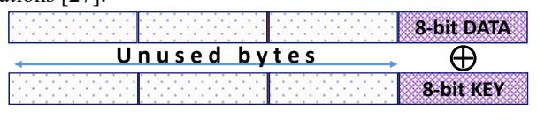
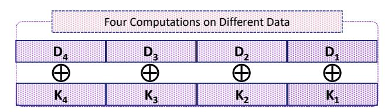
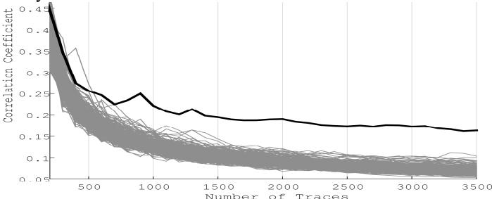
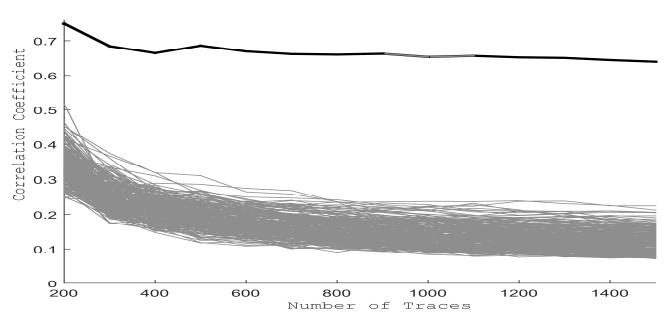
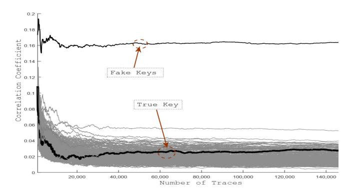

# **On a Side Channel and Fault Attack Concurrent Countermeasure Methodology for MCU-based Byte-sliced Cipher Implementations**

Ehsan Aerabi *Univ. Grenoble Alpes, Grenoble INP* LCIS Valence, France

ehsan.aerabi@lcis.grenoble-inp.fr

Athanasios Papadimitriou *Univ. Grenoble Alpes, Grenoble INP ESISAR* ESYNOV Valence, France athanasios.papadimitriou@esisar.grenoble-inp.fr

David Hely *Univ. Grenoble Alpes, Grenoble INP* LCIS Valence, France david.hely@lcis.grenoble-inp.fr

*Abstract***. As IoT applications are increasingly being deployed, there comes along an ever increasing need for the security and privacy of the involved data. Since cryptographic implementations are used to achieve these goals, it is important for embedded software developers to take into consideration hardware attacks. Side Channel Analysis (SCA) and Fault Attacks (FA) are the main classes of such attacks, which can either reduce or even eliminate the security levels of an embedded design. Therefore, cryptographic implementations must address both of them at the same time. To this end, multiple solutions have been proposed to address both attacks in one solution, such as Dual Pre-charge Logic (DPL) and Encoding countermeasures. In this work, we discuss the advantages and disadvantages of the state of the art, concurrent SCA and FA countermeasures. Additionally, we propose a software countermeasure in order to provide protection against both types of attacks. The proposed countermeasure is a general approach, applicable to any byte-sliced cipher and any modern MCUs (32- and 64-bit). The proposed countermeasure is applied to an AES S-BOX implementation, for a 32-bit MCU (ARM Cortex-M3). The countermeasure has been experimentally evaluated against Correlation Power Analysis (CPA) attacks for both platforms while its fault detection capabilities are theoretically described.**

*Keywords: Hardware security; Side channel attacks; Fault attacks; Countermeasure; AES, byte-sliced ciphers;*

### I. INTRODUCTION

Cipher implementations, regardless of their mathematically proven security against cryptanalysis, may be weak against hardware attacks, mainly Side Channel Attacks (SCA) and Fault Injection (FI). For the last two decades, these attacks succeeded to reveal secret information from cryptographic devices in considerably small time [1, 2, 3, 4].

Side channel attacks exploit the device's power consumption or electromagnetic emanations to deduce information which is being processed by the device. An attacker can then apply elaborated statistical methods, such as Differential or Correlation Power Analysis (DPA & CPA) in order to find the secret key [5,6]. Fault Injection can also lead to the exposure of the secret key by injecting faults in the device during the operation of the cipher and by applying differential fault analysis to the erroneous outputs [7]. Initially the majority of the proposed countermeasures were addressing the one or the other classes of attacks. Therefore, a large number of protection methods have been proposed during the last two decades, but defending against these attacks does not provide a complete solution and each protection method has some disadvantages including, lack of generality, vulnerability to more complex attacks and its overhead on performance, area and memory.

Countermeasures against DPA or CPA generally try to de-correlate the value of the secret data being processed within the device from its power consumption or any other side channel emanations. Masking and Hiding are two main categories of these protection methods. Masking countermeasures try to combine the secret information with a masking value before the protected computation starts. After the computation, the output will be unmasked to obtain the correct result [8, 9, 10]. Even though masking methods provide high levels of security against first order SCA attacks, they are prone to higher order attacks which target the masking and unmasking operations [11]. Additionally, the existence of glitches can also diminish the strength of such countermeasures [12]. Hiding countermeasures add random or datadependent noise to the computation to protect the secret key of the encryption. Examples of hiding countermeasures include: computation scrambling, runtime code polymorphism [13], etc.

Concerning the protection against fault attacks there exist multiple countermeasures. Most countermeasures involve some kind of redundancy or code to detect faults. In the case where only fault detection is necessary, a classic approach is to duplicate the design and check the outputs of the two instances [24]. Temporal redundancy countermeasures perform the same calculation more than once in order to detect a fault detected in one of the computations but not the other [21, 22]. This way the area penalty is minimized but it leads to 100% performance overhead. Modern laser fault injection setups can effectively target both countermeasures by either using two laser spots or by means of the high repetitiveness capabilities respectively. Another way is to use a code and limit the redundancy to predicting the value of the selected code, e.g. parity codes [23].

Using two different countermeasures to separately thwart each attack will impose large overheads and complexities. Such overheads may be forbidden especially for IoT applications, in terms of power consumption, performance and cost. Despite large overheads, imposed by two separate SCA and FI countermeasures, there is the need to take into account the effect of a FI countermeasure on the side channel information leakage. For example in [14] and [15] the authors present results on the negative effects of FI countermeasures on SCA leakage. For instance, an FI countermeasure can duplicate a part of the encryption computation in order to detect the fault by comparing the outputs of the duplicate and original computation instances. This will double the power consumption correlated with that part of the computation and it will be easier for the SCA attacker to collect the necessary information leakage to reveal the secret key.

Our proposed method attempts to address both FI and SCA hardware attacks *at the same time.* It provides two onthe-fly switchable modes: *high-performance* and *highsecurity*. Therefore, depending on the real-time requirements of an embedded system, the device can change its mode of operation leading to either increased performance, or high security.

The proposed method in this paper is applicable to MCUs with wider data-paths like 32-bit and 64-bit processors as the global trend towards the IoT also leads to using larger MCUs. The IoT with performant devices will benefit from modern operating systems, network connectivity and *smart* artificial intelligence operations. Therefore, modern MCUs are needed to have all these capabilities in place.

Solutions proposed so far which can counteract both SCA and FI include *Dual-rail with Pre-charge Logic* (DPL methodology) as well as a group of methods which use *encoding* schemes. We will cover these methods in more details in the related work section.

The proposed method in this paper uses *byte-slicing* [27] to provide a flexible and secure countermeasure against both SCA and FI. Byte-slicing provides multiple parallel instances of the encryption algorithm which can be used for protection or performance enhancement. A very recent similar published work employs the same idea using Single-Instruction-Multiple-Data (SIMD) feature in MCUs to defend *only* FA. This method does not provide any protection against SCA [24].

In this work we propose using a software version of the correlated noise generation countermeasure against SCA attacks described in [25] which has been originally introduced to be used on FPGAs. In this approach, two (or more) instances of an algorithm run in parallel on different keys but use the same data. The generated noise can lead to hiding of the leakage of the correct key. In this work, we use this method to propose a similar scheme for MCUs. Furthermore, the parallel computation instances also allow to have constant Hamming weight memory writes, which in turn emulates the DPL methodology and minimizes the SCA leakage. Finally, the parallel computation provides identical computation instances to detect injected faults.

We chose an AES case study and implemented the proposed method on an ARM Cortex-M3 system. The paper includes the overhead of the proposed method and a report on its SCA and FI resistance. The overhead in comparison to the original design and the similar software countermeasures is significantly lower. The paper presents a secure AES implementation that can thwart SCA and FI at the same time with significantly low overhead.

This paper continues with the Related Work section by explaining the details and overheads of the related DPL and Encoding methods. Then we will explain the proposed method in Section-3. The AES case study and its overheads will be covered in Section-4 and the attack results on section-5. Finally this paper concludes in Section-5.

# II. RELATED WORK

In this chapter we provide an overview on the related state of the art work which defend against both FI and SCA by their proposed countermeasures.

To the best of our knowledge, previous solutions against FI and SCA could be categorized into two groups. The first group employs the software equivalent of *Dual-rail with Pre-charge Logic (DPL)* and the second group uses an *encoding* scheme which we will call DPL-based and encodingbased counter measures, respectively.

Dual-rail with Pre-charge Logic originally is a hardwarespecific approach to always have a constant switching activity regardless of the data being computed. In DPL, a *dual* bit with the opposite Boolean value is always stored and processed to neutralize the effect of the original bit on the power consumption. In this manner, the side channel leakage ideally is expected to be independent from the sensitive data being processed and hence provides no information to the attacker. To implement this approach, each *bit* of information '*a*' is accompanied by its dual complement value '' in processing and storage. DPL duplicates each signal and memory element with the dual complement value. Each bit change takes place in two phases which guarantees constant switching activity. First, in the *pre-charge* phase, couple (*a*,'') goes to (0,0) which entails exactly one transition '1' '0'. Then in the *evaluation* phase, the couple (0,0) transitions to the new value of (*a*,''), which again entails exactly one transition '0' '1'. Theoretically, the power consumption in this method will be independent from the data being processed because the hamming distance and weight of the data being written are always constant.

Recently, several works have tried to bring the DPL idea from the hardware into the software realm. They have emulated DPL using some low-level bit-operations to read the data from the memory, bit by bit, each bit is accompanied by the dual complementary bit and then they perform the intended logical operation using a look-up table. The software implementation was first proposed in [16] and followed by [17].

As the DPL concept is inherently bit-wise, all bytes, words or double-words of the data being encrypted should be split into single bits which makes the proposed methods extremely expensive both on performance and code size. The penalty depends strongly on the cipher structure and it varies among different ciphers. The wider the cipher state variables are, the more the overhead which will result by applying DPL. For example AES state variables are originally 8-bit. Therefore, for example, each *xor* operation in the reference implementation is a byte-wise operation. Therefore, DPL implementations of an 8-bit AES will need 8 iterations to compute a whole byte in the DPL mode. This makes the DPL version 8 times slower, aside from the long overhead to actually implement the DPL version of an *xor* instruction for just 1-bit of information.

Furthermore, ciphers such as *RC5*, *Simon* and *Speck* have even wider (32-bit and 64-bit) implementations. This makes the DPL implementation, 32 and 64 times slower with the same reasoning. Some previous works have chosen the *PRESENT* cipher to apply software based DPL, which has not been designed for software implementation, and hence most of the operations are intrinsically bit-wise. Therefore, such a cipher is more compatible with applying DPL and entails less overhead. In [17], a bit-sliced version of PRESENT is used as a starting point to apply the DPL countermeasure. It is important to note that DPL cannot take advantage of bit-slicing in an efficient way (due to the exponential LUT growth) and this usually leads to using only one bit of the bit-sliced implementation (the remaining 7 bits staying inactive). For example, in [17] by replacing only *xor* instruction with its DPL equivalent in a PRESENT implementation their performance was 3 times slower with respect to the bit-sliced reference (which performs 8 bits computation in parallel). Additionally, we must emphasize that the DPL implementation is not bit-sliced anymore, but instead it computes only one single bit at a time. Thus, if we take into account the overhead for losing the bit-slicing, then applying DPL is 3×8=24 times slower than an 8-bit-sliced version and 3×32=96 times slower than a 32-bitsliced version.

Two *encoding* schemes [18,19] targeted *Prince*, another hardware-oriented cipher and proposed specific encodings to provide constant hamming weights and hamming distances. Each variable in the cipher computation is combined with its complement. For instance, an 8-bit variable X becomes a 16-bit variable comprised of and . They propose a balanced version of two building blocks of Prince with this scheme: the 8-bit *xor* operation and 4-bit table lookup. The *xor* instruction is comprised of 14 instructions in order to apply the encoding, perform *xor* and revert back the encoding. Therefore, this determines the performance and increase in code size. For the 4-bit table lookup, the penalty is the exponential growth of the table size. Before encoding, the table requires a 4x4 byte array and with encoding it fills a 16x16 byte array. This overhead, for 8-bit tables (like that of AES) will be 256x256=16K which is relatively significant. Reference [19] enhances the encoding used in [18], in order to also protect against fault attacks. In conclusion, if we want to carry the encoding methods to common software oriented cipher (e.g AES), there will be huge memory overhead for the lookup tables and performance penalties for logical operations.

Concerning the encoding protection against SCA and FI, Breier *et. al* in [26], presented an encoding scheme for data storage and retrieval. Since they have only evaluated a protected table look-up, we cannot directly compare its overhead in performance and memory with our countermeasure.

# III. PROPOSED COUNTERMEASURE

This section presents the proposed protection method which can thwart SCA and FI attacks using a single approach. The method is generally applicable to any MCU with a wide data-path like 32-bit and 64-bit processors.

For a 32-bit MCU, each data word has 4 bytes and each single machine instruction operates on the 4-byte (32 bits) word at the same time. *Byte-oriented* ciphers (*e.g* AES) are comprised of many 8-bit operations. In absence of manual optimization, when these instruction runs on 32-bit MCUs, the three most significant bytes are useless and empty. For example, *AddRoundKey* operation in AES reference implementation comprised of sixteen 8-bit *xor* operations between 128-bit round key and data block. Each 8-bit *xor* operation is presented in figure-1. In this figure represents *xor* operation but in general it could be any arithmetic or logic operations [27].

Fig.1- 32-bit xor on 8-bit values

We can employ the three unused bytes to boost the performance or provide protection against SCA and FI. The main idea relies on a byte-sliced implementation of the vulnerable crypto algorithm which is aimed to use the secret information (*e.g* key). The other three unused bytes can operate on three different instances of the crypto algorithm, at the same time. Therefore we will have a 4-engine crypto core. If all four engines operate on different data, there will be a four times performance boost; and if they operate on the same data to produce correlated noise, there will be a protection against SCA and FI.

The combination of the above mentioned methods provide a combined solution to address SCA and FI protection. The solution has two modes: *1-High-Performance (No protection) and 2-High-Protection (Low performance).* The proposed method is purely a software technique on wide data-path MCUs (32-bit or 64-bit) which makes it appropriate for the global trend towards modern MCUs. The overhead generally relies on the cipher structure, but for byteoriented ciphers (*e.g* AES) the overhead is significantly lower than other approaches, detailed in the previous sections, when we consider SCA and FI protection concurrently.

Based on the above mentioned structure, we propose three modes of operation which can be easily switched to one another.

# *A. Mode #1: High performance – no protection*

This is the simple byte-sliced implementation of the crypto algorithm. Figure-2 illustrates an abstract picture of this configuration. Four different useful 8-bit data are being computed in four different instances of the algorithm. This could be denoted by A(K1,D1)|| A(K2,D2)|| A(K3,D3)|| A(K4,D4) in which four instances of a byte-sliced version of algorithm *A* denoted by '||' run on four different data *Di* using different keys *Ki*. Usually in a same embedded device, only one crypto key is used for communication at the same time, therefore *Ki's* can be all the same. For this reason, we use the same key for all four instances in this paper.

Fig.2- Operation configuration in Mode #1: High-performance

## *B. Mode #2: High-protection – low performance*

This mode exploits all the four bytes of the byte-sliced implementation to deliver SCA resistance along with FI detection. This mode uses the configuration depicted in Fig.3. There are in fact clones of encryption on D1 running in parallel with X = A(KT,D1)|| A(KT,D1)|| A(KF,D2)|| A(KF,D2) configuration. Two clones (out of four) use a "*True*" key which is intended for data encryption and the other two clones use a "fake" key which is intended as a hiding countermeasure against SCA attacks. The rest of the chapter explains how the proposed method achieves SCA protection and FI detection.

| Fake Computation |    | True Computation |    |  |
|------------------|----|------------------|----|--|
| D1               | D1 | D1               | D1 |  |
|                 |   |                 |   |  |
| KF               | KF | KT               | KT |  |

Fig.3 - Operation configuration in Mode #2: High-protection

# *- Side Channel Protection.*

Byte-slicing enables us to apply two techniques in order to thwart side channel attack: "*Correlated Noise Generation*" and "*Complementary Memory Writes*":

"*Correlated Noise Generation*": If we assume that the secret information is the crypto key, the clone computation would operate with a fake key but on the same data as that of the original computation. In other words, both computations operate in parallel on the same data, but using two different keys: "True" and "Fake" keys. The generated power consumption of the fake instances is correlated with the true ones. This will add algorithmic noise to protect against SCA [25]. We call this method "Correlated Noise Generation" in this paper.

"*Complementary Memory Writes*: Another protection capability of this method is associated with its memory writes. Memory access consumes more power and leads to more leakage in comparison to register access. Our scheme gives us the opportunity to cancel the leakage of True key while sustaining the leakage generated by the Fake key which will amplify the hiding effect of the Fake key. To this aim, these True clones can carry complement values of the data when they are stored in their place in the memory. The original value and its complement always have a constant number of '0's and '1's which is called constant Hamming weight. The power consumption of this method is theoretically constant and uncorrelated from the data being processed. But in practice, there is always a small leakage due the fact that parallelization cannot be implemented ideally. This is an ultimately low-cost emulation of DPL methodology for memory writes in comparison to the software-implemented methods discussed in the related work section. We call this approach "Complementary Memory Writes".

We call a byte-sliced operation *A,* a *register operation*, when it is a part of the crypto algorithm and all its instructions run in CPU registers. In other words, it has no memory writes during its computation other than on its start and stop. It reads its byte-sliced operands, performs the desired operation using registers and then writes the results in their memory place. If *A* happens to have several memory writes in it, we can break *A* into several register operations. To achieve constant Hamming weight memory write, the clone results are complemented, then are written at the same time (byte-sliced) in memory.

The constant Hamming weight memory write is possible using following simple C programming tip:

$$[Mem] = X ^ 0x0000FF00;$$

X is a register which has the output of the operation A. The bytes which are *xor*ed to hex value 0xFF are complemented and the three other duplicates remain unchanged. In fact, we kept the Hamming weight of the two least significant bytes (True key) memory writes constant while the two most significant bytes (Fake key) leak twice as two copies of its value are written in the memory. This mode of operation still leaks information, as the register operations still consume power; but their power consumption is of orders of magnitude smaller than memory write and correlation noise generation will hide it effectively as we will see in the results section.

# *- Fault Injection Detection.*

An advantage of the proposed method is the possibility to devote byte-sliced computation instances to perform fault detection. We can detect fault injection by comparing the duplicated results for both fake and true keys computations. As a programming hint, this could be done by copying the results, shift it one byte to the left and *xor*ing it with the original result. If the output is zero, there is no fault injected. We can express it in a C ternary operation on the byte-sliced results X like this:

FAULT = 
$$X ^ (X >> 8 & 0x00FF00FF) ? 1 : 0;$$

First, the byte-sliced variable X is shifted 8 bits to the right, then masked and finally *xor*ed with its original value. A non-zero result indicates a detected fault.

In the next section, we will present the results for an AES case study.

#### IV. CASE STUDY: AES ON ARM CORTEX-M IMPLEMENTATION

As a case study, we chose an AES implementation which utilized a Canright S-box implementation [20]. This implementation is one of the fastest and most compact to the best of our knowledge. It receives a byte of data, performs S-Box on-the-fly calculation and returns the S-box output. We expanded all uint\_8 variables to uint\_32 and developed the byte-sliced version. The byte-sliced code was *%5* slower than its 8-bit version. The penalty mainly comes from packing and unpacking of four 8-bit data into 32-bit registers. The code was implemented on an ARM Cortex-M3 MCU. Even though we chose the AES S-box as an example, the method is general and can be applied to any other crypto structure which can be byte-sliced.

In Table.1, we present the overheads (performance, RAM and code sizes) of the papers mentioned in the related work section along with the proposed method of this paper. The table also indicates if the authors traded bit-slicing in order to implement their protection method. In this case, two papers ([16, 17]) have utilized a bit-sliced version of a cipher to provide SCA protection. But their protected implementation is not bit-sliced anymore. The performance penalty for losing bit-slicing is significant as we discussed earlier. Bit-slicing loss is noted in the "Trading bit-slicing for security" column of the table. The performance overhead column does not include this loss of bit-slicing. Therefore, in order to fairly compare, a bit-sliced implementation with a non-bit-sliced, one should multiply the performance overheads of Table 1 by a factor of 8. It is worth to note that our protection scheme does not include the MixColumn function of AES and securing this part will be a prospective extension of this work.

TABLE I. THE OVERHEADS OF THE RELATED WORK AND THE PROPOSED METHOD

| Method Ref.     | Cipher  | Trading Bit-slicing for security | Overheads   |        |      |
|--------------------|---------|----------------------------------------|-------------|--------|------|
|                    |         |                                        | Performance | Memory | Code |
| [16]               | PRESENT | yes                                    | %800        | %200   |      |
| [17]               | PRESENT | yes                                    | %200        | %20    | %188 |
| [18]               | Prince  | no                                     | %767        | %1966  | %235 |
| Proposed Method | AES     | no                                     | %5          | %2     |      |

Our byte-sliced version has %5 performance and %2 code/memory size penalty in comparison with the original Canright source code. Therefore, if we assume Canright's implementation as our reference, the high-performance mode (#1) is roughly four times faster as it performs four parallel computations; and the high-protection mode (#2) is obviously %5 slower than the original Canright source code.

#### V. COUNTERMEASURE EVALUATION

#### *C. Fault Detection Capabilities*

To theoretically evaluate the fault detection capabilities, we make the assumption that faults are injected in the *datapath* and will end up registered in the true or the fake state register. Moreover we assume that any fault combination for each 32-bit word, has the same probability. Faults in the program control flow (e.g instruction-skip) are undetected because they affect all four bytes at the same time.

Under the assumptions above, the only way to inject an undetected multiple faults is to inject the exact same fault in the two duplicates of the fake or the true computation. The total amount of possible faults is 2 − 1. On the other hand the undetectable fault scenarios are 2 − 1 faults for the fake key (the same in each redundant computation for the fake key) and for each one of them there are 2 possible combinations for the true key which do not lead to fault detection. Therefore, the probability to inject an undetected fault is: ≈ 1.5199 × 10 = 0,00001599

# *D. Power Analysis Experimental Evaluations*

DPA and CPA methods rely on gathering side channel power or EM traces of the device for large numbers of encryption. This helps DPA or CPA to overshadow the noise and reveal the actual value of the secret key. Therefore, a device resistance against SCA is usually measured by the number of traces required to find the secret information

We conducted Correlational Power Analysis experiment on the two modes of operation. Their resistance is determined by the number of traces required to find the crypto key. In fact the results show an attack to find the first byte of the AES key on the first round.

The experimental setup included an oscilloscope set to perform 1 GSa/s power trace acquisition and we used a shunt resistor on GND pin to connect the oscilloscope probes and capture the power consumption of the device. While performing the power trace acquisition we kept the target MCU at 90⸰ C in order to increase the leakage and accelerate the experiment.

For the sake of completeness, here we present how attacking to the different protection scenarios guided us to the proposed method in this paper. Firstly, we show the attack to a simple 8-bit AES implementation. Then we explain the attack to Mode #1, the byte-sliced, high-performance and unprotected implementation. Finally, we will report the results of the combined protection which provides the highest security between the evaluated scenarios.

# *- Attack to 8-bit AES*

First we chose the simple 8-bit AES (Fig.1) to attack as the reference which forms the basis for our later comparisons. Fig.4 illustrates the attack result. Our reference design can resists only until about 700 traces at 90⸰ C.

# *- Attack to 32-bit Byte-Sliced AES (Mode #1)*

We implemented a byte-sliced version of the AES described previously in this paper (Fig.2). There are four parallel encryptions on four different data processed with the same key byte (*Ki's* are all the same). The most powerful attack in this case is when the attacker provides the same data for all four instances, in order to quadruplicate the information leakage. Fig.5 illustrates the CPA attack results. As it is expected, extra leakage reveals the secret easily. The key is visible after 100 traces at 90⸰ C.

Fig.4 - CPA attack to the 8-bit AES

Fig.5 - CPA attack to the byte-sliced AES (Mode #1)

Fig.6 – Attacking to the High Protection Mode (Mode #2) at 90⸰ C

#### *- Attack to the High Security Mode (Mode#2)*

We conducted a CPA against the High Security Mode (Mode#2 described in Fig.3) which is combination of the SCA protection schemes and in presence of fault detection. Fig. 6 shows the attack results. The true key is hidden while the fake key is obvious from the beginning of the computation. We continued the attack until approximately 150k traces at 90⸰ C and the true key was still hidden. It is worth to mention that the SCA attack to the countermeasure at the ambient temperature will be even more difficult, as the leakage is considerably lower at room temperature.

#### *- Attack only to the Correlated Noise Generation Scheme*

In order to verify only the protection effect of the Correlated Noise Generation scheme, we chose a configuration with only one true key, intended to compute the encryption and three fake keys to perform hidding. All four keys were clearly distinguishable from the remaining key hepotheses keys only after about 700 traces. This shows that the leakage generated by writing all four keys in memory is high and the correlated noise generation cannot hide it effectively in comparison to the unused key hypotheses.

*- Attack only to the Complementary Memory Writes Scheme*

The same attack was conducted only to the Complementary Memory Writes scheme, where we computed in parallel two 8-bit encryptions and used the remaining 16-bits for their complementary computations (without fake computations). Once again the key was found, only after 400 traces, which shows that the complementary memory writes cannot hide the secret key on their own.

In conclusion to this chapter, the Complementary Memory Writes and Correlated Noise generation techniques should be combined together (Mode #2) in order to effectively thwart SCA. Even though unbalanced behavior of complementary values in the internal structure of the MCU may cause the secret key to be exposed (among the remaining key hypotheses after many traces), the achieved protection is noticeable, given the significantly smaller overhead in comparison to the previous software DPL and encoding schemes.

## VI. CONCLUSIONS AND FUTURE WORK

In this paper we presented a concurrent countermeasure against side channel attacks and fault injection. This countermeasure utilizes the larger data-path of 32-bit or 64-bit MCUs in order to perform parallel byte-sliced encryption. We used parallel computations in order to implement two protection mechanisms against SCA. The two methods combined together provide resistance against side channel attacks even at high temperatures, where the devices consume more power. The countermeasure resisted against a CPA experiment and after 150k encryption traces. Using identical parallel computations, we are also able to perform fault detection in the datapath of the AES. An analysis for its expected fault detection strength was also provided. The overhead of the countermeasure proposed in this paper, in comparison to the original design, is considerably small. The paper also compares the overheads of other state of the art concurrent SCA and FI countermeasures in the related work section. Furthermore, we show that these countermeasures lead to large overheads, especially if we take into account trading bit-slicing for security.

# REFERENCES**.**

- [1] Spreitzer, R., Moonsamy, V., Korak, T. and Mangard, S., 2018. Systematic classification of side-channel attacks: a case study for mobile devices.
- [2] Serpanos, D.N. and Voyiatzis, A.G., 2013. Security challenges in embedded systems. ACM Transactions on embedded computing systems (TECS), 12(1s), p.66.
- [3] Joye, M., & Tunstall, M. (2012). Fault Analysis in Cryptography. Heidelberg: Springer. ISBN: 978-3642296550.
- [4] Giraud, C., & Thiebeauld, H. (2004). A survey on fault attacks. In Smart Card Research and Advanced Applications VI (pp. 159-176). Springer US.
- [5] Peeters, E., 2013. Advanced DPA theory and practice: towards the security limits of secure embedded circuits. Springer Science & Business Media.
- [6] Brier, E., Clavier, C. and Olivier, F., 2004, August. Correlation power analysis with a leakage model. In International workshop on cryptographic hardware and embedded systems (pp. 16-29). Springer, Berlin, Heidelberg.
- [7] J. G. van Woudenberg, M. F. Witteman, and F. Menarini, "Practical optical fault injection on secure microcontrollers," in Fault Diagnosis and Tolerance in Cryptography (FDTC), 2011 Workshop on, 2011, pp. 91–99.

- [8] Prouff, E. and Rivain, M., 2013, May. Masking against side-channel attacks: A formal security proof. In Annual International Conference on the Theory and Applications of Cryptographic Techniques (pp. 142-159). Springer, Berlin, Heidelberg.
- [9] Eldib, H. and Wang, C., 2014, July. Synthesis of masking countermeasures against side channel attacks. In International Conference on Computer Aided Verification (pp. 114-130). Springer, Cham.
- [10] Carlet, C., Goubin, L., Prouff, E., Quisquater, M. and Rivain, M., 2012. Higher-order masking schemes for s-boxes. In Fast Software Encryption (pp. 366-384). Springer, Berlin, Heidelberg.
- [11] Gierlichs, B., Batina, L., Preneel, B. and Verbauwhede, I., 2010, March. Revisiting higher-order DPA attacks. In Cryptographers' Track at the RSA Conference (pp. 221-234). Springer, Berlin, Heidelberg.
- [12] Mangard, S., Popp, T. and Gammel, B.M., 2005, February. Sidechannel leakage of masked CMOS gates. In Cryptographers' Track at the RSA Conference (pp. 351-365). Springer, Berlin, Heidelberg.
- [13] Couroussé, D., Barry, T., Robisson, B., Jaillon, P., Potin, O. and Lanet, J.L., 2016, September. Runtime code polymorphism as a protection against side channel attacks. In IFIP International Conference on Information Security Theory and Practice (pp. 136- 152). Springer, Cham.
- [14] Pahlevanzadeh, H., Dofe, J. and Yu, Q., 2016, January. Assessing CPA resistance of AES with different fault tolerance mechanisms. In Design Automation Conference (ASP-DAC), 2016 21st Asia and South Pacific (pp. 661-666). IEEE.
- [15] Luo, P., Fei, Y., Zhang, L. and Ding, A.A., 2014, December. Sidechannel power analysis of different protection schemes against fault attacks on AES. In ReConFigurable Computing and FPGAs (ReConFig), 2014 International Conference on (pp. 1-6). IEEE.
- [16] Hoogvorst, P., Duc, G. and Danger, J.L., 2011. Software implementation of dualrail representation. COSADE, February, pp.24- 25.
- [17] Rauzy, P., Guilley, S. and Najm, Z., 2016. Formally proved security of assembly code against power analysis. Journal of Cryptographic Engineering, 6(3), pp.201-216.
- [18] Chen, C., Eisenbarth, T., Shahverdi, A. and Ye, X., 2014, November. Balanced encoding to mitigate power analysis: a case study. In International Conference on Smart Card Research and Advanced Applications (pp. 49-63). Springer, Cham.
- [19] Breier, J., Jap, D. and Bhasin, S., 2016, May. The other side of the coin: Analyzing software encoding schemes against fault injection attacks. In Hardware Oriented Security and Trust (HOST), 2016 IEEE International Symposium on (pp. 209-216). IEEE.
- [20] Canright S-box Implementation in C available on: https://github.com/coruus/canright-aes-sboxes.
- [21] Barenghi, A., Breveglieri, L., Koren, I., Pelosi, G. and Regazzoni, F., 2010, October. Countermeasures against fault attacks on software implemented AES: effectiveness and cost. In Proceedings of the 5th Workshop on Embedded Systems Security (p. 7). ACM..
- [22] Rajendran, J., Borad, H., Mantravadi, S., & Karri, R. (2010, June). SLICED: Slide-based concurrent error detection technique for symmetric block ciphers. In Hardware-Oriented Security and Trust (HOST), 2010 IEEE International Symposium on (pp. 70-75). IEEE.
- [23] Ananiadis, C., Papadimitriou, A., Hély, D., Beroulle, V., Maistri, P., & Leveugle, R. (2016, March). On the development of a new countermeasure based on a laser attack RTL fault model. In Proceedings of the 2016 Conference on Design, Automation & Test in Europe (pp. 445-450). EDA Consortium.
- [24] Lac, B., Canteaut, A., Fournier, J. and Sirdey, R., 2018, May. Thwarting fault attacks using the internal redundancy countermeasure (irc). In International Symposium on Circuits and Systems (ISCAS) 2018.
- [25] Kamoun, N., Bossuet, L. and Ghazel, A., 2009, November. Correlated power noise generator as a low cost DPA countermeasures to secure hardware AES cipher. In Signals, Circuits and Systems (SCS), 2009 3rd International Conference on (pp. 1-6). IEEE.
- [26] Breier, J. and Hou, X., 2017, February. Feeding two cats with one bowl: On designing a fault and side-channel resistant software encoding scheme. In Cryptographers' Track at the RSA Conference (pp. 77-94). Springer, Cham.
- [27] Kivilinna, J., 2013. Block Ciphers: Fast Implementations on x86-64 Architecture (Doctoral dissertation, University of Oulu).