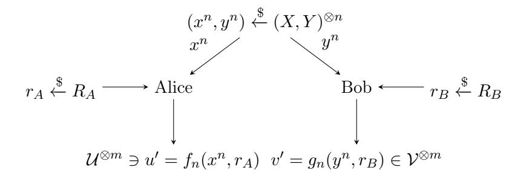
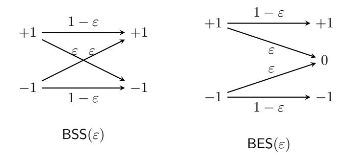
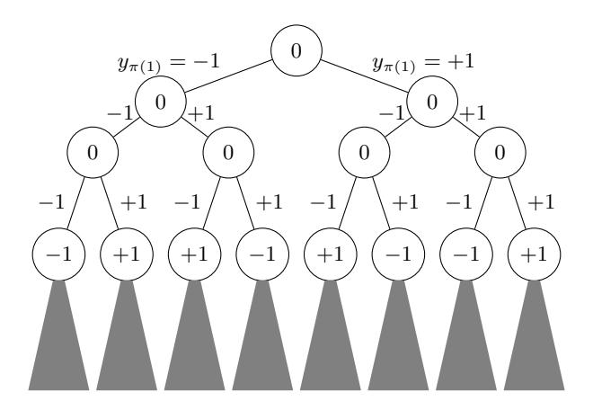

# Secure Non-interactive Simulation: Feasibility & Rate

Hamidreza Amini Khorasgani, Hemanta K. Maji, and Hai H. Nguyen

Department of Computer Science, Purdue University West Lafayette, Indiana, USA

 $haminikh@purdue.edu,\ hmaji@purdue.edu,\ nguye245@purdue.edu$ 

#### Abstract

A natural solution to increase the efficiency of secure computation will be to non-interactively and securely transform diverse inexpensive-to-generate correlated randomness, like, joint samples from noise sources, into correlations useful for the secure computation while incurring low computational overhead. Motivated by this general application for secure computation, our work introduces the notion of secure non-interactive simulation (SNIS). Parties receive samples of correlated randomness, and they, without any interaction, securely convert them into samples from another correlated randomness. SNIS is an extension of non-interactive simulation of joint distributions (NIS), and non-interactive correlation distillation (NICD) to the cryptographic context. It is a non-interactive version of one-way secure computation (OWSC). Our work presents a simulation-based security definition for SNIS and initiates the study of the feasibility and efficiency of SNIS.

We also study SNIS among fundamental correlated randomnesses like random samples from the binary symmetric and binary erasure channels, represented by BSS and BES, respectively. The impossibility of realizing a BES sample from BSS samples in NIS and OWSC extends to SNIS. Additionally, we prove that a SNIS of BSS sample from BES samples is impossible, which remains an open problem in NIS and OWSC.

Next, we prove that a SNIS of a BES( $\varepsilon'$ ) sample (a BES with noise characteristic  $\varepsilon'$ ) from BES( $\varepsilon$ ) is feasible if and only if  $(1-\varepsilon')=(1-\varepsilon)^k$ , for some  $k\in\mathbb{N}$ . In this context, we prove that all SNIS constructions must be linear. Furthermore, if  $(1-\varepsilon')=(1-\varepsilon)^k$ , then the rate of simulating multiple independent BES( $\varepsilon'$ ) samples is at most 1/k, which is also achievable using (block) linear constructions.

Finally, we show that a SNIS of a BSS( $\varepsilon'$ ) sample from BSS( $\varepsilon$ ) samples is feasible if and only if  $(1-2\varepsilon')=(1-2\varepsilon)^k$ , for some  $k\in\mathbb{N}$ . Interestingly, there are linear as well as non-linear SNIS constructions. When  $(1-2\varepsilon')=(1-2\varepsilon)^k$ , we prove that the rate of a *perfectly secure* SNIS is at most 1/k, which is achievable using linear and non-linear constructions. Our results leave open the fascinating problem of determining the rate of *statistically secure* SNIS among BSS samples.

Our technical approach algebraizes the definition of SNIS and proceeds via Fourier analysis. Our work develops general analysis methodologies for Boolean functions, explicitly incorporating cryptographic security constraints. Our work also proves strong forms of *statistical-to-perfect security* transformations: one can error-correct a statistically secure SNIS to make it perfectly secure. We show a connection of our research with *homogeneous Boolean functions* and *distance-invariant codes*, which may be of independent interest.

## Contents

| 1 |     | Introduction                                                       | 3  |
|---|-----|--------------------------------------------------------------------|----|
|   | 1.1 | Definition: Secure Non-Interactive Simulation                   | 4  |
| 2 |     | Our Contribution                                                   | 5  |
|   | 2.1 | SNIS Composition and Projection                                 | 6  |
|   | 2.2 | Derandomization                                                 | 6  |
|   | 2.3 | BSS from BES Samples                                   | 8  |
|   | 2.4 | BES from BES Samples                                   | 8  |
|   | 2.5 | BSS from BSS Samples                                   | 10 |
|   | 2.6 | Technical Contribution and Connections                          | 11 |
|   | 2.7 | Open Problems                                                   | 13 |
|   | 2.8 | Comparison with Previous Drafts                                 | 13 |
| 3 |     | Preliminaries                                                      | 14 |
|   | 3.1 | Introductory Fourier Analysis over Boolean Hypercube            | 14 |
|   | 3.2 | Noise and Markov Operators                                      | 15 |
|   | 3.3 | Imported Theorems                                               | 16 |
|   | 3.4 | Secure Non-Interactive Simulation: Simulation-based Definition  | 16 |
|   | 3.5 | Distance Invarianct Codes                                       | 18 |
| 4 |     | Technical Overview                                                 | 18 |
|   | 4.1 | Feasibility Results                                             | 18 |
|   | 4.2 | Rate Results                                                    | 19 |
| 5 |     | Our Technical Results                                              | 20 |
|   | 5.1 | Proof of Theorem 8                                           | 21 |
|   | 5.2 | Proof of Theorem 9                                           | 22 |
|   | 5.3 | Proof of Lemma 2                                             | 23 |
| 6 |     | SNIS of BSS from BES Samples                           | 23 |
|   | 6.1 | Proof of the Impossibility Result                               | 25 |
|   | 6.2 | Proofs of Claims Needed for Theorem 2                        | 26 |
|   |     |                                                                    |    |
| 7 |     | SNIS of BES from BES Samples                           | 31 |
|   | 7.1 | Proof of the Feasibility Result                                 | 33 |
|   | 7.2 | Proof of the Rate Result                                        | 36 |
| 8 |     | SNIS of BSS from BSS Samples                           | 39 |
|   | 8.1 | Our Conjecture Implies the Statistical Rate Result              | 40 |
|   | 8.2 | Connection to Distance Invariant Codes                          | 40 |
| 9 |     | Composition and Derandomization                                    | 41 |
|   | 9.1 | Composition                                                     | 41 |
|   | 9.2 | Deterministic Reductions from Randomized Reductions             | 42 |
|   | 9.3 | Examples                                                        | 46 |

## 1 Introduction

Secure multi-party computation [\[57,](#page-51-0) [27\]](#page-49-0) (MPC) allows mutually distrusting parties to compute securely over their private data. MPC protocols often offload most cryptographically and computationally intensive components to an offline procedure [\[38,](#page-50-0) [6,](#page-48-0) [18,](#page-49-1) [44\]](#page-51-1). The objective of this offline procedure is to output secure samples from highly structured correlated randomness, for example, Beaver triples [\[4\]](#page-48-1). The offline procedure relies on public-key cryptography to achieve this objective and, consequently, is computation and communication intensive.

On the other hand, there are diverse inexpensive-to-generate correlated randomness, like, joint samples from noise sources, that can also facilitate secure computation via interactive protocols [\[32\]](#page-50-1). A natural approach to increase the efficiency of this offline phase will be to non-interactively and securely transform such correlated randomness into correlations useful for secure computation while incurring low computational overhead. Motivated by this general application for secure computation, our work introduces the notion of secure non-interactive simulation (SNIS).

In SNIS, parties receive samples of correlated randomness, and they, without any interaction, securely convert them into samples from another correlated randomness. [Section 1.1](#page-3-0) defines this cryptographic primitive. SNIS is an information-theoretic analog of pseudorandom correlation generators (PCG) introduced by Boyle et al. [\[9,](#page-48-2) [10\]](#page-48-3). PCG is a silent local computation that transforms the input correlated private randomness into samples from a target correlation without any interaction. Boyle et al. [\[9,](#page-48-2) [10\]](#page-48-3) construct this primitive based on various hardness of computation assumptions and illustrate their applications to increasing the efficiency of the preprocessing step of MPC protocols. SNIS shall convert diverse forms of correlated randomness sources into samples of a specific target correlation that is useful for the online phase of an MPC protocol with information-theoretic security.

SNIS is an extension of non-interactive simulation of joint distribution [\[22,](#page-49-2) [55,](#page-51-2) [53,](#page-51-3) [30,](#page-50-2) [31,](#page-50-3) [26,](#page-49-3) [19,](#page-49-4) [25\]](#page-49-5) (NIS) and non-interactive correlation distillation [\[41,](#page-50-4) [40,](#page-50-5) [56,](#page-51-4) [7,](#page-48-4) [14\]](#page-48-5) (NICD) from information theory. In NIS, the emphasis is on the correctness of simulation, and cryptographic security is not a concern. Consequently, erasing information from parties' views, for example, is permissible in NIS, which may not be cryptographically secure. NICD specifically aims to establish shared keys securely; however, shared keys alone do not suffice for general secure computation [\[24,](#page-49-6) [36,](#page-50-6) [37\]](#page-50-7). The objective of SNIS extends to securely simulating more general correlated randomness as well, referred to as the complete correlations [\[32\]](#page-50-1), which are necessary for general secure computation. One can also interpret SNIS as the non-interactive version of one-way secure computation [\[23,](#page-49-7) [1\]](#page-48-6) (OWSC) – secure computations where only one party sends messages.

Our work presents a simulation-based security definition for SNIS and initiates the study of the feasibility and efficiency of SNIS. Any hardness of computation results from NIS and OWSC automatically transfer to SNIS. This work initiates the study of tight feasibility and rate characterization in SNIS and considers the inter-conversion among fundamental correlated randomnesses like random samples from the binary symmetric and binary erasure channels. In this context, our work reveals strong forms of statistical-to-perfect security transformations where one can error-correct a statistically secure SNIS (with sufficiently small insecurity) to transform it into a perfect SNIS. In particular, there is a dichotomy: either (1) a perfect SNIS exists, or (2) every SNIS is constant insecure. For example, there are perfect rate-achieving SNIS; however, surpassing the maximum rate by how-so-ever small quantity immediately incurs constant-insecurity.

Our technical approach algebraizes the definition of SNIS and proceeds via Fourier analysis. A central contribution of our work is the development of general analysis methodologies for Boolean functions that explicitly incorporate the cryptographic security constraints. Our research uncovers fascinating new connections of SNIS with homogeneous Boolean functions and distance-invariant

Figure 1: Model for secure non-interactive simulation: SNIS.

codes, which may be of independent interest (refer to Section 2.6).

Paper organization. Section 1.1 presents the SNIS model. Section 2 summarizes our contributions, connections to other research areas (Section 2.6), open problems & conjectures (Section 2.7), and differences from previous versions of this paper (Section 2.8). All our results consider SNIS with randomized reductions and statistical security (except Theorem 6, which considers only perfect security). Section 3 introduces the technical background for our proofs. Section 6, Section 7, and Section 8 present the technical outline and details of our proofs. The supporting materials contain the missing details.

### 1.1 Definition: Secure Non-Interactive Simulation

Let (X,Y) be a joint distribution over the sample space  $(\mathcal{X},\mathcal{Y})$ , and (U,V) be a joint distribution over the sample space  $(\mathcal{U},\mathcal{V})$ . The intuitive definition of secure non-interactive simulation of joint distributions (SNIS) closely follows the presentation in Figure 1 (with parameter m=1). Sample  $(x^n,y^n) \stackrel{\$}{\leftarrow} (X,Y)^{\otimes n}$ , i.e., draw n independent samples from the distribution (X,Y). Alice gets  $x^n \in \mathcal{X}^n$ , and Bob gets  $y^n \in \mathcal{Y}^n$ . Alice has private randomness  $r_A \stackrel{\$}{\leftarrow} R_A$  and Bob has, independent, private randomness  $r_B \stackrel{\$}{\leftarrow} R_B$ , where  $R_A, R_B$  are random variables over the sample spaces  $\mathcal{R}_A$  and  $\mathcal{R}_B$ , respectively. Suppose  $f_n \colon \mathcal{X}^n \times \mathcal{R}_A \to \mathcal{U}$  and  $g_n \colon \mathcal{Y}^n \times \mathcal{R}_B \to \mathcal{V}$  are the (possibly randomized) reduction functions for Alice and Bob, respectively. Alice computes  $u' = f_n(x^n, r_A)$  and Bob computes  $v' = g_n(y^n, r_B)$ .

For the ease of presentation, this section only considers deterministic reduction functions, i.e., there is no  $R_A$  and  $R_B$ . All formal definitions and results in this work consider randomized reductions. Section 3.4 presents the formal simulation-based definition for SNIS.

tions. Section 3.4 presents the formal simulation-based definition for SNIS. We say that (U,V) reduces to  $(X,Y)^{\otimes n}$  via reduction functions  $f_n, g_n$  with insecurity  $\nu(n)^2$  (represented by,  $(U,V) \sqsubseteq_{f_n,g_n}^{\nu(n)} (X,Y)^{\otimes n}$ ) if the following three conditions are satisfied.

- 1. Correctness. The distribution of the samples (u', v') is  $\nu(n)$ -close to the distribution (U, V) in the statistical distance.
- 2. Security against corrupt Alice. Consider any (u, v) in the support of the distribution (U, V). The distribution of  $x^n$ , conditioned on u' = u and v' = v, is  $\nu(n)$ -close to being independent of v.

&lt;sup>1As is typical in this line of work in cryptography and information theory, the joint distributions (U, V) and (X, Y) assign probabilities to samples that are either 0 or at least a positive constant.

&lt;sup>2In this paper, we consider  $\nu(n)$  to be constant or any o(1).

&lt;sup>3The joint distribution (A|B=b) is  $\nu$ -close to being independent of b if there exists a distribution  $A^*$  such that (A|B=b) is  $\nu$ -close to  $A^*$  in the statistical distance, for all  $b \in \operatorname{Supp}(B)$ .

3. Security against corrupt Bob. Consider any (u, v) in the support of the distribution (U, V ). The distribution of y n , conditioned on the fact that u 0 = u and v 0 = v, is ν(n)-close to being independent of u.

To discuss rate, consider SNIS of the form (U, V ) ⊗m(n) v ν(n) fn,gn (X, Y ) ⊗n . Here, the reduction functions output m(n)-independent samples from the distribution (U, V ). Fixing (X, Y ) and (U, V ), our objective is to characterize the maximum achievable production rate m(n)/n over all possible reductions (a standard single-letter characterization). Finally, R( (U, V ),(X, Y ) ) represents the maximum achievable m(n)/n, as n → ∞, when considering all SNIS of (U, V ) from (X, Y ).

When n is clear from the context, then, instead of x n and fn, we shall only write x and f for brevity.

Remark 1 (Adversarial model). Since we consider non-interactive protocols without private inputs, semi-honest and malicious security (with abort) are equivalent. So, for the simplicity, the presentation considers (statistical) security against semi-honest adversaries, that is, parties follow the protocol but are curious to find more information.

Remark 2 (Reasoning for providing private coins). In the cryptographic context, complete joint distributions [\[32\]](#page-50-1) (X, Y ) are the primary resources that one uses frugally. So, to define the rate with respect to the cryptographically expensive resource (namely, samples from the distribution (X, Y ) ⊗n ), our definition of SNIS considers randomized reductions and provides private independent random coins as a free resource. If private coins are not free, they can be incorporated into the setup by considering the input joint distribution to be (X, Y ) ⊗n ⊗ Coins.

# 2 Our Contribution

Rabin and Crépeau [\[49,](#page-51-5) [50,](#page-51-6) [15\]](#page-49-8) and Crépeau and Kilian [\[16,](#page-49-9) [17\]](#page-49-10), respectively, proved that erasure and binary symmetric channels suffice for general secure computation. These elegant sources of noise provide an uncluttered access to abstracting the primary hurdles in achieving security. In a similar vein, to initiate the study of the feasibility and rate of SNIS, this paper considers samples from the following two families of distributions.

- 1. Binary symmetric source. X and Y are uniformly random bits {+1, −1} such that X 6= Y with probability ε ∈ (0, 1/2). We represent this joint distribution by BSS(ε).
- 2. Binary erasure source. X is a uniformly random bit {+1, −1}, and Y = X with probability (1 − ε), where ε ∈ (0, 1); otherwise, Y = 0. We represent this joint distribution by BES(ε).

Comparison models. In information theory, non-interactive simulation of joint distributions (NIS) is a similar notion of simulating joint distributions [\[22,](#page-49-2) [55,](#page-51-2) [53,](#page-51-3) [30,](#page-50-2) [31,](#page-50-3) [26,](#page-49-3) [19,](#page-49-4) [25\]](#page-49-5). However, NIS only considers correctness (not security). On the other hand, there is also research on performing secure computation using one-way messages, a.k.a., one-way secure computation (OWSC) [\[23,](#page-49-7) [1\]](#page-48-6) – only one party sends messages to the other party. [Table 1](#page-7-3) compares our feasibility results to results in NIS and OWSC.

Remark 3. Non-interactive correlation distillation [\[41,](#page-50-4) [40,](#page-50-5) [56,](#page-51-4) [7,](#page-48-4) [14\]](#page-48-5) is a special case of SNIS where (U, V ) is restricted to shared coin, i.e., BSS(0) or BES(0) samples. This model has strong impossibility results and comparison with this model is not particularly insightful.

Figure 2: Binary Symmetric Source (BSS) and Binary Erasure Source (BES) with noise characteristic ε.

### 2.1 SNIS Composition and Projection

[Section 3.4](#page-15-1) provides the simulation-based definition of SNIS and proves the following composition and projection results, where the reduction functions may be randomized (the main difference is that the simulation-based definition requires an efficient simulator, while the game-based definition does not).

- 1. Parallel Composition [\(Theorem 13\)](#page-40-2). Let P, P0 , Q, and Q0 be joint distributions. If ν-SNIS of P from Q and ν 0 -SNIS of P 0 from Q0 exist, then a (ν +ν 0 )-SNIS of (PkP 0 ) from (QkQ0 ) exists. The distribution (PkP 0 ) generates samples from both the joint distributions P and P 0 , and (QkQ0 ) generates samples from both the joint distributions Q and Q0 .
- 2. Sequential Composition [\(Theorem 14\)](#page-41-1). Let P, Q, and R be joint distributions. If ν-SNIS of P from Q and ν 0 -SNIS of Q from R exist, then a (ν + ν 0 )-SNIS of P from R exists.
- 3. Projection [\(Theorem 15\)](#page-41-2). Let P, Q, and R be joint distributions. If a ν-SNIS of (PkQ) from R exists, then a ν-SNIS of P from R also exists.

These composition and projection theorems shall assist in proving our feasibility and rate results.

### 2.2 Derandomization

There are a few flavors of derandomization results (for reductions) that are useful for different contexts like feasibility/rate results with perfect/statistical security.

For feasibility results. Let (X, Y ) be a joint distribution such that the distribution (X|Y ) has average conditional min-entropy [\[21\]](#page-49-11). Then, Alice can extract (statistically) secure coins from a sufficiently large number of (X, Y ) samples.[4](#page-5-2) Analogously, if (Y |X) has average conditional minentropy, then Bob can also construct statistically secure coins using other (X, Y ) samples. Complete joint distributions [\[32\]](#page-50-1) (X, Y ) have both these average conditional min-entropy properties.[5](#page-5-3) Conse-

2. 
$$\Pr[X = x_0, Y = y_0] \cdot \Pr[X = x_1, Y = y_1] \neq \Pr[X = x_0, Y = y_1] \cdot \Pr[X = x_1, Y = y_0].$$

Multiple samples of a complete distributions can be used to (interactively) implement oblivious transfer [\[32\]](#page-50-1), the atomic primitive for secure computation. The joint distribution BES(ε), for ε ∈ (0, 1), and BSS(ε), for ε ∈ (0, 1/2), are complete distributions. However, BSS(0) = BES(0), BES(1), and BSS(1/2) are not complete distributions.

4Alice can perform a random walk on an appropriate expander graph using her samples to get one random bit that is statistically secure conditioned on Bob's samples.

5A joint distribution (X, Y ) is complete if there exists samples x0, x1 ∈ Supp(X) and y0, y1 ∈ Supp(Y ) such that

1. Pr[X = x0, Y = y0],Pr[X = x1, Y = y0],Pr[X = x1, Y = y1] > 0, and

quently, the following result is immediate.

**Proposition 1** (Derandomization: Feasibility results). Let (X,Y) be a complete joint distribution. Consider a randomized SNIS  $(U,V) \sqsubseteq_{f,g}^{\nu} (X,Y)^{\otimes n}$  with  $n_A$  and  $n_B$  Alice and Bob private randomness complexities, respectively. Then, there exists a deterministic SNIS  $(U,V) \sqsubseteq_{f',g'}^{\nu'} (X,Y)^{\otimes n'}$  such that (for large-enough  $k \in \mathbb{N}$ )

$$n' = k \cdot n_A + k \cdot n_B + n$$
, and  
 $\nu' = (n_A + n_B) \cdot \exp(-\Theta(k)) + \nu$ .

The reduction function f' uses the first  $kn_A$  samples to extract  $n_A$  private bits for Alice, each with  $\exp(-\Theta(k))$  statistical security. The reduction function g' uses the next  $kn_B$  samples to extract  $n_B$  private bits for Bob. Finally, the reduction functions (f', g') restricted to the last n samples are identical to (f, g). This proposition effectively rules out the usefulness of independent private randomness in SNIS for feasibility results.

For rate results with perfect security. To study rate of SNIS, one needs a sample-preserving derandomization6. However, in the context of perfect security, such a result is immediate for complete joint distribution (U, V). Intuitively, one can fix Alice's local randomness to an arbitrary value, and Bob's local randomness to an arbitrary value. Then, the reduction functions (with these fixed random tapes) continue to be a perfectly secure SNIS.

**Proposition 2** (Derandomization: Sample-preserving & Perfect security). Let (U, V) be a complete joint distribution. For any randomized SNIS  $(U, V) \sqsubseteq_{f,g}^0 (X, Y)^{\otimes n}$ , there is a deterministic SNIS  $(U, V) \sqsubseteq_{f',g'}^0 (X, Y)^{\otimes n}$ .

The deterministic reduction functions f', g' are the randomized reductions f, g with their random tapes arbitrarily fixed.

For rate results with statistical security. For a statistical SNIS, we prove a sample-preserving derandomization result of the following form.

**Theorem 1** (Derandomization: Sample-preserving & Statistical security). Fix (X,Y) and a complete joint distribution (U,V). There is a positive constant c such that the following holds. Consider a randomized SNIS  $(U,V) \sqsubseteq_{f,g}^{\nu} (X,Y)^{\otimes n}$ . Then, there is a deterministic SNIS  $(U,V) \sqsubseteq_{f',g'}^{\nu} (X,Y)^{\otimes n}$  such that (a)  $\nu' = c \cdot \nu^{1/4}$ , (b) the reduction function f is  $\nu'$ -close to the reduction function f, and f is f reduction function f is f reduction function f.

Appendix 9.2 proves this theorem. This theorem also yields Proposition 2 as a corollary.

The closeness of a randomized and a deterministic function is defined as follows. The function f, for example, has domain  $\mathcal{X}^n \times \mathcal{R}_A$ . Extend the domain of the deterministic function f' from  $\mathcal{X}^n$  to  $\mathcal{X}^n \times \mathcal{R}_A$ . The two functions are  $\nu'$ -close if their outputs differ for (at most)  $\nu'$  fraction of the inputs.

The constant c in the theorem depends on the joint distributions (X,Y) and (U,V); however, it is independent of n. So, one can, for example, meaningfully derandomize the statistically secure SNIS  $\mathsf{BES}(\varepsilon')^{\otimes 2} \sqsubseteq^{\nu} \mathsf{BES}(\varepsilon)^{\otimes n}$  by considering  $(U,V) = \mathsf{BES}(\varepsilon')^{\otimes 2}$  and  $(X,Y) = \mathsf{BES}(\varepsilon)$ . However, it may not be possible to meaningfully derandomize the statistically secure SNIS  $\mathsf{BES}(\varepsilon')^{\otimes m(n)} \sqsubseteq^{\nu(n)}$ 

&lt;sup>6Sample-preserving derandomization means replacing the randomized reduction functions with deterministic ones that use the same number of samples with comparable insecurity.

| Input Joint                  | Output Joint    | 0 Feasible set of ε                       |                                         |                                                            |  |  |  |
|------------------------------|-----------------|----------------------------------------------|-----------------------------------------|------------------------------------------------------------|--|--|--|
| Distribution Distribution |                 | OWSC [23]                                    | SNIS (Our Work)                         | NIS [58]                                                   |  |  |  |
|                              | 0 BES(ε ) | (0, 1)                                       | k ∈ N k  1 − (1 − ε) :      | [ε, 1)                                                     |  |  |  |
| BES(ε)                       | 0 BSS(ε ) | ⊇ ∅                                          | ∅                                       | ⊇ [ε/2, 1/2) √ h  1− 1−ε ⊆ , 1/2 2 |  |  |  |
| BSS(ε)                       | 0 BES(ε ) | ∅                                            | ∅                                       | ∅                                                          |  |  |  |
|                              | 0 BSS(ε ) | n k o 1−(1−2ε) : k ∈ N ⊇ 2 | n k o 1−(1−2ε) : k ∈ N 2 | [ε, 1/2)                                                   |  |  |  |

Table 1: Comparison of feasible parameters for OWSC, SNIS, and NIS involving reductions between BES and BSS families. A "⊇ S" entry indicates that the feasible set is a superset of the set S. Therefore, a "⊇ ∅" entry indicates that no characterization of the feasible set is known. Similarly, a "⊆ S" entry indicates that the feasible set is a subset of the set S.

BES(ε) ⊗n by considering (U, V ) = BES(ε 0 ) ⊗m(n) and (X, Y ) = BES(ε). Because the value of c depends on n (via its dependence on m(n)), and the resulting insecurity bound c · ν(n) 1/4 may be meaningless (it may be greater than one). This discussion highlights a subtlety in proving the rate result in [Theorem 4.](#page-8-0)

### 2.3 BSS from BES Samples

It is impossible to have a SNIS of BES(ε 0 ) from any number of BSS(ε) samples, for any n ∈ N, ε ∈ (0, 1/2), and ε 0 ∈ (0, 1), because this reduction is already impossible in NIS and OWSC. Reverse-hypercontractivity [\[2,](#page-48-7) [8,](#page-48-8) [41,](#page-50-4) [42,](#page-50-8) [31,](#page-50-3) [19,](#page-49-4) [5,](#page-48-9) [40\]](#page-50-5) is a typical technical tool in NIS to show such impossibility results. Consider the feasibility of (U, V ) v BSS(ε) ⊗n . Reverse-hypercontractivity states that if there are two samples u and v such that Pr[U = u] > 0 and Pr[V = v] > 0, then Pr[U = u, V = v] > 0 (refer to [\[31\]](#page-50-3) for more details and examples). Therefore, for example, correctly constructing BES samples and random oblivious transfer samples are impossible, let alone securely. The following result considers the reverse direction.

Theorem 2 (Infeasibility: BSS from BES). Fix noise parameters ε ∈ (0, 1) and ε 0 ∈ (0, 1/2). There is a positive constant c = c(ε, ε0 ) such that BSS(ε 0 ) vν BES(ε) ⊗n , for any n ∈ N, implies that ν > c.

[Section 6](#page-22-1) proves this theorem. This impossibility result remains open in NIS and OWSC. However, using the properties of security, we even rule out SNIS that are constant-insecure. In particular, one cannot use a larger number of BES(ε) samples to arbitrarily reduce the insecurity.

### 2.4 BES from BES Samples

Next, we consider the inter-conversion among binary erasure sources with different erasure probabilities. At the outset, let us begin with an example of perfectly secure SNIS of BES(ε 0 ) from BES(ε) ⊗k , where (1−ε 0 ) = (1−ε) k for some k ∈ N. Alice's reduction function f : {±1} k → {±1} is defined by f(x) = x1 · x2· · · xk, a linear function. Bob's reduction function g : {±1, 0} k → {±1, 0} is defined by g(y) = y1 · y2· · · yk. Observe that g(y) = 0 if and only if there is i ∈ {1, . . . , k} such that yi = 0. Such reductions (or their negations) shall be referred to as k-linear functions. One can verify that this reduction is a perfect SNIS.

Feasibility. We prove that, essentially, k-linear functions are the only reductions possible among BES samples.

Theorem 3 (Feasibility: BES from BES). Fix erasure probabilities ε, ε0 ∈ (0, 1).

- 1. If  $(1-\varepsilon') \neq (1-\varepsilon)^k$ , for all  $k \in \mathbb{N}$ : There is a positive constant  $c = c(\varepsilon, \varepsilon')$  such that  $\mathsf{BES}(\varepsilon') \sqsubseteq^{\nu} \mathsf{BES}(\varepsilon)^{\otimes n}$ , for any  $n \in \mathbb{N}$ , implies that  $\nu \geqslant c$ .
- 2. If  $(1-\varepsilon')=(1-\varepsilon)^k$ , for some  $k\in\mathbb{N}$ : There are positive constants  $c=c(\varepsilon,\varepsilon')$  and  $d=d(\varepsilon,\varepsilon')$  such that the following result holds. If  $\mathsf{BES}(\varepsilon')\sqsubseteq_{f,g}^{\nu}\mathsf{BES}(\varepsilon)^{\otimes n}$ , for any  $n\in\mathbb{N}$ , and  $\nu\leqslant c$ , then f is  $\nu^d$ -close to a reduction function  $f^*$ , and g is  $\nu^d$ -close to a reduction function  $g^*$  such that  $\mathsf{BES}(\varepsilon')\sqsubseteq_{f^*,g^*}^0\mathsf{BES}(\varepsilon)^{\otimes n}$ . Furthermore,  $f^*$  is a k-linear function.

We remark that the " $\nu^{\Theta(1)}$ -closeness" in the theorem above can be replaced by " $\Theta(\sqrt{\nu})$ -closeness;" however, we forego this optimization as it does not change the qualitative nature of our results. This theorem intuitively states the following.

- 1. If  $(1 \varepsilon') \notin \{(1 \varepsilon), (1 \varepsilon)^2, (1 \varepsilon)^3, \dots\}$ , then any SNIS of  $\mathsf{BES}(\varepsilon')$  from  $\mathsf{BES}(\varepsilon)$  must be constant-insecure.
- 2. If  $(1 \varepsilon') = (1 \varepsilon)^k$  and reduction functions f, g implement a SNIS of  $\mathsf{BES}(\varepsilon')$  from  $\mathsf{BES}(\varepsilon)$  with sufficient small insecurity, then the reduction functions f and g can be error-corrected (at at most  $\nu^d$ -fraction of its inputs) to create reduction functions  $f^*, g^*$ , respectively, such that the new SNIS is a perfectly secure. Furthermore, the function  $f^*(x) = \pm x_{i_1} \cdot x_{i_2} \cdots x_{i_k}$ , for distinct  $i_1, i_2, \ldots, i_k \in \{1, \ldots, n\}$ . This result, intuitively, is a strong form of statistical-to-perfect transformation: reductions implementing SNIS with sufficiently small insecurity can be error-corrected into perfectly secure SNIS reductions. Furthermore, the lower the insecurity, the lesser amount of error-correction shall be needed.

In the context of OWSC, one can achieve erasure probability  $\varepsilon'$  that is either lower or higher than the erasure probability  $\varepsilon$ . For SNIS, however, we show that  $\varepsilon' \geqslant \varepsilon$  is necessary. Interestingly, our linear SNIS construction is identical in spirit to the OWSC protocol, as presented in [23] when  $(1-\varepsilon') \in \{(1-\varepsilon), (1-\varepsilon)^2, \ldots\}$ . However, all other values of  $\varepsilon'$  are feasible *only* for OWSC [23]; not for SNIS.

Typically, NIS literature's impossibility results rely on leveraging the reverse hypercontractivity theorem [30, 31, 43]. However, this approach encounters a significant hurdle for samples from the binary erasure channel [30]. The addition of the security constraint in our setting helps overcome this hurdle.

Rate of Statistical SNIS. Observe that if  $(1 - \varepsilon') = (1 - \varepsilon)^k$ , for  $k \in \mathbb{N}$ , then a block-linear reduction achieves 1/k-rate via a perfectly secure SNIS. Our rate result states that these reductions are, essentially, the only rate-achieving constructions. For rate results, we consider (possibly, randomized) reduction functions  $\vec{f}: \{\pm 1\}^n \to \{\pm 1\}^m$  and  $\vec{g}: \{\pm 1, 0\}^n \to \{\pm 1, 0\}^m$ . We interpret these reductions as the concatenation of m reductions. For example,  $\vec{f} = (f^{(1)}, f^{(2)}, \dots, f^{(m)})$  such that  $f^{(i)}: \{\pm 1\}^n \to \{\pm 1\}$ , for each  $i \in \{1, 2, \dots, m\}$ . We refer to the function  $f^{(i)}$  as the i-th component of  $\vec{f}$ .

**Theorem 4** (Rate: BES from BES). Let  $\varepsilon, \varepsilon' \in (0,1)$  be erasure probabilities such that  $(1-\varepsilon') = (1-\varepsilon)^k$ , for some  $k \in \mathbb{N}$ . There are positive constants  $c = c(\varepsilon, \varepsilon')$  and  $d = d(\varepsilon, \varepsilon')$  such that the following result holds. Suppose  $\mathsf{BES}(\varepsilon')^{\otimes m} \sqsubseteq_{\vec{f}, \vec{g}}^{\nu} \mathsf{BES}(\varepsilon)^{\otimes n}$ , for some  $m, n \in \mathbb{N}$ , and  $\nu \leqslant c$ . Then, there are deterministic reduction functions  $\vec{f}^*$  and  $\vec{g}^*$  such that the following conditions are satisfied.

&lt;sup>7A block-linear reduction function partitions the string of input samples into separate blocks of the same length and applies a linear function on each block.

- 1.  $f^{(i)}$  is  $\nu^d$ -close to  $f^{*(i)}$ , for  $i \in \{1, ..., m\}$ ,
- 2.  $g^{(i)}$  is  $\nu^d$ -close to  $g^{*(i)}$ , for  $i \in \{1, ..., m\}$ ,
- 3. Each  $f^{*(i)}$  is k-linear with disjoint support, for  $i \in \{1, ..., m\}$ , and
- 4.  $mk \leqslant n$ , i.e.,  $R(\mathsf{BES}(\varepsilon'), \mathsf{BES}(\varepsilon)) \leqslant 1/k$ .

A block-linear construction achieves the rate as well. We emphasize that the reductions  $\vec{f}$  and  $\vec{g}$  are possibly randomized. Note that this theorem *does not* claim that the reduction function  $\vec{f}$  is close to  $\vec{f}^*$ .

Section 7 outlines the proof of Theorem 3 and Theorem 4.

### 2.5 BSS from BSS Samples

Finally, we consider the inter-conversion among binary symmetric samples with different noise characteristics. Observe that if  $(1-2\varepsilon')=(1-2\varepsilon)^k$ , for some  $k\in\mathbb{N}$ , then the following reduction functions  $f,g\colon\{\pm 1\}^k\to\{\pm 1\}$  implement a perfectly secure SNIS of  $\mathsf{BSS}(\varepsilon')$  from  $\mathsf{BSS}(\varepsilon)^{\otimes k}\colon f(x)=x_1\cdot x_2\cdots x_k$  and  $g(y)=y_1\cdot y_2\cdots y_k$ . One can verify that this is a perfectly secure SNIS. However, surprisingly, unlike BES inter-conversions, linear functions are not the *only* secure reductions in BSS inter-conversions. For  $k\geqslant 2$ , consider the following non-linear reductions  $f_{2k}^{(1)},g_{2k}^{(1)}\colon\{\pm 1\}^{2k}\to\{\pm 1\},$   $g_{2k}^{(1)}=f_{2k}^{(1)}$ , and  $f_{2k}^{(1)}$  is defined below.

$$f_{2k}^{(1)}(x) = \begin{cases} x_1 \cdot x_{k+2} \cdot x_{k+3} \cdots x_{2k}, & \text{if } x_1 = x_2 \\ x_1 \cdot x_3 \cdot x_4 \cdots x_{k+1}, & \text{if } x_1 \neq x_2. \end{cases}$$

The algebraized version of  $f_{2k}^{(1)}$  is

$$f_{2k}^{(1)}(x) = \frac{(x_1 - x_2) \cdot x_3 \cdot x_4 \cdots x_{k+1} + (x_1 + x_2) \cdot x_{k+2} \cdot x_{k+3} \cdots x_{2k}}{2}.$$

In fact, any k-homogeneous (refer to Section 3.1 to see the definition of k-homogeneous) Boolean reduction function f and g = f define a perfectly secure SNIS.

Although these non-linear constructions individually have worse efficiency than the linear constructions, they can achieve  $rate\ 1/k$ , similar to the block-linear constructions. For example, consider another pair of reductions  $f_{2k}^{(2)}, g_{2k}^{(2)} \colon \{\pm 1\}^{2k} \to \{\pm 1\}, g_{2k}^{(2)} = f_{2k}^{(2)}$ , and  $f_{2k}^{(2)}$  is defined below.

$$f_{2k}^{(2)}(x) = \begin{cases} -x_1 \cdot x_3 \cdot x_4 \cdots x_{k+1}, & \text{if } x_1 = x_2 \\ x_1 \cdot x_{k+2} \cdot x_{k+3} \cdots x_{2k}, & \text{if } x_1 \neq x_2. \end{cases}$$

That is,

$$f_{2k}^{(2)}(x) = \frac{(x_1 - x_2) \cdot x_{k+2} \cdot x_{k+3} \cdots x_{2k} - (x_1 + x_2) \cdot x_3 \cdot x_4 \cdots x_{k+1}}{2}.$$

Now, interestingly, the two reductions  $f_{2k}^{(1)} \| f_{2k}^{(2)}$  and  $g_{2k}^{(1)} \| g_{2k}^{(2)}$  realize  $\mathsf{BSS}(\varepsilon')^{\otimes 2} \sqsubseteq^0 \mathsf{BSS}(\varepsilon)^{\otimes 2k}$  at rate 1/k.

**Feasibility.** With this discussion as background, we mention our feasibility result.

**Theorem 5** (Feasibility: BSS from BSS). Fix noise characteristics  $\varepsilon, \varepsilon' \in (0, 1/2)$ .

- 1. If  $(1-2\varepsilon') \neq (1-2\varepsilon)^k$ , for all  $k \in \mathbb{N}$ : There is a positive constant  $c = c(\varepsilon, \varepsilon')$  such that  $\mathsf{BSS}(\varepsilon') \sqsubseteq^{\nu} \mathsf{BSS}(\varepsilon)^{\otimes n}$ , for any  $n \in \mathbb{N}$ , implies that  $\nu \geqslant c$ .
- 2. If  $(1-2\varepsilon')=(1-2\varepsilon)^k$ , for some  $k\in\mathbb{N}$ : There are positive constants  $c=c(\varepsilon,\varepsilon')$  and  $d=d(\varepsilon,\varepsilon')$  such that the following result holds. If  $\mathsf{BSS}(\varepsilon')\sqsubseteq_{f,g}^{\nu}\mathsf{BSS}(\varepsilon)^{\otimes n}$ , for any  $n\in\mathbb{N}$ , and  $\nu\leqslant c$ , then f is  $\nu^d$ -close to a reduction function  $f^*$  and g is  $\nu^d$ -close to a reduction function  $g^*$  such that  $\mathsf{BSS}(\varepsilon')\sqsubseteq_{f^*,g^*}^0\mathsf{BSS}(\varepsilon)^{\otimes n}$ . Furthermore,  $f^*=g^*$  is a k-homogeneous Boolean function.

Similar to the theorem for binary erasure sources, this theorem also states a strong form of a statistical-to-perfect transformation. In the binary symmetric source case, the perfect reduction need not be a linear function; it may be a k-homogeneous Boolean function. Incidentally, as a consequence of the Kindler-Safra junta theorem [33, 34] (refer to Imported Theorem 1), the k-homogeneous Boolean functions implicitly are also juntas. This junta property shall be crucial in our proofs to show that the simulation error cannot be driven arbitrarily low by using larger number of input samples.

Note that one cannot increase the reliability of the binary symmetric source, which is identical to the result in [23]. However, unlike [23], we also rule out the possibility of secure non-interactive simulation for any  $(1-2\varepsilon') \notin \{(1-2\varepsilon), (1-2\varepsilon)^2, \dots\}$ . For such  $\varepsilon'$ , any non-interactive simulation is *constant-insecure*.

Rate for Perfect SNIS. Unlike the rate result for BES samples, we only prove a rate result for perfectly secure SNIS for BSS samples. We leave the rate result for statistically-secure SNIS as a fascinating open problem.

**Theorem 6** (Perfect Security Rate: BSS from BSS). Let  $\varepsilon, \varepsilon' \in (0, 1/2)$  be noise characteristics such that  $(1 - 2\varepsilon') = (1 - 2\varepsilon)^k$ , for some  $k \in \mathbb{N}$ . If  $\mathsf{BSS}(\varepsilon')^{\otimes m} \sqsubseteq_{\vec{f}, \vec{g}}^0 \mathsf{BSS}(\varepsilon)^{\otimes n}$ , for some  $m, n \in \mathbb{N}$ , then  $\vec{g} = \vec{f}$ , each component of  $\vec{f}$  is a k-homogeneous Boolean function, and  $mk \leq n$ , i.e.,  $R(\mathsf{BSS}(\varepsilon'), \mathsf{BSS}(\varepsilon)) \leq 1/k$ .

We emphasize that the components of the reduction  $\vec{f}$  need not have disjoint input supports (as illustrated by the example above where we construct 2 output samples from 2k input samples using non-linear functions with identical input support). Both linear and non-linear rate-achieving perfect SNIS exist.

Section 8 outlines the proof of Theorem 5 and Theorem 6.

### 2.6 Technical Contribution and Connections

**Homogeneous Boolean functions.** A Boolean function  $f: \{\pm 1\}^n \to \{\pm 1\}$  is k-homogeneous if its Fourier weight (refer to Section 3.1 to see the definition of Fourier weight) is entirely on degree-k (multi-)linear terms. For example,  $f(x) = x_1 \cdots x_k$  is a k-homogeneous function and is linear as well (because its entire Fourier weight is concentrated on one character). Refer to the functions  $f_{2k}^{(1)}, f_{2k}^{(2)}$  in Section 2.5 for examples of non-linear k-homogeneous functions.

The algebraization of security in Claim 17 implies the following result.

**Proposition 3.** BSS( $\varepsilon'$ )  $\sqsubseteq_{f,g}^0$  BSS( $\varepsilon$ ) $^{\otimes n}$  if and only if g = f, f is a k-homogeneous Boolean function, and  $(1 - 2\varepsilon') = (1 - 2\varepsilon)^k$ .

In fact, we show a stronger result. If the reduction in the proposition above realizes a SNIS with sufficiently small insecurity, then the reduction can be error-corrected to obtain a perfect reduction (see Theorem 5).

This proposition presents a new application for the study of homogeneous Boolean functions. The characterization of k-homogeneous Boolean functions is not well-understood. For example, the Kindler-Safra junta theorem [33, 34] implies that such functions are juntas as well. A better understanding of the analytical properties of these functions shall help resolve the rate of statistical SNIS among BSS samples (refer to Conjecture 1), left open by our work.

**Distance-invariant codes.** For a reduction function  $f: \{\pm 1\}^n \to \{\pm 1\}$ , one can equivalently identify it by the following code

$$\{\pm 1\}^n \supseteq C(f, +1) = \{x \colon f(x) = +1\}.$$

Analogously, the code C(f, -1) is the complement of the set C(f, +1).

A code  $C \subseteq \{\pm 1\}^n$  is distance-invariant [35] if the number of codewords  $A_i(c)$  at distance  $i \in \{0, 1, \ldots, n\}$  from a codeword  $c \in C$  is independent of c. For example, linear codes are distance-invariant. There are non-linear distance-invariant codes as well. For example, when k = 2, the function  $f_{2k}^{(1)}$  in Section 2.5 yields the following code.

$$\{\pm 1\}^{2k} \supset C(f_{2k}^{(1)}, +1) = \begin{cases} 1111, & 11 - 11, & 1 - 11 - 1, & -1 - 11 - 1$$

The codewords are sorted based on their distance from the codeword 1111 (i.e., their Hamming weight). Observe that every codeword  $c \in C(f_{2k}^{(1)}, +1)$  has 2 codewords at distance 1, 2, and 3; and 1 codeword at distance 0 and 4. That is, the distance enumerator  $A(c, Z) := \sum_{i=1}^{2k} A_i(c)Z^i = 1 + 2Z + 2Z^2 + 2Z^3 + Z^4$ , for any codeword  $c \in C(f_{2k}^{(1)}, +1)$ .

In fact, the code  $C(f_{2k}^{(1)}, -1)$  is also distance-invariant (codewords are sorted by weight below) and has an *identical distance enumerator*.

$$\{\pm 1\}^{2k} \supset C(f_{2k}^{(1)}, -1) = \left\{ \begin{array}{rrrr} -1111, & -1 - 111, & 1 - 1 - 1 - 1, \\ & 111 - 1, & -111 - 1, & -1 - 1 - 11, \\ & & 1 - 1 - 11, \\ & & 11 - 1 - 1, \end{array} \right\}.$$

Each codeword  $c \in C(f_{2k}^{(1)}, -1)$  has 2 codewords at distance 1, 2, and 3; and 1 codeword at distance 0 and 4. These properties are no coincidence.

**Proposition 4.**  $\mathsf{BSS}(\varepsilon') \sqsubseteq_{f,g}^0 \mathsf{BSS}(\varepsilon)$ , for some  $\varepsilon, \varepsilon' \in (0,1/2)$ , if and only if (a) f = g, and (b) the distance enumerators for any codeword in C(f,+1) and C(f,-1) are identical.

Therefore, if distance-invariant codes C(f, +1) and C(f, -1) have identical distance enumerator then f is homogeneous. Section 8.2 presents the proof of Proposition 4

As a consequence of Theorem 5 and Proposition 4, we have the following corollary.

**Corollary 7.** Let f be Boolean function such that C(f,+1) and C(f,-1) are distance-invariant and they have identical distance enumerator, then f is a homogeneous function.

### 2.7 Open Problems

Decidability. A central research problem is to develop general analysis techniques for SNIS involving more complex probability distributions (possibly over large sample spaces). Given, joint distributions (X, Y ) and (U, V ) the decidability of whether there exists a SNIS of (U, V ) from (multiple samples of) (X, Y ) with ν-insecurity is not known. Similar problems in NIS have been extremely challenging and have generated exciting research [\[26,](#page-49-3) [19,](#page-49-4) [25\]](#page-49-5). In particular, if a perfectly secure SNIS is not possible, then is it possible to achieve arbitrarily small insecurity by increasing the number of input samples? Or, is it the case that any SNIS must be a constant-insecure? Observe that in privacy amplification, randomness extraction, and secure computation with interaction, one can construct increasingly complex reductions that use larger number of input samples to reduce the insecurity arbitrarily small. Implementing (U, V ) with constant-insecurity is also useful for secure computation [\[29\]](#page-50-13), so characterizing the smallest insecurity of SNIS is an interesting problem.

Utility of free resources. We consider SNIS where parties start with local private randomness. It will be useful to understand the power of shared keys among parties as well, because generating shared keys may rely on comparatively lightweight cryptography than generating samples of (X, Y ).

Monotones and Converse theorems. More generally, are there information-theoretic monotones (for example, maximal correlation [\[28,](#page-50-14) [53,](#page-51-3) [2,](#page-48-7) [52,](#page-51-8) [3\]](#page-48-10) for NIS, and monotones for secure computation [\[54,](#page-51-9) [46,](#page-51-10) [47,](#page-51-11) [48,](#page-51-12) [51\]](#page-51-13)) that can help meaningfully upper bound the rate of SNIS, a.k.a., the capacity for SNIS. For example, Fano's inequality allows establishing converse of capacity theorems. These results imply that surpassing the capacity must incur decoding error. However, in SNIS, for example, for BES inter-conversion, we prove that surpassing the capacity incurs constant-insecurity.

Rate of statistical SNIS among BSS samples. An immediate open problem in light of our work is to upper-bound the rate of BSS inter-conversion using statistically-secure SNIS. The following conjectured property of homogeneous Boolean functions shall resolve this rate problem.

Conjecture 1 (Local-to-Global Structure for Homogeneous Boolean Functions). Let f, g, h: {±1} n → {±1} be Boolean functions satisfying

- 1. f is u-homogeneous, g is v-homogeneous, and h is w-homogeneous, and
- 2. f · g is (u + v)-homogeneous, g · h is (v + w)-homogeneous, and h · f is (w + u)-homogeneous.

Then, the function f · g · h is (u + v + w)-homogeneous.

This conjecture is true when "homogeneity" is substituted by "linearity." The linear version of this conjecture is immediate and is implicitly used in our BES inter-conversion rate result. The Boolean function constraint is essential; otherwise f(x) = (x1 + x2), g(x) = (x3 + x4), and h(x) = (x1−x2)+ (x3−x4) is a counterexample. As far as the authors' knowledge, this plausible conjecture is open.

### 2.8 Comparison with Previous Drafts

Proofs in the previous versions of this paper relied on both combinatorial and Fourier-analytic treatment; however, the proofs in this draft rely entirely on Fourier-analytic approach and prove significantly stronger results. This draft also uses the Kindler-Safra junta theorem to obtain strong statistical-to-perfect transformations for SNIS. Furthermore, using the junta theorem, we prove that if perfect SNIS is not possible, then any SNIS must be constant-insecure (previous version only proved an inverse-polynomial-insecurity).

Finally, in a previous draft, a reviewer pointed out an error in the proof of the rate result for statistically secure SNIS. The current draft presents an entirely new technique to prove this rate result for BES samples. For BSS samples, we present the rate result only for perfect SNIS. Determining rate of BSS samples using statistical SNIS is left open, which we feel shall require new analytical properties of k-homogeneous Boolean functions (see Conjecture 1).

### 3 Preliminaries

We denote [n] as the set  $\{1, 2, \dots n\}$ . For two functions  $f, g \colon \Omega \to \mathbb{R}$ , the equation f = g means that f(x) = g(x) for every  $x \in \Omega$ . We use  $\mathcal{X}, \mathcal{Y}, \mathcal{U}, \mathcal{V}$ , or  $\Omega$  to denote the sample spaces. We also use (X, Y) to denote the joint distribution over  $(\mathcal{X}, \mathcal{Y})$  with probability mass function  $\pi$ , and  $\pi_x, \pi_y$  to denote the marginal probability distributions of X and Y, respectively. For  $x \in \mathcal{X}^n$ , we represent  $x_i \in \mathcal{X}$  as the i-th coordinate of x.

Statistical Distance. The statistical distance (total variation distance) between two distributions P and Q over a finite sample space  $\Omega$  is defined as  $SD(P,Q) = \frac{1}{2} \sum_{x \in \Omega} |P(x) - Q(x)|$ .

**Norms.** We use  $L^2(\Omega, \mu)$  to denote the real inner product space of functions  $f: \Omega \to \mathbb{R}$  with inner product  $\langle f, g \rangle_{\mu} = \mathbb{E}_{x \sim \mu} [f(x) \cdot g(x)]$ . The *p*-norm of a function  $f \in L^2(\Omega, \mu)$  is defined as  $\|f\|_p := [\mathbb{E}_{x \sim \mu} |f(x)|^p]^{1/p}$ .

### 3.1 Introductory Fourier Analysis over Boolean Hypercube

We recall some background in Fourier analysis that will be useful for our analysis (see [45] for more details). Let  $f, g: \{\pm 1\}^n \to \mathbb{R}$  be two real-valued functions. We define the inner product of two functions as following.

$$\langle f, g \rangle = \frac{1}{2^n} \sum_{x \in \{\pm 1\}^n} f(x) \cdot g(x) = \underset{x}{\mathbb{E}} [f(x) \cdot g(x)]$$

A function is Boolean if its range is  $\{\pm 1\}$ . For each  $S \subseteq [n]$ , the characteristic function  $\chi_S(x) = \prod_{i \in S} x_i$  is a linear function. The set of all  $\chi_S$  forms an orthonormal basis for the space of all real-valued functions on  $\{\pm 1\}^n$ . For any  $S \subseteq [n]$ , the Fourier coefficient of f at S is defined as  $\widehat{f}(S) = \langle f, \chi_S \rangle$ . Any function f can be uniquely expressed as  $f = \sum_{S \subseteq [n]} \widehat{f}(S)\chi_S$  which is called multi-linear Fourier expansion of f. The Fourier weight of f on a set  $S \subseteq [n]$  is defined to be  $\widehat{f}(S)^2$ , and the Fourier weight of f at degree f is  $\mathbf{W}^k[f] := \sum_{S:|S| \neq k} \widehat{f}(S)^2$ . Similarly, the Fourier weight of f on all degrees except f is  $\mathbf{W}^{k}[f] := \sum_{S:|S| \neq k} \widehat{f}(S)^2$  and the Fourier weight of f on all degrees greater than f is  $\mathbf{W}^{k}[f] := \sum_{S:|S| > k} \widehat{f}(S)^2$ . Parseval's Identity says that  $\|f\|_2^2 = \sum_{S \subseteq [n]} \widehat{f}(S)^2$ . In particular, if f is Boolean, it implies that  $\sum_{S \subseteq [n]} \widehat{f}(S)^2 = 1$ .

Next, we summarize the basic Fourier analysis of Boolean function with restriction on the sub-

Next, we summarize the basic Fourier analysis of Boolean function with restriction on the subcubes. Let J and  $\bar{J}$  be a partition of the set [n]. Let  $f_{J|z}: \{\pm 1\}^J \to \mathbb{R}$  denote the restriction of f to J when the coordinates in  $\bar{J}$  are fixed to  $z \in \{\pm 1\}^{|\bar{J}|}$ . Let  $\widehat{f_{J|z}}(S)$  be the Fourier coefficient of the function  $f_{J|z}$  corresponding to the set  $S \subseteq J$ . Then, when we assume that  $z \in \{\pm 1\}^{|\bar{J}|}$  is chosen uniformly at random, we have

$$\mathbb{E}[\widehat{f_{J|z}}(S)] = \widehat{f}(S) \tag{1}$$

$$\mathbb{E}_{z}[\widehat{f_{J|z}}(S)^{2}] = \sum_{T \subseteq \bar{J}} \widehat{f}(S \cup T)^{2}$$
(2)

For any  $y \in \{\pm 1, 0\}^n$ , we define  $J_y := \{i \in [n]: y_i = 0\}$ ,  $\bar{J}_y := [n] \setminus J_y$ , and we also define  $z_y$  as the concatenation of all non-zero symbols of y. For example, if y = (1, 0, -1, 0), then  $J_y = \{2, 4\}$ ,  $\bar{J}_y = \{1, 3\}$  and  $z_y = (1, -1)$ .

**Degree of a Function.** The *degree* of a function  $f: \{\pm 1\}^n \to \mathbb{R}$  is the degree of its multilinear expansion, i.e.,  $\max\{|S|: \widehat{f}(S) \neq 0\}$ .

**Homogeneous Functions.** A function  $f: \{\pm 1\}^n \to \mathbb{R}$  is k-homogeneous if every term in the multi-linear expansion of f has degree k.

**Junta Functions.** A function  $f: \{\pm 1\}^n \to \mathbb{R}$  is *d-junta* if the output of the function f depends on at most d inputs, where d is usually a constant independent of n.

**Linear Functions** A function  $f: \{\pm 1\}^n \to \{\pm 1\}$  is linear if  $f = \pm \chi_S$ , for some  $S \subseteq [n]$ .

### 3.2 Noise and Markov Operators

Noise Operator. Let  $\rho \in [0,1]$  be the parameter determining the noise. For each fixed bit string  $x \in \{\pm 1\}^n$ , we write  $y \stackrel{\$}{\leftarrow} N_{\rho}(x)$  to denote that the random string y is drawn as follows: for each  $i \in [n]$ , independently,  $y_i$  is equal to  $x_i$  with probability  $\rho$  and it is chosen uniformly at random with probability  $1-\rho$ . The noise operator with parameter  $\rho \in [0,1]$  is the linear operator  $T_{\rho}$  that takes as input a function  $f: \{\pm 1\}^n \to \mathbb{R}$  and outputs the function  $T_{\rho}f: \{\pm 1\}^n \to \mathbb{R}$  defined as  $T_{\rho}f(x) = \mathbb{E}_{y \sim N_{\rho}(x)}[f(y)]$ . Moreover, the Fourier expansion of  $T_{\rho}f$  is given by  $T_{\rho}f = \sum_{S \subseteq [n]} \rho^{|S|} \widehat{f}(S) \chi_S$  (refer to proposition 2.47 of [45]) that means  $\widehat{T_{\rho}f}(S) = \rho^{|S|} \widehat{f}(S)$ . In other words, applying  $T_{\rho}$  operator to f is equivalent to scaling  $\widehat{f}(S)$  proportional to  $\rho^{|S|}$ .

**Markov Operator [39].** Let (X,Y) be a finite distribution over  $(\mathcal{X},\mathcal{Y})$  with probability mass distribution  $\pi$ . The *Markov operator* associated with this distribution, denoted by T, maps a function  $g \in L^2(\mathcal{Y}, \pi_y)$  to a function  $Tg \in L^2(\mathcal{X}, \pi_x)$  by the following map:

$$(\mathsf{T}g)(x) := \mathbb{E}[g(Y) \mid X = x],$$

where (X,Y) is distributed according to  $\pi$ . Furthermore, we define the *adjoint operator* of  $\mathsf{T}$ , denoted as  $\overline{\mathsf{T}}$ , maps a function  $f \in L^2(\mathcal{X}, \pi_x)$  to a function  $\overline{\mathsf{T}} f \in L^2(\mathcal{Y}, \pi_y)$  by the following map:

$$(\overline{\mathsf{T}}f)(y) = \mathbb{E}[f(X) \mid Y = y].$$

Note that the two operators T and  $\overline{\mathsf{T}}$  have the following property.

$$\langle \mathsf{T} g, f \rangle_{\pi_x} = \langle g, \overline{\mathsf{T}} f \rangle_{\pi_y} = \mathbb{E}[f(X)g(Y)].$$

**Example 1.** For  $\mathsf{BSS}(\varepsilon)$ , both marginal distributions  $\pi_x$  and  $\pi_y$  are the uniform distribution over  $\{\pm 1\}$ . Both the Markov operator  $\mathsf{T}$  and its adjoint  $\overline{\mathsf{T}}$  associated with  $\mathsf{BSS}(\varepsilon)$  are identical to the noise operator  $\mathsf{T}_\rho$ , where  $\rho = 1 - 2\varepsilon$ .

**Example 2.** For BES( $\varepsilon$ ), the marginal distribution  $\pi_x$  is the uniform distribution over  $\{\pm 1\}$ , and  $\pi_y$  satisfies  $\pi_y(+1) = \pi_y(-1) = (1-\varepsilon)/2$  and  $\pi_y(0) = \varepsilon$ . For any functions  $f \in L^2(\{\pm 1\}, \pi_x)$  and  $g \in L^2(\{\pm 1, 0\}, \pi_y)$ , the Markov operator and its adjoint associated with BES( $\varepsilon$ ) are as follows.

$$(\mathsf{T}g)(x) = (1-\varepsilon)\cdot g(x) + \varepsilon\cdot g(0) \text{ for every } x \in \{\pm 1\}$$

$$(\overline{\mathsf{T}}f)(y) = \begin{cases} f(y) & \text{if } y \in \{\pm 1\} \\ 1/2 \cdot f(1) + 1/2 \cdot f(-1) & \text{if } y = 0 \end{cases}$$

Claim 1 (Contraction Property of Markov Operator). Let T be a Markov operator. Then, for any function g, it holds that  $\|Tg\|_1 \leq \|g\|_1$ .

*Proof.* We have

$$\|\mathsf{T}g\|_1 = \underset{x}{\mathbb{E}}|(\mathsf{T}g)(x)| = \underset{x}{\mathbb{E}}\left[\underset{y}{\mathbb{E}}[g(y)|X=x]\right] \qquad \text{(definition of Markov operator)}$$

$$\leqslant \underset{x}{\mathbb{E}}\underset{y}{\mathbb{E}}[|g(y)||X=x] \qquad \text{(triangle inequality)}$$

$$= \underset{y}{\mathbb{E}}|g(y)| \qquad \text{(linearity of expectation)}$$

$$= \|g\|_1$$

The following claim will be useful for inter-conversion between 1-norm and 2-norm. It says that if a real-valued function is bounded and its 1-norm is bounded, then the 2-norm of this function is also bounded. Note that by the monotone property of p-norm, the 1-norm is always less than the 2-norm.

Claim 2 (Norms Bound). Suppose  $f \in L^2(\Omega, \mu)$  such that  $|f(x)| \leq \alpha$  for every  $x \in \Omega$ . Then, we have  $||f||_2^2 \leq \alpha \cdot ||f||_1$ .

Proof. We have

$$\|f\|_2^2 = \mathbb{E}[f(x)^2] = \mathbb{E}[|f(x)|^2] \leqslant \mathbb{E}[|f(x)| \cdot \alpha] = \alpha \cdot \mathbb{E}[|f(x)|] = \alpha \cdot \|f\|_1$$

### 3.3 Imported Theorems

This section present results that are useful for our proofs. We use the following version of Kindler-Safra junta theorem (Theorem 1.1 in [20]).

**Imported Theorem 1** (Kindler-Safra Junta Theorem [33, 34]). Fix  $d \ge 0$ . There exists  $\varepsilon_0 = \varepsilon_0(d)$  and constant C such that for every  $\varepsilon < \varepsilon_0$ , if  $f: \{\pm 1\}^n \to \{\pm 1\}$  satisfies  $\mathsf{W}^{>d}[f] = \varepsilon$  then there exists a  $C^d$ -junta and degree d function  $\tilde{f}: \{\pm 1\}^n \to \{\pm 1\}$  such that  $\left\| f - \tilde{f} \right\|_2^2 \le (\varepsilon + C^d \varepsilon^{5/4})$ .

This theorem states that any Boolean function whose Fourier spectrum is concentrated on low degree multi-linear terms is close to a low degree Boolean Junta.

**Lemma 1** (Exercise 1.11 Chapter 1 [45]). Suppose that  $f: \{\pm 1\}^n \to \{\pm 1\}$  has degree  $d \ge 1$ . Then, for every  $S \subseteq [n]$ , the Fourier coefficient  $\widehat{f}(S)$  is an integer multiple of  $2/2^d$ .

This lemma states that a bounded-degree function's spectrum is coarse-grained.

### 3.4 Secure Non-Interactive Simulation: Simulation-based Definition

In this section, we define the notion of secure non-interactive simulation of joint distributions using a simulation-based security definition [12, 11, 13]. Suppose (X, Y) is a joint distribution over the sample space  $\mathcal{X} \times \mathcal{Y}$ , and (U, V) be a joint distribution over the sample space  $\mathcal{U} \times \mathcal{V}$ . For  $n \in \mathbb{N}$ , suppose  $f: \mathcal{X}^n \times \mathcal{R}_A \to \mathcal{U}$  and  $g: \mathcal{Y}^n \times \mathcal{R}_B \to \mathcal{V}$  be two reduction functions where  $\mathcal{R}_A$  and  $\mathcal{R}_B$  denote respectively the space of private random used by Alice and Bob.

We clarify that it is standard in the literature to assume that the sample spaces  $\mathcal{X}, \mathcal{Y}, \mathcal{U}$ , and  $\mathcal{V}$  are constant sized (i.e., does not depend on n). All the probabilities  $\Pr[(X,Y)=(x,y)]$  and  $\Pr[(U,V)=(u,v)]$  are either 0 or at least a constant (i.e., for example, these probabilities do not tend to 0 as a function of n).

We shall define simulation-based security for secure non-interactive reductions. In the real world, we have the following experiment.

- 1. A trusted third party samples  $(x^n, y^n) \stackrel{\$}{\leftarrow} (X, Y)^{\otimes n}$ , and delivers  $x^n \in \mathcal{X}^n$  to Alice and  $y^n \in \mathcal{Y}^n$  to Bob.
- 2. Alice samples private randomness  $r_A$  from  $\mathcal{R}_A$  and outputs  $u' = f(x^n, r_A)$ .
- 3. Bob samples private randomness  $r_B$  from  $\mathcal{R}_B$  and outputs  $v' = g(y^n, r_B)$ .

For inputless functionalities and non-interactive computation, semi-honest and malicious adversaries are identical. Furthermore, static and adaptive corruption are also identical for this setting. So, for simplicity, one can always consider semi-honest static corruption to interpret the security definitions. All forms of adversary mentioned above shall turn out to be equivalent in our setting.

1. The case of no corruption. Suppose the environment does not corrupt any party. So, it receives (U, V) as output from the two parties in the ideal world. In the real world, the simulator receives  $(f(X^n, R_A), g(Y^n, R_B))$  as output. If this reduction has at most  $\nu(n)$  insecurity, then the following must hold.

$$SD((U,V), (f(X^n,R_A), g(Y^n,R_B))) \leq \nu(n).$$

2. The case of Corrupt Alice. Suppose the environment statically corrupt Alice. In the real world, the simulator receives  $((X^n, R_A), f(X^n, R_A), g(Y^n, R_B))$ . In the ideal world, we have a simulator  $\operatorname{Sim}_A \colon \mathcal{U} \to \mathcal{X}^n \times \mathcal{R}_A$  that receives u from the ideal functionality, and outputs  $(\operatorname{Sim}_A(u), u)$  to the environment. The environment's view is the random variable  $(\operatorname{Sim}_A(U), U, V)$ . If this reduction has at most  $\nu(n)$  insecurity, then the following must hold.

$$SD((Sim_A(U), U, V), ((X^n, R_A), f(X^n, R_A), g(Y^n, R_B))) \le \nu(n).$$

3. The case of Corrupt Bob. Analogously, there exists a simulator for Bob  $\operatorname{Sim}_B \colon \mathcal{V} \to \mathcal{Y}^n \times \mathcal{R}_B$  and the following must hold if this reduction has at most  $\nu(n)$  insecurity.

$$\mathsf{SD} \, ( \, (U, V, \mathrm{Sim}_B(V)) \, \, , \, \, (f(X^n, R_A), g(Y^n, R_B), (Y^n, R_B)) \, \, ) \leqslant \nu(n).$$

If there exists reductions functions f,g such that the insecurity is at most  $\nu(n)$  as defined above then we say that (U,V) reduces to  $(X,Y)^{\otimes n}$  via reduction functions f,g with insecurity at most  $\nu(n)$ . In our presentation, all secure reductions admit computationally efficient simulators  $\mathrm{Sim}_A$  and  $\mathrm{Sim}_B$ . Moreover, all our impossibility results even rule out simulators with unbounded computational power. We say that  $\nu(n)$  is negligible in n if it decays faster than any inverse-polynomial in n for sufficiently large values of n.

#### 3.5 Distance Invarianct Codes

A code C of block length n is a subset of  $\{\pm 1\}^n$ . We define  $\odot$  as the binary operator that maps two codewords  $c_1 = (a_1, c_2, \ldots, c_n)$  and  $c_2 = (b_1, b_2, \ldots, b_n)$  to  $c_1 \odot c_2 := (a_1b_1, a_2b_2, \ldots, a_nb_n)$  which may not be in C. A code C is called linear if for any  $c_1, c_2 \in C$ , we have  $c_1 \odot c_2 \in C$ . The compliment of a code C is the set  $\overline{C} := \{\pm 1\}^n \setminus C$ .

**Hamming Distance.** Let  $C \subseteq \{\pm 1\}^n$  be a code and  $c_1, c_2 \in C$ . Suppose  $c_1 = (a_1, a_2, \ldots, a_n)$  and  $c_2 = (b_1, b_2, \ldots, b_n)$ . The Hamming distance between  $c_1$  and  $c_2$  is defined as the number of coordinates that they are not the same i.e.  $d_H(c_1, c_2) := \sum_{i \in [n]} \frac{1 - a_i b_i}{2}$ .

**Distance Enumerator.** The distance enumerator of C at w is the polynomial

$$\Delta_{C,w}(z) := \sum_{c \in C} z^{d_H(w,c)} = \sum_{t=0}^n A_t(w) z^t$$

where  $A_t(w)$  is the number of codewords  $c \in C$  whose distance from w is t. Moreover, we call  $(A_0(w), A_1(w), \ldots, A_t(w))$  the distance distribution of the code C with respect to w.

**Distance Invariant.** A code  $C \subseteq \{\pm 1\}^n$  is called a distance invariant code if for any  $w_1, w_2 \in C$ , the two polynomials  $\Delta_{C,w_1}(z)$  and  $\Delta_{C,w_2}(z)$  are the same or in other words the distance distribution of C with respect to  $w_1$  and  $w_2$  are the same.

One can verify that a linear code C is distance invariant.

### 4 Technical Overview

This section presents the technical overview of our feasibility and rate results.

### 4.1 Feasibility Results

In this section, we give an overview of the feasibility results (Theorem 2, Theorem 3, Theorem 5). Consider a randomized SNIS  $A(\varepsilon') \sqsubseteq_{f,g}^{\nu} B(\varepsilon)^{\otimes n}$ , where the target A and the source B are either BES or BSS.

**Step 0: Derandomization.** Using the derandomization result Proposition 1, without loss of generality, assume that f and g are determinstic functions. The domain and range of the functions f and g are appropriately chosen according to whether the source B is BES or BSS.

Step 1: Algebraization of Security. Section 3.4 presents the simulation-based definition of SNIS. We algebraize the simulation-based definition of the security for the SNIS for the target A from the source B samples as follows. Roughly,  $A(\varepsilon') \sqsubseteq_{f,g}^{\nu} B(\varepsilon)^{\otimes n}$  if and only if  $\mathbb{E}[f] \leqslant \nu$ ,  $\mathbb{E}[g] \leqslant \nu$ ,  $\|\mathsf{T} f - a \cdot g\|_1 \leqslant \nu$ , and  $\|\overline{\mathsf{T}} g - b \cdot f\|_1 \leqslant \nu$ , where a, b are some constants that depend only on  $\varepsilon, \varepsilon'$ , and  $\mathsf{T}, \overline{\mathsf{T}}$  are the Markov and the adjoint Markov operators defined based on the joint distribution  $B^{\otimes n}$  (see Section 3.2). In short, the simulation-based and algebraic definitions of security are qualitatively equivalent.

Step 2: Approximate eigenvector problem. Composing the two constraints  $\|\overline{\mathsf{T}}f - a \cdot g\|_1 \le \nu$ , and  $\|\mathsf{T}g - b \cdot f\|_1 \le \nu$  yields  $\|\mathsf{T}\overline{\mathsf{T}}f - (ab) \cdot f\|_1 \le 2\nu$ . We show that the composition of Markov operator with its adjoint Markov operator for either BES or BSS is always a noise operator, that is,  $\mathsf{T}\overline{\mathsf{T}} = \mathsf{T}_\rho$  for some appropriate  $\rho$ . Hence,  $\|\mathsf{T}_\rho f - (ab) \cdot f\| \le 2\nu$  that is an (approximate) eigenvector problem for the noise operator  $\mathsf{T}_\rho$ .

Step 3: Homogeneous property. Recall that  $T_{\rho}$  operator scales  $\widehat{f}(S)$  proportional to  $\rho^{|S|}$  (refer to Section 3.2). If  $ab \notin \{\rho, \rho^2, \rho^3, \dots\}$ , then  $T_{\rho}f$  cannot be close to  $(ab) \cdot f$ . In this case, when f is Boolean, there shall always be a constant gap between  $T_{\rho}f$  and  $(ab) \cdot f$ . That is,  $\nu$  is at least a constant. The proof is done.

On the other hand, suppose  $ab = \rho^k$ , for some  $k \in \mathbb{N}$ . In this case, any weight on  $\widehat{f}(S)$  such that  $|S| \neq k$  contributes to the gap between  $\mathsf{T}_{\rho}f$  and  $(ab) \cdot f$ . Consequently, most of the Fourier-weight of f must be on the degree-k (multi-)linear terms, in other words, f is close to a k-homogeneous Boolean function. The Kindler-Safra junta theorem [33, 34] (refer to Imported Theorem 1) additionally tells us that the Boolean function f is close to a junta function, which is crucial for our strong statistical-to-perfect transformation. Due to the qualitative equivalence of simulation-based and algebraic definition of security, if f, g witness a secure SNIS with  $\nu$  insecurity, then  $f^*, g$  witness a secure SNIS with comparable insecurity (say,  $\mathsf{poly}(\nu)$ -insecurity). Henceforth, we shall use the k-homogeneous D-junta (Boolean) reduction function  $f^*$  instead of the reduction f.

The proof of the entire argument presented in this step relies on our technical theorems (Theorem 8 and Theorem 9).

**Step 4:** This step continues the case that  $ab = \rho^k$  for  $k \in \mathbb{N}$ . We use different arguments to prove the (in)-feasibility results.

BSS from BES. To prove the infeasibility result, we show that  $\operatorname{poly}(\nu) \geqslant \|\overline{\mathsf{T}}f^* - a \cdot g\| \geqslant c$  whenever 0 < a < 1, where c is a constant depends only on  $\varepsilon, \varepsilon'$  (see Theorem 11 for details). This step crucially relies on the close to junta property of f. We show a connection of (adjoint) Markov operator with Fourier coefficient of restriction function (see Claim 7). Then we employ the Fourier-analytic techniques of restriction of Boolean functions to prove the lower bound.

BES from BES. In the previous step, we have shown that f is close to a k-homogeneous junta Boolean function  $f^*$ . Note that for SNIS of BES from BES the parameter a is equal to 1. The security constraint  $\|\overline{T}f^* - g\| \leq \operatorname{poly}(\nu)$  additionally help show that  $f^*$  must be a linear function (see Theorem 12 for details). Once we conclude that f is close to a k-linear  $f^*$ , we construct a function  $g^*$  such that g is close to  $g^*$  and  $f^*, g^*$  witness a perfect SNIS of  $\operatorname{BES}(\varepsilon)$  from  $\operatorname{BES}(\varepsilon)$  samples (Claim 12).

BSS from BSS. Once we conclude that f is close to a k-homogeneous  $f^*$ , we show that g is close to  $f^*$  and  $f^*$ ,  $f^*$  witness a perfect SNIS of  $\mathsf{BSS}(\varepsilon')$  from  $\mathsf{BSS}(\varepsilon)$  samples (Claim 19).

### 4.2 Rate Results

This section gives a technical overview of our rate results (Theorem 4, Theorem 6).

Rate Outline for Statistical BES from BES. Fix erasure probabilities  $\varepsilon, \varepsilon' \in (0,1)$ . Consider a randomized SNIS BES $(\varepsilon')^{\otimes m} \sqsubseteq_{\vec{f},\vec{g}}^{\nu}$  BES $(\varepsilon)^{\otimes n}$ . We require a sample-preserving derandomization (for statistical SNIS) to prove the rate result. However, we cannot directly derandomize this SNIS using Theorem 1 (refer to the discussion following Theorem 1). Consequently, we have to follow a different strategy.

Let  $f^{(i)}, g^{(i)}$  represent the *i*-th component of the reductions  $\vec{f}, \vec{g}$ , where  $i \in \{1, \ldots, m\}$ . Let  $f^{(i)} \| f^{(j)}$ , for  $1 \leq i < j \leq m$ , represent the pair of components  $f^{(i)}$  and  $f^{(j)}$ . Similarly, define  $g^{(i)} \| g^{(j)}$ . Observe that  $\mathsf{BES}(\varepsilon')^{\otimes 2} \sqsubseteq_{f^{(i)} \| f^{(j)}, g^{(i)} \| g^{(j)}} \mathsf{BES}(\varepsilon)^{\otimes n}$  (by projecting on the *i*-th and *j*-th

output samples). We can derandomize this construction using Theorem 1 (our sample-preserving derandomization for statistical SNIS). So, we get deterministic reduction function  $\widetilde{f}^{(i)} \| \widetilde{f}^{(j)}$  that is close to  $f^{(i)} \| f^{(j)}$  and deterministic  $\widetilde{g}^{(i)} \| \widetilde{g}^{(j)}$  that is close to  $g^{(i)} \| g^{(j)}$  such that  $\mathsf{BES}(\varepsilon')^{\otimes 2} \sqsubseteq_{\widetilde{f}^{(i)} \| \widetilde{f}^{(j)}, \widetilde{g}^{(i)} \| \widetilde{g}^{(j)} \}$   $\mathsf{BES}(\varepsilon)^{\otimes n}$ , where  $\nu' = \Theta(\nu^{1/4})$ .

We show that there are deterministic reduction functions  $f^{*(i)}$  and  $f^{*(j)}$  such that  $f^{*(i)}$  is close to  $\widetilde{f}^{(i)}$  (which is in turn close to  $f^{(i)}$ ) and  $f^{*(j)}$  is close to  $\widetilde{f}^{(j)}$  (which is in turn close to  $f^{(j)}$ ). Furthermore, there are reduction functions  $g^{*(i)}$  and  $g^{*(j)}$  such that  $\mathsf{BES}(\varepsilon')^{\otimes 2} \sqsubseteq_{f^{*(i)} \parallel f^{*(j)}, g^{*(i)} \parallel g^{*(j)}}^0$   $\mathsf{BES}(\varepsilon)^{\otimes n}$ . We emphasize that  $f^{*(i)}$  is independent of the choice of  $j \in \{1, \ldots, m\}$ .

At this point, we can conclude that  $f^{*(i)}$  and  $f^{*(j)}$  are both k-linear (because reductions for perfect BES-from-BES SNIS are linear). We can use a linear construction to obtain one sample of BES( $\varepsilon''$ ) from BES( $\varepsilon'$ ) $^{\otimes 2}$  with perfect security, where  $(1 - \varepsilon'') = (1 - \varepsilon')^2$ . We compose these two constructions to obtain a perfectly secure SNIS of BES( $\varepsilon''$ ) from BES( $\varepsilon$ ) $^n$ , where  $(1 - \varepsilon'') = (1 - \varepsilon')^2 = (1 - \varepsilon)^{2k}$ . So, the reduction of the composed SNIS must be 2k-linear; i.e.,  $f^{*(i)} \cdot f^{*(j)}$  is 2k-linear. We conclude that  $f^{*(i)}$  and  $f^{*(j)}$  are k-linear such that they do not share any input variables.

So, we have  $f^{*(1)}, \ldots, f^{*(m)} \colon \{\pm 1\}^n \to \{\pm 1\}$  such that each function is k-linear with pairwise disjoint inputs. Therefore,  $mk \leqslant n$ .

Rate Outline for Perfect SNIS of BSS from BSS. For reduction among BSS samples we only prove a rate result for perfect SNIS. Consider a randomized SNIS BSS $(\varepsilon')^{\otimes m} \sqsubseteq_{\vec{f},\vec{g}}^0$  BSS $(\varepsilon)^{\otimes n}$ , where  $(1-2\varepsilon')=(1-2\varepsilon)^k$  and  $k\in\mathbb{N}$ . By Proposition 2 (the sample-preserving derandomization for perfect SNIS), we can assume, without loss of generality, that  $\vec{f}, \vec{g}$  are deterministic. For  $(1-2\varepsilon'')=(1-2\varepsilon')^m$ , there is a (deterministic) linear construction realizing BSS $(\varepsilon'')$   $\sqsubseteq_{f',g'}^0$  BSS $(\varepsilon')^{\otimes m}$ . By the sequential composition of these two SNIS, we get a new SNIS BSS $(\varepsilon'')$   $\sqsubseteq^0$  BSS $(\varepsilon)^{\otimes n}$ , where  $(1-2\varepsilon'')=(1-2\varepsilon')^m=(1-2\varepsilon)^{mk}$ . The reduction functions of this new SNIS must be mk-homogeneous; consequently,  $mk\leqslant n$ .

Section 2.7 presents Conjecture 1 that shall help upper-bound the rate of BSS interconversion using statistical SNIS.

### 5 Our Technical Results

This section presents our technical results that are crucial to the proofs of the feasibility and rate results (for not only SNIS of BSS from BES but also SNIS of BES from BES and BSS from BSS). The following theorem basically solves the "approximate eigenvector problem". Intuitively, it says that if the noisy version of a Boolean function is sufficiently-close to a scaling of that function then (1) the scaling factor must be an eigenvalue of the noise operator and (2) the Fourier spectrum of that function is concentrated on some particular degree, i.e., it is close to a homogeneous (not necessarily Boolean) function.

**Theorem 8** (Constant Insecurity or Close to Homogeneous). Fix parameters  $\rho, \rho' \in (0,1)$ . Let  $f: \{\pm 1\}^n \to \{\pm 1\}$  be a Boolean function, and let  $\delta = \|\mathsf{T}_{\rho}f - \rho'f\|_1$ . Then, the following statements hold.

1. If 
$$\rho^{t+1} < \rho' < \rho^t$$
 for some  $t \in [n]$ , then  $\delta \geqslant \frac{1}{2} \min((\rho' - \rho^t)^2, (\rho' - \rho^{t+1})^2)$ .

2. If 
$$\rho' = \rho^k$$
 for some  $k \in [n]$ , then  $W^k[f] \ge 1 - \frac{2}{(1-\rho)^2 \rho'^2} \cdot \delta$ .

Next, we show that if a noisy version of a Boolean function is close to that function scaled by an eigenvalue of the noise operator, then the function is close to a homogeneous junta Boolean function.

**Theorem 9** (Close to Homogeneous and Junta). Let  $\rho \in (0,1)$  and  $k \in \mathbb{N}$ . There exist constants D = D(k) > 0,  $\delta_0 = \delta_0(\rho, k) > 0$  such that the following statement holds. For any  $\delta < \delta_0$ , if the function  $f: \{\pm 1\}^n \to \{\pm 1\}$  satisfies  $\|\mathsf{T}_{\rho}f - \rho^k f\|_1 = \delta$ , then there exists a k-homogeneous D-junta function  $\tilde{f}: \{\pm 1\}^n \to \{\pm 1\}$  such that  $\|f - \tilde{f}\|_2^2 \leqslant \sigma + D\sigma^{5/4}$ , where  $\sigma = \frac{2}{(1-\rho)^2\rho^{2k}} \cdot \delta$ .

Finally, the following result says that two low-degree Boolean functions cannot be too close.

**Lemma 2** (Low-degree Boolean Functions are Far). Suppose  $h, \ell \colon \{\pm 1\}^n \to \{\pm 1\}$  are two distinct Boolean functions of degree (at most)  $d \in \mathbb{N}$ . Then,  $||h - \ell||_2 \ge 2/2^d$ .

As a consequence, we have the following corollary.

Corollary 10. Fix noise parameter  $\rho \in (0,1)$ . Suppose  $h, \ell \colon \{\pm 1\}^n \to \{\pm 1\}$  are two distinct d-homogeneous Boolean functions. Then,  $\|\mathsf{T}_{\rho}h - \rho^d \ell\|_2 \geqslant 2\rho^d/2^d$ .

#### 5.1 Proof of Theorem 8

Since  $|(\mathsf{T}_{\rho}f)(x)| \leq 1$  and  $f(x) \in \{\pm 1\}$  for every x, we have

$$|(\mathsf{T}_{\rho}f)(x) - \rho' \cdot f(x)| \leq 1 + \rho' \leq 2 \text{ for every } x.$$

It implies that

$$\left\| \mathsf{T}_{\!\rho} f - \rho' f \right\|_2^2 = \underset{x}{\mathbb{E}} \left[ (\mathsf{T}_{\!\rho} f)(x) - \rho' \cdot f(x) \right]^2 \leqslant 2 \underset{x}{\mathbb{E}} \left| (\mathsf{T}_{\!\rho} f)(x) - \rho' \cdot f(x) \right| \leqslant 2 \delta$$

Now, consider 2 cases as follows.

Case 1: If  $\rho^{t+1} < \rho' < \rho^t$  for some  $t \in [n]$ . We have

$$\|\mathsf{T}_{\rho}f - \rho'f\|_{1} \ge \frac{1}{2} \|\mathsf{T}_{\rho}f - \rho'f\|_{2}^{2}$$

$$= \frac{1}{2} \sum_{S \subseteq [n]} (\rho^{|S|} - \rho')^{2} \hat{f}(S)^{2}$$

$$\ge \frac{1}{2} \min((\rho' - \rho^{t})^{2}, (\rho' - \rho^{t+1})^{2}) \cdot \sum_{S \subseteq [n]} \hat{f}(S)^{2}$$

$$= \frac{1}{2} \min((\rho' - \rho^{t})^{2}, (\rho' - \rho^{t+1})^{2})$$
(Parseval)

Case 2:  $\rho' = \rho^k$  for some  $k \in \mathbb{N}$ . Observe that  $|\rho^{|S|} - \rho'| \ge |\rho^{k+1} - \rho^k|$  for any  $|S| \ne k$ . Therefore, we have

$$\sum_{S:|S|\neq k} (\rho^{k+1} - \rho^k)^2 \widehat{f}(S)^2 \leqslant \sum_{S:|S|\neq k} (\rho^{|S|} - \rho^k)^2 \widehat{f}(S)^2$$

$$= \sum_{S\subseteq [n]} (\rho^{|S|} - \rho^k)^2 \widehat{f}(S)^2$$

$$= \left\| \mathsf{T}_{\rho} f - \rho^k f \right\|_2^2$$

$$\leqslant 2\delta.$$

This implies that  $W^{\neq k}[f] = \sum_{S: |S| \neq k} \widehat{f}(S)^2 \leqslant \frac{2\delta}{\rho^{2k}(1-\rho)^2}$ , as desired.

#### 5.2 Proof of Theorem 9

We use the Kindler-Safra junta theorem (Imported Theorem 1) and the following claim to prove this theorem.

Claim 3. Let  $f, \tilde{f}: \{\pm 1\}^n \to \{\pm 1\}$  be two Boolean functions. Suppose  $\mathsf{W}^k[f] \geqslant 1 - \delta$  and  $\left\| f - \tilde{f} \right\|_2 \leqslant \gamma$ . Then it holds that  $\mathsf{W}^k[\tilde{f}] \geqslant 1 - \delta - 2\gamma$ .

Basically, the claim tells us that if a Boolean function  $\tilde{f}$  is close to another Boolean function that is also close to a homogeneous (not necessarily Boolean) function, then  $\tilde{f}$  is also close to a homogeneous function. We provide the proof of this claim in the Section 5.2.1. Now, we are ready to prove Theorem 9.

Proof of Theorem 9. Applying Theorem 8 for function f satisfying  $\|T_{\rho}f - \rho^k f\|_1 \leq \delta$  yields

$$\mathsf{W}^{\neq k}[f] = 1 - \mathsf{W}^k[f] \leqslant \frac{2}{(1-\rho)^2 \rho^{2k}} \cdot \delta.$$

Let  $\varepsilon_0 = \varepsilon_0(k)$  be the constant achieved by applying Imported Theorem 1. Let  $\delta_1 = \frac{(1-\rho)^2\rho^{2k}}{2} \cdot \varepsilon_0$ . Note that  $\delta_1$  depends only on k and  $\delta_1 \leqslant \varepsilon_0$ . This implies that, for any  $\delta < \delta_1$ , we have  $\mathsf{W}^{\neq k}[f] \leqslant \varepsilon_0$ . Invoking Imported Theorem 1, there exists a  $C^k$ -junta and degree k function  $\tilde{f}: \{\pm 1\}^n \to \{\pm 1\}$  such that

$$\left\| f - \tilde{f} \right\|_2^2 \leqslant \sigma + C^k \sigma^{5/4},$$

where  $\sigma = \frac{2}{(1-\rho)^2 \rho^{2k}} \cdot \delta$ .

Next, we show that  $\tilde{f}$  is k-homogeneous, i.e.,  $\mathsf{W}^k[\tilde{f}] = 1$ . By Claim 3, we have

$$\mathsf{W}^k[\tilde{f}] \geqslant 1 - \sigma - 2\sqrt{\sigma + C^k \sigma^{5/4}}.$$

We choose  $\delta_2$  to be a constant such that, for every  $\delta < \delta_2$ ,

$$\sigma + 2\sqrt{\sigma + C^k \sigma^{5/4}} < \frac{1}{2^{2(k-1)}}.$$

Such a  $\delta_2$  always exists since the left hand side is an increasing function of  $\delta$  and when  $\delta = 0$ , the left hand side is zero. Note that  $\delta_2$  depends only on  $\rho$  and k. If  $\mathsf{W}^k[\tilde{f}] \neq 1$ , it follows from Lemma 1 that  $\mathsf{W}^{=k}[\tilde{f}]$  is far from 1, in other words,

$$\mathsf{W}^{k}[\tilde{f}] \leqslant 1 - 1/2^{2(k-1)} < 1 - \sigma - 2\sqrt{\sigma + C^{k}\sigma^{5/4}},$$

which is a contradiction. So it must be the case that  $W^k[\tilde{f}] = 1$  when  $\delta \leqslant \delta_2$ . Choosing  $\delta_0 = \min(\delta_1, \delta_2)$  completes the proof.

#### 5.2.1 Proof of Claim 3

Let  $d_S = \hat{\tilde{f}}(S) - \hat{f}(S)$  for  $S \subseteq [n]$ . Then, by Parseval's identity and the assumption  $\|f - \tilde{f}\|_2 \leqslant \gamma$ ,

$$\sum_{S\subseteq [n]} d_S^2 = \sum_{S\subseteq [n]} (\widehat{f}(S) - \widehat{\widetilde{f}}(S))^2 = \left\| f - \widetilde{f} \right\|_2^2 \leqslant \gamma^2.$$

We bound the quantity  $\sum_{|S|=k} \widehat{f}(S)d_S$  as follow.

$$\left(\sum_{|S|=k} \widehat{f}(S)d_S\right)^2 \leqslant \left(\sum_{|S|=k} \widehat{f}(S)^2\right) \left(\sum_{|S|=k} d_S^2\right)$$

$$\leqslant \left(\sum_{S\subseteq[n]} \widehat{f}(S)^2\right) \left(\sum_{S\subseteq[n]} d_S^2\right)$$

$$\leqslant \gamma^2$$
(Cauchy-Schwartz)

This inequality implies that  $\sum_{|S|=k} \ge -\gamma$ . Therefore, we have

$$\begin{aligned} \mathsf{W}^{k}[\tilde{f}] &= \sum_{|S|=k} (\hat{f}(S) + d_{S})^{2} \\ &= \sum_{|S|=k} \left( \hat{f}(S)^{2} + 2\hat{f}(S)d_{S} + d_{S}^{2} \right) \\ &= \mathsf{W}^{k}[f] + \sum_{|S|=k} d_{S}^{2} + 2 \sum_{|S|=k} \hat{f}(S)d_{S} \\ &\geqslant (1 - \delta) + 0 - 2\gamma \\ &= 1 - \delta - 2\gamma \end{aligned}$$

as desired.

#### 5.3 Proof of Lemma 2

We use the granularity property of low-degree Boolean function (see Lemma 1) to prove this lemma. Since h and  $\ell$  are two distinct functions, there exists a  $S^* \subseteq [n]$  such that  $\widehat{h}(S^*) \neq \widehat{\ell}(S^*)$ . Invoking Lemma 1 for low degree functions h and  $\ell$  yields that the Fourier coefficients of h and  $\ell$  are integer multiple of  $1/2^{d-1}$ . This implies that  $\left|\widehat{h}(S^*) - \widehat{\ell}(S^*)\right| \geqslant 1/2^{d-1}$ . Therefore, we have

$$||h - \ell||_2^2 = \sum_{S \subseteq [n]} (\widehat{h}(S) - \widehat{\ell}(S))^2 \geqslant (\widehat{h}(S^*) - \widehat{\ell}(S^*))^2 \geqslant 1/2^{2(d-1)},$$

which completes the proof.

# 6 SNIS of BSS from BES Samples

This section proves the impossibility result of BSS from BES samples (Theorem 2). We first outline the proof below.

**Infeasibility Outline.** Consider a randomized SNIS BSS( $\varepsilon'$ )  $\sqsubseteq_{f,g}^{\nu}$  BES( $\varepsilon$ ) $^{\otimes n}$ , where  $\varepsilon \in (0,1)$  and  $\varepsilon' \in (0,1/2)$ . Using Proposition 1 (the derandomization result for feasibility results), we can, without loss of generality, assume that f and g are deterministic functions. Therefore, we have  $f: \{\pm 1\}^n \to \{\pm 1\}$  and  $g: \{\pm 1,0\}^n \to \{\pm 1\}$ . Define  $\rho = (1-\varepsilon)$  and  $\rho' = (1-2\varepsilon')$ .

**Step 1: Algebraization of security.** Section 3.4 presents the simulation-based definition of SNIS. This simulation-based definition of the security can be algebraized for the SNIS of BSS from BES samples as follows.

Claim 4 (BSS-BES Algebraization of Security). For any  $\varepsilon \in (0,1)$  and  $\varepsilon' \in (0,1/2)$ , the following statements hold.

$$1. \ \ \text{If } \mathsf{BSS}(\varepsilon') \sqsubseteq_{f,g}^{\nu} \mathsf{BES}(\varepsilon)^{\otimes n}, \ then \ \mathbb{E}[f] \leqslant \nu, \ \mathbb{E}[g] \leqslant \nu, \ \left\| \overline{\mathsf{T}} f - \rho' g \right\|_{1} \leqslant 4\nu, \ and \ \|\mathsf{T} g - \rho' f\|_{1} \leqslant 4\nu.$$

$$2. \ \ If \ \mathbb{E}[f] \leqslant \nu, \ \mathbb{E}[g] \leqslant \nu, \ \left\|\overline{\mathsf{T}}f - \rho'g\right\|_1 \leqslant \nu, \ and \ \left\|\mathsf{T}g - \rho'f\right\|_1 \leqslant \nu, \ then \ \mathsf{BSS}(\varepsilon') \sqsubseteq_{f,g}^{2\nu} \ \mathsf{BES}(\varepsilon)^{\otimes n}.$$

Recall that  $\mathsf{T}$  and  $\overline{\mathsf{T}}$  are the Markov and the adjoint Markov operators associated with the  $\mathsf{BES}^{\otimes n}$  joint distribution. This claim shows the qualitative equivalence of the simulation-based security definition and the algebraized definition (they incur only a multiplicative constant loss in insecurity during interconversion). Furthermore, this claim preserves perfect security.

Step 2: Approximate eigenvector problem. Let us focus on the reduction function  $f: \{\pm 1\}^n \to \{\pm 1\}$ . Composing the two constraints (a)  $\|\overline{\mathsf{T}}f - \rho'g\|_1 \leqslant 4\nu$ , and (b)  $\|\mathsf{T}g - \rho'f\|_1 \leqslant 4\nu$ , we get that  $\|\mathsf{T}\overline{\mathsf{T}}f - {\rho'}^2f\|_1 \leqslant 8\nu$ . This property is an eigenvector problem for the  $\mathsf{T}\overline{\mathsf{T}} = \mathsf{T}_\rho$  operator.

Claim 5 ("Noisy Close-to-Scaling" Constraint). Suppose  $\mathsf{BSS}(\varepsilon') \sqsubseteq_{f,g}^{\nu} \mathsf{BES}(\varepsilon)^{\otimes n}$ , then it holds that  $\left\| \mathsf{T} \overline{\mathsf{T}} f - {\rho'}^2 f \right\|_1 = \left\| \mathsf{T}_{\rho} f - {\rho'}^2 f \right\|_1 \leqslant 8\nu$ .

Step 3: Homogeneous property. Recall that  $T_{\rho}$  operator scales  $\widehat{f}(S)$  proportional to  $\rho^{|S|}$ . If  ${\rho'}^2 \notin \{\rho, \rho^2, \rho^3, \dots\}$ , then  $T_{\rho}f$  cannot be close to  ${\rho'}^2f$ . In this case, when f is Boolean, there shall always be a constant gap between  $T_{\rho}f$  and  ${\rho'}^2f$ . That is,  $\nu$  is at least a constant. The proof is done.

On the other hand, suppose  ${\rho'}^2 = \rho^k$ , for some  $k \in \mathbb{N}$ . In this case, any weight on  $\widehat{f}(S)$  such that  $|S| \neq k$  contributes to the gap between  $\mathsf{T}_{\rho}f$  and  ${\rho'}^2f$ . Consequently, most of the Fourier-weight of f must be on the degree-k (multi-)linear terms. The following claim formalizes this argument.

Claim 6 (Properties of Reduction Functions). Suppose  $\|\mathsf{T}_{\rho}f - \rho^k f\|_1 \leq \delta$ , then there exists D = D(k) such that the following statements hold.

- 1. The function f is  $\frac{2\delta}{(1-\rho)^2\rho^{2k}}$ -close to k-homogeneous.
- 2. There exists a Boolean k-homogeneous D-junta function  $\tilde{f}$ :  $\{\pm 1\}^n \to \{\pm 1\}$  such that  $\left\|f \tilde{f}\right\|_2^2 \leqslant \sigma + D\sigma^{5/4}$ , where  $\sigma = \frac{2}{(1-\rho)^2\rho^{2k}} \cdot \delta$ .

The result that (the Boolean) f is close to a Boolean junta function is a consequence of Kindler-Safra junta theorem [33, 34] (refer to Imported Theorem 1) and this property of f shall be crucial for our strong statistical-to-perfect transformation. Due to the qualitative equivalence of simulation-based and algebraic definition of security, if f, g witness a secure SNIS with  $\nu$  insecurity, then  $\widetilde{f}, g$  witness a secure SNIS with comparable insecurity (say,  $\operatorname{poly}(\nu)$ -insecurity). Henceforth, we shall use the k-homogeneous D-junta (Boolean) reduction function  $\widetilde{f}$  instead of the reduction f.

The proof of the entire argument presented in this step relies on Theorem 8 and Theorem 9.

Step 4: Infeasibility. This step is the continuation of the case that  ${\rho'}^2 = {\rho}^k$ , for  $k \in \mathbb{N}$ . In this step, we shall use the properties of the reduction function  $g: \{\pm 1, 0\}^n \to \{\pm 1\}$  and security to conclude that the reduction must be constant-insecure.

**Theorem 11** (Insecurity Lower Bound). Let  $\overline{\mathsf{T}}$  be the adjoint Markov operator associated with the joint distribution  $\mathsf{BES}(\varepsilon)^{\otimes n}$ . Suppose  $h \colon \{\pm 1\}^n \to \{\pm 1\}$  is a Boolean k-homogeneous D-junta function, and  $g \colon \{\pm 1, 0\}^n \to \{\pm 1\}$  be any arbitrary function. Then  $\|\overline{\mathsf{T}}h - \rho'g\|_1 \geqslant \rho' \cdot \min\left(\left(\frac{1-\varepsilon}{2}\right)^D, \varepsilon^D\right)$ .

Observe that without the junta property of h, we would not have obtained a constant lower bound to the insecurity. In the following subsections, we first prove the main theorem Theorem 2, then we prove all the claims that are needed for the proof.

### 6.1 Proof of the Impossibility Result

Assuming Claim 4, Claim 5, Claim 6, and Theorem 11, we formally prove Theorem 2 as follows.

*Proof.* Suppose that  $\mathsf{BSS}(\varepsilon') \sqsubseteq_{f,g}^{\nu} \mathsf{BES}(\varepsilon)^{\otimes n}$ , where  $\varepsilon \in (0,1)$  and  $\varepsilon' \in (0,1/2)$ . By Proposition 1, without loss of generality, assume that f and g are deterministic functions. Therefore, we can assume that  $f: \{\pm 1\}^n \to \{\pm 1\}$  and  $g: \{\pm 1, 0\}^n \to \{\pm 1\}$ . Let  $\rho = (1 - \varepsilon)$  and  $\rho' = (1 - 2\varepsilon')$ .

By Claim 4, it holds that  $\mathbb{E}[f] \leqslant \nu$ ,  $\mathbb{E}[g] \leqslant \nu$ ,  $\|\overline{\mathsf{T}}f - \rho'g\|_1 \leqslant 4\nu$ , and  $\|\mathsf{T}g - \rho'f\|_1 \leqslant 4\nu$ . Applying Claim 5 for the last two constraints yields

$$\left\| \mathsf{T} \overline{\mathsf{T}} f - {\rho'}^2 f \right\|_1 = \left\| \mathsf{T}_{\rho} f - {\rho'}^2 f \right\|_1 \leqslant 8\nu.$$

Now, consider two cases as follows.

Case 1: If  $\rho^{t+1} < \rho'^2 < \rho^t$  for some  $t \in [n]$ , then by the first case of Theorem 8,

$$\left\| \mathsf{T}_{\!\rho} f - {\rho'}^2 f \right\|_1 \geqslant \frac{1}{2} \min((\rho'^2 - \rho^t)^2, (\rho'^2 - \rho^{t+1})^2).$$

This implies that the insecurity  $\nu$  us at least  $\frac{1}{16}\min((\rho'^2-\rho^t)^2,(\rho'^2-\rho^{t+1})^2)$ , which is a constant. Case 2:  $\rho'^2=\rho^k$  for some  $k\in\mathbb{N}$ . Then by Claim 6, the function f is  $\frac{16\nu}{(1-\rho)^2\rho^{2k}}$ -close to k-homogeneous and there exist D=D(k) and a Boolean k-homogeneous D-junta function  $\tilde{f}$  such that

$$\left\| f - \tilde{f} \right\|_2^2 \leqslant \sigma + D\sigma^{5/4},\tag{3}$$

where  $\sigma = \frac{16}{(1-\rho)^2\rho^{2k}}\nu$ . Next, Theorem 11 implies that

$$\left\| \overline{\mathsf{T}} \tilde{f} - \rho' g \right\|_{1} \geqslant \rho' \cdot \min\left( \left( \frac{1 - \varepsilon}{2} \right)^{D}, \varepsilon^{D} \right) \tag{4}$$

Therefore, we have

$$\begin{split} \left\| \overline{\mathsf{T}} f - \rho' g \right\|_{1} &\geqslant \left\| \overline{\mathsf{T}} \tilde{f} - \rho' g \right\|_{1} - \left\| \overline{\mathsf{T}} f - \overline{\mathsf{T}} \tilde{f} \right\|_{1} & \text{(triangle inequality)} \\ &\geqslant \rho' \cdot \min \left( \left( \frac{1 - \varepsilon}{2} \right)^{D}, \varepsilon^{D} \right) - \left\| \overline{\mathsf{T}} f - \overline{\mathsf{T}} \tilde{f} \right\|_{1} & \text{(inequality 4)} \\ &\geqslant \rho' \cdot \min \left( \left( \frac{1 - \varepsilon}{2} \right)^{D}, \varepsilon^{D} \right) - \left\| f - \tilde{f} \right\|_{1} & \text{(Claim 1)} \\ &\geqslant \rho' \cdot \min \left( \left( \frac{1 - \varepsilon}{2} \right)^{D}, \varepsilon^{D} \right) - \left\| f - \tilde{f} \right\|_{2} & \text{(monotonocity of norms)} \\ &\geqslant \rho' \cdot \min \left( \left( \frac{1 - \varepsilon}{2} \right)^{D}, \varepsilon^{D} \right) - \left( \sigma + D \sigma^{5/4} \right) & \text{(inequality 3)} \end{split}$$

Recall that  $\|\overline{\mathsf{T}}f - \rho'g\|_1 \leq 4\nu$ . Therefore, we have

$$\nu\geqslant\frac{1}{4}\left(\rho'\cdot\min\left(\left(\frac{1-\varepsilon}{2}\right)^D,\varepsilon^D\right)-(\sigma+D\sigma^{5/4})\right)$$

Thus, there exists a constant  $c = c(\varepsilon, \varepsilon')$  such that  $\mathsf{BSS}(\varepsilon') \sqsubseteq^{\nu} \mathsf{BES}(\varepsilon)^{\otimes n}$ , for any  $n \in \mathbb{N}$ , implies that  $\nu \geqslant c$ , which completes the proof.

#### 6.2 Proofs of Claims Needed for Theorem 2

In this section, we provide the proofs of all claims (Claim 4, Claim 5, Claim 6, and Theorem 11) needed for the proof of Theorem 2.

#### 6.2.1 Proof of the Technical Theorems

First, we prove some claims that are needed for the proof of Theorem 11. Recall that  $J_y := \{i \in [n] : y_i = 0\}$  and  $z_y$  denotes the concatenation of all non-zero symbols of y as defined in Section 3.2.

Claim 7 (Connection with Restriction of Functions). Let  $\overline{\mathsf{T}}$  be the adjoint Markov operator of  $\mathsf{BES}(\varepsilon)^{\otimes n}$ , and let  $f \colon \{\pm 1\}^n \to \{\pm 1\}$ . Then, for every  $y \in \{\pm 1, 0\}^n$ , it holds that  $(\overline{\mathsf{T}}f)(y) = \widehat{f}_{J_y|z_y}(\emptyset)$ .

Proof. Since the distribution of (X,Y) is  $\mathsf{BES}(\varepsilon)$ , for any  $i \in [n]$  that  $y_i = 1$ ,  $\Pr[X_i = 1 | Y_i = y_i = 1] = 1$  and for any  $i \in [n]$  that  $y_i = -1$ ,  $\Pr[X_i = -1 | Y_i = y_i = -1] = 1$ ; while for any  $i \in [n]$  that  $y_i = 0$ ,  $\Pr[X_i = 1 | Y_i = y_i = 0] = \Pr[X_i = -1 | Y_i = y_i = 0] = 1/2$ . This implies that conditioned on non-zero symbols of y, i.e.,  $z_y$ , the conditional distribution over the corresponding symbols of x is deterministic while over the rest of symbols is uniform. Therefore, we have

$$(\overline{\mathsf{T}}f)(y) = \mathbb{E}[f(X)|Y = y]$$
 (Definition of adjoint operator) 
$$= \mathbb{E}[f(X)|J_y, z_y]$$
 ( $J_y, z_y$  implies  $y$ ) 
$$= \mathbb{E}[f_{J_y|z_y}(X)]$$
 (Definition of restriction function) 
$$= \widehat{f}_{J_y|z_y}(\emptyset).$$

Claim 8 (Fourier Property of Homogeneous Functions). Let f be a Boolean k-homogeneous function. Then, for every  $y \in \{\pm 1, 0\}^n$  satisfying  $|\bar{J}_y| < k$ , it holds that  $\hat{f}_{J_y|z_y}(\emptyset) = 0$ .

*Proof.* First, note that  $\widehat{f}(S) = 0$  for every  $|S| \neq k$ . This together with equation (2) implies that, for every  $y \in \{\pm 1, 0\}^n$  satisfying  $|\bar{J}_y| < k$ ,

$$\underset{z_y}{\mathbb{E}}\left[\widehat{f}_{J_y|z_y}(\emptyset)^2\right] = \underset{T \subseteq \bar{J}_y}{\sum} \widehat{f}(T)^2 = 0.$$

Therefore, it must hold that  $\widehat{f}_{J_y|z_y}(\emptyset) = 0$  as desired.

Now, we are ready to prove the main theorem.

Proof of Theorem 11. We say that a node  $y \in \{\pm 1, 0\}^n$  is "bad" if it incurs a large simulation error, in other words,  $|(\overline{\mathsf{T}}h)(y) - \rho' g(y)|$  is large.

First, we show that there exists a "bad"  $y^* \in \{\pm 1, 0\}^n$ . Let  $y^* \in \{\pm 1, 0\}^n$  be such that  $|\bar{J}_{y^*}| < k$ . It follows from Claim 7 and Claim 8 that  $(\bar{T}h)(y^*) = \hat{h}_{J_{y^*}|z_{y^*}}(\emptyset) = 0$ . Now, since the  $g(y^*) \in \{\pm 1\}$ , we have  $|(\bar{T}h)(y^*) - \rho'g(y^*)| = \rho'$ . Next, we construct a large set  $\mathcal{S}(y^*)$  such that every  $y \in \mathcal{S}(y^*)$  is bad. Let I denote the set of the D coordinates that (might) have influence on the output of h. Since h is a D-junta function, every coordinate in  $\bar{I} = [n] \setminus I$  does not have any influence on the output of the function. We construct a set of bad nodes as follow.

$$S(y^*) := \{ y \in \{\pm 1, 0\}^n \colon y_I = y_I^* \}$$

Here,  $y_I$  denotes the concatenation of all  $y_i$  where  $i \in I$ . It follows from the junta property of h that  $(\overline{\mathsf{T}}h)(y) = (\overline{\mathsf{T}}h)(y^*) = (\overline{\mathsf{T}}_I h)(y_I)$  for every  $y \in \mathcal{S}(y^*)$ , where  $\overline{\mathsf{T}}_I$  denotes the adjoint Markov operator associated with  $\mathsf{BES}(\varepsilon)^{\otimes |I|}$ . So it holds that  $|(\overline{\mathsf{T}}h)(y) - \rho' g(y)| = \rho'$  for every  $y \in \mathcal{S}(y^*)$ . Note that  $|\mathcal{S}(y^*)| = 3^{n-D}$ . Thus, we have

$$\begin{split} \left\| \overline{\mathsf{T}}h - \rho' g \right\|_1 &= \underset{y}{\mathbb{E}} \left| (\overline{\mathsf{T}}h)(y) - \rho' g(y) \right| \\ &\geqslant \sum_{y \in \mathcal{S}(y^*)} \Pr[Y = y] \cdot \left| (\overline{\mathsf{T}}h)(y) - \rho' g(y) \right| \\ &= \sum_{y \in \mathcal{S}(y^*)} \Pr[Y = y] \cdot \rho' \qquad \qquad \text{(identity transformation)} \\ &= \rho' \cdot \Pr[Y_I = y_I^*] \qquad \qquad \text{(identity transformation)} \\ &= \rho' \cdot \left( \frac{1 - \varepsilon}{2} \right)^{D - t} \cdot \varepsilon^t \qquad \qquad \text{($t$ is the number of zeros in $y_I^*$)} \\ &\geqslant \rho' \cdot \min \left( \left( \frac{1 - \varepsilon}{2} \right)^D, \varepsilon^D \right) \end{split}$$

which completes the proof.

#### 6.2.2 Proof of Claim 4

For ease of presentation, we omit n from  $x^n, y^n$  and random variables  $X^n, Y^n$ . We use the notation  $P_A(a)$  to denote the probability that the random variable A is equal to some a in the sample space. Forward Direction: It follows from  $\mathsf{BSS}(\varepsilon') \sqsubseteq_{f,g}^{\nu} \mathsf{BES}(\varepsilon)$  that there exists a simulator  $\mathsf{Sim}_A$  such that

$$SD ( (Sim_A(U), U, V), (X, f(X), g(Y)) ) \leq \nu.$$

By expanding this inequality, we get the following:

$$\sum_{x,u,v} \left| P_{\text{Sim}_{A}(U),U}(x,u) P_{V|\text{Sim}_{A}(U),U}(v|x,u) - P_{X,f(X)}(x,u) P_{g(Y)|X,f(X)}(v|x,u) \right| \leqslant 2\nu$$

Now, define  $Q(x, u) := P_{\operatorname{Sim}_A(U), U}(x, u) - P_{X, f(X)}(x, u)$  and apply triangle inequality to the last inequality to achieve the following:

$$\begin{split} & \sum_{x,u,v} P_{X,f(X)}(x,u) \big| P_{V|\mathrm{Sim}_A(U),U}(v|x,u) - P_{g(Y)|X,f(X)}(v|x,u) \big| \\ & \leqslant 2\nu + \sum_{x,u,v} |Q(x,u)| P_{V|\mathrm{Sim}_A(U),U}(v|x,u) \\ & = 2\nu + \sum_{x,u} |Q(x,u)| \sum_v P_{V|\mathrm{Sim}_A(U),U}(v|x,u) \\ & = 2\nu + \sum_{x,u} |Q(x,u)| \\ & = 2\nu + 2\mathrm{SD}\left( \left( \mathrm{Sim}_A(U),U \right), \, \left( X,f(X) \right) \right) \\ & \leqslant 2\nu + 2\mathrm{SD}\left( \left( \mathrm{Sim}_A(U),U,V \right), \, \left( X,f(X),g(X) \right) \right) \\ & \leqslant 4\nu \end{split}$$

We shall show that:

$$\sum_{x,u,v} P_{X,f(X)}(x,u) \big| P_{V|\mathrm{Sim}_A(U),U}(v|x,u) - P_{g(Y)|X,f(X)}(v|x,u) \big| = \big\| \mathsf{T} g - \rho' f \big\|_1$$

First, notice that according to the first Markov chain of Claim 21, we have  $P_{g(Y)|X,f(X)}(x,u) = P_{g(Y)|X}(x)$  for any  $u \in \mathcal{U}$  and according to the second Markov chain of Claim 21, we have  $P_{V|\text{Sim}_A(U),U}(v|x,u) = P_{V|U}(v|u)$  for any  $x \in \mathcal{X}$ . Since  $v \in \mathcal{V} = \{\pm 1\}$ , we have:

$$\begin{split} &\sum_{v} \left| P_{V|\text{Sim}_{A}(U),U}(v|x,u) - P_{g(Y)|X,f(X)}(v|x,u) \right| \\ &= \sum_{v} \left| P_{V|U}(v|u) - P_{g(Y)|X}(v|x) \right| \\ &= \left| P_{V|U}(1|u) - P_{g(Y)|X}(1|x) \right| + \left| P_{V|U}(-1|u) - P_{g(Y)|X}(-1|x) \right| \\ &= \left| P_{V|U}(1|u) - P_{g(Y)|X}(1|x) \right| + \left| 1 - P_{V|U}(1|u) - (1 - P_{g(Y)|X}(1|x)) \right| \\ &= 2 \left| - P_{V|U}(1|u) + P_{g(Y)|X}(1|x) \right| \\ &= \left| 1 \times P_{g(Y)|X}(1|x) + (-1) \times P_{g(Y)|X}(-1|x) - (1 \times P_{V|U}(1|u) + (-1) \times P_{V|U}(-1|u)) \right| \\ &= \left| \mathbb{E}[g(Y)|x] - (1 \times P_{V|U}(1|u) + (-1) \times P_{V|U}(-1|u)) \right| \\ &= \left| \mathbb{T}g(x) - (1 \times P_{V|U}(1|u) + (-1) \times P_{V|U}(-1|u)) \right| \\ &= \left| \mathbb{T}g(x) - \rho' \times u \right| \end{split}$$

Because if u = 1, then

$$1 \times P_{V|U}(1|u) + (-1) \times P_{V|U}(-1|u) = (1 - \varepsilon') - \varepsilon' = 1 - 2\varepsilon' = \rho' \times u$$

and similarly if u = -1, then

$$1 \times P_{V|U}(1|u) + (-1) \times P_{V|U}(-1|u) = \varepsilon' + (-1) \times (1 - \varepsilon') = 2\varepsilon' - 1 = \rho' \times u$$

Therefore, we have

$$\begin{split} &\sum_{x,u,v} P_{X,f(X)}(x,u) \big| P_{V|\operatorname{Sim}_A(U),U}(v|x,u) - P_{g(Y)|X,f(X)}(v|x,u) \big| \\ &= \sum_{x,u} P_{X,f(X)}(x,u) \sum_{v} \big| P_{V|\operatorname{Sim}_A(U),U}(v|x,u) - P_{g(Y)|X,f(X)}(v|x,u) \big| \\ &= \sum_{x,u} P_{X,f(X)}(x,u) \big| \mathsf{T}g(x) - \rho' \times u \big| \\ &= \sum_{x} P_{X}(x) \big| \mathsf{T}g(x) - \rho' \times f(x) \big| \\ &= \big\| \mathsf{T}g - \rho' f \big\|_1 \end{split}$$

The proof of  $\|Tg - \rho'f\|_1 \le 4\nu$  is similar. We just need to start from

SD 
$$((\operatorname{Sim}_B(V), U, V), (Y, f(X), g(Y))) \leq \nu.$$

The inequality  $\mathbb{E}[f] \leq \nu$  follows from the fact that the random variable f(X) is close to U, which is uniform over  $\{\pm 1\}$ . Similarly, one can argue that  $\mathbb{E}[g] \leq \nu$ .

**Backward Direction:** We will construct two simulators  $\operatorname{Sim}_A^*$  and  $\operatorname{Sim}_B^*$  that satisfy the definition of SNIS. Let  $\operatorname{Sim}_A^*$  be the simulator that does reverse sampling by which we mean that  $\operatorname{Sim}_A^*$  given u, outputs some  $x \in f^{-1}(u)$  with probability  $\frac{P_X(x)}{\sum_{x \in f^{-1}(u)} P_X(x)}$ . This means that for any x, u, it happens that  $P_{X|f(X)}(x|u) = P_{\operatorname{Sim}_A^*(U)|U}(x|u)$ .

Since  $\mathcal{U}=\{\pm 1\}$  and  $\Pr[U=1]=\Pr[U=-1]=\frac{1}{2},$  it follows from  $|\mathbb{E}[f(X)]|\leqslant \nu$  that  $\mathrm{SD}\,(f(X),U)\leqslant \frac{\nu}{2}.$  Again, we define

$$Q^{*}(x,u) := P_{\operatorname{Sim}_{A}^{*}(U),U}(x,u) - P_{X,f(X)}(x,u)$$

$$= P_{U}(u)P_{\operatorname{Sim}_{A}^{*}(U)|U}(x|u) - P_{f(X)}(u)P_{X|f(X)}(x|u)$$

$$= P_{X|f(X)}(x|u) \left(P_{U}(u) - P_{f(X)}(u)\right)$$

Then, it follows that

$$\sum_{x,u} |Q^*(x,u)| \leqslant 2\mathrm{SD}\left(U, f(X)\right) \leqslant \nu$$

Therefore, we have

$$SD ( (Sim_{A}^{*}(U), U, V), (X, f(X), g(Y)) )$$

$$= \sum_{x,u,v} \left| P_{Sim_{A}^{*}(U),U}(x,u) P_{V|Sim_{A}^{*}(U),U}(v|x,u) - P_{X,f(X)}(x,u) P_{g(Y)|X,f(X)}(v|x,u) \right|$$

$$\leq \sum_{x,u,v} P_{X,f(X)}(x,u) \left| P_{V|Sim_{A}^{*}(U),U}(v|x,u) - P_{g(Y)|X,f(X)}(v|x,u) \right| +$$

$$\sum_{x,u,v} \left| Q^{*}(x,u) | P_{V|Sim_{A}^{*}(U),U}(v|x,u) \right|$$

$$= \sum_{x,u,v} P_{X,f(X)}(x,u) \left| P_{V|Sim_{A}^{*}(U),U}(v|x,u) - P_{g(Y)|X,f(X)}(v|x,u) \right| + \sum_{x,u} |Q^{*}(x,u)|$$

$$= \left\| Tg - \rho' f \right\|_{1} + \sum_{x,u} |Q^{*}(x,u)|$$

$$\leq \nu + \nu = 2\nu$$

Similarly, we can define  $\operatorname{Sim}_B^*$  as the simulator that does reverse sampling, i.e.  $\operatorname{Sim}_B^*$  on input v, outputs some  $y \in g^{-1}(v)$  with probability  $\frac{P_Y(y)}{\sum_{y \in g^{-1}(v)} P_Y(y)}$  and show that

SD 
$$((Sim_B^*(V), U, V), (Y, f(X), g(Y))) \leq \nu.$$

#### 6.2.3 Proof of Claim 5

We need the following result for the proof of the claim. It says that the composition of the  $\mathsf{BES}(\varepsilon)$  Markov operator with its adjoint Markov operator is identical to the noise (Bonami-Beckner) operator with parameter  $\rho = 1 - \varepsilon$ .

Claim 9 (Composition of BES Markov operators). Let  $T, \overline{T}$  be the Markov operators of BES( $\varepsilon$ ) $\otimes n$ . Then, it holds that  $T\overline{T} = T_{\rho}$ , where  $\rho = (1 - \varepsilon)$ .

*Proof.* By tensorization property of Markov operators, it suffices to prove that  $T\overline{T} = T_{\rho}$  when n = 1, i.e., T and  $\overline{T}$  are associated Markov operators of  $\mathsf{BES}(\varepsilon)$ . For any function  $f : \{\pm 1\} \to \{\pm 1\}$ , and any  $x \in \{\pm 1\}$ , we have

$$\begin{split} (\mathsf{T}\overline{\mathsf{T}}f)(x) &= \mathbb{E}[(\overline{\mathsf{T}}f)(Y)|X = x] \\ &= \sum_{y} \Pr[Y = y|X = x] \cdot (\overline{\mathsf{T}}f)(y) \\ &= \sum_{y} \Pr[Y = y|X = x] \cdot \mathbb{E}[f(X)|Y = y] \\ &= \sum_{y} \Pr[Y = y|X = x] \cdot \sum_{x'} \Pr[X = x'|Y = y] \cdot f(x') \\ &= \Pr[Y = x|X = x] \cdot \sum_{x'} \Pr[X = x'|Y = x] \cdot f(x') \\ &+ \Pr[Y = 0|X = x] \cdot \sum_{x'} \Pr[X = x'|Y = 0] \cdot f(x') \\ &= (1 - \varepsilon) \cdot 1 \cdot f(x) + \varepsilon \cdot (1/2 \cdot f(x) + 1/2 \cdot f(-x)) \\ &= (1 - \varepsilon/2) \cdot f(x) + \varepsilon/2 \cdot f(-x) \\ &= (\mathsf{T}_{\rho}f)(x) \end{split}$$

Thus, the equality  $T\overline{T} = T_{\rho}$  holds.

Now, we present the proof of Claim 5.

*Proof.* By Claim 4,  $\mathsf{BSS}(\varepsilon') \sqsubseteq_{f,g}^{\nu} \mathsf{BES}(\varepsilon)^{\otimes n}$  implies that  $\|\overline{\mathsf{T}}f - \rho'g\|_1 \leqslant \nu$  and  $\|\mathsf{T}g - \rho'f\|_1 \leqslant \nu$ . Therefore, we have

$$\begin{split} \left\| \mathsf{T}_{\rho} f - \rho'^{2} f \right\|_{1} &= \left\| (\mathsf{T} \overline{\mathsf{T}}) f - \rho'^{2} f \right\|_{1} \\ &\leq \left\| (\mathsf{T} \overline{\mathsf{T}}) f - \rho' \mathsf{T} g \right\|_{1} + \left\| \rho' \mathsf{T} g - \rho'^{2} f \right\|_{1} \\ &= \left\| \mathsf{T} (\overline{\mathsf{T}} f - \rho' g) \right\|_{1} + \rho' \left\| \mathsf{T} g - \rho' f \right\|_{1} \\ &\leq \left\| \overline{\mathsf{T}} f - \rho' g \right\|_{1} + \rho' \left\| \mathsf{T} g - \rho' f \right\|_{1} \\ &\leq \nu + \rho' \nu \\ &\leq 2 \nu \end{split} \tag{Claim 9}$$

as desired.

#### 6.2.4 Proof of Claim 6

Since  $\|\mathsf{T}_{\rho}f - \rho^k f\|_1 \leq \delta$ , it follows from Theorem 8 that

$$\mathsf{W}^k[f] \geqslant 1 - \frac{2}{(1-\rho)^2 \rho^{2k}} \cdot \delta$$

It means that f is  $\frac{2\delta}{(1-\rho)^2\rho^{2k}}$ -close to k-homogeneous. By Theorem 9, there exists a Boolean k-homogeneous D-junta function  $\tilde{f}: \{\pm 1\}^n \to \{\pm 1\}$  such that

$$\left\| f - \tilde{f} \right\|_2 \leqslant \sigma + D\sigma^{5/4},$$

where  $\sigma = \frac{2}{(1-\rho)^2 \rho^{2k}} \cdot \delta$ , which completes the proof.

# 7 SNIS of BES from BES Samples

This section proves the feasibility and statistical rate results for the SNIS of BES from BES samples. First, we outline the proof of Theorem 3 below, then Theorem 4.

**Feasibility Outline.** Consider a randomized SNIS BES( $\varepsilon'$ )  $\sqsubseteq_{f,g}^{\nu}$  BES( $\varepsilon$ ) $^{\otimes n}$ , where  $\varepsilon, \varepsilon' \in (0,1)$ . Using Proposition 1, we can, without loss of generality, assume that f and g are deterministic functions. Therefore, we have  $f: \{\pm 1\}^n \to \{\pm 1\}$  and  $g: \{\pm 1, 0\}^n \to \{\pm 1, 0\}$ . Define  $\rho = (1 - \varepsilon)$  and  $\rho' = (1 - \varepsilon')$ .

**Step 1: Algebraization of security.** We show that simulation-based SNIS definition is qualitatively equivalent to the algebraized definition of SNIS.

Claim 10 (BES-BES Algebraization of Security). For any  $\varepsilon, \varepsilon' \in (0,1)$ , the following statements hold.

1. If 
$$\mathrm{BES}(\varepsilon') \sqsubseteq_{f,g}^{\nu} \mathrm{BES}(\varepsilon)^{\otimes n}$$
, then  $\mathbb{E}[f] \leqslant \nu$ ,  $\mathbb{E}[g] \leqslant \nu$ ,  $\left\| \overline{\mathsf{T}} f - g \right\|_{1} \leqslant 4\nu$ , and  $\|\mathsf{T} g - \rho' f\|_{1} \leqslant 4\nu$ .

2. If 
$$\mathbb{E}[f] \leqslant \nu$$
,  $\mathbb{E}[g] \leqslant \nu$ ,  $\left\| \overline{\mathsf{T}} f - g \right\|_1 \leqslant \nu$ , and  $\left\| \mathsf{T} g - \rho' f \right\|_1 \leqslant \nu$ , then  $\mathsf{BES}(\varepsilon') \sqsubseteq_{f,g}^{2\nu} \mathsf{BES}(\varepsilon)^{\otimes n}$ .

Step 2: Approximate eigenvector problem. Focusing on the reduction function and the guarantees (a)  $\|\overline{\mathsf{T}}f - g\|_1 \leq 4\nu$ , and (b)  $\|\mathsf{T}g - \rho'f\|_1 \leq 4\nu$ , we obtain the following result.

Claim 11 ("Noisy Close-to-Scaling" Constraint). Suppose  $\mathsf{BES}(\varepsilon') \sqsubseteq_{f,g}^{\nu} \mathsf{BES}(\varepsilon)^{\otimes n}$ , then it holds that  $\|\mathsf{T}\overline{\mathsf{T}}f - \rho'f\|_1 = \|\mathsf{T}_{\rho}f - \rho'f\|_1 \leqslant 8\nu$ .

Step 3: Homogeneous property. There are two cases to consider. If  $\rho' \notin \{\rho, \rho^2, \dots\}$ , then the reduction is constant insecure (and the proof is done). However, if  $\rho' = \rho^k$ , for some  $k \in \mathbb{N}$ , then the reduction function must be close to a k-homogeneous D-junta Boolean function  $f^*$  (using Claim 6). We remark that if security is perfect then f is identical to  $f^*$ . Intuitively, the set of all possible junta functions has constant size and f can be error-corrected to the unique closest  $f^*$ .

### Step 4: Only linear functions. Now it remains to prove that $f^*$ is linear.

**Theorem 12** (Must be Linear). Let  $\overline{T}$  be the adjoint Markov operator associated with the joint distribution BES $(\varepsilon)^{\otimes n}$ . Suppose  $h: \{\pm 1\}^n \to \{\pm 1\}$  is a Boolean k-homogeneous D-junta function, and  $g: \{\pm 1, 0\}^n \to \{\pm 1, 0\}$  be any arbitrary function. There is a constant  $c = c(\varepsilon, D, k)$  such that if  $\|\overline{T}h - g\|_1 \leq c$ , then h must be a linear function.

It is instructive to compare this theorem with Theorem 11, where we proved that any reduction is constant-insecure. In the theorem here, our objective is to characterize h such that  $\|\overline{\mathsf{T}}h - g\|_1$  is small. In Theorem 11, the constraint was  $\|\overline{\mathsf{T}}h - \rho'g\|_1$  instead, where  $\rho' \in (0,1)$ . This additional  $\rho'$  factor made every reduction function constant-insecure.

Once we conclude that f is close to a k-linear  $f^*$ , we can argue that g is also close to  $g^*$  such that  $f^*, g^*$  witness a perfect SNIS of  $\mathsf{BES}(\varepsilon')$  from  $\mathsf{BES}(\varepsilon)$  samples. The following claim formalizes this reasoning.

Claim 12. Suppose  $\mathsf{BES}(\varepsilon') \sqsubseteq_{f,g}^{\nu} \mathsf{BES}(\varepsilon)^{\otimes n}$ , where  $(1 - \varepsilon') = (1 - \varepsilon)^{k}$  for some  $k \in \mathbb{N}$ . Suppose also that  $h: \{\pm 1\}^{n} \to \{\pm 1\}$  is a k-linear character  $\chi_{S}$  for some  $S \subseteq [n]$  and  $\|f - h\|_{1} \leqslant \delta$ . Let  $\ell: \{\pm 1, 0\}^{n} \to \{\pm 1, 0\}$  be defined as  $\ell(y) = \prod_{i \in S} y_{i}$ . Then, it holds that  $\mathsf{BES}(\varepsilon') \sqsubseteq_{h,\ell}^{0} \mathsf{BES}(\varepsilon)^{\otimes n}$  and  $\|g - \ell\|_{1} \leqslant 4\nu + \delta$ .

Finally, we emphasize that if  $\nu = 0$ , then f and g are identical to  $f^*$  and  $g^*$ .

We present a formal proof of Theorem 3 in Section 7.1. The proofs of Claim 10 and Claim 11 are similar to the proofs of Claim 4 and Claim 5, respectively. We provide a proof of Theorem 12 in Section 7.1.1, and a proof of Claim 12 in Section 7.1.3.

Outline: Rate of Statistical SNIS. We first recall our discussion in Section 4.2 for the proof of Theorem 4. Fix erasure probabilities  $\varepsilon, \varepsilon' \in (0,1)$ . Consider a randomized SNIS BES $(\varepsilon')^{\otimes m} \sqsubseteq_{\vec{f},\vec{g}}^{\nu}$  BES $(\varepsilon)^{\otimes n}$ . We require a sample-preserving derandomization (for statistical SNIS) to prove the rate result. However, we cannot directly derandomize this SNIS using Theorem 1 (refer to the discussion following Theorem 1). Consequently, we have to follow a different strategy.

Let  $f^{(i)}, g^{(i)}$  represent the i-th component of the reductions  $\vec{f}, \vec{g}$ , where  $i \in \{1, \ldots, m\}$ . Let  $f^{(i)} \| f^{(j)}$ , for  $1 \leq i < j \leq m$ , represent the pair of components  $f^{(i)}$  and  $f^{(j)}$ . Similarly, define  $g^{(i)} \| g^{(j)}$ . Observe that  $\mathsf{BES}(\varepsilon')^{\otimes 2} \sqsubseteq_{f^{(i)} \| f^{(j)}, g^{(i)} \| g^{(j)}} \mathsf{BES}(\varepsilon)^{\otimes n}$  (by projecting on the i-th and j-th output samples). We can derandomize this construction using Theorem 1 (our sample-preserving derandomization for statistical SNIS). So, we get deterministic reduction function  $\widetilde{f}^{(i)} \| \widetilde{f}^{(j)}$  that is close to  $f^{(i)} \| f^{(j)}$  and deterministic  $\widetilde{g}^{(i)} \| \widetilde{g}^{(j)}$  that is close to  $g^{(i)} \| g^{(j)}$  such that  $\mathsf{BES}(\varepsilon')^{\otimes 2} \sqsubseteq_{\widetilde{f}^{(i)} \| \widetilde{f}^{(j)}, \widetilde{g}^{(i)} \| \widetilde{g}^{(j)}} \mathsf{BES}(\varepsilon)^{\otimes n}$ , where  $\nu' = \Theta(\nu^{1/4})$ .

We show that there are deterministic functions  $f^{*(i)}$  and  $f^{*(j)}$  such that  $f^{*(i)}$  is close to  $\widetilde{f}^{(i)}$  (which is in turn close to  $f^{(i)}$ ) and  $f^{*(j)}$  is close to  $\widetilde{f}^{(j)}$  (which is in turn close to  $f^{(j)}$ ). Furthermore, there are reduction functions  $g^{*(i)}$  and  $g^{*(j)}$  such that  $\mathsf{BES}(\varepsilon')^{\otimes 2} \sqsubseteq_{f^{*(i)}||f^{*(j)},g^{*(i)}||g^{*(j)}}^0 \mathsf{BES}(\varepsilon)^{\otimes n}$ . We emphasize that  $f^{*(i)}$  is independent of the choice of  $j \in \{1,\ldots,m\}$ .

At this point, we can conclude that  $f^{*(i)}$  and  $f^{*(j)}$  are both k-linear (because reductions for perfect BES-from-BES SNIS are linear). We can use a linear construction to obtain one sample of BES( $\varepsilon''$ ) from BES( $\varepsilon'$ ) $^{\otimes 2}$  with perfect security, where  $(1 - \varepsilon'') = (1 - \varepsilon')^2$ . We compose these two constructions to obtain a perfectly secure SNIS of BES( $\varepsilon''$ ) from BES( $\varepsilon$ ) $^n$ , where  $(1 - \varepsilon'') = (1 - \varepsilon')^2 = (1 - \varepsilon)^{2k}$ . So, the reduction of the composed SNIS must be 2k-linear; i.e.,  $f^{*(i)} \cdot f^{*(j)}$  is 2k-linear. We conclude that  $f^{*(i)}$  and  $f^{*(j)}$  are k-linear such that they do not share any input variables.

So, we have  $f^{*(1)}, \ldots, f^{*(m)} \colon \{\pm 1\}^n \to \{\pm 1\}$  such that each function is k-linear with pairwise disjoint inputs. Therefore,  $mk \leqslant n$ . This entire reasoning describes the proof of Claim 13.

Claim 13. Let  $\varepsilon, \varepsilon' \in (0,1)$  be erasure probabilities satisfying  $(1-\varepsilon')=(1-\varepsilon)^k$ , for some  $k \in \mathbb{N}$ . There is a constant  $c=c(\varepsilon,\varepsilon')$  such that the following holds. Suppose  $\mathsf{BES}(\varepsilon')^{\otimes m} \sqsubseteq_{\vec{f},\vec{g}}^{\nu} \mathsf{BES}(\varepsilon)^{\otimes n}$  for some  $\nu \leqslant c$ . For each pair  $1 \leqslant i < j \leqslant m$ , let  $\widetilde{f}_{ij}^{(i)} \| \widetilde{f}_{ij}^{(j)} \| \widetilde{g}_{ij}^{(i)} \| \widetilde{g}_{ij}^{(j)} \| \widetilde{g}_{ij}^{(j)} \| \widetilde{g}_{ij}^{(j)} \| \widetilde{g}_{ij}^{(j)} \| \widetilde{g}_{ij}^{(j)} \| \widetilde{g}_{ij}^{(j)} \| \widetilde{g}_{ij}^{(j)} \| \widetilde{g}_{ij}^{(j)} \| \widetilde{g}_{ij}^{(j)} \| \widetilde{g}_{ij}^{(j)} \| \widetilde{g}_{ij}^{(j)} \| \widetilde{g}_{ij}^{(j)} \| \widetilde{g}_{ij}^{(j)} \| \widetilde{g}_{ij}^{(j)} \| \widetilde{g}_{ij}^{(j)} \| \widetilde{g}_{ij}^{(j)} \| \widetilde{g}_{ij}^{(j)} \| \widetilde{g}_{ij}^{(j)} \| \widetilde{g}_{ij}^{(j)} \| \widetilde{g}_{ij}^{(j)} \| \widetilde{g}_{ij}^{(j)} \| \widetilde{g}_{ij}^{(j)} \| \widetilde{g}_{ij}^{(j)} \| \widetilde{g}_{ij}^{(j)} \| \widetilde{g}_{ij}^{(j)} \| \widetilde{g}_{ij}^{(j)} \| \widetilde{g}_{ij}^{(j)} \| \widetilde{g}_{ij}^{(j)} \| \widetilde{g}_{ij}^{(j)} \| \widetilde{g}_{ij}^{(j)} \| \widetilde{g}_{ij}^{(j)} \| \widetilde{g}_{ij}^{(j)} \| \widetilde{g}_{ij}^{(j)} \| \widetilde{g}_{ij}^{(j)} \| \widetilde{g}_{ij}^{(j)} \| \widetilde{g}_{ij}^{(j)} \| \widetilde{g}_{ij}^{(j)} \| \widetilde{g}_{ij}^{(j)} \| \widetilde{g}_{ij}^{(j)} \| \widetilde{g}_{ij}^{(j)} \| \widetilde{g}_{ij}^{(j)} \| \widetilde{g}_{ij}^{(j)} \| \widetilde{g}_{ij}^{(j)} \| \widetilde{g}_{ij}^{(j)} \| \widetilde{g}_{ij}^{(j)} \| \widetilde{g}_{ij}^{(j)} \| \widetilde{g}_{ij}^{(j)} \| \widetilde{g}_{ij}^{(j)} \| \widetilde{g}_{ij}^{(j)} \| \widetilde{g}_{ij}^{(j)} \| \widetilde{g}_{ij}^{(j)} \| \widetilde{g}_{ij}^{(j)} \| \widetilde{g}_{ij}^{(j)} \| \widetilde{g}_{ij}^{(j)} \| \widetilde{g}_{ij}^{(j)} \| \widetilde{g}_{ij}^{(j)} \| \widetilde{g}_{ij}^{(j)} \| \widetilde{g}_{ij}^{(j)} \| \widetilde{g}_{ij}^{(j)} \| \widetilde{g}_{ij}^{(j)} \| \widetilde{g}_{ij}^{(j)} \| \widetilde{g}_{ij}^{(j)} \| \widetilde{g}_{ij}^{(j)} \| \widetilde{g}_{ij}^{(j)} \| \widetilde{g}_{ij}^{(j)} \| \widetilde{g}_{ij}^{(j)} \| \widetilde{g}_{ij}^{(j)} \| \widetilde{g}_{ij}^{(j)} \| \widetilde{g}_{ij}^{(j)} \| \widetilde{g}_{ij}^{(j)} \| \widetilde{g}_{ij}^{(j)} \| \widetilde{g}_{ij}^{(j)} \| \widetilde{g}_{ij}^{(j)} \| \widetilde{g}_{ij}^{(j)} \| \widetilde{g}_{ij}^{(j)} \| \widetilde{g}_{ij}^{(j)} \| \widetilde{g}_{ij}^{(j)} \| \widetilde{g}_{ij}^{(j)} \| \widetilde{g}_{ij}^{(j)} \| \widetilde{g}_{ij}^{(j)} \| \widetilde{g}_{ij}^{(j)} \| \widetilde{g}_{ij}^{(j)} \| \widetilde{g}_{ij}^{(j)} \| \widetilde{g}_{ij}^{(j)} \| \widetilde{g}_{ij}^{(j)} \| \widetilde{g}_{ij}^{(j)} \| \widetilde{g}_{ij}^{(j)} \| \widetilde{g}_{ij}^{(j)} \| \widetilde{g}_{ij}^{(j)} \| \widetilde{g}_{ij}^{(j)} \| \widetilde{g}_{ij}^{(j)} \| \widetilde{g}_{ij}^{(j)} \| \widetilde{g}_{ij}^{(j)} \| \widetilde{g}_{ij}^{(j)} \| \widetilde{g}_{ij}^{(j)}$ 

- 1.  $f_{ij}^{*(i)} = f_{ij'}^{*(i)}$  for every distinct triple  $i, j, j' \in \{1, 2, ..., m\}$ . Represent  $f^{*(i)} := f_{ij}^{*(i)}$  for any  $j \neq i$ .
- 2. There exists a unique  $g^* = (g^{*(1)}, g^{*(2)}, \dots, g^{*(m)})$  such that, for any  $1 \le i < j \le m$ ,

$$\mathsf{BES}(\varepsilon')^{\otimes 2} \sqsubseteq_{f^{*(i)} \parallel f^{*(j)}, \; g^{*(i)} \parallel g^{*(j)}}^0 \mathsf{BES}(\varepsilon)^{\otimes n}.$$

3. Furthermore, for distinct  $i, j \in \{1, ..., m\}$ , the input support of  $f^{*(i)}$  and the support of  $f^{*(j)}$  are disjoint. Consequently,  $mk \leq n$ .

We provide a full proof of the rate result in Section 7.2.

## 7.1 Proof of the Feasibility Result

Suppose  $\mathsf{BES}(\varepsilon') \sqsubseteq_{f,g}^{\nu} \mathsf{BES}(\varepsilon)^{\otimes n}$ , where  $\varepsilon, \varepsilon' \in (0,1)$ . Using Proposition 1, without loss of generality, assume that f and g are deterministic functions. Therefore, we can assume that  $f: \{\pm 1\}^n \to \{\pm 1\}$  and  $g: \{\pm 1, 0\}^n \to \{\pm 1, 0\}$ . Define  $\rho = (1 - \varepsilon)$  and  $\rho' = (1 - \varepsilon')$ . By Claim 10, it holds that  $\mathbb{E}[f] \leqslant \nu$ ,  $\mathbb{E}[g] \leqslant \nu$ ,  $\|\overline{\mathsf{T}}f - g\|_1 \leqslant 4\nu$ , and  $\|\mathsf{T}g - \rho'f\|_1 \leqslant 4\nu$ . Applying Claim 11 for the the last two constraints yields

$$\|\mathsf{T}\overline{\mathsf{T}}f - \rho'f\|_1 = \|\mathsf{T}_{\rho}f - \rho'f\|_1 \leqslant 8\nu.$$

Now, consider two cases as follows.

Case 1: If  $\rho^{t+1} < \rho' < \rho^t$  for some  $t \in [n]$ , then by the first case of Theorem 8,

$$\left\|\mathsf{T}_{\!\rho}f-\rho'f\right\|_1\geqslant\frac{1}{2}\min((\rho'-\rho^t)^2,(\rho'-\rho^{t+1})^2).$$

This implies that the insecurity  $\nu$  is at least  $\frac{1}{16}\min((\rho'-\rho^t)^2,(\rho'-\rho^{t+1})^2)$ , which is a constant.

Case 2:  $\rho' = \rho^k$  for some  $k \in \mathbb{N}$ . Then by Claim 6, the function f is  $\frac{16\nu}{(1-\rho)^2\rho^{2k}}$ -close to k-homogeneous and there exist D = D(k) and a Boolean k-linear D-junta function  $\tilde{f}$  such that

$$\left\| f - \tilde{f} \right\|_2^2 \leqslant \sigma + D\sigma^{5/4},\tag{5}$$

where  $\sigma = \frac{16}{(1-\rho)^2\rho^{2k}}\nu$ . By Theorem 12, if  $4\nu \leqslant c'$ , there exists a k-linear Boolean function  $\tilde{f}$  such that

$$\left\| \overline{\mathsf{T}} \tilde{f} - g \right\|_{1} \leqslant c',\tag{6}$$

where c' is the constant as defined in Theorem 12. Suppose  $\tilde{f} = \chi_S$  for some  $S \subseteq [n]$  such that |S| = k. Define function  $\tilde{g} : \{\pm 1, 0\}^n \to \{\pm 1, 0\}$  such that  $\tilde{g} = \prod_{i \in S} y_i$  for every  $y \in \{\pm 1\}^n$ . Inequality (5) implies that  $\left\| f - \tilde{f} \right\|_1 \leqslant \sqrt{\sigma + D\sigma^{5/4}}$ . Then, applying Claim 12 yields  $\mathsf{BES}(\varepsilon') \sqsubseteq_{\tilde{f},\tilde{g}}^0 \mathsf{BES}(\varepsilon)^{\otimes n}$  and  $\left\| \tilde{f} - \tilde{g} \right\|_1 \leqslant 4\nu + \sqrt{\sigma + D\sigma^{5/4}}$ . Therefore, there exist c = c'/4 and d > 0 small enough such that if  $\mathsf{BES}(\varepsilon') \sqsubseteq_{f,g}^{\nu} \mathsf{BES}(\varepsilon)^{\otimes n}$ , for any  $n \in \mathbb{N}$ , and  $\nu \leqslant c$ , then f is  $\nu^d$ -close to a reduction function  $\tilde{f}$ , and g is  $\nu^d$ -close to a reduction function  $\tilde{g}$  such that  $\mathsf{BES}(\varepsilon') \sqsubseteq_{\tilde{f},\tilde{g}}^0 \mathsf{BES}(\varepsilon)^{\otimes n}$ . Furthermore,  $\tilde{f}$  is a k-linear function, which completes the proof.

#### 7.1.1 Proof of Theorem 12

The following claim is crucial to the proof of the theorem.

Claim 14. Let  $h: \{\pm 1\}^n \to \{\pm 1\}$  be a k-homogeneous Boolean function such that  $\left| \widehat{h}_{J|z}(\emptyset) \right| = 1$  for some  $J \subseteq [n]$  satisfying  $\left| \overline{J} \right| = k$ , and for some  $z \in \{\pm 1\}^{\left| \overline{J} \right|}$ . Then h is the linear character function  $\chi_{\overline{J}}$  or  $-\chi_{\overline{J}}$ .

**Remark 4.** This claim still holds even if we replace the k-homogeneous constraint by  $W^{< k}[h] = 0$ .

Intuitively, it says that if there is a size-k restriction of a k-homogeneous Boolean function f such that the restriction function is the constant function 1, then the function f must be a linear function.

Assuming Claim 14 we prove the main theorem as follows. We provide a proof of the claim using the Martingale structure of restriction function (implied by equations 1) in Section 7.1.2.

Proof of Theorem 12. It follows from Claim 7 and Claim 8 that  $(\overline{\mathsf{T}}h)(y) = \widehat{h}_{J_y|z_y}(\emptyset) = 0$  for any  $y \in \{\pm 1, 0\}^n$  such that  $|\bar{J}_y| < k$ . Let  $y^*$  be the filtration corresponding to the largest Fourier coefficient in level k, i.e.,  $y^* = \underset{y:|\bar{J}_y|=k}{\operatorname{argmax}} |\widehat{h}_{J_y|z_y}(\emptyset)|$ . First, observe that  $\widehat{h}_{J_y*|z_y*}(\emptyset)$  must be non-zero

because otherwise, since h is k-homogeneous  $(\widehat{h}(T) = 0$  when  $|T| \neq k)$ , it follows from Equation 2 that for any y such that  $|\bar{J}_y| = k$ , it holds that  $\sum_{T \subseteq \bar{J}_y} \widehat{h}(T)^2 = \mathbb{E}[\widehat{h}_{J_y|z_y}(\emptyset)^2] = 0$  which implies that  $\widehat{h}(T) = 0$  for any T of size k. This means that h must be the constant function 0.

Next, we claim that  $\left| \widehat{h}_{J_{y^*}|z_{y^*}}(\emptyset) \right| = 1$  if c is sufficiently small, which is chosen later. For the sake of contradiction, suppose it is not. We will show that

$$\left| (\overline{\mathsf{T}}h)(y^*) - g(y^*) \right| = \left| \widehat{h}_{J_{y^*}|z_{y^*}}(\emptyset) - g(y^*) \right| \geqslant 1/2^{k-1}.$$
 (7)

Observe that the Boolean function  $h_{J_y|z_y}$  has degree at most k since it is a restriction of a degree-k Boolean function. According to Lemma 1,  $\hat{h}_{J_y*|z_y*}(\emptyset)$  is an integer multiple of  $1/2^{k-1}$ . Since it is not equal to 0 or  $\pm 1$ , it holds that  $1/2^{k-1} \leq \left|\hat{h}_{J_y*|z_y*}(\emptyset)\right| \leq 1 - 1/2^{k-1}$ . Note that  $g(y^*) \in \{\pm 1, 0\}$ . Therefore, the inequality (7) must hold. Using the same idea as in the proof of Theorem 11 yields

$$\left\|\overline{\mathsf{T}}h - g\right\|_1 \geqslant \frac{1}{2^{k-1}} \cdot \min\left(\left(\frac{1-\varepsilon}{2}\right)^D, \varepsilon^D\right).$$

Now, choose  $c < \frac{1}{2^{k-1}} \cdot \min\left(\left(\frac{1-\varepsilon}{2}\right)^D, \varepsilon^D\right)$ , then we have reach a contradiction. Thus, it must be the case that  $\left|\widehat{h}_{J_{v^*}|z_{v^*}}(\emptyset)\right| = 1$ .

Finally, applying Claim 14 for the k-homogeneous Boolean function h implies that h is a linear function, which completes the proof.

#### 7.1.2 **Proof of Claim 14**

Figure 3: The figure represents a binary tree  $\mathcal{T}_{\pi}$  of depth n with respect to a permutation  $\pi$ , and k=3. Any edge between depth d and depth d+1 denotes  $y_{\pi(d)} \in \{\pm 1\}$ . We assign the value  $\alpha_{\emptyset} = \hat{h}(\emptyset) = \mathbb{E}[h(X)]$  to the root and the value  $\alpha_v = \hat{h}_{J_v|v}(\emptyset) \in [-1,1]$ . The value of any node is the average of the values of its children (martingale property). The constraint  $\mathsf{W}^{< k}[h] = 0$  implies that the value of any node at depth < k is 0. If  $\alpha_v = +1$  (-1) then all of its decendents have value +1 (-1). We prove that if some node at depth k has a non-zero value then k must be k0 or k2 where k3 where k4 is 0.

First, let us introduce some notation. Corresponding to each permutation  $\pi$ :  $[n] \to [n]$ , we define a binary tree  $\mathcal{T}_{\pi}$  of depth n (refer to Figure 3) such that each edge between a node and its left child is labeled by -1 and other edges are labeled by 1. This allows us to address each node v at depth  $t \in [n]$  with a string  $v = v_1 v_2 \dots v_t$  of length |v| = t which is the string of labels assigned to the edges of the path from root to that node. We assign to a node  $v = v_1 v_2 \dots v_t$ , the value  $\alpha_v := \widehat{h}_{J_v|z}(\emptyset)$  where z = v and  $J_v = [n] \setminus \overline{J_v}$  where  $\overline{J_v} = \{\pi(1), \pi(2), \dots, \pi(t)\}$ .

Martingale Property. According to Claim 7,  $\alpha_v = \mathbb{E}[h(X)|Y=y]$  where y is the unique string for which  $z_y = v, J_y = J_v$  i.e.  $y_{\pi(1)} = v_1, \ldots, y_{\pi(t)} = v_t$  and  $y_j = 0$  whenever  $j \notin \{\pi(1), \ldots, \pi(t)\}$   $(J_y, z_y)$  are defined in Claim 7). This implies that  $\alpha_v = \frac{\alpha_u + \alpha_w}{2}$  whenever nodes u, w are children of v in the tree  $\mathcal{T}_{\pi}$ , i.e. the values  $\alpha_v$  (for all v) assigned to the nodes of  $\mathcal{T}_{\pi}$  forms a Martingale.

Since  $W^{< k}[h] = 0$ , for each  $T \subseteq [n]$  of size |T| < k,  $\widehat{h}(T) = 0$ . Therefore, it follows from (2) that for each  $\overline{J}_1$  of size k-1, and for any  $\pi$  that  $\overline{J}_1 = \{\pi(1), \pi(2), \dots, \pi(k-1)\}$  the following holds

$$\mathbb{E}_{v \in \mathcal{T}_{\pi}: |v| = k-1} [\alpha_v^2] = \mathbb{E}[\widehat{h_{J_1|v}}(\emptyset)^2] = \sum_{T \subseteq \bar{J}_1} \widehat{h}(T)^2 = 0$$

$$\implies \alpha_v = 0 \quad \forall v \in \mathcal{T}_{\pi}: |v| = k-1$$

$$\implies \alpha_v = 0 \quad \forall v \in \mathcal{T}_{\pi}: |v| \leqslant k-1$$
(Due to Martingale property)

where by Martingale property we mean that the value assigned to each node is the average of its children.

Without of loss of generality, we assume that  $\widehat{h}_{J|z}(\emptyset) = 1$ . This means that for some  $\pi$  and some node u of length |u| = k, we have  $\alpha_u = 1$ . Let v represents the parent of u in  $\mathcal{T}_{\pi}$ , then since |v| = k - 1,  $\alpha_v = 0$ , and by applying Martingale property,  $\alpha_w = -1$  where w is the sibling of v. Similarly, we can show that the sibling of w in any other tree is 1. By applying this argument iteratively, one can argue that for any permutation  $\pi$  such that  $\bar{J} = \{\pi(1), \ldots, \pi(k)\}$ , any  $v \in \mathcal{T}_{\pi}$  that |v| = k, we have  $\alpha_v^2 = 1$ . Therefore, it follows from (2) that:

$$1 = \underset{v \in \mathcal{T}_{\pi}: |v| = k}{\mathbb{E}} [\alpha_v^2] = \underset{v}{\mathbb{E}} [\widehat{h_{J|v}}(\emptyset)^2] = \sum_{T \subseteq \bar{J}} \widehat{h}(T)^2 = \widehat{h}(\bar{J})^2 + \sum_{\substack{T \subseteq \bar{J} \\ |T| < k}} \widehat{h}(T)^2 = \widehat{h}(\bar{J})^2$$

This equation implies that  $\hat{h}(\bar{J}) = \pm 1$ . So it must be the case that  $h = \chi_{\bar{J}}$  or  $h = -\chi_{\bar{J}}$ , which completes the proof.

#### 7.1.3 Proof of Claim 12

One can easily verity that h and  $\ell$  is a perfect SNIS construction of  $\mathsf{BES}(\varepsilon')$  from  $\mathsf{BES}(\varepsilon)$ . This implies that  $\overline{\mathsf{T}}h = \ell$  by Claim 10. It follows from the assumption  $\mathsf{BES}(\varepsilon') \sqsubseteq_{f,g}^{\nu} \mathsf{BES}(\varepsilon)^{\otimes n}$  and Claim 10 that  $\|\overline{\mathsf{T}}f - g\| \leqslant 4\nu$ . Therefore, we have

$$\begin{split} \|g - \ell\|_1 &\leqslant \|g - \overline{\mathsf{T}}f\|_1 + \|\overline{\mathsf{T}}f - \ell\|_1 \\ &\leqslant 4\nu + \|\overline{\mathsf{T}}f - \overline{\mathsf{T}}h\|_1 \\ &\leqslant 4\nu + \|f - h\|_1 \\ &\leqslant 4\nu + \delta \end{split} \tag{Iriangle Inequality}$$

which completes the proof.

#### 7.2 Proof of the Rate Result

This section prove the statistical rate result (Theorem 4) for the SNIS of BES from BES samples. Note that Theorem 4 follows immediately from Claim 13. So it suffices to prove Claim 13. First we state some claims that are needed for the proof. The following claim says that if Boolean functions are close, then their product is also close.

Claim 15. Let  $f^{(1)}$ ,  $f^{(2)}$ ,  $h^{(1)}$ ,  $h^{(2)}$ :  $\{\pm 1\}^n \to \{\pm 1\}$  be Boolean functions such that  $\|f^{(1)} - h^{(1)}\|_1 \le \delta_1$  and  $\|f^{(2)} - h^{(2)}\|_1 \le \delta_2$ . Then, it holds that

$$\left\| f^{(1)} \cdot f^{(2)} - h^{(1)} \cdot h^{(2)} \right\|_{1} \le \delta_{1} + \delta_{2}.$$

The next result gives a characterization of perfect SNIS of  $\mathsf{BES}(\varepsilon')$  from  $\mathsf{BES}(\varepsilon)$ .

**Proposition 5.** BES $(\varepsilon') \sqsubseteq_{f,g}^0$  BES $(\varepsilon)^{\otimes n}$  if and only if (1)  $(1 - \varepsilon') = (1 - \varepsilon)^k$ , for some  $k \in \mathbb{N}$ , (2) f is a linear Boolean function  $\sigma \cdot \chi_S$  for some size-k subset S of [n], and (3)  $g(y) = \sigma \cdot \prod_{i \in S} y_i$ , where  $\sigma \in \{\pm 1\}$ .

Assuming these claims, we provide the proof of Claim 13 as follows. In the subsequent sections, we will prove these claims.

Proof. The notation  $f \approx \widetilde{f}$  means that f and  $\widetilde{f}$  are close in which the closeness is always  $\operatorname{poly}(\nu)$ . The notation  $\operatorname{poly}(\nu)$  is always means that the constant in the polynomial is 0 and all other coefficients depend only on  $\varepsilon, \varepsilon'$ . Let  $1 \leqslant i < j \leqslant m$ . Recall that  $\widetilde{f}_{ij}^{(i)} \| \widetilde{f}_{ij}^{(j)} \| \widetilde{g}_{ij}^{(i)} \| \widetilde{g}_{ij}^{(j)} \| \widetilde{g}_{ij}^{(j)} \| \widetilde{g}_{ij}^{(j)} \| \widetilde{g}_{ij}^{(j)} \| \widetilde{g}_{ij}^{(j)} \| \widetilde{g}_{ij}^{(j)} \| \widetilde{g}_{ij}^{(j)} \| \widetilde{g}_{ij}^{(j)} \| \widetilde{g}_{ij}^{(j)} \| \widetilde{g}_{ij}^{(j)} \| \widetilde{g}_{ij}^{(j)} \| \widetilde{g}_{ij}^{(j)} \| \widetilde{g}_{ij}^{(j)} \| \widetilde{g}_{ij}^{(j)} \| \widetilde{g}_{ij}^{(j)} \| \widetilde{g}_{ij}^{(j)} \| \widetilde{g}_{ij}^{(j)} \| \widetilde{g}_{ij}^{(j)} \| \widetilde{g}_{ij}^{(j)} \| \widetilde{g}_{ij}^{(j)} \| \widetilde{g}_{ij}^{(j)} \| \widetilde{g}_{ij}^{(j)} \| \widetilde{g}_{ij}^{(j)} \| \widetilde{g}_{ij}^{(j)} \| \widetilde{g}_{ij}^{(j)} \| \widetilde{g}_{ij}^{(j)} \| \widetilde{g}_{ij}^{(j)} \| \widetilde{g}_{ij}^{(j)} \| \widetilde{g}_{ij}^{(j)} \| \widetilde{g}_{ij}^{(j)} \| \widetilde{g}_{ij}^{(j)} \| \widetilde{g}_{ij}^{(j)} \| \widetilde{g}_{ij}^{(j)} \| \widetilde{g}_{ij}^{(j)} \| \widetilde{g}_{ij}^{(j)} \| \widetilde{g}_{ij}^{(j)} \| \widetilde{g}_{ij}^{(j)} \| \widetilde{g}_{ij}^{(j)} \| \widetilde{g}_{ij}^{(j)} \| \widetilde{g}_{ij}^{(j)} \| \widetilde{g}_{ij}^{(j)} \| \widetilde{g}_{ij}^{(j)} \| \widetilde{g}_{ij}^{(j)} \| \widetilde{g}_{ij}^{(j)} \| \widetilde{g}_{ij}^{(j)} \| \widetilde{g}_{ij}^{(j)} \| \widetilde{g}_{ij}^{(j)} \| \widetilde{g}_{ij}^{(j)} \| \widetilde{g}_{ij}^{(j)} \| \widetilde{g}_{ij}^{(j)} \| \widetilde{g}_{ij}^{(j)} \| \widetilde{g}_{ij}^{(j)} \| \widetilde{g}_{ij}^{(j)} \| \widetilde{g}_{ij}^{(j)} \| \widetilde{g}_{ij}^{(j)} \| \widetilde{g}_{ij}^{(j)} \| \widetilde{g}_{ij}^{(j)} \| \widetilde{g}_{ij}^{(j)} \| \widetilde{g}_{ij}^{(j)} \| \widetilde{g}_{ij}^{(j)} \| \widetilde{g}_{ij}^{(j)} \| \widetilde{g}_{ij}^{(j)} \| \widetilde{g}_{ij}^{(j)} \| \widetilde{g}_{ij}^{(j)} \| \widetilde{g}_{ij}^{(j)} \| \widetilde{g}_{ij}^{(j)} \| \widetilde{g}_{ij}^{(j)} \| \widetilde{g}_{ij}^{(j)} \| \widetilde{g}_{ij}^{(j)} \| \widetilde{g}_{ij}^{(j)} \| \widetilde{g}_{ij}^{(j)} \| \widetilde{g}_{ij}^{(j)} \| \widetilde{g}_{ij}^{(j)} \| \widetilde{g}_{ij}^{(j)} \| \widetilde{g}_{ij}^{(j)} \| \widetilde{g}_{ij}^{(j)} \| \widetilde{g}_{ij}^{(j)} \| \widetilde{g}_{ij}^{(j)} \| \widetilde{g}_{ij}^{(j)} \| \widetilde{g}_{ij}^{(j)} \| \widetilde{g}_{ij}^{(j)} \| \widetilde{g}_{ij}^{(j)} \| \widetilde{g}_{ij}^{(j)} \| \widetilde{g}_{ij}^{(j)} \| \widetilde{g}_{ij}^{(j)} \| \widetilde{g}_{ij}^{(j)} \| \widetilde{g}_{ij}^{(j)} \| \widetilde{g}_{ij}^{(j)} \| \widetilde{g}_{ij}^{(j)} \| \widetilde{g}_{ij}^{(j)} \| \widetilde{g}_{ij}^{(j)} \| \widetilde{g}_{ij}^{(j)} \| \widetilde{g}_{ij}^{(j)} \| \widetilde{g}_{ij}^{(j)} \| \widetilde{g}_{ij}^{(j)} \|$ 

Next, for any  $j' \neq j$ , a similar argument also yields  $f_{ij'}^{*}{}^{(i)} \approx \widetilde{f}_{ij'}^{(i)} \approx f^{(i)}$ . By a simple application of triangle inequalities, it holds that  $f_{ij}^{*}{}^{(i)} \approx f_{ij'}^{*}{}^{(i)}$ . Now, using the fact that both  $f_{ij}^{*}{}^{(i)}$  and  $f_{ij'}^{*}{}^{(i)}$  are k-linear functions, we can conclude that they must be the same when  $\nu$  is chosen sufficiently small because if they are different they are constant far apart (the constant is at least 1). Therefore, it holds that  $f_{ij}^{*}{}^{(i)} = f_{ij'}^{*}{}^{(i)}$  for every distinct triple  $i, j, j' \in [m]$ . According to Proposition 5, there is a unique  $g_{ij}^{*}{}^{(i)}$  such that  $\text{BES}(\varepsilon') \sqsubseteq_{f_{ij}^{*}{}^{(i)}, g_{ij}^{*}{}^{(i)}}$  BES $(\varepsilon)^{\otimes n}$ . By Claim 12,  $g_{ij}^{*}{}^{(i)}$  is close to  $\widetilde{g}_{ij}^{(i)}$ , which is also close to  $g^{(i)}$ . With a similar argument, one can conclude that  $g_{ij}^{*}{}^{(i)} = g_{ij'}^{*}{}^{(i)}$  for every distinct triple  $i, j, j' \in [m]$ .

triple  $i, j, j' \in [m]$ . Represent  $f^{*(i)} := f_{ij}^{*(i)}$  and  $g^{*(i)} := g_{ij}^{*(i)}$  for any  $j \neq i$ . By sequential composition Theorem 14, we have

$$\mathsf{BES}(\varepsilon'') \sqsubseteq_{\widetilde{f}_{ij}^{(i)} \cdot \widetilde{f}_{ij}^{(j)}, \ \widetilde{g}_{ij}^{(i)} \cdot \widetilde{g}_{ij}^{(i)}}^{(i)} \ \mathsf{BES}(\varepsilon)^{\otimes n}$$

where  $(1-\varepsilon'')=(1-\varepsilon')^2=(1-\varepsilon)^{2k}$ . Note that  $f^{*(i)}\approx \widetilde{f}_{ij}^{(i)}$  and  $f^{*(j)}\approx \widetilde{f}_{ij}^{(j)}$ . Therefore, it follows from Claim 15 that  $f^{*(i)}\cdot f^{*(j)}\approx \widetilde{f}_{ij}^{(i)}\cdot \widetilde{f}_{ij}^{(j)}$ . Similarly,  $g^{*(i)}\cdot g^{*(j)}\approx \widetilde{g}_{ij}^{(i)}\cdot \widetilde{g}_{ij}^{(j)}$ . By triangle inequality, one can conclude that

$$\mathsf{BES}(\varepsilon'') \sqsubseteq^{\mathsf{poly}(\nu)}_{f^{*(i)} \cdot f^{*(j)}, \ g^{*(i)} \cdot g^{*(j)}} \mathsf{BES}(\varepsilon)^{\otimes n}$$

This implies that  $f^{*(i)} \cdot f^{*(j)}$  is  $\operatorname{poly}(\nu)$ -close to a 2k-homogeneous function. Next, we argue that, in fact,  $\operatorname{BES}(\varepsilon'') \sqsubseteq_{f^{*(i)} \cdot f^{*(j)}, \ g^{*(i)} \cdot g^{*(j)}}^{\mathbb{O}} \operatorname{BES}(\varepsilon)^{\otimes n}$ , and the input supports of  $f^{*(i)}$  and  $f^{*(j)}$  are disjoint. For the sake of contradiction suppose that the input supports of  $f^{*(i)}$  intersects the input supports of  $f^{*(i)}$ . Then  $f^{*(i)} \cdot f^{*(j)}$  is a <2k-linear function that is a contradiction with the requirement that it is close to a 2k-homogeneous function. Therefore, it must hold that the input supports of  $f^{*(i)}$  and  $f^{*(j)}$  are disjoint for every distinct i, j. Note that the domain of  $f^{*(i)}$  is still  $\{\pm 1\}^n$  for every  $i \in [m]$ . Consequently, we have  $mk \leq n$ , which completes the proof.

#### 7.2.1 **Proof of Claim 15**

We have

$$\begin{aligned} & \left\| f^{(1)} f^{(2)} - h^{(1)} h^{(2)} \right\|_{1} \\ & \leq \left\| f^{(1)} f^{(2)} - f^{(1)} h^{(2)} \right\|_{1} + \left\| f^{(1)} h^{(2)} - h^{(1)} h^{(2)} \right\|_{1} \\ & = \left\| f^{(1)} (f^{(2)} - h^{(2)}) \right\|_{1} + \left\| h^{(2)} (f^{(1)} - h^{(1)}) \right\|_{1} \\ & = \left\| f^{(2)} - h^{(2)} \right\|_{1} + \left\| (f^{(1)} - h^{(1)}) \right\|_{1} \end{aligned} \qquad \text{(identity transformation)}$$

$$\leq \delta_{1} + \delta_{2}$$

which complete the proof.

Remark 5. The claim also holds true for any p-norm.

### 7.2.2 Proof of Proposition 5

The forward direction of the Proposition 5 follows from Theorem 3, when the insecurity bound  $\nu$  is zero. The backward direction follows from the following claims.

Claim 16. Suppose  $f: \{\pm 1\}^n \to \{\pm 1\}$  and  $g: \{\pm 1, 0\}^n \to \{\pm 1, 0\}$  satisfying  $f(x) = \prod_{i \in S} x_i$  and  $g(y) = \prod_{i \in S} y_i$  for some size-k subset of [n]. Then  $\mathsf{BSS}(\varepsilon') \sqsubseteq_{f,g}^0 \mathsf{BSS}(\varepsilon)^{\otimes n}$  for any  $\varepsilon, \varepsilon' \in (0, 1)$  such that  $(1 - 2\varepsilon') = (1 - 2\varepsilon)^k$ .

*Proof.* The value g(y) is equal to 0 if and only if there exists at least an index i such that  $y_i = 0$ . So, we have the following:

$$\begin{split} \Pr[g(y) = 0] &= \Pr[\exists i \in S \text{ such that } y_i = 0] = 1 - \Pr[\forall i \in S, y_i \neq 0] \\ &= 1 - \prod_{i \in S} \Pr[y_i \neq 0] = 1 - \prod_{i \in S} (1 - \Pr[y_i = 0]) \\ &= 1 - (1 - \varepsilon)^{|S|} = 1 - (1 - \varepsilon)^k \end{split}$$

Since whenever  $g(y) \neq 0$ , we have g(y) = f(y), we conclude that the given construction simulates  $\mathsf{BES}(\varepsilon')$  where  $\varepsilon' = \Pr[g(y) = 0] = 1 - (1 - \varepsilon)^k$ . We need to prove that it is perfectly secure. For each x,

$$(\mathsf{T}g)(y) = (1-\varepsilon)^k \times f(x) + (1-(1-\varepsilon)^k) \times 0 = (1-\varepsilon')f(x)$$

and for each  $y \in \{\pm 1, 0\}^n$  such that for each  $i \in S$ ,  $y_i \neq 0$ ,

$$(\overline{\mathsf{T}}f)(y) = f(y) = g(y)$$

and for each  $y \in \{\pm 1, 0\}^n$  such that for at least an index  $i \in S$ ,  $y_i = 0$ , we have:

$$(\overline{\mathsf{T}}f)(x) = (\overline{\mathsf{T}}\chi_S)(x) = 0.$$

Thus, by Claim 10,  $\mathsf{BSS}(\varepsilon') \sqsubseteq_{f,g}^0 \mathsf{BSS}(\varepsilon)^{\otimes n}$ .

### 8 SNIS of BSS from BSS Samples

We outline the proof of Theorem 5 and Theorem 6 below.

**Feasibility Outline.** Consider a randomized SNIS BSS( $\varepsilon'$ )  $\sqsubseteq_{f,g}^{\nu}$  BSS( $\varepsilon$ ) $^{\otimes n}$ , where  $\varepsilon, \varepsilon' \in (0,1)$ . Using Proposition 1, we can, without loss of generality, assume that f and g are deterministic functions. Therefore, we have  $f: \{\pm 1\}^n \to \{\pm 1\}$  and  $g: \{\pm 1\}^n \to \{\pm 1\}$ . Define  $\rho = (1 - 2\varepsilon)$  and  $\rho' = (1 - 2\varepsilon')$ .

**Step 1: Algebraization of security.** We show that simulation-based SNIS definition is qualitatively equivalent to the algebraized definition of SNIS.

Claim 17 (BSS-BSS Algebraization of Security). For any  $\varepsilon, \varepsilon' \in (0, 1/2)$ , the following statements hold.

$$1. \ \ \text{If } \ \mathsf{BSS}(\varepsilon') \sqsubseteq_{f,g}^{\nu} \ \mathsf{BSS}(\varepsilon)^{\otimes n}, \ then \ \mathop{\mathbb{E}}[f] \leqslant \nu, \ \mathop{\mathbb{E}}[g] \leqslant \nu, \ \|\mathsf{T}_{\!\rho} f - \rho' g\|_1 \leqslant 4\nu, \ and \ \|\mathsf{T}_{\!\rho} g - \rho' f\|_1 \leqslant 4\nu.$$

2. If 
$$\mathbb{E}[f] \leqslant \nu$$
,  $\mathbb{E}[g] \leqslant \nu$ ,  $\|\mathsf{T}_{\rho}f - \rho'g\|_{1} \leqslant \nu$ , and  $\|\mathsf{T}_{\rho}g - \rho'f\|_{1} \leqslant \nu$ , then  $\mathsf{BSS}(\varepsilon') \sqsubseteq_{f,g}^{2\nu} \mathsf{BSS}(\varepsilon)^{\otimes n}$ .

We remark that the Markov and the adjoint Markov operators associated with  $\mathsf{BSS}(\varepsilon)^{\otimes n}$  are both identical to the noise operator  $\mathsf{T}_{\rho}$ .

Step 2: Approximate eigenvector problem. Focusing on the reduction function and the guarantees (a)  $\|\overline{\mathsf{T}}f - g\|_1 \leq 4\nu$ , and (b)  $\|\mathsf{T}g - \rho'f\|_1 \leq 4\nu$ , we obtain the following result.

Claim 18 ("Noisy Close-to-Scaling" Constraint). Suppose  $\mathsf{BSS}(\varepsilon') \sqsubseteq_{f,g}^{\nu} \mathsf{BSS}(\varepsilon)^{\otimes n}$ , then it holds that  $\left\| \mathsf{T}_{\rho} \mathsf{T}_{\rho} f - {\rho'}^2 f \right\|_1 = \left\| \mathsf{T}_{\rho^2} f - {\rho'}^2 f \right\|_1 \leqslant 8\nu$ .

**Step 3: Homogeneous property.** There are two cases to consider. If  $\rho' \notin \{\rho, \rho^2, \dots\}$ , then the reduction is constant insecure. However, if  $\rho' = \rho^k$ , then the reduction function must be close to a k-homogeneous D-junta Boolean function  $f^*$  (using Claim 6).

Observe that when  $\nu = 0$ , then f = g is a k-homogeneous function. In fact, any k-homogeneous Boolean function f = g satisfies the algebraic security definition of SNIS perfectly when  $\rho' = \rho^k$ . Section 2.6 shows that such functions are related to special types of distance-invariant codes.

Once we conclude that f is close to a k-homogeneous  $f^*$ , we can argue that g is also close to  $g^* := f^*$  and that  $f^*, g^*$  witness a perfect SNIS of  $\mathsf{BSS}(\varepsilon')$  from  $\mathsf{BSS}(\varepsilon)$  samples. The following claim formalizes the argument.

Claim 19. Suppose  $\mathsf{BSS}(\varepsilon') \sqsubseteq_{f,g}^{\nu} \mathsf{BSS}(\varepsilon)^{\otimes n}$ , where  $(1-2\varepsilon') = (1-2\varepsilon)^k$  for some  $k \in \mathbb{N}$ . Suppose also that  $h \colon \{\pm 1\}^n \to \{\pm 1\}$  is a k-homogeneous Boolean function satisfying  $\|f-h\|_1 \leqslant \delta$ . Then, it holds that  $\mathsf{BSS}(\varepsilon') \sqsubseteq_{h,h}^0 \mathsf{BSS}(\varepsilon)^{\otimes n}$  and  $\|g-h\|_1 \leqslant 4\nu + \delta$ .

The proofs of Claim 17, Claim 18, and Claim 19 are similar to the proofs of Claim 4, Claim 5, and Claim 12, respectively.

Rate Outline. For reduction among BSS samples we only prove a rate result for perfect SNIS. Consider a randomized SNIS BSS $(\varepsilon')^{\otimes m} \sqsubseteq_{\vec{f},\vec{g}}^0$  BSS $(\varepsilon)^{\otimes n}$ , where  $(1-2\varepsilon')=(1-2\varepsilon)^k$  and  $k \in \mathbb{N}$ . By Proposition 2 (the sample-preserving derandomization for perfect SNIS), we can assume, without loss of generality, that  $\vec{f}, \vec{g}$  are deterministic. For  $(1-2\varepsilon'')=(1-2\varepsilon')^m$ , there is a (deterministic) linear construction realizing BSS $(\varepsilon'') \sqsubseteq_{f',g'}^0$  BSS $(\varepsilon')^{\otimes m}$ . By the sequential composition (Theorem 14)

of these two SNIS, we get a new SNIS  $\mathsf{BSS}(\varepsilon'') \sqsubseteq^0 \mathsf{BSS}(\varepsilon)^{\otimes n}$ , where  $(1-2\varepsilon'') = (1-2\varepsilon')^m = (1-2\varepsilon)^{mk}$ . By applying Theorem 5 for insecurity parameter  $\nu = 0$ , we conclude that the reduction functions of this new SNIS must be mk-homogeneous; consequently,  $mk \leq n$ .

Section 2.7 presents Conjecture 1 that shall help upper-bound the rate of BSS inter-conversion using statistical SNIS.

### 8.1 Our Conjecture Implies the Statistical Rate Result

This section shows that our Conjecture 1 implies the statistical rate result for the SNIS of BSS from BSS samples. More formally, assuming the conjecture, we shall prove the following result.

Claim 20. Let  $\varepsilon, \varepsilon' \in (0, 1/2)$  be noise characteristics such that  $(1 - 2\varepsilon') = (1 - 2\varepsilon)^k$ , for some  $k \in \mathbb{N}$ . Assuming Conjecture 1, there exists a constant  $c = c(\varepsilon, \varepsilon')$  such that the following statement holds. If  $\mathsf{BSS}(\varepsilon')^{\otimes m} \sqsubseteq_{\vec{f}, \vec{g}}^{\nu} \mathsf{BSS}(\varepsilon)^{\otimes n}$ , for some  $m, n \in \mathbb{N}$  and  $\nu \leqslant c$ , then  $mk \leqslant n$ .

*Proof.* Let  $f^{(i)}, g^{(i)}$  represent the *i*-th component of the reductions  $\vec{f}, \vec{g}$ , where  $i \in \{1, ..., m\}$ . Now, we derandomize each pair of reduction functions  $(f^{(i)}, f^{(j)})$  and  $(g^{(i)}, g^{(j)})$ . By a similar argument as in the proof of Claim 13, there exists *k*-homogeneous deterministic Boolean functions  $f^{*(i)}$  and  $g^{*(i)}$ , for  $1 \le i \le m$ , such that, for every  $1 \le i < j \le m$ ,

$$\mathsf{BES}(\varepsilon'') \sqsubseteq^{\mathsf{poly}(\nu)}_{f^{*(i)} \cdot f^{*(j)}, \ g^{*(i)} \cdot g^{*(j)}} \mathsf{BES}(\varepsilon)^{\otimes n}$$

This implies that  $f^{*(i)} \cdot f^{*(j)}$  and  $g^{(i)} \cdot g^{*(j)}$  are  $\mathsf{poly}(\nu)$ -close to 2k-homogeneous and are junta functions, by Theorem 5. It follows from the discreteness properties of junta Boolean functions Lemma 2 that  $f^{*(i)} \cdot f^{*(j)}$  and  $g^{(i)} \cdot g^{*(j)}$  witness a perfect SNIS because otherwise the insecurity is at least a constant. Therefore, both  $f^{*(i)} \cdot f^{*(j)}$  and  $g^{(i)} \cdot g^{*(j)}$  are exactly 2k-homogeneous for any distinct  $i, j \in [m]$ .

Next, we apply Conjecture 1 inductively to conclude that  $f^{*(1)} \cdot f^{*(2)} \cdot \ldots \cdot f^{*(m)}$  is mk-homogeneous. Note that  $f^{*(i_1)}, f^{*(i_2)}, f^{*(l)}i_3$  are k-homogeneous and  $f^{*(i_1)} \cdot f^{*(i_2)}, f^{*(i_2)} \cdot f^{*(i_3)}, f^{*(i_3)} \cdot f^{*(i_1)}$  are 2k-homogeneous. Applying Conjecture 1 yields that  $f^{*(i_1)} \cdot f^{*(i_2)} \cdot f^{*(i_3)}$  is 3k-homogeneous for any distinct  $i_1, i_2, i_3 \in [m]$ . Similarly, applying Conjecture 1 to three functions  $f^{*(i_1)} \cdot f^{*(i_2)}, f^{*(i_3)}, f^{*(i_4)}$  yields that  $f^{*(i_1)} \cdot f^{*(i_2)} \cdot f^{*(i_3)} \cdot f^{*(i_4)}$  is 4k-homogeneous for any distinct  $i_1, i_2, i_3, i_4 \in [m]$ . Applying this repeatedly, one conclude that  $f^{*(1)} \cdot f^{*(2)} \cdot \ldots \cdot f^{*(m)}$  is mk-homogeneous. Therefore, it must holds that  $mk \leq n$ , which completes the proof.

#### 8.2 Connection to Distance Invariant Codes

In this section, we present the proof of Proposition 4 that shows that there is a connection between the set of perfectly secure reduction functions for BSS to BSS and distance invariant codes.

*Proof.* Forward Direction. It follows from the security condition that for any x, u, v

$$\Pr[g(Y)=v|X=x,f(X)=u]=\Pr[V=v|U=u,\mathrm{Sim}_A(u)]=\Pr[V=v|U=u]$$

So for u = v = 1 and any  $x \in C(f, 1)$ , we have

$$1 - \varepsilon' = \Pr[g(Y) = 1 | X = X] = \Pr[Y \in f^{-1}(1) | X = X] = \sum_{t=0}^{n} A_t(x) \varepsilon^t (1 - \varepsilon)^{n-t},$$

where  $A_t(x)$  denotes the number of codewords  $c \in C(f, +1)$  whose distance from x is t. Similarly, for any  $x' \in C(f, -1)$ ,

$$1 - \varepsilon' = \sum_{t=0}^{n} B_t(x') \varepsilon^t (1 - \varepsilon)^{n-t},$$

where  $B_t(x')$  denotes the number of codewords  $c \in C(f, -1)$  whose distance from x' is t.

Now, we use the fact that  $\mathsf{BSS}(\varepsilon') \sqsubseteq_{f,g}^0 \mathsf{BSS}(\varepsilon)^{\otimes n}$  which implies that reduction functions f,g are homogeneous. Then, it also holds that  $\mathsf{BSS}(\varepsilon_0) \sqsubseteq_{f,g}^0 \mathsf{BSS}(\varepsilon_1)^{\otimes n}$  for any  $\varepsilon_0, \varepsilon_1 \in (0,1/2)$  satisfying  $(1-2\varepsilon_0) = (1-2\varepsilon_1)^k$ . Therefore, for any  $x \in C(f,+1)$  and  $x' \in C(f,-1)$ , and for any  $\varepsilon \in (0,\frac{1}{2})$ , we have:

$$\sum_{t=0}^{n} A_t(x)\varepsilon^t (1-\varepsilon)^{n-t} = \sum_{t=0}^{n} B_t(x')\varepsilon^t (1-\varepsilon)^{n-t}$$
(8)

This implies that  $A_t(x) = B_t(x')$  for any  $x \in C(f, +1)$  and  $x' \in C(f, -1)$ . This completes the proof. **Backward Direction.** Suppose that there exists  $C(f, +1) \subseteq \{\pm 1\}^n$  such that the distance enumerator of any codeword in C(f, +1) is identical to the distance enumerator of any codeword of C(f, -1). It means that

$$f(x) = g(x) = \begin{cases} +1 & \text{if } x \in C(f, +1) \\ -1 & \text{if } x \in C(f, -1) \end{cases}$$

By the property of distance invariant code, one can easily verify that  $\mathsf{T}_{\rho}f = \rho'f$ , where  $\rho = 1 - 2\varepsilon$  and  $\rho' = 1 - 2\varepsilon'$ . Moreover, since the summation of coefficients of the distance enumerator of C(f,+1) is equal to the number of codewords in C(f,+1), it follows that |C(f,+1)| = |C(f,-1)|, which implies that  $\mathbb{E}[f] = \mathbb{E}[g] = 0$ . Therefore, by applying Theorem 5 when  $\nu = 0$ , we conclude that  $\mathsf{BSS}(\varepsilon') \sqsubseteq_{f,g}^0 \mathsf{BSS}(\varepsilon)^{\otimes n}$ .

# 9 Composition and Derandomization

## 9.1 Composition

This section proves the sequential and parallel composition theorems, and the security of projection operation for SNIS.

As a first step, we introduce a few notations. Suppose P,Q are joint distributions (X,Y) and (X',Y') on sample spaces  $\mathcal{X} \times \mathcal{Y}$  and  $\mathcal{X}' \times \mathcal{Y}'$ , respectively. The notation (P||Q) represents a joint distribution over the sample space  $(\mathcal{X} \times \mathcal{X}') \times (\mathcal{Y} \times \mathcal{Y}')$  defined by the following procedure. Sample  $(x,y) \stackrel{\$}{\leftarrow} (X,Y)$ , sample  $(x',y') \stackrel{\$}{\leftarrow} (X',Y')$ , give the sample (x,x') to Alice and (y,y') to Bob.

For reduction functions, we shall need the following notation. Suppose  $f: \Omega_1 \to \Omega_2$ , and  $f': \Omega'_1 \to \Omega'_2$ . The function f || f'| is a function  $\Omega_1 \times \Omega'_1 \to \Omega_2 \times \Omega'_2$  defined by the following mapping  $(x, x') \mapsto (f(x), f(x'))$ .

We remark that, in the composition theorems below, the distribution P, P', Q, Q', and R may depend on n itself.

**Theorem 13** (Parallel Composition). For joint distributions P, P', Q, and Q', suppose we have

$$P \sqsubseteq_{f,g}^{\nu} Q \text{ and } P' \sqsubseteq_{f',g'}^{\nu'} Q'.$$

Then, the following holds.

$$(P||P') \sqsubseteq_{f||f',g||g'}^{\nu+\nu'} (Q||Q').$$

*Proof.* Suppose the environment does not corrupt any party. Then, the bound follows from a hybrid argument.

Suppose the environment corrupts Alice. Let  $\operatorname{Sim}_A$  and  $\operatorname{Sim}'_A$  be the simulators for corrupt Alice for  $P \sqsubseteq_{f,g}^{\nu} Q$  and  $P' \sqsubseteq_{f',g'}^{\nu'} Q'$ , respectively. We consider the simulator  $\operatorname{Sim}_A \| \operatorname{Sim}'_A$  for  $(P\|P') \sqsubseteq_{f\|f',g\|g'}^{\nu+\nu'} (Q\|Q')$ . The result is immediate from a hybrid argument.

Similarly, when the environment corrupts Bob, the simulator  $\operatorname{Sim}_B \| \operatorname{Sim}'_B$  serves as a the simulator for the composed reduction, where  $\operatorname{Sim}_B$  and  $\operatorname{Sim}'_B$  are simulators for corrupt Bob in the reductions  $P \sqsubseteq_{f,g}^{\nu} Q$  and  $P' \sqsubseteq_{f',g'}^{\nu'} Q'$ , respectively.

We need one more notation for the sequential composition. Suppose  $f: \Omega \to \Omega'$ , and  $f': \Omega' \to \Omega''$ . The function  $f' \circ f$  is a function  $\Omega \to \Omega''$  defined by the mapping  $x \mapsto f'(f(x))$ .

**Theorem 14** (Sequential Composition). For joint distribution P, Q, and R, suppose we have

$$P \sqsubseteq_{f,g}^{\nu} Q$$
, and  $Q \sqsubseteq_{f,g}^{\nu'} R$ .

Then, the following holds.

$$P \sqsubseteq_{f \circ f', q \circ q'}^{\nu + \nu'} R.$$

*Proof.* The only non-trivial case is when the environment corrupts one of the parties, say, Alice. Suppose  $\operatorname{Sim}_A$  and  $\operatorname{Sim}_A'$  be the simulators when Alice is corrupted by the environment in the reduction  $P \sqsubseteq_{f,g}^{\nu} Q$  and  $Q \sqsubseteq_{f',g'}^{\nu'} R$ . Then, the simulator  $\operatorname{Sim}_A' \circ \operatorname{Sim}_A$  suffices to prove the security of the reduction  $P \sqsubseteq_{f \circ f',g \circ g'}^{\nu+\nu'} R$  using a hybrid argument.

Suppose  $f: \Omega \to \Omega' \times \Omega''$ , then the projection function  $f^{(1)}: \Omega \to \Omega'$  is defined by the mapping  $x \mapsto y$  if f(x) = (y, z), for some  $z \in \Omega''$ . Next, we formally state that projections preserve security.

**Theorem 15** (Projection). For joint distribution P, Q, and R, suppose we have

$$(P||Q) \sqsubseteq_{f,g}^{\nu} R.$$

Then, the following holds.

$$P \sqsubseteq_{f^{(1)},q^{(1)}}^{\nu} R.$$

*Proof.* The proof is a corollary of statistical distance satisfying the triangle inequality.

#### 9.2 Deterministic Reductions from Randomized Reductions

In this section, we provide proof for Theorem 1. We will show that, without loss of generality, one can assume the reduction functions in SNIS are deterministic, in other words, parties do not use any private randomness.

We first define redundancy-free joint distributions in the following.

**Definition 1** (Redundancy-free Joint Distribution). A joint distribution (U, V) over  $\mathcal{U} \times \mathcal{V}$  is called redundancy-free if all the following conditions hold:

- 1. Both marginal distributions U and V have full support, i.e. for any  $u \in \mathcal{U}$ , and  $v \in \mathcal{V}$ , we have  $\Pr[U = u] > 0$  and  $\Pr[V = v] > 0$ .
- 2. For any two distinct  $v_1, v_2 \in \mathcal{V}$ , the conditional distributions  $(U|V = v_1)$  and  $(U|V = v_2)$  are different.

3. For any two distinct  $u_1, u_2 \in \mathcal{U}$ , the conditional distributions  $(V|U = u_1)$  and  $(V|U = u_2)$  are different.

Without loss of generality, one can assume that the target distribution (U, V) in SNIS is redundancy-free. This is true because if  $(U|V=v_1)$  and  $(U|V=v_1)$  are the same distributions, then Bob can combine  $v_1$  and  $v_2$  together and consider them as one element. Alice can do similarly. One can get a redundancy-free distribution (U', V') after removing all redundancy from the distribution (U, V). One can see that (U, V) and (U', V') can be securely reduced to each other. We note that both BES and BSS are redundancy-free distribution. We restate Theorem 1 as follow.

**Theorem 16** (Derandomization of Reduction Functions). Let (U,V) and (X,Y) be two joint distributions over  $\mathcal{U} \times \mathcal{V}$  and  $\mathcal{X} \times \mathcal{Y}$  respectively such that (U,V) is a redundancy-free joint distribution. Let  $n \in \mathbb{N}$  and  $\nu \in [0,1]$ . Let  $R_A$  and  $R_B$  be two random variables defined respectively over  $\mathcal{R}_A$  and  $\mathcal{R}_B$  such that  $R_A$  is independent of both  $R_B$  and  $X^n$ ;  $R_B$  is independent of both  $Y^n$  and  $R_A$ . Suppose there exist randomized reduction functions  $f: \mathcal{X}^n \times \mathcal{R}_A \to \mathcal{U}$ , and  $g: \mathcal{Y}^n \times \mathcal{R}_B \to \mathcal{V}$  such that  $(U,V) \sqsubseteq_{f,g}^{\nu} (X,Y)^{\otimes n}$ . Then, there exists a constant  $\gamma$  (which depends on the target distribution (U,V)), and (deterministic) reduction functions  $f': \mathcal{X}^n \to \mathcal{U}$ , and  $g': \mathcal{Y}^n \to \mathcal{V}$  such that:

1. 
$$(U,V) \sqsubseteq_{f',g'}^{\gamma \nu^{1/4}} (X,Y)^{\otimes n}$$
.

2. SD 
$$(f(X^n, R_A), f'(X^n)) \leqslant \gamma \times \nu^{\frac{1}{4}}$$
 and SD  $(g(Y^n, R_B), g'(Y^n)) \leqslant \gamma \times \nu^{\frac{1}{4}}$ .

We need the following claims for the proof of Theorem 16.

Claim 21. In the setting of Theorem 16, the two following Markov chains hold:

1.

$$f(X^n,R_A) \leftrightarrow (X^n,R_A) \leftrightarrow X^n \leftrightarrow Y^n \leftrightarrow (Y^n,R_B) \leftrightarrow g(Y^n,R_B)$$

2.

$$Sim_A(U) \leftrightarrow U \leftrightarrow V \leftrightarrow Sim_B(V)$$

Claim 22. In the setting of Theorem 16, let F denote the random variable  $f(X^n, R_A)$  defined over  $\mathcal{X}^n \times \mathcal{R}_A$  and G denote the random variable  $g(Y^n, R_B)$  defined over  $\mathcal{Y}^n \times \mathcal{R}_B$ . Let  $g' \colon \mathcal{Y}^n \to \mathcal{V}$  be the function defined as follows:

$$g'(y^n) := \underset{v \in \mathcal{V}}{\operatorname{argmin}} \operatorname{SD} (F \mid Y^n = y^n, U \mid V = v)$$

Define  $\alpha := \min_{\substack{v_1, v_2 \in \mathcal{V} \\ v_1 \neq v_2}} \mathrm{SD}\left(U \mid V = v_1, \ U \mid V = v_2\right)$ . Then, for any  $y^n$  and v such that  $v \neq g'(y^n)$  it happens that

SD 
$$(F | Y^n = y^n, U | V = v) \ge \frac{\alpha}{2} > 0.$$

Claim 23. Let  $f, g : \mathcal{Z} \to \mathcal{M}$  and Z be a random variable defined over  $\mathcal{Z}$ . Let F and G denote random variables f(Z) and g(Z) respectively. Then,  $SD(F, G) \leq Pr[F \neq G]$ .

Assuming these claims, we prove the theorem as follow.

of Theorem 16. Let g' be the deterministic function and  $\alpha$  be the value defined in Claim 22. It follows from the first Markov chain in Claim 21 that the distributions  $(F|Y^n=y^n)$  and  $(F|G=v,(Y^n,R_B)=(y^n,r_B))$  are the same. It also follows from the second Markov chain in Claim 21

that the distributions (U|V=v) and  $(U|V=v, \operatorname{Sim}_B(V)=(y^n, r_B))$  are the same. Therefore, the two following statistical distances are equal:

$$SD((F|G = v, (Y^n, R_B) = (y^n, r_B), U|V = v, Sim_B(V) = (y^n, r_B))$$
  
 $SD(F|Y^n = y^n, U|V = v)$ 

where random variables F, G are defined in Claim 22. Now, Claim 22 implies that for any  $r_B$  that  $g(y^n, r_B) = v \neq g'(y^n)$ , we have:

$$SD(F|G = v, (Y^n, R_B) = (y^n, r_B), \ U|V = v, Sim_B(V) = (y^n, r_B)) \geqslant \frac{\alpha}{2}$$

We say that  $y^n$  is bad if  $\Pr[g(y^n, R_B) \neq g'(y^n)] \geqslant \delta = \nu^{1/2}$  (note that the probability is over randomness  $\mathcal{R}_B$ ). It follows from average argument that for any bad  $y^n$ , there exists  $v_{y^n} \in \mathcal{V}$  such that  $v_{y^n} \neq g'(y^n)$  and  $\Pr[g(y^n, R_B) = v_{y^n}] \geqslant \frac{\nu^{1/2}}{|\mathcal{V}|}$ . Let  $\text{BAD} \subseteq \mathcal{Y}^n$  denote the subset of all bad strings  $y^n$ . Define  $\rho := \Pr[Y^n \in \text{BAD}]$ .

According to our discussion above, the insecurity of simulating (U,V) by using functions f, and g is at least  $\rho \times \frac{\nu^{1/2}}{|\mathcal{V}|} \times \frac{\alpha}{2}$ . However, we know that the insecurity is at most  $\nu$ . Thus, we should have  $\rho \leqslant \frac{2|\mathcal{V}|\nu^{1/2}}{\alpha}$ .

Now, we have

$$\Pr[g(Y^n, R_B) \neq g'(Y^n)] = \Pr[g(Y^n, R_B) \neq g'(Y^n) | Y^n \in BAD] \times \Pr[Y^n \in BAD]$$

$$+ \Pr[g(Y^n, R_B) \neq g'(Y^n) | Y^n \notin BAD] \times \Pr[Y^n \notin BAD]$$

$$\leqslant 1 \times \frac{2|\mathcal{V}|\nu^{1/2}}{\alpha} + \nu^{1/2} \times 1$$

$$\leqslant \nu^{1/2} \times (1 + \frac{2|\mathcal{V}|}{\alpha})$$

By the way that we defined function g', the new scheme defined by the reduction functions f, g' is more secure than the scheme f, g (with respect to a corrupt Bob); however, it guarantees correctness with the looser bound. In fact, according to Claim 23, SD  $(g(Y^n, R_B), g'(Y^n)) \leq \nu^{1/2} \times (1 + \frac{2|\mathcal{V}|}{\alpha})$  and it follows from triangle inequality and security that

$$SD(g(Y^{n}, R_{B}), V) \leq SD\left(g(Y^{n}, R_{B}), g'(Y^{n})\right) + SD\left(g'(Y^{n}), V\right)$$

$$\leq \nu + \nu^{1/2} \times \left(1 + \frac{2|\mathcal{V}|}{\alpha}\right)$$

$$\leq \nu^{1/2} \times \left(2 + \frac{2|\mathcal{V}|}{\alpha}\right)$$

So far, we have shown that given two functions  $f \colon \mathcal{X}^n \times \mathcal{R}_A \to \mathcal{U}$ , and  $g \colon \mathcal{Y}^n \times \mathcal{R}_B \to \mathcal{V}$  such that  $(U,V) \sqsubseteq_{f,g}^{\nu} (X,Y)^{\otimes n}$ , there exists  $g' \colon \mathcal{Y}^n \to \mathcal{V}$  and constant  $\zeta = (2 + \frac{2|\mathcal{V}|}{\alpha})$  (which depends on distribution (U,V)) such that  $(U,V) \sqsubseteq_{f,g'}^{\zeta \nu^{1/2}} (X,Y)^{\otimes n}$ . Now, we can use a similar argument to show that there exists a function  $f' \colon \mathcal{X}^n \to \mathcal{U}$  and constant  $\eta = \zeta^{\frac{1}{2}} \times (2 + \frac{2|\mathcal{U}|}{\beta})$ , where

$$\beta := \min_{\substack{u_1, u_2 \in \mathcal{V} \\ u_1 \neq u_2}} \operatorname{SD} \left( V \mid U = u_1, \ V \mid U = u_2 \right),$$

such that  $(U,V) \sqsubseteq_{f',g'}^{\eta\nu^{1/4}} (X,Y)^{\otimes n}$ . Since  $\nu^{\frac{1}{2}} \leqslant \nu^{\frac{1}{4}}$ , one can set  $\gamma := \max(\eta,\zeta)$ .

Now, we present the proofs of Claim 21, Claim 22, Claim 23.

of Claim 21. The distribution of  $f(X^n, R_A)$  is determined by the distribution of  $X^n$  and  $R_A$ ; while  $X^n$  is correlated with  $Y^n$ , it is independent of  $R_B$ , and  $R_A$  is independent of both  $Y^n$  and  $R_B$ . Similarly, the distribution of  $g(Y^n, R_B)$  is determined by  $Y^n$  and  $R_B$  and  $Y^n$  is independent of  $R_A$  and  $R_B$  is independent of both  $X^n$  and  $R_A$ . Therefore,  $f(X^n, R_A)$  conditioned on  $X^n$ , is independent of  $Y^n$  and  $Y^n$  and  $Y^n$  and  $Y^n$  and  $Y^n$  is independent of  $Y^n$  and  $Y^n$  and  $Y^n$  and  $Y^n$  and  $Y^n$  and  $Y^n$  and  $Y^n$  and  $Y^n$  and  $Y^n$  and  $Y^n$  and  $Y^n$  and  $Y^n$  and  $Y^n$  and  $Y^n$  and  $Y^n$  and  $Y^n$  and  $Y^n$  and  $Y^n$  and  $Y^n$  and  $Y^n$  and  $Y^n$  and  $Y^n$  and  $Y^n$  and  $Y^n$  and  $Y^n$  and  $Y^n$  and  $Y^n$  and  $Y^n$  and  $Y^n$  and  $Y^n$  and  $Y^n$  and  $Y^n$  and  $Y^n$  and  $Y^n$  and  $Y^n$  and  $Y^n$  and  $Y^n$  and  $Y^n$  and  $Y^n$  and  $Y^n$  and  $Y^n$  and  $Y^n$  and  $Y^n$  and  $Y^n$  and  $Y^n$  and  $Y^n$  and  $Y^n$  and  $Y^n$  and  $Y^n$  and  $Y^n$  and  $Y^n$  and  $Y^n$  and  $Y^n$  and  $Y^n$  and  $Y^n$  and  $Y^n$  and  $Y^n$  and  $Y^n$  and  $Y^n$  and  $Y^n$  and  $Y^n$  and  $Y^n$  and  $Y^n$  and  $Y^n$  and  $Y^n$  and  $Y^n$  and  $Y^n$  and  $Y^n$  and  $Y^n$  and  $Y^n$  and  $Y^n$  and  $Y^n$  and  $Y^n$  and  $Y^n$  and  $Y^n$  and  $Y^n$  and  $Y^n$  and  $Y^n$  and  $Y^n$  and  $Y^n$  and  $Y^n$  and  $Y^n$  and  $Y^n$  and  $Y^n$  and  $Y^n$  and  $Y^n$  and  $Y^n$  and  $Y^n$  and  $Y^n$  and  $Y^n$  and  $Y^n$  and  $Y^n$  and  $Y^n$  and  $Y^n$  and  $Y^n$  and  $Y^n$  and  $Y^n$  and  $Y^n$  and  $Y^n$  and  $Y^n$  and  $Y^n$  and  $Y^n$  and  $Y^n$  and  $Y^n$  and  $Y^n$  and  $Y^n$  and  $Y^n$  and  $Y^n$  and  $Y^n$  and  $Y^n$  and  $Y^n$  and  $Y^n$  and  $Y^n$  and  $Y^n$  and  $Y^n$  and  $Y^n$  and  $Y^n$  and  $Y^n$  and  $Y^n$  and  $Y^n$  and  $Y^n$  and  $Y^n$  and  $Y^n$  and  $Y^n$  and  $Y^n$  and  $Y^n$  and  $Y^n$  and  $Y^n$  and  $Y^n$  and  $Y^n$  and  $Y^n$  and  $Y^n$  and  $Y^n$  and  $Y^n$  and  $Y^n$  and  $Y^n$  and  $Y^n$  and  $Y^n$  and  $Y^n$  and  $Y^n$  and  $Y^n$  and  $Y^n$  and  $Y^n$  and  $Y^n$  and  $Y^n$  and  $Y^n$  and  $Y^n$  and  $Y^n$  and  $Y^n$  and  $Y^n$  and  $Y^n$  and  $Y^n$  and  $Y^n$  and  $Y^n$  a

of Claim 22. We prove this claim by contradiction. Suppose  $v \neq g'(y^n)$  and

$$\mathrm{SD}\left(\right.F|\left.Y^{n}=y^{n},\right.U\mid V=v\right)<\frac{\alpha}{2}$$

Then, according to the definition of  $g'(y^n)$ , we have:

$$SD(F|Y^n = y^n, U \mid V = g'(y^n)) \leq SD(F|Y^n = y^n, U \mid V = v) < \frac{\alpha}{2}$$

Now, we apply triangle inequality:

$$SD(U \mid V = v, U \mid V = g'(y^n)) \leq SD(F \mid Y^n = y^n, U \mid V = g'(y^n))$$
$$+ SD(F \mid Y^n = y^n, U \mid V = v)$$
$$< \alpha$$

which is a contradiction to the definition of  $\alpha$ .

of Claim 23.

$$\begin{aligned} 2\mathrm{SD}\left(F,G\right) &= \sum_{m \in \mathcal{M}} \left| \Pr[F = m] - \Pr[G = m] \right| \\ &= \sum_{m \in \mathcal{M}} \left| \sum_{\substack{z \in \mathcal{Z} \\ f(z) = m}} \Pr[Z = z] - \sum_{\substack{z \in \mathcal{Z} \\ g(z) = m}} \Pr[Z = z] \right| \\ &= \sum_{m \in \mathcal{M}} \left| \sum_{\substack{z \in \mathcal{Z} \\ f(z) = m \\ g(z) \neq m}} \Pr[Z = z] - \sum_{\substack{z \in \mathcal{Z} \\ g(z) = m \\ f(z) \neq m}} \Pr[Z = z] \right| \\ &\leqslant \sum_{m \in \mathcal{M}} \sum_{\substack{z \in \mathcal{Z} \\ f(z) = m \\ g(z) \neq m}} \Pr[Z = z] + \sum_{m \in \mathcal{M}} \sum_{\substack{z \in \mathcal{Z} \\ g(z) = m \\ f(z) \neq m}} \Pr[Z = z] \\ &= 2\Pr[F \neq G] \end{aligned}$$

### 9.3 Examples

This section presents an example of SNIS and an insecure NIS. Section 9.3.1 presents a SNIS of  $\mathsf{BES}(\varepsilon')$  from  $\mathsf{BES}(\varepsilon)$ , where  $(1-\varepsilon')=(1-\varepsilon)^2$ . Section 9.3.2 presents a NIS of  $\mathsf{BES}(\varepsilon/2)$  from  $\mathsf{BES}(\varepsilon)$ , where  $\varepsilon \in (0,1)$ . However, this NIS is *insecure*. The reason underlying its insecurity highlights the additional constraints needed to ensure security.

### 9.3.1 SNIS Example

Consider the secure non-interactive simulation of  $\mathsf{BES}(\varepsilon')$  from  $\mathsf{BES}(\varepsilon)^{\otimes 2}$ , where  $(1-\varepsilon')=(1-\varepsilon)^2$ , with perfect security. In this case we use the reduction functions  $f(x)=x_1\cdot x_2$  and g(y)=0 if  $y_1=0$ , or  $y_2=0$ ; otherwise,  $g(y)=y_1\cdot y_2$ . Let us first visualize the entire joint distribution in Table 2.

|        |        | v =                           | +1                            |                                        | v = 0                                  |                                        |                                        | v = -1                    |                               |                               |
|--------|--------|-------------------------------|-------------------------------|----------------------------------------|----------------------------------------|----------------------------------------|----------------------------------------|---------------------------|-------------------------------|-------------------------------|
|        |        | +1 + 1                        | -1-1                          | +10                                    | 0+1                                    | $-1 \ 0$                               | 0 - 1                                  | 0 0                       | +1-1                          | -1+1                          |
| u = +1 | +1+1   | $\frac{(1-\varepsilon)^2}{4}$ | _                             | $\frac{(1-\varepsilon)\varepsilon}{4}$ | $\frac{\varepsilon(1-\varepsilon)}{4}$ |                                        |                                        | $\frac{\varepsilon^2}{4}$ |                               |                               |
|        | -1 - 1 |                               | $\frac{(1-\varepsilon)^2}{4}$ |                                        |                                        | $\frac{(1-\varepsilon)\varepsilon}{4}$ | $\frac{\varepsilon(1-\varepsilon)}{4}$ | $\frac{\varepsilon^2}{4}$ |                               |                               |
| u = -1 | +1 - 1 |                               |                               | $\frac{(1-\varepsilon)\varepsilon}{4}$ |                                        |                                        | $\frac{\varepsilon(1-\varepsilon)}{4}$ | $\frac{\varepsilon^2}{4}$ | $\frac{(1-\varepsilon)^2}{4}$ |                               |
|        | -1 + 1 |                               |                               |                                        | $\frac{\varepsilon(1-\varepsilon)}{4}$ | $\frac{(1-\varepsilon)\varepsilon}{4}$ |                                        | $\frac{\varepsilon^2}{4}$ |                               | $\frac{(1-\varepsilon)^2}{4}$ |

Table 2: Joint distribution induced by SNIS of  $\mathsf{BES}(\varepsilon')$  from  $\mathsf{BES}(\varepsilon)^{\otimes 2}$ . Rows have elements in  $\mathcal{X}^2 = \{\pm 1\}^2$ , and columns have elements in  $\mathcal{Y}^2 = \{\pm 1, 0\}^2$ . The (x, y)-th entry in this matrix represents the probability  $\Pr\left[(X, Y)^{\otimes 2} = (x, y)\right]$ , and no-entry implies that the probability is 0.

Consider a corrupt Alice (refer to Table 3). The security constraint states that the conditional distribution  $(X^n|f(X^n)=u,g(Y^n)=v)$  is independent of v, Bob's output. Similarly, when Bob is corrupt (refer to Table 4). The security constraint states that the conditional distribution  $(Y^n|f(X^n)=u,g(Y^n)=v)$  is independent of u.

#### 9.3.2 Insecure NIS Example

Consider the non-interactive simulation of  $\mathsf{BSS}(\varepsilon')$  from  $\mathsf{BES}(\varepsilon)$ , where  $\varepsilon' = \varepsilon/2$  and  $\varepsilon \in (0,1)$ . Alice's reduction function is  $u = f(x) = x_1$ . The reduction function for Bob is randomized (it takes one additional random bit as input). Bob's reduction function is  $g(y, r_B)$  is defined as follows, where  $r_B \in \{0, 1\}$ . If  $y_1 \in \{0, 1\}$ , then  $v = y_1$ , and, if  $y_1 = \bot$ , then  $v = r_A$ . Observe that  $u \neq v$  with

|        |        | v = +1                        | v = 0                                    | v = -1                        |
|--------|--------|-------------------------------|------------------------------------------|-------------------------------|
| u = +1 | +1 + 1 | $\frac{(1-\varepsilon)^2}{4}$ | $\frac{2\varepsilon-\varepsilon^2}{4}$   |                               |
|        | -1 - 1 | $\frac{(1-\varepsilon)^2}{4}$ | $\frac{2\varepsilon-\varepsilon^2}{4}$   |                               |
| u=1    | +1 - 1 |                               | $\frac{2\varepsilon-\varepsilon^2}{4}$   | $\frac{(1-\varepsilon)^2}{4}$ |
| u-1    | -1 + 1 |                               | $\frac{2\varepsilon - \varepsilon^2}{4}$ | $\frac{(1-\varepsilon)^2}{4}$ |

Table 3: The case of corrupt Alice for SNIS of  $\mathsf{BES}(\varepsilon')$  from  $\mathsf{BES}(\varepsilon)^{\otimes 2}$ . The table illustrates the joint distribution of  $(X^2, V)$ . It suffices to let  $\mathsf{Sim}_A(+1)$  be the uniform distribution over  $\{+1+1, -1-1\}$ , and  $\mathsf{Sim}_A(-1)$  be the uniform distribution over  $\{+1-1, -1+1\}$ .

|        | v =                           | +1                            | v = 0                                  |                                        |                                        |                                        | v = 1                      |                               |                               |
|--------|-------------------------------|-------------------------------|----------------------------------------|----------------------------------------|----------------------------------------|----------------------------------------|----------------------------|-------------------------------|-------------------------------|
|        | +1 + 1                        | -1 - 1                        | +1 0                                   | 0 + 1                                  | $-1 \ 0$                               | 0 - 1                                  | 0 0                        | +1 - 1                        | -1 + 1                        |
| u = +1 | $\frac{(1-\varepsilon)^2}{4}$ | $\frac{(1-\varepsilon)^2}{4}$ | $\frac{(1-\varepsilon)\varepsilon}{4}$ | $\frac{\varepsilon(1-\varepsilon)}{4}$ | $\frac{(1-\varepsilon)\varepsilon}{4}$ | $\frac{\varepsilon(1-\varepsilon)}{4}$ | $\frac{2\varepsilon^2}{4}$ |                               |                               |
| u = -1 |                               |                               | $\frac{(1-\varepsilon)\varepsilon}{4}$ | $\frac{\varepsilon(1-\varepsilon)}{4}$ | $\frac{(1-\varepsilon)\varepsilon}{4}$ | $\frac{\varepsilon(1-\varepsilon)}{4}$ | $\frac{2\varepsilon^2}{4}$ | $\frac{(1-\varepsilon)^2}{4}$ | $\frac{(1-\varepsilon)^2}{4}$ |

Table 4: The case of corrupt Bob for the reduction of  $\mathsf{BES}(\varepsilon')$  to  $\mathsf{BES}(\varepsilon)^{\otimes 2}$ . The table illustrates the joint distribution of  $(U,Y^2)$ . It suffices to let  $\mathsf{Sim}_B(+1)$  be the uniform distribution over  $\{+1+1,-1-1\}$ ,  $\mathsf{Sim}_B(1)$  be the uniform distribution over  $\{+1-1,-1+1\}$ , and  $\mathsf{Sim}_B(0)$  be the distribution that outputs +1 0, -1 0, 0+1, and 0-1 (each) with probability  $\varepsilon(1-\varepsilon)/(4\varepsilon-2\varepsilon^2)$ , and outputs 00 with probability  $2\varepsilon^2/(4\varepsilon-2\varepsilon^2)$ .

|             |        | v =    | +1     | v =    | -1     |
|-------------|--------|--------|--------|--------|--------|
|             |        | +1 + 1 | -1 + 1 | +1 - 1 | -1 - 1 |
| u = +1      | +1 + 1 | a      | b      | b      | c      |
| $u - \pm 1$ | +1 - 1 | b      | c      | a      | b      |
| u = -1      | -1 + 1 | b      | a      | c      | b      |
| u = -1      | -1 - 1 | c      | b      | b      | a      |

Table 5: The joint distribution induced by the reduction  $f(x_1, x_2) = x_1, g(y_1, y_2) = y_2$  which is used to simulate  $\mathsf{BSS}(1/2)$  from  $\mathsf{BSS}(\varepsilon)^{\otimes 2}$ . Note that  $a = \frac{(1-\varepsilon)^2}{4}, b = \frac{\varepsilon(1-\varepsilon)}{4}, c = \frac{\varepsilon^2}{4}$  where  $\varepsilon \in (0, \frac{1}{2})$ . This reduction is perfectly correct (refer to Table 7) but not perfectly secure (refer to Table 6). Note that the Fourier spectrum of both functions f and g are concentrated on degree one but not the same support (see Proposition 3).

probability  $\varepsilon/2$ . However, this NIS is insecure when Bob is corrupt (this reduction is secure against a corrupt Alice).

Fix Bob's output v. Conditioned on this output, with probability  $(1-\varepsilon)$ , Bob knows Alice's output exactly. With the remaining  $\varepsilon$  probability, Bob has no advantage is predicting Alice's output. A secure  $\mathsf{BSS}(\varepsilon/2)$  sample needs to ensure that conditioned on Bob's *entire view*, the probability of Alice output being u=v is  $(1-\varepsilon/2)$  always. To summarize, NIS allows reduction functions to erase information, which is not allowed by SNIS.

**Remark 6.** Note that the NIS above is randomized. One cannot derandomize this while preserving the rate of the reduction. For example, Bob can use additional  $BES(\varepsilon)$  samples as input to simulate the bit  $r_A$ . However, the rate worsens. We shall prove that SNIS, on the other hand, admits a sample-preserving derandomization.

|        | v = +1                 |                        | v = -1                 |                        |
|--------|------------------------|------------------------|------------------------|------------------------|
|        | +1 + 1                 | -1 + 1                 | +1 - 1                 | -1 - 1                 |
| u = +1 | $\alpha$               | $\frac{1}{4} - \alpha$ | $\alpha$               | $\frac{1}{4} - \alpha$ |
| u = -1 | $\frac{1}{4} - \alpha$ | $\alpha$               | $\frac{1}{4} - \alpha$ | α                      |

Table 6: The joint distribution achieved after collapsing the rows of the matrix of Table 5. Note that  $\alpha = a + b = \frac{1-\varepsilon}{4}$ , where  $\varepsilon \in (0, \frac{1}{2})$ ,  $a = (1-\varepsilon)/4$ , and  $b = \varepsilon(1-\varepsilon)/4$ . The submatrix restricted to v = +1 has rank 2. Therefore, this reduction is not perfectly secure against a corrupt Bob.

|        | v = +1        | v = -1        |
|--------|---------------|---------------|
| u = +1 | $\frac{1}{4}$ | $\frac{1}{4}$ |
| u = -1 | $\frac{1}{4}$ | $\frac{1}{4}$ |

Table 7: The joint distribution achieved after collapsing the rows and columns of the matrix of Table 5. This table shows that the reduction introduced in Table 5 is perfectly correct.

## References

- [1] Shweta Agrawal, Yuval Ishai, Eyal Kushilevitz, Varun Narayanan, Manoj Prabhakaran, Vinod M. Prabhakaran, and Alon Rosen. Cryptography from one-way communication: On completeness of finite channels. In Shiho Moriai and Huaxiong Wang, editors, ASIACRYPT 2020, Part III, volume 12493 of LNCS, pages 653–685. Springer, Heidelberg, December 2020. [3,](#page-2-1) [5](#page-4-1)
- [2] Rudolf Ahlswede and Peter Gács. Spreading of sets in product spaces and hypercontraction of the markov operator. The annals of probability, pages 925–939, 1976. [8,](#page-7-5) [13](#page-12-3)
- [3] Venkat Anantharam, Amin Gohari, Sudeep Kamath, and Chandra Nair. On maximal correlation, hypercontractivity, and the data processing inequality studied by erkip and cover. arXiv preprint arXiv:1304.6133, 2013. [13](#page-12-3)
- [4] Donald Beaver. Efficient multiparty protocols using circuit randomization. In Joan Feigenbaum, editor, CRYPTO'91, volume 576 of LNCS, pages 420–432. Springer, Heidelberg, August 1992. [3](#page-2-1)
- [5] Salman Beigi and Amin Gohari. On the duality of additivity and tensorization. In 2015 IEEE International Symposium on Information Theory (ISIT), pages 2381–2385. IEEE, 2015. [8](#page-7-5)
- [6] Assaf Ben-David, Noam Nisan, and Benny Pinkas. FairplayMP: a system for secure multi-party computation. In Peng Ning, Paul F. Syverson, and Somesh Jha, editors, ACM CCS 2008, pages 257–266. ACM Press, October 2008. [3](#page-2-1)
- [7] Andrej Bogdanov and Elchanan Mossel. On extracting common random bits from correlated sources. IEEE Trans. Inf. Theory, 57(10):6351–6355, 2011. [3,](#page-2-1) [5](#page-4-1)
- [8] Christer Borell. Positivity improving operators and hypercontractivity. Mathematische Zeitschrift, 180(3):225–234, 1982. [8](#page-7-5)
- [9] Elette Boyle, Geoffroy Couteau, Niv Gilboa, Yuval Ishai, Lisa Kohl, and Peter Scholl. Efficient pseudorandom correlation generators: Silent OT extension and more. In Alexandra Boldyreva and Daniele Micciancio, editors, CRYPTO 2019, Part III, volume 11694 of LNCS, pages 489– 518. Springer, Heidelberg, August 2019. [3](#page-2-1)
- [10] Elette Boyle, Geoffroy Couteau, Niv Gilboa, Yuval Ishai, Lisa Kohl, and Peter Scholl. Efficient pseudorandom correlation generators from ring-LPN. In Daniele Micciancio and Thomas Ristenpart, editors, CRYPTO 2020, Part II, volume 12171 of LNCS, pages 387–416. Springer, Heidelberg, August 2020. [3](#page-2-1)
- [11] Ran Canetti. Security and composition of multiparty cryptographic protocols. Journal of Cryptology, 13(1):143–202, January 2000. [16](#page-15-6)
- [12] Ran Canetti. Universally composable security: A new paradigm for cryptographic protocols. Cryptology ePrint Archive, Report 2000/067, 2000. <https://eprint.iacr.org/2000/067>. [16](#page-15-6)
- [13] Ran Canetti. Universally composable security: A new paradigm for cryptographic protocols. In 42nd FOCS, pages 136–145. IEEE Computer Society Press, October 2001. [16](#page-15-6)
- [14] Siu On Chan, Elchanan Mossel, and Joe Neeman. On extracting common random bits from correlated sources on large alphabets. IEEE Trans. Inf. Theory, 60(3):1630–1637, 2014. [3,](#page-2-1) [5](#page-4-1)

- [15] Claude Crépeau. Equivalence between two flavours of oblivious transfers. In Carl Pomerance, editor, CRYPTO'87, volume 293 of LNCS, pages 350–354. Springer, Heidelberg, August 1988. [5](#page-4-1)
- [16] Claude Crépeau and Joe Kilian. Achieving oblivious transfer using weakened security assumptions (extended abstract). In 29th FOCS, pages 42–52. IEEE Computer Society Press, October 1988. [5](#page-4-1)
- [17] Claude Crépeau and Joe Kilian. Weakening security assumptions and oblivious transfer (abstract). In Shafi Goldwasser, editor, CRYPTO'88, volume 403 of LNCS, pages 2–7. Springer, Heidelberg, August 1990. [5](#page-4-1)
- [18] Ivan Damgård, Valerio Pastro, Nigel P. Smart, and Sarah Zakarias. Multiparty computation from somewhat homomorphic encryption. In Reihaneh Safavi-Naini and Ran Canetti, editors, CRYPTO 2012, volume 7417 of LNCS, pages 643–662. Springer, Heidelberg, August 2012. [3](#page-2-1)
- [19] Anindya De, Elchanan Mossel, and Joe Neeman. Non interactive simulation of correlated distributions is decidable. In Artur Czumaj, editor, 29th SODA, pages 2728–2746. ACM-SIAM, January 2018. [3,](#page-2-1) [5,](#page-4-1) [8,](#page-7-5) [13](#page-12-3)
- [20] Irit Dinur, Yuval Filmus, and Prahladh Harsha. Low degree almost boolean functions are sparse juntas. Electron. Colloquium Comput. Complex., page 180, 2017. [16](#page-15-6)
- [21] Yevgeniy Dodis, Rafail Ostrovsky, Leonid Reyzin, and Adam D. Smith. Fuzzy extractors: How to generate strong keys from biometrics and other noisy data. SIAM J. Comput., 38(1):97–139, 2008. [6](#page-5-4)
- [22] Peter Gács and János Körner. Common information is far less than mutual information. Problems of Control and Information Theory, 2(2):149–162, 1973. [3,](#page-2-1) [5](#page-4-1)
- [23] Sanjam Garg, Yuval Ishai, Eyal Kushilevitz, Rafail Ostrovsky, and Amit Sahai. Cryptography with one-way communication. In Rosario Gennaro and Matthew J. B. Robshaw, editors, CRYPTO 2015, Part II, volume 9216 of LNCS, pages 191–208. Springer, Heidelberg, August 2015. [3,](#page-2-1) [5,](#page-4-1) [8,](#page-7-5) [9,](#page-8-2) [11](#page-10-4)
- [24] Yael Gertner, Sampath Kannan, Tal Malkin, Omer Reingold, and Mahesh Viswanathan. The relationship between public key encryption and oblivious transfer. In 41st FOCS, pages 325– 335. IEEE Computer Society Press, November 2000. [3](#page-2-1)
- [25] Badih Ghazi, Pritish Kamath, and Prasad Raghavendra. Dimension reduction for polynomials over gaussian space and applications. In Rocco A. Servedio, editor, 33rd Computational Complexity Conference, CCC 2018, June 22-24, 2018, San Diego, CA, USA, volume 102 of LIPIcs, pages 28: 1–28: 37. Schloss Dagstuhl - Leibniz Center for "u r Computer Science, 2018. [3,](#page-2-1) [5,](#page-4-1) [13](#page-12-3)
- [26] Badih Ghazi, Pritish Kamath, and Madhu Sudan. Decidability of non-interactive simulation of joint distributions. In Irit Dinur, editor, 57th FOCS, pages 545–554. IEEE Computer Society Press, October 2016. [3,](#page-2-1) [5,](#page-4-1) [13](#page-12-3)
- [27] Oded Goldreich, Silvio Micali, and Avi Wigderson. How to play any mental game or A completeness theorem for protocols with honest majority. In Alfred Aho, editor, 19th ACM STOC, pages 218–229. ACM Press, May 1987. [3](#page-2-1)

- [28] Hermann O Hirschfeld. A connection between correlation and contingency. In Mathematical Proceedings of the Cambridge Philosophical Society, volume 31, pages 520–524. Cambridge University Press, 1935. [13](#page-12-3)
- [29] Yuval Ishai, Eyal Kushilevitz, Rafail Ostrovsky, Manoj Prabhakaran, Amit Sahai, and Jürg Wullschleger. Constant-rate oblivious transfer from noisy channels. In Phillip Rogaway, editor, CRYPTO 2011, volume 6841 of LNCS, pages 667–684. Springer, Heidelberg, August 2011. [13](#page-12-3)
- [30] Sudeep Kamath and Venkat Anantharam. Non-interactive simulation of joint distributions: The hirschfeld-gebelein-rényi maximal correlation and the hypercontractivity ribbon. In 2012 50th Annual Allerton Conference on Communication, Control, and Computing (Allerton), pages 1057–1064. IEEE, 2012. [3,](#page-2-1) [5,](#page-4-1) [9](#page-8-2)
- [31] Sudeep Kamath and Venkat Anantharam. On non-interactive simulation of joint distributions. IEEE Transactions on Information Theory, 62(6):3419–3435, 2016. [3,](#page-2-1) [5,](#page-4-1) [8,](#page-7-5) [9](#page-8-2)
- [32] Joe Kilian. More general completeness theorems for secure two-party computation. In 32nd ACM STOC, pages 316–324. ACM Press, May 2000. [3,](#page-2-1) [5,](#page-4-1) [6](#page-5-4)
- [33] Guy Kindler. Property Testing PCP. PhD thesis, Tel-Aviv University, 2002. [11,](#page-10-4) [12,](#page-11-1) [16,](#page-15-6) [19,](#page-18-1) [24](#page-23-3)
- [34] Guy Kindler and Shmuel Safra. Noise-resistant boolean functions are juntas. preprint, 2002. [11,](#page-10-4) [12,](#page-11-1) [16,](#page-15-6) [19,](#page-18-1) [24](#page-23-3)
- [35] Florence Jessie MacWilliams and Neil James Alexander Sloane. The theory of error correcting codes, volume 16. Elsevier, 1977. [12](#page-11-1)
- [36] Mohammad Mahmoody, Hemanta K. Maji, and Manoj Prabhakaran. Limits of random oracles in secure computation. In Moni Naor, editor, ITCS 2014, pages 23–34. ACM, January 2014. [3](#page-2-1)
- [37] Mohammad Mahmoody, Hemanta K. Maji, and Manoj Prabhakaran. On the power of publickey encryption in secure computation. In Yehuda Lindell, editor, TCC 2014, volume 8349 of LNCS, pages 240–264. Springer, Heidelberg, February 2014. [3](#page-2-1)
- [38] Dahlia Malkhi, Noam Nisan, Benny Pinkas, and Yaron Sella. Fairplay - secure two-party computation system. In Matt Blaze, editor, USENIX Security 2004, pages 287–302. USENIX Association, August 2004. [3](#page-2-1)
- [39] Elchanan Mossel. Gaussian bounds for noise correlation of functions and tight analysis of long codes. In 49th FOCS, pages 156–165. IEEE Computer Society Press, October 2008. [15](#page-14-1)
- [40] Elchanan Mossel and Ryan O'Donnell. Coin flipping from a cosmic source: On error correction of truly random bits. Random Structures & Algorithms, 26(4):418–436, 2005. [3,](#page-2-1) [5,](#page-4-1) [8](#page-7-5)
- [41] Elchanan Mossel, Ryan O'Donnell, Oded Regev, Jeffrey E Steif, and Benny Sudakov. Noninteractive correlation distillation, inhomogeneous markov chains, and the reverse bonamibeckner inequality. Israel Journal of Mathematics, 154(1):299–336, 2006. [3,](#page-2-1) [5,](#page-4-1) [8](#page-7-5)
- [42] Elchanan Mossel, Krzysztof Oleszkiewicz, and Arnab Sen. On reverse hypercontractivity. Geometric and Functional Analysis, 23(3):1062–1097, 2013. [8](#page-7-5)
- [43] Chandra Nair and Yan Nan Wang. Reverse hypercontractivity region for the binary erasure channel. In 2017 IEEE International Symposium on Information Theory (ISIT), pages 938–942. IEEE, 2017. [9](#page-8-2)

- [44] Jesper Buus Nielsen, Peter Sebastian Nordholt, Claudio Orlandi, and Sai Sheshank Burra. A new approach to practical active-secure two-party computation. In Reihaneh Safavi-Naini and Ran Canetti, editors, CRYPTO 2012, volume 7417 of LNCS, pages 681–700. Springer, Heidelberg, August 2012. [3](#page-2-1)
- [45] Ryan O'Donnell. Analysis of boolean functions. Cambridge University Press, 2014. [14,](#page-13-4) [15,](#page-14-1) [16](#page-15-6)
- [46] Vinod M. Prabhakaran and Manoj Prabhakaran. Assisted common information. In IEEE International Symposium on Information Theory, ISIT 2010, June 13-18, 2010, Austin, Texas, USA, Proceedings, pages 2602–2606. IEEE, 2010. [13](#page-12-3)
- [47] Vinod M. Prabhakaran and Manoj Prabhakaran. Assisted common information: Further results. In Alexander Kuleshov, Vladimir M. Blinovsky, and Anthony Ephremides, editors, 2011 IEEE International Symposium on Information Theory Proceedings, ISIT 2011, St. Petersburg, Russia, July 31 - August 5, 2011, pages 2861–2865. IEEE, 2011. [13](#page-12-3)
- [48] Vinod M. Prabhakaran and Manoj Prabhakaran. Assisted common information with an application to secure two-party sampling. IEEE Trans. Inf. Theory, 60(6):3413–3434, 2014. [13](#page-12-3)
- [49] Michael O. Rabin. How to exchange secrets by oblivious transfer. Technical Memo TR-81, 1981. [5](#page-4-1)
- [50] Michael O. Rabin. How to exchange secrets with oblivious transfer. Cryptology ePrint Archive, Report 2005/187, 2005. <https://eprint.iacr.org/2005/187>. [5](#page-4-1)
- [51] K. Sankeerth Rao and Vinod M. Prabhakaran. A new upperbound for the oblivious transfer capacity of discrete memoryless channels. In 2014 IEEE Information Theory Workshop, ITW 2014, Hobart, Tasmania, Australia, November 2-5, 2014, pages 35–39. IEEE, 2014. [13](#page-12-3)
- [52] Alfréd Rényi. On measures of dependence. Acta mathematica hungarica, 10(3-4):441–451, 1959. [13](#page-12-3)
- [53] Hans S Witsenhausen. On sequences of pairs of dependent random variables. SIAM Journal on Applied Mathematics, 28(1):100–113, 1975. [3,](#page-2-1) [5,](#page-4-1) [13](#page-12-3)
- [54] Stefan Wolf and Jürg Wullschleger. New monotones and lower bounds in unconditional twoparty computation. In Victor Shoup, editor, CRYPTO 2005, volume 3621 of LNCS, pages 467–477. Springer, Heidelberg, August 2005. [13](#page-12-3)
- [55] Aaron Wyner. The common information of two dependent random variables. IEEE Transactions on Information Theory, 21(2):163–179, 1975. [3,](#page-2-1) [5](#page-4-1)
- [56] Ke Yang. On the (im)possibility of non-interactive correlation distillation. In Martin Farach-Colton, editor, LATIN 2004, volume 2976 of LNCS, pages 222–231. Springer, Heidelberg, April 2004. [3,](#page-2-1) [5](#page-4-1)
- [57] Andrew Chi-Chih Yao. Protocols for secure computations (extended abstract). In 23rd FOCS, pages 160–164. IEEE Computer Society Press, November 1982. [3](#page-2-1)
- [58] Zi Yin and Youngsuk Park. Hypercontractivity, maximal correlation and non-interactive simulation. 2014. [8](#page-7-5)