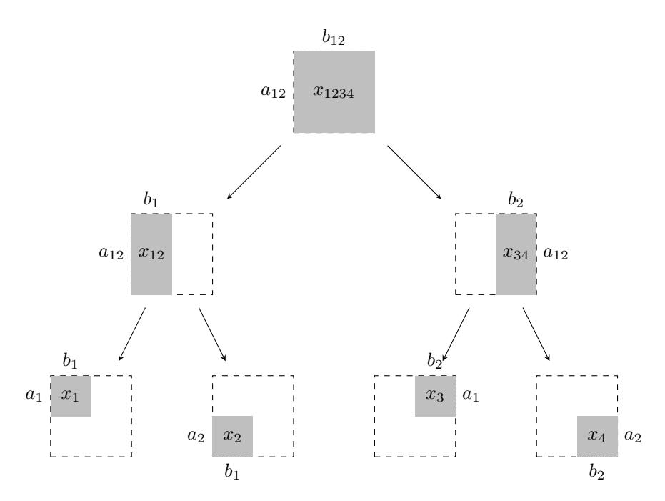
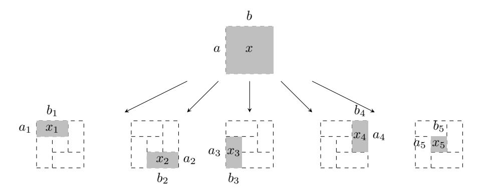
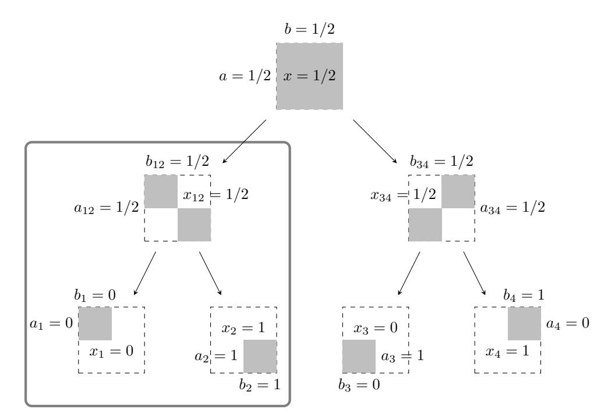

# **Black-box use of One-way Functions is Useless for Optimal Fair Coin-Tossing**

### **Hemanta K. Maji**

Department of Computer Science, Purdue University, USA [hmaji@purdue.edu](mailto:hmaji@purdue.edu)

#### **Mingyuan Wang**

Department of Computer Science, Purdue University, USA [wang1929@purdue.edu](mailto:wang1929@purdue.edu)

#### **Abstract**

A two-party fair coin-tossing protocol guarantees output delivery to the honest party even when the other party aborts during the protocol execution. Cleve (STOC–1986) demonstrated that a computationally bounded fail-stop adversary could alter the output distribution of the honest party by (roughly) 1*/r* (in the statistical distance) in an *r*-message coin-tossing protocol. An optimal fair coin-tossing protocol ensures that no adversary can alter the output distribution beyond 1*/r*.

In a seminal result, Moran, Naor, and Segev (TCC–2009) constructed the first optimal fair coin-tossing protocol using (unfair) oblivious transfer protocols. Whether the existence of oblivious transfer protocols is a necessary hardness of computation assumption for optimal fair cointossing remains among the most fundamental open problems in theoretical cryptography. The results of Impagliazzo and Luby (FOCS–1989) and Cleve and Impagliazzo (1993) prove that optimal fair coin-tossing implies the necessity of one-way functions' existence; a significantly weaker hardness of computation assumption compared to the existence of secure oblivious transfer protocols. However, the sufficiency of the existence of one-way functions is not known.

Towards this research endeavor, our work proves a black-box separation of optimal fair cointossing from the existence of one-way functions. That is, the black-box use of one-way functions cannot enable optimal fair coin-tossing. Following the standard Impagliazzo and Rudich (STOC– 1989) approach of proving black-box separations, our work considers any *r*-message fair cointossing protocol in the random oracle model where the parties have unbounded computational power. We demonstrate a fail-stop attack strategy for one of the parties to alter the honest party's output distribution by 1*/* √ *r* by making polynomially-many additional queries to the random oracle. As a consequence, our result proves that the *r*-message coin-tossing protocol of Blum (COMPCON–1982) and Cleve (STOC–1986), which uses one-way functions in a black-box manner, is the best possible protocol because an adversary cannot change the honest party's output distribution by more than 1*/* √ *r*.

Several previous works, for example, Dachman–Soled, Lindell, Mahmoody, and Malkin (TCC– 2011), Haitner, Omri, and Zarosim (TCC–2013), and Dachman–Soled, Mahmoody, and Malkin (TCC–2014), made partial progress on proving this black-box separation assuming some restrictions on the coin-tossing protocol. Our work diverges significantly from these previous approaches to prove this black-box separation in its full generality. The starting point is the recently introduced potential-based inductive proof techniques for demonstrating large gaps in martingales in the information-theoretic plain model. Our technical contribution lies in identifying a global invariant of communication protocols in the random oracle model that enables the extension of this technique to the random oracle model.

**Keywords and phrases** Fair Coin-Tossing, Black-box Separation, One-way Function, Random Oracle

**Funding** The research effort is supported in part by an NSF CRII Award CNS–1566499, an

#### **2 Black-box use of One-way Functions is Useless for Optimal Fair Coin-Tossing**

NSF SMALL Award CNS–1618822, the IARPA HECTOR project, MITRE Innovation Program Academic Cybersecurity Research Award, a Purdue Research Foundation (PRF) Award, and The Center for Science of Information, an NSF Science and Technology Center, Cooperative Agreement CCF–0939370.

### **Contents**

| 1 | Introduction        |                                                                |        |
|---|---------------------|----------------------------------------------------------------|--------|
|   | 1.1                 | Our Contributions                                           | 3 4 |
|   | 1.2                 | Prior Related Works and Comparison                          | 6      |
|   | 1.3                 | Technical Overview                                             | 7      |
| 2 | Preliminaries 13 |                                                                |        |
|   | 2.1                 | Two-party interactive protocols in the random oracle model  | 14     |
|   | 2.2                 | Heavy Querier and the Augmented Protocol                       | 14     |
|   | 2.3                 | Coin-Tossing Protocol                                       | 15     |
| 3 |                     | Our Results                                                    | 17     |
| 4 | Proof of Theorem 2  |                                                                | 19     |
|   | 4.1                 | Useful Imported Technical Lemmas                               | 19     |
|   | 4.2                 | Base case of the Induction: Message Complexity r = 1           | 19     |
|   | 4.3                 | Inductive Step                                              | 20     |
|   | References          |                                                                |        |

# **1 Introduction**

Ideally, in any cryptographic task, one would like to ensure that the honest parties receive their output when adversarial parties refuse to participate any further. Ensuring guaranteed output delivery, a.k.a., *fair computation*, is challenging even for fundamental cryptographic primitives like two-party coin-tossing. A *two-party fair coin-tossing protocol* assures that the honest party receives her output bit even when the adversary aborts during the protocol execution. Cleve [\[Cle86\]](#page-24-0) demonstrated that, even for computationally bounded parties, a *fail-stop adversary*[1](#page-2-1) could alter the output distribution by 1*/r* (in the statistical distance) in any *r*-message interactive protocols. Intuitively, any *r*-message interactive protocol is 1*/r-insecure*. An *optimal r*-message two-party fair coin-tossing protocol ensures that it is only 1*/r*-insecure.

In a seminal result, nearly three decades after the introduction of optimal fair coin-tossing protocols, Moran, Naor, and Segev [\[MNS09\]](#page-30-0) presented the first optimal coin-tossing protocol construction based on the existence of (unfair) secure protocols for the oblivious transfer functionality.[2](#page-2-2) Shortly after that, in a sequence of exciting results, several optimal/near-optimal fair protocols were constructed for diverse two-party and multi-party functionalities [\[GHKL08,](#page-26-0) [BOO10,](#page-23-0) [GK10,](#page-26-1) [BLOO11,](#page-23-1) [ALR13,](#page-22-0) [HT14,](#page-28-0) [Ash14,](#page-22-1) [Mak14,](#page-29-0) [ABMO15,](#page-22-2) [AO16,](#page-22-3) [BHLT17\]](#page-23-2). However, each of these protocols assumes the existence of secure protocols for oblivious transfer as well.

In theoretical cryptography, a primary guiding principle of research is to realize a cryptographic primitive securely using the minimal computational hardness assumption. Consequently, the following fundamental question arises naturally.

> **Question:** Is the existence of oblivious transfer *necessary* for constructing optimal fair coin-tossing protocols?

For example, the results of Impagliazzo and Luby [\[IL89\]](#page-28-1) and Cleve and Impagliazzo [\[CI93\]](#page-24-1) prove that optimal fair coin-tossing implies that the existence of one-way functions is necessary; a significantly weaker hardness of computation assumption compared to the existence of secure oblivious transfer protocols. However, it is unclear whether one-way functions can help realize optimal fair coin-tossing or not. For instance, historically, for a long time, one-way functions were not known to imply several fundamental primitives like pseudorandom generators [\[ILL89,](#page-28-2) [Hås90,](#page-27-0) [HILL99\]](#page-27-1), pseudorandom functions [\[GGM84,](#page-26-2) [GGM86\]](#page-26-3), pseudorandom permutations [\[LR88\]](#page-29-1), statistically binding commitment [\[Nao91\]](#page-30-1), statistically hiding commitment [\[NOVY98,](#page-30-2) [HR07\]](#page-28-3), zero-knowledge proofs [\[GMW91\]](#page-27-2), and digital signatures [\[NY89,](#page-30-3) [Rom90\]](#page-30-4); eventually, however, secure constructions were discovered. On the other hand, cryptographic primitives like collision-resistant hash functions, key-agreement schemes, public-key encryption, trapdoor primitives, and oblivious transfer protocols do not have constructions based on the existence of one-way functions. Therefore, is it just that we have not yet been able to construct optimal fair coin-tossing protocols securely from one-way functions, or are there inherent barriers to such constructions?

1 A fail-stop adversary behaves honestly and follows the prescribed protocol. However, based on her private view, she may choose to abort the protocol execution.

2 Oblivious transfer takes (*x*0*, x*1) ∈ {0*,* 1} 2 as input from the first party, and a choice bit *b* ∈ {0*,* 1} from the second party. The functionality outputs the bit *xb* to the second party, and the first party receives no output. The security of this functionality ensures that the first party has no advantage in predicting the choice bit *b*. Furthermore, the second party has no advantage in predicting the other input bit *x*1−*b*.

#### 4 Black-box use of One-way Functions is Useless for Optimal Fair Coin-Tossing

Does optimal fair coin-tossing belong to Minicrypt or Cryptomania [Imp95]?

Impagliazzo [Imp95] introduced five possible worlds and their implications for computer science. In Minicrypt, one-way functions exist; however, public-key cryptography is impossible. In Cryptomania, complex public-key cryptographic primitives like key-agreement and oblivious transfer are feasible.

Among several possible approaches, a prominent technique to address the question above is to study it via the lens of black-box separations, as introduced by Impagliazzo and Rudich [IR89]. Suppose one "black-box separates the cryptographic primitive Q from another cryptographic primitive P." Then, one interprets this result as indicating that the primitive P is unlikely to facilitate the secure construction of Q using black-box constructions.3 Consequently, to reinforce the necessity of the existence of oblivious transfer protocols for optimal fair coin-tossing, one needs to provide black-box separation of optimal fair coin-tossing protocols from computational hardness assumptions that are weaker than the existence of oblivious transfer protocols; for example, the existence of one-way functions [IL89, IR89].

Our results. In this work, we prove the (fully) black-box separation [RTV04] of optimal two-party fair coin-tossing protocol from the existence of one-way functions. In particular, we show that any r-message two-party coin-tossing protocol in the r-andom oracle m-odel, where parties have unbounded computational power, is  $1/\sqrt{r}$ -insecure. In turn, this result settles in the positive the longstanding open problem of determining whether the coin-tossing protocol of Blum [Blu82] and Cleve [Cle86] achieves the highest security while using one-way functions in a black-box manner.

Our proof relies on a potential-based argument that proceeds by identifying a global invariant (see Claim 1) across coin-tossing protocols in the random oracle model to guide the design of good fail-stop adversarial attacks. As a significant departure from previous approaches [DLMM11, DMM14], our analysis handles the entire sequence of *curious random oracle query-answer pairs* as a *single instance of information exposure*.

#### 1.1 Our Contributions

Before we proceed to present a high-level informal summary of our results, we need a minimalist definition of two-party coin-tossing protocols in the random oracle model that are secure against fail-stop adversaries. An  $(r, n, X_0)$ -coin-tossing protocol is a two-party interactive protocol with final output  $\in \{0, 1\}$ , and parties have oracle access to a random oracle4 such that the following conditions are satisfied.

1. Alice and Bob exchange a total of r messages (of arbitrary length) during the protocol.5

Most constructions in theoretical computer science and cryptography are black-box in nature. That is, they rely only on the input-output behavior of the primitive P, and are oblivious to, for instance, the particular implementation of the primitive P. The security reduction in cryptographic black-box constructions also uses the adversary in a black-box manner. There are, however, some highly non-trivial non-black-box constructions in theoretical computer science, for example, [Coo71, Kar72, Yao86, GMW87, FS90, GMW91, DDN00, Bar02]. However, an infeasibility of black-box constructions to realize Q from P indicates the necessity of new non-black-box constructions, which, historically, have been significantly infrequent.

&lt;sup>4 A random oracle is a function sampled uniformly at random from the set of all functions mapping  $\{0,1\}^n \to \{0,1\}^n$ .

&lt;sup>5 In this paper, we avoid the use of "round." Some literature assumes one round to contain only one message from some party. Other literature assumes that one round has one message from all the parties. Instead, for clarity, we refer to the total number of messages exchanged in the entire protocol.

- **2.** The oracle query complexity of both Alice and Bob is (at most) *n* in every execution of the protocol.
- **3.** At the end of the protocol, parties always agree on the output ∈ {0*,* 1}. Furthermore, the expectation of the output over all possible protocol executions is *X*0 ∈ [0*,* 1].
- **4.** We consider only fail-stop adversarial strategies. If one party aborts during the protocol execution, then the honest party outputs a defense coin ∈ {0*,* 1} based on her view without making additional queries to the random oracle. Such protocols are called *instant protocols*, and one may assume any coin-tossing protocol to be instant without loss of generality [\[DLMM11\]](#page-24-2).[6](#page-4-0)

We emphasize that there are additional subtleties in defining coin-tossing protocols in the random oracle model, and [Section 2.3](#page-14-0) addresses them. In this section, we rely on a minimalist definition that suffices to introduce our results. Our main technical result is the following consequence for any (*r, n, X*0)-coin-tossing protocol.

I Informal Theorem 1 (Main Technical Result). There exists a universal constant *c >* 0 and a polynomial *p*(·) such that the following holds. Let *π* be any (*r, n, X*0)-coin-tossing protocol in the information-theoretic random oracle model, where *r, n* ∈ N, and *X*0 ∈ (0*,* 1). Then, there exists a fail-stop adversarial strategy for one of the parties to alter the expected output of the honest party by ≥ *c* · *X*0(1 − *X*0)*/* √ *r* and performs at most *p*(*nr/X*0(1 − *X*0)) additional queries to the random oracle.

We remark that *X*0 may be a function of *r* and *n* itself. For example, the expected output *X*0 may be an inverse polynomial of *r*.

This technical result directly yields the following (fully) black-box separation result using techniques in [\[IR89,](#page-28-5) [RTV04\]](#page-30-5).

I **Corollary 1** (Black-box Separation from One-way Functions)**.** *There exists a universal constant c >* 0 *such that the following holds. Let π be any r-message two-party protocol that uses any one-way function in a fully black-box manner. Suppose, at the end of the execution of π, both parties agree on their output* ∈ {0*,* 1}*. Before the beginning of the protocol, let the expectation of their common output be X*0 ∈ (0*,* 1)*. Then, there is a fail-stop adversarial strategy for one of the parties to alter the honest party's expected output by* ≥ *c* · *X*0(1 − *X*0)*/* √ *r.*

That is, optimal fair coin-tossing lies in Cryptomania. All our hardness of computation results extend to the multi-party fair computation of arbitrary functionalities, where parties have private inputs if the output of the functionality has entropy and honest parties are *not* in the majority.

We emphasize that the black-box separation extends to any primitive (and their exponentiallyhard versions) that one can construct in a black-box manner from random oracles or ideal ciphers, which turn out to be closely related to random oracles [\[CPS08,](#page-24-5) [HKT11\]](#page-27-4). Furthermore, the impossibility result in the random oracle model implies black-box separations from other (more structured) cryptographic primitives (and their exponentially-hard versions) like regular one-way functions, one-way permutations, and collision-resistant hash functions as well. Although these primitives cannot be constructed from random oracles/ideal cipher in a black-box manner, using by-now well-establish techniques in this field (see, for example, [\[IR89\]](#page-28-5)), the main technical result suffices to prove the separations from these structured primitives.

6 For a more detailed discussion, refer to [Remark 2.3.](#page-14-1)

This black-box separation from one-way functions indicates that the two-party coin-tossing protocol of Blum [\[Blu82\]](#page-23-3) and Cleve [\[Cle86\]](#page-24-0), which uses one-way functions in a black-box manner and builds on the protocols of [\[ABC](#page-22-5)+85, [BD84\]](#page-23-4), achieves the best possible security for any *r*-message protocol. Their protocol is 1*/* √ *r*-insecure, and any *r*-message protocol cannot have asymptotically better security by only using one-way functions in a black-box manner, thus resolving this fundamental question after over three decades.

# **1.2 Prior Related Works and Comparison**

There is a vast literature of defining and constructing fair protocols for two-party and multi-party functionalities [\[GHKL08,](#page-26-0) [BOO10,](#page-23-0) [GK10,](#page-26-1) [BLOO11,](#page-23-1) [AP13,](#page-22-6) [ALR13,](#page-22-0) [HT14,](#page-28-0) [Ash14,](#page-22-1) [Mak14,](#page-29-0) [ABMO15,](#page-22-2) [AO16,](#page-22-3) [BHLT17\]](#page-23-2). In this paper, our emphasis is on the intersection of this literature with black-box separation results. The field of *meta-reductions* [\[BV98,](#page-24-6) [Cor02,](#page-24-7) [PV05,](#page-30-6) [FS10,](#page-25-2) [Pas11,](#page-30-7) [GW11,](#page-27-5) [HMS12,](#page-27-6) [DHT12,](#page-24-8) [Seu12,](#page-31-1) [FF13,](#page-25-3) [BDG](#page-23-5)+13, [BL13,](#page-23-6) [FKPR14,](#page-25-4) [ZZC](#page-31-2)+14, [BJLS16,](#page-23-7) [Bro16,](#page-24-9) [BFGJ17,](#page-23-8) [HHK18,](#page-27-7) [MP18,](#page-30-8) [DEF](#page-24-10)+19, [FHJ20,](#page-25-5) [AAO20,](#page-22-7) [FH20\]](#page-25-6), which demonstrates similar hardness of computation results from computational hardness assumptions like falsifiable assumptions [\[Nao03\]](#page-30-9), is outside the scope of this work.

In a seminal result, Impagliazzo and Rudich [\[IR89\]](#page-28-5) introduced the notion of black-box separation for cryptographic primitives. After that, there have been other works [\[RTV04,](#page-30-5) [BBF13\]](#page-22-8) undertaking this nuanced task of precisely defining black-box separation and its subtle variations. Intuitively, separating a primitive *Q* from a primitive *P* indicates that attempts to secure realize *Q* solely on the black-box use of *P* are unlikely to succeed. Reingold, Trevisan, and Vadhan [\[RTV04\]](#page-30-5) highlighted the subtleties involved in defining black-box separations by delineating several variants of separations. In their terminology, this work pertains to a *fully black-box* separation where the construction uses *P* in a black-box manner, and the security reduction uses the adversary in a black-box manner as well. Since the inception of black-box separations in 1989, this research direction has been a fertile ground for highly influential research [\[Rud88,](#page-31-3) [IR89,](#page-28-5) [Rud92,](#page-31-4) [Sim98,](#page-31-5) [KST99,](#page-29-2) [GKM](#page-26-4)+00, [GT00,](#page-27-8) [GMR01,](#page-27-9) [Fis02,](#page-25-7) [GGK03,](#page-26-5) [HR04,](#page-28-7) [DOP05,](#page-25-8) [GMM07,](#page-26-6) [BPR](#page-24-11)+08, [BM09,](#page-23-9) [BCFW09,](#page-22-9) [Vah10,](#page-31-6) [FLR](#page-25-9)+10, [Hof11,](#page-28-8) [MM11,](#page-29-3) [KSY11,](#page-29-4) [DLMM11,](#page-24-2) [FS12,](#page-25-10) [HOZ13,](#page-28-9) [MMP14a,](#page-30-10) [MMP14b,](#page-30-11) [DMM14,](#page-25-0) [MM16,](#page-29-5) [MMN](#page-29-6)+16, [GMM17a,](#page-26-7) [GMM17b,](#page-26-8) [GHMM18,](#page-26-9) [GMMM18\]](#page-26-10). Among these results, in this paper, we elaborate on the hardness of computation results about fair computation protocols.

A recent work of Haitner, Nissim, Omri, Shaltiel, and Silbak [\[HNO](#page-28-10)+18] introduces the notion of the "computational essence of key-agreement." Haitner, Makriyannis, and Omri [\[HMO18\]](#page-27-10), for any constant *r*, prove that *r*-message coin-tossing protocols imply key-agreement protocols, if they are less than 1*/* √ *r*-insecure. Observe that proving the implication that key-agreement protocol exists is a significantly stronger result as compared to demonstrating a black-box separation from key-agreement.[7](#page-5-1) However, their contribution is *incomparable* to our result because it shows a stronger consequence for any constant *r*.

Among the related works in black-box separation, the most relevant to our problem are the following. Haitner, Omri, and Zarosim [\[HOZ13\]](#page-28-9), for input-less functionalities, lift the hardness of computation results in the information-theoretic plain model against semi-honest

7 For example, consider the following analogy from complexity theory. We know that the complexity class Σ2 is separated from the complexity class Σ1 via Cook reductions; unless the polynomial hierarchy collapses. However, the existence of an efficient protocol for Σ1, implies that the entire polynomial hierarchy collapses, and we have Σ1 = Σ2. Similarly, the existence of an efficient protocol for a cryptographic primitive may have several additional implicit consequences in addition to merely providing oracle access to an implementation of that primitive.

adversaries to the random oracle model, i.e., random oracles are useless. However, cointossing is trivial to realize securely against semi-honest adversaries,[8](#page-6-1) and fail-stop adversarial strategies are not semi-honest. Dachman–Soled, Lindell, Mahmoody, and Malkin [\[DLMM11\]](#page-24-2) proved that the random oracle could be "compiled away" if the coin-tossing protocol has *r* = O(*n/* log *n*) messages. Therefore, the fail-stop adversarial strategy of Cleve and Impagliazzo [\[CI93\]](#page-24-1) in the information-theoretic plain model also succeeds against the two-party coin-tossing protocol in the random oracle model. Finally, Dachman–Soled, Mahmoody, and Malkin [\[DMM14\]](#page-25-0) show a fail-stop adversarial strategy against a particular class of fair coin-tossing protocols, namely, *function oblivious* protocols. An exciting feature of this work is that the attack performed by the adversarial party does not proceed by compiling away the random oracle. Similar proof techniques were independently introduced by [\[MMP14a,](#page-30-10) [MMP14b\]](#page-30-11) to study the computational complexity of two-party secure deterministic function evaluations.

Recently, there have been two works providing improvements to the fail-stop adversarial attacks of Cleve and Impagliazzo [\[CI93\]](#page-24-1) in the information-theoretic plain model. These results proceed by induction on *r* and employ a potential argument to lower-bound the performance of the most devastating fail-stop adversarial strategy against a coin-tossing protocol. Khorasgani, Maji, and Mukherjee [\[KMM19\]](#page-29-7) generalize (and improve) the fail-stop attack of Cleve and Impagliazzo [\[CI93\]](#page-24-1) to arbitrary *X*0 ∈ (0*,* 1), even when *X*0 depends on *r* and tends to 0 or 1. Khorasgani, Maji, and Wang [\[KMW20\]](#page-29-8) decouple the number of messages *r* in a coin-tossing protocol and the number of defense updates *d* that the two parties perform. They show that a two-party coin-tossing protocol in the information-theoretic plain model is 1*/* √ *d*-insecure, independent of the number of messages *r* in the protocol.

This result [\[KMW20\]](#page-29-8) is a good starting point for our work because our curious fail-stop attacker shall perform additional queries to the random oracle; however, the parties do not update their defense coins during this information exposure. Unfortunately, their approach only applies to interactive protocols in the information-theoretic plain model. Our work identifies a global invariant for communication protocols that enables the extension of the approach of [\[KMW20\]](#page-29-8) to the random oracle model. Furthermore, we simplify the proof of their result as well.

### **1.3 Technical Overview**

In this section, we introduce a fundamental technical idea underlying our approach to proving the main theorem. So, given an *r*-message coin-tossing protocol in the random oracle model, our objective is to design a fail-stop adversary who changes the output distribution of the honest party by 1*/* √ *r*.

**Preprocessing.** Let *π* be an *r*-message two-party fair coin-tossing protocol with query complexity *n* in the random oracle model, and parties have unbounded computational power. The primary difference between the random oracle model from the plain model is the following. In the plain model, conditioned on the public transcript, the joint distribution of Alice's and Bob's views consistent with the partial transcript is a product distribution. However, in the random oracle model, the joint distribution of their views might be correlated by the random oracle via their private query-answers. One needs to remove this correlation.[9](#page-6-2)

8 Every party broadcasts one uniformly and independently random bit, and all the parties agree on the parity of all the broadcast bits. This protocol is semi-honest secure.

9 Otherwise, the oblivious transfer functionality is securely realizable in the random oracle model. After that, one can use the Moran–Naor–Segev [\[MNS09\]](#page-30-0) protocol to realize optimal fair coin-tossing protocol

Towards this objective, one uses a *heavy querier* [\[IR89,](#page-28-5) [BM09,](#page-23-9) [MMP14b\]](#page-30-11). A *heavy query q* is a query to the random oracle such that the probability of Alice or Bob performing this query (conditioned on the public transcript)[10](#page-7-0) surpasses a fixed threshold . The heavy querier keeps performing heavy queries and adding their corresponding answer to the *augmented* public transcript. It stops when there are no more heavy queries left. It performs a total of O(*n/*) queries in expectation, and, consequently (by an averaging argument), O *n/*2 queries with probability (at least) (1−). Intuitively, once there are no heavy queries left, the joint distribution of Alice's and Bob's views conditioned on the augmented public transcript (which now also includes the query-answer pairs added by the heavy querier itself) is close to the product of the marginal distributions of Alice and Bob views.

Next, suppose we start from an augmented transcript where all queries are *-light* (that is, no query is -heavy). Alice performs some private queries and sends the next message in the protocol. Interestingly, the joint distribution of Alice-Bob views continues to be close to the product of their marginal distributions [\[BM09\]](#page-23-9); however, all queries may not be light anymore.[11](#page-7-1) So, one needs to run the heavy querier at this point in the protocol. Furthermore, this process continues after every message that Alice and Bob exchange during the protocol evolution.

We refer to the protocol *π* augmented with heavy querier's sequence of query-answer pairs as the augmented protocol *π* +. For the simplicity of presentation, in the sequel, we shall assume that the heavy querier always terminates after adding O *n/*2 query-answer pairs over the entire protocol execution of *π* +. Moreover, the distribution of Alice-Bob joint views conditioned on the augmented transcript immediately before and after Alice and Bob exchange messages prescribed in *π* is *identical* to the product distribution of their marginal distributions.

**Bottleneck.** Each party maintains a defense coin ∈ {0*,* 1} (in their private view) as a protection against the adversarial party aborting during the protocol execution.[12](#page-7-2) The joint distribution of the defense coins of Alice and Bob in *π* + is a product distribution immediately before and after Alice/Bob sends their messages prescribed in *π*. We remind the readers that, in reality, the joint distribution is close to a product distribution; however, we have made the simplifying assumption above that, for intuitive purposes, we consider them to be a product distribution. This observation follows from the fact that the defense coins of the parties are a deterministic function of their respective private views.[13](#page-7-3) The subsequent query-answer pairs introduced by the heavy queries in *π* + may, however, reveal information about the parties' defense coins.

Cleve–Impagliazzo [\[CI93\]](#page-24-1) fail-stop attack, which is the primary workhorse underlying the attacks on coin-tossing protocols by [\[DLMM11,](#page-24-2) [DMM14\]](#page-25-0), crucially relies on the following invariant during the evolution of *π* +. Any information revealed by the transcript of the protocol keeps (at least) one party's expected defense unchanged. For example, when Alice sends a message in *π* +, Bob's expected defense remains unchanged (due to the product

securely.

10 Using unbounded computational power, it is computationally efficient to calculate the heavy queries [\[JVV86,](#page-28-11) [BGP00\]](#page-23-10).

11 For example, Alice may send to Bob one of her private queries (not the answer) that she performed during the next-message generation.

12 Such protocols are referred to as *instantaneous protocols* in the literature [\[DLMM11\]](#page-24-2). One can assume, without loss of generality, that a fair protocol is an instantaneous protocol.

13 This observation is very subtle. There are several other natural candidate characteristics of the protocol that do not possess this unique "product distribution" property. For example, the expected output may depend on future random oracle query-answer pairs; thus, it need not have this property.

distribution of their joint views). If there are *D* instances of such information revelations during the entire protocol execution, then Cleve–Impagliazzo [\[CI93\]](#page-24-1) fail-stop attack guarantees an attack that alters the output distribution by 1*/* √ *D*.

Now, let us reason about how *D* compares to *r*. Observe that *D* ≥ *r* definitely, because parties may update their private defenses *r* times when they prepare the messages prescribed in *π*. However, it may be the case that *D r* in *π* + because the query-answer pairs added by the heavy querier has the potential of introducing several such information revelation instances.[14](#page-8-0) There are, in fact, significantly worse concerns. The heavy queries may simultaneously reveal information about both Alice's and Bob's defense coins by discovering a query performed by both of them (namely, an *intersection query* [\[IR89\]](#page-28-5)). If this event happens, then Cleve– Impagliazzo [\[CI93\]](#page-24-1) breaks down entirely, and there is no way to salvage an attack on *π* +. Therefore, a direct application of Cleve–Impagliazzo [\[CI93\]](#page-24-1) to the augmented protocol *π* + is bound to fail.

**A Stepping Stone: Khorasgani, Maji, and Wang [\[KMW20\]](#page-29-8) Approach.** Recently, Khorasgani, Maji, and Wang [\[KMW20\]](#page-29-8) present a technique to remove one of the bottlenecks mentioned above. They propose an inductive approach (generalizing the approach of [\[KMM19\]](#page-29-7)) to construct fail-stop attacks on coin-tossing protocols in the informationtheoretic plain model. They use an appropriate potential function to control the insecurity introduced by various fail-stop attack strategies.

Observe that, in the information-theoretic plain model, when a party sends a message, the expected defense of the other party remains unchanged. Consider a *D* message protocol where parties update their defenses only *r* times. Cleve–Impagliazzo [\[CI93\]](#page-24-1) attack would have indicated only a 1*/* √ *D*-insecurity. However, Khorasgani, Maji, and Wang [\[KMW20\]](#page-29-8) demonstrate 1*/* √ *r*-insecurity.

We present a brief technical summary of one of their critical technical steps. Consider the following potential function used in [\[KMW20\]](#page-29-8).

$$\Phi(x, a, b) := x(1 - x) + (x - a)^2 + (x - b)^2.$$

I Remark 1. We provide some intuition underlying the choice of the potential function. The parameter *x* shall represent the expected output of the protocol, *a* shall represent the expected Alice defense, and *b* shall represent the expected Bob defense of a protocol. The potential function lower-bounds the most devastating fail-stop attack on this protocol. Intuitively, the potential function punishes Alice if her *a* is far from *x*, that is, when her expected defense deviates far from the expected output. The potential function, thus, incentivizes Alice to set her defense close to the expected color. Similarly, the potential has a symmetric term for expected Bob's defense that incentivizes him to set his expected defense close to the expected output. Finally, the last term is a variance of the expected output, which accounts for the quality of the fail-stop attack owing to *x*. For example, if *x* is already close to 0 or 1, any fail-stop attack may not be able to change the output distribution significantly.

Analytically, this function has the property that if *a* is a constant, then the potential is convex in *x* and *b*. Analogously, if *b* is a constant, then the potential is convex in *x* and *a*. However, one cannot handle the case where *a*, *b*, and *x* change simultaneously [\(Figure 3](#page-11-0) presents a counterexample). In [Figure 1](#page-9-0) we demonstrate how one can lift the potential from the leaves of a communication protocol to its root across rounds where parties do not update

14 For example, Bob performs *n* random oracle queries. The heavy querier might reveal all these queries sequentially. These queries may incrementally reveal information about Bob's defense coin. So, it is possible to have *D* ≥ *n r*.

**Figure 1** An intuitive pictorial summary of the potential argument of Khorasgani, Maji, and Wang [\[KMW20\]](#page-29-8). The shaded regions denote the pairs of consistent Alice and Bob views. The first message is sent by Bob, and the second message is sent by Alice. We denote the average of *a*1 and *a*2 by *a*12. Similarly, *b*12 represents the average of *b*1 and *b*2. Finally, we define *x*12 as the average of *x*1 and *x*2, *x*34 as the average *x*3 and *x*4, and *x*1234 as the average of *x*12 and *x*34. The potential at the root is Φ(*x*1234*, a*12*, b*12). The potential at the leaves are Φ(*x*1*, a*1*, b*1), Φ(*x*2*, a*2*, b*1), Φ(*x*3*, a*1*, b*2), and Φ(*x*4*, a*2*, b*2). The "expected potential of the parameters associated with the leaves" is at least the "potential of the expected parameters at the root" using the property of the potential function Φ(·*,* ·*,* ·) and Jensen's inequality.

their defense coins. This result crucially relies on the fact that one party's expected defense coin always remains unchanged in every step of the protocol evolution.

To summarize, the "expected potential of the parameters associated with the leaves" is at least the "potential of the expected parameters at the root." This property of the potential function suffices to demonstrate 1*/* √ *r*-insecurity using an inductive argument. This result makes us hopeful that *π* +, where parties update their defenses only *r* times, also behaves similarly and has 1*/* √ *r*-insecurity. However, the fact that the heavy querier might simultaneously disclose information about both Alice's and Bob's private coins, prevents the use of this technique to *π* + in the random oracle model.

**A Crucial Observation.** Suppose Alice and Bob's expected defense coins are *a* and *b*, respectively. Assume that the heavy querier adds the transcript *ti* with probability *pi* . Conditioned on the transcript *ti* , the expected Alice's and Bob's defense coins are *ai* and *bi* , respectively.

We shall study the expectation of the product of Alice's and Bob's defense coins immediately before and after the sequence of query-answer pairs added by the heavy querier. Just before the heavy querier starts adding queries, the joint distribution of Alice-Bob views is product distribution. So, the expected product of Alice's and Bob's defense coins is *a* · *b*. After the heavy querier terminates, the joint distribution of Alice and Bob views is product distribution again. So, the expected product of Alice's and Bob's defense coins conditioned

**Figure 2** An pictorial summary of our potential argument in the random oracle model. The shaded regions denote the pairs of consistent Alice and Bob views. We denote the expectation of {*a*1*, . . . a*5} by *a*. Similarly, we define *b* as the expectation of {*b*1*, . . . b*5}. Next, we define *x* is the expectation of {*x*1*, . . . x*5}. The potential at root is Φ(*x, a, b*). The potential at the leaves are Φ(*x*1*, a*1*, b*1), Φ(*x*2*, a*2*, b*2), Φ(*x*3*, a*2*, b*2), Φ(*x*4*, a*4*, b*4), and Φ(*x*5*, a*5*, b*5). The "expected potential of the parameters associated with the leaves" is at least the "potential of the expected parameters at the root" using the property of the potential function Φ(·*,* ·*,* ·).

on the the heavy querier adding *ti* is *ai* · *bi* . Overall, we have the following linearity constraint.

$$a \cdot b = \sum_{i} p_i \left( a_i \cdot b_i \right).$$

Observe, as a consequence of this constraint, the subtree inside the highlighted rectangle in [Figure 3](#page-11-0) is impossible to occur in *isolation*. The "complementary pieces" that help complete the product space need to show up elsewhere.

**Our Approach.** Our starting point is the potential function of Khorasgani, Maji, and Wang [\[KMW20\]](#page-29-8), and we re-write their potential function as follows.

$$\Phi(x, a, b) = x(1 - x) + (x - a)^{2} + (x - b)^{2}$$
$$= x + (x - a - b)^{2} - 2ab$$

Our crucial observation has already concluded that *ab* is a linear term. Furthermore, the term *x* represents the expected output of the protocol conditioned on the partial transcript, which is also a linear term. The term (*x* − *a* − *b*) 2 remains convex for *x*, *a*, and *b*.

Suppose before the heavy querier started, the expected output is *x*, the expected Alice defense is *a*, and the expected Bob defense is *b*. Furthermore, conditioning on the heavy querier generating the transcript *ti* , the expected output is *xi* , the expected Alice defense is *ai* , and the expected Bob defense is *bi* . Recall that immediately before and after the heavy querier execution, the joint distribution of Alice's and Bob's views is product distribution. [Figure 2](#page-10-0) pictorially elaborates on how to lift the potential of the leaves to the potential of the root.

Intuitively, at the root, the joint view of Alice and Bob is a product space. Conditioning on the sequence of query-answer pairs added by the heavy querier decomposes the view into small *combinatorial rectangles*. Under this new interpretation of the potential function Φ(*x, a, b*), Jensen's inequality helps us prove that the "average potential at individual leaves" is at least the "potential of the average parameters at the root." This observation suffices to translate the inductive argument of Khorasgani, Maji, Wang [\[KMW20\]](#page-29-8) and apply it to *π* + in the random oracle model. [Section 4](#page-18-0) provides the full proof of our technical result. So, our

**Figure 3** In certain situations, the potential Φ(·*,* ·*,* ·) falls apart locally when *x, a,* and *b* change simultaneously. The shaded regions denote the pairs of consistent Alice and Bob views. We represent *a*12 as the average of *a*1 and *a*2, *a*34 as the average of *a*3 and *a*4, and *a* is the average of *a*12 and *a*34. Similarly, *b*12 is the average of *b*1 and *b*2, *b*34 is the average of *b*3 and *b*4, and *b* is the average of *b*12 and *b*34. Finally, *x*12 is the average of *x*1 and *x*2, *x*34 is the average of *x*3 and *x*4, and *x* is the average of *x*12 and *x*34. Note that Φ(*x, a, b*) = 1*/*4. At the leaves, we have Φ(*x*1*, a*1*, b*1) = Φ(*x*2*, a*2*, b*2) = 0, and Φ(*x*3*, a*3*, b*3) = Φ(*x*4*, a*4*, b*4) = 1. So, globally, the expected potential at the leaves is 1*/*2 and is greater than the potential at the root, which is 1*/*4. Now, focus into the local subtree inside the rectangle. The expected potential of the leaves inside the rectangle is 0, and the potential at their parent is 1*/*4. Therefore, locally, the potential of the parent is *not* less than the expected potential of the leaves.

technical result identifies a fail-stop adversarial strategy that demonstrates 1*/* √ *r*-insecurity, where *r* represents the number of times the parties update their defense coins. This argument completes the overview of our technical approach.

**Discussion.** Next, we present additional remarks positioning our technical approach relative to previous works, and highlighting how our techniques may help prove new separation results as well.

I Remark 2. There is no need for the existence of a communication protocol that realizes the decomposition into smaller combinatorial rectangles. For example, the decomposition in [Figure 2](#page-10-0) is inspired by the Kushilevitz function [\[KN\]](#page-29-9), which has no communication protocol realizing the smaller combinatorial rectangles. We believe that this general property should facilitate demonstrating new black-box separations from cryptographic primitives (even with private inputs) whose input-output behavior decomposes into monochromatic combinatorial rectangles (for example, the existence of semi-honest secure protocols for two-party deterministic functionalities that are *not decomposable* and do not have any OR-minor [\[Kus89,](#page-29-10) [Bea89,](#page-23-11) [MPR09\]](#page-30-12)).

I Remark 3. Our analysis, in a significant divergence from existing approaches, considers the entire list of query-answers added by the heavy querier in *π* + immediately after a party sends a message as a *single instance of information exposure*. Even the technical approach of [\[KMW20\]](#page-29-8) considers the rounds where no party updates their respective defense coins in an iterative manner (not as a single instance of information exposure).

Consequently, our proof translates into an alternate (and a more direct) proof for the result in [\[KMW20\]](#page-29-8).

I Remark 4. Note that we are *not* ruling out the possibility of cases like [Figure 3](#page-11-0) occurring during the evolution of the heavy querier execution. We are merely stating that, overall, the (average) potential function increases from the leaves to the root, if the joint Alice-Bob views are (close to) product distribution immediately before and after the heavy querier adds all her query-answers. For example, this global argument automatically compensates adequately for any local harm to the potential caused by the subtree inside the rectangle of [Figure 3](#page-11-0) so that a local surplus somewhere else in the potential counterbalances this local deficit.

Note that previous works attempt to avoid the cases arising in [Figure 3](#page-11-0) (by ruling out intersection queries of parties with future queries that may influence the output). Our potential-based approach overcomes this challenge. Jensen's inequality typically is a local argument. However, the addition of the constraint that the product of expected Alice-Bob defense coins is conserved, introduces a global constraint sufficient to salvage the potentialbased approach.

We want to highlight a subtlety at this point. The existence of views that occur as the internal nodes in [Figure 3](#page-11-0) do *not* imply the existence of key-agreement. Because, there exist public query-answers that make the joint distribution of Alice-Bob private views a product distribution.

I Remark 5. It is not evident whether our attack "compiles away" the random oracle similar to the simulation lemma in [\[DLMM11\]](#page-24-2). Simulating the entire sequence of query-answer sequence added by the heavy querier may not be simulatable in the information-theoretic plain model. A primary source of difficulty lies in simulating the answers of queries that are intersection queries without actually revealing whether they are intersection queries or not. Therefore, similar to [\[MMP14a,](#page-30-10) [MMP14b,](#page-30-11) [DMM14\]](#page-25-0) our result does not seem to compile away the random oracle.

To conclude this discussion, we emphasize that the technical overview enjoys the luxury of hindsight that the potential argument of [\[KMW20\]](#page-29-8) applies to this setting. The identification of the actual invariant that ensures the counterbalances to the local harm caused to the potential by instances like [Figure 3](#page-11-0) was highly nontrivial. It is surprising (miraculous, perhaps) that considering the expected product of Alice's and Bob's defense coins turned out to be the critical invariant. In fact, beyond exploring the analytic properties, it would be interesting to investigate the intuition underlying the rewriting of the potential function as Φ(*x, a, b*) = *x* + (*x* − *a* − *b*) 2 − 2*ab*.

# **2 Preliminaries**

We use uppercase letters for random variables, (corresponding) lowercase letters for their values, and calligraphic letters for sets. For a joint distribution (*A, B*), *A* and *B* represent the marginal distributions, and *A* × *B* represents the product distribution where one samples from the marginal distributions *A* and *B* independently. For a random variable *A* distributed over Ω, the *support* of *A*, denoted by Supp(*A*), is the set {*x* | *x* ∈ Ω*,*Pr[*A* = *x*] *>* 0}*.* For two random variables A and B distributed over a (discrete) sample space  $\Omega$ , their statistical distance is defined as  $\mathsf{SD}\left(A,B\right) := \frac{1}{2} \cdot \sum_{\omega \in \Omega} \left| \Pr[A=w] - \Pr[B=w] \right|$ .

For a sequence  $(X_1,X_2,\ldots)$ , we use  $X_{\leq i}$  to denote the joint distribution  $(X_1,X_2,\ldots,X_i)$ . Similarly, for any  $(x_1,x_2,\ldots)\in\Omega_1\times\Omega_2\times\cdots$ , we define  $x_{\leq i}:=(x_1,x_2,\ldots,x_i)\in\Omega_1\times\Omega_2\times\cdots\times\Omega_i$ . Let  $(M_1,M_2,\ldots,M_r)$  be a joint distribution over sample space  $\Omega_1\times\Omega_2\times\cdots\times\Omega_r$ , such that for any  $i\in\{1,2,\ldots,n\}$ ,  $M_i$  is a random variable over  $\Omega_i$ . A (real-valued) random variable  $X_i$  is said to be  $M_{\leq i}$  measurable if there exists a deterministic function  $f\colon\Omega_1\times\cdots\times\Omega_i\to\mathbb{R}$  such that  $X_i=f(M_1,\ldots,M_i)$ . A random variable  $\tau\colon\Omega_1\times\cdots\times\Omega_r\to\{1,2,\ldots,r\}$  is called a stopping time, if the random variable  $\mathbbm{1}_{\tau\leq i}$  is  $M_{\leq i}$  measurable, where  $\mathbbm{1}$  is the indicator function. For a more formal treatment of probability spaces,  $\sigma$ -algebras, filtrations, and martingales, refer to, for example,  $[\operatorname{Sch} 17]$ .

The following inequality shall be helpful for our proof.

▶ Theorem 1 (Jensen's inequality). If f is a multivariate convex function, then  $\mathrm{E}\left[f\left(\vec{X}\right)\right] \geq f\left(\mathrm{E}\left[\vec{X}\right]\right)$ , for all probability distributions  $\vec{X}$  over the domain of f.

## 2.1 Two-party interactive protocols in the random oracle model

Alice and Bob speak in alternate rounds. We denote the  $i^{th}$  message by  $M_i$ . For every message  $M_i$ , we denote Alice's private view immediately after sending/receiving message  $M_i$  as  $V_i^{\mathsf{A}}$ , which consists of Alice's random tape  $R^{\mathsf{A}}$ , her private queries, and the first i messages exchanged. We use  $V_0^{\mathsf{A}}$  to represent Alice's private view before the protocol begins. Similarly, we define Bob's private view  $V_i^{\mathsf{B}}$  and use  $R^{\mathsf{B}}$  to denote his private random tape.

**Query Operator**  $\mathcal{Q}$ . For any view V, we use  $\mathcal{Q}(V)$  to denote the set of all queries contained in the view V.

# 2.2 Heavy Querier and the Augmented Protocol

For two-party protocols in the random oracle model, [IR89, BM09] introduced a standard algorithm, namely, the *heavy querier*. In this paper, we shall use the following imported theorem.

- ▶ Imported Theorem 1 (Guarantees of Heavy Querier [BM09, MMP14b]). Let  $\pi$  be any two-party protocol between Alice and Bob in the random oracle model, in which both parties ask at most n queries. For all threshold  $\epsilon \in (0,1)$ , there exists a public algorithm, called the heavy querier, who has access to the transcript between Alice and Bob. After receiving each message  $M_i$ , the heavy querier performs a sequence of queries and obtains its corresponding answers from the random oracle. Let  $H_i$  denote the sequence of query-answer pairs asked by the heavy querier after receiving message  $M_i$ . Let  $T_i$  be the union of the  $i^{th}$  message  $M_i$  and the  $i^{th}$  heavy querier message  $H_i$ . The heavy querier guarantees that the following conditions are simultaneously satisfied.
- **■**  $\epsilon$ -Lightness. For any i, any  $t_{\leq i} \in \text{Supp}(T_{\leq i})$ , and query  $q \notin \mathcal{Q}(h_{\leq i})$ ,

$$\Pr\left[q \in \mathcal{Q}\left(V_i^{\mathsf{A}}\big| T_{\leq i} = t_{\leq i}\right)\right] \leq \epsilon, \quad \text{ and } \quad \Pr\left[q \in \mathcal{Q}\left(V_i^{\mathsf{B}}\big| T_{\leq i} = t_{\leq i}\right)\right] \leq \epsilon.$$

 $\blacksquare$   $n\epsilon$ -Dependence. Fix any i,

$$\mathop{\mathbb{E}}_{t_{\leq i} \leftarrow T_{\leq i}} \left[ \mathsf{SD} \left( \left( V_i^\mathsf{A}, V_i^\mathsf{B} \middle| T_{\leq i} = t_{\leq i} \right), \left( V_i^\mathsf{A} \middle| T_{\leq i} = t_{\leq i} \right) \times \left( V_i^\mathsf{B} \middle| T_{\leq i} = t_{\leq i} \right) \right) \right] \leq n \epsilon.$$

Intuitively, it states that on average, the statistical distance between (1) the joint distribution of Alice's and Bob's private view, and (2) the product of the marginal distributions of Alice's private views and Bob's private views is small.

■  $\mathcal{O}(n/\epsilon)$ -Efficiency. The expected number of queries asked by the heavy querier is bounded by  $\mathcal{O}(n/\epsilon)$ . Consequently, it has  $\mathcal{O}(n/\epsilon^2)$  query complexity with probability (at least)  $(1-\epsilon)$  by an averaging argument.

We refer to the protocol with the heavy querier's messages attached as the augmented protocol. We call  $T_i$  the augmented message.

# 2.3 Coin-Tossing Protocol

We will prove our main result by induction on the message complexity of the protocol. Therefore, after any partial transcript  $t_{\leq i}$ , we will treat the remainder of the original protocol starting from the  $(i+1)^{th}$  message, as a protocol of its own. Hence, it is helpful to define the coin-tossing protocol where, before the beginning of the protocol, Alice's and Bob's private views are already correlated with the random oracle. However, note that, in the augmented protocol, after each augmented message  $t_i$ , the heavy querier has just ended. Thus, these correlations will satisfy Imported Theorem 1. Therefore, we need to define a general class of coin-tossing protocols in the random oracle model over which we shall perform our induction.

- ▶ **Definition 1** (( $\epsilon, \vec{\alpha}, r, n, X_0$ )-Coin-Tossing). An interactive protocol  $\pi$  between Alice and Bob with random oracle  $O: \{0,1\}^{\lambda} \to \{0,1\}^{\lambda}$  is called an  $(\epsilon, \vec{\alpha}, r, n, X_0)$ -coin-tossing protocol if it satisfies the following.
- Setup. There is an arbitrary set  $S \subseteq \{0,1\}^{\lambda}$ , which is publicly known, such that for all queries  $s \in S$ , the query answers O(s) are also publicly known. Let  $\Omega^{\mathsf{A}}$ ,  $\Omega^{\mathsf{B}}$ , and  $\Omega^{\mathsf{O}}$  be the universes of Alice's random tape, Bob's random tape, and the random oracle, respectively. There are also publicly known sets  $\mathcal{A} \subseteq \Omega^{\mathsf{A}} \times \Omega^{\mathsf{O}}$  and  $\mathcal{B} \subseteq \Omega^{\mathsf{B}} \times \Omega^{\mathsf{O}}$ . The random variables  $R^{\mathsf{A}}$ ,  $R^{\mathsf{B}}$ , and O are sampled uniformly conditioned on that (1) ( $R^{\mathsf{A}}$ , O) ∈  $\mathcal{A}$ , (2) ( $R^{\mathsf{B}}$ , O) ∈  $\mathcal{B}$ , and (3) O is consistent with the publicly known answers at S. Alice's private view before the beginning of the protocol is a deterministic function of  $R^{\mathsf{A}}$  and O, which might contain private queries. Likewise, Bob's private view is a deterministic function of  $R^{\mathsf{B}}$  and O.15
- **Agreement.** At the end of the protocol, both parties always agree on the output  $\in \{0, 1\}$ . Without loss of generality, we assume the output is concatenated to the last message in the protocol. 16
- **Defense preparation.** At message  $M_i$ , if Alice is supposed to speak, in addition to preparing the next-message  $M_i$ , she will also prepare a defense coin for herself as well. If Bob decides to abort the next message, she shall *not* make any additional queries to the random oracle, and simply output the defense she has just prepared. [DLMM11, DMM14] introduced this constraint as the "instant construction." They showed that, without loss of generality, one can assume this property for all the defense preparations except for the

&lt;sup>15 Basically,  $\mathcal{S}$  is the set of all the queries that the heavy querier has published.  $\mathcal{A}$  is the set of all possible pairs of Alice's private randomness  $r^{\mathsf{A}}$  and random oracle o that are consistent with Alice's messages before this protocol begins. Similarly,  $\mathcal{B}$  is the set of all consistent pairs of Bob's private randomness  $r^{\mathsf{B}}$  and random oracle o.

&lt;sup>16 This generalization shall not make the protocol any more vulnerable. Any attack in this protocol shall also exist in the original protocol with the same amount of deviation. This only helps simplify the presentation of our proof.

first defense (see [Remark 2.3\)](#page-14-1). We shall refer to this defense both as Alice's *i th* defense and also as her (*i* + 1)*th* defense. Consequently, Alice's defense for every *i* is well-defined. Bob's defense is defined similarly. We assume the party who receives the first message has already prepared her defense for the first message before the protocol begins.

- **-Lightness at Start.** For any query *q /*∈ S, the probability that Alice has asked query *q* before the protocol begins is upper bounded by ∈ [0*,* 1]. Similarly, the probability that Bob has asked query *q* is at most .
- *~α***-Dependence.** For all *i* ∈ {0*,* 1*, . . . , r*}, Alice's and Bob's private views are *αi*-dependent on average immediate after the message *Ti* . That is, the following condition is satisfied for every *i*.

$$\alpha_i \coloneqq \mathop{\mathbb{E}}_{t \le i \leftarrow T \le i} \left[ \mathsf{SD} \left( \left( V_i^\mathsf{A}, V_i^\mathsf{B} \middle| T \le i = t \le i \right), \left( V_i^\mathsf{A} \middle| T \le i = t \le i \right) \times \left( V_i^\mathsf{B} \middle| T \le i = t \le i \right) \right) \right]$$

- *r***-Message complexity.** The number of messages of this protocol is *r* = poly(*λ*). We emphasize that the length of the message could be arbitrarily long.
- *n***-Query complexity.** For all possible complete executions of the protocol, the number of queries that Alice asks (including the queries asked before the protocol begins) is at most *n* = poly(*λ*). This also includes the queries that are asked for the preparation of the defense coins. Likewise, Bob asks at most *n* queries as well.
- *X*0**-Expected Output.** The expectation of the output is *X*0 ∈ (0*,* 1).
- I Remark. Let us justify the necessity of *~α*-dependence in the definition. We note that when heavy querier stops, Alice's and Bob's view are not necessarily close to the product of their respective marginal distributions.[17](#page-15-0) However, to prove any meaningful bound on the susceptibility of this protocol, we have to treat *~α* as an additional error term. Therefore, we introduce this parameter in our definition. However, the introduction of this error shall not be a concern globally, because the heavy querier guarantees that over all possible executions this dependence is at most *n* (on average), which we shall ensure to be sufficiently small.
- I Remark. We note that, after every heavy querier message, the remaining sub-protocol always satisfies the definition above. However, the original coin-tossing protocol might not meet these constraints. For example, consider a one-message protocol where Alice queries *O*(0*λ* ), and sends the parity of this string to Bob as the output. On the other hand, Bob also queries *O*(0*λ* ) and uses the parity of this string as his defense. This protocol is perfectly secure in the sense that no party can deviate the output of the protocol at all. However, the query 0 *λ* is 1-heavy in Bob's private view even before the protocol begins. Prior works [\[DLMM11,](#page-24-2) [DMM14\]](#page-25-0) rule out such protocols by banning Bob from making any queries when he prepares his first defense. In this paper, we consider protocols such that no queries are more than -heavy when Bob prepares his first defense. We call this the *-lightness at start assumption*. The set of protocols that prior works consider is identical to the set of protocols that satisfies 0-lightness at start assumption.

To justify our -lightness at start assumption, we observe that one can always run a heavy querier with a threshold before the beginning of the protocol as a pre-processing step. Note that this step fixes only a small part (of size O(*n/*)) of the random oracle, and,

17 For instance, suppose Alice samples a uniform string *u*1 \$←− {0*,* 1} *λ* and sends *O*(*u*1) to Bob. Next, Bob samples a uniform string *u*2 \$←− {0*,* 1} *λ* and sends *O*(*u*2) to Alice. Assume the first message and the second message are the same, i.e., *O*(*u*1) = *O*(*u*2). Then, there are no heavy queries, but Alice's and Bob's private views are largely correlated.

hence, the random oracle continues to be an "idealized" one-way function. If this protocol is a black-box construction of a coin-tossing protocol with any one-way function, the choice of the one-way function should not change its expected output. Therefore, by running a heavy querier before the beginning of the protocol, it should not alter the expected output of the protocol. After this compilation step, all queries are  $\epsilon$ -light in Bob's view before the protocol begins. Consequently, our inductive proof technique is applicable.

▶ Remark. Let us use the an example to further illustrate how we number Alice's and Bob's defense coins. Suppose Alice sends the first message in the protocol. Bob shall prepare his first defense coin even before the protocol begins. Alice, during her preparation of the first message, shall also prepare a defense coin as her first defense.

The second message in the protocol is sent by Bob. Since Alice is not speaking during this message preparation, her second defense coin remains identical to her first defense coin. Bob, on the other hand, shall update a new defense coin as his second defense during his preparation of the second message.

For the third message, Alice shall prepare a new third defense coin and Bob's third defense coin is identical to his second defense coin. This process continues for r messages during the protocol execution.

**Notation.** Let  $X_i$  represent the expected output conditioned on the first i augmented messages, i.e., the random variable  $T_{\leq i}$ . Let  $D_i^{\mathsf{A}}$  be the expectation of Alice's  $i^{th}$  defense coin conditioned on the first i augmented messages. Similarly, let  $D_i^{\mathsf{B}}$  be the expectation of Bob's  $i^{th}$  defense coin conditioned on the first i augmented messages. (Refer to Definition 1 for the definition of  $i^{th}$  defense. Recall that, for both Alice and Bob, the  $i^{th}$  defense is defined for all  $i \in \{1, 2, \ldots, r\}$ .) Note that random variables  $X_i, D_i^{\mathsf{A}}$ , and  $D_i^{\mathsf{B}}$  are all  $T_{\leq i}$ -measurable.

# 3 Our Results

Given an  $(\epsilon, \vec{\alpha}, r, n, X_0)$ -coin-tossing protocol  $\pi$  and a stopping time  $\tau$ , we define the following score function that captures the susceptibility of this protocol with respect to this particular stopping time.

▶ **Definition 2.** Let  $\pi$  be an  $(\epsilon, \vec{\alpha}, r, n, X_0)$ -coin tossing protocol. Let  $P \in \{A, B\}$  be the party who sends the last message of the protocol. For any stopping time  $\tau$ , define

$$\mathsf{Score}(\pi,\tau) := \left. \mathrm{E} \left[ \mathbbm{1}_{(\tau \neq r) \vee (\mathsf{P} \neq \mathsf{A})} \cdot \left| X_\tau - D_\tau^\mathsf{A} \right| + \mathbbm{1}_{(\tau \neq r) \vee (\mathsf{P} \neq \mathsf{B})} \cdot \left| X_\tau - D_\tau^\mathsf{B} \right| \right].$$

We clarify that the binary operator  $\vee$  in the expression above represents the boolean OR operation, and *not* the "join" operator.

To provide additional perspectives to this definition, we make the following remarks similar to [KMW20].

1. Suppose Alice is about to send  $(m_i^*, h_i^*)$  as the  $i^{th}$  message. In the information-theoretic plain model, prior works [CI93, KMM19] consider the gap between the expected output before and after this message. Intuitively, since Alice is sending this message, she could utilize this gap to attack Bob, because Bob's defense cannot keep abreast of this new information. However, in the random oracle model, both parties are potentially vulnerable to this gap. This is due to the fact that the heavy querier message might also reveal information about Bob. For instance, it might reveal Bob's commitments sent in previous messages using the random oracle as an idealized one-way function. Then, Alice's defense cannot keep abreast of this new information either and thus Alice is potentially vulnerable.

- 2. Due to the reasons above, for every message, we consider the potential deviations that both parties can cause by aborting appropriately. Suppose we are at transcript  $T_{\leq i} = t^*_{\leq i}$ , which belongs to the stopping time, i.e.,  $\tau = i$ . And Alice sends the last message  $(m^*_i, h^*_i)$ . Naturally, Alice can abort without sending this message to Bob when she finds out her  $i^{th}$  message is  $(m^*_i, h^*_i)$ . This attack causes a deviation of  $|X_{\tau} D^{\mathsf{B}}_{\tau}|$ . On the other hand, Bob can also attack by aborting when he receives Alice's message  $(m^*_i, h^*_i)$ . This attack ensures a deviation of  $|X_{\tau} D^{\mathsf{A}}_{\tau+1}|$ . Note that for the  $(i+1)^{th}$  message, Alice is not supposed to speak, her  $(i+1)^{th}$  defense is exactly her  $i^{th}$  defense. Hence this deviation can be also written as  $|X_{\tau} D^{\mathsf{A}}_{\tau}|$ .
- 3. The above argument has a boundary case, which is the last message of the protocol. Suppose Alice sends the last message. Then, Bob, who receives this message, cannot abort anymore because the protocol has ended. Therefore, if our stopping time  $\tau = n$ , the score function must exclude  $|X_{\tau} D_{\tau}^{\mathsf{A}}|$ . This explains why we have the indicator function 1 in our score function.
- 4. Lastly, we illustrate how one can translate this score function into a fail-stop attack strategy. Suppose we find a stopping time  $\tau^*$  that witnesses a large score  $\mathsf{Score}(\pi,\tau^*)$ . For Alice, we will partition the stopping time into two partitions depending on whether  $X_{\tau} \geq D_{\tau}^{\mathsf{B}}$  or not. Similarly, for Bob, we partition the stopping time into two partitions depending on whether  $X_{\tau} \geq D_{\tau}^{\mathsf{A}}$ . These four attack strategies correspond to Alice or Bob deviating towards 0 or 1. And the summation of the deviations caused by these four attacks are exactly  $\mathsf{Score}(\pi,\tau^*)$ . Hence, there must exist a fail-stop attack strategy for one of the parties that changes the honest party's output distribution by  $\geq \frac{1}{4} \cdot \mathsf{Score}(\pi,\tau^*)$ .

Given the definition of our score function, we are interested in finding the stopping time that witnesses the largest score. This motivates the following definition.

▶ **Definition 3.** For any  $(\epsilon, \vec{\alpha}, r, n, X_0)$ -coin-tossing protocol  $\pi$ , define

$$\mathsf{Opt}(\pi) := \max_{\tau} \; \mathsf{Score}(\pi, \tau).$$

Intuitively,  $\mathsf{Opt}(\pi)$  represents the susceptibility of the protocol  $\pi$ . Our main theorem states the following lower bound on this quantity.

▶ **Theorem 2** (Main Technical Result in the Random Oracle Model). For any  $(\epsilon, \vec{\alpha}, r, n, X_0)$ -coin-tossing protocol  $\pi$ , the following holds.

$$\mathsf{Opt}(\pi) \geq \Gamma_r \cdot X_0 \left(1 - X_0\right) - \left(nr \cdot \epsilon + \alpha_0 + 2\sum_{i=1}^r \alpha_i\right),$$

where  $\Gamma_r := \sqrt{\frac{\sqrt{2}-1}{r}}$ , for all positive integers r. Furthermore, one needs to make an additional  $\mathcal{O}(n/\epsilon)$  queries to the random oracle (in expectation) to identify a stopping time  $\tau$  witnessing this lower bound.

We defer the proof to Section 4. In light of the remarks above, this theorem implies the following corollary.

▶ Corollary 2. Let  $\pi$  be a coin-tossing protocol in the random oracle model that satisfies the  $\epsilon$ -lightness at start assumption (see Remark 2.3). Suppose  $\pi$  is an r-message protocol, and Alice and Bob ask at most n queries. The expected output of  $\pi$  is  $X_0$ . Then, either Alice or Bob has a fail-stop attack strategy that deviates the honest party's output distribution by

$$\Omega\left(\frac{X_0\left(1-X_0\right)}{\sqrt{r}}\right).$$

This attack strategy performs  $\mathcal{O}\left(\frac{n^2r^2}{X_0(1-X_0)}\right)$  additional queries to the random oracle in expectation.

This corollary is obtained by substituting  $\epsilon = \frac{X_0(1-X_0)}{nr^2}$  in Theorem 2. Imported Theorem 1 guarantees that, for all i, the average dependencies after the  $i^{th}$  message are bounded by  $n\epsilon$ . Hence, the error term is o  $\left(\frac{X_0(1-X_0)}{\sqrt{r}}\right)$ .

The efficiency of the heavy querier is guaranteed by Imported Theorem 1. One can transform the average-case efficiency to worst-case efficiency by forcing the heavy querier to stop when it asks more than  $\frac{n^2r^3}{(X_0(1-X_0))^2}$  queries. By Markov's inequality, this happens with probability at most  $\mathcal{O}\left(\frac{X_0(1-X_0)}{r}\right) = o\left(\frac{X_0(1-X_0)}{\sqrt{r}}\right)$ , and thus the quality of this attack is essentially identical to the averge-case attack.

#### 4 Proof of Theorem 2

In this section, we prove Theorem 2 using induction on the message complexity r. We first provide some useful lemmas in Section 4.1. Next, we prove the base case in Section 4.2. Finally, Section 4.3 proves the inductive step.

Throughout this section, without loss of generality, we shall assume that Alice sends the first message in the protocol.

## 4.1 Useful Imported Technical Lemmas

Firstly, it is implicit in [BM09] that if (1) Alice's and Bob's private view before the protocol begins are  $\alpha_0$ -dependent, (2) all the queries are  $\epsilon$ -light for Bob, and (3) Alice asks at most n queries to prepare her first message, then after the first message, Alice's and Bob's private view are  $(\alpha_0 + n\epsilon)$ -dependent.

▶ Lemma 1 (Technical Lemma [BM09]). We have

$$\mathsf{SD}\left(\left(V_1^\mathsf{A},V_0^\mathsf{B}\right),\left(V_1^\mathsf{A}\times V_0^\mathsf{B}\right)\right) \leq \alpha_0 + n\epsilon.$$

Additionally, the following inequality from [KMW20] shall be useful for our proof.

▶ Lemma 2 (Imported Technical Lemma, Lemma 1 in [KMW20]). For all  $P \in [0,1]$  and  $Q \in [0,1/2]$ , if P,Q satisfies

$$P - Q - P^2Q \ge 0,$$

then for all  $x, \alpha, \beta \in [0, 1]$ , we have

$$\max (P \cdot x(1-x), |x-\alpha| + |x-\beta|) \ge Q \cdot (x(1-x) + (x-\alpha)^2 + (x-\beta)^2).$$

In particular, for all  $r \geq 1$ , the constraints are satisfied if we set  $P = \Gamma_r$  and  $Q = \Gamma_{r+1}$ , where  $\Gamma_r := \sqrt{\frac{\sqrt{2}-1}{r}}$ .

# 4.2 Base case of the Induction: Message Complexity r=1

Let  $\pi$  be an  $(\epsilon, \vec{\alpha}, r, n, X_0)$ -coin-tossing protocol with r = 1. In this protocol, Alice sends the only message  $M_1$ . We shall pick the stopping time  $\tau$  to be 1. Note that this is the last message of the protocol and hence Bob who receives it cannot abort any more. Therefore, our score function is the following

$$\mathsf{Score}(\pi, \tau) = \mathrm{E}\left[\left|X_1 - D_1^\mathsf{B}\right|\right].$$

Let  $D_0^{\mathsf{B}} = \mathsf{E}\left[D_1^{\mathsf{B}}\right]$ , which is the expectation of Bob's first defense before the protocol begins. Recall that in the augmented protocol  $T_1 = (M_1, H_1)$ , and  $X_1$  and  $D_1^{\mathsf{B}}$  are  $T_1$  measurable. We have

$$\begin{split} \mathbf{E}\left[\left|X_{1}-D_{1}^{\mathsf{B}}\right|\right] &= \underset{m_{1}\leftarrow M_{1}}{\mathbf{E}} \left[\underset{h_{1}\leftarrow (H_{1}|M_{1}=m_{1})}{\mathbf{E}}\left[\left|X_{1}-D_{1}^{\mathsf{B}}\right|\right]\right] \\ &\stackrel{(i)}{\geq} \underset{m_{1}\leftarrow M_{1}}{\mathbf{E}} \left[\left|\mathbf{E}[X_{1}|M_{1}=m_{1}]-\mathbf{E}\left[D_{1}^{\mathsf{B}}|M_{1}=m_{1}\right]\right|\right] \\ &\stackrel{(ii)}{\geq} \underset{m_{1}\leftarrow M_{1}}{\mathbf{E}} \left[\left|\mathbf{E}[X_{1}|M_{1}=m_{1}]-D_{0}^{\mathsf{B}}\right|-\left|D_{0}^{\mathsf{B}}-\mathbf{E}\left[D_{1}^{\mathsf{B}}|M_{1}=m_{1}\right]\right|\right] \\ &\stackrel{(iii)}{\geq} \underset{m_{1}\leftarrow M_{1}}{\mathbf{E}} \left[\left|\mathbf{E}[X_{1}|M_{1}=m_{1}]-D_{0}^{\mathsf{B}}\right|\right]-\alpha_{0}-n\epsilon \\ &\stackrel{(iv)}{\geq} X_{0}\cdot\left(1-D_{0}^{\mathsf{B}}\right)+\left(1-X_{0}\right)\cdot D_{0}^{\mathsf{B}}-\alpha_{0}-n\epsilon \\ &\stackrel{\geq}{\geq} X_{0}\left(1-X_{0}\right)+\left(X_{0}-D_{0}^{\mathsf{B}}\right)^{2}-\alpha_{0}-n\epsilon \\ &\stackrel{\geq}{\geq} X_{0}\left(1-X_{0}\right)-\alpha_{0}-n\epsilon. \end{split}$$

In the above inequality, (i) and (ii) are because of triangle inequality. Since we assume the output is concatenated to the last message of the protocol,  $E[X_1|M_1=m_1] \in \{0,1\}$ . And by the definition of  $X_0$ , the probability of the output being 1 is  $X_0$ . Hence we have (iv).

To see (iii), note that

$$\begin{split} & \mathrm{E}\left[D_{1}^{\mathsf{B}}\middle|M_{1}=m_{1}\right] = \sum_{v_{1}^{\mathsf{A}},v_{0}^{\mathsf{B}}} \mathrm{Pr}\left[V_{1}^{\mathsf{A}}=v_{1}^{\mathsf{A}},V_{0}^{\mathsf{B}}=v_{0}^{\mathsf{B}}\middle|M_{1}=m_{1}\right] \mathrm{E}\left[D_{1}^{\mathsf{B}}\middle|V_{0}^{\mathsf{B}}=v_{0}^{\mathsf{B}}\right] \\ & \leq \sum_{\mathcal{Q}(v_{1}^{\mathsf{A}})\cap\mathcal{Q}(v_{0}^{\mathsf{B}})=\emptyset} \mathrm{Pr}\left[V_{1}^{\mathsf{A}}=v_{1}^{\mathsf{A}}\middle|M_{1}=m_{1}\right] \cdot \mathrm{Pr}\left[V_{0}^{\mathsf{B}}=v_{0}^{\mathsf{B}}\right] \mathrm{E}\left[D_{1}^{\mathsf{B}}\middle|V_{0}^{\mathsf{B}}=v_{0}^{\mathsf{B}}\right] \\ & + \sum_{\mathcal{Q}(v_{1}^{\mathsf{A}})\cap\mathcal{Q}(v_{0}^{\mathsf{B}})\neq\emptyset} \mathrm{Pr}\left[V_{1}^{\mathsf{A}}=v_{1}^{\mathsf{A}},V_{0}^{\mathsf{B}}=v_{0}^{\mathsf{B}}\middle|M_{1}=m_{1}\right] \mathrm{E}\left[D_{1}^{\mathsf{B}}\middle|V_{0}^{\mathsf{B}}=v_{0}^{\mathsf{B}}\right] \end{split}$$

Hence,

$$\left| \mathbb{E} \left[ D_1^{\mathsf{B}} \middle| M_1 = m_1 \right] - D_0^{\mathsf{B}} \right| \leq \Pr_{\left( v_1^{\mathsf{A}}, v_0^{\mathsf{B}} \right) \leftarrow \left( V_1^{\mathsf{A}}, V_0^{\mathsf{B}} \right) \middle| M_1 = m_1} \left[ \mathcal{Q} \left( v_1^{\mathsf{A}} \right) \cap \mathcal{Q} \left( v_0^{\mathsf{B}} \right) \neq \emptyset \right].$$

Therefore,

$$\begin{split} & \underset{m_{1} \leftarrow M_{1}}{\mathbf{E}} \left[ \left| \mathbf{E} \left[ D_{1}^{\mathsf{B}} \middle| M_{1} = m_{1} \right] - D_{0}^{\mathsf{B}} \middle| \right] \\ \leq & \underset{m_{1} \leftarrow M_{1}}{\mathbf{E}} \left[ \underset{\left(v_{1}^{\mathsf{A}}, v_{0}^{\mathsf{B}}\right) \leftarrow \left(V_{1}^{\mathsf{A}}, V_{0}^{\mathsf{B}}\right) \middle| M_{1} = m_{1}}{\mathbf{Pr}} \left[ \mathcal{Q} \left( v_{1}^{\mathsf{A}} \right) \cap \mathcal{Q} \left( v_{0}^{\mathsf{B}} \right) \neq \emptyset \right] \right] \\ \leq & \underset{\left(v_{1}^{\mathsf{A}}, v_{0}^{\mathsf{B}}\right) \leftarrow \left(V_{1}^{\mathsf{A}}, V_{0}^{\mathsf{B}}\right)}{\mathbf{Pr}} \left[ \mathcal{Q} \left( v_{1}^{\mathsf{A}} \right) \cap \mathcal{Q} \left( v_{0}^{\mathsf{B}} \right) \neq \emptyset \right] \leq \alpha_{0} + n\epsilon. \end{split}$$

This completes the proof for the base case.

## 4.3 Inductive Step

Suppose the theorem is true for  $r=r_0-1$ , we are going to prove it for  $r=r_0$ . Let  $\pi$  be an arbitrary  $(\epsilon, \vec{\alpha}, r_0, n, X_0)$ -coin-tossing protocol. Assume the first augmented message is  $(M_1, H_1) = (m_1^*, h_1^*)$ , and conditioned on that,  $X_1 = x_1^*$ ,  $D_1^{\mathsf{A}} = d_1^{\mathsf{A},*}$ , and  $D_1^{\mathsf{B}} = d_1^{\mathsf{B},*}$ .

Moreover, the remaining sub-protocol  $\pi^*$  is an  $(\epsilon, \vec{\alpha}^*, r_0 - 1, n, x_1^*)$ -coin-tossing protocol. By our induction hypothesis,

$$\mathsf{Opt}\left(\pi^{*}\right) \geq \Gamma_{r_{0}-1} \cdot x_{1}^{*}\left(1-x_{1}^{*}\right) - \left(n(r_{0}-1)\epsilon + \alpha_{0}^{*} + \sum_{i=1}^{r_{0}-1} \alpha_{i}^{*}\right).$$

(For simplicity, we shall use  $\operatorname{Err}(\vec{\alpha}, n, r)$  to represent  $\alpha_0 + \sum_{i=1}^r \alpha_i + nr\epsilon$  in the rest of the proof.) That is, there exists a stopping time  $\tau^*$  for sub-protocol  $\pi^*$ , whose score is lower bounded by the quantity above. On the other hand, we may choose not to continue by picking this message  $(M_1, H_1) = (m_1^*, h_1^*)$  as our stopping time. This would yield a score of

$$\left|x_{1}^{*}-d_{1}^{\mathsf{A},*}\right|+\left|x_{1}^{*}-d_{1}^{\mathsf{B},*}\right|.$$

Hence, the optimal stopping time would decide on whether to abort now or defer the attack to sub-protocol  $\pi^*$  by comparing which one of those two quantities is larger. This would yield a score of

$$\begin{aligned} & \max\left(\mathsf{Opt}\left(\pi^{*}\right) \;,\; \left|x_{1}^{*}-d_{1}^{\mathsf{A},*}\right|+\left|x_{1}^{*}-d_{1}^{\mathsf{B},*}\right|\right) \\ & \geq & \max\left(\Gamma_{r_{0}-1}\cdot x_{1}^{*}\left(1-x_{1}^{*}\right) \;,\; \left|x_{1}^{*}-d_{1}^{\mathsf{A},*}\right|+\left|x_{1}^{*}-d_{1}^{\mathsf{B},*}\right|\right)-\mathsf{Err}\left(\vec{\alpha}^{*},n,r_{0}-1\right) \\ & \stackrel{(\mathrm{i})}{\geq} & \Gamma_{r_{0}}\left(x_{1}^{*}\left(1-x_{1}^{*}\right)+\left(x_{1}^{*}-d_{1}^{\mathsf{A},*}\right)^{2}+\left(x_{1}^{*}-d_{1}^{\mathsf{B},*}\right)^{2}\right)-\mathsf{Err}\left(\vec{\alpha}^{*},n,r_{0}-1\right), \end{aligned}$$

where inequality (i) is because of Lemma 2. Now that we have a lower bound on how much score we can yield at every first augmented message, we are interested in how much they sum up to.

Without loss of generality, assume there are totally  $\ell$  possible first augmented messages, namely  $t_1^{(1)}, t_1^{(2)}, \ldots, t_1^{(\ell)}$ . The probability of the first message being  $t_1^{(i)}$  is  $p^{(i)}$  and conditioned that,  $X_1 = x_1^{(i)}$ ,  $D_1^{\mathsf{A}} = d_1^{\mathsf{A},(i)}$ , and  $D_1^{\mathsf{B}} = d_1^{\mathsf{B},(i)}$ . Moreover, the remaining  $r_0 - 1$  protocol has dependence vector  $\vec{\alpha}^{(i)}$ . Therefore, we are interested in,

$$\sum_{i=1}^{\ell} p^{(i)} \left( \Gamma_{r_0} \left( x_1^{(i)} \left( 1 - x_1^{(i)} \right) + \left( x_1^{(i)} - d_1^{\mathsf{A},(i)} \right)^2 + \left( x_1^{(i)} - d_1^{\mathsf{B},(i)} \right)^2 \right) - \mathsf{Err} \left( \vec{\alpha}^{(i)}, n, r_0 - 1 \right) \right)$$

Define the tri-variate function  $\Phi$  as

$$\Phi(x, y, z) := x(1 - x) + (x - y)^{2} + (x - z)^{2}.$$

We make the crucial observation that this function can also be rewritten as

$$\Phi(x, y, z) = x + (x - y - z)^{2} - 2yz.$$

Therefore, we can rewrite the above quantity as

$$\sum_{i=1}^{\ell} p^{(i)} \left( \Gamma_{r_0} \left( x_1^{(i)} + \left( x_1^{(i)} - d_1^{\mathsf{A},(i)} - d_1^{\mathsf{B},(i)} \right)^2 - 2 \cdot d_1^{\mathsf{A},(i)} \cdot d_1^{\mathsf{B},(i)} \right) - \mathsf{Err} \left( \vec{\alpha}^{(i)}, n, r_0 - 1 \right) \right)$$

We observe the following case analysis for the three expressions in the potential function above.

1. For the x term, we observe that the expectation of  $x_1^{(i)}$  is  $X_0$ , i.e., we have  $\sum_{i=1}^{\ell} p^{(i)} \cdot x_1^{(i)} = X_0$ .

- 2. For the  $(x-y-z)^2$  term, we note that it is a convex tri-variate function. Hence, Jensen's inequality is applicable.
- **3.** For the  $y \cdot z$  term, we have the following claim.
- ► Claim 1 (Global Invariant).

$$\left| \sum_{i=1}^{\ell} p^{(i)} \cdot d_1^{\mathsf{A},(i)} \cdot d_1^{\mathsf{B},(i)} - \mathrm{E} \left[ D_1^{\mathsf{A}} \right] \mathrm{E} \left[ D_1^{\mathsf{B}} \right] \right| \leq (\alpha_0 + n\epsilon) + \alpha_1.$$

**Proof.** To see this, consider the expectation of the product of Alice and Bob defense when we sample from  $(V_1^A, V_0^B)$ . This expectation is  $\alpha_0 + n\epsilon$  close to  $\mathrm{E}\left[D_1^A\right] \mathrm{E}\left[D_1^B\right]$  because joint distribution  $(V_1^A, V_0^B)$  is  $\alpha_0 + n\epsilon$  close to the product of its marginal distribution by Lemma 1.

On the other hand, this expectation is identical to the average (over all possible messages) of the expectation of the product of Alice and Bob defense when we sample from  $\left(V_1^{\mathsf{A}},V_0^{\mathsf{B}}\Big|T_1=t_1^{(i)}\right)$ . Conditioned on first message being  $t_1^{(i)}$ , this expectation is  $\alpha_0^{(i)}$ -close to  $d_1^{\mathsf{A},(i)}\cdot d_1^{\mathsf{B},(i)}$  because  $\left(V_1^{\mathsf{A}},V_0^{\mathsf{B}}\Big|T_1=t_1^{(i)}\right)$  has  $\alpha_0^{(i)}$ -dependence by definition.

Finally, we note that, by definition,  $\sum_{i=1}^{\ell} p^{(i)} \alpha_0^{(i)} = \alpha_1$ . Note that the indices between  $\alpha$  and  $\alpha^{(i)}$  are shifted by 1. This is because of that the dependence after the first message of the original protocol is the average of the dependence before each sub-protocol begins.

the original protocol is the average of the dependence before each sub-protocol begins. This proves that 
$$\sum_{i=1}^{\ell} p^{(i)} \cdot d_1^{\mathsf{A},(i)} d_1^{\mathsf{B},(i)}$$
 and  $\mathrm{E}\left[D_1^\mathsf{A}\right] \mathrm{E}\left[D_1^\mathsf{B}\right]$  are  $(\alpha_0 + n\epsilon) + \alpha_1$  close.

Given these observations, we can push the expectation inside each term, and they imply that our score is lower bounded by

$$\begin{split} \Gamma_{r_0} \Big( X_0 + \big( X_0 - \mathrm{E} \left[ D_1^{\mathsf{A}} \right] - \mathrm{E} \left[ D_1^{\mathsf{B}} \right] \big)^2 - 2 \cdot \mathrm{E} \left[ D_1^{\mathsf{A}} \right] \cdot \mathrm{E} \left[ D_1^{\mathsf{B}} \right] - (\alpha_0 + \alpha_1 + n\epsilon) \Big) \\ - \sum_{i=1}^\ell p^{(i)} \cdot \mathsf{Err} \left( \vec{\alpha}^{(i)}, n, r_0 - 1 \right) \end{split}$$

We note that by definition (again note that the indices of  $\alpha$  and  $\alpha^{(i)}$  are shifted by 1),

$$\left(\alpha_0 + \alpha_1 + n\epsilon\right) + \sum_{i=1}^{\ell} p^{(i)} \cdot \operatorname{Err}\left(\vec{\alpha}^{(i)}, n, r_0 - 1\right) = \operatorname{Err}\left(\vec{\alpha}, n, r_0\right).$$

Therefore, our score is at least

$$\Gamma_{r_0}\left(X_0 + \left(X_0 - \operatorname{E}\left[D_1^{\mathsf{A}}\right] - \operatorname{E}\left[D_1^{\mathsf{B}}\right]\right)^2 - 2 \cdot \operatorname{E}\left[D_1^{\mathsf{A}}\right] \cdot \operatorname{E}\left[D_1^{\mathsf{B}}\right]\right) - \operatorname{Err}\left(\vec{\alpha}, n, r_0\right).$$

Switching back to the form of  $x(1-x) + (x-y)^2 + (x-z)^2$ , we get

$$\begin{split} &\Gamma_{r_0}\left(X_0\left(1-X_0\right)+\left(X_0-\operatorname{E}\left[D_1^{\mathsf{A}}\right]\right)^2+\left(X_0-\operatorname{E}\left[D_0^{\mathsf{B}}\right]\right)^2\right)-\operatorname{Err}\left(\vec{\alpha},n,r_0\right)\\ &\geq \Gamma_{r_0}\cdot X_0\left(1-X_0\right)-\operatorname{Err}\left(\vec{\alpha},n,r_0\right)\\ &=\Gamma_{r_0}\cdot X_0\left(1-X_0\right)-\left(nr_0\epsilon+\alpha_0+2\sum_{i=1}^{r_0}\alpha_i\right). \end{split}$$

This completes the proof of the inductive step and, hence, the proof of Theorem 2.

#### **References**

- **AAO20** Masayuki Abe, Miguel Ambrona, and Miyako Ohkubo. On black-box extensions of non-interactive zero-knowledge arguments, and signatures directly from simulation soundness. In Aggelos Kiayias, Markulf Kohlweiss, Petros Wallden, and Vassilis Zikas, editors, *PKC 2020: 23rd International Conference on Theory and Practice of Public Key Cryptography, Part I*, volume 12110 of *Lecture Notes in Computer Science*, pages 558–589, Edinburgh, UK, May 4–7, 2020. Springer, Heidelberg, Germany. [doi:10.](https://doi.org/10.1007/978-3-030-45374-9_19) [1007/978-3-030-45374-9\\_19](https://doi.org/10.1007/978-3-030-45374-9_19). [6](#page-5-2)
- **ABC**+**85** Baruch Awerbuch, Manuel Blum, Benny Chor, Shafi Goldwasser, and Silvio Micali. How to implement bracha's o (log n) byzantine agreement algorithm. *Unpublished manuscript*, 1985. [6](#page-5-2)
- **ABMO15** Gilad Asharov, Amos Beimel, Nikolaos Makriyannis, and Eran Omri. Complete characterization of fairness in secure two-party computation of Boolean functions. In Yevgeniy Dodis and Jesper Buus Nielsen, editors, *TCC 2015: 12th Theory of Cryptography Conference, Part I*, volume 9014 of *Lecture Notes in Computer Science*, pages 199–228, Warsaw, Poland, March 23–25, 2015. Springer, Heidelberg, Germany. [doi:10.1007/978-3-662-46494-6\\_10](https://doi.org/10.1007/978-3-662-46494-6_10). [3,](#page-2-3) [6](#page-5-2)
- **ALR13** Gilad Asharov, Yehuda Lindell, and Tal Rabin. A full characterization of functions that imply fair coin tossing and ramifications to fairness. In Amit Sahai, editor, *TCC 2013: 10th Theory of Cryptography Conference*, volume 7785 of *Lecture Notes in Computer Science*, pages 243–262, Tokyo, Japan, March 3–6, 2013. Springer, Heidelberg, Germany. [doi:10.1007/978-3-642-36594-2\\_14](https://doi.org/10.1007/978-3-642-36594-2_14). [3,](#page-2-3) [6](#page-5-2)
- **AO16** Bar Alon and Eran Omri. Almost-optimally fair multiparty coin-tossing with nearly three-quarters malicious. In Martin Hirt and Adam D. Smith, editors, *TCC 2016-B: 14th Theory of Cryptography Conference, Part I*, volume 9985 of *Lecture Notes in Computer Science*, pages 307–335, Beijing, China, October 31 – November 3, 2016. Springer, Heidelberg, Germany. [doi:10.1007/978-3-662-53641-4\\_13](https://doi.org/10.1007/978-3-662-53641-4_13). [3,](#page-2-3) [6](#page-5-2)
- **AP13** Shashank Agrawal and Manoj Prabhakaran. On fair exchange, fair coins and fair sampling. In Ran Canetti and Juan A. Garay, editors, *Advances in Cryptology – CRYPTO 2013, Part I*, volume 8042 of *Lecture Notes in Computer Science*, pages 259– 276, Santa Barbara, CA, USA, August 18–22, 2013. Springer, Heidelberg, Germany. [doi:10.1007/978-3-642-40041-4\\_15](https://doi.org/10.1007/978-3-642-40041-4_15). [6](#page-5-2)
- **Ash14** Gilad Asharov. Towards characterizing complete fairness in secure two-party computation. In Yehuda Lindell, editor, *TCC 2014: 11th Theory of Cryptography Conference*, volume 8349 of *Lecture Notes in Computer Science*, pages 291–316, San Diego, CA, USA, February 24–26, 2014. Springer, Heidelberg, Germany. [doi:](https://doi.org/10.1007/978-3-642-54242-8_13) [10.1007/978-3-642-54242-8\\_13](https://doi.org/10.1007/978-3-642-54242-8_13). [3,](#page-2-3) [6](#page-5-2)
- **Bar02** Boaz Barak. Constant-round coin-tossing with a man in the middle or realizing the shared random string model. In *43rd Annual Symposium on Foundations of Computer Science*, pages 345–355, Vancouver, BC, Canada, November 16–19, 2002. IEEE Computer Society Press. [doi:10.1109/SFCS.2002.1181957](https://doi.org/10.1109/SFCS.2002.1181957). [4](#page-3-4)
- **BBF13** Paul Baecher, Christina Brzuska, and Marc Fischlin. Notions of black-box reductions, revisited. In Kazue Sako and Palash Sarkar, editors, *Advances in Cryptology – ASIACRYPT 2013, Part I*, volume 8269 of *Lecture Notes in Computer Science*, pages 296–315, Bengalore, India, December 1–5, 2013. Springer, Heidelberg, Germany. [doi:10.1007/978-3-642-42033-7\\_16](https://doi.org/10.1007/978-3-642-42033-7_16). [6](#page-5-2)
- **BCFW09** Alexandra Boldyreva, David Cash, Marc Fischlin, and Bogdan Warinschi. Foundations of non-malleable hash and one-way functions. In Mitsuru Matsui, editor, *Advances in Cryptology – ASIACRYPT 2009*, volume 5912 of *Lecture Notes in Computer Science*,

- pages 524–541, Tokyo, Japan, December 6–10, 2009. Springer, Heidelberg, Germany. [doi:10.1007/978-3-642-10366-7\\_31](https://doi.org/10.1007/978-3-642-10366-7_31). [6](#page-5-2)
- **BD84** Andrei Z. Broder and Danny Dolev. Flipping coins in many pockets (byzantine agreement on uniformly random values). In *25th Annual Symposium on Foundations of Computer Science*, pages 157–170, Singer Island, Florida, October 24–26, 1984. IEEE Computer Society Press. [doi:10.1109/SFCS.1984.715912](https://doi.org/10.1109/SFCS.1984.715912). [6](#page-5-2)
- **BDG**+**13** Nir Bitansky, Dana Dachman-Soled, Sanjam Garg, Abhishek Jain, Yael Tauman Kalai, Adriana López-Alt, and Daniel Wichs. Why "Fiat-Shamir for proofs" lacks a proof. In Amit Sahai, editor, *TCC 2013: 10th Theory of Cryptography Conference*, volume 7785 of *Lecture Notes in Computer Science*, pages 182–201, Tokyo, Japan, March 3–6, 2013. Springer, Heidelberg, Germany. [doi:10.1007/978-3-642-36594-2\\_11](https://doi.org/10.1007/978-3-642-36594-2_11). [6](#page-5-2)
- **Bea89** Donald Beaver. *Perfect privacy for two-party protocols*. Harvard University, Center for Research in Computing Technology, Aiken . . . , 1989. [12](#page-11-1)
- **BFGJ17** Jacqueline Brendel, Marc Fischlin, Felix Günther, and Christian Janson. PRF-ODH: Relations, instantiations, and impossibility results. In Jonathan Katz and Hovav Shacham, editors, *Advances in Cryptology – CRYPTO 2017, Part III*, volume 10403 of *Lecture Notes in Computer Science*, pages 651–681, Santa Barbara, CA, USA, August 20–24, 2017. Springer, Heidelberg, Germany. [doi:10.1007/](https://doi.org/10.1007/978-3-319-63697-9_22) [978-3-319-63697-9\\_22](https://doi.org/10.1007/978-3-319-63697-9_22). [6](#page-5-2)
- **BGP00** Mihir Bellare, Oded Goldreich, and Erez Petrank. Uniform generation of np-witnesses using an np-oracle. *Information and Computation*, 163(2):510–526, 2000. [8](#page-7-4)
- **BHLT17** Niv Buchbinder, Iftach Haitner, Nissan Levi, and Eliad Tsfadia. Fair coin flipping: Tighter analysis and the many-party case. In Philip N. Klein, editor, *28th Annual ACM-SIAM Symposium on Discrete Algorithms*, pages 2580–2600, Barcelona, Spain, January 16–19, 2017. ACM-SIAM. [doi:10.1137/1.9781611974782.170](https://doi.org/10.1137/1.9781611974782.170). [3,](#page-2-3) [6](#page-5-2)
- **BJLS16** Christoph Bader, Tibor Jager, Yong Li, and Sven Schäge. On the impossibility of tight cryptographic reductions. In Marc Fischlin and Jean-Sébastien Coron, editors, *Advances in Cryptology – EUROCRYPT 2016, Part II*, volume 9666 of *Lecture Notes in Computer Science*, pages 273–304, Vienna, Austria, May 8–12, 2016. Springer, Heidelberg, Germany. [doi:10.1007/978-3-662-49896-5\\_10](https://doi.org/10.1007/978-3-662-49896-5_10). [6](#page-5-2)
- **BL13** Foteini Baldimtsi and Anna Lysyanskaya. On the security of one-witness blind signature schemes. In Kazue Sako and Palash Sarkar, editors, *Advances in Cryptology – ASIACRYPT 2013, Part II*, volume 8270 of *Lecture Notes in Computer Science*, pages 82–99, Bengalore, India, December 1–5, 2013. Springer, Heidelberg, Germany. [doi:10.1007/978-3-642-42045-0\\_5](https://doi.org/10.1007/978-3-642-42045-0_5). [6](#page-5-2)
- **BLOO11** Amos Beimel, Yehuda Lindell, Eran Omri, and Ilan Orlov. 1*/p*-Secure multiparty computation without honest majority and the best of both worlds. In Phillip Rogaway, editor, *Advances in Cryptology – CRYPTO 2011*, volume 6841 of *Lecture Notes in Computer Science*, pages 277–296, Santa Barbara, CA, USA, August 14–18, 2011. Springer, Heidelberg, Germany. [doi:10.1007/978-3-642-22792-9\\_16](https://doi.org/10.1007/978-3-642-22792-9_16). [3,](#page-2-3) [6](#page-5-2)
- **Blu82** Manuel Blum. Coin flipping by telephone - A protocol for solving impossible problems. pages 133–137, 1982. [4,](#page-3-4) [6](#page-5-2)
- **BM09** Boaz Barak and Mohammad Mahmoody-Ghidary. Merkle puzzles are optimal - an *O*(*n* 2 )-query attack on any key exchange from a random oracle. In Shai Halevi, editor, *Advances in Cryptology – CRYPTO 2009*, volume 5677 of *Lecture Notes in Computer Science*, pages 374–390, Santa Barbara, CA, USA, August 16–20, 2009. Springer, Heidelberg, Germany. [doi:10.1007/978-3-642-03356-8\\_22](https://doi.org/10.1007/978-3-642-03356-8_22). [6,](#page-5-2) [8,](#page-7-4) [14,](#page-13-3) [19](#page-18-5)
- **BOO10** Amos Beimel, Eran Omri, and Ilan Orlov. Protocols for multiparty coin toss with dishonest majority. In Tal Rabin, editor, *Advances in Cryptology – CRYPTO 2010*,

- volume 6223 of *Lecture Notes in Computer Science*, pages 538–557, Santa Barbara, CA, USA, August 15–19, 2010. Springer, Heidelberg, Germany. [doi:10.1007/](https://doi.org/10.1007/978-3-642-14623-7_29) [978-3-642-14623-7\\_29](https://doi.org/10.1007/978-3-642-14623-7_29). [3,](#page-2-3) [6](#page-5-2)
- **BPR**+**08** Dan Boneh, Periklis A. Papakonstantinou, Charles Rackoff, Yevgeniy Vahlis, and Brent Waters. On the impossibility of basing identity based encryption on trapdoor permutations. In *49th Annual Symposium on Foundations of Computer Science*, pages 283–292, Philadelphia, PA, USA, October 25–28, 2008. IEEE Computer Society Press. [doi:10.1109/FOCS.2008.67](https://doi.org/10.1109/FOCS.2008.67). [6](#page-5-2)
- **Bro16** Daniel R. L. Brown. Breaking RSA may be as difficult as factoring. *J. Cryptology*, 29(1):220–241, 2016. [doi:10.1007/s00145-014-9192-y](https://doi.org/10.1007/s00145-014-9192-y). [6](#page-5-2)
- **BV98** Dan Boneh and Ramarathnam Venkatesan. Breaking RSA may not be equivalent to factoring. In Kaisa Nyberg, editor, *Advances in Cryptology – EUROCRYPT'98*, volume 1403 of *Lecture Notes in Computer Science*, pages 59–71, Espoo, Finland, May 31 – June 4, 1998. Springer, Heidelberg, Germany. [doi:10.1007/BFb0054117](https://doi.org/10.1007/BFb0054117). [6](#page-5-2)
- **CI93** Richard Cleve and Russell Impagliazzo. Martingales, collective coin flipping and discrete control processes. *In other words*, 1:5, 1993. [3,](#page-2-3) [7,](#page-6-3) [8,](#page-7-4) [9,](#page-8-1) [17](#page-16-1)
- **Cle86** Richard Cleve. Limits on the security of coin flips when half the processors are faulty (extended abstract). In *18th Annual ACM Symposium on Theory of Computing*, pages 364–369, Berkeley, CA, USA, May 28–30, 1986. ACM Press. [doi:10.1145/12130.](https://doi.org/10.1145/12130.12168) [12168](https://doi.org/10.1145/12130.12168). [3,](#page-2-3) [4,](#page-3-4) [6](#page-5-2)
- **Coo71** Stephen A. Cook. The complexity of theorem-proving procedures. In Michael A. Harrison, Ranan B. Banerji, and Jeffrey D. Ullman, editors, *Proceedings of the 3rd Annual ACM Symposium on Theory of Computing, May 3-5, 1971, Shaker Heights, Ohio, USA*, pages 151–158. ACM, 1971. [doi:10.1145/800157.805047](https://doi.org/10.1145/800157.805047). [4](#page-3-4)
- **Cor02** Jean-Sébastien Coron. Security proof for partial-domain hash signature schemes. In Moti Yung, editor, *Advances in Cryptology – CRYPTO 2002*, volume 2442 of *Lecture Notes in Computer Science*, pages 613–626, Santa Barbara, CA, USA, August 18–22, 2002. Springer, Heidelberg, Germany. [doi:10.1007/3-540-45708-9\\_39](https://doi.org/10.1007/3-540-45708-9_39). [6](#page-5-2)
- **CPS08** Jean-Sébastien Coron, Jacques Patarin, and Yannick Seurin. The random oracle model and the ideal cipher model are equivalent. In David Wagner, editor, *Advances in Cryptology – CRYPTO 2008*, volume 5157 of *Lecture Notes in Computer Science*, pages 1–20, Santa Barbara, CA, USA, August 17–21, 2008. Springer, Heidelberg, Germany. [doi:10.1007/978-3-540-85174-5\\_1](https://doi.org/10.1007/978-3-540-85174-5_1). [5](#page-4-1)
- **DDN00** Danny Dolev, Cynthia Dwork, and Moni Naor. Nonmalleable cryptography. *SIAM Journal on Computing*, 30(2):391–437, 2000. [4](#page-3-4)
- **DEF**+**19** Manu Drijvers, Kasra Edalatnejad, Bryan Ford, Eike Kiltz, Julian Loss, Gregory Neven, and Igors Stepanovs. On the security of two-round multi-signatures. In *2019 IEEE Symposium on Security and Privacy, SP 2019, San Francisco, CA, USA, May 19-23, 2019*, pages 1084–1101. IEEE, 2019. [doi:10.1109/SP.2019.00050](https://doi.org/10.1109/SP.2019.00050). [6](#page-5-2)
- **DHT12** Yevgeniy Dodis, Iftach Haitner, and Aris Tentes. On the instantiability of hashand-sign RSA signatures. In Ronald Cramer, editor, *TCC 2012: 9th Theory of Cryptography Conference*, volume 7194 of *Lecture Notes in Computer Science*, pages 112–132, Taormina, Sicily, Italy, March 19–21, 2012. Springer, Heidelberg, Germany. [doi:10.1007/978-3-642-28914-9\\_7](https://doi.org/10.1007/978-3-642-28914-9_7). [6](#page-5-2)
- **DLMM11** Dana Dachman-Soled, Yehuda Lindell, Mohammad Mahmoody, and Tal Malkin. On the black-box complexity of optimally-fair coin tossing. In Yuval Ishai, editor, *TCC 2011: 8th Theory of Cryptography Conference*, volume 6597 of *Lecture Notes in Computer Science*, pages 450–467, Providence, RI, USA, March 28–30, 2011. Springer, Heidelberg, Germany. [doi:10.1007/978-3-642-19571-6\\_27](https://doi.org/10.1007/978-3-642-19571-6_27). [4,](#page-3-4) [5,](#page-4-1) [6,](#page-5-2) [7,](#page-6-3) [8,](#page-7-4) [13,](#page-12-1) [15,](#page-14-4) [16](#page-15-1)

- **DMM14** Dana Dachman-Soled, Mohammad Mahmoody, and Tal Malkin. Can optimally-fair coin tossing be based on one-way functions? In Yehuda Lindell, editor, *TCC 2014: 11th Theory of Cryptography Conference*, volume 8349 of *Lecture Notes in Computer Science*, pages 217–239, San Diego, CA, USA, February 24–26, 2014. Springer, Heidelberg, Germany. [doi:10.1007/978-3-642-54242-8\\_10](https://doi.org/10.1007/978-3-642-54242-8_10). [4,](#page-3-4) [6,](#page-5-2) [7,](#page-6-3) [8,](#page-7-4) [13,](#page-12-1) [15,](#page-14-4) [16](#page-15-1)
- **DOP05** Yevgeniy Dodis, Roberto Oliveira, and Krzysztof Pietrzak. On the generic insecurity of the full domain hash. In Victor Shoup, editor, *Advances in Cryptology – CRYPTO 2005*, volume 3621 of *Lecture Notes in Computer Science*, pages 449– 466, Santa Barbara, CA, USA, August 14–18, 2005. Springer, Heidelberg, Germany. [doi:10.1007/11535218\\_27](https://doi.org/10.1007/11535218_27). [6](#page-5-2)
- **FF13** Marc Fischlin and Nils Fleischhacker. Limitations of the meta-reduction technique: The case of Schnorr signatures. In Thomas Johansson and Phong Q. Nguyen, editors, *Advances in Cryptology – EUROCRYPT 2013*, volume 7881 of *Lecture Notes in Computer Science*, pages 444–460, Athens, Greece, May 26–30, 2013. Springer, Heidelberg, Germany. [doi:10.1007/978-3-642-38348-9\\_27](https://doi.org/10.1007/978-3-642-38348-9_27). [6](#page-5-2)
- **FH20** Masayuki Fukumitsu and Shingo Hasegawa. One-more assumptions do not help Fiat-Shamir-type signature schemes in NPROM. In Stanislaw Jarecki, editor, *Topics in Cryptology – CT-RSA 2020*, volume 12006 of *Lecture Notes in Computer Science*, pages 586–609, San Francisco, CA, USA, February 24–28, 2020. Springer, Heidelberg, Germany. [doi:10.1007/978-3-030-40186-3\\_25](https://doi.org/10.1007/978-3-030-40186-3_25). [6](#page-5-2)
- **FHJ20** Marc Fischlin, Patrick Harasser, and Christian Janson. Signatures from sequential-OR proofs. In Anne Canteaut and Yuval Ishai, editors, *Advances in Cryptology – EUROCRYPT 2020, Part III*, volume 12107 of *Lecture Notes in Computer Science*, pages 212–244, Zagreb, Croatia, May 10–14, 2020. Springer, Heidelberg, Germany. [doi:10.1007/978-3-030-45727-3\\_8](https://doi.org/10.1007/978-3-030-45727-3_8). [6](#page-5-2)
- **Fis02** Marc Fischlin. On the impossibility of constructing non-interactive statistically-secret protocols from any trapdoor one-way function. In Bart Preneel, editor, *Topics in Cryptology – CT-RSA 2002*, volume 2271 of *Lecture Notes in Computer Science*, pages 79–95, San Jose, CA, USA, February 18–22, 2002. Springer, Heidelberg, Germany. [doi:10.1007/3-540-45760-7\\_7](https://doi.org/10.1007/3-540-45760-7_7). [6](#page-5-2)
- **FKPR14** Georg Fuchsbauer, Momchil Konstantinov, Krzysztof Pietrzak, and Vanishree Rao. Adaptive security of constrained PRFs. In Palash Sarkar and Tetsu Iwata, editors, *Advances in Cryptology – ASIACRYPT 2014, Part II*, volume 8874 of *Lecture Notes in Computer Science*, pages 82–101, Kaoshiung, Taiwan, R.O.C., December 7–11, 2014. Springer, Heidelberg, Germany. [doi:10.1007/978-3-662-45608-8\\_5](https://doi.org/10.1007/978-3-662-45608-8_5). [6](#page-5-2)
- **FLR**+**10** Marc Fischlin, Anja Lehmann, Thomas Ristenpart, Thomas Shrimpton, Martijn Stam, and Stefano Tessaro. Random oracles with(out) programmability. In Masayuki Abe, editor, *Advances in Cryptology – ASIACRYPT 2010*, volume 6477 of *Lecture Notes in Computer Science*, pages 303–320, Singapore, December 5–9, 2010. Springer, Heidelberg, Germany. [doi:10.1007/978-3-642-17373-8\\_18](https://doi.org/10.1007/978-3-642-17373-8_18). [6](#page-5-2)
- **FS90** Uriel Feige and Adi Shamir. Witness indistinguishable and witness hiding protocols. In *22nd Annual ACM Symposium on Theory of Computing*, pages 416–426, Baltimore, MD, USA, May 14–16, 1990. ACM Press. [doi:10.1145/100216.100272](https://doi.org/10.1145/100216.100272). [4](#page-3-4)
- **FS10** Marc Fischlin and Dominique Schröder. On the impossibility of three-move blind signature schemes. In Henri Gilbert, editor, *Advances in Cryptology – EURO-CRYPT 2010*, volume 6110 of *Lecture Notes in Computer Science*, pages 197–215, French Riviera, May 30 – June 3, 2010. Springer, Heidelberg, Germany. [doi:](https://doi.org/10.1007/978-3-642-13190-5_10) [10.1007/978-3-642-13190-5\\_10](https://doi.org/10.1007/978-3-642-13190-5_10). [6](#page-5-2)
- **FS12** Dario Fiore and Dominique Schröder. Uniqueness is a different story: Impossibility of verifiable random functions from trapdoor permutations. In Ronald Cramer,

- editor, *TCC 2012: 9th Theory of Cryptography Conference*, volume 7194 of *Lecture Notes in Computer Science*, pages 636–653, Taormina, Sicily, Italy, March 19–21, 2012. Springer, Heidelberg, Germany. [doi:10.1007/978-3-642-28914-9\\_36](https://doi.org/10.1007/978-3-642-28914-9_36). [6](#page-5-2)
- **GGK03** Rosario Gennaro, Yael Gertner, and Jonathan Katz. Lower bounds on the efficiency of encryption and digital signature schemes. In *35th Annual ACM Symposium on Theory of Computing*, pages 417–425, San Diego, CA, USA, June 9–11, 2003. ACM Press. [doi:10.1145/780542.780604](https://doi.org/10.1145/780542.780604). [6](#page-5-2)
- **GGM84** Oded Goldreich, Shafi Goldwasser, and Silvio Micali. How to construct random functions (extended abstract). In *25th Annual Symposium on Foundations of Computer Science*, pages 464–479, Singer Island, Florida, October 24–26, 1984. IEEE Computer Society Press. [doi:10.1109/SFCS.1984.715949](https://doi.org/10.1109/SFCS.1984.715949). [3](#page-2-3)
- **GGM86** Oded Goldreich, Shafi Goldwasser, and Silvio Micali. How to construct random functions. *Journal of the ACM*, 33(4):792–807, October 1986. [3](#page-2-3)
- **GHKL08** S. Dov Gordon, Carmit Hazay, Jonathan Katz, and Yehuda Lindell. Complete fairness in secure two-party computation. In Richard E. Ladner and Cynthia Dwork, editors, *40th Annual ACM Symposium on Theory of Computing*, pages 413–422, Victoria, BC, Canada, May 17–20, 2008. ACM Press. [doi:10.1145/1374376.1374436](https://doi.org/10.1145/1374376.1374436). [3,](#page-2-3) [6](#page-5-2)
- **GHMM18** Sanjam Garg, Mohammad Hajiabadi, Mohammad Mahmoody, and Ameer Mohammed. Limits on the power of garbling techniques for public-key encryption. In Hovav Shacham and Alexandra Boldyreva, editors, *Advances in Cryptology – CRYPTO 2018, Part III*, volume 10993 of *Lecture Notes in Computer Science*, pages 335–364, Santa Barbara, CA, USA, August 19–23, 2018. Springer, Heidelberg, Germany. [doi:10.1007/978-3-319-96878-0\\_12](https://doi.org/10.1007/978-3-319-96878-0_12). [6](#page-5-2)
- **GK10** S. Dov Gordon and Jonathan Katz. Partial fairness in secure two-party computation. In Henri Gilbert, editor, *Advances in Cryptology – EUROCRYPT 2010*, volume 6110 of *Lecture Notes in Computer Science*, pages 157–176, French Riviera, May 30 – June 3, 2010. Springer, Heidelberg, Germany. [doi:10.1007/978-3-642-13190-5\\_8](https://doi.org/10.1007/978-3-642-13190-5_8). [3,](#page-2-3) [6](#page-5-2)
- **GKM**+**00** Yael Gertner, Sampath Kannan, Tal Malkin, Omer Reingold, and Mahesh Viswanathan. The relationship between public key encryption and oblivious transfer. In *41st Annual Symposium on Foundations of Computer Science*, pages 325–335, Redondo Beach, CA, USA, November 12–14, 2000. IEEE Computer Society Press. [doi:10.1109/SFCS.2000.892121](https://doi.org/10.1109/SFCS.2000.892121). [6](#page-5-2)
- **GMM07** Yael Gertner, Tal Malkin, and Steven Myers. Towards a separation of semantic and CCA security for public key encryption. In Salil P. Vadhan, editor, *TCC 2007: 4th Theory of Cryptography Conference*, volume 4392 of *Lecture Notes in Computer Science*, pages 434–455, Amsterdam, The Netherlands, February 21–24, 2007. Springer, Heidelberg, Germany. [doi:10.1007/978-3-540-70936-7\\_24](https://doi.org/10.1007/978-3-540-70936-7_24). [6](#page-5-2)
- **GMM17a** Sanjam Garg, Mohammad Mahmoody, and Ameer Mohammed. Lower bounds on obfuscation from all-or-nothing encryption primitives. In Jonathan Katz and Hovav Shacham, editors, *Advances in Cryptology – CRYPTO 2017, Part I*, volume 10401 of *Lecture Notes in Computer Science*, pages 661–695, Santa Barbara, CA, USA, August 20–24, 2017. Springer, Heidelberg, Germany. [doi:10.1007/](https://doi.org/10.1007/978-3-319-63688-7_22) [978-3-319-63688-7\\_22](https://doi.org/10.1007/978-3-319-63688-7_22). [6](#page-5-2)
- **GMM17b** Sanjam Garg, Mohammad Mahmoody, and Ameer Mohammed. When does functional encryption imply obfuscation? In Yael Kalai and Leonid Reyzin, editors, *TCC 2017: 15th Theory of Cryptography Conference, Part I*, volume 10677 of *Lecture Notes in Computer Science*, pages 82–115, Baltimore, MD, USA, November 12–15, 2017. Springer, Heidelberg, Germany. [doi:10.1007/978-3-319-70500-2\\_4](https://doi.org/10.1007/978-3-319-70500-2_4). [6](#page-5-2)
- **GMMM18**Sanjam Garg, Mohammad Mahmoody, Daniel Masny, and Izaak Meckler. On the round complexity of OT extension. In Hovav Shacham and Alexandra Boldyreva,

- editors, *Advances in Cryptology CRYPTO 2018, Part III*, volume 10993 of *Lecture Notes in Computer Science*, pages 545–574, Santa Barbara, CA, USA, August 19–23, 2018. Springer, Heidelberg, Germany. [doi:10.1007/978-3-319-96878-0\\_19](https://doi.org/10.1007/978-3-319-96878-0_19). [6](#page-5-2)
- **GMR01** Yael Gertner, Tal Malkin, and Omer Reingold. On the impossibility of basing trapdoor functions on trapdoor predicates. In *42nd Annual Symposium on Foundations of Computer Science*, pages 126–135, Las Vegas, NV, USA, October 14–17, 2001. IEEE Computer Society Press. [doi:10.1109/SFCS.2001.959887](https://doi.org/10.1109/SFCS.2001.959887). [6](#page-5-2)
- **GMW87** Oded Goldreich, Silvio Micali, and Avi Wigderson. How to play any mental game or A completeness theorem for protocols with honest majority. In Alfred Aho, editor, *19th Annual ACM Symposium on Theory of Computing*, pages 218–229, New York City, NY, USA, May 25–27, 1987. ACM Press. [doi:10.1145/28395.28420](https://doi.org/10.1145/28395.28420). [4](#page-3-4)
- **GMW91** Oded Goldreich, Silvio Micali, and Avi Wigderson. Proofs that yield nothing but their validity or all languages in NP have zero-knowledge proof systems. *Journal of the ACM*, 38(3):691–729, 1991. [3,](#page-2-3) [4](#page-3-4)
- **GT00** Rosario Gennaro and Luca Trevisan. Lower bounds on the efficiency of generic cryptographic constructions. In *41st Annual Symposium on Foundations of Computer Science*, pages 305–313, Redondo Beach, CA, USA, November 12–14, 2000. IEEE Computer Society Press. [doi:10.1109/SFCS.2000.892119](https://doi.org/10.1109/SFCS.2000.892119). [6](#page-5-2)
- **GW11** Craig Gentry and Daniel Wichs. Separating succinct non-interactive arguments from all falsifiable assumptions. In Lance Fortnow and Salil P. Vadhan, editors, *43rd Annual ACM Symposium on Theory of Computing*, pages 99–108, San Jose, CA, USA, June 6– 8, 2011. ACM Press. [doi:10.1145/1993636.1993651](https://doi.org/10.1145/1993636.1993651). [6](#page-5-2)
- **Hås90** Johan Håstad. Pseudo-random generators under uniform assumptions. In *22nd Annual ACM Symposium on Theory of Computing*, pages 395–404, Baltimore, MD, USA, May 14–16, 1990. ACM Press. [doi:10.1145/100216.100270](https://doi.org/10.1145/100216.100270). [3](#page-2-3)
- **HHK18** Julia Hesse, Dennis Hofheinz, and Lisa Kohl. On tightly secure non-interactive key exchange. In Hovav Shacham and Alexandra Boldyreva, editors, *Advances in Cryptology – CRYPTO 2018, Part II*, volume 10992 of *Lecture Notes in Computer Science*, pages 65–94, Santa Barbara, CA, USA, August 19–23, 2018. Springer, Heidelberg, Germany. [doi:10.1007/978-3-319-96881-0\\_3](https://doi.org/10.1007/978-3-319-96881-0_3). [6](#page-5-2)
- **HILL99** Johan Håstad, Russell Impagliazzo, Leonid A. Levin, and Michael Luby. A pseudorandom generator from any one-way function. *SIAM Journal on Computing*, 28(4):1364– 1396, 1999. [3](#page-2-3)
- **HKT11** Thomas Holenstein, Robin Künzler, and Stefano Tessaro. The equivalence of the random oracle model and the ideal cipher model, revisited. In Lance Fortnow and Salil P. Vadhan, editors, *43rd Annual ACM Symposium on Theory of Computing*, pages 89–98, San Jose, CA, USA, June 6–8, 2011. ACM Press. [doi:10.1145/1993636.](https://doi.org/10.1145/1993636.1993650) [1993650](https://doi.org/10.1145/1993636.1993650). [5](#page-4-1)
- **HMO18** Iftach Haitner, Nikolaos Makriyannis, and Eran Omri. On the complexity of fair coin flipping. In Amos Beimel and Stefan Dziembowski, editors, *TCC 2018: 16th Theory of Cryptography Conference, Part I*, volume 11239 of *Lecture Notes in Computer Science*, pages 539–562, Panaji, India, November 11–14, 2018. Springer, Heidelberg, Germany. [doi:10.1007/978-3-030-03807-6\\_20](https://doi.org/10.1007/978-3-030-03807-6_20). [6](#page-5-2)
- **HMS12** Goichiro Hanaoka, Takahiro Matsuda, and Jacob C. N. Schuldt. On the impossibility of constructing efficient key encapsulation and programmable hash functions in prime order groups. In Reihaneh Safavi-Naini and Ran Canetti, editors, *Advances in Cryptology – CRYPTO 2012*, volume 7417 of *Lecture Notes in Computer Science*, pages 812–831, Santa Barbara, CA, USA, August 19–23, 2012. Springer, Heidelberg, Germany. [doi:10.1007/978-3-642-32009-5\\_47](https://doi.org/10.1007/978-3-642-32009-5_47). [6](#page-5-2)

- **HNO**+**18** Iftach Haitner, Kobbi Nissim, Eran Omri, Ronen Shaltiel, and Jad Silbak. Computational two-party correlation: A dichotomy for key-agreement protocols. In Mikkel Thorup, editor, *59th Annual Symposium on Foundations of Computer Science*, pages 136–147, Paris, France, October 7–9, 2018. IEEE Computer Society Press. [doi:10.1109/FOCS.2018.00022](https://doi.org/10.1109/FOCS.2018.00022). [6](#page-5-2)
- **Hof11** Dennis Hofheinz. Possibility and impossibility results for selective decommitments. *J. Cryptology*, 24(3):470–516, 2011. [doi:10.1007/s00145-010-9066-x](https://doi.org/10.1007/s00145-010-9066-x). [6](#page-5-2)
- **HOZ13** Iftach Haitner, Eran Omri, and Hila Zarosim. Limits on the usefulness of random oracles. In Amit Sahai, editor, *TCC 2013: 10th Theory of Cryptography Conference*, volume 7785 of *Lecture Notes in Computer Science*, pages 437–456, Tokyo, Japan, March 3–6, 2013. Springer, Heidelberg, Germany. [doi:10.1007/](https://doi.org/10.1007/978-3-642-36594-2_25) [978-3-642-36594-2\\_25](https://doi.org/10.1007/978-3-642-36594-2_25). [6](#page-5-2)
- **HR04** Chun-Yuan Hsiao and Leonid Reyzin. Finding collisions on a public road, or do secure hash functions need secret coins? In Matthew Franklin, editor, *Advances in Cryptology – CRYPTO 2004*, volume 3152 of *Lecture Notes in Computer Science*, pages 92–105, Santa Barbara, CA, USA, August 15–19, 2004. Springer, Heidelberg, Germany. [doi:10.1007/978-3-540-28628-8\\_6](https://doi.org/10.1007/978-3-540-28628-8_6). [6](#page-5-2)
- **HR07** Iftach Haitner and Omer Reingold. Statistically-hiding commitment from any one-way function. In David S. Johnson and Uriel Feige, editors, *39th Annual ACM Symposium on Theory of Computing*, pages 1–10, San Diego, CA, USA, June 11–13, 2007. ACM Press. [doi:10.1145/1250790.1250792](https://doi.org/10.1145/1250790.1250792). [3](#page-2-3)
- **HT14** Iftach Haitner and Eliad Tsfadia. An almost-optimally fair three-party coin-flipping protocol. In David B. Shmoys, editor, *46th Annual ACM Symposium on Theory of Computing*, pages 408–416, New York, NY, USA, May 31 – June 3, 2014. ACM Press. [doi:10.1145/2591796.2591842](https://doi.org/10.1145/2591796.2591842). [3,](#page-2-3) [6](#page-5-2)
- **IL89** Russell Impagliazzo and Michael Luby. One-way functions are essential for complexity based cryptography (extended abstract). In *30th Annual Symposium on Foundations of Computer Science*, pages 230–235, Research Triangle Park, NC, USA, October 30 – November 1, 1989. IEEE Computer Society Press. [doi:10.1109/SFCS.1989.63483](https://doi.org/10.1109/SFCS.1989.63483). [3,](#page-2-3) [4](#page-3-4)
- **ILL89** Russell Impagliazzo, Leonid A. Levin, and Michael Luby. Pseudo-random generation from one-way functions (extended abstracts). In *21st Annual ACM Symposium on Theory of Computing*, pages 12–24, Seattle, WA, USA, May 15–17, 1989. ACM Press. [doi:10.1145/73007.73009](https://doi.org/10.1145/73007.73009). [3](#page-2-3)
- **Imp95** Russell Impagliazzo. A personal view of average-case complexity. In *Proceedings of the Tenth Annual Structure in Complexity Theory Conference, Minneapolis, Minnesota, USA, June 19-22, 1995*, pages 134–147. IEEE Computer Society, 1995. [doi:10.1109/](https://doi.org/10.1109/SCT.1995.514853) [SCT.1995.514853](https://doi.org/10.1109/SCT.1995.514853). [4](#page-3-4)
- **IR89** Russell Impagliazzo and Steven Rudich. Limits on the provable consequences of oneway permutations. In *21st Annual ACM Symposium on Theory of Computing*, pages 44–61, Seattle, WA, USA, May 15–17, 1989. ACM Press. [doi:10.1145/73007.73012](https://doi.org/10.1145/73007.73012). [4,](#page-3-4) [5,](#page-4-1) [6,](#page-5-2) [8,](#page-7-4) [9,](#page-8-1) [14](#page-13-3)
- **JVV86** Mark R Jerrum, Leslie G Valiant, and Vijay V Vazirani. Random generation of combinatorial structures from a uniform distribution. *Theoretical Computer Science*, 43:169–188, 1986. [8](#page-7-4)
- **Kar72** Richard M. Karp. Reducibility among combinatorial problems. In Raymond E. Miller and James W. Thatcher, editors, *Proceedings of a symposium on the Complexity of Computer Computations, held March 20-22, 1972, at the IBM Thomas J. Watson Research Center, Yorktown Heights, New York, USA*, The IBM Research

- Symposia Series, pages 85–103. Plenum Press, New York, 1972. [doi:10.1007/](https://doi.org/10.1007/978-1-4684-2001-2_9) [978-1-4684-2001-2\\\_9](https://doi.org/10.1007/978-1-4684-2001-2_9). [4](#page-3-4)
- **KMM19** Hamidreza Amini Khorasgani, Hemanta K. Maji, and Tamalika Mukherjee. Estimating gaps in martingales and applications to coin-tossing: Constructions and hardness. In Dennis Hofheinz and Alon Rosen, editors, *TCC 2019: 17th Theory of Cryptography Conference, Part II*, volume 11892 of *Lecture Notes in Computer Science*, pages 333–355, Nuremberg, Germany, December 1–5, 2019. Springer, Heidelberg, Germany. [doi:10.1007/978-3-030-36033-7\\_13](https://doi.org/10.1007/978-3-030-36033-7_13). [7,](#page-6-3) [9,](#page-8-1) [17](#page-16-1)
- **KMW20** Hamidreza Amini Khorasgani, Hemanta K. Maji, and Mingyuan Wang. Coin tossing with lazy defense: Hardness of computation results. *IACR Cryptol. ePrint Arch.*, 2020:131, 2020. URL: <https://eprint.iacr.org/2020/131>. [7,](#page-6-3) [9,](#page-8-1) [10,](#page-9-1) [11,](#page-10-1) [13,](#page-12-1) [17,](#page-16-1) [19](#page-18-5)
- **KN** Eyal Kushilevitz and Noam Nisan. Communication complexity. 1997. *Google Scholar Google Scholar Digital Library Digital Library*. [12](#page-11-1)
- **KST99** Jeong Han Kim, Daniel R. Simon, and Prasad Tetali. Limits on the efficiency of oneway permutation-based hash functions. In *40th Annual Symposium on Foundations of Computer Science*, pages 535–542, New York, NY, USA, October 17–19, 1999. IEEE Computer Society Press. [doi:10.1109/SFFCS.1999.814627](https://doi.org/10.1109/SFFCS.1999.814627). [6](#page-5-2)
- **KSY11** Jonathan Katz, Dominique Schröder, and Arkady Yerukhimovich. Impossibility of blind signatures from one-way permutations. In Yuval Ishai, editor, *TCC 2011: 8th Theory of Cryptography Conference*, volume 6597 of *Lecture Notes in Computer Science*, pages 615–629, Providence, RI, USA, March 28–30, 2011. Springer, Heidelberg, Germany. [doi:10.1007/978-3-642-19571-6\\_37](https://doi.org/10.1007/978-3-642-19571-6_37). [6](#page-5-2)
- **Kus89** Eyal Kushilevitz. Privacy and communication complexity. In *30th Annual Symposium on Foundations of Computer Science*, pages 416–421, Research Triangle Park, NC, USA, October 30 – November 1, 1989. IEEE Computer Society Press. [doi:10.1109/](https://doi.org/10.1109/SFCS.1989.63512) [SFCS.1989.63512](https://doi.org/10.1109/SFCS.1989.63512). [12](#page-11-1)
- **LR88** Michael Luby and Charles Rackoff. How to construct pseudorandom permutations from pseudorandom functions. *SIAM Journal on Computing*, 17(2), 1988. [3](#page-2-3)
- **Mak14** Nikolaos Makriyannis. On the classification of finite Boolean functions up to fairness. In Michel Abdalla and Roberto De Prisco, editors, *SCN 14: 9th International Conference on Security in Communication Networks*, volume 8642 of *Lecture Notes in Computer Science*, pages 135–154, Amalfi, Italy, September 3–5, 2014. Springer, Heidelberg, Germany. [doi:10.1007/978-3-319-10879-7\\_9](https://doi.org/10.1007/978-3-319-10879-7_9). [3,](#page-2-3) [6](#page-5-2)
- **MM11** Takahiro Matsuda and Kanta Matsuura. On black-box separations among injective one-way functions. In Yuval Ishai, editor, *TCC 2011: 8th Theory of Cryptography Conference*, volume 6597 of *Lecture Notes in Computer Science*, pages 597–614, Providence, RI, USA, March 28–30, 2011. Springer, Heidelberg, Germany. [doi:10.1007/978-3-642-19571-6\\_36](https://doi.org/10.1007/978-3-642-19571-6_36). [6](#page-5-2)
- **MM16** Mohammad Mahmoody and Ameer Mohammed. On the power of hierarchical identitybased encryption. In Marc Fischlin and Jean-Sébastien Coron, editors, *Advances in Cryptology – EUROCRYPT 2016, Part II*, volume 9666 of *Lecture Notes in Computer Science*, pages 243–272, Vienna, Austria, May 8–12, 2016. Springer, Heidelberg, Germany. [doi:10.1007/978-3-662-49896-5\\_9](https://doi.org/10.1007/978-3-662-49896-5_9). [6](#page-5-2)
- **MMN**+**16** Mohammad Mahmoody, Ameer Mohammed, Soheil Nematihaji, Rafael Pass, and abhi shelat. Lower bounds on assumptions behind indistinguishability obfuscation. In Eyal Kushilevitz and Tal Malkin, editors, *TCC 2016-A: 13th Theory of Cryptography Conference, Part I*, volume 9562 of *Lecture Notes in Computer Science*, pages 49–66, Tel Aviv, Israel, January 10–13, 2016. Springer, Heidelberg, Germany. [doi:10.1007/](https://doi.org/10.1007/978-3-662-49096-9_3) [978-3-662-49096-9\\_3](https://doi.org/10.1007/978-3-662-49096-9_3). [6](#page-5-2)

- **MMP14a** Mohammad Mahmoody, Hemanta K. Maji, and Manoj Prabhakaran. Limits of random oracles in secure computation. In Moni Naor, editor, *ITCS 2014: 5th Conference on Innovations in Theoretical Computer Science*, pages 23–34, Princeton, NJ, USA, January 12–14, 2014. Association for Computing Machinery. [doi:](https://doi.org/10.1145/2554797.2554801) [10.1145/2554797.2554801](https://doi.org/10.1145/2554797.2554801). [6,](#page-5-2) [7,](#page-6-3) [13](#page-12-1)
- **MMP14b** Mohammad Mahmoody, Hemanta K. Maji, and Manoj Prabhakaran. On the power of public-key encryption in secure computation. In Yehuda Lindell, editor, *TCC 2014: 11th Theory of Cryptography Conference*, volume 8349 of *Lecture Notes in Computer Science*, pages 240–264, San Diego, CA, USA, February 24–26, 2014. Springer, Heidelberg, Germany. [doi:10.1007/978-3-642-54242-8\\_11](https://doi.org/10.1007/978-3-642-54242-8_11). [6,](#page-5-2) [7,](#page-6-3) [8,](#page-7-4) [13,](#page-12-1) [14](#page-13-3)
- **MNS09** Tal Moran, Moni Naor, and Gil Segev. An optimally fair coin toss. In Omer Reingold, editor, *TCC 2009: 6th Theory of Cryptography Conference*, volume 5444 of *Lecture Notes in Computer Science*, pages 1–18. Springer, Heidelberg, Germany, March 15–17, 2009. [doi:10.1007/978-3-642-00457-5\\_1](https://doi.org/10.1007/978-3-642-00457-5_1). [3,](#page-2-3) [7](#page-6-3)
- **MP18** Andrew Morgan and Rafael Pass. On the security loss of unique signatures. In Amos Beimel and Stefan Dziembowski, editors, *TCC 2018: 16th Theory of Cryptography Conference, Part I*, volume 11239 of *Lecture Notes in Computer Science*, pages 507– 536, Panaji, India, November 11–14, 2018. Springer, Heidelberg, Germany. [doi:10.](https://doi.org/10.1007/978-3-030-03807-6_19) [1007/978-3-030-03807-6\\_19](https://doi.org/10.1007/978-3-030-03807-6_19). [6](#page-5-2)
- **MPR09** Hemanta K. Maji, Manoj Prabhakaran, and Mike Rosulek. Complexity of multi-party computation problems: The case of 2-party symmetric secure function evaluation. In Omer Reingold, editor, *TCC 2009: 6th Theory of Cryptography Conference*, volume 5444 of *Lecture Notes in Computer Science*, pages 256–273. Springer, Heidelberg, Germany, March 15–17, 2009. [doi:10.1007/978-3-642-00457-5\\_16](https://doi.org/10.1007/978-3-642-00457-5_16). [12](#page-11-1)
- **Nao91** Moni Naor. Bit commitment using pseudorandomness. *J. Cryptology*, 4(2):151–158, 1991. [doi:10.1007/BF00196774](https://doi.org/10.1007/BF00196774). [3](#page-2-3)
- **Nao03** Moni Naor. On cryptographic assumptions and challenges (invited talk). In Dan Boneh, editor, *Advances in Cryptology – CRYPTO 2003*, volume 2729 of *Lecture Notes in Computer Science*, pages 96–109, Santa Barbara, CA, USA, August 17–21, 2003. Springer, Heidelberg, Germany. [doi:10.1007/978-3-540-45146-4\\_6](https://doi.org/10.1007/978-3-540-45146-4_6). [6](#page-5-2)
- **NOVY98** Moni Naor, Rafail Ostrovsky, Ramarathnam Venkatesan, and Moti Yung. Perfect zero-knowledge arguments for *NP* using any one-way permutation. *J. Cryptology*, 11(2):87–108, 1998. [doi:10.1007/s001459900037](https://doi.org/10.1007/s001459900037). [3](#page-2-3)
- **NY89** Moni Naor and Moti Yung. Universal one-way hash functions and their cryptographic applications. In *21st Annual ACM Symposium on Theory of Computing*, pages 33–43, Seattle, WA, USA, May 15–17, 1989. ACM Press. [doi:10.1145/73007.73011](https://doi.org/10.1145/73007.73011). [3](#page-2-3)
- **Pas11** Rafael Pass. Limits of provable security from standard assumptions. In Lance Fortnow and Salil P. Vadhan, editors, *43rd Annual ACM Symposium on Theory of Computing*, pages 109–118, San Jose, CA, USA, June 6–8, 2011. ACM Press. [doi:10.1145/](https://doi.org/10.1145/1993636.1993652) [1993636.1993652](https://doi.org/10.1145/1993636.1993652). [6](#page-5-2)
- **PV05** Pascal Paillier and Damien Vergnaud. Discrete-log-based signatures may not be equivalent to discrete log. In Bimal K. Roy, editor, *Advances in Cryptology – ASIACRYPT 2005*, volume 3788 of *Lecture Notes in Computer Science*, pages 1– 20, Chennai, India, December 4–8, 2005. Springer, Heidelberg, Germany. [doi:](https://doi.org/10.1007/11593447_1) [10.1007/11593447\\_1](https://doi.org/10.1007/11593447_1). [6](#page-5-2)
- **Rom90** John Rompel. One-way functions are necessary and sufficient for secure signatures. In *22nd Annual ACM Symposium on Theory of Computing*, pages 387–394, Baltimore, MD, USA, May 14–16, 1990. ACM Press. [doi:10.1145/100216.100269](https://doi.org/10.1145/100216.100269). [3](#page-2-3)
- **RTV04** Omer Reingold, Luca Trevisan, and Salil P. Vadhan. Notions of reducibility between cryptographic primitives. In Moni Naor, editor, *TCC 2004: 1st Theory of*

- *Cryptography Conference*, volume 2951 of *Lecture Notes in Computer Science*, pages 1–20, Cambridge, MA, USA, February 19–21, 2004. Springer, Heidelberg, Germany. [doi:10.1007/978-3-540-24638-1\\_1](https://doi.org/10.1007/978-3-540-24638-1_1). [4,](#page-3-4) [5,](#page-4-1) [6](#page-5-2)
- **Rud88** Steven Rudich. Limits on the provable consequences of one-way functions. 1988. [6](#page-5-2)
- **Rud92** Steven Rudich. The use of interaction in public cryptosystems (extended abstract). In Joan Feigenbaum, editor, *Advances in Cryptology – CRYPTO'91*, volume 576 of *Lecture Notes in Computer Science*, pages 242–251, Santa Barbara, CA, USA, August 11–15, 1992. Springer, Heidelberg, Germany. [doi:10.1007/3-540-46766-1\\_19](https://doi.org/10.1007/3-540-46766-1_19). [6](#page-5-2)
- **Sch17** René L Schilling. *Measures, integrals and martingales*. Cambridge University Press, 2017. [14](#page-13-3)
- **Seu12** Yannick Seurin. On the exact security of Schnorr-type signatures in the random oracle model. In David Pointcheval and Thomas Johansson, editors, *Advances in Cryptology – EUROCRYPT 2012*, volume 7237 of *Lecture Notes in Computer Science*, pages 554–571, Cambridge, UK, April 15–19, 2012. Springer, Heidelberg, Germany. [doi:10.1007/978-3-642-29011-4\\_33](https://doi.org/10.1007/978-3-642-29011-4_33). [6](#page-5-2)
- **Sim98** Daniel R. Simon. Finding collisions on a one-way street: Can secure hash functions be based on general assumptions? In Kaisa Nyberg, editor, *Advances in Cryptology – EUROCRYPT'98*, volume 1403 of *Lecture Notes in Computer Science*, pages 334– 345, Espoo, Finland, May 31 – June 4, 1998. Springer, Heidelberg, Germany. [doi:](https://doi.org/10.1007/BFb0054137) [10.1007/BFb0054137](https://doi.org/10.1007/BFb0054137). [6](#page-5-2)
- **Vah10** Yevgeniy Vahlis. Two is a crowd? A black-box separation of one-wayness and security under correlated inputs. In Daniele Micciancio, editor, *TCC 2010: 7th Theory of Cryptography Conference*, volume 5978 of *Lecture Notes in Computer Science*, pages 165–182, Zurich, Switzerland, February 9–11, 2010. Springer, Heidelberg, Germany. [doi:10.1007/978-3-642-11799-2\\_11](https://doi.org/10.1007/978-3-642-11799-2_11). [6](#page-5-2)
- **Yao86** Andrew Chi-Chih Yao. How to generate and exchange secrets (extended abstract). In *27th Annual Symposium on Foundations of Computer Science*, pages 162–167, Toronto, Ontario, Canada, October 27–29, 1986. IEEE Computer Society Press. [doi:10.1109/](https://doi.org/10.1109/SFCS.1986.25) [SFCS.1986.25](https://doi.org/10.1109/SFCS.1986.25). [4](#page-3-4)
- **ZZC**+**14** Jiang Zhang, Zhenfeng Zhang, Yu Chen, Yanfei Guo, and Zongyang Zhang. Blackbox separations for one-more (static) CDH and its generalization. In Palash Sarkar and Tetsu Iwata, editors, *Advances in Cryptology – ASIACRYPT 2014, Part II*, volume 8874 of *Lecture Notes in Computer Science*, pages 366–385, Kaoshiung, Taiwan, R.O.C., December 7–11, 2014. Springer, Heidelberg, Germany. [doi:10.1007/](https://doi.org/10.1007/978-3-662-45608-8_20) [978-3-662-45608-8\\_20](https://doi.org/10.1007/978-3-662-45608-8_20). [6](#page-5-2)