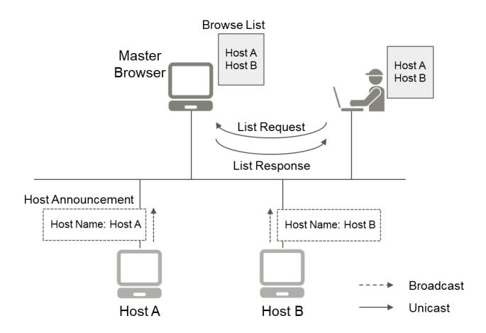
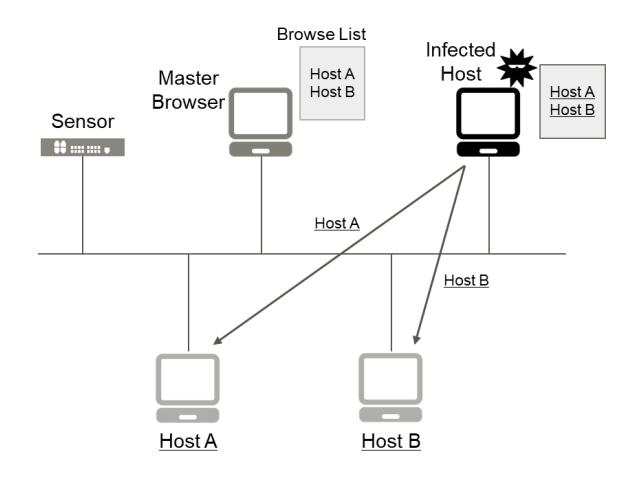
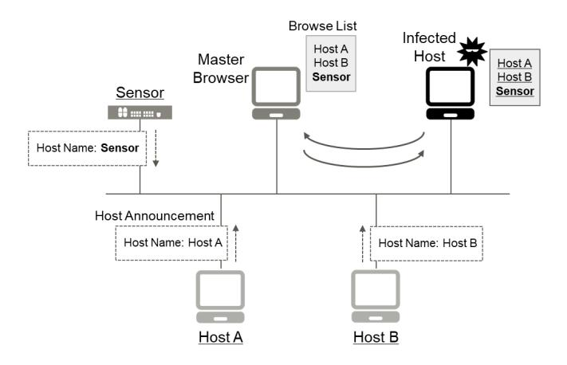
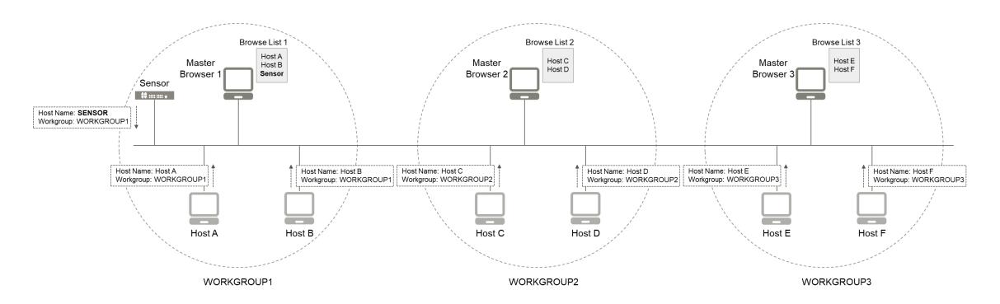
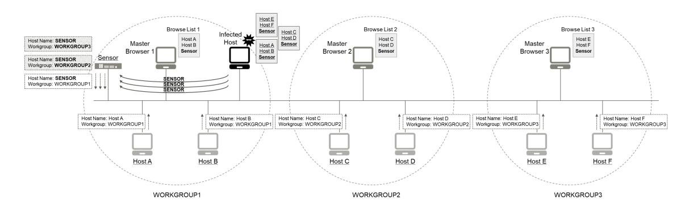
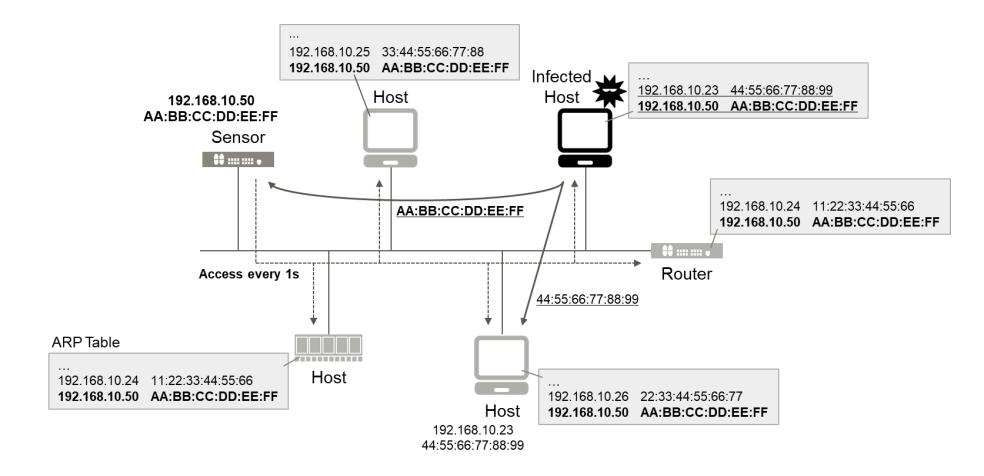
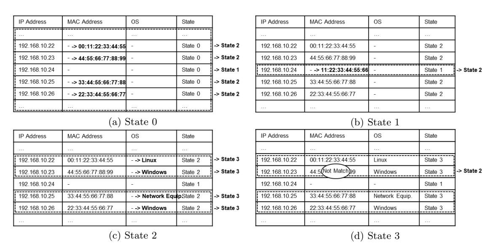
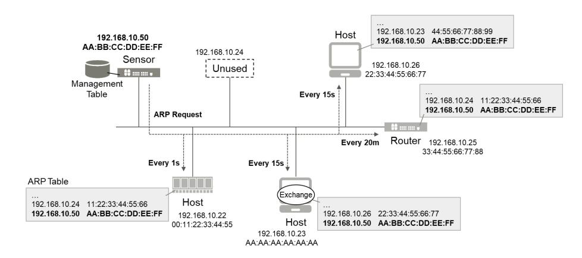
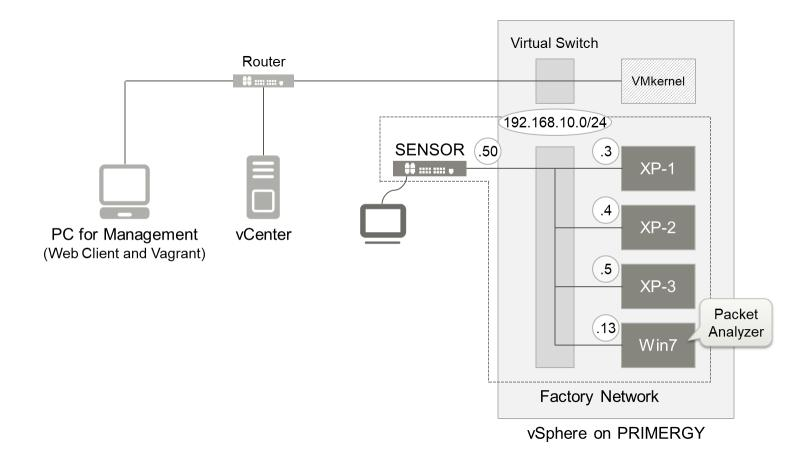

# **Novel Deception Techniques for Malware Detection on Industrial Control Systems**

Takanori Machida, Dai Yamamoto, Yuki Unno, and Hisashi Kojima

FUJITSU LABORATORIES LTD., Kawasaki, Japan *{*m-takanori, yamamoto.dai, yuki m, hkojima*}*@fujitsu.com

**Abstract.** To maintain the availability of industrial control systems (ICS), it is important to robustly detect malware infection that spreads within the ICS network. In ICS, a host often communicates with the determined hosts; for instance, a supervisory control host observes and controls the same devices routinely via the network. Therefore, a communication request to the unused internet protocol (IP) address space, i.e. darknet, in the ICS network is likely to be caused by malware in the compromised host in the network. That is, darknet monitoring may enable us to detect malware that tries to spread indiscriminately within the network. On the other hand, advanced malware, such as malware determining target hosts of infection with reference to host lists in the networks, infects the confined hosts in the networks, and consequently evades detection by security sensors or honeypots. In this paper, we propose novel deception techniques that lure such malware to our sensor, by embedding the sensor information continuously in the lists of hosts in the ICS networks. In addition, the feasibility of the proposed deception techniques is shown through our simplified implementation by using actual malware samples: WannaCry and Conficker.

**Keywords:** Industrial Control System (ICS), Malware Detection, Darknet Monitoring, Honeypot, Server Message Block (SMB), Address Resolution Protocol (ARP)

## **1 Introduction**

### **1.1 Background and Motivation**

Recently, security incidents related to malware infections have been occurring at manufacturing factories, e.g. automotive and semiconductor factories. These infections often hinder daily operations at the factories and cause monetary losses for the companies. The targeted attacks using malware on critical infrastructures have also occurred, destroying equipment and stopping systems [11]. The most important thing about industrial control systems (ICS), including for manufacturing factories and critical infrastructures, is that these systems must be available 24 hours a day, every day. Namely, we must maintain the availability of the control systems, including human machine interfaces (HMI), programmable logic controllers (PLC) and networks connecting these hosts in ICS.

It was believed that ICS networks related to supervisory control were not susceptible to malware since they are often not connected to enterprise networks and the Internet, i.e. there are air gaps between ICS networks and these networks. It is, however, difficult to completely prevent malware intruding into ICS networks because there are malware entry routes that can bypass the air gaps1 :

- **–** A personal universal serial bus (USB) can be connected to the hosts in ICS networks.
- **–** An employee can connect their personal smartphone to the hosts for the sake of recharging.
- **–** A digital camera for recording a situation on the factory production line also can be connected.
- **–** A vendor connects a computer to the network for maintenance of ICS devices.

If these devices are infected with malware, it can intrude into the ICS networks via the entry routes. Furthermore, malware can spread easily after the intrusion into the ICS networks. That is because the hosts in ICS networks are based on legacy operating systems (OS) such as expired Windows XP2 ; therefore, malware can exploit the known vulnerabilities remaining in the legacy OS. Once

1 The main reason why malware would bypass the air gaps is that ICS networks are sometimes not managed compared to enterprise networks; therefore, the following entry routes can be opened.

2 The reason why ICS hosts are equipped with legacy OS is that the life cycle of these devices is generally long term and the devices do not support the latest OS.

malware infection spreads to most of the host in ICS, the hosts would not work and the ICS would be stopped, i.e. its availability is decreased. Consequently, malware activity related to the spread of infection should be robustly detected, which is the preparation for the respond and recover phases mentioned in the National Institute of Standards and Technology (NIST) Cybersecurity Framework [6].

A host on ICS networks often receives and sends almost the same messages from and to the same hosts regularly on the ICS networks. For instance, a supervisory control host such as an HMI receives the monitoring traffic from and sends the control commands to the determined hosts such as PLCs. Therefore, it is known that whitelist-based anomaly detection is effective in ICS, which identifies anomalous communications whose characteristics such as sources and destinations, payload formats and intervals are not configured in the whitelists. Many researchers have discussed the ICS whitelist using not only these network characteristics [10] but also physical process features of ICS devices by directly measuring process variables, e.g. sensor reading and actuator states [8, 9]. Although high accuracy can be expected in whitelist detection, it is difficult to define and update the whitelist because it varies depending on environments and by time of day. In this paper, we focus on darknet-monitoring-based (blacklist-based and network-based) detection that can be performed with comparatively simple operations and would be effective to some extent.

Darknet monitoring is basically for surveying malware trends [5, 12, 7] in the Internet and is based on the assumption that traffic directed toward an unused internet protocol (IP) address, darknet, would be generated by malware. One or multiple darknet addresses are allocated to a decoy server, and the traffic whose destination is the decoy server is aggregated and analyzed. Otherwise, traffic whose destination is a part of the darknet addresses is aggregated from the mirror ports of network switches or from routers with altered forwarding rules. For getting additional intelligence of threats, a honeypot for deceiving attackers is deployed as a decoy server. Many researchers discuss honeypot techniques not only on general networks such as enterprise networks but also on ICS networks [1, 13, 18]. The authors of [1] designed a virtual machine (VM)-based high-interaction honeypot that represents a water treatment plant based on Ethernet and transmission control protocol (TCP). The authors of [13] developed a full system simulator where realistic reactions could be observed on HMI exposed to the Internet by reference to a real system. The authors of [18] also focused on ICS that could be accessed from the Internet, and their honeypot returned response packets based on TCP-based S7 communications protocol, a dedicated protocol of Simence PLC.

Although darknet monitoring, for example, using a honeypot is often demonstrated in the Internet as mentioned above, some research is on local area networks (LAN) for detecting lateral movement of malware. The authors of [4] reported that darknet monitoring in LAN is effective for identifying the infected hosts, i.e. detecting malware, which can be found in Section 2.2 in detail. We believe that darknet-monitoring-based malware detection in LAN of ICS is effective compared to general networks and the Internet since normal communications on ICS networks are static compared to general networks. In this paper, we install a sensor, low-interaction honeypot, that has a darknet address of the ICS networks and generates an alert when detecting access to itself in the ICS networks.

Since previous vulnerabilities that are overcome in the latest OS remain in ICS due to legacy OS as mentioned above, there is a serious risk that prevalent and widely distributed malware will infect the ICS. Therefore, we believe that previous malware with well-known and TCP-based infection strategies should be detected first in ICS networks. The previous malware often spreads indiscriminately within networks, and it can be detected with high probability since the sensor also become a target of infection by the malware. In contrast, there is advanced malware that tries to evade detection by sensors and is difficult to detect. For instance, malware can limit the target host by using a browse list, where the names of in-service servers in the networks are described, and by using an address resolution protocol (ARP) table where used IP addresses in the networks are described on the infected host. Note that conventional honeypots such as [1, 13, 18] can not detect these malware, which is discussed in Section 6.

### **1.2 Our Contributions**

**–** We propose novel deception techniques based on darknet monitoring that lure the advanced malware to our sensor. The sensor information including host name and IP address is embedded in host lists, i.e. browse list and ARP table, respectively. A small amount of traffic for embedding the information is sent actively and continuously to the ICS networks by the sensor. That is because, in ICS, it is often not acceptable to install agent software embedding the information passively in ICS hosts since it might prevent the availability of the hosts.

**–** Our first evaluation based on the simplified implementation of the proposed deception techniques clarifies that they are feasible and can detect an actual malware sample, Conficker, that uses browse lists for discovering targets for infection.

### **1.3 Organization of This Paper**

The organization of this paper is as follows. Section 2 mentions well-known reference models of ICS and previous work on malware detection based on darknet-monitoring in LAN. In Section 3, we introduce taxonomies of malware for the spread of infection and clarify the positioning of our detection targets. In Section 4, our proposed deception techniques are explained in detail. Section 5 gives the first evaluations of the proposed techniques. In Section 6, we discuss the difference between our techniques and conventional honeypots. Finally, the conclusion and future work are presented in Section 7.

## **2 Related Work**

### **2.1 Reference Model on ICS**

The "Purdue Enterprise Reference Architecture" (Purdue Model) [17], which was put forward by T. J. Williams from Purdue University in 1992, has been often used as a reference model for ICS. Another model based on the Purdue Model was accepted as the international standard related to enterprise control systems: International Society of Automation (ISA)95 [2]. The international standard related to ICS security, ISA99 [3], was developed using ISA95. According to ISA99, an ICS consists of five layers, from Level 0 to Level 4.

**Level 4 Enterprise Systems (Business Planning & Logistics)** including financial systems

**Level 3 Operations Management** including production scheduling systems

**Level 2 Supervisory Control** including HMI and historians

**Level 1 Local or Basic Control** including PLC, distributed control systems (DCS) and remote terminal units (RTU)

**Level 0 Process (Equipment under Control)** including sensors and actuators

Firewalls are put in the boundaries between Level 2 and Level 3, and/or Level 3 and Level 4. In some situations, demilitarized zones (DMZ) that prevent direct communication among them are also set up. We focus on IP-based networks between Level 1 and Level 2. That is because most previous malware has targeted IP-based networks and Level 0, which is the most important component of ICS, cannot work if its networks are infected with malware.

#### **2.2 Darknet-Monitoring-Based Malware Detection on LAN**

The authors of [4] demonstrated darknet monitoring in LAN. Unused IP addresses in their campus networks were defined as darknet. They monitored and analyzed traffic whose destination was the darknet by forwarding it to their server via routers with altered forwarding rules. The research only focused on traffic whose destination ports corresponded to TCP 445, i.e. related to server message block (SMB), and that was related to internet control message protocol (ICMP). As the result of the monitoring over a month, they clarified that thirty-one hosts were suspected to be infected with malware and four Windows XP hosts out of the thirty-one hosts were actually infected with malware. As just described, this shows that darknet monitoring in LAN is effective for detecting malware.

## **3 Malware Strategies For Spread of Infection**

In this section, we introduce taxonomies of worm malware that self-propagates in networks, which is based on previous research. The worm strategies for spread of infection are organized in order to clarify the positioning of our detection targets.

The authors of [14] dissected the worm mechanism into the following five components, which was originally based on [15].

**Reconnaissance Component,** which discovers new targets that can be compromised with known vulnerabilities in the network, e.g. by active scanning.

**Intelligence Component,** which inspects the infected host and gets its location and capability such as a host name, an IP address and a file list for smoothly communicating with other infected hosts or a central server.

**Communication Component,** which communicates the information about vulnerabilities obtained by the reconnaissance component and about location and capability obtained by the intelligence component with other infected hosts or a central server.

**Command Component,** which executes OS commands.

**Attack Component,** which launches attacks using vulnerabilities, e.g. direct hosting of SMB, and duplicates itself to the targeted hosts.

Simply put, new targets identified by the reconnaissance component are attacked by the attack component; therefore, worms are basically discussed in terms of these two components. Meanwhile, a sensor not identified as a new target by the reconnaissance component is not attacked by the attack component. Even in this situation, the sensor can sometimes notice the worm by scanning traffic of the reconnaissance component. However, the reconnaissance components of some worms discover new targets stealthily, i.e. these worms can evade detection by the sensor. Therefore, we focus on the reconnaissance component.

The authors of [16] also dissected the worm mechanism into five factors: target discovery, carrier, activation, payloads, and attackers. The target discovery factor, corresponding to the reconnaissance component in [14], was further broken down into the following five strategies.

**Scanning:** Worms probe a set of addresses for identifying new targets to infect. The scanning is often performed sequentially or randomly, i.e. a set of hosts that have an ordered addresses or have randomly chosen addresses are scanned. They scan not only global addresses but also local addresses. The bandwidth or speed of scanning is sometimes limited in order to evade detection.

**Pre-generated Target Lists:** Worms have target lists in advance.

**Externally Generated Target Lists:** Worms get target lists from command and control (C&C) servers dynamically.

**Internal Target Lists:** Worms obtain lists of hosts that have been used in the networks from local information, e.g. the network information service (NIS) that manages system configurations such as user and host names distributed in multiple Linux-based hosts in LAN.

**Passive:** Worms wait until hosts in the networks access them, or passively observe the behaviors of legitimate users. Although the speed of infection with this strategy is potentially slow, it can be performed stealthily since additional traffic to the networks is not generated.

Worms with an internal target list can get a set of operating hosts in the networks without sending traffic to all or almost all hosts in the networks. Therefore, they would evade detection by sensors since the attack component launches attacks only to the listed hosts. That is, worms with an internal target list can potentially infect new hosts with both high stealth and high speed, whereas passive worms are only high stealth. Since these worms not only rapidly prevent the availability of ICS but are also undetected by sensors, they are serious threats to ICS and need to be detected. Another example of local information for internal target lists is an ARP table that provides a list describing pairs of an IP address and a media access control (MAC) address of hosts that have been communicated in the networks. Worms can also obtain host names of in-service servers in networks as local information by acquiring browse lists. The details of target discovery using browse lists can be found in Section 3.1. In addition, some worms get and use a list of IP addresses leased by a dynamic host configuration protocol (DHCP) server.

**Fig. 1.** Computer browser service

**Fig. 2.** Limited spread of malware based on target discovery using browse list

#### **3.1 Target Discovery Using Browse List**

In networks where hosts are mainly based on Windows OS, the computer browser service manages a list of host names of in-service servers in the networks without users being aware of it. As shown in Figure 1, in-service servers broadcast host announcement automatically and continuously. A master browser elected from among the servers according to certain criteria receives the announcements and manages their host names as a browse list. The browse list is provided with users that send request commands such as *net view*. Note that authentication is not performed when providing the list, i.e. anyone in the networks can obtain the browse list. Consequently, malware such as worms that infect a host in a network can easily get the list. This enables malware to prevent non-essential access to hosts that are not usually used in the network, e.g. sensors, as shown in Figure 2.

### **4 Novel Deception Techniques for Detecting Malware on ICS**

In this section, we propose novel deception techniques that enable a sensor to detect the advanced types of malware mentioned in Section 3 on ICS. One or multiple unused IP addresses in an ICS network are allocated to our sensor. When the sensor detects TCP-based or user datagram protocol (UDP)-based traffic whose destination is itself, the allocated address, it generates an alert3 with the source IP address of the traffic as an IP address of an infected host. If malware that infects a host in the ICS network uses the scanning strategy, which probes hosts in the network indiscriminately for target discovery, the sensor can detect the scanning traffic4 . That is, the sensor can detect malware with high probability since it can be one of the scanning targets. In contrast, malware using the internal target list strategy for target discovery cannot be detected by the sensor since it infects the limited hosts that have been used in the network, as discussed in Section 3. Although there are various types of local information that can be used in the internal target list strategy, this paper focuses on the following two types over the others for the described reasons.

**Browse List:** The computer browser service is based on SMB version 1 (SMBv1) that is enabled in legacy OS, e.g. Windows XP, by default. Malware using browse lists for target discovery remains a serious threat in ICS networks with the legacy OS, whereas the latest OS disables SMBv1 by default.

**ARP Table:** An ARP table is commonly used even in a simple network that is sometimes employed in ICS, e.g. no DHCP or domain name service (DNS) server.

In this paper, we propose two novel techniques that enable a sensor to detect malware using browse lists and ARPs table for target discovery by embedding the sensor information in browse lists and ARP tables.

### **4.1 Proposal 1: Deception Technique for Detecting Malware Using Browse List**

In this section, our deception technique that enables our sensor to detect malware using browse lists (**Proposal 1**) is introduced.

Our sensor with a straightforward solution, corresponding to simple implementation of Proposal 1, only sends a host announcement5 with its host name or dummy name continuously, e.g. every twelve minutes. As a result, the name of the sensor also appears on the browse list managed by a master browser in the network, as shown in Figure 3. The spread of malware that infects a host in the network is as follows.

- 1. The malware identifies the master browser by using browser protocol.
- 2. The browse list is obtained from the master browser.

**Fig. 3.** Simple implementation of Proposal 1

3 Another criteria for generating an alert is signature matching based on communications between the sensor and a suspected host. Although a sensor with signature matching can detect malware with low false positives, it cannot detect various other types of malware compared to our criteria.

4 Our sensor can only not detect the timing when the scanning is based on ARP request or ICMP request. However, because our sensor sends replies to the requests, as mentioned in Section 5, it can finally detect malware whose attack component launches an attack based on TCP or UDP.

5 There is no need to perform a server service for joining the browser service, which leads to an increase in attack surface on the sensor.

- 3. The malware resolves the host names described in the list, i.e. gets IP addresses of the hosts including the sensor.
- 4. Its attack component launches attacks to the hosts and duplicates itself in them.

The sensor can detect traffic generated by the attack component since it is usually based on TCP or UDP. Consequently, an alert is generated that identifies the IP addresses of the host infected with the malware.

Meanwhile, we discuss false positives of the simple implementation of Proposal 1. Host names in a network are displayed with graphical user interface (GUI) by the Windows Explorer application, i.e. the host name of our sensor is also provided. Since users of a host not infected with malware can see them easily, they might click the sensor name. This results in a false positive based on the access from the host. The full implementation of Proposal 1 provides low false positives. Suppose that the number of accesses by legitimate users with legitimate purposes, including the aforementioned Windows Explorer, is low within a defined period of time. Proposal 1 forces malware to perform multiple accesses to our sensor so that it can distinguish the accesses of malware from those of the legitimate users.

For the preliminary introduction of Proposal 1, the behaviors of computer browser service with multiple Windows domains or workgroups and of malware under the environment are introduced in this paragraph. As shown in Figure 4, each master browser manages each browser list that describes each set of hosts in each domain or workgroup even in the same network. A master browser writes the host name of a host announcement in its browse list when the domain or workgroup field in the host announcement corresponds to the workgroup or domain of the master browser. Each master browser also manages the names of domains or workgroups in the network. Malware obtains all the browse lists by the following procedure for widely spreading infection. Actually, we confirmed such malware samples, as mentioned in Section 5.

- 1. The malware that infects a host in the network obtains all the names of domains or workgroups by requesting to the master browser that belongs to an identical domain or workgroup to that of the infected host.
- 2. The requests for acquiring the host names of master browsers in the domains or the workgroups are broadcast using browser protocol.
- 3. The malware resolves each host name of the master browser, and requests each browse list.

Proposal 1 utilizes the aforementioned behavior of malware in the environment with multiple domains or workgroups since its environment is general in ICS networks as well as enterprise networks. The sensor in Proposal 1 duplicates the host announcement and alters the domain or workgroup name in the duplicated announcement to other domain or workgroup name in the network. As shown in Figure 5, the duplicated and altered announcement is broadcast continuously. As a result, the sensor name is written in multiple browse lists in the same network. When malware obtains them and tries to attack them sequentially, multiple accesses to the sensor are generated as shown in Figure 5.

Proposal 1 specifically runs in the following five steps, which reduces additional traffic that could prevent the availability of ICS networks.

**Fig. 4.** Browser service with multiple domains or workgroups

**Fig. 5.** Proposal 1 for detecting malware using browse list

- **Step 1:** The sensor obtains names of domains or workgroups6 in the network by measuring broadcast packets such as host announcement.
- **Step 2:** The host announcement is duplicated and the domain or workgroup name described in the duplicated announcement is altered to the name obtained in Step 1.
- **Step 3:** The duplicated host announcement is broadcast continuously, e.g. every twelve minutes7 . The sending intervals are managed for every domain or workgroup.
- **Step 4:** When the sensor receives a name resolution request related to the sensor name, it sends a reply with its IP address to the source address of the request. The alert is generated when multiple accesses from the same source address within a short period are detected.
- **Step 5:** If the packets related to the domain or the workgroup that is known by the sensor are not observed for a certain period, e.g. thirty-six minutes8 , the sensor determines that the domain or the workgroup has been removed and stops the Step 3 broadcasting to reduce unnecessary traffic.

#### **4.2 Proposal 2: Deception Technique for Detecting Malware Using ARP Table**

This section introduces the deception technique that enables our sensor to detect malware using an ARP table (**Proposal 2**).

In a Proposal 2 scenario, a pair of an IP address and MAC address of the sensor needs to be embedded in ARP tables of all hosts in the ICS network, whereas the sensor name is embedded in one or several browse lists in the Proposal 1 scenario. Since agent software often cannot be installed in hosts in ICS networks as discussed in Section 1, the sensor in Proposal 2 accesses all the hosts in the network as shown in Figure 6. When the hosts used in ICS networks are managed, e.g. there is an IP address list of hosts used in ICS networks, the sensor sends a packet such as *ping* only to the IP addresses of the managed hosts to reduce additional traffic. However, hosts in ICS are sometimes not managed. Proposal 2 can also be used in environments where the IP addresses and OS of hosts are unknown.

Since ARP cache is cleared after a certain period of time, the sensor accesses the hosts continuously. The default cache expirations are different depending on the OS.

- **Windows:** between 15 seconds and 45 seconds or 2 minutes
- **Linux:** 1 second
- **Network Equipment:** 20 minutes or more (depending on model and vendor)

We define two metrics related to continuous access for discussion of Proposal 2.

6 If there is a single domain or workgroup in the network, Proposal 1 cannot be used. However, the improved version of Proposal 1 that writes multiple dummy names in a single browse list can be used.

7 The browser service specification defines the interval time for sending a host announcement as twelve minutes.

8 The browser service specification defines the expiration time for keeping a host name in a browse list as thirty-six minutes.

**Fig. 6.** Simple implementation of Proposal 2

**Coverage:** Regardless of the type of OS running in hosts, the periods where the IP address of our sensor is not cached in the ARP tables of the hosts need to be reduced, i.e. the next access should be performed by cache expirations. That is because, if the advanced malware using ARP tables infects a host when the sensor address is not cached in the ARP table, the malware can evade access to the sensor, i.e. the sensor cannot detect the malware.

**Additional Traffic:** The additional traffic that is produced by continuous accesses needs to be reduced as much as possible. That is because it would prevent the availability of ICS networks, e.g. a huge amount of additional traffic would lead to network congestion that prevents normal communication in the ICS network and would increase computer loads that induce a false operation.

The straightforward implementation that keeps high coverage accesses all the hosts every one second, which is the minimum expiration, as shown in Figure 6, since the sensor does not know the kinds of OS of the host in the network or its IP address. However, this produces a huge amount of additional traffic. In contrast, the full implementation of Proposal 2 keeps high coverage along with adequate additional traffic by optimal accesses not only whose interval is dynamically defined but also whose protocol is dynamically defined.

Proposal 2 utilizes a combination of an ICMP echo request (ping) that can be used for OS fingerprinting and an ARP request that is lightweight, which can embed an entry to a target ARP table. A value of time to live (TTL) contained in an ICMP echo reply enables us to identify the type of OS in the host.

**– Windows:** 128 **– Linux:** 64

**– Network Equipment:** 255

The sensor in Proposal 2 accesses each host in the network using an ICMP echo request and an ARP request depending on the previous reply from each host and the state of each host. Each host is managed in four states by the sensor, as shown in Table 1. Depending on the previous reply from a host, its state is transited. The optimal state is State 3 where the host is accessed at an optimal

**Table 1.** States used in Proposal 2

|                         | MAC Address | OS      |
|-------------------------|-------------|---------|
| State 0 (Initial state) | Unknown     | Unknown |
| State 1                 | Unknown     | Unknown |
| State 2                 | known       | Unknown |
| State 3                 | known       | known   |

interval for the host using a lightweight ARP request. The sensor makes each host State 3 at the earliest opportunity through the actions listed below that are defined for every state.

The sensor has a table for managing the states along with MAC addresses and OS for every IP addresses in the network, i.e. an IP address associated with no host is also managed, as shown in Figure 7.

**State 0:** This state is an initial state associated with all IP addresses in the network, e.g. from 192.168.10.1 to 192.168.10.254, in the management table when the sensor in Proposal 2 is booted, as shown in Figure 7 (a). The booted sensor sends ARP requests to all the IP addresses. If a host with an IP address returns an ARP reply, its MAC address is extracted from the ARP reply and written in the MAC address entry corresponding to its IP address in the table, and the state entry is rewritten to State 2, as also shown in Figure 7 (a). Since an IP address with no reply is an unused address, the state entry corresponding to the unused IP address is rewritten to State 1 for preparing when the IP address is allocated to a new host.

**State 1:** This state is for observing the IP addresses that are confirmed as unused in State 0 or State 3. The sensor sends ARP requests to the IP addresses continuously with a long interval. When an ARP reply is returned from an IP address of the unused IP addresses, i.e. the IP address is allocated to a new host, the MAC address and the state entries are written in the same way as State 0, as shown in Figure 7 (b).

**State 2:** This state is for OS fingerprinting of hosts whose presence is confirmed in State 0 or State 1. The sensor sends an ICMP echo request to the host and identifies the OS from the TTL value contained in the ICMP echo reply. The identified OS is written in the OS entry corresponding to the IP address in the management table, and the state entry is rewritten to State 3, as shown in Figure 7 (c). An OS entry corresponding to an IP address allocated to a host with no reply, i.e. OS in the host cannot be identified, is filled with Linux OS as it has the fastest ARP cache expiration of all the OS and the sensor gives priority to coverage over additional traffic.

**State 3:** This state is for sending a lightweight ARP request with the optimal interval for the OS identified in State 2, as shown in Figure 8. At the same time, the MAC address extracted from the ARP reply is compared to that in the MAC address entry of the table. If they do not match, the state entry corresponding to the IP address is rewritten to State 2 since the host with the IP address is presumably exchanged to a new host. In the case of no ARP reply, the state entry is rewritten to State 1 since the IP address has become unused.

**Fig. 7.** Example of state transition in Proposal 2

**Fig. 8.** Proposal 2 for detecting malware using ARP table

## **5 First Evaluation of Our Deception Techniques**

This section provides the first evaluation of our sensor with the proposed techniques. For the preliminary experiment, we confirmed that darknet-monitoring-based detection, which was an essential part of our sensor, worked by using an actual sample of ransomware, WannaCry, that spread indiscriminately within a network. After the experiment, we verified the effectiveness of the simple implementation of Proposal 1 (Figure 3) by using actual samples of the worm malware Conficker that might use browse lists for target discovery. Furthermore, the fundamental part of Proposal 1, as shown in Figure 5, was implemented and its feasibility was examined. The evaluation of Proposal 2 is future work because we were not able to obtain an actual sample using ARP tables for target discovery. However, we also implemented the fundamental part of Proposal 2 and confirmed its feasibility.

#### **5.1 Experimental Environment**

The block diagram of our experimental environment is shown in Figure 9. The experimental factory network was created using multiple VMs based on Windows XP OS that was often used in the actual factory networks, which was the isolated LAN with 192.168.10.0/24. The specification of our physical server where these VMs were launched is shown in Table 2. We analyzed traffic using an open-source packet analyzer on a VM that was also connected to our factory network and was based on Windows 7 OS, which was confirmed not to be infected with WannaCry and Conficker in advance. The size of allocated memory for each VM is shown in Table 3. The sensor program based on Python was implemented in a Linux-based single-board computer. The alerts that the sensor program generated were stored in the local file system, and we checked them directly in the experiment. The sensor did not return TCP SYN ACK against TCP SYN, and returned ARP reply and ICMP echo reply against ARP request and ICMP echo request, respectively.

### **5.2 Preliminary Evaluation Using WannaCry**

The experiment that confirmed the effectiveness of darknet-monitoring-based detection was demonstrated with three Windows XP VMs, one Windows 7 VM, and the sensor whose IP addresses were 192.168.10.3, 192.168.10.4, 192.168.10.5, 192.168.10.13, and 192.168.10.50, respectively, as shown in Figure 9. Their host names were **XP-1**, **XP-2**, **XP-3**, **Win7**, and **SENSOR**, respectively. We executed a WannaCry sample in XP-1. The WannaCry performed sequential ARP scanning in ascending order in the network, i.e. from 192.168.10.2 to 192.168.10.254. Subsequently, it tried to infect the hosts that returned an ARP reply. As a result, our sensor detected the first packet, TCP SYN, of the infection procedure, i.e. our sensor based on darknet monitoring was able to detect WannaCry that spread indiscriminately. Since the sensor did not return TCP SYN ACK, the infection procedure was not completed and the sensor was not infected with WannaCry. XP-2 and XP-3 were infected with WannaCry, and Win7 was not infected.

**Fig. 9.** Experimental Environment

**Table 2.** Sever Specification

|            | Hardware Fujitsu Server PRIMERGY RX2530 M1 |
|------------|--------------------------------------------|
| Hypervisor | VMware vSphere 6.5.0                       |
| CPU        | Intel Xeon Processor E5-2460 v3            |
|            | (2.60 GHz, 8 Cores)                        |
| RAM        | 128GB                                      |
| Storage    | 24TB                                       |

**Table 3.** Size of Memory Allocated for VMs

|                    |     | RAM Storage |
|--------------------|-----|-------------|
| Windows XP VMs 2GB |     | 8GB         |
| Windows 7 VM       | 4GB | 16GB        |

### **5.3 Proposal 1 Evaluation Using Conficker**

A variant of Conficker is known to use browse lists for target discovery. We obtained three samples that were identified as Conficker by several antivirus software in recent days and were based on a portable executable (PE) format. Accordingly, all the samples used browse lists for target discovery, which was based on a similar method as Section 3.1.

The experiment that verified the effectiveness of the simple implementation of Proposal 1 was demonstrated with the same setup with Section 5.2. All VMs belonged to a workgroup **WORK-GROUP**. Firstly, the sensor without the simple implementation of Proposal 1 was connected to our factory network. That is, although the sensor could detect TCP-based accesses from the hosts within the network, it did not broadcast a host announcement with its host name. Win7 also did not broadcast a host announcement by default. Therefore, after a certain period of time since the sensor was connected and the VMs were launched, the browse list managed by the master browser, XP-2 in this case, described XP-1, XP-2, and XP-3. Subsequently, we executed the Conficker sample in XP-1. The spreading procedure that was measured on Win7 is as follows.

- 1. Conficker obtained the browse list from the master browser.
- 2. One of the host names described in the browse list was resolved by using NetBIOS name service protocol.
- 3. Conficker sent an ARP request whose destination was the resolved IP address.
- 4. ICMP echo requests were sent to the IP address.
- 5. Conficker tried to infect the host with the IP address.
- 6. The steps (2) to (5) were performed on all hosts whose names were described in the browse list alphabetically.

As a result, the steps (2) to (5) were performed on XP-2 and XP-39 , and SENSOR and Win7 did not receive any packets, i.e. the sensor without the simple implementation of Proposal 1 was not able to detect Conficker.

Secondly, the sensor with the simple implementation of Proposal 1 was connected to the network, after the environment was returned to its original state, i.e. the state before launching Conficker. The sensor broadcast a host announcement with its name SENSOR every twelve minutes. When receiving name resolution requests related to the sensor name, the sensor returned its IP address as a name resolution reply. In this situation, the browse list of the master browser, XP-2 in this case too, described XP-1, XP-2, XP-3, and SENSOR. When the Conficker sample was executed in XP-1, the steps (2) to (5) were performed on SENSOR as well as XP-2 and XP-3. The sensor detected the first packet, TCP SYN, of the steps (5)10. Consequently, we clarified that the sensor with the simple implementation of Proposal 1 was able to detect the infection spread of Conficker that used browse lists, whereas the sensor without it was not able to detect.

Finally, we examined the feasibility of Proposal 1. This experiment was demonstrated with six Windows XP VMs whose host names were **XP-1**, **XP-2**, **XP-3**, **XP-4**, **XP-5**, and **XP-6**, along with Windows 7 VM **Win7** and the sensor **SENSOR**. XP-1, XP-2, and XP-3 belonged to workgroup **WORKGROUP1**. XP-4, XP-5, and XP-6 belonged to **WORKGROUP2**. We implemented only the function that sent host announcements with the host name SENSOR and the workgroup names WORKGROUP1 and WORKGROUP2, i.e. Step 2, Step 3 and Step 4 of Proposal 1 shown in Section 4.1, as the fundamental part of Proposal 1. After a certain period of time since the sensor with the function was connected and the VMs were launched, we observed that the browse lists managed by the master browsers of WORKGROUP1 and WORKGROUP2, XP-2 and XP-5 in this case, described XP-1, XP-2, XP-3 and SENSOR, and XP-4, XP-5, XP-6 and SENSOR, respectively. The spreading procedure of the Conficker sample that was executed in XP-1 is as follows.

- 1. Conficker obtained names of the workgroups in the network from the master browser of the workgroup of the infected host, i.e. WORKGROUP1.
- 2. Conficker obtained the browse list managed by the master browser of one of the workgroups included in the obtained workgroup names.
- 3. One of the host names described in the browse list was resolved.
- 4. Conficker sent an ARP request whose destination was the resolved IP address.
- 5. ICMP echo requests were sent to the IP address.
- 6. Conficker tried to infect the host with the IP address.
- 7. The steps (3) to (6) were performed on all hosts whose names were described in the browse list alphabetically.
- 8. The steps (2) to (6) were performed on all workgroups obtained in the step (1) alphabetically.

As a result, the steps (3) to (6) were performed on SENSOR twice, whereas they were performed on XP-2, XP-3, XP-4, XP-5 and XP-6 once. Therefore, twice as many TCP SYN packets as those to XP VMs were detected by the sensor. Consequently, we clarified that Proposal 1 forced the Conficker sample to perform multiple accesses to the sensor.

## **6 Discussion**

**What is the difference between the proposed techniques and conventional honeypots?:** Suppose that a malware selects a server as its infection target, and it initially accesses the server (initial access), for example, by ARP request and TCP SYN. In this case, the malware might notice that the server is decoy, e.g. a honeypot, by inspecting responses to the initial access from the server and might stop the infection. That is, we can not obtain the additional information related to the malware since the honeypot can not capture the packets from the malware between the initial access and the final access when the spread of infection is completed. Conventional high-interaction honeypot techniques such as [1, 13, 18] resolve the problem by generating realistic

9 The infection of the step (5) to XP-2 and XP-3 was not completed and the infection trial was repeated as denial of service (DOS). The reason why the trials had failed was not able to be specified.

10 Since the sensor did not return TCP SYN ACK, not only was the step (5) not completed but also the infection trial was not repeated, whereas it was repeated to XP-2 and XP-3.

responses so that the malware misidentifies as a real server in order to get the spread of infection to be completed. On the other hand, we discuss how to lure an initial access to our sensor from advanced malware that evades non-essential initial access, e.g. by using browse list, whereas conventional honeypots that only focus on after initial access can not lure, i.e. can not detect the advanced malware. This paper does not discuss techniques for generating realistic responses, and our sensor is based on low-interaction honeypot for simplifying its implementation. Conventional honeypot techniques can be combined with our sensor, which is future work.

## **7 Conclusion and Future Work**

In this paper, we proposed novel deception techniques that enable our sensor to detect advanced malware using browse list and ARP table for discovery of infection targets. The host name and IP address of the sensor were embedded in browse lists and ARP tables, respectively, by actively sending appropriate packets at appropriate intervals from the sensor. Our techniques produced only a small amount of additional traffic to maintain the availability of ICS networks. Our first evaluation based on the simplified implementation of the proposed techniques clarified that they were feasible and were able to detect an actual malware sample, Conficker, that used browse lists.

The future work is to implement the full version of Proposal 1 and Proposal 2 and to evaluate them. We also evaluate the false positives of our sensor on a real ICS environment.

## **References**

- 1. Antonioli, D., Agrawal, A., Tippenhauer, N.O.: Towards High-Interaction Virtual ICS Honeypots-ina-Box. In: 2nd ACM Workshop on Cyber-Physical Systems Security and Privacy (CPS-SPC@CCS 2016). pp. 13–22 (2016)
- 2. of Automation, I.S.: ANSI/ISA-95.00.01-2000, Enterprise-Control System Integration, Part 1: Models and Terminology (2000)
- 3. of Automation, I.S.: ANSI/ISA-99.00.01-2007, Security for Industrial Automation and Control Systems, Part 1: Terminology, Concepts, and Models (2007)
- 4. Azrina, R., Othman, R., Aziz, N.A., ZulHazmi, M., Khazin, M., Dewakunjari, J.: Network Forensics: Detection and Mitigation of Botnet Malicious Code via Darknet. In: Trustworthy Ubiquitous Computing, pp. 65–78. Atlantis Press (2012)
- 5. Bailey, M., Cooke, E., Jahanian, F., Nazario, J.: The Internet Motion Sensor A Distributed Blackhole Monitoring System. In: Network and Distributed System Security Symposium 2015 (NDSS 2005) (2005)
- 6. Barrett, M.P.: Framework for Improving Critical Infrastructure Cybersecurity. Tech. Rep. Version 1.1, National Institute of Standards and Technology (2018)
- 7. Bou-Harb, E., Debbabi, M., Assi, C.: A Time Series Approach for Inferring Orchestrated Probing Campaigns by Analyzing Darknet Traffic. In: 10th International Conference on Availability, Reliability and Security (ARES 2015). pp. 180–185 (2015)
- 8. Chen, Y., Poskitt, C.M., Sun, J.: Learning from Mutants: Using Code Mutation to Learn and Monitor Invariants of a Cyber-Physical System. In: 2018 IEEE Symposium on Security and Privacy (S&P 2018). pp. 648–660 (2018)
- 9. Feng, C., Palleti, V.R., Mathur, A., Chana, D.: A Systematic Framework to Generate Invariants for Anomaly Detection in Industrial Control Systems. In: 26th Annual Network and Distributed System Security Symposium (NDSS 2019) (2019)
- 10. Formby, D., Srinivasan, P., Leonard, A., Rogers, J., Beyah, R.A.: Who's in Control of Your Control System? Device Fingerprinting for Cyber-Physical Systems. In: 23rd Annual Network and Distributed System Security Symposium (NDSS 2016) (2016)
- 11. ICS-CERT: Alert (IR-ALERT-H-16-056-01), Cyber-Attack Against Ukrainian Critical Infrastructure (2016), https://ics-cert.us-cert.gov/alerts/IR-ALERT-H-16-056-01 (Accessed February 10, 2020)
- 12. Inoue, D., Suzuki, M., Eto, M., Yoshioka, K., Nakao, K.: DAEDALUS: Novel Application of Large-Scale Darknet Monitoring for Practical Protection of Live Networks. In: 12th International Symposium on Recent Advances in Intrusion Detection (RAID 2009). pp. 381–382 (2009)
- 13. Navarro, O., Balbastre, S.A.J., Beyer, S.: Gathering Intelligence Through Realistic Industrial Control ´ System Honeypots - A Real-World Industrial Experience Report. In: 13th International Conference on Critical Information Infrastructures Security (CRITIS 2018). pp. 143–153 (2018)
- 14. Nazario, J.: Defense and Detection Strategies against Internet Worms. Artech House (2003)

- 15. Nazario, J., Anderson, J., Wash, R., Connelly, C.: The Future of Internet Worms (2001), blackhat Briefings
- 16. Weaver, N., Paxson, V., Staniford, S., Cunningham, R.: A Taxonomy of Computer Worms. In: 2003 ACM Workshop on Rapid Malcode (WORM '03). pp. 11–18 (2003)
- 17. Williams, T.J.: The Purdue Enterprise Reference Architecture: A Technical Guide for CIM Planning and Implementation. Instrument Society of America (1992)
- 18. Xiao, F., Chen, E., Xu, Q.: S7commTrace: A High Interactive Honeypot for Industrial Control System Based on S7 Protocol. In: 19th International Conference on Information and Communications Security (ICICS 2017). pp. 412–423 (2017)