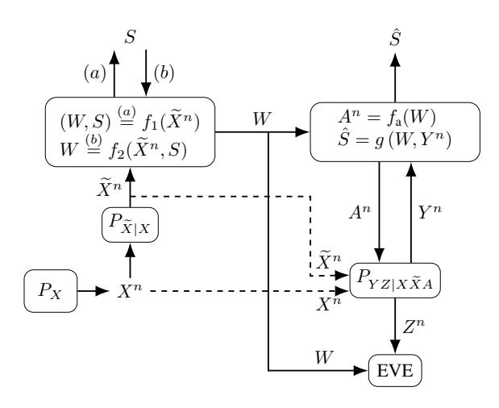
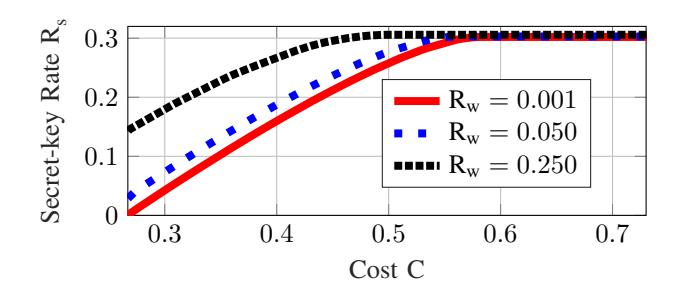

# Biometric and Physical Identifiers with Correlated Noise for Controllable Private Authentication

Onur Gunl ¨ u¨ 1 , Rafael F. Schaefer1 , and H. Vincent Poor2

1 Information Theory and Applications Chair, Technische Universitat Berlin, ¨ {guenlue, rafael.schaefer}@tu-berlin.de 2Department of Electrical Engineering, Princeton University, poor@princeton.edu

*Abstract*—The problem of secret-key based authentication under privacy and storage constraints on the source sequence is considered. The identifier measurement channels during authentication are assumed to be controllable via a cost-constrained action sequence. Single-letter inner and outer bounds for the keyleakage-storage-cost regions are derived for a generalization of a classic two-terminal key agreement model with an eavesdropper that observes a sequence that is correlated with the sequences observed by the legitimate terminals. The additions to the model are that the encoder observes a noisy version of a remote source, and the noisy output and the remote source output together with an action sequence are given as inputs to the measurement channel at the decoder. Thus, correlation is introduced between the noise components on the encoder and decoder measurements. The model with a secret-key generated by an encoder is extended to the randomized models, where a secret-key is embedded to the encoder. The results are relevant for several user and device authentication scenarios including physical and biometric identifiers with multiple measurements that provide diversity and multiplexing gains. To illustrate the behavior of the rate region, achievable (secret-key rate, storage-rate, cost) tuples are given for binary identifiers and measurement channels that can be represented as a set of binary symmetric subchannels. The gains from using an action sequence such as a large secret-key rate at a significantly small hardware cost, are illustrated to motivate the use of low-complexity transform-coding algorithms with costconstrained actions.

## I. INTRODUCTION

Traditional method for security is to store secret keys used for, e.g., device authentication in a hardware-protected non-volatile memory (NVM). Biometric identifiers such as fingerprints and physical identifiers such as random and unique oscillation frequencies of ring oscillators (ROs) are secure and cheap alternatives to key storage in an NVM. Physical unclonable functions (PUFs) are physical identifiers that are challenge response mappings such that it is easy to evaluate the response to a given challenge and hard to guess the response to a randomly chosen challenge [1]. PUFs can be used as a source of local randomness for the wiretap channel (WTC) [2], where the optimal coding scheme requires local random sequences at the WTC encoder. Other applications of PUFs are Internet-of-Things (IoT) device security, intellectual property (IP) protection in a field programmable gate array (FPGA), and non-repudiation [3, Chapter 1].

We extend the source model for key agreement from [4], [5] to consider multiple improvements to private authentication with PUFs. The original model considers that an encoder observes a source output to generate a key and to send public information, called *helper data*, to a decoder. Key agreement at the decoder is successful when the decoder observes a noisy source output and enough amount of helper data to reconstruct the same key. The secrecy measure used is the amount of information the helper data leaks about the secret key, i.e., *secrecy leakage*, which should be negligible. Similarly, [6], [7] argue that the information leaked about the source output should be also small to keep *privacy leakage* as small as possible, which cannot be made negligible for general cases. The amount of public storage should also be kept small to limit the hardware cost [8], [9].

Biometric and physical identifier outputs are noisy. Suppose we have multiple measurements of an identifier source at the encoder, which assumes that the source is hidden or remote [10]. The source, noisy identifier, and measurement symbol strings are proposed in [11] to be related by a broadcast channel (BC) with one input and two outputs to capture the effects of correlated noise in the measurements. For instance, the surrounding hardware logic is the main reason for the noise components on encoder and decoder measurements of the same RO to be correlated [12]. Motivated by the use of different identifier-measurement forms, e.g., the use of multiple measurements or variations in the quality of the measurement process [13], we extend a private authentication model from [14]. In this model, identifier measurements are represented by a cost-constrained action-dependent side information acquisition and an action sequence determines the measurement channel at the decoder. A high cost for an action represents, e.g., the use of a high quality measurement device that results in a small error probability. We combine the BC measurement model with the action-dependent private authentication model to consider the correlated noise on encoder and decoder measurements such that the decoder measurement channel can be adapted to the variations in the ambient temperature, supply voltage, and surrounding logic.

Suppose the encoder generates a key from a noisy identifier output. We call this model the *generated-secret (GS)* model. Similarly, for the *chosen-secret (CS)* model, a chosen key and noisy identifier measurements are combined to generate the helper data. We consider also the CS model to address the cases where the encoder, e.g., a hardware manufacturer (for PUFs) or a trusted entity (for biometrics), pre-determines the secret key for practical reasons. Key agreement with correlated side information at the eavesdropper (EVE) is considered in, e.g., [15]-[19]. This assumption is realistic for key agreement with biometric identifiers since an eavesdropper can obtain side information from, e.g., any object touched by an individual. PUF outputs are permanently changed by invasive attacks [20], so non-invasive attacks to the devices that embody the PUF should be considered to make this model realistic for physical identifiers. We allow side information at the eavesdropper to consider both biometric and physical identifier models. Furthermore, we study independent and identically distributed (i.i.d.) source outputs and memoryless measurement channels. These models are realistic if one uses transform-coding algorithms from [21], [22] to extract almost i.i.d. sequences from PUFs or biometric identifiers.

We derive achievable key-leakage-storage-cost regions for a decoder measurement channel with three inputs and two outputs for a strong secrecy measure. The model of the separate encoder and decoder measurements in [14] corresponds to a physically-degraded measurement channel for a weak secrecy measure. To provide strong secrecy, there is a "private" key assumption, e.g., in [6], [7], [23], where they consider that the key is available to the encoder and decoder and is hidden from an eavesdropper. This assumption is unrealistic because if a private-key protection against attackers is feasible, then there is no need for key agreement with identifiers. We do not make such unrealistic assumptions to provide strong secrecy and we use the output statistics of random binning (OSRB) method from [24], which requires only local randomness. Our rate regions recover previous rate regions in the literature for hidden and visible sources. We establish outer bounds for conditionally less-noisy (CLN) channels defined in [25]. The inner bounds and outer bounds for the GS models are extended to the randomized models, i.e., CS models.

This paper is organized as follows. In Section II, we describe our models and the problem. We give achievable key-leakage-storage-cost regions for the GS and CS models in Section III. We define CLN channels and show outer bounds for the key-leakage-storage-cost regions in Section IV if two CLN conditions are satisfied. We give an example in Section V to illustrate the gains from having a larger hardware area available for public storage in combination with a cost-constrained action sequence for a practical PUF design. Achievability proofs for the inner bounds and outer bounds for CLN channels are given in Sections VI and VII, respectively. Section VIII concludes the paper.

## II. PROBLEM DEFINITIONS

Consider the GS model in Fig. 1(a), where a key is generated from a hidden source. The source  $\mathcal{X}$ , measurement  $\widetilde{\mathcal{X}}, \mathcal{Y}, \mathcal{Z}$ , and action  $\mathcal{A}$  alphabets are finite sets. The encoder observes uncontrollable noisy measurements  $\tilde{X}^n$  of the i.i.d.

Fig. 1. A hidden identifier source: (a) represents the GS model with the encoder  $f_1(\cdot)$  and (b) represents the CS model with the encoder  $f_2(\cdot,\cdot)$ .

hidden source outputs  $X^n$  through a memoryless channel  $P_{\widetilde{X}|X}$ . The encoder computes a secret key S and public helper data W as  $(W,S) = f_1(\widetilde{X}^n)$ . During authentication, the action encoder observes the helper data W and computes an action sequence  $A^n$  as  $A^n = f_a(W)$ . Then, the decoder, given  $(X^n, \widetilde{X}^n, A^n)$ , observes cost-constrained controllable source measurements  $Y^n$  through a memoryless channel  $P_{YZ|X\widetilde{X}A}$ together with the helper data W and estimates the secret key as  $\tilde{S} = g(W, Y^n)$ . The eavesdropper observes  $Z^n$  as the output of the same memoryless channel in addition to the public helper data W. Similarly, Fig. 1(b) shows the CS model, where a secret key S that is independent of  $(X^n, \widetilde{X}^n, Y^n, Z^n)$  is embedded into the helper data as  $W = f_2(\tilde{X}^n, S)$ . The action encoder and the decoder for the CS model are applied in a similar way to the GS model.

**Definition** 1. Α key-leakage-storage-cost  $(R_s, R_\ell, R_w, C)$  is achievable for the GS or CS model if, given  $\delta > 0$ , there is some  $n \ge 1$ , an encoder, and a decoder such that  $R_{\rm s} = \frac{\log |\mathcal{S}|}{n}$  and

$$\Pr[\hat{S} \neq S] \le \delta \tag{reliability} \tag{1}$$

$$I(S; W, Z^n) \le \delta$$
 (strong secrecy) (2)

$$\frac{1}{n}H(S) \ge R_{\rm s} - \delta \qquad \qquad \text{(uniformity)} \tag{3}$$

$$\frac{1}{n}I(X^n; W, Z^n) \le R_{\ell} + \delta \qquad \text{(privacy)}$$
 (4)

$$\frac{1}{n}H(S) \ge R_{\rm s} - \delta \qquad \text{(uniformity)} \qquad (3)$$

$$\frac{1}{n}I(X^n; W, Z^n) \le R_{\ell} + \delta \qquad \text{(privacy)} \qquad (4)$$

$$\frac{1}{n}\log|\mathcal{W}| \le R_{\rm w} + \delta \qquad \text{(storage)} \qquad (5)$$

$$\mathbb{E}[\Gamma(A^n)] \le C + \delta \qquad \text{(action cost)} \tag{6}$$

where we have  $\Gamma(A^n) = \frac{1}{n} \sum_{i=1}^n \Gamma(A_i)$ . The key-leakagestorage-cost regions  $\mathcal{R}_{gs}$  and  $\mathcal{R}_{cs}$  for the GS and CS models, respectively, are the closures of the sets of all achievable tuples for the corresponding models.

### III. INNER BOUNDS

We are interested in characterizing the optimal trade-off among the secret-key rate, privacy-leakage rate, storage rate, and action cost with strong secrecy for correlated noise on the encoder and decoder measurements. We give achievable rate regions for the GS and CS models in Theorem 1. See Section VI for proofs. Define

$$\begin{split} R_{\ell,1} &= I(V,X;Z|A) + I(X;A,V,Y) - I(V,X;Y|A) \\ R_{\ell,2} &= I(V,X;Z|A,U) + I(X;A,V,Y) \\ &- I(V,X;Y|A,U) \\ R_{\ell,3} &= I(X;A,U,Z). \end{split}$$

**Theorem 1** (Inner Bounds for GS and CS Models). An inner bound for the rate region  $\mathcal{R}_{gs}$  for the GS model is the set of all tuples  $(R_s, R_\ell, R_w, C)$  satisfying

$$0 \le R_s \le I(V; Y|A, U) - I(V; Z|A, U) \tag{7}$$

$$R_{\ell} \ge \max\left\{R_{\ell,1}, R_{\ell,2}, R_{\ell,3}\right\}$$
 (8)

$$R_w \ge I(\widetilde{X}; A) + I(V; \widetilde{X}|A, Y)$$
 (9)

 $\begin{array}{lll} \textit{for some} & P_X P_{\widetilde{X}|X} P_{A|\widetilde{X}} P_{YZ|X\widetilde{X}A} P_{V|\widetilde{X}A} P_{U|V} & \textit{such that} \\ \mathbb{E}[\Gamma(A)] \! \leq \! C. & \end{array}$ 

Similarly, an inner bound for the rate region  $\mathcal{R}_{cs}$  for the CS model is the set of all tuples  $(R_s, R_\ell, R_w, C)$  satisfying (7), (8), and

$$R_w \ge I(\widetilde{X}; A, V) - I(U; Y|A) - I(V; Z|A, U) \tag{10}$$

 $\begin{array}{lll} \textit{for some} & P_X P_{\widetilde{X}|X} P_{A|\widetilde{X}} P_{YZ|X\widetilde{X}A} P_{V|\widetilde{X}A} P_{U|V} & \textit{such that} \\ \mathbb{E}[\Gamma(A)] \! \leq \! C. & \end{array}$ 

Proof Sketch: The proof for the GS model uses the OSRB method to obtain strong secrecy. Using the OSRB method consecutively, nine cases are analyzed, which results in six different terms whose maximum is used in (8). The proof for the CS model uses the key generated by using the proof for the GS model and applies a one-time padding step to the embedded secret key and the key generated by the GS model. The main effect is the increase in the storage rate as compared to the GS model by the amount that is equal to the bound in (7).

In [14], separate measurements  $P_{X\widetilde{X}AYZ} = P_{A|\widetilde{X}}P_{\widetilde{X}|X}P_XP_{YZ|XA}$  and a weak secrecy constraint such that (2) is replaced with  $\frac{1}{n}I(S;W,Z^n) \leq \delta$ , are considered. The model in Fig. 1 extends [14] by considering correlation in the noise components on the encoder and decoder measurements with strong secrecy. Such a correlation is considered in [11] for a model without cost-constrained action-dependent measurements at the decoder and without correlated side information  $Z^n$  at the eavesdropper. Broadcast channel (BC) measurements are considered in [11] to model the correlation in the noise components. Due to the causal dependence of  $A^n$  on  $\widetilde{X}^n$ , one cannot model  $\widetilde{X}^n$  as an output of the action-dependent measurement channel, so Fig. 1 considers the encoder measurement  $\tilde{X}^n$  as an input to the measurement channel  $P_{YZ|X\widetilde{X}A}.$  This model is the case, e.g., if the decoder and encoder measurements are made within a coherence time, in analogy to wireless communication systems, so the encoder measurements  $\tilde{X}^n$  affect RO outputs

at the decoder due to remaining temperature and current effects on digital circuits. A similar model is considered in [13, Fig. 9] for a source coding with side information problem without secrecy- and privacy-leakage, and secret-key rate constraints.

**Remark 1.** The bounds in Theorem 1 recover the keyleakage-storage-cost regions given in [14, Theorems 3 and 4] for the separate-measurements model such that  $P_{X\widetilde{X}AYZ} = P_{A|\widetilde{X}}P_{\widetilde{X}|X}P_XP_{YZ|XA}$  since we have

$$R_{\ell,2} \stackrel{(a)}{=} I(X;Z|A,U) + I(X;A,V,Y) - I(X;Y|A,U)$$
 (11)

where (a) follows for the separate-measurements model because (U,V)-(A,X)-(Z,Y) form a Markov chain for this model. Similarly, the key-leakage-storage rate regions given in [10] for measurement channels such that  $P_{X\widetilde{X}Y}=P_XP_{\widetilde{X}|X}P_{Y|X}$  are recovered by the bounds in Theorem 1 if we choose (Z,U,A) as constants. Theorem 1 bounds recover the key-leakage and key-leakage-storage regions for visible source models, where encoder measurements are noiseless such that  $\widetilde{X}^n=X^n$ , given in [6], [7], [14, Theorems 1 and 2].

## IV. OUTER BOUNDS

We give outer bounds for conditionally less-noisy channels, defined in Definition 2, for the model depicted in Fig. 1.

**Definition 2** ([25]). X is conditionally less-noisy (CLN) than Z given (A,Y) if

$$I(L;X|A,Y) \ge I(L;Z|A,Y) \tag{12}$$

holds for any random variable L such that  $L-(A,\widetilde{X},Y)-(X,Z)$  form a Markov chain and we denote this relation as

$$(X \ge Z|A,Y).$$

The set of CLN channels is shown in [25] to be larger than the set of *physically degraded* channels. We give outer bounds for the rate regions  $\mathcal{R}_{gs}$  and  $\mathcal{R}_{cs}$  in Theorem 2 when two CLN conditions are satisfied. See Section VII for proofs.

**Theorem 2** (Outer Bounds for GS and CS Models). An outer bound for the rate region  $\mathcal{R}_{gs}$  for all CLN channels such that  $(X \geq Z|A,Y)$  and  $(Z \geq Y|A,X)$  is the set of all tuples  $(R_s,R_\ell,R_w,C)$  satisfying

$$0 \le R_s \le I(V; Y|A, U) - I(V; Z|A, U)$$
(13)

$$R_\ell \! \geq I(X;A,V,Y) \! - \! I(X;Y|A) \! + \! I(X;Z|A)$$

$$+ I(U;Y|A) - I(U;Z|A)$$

$$\tag{14}$$

$$R_{w} \ge I(\widetilde{X}; A) + I(V; \widetilde{X}|A, Y) \tag{15}$$

 $\begin{array}{ll} \textit{for some} & P_X P_{\widetilde{X}|X} P_{A|\widetilde{X}} P_{YZ|X\widetilde{X}A} P_{V|\widetilde{X}A} P_{U|V} \quad \textit{such that} \\ \mathbb{E}[\Gamma(A)] \leq C. \end{array}$ 

Similarly, an outer bound for the rate region  $\mathcal{R}_{cs}$  for all CLN channels such that  $(X \geq Z|A,Y)$  and  $(Z \geq Y|A,X)$  is the set of all tuples  $(R_s, R_\ell, R_w, C)$  satisfying (13), (14), and

$$R_{w} \ge I(\widetilde{X}; A, V) - I(U; Y|A) - I(V; Z|A, U)$$
 (16)

for some  $P_X P_{\widetilde{X}|X} P_{A|\widetilde{X}} P_{YZ|X\widetilde{X}A} P_{V|\widetilde{X}A} P_{U|V}$  such that  $\mathbb{E}[\Gamma(A)] \leq C$ . It suffices to limit the cardinalities to  $|\mathcal{U}| \leq |\mathcal{A}||\widetilde{\mathcal{X}}|+3$  and  $|\mathcal{V}| \leq (|\mathcal{A}||\widetilde{\mathcal{X}}|+3)(|\mathcal{A}||\widetilde{\mathcal{X}}|+2)$  for both regions.

Proof Sketch: The proof for the privacy-leakage rate  $R_\ell$  bound uses an inequality that we prove for the CLN channel  $(X \geq Z|A,Y)$ , which might be useful also for other problems. We also assume another CLN condition  $(Z \geq Y|A,X)$  and prove the existence of a single-letter representation of a subtraction of conditional entropies to find a lower bound for the subtraction term by applying the properties of the second CLN condition. The proofs for the secret-key rate, storage rate, and action cost follow by using standard properties of the Shannon entropy.

**Remark 2.** The bounds in Theorem 2 recover the key-leakage-storage-cost regions given for the more restrictive case considered in [14] with the Markov chain  $\widetilde{X} - (A, X) - (Y, Z)$  since we have in (14) for the more restrictive case that

$$R_{\ell} \ge I(X; A, V, Y) - I(X; Y|A) + I(X; Z|A) + I(U; Y|A) - I(U; Z|A)$$

$$\stackrel{(a)}{=} I(X; A, V, Y) - I(X; Y|A, U) + I(X; Z|A, U) \quad (17)$$

where (a) follows from the Markov chain U-(A,X)-(Y,Z), which is valid only for the more restrictive case. It is straightforward to show that the bounds in Theorem 2 recover the outer bounds given in [6], [7], [9], [11].

#### V. EXAMPLE

We illustrate the effects of the storage rate on the secretkey rate and expected action cost. An achievable key-leakagestorage-cost tradeoff with additional assumptions for the auxiliary random variables and with realistic measurement channel parameters suffices to motivate the use of an action in practical biometric secrecy systems and PUFs.

Suppose the hidden identifier outputs  $X^n$  are uniformly distributed bit sequences, the eavesdropper side information  $Z^n$  is a physically-degraded version of the decoder measurements  $Y^n$ , i.e.,  $(A, \widetilde{X}, X) - Y - Z$  form a Markov chain, and we have binary symmetric channels (BSCs) with crossover probabilities p, denoted as BSC(p), such that

$$P_{\widetilde{X}|X}(\cdot|\cdot) \sim \mathrm{BSC}(p_{\mathrm{enc}})$$
 (18)

$$P_{Z|Y}(\cdot|\cdot) \sim \text{BSC}(p_{\text{eve}})$$
 (19)

$$P_{Y|X\widetilde{X}A}(\cdot|\cdot,\widetilde{x},a) \sim \mathrm{BSC}(q_{\widetilde{x}a}) \text{ for all } \widetilde{x},a \in \{0,1\}.$$
 (20)

Consider physical identifiers like start-up values of static random access memories (SRAM) or RO outputs. Symmetric source outputs and BSCs are realistic source and channel models for such identifiers [21], [26]. We can therefore use the channel parameters obtained in the literature for real ROs and SRAMs.

Decoder measurements with smaller crossover probability can be obtained by applying additional post-processing steps, which increases the hardware cost [27]. Suppose that the action A=a chooses BSCs such that  $q_{\widetilde{x}0} < q_{\widetilde{x}1}$  for all  $\widetilde{x} \in \{0,1\}$ ,

i.e., A=0 chooses more reliable measurement channels with higher cost. Similarly, assume  $q_{0a} < q_{1a}$  for all  $a \in \{0,1\}$ , i.e.,  $\widetilde{X}=0$  chooses more reliable measurement channels with higher cost. This assumption is realistic if the ambient temperature increases during encoder measurements since the oscillation frequency of an RO decreases with increasing temperature [28], which results in a bias towards the bit 0 after quantization. In such a case, the decoder measurement channels should be chosen to be more reliable to compensate for the performance loss due to the temperature increase. Moreover, the action cost should be higher for the cases with higher hardware cost. We thus choose the costs of actions as

$$\Gamma(0) = \frac{q_{01} + q_{11}}{q_{01} + q_{11} + q_{10} + q_{00}}, \qquad \Gamma(1) = 1 - \Gamma(0) \quad (21)$$

where  $q_{00},q_{01},q_{10},q_{11}$  are as defined in (20). We use realistic crossover probabilities for RO PUFs combined with the transform-coding algorithm given in [3] and satisfy the assumptions given above by choosing  $p_{\rm enc}=0.05,\,q_{00}=0.010,\,q_{10}=0.030,\,q_{01}=0.050,\,q_{11}=0.060,$  and  $p_{\rm eve}\approx0.102$  such that  $p_{\rm eve}*q_{11}=0.150,$  where \*-operator is defined as p\*q=(1-2q)p+q. The crossover probability of 0.150 corresponds to the case that the eavesdropper observes noisy PUF ouputs but cannot control the environmental variations as a passive attacker [28]. Furthermore, these values result in  $\Gamma(0)\approx0.733$  units and  $\Gamma(1)\approx0.267$  units by (21).

Let the auxiliary random variable U be constant, so from Theorem 1 we have an inner bound for the GS model that is the set of all tuples  $(R_s, R_\ell, R_w, C)$  satisfying

$$0 \le R_{\rm s} \le I(V; Y|A) - I(V; Z|A)$$
 (22)

$$R_{\ell} \ge \max \Big\{ I(V, X; Z|A) + I(X; A, V, Y) - I(V, X; Y|A), \Big\}$$

$$I(X;A,Z)$$
 (23)

$$R_{\mathbf{w}} \ge I(\widetilde{X}; A) + I(V; \widetilde{\widetilde{X}}|A, Y) \tag{24}$$

for some  $P_X P_{\widetilde{X}|X} P_{A|\widetilde{X}} P_{YZ|X\widetilde{X}A} P_{V|\widetilde{X}A}$  such that  $\mathbb{E}[\Gamma(A)] \leq C$ . Let  $P_{A|\widetilde{X}}$  be a binary channel and  $P_{V|A\widetilde{X}}(\cdot|a,\cdot)$  be a BSC( $p_a$ ) for a=0,1. We evaluate an achievable keyleakage-storage-cost region for all possible  $P_{A|\widetilde{X}}$  and plot the (cost vs. secret-key rate) projection of the boundary tuples  $(R_s,R_\ell,R_w,C)$  for different storage rates  $R_w$  bits/source-symbol in Fig. 2. Any secret-key rate less than the secret-key rates on the boundary and any cost greater than the cost on the boundary are also achievable. The minimum and maximum expected costs depicted in Fig. 2 are  $\Gamma(1)$  and  $\Gamma(0)$ , respectively, since these are costs of two possible actions A=a. The secret-key rate  $R_s$  in Fig. 2 does not decrease with increasing cost C because for a higher cost better set of channels, i.e., channels with smaller crosssover probabilities, can be used for decoder measurements.

Fig. 2 shows that, for a given cost C=c, the secret-key rate  $R_{\rm s}$  increases for increasing storage rate  $R_{\rm w}$ . Moreover, the maximum secret-key rates, denoted by  $R_{\rm s}^*$ , for different storage rates  $R_{\rm w}$  are different and they are obtained at different minimum cost values, denoted by  $C^*$ . For instance, for  $R_{\rm w}=$ 

Fig. 2. Cost vs. secret-key rate projection of the boundary tuples  $(R_s, R_\ell, R_\mathrm{w}, C)$  for the GS model with storage rates  $R_\mathrm{w}$  of 0.001, 0.050, and 0.25 bits/source-symbol.

0.001 bits/source-symbol we have  $(C^*\!=\!0.5821,~R_{\rm s}^*\!=\!0.3021$  bits/source-symbol); whereas for  $R_{\rm w}=0.250$  bits/source-symbol we obtain  $(C^*=0.5028,~R_{\rm s}^*=0.3058$  bits/source-symbol). This illustrates that having a larger public storage available increases the maximum secret-key rate, e.g., for the given example by approximately 1.22%, and significantly decreases the required expected action cost to achieve the maximum secret-key rate, e.g., for this example by approximately 13.62%. Thus, a low-complexity PUF design with small hardware area as in [21], should be used to allocate a large hardware area for helper data storage, which provides significant gains in the achieved rate tuples in combination with an action sequence.

## VI. PROOF OF THEOREM 1

We provide a proof that follows from the output statistics of random binning (OSRB) method [24] by applying the steps in [29, Section 1.6].

# A. Proof for the GS Model

 $\begin{array}{lll} \textit{Proof} & \textit{Sketch:} & \text{Fix} & P_{A|\widetilde{X}}, & P_{V|\widetilde{X}A}, & \text{and} \\ P_{U|V} & \text{such} & \text{that} & \mathbb{E}[\Gamma(A)] & \leq & C + \epsilon & \text{and} & \text{let} \\ (U^n, V^n, A^n, \widetilde{X}^n, X^n, Y^n, Z^n) & \text{be} & \text{i.i.d.} & \text{according} & \text{to} \\ P_{UVA\widetilde{X}XYZ} & = & P_{U|V}P_{V|\widetilde{X}A}P_{A|\widetilde{X}}P_{\widetilde{X}|X}P_{X}P_{YZ|X\widetilde{X}A}. \\ \text{Suppose} & H(V|U, A, Z) - H(V|U, A, Y) > 0. \end{array}$ 

Assign two random bin indices  $(F_{\rm a},W_{\rm a})$  to each  $a^n$ . Assume  $F_{\rm a}\in [1:2^{n\widetilde{R}_{\rm a}}]$  and  $W_{\rm a}\in [1:2^{nR_{\rm a}}]$ . Similarly, assign two indices  $(F_{\rm u},W_{\rm u})$  to each  $u^n$ , where  $F_{\rm u}\in [1:2^{n\widetilde{R}_{\rm u}}]$  and  $W_{\rm u}\in [1:2^{nR_{\rm u}}]$ . Furthermore, assign three indices  $(F_{\rm v},W_{\rm v},S)$  to each  $v^n$ , where  $F_{\rm v}\in [1:2^{n\widetilde{R}_{\rm v}}]$ ,  $W_{\rm v}\in [1:2^{nR_{\rm v}}]$ , and  $S\in [1:2^{nR_{\rm s}}]$ . The helper data are  $W=(W_{\rm a},W_{\rm u},W_{\rm v})$ , the public indices are  $F=(F_{\rm a},F_{\rm u},F_{\rm v})$ , and the secret key is S.

Reliable estimation of  $A^n$  from  $(F_{\rm a},W_{\rm a})$  is possible if [24, Lemma 1]

$$\widetilde{R}_{a} + R_{a} > H(A). \tag{25}$$

Using a Slepian-Wolf (SW) [30] decoder, one can reliably estimate  $U^n$  from  $(F_u, W_u, A^n, Y^n)$  if [24, Lemma 1]

$$\widetilde{R}_{\mathbf{u}} + R_{\mathbf{u}} > H(U|Y,A). \tag{26}$$

Similarly, one can reliably estimate  $V^n$  from  $(F_{\rm v},W_{\rm v},A^n,Y^n,U^n)$  by using a SW decoder if [24, Lemma 1]

$$\widetilde{R}_{v} + R_{v} > H(V|U, Y, A). \tag{27}$$

Thus, the reliability constraint in (1) is satisfied if (25)-(27) are satisfied.

The strong secrecy (2) and key uniformity (3) constraints are satisfied if [24, Theorem 1]

$$R_{\rm s} + \widetilde{R}_{\rm v} + R_{\rm v} < H(V|U,A,Z) \tag{28}$$

since (28) ensures that the three random indices  $(S, F_{\rm v}, W_{\rm v})$  are almost independent of  $(U^n, A^n, Z^n)$  and are almost mutually independent and uniformly distributed.

The public index  $F_a$  is almost independent of  $\widetilde{X}^n$ , so it is almost independent of  $(\widetilde{X}^n, X^n, Y^n, Z^n)$ , if we have [24, Theorem 1]

$$\widetilde{R}_{a} < H(A|\widetilde{X}).$$
 (29)

Similarly, the public index  $F_{\rm u}$  is almost independent of  $(A^n, \widetilde{X}^n)$ , so it is almost independent of  $(A^n, \widetilde{X}^n, X^n, Y^n, Z^n)$ , if we have [24, Theorem 1]

$$\widetilde{R}_{\mathrm{u}} < H(U|A,\widetilde{X}).$$
 (30)

Furthermore, the public index  $F_{\rm v}$  is almost independent of  $(U^n,A^n,\widetilde{X}^n)$ , so it is almost independent of  $(U^n,A^n,\widetilde{X}^n,X^n,X^n,Y^n,Z^n)$ , if we have [24, Theorem 1]

$$\widetilde{R}_{\rm v} < H(V|U,A,\widetilde{X}).$$
 (31)

Thus, the public indices F can be fixed by generating them uniformly at random. The encoder can generate  $(A^n, U^n, V^n)$  according to  $P_{A^nU^nV^n|\tilde{X}^nF_aF_uF_v}$  obtained from the binning scheme above to compute the bins  $W_a$  from  $A^n$ ,  $W_u$  from  $U^n$ , and  $(W_v, S)$  from  $V^n$ . This procedure induces a joint probability distribution that is almost equal to  $P_{UVA\tilde{X}XYZ}$  fixed above [29, Section 1.6].

To satisfy the constraints (25)-(31), we fix the rates to

$$\widetilde{R}_{a} = H(A|\widetilde{X}) - \epsilon \tag{32}$$

$$R_{\rm a} = I(A; \widetilde{X}) + 2\epsilon \tag{33}$$

$$\widetilde{R}_{\rm u} = H(U|A,\widetilde{X}) - \epsilon$$
 (34)

$$R_{\rm u} = I(U; \widetilde{X}|A) - I(U; Y|A) + 2\epsilon \tag{35}$$

$$\widetilde{R}_{\rm v} = H(V|U,A,\widetilde{X}) - \epsilon$$
 (36)

$$R_{\rm v} = I(V; \tilde{X}|A, U) - I(V; Y|A, U) + 2\epsilon$$
 (37)

$$R_{\rm s} = I(V; Y|A, U) - I(V; Z|A, U) - 2\epsilon$$
 (38)

for some  $\epsilon>0$  such that  $\epsilon\to0$  when  $n\to\infty.$  This results in a storage (helper-data) rate  $R_{\rm w}$  of

$$R_{\mathbf{w}} = R_{\mathbf{a}} + R_{\mathbf{u}} + R_{\mathbf{v}}$$

$$= I(A; \widetilde{X}) + I(U, V; \widetilde{X}|A) - I(U, V; Y|A) + 6\epsilon$$

$$\stackrel{(a)}{=} I(A; \widetilde{X}) + I(V; \widetilde{X}|A) - I(V; Y|A) + 6\epsilon$$

$$\stackrel{(b)}{=} I(A; \widetilde{X}) + I(V; \widetilde{X}|A, Y) + 6\epsilon$$
(39)

where (a) follows because  $U-(V,A)-(\widetilde{X},Y)$  form a Markov chain and (b) follows since  $V-(A,\widetilde{X})-Y$  form a Markov chain. Furthermore, since each action sequence  $a^n$  is in the typical set with high probability, by the typical average lemma [31, pp. 26], the expected cost constraint in (6) is satisfied. Furthermore, using the selection lemma [32, Lemma 2.2], there exists a binning that achieves all rate tuples given in (32)-(39).

Consider the privacy leakage for a binning that satisfies (32)-(39). Since F is public, we can bound the privacy leakage as follows.

$$\begin{split} I(X^n; W, Z^n, F) &\stackrel{(a)}{\leq} I(X^n; W, Z^n|F) + 3\epsilon_n \\ &\stackrel{(b)}{\leq} H(X^n|F) - H(X^n, W, Z^n|F) + H(W|F) + H(Z^n|A^n, U^n) \\ &+ I(A^n, U^n; Z^n|W_a, F_a, W_u, F_u) + 4\epsilon_n \\ &\stackrel{(c)}{\leq} - H(Z^n|X^n, F) - H(W, A^n|X^n, Z^n, F) + H(W|F) \\ &+ H(A^n|W, X^n, Z^n, F) + H(Z^n|A^n, U^n) + 4\epsilon_n + n\epsilon'_n \\ &+ I(U^n; Z^n|A^n, W_u, F_u) \\ &\stackrel{(d)}{\leq} - H(A^n|X^n, F_a) + I(F_u, F_v; A^n|X^n, F_a) - H(Z^n|A^n, X^n) \\ &+ I(Z^n; F_u, F_v|A^n, X^n) - H(W|A^n, X^n, Z^n, F) + 2n\epsilon'_n \\ &+ 4\epsilon_n + H(W|F) + H(Z^n|A^n, U^n) + I(U^n; Z^n|A^n, W_u, F_u) \\ &\stackrel{(e)}{\leq} - H(A^n|X^n) + H(F_a|X^n) - H(Z^n|A^n, X^n) + 2n\epsilon'_n + 8\epsilon_n \\ &- H(W_u, V^n|A^n, X^n, Z^n, F) + H(V^n|W, A^n, X^n, Z^n, F) \\ &+ H(W|F) + H(Z^n|A^n, U^n) + I(U^n; Z^n|A^n, W_u, F_u) \\ &\stackrel{(f)}{\leq} - H(A^n|X^n) + nH(A|\tilde{X}) - H(Z^n|A^n, X^n) + 2n\epsilon'_n + 8\epsilon_n \\ &- H(V^n|A^n, \tilde{X}^n, F) - I(V^n; \tilde{X}^n|A^n, X^n, Z^n, F) \\ &+ H(V^n|W, A^n, X^n, Z^n, F) + H(W|F) + H(Z^n|A^n, U^n) \\ &+ nI(U; Y|A) + 5\epsilon_n - H(U^n|Z^n, A^n, W_u, F_u) \\ &\stackrel{(g)}{\leq} - H(A^n|X^n) + nH(A|\tilde{X}) - H(Z^n|A^n, X^n, Z^n, V^n) \\ &+ H(V^n|W, A^n, X^n, Z^n) + H(\tilde{X}^n|A^n, X^n, Z^n, V^n) \\ &+ H(V^n|W, A^n, X^n, Z^n, F) + H(W_a) + H(W_u) + H(W_v) \\ &+ H(Z^n|A^n, U^n) + nI(U; Y|A) - H(U^n|Z^n, A^n, W_u, F_u) \\ &\stackrel{(h)}{\leq} n(-H(A|X) + H(A|\tilde{X}) + I(X; Z|A, U) - I(U; Z|A, X)) \\ &- nI(\tilde{X}; V|A, X, Z) + 2n\epsilon'_n + 15\epsilon_n \\ &+ n(I(\tilde{X}; A, V) - I(U; Y|A) - I(V; Y|A, U) + 6\epsilon) \\ &+ nI(U; Y|A) - H(U^n|Z^n, A^n, W_u, F_u) \\ &+ H(V^n|W, A^n, X^n, Z^n, F) \\ &\stackrel{(i)}{\leq} n(I(X; Z|A, U) - I(U; Z|A, X)) + 2n\epsilon'_n + 15\epsilon_n + 6n\epsilon \\ &+ n(-H(V, A|X) + I(V; Z|A, X) + H(V, A|\tilde{X})) \\ &+ n(I(\tilde{X}; A, V) - I(V; Y|A, U)) \\ &- H(U^n|Z^n, A^n, W_u, F_u) + H(V^n|W, A^n, X^n, Z^n, F) \\ &\stackrel{(i)}{\leq} n(I(X; Z|A, U) - I(U; Y|A, U)) \\ &- H(U^n|Z^n, A^n, W_u, F_u) + H(V^n|W, A^n, X^n, Z^n, F) \\ &\stackrel{(i)}{\leq} n(I(U, X|X) + I(V; Z|A, X) + I(V, X|X)) \\ &- H(U^n|Z^n, A^n, W_u, F_u) + H(V^n|W, A^n, X^n, Z^n, F) \\ &- H(U^n|Z^n, A^n, W_u, F_u) + H(V^n|W, A^n, X^n, Z^n, F) \\ &\stackrel{(i)}{\leq} n(I(U, X|X) + I(V; Y|A, U)) \\ &- H(U^n|Z^n, A^n, W_u, F_u) + H(V^n|W, A^n, X^n, Z^n, F)$$

$$\stackrel{(j)}{=} n(I(X;Z|A,U) + I(X;A,V) - I(V;Y|A,U)) 
+2n\epsilon'_n + 15\epsilon_n + 6n\epsilon + nI(V;Z|A,X,U) 
-H(U^n|Z^n,A^n,W_u,F_u) + H(V^n|W,A^n,X^n,Z^n,F) 
\stackrel{(k)}{=} n(I(X;Z|A,U) + I(X;A,V,Y) - I(X,V;Y|A,U)) 
+2n\epsilon'_n + 15\epsilon_n + 6n\epsilon + nI(V;Z|A,X,U) 
-H(U^n|Z^n,A^n,W_u,F_u) + H(V^n|W,A^n,X^n,Z^n,F) 
= n(I(X;Z|A,U) + I(X;A,V,Y) - I(X;Y|A,U)) 
+2n\epsilon'_n + 15\epsilon_n + 6n\epsilon + nI(V;Z|A,X,U) 
-H(U^n|Z^n,A^n,W_u,F_u) - nI(V;Y|A,X,U) 
+H(V^n|W,A^n,X^n,Z^n,F)$$
(40)

where

(a) follows from [24, Theorem 1] such that we have that F is almost independent of  $(\widetilde{X}^n, X^n)$  due to the Markov chain  $X^n - \widetilde{X}^n - F$ . We have

$$I(X^{n}; F) = I(X^{n}; F_{a}) + I(X^{n}; F_{u}|F_{a}) + I(X^{n}; F_{v}|F_{a}, F_{u})$$

$$\stackrel{(a.1)}{\leq} 3\epsilon_{n}$$
(41)

where (a.1) follows by (32), (34), and (36), and from the facts that  $A^n$  determines  $F_a$  and  $U^n$  determines  $F_u$ , for some  $\epsilon_n > 0$  with  $\epsilon_n \to 0$  when  $n \to \infty$ ;

- (b) follows because  $(F_{v}, W_{v})$  are almost independent of  $(U^{n}, A^{n}, Z^{n})$  by (28),  $A^{n}$  determines  $(W_{a}, F_{a})$ , and  $U^{n}$  determines  $(W_{u}, F_{u})$ ;
- (c) follows since  $A^n$  determines  $(F_a, W_a)$ , and from (25) and [24, Lemma 1] we have  $H(A^n|W_a, F_a) \leq n\epsilon'_n$  for some  $\epsilon'_n \to 0$  when  $n \to \infty$ ;
- (d) follows because by (25) such that  $H(A^n|W,X^n,Z^n,F) \le n\epsilon'_n$  for some  $\epsilon'_n \to 0$  when  $n \to \infty$  and  $A^n$  determines  $F_a$ ; (e) follows by (30) and (31), and because  $A^n$  determines  $W_a$ ,  $V^n$  determines  $W_v$ , and we obtain

$$\begin{split} &I(F_{\mathbf{u}}, F_{\mathbf{v}}; A^n | X^n, F_{\mathbf{a}}) \\ &= I(F_{\mathbf{u}}; A^n | X^n, F_{\mathbf{a}}) + I(F_{\mathbf{v}}; A^n | X^n, F_{\mathbf{a}}, F_{\mathbf{u}}) \leq 2\epsilon_n \end{split}$$

and

$$I(Z^{n}; F_{\mathbf{u}}, F_{\mathbf{v}} | A^{n}, X^{n})$$

$$= I(Z^{n}; F_{\mathbf{u}} | A^{n}, X^{n}) + I(Z^{n}; F_{\mathbf{v}} | A^{n}, X^{n}, F_{\mathbf{u}}) \le 2\epsilon_{n}$$

since  $F_{\rm u}$  is almost independent of  $(A^n,X^n,Z^n)$ ,  $U^n$  determines  $F_{\rm u}$ , and  $F_{\rm v}$  is almost independent of  $(U^n,A^n,X^n,Z^n)$ ; (f) follows by (32), from the Markov chain  $V^n-(A^n,\widetilde{X}^n,F)-(X^n,Z^n)$ , and from the following inequality

$$H(U^{n}|A^{n}, W_{u}, F_{u}) \stackrel{(f.1)}{=} H(U^{n}|A^{n}) - H(W_{u}, F_{u}|A^{n})$$

$$\stackrel{(f.2)}{\leq} H(U^{n}|A^{n}) - (H(W_{u}|A^{n}) + H(F_{u}|A^{n}) - \epsilon_{n})$$

$$\stackrel{(f.3)}{\leq} H(U^{n}|A^{n}) - (H(W_{u}) - \epsilon_{n}) - (H(F_{u}) - \epsilon_{n}) + \epsilon_{n}$$

$$\stackrel{(f.4)}{\leq} H(U^{n}|A^{n}) - (nR_{u} - \epsilon_{n}) - (n\widetilde{R}_{u} - \epsilon_{n}) + 3\epsilon_{n}$$

$$\stackrel{(f.5)}{\leq} nI(U; Y|A) + 5\epsilon_{n}$$

$$(42)$$

where (f.1) follows because  $U^n$  determines  $(W_{\rm u},F_{\rm u}), (f.2)$  follows from  $R_{\rm u}+\widetilde{R}_{\rm u}< H(U|A)$  for some  $\epsilon_n>0$  such that  $\epsilon_n\to 0$  when  $n\to\infty, (f.3)$  follows because  $W_{\rm u}$  is almost independent of  $A^n$  due to  $R_{\rm u}< H(U|A)$  when  $n\to\infty$  and  $F_{\rm u}$  is almost independent of  $A^n$  due to  $\widetilde{R}_{\rm u}< H(U|A)$  when  $n\to\infty$  for some  $\epsilon_n>0$  such that  $\epsilon_n\to 0$  when  $n\to\infty, (f.4)$  follows because  $(W_{\rm u},F_{\rm u})$  are almost uniformly distributed due to  $R_{\rm u}+\widetilde{R}_{\rm u}< H(U)$ , and (f.5) follows by (34) and (35);

(g) follows since  $A^n$  determines  $F_{\rm a}$  and by (30) and (31), and we obtain

$$I(F_{\mathbf{u}}, F_{\mathbf{v}}; \widetilde{X}^n | A^n, X^n, Z^n)$$

$$= I(F_{\mathbf{u}}; \widetilde{X}^n | A^n, X^n, Z^n) + I(F_{\mathbf{v}}; \widetilde{X}^n | A^n, X^n, Z^n, F_{\mathbf{u}}) < 2\epsilon_n$$

since  $F_{\rm u}$  is almost independent of  $(A^n, X^n, Z^n, \widetilde{X}^n)$ ,  $U^n$  determines  $F_{\rm u}$ , and  $F_{\rm v}$  is almost independent of  $(U^n, A^n, X^n, Z^n, \widetilde{X}^n)$ ;

- (h) follows by (33), (35), and (37), and from the Markov chains  $A \widetilde{X} X$  and  $U (V, A) \widetilde{X}$ ;
- (i) follows from the Markov chain V (A, X) (X, Z);
- (j) follows from the Markov chain Z (A, X, V) U;
- (k) follows from the Markov chain U (V, A) (Y, X).

Consider multi-letter terms in (40), i.e.,  $-H(U^n|Z^n,A^n,W_{\rm u},F_{\rm u})+H(V^n|W,A^n,X^n,Z^n,F).$  There are nine cases we have to analyze for this sum.

Case 1: Suppose we have

$$R_{\rm u} + \widetilde{R}_{\rm u} < H(U|Z, A, X) \tag{43}$$

$$R_{v} + \widetilde{R}_{v} \ge H(V|Z, A, X). \tag{44}$$

Then,  $W_{\rm u}$ ,  $F_{\rm u}$ , and  $(Z^n,A^n,X^n)$  are almost mutually independent, and  $W_{\rm u}$  and  $F_{\rm u}$  are almost uniformly distributed by [24, Theorem 1]. Furthermore, we can recover  $V^n$  from  $(F_{\rm v},W_{\rm v},Z^n,A^n,X^n)$  by using a SW decoder [24, Lemma 1]. We obtain

$$-H(U^{n}|Z^{n}, A^{n}, W_{u}, F_{u}) + H(V^{n}|W, A^{n}, X^{n}, Z^{n}, F)$$

$$\stackrel{(a)}{\leq} -H(U^{n}|Z^{n}, A^{n}) + H(W_{u}, F_{u}|Z^{n}, A^{n})$$

$$+ H(V^{n}|W_{v}, A^{n}, X^{n}, Z^{n}, F_{v})$$

$$\stackrel{(b)}{\leq} -H(U^{n}|Z^{n}, A^{n}) + H(W_{u}) + H(F_{u}) + n\epsilon'_{n}$$

$$\stackrel{(c)}{\leq} n(-H(U|Z, A) + H(U|Y, A) + \epsilon + \epsilon'_{n})$$
(45)

where (a) follows because  $U^n$  determines  $(F_{\rm u},W_{\rm u})$ , (b) follows by (44) such that  $H(V^n|F_{\rm v},W_{\rm v},Z^n,A^n,X^n)\leq n\epsilon'_n$  for some  $\epsilon'_n>0$  such that  $\epsilon'_n\to 0$  when  $n\to\infty$ , and (c) follows by (34) and (35).

Combining (40) and (45), we obtain for Case 1

$$I(X^{n}; W, Z^{n}, F)$$

$$\leq n (I(X; Z|A, U) + I(X; A, V, Y) - I(X; Y|A, U))$$

$$+ n (I(V; Z|A, X, U) - I(V; Y|A, X, U))$$

$$+ n(I(U; Z|A) - I(U; Y|A) + \epsilon'')$$

$$\stackrel{(b)}{=} n(I(V, X; Z|A) + I(X; A, V, Y) - I(V, X; Y|A)) + n\epsilon''$$
(46)

where (a) follows for some  $\epsilon''>0$  such that  $\epsilon''\to 0$  when  $n\to\infty$  and (b) follows from the Markov chain U-V-(A,X,Z,Y).

Case 2: Suppose we have

$$R_{\mathbf{u}} + \widetilde{R}_{\mathbf{u}} < H(U|Z, A, X) \tag{47}$$

$$R_{v} + \widetilde{R}_{v} < H(V|Z, A, X)$$
(48)

$$R_{v} + \widetilde{R}_{v} \ge H(V|U, Z, A, X). \tag{49}$$

Then,  $W_{\rm u}$ ,  $F_{\rm u}$ , and  $(Z^n,A^n,X^n)$  are almost mutually independent, and  $W_{\rm u}$  and  $F_{\rm u}$  are almost uniformly distributed by [24, Theorem 1]. Similarly,  $W_{\rm v}$ ,  $F_{\rm v}$ , and  $(Z^n,A^n,X^n)$  are almost mutually independent [24, Theorem 1], but we can recover  $V^n$  from  $(U^n,Z^n,A^n,X^n)$  [24, Lemma 1]. Moreover,  $W_{\rm v}$  and  $F_{\rm v}$  are almost uniformly distributed [24, Theorem 1]. We have

$$-H(U^{n}|Z^{n}, A^{n}, W_{u}, F_{u}) + H(V^{n}|W, A^{n}, X^{n}, Z^{n}, F)$$

$$\stackrel{(a)}{\leq} -nH(U|Z, A) + H(W_{u}, F_{u}|Z^{n}, A^{n}) + nH(V|A, X, Z)$$

$$-H(W_{u}, F_{u}|A^{n}, X^{n}, Z^{n})$$

$$-H(W_{v}, F_{v}|A^{n}, X^{n}, Z^{n}, W_{u}, F_{u}) + nH(U|A, X, Z, V)$$

$$\stackrel{(b)}{\leq} -nH(U|Z, A) + H(W_{u}) + H(F_{u}) + nH(U, V|A, X, Z)$$

$$-(H(W_{u}|A^{n}, X^{n}, Z^{n}) + H(F_{u}|A^{n}, X^{n}, Z^{n}) - \epsilon_{n})$$

$$-H(F_{v}|A^{n}, X^{n}, Z^{n}, W_{u}, F_{u})$$

$$-H(W_{v}|A^{n}, X^{n}, Z^{n}, W_{u}, F_{u}, F_{v})$$

$$\stackrel{(c)}{\leq} -nH(U|Z, A) + H(W_{u}) + H(F_{u}) + nH(U, V|A, X, Z)$$

$$-(H(W_{u}) - \epsilon_{n}) - (H(F_{u}) - \epsilon_{n}) + \epsilon_{n}$$

$$-(H(F_{v}) - \epsilon_{n}) - H(W_{v}|A^{n}, X^{n}, Z^{n}, U^{n}, F_{v})$$

$$\stackrel{(d)}{\leq} -nH(U|Z, A) + nH(U, V|A, X, Z)$$

$$+ 4\epsilon_{n} - H(F_{v}) - H(V^{n}|A^{n}, X^{n}, Z^{n}, U^{n}, F_{v}) + n\epsilon'_{n}$$

$$\stackrel{(e)}{\leq} -nH(U|Z, A) + nH(U, V|A, X, Z)$$

$$+ 4\epsilon_{n} - H(V^{n}|A^{n}, X^{n}, Z^{n}, U^{n}) + n\epsilon'_{n}$$

$$= -nI(U; X|Z, A) + 4\epsilon_{n} + n\epsilon'_{n}$$

$$(50)$$

where (a) follows because  $U^n$  determines  $(F_{\rm u},W_{\rm u})$ ,  $A^n$  determines  $(F_{\rm a},W_{\rm a})$ , and  $V^n$  determines  $(F_{\rm v},W_{\rm v})$ , (b) follows by (47) such that  $W_{\rm u}$  and  $F_{\rm u}$  are almost independent given  $(A^n,X^n,Z^n)$ , (c) follows by (47) such that  $W_{\rm u}$  and  $F_{\rm u}$  are almost independent of  $(A^n,X^n,Z^n)$  and by (31) such that  $F_{\rm v}$  is almost independent of  $(A^n,X^n,Z^n,U^n)$  and  $U^n$  determines  $W_{\rm u}$  and  $F_{\rm u}$ , (d) follows because  $V^n$  determines  $W_{\rm v}$  and by (49), and (e) follows since  $V^n$  determines  $F_{\rm v}$ .

Combining (40) and (50), we obtain for Case 2

$$I(X^{n}; W, Z^{n}, F) \stackrel{(a)}{\leq} n(I(X; Z|A, U) + I(X; A, V, Y) - I(X; Y|A, U)) + n(I(V; Z|A, X, U) - I(V; Y|A, X, U)) - n(I(U; X|Z, A) + \epsilon'') = n(I(V, X; Z|A, U) + I(X; A, V, Y) - I(V, X; Y|A, U)) - n(I(U; X|Z, A) + \epsilon'')$$
(51)

where (a) follows for some  $\epsilon'' > 0$  such that  $\epsilon'' \to 0$  when  $n \to \infty$ .

Case 3: Suppose we have

$$R_{\mathbf{u}} + \widetilde{R}_{\mathbf{u}} < H(U|Z, A, X) \tag{52}$$

$$R_{v} + \widetilde{R}_{v} < H(V|U, Z, A, X). \tag{53}$$

Then,  $W_{\rm u}$ ,  $F_{\rm u}$ , and  $(Z^n,A^n,X^n)$  are almost mutually independent, and  $W_{\rm u}$  and  $F_{\rm u}$  are almost uniformly distributed by [24, Theorem 1]. Similarly,  $W_{\rm v}$ ,  $F_{\rm v}$ , and  $(U,^nZ^n,A^n,X^n)$  are almost mutually independent, and  $W_{\rm v}$  and  $F_{\rm v}$  are almost uniformly distributed by [24, Theorem 1]. We have

 $-H(U^{n}|Z^{n},A^{n},W_{n},F_{n})+H(V^{n}|W,A^{n},X^{n},Z^{n},F)$ 

$$\leq -nH(U|Z,A) + H(W_{u}, F_{u}|Z^{n}, A^{n}) + nH(V|A, X, Z)$$

$$- H(W_{u}, F_{u}|A^{n}, X^{n}, Z^{n})$$

$$- H(W_{v}, F_{v}|A^{n}, X^{n}, Z^{n}, W_{u}, F_{u})$$

$$+ nH(U|A, X, Z, V)$$

$$\leq -nH(U|Z, A) + H(W_{u}) + H(F_{u}) + nH(U, V|A, X, Z)$$

$$- (H(W_{u}|A^{n}, X^{n}, Z^{n}) + H(F_{u}|A^{n}, X^{n}, Z^{n}) - \epsilon_{n})$$

$$- H(F_{v}|A^{n}, X^{n}, Z^{n}, W_{u}, F_{u})$$

$$- H(W_{v}|A^{n}, X^{n}, Z^{n}, W_{u}, F_{u}, F_{v})$$

$$\leq -nH(U|Z, A) + H(W_{u}) + H(F_{u}) + nH(U, V|A, X, Z)$$

$$- (H(W_{u}) - \epsilon_{n}) - (H(F_{u}) - \epsilon_{n}) + \epsilon_{n}$$

$$- (H(F_{v}) - \epsilon_{n}) - H(W_{v}|A^{n}, X^{n}, Z^{n}, U^{n}, F_{v})$$

$$= -nH(U|Z, A) + nH(U, V|A, X, Z)$$

$$+ 4\epsilon_{n} - H(F_{v}) - H(V^{n}|A^{n}, X^{n}, Z^{n}, U^{n}, F_{v})$$

$$+ H(V^{n}|A^{n}, X^{n}, Z^{n}, U^{n})$$

$$- I(V^{n}; W_{v}, F_{v}|A^{n}, X^{n}, Z^{n}, U^{n})$$

$$\leq -nH(U|Z, A) + nH(U, V|A, X, Z)$$

$$+ 4\epsilon_{n} - H(F_{v}) - H(V^{n}|A^{n}, X^{n}, Z^{n}, U^{n}) + H(F_{v})$$

$$+ H(V^{n}|A^{n}, X^{n}, Z^{n}, U^{n})$$

$$- (H(W_{v}|A^{n}, X^{n}, Z^{n}, U^{n})$$

$$- (H(W_{v}|A^{n}, X^{n}, Z^{n}, U^{n}) + H(F_{v}|A^{n}, X^{n}, Z^{n}, U^{n}) - \epsilon_{n})$$

$$\leq -nH(U|Z, A) + nH(U, V|A, X, Z)$$

$$+ 4\epsilon_{n} - (nR_{v} - 2\epsilon_{n}) - (n\tilde{R}_{v} - 2\epsilon_{n}) + \epsilon_{n}$$

$$\leq -nI(U; X|Z, A) + 9\epsilon_{n}$$

$$+ n(I(V; Y|A, U) - I(V; X, Z|A, U))$$

$$(54)$$

where (a) follows because  $U^n$  determines  $(F_{\rm u},W_{\rm u}),~A^n$  determines  $(F_{\rm a},W_{\rm a}),$  and  $V^n$  determines  $(F_{\rm v},W_{\rm v}),$  (b) follows by (47) such that  $W_{\rm u}$  and  $F_{\rm u}$  are almost independent given  $(A^n,X^n,Z^n),~(c)$  follows by (47) such that  $W_{\rm u}$  and  $F_{\rm u}$  are almost independent of  $(A^n,X^n,Z^n)$  and by (31) such that  $F_{\rm v}$  is almost independent of  $(A^n,X^n,Z^n,U^n)$  and  $U^n$  determines  $W_{\rm u}$  and  $F_{\rm u},~(d)$  follows by (53) and since  $V^n$  determines  $(W_{\rm v},F_{\rm v}),~(e)$  follows because  $W_{\rm v}$  and  $F_{\rm v}$  are almost independent of  $(A^n,X^n,Z^n,U^n)$  and are almost uniformly distributed, and (f) follows by (36) and (37).

Combining (40) and (54), we obtain for Case 3

$$I(X^{n}; W, Z^{n}, F)$$

$$\leq n(I(X; Z|A, U) + I(X; A, V, Y) - I(X; Y|A, U))$$

$$+ n(I(V; Z|A, X, U) - I(V; Y|A, X, U) + \epsilon''))$$

$$+ n(-I(U; X|Z, A) + I(V; Y|A, U) - I(V; X, Z|A, U))$$

$$= n(I(V, X; Z|A, U) + I(X; A, V, Y) - I(V, X; Y|A, U))$$

$$+ n(-I(U; X|Z, A) + I(V; Y|A, U) - I(V; X, Z|A, U) + \epsilon'')$$

$$\stackrel{(b)}{=} n(I(V; Z|A, U) + I(X; Z|A, V) + I(X; A, V, Y))$$

$$+ n(-I(X; Y|A, V) - I(U; X|Z, A) - I(V; Z|A, U))$$

$$- nI(V; X|A, U, Z) + n\epsilon''$$

$$\stackrel{(c)}{=} nI(X; A, V, Z) - nI(V; X|Z, A) + n\epsilon''$$

$$= nI(X; A, V, Z) + n\epsilon''$$

$$(55)$$

where (a) follows for some  $\epsilon''>0$  such that  $\epsilon''\to 0$  when  $n\to\infty$ , (b) follows from the Markov chain U-V-(A,X,Y,Z), and (c) follows from the Markov chain U-V-(X,A,Z).

Case 4: Suppose we have

$$R_{\mathbf{u}} + \widetilde{R}_{\mathbf{u}} \ge H(U|Z, A, X) \tag{56}$$

$$R_{\mathbf{u}} + \widetilde{R}_{\mathbf{u}} < H(U|Z, A) \tag{57}$$

$$R_{v} + \widetilde{R}_{v} \ge H(V|U, Z, A, X) \tag{58}$$

$$R_{v} + \widetilde{R}_{v} < H(V|Z, A, X). \tag{59}$$

Then,  $W_{\rm u}$ ,  $F_{\rm u}$ , and  $(Z^n,A^n)$  are almost mutually independent, and  $W_{\rm u}$  and  $F_{\rm u}$  are almost uniformly distributed by [24, Theorem 1] and we can recover  $U^n$  from  $(F_{\rm u},W_{\rm u},Z^n,A^n,X^n)$  by using a SW decoder [24, Lemma 1]. Moreover, we can recover  $V^n$  from  $(F_{\rm v},W_{\rm v},U^n,Z^n,A^n,X^n)$  by using a SW decoder [24, Lemma 1], but  $F_{\rm v}$ ,  $W_{\rm v}$ , and  $(Z^n,A^n,X^n)$  are almost independent, and  $F_{\rm v}$  and  $W_{\rm v}$  are almost uniformly distributed by [24, Theorem 1]. We obtain

$$-H(U^{n}|Z^{n}, A^{n}, W_{u}, F_{u}) + H(V^{n}|W, A^{n}, X^{n}, Z^{n}, F)$$

$$\stackrel{(a)}{\leq} -H(U^{n}|Z^{n}, A^{n}) + H(W_{u}, F_{u}|Z^{n}, A^{n})$$

$$+ H(V^{n}|W_{v}, U^{n}, A^{n}, X^{n}, Z^{n}, F_{v})$$

$$+ H(U^{n}|W_{u}, F_{u}, A^{n}, X^{n}, Z^{n})$$

$$\stackrel{(b)}{\leq} -H(U^{n}|Z^{n}, A^{n}) + H(W_{u}) + H(F_{u}) + 2n\epsilon'_{n}$$

$$\stackrel{(c)}{\leq} n(-H(U|Z, A) + H(U|Y, A) + \epsilon + 2\epsilon'_{n})$$

$$(60)$$

where (a) follows because  $U^n$  determines  $(F_{\rm u},W_{\rm u})$  and  $A^n$  determines  $(F_{\rm a},W_{\rm a})$ , (b) follows by (56) and (58) for some  $\epsilon'_n>0$  such that  $\epsilon'_n\to 0$  when  $n\to \infty$ , and (c) follows by (34) and (35).

Combining (40) and (60), we obtain for Case 4

$$I(X^{n}; W, Z^{n}, F)$$

$$\leq n(I(X; Z|A, U) + I(X; A, V, Y) - I(X; Y|A, U))$$

$$+ n(I(V; Z|A, X, U) - I(V; Y|A, X, U))$$

$$+ n(I(U; Z|A) - I(U; Y|A) + \epsilon'')$$

$$\stackrel{(b)}{=} n(I(V, X; Z|A) + I(X; A, V, Y) - I(V, X; Y|A))$$

$$+ n\epsilon''$$

$$(61)$$

where (a) is for some  $\epsilon'' > 0$  such that  $\epsilon'' \to 0$  when  $n \to \infty$  and (b) follows from the Markov chain U - V - (A, X, Z, Y).

Case 5: Suppose we have

$$R_{\mathbf{u}} + \widetilde{R}_{\mathbf{u}} \ge H(U|Z, A, X) \tag{62}$$

$$R_{\mathbf{u}} + \widetilde{R}_{\mathbf{u}} < H(U|Z, A) \tag{63}$$

$$R_{v} + \widetilde{R}_{v} < H(V|U, Z, A, X). \tag{64}$$

Then,  $W_{\rm u}$ ,  $F_{\rm u}$ , and  $(Z^n,A^n)$  are almost mutually independent, and  $W_{\rm u}$  and  $F_{\rm u}$  are almost uniformly distributed by [24, Theorem 1] and we can recover  $U^n$  from  $(F_{\rm u},W_{\rm u},Z^n,A^n,X^n)$  by using a SW decoder [24, Lemma 1]. Moreover,  $W_{\rm v}$ ,  $F_{\rm v}$ , and  $(U^n,Z^n,A^n,X^n)$  are almost mutually independent, and  $W_{\rm v}$  and  $F_{\rm v}$  are almost uniformly distributed [24, Theorem 1]. We have

$$-H(U^{n}|Z^{n}, A^{n}, W_{u}, F_{u}) + H(V^{n}|W, A^{n}, X^{n}, Z^{n}, F)$$

$$\leq -H(U^{n}|Z^{n}, A^{n}) + H(W_{u}, F_{u}|Z^{n}, A^{n})$$

$$+ nH(V|A, X, Z) - H(W_{u}, F_{u}|A^{n}, X^{n}, Z^{n})$$

$$-H(W_{v}, F_{v}|A^{n}, X^{n}, Z^{n}, W_{u}, F_{u}) + nH(U|A, X, Z, V)$$

$$\leq -H(U^{n}|Z^{n}, A^{n}) + H(W_{u}) + H(F_{u})$$

$$+ nH(U, V|A, X, Z) - H(U^{n}|A^{n}, X^{n}, Z^{n}) + n\epsilon'_{n}$$

$$-H(F_{v}|A^{n}, X^{n}, Z^{n}, W_{u}, F_{u})$$

$$-H(W_{v}|A^{n}, X^{n}, Z^{n}, W_{u}, F_{u}, F_{v})$$

$$\leq n(-H(U|Z, A) + H(U|Y, A) + \epsilon)$$

$$+ nH(V|U, A, X, Z) + n\epsilon'_{n} - (H(F_{v}) - \epsilon_{n})$$

$$-H(V^{n}|A^{n}, X^{n}, Z^{n}, U^{n}, F_{v}) + H(V^{n}|A^{n}, X^{n}, Z^{n}, U^{n})$$

$$\leq n(-H(U|Z, A) + H(U|Y, A) + \epsilon)$$

$$+ nH(V|U, A, X, Z) + n\epsilon'_{n} - H(F_{v}) + \epsilon_{n}$$

$$-H(V^{n}|A^{n}, X^{n}, Z^{n}, U^{n}) + H(F_{v})$$

$$+ H(V^{n}|A^{n}, X^{n}, Z^{n}, U^{n})$$

$$-(H(W_{v}|A^{n}, X^{n}, Z^{n}, U^{n}) + H(F_{v}|A^{n}, X^{n}, Z^{n}, U^{n}) - \epsilon_{n})$$

$$\stackrel{(e)}{\leq} n(-H(U|Z,A) + H(U|Y,A) + \epsilon) 
+ nH(V|U,A,X,Z) + n\epsilon'_n + 2\epsilon_n 
- (nR_v - 2\epsilon_n) - (n\widetilde{R}_v - 2\epsilon_n)$$

$$\stackrel{(f)}{=} n(I(U;Z|A) - I(U;Y|A) + \epsilon) + 6\epsilon_n 
+ n(I(V;Y|A,U) - I(V;X,Z|A,U) + \epsilon' + \epsilon)$$
(65)

where (a) follows because  $U^n$  determines  $(W_{\rm u}, F_{\rm u})$ , (b) follows by (62) for some  $\epsilon'_n \to 0$  when  $n \to \infty$ , (c) follows by (34), (35), and (31), and because  $W_{\rm u}$  and  $F_{\rm u}$  are determined by  $U^n$ , (d) follows because  $V^n$  determines  $(F_{\rm v}, W_{\rm v})$ , and  $W_{\rm v}$  and  $F_{\rm v}$  are almost independent given  $(A^n, X^n, Z^n, U^n)$  by (64), (e) follows because  $W_{\rm v}$  and  $F_{\rm v}$  are almost independent of  $(A^n, X^n, Z^n, U^n)$  and almost uniformly distributed by (64), and (f) follows by (36) and (37).

Combining (40) and (65), we obtain for Case 5

$$I(X^{n}; W, Z^{n}, F)$$

$$\leq n(I(X; Z|A, U) + I(X; A, V, Y) - I(X; Y|A, U))$$

$$+ n(I(V; Z|A, X, U) - I(V; Y|A, X, U))$$

$$+ n(I(V; Y|A, U) - I(V; X, Z|A, U) + \epsilon'')$$

$$+ nI(U; Z|A) - nI(U; Y|A)$$

$$\stackrel{(a)}{=} n(I(X, V; Z|A, U) + I(X; A, V, Y) - I(X; Y|A, V))$$

$$- nI(V; Z|A, U) - nI(V; X|A, U, Z) + n\epsilon''$$

$$+ nI(U; Z|A) - nI(U; Y|A)$$

$$\stackrel{(b)}{=} n(I(X; Z|A, V) + I(X; A, V, Y) - I(X; Y|A, V))$$

$$- nI(V; X|A, U, Z) + n\epsilon''$$

$$+ nI(U; Z|A) - nI(U; Y|A)$$

$$\stackrel{(c)}{=} n(I(X; A, U, Z) + I(U; Z|A) - I(U; Y|A) + \epsilon'')$$
(66)

where (a) follows from the Markov chain U-V-(X,Y,A) and for some  $\epsilon''>0$  such that  $\epsilon''\to 0$  when  $n\to\infty$ , and (b) and (c) follow from the Markov chain U-V-(X,Z,A).

Case 6: Suppose we have

$$R_{\mathbf{u}} + \widetilde{R}_{\mathbf{u}} \ge H(U|Z, A, X) \tag{67}$$

$$R_{\mathbf{u}} + \widetilde{R}_{\mathbf{u}} < H(U|Z, A) \tag{68}$$

$$R_{v} + \widetilde{R}_{v} > H(V|Z, A, X). \tag{69}$$

Then, we can recover  $U^n$  from  $(F_{\rm u},W_{\rm u},Z^n,A^n,X^n)$  by using a SW decoder [24, Lemma 1], but  $F_{\rm u}$ ,  $W_{\rm u}$ , and  $(Z^n,A^n)$  are almost independent, and  $F_{\rm u}$  and  $W_{\rm u}$  are almost uniformly distributed by [24, Theorem 1]. Moreover, we can recover  $V^n$  from  $(F_{\rm v},W_{\rm v},Z^n,A^n,X^n)$  by using a SW decoder [24, Lemma 1]. We obtain

$$\begin{split} &-H(U^{n}|Z^{n},A^{n},W_{\mathsf{u}},F_{\mathsf{u}}) + H(V^{n}|W,A^{n},X^{n},Z^{n},F) \\ &\stackrel{(a)}{\leq} -H(U^{n}|Z^{n},A^{n}) + H(W_{\mathsf{u}},F_{\mathsf{u}}|Z^{n},A^{n}) \\ &\quad + H(V^{n}|W_{\mathsf{v}},A^{n},X^{n},Z^{n},F_{\mathsf{v}}) \\ &\stackrel{(b)}{\leq} -H(U^{n}|Z^{n},A^{n}) + H(W_{\mathsf{u}}) + H(F_{\mathsf{u}}) + n\epsilon'_{n} \end{split}$$

$$\stackrel{(c)}{\leq} n(-H(U|Z,A) + H(U|Y,A) + \epsilon + \epsilon'_n) \tag{70}$$

where (a) follows because  $U^n$  determines  $(F_{\rm u},W_{\rm u})$ , (b) follows by (69) for some  $\epsilon'_n>0$  such that  $\epsilon'_n\to 0$  when  $n\to\infty$ , and (c) follows by (34) and (35).

Combining (40) and (70), we obtain for Case 6

$$I(X^{n}; W, Z^{n}, F) \stackrel{(a)}{\leq} n(I(X; Z|A, U) + I(X; A, V, Y) - I(X; Y|A, U)) + n(I(V; Z|A, X, U) - I(V; Y|A, X, U)) + n(I(U; Z|A) - I(U; Y|A) + \epsilon'') \stackrel{(b)}{=} n(I(V, X; Z|A) + I(X; A, V, Y) - I(V, X; Y|A)) + n\epsilon''$$
(71)

where (a) follows for some  $\epsilon''>0$  such that  $\epsilon''\to 0$  when  $n\to\infty$  and (b) follows from the Markov chain U-V-(A,X,Z,Y).

Case 7: Suppose we have

$$R_{\rm u} + \widetilde{R}_{\rm u} \ge H(U|Z, A) \tag{72}$$

$$R_{v} + \widetilde{R}_{v} \ge H(V|U, Z, A, X) \tag{73}$$

$$R_{\rm v} + \widetilde{R}_{\rm v} < H(V|Z, A, X). \tag{74}$$

Then, we can recover  $U^n$  from  $(F_{\rm u},W_{\rm u},Z^n,A^n)$  by using a SW decoder [24, Lemma 1]. Moreover, we can recover  $V^n$  from  $(F_{\rm v},W_{\rm v},U^n,Z^n,A^n,X^n)$  by using a SW decoder [24, Lemma 1], but  $F_{\rm v}$ ,  $W_{\rm v}$ , and  $(Z^n,A^n,X^n)$  are almost independent, and  $F_{\rm v}$  and  $W_{\rm v}$  are almost uniformly distributed by [24, Theorem 1]. We obtain

$$-H(U^{n}|Z^{n}, A^{n}, W_{u}, F_{u}) + H(V^{n}|W, A^{n}, X^{n}, Z^{n}, F)$$

$$\stackrel{(a)}{\leq} H(V^{n}|W_{v}, U^{n}, A^{n}, X^{n}, Z^{n}, F_{v})$$

$$+H(U^{n}|W_{u}, F_{u}, A^{n}, Z^{n})$$

$$\stackrel{(b)}{\leq} 2n\epsilon'_{n}$$
(75)

where (a) follows because  $U^n$  determines  $(F_{\rm u},W_{\rm u})$  and (b) follows by (72) and (73) for some  $\epsilon'_n>0$  such that  $\epsilon'_n\to 0$  when  $n\to\infty$ .

Combining (40) and (75), we obtain for Case 7

$$I(X^{n}; W, Z^{n}, F)$$

$$\leq n \left( I(X; Z|A, U) + I(X; A, V, Y) - I(X; Y|A, U) \right) + n \left( I(V; Z|A, X, U) - I(V; Y|A, X, U) + \epsilon'' \right)$$

$$\leq n \left( I(V, X; Z|A, U) + I(X; A, V, Y) \right) - nI(V, X; Y|A, U) + n\epsilon''$$
(76)

for some  $\epsilon'' > 0$  such that  $\epsilon'' \to 0$  when  $n \to \infty$ .

Case 8: Suppose we have

$$R_{\mathbf{u}} + \widetilde{R}_{\mathbf{u}} \ge H(U|Z, A) \tag{77}$$

$$R_{\rm v} + \widetilde{R}_{\rm v} \ge H(V|Z, A, X). \tag{78}$$

Then, we can recover  $U^n$  from  $(F_{\rm u},W_{\rm u},Z^n,A^n)$  and  $V^n$  from  $(F_{\rm v},W_{\rm v},Z^n,A^n,X^n)$  by using a SW decoder [24, Lemma 1]. We obtain

$$-H(U^{n}|Z^{n}, A^{n}, W_{u}, F_{u}) + H(V^{n}|W, A^{n}, X^{n}, Z^{n}, F)$$

$$\leq H(V^{n}|W_{v}, A^{n}, X^{n}, Z^{n}, F_{v}) \stackrel{(a)}{\leq} n\epsilon'_{n}$$
(79)

where (a) follows by (78) for some  $\epsilon'_n > 0$  such that  $\epsilon'_n \to 0$  when  $n \to \infty$ .

Combining (40) and (79), we obtain for Case 8

$$I(X^{n}; W, Z^{n}, F)$$

$$\leq n \left( I(X; Z|A, U) + I(X; A, V, Y) - I(X; Y|A, U) \right)$$

$$+ n \left( I(V; Z|A, X, U) - I(V; Y|A, X, U) + \epsilon'' \right)$$

$$\leq n \left( I(V, X; Z|A, U) + I(X; A, V, Y) \right)$$

$$- nI(V, X; Y|A, U) + n\epsilon''$$
(80)

for some  $\epsilon'' > 0$  such that  $\epsilon'' \to 0$  when  $n \to \infty$ .

Case 9: Suppose we have

$$R_{\mathbf{u}} + \widetilde{R}_{\mathbf{u}} \ge H(U|Z, A) \tag{81}$$

$$R_{v} + \widetilde{R}_{v} < H(V|U, Z, A, X). \tag{82}$$

Then, we can recover  $U^n$  from  $(F_{\rm u},W_{\rm u},Z^n,A^n)$  by using a SW decoder [24, Lemma 1]. Moreover,  $F_{\rm v}$ ,  $W_{\rm v}$ , and  $(U^n,Z^n,A^n,X^n)$  are almost independent, and  $F_{\rm v}$  and  $W_{\rm v}$  are almost uniformly distributed by [24, Theorem 1]. We obtain

 $-H(U^{n}|Z^{n},A^{n},W_{n},F_{n})+H(V^{n}|W,A^{n},X^{n},Z^{n},F)$ 

$$\stackrel{(a)}{\leq} nH(V|A,X,Z) - H(W_{u},F_{u}|A^{n},X^{n},Z^{n}) \\
- H(W_{v},F_{v}|A^{n},X^{n},Z^{n},W_{u},F_{u}) + nH(U|A,X,Z,V)$$

$$\stackrel{(b)}{\leq} nH(U,V|A,X,Z) - H(U^{n}|A^{n},X^{n},Z^{n}) + n\epsilon'_{n} \\
- H(F_{v}|A^{n},X^{n},Z^{n},W_{u},F_{u}) \\
- H(W_{v}|A^{n},X^{n},Z^{n},W_{u},F_{u},F_{v})$$

$$\stackrel{(c)}{\leq} nH(V|U,A,X,Z) + n\epsilon'_{n} - (H(F_{v}) - \epsilon_{n}) \\
- H(V^{n}|A^{n},X^{n},Z^{n},U^{n},F_{v}) + H(V^{n}|A^{n},X^{n},Z^{n},U^{n}) \\
- I(V^{n};W_{v},F_{v}|A^{n},X^{n},Z^{n},U^{n})$$

$$\stackrel{(d)}{\leq} nH(V|U,A,X,Z) + n\epsilon'_{n} - H(F_{v}) + \epsilon_{n} \\
- H(V^{n}|A^{n},X^{n},Z^{n},U^{n}) + H(F_{v}) \\
+ H(V^{n}|A^{n},X^{n},Z^{n},U^{n}) + H(F_{v})$$

$$+ H(V^{n}|A^{n},X^{n},Z^{n},U^{n}) + H(F_{v}|A^{n},X^{n},Z^{n},U^{n}) - \epsilon_{n})$$

$$\stackrel{(e)}{\leq} nH(V|U,A,X,Z) + n\epsilon'_{n} + 2\epsilon_{n} \\
- (nR_{v} - 2\epsilon_{n}) - (n\tilde{R}_{v} - 2\epsilon_{n})$$

$$\stackrel{(f)}{=} n(I(V;Y|A,U) - I(V;X,Z|A,U) + \epsilon'_{n} + \epsilon) + 6\epsilon_{n}$$
(83)

where (a) follows because  $U^n$  determines  $(W_{\rm u},F_{\rm u})$ , (b) follows by (81) for some  $\epsilon'_n \to 0$  when  $n \to \infty$ , (c) follows by (31) and because  $W_{\rm u}$  and  $F_{\rm u}$  are determined by  $U^n$ , (d) follows because  $V^n$  determines  $(F_{\rm v},W_{\rm v})$ , and  $W_{\rm v}$  and  $F_{\rm v}$  are almost independent given  $(A^n,X^n,Z^n,U^n)$  by (82),

(e) follows because  $W_v$  and  $F_v$  are almost independent of  $(A^n, X^n, Z^n, U^n)$  and almost uniformly distributed by (82), and (f) follows by (36) and (37).

Combining (40) and (83), we obtain for Case 9

$$I(X^{n}; W, Z^{n}, F) \stackrel{(a)}{\leq} n(I(X; Z|A, U) + I(X; A, V, Y) - I(X; Y|A, U)) + n(I(V; Z|A, X, U) - I(V; Y|A, X, U) + \epsilon'') + n(I(V; Y|A, U) - I(V; X, Z|A, U)) \stackrel{(b)}{=} n(I(V; Z|A, U) + I(X; Z|A, V) + I(X; A, V, Y)) - nI(V; Y|A, U) - nI(X; Y|A, V) + nI(V; Y|A, U) - nI(V; Z|A, U) - nI(V; X|A, U, Z) + n\epsilon'' \stackrel{(c)}{=} nI(X; A, U, Z) + n\epsilon''$$
(84)

where (a) follows for some  $\epsilon''>0$  such that  $\epsilon''\to 0$  when  $n\to\infty$  and (b) follows from the Markov chain U-V-(A,X,Z,Y).

Combining all cases shows that there exists a binning that achieves all rate tuples  $(R_s, R_\ell, R_w, C)$  in the inner bound given in Theorem 1 for the key-leakage-storage-cost region  $\mathcal{R}_{gs}$  for the GS model with strong secrecy when  $n \to \infty$ .

## B. Proof for the CS Model

We use the achievability proof for the GS model. Suppose the key S', generated in the GS model together with the helper data  $W'=(W'_{\rm a},W'_{\rm u},W'_{\rm v})$  and public indices  $F'=(F'_{\rm a},F'_{\rm u},F'_{\rm v})$ , have the same cardinality as an embedded secret key S, i.e.,  $|\mathcal{S}'|=|\mathcal{S}|$ , so that we achieve the same secret-key rate  $R_{\rm s}$  as in the GS model. The encoder  $f_2(\cdot,\cdot)$  has inputs  $(\tilde{X}^n,S)$  and outputs W=(S'+S,W'). The decoder  $g(\cdot,\cdot)$  has inputs  $(W,Y^n)$  and output  $\hat{S}=S'+S-\hat{S}'$ , where all addition and subtraction operations are modulo- $|\mathcal{S}|$ . We use the decoder of the GS model to obtain  $\hat{S}'$ .

We have the error probability

$$\Pr[S \neq \hat{S}] = \Pr[S' \neq \hat{S}'] \tag{85}$$

which is small due to the achievability proof for the GS model. Using the one-time padding operation applied above, (38), and (39), we can achieve a storage rate of

$$R_{\rm w} \ge I(\widetilde{X}; A, V) - I(U; Y|A) - I(V; Z|A, U) + 4\epsilon$$
 (86)

for the CS model.

Similar to the GS model, one can show that the expected cost constraint is satisfied with high probability by using the typical average lemma.

We have the secrecy leakage of

$$I(S; W, Z^{n}, F) \stackrel{(a)}{=} I(S; W, Z^{n}|F')$$

$$= I(S; W', Z^{n}|F') + I(S; S' + S, Z^{n}|W', F')$$

$$\stackrel{(b)}{=} H(S' + S, Z^{n}|W', F') - H(S', Z^{n}|W', F')$$

$$= H(S' + S|Z^{n}, W', F') + H(Z^{n}|W', F')$$

$$- H(S'|W', F') - H(Z^{n}|W', F', S')$$

$$\stackrel{(c)}{\leq} nR_{s} - H(S'|W',F') + I(S';W',Z^{n}|F') 
\stackrel{(d)}{\leq} nR_{s} - (nR_{s} - 2\epsilon_{n}) + I(S';W',Z^{n}|F') 
\stackrel{(e)}{\leq} 3\epsilon_{n}$$
(87)

where

- (a) follows because F = F' and S is independent of F';
- (b) follows because S is independent of  $(W', F', Z^n, S')$ ;
- (c) follows because |S'| = |S|;
- (d) follows by (28) since  $(S',F_{\rm v},W_{\rm v})$  are almost mutually independent, uniformly distributed, and independent of  $(U^n,A^n,Z^n)$  so that S' is almost independent of (F',W') and uniformly distributed;
- (e) follows because the GS model satisfies the strong secrecy constraint (2) by (28) for some  $\epsilon_n > 0$  such that  $\epsilon_n \to 0$  when  $n \to \infty$ .

We obtain the privacy-leakage of

$$I(X^{n}; W, Z^{n}, F) \stackrel{(a)}{\leq} I(X^{n}; W, Z^{n} | F') + 3\epsilon_{n}$$

$$\leq I(X^{n}; W', Z^{n} | F') + H(S + S' | Z^{n}, W', F')$$

$$- H(S + S' | Z^{n}, X^{n}, W', F', S') + 3\epsilon_{n}$$

$$\stackrel{(b)}{\leq} I(X^{n}; W', Z^{n} | F') + \log(|\mathcal{S}|) - H(S) + 3\epsilon_{n}$$

$$\stackrel{(c)}{=} I(X^{n}; W', Z^{n} | F') + 3\epsilon_{n}$$
(88)

where (a) follows by (41), (b) follows because S is independent of  $(X^n, Z^n, W', S', F')$  and |S'| = |S|, and (c) follows from the uniformity of S. We therefore have the following results for nine different cases.

Case 1: Suppose (43) and (44). By combining (46) and (88), we obtain

$$I(X^{n}; W, Z^{n}, F) \le n(I(V, X; Z|A) + I(X; A, V, Y) - I(V, X; Y|A)) + n\epsilon^{(3)}$$
(89)

for some  $\epsilon^{(3)} > 0$  such that  $\epsilon^{(3)} \to 0$  when  $n \to \infty$ .

**Case 2**: Suppose (47)-(49). By combining (51) and (88), we have

$$I(X^{n}; W, Z^{n}, F) \le n(I(V, X; Z|A, U) + I(X; A, V, Y) - I(V, X; Y|A, U)) - nI(U; X|Z, A) + n\epsilon^{(3)}$$
(90)

for some  $\epsilon^{(3)} > 0$  such that  $\epsilon^{(3)} \to 0$  when  $n \to \infty$ .

**Case 3**: Suppose (52) and (53). Combining (55) and (88), we have

$$I(X^n; W, Z^n, F) \le n(I(X; A, Z) + \epsilon^{(3)})$$
 (91)

for some  $\epsilon^{(3)} > 0$  such that  $\epsilon^{(3)} \to 0$  when  $n \to \infty$ .

Case 4: Suppose (56)-(59). Combining (61) and (88), we obtain

$$I(X^{n}; W, Z^{n}, F)$$

$$\leq n \left( I(V, X; Z|A) + I(X; A, V, Y) - I(V, X; Y|A) \right)$$

$$+ n\epsilon^{(3)}$$
(92)

for some  $\epsilon^{(3)} > 0$  such that  $\epsilon^{(3)} \to 0$  when  $n \to \infty$ .

Case 5: Suppose (62)-(64). By combining (66) and (88), we have

$$I(X^{n}; W, Z^{n}, F) \le n(I(X; A, U, Z) + I(U; Z|A) - I(U; Y|A) + \epsilon^{(3)})$$
(93)

for some  $\epsilon^{(3)} > 0$  such that  $\epsilon^{(3)} \to 0$  when  $n \to \infty$ .

Case 6: Suppose (67)-(69). By combining (71) and (88), we obtain

$$I(X^{n}; W, Z^{n}, F) \le n(I(V, X; Z|A) + I(X; A, V, Y) - I(V, X; Y|A)) + n\epsilon^{(3)}$$
(94)

for some  $\epsilon^{(3)} > 0$  such that  $\epsilon^{(3)} \to 0$  when  $n \to \infty$ .

Case 7: Suppose (72)-(74). Combining (76) and (88), we obtain

$$I(X^{n}; W, Z^{n}, F) \le n(I(V, X; Z|A, U) + I(X; A, V, Y) - I(V, X; Y|A, U)) + n\epsilon^{(3)}$$
(95)

for some  $\epsilon^{(3)} > 0$  such that  $\epsilon^{(3)} \to 0$  when  $n \to \infty$ .

Case 8: Suppose (77) and (78). Combining (80) and (88), we obtain

$$I(X^{n}; W, Z^{n}, F) \le n(I(V, X; Z|A, U) + I(X; A, V, Y) - I(V, X; Y|A, U)) + n\epsilon^{(3)}$$
(96)

for some  $\epsilon^{(3)} > 0$  such that  $\epsilon^{(3)} \to 0$  when  $n \to \infty$ .

Case 9: Suppose (81) and (82). By combining (84) and (88), we obtain

$$I(X^n; W, Z^n, F) \le nI(X; A, U, Z) + n\epsilon^{(3)}$$
 (97)

for some  $\epsilon^{(3)} > 0$  such that  $\epsilon^{(3)} \to 0$  when  $n \to \infty$ .

Using the selection lemma, there exists a binning that achieves all rate tuples  $(R_s, R_\ell, R_w, C)$  in the inner bound given in Theorem 1 for the key-leakage-storage-cost region  $\mathcal{R}_{cs}$  for the CS model with strong secrecy when  $n \to \infty$ .

## VII. OUTER BOUNDS FOR CLN CHANNELS

We use the following lemma, which is an extension of [33, Lemma 1] proved for less-noisy BCs, to bound the privacyleakage rate for CLN channels.

**Lemma 1.** For a CLN channel  $(X \ge Z|A,Y)$ , we have

$$I(X_{i}; X^{i-1}|W, S, A^{n}, Y^{n})$$

$$\geq I(X_{i}; Z^{i-1}|W, S, A^{n}, Y^{n}),$$

$$I(Z_{i}; X^{i-1}|W, S, A^{n}, Y^{n})$$

$$\geq I(Z_{i}; Z^{i-1}|W, S, A^{n}, Y^{n})$$
(99)

a Markov chain.

*Proof:* Consider for any  $1 \le j \le i-1$  and i = 1, 2, ..., n

$$\begin{split} &I(Z^{j-1}, X_{j}^{i-1}; X_{i}|W, S, A^{n}, Y^{n}) \\ &= I(Z^{j-1}, X_{j+1}^{i-1}; X_{i}|W, S, A^{n}, Y^{n}) \\ &\quad + I(X_{j}; X_{i}|W, S, A^{n}, Y^{n}, Z^{j-1}, X_{j+1}^{i-1}) \\ &\stackrel{(a)}{\geq} I(Z^{j-1}, X_{j+1}^{i-1}; X_{i}|W, S, A^{n}, Y^{n}) \\ &\quad + I(Z_{j}; X_{i}|W, S, A^{n}, Y^{n}, Z^{j-1}, X_{j+1}^{i-1}) \\ &= I(Z^{j}, X_{j+1}^{i-1}; X_{i}|W, S, A^{n}, Y^{n}) \end{split}$$
 (100)

where  $X_i^{i-1}$  and  $Z^0$  are considered to be constant and (a)follows from the inequality

$$I(X_{i}; X_{j}|Y_{j}, A_{j}, W, S, Z^{j-1}, X_{j+1}^{i-1}, Y^{n \setminus j}, A^{n \setminus j})$$

$$\stackrel{(a.1)}{\geq} I(X_{i}; Z_{j}|Y_{j}, A_{j}, W, S, Z^{j-1}, X_{j+1}^{i-1}, Y^{n \setminus j}, A^{n \setminus j})$$
(101)

where  $Y^{n\setminus j}$  is the set of random  $\{Y_1, Y_2, \dots, Y_{i-1}, Y_{i+1}, \dots, Y_n\}$  and (a.1) follows for a CLN channel such that  $(X \ge Z|A,Y)$  by (12) and since  $(W, S, Z^{j-1}, X_{i+1}^{i-1}, Y^{n \setminus j}, A^{n \setminus j}, X_i) - (A_j, \widetilde{X}_j, Y_j) - (X_j, Z_j)$ form a Markov chain. Apply (100) repetitively for  $j = 1, 2, \dots, i - 1$  such that

$$I(X^{i-1}; X_i | W, S, A^n, Y^n)$$

$$\geq I(Z_1, X_2^{i-1}; X_i | W, S, A^n, Y^n)$$

$$\geq I(Z^2, X_3^{i-1}; X_i | W, S, A^n, Y^n)$$

$$\geq \dots$$

$$\geq I(Z^{i-1}; X_i | W, S, A^n, Y^n)$$
(102)

which is the proof for (98). The proof of (99) follows by replacing  $X_i$  with  $Z_i$  in (100), (101), and (102) since  $(W, S, Z^{j-1}, X_{j+1}^{i-1}, Y^{n\setminus j}, A^{n\setminus j}, Z_i) - (A_j, \widetilde{X}_j, Y_j) - (X_j, Z_j)$ also form a Markov chain.

## A. Proofs of Outer Bounds

Suppose for some  $\delta_n > 0$  and  $n \ge 1$ , there is a pair of encoders and decoders such that (1)-(6) are satisfied for all CLN channels such that  $(X \geq Z|A,Y)$  and  $(Z \geq Y|A,X)$  by some key-leakage-storage-cost tuple  $(R_s, R_\ell, R_w, C)$ . If  $(X \ge C)$ Z|A,Y) and  $(Z \geq Y|A,X)$ , we also have  $(X \geq Y|A,Z)$ . Using (1) and Fano's inequality, we obtain

$$H(S|W,Y^n) \stackrel{(a)}{\leq} H(S|\hat{S}) \leq n\epsilon_n \tag{103}$$

where (a) permits randomized decoding,  $\epsilon_n = \delta_n R_s +$  $H_b(\delta_n)/n$ , where  $H_b(\delta) = -\delta \log \delta - (1-\delta) \log (1-\delta)$  is the binary entropy function, and  $\epsilon_n \to 0$  if  $\delta_n \to 0$ .

Let  $U_i \triangleq (W, A^{n\backslash i}, Y_{i+1}^n, Z^{i-1})$  and  $V_i \triangleq (S, W, A^{n\backslash i}, Y_{i+1}^n, Z^{i-1})$ , which satisfy the Markov chain for i = 1, 2, ..., n if  $(S, W) - (\widetilde{X}^n, Y^n, A^n) - (X^n, Z^n)$  form  $U_i - V_i - (A_i, \widetilde{X}_i) - (A_i, \widetilde{X}_i, X_i) - (Y_i, Z_i)$  for all  $i = 1, 2, \ldots, n$ .

Secret-key Rate: We obtain for the GS and CS models

$$n(R_{s} - \delta_{n}) \stackrel{(a)}{\leq} H(S) \stackrel{(b)}{\leq} H(S|W, Z^{n}) + \delta_{n}$$

$$\stackrel{(c)}{=} H(S|W, A^{n}, Z^{n}) + \delta_{n}$$

$$\stackrel{(d)}{\leq} H(S|W, A^{n}, Z^{n}) - H(S|W, A^{n}, Y^{n}) + n\epsilon_{n} + \delta_{n}$$

$$= \sum_{i=1}^{n} \left[ I(S; Y_{i}|W, A^{n}, Y_{i+1}^{n}) - I(S; Z_{i}|W, A^{n}, Z^{i-1}) \right] + n\epsilon_{n} + \delta_{n}$$

$$\stackrel{(e)}{=} \sum_{i=1}^{n} \left[ I(S; Y_{i}|W, A^{n}, Y_{i+1}^{n}, Z^{i-1}) - I(S; Z_{i}|W, A^{n}, Y_{i+1}^{n}, Z^{i-1}) \right] + n\epsilon_{n} + \delta_{n}$$

$$\stackrel{(f)}{=} \sum_{i=1}^{n} \left[ I(V_{i}; Y_{i}|A_{i}, U_{i}) - I(V_{i}; Z_{i}|A_{i}, U_{i}) + \epsilon_{n} \right] + \delta_{n} \quad (104)$$

where (a) follows by (3), (b) follows by (2), (c) follows from the deterministic action encoder, (d) follows by (103), (e) follows from Csiszár's sum identity [34], and (f) follows from the definitions of  $U_i$  and  $V_i$ .

Storage Rate: We obtain for the GS model

$$n(R_{w} + \delta_{n}) \stackrel{(a)}{\geq} \log |\mathcal{W}| \geq H(W)$$

$$\stackrel{(b)}{=} H(A^{n}) + H(W|A^{n})$$

$$\geq [H(A^{n}) - H(A^{n}|\tilde{X}^{n}, Z^{n})] + [H(W|A^{n}, Y^{n})$$

$$- H(W|A^{n}, \tilde{X}^{n}, Y^{n}, Z^{n})]$$

$$= H(\tilde{X}^{n}, Z^{n}) - H(\tilde{X}^{n}, Z^{n}|A^{n}) + H(\tilde{X}^{n}, Z^{n}|A^{n}, Y^{n})$$

$$- H(\tilde{X}^{n}, Z^{n}|A^{n}, Y^{n}, W)$$

$$= H(\tilde{X}^{n}) + H(Z^{n}|\tilde{X}^{n}) - H(Y^{n}|A^{n})$$

$$+ H(Y^{n}, Z^{n}|\tilde{X}^{n}, A^{n}) - H(Z^{n}|\tilde{X}^{n}, A^{n})$$

$$- H(\tilde{X}^{n}, Z^{n}|A^{n}, Y^{n}, W, S)$$

$$- I(\tilde{X}^{n}, Z^{n}; S|A^{n}, Y^{n}, W)$$

$$\geq H(\tilde{X}^{n}) - H(Y^{n}|A^{n}) + H(Y^{n}, Z^{n}|\tilde{X}^{n}, A^{n})$$

$$- H(\tilde{X}^{n}, Z^{n}|A^{n}, Y^{n}, W, S) - H(S|A^{n}, Y^{n}, W)$$

$$\stackrel{(c)}{\geq} \sum_{i=1}^{n} \left[ H(\tilde{X}_{i}) - H(Y_{i}|A_{i}) + H(Y_{i}, Z_{i}|\tilde{X}_{i}, A_{i}) - H(\tilde{X}_{i}, Z_{i}|A^{n}, Y^{n}, W, S, \tilde{X}^{i-1}, Z^{i-1}) \right] - n\epsilon_{n}$$

$$\stackrel{(d)}{\geq} \sum_{i=1}^{n} \left[ H(\tilde{X}_{i}) - H(Y_{i}|A_{i}) + H(Y_{i}|\tilde{X}_{i}, A_{i}, Z_{i}) + H(Z_{i}|\tilde{X}_{i}, A_{i}) - H(\tilde{X}_{i}, Z_{i}|A_{i}, Y_{i}, V_{i}) \right] - n\epsilon_{n}$$

$$\geq \sum_{i=1}^{n} \left[ I(\tilde{X}_{i}; A_{i}) - I(V_{i}|\tilde{X}_{i}, A_{i}, Y_{i}, V_{i}) - \epsilon_{n} \right]$$

$$(105)$$

where (a) follows by (5), (b) follows from the deterministic action encoder, (c) follows by (103), and (d) follows from the definition of  $V_i$ .

We obtain for the CS model  $n(R_{\rm w} + \delta_n) \stackrel{(a)}{\geq} \log |\mathcal{W}| \geq H(W)$  $\stackrel{(b)}{=} H(A^n) + H(W|A^n)$  $\stackrel{(c)}{\geq} H(A^n) - H(A^n | \widetilde{X}^n, Z^n) + H(A^n | \widetilde{X}^n, Z^n)$  $+H(W|A^n,Y^n)-H(W|A^n,\widetilde{X}^n,Y^n,Z^n)$  $+H(W|A^n,\widetilde{X}^n)$  $= H(\widetilde{X}^n, Z^n) - H(\widetilde{X}^n, Z^n | A^n) + H(A^n | \widetilde{X}^n, Z^n)$  $+H(\widetilde{X}^n,Z^n|A^n,Y^n)-H(\widetilde{X}^n,Z^n|A^n,Y^n,W)$  $+H(W|A^n,\widetilde{X}^n)$  $=H(\widetilde{X}^n)+H(Z^n|\widetilde{X}^n)-H(Y^n|A^n)$  $+H(Y^n,Z^n|\widetilde{X}^n,A^n)-H(Z^n|\widetilde{X}^n,A^n)$  $+H(A^n|\widetilde{X}^n,Z^n)-H(\widetilde{X}^n,Z^n|A^n,Y^n,W,S)$  $-I(\widetilde{X}^n, Z^n; S|A^n, Y^n, W) + H(W|A^n, \widetilde{X}^n)$  $= H(\widetilde{X}^n) + I(Z^n; A^n | \widetilde{X}^n) - H(Y^n | A^n)$  $+H(Y^n,Z^n|\widetilde{X}^n,A^n)+H(A^n|\widetilde{X}^n,Z^n)$  $-H(\widetilde{X}^n, Z^n|A^n, Y^n, W, S) - H(S|A^n, Y^n, W)$  $+H(S|A^n,Y^n,W,\widetilde{X}^n,Z^n)+H(W|A^n,\widetilde{X}^n)$  $\stackrel{(d)}{=} H(\widetilde{X}^n) + H(W, A^n, S | \widetilde{X}^n) - H(Y^n | A^n)$  $+H(Y^n,Z^n|\widetilde{X}^n,A^n)-H(\widetilde{X}^n,Z^n|A^n,Y^n,W,S)$  $-H(S|A^n,Y^n,W)$  $\stackrel{(e)}{\geq} H(\widetilde{X}^n) + H(S) - H(Y^n|A^n) + H(Y^n, Z^n|\widetilde{X}^n, A^n)$  $-H(\widetilde{X}^n, Z^n|A^n, Y^n, W, S) - H(S|A^n, Y^n, W)$  $> H(\widetilde{X}^n) - H(Y^n|A^n) + H(Y^n, Z^n|\widetilde{X}^n, A^n)$  $-H(\widetilde{X}^n, Z^n|A^n, Y^n, W, S)$  $+H(S|A^n,Z^n,W)-H(S|A^n,Y^n,W)$  $\stackrel{(f)}{=} \sum_{i=1}^{n} \left[ H(\widetilde{X}_i) - H(Y_i|A_i) + H(Y_i, Z_i|\widetilde{X}_i, A_i) \right]$  $-H(\widetilde{X}_i,Z_i|A^n,Y^n,W,S,\widetilde{X}^{i-1},Z^{i-1})$ +  $I(S; Y_i|W, A^n, Y_{i+1}^n) - I(S; Z_i|W, A^n, Z^{i-1})$  $\stackrel{(g)}{=} \sum_{i=1}^{n} \left[ H(\widetilde{X}_i) - H(Y_i|A_i) + H(Y_i, Z_i|\widetilde{X}_i, A_i) \right]$  $-H(\widetilde{X}_i, Z_i|A^n, Y^n, W, S, \widetilde{X}^{i-1}, Z^{i-1})$  $+I(S;Y_{i}|W,A^{n},Y_{i+1}^{n},Z^{i-1})$  $-I(S; Z_i|W, A^n, Y_{i+1}^n, Z^{i-1})$  $\stackrel{(h)}{\geq} \sum_{i=1}^{n} \left[ H(\widetilde{X}_i) - H(Y_i|A_i) + H(Y_i|\widetilde{X}_i, A_i, Z_i) \right]$  $+H(Z_i|\widetilde{X}_i,A_i)-H(\widetilde{X}_i,Z_i|A_i,Y_i,V_i)$ +  $I(V_i; Y_i|A_i, U_i) - I(V_i; Z_i|A_i, U_i)$  $\geq \sum_{i=1}^{n} \left[ I(\widetilde{X}_i; A_i) + I(V_i; \widetilde{X}_i | Y_i, A_i) + I(V_i; Y_i | A_i, U_i) \right]$ 

 $-I(V_i; Z_i|A_i, U_i)$ 

$$\stackrel{(i)}{=} \sum_{i=1}^{n} \left[ I(\widetilde{X}_i; A_i, V_i) - I(U_i; Y_i | A_i) - I(V_i; Z_i | A_i, U_i) \right]$$

$$(106)$$

where (a) follows by (5), (b) follows from the deterministic action encoder, (c) follows from the Markov chain  $W-(A^n,\widetilde{X}^n)-(Y^n,Z^n)$ , (d) follows from the Markov chain  $S-(A^n,\widetilde{X}^n,W)-(Y^n,Z^n)$ , (e) follows because the embedded key S is independent of  $\widetilde{X}^n$ , (f) follows when  $Y^n_{n+1}$  and  $Z^0$  are considered to be constant, (g) follows from Csiszár's sum identity. We use the definitions of  $U_i$  and  $V_i$  in (h), and (i) follows because  $U_i-V_i-(A_i,\widetilde{X}_i)-(Y_i,Z_i)$  form a Markov chain for all  $i=1,2,\ldots,n$ .

Privacy-leakage Rate: We have for GS and CS models that

$$\begin{split} &n(R_{\ell}+\delta_{n})\overset{(a)}{\geq}I(X^{n};W,A,Z^{n})\\ &=H(X^{n})-H(X^{n}|W,S,A^{n},Y^{n})-I(X^{n};S|W,A^{n},Y^{n})\\ &-I(X^{n};Y^{n}|W,A^{n})+I(X^{n};Z^{n}|W,A^{n})\\ &\overset{(b)}{\geq}\sum_{i=1}^{n}\left[H(X_{i})-H(X_{i}|W,S,A^{n},Y^{n},X^{i-1})-\epsilon_{n}\right.\\ &-H(Y_{i}|W,A^{n},Y_{i+1}^{n})+H(Y_{i}|X_{i},A_{i})\\ &+H(Z_{i}|W,A^{n},Z^{i-1})-H(Z_{i}|X_{i},A_{i})\right]\\ &-I(Y^{n};W|A^{n},X^{n})+I(Z^{n};W|A^{n},X^{n})\\ &\overset{(c)}{\geq}\sum_{i=1}^{n}\left[H(X_{i})-H(X_{i}|W,S,A^{n},Y^{n},Z^{i-1})\right.\\ &-I(X_{i};Y_{i}|A_{i})+H(Y_{i}|A_{i})+I(X_{i};Z_{i}|A_{i})\\ &-H(Z_{i}|X_{i})-H(Y_{i}|W,A^{n},Y_{i+1}^{n})\\ &+H(Z_{i}|W,A^{n},Z^{i-1})-\epsilon_{n}\right]\\ &-I(Y^{n};W|A^{n},X^{n})+I(Z^{n};W|A^{n},X^{n})\\ &\overset{(d)}{\geq}\sum_{i=1}^{n}\left[H(X_{i})-H(X_{i}|V_{i},A_{i},Y_{i})-I(X_{i};Y_{i}|A_{i})\\ &+I(W,Y_{i+1}^{n},A^{n}^{\setminus i};Y_{i}|A_{i})+I(X_{i};Z_{i}|A_{i})\\ &-I(W,Z^{i-1},A^{n}^{\setminus i},Z_{i}|A_{i})-\epsilon_{n}\right]\\ &-I(Y^{n};W|A^{n},X^{n})+I(Z^{n};W|A^{n},X^{n})\\ &\overset{(e)}{=}\sum_{i=1}^{n}\left[I(X_{i};A_{i},V_{i},Y_{i})-I(X_{i};Y_{i}|A_{i})+I(X_{i};Z_{i}|A_{i})-\epsilon_{n}\\ &+I(W,Y_{i+1}^{n},Z^{i-1},A^{n}^{\setminus i};Z_{i}|A_{i})\right]\\ &-I(Y^{n};W|A^{n},X^{n})+I(Z^{n};W|A^{n},X^{n})\\ &\overset{(f)}{=}\sum_{i=1}^{n}\left[I(X_{i};A_{i},V_{i},Y_{i})-I(X_{i};Y_{i}|A_{i})+I(X_{i};Z_{i}|A_{i})-\epsilon_{n}\\ &+I(U_{i};Y_{i}|A_{i})-I(U_{i};Z_{i}|A_{i})\right]\\ &-I(Y^{n};W|A^{n},X^{n})+I(Z^{n};W|A^{n},X^{n}) \end{split}$$

where (a) follows by (4) and from the deterministic action encoder, (b) follows by (103), (c) follows by (98) for CLN

channels  $(X \geq Z|A,Y)$ , (d) follows from the definition of  $V_i$  and the deterministic action encoder, (e) follows from Csiszár's sum identity, and (f) follows from the definition of  $U_i$ .

Consider the extra terms

$$-I(Y^{n}; W|A^{n}, X^{n}) + I(Z^{n}; W|A^{n}, X^{n})$$

$$= H(W|A^{n}, X^{n}, Y^{n}) - H(W|A^{n}, X^{n}, Z^{n})$$
(108)

in (107). We cannot apply Csiszár's sum identity to the terms in (108) due to the conditioning on  $X^n$ , so one should find another method to have a single-letter expression for (108). We use the following lemma to replace the terms in (108) with single-letter expressions and make further assumptions to bound the extra term.

**Lemma 2.** Consider the model given in Fig. 1. There exists a random variable  $\overline{W}$  such that  $(\overline{W}^n, A^n, \widetilde{X}^n, X^n, Y^n, Z^n)$  are i.i.d.,  $\overline{W} - (A, \widetilde{X}) - (A, \widetilde{X}, X) - (Y, Z)$  form a Markov chain, and

$$H(W|A^{n}, X^{n}, Y^{n}) - H(W|A^{n}, X^{n}, Z^{n})$$

$$= n\Big(H(\overline{W}|A, X, Y) - H(\overline{W}|A, X, Z)\Big)$$
(109)

when  $n \to \infty$ .

Proof Sketch: Consider the encoder  $f_s(\cdot)$  and decoder  $g_s(\cdot)$  of a lossless source code such that  $W=f_s(\overline{W}^n)$  and  $\widehat{\overline{W}}^n=g(W)$ , where  $\widehat{\overline{W}}^n$  is an estimate of  $\overline{W}^n$ . Suppose the lossless source code achieves the optimal compression rate of  $R=H(\overline{W})=\frac{H(W)}{n}$  when  $n\to\infty$ . We thus obtain

$$H(W|\overline{W}^n) = H(W) - nH(\overline{W}) + H(\overline{W}^n|W)$$

$$= H(\overline{W}^n|W) \stackrel{(a)}{\leq} H(\overline{W}^n|\widehat{\overline{W}}^n) \stackrel{(b)}{\leq} n\epsilon_n$$
(110)

where (a) follows from the data processing inequality applied to the Markov chain  $\overline{W}^n - W - \widehat{\overline{W}}^n$  and (b) follows from Fano's inequality for some  $\epsilon_n > 0$  such that  $\epsilon_n \to 0$  when  $n \to \infty$ . Since  $\widehat{\overline{W}}^n - W - (A^n, \widetilde{X}^n) - (A^n, \widetilde{X}^n, X^n) - (Y^n, Z^n)$  form a Markov chain, the proof of Lemma 2 follows by (110).

Suppose the joint probability distribution  $P_{X\widetilde{X}AYZ}$  satisfies also the condition to be a CLN channel  $(Z \geq Y|A,X)$ . For the random variable  $\overline{W}$  defined in Lemma 2, we then have

$$H(\overline{W}|A, X, Y) \ge H(\overline{W}|A, X, Z).$$
 (111)

Thus, by combining (107), (108), (109), and (111) for a CLN channel  $(Z \ge Y | A, X)$ , we obtain

$$n(R_{\ell} + \delta_{n})$$

$$\geq \sum_{i=1}^{n} \left[ I(X_{i}; A_{i}, V_{i}, Y_{i}) - I(X_{i}; Y_{i} | A_{i}) + I(X_{i}; Z_{i} | A_{i}) - \epsilon_{n} + I(U_{i}; Y_{i} | A_{i}) - I(U_{i}; Z_{i} | A_{i}) \right]$$
(112)

when  $n \to \infty$ .

Expected Action Cost: We have

$$C + \delta_n \stackrel{(a)}{\ge} \mathbb{E}\big[\Gamma^{(n)}(A^n)\big] = \frac{1}{n} \sum_{i=1}^n \mathbb{E}\big[\Gamma(A_i)\big]$$
 (113)

where (a) follows by (6).

Introduce a uniformly distributed time-sharing random variable  $Q \sim \text{Unif}[1:n]$  independent of other random variables. Define  $X = X_Q$ ,  $\widetilde{X} = \widetilde{X}_Q$ ,  $Y = Y_Q$ ,  $Z = Z_Q$ ,  $A = A_Q$ ,  $U = (U_Q,Q)$ , and  $V = (V_Q,Q)$  so that  $U - V - (A,\widetilde{X}) - (A,\widetilde{X},X) - (Y,Z)$  form a Markov chain. The outer bound for all CLN channels such that  $(X \geq Z|A,Y)$  and  $(Z \geq Y|A,X)$  for the GS model follows by using the introduced random variables in (104), (105), (112), and (113), and letting  $\delta_n \to 0$ . Similarly, the outer bound for the same class of channels for the CS model follows by using the introduced random variables in (104), (106), (112), and (113), and letting  $\delta_n \to 0$ .

Cardinality Bounds: We use the support lemma [34, Lemma 15.4]. The bound in (16) can be written as the sum of the bounds in (13) and (15). Therefore, the same cardinality bounds can be used for the outer bounds of the GS and CS models. One can preserve  $P_{A\widetilde{X}}$  by using  $|\mathcal{A}||\mathcal{X}|-1$  real-valued continuous functions. We have to preserve four more expressions, i.e., H(V|A, U, Z) - H(V|A, U, Y), H(X|U, V, A, Y), H(X|U,V,A,Y), and H(Y|A,U) - H(Z|A,U). Thus, one can limit the cardinality  $|\mathcal{U}|$  of U to  $|\mathcal{U}| \leq |\mathcal{A}||\mathcal{X}| + 3$ . Similarly, in addition to the  $|\mathcal{A}||\mathcal{X}|-1$  real-valued continuous functions, one should preserve three more expressions, i.e., H(X|A,V,Y), H(X|A,V,Y), and H(Y|A,U,V) – H(Z|A,U,V) for the auxiliary random variable V. Furthermore, to satisfy the Markov condition U - V - (A, X) – (A, X, X) - (Y, Z), one can limit the cardinality  $|\mathcal{V}|$  of V to  $|\mathcal{V}| \le (|\mathcal{A}||\widetilde{\mathcal{X}}| + 3)(|\mathcal{A}||\widetilde{\mathcal{X}}| + 2).$ 

## VIII. CONCLUSION

We derived inner and outer bounds for the key-leakagestorage-cost regions for a hidden (noisy) identifier source with correlated noise components at the encoder and decoder to generate or embed secrets when a cost-constrained action sequence controls the decoder measurements. The correlation between the noise components is provided by a model where the encoder measurement is an input to the decoder measurement channel, as an extension of a BC model. Side information at the eavesdropper that is correlated with the encoder and decoder measurements is also considered since it is a realistic assumption for biometric identifiers. The achievability proofs of the inner bounds involve a random encoding step that uses the OSRB method that provides strong secrecy. The main difference between the bounds for the GS and CS models is the increased storage rate for the CS model as compared to the GS model. The outer bounds are given for CLN channels, for which important inequalities are derived. The inner and outer bounds match for the secret-key rate, storage rate, and cost, and are different for the privacy-leakage rate.

We illustrated achievable secret-key rate vs. cost pairs for a set of storage rates with an example, where source and channel model parameters were motivated by realistic authentication scenarios that use RO PUFs. We showed that an action sequence significantly decreases the necessity of reliable measurement channels to achieve the maximum secret-key rate. This reduction in the required reliability allows to have a larger hardware area available for public storage, which is illustrated to further increase the secret-key rate achieved for the same expected action cost.

In future work, we will study the possibility of introducing a third auxiliary random variable as it might be possible to find single-letter expressions for the extra multi-letter terms in the outer bounds by defining another auxiliary random variable.

### ACKNOWLEDGMENT

O. Günlü and R. F. Schaefer are supported by the German Federal Ministry of Education and Research (BMBF) within the national initiative for "Post Shannon Communication (NewCom)" under the Grant 16KIS1004. The work of H. V. Poor was supported in part by the U.S. National Science Foundation under Grant CCF-0939370 and Grant CCF-1513915. O. Günlü thanks Gerhard Kramer for his previous suggestions that indirectly helped to obtain Lemma 2 and Matthieu Bloch for his insightful comments.

#### REFERENCES

- B. Gassend, "Physical random functions," Master's thesis, M.I.T., Cambridge, MA, Jan. 2003.
- [2] A. D. Wyner, "The wire-tap channel," *Bell Labs Tech. J.*, vol. 54, no. 8, pp. 1355–1387, Oct. 1975.
- [3] O. Günlü, "Key agreement with physical unclonable functions and biometric identifiers," Ph.D. dissertation, TU Munich, Germany, Nov. 2018, published by Dr. Hut Verlag.
- [4] R. Ahlswede and I. Csiszár, "Common randomness in information theory and cryptography - Part I: Secret sharing," *IEEE Trans. Inf. Theory*, vol. 39, no. 4, pp. 1121–1132, July 1993.
- [5] U. M. Maurer, "Secret key agreement by public discussion from common information," *IEEE Trans. Inf. Theory*, vol. 39, no. 3, pp. 2733–742, May 1993.
- [6] T. Ignatenko and F. M. J. Willems, "Biometric systems: Privacy and secrecy aspects," *IEEE Trans. Inf. Forensics Security*, vol. 4, no. 4, pp. 956–973, Dec. 2009.
- [7] L. Lai, S.-W. Ho, and H. V. Poor, "Privacy-security trade-offs in biometric security systems - Part I: Single use case," *IEEE Trans. Inf. Forensics Security*, vol. 6, no. 1, pp. 122–139, Mar. 2011.
- [8] I. Csiszár and P. Narayan, "Common randomness and secret key generation with a helper," *IEEE Trans. Inf. Theory*, vol. 46, no. 2, pp. 344–366, Mar. 2000.
- [9] O. Günlü, O. İşcan, V. Sidorenko, and G. Kramer, "Code constructions for physical unclonable functions and biometric secrecy systems," *IEEE Trans. Inf. Forensics Security*, vol. 14, no. 11, pp. 2848–2858, Nov. 2019.
- [10] O. Günlü and G. Kramer, "Privacy, secrecy, and storage with multiple noisy measurements of identifiers," *IEEE Trans. Inf. Forensics Security*, vol. 13, no. 11, pp. 2872–2883, Nov. 2018.
- [11] O. Günlü, R. F. Schaefer, and G. Kramer, "Private authentication with physical identifiers through broadcast channel measurements," in *IEEE Inf. Theory Workshop*, Visby, Sweden, Aug. 2019.
- [12] D. Merli, F. Stumpf, and C. Eckert, "Improving the quality of ring oscillator PUFs on FPGAs," in ACM Workshop Embedded Sys. Security, New York, NY, Oct. 2010, pp. 9:1–9:9.
- [13] H. Permuter and T. Weissman, "Source coding with a side information "Vending Machine"," *IEEE Trans. Inf. Theory*, vol. 57, no. 7, pp. 4530–4544, July 2011.
- [14] O. Günlü, K. Kittichokechai, R. F. Schaefer, and G. Caire, "Controllable identifier measurements for private authentication with secret keys," *IEEE Trans. Inf. Forensics Security*, vol. 13, no. 8, pp. 1945–1959, Aug. 2018.

- [15] V. M. Prabhakaran, K. Eswaran, and K. Ramchandran, "Secrecy via sources and channels," *IEEE Trans. Inf. Theory*, vol. 58, no. 11, pp. 6747–6765, Nov. 2012.
- [16] R. A. Chou and M. R. Bloch, "Separation of reliability and secrecy in rate-limited secret-key generation," *IEEE Trans. Inf. Theory*, vol. 60, no. 8, pp. 4941–4957, Aug. 2014.
- [17] A. Khisti, S. N. Diggavi, and G. W. Wornell, "Secret-key generation using correlated sources and channels," *IEEE Trans. Inf. Theory*, vol. 58, no. 2, pp. 652–670, Feb. 2012.
- [18] A. Gohari, O. Gunl ¨ u, and G. Kramer, "Coding for positive rate in the ¨ source model key agreement problem," May 2019, [Online]. Available: arxiv.org/pdf/1709.05174.pdf.
- [19] H. Tyagi and S. Watanabe, "Converses for secret key agreement and secure computing," *IEEE Trans. Inf. Theory*, vol. 61, no. 9, pp. 4809– 4827, Sep. 2015.
- [20] R. Pappu, "Physical one-way functions," Ph.D. dissertation, M.I.T., Cambridge, MA, Oct. 2001.
- [21] O. Gunl ¨ u, T. Kernetzky, O. ¨ ˙Is¸can, V. Sidorenko, G. Kramer, and R. F. Schaefer, "Secure and reliable key agreement with physical unclonable functions," *Entropy*, vol. 20, no. 5, May 2018.
- [22] J. Wayman, A. Jain, D. Maltoni, and D. M. (Eds), *Biometric Systems: Technology, Design and Performance Evaluation*. London, U.K.: Springer-Verlag, Feb. 2005.
- [23] R. A. Chou, M. R. Bloch, and E. Abbe, "Polar coding for secret-key generation," *IEEE Trans. Inf. Theory*, vol. 61, no. 11, pp. 6213–6237, Nov. 2015.
- [24] M. H. Yassaee, M. R. Aref, and A. Gohari, "Achievability proof via output statistics of random binning," *IEEE Trans. Inf. Theory*, vol. 60, no. 11, pp. 6760–6786, Nov. 2014.
- [25] R. Timo, T. J. Oechtering, and M. Wigger, "Source coding problems with conditionally less noisy side information," *IEEE Trans. Inf. Theory*, vol. 60, no. 9, pp. 5516–5532, Sep. 2014.
- [26] R. Maes, P. Tuyls, and I. Verbauwhede, "A soft decision helper data algorithm for SRAM PUFs," in *IEEE Int. Symp. Inf. Theory*, Seoul, South Korea, June 2009, pp. 2101–2105.
- [27] O. Gunl ¨ u and O. ¨ ˙Is¸can, "DCT based ring oscillator physical unclonable functions," in *IEEE Int. Conf. Acoust., Speech Sign. Proc.*, Florence, Italy, May 2014, pp. 8198–8201.
- [28] O. Gunl ¨ u, O. ¨ ˙Is¸can, and G. Kramer, "Reliable secret key generation from physical unclonable functions under varying environmental conditions," in *IEEE Int. Workshop Inf. Forensics Security*, Rome, Italy, Nov. 2015, pp. 1–6.
- [29] M. Bloch, *Lecture Notes in Information-Theoretic Security*. Atlanta, GA: Georgia Inst. Technol., July 2018.
- [30] D. Slepian and J. Wolf, "Noiseless coding of correlated information sources," *IEEE Trans. Inf. Theory*, vol. 19, no. 4, pp. 471–480, July 1973.
- [31] A. E. Gamal and Y.-H. Kim, *Network Information Theory*. Cambridge, U.K.: Cambridge University Press, 2011.
- [32] M. Bloch and J. Barros, *Physical-layer Security*. Cambridge, U.K.: Cambridge University Press, 2011.
- [33] Z. V. Wang and C. Nair, "The capacity region of a class of broadcast channels with a sequence of less noisy receivers," in *IEEE Int. Symp. Inf. Theory*, Austin, TX, June 2010, pp. 595–598.
- [34] I. Csiszar and J. K ´ orner, ¨ *Information Theory: Coding Theorems for Discrete Memoryless Systems*, 2nd ed. Cambridge, U.K.: Cambridge University Press, 2011.