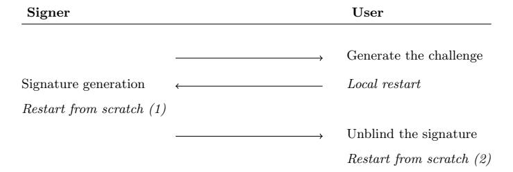
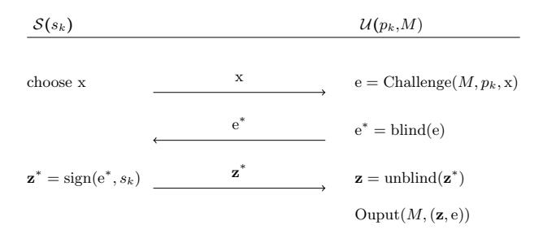
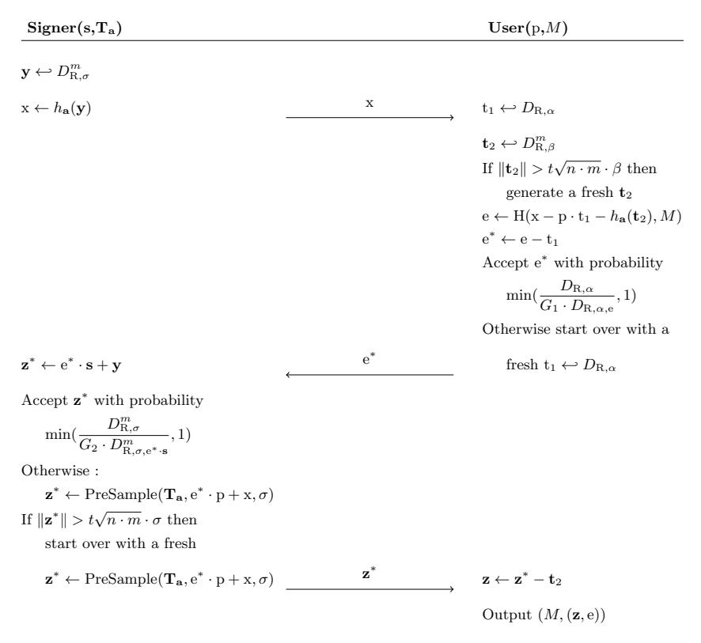
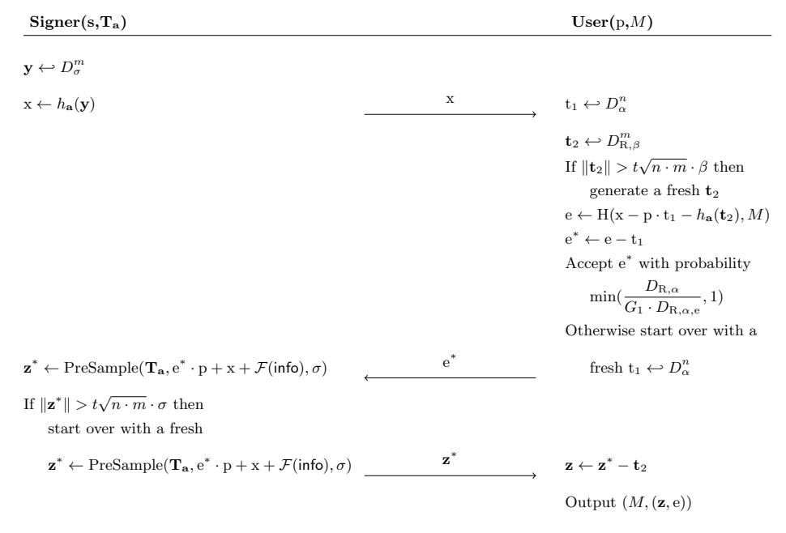

# Lattice-based (Partially) Blind Signature without Restart

Samuel Bouaziz-Ermann<sup>2</sup>, Sébastien Canard<sup>1</sup>, Gautier Eberhart<sup>2</sup>, Guillaume Kaim<sup>1,2</sup>, Adeline Roux-Langlois<sup>2</sup>, and Jacques Traoré<sup>1</sup>

Orange Labs, Applied Crypto Group, Caen, France {sebastien.canard,guillaume.kaim,jacques.traore}@orange.com

<sup>2</sup> Univ Rennes, CNRS, IRISA
{samuel.bouaziz-ermann,gautier.eberhart,adeline.roux-langlois,}@irisa.fr

Abstract. We present in this paper a blind signature and its partially blind variant based on lattices assumptions. Blind signature is a cornerstone in privacy-oriented cryptography and we propose the first lattice based scheme without restart. Compare to related work, the key idea of our construction is to provide a trapdoor to the signer in order to let him perform some gaussian pre-sampling during the signature generation process, preventing this way to restart from scratch the whole protocol. We prove the security of our scheme under the ring k-SIS assumption, in the random oracle model. We also explain security issues in the other existing lattice-based blind signature schemes. Finally, we propose a partially blind variant of our scheme, which is done with no supplementary cost, as the number of elements generated and exchanged during the signing protocol is exactly the same.

**Keywords.** Blind signature, partially blind, lattices, rejection sampling, k-SIS problem.

#### 1 Introduction

A well-known consequence of the arrival of quantum computers is that a lot of currently deployed cryptographic systems, based on usual assumptions (factorisation, discrete log...), would be broken. In order to anticipate this obsolescence, new cryptosystems, based on different assumptions known to be post-quantum resistant, need to be built. Among the existing possibilities, lattice-based cryptography is one of the most promising option. Indeed, several problems related to lattices are known to be hard in a post-quantum setting, and two of them are today widespread in a tremendous amount of cryptographic papers. The first one is the LWE problem [Reg05] (and its ring version R-LWE [SSTX09,LPR10]) used to build lattice-based public key encryption schemes [Reg05]. The second one is the SIS problem [Ajt96] (and its ring variant R-SIS [LM06,PR06]) used to build hash functions and signature schemes [GGH97,GPV08]. For example the SIS (resp. ISIS) problem asks, given an uniform  $\mathbf{A} \in \mathbb{Z}_q^{n \times m}$  (and  $\mathbf{x} \in \mathbb{Z}_q^n$ ) to find a short vector  $\mathbf{v} \in \mathbb{Z}_q^m$ , such that  $\mathbf{A} \cdot \mathbf{v} = 0 \mod q$  (resp.  $\mathbf{A} \cdot \mathbf{v} = \mathbf{x} \mod q$ ). The

signature is then a short vector solution of this matrix-vector equation. In this paper, we focus on constructions based on the SIS problem.

More precisely, there are two ways to use the SIS problem to construct a signature scheme. Firstly, in trapdoor based constructions [Ajt96,GPV08], the signer owns, as a secret key, a trapdoor  $\mathbf{T} \in \mathbb{Z}^{m \times m}$  related to a matrix  $\mathbf{A} \in \mathbb{Z}_q^{n \times m}$  randomly distributed. This trapdoor consists in a short basis of the lattice  $\Lambda_q^{\perp}(\mathbf{A}) = \{\mathbf{v} \in \mathbb{Z}_q^m : \mathbf{A} \cdot \mathbf{v} = 0 \mod q\}$ . Then, as in [GPV08], for a message m and given a random vector  $\mathbf{x} = \mathbf{H}(m)$  for a hash function  $\mathbf{H}$ , the signer can use this trapdoor to compute a short vector  $\mathbf{v}$ , solution of the ISIS equation  $\mathbf{A} \cdot \mathbf{v} = \mathbf{x} \mod q$ . This operation is called pre-image sampling. In the second approach, which uses the Fiat-Shamir transformation [FS86], the signature algorithm relies on a technique called the rejection sampling, introduced in [Lyu09]. Such technique starts from a distribution depending on a secret, and the goal is to sample as much vectors as necessary to transform this biased distribution on a leak-free one [Lyu09,Lyu12]. In fact, the idea behind our construction is to use the advantages of both approaches.

#### 1.1 Blind Signatures

Blind signatures, introduced by Chaum in 1982 [Cha82], permits a user to obtain a signature on a chosen message by interacting with a signing authority. They have recently been standardized at ISO/IEC 18370 and are deployed in e.g., the Microsoft U-Prove technology. The main difference with a classical signature is that at the end of the signature generation, the authority has never seen the message and is not able to link the signature output by the user to its corresponding view of the interactions. Thus, the user is anonymous among the set of users having requesting a signature to this authority. Blind signatures are then usually used to provide anonymity in practical services such as e-vote or e-cash [Cha82]. In these cases, the authority provides the ability to vote or spend coins to a user, but the latter does not want his vote or payment to be traced. Pointcheval and Stern [PS96], and also Juels et al. [JLO97], proposed formal definitions for the security of blind signatures, namely blindness (the authority cannot make the link between a (message, signature) pair and its transcript of the signing protocol) and one-more unforgeability (a user cannot output more valid (message, signature) pairs than the number of times he has interacted with the authority).

However in some practical contexts, the message to be signed has to include some information, like a date of validity or a monetary value, that the authority should know. This is why a variant of blind signatures, called *partially* blind signatures, has been introduced [AF96]. In this variant, the two parties agree on a common and public information added to the signed message during the blind signature process. Obviously, this common information should not permit to break the above security properties, that should be modified accordingly.

Relying on standard assumptions, there exists a lot of blind signature schemes, e.g., taking as a basis RSA-based blind signatures [Fer93] or Schnorr-based blind signatures [Bra93]. Concerning post-quantum constructions, recently a proposal

based on codes has been given by Blazy et al. [BGSS17], and one on multivariate polynomials has been designed in [PSM17]. In the lattice-based cryptography setting, to the best of our knowledge, the literature mainly focus on a seminal work of R¨uckert [R¨uc10], later improved in [ZJZ+18], and in a scheme called BLAZE [ABB19] with its improvement BLAZE+ [ABB20]. However these lattice-based schemes include some trigger restarts in their protocol, making the result quite unpractical, in addition to have security issues as we explain with more details in Section 3. In this section, we firstly investigate on a possible issue between the restarts of such schemes and the forking lemma as defined in [PS00]. Secondly, we study the newly published scheme BLAZE ([ABB19], [ABB20]), and especially its one-more unforgeability proof.

Regarding partially blind signature schemes, Abe and Okamoto [AO00] proposed a generic transformation from a basic blind signature scheme to a partially blind one. But the result necessitates to increase the number of elements exchanged between the user and the authority to include the common information. Again, in the lattice-based setting, two partially blind system were proposed in [TZW16] and [PHBS19]. It also necessitates trigger restarts and, adapted from [AO00], leads to the additional same disadvantages, in addition to the same security issue mentioned previously and explained in Section 3.

## 1.2 Contribution

In this paper, we propose the first lattice-based blind signature scheme without restart, with its implementation and a partially blind variant. Our construction is based on the ring k-SIS problem, and proven secure in the random oracle model. Compared to state-of-the-art, the removal of such restart is of great interest since it can improve by several orders of magnitude the efficiency of the resulting signing process by avoiding the restarts in several points of the interactive protocol. Moreover the security analysis is easier than in constructions including restarts, as claimed in [HKL19], where the authors state that the trigger restarts bring some potential issues in the security proof, as we detail it in Section 3.1. They mainly concern the simulation of the scheme, since blind signature with restart were not taken into account in the seminal paper of [PS00], and then apply the forking lemma is not that direct. But in our scheme, we reach the perfect correctness and then completely remove the restarts and the issues implied by such schemes, to fulfil the requirements of the forking lemma of [PS00].

More precisely, our blind signature scheme follows the initial R¨uckert [R¨uc10] scheme, which is based on PKC 2008 Lyubashevsky's identification scheme [Lyu08]. As shown in Figure 1, there are two restarts from scratch during R¨uckert's signing process, leading to a signature generated after exp<sup>2</sup>/φ, φ ∈ [1, 15] ∩ Z trials in average. Our main objective is then to find more efficient alternatives to the problems such restarts are solving. We then use several tricks to reach our goal and design a more efficient blind signature scheme.

– Our first difference is to base our construction on Eurocrypt 2012 Lyubashevsky's signature scheme [Lyu12]. By replacing all the uniform sampling



Fig. 1. Restarts in R¨uckert scheme.

distributions by gaussian distributions, we benefit better parameters and a more efficient rejection sampling, compared to the R¨uckert scheme. In particular, the local restart on the user side is more efficient in our design.

- We then make use of the ring version of the efficient trapdoor function due to [MP12,GM18], in order to sample preimages of the one-way function defined in [LM06] associated to a public vector a. Instead of generating a new challenge or an ephemeral vector in case of error, as it is done in the restart from scratch (1) of R¨uckert scheme (see Figure 1), the signer can execute some gaussian pre-sampling by himself to efficiently output a signature where the secret key is always sufficiently hidden.
- Using then a result due to Goldwasser et al. [GKPV10] on statistical distances between gaussian distribution centered on 0 and gaussian distribution centered on a vector v, we hide the signature sent by the signer by adding an oversized vector, which is generated by the user. This naturally hides the information that can later be used by the signer to recognize the output blind signature, since the final signature distribution does not depend on the signature output by the signer. The consequence is that we do not need anymore the restart from scratch (2) in Figure 1, that has exactly the same objective.
- We finally remark that the removal of the trigger restarts leads to the uselessness of a commitment initially computed by the user during the challenge generation step. However the use of the trapdoor carries a problem in the onemore unforgeability proof, since the simulated signer needs to perform some gaussian pre-sampling but has no access to the trapdoor on the matrix A. We address this problem using the k-SIS problem introduced in [BF11], and improved in [LPSS14], which allows the signer to get k short vectors of the kernel of A and asks him to output a (k + 1)-th vector, linearly independent of the others.

As a second contribution, we propose a partially blind variant of our scheme. Compared to [TZW16] and [PHBS19], there is no need to exchange additional elements during the signing process as the common information is directly included in existing ones. The key idea is that the signer generates a GPV signature [GPV08] of the common information info. Concretely, the signer uses the pre-sampling technique on the value F(info) = x, and computes the pre-sample  $\mathbf{u}$  verifying  $\mathbf{A} \cdot \mathbf{u} = \mathbf{x}$ . This element  $\mathbf{u}$  is added in the signature generated by the signer, as in the previous basic blind scheme. Then it suffices to subtract this hash value  $\mathcal{F}(\mathsf{info})$  in the verification step to get a signing and verification protocol very similar to the classical blind variant, but that now includes the common information.

In addition of the design of the blind signature scheme we propose an implementation of this scheme described in Section 4.3, using concrete parameters given in Table 2 for 100 bits of security. The resulting timings for the different steps of the protocol are given in Table 4 resulting in a signature generated in less than 80 ms and at least twice faster than in Rückert scheme. Concerning the partially blind variant, the timings are equivalent since the only change is a one more presample for the signer, but it can be considered as included in the presample from the kernel, and then given for free in the computations.

### 2 Preliminaries

Notations. The vectors are written in bold lower-case letters, and matrices in bold upper-case letters. The euclidean norm of a vector is denoted by  $\|\mathbf{b}\|$ , and the norm of a matrix  $\|\mathbf{T}\| = \max_i \|\mathbf{t}_i\|$ , which is the maximum norm of its column vectors. We denote by D a distribution over some countable support S and  $x \leftarrow D$  the choice of x following the distribution D. Considering that  $D_1$  and  $D_2$  are two distributions over a same countable support S, then we can define their statistical distance by  $\Delta(D_1, D_2) = \frac{1}{2} \sum_{x \in S} |D_1(x) - D_2(x)|$ .

#### 2.1 Lattices

We define a m-dimensional full rank lattice  $\Lambda$  as a discrete additive subgroup of  $\mathbb{R}^m$ . A lattice is the set of all integer combinations of some linearly independent basis vector  $\mathbf{B} = \{\mathbf{b}_1, \dots, \mathbf{b}_m\} \in \mathbb{R}^{n \times m} \colon \Lambda(\mathbf{B}) = \{\sum_{i=1}^m z_i \mathbf{b}_i, z_i \in \mathbb{Z}\}$ . We consider n a power of two, such that the polynomial ring  $\mathbf{R} = \mathbb{Z}[x]/(x^n + 1)$  is isomorphic to the integer lattice  $\mathbb{Z}^n$ . Then a polynomial  $f = \sum_{i=0}^{n-1} f_i x^i$  in  $\mathbb{R}$  corresponds to the integer vector of its coefficients  $(f_0, \dots, f_{n-1})$  in  $\mathbb{Z}^n$ . The notation norm of a polynomial ||f|| means that we consider the norm of its coefficient vector, and as for the integer, the norm of a vector of polynomial  $||f|| = \max_i ||f_i||$ . For the rest of the paper we will work with polynomials over  $\mathbb{R}$ , or  $\mathbb{R}_q = \mathbb{R}/q\mathbb{R} = \mathbb{Z}_q[x]/(x^n + 1)$ , where q is a prime verifying  $q = 1 \pmod{2n}$ .

Computational Problems. We consider Ring-SIS, a variant of SIS, proven to be at least as hard as the SIVP problem on ideal lattices [LM06,PR06].

**Definition 1 (Ring-SIS**<sub> $q,m,\beta$ ). Given  $\mathbf{a} = (a_1, \dots, a_m)^T \in \mathbb{R}_q^m$  a vector of m uniformly random polynomials, find a non-zero vector of small polynomials  $\mathbf{x} = (x_1, \dots, x_m)^T \in \mathbb{R}^m$  such that  $f_{\mathbf{a}}(\mathbf{x}) = \sum_{i=1}^m a_i.x_i = 0 \mod q$  and  $0 < \|\mathbf{x}\| \leqslant \beta$ .</sub>

Our scheme is based on a variant called the k-SIS problem [BF11].

Definition 2 (Ring k-SIS, adapted from [BF11, definition 4.1]). For any integer  $k \ge 0$ , an instance of the Ring k-SIS $_{q,m,\beta,\sigma}$  problem is a vector  $\mathbf{a} \in \mathbf{R}^m$  and a set of k short polynomials vectors  $\mathbf{e}_1, \dots \mathbf{e}_k \in \Lambda_q^{\perp}(\mathbf{a})$ . A solution to the problem is a non zero polynomial  $\mathbf{v} \in \mathbf{R}^m$  such that  $\|\mathbf{v}\| \le \beta$ ,  $f_{\mathbf{a}}(\mathbf{v}) = 0 \mod q$  (i.e.,  $\mathbf{v} \in \Lambda_q^{\perp}(\mathbf{a})$ ), and  $\mathbf{v} \notin \mathbf{R} - \operatorname{span}(\mathbf{e}_1, \dots \mathbf{e}_k)$ .

*Hardness.* Following the proof of [LPSS14] adapted to the ring setting, the hardness of Ring k-SIS is insured for k = O(n).

Gaussian distribution. The Gaussian function of center  $\mathbf{c} \in \mathbb{R}^n$  and width parameter  $\sigma$  is defined as  $\rho_{\sigma,\mathbf{c}}(\mathbf{x}) = \exp(-\pi \frac{\|\mathbf{x} - \mathbf{c}\|^2}{\sigma^2})$ , for all  $\mathbf{x} \in \mathbb{R}^n$ . A positive definite covariance matrix is defined as  $\mathbf{\Sigma} = \mathbf{B}\mathbf{B}^T$ :  $\rho_{\sqrt{\mathbf{\Sigma}},\mathbf{c}} = \exp(-\pi(\mathbf{x} - \mathbf{c})^T\mathbf{\Sigma}^{-1}(\mathbf{x} - \mathbf{c}))$ . The discrete Gaussian distribution over a lattice  $\Lambda$  is defined as  $D_{\Lambda,\sigma,\mathbf{c}}(\mathbf{x}) = \frac{\rho_{\sigma,\mathbf{c}}(\mathbf{x})}{\rho_{\sigma,\mathbf{c}}(\Lambda)}$  where  $\rho_{\sigma,\mathbf{c}}(\Lambda) = \sum_{x \in \Lambda} \rho_{\sigma,\mathbf{c}}(\mathbf{x})$ . The vectors sampled from  $D_{\Lambda,\sigma}$  are short with overwhelming probability.

Lemma 1 ([Ban93, lemma 1.5]). For any lattice  $\Lambda \subseteq \mathbb{R}^n$ ,  $\sigma > 0$  and  $\mathbf{c} \in \mathbb{R}^n$ , we have  $Pr_{\mathbf{x} \leftarrow D_{\Lambda,\sigma,\mathbf{c}}}[\|\mathbf{x} - \mathbf{c}\| \leq \sqrt{n}\sigma] \geqslant 1 - 2^{-\Omega(n)}$ .

When sampling integers we have to tailcut the gaussian distribution. In order to do this, we use the fact that  $Pr_{\mathbf{x} \leftarrow D_{\mathbb{Z}, \sigma}}[|x| \leq t \cdot \sigma] \geqslant \operatorname{erfc}(t/\sqrt{2})$ , where  $\operatorname{erfc}(x) = 1 - 2/\pi \int_0^x \exp(-t^2) \, \mathrm{d}t$ . In practice, for  $\lambda = 100$  and t = 12, a vector  $\mathbf{x} \leftarrow D_{\mathbb{Z}^n, \sigma}$  will verify  $\|\mathbf{x}\| \leq t \cdot \sigma \cdot \sqrt{n}$  with overwhelming probability.

We define the function  $\Phi$  as  $\Phi_{\sigma,\mathbf{c}}(B) = Pr_{\mathbf{x} \leftarrow D_{\Lambda,\sigma,\mathbf{c}}}[\|\mathbf{x} - \mathbf{c}\| \leqslant B]$ , and we also define the following quantity  $\bar{\rho}_{\sigma,\mathbf{c},\mathbf{B}}(\mathbf{x}) = \frac{\rho_{\sigma,\mathbf{c}}}{\bar{\Phi}_{\sigma,\mathbf{c}}(B)}$ ,  $\forall \mathbf{x} \in S \subset \mathbb{R}^n$ , and  $\bar{\rho}_{\sigma,\mathbf{c}}(\mathbf{x}) = 0$ ,  $\forall \mathbf{x} \notin S$  as a truncated gaussian. Finally we denote  $\bar{D}_{\Lambda,\mathbf{c},\sigma,B}$  as the truncated gaussian, where the elements  $\mathbf{x} \in \Lambda$ , such that  $\|\mathbf{x}\| > B$  have a probability density equals to 0.

#### 2.2 Trapdoors

As introduced in [Ajt96] and widespread in [GPV08], a trapdoor  $\mathbf{A} \in \mathbb{Z}_q^{n \times m}$  is a short basis of the lattice  $\Lambda_q^{\perp}(\mathbf{A}) := \{ \mathbf{v} \in \mathbb{Z}^m \text{ such that } \mathbf{A}\mathbf{v} = 0 \text{ mod } q \}$ . A trapdoor allows to sample short Gaussian vectors solution of the ISIS problem:  $\mathbf{A}\mathbf{v} = \mathbf{x} \mod q$  with  $\mathbf{x} \in \mathbb{Z}_q^n$ . This technique is called *Preimage Sampling*.

We now describe the gadget-based trapdoor introduced in [MP12] in the ring  $\mathbb{Z}_q[x]/(x^n+1)$ , that we use in our constructions in order to be more efficient.

Gadget-based trapdoor. In [MP12] trapdoors, the matrix  $\mathbf{a} \in \mathbf{R}_q^m$  is constructed by picking a first part uniformly at random, and a second part almost uniformly at random by including a gadget structure, to help the search of a solution for a Ring-SIS problem. The trapdoor construction then uses a gadget vector  $\mathbf{g} = (1, 2, 4, \dots, 2^{k-1})^T \in \mathbf{R}_q^k$ , with  $k = \lceil \log_2 q \rceil$  for which the inversion of the function  $f_{\mathbf{g}^T}(\mathbf{z}) = \mathbf{g}^T \mathbf{z} \in R_q$  is easy to compute.

Construction. The construction of the gadget-based trapdoor takes as input the modulus q, the Gaussian parameter  $\tau$ , an optional  $\mathbf{a}' \in \mathbf{R}_q^{m-k}$  and  $h \in \mathbf{R}_q$ . If no  $\mathbf{a}'$  is given it is chosen uniformly in  $\mathbf{R}_q^{m-k}$  and if no h is given, h = 1. The construction outputs a matrix  $\mathbf{a} = (\mathbf{a}'^T || h\mathbf{g} - \mathbf{a}'^T \mathbf{T})^T$  with  $\mathbf{T} \in \mathbf{R}^{(m-k)\times k}$  its trapdoor associated to the tag h, generated as a Gaussian of parameter  $\tau$ .

Preimage sampling. The preimage sampling, given  $\mathbf{a} \in \mathbf{R}_q^m$ , is the computation of a short vector solution  $\mathbf{v} \in \mathbf{R}^m$  of a Ring-SIS problem  $f_{\mathbf{a}}(\mathbf{v}) = \sum_{i=1}^m a_i.v_i = 0 \mod q$ , available only thanks to a trapdoor  $\mathbf{T} \in \mathbf{R}_q^{(m-k) \times k}$  for  $\mathbf{a}$ . The construction of [MP12] enables the following algorithm PreSample( $\mathbf{T}, x \in \mathbf{R}_q, \zeta$ ) for the preimage sampling  $\mathbf{x} \in \mathbf{R}^m$ , with width parameter  $\zeta$ , of  $f_{\mathbf{a}}(\mathbf{v}) = x$ :

- 1. Find  $\mathbf{z} \leftarrow D_{\mathbf{R},\alpha}^k$ , satisfying  $f_{\mathbf{g}}(\mathbf{z}) = h^{-1}(x \mathbf{a}^T \mathbf{p})$ , with  $\mathbf{p} \in \mathbf{R}_q^m$  a perturbation vector with covariance matrix  $\Sigma_{\mathbf{p}} = \zeta^2 \mathbf{I}_m \alpha^2 \begin{pmatrix} \mathbf{I}_k \\ \mathbf{T} \end{pmatrix} (\mathbf{T}^T \mathbf{I}_k)$ .
- 2. Compute  $\mathbf{v} = \mathbf{p} + \begin{pmatrix} \mathbf{I}_k \\ \mathbf{T} \end{pmatrix} \mathbf{z}$  with covariance matrix  $\Sigma_{\mathbf{v}} = \Sigma_{\mathbf{p}} + \alpha^2 \begin{pmatrix} \mathbf{I}_k \\ \mathbf{T} \end{pmatrix} (\mathbf{T}^T \mathbf{I}_k)$ , satisfying  $\mathbf{a}^T \mathbf{v} = \mathbf{a}^T \mathbf{p} + \mathbf{a}^T \begin{pmatrix} \mathbf{I}_k \\ \mathbf{T} \end{pmatrix} \mathbf{z} = \mathbf{a}^T \mathbf{p} + h \mathbf{g}^T \mathbf{z} = \mathbf{a}^T \mathbf{p} + h h^{-1} (x \mathbf{a}^T \mathbf{p}) = x$ .

Hash function. We use the hash function construction developed in [LM06]. Let  $R_q$  be a ring and  $m \ge 1$  a positive integer. The hash function  $h_{\mathbf{a}}: R_q^m \to R_q$  for  $\mathbf{a} \in R_q^m$  is defined as:  $\mathbf{x} \mapsto \langle \mathbf{a}, \mathbf{x} \rangle = \sum_{i=0}^{m-1} a_i x_i$ . This hash function family will be denoted  $\mathcal{H}(R_q, m)$ . We define the collision problem associated as follows.

**Definition 3 (inspired by [Rüc10, definition 2.1]).** Let  $D \subset \mathbb{R}$ , the collision problem  $Col(\mathcal{H}(\mathbb{R}_q, m), D)$  asks to find a distinct pair  $(\mathbf{x}, \mathbf{x}') \in D^m \times D^m$  such that  $h(\mathbf{x}) = h(\mathbf{x}')$  for  $h \leftarrow \mathcal{H}(\mathbb{R}_q, m)$ .

Rejection sampling. The rejection sampling, introduced by Lyubashevsky in [Lyu08] and improved in [Lyu09,Lyu12], is used in the case we have a distribution depending on a secret we want to hide. The main idea is to "reject" the elements of this distribution using a distribution probability not depending on the related secret. The following theorem expresses this idea.

**Theorem 1 ([Lyu12, theorem 4.6]).** Let V be a subset of  $\mathbb{Z}^n$  in which all elements have norms less than T,  $\sigma$  be some element in  $\mathbb{R}$  such that  $\sigma = \omega(T\sqrt{\log(n)})$ , and  $h: V \to \mathbb{R}$  be a probability distribution. Then, there exists a constant G = O(1) such that the distribution of the following algorithm A:

 $1: \mathbf{v} \hookleftarrow_{\$} h \quad 2: \mathbf{z} \leftarrow D_{\mathbb{Z}^n, \sigma, \mathbf{v}} \quad 3: output(\mathbf{z}, \mathbf{v}) \text{ with probability } min(\frac{D_{\mathbb{Z}^n, \sigma}}{G.D_{\mathbb{Z}^n, \sigma, \mathbf{v}}}, 1)$  is within statistical distance  $\frac{2^{-\omega(\log n)}}{G}$  of the distribution of the following algorithm  $\mathcal{F}$ :

 $1: \mathbf{v} \hookleftarrow_{\$} h \quad 2: \mathbf{z} \hookleftarrow_{\$} D_{\mathbb{Z}^n,\sigma} \quad 3: output \ (\mathbf{z}, \mathbf{v}) \ with \ probability \ 1/G.$  Moreover, the probability that  $\mathcal A$  outputs something is at least  $\frac{1-2^{-\omega(\log n)}}{G}$ .

More concretely, if  $\sigma = \delta T$  for any positive  $\delta$ , then  $G = \exp^{12/\delta + 1/(2\delta^2)}$ , the output of the algorithm  $\mathcal A$  is within statistical distance  $\frac{2^{-100}}{G}$  of the output of  $\mathcal F$ , and the probability that  $\mathcal A$  outputs something is at least  $\frac{1-2^{-100}}{G}$ .

In case we can not perform any rejection sampling, the following lemma also allows to hide the center of a gaussian distribution, but it requires to generate a vector from a gaussian distribution with a super polynomial width parameter.

**Lemma 2** ([GKPV10, Lemma 3]). Let  $v \in R$  be arbitrary. The statistical distance between the distributions  $D_{R,\sigma}$  and  $D_{R,\sigma,v}$  is at most  $\frac{\|v\|}{\sigma}$ .

# 2.3 (Partially) Blind Signatures

A blind signature protocol allows a user to interact with a signer in order to obtain a valid signature under the secret key of the signer, on a message of his choice. At the end of the interaction, the user outputs a (message, signature) pair which cannot be linked by the signer to its generation transcript. The partially blind variant allows the signature to carry some public information chosen commonly between the two parties.



Fig. 2. Signing protocol.

A (Partially) Blind Signature scheme (BS or PBS) consists of three algorithms (Keygen, Sign, Verif), where Sign is an interactive protocol between a signer  $\mathcal{S}$  and a user  $\mathcal{U}$ . There are different ways to describe such an interactive protocol. In this paper, we consider a three-move protocol, as shown in Figure 2.

- Key Generation. Keygen(1<sup>n</sup>) given the security parameter n, outputs a private signing key  $s_k$  and a public verification key  $p_k$ .
- Signature Protocol. The interaction between the signer  $\mathcal{S}(s_k)$  and the user  $\mathcal{U}(p_k, M)$  is described in Figure 2. The input of  $\mathcal{S}$  is a secret key  $s_k$  and the input of the user is the public key  $p_k$  and a message  $M \in \mathcal{M}$ , where  $\mathcal{M}$  is the message space. The output of  $\mathcal{S}$  is a transcript  $(\mathbf{x}, \mathbf{e}^*, \mathbf{z}^*)$  of the signature generation and the output of  $\mathcal{U}$  is a signature  $\mathbf{z}$  on the message M, under  $s_k$  with respect to the challenge e.

In the case of partially blind signature, an additional information info is commonly chosen by the signer and the user. This common information info is public and is added to the message to be signed during the process.

- Signature Verification. The algorithm  $Verif(p_k, M, (\mathbf{z}, \mathbf{e}))$  outputs 1 if  $\mathbf{z}$  is a valid signature on M under  $p_k$  with respect to the challenge  $\mathbf{e}$ , otherwise it outputs 0. In the case of the partially blind signature, the common information is also needed as an input of the signature verification process.

Completeness. We define the completeness as in a digital signature scheme, i.e., for each honestly created signature with honestly created keys and for any message  $M \in \mathcal{M}$  (and info), the signature verification has to be valid under these elements.

The security of (partially) blind signature schemes is then composed of two properties: (partial) blindness and one-more unforgeability, developed in the works of [JLO97,PS00].

Partial blindness. The first property a (partially) blind signature scheme must fulfil is the (partial) blindness property. It means that the signer is unable to link a valid (partially) blind signature  $(M, (\mathbf{z}, \mathbf{e}))$  to the transcript  $(\mathbf{x}, \mathbf{e}^*, \mathbf{z}^*)$  which generated it.

**Definition 4.** (Partial) Blindness is formalized in the experiment in Fig. 3.

```
\begin{split} & \underbrace{\operatorname{Exp}_{\mathcal{S}^*,\operatorname{BS}}^{\operatorname{blind}}(n)} \\ & b \leftarrow_{\$} \{0,1\} \\ & (p_k,s_k) \leftarrow_{\$} \operatorname{BS.Keygen}(1^n) \\ & (M_0,M_1,\operatorname{info_0},\operatorname{info_1},\operatorname{state_{find}}) \leftarrow_{\$} \mathcal{S}^*(\operatorname{find},p_k,s_k) \\ & \operatorname{state_{issue}} \leftarrow_{\$} \mathcal{S}^{*\langle\cdot,\mathcal{U}(p_k,M_b,\operatorname{info_b})\rangle,\langle\cdot,\mathcal{U}(p_k,M_{1-b},\operatorname{info_1-b})\rangle}(\operatorname{issue},\operatorname{state_{find}}) \\ & \operatorname{Let} \mathbf{z}_b \operatorname{and} \mathbf{z}_{1-b} \operatorname{be} \operatorname{the} \operatorname{outputs} \operatorname{of} \mathcal{U}(p_k,M_b,\operatorname{info_b}) \operatorname{and} \mathcal{U}(p_k,M_{1-b},\operatorname{info_1-b}) \operatorname{,} \operatorname{respectively}. \\ & \operatorname{If} \mathbf{z}_0 \neq \operatorname{fail} \operatorname{and} \mathbf{z}_1 \neq \operatorname{fail} \operatorname{and} \operatorname{info_0} = \operatorname{info_1} \\ & d \leftarrow_{\$} \mathcal{S}^*(\operatorname{guess}, \mathbf{z}_0, \mathbf{z}_1, \operatorname{state}_{\operatorname{issue}}) \\ & \operatorname{Else} \\ & d \leftarrow_{\$} \mathcal{S}^*(\operatorname{guess}, \operatorname{fail}, \operatorname{fail}, \operatorname{state}_{\operatorname{issue}}) \\ & \operatorname{Return} 1 \operatorname{iff} d = b \end{split}
```

Fig. 3. (Partial) blindness experiment.

A BS scheme is  $(t, \delta)$ -blind, if there is no adversary  $\mathcal{S}^*$ , running in time at most t, that wins the above experiment with advantage at least  $\delta$ , where the advantage is defined as  $\operatorname{Adv}_{\mathcal{S}^*, \operatorname{BS}}^{\operatorname{blind}} = |\operatorname{Prob}[\operatorname{Exp}_{\mathcal{S}^*, \operatorname{BS}}^{\operatorname{blind}}(n) = 1] - \frac{1}{2}|$ .

The blindness experiment is available for both blind and partially blind signatures. The only difference between the two cases is that we have to deal with the common information info in the partially blind version, by ensuring that this common information is the same for the two output signatures, to not harm the blindness. One has just to remove the variables  $\mathsf{info}_0$  and  $\mathsf{info}_1$  to obtain the exact experiment for basic blind signatures.

Concerning this experiment, we consider an adversary, acting as a signer  $S^*$ , that works in three modes. In mode FIND, the adversary chooses two messages  $M_0, M_1$  (and corresponding common informations info<sub>0</sub> and info<sub>1</sub>). Then, in mode issue, he interacts with two users. Each user gets the two messages and, on a coin flip b, each user interacts with the adversary  $S^*$ , as in the signing protocol, to generate a blind signature  $\mathbf{z}_b$  (resp  $\mathbf{z}_{1-b}$ ) for the message  $M_b$  (resp.  $M_{1-b}$ ). After seeing both unblinded signatures  $\mathbf{z}_0, \mathbf{z}_1$  in the original order, with respect to  $M_0$  and  $M_1$ , the signer enters the third mode guess and has to guess the bit b of the corresponding signatures. If any of the signature process fails, the signer only gets a notification of failure. The adversary is moreover allowed to keep a state that is fed back in subsequent calls.

One-more unforgeability. The second security property is the one-more unforgeability. Informally, it means that a user, given l valid signatures generated following l interactions with a signer, can not output a (l+1)-th valid signature which can not be linked to an actual protocol execution  $(\mathbf{x}_i, \mathbf{e}_i^*, \mathbf{z}_i^*), 1 \leq i \leq l$ . The security on the one-more unforgeability property ensures that each completed interaction between signer and user provides at most one signature. In the corresponding experiment, an adversarial user tries to output m valid signatures after l < m completed interactions with an honest signer.

**Definition 5.** One-more unforgeability is formalized in the experiment in Fig. 4.

```
\begin{split} & \underline{\operatorname{Exp}^{\mathrm{ouf}}_{U^*,\mathrm{BS}}(n)} \\ & (p_k,s_k) \leftarrow_{\$} \mathrm{BS}.\mathrm{Keygen}(1^n) \\ & \{(M_1,\mathbf{z}_1),...,(M_m,\mathbf{z}_m)\} \leftarrow_{\$} \mathcal{U}^{*\langle S(s_k,\inf o),\cdot\rangle^{\infty}}(p_k) \\ & \mathrm{Let}\ l\ \text{be the number of successful interaction between } \mathcal{U}^*\ \text{and the signer.} \\ & \mathrm{Return}\ 1\ \mathrm{iff} \\ & 1.M_i \neq M_j\ \text{for all}\ 1 \leq i < j \leq m \\ & 2.\mathrm{BS}.\mathrm{Verif}(p_k,M_i,(\mathbf{z}_i,\mathbf{e}_i),\mathrm{INFO}) = 1\ \text{for all}\ i = 1,...,m \\ & 3.m = l + 1. \end{split}
```

Fig. 4. One-more unforgeability experiment.

A blind signature scheme BS is  $(t, q_{Sign}, \delta)$ -one-more unforgeable if there is no adversary  $\mathcal{A}$ , running in time at most t, making at most  $q_{Sign}$  signature queries, who wins the above experiment with probability at least  $\delta$ .

As for the blindness property, this experiment is available for both blind and partially blind signatures. Similarly, one can adapt the given experiment to the case of basic blind signatures by simply removing the variables info. The difference between the two variants is that in the partially variant we also need to verify that the attacker can not forge a signature on an information never appearing in the l previous exchanges with the signer.

Forking Lemma is used to prove the unforgeability of many signature schemes. It has been developed in [PS00] and generalized in [BN06].

**Lemma 3** ([BN06, Lemma 1]). Fix an integer  $q \ge 1$  and a set H of size  $h \ge 2$ . Let A be a randomized algorithm that on input  $x, h_1, \ldots, h_q$  returns a pair, the first element of which is an integer in the range  $0, \ldots, q$  and the second element of which we refer to as a side output. Let  $\mathcal{IG}$  be a randomized algorithm that we call the input generator. The accepting probability of A, denoted acc, is defined as the probability that  $J \ge 1$  in the experiment:

```
x \leftarrow_{\$} \mathcal{IG}; h_1, \dots, h_q \leftarrow_{\$} H; (J, \sigma) \leftarrow_{\$} \mathcal{A}(x, h_1, \dots, h_q).
```

The forking algorithm  $\mathcal{F}_{\mathcal{A}}$  is the randomized algorithm that takes input x proceeds as follows:

```
Algorithm \mathcal{F}_{\mathcal{A}}(x)
```

```
Pick coins \rho for \mathcal{A} at random
h_1, \ldots, h_q \leftarrow H
(I, \sigma) \leftarrow \mathcal{A}(x, h_1, \ldots, h_q; \rho)
If I = 0 then returns (0, \epsilon, \epsilon)
h'_I, \ldots, h'_q \leftarrow H
(I', \sigma') \leftarrow \mathcal{A}(x, h_1, \ldots, h_{I-1}, h'_I, \ldots, h'_q; \rho)
If (I = I' \text{ and } h_I \neq h'_I) then return (1, \sigma, \sigma')
Else return (0, \epsilon, \epsilon).

Let \text{frk} = \Pr[b = 1 : x \leftarrow \mathcal{IG}; (b, \sigma, \sigma') \leftarrow \mathcal{F}_{\mathcal{A}}(x)]. Then: \text{frk} \geqslant \text{acc.}(\frac{\text{acc}}{q} - \frac{1}{h}).

Alternatively, \text{acc} \leqslant \frac{q}{h} + \sqrt{q.\text{frk}}.
```

# 3 Security Problems in Related Works

For a long time, the only existing blind signature on lattices was the scheme of Rückert [Rüc10], but the past several years have seen some resurgence of interest for the subject. After some improvement on the distribution of the elements composing the protocol, done by Zhang et al [ZJZ<sup>+</sup>18], a new scheme called BLAZE [ABB19] (soon followed by its new version BLAZE+ [ABB20]) has been published, improving the user part of the original scheme of Rückert. Finally, a partially blind signature, including a common public information compared to the classical blind signature, has been designed by Tian et al [TZW16], later followed by [PHBS19].

#### 3.1 The forking lemma

All the existing lattice-based blind signature schemes (those cited previously as well as our) are built from the identification scheme of Lyubashevsky [Lyu08] combined with the Fiat-Shamir paradigm [FS86]. They all make use of the forking lemma (Lemma 3) to prove the one-more unforgeability property (Definition 5). This tool has been developed by Pointcheval and Stern [PS00], and generalized by Bellare and Neven [BN06]. Intuitively, this lemma argues that if an

attacker succeeds in the one-more unforgeability game and outputs a "one-more" signature, he can then be "rewinded" to the point where this forgery has been done. Then, by giving him different answers when he performs some of his oracle queries, we can bound the probability of success to output a second "one-more" signature different from the first one. Thanks to those two different forgeries, one can compute a solution to a hard problem (typically, the SIS problem on lattices) using the properties inherited from the zero-knowledge proofs.

This lemma, as well as the unforgeability property, relies mainly on a simulation game between a simulator impersonating a real signer and the attacker acting as a user in the protocol. In order to not let the attacker notice that he corresponds with a simulator instead of a true signer, the simulation needs to be indistinguishable of an actual iteration of the signing protocol. However, as we have been aware by personal communications <sup>3</sup> , in the blind signature context where the protocol is interactive, it is more "tricky" to ensure this property of the simulation. This is because the interactions are done in a request-answer model, we then must be aware that the user acts as expected.

More precisely, the signer expects that the attacker outputs l + 1 signatures at the end of the game, after l interactions between the two parties. But since the simulator uses the attacker as a black-box, he has no hold on him and how he acts. In a perfectly correct scheme this is not really a problem, since after a blind signature request, when the simulator sends a valid signature that the attacker has to "unblind", it is convinced that the attacker will get a valid blind signature. However all the previous lattice-based blind signature have some correctness error, which means that even if the simulator sends a valid signature from his side, the attacker acting as a user may have some trouble to generate the corresponding blind signature. Since this case is not considered by the seminal paper of [PS00], it brings that the global proof could not working any more and blind signature schemes, with correctness errors, need a deeper analysis to actually use the forking lemma. In our case, since we have reached the perfect correctness, this issue does not apply.

### 3.2 BLAZE

In this part, we take a closer look at the construction of BLAZE [ABB19], and its direct improvement BLAZE+ [ABB20] for which we also notice other problems than the one on the forking lemma they inherit. BLAZE(+) is a latticebased blind signature, also built from the scheme of R¨uckert, but which improve the user part of the protocol (in fact BLAZE focuses on the generation of the challenge, while BLAZE+ improves the "unblind" part of the signature). The general idea of BLAZE is to transform the way the challenge is generated, by using rotating matrices instead of the rejection sampling. This leads to a gain of O(n) in the size of the blinded challenge, and allows a faster challenge generation.

The new version, BLAZE+, starts from the BLAZE scheme, and reduces the number of restarts triggered during the protocol. To do this, the authors add

<sup>3</sup> with the authors of [HKL19], and anonymous reviewers of CT-RSA 2020.

a list of l vectors, accumulated in a Merkel tree, to the challenge generated by the user in his first step of the protocol. Then using the vectors in the list, if a rejection sampling does not pass in the "unblind" step, the user retries at most l times with another vector of the list, and so on until one rejection sampling passes or all the elements of the list have been tested. Then the probability of restart at this step is greatly reduced, they also produced a version where they consider the probability to restart as negligible. The result is that they can then delete the last restart and the last step of the protocol consisting in the proof by the user that the signature is actually invalid.

All previous lattice-based blind signature schemes (as well as our, and the first variant of BLAZE), consider the secret key as a short polynomial vector s and the public key as the image of this vector by the multiplication with a polynomial vector a uniformly distributed. However BLAZE also consider a RLWE variant, where the size of the vector **a** is 2 (which corresponds to m=1 with their notation), the secret key is then composed of two short polynomials  $\hat{s}_1, \hat{s}_2$ , and the public key is  $\hat{b} = \hat{a} \cdot \hat{s}_1 + \hat{s}_2$ , with  $\hat{a}$  a polynomial uniformly distributed. But from this key distribution arises a problem in the one-more unforgeability proof. In fact, in a blind signature scheme, the simulation of the protocol can not be done without the secret key, as pointed out by Pointcheval and Stern [PS00]. Indeed in the security proof the simulator can not just program the hash function (designed as a random oracle) to be able to handle the signature request, because the answer to this random oracle is afterwards modified by the user, who blinds it before sending it. Then the signer can not predict in advance which challenge will be signed and looses the control on it. To overcome this problem, Pointcheval and Stern make use of protocols with the witness indistinguishability property. Thanks to this property, the simulator generates a secret key on his own and expects that the forger will forge a signature on a different secret key but still linked to the same public key. From this collision on the secret keys, the simulator is then able to build a solution for a hard problem.

However it seems that the witness indistinguishability property may not be verified for a key pair seen as a RLWE sample. Indeed, for a given public key  $\hat{b} = \hat{a} \cdot \hat{s}_1 + \hat{s}_2$ , the collision on the secret key  $(\hat{s}_1, \hat{s}_2)$  is not guaranteed. However as claimed in [LM06], in order to have a function  $h_{\hat{\mathbf{a}}} : D^{m+1} \to \mathbf{R}_q$ , with  $|D^{m+1}| = (2d+1)^{(m+1)n}$ , containing collisions, the vector  $\hat{\mathbf{a}}$  needs to be composed of at least  $m+1 > \frac{\log q}{\log 2d}$  polynomials, where d is the bound on the size of the secrets. Coming back to BLAZE, this condition means that  $m+1 \geq 4$ , and it then seems that an argument is missing in the one-more unforgeability proof to also include the case m=1, as the witness indistinguishability is necessary to use the forking lemma in the same way as [PS00].

#### 4 Our Lattice-based Blind Signature

Our main contribution is a lattice-based blind signature scheme without restarts, proven secure in the random oracle model. Our scheme is an improved variant of Rückert's blind signature scheme [Rüc10], where we remove all the trigger

restarts, and also provide some efficiency improvements. Indeed in the original scheme (see Figure 1 in the introduction), the first restart is local and is necessary to obtain relevant parameters for the second part of the protocol. We maintain it, adding some minor modifications and improvements. The two other restarts are from scratch and, if the conditions are not fulfilled, can occur respectively at the third and fourth steps. According to [R¨uc10], the number of trials expected in the R¨uckert scheme is approximately exp2/φ, with φ ∈ [1, 15]∩Z. Then, the removal of these restarts is very important to design a more efficient lattice-based blind signature scheme. Moreover, one benefit, besides the removal of these restarts on itself, is that R¨uckert needed to add a user commitment during the first stage of the protocol to prevent some attacks related to unforgeability. Removing the restarts makes such commitment no more of use, and it can then be omitted.

One first key idea in our scheme is to add some Gaussian distributions in the protocol, in order to benefit of their nice properties. We also consider Lyubashevsky's signature scheme [Lyu12] at Eurocrypt 2012, instead of the one at PKC 2008 [Lyu08]. Another improvement we add is to use the rejection sampling technique, introduced and improved by Lyubashevsky in [Lyu08,Lyu09], both during step 2 where the user generates a blind challenge, and in step 3 when the signer generates the signature. This modification leads us to gain a √ n-factor in the signature size besides the removal of the restart on signer's side. The counterpart is that we need to generate a lattice trapdoor for the signer in order to sample short Gaussian vectors such that ha(v) = 0 mod q.

To obtain the blindness property, necessitating the user to "unblind" the signature he has obtained from the signer in such a way that the latter is not able to recognize it, we make use of the argument given in [GKPV10] about the statistical distribution of two Gaussian distributions centered in 0 and on a vector v, with the same variance. Using this result permits us to show that the signer cannot distinguish if the output signature distribution is centered on a vector v or on 0.

## 4.1 The Construction

The construction of our blind signature scheme BS = (KeyGen, Sign, Verif) is now given in details.

Setup. We consider the polynomial ring R<sup>q</sup> = Zq[X]/(Xn+ 1), where the parameters q and n are expressed in Table 1. Two families of hash functions are necessary in the protocol, firstly a generic hash function H ←\$ H(1<sup>n</sup>) : {0, 1} <sup>∗</sup> → R<sup>2</sup> (modelled as a random oracle), and a second one on the specific ring Rq, typically h ←\$ H(Rq, m) as defined in the preliminaries. The parameter table (Table 1) shows up the different sizes of the parameters involved in our blind signature scheme. The parameter n is chosen as a power of 2, in order to have the polynomial X<sup>n</sup> + 1 irreducible and for efficiency reasons. The parameter m ensures the worst-case to average case reduction of our scheme. The others parameters are set such that the different rejection sampling and security arguments work. Key Generation. BS.Keygen(1<sup>n</sup>) selects a secret key s ∈ R<sup>m</sup> <sup>3</sup> and a vector of polynomial a = (a <sup>0</sup><sup>T</sup> khg − a <sup>0</sup><sup>T</sup> Ta) <sup>T</sup> ∈ R<sup>m</sup> q , along with a trapdoor T<sup>a</sup> on a, such that the hash function  $h_{\mathbf{a}} \in \mathcal{H}(\mathbf{R}_q, m)$  is built with this polynomial vector  $\mathbf{a}$ . Finally the public key  $\mathbf{p} = h_{\mathbf{a}}(\mathbf{s})$  is computed and made public. BS.Keygen(1<sup>n</sup>) outputs  $s_k = (\mathbf{s}, \mathbf{T_a})$  and  $p_k = (\mathbf{p}, \mathbf{a})$ .

Signature. BS.Sign(Signer( $\mathbf{s}, \mathbf{T_a}$ ), User( $\mathbf{p}, M$ )) works as expressed in Figure 5. We recall that writing  $\mathbf{v} \leftarrow \operatorname{PreSample}(\mathbf{T_a}, \mathbf{x}, \sigma)$  means that  $h_{\mathbf{a}}(\mathbf{v}) = \mathbf{x} \mod q$  and that  $\mathbf{v}$  is following a Gaussian distribution of parameter  $\sigma$ . At the end of the protocol, the signer outputs a transcript, and the user outputs the uplet  $(M, (\mathbf{z}, \mathbf{e}))$  composed by the message  $M \in \{0.1\}^*$ , the signature  $\mathbf{z} \in \mathbf{R}^m$  and the challenge  $\mathbf{e} \in \mathbf{R}_2$  to verify the signature.



Fig. 5. BS protocol

Verification. The verification procedure BS.Verif(p, M, ( $\mathbf{z}$ , e)) outputs 1 iff  $\|\mathbf{z}\| \le D$  and  $H(h_{\mathbf{a}}(\mathbf{z}) - \mathbf{p} \cdot \mathbf{e}, M) = \mathbf{e}$ .

#### 4.2 Security

**Completeness.** We first need to verify that the protocol outputs a correct result with an overwhelming probability. This property is non-trivial here since both user and signer use some rejection sampling.

| Parameter | Value                                    | Asymptotic                           |
|-----------|------------------------------------------|--------------------------------------|
| n         | power of 2                               | -                                    |
| m         | $\lfloor \log q \rfloor + 1$             | $\Omega(\log n)$                     |
| $\gamma$  | $n\alpha$                                | $O(n\sqrt{n})$                       |
| α         | $\omega(k\sqrt{\log n})$                 | $O(\sqrt{n})$                        |
| β         | $2^{\omega(\log n)}\sigma\sqrt{n}$       | $O(n^3 \ 2^{\omega(\log n)})$        |
| $\sigma$  | $\omega((n\sqrt{n}\alpha)\sqrt{\log n})$ | $O(n^2\sqrt{n})$                     |
| D         | $t\sqrt{n\cdot m}(\beta+\sigma)$         | $O(n^3\sqrt{n}\ 2^{\omega(\log n)})$ |
| q         | $\geqslant 4mn\sqrt{n}\log(n)D$ .prime   | $\Theta(n^6 \ 2^{\omega(\log n)})$   |

Table 1. Parameters of our scheme.

#### Theorem 2 (Completeness). The scheme BS is perfectly complete.

*Proof.* Let us assume that the protocol output a valid signature. Then, for all honestly generated key pairs  $(\mathbf{s}, \mathbf{p})$ , all messages  $M \in \{0, 1\}^*$  and all signatures  $(M, (\mathbf{z}, \mathbf{e}))$  we have  $\|\mathbf{z}\| \leq \|\mathbf{z}^*\| + \|\mathbf{t}_2\| \leq D$  and:

$$h_{\mathbf{a}}(\mathbf{z}) - \mathbf{p} \cdot \mathbf{e} = h_{\mathbf{a}}(\mathbf{z}^* - \mathbf{t}_2) - \mathbf{p} \cdot \mathbf{e}$$
 (1)

$$= h_{\mathbf{a}}(\mathbf{e}^* \cdot \mathbf{s} + \mathbf{y} - \mathbf{t}_2) - \mathbf{p} \cdot \mathbf{e}$$
 (2)

$$= h_{\mathbf{a}}((\mathbf{e} - \mathbf{t}_1) \cdot \mathbf{s} + \mathbf{y} - \mathbf{t}_2) - \mathbf{p} \cdot \mathbf{e}$$
 (3)

$$= p \cdot e - p \cdot t_1 + x - h_{\mathbf{a}}(\mathbf{t}_2) - p \cdot e \tag{4}$$

$$= x - p \cdot t_1 - h_{\mathbf{a}}(\mathbf{t}_2). \tag{5}$$

Therefore, we have  $H(h_{\mathbf{a}}(\mathbf{z}) - \mathbf{p} \cdot \mathbf{e}, M) = e$  and BS.  $Verif(\mathbf{p}, M, (\mathbf{z}, \mathbf{e})) = 1$ .

Moreover, each rejection sampling in steps 2 and 3 succeeds after  $G = \exp^{12/\delta + 1/(2\delta)^2}$  repetition, with  $\delta$  calculated from  $\eta = \omega(T\sqrt{\log(n)})$ , T is the norm of the vector e in step 2 (resp.  $e^* \cdot \mathbf{s}$  in step 3), we can rewrite  $\eta = \delta T$  and then we have  $\delta \geq k\sqrt{\log n}$ .

**Blindness.** In order to ensure the blindness of the scheme, we need to verify that the signer does not learn anything which can allow him to link the protocol to the blind signature output by the user. We describe below a lemma that we use to prove the blindness of our scheme

Lemma 4. We have 
$$\Delta(\bar{D}_{\mathbf{R}^m,\mathbf{y},\sigma,B},\bar{D}_{\mathbf{R}^m,0,\sigma,B})\leqslant \frac{1}{1-2^{-\Omega(n)}}\cdot \frac{1}{2^{\omega(\log n)}}$$
.

*Proof.* This lemma is a slightly modified version of the **Lemma** 2, which argue about the statistical distribution of two gaussian distribution, but in our case to enforce the perfect correctness, we have to deal with truncated gaussian. The statistical distance between the truncated gaussian is

$$\frac{1}{2} \sum_{\mathbf{x} \in \mathbf{R}^m} |\bar{\rho}_{\beta, \mathbf{z}^*, D}(\mathbf{x}) - \bar{\rho}_{\beta, 0, D}(\mathbf{x})| = \frac{1}{2} \sum_{\|\mathbf{x}\| \leq D} |\bar{\rho}_{\beta, \mathbf{z}^*}(\mathbf{x}) - \bar{\rho}_{\beta, 0}(\mathbf{x})|$$

since if  $\|\mathbf{x}\| > D$ ,  $\bar{\rho}_{\beta,\mathbf{z}^*,D}(\mathbf{x}) = \bar{\rho}_{\beta,0,D}(\mathbf{x}) = 0$ . By definition of  $\bar{\rho}_{\beta,\mathbf{z}^*,D}$ , we have:

$$\frac{1}{2}\sum_{\|\mathbf{x}\|\leqslant D}|\bar{\rho}_{\beta,\mathbf{z}^*,D}(\mathbf{x})-\bar{\rho}_{\beta,0,D}(\mathbf{x})|=\frac{1}{2}\sum_{\|\mathbf{x}\|\leqslant D}|\frac{\rho_{\beta,\mathbf{z}^*}(\mathbf{x})}{\varPhi_{\beta,\mathbf{z}^*}(D)}-\frac{\rho_{\beta,0}(\mathbf{x})}{\varPhi_{\beta,0}(D)}|.$$

By Lemma 1, we have  $\Phi_{\beta,0}(D) = Pr_{\mathbf{x} \leftarrow D_{\mathrm{R},\beta}^m}[\|\mathbf{x}\| \leq D] \geqslant 1 - 2^{-\Omega(n)}$ , since  $\sqrt{n}.\beta \leq D$ . By the same argument, we have that  $\|\mathbf{x} + \mathbf{z}^*\| \leq \|\mathbf{x}\| + \|\mathbf{z}^*\| \leq \sqrt{n}.(\beta + \sigma) \leq D$  for  $\mathbf{x} \leftarrow D_{\mathrm{R},\beta}^m$ , then we have  $\Phi_{\beta,\mathbf{z}^*}(D) = Pr_{\mathbf{x} \leftarrow D_{\mathrm{R},\beta,\mathbf{z}^*}^m}[\|\mathbf{x}\| \leq D] \geqslant 1 - 2^{-\Omega(n)}$ .

Finally, we have:

$$\frac{1}{2} \sum_{\mathbf{x} \in \mathbf{R}^m} |\bar{\rho}_{\beta, \mathbf{z}^*, D}(\mathbf{x}) - \bar{\rho}_{\beta, 0, D}(\mathbf{x})| \leqslant \frac{1}{1 - 2^{-\Omega(n)}} \cdot \frac{1}{2} \sum_{\|\mathbf{x}\| \leqslant D} |\rho_{\beta, \mathbf{z}^*}(\mathbf{x}) - \rho_{\beta, 0}(\mathbf{x})|$$

$$\leqslant \frac{1}{1 - 2^{-\Omega(n)}} \cdot \frac{1}{2} \sum_{\mathbf{x} \in \mathbf{R}^m} |\rho_{\beta, \mathbf{z}^*}(\mathbf{x}) - \rho_{\beta, 0}(\mathbf{x})|$$

$$\leqslant \frac{1}{1 - 2^{-\Omega(n)}} \cdot \frac{\|\mathbf{z}^*\|}{\beta}$$

$$\leqslant \frac{1}{1 - 2^{-\Omega(n)}} \cdot \frac{1}{2^{\omega(\log n)}}$$

Theorem 3 (Blindness). BS is statistically blind.

*Proof.* As per experiment  $\operatorname{Exp}^{\operatorname{blind}}_{S^*,\operatorname{BS}}$ , the adversarial signer outputs two messages  $M_0, M_1$  and interacts with two users  $\mathcal{U}(\mathbf{p}, M_b)$ ,  $\mathcal{U}(\mathbf{p}, M_{1-b})$  after a secret coin flip  $b \leftarrow \{0,1\}$ . We show that these users do not leak any information about their respective messages.

To prove that the adversary has no advantage to distinguish the signatures from the messages, we prove that the distributions of the corresponding transcripts and signature can not be linked to the messages to be signed by the attacker. During an iteration of the blind signature issuing protocol, the transcript obtained by the malicious signer is a commitment  $\mathbf{x}$ , a blind challenge  $\mathbf{e}^*$  and a signature  $\mathbf{z}^*$  delivered to the user. The outputs of the user are the message M, the challenge  $\mathbf{e}$  and the blind signature  $\mathbf{z}$ .

What we have to do is to analyse the distributions of each one of these elements and prove that the two transcripts  $\mathbf{x}_b, \mathbf{e}_b^*, \mathbf{z}_b^*$  are independent of the signatures  $M_b, \mathbf{e}_b, \mathbf{z}_b$ , for  $b \in \{0, 1\}$ .

- The commitment  $x_b$ : The commitment is generated at the beginning of the protocol, using a gaussian distribution centered on 0, and of variance  $\gamma$  depending only on the security parameter n. It is then easy to see that these elements do not give any advantage to the attacker.
- The blinded challenge  $e_b^*$ : we have  $e_b^* = e_b t_1^b$ , here the element  $e_b$  is part of the signature, then the distribution of  $e_b^*$  must be independent of the distribution of  $e_b$ . To ensure this property, we use the **Theorem** 1 on the rejection sampling. It means that after applying the rejection sampling on the element  $e_b^*$ , its distribution becomes independent of the element  $e_b$ , and then gives us the desired property.
- The blinded signature  $\mathbf{z}_b^*$ : The last element which compose the transcript is the signature computed by the signer  $\mathbf{z}_b^* = \mathbf{z}_b + \mathbf{t}_2^b$ , depending on the actual blind signature output by the user. In order to ensure the blindness

of this element, we use the **Lemma** 4. This lemma states that the statistical distance between the blind signature  $\mathbf{z}_b$  and the polynomial vector  $\mathbf{t}_2^b$  is less than  $\frac{1}{1-2^{-\Omega(n)}} \cdot \frac{1}{2^{\omega(\log n)}}$ , which is negligible. Since the vector  $\mathbf{t}_2^b$  is generated independently of the other elements of the protocol, then it concludes on the blindness property of our protocol.

We have then proved that all the elements composing the transcripts follow distributions that are indeed independent of any signature issued by a user at the end of a blind signature generation. We can conclude that our scheme is statistically blind since all the arguments used in the proof are statistical.  $\square$ 

**One-more Unforgeability.** The goal in this part is to prove, that the scheme is one-more unforgeable, i.e., an user cannot output l+1 valid signatures after asking l signatures to a signature oracle.

The main tool in this part is the Forking Lemma (Lemma 3), developed by Pointcheval and Stern in [PS00], which permits us to show that our BS scheme is one-more unforgeable if the ring k-SIS problem is hard.

The reduction in our scheme is done on the k-SIS problem, unlike Rückert scheme [Rüc10], which is based on the SIS problem. In fact the addition of the trapdoor in our scheme removes the ability of the simulator to sign the requests sent from the attacker during the one-more unforgeability experiment. We then need to give him some SIS solutions to perform the rejection sampling in the signing step. We expect at the end of the simulation that the simulator is able to build a new SIS solution, linearly independent of those he gets during the simulation.

To simulate blind signatures queries, we first need the help of a k-SIS oracle. Indeed, this one provides us k short vectors in the kernel of a matrix  $\mathbf{a}$  which we use to simulate the signatures in relation with the rejection sampling, we claim that the environment of the simulator is perfectly simulated, since the probability that the simulator can answer all the signing queries is  $(1-(1-\frac{1}{G_2})^k)^{q_{sign}}$  which holds with overwhelming probability if  $q_{sign}=O(\exp k)$ , meaning that  $q_{sign}=O(\exp n)$ . We also require that at least two secret keys correspond to a given public key  $\mathbf{p}_k$ : see Lemma 5.

**Lemma 5 (Adapted from [Rüc10, lemma 3.6]).** Let  $h \in \mathcal{H}(R, m)$ . For every secret key  $\mathbf{s} \leftarrow_{\$} R_3^m$ , there is a second  $\mathbf{s}' \in R_3^m \setminus \{\mathbf{s}\}$  with  $h(\mathbf{s}') = h(\mathbf{s})$  (with overwhelming probability).

We fit in the proof [Rüc10, lemma 3.6] by replacing  $d_s$  by 1.

In fact, the goal is to assume that the attacker  $\mathcal{A}$  will provide a one-more signature on a secret key  $\mathbf{s}'$  different from the real one  $\mathbf{s}$ , used by our simulator. Moreover, to hide the secret key the simulator is using, we need a witness indistinguishable signature protocol: see Lemma 6.

**Lemma 6 (Adapted from [Rüc10, lemma 3.7]).** Let  $h \in \mathcal{H}(R, m)$  and  $p \in R$ . For any message M and any two secret keys  $\mathbf{s}, \mathbf{s}' \in R_3^m$  with  $h(\mathbf{s}) = p = h(\mathbf{s}')$ , the resulting protocol views  $(\mathbf{x}_1, \mathbf{e}_1^*, \mathbf{z}_1^*)$  and  $(\mathbf{x}_2, \mathbf{e}_2^*, \mathbf{z}_2^*)$  are indistinguishable.

It means that the malicious verifier cannot distinguish whether the prover uses one of at least two possible secret keys  $\mathbf{s}, \mathbf{s}' \in h^{-1}(\mathbf{p}) \cap \mathbf{R}_3^m$ .

We expect that the attacker forges at least one signature that does not correspond to a signer's transcript. We then apply the Forking Lemma to extract knowledge about the secret key corresponding to the one-more forgery. The reduction uses this knowledge to solve the k-SIS problem, we show that the solution built by the k-SIS adversary is independent of the k vectors given by the k-SIS oracle with probability  $\frac{\dim(ker(\mathbf{a}))-k}{\dim(ker(\mathbf{a}))} \in O(1)$ .

Since the function family  $\mathcal{H}(\mathbf{R}, m)$  compresses the domain  $\mathbf{R}_3^m$ , we have all the secret keys which collide with at least one other secret key. We finally apply the Forking Lemma to extract a "one-more" solution of the k-SIS problem  $h_{\mathbf{a}}(\mathbf{v}) = 0$ .

**Theorem 4 (One-more unforgeability).** Let Sig be the signature oracle. Let  $T_{Sig}$  and  $T_H$  be the cost functions for simulating the oracles Sig and H. BS is  $(t, q_{sign}, q_H, \delta)$ -one-more unforgeable if Ring k-SIS<sub>q,m,D</sub> is  $(t', \delta')$ -hard with  $t' = t + q_H^{Gsign}(q_{Sign}T_{Sign} + q_HT_H)$  and non-negligible  $\delta'$  if  $\delta$  is non-negligible.

*Proof.* Towards contradiction, we assume that there exists a successful forger  $\mathcal{A}$  against one-more unforgeability of BS with non-negligible probability  $\delta$ . Using  $\mathcal{A}$ , we construct an algorithm  $\mathcal{B}$  solving the k-SIS problem on  $R_a$ .

The idea is that the forger will forge a one-more signature twice, considering that in the second forgery it uses the same random tape for the forger  $\mathcal{A}$  but different answers to the oracle queries than in the first forgery. These hypothesis are essentials for the success of the attack, since we assume that the new one-more forgery is done on the same oracle query as in the first forgery, but the answers to these same queries are different, so we use these different answers on a same query to build the "one-more" solution.

Setup.  $\mathcal{B}$  gets a matrix  $\mathbf{a}$  and k short vectors  $\mathbf{v}_1, \dots \mathbf{v}_k$  of its kernel from a k-SIS oracle.  $\mathcal{B}$  stores the values  $\mathbf{v}_1, \dots \mathbf{v}_k$  in a list  $L_{\mathbf{v}}$  and initializes a list  $L_{\mathbf{H}} \leftarrow \emptyset$  of query-hash pairs in  $(\mathbf{R}_q \times \{0,1\}^*, \mathbf{R}_2)$ . It chooses a secret key  $\mathbf{s} \leftarrow_{\$} \mathbf{R}_3^m$  and sets  $\mathbf{p} \leftarrow h_{\mathbf{a}}(\mathbf{s})$ . Furthermore, it randomly pre-selects random oracle answers  $\mathbf{h}_1, \dots, \mathbf{h}_{q_H} \leftarrow_{\$} \mathbf{R}_2$  and a random tape  $\rho$ . It runs  $\mathcal{A}(\mathbf{p}; \rho)$  in a black-box simulation.

Rand Oracle Queries. On input (u, C),  $\mathcal{B}$  looks up (u, C) in  $L_H$ . If it finds corresponding hash value e then it returns e. Otherwise,  $\mathcal{B}$  selects the first unused e from the list  $h_1, \ldots, h_{q_H}$ , stores ((u, C), e) in  $L_H$ , and returns e.

Blind Signatures Queries.  $\mathcal{B}$  acts according to a modified version of the BS protocol, after sending a commitment  $\mathbf{x} = h_{\mathbf{a}}(\mathbf{y})$  with a fresh element  $\mathbf{y} \leftarrow D_{\gamma}$  for each signing request. When  $\mathcal{B}$  receives a blind challenge  $\mathbf{e}^*$ , it looks up for the first element  $\mathbf{v}_1$  in the list  $L_{\mathbf{v}}$  and compute  $\mathbf{z}^* = \mathbf{e}^* \cdot \mathbf{s} + \mathbf{y} + \mathbf{v}_1$ , then he performs the rejection sampling test, if the vector  $\mathbf{z}^*$  does not pass this test,  $\mathcal{B}$  restarts this step with the next vector  $\mathbf{v} \in L_{\mathbf{v}}$ , and so on until a rejection sampling test passes, then he stops and outputs the corresponding signature  $\mathbf{z}^*$ . When

the attacker performs a new blind signature query, we assume that the previous signature has been generated using a vector  $\mathbf{v}_i \in L_{\mathbf{v}}$ , then for this new signature query, the simulator starts from the next vector  $\mathbf{v}_{i+1} \in L_{\mathbf{v}}$ , and restarts from  $\mathbf{v}_1$  when he has reached the end of the list  $L_{\mathbf{v}}$ . We avoid then to use the same vector for each signature queries, since in practice the rejection sampling passes with high probability using one of the first vectors  $\mathbf{v}_i \in L_{\mathbf{v}}$ . The probability that  $\mathcal{B}$  is able to output a valid signature is  $1 - (1 - 1/G_2)^k$ .

Output. Eventually,  $\mathcal{A}$  stops and outputs  $(M_1, (\mathbf{z}_1, \mathbf{e}_1)), \ldots, (M_m, (\mathbf{z}_m, \mathbf{e}_m)), l+1=m$  with  $l=q_{sign}$ , for distinct messages.

Then the simulator  $\mathcal{B}$  guesses the index of the one-more signature  $f \leftarrow_{\$} [m]$  such that  $h_i = \mathbf{e}_f$  for some  $i \in [q_H]$ , we will denote  $(\mathbf{u}_f, C_f)$  the corresponding query. Then,  $\mathcal{B}$  starts over, running  $\mathcal{A}(\mathbf{p}; \rho)$  with random oracle answers  $\mathbf{h}_1, \ldots, \mathbf{h}_{i-1}, \mathbf{h}'_i, \ldots, \mathbf{h}'_{q_H}$  for a fresh set  $\mathbf{h}'_i, \ldots, \mathbf{h}'_{q_H} \leftarrow_{\$} \mathbf{R}_2$ . Both  $\mathcal{A}$  and  $\mathcal{B}$  are run with the same random tape as in the first run. Among other values,  $\mathcal{A}$  outputs  $(M'_f, (\mathbf{z}'_f, \mathbf{e}'_f))$ , with  $(\mathbf{u}'_f, C'_f)$  the oracle query for the answer  $\mathbf{e}'_f$ , and  $\mathcal{B}$  returns  $(\mathbf{z}_f - \mathbf{e}_f \cdot \mathbf{s}) - (\mathbf{z}'_f - \mathbf{e}'_f \cdot \mathbf{s})$  if  $(\mathbf{u}'_f, C'_f) = (\mathbf{u}_f, C_f)$  in an attempt to solve k-SIS on  $\mathbf{R}_q$ . If  $(\mathbf{u}'_f, C'_f) \neq (\mathbf{u}_f, C_f)$ , the reduction retries at most  $q_H^m$  times with a different random tape and random oracle.

**Analysis.**  $\mathcal{A}$ 's environment is statistically indistinguishable from an actual iteration of the signing protocol, since the signatures sent by the simulator  $\mathcal{B}$  are not generated exactly as in the signing protocol, but in an indistinguishable way. They are computed as  $\mathbf{z}^* = \mathbf{e}^* \cdot \mathbf{s} + \mathbf{y} + \mathbf{v}$ , with  $\mathbf{v} \in L_{\mathbf{v}}$ , instead of as the output of the function PreSample, but using the theorem 1, the statistical distance between a signature generated by the simulator and a signature generated by a genuine signer is  $\frac{2^{-100}}{G_2}$ , with  $G_2 = O(1)$ , then is negligible. Moreover at least one vector  $\mathbf{v} \in L_{\mathbf{v}}$  allows the simulator to compute a signature, well-formed thanks to the rejection sampling, with probability  $(1 - (1 - 1/G_2)^k)^{q_{sign}}$ , then let be Sim the event that the simulation is well performed, we have  $\Pr[\text{Sim}] = \frac{1-2^{-100}}{G_2} \cdot (1 - (1-1/G_2)^k)^{q_{sign}}$ .

**Lemma 7.** If k = O(n) and  $q_{sign} = O(\exp(k)) = O(\exp(n))$ , then we have that the event Sim holds with overwhelming probability.

$$\begin{aligned} & \textit{Proof. Let } c = 1 - \frac{1}{G_2}, \, k = n \text{ and } q_{sign} = \exp(\log(-\log(1 - \frac{1}{poly(n)})) - (\log(2) + k\log(c)) = O(\exp(k)), \text{ then we have } q_{sign} \leqslant \frac{-\log(1 - \frac{1}{poly(n)})}{2c^k} \leqslant \frac{-\log(1 - \frac{1}{poly(n)})}{\frac{c^k}{1 - c^k}} \leqslant \frac{-\log(1 - \frac{1}{poly(n)})}{\log(\frac{1}{1 - k})} \leqslant \frac{\log(1 - \frac{1}{poly(n)})}{\log(1 - c^k)}. \end{aligned}$$

We then have  $q_{sign} \leqslant \frac{\log(1-\frac{1}{poly(n)})}{\log(1-c^k)}$ , then  $q_{sign}(\log(1-c^k)) \geqslant \log(1-\frac{1}{poly(n)})$  and  $(1-c^k)^{q_{sign}} \geqslant 1-\frac{1}{poly(n)}$ . We can conclude that the event Sim holds with overwhelming probability

We assume that  $\mathcal{A}$  breaks one-more unforgeability. So, at least one of the output signatures is not obtained via an interaction. The probability that  $\mathcal{B}$ 

guesses the index f of this signature correctly is at least  $1/(q_{Sign} + 1)$ . Since  $e_f$  is a random oracle answer, we have  $e_f = e_f'$  with probability  $1/2^n$ , which is negligible. Furthermore, notice that with probability 1/2, at least one of the re-runs of  $\mathcal{A}$  yields the same map  $\{(i,j): h_i = e_j\}$ , of indexes between elements in  $L_{\rm H}$  and random oracles answers, as in the first run of  $\mathcal{A}$ . Thus, we consider the indices in both "interesting" replays to be constant.

Applying the forking lemma, we know that with probability  $\delta_{frk} \geq (\delta - 1/2^n)((\delta - 1/2^n)/q_H - 1/2^n)$ ,  $\mathcal{A}$  is again successful in the one-more unforgeability experiment and outputs  $(M'_f, (\mathbf{z}'_f, \mathbf{e}'_f))$  using the same random oracle query as in the first run. Therefore, we know that  $(h_{\mathbf{a}}(\mathbf{z}_f - \mathbf{p} \cdot \mathbf{e}_f), M_f) = (h_{\mathbf{a}}(\mathbf{z}'_f - \mathbf{p} \cdot \mathbf{e}'_f), M'_f)$ . Now, we turn to solving the ring k-SIS problem.

We have to show that  $\mathbf{z}_f - \mathbf{e}_f \cdot \mathbf{s} - (\mathbf{z}_f' - \mathbf{e}_f' \cdot \mathbf{s}) \neq 0$  with a norm less than D and  $h_{\mathbf{a}}(\mathbf{z}_f - \mathbf{e}_f \cdot \mathbf{s} - (\mathbf{z}_f' - \mathbf{e}_f' \cdot \mathbf{s})) = 0$ . The last equality is verified from the previous paragraph. Concerning the first inequality, it is important that the protocol is witness indistinguishable (Lemma 3), i.e., the adversary does not recognize whether the simulator used one of at least two possible  $\mathbf{s}, \mathbf{s}'$  (Lemma 2) with probability greater than 1/2. Thus, with probability at least 1/2 its output corresponds to a vector  $\mathbf{s}' \neq \mathbf{s}$ . We know that the index maps of output  $e_i$ 's and random oracle answers  $h_j$ 's are constant in both runs. We can then use [PS00, lemma8], since the variable  $\chi = \rho_i - \mathbf{r} \cdot \epsilon_i$  in the [PS00] paper can actually be replaced by the variable  $\chi = \mathbf{z}_f - \mathbf{e}_f \cdot \mathbf{s}$  in our scheme, resulting in the exactly same purpose. It states that the random variables  $\chi = \mathbf{z}_f - \mathbf{e}_f \cdot \mathbf{s}$ and  $\chi' = \mathbf{z}_f' - \mathbf{e}_f' \cdot \mathbf{s}$  will be sensitive to the modified random oracle answers for indexes  $\geq i$ . Hence,  $\chi \neq \chi'$  with probability at least 1/2 and we have a collision on the hash function  $h \leftarrow \mathcal{H}(\mathbf{R}, m)$  with norm at most  $\beta \sqrt{n} + n^2 d_{\mathbf{s}} \alpha \leq D$ . Otherwise, we would have  $\mathbf{z}_f - \mathbf{e}_f \cdot \mathbf{s} = \mathbf{z}_f' - \mathbf{e}_f' \cdot \mathbf{s}$  and  $\mathbf{z}_f - \mathbf{e}_f \cdot \mathbf{s}' = \mathbf{z}_f' - \mathbf{e}_f' \cdot \mathbf{s}'$ . It means that  $(\mathbf{e}_f - \mathbf{e}_f') \cdot (\mathbf{s}' - \mathbf{s}) = 0$ , and we know that  $\mathbf{e}_f - \mathbf{e}_f' \neq 0$ . Now,  $\|(\mathbf{e}_f - \mathbf{e}_f') \cdot (\mathbf{s}' - \mathbf{s})\| \leqslant 4n^2 < q/2 \text{ because } \|\mathbf{e}_f - \mathbf{e}_f'\| \leqslant 2\sqrt{n} \text{ and } \|\mathbf{s}' - \mathbf{s}\| \leqslant 2\sqrt{n}.$ Thus,  $(\mathbf{e}_f - \mathbf{e}_f') \cdot (\mathbf{s}' - \mathbf{s}) = 0$  over  $\mathbb{Z}[X]/(X^n + 1)$ , which is an integral domain. Since  $e_f - e'_f \neq 0$ , we have the contradiction  $\mathbf{s}' = \mathbf{s}$  and then a "one-more" k-SIS solution  $\mathbf{z}_f - \mathbf{e}_f \cdot \mathbf{s} - (\mathbf{z}_f' - \mathbf{e}_f' \cdot \mathbf{s})$ , the probability this vector is linearly independent of the k given by the k-SIS oracle is  $\frac{(m-1).n-k}{(m-1).n}$  since the k+1-th solution is built independently of the k given to the independently of the k given to the simulator. The success probability is at least  $\delta' \geqslant (1/4)(\frac{(m-1).n-k}{(m-1).n})(1-(1-\frac{1}{G_2})^k)^{q_{sig}+1}(\frac{\delta_{frk}}{(q_{Sign}+1)})$ , which is non-negligible if  $k = O(\log(q_{sig}))$  and if  $\delta$  is non-negligible.

Corollary 1. BS is one-more unforgeable if solving Ring k-SIS<sub>q,m,D</sub> is hard for parameters  $m = \Omega(\log n), D = \sqrt{n}\beta + n^2\alpha = O(n^3\sqrt{n}\ 2^{\omega(\log n)})$  and  $q = 4mn\sqrt{n}\log(n)\beta$ . prime  $= \Theta(n^6\ 2^{\omega(\log n)})$  in lattices that correspond to ideals in R.

#### 4.3 Concrete instantiation, implementation and performances

Choice of parameters. We choose concrete parameters, given in Table 2, that provide 100 bits of quantum security. We start by choosing a degree n and a modulus size m, then Table 1 give us rough values for the other parameters. We

| Parameter | Value      |
|-----------|------------|
| n         | 2 048      |
| log q     | 50         |
| τ         | 7.49       |
| α         | 2 048      |
| β         | 2.0 · 1013 |
| σ         | 4.4 · 107  |
| D         | 9.1 · 1014 |
| G1        | 1.3043     |
| G2        | 1.0251     |

Table 2. Concrete parameters for our scheme (100-bit security).

then tweak the parameters as necessary to adjust the security of the construction, which relies on the two problems Ring k-SIS and Ring-LWE.

The unforgeability of the blind signature stems from the hardness of Ring k-SISq,m,D. We approximate this problem by an instance of SISq,m,D in dimension n. We then estimate the difficulty of running the lattice reduction algorithm BKZ over the corresponding SIS lattice to obtain a vector short enough to constitute a forgery. The recovery of the trapdoor T from the public key a is equivalent to solving a Ring-LWE instance, by construction of the trapdoor [MP12]. To assess the security provided by this instance we use the LWE estimator of Albrecht et al. [APS15], which internally relies on estimating the cost of solving SVP. In both cases we use the core SVP hardness introduced in [ADPS16]: the cost of running BKZ with blocksize b is taken to be 2cb, with c = 0.275 in the quantum setting; and the cost of solving SVP is only a single run of BKZ. Finally, the parameters G<sup>1</sup> and G<sup>2</sup> are chosen in accordance with Theorem 1; and β using Lemma 2 so that the mentioned statistical distance is small.

In the following tables, we give the size of public/secret key pair as well as the size of the signature, for our scheme and the scheme of R¨uckert.

|            |         | Public Key Secret Key Signature |         |
|------------|---------|---------------------------------|---------|
| Our scheme | 852 kB  | 5 865 kB                        | 868 kB  |
| [R¨uc10]   | 23.6 kB | 23.6 kB                         | 89.4 kB |
| [ABB19]    | 3.5 kB  | 3.9 kB                          | 15.6 kB |

Table 3. Sizes of the public/secret key pair, and of the signature in BLAZE and R¨uckert blind signature scheme.

We get bigger sizes for each elements, this is mainly because we use the noise flooding to ensure the blindness of our protocol in the last user step, it induces a modulus q subexponential instead of polynomial in n, this result in a global enlargement of all the parameters. Moreover in order to perform the rejection sampling, a trapdoor is added in the secret key which explained why the secret key is so big.

Accordingly to our section 3, we choose to compare our blind signature scheme only to R¨uckert's one and BLAZE RSIS variant but not on its RLWE variant. Indeed, we believe that the security problem linked to the forking lemma needs changes that could slightly impact the efficiency of the scheme (since restricted to the one-more unforgeability proof), while the security problems of the RLWE variant are induced by the public/secret key pair and seems deeper.

Implementation. For the implementation of our blind signature scheme, we rely on an already existing implementation of the GPV signature in the module setting [BERS19]. We reuse the trapdoor generation and Gaussian preimage sampling, and instantiate them in the ring setting (with module rank 1). Their trapdoor T ∈ R<sup>2</sup>×<sup>m</sup> is a Gaussian matrix of parameter τ , and their preimage sampling algorithm imposes a lower bound on the Gaussian parameter of the preimages σ, which depends on the degree n and the modulus size log q. We have also implemented the rejection sampling procedure needed by our construction.

Performances. We ran our implementation on an Intel i7-8650U CPU running at 1.90 GHz, and the resulting sizes and timings are presented in Table 3 and Table 4. We measured independently the four different phases of the signing protocol, two for each of the parties. The figures are average running times, and already take into account the eventual local restarts that happen.

|                   | KeyGen | Signer | User                                                         | Verify |
|-------------------|--------|--------|--------------------------------------------------------------|--------|
| Our scheme        |        |        | 33.86ms 13.39 + 9.26 = 22.65ms 15.69 + 0.40 = 16.09ms 2.51ms |        |
| [R¨uc10, Table 1] | 52ms   | 283ms  |                                                              | 57ms   |

Table 4. Running times for our blind signature and for R¨uckert's blind signature as given in [R¨uc10, Table 1].

As we can see, the operation that takes the longest is the key generation. The cost of Gaussian preimage sampling is quite high (about 45ms in the Signer's second phase), but in practice this only happens in 2.5% of the cases and does not impact the average time much. As such, the scheme remains practical and the cost of using trapdoors is not prohibitive. In addition, the number of restarts due to the rejection sampling in the User's first phase is quite low, taking 1.31 tries on average, close to the theoretical value of G1.

As shown in the previous table, pointing the performances given by R¨uckert for the same level of security (102 bits), we get better running time for each step of the protocol. However these timings are not recent, and we do not know how the parameters has been chosen. But it gives an idea of how the two protocols behave compared to each other.

Concerning the timings, those given in the table 1 of [ABB19] are computed on the RLWE variant of BLAZE (then for m = 1), and as we explained before, we choose to not compare to them as it seems that a fair comparison (in terms of security) should be with the RSIS variant (for m = 3).

# 5 Our Lattice-based Partially Blind Signature

The main difference between a partially blind signature and a basic blind signature is that the former necessitates to manage a common information info that is also signed by the signer during the protocol. In our scheme, we make use of an additional hash function F : {0, 1} <sup>∗</sup> → Rq, seen as a random oracle, such that the hash value F(info) is integrated in the signature process. As usually done, we consider in our protocol that the signer and the user agreed on the common information before playing the protocol to generate the blind signature.

The key generation of the protocol is the same as in the blind version described in the previous section. The main difference is on the signing protocol. The common information is included by the signer on the generated signature z ∗ , thanks to a lattice trapdoor that permits to embed it on a short solution of an ISIS problem. The user will verify that the resulting signature really embed the right information.

# 5.1 The Construction

The KeyGen part is the same as in the Blind Signature.

Setup. The parameters also remains the same. The only modification is the addition of the hash function F : {0, 1} <sup>∗</sup> → R.

We recall that the algorithm PreSample allows to find short solutions of an ISIS problem, thanks to the trapdoor Ta, i.e., writing u ← PreSample(Ta, F(info), σ) means that ha(u) = F(info) mod q and that u is following a Gaussian distribution of parameter σ.

Signing. The signing protocol is shown in Figure 6.

Verification. The verification procedure BS.Verif(p, M,(z, e), info) outputs 1 iff kzk 6 D and H ha(z) − e · p − F(info), M = e.

### 5.2 Security

The security of our partially blind variant can quite easily be adapted from the one of our "simple" blind signature scheme. We need to show that the common information does not harm the security of the protocol.

Completeness. The completeness of the protocol remains the same as the blind variant, except that the common information has been added. But this obviously does not change the completeness, then we have the following theorem:

Theorem 5 (Completeness). The scheme PBS is perfectly complete.



Fig. 6. PBS protocol

**Partial Blindness.** The partial blindness is very similar to the blindness of the blind variant, but we need to make sure that the common information does not enable the signer to link a blind signature to its transcript.

In the partial blindness experiment, two blind signatures are generated on the same common information. In our case it exactly gives the same proof as the blindness security since the user part remains exactly the same. The only change in the protocol is the addition of a pre-image in the computation of the signature by the signer, but this new element does not change the actual distribution of the signature output by the signer, then it gives him no more advantage. As this is quite obvious, we do not repeat again the whole proof. We obtain the following theorem.

Theorem 6 (Blindness). PBS is statistically blind.

One-more Unforgeability. Regarding the one-more unforgeability, the adaptation of the proof from our basic blind signature is not as straightforward. In fact we need to be sure that the user cannot output a l+1-th partially blind signature after having obtained l valid signatures. There are two cases to consider with the common information. In the first case, the malicious user outputs a partially blind signature with a common information which has not been output in any previous signature, and in the second case, the common information linked to the signature has already been output.

Considering the two cases, we can use the proof built for our blind signature (see Section 4.2), since all the elements linked to the common information info

vanish when we construct the Ring k-SIS solution and then the proof remains valid. The main problem to solve is in the simulation, since the simulator has not the trapdoor but needs to compute a pre-image sampling of the element  $\mathbf{u} = \mathcal{F}(\mathsf{info})$ . In fact, this problem can be solved by programming the answer of the hash function  $\mathcal{F}$ . More precisely, we generate a small value  $\mathbf{u} \leftarrow D_{\sigma}^{m}$  and program  $\mathcal{F}(\mathsf{info}) = h_{\mathbf{a}}(\mathbf{u})$ , then store the value  $\mathbf{u}$  and use it again for each request of partially blind signature with info as common information.

Applying these modifications we can now easily transpose the proof of the one-more unforgeability of the blind signature to the partially blind variant.

**Theorem 7 (One-more unforgeability).** Let Sig be the signature oracle. Let  $T_{Sig}$ ,  $T_H$  and  $T_{\mathcal{F}}$  be the cost functions for simulating the oracles Sig, H and  $\mathcal{F}$ . PBS is  $(t, q_{sign}, q_H, q_{\mathcal{F}}, \delta)$ -one-more unforgeable if Ring k-SIS<sub>q,m,D</sub> is  $(t', \delta'/2)$ -hard with  $t' = t + (q_H + q_{\mathcal{F}})^{q_{Sign}}(q_{Sign}T_{Sign} + q_HT_H + q_{\mathcal{F}}T_{\mathcal{F}})$  and non-negligible  $\delta'$  if  $\delta$  is non-negligible.

# 6 Conclusion and Open Problems

We present in this paper a blind signature and its partially blind variant, based on the lattice theory, and inspired by Rückert scheme [Rüc10]. Compared to related work, our proposal does not need any restart from scratch. We also provide some other improvements, such as the removal of the commitment, or without the necessity of a final round to prove that the signature is valid. Our scheme is proven secure in the random oracle model with a reduction to the Ring k-SIS problem for the unforgeability.

Some operations in our scheme remain expensive, especially the presampling with the trapdoor function. The size of the output signature is mainly conditioned by the final blinding operation in the signing protocol, which one makes such size superpolynomial. It would be interesting to improve these parameters and operation costs. Moreover there exists some other blind signature variants like fair blind signatures which have not been transposed in the lattice settings yet.

## References

- [ABB19] N. A. Alkadri, R. E. Bansarkhani, and J. Buchmann. BLAZE: practical lattice-based blind signatures for privacy-preserving applications. IACR Cryptology ePrint Archive, 2019:1167, 2019. Version 20200207:124758.
- [ABB20] N. A. Alkadri, R. E. Bansarkhani, and J. Buchmann. On lattice-based interactive protocols with aborts. Cryptology ePrint Archive, Report 2020/007, 2020. https://eprint.iacr.org/2020/007.
- [ADPS16] E. Alkım, L. Ducas, T. Pöppelmann, and P. Schwabe. Post-quantum key exchange - A new hope. In *USENIX Security Symposium*, pages 327–343. USENIX Association, 2016.
- [AF96] M. Abe and E. Fujisaki. How to date blind signatures. In ASIACRYPT, Lecture Notes in Computer Science 1163, pages 244–251. Springer, 1996.

- [Ajt96] M. Ajtai. Generating hard instances of lattice problems (extended abstract). In STOC, pages 99–108. ACM, 1996.
- [AO00] M. Abe and T. Okamoto. Provably secure partially blind signatures. In CRYPTO, Lecture Notes in Computer Science 1880, pages 271–286. Springer, 2000.
- [APS15] M. R. Albrecht, R. Player, and S. Scott. On the concrete hardness of learning with errors. J. Mathematical Cryptology, 9(3):169–203, 2015.
- [Ban93] W. Banaszczyk. New bounds in some transference theorems in the geometry of numbers. Mathematische Annalen, 296(4):625–636, 1993.
- [BERS19] P. Bert, G. Eberhart, A. Roux-Langlois, and M. Sabt. Implementation of lattice trapdoors on modules and applications to signature. Private communication between authors, 2019.
- [BF11] D. Boneh and D. M. Freeman. Linearly homomorphic signatures over binary fields and new tools for lattice-based signatures. In Public Key Cryptography, Lecture Notes in Computer Science 6571, pages 1–16. Springer, 2011.
- [BGSS17] O. Blazy, P. Gaborit, J. Schrek, and N. Sendrier. A code-based blind signature. In ISIT, pages 2718–2722. IEEE, 2017.
- [BN06] M. Bellare and G. Neven. Multi-signatures in the plain public-key model and a general forking lemma. In ACM Conference on Computer and Communications Security, pages 390–399. ACM, 2006.
- [Bra93] S. Brands. Untraceable off-line cash in wallets with observers (extended abstract). In CRYPTO, Lecture Notes in Computer Science 773, pages 302–318. Springer, 1993.
- [Cha82] D. Chaum. Blind signatures for untraceable payments. In CRYPTO, pages 199–203. Plenum Press, New York, 1982.
- [Fer93] N. Ferguson. Single term off-line coins. In EUROCRYPT, Lecture Notes in Computer Science 765, pages 318–328. Springer, 1993.
- [FS86] A. Fiat and A. Shamir. How to prove yourself: Practical solutions to identification and signature problems. In CRYPTO, Lecture Notes in Computer Science 263, pages 186–194. Springer, 1986.
- [GGH97] O. Goldreich, S. Goldwasser, and S. Halevi. Public-key cryptosystems from lattice reduction problems. In CRYPTO, Lecture Notes in Computer Science 1294, pages 112–131. Springer, 1997.
- [GKPV10] S. Goldwasser, Y. T. Kalai, C. Peikert, and V. Vaikuntanathan. Robustness of the learning with errors assumption. In ICS, pages 230–240. Tsinghua University Press, 2010.
- [GM18] N. Genise and D. Micciancio. Faster gaussian sampling for trapdoor lattices with arbitrary modulus. In EUROCRYPT (1), Lecture Notes in Computer Science 10820, pages 174–203. Springer, 2018.
- [GPV08] C. Gentry, C. Peikert, and V. Vaikuntanathan. Trapdoors for hard lattices and new cryptographic constructions. In STOC, pages 197–206. ACM, 2008.
- [HKL19] E. Hauck, E. Kiltz, and J. Loss. A modular treatment of blind signatures from identification schemes. In EUROCRYPT (3), Lecture Notes in Computer Science 11478, pages 345–375. Springer, 2019.
- [JLO97] A. Juels, M. Luby, and R. Ostrovsky. Security of blind digital signatures (extended abstract). In CRYPTO, Lecture Notes in Computer Science 1294, pages 150–164. Springer, 1997.
- [LM06] V. Lyubashevsky and D. Micciancio. Generalized compact knapsacks are collision resistant. In ICALP (2), Lecture Notes in Computer Science 4052, pages 144–155. Springer, 2006.

- [LPR10] V. Lyubashevsky, C. Peikert, and O. Regev. On ideal lattices and learning with errors over rings. In EUROCRYPT, Lecture Notes in Computer Science 6110, pages 1–23. Springer, 2010.
- [LPSS14] S. Ling, D. H. Phan, D. Stehl´e, and R. Steinfeld. Hardness of k-lwe and applications in traitor tracing. In CRYPTO (1), Lecture Notes in Computer Science 8616, pages 315–334. Springer, 2014.
- [Lyu08] V. Lyubashevsky. Lattice-based identification schemes secure under active attacks. In Public Key Cryptography, Lecture Notes in Computer Science 4939, pages 162–179. Springer, 2008.
- [Lyu09] V. Lyubashevsky. Fiat-shamir with aborts: Applications to lattice and factoring-based signatures. In ASIACRYPT, Lecture Notes in Computer Science 5912, pages 598–616. Springer, 2009.
- [Lyu12] V. Lyubashevsky. Lattice signatures without trapdoors. In EUROCRYPT, Lecture Notes in Computer Science 7237, pages 738–755. Springer, 2012.
- [MP12] D. Micciancio and C. Peikert. Trapdoors for lattices: Simpler, tighter, faster, smaller. In EUROCRYPT, Lecture Notes in Computer Science 7237, pages 700–718. Springer, 2012.
- [PHBS19] D. Papachristoudis, D. Hristu-Varsakelis, F. Baldimtsi, and G. Stephanides. Leakage-resilient lattice-based partially blind signatures. IET Information Security, 13(6):670–684, 2019.
- [PR06] C. Peikert and A. Rosen. Efficient collision-resistant hashing from worstcase assumptions on cyclic lattices. In TCC, Lecture Notes in Computer Science 3876, pages 145–166. Springer, 2006.
- [PS96] D. Pointcheval and J. Stern. Provably secure blind signature schemes. In ASIACRYPT, Lecture Notes in Computer Science 1163, pages 252–265. Springer, 1996.
- [PS00] D. Pointcheval and J. Stern. Security arguments for digital signatures and blind signatures. J. Cryptology, 13(3):361–396, 2000.
- [PSM17] A. Petzoldt, A. Szepieniec, and M. S. E. Mohamed. A practical multivariate blind signature scheme. In Financial Cryptography, Lecture Notes in Computer Science 10322, pages 437–454. Springer, 2017.
- [Reg05] O. Regev. On lattices, learning with errors, random linear codes, and cryptography. In STOC, pages 84–93. ACM, 2005.
- [R¨uc10] M. R¨uckert. Lattice-based blind signatures. In ASIACRYPT, Lecture Notes in Computer Science 6477, pages 413–430. Springer, 2010.
- [SSTX09] D. Stehl´e, R. Steinfeld, K. Tanaka, and K. Xagawa. Efficient public key encryption based on ideal lattices. In ASIACRYPT, Lecture Notes in Computer Science 5912, pages 617–635. Springer, 2009.
- [TZW16] H. Tian, F. Zhang, and B. Wei. A lattice-based partially blind signature. Security and Communication Networks, 9(12):1820–1828, 2016.
- [ZJZ<sup>+</sup>18] P. Zhang, H. Jiang, Z. Zheng, P. Hu, and Q. Xu. A new post-quantum blind signature from lattice assumptions. IEEE Access, 6:27251–27258, 2018.