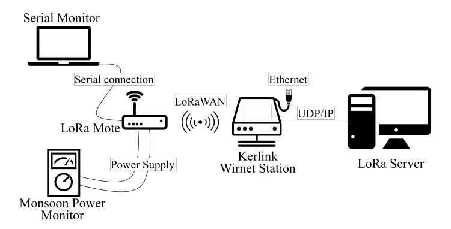
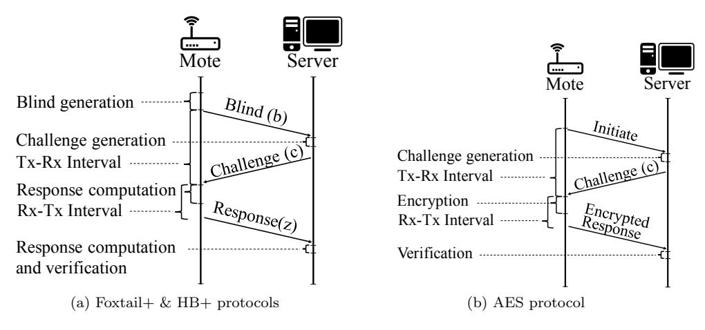
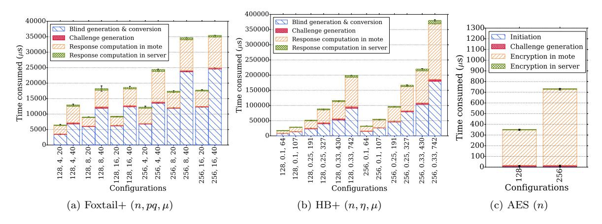
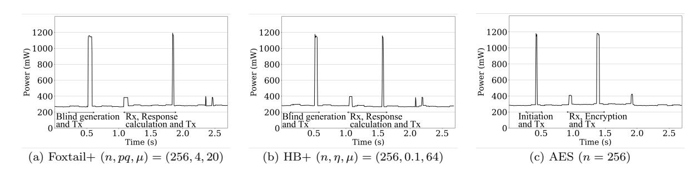
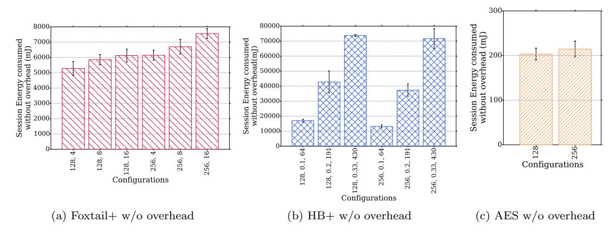
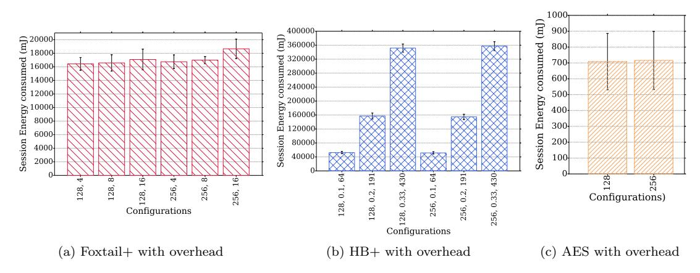
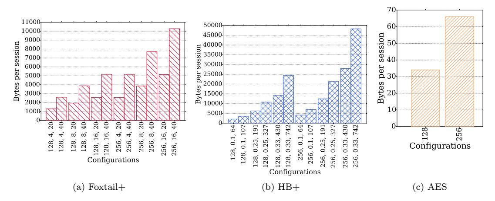
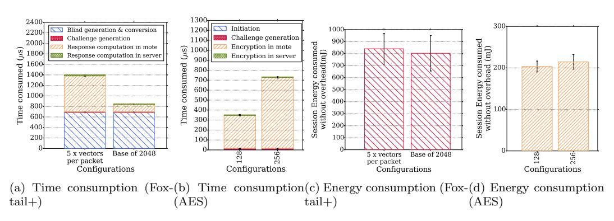

# Foxtail+: A Learning with Errors-based Authentication Protocol for Resource-Constrained Devices

Matthieu Monteiro, Kumara Kahatapitiya, Hassan Jameel Asghar∗ , Kanchana Thilakarathna, Thierry Rakotoarivelo, Dali Kaafar, Shujun Li, Ron Steinfeld, and Josef Pieprzyk †‡§¶k∗∗††

February 25, 2020

#### Abstract

This paper presents Foxtail+, a new shared-key protocol to securely authenticate resource constrained devices, such as Internet of things (IoT) devices. Foxtail+ is based on a previously proposed protocol to authenticate unaided humans, called the Foxtail protocol, which we modify for authenticating resource constrained devices. It uses a computationally lightweight function, called the Foxtail function, which makes it ideal for IoT nodes with low memory, computational, and/or battery resources. We introduce a new family of functions based on the Foxtail function, analyze its security in terms of the number of samples required to obtain the secret, and demonstrate how it is connected with the learning with rounding (LWR) problem. We then build the Foxtail+ protocol from this function family, secure against active adversaries. Finally, we implement and experimentally evaluate the performance of Foxtail+ against a similar alternate protocol, i.e., the modified version of the Hopper and Blum protocol called HB+, and a block cipher based protocol instantiated with AES. The experiments are run on an IoT device connected to a LoRa network which is an IoT specific Low-Power Wide-Area Network (LPWAN). We show that Foxtail+ outperforms HB+ in terms of overall communication and energy cost, and its parallel implementation is comparable to the AES-based protocol in terms of time and energy consumption. To our knowledge, we provide the first implementation of any member of the HB+ family of protocols that directly compares its performance against an AES-based protocol in terms of time and power consumption. Our experiments shed new light on some of the limitations of identification protocols based on lightweight primitives, of which Foxtail+ is a member, over block cipher based protocols.

Keywords— Identification protocols, human identification protocols, HB+ protocol, learning with errors, AES

## 1 Introduction

Beginning with the seminal work of Matsumoto and Imai [\[40\]](#page-17-0), a series of shared-key challenge-response protocols have been proposed to authenticate unaided humans to a server secure against an eavesdropping adversary [\[31,](#page-17-1) [37,](#page-17-2) [5,](#page-16-0) [14\]](#page-16-1). The goal of these human identification protocols [\[40\]](#page-17-0) is to replace the pervasive password-based authentication which is obviously insecure under observation. The protocols require the human user to mentally compute a function of the challenge and the shared secret, which for usability, needs to be lightweight. After some initial ad hoc designs, Hopper and Blum [\[31\]](#page-17-1) constructed a protocol, known as the HB protocol, whose security is based on the NP-Hard problem of learning parity in the presence of noise (LPN). Briefly, the protocol involves computing the dot product

∗Corresponding Author

†M. Monteiro, and K. Kahatapitiya were with Data61, CSIRO, Australia, at the time of writing this paper. E-mail: matthieu.monteiro5@gmail.com, kumara0093@gmail.com

‡H. J. Asghar and D. Kaafar are with Data61, CSIRO, Australia and Macquarie University, Australia. E-mail: {hassan.asghar, dali.kaafar}@mq.edu.au.

§T. Rakotoarivelo is with Data61, CSIRO, Australia. E-mail: thierry.rakotoarivelo@data61.csiro.au.

¶K. Thilakarathna is with University of Sydney, Australia. E-mail: kanchana.thilakarathna@sydney.edu.au.

kS. Li is with University of Kent, UK. E-mail: s.j.li@kent.ac.uk.

∗∗R. Steinfeld is with Monash University, Australia. E-mail: ron.steinfeld@monash.edu.

††J. Pieprzyk is with Data61, CSIRO, Australia, Polish Academy of Sciences, Poland and Queensland University of Technology, Australia. E-mail: josef.pieprzyk@qut.edu.au.

modulo 2 of a binary challenge vector with a binary secret vector, and then with a fixed probability  $\eta < \frac{1}{2}$ , flipping the response bit. Subsequently, Juels and Weis [33] suggested modifying human identification protocols for authenticating resource-constrained devices, e.g., radio frequency identification (RFID) tags, noting similarities between the two, such as low memory, and communication and computational power. They modified the HB protocol, and proposed a new protocol, which they called HB+, secure under active adversaries.

Since the introduction of HB+, many researchers have proposed modified versions of HB+ to provide security against stronger (active) adversarial models or to improve the efficiency of HB+ [43, 26, 30]. However, little focus has been given to exploring other human identification protocols for their use in authenticating resource constrained devices. Juels and Weis [33] left investigating the security of the other protocol proposed by Hopper and Blum, namely the sum of k mins protocol, as an open problem. A modified version of the protocol, named sum of kproducts was proposed in [6] as a protocol for resource constrained devices. But this protocol is only conjectured to be secure against passive adversaries. Similarly, Catuogno and Galdi [19] proposed a different protocol which is also intended for resource constrained devices. Apart from the fact that the protocol is again only intended to be secure under passive adversaries, it is only secure for limited identification sessions before the secret can be retrieved by the eavesdropper [7]. In this paper, we propose a new protocol to authenticate resource constrained devices, such as RFID tags and Internet of things (IoT) devices, secure against active adversaries. The protocol is based on the human identification protocol called the Foxtail protocol [37, 4]. The key ingredient in the protocol is the Foxtail function which, given a binary secret vector and a challenge vector with elements from  $\mathbb{Z}_4$ , computes the dot product modulo 4, and then floors the result after division by 2. We modify the original Foxtail protocol to make it secure against active adversaries loosely based on the design of HB+ [33]. Due to the deterministic nature of the Foxtail function. the resulting protocol has at least one significant advantage over HB+; namely, the number of challenge-response rounds required to achieve a desired security level against random guesses is far less than the HB+ protocol. Our main contributions are summarized as follows.

- We propose a family of functions based on the Foxtail function [37, 4], parameterized by the divisor p and modulus pq, where  $p, q \ge 2$  are integers. We then show how a function from this family can be represented as a degree p polynomial in n unknowns, where n is the security parameter. We then show how the linearization attack from Arora and Ge [3] requires at least  $O(n^p)$  challenge-response pairs to find the secret vector.
- We propose a new protocol secure against active adversaries based on the Foxtail function, which we call Foxtail+. The design is loosely based on the HB+ protocol, and consequently its security is based on only detecting active adversarial intervention. Once the adversary is detected, subsequent protocol execution can be stopped until shared keys are renewed and/or any other necessary steps are taken. This is obviously a weaker model than a prevention model where protocol execution may continue even in the presence of active adversaries. Nevertheless, just as the subsequent research on variants of HB+, future research may produce more robust versions of the protocol secure against stronger adversarial models including man-in-the-middle adversaries. The main advantage of our protocol over HB+ (and its variants), is the reduced number of rounds or number of challenges per authentication session. This results in less computational and communication complexity, which will in turn increase the life span of resource constrained devices due to significant reduction in energy consumption.
- We implement the HB+ and Foxtail+ protocols and benchmark them against an Advanced Encryption Standard (AES) based authentication protocol, which we call the AES protocol. In the AES protocol, the server sends the device a random number as a challenge. The device encrypts it using the shared key, and is authenticated if the decrypted number matches the challenge [23]. We implemented the three protocols on a Low-Power Wide-Area Network (LPWAN) test bed consisting of a low-power sensor node (whose identity needs to be verified) and a server communicating via the low-power communication protocol, LoRa [48]. While this sensor node is not as resource constrained as RFID tags, we remark that lightweight cryptographic protocols are still beneficial for such devices as they free up resources for other functionalities and potentially increase the life time of battery-powered devices.
- We extensively analyze the time consumption, communication complexity, and energy consumption of the HB+, Foxtail+ and AES protocols. Our findings show that Foxtail+ outperforms HB+ in terms of overall communication and energy cost, with 10-fold and 20-fold gain, respectively. This is mainly due to the significantly reduced number of rounds in Foxtail+ per authentication session. Not surprisingly, our experiments indicate that the AES protocol outperforms the sequential implementation of the two protocols in all three areas by some orders of magnitude, as it only requires one round of communication. However, we show that by using a semi-parallel implementation and by tuning the parameters p and q of Foxtail+, we can nearly match the energy consumption of the AES protocol. The main performance bottleneck is power consumed due to transmission, which is influenced by packet size limits imposed by the LoRa protocol. Thus deploying Foxtail+ over communication protocols with a more liberal packet size limit will yield better power usage.

To our knowledge, this is the first implementation of the AES and HB family of protocols that compares the performance of the two in terms of both time and power consumption.

• Finally, we suggest parameter sizes for Foxtail+ based on the work of [1] on the computational complexity of Gröbner basis algorithms [18, 20] which allows us to lower bound the number of rounds for which the Foxtail+ secret can be used.

There is some debate around the relative merits of identification protocols built from lightweight cryptographic primitives, e.g., the HB family of protocols, over block cipher based identification protocols, e.g., the AES protocol described above [2, 13, 30]. Breaking the latter class of protocols can be shown to be as hard as distinguishing the given block cipher from a truly random permutation [13]. This security notion, i.e., modelling a block cipher as a pseudo random permutation (PRP), is widely assumed to hold for block ciphers such as AES as evidenced by extensive cryptanalysis [13]. The HB class of protocols is generally promoted as being provably secure. However, in principle, the security is based on the assumed hardness of some underlying problem, i.e., the LPN problem. Thus, some researchers have cast doubt over the distinction of the two class of protocols on the basis of being provably secure [13]. The same argument applies to our proposed protocol. From the practical side, it is argued that AES requires a larger code size and gate count than HB-based protocols [33, 30]. However, AES-based protocols have reduced round complexity, e.g., only one round in our experimental AES-based protocol. This means reduced power consumption due to less transmissions, a major bottleneck for resource constrained devices and the communication protocols they implement. Another drawback shared by the HB-based protocol (by the authenticating device).

In spite of all this, we argue that constructing identification protocols from lightweight primitives is an important goal since it could eventually lead to protocols that surpass the qualities of block cipher based identification protocols. Furthermore, it encourages extensive cryptanalysis of new cryptographic primitives which increase our understanding of their security properties. These primitives in turn can also be used as building blocks of more complex cryptographic protocols, such as symmetric encryption based on the LPN problem [27]. Our work furthers research in this area in many ways, including: (a) by introducing Foxtail+ as the first protocol outside the HB family of protocols for authenticating resource-constrained devices derived from a human identification protocol; (b) by introducing new theoretical results on the Foxtail family of functions; and (c) by undertaking experimental evaluation of the HB+, Foxtail+ and the AES-based protocols which can provide valuable insights as it allows direct comparison of the protocols using the same reference implementation; a feature that is lacking in prior work.

Paper Organisation. In the rest of the paper, we first provide background on the Foxtail protocol, the HB+ protocol, and the AES protocol in Section 2. In Section 3, we analyse in detail the Foxtail function to be used in our protocol, proposing a generalisation and showing how the secret can be learned by observing input (challenges) and output (responses) from this function through linearization. We then propose the Foxtail+ protocol and discuss its security against active adversaries in Section 4. In Section 5, we describe our experimental test bed and setup for the three protocols. Section 6 describes in detail the results of our evaluation. In Section 7, we suggest parameter choices for Foxtail+ in light of the complexity of Gröbner basis algorithms. We discuss related work in Section 8, and limitations and avenues for future work in Section 9. We conclude in Section 10.

## 2 Background

### 2.1 Notations

The notation  $\mathbb{Z}_p^n$  denotes the set of n-element vectors with elements from  $\mathbb{Z}_p$ . For integers p and q,  $(q)\mathbb{Z}_p$  denotes the subset of  $\mathbb{Z}_p$  obtained by multiplying each element of  $\mathbb{Z}_p$  by q and reducing the result modulo p. The dot product  $\langle \mathbf{a}, \mathbf{b} \rangle_p$  modulo a positive integer  $p \geq 2$  shall be denoted by  $\langle \mathbf{a}, \mathbf{b} \rangle_p$ . The notations  $\lfloor \cdot \rfloor$  and  $\lfloor \cdot \rceil$  denote, respectively, the floor and the nearest integer functions. The notations  $\lfloor x \rfloor_p$  (respectively,  $\lfloor x \rceil_p$ ) denote the function  $\lfloor x/p \rfloor$  (respectively,  $\lfloor x/p \rceil$ ). We denote by  $\lfloor n \rfloor$  all integers between 1 and n inclusive. The notation  $u \leftarrow_{\$} U$ , means sampling a member of the set U uniformly at random. We define an identification protocol as a protocol between a verifier V and a prover P through which V ascertains the claimed identity of P. Our focus is on symmetric identification protocols in which a shared-key is established beforehand through a registration phase. The adversary will be denoted by  $\mathcal{A}$ , and will only be allowed access to the sessions of the identification protocol (and not to the registration phase).

#### 2.2 The Foxtail Protocol

Let  $\mathbf{x} \in \mathbb{Z}_2^n$  be the secret vector. The Foxtail function, first described by Li and Shum [37] and later modified by Asghar et al. [4], denoted ft, is defined as follows:

$$ft(\mathbf{c}, \mathbf{x}) = \lfloor \langle \mathbf{c}, \mathbf{x} \rangle_4 \rfloor_2, \tag{1}$$

where  $\mathbf{c} \in \mathbb{Z}_4^n$ . The function essentially maps  $\{0,1\} \mapsto 0$  and  $\{2,3\} \mapsto 1$ . Based on this function, an identification protocol is proposed in [37, 4] as a human identification protocol, meaning that the computations of the prover P are (mentally) done by a human equipped with a device. The device itself is passive in the sense that it does not compute any protocol steps. Its function is to apply a (public) transformation to a challenge from V to display it to P. The protocol consists of several rounds (iterations) of the basic round shown below.

### Foxtail Protocol(n)

**Input:** Prover (P) and Verifier (V) share secret  $\mathbf{x}$ .

- 1: V sends challenge  $\mathbf{c} \leftarrow_{\$} \mathbb{Z}_4^n$  to  $\mathsf{P}$ .
- 2: P sends response  $z \leftarrow \mathsf{ft}(\mathbf{c}, \mathbf{x})$  to V.

After a specified number of rounds  $\mu$ , V accepts P if all responses are correct. Note that an adversary has a non-zero probability of being accepted by randomly guessing the response. We call this the probability of *false acceptance*, and denote it by  $p_{\rm FA}$ . In the above protocol, we have  $p_{\rm FA}=2^{-\mu}$ .

### 2.3 The HB+ Protocol

The HB+ protocol from [33], based on the HB protocol [31], requires two secrets  $\mathbf{x}, \mathbf{y} \in \mathbb{Z}_2^n$  shared between P and V. Let  $\eta \in (0, \frac{1}{2})$ . A single round of the protocol is described below.

### HB+ $Protocol(\eta, n)$

Input: Prover (P) and Verifier (V) share secrets x, y.

- 1: P sends the blind  $\mathbf{b} \leftarrow \mathbb{Z}_2^n$  to  $\mathsf{V}$ .
- 2: V sends challenge  $\mathbf{c} \leftarrow_{\$} \mathbb{Z}_2^n$  to P.
- 3: P samples  $v \leftarrow \{0, 1 \mid \Pr(v = 1) = \eta\}$ .
- 4: P sends response  $z \leftarrow \langle \mathbf{c}, \mathbf{x} \rangle_2 \oplus \langle \mathbf{b}, \mathbf{y} \rangle_2 \oplus v$  to V.

At the heart of the security of the above protocol, is the LPN problem: Let  $L_{\mathbf{x},\eta}$  be the distribution  $\{\mathbf{c} \leftarrow \mathbb{Z}_2^n; v \leftarrow \{0,1 \mid \Pr(v=1)=\eta\} : (\mathbf{c}, \langle \mathbf{c}, \mathbf{x} \rangle_2 \oplus v)\}$ . We also denote by  $L_{\mathbf{x},\eta}$  the oracle which outputs independent samples from this distribution. An algorithm  $\mathcal{A}$  is said to  $(t,r,\delta)$ -solve the LPN problem if  $\Pr[\mathbf{x} \leftarrow \mathbb{Z}_2^n : \mathcal{A}^{L_{\mathbf{x},\eta}}(1^n) = \mathbf{x}] \geq \delta$ , where  $\mathcal{A}$  runs in time at most t and asks r oracle queries. Asymptotically, the LPN problem is hard if every probabilistic polynomial time adversary  $\mathcal{A}$  has success probability negligible in n [34]. To prove the security of the HB+ protocol, Juels and Weis [33] first show a reduction from the LPN problem to attacking the HB protocol (assuming an eavesdropping adversary). The HB protocol is different from the above in that we do not have the blinding factor  $\mathbf{b}$ , and there is only one shared secret  $\mathbf{x}$  between  $\mathsf{P}$  and  $\mathsf{V}$ . They then reduce attacking the HB protocol by a passive adversary to attacking the HB+ protocol by an active adversary [33]. The security reductions are improved in [34] which shows the security of HB+ under parallel and concurrent execution. Notice that the probability of a random guess attack on the HB protocol is much higher than the Foxtail protocol. Additionally, the HB protocol may also reject the legitimate  $\mathsf{P}$  with a non-zero probability. We call this, the probability of false rejection and denote it by  $p_{\mathrm{FR}}$ . With  $\mu$  rounds, the two probabilities are [13, 25]:

$$p_{\rm FA} = \frac{1}{2^{\mu}} \sum_{i=0}^{u} {\mu \choose i}, \quad p_{\rm FR} = \sum_{i=u+1}^{\mu} {\mu \choose i} \eta^{i} (1-\eta)^{\mu-i},$$
 (2)

where  $\frac{1}{2}\mu > u > \eta\mu \in (\eta, \frac{1}{2})$  is a threshold on the number of correct responses.

### 2.4 The AES Protocol

To provide a benchmark for the HB+ and Foxtail+ protocols, we use the following block cipher based identification protocol [23], using AES as an instance. We call this the AES protocol. Before the identification protocol, a secret key k is established, which can be 128, 192 or 256 bits in length [29]. The block size of AES is fixed at 128 [29].

&lt;sup>1The modification in [4] imposes  $\mathbf{c}$  to have elements from  $\mathbb{Z}_4$  instead of  $\mathbb{Z}_2$  as in the original version [37], to provide security against frequency analysis [49, 4].

&lt;sup>2Both variants of the Foxtail function in [37, 4] assume the Hamming weight of  $\mathbf{x}$  to be restricted for ease of computations by humans. We need not consider this restriction.

#### AES Protocol(n)

**Input:** Prover (P) and Verifier (V) share key k.

- 1: V sends challenge  $c \leftarrow \{0,1\}^n$  to P.
- 2: P sends response  $z \leftarrow AES_k(c)$  to V.

Here  $AES_k$  denotes the AES encryption function. Breaking the above protocol amounts to showing that AES behaves differently from a PRP [13].3

## 3 Analysis of the Foxtail Function

Let  $F_{\mathbf{x}}$  denote both the distribution  $\{\mathbf{c} \leftarrow_{\mathbf{s}} \mathbb{Z}_{4}^{n} : (\mathbf{c}, \mathbf{ft}(\mathbf{c}, \mathbf{x}))\}$ , and the oracle which outputs samples from this distribution. After m = O(n) samples a brute-force attack of time complexity  $O(2^{n})$  can (uniquely) retrieve the secret vector  $\mathbf{x}$  (see Appendix A). A time-memory trade-off attack of complexity  $O(\binom{n}{n/2})$  can also be used to retrieve  $\mathbf{x}$  with the same sample complexity [31, 7]. However, both are exponential time algorithms. Asghar et al. [7] show a polynomial time attack on Foxtail which constructs a quadratic polynomial equation from a sample from  $F_{\mathbf{x}}$ . Through linearization, the system of quadratic equations can be polynomially solved after  $O(n^2)$  samples as follows [7]: Let  $\mathbf{c} \in \mathbb{Z}_4$  be a challenge in the Foxtail function (Eq. 1). Since each element  $c_i$  of  $\mathbf{c}$  is from  $\mathbb{Z}_4$ , we can write it as  $c_{i,0} + 2c_{i,1}$  where  $c_{i,0}, c_{i,1} \in \{0,1\}$ . Inserting this into Eq. 1 and some algebraic manipulation leads to [7]:

$$ft(\mathbf{x}, \mathbf{c}) = \left(\sum_{i} \sum_{j>i} c_{i,0} c_{j,0} x_i x_j + \sum_{i} c_{i,1} x_i\right) \bmod 2.$$

$$(3)$$

Thus, we have a degree two (quadratic) polynomial in n unknowns. Converting the  $\binom{n}{2}$  degree 2 terms into  $\binom{n}{2}$  new variables, we obtain a linear equation with  $N = \binom{n}{2} + n$  unknowns. Denote the new (unknown) vector by  $\mathbf{y}$ . As ghar et al. [7] state that after observing O(N) challenge-response pairs Gaussian elimination can be used to uniquely recover the secret  $\mathbf{x}$  through the last n elements of  $\mathbf{y}$ . No proof of this assertion is given in [7]. Here, we prove that this is indeed true with high probability. Let us denote by  $f_i(y_1, \ldots, y_N)$  the polynomial resulting from the ith call to  $F_{\mathbf{x}}$  (i.e., by adding the response  $\mathbf{ft}(\mathbf{x}, \mathbf{c}_i)$  to the above polynomial). Let us also (for the sake of convenience) re-arrange the order of the variables so that the first n variables of  $\mathbf{y}$  correspond to the elements of  $\mathbf{x}$ . In the proof, we use the following special form of Schwartz-Zippel lemma [46, 50, 3].

**Lemma 1.** Let f be a non-zero linear polynomial over  $\mathbb{Z}_2$ , i.e., of degree 1. Let  $\mathbf{y} \in \mathbb{Z}_2^N$  be a uniformly random vector. Then  $\Pr[f(\mathbf{y}) = 0] \leq \frac{1}{2}$ .

**Theorem 1.** After O(N) oracle calls to  $F_{\mathbf{x}}$ , where  $N = \binom{n}{2} + n$ , there is a polynomial in N time algorithm that can recover the secret  $\mathbf{x}$  uniquely with high probability.

Proof. The proof is essentially a simplified version of the proof of a related assertion in [3]. Let m denote the number of polynomials obtained after m oracle calls. We know that there is a vector  $\mathbf{y} \in \mathbb{Z}_2^N$ , that satisfies all m polynomial constraints (i.e.,  $f_i(\mathbf{y}) = 0$  for all  $i \in [m]$ ), namely the vector obtained from the vector  $\mathbf{x}$  through Eq. 3. Thus, there is at least one solution. We now show that any other solution is unlikely to exist. By Lemma 1, the probability of any random vector in  $\mathbb{Z}_2^N$  satisfying the ith polynomial constraint is at most 1/2. The probability that the same vector satisfies all m constraints is therefore  $\leq 2^{-m}$ . By the union bound the probability that there is a random vector in the set of all possible  $2^N$  vectors that satisfies all m constraints is then at most  $2^N 2^{-m} = 2^{N-m}$ . Let m = N + c where  $c \geq 0$ . Then, the probability bound becomes  $2^{-c}$ . Thus with high probability O(N) oracle calls will leave only the vector in  $\mathbb{Z}_2^N$  that corresponds to the target vector  $\mathbf{x}$ . Through Gaussian elimination, we can extract this vector in time polynomial in N.

Two observations are in order:

• Without the floor function, the system defined by  $\langle \mathbf{c}, \mathbf{x} \rangle_4$  can be solved for the secret using Gaussian elimination after only O(n) samples. Thus, the floor function "amplifies" the number of required samples by a factor of n. In general, let p denote the divisor and pq denote the modulus in the Foxtail function. Can the resulting generalized Foxtail function together with its response be similarly expanded into a polynomial equation with  $\approx n^{f(p)}$  terms? Here f is some polynomial. It is not clear whether the linearization method used in [7] can be generalized to answer this question. We show a different linearization method next and answer this question in the affirmative.

&lt;sup>3Since the protocol does not use the AES decryption function, the stronger notion of super PRP (SPRP) is not required for security against active adversaries [42].

• Are there (efficient) attacks when the number of samples m satisfies  $n < m < n^{f(p)}$  (or  $n < m < n^2$  in the case of the "default" Foxtail function)? A possible answer is via Gröbner basis algorithms [1]. We discuss this in Section 7.

#### 3.1 Generalization of the Foxtail Function

We first define a generalized form of the Foxtail function  $\mathsf{ft}_{p,q}:\mathbb{Z}_{pq}^n\times\mathbb{Z}_{pq}^n\to\mathbb{Z}_q$  as

$$\mathsf{ft}_{p,q}(\mathbf{x}, \mathbf{c}) = \left\lfloor \langle \mathbf{c}, \mathbf{x} \rangle_{pq} \right\rfloor_{p},\tag{4}$$

where  $p \geq 2$  and  $q \geq 2$  are integers,  $\mathbf{x} \in \mathbb{Z}_2^n$  is the secret binary vector and  $\mathbf{c} \in \mathbb{Z}_{pq}^n$  is the challenge vector. Setting p = q = 2 recovers the original Foxtail function from Eq. 1. Let  $F_{\mathbf{x}}$  now denote the distribution  $\{\mathbf{c} \leftarrow \mathbb{z}_{pq}^n : (\mathbf{c}, \mathsf{ft}_{p,q}(\mathbf{c}, \mathbf{x}))\}$  and also the corresponding oracle. Now, generalizing the conversion shown in [7, §7] for the case p = q = 2, we see that if we let  $z = \mathsf{ft}_{p,q}(\mathbf{x}, \mathbf{c})$ , the above function satisfies

$$\langle \mathbf{c}, \mathbf{x} \rangle \equiv pz + e \bmod pq, \tag{5}$$

where  $e \in \{0, 1, \dots, p-1\}$ . Presented in this way, the generalized Foxtail function can be interpreted as a variant of the learning with errors (LWE) problem [45]. The differences from the original LWE problem are the use of a binary secret vector, a small (constant) modulus pq, and the use of (bounded) uniform error. We shall return to this link in Section 3.2. For now, we note an attack strategy from Arora and Ge [3, §5] that works on LWE problems that have "structured" noise. The idea is to write a polynomial constraint on the allowed values of the noise vector. In our case, the noise vector satisfies the polynomial constraint  $f(e) = e(e-1)\cdots(e-p+1) = 0$ , from which it follows that  $f(e) = e(e-1)\cdots(e-p+1) \equiv 0 \mod pq$ . This form allows us to substitute e from Eq. 5, which gives  $\prod_{i=0}^{p-1} (\langle \mathbf{c}, \mathbf{x} \rangle - pz - i) \equiv 0 \mod pq$ . This is a degree p polynomial in n unknowns, i.e., the coordinates of  $\mathbf{x}$ . Since  $\mathbf{x}$  is a binary vector, it follows that each coordinate satisfies  $x_i^b = x_i$ , for all integers  $b \geq 1$ . Thus, the above polynomial is a multilinear polynomial in  $\leq \sum_{i=1}^p \binom{n}{i}$  distinct monomials (over the commutative ring  $\mathbb{Z}_{pq}$ ). Thus, we can index each term, i.e., monomial, by  $S \subseteq [n]$  such that  $|S| \leq p$ , which allows us to write a monomial as  $\prod_{i \in S} x_i$ . Each such monomial can be replaced by a new variable  $y_S$ , thus obtaining a linear system of equations in  $N = \sum_{i=1}^p \binom{n}{i}$  variables. Notice that this is a different linearization from the one described in [7]. For p = q = 2, this linearization results in quadratic polynomials modulo 4 instead of modulo 2.

To solve the resulting system of linear equations for a unique solution via Gaussian elimination requires at least  $O(N) = O(n^p)$  oracle calls to  $F_{\mathbf{x},p,q}$  [7]. Since we know that  $y_S = \prod_{i \in S} x_S$  is a solution, a unique solution to the above will therefore yield the secret  $\mathbf{x}$  uniquely. Since the above system of equations is over the commutative ring  $\mathbb{Z}_{pq}$ , the resulting system might not be uniquely solvable, and for Gaussian elimination to work, we would require slightly more observations than are required if the modulus was prime [7, §A.1]. However, from a security perspective the number  $N = n^p$  suffices as a lower bound on the number of required samples (for linearization attacks).

Remark. Notice that we could have also defined the Foxtail function as  $\lfloor \langle \mathbf{c}, \mathbf{x} \rangle_q / p \rfloor$ , where  $\mathbf{c} \in \mathbb{Z}_q^n$ ,  $p \geq 2$ , and  $q \geq p$  is any integer. Thus for instance, we could initialize the function with p = 2 and q = 3. However, this results in an unbalanced response distribution. With the example just mentioned, the probability of the response z = 0 is 2/3, whereas that of response z = 1 is 1/3. Barring any other security issues, this requires a corresponding increase in the number of rounds  $\mu$  required per authentication session, if this function is to be used in an identification protocol.

### 3.2 Connection with Learning with Rounding (LWR)

We first note that the Foxtail function bears close resemblance to the problem of learning with rounding (LWR) introduced by Banerjee, Peikert and Rosen [8] which is concerned with the function  $f(\mathbf{x}, \mathbf{c}) = \lfloor (p/q) \langle \mathbf{c}, \mathbf{x} \rangle_q \rceil \mod p$ . Here  $2 \leq p \leq q$ ,  $\mathbf{x} \in \mathbb{Z}_q^n$  is the secret,  $\mathbf{c} \in \mathbb{Z}_q^n$  is a public vector, and  $\lfloor \cdot \rceil$  denotes the nearest integer function. Substituting q = 4 and p = 2, we see that the function maps  $\{0,3\} \mapsto 0$  and  $\{1,2\} \mapsto 1$ . The difference from the Foxtail function is that we have a binary vector  $\mathbf{x}$  of length n, and the nearest integer function is changed to the floor function which produces a different mapping. Banerjee, Peikert and Rosen [8] show that the LWR problem is at least as hard as the LWE problem when the error rate in the latter problem is proportional to 1/p. Their proofs can also be slightly modified to apply to the Foxtail function [8]. In other words, the use of the binary secret vector and the floor function does not make the Foxtail problem any harder. However, these results require q to be at least as large as n (the security parameter). In our case, we treat pq (the modulus in Eq. 4) to be a constant independent of n. Therefore, these hardness results are not applicable to our case. Instead a different reduction from [15] which reduces the LWE problem with uniform bounded error to the LWR problem can be slightly modified to show a reduction from the former to the Foxtail problem (Definition 1). We state a modified theorem from [15]

**Theorem 2.** There is an expected polynomial time reduction R with oracle access to independent samples such that for every  $\mathbf{x} \in \mathbb{Z}_2^n - \{\mathbf{0}\}$ :

- Given oracle access to samples  $(\mathbf{c}, \langle \mathbf{c}, \mathbf{x} \rangle + e \bmod pq)$ , where  $\mathbf{c} \leftarrow \mathbb{z} \mathbb{Z}_{pq}^n$ , and  $e \leftarrow \mathbb{z} \{-(p-1), \ldots, -1, 0\}$ , outputs samples from the distribution  $(\mathbf{c}, \mathsf{ft}_{p,q}(\mathbf{x}, \mathbf{c}))$ , where  $\mathbf{c} \leftarrow \mathbb{z} \mathbb{Z}_{pq}^n$ ,
- Given oracle access to uniform samples  $(\mathbf{c}, u)$ , where  $\mathbf{c} \leftarrow \mathbb{z} \mathbb{Z}_{pq}^n$  and  $u \leftarrow \mathbb{z} \mathbb{Z}_{pq}^n$ , outputs samples from the distribution  $(\mathbf{c}, v)$ , where  $\mathbf{c} \leftarrow \mathbb{z} \mathbb{Z}_{pq}^n$  and  $v \leftarrow \mathbb{z} \mathbb{Z}_q^n$ .

In both cases, the expected running time and sample complexity of the reduction is O(p).

*Proof.* The proof is essentially the same as in [15, §4], and therefore omitted; except now the reduction R keeps querying the oracle until we see an element b within the set  $(p)\mathbb{Z}_{pq}$  from the sample  $(\mathbf{c},b)\in\mathbb{Z}_{pq}^n\times\mathbb{Z}_{pq}$  output by the oracle. In this case the reduction outputs  $(\mathbf{c},(1/p)b)\in\mathbb{Z}_{pq}^n\times\mathbb{Z}_q$ .

Since p is small in our use cases, we can view the above reduction as fairly tight. Thus, showing the Foxtail problem is easy to solve with  $\ll n^p$  samples would result in showing that the LWE instance stated in the theorem above is easy to solve with  $\ll n^p$  samples.

## 4 The Foxtail+ Protocol

A single round of the generalized Foxtail protocol (secure against passive adversaries), i.e., with parameters p and q, is a straightforward extension of the case p=q=2. Let  $\mu$  be the number of rounds in the protocol. Let  $\mathsf{P}^{\mathsf{ft}}_{\mathbf{x},\mu}$  and  $\mathsf{V}^{\mathsf{ft}}_{\mathbf{x},\mu}$  denote the prover and verifier algorithms, respectively. We shall denote the complete execution of  $\mu$  (sequential or parallel) rounds of the Foxtail protocol by  $\langle \mathsf{P}^{\mathsf{ft}}_{\mathbf{x},\mu}, \mathsf{V}^{\mathsf{ft}}_{\mathbf{x},\mu} \rangle$ , which equals 1 if and only if verifier accepts the prover. Following [33, 34], the passive adversary  $\mathcal{A}$  is a two-stage stateful adversary. In the first stage the adversary obtains r transcripts of honest executions of the Foxtail protocol, denoted by the oracle  $\operatorname{trans}^{\mathsf{ft}}_{\mathbf{x},\mu}$  (modelling eavesdropping). In the second stage,  $\mathcal{A}$  impersonates the prover by interacting with the verifier. The adversary's advantage is defined as

$$\mathrm{Adv}_{\mathcal{A}.\mathrm{ft}}^{\mathrm{passive}}(\mu) = \Pr[\mathbf{x} \leftarrow_{\!\!\! \mathbf{s}} \mathbb{Z}_2^n; \mathcal{A}^{\mathrm{trans}_{\mathbf{x},\mu}^{\mathrm{ft}}}(\mathbf{1}^n) : \langle \mathcal{A}, \mathsf{V}_{\mathbf{x},\mu}^{\mathrm{ft}} \rangle = 1].$$

This protocol is not secure against an active adversary. One possible attack is as follows: the adversary sends the ith challenge vector  $\mathbf{c}_i$  such that the ith component of  $\mathbf{c}_i$ , i.e.,  $c_{i,i}$ , is set to any element in the set  $\{p, p+1, \ldots, pq-1\}$ , and all other components to 0. If the response from the Foxtail function is non-zero, the corresponding secret bit  $x_i$  is 1, otherwise it is 0. Thus, n such constructed challenges are enough to reveal the secret. For security against active adversaries, we propose the following protocol, which we call Foxtail+:

### Foxtail+ Protocol(p, q, n)

Input: Prover (P) and Verifier (V) share secrets  $\mathbf{x}, \mathbf{y}$ .

- 1: P sends the blind  $\mathbf{b} \leftarrow \mathbb{Z}_{pq}^n$  to  $\mathsf{V}$ .
- 2: V sends challenge  $\mathbf{c} \leftarrow_{\$} \mathbb{Z}_{pq}^{n}$  to P.
- 3: P sends response  $z \leftarrow (\langle \mathbf{c}, \mathbf{x} \rangle_{pq} + \mathsf{ft}_{p,q}(\mathbf{b}, \mathbf{y})) \bmod q \text{ to V}.$

Let  $\mathsf{P}_{\mathbf{x},\mathbf{y},\mu}^{\mathrm{ft}+}$  and  $\mathsf{V}_{\mathbf{x},\mathbf{y},\mu}^{\mathrm{ft}+}$  denote the prover and verifier algorithms, respectively. Once again we consider an adversary  $\mathcal A$  running in two stages. In the first stage,  $\mathcal A$  interacts with  $\mathsf{P}_{\mathbf{x},\mathbf{y},\mu}^{\mathrm{ft}+}$  at most r times (sequentially or concurrently). In the second stage, the adversary only interacts with  $\mathsf{V}_{\mathbf{x},\mathbf{y},\mu}^{\mathrm{ft}+}$ . The adversary's advantage is defined as

$$\mathrm{Adv}^{\mathrm{active}}_{\mathcal{A},\mathrm{ft}+}(\mu) = \Pr[\mathbf{x},\mathbf{y} \leftarrow_{\$} \mathbb{Z}_2^n; \mathcal{A}^{\mathsf{pft}+}_{\mathbf{x},\mathbf{y},\mu}(1^n) : \langle \mathcal{A}, \mathsf{V}^{\mathrm{ft}+}_{\mathbf{x},\mathbf{y},\mu} \rangle = 1].$$

At the heart of the security of the Foxtail and Foxtail+ protocols is the following problem:

**Definition 1** (The Foxtail Problem). Let  $F_{\mathbf{x}}$  denote the distribution  $\{\mathbf{c} \leftarrow_{\$} \mathbb{Z}_{pq}^{n} : (\mathbf{c}, \mathsf{ft}_{p,q}(\mathbf{c}, \mathbf{x}))\}$ , as well as the corresponding oracle. An algorithm  $\mathcal{A}$  is said to  $(t, r, \delta)$ -solve the Foxtail problem if  $\Pr[\mathbf{x} \leftarrow_{\$} \mathbb{Z}_{2}^{n} : \mathcal{A}^{F_{\mathbf{x}}}(1^{n}) = \mathbf{x}] \geq \delta$ , where  $\mathcal{A}$  runs in time at most t and asks r oracle queries.

By Theorem 2, solving this problem amounts to solving the LWE problem with bounded uniform errors. In Appendix B, we show security reductions that (a) reduce solving the Foxtail problem to passively attacking the Foxtail protocol, and (b) reduce solving the Foxtail problem to actively attacking the Foxtail+ protocol.

Remark. Just as in [33, 34], the active attack model is a "detection" model rather than a "prevention" model, as the adversary is not given oracle access to the verifier during the first stage. Thus, the attack model only targets adversaries who wish to impersonate the legitimate prover. The detection model suffices in situations where once an impersonation attempt is detected, further communication is halted unless the device is replaced or the secrets are renewed.

## 5 Experimental Evaluation

We implemented Foxtail+, HB+ and AES protocols to compare their performance in terms of time consumption, power usage and transmission bandwidth on an IoT testbed. The majority of currently deployed IoT devices are resource constrained, which makes IoT an ideal domain application for Foxtail+. Our IoT testbed uses the LoRa low power communication protocol. LoRa is a physical layer protocol from Semtech [\[39\]](#page-17-15), based on its proprietary derivative of a Chirp Spread Spectrum (CSS) modulation scheme. This technique allows modulated signals to propagate long distances, thus increasing the effective range of communication. The LoRa protocol trades off low data rate with low power consumption. When operating in the unlicensed ISM band of 902-928MHz, LoRa can achieve a data rate up to 21.9 kbps [\[48\]](#page-18-0). Available open source implementations of LoRaWAN, a MAC layer protocol on top of LoRa PHY, allow researchers to experiment with various protocol aspects, and developers to create applications and deployments tailored to specific business cases. A basic LoRaWAN network consists of three main components, namely a client (a.k.a node or mote), a gateway, and a server. During a communication session, an AES-encrypted connection is made between the client and the server, while the gateway acts as a transparent data relay between the two parties.

### 5.1 Experimental Setup

Figure 1: Experimental setup

Figure [1](#page-7-1) presents our experimental setup. We assembled a LoRa testbed, which is composed of a LoRa NAMote [\[47\]](#page-18-3) 915MHz as the client, a Kerlink Wirnet Station [\[35\]](#page-17-16) as the gateway and an open-source LoRa network server [\[28\]](#page-17-17). We implemented the Foxtail+, HB+, and AES protocols on top of the LoRaWAN protocol on the client and server, i.e., these tested protocols were encapsulated as payload arrays of bytes within the LoRaWAN packets exchanged between the client and the server. A laptop was attached to the LoRa client via a serial link to monitor it, and a MONSOON[4](#page-7-2) power monitor was used to measure the client's energy consumption.

### 5.2 Implementation Decisions and Constraints

Implementation of Foxtail+ and HB+. Figure [2a](#page-8-0) describes one round of the three-way exchange of the blind b, challenge c and the response z in the two protocols implemented in our experimental setup. The blind and the challenge are generated and transmitted as arrays of random bytes, and further stored as arrays of modulus pq in case of Foxtail+ and 2 in the case of HB+. The client transmits the resulting response z to the server as a byte. At the end of a multi-round session, the server transmits its authentication decision bit (accept/reject) which, as we shall discuss below, has to be sent as a byte. In both HB+ and Foxtail+, blind generation requires a source of randomness. Due to the lack of a cryptographic pseudorandom number generator in the client device, we used the built-in function in C language for generating the blind. See Section [9](#page-15-0) for a further discussion on this.

Implementation of the AES protocol. Figure [2b](#page-8-1) describes the implementation of the AES protocol in our setup, which only requires one round per authentication session. For the AES algorithm, we used its built-in implementation provided by LoRa. The client sends an empty message (0 bytes) to initialize the process. The server replies with a challenge c, i.e., an array of random bytes. An AES-encrypted response z is sent back by the client to the server. Once again, an accept/reject message from the server is sent in the form of a byte.

4<https://www.msoon.com/>

Figure 2: Flow diagram of each round in three protocols.

Inherent constraints. Our implementation of the protocols were constrained by some technical aspects of the underlying LoRaWAN protocol including fixed intervals for data transmission and reception, minimum transmission size and maximum payload size:

- First, LoRaWAN defines fixed intervals for both data transmission (Tx) and reception (Rx) within a client. In our experimental setup, we fixed the default value of the Rx-Tx interval to 10 µs (the minimum possible), and the minimum Tx-Rx interval to 0.5s (again, the minimum possible). The Rx-Tx interval refers to the interval during which the receive window is open before opening the next transmission window. The Tx-Rx interval is defined likewise. During both intervals the device remains in the transmission or reception mode even if all data has been sent or received. We, therefore, refer to the additional time (minus the actual reception/transmission) time as LoRa-specific overhead or overhead, in short.
- Second, the client LoRaWAN library has a minimum transmission size of a byte, i.e., at least one byte needs to be sent even if the actual message size is less than a byte. Thus, we have to transmit at least a byte for the response and the authentication confirmation message at the end of a session.
- Finally, the maximum frame payload size is 250 bytes [\[48\]](#page-18-0) for the band of 902-928MHz that we used in our testbed. This needs to be taken into account when setting some of our experimental configuration, e.g., if we wish to bundle all the challenges together and send to the client at once, as we discuss in Section [6.2.](#page-12-0)

### 5.3 Configurations and Performance Metrics

### 5.3.1 Configurations

Table [1](#page-9-1) shows different protocol parameters and their values used in our experiments. We try two different number of rounds for Foxtail+: 20 and 40 (indicating different false acceptance probabilities pFA = 2−20 and pFA = 2−40 , respectively). We then computed the required rounds µ per session in HB+ to achieve an equivalent level of pFA as follows. Notice that according to Eq. [2,](#page-3-3) calculating the number of rounds in the HB+ protocol against a given level of pFA involves selecting a threshold u of the correct number of responses (without noise) which simultaneously results in a specified probability of false rejection pFR. We did this by setting pFR = 0.01, and then calculating the threshold u which would make pFA ≤ 2 −20 and ≤ 2 −40, respectively. More specifically, for pFA ≤ 2 −20, we first set the threshold to u = bµ(1 − η) − θc, for some offset θ. Starting with µ = 1, we increment µ until pFA ≤ 2 −20. We then check if this value of µ results in pFR ≤ 0.01. We optimise the threshold u by changing the offset θ until pFR is just above 0.01. Note that for Foxtail+, pFR is always 0, and therefore no decision threshold is required. The resulting procedure yields the number of rounds against different values of the noise probability η as indicated in Table [1.](#page-9-1) Comparison of these two protocols against the AES protocol is done on the basis of secret size, i.e., n.

Remark. Since AES has a fixed block size of 128, the probability of false acceptance, i.e., pFA, is 2−128, which is significantly lower than the corresponding probabilities for Foxtail+ and HB+. However, we do not have flexibility in lowering this for AES. Instead, we have used the secret size n = 128, 256 as the parameter to compare the performances of the three protocols. We acknowledge this as a drawback of our experimental results. While we can

5The quantity µ(1 − η) is the expected number of responses without noise.

| Foxtail+    |      |        | HB+         |      |            | AES |             |
|-------------|------|--------|-------------|------|------------|-----|-------------|
| Secret size | Mod  | Rounds | Secret size |      | Rounds (µ) |     | Secret size |
| (n)         | (pq) | (µ)    | (n)         | η    | 20         | 40  | (n)         |
| 128         | 4    | 20     | 128         | 0.10 | 64         | 107 | 128         |
| 256         | 8    | 40     | 256         | 0.25 | 191        | 327 | 256         |
|             | 16   |        |             | 0.33 | 430        | 742 |             |

Table 1: Different configurations of the protocols

further increase the number of rounds in HB+ and Foxtail+ to move pFA closer to 2−128, we considered pFA of 2−20 and 2−40 to be sufficient for applications requiring a detection based security model [\[22\]](#page-17-18).

### 5.3.2 Performance metrics

We adopted the following three metrics: (a) fine-grained time consumption in each protocol step, (b) energy used in each protocol step, and (c) the number of bytes exchanged. We note that CPU usage on the client is proportional to time consumed, since the client processor is single core. The individual duration for each function within the authentication round was timed, and we excluded any network propagation delay as described in Figure [2.](#page-8-3) The number of bytes transmitted in each protocol was computed using Equations [6](#page-9-2) (below), where n is the secret size, µ is the number of rounds, and pq is the modulus of the Foxtail function being used.

Foxtail+ Bytes 
$$(n, p, q, \mu) = ((n \log_2(pq)/8) \times 2 + 1) \mu + 1$$
  
HB+ Bytes  $(n, \mu) = ((n/8) \times 2 + 1) \mu + 1$   
AES Bytes  $(n) = (n/8) \times 2 + 2$  (6)

For instance, in the AES protocol we have a single byte sent by the client to initiate the process, followed by a random n-bit challenge sent via n/8 bytes, an encryption sent by the client, again via n/8 bytes, and finally a single accept/reject message sent as a byte.

## 6 Experimental Results

We first describe the results with a sequential implementation of Foxtail+ and HB+, i.e., each round consists of a single challenge from the server (after a single blind is sent by the mote) followed by a response. As we shall see, this sequential implementation is not optimal as the performance of both Foxtail+ and HB+ is many orders of magnitude inferior to the AES protocol. However, in Section [6.2](#page-12-0) we will show that through a parallel implementation, Foxtail+ can match the performance of the AES protocol. The sequential implementation serves mainly as a demonstration of the performance difference between Foxtail+ and HB+ protocols, and to highlight sources of energy and time consumption.

### 6.1 Sequential Implementation

#### 6.1.1 Time Consumption

Figure [3](#page-10-0) shows the average time consumption per session (vertical axis in scale of µs) of different configurations (horizontal axis) of the three protocols. Figures [3a](#page-10-1) and [3b](#page-10-2) show that the average time consumption in both Foxtail+ and HB+ protocols is proportional to the number of rounds. Increasing the modulus in Foxtail+ increases time consumption due to the corresponding increase in the vector size (stored as sequence of bytes) which then consumes more time for blind generation and response calculation. We have divided the process of generating blinds into two parts. The first is generating random bytes, and the second is converting them into numbers modulo the target modulus. For instance, if pq = 6, then we use the first few bits to convert to the number modulo 6, and the remaining bits for the next element in the vector. Blind generation and conversion consumes higher proportion of time in Foxtail+ as compared to HB+ since the latter only requires random bits (a random byte straightforwardly gives 8 random bits).

Due to higher processing power, time consumed for processes in the server is negligible when compared to the mote. In HB+, time consumption increases with increasing η, due to increased number of rounds per session to

Figure 3: Breakdown of time consumption per authentication session

Figure 4: Power fluctuation in a single round of authentication

achieve a target value of  $p_{\rm FA}$ . As shown in Figure 3c, almost all of the time consumed in the AES protocol is due to encryption. In all three protocols, time consumption increases with increasing secret size. From Figure 3c, we observe that every configuration of Foxtail+ is significantly better than the corresponding configuration of HB+, whereas AES outperforms both Foxtail+ and HB+. This is mainly due to the fact that AES has only a single round per authentication session, and we are comparing it with a sequential implementation of both Foxtail+ and HB+.

#### 6.1.2 Energy Consumption

Energy fluctuation of a single round, in comparable configurations of each protocol is shown in Figure 4. In all three protocols power consumption between transmissions is fairly similar. Larger peaks account for transmissions and smaller peaks are receive windows. In the LoRa protocol, the end device (Class A) opens up two receive windows after an uplink message [48]. The second receive window opens after a specified time after the first receive window. If the device receives a downlink message in the first receive window it does not open up a second receive window. In the Foxtail+ and HB+ protocols, there is no downlink message from the server after sending the response z, unless it is the last round of the authentication session, accounting for the two small peaks shown in Figures 4a and 4b. In contrast, in the AES protocol, each session has a single round, and so after each round the device receives the confirmation of authentication, and hence the second receive window is not opened. In both the Foxtail+ and HB+ protocols, blind transmission constitutes the highest number of bytes among uplinks, whereas in the AES protocol, encryption of the challenge contains the highest number of bytes among uplinks. This can be seen by observing the duration of the transmission windows.

We use the energy consumption data to come up with two representations: energy consumption with overhead (authentication and other processes) and without overhead (only processes required for authentication), From the energy consumption data, we are mainly interested in energy without overhead, i.e., energy consumed by only authentication processes. More precisely, this includes energy consumed due to transmission, opening receive windows and computing only the processes required for authentication, as shown in Figure 4. Although it is impossible to truly isolate the energy consumed by only these processes, our breakdown provides a reasonable insight into energy consumption without overhead. We only include configurations of the protocols that correspond to 20 rounds per

Figure 5: Energy without overhead due to non-authentication processes.

Figure 6: Energy with overhead due to non-authentication processes.

session for Foxtail+ for this analysis.

Figure 5 shows energy consumption without overhead. Increasing the modulus in Foxtail+ slightly increases energy consumption due to increase in vector sizes for blinds and challenges slightly extending transmission and receive window durations. In HB+, energy consumption increases significantly with increasing noise  $\eta$  as it raises the number of rounds per session. Increasing the size of the secret does not seem to have a considerable impact in terms of energy, as it only results in slight increase in the duration of transmission and receive windows. We observe that Foxtail+ is significantly better than HB+ in terms of energy consumption. However, the AES protocol has the lowest energy consumption among the three protocols due to only a single round per session. Once again, the comparison is unfair as we are using sequential implementations of Foxtail+ and HB+. In Section 6.2, we will consider hybrid (sequential plus parallel) implementations of Foxtail+ with more comparable energy consumption to the AES protocol.

Figure 6 shows the energy consumption in the three protocols with overhead. Comparing this to Figure 5 we see that the increase in energy consumption is proportional. Energy consumption without overhead refers to energy consumed due to transmission, opening receive windows and computing only the processes required for authentication, as shown in Figure 4. Although it is impossible to truly isolate the energy consumed by only these processes, our breakdown provides a reasonable insight into energy consumption without overhead.

#### 6.1.3 Bytes Transmitted

As can be observed in Figure 7, each configuration of Foxtail+ transmits less number of bytes than corresponding configurations of HB+, whereas AES transmits the least among the three protocols (being a single round protocol). As evident from Eqs. 6, Foxtail+ exchanges a higher number of bytes per round than HB+. Since HB+ has a higher number of rounds per session, the bytes transmitted per session is lower in Foxtail+.

Figure 7: Bytes transmitted per session

Figure 8: Time and energy consumption of different (semi-)parallel Foxtail+ implementations against the AES protocol.

### 6.2 Parallel Implementation of Foxtail+

In this section, we will try different implementations of Foxtail+ where multiple challenges and blinds are bundled together in a packet, as opposed to the sequential implementation in the previous sections. Furthermore, we will see the effect of increasing the size of the modulus pq by increasing q. Since the response is modulo q, increasing q will result in a smaller number of rounds required to achieve a desired  $p_{\rm FA}$ . Considering the limitations of the LoRa frame payload size, we came up with two optimum configurations which result in only two rounds per session for the Foxtail+ protocol (resulting in  $p_{\rm FA}=2^{-20}$ ). One configuration bundles five vectors of octal numbers in a single packet and the other is sending a single vector containing numbers modulo 2048 per packet, with p=2 and q=1024. These configurations contain 160 bytes and 176 bytes of data per packet, respectively. Note that the secret size is kept at 128 bits for both the configurations. It is not possible to achieve a configuration where only one round is required per session (with the constraint  $p_{\rm FA}=2^{-20}$ ), due to the maximum payload size limitation of 250 bytes.

Comparing configurations in Figure 8a with Figures 3a and 8b (which we have reproduced for easier comparison), we can observe that time consumption has significantly improved over the basic configurations of Foxtail+ and almost reaches the time consumed by the AES protocol. The reduction in time consumption is due to less number computations and function calls to generate random numbers. Comparison between Figures 8c, 5a and 8d (again reproduced for easier comparison) shows that the energy consumption is very close to the energy consumption by the AES protocol. The reduction of energy consumption is mainly due to less number of transmissions per session. This shows that had the LoRa protocol allowed a full parallel implementation (by not having a payload size limit), the performance of the corresponding implementation of Foxtail+ would be even closer to AES.

Remark. A major bottleneck for Foxtail+ in terms of time and power consumption is the generation of random bytes (to construct the blind). Streamlining this process through, for instance, true (hardware) random number

generators would significantly improve the performance of Foxtail+. See Section 9 for further discussion.

## 7 Gröbner Basis Algorithms and Parameter Sizes

To propose parameters sizes, i.e., n (key size), p (divisor), and m (maximum number of challenge-response pairs allowed for a specific key), we discuss complexity of attack algorithms in practice. For a given value p,  $O(n^p)$  gives an upper bound on m (due to linearization attacks). However, linearization is not the only possible attack. Another way of attacking the protocol is through the use of Gröbner basis algorithms [18, 20]. These algorithms can be used to solve non-linear polynomial equations with a trade off between time and sample complexity. A recent work by Albrecht et al. [1] shows how under relatively mild assumptions on the system of polynomial equations can lead to finding the secret in LWE problems (in particular, binary error LWE problems) through Gröbner basis algorithms. Their assumption is that the system of m polynomials obtained through LWE problems is min-regular [1]. Roughly, a random system of equations is assumed to behave like a semi-regular system, i.e., having only trivial algebraic dependencies [1]. For semi-regular systems, Gröbner basis can be computed in time

$$O\left(md_{\text{reg}}\binom{n+d_{\text{reg}}}{d_{\text{reg}}}\right)^{\omega}$$
, (7)

as  $d_{\rm reg} \to \infty$  [1, 11]. Here  $d_{\rm reg}$  is the degree of regularity of the semi-regular system,  $\omega < 2.39$  is the exponent in the complexity of matrix multiplication [10], and m is the number of polynomial equations. Detailed results in [1] are given for binary error LWE, but as noted in [1], these can be generalized for uniform (bounded) error LWE problems. We can similarly translate the results from [1] and related work to our problem of solving a system of degree p polynomials. A main result to this end is the following [10, 12], [9, §4.1]:

**Theorem 3.** Let C > 1 be constant. The degree of regularity of a semi-regular system of m = Cn homogeneous polynomials each of degree d in n variables behaves asymptotically like

$$d_{reg} = \phi(x_0)n - a_1 \left(-\frac{1}{2}\phi''(x_0)x_0^2n\right)^{1/3} + o(n^{1/3}), \text{ when } n \to \infty,$$

where  $\phi(x) = \frac{x}{1-x} - \frac{m}{n} \frac{dx^d}{1-x^d}$ ,  $x_0$  is the zero of  $\phi'(x)$  that minimizes  $\phi(x_0) > 0$ , and  $a_1 \approx -2.3381$  is the largest zero of the classical Airy function.

For different parameter choices of p and n, we evaluate values of m=Cn such that the resulting time complexity computed through Theorem 3 and Eq. 7 matches a given computational time bound t. For a given value of n, we will use the first two terms in Theorem 3 to obtain the corresponding value of  $d_{\text{reg}}$ , and obtain the time complexity t through Eq 7. For this we need to first compute  $\phi'(x)$ . Let m=Cn, where C>1 is a constant. After simplification we obtain

$$\phi'(x) = \frac{1}{1-x} + \frac{x}{(1-x)^2} - \frac{Cd^2x^{d-1}}{1-x^d} - \frac{Cd^2x^{2d-1}}{(1-x^d)^2}.$$
 (8)

Equating  $\phi'(x) = 0$  and simplifying gives us the degree 2d polynomial

$$x^{2d} - Cd^2x^{d+1} + 2(Cd^2 - 1)x^d - Cd^2x^{d-1} + 1 = 0.$$
 (9)

We found the 2d roots of this polynomial using numpy.roots6 which uses the companion matrix method to find the roots of the polynomial [32, §3.3]. For each real root x thus obtained, we computed  $\phi(x)$ , and chose  $x_0$  as the root that minimized  $\phi(x) > 0$ . Finally we inserted this value of  $x_0$  into  $\phi''(x)$  which would enable us to compute  $d_{\text{reg}}$ . For completeness, the polynomial  $\phi''(x)$  is given as

$$\phi''(x) = \frac{2}{(1-x)^2} + \frac{2x}{(1-x)^3} - \frac{Cd^2(d-1)x^{d-2}}{1-x^d} - \frac{Cd^2(3d-1)x^{2d-2}}{(1-x^d)^2} - \frac{2Cd^3x^{3d-2}}{(1-x^d)^3}.$$

By setting  $t=2^{100}$  as a limit for computational efficiency, we find the upper limit on the number of samples m=Cn, by evaluating Eq. 7. The results are shown in Table 2. In line with the findings in [1], with p=2 (corresponding to binary error LWE), only a small number of challenge-response rounds can be used before the complexity of computing Gröbner basis becomes feasible. However, the protocol can be used for a sizeable number of challenge-response pairs with  $p \geq 4$ . These results are not dependent on q, and thus any  $q \geq 2$  suffices as a choice.

&lt;sup>6From the NumPy package for scientific computing in Python. See http://www.numpy.org/.

| n    | p | C                      | m = Cn           | dreg      |
|------|---|------------------------|------------------------|-----------|
| 128  | 2 | 5                      | 640                    | ≈ 7.14 |
| 128  | 3 | 118                    | 15,104                 | ≈ 6.51 |
| 128  | 4 | 6,132                  | 784,896                | ≈ 5.96 |
| 128  | 5 | 722,385                | 92,465,280             | ≈ 5.33 |
| 256  | 2 | 13                     | 3,328                  | ≈ 5.76 |
| 256  | 3 | 1,056                  | 270,336                | ≈ 5.03 |
| 256  | 4 | 221,636                | 56,738,816             | ≈ 4.47 |
| 256  | 5 | 156,112,839            | 1010 × > 3.99 | ≈ 3.80 |
| 512  | 2 | 37                     | 18,944                 | ≈ 4.57 |
| 512  | 3 | 9,119                  | 4,668,928              | ≈ 4.04 |
| 512  | 4 | 7,899,384              | 109 × > 4.04  | ≈ 3.47 |
| 512  | 5 | 1010 > 4.07 × | 1013 > 2.08 × | ≈ 2.76 |
| 1024 | 2 | 100                    | 102,400                | ≈ 3.83 |
| 1024 | 3 | 76,462                 | 78,297,088             | ≈ 3.33 |
| 1024 | 4 | 286,286,677            | 1011 > 2.93 × | ≈ 2.74 |
| 1024 | 5 | 1013 > 1.58 × | 1016 > 1.62 × | ≈ 1.99 |

Table 2: Upper limit on the number of basic rounds allowed in the Foxtail+ protocol for different values of p and n. The numbers correspond to time complexity of 2100 for computing Gr¨obner basis according to Eq. [7.](#page-13-2)

Remark. We remark that these results are for polynomial equations over finite fields, and not necessarily applicable to polynomial equations over commutative rings (as in our case). However, we assume that the system of polynomials generated in our case is no easier or harder than the case with polynomials equations over finite fields. The analysis then suffices as a lower bound on security (against Gr¨obner basis algorithms). We leave it as an open problem to investigate the exact applicability of Gr¨obner basis algorithms over commutative rings.

## 8 Related Work

We restrict our focus to proposals of identification protocols for resource constrained devices. Zero-knowledge identification protocols, e.g., the Fiat-Fiet-Shamir protocol [\[22\]](#page-17-18), generally involve public-key operations, and hence even though they can be deployed on resource constrained devices [\[44\]](#page-17-20), they are expected to consume more energy. We exclude from our analysis any protocols which are not based on well defined hard problems as they have repeatedly been shown to be susceptible to attacks [\[38\]](#page-17-21). and hence are more expensive than their symmetric counterparts. Thus, even though they can be deployed on resource constrained devices [\[44\]](#page-17-20), they are expected to consume more energy. We exclude from our analysis, any protocols for resource constrained devices which are not based on any well defined underlying hard problem as they have time and again been shown to be susceptible to attacks [\[38\]](#page-17-21). One line of work is to propose new lightweight block ciphers to instantiate block cipher authentication protocols (e.g., replacing AES in the AES protocol). An example is the block cipher PRESENT [\[16\]](#page-16-18). A problem with these proposals is that their security has not been as extensively examined as that of AES, although we do remark that PRESENT itself has been extensively analysed since its inception more than 10 years ago.

As mentioned before, after the proposal of the HB+ protocol [\[33\]](#page-17-3), several variants have been proposed to improve security targeting stronger adversarial models. Examples include the HB-MP protocol [\[43\]](#page-17-4), HB++ [\[17\]](#page-16-19) and HB\* [\[21\]](#page-17-22), which were proposed to be secure against some active attacks on HB+ (not covered by the detection model) including man-in-the-middle attacks [\[24\]](#page-17-23). However, it was later found that these protocols remain insecure [\[25\]](#page-17-10). Some other variants of HB+ are proposed to improve performance of HB+, especially in terms of communication complexity. Katz, Shin and Smith [\[34\]](#page-17-9) prove the security of the parallel version of the HB+ protocol, which implies that all the blinds, challenges and responses can be "bundled" together in three rounds instead of 3µ rounds. Another example is the HB# protocol, e.g., [\[26\]](#page-17-5), which further reduces the communication complexity of HB+. The protocols from [\[36\]](#page-17-24) and the Lapin protocol [\[30\]](#page-17-6) reduce the number of message exchanges to two by deviating from the approach of generating a blind, a challenge and a response (which requires at least 3 rounds with a parallel version of the protocol [\[34\]](#page-17-9)). However these protocols and the above variants do not significantly reduce the drawback of the HB+ protocol in terms of communication cost, due to the number of challenge-response pairs required in order to achieve a given balance between false acceptance and false rejection. This means that any variant built on the LPN problem will always have this drawback, which is absent in the Foxtail+ protocol due to deterministic noise.

From an experimental point of view, to the best of our knowledge, the only other work that directly compares the performance of a proposed protocol against AES based authentication is [\[30\]](#page-17-6). However, even their experimental evaluation is limited to the execution time of protocols, and does not include analysis of power consumption due to transmission, and time consumption due to fixed delays between transmission and reception. They therefore do not analyze the extent to which the constraints inherent in communication protocols for constrained devices effect power consumption and total execution time.[7](#page-15-2)

## 9 Limitations and Open Problems

The central theme of this work is the Foxtail+ protocol based on the hardness of the Foxtail problem (Definition [1\)](#page-6-1), when the number of observed samples are less than n p , where p ≥ 2 is the divisor in the Foxtail function. However, throughout our security and experimental analysis we have made a number of simplifications which need to be further investigated before the protocol can be deployed in practice. Here, we discuss some limitations which emerge as a result.

We have shown in Section [3.2](#page-5-0) that the Foxtail problem is a form of the LWR problem, and by doing so show a reduction from the LWE problem with uniform bounded noise based on a similar reduction in [\[15\]](#page-16-13). However, the hardness results for LWE instances are tied to worst-case lattice problems which require a large modulus (linear in n) [\[41\]](#page-17-25). Thus, whether the Foxtail problem can be solved with sample complexity strictly smaller than n p for a given p ≥ 2 in polynomial time, say n + o(n), when p = 2, is an interesting open question. For this paper, we have considered Gr¨obner basis algorithms as examples of best known attacks on the Foxtail+ protocol. However, as mentioned before, these results are for polynomials over finite fields. Whether these results directly apply to polynomials over finite commutative rings is another open problem. Perhaps one way to obtain an answer to this question is to extend the Gr¨obner basis algorithms (discussed briefly in Section [7\)](#page-13-0) to work over commutative rings. Likewise, even if theoretical results only show exponential or sub-exponential time algorithms, these might still be efficient in practice and hence the general problem of solving polynomial equations over commutative rings using Gr¨obner basis needs to be further explored. The active attack model used in this paper is only a detection based model, and new variants of Foxtail+ need to be constructed under stronger active adversarial models, e.g., to provide security against the attack mentioned in [\[24\]](#page-17-23). We note that despite being a limited model it is still used for some proposed variants of HB+ [\[26\]](#page-17-5), and may be suitable for some applications.

From an implementation point of view, one major limitation of our HB+ and Foxtail+ evaluation is that the source of randomness used at the client side is not suitable for cryptographic purposes (we used the built-in function in C available for generating pseudo-random bytes). The main reason for this was the absence of a cryptographic pseudo-random generator at the device level. Having said that a software-based pseudorandom number generator is likely to consume more resources. Instead, a hardware-based truly random number generator (TRNG) is likely to be less resource intensive. The client used in our implementation (LoRa mote) does not currently have a TRNG; however future versions might implement it using different sensors as sources for entropy. Nevertheless, a practical implementation of the protocol needs to address this issue. We do note that unlike the implementation of Lapin in [\[30\]](#page-17-6), our experimental analysis has still included time/energy consumption due to blind generation at the device level. Another aspect that is left unexplored is the gate complexity of a hardware implementation of Foxtail+ versus the AES protocol. Foxtail+ is likely to have less gate complexity over AES.

Finally, our experimental results have shown that the communication protocols used by resource constrained devices impact the implementation of identification protocols like HB+ and Foxtail+ in practice by not allowing free choice of parameter sizes for maximum efficiency. These constraints include periodic transmission and reception windows, delay between consecutive receive/transmit windows, and limit on the minimum and maximum message size per transmission window. Moreover, energy is mostly consumed due to transmission thus making communication complexity a key aspect to optimize, a point that has previously been noted but not experimentally analyzed [\[30\]](#page-17-6). There is therefore a need to construct identification protocols which are designed to maximize efficiency under these constraints.

## 10 Conclusion

We have proposed a protocol named Foxtail+ for resource constrained devices and shown that it has significant advantages over several members of the HB+ family of protocols. This is based on the assumption that the underlying

7Although it is acknowledged in [\[30\]](#page-17-6), that these issues matter in actual implementations, their effects are not experimentally analyzed.

problem, which we call the Foxtail problem, is hard. We have shown a reduction from the LWE problem with uniform bounded error and small (constant) modulus to the Foxtail problem. Thus, showing that this variant of the LWE problem is hard or easy to solve will shed light on the security of our proposed protocol. We have also evaluated the two protocols against an AES based protocol on an IoT testbed, and have shown that configuring various parameters for Foxtail+ can achieve energy and time complexity closer to the AES protocol. Our experimental analysis suggests that a new approach where identification protocols are designed with constraints of real-world communication protocols of resource constrained devices will lead to better protocols in practice.

## References

- [1] Martin R. Albrecht, Carlos Cid, Jean-Charles Faug`ere, Robert Fitzpatrick, and Ludovic Perret. Algebraic Algorithms for LWE Problems. ACM Commun. Comput. Algebra, 49(2):62–62, August 2015.
- [2] Frederik Armknecht, Matthias Hamann, and Vasily Mikhalev. Lightweight authentication protocols on ultraconstrained rfids-myths and facts. In International Workshop on Radio Frequency Identification: Security and Privacy Issues, pages 1–18. Springer, 2014.
- [3] Sanjeev Arora and Rong Ge. Learning Parities with Structured Noise. Electronic Colloquium on Computational Complexity, 2010.
- [4] Hassan Jameel Asghar, Shujun Li, Ron Steinfeld, and Josef Pieprzyk. Does Counting Still Count? Revisiting the Security of Counting based User Authentication Protocols against Statistical Attacks. In NDSS, 2013.
- [5] Hassan Jameel Asghar, Josef Pieprzyk, and Huaxiong Wang. A New Human Identification Protocol and Coppersmith's Baby-step Giant-step Algorithm. In ACNS, pages 349–366, 2010.
- [6] Hassan Jameel Asghar, Josef Pieprzyk, and Huaxiong Wang. On the hardness of the sum of k mins problem. The Computer Journal, 54(10):1652–1660, 2011.
- [7] Hassan Jameel Asghar, Ron Steinfeld, Shujun Li, Mohamed Ali Kaafar, and Josef Pieprzyk. On the linearization of human identification protocols: Attacks based on linear algebra, coding theory, and lattices. IEEE Transactions on Information Forensics and Security, 10(8):1643–1655, 2015.
- [8] Abhishek Banerjee, Chris Peikert, and Alon Rosen. Pseudorandom Functions and Lattices. In EUROCRYPT '12, pages 719–737, 2012.
- [9] Magali Bardet. Etude des syst`emes alg´ebriques surd´etermin´es. Applications aux codes correcteurs et `a la cryp- ´ tographie. PhD thesis, Universit´e Pierre et Marie Curie-Paris VI, 2004.
- [10] Magali Bardet, Jean-Charles Faugere, and Bruno Salvy. On the complexity of gr¨obner basis computation of semi-regular overdetermined algebraic equations. In Proceedings of the International Conference on Polynomial System Solving, pages 71–74, 2004.
- [11] Magali Bardet, Jean-Charles Faug`ere, and Bruno Salvy. On the complexity of the F5 Gr¨obner basis algorithm. Journal of Symbolic Computation, 70:49–70, 2015.
- [12] Magali Bardet, Jean-Charles Faugere, Bruno Salvy, and Bo-Yin Yang. Asymptotic behaviour of the index of regularity of quadratic semi-regular polynomial systems. In MEGA '05, pages 1–14, 2005.
- [13] Daniel J Bernstein and Tanja Lange. Never trust a bunny. RFIDSec, 7739:137–148, 2012.
- [14] Jeremiah Blocki, Manuel Blum, Anupam Datta, and Santosh Vempala. Towards Human Computable Passwords. In ITCS '17, pages 10:1–10:47, 2017.
- [15] Andrej Bogdanov, Siyao Guo, Daniel Masny, Silas Richelson, and Alon Rosen. On the hardness of learning with rounding over small modulus. In TCC '16, pages 209–224, 2016.
- [16] Andrey Bogdanov, Lars R Knudsen, Gregor Leander, Christof Paar, Axel Poschmann, Matthew JB Robshaw, Yannick Seurin, and Charlotte Vikkelsoe. Present: An ultra-lightweight block cipher. In CHES, volume 4727, pages 450–466. Springer, 2007.
- [17] Julien Bringer, Herv´e Chabanne, and Emmanuelle Dottax. HB++: a Lightweight Authentication Protocol Secure against Some Attacks. In SecPerU '06, pages 28–33, 2006.
- [18] Bruno Buchberger. Ein Algorithmus zum Auffinden der Basiselemente des Restklassenringes nach einem nulldimensionalen Polynomideal. PhD thesis, Universitat Innsbruck, 1965.
- [19] Luigi Catuogno and Clemente Galdi. A graphical pin authentication mechanism with applications to smart cards and low-cost devices. Lecture Notes in Computer Science, 5019:16–35, 2008.
- [20] David Cox, John Little, and Donal O'shea. Ideals, Varieties, and Algorithms, volume 3. Springer, 1992.

- [21] Dang Nguyen Duc and Kwangjo Kim. Securing HB+ against GRS man-in-the-middle attack. In Institute of Electronics, Information and Communication Engineers, Symposium on Cryptography and Information Security, pages 23–26, 2007.
- [22] Uriel Feige, Amos Fiat, and Adi Shamir. Zero-knowledge proofs of identity. Journal of Cryptology, 1(2):77–94, 1988.
- [23] Martin Feldhofer, Sandra Dominikus, and Johannes Wolkerstorfer. Strong authentication for RFID systems using the AES algorithm. In CHES, volume 4, pages 357–370, 2004.
- [24] Henri Gilbert, Matthew Robshaw, and Herve Sibert. Active attack against HB+: a provably secure lightweight authentication protocol. Electronics Letters, 41(21):1169–1170, 2005.
- [25] Henri Gilbert, Matthew JB Robshaw, and Yannick Seurin. Good variants of HB+ are hard to find. In FC '08, pages 156–170, 2008.
- [26] Henri Gilbert, Matthew JB Robshaw, and Yannick Seurin. HB#: Increasing the Security and Efficiency of HB+. In EUROCRYPT '08, pages 361–378, 2008.
- [27] Henri Gilbert, Matthew JB Robshaw, and Yannick Seurin. How to encrypt with the lpn problem. In International Colloquium on Automata, Languages, and Programming, pages 679–690. Springer, 2008.
- [28] GitHub. LoRa Server, 2018.
- [29] Shafi Goldwasser and Mihir Bellare. Lecture Notes on Cryptography. Summer course "Cryptography and computer security" at MIT, 1996.
- [30] Stefan Heyse, Eike Kiltz, Vadim Lyubashevsky, Christof Paar, and Krzysztof Pietrzak. Lapin: An Efficient Authentication Protocol Based on Ring-LPN. In FSE '12, pages 346–365, 2012.
- [31] Nicholas J. Hopper and Manuel Blum. Secure Human Identification Protocols. In Asiacrypt '01, pages 52–66, 2001.
- [32] Roger A. Horn and Charles R. Johnson. Matrix Analysis. Cambridge University Press, New York, NY, USA, 2nd edition, 2012.
- [33] Ari Juels and Stephen A. Weis. Authenticating Pervasive Devices with Human Protocols. In CRYPTO '05, pages 293–308, 2005.
- [34] Jonathan Katz and Ji Sun Shin. Parallel and Concurrent Security of the HB and HB+ Protocols. In EURO-CRYPT '06, pages 73–87, 2006.
- [35] Kerlink. Wirnet Station, 2018.
- [36] Eike Kiltz, Krzysztof Pietrzak, Daniele Venturi, David Cash, and Abhishek Jain. Efficient authentication from hard learning problems. Journal of Cryptology, 30(4):1238–1275, 2017.
- [37] Shujun Li and Heung-Yeung Shum. Secure Human-Computer Identification (Interface) Systems against Peeping Attacks: SecHCI. Cryptology ePrint Archive, Report 2005/268, 2005.
- [38] Ticyan Li and Guilin Wang. Security analysis of two ultra-lightweight RFID authentication protocols. New approaches for security, privacy and trust in complex environments, pages 109–120, 2007.
- [39] Semtech LoRa. What is LoRa?, 2018.
- [40] Tsutomu Matsumoto and Hideki Imai. Human Identification through Insecure Channel. In EUROCRYPT 91, pages 409–421, 1991.
- [41] Daniele Micciancio and Chris Peikert. Hardness of sis and lwe with small parameters. In Annual Cryptology Conference, pages 21–39. Springer, 2013.
- [42] Marine Minier, Raphael C-W Phan, and Benjamin Pousse. Distinguishers for ciphers and known key attack against rijndael with large blocks. In International Conference on Cryptology in Africa, pages 60–76. Springer, 2009.
- [43] Jorge Munilla and Alberto Peinado. HB-MP: A further step in the HB-family of lightweight authentication protocols. Computer Networks, 51(9):2262–2267, 2007.
- [44] Roel Peeters and Jens Hermans. Wide Strong Private RFID Identification based on Zero-Knowledge. IACR Cryptology ePrint Archive, 2012:389, 2012.
- [45] Oded Regev. On Lattices, Learning with Errors, Random Linear Codes, and Cryptography. In STOC '05, pages 84–93, 2005.
- [46] J. T. Schwartz. Fast probabilistic algorithms for verification of polynomial identities. J. ACM, 27(4):701–717, October 1980.

- [47] Semtech. NAMote 72 wiki, 2018.
- [48] N. Sornin, M. Luis, T. Eirich, T. Kramp, and O.Hersent. LoRaWAN Specification. LoRa Alliance, 2015.
- [49] Qiang Yan, Jin Han, Yingjiu Li, and Robert H. Deng. On Limitations of Designing Leakage-Resilient Password Systems: Attacks, Principles and Usability. In NDSS '12, 2012.
- [50] Richard Zippel. Probabilistic Algorithms for Sparse Polynomials. In EUROSAM '79, pages 216–226, 1979.

## A Decreasing Number of Candidates

Let S denote the set of  $2^n-1$  possible secret vectors (minus the zero vector). Let  $S(z_1,\ldots,z_r)$  denote the set of binary vectors  $\mathbf{y} \in S$  that are consistent with responses  $z_1,\ldots,z_r$ , given challenges  $\mathbf{c}_1,\ldots,\mathbf{c}_r$ , respectively, from the Foxtail function. Let  $\mathbf{x} \in S$  be the target vector, i.e., the one that is used to compute the Foxtail function. Let C be the set of all challenges. Note that  $|C| = 4^n$ . Abusing notation, we shall denote the random variable taking values in C by C as well. Consider the set S(z), for a generic response  $z \in \{0,1\}$ . We want to know the probability  $\Pr[\mathbf{y} \in S(z)]$ . Denote by  $I_{\mathbf{y}}$  the indicator random variable which is 1 if  $\mathbf{y} \in S(z)$  and 0 otherwise. Then,  $\Pr[I_{\mathbf{x}} = 1] = 1$ , and for any  $\mathbf{y} \neq \mathbf{x}$ , we have

$$\Pr[I_{\mathbf{y}} = 1] = \sum_{\mathbf{c} \in C} \Pr[I_{\mathbf{y}} = 1 \mid C = \mathbf{c}] \Pr[C = \mathbf{c}]$$
$$= \frac{1}{4^n} \sum_{\mathbf{c} \in C} \Pr[I_{\mathbf{y}} = 1 \mid C = \mathbf{c}]. \tag{10}$$

Let k be the Hamming weight of  $\mathbf{y}$ . Without loss of generality, assume that all k ones are the first k elements in  $\mathbf{y}$ . We want to show that there are precisely 1/4 challenges in C such that  $\langle \mathbf{c}, \mathbf{y} \rangle_4 = z'$ , where  $z' \in \{0, 1, 2, 3\}$ . We have

$$\langle \mathbf{c}, \mathbf{y} \rangle \mod 4 = \sum_{i=1}^{n} c_i y_i \mod 4$$

$$= \sum_{i=1}^{k} c_i y_i \mod 4$$

$$= \left(\sum_{i=1}^{k-1} c_i y_i + c_k y_k\right) \mod 4$$

$$= \left(\sum_{i=1}^{k-1} c_i + c_k\right) \mod 4$$

$$= \left(\sum_{i=1}^{k-1} c_i \mod 4 + c_k\right) \mod 4$$

$$= (a + c_k) \mod 4$$

$$\equiv z' \mod 4,$$

where in the penultimate step  $a \in \{0, 1, 2, 3\}$ . Since  $c_k$  is generated uniformly at random from  $\{0, 1, 2, 3\}$ , it follows that z' is generated uniformly at random independent of the value of a. Thus, there is a one-to-one map from  $c_k$  to z'. Fixing  $c_k$ , there are precisely  $4^{n-1}$  possible challenges. Thus, for each z' there are precisely |C|/4 challenges in C that yield the same response under  $\mathbf{y}$ . This immediately implies that for each  $\mathbf{y}$  there are precisely |C|/2 challenges that yield the given response z from the Foxtail function. Using this result in Eq. 10, we get

$$\Pr[I_{\mathbf{y}} = 1] = \frac{1}{4^n} \cdot \frac{4^n}{2} = \frac{1}{2}.$$

From the above, we see that the expected value and variance of the indicator random variable is given as

$$E[I_y] = \frac{1}{2}, \ Var[I_y] = \frac{1}{2} \left( 1 - \frac{1}{2} \right) = \frac{1}{4}.$$

Also,  $\mathrm{E}[I_{\mathbf{x}}] = 1$ , and  $\mathrm{Var}[I_{\mathbf{x}}] = 0$ . Next, let us denote by  $I_{\mathbf{y}}(r)$  the indicator random variable that is 1 if  $\mathbf{y} \in S(z_1, \ldots, z_r)$ . Once again,  $\mathrm{Pr}[I_{\mathbf{x}}(r) = 1] = 1$ . For any  $\mathbf{y} \neq \mathbf{x}$ , since each of the r challenges are independent, it follows that

$$\Pr[I_{\mathbf{y}}(r) = 1] = \prod_{i=1}^{r} \Pr[I_{\mathbf{y}} = 1] = \frac{1}{2^{r}}.$$

From this, we get

$$\mathrm{E}[I_{\mathbf{y}}(r)] = \frac{1}{2^r}, \text{ and } \mathrm{Var}[I_{\mathbf{y}}(r)] = \frac{1}{2^r} \left(1 - \frac{1}{2^r}\right),$$

and as before  $E[I_{\mathbf{x}}(r)] = 1$ , and  $Var[I_{\mathbf{x}}(r)] = 0$ . Finally, we let X denote the size of  $S(z_1, \ldots, z_r)$ . Then, through the linearity of expectation

$$\mathrm{E}[X] = \sum_{\mathbf{y} \in S} \mathrm{E}[I_{\mathbf{y}}(r)] = \mathrm{E}[I_{\mathbf{x}}(r)] + \sum_{\mathbf{y} \in S, \mathbf{y} \neq \mathbf{x}} \mathrm{E}[I_{\mathbf{y}}(r)] = 1 + \frac{2^n - 2}{2^r}.$$

Also, note that given a challenge  $\mathbf{c}$ , the responses from each pair of secrets  $\mathbf{y}, \mathbf{y}' \in S$  are pairwise independent. Therefore,

$$\operatorname{Var}[X] = \sum_{\mathbf{y} \in S} \operatorname{Var}[I_{\mathbf{y}}(r)] = \operatorname{Var}[I_{\mathbf{x}}(r)] + \sum_{\mathbf{y} \in S, \mathbf{y} \neq \mathbf{x}} \operatorname{Var}[I_{\mathbf{y}}(r)] = \frac{2^{n} - 2}{2^{r}} \left(1 - \frac{1}{2^{r}}\right)$$

Let  $\epsilon \in \mathbb{R}$ . Then equating  $r = n + \epsilon$ , we get

$$\mathrm{E}[X] = 1 + \frac{1}{2^{\epsilon}} - \frac{1}{2^{n-1+\epsilon}} = 1 + \frac{1}{2^{\epsilon}} \left( 1 - \frac{1}{2^{n-1}} \right).$$

As  $\epsilon > 0$  grows, indicating we observe more than n challenge-response pairs, we get  $\mathrm{E}[X] = 1 + o(1)$ . Thus, we quickly converge towards the target secret. Choosing a negative  $\epsilon$ , indicating less than n observed challenge-response pairs, means that the expected value deviates exponentially from 1. From Chebyshev's inequality, assuming  $\epsilon > 0$ , we get

$$\begin{split} \Pr[X - \mathrm{E}[X] \geq t] &= \Pr\left[X - 1 + \frac{1}{2^{\epsilon}} - \frac{1}{2^{n-1+\epsilon}} \geq t\right] \\ &\leq \frac{\mathrm{Var}[X]}{t^2} \\ &= \frac{1}{2^{\epsilon}} \left(1 - \frac{2}{2^n}\right) \left(1 - \frac{1}{2^{n+\epsilon}}\right) t^{-2} \\ &\leq \frac{1}{2^{\epsilon}} \left(1 - \frac{1}{2^{n+\epsilon-1}}\right)^2 t^{-2}. \end{split}$$

This indicates that X is tightly concentrated around its mean as  $\epsilon$  grows. Thus, after r = O(n) observed challenge-response pairs we expect only the secret to be present.

## **B** Security Reductions

Our security reductions are based on the reductions on HB and HB+ from [34]. We first define the "uniform" distribution  $U_{n+1}$  as the distribution  $\{\mathbf{c} \leftarrow \mathbb{z}_{pq}^n, z \leftarrow \mathbb{Z}_q : (\mathbf{c}, z)\}$ . Lemma 3 derived from [34] shows that oracle access to  $F_{\mathbf{x}}$  is indistinguishable from oracle access to  $U_{n+1}$ . Thus hardness of the Foxtail problem implies pseudorandomness of  $F_{\mathbf{x}}$ . We first have an auxiliary lemma.

**Lemma 2.** Let  $p, q \geq 2$ . Let  $U(\mathbb{Z}_q)$  denote the uniform distribution over  $\mathbb{Z}_q$ . Then

- 1. Let  $a \in \mathbb{Z}_{pq}$ , and let  $b \leftarrow \mathbb{Z}_{pq}$ . Then  $z = \lfloor (a+b) \mod pq \rfloor_p$  is distributed as  $U(\mathbb{Z}_q)$ .
- 2. Let  $\mathbf{x} \neq \mathbf{0}$ . Let  $\mathbf{c} \leftarrow \mathbb{Z}_{pq}^n$ . Then  $z = \operatorname{ft}_{p,q}(\mathbf{c}, \mathbf{x})$  is distributed as  $U(\mathbb{Z}_q)$ .

*Proof.* For part (1), note that (a+b) mod pq is distributed uniformly at random over  $\mathbb{Z}_{pq}$  due to b. The function  $\lfloor \cdot \rfloor_p$  partitions the elements of  $\mathbb{Z}_{pq}$  into q partitions with exactly p elements in each partition. Each partition is mapped to a unique element in  $\mathbb{Z}_q$ . Thus, z is uniformly distributed over  $\mathbb{Z}_q$ .

For part (2), since  $\mathbf{x} \neq \mathbf{0}$ , there is at least one element of  $\mathbf{x}$  which is set to 1. Let this be the element  $x_j$ . Then  $c_j x_j$  is distributed as  $U(\mathbb{Z}_{pq})$  (since  $\mathbf{c} \leftarrow \mathbb{Z}_{pq}^n$ ). Then, according to part (1),  $z = \mathrm{ft}_{p,q}(\mathbf{c},\mathbf{x})$  is also distributed as  $U(\mathbb{Z}_q)$ .

**Lemma 3.** Assume there is an algorithm  $\mathcal{D}$  making r oracle queries, running in time t such that

$$\left|\Pr[\mathbf{x} \leftarrow \mathbb{Z}_2^n : \mathcal{D}^{F_{\mathbf{x}}}(1^n) = 1] - \Pr[\mathcal{D}^{U_{n+1}}(1^n) = 1]\right| \ge \delta.$$

Then there is an algorithm  $\mathcal{M}$  making  $r' = O(r\delta^{-c} \ln n)$  oracle queries running in time  $r' = O(rn\delta^{-c} \ln n)$  such that

$$\Pr[\mathbf{x} \leftarrow_{\$} \mathbb{Z}_2^n : \mathcal{M}^{F_{\mathbf{x}}}(1^n) = \mathbf{x}] \ge \delta/4,$$

where  $c > \frac{2 \ln 16 \delta}{\ln \delta}$ .

*Proof.* The proof is almost identical to the proof in [34], with some important differences. We therefore, produce the full proof here. Let  $N = O(\delta^{-c} \ln n)$ . Algorithm  $\mathcal{M}$  with oracle access to  $F_{\mathbf{x}}$  proceeds as follows:

- 1.  $\mathcal{M}$  chooses random coins  $\omega$  for  $\mathcal{D}$  and uses them for the rest of its execution.
- 2.  $\mathcal{M}$  runs  $\mathcal{D}^{U_{n+1}}(1^n;\omega)$  a total of N times to obtain an estimate p of the probability that  $\mathcal{D}$  outputs 1 when given oracle access to  $U_{n+1}$ .

- 3.  $\mathcal{M}$  obtains rN samples  $\{(\mathbf{c}_{1,j}, z_{1,j})\}_{j=1}^r, \dots, (\mathbf{c}_{N,j}, z_{N,j})\}_{j=1}^r$  from  $F_{\mathbf{x}}$ . For each  $i \in [n]$ ,  $\mathcal{M}$  does the following:
  - (a) Runs  $\mathcal{D}(1^n; \omega)$  for a total of N times, using fresh set of r samples  $\{(\mathbf{c}_j, z_j)\}_{j=1}^r$  to answer r oracle queries of  $\mathcal{D}$  for each of the N iterations. In each iteration,  $\mathcal{M}$  answers the jth oracle query of  $\mathcal{D}$  by choosing a random  $c'_j \leftarrow_{\mathbb{S}} \mathbb{Z}_{pq}$  and returning  $(\mathbf{c}'_j, z_j)$ , where  $\mathbf{c}'_j$  is the same as  $\mathbf{c}_j$  except its jth entry is replaced with  $c'_j$ .  $\mathcal{M}$  obtains an estimate  $p_i$  for the probability that  $\mathcal{D}$  outputs 1 in this case.
  - (b) If  $|p_i p| \ge \delta/4$ , set  $x'_i = 0$ , else set  $x'_i = 1$ .
- 4. Output  $\mathbf{x} = (x'_1, \dots, x'_n)$ .

Now analyzing  $\mathcal{M}$  we first note that with probability at least  $\delta/2$  over the choice of  $\mathbf{x}$  and the random coins  $\omega$ , it holds that

$$\left|\Pr[\mathcal{D}^{F_{\mathbf{x}}}(1^n;\omega)=1] - \Pr[\mathcal{D}^{U_{n+1}}(1^n;\omega)=1]\right| \ge \delta/2. \tag{11}$$

We restrict to  $\mathbf{x}$  and  $\omega$  for which the above equation holds. Conditioned on this event we show that with probability at least 1/2, algorithm  $\mathcal{M}$  outputs  $\mathbf{x}' = \mathbf{x}$ . This proves the theorem.

Using Hoeffding's inequality, we see that

$$\left| \Pr[\mathcal{D}^{U_{n+1}}(1^n; \omega) = 1] - p \right| \le \frac{\delta^{c/2}}{16},$$
 (12)

holds except with probability at most  $2\exp(-2N\delta^c/16^2)$ . By appropriately choosing the constants in  $N=O(\delta^{-c}\ln n)$ , we see that the above probability is at most  $2/n^a \le 1/n$  for large enough n, where a>1. Thus Eq. 12 holds except with probability at most 1/n. Likewise, if we let hybi denote the distribution of the answers given to  $\mathcal{D}$  in the ith iteration of steps 3(a) and 3(b), it follows that

$$\left| \Pr[\mathcal{D}^{\text{hyb}_i}(1^n; \omega) = 1] - p_i \right| \le \frac{\delta^{c/2}}{16},\tag{13}$$

except with probability at most 1/3n. Applying a union bound over Eq. 12, and Eq. 13 over all  $i \in [n]$ , we see that the corresponding equations do not hold with probability at most 1/n + 1/3. Thus, the equations hold with probability at least 1 - 1/n - 1/3 > 1/2. We assume this to be true for the rest of the proof.

To complete the proof we show that when  $x_i = 0$  then  $\text{hyb}_i = F_{\mathbf{x}}$ , and when  $x_i = 1$  then  $\text{hyb}_i = U_{n+1}$ . To see this, note that when  $x_i = 0$  then the answer  $(\mathbf{c}'_j, z_j)$  returned to  $\mathcal{D}$  is distributed exactly according to  $F_{\mathbf{x}}$ , since  $\text{ft}_{p,q}(\mathbf{c}'_j, \mathbf{x}) = \text{ft}_{p,q}(\mathbf{c}_j, \mathbf{x}) = z_j$ , and the  $c'_j$  used in  $\mathbf{c}'_j$  is random. On the other hand, if  $x_i = 1$ , according to Lemma 2,  $\text{ft}_{p,q}(\mathbf{c}'_j, \mathbf{x})$  is uniformly distributed over  $\mathbb{Z}_q$ , depending on the value of  $c_j$ , independent of  $z_j$ . Furthermore,  $z_j$  is uniformly distributed over  $\mathbb{Z}_q$  according to Lemma 2. Therefore, the distribution  $\text{hyb}_i$  in this case is exactly distributed as  $U_{n+1}$ .

Thus, according to Eq. 11, if  $x_i = 0$  then

$$\begin{aligned} & \left| \Pr[\mathcal{D}^{\text{hyb}_i}(1^n; \omega) = 1] - \Pr[\mathcal{D}^{U_{n+1}}(1^n; \omega) = 1] \right| \ge \delta/2. \\ \Rightarrow & \left| \Pr[\mathcal{D}^{\text{hyb}_i}(1^n; \omega) = 1] - \Pr[\mathcal{D}^{U_{n+1}}(1^n; \omega) = 1] \right. \\ & \left. + p - p + p_i - p_i \right| \ge \delta/2. \\ \Rightarrow & \left| p_i - p \right| \ge \delta/2 - \left| \Pr[\mathcal{D}^{\text{hyb}_i}(1^n; \omega) = 1] - p_i \right| \\ & - \left| \Pr[\mathcal{D}^{U_{n+1}}(1^n; \omega) = 1] - p \right| \end{aligned}$$

by the triangle inequality. Using Eqs. 12 and 13, we get

$$|p_i - p| \ge \frac{\delta}{2} - \frac{\delta^{c/2}}{8},$$

which is greater than 0 for the choice of c in the statement of the lemma. Therefore, through the check in step 3(b), we have  $x'_i = 0 = x_i$ . When  $x_i = 1$ , then

$$\Pr[\mathcal{D}^{\mathrm{hyb}_i}(1^n;\omega)=1] = \Pr[\mathcal{D}^{U_{n+1}}(1^n;\omega)=1],$$

and we get

$$\begin{aligned} &|p_i - p| \\ &= \left| p_i + \Pr[\mathcal{D}^{\text{hyb}_i}(1^n; \omega) = 1] - \Pr[\mathcal{D}^{\text{hyb}_i}(1^n; \omega) = 1] - p_i \right| \\ &\leq \left| \Pr[\mathcal{D}^{U_{n+1}}(1^n; \omega) = 1] - p \right| + \left| \Pr[\mathcal{D}^{\text{hyb}_i}(1^n; \omega) = 1] - p_i \right| \\ &= \frac{\delta^{c/2}}{8}. \end{aligned}$$

Once again through the check in step 3(b), we have  $x_i'=1=x_i$ , and this holds for all  $i\in[n]$ . Therefore,  $\mathbf{x}'=\mathbf{x}$ . Note that  $\delta/4$  used in step 3(b), is the middle value between  $\frac{\delta}{2}-\frac{\delta^{c/2}}{8}$  and  $\frac{\delta^{c/2}}{8}$ .

Remark. Since the Foxtail problem is solvable in polynomial time after  $O(n^p)$  samples, we need a tighter bound on the number of queries  $r' = O(r\delta^{-c} \ln n)$  in the statement of the above lemma; hence the introduction of the parameter c. For large advantages  $\delta$ , c can be much smaller than 2, hence not "blowing up" the number of queries required in the reduction beyond  $O(n^p)$  (when instantiated with concrete parameter sizes).

**Theorem 4.** Suppose there is a passive adversary  $\mathcal{A}$  eavesdropping on at most r sessions of the Foxtail protocol, running in time t with advantage  $Adv_{\mathcal{A}, \mathrm{ft}}^{passive}(\mu) \geq \delta$ . Then there exists an algorithm  $\mathcal{D}$  making  $(r+1)\mu$  oracle queries, running in time O(t) such that

$$\left|\Pr[\mathbf{x} \leftarrow_{\$} \mathbb{Z}_2^n : \mathcal{D}^{F_{\mathbf{x}}}(1^n) = 1] - \Pr[\mathcal{D}^{U_{n+1}}(1^n) = 1]\right| \ge \delta - q^{-\mu}.$$

*Proof.*  $\mathcal{D}$  given oracle access to either  $F_{\mathbf{x}}$  or  $U_{n+1}$  proceeds as follows

- 1.  $\mathcal{D}$  runs the first stage of  $\mathcal{A}$ . Whenever  $\mathcal{A}$  requests a transcript,  $\mathcal{D}$  obtains  $\mu$  samples  $\{(\mathbf{c}_i, z_i)\}_{i=1}^{\mu}$  from its oracle and gives them to  $\mathcal{A}$ .
- 2. When  $\mathcal{A}$  is in the impersonation phase,  $\mathcal{D}$  again obtains  $\mu$  samples  $\{(\mathbf{c}'_i, z'_i)\}_{i=1}^{\mu}$  from its oracle.  $\mathcal{D}$  sends the challenge  $(\mathbf{c}'_1, \ldots, \mathbf{c}'_{\mu})$  to  $\mathcal{A}$ , receiving the response  $(z''_1, \ldots, z''_{\mu})$ .
- 3. If  $z_i' = z_i''$ , for all  $i \in [\mu]$ ,  $\mathcal{D}$  outputs 1, otherwise it outputs 0.

To see that this works, when  $\mathcal{D}$ 's oracle is  $U_{n+1}$ , then  $\mathcal{A}$ 's answers are correct with probability exactly  $q^{-\mu}$ . On the other hand, when  $\mathcal{D}$ 's oracle is  $F_{\mathbf{x}}$ , then the transcripts provided to  $\mathcal{A}$  are identically distributed as the real execution of the Foxtail protocol. Thus,  $\mathcal{A}$ 's advantage  $\delta$ , exactly translates to  $\mathcal{D}$ 's advantage.

**Theorem 5.** Suppose there is an adversary A interacting with  $\mathsf{P}^{\mathsf{ft}_+}_{\mathbf{x},\mathbf{y},\mu}$  for r executions in the Foxtail protocol (sequentially or concurrently), running in time t, obtaining advantage  $Adv_{A,\mathsf{ft}_+}^{active}(\mu) \geq \delta$ . Then there exists an algorithm  $\mathcal{D}$  making  $r\mu$  oracle queries running in time O(t) such that

$$\begin{aligned} & \left| \Pr[\mathbf{y} \leftarrow \mathbb{s} \, \mathbb{Z}_2^n : \mathcal{D}^{F_{\mathbf{y}}}(1^n) = 1] - \Pr[\mathcal{D}^{U_{n+1}}(1^n) = 1] \right| \\ & \geq \delta^2 - \rho(\mu, n) - q^{-\mu}, \end{aligned}$$

where  $\rho(\mu, n)$  is the probability that a collection of  $\mu$  randomly generated vectors from  $\mathbb{Z}_q^n$  are linearly dependent.

*Proof.*  $\mathcal{D}$  given oracle access to either  $F_{\mathbf{y}}$  or  $U_{n+1}$  proceeds as follows

- 1.  $\mathcal{D}$  chooses  $\mathbf{x} \leftarrow_{\$} \mathbb{Z}_2^n$ .
- 2.  $\mathcal{D}$  executes the first stage of  $\mathcal{A}$ . One round of the protocol is simulated as follows.  $\mathcal{D}$  obtains a sample  $(\mathbf{b}, z')$  from its oracle, and sends  $\mathbf{b}$  to  $\mathcal{A}$ . Upon receiving challenge  $\mathbf{c}$  from  $\mathcal{A}$ ,  $\mathcal{D}$  responds with response  $z = (\langle \mathbf{c}, \mathbf{x} \rangle_{pq} + z') \mod q$ . For parallel or concurrent execution,  $\mathcal{D}$  simply obtains  $\mu$  samples and answers in "batch."
- 3. When  $\mathcal{A}$  enters the second stage (impersonation),  $\mathcal{A}$  first sends  $\mu$  blinds  $\mathbf{b}_1, \ldots, \mathbf{b}_{\mu}$ . In response,  $\mathcal{D}$  samples random challenges  $\mathbf{c}'_1, \ldots, \mathbf{c}'_{\mu}$ , and sends them to  $\mathcal{A}$ . Upon receiving  $\mathcal{A}$ 's response  $z'_1, \ldots, z'_{\mu}$ ,  $\mathcal{D}$  rewinds  $\mathcal{A}$ , chooses another random sample of challenges  $\mathbf{c}''_1, \ldots, \mathbf{c}''_{\mu}$ , and sends them to  $\mathcal{A}$ , receiving responses  $z''_1, \ldots, z''_{\mu}$ .
- 4. Let  $z_i^- = (z_i' z_i'') \mod q$  and let  $\mathbf{z}^- = (z_1^-, \dots, z_{\mu}^-)$ . Further, let  $\hat{\mathbf{c}}_i = (\mathbf{c}_i' \mathbf{c}_i'') \mod q$ , and  $\hat{z}_i = \langle \hat{\mathbf{c}}_i, \mathbf{x} \rangle_q$ , and let  $\hat{\mathbf{z}} = (\hat{z}_1, \dots, \hat{z}_n)$ .  $\mathcal{D}$  outputs 1 if  $\mathbf{z}^- = \hat{\mathbf{z}}$ , otherwise it outputs 0.

Let us first consider the case when  $\mathcal{D}$ 's oracle is  $U_{n+1}$ . In this case, since the z' in step 2 are randomly generated, the responses z from  $\mathcal{D}$  are also random and independent of  $\mathbf{x}$ . Thus,  $\mathcal{A}$ 's view is independent of  $\mathbf{x}$  throughout this phase. For the impersonation phase, note that since  $\mathbf{c}'_i$  and  $\mathbf{c}''_i$  are independently and randomly generated over  $\mathbb{Z}_{pq}^n$ , they are also uniformly random over  $\mathbb{Z}_q^n$ , and so is their difference vector  $\hat{\mathbf{c}}_i$ . Let  $\rho(\mu, n)$  be the probability that the  $\mu$  vectors  $\{\hat{\mathbf{c}}_i\}_{i=1}^{\mu}$  are linearly dependent. If this is the case, then the vector  $\hat{\mathbf{z}}$  is uniformly distributed over  $\mathbb{Z}_q^{\mu}$  from  $\mathcal{A}$ 's point of view, and hence the probability that  $\hat{\mathbf{z}}$  equals  $\mathbf{z}^-$  is given by  $q^{-\mu}$ .

Now consider the case when  $\mathcal{D}$ 's oracle is  $F_{\mathbf{y}}$ . Then  $\mathcal{D}$  perfectly simulates the first stage of  $\mathcal{A}$ . For the second phase, the probability that  $\mathcal{A}$  successfully responds to both sets of queries  $\mathbf{c}'_1, \ldots, \mathbf{c}'_{\mu}$  and  $\mathbf{c}''_1, \ldots, \mathbf{c}''_{\mu}$  is  $\geq \delta^2$ . Now assuming that  $\mathcal{A}$  responds successfully in both cases then  $z'_1, \ldots, z'_{\mu}$  and  $z''_1, \ldots, z''_{\mu}$  are equal to the correct answers

$$(\langle \mathbf{c}'_1, \mathbf{x} \rangle_{pq} + \mathsf{ft}_{p,q}(\mathbf{b}_1, \mathbf{y})) \bmod q, \dots, (\langle \mathbf{c}'_{\mu}, \mathbf{x} \rangle_{pq} + \mathsf{ft}_{p,q}(\mathbf{b}_{\mu}, \mathbf{y})) \bmod q),$$

and

$$\left( \langle \mathbf{c}_{1}'', \mathbf{x} \rangle_{pq} + \mathsf{ft}_{p,q}(\mathbf{b}_{1}, \mathbf{y}) \right) \bmod q,$$

$$\ldots, \left( \langle \mathbf{c}_{\mu}'', \mathbf{x} \rangle_{pq} + \mathsf{ft}_{p,q}(\mathbf{b}_{\mu}, \mathbf{y}) \right) \bmod q \right),$$

respectively. For each  $i \in [\mu]$ , we see that

$$z'_{i} - z''_{i} \equiv (\langle \mathbf{c}'_{i}, \mathbf{x} \rangle_{pq} + \operatorname{ft}_{p,q}(\mathbf{b}_{i}, \mathbf{y}))$$

$$- (\langle \mathbf{c}''_{i}, \mathbf{x} \rangle_{pq} + \operatorname{ft}_{p,q}(\mathbf{b}_{i}, \mathbf{y}))(\operatorname{mod} q)$$

$$\equiv \langle \mathbf{c}'_{i}, \mathbf{x} \rangle_{pq} - \langle \mathbf{c}''_{i}, \mathbf{x} \rangle_{pq}(\operatorname{mod} q)$$

$$\equiv \langle \mathbf{c}'_{i} - \mathbf{c}''_{i}, \mathbf{x} \rangle_{pq}(\operatorname{mod} q)$$

$$\equiv \langle \hat{\mathbf{c}}_{i}, \mathbf{x} \rangle_{q}$$

$$= \hat{z}_{i}.$$

Hence  $z_i^- = \hat{z}_i$  for all i.

Remark. Note that we do not require all  $\mu$  vectors  $\hat{c}_i$  to be linearly independent (when the oracle is  $U_{n+1}$ ). This is because  $\mathcal{D}$  can always detect that the oracle is  $U_{n+1}$  if at least one of the responses from  $\mathcal{A}$  is wrong. Thus, the probability bound  $\rho(\mu, n)$  can be relaxed (to say  $\rho(\mu/2, n)$ , which is lower than the former).

&lt;sup>8This probability is given for instance in [7, §A.2, p. 28].