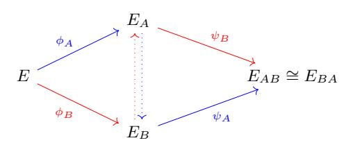

# A Note on the Ending Elliptic Curve in SIDH

Christopher Leonardi

ISARA Corporation, Waterloo, Canada chris.leonardi@isara.com

Abstract. It has been suspected that in supersingular isogeny-based cryptosystems the two ending elliptic curves computed by the participants are exactly equal. Resolving this open problem has not been pressing because the elliptic curves are known to be isomorphic, and therefore share a j-invariant which can be used as a shared secret. However, this is still an interesting independent problem as other values of the elliptic curves may be valuable as shared information as well. This note answers this open problem in the affirmative.

## 1 Introduction

In 1971 V´elu [\[1\]](#page-4-0) gave formulae for computating isogenies, rational maps between elliptic curves, given a representation of their kernel. In the initial supersingular isogeny-based key agreement protocol, SIDH [\[2\]](#page-4-1), the two parties each compute a finite sequence of isogenies during key establishment and then use the final elliptic curve in each sequence to derive a shared secret key, see Figure [1.](#page-0-0) However, it has been unclear if the two participants will compute the exact same final elliptic curves, or just elliptic curves in the same isomorphism class. The former has been suspected (with evidence from empirical tests), but only the latter was proven. For this reason, an isomorphism-class invariant (the j-invariant) has always been used instead of, say, the coefficients of the final elliptic curves. We begin by proving that the two participants will achieve the same final elliptic curves if the degrees of their isogenies are 2 and 3, respectively, and if V´elu's formulae are used. This is sufficient to show that users of the KEM SIKE will have a shared secret elliptic curve (instead of only a shared secret j-invariant).

Fig. 1: The SIDH Key Agreement Protocol

We then show the more generic result: for any two finite subgroups of E with coprime size, say G1 and G2, the two elliptic curves (E/G1) /G2 and (E/G2) /G1 are equal when Vélu's formulae are used. We conclude by noting that this proves that parties of any SIDH key-agreement protocol will have a shared final elliptic curve.

### 2 Preliminaries

The affine representation of elliptic curves will be used throughout. For  $P \in E(\overline{K})$ , we will use  $\langle P \rangle$  to denote the subgroup generated by P. Let x(P) mean the x-coordinate of P (and similar for y(P)). For an integer m, let E[m] be the subgroup of points P such that  $[m]P = \infty$ .

Vélu's 1971 formulae [1] for computing an isogeny  $\phi$  when given the domain elliptic curve  $E/\overline{K}$  and finite kernel  $G \subset E(\overline{K})$  is as follows. Let  $G_2$  be the order 2 points in  $G\setminus\{\infty\}$ . Let  $G^+$  be a set such that  $G\setminus(G_2\cup\{\infty\})=G^+\cup(-G^+)$  and  $G^+\cap(-G^+)=\{\infty\}$ . Finally, set  $G^*=G_2\cup G^+$ . Then, the isogeny  $\phi:E\to E/G$  maps a point P as

$$x(\phi(P)) = x(P) + \sum_{R \in G^*} x(P+R) - x(R), \tag{1}$$

$$y(\phi(P)) = y(P) + \sum_{R \in G^*} y(P+R) - y(R)$$
 (2)

(see Equations 12.2 and 12.3 [3, 12.16]). Note, that these equations apply to the generalized Weierstrass equation (which includes short Weierstrass, Montgomery, Hessian, etc.).

#### 3 Results

To outline the proof technique, we begin with a simple case: when the isogenies have degrees 2 and 3. However, it is not necessary for the proof of the main result.

**Lemma 1** Let E be an elliptic curve over some field K. Suppose  $K_2, K_3 \in E(\overline{K})$  have order 2 and 3, respectively. Let  $\phi_2 : E \to E_2$  be an isogeny with kernel  $\langle K_2 \rangle$ , and  $\phi_3 : E \to E_3$  an isogeny with kernel  $\langle K_3 \rangle$ . Further, let  $\phi_{2,3} : E_2 \to E_{2,3}$  be an isogeny with kernel  $\langle \phi_2(K_3) \rangle$ , and  $\phi_{3,2} : E_3 \to E_{3,2}$  an isogeny with kernel  $\langle \phi_3(K_2) \rangle$ . When computed with Vélu's formulae,  $\phi_{2,3} \circ \phi_2 = \phi_{3,2} \circ \phi_3$ .

*Proof.* We show this by proving that for any  $P \in E(\overline{K})$ , we have

$$\phi_{2,3}(\phi_2(P)) = \phi_{3,2}(\phi_3(P)).$$

By Equations 1 and 2, for an isogeny  $\phi$  with kernel R of order either 2 or 3, we can write

$$x(\phi(P)) = x(P) + x(P+R) - x(R),$$

$$y(\phi(P)) = y(P) + y(P+R) - y(R).$$

Observe,

$$x(\phi_{2,3} \circ \phi_2(P)) = x(\phi_{2,3}(x(\phi_2(P)), y(\phi_2(P)))).$$

Applying Vélu to  $\phi_{2,3}$  gives

$$x(\phi_{2,3} \circ \phi_2(P)) = x(\phi_2(P)) + x(\phi_2(P) + \phi_2(K_3)) - x(\phi_2(K_3)).$$

By the linearity of  $\phi_2$ ,

$$x(\phi_{2,3}\circ\phi_2(P))=x(\phi_2(P))+x(\phi_2(P+K_3))-x(\phi_2(K_3)).$$

Applying Vélu to  $\phi_2$  three times gives

$$x(\phi_{2,3} \circ \phi_2(P)) = (x(P) + x(P + K_2) - x(K_2))$$

$$+ (x(P + K_3) + x(P + K_3 + K_2) - x(K_2))$$

$$- (x(K_3) + x(K_3 + K_2) - x(K_2)).$$

Cancelling gives

$$x(\phi_{2,3} \circ \phi_2(P)) = x(P) + x(P + K_2) + x(P + K_3) + x(P + K_2 + K_3) - x(K_2) - x(K_3) - x(K_2 + K_3).$$

With the exact same expanding, we see that

$$x(\phi_{3,2} \circ \phi_3(P)) = x(P) + x(P + K_2) + x(P + K_3) + x(P + K_2 + K_3) - x(K_2) - x(K_3) - x(K_2 + K_3).$$

A similar argument can be given for the y-coordinate. Hence,  $\phi_{2,3}(\phi_2(P)) = \phi_{3,2}(\phi_3(P))$ . Since the domains are the same, and the images of all points are equal, the isogenies themselves must be equal (by, for instance, Cauchy interpolation).

Corollary 1 Consider the setup of SIKE key-exchange mechanism [4]. The ending elliptic curves are equal.

*Proof.* Using the notation of [2, §3.2], call the ending elliptic curves  $E_{AB}$  and  $E_{BA}$ . Decompose  $\phi_A = \phi_{A,e_A} \circ \cdots \circ \phi_{A,1}$ , where each  $\phi_{A,i}$  has degree 2. Use similar notation for  $\phi_B, \phi_A'$ , and  $\phi_B'$ , where each  $\phi_{B,i}$  has degree 3. Then repeatedly applying Lemma 1 allows us to rearrange

$$\phi_B' \circ \phi_A = \phi_{B,e_B}' \circ \cdots \circ \phi_{B,1}' \circ \phi_{A,e_A} \circ \cdots \circ \phi_{A,1}$$

into

$$\phi'_{A,e_A} \circ \cdots \circ \phi'_{A,1} \circ \phi_{B,e_B} \circ \cdots \circ \phi_{B,1} = \phi'_A \circ \phi_B.$$

This implies that  $E_{AB} = E_{BA}$ .

The formulae used in SIKE are for elliptic curves in projective coordinates. However, the equations are still derived from Vélu's formulae, and so the elliptic curves will still be equal.  $\Box$ 

We now present a more generic version of Lemma 1.

**Theorem 3.1.** Let E be an elliptic curve over some field K. Suppose  $G_0, G_1 \subset E(\overline{K})$  are finite subgroups with  $gcd(\#G_0, \#G_1) = 1$ . Let  $\phi_0 : E \to E_0$  be an isogeny with kernel  $G_0$ , and  $\phi_1 : E \to E_1$  an isogeny with kernel  $G_1$ . Further, let  $\phi_{0,1} : E_1 \to E_{0,1}$  be an isogeny with kernel  $\phi_0(G_1)$ , and  $\phi_{1,0} : E_1 \to E_{1,0}$  an isogeny with kernel  $\phi_1(G_0)$ . When computed with Vélu's formulae,  $\phi_{0,1} \circ \phi_0 = \phi_{1,0} \circ \phi_1$ .

*Proof.* We show this by proving that for any  $P \in E(\overline{K})$ , we have

$$\phi_{0,1}(\phi_0(P)) = \phi_{1,0}(\phi_1(P))$$

Let  $G_0^*$  and  $G_1^*$  be the subsets of  $G_0$  and  $G_1$  that will be used in Vélu's formulae (as described in the preliminaries). By Equations 1 and 2, for i = 0, 1 we can write

$$x(\phi_i(P)) = x(P) + \sum_{Q \in G_i^*} x(P+Q) - x(Q),$$

$$y(\phi_i(P)) = y(P) + \sum_{Q \in G_i^*} y(P+Q) - y(Q).$$

Similar to the proof of Lemma 1, observe

$$\begin{split} x(\phi_{0,1}\circ\phi_{0}(P)) &= \ x(\phi_{0,1}(x(\phi_{0}(P)),y(\phi_{0}(P)))) \\ &= \ x(\phi_{0}(P)) + \sum_{R\in G_{1}^{*}} x(\phi_{0}(P)+\phi_{0}(R)) - x(\phi_{0}(R)) \\ &= \ x(\phi_{0}(P)) + \sum_{R\in G_{1}^{*}} x(\phi_{0}(P+R)) - x(\phi_{0}(R)) \\ &= \left(x(P) + \sum_{Q\in G_{0}^{*}} x(P+Q) - x(Q)\right) \\ &+ \sum_{R\in G_{1}^{*}} \left(x(P+R) + \sum_{Q\in G_{0}^{*}} \left(x(P+R+Q) - x(Q)\right) - \left(x(R) + \sum_{Q\in G_{0}^{*}} x(R+Q) - x(Q)\right)\right) \\ &= x(P) + \sum_{Q\in G_{0}^{*}} x(P+Q) + \sum_{R\in G_{1}^{*}} x(P+R) \\ &+ \sum_{Q\in G_{0}^{*}} \sum_{R\in G_{1}^{*}} x(P+Q+R) \\ &- \left(\sum_{Q\in G_{0}^{*}} x(Q) + \sum_{R\in G_{1}^{*}} x(R) + \sum_{Q\in G_{0}^{*}} \sum_{R\in G_{1}^{*}} x(Q+R)\right). \end{split}$$

If we accept the convention that  $x(\infty) = 0$ , then we can write the simpler expression

$$x(\phi_{0,1} \circ \phi_0(P)) = \sum_{Q \in G_0^* \cup \{\infty\}} \sum_{R \in G_1^* \cup \{\infty\}} x(P + Q + R) - x(Q + R).$$

Notice this is symmetric in  $G_0^*$  and  $G_1^*$ . With the exact same expanding, we see as well that

$$x(\phi_{1,0} \circ \phi_1(P)) = \sum_{Q \in G_0^* \cup \{\infty\}} \sum_{R \in G_1^* \cup \{\infty\}} x(P+Q+R) - x(Q+R).$$

A similar argument can be given for the y-coordinate. Hence,  $\phi_{0,1}(\phi_0(P)) = \phi_{1,0}(\phi_1(P))$ . Since the domains are the same, and the images of all points are equal, the isogenies themselves must be equal.

Corollary 2 Consider the setup of the SIDH [\[2,](#page-4-1) §3.2] key-agreement protocol. When computed with V´elu's formulae, the elliptic curves EAB and EBA are equal.

A natural question to ask is if the coefficients of the elliptic curve EAB would be more practical as a seed than j(EAB) in the SIDH key-agreement protocol, public key encryption scheme, and KEM. The proofs of security [\[2,](#page-4-1) §6.1] appear to go through when this change is made, and so the protocols should remain secure.

### References

- 1. Jacques V´elu. Isog´enies entre courbes elliptiques. CR Acad. Sc. Paris., 273:238–241, 1971.
- 2. Luca De Feo, David Jao, and J´erˆome Plˆut. Towards quantum-resistant cryptosystems from supersingular elliptic curve isogenies. Journal of Mathematical Cryptology, 8(3):209–247, 2014.
- 3. Lawrence C Washington. Elliptic curves: number theory and cryptography. Chapman and Hall/CRC, 2003.
- 4. Reza Azarderakhsh, Matthew Campagna, Craig Costello, LD Feo, Basil Hess, A Jalali, D Jao, B Koziel, B LaMacchia, P Longa, et al. Supersingular isogeny key encapsulation. Round 2 Submission to the NIST Post-Quantum Standardization project, 2019.