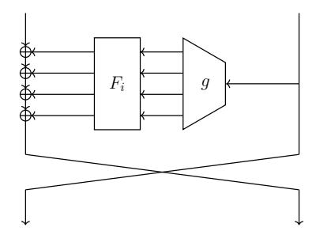
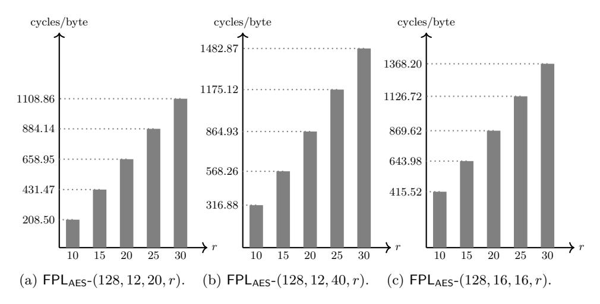

# **FPL: White-Box Secure Block Cipher Using Parallel Table Look-Ups**

Jihoon Kwon1 , Byeonghak Lee2 , Jooyoung Lee2*?* , and Dukjae Moon1

> 1 Samsung SDS, Korea {jihoon.kwon,dukjae.moon}@samsung.com 2 KAIST, Korea {lbh0307,hicalf}@kaist.ac.kr

**Abstract.** In this work, we propose a new table-based block cipher structure, dubbed FPL, that can be used to build white-box secure block ciphers. Our construction is a balanced Feistel cipher, where the input to each round function determines multiple indices for the underlying table via a *probe* function, and the sum of the values from the table becomes the output of the round function. We identify the properties of the probe function that make the resulting block cipher white-box secure in terms of weak and strong space hardness against known-space and non-adaptive chosen-space attacks. Our construction, enjoying rigorous provable security without relying on any ideal primitive, provides flexibility to the block size and the table size, and permits parallel table look-ups.

We also propose a concrete instantiation of FPL, dubbed FPLAES, using (round-reduced) AES for the underlying table and probe functions. Our implementation shows that FPLAES provides stronger security without significant loss of efficiency, compared to existing schemes including SPACE, WhiteBlock and WEM.

**Keywords:** Feistel cipher, white-box security, space hardness, provable security

# **1 Introduction**

The white-box threat model in cryptography, introduced by Chow et al. [\[9\]](#page-22-0) in 2002, assumes that the adversary is accessible to the entire information on the encryption process, and can even change parts of it at will. Numerous primitives claiming for security at the white-box model were proposed in the last few years. These primitives can be roughly divided into two classes.

The first class includes algorithms which take an existing block cipher (usually AES or DES), and use various methods (e.g., based on large look-up tables and random encodings) to obfuscate the encryption process, so that a white-box adversary will not be able to extract the secret key. Pioneered by Chow et

*?* Jooyoung Lee was supported by a National Research Foundation of Korea (NRF) grant funded by the Korean government (Ministry of Science and ICT), No. NRF-2017R1E1A1A03070248.

al. [\[9\]](#page-22-0), this approach was followed by quite a few designers. Unfortunately, most of these designs were broken by practical attacks a short time after their presentation [\[3,](#page-22-1) [14,](#page-22-2) [17\]](#page-23-0), and the remaining ones are very recent and have not been subjected to extensive cryptanalytic efforts yet.

The second class includes new cryptographic primitives designed with whitebox protection in mind. Usually such designs are based on key-dependent tables, designed in such a way that even if a white-box adversary can recover the full dictionary of such a table, it still cannot use this knowledge to recover the secret key. Stronger security notions than *key extraction hardness* are also considered in the provable security setting. In this line of research, a number of block ciphers have been proposed, including ASASA [\[4\]](#page-22-3), SPACE [\[6\]](#page-22-4), SPNbox [\[7\]](#page-22-5), WhiteBlock [\[12\]](#page-22-6), and WEM [\[8\]](#page-22-7).[3](#page-1-0) Alternatively, key generators have also been proposed that are claimed to be secure in the white-box model. In this case, an initial vector is chosen uniformly at random, and it determines the corresponding secret key via the key generator. With this key, a plaintext is encrypted using a conventional block cipher such as AES, and the resulting ciphertext is sent to the recipient together with the initial vector. This approach has been rigorously analyzed in the bounded retrieval model [\[2,](#page-22-8) [1\]](#page-21-0). However, key generators might not be suitable for protecting data at rest in any stable medium since an adversary might try to exploit the initial vector first, and then the corresponding table entries to recover the secret key.

As the white-box security notion for our construction, we will consider *space hardness* [\[6,](#page-22-4) [7\]](#page-22-5) (also called incompressibility [\[11\]](#page-22-9) and weak white-box security [\[4\]](#page-22-3)), meaning that an adversary with access to the white-box implementation cannot produce a functionally equivalent program of significantly smaller size. This property is needed, as a white-box adversary can perform code lifting, i.e., extract the entire code and use it as an equivalent secret key. While space hardness does not make code lifting impossible, it does make it harder to implement in practice. The attack models can be classified into three types: known-space attack, non-adaptive chosen-space attack and adaptive chosen-space attack (as described in Section [2](#page-3-0) in detail).

#### **1.1 Our Contribution**

In this work, we propose a new table-based block cipher construction, dubbed FPL (Feistel cipher using Parallel table Look-ups), that can be used to build white-box secure block ciphers. FPL is a balanced Feistel cipher, where the input to each round function determines multiple indices for the underlying table via a probe function, and the sum of the values from the table becomes the output of the round function (see Figure [1\)](#page-3-1). The motivation behind our design (compared to existing constructions) can be listed as follows.

**–** The block size and the table size can be chosen flexibly, compared to substitution-permutation ciphers such as SPNbox, WhiteBlock and WEM

3 Some instantiations of ASASA have been broken [\[13,](#page-22-10) [16\]](#page-23-1).

using 128-bit dedicated block ciphers as their components. For this reason, FPL might be suitable for protecting database, e.g., format preserving encryption.[4](#page-2-0)

- **–** The underlying table is easy to generate (compared to substitution-permutation ciphers) since they do not need to be bijective.
- **–** Encryption can be made faster in an environment where parallel or pipelined table look-ups are possible (compared to SPACE).

Provable security of FPL depends on the properties of the probe function; we identify such properties, dubbed *superposedness* and *linear independence*, that make the resulting block cipher white-box secure. Assuming these properties, we prove the security of FPL in terms of weak and strong space hardness against known-space and non-adaptive chosen-space attacks. Our security proof does not rely on the randomness of the probe function. On the other hand, we show that a random function satisfies the desirable properties except with negligible probability. This observation will be useful particularly when we use a pseudorandom function (e.g., a block cipher with a fixed key) to construct a probe function.

From a practical point of view, we propose a concrete instantiation of FPL, dubbed FPLAES, using (round-reduced) AES for the underlying table and probe functions. Our implementation shows that FPLAES provides stronger security without significant loss of efficiency, compared to existing schemes including SPACE, WhiteBlock and WEM. To make a fair comparison, we focused on AESbased constructions, not including SPNbox as it is a fully dedicated construction. We also remark that Lin et al. proposed an unbalanced Feistel-type white-box secure construction [\[15\]](#page-23-2), while its security has not been proved nor claimed in terms of space hardness; their security model seems to be incomparable to space hardness.

Discussion. The known-space attack models the limited control of the adversary over the platform and captures trojans, malwares and memory-leakage software vulnerability, while the chosen-space attack captures stronger adversarial ability to isolate a certain part of the underlying table and send it out via a communication channel with a limited capacity. In particular, the adaptive chosen-space attack, which is the most powerful attack, assumes an adversary with full access to the table at any time during the execution of the block cipher. However, it should be noted that strong space hardness cannot be achieved against adaptive chosen-space attacks for any (table-based) white-box design; an adversary would be able to fix an arbitrary plaintext, and exploit all the table entries needed to compute the corresponding ciphertext. As for weak space hardness of FPL against adaptive chosen-space attacks, we provides only a heuristic argument using the approach given in [\[7\]](#page-22-5).

4 It would also be possible to tweak the probe function when it is instantiated with a pseudorandom function such as AES.

Fig. 1: The *i*-th round of FPL with four table look-ups. The probe function and the secret table of the *i*-th round are denoted by g and  $F_i$ , respectively.

# 2 Preliminaries

#### 2.1 Table-based Block Cipher

(CONVENTIONAL) BLOCK CIPHER. Let  $\kappa$  and n be positive integers. An n-bit block cipher using  $\kappa$ -bit keys is a function family

$$E: \{0,1\}^{\kappa} \times \{0,1\}^{n} \to \{0,1\}^{n}$$

such that for all  $k \in \{0,1\}^{\kappa}$  the mapping  $E(k,\cdot)$  is a permutation on  $\{0,1\}^{n}$ .

Table-based Block Cipher. For positive integers s and t, a table with s-bit inputs and t-bit outputs can be viewed as a function

$$f: \{0,1\}^s \to \{0,1\}^t$$
.

By viewing this table as a key of a block cipher, we will consider a table-based  $block\ cipher$ 

$$\widetilde{E}: \mathcal{F}_{s,t} \times \{0,1\}^n \to \{0,1\}^n$$

where  $\mathcal{F}_{s,t}$  denotes the set of all functions from  $\{0,1\}^s$  to  $\{0,1\}^t$  bits, and for each  $f \in \mathcal{F}_{s,t}$  the mapping  $\widetilde{E}(f,\cdot)$  is a permutation on  $\{0,1\}^n$ . A table-based block cipher  $\widetilde{E}$  using a secret table  $f \in \mathcal{F}_{s,t}$  will be written as  $\widetilde{E}[f]$ . A main difference of a table-based block cipher from conventional ones is that  $\widetilde{E}[f]$  is assumed to make a fixed number of oracle queries (or table look-ups) to the underlying table f in its implementation. By a table-look up with an s-bit input x, f(x) will be returned.

KEYED-TABLE-BASED BLOCK CIPHER. A pair of a table-based block cipher  $\widetilde{E}$  and a family of tables

$$F:\{0,1\}^\kappa \times \{0,1\}^s \to \{0,1\}^t$$

will be called a keyed-table-based block cipher.5 Each key  $k \in \{0,1\}^{\kappa}$  defines an *n*-bit permutation  $\widetilde{E}[F(k,\cdot)]$  as in a conventional block cipher, while in its white-box implementation, the keyed table  $F(k,\cdot)$  will be stored instead of the key k.

# 2.2 Security Notions

Let  $(\tilde{E}, F)$  be a keyed-table-based block cipher. At the beginning of the attack, an adversary  $\mathcal{A}$  is allowed access to the table  $F(k,\cdot)$ , where k is chosen uniformly at random from  $\{0,1\}^{\kappa}$  and kept secret to the adversary. More precisely, we will assume that  $\mathcal{A}$  makes q oracle queries to  $F(k,\cdot)$  for a positive integer q. In this phase, we can distinguish three different types of attacks as follows.

- 1. Known-space attack (KSA):  $\mathcal{A}$  obtains q pairs of inputs and the corresponding outputs of  $F(k,\cdot)$ , namely  $(x_i, F(k,x_i))$ ,  $i=1,\ldots,q$ , where  $x_i$  are randomly chosen from  $\{0,1\}^s$  without replacement.
- 2. Non-adaptive chosen-space attack (NCSA):  $\mathcal{A}$  chooses a priori q inputs  $x_i$  and obtains the corresponding outputs  $F(k, x_i)$  for  $i = 1, \ldots, q$ .
- 3. Adaptive chosen-space attack (CSA):  $\mathcal{A}$  adaptively chooses q inputs  $x_i$  and obtains the corresponding outputs  $F(k, x_i)$  for  $i = 1, \ldots, q$ . (So  $\mathcal{A}$  is allowed to choose  $x_j$  based on the previous responses  $F(k, x_i)$ ,  $i = 1, \ldots, j 1$ .)

After making all the oracle queries to the table,  $\mathcal{A}$  is supposed to achieve a certain security goal. We will consider three different goals, defining three notions of security.

Weak Space Hardness.  $\mathcal{A}$  is given a random plaintext  $u \in \{0,1\}^n$ , and asked to encrypt  $\widetilde{E}[F(k,\cdot)](u)$ . Note that  $\mathcal{A}$  makes oracle queries to  $F(k,\cdot)$  without knowing the plaintext u. So in the definition of the adversarial advantage,  $\mathcal{A}$  consists of two phases  $\mathcal{A}_1$  and  $\mathcal{A}_2$ , where  $\mathcal{A}_1$  relays a certain state  $\sigma$  to  $\mathcal{A}_2$  after making oracle queries to the underlying table, and  $\mathcal{A}_2$  tries to find v on receipt of  $\sigma$  and v.

$$\begin{split} \mathbf{Adv}^{\mathsf{atk-wsh}}_{\widetilde{E},F}(\mathcal{A}) \\ &= \Pr\left[ k \overset{\$}{\leftarrow} \{0,1\}^{\kappa}, u \overset{\$}{\leftarrow} \{0,1\}^{n}, \sigma \leftarrow \mathcal{A}_{1}^{F(k,\cdot)}, v \leftarrow \mathcal{A}_{2}(\sigma,u) : v = \widetilde{E}[F(k,\cdot)](u) \right], \end{split}$$

where  $atk \in \{ksa, ncsa, csa\}$  represents the attack model.

STRONG SPACE HARDNESS.  $\mathcal{A}$  is asked to come up with a valid plaintext-ciphertext pair (u,v) such that  $v=\widetilde{E}[F(k,\cdot)](u)$ . The adversarial advantage is formally defined as follows: for  $\mathsf{atk} \in \{\mathsf{ksa}, \mathsf{ncsa}, \mathsf{csa}\},$ 

$$\mathbf{Adv}^{\mathsf{atk\text{-ssh}}}_{\widetilde{E},F}(\mathcal{A}) = \Pr\left[k \overset{\$}{\leftarrow} \{0,1\}^{\kappa}, (u,v) \leftarrow \mathcal{A}^{F(k,\cdot)} : v = \widetilde{E}[F(k,\cdot)](u)\right].$$

&lt;sup>5 A table-based block cipher  $\widetilde{E}$  can be regarded as keyed since each table in  $\mathcal{F}_{s,t}$  can be indexed by  $t \cdot 2^s$  bits.

KEY EXTRACTION HARDNESS.  $\mathcal{A}$  is asked to recover the secret key k. The adversarial advantage is formally defined as

$$\mathbf{Adv}^{\mathsf{atk-keh}}_{\widetilde{E},F}(\mathcal{A}) = \mathsf{Pr}\left[k \overset{\hspace{0.1em}\mathsf{\scriptscriptstyle\$}}{\leftarrow} \{0,1\}^{\kappa}, k' \leftarrow \mathcal{A}^{F(k,\cdot)} : k' = k\right].$$

For  $q, \tau > 0$  and  $(atk, sec) \in \{ksa, ncsa, csa\} \times \{wsh, ssh, keh\}$ , we define

$$\mathbf{Adv}^{\mathsf{atk-sec}}_{\widetilde{E},F}(q,\tau) = \max_{\mathcal{A}} \mathbf{Adv}^{\mathsf{atk-sec}}_{\widetilde{E},F}(\mathcal{A}),$$

where the maximum is taken over all adversaries  $\mathcal{A}$  running in time  $\tau$  and making at most q queries.

PSEUDORANDOMNESS. Later, we will consider the security of F in terms of its pseudorandomness (as a keyed function family); in this notion of security, A would like to tell apart two worlds  $F(k,\cdot)$  and a truly random function f by adaptively making (forward) queries to the function, where k is chosen uniformly at random from the key space and kept secret to A, while f is chosen uniformly at random from  $\mathcal{F}_{s,t}$ . Formally, A's distinguishing advantage is defined by

$$\mathbf{Adv}_F^{\mathsf{prf}}(\mathcal{A}) = \left| \mathsf{Pr} \left[ f \overset{\hspace{0.1em}\mathsf{\scriptscriptstyle\$}}{\leftarrow} \mathcal{F}_{s,t} : 1 \leftarrow \mathcal{A}^f \right] - \mathsf{Pr} \left[ k \overset{\hspace{0.1em}\mathsf{\scriptscriptstyle\$}}{\leftarrow} \{0,1\}^{\kappa} : 1 \leftarrow \mathcal{A}^{F(k,\cdot)} \right] \right|.$$

For  $q, \tau > 0$ , we define

$$\mathbf{Adv}_F^{\mathsf{prf}}(q,\tau) = \max_{\mathcal{A}} \mathbf{Adv}_F^{\mathsf{prf}}(\mathcal{A}),$$

where the maximum is taken over all adversaries  $\mathcal A$  running in time  $\tau$  and making at most q queries.

# 3 FPL: Block Cipher using Parallel Table Look-Ups

In this section, we define the FPL keyed-table-based block cipher. This construction is a Feistel cipher; let n and r denote the block size and the number of rounds, respectively. We will assume that n is even, writing n=2m for a positive integer m. For a (keyed) round function H from m-bits to m-bits, let  $\Phi[H]$  denote a single-round Feistel cipher such that

$$\Phi[H](u_L, u_R) = (u_R, u_L \oplus H(u_R))$$

for  $(u_L, u_R) \in \{0, 1\}^m \times \{0, 1\}^m$  (identifying  $\{0, 1\}^n$  with  $\{0, 1\}^m \times \{0, 1\}^m$ ). The FPL block cipher is an r-round balanced Feistel cipher;

$$\mathsf{FPL} = \Phi[H_r] \circ \cdots \circ \Phi[H_2] \circ \Phi[H_1]$$

for r round functions  $H_i$ , i = 1, ..., r.

ROUND FUNCTIONS OF FPL. Once parameters  $\kappa$ , s, d are fixed, each round function  $H_i$ ,  $i = 1, \ldots, r$ , is defined by a probe function

$$g: \{0,1\}^m \to (\{0,1\}^s)^d$$

and a keyed table

$$F: \{0,1\}^{\kappa} \times (\{1,\ldots,r\} \times \{1,\ldots,d\} \times \{0,1\}^s) \to \{0,1\}^m.$$

We separate this table into smaller ones by writing  $F_{i,j} = F(\cdot, i, j, \cdot)$  for  $i \in \{1, \dots, r\}$  and  $j \in \{1, \dots, d\}$ . Then for  $x \in \{0, 1\}^m$ ,

$$H_i(x) = F_{i,1}(y_1) \oplus F_{i,2}(y_2) \oplus \cdots \oplus F_{i,d}(y_d),$$

where we write  $g(x) = (y_1, y_2, \dots, y_d) \in (\{0, 1\}^s)^d$ . In this way, FPL becomes a keyed-table-based block cipher that encrypts n-bit blocks using a  $\kappa$ -bit key. The size of the underlying keyed table is  $rdm2^s$  bits.

SECURITY REQUIREMENTS FOR PROBE FUNCTIONS. The (provable) security of FPL depends on the property of its probe function. We need the following definitions.

**Definition 1.** Let p and q be positive integers, and let  $g: \{0,1\}^m \to (\{0,1\}^s)^d$ . If for any subsets  $Y_1, \ldots, Y_d \subset \{0,1\}^s$  such that  $|Y_1| + \cdots + |Y_d| \le q$ ,

$$|\{x \in \{0,1\}^m : g(x) \in Y_1 \times \dots \times Y_d\}| < p,$$

then we will say that g is (p,q)-superposing.

**Definition 2.** Given a function  $g: \{0,1\}^m \to (\{0,1\}^s)^d$ , the incidence matrix of g, denoted  $M_g$ , is a  $2^m \times d2^s$  zero-one matrix, where the rows and the columns are indexed by  $\{0,1\}^m$  and  $\{1,\ldots,d\} \times \{0,1\}^s$ , respectively, and  $(M_g)_{x,(j,y_j)} = 1$  for  $j=1,\ldots,d$  if and only if  $g(x)=(y_1,y_2,\ldots,y_d)$ .

Note that each row of  $M_q$  contains exactly d 1's.

**Definition 3.** Let  $\ell$  be a positive integer, and let  $g: \{0,1\}^m \to (\{0,1\}^s)^d$ . If any  $\ell$  rows of  $M_q$  are linearly independent over  $\mathbf{GF}(2)$ , then g is called  $\ell$ -independent.

The superposedness and linear independence of the probe function will turn out to be essential in the security proof of FPL.

#### 4 Probabilistic Construction of Secure Probe Functions

In this section, we will consider probabilistic construction of secure probe functions. This approach is relevant when we instantiate the probe function with a block cipher (adding a prefix to inputs and truncating its outputs) in practice, since a block cipher is typically modeled as a pseudorandom function. So we will see

how the randomness of the probe function is related to the security requirements discussed in Section 3, namely the superposedness and the linear independence.

Once we fix an integer q such that  $0 \le q \le d2^s$ , and subsets  $Y_1, \ldots, Y_d \subset \{0,1\}^s$  such that  $|Y_1| + \cdots + |Y_d| = q$ , then a random function  $g: \{0,1\}^m \to (\{0,1\}^s)^d$  will map an element of  $\{0,1\}^m$  to an element of  $Y_1 \times \cdots \times Y_d$  with probability  $\prod_{i=1}^d (|Y_i|/2^s)$ , which is upper bounded by  $q^d/(d2^s)^d$ . So the number of  $x \in \{0,1\}^m$  such that  $g(x) \in Y_1 \times \cdots \times Y_d$  will be close to  $2^m q^d/(d2^s)^d$ . This intuition is formalized in the following lemma.

**Lemma 1.** Let  $\lambda$  be a positive integer. A random function  $g: \{0,1\}^m \to (\{0,1\}^s)^d$  is (p(q),q)-superposing for every q such that  $0 \le q \le d2^s$  except with probability at most  $2^{-\lambda}$ , where

$$p(q) = 3\left(\frac{q}{d2^{s}}\right)^{d} 2^{m} + d2^{s} + \lambda.$$

*Proof.* Let  $c = q/(d2^s)$ , where  $0 \le c \le 1$ , and let

$$\delta = \frac{d2^s + \lambda}{c^d 2^m} + 2$$

as a function in c. So we have  $p=(1+\delta)c^d2^m$ . We fix subsets  $Y_1,\ldots,Y_d\subset\{0,1\}^s$  such that  $|Y_1|+\cdots+|Y_d|=q$ .

For each  $x \in \{0,1\}^m$ , let  $\mathbf{Y}_x$  be a random variable, where  $\mathbf{Y}_x = 1$  if  $g(x) \in Y_1 \times \cdots \times Y_d$ , and  $\mathbf{Y}_x = 0$  otherwise. Random variables  $\mathbf{Y}_x$ ,  $x \in \{0,1\}^m$ , are all independent, and  $\Pr[\mathbf{Y}_x = 1] \leq c^d$  for every  $x \in \{0,1\}^m$ . Let  $\mathbf{Z}_x$ ,  $x \in \{0,1\}^m$ , be independent Bernoulli random variables such that  $\Pr[\mathbf{Z}_x = 1] = c^d$  and  $\Pr[\mathbf{Z}_x = 0] = 1 - c^d$ . We can couple  $\mathbf{Y}_x$  and  $\mathbf{Z}_x$  so that  $\mathbf{Z}_x = 1$  whenever  $\mathbf{Y}_x = 1$ . Let  $\mathbf{Y} = \sum_{x \in \{0,1\}^m} \mathbf{Y}_x$  and let  $\mathbf{Z} = \sum_{x \in \{0,1\}^m} \mathbf{Z}_x$ . Then  $\mathbf{Y}$  counts the number of  $x \in \{0,1\}^m$  such that  $g(x) \in Y_1 \times \cdots \times Y_d$ , while  $\mathbf{Z}$  is the sum of independent Bernoulli random variables such that  $\mathbf{E}_x[\mathbf{Z}] = c^d 2^m$ . By applying the Chernoff bound to the variable  $\mathbf{Z}$ , we obtain

$$\begin{split} \Pr\left[\mathbf{Y} \geq p\right] &\leq \Pr\left[\mathbf{Z} \geq (1+\delta)c^d 2^m\right] \\ &\leq e^{-\frac{\delta^2 \cdot c^d \cdot 2^m}{2+\delta}} \leq e^{-(\delta-2)c^d 2^m} = e^{-(d2^s + \lambda)}. \end{split}$$

Since the number of possible choices for subsets  $Y_1,\ldots,Y_d\subset\{0,1\}^s$  is upper bounded by

$$\sum_{q=0}^{d2^s} \binom{d2^s}{q} = 2^{d2^s},$$

we can use the union bound to conclude that a random function  $g:\{0,1\}^m \to (\{0,1\}^s)^d$  is (p,q)-superposing for every q such that  $0 \le q \le d2^s$  except with probability at most  $2^{d2^s} \cdot e^{-(d2^s+\lambda)}$ , where  $2^{d2^s} \cdot e^{-(d2^s+\lambda)} \le 2^{-\lambda}$ .

**Lemma 2.** For a positive integer  $\ell$ , a random function  $g: \{0,1\}^m \to (\{0,1\}^s)^d$  is  $\ell$ -independent except with probability at most

$$\mathsf{P}_{m,s,d,\ell} \stackrel{\mathrm{def}}{=} \sum_{j=1}^{\lfloor \frac{\ell}{2} \rfloor} \left( \frac{j^{d-2}}{2^{ds-2m-1}} \right)^j.$$

If  $2^{ds-2m-2} \ge \left(\frac{e\ell}{2}\right)^{d-2}$ , then we have  $\mathsf{P}_{m,s,d,\ell} \le \frac{1}{2^{ds-2m-2}}$ .

Proof. A probe function  $g:\{0,1\}^m \to (\{0,1\}^s)^d$  defines a  $2^m \times d2^s$  incidence matrix  $M_g$ . This matrix can be viewed as obtained by concatenating d matrices  $M_g[i]$ ,  $i=1,\ldots,d$ , where the rows and the columns of  $M_g[i]$  are indexed by  $\{0,1\}^m$  and  $\{0,1\}^s$ , respectively, and  $(M_g)[i]_{x,y}=1$  if the i-th entry of g(x) is g and  $(M_g)[i]_{x,y}=0$  otherwise. When g is chosen uniformly at random, the position of the nonzero entry will also be random and independent for each row of  $(M_g)[i]$ ,  $i=1,\ldots,d$ .

Let  $M_g[i]_x$  denote the row of  $M_g[i]$  indexed by  $x \in \{0,1\}^m$ . If g is not  $\ell$ -independent, then there will be indices  $x_1, \ldots, x_{2j} \in \{0,1\}^m$  for a positive integer j such that  $2j \leq \ell$ , satisfying

$$M_g[i]_{x_1} \oplus M_g[i]_{x_2} \oplus \cdots \oplus M_g[i]_{x_{2j-1}} \oplus M_g[i]_{x_{2j}} = \mathbf{0}$$
 (1)

for every  $i=1,\ldots,d$ , where **0** denotes the zero vector. In order for (1) to hold for a fixed  $i\in\{1,\ldots,d\}$  and a set of indices  $X=\{x_1,\ldots,x_{2j}\}\subset\{0,1\}^m$ , there should be a perfect matching in a complete graph on X (or equivalently an involution without fixed points on X) such that for any edge  $\{x_\alpha,x_\beta\}$  the corresponding rows have "1" at the same position. For a fixed edge  $\{x_\alpha,x_\beta\}$ , the corresponding rows have "1" at the same position with probability  $1/2^s$  over the randomness of g. Since the number of perfect matchings is

$$(2j-1)\cdot(2j-3)\cdot\cdots\cdot 3\cdot 1 = \frac{(2j)!}{2^{j}j!},$$

and  $M_g[1], \ldots, M_g[d]$  are chosen independently, the probability that g is not  $\ell$ -independent is upper bounded by

$$\begin{split} \sum_{j=1}^{\lfloor \frac{\ell}{2} \rfloor} \binom{2^m}{2^j} \left( \frac{(2j)_j}{2^{(s+1)j}} \right)^d &\leq \sum_{j=1}^{\lfloor \frac{\ell}{2} \rfloor} \binom{2^m}{2^j} \left( \frac{(2j)!}{2^j j!} \left( \frac{1}{2^s} \right)^j \right)^d \\ &\leq \sum_{j=1}^{\lfloor \frac{\ell}{2} \rfloor} \left( \frac{e2^m}{2^j} \right)^{2j} \left( \frac{j}{2^s} \right)^{dj} \\ &\leq \sum_{j=1}^{\lfloor \frac{\ell}{2} \rfloor} \left( \frac{j^{d-2}}{2^{ds-2m-1}} \right)^j. \end{split}$$

Let  $p_j = \left(\frac{j^{d-2}}{2^{ds-2m-1}}\right)^j$  for  $j = 1, \dots, \lfloor \frac{\ell}{2} \rfloor$ . One can easily show that  $p_{j+1} \leq p_j/2$  if

$$2^{ds-2m-2} \ge \left(\frac{e\ell}{2}\right)^{d-2}. (2)$$

In this case, we have

$$\mathsf{P}_{m,s,d,\ell} = \sum_{j=1}^{\lfloor \frac{\ell}{2} \rfloor} p_j \le \sum_{j=1}^{\lfloor \frac{\ell}{2} \rfloor} \frac{p_1}{2^{j-1}} \le \frac{1}{2^{ds-2m-2}}. \tag{3}$$

# 5 White-Box Security of FPL

Throughout this section, we will fix the parameters of FPL, namely,  $m, s, d, \kappa$ , r, where we assume  $r \geq 7$ . Furthermore, we suppose that an r-round FPL block cipher is based on a probe function

$$g: \{0,1\}^m \to (\{0,1\}^s)^d$$

and a keyed table

$$F: \{0,1\}^{\kappa} \times (\{1,\ldots,r\} \times \{1,\ldots,d\} \times \{0,1\}^s) \to \{0,1\}^m,$$

writing 
$$F_{i,j} = F(\cdot, i, j, \cdot)$$
 for  $i \in \{1, \dots, r\}$  and  $j \in \{1, \dots, d\}$ .

#### 5.1 Key Extraction Hardness of FPL

Up to the pseudorandomness of the keyed table, one would not be able to recover the secret key by exploiting the table entries. More precisely, it is easy to see

$$\mathbf{Adv}^{\mathrm{csa-keh}}_{\mathrm{FPL},F}(q,\tau) = \mathbf{Adv}^{\mathrm{prf}}_F(q',\tau'),$$

where  $q' = q + O(\kappa/n)$  and  $\tau' = \tau + O(\kappa/n)$ . So in the following, we will focus on the space hardness of FPL.

#### 5.2 Space Hardness of FPL

Throughout this section, we will replace the underlying keyed tables  $F_{i,j}$ ,  $(i,j) \in \{1,\ldots,r\} \times \{1,\ldots,d\}$ , by independent uniform random functions  $f_{i,j}$  up to the pseudorandomness of F, so all the security bounds have an additional term  $\mathbf{Adv}_{F}^{\mathsf{prf}}(q,\tau)$ . In this setting, we will consider an information theoretic adversary  $\mathcal{A}$  with unbounded computational power.

A USEFUL LEMMA. Note that for  $x \in \{0,1\}^m$ ,

$$H_i(x) = F_{i,1}(y_1) \oplus F_{i,2}(y_2) \oplus \cdots \oplus F_{i,d}(y_d)$$

where  $g(x) = (y_1, y_2, \dots, y_d) \in (\{0, 1\}^s)^d$ . For i and j such that  $1 \le i \le j \le r$ , let

$$\mathsf{FPL}_{i,j} = \varPhi[H_j] \circ \dots \circ \varPhi[H_{i+1}] \circ \varPhi[H_i]$$

be the subcipher of FPL containing rounds i to j, and for  $w \in \{0,1\}^m$ , let

$$\mathsf{FPL}_{i,j}^w : \{0,1\}^m \to \{0,1\}^m,$$

be a function such that  $\mathsf{FPL}_{i,j}^w(u) = v$  if  $\mathsf{FPL}_{i,j}(w,u) = (v',v)$  for some  $v' \in \{0,1\}^m$ . In other words,  $\mathsf{FPL}_{i,j}^w$  sets the left half of the input to  $\mathsf{FPL}_{i,j}$  to w, and takes only the right half of the output from  $\mathsf{FPL}_{i,j}$ .

In order to prove the strong space hardness of FPL, we need to prove the multi-collision security of  $\mathsf{FPL}_{i,j}^w$  over the random choice of the underlying tables.

**Lemma 3.** Let  $1 \leq i \leq j \leq r$ , let  $\ell \geq 2$ , and let  $w \in \{0,1\}^m$ . If a probe function g is  $\ell$ -independent, then the probability that there are  $\ell$  distinct elements  $u_1, \ldots, u_\ell \in \{0,1\}^m$  such that  $\mathsf{FPL}^w_{i,j}(u_1) = \cdots = \mathsf{FPL}^w_{i,j}(u_\ell)$  is upper bounded by

$$2^m \left(\frac{e}{\ell}\right)^\ell$$
.

*Proof.* We will first fix  $v \in \{0,1\}^m$  and  $\ell$  distinct elements  $u_1, \ldots, u_\ell \in \{0,1\}^m$ , and then upper bound the probability that

$$\mathsf{FPL}_{i,j}^w(u_\alpha) = v \tag{4}$$

for every  $\alpha = 1, \dots, \ell$ . Let  $(w'_{\alpha}, u'_{\alpha}) = \mathsf{FPL}_{i,j-1}(w, u_{\alpha})$  (with arbitrary tables for rounds i to j-1) and let

$$g(u'_{\alpha}) = (y_{\alpha,1}, y_{\alpha,2}, \dots, y_{\alpha,d})$$

for  $\alpha = 1, \dots, \ell$ . Then (4) implies the following  $\ell$  equations:

$$H_j(u'_{\alpha}) = F_{j,1}(y_{\alpha,1}) \oplus F_{j,2}(y_{\alpha,2}) \oplus \cdots \oplus F_{j,d}(y_{\alpha,d}) = w'_{\alpha} \oplus v$$
 (5)

for  $\alpha=1,\ldots,\ell$ . If  $u'_{\alpha_1}=u'_{\alpha_2}$  for some  $1\leq\alpha_1<\alpha_2\leq\ell$ , then it should be the case that  $w'_{\alpha_1}\oplus v\neq w'_{\alpha_2}\oplus v$  since  $(w'_{\alpha},u'_{\alpha})$  are all distinct. Therefore we can assume that  $u'_{\alpha}$  are all distinct.

Rewriting  $F_{j,\beta}(y_{\alpha,\beta})$  by  $z_{\beta,y_{\alpha,\beta}}$  for  $1 \leq \alpha \leq \ell$  and  $1 \leq \beta \leq d$ , we obtain a system of equations in unknowns  $z_{\beta,y_{\alpha,\beta}}$ . If the number of the unknowns is denoted by L, then the number of solutions to this system is given as  $2^{(L-\ell)m}$  since g is  $\ell$ -independent. Furthermore, for each solution, say  $(z_{\beta,y_{\alpha,\beta}}^*)$ , the probability that  $F_{j,\beta}(y_{\alpha,\beta}) = z_{\beta,y_{\alpha,\beta}}^*$  is given as  $1/2^{Lm}$ . Therefore, the probability of an  $\ell$ -multicollision in  $\mathsf{FPL}_{i,j}^w$  is upper bounded by

$$2^m \binom{2^m}{\ell} \frac{2^{(L-\ell)m}}{2^{Lm}} = 2^m \binom{2^m}{\ell} \frac{1}{2^{\ell m}} \leq 2^m \left(\frac{e}{\ell}\right)^{\ell}.$$

SECURITY AGAINST KNOWN-SPACE ATTACKS. Weak and strong space hardness of FPL against known-space attacks is summarized by the following theorem.

**Theorem 1.** Suppose that g is  $\ell$ -independent for a positive integer  $\ell$ . Then for any integers q,  $r_1$  and  $r_2$  such that  $0 \le q \le rd2^s$ ,  $r_1$ ,  $r_2 \ge 3$  and  $r_1 + r_2 < r$ , we have

$$\mathbf{Adv}_{\mathsf{FPL},F}^{\mathsf{ksa-wsh}}(q,\tau) \leq \mathbf{Adv}_{F}^{\mathsf{prf}}(q,\tau) + \frac{2^{m}q^{r_{1}d}}{(rd2^{s})^{r_{1}d}} + \frac{2^{2m}q^{r_{2}d}}{(rd2^{s})^{r_{2}d}} + 2^{m}\left(\frac{e}{\ell}\right)^{\ell} + \frac{\ell}{2^{2m}}. \tag{6}$$

We also have

$$\mathbf{Adv}_{\mathsf{FPL},F}^{\mathsf{ksa\text{-ssh}}}(q,\tau) \leq \mathbf{Adv}_F^{\mathsf{prf}}(q,\tau) + 2^{2m+1} \left(\frac{q}{rd2^s}\right)^{\left(\left\lceil \frac{r}{2}\right\rceil - 1\right)d} + 2^m \left(\frac{e}{\ell}\right)^{\ell} + \frac{\ell}{2^{2m}}. \tag{7}$$

*Proof.* We will give the proof of (6); The upper bound (7) is proved similarly.

In the first phase of the attack, A is given q queries  $f_{i_{\alpha},j_{\alpha}}(y_{\alpha}), \alpha = 1,\ldots,q$ , where  $i_{\alpha} \in \{1, \dots, r\}, j_{\alpha} \in \{1, \dots, d\}$  and  $y_{\alpha} \in \{0, 1\}^s$  are chosen independently at random. In the second phase of the attack, A is given a random plaintext  $u \in \{0,1\}^n$ , where u is written as  $u_L \| u_R$  for  $u_L$ ,  $u_R \in \{0,1\}^m$ .

For  $i \in \{1, ..., r\}$  and  $j \in \{1, ..., d\}$ , let  $Y_{i,j} \subset \{0, 1\}^s$  be a set of queries y such that  $f_{i,j}(y)$  have been fixed (so  $i = i_{\alpha}$ ,  $j = j_{\alpha}$  and  $y = y_{\alpha}$  for some  $\alpha \in \{1,\ldots,q\}$ ). If there are  $r_1+1$  elements, denoted  $x_0,x_1,\ldots,x_{r_1}\in \{0,1\}^m$ , such that

- 1.  $x_0 = u_L$  and  $x_1 = u_R$ ,
- 2.  $g(x_i) \stackrel{\text{def}}{=} (y_{i,1}, \dots, y_{i,d}) \in Y_{i,1} \times \dots \times Y_{i,d} \text{ for } i = 1, \dots, r_1,$ 3.  $x_{i-1} \oplus x_{i+1} = f_{i,1}(y_{i,1}) \oplus \dots \oplus f_{i,1}(y_{i,d}) \text{ for } i = 1, \dots, r_1 1,$

then we will give a win to  $\mathcal{A}$ . For each  $(r_1+1)$ -tuple  $(x_0,\ldots,x_{r_1})\in(\{0,1\}^m)^{r_1+1}$ , the probability that  $x_0 = u_L$ ,  $x_1 = u_R$ , and  $g(x_i) \in Y_{i,1} \times \cdots \times Y_{i,d}$  for  $i = 1, \dots, r_1$ is upper bounded by

$$\frac{1}{2^{2m}} \left( \frac{q}{rd2^s} \right)^{r_1 d}.$$

Furthermore, the probability that  $x_{i-1} \oplus x_{i+1} = f_{i,1}(y_{i,1}) \oplus \cdots \oplus f_{i,1}(y_{i,d})$  for  $i=2,\ldots,r_1-1$  is upper bounded by

$$\left(\frac{1}{2^m}\right)^{r_1-2}$$

over the randomness of the underlying tables. Overall, the probability that  $\mathcal{A}$ wins is upper bounded by

$$\frac{2^m q^{r_1 d}}{(r d 2^s)^{r_1 d}}. (8)$$

On the other hand, if there are  $r_2$  elements  $x_1, \ldots, x_{r_2} \in \{0, 1\}^m$ , such that

1. 
$$g(x_i) \stackrel{\text{def}}{=} (y_{i,1}, \dots, y_{i,d}) \in Y_{i,1} \times \dots \times Y_{i,d} \text{ for } i = r - r_2 + 1, \dots, r,$$
  
2.  $x_{i-1} \oplus x_{i+1} = f_{i,1}(y_{i,1}) \oplus \dots \oplus f_{i,1}(y_{i,d}) \text{ for } i = r - r_2 + 2, \dots, r - 1,$ 

then we will also give a win to A. The probability of A's winning in this game is upper bounded by

$$\frac{2^{2m}q^{r_2d}}{(rd2^s)^{r_2d}}. (9)$$

Suppose that  $\mathcal{A}$  outputs  $v \in \{0,1\}^{2m}$  at the end of the attack, where we will write  $v = v_L ||v_R|$  for  $v_L, v_R \in \{0, 1\}^m$ . Without the winning events above, one can find a sequence of r'+1 elements, say  $x_0, x_1, \ldots, x_{r'} \in \{0,1\}^m$ , for some  $r_1$ such that  $1 \leq r' \leq r_1$ , where

- 1.  $x_0 = u_L$  and  $x_1 = u_R$ ,
- 2. for  $i = 1, \ldots, r' 1$ ,

$$g(x_i) \stackrel{\text{def}}{=} (y_{i,1}, \dots, y_{i,d}) \in Y_{i,1} \times \dots \times Y_{i,d},$$
  
$$x_{i+1} = x_{i-1} \oplus f_{i,1}(y_{i,1}) \oplus \dots \oplus f_{i,1}(y_{i,d}),$$

3. 
$$g(x_{r'}) \notin Y_{r',1} \times \cdots \times Y_{r',d}$$
.

Similarly, there is a sequence of r''+1 elements, say  $x_{r-r''+1}, x_{r-r''+2}, \ldots, x_{r+1} \in$  $\{0,1\}^m$ , for some r'' such that  $1 < r'' < r_2$ , where

- 1.  $x_r = v_L$  and  $x_{r+1} = v_R$ , 2. for  $i = r r'' + 2, \dots, r$ ,

$$g(x_i) \stackrel{\text{def}}{=} (y_{i,1}, \dots, y_{i,d}) \in Y_{i,1} \times \dots \times Y_{i,d},$$
$$x_{i+1} = x_{i-1} \oplus f_{i,1}(y_{i,1}) \oplus \dots \oplus f_{i,1}(y_{i,d}),$$

3. 
$$g(x_{r-r''+1}) \notin Y_{r-r''+1,1} \times \cdots \times Y_{r-r''+1,d}$$
.

Next, we focus on  $r - r' - r'' \ (\geq 1)$  rounds in the middle from round r' + 1to r-r''. By Lemma 3, the number of inputs that collides on  $x_{r-r''+1}$  under  $\mathsf{FPL}_{r'+1,r-r''}^{x_{r'}}$  is at most  $\ell$  except with probability

$$2^m \left(\frac{e}{\ell}\right)^{\ell}. \tag{10}$$

Without any  $\ell$ -multicollision, we would have two sets of  $\ell'$  different values, say  $\{x_{r'+1}^1,\ldots,x_{r'+1}^{\ell'}\}\$ and  $\{x_{r-r''}^1,\ldots,x_{r-r''}^{\ell'}\}$ , for some  $\ell'\leq \ell$ , such that

$$\Phi[H_{r-r''}] \circ \cdots \circ \Phi[H_{r'+2}] \circ \Phi[H_{r'+1}](x_{r'}, x_{r'+1}^j) = (x_{r-r''}^j, x_{r-r''+1})$$

for  $j = 1, ..., \ell'$ . Therefore,  $\mathsf{FPL}(u) = v$  implies that

$$\Phi[H_{r'}](x_{r'-1}, x_t) = (x_{r'}, x_{r'+1}^j),$$

$$\Phi[H_{r-r''+1}](x_{r-r''}^j, x_{r-r''+1}) = (x_{r-r''+1}, x_{r-r''+2})$$

for some  $j = 1, \dots, \ell'$ , which hold with probability at most

$$\frac{\ell}{2^{2m}}. (11)$$

The proof of (6) is complete by (8), (9), (10) and (11).

SECURITY AGAINST NON-ADAPTIVE CHOSEN-SPACE ATTACKS. Weak and strong space hardness of FPL against non-adaptive chosen-space attacks is summarized by the following theorem.

**Theorem 2.** Let  $\ell$  be a positive integer and let  $p(\cdot)$  be an increasing function defined on  $\{0,\ldots,d2^s\}$ . Suppose that  $g:\{0,1\}^m\to (\{0,1\}^s)^d$  is  $\ell$ -independent and (p(q'), q')-superposing for every  $q' \in \{0, \dots, d2^s\}$ . For any  $q \in \{0, \dots, rd2^s\}$ and  $r' \in \{1, ..., r\}$ , let  $p^*(q, r')$  be the maximum of  $\prod_{i=1}^{r'} p(q_i)$  subject to the constraints  $\sum_{i=1}^{r'} q_i = q$  and  $0 \le q_i \le d2^s$  for i = 1, ..., r'. Then for any  $r_1$  and  $r_2$  such that  $r_1, r_2 \geq 3$  and  $r_1 + r_2 < r$ , we have

$$\mathbf{Adv}^{\text{ncsa-wsh}}_{\text{FPL},F}(q,\tau) \leq \mathbf{Adv}^{\text{prf}}_{F}(q,\tau) + \frac{p^{*}(q,r_{1})}{2^{mr_{1}}} + \frac{p^{*}(q,r_{2})}{2^{m(r_{2}-2)}} + 2^{m} \left(\frac{e}{\ell}\right)^{\ell} + \frac{\ell}{2^{2m}}. \tag{12}$$

We also have

$$\mathbf{Adv}_{\mathsf{FPL},F}^{\mathsf{ncsa-ssh}}(q,\tau) \le \mathbf{Adv}_{F}^{\mathsf{prf}}(q,\tau) + \frac{p^*\left(q,\left\lceil\frac{r}{2}\right\rceil - 1\right)}{2^{\left(\left\lceil\frac{r}{2}\right\rceil - 3\right)m - 1}} + 2^m\left(\frac{e}{\ell}\right)^{\ell} + \frac{\ell}{2^{2m}}. \tag{13}$$

*Proof.* We will give the proof of (12); The upper bound (13) is proved similarly. At the first phase of the attack, A chooses sets of queries  $Y_{i,j} \subset \{0,1\}^s$  and obtains  $f_{i,j}(y)$  for each  $y \in Y_{i,j}$ , where  $i \in \{1, ..., r\}$  and  $j \in \{1, ..., d\}$ . At the second phase of the attack,  $\mathcal{A}$  is given a random plaintext  $u \in \{0,1\}^n$ , where u is written as  $u_L || u_R$  for  $u_L$ ,  $u_R \in \{0, 1\}^m$ .

If there are  $r_1 + 1$  elements, denoted  $x_0, x_1, \ldots, x_{r_1} \in \{0, 1\}^m$ , such that

- 1.  $x_0 = u_L \text{ and } x_1 = u_R,$
- 2.  $g(x_i) \stackrel{\text{def}}{=} (y_{i,1}, \dots, y_{i,d}) \in Y_{i,1} \times \dots \times Y_{i,d} \text{ for } i = 1, \dots, r_1,$ 3.  $x_{i-1} \oplus x_{i+1} = f_{i,1}(y_{i,1}) \oplus \dots \oplus f_{i,1}(y_{i,d}) \text{ for } i = 1, \dots, r_1 1,$

then we will give a win to  $\mathcal{A}$ . Since  $|Y_{i,1}| + \cdots + |Y_{i,d}| = q_i$  and g is  $(p(q_i), q_i)$ superposing, we have

$$|\{x \in \{0,1\}^m : g(x) \in Y_{i,1} \times \dots \times Y_{i,d}\}| < p(q_i)$$

for  $i = 1, ..., r_1$ . Therefore the number of tuples  $(x_0, x_1, ..., x_{r_1})$  such that  $g(x_i) \in Y_{i,1} \times \cdots \times Y_{i,d}$  for  $i = 1, \dots, r_1$  is upper bounded by

$$2^m \prod_{i=1}^{r_1} p(q_i) \le 2^m p^*(q, r_1),$$

since  $q_1 + \cdots + q_{r_1} \leq q$ ; for each  $(r_1 + 1)$ -tuple  $(x_0, \dots, x_{r_1})$ , the probability that  $u_L = x_0, u_R = x_1 \text{ and } x_{i-1} \oplus x_{i+1} = f_{i,1}(y_{i,1}) \oplus \cdots \oplus f_{i,1}(y_{i,d}) \text{ for } i = 1, \dots, r_1 - 1$ is upper bounded by

$$\left(\frac{1}{2^m}\right)^{r_1+1}$$

over the randomness of the underlying tables. Overall, the probability that  $\mathcal A$  wins is upper bounded by

$$\frac{p^*(q, r_1)}{2^{mr_1}}. (14)$$

Similarly, if there are  $r_2$  elements  $x_1, \ldots, x_{r_2} \in \{0, 1\}^m$ , such that

1. 
$$g(x_i) \stackrel{\text{def}}{=} (y_{i,1}, \dots, y_{i,d}) \in Y_{i,1} \times \dots \times Y_{i,d} \text{ for } i = r - r_2 + 1, \dots, r,$$
  
2.  $x_{i-1} \oplus x_{i+1} = f_{i,1}(y_{i,1}) \oplus \dots \oplus f_{i,1}(y_{i,d}) \text{ for } i = r - r_2 + 2, \dots, r - 1,$ 

then we will also give a win to A. The probability of A's winning in this game is also upper bounded by

$$\frac{p^*(q, r_2)}{2m(r_2 - 2)}. (15)$$

Suppose that  $\mathcal{A}$  outputs  $v \in \{0,1\}^{2m}$  at the end of the attack, where we will write  $v = v_L || v_R$  for  $v_L, v_R \in \{0,1\}^m$ . Without the winning events above, one can find a sequence of r'+1 elements, say  $x_0, x_1, \ldots, x_{r'} \in \{0,1\}^m$ , for some r' such that  $1 \leq r' \leq r_1$ , where

- 1.  $x_0 = u_L \text{ and } x_1 = u_R$ ,
- 2. for  $i = 1, \ldots, r' 1$ ,

$$g(x_i) \stackrel{\text{def}}{=} (y_{i,1}, \dots, y_{i,d}) \in Y_{i,1} \times \dots \times Y_{i,d},$$
$$x_{i+1} = x_{i-1} \oplus f_{i,1}(y_{i,1}) \oplus \dots \oplus f_{i,1}(y_{i,d}),$$

3. 
$$g(x_{r'}) \notin Y_{r',1} \times \cdots \times Y_{r',d}$$
.

Similarly, there is a sequence of r''+1 elements, say  $x_{r-r''+1}, x_{r-r''+2}, \ldots, x_{r+1} \in \{0,1\}^m$ , for some r'' such that  $1 \le r'' \le r_2$ , where

- 1.  $x_r = v_L$  and  $x_{r+1} = v_R$ ,
- 2. for  $i = r r'' + 2, \dots, r$ ,

$$g(x_i) \stackrel{\text{def}}{=} (y_{i,1}, \dots, y_{i,d}) \in Y_{i,1} \times \dots \times Y_{i,d},$$
$$x_{i+1} = x_{i-1} \oplus f_{i,1}(y_{i,1}) \oplus \dots \oplus f_{i,1}(y_{i,d}),$$

3. 
$$g(x_{r-r''+1}) \notin Y_{r-r''+1,1} \times \cdots \times Y_{r-r''+1,d}$$
.

Next, we focus on r-r'-r'' ( $\geq 1$ ) rounds in the middle from round r'+1 to r-r''. By Lemma 3, the number of inputs that collides on  $x_{r-r''+1}$  under  $\mathsf{FPL}^{x_{r'}}_{r'+1,r-r''}$  is at most  $\ell$  except with probability

$$2^m \left(\frac{e}{\ell}\right)^{\ell}. \tag{16}$$

Without any  $\ell$ -multicollision, we would have two sets of  $\ell'$  different values, say  $\{x_{r'+1}^1, \ldots, x_{r'+1}^{\ell'}\}$  and  $\{x_{r-r''}^1, \ldots, x_{r-r''}^{\ell'}\}$ , for some  $\ell' \leq \ell$ , such that

$$\Phi[H_{r-r''}] \circ \cdots \circ \Phi[H_{r'+2}] \circ \Phi[H_{r'+1}](x_{r'}, x_{r'+1}^j) = (x_{r-r''}^j, x_{r-r''+1})$$

for  $j = 1, \dots, \ell'$ . Therefore,  $\mathsf{FPL}(u) = v$  implies that

$$\begin{split} \varPhi[H_{r'}](x_{r'-1},x_t) &= (x_{r'},x_{r'+1}^j),\\ \varPhi[H_{r-r''+1}](x_{r-r''}^j,x_{r-r''+1}) &= (x_{r-r''+1},x_{r-r''+2}) \end{split}$$

for some  $j = 1, \dots, \ell'$ , which hold with probability at most

$$\frac{\ell}{2^{2m}}. (17)$$

The proof of (12) is complete by (14), (15), (16) and (17).

SECURITY AGAINST ADAPTIVE CHOSEN-SPACE ATTACKS. We claim weak space hardness of FPL against adaptive chosen-space attacks with a somewhat heuristic argument.

We first estimate how large space is necessary to compute L plaintexts in advance. When L plaintexts are encrypted, each table has L accesses, and for L table accesses, the expected number of used entries in each table  $F_{i,j}$  is estimated as  $\left(1-e_{in}^L\right)\cdot 2^s$ , where  $e_{in}\stackrel{\text{def}}{=} 1-1/2^s$ . Therefore an adaptive chosen-space attack of table leakage  $\delta$  (=  $q/rd2^s$ ) enables to compute  $\left\lceil \log_{e_{in}}\left(1-\delta\right)\right\rceil$  pairs of plaintexts and the corresponding ciphertexts. A randomly-drawn plaintext will be included in the set of the prepared pairs with probability  $\left\lceil \log_{e_{in}}\left(1-\delta\right)\right\rceil/2^n$ . On the other hand, if the plaintext is not in the set of the prepared pairs, then the adversary is able to successfully guess its ciphertext with probability at most  $\delta^{dr}$ . Overall, the adversarial success probability is upper bounded by

$$\frac{\left\lceil \log_{e_{in}} \left( 1 - \delta \right) \right\rceil}{2^n} + \delta^{dr}.$$

For example, when the parameters are given as (n, s, d, r) = (128, 12, 40, 11) (as used in Table 3) and when  $\delta = 0.25$ , the success probability is limited to  $2^{-117}$ .

#### 5.3 Numerical Interpretation

Table 1 compares the security of FPL for various sets of parameters when n=128 and n=64. In this table, FPL-(n,s,d,r) denotes the n-bit FPL cipher of r rounds using d table look-ups for each round, where each table has  $2^s$  entries. We will assume that the probe function g is pseudorandom so that we can probabilistically guarantee its superposedness and linear independence using Lemmas 1 and 2, and this probability is represented by the security parameter  $\lambda$ . Since all the security bounds in Section 5 include the term  $2^{\frac{n}{2}}\left(\frac{e}{\ell}\right)^{\ell}+\frac{\ell}{2^n}$ , which is optimized when  $\ell$  is close to n, we will set the target security level to  $(n-\log n)$  bits, and compare the maximum table leakage  $\delta$  (=  $q/rd2^s$ ) that achieves this level of security.

For each set of parameters (n, s, d, r), the maximum table leakage is computed as follows.

- 1. Fix sufficiently large  $\lambda$ , and by Lemma 1, assume that the probe function g is  $(Aq^d+B,q)$ -superposing for every q such that  $0 \leq q \leq d2^s$ , where  $A=\frac{3\cdot 2^m}{(d2^s)^d}$  and  $B=d2^s+\lambda$ .
- 2. Find  $\ell$  that minimizes  $2^{\frac{n}{2}} \left(\frac{e}{\ell}\right)^{\ell} + \frac{\ell}{2^n}$  over positive integers  $\ell$  such that  $\mathsf{P}_{m,s,d,\ell}$  is sufficiently small, say  $\leq 2^{-\lambda}$  for the fixed parameter  $\lambda$ .
- 3. In order to analyze the ncsa-wsh security, for each  $(r_1, r_2)$  such that  $r_1, r_2 \ge 3$  and  $r_1 + r_2 < r$ , maximize  $q \in \{0, \ldots, rd2^s\}$  such that

$$\frac{p^*(q,r_1)}{2^{mr_1}} + \frac{p^*(q,r_2)}{2^{m(r_2-2)}} + 2^m \left(\frac{e}{\ell}\right)^{\ell} + \frac{\ell}{2^{2m}}$$
 (18)

is upper bounded by  $n/2^n$ , where  $p^*(\cdot,\cdot)$  is as defined in Theorem 2. Let  $q_{r_1,r_2}^*$  denote this maximum.

- 4. Maximize  $q_{r_1,r_2}^*$  over  $(r_1,r_2)$  such that  $r_1, r_2 \geq 3$  and  $r_1 + r_2 < r$ . Let  $q^{**}$  denote this maximum. Then  $q^{**}/rd2^s$  becomes the maximum table leakage that achieves  $(n \log n)$ -bit security.
- 5. The ksa-wsh, ksa-ssh, ncsa-ssh security is analyzed similarly.

In the third step, we need to compute  $p^*(q, r_1)$  and  $p^*(q, r_2)$  for each q and  $(r_1, r_2)$ , and see if (18) is upper bounded by  $n/2^n$ . For a fixed pair (q, r),  $p^*(q, r)$  is the maximum of

$$\prod_{i=1}^{r} \left( Aq_i^d + B \right)$$

subject to the constraints  $\sum_{i=1}^{r} q_i = q$  and  $0 \le q_i \le d2^s$  for i = 1, ..., r. We observe that

$$\ln\left(\prod_{i=1}^{r} \left(Aq_i^d + B\right)\right) = \sum_{i=1}^{r} \ln\left(Aq_i^d + B\right),\tag{19}$$

where

$$C(x) \stackrel{\text{def}}{=} \ln \left( Ax^d + B \right)$$

is concave in  $[(B/A)^{\frac{1}{d}}, rd2^s]$ .6 For simplicity of analysis, we upper bound C(x) by  $\overline{C}(x)$ , where

$$\overline{C}(x) \stackrel{\text{def}}{=} \begin{cases} C((B/A)^{\frac{1}{d}}) & \text{if } x \leq (B/A)^{\frac{1}{d}}, \\ C(x) & \text{if } x \geq (B/A)^{\frac{1}{d}}. \end{cases}$$

Once we fix the number of indices i, denoted r', such that  $q_i \geq (B/A)^{\frac{1}{d}}$ , then  $\sum_{i=1}^{r} \ln \overline{C}(x)$  is upper bounded by

$$(r-r')C((B/A)^{\frac{1}{d}}) + r'C(q/r')$$

by Jensen's inequality. So we conclude that

$$\ln p^*(q,r) \le \max_{0 \le r' \le r} \left\{ (r - r')C((B/A)^{\frac{1}{d}}) + r'C(q/r') \right\}.$$

&lt;sup>6 We assume that  $0 < (B/A)^{\frac{1}{d}} < rd2^s$ . All the parameters in Table 1 satisfy this inequality.

&lt;sup>7 We let r'C(q/r') = 0 when r' = 0.

For example, let *n* = 128 (i.e., *m* = 64) and let (*s, d, r*) = (12*,* 20*,* 17). As a function of *`*,

$$2^{\frac{n}{2}} \left(\frac{e}{\ell}\right)^{\ell} + \frac{\ell}{2^n}$$

is minimized when *`* = 47. We also see that P64*,*12*,*20*,*47 ≤ 1*/*2 111, so we let *λ* = 111. This means that when we use AES with a fixed key as a probe function it would satisfy *`*-linear independence except with probability 1*/*2 111. When *q* = 0*.*17 · (*rd*2 *s* ), we have

$$\mathbf{Adv}^{\text{ncsa-wsh}}_{\mathsf{FPL},(F_{i,j})}(q,\tau) \leq 2^{-122.2}$$

assuming that the underlying tables are truly random.

Table 1: Security of FPL

#### (a) Security of FPL with *n* = 128.

| Cipher                | Table size | λ   | ksa  |      | ncsa |      |
|-----------------------|------------|-----|------|------|------|------|
|                       |            |     | wsh  | ssh  | wsh  | ssh  |
| FPL-(128, 12, 20, 17) | 10.63 MB   | 111 | 0.38 | 0.33 | 0.17 | 0.12 |
| FPL-(128, 12, 20, 33) | 20.62 MB   | 111 | 0.61 | 0.58 | 0.28 | 0.26 |
| FPL-(128, 16, 16, 17) | 136.00 MB  | 127 | 0.30 | 0.25 | 0.13 | 0.09 |
| FPL-(128, 16, 16, 33) | 264.00 MB  | 127 | 0.54 | 0.50 | 0.24 | 0.22 |
| FPL-(128, 20, 12, 17) | 1.59 GB    | 111 | 0.20 | 0.16 | 0.09 | 0.05 |
| FPL-(128, 20, 12, 33) | 3.09 GB    | 111 | 0.44 | 0.40 | 0.22 | 0.22 |

#### (b) Security of FPL with *n* = 64.

| Cipher               |            | λ  | ksa  |      | ncsa |      |
|----------------------|------------|----|------|------|------|------|
|                      | Table size |    | wsh  | ssh  | wsh  | ssh  |
| FPL-(64, 8, 16, 9)   | 144.00 KB  | 63 | 0.26 | 0.26 | 0.00 | 0.00 |
| FPL-(64, 8, 16, 17)  | 272.00 KB  | 63 | 0.55 | 0.51 | 0.13 | 0.08 |
| FPL-(64, 8, 16, 33)  | 528.00 KB  | 63 | 0.74 | 0.71 | 0.30 | 0.26 |
| FPL-(64, 16, 8, 17)  | 34.00 MB   | 63 | 0.30 | 0.26 | 0.00 | 0.00 |
| FPL-(64, 16, 8, 33)  | 66.00 MB   | 63 | 0.55 | 0.51 | 0.20 | 0.14 |
| FPL-(64, 16, 16, 17) | 68.00 MB   | 63 | 0.55 | 0.51 | 0.00 | 0.00 |

# **6 FPLAES: Concrete Instantiation**

Given probabilistic construction of a secure probe function, one might want to use AES (with a fixed key) as the probe function, assuming AES is pseudorandom. In this section, we propose a concrete instantiation of FPL, dubbed FPLAES, using (round-reduced) AES for the underlying table and probe functions.

#### 6.1 Specification

The FPLAES cipher is defined by parameters r, m, d, s, where m is even and  $s \leq 16.^8$  Let n = 2m, and let FPLAES-(n, s, d, r) denote the n-bit FPLAES cipher of r rounds using d table look-ups for each round, where each table has  $2^s$  entries. The probe function uses AES reduced to 5 rounds (without the linear mixing operation in the last round), denoted AES[5], while the table is generated using the full-round AES using 128-bit keys. In the following,  $\operatorname{Tr}_a(\cdot)$  denotes truncation of the first a bits from the input, and  $\langle x \rangle_a$  denotes the a-bit binary representation of integer x.

PROBE Functions. The probe function  $g:\{0,1\}^m \to (\{0,1\}^s)^d$  is computed as follows.

1. On input  $x \in \{0,1\}^m$ , compute

$$y = \mathsf{AES}[5]_{\mathbf{0}_{128}}(\langle 1 \rangle_{128-m} \| x) \| \cdots \| \mathsf{AES}[5]_{\mathbf{0}_{128}}(\langle \lceil d/8 \rceil \rangle_{128-m} \| x),$$

where  $\mathbf{0}_{128}$  denotes the zero vector of 128 bits,9 and the input prefixes are represented by 128-m bits.

2. Break down y as  $y_1' \| \cdots \| y_d' \| *$ , where  $y_j' \in \{0,1\}^{16}$  for  $j=1,\ldots,d$  and \* denotes the remaining bits; the index  $y_j$  for the j-th table is defined as  $\mathsf{Tr}_{16-s}(y_j')$  for  $j=1,\ldots,d$ . So we have  $g(x)=(y_1,\ldots,y_d)$ .

Tables. The  $\mathsf{FPL}_{\mathsf{AES}}$  cipher uses a single keyed table

$$F: \{0,1\}^{128} \times \{1,\dots,r\} \times \{1,\dots,d\} \times \{0,1\}^s \longrightarrow \{0,1\}^m,$$

where  $F(k, i, j, y) = \mathsf{Tr}_{128-m} (\mathsf{AES}_k(\langle i \rangle_{64} || \langle j \rangle_{64-s} || y)).$ 

#### 6.2 Black-Box Security of FPLAES

In this section, we analyze the differential and the linear properties of FPLAES.

DIFFERENTIAL CRYPTANALYSIS. Fix an s-to-m bit function  $f: \{0,1\}^s \to \{0,1\}^m$ . Given an input difference  $\alpha$  and an output difference  $\beta$ , the differential probability of f is defined as

$$\mathsf{DP}(\alpha,\beta) = |\{(u,v)|u \oplus v = \alpha \text{ and } f(u) \oplus f(v) = \beta\}|$$

for  $u, v \in \{0, 1\}^s$ . The distribution of  $\mathsf{DP}(\alpha, \beta)$  over all s-to-m bit functions has been shown to be binomial for sufficiently large s and m [5, 10]. For a non-trivial differential  $(\alpha, \beta)$  with fixed  $\alpha$  and  $\beta$ , this distribution is binomial with the following probability;

$$\Pr\left[\mathsf{DP}(\alpha,\beta) = \lambda\right] = (2^{-m})^{\lambda} \cdot (1-2^{-m})^{2^{s-1}-\lambda} \cdot \binom{2^{s-1}}{\lambda}.$$

&lt;sup>8 The definition can be straightforwardly extended to s > 16.

&lt;sup>9 Any constant key will not affect the overall security (compared to  $\mathbf{0}_{128}$ ).

In [6], the probability  $p_B$  that  $\mathsf{DP}(\alpha, \beta)$  is at most B over all non-trivial values of  $\alpha$  and  $\beta$  is lower bounded by

$$\left(1 - \frac{(2^{s-1} \cdot 2^{-m})^{B+1}}{(B+1)!}\right)^{2^{s+m+1}}.$$

Table 2a shows  $p_B$  for f with s=12, 16, 20 when n=128 (so m=64). By using this probability  $p_B$ , the differential probability of f is estimated as  $B/2^s$ . Suppose that the differential probability of f to be  $2^{-10.4}$  (=  $3/2^{12}$ ),  $2^{-14}$  (=  $4/2^{16}$ ) and  $2^{-18}$  (=  $4/2^{20}$ ), since  $p_3$ ,  $p_4$  and  $p_5$  are very close to 1 in f with s=12, 16 and 20, respectively. Due to diffusion properties of the probe function, FPLAES with s=12, 16 and 20 have at least 13, 10 and 8 active  $F_{i,j}$  functions after 3 rounds.

When n=64, the lower bounds on  $p_B$  are listed in Table 2b. The differential probability of f with s=8 and 16 is  $2^{-6.4}$  (=  $3/2^8$ ) and  $2^{-13.4}$  (=  $6/2^{16}$ ), respectively. FPLAES with s=8 and 16 have at least 10 and 5 active  $F_{i,j}$  functions after 3 rounds.

Table 2: Lower bounds on  $p_B$ 

| 1 | (a) | Lower | bounds | on | $n_{P}$ | with | n = | 128 |
|---|-----|-------|--------|----|---------|------|-----|-----|
|   |     |       |        |    |         |      |     |     |

| s  | $p_1$       | $p_2$       | $p_3$        | $p_4$        | $p_5$        | $p_6$        |
|----|-------------|-------------|--------------|--------------|--------------|--------------|
| 12 | $1-2^{-30}$ | $1-2^{-85}$ | 1-2-140      | $1-2^{-195}$ | $1-2^{-250}$ | $1-2^{-306}$ |
| 16 | $1-2^{-18}$ | $1-2^{-69}$ | $1-2^{-120}$ | $1-2^{-171}$ | $1-2^{-222}$ | $1-2^{-274}$ |
| 20 | $1-2^{-6}$  | $1-2^{-53}$ | $1-2^{-100}$ | $1-2^{-147}$ | $1-2^{-194}$ | $1-2^{-242}$ |

(b) Lower bounds on  $p_B$  with n = 64.

| s  | $p_1$       | $p_2$       | $p_3$       | $p_4$       | $p_5$        | $p_6$        |
|----|-------------|-------------|-------------|-------------|--------------|--------------|
| 8  | $1-2^{-10}$ | $1-2^{-37}$ | $1-2^{-64}$ | $1-2^{-91}$ | $1-2^{-118}$ | $1-2^{-146}$ |
| 16 | -           | $1-2^{-5}$  | $1-2^{-24}$ | $1-2^{-43}$ | $1-2^{-62}$  | 1-2-82       |

LINEAR CRYPTANALYSIS. Fix an s-to-m bit function  $f: \{0,1\}^s \to \{0,1\}^m$ . Given an input mask  $\gamma \in \{0,1\}^s$  and an output mask  $\delta \in \{0,1\}^m$ , the correlation of a linear approximation with respect to  $(\gamma, \delta)$  is defined as

$$\mathsf{Cor} = 2^s \cdot (|\{x \in \{0,1\}^s | \gamma \cdot x \oplus \delta \cdot f(x) = 0\}| - |\{x \in \{0,1\}^s | \gamma \cdot x \oplus \delta \cdot f(x) = 1\}|).$$

The linear probability LP for  $(\gamma, \delta)$  is defined as  $Cor^2$ . If LP of f is assumed to be normally distributed, then LP of a non-trivial linear approximation of f has mean  $\mu(\mathsf{LP}) = 2^{-s}$  and variance  $\sigma^2(\mathsf{LP}) = 2 \times 2^{-2s}$  [10].

In [6], LP of f with a fixed key is upper bounded by  $2^{-s} + 10\sigma$  with probability at least  $1 - 2^{-148}$ . Therefore, the maximum linear probabilities can be assumed

to be 2 −4 , 2 −8 , 2 −12 and 2 −16 for *s* = 8, 12, 16 and 20, respectively. So FPLAES with *s* = 12, 16, 20 and *n* = 128 have at least 16, 11 and 8 active *Fi,j* functions after 3 rounds. When *n* = 64, FPLAES with *s* = 8 and 16 have at least 16 and 6 active *Fi,j* functions after 4 and 3 rounds, respectively.

### **6.3 Performance**

In this section, all of our experiments are done in the Zen+ microarchitecture (AMD Ryzen 7 2700X @ 3.70GHz) which supports AVX (including AVX2), SSE, and AES instructions. The machine has L1-data, L2, and L3 caches with 32KB, 512KB, and 8192KB sizes as well as 64GB DDR4 RAM with a clock frequency of 2400MHz. The source codes have been compiled by the GNU C Compiler 7.4.0 in O2 optimization level.

Figure [2](#page-20-0) compares the performance of FPLAES in the white-box setting for a various number of rounds *r*. When *s* and *d* are fixed, the table size is proportional to the number of rounds, and so is the execution time (in cycles per byte). We also observe that FPLAES-(128*,* 12*,* 40*, r*) is significantly faster than FPLAES- (128*,* 12*,* 20*,* 2*r*) (e.g., when *r* = 10, 15), where FPLAES-(128*,* 12*,* 20*,* 2*r*) and FPLAES- (128*,* 12*,* 40*, r*) use tables of the same size with the same number of table look-ups. The reason is that FPLAES-(128*,* 12*,* 40*, r*) makes more tables looks-ups per round than FPLAES-(128*,* 12*,* 20*,* 2*r*), which can be pipelined minimizing latency.

Fig. 2: Performance of FPLAES-(*n, s, d, r*) for a various number of rounds *r*.

Table [3](#page-21-1) compares the performance of FPLAES to SPACE, WhiteBlock and WEM with block size *n* = 128. The comparison has been made with table sizes around 13 MB.[10](#page-20-1) The table size is not exactly the same as some constructions

10 This is the table size of WEM for their recommended parameters.

recommend only a small number of sets of parameters with their security analysis, while the table size affects both efficiency and security. That said, we observe that FPLAES-(128*,* 12*,* 40*,* 11) provides the strongest security without significant loss of efficiency; it provides ksa-wsh and ksa-ssh security up to the leakage of 44% and 41%, respectively. Note that SPACE uses a single table for every round, so its provable security is also heuristic.

Table 3: Comparison of FPLAES to existing schemes with block size *n* = 128. The security is compared in terms of weak space hardness against known-space attacks.

| Cipher              | Table size | Security        | Table look-ups | Cycles per byte |  |
|---------------------|------------|-----------------|----------------|-----------------|--|
| SPACE-(20, 64)      | 13.50 MB   | 128 bits @ 0.25 | 64 RAM-TL      | 891.60          |  |
| WhiteBlock-20       | 24.00 MB   | 108 bits @ 0.25 | 69 RAM-TL      | 582.62          |  |
| WEM-(16, 12)        | 13.00 MB   | 112 bits @ 0.25 | 104 RAM-TL     | 356.49          |  |
| FPLAES-(12, 40, 11) | 13.75 MB   | 121 bits @ 0.44 | 440 RAM-TL     | 357.52          |  |

Black Box Implementation. A key owner might want to use a compact implementation of the encryption scheme by storing keys instead of the corresponding tables. For example, in an environment where a single server communicates with all the users, it would be infeasible to store all the keyed tables. Table [4](#page-21-2) compares performance of FPLAES to existing schemes in the black-box setting, where the underlying tables are all generated using the full AES block cipher. This comparison does not include WEM, since the bijective S-boxes of the WEM are generated by the Fisher-Yates shuffle, which is too slow when implemented with AES. We see that FPLAES is comparable to existing schemes in the black box implementation.

Table 4: Black-box performance of FPLAES and existing schemes in cycles/byte.

| SPACE-(20, 64) | WhiteBlock-20 | WEM-(16, 12) | FPLAES-(12, 40, 11) |
|----------------|---------------|--------------|---------------------|
| 166.40         | 93.30         | −            | 200.35              |

# **References**

[1] Mihir Bellare and Wei Dai. Defending Against Key Exfiltration: Efficiency Improvements for Big-Key Cryptography via Large-Alphabet Subkey Prediction. In *Proceedings of the 22nd ACM SIGSAG Conference on Computer and Communications Security*, pages 923–940. ACM, 2017.

- [2] Mihir Bellare, Daniel Kane, and Phillip Rogaway. Big-Key Symmetric Encryption: Resisting Key Exfiltration. In Matthew Robshaw and Jonathan Katz, editors, *Advances in Cryptology - Crypto 2016 (Proceedings, Part I)*, volume 9814 of *LNCS*, pages 373–402. Springer, 2016.
- [3] Olivier Billet, Henri Gilbert, and Charaf Ech-Chatbi. Cryptanalysis of a White Box AES Implementation. In Helena Handschuh and M. Anwar Hasan, editors, *SAC 2004: Selected Areas in Cryptography*, volume 3357 of *LNCS*, pages 227–240. Springer, 2004.
- [4] Alex Biryukov, Charles Bouillaguet, and Dmitry Khovratovich. Cryptographic Schemes Based on the ASASA Structure: Black-box, White-box, and Public-key (Extended Abstract). In Palash Sarkar and Tetsu Iwata, editors, *Advances in Cryptology - ASIACRYPT 2014 (Proceedings, Part I)*, volume 8874 of *LNCS*, pages 63–84. Springer, 2014.
- [5] Céline Blondeau, Andrey Bogdanov, and Gregor Leander. Bounds in Shallows and in Miseries. In Ran Canetti and Juan A. Garay, editors, *Advances in Cryptology - Crypto 2013 (Proceedings, Part I)*, volume 8042 of *LNCS*, pages 204–221. Springer, 2013.
- [6] Andrey Bogdanov and Takanori Isobe. White-box Cryptography Revisited: Space-Hard Ciphers. In *Proceedings of the 22nd ACM SIGSAG Conference on Computer and Communications Security*, pages 1058–1069. ACM, 2015.
- [7] Andrey Bogdanov, Takanori Isobe, and Elmar Tischhauser. Towards Practical Whitebox Cryptography: Optimizing Efficiency and Space Hardness. In Jung Hee Cheon and Tsuyoshi Takagi, editors, *Advances in Cryptology - ASIACRYPT 2016 (Proceedings, Part I)*, volume 10031 of *LNCS*, pages 126–158. Springer, 2016.
- [8] Jihoon Cho, Kyu Young Choi, Itai Dinur, Orr Dunkelman, Nathan Keller, Dukjae Moon, and Aviya Veidberg. WEM: A New Family of White-Box Black Ciphers Based on the Even-Mansour Construction. In Helena Handschuh, editor, *Topics in Cryptology - CT-RSA 2017*, volume 10159 of *LNCS*, pages 293–308. Springer, 2017.
- [9] Stanley Chow, Philip Eisen, Harold Johnson, and Paul C. Van Oorschot. Whitebox Cryptography and an AES implementation. In Kaisa Nyberg and Howard Heys, editors, *SAC 2002: Selected Areas in Cryptography*, volume 2595 of *LNCS*, pages 250–270. Springer, 2003.
- [10] Joan Daemen and Vincent Rijmen. Probability Distributions of Correlation and Differentials in Block Ciphers. *Journal of Mathematical Cryptology*, 1(3):221–242, 2007.
- [11] Cécile Delerablée, Tancréde Lepoint, Pascal Paillier, and Matthieu Rivain. White-Box Security Notions for Symmetric Encryption Schemes. In Tanja Lange, Kristin Lauter, and Petr Lisoněk, editors, *SAC 2013: Selected Areas in Cryptography*, volume 8282 of *LNCS*, pages 247–264. Springer, 2014.
- [12] Pierre-Alain Fouque, Pierre Karpman, Paul Kirchner, and Brice Minaud. Efficient and Provable White-Box Primitives. In Jung Hee Cheon and Tsuyoshi Takagi, editors, *Advances in Cryptology - ASIACRYPT 2016 (Proceedings, Part I)*, volume 10031 of *LNCS*, pages 159–188. Springer, 2016.
- [13] Henri Gilbert, Jérôme Plût, and Joana Treger. Key Recovery Attack on the ASASA Cryptosystem with Expanding S-boxes. In Rosario Gennaro and Matthew Robshaw, editors, *Advances in Cryptology - Crypto 2015 (Proceedings, Part I)*, volume 9215 of *LNCS*, pages 475–490. Springer, 2015.
- [14] Tancrdèe Lepoint, Matthieu Rivain, Yoni De Mulder, and Bart Preneel. Two Attacks on a White-Box AES Implementation. In Tanja Lange, Kristin Lauter,

- and Petr Lisoněk, editors, *SAC 2013: Selected Areas in Cryptography*, volume 8282 of *LNCS*, pages 265–285. Springer, 2014.
- [15] Ting-Ting Lin, Xue-Jia Lai, Wei-Jia Xue, and Yin Jia. A New Feistel-Type White-Box Encryption Scheme. *Journal of Computer Science and Technology*, 32(2):386–395, 2017.
- [16] Brice Minaud, Patrick Derbez, Pierre-Alain Fouque, and Pierre Karpman. Key-Recovery Attacks on ASASA. In Tetsu Iwata and Jung Hee Cheon, editors, *Advances in Cryptology - ASIACRYPT 2015 (Proceedings, Part II)*, volume 9453 of *LNCS*, pages 3–27. Springer, 2015.
- [17] Brecht Wyseur, Wil Michiels, Paul Gorissen, and Bart Preneel. Cryptanalysis of White-Box DES Implementations with Arbitrary External Encodings. In arlisle Adams, Ali Miri, and Michael Wiener, editors, *SAC 2007: Selected Areas in Cryptography*, volume 4876 of *LNCS*, pages 264–277. Springer, 2007.