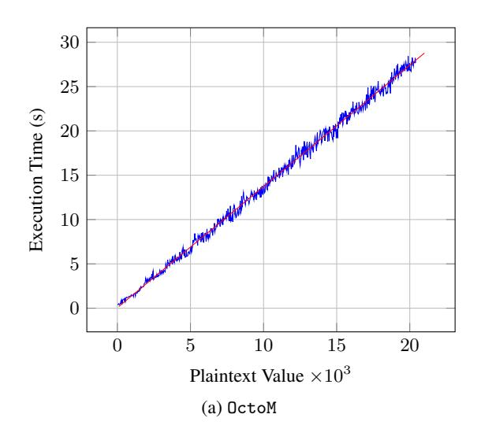
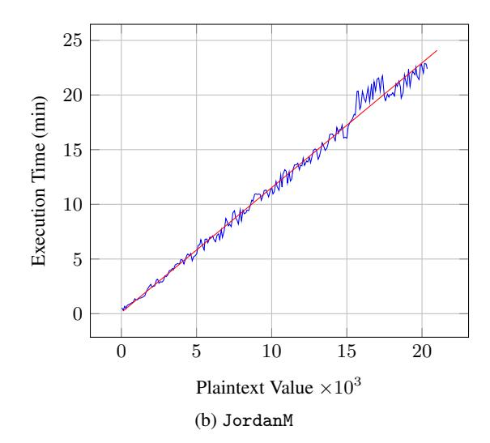
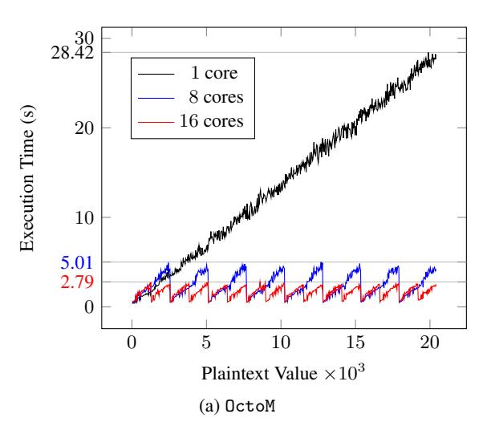
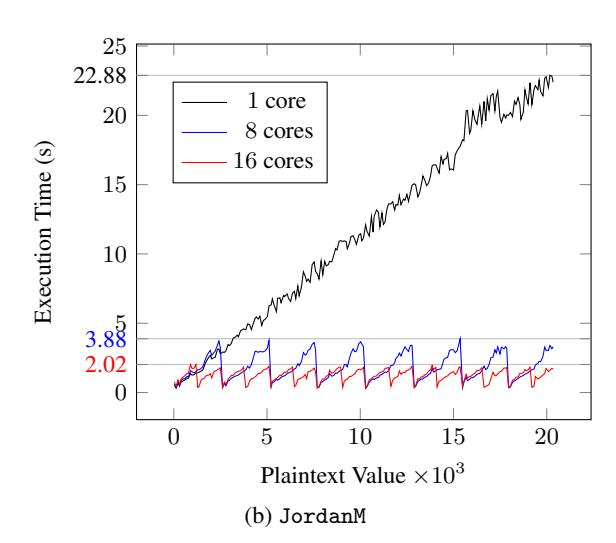
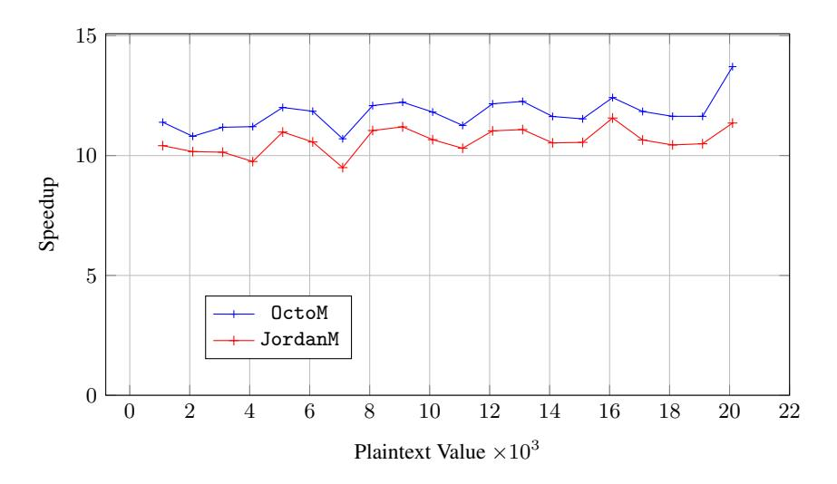

# PLAINTEXT RECOVERY ATTACKS AGAINST LINEARLY DECRYPTABLE FULLY HOMOMORPHIC ENCRYPTION SCHEMES

We remark that this article is a preprint. The final version of this work is published in the Journal of Computers & Security, Volume 87, November 2019. DOI: https://doi.org/10.1016/j.cose.2019.101587

A preliminary version of this paper appeared under the title "Comparison-based Attacks against Noise-free Fully Homomorphic Encryption Schemes," in Proceedings of the 20th International Conference on Information and Communications Security ICICS 2018, Lille, France, Oct. 2018 [2].

Nicholas Mainardi<sup>1</sup>

Alessandro Barenghi<sup>1</sup>

Gerardo Pelosi<sup>1</sup>

nicholas.mainardi@polimi.it

alessandro.barenghi@polimi.it

gerardo.pelosi@polimi.it

<sup>1</sup> Department of Electronics, Information and Bioengineering Politecnico di Milano, IT

# ABSTRACT

Homomorphic encryption primitives have the potential to be the main enabler of privacy preserving computation delegation to cloud environments. One of the avenues which has been explored to reduce their significant computational overhead with respect to cleartext computation is the one of the so-called noise-free homomorphic encryption schemes. In this work, we present an attack against fully homomorphic encryption primitives where a distinguisher for a single plaintext value exists. We employ two noise-free homomorphic encryption schemes where such a property holds as our case studies, providing detailed attack procedure against them. We validate the effectiveness and performance of our attacks on prototype implementations of the said schemes, and suggest two countermeasures to our attack tailored to the schemes at hand.

*K*eywords Linearly decryptable cryptoscheme · Noise-Free Schemes · Plaintext Recovery Attack · Comparison-based Attack · FHE

# 1 Introduction

Outsourcing computation and reliable storage of large amounts of data to third parties allows significant saving on infrastructure and maintenance costs whenever an internal site reliability engineering team is not available. However, such an outsourcing comes with the main drawback of the potential disclosure of sensitive data unless appropriate measures are taken. Such a drawback can be overcome in an effective and elegant way if a cryptographic primitive which allows to perform computations on encrypted data, retaining the correctness of the decrypted result, is available. Such a primitive goes by the name of Fully Homomorphic Encryption (FHE), and was proposed as a pioneering idea by Rivest in 1978 under the name of *Privacy Homomorphisms* [22]. The design of an effective and efficient FHE primitive remained unsolved for more than thirty years, during which only Partially Homomorphic Encryption (PHE) scheme, which allow to perform an arbitrary number of instances of a single operation (e.g., addition), or a SomeWhat Homomorphic Encryption (SWHE) schemes, which allow to perform a limited number of additions and multiplications, were proposed. Then, the work by Gentry [11] in 2009 proposed the first FHE scheme, which allows to perform an unbounded number of additions and multiplications.

Since Gentry's seminal work, several schemes achieving better performance were proposed [7, 10, 13, 8], as well as new techniques to speed up homomorphic computations, such as *batching* [12, 24]. With this technique, a single ciphertext can contain multiple plaintext values and when an homomorphic operation is applied between two ciphertexts, the same operation is applied on the plaintext values in a Single Instruction Multiple Data (SIMD) fashion. Despite these significant improvements, FHE schemes still have two practical concerns to be solved before wide adoption is possible: i) the ciphertext expansion and ii) the computational overhead imposed on homomorphic operations to preserve the correctness of the decrypted result. Indeed, the ciphertext space of SWHE/FHE schemes is consistently larger than the plaintext one, therefore even a single operation on ciphertexts is quite time consuming. The preservation of the correctness of the decrypted result needs to cope with a certain amount of randomness, typically called *noise*, that is added to the ciphertext when processing it. The amount of noise cannot be too high, lest a decryption failure occurs. Unfortunately, each homomorphic operation, especially multiplication, increases the amount of noise in the ciphertexts. In order to reduce the noise growth after each homomorphic operation, SWHE/FHE schemes generally perform some additional computations, significantly increasing the overhead of each homomorphic operation. Even with this noise management techniques, after a limited number of homomorphic operations, either the computation is halted (as in SWHE schemes), or a procedure to refresh the ciphertext, i.e., decrease the noise without decrypting it, must be run. Such a procedure, introduced by Gentry in his original scheme [11], is called *bootstrapping* and it allows to transform a SWHE scheme, satisfying certain constraints, in a FHE one. However, this procedure is quite cumbersome, and needs to be periodically performed, slowing down the overall computation. To overcome this burden, alternative noise management techniques have been proposed, such as modulus switching [6] and scale-invariant schemes [3, 4].

A different direction in coping with the noise in FHE ciphertexts is represented by noise-free schemes. A ciphertext in a noise-free scheme has no noise, thus an unbounded number of homomorphic operations can be performed without any costly noise management technique being involved. Nevertheless, while common noisy SWHE/FHE schemes are based on well-known and scrutinized mathematical problems, such as the Learning With Errors problem [18], noisefree schemes usually rely on less common algebraic trapdoors, which do not have widely scrutinized reductions to hard problems.

Ind particular, Liu in [17] introduced a noise-free FHE scheme, based on the *approximate greatest common divisor* problem; nonetheless, this scheme was subsequently proven to be insecure in [26]. Kipnis in [15] proposed a FHE scheme based on commutative rings, whose trapdoor is based on *integer factorization*. This scheme is provably secure against ciphertext-only attacks, however knowing two plaintext-ciphertext pairs was proven to be sufficient to break the scheme [25].

Li in [16] proposed to employ non commutative rings to build FHE schemes, while Nuida [20] introduced a framework to construct FHE schemes based on *group presentations* obfuscated by Tietze transformations. The open challenge with schemes in [16, 20] resides in the definition of a mapping between integer plaintext values and elements of the mentioned algebraic structures, preserving security guarantees and homomorphic capabilities.

Lastly, Wang in [26] introduced two noise-free octonion-based FHE schemes (called OctoM and JordanM) with trapdoors based on the problem of *solving quadratic modular equations over a ring* Z<sup>n</sup> (with n being a composite integer), a problem which is as hard as factoring n. Wang proved the security of these schemes in a ciphertext-only scenario. Thus, they are, to the best of our knowledge, the only noise-free FHE schemes suitable for practical usage.

While the homomorphic capabilities of a cryptosystem do not weaken the security guarantees per se, they may increase the adversarial power, if combined with other vulnerabilities. The advantages provided by homomorphic capabilities to the attackers were discussed in [5], focusing on the so-called *linearly decryptable* schemes, i.e., cryptosystems whose decryption function can be expressed as a *dot product* between key and ciphertext values, represented in a multi-dimensional vector space (e.g., the ones in [26]).

Linearly decryptable schemes usually employ a significant amount of noise to hinder Known Plaintext Attacks (KPAs). Nevertheless, in [5] the authors showed that if the scheme can homomorphically evaluate the majority function, then a KPA becomes practically viable. Moreover, in [26] the authors introduced, for linearly decryptable schemes, an algorithm to determine if the plaintext corresponding to a given ciphertext is equal to the integer value 1. We remark that the noise-free OctoM and JordanM FHE schemes proposed by Wang in [26] are linearly decryptable, and thus affected by the aforementioned issues.

Contributions. In this work, we present a plaintext recovery attack, against FHE schemes having plaintexts in Zn, with n > 2, and where it is possible to devise an efficient algorithm able to determine if a generic ciphertext under a given key k is the encryption of a fixed plaintext m.

Although, to the best of our knowledge, such a distinguisher has been proposed for linearly decryptable schemes only, our attack is applicable to any FHE scheme for which such a distinguisher can be found. Our attack, which is performed in a ciphertext-only scenario, leverages the capability to homomorphically compare two encrypted integer values, and it exhibits a computational complexity which is linear in the plaintext integer value being recovered, which is an improvement by a significant constant factor over an exhaustive search strategy.

In order to to practically validate the feasibility of our attack, we choose two linearly decryptable noise-free octonionbased cryptosystems [26] (namely, OctoM and JordanM), which were claimed to be computationally secure in a ciphertext-only attack scenario.

During the analysis of such cryptosystems, we discovered that one of the two is not fully homomorphic in the form which was presented in [26]: we report in this work all the modifications required to obtain a fully homomorphic scheme.

Furthermore, since these schemes are linerarly decryptable, by applying our attack we can retrieve enough plaintexts so that mounting a KPA to recover the key becomes viable. We evaluate our attack by providing practical figures obtained from a prototype implementation of both schemes. Finally, we propose a countermeasure for both OctoM and JordanM schemes, mitigating our attack.

# 2 Preliminaries

Definition 1 (Negligible Function). *A function* : N → R *is negligible if, for every univariate positive polynomial,* poly(x) ∈ R[x]*, there exists an integer* c > 0 *such that* ∀ x > c, |(x)| ≤ <sup>1</sup> poly(x) *.*

Definition 2 (Indicator Function). *Given a set* S *and a subset* A ⊆ S*, the indicator function of the elements of* A *over the ones included in* S *is defined as:* 1<sup>A</sup> : S → {0, 1}*, where* 1A(x) = 1 *if* x ∈ A*,* 0 *otherwise.*

#### 2.1 Homomorphic Encryption Algorithms

Our definition of Fully Homomorphic Encryption follows the one introduced in [8], without constraining the encryption function to deal with a single bit at a time. An homomorphic encryption (HE) scheme specifies three sets: M, C and F.

The set of plaintexts M usually coincides with the set of integer values ranging from 0 to n−1, with n>2, and assumed to be the representatives of the residue classes modulo n, i.e., (Zn, +, ×), where Z<sup>n</sup> ≡ Z/nZ. The ciphertext space C includes elements with an algebraic representation that depends on the specific HE scheme at hand. The set of polynomials F ⊆ Zn[x1, x2, . . . , xa], with a ≥ 1 and degree greater or equal to zero, defines the functions that the HE scheme at hand allows to be evaluated. That is, each of these polynomials computes a function f : M<sup>a</sup> → M, a ≥ 1 over the plaintexts, and is referred to as an *arithmetic circuit* composed by gates performing modular multiplications (×) and modular additions (+) in Zn.

We provide the definition of an HE scheme starting from an asymmetric HE scheme, and describe a symmetric one by difference.

#### Definition 3. *(Public-key Homomorphic Encryption Scheme).*

*A public-key Homomorphic Encryption scheme is defined as a tuple of four polynomial time algorithms* hKeyGen, Enc, Dec, Evali*:*

### • *Key Generation.*

hsk, pk, evki ← KeyGen(1<sup>λ</sup> ) *is a probabilistic algorithm that, given the security parameter* λ*, generates the secret key* sk*, the public key* pk *and the public evaluation key* evk*.*

### • *Encryption.*

c ← Enc(pk, m) *is a probabilistic algorithm that, given a message* m ∈ M *and the public key* pk*, computes a ciphertext* c ∈ C*.*

# • *Decryption.*

m ← Dec(sk, c) *is a deterministic algorithm that, given a ciphertext* c ∈ C *and the secret key* sk*, outputs a message* m ∈ M*.*

# • *Evaluation.*

c ← Eval(evk, f, c1, c2, . . . , ca) *is a probabilistic algorithm computing a ciphertext* c ∈ C*, using an arithmetic circuit* f ∈ F *with* a ≥ 1 *inputs, the ciphertexts* c1, c2, . . . , ca*, and the evaluation key* evk*.*

*The following properties must hold:*

# • *Decryption Correctness.*

∀ m ∈ M : Dec (sk, Enc(pk, m)) = m*.*

# • *Evaluation Correctness.*

∀m1, . . . , m<sup>a</sup> ∈ M, f ∈ F*:* Pr(Dec(sk, c) = f(m1, . . . , ma)) = 1 − (λ)*, where* c = Eval(evk, f, c1, . . . , ca)*,* c<sup>1</sup> = Enc(pk, m1), . . . , c<sup>a</sup> = Enc(pk, ma) *and* (λ) *is a negligible function of the security parameter of the scheme.*

#### • *Compactness.*

∀ f ∈ F*,* c1, . . . , c<sup>k</sup> ∈ C*:* |Eval(evk, f, c1, . . . , ck)| ≤ poly(λ)*, where* | · | *denotes the bit length of a ciphertext, while* poly(·) *denotes a positive univariate polynomial.*

The requirement on the evaluation correctness trivially states that by decrypting the output of the Eval algorithm we obtain the correct result of the computation homomorphically performed by Eval on the ciphertexts. In particular, the Eval algorithm evaluates a polynomial, defined over the plaintext space, in the sequence of input ciphertexts by replacing the modular additions and multiplications of the polynomial with, respectively, the homomorphic operations Add and Mul, that are, in turn, two probabilistic polynomial time algorithms defined over the ciphertext space C:

### • Homomorphic Addition.

c ← Add(evk, c1, c2) computes a ciphertext c ∈ C such that Dec(sk, c) = Dec(sk, c1) + Dec(sk, c2).

### • Homomorphic Multiplication.

```
c ← Mul(evk, c1, c2) computes a ciphertext c ∈ C such that Dec(sk, c) = Dec(sk, c1) × Dec(sk, c2).
```

When defining a symmetric-key homomorphic encryption scheme, the only difference is the key generation algorithm KeyGen(1<sup>λ</sup> ) outputting a tuple k = hsk, pk, evki with sk = pk.

Lastly, We recall the categorization of HE schemes depending on the specific choice of the set of functions F which can be evaluated.

Specifically, in a PHE scheme only functions f ∈ F defined via an arithmetic circuit including a single type of gate (an additive one or a multiplicative one) can be evaluated. In a SWHE scheme, only functions f ∈ F defined via an arithmetic circuit with a depth no higher than a fixed (scheme-dependent) threshold can be evaluated A FHE scheme allows to evaluate functions f ∈ F defined via an unconstrained arithmetic circuit.

#### 2.2 Threat Model

We now specify the threat model we assume for our attack. The adversary can perform the attack by relying only on publicly-available information. In particular, our attack is performed in a ciphertext-only scenario, which means that the attacker employs only cipheretexts and public portion of the key material (that is, evaluation key and the public key, if the scheme is asymmetric). Nevertheless, the ciphertext-only scenario generally embodies additional public information that can be inferred from the applicative domain where the HE scheme is employed. Indeed, since the ciphertexts are involved in a known computation, the corresponding plaintext values are generally the input values for this computation. Therefore, we assume that the attacker knows the domain of these input values, which may be extremely smaller than the plaintext domain (e.g., in a power metering application, the input values may be as big as  $10^9$ , while the plaintext domain of an HE scheme is the integer ring  $\mathbb{Z}_n$ , where n may be a much bigger number). Throughout the paper, we denote the domain of the input values as the interval  $\overline{D_s} = \{-s+1, \ldots, s+1\}$ , where s is an integer representing an upper bound for the majority of the input values (e.g.,  $10^9$  for a power metering application). We remark that, in this definition, there may be input values that do not belong to  $\overline{D_s}$ , what it is relevant for our purposes is that a large portion of input values belong to this set.

#### 2.3 Homomorphic Comparisons

One of the requirements to apply our attack is the existence of an algorithm able to determine if a generic ciphertext is a possible encryption of a fixed plaintext m. Therefore, we now provide a formal definition for this algorithm, which we refer to as m-distinguisher.

**Definition 4** (m-distinguisher). Let the four-tuple (KeyGen, Enc, Dec, Eval) be a homomorphic encryption scheme with security margin  $\lambda$ , and let  $\mathcal{M}$ ,  $\mathcal{C}$  be the plaintext and ciphertext spaces, related by the generated key  $k = \langle sk, pk, evk \rangle$ . Let  $A_k^m \subset \mathcal{C}$ , be the set of ciphertexts corresponding to the encryption of a plaintext  $m \in \mathcal{M}$ , i.e.:  $A_k^m = \{c \in \mathcal{C} \text{ s.t. Dec}(sk, c) = m\}$ .

Given a plaintext  $m \in \mathcal{M}$ , an m-distinguisher is a deterministic polynomial time algorithm  $\mathbb{A}_m$  taking as input a ciphertext  $c \in \mathcal{C}$  and the public portion of  $\mathbb{k}$  (i.e.,  $\mathbb{k}_{pub} = \langle pk, evk \rangle$  for public-key schemes and  $\mathbb{k}_{pub} = \langle evk \rangle$  for symmetric ones), and computing the indicator function of the elements of  $A_k^m$  over the set of ciphertexts, namely  $\mathbb{1}_{A_k^m} : \mathcal{C} \to \{0,1\}$ , in such a way that

$$\frac{|\{c \in \mathcal{C} \text{ s.t. } \mathbf{A}_m(c, \mathbf{k}_{\text{pub}}) = \mathbb{1}_{A^m_{\mathbf{k}}}(c)\}|}{|\mathcal{C}|} \geq 1 - \epsilon(\lambda),$$

where  $\epsilon(\lambda)$  is a negligible function of the security margin of the system.

Given the existence of this m-distinguisher, our attack leverages the capability to homomorphically compare two encrypted integers. Therefore, we now present the main methods proposed in the literature to compute this functionality, including the one used in our attack.

First of all, performing comparisons requires to homomorphically evaluate the *greater-than* function on a chosen interval of plaintext integer values.

**Definition 5** (Greater-than Function). Given a positive integer b and an interval of integers  $D_t = \{0, 1, ..., t-1\}$ , with  $t \ge 2$ , the greater-than function  $GT_{t,b}: D_t \times D_t \to \{b-1,b\}$  is defined as:

$$GT_{t,b}(x,y) = \begin{cases} b & \text{if } x \ge y, \\ b-1 & \text{otherwise} \end{cases}$$

To the extent of evaluating this function with an HE scheme, we need to find a polynomial  $f_{\sf gt} \in \mathcal{F} \subseteq \mathbb{Z}_n[x,y]$ , such that  $f_{\sf gt}(x,y) = GT_{t,b}(x,y)$ , with  $2 \le t \le n, 1 \le b < n$ , and x,y being the representatives of residue classes modulo n, (i.e.,  $x,y \in \mathbb{Z}_n$ ) considered as integers less than t. Such a polynomial can be easily found if the plaintext space is  $\mathbb{Z}_2$ : indeed, additions and multiplications become xor and and gates, while the input variables are the single-bit values in the binary encodings of x and y, and thus there are many circuits computing the  $GT_{t,b}(\cdot,\cdot)$  function.

Considering a plaintext ring M = Zn, with n > 2, which is the case targeted in our work, finding an efficiently computable polynomial for the GTt,b(·, ·) function is a challenging task. Çetin in [9] reports two methods to compute the GTt,b(·, ·) function which do not require interaction between the secret key owner and the party who performs homomorphic evaluation. However, both of these methods are not suitable for our attack: indeed, the first one is not applicable to a composite module n; the second method computes an approximation of GTt,b(·, ·), while our attack needs an exact computation of this function.

A more effective solution is proposed in [19]: the greater-than function is computed as GTt,b(x, y) = SIGNt,b(x−y), where SIGNt,b(z) is a function defined over D<sup>t</sup> ⊆ Z = {−t+1, . . . , 0, . . . , t−1} such that:

$$SIGN_{t,b}(z) = \begin{cases} b & \text{if } z \ge 0, \\ b-1 & \text{otherwise} \end{cases}$$

The homomorphic evaluation of the function SIGNt,b(·) requires a polynomial fsign ∈ F ⊆ Zn[z] fulfilling fsign(z mod n) = SIGNt,b(z), with 2 ≤ t ≤ n 2 , 1 ≤ b < n and z ∈ Dt. In [19], the polynomial fsign is computed applying the Lagrange interpolation formula to 2t − 1 points having coordinates ( z, SIGNt,b(z) ), with z ∈ Dt, and considering a prime modulus, i.e., n = p.

As we are considering as a plaintext space the ring Z<sup>n</sup> with a generic modulus n > 2, we introduce an additional constraint on the integer t, formalized in Lemma 1, to extend the applicability of the aforementioned method to a generic ring Zn:

Lemma 1. *Given an integer* t ≥ 2*, and a set* D<sup>t</sup> = {−t + 1, . . . , 0, . . . , t − 1}*, the polynomial* f(z) ∈ Zn[z]*, with* n > 2*, interpolating* 2t − 1 *points* (z, f(z)) *having the* z*-coordinate ranging over all values in* D<sup>t</sup> *exists if* t ≤ q 2 *, where* q *is the smallest prime factor of* n*.*

*Proof.* Considering the set of 2t − 1 points {(z1, y1), . . . ,(z2t−1, y2t−1)} in Z<sup>n</sup> × Zn, the interpolating polynomial f ∈ Zn[z], with degree at most 2t − 2, can be computed by the Lagrange interpolation formula:

$$f(z) = \sum_{i=1}^{2t-1} y_i \prod_{j=1, j \neq i}^{2t-1} (z - z_j)(z_i - z_j)^{-1}$$

The existence of the multiplicative inverses (in Zn) required in this formula is ensured if all the values z<sup>i</sup> − z<sup>j</sup> are co-prime with n. Assuming the z-coordinates to be mutually distinct and in Dt, the constraint t ≤ q 2 implies that −q < −2t + 2 ≤ z<sup>i</sup> − z<sup>j</sup> ≤ 2t − 2 < q. Since q is the smallest prime factor of n, then all the elements in Z<sup>n</sup> \ {0} ∩ {−q + 1, . . . , q − 1} are co-prime with n, therefore all the values z<sup>i</sup> − z<sup>j</sup> are co-prime with n, and thus invertible, allowing f(z) to be interpolated by the Lagrange formula.

In conclusion, by Lagrange interpolation we can obtain a polynomial fsign ∈ F ⊆ Zn[z] which computes the function SIGNt,b(z), ∀z ∈ Dt, and then a polynomial fgt ∈ F ⊆ Zn[x, y], computing the function GTt,b(x, y), ∀x, y ∈ Dt, as fgt(x, y) = fsign(x − y).

Since fgt ∈ F, it can be homomoprhically evaluated by the Eval algorithm of the HE scheme at hand, by replacing addition and multiplications of the polynomial with the corresponding homomorphic operations (Add and Mul), whose inputs are ciphertexts in C. In the following, we denote the algorithm Eval(evk, c1, c2, fgt) by HGTt,b(c1, c2), which takes as input two ciphertexts with corresponding plaintext values m1,m<sup>2</sup> ∈ Dt, and outputs an encryption of GTt,b(m1, m2). In particular, since GTt,b is defined over the interval Dt={0, . . . , t − 1}, t ≤ q 2 , with q being the smallest prime factor of n, then c1, c<sup>2</sup> ∈ C<sup>t</sup> = {c ∈ C s.t. Dec(sk, c) < t} is a sufficient condition for Dec(sk, HGTt,b(c1, c2)) = GTt,b(m1, m2). The computational complexity required to interpolate 2t − 1 points by applying the Lagrange formula is O(t 2 ) operations in Zn; while the evaluation of the polynomial fsign ∈ Zn[z], whose degree is at most 2t − 2, has a computational complexity O(t). Therefore, the computational cost of the HGTt,b(·, ·) algorithm is O(t).

We note that, while there are no current algorithms to compute HGTt,b(·, ·) in less than O(t), research efforts driven by the usefulness of a homomorphic comparison may lead to an improvement in this sense. Since our methodology relies on the computation of HGTt,b(·, ·) as an atomic component, such improvements will positively affect the efficiency of our attack.

# 3 Attack Strategy

In the following we detail a plaintext recovery attack which takes as input a ciphertext and the publicly available evaluation key, evk, of the HE scheme at hand (which can be either a FHE, or a SWHE capable of computing HGTt,b).

Throughout the attack, the adversary needs to obtain encryptions of known values: that is, given an integer h ∈ Zn, the attacker needs to compute a ciphertext c<sup>h</sup> such that Dec(sk, ch) = h. In case the HE scheme is asymmetric, c<sup>h</sup> can be directly obtained by employing the public key encryption algorithm of the scheme, while, in case the HE scheme is a symmetric one, c<sup>h</sup> can be computed from a single encryption of mˆ = 1 hinging upon homomorphic properties. Indeed, given a ciphertext cˆ such that Dec(sk, cˆ) = ˆm = 1, the ciphertext c<sup>h</sup> can be computed in O(log(h)) steps by a double-and-add method, which works exactly as the well known square-and-multiply method where squaring operations are replaced by doubling ones, while multiplications are replaced by additions. We remark that a doubling operation on a ciphertext c ∈ C can be homomorphically performed as Add(evk, c, c).

From now on we will assume that, in case our attack is applied to an HE scheme, an encryption cˆ of a unitary plaintext value is available to the attacker (i.e., Dec(sk, cˆ) = 1), enabling him to obtain encryptions c<sup>h</sup> of known values required throughout the attack; at the end of this section, we will show how c<sup>h</sup> can be obtained by the adversary.

Comparison-based Attack. The core idea of our attack is to perform a homomorphic binary search over the possible candidates for the value of the plaintext corresponding to the ciphertext at hand. To this end, a comparison function CMP, taking two ciphertexts as inputs and yielding an outcome in cleartext, is computed leveraging the homomorphic greater-than function HGTt,b and the m-distinguisher (see Section 2). In particular, since the result of the HGTt,b function is either an encryption of b or an encryption of b − 1, by choosing b = m the attacker can employ the m-distinguisher to determine the actual (plaintext) value of HGTt,m (without employing the secret key sk).

Definition 6 (Comparison Function). *Consider a FHE scheme with plaintext space* M = Zn*, with* n > 2*, an integer* t *such that* 2 ≤ t ≤ q 2 *, where* q *is the smallest prime factor of* n*, and the set of ciphertexts* C<sup>t</sup> = {c ∈ C s.t. Dec(sk, c) < t}*. Given the ciphertexts* c1, c<sup>2</sup> ∈ C<sup>t</sup> *and the algorithm* Am(c, kpub) *computing the* m*-distinguisher, where* m *is a fixed plaintext value,* c ∈ C *and* kpub *is the public portion of the key material of the FHE scheme, the function* CMP : C<sup>t</sup> × C<sup>t</sup> → {1, 0, −1} *is defined as:*

$$CMP(c_1, c_2) = \begin{cases} 1 & \text{if } v_1 = 1 \land v_2 \neq 1, \\ 0 & \text{if } v_1 = 1 \land v_2 = 1, \\ -1 & \text{otherwise} \end{cases}$$

*with* v<sup>1</sup> = Am(HGTt,m(c1, c2), kpub)*,* v<sup>2</sup> = Am(c<sup>1</sup> − c<sup>2</sup> + cm, kpub)*, where* c<sup>m</sup> *is an encryption of the plaintext value* m *computed by the attacker.*

The CMP function allows the attacker to learn the order relation between the underlying plaintext values of two ciphertexts c1, c<sup>2</sup> ∈ Ct: indeed, denoting as m<sup>c</sup><sup>1</sup> , m<sup>c</sup><sup>2</sup> ∈ D<sup>t</sup> the corresponding plaintext values of, respectively, c<sup>1</sup> and c2, CMP(c1, c2) outputs 1 if m<sup>c</sup><sup>1</sup> > m<sup>c</sup><sup>2</sup> , 0 if m<sup>c</sup><sup>1</sup> = m<sup>c</sup><sup>2</sup> and −1 otherwise, as v<sup>1</sup> = 1 if and only if m<sup>c</sup><sup>1</sup> ≥ m<sup>c</sup><sup>2</sup> and v<sup>2</sup> = 1 if and only if m<sup>c</sup><sup>1</sup> = m<sup>c</sup><sup>2</sup> .

Denoting with Tdistinguisher the computational complexity of the m-distinguisher, we have that the time complexity of CMP, TCMP , is TCMP = O(t + 2Tdistinguisher), as its execution involves at most two computations of the m-distinguisher plus one computation of the HGTt,m function, which has complexity O(t). Leveraging the function CMP, the binary search strategy locates the value of the actual plaintext in the range Dt, which is t elements wide, with a computational cost of O(TCMP ·log(t)) = O((t + 2Tdistinguisher) log(t)).

Starting from the strategy which has just been described, we improve its effectiveness extending the range of the recoverable plaintexts.

#### Algorithm 1: Plaintext Recovery Attack

```
Input: ciphertext c ∈ Cs, where Cs = {c ∈ C s.t. Dec(sk, c) < s}
 Output: plaintext mc = Dec(sk, c), mc ∈ Zn
1 begin
2 for i ← 1 to σ do
3 cgt ← HGTt,m(c,Enc(pk,(i − 1)t))
4 if A(m)(cgt,kpub) = 1 then
5 cgt←HGTt,m(c,Enc(pk, it))+Enc(pk, 1)
6 if A(m)(cgt,kpub) = 1 then
7 mc←BinSearch(c−Enc(pk,(i−1)t))
8 if mc 6= ⊥ then
9 return mc + (i − 1)t
```

To this end, we split the set of recoverable plaintexts into |Dt| = t sized chunks, find into which chunk the plaintext is likely to be contained, and proceed to retrieve it employing the binary search approach. We denote with D<sup>s</sup> the set of recoverable plaintexts (Ds={0, 1, . . . , s−1}, s ≤ n), and with C<sup>s</sup> the set of ciphertexts obtained encrypting plaintexts in Ds, i.e.: C<sup>s</sup> = {c ∈ C s.t. Dec(sk, c) < s}. The recoverable message space D<sup>s</sup> is split into σ chunks containing numerically consecutive plaintexts, with σ=d s t e: for instance, the i-th chunk, 1 ≤ i ≤ σ, contains plaintexts values {(i − 1)·t, . . . , i·t − 1}, while the last one contains values {i·t, . . . , s − 1}.

Algorithm 1 shows how our improved attack is performed. It iterates over all the σ chunks, testing, for each one of it, if the plaintext mc, corresponding to the input ciphertext c, may be contained in the chunk being scanned (lines 2–9). To this end, the algorithm starts by testing if m<sup>c</sup> may be in a chunk {(i − 1)·t, . . . , i·t − 1} by verifying if GTt,m(mc,(i − 1)·t) = m (lines 3–4). In case this test succeeds (line 4, case of the if being taken), Algorithm 1 proceeds to test also if m<sup>c</sup> is smaller than the upper bound i·t of the chunk at hand, by verifying that GTt,m(mc, i·t) = m − 1 with an analogous approach (lines 5–6). If the tests at lines 3 – 6 succeed, then the current chunk may contain the plaintext mc, and so Algorithm 1 attempts a plaintext recovery employing the binary search approach described in precedence over the current chunk (line 7). However, the binary search is effective only under the assumption that the sought plaintext is in Dt, thus Algorithm 1 (line 7) exploits the homomorphic operations to subtract the value of the lower bound of the current chunk from mc, working on its corresponding ciphertext c, to compute the value of m<sup>c</sup> mod t, which can be retrieved by the binary search strategy.

Nevertheless, we note that the answer of the tests in lines 3–6 are subject to potential false positives. Indeed, if m<sup>c</sup> ∈ { / (i − 1)·t, . . . , i·t − 1}, then m<sup>c</sup> − (i − 1)·t /∈ D<sup>t</sup> ∨ m<sup>c</sup> − (i·t − 1) ∈/ Dt: thus, it means that the polynomial fsign(z) ∈ Zn[z], obtained by interpolating points whose z-coordinates range over Dt, is evaluated on a point z /∈ Dt, hence yielding an outcome which is either outside the set {m − 1, m} or (by coincidence) inside it. Therefore, it may happen that fgt(mc,(i − 1)·t)=fsign(m<sup>c</sup> − (i − 1)·t)=m and fgt(mc, i·t − 1)=fsign(m<sup>c</sup> − i·t)=m−1 even if m<sup>c</sup> ∈ { / (i − 1)t, . . . , it − 1}. In this case, the interval {(i − 1)·t, . . . , i·t − 1} is identified as a false positive. However, these false positive are filtered out later in the algorithm. Indeed, if m<sup>c</sup> ∈ { / (i − 1)·t, . . . , i·t − 1}, then Algorithm 1 (line 7) computes a ciphertext whose corresponding plaintext value (that is, m<sup>c</sup> − (i − 1)·t) is not in the interval Dt. Since the binary search strategy is effective only under the assumption that the sought plaintext is in Dt, then the binary search will return a result (line 8) only if m<sup>c</sup> ∈ {(i − 1)·t, . . . , i·t − 1}, i.e., when the current chunk is not a false positive. In this case, the actual value of m<sup>c</sup> is reconstructed by adding back the lower bound of the current chunk to the value retrieved by the binary search (line 9).

We now consider the time complexity of Algorithm 1 as a function of the value of the plaintext to be retrieved mc. Algorithm 1 is expected to perform d m<sup>c</sup> t e iterations of the outer loop. Each one of the iterations, save for the last one, will fail the membership tests with very high probability (false positives are unlikely), thus resulting in O(t + Tdistinguisher) computational effort at each iteration. However, we now compute the overall complexity Ta(mc) of the improved plaintext recovery attack, in the worst case where a false positive is found at each iteration:

$$T_a(m_c) = \mathcal{O}\left(\left\lceil \frac{m_c}{t} \right\rceil \left(t + T_{\text{distinguisher}} + T_{\text{BinSearch}}\right)\right)$$

$$= \mathcal{O}\left(\log(t)\left(m_c + \left\lceil \frac{m_c}{t} \right\rceil T_{\text{distinguisher}}\right)\right)$$
(1)

Therefore, our attack has a time complexity which is linear in the plaintext value being recovered. This is the main reason why our attack is able to practically recover only ciphertexts whose corresponding plaintext is not too big. However, by setting t = 2<sup>20</sup> (an upper bound imposed by the O(t 2 ) computational cost of Lagrange interpolation), we see that, unless Tdistinguisher > 2 <sup>23</sup>, recovering plaintexts as big as 2 <sup>32</sup> still retains a computational complexity Ta(mc) < 2 <sup>40</sup>. Since many typical FHE scenarios involve computations on relatively small values (e.g., power consumption statistics from smart meters), we deem this plaintext recover capability effective enough to be worth considering.

To conclude the description of our attack, we now show the speed-up obtained by Algorithm 1 over an exhaustive search strategy leveraging only the m-distinguisher. This latter attack tries all plaintext values m<sup>c</sup> ∈ Z<sup>n</sup> in increasing order, with the recovered plaintext being the first m<sup>c</sup> such that Am(Enc(pk, mc) − c + Enc(pk, m))=1.

Denoting the value of the recovered plaintext as mc, with this strategy we employ the m-distinguisher m<sup>c</sup> times, therefore the complexity of this approach is O(mcTdistinguisher). The speed-up of our attack over this simple strategy can be computed as:

$$\begin{split} \frac{m_c T_{\text{distinguisher}}}{T_a(m_c)} &= \frac{m_c T_{\text{distinguisher}}}{\log(t)(m_c + \lceil \frac{m_c}{t} \rceil T_{\text{distinguisher}})} \\ &= \frac{t T_{\text{distinguisher}}}{\log(t)(t + T_{\text{distinguisher}})}. \end{split} \tag{2}$$

This calculation shows that our attack improves the exhaustive search strategy by a constant factor, thus without changing its asymptotic complexity. In particular, the speed-up depends on the values of t, chosen by the attacker, and Tdistinguisher, given by the target scheme.

Although this improvement may seem negligible, we will show in Section 6, for the FHE schemes targeted by our attack, that the magnitude of the speed-up is significant, as it largely increases the number of recoverable plaintexts.

Relaxing the Assumptions for Comparison-Based Attack. In order to perform our attack, the adversary needs to compute encryptions of known values (e.g., the attacker needs encryptions of the candidate plaintext values while performing the binary search). As already discussed at the beginning of this section, in case the HE scheme is symmetric, such encryptions can be easily computed if a ciphertext cˆ, whose corresponding plaintext value is mˆ = 1, is available to the adversary.

We now show how an attacker can easily obtain cˆ hinging upon the m-distinguisher and the homomorphic operations. The key observation is that the adversary, given only a generic ciphertext c ∈ C, can homomorphically evaluate any polynomial f(z) ∈ Zn[z] with no constant term. Indeed, evaluating a polynomial f(z) = hd+1z <sup>d</sup>+1 + · · · + h1z ∈ Zn[z] requires mainly three operations: exponentiations to compute the powers z i , multiplications between these powers z i and the coefficients h<sup>i</sup> , and the addition of all these terms. In particular, exponentiation can be performed by homomorphic evaluation of the square-and-multiply algorithm, which, given a ciphertext c ∈ C with corresponding plaintext m<sup>c</sup> ∈ Z<sup>n</sup> and an integer i, computes a ciphertext cexp such that Dec(sk, cexp) = m<sup>i</sup> <sup>c</sup> mod n.

Similarly, the multiplication between a power z i and a coefficient h<sup>i</sup> can be performed by homomorphic evaluation of the double-and-add algorithm, which, given a ciphertext c ∈ C with corresponding plaintext m<sup>c</sup> ∈ Z<sup>n</sup> and an integer h, computes a ciphertext cmul such that Dec(sk, cmul) = m<sup>c</sup> × h mod n. Lastly, the additions of all the terms of the polynomial involve only ciphertexts computed by the previous operations, hence the homomorphic addition can be employed. In conclusion, the attacker can homomorphically evaluate a polynomial f(z) ∈ Zn[z] with no constant term.

We remark that, for a polynomial with no constant term, f(0) = 0 necessarily holds: therefore, in order to compute the ciphertext cˆ such that Dec(sk, cˆ) = 1, the adversary should evaluate the polynomial fne ∈ Zn[z] such that fne(z) = 1 ⇐⇒ z 6= 0. This polynomial can be obtained by interpolating the set of n points {(0, 0),(1, 1), . . . ,(n− 1, 1)}; nevertheless, since interpolating n points would be computationally unfeasible, the adversary can choose an integer u << n such that interpolating the set of 2u − 1 points {(−u + 1, 1), . . . ,(0, 0), . . . ,(u − 1, 1)} becomes computationally feasible.

We remark that the usage of 2u-1 points instead of n ones has a drawback: the polynomial  $f_{ne}^u(z)$  obtained by the interpolation may evaluate to an arbitrary value in  $\mathbb{Z}_n$  if  $abs(z) \geq u$ , where abs(z), for a generic  $z \in \mathbb{Z}_n = \{0, \ldots, n-1\}$ , is defined as  $\min(z, n-z)$ . Indeed, for a polynomial f(z) obtained by interpolating 2u-1 points  $\{(x_0, y_0), \ldots, (x_{2u-2}, y_{2u-2})\}$ ,  $f(x_i) = y_i, 0 \leq i < 2u-1$  holds, but the evaluation f(z) for an integer  $z \notin \{x_0, \ldots, x_{2u-2}\}$  is not constrained by the interpolation method.

Finally, the polynomial obtained by the adversary is:

$$f_{\text{ne}}^{u}(z) = \begin{cases} 0 & \text{if } z = 0\\ 1 & \text{if } 0 < \text{abs}(z) < u\\ \bot & \text{otherwise} \end{cases}$$
 (3)

Here,  $\bot$  denotes that the evaluation of  $f_{\rm ne}^u(z)$ , when  ${\tt abs}(z) \ge u$ , may be an arbitrary value in  $\mathbb{Z}_n$ . This polynomial  $f_{\rm ne}^u$  can be homomorphically evaluated by the adversary, since it has no constant term. Given a generic ciphertext c, the adversary computes a ciphertext  $c_{\rm ne} = {\tt Eval}(evk, f_{\rm ne}^u, c)$  and tests if  $m_{c_{\rm ne}}$  is 1 by leveraging the m-distinguisher, where  $m_{c_{\rm ne}}$  is the plaintext corresponding to  $c_{\rm ne}$ .

In particular, the attacker computes, by the usual double-and-add method, the ciphertext  $c_m$ , whose corresponding plaintext value is  $m \times m_{c_{\rm ne}}$ . Then, if the m-distinguisher determines that  $c_m$  is an encryption of m, the attacker knows that  $m \times m_{c_{\rm ne}} = m \Rightarrow m_{c_{\rm ne}} = 1$ . Therefore, the adversary knows that  $c_{\rm ne}$  is  $\hat{c}$ , the required encryption of 1. Once the attacker obtains this encryption  $\hat{c}$ , then it can compute all the encryptions of arbitrary known values needed to perform the attack. With this method, any ciphertext c whose corresponding plaintext value  $m_c$  is in the interval  $\{-u+1,\ldots,-1,1,\ldots,u-1\}$  would allow the adversary to compute  $\hat{c}$ .

# 4 Two Case Study Cryptosystems

In this section, we evaluate our attack against two symmetric noise-free FHE schemes [26], OctoM and JordanM. Although there is an efficient 1-distinguisher for these cryptosystems, they were proven to be secure against ciphertext-only adversaries aiming to recover either the plaintext or the secret key [26].

#### 4.1 Octonion and Jordan Algebrae

We now give an introduction about the two algebrae required to understand the FHE schemes evaluated in this work, i.e., the octonion algebra and the Jordan algebra. For a more comprehensive description we refer the reader to [26] or to [1].

Octonion Algebra. The support of the octonion algebra  $\mathbb O$  is an eight-dimensional vector space over a ring. The FHE schemes we are going to describe instantiate them over the unitary ring  $(\mathbb Z_n,+,\times), n\in\mathbb N\setminus\{0,1\}$ . From now on, we denote the octonion algebra with support  $\mathbb Z_n^8$  as  $\mathbb O(\mathbb Z_n^8)$ . An octonion can be represented as an eight dimensional vector, with the first element being the real component and seven different imaginary components, each corresponding to a different imaginary unit. Two addition operation for two octonions is performed by summing component-wise the elements of the two vectors. The multiplication operation in the octonion algebra, denoted by \*, is distributive with respect to vector addition, compatible with the scalar multiplication, non commutative and non associative. The multiplicative identity for octonions is the row vector  $\mathbb{1} = [1,0,0,0,0,0,0,0]$ , representing the real number 1. An operative description of the octonion multiplication rule is obtained by encoding an octonion a as an a a a a a a a a a a

<sup>&</sup>lt;sup>1</sup>The solution of this equation is not necessarily  $m_{c_{ne}} = 1$  if the integer m is not coprime with n; however, even in this case, the probability that  $m_{c_{ne}} \neq 1$  is a solution is negligible.

part is  $\Im(a) = \frac{a-\overline{a}}{2}$ . The product  $a*\overline{a}$  is a real number defining the square of the *norm* of an octonion, denoted by  $\|a\|^2$ . An octonion  $a \in \mathbb{O}(\mathbb{Z}_n^8)$  with  $\|a\| = 0$  is called *isotropic*. A subspace of  $\mathbb{Z}_n^8$  is called *totally isotropic* if all the octonions in it are isotropic. Given an algebra  $\mathbb{O}(\mathbb{Z}_n^8)$ , an automorphism on this algebra is a linear, bijective mapping  $\phi: \mathbb{O}(\mathbb{Z}_n^8) \to \mathbb{O}(\mathbb{Z}_n^8)$  which preserves the product \* of the algebra, that is  $\phi(a*b) = \phi(a)*\phi(b)$ . The set of all automorphisms of an algebra form a group, called the automorphism group. For octonion algebra, the automorphism group is the the exceptional Lie group  $G_2$ .

**Jordan Algebra.** The elements of this non commutative and non associative algebra, denoted by  $\mathfrak{h}_3(\mathbb{O})$ , are  $3 \times 3$  hermitian matrices of octonions:

$$\alpha = \begin{bmatrix} u & W & V \\ \overline{W} & v & U \\ \overline{V} & \overline{U} & w \end{bmatrix}$$

with U, V, W being elements in  $\mathbb{O}(\mathbb{Z}_n^8)$  and  $u, v, w \in \mathbb{Z}_n$ . The compact representation of these matrices is a tuple  $\alpha = \langle u, v, w, U, V, W \rangle$ .

The internal composition law of  $\mathfrak{h}_3(\mathbb{O})$  is the Jordan product, which is defined as  $\alpha\star\beta=\frac{\alpha\cdot\beta+\beta\cdot\alpha}{2}$ , where  $\alpha,\beta$  are two matrices and  $\cdot$  denotes the usual matrix multiplication. Finally, the determinant of  $\alpha$  is  $det(\alpha)=uvw-(u\|U\|^2+v\|V\|^2+w\|W\|^2)+2\Re(U*\overline{V}*\overline{W})$ , while the automorphism group for Jordan algebra is the exceptional Lie group  $F_4$ .

### 4.2 The OctoM and JordanM cryptosystems

OctoM Cryptosystem. This is a FHE scheme based on the algebra  $\mathbb{O}(\mathbb{Z}_n^8)$ , with n being a composite integer.

#### Key Generation.

This algorithm selects the ring  $\mathbb{Z}_n$  used as the plaintext space (with n being a composite integer), a totally isotropic subspace V which is closed under octonion multiplication, a generic automorphism  $\phi$  in  $G_2$ , and a  $8 \times 8$  invertible matrix M with entries in  $\mathbb{Z}_n$ . The secret key k is the tuple  $k = \langle V, \phi, M \rangle$ , while the evaluation key is given by the tuple  $evk = \langle n, C_{-1} \rangle$ , where  $C_{-1} = \operatorname{Enc}(k, n-1)$ .

#### • Encryption.

Given a plaintext value  $m \in \mathbb{Z}_n$ , and a key  $k = \langle V, \phi, M \rangle$ , this algorithm constructs an octonion  $m' = \phi(mi+z)$ , where i = [0,1,0,0,0,0,0,0] is the first imaginary unit and mi is the scalar product between the integer m and i (mi = [0,m,0,0,0,0,0,0]), while  $z \in V$  is chosen to make  $A^l_{m'}$  (the left multiplication matrix of m') non singular ( $det(A^l_{m'}) \neq 0$ ). The ciphertext is a matrix  $C \in \mathbb{Z}_n^{8 \times 8}$  computed as  $C = \operatorname{Enc}(k,m) = M^{-1} \cdot A^l_{m'} \cdot M$ .

#### • Decryption.

Given a ciphertext C, the corresponding plaintext value  $m \in \mathbb{Z}_n$  is computed as  $m = \text{Dec}(k,C) = \phi^{-1}(\mathbb{1} \cdot (M \cdot C \cdot M^{-1})) \mod V$ . The subspace V modulo operation can be performed by sampling a random vector  $v = [v_0, 1, v_2, v_3, v_4, v_5, v_6, v_7]$  in  $V^{\perp}$ , the orthogonal space of V, and computing the dot product between v and the octonion mi + z, resulting from  $\phi^{-1}(\mathbb{1} \cdot (M \cdot C \cdot M^{-1}))$ . Indeed, since  $v \in V^{\perp}$  and  $z \in V$ , then  $z \cdot v^T = 0$ , therefore the dot product  $(mi + z) \cdot v^T = m(i \cdot v^T) = mi$ .

#### • Homomorphic Addition.

Given two ciphertexts  $C_1, C_2 \in \mathbb{Z}_n^{8 \times 8}$ , the homomorphic addition operation is a simple matrix addition:  $C_{add} = \text{Add}(evk, C_1, C_2) = C_1 + C_2$ .

#### • Homomorphic Multiplication.

Given two ciphertexts  $C_1, C_2 \in \mathbb{Z}_n^{8 \times 8}$ , the homomorphic multiplication is performed as follows:  $C_{mul} = \text{Mul}(evk, C_1, C_2) = C_2 \cdot C_1 \cdot C_{-1}$ .

Jordan M Cryptosystem. This scheme is a FHE scheme based on the elements of the Jordan algebra  $\mathfrak{h}_3(\mathbb{O})$ , with some additional constraints introduced to achieve homomorphic properties.

#### • Key Generation.

This algorithm selects the plaintext space  $\mathbb{Z}_n$ , with n being a composite integer, a random automorphism  $\phi \in F_4$ , an invertible  $3 \times 3$  matrix M with entries in  $\mathbb{Z}_n$  and three isotropic octonions U,V and W fulfilling  $V * \overline{U} = W$  and  $\Re(U * \overline{V} * \overline{W}) \neq 0$ . The secret key k is the tuple  $k = \langle \phi, M, U, V, W \rangle$ , while  $evk = \langle n \rangle$ .

### • Encryption.

Given a plaintext value  $m \in \mathbb{Z}_n$  and the secret key  $k = \langle \phi, M, U, V, W \rangle$ , this algorithm constructs the Jordan algebra element  $\alpha_m = \langle m, v, w, r_U U, r_V V, r_W W \rangle$ , with  $r_U, r_V, r_W, v, w$  being five random values in  $\mathbb{Z}_n$  such that the matrix  $\alpha_m$  is nonsingular. Then, the ciphertext  $C \in \mathbb{O}(\mathbb{Z}_n)^{3 \times 3}$  is computed as  $C = \operatorname{Enc}(k, m) = M^{-1} \cdot \phi(\alpha_m) \cdot M$ .

### • Decryption.

A ciphertext  $C \in \mathbb{O}(\mathbb{Z}_n)^{3 \times 3}$  is decrypted as  $m = \text{Dec}(k,C) = \mathbb{1} \cdot \phi^{-1}(M \cdot C \cdot M^{-1}) \cdot \mathbb{1}^T$ .

# • Homomorphic Addition.

Given two ciphertexts  $C_1, C_2 \in \mathbb{O}(\mathbb{Z}_n)^{3\times 3}$ , the homomorphic addition is a single matrix addition:  $C_{add} = \text{Add}(evk, C_1, C_2) = C_1 + C_2$ .

### • Homomorphic Multiplication.

Given two ciphertexts  $C_1, C_2 \in \mathbb{O}(\mathbb{Z}_n)^{3\times 3}$ , the homomorphic multiplication is a single Jordan product:  $C_{mul} = \text{Mul}(evk, C_1, C_2) = C_1 \star C_2$ .

$$\begin{aligned} \operatorname{Dec}(k,C_{mul}) &= \phi^{-1} (\mathbbm{1} \cdot M \cdot C_{mul} \cdot M^{-1}) \cdot v^T = \phi^{-1} (\mathbbm{1} \cdot M \cdot M^{-1} \cdot A_{m'_2}^l \cdot A_{m'_1}^l \cdot A_{-1}^l \cdot M \cdot M^{-1}) \cdot v^T \\ &= \phi^{-1} (\mathbbm{1} \cdot A_{m'_2}^l \cdot A_{m'_1}^l \cdot A_{-1}^l) \cdot v^T = \phi^{-1} (m'_2 \cdot A_{m'_1}^l \cdot A_{-1}^l) \cdot v^T \\ &= \phi^{-1} ((m'_1 * m'_2) \cdot A_{-1}^l) \cdot v^T = \phi^{-1} (\phi(-i + z_{-1}) * (m'_1 * m'_2)) \cdot v^T \\ &= \phi^{-1} (\phi(-i + z_{-1})) * \phi^{-1} (m'_1 * m'_2) \cdot v^T \\ &= (-i + z_{-1}) * (\phi^{-1} (\phi(m_1 i + z_1) * m'_2)) \cdot v^T \\ &= (-i + z_{-1}) * ((m_1 i + z_1) * (m_2 i + z_2)) \cdot v^T \\ &= (-i + z_{-1}) * ((m_1 i + z_1) * (m_2 i + z_2)) \cdot v^T \\ &= (-i(m_1 i)(m_2 i)) = -i(-m_1 m_2) = m_1 m_2 i \end{aligned}$$

#### 4.3 Getting a Multiplicatively Homomorphic OctoM Scheme

To apply our attack to the target FHE schemes, we need to employ both their homomorphic operations. Nevertheless, although OctoM was presented in [26] as a Fully Homomorphic Encryption scheme, we find out that it is not multiplicatively homomorphic: that is, given two ciphertexts  $C_1, C_2 \in \mathbb{Z}_n^{8\times 8}$ , there is no way to compute a ciphertext  $C_{mul} \in \mathbb{Z}_n^{8\times 8}$  such that  $\mathrm{Dec}(k, C_{mul}) = \mathrm{Dec}(k, C_1) \times \mathrm{Dec}(k, C_2) \bmod n$ .

In this section, first we show why OctoM is not multiplicatively homomorphic; then, we discuss some additional constraints in the key generation algorithm which make OctoM multiplicatively homomorphic, and thus fully homomorphic. According to [26], given two ciphertexts  $C_1, C_2 \in \mathbb{Z}_n^{8\times8}$  and their homomorphic product  $C_{mul} = \text{Mul}(evk, C_1, C_2)$ , the decryption algorithm  $\text{Dec}(k, C_{mul}) = \phi^{-1}(\mathbb{I} \cdot M \cdot C_{mul} \cdot M^{-1}) \mod V$  retrieves the plaintext value following the calculations shown in Equation 4. In particular, the erroneous derivation in this chain of equations is highlighted in Equation 4. Denoting as  $a_{mul}$  the octonion computed by  $\phi^{-1}(\mathbb{I} \cdot M \cdot C_{mul} \cdot M^{-1})$ , we can write it as  $a_{mul} = m_1 m_2 i + z_{mul}$ ; The erroneous derivation in Equation 4 is that the modulo V operation performed as the inner product  $a_{mul} \cdot v^T$  may not yield  $m_1 m_2 i$ , as the octonion  $z_{mul}$  is not necessarily in the isotropic subspace V. The fact that  $z_{mul}$  does not necessarily belong to V is proven as follows. Equation 5 shows the multiplication of the three octonions in the last but one line of Equation 4:

$$((-i+z_{-1})*((m_1i+z_1)*(m_2i+z_2))) \cdot v^T$$

$$= ((-i+z_{-1})*(-m_1m_2+m_1(i*z_2)+$$

$$(z_1*i)m_2+z_1*z_2)) \cdot v^T$$

$$= (m_1m_2i-m_1(i*(i*z_2))-m_2(i*(z_1*i))$$

$$-i*(z_1*z_2)-m_1m_2z_{-1}+m_1(z_{-1}*(i*z_2))$$

$$+m_2(z_{-1}*(z_1*i))+z_{-1}*(z_1*z_2)) \cdot v^T$$

$$= (m_1m_2i+z_{mul}) \cdot v^T$$
(5)

Equation 5 points out that zmul is equal to the sum of several octonion terms and some of them (the ones highlighted by a light gray background in Equation 5) are not necessarily octonions belonging to V , making zmul not necessarily belonging to V too. Indeed, they contain the imaginary unit i /∈ V , thus their sum zmul may be out of V . Obviously, the presence of these additional terms makes the decryption erroneous, since these terms are added to the term m1m2i.

We practically observed decryption failures due to this issue in our pilot implementation. We now describe how to compensate for these additional terms, employing a monodimensional V space. Such a choice does not affect the security of the cryptosystem as reported in [26]. In case of a monodimensional subspace, all the vectors in V are obtained as rz, where r is a random integer in Z<sup>n</sup> and z is the isotropic octonion generating the subspace V . Moreover, for a generic octonion a, it holds that a <sup>2</sup> = 2<(a)a− kak <sup>2</sup>1 (Theorem 2 in [26]), therefore for an isotropic octonion z, z <sup>2</sup> = 2<(z)z−kzk <sup>2</sup>1 = 2<(z)z. This property allows to show that every monodimensional totally isotropic subspace V is closed under octonion multiplication, since, for every two generic octonions in V , namely z<sup>1</sup> = rz, z<sup>2</sup> = sz, their product is still in V , as z<sup>1</sup> ∗ z<sup>2</sup> = rsz<sup>2</sup> = 2rs<(z)z.

Make OctoM Multiplicatively Homomorphic. In order to make OctoM multiplicatively homomorphic, we need to somehow get rid of the additional octonions highlighted in Equation 5. The main idea is to append a vector v orthogonal to all the additional octonions to the secret key provided by the key generation algorithm. However, this solution is viable only if the additional octonions added to the result are of the same form regardless of the number of homomorphic multiplications performed to compute the ciphertext to be decrypted.

Since all these additional terms involve a multiplication of an octonion with the first imaginary unit i, we thus analyze the octonions i∗z and z ∗i. From now on, denote by z = [z1, z2, z3, z4, z5, z6, z7, z8] the isotropic octonion generating the totally isotropic subspace V . The following equalities show the computation of i ∗ z and z ∗ i:

$$i * z = [-z_2, z_1, -z_4, z_3, -z_6, z_5, z_8, -z_7]$$

$$z * i = [-z_2, z_1, z_4, -z_3, z_6, -z_5, -z_8, z_7]$$
(6)

The product of an octonion with the imaginary unit is not commutative. However, octonion algebra is *alternative*, therefore Artin's theorem [23] can be applied:

Theorem 1 (Artin's Theorem [23]). *An algebra* A *is alternative if and only if, for any two elements* a, b *in the support of the algebra,* A*, the three following equalities hold:*

$$a*(a*b) = (a*a)*b$$
  
 $(a*b)*a = a*(b*a)$   
 $(b*a)*a = b*(a*a)$ 

Artin's theorem equivalently states that the sub-algebra generated by two elements of an alternative algebra is associative. By applying this theorem on the two octonions i, z, we can derive the following equalities, related to the additional terms appearing in Equation 5:

$$i * (z * i) = (i * z) * i$$

$$(z * i) * z = z * (i * z)$$

$$z * (z * i) = (z * z) * i = 2\Re(z)(z * i)$$

$$(i * z) * z = i * (z * z) = 2\Re(z)(i * z)$$

$$(z * i) * i = z * (i * i) = -z$$

$$(7)$$

These equalities will be employed to verify the following statement:

**Statement 1.** Consider h > 0 octonions  $a_j$ ,  $1 \le j \le h$ , of the form  $a_j = m_j i + z_j = m_j i + r_j z$ , where  $m_j, r_j \in \mathbb{Z}_n$  and z is an isotropic octonion. For every h > 0, the product of these octonions is:

$$a_{1} * a_{2} * \dots * a_{h} = i^{h} \prod_{j=1}^{h} m_{j} + R_{z}z + R_{iz}(i * z)$$

$$+ R_{zi}(z * i) + R_{izi}(i * z * i)$$

$$+ R_{ziz}(z * i * z)$$
(8)

where  $R_z$ ,  $R_{iz}$ ,  $R_{zi}$ ,  $R_{izi}$ ,  $R_{ziz}$  are integers in  $\mathbb{Z}_n$ .

The calculations proving this statement are shown in A.1. Given h ciphertexts  $C_1, C_2, \ldots C_h$ , their homomorphic product  $C_{mul}$  is computed as  $C_{-1}^{h-1} \cdot C_1 \cdot C_2 \cdot \cdots C_h$ , where the  $C_{-1}^{h-1}$  factor is due to the fact that each homomorphic multiplication requires a multiplication by  $C_{-1}$ . Then, the decryption procedure of  $C_{mul}$  computes the octonion  $a_{mul} = \phi^{-1}(\mathbbm{1} \cdot M \cdot C_{mul} \cdot M^{-1})$ , deriving the plaintext value as  $a_{mul} \cdot v^T$ , where  $v \in V^\perp$  is the vector appended to the secret key. Due to the homomorphic property, the octonion  $a_{mul}$  can also be written as the octonion product among the octonions  $a_j = \phi^{-1}(\mathbbm{1} \cdot M \cdot C_j \cdot M^{-1})$ ,  $j \in \{-1,1,2,\ldots,h\}$ ; i.e.,  $a_{mul} = a_{-1}^{h-1} * (a_1 * (a_2 * (\ldots * a_h) \ldots))$ , where  $a_{-1} = (-i + r_{-1}z)$  and  $a_j = m_j i + r_j z$ ,  $j \in \{1,2,\ldots,h\}$ , where  $m_j$  is the plaintext of  $C_j$  and  $r_{-1}, r_1,\ldots,r_j \in \mathbb{Z}_n$  are random values and z is the generator of the subspace V.

Applying Statement 1 to  $a_{mul}$ , we obtain:

$$a_{mul} = \left(i^{2h-1}(-1)^{h-1} \prod_{j=1}^{h} m_j\right) + R_z z + R_{iz}(i*z)$$

$$+ R_{zi}(z*i) + R_{izi}(i*z*i) + R_{ziz}(z*i*z)$$

$$= \left(i \prod_{j=1}^{h} m_j\right) + R_z z + R_{iz}(i*z) + R_{zi}(z*i)$$

$$+ R_{izi}(i*z*i) + R_{ziz}(z*i*z)$$
(9)

Equation 9 shows that the octonion terms, which need to be removed to preserve decryption correctness, are equivalent to the sum of five octonions of the form reported in Equation 7 regardless of the number of homomorphic multiplications performed among the ciphertexts. Therefore, in the last step of decryption, we can perform a dot product between  $a_{mul}$  and a vector  $v \in V^{\perp}$ , which is orthogonal to these five octonions. To find this vector  $v = [v_1, 1, v_3, v_4, v_5, v_6, v_7, v_8]$ , given  $v_1, v_2, v_3, v_4, v_5, v_6, v_7, v_8$ , given  $v_1, v_3, v_4, v_5, v_6, v_7, v_8$ , given  $v_1, v_3, v_4, v_5, v_6, v_7, v_8$ , given  $v_1, v_3, v_4, v_5, v_6, v_7, v_8$ , given  $v_1, v_3, v_4, v_5, v_6, v_7, v_8$ , given  $v_1, v_3, v_4, v_5, v_6, v_7, v_8$ , given of five equations in seven unknowns (the components of the vector  $v_1, v_2, v_3, v_4, v_5, v_6, v_7, v_8$ ) over  $v_1, v_3, v_4, v_5, v_6, v_7, v_8$ .

$$\begin{cases}
z \cdot v^T & \equiv_n 0 \\
(i * z) \cdot v^T & \equiv_n 0 \\
(z * i) \cdot v^T & \equiv_n 0 \\
(i * z * i) \cdot v^T & \equiv_n 0 \\
(z * i * z) \cdot v^T & \equiv_n 0
\end{cases}$$
(10)

By adding member-wise the first and third equalities in Equation 10, we obtain the following constraint on the elements of v and z:

$$2v_1 \times (-z_2) + 2v_2 \times z_1 \equiv_n 0 \implies v_1 \times (-z_2) + z_1 \equiv_n 0$$

By subtracting member-wise the first and fourth equalities in Equation 10, we obtain a further constraint on the elements of v and z:

$$2v_1 \times z_1 + 2v_2 \times z_2 \equiv_n 0 \implies v_1 \times z_1 + z_2 \equiv_n 0$$

Considering the reported constraints simultaneously, it is possible to find as a necessary condition on  $v_1$  to solve the simultaneous set of equalities in Equation 10, the following:

$$v_1 \times z_1 + z_2 \equiv_n 0 \implies z_2 \times (v_1^2 + 1) \equiv_n 0.$$

There are three possible cases to be analyzed to solve this equation:

- 1.  $z_2=0$ . In this case, any integer  $v_1$  would satisfy this equation. Moreover, the first of the aforementioned constraints allows to infer that also  $z_1=0$ , since  $z_1\equiv_n v_1\times z_2\equiv_n 0$ .
- 2.  $z_2$  is coprime with n, and thus it is invertible. Therefore, we have:

$$z_2 \times (v_1^2 + 1) \equiv_n 0 \Rightarrow v_1^2 + 1 \equiv_n 0 \Rightarrow v_1^2 \equiv_n -1$$

This equation has a solution if and only if there is a square root of -1 in  $\mathbb{Z}_n$ , that is an integer  $\iota_n$  such that  $\iota_n^2 = -1 \mod n$ .

3.  $z_2$  is not coprime with n. We denote a generic common divisor between n and  $z_2$  as g. Now, since  $z_2 \times (v_1^2 + 1) \equiv_n 0$ , then  $z_2 \times (v_1^2 + 1)$  must be a multiple of n; since  $z_2$  is a multiple of g, then  $v_1^2 + 1$  must be a multiple of  $\frac{n}{g}$ . Therefore,  $v_1^2 + 1 \equiv_{\frac{n}{g}} 0$ , which again has a solution if and only if there is a square root of -1 in  $\mathbb{Z}_{\frac{n}{g}}$ . Obviously, if there are square roots of -1 in  $\mathbb{Z}_n$ ,  $v_1 = \iota_n$  is a solution also in this case.

The sets of constraints ensuring that it is always possible to find a vector v allowing a correct decryption are thus summarized as follows.

**Statement 2.** The system in Equation 10 may have a solution in  $v = [v_1, 1, v_3, v_4, v_5, v_6, v_7, v_8]$  only if at least one of these three set of constraints on the modulus n of the ring  $\mathbb{Z}_n$  and on the generator  $z = [z_1, z_2, z_3, z_4, z_5, z_6, z_7, z_8]$  of the unidimensional isotropic space V are satisfied:

- 1.  $z_1 = 0$  and  $z_2 = 0$ ,  $n \in \mathbb{N} \setminus \{0, 1\}$ .
- 2. n is a composite integer for which square roots of -1 exist in  $\mathbb{Z}_n$ , denoted by  $\iota_n$ .  $z_1$  must be chosen as  $z_1 \equiv_n \iota_n z_2$ , while  $z_2 \in \mathbb{Z}_n$ .
- 3. n is a composite integer such that, for at least one of its divisors g, square roots of -1 exist in  $\mathbb{Z}_{\frac{n}{g}}$ , and are denoted by  $\iota_{\frac{n}{q}}$ .  $z_2$  must be a multiple of g and  $z_1 \equiv_n \iota_{\frac{n}{q}} z_2$ .

Willing to avoid introducing strong constraints in the choice of z, as it contains the randomness employed to hide the plaintext, we pick the second set of constraints in our instantiation of OctoM. We therefore need to pick a composite n as a modulus such that square roots of -1 exist in  $\mathbb{Z}_n$ . The specific constraints on the composite integer n to satisfy this requirement are detailed in the following theorem:

**Theorem 2.** Given a composite integer  $n = \prod_{l=1}^h p_l$  with h prime factors  $p_l, l \in \{1, ..., h\}$ , square roots of -1 exist in  $\mathbb{Z}_n$  if and only if  $p_l \mod 4 = 1$  for all prime factors  $p_l, l \in \{1, ..., h\}$ .

*Proof.* Recall that, by Euler's criterion, for a prime p and an integer a coprime with p, if the square root of a exists in  $\mathbb{Z}_p$  then  $a^{\frac{p-1}{2}}=1$ , otherwise  $a^{\frac{p-1}{2}}=-1$ . Consider the Chinese Remainder Theorem (CRT) decomposition of  $\mathbb{Z}_n$ : for  $n=\prod_{l=1}^h p_l,\,\mathbb{Z}_n$  and  $\mathbb{Z}_{p_1}\times\mathbb{Z}_{p_2}\times\cdots\times\mathbb{Z}_{p_h}$  are isomorphic. Therefore, an equation has a solution in  $\mathbb{Z}_n$  if and

only if it has a solution on each of the rings  $\mathbb{Z}_{p_l}$ . Hence, the equation  $x^2 \equiv_n -1$ , whose solution is a square root of -1 in  $\mathbb{Z}_n$  has a solution if and only if each equation  $x^2 \equiv_{p_l} -1$  has a solution. In particular, each of these equations has a solution if and only there is a square root of -1 in  $\mathbb{Z}_{p_l}$ , which can be determined with Euler's criterion. For each prime number  $p_l$ , we compute  $a^{\frac{p-1}{2}}$ , with a=-1:

$$(-1)^{\frac{p_l-1}{2}} = \begin{cases} 1 & \text{if } \frac{p_l-1}{2} \text{ is even} \\ -1 & \text{if } \frac{p_l-1}{2} \text{ is odd} \end{cases}$$

Therefore, there is a square root of -1 if and only if  $\frac{p_l-1}{2}$  is even, which implies that  $p_l \mod 4 = 1$ .

The integer n can be computed as the product of prime numbers  $p_l$  such that  $p_l \mod 4=1$ .

Summing up, to make OctoM a multiplicatively homomorphic scheme, we extend the key generation algorithm computing the key  $k = \langle M, \phi, V, v \rangle$  with the following additional constraints:

- 1. Each prime factor of the composite integer n used to perform the modular operations must be chosen such that it is congruent to one modulo four (i.e.,  $n = \prod_{l=1}^{h} p_l$ , with  $p_l \mod 4 = 1, l = 1, \ldots, h$ ).
- 2. The generator  $z = [z_1, z_2, z_3, z_4, z_5, z_6, z_7, z_8]$  of the totally isotropic subspace V must be chosen such that  $z_1 = \iota_n \cdot z_2$ , where  $\iota_n$  is a square root of -1 in  $\mathbb{Z}_n$ .
- 3. The octonion  $v \in V^{\perp}$  must be obtained by solving the simultaneous set of equalities in Equation 10.

# 5 Security Analysis of OctoM and JordanM

Since OctoM and JordanM are both linearly decryptable, known cryptanalytic results applicable to linearly decryptable schemes can be employed against them. In particular, linearly decryptable schemes can be broken by Known Plaintext Attacks (KPA): if the attacker knows the underlying plaintext value for a sufficient number of ciphertext pairs, then a linear system of equations can be built to recover the key and decrypt any ciphertext. Moreover, in [26], authors show that it is possible to efficiently compute a 1-distinguisher for linearly decryptable FHE schemes.

We now describe the construction of such a distinguisher, which will be used in our attack. Suppose the attacker has a ciphertext C, which can be represented as a d dimensional vector. The attacker can now compute d+1 powers of C through the homomorphic operations provided by the FHE scheme. Since the ciphertext space dimension is d, then these d+1 ciphertexts are bound to be linearly dependent. Therefore, by definition, there are non trivial solutions to the system of d equations with d+1 unknowns  $a_i$  defined by  $\sum_{i=1}^{d+1} a_i C^i = 0$ . Now, since the decryption function is linear and the encryption scheme is multiplicatively homomorphic, it holds the same condition for the corresponding plaintext employing the same coefficients  $a_i$ :  $\sum_{i=1}^{d+1} a_i m^i = 0$ . In case the plaintext m is equal to one, this equation becomes  $\sum_{i=1}^{d+1} a_i 1^i = 0 \to \sum_{i=1}^{d+1} a_i = 0$ . Therefore, if we impose the additional constraint that  $\sum_{i=1}^{d+1} a_i \neq 0$ , a solution to the system of equations  $\sum_{i=1}^{d+1} a_i C_i = 0$  cannot be found if and only if m=1. In conclusion, by testing the existence of a solution  $a=[a_1,\ldots,a_{d+1}]$  of this system of equations satisfying  $\sum_{i=1}^{d+1} a_i \neq 0$ , we can determine if m=1 or not. The computational complexity of this 1-distinguisher is  $O(d^3)$ , since solving a system of equations has cubic complexity. We remark that the attacker can solve the system directly on ciphertexts, with no information about the plaintexts or the key. Therefore, this distinguisher is a particular case of Definition 4, since it does not employ  $k_{\text{pub}}$ , the publicly available portion of the key. For the two target FHE schemes, the ciphertext space dimension d is 64 for OctoM, since a ciphertext is an  $8 \times 8$  matrix, while d=9.8=72 for JordanM, since a ciphertext is a  $3 \times 3$  matrix of octonions.

While the existence of the 1-distinguisher and of a KPA is acknowledged by designers of OctoM and JordanM too [26], their security analysis claims (Theorem 7 of [26]) that, assuming the hardness of solving quadratic equation systems in  $\mathbb{Z}_n$  (with composite n), no information about plaintexts can be inferred from corresponding ciphertexts (a notion formalized as weak-ciphertext only model). The proof of this claim is based on two reductions: first, the problem of finding the secret key is reduced to the problem of solving a system of multivariate quadratic modular equations, then the problem of recovering a plaintext is reduced to the problem of solving a univariate quadratic modular equation.

These reductions state that if we can solve quadratic equations in  $\mathbb{Z}_n$ , then we can break the cryptosystems, but they do not state that the problems of recovering the secret key or a plaintext are as hard as solving quadratic equations in  $\mathbb{Z}_n$ . Thus, there is no logical contradiction between the existence of our attack and the hardness of solving multivariate quadratic equations over  $\mathbb{Z}_n$  (which is as hard as factoring n).

#### 5.1 Attacking OctoM and JordanM

In order to apply our attack against JordanM, we need to cope with the fact that there may be a portion of the ciphertexts on which the outcome of the 1-distinguisher is not correct. In the following paragraphs we analyze which ciphertexts cause the outcome of the 1-distinguisher to be erroneous in JordanM, and then we show why these ciphertexts are extremely likely to be computed by  $HGT_{t,1}$  procedure. To solve this issue, we present a refreshing procedure which allows to overcome the unreliability of the 1-distinguisher in our attack. Finally, since both OctoM and JordanM are symmetric FHE schemes, the attacker needs to obtain a ciphertext  $\hat{C}$  encrypting the plaintext value  $\hat{m}=1$  in order to compute encryptions of arbitrary known values throughout the attac (see Section 3). To this extent, we will discuss how such ciphertext can be obtained by the adversary for both the schemes.

$$\begin{cases} m_{mul} = \frac{m_{1}m_{2} + r_{W_{1}}W * r_{W_{2}}\overline{W} + r_{V_{1}}V * r_{V_{2}}\overline{V}}{2} \\ + \frac{m_{2}m_{1} + r_{W_{2}}W * r_{W_{1}}\overline{W} + r_{V_{2}}V * r_{V_{1}}\overline{V}}{2} \\ v_{mul} = \frac{r_{W_{1}}\overline{W} * r_{W_{2}}W + v_{1}v_{2} + r_{U_{1}}U * r_{U_{2}}\overline{U}}{2} \\ + \frac{r_{W_{2}}\overline{W} * r_{W_{1}}W + v_{2}v_{1} + r_{U_{2}}U * r_{U_{1}}\overline{U}}{2} \\ w_{mul} = \frac{(r_{V_{1}}\overline{V} * r_{V_{2}}V + r_{U_{1}}\overline{U} * r_{U_{2}}U + w_{1}w_{2}}{2} \\ + \frac{r_{V_{2}}\overline{V} * r_{V_{1}}V + r_{U_{2}}\overline{U} * r_{U_{1}}U + w_{2}w_{1}}{2} \end{cases}$$

$$(11)$$

1-Distinguisher Unreliability. The structure of the encoding of a message, denoted by  $\alpha_m$ , in the JordanM scheme is a Jordan algebra element where the 3 octonions are random isotropic octonions and the message is stored as the top left corner of the matrix  $\alpha_m$ . In addition, we recall from Section 4.2 that a generic ciphertext C for the JordanM scheme is  $C = M^{-1} \cdot \phi(\alpha_m) \cdot M$ : therefore, given two ciphertexts  $C_1, C_2 \in \mathbb{O}(\mathbb{Z}_n)^{3\times 3}$ , their homomorphic product  $C_{mul} = \text{Mul}(evk, C_1, C_2) = C_1 \star C_2 = M^{-1} \cdot \phi(\alpha_{m_1} \star \alpha_{m_2}) \cdot M$ , since the automorphism  $\phi$  preserves the Jordan product. By considering the Jordan product of these two matrices, namely  $\alpha_{mul} = \alpha_{m_1} \star \alpha_{m_2}$ , we can see that the elements on the diagonal are the product of the corresponding elements in the matrices  $\alpha_{m_1}$  and  $\alpha_{m_2}$ . Indeed, the three elements on the diagonal of the product matrix  $\alpha_{mul}$ , denoted by  $m_{mul}$ ,  $v_{mul}$  and  $w_{mul}$ , are computed as shown in Equation 11. Now, recall that U,V, and W are isotropic octonions, hence the octonion product with their conjugate is 0. Therefore, all the octonions products in Equation 11 are 0, which means that:

$$\begin{cases} m_{mul} = \frac{1}{2}(m_1m_2 + m_2m_1) = m_1m2 \\ v_{mul} = \frac{1}{2}(v_1v_2 + v_2v_1) = v_1v2 \\ w_{mul} = \frac{1}{2}(w_1w_2 + w_2w_1) = w_1w2 \end{cases}$$

In conclusion, the JordanM scheme is multiplicatively homomorphic not only with respect to the message m, but also with respect to the random values v and w chosen during the encoding of a message. This peculiar property has a relevant drawback on the 1-distinguisher: the equation  $\sum_{i=1}^{d+1} a_i C^i = 0$  on the d+1 powers of a ciphertext C implies not only that  $\sum_{i=1}^{d+1} a_i m^i = 0$ , but also  $\sum_{i=1}^{d+1} a_i v^i = 0$  and  $\sum_{i=1}^{d+1} a_i w^i = 0$ . Therefore, if either one of the blinding values v and w are equal to one the 1-distinguisher will erroneously output 1 independently from the value of the message m. Nonetheless, this issue does not affect 1-distinguisher reliability, as the probability of these false positives happening on a randomly selected ciphertext is negligible. Indeed there are  $n^3$  possible unconstrained assignments

for m, v and w, and the portion of ciphertexts being affected by this issue is at most  $\frac{2n^2}{n^3} < \frac{2}{n}$ , which is negligible in the bit size of the modulus n. Finally, we note that the 1-distinguisher will also report an incorrect result on a slightly more relaxed condition, i.e., if, for all the prime factors p of n, at least one among m, v, and w are equal to one mod p. In A.2 we prove that the number of such occurrences is negligible in the modulus bit size.

1-Distinguisher Unreliability in our Attack. Since JordanM is multiplicatively homomorphic with respect to the random values v and w, we have that ciphertexts  $C \in \mathbb{O}(\mathbb{Z}_n)^{3\times 3}$  computed as  $C = HGT_{t,1}(C_x, C_y)$  will have v and w with values in  $\{0,1\}$ . As a consequence, invoking the 1-distinguisher on such ciphertexts, as done in our attack, will be providing an incorrect result three times out of four, i.e., in all the cases where either v or w is equal to 1.

To overcome this issue, we devise a ciphertext refreshing procedure, which employs the available ciphertext  $\hat{C} = \operatorname{Enc}(k,1)$  — we show in the next paragraph how the attacker can compute  $\hat{C}$  — to compute a new ciphertext  $C' = C + C - \hat{C} \star C$ , having the same plaintext m, but random values v', w' which are highly likely to be different from 1, since they depend on the random values sampled for  $\hat{C}$ . Therefore, in our attack we employ a modified version of the distinguisher, whose output is equal to  $\operatorname{A}_1(C) \cdot \operatorname{A}_1(C')$ . By using this improved distinguisher, we can perform our attack on both the target FHE schemes to recover plaintexts. Then, after d plaintexts have been recovered, we can perform the KPA and recover also the key k, which allows to efficiently decrypt any other ciphertext.

Applicability of the Attack. As already discussed in Section 3, to perform our attack the adversary needs to obtain encryptions of arbitrary known values. In our case the HE schemes are symmetric, thus the attacker needs to obtain the ciphertext  $\hat{C}$  corresponding to the plaintext 1 in order to compute these encryptions. In case of OctoM, this is straightforward: indeed, a ciphertext  $C_{-1}$ , which is an encryption of n-1, is embodied in the evaluation key, thus the adversary computes  $\hat{C}$  as Mul $(evk, C_{-1}, C_{-1})$ . Conversely, for JordanM, the adversary can rely on the method described in Section 3. Note that, to this end, the adversary needs to obtain a ciphertext  $\hat{C}$  for which the additional constraints  $\hat{v} \neq 1$ ,  $\hat{w} \neq 1$  must hold. Such constraints on  $\hat{v}$ ,  $\hat{w}$  are imposed by the aforementioned refreshing procedure designed to improve the reliability of the 1-distinguisher. This procedure allows to obtain, from a generic ciphertext C, a new ciphertext C' with the same plaintext value of C, but new random values v', w'. Nevertheless, this procedure requires a ciphertext  $\hat{C}$ , with corresponding plaintext value  $\hat{m}=1$ , but also random values  $\hat{v}\neq 1$ ,  $\hat{w}\neq 1$ , because otherwise the random values v', w' of the refreshed ciphertext C' will be equal to the ones of the original ciphertext C. In the following, we show that, despite this additional requirement, the method described in Section 3 still allows to obtain a ciphertext  $\hat{C}$  fulfilling the requirement  $\hat{\mathcal{E}}\equiv\hat{m}=1$   $\hat{v}\neq 1$   $\hat{w}\neq 1$  with overwhelming probability (i.e, close to 1).

In the method described in Section 3, the attacker homomorphically evaluates the polynomial  $f_{ne}^u$ , which is specified in Equation 3. In particular, given a ciphertext C with corresponding plaintext m, the homomorphic evaluation of  $f_{ne}^u(m)$  yields a ciphertext  $\hat{C}$ , whose corresponding plaintext is  $\hat{m}=1$  if  $0<{\rm abs}(m)< u$  (see Section 3 for the definition of abs). Then, the attacker can determine if  $\hat{m}=1$  by hinging upon the 1-distinguisher. However, we recall that JordanM is fully homomorphic with respect to the random values v,w too, thus the polynomial  $f_{ne}^u$  is homomorphically evaluated on these random values too: hence, if  $0<{\rm abs}(v)< u$  (resp.  $0<{\rm abs}(w)< u$ ), then  $\hat{v}=1$  (resp.  $\hat{w}=1$ ). Therefore, in this case the attacker cannot rely on the 1-distinguisher to determine if  $\hat{m}=1$ , since if  $\hat{v}=1\vee\hat{w}=1$ , then the 1-distinguisher will always output 1 independently from the value  $\hat{m}$  (thus even if  $\hat{m}\neq 1$ ). Nevertheless, we now show that, if the 1-distinguisher outputs 1 on the ciphertext  $\hat{C}$ , then the attacker can assume that  $\hat{C}$  fulfills the requirement  $\hat{\mathcal{E}}\equiv\hat{m}=1\wedge\hat{v}\neq 1\wedge\hat{w}\neq 1$ , since  $\Pr(\hat{\mathcal{E}}\mid A_1(\hat{C})=1)$ , where  $A_1(\hat{C})=1$  denotes that the 1-distinguisher outputs 1 with ciphertext  $\hat{C}$  as input, is overwhelming. We start by applying Bayes formula and observing that if  $\hat{\mathcal{E}}$  holds, then necessarily  $A_1(\hat{C})=1$ :

$$\Pr(\hat{\mathcal{E}} \mid \mathbf{A}_{1}(\hat{C}) = 1) = \frac{\Pr(\hat{\mathcal{E}} \land \mathbf{A}_{1}(\hat{C}) = 1)}{\Pr(\mathbf{A}_{1}(\hat{C}) = 1)}$$

$$= \frac{\Pr(\hat{\mathcal{E}})}{\Pr(\mathbf{A}_{1}(\hat{C}) = 1)}$$
(12)

We now introduce three probabilities. We denote by  $\hat{p_m}$  the probability that  $\hat{m}=1$  and by  $\hat{p_v}$ ,  $\hat{p_w}$  the probabilities that, respectively,  $\hat{v}=1$  and  $\hat{w}=1$ . We remark that  $\hat{m}$  depends only on the plaintext value m of the original ciphertext C; similarly, the values  $\hat{v}$ ,  $\hat{w}$  depends only on the random values v, w of the ciphertext C. Obviously,

the values assigned to m,v,w in the original ciphertext C are all independent among themselves: m is the plaintext value, while v,w are independently sampled from  $\mathbb{Z}_n$ . Therefore, the values assumed by  $\hat{m}, \hat{v}, \hat{w}$  are independent among themselves too. This fact simplifies the estimation of the probabilities found in Equation 12. Indeed,  $\Pr(\hat{\mathcal{E}})$  is equivalent to the probability that  $\hat{m}=1 \land \hat{v} \neq 1 \land \hat{w} \neq 1$ ; given the independence among these three conditions, then  $\Pr(\hat{\mathcal{E}})=\hat{p_m}(1-\hat{p_v})(1-\hat{p_w})$ . Concerning  $\Pr(A_1(\hat{C})=1)$ , we remark that the 1-distinguisher will output 1 with ciphertext  $\hat{C}$  as input if  $\hat{m}=1 \lor \hat{v}=1 \lor \hat{w}=1$ . Therefore, such probability can be estimated by leveraging the independence of the three conditions as follows:

$$\begin{split} \Pr(\mathtt{A}_1(\hat{C}) = 1) &= 1 - \Pr(\hat{m} \neq 1 \land \hat{v} \neq 1 \land \hat{w} \neq 1) \\ &= 1 - (1 - \hat{p_m})(1 - \hat{p_v})(1 - \hat{p_w}) \end{split}$$

By plugging the estimated probabilities in Equation 12, we obtain a formula which depends only on the three probabilities  $\hat{p_m}$ ,  $\hat{p_v}$ ,  $\hat{p_w}$ :

$$\Pr(\hat{\mathcal{E}} \mid \mathbf{A}_1(\hat{C}) = 1) = \frac{\hat{p_m}(1 - \hat{p_v})(1 - \hat{p_w})}{1 - (1 - \hat{p_m})(1 - \hat{p_v})(1 - \hat{p_w})}$$
(13)

Thus, we can now estimate these three probabilities to show that  $\Pr(\hat{\mathcal{E}} \mid \mathsf{A}_m(\hat{\mathcal{C}}) = 1) \approx 1$ . For simplicity, we start by estimating  $\hat{p_v}$  and  $\hat{p_w}$ . As already mentioned, since the ciphertext  $\hat{\mathcal{C}}$  is obtained by homomorphic evaluation of the polynomial  $f_{ne}^u$ , then  $\hat{v} = f_{ne}^u(v)$  and  $\hat{w} = f_{ne}^u(w)$ , which means that if  $0 < \mathsf{abs}(v) < u$  then  $\hat{v} = 1$ , and if  $0 < \mathsf{abs}(w) < u$  then  $\hat{w} = 1$ . Since v and w are uniformly sampled from  $\mathbb{Z}_n$ , then the probabilities that, respectively,  $0 < \mathsf{abs}(v) < u$  and  $0 < \mathsf{abs}(w) < u$ , are both approximately  $\frac{u}{n}$ . We recall that u is necessarily extremely smaller than the modulus n, since u must be chosen such that interpolating 2u - 1 points is computationally feasible, while n is an integer sufficiently big to make its factorization computationally unfeasible. Therefore, we obtain that  $\hat{p_v} = \hat{p_w} \approx \frac{u}{n} \approx 0$ . Concerning  $\hat{p_m}$ , similarly to  $\hat{v}$  and  $\hat{w}$ , if  $0 < \mathsf{abs}(m) < u$  then  $\hat{m} = 1$ , because  $\hat{m} = f_{ne}^u(m)$ . However, the probability that  $0 < \mathsf{abs}(m) < u$  is much higher than  $\frac{u}{n}$ . Indeed, we recall that the majority of the input values are expected to be in the set  $\overline{D_s} = \{-s+1,\ldots,s+1\}$  and s is generally extremely smaller than the modulus n used in JordanM (see Section 2.2). In conclusion, we know that  $\hat{p_m} >> \hat{p_v} = \hat{p_w} \approx 0$ , which means that  $\hat{p_m}(1-\hat{p_v})(1-\hat{p_w}) \approx \hat{p_m}$  and  $(1-\hat{p_m})(1-\hat{p_v})(1-\hat{p_w}) \approx 1-\hat{p_m}$ . If we plug these approximations in Equation 13, we obtain:

$$\Pr(\hat{\mathcal{E}} \mid \mathbf{A}_{m}(\hat{C}) = 1) = \frac{\hat{p_{m}}(1 - \hat{p_{v}})(1 - \hat{p_{w}})}{1 - (1 - \hat{p_{m}})(1 - \hat{p_{v}})(1 - \hat{p_{w}})}$$

$$\approx \frac{\hat{p_{m}}}{1 - (1 - \hat{p_{m}})} \approx 1$$
(14)

Therefore, when the attacker computes a ciphertext  $\hat{C}$  by employing the method proposed in Section 3, the probability that this ciphertext does not fulfill the requirement  $\hat{\mathcal{E}}$  is negligible; thus, once the attacker obtains  $\hat{C}$ , it can be used to perform our attack, since the adversary knows that the probability that  $\hat{C}$  cannot be employed to mount our attack against JordanM is negligible.

#### 6 Computational Complexity and Experimental Evaluation

In this section, we analyze the computational effort required by our attack for the target FHE schemes  $\mathtt{OctoM}$  and  $\mathtt{JordanM}$ , by estimating the constant factors (in particular, the time complexity of the 1-distinguisher  $T_{\mathtt{distinguisher}}$ ) in Equation 1. In addition, we show that the speed-up of our attack against the exhaustive search strategy described in Section 3 is significant for the target FHE schemes. Then, we provide an experimental validation of the performances of our attack, using a prototype implementation targeting  $\mathtt{OctoM}$  and  $\mathtt{JordanM}$ . The results confirm that the computational complexity of our attack is linear with the plaintext value being recovered, and show that our attack is more efficient than an exhaustive search strategy. Finally, we analyze the benefits of a parallel implementation of Algorithm 1 (Section 3), showing that the latency decreases linearly with the number of cores.





Figure 1: Execution times related to the recovered plaintext value for our attack against OctoM(a) and JordanM (b). The red line plots the linear regression models for the datasets:  $y=1.36\cdot 10^{-3}~x+51.32\cdot 10^{-3}$  for OctoM and  $y=1.14\cdot 10^{-3}~x+1.17\cdot 10^{-1}$  for JordanM

#### 6.1 Performances on Target FHE Schemes

To analyze the computational complexity of our attack against OctoM and JordanM (see Algorithm 1 in Section 3), it is useful to quantify the constant terms in Equation 1, namely t and  $T_{\tt distinguisher}$ . The former characterizes the domain  $\{0,\ldots,t-1\}$  of the comparison function  $GT_{t,m}$  homomorphically evaluated during the execution of our attack. As observed in Section 3, a suitable value chosen by the attacker could be  $t=2^{20}$ . The latter parameter  $T_{\tt distinguisher}$  denotes the computational complexity of the m-distinguisher, which is specific to the FHE scheme at hand (either OctoM or JordanM).

For linearly decryptable schemes,  $T_{\rm distinguisher}$ , the computational complexity of the 1-distinguisher, is  $O(d^3)$ , with d=64 for OctoM and d=72 for JordanM, which means that  $T_{\rm distinguisher}=O(2^{19})$  for both schemes. However, the distinguisher is always invoked twice in our attack, due to the refreshing procedure aimed at increasing its reliability, hence the computational complexity we are going to use in place of  $T_{\rm distinguisher}$ , in the formulae derived in Section 3 to estimate the computational effort of our attack, is  $T'_{\rm distinguisher}=2T_{\rm distinguisher}=O(2^{20})$ . Given this estimation, we can see that it is practical to recover plaintext values as big as  $2^{32}$ , which is expected to be enough for a significant number of ciphertexts in FHE applications. Indeed, the computational effort required to recover a plaintext value  $m_c=2^{32}$ , obtained by replacing  $T_{\rm distinguisher}$  with  $T'_{\rm distinguisher}=2^{20}$  and setting  $t=2^{20}$  in Equation 1 (see Section 3), amounts to:

$$T_a(2^{32}) \le 2^{32} \log(2^{20}) + \left\lceil \frac{2^{32}}{2^{20}} \right\rceil 2^{20} \log(2^{20}) \le 2^{38}.$$

Conversely, recovering a plaintext as big as  $m_c=2^{32}$  via an exhaustive search strategy has a computational cost of  $O(m_c T_{\rm distinguisher})=2^{32} \cdot 2^{19}=2^{51}$  (note that with this strategy we do not need to invoke twice the 1-distinguisher, thus we can use  $T_{\rm distinguisher}$  instead of  $T'_{\rm distinguisher}$ ). Indeed, the speed-up of our attack is:

$$\frac{tT_{\text{distinguisher}}}{\log(t)(t+T'_{\text{distinguisher}})} \geq \frac{2^{39}}{2^5 \cdot 2^{21}} = 2^{13}.$$
 This result shows that the improvement of our attack is not negligible.

ble: considering a computational effort fixed a-priori, the number of plaintexts recoverable by our attack is  $2^{13}$  times bigger than the number of plaintexts recoverable by the exhaustive search strategy (when  $t=2^{20}$ ). For instance, with a computational cost bounded by  $2^{38}$ , our attack can recover plaintexts up to  $2^{32}$ , while the exhaustive search can recover plaintexts up to  $2^{19}$ .

In practice, the security level of the target schemes affects the computational effort to perform the homomorphic opera-





Figure 2: Execution times of the parallel implementation of our attack for JordanM when 8 and 16 cores are used. The colored numbers on the y-axis denotes the maximum execution time of the correspondent implementation

tions as well as the modular arithmetic operations needed to evaluate a m-distinguisher. Therefore, such a dependency from the security level and/or the parameter sizes of the cryptoscheme is included in the computational complexity formulae of both our attack and the exhaustive search as the same multiplicative factor (which has been omitted in the previous treatment). Independently from the security margin, when the plaintext values are bounded (e.g., less than 2 <sup>32</sup>) our method largely improves the practicality of their derivation employing only ciphertexts.

#### 6.2 Experimental Evaluation

To provide an experimental validation of the effectiveness and performance of our attack, we developed a prototype implementation of the two target FHE schemes, OctoM and JordanM, and of the described plaintext recovery attack. We realized our implementation leveraging the a combination of the Sage computer algebra toolkit<sup>2</sup> and of the numpy Python module<sup>3</sup> . Such an approach allows us to employ highly optimized multiple precision arithmetic primitives at the relatively small cost imposed by the Python bindings. Our prototype implementation was run on a Linux Gentoo server (Gentoo Base System Release 2.6 with kernel version 4.4.95) equipped with two Intel Xeon E5-2620 (8 physical cores each) and 128 GB of DDR-4 DRAM. For all our experiments, we instantiated both OctoM and JordanM using a small composite integer n = 137·149 = 20413 for the plaintext space Zn. We chose to use a small value for n to be able to perform an exhaustive test of the recoverability of all the plaintexts.

# Empirical Performance of our Attack.

We start our experimental evaluation by analyzing how the time required to perform our attack scales with the plaintext value being recovered. The results of this experiment are shown in Figure 1; specifically Figure 1a for OctoM and Figure 1b for JordanM. Both plots confirm that the computational complexity of our attack is linear in the plaintext value being recovered. Concerning the execution times, we observe a relevant difference between the two schemes: while our attack allows to recover a plaintext value as big as 2·10<sup>4</sup> in about 30 seconds for an OctoM ciphertext, this time is increased to more than 20 minutes to recover the same plaintext value for a JordanM ciphertext. The significant difference in the plaintext recovery time is caused by the absence of native octonion arithmetics support in both Sage and numpy, which was implemented in pure Python.

Performance of a Parallel Implementation. In this paragraph, we investigate the scalability of a parallel implementation of our attack. By looking at Algorithm 1 in Section 3, we observe that our attack performs a single loop where

http://www.sagemath.org/index.html

<sup>3</sup> http://www.numpy.org/

Table 1: Average speed-up for our implementations and portion of computation running in parallel estimated from average speed-up using the Karp-Flatt metric

| Implementation   | Average<br>Speed-Up | Parallel<br>Portion |
|------------------|---------------------|---------------------|
| OctoM 8 cores    | 5.77                | 0.94                |
| OctoM $16$ cores | 8.45                | 0.94                |
| JordanM 8 cores  | 6.26                | 0.96                |
| JordanM 16 cores | 9.50                | 0.95                |



Figure 3: Speed-up obtained by our attack with respect to an exhaustive search for both the OctoM and the JordanM cryptosystems. The depicted speedups are obtained picking t=32 as a value for the width of the search intervals

there are no data dependencies among different iterations. It is thus possible to parallelize the computation of the iterations themselves, stopping as soon as one has found the correct plaintext.

We split evenly the iterations of the algorithm across different processes, and we evaluated the obtained speedups. The execution time of sequential and parallel implementations are reported in Figure 2 (Figure 2a for OctoM and Figure 2b for JordanM, respectively). The execution time trends of both OctoM and JordanM show clearly that the position of the sought plaintext within an iteration determines a variability in the execution time. This is expected as the running time depends on the position of the said plaintext in the range swept by the process which will find it. Willing to evaluate the overall speedup, we computed the ratio between the average execution time of the attack in the sequential implementation and the average execution time of the attack in the parallel implementation.

To provide a quantitative evaluation of the amount of code running in parallel, we follow the approach by Karp and Flatt [14], which propose a concrete metric to compute the portion of sequential code e in a parallel program starting from the speedup and the number of parallel computing units. Table 1 reports the parallel code portion obtained as 1-e, when considering the reported speedup and number of cores. We report that around 95% of the code of our implementations runs in parallel, practically validating the parallelization of our approach.

Speed-up over Exhaustive Search Strategy. We conclude our experimental evaluation by showing that our attack outperforms the exhaustive search strategy described in Section 3. The speed-up of our attack against this strategy is depicted, for both OctoM and JordanM, in Figure 3. We recall that the speedup depends on the value of the parameter t chosen during the attack, namely the attainable speedup is  $\frac{tT_{\text{distinguisher}}}{\log(t)(t+2T_{\text{distinguisher}})}$ . The relatively small value for n in our prototype implementation bounds us to pick a small value for t, namely t=32; however, such a small value is sufficient to show a practical ten-fold speedup for our plaintext recovery strategy with respect to exhaustive search strategy against both OctoM and JordanM.

### 7 Mitigating Attacks against OctoM and JordanM

In this section, we propose a simple modification to the two target FHE schemes OctoM and JordanM which allows to hinder our attack. The main idea is introducing a new non linear operation in the decryption algorithm, making the schemes no longer linearly decryptable over  $\mathbb{Z}_n$ . This operation is introduced by changing the plaintext space of the two schemes. This plaintext space, for both OctoM and JordanM, is the integer ring  $\mathbb{Z}_n$ , with n being a composite number whose factorization is computationally unfeasible. For simplicity, from now on we suppose, that n is the product of two prime numbers p,q; however, the same modification can be trivially applied if the integer n has more than two prime factors. As a corollary of the Chinese Remainder Theorem (CRT), the ring  $\mathbb{Z}_n$  is isomorphic to  $\mathbb{Z}_p \times \mathbb{Z}_q$ . Indeed, the CRT defines a bijection  $\varphi$  between these rings, which allows to map each pair of values in  $\mathbb{Z}_p \times \mathbb{Z}_q$  to an integer in  $\mathbb{Z}_n$ , and vice versa. Since these rings are isomorphic, this mapping is a homomorphism: each addition or multiplication done in  $\mathbb{Z}_n$  is done at the same time in the rings  $\mathbb{Z}_p$  and  $\mathbb{Z}_q$ . We can hinge upon this isomorphism to build two symmetric FHE schemes, called OctoPrime and JordanPrime, with plaintext space being the integer ring  $\mathbb{Z}_p$ , based on, respectively, OctoM and JordanM schemes. In the following, we show how to construct OctoPrime from OctoM; JordanPrime can be built from JordanM in the same way.

#### • Key Generation.

Key generation algorithm of OctoPrime enriches the secret key k of OctoM by including the prime factors of n, namely p and q.

#### • Encryption.

Given a plaintext value  $m \in \mathbb{Z}_p$  and the secret key k, the encryption algorithm of OctoPrime uniformly samples an integer  $r_q$  from  $\mathbb{Z}_q$  and computes the ciphertext C as  $\mathrm{Enc}(sk, \varphi(m, r_q))$ , where  $\mathrm{Enc}$  denotes the encryption algorithm of OctoM and  $\varphi$  denotes the bijection between  $\mathbb{Z}_p \times \mathbb{Z}_q$  and  $\mathbb{Z}_n$  which can be computed from the prime factors p,q.

#### • Decryption.

Given a ciphertext c and the secret key k, the decryption algorithm of OctoPrime computes the corresponding plaintext  $m \in \mathbb{Z}_p$  as  $Dec(sk, c) \mod p$ , where Dec denotes the decryption algorithm of OctoM.

#### • Evaluation.

OctoPrime employs the same evaluation algorithm of OctoM.

Despite their simplicity, these modifications are quite important, since OctoPrime and JordanPrime are not linearly decryptable over  $\mathbb{Z}_n$ : the last operation of their decryption algorithm is a modular reduction, with the modulus being p, a prime factor of n, and this operation is not linear in  $\mathbb{Z}_n$ . Indeed, differently from the original FHE schemes, we cannot express the decryption function of OctoPrime and JordanPrime as a dot product between the ciphertext and the key represented as vectors of a d dimensional vector space with support  $\mathbb{Z}_n$ , which means that the 1-distinguisher for OctoM and JordanM cannot be successfully employed for OctoPrime and JordanPrime schemes. Nevertheless, these schemes are linearly decryptable over  $\mathbb{Z}_p$ , which implies that there exists a 1-distinguisher. This distinguisher is similar to the one employed for OctoM and JordanM: it requires to solve the same system of equations, namely  $\sum_{i=1}^{d+1} a_i C^i$ , but in this case such system must be solved over  $\mathbb{Z}_p$  instead of  $\mathbb{Z}_n$ . However, the attacker does not know the prime factor p (otherwise the schemes would have already been broken) and so the adversary cannot hinge upon such a 1-distinguisher.

Despite the unavailability of a 1-distinguisher for OctoPrime and JordanPrime, the attacker has another viable strategy, which exploits how these schemes are built. In the following, we analyze this strategy on OctoPrime scheme; the same one could be applied to JordanPrime too, since they are constructed in the same way. OctoPrime can be seen as the composition of two layers: the first one maps the plaintext value  $m \in \mathbb{Z}_p$  to an integer  $x \in \mathbb{Z}_n$ , which is a plaintext value for OctoM; then, the integer x is encrypted using OctoM scheme. Therefore, every ciphertext C of OctoPrime is a legitimate ciphertext of OctoM. Because of this construction, the attacker may try to attack separately these two layers: first, it applies our comparison-based attack on the ciphertext C, retrieving the corresponding plaintext value  $x \in \mathbb{Z}_n$  according to OctoM encryption; then, it tries to recover the plaintext value  $m = x \mod p$  from the

integer x. Luckily, we now show that the first step of this attack is computationally unfeasible. In particular, we recall that our comparison-based attack works by testing if a candidate plaintext value is the corresponding plaintext of a given ciphertext C until a match is found, thus exhibiting a computational complexity which is linear in the number of candidate plaintext values being tested. Since our attack sequentially tests candidate plaintext values in increasing order, it can practically recover only plaintext values not too big (e.g., smaller than 2 <sup>32</sup>). This capability may be sufficient in several FHE applications to recover the plaintext values of a large part of ciphertexts, since these values mostly belong to a set D<sup>s</sup> = {−s+ 1, . . . , s−1} (see Section 2.2), with the integer s which is expected to be not much bigger than the maximum plaintext value recoverable by our attack. However, in case of OctoPrime, our comparison-based attack would not try to recover the actual plaintext value m ∈ Zp, but the integer x = ϕ(m, rq) ∈ Zn, where r<sup>q</sup> is uniformly sampled from Zq. Even with plaintext values belonging mostly to Ds, our comparison-based attack would need to test an enormous number of candidate values. In particular, for each plaintext value m, there are q possible values x mapped to it by the bijection ϕ (one for each value rq); since there are approximately O(s) candidate plaintext values to be tested, the attack should find the integer x after testing O(qs) values, which is computationally unfeasible, as q is a prime factor of n and the prime factors need to be big enough (say, greater than 2 <sup>1024</sup>) to make factoring n computationally unfeasible.

In conclusion, our attack can no longer be applied against the modified schemes OctoPrime and JordanPrime. Beyond hindering our attack, this feature may provide some additional benefits to the security of the schemes: indeed, we recall that since OctoM and JordanM are linearly decryptable over Zn, they are vulnerable to an efficient Known Plaintext Attack, which allows to recover the secret key with a limited amount of known plaintext/ciphertext pairs; therefore, the non linear decryption introduced in OctoPrime and JordanPrime may hinder this attack too. We deem a deeper investigation of the security guarantees of OctoPrime and JordanPrime as an interesting further development of this work. Lastly, we highlight that the encryption and decryption algorithms of these schemes are enriched by simple and efficient operations with respect to the encryption and decryption algorithms of OctoM and JordanM; therefore, we expect OctoPrime and JordanPrime to be as efficient as, respectively, OctoM and JordanM.

# 8 Conclusions

We present a new type of plaintext recovery attack based on the capability of homomorphically evaluating the comparison between two encrypted integers and assuming the existence of an efficient algorithm to determine if a generic ciphertext is an encryption of a fixed plaintext value m. Although the computational cost of our attack is linear in the value of the plaintext being recovered, it significantly improves the number of recoverable plaintexts with respect to an exhaustive search strategy, which, in turn, might mean recovering a vast portion of ciphertexts in a FHE application scenario. We validated our attack against two linearly decryptable FHE primitives, OctoM and JordanM, showing its practicality on a prototype implementation. In implementing the two FHE primitives we discovered a flaw in the homomorphic property of the multiplication in OctoM, for which we propose a fix, making OctoM a correct FHE primitive. Finally, we propose mitigation measures against our attack for both OctoM and JordanM, which, together with the correction to the homomorphic multiplication of OctoM may be of independent interest from the described attack.

# References

- [1] John C. Baez. The octonions. *Bulletin of the American Mathematical Society*, 39(2):145–205, 2002.
- [2] Alessandro Barenghi, Nicholas Mainardi, and Gerardo Pelosi. Comparison-Based Attacks Against Noise-Free Fully Homomorphic Encryption Schemes. In David Naccache, Shouhuai Xu, Sihan Qing, Pierangela Samarati, Gregory Blanc, Rongxing Lu, Zonghua Zhang, and Ahmed Meddahi, editors, *Information and Communications Security - 20th International Conference, ICICS 2018, Lille, France, October 29-31, 2018, Proceedings*, volume 11149 of *Lecture Notes in Computer Science*, pages 177–191. Springer, 2018.
- [3] Joppe W. Bos, Kristin E. Lauter, Jake Loftus, and Michael Naehrig. Improved Security for a Ring-Based Fully Homomorphic Encryption Scheme. In Martijn Stam, editor, *Cryptography and Coding - 14th IMA International*

- *Conference, IMACC 2013, Oxford, UK, December 17-19, 2013. Proceedings*, volume 8308 of *Lecture Notes in Computer Science*, pages 45–64. Springer, 2013.
- [4] Zvika Brakerski. Fully Homomorphic Encryption without Modulus Switching from Classical GapSVP. In Reihaneh Safavi-Naini and Ran Canetti, editors, *Advances in Cryptology - CRYPTO 2012 - 32nd Annual Cryptology Conference, Santa Barbara, CA, USA, August 19-23, 2012. Proceedings*, volume 7417 of *Lecture Notes in Computer Science*, pages 868–886. Springer, 2012.
- [5] Zvika Brakerski. When Homomorphism Becomes a Liability. In Amit Sahai, editor, *Theory of Cryptography - 10th Theory of Cryptography Conference, TCC 2013, Tokyo, Japan, March 3-6, 2013. Proceedings*, volume 7785 of *Lecture Notes in Computer Science*, pages 143–161. Springer, 2013.
- [6] Zvika Brakerski, Craig Gentry, and Vinod Vaikuntanathan. (leveled) fully homomorphic encryption without bootstrapping. In Shafi Goldwasser, editor, *Innovations in Theoretical Computer Science 2012, Cambridge, MA, USA, January 8-10, 2012*, pages 309–325. ACM, 2012.
- [7] Zvika Brakerski and Vinod Vaikuntanathan. Fully Homomorphic Encryption from Ring-LWE and Security for Key Dependent Messages. In Phillip Rogaway, editor, *Advances in Cryptology - CRYPTO 2011 - 31st Annual Cryptology Conference, Santa Barbara, CA, USA, August 14-18, 2011. Proceedings*, volume 6841 of *Lecture Notes in Computer Science*, pages 505–524. Springer, 2011.
- [8] Zvika Brakerski and Vinod Vaikuntanathan. Efficient Fully Homomorphic Encryption from (Standard) LWE. *SIAM J. Comput.*, 43(2):831–871, 2014.
- [9] Gizem S. Çetin, Yarkın Doröz, Berk Sunar, and William J. Martin. An Investigation of Complex Operations with Word-Size Homomorphic Encryption. *ePrint Archive*, (1195), 2015. https://eprint.iacr.org/2015/ 1195.pdf.
- [10] Ilaria Chillotti, Nicolas Gama, Mariya Georgieva, and Malika Izabachène. Faster Fully Homomorphic Encryption: Bootstrapping in Less Than 0.1 Seconds. In Jung Hee Cheon and Tsuyoshi Takagi, editors, *Advances in Cryptology - ASIACRYPT 2016 - 22nd International Conference on the Theory and Application of Cryptology and Information Security, Hanoi, Vietnam, December 4-8, 2016, Proceedings, Part I*, volume 10031 of *Lecture Notes in Computer Science*, pages 3–33, 2016.
- [11] Craig Gentry. Fully homomorphic encryption using ideal lattices. In Michael Mitzenmacher, editor, *Proceedings of the 41st Annual ACM Symposium on Theory of Computing, STOC 2009, Bethesda, MD, USA, May 31 - June 2, 2009*, pages 169–178. ACM, 2009.
- [12] Craig Gentry, Shai Halevi, and Nigel P. Smart. Fully Homomorphic Encryption with Polylog Overhead. In Pointcheval and Johansson [21], pages 465–482.
- [13] Craig Gentry, Amit Sahai, and Brent Waters. Homomorphic Encryption from Learning with Errors: Conceptually-Simpler, Asymptotically-Faster, Attribute-Based. In Ran Canetti and Juan A. Garay, editors, *Advances in Cryptology - CRYPTO 2013 - 33rd Annual Cryptology Conference, Santa Barbara, CA, USA, August 18-22, 2013. Proceedings, Part I*, volume 8042 of *Lecture Notes in Computer Science*, pages 75–92. Springer, 2013.
- [14] Alan H. Karp and Horace P. Flatt. Measuring Parallel Processor Performance. *Commun. ACM*, 33(5):539–543, 1990.
- [15] Aviad Kipnis and Eliphaz Hibshoosh. Efficient Methods for Practical Fully Homomorphic Symmetric-key Encrypton, Randomization and Verification. http://eprint.iacr.org/2012/637.
- [16] Jing Li and Licheng Wang. Noise-Free Symmetric Fully Homomorphic Encryption Based on Non-Commutative Rings. IACR ePrint Archive, Report 2015/641, 2015. https://eprint.iacr.org/2015/641.
- [17] Dongxi Liu. Practical Fully Homomorphic Encryption without Noise Reduction. http://eprint.iacr.org/ 2015/468.
- [18] Daniele Micciancio and Chris Peikert. Trapdoors for Lattices: Simpler, Tighter, Faster, Smaller. In Pointcheval and Johansson [21], pages 700–718.

- [19] Harika Narumanchi, Dishant Goyal, Nitesh Emmadi, and Praveen Gauravaram. Performance Analysis of Sorting of FHE Data: Integer-Wise Comparison vs Bit-Wise Comparison. In Leonard Barolli, Makoto Takizawa, Tomoya Enokido, Hui-Huang Hsu, and Chi-Yi Lin, editors, *31st IEEE International Conference on Advanced Information Networking and Applications, AINA 2017, Taipei, Taiwan, March 27-29, 2017*, pages 902–908. IEEE Computer Society, 2017.
- [20] Koji Nuida. A Simple Framework for Noise-Free Construction of Fully Homomorphic Encryption from a Special Class of Non-Commutative Groups. IACR ePrint Archive, 2014. http://eprint.iacr.org/2014/097.
- [21] David Pointcheval and Thomas Johansson, editors. *Advances in Cryptology EUROCRYPT 2012 31st Annual Int'l Conference on the Theory and Applications of Cryptographic Techniques, Cambridge, UK, April 15-19, 2012. Proceedings*, volume 7237 of *Lecture Notes in Computer Science*. Springer, 2012.
- [22] R L Rivest, L Adleman, and M L Dertouzos. On Data Banks and Privacy Homomorphisms. *Foundations of Secure Computation, Academia Press*, pages 169–179, 1978.
- [23] Richard Donald Schafer. *An introduction to nonassociative algebras*. Dover Publications, Inc., Mineola, New York, 2017.
- [24] Nigel P. Smart and Frederik Vercauteren. Fully homomorphic SIMD operations. *Des. Codes Cryptography*, 71(1):57–81, 2014.
- [25] Boaz Tsaban and Noam Lifshitz. Cryptanalysis of the MORE symmetric key fully homomorphic encryption scheme. *J. Mathematical Cryptology*, 9(2):75–78, 2015.
- [26] Yongge Wang and Qutaibah M. Malluhi. Privacy Preserving Computation in Cloud Using Noise-Free Fully Homomorphic Encryption (FHE) Schemes. In Ioannis G. Askoxylakis, Sotiris Ioannidis, Sokratis K. Katsikas, and Catherine A. Meadows, editors, *Computer Security - ESORICS 2016 - 21st European Symposium on Research in Computer Security, Heraklion, Greece, September 26-30, 2016, Proceedings, Part I*, volume 9878 of *Lecture Notes in Computer Science*, pages 301–323. Springer, 2016.

# A Appendix

#### A.1 Proof of Statement 1

$$(i * (z * i)) * i = ((i * z) * i) * i = (i * z) * (i * i) = -(i * z)$$

$$(z * (i * z)) * z = ((z * i) * z) * z = (z * i) * (z * z) = 2\Re(z)((z * i) * z)$$

$$(z * (i * z)) * i = (z * i) * (z * i) = (z * i)^{2} = 2\Re(z * i)(z * i)$$

$$(i * (z * i)) * z = (i * z) * (i * z) = (i * z)^{2} = 2\Re(i * z)(i * z)$$

$$(15)$$

Before proving Statement 1, we present some additional equalities involving the imaginary unit i and the isotropic octonion z. These equalities, which will be employed in the proof, are shown in Equation 15. All these relationships hinge upon the associative multiplication between i and z; In addition, in the last step of the bottom relationships, we exploit the fact that i ∗ z and z ∗ i are isotropic octonions: indeed, since octonions are a normed algebra, ka ∗ bk = kak · kbk, thus ki ∗ zk = kik · kzk = 1 · 0 = 0, and similarly for the octonion z ∗ i. Therefore, since for an isotropic octonion z, z <sup>2</sup> = 2<(z)z, then (i ∗ z) <sup>2</sup> = 2<(i ∗ z)(i ∗ z) and similarly for the octonion z ∗ i.

*Proof.* The statement trivially holds for h = 1. Indeed, a<sup>1</sup> = m1i + r1z, which is equivalent to Equation 8 where R<sup>z</sup> = r<sup>1</sup> and Rzi = Rzi = Rizi = Rziz = 0. Next, we consider h = 2 octonions a<sup>1</sup> = m2i + r2z, a<sup>2</sup> = m2i + r2z.

$$a_{mul} * a_{h+1} = \left(i^{h} \prod_{j=1}^{h} m_{j} + R_{z}z + R_{iz}(i*z) + R_{zi}(z*i) + R_{izi}(i*z*i) + R_{ziz}(z*i*z)\right) * (m_{h+1}i + r_{h+1}z)$$

$$= i^{h+1} \prod_{j=1}^{h+1} m_{j} + \prod_{j=1}^{h} m_{j}r_{h+1}(i^{h}*z) + R_{z}m_{h+1}(z*i) + R_{z}r_{h+1}(z*z) + R_{iz}m_{h+1}((i*z)*i)$$

$$+ R_{iz}r_{h+1}((i*z)*z) + R_{zi}m_{h+1}((z*i)*i) + R_{zi}r_{h+1}((z*i)*z) + R_{izi}m_{h+1}((i*z*i)*i)$$

$$+ \left[R_{izi}r_{h+1}((i*z*i)*z) + R_{ziz}m_{h+1}((z*i*z)*i) + R_{ziz}r_{h+1}((z*i*z)*z)\right]$$

$$= i^{h+1} \prod_{j=1}^{h+1} m_{j} + \prod_{j=1}^{h} m_{j}r_{h+1}(i^{h}*z) + R_{z}m_{h+1}(z*i) + R_{z}r_{h+1}2\Re(z)z + R_{iz}m_{h+1}((i*z)*i)$$

$$+ R_{iz}r_{h+1}2\Re(z)(i*z) - R_{zi}m_{h+1}z + R_{zi}r_{h+1}((z*i)*z) - R_{izi}m_{h+1}(i*z)$$

$$+ \left[R_{izi}r_{h+1}2\Re(i*z)(i*z) + R_{ziz}m_{h+1}2\Re(z*i)(z*i) + R_{ziz}r_{h+1}2\Re(z)(z*i*z)\right]$$

$$= i^{h+1} \prod_{j=1}^{h+1} m_{j} + R'_{z}z + R'_{iz}(i*z) + R'_{izi}(i*(z*i)) + R'_{ziz}(z*(i*z)) + R'_{ziz}(z*i)$$

$$= i^{h+1} \prod_{j=1}^{h+1} m_{j} + R'_{z}z + R'_{iz}(i*z) + R'_{izi}(i*(z*i)) + R'_{ziz}(z*(i*z)) + R'_{ziz}(z*(i*z))$$

$$= i^{h+1} \prod_{j=1}^{h+1} m_{j} + R'_{z}z + R'_{iz}(i*z) + R'_{izi}(i*(z*i)) + R'_{ziz}(z*(i*z)) + R'_{ziz}(z*(i*z))$$

$$= i^{h+1} \prod_{j=1}^{h+1} m_{j} + R'_{z}z + R'_{iz}(i*z) + R'_{izi}(i*(z*i)) + R'_{ziz}(z*(i*z)) + R'_{ziz}(z*(i*z))$$

If we multiply these octonions, we obtain:

$$a_1 * a_2 = (m_1 i + r_1 z) * (m_2 i + r_2 z)$$

$$= -m_1 m_2 + m_1 r_2 (i * z) + r_1 m_2 (z * i)$$

$$+ r_1 r_2 z^2 = -m_1 m_2 + m_1 r_2 (i * z)$$

$$+ r_1 m_2 (z * i) + r_1 r_2 2 \Re(z) z$$

Since  $a_1*a_2$  is equivalent to Equation 8 where  $R_z=r_1r_22\Re(z)$ ,  $R_{iz}=m_1r_2$ ,  $R_{zi}=m_2r_1$  and  $R_{izi}=R_{ziz}=0$ , Statement 1 holds for h=2 too. We are now ready for the induction step. Assume that the statement holds for an octonion  $a_{mul}$  obtained by multiplying h octonions  $a_j$ ,  $j=1,\ldots,h$ . Equation 16 shows that, if we multiply another octonion  $a_{h+1}=m_{h+1}i+r_{h+1}z$ , the statement holds too. Here, we highlighted the derivations where we employ relationships from either Equation 7 or Equation 15. Lastly, we remark that the octonion  $\prod_{j=1}^h m_j r_{h+1}(i^h*z)$ , which is part of the computation shown in Equation 16, in the last step is either grouped in the term  $R'_zz$  or in the term  $R'_{iz}(i*z)$ , since if h is even, then  $i^h$  is a real number, while if h is odd, then  $i^h$  is an imaginary number.

#### A.2 Error Rate Estimation for the 1-Distinguisher

As briefly mentioned in Section 5, in addition to the case where  $v=1 \lor w=1$ , there are other possible assignments for integers m,v,w making the outcome of the 1-distinguisher erroneous. In this section, we are going to analyze these additional assignments and we show that the portion of ciphertexts affected by the unreliability issue of the 1-distinguisher is still negligible with respect to the whole ciphertext space of JordanM. We start by prove the following statement, which specifies the set of all the assignments (including the cases already analyzed where v=1 or w=1) making 1-distinguisher output 1:

**Theorem 3.** Consider an instance of Jordan's scheme with plaintext space  $\mathcal{M} = \mathbb{Z}_n$ , where  $n = \prod_{j=1}^h p_j$  is a composite integer with h prime factors. Then, the 1-distinguisher for Jordan's outputs 1 if:

$$\bigwedge_{j=1}^{h} m \equiv_{p_j} 1 \lor v \equiv_{p_j} 1 \lor w \equiv_{p_j} 1 \tag{17}$$

i.e, for each prime factor  $p_j$ , there is at least one value among m, v, w which is equal to  $kp_j + 1, k \ge 0$ 

*Proof.* This statement comes directly from the isomorphism between  $\mathbb{Z}_n$  and  $\mathbb{Z}_{p_1} \times \mathbb{Z}_{p_2} \times \cdots \times \mathbb{Z}_{p_h}$ . Because of this isomorphism, an equation in  $\mathbb{Z}_n$  can be solved separately in each of the integer rings of its prime factors, obtaining k different solutions which can be mapped to the solution in  $\mathbb{Z}_n$  by the isomorphism. In particular, this mapping is provided by the Chinese Remainder Theorem (CRT) recombination formula. In the case of JordanM scheme, we recall that, given a ciphertext C, the 1-distinguisher output is 1 if and only if, any possible solution of the equation  $\sum_{i=1}^{d+1} a_i C^i \equiv_n 0$ , with d+1 unknowns  $a_i$ , satisfies the equality  $\sum_{i=1}^{d+1} a_i \neq 0 \mod n$ . Now, consider the sum of these d+1 unknowns  $a_i$  in the rings  $\mathbb{Z}_{p_j}$  of the prime factors  $p_j, j=1\ldots h$  of the composite integer n. Since the isomorphism between  $\mathbb{Z}_n$  and  $\mathbb{Z}_{p_j} \times \mathbb{Z}_{p_2} \times \cdots \times \mathbb{Z}_{p_h}$  maps the null element in  $\mathbb{Z}_n$  to the h null elements of  $\mathbb{Z}_{p_j}, j=1\ldots h$ , then:

$$\sum_{i=1}^{d+1} a_i \equiv_n 0 \Leftrightarrow \bigwedge_{j=1}^h \sum_{i=1}^{d+1} a_i \equiv_{p_j} 0$$

$$\tag{18}$$

We now focus on all these equations in the rings  $\mathbb{Z}_{p_j}$ ,  $j=1\dots h$ . In particular, we analyze when  $\sum_{i=1}^{d+1}a_i\equiv_{p_j}0$ , for each prime factor  $p_j$ . First of all, we recall that, because of the homomorphic properties of the scheme, from the equation  $\sum_{i=1}^{d+1}a_iC^i\equiv_n0$  we derive three other equations, namely  $\sum_{i=1}^{d+1}a_im^i\equiv_n0$ ,  $\sum_{i=1}^{d+1}a_iv^i\equiv_n0$  and  $\sum_{i=1}^{d+1}a_iw^i\equiv_n0$ , for the same d+1 values  $a_i$ . Now, consider these three equations in the ring  $\mathbb{Z}_{p_j}$  and suppose, without loss of generality, that  $m\equiv_{p_j}1$ . Then, from equation  $\sum_{i=1}^{d+1}a_im^i\equiv_{p_j}0$  we get:

$$\sum_{i=1}^{d+1} a_i m^i \equiv_{p_j} 0 \Rightarrow \sum_{i=1}^{d+1} a_i 1^i \equiv_{p_j} 0 \Rightarrow \sum_{i=1}^{d+1} a_i \equiv_{p_j} 0$$
(19)

We remark that we would get to the same result of Equation 19 also if  $v \equiv_{p_j} 1$  or  $w \equiv_{p_j} 1$ . Therefore, we conclude that  $m \equiv_{p_j} 1 \lor v \equiv_{p_j} 1 \lor w \equiv_{p_j} 1$  implies that  $\sum_{i=1}^{d+1} a_i \equiv_{p_j} 0$ . Then, if this condition holds for each prime factor  $p_j$ , then it means that  $\sum_{i=1}^{d+1} a_i \equiv_{p_j} 0$  for each prime factor  $p_j$  too, and thus, due to Equation 18,  $\sum_{i=1}^{d+1} a_i \equiv_n 0$ . This implies that there is no set of integers  $a_i, i = 1, \ldots, d+1$  satisfying both  $\sum_{i=1}^{d+1} a_i \neq 0 \mod n$  and  $\sum_{i=1}^{d+1} a_i C_i \equiv_n 0$ : therefore, the 1-distinguisher will output 1 if  $m \equiv_{p_j} 1 \lor v \equiv_{p_j} 1 \lor w \equiv_{p_j} 1$  for each prime factor  $p_j, j = 1, \ldots, h$  of the composite integer n.

We remark that Equation 17, which specifies the values of integers m, v, w making the the output of the 1-distinguisher equal to 1, is satisfied also by all the assignments where m=1 and v, w have arbitrary values, since in this case  $m \equiv_{p_j} 1$  for all the prime factors  $p_j, j=1 \dots h$ . In this case, the outcome of the 1-distinguisher is correct, since the input ciphertext C is actually an encryption of 1. Summing up, the output of the 1-distinguisher is erroneous when the condition of Equation 17 holds and  $m \neq 1$ . Now, we want to show that the output of the 1-distinguisher is erroneous with a negligible probability. To this extent, we start by estimating the probability  $\Pr(\mathcal{E})$  of the event  $\mathcal{E}$ , defined as the conditions outlined in Equation 17, being satisfied when m, v, w integers are randomly sampled in  $\mathbb{Z}_n$ , showing that it is negligible. Then, as this probability is actually higher than the probability of an erroneous output of the 1-distinguisher, since it takes into account also the case when m=1, where the outcome of the 1-distinguisher is correct, if  $\Pr(\mathcal{E})$  is negligible, the probability that the outcome of the 1-distinguisher is erroneous is necessarily negligible too. To compute  $\Pr(\mathcal{E})$ , we again employ the isomorphism between  $\mathbb{Z}_n$  and  $\mathbb{Z}_{p_1} \times \mathbb{Z}_{p_2} \times \cdots \times \mathbb{Z}_{p_h}$ . In particular, we remark that, due to this isomorphism, uniformly sampling a number from  $\mathbb{Z}_n$  is equivalent to uniformly sample h integers from  $\mathbb{Z}_{p_j}$ ,  $j=1\dots h$  and then maps these integers in  $\mathbb{Z}_n$  through the isomorphism. Thus, in order to estimate  $\Pr(\mathcal{E})$ , first we compute, for each prime factor  $p_j$ , the probability  $\Pr(m_j=1 \vee v_j=1 \vee w_j=1)$ , where  $m_j, v_j, w_j$  are uniformly sampled in  $\mathbb{Z}_{p_i}$ ; then, we can obtain  $\Pr(\mathcal{E})$  as:

$$\Pr(\mathcal{E}) = \Pr\left(\bigwedge_{j=1}^{h} m_j = 1 \lor v_j = 1 \lor w_j = 1\right)$$

$$= \prod_{j=1}^{h} \Pr(m_j = 1 \lor v_j = 1 \lor w_j = 1)$$
(20)

where in the last step we take advantage that sampling operations among integer rings  $\mathbb{Z}_{p_j}$ ,  $j=1\ldots h$  are all independent. We start with the first step, that is computing  $\Pr(m_j=1 \vee v_j=1 \vee w_j=1)$ , where  $m_j, v_j, w_j$  are uniformly

sampled from  $\mathbb{Z}_{p_j}$ . From now on, we denote the event  $m_j = 1 \vee v_j = 1 \vee w_j = 1$  as  $\mathcal{E}_j$ . We compute  $\Pr(\mathcal{E}_j)$  as  $1 - \Pr(\mathcal{E}_j^c) = 1 - \Pr(m_j \neq 1 \wedge v_j \neq 1 \wedge w_j \neq 1)$ . In particular,  $\Pr(\mathcal{E}_j^c) = (\frac{p_j - 1}{p_j})^3 = \frac{(p_j - 1)^3}{p_j^3}$ , since for each of the three integers, there are  $p_j - 1$  possible values different from 1 over  $p_j$  possible assignments, and the sampled values are all independent among themselves. Hence, we compute  $\Pr(\mathcal{E}_j) = \Pr(m_j = 1 \vee v_j = 1 \vee w_j = 1)$  as:

$$\begin{split} \Pr(\mathcal{E}_j) &= 1 - \Pr(\mathcal{E}_j^c) = 1 - \frac{(p_j - 1)^3}{p_j^3} \\ &= \frac{3p_j^2 - 3P_j + 1}{p_j^3} \le \frac{4p_j^2}{p_j^3} = \frac{4}{p_j} \end{split}$$

Finally, we estimate  $Pr(\mathcal{E})$  from the probabilities  $Pr(\mathcal{E}_j)$  using Equation 20:

$$\begin{split} \Pr(\mathcal{E}) &= \prod_{j=1}^{h} \Pr(m_j = 1 \lor v_j = 1 \lor w_j = 1) \\ &= \prod_{j=1}^{h} \Pr(\mathcal{E}_j) \le \prod_{j=1}^{h} \frac{4}{p_j} = \frac{4^h}{\prod_{j=1}^{h} p_j} = \frac{4^h}{n} \end{split}$$

Despite this probability grows exponentially in the number of prime factors h, we remark that h must be really small (e.g., less than 10). Indeed, since the smallest prime factor of n is at most  $O(n^{\frac{1}{h}})$ , a big number h would imply that n have prime factors which are small enough to efficiently factor n. With a small h, the probability of an erroneous outcome of the 1-distinguisher is negligible: for instance, if we set h=10, then  $\Pr(\mathcal{E})=\frac{4^h}{n}=\frac{2^{20}}{n}$ ; since n should be big enough to make its factorization hard (say an integer with at least 1024 bits), then  $\Pr(\mathcal{E}) \leq 2^{-1004}$ .