# Differential Power Analysis of the Picnic Signature Scheme

Tim Gellersen, Okan Seker, and Thomas Eisenbarth

University of L¨ubeck tim.gellersen@student.uni-luebeck.de {okan.seker, thomas.eisenbarth}@uni-luebeck.de

Abstract. This work introduces the first differential side-channel analysis of the Picnic Signature Scheme, an alternate candidate in the ongoing competition for post-quantum cryptography by the National Institute of Standards and Technology (NIST). We present a successful side-channel analysis of the underlying multiparty implementation of the LowMC block cipher (MPC-LowMC) and show how side-channel information can be used to recover the entire secret key by exploiting two different parts of the algorithm. LowMC key recovery then allows to forge signatures for the calling Picnic post-quantum signature scheme. We target the NIST reference implementation executed on a FRDM-K66F development board. Key recovery succeeds with fewer than 1000 LowMC traces, which can be obtained from fewer than 30 observed Picnic signatures.

Keywords: Picnic Signature Scheme · LowMC · Multiparty Computation · Power Analysis · DPA · MPC-in-the-Head.

### 1 Introduction

Public key cryptography is an indispensable component of secure communication. Quantum computers could break most of the widely used public key cryptographic schemes, due to Shor's algorithm [\[40\]](#page-14-0). Due to massive investments into their development in recent decades, the existence of usable quantum computers might become reality in the near future. Even if general-purpose quantum computers that are able to process enough bits to break the current public key schemes never become reality, expanding the narrow portfolio of deployable public key schemes is advantageous. NIST has started a competition to standardize quantum-resistant public-key cryptographic algorithms in 2017 and is currently in the third round of the standardization process. The security of cryptographic systems does not only require resistance to purely computational cryptanalysis. For practical implementations, resistance to other attacks such as physical attacks is also relevant, as highlighted in the status report on the second round by NIST [\[4\]](#page-12-0).

Physical attacks are divided into two main classes: active fault injection attacks and passive side-channel attacks. Fault injection attacks manipulate the (secret) state of a cryptographic scheme, while it is performing an encryption/decryption or signing operation. Afterwards, the attacker tries to extract information about the scheme's secret key, from the faulted output of the scheme [\[11,](#page-12-1)[9\]](#page-12-2). On the other hand, side-channel attacks exploit the physical information given by the device on which the implementation of the algorithm is running such as timing information [\[30\]](#page-14-1), cache behavior [\[43](#page-14-2)[,44\]](#page-14-3), emitted sound [\[22\]](#page-13-0), power consumption [\[29\]](#page-13-1) or electromagnetic emanation [\[20\]](#page-13-2). These attacks have been successfully implemented in the last decades on various targets that run unprotected cryptographic implementations. The impact of side-channel analysis is shown in the literature and ranges from high-speed CPU's [\[21\]](#page-13-3) to virtual machines in cloud systems [\[25\]](#page-13-4). Furthermore, system-on-chip embedded platforms [\[32\]](#page-14-4) and even white-box implementations [\[13\]](#page-12-3) are vulnerable to these kind of attacks.

Prior work has already shown, that post-quantum cryptographic schemes on embedded systems are vulnerable to side-channel attacks [\[42\]](#page-14-5). In 2018, Park et al. [\[34\]](#page-14-6) presented that correlation power analysis can be applied to signature schemes based on multivariate quadratic equations namely; UOV [\[28\]](#page-13-5) and Rainbow [\[17\]](#page-13-6). Side-channel properties of hash based signatures have also been analysed [\[19](#page-13-7)[,14\]](#page-12-4). More recent work by Aranha et al. [\[7\]](#page-12-5) analyses the security of Fiat-Shamir based signature schemes against fault attacks. Ravi et al. [\[36\]](#page-14-7) investigate the security of Dilithium [\[18\]](#page-13-8) (a lattice-based scheme in the competition) against Side-channel attacks and successfully extract the secret from LWE instance. Zhang et al. [\[45\]](#page-14-8) analyse SIKE [\[8\]](#page-12-6) and propose a theoretical DPA attack on the scheme. Furthermore, practical fault attacks are shown effective against lattice-based key-encapsulation mechanisms such as Kyber [\[12\]](#page-12-7) and NewHope [\[6\]](#page-12-8) by Pessl et al. [\[35\]](#page-14-9).

In this work we focus on the base Picnic signature scheme presented in CCS 2017 [\[15\]](#page-13-9). The foundation of the scheme builds on a symmetric key primitive, MPC-in-the-head (MPCitH) paradigm introduced by Ishai et al. [\[26\]](#page-13-10), for constructing zero-knowledge (ZK) proof systems. The base scheme has been built on zero knowledge for Boolean circuits (ZKBoo) by Giacomelli et al. [\[23\]](#page-13-11) and ZKB++ by Chase et al. [\[15\]](#page-13-9) and has been improved over the years through several iterations such as Picnic2 and Picnic3. The new versions of the signature rely on MPCitH paradigm with preprocessing introduced by Katz et al. [\[27\]](#page-13-12) and produce shorter signatures. Moreover the scheme has different versions such as BBQ [\[37\]](#page-14-10), Banquet [\[10\]](#page-12-9) and Limbo [\[38\]](#page-14-11), which use AES instead of LowMC. Also a side-channel secure implementation of Picnic has been proposed at CCS 2020 [\[39\]](#page-14-12). Note that the attack presented here was already described theoretically in [\[39\]](#page-14-12) to motivate the need for a countermeasure. In this work we describe the attacks in detail with its practical setup and a detailed description how to reconstruct the secret key.

Our Contribution: We present the first successful side-channel analysis of the Picnic signature scheme, by analysing its core component; MPC-LowMC. We explore the security features of MPC-LowMC and its direct effects on the security of the whole signature scheme. We show how to recover the secret key from MPC- LowMC using two different attacks: an attack on the secret sharing process and an attack on the Multiparty Computation of the Sbox layer. To demonstrate the practicality of the attack, we apply it to the reference implementation of Picnic [\[3\]](#page-12-10), run on a FRDM-K66F development board while monitoring electromagnetic emanation. The first attack is able to recover Picnic's secret key using less then 5000 power traces, which corresponds to around 30 observed Picnic signatures. The second attack can be used to leak 30 bits of secret key related information from each round of the MPC-LowMC cipher. However, this step can be repeated in the deeper rounds to form a system of linear equations, whose solution is the 128-bit secret key of the Picnic scheme. Whether the information obtained in the first step leads to linear independent equations or not depends on the randomised matrices that are used by MPC-LowMC. In practice, we were able to solve the system of linear equations by combining the information obtained from the first five rounds of the MPC-LowMC cipher. For longer key sizes, like 196 or 256 bits, we can adaptively use more rounds, to receive 220 or 280 linear equations.

### 2 Preliminaries

In this section, we provide the definitions used in this paper. We start with differential power analysis (DPA) which is introduced by Kocher et al. [\[31\]](#page-14-13).

In order to implement DPA, an adversary first selects an intermediate variable which is a function f(p<sup>i</sup> , k<sup>∗</sup> ) of a secret value (k ∗ ) and a known value (e.g. plaintext pi). In the next step, the adversary chooses a function φ that models how a register value influences the power consumption. Common models are the Hamming weight or a single bit [\[33\]](#page-14-14) of the register. We refer to this function as the key hypothesis. In the second step the adversary collects a large number of side-channel traces to implement a statistical analysis.

In our analysis we use correlation as our statistical tool. For each key candidate k <sup>∗</sup> ∈ K [1](#page-2-0) , where K denotes the key space, we form the following set:

$$(\phi(f(p_1,k^*)),\ldots,\phi(f(p_N,k^*))),$$

where N is the number of traces and p<sup>i</sup> for 1 ≤ i ≤ N is the known input. This set is then applied to the statistical tool (e.g. Pearson's correlation coefficient [\[16\]](#page-13-13)) together with the side-channel measurements. The statistical analysis results in an observable peak for the correct key hypothesis, while wrong keys reside within a threshold.

LowMc Block Cipher: In order to present our target implementation, we first need to introduce the underlying scheme. LowMC [\[5\]](#page-12-11) is a flexible block cipher with low AND depth. Thus it is a suitable cipher for Secure Multiparty Computation (MPC), Zero-Knowledge Proofs (ZK) and Fully Homomorphic Encryption (FHE). An overview of the structure of the scheme with the parameters (n, k, r)

<span id="page-2-0"></span><sup>1</sup> |K| is small enough to process the analysis and generally it ranges from 2<sup>1</sup> to 2<sup>8</sup> .

where n, k and r denote block length, key size and number of rounds respectively, can be found in Algorithm 1 in Appendix B. The details of the  $i^{th}$  round are as follows:

1. SboxLayer: The round function consists of multiple parallel instances of the same  $3 \times 3$  bit Sbox as shown in Equation (1). However, only a part of the state is processed by the Sbox layer. The remaining bits stay unchanged.

<span id="page-3-0"></span>
$$Sbox(a,b,c) = (a \oplus bc, a \oplus b \oplus ac, a \oplus b \oplus c \oplus ab). \tag{1}$$

- 2. LinearLayer: The state is multiplied with a random and invertible matrix  $LM_i$ , where  $LM_i \in \mathbb{F}_2^{n \times n}$ .
- 3. ConstantAddition: A constant vector  $RC_i$  is added to the state, where  $RC_i \in \mathbb{F}_2^n$ .
- 4. KeyAddition: The round key  $k_i$  is added to the state, where  $k_i$  is obtained by the multiplication of the key matrix  $KM_i$  where  $KM_i \in \mathbb{F}_2^{n \times k}$  and  $k_s$  is the master-secret key.

ZKBoo decomposition and Picnic Signature Scheme: Zero knowledge for Boolean circuits (ZKBoo) is a protocol introduced by Giacomelli et al. [23], that can prove the knowledge of a preimage of a one-way function f, such that f(x) = y, without leaking any information on x. The main idea of ZKBoo is to use the MPC-in-the-head paradigm introduced in [26].

In the ZKBoo scheme, the verifier and the prover both know the output y. However, the prover is the only one knowing x, such that y=f(x). The prover then calculates f(x) using a n-privacy circuit decomposition of f, i.e. at least n+1 shares are required to reconstruct x. The scheme can be summarized as follows: The prover runs the MPC-Circuit multiple times and commits to each of the generated views, before sending the committed values to the verifier. The verifier then chooses a *challenge* and requests the prover to open the commitment of some (less or equal to n) shares from each execution and checks the revealed values for consistency. As at most n shares of each run are opened, the verifier does not learn anything about x.

The Picnic scheme is introduced by Chase et al. [15], uses ZKB++ (which is an improved version of ZKBoo) to create signatures. They chose the LowMC cipher as the one-way function f, because it only requires a low amount of AND gates, greatly reducing the complexity of the (2,3)-circuit decomposition (2-Privacy, 3 Player). An overview of the Picnic signature scheme can be seen in Figure 1. As seen in the figure, the MPC-LowMC circuit is the foundation of the scheme. Next, we describe our attacks on the MPC-LowMC part of the scheme. The aim of the attacks is to recover the secret key  $k_s$  which is also the secret key used in Picnic.

#### 3 DPA on LowMC and The Extensions to Picnic

Figure 1 depicts the signing process of Picnic. Our goal is to apply a DPA attack on MPC-LowMC to gain information about intermediate state values which then

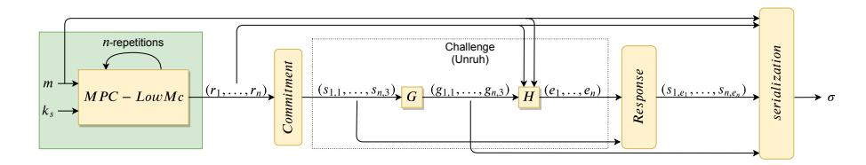

<span id="page-4-0"></span>Fig. 1. Overview of the Picnic signature scheme where m is constant plaintext that is used in LowMC such that LowMC $(m, k_s) = y$ ,  $sk = ((y, m), k_s)$  is the secret key and pk = (y, m) is the public key. The figure is adapted from [7].

will be used to recover the secret key. As our target, we focus on the reference implementation given by the authors [3] which uses the Unruh transformation with security parameters L1. However, our attacks are independent of the actual transformation (Fiat-Shamir or Unruh Transformation) and can be adapted to the different security parameters. The first attack targets the initial sharing of the secret key before its use in the MPC-LowMC implementation while the second attack targets an intermediate state in the shared Sbox implementation of MPC-LowMC.

Attacker Model: We model an adversary who has physical access to a target device, running the Picnic signature scheme. In particular, the attacker is able to measure the side-channel information, such as power or electromagnetic emanation, during the signing of any message. Afterwards the adversary can obtain the valid signature and verify the signature, thus having access to the opened values. In other words, while the implementation follows the MPC paradigm, the adversary learns two out of three shares from the signature and can, with a correct guess of the constant secret, correctly predict the third share. The side-channel leakage of the unknown third share is then used to verify the correctness of the guessed secret, as usual. Please note that the signed message does not affect our model, since the message does not change the computation performed by LowMC, which is based on a fixed (and public) input m and a secret key  $k_s$ .

#### 3.1 Attack on the Secret Sharing Process

Our first attack targets the initial secret sharing process of the secret key  $k_s$  of the MPC-LowMC reference implementation. As shown in Figure 3, the secret sharing process is located before the actual MPC-LowMC part starts. Our analysis targets the secret sharing of the secret key  $k_s$ , which is simply stored in the implementation and freshly shared for each call to MPC-LowMC. First, two n bit keys (or key shares) for two players  $k_0$  and  $k_1$  are generated randomly. Using the random key shares, the key share for the last player  $k_2$  is calculated as:

$$k_2 = k_s \oplus k_0 \oplus k_1$$
.

During the challenge/opening phase of the *Picnic* scheme, the key shares of two of the three players are revealed and become part of the signature. In the

following analysis, we focus on challenge 0 (C0), which reveal the values including k<sup>0</sup> and k1. In the case of Picnic, k<sup>2</sup> is the result of two chained xor-operations. We assume that the output of k<sup>s</sup> ⊕k<sup>0</sup> is saved in a register R before being xored with k1. Thus, we build our hypothesis for the point where we xor key share k<sup>1</sup> with the secret key dependent intermdiate state k<sup>s</sup> ⊕ k0. For each key candidate k <sup>∗</sup> ∈ K we produce the hypothesis value as follows:

$$H_{k^*} = HW(k_1 \oplus R)$$
, such that  $R = k^* \oplus k_0$ , (2)

where HW is the Hamming weight function (i.e. φ := HW). Using the hypothesis values Hk<sup>∗</sup> for all k <sup>∗</sup> ∈ K (where K denotes the key space), we can implement a statistical analysis and the best key candidate reveals ks. While exploiting the leakage of a linear XOR operation is not ideal in terms of distinguishability (wrong keys also show high correlation in this attack), we show that for the target implementation the attack still succeeds with a low number of traces.

It is known that secret sharing of sensitive inputs to an MPC circuit should not be observable by a side channel adversary. An easy fix for this leakage exists by keeping the secret k<sup>s</sup> in shared representation in memory. A refreshing of the shared representation before each MPC-LowMC call is implicitly part of the Picnic protocol already and would thus not incur further overhead.

### <span id="page-5-0"></span>3.2 Attack on the Substitution Layer

Our second attack targets the MPC-LowMC Sbox. We denote the MPC-LowMC players as P0, P1, and P<sup>2</sup> and their states as p0, p1, and p2, respectively. We further denote a (theoretical) unshared version (player P) of the state as p, i.e. p = p<sup>0</sup> ⊕ p<sup>1</sup> ⊕ p2.

We analyse the state values of LowMC(m, ks) with MPC-LowMC(m, ks), where m is the constant (and predefined) plaintext and k<sup>s</sup> is the secret key. MPC-LowMC starts by initializing the state of P<sup>i</sup> with k<sup>i</sup> such that k<sup>s</sup> = k<sup>0</sup> ⊕ k<sup>1</sup> ⊕ k2. As shown in Algorithm [1,](#page-15-0) the plaintext is xored with the key value. In the MPC setting, this step is only performed for the first player's state. In the unmasked LowMC version we set the P state to the value KM<sup>0</sup> · k<sup>s</sup> ⊕ m. In summary, the initial states of the MPC-LowMC variant and the (imaginary) LowMC variant (p) are as follows:

$$p_i \leftarrow KM_0 \cdot k_i \oplus \delta_i \cdot m \text{ for } i = \{0, 1, 2\} \text{ and } p \leftarrow KM_0 \cdot k_s \oplus m$$

where δ<sup>i</sup> = 1 if i = 0 and δ<sup>i</sup> = 0 if i 6= 0. The state of P always equals the xor of all other players' corresponding states, i.e. p equals to p<sup>0</sup> ⊕ p<sup>1</sup> ⊕ p<sup>2</sup> at any given time. In the context of the attack on a single Sbox, the state values p<sup>i</sup> corresponds to three bit vector (a<sup>i</sup> , b<sup>i</sup> , ci). Similarly, the unshared states p denotes three bit vector (a, b, c) such that a = a<sup>0</sup> ⊕ a<sup>1</sup> ⊕ a2, b = b<sup>0</sup> ⊕ b<sup>1</sup> ⊕ b<sup>2</sup> and c = c<sup>0</sup> ⊕c<sup>1</sup> ⊕c2. Using this notation we can introduce the Sbox operation within SboxLayer as;

$$Sbox(a,b,c) = (a \oplus bc, a \oplus b \oplus ac, a \oplus b \oplus c \oplus ab). \tag{3}$$

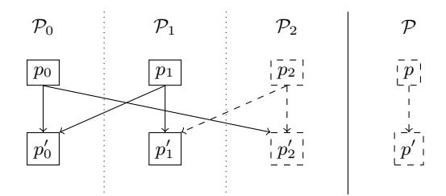

<span id="page-6-0"></span>Fig. 2. SboxLayer calculation for MPC-LowMC (left) and LowMC (right). Dashed boxes and arrows represent the values that are *not* opened during the challenge  $C_0$  and  $p_i$  (resp.  $p'_i$ ) represents the state of  $\mathcal{P}_i$  before (resp. after) the Sbox operation

In the MPC-LowMC setting, the Sbox is defined according to the linear decomposition of the binary multiplication gate. That means that the players need to communicate their bits according to the definition in ZKBoo [15]. Assume that the values ab, bc and ac are calculated in the MPC setting and the state values for  $\mathcal{P}_i$  are denoted by  $[ab]_i$ ,  $[bc]_i$  and  $[ac]_i$  respectively (for example  $ab = [ab]_0 \oplus [ab]_1 \oplus [ab]_2$ ). Each player calculates the following equations in order to generate the shared representations of the state values:

$$[bc]_{i} = b_{i}c_{i} \oplus b_{j}c_{i} \oplus b_{i}c_{j} \oplus r_{i}^{bc} \oplus r_{j}^{bc}$$

$$[ac]_{i} = a_{i}c_{i} \oplus a_{j}c_{i} \oplus a_{i}c_{j} \oplus r_{i}^{ac} \oplus r_{j}^{ac}$$

$$[ab]_{i} = a_{i}b_{i} \oplus a_{j}b_{i} \oplus a_{i}b_{j} \oplus r_{i}^{ab} \oplus r_{j}^{ab}$$

$$(4)$$

where  $j = i + 1 \mod 3$  and  $r_i^{ab}$  (resp.  $r_i^{ac}$  and  $r_i^{bc}$ ) represents the random bit generated by the  $i^{th}$  player while calculating the output share of  $[bc]_i$  (resp.  $[ac]_i$  and  $[ab]_i$ ).

In Picnic, n runs of the MPC-LowMC are pre-computed and in the challenge response phase, two players' keys and random tapes are opened. For example, for the challenge  $C_0$  the values  $a_i$ ,  $b_i$ ,  $c_i$ , and  $r_i = (r_i^{ab}, r_i^{ac}, r_i^{bc})$  for i = 0, 1 are opened. A visualization of challenge  $C_0$  and which values are revealed is shown in Figure 2.

Setup and Hypothesis: Similar to the previous attack, we focus on the challenge  $C_0$ . Adapting the attack to other challenges  $C_1$  and  $C_2$  is possible in the natural way. As described in the Attacker Model we assume a scenario where an adversary can access the values the state values  $p_0$  and  $p_1$ . We also assume a leakage model where an implementation leaks weak and noisy information about each intermediate variable, separately and independently in observable measurement traces. Our claim is that the MPCitH measurements have a weak and noisy dependence on  $p_2$ , which can be exploited due the revealed shares  $p_0$  and  $p_1$ .

We define a state-guess  $p^*$  of  $\mathcal{P}$  of the input for the Sbox. The aim of the DPA attack is to get knowledge of the state of  $\mathcal{P}_2$ . As mentioned before, we cannot directly recover it with a first order DPA attack (due to the circuit decomposition), as we would need to guess the actual state as well as the random

value/mask. However, we can exploit the structure of MPCitH. Remark that in the following attack description the values  $p_i = (a_i, b_i, c_i)$ ,  $p_i' = (a_i', b_i', c_i')$  and  $r_i = (r_i^{ab}, r_i^{bc}, r_i^{ac})$  are public for  $i = \{0, 1\}$  and secret for i = 2 The values that depend on the key guess are marked by tilde  $(\sim)$ .

- 1. For each  $p^*(:=(\tilde{a},\tilde{b},\tilde{c})) \in \mathcal{K}$  (in the LowMC case  $\mathcal{K}:=\mathbb{F}_2^3$ ) compute  $(\tilde{a}',\tilde{b}',\tilde{c}')=Sbox(\tilde{a},\tilde{b},\tilde{c})$ .
- 2. Compute the output state of  $\mathcal{P}_2$  as:

$$(\tilde{a}_2', \tilde{b}_2', \tilde{c}_2') = (\tilde{a}' \oplus a_0 \oplus a_1, \tilde{b}' \oplus b_0 \oplus b_1, \tilde{c}' \oplus c_0 \oplus c_1)$$

3. DPA: perform a statistical analysis using  $\phi(\tilde{p}'_2)$  with the side-channel leakage of the device.

For each state guess  $p^*$ , we are not considering the random bits used in LowMC-MPC, instead we use the knowledge of revealed values to correctly guess the final share  $p_2$ . A more compact description of the attack can be found in Algorithm 2.

### 4 Practical Setup and Experimental Results

Next, we experimentally evaluate our attacks on the reference implementation of Picnic, ported to the FRDM-K66F development board [1]. The board features an NXP MK66FN2M0VMD18 Cortex-M4F MCU with 2MB flash and 256 KB SRAM, which we clocked at to 120 MHz. To measure the dynamic power consumption during Picnic, we collected 20,000 traces using a Langer EM Probe [2] placed 1 mm above the C37  $0.1\mu$ F blocking capacitor of the FRDM-K66F board. Measurements were taken using a Tektronix MSO6 at 312.5 MHz sampling rate. Since the relevant part of the signature generation are the calls to LowMC, we placed a trigger before the start of the LowMC calls.

Recall that in each MPC-round the prover chooses a random challenge and depending on the challenge the prover opens a subset of the views for verification. In our test environment, we decrease the number of MPC-Rounds to 50 from 219 and also fixed the challenge to ease analysis. As in Picnic there exists 3 possible challenge and 219 MPC-rounds, which means that the number of traces per challenge is  $\sim 73$ . Thus, our setup lower-bounds the information observed by a real-world adversary.

An example trace starting with the secret sharing until the end of the first SboxLayer can be seen in Figure 3, which contains the relevant initial operations as well as operations from the first round of MPC-LowMC. The 10 shared Sbox computations are on the right side, while the secret sharing happens early, as indicated on the left side of the plot. We applied a minimal pre-processing step, of cutting the necessary part for each attack.

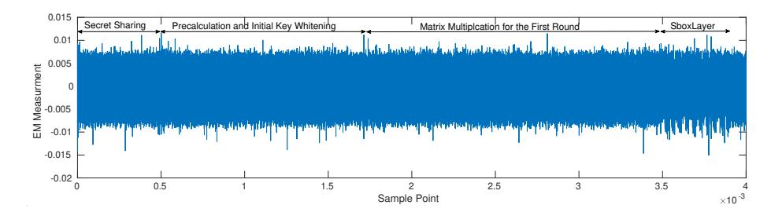

<span id="page-8-0"></span>Fig. 3. An annotated example EM trace for one round of LowMC.

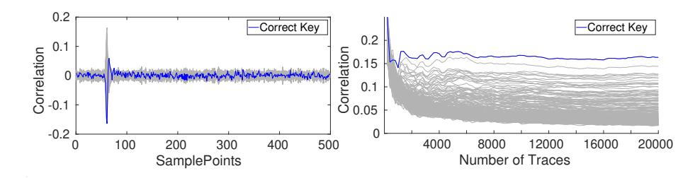

<span id="page-8-1"></span>**Fig. 4.** Left side: DPA using 5000 sample points and 20,000 traces. Right side: The change of absolute values of DPA results with respect to number of traces. Although we can see a positive peak in the first figure, the second figure shows that the correct key is distinguishable with less that 2000 traces.

#### 4.1 Results of the Attack on the Secret Sharing Process

The resulting correlation for the key hypothesis with 5,000 sample points and 20,000 traces can be seen on the left hand side of Figure 4 which shows the correlation values for the first byte of the secret key. The right side of Figure 4 shows the change in correlation results for each key guess with respect to the number of traces. In our analysis we choose the key space as  $\mathbb{F}_2^8$  (however the space can be defined as  $\mathbb{F}_2$  or  $\mathbb{F}_2^{32}$ ). As a result, we see 9 clusters for the different key guesses based on the *Hamming weight* values. We can clearly distinguish the correct secret key with 2000 traces.

#### 4.2 The Practical Results of Attack on the Substitution Layer

In order to validate the leakage model, we use a simple t-test setup. In this analysis we collect traces of Picnic signature generation. The analysis uses the side-channel information of the unopened view and the two opened shares of a multiplication gadget. We target a single bit (e.g. a' in Equation (1)) inside the SboxLayer. We classify the traces into two groups depending on the value of  $a'_0 \oplus a'_1$ . The result of the t-test in Figure 5 shows the clear dependence between the unrevealed share  $a'_2$  and the observable measurement traces, as the t-value clearly exceeds 4.5.

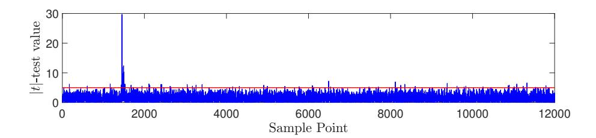

<span id="page-9-0"></span>**Fig. 5.** A *t*-test based leakage detection of a single output bit (a') in Picnic using the classification based on  $i = a'_0 \oplus a'_1$ . The details of the experimental setup and formulation can found in Appendix A.

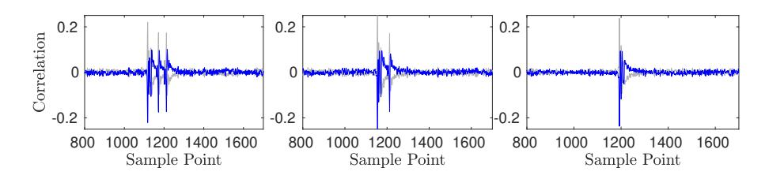

<span id="page-9-1"></span>Fig. 6. DPA with 20,000 traces on the 10<sup>th</sup>th Sbox using first, second and third bit.

In order to experimentally verify this leakage, we applied the attack (as described in Section 3.2) to the first five rounds of MPC-LowMC. Due to the SboxLayer structure of LowMC, only the first 30 bits of state are processed by Sbox operations, therefore we can only recover 30 bits of state-information of the first round key.

In Figure 6, we present the DPA of the 3 output bits of the 10th Sbox of the first round using 20,000 traces. We see that the two lines corresponding to the key guesses are the inverse of each other. As a result of our measurement setup, the negatives peaks correspond to the device's current and therefore give us the correct bits. As this behavior is the same for all leaking key bits, prior knowledge of the negative correlation is not necessary.

The Sbox structure of LowMC has some characteristics (seen in Equation (1)), such as first input bit a is xored with the first, the second and the third output bit. Therefore, when we build our hypothesis on the first bit of the Sbox output (i.e  $a \oplus bc$ ), the guessed value is highly correlated with the second and the third output bit. Thus, we see three peaks in the first figure. Similarly, in the second one (where we guess the  $a \oplus b \oplus ac$ ) we see two peaks and in the last one we can see only one peak. In Figure 7, we can see the distinguishability of the three bits of the 10th Sbox. We can see that no more than 1,000 traces are needed to clearly identify the correct key. The attack uses the opened state values of the two players, such as  $\mathcal{P}_0$  and  $\mathcal{P}_1$ . Therefore the attack can be implemented independently to the deeper rounds to recover key-related information. The attacks on the deeper rounds can be seen in Appendix C. As the scheme uses a constant

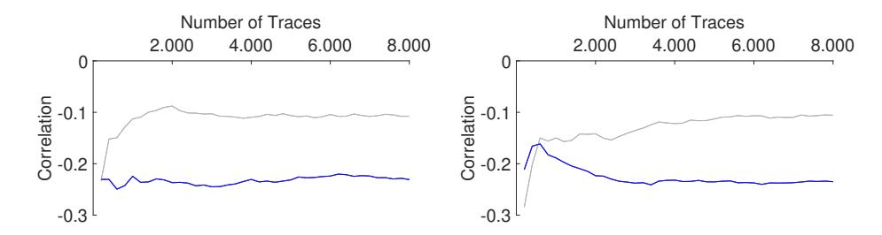

<span id="page-10-0"></span>Fig. 7. The change of *minimum* values of DPA results with respect to number of traces. Clearly, the correct key (which has the highest-negative value) is distinguishable even after 2,000 traces.

plaintext for all challenges, the unshared state  $\mathcal{P}$  is constant for every run. That means, our attack can be applied to every round to receive 30 bits of key-related information.

#### 4.3 Algebraic Key Recovery

In the previous part, we have described how to gain key-related information using side-channel analysis. In this section, we introduce how to combine this information from different rounds and extract the master key  $k_s$ . We form a system of linear equations  $\mathcal{U}k_s = \mathcal{V}$  where  $k_s$  is the n-bit master key,  $\mathcal{U}$  is a  $30 \cdot t \times n$  matrix (t is the number of analysed rounds) and  $\mathcal{V}$  is a  $30 \cdot t$ -bit recovered-state. To produce such a system we consider attacks on individual round and find equations like  $\mathcal{U}_i k_s = \mathcal{V}_i$ . In the following, the notation  $\mathcal{U}[i:j]$  is used to denote the rows of a matrix between  $i^{th}$  and  $j^{th}$  index. The  $i^{th}$  round state before and after SboxLayer is denoted by  $p_i$  and  $p_i'$  respectively. Remark that, due to the structure of LowMc only first 30-bit of the state is processed by the SboxLayer, i.e.  $p_i'[1:30] = Sbox(p_i)[1:30]$  and  $p_i'[31:128] = p_i[31:128]$ . We start with the initial step or zero round attack.

Zero Round Attack: As described in Section 3.2, we can recover 30-bit state information that correspond to first 30-bit of  $KM_0 \times k_s$ . Therefore, the equations can be initialized as  $\mathcal{U}[1:30] \leftarrow KM_0[1:30]$  and  $\mathcal{V}[1:30] \leftarrow k_0[1:30]$ .

 $i^{th}$ -Round Attack: Using the above analysis we can repeat the same procedure for the deeper rounds. We reformulate the state values with initial values  $\mathcal{U}_0 = KM_0$  and  $t_0 = m$ 

```
\begin{aligned} p_{i+1} &= LM_i(Sbox(p_i)) \oplus RC_i \oplus KM_ik_s \\ &= LM_i(p_i'[1:30] \mid\mid p_i[31:128]) \oplus RC_i \oplus KM_ik_s \\ &= LM_i(p_i'[1:30] \mid\mid (\mathcal{U}_{i-1}k_s \oplus t_{i-1})[31:128]) \oplus RC_i \oplus KM_ik_s \\ &= LM_i(p_i'[1:30] \mid\mid t_{i-1}[31:128]) \oplus LM_i(\mathcal{Z} \mid\mid ((\mathcal{U}_{i-1}k_s)[31:128])) \\ &\oplus RC_i \oplus KM_ik_s \end{aligned}
```

where Z is a 30×128 zero matrix and t<sup>0</sup> = m. Using this state representation we can define the system of linear equations Uik<sup>s</sup> = V<sup>i</sup> as:

```
– Ui = LMi(Z||(Ui−1)[31 : 128]) ⊕ KMi and
– Vi = LMi(p
               0
               i
                [1 : 30]||ti−1[31 : 128])[1 : 30] ⊕ pi+1[1 : 30] ⊕ RCi
                                                                    [1 : 30].
```

and update the state value as:

```
– ti = LMi(p
               0
               i
                [1 : 30]||ti−1[31 : 128]) ⊕ RCi
```

After forming the equation as above, we can collect the indices corresponding to the 30-bit state information. Hence, we update the solution matrices U and V as follows:

```
U[30i + 1 : 30(i + 1)] ← Ui
                             [1 : 30] and V[30i + 1 : 30(i + 1)] ← Vi
                                                                      [1 : 30]
```

This calculation holds for any round, thus we can generate equations for 30 rows of U<sup>i</sup> with the solution in V<sup>i</sup> . After collecting enough equations, we can solve the system Uk<sup>s</sup> = V with a simple Gaussian elimination and recover the secret key. As we gain 30 equations per observed round, 5 rounds suffice to make the search space small enough to recover the key quickly. The algorithm can be found in Appendix [B.](#page-15-1)

Remark that, the attack can work with less number of rounds. For example an attack on three rounds will produce 90 independent linear equations and a solution space with 2128−<sup>90</sup> possible solution which can be still exploitable.

### 5 Conclusion

In this work, we presented the first side-channel analysis of the Picnic signature scheme, a family of digital signature schemes secure against attacks by quantum computers and currently considered an alternate candidate in round three of the NIST PQC standardization process. We showed that the core part of the scheme, MPC-LowMC is vulnerable to side-channel attacks. By exploiting the features of the known shares for side-channel analysis, we were able to recover 30 bits of each round state of LowMC. We showed how key leakage from several rounds can be combined in an algebraic key recovery by solving a system of linear equations that reveals the secret key. Our analysis shows that we can recover the secret key with less than 2,000 traces for a specific challenge, depending on the attack.

We further showed how the attack, which only targets the secret sharing part, can be extended to completely recover the secret key of Picnic. As one Picnic signature contains at least 219 calls to MPC-LowMC, as little as 30 signatures suffice to recover the secret key even if we only use traces for one particular unknown party. These results highlight the need for side-channel protection for Picnic. When compared to classic block cipher protection, the MPC-in-the-head approach rather makes the attack easier, as known inputs are available for all rounds of computation.

### Acknowledgments

This work has been supported by the German Federal Ministry of Education and Research (BMBF) under the project PQC4MED (FKZ 16KIS1045).

### References

- <span id="page-12-12"></span>1. FRDM-K66F: Freedom Development Platform for Kinetis. [https://www.nxp.com/](https://www.nxp.com/downloads/en/schematics/FRDM-K66F-SCH.pdf) [downloads/en/schematics/FRDM-K66F-SCH.pdf](https://www.nxp.com/downloads/en/schematics/FRDM-K66F-SCH.pdf)
- <span id="page-12-13"></span>2. LF-U 2.5, H-Field Probe 100 kHz-50 MHz . [https://www.](https://www.langer-emv.de/en/product/lf-passive-100-khz-50-mhz/36/lf-u-2-5-h-field-probe-100-khz-up-to-50-mhz/5) [langer-emv.de/en/product/lf-passive-100-khz-50-mhz/36/](https://www.langer-emv.de/en/product/lf-passive-100-khz-50-mhz/36/lf-u-2-5-h-field-probe-100-khz-up-to-50-mhz/5) [lf-u-2-5-h-field-probe-100-khz-up-to-50-mhz/5](https://www.langer-emv.de/en/product/lf-passive-100-khz-50-mhz/36/lf-u-2-5-h-field-probe-100-khz-up-to-50-mhz/5)
- <span id="page-12-10"></span>3. Picnic: Post Quantum Signatures. <https://github.com/microsoft/Picnic>
- <span id="page-12-0"></span>4. Alagic, G., Alperin-Sheriff, J., Apon, D., Cooper, D., Dang, Q., Kelsey, J., Liu, Y.K., Miller, C., Moody, D., Peralta, R., et al.: Status Report on the Second Round of the NIST, Post-Quantum Cryptography Standardization Process (2020), <https://nvlpubs.nist.gov/nistpubs/ir/2020/NIST.IR.8309.pdf>
- <span id="page-12-11"></span>5. Albrecht, M.R., Rechberger, C., Schneider, T., Tiessen, T., Zohner, M.: Ciphers for MPC and FHE. In: Oswald, E., Fischlin, M. (eds.) Advances in Cryptology – EUROCRYPT 2015. pp. 430–454 (2015)
- <span id="page-12-8"></span>6. Alkim, E., Ducas, L., P¨oppelmann, T., Schwabe, P.: Post-quantum key exchange—a new hope. In: 25Th {USENIX} security symposium ({USENIX} security 16). pp. 327–343 (2016)
- <span id="page-12-5"></span>7. Aranha, D.F., Orlandi, C., Takahashi, A., Zaverucha, G.: Security of Hedged Fiat– Shamir Signatures Under Fault Attacks. In: Canteaut, A., Ishai, Y. (eds.) Advances in Cryptology – EUROCRYPT 2020. pp. 644–674 (2020)
- <span id="page-12-6"></span>8. Azarderakhsh, R., Campagna, M., Costello, C., Feo, L., Hess, B., Jalali, A., Jao, D., Koziel, B., LaMacchia, B., Longa, P., et al.: Supersingular isogeny key encapsulation. Submission to the NIST Post-Quantum Standardization project (2017)
- <span id="page-12-2"></span>9. Bar-El, H., Choukri, H., Naccache, D., Tunstall, M., Whelan, C.: The Sorcerer's Apprentice Guide to Fault Attacks. Proceedings of the IEEE 94(2), 370–382 (Feb 2006)
- <span id="page-12-9"></span>10. Baum, C., de Saint Guilhem, C.D., Kales, D., Orsini, E., Scholl, P., Zaverucha, G.: Banquet: Short and Fast Signatures from AES. Cryptology ePrint Archive, Report 2021/068 (2021), <https://eprint.iacr.org/2021/068>
- <span id="page-12-1"></span>11. Boneh, D., DeMillo, R.A., Lipton, R.J.: On the Importance of Checking Cryptographic Protocols for Faults. In: Fumy, W. (ed.) Advances in Cryptology EURO-CRYPT'97, Lecture Notes in Computer Science, vol. 1233, pp. 37–51. Springer Berlin Heidelberg (1997)
- <span id="page-12-7"></span>12. Bos, J., Ducas, L., Kiltz, E., Lepoint, T., Lyubashevsky, V., Schanck, J.M., Schwabe, P., Seiler, G., Stehle, D.: Crystals - kyber: A cca-secure module-latticebased kem. In: 2018 IEEE European Symposium on Security and Privacy (EuroS P). pp. 353–367 (2018)
- <span id="page-12-3"></span>13. Bos, J.W., Hubain, C., Michiels, W., Teuwen, P.: Differential computation analysis: Hiding your white-box designs is not enough. In: International Conference on Cryptographic Hardware and Embedded Systems. pp. 215–236. Springer (2016)
- <span id="page-12-4"></span>14. Castelnovi, L., Martinelli, A., Prest, T.: Grafting Trees: a Fault Attack against the SPHINCS framework. In: International Conference on Post-Quantum Cryptography. pp. 165–184. Springer (2018)

- <span id="page-13-9"></span>15. Chase, M., Derler, D., Goldfeder, S., Orlandi, C., Ramacher, S., Rechberger, C., Slamanig, D., Zaverucha, G.: Post-quantum zero-knowledge and signatures from symmetric-key primitives. In: Proceedings of the 2017 ACM SIGSAC Conference on Computer and Communications Security. pp. 1825–1842 (2017)
- <span id="page-13-13"></span>16. Coron, J.S., Kocher, P., Naccache, D.: Statistics and Secret Leakage. In: Frankel, Y. (ed.) Financial Cryptography. pp. 157–173. Springer Berlin Heidelberg, Berlin, Heidelberg (2001)
- <span id="page-13-6"></span>17. Ding, J., Schmidt, D.: Rainbow, a new multivariable polynomial signature scheme. In: International Conference on Applied Cryptography and Network Security. pp. 164–175. Springer (2005)
- <span id="page-13-8"></span>18. Ducas, L., Kiltz, E., Lepoint, T., Lyubashevsky, V., Schwabe, P., Seiler, G., Stehl´e, D.: Crystals-dilithium: A lattice-based digital signature scheme. IACR Transactions on Cryptographic Hardware and Embedded Systems 2018(1), 238– 268 (Feb 2018). [https://doi.org/10.13154/tches.v2018.i1.238-268,](https://doi.org/10.13154/tches.v2018.i1.238-268) [https://tches.](https://tches.iacr.org/index.php/TCHES/article/view/839) [iacr.org/index.php/TCHES/article/view/839](https://tches.iacr.org/index.php/TCHES/article/view/839)
- <span id="page-13-7"></span>19. Eisenbarth, T., Von Maurich, I., Ye, X.: Faster hash-based signatures with bounded leakage. In: International Conference on Selected Areas in Cryptography. pp. 223– 243. Springer (2013)
- <span id="page-13-2"></span>20. Gandolfi, K., Mourtel, C., Olivier, F.: Electromagnetic analysis: Concrete results. In: Cryptographic Hardware and Embedded Systems - 2001. pp. 251–261. Springer (2001)
- <span id="page-13-3"></span>21. Genkin, D., Pachmanov, L., Pipman, I., Tromer, E.: Stealing keys from PCs using a radio: Cheap electromagnetic attacks on windowed exponentiation. In: International workshop on cryptographic hardware and embedded systems. pp. 207–228. Springer (2015)
- <span id="page-13-0"></span>22. Genkin, D., Shamir, A., Tromer, E.: RSA key extraction via low-bandwidth acoustic cryptanalysis. In: Advances in Cryptology–CRYPTO 2014, pp. 444–461. Springer Berlin Heidelberg (2014)
- <span id="page-13-11"></span>23. Giacomelli, I., Madsen, J., Orlandi, C.: ZKBoo: Faster Zero-Knowledge for Boolean Circuits. In: 25th USENIX Security Symposium (USENIX Security 16). pp. 1069– 1083. USENIX Association, Austin, TX (2016)
- <span id="page-13-14"></span>24. Goodwill, G., Jun, B., Jaffe, J., Rohatgi, P., et al.: A testing methodology for side-channel resistance validation (2011), nIST non-invasive attack testing workshop, [https://csrc.nist.gov/csrc/media/events/](https://csrc.nist.gov/csrc/media/events/non-invasive-attack-testing-workshop/documents/08_goodwill.pdf) [non-invasive-attack-testing-workshop/documents/08\\_goodwill.pdf](https://csrc.nist.gov/csrc/media/events/non-invasive-attack-testing-workshop/documents/08_goodwill.pdf)
- <span id="page-13-4"></span>25. Inci, M.S., Gulmezoglu, B., Irazoqui, G., Eisenbarth, T., Sunar, B.: Cache attacks enable bulk key recovery on the cloud. In: International Conference on Cryptographic Hardware and Embedded Systems. pp. 368–388. Springer (2016)
- <span id="page-13-10"></span>26. Ishai, Y., Kushilevitz, E., Ostrovsky, R., Sahai, A.: Zero-Knowledge from Secure Multiparty Computation. p. 21–30. STOC '07, Association for Computing Machinery (2007)
- <span id="page-13-12"></span>27. Katz, J., Kolesnikov, V., Wang, X.: Improved Non-Interactive Zero Knowledge with Applications to Post-Quantum Signatures. CCS '18, Association for Computing Machinery (2018)
- <span id="page-13-5"></span>28. Kipnis, A., Patarin, J., Goubin, L.: Unbalanced Oil and Vinegar Signature Schemes. In: International Conference on the Theory and Applications of Cryptographic Techniques. pp. 206–222. Springer (1999)
- <span id="page-13-1"></span>29. Kocher, P., Jaffe, J., Jun, B., Rohatgi, P.: Introduction to differential power analysis. Journal of Cryptographic Engineering 1(1), 5–27 (2011)

- <span id="page-14-1"></span>30. Kocher, P.C.: Timing Attacks on Implementations of Diffie-Hellman, RSA, DSS, and Other Systems. In: CRYPTO. Lecture Notes in Computer Science, vol. 1109, pp. 104–113. Springer (1996)
- <span id="page-14-13"></span>31. Kocher, P.C., Jaffe, J., Jun, B.: Differential Power Analysis. In: Proceedings of the 19th Annual International Cryptology Conference on Advances in Cryptology. pp. 388–397. CRYPTO '99 (1999)
- <span id="page-14-4"></span>32. Longo, J., De Mulder, E., Page, D., Tunstall, M.: SoC it to EM: electromagnetic side-channel attacks on a complex system-on-chip. In: International Workshop on Cryptographic Hardware and Embedded Systems. pp. 620–640. Springer (2015)
- <span id="page-14-14"></span>33. Mangard, S., Oswald, E., Popp, T.: Power Analysis Attacks: Revealing the Secrets of Smart Cards (Advances in Information Security). Springer-Verlag, Berlin, Heidelberg (2007)
- <span id="page-14-6"></span>34. Park, A., Shim, K.A., Koo, N., Han, D.G.: Side-Channel Attacks on Post-Quantum Signature Schemes based on Multivariate Quadratic Equations 2018, 500–523 (Aug 2018).<https://doi.org/10.13154/tches.v2018.i3.500-523>
- <span id="page-14-9"></span>35. Pessl, P., Prokop, L.: Fault attacks on cca-secure lattice kems. IACR Transactions on Cryptographic Hardware and Embedded Systems 2021(2), 37–60 (Feb 2021). [https://doi.org/10.46586/tches.v2021.i2.37-60,](https://doi.org/10.46586/tches.v2021.i2.37-60) [https://tches.iacr.org/](https://tches.iacr.org/index.php/TCHES/article/view/8787) [index.php/TCHES/article/view/8787](https://tches.iacr.org/index.php/TCHES/article/view/8787)
- <span id="page-14-7"></span>36. Ravi, P., Jhanwar, M.P., Howe, J., Chattopadhyay, A., Bhasin, S.: Side-channel assisted existential forgery attack on dilithium - a nist pqc candidate. Cryptology ePrint Archive, Report 2018/821 (2018), <https://eprint.iacr.org/2018/821>
- <span id="page-14-10"></span>37. de Saint Guilhem, C.D., De Meyer, L., Orsini, E., Smart, N.P.: BBQ: Using AES in Picnic Signatures. In: Paterson, K.G., Stebila, D. (eds.) Selected Areas in Cryptography – SAC 2019. pp. 669–692. Springer International Publishing, Cham (2020)
- <span id="page-14-11"></span>38. de Saint Guilhem, C.D., Orsini, E., Tanguy, T.: Limbo: Efficient zero-knowledge mpcith-based arguments. Cryptology ePrint Archive, Report 2021/215 (2021), <https://eprint.iacr.org/2021/215>
- <span id="page-14-12"></span>39. Seker, O., Berndt, S., Wilke, L., Eisenbarth, T.: SNI-in-the-Head: Protecting MPC-in-the-Head Protocols against Side-Channel Analysis. In: Proceedings of the 2020 ACM SIGSAC Conference on Computer and Communications Security. p. 1033–1049. CCS '20, Association for Computing Machinery, New York, NY, USA (2020)
- <span id="page-14-0"></span>40. Shor, P.W.: Polynomial time algorithms for prime factorization and discrete logarithms on a quantum computer. SIAM J. Sci. Statist. Comput. 26, 1484 (1997)
- <span id="page-14-15"></span>41. Standaert, F.: How (not) to use welch's t-test in side-channel security evaluations. In: CARDIS. Lecture Notes in Computer Science, vol. 11389, pp. 65–79. Springer (2018)
- <span id="page-14-5"></span>42. Taha, M., Eisenbarth, T.: Implementation Attacks on Post-Quantum Cryptographic Schemes. IACR Cryptology ePrint Archive 2015, 1083 (2015)
- <span id="page-14-2"></span>43. Tromer, E., Osvik, D.A., Shamir, A.: Efficient cache attacks on AES, and countermeasures. Journal of Cryptology 23(1), 37–71 (2010)
- <span id="page-14-3"></span>44. Yarom, Y., Falkner, K.: FLUSH+RELOAD: A High Resolution, Low Noise, L3 Cache Side-Channel Attack. In: 23rd USENIX Security Symposium (USENIX Security 14). pp. 719–732. USENIX Association, San Diego, CA (Aug 2014), [https://www.usenix.org/conference/usenixsecurity14/](https://www.usenix.org/conference/usenixsecurity14/technical-sessions/presentation/yarom) [technical-sessions/presentation/yarom](https://www.usenix.org/conference/usenixsecurity14/technical-sessions/presentation/yarom)
- <span id="page-14-8"></span>45. Zhang, F., Yang, B., Dong, X., Guilley, S., Liu, Z., He, W., Zhang, F., Ren, K.: Side-channel analysis and countermeasure design on arm-based quantumresistant sike. IEEE Transactions on Computers 69(11), 1681–1693 (2020). <https://doi.org/10.1109/TC.2020.3020407>

#### <span id="page-15-2"></span>A Leakage Assessment

The test vector leakage assessment (TVLA) leakage detection method by Goodwill et al. [24] is recognised as a pass-fail test to decide if an implementation can be consider as secure or not. The test detects leakages at a given orders using two different method: the non-specific and the specific method. The first one, analyses two different set of traces, one generated by processing a fixed input and one generated by processing a random input. The latter one employs only the traces with a random input and used a function of inputs to sort the traces. The main favour of the second method is that it can lead to an actual attack. After collecting and sorting the traces, the means  $(\mu_0, \mu_1)$  and standard deviations  $(\sigma_0, \sigma_1)$  for two sets are calculated in both variants. Welch's t-test is computed as

$$t = \frac{\mu_f - \mu_r}{\sqrt{(\sigma_f^2/n_f) + (\sigma_r^2/n_r)}},$$

where  $n_0$  and  $n_1$  denote the number of traces for the two distinguished sets, respectively. Typically, it is assumed that leakage is present if a threshold of  $t \geq 4.5$  or 5 is exceeded [41].

### <span id="page-15-1"></span>**B** Additional Algorithms

#### <span id="page-15-0"></span>Algorithm 1 LowMC Encryption Scheme

```
Input: Key matrices KM_{i\in[1,r]}\in\mathbb{F}_2^{n\times k}, Linear matrices LM_{i\in[1,r]}\in\mathbb{F}_2^{n\times n}, Round
     constants RC_{i\in[1,r]}\in\mathbb{F}_2^n, a plaintext p\in\mathbb{F}_2^n and a secret-key k_s\in\mathbb{F}_2^n
Output: Ciphertext s \in \mathbb{F}_2^n such that s = \mathsf{LowMC}(p, k_s).
 1: s \leftarrow (KM_0 \cdot k_s) \oplus p
                                                                                          ▷ Initial Key Addition
 2: for 1 \leq i \leq r do
 3:
          s \leftarrow Sbox(s)
                                                                                                        ▷ SboxLayer
 4:
          s \leftarrow LM_i \cdot s
                                                                                                    ▷ LinearLayer
 5:
          s \leftarrow RC_i \oplus s
                                                                                            ▷ ConstantAddition
          s \leftarrow (KM_i \cdot k_s) \oplus s
                                                                                                    ▷ KeyAddition
 7: return s
```

#### <span id="page-16-0"></span>Algorithm 2 DPA Attack on the State of LowMC.

```
Input: The set of revealed (public) values p_i = (a_i, b_i, c_i), p'_i = (a'_i, b'_i, c'_i) and a side-
    channel trace T.
```

**Output:** Best state candidate  $k^*$ .

- $\begin{array}{ll} 1: \ \mathbf{for} \ \mathbf{all} \ \ p^* \in \mathcal{K} \ \ \mathbf{do} \\ 2: \qquad (\tilde{a}', \tilde{b}', \tilde{c}') \leftarrow Sbox(\tilde{a}, \tilde{b}, \tilde{c}) \end{array}$
- $(\tilde{a}_2', \tilde{b}_2', \tilde{c}_2') = (\tilde{a}' \oplus a_0 \oplus a_1, \tilde{b}' \oplus b_0 \oplus b_1, \tilde{c}' \oplus c_0 \oplus c_1)$ 3:
- 4:  $R \leftarrow \operatorname{corr}(\phi(p'_{2H}), T)$
- 5: **return** best state candidate  $p^*$

### Algorithm 3 Algebraic Key Recovery

```
Input: The state values recovered using DPA, p_i[1:30] for i=0,\ldots,n.
Output: k_s
```

- 1:  $U_0 = KM_0$  and  $t_0 = m$
- 2:  $\mathcal{U}[1:30] \leftarrow \mathcal{U}_0[1:30]$  and  $\mathcal{V}[1:30] \leftarrow k_0[1:30]$
- 3: for Round i = 1 to n do
- $\mathcal{U}_i = LM_i(\mathcal{Z}||(\mathcal{U}_{i-1})[31:128]) \oplus KM_i$ 4:
- $V_i = LM_i(p_i'[1:30]||t_{i-1}[31:128]) \oplus p_{i+1}[1:30] \oplus RC_i[1:30]$ 5:
- 6:  $t_i = LM_i(p_i'[1:30]||t_{i-1}[31:128]) \oplus RC_i$
- 7:  $\mathcal{U}[30i + 1:30(i+1)] = \mathcal{U}_i[1:30]$ ▶ Update the coefficient Matrix
- $\mathcal{V}[30i+1:30(i+1)] = \mathcal{V}_i[1:30]$
- ▶ Update the solution Matrix
- 9: **Return** Solution of  $U \cdot k_s = V$

## <span id="page-16-1"></span>Differential Power Analysis Results on Rounds 2-5

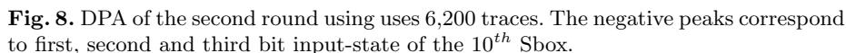

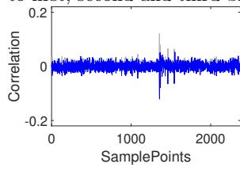

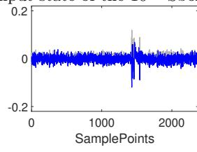

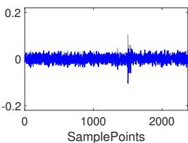

Fig. 9. DPA of the third round using uses 6,200 traces. The negative peaks correspond

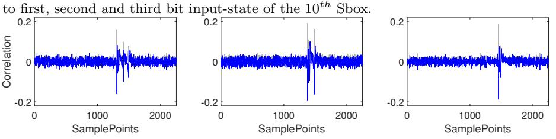

Fig. 10. DPA of the fourth round using uses 6,200 traces. The negative peaks correspond to first, second and third bit input-state of the 10th Sbox.

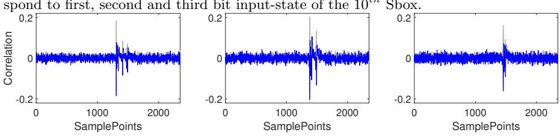

Fig. 11. DPA of the fifth round using uses 6,200 traces. The negative peaks correspond to first, second and third bit input-state of the 10th Sbox.

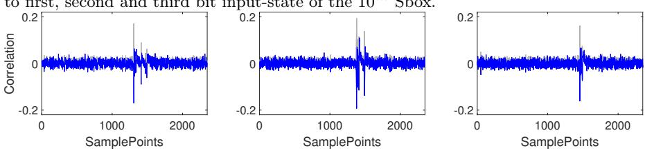