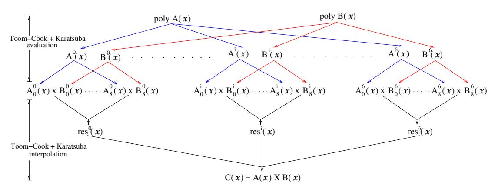
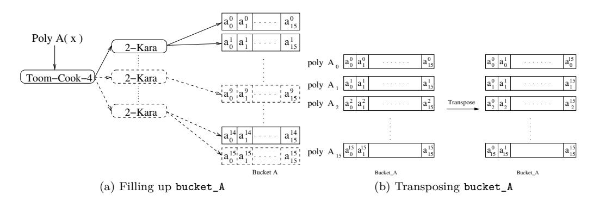
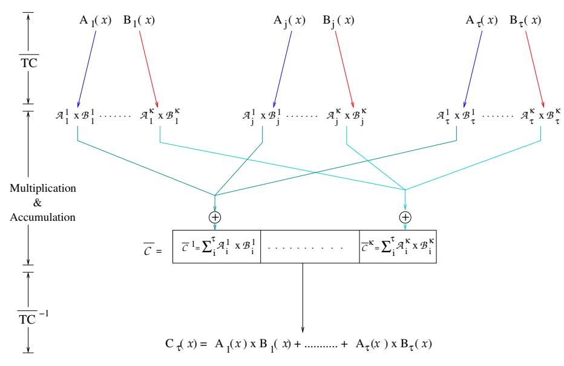
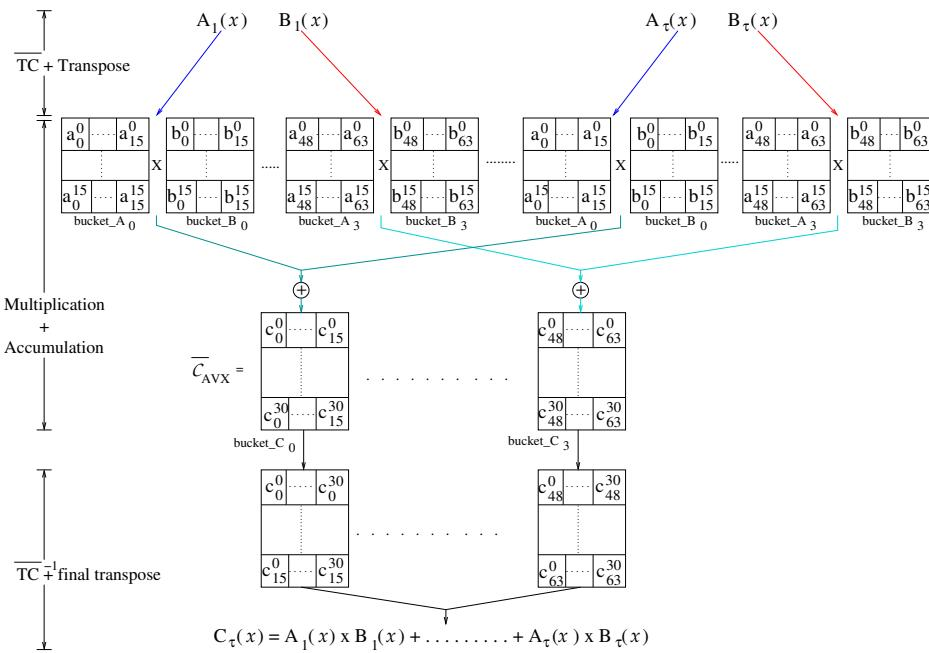

# **Time-memory trade-off in Toom-Cook multiplication: an application to module-lattice based cryptography**

Jose Maria Bermudo Mera, Angshuman Karmakar, Ingrid Verbauwhede

imec-COSIC, KU Leuven Kasteelpark Arenberg 10, Bus 2452, B-3001 Leuven-Heverlee, Belgium [{Jose.Bermudo,Angshuman.Karmakar,Ingrid.Verbauwhede}@esat.kuleuven.be](mailto:{Jose.Bermudo,Angshuman.Karmakar,Ingrid.Verbauwhede}@esat.kuleuven.be)

**Abstract.** Since the introduction of the ring-learning with errors problem, the number theoretic transform (NTT) based polynomial multiplication algorithm has been studied extensively. Due to its faster quasilinear time complexity, it has been the preferred choice of cryptographers to realize ring-learning with errors cryptographic schemes. Compared to NTT, Toom-Cook or Karatsuba based polynomial multiplication algorithms, though being known for a long time, still have a fledgling presence in the context of post-quantum cryptography.

In this work, we observe that the pre- and post-processing steps in Toom-Cook based multiplications can be expressed as linear transformations. Based on this observation we propose two novel techniques that can increase the efficiency of Toom-Cook based polynomial multiplications. Evaluation is reduced by a factor of 2, and we call this method precomputation, and interpolation is reduced from quadratic to linear, and we call this method lazy interpolation.

As a practical application, we applied our algorithms to the Saber post-quantum key-encapsulation mechanism. We discuss in detail the various implementation aspects of applying our algorithms to Saber. We show that our algorithm can improve the efficiency of the computationally costly matrix-vector multiplication by 12 − 37% compared to previous methods on their respective platforms. Secondly, we propose different methods to reduce the memory footprint of Saber for Cortex-M4 microcontrollers. Our implementation shows between 2*.*6 and 5*.*7 KB reduction in memory usage with respect to the smallest implementation in the literature.

**Keywords:** Toom-Cook multiplication, key encapsulation mechanism, post-quantum cryptography, lattice-based cryptography, efficient software, Saber

# **Introduction**

Using number theoretic transform (NTT) based polynomial multiplications in schemes based on ring learning with errors (RLWE) or module learning with errors (MLWE) is almost ubiquitous due to their fast quasilinear (*O*(*n* · *logn*)) time complexity although the use of the NTT influences the modulus of the ring. Before the NIST's post-quantum standardization procedure [\[29\]](#page-22-0), we hardly saw any RLWE based cryptographic scheme using Toom-Cook or Karatsuba based polynomial multiplication mostly due to their asymptotically slower (*O*(*n* 1+*ε* )*,* 0 *< ε <* 1) time complexity. Currently, only NTRU-HRSS-KEM [\[8,](#page-20-0) [20,](#page-21-0) [19\]](#page-21-1), NTRU-Prime [\[5,](#page-20-1) [4\]](#page-20-2), Saber [\[12,](#page-20-3) [11\]](#page-20-4), and ThreeBears [\[18\]](#page-21-2) use Toom-Cook [\[34,](#page-22-1) [9\]](#page-20-5) and Karatusba [\[24\]](#page-21-3) based polynomial multiplications among all the schemes that have advanced to the second round of the NIST's post-quantum standardization procedure. This is mostly due to the inherent design constraints that render these schemes

unable to use NTT based polynomial multiplication. However, with a careful choice of parameters, optimal memory management and a cheaper modular reduction, schemes using Toom-Cook and Karatsuba based polynomial multiplication fare well against their NTT based counterparts. NTT based multiplication has many advantages. In addition to the asymptotically faster complexity, in many scenarios it is not required to do all the stages of an NTT multiplication. For example, an NTT based multiplication of  $C(x) = A(x) \times B(x)$ can be done by  $C(x) = NTT^{-1}(NTT(\bar{A}) * NTT(\bar{B}))$  assuming A(x), B(x) satisfy all the constraints imposed by the NTT and  $\bar{A}, \bar{B}$  are two vectors consisting of the coefficients of A(x) and B(x). However, if A(x) is a random polynomial generated by the user then there is no need to perform the forward NTT transform of A(x), i.e., NTT(A), since the NTT transformation of a random vector is also a random vector. Hence, in this case, the user can assume that the vector of coefficients is generated already in the NTT domain, thus eliminating the need for the forward NTT transformation of A(x). Moreover, the NTT preserves the length and bit length of all individual elements of a vector. In a scenario where one multiplicand is the same across multiple operations, the NTT is calculated once and stored for its use in all multiplications. This saves the computational cost of multiple forward NTT transformations without any extra requirement of storage. Lastly, NTT is additively homomorphic, i.e., to calculate  $C_{\tau} = \sum_{i=1}^{\tau} A_i(x) \times B_i(x)$  we can keep adding the multiplied vectors  $\bar{A}_i * \bar{B}_i$  in the NTT domain and defer applying the inverse NTT till the last vector multiplication has been completed as  $C_{\tau}(x) = NTT^{-1} \sum_{i=1}^{\tau} \left( NTT(\bar{A}_i) * NTT(\bar{B}_i) \right)$ . Such type of scenarios arise often in lattice based post-quantum cryptography. NTT based schemes such as NewHope [2] and Kyber [7] use these advantages of the NTT to improve their efficiency.

In Toom-Cook [34, 9] and Karatsuba [24] multiplications the actual multiplication is done by schoolbook multiplications between polynomials with smaller degrees than the original multiplicands after the recursion stops. This is achieved by processing the multiplicand polynomials before the schoolbook multiplications and combining their results afterwards. This overhead for pre- and post-processing can be quite high. For example, in the implementations on Cortex-M4 of [25] and [22] this overhead accounts for 44% of the total cost of a single polynomial multiplication. Note that in both works the percentage of time spent in pre- and post-processing is the same. Although the latter work reports approximately 42% faster polynomial multiplication than the former one, this largely comes from optimizing the schoolbook multiplication. If we look closely, there are many similarities between NTT and Toom-Cook based polynomial multiplication utilizing point-value representation based polynomial multiplication. Our effort in this work is to improve the efficiency of Toom-Cook based polynomial multiplication by removing the overhead of pre- and post-processing as much as possible.

Our contributions in this work can be summarized as below:

- 1. We formally establish that the evaluation and interpolation stages of Toom-Cook [34, 9] and Karatsuba [24] multiplications are linear transformations that are the inverse of each other. We introduce a technique namely lazy interpolation which along with precomputation can reduce the overhead of evaluation and interpolation. We discuss different scenarios where these methods are more suitable. We show that in those scenarios the cost of the overhead can be reduced to a small fraction of its previous cost. Toom-Cook and Karatsuba based polynomial multiplications are known for long time and have been used in efficient implementations of RSA, ElGamal, Diffie-Hellman [33], improving efficiency of McEliece cryptosystem based on QC-LDPC Codes [32] and big number arithmetic [16], etc. To the best of our knowledge, we are the first to use these techniques to improve Toom-Cook and Karatsuba multiplications.
- 2. The advantage of our techniques can be ideally demonstrated in two scenarios.

First, to calculate the sum of two or more polynomial multiplications. Second, when multiple polynomial multiplications have to be calculated and one operand stays the same. Due to the structure of their public matrix and secret vectors, module lattice-based cryptographic protocols provide both of these scenarios. Among the key-encapsulation mechanism schemes submitted to the NIST's post-quantum standardization procedure, Saber [11] and ThreeBears [18] are the only two schemes that are based on module lattices and use Toom-Cook or Karatsuba based polynomial multiplication. Among these two schemes we choose Saber because there are more optimized implementations available in the literature for comparison. Currently, there are three different implementations of Saber targeting three different platforms, i.e., C implementation on general purpose Intel processors, vectorized implementation using Intel's advanced vector extension instructions (AVX2) and Cortex-M4, with their platform specific optimizations. We show the advantages of applying our techniques to Saber both theoretically and experimentally. Further we discuss specific details of applying our techniques on each platform.

- 3. Additionally, we also provide memory optimization techniques to reduce the memory footprint of Saber. Since the memory is not crucial in high end platforms as much as in smaller platforms like microcontrollers, we limit our discussion of memory optimization techniques to the Cortex-M4 platform only.
- 4. We also show that the secret key of Saber can be stored using much less memory without harming the security or performance of the scheme. Following the trail of previous work [25] we provide time-memory results for different implementations combining different memory and speed optimization techniques.

Finally, similarly to the previous implementations [25, 22, 12], none of our implementations uses secret dependent branching or secret dependent memory accesses, and all run in constant time. Though we have used Saber to demonstrate our techniques we firmly believe that our techniques can be applied to other schemes [5, 8, 18] using Toom-Cook or Karatsuba based polynomial multiplications to improve their efficiency<sup>1</sup>.

Organization of this paper: Sec. 1 describes the mathematical notations used in this work along with the most commonly used polynomial multiplication algorithms in post-quantum cryptography. We also provide a short description of the post-quantum keyencapsulation mechanism Saber. In Sec. 2, we describe how the evaluation and interpolation steps of Toom-Cook multiplication can be expressed as linear transformations. We also describe our two techniques to increase the efficiency of Toom-Cook multiplications. We apply our strategies to Saber in Sec. 3 and discuss the implications on different platforms. Sec. 4 describes our memory optimization techniques for reducing the memory footprint of Saber on small microcontrollers. We compare our optimized implementations of Saber with previous works in Sec. 5. Finally, we draw conclusions in Sec 6.

### <span id="page-2-1"></span>1 Preliminaries

We denote Toom-Cook-k-way multiplication as  $TC_k$ . If  $v_1 = [v_0^1, v_1^1, \cdots, v_{n-1}^1]$  and  $v_2 = [v_0^2, v_1^2, \cdots, v_{n-1}^2]$  are two vectors then we use \* to denote elementwise multiplication of  $v_1$  and  $v_2$ , i.e.,  $v_1 * v_2 = [v_0^1 \cdot v_0^2, v_1^1 \cdot v_1^2, \cdots, v_{n-1}^1 \cdot v_{n-1}^2]$ . We use  $\times$  to denote multiplication of polynomials. In the context of this work, it is convenient to denote the degree of the polynomial  $A(x) = a_{n-1}x^{n-1} + a_{n-2}x^{n-2} + \cdots + a_0$  as n where n-1 is the largest integer such that  $a_{n-1} \neq 0$ . In this notation the degree of polynomial becomes equal to the number of coefficients if  $a_i \neq 0$ ,  $i \in [0, n-1]$ . The polynomial ring of degree k and real coefficients is denoted as  $\mathcal{R}_k(x)$ . The quotient polynomial ring  $R_q(x)$  is defined

<span id="page-2-0"></span><sup>&</sup>lt;sup>1</sup>all the source codes will be placed in https://github.com/KULeuven-COSIC/TCHES2020\_SABER

by  $R_q(x) = \mathbb{Z}_q(x)/(x^n+1)$ .  $\mathbb{Z}_q$  denotes the quotient ring  $\mathbb{Z}/q\mathbb{Z}$ . We denote a centered binomial distribution with parameter  $\mu$  as  $\beta_{\mu}$ , uniform random distribution as  $\mathscr{U}$  and sampling randomly from a distribution as  $\leftarrow_{\$}$ .  $\lceil \cdot \rceil$  denotes rounding to the nearest integer.

## 1.1 Polynomial multiplication

The most simple and naïve way to multiply two degree n polynomials is the schoolbook multiplication. This method multiplies each coefficient of one polynomial with all coefficients of the other polynomial. This results in an  $O(n^2)$  time complexity polynomial multiplication routine. There are several methods which improve this basic method for faster multiplication of two polynomials. We briefly discuss them in this section.

### 1.1.1 NTT multiplication

The number-theoretic transform (NTT) is a special case of the fast Fourier transform (FFT) for prime fields  $\mathbb{Z}_q$ . For degree n polynomials the NTT is feasible when n is a power of two (if n is not a power of two the polynomials are padded with zeroes) and q is a prime such that  $q=1\pmod{2n}$ . In most Ring-LWE and Mod-LWE based schemes n is usually chosen a power-of-two, so only the modulus q should be chosen to meet the latter criteria. Let,  $\bar{A}=(A[0],A[1],\cdots,A[n-1])$  denote the n coefficients of the polynomial A(x) and  $\omega$  a primitive n-th root of unity contained in  $\mathbb{Z}_q$ . The forward NTT transform  $\tilde{A}=NTT(\bar{A})$  is defined as  $\tilde{A}[i]=\sum_{j=0}^{n-1}\bar{A}[j]\omega^{ij}\pmod{q}$  for  $i=0,1,\cdots,n-1$ . The inverse NTT transform  $A'=INTT(\tilde{A})$  is defined as  $A'[i]=n^{-1}\cdot\sum_{j=0}^{n-1}\tilde{A}[j]\omega^{-ij}\pmod{q}$  for  $i=0,1,\cdots,n-1$  and it holds the relation  $\bar{A}=INTT(NTT(\bar{A}))$ .

### <span id="page-3-0"></span>1.1.2 Karatsuba & Toom-Cook multiplication

As we have seen before, NTT based polynomial multiplication can only be applied in prime fields satisfying certain criteria. However, neither the Karatsuba algorithm nor the Toom-Cook algorithm put any restriction on the underlying field. As these two multiplication algorithms can be applied for any type of polynomial multiplication, we will also call them universal multiplication.

**Karatsuba multiplication** [24]: The Karatsuba multiplication is a divide-and-conquer approach that improves upon the naïve quadratic complexity of the schoolbook multiplication. It works as follows, for a degree n polynomial A(x), it splits the polynomial into two degree n/2 polynomials  $a_h(x)$  and  $a_l(x)$  such that  $A(x) = a_h(x) \cdot x^{n/2} + a_l(x)$ , where

$$a_h(x) = a_{n-1}x^{n/2-1} + \dots + a_{n/2+1}x + a_{n/2}$$
  
 $a_l(x) = a_{n/2-1}x^{n/2-1} + \dots + a_1x + a_0$ 

Similarly, b(x) is split into two polynomials  $b_h(x)$  and  $b_l(x)$ . Note that, using the naïve strategy,  $C(x) = A(x) \times B(x)$  can be calculated from  $a_h(x)$ ,  $a_l(x)$  and  $b_h(x)$ ,  $b_l(x)$  by 4 n/2-degree polynomial multiplications. Using Karatsuba multiplication this can be achieved by 3 n/2-degree polynomial multiplication and some additional additions and subtractions in the following way,

$$C(x) = a_h(x) \times b_h(x)x^n$$

$$+ \left( \left( a_h(x) + a_l(x) \right) \times \left( b_h(x) + b_l(x) \right) - \left( a_h(x) \cdot b_h(x) + a_l(x) \cdot b_l(x) \right) \right) x^{n/2}$$

$$+ a_l(x) \times b_l(x)$$

 $a_h(x)$ ,  $b_h(x)$ ,  $a_l(x)$ ,  $b_l(x)$  can be further split into n/4-degree polynomials, each of which can be split into n/8 degree polynomials and so on until the polynomials are small

enough that multiplying them by schoolbook multiplication is easy, i.e., takes less time than recursing further. If T(n) is the time complexity to multiply A(x) and B(x) then  $T(n) = 3 \cdot T(n/2) + c \cdot n$ . By the master theorem of computational complexity [10],  $T(n) = \Theta(n^{\log_2 3}) \approx \Theta(n^{1.58})$ 

Toom-Cook multiplication [34, 9]: Toom-Cook or more specifically the Toom-Cook-k-way multiplication algorithm is a generalization of the Karatsuba multiplication algorithm. Similar to the Karatsuba multiplication, this is also a divide-and-conquer strategy but instead of splitting each polynomial in 2 equal parts at each stage of recursion, Toom-Cook-k-way multiplication splits them in k equal parts. If T(n) is the complexity to multiply A(x) and B(x) using Toom-Cook-k-way then  $T(n) = (2k-1) \cdot T(n/k) + c \cdot n$ , which solves to  $T(n) = O(n^e)$ ,  $e = \log_k(2k-1)$ . For example, if k = 3,  $T(n) = O(n^{\log_3 5}) = O(n^{1.46})$  which is a slight improvement over Karatsuba multiplication. In practice, the k and recursion cut-off should be carefully chosen such that the linear cost in recursion does not exceed the time for actual multiplication in each recursion stage. Each stage of Toom-Cook-k-way multiplication can be divided in 3 parts which are evaluation, multiplication, and interpolation. We discuss them in detail in Sec. 2.2.

## 1.2 Saber key-encapsulation mechanism

Saber is one of the post-quantum key-encapsulation mechanism (KEM) [11, 12] candidates considered in the second round of the ongoing NIST's post-quantum standardization procedure [29]. The hardness of Saber is assured by the hardness of the learning with rounding (LWR) problem introduced by Banerjee et al. [3]. It asks to recover the secret  $s \leftarrow_{\$} \beta_{\mu}^{\mathbf{M} \times \mathbf{1}}$ , given a public matrix  $A \leftarrow_{\$} \mathcal{U}^{\mathbf{M} \times \mathbf{N}}$ , two moduli p, q and the samples  $(A, b) = (A, \lceil \frac{p}{q} As \rfloor)$ . In contrast, the well known learning with errors (LWE) problem asks to recover the secret  $s \leftarrow_{\$} \beta_{\mu}^{\mathbf{N} \times \mathbf{1}}$ , given a public matrix  $A \leftarrow_{\$} \mathcal{U}^{\mathbf{M} \times \mathbf{N}}$ , secret noise  $e \leftarrow_{\$} \beta_{\mu}^{\mathbf{M} \times \mathbf{1}}$  and the samples (A, b) = (A, As + e). As it can be seen Saber uses binomial distribution instead of more traditional Gaussian distribution as the former is relatively easier to protect from side-channel attacks [17, 26, 27].

Furthermore, Saber uses module lattices instead of the more usual ideal lattices [28] or standard lattices [31], i.e., the random public matrix of Saber is a matrix of rank l in  $R_q^{l\times l}$  and the secret vector is in  $R_q^{l\times 1}$  and sampled from a centered binomial distribution. Here, the rank of the matrix l is a parameter that determines the security of Saber. The current specification document specifies three values of l=2,3, and 4. The key generation, encryption, and decryption of Saber public-key encryption (PKE) is shown in Alg. 1-3. This public-key encryption scheme is converted to key-encapsulation mechanism (SABER.KEM.KeyGen, SABER.KEM.Encaps, SABER.KEM.Decaps) using the Fujisaki-Okamoto transform [14, 15, 21].

```
Algorithm 1: Saber.PKE.KeyGen [11]
\ninput : l

output: pk = (seed_A, b), sk = (s)

1 seed_A \leftarrow_{\$} \{0, 1\}^{256};

2 r \leftarrow_{\$} \{0, 1\}^{256};

3 A \leftarrow_{\$} Gen(XOF(seed_A)) \in R_q^{l \times l};

4 s \leftarrow_{\$} \beta_{\mu}(XOF(r)) \in R_q^{l \times 1};

5 b = (A \cdot s + h) >> (\epsilon_q - \epsilon_p) \in R_p^{l \times 1};// rounding

6 return pk = (seed_A, b), sk = (s);
```

<span id="page-4-1"></span>In Alg. 1 and 2, XOF stands for extended output function which has been implemented using SHAKE-128. t=2,3,5 for l=2,3,4 respectively and  $\epsilon_p,\epsilon_q,\epsilon_t$  are  $\log_2 p,\log_2 q,\log_2 t$ 

```
Algorithm 2: Saber.PKE.Enc [11]
\ninput : pk=(seed_A, b), m \in \mathcal{M}, optional r'
output: ct = (c, b')

1 A \leftarrow_{\$} Gen(XOF(seed_A)) \in R_q^{l \times l};

2 if r' not specified then

3 \lfloor r' \leftarrow_{\$} \{0,1\}^{256};

4 s' \leftarrow_{\$} \beta_{\mu}(XOF(r')) \in R_q^{l \times 1};

5 b' = (A^T \cdot s' + h) >> (\epsilon_q - \epsilon_p) \in R_p^{l \times 1};// rounding

6 v' = b^T(s' \mod p) \in R_p;

7 c = (v' + h_1 - 2^{\epsilon_p - 1} m) >> (\epsilon_p - \epsilon_t - 1) \in R_{2t};

8 return ct = (c, b');
```

```
Algorithm 3: Saber.PKE.Dec [11]
\ninput :sk=(s), ct = (c, b')
output: m \in \mathcal{M}

1 v = b'^T(s \mod p) \in R_p;
2 m = ((v - 2^{\epsilon_p - \epsilon_t - 1}c + h_2)) >> (\epsilon_p - 1) \in R_2;
3 return m;
```

respectively.  $h,h_1$ , and  $h_2$  are constant polynomials of degree 256 to help the rounding operation. We will use Alg. 1-3 to demonstrate our techniques in this work as they are the most relevant. From the implementation point of view, Saber KEM and Saber PKE are very close, for example the primitives of Saber KEM, i.e., Saber.KEM.KeyGen and Saber.KEM.Encaps uses Saber.PKE.KeyGen and Saber.PKE.Enc respectively along with some symmetric cryptographic primitives. The Saber.KEM.Decaps uses Saber.PKE.Dec and Saber.PKE.Enc both along with some symmetric cryptographic primitives to ensure protection against chosen ciphertext attacks.

As we can see, the noise in LWR or Saber is generated inherently by the rounding  $(\lceil \frac{p}{q} \cdot \rfloor)$  operation. However if  $p \nmid q$ , generating noise in this way also introduces bias in the generated keys which is harmful to the overall security of the scheme. Saber designers avoided this by choosing p and q both as a power-of-two numbers  $2^{10}$  and  $2^{13}$  respectively. Due to the moduli used in Saber it is not possible to use NTT based polynomial multiplication and hence a hybrid multiplication combining Toom-Cook, Karatsuba, and schoolbook multiplication is used. Since its first use in the NewHope key-exchange scheme [2], almost all lattice-based KEMs use a centered binomial distribution instead of a discrete Gaussian distribution. The main reason behind this is that sampling from the former distribution is much faster and easy to protect against side-channel attacks than the latter. This essentially makes the polynomial multiplication one of the most computationally costly functions in Saber. The other costly operation is generating pseudorandom numbers using SHAKE-128 which accounts for almost 50% - 60% [22] of the overall running time. We describe the hybrid polynomial multiplication algorithm in the next section.

### <span id="page-5-3"></span>1.3 Polynomial multiplication in Saber

In Saber, all polynomials are of degree 256. Due to the inability of using NTT based multiplications, a hybrid method combining Toom-Cook, Karatsuba, and schoolbook multiplication is adopted to perform a  $256 \times 256$  polynomial multiplication.

For a 256  $\times$  256 polynomial multiplication  $C(x) = A(x) \times B(x)$ , first a Toom-Cook 4-way split is applied on each A(x) and B(x). This reduces the multiplication of two

polynomials of degree 256 to 7 multiplications of polynomials of degree 64. The polynomials of degree 64 are further split using 2-levels of Karatsuba multiplication to 9 polynomial multiplications with degree 16. At this level, the polynomials generated from A(x) are multiplied with their respective polynomials generated from B(x) using the schoolbook multiplication. The result of these multiplications are combined using Karatsuba and Toom-Cook-4-way interpolation to obtain the final result C(x). This is shown in Fig. 1.

<span id="page-6-0"></span>

Figure 1: The Toom-Cook-4-way and Karatsuba multiplication used in Saber.

Wrapping up, to multiply two polynomials A(x) and B(x) with degree n=256 we have to perform  $7\times 9=63$  polynomial multiplications of degree 16 using a combination of Toom-Cook-4, Karatsuba, and schoolbook multiplication. The pseudo-code for combined Toom-Cook-4, Karatsuba, and schoolbook multiplication used in Saber is shown in Alg. 4.

```
Algorithm 4: Pseudocode for Toom-Cook-4-way + Karatsuba + schoolbook
 multiplication [12]
   Input: Two polynomials A(x) and B(x) of degree n=256
   Output: C(x) = A(x) * b(x)
  [A^0(x), \cdots A^6(x)] \leftarrow \text{Toom-Cook-4-way Evaluation of } A(x)
\mathbf{z} [B^0(x), \cdots B^6(x)] \leftarrow \text{Toom-Cook-4-way Evaluation of } B(x)
\mathbf{3} for i = 0 to 6 step by 1 do
       [A_0^i(x), \cdots A_8^i(x)] \leftarrow 2-levels of Karatsuba evaluation of A^i(x)
5
       [B_0^i(x), \cdots B_8^i(x)] \leftarrow 2-levels of Karatsuba evaluation of B^i(x)
       for j = 0 to 8 step by 1 do
6
        res_j^i(x) = A_j^i(x) \times B_j^i(x)
       res^{i}(x) \leftarrow 2-levels of Karatsuba interpolation on [res_{0}^{i}(x), \cdots res_{8}^{i}(x)]
9 C(x) \leftarrow \text{Toom-Cook 4-way interpolation on } [res^0(x), \cdots res^6(x)]
10 return C(x)
```

### <span id="page-6-2"></span>1.3.1 AVX2 optimized polynomial multiplication

We briefly describe the optimized polynomial multiplication used in Saber [12] using advanced vector instructions (AVX2) [36]. First, note that, in Alg. 4, the 2-level Karatsuba multiplication method receives polynomials  $A^i(x)$  and  $B^i(x)$  with 64 coefficients as input, each of which further splits into 9 polynomials  $A^i_0(x), \cdots A^i_8(x)$  with 16 coefficients. As both  $A^i_j(x)$  and  $B^i_j(x)$  consist of 16-coefficients of 13-bits at most, each of them can fit

<span id="page-7-1"></span>

Figure 2: AVX2 polynomial multiplication in Saber.  $a_j^i$  indicates j-th coefficient of i-th polynomial.

into one AVX2 vector whose size is 256 bits. These polynomials are kept in two *buckets*, bucket\_A and bucket\_B, each of which holds 16 AVX2 vectors.

Second, note in line number 7 of Alg. 4 that, as soon as the polynomials  $A_j^i(x)$  and  $B_j^i(x)$  are generated, they are multiplied using schoolbook multiplication to generate  $res_j^i(x) = A_j^i(x) \times B_j^i(x)$ . These are used by the Karatsuba interpolation to generate  $res_j^i(x)$ . Here we take a lazy approach, i.e., we do not multiply  $A_j^i(x)$  and  $B_j^i(x)$  as soon as they are generated, instead we put them in their respective buckets until they are full.

Third, once these buckets are full they can be viewed as  $16 \times 16$  matrix of 13-bits or 10-bits numbers depending on whether they are in  $\mathbb{Z}_q$  or  $\mathbb{Z}_p$ . This matrix is transposed using the well known bit-matrix transpose algorithm [35] as shown in Fig 2. This arranges the coefficients of the polynomials such that the *i*-th AVX2 vector in a bucket contains the *i*-th coefficients of all polynomials in the bucket.

In the next stage, a  $16 \times 16$  schoolbook multiplication between the AVX2 vectors of bucket\_A and bucket\_B are performed. Specifically, the instruction vpmullw ymm1 ymm2 ymm3 is used, which multiplies the k-th 16-bit word of ymm1 with the corresponding k-th 16-bit word in ymm2 and places the last 16-bits of the result in the k-th 16-bit word of ymm3. The schoolbook multiplication produces 31 AVX2 vectors which are placed in another bucket bucket\_C. Note that to perform a  $256 \times 256$  polynomial multiplication in Saber, 63,  $16 \times 16$  schoolbook multiplication need to be performed. As the vectorized schoolbook multiplication method can perform 16 schoolbook multiplications at a time we need only 4 vectorized schoolbook multiplication for each  $256 \times 256$  polynomial multiplication.

Finally, bucket\_C is transposed again to get the results  $res_j^i(x)$ . These results are processed further as shown in Alg. 4 to get the final result. One can note that this multiplication method requires significant effort towards bookkeeping but with careful implementation this cost can be kept low.

# <span id="page-7-0"></span>2 Faster Toom-Cook multiplication

In this section, we analyze the Toom-Cook multiplication in general and describe our observation on how the evaluation and interpolation of Toom-Cook multiplication can be viewed as linear maps. Based on this observation, we propose two methods for improving the efficiency of Toom-Cook multiplications. The first method is applicable in scenarios where the results of multiple multiplications are added together. The second method is applicable when one of the multiplicands remains constant for different multiplications. Both scenarios are common in module-lattice based cryptography: the former corresponds to the row-column product that we find in matrix-vector multiplication while the latter is more general since it matches encryption and decryption operations where the key is fixed.

### 2.1 Toom-Cook multiplication and linear maps

As mentioned in Sec. 1.1.2, the first stage in Toom-Cook multiplication is evaluation. Let's assume that the two multiplicand polynomials are  $A(x) = a_{n-1}x^{n-1} + a_{n-2}x^{n-2} + \cdots + a_0$  and  $B(x) = b_{n-1}x^{n-1} + b_{n-2}x^{n-2} + \cdots + b_0$ . We can write them as,

$$\begin{split} A(x) &= a_{k-1} \cdot x^{(n/k) \cdot (k-1)} + a_{k-2} \cdot x^{(n/k) \cdot (k-2)} + \dots + a_0 \\ B(x) &= \mathcal{C}_{k-1} \cdot x^{(n/k) \cdot (k-1)} + \mathcal{C}_{k-2} \cdot x^{(n/k) \cdot (k-2)} + \dots + \mathcal{C}_0 \end{split}$$

Where  $a_{k-1} = a_{n-1} \cdot x^{n/k-1} + \dots + a_{n-n/k}$ ,  $a_{k-2} = a_{n-n/k-1} \cdot x^{n/k-1} + \dots + a_{n-2n/k}$  and so on.  $\mathcal{E}_{k-1}, \mathcal{E}_{k-2}, \dots, \mathcal{E}_0$  are defined similarly. Assuming,  $x^{n/k} = y$  the above polynomials can be written as polynomials of y as,

$$A(y) = a_{k-1}(x)y^{k-1} + a_{k-2}(x)y^{k-2} + \dots + a_0$$
  

$$B(y) = \ell_{k-1}(x)y^{k-1} + \ell_{k-2}(x)y^{k-2} + \dots + \ell_0$$
(1)

<span id="page-8-0"></span>This is often referred as splitting step. The polynomials in Eq. 1 are at 2k-1 different points of y. This is shown as a matrix transformation in Eq. 2

<span id="page-8-1"></span>
$$\begin{bmatrix} A(p_0) \\ A(p_1) \\ \vdots \\ A(p_{2k-2}) \end{bmatrix} = \begin{bmatrix} (p_0)^0 & (p_0)^1 & \dots & (p_0)^{k-1} \\ (p_1)^0 & (p_1)^1 & \dots & (p_1)^{k-1} \\ \vdots & \vdots & \ddots & \vdots \\ (p_{2k-2})^0 & (p_{2k-2})^1 & \dots & (p_{2k-2})^{k-1} \end{bmatrix} \cdot \begin{bmatrix} \alpha_0 \\ \alpha_1 \\ \vdots \\ \alpha_{k-1} \end{bmatrix}$$
(2)

Similarly,  $B(p_0)$ ,  $B(p_1)$ ,  $\cdots$ ,  $B(p_{2k-2})$  are calculated. Once, the vectors  $[A(p_0), A(p_1), \cdots, A(p_{2k-2})]^T$  and  $[B(p_0), B(p_1), \cdots, B(p_{2k-2})]^T$  are found they are multiplied pointwise, i.e.,  $A(p_i) * B(p_i)$  for all  $i \in [0, 2k-2]$ . This yields the vector  $[C(p_0), C(p_1), \cdots, C(p_{2k-2})]^T$ . This step is known as *multiplication* step. The final stage, known as *interpolation*, the unknown values  $e_{2k-2}, e_{2k-3}, \cdots e_0$  are calculated from  $[C(p_0), C(p_1), \cdots, C(p_{2k-2})]^T$ . This is shown in Eq. 3.

<span id="page-8-2"></span>
$$\begin{bmatrix} C(p_0) \\ C(p_1) \\ \vdots \\ C(p_{2k-2}) \end{bmatrix} = \begin{bmatrix} (p_0)^0 & (p_0)^1 & \dots & (p_0)^{2k-2} \\ (p_1)^0 & (p_1)^1 & \dots & (p_1)^{2k-2} \\ \vdots & \vdots & \ddots & \vdots \\ (p_{2k-2})^0 & (p_{2k-2})^1 & \dots & (p_{2k-2})^{2k-2} \end{bmatrix} \cdot \begin{bmatrix} c_0 \\ c_1 \\ \vdots \\ c_{2k-2} \end{bmatrix}$$
or
$$\begin{bmatrix} c_0 \\ c_1 \\ \vdots \\ c_{2k-2} \end{bmatrix} = \begin{bmatrix} (p_0)^0 & (p_0)^1 & \dots & (p_0)^{2k-2} \\ (p_1)^0 & (p_1)^1 & \dots & (p_1)^{2k-2} \\ \vdots & \vdots & \ddots & \vdots \\ (p_{2k-2})^0 & (p_{2k-2})^1 & \dots & (p_{2k-2})^{2k-2} \end{bmatrix} \cdot \begin{bmatrix} C(p_0) \\ C(p_1) \\ \vdots \\ C(p_{2k-2}) \end{bmatrix}$$

$$\vdots$$

$$C(p_{2k-2})$$

Once the values of  $e_{2k-2}, e_{2k-3}, \cdots e_0$  are known the product polynomial C(x) is reconstructed as,  $C(x) = e_{2k-2}(x^{n/k})^{2k-2} + e_{2k-3}(x^{n/k})^{2k-3} + \cdots + e_0$ . This is often referred to as the recombination step. For a Toom-Cook multiplication there are no fixed values for the distinct evaluation points  $p_i$ 's, it is under user's prerogative to choose them. Ideally, the points are chosen small so that the evaluation and interpolation becomes easy.

If we consider the columns of matrices in Eq. 2 and Eq. 3 as vectors, then it is easy to show that if  $p_i \neq p_j$  for all pairs of  $(p_i, p_j)$ , then these vectors are independent which is the case for Toom-Cook multiplication. Hence, Toom-Cook multiplication and interpolation are fundamentally linear maps of the form  $f: \mathcal{R}^k_{n/k-1}(x) \to \mathcal{R}^{2k-1}_{n/k-1}(x)$  and

 $f: \mathcal{R}^{2k-1}_{2 \cdot n/k-2}(x) \to \mathcal{R}^{2k-1}_{2 \cdot n/k-2}(x)$ . We represent these linear transformations as  $\mathbf{TC_k}$  and  $\mathbf{TC_k}^{-1}$  respectively.

In practice, for the pointwise multiplication  $A(p_i) * B(p_i)$ , both  $A(p_i)$  and  $B(p_i)$  are further split using subsequent multiple levels of Toom-Cook multiplications before actually multiplying them. This creates a long chain of linear transformations as  $\mathbf{TC}_{\mathbf{k}_{\eta}}(\mathbf{TC}_{\mathbf{k}_{\eta-1}}(\cdots(\mathbf{TC}_{\mathbf{k}_{1}}(A(x)))))$  or  $\overline{\mathbf{TC}}(A(x))$  by replacing the chain of linear transformations with  $\overline{\mathbf{TC}}$ . The result  $C(x) = A(x) \times B(x)$  is obtained by applying the long chain of inverse linear transformations in the reverse order as  $C(x) = \mathbf{TC}_{\mathbf{k}_{1}}^{-1}(\mathbf{TC}_{\mathbf{k}_{2}}^{-1}\cdots(\mathbf{TC}_{\mathbf{k}_{\eta}}^{-1}(\mathscr{C})))$  or  $\overline{\mathbf{TC}}^{-1}(\mathscr{C})$ , where  $\mathscr{C}$  is  $\overline{\mathbf{TC}}(A(x)) * \overline{\mathbf{TC}}(B(x))$ .

It should be noted that before a forward transformation  $\mathbf{TC_{k_i}}$  can be applied on a vector of polynomials each polynomial should be split in  $k_i$  segments before the next forward transformation can be applied. Similarly, after each reverse transformation  $\mathbf{TC_{k_i}^{-1}}$  the resulting  $2k_i - 1$  polynomials should be recombined to a single polynomial before the next reverse transformation can be applied.

## <span id="page-9-0"></span>2.2 Lazy interpolation

Now consider that we have to multiply  $\tau$  pairs of polynomials of degree n using Toom-Cook multiplication and add them together as  $C_{\tau}(x) = \sum_{i=1}^{\tau} A_i(x) \times B_i(x)$ . Also, consider that the degree of the polynomials after the final Toom-Cook forward transformation  $\mathbf{TC}_{\eta}$  is  $n_{sb}$ . The standard method as used in [25, 22] requires 2 forward Toom-Cook transformations  $(\overline{\mathbf{TC}})$ , one for each multiplicand, and one Toom-Cook reverse transformation  $(\overline{\mathbf{TC}}^{-1})$  each to obtain the result  $A_i(x) \times B_i(x)$  for all  $i \in [1, \tau]$ , these results are then added to obtain  $C_{\tau}(x)$ . Therefore, it requires  $2\tau$  forward TC transformation and  $\tau$  reverse TC transformation to obtain  $C_{\tau}$ .

However, using the observation described in the beginning of this section we can reduce the number of Toom-Cook transformations required to find  $C_{\tau}$ . We first apply the forward Toom-Cook transformations as before on multiplicand polynomials  $A_i(x)$  and  $B_i(x), i \in [1, \tau]$ . Note that this produces vectors  $\mathscr{A}_i = \overline{\mathbf{TC}}(A_i(x))$  and  $\mathscr{B}_i = \overline{\mathbf{TC}}(B_i(x))$ of size  $\kappa = \prod_{i=1}^{\eta} (2k_i - 1)$  containing polynomials of degree  $n_{sb}$ . Next, these vectors are multiplied pointwise to get  $\mathscr{C}_i = \mathscr{A}_i * \mathscr{B}_i$ . This result is not sent through the reverse Toom-Cook transformations  $(\overline{\mathbf{TC}}^{-1})$  as in the standard method. Instead, this result is stored in an intermediate  $\overline{\mathscr{C}}$  of size  $\kappa$  elements which in this case is  $\kappa$  polynomials of size  $2n_{sb}-1$  coefficients each. For the next multiplication, we follow the same steps as above and accumulate the result in the  $\overline{\mathscr{C}}$ . This procedure goes on until the result of the last multiplication  $\mathscr{C}_{\tau}$  has been accumulated in the  $\overline{\mathscr{C}}$ . At this point we apply the reverse Toom-Cook transformation ( $\overline{\mathbf{TC}}^{-1}$ ) on the  $\overline{\mathscr{C}}$  to get the final result  $C_{\tau}(x)$ . We call this method lazy interpolation and is shown in Fig. 3. In this method, we need  $2\tau$  forward Toom-Cook transformations as before but only one instead of  $\tau$  reverse Toom-Cook transformations. One overhead of this method is the accumulation of  $\mathscr{C}_i$  in  $\overline{\mathscr{C}}$  which requires  $(2n_{sb}-1)\kappa$ addition operations, but as we will show in Sec. 3, with implementation tricks this overhead can be kept small. We show our method in Alg. 5.

To understand why Alg. 5 produces correct the result  $C_{\tau} = \sum_{i=1}^{\tau} A_i(x) \times B_i(x)$ , consider that we can write  $\sum_{i=1}^{\tau} A_i(x) \times B_i(x) = \sum_{i=1}^{\tau} \overline{\mathbf{TC}}_i^{-1} \left( \overline{\mathbf{TC}}_i(A_i(x)) * \overline{\mathbf{TC}}_i(B_i(x)) \right)$ . Here,  $\overline{\mathbf{TC}}_i = \mathbf{TC}_{k_{\eta_j}}^i \left( \mathbf{TC}_{k_{\eta_j-1}}^i \left( \cdots \left( \mathbf{TC}_{k_1}^i \right) \right) \right)$ , similar for  $\overline{\mathbf{TC}}_i^{-1}$ . In Alg. 5 we assume that for all  $\tau$  multiplications and an arbitrary  $j \in [1, \eta]$  we choose the same  $2k_j - 1$  evaluation points for Toom-Cook transformations then  $\mathbf{TC}_{k_j}^1 = \mathbf{TC}_{k_j}^2 = \cdots = \mathbf{TC}_{k_j}^{\tau}$  this implies  $\overline{\mathbf{TC}}_1 = \overline{\mathbf{TC}}_2 = \cdots = \overline{\mathbf{TC}}_{\tau}$ . Similarly,  $\overline{\mathbf{TC}}_1^{-1} = \overline{\mathbf{TC}}_2^{-1} = \cdots = \overline{\mathbf{TC}}_{\tau}^{-1}$ . Hence,  $C_{\tau} = \sum_{i=1}^{\tau} \overline{\mathbf{TC}}^{-1} \left( \overline{\mathbf{TC}}(A_i(x)) * \overline{\mathbf{TC}}(B_i(x)) \right)$ . Using the distributive law of matrix multiplication we can write  $C_{\tau} = \overline{\mathbf{TC}}^{-1} \left( \sum_{i=1}^{\tau} \overline{\mathbf{TC}}(A_i(x)) * \overline{\mathbf{TC}}(B_i(x)) \right)$ . Effectively,

<span id="page-10-0"></span>

Figure 3: Calculating  $C_{\tau} = \sum_{i=1}^{\tau} A_i(x) \times B_i(x)$  using lazy interpolation.

```
Algorithm 5: Pseudocode for Toom-Cook multiplication with lazy interpolation
      Input: \tau pairs of polynomials A_i(x), B_i(x) of degree n
      Output: C_{\tau}(x) = \sum_{i=1}^{\tau} A_i(x) \times b_i(x)
 1 for j = 1 to \tau step by 1 do
            \mathcal{A}_j \leftarrow A_j(x);
             \mathscr{B}_j \leftarrow B_j(x);
             for i = 1 to \eta step by 1 do
                   \mathscr{A}_{temp} \leftarrow \text{Split} \text{ each element of } \mathscr{A}_j \text{ into } 2k_i - 1 \text{ elements};
              \mathcal{B}_{temp} \leftarrow \text{Split each element of } \mathcal{B}_{j} \text{ into } 2k_{i} - 1 \text{ elements;}
\mathcal{A}_{j} \leftarrow \mathbf{TC}_{k_{i}}(\mathcal{A}_{temp});
\mathcal{B}_{j} \leftarrow \mathbf{TC}_{k_{i}}(\mathcal{B}_{temp});
 6
             \begin{aligned} & \overset{-}{\mathscr{C}_j} \leftarrow \mathscr{A}_j * \mathscr{B}_j; \\ & \overline{\mathscr{C}} \leftarrow \overline{\mathscr{C}} + \mathscr{C}_j; \end{aligned} 
                                                                                                            // pointwise multiplication
                                                                                                                                          // accumulation
11 for i = \eta down to 1 step by 1 do
            \mathscr{C}_{temp} \leftarrow \mathbf{TC}_{k_i}^{-1}(\overline{\mathscr{C}});
            \overline{\mathscr{C}} \leftarrow \text{Recombine each } (2k_i - 1) \text{ elements of } \mathscr{C}_{temp} \text{ into a single element;}
14 return C_{\tau}(x) = \overline{\mathscr{C}}
```

<span id="page-10-5"></span><span id="page-10-4"></span><span id="page-10-3"></span>line 2-10 in Alg. 5 does the pointwise multiplication and accumulation while line 12-13 does the final interpolation. It should be mentioned that Karatsuba multiplication is essentially a Toom-Cook-2-way multiplication with evaluation points  $0, 1, \infty$ .

The memory overhead introduced by this method can be quantified in terms of the parameters. The extra memory for storing the  $\overline{\mathscr{C}}$  of size  $(2n_{sb}-1)\kappa$  must always be maintained, while the extra memory to store the vectors  $\mathscr{A}_i$  and  $\mathscr{B}_i$  can be reduced by generating the polynomials of these vectors sequentially and reusing memory. Hence, the total memory overhead is  $(2n_{sb}-1)\kappa$  and independent of  $\tau$ .

### 2.3 Precomputation

Consider a scenario where one of the multiplicand polynomials remains constant for different multiplications, i.e.,  $A_1(x) \times B(x), \cdots, A'_{\tau}(x) \times B(x)$ . In this case, instead of applying forward Toom-Cook transformation  $\tau'$  times to polynomial B(x), we can calculate  $\mathcal{B} = \overline{\mathbf{TC}}(B(x))$  once (red lines in Fig. 3) and store the result for reusing it in all  $\tau'$  multiplications. Similar to the previous lazy interpolation method this is also a time-memory trade-off for Toom-Cook multiplication. Here, we save the time to calculate  $(\tau'-1)$  forward Toom-Cook transformations by using an extra  $\kappa \cdot n_{sb}$  memory.

In the case of Saber, 3 levels of Toom-Cook transformations are used. Hence,  $\eta=3$  with  $k_1=4,\,k_2=2,$  and  $k_3=2.$  The next section describes how these methods can be applied to accelerate the Saber KEM and discusses the way in which they offer different trade-offs depending on the underlying platform.

# <span id="page-11-0"></span>3 Application to Saber

As we can see in Alg. 1-3, different Saber primitives need to perform matrix-vector multiplications and vector dot products for correct functioning. Each element of each matrix and each vector is a polynomial in  $R_q$  or  $R_p$ . Broadly, to see how the methods described above can help to speed up Saber, consider the matrix-vector multiplication in Fig. 4.

<span id="page-11-1"></span>
$$\begin{bmatrix} a_{00} & a_{01} & a_{02} \\ a_{10} & a_{11} & a_{12} \\ a_{20} & a_{21} & a_{22} \end{bmatrix} \cdot \begin{bmatrix} s_0 \\ s_1 \\ s_2 \end{bmatrix} = \begin{bmatrix} a_{00} \cdot s_0 + a_{01} \cdot s_1 + a_{02} \cdot s_2 \\ a_{10} \cdot s_0 + a_{11} \cdot s_1 + a_{12} \cdot s_2 \\ a_{20} \cdot s_0 + a_{21} \cdot s_1 + a_{22} \cdot s_2 \end{bmatrix} = \begin{bmatrix} b_0 \\ b_1 \\ b_2 \end{bmatrix}$$

Figure 4: Matrix-vector multiplication  $A \cdot s = b$  in Saber as shown in Alg. 1 and Alg. 2 for l = 3. The addition of constant h is omitted for ease of reading.

Each element of b is essentially the accumulation of l (i.e.,  $\tau = l$ ) polynomial multiplication results. Hence, we can use lazy interpolation to reduce the number of interpolations by l-1 for each  $b_i$ . Also, the elements of vector s are fixed and used repeatedly in different multiplications. Therefore we can precompute  $\overline{\mathbf{TC}}(s_i)$  once and use it for different multiplications. For vector dot products we can similarly use the lazy interpolation but as there is no repetition of multiplicand we cannot use the precomputation except during the encryption in Alg.2 where the secret vector s' is used twice in line numbers 5 and 6. Regarding the memory consumption, as discussed in Sec. 2.2, lazy interpolation consumes

<span id="page-11-2"></span>

| Primitives | Polynomial multiplications | Without lazy interpolation and precomputation |               | With lazy interpolation and precomputation |               |
|------------|----------------------------|-----------------------------------------------|---------------|--------------------------------------------|---------------|
|            |                            | Evaluation                                    | Interpolation | Evaluation                                 | Interpolation |
| KeyGen     | $l^2$                      | $2l^2$                                        | $l^2$         | $l^2 + l$                                  | l             |
| Encryption | $l^2 + l$                  | $2(l^2+l)$                                    | $l^2 + l$     | $l^2 + 2l$                                 | l+1           |
| Decryption | l                          | 2l                                            | l             | 2l                                         | 1             |

Table 1: Comparing number of evaluations and interpolations for different Saber primitives with and without lazy interpolation and evaluation. The number of  $16 \times 16$  polynomial multiplications remain the same for both cases.

 $(2n_{sb}-1)\kappa=1953$  double bytes or 3906 bytes of memory which is independent of l.

Whereas the precomputation consumes  $\kappa \times n_{sb} \times l = 1008 \times l$  double bytes or  $2016 \times l$  bytes of memory and its overhead is higher for larger values of l.

At present, there are three different implementations of Saber, a C implementation on general purpose Intel processors [12], a vectorized AVX2 implementation [12], and an implementation on Cortex-M processors [25, 22]. It turns out that, in addition to the high level generic speed up shown in Table 1, the application of these methods on Saber has different ramifications on different platforms. We discuss them in this section.

## <span id="page-12-1"></span>3.1 C implementation

Currently, the polynomial multiplication routine of Saber is implemented using the same algorithm across all platforms [12, 25, 22], i.e., using  $\eta=3$  levels of Toom-Cook multiplications with  $k_1=4,\,k_2=2,\,$  and  $k_3=2.\,$  This choice leads to 63  $16\times16$  schoolbook polynomial multiplications in the multiplication stage. In this work, we explore another combination of Toom-Cook multiplication with  $\eta=2$  and  $k_1,k_2=4$ , i.e., Toom-Cook-4 multiplication followed by another Toom-Cook-4 multiplication instead of 2 levels of Karatsuba. In this setting, only 49  $16\times16$  polynomial multiplications are performed. Furthermore, this combination has less evaluation and interpolation stages than the previous combination. As we can see in Sec. 2 and also in Table 1, combining lazy interpolation and precomputation can reduce the cost of interpolation to a fraction  $1/\tau$  of the initial cost, and the cost of evaluation to almost half of its previous costs. Hence, for optimized C implementations on general purpose processors, Toom-Cook multiplication with lazy interpolation and precomputation is faster when  $\eta=2$  and  $k_1=4,\,k_2=4$ . This is shown in Table 2.

It should be noted that this choice of  $\eta$ ,  $k_1$ , and  $k_2$  does not necessarily lead to optimum performance for implementations on other platforms, such as Cortex-M4 and AVX2 enabled processors. The reason is that Saber operates in fields of power-of-two numbers. In this field, a division by a number  $f = a \cdot 2^{\theta}$  with gcd(a, 2) = 1 is performed by first multiplying the number with  $a^{-1} \mod p$  or  $a^{-1} \mod q$  followed by right shifting  $\theta$  bits. During reverse Toom-Cook transformation  $\mathbf{TC}_{k=4}^{-1}$  we have to perform some divisions where the  $\theta$ can grow up to a maximum of 3. Hence, for a correct result mod 2<sup>13</sup> (line 4 in Alg. 1 and line 5 in Alg. 2) the word size of the processor should be at least 19 bits if  $\eta = 2$  and  $k_1 = 4$ ,  $k_2 = 4$  or 16 bits if  $\eta = 3$  and  $k_1 = 4$ ,  $k_2 = 2$ ,  $k_3 = 2$ . Limiting word size requirement to 16 bits has benefits in processors like Cortex-M4 for faster  $16 \times 16$  polynomial multiplications as shown in [25] or in vector processors as it leads to better packing efficiency and therefore faster polynomial multiplications. Since the  $16 \times 16$  polynomial multiplications are done using the schoolbook multiplication, which has a quadratic complexity, a small speed up in the polynomial multiplications exceeds the benefit of fewer polynomial multiplications, forward and reverse Toom-Cook transformations. In the C implementation on Intel processors, the cost of multiplying two 32 bit words has the same cost as multiplying two 16 bit words. Hence, using 16 bit data types instead of 32 bit data types during polynomial multiplication offers no extra benefit [13].

<span id="page-12-0"></span>

|     | Old meth<br>(x1000 clo | od [12, 11]<br>ockcycles) | This work (x1000 clockcycles) |               |  |
|-----|------------------------|---------------------------|-------------------------------|---------------|--|
|     | $TC_4 + 2TC_2$         | $TC_4 + TC_4$             | $TC_4 + 2TC_2$                | $TC_4 + TC_4$ |  |
| l=2 | 166                    | 107                       | 116                           | 83            |  |
| l=3 | 370                    | 285                       | 232                           | 183           |  |
| l=4 | 656                    | 434                       | 404                           | 313           |  |

Table 2: Comparing clockcycles for matrix-vector multiplication in general purpose Intel processors. All measurements are done on an Intel i7-7700@3.60GHz processor with turbo-boost and multithreading turned off.

#### <span id="page-13-0"></span>3.2 Cortex-M4

The critical operation for accelerating polynomial multiplication across different platforms is the small schoolbook multiplication since it is performed many times for a single  $256 \times 256$ polynomial multiplication. The optimal choice for an implementation on ARM Cortex-M4 is a  $16 \times 16$  polynomial multiplication where coefficients fit in 16-bit words [22]. Thus, two coefficients can be packed into a single register and we can exploit the DSP instructions operating on halfwords that are available on Cortex-M4 processors. If  $\eta = 2$  and  $k_1 = 4$ ,  $k_2 = 4$  were to be used as for the C implementation, the 3 extra bits of precision required for each Toom-Cook step with k = 4 would not allow to fit the result operands mod  $2^{13}$ in halfwords. Therefore, the optimal choice for an assembly optimized implementation on Cortex-M4 platforms is  $\eta = 3$  and  $k_1 = 4$ ,  $k_2 = 2$ ,  $k_3 = 2$ . Algorithmically, this combination is same as in the previous works [25, 22].

However, those works interleave the evaluation, point multiplication and interpolation operations at each of the levels to improve the efficiency of the implementation, while now these operations must be completely split since interpolation is computed only once for each row-column product (lazy interpolation) and evaluation for the fix operand is computed only when generating the secrets (precomputation). On the other hand, the schoolbook is optimized to overwrite the memory region on which the result will be stored to avoid setting it to zero, but lazy interpolation requires this only the first time within a row-column product since afterwards the result is accumulated.

The minimum overhead attainable to solve this issue corresponds to including only extra load operations for the previous result, and then exploiting DSP instructions to add these values to the final result without extra instructions. We achieve this minimum overhead with the following proposed modification of the state of the art schoolbook multiplication.

### Original schoolbook [22]

### Proposed modification [This work]

```
ldr r6, [r1, #0]
                                             ldr.w r6, [r1, #0]
1.
2.
     ldr.w ip, [r1, #4]
                                        2.
                                             ldr.w ip, [r1, #4]
     ldr.w r3, [r1, #8]
                                        3.
                                             ldr.w r3, [r1, #8]
3.
4.
     ldr.w sl, [r1, #12]
                                        4.
                                             ldr.w sl, [r1, #12]
     ldr.w r7, [r2, #0]
5.
                                        5.
                                             ldrh.w r9, [r2]
6.
     ldr.w r8, [r2, #4]
                                        6.
                                             ldrh.w fp, [r2, #2]
7.
     ldr.w r4, [r2, #8]
                                        7.
                                             ldr.w r7, [r0, #0]
     ldr.w lr, [r2, #12]
                                             ldr.w r8, [r0, #4]
8.
                                        8.
     smulbb r9, r7, r6
                                             ldr.w r4, [r0, #8]
9.
                                        9.
     smuadx fp, r7, r6
                                             ldr.w lr, [r0, #12]
10.
                                        10.
     pkhbt r9, r9, fp, lsl #16
                                             smlabb r9, r7, r6, r9
11.
                                        11.
12.
     str.w r9, [r0]
                                        12.
                                             smladx fp, r7, r6, fp
13.
     smuadx fp, r7, ip
                                        13.
                                             pkhbt r9, r9, fp, lsl #16
14.
     smulbb r5, r7, ip
                                        14.
                                             ldrh.w fp, [r2, #6]
                                             ldrh.w r5, [r2, #4]
15.
     pkhbt r9, r8, r7
                                        15.
                                             str.w r9, [r2]
16.
     smladx fp, r8, r6, fp
                                        16.
17.
     smlad r5, r9, r6, r5
                                        17.
                                             smladx fp, r7, ip, fp
18.
     pkhbt fp, r5, fp, lsl #16
                                        18.
                                             smlabb r5, r7, ip, r5
     str.w fp, [r0, #4]
                                        19.
                                             pkhbt r9, r8, r7
19.
                                        20.
                                             smladx fp, r8, r6, fp
                                             smlad r5, r9, r6, r5
                                             pkhbt fp, r5, fp, lsl #16
                                        22.
                                        23.
                                             str.w fp, [r2, #4]
```

The assembly code proposed shows the first two iterations of the schoolbook multipli-

cation in its original version in the left column and our proposed modified version in the right column. In the original version, the first two coefficients of the result are computed into registers r9 and fp, packed into a single word and stored into memory, overwriting any previous content of that address (see lines 9-12). In our code, these two registers have been previously initialized with the accumulated result (lines 5-6) and smlaXX instructions are used instead of smuXXX to multiply and accumulate the result (lines 11-12). The rest of the execution continues as in the original version. The schoolbook is optimized to exploit temporal and spatial locality reducing the number of memory accesses. Therefore, there are less load operations with which halfword loads can be grouped. Instead load halfword instructions are reordered to avoid stall cycles due to data dependencies as in lines 14-17. The only overhead introduced by our method corresponds to the load halfword instructions, which is a total of 31 extra instructions and, therefore, 31 extra clock cycles are required for each 16 × 16 polynomial multiplication.

A small variation in the performance of a single schoolbook has a major impact in the overall performance of polynomial multiplication as demonstrated in [25]. Therefore, for a fair evaluation of our lazy interpolation and precomputation techniques we need to compare the full matrix-vector multiplication instead of a single polynomial multiplication. Table 3 shows a comparison of the matrix-vector multiplication using the old method and our method for different values of l. Despite a loss of 8.6% in the performance of a single  $16 \times 16$  schoolbook multiplication, the new method is equally fast already for l=2 and it speeds up the matrix-vector multiplication by 12% and 18% for l=3 and l=4 respectively. Our method is more effective for the higher security levels.

|     | Old method [22] | This work   | Speedup |
|-----|-----------------|-------------|---------|
| l=2 | 162 kcycles     | 159 kcycles | 1.9%    |
| l=3 | 361 kcycles     | 317 kcycles | 12.2%   |
| l=4 | 646 kcycles     | 528 kcycles | 18.3%   |

<span id="page-14-0"></span>Table 3: Comparing clock cycles for performing a matrix-vector multiplication with the old method vs. using the new method. Measurements are taken on an STM32F4DISCOVERY board.

### 3.3 AVX2

Consider the AVX2 optimized polynomial multiplication strategy in Sec. 1.3. It is evident that the methods described in Sec. 2 can be applied to the AVX2 implementation [12] but we can do even better. Recall from Sec. 1.3 that the 63 vectors vectors of  $\mathscr{A} = \overline{\mathbf{TC}}(A(x))$  are put into bucket\_A in a batch of 16 vectors at a time, transposed and then multiplied with vectors in bucket\_B using schoolbook multiplication. The result of this multiplication is stored in bucket\_C, transformed and then the reverse transformation  $\overline{\mathbf{TC}}^{-1}$  is applied. That is, a 256 × 256 polynomial multiplication in [12] needs 16 transpose operations, which accounts for almost 30% of the total time of a 256 × 256 multiplication.

To reduce the number of transposes, we extend our lazy interpolation strategy one step further. To perform  $C_{\tau} = \sum_{i=1}^{\tau} A_i(x) \times B_i(x)$ , we keep a buffer  $\overline{\mathscr{C}}_{AVX2}$  with 4 bucket\_C as each  $A_i(x) \times B_i(x)$  needs 4 bucket\_C to store the intermediate results of the multiplication of bucket\_A and bucket\_B. Now, instead of transposing the bucket\_Cs in the  $\overline{\mathscr{C}}_{AVX2}$  as before we keep accumulating in  $\overline{\mathscr{C}}_{AVX2}$  the results by using the AVX2 instruction vpaddw, till we perform the final schoolbook multiplication corresponding to  $A_{\tau}(x) \times B_{\tau}(x)$  and accumulate the result in  $\overline{\mathscr{C}}_{AVX2}$ . At this moment, we transpose the bucket\_Cs in  $\overline{\mathscr{C}}_{AVX2}$  and apply the reverse Toom-Cook transformation  $\overline{\mathbf{TC}}^{-1}$  to get the final result  $C_{\tau}$ . It is easy to see why this works. Similarly, for the precomputation, we keep 4 bucket\_B instead of a single bucket\_B to perform  $C_{\tau} = \sum_{i=1}^{\tau} A_i(x) \times B(x)$ . We

fill up these buckets by using the vectors  $\mathbf{TC}(B(x))$  and transposing each of them. This is shown in Fig. 5.

A<sub>s</sub>(x) B<sub>s</sub>(x)

A<sub>s</sub>(x) B<sub>s</sub>(x)

<span id="page-15-1"></span>

Figure 5: AVX2 optimized multiplication in Saber with lazy interpolation.  $a_j^i$  refers to i th coefficient of j th polynomial.

<span id="page-15-2"></span>In this way, instead of  $16\tau$  transposing operations we have to perform only  $4\tau + 12$  transposes. Table 4 compares matrix-vector multiplication using the old method [11, 12] with the new method for different values of l.

|     | Old method [11, 12] | This work | Speedup |
|-----|---------------------|-----------|---------|
| l=2 | 10199               | 7214      | 29.3%   |
| l=3 | 21356               | 13574     | 36.4%   |
| l=4 | 39039               | 24767     | 36.6%   |

Table 4: Comparing clock cycles for performing a matrix-vector multiplication with the old method vs. using the new method. Measurements are done on an Intel i7-7700@3.60 GHz processor with turbo-boost and multi-threading turned off.

# <span id="page-15-0"></span>4 Memory optimizations

Since we have chosen Saber to demonstrate our efficiency improvements, we also take this opportunity to propose some memory optimization techniques for Saber. Reducing memory footprint is key for devices with limited resources, so the techniques described in this section target the implementation for Cortex-M microcontrollers. The methods described in this section exploit the fact that the samples used in Saber are drawn from a small centered binomial distribution. We first show how to reduce the size of the secret key in Saber. Later, we provide different implementations of Saber with small footprint offering a range of time-memory trade-offs.

## **4.1 Small storage for secrets**

Saber uses centered binomial distribution *β<sup>µ</sup>* with *µ* = 3*,* 4*,* 5 to generate the secrets for LightSaber, Saber, and FireSaber, respectively. Unlike the discrete Gaussian distribution whose samples can have larger values due to long tail, samples generated from a centered binomial distribution lie in the relatively smaller range [−*µ, µ*]. In the Saber KEM scheme, the modulus is *q* = 2<sup>13</sup> so these values are treated as 13 bit integers in the original implementation.

Storing the secret key using as many bits as the modulus per coefficient is a common practice as most schemes choose parameters that enable the use of the NTT and, hence, the secrets can be stored already in the NTT domain. For instance, in the case of Kyber this offers an increased performance as well as a security advantage [\[7\]](#page-20-7). While the coefficients follow a small binomial distribution, they are random in Z*<sup>q</sup>* in their NTT transformation. In attacks like cold-boot [\[30,](#page-22-8) [1\]](#page-20-10), where the attacker can recover the whole key except a few bits, this randomness indeed makes the recovery of the full secret key very difficult [\[1\]](#page-20-10).

Since Saber does not use the NTT none of these security advantages are applicable to Saber. Therefore, if we look closely only 4 bits are enough to encode the secret values because any attacker who can learn any bit from the 4th to 13th bit (starting from the LSB) can automatically recover all the bits in that range. Any attacker who wants to recover the secret key of Saber can limit the search space to 4 bits only instead of 13 bits. Therefore, we propose considering the coefficients of secret polynomials as 4-bit integers. This format does not offer any less security than storing the keys using 13 bits per coefficient but significantly decreases the size of the secrets by almost a third of its previous size. Moreover, packing functions are much simplified since two coefficients fit into a byte easily.

## <span id="page-16-0"></span>**4.2 Reducing memory utilization**

Besides reducing the size of the secrets, additional implementation techniques can be applied to squeeze the RAM requirements of the implementation. Firstly, we focus on handling the secrets. Although secrets are stored as 4-bit signed integers, the arithmetic must be performed on their sign extended 13-bit correspondents. State-of-the-art implementations unpack the secrets at the start of each operation of the scheme, but if the goal is to reduce the RAM requirement for constraint environments [\[25\]](#page-21-4) there are better approaches to achieve a low memory footprint. We describe the two most cost-effective methods.

Unpacking the coefficients from the bit string every time can be costly. Instead, the bit string is decoded to an array of bytes that allows easy access to the data. Then, sign extending from a byte can be done efficiently before performing arithmetic operations with the coefficients, and it requires a single clock cycles using the instruction sxtb. This technique halves the stack required to handle secrets when performing matrix-vector multiplication and vector dot multiplication.

However, doing arithmetic on 8-bit coefficients is incompatible with the optimal algorithmic choice consisting on Toom-Cook multiplication algorithm followed by two recursive applications of Karatsuba multiplication algorithm. The reason is that a coefficient for the 16 × 16 polynomial multiplication might overflow 8 bits after running all the evaluation stages for the worst case. The value of a sample *s*<sup>0</sup> = 5 (3 bits) for FireSaber with *µ* = 5 could grow up to 75 (7 bits) after the evaluation of Toom-Cook 4-way, 150 (8 bits) after the evaluation of the first iteration of Karatsuba and finally 300 (9 bits) after the second iteration of Karatsuba, which would overflow the maximum value in 8 bits. To avoid this scenario, and also since the goal is to reduce the memory footprint, we apply 4 levels of Karatsuba consecutively. Moreover, we implement the memory efficient Karatsuba algorithm which was used in [\[25\]](#page-21-4) for implementing Saber on Cortex-M0 processors. This solution scales for all Saber variants and avoids custom code for each parameter set as it

is one of the objectives of module lattice-based cryptography. The memory requirement handling the secrets as uint16 arrays is 1024, 1536 and 2048 bytes for LightSaber, Saber and FireSaber, respectively, and it decreases down to 512, 768 and 1024 bytes utilizing this technique, in addition to the more memory compact multiplication algorithm.

In order to further reduce the stack usage, on-the-fly unpacking can also be used at the cost of a higher cycle count. Since the number of bits of each coefficient of the secrets is a divisor of the processor word size, the coefficients within the packed bit string are accessed with constant offsets. Thus, the sbfx instruction can be used to unpack a coefficient per clock cycle. After unpacking two consecutive coefficients they can be repacked to halfwords using pkhXX to keep on exploiting DSP instructions for the arithmetic. This technique allows a stack usage for handling secrets as low as 256, 384 and 512 bytes for LightSaber, Saber and FireSaber, respectively.

In addition to these techniques, we also implement state-of-the-art memory optimizations such as book-keeping for the hashing, just-in-time generation of the polynomials in the public matrix and in-place verification of the decryption. Furthermore, these optimizations do not introduce an overhead in the execution time, or even improve it to some extent as shown in Table [5,](#page-17-1) so they can be applied systematically to all implementations. We refer to Section [5](#page-17-0) for a full discussion of performance and memory results for different configurations proposed in this work. Such variants offer an alternative for scenarios where the main constraint is RAM or time.

<span id="page-17-1"></span>

| l = 3  | This work |         | This work with<br>memory opts. |         |
|--------|-----------|---------|--------------------------------|---------|
|        | 853       | kcycles | 846                            | kcycles |
| KeyGen | 19 824    | bytes   | 19 776                         | bytes   |
| Encaps | 1 103     | kcycles | 1 063                          | kcycles |
|        | 22 088    | bytes   | 14 728                         | bytes   |
| Decaps | 1 127     | kcycles | 1 073                          | kcycles |
|        | 23 184    | bytes   | 14 736                         | bytes   |

Table 5: Impact of randomness bookkeeping, just-in-time matrix generation and in-place ciphertext verification in the memory requirements of the implementation.

## <span id="page-17-0"></span>**5 Results**

We discuss the effect of our Toom-Cook multiplication algorithm on the overall performance of Saber. As mentioned earlier, memory is not a constraint in desktop computers so we report memory optimization results for Cortex-M4 microcontrollers only. We discuss results of AVX2 and C implementations in the first subsection of this section. The later subsection describes results pertaining to Cortex-M4 microcontroller.

## **5.1 AVX2 and C implementation**

We incorporated our efficient Toom-Cook algorithm in different primitives of Saber keyencapsulation mechanism for all the proposed security levels. As standard practice, we turn off turboboost and hyperthreading while taking measurements. The codes are collected from the second round submission of Saber to the NIST's post-quantum standardization procedure. All the compiler optimization flags have been kept the same as in the original implementation. However, we added the -fno-tree-vectorize flag to the C implementations to disable the auto-vectorize option of GCC. This has been done to ensure fair comparison between different implementations.

<span id="page-18-0"></span>

|     |        | C(x1000 clockcycles) |                    |                | AVX2(x1000 clockcycles) |            |
|-----|--------|----------------------|--------------------|----------------|-------------------------|------------|
|     |        | Old method           | T C4<br>+ 2 · T C2 | T C4<br>+ T C4 | Old method              | This work  |
| l=2 | KeyGen | 228                  | 212 (6%)           | 159 (30%)      | 60                      | 56 (6%)    |
|     | Encaps | 330                  | 246 (25%)          | 224 (32%)      | 71                      | 65 (8.5%)  |
|     | Decaps | 412                  | 303 (26%)          | 284 (31%)      | 67                      | 60 (10%)   |
| l=3 | KeyGen | 460                  | 355 (23%)          | 360 (22%)      | 101                     | 92 (8%)    |
|     | Encaps | 678                  | 442 (35%)          | 368 (45%)      | 119                     | 107 (9%)   |
|     | Decaps | 703                  | 596 (15%)          | 434 (38%)      | 114                     | 101 (11%)  |
| l=4 | KeyGen | 795                  | 690 (13%)          | 485 (39%)      | 155                     | 139 (10%)  |
|     | Encaps | 959                  | 698 (27%)          | 707 (26%)      | 176                     | 159 (9.5%) |
|     | Decaps | 1266                 | 805 (36%)          | 661 (48%)      | 173                     | 153 (11%)  |

Table 6: Comparing performance of Saber using the old Toom-Cook multiplication with the new Toom-Cook multiplication proposed in this work for different levels of security. Figures in the parentheses denotes the percentage of gain from their respective old methods. All the results are measured on Intel i7-7700@3.60GHz.

As we can see in Table [6,](#page-18-0) due to the reasons described in Sec. [3.1,](#page-12-1) the C implementation gains up to 48% in performance when using 2-levels of *T C*<sup>4</sup> multiplication, which is higher than the gain obtained by using *T C*<sup>4</sup> multiplication with two levels of Karatsuba multiplications. However, in the AVX2 implementation the efficiency increases only 6−11% when our techniques are applied. The reason is that the designers of Saber chose to use a serialized Keccak routine to generate pseudorandom numbers instead of a faster parallel Keccak routine as used in Kyber [\[7\]](#page-20-7). This routine constitutes the majority of the run time while a mere 20 − 25% of the whole run time is spent on polynomial multiplications.

## **5.2 ARM Cortex-M4 implementation**

Unlike for C and AVX2 implementations where memory is never a constraint, both performance and memory must be considered in the evaluation of optimizations for ARM Cortex-M4 processors. Section [3.2](#page-13-0) and Section [4.2](#page-16-0) already presented the impact of the speed and memory optimizations, respectively, in certain operations of the scheme. In this section, we discuss the overall impact of these proposed optimizations. For a fair evaluation, we compare performance results to the state-of-the-art implementation optimized for speed available in [\[23\]](#page-21-14) and memory results to the implementation optimized for low memory footprint available in [\[25\]](#page-21-4). All performance and memory measurements of our implementations were obtained using an STM32F4DISCOVERY board and the easy-to-use framework for benchmarking of KEMs and signature schemes provided in [\[23\]](#page-21-14), which runs the board at 24 MHz to avoid wait states during memory accesses.

First, we analyze performance optimizations. As anticipated in Table [3,](#page-14-0) the impact of our lazy interpolation and pre-computation techniques in the speedup scales with the dimension of the matrix. Comparing the first two columns in Table [7,](#page-19-1) we observe that our method does not offer any advantage for *l* = 2 while for *l* = 3 and *l* = 4 the overall speed ups vary between 4*.*8 − 6*.*6% and 7*.*5 − 9*.*9%, respectively.

Secondly, third and fourth columns in Table [7](#page-19-1) show that our memory optimizations reduced the RAM requirements of the smallest implementation for Cortex-M4 of Saber between 2*.*6 and 5*.*7 KB depending on the operation. This equals savings between 37*.*7% and 70*.*4% in memory and allows encapsulation and decapsulation to execute utilizing less than 3*.*5 KB of RAM overall.

Finally, Table [8](#page-19-2) summarizes the changes in the minimum sizes to store the secret keys for the different parameters of Saber. We have achieved a compression of the secret key sizes between 36*.*7% and 38*.*2% with respect to the Saber specifications.

<span id="page-19-1"></span>

|       |        | Old method     | This work    | Old method      | This work     |        |
|-------|--------|----------------|--------------|-----------------|---------------|--------|
|       |        | for speed [23] | (speed opt.) | for memory [25] | (memory opt.) |        |
| l = 2 | KeyGen | 460 k          | 466 k        | -               | 612 k         | cycles |
|       |        | 9 656          | 14 208       | -               | 3 564         | bytes  |
|       | Encaps | 651 k          | 653 k        | -               | 880 k         | cycles |
|       |        | 11 392         | 15 928       | -               | 3 148         | bytes  |
|       | Decaps | 679 k          | 678 k        | -               | 976 k         | cycles |
|       |        | 12 136         | 16 672       | -               | 3 164         | bytes  |
| l = 3 | KeyGen | 896 k          | 853 k        | 1 165 k         | 1 230 k       | cycles |
|       |        | 13 256         | 19 824       | 6 931           | 4 348         | bytes  |
|       | Encaps | 1 162 k        | 1 103 k      | 1 530 k         | 1 616 k       | cycles |
|       |        | 15 544         | 22 088       | 7 019           | 3 412         | bytes  |
|       | Decaps | 1 205 k        | 1 127 k      | 1 635 k         | 1 759 k       | cycles |
|       |        | 16 640         | 23 184       | 8 115           | 3 420         | bytes  |
| l = 4 | KeyGen | 1 449 k        | 1 340 k      | -               | 2 046 k       | cycles |
|       |        | 20 144         | 26 448       | -               | 5 116         | bytes  |
|       | Encaps | 1 787 k        | 1 642 k      | -               | 2 538 k       | cycles |
|       |        | 23 008         | 29 228       | -               | 3 668         | bytes  |
|       | Decaps | 1 853 k        | 1 679 k      | -               | 2 740 k       | cycles |
|       |        | 24 592         | 30 768       | -               | 3 684         | bytes  |

<span id="page-19-2"></span>Table 7: Comparison of execution time and memory utilization on ARM Cortex-M4 processors for different Saber parameters. [\[25\]](#page-21-4) reports results only for Saber.

|       | Old [11] | This work | Compression |
|-------|----------|-----------|-------------|
| l = 2 | 1568     | 992       | 36.7%       |
| l = 3 | 2304     | 1440      | 37.5%       |
| l = 4 | 3040     | 1888      | 38.2%       |

Table 8: Comparing sizes of the secret when encoded as 13 bits vs. encoded as 4 bits.

# <span id="page-19-0"></span>**6 Conclusion**

To summarize our work, we describe a time-memory trade-off for Toom-Cook based polynomial multiplications which can be of independent interest outside post-quantum cryptography. We also show that there is a striking similarity between Toom-Cook and NTT based multiplication. For large systems where throughput is more important than the memory usage, the speed optimization techniques scale well with the security parameters. Furthermore, to compensate for the increased memory usage, we describe memory optimization techniques suitable for resource constrained microcontrollers. As the memory optimization techniques have very little overhead and work independently of multiplication algorithms they can be combined seamlessly according to the need of users. The reduction in size of the secret key places Saber among the lattice-based schemes with lowest secret key sizes. Please note that Round5 [\[6\]](#page-20-11) and ThreeBears [\[18\]](#page-21-2) have very small secret keys as they do not store the secret polynomial, instead generate them on the fly.

Toom-Cook based polynomial multiplications have regained attention recently and many new optimizations have been proposed in the short duration since the start of the NIST's post-quantum standardization procedure. We believe that our work will add more impetus to this effort. Finally, as Toom-Cook based polynomial multiplication is more generic and much less restrictive, we hope that this improvement in the Toom-Cook based polynomial multiplications will grant more freedom to future cryptographers to create more innovative designs.

## **7 Acknowledgements**

We thank Dr. Sujoy Sinha Roy for proofreading and discussions during this work. This work was supported in part by the Research Council KU Leuven: C16/15/058, and also by the European Commission through the Horizon 2020 research and innovation programme under grant agreement Cathedral ERC Advanced Grant 695305 and by EU H2020 project FENTEC (Grant No. 780108).

# **References**

- <span id="page-20-10"></span>[1] M. Albrecht, A. Deo, and K. Paterson. Cold boot attacks on ring and module lwe keys under the NTT. *IACR Transactions on Cryptographic Hardware and Embedded Systems*, 2018(3):173–213, Aug. 2018.
- <span id="page-20-6"></span>[2] E. Alkim, L. Ducas, T. Pöppelmann, and P. Schwabe. Post-quantum key exchange – a new hope. In *USENIX Security 2016*, 2016.
- <span id="page-20-9"></span>[3] A. Banerjee, C. Peikert, and A. Rosen. Pseudorandom functions and lattices. In *EUROCRYPT 2012*, pages 719–737, 2012.
- <span id="page-20-2"></span>[4] D. J. Bernstein, C. Chuengsatiansup, T. Lange, and C. van Vredendaal. NTRU prime: reducing attack surface at low cost. Cryptology ePrint Archive, Report 2016/461, 2016. <https://eprint.iacr.org/2016/461>.
- <span id="page-20-1"></span>[5] D. J. Bernstein, C. Chuengsatiansup, T. Lange, and C. van Vredendaal. NTRU prime,. Second PQC Standardization Conference, 2019, University of California, Santa Barbara, USA, 2019.
- <span id="page-20-11"></span>[6] S. Bhattacharya, O. Garcia-Morchon, T. Laarhoven, R. Rietman, M.-J. O. Saarinen, L. Tolhuizen, and Z. Zhang. Round5: Kem and pke based on glwr. Cryptology ePrint Archive, Report 2018/725, 2018. <https://eprint.iacr.org/2018/725>.
- <span id="page-20-7"></span>[7] J. Bos, L. Ducas, E. Kiltz, T. Lepoint, V. Lyubashevsky, J. M. Schanck, P. Schwabe, and D. Stehlé. Crystals – kyber: a cca-secure module-lattice-based kem. Cryptology ePrint Archive, Report 2017/634, 2017. <http://eprint.iacr.org/2017/634>.
- <span id="page-20-0"></span>[8] C. Chen, O. Danba, J. Hoffstein, A. Hülsing, J. Rijneveld, J. M. Schanck, P. Schwabe, W. Whyte, and Z. Zhang. NTRU algorithm specifications and supporting documentation,. Second PQC Standardization Conference, 2019, University of California, Santa Barbara, USA, 2019.
- <span id="page-20-5"></span>[9] S. A. Cook. *On the Minimum Computation Time of Functions*. PhD thesis, Harvard University, 1966. pp. 51-77.
- <span id="page-20-8"></span>[10] T. H. Cormen, C. E. Leiserson, R. L. Rivest, and C. Stein. *Introduction to Algorithms, Third Edition*. The MIT Press, 3rd edition, 2009.
- <span id="page-20-4"></span>[11] J. P. D'Anvers, A. Karmakar, S. S. Roy, and F. Vercauteren. Saber: Mod-LWR based kem,. Second PQC Standardization Conference, 2019, University of California, Santa Barbara, USA, 2019.
- <span id="page-20-3"></span>[12] J.-P. D'Anvers, A. Karmakar, S. Sinha Roy, and F. Vercauteren. Saber: Modulelwr based key exchange, cpa-secure encryption and cca-secure kem. In A. Joux, A. Nitaj, and T. Rachidi, editors, *Progress in Cryptology – AFRICACRYPT 2018*, pages 282–305, Cham, 2018. Springer International Publishing.

- <span id="page-21-13"></span>[13] A. Fog. Lists of instruction latencies, throughputs and micro-operation breakdowns for intel, amd, and via cpus,. Online, Accessed 10th October 2019.
- <span id="page-21-10"></span>[14] E. Fujisaki and T. Okamoto. Secure integration of asymmetric and symmetric encryption schemes. In M. Wiener, editor, *Advances in Cryptology — CRYPTO' 99*, pages 537–554, Berlin, Heidelberg, 1999. Springer Berlin Heidelberg.
- <span id="page-21-11"></span>[15] E. Fujisaki and T. Okamoto. Secure integration of asymmetric and symmetric encryption schemes. *Journal of Cryptology*, 26(1):80–101, Jan 2013.
- <span id="page-21-6"></span>[16] T. Granlund and the GMP development team. *GNU MP: The GNU Multiple Precision Arithmetic Library*, 6.1.2 edition, 2016. <http://gmplib.org/>.
- <span id="page-21-7"></span>[17] L. Groot Bruinderink, A. Hülsing, T. Lange, and Y. Yarom. Flush, gauss, and reload – a cache attack on the bliss lattice-based signature scheme. In B. Gierlichs and A. Y. Poschmann, editors, *Cryptographic Hardware and Embedded Systems – CHES 2016*, pages 323–345, Berlin, Heidelberg, 2016. Springer Berlin Heidelberg.
- <span id="page-21-2"></span>[18] M. Hamburg. Threebears,. Second PQC Standardization Conference, 2019, University of California, Santa Barbara, USA, 2019.
- <span id="page-21-1"></span>[19] J. Hoffstein, J. Pipher, and J. H. Silverman. Ntru: A ring-based public key cryptosystem. In J. P. Buhler, editor, *Algorithmic Number Theory: Third International Symposiun, ANTS-III Portland, Oregon, USA, June 21–25, 1998 Proceedings*, pages 267–288. Springer Berlin Heidelberg, Berlin, Heidelberg, 1998.
- <span id="page-21-0"></span>[20] A. Hülsing, J. Rijneveld, J. Schanck, and P. Schwabe. High-speed key encapsulation from ntru. In W. Fischer and N. Homma, editors, *Cryptographic Hardware and Embedded Systems – CHES 2017*, pages 232–252, Cham, 2017. Springer International Publishing.
- <span id="page-21-12"></span>[21] H. Jiang, Z. Zhang, L. Chen, H. Wang, and Z. Ma. Ind-cca-secure key encapsulation mechanism in the quantum random oracle model, revisited. Cryptology ePrint Archive, Report 2017/1096, 2017. <https://eprint.iacr.org/2017/1096>.
- <span id="page-21-5"></span>[22] M. J. Kannwischer, J. Rijneveld, and P. Schwabe. Faster multiplication in Z2*<sup>m</sup>*[*x*] on cortex-m4 to speed up nist pqc candidates. Cryptology ePrint Archive, Report 2018/1018, 2018. <https://eprint.iacr.org/2018/1018>.
- <span id="page-21-14"></span>[23] M. J. Kannwischer, J. Rijneveld, P. Schwabe, and K. Stoffelen. PQM4: Post-quantum crypto library for the ARM Cortex-M4. <https://github.com/mupq/pqm4>.
- <span id="page-21-3"></span>[24] A. Karatsuba and Y. Ofman. Multiplication of many-digital numbers by automatic computers. *Proceedings of USSR Academy of Sciences*, 145(7):293–294, 1962.
- <span id="page-21-4"></span>[25] A. Karmakar, J. M. Bermudo Mera, S. Sinha Roy, and I. Verbauwhede. Saber on arm. *IACR Transactions on Cryptographic Hardware and Embedded Systems*, 2018(3):243–266, Aug. 2018.
- <span id="page-21-8"></span>[26] A. Karmakar, S. S. Roy, O. Reparaz, F. Vercauteren, and I. Verbauwhede. Constanttime discrete gaussian sampling. *IEEE Transactions on Computers*, 67(11):1561–1571, Nov 2018.
- <span id="page-21-9"></span>[27] A. Karmakar, S. S. Roy, F. Vercauteren, and I. Verbauwhede. Pushing the speed limit of constant-time discrete gaussian sampling. a case study on the falcon signature scheme. In *2019 56th ACM/IEEE Design Automation Conference (DAC)*, pages 1–6, June 2019.

- <span id="page-22-4"></span>[28] V. Lyubashevsky, C. Peikert, and O. Regev. On ideal lattices and learning with errors over rings. In H. Gilbert, editor, *Advances in Cryptology – EUROCRYPT 2010: 29th Annual International Conference on the Theory and Applications of Cryptographic Techniques, French Riviera, May 30 – June 3, 2010. Proceedings*, pages 1–23. Springer Berlin Heidelberg, Berlin, Heidelberg, 2010.
- <span id="page-22-0"></span>[29] NIST. Post-quantum cryptography standardization. [https:](https://csrc.nist.gov/Projects/Post-Quantum-Cryptography/Post-Quantum-Cryptography-Standardization) [//csrc.nist.gov/Projects/Post-Quantum-Cryptography/](https://csrc.nist.gov/Projects/Post-Quantum-Cryptography/Post-Quantum-Cryptography-Standardization) [Post-Quantum-Cryptography-Standardization](https://csrc.nist.gov/Projects/Post-Quantum-Cryptography/Post-Quantum-Cryptography-Standardization), 2017. [Online; accessed 7- May-2019].
- <span id="page-22-8"></span>[30] K. G. Paterson and R. Villanueva-Polanco. Cold boot attacks on NTRU. In A. Patra and N. P. Smart, editors, *Progress in Cryptology – INDOCRYPT 2017*, pages 107–125, Cham, 2017. Springer International Publishing.
- <span id="page-22-5"></span>[31] O. Regev. *New Lattice-based Cryptographic Constructions*, volume 51-6, pages 899–942. ACM, New York, NY, USA, Nov. 2004.
- <span id="page-22-3"></span>[32] T. J. Richardson and R. L. Urbanke. The capacity of low-density parity-check codes under message-passing decoding. *IEEE Transactions on Information Theory*, 47(2):599–618, Feb 2001.
- <span id="page-22-2"></span>[33] M. Shand and J. Vuillemin. Fast implementations of rsa cryptography. In *Proceedings of IEEE 11th Symposium on Computer Arithmetic*, pages 252–259, June 1993.
- <span id="page-22-1"></span>[34] A. Toom. The complexity of a scheme of functional elements realizing the multiplication of integers. In *Soviet Mathematics-Doklady*, volume 7, pages 714–716, 1963. http://toomandre.com/my-articles/engmat/MULT-E.PDF.
- <span id="page-22-7"></span>[35] H. S. Warren. *Hacker's Delight*, volume 1. Addison-Wesley Professional, 2002.
- <span id="page-22-6"></span>[36] Wikipedia contributors. Advanced vector extensions — Wikipedia, the free encyclopedia, 2019. [Online; accessed 16-October-2019].