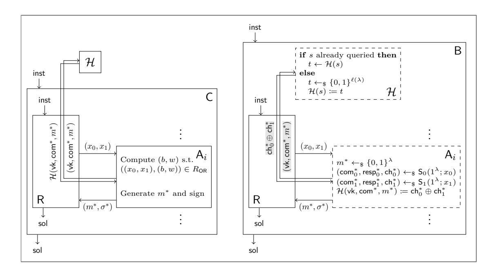

A preliminary version of this paper appears in the proceedings of the *39th International Conference on the Theory and Applications of Cryptographic Techniques (EUROCRYPT 2020)*, c IACR 2020. This is the full version.

# **Signatures from Sequential-OR Proofs**

Marc Fischlin Patrick Harasser Christian Janson

Cryptoplexity, Technische Universität Darmstadt, Germany {marc.fischlin, patrick.harasser, christian.janson}@cryptoplexity.de

Saturday 29th February, 2020

**Abstract.** OR-proofs enable a prover to show that it knows the witness for one of many statements, or that one out of many statements is true. OR-proofs are a remarkably versatile tool, used to strengthen security properties, design group and ring signature schemes, and achieve tight security. The common technique to build OR-proofs is based on an approach introduced by Cramer, Damgård, and Schoenmakers (CRYPTO'94), where the prover splits the verifier's challenge into random shares and computes proofs for each statement in parallel.

In this work we study a different, less investigated OR-proof technique, put forward by Abe, Ohkubo, and Suzuki (ASIACRYPT'02). The difference is that the prover now computes the individual proofs sequentially. We show that such sequential OR-proofs yield signature schemes which can be proved secure in the non-programmable random oracle model. We complement this positive result with a black-box impossibility proof, showing that the same is unlikely to be the case for signatures derived from traditional OR-proofs. We finally argue that sequential-OR signature schemes can be proved secure in the quantum random oracle model, albeit with very loose bounds and by programming the random oracle.

**Keywords.** Sequential-OR proofs · Zero-knowledge · Signatures · Non-programmable random oracle model · Quantum random oracle model

# **Contents**

| 1.1<br>OR-Proofs<br><br>1.2<br>Applications of OR-Proofs<br><br>1.3<br>Non-Programmable Random Oracles<br><br>1.4<br>Sequential-OR Proofs<br><br>1.5<br>Our Results<br><br>1.6<br>Further Related Work<br><br>1.7<br>Extension to the Quantum Random Oracle Model<br><br>2<br>Preliminaries<br>2.1<br>Basic Notation<br><br>2.2<br>Random Oracle Model<br><br>2.3<br>Languages and Relations<br><br>2.4<br>Interactive Protocols<br><br>2.5<br>3PC-Protocols and<br>Σ-Protocols<br><br>3<br>Parallel-OR Proofs<br>3.1<br>Protocol<br><br>3.2<br>Parallel-OR Signatures<br><br>4<br>Sequential-OR Proofs<br>4.1<br>Protocol<br><br>4.2<br>Sequential-OR Signatures<br><br>4.3<br>Example: Post-Quantum Ring Signatures<br><br>5<br>Impossibility<br>of<br>parallel-OR<br>Signatures<br>in<br>the<br>Non-Programmable<br>Random<br>Oracle<br>Model<br>6<br>Security in the Quantum Random Oracle Model<br>A<br>Additional Preliminaries<br>A.1<br>The Fiat-Shamir Heuristic<br><br>A.2<br>Digital Signature Schemes<br><br>B<br>Proof of Theorem<br>4.1<br>C<br>Proof of Theorem<br>4.2<br>D<br>Sequential-OR Proofs: The<br>1-out-of-n<br>case<br>E<br>Example: Tight Signatures in the Non-Programmable Random Oracle Model<br>F<br>Security Proof in the Quantum Random Oracle Model<br>F.1<br>Connecting Signature Forgeries and Measure-and-Reprogram<br><br>F.2<br>Proving Sequential-OR Signatures<br> | 1 | Introduction | 3  |
|-------------------------------------------------------------------------------------------------------------------------------------------------------------------------------------------------------------------------------------------------------------------------------------------------------------------------------------------------------------------------------------------------------------------------------------------------------------------------------------------------------------------------------------------------------------------------------------------------------------------------------------------------------------------------------------------------------------------------------------------------------------------------------------------------------------------------------------------------------------------------------------------------------------------------------------------------------------------------------------------------------------------------------------------------------------------------------------------------------------------------------------------------------------------------------------------------------------------------------------------------------------------------------------------------------------------------------------------------------------------------------------------------------------|---|--------------|----|
|                                                                                                                                                                                                                                                                                                                                                                                                                                                                                                                                                                                                                                                                                                                                                                                                                                                                                                                                                                                                                                                                                                                                                                                                                                                                                                                                                                                                             |   |              | 3  |
|                                                                                                                                                                                                                                                                                                                                                                                                                                                                                                                                                                                                                                                                                                                                                                                                                                                                                                                                                                                                                                                                                                                                                                                                                                                                                                                                                                                                             |   |              | 3  |
|                                                                                                                                                                                                                                                                                                                                                                                                                                                                                                                                                                                                                                                                                                                                                                                                                                                                                                                                                                                                                                                                                                                                                                                                                                                                                                                                                                                                             |   |              | 4  |
|                                                                                                                                                                                                                                                                                                                                                                                                                                                                                                                                                                                                                                                                                                                                                                                                                                                                                                                                                                                                                                                                                                                                                                                                                                                                                                                                                                                                             |   |              | 5  |
|                                                                                                                                                                                                                                                                                                                                                                                                                                                                                                                                                                                                                                                                                                                                                                                                                                                                                                                                                                                                                                                                                                                                                                                                                                                                                                                                                                                                             |   |              | 5  |
|                                                                                                                                                                                                                                                                                                                                                                                                                                                                                                                                                                                                                                                                                                                                                                                                                                                                                                                                                                                                                                                                                                                                                                                                                                                                                                                                                                                                             |   |              | 6  |
|                                                                                                                                                                                                                                                                                                                                                                                                                                                                                                                                                                                                                                                                                                                                                                                                                                                                                                                                                                                                                                                                                                                                                                                                                                                                                                                                                                                                             |   |              | 7  |
|                                                                                                                                                                                                                                                                                                                                                                                                                                                                                                                                                                                                                                                                                                                                                                                                                                                                                                                                                                                                                                                                                                                                                                                                                                                                                                                                                                                                             |   |              | 7  |
|                                                                                                                                                                                                                                                                                                                                                                                                                                                                                                                                                                                                                                                                                                                                                                                                                                                                                                                                                                                                                                                                                                                                                                                                                                                                                                                                                                                                             |   |              | 7  |
|                                                                                                                                                                                                                                                                                                                                                                                                                                                                                                                                                                                                                                                                                                                                                                                                                                                                                                                                                                                                                                                                                                                                                                                                                                                                                                                                                                                                             |   |              | 8  |
|                                                                                                                                                                                                                                                                                                                                                                                                                                                                                                                                                                                                                                                                                                                                                                                                                                                                                                                                                                                                                                                                                                                                                                                                                                                                                                                                                                                                             |   |              | 8  |
|                                                                                                                                                                                                                                                                                                                                                                                                                                                                                                                                                                                                                                                                                                                                                                                                                                                                                                                                                                                                                                                                                                                                                                                                                                                                                                                                                                                                             |   |              | 10 |
|                                                                                                                                                                                                                                                                                                                                                                                                                                                                                                                                                                                                                                                                                                                                                                                                                                                                                                                                                                                                                                                                                                                                                                                                                                                                                                                                                                                                             |   |              | 12 |
|                                                                                                                                                                                                                                                                                                                                                                                                                                                                                                                                                                                                                                                                                                                                                                                                                                                                                                                                                                                                                                                                                                                                                                                                                                                                                                                                                                                                             |   |              | 14 |
|                                                                                                                                                                                                                                                                                                                                                                                                                                                                                                                                                                                                                                                                                                                                                                                                                                                                                                                                                                                                                                                                                                                                                                                                                                                                                                                                                                                                             |   |              | 14 |
|                                                                                                                                                                                                                                                                                                                                                                                                                                                                                                                                                                                                                                                                                                                                                                                                                                                                                                                                                                                                                                                                                                                                                                                                                                                                                                                                                                                                             |   |              | 16 |
|                                                                                                                                                                                                                                                                                                                                                                                                                                                                                                                                                                                                                                                                                                                                                                                                                                                                                                                                                                                                                                                                                                                                                                                                                                                                                                                                                                                                             |   |              | 17 |
|                                                                                                                                                                                                                                                                                                                                                                                                                                                                                                                                                                                                                                                                                                                                                                                                                                                                                                                                                                                                                                                                                                                                                                                                                                                                                                                                                                                                             |   |              | 17 |
|                                                                                                                                                                                                                                                                                                                                                                                                                                                                                                                                                                                                                                                                                                                                                                                                                                                                                                                                                                                                                                                                                                                                                                                                                                                                                                                                                                                                             |   |              | 18 |
|                                                                                                                                                                                                                                                                                                                                                                                                                                                                                                                                                                                                                                                                                                                                                                                                                                                                                                                                                                                                                                                                                                                                                                                                                                                                                                                                                                                                             |   |              | 21 |
|                                                                                                                                                                                                                                                                                                                                                                                                                                                                                                                                                                                                                                                                                                                                                                                                                                                                                                                                                                                                                                                                                                                                                                                                                                                                                                                                                                                                             |   |              | 21 |
|                                                                                                                                                                                                                                                                                                                                                                                                                                                                                                                                                                                                                                                                                                                                                                                                                                                                                                                                                                                                                                                                                                                                                                                                                                                                                                                                                                                                             |   |              | 27 |
|                                                                                                                                                                                                                                                                                                                                                                                                                                                                                                                                                                                                                                                                                                                                                                                                                                                                                                                                                                                                                                                                                                                                                                                                                                                                                                                                                                                                             |   |              |    |
|                                                                                                                                                                                                                                                                                                                                                                                                                                                                                                                                                                                                                                                                                                                                                                                                                                                                                                                                                                                                                                                                                                                                                                                                                                                                                                                                                                                                             |   |              | 36 |
|                                                                                                                                                                                                                                                                                                                                                                                                                                                                                                                                                                                                                                                                                                                                                                                                                                                                                                                                                                                                                                                                                                                                                                                                                                                                                                                                                                                                             |   |              | 36 |
|                                                                                                                                                                                                                                                                                                                                                                                                                                                                                                                                                                                                                                                                                                                                                                                                                                                                                                                                                                                                                                                                                                                                                                                                                                                                                                                                                                                                             |   |              | 36 |
|                                                                                                                                                                                                                                                                                                                                                                                                                                                                                                                                                                                                                                                                                                                                                                                                                                                                                                                                                                                                                                                                                                                                                                                                                                                                                                                                                                                                             |   |              | 38 |
|                                                                                                                                                                                                                                                                                                                                                                                                                                                                                                                                                                                                                                                                                                                                                                                                                                                                                                                                                                                                                                                                                                                                                                                                                                                                                                                                                                                                             |   |              | 46 |
|                                                                                                                                                                                                                                                                                                                                                                                                                                                                                                                                                                                                                                                                                                                                                                                                                                                                                                                                                                                                                                                                                                                                                                                                                                                                                                                                                                                                             |   |              | 50 |
|                                                                                                                                                                                                                                                                                                                                                                                                                                                                                                                                                                                                                                                                                                                                                                                                                                                                                                                                                                                                                                                                                                                                                                                                                                                                                                                                                                                                             |   |              | 52 |
|                                                                                                                                                                                                                                                                                                                                                                                                                                                                                                                                                                                                                                                                                                                                                                                                                                                                                                                                                                                                                                                                                                                                                                                                                                                                                                                                                                                                             |   |              | 53 |
|                                                                                                                                                                                                                                                                                                                                                                                                                                                                                                                                                                                                                                                                                                                                                                                                                                                                                                                                                                                                                                                                                                                                                                                                                                                                                                                                                                                                             |   |              | 53 |
|                                                                                                                                                                                                                                                                                                                                                                                                                                                                                                                                                                                                                                                                                                                                                                                                                                                                                                                                                                                                                                                                                                                                                                                                                                                                                                                                                                                                             |   |              | 54 |

# <span id="page-2-3"></span><span id="page-2-0"></span>**1 Introduction**

In a zero-knowledge Σ-protocol between a prover P and a verifier V, the prover holds a statement *x* and a witness *w* for *x*, and the verifier only *x*. Both parties engage in an interactive execution, resulting in an initial commitment com sent by the prover, a verifier random challenge ch, and a final response resp computed by the prover. With such a proof, P shows to V that *x* is true (in proof systems), or that it knows a witness *w* for *x* (in proofs of knowledge). At the same time, the zero-knowledge property guarantees that nothing beyond this fact is revealed.

# <span id="page-2-1"></span>**1.1 OR-Proofs**

Now assume that one has two interactive proof systems of the above form for two statements *x*<sup>0</sup> and *x*1, and a witness *w<sup>b</sup>* for *xb*, *b* ∈ {0*,* 1}. The goal is to combine them into a single protocol which proves the logical OR of *x*<sup>0</sup> and *x*1; that is, the prover should be able to convince a verifier that it holds a witness for one of the two statements, ideally without revealing which one. The first instantiation of such general ORproofs, sometimes called CDS-OR proofs, was given by Cramer, Damgård, and Schoenmakers [\[CDS94\]](#page-29-0). Their construction works under the assumption that the two protocols are special honest-verifier zeroknowledge, meaning that a simulator S, given *x* and a random challenge ch at the outset, is able to generate a verifier view (com*,*resp*,* ch) without knowing a witness for *x*, in such a way that this view is indistinguishable from a genuine interaction between the real prover and an honest verifier using the given challenge. The prover in the CDS-OR protocol from [\[CDS94\]](#page-29-0) is described in Figure [1.](#page-3-1) For reasons that will become apparent soon, we call such CDS-OR proofs also *parallel-OR* proofs.

An important observation is that the resulting protocol is witness indistinguishable, i.e., it does not reveal for which statement the prover holds a witness. Moreover, since the resulting protocol is again a Σ-protocol, one can apply the Fiat-Shamir transform [\[FS87\]](#page-31-0) to it and obtain a non-interactive version or a signature scheme in the random oracle model. Also, the construction easily generalizes to the case of 1-out-of-*n* proofs.

# <span id="page-2-2"></span>**1.2 Applications of OR-Proofs**

OR-proofs have turned out to be a very powerful tool in the design of efficient protocols. Early on they have been identified as a means to thwart man-in-the-middle attacks [\[CD97\]](#page-29-1) and, similarly in spirit, to give designated-verifier proofs [\[JSI96\]](#page-32-0). The idea in both cases is to have the verifier send its public key to the prover, who then shows that the statement *x* it originally wanted to prove is true or that it knows the verifier's secret key. This proof is still convincing for the verifier (who knows it is the only holder of its secret key), but not transferable to other parties. Garay et al. [\[GMY03\]](#page-32-1) apply the same idea to make zero-knowledge proofs simulation-sound and non-malleable, by putting a verification key into a common reference string (CRS). The prover then shows that the original statement *x* is true or that it knows the secret to the verification key in the CRS.

The idea of giving a valid proof when knowing a witness for only one of several statements can also be used in the context of group signatures [\[Cv91\]](#page-30-0) and ring signatures [\[RST01\]](#page-34-0). Given a set of public keys *x*1, . . . , *xn*, where the signer knows only one witness *w<sup>i</sup>* (their own secret key), an OR-proof allows to sign anonymously on behalf of the entire group, and witness indistinguishability implies that the identity of the signer remains hidden. This design strategy appears explicitly for example in the group signature scheme of Camenisch [\[Cam97\]](#page-29-2).

The OR-technique has also proved very useful in deriving tightly-secure schemes. This approach has appeared in several works in the literature [\[HJ12,](#page-32-2) [BHJ](#page-28-0)+15, [GJ18\]](#page-31-1). The idea is to first derive tightlysecure signature schemes from the OR-combination of some Σ-protocols. These schemes are then used

```
Ppar-OR(1λ
           ; (x0, x1),(b, w)):
11: comb ←$ Pb(1λ
                   ; xb, w)
12: ch1−b ←$ {0, 1}
                    `(λ)
13: (com1−b,resp1−b
                     , ch1−b) ←$ S1−b(1λ
                                         ; x1−b, ch1−b)
14: return (com0, com1)
                                                              Ppar-OR(1λ
                                                                          ; (x0, x1),(b, w),(com0, com1), ch):
                                                              21: chb ← ch ⊕ ch1−b
                                                              22: respb ←$ Pb(1λ
                                                                                  ; xb, w, comb, chb)
                                                              23: return (ch0, ch1,resp0
                                                                                          ,resp1
                                                                                                )
```

Figure 1: Description of the prover algorithm Ppar-OR from the parallel-OR construction by Cramer et al. [\[CDS94\]](#page-29-0) in the standard model. On the left, generation of the first message com = (com0*,* com1). On the right, computation of the final response resp = (ch0*,* ch1*,*resp<sup>0</sup> *,*resp<sup>1</sup> ) answering the verifier challenge ch.

within higher-level solutions (like key exchange protocols), passing on the tight security guarantees to these protocols.

## <span id="page-3-0"></span>**1.3 Non-Programmable Random Oracles**

Another important feature of the OR-technique is that it facilitates the design of schemes in the nonprogrammable random oracle model. The general random oracle model comes with several remarkable technical properties, rooted in the formalization of the hash function as a truly random, oracle-based function. One of the most extraordinary consequences of this formalization is the programmability property of the random oracle, saying that one can adaptively choose the answers to random oracle queries made by the adversary. Indeed, the ability to change answers on the fly is a necessary feature of security proofs of some signature schemes [\[FLR](#page-31-2)+10,[FF13,](#page-31-3)[ZCC](#page-34-1)+15,[FH18\]](#page-31-4). In practice, however, hash functions are not programmable and their values are fixed. Therefore, one would ideally prefer to forgo the programming of random oracle replies.

The fact that the OR-technique can be used to bypass the programmability issues with the random oracle model can already be observed in the early constructions of Σ-protocols, namely, the Okamoto variant [\[Oka93\]](#page-33-0) of the Schnorr signature scheme [\[Sch91\]](#page-34-2) and the Guillou-Quisquater variant [\[GQ88\]](#page-32-3) of the Fiat-Shamir signature protocol [\[FS87\]](#page-31-0). In these variants, based on number-theoretic specifics, one uses "embedded" OR-proofs which allow to simulate signatures without having to program the random oracle, as opposed to [\[Sch91,](#page-34-2) [FS87\]](#page-31-0) and explicitly carried out in [\[PS00\]](#page-33-1): One can then simply use the known witness to generate signatures.

Unfortunately, the security proofs of the signature schemes in [\[Oka93,](#page-33-0)[GQ88\]](#page-32-3) still need programming at another step. Namely, in order to show that the adversary cannot forge signatures, one rewinds the execution and re-programs the random oracle in order to extract a witness (a technique called forking in [\[PS00\]](#page-33-1)). This also comes with a loose security bound. Abdalla et al. [\[AABN02\]](#page-27-0) overcome the forking technique by considering passively-secure identification schemes, where the adversary is allowed to see transcripts of honest executions. Still, they program the random oracle when simulating signatures.

Later, Abdalla et al. [\[AFLT16\]](#page-27-1) used the notion of lossy identification schemes to give non-forking security proofs for signatures derived via the Fiat-Shamir heuristic. Lossiness here roughly means that valid statements *x* are indistinguishable from so-called lossy ones, for which it is statistically impossible to find convincing proofs. This idea has later been adopted by lattice-based and LWE-based signature schemes such as [\[Lyu12,](#page-33-2) [BG14\]](#page-28-1) (in the classical random oracle model) or the TESLA signature scheme [\[ABB](#page-27-2)+17] (in the quantum random oracle model [\[BDF](#page-28-2)+11]). Still, all approaches program the random oracle in order to be able to simulate signatures.

```
Pseq-OR(1λ
           ; (x0, x1),(b, w)):
11: comb ←$ Pb(1λ
                   ; xb, w)
12: ch1−b ← H(b, x0, x1, comb)
13: (com1−b,resp1−b
                     , ch1−b) ←$ S1−b(1λ
                                         ; x1−b, ch1−b)
14: chb ← H(1 − b, x0, x1, com1−b)
15: respb ←$ Pb(1λ
                   ; xb, w, comb, chb)
16: return (com0, com1,resp0
                               ,resp1
                                     )
```

Figure 2: Description of the prover algorithm Pseq-OR from the sequential-OR construction by Abe et al. [\[AOS02\]](#page-28-3) in the random oracle model.

# <span id="page-4-0"></span>**1.4 Sequential-OR Proofs**

The above construction is the classical technique to combine Σ-protocols and prove OR-statements, but it is not the only possible solution. Indeed, there is at least one other way to prove the disjunction of two or more statements in the random oracle model, which in its spirit already appears in a work by Rivest, Shamir, and Tauman [\[RST01\]](#page-34-0). Here, we follow the exposition given by Abe, Ohkubo, and Suzuki [\[AOS02\]](#page-28-3) in the context of group signature schemes, and call this approach the *sequential-OR* technique.

In this construction, the non-interactive prover computes the individual proofs sequentially, starting with the commitment com*<sup>b</sup>* for the statement *x<sup>b</sup>* for which it knows the witness *wb*. Next it derives the challenge ch1−*<sup>b</sup>* for the proof of *x*1−*<sup>b</sup>* (with unknown witness) as the hash value of com*b*. This in turn allows the OR-prover to simulate a view (com1−*b,*resp1−*<sup>b</sup> ,* ch1−*b*) for *x*1−*<sup>b</sup>* with this predetermined challenge, as done in parallel-OR proofs. The simulated commitment com1−*<sup>b</sup>* again yields the challenge ch*<sup>b</sup>* for the first proof through the hash function, which the prover now can answer with a valid response resp*<sup>b</sup>* since it knows the witness *wb*. The details of the prover in the sequential-OR protocol from [\[AOS02\]](#page-28-3) are described in Figure [2.](#page-4-2)

Note that this technique generalizes to the 1-out-of-*n* case (we provide all details in Appendix [D\)](#page-49-0). In fact, Abe et al. [\[AOS02\]](#page-28-3) and follow-up works like [\[LWW04,](#page-33-3) [BLO18\]](#page-28-4), use this more general version of the sequential-OR technique to build group signature schemes, yet still programming the random oracle to fork and extract. The paradigm proposed by Abe et al. has also been applied in the area of cryptocurrencies, in particular Monero [\[vS13\]](#page-34-3) and Mimblewimble [\[Jed16,](#page-32-4)[Poe16\]](#page-33-4). There, in order to prevent overflow attacks, it is necessary to prove that committed values fall within a specific range. One instance of such range proofs uses a special type of ring signature, called borromean ring signature [\[MP15\]](#page-33-5), which is based on ideas presented in [\[AOS02\]](#page-28-3). Observe that, in the aforementioned range proofs, borromean signatures have since been superseded by more efficient bulletproofs [\[BBB](#page-28-5)+18].

#### <span id="page-4-1"></span>**1.5 Our Results**

At first glance, the sequential-OR technique does not seem to give any significant advantage over the parallel version. Both protocols are based on the idea that one can easily give a proof for a statement for which the witness is known, and simulate the proof for the other statement where the challenge is known in advance. This, however, misses one important point if we combine these two approaches with the idea of lossy statements as in the work by Abdalla et al. [\[AFLT16\]](#page-27-1): We show that signatures derived from sequential-OR proofs are secure in the non-programmable random oracle model, whereas those originating from parallel-OR proofs do not seem to have a security proof in this model.

<span id="page-5-2"></span>The signature scheme in the sequential-OR case is based on two valid statements *x*<sup>0</sup> and *x*<sup>1</sup> (the public keys), for which we know one of the two witnesses *w<sup>b</sup>* (one of the secret keys). A signature for a message *m* is basically a sequential-OR proof, where *m* is included in the hash evaluations. In contrast to the proof in [\[AOS02\]](#page-28-3), which is based on forking, we can now reduce unforgeability to a decisional problem about the languages. This allows us to avoid rewinding and re-programming the random oracle.

The idea of our proof in the sequential-OR case can be illustrated by looking at the honest signer first. If one was able to observe the signer's random oracle queries, then their order reveals which witness the signer is using: The signer first queries the commitment com*<sup>b</sup>* of the instance *x<sup>b</sup>* for which it knows the witness *wb*. We will use the same idea against the adversary, helping us to decide if some random input *x*1−*<sup>b</sup>* is in the language or not. If *x*1−*<sup>b</sup>* is not in the language, and thus does not have a witness, the special soundness of the Σ-protocol guarantees that the adversary will never make the first query about this part, since it will then not be able to answer the random challenge.[1](#page-5-1) Hence, by merely observing the adversary's queries, we can decide membership of *x*1−*b*. We use the other part *x<sup>b</sup>* in the key and its witness *w<sup>b</sup>* to simulate signatures without programming the random oracle. But we need to make sure that the adversary is not biased by our signatures. This follows from the witness indistinguishability of the proofs (against an adversary who cannot observe random oracle queries).

We next argue that it is in general hard to show that the parallel-OR technique of Cramer et al. [\[CDS94\]](#page-29-0) yields a secure signature scheme in the non-programmable random oracle model. Our result assumes a black-box reduction R transforming any (PPT or unbounded) adversary against the signature scheme into a solver of some problem assumed to be hard, and makes a mild assumption about the zero-knowledge simulators of the languages (namely, that they work independently of how the statements *x* are generated). Remarkably, we do not make any stipulations about the reduction's executions of the adversary instances: The reduction can run an arbitrary (bounded) number of instances of the adversary, and there are no restrictions on the inputs of these instances or their scheduling. However, the reduction R can only use the external random oracle.

Our approach is based on the meta-reduction technique [\[GMR88,](#page-32-5)[BV98,](#page-29-3)[PV05\]](#page-34-4). That is, we start with an unbounded adversary A, who breaks the signature scheme easily with its super-polynomial power by computing a secret key and signing as the honest prover would. This means that the reduction R also solves the underlying problem when interacting with A. Afterwards, we show how to simulate A efficiently, resulting in an efficient algorithm solving the problem directly. This implies that there cannot exist such a reduction R in the first place.

The crucial difference between the sequential and the parallel version of the OR-technique is that in the latter case observing the random oracle queries of the adversary does *not* reveal which witness is being used. By the zero-knowledge property one cannot distinguish real and simulated sub-proofs in the parallel case. Indeed, our negative result relies exactly on this zero-knowledge property, taking advantage of the fact that the random oracle is external to the reduction.

# <span id="page-5-0"></span>**1.6 Further Related Work**

The issue of non-programmability of random oracles also appears in recent works related to Canetti's universal composability (UC) framework [\[Can01\]](#page-29-4). In this model, random oracles can be cast as an ideal functionality FRO, and protocols can be developed in the hybrid setting where FRO is present. A technical consequence of this design choice is that the random oracle is programmable, and a compositional consequence is that one would need a fresh random oracle for each protocol instance. Therefore, the global random oracle model [\[CJS14\]](#page-30-1), based on ideas of global set-ups [\[CDPW07,](#page-29-5)[DSW08\]](#page-31-5), defines a random oracle functionality GsRO which can be used by all protocols, obliterating also the programmability of the random oracle in this model.

<span id="page-5-1"></span><sup>1</sup>One can think of this as a very lossy mode.

<span id="page-6-3"></span>We stress, however, that protocols designed in the global random oracle model are not necessarily secure for non-programmable random oracles. The discrepancy lies in the distinction between the model and the security proof: In the global random oracle model, one may no longer be able to program the random oracle when devising a simulator in the model, but a reduction may still program the random oracle in the security proof showing that the simulator is good. Indeed, this can be observed in the security reductions in  $[CDG^{+}18]$  proving that all signature schemes which have a stand-alone proof of unforgeability in the "isolated" random oracle model, including schemes with a security reduction via programming, remain secure in the strict global random oracle model  $\mathcal{G}_{sRO}$ .

The impossibility of proving the security of specific types of signatures derived via the Fiat-Shamir transform in the non-programmable random oracle model has already been discussed in prior works, e.g., [FF13, FH16]. These works usually make some restrictions on the reduction being ruled out (like key preservation or being single-instance), whereas we do not need any such condition. We remark here that our impossibility result for parallel-OR signatures does likely not follow in a general way from these results, since the same approach fails in the sequential-OR case.

In terms of OR-proofs, Ciampi et al. [CPS<sup>+</sup>16a], based on an earlier approach by Lindell [Lin15], use the OR-technique to build non-interactive zero-knowledge proofs from  $\Sigma$ -protocols in the non-programmable random oracle model. For technical reasons they also need a common reference string, which is used to form the OR-language. Note that this is orthogonal to our goal here, where we aim to build OR-proofs for two languages in the non-programmable random oracle model. In another work, Ciampi et al. [CPS<sup>+</sup>16b] consider extensions of parallel-OR proofs where (some of) the languages are not specified yet when the execution starts. This includes the solution in the common reference string model in [CPS<sup>+</sup>16a].

# <span id="page-6-0"></span>1.7 Extension to the Quantum Random Oracle Model

The results discussed so far are in the classical random oracle model. In terms of the quantum random oracle model (QROM), introduced by Boneh et al. [BDF<sup>+</sup>11], the situation regarding OR-proofs is less scrutinized. Our approach in the (classical) sequential-OR case is based on the observability of queries to the random oracle, a technique that usually does not carry over to the QROM because of superposition queries. In the parallel-OR case, we have seen that observability may not even help in the classical setting.

Fortunately, there have been two recent results regarding the security of Fiat-Shamir protocols in the QROM [LZ19, DFMS19], bypassing previous negative results concerning the Fiat-Shamir transform in this model [DFG13, ARU14]. These works both yield a non-tight bound, but give an immediate solution for the parallel-OR case in the QROM. There, one first combines the two interactive proofs via the parallel-OR construction to get an interactive Fiat-Shamir proof, and then applies these techniques. We show in Section 6 that one can also prove security of signatures derived from the sequential-OR construction in the QROM via the measure-and-reprogram technique described in [DFMS19]. The price we pay is that we inherit the loose security bound from the solution in [DFMS19] and we, like all currently known constructions in the QROM, need to program the quantum random oracle.

# <span id="page-6-1"></span>2 Preliminaries

#### <span id="page-6-2"></span>2.1 Basic Notation

We denote by  $\mathbb{N} = \mathbb{Z}_{\geq 0}$  the set of non-negative integers, and by  $\lambda \in \mathbb{N}$  the security parameter (often written in unary notation as  $1^{\lambda}$ ). A function  $\mu \colon \mathbb{N} \to \mathbb{R}$  is called *negligible* if, for every constant  $c \in \mathbb{R}_{>0}$ , there exists  $\lambda_c \in \mathbb{N}$  such that, for every  $\lambda \in \mathbb{N}$  with  $\lambda \geq \lambda_c$ , we have  $\mu(\lambda) \leq \lambda^{-c}$ . For a random variable X, we write  $x \leftarrow_{\$} X$  to denote that x is a random variate of X. For a finite set S of size |S|, we use  $s \leftarrow_{\$} S$  as a shorthand for  $s \leftarrow_{\$} U_S$ , where  $U_S$  is a random variable uniformly distributed over S. The arrow  $\leftarrow$  will be

<span id="page-7-2"></span>used for assignment statements. We denote the length of a string *x* ∈ {0*,* 1} <sup>∗</sup> by |*x*|, and we write *ε* for the empty string. We consider an injective, efficiently computable, efficiently reversible, and length-increasing encoding function ({0*,* 1} ∗ ) <sup>∗</sup> → {0*,* 1} ∗ . This allows us to represent sequences of strings again as strings, and will be tacitly used throughout the paper.

In this work we use the computational model of probabilistic oracle Turing machines, also called algorithms. We assume that they are equipped with a separate security parameter tape containing the value 1 *λ* . The running time of algorithms, which is intended to be bounded by the worst case, is a function of the security parameter input length only. A uniform algorithm is called *probabilistic polynomial-time (PPT)* if its running time is bounded by a polynomial, whereas a non-uniform algorithm is *PPT* if it corresponds to an infinite sequence of Turing machines, indexed by the security parameter *λ*, whose description sizes and running times are bounded by a polynomial in *λ*. Queries to the oracles always count as one operation each. For an algorithm A, we denote by A <sup>O</sup>(1*<sup>λ</sup>* ; *x*) the random variable representing the output of A when run on security parameter *λ* and input *x* ∈ {0*,* 1} ∗ , with access to oracles O = (O1*, . . . ,* O*t*).

We use ⊥ as a special symbol to denote rejection or an error, and we assume that ⊥ ∈ { */* 0*,* 1} ∗ . Both inputs and outputs of algorithms can be ⊥, and we convene that if any input to an algorithm is ⊥, then its output is <sup>⊥</sup> as well. Double square brackets <sup>J</sup>·<sup>K</sup> enclosing boolean statements return the bit <sup>1</sup> if the statement is true, and 0 otherwise.

#### <span id="page-7-0"></span>**2.2 Random Oracle Model**

Let *`* : N → N be a polynomial-time computable function. For a security parameter *λ* ∈ N, a *random oracle* (RO) [\[BR93,](#page-29-7) [CGH98\]](#page-30-6) is an oracle H that implements a function randomly chosen from the space of all functions {0*,* 1} <sup>∗</sup> → {0*,* 1} *`*(*λ*) , to which all parties have access. In other words, it is an oracle that answers every query with a truly random response chosen from the range {0*,* 1} *`*(*λ*) . For every repeated query the random oracle consistently returns the same output.

Constructions established and statements proved in the presence of a RO are said to hold in the *random oracle model* (ROM). Throughout the paper, whenever a security game is set in the ROM, we assume that at the beginning of the experiment a random oracle is sampled uniformly from the aforementioned function space, and then used throughout the experiment. In this setting, it will sometimes be necessary to record queries to the random oracle H, and we will do so via a set *Q*H: If (*i, x*) ∈ *Q*H, this means that the *i*-th query to H was *x*.

We also define the "zero oracle" as a function Z : {0*,* 1} <sup>∗</sup> → {0*,* 1} *`*(*λ*) , *x* 7→ 0 *`*(*λ*) for all *x* ∈ {0*,* 1} ∗ . This allows us to state our definitions simultaneously in the standard model and in the ROM: Parties will be given access to a generic oracle O, and it is understood that O := Z if the definition is formulated in the standard model, and O := H if it is in the ROM.

The quantum analogue of the above is the so-called *quantum random oracle model* (QROM), introduced by Boneh et al. [\[BDF](#page-28-2)+11]. Here, a quantum algorithm may query the random oracle H in superposition, i.e., submit superposition queries of the form P *<sup>x</sup> αx*|*x*i|0i and obtain the output P *<sup>x</sup> αx*|*x*i|H(*x*)i. We refer to [\[NC11\]](#page-33-8) for further background and conventions regarding quantum information.

#### <span id="page-7-1"></span>**2.3 Languages and Relations**

A *language* is a subset *L* ⊆ {0*,* 1} ∗ . In this work, we assume that every language *L* is equipped with a uniform PPT algorithm G*<sup>L</sup>* (called *instance generator*) which, on input (1*<sup>λ</sup>* ; *b*) with *b* ∈ {0*,* 1}, returns an element *x* ∈ *L* if *b* = 1 (*yes-instance*), and an element *x /*∈ *L* if *b* = 0 (*no-instance*). Usually, the complexity of *x* is closely related to the security parameter *λ*, e.g., |*x*| = *λ*, but we can allow for other (polynomial) dependencies as well.

A binary relation is a subset  $R \subseteq \{0,1\}^* \times \{0,1\}^*$  which is polynomially bounded, i.e., there exists a polynomial p such that, for every  $(x,w) \in R$ , we have  $|w| \leq p(|x|)$ . If  $(x,w) \in R$ , we call x an R-instance and w an R-witness of x. For every  $x \in \{0,1\}^*$ , we denote the set of all R-witnesses of x by  $W_R(x) := \{w \mid (x,w) \in R\}$  (if x is not an R-instance, then  $W_R(x) = \emptyset$ ). Note that every binary relation R defines a language  $L_R := \{x \mid \exists w : (x,w) \in R\}$ . Just like before for languages, we also assume that every binary relation R is equipped with a uniform PPT algorithm  $G_R$  (called instance generator) which, on input  $(1^{\lambda}; b)$  with  $b \in \{0,1\}$ , returns a pair  $(x,w) \in R$  if b = 1 (yes-instance), and an element  $x \notin L_R$  if b = 0 (no-instance). Observe that from an instance generator  $G_R$  for a binary relation R we get an instance generator  $G_{L_R}$  for  $L_R$  by simply running  $G_R$  and returning the first component only if b = 1.

An  $\mathcal{NP}$ -relation is a binary relation that is polynomial-time recognizable, i.e.,  $R \in \mathcal{P}$ . Observe that if R is an  $\mathcal{NP}$ -relation, then  $L_R \in \mathcal{NP}$ , and vice-versa if  $L \in \mathcal{NP}$ , then the set  $R_L$  of all string pairs  $(x, w) \in \{0, 1\}^* \times \{0, 1\}^*$  with  $x \in L$  and w an  $\mathcal{NP}$ -witness for x (w.r.t. a fixed polynomial and Turing machine) is an  $\mathcal{NP}$ -relation. In this situation, we have of course  $L_{R_L} = L$  and  $R_{L_R} \supseteq R$ .

We next define the OR-combination of two relations and its instance generator. Here and in the following, we present all definitions and constructions with respect to the OR of two relations only, but all results extend to the more general 1-out-of-n case. A yes-instance of the OR-relation is a pair of values  $(x_0, x_1)$ , each in its respective language, together with a witness w of either value. A no-instance of the OR-relation is again a pair of values, where at least one is not in the corresponding language, while the other may or may not belong to its language. The convention that a yes-instance has both inputs in their respective languages corresponds to the setting of group signature schemes, where all parties choose their public keys honestly; only in security reductions one may diverge from this. It is also in general necessary to ensure completeness of the OR-protocol, since the simulator for  $x_{1-b}$  is only guaranteed to output a valid transcript for yes-instances.

**Definition 2.1.** Let  $R_0$  and  $R_1$  be two binary relations. Define the OR-relation of  $R_0$  and  $R_1$  as the binary relation

$$R_{\mathsf{OR}} \coloneqq \left\{ \left( (x_0, x_1), (b, w) \right) \ \middle| \ b \in \{0, 1\} \land (x_b, w) \in R_b \land x_{1-b} \in L_{R_{1-b}} \right\},$$

equipped with the instance generator  $G_{R_{OR}}$  defined in Figure 3. We denote the corresponding OR-language by  $L_{OR} := L_{R_{OR}}$ .

Observe that, for binary relations  $R_0$  and  $R_1$ , the relation  $R_{OR}$  is indeed a binary relation, and that  $L_{OR} = L_{R_0} \times L_{R_1}$ .

We now recall two hardness notions a binary relation R may satisfy. Intuitively, R is decisionally hard if no PPT distinguisher can decide if it is given an R-instance or a no-instance. It is computationally hard if no PPT adversary can efficiently compute an R-witness w for a given R-instance x.

<span id="page-8-2"></span><span id="page-8-0"></span>**Definition 2.2.** Let R be a binary relation. We say that R is:

1. Decisionally Hard if, for every PPT distinguisher D, there exists a negligible function  $\mu \colon \mathbb{N} \to \mathbb{R}$  such that, for every  $\lambda \in \mathbb{N}$  and every  $z \in \{0,1\}^*$ ,

$$\left| \Pr \left[ \mathbf{Exp}_{\mathsf{D},R}^{\mathsf{DHR},0}(\lambda,z) = 1 \right] - \Pr \left[ \mathbf{Exp}_{\mathsf{D},R}^{\mathsf{DHR},1}(\lambda,z) = 1 \right] \right| \leq \mu(\lambda),$$

where  $\mathbf{Exp}_{\mathsf{D},R}^{\mathsf{DHR},0}(\lambda,z)$  and  $\mathbf{Exp}_{\mathsf{D},R}^{\mathsf{DHR},1}(\lambda,z)$  are defined in Figure 3.

<span id="page-8-1"></span>2. Computationally Hard if, for every PPT algorithm A, there exists a negligible function  $\mu \colon \mathbb{N} \to \mathbb{R}$  such that, for every  $\lambda \in \mathbb{N}$  and every  $z \in \{0,1\}^*$ ,

$$\Pr\left[\mathbf{Exp}_{\mathsf{A},R}^{\mathsf{CHR}}(\lambda,z)=1\right] \leq \mu(\lambda),$$

where  $\mathbf{Exp}_{\mathsf{A},R}^{\mathsf{CHR}}(\lambda,z)$  is defined in Figure 3.

```
GROR(1λ
         ; b):
11: if b = 0 then
12: b
       0
        , b00 ←$ {0, 1}
13: xb
        0 ←$ GLb0 (1λ
                      ; 0)
14: x1−b
           0 ←$ GLR1−b0
                        (1λ
                            ; b
                              00)
15: return (x0, x1)
16: else
17: b
       0 ←$ {0, 1}
18: (x0, w0) ←$ GR0
                       (1λ
                           ; 1)
19: (x1, w1) ←$ GR1
                       (1λ
                           ; 1)
20: return ((x0, x1),(b
                           0
                           , wb
                               0 ))
                                        ExpDHR,b
                                              D,R (λ, z):
                                        31: x ←$ GR(1λ
                                                         ; 0)
                                        32: if b = 1 then
                                        33: (x, w) ←$ GR(1λ
                                                                ; 1)
                                        34: b
                                             0 ←$ D
                                                    O(1λ
                                                          ; x, z)
                                        35: return b
                                                      0
                                                                           ExpCHR
                                                                                A,R (λ, z):
                                                                           41: (x, w) ←$ GR(1λ
                                                                                                 ; 1)
                                                                           42: w
                                                                                 ∗ ←$ A
                                                                                        O(1λ
                                                                                              ; x, z)
                                                                           43: return J(x, w∗
                                                                                               ) ∈ RK
```

Figure 3: Definition of the instance generator G*<sup>R</sup>*OR of the relation *R*OR, and of the experiments **Exp**DHR*,b* <sup>D</sup>*,R* (*λ, z*) and **Exp**CHR <sup>A</sup>*,R* (*λ, z*) from Definition [2.2.](#page-8-0) Recall that O is either a random oracle or the trivial all-zero oracle.

It is readily verified that two binary relations *R*<sup>0</sup> and *R*<sup>1</sup> are computationally hard if and only if *R*OR is computationally hard. Furthermore, if an N P-relation *R* is decisionally hard, it is also computationally hard.

# <span id="page-9-0"></span>**2.4 Interactive Protocols**

An *interactive protocol* Π between two parties, called *prover* and *verifier*, is a pair of uniform algorithms Π = (P*,* V). We write P <sup>O</sup>(1*<sup>λ</sup>* ; *x, w*) V <sup>O</sup>(1*<sup>λ</sup>* ; *x, z*) to denote the interaction between P and V on security parameter *λ*, common input *x*, respective auxiliary inputs *w* and *z*, with access to oracle O.

Algorithms P and V compute the next-message function of the corresponding party. In more detail, P <sup>O</sup>(1*<sup>λ</sup>* ; *β<sup>i</sup> ,*stP) is the random variable which returns the prover's next message *αi*+1 and its updated state stP, both computed on input the security parameter *λ*, the last incoming message *β<sup>i</sup>* , and the current state stP. Here we assume that st<sup>P</sup> contains all the information necessary for P to perform its computation, including at least the common input, its auxiliary input, and the messages exchanged thus far. Similar considerations hold for V.

We write trans <sup>h</sup> P <sup>O</sup>(1*<sup>λ</sup>* ; *x, w*) V <sup>O</sup>(1*<sup>λ</sup>* ; *x, z*) i = (*A*1*, B*1*, . . . , A<sup>t</sup> , B<sup>t</sup> , At*+1) for the *transcript* of the interaction between P and V. This is the random variable which returns a sequence of messages (*α*1*, β*1*, . . . , α<sup>t</sup> , β<sup>t</sup> , αt*+1), where (*αi*+1*,*stP) ←\$ P <sup>O</sup>(1*<sup>λ</sup>* ; *β<sup>i</sup> ,*stP) and (*β<sup>j</sup> ,*stV) ←\$ V <sup>O</sup>(1*<sup>λ</sup>* ; *α<sup>j</sup> ,*stV) for every 0 ≤ *i* ≤ *t* and 1 ≤ *j* ≤ *t*. Here we assume that stP, st<sup>V</sup> and *β*<sup>0</sup> are initialized to st<sup>P</sup> ← (*x, w*), st<sup>V</sup> ← (*x, z*) and *β*<sup>0</sup> ← *ε*. The *view* of V in the interaction with P, denoted view<sup>V</sup> h P <sup>O</sup>(1*<sup>λ</sup>* ; *x, w*) V <sup>O</sup>(1*<sup>λ</sup>* ; *x, z*) i , is the random variable (*A*1*, A*2*, . . . , A<sup>t</sup> , At*+1*, R*V), where *R*<sup>V</sup> is the random variable returning V's random coins.

The interaction between the prover and the verifier terminates with V computing a decision *v* ←\$ V <sup>O</sup>(1*<sup>λ</sup>* ; *αt*+1*,*stV), where *v* ∈ {0*,* 1}, on whether to accept or reject the transcript. This is also called V's *local output*, and the corresponding random variable will be denoted by out<sup>V</sup> h P <sup>O</sup>(1*<sup>λ</sup>* ; *x, w*) V <sup>O</sup>(1*<sup>λ</sup>* ; *x, z*) i .

We say that a protocol Π = (P*,* V) is *efficient* if V is a PPT algorithm. For a binary relation *R*, we say that Π has an *efficient prover w.r.t. R* if P is a PPT algorithm and, on security parameter *λ*, it receives common and auxiliary inputs *x* and *w* such that (*x, w*) ←\$ G*R*(1*<sup>λ</sup>* ; 1). Note that we will only consider protocols which are efficient, have an efficient prover w.r.t. a specified binary relation *R*, and where the <span id="page-10-1"></span>honest verifier is independent of its auxiliary input (we can therefore assume  $z = \varepsilon$  in this case). We call these *protocols w.r.t.* R.

We call  $\Pi$  public-coin (PC) if all the messages the honest verifier sends to P consist of disjoint segments of its random tape, and if V's local output is computed as a deterministic function of the common input and the transcript, that is  $v \leftarrow V^{\mathcal{O}}(1^{\lambda}; x, \alpha_1, \beta_1, \dots, \alpha_t, \beta_t, \alpha_{t+1})$ . In this situation we say that a transcript is accepting for x if v = 1.

We now we state the precise definitions of the completeness, soundness, honest-verifier zero-knowledge (HVCZK), and computational witness hiding (CWH) properties of protocols w.r.t. a relation R. Furthermore, we recall the notion of computational witness indistinguishability (CWI) [FS90], which is the property of general interactive protocols that is most relevant to our work. Intuitively, this notion captures the idea that protocol runs for a fixed R-instance but different witnesses should be indistinguishable.

<span id="page-10-0"></span>**Definition 2.3.** Let R be a binary relation, and let  $\Pi = (P, V)$  be a protocol w.r.t. R. We say that  $\Pi$  is:

<span id="page-10-3"></span>1. Complete, if there exists a negligible function  $\mu \colon \mathbb{N} \to \mathbb{R}$  such that, for every  $\lambda \in \mathbb{N}$  and every  $(x, w) \leftarrow_{\$} \mathsf{G}_R(1^{\lambda}; 1)$ ,

$$\Pr\left[\operatorname{out}_{\mathsf{V}}\left[\mathsf{P}^{\mathcal{O}}(1^{\lambda};x,w) \leftrightarrows \mathsf{V}^{\mathcal{O}}(1^{\lambda};x)\right] = 1\right] \ge 1 - \mu(\lambda).$$

2. (Computationally) Sound if, for every (PPT) algorithm  $\mathsf{P}^*$ , there exists a negligible function  $\mu \colon \mathbb{N} \to \mathbb{R}$  such that, for every  $\lambda \in \mathbb{N}$ , every  $x \leftarrow_{\$} \mathsf{G}_R(1^{\lambda};0)$ , and every  $y \in \{0,1\}^*$ ,

$$\Pr\left[\operatorname{out}_{\mathsf{V}}\left[\mathsf{P}^{*\mathcal{O}}(1^{\lambda};x,y) \leftrightarrows \mathsf{V}^{\mathcal{O}}(1^{\lambda};x)\right] = 1\right] \le \mu(\lambda).$$

3. Black-Box Computational Zero-Knowledge (BBCZK), if there exists a uniform PPT algorithm S (called the simulator) with the following property: For every uniform PPT algorithm  $V^*$  and every PPT distinguisher D, there exists a negligible function  $\mu \colon \mathbb{N} \to \mathbb{R}$  such that, for every  $\lambda \in \mathbb{N}$ , every  $(x, w) \leftarrow_{\mathbb{S}} G_R(1^{\lambda}; 1)$ , and every  $z, z' \in \{0, 1\}^*$ ,

$$\left|\Pr\left[\mathbf{Exp}_{\mathsf{V}^*,\mathsf{D},\Pi}^{\mathsf{BBCZK},0}(\lambda,x,w,z,z')=1\right]-\Pr\left[\mathbf{Exp}_{\mathsf{V}^*,\mathsf{D},\Pi}^{\mathsf{BBCZK},1}(\lambda,x,w,z,z')=1\right]\right|\leq \mu(\lambda),$$

where  $\mathbf{Exp}_{\mathsf{V}^*,\mathsf{D},\mathsf{\Pi}}^{\mathsf{BBCZK},b}(\lambda,x,w,z,z')$  is defined in Figure 4.

4. Honest-Verifier Computational Zero-Knowledge (HVCZK), if there exists a uniform PPT algorithm S with the following property: For every PPT distinguisher D, there exists a negligible function  $\mu \colon \mathbb{N} \to \mathbb{R}$  such that, for every  $\lambda \in \mathbb{N}$ , every  $(x, w) \leftarrow_{\$} \mathsf{G}_R(1^{\lambda}; 1)$ , and every  $z' \in \{0, 1\}^*$ ,

$$\left| \Pr \left[ \mathbf{Exp}_{\mathsf{V},\mathsf{D},\Pi}^{\mathsf{BBCZK},0}(\lambda,x,w,\varepsilon,z') = 1 \right] - \Pr \left[ \mathbf{Exp}_{\mathsf{V},\mathsf{D},\Pi}^{\mathsf{BBCZK},1}(\lambda,x,w,\varepsilon,z') = 1 \right] \right| \leq \mu(\lambda),$$

where  $\mathbf{Exp}_{\mathsf{V},\mathsf{D},\Pi}^{\mathsf{BBCZK},b}(\lambda,x,w,\varepsilon,z')$  is defined in Figure 4.

<span id="page-10-2"></span>5. Computationally Witness Indistinguishable (CWI) if, for every uniform PPT algorithm V\* and every PPT distinguisher D, there exists a negligible function  $\mu \colon \mathbb{N} \to \mathbb{R}$  such that, for every  $\lambda \in \mathbb{N}$ , every  $x \leftarrow_{\$} \mathsf{G}_{L_R}(1^{\lambda}; 1)$ , every  $w, w' \in W_R(x)$ , and every  $z, z' \in \{0, 1\}^*$ ,

$$\left| \Pr \left[ \mathbf{Exp}^{\mathsf{CWI},0}_{\mathsf{V}^*,\mathsf{D},\Pi}(\lambda,x,w,w',z,z') = 1 \right] - \Pr \left[ \mathbf{Exp}^{\mathsf{CWI},1}_{\mathsf{V}^*,\mathsf{D},\Pi}(\lambda,x,w,w',z,z') = 1 \right] \right| \leq \mu(\lambda),$$

where  $\mathbf{Exp}^{\mathsf{CWI},b}_{\mathsf{V}^*,\mathsf{D},\Pi}(\lambda,x,w,w',z,z')$  is defined in Figure 4.

```
\mathbf{Exp}^{\mathsf{BBCZK},b}_{\mathsf{V}^*,\mathsf{D},\Pi}(\lambda,x,w,z,z'):
                                                                                                                                                        \mathbf{Exp}^{\mathsf{CWI},b}_{\mathsf{V}^*,\mathsf{D},\mathsf{\Pi}}(\lambda,x,w,w',z,z'):
11: v \leftarrow_{\$} \text{view}_{\mathsf{V}^*} \left[ \mathsf{P}^{\mathcal{O}}(1^{\lambda}; x, w) \leftrightarrows \mathsf{V}^{*\mathcal{O}}(1^{\lambda}; x, z) \right]
                                                                                                                                                        31: y \leftarrow w
12: if b = 1 then
                                                                                                                                                        32: if b = 1 then
                 v \leftarrow_{\mathfrak{s}} \mathsf{S}^{\tilde{\mathsf{V}}^{*\mathcal{O}},\mathcal{O}}(1^{\lambda};x)
                                                                                                                                                        34: v^* \leftarrow_{\$} \operatorname{out}_{\mathsf{V}^*} \left[ \mathsf{P}^{\mathcal{O}}(1^{\lambda}; x, y) \leftrightarrows \mathsf{V}^{*\mathcal{O}}(1^{\lambda}; x, z) \right]
14: d \leftarrow_{\$} \mathsf{D}^{\tilde{\mathsf{V}}^{*\mathcal{O}},\mathcal{O}}(1^{\lambda}; x, z, z', v)
                                                                                                                                                         35: d \leftarrow_{\$} \mathsf{D}^{\mathcal{O}}(1^{\lambda}; x, z, z', v^{*})
15: return d
                                                                                                                                                         _{36}: return d
\tilde{\mathsf{V}}^{*\mathcal{O}}(\alpha_1,\ldots,\alpha_i):
                                                                                                                                                        \mathbf{Exp}^{\mathsf{CWH}}_{\mathsf{V}^*,R}(\lambda,z):
21: \mathsf{st}_\mathsf{V} \leftarrow (x, w)
                                                                                                                                                        41: (x,w) \leftarrow_{\$} \mathsf{G}_R(1^{\lambda};1)
22: for 1 < j < i do
                                                                                                                                                        42: w^* \leftarrow_{\$} \operatorname{out}_{\mathsf{V}^*} \left[ \mathsf{P}^{\mathcal{O}}(1^{\lambda}; x, w) \leftrightarrows \mathsf{V}^{*\mathcal{O}}(1^{\lambda}; x, z) \right]
                 (\beta_i, \mathsf{st}_\mathsf{V}) \leftarrow_{\$} \mathsf{V}^{*\mathcal{Q}}(1^\lambda; \alpha_i, \mathsf{st}_\mathsf{V})
                                                                                                                                                         43: return [(x, w^*) \in R]
24: return \beta_i
```

Figure 4: Definition of the experiments  $\mathbf{Exp}^{\mathsf{BBCZK},b}_{\mathsf{V}^*,\mathsf{D},\Pi}(\lambda,x,w,z,z')$ ,  $\mathbf{Exp}^{\mathsf{CWI},b}_{\mathsf{V}^*,\mathsf{D},\Pi}(\lambda,x,w,w',z,z')$  and  $\mathbf{Exp}^{\mathsf{CWH}}_{\mathsf{V}^*,R}(\lambda,z)$  from Definition 2.3.

<span id="page-11-3"></span>6. Computationally Witness Hiding (CWH) if, for every uniform PPT algorithm  $V^*$ , there exists a negligible function  $\mu \colon \mathbb{N} \to \mathbb{R}$  such that, for every  $\lambda \in \mathbb{N}$  and every  $z \in \{0,1\}^*$ ,

$$\Pr\left[\mathbf{Exp}_{\mathsf{V}^*,R}^{\mathsf{CWH}}(\lambda,z)=1\right] \leq \mu(\lambda),$$

where  $\mathbf{Exp}^{\mathsf{CWH}}_{\mathsf{V}^*,R}(\lambda,z)$  is defined in Figure 4.

Note that we will later require a stronger version of CWI, which we term multi-query computational witness indistinguishability (mqCWI). This is basically an oracle extension of ordinary CWI, where the distinguisher can query arbitrarily many protocol executions before guessing which witness was used to generate them. One can prove via a simple hybrid argument that CWI and mqCWI are equivalent, albeit with a polynomial loss in the distinguishing advantage. We now provide a formal definition of this property.

<span id="page-11-2"></span>**Definition 2.4.** Let R be a binary relation, and let  $\Pi = (P, V)$  be a protocol w.r.t. R in the ROM. We say that  $\Pi$  is multi-query computationally witness indistinguishable (mqCWI) in the ROM if, for every uniform PPT algorithm  $V^*$  and every PPT distinguisher D, there exists a negligible function  $\mu \colon \mathbb{N} \to \mathbb{R}$  such that, for every  $\lambda \in \mathbb{N}$ , every  $x \leftarrow_{\$} G_{L_R}(1^{\lambda}; 1)$ , every  $w, w' \in W_R(x)$ , and every  $z, z' \in \{0, 1\}^*$ ,

$$\left| \Pr \left[ \mathbf{Exp}_{\mathsf{V}^*,\mathsf{D},\Pi}^{\mathsf{mqCWI},0}(\lambda,x,w,w',z,z') = 1 \right] - \Pr \left[ \mathbf{Exp}_{\mathsf{V}^*,\mathsf{D},\Pi}^{\mathsf{mqCWI},1}(\lambda,x,w,w',z,z') = 1 \right] \right| \leq \mu(\lambda),$$

where  $\mathbf{Exp}^{\mathsf{mqCWI},b}_{\mathsf{V}^*,\mathsf{D},\Pi}(\lambda,x,w,w',z,z')$  is defined in Figure 5.

#### <span id="page-11-0"></span>2.5 3PC-Protocols and $\Sigma$ -Protocols

Let R be a binary relation. We will be mainly interested in so-called 3PC-protocols w.r.t. R, i.e., protocols w.r.t. R which are public-coin, and where the two parties exchange exactly three messages. We also assume that, on security parameter  $\lambda$ , the only message sent by the verifier to the prover has fixed length  $\ell(\lambda)$ , for a function  $\ell: \mathbb{N} \to \mathbb{N}$  called the *length function* associated to the protocol. A graphical representation of such a protocol is given in Figure 6.

```
\mathbf{Exp}^{\mathsf{mqCWI},b}_{\mathsf{V}^*,\mathsf{D},\Pi}(\lambda,x,w,w',z,z') \colon
                                                                                                                                                                                    \mathbf{Exp}_{\mathbf{D},\Pi}^{\mathsf{SCZK},b}(\lambda,x,w,z):
                                                                                                               \mathcal{H}_m(m'):
                                                                                                                                                                                    41: (\mathsf{ch}, \mathsf{st}_{\mathsf{D}}) \leftarrow_{\$} \mathsf{D}_0^{\mathcal{O}}(1^{\lambda}; x, z)
11: y \leftarrow w
                                                                                                               31: h \leftarrow \mathcal{H}(m', m)
12: if b = 1 then
                                                                                                              32: \mathbf{return} h
                                                                                                                                                                                    42: \mathsf{st}_\mathsf{P} \leftarrow (x, w)
                                                                                                                                                                                    43: (\mathsf{com}, \mathsf{st}_\mathsf{P}) \leftarrow_{\$} \mathsf{P}^{\mathcal{O}}(1^\lambda; \mathsf{st}_\mathsf{P})
                y \leftarrow w'
14: d \leftarrow_{\$} \mathsf{D}^{\mathcal{O}[\lambda, x, y, z], \mathcal{H}}(1^{\lambda}; x, z, z')
                                                                                                                                                                                     44: (\text{resp}, \text{st}_P) \leftarrow_{s} P^{\mathcal{O}}(1^{\lambda}; \text{ch}, \text{st}_P)
15: return d
                                                                                                                                                                                    45: v \leftarrow (\mathsf{com}, \mathsf{resp}, \mathsf{ch})
                                                                                                                                                                                    46: if b = 1 then
                                                                                                                                                                                                    v \leftarrow_{\$} \mathsf{S}^{\mathcal{O}}(1^{\lambda}; x, \mathsf{ch})
\mathcal{O}[\lambda, x, y, z](m):
21: v^* \leftarrow_{\$} \operatorname{out}_{\mathsf{V}^*} \left[ \mathsf{P}^{\mathcal{H}_m}(1^{\lambda}; x, y) \stackrel{\leftarrow}{\hookrightarrow} \mathsf{V}^{*\mathcal{H}}(1^{\lambda}; x, (m, z)) \right]
                                                                                                                                                                                    48: d \leftarrow_{\$} \mathsf{D}_{1}^{\mathcal{O}}(1^{\lambda}; x, z, v, \mathsf{st}_{\mathsf{D}})
                                                                                                                                                                                    49: \mathbf{return} \ d
22: return v'
```

Figure 5: Definition of the experiments  $\mathbf{Exp}^{\mathsf{mqCWl},b}_{\mathsf{V}^*,\mathsf{D},\Pi}(\lambda,x,w,w',z,z')$  and  $\mathbf{Exp}^{\mathsf{SCZK},b}_{\mathsf{D},\Pi}(\lambda,x,w,z)$  from Definition 2.4 and Definition 2.5.

In this particular context, we call the three messages exchanged between prover and verifier the *commitment*, the *challenge*, and the *response*, and denote them by  $com := \alpha_1$ ,  $ch := \beta_1$ , and  $com := \alpha_2$ , respectively. Furthermore, we say that two accepting transcripts (com, ch, resp) and (com', ch', resp') for an element com := com' and com' := com' and com' := com' and com' := com' and com' := com' and com' := com' and com' := com' and com' := com' and com' := com' and com' := com' and com' := com' and com' := com' and com' := com' and com' := com' and com' := com' and com' := com' and com' := com' and com' := com' and com' := com' and com' := com' and com' := com' and com' := com' and com' := com' and com' := com' and com' := com' and com' := com' and com' := com' and com' := com' and com' := com' and com' := com' and com' := com' and com' := com' and com' := com' and com' := com' and com' := com' and com' := com' and com' := com' and com' := com' and com' := com' and com' := com' and com' := com' and com' := com' and com' := com' and com' := com' and com' := com' and com' := com' and com' := com' and com' := com' and com' := com' and com' := com' and com' := com' and com' := com' and com' := com' and com' := com' and com' := com' and com' := com' and com' := com' and com' := com' and com' := com' and com' := com' and com' := com' and com' := com' and com' := com' and com' := com' and com' := com' and com' := com' and com' := com' and com' := com' and com' := com' and com' := com' and com' := com' and com' := com' and com' := com' and com' := com' and com' := com' and com' := com' and com' := com' and com' := com' and com' := com' and com' := com' and com' := com' and com' := com' and com' := com' and com' := com' and com' := com' and com' := com' and com' := com' and com' := com' and com' := com' and com' := com' and

In the following, we recall the critical notion of special computational zero-knowledge. Intuitively, it means that there exists a simulator which, for any maliciously chosen challenge given in advance, is able to create an authentic-looking transcript. Furthermore, we define the properties of optimal soundness and special soundness. Roughly, optimal soundness says that for every  $x \notin L$  and every commitment, there is at most one challenge which can lead to a valid response. Special soundness says that for  $x \in L$ , any transcript collision yields a witness, and for  $x \notin L$  no collisions can be found.

<span id="page-12-1"></span>**Definition 2.5.** Let R be a binary relation, and let  $\Pi = (\mathsf{P}, \mathsf{V})$  be a  $3\mathsf{PC}$  protocol w.r.t. R. We say that  $\Pi$  is:

<span id="page-12-2"></span>1. Special Computational Zero-Knowledge (SCZK), if there exists a uniform PPT algorithm S with the following property: For every two-stage PPT distinguisher  $D = (D_0, D_1)$ , there exists a negligible function  $\mu \colon \mathbb{N} \to \mathbb{R}$  such that, for every  $\lambda \in \mathbb{N}$ , every  $(x, w) \leftarrow_s G_R(1^{\lambda}; 1)$ , and every  $z \in \{0, 1\}^*$ ,

$$\left| \Pr \left[ \mathbf{Exp}_{\mathsf{D},\Pi}^{\mathsf{SCZK},0}(\lambda,x,w,z) = 1 \right] - \Pr \left[ \mathbf{Exp}_{\mathsf{D},\Pi}^{\mathsf{SCZK},1}(\lambda,x,w,z) = 1 \right] \right| \leq \mu(\lambda),$$

where  $\mathbf{Exp}_{\mathrm{D},\Pi}^{\mathsf{SCZK},b}(\lambda,x,w,z)$  is defined in Figure 5.

- 2. Optimally Sound if, for every  $\lambda \in \mathbb{N}$ , every  $x \notin L_R$  and every commitment com, there exists at most one challenge ch for which there exists a response resp such that (com, ch, resp) is an accepting transcript for x. We say that the protocol is  $c(\lambda)$ -optimally sound if, for every  $\lambda \in \mathbb{N}$ , every  $x \notin L_R$ , and every commitment com, there are at most  $c(\lambda)$  challenges ch as above.
- 3. Specially Sound, if:
  - (a) There exists a uniform PPT algorithm  $\mathsf{E}^{\mathcal{O}}$  (called the extractor) which, on security parameter  $\lambda$  and input any  $x \leftarrow_{\$} \mathsf{G}_{L_R}(1^{\lambda};1)$  and a transcript collision for x, returns a witness  $w \in W_R(x)$  of x;
  - (b) For every  $\lambda \in \mathbb{N}$  and every  $x \notin L_R$  there are no transcript collisions for x.

<span id="page-13-3"></span><span id="page-13-2"></span>
$$\begin{array}{c|c} \mathsf{P}^{\mathcal{O}}(1^{\lambda};x,w) \leftrightarrows \mathsf{V}^{\mathcal{O}}(1^{\lambda};x) \\ \hline \mathsf{st}_{\mathsf{P}} \leftarrow (x,w) & \mathsf{st}_{\mathsf{V}} \leftarrow x \\ (\mathsf{com},\mathsf{st}_{\mathsf{P}}) \leftarrow_{\$} \mathsf{P}^{\mathcal{O}}(1^{\lambda};\mathsf{st}_{\mathsf{P}}) & & \mathsf{com} \\ \hline & & \mathsf{ch} \leftarrow_{\$} \{0,1\}^{\ell(\lambda)} \\ \mathsf{st}_{\mathsf{V}} \leftarrow (\mathsf{st}_{\mathsf{V}},\mathsf{com},\mathsf{ch}) \\ \hline & & \\ (\mathsf{resp},\mathsf{st}_{\mathsf{P}}) \leftarrow_{\$} \mathsf{P}^{\mathcal{O}}(1^{\lambda};\mathsf{ch},\mathsf{st}_{\mathsf{P}}) & & \\ \hline & & & \\ & & & \\ v \leftarrow \mathsf{V}^{\mathcal{O}}(1^{\lambda};x,\mathsf{com},\mathsf{ch},\mathsf{resp}) \\ \hline \end{array}$$

Figure 6: Representation of a 3PC protocol w.r.t. a binary relation R.

If R is a binary relation, and  $\Pi$  is a 3PC protocol w.r.t. R, then it is clear that, if  $\Pi$  is specially sound, then it is also optimally sound. Furthermore, if  $\Pi$  is optimally sound, then it is also sound, provided that the length function  $\ell(\lambda) = \omega(\log(\lambda))$  is super-logarithmic in the security parameter. Finally, if  $\Pi$  is SCZK, it is also HVCZK: Given a SCZK-simulator  $S_{SCZK}$ , one obtains a HVCZK-simulator  $S_{HVCZK}$  by simply picking a random challenge ch and then running  $S_{SCZK}$  on the chosen challenge.

**Definition 2.6.** Let R be a binary relation. A  $\Sigma$ -protocol w.r.t. R is a 3PC protocol  $\Pi$  w.r.t. R which is complete, specially sound, and SCZK.

## <span id="page-13-0"></span>3 Parallel-OR Proofs

In this section we recall the classical parallel-OR construction of Cramer et al. [CDS94], which works for two arbitrary 3PC HVCZK protocols.

#### <span id="page-13-1"></span>3.1 Protocol

Let  $R_0$  and  $R_1$  be binary relations, and consider two 3PC HVCZK protocols  $\Pi_0 = (\mathsf{P}_0, \mathsf{V}_0)$ ,  $\Pi_1 = (\mathsf{P}_1, \mathsf{V}_1)$  w.r.t.  $R_0$  and  $R_1$  (with HVCZK-simulators  $\mathsf{S}_0$  and  $\mathsf{S}_1$ ), such that the two length functions  $\ell_0 = \ell_1 =: \ell$  coincide (this is no real restriction, as the challenge length of such a protocol can be increased via parallel repetition). The construction, first presented in [CDS94] and depicted in Figure 7, allows to combine  $\Pi_0$  and  $\Pi_1$  into a new 3PC HVCZK protocol par-OR[ $\Pi_0, \Pi_1, \mathsf{S}_0, \mathsf{S}_1$ ] = ( $\mathsf{P}_{\mathsf{par-OR}}, \mathsf{V}_{\mathsf{par-OR}}$ ) w.r.t. the binary relation  $R_{\mathsf{OR}}$ . Note that the simulators of the underlying protocols become an integral part of the scheme. The corresponding HVCZK-simulator  $\mathsf{S}_{\mathsf{par-OR}}$  is given in Figure 8.

The key idea of the construction is to split the challenge ch sent by  $V_{\mathsf{par-OR}}$  into two random parts,  $\mathsf{ch} = \mathsf{ch}_0 \oplus \mathsf{ch}_1$ , and to provide accepting transcripts for both inputs  $x_0$  and  $x_1$  with the corresponding challenge share. If the prover knows a witness w for  $x_b$ , it can use the HVCZK-simulator  $\mathsf{S}_{1-b}$  of  $\Pi_{1-b}$  to generate a simulated view  $(\mathsf{com}_{1-b},\mathsf{resp}_{1-b},\mathsf{ch}_{1-b})$  for  $x_{1-b}$ , and then compute a genuine transcript  $(\mathsf{com}_b,\mathsf{ch}_b,\mathsf{resp}_b)$  for  $x_b$  using the witness w it knows. In more detail, on input the security parameter  $\lambda \in \mathbb{N}$ , consider a yes-instance for the OR-relation  $((x_0,x_1),(b,w)) \leftarrow_{\$} \mathsf{G}_{R_{\mathsf{OR}}}(1^{\lambda};1)$ . The execution of the protocol  $\mathsf{par-OR}[\Pi_0,\Pi_1,\mathsf{S}_0,\mathsf{S}_1]$  starts with the prover  $\mathsf{P}_{\mathsf{par-OR}}$  and verifier  $\mathsf{V}_{\mathsf{par-OR}}$  receiving  $(x_0,x_1)$  as common input. Furthermore,  $\mathsf{P}_{\mathsf{par-OR}}$  receives the witness (b,w) as auxiliary input. The protocol then proceeds in the following way:

1. The prover  $\mathsf{P}_{\mathsf{par-OR}}$  sets its state  $\mathsf{stp}_{\mathsf{par-OR}} \leftarrow ((x_0, x_1), (b, w))$ , and also  $\mathsf{stp}_b \leftarrow (x_b, w)$ . It computes  $(\mathsf{com}_b, \mathsf{stp}_b) \leftarrow_{\$} \mathsf{P}_b(1^{\lambda}; \mathsf{stp}_b)$ , and runs the HVCZK-simulator  $\mathsf{S}_{1-b}$  to obtain a simulated view

```
\begin{array}{c} \begin{array}{c} \mathsf{P}_{\mathsf{par-OR}}(1^{\lambda};(x_0,x_1),(b,w)) \leftrightarrows \mathsf{V}_{\mathsf{par-OR}}(1^{\lambda};(x_0,x_1)) \\ \hline\\ \mathsf{st}_{\mathsf{P}_{\mathsf{par-OR}}} \leftarrow ((x_0,x_1),(b,w)),\, \mathsf{st}_{\mathsf{P}_b} \leftarrow (x_b,w) & \mathsf{st}_{\mathsf{V}_{\mathsf{par-OR}}} \leftarrow (x_0,x_1) \\ (\mathsf{com}_b,\mathsf{st}_{\mathsf{P}_b}) \leftarrow_{\mathsf{s}} \mathsf{P}_b(1^{\lambda};\mathsf{st}_{\mathsf{P}_b}) \\ \mathsf{ch}_{1-b} \leftarrow_{\mathsf{s}} \{0,1\}^{\ell(\lambda)} \\ (\mathsf{com}_{1-b},\mathsf{resp}_{1-b},\mathsf{ch}_{1-b}) \leftarrow_{\mathsf{s}} \mathsf{S}_{1-b}(1^{\lambda};x_{1-b},\mathsf{ch}_{1-b}) \\ \mathsf{st}_{\mathsf{P}_{\mathsf{par-OR}}} \leftarrow (\mathsf{st}_{\mathsf{P}_{\mathsf{par-OR}}},\mathsf{st}_{\mathsf{P}_b},\mathsf{com}_{1-b},\mathsf{ch}_{1-b},\mathsf{resp}_{1-b}) \\ \mathsf{com} \leftarrow (\mathsf{com}_0,\mathsf{com}_1) & & \mathsf{ch} \\ \leftarrow_{\mathsf{s}} \{0,1\}^{\ell(\lambda)} \\ \mathsf{ch} \leftarrow_{\mathsf{s}} \mathsf{st}_{\mathsf{V}_{\mathsf{par-OR}}} \leftarrow (\mathsf{st}_{\mathsf{V}_{\mathsf{par-OR}}},\mathsf{com},\mathsf{ch}) \\ \mathsf{ch} \leftarrow_{\mathsf{s}} \mathsf{st}_{\mathsf{V}_{\mathsf{par-OR}}} \leftarrow (\mathsf{st}_{\mathsf{V}_{\mathsf{par-OR}}},\mathsf{com},\mathsf{ch}) \\ \mathsf{st}_{\mathsf{P}_{\mathsf{par-OR}}} \leftarrow (\mathsf{st}_{\mathsf{P}_{\mathsf{par-OR}}},\mathsf{st}_{\mathsf{P}_b},\mathsf{ch}) \\ \mathsf{resp} \leftarrow (\mathsf{ch}_0,\mathsf{ch}_1,\mathsf{resp}_0,\mathsf{resp}_1) & & & & & & & & & & \\ & v_0 \leftarrow \mathsf{V}_0(1^{\lambda};x_0,\mathsf{com}_0,\mathsf{ch}_0,\mathsf{resp}_0) \\ v_1 \leftarrow \mathsf{V}_1(1^{\lambda};x_1,\mathsf{com}_1,\mathsf{ch}_1,\mathsf{resp}_1) \\ & & & & & & & & & \\ & & & & & & & \\ & & & & & & & \\ & & & & & & & \\ & & & & & & & \\ & & & & & & \\ & & & & & & \\ & & & & & & \\ & & & & & \\ & & & & & \\ & & & & & \\ & & & & & \\ & & & & & \\ & & & & \\ & & & & \\ & & & & \\ & & & & \\ & & & & \\ & & & & \\ & & & \\ & & & & \\ & & & \\ & & & \\ & & & \\ & & & \\ & & & \\ & & & \\ & & & \\ & & & \\ & & & \\ & & & \\ & & & \\ & & & \\ & & & \\ & & & \\ & & & \\ & & & \\ & & & \\ & & \\ & & \\ & & \\ & & \\ & & \\ & & \\ & & \\ & & \\ & & \\ & & \\ & & \\ & & \\ & & \\ & & \\ & & \\ & & \\ & & \\ & & \\ & & \\ & & \\ & & \\ & & \\ & & \\ & & \\ & & \\ & & \\ & & \\ & & \\ & & \\ & & \\ & & \\ & & \\ & & \\ & & \\ & & \\ & & \\ & & \\ & & \\ & & \\ & & \\ & & \\ & & \\ & & \\ & & \\ & & \\ & & \\ & & \\ & & \\ & & \\ & & \\ & & \\ & & \\ & & \\ & & \\ & & \\ & & \\ & & \\ & & \\ & & \\ & & \\ & & \\ & & \\ & & \\ & & \\ & & \\ & & \\ & & \\ & & \\ & & \\ & & \\ & & \\ & & \\ & & \\ & & \\ & & \\ & & \\ & & \\ & & \\ & & \\ & & \\ & & \\ & & \\ & & \\ & & \\ & & \\ & & \\ & & \\ & & \\ & & \\ & & \\ & & \\ & & \\ & & \\ & & \\ & \\ & \\ & \\ & \\ & \\ & \\ & \\ & \\ & & \\ & \\ & & \\ & \\ & \\ & \\ & \\ & \\ & & \\ & \\ & \\ & &
```

Figure 7: Details of the parallel-OR construction by Cramer et al. [CDS94]. Parts specific to the case where both  $\Pi_0$  and  $\Pi_1$  are SCZK (in comparison to HVCZK) are highlighted in gray.

 $(\mathsf{com}_{1-b}, \mathsf{resp}_{1-b}, \mathsf{ch}_{1-b}) \leftarrow_{\$} \mathsf{S}_{1-b}(1^{\lambda}; x_{1-b}).$  It then sets  $\mathsf{com} \leftarrow (\mathsf{com}_0, \mathsf{com}_1),$  sends  $\mathsf{com}$  to the verifier  $\mathsf{V}_{\mathsf{par-OR}},$  and puts  $\mathsf{stp}_{\mathsf{par-OR}} \leftarrow (\mathsf{stp}_{\mathsf{par-OR}}, \mathsf{stp}_b, \mathsf{com}_b, \mathsf{com}_{1-b}, \mathsf{ch}_{1-b}, \mathsf{resp}_{1-b}).$ 

- 2.  $V_{par-OR}$  picks a random challenge  $ch \leftarrow_{\$} \{0,1\}^{\ell(\lambda)}$ , and sends it to  $P_{par-OR}$ .
- 3.  $\mathsf{P}_{\mathsf{par-OR}}$  defines  $\mathsf{ch}_b \leftarrow \mathsf{ch} \oplus \mathsf{ch}_{1-b}$ , computes the b-th response  $(\mathsf{resp}_b, \mathsf{st}_{\mathsf{P}_b}) \leftarrow_{\$} \mathsf{P}_b(1^{\lambda}; \mathsf{ch}_b, \mathsf{st}_{\mathsf{P}_b})$ , and  $\mathsf{sets} \ \mathsf{resp} \leftarrow (\mathsf{ch}_0, \mathsf{ch}_1, \mathsf{resp}_0, \mathsf{resp}_1)$  and  $\mathsf{st}_{\mathsf{P}_{\mathsf{par-OR}}} \leftarrow (\mathsf{st}_{\mathsf{P}_{\mathsf{par-OR}}}, \mathsf{st}_{\mathsf{P}_b}, \mathsf{resp})$ . He then sends  $\mathsf{resp}$  to  $\mathsf{V}_{\mathsf{par-OR}}$ .
- 4.  $V_{\mathsf{par-OR}}$  accepts if and only if  $\mathsf{ch} = \mathsf{ch}_0 \oplus \mathsf{ch}_1$  and the two transcripts verify, i.e.,  $V_0(1^\lambda; x_0, \mathsf{com}_0, \mathsf{ch}_0, \mathsf{resp}_0) = 1$  and  $V_1(1^\lambda; x_1, \mathsf{com}_1, \mathsf{ch}_1, \mathsf{resp}_1) = 1$ .

The same idea works with minor changes if  $\Pi_0$  and  $\Pi_1$  are both SCZK w.r.t.  $R_0$  and  $R_1$ . The only difference is that  $\mathsf{P}_{\mathsf{par-OR}}$  must now sample a random challenge  $\mathsf{ch}_{1-b}$  before running the SCZK-simulator  $\mathsf{S}_{1-b}$  in the first step. In other words, step 1. from above shall be substituted with the following:

1'.  $\mathsf{P}_{\mathsf{par-OR}}$  sets  $\mathsf{stp}_b \leftarrow (x_b, w)$ , computes  $(\mathsf{com}_b, \mathsf{stp}_b) \leftarrow_{\$} \mathsf{P}_b(1^\lambda; \mathsf{stp}_b)$ , samples  $\mathsf{ch}_{1-b} \leftarrow_{\$} \{0, 1\}^{\ell(\lambda)}$ , and runs the SCZK-simulator  $(\mathsf{com}_{1-b}, \mathsf{resp}_{1-b}, \mathsf{ch}_{1-b}) \leftarrow_{\$} \mathsf{S}_{1-b}(1^\lambda; x_{1-b}, \mathsf{ch}_{1-b})$  to simulate the 1-b-th transcript. It then sets  $\mathsf{com} \leftarrow (\mathsf{com}_0, \mathsf{com}_1)$ , sends  $\mathsf{com}$  to the verifier  $\mathsf{V}_{\mathsf{par-OR}}$ , and puts  $\mathsf{stp}_{\mathsf{par-OR}} \leftarrow (\mathsf{stp}_{\mathsf{par-OR}}, \mathsf{stp}_b, \mathsf{com}_b, \mathsf{com}_{1-b}, \mathsf{ch}_{1-b}, \mathsf{resp}_{1-b})$ .

The main properties of  $par-OR[\Pi_0,\Pi_1,S_0,S_1]$  are summarized in the following.

**Theorem 3.1.** Let  $R_0$  and  $R_1$  be binary relations, and let  $\Pi_0$  and  $\Pi_1$  be two 3PC HVCZK protocols w.r.t.  $R_0$  and  $R_1$ , such that the length functions satisfy  $\ell_0 = \ell_1 =: \ell$ . Consider the protocol  $\Pi = \mathsf{par}\text{-}\mathsf{OR}[\Pi_0, \Pi_1, \mathsf{S}_0, \mathsf{S}_1]$ . Then:

- 1. Π is a 3PC CWI HVCZK protocol w.r.t. R<sub>OR</sub> with HVCZK-simulator S<sub>par-OR</sub> given in Figure 8.
- 2. If  $\Pi_0$  and  $\Pi_1$  are complete, then  $\Pi$  is also complete.
- 3. If  $R_0$  and  $R_1$  are  $\mathcal{NP}$ -relations and  $R_{\mathsf{OR}}$  is computationally hard, then  $\Pi$  is CWH.

Furthermore, if both  $\Pi_0$  and  $\Pi_1$  are SCZK, then  $\Pi$  is SCZK with SCZK-simulator  $S'_{\mathsf{par-OR}}$  given in Figure 8.

```
Spar-OR(1λ
           ; (x0, x1)):
11: (com0,resp0
                , ch0) ←$ S0(1λ
                                 ; x0)
12: (com1,resp1
                , ch1) ←$ S1(1λ
                                 ; x1)
13: com ← (com0, com1)
14: ch ← ch0 ⊕ ch1
15: resp ← (ch0, ch1,resp0
                           ,resp1
                                 )
16: return (com,resp, ch)
                                             S
                                              0
                                              par-OR(1λ
                                                         ; (x0, x1), ch):
                                             21: ch0 ←$ {0, 1}
                                                               `(λ)
                                             22: ch1 ← ch ⊕ ch0
                                             23: (com0,resp0
                                                              , ch0) ←$ S0(1λ
                                                                              ; x0, ch0)
                                             24: (com1,resp1
                                                              , ch1) ←$ S1(1λ
                                                                              ; x1, ch1)
                                             25: com ← (com0, com1)
                                             26: resp ← (ch0, ch1,resp0
                                                                        ,resp1
                                                                               )
                                             27: return (com,resp, ch)
```

Figure 8: Definition of the HVCZK-simulator Spar-OR (left) and of the SCZK-simulator S 0 par-OR (right) for par-OR[Π0*,* Π1*,* S0*,* S1].

The proof of the above can be found in a slightly different syntactical version in [\[Dam02\]](#page-30-7), whereas the particular proof of the CWH property can be found in [\[Ven15\]](#page-34-5).

Of course it is possible to generalize the above construction from the case of two relations to the case of *n* relations. This is done straightforwardly by executing the simulator *n* − 1 times on the instances for which the prover does not hold a witness, thus simulating the transcripts. The set of all commitments are sent to the verifier and the remaining protocol proceeds as detailed in Figure [7.](#page-14-0)

## <span id="page-15-0"></span>**3.2 Parallel-OR Signatures**

In this section, we describe how one can build a secure digital signature scheme sFS[Π*,* H] in the ROM from a 3PC protocol Π using the Fiat-Shamir heuristic (cf. Appendix [A.1\)](#page-35-1); in particular, we will focus on the case Π = par-OR[Π0*,* Π1*,* S0*,* S1].

The main idea is to use the Fiat-Shamir transform to make Π non-interactive, replacing the random challenge (which is usually sampled by the verifier) with the image of the verification key, the commitment, and the message under the random oracle. The remaining protocol is executed as usual, and the signature consists of the commitment and the response. Verification works by recomputing the challenge via the random oracle and then verifying that the transcript is correct. An overview of the signature scheme sFS[Π*,* H] can be found in Figure [9.](#page-16-2)

In the following, we provide a more detailed description of how one can obtain such a signature scheme from par-OR[Π0*,* Π1*,* S0*,* S1]. The key generation algorithm simply runs the instance generator G*R*OR to generate a yes-instance (*x*0*, x*1) of the relation *R*OR, with witness (*b, w*). The public verification key is set to (*x*0*, x*1), whereas (*b, w*) is the secret key.

The signing algorithm starts by executing the prover Ppar-OR, which computes the two commitments by running the prover P*<sup>b</sup>* and the simulator S1−*<sup>b</sup>* on their respective inputs, as detailed in Figure [7.](#page-14-0) Then the random challenge needs to be computed. Instead of waiting for the verifier, the Fiat-Shamir transform evaluates the random oracle on the derived commitments and the message, yielding the random challenge. The signing algorithm then continues with the execution of the prover Ppar-OR, which will perform the XOR trick to split the challenge and then computes the missing response using the witness (all details are provided in Figure [7\)](#page-14-0). The signature then consists of the parallel-OR commitment and response.

The verification algorithm checks the validity of a candidate signature. First, the signature is parsed into its components, and the algorithm evaluates the random oracle on the commitment and the message, thereby generating a challenge string. Afterwards, the verifier Vpar-OR is executed on the signature components and the generated challenge, following the details from Figure [7.](#page-14-0) If all conditions are satisfied the signature is valid, otherwise not.

```
KGen(1λ
         ):
11: ((x0, x1),(b, w)) ←$
          ←$ GROR (1λ
                       ; 1)
12: vk ← (x0, x1)
13: sk ← (b, w)
14: return (vk,sk)
                              SignH(1λ
                                        ; m, vk,sk):
                              21: stPpar-OR ← (vk,sk)
                              22: (com,stPpar-OR ) ←$ Ppar-OR(1λ
                                                                ;stPpar-OR )
                              23: ch ← H(vk, com, m)
                              24: (resp,stPpar-OR ) ←$ Ppar-OR(1λ
                                                                ; ch,stPpar-OR )
                              25: σ ← (com,resp)
                              26: return σ
                                                                                 VerifyH(1λ
                                                                                             ; m, σ, vk):
                                                                                 31: parse σ = (com,resp)
                                                                                 32: ch ← H(vk, com, m)
                                                                                 33: v ← Vpar-OR(1λ
                                                                                                     ; vk, com, ch,resp)
                                                                                 34: return v
```

Figure 9: Description of the signature scheme sFS[Π*,* H] = (KGen*,* Sign*,* Verify) obtained from the 3PC-protocol Π = par-OR[Π0*,* Π1*,* S0*,* S1] by applying the Fiat-Shamir transform.

In the following theorem, we establish that signature schemes which are obtained by applying the Fiat-Shamir heuristic to the parallel-OR protocol are UF-CMA-secure.

**Theorem 3.2.** *Let* Π<sup>0</sup> *and* Π<sup>1</sup> *be two 3PC HVCZK-protocols for computationally hard relations R*<sup>0</sup> *and R*1*, such that the challenge functions `*<sup>0</sup> = *`*<sup>1</sup> =: *` coincide and satisfy* 2 *`*(*λ*) = *ω*(log(*λ*))*, and such that, for at least one of the two protocols, the random variable representing the first-move message has minentropy ω*(log(*λ*))*. Consider the signature scheme* Γ = sFS[Π*,* H] *as depicted in Figure [9,](#page-16-2) obtained by applying the Fiat-Shamir heuristic to the protocol* Π = par*-*OR[Π0*,* Π1*,* S0*,* S1]*. Then* Γ *is an* UF-CMA*secure signature scheme in the programmable random oracle model.*

A proof of the above theorem can be found in [\[Ven15\]](#page-34-5).

# <span id="page-16-0"></span>**4 Sequential-OR Proofs**

In this section, we discuss an alternative OR-proof technique which we call *sequential-OR*. This technique was first used in the context of group signature schemes by Abe et al. [\[AOS02\]](#page-28-3). On a high level, in the sequential-OR variant the prover derives two sub-proofs, where data from one proof is used to derive the challenge for the other one.

## <span id="page-16-1"></span>**4.1 Protocol**

Similarly to Section [3,](#page-13-0) we denote by *R*<sup>0</sup> and *R*<sup>1</sup> two binary relations, and consider two 3PC SCZK protocols Π<sup>0</sup> = (P0*,* V0) and Π<sup>1</sup> = (P1*,* V1) w.r.t. *R*<sup>0</sup> and *R*<sup>1</sup> and simulators S<sup>0</sup> and S1, such that the two length functions *`*<sup>0</sup> = *`*<sup>1</sup> =: *`* coincide. Furthermore, let H be a random oracle. The sequential-OR construction enables one to merge the two protocols Π<sup>0</sup> and Π<sup>1</sup> into a non-interactive protocol seq-OR[Π0*,* Π1*,* S0*,* S1*,* H] = (Pseq-OR*,* Vseq-OR) w.r.t. the binary relation *R*OR. The formal details of the protocol are summarized in Figure [10.](#page-17-2)

The key idea of the construction is to compute the challenge for the instance the prover indeed does know the witness of, based on the commitment for which it does not know the witness (derived via the SCZK-simulator). In more detail, on input the security parameter *λ* ∈ N, consider a yes-instance for the OR-relation ((*x*0*, x*1)*,*(*b, w*)) ←\$ G*R*OR(1*<sup>λ</sup>* ; 1). The protocol seq-OR[Π0*,* Π1*,* S0*,* S1*,* H] starts with the prover Pseq-OR and verifier Vseq-OR receiving (*x*0*, x*1) as common input. Additionally, Pseq-OR receives the witness (*b, w*) as auxiliary input. The protocol then proceeds in the following way:

1. The prover Pseq-OR first sets stPseq-OR ← ((*x*0*, x*1)*,*(*b, w*)), also sets stP*<sup>b</sup>* ← (*xb, w*) and it computes (com*b,*stP*<sup>b</sup>* ) ←\$ P*b*(1*<sup>λ</sup>* ;stP*<sup>b</sup>* ). It then computes the challenge ch1−*<sup>b</sup>* evaluating the random

```
\frac{\mathsf{P}^{\mathcal{H}}_{\mathsf{seq-OR}}(1^{\lambda};(x_0,x_1),(b,w)) \leftrightarrows \mathsf{V}^{\mathcal{H}}_{\mathsf{seq-OR}}(1^{\lambda};(x_0,x_1))}{\mathsf{stp}_{\mathsf{seq-OR}} \leftarrow ((x_0,x_1),(b,w)),\, \mathsf{stp}_b \leftarrow (x_b,w)} \qquad \qquad \mathsf{stv}_{\mathsf{seq-OR}} \leftarrow (x_0,x_1)} \\ (\mathsf{com}_b,\mathsf{stp}_b) \leftarrow_{\mathsf{s}} \mathsf{P}_b(1^{\lambda};\mathsf{stp}_b) \\ \mathsf{ch}_{1-b} \leftarrow \mathcal{H}(b,x_0,x_1,\mathsf{com}_b) \\ (\mathsf{com}_{1-b},\mathsf{resp}_{1-b},\mathsf{ch}_{1-b}) \leftarrow_{\mathsf{s}} \mathsf{S}_{1-b}(1^{\lambda};x_{1-b},\mathsf{ch}_{1-b}) \\ \mathsf{ch}_b \leftarrow \mathcal{H}(1-b,x_0,x_1,\mathsf{com}_{1-b}) \\ (\mathsf{resp}_b,\mathsf{stp}_b) \leftarrow_{\mathsf{s}} \mathsf{P}_b(1^{\lambda};\mathsf{ch}_b,\mathsf{stp}_b) \\ \mathsf{stp}_{\mathsf{seq-OR}} \leftarrow (\mathsf{stp}_{\mathsf{seq-OR}},\mathsf{stp}_b,\mathsf{com}_{1-b},\mathsf{resp}_{1-b}) \\ \mathsf{resp} \leftarrow (\mathsf{com}_0,\mathsf{com}_1,\mathsf{resp}_0,\mathsf{resp}_1) \qquad \mathsf{resp} \\ \\ \mathsf{resp} \leftarrow \mathsf{V}_0(1^{\lambda};x_0,\mathsf{com}_0,\mathsf{ch}_0,\mathsf{resp}_0) \\ v_1 \leftarrow \mathsf{V}_1(1^{\lambda};x_1,\mathsf{com}_1,\mathsf{ch}_1,\mathsf{resp}_1) \\ \mathsf{return} \ (v_0 \land v_1) \\ \\ \mathsf{return} \ (v_0 \land v_1) \\ \\ \\ \mathsf{return} \ (v_0 \land v_1) \\ \\ \\ \mathsf{return} \ (v_0 \land v_1) \\ \\ \\ \mathsf{return} \ (v_0 \land v_1) \\ \\ \\ \mathsf{return} \ (v_0 \land v_1) \\ \\ \\ \mathsf{return} \ (v_0 \land v_1) \\ \\ \\ \mathsf{return} \ (v_0 \land v_1) \\ \\ \\ \mathsf{return} \ (v_0 \land v_1) \\ \\ \\ \mathsf{return} \ (v_0 \land v_1) \\ \\ \\ \mathsf{return} \ (v_0 \land v_1) \\ \\ \\ \mathsf{return} \ (v_0 \land v_1) \\ \\ \\ \mathsf{return} \ (v_0 \land v_1) \\ \\ \\ \mathsf{return} \ (v_0 \land v_1) \\ \\ \\ \mathsf{return} \ (v_0 \land v_1) \\ \\ \\ \mathsf{return} \ (v_0 \land v_1) \\ \\ \\ \mathsf{return} \ (v_0 \land v_1) \\ \\ \\ \mathsf{return} \ (v_0 \land v_1) \\ \\ \\ \mathsf{return} \ (v_0 \land v_1) \\ \\ \\ \mathsf{return} \ (v_0 \land v_1) \\ \\ \\ \mathsf{return} \ (v_0 \land v_1) \\ \\ \\ \mathsf{return} \ (v_0 \land v_1) \\ \\ \\ \mathsf{return} \ (v_0 \land v_1) \\ \\ \\ \mathsf{return} \ (v_0 \land v_1) \\ \\ \\ \mathsf{return} \ (v_0 \land v_1) \\ \\ \\ \mathsf{return} \ (v_0 \land v_1) \\ \\ \\ \mathsf{return} \ (v_0 \land v_1) \\ \\ \\ \mathsf{return} \ (v_0 \land v_1) \\ \\ \\ \mathsf{return} \ (v_0 \land v_1) \\ \\ \\ \mathsf{return} \ (v_0 \land v_1) \\ \\ \\ \mathsf{return} \ (v_0 \land v_1) \\ \\ \\ \mathsf{return} \ (v_0 \land v_1) \\ \\ \\ \mathsf{return} \ (v_0 \land v_1) \\ \\ \\ \mathsf{return} \ (v_0 \land v_1) \\ \\ \\ \mathsf{return} \ (v_0 \land v_1) \\ \\ \\ \mathsf{return} \ (v_0 \land v_1) \\ \\ \\ \mathsf{return} \ (v_0 \land v_1) \\ \\ \\ \\ \mathsf{return} \ (v_0 \land v_1) \\ \\ \\ \\ \mathsf{return} \ (v_0 \land v_1) \\ \\ \\ \\ \mathsf{return} \ (v_0 \land v_1) \\ \\ \\ \\ \mathsf{return} \ (v_0 \land v_1) \\ \\ \\ \\ \\ \mathsf{return} \ (v_0 \land v_1) \\ \\ \\ \\ \\ \mathsf{return} \ (v_0 \land v_1) \\ \\ \\ \\ \\
```

Figure 10: Details of the sequential-OR construction by Abe et al. [AOS02].

oracle  $\mathcal{H}$  on the common input  $(x_0, x_1)$  and the previously generated commitment  $\mathsf{com}_b$ . It also includes the bit b from the witness for domain separation. Next, it runs the SCZK-simulator  $\mathsf{S}_{1-b}$  to obtain a simulated view  $(\mathsf{com}_{1-b}, \mathsf{resp}_{1-b}, \mathsf{ch}_{1-b}) \leftarrow_{\$} \mathsf{S}_{1-b}(1^{\lambda}; x_{1-b}, \mathsf{ch}_{1-b})$ . It then obtains the challenge  $\mathsf{ch}_b$  for the first proof by evaluating  $\mathcal{H}$  on the common input  $(x_0, x_1)$ , the commitment  $\mathsf{com}_{1-b}$  from the simulator, and the bit 1-b. Finally,  $\mathsf{P}_{\mathsf{seq-OR}}$  computes  $(\mathsf{resp}_b, \mathsf{st}_{\mathsf{P}_b}) \leftarrow_{\$} \mathsf{P}_b(1^{\lambda}; \mathsf{ch}_b, \mathsf{st}_{\mathsf{P}_b})$  using the witness for  $x_b$ , and sends  $\mathsf{resp} \leftarrow (\mathsf{com}_0, \mathsf{com}_1, \mathsf{resp}_0, \mathsf{resp}_1)$  to  $\mathsf{V}_{\mathsf{seq-OR}}$ .

2.  $V_{\text{seq-OR}}$  first re-computes both challenge values using the random oracle  $\mathcal{H}$ . It then accepts the proof if and only if *both* transcripts verify correctly, i.e.,  $V_0(1^{\lambda}; x_0, \mathsf{com}_0, \mathsf{ch}_0, \mathsf{resp}_0) = 1$  and  $V_1(1^{\lambda}; x_1, \mathsf{com}_1, \mathsf{ch}_1, \mathsf{resp}_1) = 1$ .

In the following theorem, we establish the main properties of the protocol seq-OR[ $\Pi_0$ ,  $\Pi_1$ ,  $S_0$ ,  $S_1$ ,  $\mathcal{H}$ ].

<span id="page-17-1"></span>**Theorem 4.1.** Let  $R_0$  and  $R_1$  be binary relations, and let  $\Pi_0$  and  $\Pi_1$  be two 3PC SCZK protocols w.r.t.  $R_0$  and  $R_1$ , such that the length functions satisfy  $\ell_0 = \ell_1 =: \ell$ . Consider the protocol  $\Pi = \mathsf{seq}\text{-}\mathsf{OR}[\Pi_0, \Pi_1, \mathsf{S}_0, \mathsf{S}_1, \mathcal{H}]$ . Then the following holds in the ROM:

- 1.  $\Pi$  is a 1-move CWI protocol w.r.t.  $R_{\mathsf{OR}}$ .
- 2.  $\Pi$  is mqCWI.
- 3. If  $\Pi_0$  and  $\Pi_1$  are complete, then  $\Pi$  is also complete.
- 4. If  $R_0$  and  $R_1$  are  $\mathcal{NP}$ -relations and  $R_{\mathsf{OR}}$  is computationally hard, then  $\Pi$  is CWH.

A detailed proof of Theorem 4.1 can be found in Appendix B. The technique described above can also be easily adapted to the 1-out-of-n case. The corresponding details can be found in Appendix D.

#### <span id="page-17-0"></span>4.2 Sequential-OR Signatures

We now show how one can use the sequential-OR proof technique (see Figure 10) to build a secure signature scheme  $\Gamma = (\mathsf{KGen}, \mathsf{Sign}, \mathsf{Verify})$  in the *non-programmable* ROM. On a high level, the signer runs a normal execution of the protocol seq-OR[ $\Pi_0, \Pi_1, \mathsf{S}_0, \mathsf{S}_1, \mathcal{H}$ ], but always includes the message m being signed when it queries the random oracle to obtain the challenges. Signatures in this scheme consist of the commitments

```
KGen(1λ
         ):
11: ((x0, x1),(b, w)) ←$
          ←$ GROR (1λ
                      ; 1)
12: vk ← (x0, x1)
13: sk ← (b, w)
14: return (vk,sk)
                               SignH(1λ
                                         ; m, vk,sk):
                               21: parse vk = (x0, x1)
                               22: parse sk = (b, w)
                               23: stPb ← (xb, w)
                               24: (comb,stPb
                                              ) ←$ Pb(1λ
                                                         ;stPb
                                                              )
                               25: ch1−b ← H(b, vk, comb, m)
                               26: (com1−b,resp1−b
                                                    , ch1−b) ←$
                                         ←$ S1−b(1λ
                                                     ; x1−b, ch1−b)
                               27: chb ← H(1 − b, vk, com1−b, m)
                               28: (respb
                                         ,stPb
                                              ) ← Pb(1λ
                                                        ; chb,stPb
                                                                  )
                               29: σ ← (com0, com1,resp0
                                                           ,resp1
                                                                 )
                               30: return σ
                                                                        VerifyH(1λ
                                                                                    ; m, σ, vk):
                                                                        41: parse σ = (com0, com1,resp0
                                                                                                           ,resp1
                                                                                                                 )
                                                                        42: ch1 ← H(0, vk, com0, m)
                                                                        43: ch0 ← H(1, vk, com1, m)
                                                                        44: v0 ← V0(1λ
                                                                                        ; x0, com0, ch0,resp0
                                                                                                             )
                                                                        45: v1 ← V1(1λ
                                                                                        ; x1, com1, ch1,resp1
                                                                                                             )
                                                                        46: return (v0 ∧ v1)
```

Figure 11: Description of the signature scheme Γ = (KGen*,* Sign*,* Verify) obtained from the protocol seq-OR[Π0*,* Π1*,* S0*,* S1*,* H] by appending the message *m* being signed to all random oracle queries.

and responses generated during the protocol execution, and verification can be achieved by re-computing the challenges (again, including the message) and checking whether the two transcripts verify. The formal details of the scheme can be found in Figure [11,](#page-18-1) and we provide a detailed description in the following.

The signature scheme's key generation algorithm runs the instance generator of the ORrelation ((*x*0*, x*1)*,*(*b, w*)) ←\$ G*R*OR(1*<sup>λ</sup>* ; 1), which returns an *R*OR-instance (*x*0*, x*1) and a witness *w* for *xb*. The pair (*x*0*, x*1) then constitutes the public verification key, and (*b, w*) is set to be the secret signing key.

Signing a message *m* starts with running P*<sup>b</sup>* on the instance *x<sup>b</sup>* with the corresponding known witness (contained in the signing key), which results in a commitment com*b*. The next step is to compute the challenge ch1−*<sup>b</sup>* for the instance the prover does not know the witness for, and this is done querying the random oracle H, as done before. The only difference is that now the message *m* is appended to the oracle's input. Next, the signer runs the SCZK-simulator of Π1−*<sup>b</sup>* on the instance *x*1−*<sup>b</sup>* and this challenge, generating a simulated view (com1−*b,*resp1−*<sup>b</sup> ,* ch1−*b*). To complete the signature, it is still necessary to derive the missing response resp*<sup>b</sup>* . In order to do so, first the random oracle is invoked to output ch*<sup>b</sup>* from com1−*<sup>b</sup>* (again, the message *m* is appended to its argument), and on input this challenge the prover computes the response resp*<sup>b</sup>* . Finally, the signature is (com0*,* com1*,*resp<sup>0</sup> *,*resp<sup>1</sup> ).

The verification algorithm checks whether the signature is valid for the given message. The signature is parsed in its components, and the algorithm queries the random oracle twice (including the message) to obtain the challenges ch<sup>0</sup> and ch1, as computed by the signing algorithm. It then verifies whether (com0*,* ch0*,*resp<sup>0</sup> ) and (com1*,* ch1*,*resp<sup>1</sup> ) are accepting transcripts for *x*<sup>0</sup> and *x*1, respectively. If both transcripts verify correctly then the verification algorithm accepts the signature, and rejects otherwise.

<span id="page-18-0"></span>**Theorem 4.2.** *Let R*<sup>0</sup> *and R*<sup>1</sup> *be decisional hard relations, and let* Π<sup>0</sup> *and* Π<sup>1</sup> *be two 3PC optimally sound SCZK protocols w.r.t. R*<sup>0</sup> *and R*1*, such that the length functions satisfy `*<sup>0</sup> = *`*<sup>1</sup> =: *`. Consider the signature scheme* Γ *obtained from the protocol* Π = seq*-*OR[Π0*,* Π1*,* S0*,* S1*,* H] *as depicted in Figure [11.](#page-18-1) Then* Γ *is an* UF-CMA*-secure signature scheme in the non-programmable random oracle model. More precisely, for any PPT adversary* A *against the* UF-CMA*-security of* Γ *making at most q*<sup>H</sup> *queries to the random oracle* H*, there exist PPT algorithms* C*,* V ∗ *,* D<sup>0</sup> *and* D<sup>1</sup> *such that*

$$\mathbf{Adv}_{\mathsf{A},\Gamma}^{\mathsf{UF-CMA}}(\lambda) \leq \ \mathbf{Adv}_{\mathsf{V}^*,\mathsf{C},\Pi}^{\mathsf{mqCWI}}(\lambda) + \mathbf{Adv}_{\mathsf{D}_0,R_0}^{\mathsf{DHR}}(\lambda) + \mathbf{Adv}_{\mathsf{D}_1,R_1}^{\mathsf{DHR}}(\lambda) + 2 \cdot (q_{\mathcal{H}}(\lambda) + 2)^2 \cdot 2^{-\ell(\lambda)}.$$

In particular, for a perfectly witness indistinguishable proof system, the bound becomes tightly related to the underlying decisional problem, since  $\mathbf{Adv}_{\mathsf{V}^*,\mathsf{C},\Pi}^{\mathsf{cWl}}(\lambda) \leq q_s(\lambda) \cdot \mathbf{Adv}_{\mathsf{V}^*,\mathsf{C},\Pi}^{\mathsf{cWl}}(\lambda) = 0$  (here and in the following,  $q_s$  denotes the number of queries the adversary makes to the signature oracle). This holds for example if we have a perfect zero-knowledge simulator. We remark that our proof also works if the relations are not optimally sound but instead c-optimally sound, i.e., for every  $x \notin L_R$  and every commitment, there is a small set of at most c challenges for which a valid response can be found. In this case we get the term  $c(\lambda) \cdot 2^{-\ell(\lambda)}$  in place of  $2^{-\ell(\lambda)}$  in the above bound.

The complete proof of Theorem 4.2 can be found in Appendix C, but we still give a proof sketch here. We show that the obtained signature scheme  $\Gamma$  is secure via a sequence of game hops, the details of which can be found in Figure 19. The general approach is based on the following idea:

- 1. Assume that we have an adversary A which creates a forgery  $(\mathsf{com}_0^*, \mathsf{com}_1^*, \mathsf{resp}_0^*, \mathsf{resp}_1^*)$  for message  $m^*$ . We can modify A into an adversary B which will always query both  $(0, x_0, x_1, \mathsf{com}_0^*, m^*)$  and  $(1, x_0, x_1, \mathsf{com}_1^*, m^*)$  to the random oracle when computing the forgery, simply by making the two additional queries if necessary.
- 2. Since the adversary is oblivious about which witness  $w_b$  is being used to create signatures, B will submit the query  $(1-b, x_0, x_1, \mathsf{com}_{1-b}^*, m^*)$  first, before making any query about  $(b, x_0, x_1, \mathsf{com}_b^*, m^*)$ , with probability roughly 1/2, and will still succeed with non-negligible probability.
- 3. If we next replace  $x_{1-b}$  with a no-instance (which is indistinguishable for B because  $R_{1-b}$  is decisionally hard) we obtain the contradiction that B's advantage must be negligible now, because finding a forgery when querying  $\mathsf{com}_{1-b}^*$  first should be hard by the optimal soundness property of  $\Pi_{1-b}$ , since  $x_{1-b}$  is a no-instance.

In more detail, in the first step we transition from the classical unforgeability game  $G_0$  for the signature scheme  $\Gamma$  to a game  $G_1$  where the adversary is additionally required to query both  $(0, x_0, x_1, \mathsf{com}_0^*, m^*)$  and  $(1, x_0, x_1, \mathsf{com}_1^*, m^*)$  to the random oracle. It is always possible to make this simplifying assumption: Indeed, given any adversary A against the UF-CMA-security of  $\Gamma$ , we can modify it into an adversary B which works exactly like A, but whose last two operations before returning the forgery as computed by A (or aborting) are the two required oracle queries, in the order given above. It is clear that B is a PPT algorithm, that it makes at most  $q_{\mathcal{H}} + 2$  random oracle queries, and that the probabilities of adversaries A winning game  $G_0$  and B winning game  $G_1$  are the same.

We remark that it was also possible, albeit a bit lengthy, to prove that a successful adversary A against  $G_0$  would already make both oracle queries with overwhelming probability, so that one could replace this first step with a more cumbersome security proof ruling out adversaries that do not make both queries. We choose here not to do so, because it would make the proof much longer and worsen the overall bound on the advantage of A.

Next, we define a game  $G_2$  which is the same as game  $G_1$  with the change that the adversary is required to query  $(1 - b, x_0, x_1, \mathsf{com}_{1-b}^*, m^*)$  to the random oracle before submitting any query of the form  $(b, x_0, x_1, \mathsf{com}_b^*, m^*)$ . By witness indistinguishability this should happen with roughly the same probability as the other case (with the opposite order), because from the adversary's perspective the signatures do not reveal which witness  $w_b$  is used by the signer. Indeed, we show that the difference between both games is (up to the factor  $\frac{1}{2}$ ) negligibly close. This is shown by building a distinguisher against the mqCWI property, and proving that the difference coincides with the distinguishing advantage of this distinguisher in the mqCWI experiment. As a result, the winning probability of B in game  $G_1$  is approximately twice its winning probability in game  $G_2$ .

Finally, we move to a game  $G_3$  which is identical to  $G_2$  with the difference that the (1-b)-th instance is switched to a no-instance. Since the relations are decisionally hard, we can build another distinguisher playing the DHR experiment, showing that the winning probabilities are again roughly the same.

To conclude the proof we argue that the probability of the adversary winning game  $G_3$  can be bounded using the fact that  $\Pi_{1-b}$  is optimally sound. Indeed, by the winning condition in the game, the adversary

<span id="page-20-2"></span>needs to provide the commitment  $\mathsf{com}_{1-b}^*$  early on. By the fact that the (1-b)-th instance is a no-instance, we know that for every such commitment there exists at most one challenge (derived querying  $\mathcal{H}$  on  $\mathsf{com}_b^*$  later in the game) for which there exists a response such that the transcript for  $x_{1-b}$  verifies correctly. Since the adversary must ask  $\mathsf{com}_{1-b}^*$  in one of the random oracle queries, there are at most  $q_{\mathcal{H}} + 2$  commitments  $\mathsf{com}_{1-b}^*$  it can check. For every such commitment it can try at most  $q_{\mathcal{H}} + 2$  other oracle queries to find the matching challenge, so that we can bound B's winning probability in  $\mathsf{G}_3$  by  $(q_{\mathcal{H}}(\lambda) + 2)^2 \cdot 2^{-\ell(\lambda) + 1}$ .

#### <span id="page-20-0"></span>4.3 Example: Post-Quantum Ring Signatures

We discuss here briefly that our sequential-OR technique can be applied to build lattice-based ring signatures. We exemplify this for the case of the Dilithium signature scheme [DKL<sup>+</sup>18]. We stress that our solution may be less efficient than optimized lattice-based constructions such as [ESLL19] (but which, again, relies on programming the random oracle and yields a loose reduction). Our aim is to demonstrate that one can use the sequential-OR approach in principle to immediately obtain a solution with security guarantees in the non-programmable classical ROM (with tight security relative to the underlying lattice problem) and also in the QROM (with loose security at this point).

We briefly recall the Dilithium signature scheme [DKL<sup>+</sup>19]. The scheme works over a ring  $R_q = \mathbb{Z}_q[X]/(X^n+1)$ . The public key consists of (a size-reduced version of)  $t = As_1 + s_2$ , where the matrix  $A \in R_q^{k \times \ell}$  and the vectors  $s_1, s_2$  become part of the secret key. The signature  $\sigma = (z, h, c)$  of a message m consists of a short response value  $z = y + cs_1$ , where y is chosen randomly and  $c = \mathsf{H}(\mu, w_1)$  is a (deterministically post-processed) hash value of a salted hash  $\mu$  of the message m and the commitment of w = Ay in form of its higher-order bits  $w_1$ . The value h is a hint required for verification. When generating a signature, the process may not always create a sufficiently short value z, in which case the generation is started from scratch.

The security proof of Dilithium [KLS18] is based on the presumably hard problem to distinguish genuine public keys  $(A, As_1 + s_2)$  from (A, t) for random t. As such we have our required decisional hard relation. Optimal soundness, in the sense that for random public keys there exists at most one challenge for which one can find a valid answer for a given commitment, has been also shown to hold with overwhelming probability in [KLS18]. The zero-knowledge property in [KLS18] reveals, by inspecting the construction of the simulator, that the construction is special zero-knowledge with perfectly indistinguishable distribution. The witness indistinguishability of the sequential-OR protocol hence follows from Theorem 4.1.

We can now apply Theorem 4.2 to conclude that the sequential-OR version is a secure signature scheme (in the non-programmable random oracle model). Note that it is irrelevant for us how many trials the signature generation takes, since we are merely interested in the point in time when we actually observe the right random oracle queries. With Theorem 6.1 we can also conclude that the protocol is secure in the quantum random oracle model.

# <span id="page-20-1"></span>5 Impossibility of parallel-OR Signatures in the Non-Programmable Random Oracle Model

In this section we show that it may be hard to prove the unforgeability of the parallel-OR signature scheme  $\Gamma = \mathsf{sFS}[\mathsf{par}\text{-}\mathsf{OR}[\Pi_0,\Pi_1,\mathsf{S}_0,\mathsf{S}_1],\mathcal{H}]$  in the non-programmable ROM. On a high level, this means that we must rule out the existence of an efficient reduction R which has access to a random oracle but is not allowed to program it, and which transforms any (bounded or unbounded) successful adversary A against the unforgeability of  $\Gamma$  into an algorithm C solving some problem G assumed to be hard with non-negligible advantage.

Our proof will proceed in two steps. First, assuming by contradiction that such a reduction R indeed does exist, we will construct a specific unbounded adversary A which breaks the unforgeability of Γ with overwhelming probability. By the properties of R, this means that the *unbounded* algorithm C resulting from the interaction between R and A must successfully break instances of G in the non-programmable ROM with non-negligible probability. Then, we show how to efficiently simulate to R its interaction with A, thereby yielding an *efficient* algorithm B against G in the standard model with roughly the same advantage as C. This is impossible by the hardness of G, which means that R cannot exist.

In the following paragraphs we discuss which kinds of reductions R we are able to rule out, define what types of problems G the algorithms B and C play against, and discuss a pointwise version of zero-knowledge which the base protocols must satisfy for our result to work. We then come to the main result of this section.

**Reduction.** The efficient reductions R we consider have oracle access to the random oracle H, as well as a (bounded) number of adversary instances A*<sup>i</sup>* which themselves have oracle access to H. The latter guarantees that the reduction cannot program the random oracle for the adversarial instances, but we stress that R gets to see all the queries made by any instance A*<sup>i</sup>* . We let each adversarial instance be run on the same security parameter *λ* as the reduction itself.

Recall that, in the first step of our proof, the adversary A is unbounded. Therefore, we can assume that A incorporates a truly random function which it uses if random bits are required. With this common derandomization technique, we can make some simplifying assumptions about the reduction: Without loss of generality, R runs the instances of the adversary in sequential order, starting with A1. It also never revisits any of the previous instances A1, . . . , A*<sup>i</sup>* once it switches to the next instance A*i*+1 by inputting a verification key vk*i*+1. Furthermore, we can disallow any resets of the adversarial instances: The reduction can simply re-run the next instance up to the desired reset point and then diverge from there on.

**Games.** The hard problems that algorithms B and C are trying to solve are non-interactive ("oracle-free") problems, like distinguishing between different inputs. Formally, we consider games of the form G = (I*,* V*, α*) consisting of an instance generation algorithm I and a verification algorithm V, where (inst*,*st) ←\$ I(1*<sup>λ</sup>* ) generates a challenge inst of the game and some state information st. On input a potential solution sol computed by some algorithm, the deterministic algorithm V(1*<sup>λ</sup>* ; inst*,*sol*,*st) returns 0 or 1, depending on whether sol is a valid solution of inst. The constant *α* allows to measure the advantage of an algorithm trying to win the game over some trivial guessing strategy (e.g., *α* = 1 2 for distinguishing games). We say that an algorithm B has advantage winning the game G = (I*,* V*, α*) if

$$\Pr\Big[\operatorname{V}(1^{\lambda};\mathsf{inst},\mathsf{sol},\mathsf{st}) = 1 \ : \ (\mathsf{inst},\mathsf{st}) \leftarrow_{\$} \operatorname{I}(1^{\lambda}),\mathsf{sol} \leftarrow_{\$} \operatorname{B}(1^{\lambda};\mathsf{inst})\Big] \geq \alpha + \epsilon(\lambda).$$

For us, the canonical problem to reduce security of the signature scheme to would be the distinguishing game against the hard instance generator for the underlying language. However, our theorem holds more generally for other problems.

**The all-powerful Adversary.** In our setting, the reduction R H*,*A<sup>H</sup> 1 *,*A<sup>H</sup> 2 *,...*(1*<sup>λ</sup>* ; inst) has black-box access to a successful adversary A against Γ, receives as input some instance inst of a game G = (I*,* V*, α*), and is supposed to output a valid solution sol, winning the game with non-negligible advantage , while interacting with A. Recall that R must be able to convert any (efficient or unbounded) adversary A into a solver for G; in particular, this must be the case for the following all-powerful forger A, which we will consider throughout the proof:

1. Upon receiving a verification key vk = (*x*0*, x*1) as input, the adversary first queries its singing oracle for a signature on the message *m*vk = vk.

- 2. When receiving the signature *σ*, adversary A verifies the signature and aborts if this check fails.
- 3. Else, adversary A uses its power to compute the lexicographic first witness *w* of *x*<sup>0</sup> (if it exists), or of *x*<sup>1</sup> (if it exists, and no witness for *x*<sup>0</sup> has been found). If no witness can be found, then A aborts. Otherwise, let *b* ∈ {0*,* 1} be such that A has found a witness for *xb*.
- 4. Adversary A picks a random *λ*-bit message *m*<sup>∗</sup> and runs the signing algorithm with secret key sk = (*b, w*) to create a signature *σ* ∗ . This requires one random oracle query over the message (*x*0*, x*1*,* com<sup>∗</sup> 0 *,* com<sup>∗</sup> 1 *, m*<sup>∗</sup> ). The randomness necessary to create the signature and the message *m*<sup>∗</sup> is computed by applying the inner random function to (vk*, σ*).
- 5. The adversary outputs (*m*<sup>∗</sup> *, σ*<sup>∗</sup> ) as its forgery.

Note that since the adversary includes the public key vk in the messages *m*vk, our result would also hold if the signing process itself did not include vk; according to our specification it currently does.

We observe that A obviously wins the UF-CMA experiment of Γ with overwhelming probability. We denote by C <sup>H</sup>(1*<sup>λ</sup>* ; inst) the adversary against G in the non-programmable ROM obtained by letting R interact with A (see the left-hand side of Figure [12\)](#page-23-0). By the properties of R, the advantage of C against G in the non-programmable ROM must be non-negligible.

**Zero-Knowledge.** Recall that we defined the zero-knowledge property for protocols w.r.t. relations *R* that have an efficient instance generator. Here, we need a stronger notion: Zero-knowledge must hold pointwise for every (*x, w*) ∈ *R*. The reason is that we will rely on the zero-knowledge property to argue that the reduction R does not learn any useful information from the signatures created by the all-powerful adversary A. The problem here is that the reduction may choose the instance vk*<sup>i</sup>* = (*x*0*, x*1) in the execution of the *i*-th adversary adaptively and in dependence of the behavior of A in previous instances. The reduction may then also base its final output on this choice.

We therefore say that a protocol Π = (P*,* V) w.r.t. a relation *R* is *pointwise HVCZK*, if there exist a uniform PPT algorithm S and a polynomial *p* with the following property: For every PPT distinguisher D, there exists a negligible function *µ*: N → R such that, for every *λ* ∈ N, every (*x, w*) ∈ *R* with |*x*| *,* |*w*| ≤ *p*(*λ*), and every *z* ∈ {0*,* 1} ∗ , D can distinguish verifier views view<sup>V</sup> h P <sup>O</sup>(1*<sup>λ</sup>* ; *x, w*) V <sup>O</sup>(1*<sup>λ</sup>* ; *x*) i in the honest interaction between P and V from the simulator's output S(1*<sup>λ</sup>* ; *x*) with advantage at most *µ*(*λ*), even if D receives *z* as auxiliary input.

Note that in the definition above, the relation and the language are still fixed, only the sampling process may vary. This seems to be a reasonable assumption which applies to known protocols, as the zero-knowledge simulator is usually independent of the generation process for the statement.

**Impossibility Result.** We now show that, if there exists a black-box reduction R as described above, our all-powerful adversary A induces an efficient algorithm B winning the game directly, such that the advantages of B and C are roughly the same. This is impossible by the assumed hardness of G, so that R cannot exist.

**Theorem 5.1.** *Let R*<sup>0</sup> *and R*<sup>1</sup> *be binary relations, and let* Π<sup>0</sup> *and* Π<sup>1</sup> *be two 3PC optimally sound pointwise HVCZK protocols w.r.t. R*<sup>0</sup> *and R*1*, such that the length functions satisfy `*<sup>0</sup> = *`*<sup>1</sup> =: *`. Denote by* Π = par*-*OR[Π0*,* Π1*,* S0*,* S1] *the corresponding parallel-OR protocol, and let* Γ = sFS[Π*,* H] *be the parallel-OR signature scheme derived from* Π *in the ROM.*

*Assume that there exists a PPT black-box reduction* R *from the unforgeability of* Γ *to winning a game* G = (I*,* V*, α*)*. Then there exists a PPT algorithm* B *which wins the game* G *with non-negligible advantage in the standard model.*

The idea is as follows. Algorithm B receives as input a challenge inst of the game G, and must compute a valid solution sol with non-negligible probability. The strategy of B is to run the reduction R on inst as a

<span id="page-23-0"></span>

Figure 12: Representation of the reduction R interacting with adversarial instances  $A_i$  in the ROM (left) and of the efficient solver B running R and simulating its interaction with A in the standard model (right). The components simulated by B are dashed, and the queries of which R gets informed are highlighted in gray.

subroutine, and to efficiently simulate to R its interaction with A. To do so, B must be able to answer the two types of queries that R can make: Random oracle evaluations and forgery queries to A. The former are handled via lazy sampling, i.e., B simulates a random oracle to R. If on the other hand R requests a forgery for a verification key  $vk = (x_0, x_1)$ , B at first follows the definition of A and requests a signature for  $m_{vk}$ . This initial signature request ensures that the verification key vk must be such that  $x_0 \in L_0$  or  $x_1 \in L_1$  or both. Indeed, the reduction cannot program the random oracle (which is controlled by B) and, by special soundness of  $\Pi_0$  and  $\Pi_1$ , finding a valid signature when both  $x_0 \notin L_0$  and  $x_1 \notin L_1$  is infeasible for parallel-OR signatures. Hence, in the original experiment A will always be able to find a witness (b, w) for vk if it receives a valid signature.

Next, A will compute a forgery for the message  $m^*$ . Here B, instead of using w from the witness (b, w) to run  $P_b$  and compute  $\mathsf{com}_b^*$  and  $\mathsf{resp}_b^*$  in its forgery, uses the zero-knowledge simulator  $\mathsf{S}_b$  for this part as well. Now both parts of the signature of  $m^*$  are independent of the actual witness. The algorithm B can now program the random oracle  $\mathcal{H}$  it is simulating to R, so that  $\mathcal{H}(\mathsf{vk},\mathsf{com}^*,m^*)$  matches the XOR of the two challenges obtained from the two simulators. By the strong zero-knowledge property of the base protocols, and since  $m^*$  contains sufficient randomness to make sure that we can still set the random oracle for R at this point, this is indistinguishable for the reduction. Finally, if at some point R returns a solution to the given instance, algorithm B terminates with the same output. In conclusion, we can now efficiently simulate A's behavior to R, so that the reduction together with this simulation technique yields our efficient algorithm B against game G (see the right-hand side of Figure 12).

Let us stress that the impossibility result above does not hold for sequential-OR signatures. The difference lies in the observability of the reduction in both cases. In the parallel-OR case we still need to tell R which query  $\mathcal{H}(\mathsf{vk},\mathsf{com}_0^*,\mathsf{com}_1^*,m^*)$  the adversary has made to compute the forgery. But we

<span id="page-23-1"></span><sup>&</sup>lt;sup>2</sup>One could indeed argue why we are here allowed to program the random oracle in light of the discussion about non-programmability. One may think of this here as a restriction of the reduction, that it needs to be able to cope with such external oracles. Technically, it gives the required advantage over the reduction to make the meta-reduction argument work.

have already argued that the simulated value  $\mathsf{com}_b^*$  is indistinguishable from the prover's value  $\mathsf{com}_b^*$  in the forgery, so that this query does not give any additional information to R. In the sequential-OR case, however, we would need to inform R which query A makes first, revealing which witness it has computed.

*Proof.* Consider an efficient reduction R interacting with instances of our all-powerful adversary A. Assume that the reduction calls at most  $q_A$  instances of A and makes at most  $q_H$  calls to the random oracle. Since R is polynomial-time, both parameters are polynomially bounded. We can also assume that R never runs an instance for the same key vk and then the same signature  $\sigma$  twice, because it will just receive the same answers as before.

We start by making some simplifying assumptions about the reduction. First, we can assume that R only provides A with a valid signature to some verification key  $\mathsf{vk} = (x_0, x_1)$  if  $x_0 \in L_0$  or  $x_1 \in L_1$  (or both). Indeed, since  $\Pi_0$  and  $\Pi_1$  are optimally sound, if both values are not in their language, then each commitment  $\mathsf{com}_0$  for  $x_0$  and  $\mathsf{com}_1$  for  $x_1$  only allows for at most one challenge,  $\mathsf{ch}_0$  and  $\mathsf{ch}_1$ , to have a valid response. But then, the probability that a random oracle query  $\mathcal{H}(\mathsf{vk}, \mathsf{com}_0, \mathsf{com}_1, m_{\mathsf{vk}})$  matches the unique value  $\mathsf{ch}_0 \oplus \mathsf{ch}_1$  is at most  $2^{-\ell(\lambda)}$ . The probability that such a random oracle query exists at all, either made by R or, if not, later made by any instance of the adversary A when verifying the signature, is therefore at most  $(q_{\mathcal{H}}(\lambda) + q_{\mathsf{A}}(\lambda)) \cdot 2^{-\ell(\lambda)}$ . Given that A aborts if the signature it receives is not valid, we can from now on assume that each public key  $\mathsf{vk}$  for which R requests a forgery (and must provide a signature) allows A to compute a witness (b, w), and that R itself leaves the instance immediately if verification fails.

Second, we may assume that, whenever A creates a forgery for  $m^*$ , the random oracle has not been queried by any party yet about any value terminating in  $m^*$ . Indeed, since A applies the internal random function to compute  $m^*$  from vk and  $\sigma$ , and we assume that the reduction never runs the adversary twice on the same values, this can only happen if two random messages  $m^*$  of the adversary collide, or if the reduction has made such a query by chance. The probability for this is at most  $(q_{\mathcal{H}}(\lambda) + q_{\mathcal{A}}(\lambda))^2 \cdot 2^{-\lambda}$ . Hence, we can from now on assume that this does not happen. In other words, if R stumbles upon such a value it immediately aborts.

We now define the algorithm B as explained in the overview above. On input  $(1^{\lambda}; \mathsf{inst})$ , B runs the reduction on security parameter  $1^{\lambda}$  and instance inst as a subroutine, and simulates to R its interaction with A. The random oracle queries made by R are answered via lazy sampling. If on the other hand R calls an adversarial instance for a forgery under  $\mathsf{vk} = (x_0, x_1)$ , B does the following:

- 1. It first requests a signature of  $m_{vk} = vk$  under vk to its signature oracle (provided by the reduction), and checks if the corresponding signature is valid. If not, it aborts the simulation of the current instance of A.
- 2. Assuming that R has provided a valid signature of  $m_{vk}$  under vk, B does not compute a witness (b, w) for vk (as A would do). It still picks a random message  $m^* \in \{0, 1\}^{\lambda}$  and fresh coins for the signing process, though.
- 3. To compute the forgery for  $m^*$ , instead of invoking  $P_b(1^{\lambda}; x_b, w)$  to generate  $\mathsf{com}_b$ , B now runs the two simulators  $\mathsf{S}_0(1^{\lambda}; x_0)$  and  $\mathsf{S}_1(1^{\lambda}; x_1)$  to compute simulated views  $(\mathsf{com}_0^*, \mathsf{resp}_0^*, \mathsf{ch}_0^*)$  and  $(\mathsf{com}_1^*, \mathsf{resp}_1^*, \mathsf{ch}_1^*)$ .
- 4. Algorithm B saves  $\mathcal{H}(\mathsf{vk},\mathsf{com}_0^*,\mathsf{com}_1^*,m^*) := \mathsf{ch}_0^* \oplus \mathsf{ch}_1^*$  into the lookup table it keeps to simulate the random oracle to R, and informs R that the adversary A it is simulating has made a query  $(\mathsf{vk},\mathsf{com}_0^*,\mathsf{com}_1^*,m^*)$  to the random oracle, with answer  $\mathsf{ch}_0^* \oplus \mathsf{ch}_1^*$ .
- 5. Finally, B sends  $m^*$  and  $\sigma^* = (\mathsf{com}_0^*, \mathsf{com}_1^*, \mathsf{resp}_0^*, \mathsf{resp}_1^*)$  to R as the forgery computed by the simulated instance of A.

Note that B is now efficient: The only potentially exponential step involving the witness search has been eliminated. We must now argue that B's success probability in the standard model is close to the one of C in the ROM. This is done by carrying out a reduction to the pointwise zero-knowledge property of the

protocols  $\Pi_0$  and  $\Pi_1$ , where zero-knowledge must hold for every  $(x,w) \in R$ , even in the presence of some auxiliary information  $z \in \{0,1\}^*$  that may contain further information about (x,w). The proof is done via a hybrid argument for hybrids  $\mathsf{Hyb}_0, \ldots, \mathsf{Hyb}_{q_\mathsf{A}}$ , where  $\mathsf{Hyb}_i$  answers R's forgery requests by running the (unbounded) algorithm A up to, and including, the i-th adversarial instance (as C would do), and then efficiently simulates A for the remaining instances (as B would do). Then the extreme hybrids  $\mathsf{Hyb}_{q_\mathsf{A}}$  and  $\mathsf{Hyb}_0$  correspond to the original inefficient algorithm C and to B's simulation, respectively.

The jump from hybrid  $\mathsf{Hyb}_{i-1}$  to hybrid  $\mathsf{Hyb}_i$  substitutes the honestly generated proof for  $x_b$  (where  $x_b$  is the instance that A finds a witness for) in the i-th adversarial instance with a simulated one, so that we can construct a reduction to the pointwise  $\mathsf{HVCZK}$  property of  $\Pi_b$ . The main idea is to let the reduction interact with the inefficient forger A for the first i instances, up to the point where  $\mathsf{A}_i$  has determined the witness (b,w) for  $x_b$ , and save all the state information into the auxiliary input z. This allows us to pick up the reduction later. We then leverage the pointwise  $\mathsf{HVCZK}$  property of  $\Pi_b$ , with instance  $(x_b,w) \in R_b$ : The zero-knowledge distinguisher  $\mathsf{D}_b$  receives a genuine or simulated view for  $x_b$  and the state information z, and continues to run the reduction, but now using  $\mathsf{B}$ 's simulation for the remaining instances (so that  $\mathsf{D}_b$  is efficient).

More formally, we use the pointwise HVCZK property of  $\Pi_b$  for the distinguisher  $D_b$ , the instance  $(x_b, w) \in R_b$ , and the auxiliary information z defined as follows. We let  $(\text{inst}, \text{sol}) \leftarrow_{\$} \mathsf{I}(1^{\lambda})$  generate an instance of  $\mathsf{G}$ , pick a random tape r for the reduction and a random index i between 1 and  $q_{\mathsf{A}}$  for the jump in the hybrids, and then run the reduction (interacting with  $\mathsf{A}$ ) on input inst, up to the point where  $\mathsf{A}$  has computed a witness for one of the two instances in the i-th execution (on input  $\mathsf{vk} = (x_0, x_1)$ ) and has generated the message  $m^*$ . All random oracle queries are answered via lazy sampling and a table H is maintained to record previously answered queries. Let S store all forgery attempts of  $\mathsf{A}$ . Then we let  $(x_b, w) \in R_b$  be the instance and the corresponding witness found by  $\mathsf{A}$ , and we set  $z = (\text{inst}, \text{st}, r, i, x_{1-b}, b, w, m^*, H, S)$ . Note that if no witness can be found by  $\mathsf{A}$ , or if  $\mathsf{A}$  has stopped in this instance prematurely, then we simply set  $x_b$  and w to some fixed elements of the relation  $R_0$  and the output z as before. In any case, z is of polynomial size and can be processed by an efficient distinguisher, because  $q_H$  and  $q_{\mathsf{A}}$  are polynomially bounded.

The (efficient) distinguisher  $D_b$  against the pointwise HVCZK property of  $\Pi_b$  receives  $x_b$ , a real or simulated view ( $\mathsf{com}_b^*, \mathsf{resp}_b^*, \mathsf{ch}_b^*$ ) for  $x_b$ , and the auxiliary information  $z = (\mathsf{inst}, \mathsf{st}, r, i, x_{1-b}, b, w, m^*, H, S)$ . With these data  $D_b$  can re-run the reduction up to the interaction of R with the *i*-th adversarial instance and then inject the given transcript ( $\mathsf{com}_b^*, \mathsf{ch}_b^*, \mathsf{resp}_b^*$ ) into this instance (the transcript for  $x_{1-b}$  needed to complete the forgery is obtained via the simulator  $\mathsf{S}_{1-b}(1^\lambda; x_{1-b})$ ). Algorithm  $\mathsf{D}_b$  now completes the execution of the reduction, using lazy sampling and the table H to continue the consistent simulation of random oracle queries. In particular, in all subsequent signature forgeries it will use B's efficient simulation technique, calling the simulators  $\mathsf{S}_0$  and  $\mathsf{S}_1$  to create the two transcripts and programming the random oracle accordingly. Note that the order of execution of these two simulators is irrelevant, because  $\mathsf{D}_b$  only needs to inform the reduction about a single random oracle query. Finally,  $\mathsf{D}_b$  takes the reduction's output sol and returns the decision bit  $\mathsf{V}(1^\lambda; \mathsf{inst}, \mathsf{sol}, \mathsf{st})$ .

Observe that  $\mathsf{D}_b$  runs in polynomial time, because it does not need to invoke any superpolynomial subroutines like  $\mathsf{A}$ . If  $\mathsf{D}_b$  receives a real view  $(\mathsf{com}_b^*, \mathsf{resp}_b^*, \mathsf{ch}_b^*)$  in the i-th instance, then  $\mathsf{ch}_b^*$  is truly random and independent, and therefore programming the (simulated) random oracle to  $\mathcal{H}(\mathsf{vk}, \mathsf{com}_0^*, \mathsf{com}_1^*, m^*) \coloneqq \mathsf{ch}_0^* \oplus \mathsf{ch}_1^*$  is perfectly sound. Hence, for real transcripts  $\mathsf{D}_b$  simulates the hybrid  $\mathsf{Hyb}_i$  with the first i instances according to  $\mathsf{C}$ 's strategy, and the following instances with the simulated mode of  $\mathsf{B}$ .

If on the other hand the transcript is simulated by  $S_b$ , then both parts of the signature are simulated. This means that both  $\mathsf{ch}_0^*$  and  $\mathsf{ch}_1^*$  are indistinguishable from random strings to an efficient adversary, which again implies that programming  $\mathcal{H}(\mathsf{vk},\mathsf{com}_0^*,\mathsf{com}_1^*,m^*) \coloneqq \mathsf{ch}_0^* \oplus \mathsf{ch}_1^*$  is sound for R. In this case,

<span id="page-26-1"></span>only the first *i* − 1 instances follow C's method; starting form the *i*-th adversarial instance we have two simulated proofs, each simulated individually. Hence, this corresponds to the (*i* − 1)-th hybrid Hyb*i*−<sup>1</sup> .

Let *µ<sup>b</sup>* : N → R be the negligible function bounding the distinguishing advantage of D*<sup>b</sup>* in the pointwise HVCZK experiment of Π*b*. It follows via a standard hybrid argument that any change in the reduction's behavior translates into a distinguisher against the pointwise HVCZK property of Π<sup>0</sup> and Π<sup>1</sup> (times the number of queries *q*A). The advantage of our algorithm B in breaking the game is thus at least

$$\epsilon(\lambda) - (q_{\mathcal{H}}(\lambda) + q_{\mathcal{A}}(\lambda))^2 \cdot 2^{-\lambda} - (q_{\mathcal{H}}(\lambda) + q_{\mathcal{A}}(\lambda)) \cdot 2^{-\ell(\lambda)} - q_{\mathcal{A}}(\lambda) (\mu_0(\lambda) + \mu_1(\lambda)),$$

where is the advantage of C. Since is non-negligible by assumption, so must be B's advantage. But this contradicts the presumed hardness of G.

# <span id="page-26-0"></span>**6 Security in the Quantum Random Oracle Model**

In this section we give an outline of the security proof for signatures derived from the sequential-OR construction in the QROM. More details can be found in Appendix [F.](#page-52-0)

While treating quantum random oracles is a clear qualitative extension in terms of the security guarantees (especially if we work with quantum-resistant primitives), we have to sacrifice two important features of our proof in the classical case. One is that the bound we obtain is rather loose. The other point is that we need to program the random oracle in the security reduction. Both properties are currently shared by all proofs in the quantum random oracle model, e.g., programmability appears in form of using pairwise independent hash functions or semi-constant distributions (see [\[Zha12\]](#page-34-6)). Hopefully, progress in this direction will also carry over to the case of sequential-OR signatures.

Our starting point is the "measure-and-reprogram" technique of Don et al. [\[DFMS19\]](#page-30-4) for Fiat-Shamir protocols in the QROM. They show that it is possible to turn a quantum adversary A into an algorithm R A such that R <sup>A</sup> measures one of the *q*<sup>H</sup> quantum queries of A to the random oracle, yielding some classical query com<sup>0</sup> . The choice of this query is made at random. Algorithm R <sup>A</sup> returns either correctly H(com<sup>0</sup> ) or an independent and random value Θ to this now classical query, the choice being made at random. Algorithm R <sup>A</sup> continues the execution of A but always returns Θ for com<sup>0</sup> from then on. Algorithm R A eventually returns the output (com*,*resp) of A.

Don et al. [\[DFMS19\]](#page-30-4) now show that, for any quantum adversary A making at most *q*<sup>H</sup> quantum random oracle queries, there exists a (quantum) algorithm R <sup>A</sup> such that, for every fixed com<sup>0</sup> and every predicate Λ, there exists a negligible function *µ*com<sup>0</sup> : N → R such that

$$\begin{split} \Pr\Big[\mathsf{com} &= \mathsf{com}_0 \land \Lambda(1^\lambda; \mathsf{com}, \Theta, \mathsf{resp}) : (\mathsf{com}, \mathsf{resp}) \leftarrow_{\$} \mathsf{R}^{\mathsf{A}, \mathcal{H}}(1^\lambda; \Theta) \Big] \\ &\geq \frac{1}{O(q_{\mathcal{H}}(\lambda)^2)} \cdot \Pr\Big[ \begin{array}{c} \mathsf{com} &= \mathsf{com}_0 \land \\ \Lambda(1^\lambda; \mathsf{com}, \mathcal{H}(\mathsf{com}), \mathsf{resp}) \end{array} : (\mathsf{com}, \mathsf{resp}) \leftarrow_{\$} \mathsf{A}^{\mathcal{H}}(1^\lambda) \Big] - \mu_{\mathsf{com}_0}(\lambda), \end{split}$$

where P com<sup>0</sup> *µ*com<sup>0</sup> (*λ*) = <sup>1</sup> *q*H(*λ*)·2 *`*(*λ*)+1 for the output size *`* of the random oracle.

We will apply the above measure-and-reprogram technique twice in order to capture the two (classical) queries in which the adversary asks for the two commitments com<sup>∗</sup> 0 and com<sup>∗</sup> 1 for the forgery. However, we do not know if the strategy can be safely applied multiple times in general. Fortunately, we can apply the technique in our setting once without actually reprogramming the random oracle, only turning one of the queries into a classical one, and then view this as a special adversary B which still works with the given random oracle model. In doing so we lose a factor of approximately 1*/q*<sup>2</sup> in the success probability, where *q*(*λ*) = *q*H(*λ*) + 2 + 2*qs*(*λ*) counts the number of hash queries made by both the adversary and the signature scheme. Then we can apply the technique once more to B, losing another factor 1*/q*<sup>2</sup> . Finally, we need to take into account that we actually obtain the matching commitments in the two measured queries, costing us another factor 1/q. Eventually, we get an algorithm R which makes two classical queries about the two commitments in the forgery with high probability, but with a loose factor of  $1/q^5$  compared to the original success probability of the forger.

Note that we now have a forger making two classical queries about the commitments  $\mathsf{com}_{a^*}^*$  and  $\mathsf{com}_{1-a^*}^*$  in the forgery in this order, but where we reprogram the random oracle reply in the second query about  $\mathsf{com}_{1-a^*}^*$  to  $\Theta$ . In our sequential-OR construction this value  $\Theta$  describes the (now reprogrammed) challenge for the first commitment. In particular, the forgery then satisfies  $\mathsf{V}_{a^*}(1^\lambda;x_{a^*},\mathsf{com}_{a^*}^*,\Theta,\mathsf{resp}_{a^*}^*)=1$  for the commitment  $\mathsf{com}_{a^*}^*$  chosen before  $\Theta$  is determined. If  $x_{a^*}$  was a no-instance, this should be infeasible by the optimal soundness property. The last step in the argument is then similar to the classical setting, showing that if R is forced to use the "wrong order" and queries about a no-instance first with sufficiently high probability, its success probability will be small by the witness indistinguishability of the protocol and the decisional hardness of the problems (but this time against quantum algorithms).

Overall, we get:

<span id="page-27-3"></span>**Theorem 6.1.** Let  $R_0$  and  $R_1$  be decisional hard relations against quantum algorithms, and let  $\Pi_0$  and  $\Pi_1$  be two 3PC optimally sound SCZK protocols w.r.t.  $R_0$  and  $R_1$ , where zero-knowledge holds with respect to quantum distinguishers, such that the length functions satisfy  $\ell_0 = \ell_1 =: \ell$ . Consider the signature scheme  $\Gamma$  obtained from the protocol  $\Pi = \text{seq-OR}[\Pi_0, \Pi_1, S_0, S_1, \mathcal{H}]$  as depicted in Figure 11. Then  $\Gamma$  is an UF-CMA-secure signature scheme in the quantum random oracle model. More precisely, for any polynomial-time quantum adversary A against the UF-CMA-security of  $\Gamma$  making at most  $q_{\mathcal{H}}$  quantum queries to the random oracle  $\mathcal{H}$  and at most  $q_s$  signature queries, there exist a negligible function  $\mu \colon \mathbb{N} \to \mathbb{R}$  and polynomial-time quantum algorithms  $\mathsf{C}$ ,  $\mathsf{V}^*$ ,  $\mathsf{D}_0$  and  $\mathsf{D}_1$  such that

$$\mathbf{Adv}_{\mathsf{A},\Gamma}^{\mathsf{UF-CMA}}(\lambda) \leq \ O((q_{\mathcal{H}}(\lambda) + q_s(\lambda) + 2)^5) \cdot \left(\mathbf{Adv}_{\mathsf{V}^*,\mathsf{C},\Pi}^{\mathsf{mqCWI}}(\lambda) + \mathbf{Adv}_{\mathsf{D}_0,R_0}^{\mathsf{DHR}}(\lambda) + \mathbf{Adv}_{\mathsf{D}_1,R_1}^{\mathsf{DHR}}(\lambda) + 2^{-\ell(\lambda)+1}\right) + \mu(\lambda).$$

# Acknowledgments

We thank the anonymous reviewers for valuable comments. We thank Serge Fehr and Tommaso Gagliardoni for helpful discussions. This work was funded by the Deutsche Forschungsgemeinschaft (DFG) – SFB 1119 - 236615297.

# References

- <span id="page-27-0"></span>[AABN02] Michel Abdalla, Jee Hea An, Mihir Bellare, and Chanathip Namprempre. From identification to signatures via the Fiat-Shamir transform: Minimizing assumptions for security and forward-security. In Lars R. Knudsen, editor, Advances in Cryptology – EUROCRYPT 2002, volume 2332 of Lecture Notes in Computer Science, pages 418–433, Amsterdam, The Netherlands, April 28 – May 2, 2002. Springer, Heidelberg, Germany. (Cited on pages 4 and 36.)
- <span id="page-27-2"></span>[ABB<sup>+</sup>17] Erdem Alkim, Nina Bindel, Johannes A. Buchmann, Özgür Dagdelen, Edward Eaton, Gus Gutoski, Juliane Krämer, and Filip Pawlega. Revisiting TESLA in the quantum random oracle model. In *PQCrypto 2017*, volume 10346 of *Lecture Notes in Computer Science*, pages 143–162. Springer, 2017. (Cited on page 4.)
- <span id="page-27-1"></span>[AFLT16] Michel Abdalla, Pierre-Alain Fouque, Vadim Lyubashevsky, and Mehdi Tibouchi. Tightly secure signatures from lossy identification schemes. *Journal of Cryptology*, 29(3):597–631, July 2016. (Cited on pages 4 and 5.)

- <span id="page-28-3"></span>[AOS02] Masayuki Abe, Miyako Ohkubo, and Koutarou Suzuki. 1-out-of-n signatures from a variety of keys. In Yuliang Zheng, editor, *Advances in Cryptology – ASIACRYPT 2002*, volume 2501 of *Lecture Notes in Computer Science*, pages 415–432, Queenstown, New Zealand, December 1–5, 2002. Springer, Heidelberg, Germany. (Cited on pages [5,](#page-4-3) [6,](#page-5-2) [17,](#page-16-3) and [18.](#page-17-3))
- <span id="page-28-6"></span>[ARU14] Andris Ambainis, Ansis Rosmanis, and Dominique Unruh. Quantum attacks on classical proof systems: The hardness of quantum rewinding. In *55th Annual Symposium on Foundations of Computer Science*, pages 474–483, Philadelphia, PA, USA, October 18–21, 2014. IEEE Computer Society Press. (Cited on page [7.](#page-6-3))
- <span id="page-28-7"></span>[Bar01] Boaz Barak. How to go beyond the black-box simulation barrier. In *42nd Annual Symposium on Foundations of Computer Science*, pages 106–115, Las Vegas, NV, USA, October 14–17, 2001. IEEE Computer Society Press. (Cited on page [36.](#page-35-3))
- <span id="page-28-5"></span>[BBB+18] Benedikt Bünz, Jonathan Bootle, Dan Boneh, Andrew Poelstra, Pieter Wuille, and Greg Maxwell. Bulletproofs: Short proofs for confidential transactions and more. In *2018 IEEE Symposium on Security and Privacy*, pages 315–334, San Francisco, CA, USA, May 21–23, 2018. IEEE Computer Society Press. (Cited on page [5.](#page-4-3))
- <span id="page-28-9"></span>[BBSS18] Matilda Backendal, Mihir Bellare, Jessica Sorrell, and Jiahao Sun. The fiat-shamir zoo: Relating the security of different signature variants. In Nils Gruschka, editor, *NordSec 2018*, volume 11252 of *Lecture Notes in Computer Science*, pages 154–170. Springer, 2018. (Cited on page [36.](#page-35-3))
- <span id="page-28-2"></span>[BDF+11] Dan Boneh, Özgür Dagdelen, Marc Fischlin, Anja Lehmann, Christian Schaffner, and Mark Zhandry. Random oracles in a quantum world. In Dong Hoon Lee and Xiaoyun Wang, editors, *Advances in Cryptology – ASIACRYPT 2011*, volume 7073 of *Lecture Notes in Computer Science*, pages 41–69, Seoul, South Korea, December 4–8, 2011. Springer, Heidelberg, Germany. (Cited on pages [4,](#page-3-2) [7,](#page-6-3) and [8.](#page-7-2))
- <span id="page-28-8"></span>[BDG+13] Nir Bitansky, Dana Dachman-Soled, Sanjam Garg, Abhishek Jain, Yael Tauman Kalai, Adriana López-Alt, and Daniel Wichs. Why "Fiat-Shamir for proofs" lacks a proof. In Amit Sahai, editor, *TCC 2013: 10th Theory of Cryptography Conference*, volume 7785 of *Lecture Notes in Computer Science*, pages 182–201, Tokyo, Japan, March 3–6, 2013. Springer, Heidelberg, Germany. (Cited on page [36.](#page-35-3))
- <span id="page-28-1"></span>[BG14] Shi Bai and Steven D. Galbraith. An improved compression technique for signatures based on learning with errors. In Josh Benaloh, editor, *Topics in Cryptology – CT-RSA 2014*, volume 8366 of *Lecture Notes in Computer Science*, pages 28–47, San Francisco, CA, USA, February 25–28, 2014. Springer, Heidelberg, Germany. (Cited on page [4.](#page-3-2))
- <span id="page-28-0"></span>[BHJ+15] Christoph Bader, Dennis Hofheinz, Tibor Jager, Eike Kiltz, and Yong Li. Tightly-secure authenticated key exchange. In Yevgeniy Dodis and Jesper Buus Nielsen, editors, *TCC 2015: 12th Theory of Cryptography Conference, Part I*, volume 9014 of *Lecture Notes in Computer Science*, pages 629–658, Warsaw, Poland, March 23–25, 2015. Springer, Heidelberg, Germany. (Cited on page [3.](#page-2-3))
- <span id="page-28-4"></span>[BLO18] Carsten Baum, Huang Lin, and Sabine Oechsner. Towards practical lattice-based one-time linkable ring signatures. In David Naccache, Shouhuai Xu, Sihan Qing, Pierangela Samarati, Gregory Blanc, Rongxing Lu, Zonghua Zhang, and Ahmed Meddahi, editors, *ICICS 18: 20th International Conference on Information and Communication Security*, volume 11149 of *Lecture Notes in Computer Science*, pages 303–322, Lille, France, October 29–31, 2018. Springer, Heidelberg, Germany. (Cited on page [5.](#page-4-3))

- <span id="page-29-8"></span>[BPS16] Mihir Bellare, Bertram Poettering, and Douglas Stebila. From identification to signatures, tightly: A framework and generic transforms. In Jung Hee Cheon and Tsuyoshi Takagi, editors, *Advances in Cryptology – ASIACRYPT 2016, Part II*, volume 10032 of *Lecture Notes in Computer Science*, pages 435–464, Hanoi, Vietnam, December 4–8, 2016. Springer, Heidelberg, Germany. (Cited on page [36.](#page-35-3))
- <span id="page-29-7"></span>[BR93] Mihir Bellare and Phillip Rogaway. Random oracles are practical: A paradigm for designing efficient protocols. In Dorothy E. Denning, Raymond Pyle, Ravi Ganesan, Ravi S. Sandhu, and Victoria Ashby, editors, *ACM CCS 93: 1st Conference on Computer and Communications Security*, pages 62–73, Fairfax, Virginia, USA, November 3–5, 1993. ACM Press. (Cited on page [8.](#page-7-2))
- <span id="page-29-3"></span>[BV98] Dan Boneh and Ramarathnam Venkatesan. Breaking RSA may not be equivalent to factoring. In Kaisa Nyberg, editor, *Advances in Cryptology – EUROCRYPT'98*, volume 1403 of *Lecture Notes in Computer Science*, pages 59–71, Espoo, Finland, May 31 – June 4, 1998. Springer, Heidelberg, Germany. (Cited on page [6.](#page-5-2))
- <span id="page-29-2"></span>[Cam97] Jan Camenisch. Efficient and generalized group signatures. In Walter Fumy, editor, *Advances in Cryptology – EUROCRYPT'97*, volume 1233 of *Lecture Notes in Computer Science*, pages 465–479, Konstanz, Germany, May 11–15, 1997. Springer, Heidelberg, Germany. (Cited on page [3.](#page-2-3))
- <span id="page-29-4"></span>[Can01] Ran Canetti. Universally composable security: A new paradigm for cryptographic protocols. In *42nd Annual Symposium on Foundations of Computer Science*, pages 136–145, Las Vegas, NV, USA, October 14–17, 2001. IEEE Computer Society Press. (Cited on page [6.](#page-5-2))
- <span id="page-29-9"></span>[CCRR18] Ran Canetti, Yilei Chen, Leonid Reyzin, and Ron D. Rothblum. Fiat-Shamir and correlation intractability from strong KDM-secure encryption. In Jesper Buus Nielsen and Vincent Rijmen, editors, *Advances in Cryptology – EUROCRYPT 2018, Part I*, volume 10820 of *Lecture Notes in Computer Science*, pages 91–122, Tel Aviv, Israel, April 29 – May 3, 2018. Springer, Heidelberg, Germany. (Cited on page [36.](#page-35-3))
- <span id="page-29-1"></span>[CD97] Ronald Cramer and Ivan Damgård. Fast and secure immunization against adaptive man-in-themiddle impersonation. In Walter Fumy, editor, *Advances in Cryptology – EUROCRYPT'97*, volume 1233 of *Lecture Notes in Computer Science*, pages 75–87, Konstanz, Germany, May 11– 15, 1997. Springer, Heidelberg, Germany. (Cited on page [3.](#page-2-3))
- <span id="page-29-6"></span>[CDG+18] Jan Camenisch, Manu Drijvers, Tommaso Gagliardoni, Anja Lehmann, and Gregory Neven. The wonderful world of global random oracles. In Jesper Buus Nielsen and Vincent Rijmen, editors, *Advances in Cryptology – EUROCRYPT 2018, Part I*, volume 10820 of *Lecture Notes in Computer Science*, pages 280–312, Tel Aviv, Israel, April 29 – May 3, 2018. Springer, Heidelberg, Germany. (Cited on page [7.](#page-6-3))
- <span id="page-29-5"></span>[CDPW07] Ran Canetti, Yevgeniy Dodis, Rafael Pass, and Shabsi Walfish. Universally composable security with global setup. In Salil P. Vadhan, editor, *TCC 2007: 4th Theory of Cryptography Conference*, volume 4392 of *Lecture Notes in Computer Science*, pages 61–85, Amsterdam, The Netherlands, February 21–24, 2007. Springer, Heidelberg, Germany. (Cited on page [6.](#page-5-2))
- <span id="page-29-0"></span>[CDS94] Ronald Cramer, Ivan Damgård, and Berry Schoenmakers. Proofs of partial knowledge and simplified design of witness hiding protocols. In Yvo Desmedt, editor, *Advances in Cryptology – CRYPTO'94*, volume 839 of *Lecture Notes in Computer Science*, pages 174–187, Santa

- Barbara, CA, USA, August 21–25, 1994. Springer, Heidelberg, Germany. (Cited on pages [3,](#page-2-3) [4,](#page-3-2) [6,](#page-5-2) [14,](#page-13-3) and [15.](#page-14-1))
- <span id="page-30-9"></span>[CEv88] David Chaum, Jan-Hendrik Evertse, and Jeroen van de Graaf. An improved protocol for demonstrating possession of discrete logarithms and some generalizations. In David Chaum and Wyn L. Price, editors, *Advances in Cryptology – EUROCRYPT'87*, volume 304 of *Lecture Notes in Computer Science*, pages 127–141, Amsterdam, The Netherlands, April 13–15, 1988. Springer, Heidelberg, Germany. (Cited on page [52.](#page-51-1))
- <span id="page-30-6"></span>[CGH98] Ran Canetti, Oded Goldreich, and Shai Halevi. The random oracle methodology, revisited (preliminary version). In *30th Annual ACM Symposium on Theory of Computing*, pages 209– 218, Dallas, TX, USA, May 23–26, 1998. ACM Press. (Cited on page [8.](#page-7-2))
- <span id="page-30-1"></span>[CJS14] Ran Canetti, Abhishek Jain, and Alessandra Scafuro. Practical UC security with a global random oracle. In Gail-Joon Ahn, Moti Yung, and Ninghui Li, editors, *ACM CCS 2014: 21st Conference on Computer and Communications Security*, pages 597–608, Scottsdale, AZ, USA, November 3–7, 2014. ACM Press. (Cited on page [6.](#page-5-2))
- <span id="page-30-2"></span>[CPS+16a] Michele Ciampi, Giuseppe Persiano, Alessandra Scafuro, Luisa Siniscalchi, and Ivan Visconti. Improved OR-composition of sigma-protocols. In Eyal Kushilevitz and Tal Malkin, editors, *TCC 2016-A: 13th Theory of Cryptography Conference, Part II*, volume 9563 of *Lecture Notes in Computer Science*, pages 112–141, Tel Aviv, Israel, January 10–13, 2016. Springer, Heidelberg, Germany. (Cited on page [7.](#page-6-3))
- <span id="page-30-3"></span>[CPS+16b] Michele Ciampi, Giuseppe Persiano, Alessandra Scafuro, Luisa Siniscalchi, and Ivan Visconti. Online/offline OR composition of sigma protocols. In Marc Fischlin and Jean-Sébastien Coron, editors, *Advances in Cryptology – EUROCRYPT 2016, Part II*, volume 9666 of *Lecture Notes in Computer Science*, pages 63–92, Vienna, Austria, May 8–12, 2016. Springer, Heidelberg, Germany. (Cited on page [7.](#page-6-3))
- <span id="page-30-0"></span>[Cv91] David Chaum and Eugène van Heyst. Group signatures. In Donald W. Davies, editor, *Advances in Cryptology – EUROCRYPT'91*, volume 547 of *Lecture Notes in Computer Science*, pages 257–265, Brighton, UK, April 8–11, 1991. Springer, Heidelberg, Germany. (Cited on page [3.](#page-2-3))
- <span id="page-30-7"></span>[Dam02] Ivan Damgård. On Σ-protocols. *Lecture Notes, University of Aarhus, Department for Computer Science*, 2002. (Cited on page [16.](#page-15-2))
- <span id="page-30-5"></span>[DFG13] Özgür Dagdelen, Marc Fischlin, and Tommaso Gagliardoni. The Fiat-Shamir transformation in a quantum world. In Kazue Sako and Palash Sarkar, editors, *Advances in Cryptology – ASIACRYPT 2013, Part II*, volume 8270 of *Lecture Notes in Computer Science*, pages 62–81, Bengalore, India, December 1–5, 2013. Springer, Heidelberg, Germany. (Cited on page [7.](#page-6-3))
- <span id="page-30-4"></span>[DFMS19] Jelle Don, Serge Fehr, Christian Majenz, and Christian Schaffner. Security of the Fiat-Shamir transformation in the quantum random-oracle model. In Alexandra Boldyreva and Daniele Micciancio, editors, *Advances in Cryptology – CRYPTO 2019, Part II*, volume 11693 of *Lecture Notes in Computer Science*, pages 356–383, Santa Barbara, CA, USA, August 18–22, 2019. Springer, Heidelberg, Germany. (Cited on pages [7,](#page-6-3) [27,](#page-26-1) [53,](#page-52-2) and [54.](#page-53-1))
- <span id="page-30-8"></span>[DKL+18] Léo Ducas, Eike Kiltz, Tancrède Lepoint, Vadim Lyubashevsky, Peter Schwabe, Gregor Seiler, and Damien Stehlé. CRYSTALS-Dilithium: A lattice-based digital signature scheme. *IACR Transactions on Cryptographic Hardware and Embedded Systems*, 2018(1):238–268, 2018. <https://tches.iacr.org/index.php/TCHES/article/view/839>. (Cited on page [21.](#page-20-2))

- <span id="page-31-9"></span>[DKL+19] Leo Ducas, Eike Kiltz, Tancrede Lepoint, Vadim Lyubashevsky, Peter Schwabe, Gregor Seiler, and Damien Stehle. Crystals-dilithium: Algorithm specifications and supporting documentation, 03 2019. <https://pq-crystals.org/dilithium/index.shtml>. (Cited on page [21.](#page-20-2))
- <span id="page-31-5"></span>[DSW08] Yevgeniy Dodis, Victor Shoup, and Shabsi Walfish. Efficient constructions of composable commitments and zero-knowledge proofs. In David Wagner, editor, *Advances in Cryptology – CRYPTO 2008*, volume 5157 of *Lecture Notes in Computer Science*, pages 515–535, Santa Barbara, CA, USA, August 17–21, 2008. Springer, Heidelberg, Germany. (Cited on page [6.](#page-5-2))
- <span id="page-31-8"></span>[ESLL19] Muhammed F. Esgin, Ron Steinfeld, Joseph K. Liu, and Dongxi Liu. Lattice-based zero-knowledge proofs: New techniques for shorter and faster constructions and applications. In Alexandra Boldyreva and Daniele Micciancio, editors, *Advances in Cryptology – CRYPTO 2019, Part I*, volume 11692 of *Lecture Notes in Computer Science*, pages 115–146, Santa Barbara, CA, USA, August 18–22, 2019. Springer, Heidelberg, Germany. (Cited on page [21.](#page-20-2))
- <span id="page-31-3"></span>[FF13] Marc Fischlin and Nils Fleischhacker. Limitations of the meta-reduction technique: The case of Schnorr signatures. In Thomas Johansson and Phong Q. Nguyen, editors, *Advances in Cryptology – EUROCRYPT 2013*, volume 7881 of *Lecture Notes in Computer Science*, pages 444–460, Athens, Greece, May 26–30, 2013. Springer, Heidelberg, Germany. (Cited on pages [4](#page-3-2) and [7.](#page-6-3))
- <span id="page-31-6"></span>[FH16] Masayuki Fukumitsu and Shingo Hasegawa. Impossibility on the provable security of the Fiat-Shamir-type signatures in the non-programmable random oracle model. In Matt Bishop and Anderson C. A. Nascimento, editors, *ISC 2016: 19th International Conference on Information Security*, volume 9866 of *Lecture Notes in Computer Science*, pages 389–407, Honolulu, HI, USA, September 3–6, 2016. Springer, Heidelberg, Germany. (Cited on page [7.](#page-6-3))
- <span id="page-31-4"></span>[FH18] Masayuki Fukumitsu and Shingo Hasegawa. Black-box separations on fiat-shamir-type signatures in the non-programmable random oracle model. *IEICE Transactions*, 101-A(1):77–87, 2018. (Cited on page [4.](#page-3-2))
- <span id="page-31-2"></span>[FLR+10] Marc Fischlin, Anja Lehmann, Thomas Ristenpart, Thomas Shrimpton, Martijn Stam, and Stefano Tessaro. Random oracles with(out) programmability. In Masayuki Abe, editor, *Advances in Cryptology – ASIACRYPT 2010*, volume 6477 of *Lecture Notes in Computer Science*, pages 303–320, Singapore, December 5–9, 2010. Springer, Heidelberg, Germany. (Cited on page [4.](#page-3-2))
- <span id="page-31-0"></span>[FS87] Amos Fiat and Adi Shamir. How to prove yourself: Practical solutions to identification and signature problems. In Andrew M. Odlyzko, editor, *Advances in Cryptology – CRYPTO'86*, volume 263 of *Lecture Notes in Computer Science*, pages 186–194, Santa Barbara, CA, USA, August 1987. Springer, Heidelberg, Germany. (Cited on pages [3,](#page-2-3) [4,](#page-3-2) and [36.](#page-35-3))
- <span id="page-31-7"></span>[FS90] Uriel Feige and Adi Shamir. Witness indistinguishable and witness hiding protocols. In *22nd Annual ACM Symposium on Theory of Computing*, pages 416–426, Baltimore, MD, USA, May 14–16, 1990. ACM Press. (Cited on page [11.](#page-10-1))
- <span id="page-31-1"></span>[GJ18] Kristian Gjøsteen and Tibor Jager. Practical and tightly-secure digital signatures and authenticated key exchange. In Hovav Shacham and Alexandra Boldyreva, editors, *Advances in Cryptology – CRYPTO 2018, Part II*, volume 10992 of *Lecture Notes in Computer Science*, pages 95–125, Santa Barbara, CA, USA, August 19–23, 2018. Springer, Heidelberg, Germany. (Cited on pages [3](#page-2-3) and [52.](#page-51-1))

- <span id="page-32-10"></span>[GJKW07] Eu-Jin Goh, Stanislaw Jarecki, Jonathan Katz, and Nan Wang. Efficient signature schemes with tight reductions to the Diffie-Hellman problems. *Journal of Cryptology*, 20(4):493–514, October 2007. (Cited on page [52.](#page-51-1))
- <span id="page-32-7"></span>[GK03] Shafi Goldwasser and Yael Tauman Kalai. On the (in)security of the Fiat-Shamir paradigm. In *44th Annual Symposium on Foundations of Computer Science*, pages 102–115, Cambridge, MA, USA, October 11–14, 2003. IEEE Computer Society Press. (Cited on page [36.](#page-35-3))
- <span id="page-32-5"></span>[GMR88] Shafi Goldwasser, Silvio Micali, and Ronald L. Rivest. A digital signature scheme secure against adaptive chosen-message attacks. *SIAM J. Comput.*, 17(2):281–308, 1988. (Cited on page [6.](#page-5-2))
- <span id="page-32-1"></span>[GMY03] Juan A. Garay, Philip D. MacKenzie, and Ke Yang. Strengthening zero-knowledge protocols using signatures. In Eli Biham, editor, *Advances in Cryptology – EUROCRYPT 2003*, volume 2656 of *Lecture Notes in Computer Science*, pages 177–194, Warsaw, Poland, May 4–8, 2003. Springer, Heidelberg, Germany. (Cited on page [3.](#page-2-3))
- <span id="page-32-3"></span>[GQ88] Louis C. Guillou and Jean-Jacques Quisquater. A practical zero-knowledge protocol fitted to security microprocessor minimizing both trasmission and memory. In C. G. Günther, editor, *Advances in Cryptology – EUROCRYPT'88*, volume 330 of *Lecture Notes in Computer Science*, pages 123–128, Davos, Switzerland, May 25–27, 1988. Springer, Heidelberg, Germany. (Cited on page [4.](#page-3-2))
- <span id="page-32-2"></span>[HJ12] Dennis Hofheinz and Tibor Jager. Tightly secure signatures and public-key encryption. In Reihaneh Safavi-Naini and Ran Canetti, editors, *Advances in Cryptology – CRYPTO 2012*, volume 7417 of *Lecture Notes in Computer Science*, pages 590–607, Santa Barbara, CA, USA, August 19–23, 2012. Springer, Heidelberg, Germany. (Cited on page [3.](#page-2-3))
- <span id="page-32-9"></span>[HL18] Justin Holmgren and Alex Lombardi. Cryptographic hashing from strong one-way functions (or: One-way product functions and their applications). In Mikkel Thorup, editor, *59th Annual Symposium on Foundations of Computer Science*, pages 850–858, Paris, France, October 7–9, 2018. IEEE Computer Society Press. (Cited on page [36.](#page-35-3))
- <span id="page-32-4"></span>[Jed16] Tom Elvis Jedusor. Mimblewimble, 07 2016. [https://download.wpsoftware.net/bitcoin/](https://download.wpsoftware.net/bitcoin/wizardry/mimblewimble.txt) [wizardry/mimblewimble.txt](https://download.wpsoftware.net/bitcoin/wizardry/mimblewimble.txt). (Cited on page [5.](#page-4-3))
- <span id="page-32-0"></span>[JSI96] Markus Jakobsson, Kazue Sako, and Russell Impagliazzo. Designated verifier proofs and their applications. In Ueli M. Maurer, editor, *Advances in Cryptology – EUROCRYPT'96*, volume 1070 of *Lecture Notes in Computer Science*, pages 143–154, Saragossa, Spain, May 12–16, 1996. Springer, Heidelberg, Germany. (Cited on page [3.](#page-2-3))
- <span id="page-32-6"></span>[KLS18] Eike Kiltz, Vadim Lyubashevsky, and Christian Schaffner. A concrete treatment of Fiat-Shamir signatures in the quantum random-oracle model. In Jesper Buus Nielsen and Vincent Rijmen, editors, *Advances in Cryptology – EUROCRYPT 2018, Part III*, volume 10822 of *Lecture Notes in Computer Science*, pages 552–586, Tel Aviv, Israel, April 29 – May 3, 2018. Springer, Heidelberg, Germany. (Cited on page [21.](#page-20-2))
- <span id="page-32-8"></span>[KRR17] Yael Tauman Kalai, Guy N. Rothblum, and Ron D. Rothblum. From obfuscation to the security of Fiat-Shamir for proofs. In Jonathan Katz and Hovav Shacham, editors, *Advances in Cryptology – CRYPTO 2017, Part II*, volume 10402 of *Lecture Notes in Computer Science*, pages 224–251, Santa Barbara, CA, USA, August 20–24, 2017. Springer, Heidelberg, Germany. (Cited on page [36.](#page-35-3))

- <span id="page-33-6"></span>[Lin15] Yehuda Lindell. An efficient transform from sigma protocols to NIZK with a CRS and nonprogrammable random oracle. In Yevgeniy Dodis and Jesper Buus Nielsen, editors, *TCC 2015: 12th Theory of Cryptography Conference, Part I*, volume 9014 of *Lecture Notes in Computer Science*, pages 93–109, Warsaw, Poland, March 23–25, 2015. Springer, Heidelberg, Germany. (Cited on page [7.](#page-6-3))
- <span id="page-33-3"></span>[LWW04] Joseph K. Liu, Victor K. Wei, and Duncan S. Wong. Linkable spontaneous anonymous group signature for ad hoc groups (extended abstract). In Huaxiong Wang, Josef Pieprzyk, and Vijay Varadharajan, editors, *ACISP 04: 9th Australasian Conference on Information Security and Privacy*, volume 3108 of *Lecture Notes in Computer Science*, pages 325–335, Sydney, NSW, Australia, July 13–15, 2004. Springer, Heidelberg, Germany. (Cited on page [5.](#page-4-3))
- <span id="page-33-2"></span>[Lyu12] Vadim Lyubashevsky. Lattice signatures without trapdoors. In David Pointcheval and Thomas Johansson, editors, *Advances in Cryptology – EUROCRYPT 2012*, volume 7237 of *Lecture Notes in Computer Science*, pages 738–755, Cambridge, UK, April 15–19, 2012. Springer, Heidelberg, Germany. (Cited on page [4.](#page-3-2))
- <span id="page-33-7"></span>[LZ19] Qipeng Liu and Mark Zhandry. Revisiting post-quantum Fiat-Shamir. In Alexandra Boldyreva and Daniele Micciancio, editors, *Advances in Cryptology – CRYPTO 2019, Part II*, volume 11693 of *Lecture Notes in Computer Science*, pages 326–355, Santa Barbara, CA, USA, August 18–22, 2019. Springer, Heidelberg, Germany. (Cited on page [7.](#page-6-3))
- <span id="page-33-5"></span>[MP15] Gregory Maxwell and Andrew Poelstra. Borromean ring signatures, 06 2015. [https:](https://pdfs.semanticscholar.org/4160/470c7f6cf05ffc81a98e8fd67fb0c84836ea.pdf) [//pdfs.semanticscholar.org/4160/470c7f6cf05ffc81a98e8fd67fb0c84836ea.pdf](https://pdfs.semanticscholar.org/4160/470c7f6cf05ffc81a98e8fd67fb0c84836ea.pdf). (Cited on page [5.](#page-4-3))
- <span id="page-33-8"></span>[NC11] Michael A. Nielsen and Isaac L. Chuang. *Quantum Computation and Quantum Information: 10th Anniversary Edition*. Cambridge University Press, New York, NY, USA, 10th edition, 2011. (Cited on page [8.](#page-7-2))
- <span id="page-33-0"></span>[Oka93] Tatsuaki Okamoto. Provably secure and practical identification schemes and corresponding signature schemes. In Ernest F. Brickell, editor, *Advances in Cryptology – CRYPTO'92*, volume 740 of *Lecture Notes in Computer Science*, pages 31–53, Santa Barbara, CA, USA, August 16–20, 1993. Springer, Heidelberg, Germany. (Cited on page [4.](#page-3-2))
- <span id="page-33-10"></span>[OO98] Kazuo Ohta and Tatsuaki Okamoto. On concrete security treatment of signatures derived from identification. In Hugo Krawczyk, editor, *Advances in Cryptology – CRYPTO'98*, volume 1462 of *Lecture Notes in Computer Science*, pages 354–369, Santa Barbara, CA, USA, August 23–27, 1998. Springer, Heidelberg, Germany. (Cited on page [36.](#page-35-3))
- <span id="page-33-4"></span>[Poe16] Andrew Poelstra. Mimblewimble, 10 2016. [https://download.wpsoftware.net/bitcoin/](https://download.wpsoftware.net/bitcoin/wizardry/mimblewimble.pdf) [wizardry/mimblewimble.pdf](https://download.wpsoftware.net/bitcoin/wizardry/mimblewimble.pdf). (Cited on page [5.](#page-4-3))
- <span id="page-33-9"></span>[PS96] David Pointcheval and Jacques Stern. Security proofs for signature schemes. In Ueli M. Maurer, editor, *Advances in Cryptology – EUROCRYPT'96*, volume 1070 of *Lecture Notes in Computer Science*, pages 387–398, Saragossa, Spain, May 12–16, 1996. Springer, Heidelberg, Germany. (Cited on page [36.](#page-35-3))
- <span id="page-33-1"></span>[PS00] David Pointcheval and Jacques Stern. Security arguments for digital signatures and blind signatures. *Journal of Cryptology*, 13(3):361–396, June 2000. (Cited on page [4.](#page-3-2))

- <span id="page-34-4"></span>[PV05] Pascal Paillier and Damien Vergnaud. Discrete-log-based signatures may not be equivalent to discrete log. In Bimal K. Roy, editor, *Advances in Cryptology – ASIACRYPT 2005*, volume 3788 of *Lecture Notes in Computer Science*, pages 1–20, Chennai, India, December 4–8, 2005. Springer, Heidelberg, Germany. (Cited on page [6.](#page-5-2))
- <span id="page-34-0"></span>[RST01] Ronald L. Rivest, Adi Shamir, and Yael Tauman. How to leak a secret. In Colin Boyd, editor, *Advances in Cryptology – ASIACRYPT 2001*, volume 2248 of *Lecture Notes in Computer Science*, pages 552–565, Gold Coast, Australia, December 9–13, 2001. Springer, Heidelberg, Germany. (Cited on pages [3](#page-2-3) and [5.](#page-4-3))
- <span id="page-34-2"></span>[Sch91] Claus-Peter Schnorr. Efficient signature generation by smart cards. *Journal of Cryptology*, 4(3):161–174, January 1991. (Cited on page [4.](#page-3-2))
- <span id="page-34-5"></span>[Ven15] Daniele Venturi. Zero-knowledge proofs and applications, 05 2015. [http://wwwusers.di.](http://wwwusers.di.uniroma1.it/~venturi/misc/zero-knowledge.pdf) [uniroma1.it/~venturi/misc/zero-knowledge.pdf](http://wwwusers.di.uniroma1.it/~venturi/misc/zero-knowledge.pdf). (Cited on pages [16](#page-15-2) and [17.](#page-16-3))
- <span id="page-34-3"></span>[vS13] Nicolas van Saberhagen. Cryptonote v 2.0, 10 2013. [https://cryptonote.org/whitepaper.](https://cryptonote.org/whitepaper.pdf) [pdf](https://cryptonote.org/whitepaper.pdf). (Cited on page [5.](#page-4-3))
- <span id="page-34-1"></span>[ZCC+15] Zongyang Zhang, Yu Chen, Sherman S. M. Chow, Goichiro Hanaoka, Zhenfu Cao, and Yunlei Zhao. Black-box separations of hash-and-sign signatures in the non-programmable random oracle model. In Man Ho Au and Atsuko Miyaji, editors, *ProvSec 2015: 9th International Conference on Provable Security*, volume 9451 of *Lecture Notes in Computer Science*, pages 435–454, Kanazawa, Japan, November 24–26, 2015. Springer, Heidelberg, Germany. (Cited on page [4.](#page-3-2))
- <span id="page-34-6"></span>[Zha12] Mark Zhandry. Secure identity-based encryption in the quantum random oracle model. In Reihaneh Safavi-Naini and Ran Canetti, editors, *Advances in Cryptology – CRYPTO 2012*, volume 7417 of *Lecture Notes in Computer Science*, pages 758–775, Santa Barbara, CA, USA, August 19–23, 2012. Springer, Heidelberg, Germany. (Cited on page [27.](#page-26-1))

# <span id="page-35-3"></span><span id="page-35-0"></span>**A Additional Preliminaries**

In this part of the Appendix we provide additional definitions and details about the Fiat-Shamir heuristic and digital signature schemes.

# <span id="page-35-1"></span>**A.1 The Fiat-Shamir Heuristic**

Consider a public-coin interactive protocol Π = (P*,* V) w.r.t. a binary relation *R* where, on security parameter *λ* ∈ N, all messages sent by the verifier are of fixed length *`*(*λ*), and let H: {0*,* 1} <sup>∗</sup> → {0*,* 1} *`*(*λ*) be a random oracle. The Fiat-Shamir transform [\[FS87\]](#page-31-0) is a technique which uses H to turn Π into a non-interactive protocol FS[Π*,* H] = (PFS*,* VFS) w.r.t. *R*.

This transform can be described as follows: On security parameter *λ* ∈ N, the prover PFS runs the original algorithm P, and creates the prover incoming messages step-by-step evaluating the random oracle H on the common input and the transcript generated thus far. The only message sent to VFS consists of the sequence of messages generated by P. The verifier VFS can then verify it by first using the function H to re-compute the corresponding challenges, as done by PFS, and then running V to verify the transcript (see Figure [13](#page-36-0) for a graphical representation of this paradigm).

The Fiat-Shamir transform has many applications, both in theory and in practice, and has therefore been thoroughly investigated over the years. As for the soundness of this transform, it has been shown that if Π is complete, computationally sound, and constant-move, then FS[Π*,* H] is complete, computationally sound, and non-interactive in the ROM [\[PS96,](#page-33-9)[AABN02,](#page-27-0)[BPS16\]](#page-29-8). On the other hand, efforts to prove the soundness of the Fiat-Shamir transform in the standard model mainly led to negative results [\[Bar01,](#page-28-7)[GK03,](#page-32-7) [BDG](#page-28-8)+13]. A recent line of work [\[KRR17,](#page-32-8)[CCRR18,](#page-29-9)[HL18\]](#page-32-9) bypasses these impossibility results relying on very strong hardness assumptions.

The Fiat-Shamir heuristic can also be used to convert public-coin interactive protocols Π into digital signature schemes, which will be denoted by sFS[Π*,* H] = (KGen*,* Sign*,* Verify). The key generation algorithm simply runs the instance generator for the relation *R* that Π is associated with, and returns the signing and verification keys (vk*,*sk) = (*x, w*) ←\$ G*R*(1*<sup>λ</sup>* ; 1). The signing algorithm basically runs the Fiat-Shamir prover PFS, but computes the challenges by also appending the message *m* being signed to H's input. The signature of *m* is then the output of PFS. Finally, the verification algorithm works exactly like VFS, where again *m* is always appended to H's input. The security of this signature scheme has been investigated under various assumptions [\[PS96,](#page-33-9)[OO98,](#page-33-10)[AABN02,](#page-27-0)[BPS16,](#page-29-8)[BBSS18\]](#page-28-9).

## <span id="page-35-2"></span>**A.2 Digital Signature Schemes**

**Def inition A.1.** *A* digital signature scheme *is a tuple of three probabilistic polynomial-time algorithms* (KGen*,* Sign*,* Verify) *defined as follows:*

- (sk*,* vk) ←\$ KGen(1*<sup>λ</sup>* ): *On input the security parameter, the algorithm* KGen *returns a key pair* (sk*,* vk)*.*
- *σ* ←\$ Sign(1*<sup>λ</sup>* ; *m,*sk*,* vk): *On input the security parameter, a message m* ∈ M*, a signer secret key* sk*, and a public verification key* vk*, the algorithm* Sign *returns a signature σ.*
- *d* ← Verify(1*<sup>λ</sup>* ; *m, σ,* vk): *On input the security parameter, a message m, a candidate signature σ, and a public verification key* vk*, the deterministic algorithm* Verify *returns a bit d* ∈ {0*,* 1}*. If d* = 1 *we say that the signature is valid, otherwise not.*

As usual we require digital signature schemes Γ to be correct. We say that Γ is *correct*, if there exists a negligible function *µ*: N → R such that, for every security parameter *λ* ∈ N, every (sk*,* vk) ←\$ KGen(1*<sup>λ</sup>* ), every *m* ∈ M, and every *σ* ←\$ Sign(1*<sup>λ</sup>* ; *m,*sk*,* vk),

$$\Pr[\mathsf{Verify}(1^{\lambda}; m, \sigma, \mathsf{vk}) = 1] \ge 1 - \mu(\lambda).$$

```
\mathsf{P}(1^{\lambda}; x, w) \leftrightarrows \mathsf{V}(1^{\lambda}; x)\mathsf{st}_{\mathsf{P}} \leftarrow (x, w)
 (\alpha_1, \mathsf{st}_\mathsf{P}) \leftarrow_{\$} \mathsf{P}(1^\lambda; \mathsf{st}_\mathsf{P})
                                                                                                                                                                                        \alpha_1
                                                                                                                                                                                                                                                             \beta_1 \leftarrow_{\$} \{0, 1\}^{\ell(\lambda)}
\mathsf{st}_{\mathsf{V}} \leftarrow (\mathsf{st}_{\mathsf{V}}, \alpha_1, \beta_1)
(\alpha_i, \mathsf{st}_\mathsf{P}) \leftarrow_{\$} \mathsf{P}(1^\lambda; \beta_{i-1}, \mathsf{st}_\mathsf{P})
                                                                                                                                                                                                                                                                \beta_i \leftarrow_{\$} \{0,1\}^{\ell(\lambda)} \mathsf{st}_\mathsf{V} \leftarrow (\mathsf{st}_\mathsf{V}, \alpha_i, \beta_i)
(\alpha_t, \mathsf{st}_\mathsf{P}) \leftarrow_{\$} \mathsf{P}(1^\lambda; \beta_{t-1}, \mathsf{st}_\mathsf{P})
                                                                                                                                                                                                                                                               \beta_t \leftarrow_{\$} \{0,1\}^{\ell(\lambda)}
\mathsf{st}_{\mathsf{V}} \leftarrow (\mathsf{st}_{\mathsf{V}}, \alpha_t, \beta_t)
(\alpha_{t+1}, \mathsf{st}_\mathsf{P}) \leftarrow_{\$} \mathsf{P}(1^\lambda; \beta_t, \mathsf{st}_\mathsf{P}) \stackrel{\leftarrow}{}
                                                                                                                                                                                   \alpha_{t+1}
                                                                                                                                                                                  \overrightarrow{v} \leftarrow \mathsf{V}(1^{\lambda}; x, \alpha_1, \beta_1, \dots, \alpha_t, \beta_t, \alpha_{t+1})
\mathsf{P}_{\mathsf{FS}}^{\mathcal{H}}(1^{\lambda}; x, w) \leftrightarrows \mathsf{V}_{\mathsf{FS}}^{\mathcal{H}}(1^{\lambda}; x)
\mathsf{st}_\mathsf{P} \leftarrow (x,w)
 (\alpha_1, \mathsf{st}_\mathsf{P}) \leftarrow_{\$} \mathsf{P}(1^\lambda; \mathsf{st}_\mathsf{P})
 \beta_1 \leftarrow \mathcal{H}(x, \alpha_1)
 (\alpha_i, \mathsf{st}_\mathsf{P}) \leftarrow_{\$} \mathsf{P}(1^\lambda; \beta_{i-1}, \mathsf{st}_\mathsf{P})
 \beta_i \leftarrow \mathcal{H}(x, \alpha_1, \beta_1, \dots, \alpha_i)
 (\alpha_t, \mathsf{st}_\mathsf{P}) \leftarrow_{\$} \mathsf{P}(1^\lambda; \beta_{t-1}, \mathsf{st}_\mathsf{P})
\beta_{t} \leftarrow \mathcal{H}(x, \alpha_{1}, \beta_{1}, \dots, \alpha_{t})
(\alpha_{t+1}, \mathsf{st}_{\mathsf{P}}) \leftarrow_{\$} \mathsf{P}(1^{\lambda}; \beta_{t}, \mathsf{st}_{\mathsf{P}}) \qquad (\alpha_{1}, \dots, \alpha_{t+1})
                                                                                                                                                                                                                              \beta_1 \leftarrow \mathcal{H}(x, \alpha_1)
\vdots
\beta_i \leftarrow \mathcal{H}(x, \alpha_1, \beta_1, \dots, \alpha_i)
                                                                                                                                                                                  \beta_t \leftarrow \mathcal{H}(x, \alpha_1, \beta_1, \dots, \alpha_t)v \leftarrow \mathsf{V}(1^{\lambda}; x, \alpha_1, \beta_1, \dots, \alpha_t, \beta_t, \alpha_{t+1})
```

Figure 13: Graphical representation of an interactive protocol  $\Pi = (P, V)$  w.r.t. a binary relation R (top), and the transformed protocol  $FS[\Pi, \mathcal{H}] = (P_{FS}, V_{FS})$  (bottom).

```
 \begin{array}{|c|c|c|} \hline \mathbf{Exp}^{\mathsf{UF-CMA}}_{\Gamma,\mathsf{A}}(\lambda) \colon & & \mathcal{O}^{\mathsf{Sign}}[\lambda,\mathsf{sk},\mathsf{vk}](m) \colon \\ \hline \\ 11: & Q \leftarrow \emptyset & & \\ 12: & (\mathsf{sk},\mathsf{vk}) \leftarrow_{\$} \mathsf{KGen}(1^{\lambda}) & & \\ 13: & (m^*,\sigma^*) \leftarrow_{\$} \mathsf{A}^{\mathcal{O}^{\mathsf{Sign}}[\lambda,\mathsf{sk},\mathsf{vk}]}(1^{\lambda};\mathsf{vk}) & & \\ 14: & d \leftarrow \mathsf{Verify}(1^{\lambda};m^*,\sigma^*,\mathsf{vk}) & & \\ 15: & \mathbf{if} \ d = 1 \ \land \ m^* \notin Q \ \mathbf{then} & \\ 16: & \mathbf{return} \ 1 & \\ 17: & \mathbf{return} \ 0 & & \\ \hline \end{array}
```

Figure 14: Definition of the experiment  $\mathbf{Exp}_{\Gamma,A}^{\mathsf{UF-CMA}}(\lambda)$  from Definition A.2.

Security of a digital signature scheme is captured by the notion of unforgeability. Intuitively, this property says that no efficient adversary can generate a valid signature of a message not previously endorsed by the signer. The formal definition is provided below.

<span id="page-37-1"></span>**Definition A.2.** Let  $\Gamma$  be a digital signature scheme. We say that  $\Gamma$  is unforgeable under adaptive chosen-message attack if, for every PPT algorithm A, there exists a negligible function  $\mu \colon \mathbb{N} \to \mathbb{R}$  such that, for every  $\lambda \in \mathbb{N}$ ,

$$\Pr \Big[ \mathbf{Exp}^{\mathsf{UF-CMA}}_{\Gamma,\mathsf{A}}(\lambda) \Big] \leq \mu(\lambda),$$

where  $\mathbf{Exp}_{\Gamma,\mathsf{A}}^{\mathsf{UF-CMA}}(\lambda)$  is defined in Figure 14.

## <span id="page-37-0"></span>B Proof of Theorem 4.1

We prove Theorem 4.1 through a sequence of lemmas. In the following, let  $R_0$  and  $R_1$  be binary relations, and let  $\Pi_0 = (\mathsf{P}_0, \mathsf{V}_0)$  and  $\Pi_1 = (\mathsf{P}_1, \mathsf{V}_1)$  be two 3PC SCZK protocols w.r.t.  $R_0$  and  $R_1$  such that the length functions satisfy  $\ell_0 = \ell_1 =: \ell$ . For brevity, denote  $\Pi := \mathsf{seq}\text{-}\mathsf{OR}[\Pi_0, \Pi_1, \mathsf{S}_0, \mathsf{S}_1, \mathcal{H}]$ .

<span id="page-37-3"></span>**Lemma B.1.**  $\Pi$  is a 1-move CWI protocol w.r.t.  $R_{OR}$  in the ROM.

Let us briefly sketch the proof of the above lemma before diving into the formal details. The fact that  $\Pi$  is CWI crucially relies on the SCZK property of the two protocols. Indeed, if  $w_{1-b}$  is a witness for  $x_{1-b}$ , we can use it to substitute the simulated proof generated by  $S_{1-b}$  with a real proof by  $P_{1-b}$ , thereby obtaining a game where both proofs are honestly generated. By the SCZK property of  $\Pi_{1-b}$ , this modification is indistinguishable. We can now swap the order of the proofs and start with  $P_{1-b}$ : From a distinguisher's point of view (who does not observe the random oracle queries), this is again indistinguishable. We then switch to a simulated proof given by  $S_b$  in place of the now second proof from  $P_b$ . This is again indistinguishable by the SCZK property of  $\Pi_b$ .

*Proof.* It is clear that  $\Pi$  is a 1-move protocol w.r.t.  $R_{OR}$ , so we are left to prove that it is CWI. Let  $V^* = V^*_{seq-OR}$  be any uniform PPT algorithm, and let D be a PPT distinguisher. We must find a negligible function  $\mu \colon \mathbb{N} \to \mathbb{R}$  satisfying the property from Definition 2.3.5.

By assumption,  $\Pi_0$  and  $\Pi_1$  are SCZK (in the ROM), so let  $S_0$  and  $S_1$  be SCZK-simulators for  $\Pi_0$  and  $\Pi_1$ . Consider the two-stage PPT distinguisher  $\tilde{D}$  defined in Figure 15 playing the SCZK experiment of  $\Pi_0$  and  $\Pi_1$  in the ROM, and let  $\mu_0$  and  $\mu_1$  be negligible functions as given by Definition 2.5.1 for this distinguisher. We claim that  $\mu := 2(\mu_0 + \mu_1)$  proves that  $\Pi$  is CWI in the ROM.

```
D˜ H
  0
   (1λ
       ; xb, u):
11: parse u = ((x0, x1),(1 − b, w0
                                     ), z, z0
                                           )
12: stP1−b ← (x1−b, w0
                        )
13: (com1−b,stP1−b
                    ) ←$ P1−b(1λ
                                   ;stP1−b
                                           )
14: chb ← H(1 − b, x0, x1, com1−b)
15: stD˜ ← (com1−b,stP1−b
                            , chb)
16: return (chb,stD˜ )
D˜ H
  1
   (1λ
       ; xb, u, v,stD˜ ):
21: parse u = ((x0, x1),(1 − b, w0
                                     ), z, z0
                                           )
22: parse v = (comb,respb
                             , chb)
23: parse stD˜ = (com1−b,stP1−b
                                   , chb)
24: ch1−b ← H(b, x0, x1, comb)
25: (resp1−b
             ,stP1−b
                    ) ←$ P1−b(1λ
                                   ; ch1−b,stP1−b
                                                  )
26: resp ← (com0, com1,resp0
                                ,resp1
                                      )
27: v
     ∗ ←$ V
             ∗H(1λ
                   ; (x0, x1), z,resp)
28: d ←$ D
            H(1λ
                 ; (x0, x1), z, z0
                                , v∗
                                    )
29: return d
                                                          G
                                                            0
                                                            (λ,(x0, x1),(b, w),(1 − b, w0
                                                                                              ), z, z0
                                                                                                     ):
                                                          31: stPb ← (xb, w)
                                                          32: stP1−b ← (x1−b, w0
                                                                                  )
                                                          33: (comb,stPb
                                                                          ) ←$ Pb(1λ
                                                                                      ;stPb
                                                                                           )
                                                          34: (com1−b,stP1−b
                                                                               ) ←$ P1−b(1λ
                                                                                              ;stP1−b
                                                                                                     )
                                                          35: chb ← H(1 − b, x0, x1, com1−b)
                                                          36: ch1−b ← H(b, x0, x1, comb)
                                                          37: (respb
                                                                    ,stPb
                                                                          ) ←$ Pb(1λ
                                                                                      ; chb,stPb
                                                                                                )
                                                          38: (resp1−b
                                                                       ,stP1−b
                                                                               ) ←$ P1−b(1λ
                                                                                             ; ch1−b,stP1−b
                                                                                                            )
                                                          39: resp ← (com0, com1,resp0
                                                                                          ,resp1
                                                                                                 )
                                                          40: v
                                                               ∗ ←$ V
                                                                       ∗H(1λ
                                                                              ; (x0, x1), z,resp)
                                                          41: d ←$ D
                                                                      H(1λ
                                                                            ; (x0, x1), z, z0
                                                                                           , v∗
                                                                                              )
                                                          42: return d
```

Figure 15: Definition of the distinguisher D˜ = (D˜ <sup>0</sup>*,* D˜ <sup>1</sup>) and of the game G 0 (*λ,*(*x*0*, x*1)*,*(*b, w*)*,*(1 − *b, w*<sup>0</sup> )*, z, z*<sup>0</sup> ) from the proof of Lemma [B.1.](#page-37-3)

Indeed, let *λ* ∈ N, (*x*0*, x*1) ←\$ G*L*OR(1*<sup>λ</sup>* ; 1), (*b, w*)*,*(*b* 0 *, w*<sup>0</sup> ) ∈ *WR*OR(*x*0*, x*1), and *z, z*<sup>0</sup> ∈ {0*,* 1} ∗ . We now distinguish two cases: Assume at first that *b* <sup>0</sup> 6= *b*, that is *b* <sup>0</sup> = 1 − *b*. Denote

$$\mathsf{G}_0 \coloneqq \mathbf{Exp}^{\mathsf{CWI},0}_{\mathsf{V}^*,\mathsf{D},\Pi}(\lambda,(x_0,x_1),(b,w),(b',w'),z,z'), \quad \mathsf{G}_1 \coloneqq \mathbf{Exp}^{\mathsf{CWI},1}_{\mathsf{V}^*,\mathsf{D},\Pi}(\lambda,(x_0,x_1),(b,w),(b',w'),z,z'),$$

and let G 0 := G 0 (*λ,*(*x*0*, x*1)*,*(*b, w*)*,*(1 − *b, w*<sup>0</sup> )*, z, z*<sup>0</sup> ) be the game defined in Figure [15.](#page-38-0) Note that game G 0 is an intermediate game in which both witnesses are present: Each prover can use its respective witness to generate a transcript. Then we have of course

$$\left|\Pr\left[\,\mathsf{G}_{0}=1\right]-\Pr\left[\,\mathsf{G}_{1}=1\right]\right|\leq\left|\Pr\left[\,\mathsf{G}_{0}=1\right]-\Pr\left[\,\mathsf{G}'=1\right]\right|+\left|\Pr\left[\,\mathsf{G}'=1\right]-\Pr\left[\,\mathsf{G}_{1}=1\right]\right|,$$

and from the description of the games we can observe that

$$\begin{split} \Pr[\,\mathsf{G}_0 = 1] &= \Pr\left[\,\mathbf{Exp}_{\tilde{\mathsf{D}},\Pi_{1-b}}^{\mathsf{SCZK},1}(\lambda,x_{1-b},w',((x_0,x_1),(b,w),z,z')) = 1\,\right], \\ \Pr\left[\,\mathsf{G}' = 1\,\right] &= \Pr\left[\,\mathbf{Exp}_{\tilde{\mathsf{D}},\Pi_{1-b}}^{\mathsf{SCZK},0}(\lambda,x_{1-b},w',((x_0,x_1),(b,w),z,z')) = 1\,\right] \\ &= \Pr\left[\,\mathbf{Exp}_{\tilde{\mathsf{D}},\Pi_b}^{\mathsf{SCZK},0}(\lambda,x_b,w,((x_0,x_1),(1-b,w'),z,z')) = 1\,\right], \\ \Pr\left[\,\mathsf{G}_1 = 1\,\right] &= \Pr\left[\,\mathbf{Exp}_{\tilde{\mathsf{D}},\Pi_b}^{\mathsf{SCZK},1}(\lambda,x_b,w,((x_0,x_1),(1-b,w'),z,z')) = 1\,\right]. \end{split}$$

By the SCZK property of Π<sup>0</sup> and Π<sup>1</sup> we therefore have:

$$|\Pr[\mathsf{G}_0 = 1] - \Pr[\mathsf{G}_1 = 1]| \le \mu_{1-b}(\lambda) + \mu_b(\lambda) \le \mu(\lambda),$$

which proves that  $\mu$  satisfies the property from Definition 2.3.5 in case b' = 1 - b. Now assume b' = b, and let  $w'' \in W_{R_{1-b}}(x_{1-b})$  be any witness of  $x_{1-b}$ . Then observe that:

$$\begin{aligned} \mathsf{G}_{0}(\lambda,(x_{0},x_{1}),(b,w),(b',w'),z,z') &= \mathsf{G}_{0}(\lambda,(x_{0},x_{1}),(b,w),(1-b,w''),z,z'),\\ \mathsf{G}_{1}(\lambda,(x_{0},x_{1}),(b,w),(b',w'),z,z') &= \mathsf{G}_{1}(\lambda,(x_{0},x_{1}),(1-b,w''),(b,w'),z,z'),\\ \mathsf{G}_{0}(\lambda,(x_{0},x_{1}),(1-b,w''),(b,w'),z,z') &= \mathsf{G}_{1}(\lambda,(x_{0},x_{1}),(b,w),(1-b,w''),z,z'), \end{aligned}$$

and therefore:

$$\begin{split} |\Pr[\mathsf{G}_{0} = 1] - \Pr[\mathsf{G}_{1} = 1]| \leq \\ & \leq |\Pr[\mathsf{G}_{0}(\lambda, (x_{0}, x_{1}), (b, w), (1 - b, w''), z, z') = 1] - \Pr[\mathsf{G}_{1}(\lambda, (x_{0}, x_{1}), (b, w), (1 - b, w''), z, z') = 1]| \\ & + |\Pr[\mathsf{G}_{0}(\lambda, (x_{0}, x_{1}), (1 - b, w''), (b, w'), z, z') = 1] - \Pr[\mathsf{G}_{1}(\lambda, (x_{0}, x_{1}), (1 - b, w''), (b, w'), z, z') = 1]| \\ \leq (\mu_{0}(\lambda) + \mu_{1}(\lambda)) + (\mu_{0}(\lambda) + \mu_{1}(\lambda)) = \mu(\lambda), \end{split}$$

which concludes the proof.

Next we wish to prove that  $seq-OR[\Pi_0,\Pi_1,S_0,S_1,\mathcal{H}]$  is mqCWI in the ROM. Before doing so, we prove a lemma which will enable us to prove the above statement via a simple hybrid argument.

<span id="page-39-0"></span>**Lemma B.2.** Let  $R_0$  and  $R_1$  be binary relations, and let  $\Pi_0$  and  $\Pi_1$  be two 3PC SCZK protocols w.r.t.  $R_0$  and  $R_1$  such that the length functions satisfy  $\ell_0 = \ell_1 =: \ell$ . Then seq-OR[ $\Pi_0, \Pi_1, S_0, S_1, \mathcal{H}$ ] satisfies the property from Definition 2.4, as long as the distinguisher D queries its first oracle only once.

*Proof.* Let  $V^* = V^*_{\mathsf{seq-OR}}$  be any uniform PPT algorithm, and let D be a PPT distinguisher that makes only one query to its first oracle. We must find a negligible function  $\mu \colon \mathbb{N} \to \mathbb{R}$  satisfying the property from Definition 2.4.

We start by viewing D as a two-stage algorithm  $D' = (D'_0, D'_1)$ , where  $D'_0$  runs D up to its oracle query and returns the message m being queried, i.e.,  $(m, \operatorname{st}_{D'}) \leftarrow_{\$} D'^{\mathcal{H}}_0(1^{\lambda}; (x_0, x_1), z, z')$ . Afterwards,  $D'_1$  receives the oracle answer  $v^*$  as input, resumes D's computation, and returns the same output, i.e.,  $d \leftarrow_{\$} D'^{\mathcal{H}}_1(1^{\lambda}; (x_0, x_1), z, z', \operatorname{st}_{D'}, v^*)$ .

The proof is now very similar to the one given for Lemma B.1, and will be only sketched here. The idea is to construct a distinguisher  $\tilde{\mathsf{D}} = (\tilde{\mathsf{D}}_0, \tilde{\mathsf{D}}_1)$  against the SCZK property of  $\Pi_0$  and  $\Pi_1$ , which allows to interpolate between  $\mathbf{Exp}^{\mathsf{mqCWl},0}_{\mathsf{V}^*,\mathsf{D},\Pi}(\lambda,(x_0,x_1),(b,w),(b'w'),z,z')$  and a similar experiment where both proofs are honestly generated. This can be done exactly as in Lemma B.1; in particular, the fact that D can now query its oracle with a message does not change the proof, because this message only appears inside the random oracle.

We can now switch back to  $\mathbf{Exp}^{\mathsf{mqCWI},1}_{\mathsf{V}^*,\mathsf{D},\Pi}(\lambda,(x_0,x_1),(b,w),(b'w'),z,z')$  from this intermediate experiment, using the same distinguisher.

In conclusion, if  $\mu_0$  and  $\mu_1$  are the negligible functions given by Definition 2.5.1 for the distinguisher  $\tilde{D}$  playing the SCZK game for  $\Pi_0$  and  $\Pi_1$ , then the negligible function  $\mu := 2(\mu_0 + \mu_1)$  proves that  $\Pi$  is mqCWI, as long as D queries its first oracle only once.

#### **Lemma B.3.** $\Pi$ is mqCWI in the ROM.

*Proof.* Taking into account the result in Lemma B.2, this follows by a standard hybrid argument.  $\Box$ 

#### <span id="page-39-1"></span>**Lemma B.4.** If $\Pi_0$ and $\Pi_1$ are complete, then $\Pi$ is complete in the ROM.

The proof of this lemma proceeds along the same lines as before: We use the SCZK property of  $\Pi_{1-b}$  to switch to a game where both proofs are honestly generated, potentially introducing a negligible error. Changing the order of some instructions, we obtain a game consisting of two consecutive honest executions of  $\Pi_0$  and  $\Pi_1$ , and completeness follows.

```
\mathsf{D}_0^{\mathcal{H}}(1^{\lambda};x_b,z):
                                                                                                                                                 \mathsf{D}_{\mathsf{1}}^{\mathcal{H}}(1^{\lambda};x_{b},z,v,\mathsf{st}_{\mathsf{D}}):
11: parse z = ((x_0, x_1), (1 - b, w'))
                                                                                                                                                 21: parse z = ((x_0, x_1), (1 - b, w'))
12: \mathsf{st}_{\mathsf{P}_{1-b}} \leftarrow (x_{1-b}, w')
                                                                                                                                                 22: parse v = (\mathsf{com}_b, \mathsf{resp}_b, \mathsf{ch}_b)
13: (\mathsf{com}_{1-b}, \mathsf{st}_{\mathsf{P}_{1-b}}) \leftarrow_{\$} \mathsf{P}_{1-b}(1^{\lambda}; \mathsf{st}_{\mathsf{P}_{1-b}})
                                                                                                                                                 23: \mathbf{parse} \ \mathsf{st}_{\mathsf{D}} = (\mathsf{com}_{1-b}, \mathsf{st}_{\mathsf{P}_{1-b}}, \mathsf{ch}_b)
                                                                                                                                                 24: \mathsf{ch}_{1-b} \leftarrow \mathcal{H}(b, x_0, x_1, \mathsf{com}_b)
14: \mathsf{ch}_b \leftarrow \mathcal{H}(1-b, x_0, x_1, \mathsf{com}_{1-b})
                                                                                                                                                 25: (\mathsf{resp}_{1-b}, \mathsf{st}_{\mathsf{P}_{1-b}}) \leftarrow_{\$} \mathsf{P}_{1-b}(1^{\lambda}; \mathsf{ch}_{1-b}, \mathsf{st}_{\mathsf{P}_{1-b}})
15: \mathsf{st}_\mathsf{D} \leftarrow (\mathsf{com}_{1-b}, \mathsf{st}_{\mathsf{P}_{1-b}}, \mathsf{ch}_b)
                                                                                                                                                 26: \mathsf{ch}_b \leftarrow \mathcal{H}(1 - b, x_0, x_1, \mathsf{com}_{1-b})
16: return (\mathsf{ch}_b, \mathsf{st}_\mathsf{D})
                                                                                                                                                 27: v_b \leftarrow \mathsf{V}_b(1^\lambda; x_b, \mathsf{com}_b, \mathsf{ch}_b, \mathsf{resp}_b)
G'(\lambda, (x_0, x_1), (b, w), (1 - b, w')):
                                                                                                                                                 28: return v_b
31: \mathsf{st}_{\mathsf{P}_b} \leftarrow (x_b, w), \; \mathsf{st}_{\mathsf{P}_{1-b}} \leftarrow (x_{1-b}, w')
                                                                                                                                                 G_c(\lambda, (x_0, x_1), (b, w), (1 - b, w')):
32: (\mathsf{com}_b, \mathsf{st}_{\mathsf{P}_b}) \leftarrow_{\$} \mathsf{P}_b(1^{\lambda}; \mathsf{st}_{\mathsf{P}_b})
33: \mathsf{ch}_{1-b} \leftarrow \mathcal{H}(b, x_0, x_1, \mathsf{com}_b)
                                                                                                                                                 51: \mathsf{st}_{\mathsf{P}_b} \leftarrow (x_b, w)
34: (\mathsf{com}_{1-b}, \mathsf{st}_{\mathsf{P}_{1-b}}) \leftarrow_{\$} \mathsf{P}_{1-b}(1^{\lambda}; \mathsf{st}_{\mathsf{P}_{1-b}})
                                                                                                                                                 52: (\mathsf{com}_b, \mathsf{st}_{\mathsf{P}_b}) \leftarrow_{\$} \mathsf{P}_b(1^{\lambda}; \mathsf{st}_{\mathsf{P}_b})
35: (\mathsf{resp}_{1-b}, \mathsf{stp}_{1-b}) \leftarrow_{\$} \mathsf{P}_{1-b}(1^{\lambda}; \mathsf{ch}_{1-b}, \mathsf{stp}_{1-b})
                                                                                                                                                 53: \mathsf{ch}_{1-b} \leftarrow \mathcal{H}(b, x_0, x_1, \mathsf{com}_b)
                                                                                                                                                54: (\mathsf{com}_{1-b}, \mathsf{resp}_{1-b}, \mathsf{ch}_{1-b}) \leftarrow_{\$} \mathsf{S}_{1-b}(1^{\lambda}; x_{1-b}, \mathsf{ch}_{1-b})
36: \mathsf{ch}_b \leftarrow \mathcal{H}(1-b, x_0, x_1, \mathsf{com}_{1-b})
                                                                                                                                                 55: \mathsf{ch}_b \leftarrow \mathcal{H}(1-b, x_0, x_1, \mathsf{com}_{1-b})
37: (\operatorname{resp}_b, \operatorname{st}_{\mathsf{P}_b}) \leftarrow_{\$} \mathsf{P}_b(1^{\lambda}; \operatorname{ch}_b, \operatorname{st}_{\mathsf{P}_b})
                                                                                                                                                 56: (\mathsf{resp}_b, \mathsf{st}_{\mathsf{P}_b}) \leftarrow_{\$} \mathsf{P}_b(1^{\lambda}; \mathsf{ch}_b, \mathsf{st}_{\mathsf{P}_b})
38: \mathsf{ch}_{1-b} \leftarrow \mathcal{H}(b, x_0, x_1, \mathsf{com}_b)
                                                                                                                                                 57: \mathsf{ch}_c \leftarrow \mathcal{H}(1-c, x_0, x_1, \mathsf{com}_{1-c})
39: v_{1-b} \leftarrow V_{1-b}(1^{\lambda}; x_{1-b}, \mathsf{com}_{1-b}, \mathsf{ch}_{1-b}, \mathsf{resp}_{1-b})
                                                                                                                                                 58: v_c \leftarrow \mathsf{V}_c(1^\lambda; x_c, \mathsf{com}_c, \mathsf{ch}_c, \mathsf{resp}_c)
40: return v_{1-b}
                                                                                                                                                 59: return v_c
```

Figure 16: Definition of the distinguisher  $D = (D_0, D_1)$ , and of the games  $G_0(\lambda, (x_0, x_1), (b, w), (1 - b, w'))$ ,  $G_1(\lambda, (x_0, x_1), (b, w), (1 - b, w'))$  and  $G'(\lambda, (x_0, x_1), (b, w), (1 - b, w'))$  from the proof of Lemma B.4.

*Proof.* To prove that  $\Pi$  is complete in the ROM, we must find a negligible function  $\mu \colon \mathbb{N} \to \mathbb{R}$  satisfying the condition from Definition 2.3.1.

By assumption, we know that  $\Pi_0$  and  $\Pi_1$  are complete, so let  $\mu_0$  and  $\mu_1$  be the corresponding negligible functions given by Definition 2.3.1. Furthermore,  $\Pi_0$  and  $\Pi_1$  are assumed to be SCZK (in the ROM), so let  $S_0$  and  $S_1$  be two SCZK-simulators for  $\Pi_0$  and  $\Pi_1$ , define the two-stage PPT distinguisher D (playing the SCZK experiment of  $\Pi_0$  and  $\Pi_1$  in the ROM) as in Figure 16, and let  $\nu_0$  and  $\nu_1$  be negligible functions as given by Definition 2.5.1 for this distinguisher. We claim that  $\mu := \mu_0 + \mu_1 + \nu_0 + \nu_1$  proves completeness of  $\Pi$  in the ROM.

Indeed,  $\mu$  is a negligible function, because it is a sum of four negligible functions. We now prove that it satisfies the property from Definition 2.3.1. To do so, let  $\lambda \in \mathbb{N}$  and  $((x_0, x_1), (b, w)) \leftarrow_{\$} \mathsf{G}_{R_{\mathsf{OR}}}(1^{\lambda}; 1)$  be given, and consider any  $w' \in W_{R_{1-b}}(x_{1-b})$ . Then we have:

$$\begin{split} \Pr \Big[ \operatorname{out}_{\mathsf{V}_{\mathsf{seq-OR}}} \Big[ \, \mathsf{P}_{\mathsf{seq-OR}}(1^{\lambda}; (x_0, x_1), (b, w)) & \leftrightarrows \mathsf{V}_{\mathsf{seq-OR}}(1^{\lambda}; (x_0, x_1)) \Big] \neq 1 \Big] \\ &= \Pr \big[ \, \mathsf{G}_b \neq 1 \vee \mathsf{G}_{1-b} \neq 1 \big] \leq \Pr \big[ \, \mathsf{G}_b \neq 1 \big] + \Pr \big[ \, \mathsf{G}_{1-b} \neq 1 \big] \,, \end{split}$$

where  $G_c := G_c(\lambda, (x_0, x_1), (b, w), (1 - b, w'))$ , with  $c \in \{0, 1\}$ , is defined in Figure 16. We now estimate each of the two summands, thereby concluding the proof. For the first game, we claim that

$$\Pr[\mathsf{G}_b = 1] = \Pr\left[\mathsf{out}_{\mathsf{V}_b}\left[\mathsf{P}_b(1^\lambda; x_b, w) \leftrightarrows \mathsf{V}_b(1^\lambda; x_b)\right] = 1\right] \ge 1 - \mu_b(\lambda),$$

which implies  $\Pr[\mathsf{G}_b \neq 1] \leq \mu_b(\lambda)$ . Indeed, let  $R_{\mathsf{P}_b}$ ,  $R'_{\mathsf{P}_b}$ , and  $R_{\mathsf{S}_{1-b}}$  be the random variables representing the random coins used by  $\mathsf{P}_b$  and  $\mathsf{S}_{1-b}$  to compute the commitment, the response, and the simulated view.

For given  $r \leftarrow_{\$} R_{\mathsf{P}_{b}}$ ,  $r' \leftarrow_{\$} R'_{\mathsf{P}_{b}}$ , consider the set

$$C(r, r') := \{ \mathsf{ch}_b \in \{0, 1\}^{\ell(\lambda)} : \mathsf{V}_b(1^{\lambda}; x_b, \mathsf{com}_b, \mathsf{ch}_b, \mathsf{resp}_b) = 1 \},$$

where  $com_b$  and  $resp_b$  are computed using r and r', respectively. Then we have:

$$\begin{split} \Pr[\mathsf{G}_b = 1] &= \sum_{r,r',s} \Pr\left[\mathsf{G}_b = 1 \;\middle|\; \begin{aligned} R_{\mathsf{P}_b} &= r, R'_{\mathsf{P}_b} = r', \\ R_{\mathsf{S}_{1-b}} &= s \end{aligned}\right] \Pr\left[\begin{matrix} R_{\mathsf{P}_b} = r, R'_{\mathsf{P}_b} = r', \\ R_{\mathsf{S}_{1-b}} &= s \end{matrix}\right] \\ &= \sum_{r,r'} \frac{|C(r,r')|}{2^{\ell(\lambda)}} \Pr\left[R_{\mathsf{P}_b} = r, R'_{\mathsf{P}_b} = r'\right] \\ &= \Pr\left[\operatorname{out}_{\mathsf{V}_b}\left[\mathsf{P}_b(1^\lambda; x_b, w) \leftrightarrows \mathsf{V}_b(1^\lambda; x_b)\right] = 1\right], \end{split}$$

which proves our claim about the first summand. For the second term, consider the modified game  $G' := G'(\lambda, (x_0, x_1), (b, w), (1 - b, w'))$  defined in Figure 16. We claim that

$$\left|\Pr\left[\mathsf{G}_{1-b}=1\right]-\Pr\left[\mathsf{G}'=1\right]\right| \leq \nu_{1-b}(\lambda), \text{ and } \left|\Pr\left[\mathsf{G}'\neq1\right]\right| \leq \mu_{1-b}(\lambda),$$

which implies that  $\Pr[\mathsf{G}_{1-b} \neq 1] \leq \nu_{1-b}(\lambda) + \mu_{1-b}(\lambda)$ . The second inequality can be proved like above, showing that

$$\Pr\left[\mathsf{G}'=1\right] = \Pr\left[\operatorname{out}_{\mathsf{V}_{1-b}}\left[\mathsf{P}_{1-b}(1^{\lambda};x_{1-b},w') \leftrightarrows \mathsf{V}_{1-b}(1^{\lambda};x_{1-b})\right] = 1\right] \geq 1 - \mu_{1-b}(\lambda),$$

so we only focus on the first one. Observe that

$$\begin{split} \Pr[\,\mathsf{G}_{1-b} = 1] &= \Pr\left[\,\mathbf{Exp}_{\mathsf{D},\Pi_{1-b}}^{\mathsf{SCZK},1}(\lambda,x_{1-b},w',((x_0,x_1),(b,w))) = 1\right], \\ \Pr\left[\,\mathsf{G}' = 1\right] &= \Pr\left[\,\mathbf{Exp}_{\mathsf{D},\Pi_{1-b}}^{\mathsf{SCZK},0}(\lambda,x_{1-b},w',((x_0,x_1),(b,w))) = 1\right]. \end{split}$$

By the SCZK property of  $\Pi_{1-b}$  this means that

$$\left|\Pr\left[\mathsf{G}_{1-b}=1\right]-\Pr\left[\mathsf{G}'=1\right]\right|\leq\nu_{1-b}(\lambda),$$

which proves our claim. In conclusion, we have

$$\begin{split} \Pr \Big[ \operatorname{out}_{\mathsf{V}_{\mathsf{seq-OR}}} \Big[ \, \mathsf{P}_{\mathsf{seq-OR}}(1^{\lambda}; (x_0, x_1), (b, w)) &\leftrightarrows \mathsf{V}_{\mathsf{seq-OR}}(1^{\lambda}; (x_0, x_1)) \Big] \neq 1 \Big] \\ &\leq \mu_b(\lambda) + \mu_{1-b}(\lambda) + \nu_{1-b}(\lambda) \leq \mu(\lambda), \end{split}$$

that is

$$\Pr \Big[ \operatorname{out}_{\mathsf{V}_{\mathsf{seq-OR}}} \Big[ \, \mathsf{P}_{\mathsf{seq-OR}}(1^{\lambda}; (x_0, x_1), (b, w)) \leftrightarrows \mathsf{V}_{\mathsf{seq-OR}}(1^{\lambda}; (x_0, x_1)) \Big] = 1 \Big] \geq 1 - \mu(\lambda),$$

which concludes the proof.

<span id="page-41-0"></span>**Lemma B.5.** If  $R_0$  and  $R_1$  are  $\mathcal{NP}$ -relations and  $R_{\mathsf{OR}}$  is computationally hard, then  $\Pi$  is CWH in the ROM.

Let us first provide a short overview of the proof. In order to show that  $\Pi = \text{seq-OR}[\Pi_0, \Pi_1, S_0, S_1, \mathcal{H}]$  is CWH, we transform any malicious verifier  $V^* = V^*_{\text{seq-OR}}$  into an adversary A playing against computational hardness of the relation  $R_{\text{OR}}$ . In more detail, when A receives an  $R_{\text{OR}}$ -instance  $(x_0, x_1)$ , it discards one of the two coordinates at random and generates a new instance to replace it. Adversary A then executes protocol  $\Pi$  with  $V^*$  using the witness it knows, hoping that  $V^*$  will return a witness for the unchanged coordinate. By the CWI property, which we have already proved, this holds approximately as often as it does not.

```
 \begin{array}{lll} & & & & & & & & & & & & & & & & & &
```

<span id="page-42-1"></span>Figure 17: Definition of the adversary A and of the distinguisher D from the proof of Lemma B.5.

*Proof.* To show that  $\Pi$  is CWH in the ROM, we must prove that for every uniform PPT algorithm  $V^* = V^*_{\mathsf{seq-OR}}$ , there exists a negligible function  $\mu \colon \mathbb{N} \to \mathbb{R}$  satisfying the condition from Definition 2.3.6.

So let V\* be such an algorithm. The idea of our proof is to use V\* to construct a PPT adversary A against the CHR property of  $R_{\text{OR}}$ , as done in Figure 17. Recall that A's goal is to compute a witness for an  $R_{\text{OR}}$ -instance  $(x_0, x_1)$  it receives as input. To do so, A flips a bit  $\tilde{b}$  and generates a new yesinstance  $(\tilde{x}_{\tilde{b}}, \tilde{w}_{\tilde{b}}) \in R_{\tilde{b}}$ . After setting  $\tilde{x}_{1-\tilde{b}} \leftarrow x_{1-\tilde{b}}$ , A simulates the CWH experiment to the malicious verifier V\* by impersonating the genuine sequential-OR prover  $P = P_{\text{seq-OR}}$  in a protocol execution with V\* on input  $(\tilde{x}_0, \tilde{x}_1)$ . Observe that this is indeed possible, because A knows the witness  $(\tilde{b}, \tilde{w}_{\tilde{b}})$  for  $(\tilde{x}_0, \tilde{x}_1)$ . Of course A's hope is that V\* will win the simulated CWH experiment and produce a witness  $(b^*, w^*)$  with  $b^* = 1 - \tilde{b}$  (i.e.,  $w^*$  is a witness for  $\tilde{x}_{1-\tilde{b}} = x_{1-\tilde{b}}$ ), because this then allows A to win its own CHR experiment. By the CWI property of  $\Pi$  (see Lemma B.1), this happens approximately as often as not. Therefore, we conclude that V\*'s winning probability in the CWH experiment is only approximately double the winning probability of A in the CHR experiment, which is negligible by assumption.

We now make this argument more precise. Again consider the PPT adversary A against the CHR property of  $R_{\mathsf{OR}}$  defined in Figure 17, and let  $\nu$  be a negligible function as given by Definition 2.2.2. Furthermore, let D be the distinguisher for the CWI experiment of  $\Pi$  defined in Figure 17. Observe that D is indeed a PPT algorithm, because the instruction given at line 23 in Figure 17 can be carried out in polynomial time (we assume that  $R_0$  and  $R_1$  are  $\mathcal{NP}$ -relations and we know that  $(\tilde{x}_0, \tilde{x}_1) \in L_{\mathsf{OR}}$ ). We have already shown that  $\Pi$  is CWI (see Lemma B.1), so let  $\eta$  be a negligible function as per Definition 2.3.5, with protocol  $\Pi$ , verifier V\* and distinguisher D. We claim that  $\mu := 2\nu + \eta$  proves that  $\Pi$  is CWH in the ROM.

Indeed, let  $\lambda \in \mathbb{N}$  and  $z \in \{0,1\}^*$  be given. To prove our claim, we consider the sequence of games depicted in Figure 18. We start by giving a short overview of the various games:

- Game  $G_0 := G_0(\lambda, z)$  is nothing but  $\mathbf{Exp}_{A,R}^{\mathsf{CHR}}(\lambda, z)$ , which is the starting point of our proof.
- Game  $G_1 := G_1(\lambda, z)$  is obtained from  $G_0$  by changing the order of some instructions.
- Game  $G_2 := G_2(\lambda, z)$  is obtained from  $G_1$  by modifying the winning condition. More precisely, in addition to the requirement given in  $G_1$ , it now must also be the case that  $b^* = 1 \tilde{b}$ .
- Game  $G_3 := G_3(\lambda, z)$  is obtained from  $G_2$  again by modifying the winning condition. In more detail, instead of requiring that  $(b^*, w^*)$  be a witness for  $(x_0, x_1)$ , it now must be a witness for  $(\tilde{x}_0, \tilde{x}_1)$ . Furthermore, we remove some obsolete instructions.
- Game  $G_4 := G_4(\lambda, z)$  is obtained from  $G_3$  by dropping the requirement that  $b^* = 1 \tilde{b}$  from the winning condition.
- Game  $\mathsf{G}_5 := \mathsf{G}_5(\lambda, z)$  is obtained from  $\mathsf{G}_4$  by renaming  $\tilde{b}$ ,  $(\tilde{x}_0, \tilde{w}_0)$ , and  $(\tilde{x}_1, \tilde{w}_1)$  into b,  $(x_0, w_0)$ , and  $(x_1, w_1)$ , respectively. Observe that  $\mathsf{G}_5(\lambda, z) = \mathbf{Exp}^{\mathsf{CWH}}_{\mathsf{V}^*, R}(\lambda, z)$ .

```
\mathsf{G}_0(\lambda,z):
                                                                                                                                     \mathsf{G}_1(\lambda,z):
                                                                                                                                     21: \tilde{b} \leftarrow_{\$} \{0, 1\}
11: b \leftarrow_{\$} \{0, 1\}
12: (x_0, w_0) \leftarrow_{\$} \mathsf{G}_{R_0}(1^{\lambda}; 1)
                                                                                                                                     22: (\tilde{x}_0, \tilde{w}_0) \leftarrow_{\$} \mathsf{G}_{R_0}(1^{\lambda}; 1)
13: (x_1, w_1) \leftarrow_{\$} \mathsf{G}_{R_1}(1^{\lambda}; 1)
                                                                                                                                     23: (\tilde{x}_1, \tilde{w}_1) \leftarrow_{\$} \mathsf{G}_{R_1}(1^{\lambda}; 1)
                                                                                                                                     24: v^* \leftarrow_{\$} \operatorname{out}_{\mathsf{V}^*} \left[ \mathsf{P}^{\mathcal{H}}(1^{\lambda}; (\tilde{x}_0, \tilde{x}_1), (\tilde{b}, \tilde{w}_{\tilde{b}})) \right]
14: \tilde{b} \leftarrow_{\$} \{0, 1\}
                                                                                                                                                               \leftrightarrows \mathsf{V}^{*\mathcal{H}}(1^{\lambda}; (\tilde{x}_0, \tilde{x}_1), z)]
15: (\tilde{x}_{\tilde{h}}, \tilde{w}_{\tilde{h}}) \leftarrow_{\$} \mathsf{G}_{R_{\tilde{x}}}(1^{\lambda}; 1)
16: \tilde{x}_{1-\tilde{b}} \leftarrow x_{1-\tilde{b}}
                                                                                                                                     25: parse v^* = (b^*, w^*)
17: v^* \leftarrow_{\$} \operatorname{out}_{\mathsf{V}^*} \left[ \mathsf{P}^{\mathcal{H}}(1^{\lambda}; (\tilde{x}_0, \tilde{x}_1), (\tilde{b}, \tilde{w}_{\tilde{b}})) \right]
                                                                                                                                     26: (x_{\tilde{b}}, w_{\tilde{b}}) \leftarrow_{\$} \mathsf{G}_{R_{\tilde{b}}}(1^{\lambda}; 1)
                           \leftrightarrows \mathsf{V}^{*\mathcal{H}}(1^{\lambda}; (\tilde{x}_0, \tilde{x}_1), z)
                                                                                                                                     27: x_{1-\tilde{b}} \leftarrow \tilde{x}_{1-\tilde{b}}
                                                                                                                                     28: d_1 \leftarrow \llbracket ((x_0, x_1), (b^*, w^*)) \in R_{OR} \rrbracket
18: return [((x_0, x_1), v^*) \in R_{OR}]
                                                                                                                                     30: return d_1
G_2(\lambda, z):
                                                                                                                                     \mathsf{G}_3(\lambda,z):
31: \tilde{b} \leftarrow_{\$} \{0, 1\}
                                                                                                                                     41: \tilde{b} \leftarrow_{\$} \{0, 1\}
32: (\tilde{x}_0, \tilde{w}_0) \leftarrow_{\$} \mathsf{G}_{R_0}(1^{\lambda}; 1)
                                                                                                                                    42: (\tilde{x}_0, \tilde{w}_0) \leftarrow_{\$} \mathsf{G}_{R_0}(1^{\lambda}; 1)
33: (\tilde{x}_1, \tilde{w}_1) \leftarrow_{\$} \mathsf{G}_{R_1}(1^{\lambda}; 1)
                                                                                                                                    43: (\tilde{x}_1, \tilde{w}_1) \leftarrow_{\$} \mathsf{G}_{R_1}(1^{\lambda}; 1)
34: v^* \leftarrow_{\$} \operatorname{out}_{\mathsf{V}^*} \left[ \mathsf{P}^{\mathcal{H}}(1^{\lambda}; (\tilde{x}_0, \tilde{x}_1), (\tilde{b}, \tilde{w}_{\tilde{b}})) \right]
                                                                                                                                     44: v^* \leftarrow_{\$} \operatorname{out}_{\mathsf{V}^*} \left[ \mathsf{P}^{\mathcal{H}}(1^{\lambda}; (\tilde{x}_0, \tilde{x}_1), (\tilde{b}, \tilde{w}_{\tilde{b}})) \right]
                           \leftrightarrows \mathsf{V}^{*\mathcal{H}}(1^{\lambda}; (\tilde{x}_0, \tilde{x}_1), z)
                                                                                                                                                               \leftrightarrows \mathsf{V}^{*\mathcal{H}}(1^{\lambda}; (\tilde{x}_0, \tilde{x}_1), z)
35: parse v^* = (b^*, w^*)
                                                                                                                                     45: parse v^* = (b^*, w^*)
36: (x_{\tilde{b}}, w_{\tilde{b}}) \leftarrow_{\$} \mathsf{G}_{R_{\tilde{s}}}(1^{\lambda}; 1)
                                                                                                                                     46:
37: x_{1-\tilde{b}} \leftarrow \tilde{x}_{1-\tilde{b}}
                                                                                                                                     47:
                                                                                                                                     48: d_1 \leftarrow \llbracket ((\tilde{x}_0, \tilde{x}_1), (b^*, w^*)) \in R_{\mathsf{OR}} \rrbracket
38: d_1 \leftarrow [((x_0, x_1), (b^*, w^*)) \in R_{OR}]
                                                                                                                                     49: d_2 \leftarrow [\![b^* = 1 - \tilde{b}]\!]
39: d_2 \leftarrow [b^* = 1 - \tilde{b}]
                                                                                                                                     50: return (d_1 \wedge d_2)
40: return (d_1 \wedge d_2)
\mathsf{G}_4(\lambda,z):
                                                                                                                                     \mathsf{G}_5(\lambda,z):
51: \tilde{b} \leftarrow_{\$} \{0, 1\}
                                                                                                                                    61: b \leftarrow_{\$} \{0, 1\}
52: (\tilde{x}_0, \tilde{w}_0) \leftarrow_{\$} \mathsf{G}_{R_0}(1^{\lambda}; 1)
                                                                                                                                    62: (x_0, w_0) \leftarrow_{\$} \mathsf{G}_{R_0}(1^{\lambda}; 1)
53: (\tilde{x}_1, \tilde{w}_1) \leftarrow_{\$} \mathsf{G}_{R_1}(1^{\lambda}; 1)
                                                                                                                                    63: (x_1, w_1) \leftarrow_{\$} \mathsf{G}_{R_1}(1^{\lambda}; 1)
                                                                                                                                    64: v^* \leftarrow_{\$} \text{out}_{\mathsf{V}^*} \left[ \mathsf{P}^{\mathcal{H}}(1^{\lambda}; (x_0, x_1), (b, w_b)) \right]
54: v^* \leftarrow_{\$} \operatorname{out}_{\mathsf{V}^*} \left[ \mathsf{P}^{\mathcal{H}}(1^{\lambda}; (\tilde{x}_0, \tilde{x}_1), (\tilde{b}, \tilde{w}_{\tilde{b}})) \right]
                           \leftrightarrows \mathsf{V}^{*\mathcal{H}}(1^{\lambda}; (\tilde{x}_0, \tilde{x}_1), z)]
                                                                                                                                                                \leftrightarrows \mathsf{V}^{*\mathcal{H}}(1^{\lambda};(x_0,x_1),z)
55: parse v^* = (b^*, w^*)
                                                                                                                                     65: return [((x_0, x_1), v^*) \in R_{OR}]
56:
57:
58: d_1 \leftarrow [((\tilde{x}_0, \tilde{x}_1), (b^*, w^*)) \in R_{OR}]
60: return d_1
```

<span id="page-43-2"></span><span id="page-43-1"></span>Figure 18: Description of the sequence of games used in the proof of Lemma B.5.

We now discuss how the winning probabilities in the different games relate to one another. First, observe that  $\Pr[\mathsf{G}_1=1]=\Pr[\mathsf{G}_0=1]$ , because the two experiments are the same except for the order of some instructions (which does not affect the winning probability).

On the other hand, it is clear that  $\Pr[\mathsf{G}_2=1] \leq \Pr[\mathsf{G}_1=1]$ . Indeed, the winning condition in game  $\mathsf{G}_2$  is more restrictive than the one in game  $\mathsf{G}_1$ , so that the desired inequality follows. In more detail, consider the game  $\mathsf{G}_3'$  defined exactly as  $\mathsf{G}_2$ , with the only difference being that the instruction at line 39 is substituted with  $d_2 \leftarrow \llbracket b^* = \tilde{b} \rrbracket$ . Then we obviously have  $\Pr[\mathsf{G}_1=1] = \Pr[\mathsf{G}_2=1] + \Pr[\mathsf{G}_3'=1]$ , which means  $\Pr[\mathsf{G}_2=1] \leq \Pr[\mathsf{G}_1=1]$ .

We now observe that  $\Pr[\mathsf{G}_3=1]=\Pr[\mathsf{G}_2=1]$ , because  $x_{1-\tilde{b}}=\tilde{x}_{1-\tilde{b}}$ . Therefore, as long as  $b^*=1-\tilde{b}$ ,  $w^*$  is a witness for  $x_{1-\tilde{b}}$  if and only if it is a witness for  $\tilde{x}_{1-\tilde{b}}$ , so that the two winning conditions coincide.

We now show that  $\Pr[\mathsf{G}_4=1] \leq 2\Pr[\mathsf{G}_3=1] + \tilde{\eta}(\lambda)$ . To do so, consider the game  $\mathsf{G}_4'$  defined like  $\mathsf{G}_3$ , with the only difference that line 49 must be changed into  $d_2 \leftarrow \llbracket b^* = \tilde{b} \rrbracket$ . Then we have  $\Pr[\mathsf{G}_4=1] = \Pr[\mathsf{G}_3=1] + \Pr[\mathsf{G}_4'=1]$ . We claim that  $|\Pr[\mathsf{G}_3=1] - \Pr[\mathsf{G}_4'=1]| \leq \eta(\lambda)$ . Indeed, let  $\tilde{B}$ ,  $R_0$  and  $R_1$  be random variables representing the outcome of the bit  $\tilde{b}$  and the randomness used by  $\mathsf{G}_{R_0}$  and  $\mathsf{G}_{R_1}$ , and denote by  $(\tilde{x}_0, \tilde{w}_0)$  and  $(\tilde{x}_1, \tilde{w}_1)$  the yes-instances generated by the corresponding generators using specific variates  $r_0 \leftarrow_{\$} R_0$  and  $r_1 \leftarrow_{\$} R_1$ . Then we have:

$$\begin{split} \Pr[\mathsf{G}_{3}=1] &= \sum_{\tilde{b},r_{0},r_{1}} \Pr\left[\mathsf{G}_{3}=1 \ \middle| \ \tilde{B}=\tilde{b},R_{0}=r_{0}, \right] \Pr\left[\tilde{B}=\tilde{b},R_{0}=r_{0}, \right] \\ &= \sum_{\tilde{b},r_{0},r_{1}} \Pr\left[\mathbf{Exp}^{\mathsf{CWI},0}_{\mathsf{V}^{*},\mathsf{D},\Pi}(\lambda,(\tilde{x}_{0},\tilde{x}_{1}),(\tilde{b},\tilde{w}_{\tilde{b}}),(1-\tilde{b},\tilde{w}_{1-\tilde{b}}),z,\tilde{b}) = 1\right] \Pr\left[\tilde{B}=\tilde{b},R_{0}=r_{0}, \right], \end{split}$$

and similarly,

$$\Pr\left[\mathsf{G}_{4}'=1\right] = \sum_{\tilde{b}, r_{0}, r_{1}} \Pr\left[\mathsf{G}_{4}'=1 \middle| \tilde{B} = 1 - \tilde{b}, R_{0} = r_{0}, \right] \Pr\left[\tilde{B} = 1 - \tilde{b}, R_{0} = r_{0}, \right] \\ = \sum_{\tilde{b}, r_{0}, r_{1}} \Pr\left[\mathbf{Exp}_{\mathsf{V}^{*}, \mathsf{D}, \Pi}^{\mathsf{CWI}, 1}(\lambda, (\tilde{x}_{0}, \tilde{x}_{1}), (\tilde{b}, \tilde{w}_{\tilde{b}}), (1 - \tilde{b}, \tilde{w}_{1 - \tilde{b}}), z, \tilde{b}) = 1\right] \Pr\left[\tilde{B} = \tilde{b}, R_{0} = r_{0}, \right].$$

This in turn implies that

$$\begin{split} &\left|\Pr\left[\mathsf{G}_{3}=1\right]-\Pr\left[\mathsf{G}_{4}^{\prime}=1\right]\right| \leq \\ &= \sum_{\tilde{b},r_{0},r_{1}} \left|\Pr\left[\mathbf{Exp}_{\mathsf{V}^{*},\mathsf{D},\Pi}^{\mathsf{CWI},0}(\lambda,(\tilde{x}_{0},\tilde{x}_{1}),(\tilde{b},\tilde{w}_{\tilde{b}}),(1-\tilde{b},\tilde{w}_{1-\tilde{b}}),z,\tilde{b})=1\right] \\ &-\Pr\left[\mathbf{Exp}_{\mathsf{V}^{*},\mathsf{D},\Pi}^{\mathsf{CWI},1}(\lambda,(\tilde{x}_{0},\tilde{x}_{1}),(\tilde{b},\tilde{w}_{\tilde{b}}),(1-\tilde{b},\tilde{w}_{1-\tilde{b}}),z,\tilde{b})=1\right]\right|\Pr\left[\tilde{B}=\tilde{b},R_{0}=r_{0},R_{1}=r_{1}\right] \\ \leq \sum_{\tilde{b},r_{0},r_{1}} \eta(\lambda)\Pr\left[\tilde{B}=\tilde{b},R_{0}=r_{0},R_{1}=r_{1}\right] = \eta(\lambda). \end{split}$$

Thus we have  $|\Pr[\mathsf{G}_3=1] - \Pr[\mathsf{G}_4'=1]| \leq \eta(\lambda)$ . From here we derive  $|\Pr[\mathsf{G}_4=1] - 2\Pr[\mathsf{G}_3=1]| \leq \eta(\lambda)$ , which immediately proves our claim.

Finally, it is clear that  $\Pr[G_5 = 1] = \Pr[G_4 = 1]$ , because we have only changed the names of some variables. Putting everything together we now obtain:

$$\Pr\left[\mathbf{Exp}^{\mathsf{CWH}}_{\mathsf{V}^*,R}(\lambda,z) = 1\right] = \Pr\left[\mathsf{G}_5 = 1\right] = \Pr\left[\mathsf{G}_4 = 1\right] \leq 2\Pr\left[\mathsf{G}_3 = 1\right] + \eta(\lambda)$$

$$= 2 \Pr[\mathsf{G}_2 = 1] + \eta(\lambda) = 2 \Pr[\mathsf{G}_1 = 1] + \eta(\lambda) = 2 \Pr[\mathsf{G}_0 = 1] + \eta(\lambda)$$
$$= 2 \Pr[\mathsf{Exp}_{\mathsf{A},R}^{\mathsf{CHR}}(\lambda, z) = 1] + \eta(\lambda) \le 2\nu(\lambda) + \eta(\lambda) = \mu(\lambda),$$

which concludes our proof.

## <span id="page-45-0"></span>C Proof of Theorem 4.2

In this part of the Appendix we prove Theorem 4.2. Define  $\Pi := \text{seq-OR}[\Pi_0, \Pi_1, S_0, S_1, \mathcal{H}]$  or the sake of brevity, and denote by  $\Gamma := (\mathsf{KGen}, \mathsf{Sign}, \mathsf{Verify})$  the signature scheme obtained from the protocol  $\Pi$  as defined in Section 4.2 and detailed in Figure 11.

We prove that, for every PPT adversary A, there exists a negligible function  $\mu \colon \mathbb{N} \to \mathbb{R}$  such that, for every  $\lambda \in \mathbb{N}$ , and every  $z \in \{0,1\}^*$ ,  $\Pr\left[\mathbf{Exp}_{\Gamma,\mathsf{A}}^{\mathsf{UF-CMA}}(\lambda,z) = 1\right] \leq \mu(\lambda)$ . We do so via the sequence of games depicted in Figure 19:

- Game  $G_0$  coincides with the experiment  $\mathbf{Exp}_{\Gamma,A}^{\mathsf{UF-CMA}}$ .
- Game  $G_1$  is the same as  $G_0$ , with the added condition that a suitably modified adversary B must have queried both  $(0, x_0, x_1, \mathsf{com}_0^*, m^*)$  and  $(1, x_0, x_1, \mathsf{com}_1^*, m^*)$  to the random oracle.
- Game  $G_2$  is the same as  $G_1$ , where in addition we require that adversary B have queried  $(1 b, x_0, x_1, \mathsf{com}_{1-b}^*, m^*)$  at least once before making any query of the form  $(b, x_0, x_1, \mathsf{com}_b^*, m^*)$ .
- Game  $G_3$  is the same as  $G_2$ , but the  $R_{1-b}$ -instance  $x_{1-b}$  is now replaced with a no-instance for the same relation.

As usual, our proof strategy will be to show that the probabilities of successive games returning 1 are negligibly close, and that  $\Pr[\mathsf{G}_3=1]$  is negligible as well. This allows us to conclude that  $\Pr[\mathsf{G}_0=1]=\Pr\left[\mathbf{Exp}_{\Gamma,\mathsf{A}}^{\mathsf{UF-CMA}}(\lambda,z)=1\right]$  must be a negligible function of  $\lambda$ , which proves the theorem. We split our proof into four lemmas, one for each hop and one to bound the probability  $\Pr[\mathsf{G}_3=1]$ .

In the transition from  $G_0$  to  $G_1$  we want to force the adversary A to make both queries  $(0, x_0, x_1, \mathsf{com}_0^*, m^*)$  and  $(1, x_0, x_1, \mathsf{com}_1^*, m^*)$  at least once. This is reflected in the modified winning condition of  $G_1$ . To do so, we consider the adversary B described in Figure 20, which basically runs A and then makes the two required queries right before returning A's forgery (or aborts if A does so).

<span id="page-45-1"></span>**Lemma C.1.** Let A be a PPT adversary playing game  $G_0$  and making at most  $q_{\mathcal{H}}$  queries to the random oracle  $\mathcal{H}$ . Consider algorithm B defined in Figure 20. Then B is a PPT algorithm making at most  $q_{\mathcal{H}} + 2$  queries to the random oracle, and

$$\Pr[\,\mathsf{G}_0=1]=\Pr[\,\mathsf{G}_1=1]\,.$$

*Proof.* All statements follow directly from the definition of B.

<span id="page-45-2"></span>**Lemma C.2.** There exists a negligible function  $\mu \colon \mathbb{N} \to \mathbb{R}$  such that

$$|\Pr[\mathsf{G}_1=1]-2\Pr[\mathsf{G}_2=1]|\leq \mu(\lambda).$$

*Proof.* Game  $G_1$  only requires in its winning condition that both  $(0, x_0, x_1, \mathsf{com}_0^*, m^*)$  and  $(1, x_0, x_1, \mathsf{com}_1^*, m^*)$  be queried to the random oracle, without any particular restriction on which has to come first. Hence, we can split the probability into two terms, according to the order.

In more detail, denote by E the event that adversary B queries the message  $(1 - b, x_0, x_1, \mathsf{com}_{1-b}^*, m^*)$  before making any of the queries  $(b, x_0, x_1, \mathsf{com}_b^*, m^*)$  to the random oracle. Then we have:

$$\Pr[\mathsf{G}_1=1] = \Pr[\mathsf{G}_1=1 \wedge E] + \Pr[\mathsf{G}_1=1 \wedge \neg E].$$

```
\mathsf{G}_0(\lambda,z):
                                                                                                                  \mathsf{G}_1(\lambda,z):
11: Q \leftarrow \emptyset, \ Q_{\mathcal{H}} \leftarrow \emptyset
                                                                                                                 21: Q \leftarrow \emptyset, Q_{\mathcal{H}} \leftarrow \emptyset
12: b \leftarrow_{\$} \{0, 1\}
                                                                                                                 22: b \leftarrow_{\$} \{0,1\}
13: (x_b, w_b) \leftarrow_{\$} \mathsf{G}_{R_b}(1^{\lambda}; 1)
                                                                                                                 23: (x_b, w_b) \leftarrow_{\$} \mathsf{G}_{R_b}(1^{\lambda}; 1)
14: (x_{1-b}, w_{1-b}) \leftarrow_{\$} \mathsf{G}_{R_{1-b}}(1^{\lambda}; 1)
                                                                                                                 24: (x_{1-b}, w_{1-b}) \leftarrow_{\$} \mathsf{G}_{R_{1-b}}(1^{\lambda}; 1)
15: (vk, sk) \leftarrow ((x_0, x_1), (b, w_b))
                                                                                                                 25: (\mathsf{vk}, \mathsf{sk}) \leftarrow ((x_0, x_1), (b, w_b))
16: (m^*, \sigma^*) \leftarrow_{\$} \mathsf{A}^{\mathcal{O}^{\mathsf{Sign}}[\lambda, \mathsf{sk}, \mathsf{vk}], \mathcal{H}}(1^{\lambda}; \mathsf{vk}, z)
                                                                                                                 26: (m^*, \sigma^*) \leftarrow_{\$} \mathsf{B}^{\mathcal{O}^{\mathsf{Sign}}[\lambda, \mathsf{sk}, \mathsf{vk}], \mathcal{H}}(1^{\lambda}; \mathsf{vk}, z)
17: d \leftarrow \mathsf{Verify}^{\mathcal{H}}(1^{\lambda}; m^*, \sigma^*, \mathsf{vk})
                                                                                                                 27: d \leftarrow \mathsf{Verify}^{\mathcal{H}}(1^{\lambda}; m^*, \sigma^*, \mathsf{vk})
18: if d = 1 \wedge m^* \notin Q
                                                                                                                 28: if d = 1 \wedge m^* \notin Q \wedge
                                                                                                                            \exists i, j \in \{1, \dots, q_{\mathcal{H}} + 2\} \text{ s.t.}
                                                                                                                            (i,(b,x_0,x_1,\mathsf{com}_b^*,m^*)) \in Q_{\mathcal{H}} \wedge
                                                                                                                            (j, (1-b, x_0, x_1, \mathsf{com}_{1-b}^*, m^*)) \in Q_{\mathcal{H}}]
             then
                                                                                                                              then
                   return 1
                                                                                                                                    return 1
19:
                                                                                                                 29:
20: return 0
                                                                                                                 зо: return 0
 \mathsf{G}_2(\lambda,z):
                                                                                                                   \mathsf{G}_3(\lambda,z):
31: Q \leftarrow \emptyset, Q_{\mathcal{H}} \leftarrow \emptyset
                                                                                                                   41: Q \leftarrow \emptyset, \ Q_{\mathcal{H}} \leftarrow \emptyset
32: b \leftarrow_{\$} \{0, 1\}
                                                                                                                   42: b \leftarrow_{\$} \{0,1\}
33: (x_b, w_b) \leftarrow_{\$} \mathsf{G}_{R_b}(1^{\lambda}; 1)
                                                                                                                  43: (x_b, w_b) \leftarrow_{\$} \mathsf{G}_{R_b}(1^{\lambda}; 1)
34: (x_{1-b}, w_{1-b}) \leftarrow_{\$} \mathsf{G}_{R_{1-b}}(1^{\lambda}; 1)
                                                                                                                   44: x_{1-b} \leftarrow_{\$} \mathsf{G}_{R_{1-b}}(1^{\lambda};0)
35: (vk, sk) \leftarrow ((x_0, x_1), (b, w_b))
                                                                                                                  45: (\mathsf{vk}, \mathsf{sk}) \leftarrow ((x_0, x_1), (b, w_b))
36: (m^*, \sigma^*) \leftarrow_{\$} \mathsf{B}^{\mathcal{O}^{\mathsf{Sign}}[\lambda, \mathsf{sk}, \mathsf{vk}], \mathcal{H}}(1^{\lambda}; \mathsf{vk}, z)
                                                                                                                  46: (m^*, \sigma^*) \leftarrow_{\$} \mathsf{B}^{\mathcal{O}^{\mathsf{Sign}}[\lambda, \mathsf{sk}, \mathsf{vk}], \mathcal{H}}(1^{\lambda}; \mathsf{vk}, z)
                                                                                                                   47: d \leftarrow \mathsf{Verify}^{\mathcal{H}}(1^{\lambda}; m^*, \sigma^*, \mathsf{vk})
37: d \leftarrow \mathsf{Verify}^{\mathcal{H}}(1^{\lambda}; m^*, \sigma^*, \mathsf{vk})
38: if d = 1 \wedge m^* \notin Q \wedge
                                                                                                                   48: if d = 1 \wedge m^* \notin Q \wedge
           \exists i, j \in \{1, \dots, q_{\mathcal{H}} + 2\} \text{ s.t.}
                                                                                                                              \exists i, j \in \{1, \dots, q_{\mathcal{H}} + 2\} \text{ s.t.}
                                                                                                                             (i,(b,x_0,x_1,\mathsf{com}_b^*,m^*)) \in Q_{\mathcal{H}} \wedge
           (i,(b,x_0,x_1,\mathsf{com}_b^*,m^*)) \in Q_{\mathcal{H}} \wedge
                                                                                                                             (j, (1-b, x_0, x_1, \mathsf{com}_{1-b}^*, m^*)) \in Q_{\mathcal{H}}
           (j, (1-b, x_0, x_1, \mathsf{com}_{1-b}^*, m^*)) \in Q_{\mathcal{H}}
           \land \forall k \in \{1, \dots, q_{\mathcal{H}} + 2\}
                                                                                                                             \land \forall k \in \{1, \dots, q_{\mathcal{H}} + 2\}
                                                                                                                                        [(k,(b,x_0,x_1,\mathsf{com}_b^*,m^*)) \in Q_{\mathcal{H}} \Rightarrow
                     [(k,(b,x_0,x_1,\mathsf{com}_b^*,m^*))\in Q_{\mathcal{H}}\Rightarrow
                                                                                                                                         \Rightarrow j < k] then
                   \Rightarrow j < k then
                   return 1
                                                                                                                                      return 1
39:
40: return 0
                                                                                                                   50: return 0
```

Figure 19: Description of the sequence of games from the proof of Theorem 4.2.

Figure 20: Definition of the modified adversary B from Lemma C.1.

A closer look at Figure 19 shows that  $\Pr[\mathsf{G}_1 = 1 \land E] = \Pr[\mathsf{G}_2 = 1]$ , since E is exactly the meaning of the added condition in  $\mathsf{G}_2$ . Furthermore,  $\neg E$  simply means that the query  $(b, x_0, x_1, \mathsf{com}_b^*, m^*)$  is made at least once before any query of the other type. We denote by  $\mathsf{G}_2'$  the game  $\mathsf{G}_1$  with the added condition that  $\neg E$  be true, so that we have  $\Pr[\mathsf{G}_1 = 1] = \Pr[\mathsf{G}_2 = 1] + \Pr[\mathsf{G}_2' = 1]$ .

In the next step we analyze the difference  $|\Pr[\mathsf{G}_2=1] - \Pr[\mathsf{G}_2'=1]|$  and show that it is negligible. Here we leverage the mqCWI property of  $\Pi$ . This can be done since game  $\mathsf{G}_2'$  differs from  $\mathsf{G}_2$  only in the winning condition: We modify  $\mathsf{G}_2'$  by renaming b to 1-b, and then sampling the bit b instead of 1-b. This change results in the secret key containing the other witness  $w_{1-b}$ , and the commitments  $\mathsf{com}_b^*$  and  $\mathsf{com}_{1-b}^*$  in the winning condition are swapped. In summary, both games are now basically identical, the only difference is the witness in the secret key. Since we know that  $\Pi$  is mqCWI, we can let  $\mu$  be a negligible function as per Definition 2.4 with protocol  $\Pi$ , a malicious verifier  $\mathsf{V}^*$  which simply returns the transcript it receives, and distinguisher  $\mathsf{C}$  from Figure 21.

We claim now that  $|\Pr[\mathsf{G}_2 = 1] - \Pr[\mathsf{G}_2' = 1]| \leq \mu(\lambda)$ . Indeed, suppose that B,  $R_0$  and  $R_1$  are random variables representing the outcome of the bit b and the randomness used by  $\mathsf{G}_{R_0}$  and  $\mathsf{G}_{R_1}$ , and denote by  $(x_0, w_0)$  and  $(x_1, w_1)$  the yes-instances generated by the corresponding generators using the specific randomness  $r_0 \leftarrow_{\$} R_0$  and  $r_1 \leftarrow_{\$} R_1$ . Then from the description of the games, we have the following:

$$\begin{aligned} & \Pr[\,\mathsf{G}_{2} = 1] = \sum_{b, r_{0}, r_{1}} \Pr\left[\,\mathsf{G}_{2} = 1 \, \left| \, \begin{matrix} B = b, R_{0} = r_{0}, \\ R_{1} = r_{1} \end{matrix} \right. \right] \Pr\left[\, \begin{matrix} B = b, R_{0} = r_{0}, \\ R_{1} = r_{1} \end{matrix} \right] \\ & = \sum_{b, r_{0}, r_{1}} \Pr\left[\, \mathbf{Exp}_{\mathsf{V}^{*}, \mathsf{C}, \Pi}^{\mathsf{mqCWI}, 0}(\lambda, (x_{0}, x_{1}), (b, w_{b}), (1 - b, w_{1 - b}), \varepsilon, z) = 1 \right] \Pr\left[\, \begin{matrix} B = b, R_{0} = r_{0}, \\ R_{1} = r_{1} \end{matrix} \right], \end{aligned}$$

and similarly,

$$\Pr\left[\mathsf{G}_{2}'=1\right] = \sum_{b,r_{0},r_{1}} \Pr\left[\mathsf{G}_{2}'=1 \middle| \begin{array}{c} B=b,R_{0}=r_{0},\\ R_{1}=r_{1} \end{array}\right] \Pr\left[ \begin{array}{c} B=b,R_{0}=r_{0},\\ R_{1}=r_{1} \end{array}\right]$$

$$= \sum_{b,r_{0},r_{1}} \Pr\left[\mathbf{Exp}_{\mathsf{V}^{*},\mathsf{C},\Pi}^{\mathsf{mqCWl},1}(\lambda,(x_{0},x_{1}),(b,w_{b}),(1-b,w_{1-b}),\varepsilon,z) = 1\right] \Pr\left[ \begin{array}{c} B=b,R_{0}=r_{0},\\ R_{1}=r_{1} \end{array}\right].$$

```
 \begin{array}{|c|c|c|c|c|}\hline \mathbf{C}^{\mathcal{O}[\lambda,(x_{0},x_{1}),y,z],\mathcal{H}}(1^{\lambda};(x_{0},x_{1}),z,z') \colon \\ \\ 11: & Q \leftarrow \emptyset, \ Q_{\mathcal{H}} \leftarrow \emptyset, \ \mathsf{vk} \leftarrow (x_{0},x_{1}) \\ \\ 12: & (m^{*},\sigma^{*}) \leftarrow_{\$} \mathbf{B}^{\mathcal{O}^{\mathsf{Sign}}[\lambda,\mathsf{sk},\mathsf{vk}],\mathcal{H}}(1^{\lambda};\mathsf{vk},z') \\ \\ 13: & d \leftarrow \mathsf{Verify}^{\mathcal{H}}(1^{\lambda};m^{*},\sigma^{*},\mathsf{vk}) \\ \\ 14: & \mathbf{if} \ d = 1 \ \land \ m^{*} \notin Q \land \left[\exists i,j \in \{1,\ldots,q_{\mathcal{H}}\} \ \mathrm{s.t.} \ (i,(b,x_{0},x_{1},\mathsf{com}_{b}^{*},m^{*})) \in Q_{\mathcal{H}} \land \\ \\ & (j,(1-b,x_{0},x_{1},\mathsf{com}_{1-b}^{*},m^{*})) \in Q_{\mathcal{H}} \land \forall k \in \{1,\ldots,q_{\mathcal{H}}\}[(k,(b,x_{0},x_{1},\mathsf{com}_{b}^{*},m^{*})) \in Q_{\mathcal{H}} \Rightarrow j < k] \right] \ \mathbf{then} \\ \\ 15: & \mathbf{return} \ 1 \\ \\ 16: & \mathbf{return} \ 0 \end{array}
```

Figure 21: Definition of the distinguisher C from the proof of Lemma C.2.

Subtracting both expressions implies that

$$\begin{split} & \left| \Pr \left[ \mathsf{G}_{2} = 1 \right] - \Pr \left[ \mathsf{G}_{2}' = 1 \right] \right| \\ & \leq \sum_{b, r_{0}, r_{1}} \left| \Pr \left[ \mathbf{Exp}_{\mathsf{V}^{*}, \mathsf{C}, \Pi}^{\mathsf{mqCWI}, 0} (\lambda, (x_{0}, x_{1}), (b, w_{b}), (1 - b, w_{1 - b}), \varepsilon, z) = 1 \right] \right| \\ & - \Pr \left[ \mathbf{Exp}_{\mathsf{V}^{*}, \mathsf{C}, \Pi}^{\mathsf{mqCWI}, 1} (\lambda, (x_{0}, x_{1}), (b, w_{b}), (1 - b, w_{1 - b}), \varepsilon, z) = 1 \right] \middle| \Pr \left[ \begin{matrix} B = b, R_{0} = r_{0}, \\ R_{1} = r_{1} \end{matrix} \right] \\ & \leq \sum_{b, r_{0}, r_{1}} \mu(\lambda) \Pr \left[ \begin{matrix} B = b, R_{0} = r_{0}, \\ R_{1} = r_{1} \end{matrix} \right] = \mu(\lambda). \end{split}$$

From here we now get that

$$|\Pr[\mathsf{G}_1 = 1] - 2\Pr[\mathsf{G}_2 = 1]| = |\Pr[\mathsf{G}_2' = 1] - \Pr[\mathsf{G}_2 = 1]| \le \mu(\lambda),$$

which concludes the proof.

<span id="page-48-1"></span>**Lemma C.3.** There exists a negligible function  $\nu \colon \mathbb{N} \to \mathbb{R}$  such that

$$|\Pr[\mathsf{G}_2=1] - \Pr[\mathsf{G}_3=1]| \leq \nu(\lambda).$$

Proof. In this lemma we prove that the probabilities of B winning games  $G_2$  and  $G_3$  are negligibly close. The difference between the two games lies in the fact that in  $G_2$  both key parts are yes-instances, whereas in game  $G_3$  the (1-b)-th instance is a no-instance. In order to analyze the difference we build distinguishers against the decisional hardness property of  $R_0$  and  $R_1$ . Since by assumption both relations are decisionally hard, consider the distinguishers  $D_0$  and  $D_1$  defined in Figure 22 playing the DHR experiment for  $R_0$  and  $R_1$ , respectively, and let  $\nu_0$  and  $\nu_1$  be the corresponding negligible functions as given in Definition 2.2.1. Furthermore, define  $\nu(\lambda) := 1/2(\nu_0(\lambda) + \nu_1(\lambda))$ . From the description of the games we see that

$$\Pr[\mathsf{G}_{2} = 1] = \frac{1}{2} \Pr[\mathsf{G}_{2} = 1 \mid b = 0] + \frac{1}{2} \Pr[\mathsf{G}_{2} = 1 \mid b = 1]$$

$$= \frac{1}{2} \Pr[\mathbf{Exp}_{\mathsf{D}_{1},R_{1}}^{\mathsf{DHR},1}(\lambda,z) = 1] + \frac{1}{2} \Pr[\mathbf{Exp}_{\mathsf{D}_{0},R_{0}}^{\mathsf{DHR},1}(\lambda,z) = 1],$$

$$\Pr[\mathsf{G}_{3} = 1] = \frac{1}{2} \Pr[\mathsf{G}_{3} = 1 \mid b = 0] + \frac{1}{2} \Pr[\mathsf{G}_{3} = 1 \mid b = 1]$$

$$= \frac{1}{2} \Pr[\mathbf{Exp}_{\mathsf{D}_{1},R_{1}}^{\mathsf{DHR},0}(\lambda,z) = 1] + \frac{1}{2} \Pr[\mathbf{Exp}_{\mathsf{D}_{0},R_{0}}^{\mathsf{DHR},0}(\lambda,z) = 1].$$

```
\begin{array}{|c|c|c|}\hline D_{c}^{\mathcal{H}}(1^{\lambda};x,z) \colon \\ \hline & 11: \ \ Q \leftarrow \emptyset, \ \ Q_{\mathcal{H}} \leftarrow \emptyset \\ & 12: \ \ (x_{1-c},w_{1-c}) \leftarrow_{\$} \mathsf{G}_{R_{1-c}}(1^{\lambda};1) \\ & 13: \ \ x_{c} \leftarrow x \\ \hline & 14: \ \ (\mathsf{vk},\mathsf{sk}) \leftarrow ((x_{0},x_{1}),(1-c,w_{1-c})) \\ & 15: \ \ (m^{*},\sigma^{*}) \leftarrow_{\$} \mathsf{B}^{\mathcal{O}^{\mathsf{Sign}}[\lambda,\mathsf{sk},\mathsf{vk}],\mathcal{H}}(1^{\lambda};\mathsf{vk},z) \\ & 16: \ \ d \leftarrow \mathsf{Verify}^{\mathcal{H}}(1^{\lambda};m^{*},\sigma^{*},\mathsf{vk}) \\ \hline & 17: \ \ \mathbf{if} \ \ d = 1 \ \land \ m^{*} \notin Q \land \left[\exists i,j \in \{1,\ldots,q_{\mathcal{H}}\} \ \mathsf{s.t.} \ \ (i,(b,x_{0},x_{1},\mathsf{com}_{b}^{*},m^{*})) \in Q_{\mathcal{H}} \land \\ & \ \ \ \ \ (j,(1-b,x_{0},x_{1},\mathsf{com}_{1-b}^{*},m^{*})) \in Q_{\mathcal{H}} \land \forall k \in \{1,\ldots,q_{\mathcal{H}}\}[(k,(b,x_{0},x_{1},\mathsf{com}_{b}^{*},m^{*})) \in Q_{\mathcal{H}} \Rightarrow j < k] \right] \ \mathbf{then} \\ & 18: \ \ \ \mathbf{return} \ \ 1 \\ & 19: \ \ \mathbf{return} \ \ 0 \end{array}
```

Figure 22: Definition of the distinguishers  $D_0$  and  $D_1$  from the proof of Lemma C.3.

Then it is clear that

$$|\Pr[\mathsf{G}_2 = 1] - \Pr[\mathsf{G}_3 = 1]| \le \frac{1}{2}(\nu_0(\lambda) + \nu_1(\lambda)) = \nu(\lambda),$$

as required.

**Lemma C.4.** There exists a negligible function  $\eta: \mathbb{N} \to \mathbb{R}$  such that

$$\Pr[\mathsf{G}_3 = 1] \leq \eta(\lambda).$$

Proof. The final step in our proof is to study  $\Pr[\mathsf{G}_3=1]$ . To bound this probability, we use the assumption that  $\Pi_0$  and  $\Pi_1$  are optimally sound protocols. Indeed, recall that a forgery returned by the adversary is of the form  $(m^*, \sigma^*)$ , where  $\sigma^* = (\mathsf{com}_0^*, \mathsf{com}_1^*, \mathsf{resp}_0^*, \mathsf{resp}_1^*)$ . Observe that in  $\mathsf{G}_3$ ,  $x_{1-b}$  is a no-instance, and the winning condition of the game requires the adversary to query  $(1-b, x_0, x_1, \mathsf{com}_{1-b}^*, m^*)$  to the random oracle before  $(b, x_0, x_1, \mathsf{com}_b^*, m^*)$ . This in particular means that the commitment  $\mathsf{com}_{1-b}^*$  must be chosen by the adversary before it learns the corresponding challenge  $\mathsf{ch}_{1-b}^* = \mathcal{H}(b, x_0, x_1, \mathsf{com}_b^*, m^*)$ . Since by assumption  $\Pi_{1-b}$  is optimally sound and  $x_{1-b}$  is a no-instance, for every choice of  $\mathsf{com}_{1-b}^*$  by the adversary there is at most one challenge for which there exists a response such that the resulting transcript verifies correctly, and the probability that this challenge is hit by a fresh random oracle query (over  $(b, x_0, x_1, \mathsf{com}_b^*, m^*)$  for an appropriate choice of  $\mathsf{com}_b^*$ ) is  $2^{-\ell(\lambda)}$ . Given that the adversary can fix the commitment  $\mathsf{com}_{1-b}^*$  in at most  $q_{\mathcal{H}}+2$  ways (each by making a query of the form  $(1-b, x_0, x_1, \mathsf{com}_{1-b}^*, m^*)$  to the random oracle), and for every such choice it can try at most  $q_{\mathcal{H}}+2$  commitments  $\mathsf{com}_b^*$  to obtain the right challenge through an oracle query, we conclude that  $\Pr[\mathsf{G}_3=1] \leq \eta(\lambda)$ , where  $\eta(\lambda) = (q_{\mathcal{H}}(\lambda)+2)^2 \cdot 2^{-\ell(\lambda)}$ .

# <span id="page-49-0"></span>D Sequential-OR Proofs: The 1-out-of-n case

In Section 4 we have studied the sequential-OR construction with just two parties (the 1-out-of-2 case). We now describe the more general 1-out-of-n case. The formal details of the protocol are summarized in Figure 23.

In the following, we consider n binary relations  $R_0, \ldots, R_{n-1}$  and n 3PC SCZK protocols  $\Pi_0 = (\mathsf{P}_0, \mathsf{V}_0), \ldots, \Pi_{n-1} = (\mathsf{P}_{n-1}, \mathsf{V}_{n-1})$  w.r.t. these relations, such that the n length

```
P
 H
 seq-OR(1λ
            ; (x0, . . . , xn−1),(i, w))  V
                                             H
                                             seq-OR(1λ
                                                       ; (x0, . . . , xn−1))
stPi ← (xi
            , w)
(comi
      ,stPi
            ) ←$ Pi(1λ
                         ;stPi
                              )
chi+1 ← H(i, x0, . . . , xn−1, comi)
for j = i + 1, . . . , n − 1, 0, . . . , i − 1 do
  (comj ,respj
                , chj ) ←$ Sj (1λ
                                  ; xj , chj )
  chj+1 ← H(j, x0, . . . , xn−1, comj )
(respi
      ,stPi
            ) ←$ Pi(1λ
                        ; chi
                             ,stPi
                                   )
resp ← (com0, . . . , comn−1,resp0
                                      , . . . ,respn−1
                                                     )
                                                                        stVpar-OR ← (x0, . . . , xn−1)
                                                                          for k = 0, . . . , n − 1 do
                                                           chk+1 ← H(k, x0, . . . , xn−1, comk)
                                                             vk ← Vk(1λ
                                                                           ; xk, comk, chk,respk
                                                                                                  )
                                                                         return (v0 ∧ . . . ∧ vn−1)
                                                    resp
```

Figure 23: Details of the 1-out-of-*n* sequential-OR construction. Numerical subscripts are understood to be modulo *n*.

functions *`*<sup>0</sup> = *. . .* = *`n*−<sup>1</sup> =: *`* coincide. Furthermore, we denote by S0, . . . , S*n*−<sup>1</sup> the corresponding SCZK-simulators, and we let H be a random oracle. The 1-out-of-*n* sequential-OR construction combines the *n* protocols Π0, . . . , Π*n*−<sup>1</sup> into one non-interactive protocol seq-OR[Π0*, . . . ,* Π*n*−1*,* S0*, . . . ,* S*n*−1*,* H] = (Pseq-OR*,* Vseq-OR) w.r.t. the binary relation *R*OR.

Similarly to the the 1-out-of-2 sequential-OR construction, in the general case the prover knows a witness *w* for one of the *n* instances it is given, say *x<sup>i</sup>* for some 0 ≤ *i* ≤ *n* − 1. The prover starts by computing a genuine commitment for *x<sup>i</sup>* (this is possible because it knows the witness *w*), and generates a challenge for *xi*+1 by evaluating the random oracle on this commitment. After that it cycles through all the other instances *x<sup>j</sup>* = *xi*+1, . . . , *xn*−1, *x*0, *. . .*, *xi*−1, and executes two steps for each of these: First, it invokes the SCZK-simulator of Π*<sup>j</sup>* to generate a transcript for *x<sup>j</sup>* that matches the challenge obtained in the preceding round, and then computes a challenge for the next instance as a random oracle evaluation of the commitment for the current one. The last challenge the prover computes in this way is the one for *x<sup>i</sup>* (given by a random oracle evaluation of the commitment generated for *xi*−1), which can now be genuinely answered because the prover knows the witness *w*.

In more detail, on input the security parameter *λ* ∈ N, consider a yes-instance for the general ORrelation ((*x*0*, . . . , xn*−1)*,*(*i, w*)) ←\$ G*R*OR(1*<sup>λ</sup>* ; 1). [3](#page-50-1) The protocol seq-OR[Π0*, . . . ,* Π*n*−1*,* S0*, . . . ,* S*n*−1*,* H] starts with the prover Pseq-OR and verifier Vseq-OR receiving (*x*0*, . . . , xn*−1) as common input. Additionally, the prover Pseq-OR receives the witness (*i, w*) as auxiliary input. The protocol then proceeds in the following way:

- 1. The prover Pseq-OR sets stP*<sup>i</sup>* ← (*x<sup>i</sup> , w*) and computes (com*<sup>i</sup> ,*stP*<sup>i</sup>* ) ←\$ P*i*(1*<sup>λ</sup>* ;stP*<sup>i</sup>* ). It then computes the challenge ch*i*+1 evaluating the random oracle H on the common input (*x*0*, . . . , xn*−1) and the previously generated commitment com*<sup>i</sup>* . It also includes the identifier *i* from the auxiliary input for domain separation.
- 2. In the following, for every *j* = *i* + 1, . . . , *n* − 1, 0, . . . , *i* − 1, Pseq-OR performs two steps: First, it runs the SCZK-simulator S*<sup>j</sup>* to obtain a simulated view (com*<sup>j</sup> ,*resp*<sup>j</sup> ,* ch*<sup>j</sup>* ) ←\$ S*<sup>j</sup>* (1*<sup>λ</sup>* ; *x<sup>j</sup> ,* ch*<sup>j</sup>* ) (recall

<span id="page-50-1"></span><sup>3</sup>Note that this generator is basically the same as the one in Figure [3,](#page-9-1) adapted to the case of *n* relations. In more detail, for each *j* = 0, . . . , *n* − 1, G*<sup>R</sup>*OR runs G*<sup>R</sup><sup>j</sup>* (1*<sup>λ</sup>* ; 1) to get an instance (*x<sup>j</sup> , w<sup>j</sup>* ) for *R<sup>j</sup>* , then samples an index *i* uniformly at random from {0*, . . . , n* − 1} and returns ((*x*0*, . . . , xn*−1)*,*(*i, wi*)).

<span id="page-51-1"></span>that  $\mathsf{ch}_j$  is already known from the previous round), and then it computes the challenge  $\mathsf{ch}_{j+1}$  for the "next" instance by evaluating  $\mathcal{H}$  on the input  $(x_0, \ldots, x_{n-1})$ , the commitment  $\mathsf{com}_j$  it just generated, and the number j.

- 3. Finally,  $\mathsf{P}_{\mathsf{seq-OR}}$  uses its witness to compute  $(\mathsf{resp}_i, \mathsf{st}_{\mathsf{P}_i}) \leftarrow_{\$} \mathsf{P}_i(1^{\lambda}; \mathsf{ch}_i, \mathsf{st}_{\mathsf{P}_i})$ , defines  $\mathsf{resp} \leftarrow (\mathsf{com}_0, \dots, \mathsf{com}_{n-1}, \mathsf{resp}_0, \dots, \mathsf{resp}_{n-1})$ , and sends  $\mathsf{resp}$  to the verifier  $\mathsf{V}_{\mathsf{seq-OR}}$ .
- 4.  $V_{\text{seq-OR}}$  first re-computes all n challenge values using  $\mathcal{H}$ . It then accepts the transcript if and only if all transcripts verify correctly, i.e., for every  $k=0,\ldots,n-1$  it holds  $V_k(1^{\lambda};x_k,\mathsf{com}_k,\mathsf{ch}_k,\mathsf{resp}_k)=1$ .

One can now use this more general form of the sequential-OR technique to construct a signature scheme. This can be achieved by simply including the message m being signed in the random oracle evaluations (as done in Figure 11 for the 1-out-of-2 case). The counterpart of Theorem 4.2, stating the security of this signature scheme, reads as follows.

**Theorem D.1.** Let n > 1 be a constant, let  $R_0, \ldots, R_{n-1}$  be decisional hard relations, and consider 3PC optimally sound SCZK protocols  $\Pi_0, \ldots, \Pi_{n-1}$  w.r.t.  $R_0, \ldots, R_{n-1}$  and simulators  $S_0, \ldots, S_{n-1}$ , such that the length functions satisfy  $\ell_0 = \ldots = \ell_{n-1} =: \ell$ . Consider the signature scheme  $\Gamma$  obtained from the protocol  $\Pi = \text{seq-OR}[\Pi_0, \ldots, \Pi_{n-1}, S_0, \ldots, S_{n-1}, \mathcal{H}]$  as described above. Then  $\Gamma$  is an UF-CMA-secure signature scheme in the non-programmable random oracle model. More precisely, for any PPT adversary A against the UF-CMA-security of  $\Gamma$  making at most  $q_{\mathcal{H}}$  queries to the random oracle  $\mathcal{H}$ , there exist PPT algorithms  $\mathsf{C}, \mathsf{V}^*$ , and  $\mathsf{D}_0, \ldots, \mathsf{D}_{n-1}$  such that

$$\mathbf{Adv}_{\mathsf{A},\Gamma}^{\mathsf{UF-CMA}}(\lambda) \leq \ \mathbf{Adv}_{\mathsf{V}^*,\mathsf{C},\Pi}^{\mathsf{mqCWI}}(\lambda) + \mathbf{Adv}_{\mathsf{D}_0,R_0}^{\mathsf{DHR}}(\lambda) + \ldots + \mathbf{Adv}_{\mathsf{D}_{n-1},R_{n-1}}^{\mathsf{DHR}}(\lambda) + \frac{n}{n-1}(q_{\mathcal{H}}(\lambda) + n)^2 \cdot 2^{-\ell(\lambda)}.$$

# <span id="page-51-0"></span>E Example: Tight Signatures in the Non-Programmable Random Oracle Model

In this section we briefly discuss how our result can be used to build signature schemes that are secure in the non-programmable random oracle model with tight security relative to the underlying language problem. More concretely, we discuss schemes based on the DDH assumption. We remark that similar solutions such as [GJKW07] program the random oracle to simulate signatures via the zero-knowledge paradigm, and [GJ18] programs the random oracle to be able to insert a Diffie-Hellman value.

Recall that a group generation algorithm is a uniform PPT algorithm G which, on input  $1^{\lambda}$ , returns a description of a cyclic group G, its order q, and a generator g of G.

<span id="page-51-2"></span>**Definition E.1.** Let G be a group generation algorithm. We say that the Decisional Diffie-Hellman (DDH) Problem is hard relative to G if, for every PPT distinguisher D, there exists a negligible function  $\mu \colon \mathbb{N} \to \mathbb{R}$  such that, for every  $\lambda \in \mathbb{N}$  and every  $z \in \{0,1\}^*$ ,

$$\left| \Pr \left[ \mathbf{Exp}_{\mathsf{D},\mathsf{G}}^{\mathsf{DDH},0}(\lambda,z) = 1 \right] - \Pr \left[ \mathbf{Exp}_{\mathsf{D},\mathsf{G}}^{\mathsf{DDH},1}(\lambda,z) = 1 \right] \right| \leq \mu(\lambda),$$

where  $\mathbf{Exp}_{\mathsf{D},\mathsf{G}}^{\mathsf{DDH},0}(\lambda,z)$  and  $\mathbf{Exp}_{\mathsf{D},\mathsf{G}}^{\mathsf{DDH},1}(\lambda,z)$  are defined in Figure 24.

The decisional hard relation R our scheme is based on uses Diffie-Hellman tuples. A yes-instance of R is given by a tuple  $(G,q,g,g^a,g^b,g^{ab})$  for random  $a,b\in\mathbb{Z}_q$  (the corresponding witness is b), and no-instances are of the form  $(G,q,g,g^a,g^b,g^c)$  for random  $a,b,c\in\mathbb{Z}_q$ . This gives a decisionally-hard relation under the assumption that the DDH problem is hard in G. We immediately get a 3PC SCZK protocol  $\Pi$  for inputs (G,q,g,A,B,C) by applying the proof system of Chaum et al. [CEv88] for equality of logarithms, i.e.,  $\log_g A = \log_B C$ . In particular, for every no-instance of R and every commitment, there is exactly one challenge which admits a valid response [GJKW07], implying optimal soundness. Furthermore, there

```
 \begin{aligned} & \underbrace{\mathbf{Exp}^{\mathsf{DDH},b}_{\mathsf{D},\mathsf{G}}(\lambda,z)}_{1: & (G,q,g) \leftarrow_{\$} \mathsf{G}(1^{\lambda}) \\ & : & a,b,c \leftarrow_{\$} \mathbb{Z}_{q} \\ & : & (u,v,w) \leftarrow (g^{a},g^{b},g^{c}) \\ & : & \mathbf{if} \ b = 1 \ \mathbf{then} \\ & : & (u,v,w) \leftarrow (g^{a},g^{b},g^{ab}) \\ & : & b' \leftarrow_{\$} \mathsf{D}^{\mathcal{O}}(1^{\lambda};G,q,g,u,v,w,z) \\ & : & \mathbf{return} \ b' \end{aligned}
```

Figure 24: Definition of the experiments  $\mathbf{Exp}_{\mathsf{D},\mathsf{G}}^{\mathsf{DDH},b}(\lambda,z)$  from Definition E.1.

is a special zero-knowledge simulator for  $\Pi$  with perfectly indistinguishable output distribution for every yes-instance of R.

We can now plug in the above protocol  $\Pi = \Pi_0 = \Pi_1$  into our general sequential-OR construction to get a secure signature scheme in the non-programmable random oracle model. The resulting signatures have twice the size of the proof system for equality of the discrete logarithm, which in turn consists of two group elements and two scalars. Theorem 4.2 tells us that the scheme is tightly secure with respect to the DDH assumption, because we have a perfect zero-knowledge simulator.

# <span id="page-52-0"></span>F Security Proof in the Quantum Random Oracle Model

In this section we provide the security proof for sequential-OR signatures in the quantum random oracle model.

# <span id="page-52-1"></span>F.1 Connecting Signature Forgeries and Measure-and-Reprogram

Recall that our approach is to use the measure-and-reprogram technique of Don et al. [DFMS19] twice. Their technique works with quantum algorithms having access to the quantum random oracle, but does not cover the additional signature oracle that attackers against the signature scheme have. In the proof below it is therefore often convenient to temporarily move the signature part into the quantum algorithm, such that we obtain a quantum algorithm which only interacts with the quantum random oracle. We can externalize the signature part again if we talk about forgers. In particular, if we investigate quantum algorithms in the setting of Don et al. [DFMS19], we assume that A actually creates the signing key pair (sk, vk) itself and runs the signing algorithm internally, instead of querying the oracle  $\mathcal{O}^{\text{Sign}}[\lambda, \text{sk}, \text{vk}]$ ; only the interaction with  $\mathcal{H}$  in the signature creation is then done externally, and increases the number of random oracle queries by  $2q_s$ . One may think of this as a signature wrapper, such that the adversary is now a quantum algorithm receiving only the security parameter as input and communicating with the quantum random oracle only. If we move back to attackers against the signature scheme, we usually assume that the signature functionality is carried by the signing oracle and that the adversary only receives the public key as input.

We make two assumptions about the adversary A against the sequential-OR signature scheme. First, as in the classical setting we assume that A always makes the random oracle queries  $(0, x_0, x_1, \mathsf{com}_0^*, m^*)$  and  $(1, x_0, x_1, \mathsf{com}_1^*, m^*)$  before outputting the forgery. Second, we assume that the forgery also contains the challenge values  $\mathsf{ch}_0^*$  and  $\mathsf{ch}_1^*$  for these two hash queries. This can be easily achieved by letting A make the two (classical) queries to the random oracle, in the given order, before outputting the forgery, and

<span id="page-53-1"></span>including the challenge responses in the forgery. This increases the number of random oracle queries  $q_{\mathcal{H}}$  by at most 2.

To apply the measure-and-reprogram technique we need to specify a predicate with which we measure success. Recall that the predicate  $\Lambda$  in the construction of Don et al. [DFMS19] considers a random oracle query, the hash value, and an additional value resp, but can be arbitrary. Our (efficient) predicate  $\Lambda$  will check that both signature parts are valid, and that the query-response pair show up in the signature parts. Yet, we do not specify if the query-response pair corresponds to the left or right signature part. In fact, we need to permit that it matches either part, and so we define it as a disjunction of these two conditions:

$$\begin{split} &\Lambda(1^{\lambda};(a,x_0,x_1,\mathsf{com},m),y,\mathsf{resp}) = 1 \Longleftrightarrow \\ &\left\{ \begin{array}{c} a \in \{0,1\} \land \mathsf{resp} = (\mathsf{com}_0,\mathsf{com}_1,\mathsf{ch}_0,\mathsf{ch}_1,\mathsf{resp}_0,\mathsf{resp}_1) \\ \land \mathsf{V}_0(1^{\lambda};x_0,\mathsf{com}_0,\mathsf{ch}_0,\mathsf{resp}_0) = 1 \land \mathsf{V}_1(1^{\lambda};x_1,\mathsf{com}_1,\mathsf{ch}_1,\mathsf{resp}_1) = 1 \\ \land [(\mathsf{com} = \mathsf{com}_0 \land y = \mathsf{ch}_1) \lor (\mathsf{com} = \mathsf{com}_1 \land y = \mathsf{ch}_0)] \end{array} \right\} \end{split}$$

Note that any forgery of an adversary A (for fixed a, com, m) will satisfy this predicate. The predicate then checks that the com and y values correspond to the cross-hashing of sequential-OR, and that the signature components are valid.

# <span id="page-53-0"></span>F.2 Proving Sequential-OR Signatures

With the above mapping to Fiat-Shamir adversaries we can apply the technique of Don et al. [DFMS19]:

<span id="page-53-2"></span>**Lemma F.1.** Assume that there exists a quantum adversary A against the sequential-OR signature scheme with success probability  $\epsilon_A$ , making at most  $q_H$  quantum queries to the random oracle and  $q_s$  queries to the signature oracle. Write  $\epsilon_A^{[a,com,m]}(\lambda)$  for the probability that A creates a successful forgery  $(com_0^*, com_1^*, resp_0^*, resp_1^*)$  for  $m^*$  and that we have  $m^* = m$  as well as  $com_a^* = com$  in that forgery, so that

$$\epsilon_{\mathsf{A}}(\lambda) = \sum_{(a,\mathsf{com},m)} \epsilon_{\mathsf{A}}^{[a,\mathsf{com},m]}(\lambda).$$

Then there exist a quantum algorithm B such that, for every (a, com, m), there exists a negligible function  $\mu_{(a, com, m)} \colon \mathbb{N} \to \mathbb{R}$  such that

$$\Pr \left[ \begin{array}{c} (a^*, x_0, x_1, \mathsf{com}_{a^*}^*, m^*) = (a, x_0, x_1, \mathsf{com}, m) \\ \wedge \Lambda(1^{\lambda}; (a^*, x_0, x_1, \mathsf{com}_{a^*}^*, m^*), \mathcal{H}(a^*, x_0, x_1, \mathsf{com}^*, m^*), \mathsf{resp}^*) = 1 : \\ ((a^*, x_0, x_1, \mathsf{com}_{a^*}^*, m^*), (\mathsf{com}_0^*, \mathsf{com}_1^*, \mathsf{ch}_0^*, \mathsf{ch}_1^*, \mathsf{resp}_0^*, \mathsf{resp}_1^*), i) \leftarrow_{\$} \mathsf{B}^{\mathcal{O}^{\mathsf{Sign}}[\lambda, \mathsf{sk}, \mathsf{vk}], \mathcal{H}}(1^{\lambda}; (x_0, x_1)) \end{array} \right] \\ \geq \frac{1}{O(q(\lambda)^2)} \cdot \epsilon_{\mathsf{A}}^{[a, \mathsf{com}, m]}(\lambda) - \mu_{(a, \mathsf{com}, m)}(\lambda)$$

for  $q = q_{\mathcal{H}} + 2q_s + 2$ , where  $\sum_{(a, \mathsf{com}, m)} \mu_{(a, \mathsf{com}, m)}(\lambda)$  is negligible.

Here, B makes at most  $q_{\mathcal{H}}+2$  quantum queries to the random oracle and at most  $q_s$  queries to the signature oracle, and outputs a uniformly distributed index  $i \in \{1,\ldots,q_{\mathcal{H}}+2\}$  such that the ith query of B is a (classical) query  $(a^*,x_0,x_1,\mathsf{com}_{a^*}^*,m^*)$  to the random oracle. Furthermore, there also exists an index  $j \in \{1,\ldots,q_{\mathcal{H}}+2\}$  with  $j \neq i$ , such that the j-th query of B is a classical query  $(1-a^*,x_0,x_1,\mathsf{com}_{1-a^*}^*,m^*)$  to the random oracle.

*Proof.* Consider an adversary A against the sequential-OR signature scheme. As discussed above, we can for now think of the signature oracle as being part of A, so that A only interacts with the quantum random oracle. We can also assume that A not only outputs  $(com_0^*, com_1^*, resp_0^*, resp_1^*)$  as a forgery

to message  $m^*$  and public key  $\mathsf{vk} = (x_0, x_1)$ , but includes the challenges  $\mathsf{ch}_0^* = \mathcal{H}(1, x_0, x_1, \mathsf{com}_1^*, m^*)$  and  $\mathsf{ch}_1^* = \mathcal{H}(0, x_0, x_1, \mathsf{com}_0^*, m^*)$  as well. As argued above, this is (almost) without loss of generality by assuming A makes the (classical) queries for the required values in the forgery at the end; only the number of random oracle queries may increase by 2. Finally, note that for a successful forgery  $(m^*, \mathsf{resp}^*)$  coinciding with a fixed  $(a, \mathsf{com}, m)$ , A's output clearly satisfies the predicate  $\Lambda(1^\lambda; (a, x_0, x_1, \mathsf{com}, m), \mathcal{H}(a, x_0, x_1, \mathsf{com}, m), \mathsf{resp}^*)$ . This happens with probability at least  $\epsilon_{\mathsf{A}}^{[a, \mathsf{com}, m]}$ .

We can now apply the measure-and-reprogram technique, but instead of using an independent value  $\Theta$  we use the original hash value  $\mathcal{H}(a, x_0, x_1, \mathsf{com}, m)$ . It follows that we obtain an algorithm  $\mathsf{B} = \mathsf{R}^\mathsf{A}$ , making at most  $q = q_{\mathcal{H}} + 2 + 2q_s$  random oracle queries, but such that we obtain the desired bound with a loss of roughly  $1/q^2$ . Furthermore,  $\mathsf{B}$  now measures the i-th query for random i and makes a classical query about  $(a^*, x_0, x_1, \mathsf{com}_{a^*}^*, m^*)$  in this query, and uses response  $\mathcal{H}(a^*, x_0, x_1, \mathsf{com}_{a^*}^*, m^*)$ . Finally, by construction  $\mathsf{B}$  also makes another classical query about  $(1 - a^*, x_0, x_1, \mathsf{com}_{1-a^*}^*, m^*)$ , so that there exists an index j as stated in the lemma. We may now externalize the signature algorithm to get an adversary against the signature scheme.

The next step is to apply the measure-and-reprogram technique once more to B, this time reprogramming the random oracle to a random  $\Theta$ . In doing so we obtain an algorithm R which outputs a random index j such that, for any given  $(a, \operatorname{com}, m)$ , the j-th query  $(a^*, x_0, x_1, \operatorname{com}_{a^*}^*, m^*)$  satisfies  $a^* = a$ ,  $\operatorname{com}_{a^*}^* = \operatorname{com}$ , and  $m^* = m$ , as well as the predicate  $\Lambda$ . The latter can only happen if R either obtains the same tuple  $(a^*, x_0, x_1, \operatorname{com}_{a^*}^*, m^*)$  as in the i-th query of B, or if it obtains the "opposite" one  $(1 - a^*, x_0, x_1, \operatorname{com}_{1-a^*}^*, m^*)$ . By assumption about B, there exists an index such that B makes a classical query about the tuple  $(1 - a^*, x_0, x_1, \operatorname{com}_{1-a^*}^*, m^*)$ . Hence, since R picks the index j independently and randomly, it follows that with probability at least 1/O(q) this measured query j yields  $(1 - a^*, x_0, x_1, \operatorname{com}_{1-a^*}^*, m^*)$ .

Furthermore, with probability at least 1/2 we also have i < j, since both values are picked independently at random. In particular, note that  $V_{a^*}(1^{\lambda}; x_{a^*}, \mathsf{com}_{a^*}^*, \Theta, \mathsf{resp}_{a^*}^*) = 1$  for random  $\Theta$ , where  $\mathsf{com}_{a^*}^*$  is fixed with the *i*-th query before  $\Theta$  is determined in or after the *j*-th query. The constant 1/2 for the event i < j is hidden in the O-notation, yielding:

**Lemma F.2.** Let B be as in Lemma F.1 with success probability given by  $\epsilon_{\mathsf{B}}(\lambda) = \sum_{(a,\mathsf{com},m)} \epsilon_{\mathsf{B}}^{[a,\mathsf{com},m]}(\lambda)$ . Then there exist a quantum algorithm R and a negligible function  $\nu \colon \mathbb{N} \to \mathbb{R}$  such that

$$\Pr\bigg[\begin{array}{c} \mathsf{V}_{a^*}(1^\lambda;x_{a^*},\mathsf{com}_{a^*}^*,\Theta,\mathsf{resp}_{a^*}^*) = 1:\\ ((\mathsf{com}_0^*,\mathsf{com}_1^*,\mathsf{resp}_0^*,\mathsf{resp}_1^*),m^*,i,j) \leftarrow_{\$} \mathsf{R}^{\mathcal{O}^{\mathsf{Sign}}[\lambda,\mathsf{sk},\mathsf{vk}],\mathcal{H}}(1^\lambda;(x_0,x_1)) \end{array}\bigg] \geq \frac{1}{O(q(\lambda)^3)} \cdot \epsilon_{\mathsf{B}}(\lambda) - \nu(\lambda)$$

for  $q = q_{\mathcal{H}} + 2q_s + 2$ , and where  $\Theta$  is determined as described above. Furthermore, i < j and the i-th and j-th queries of R to the quantum random oracle are classical queries  $(a^*, x_0, x_1, \mathsf{com}_{a^*}^*, m^*)$  and  $(1 - a^*, x_0, x_1, \mathsf{com}_{1-a^*}^*, m^*)$ .

Overall, we now have a quantum algorithm R which successfully creates a signature forgery  $(\mathsf{com}_0^*, \mathsf{com}_1^*, \mathsf{resp}_0^*, \mathsf{resp}_1^*)$  for  $m^*$  with (non-negligible) probability

$$\frac{\epsilon_{\mathsf{A}}}{O((q_{\mathcal{H}}(\lambda) + q_s(\lambda))^5)} - \mu(\lambda) - \nu(\lambda),$$

making  $q_s$  many signature queries and  $q_{\mathcal{H}}+2$  random oracle queries. Moreover, there are two indices  $i,j\in\{1,2,\ldots,q_{\mathcal{H}}+2\}$  with i< j such that R makes classical queries about the messages  $(a^*,x_0,x_1,\mathsf{com}^*_{a^*},m^*)$  and  $(1-a^*,x_0,x_1,\mathsf{com}^*_{1-a^*},m^*)$  to the quantum random oracle in the i-th and j-th query. These indices are known, and the verification succeeds with respect to  $V_{a^*}(1^{\lambda};x_{a^*},\mathsf{com}^*_{a^*},\Theta,\mathsf{resp}^*_{a^*})=1$  for random  $\Theta$ .

The final step is to use the decisional hardness of the underlying problem and the (multi-query) witness indistinguishability of our proof to argue that this yields a contradiction in general. In both cases we use hardness against quantum adversaries. Except for this, the proof then closely follows the classical case given in Appendix [C,](#page-45-0) arguing that R still succeeds with non-negligible probability if we switch the secret key in the signing process. In particular, R would now have to find a valid response to the no-instance for the reprogrammed random value Θ which is infeasible by the optimal soundness. In conclusion we get that the advantage of adversary R is bounded by

$$\mathbf{Adv}^{\mathsf{mqCWI}}_{\mathsf{V}^*,\mathsf{C},\Pi}(\lambda) + \mathbf{Adv}^{\mathsf{DHR}}_{\mathsf{D}_0,R_0}(\lambda) + \mathbf{Adv}^{\mathsf{DHR}}_{\mathsf{D}_1,R_1}(\lambda) + 2^{-\ell(\lambda)+1}.$$

The only difference to the classical setting is that we do not need to account for the number of random oracle queries *q*<sup>H</sup> in the optimal soundness part, since we have considered the specific queries in the measured queries *i* and *j* already.