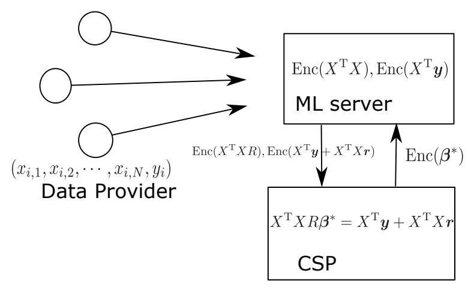
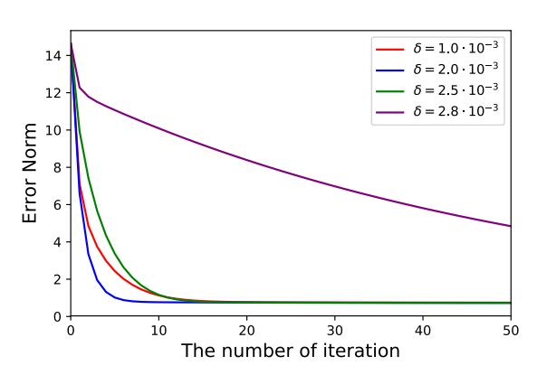
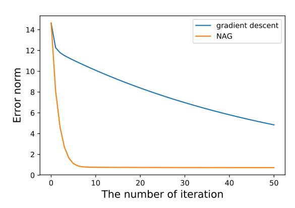
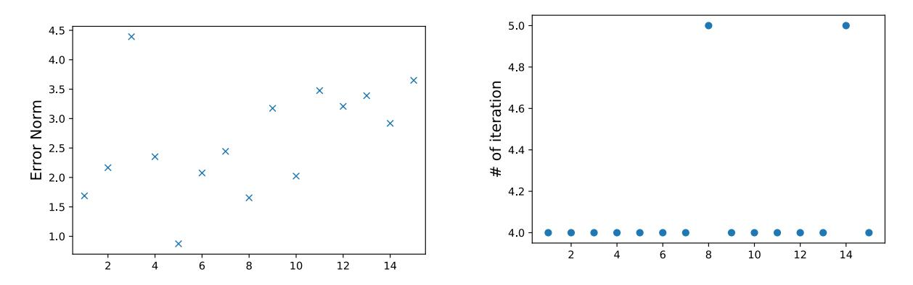
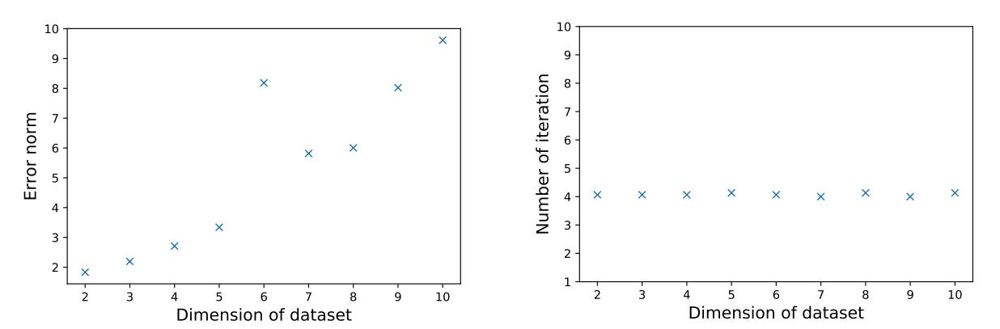
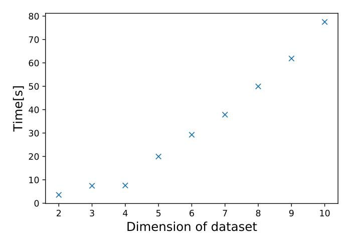
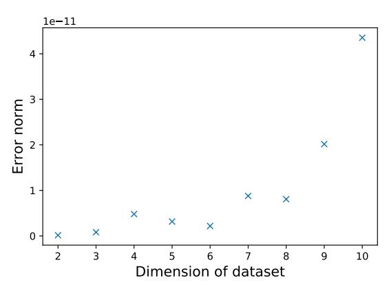
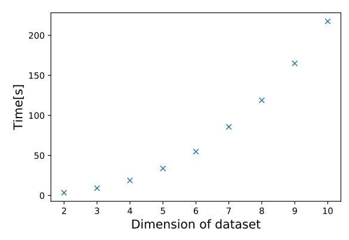

# S`Bp+v@S`2b2`pBM; 6bi M/ 1t+i GBM2` 1[miBQMb aQHp2` rBi? 6mHHv >QKQKQ`T?B+ 1M+`vTiBQM

E2Bi `BKBibmR-k M/ ExmFB PibmFR

R*h?BMFs-AM+ Ĝ JBMiQ- hQFvQ* k*h?2Q`2iB+b S?vbBF- 1B/;2MƺbbBb+?2 h2+?MBb+?2 >Q+?b+?mH2- 3yNj wɃ`B+?- arBix2`HM/ `BKBibmXF2Bi!i?BMFtBM+X+QK- Fx!i?BMFtBM+X+QK*

62#`m`v kd- kyky

#### **#bi`+i**

S`Bp+v M/ K+?BM2 H2`MBM; `2 /B{+mHi iQ +Q2tBbi /m2 iQ i?2B` Mim`2, T`Bp+v b?QmH/ #2 F2Ti 7`QK Qi?2`b r?BH2 K+?BM2 H2`MBM; `2[mB`2b H`;2 KQmMi Q7 /iX KQM; b2p2`H TQbbB#H2 bQHmiBQMb iQ i?Bb T`Q#H2K- *6mHHv >QKQKQ`T?B+ 1M+`vTiBQM* U6>1V(R- k- j- 9) ?b #22M +2Mi2` Q7 BMi2MbBp2 `2b2`+?2b BM i?Bb }2H/X 6>1 2M#H2b HBM2` QT2`iBQMb Q7 +BT?2`i2tiX hQ iF2 /pMi;2 Q7 i?Bb T`QT2`iv- KMv T`QiQ+QHb iQ +?B2p2 biiBbiB+H QT2`BQMb ?p2 #22M T`QTQb2/X PM i?2 Qi?2` ?M/- KMv Q7 i?2K `2 BKT`+iB+HX aQK2 Q7 i?2 TT`Q+?2b BMi`Q/m+2 +`vTiQbvbi2Kb i?i `2 MQi 7KBHB`X JQ`2Qp2`- KQbi Q7 i?2B` T`QiQ+QHb `2 TT`QtBKiBQM r?B+? KB;?i b2MbBiBp2Hv /2T2M/ QM Qm` +?QB+2 Q7 T`K2i2`bX AM i?Bb TT2`- r2 T`QTQb2 7bi- bBKTH2- M/ 2t+i T`Bp+v@T`2b2`pBM; HBM2` 2[miBQM bQHp2` mbBM; 6>1X Pm` irQ@T`iv T`QiQ+QH Bb b2+m`2 ;BMbi i H2bi b2KB@?QM2bi KQ/2H- M/ r2 +M 2t+iHv +H+mHi2 i?2 KQ/2H 2p2M rBi?Qmi i?2 #QQibi`TTBM;X

# **R AMi`Q/m+iBQM**

J+?BM2 H2`MBM; THvb KQK2MiQmb `QH2 BM Qm` bQ+B2iv iQ/vX Ai Bb #2BM; TTHB2/ iQ HKQbi HH }2H/b Q7 MQi QMHv b+B2M+2 bm+? b BM7Q`KiBQM b+B2M+2- #BQHQ;v- M/ T?vbB+b- #mi HbQ Q7 BM/mbi`B2b- Q` 2p2M 2p2`v/v +QKQ/BivX KQM; i2+?MQHQ;B2b r?2`2 K+?BM2 H2`MBM; Bb mb2/- +HQm/ +QKTmiBM; Bb QM2 Q7 i?2 KQbi BMi2MbBp2 }2H/ Q7 bim/v M/ TTHB+iBQMX q?BH2 r2 +M M2p2` /Qm#i mb27mHM2bb Q7 i?2 K+?BM2 H2`MBM;- Bi bQK2iBK2b `2[mB`2b `2p2H Q7 b2MbBiBp2 BM7Q`KiBQMX 6Q` 2tKTH2- +`2/Bi b+Q`BM; Bb ;`QrBM; i`2M/ BM }MM+2, BM Q`/2` iQ T`QT2`Hv b+Q`2 i?2 mb2`Ƕb +`2/B#BHBiv- T`Bpi2 /i bm+? b TvK2Mi ?BbiQ`v- /BTHQK- M/ +`22` rQmH/ #2 M2+2bb`vX JQ`2Qp2`- bQK2iBK2b b?`BM; Q7 /i Bb 2p2M T`Q?B#Bi2/ #v HrX 6Q` 2tKTH2- TiB2MibǶ BM7Q`KiBQM Bb MQi HHQr2/ iQ b?`2 #2ir22M irQ /Bz2`2Mi ?QbTBiHbX h?2`27Q`2- iQ 7mHHv miBHBx2 i?2 #BHBiv Q7 K+?BM2 H2`MBM;- r2 b?QmH/ /2p2HQT i?2 rv iQ F22T T`Bp+v T`2b2`p2/ r?2M i?2b2 `2 T`Q++2bb2/X hQ i+FH2 i?Bb T`Q#H2K- i?2`2 ?b #22M KMv T`QiQ+QHb T`QTQb2/X PM2 Q7 i?2 KQbi +QKKQM +?QB+2 Bb *>QKQKQ`T?B+ 1M+`vTiBQM*(R- k- j- 9) r?B+? 2M#H2b +H+mHiBQMb Q7 +BT?2`i2ti rBi?Qmi /2+`vTiBM;X h?2 Qi?2` TQbbB#H2 +?QB+2 Bb *uQǶb :`#H2/ \*B`+mBi*X PM2 +M 2pHmi2 Mv +B`+mBi rBi? i?Bb ;`#H2/ +B`+mBi rBi?Qmi `2p2HBM; Bib BMTmiX AM Qmi TT2`- r2 T`QTQb2 bBKTH2 M/ 2t+i rv iQ i`BM i?2 ;Bp2M /i 7Q` *GBM2` \_2;`2bbBQM*- r?B+? Bb QM2 Q7 i?2 KQbi TQTmH` biiBbiB+H MHvbBbX Pm` TT2` Bb Q`;MBx2/ b 7QHHQrb, AM a2+Xj r2 BMi`Q/m+2 bQ@+HH2/ *6mHHv >QKQKQ`T?B+ 1M+`vTiBQM*- M/ HbQ r2 `2pB2r i?2 HBM2` `2;`2bbBQM M/ ?Qr iQ /Q i?Bb DQ# BM i?2 T`Bp+v@T`2b2`p2/ rv BM a2+X9X 6BMHHv r2 BMi`Q/m+2 Qm` T`QiQ+QH 7Q` i?2 i`BMBM; T?b2X

# **k Pm` \*QMi`B#miBQM**

q2 T`QTQb2 bBKTH2 M/ 2t+i rv iQ BKTH2K2Mi T`Bp+v@T`2b2`pBM; HBM2` `2;`2bbBQMX h?2`2 ?b #22M KMv T`QiQ+QHb r?B+? +?B2p2b i?2 T`Bp+v@T`2b2`pBM; HBM2` `2;`2bbBQM(8- e- d)X PM i?2 Qi?2` ?M/- i?2v `2 2Bi?2` +QKTHB+i2/ M/ 2p2M BMi`Q/m+2 M 2M+`vTiBQM b+?2K2 r?B+? Bb MQi mb2/ #v KDQ`Biv Q7 i?2 +QKKmMBivX Pm` T`QiQ+QH Bb rBi?BM i?2 biM/`/ T`QiQ+QH M/ BMi`Q/m+2b MQ mM+QKKQM B/2X JQ`2Qp2`- BM KMv +b2b i?Qb2 b+?2K2b `2 Bi2`iBp2 bm+? b ;`/B2Mi /2b+2Mi M/ \*?QH2bFv /2+QKTQbBiBQMX h?Bb K2Mb i?2B` `2bmHib `2 TT`QtBKiBQMX >Qr2p2`- Qm` T`QiQ+QH Bb 2t+i M/ +M #2 T2`7Q`K2/ BM i?2 `2bQM#H2 iBK2X Pm` 2tT2`BK2Mi b?Qrb i?i HBM2` `2;`2bbBQM +M #2 +``B2/ 2t+iHv 2p2M rBi?Qmi #QQibi`TTBM;X

# 3 Homomorphic Encryption

In this section homomorphic encryption, mainly focusing on so-called fully homomorphic encryption (FHE) is introduced briefly. First its history and basic philosophy are explained, then one particular schemes by Brakerski/Fan-Vercauteren (BFV or FV) scheme[9] is discussed in a more detail.

### 3.1 Brief Summary of (Fully) Homomorphic Encryption

History of homomorphic encryption can be traced back to Rivest in 1978 where he termed "privacy homomorphism" for homomorphic encryption[10]. In that paper he proposed the existence of some encryption scheme with which ciphertext can be operated before decrypting it. Since then, the study of homomorphic encryption has been one of the big area of cryptography. Until now, there has been many homomorphic encryption schemes proposed such as RSA[11], ElGamal[12], Goldwasser-Micali[3], Paillier[4], and many more. Those schemes are called partially homomorphic: if  $m_1$  and  $m_2$  are plaintext in a plaintext space  $\mathcal{M}$  and  $c_1$  and  $c_2$  are corresponding ciphertext generated by an ecryption scheme Enc in a ciphertext space  $\mathcal{C}$ , then operations  $\cdot_m$ ,  $\cdot_c$  are defined both in  $\mathcal{M}$  and  $\mathcal{C}$  respectively, and satisfy the following relation

$$\operatorname{Enc}(m_1 \cdot_m m_2) = \operatorname{Enc}(m_1) \cdot_c \operatorname{Enc}(m_2) = c_1 \cdot_c c_2. \tag{1}$$

The operation  $\cdot$  can be either addition or multiplication, but not both in *partially homomorphic encryption* (PHE) schemes.

In 2009, Gentry proposed the first fully homomorphic encryption scheme in his PhD thesis[13], which is based on ideal lattice. His construction of FHE is as follows: first somewhat homomorphic encryption (SWHE) scheme is introduced. SWHE is an encryption scheme which allows the limited number of addition and multiplication. Here the detail of the construction of SWHE is not discussed. But we should note that the decryption would not work if we add or multiply too many ciphertexts. To tackle this problem, bootstrapping is defined on SWHE scheme. Bootstrapping is a special technique which makes a noisy ciphertext less noisy. This is done by applying to a noisy ciphertext a decryption circuit which is homomorphic.

Since Gentry's blueprint, several variations of FHE have been proposed so far, and those schemes are classified into three generations. The first generation include the original Gentry's approach[13], and several sophistications[14, 15, 16, 17].

The second generation includes Brakerski-Gentry-Vaikuntanathan (BGV) scheme[8], Brakerski/Fan - Vaikuntanathan (BFV) scheme[9], and Cheon-Kim-Kim-Song (CKKS) scheme[18]. Theoretical difference between the first generation and the second generation is that the first generation depends on ideal lattice or integer for security while many of the second generation schemes uses Learing With Error (LWE) problem, or its variant Ring LWE (RLWE) problem. Practical difference is that these schemes are much more efficient than those of the first generations and in some cases it suffices only to run SWHE scheme, i.e., efficient so that we do not need the bootstrapping for some problems. These second generation schemes are also practically important since many homomorphic encryption libraries are based on these schemes.

The third scheme is based on Gentry-Sahai-Waters (GSW) cryptosystem[19]. It includes so-called FHEW[20] and so-called TFHE[21].

## 3.2 Example –BFV scheme–

As mentioned in the previous section, there are many variants of FHE scheme. But in the practical sense, BGV scheme[8] and BFV scheme[9] are mostly used. Therefore here we review BFV implementation. Here only BFV scheme is discussed since we implement FHE using BFV scheme and difference between BGV scheme and BFV scheme is inessential and the library we use in Sec,4.3 is based on BFV.

We first introduce basic notations which follow the original paper [9].

- We consider operations in the polynomial ring  $R = \mathbb{Z}[x]/f(x)$  where  $\mathbb{Z}[x]$  means a set of polynomial with integer coefficient and f(x) is a monic irreducible polynomial with degree d. Usually  $f(x) = x^d + 1$  with  $d = 2^n$ .
- An element of R is denoted by  $\mathbf{a} \in R$ , where we can view  $\mathbf{a}$  as a vector in some sense since  $\mathbf{a} = \sum_{i=0}^{d-1} a_i x^i$ . Addition, subtraction, and multiplication are defined as elementwise operations. The norm is defined such that  $\|\mathbf{a}\| := \max_i \{a_i\}$  which is called  $L^{\infty}$  norm. Expansion factor  $\delta_R$  is also defined as  $\delta_R := \max\{\|\mathbf{a} \cdot \mathbf{b}\|/\|\mathbf{a}\|\|\mathbf{b}\|; \mathbf{a}, \mathbf{b} \in R\}$
- For an integer q,  $\mathbb{Z}_q := (-q/2, q/2]$ .  $R_q$  is a subset of the polynomial ring R whose coefficient is in  $\mathbb{Z}_q$ . For an integer a,  $[a]_q \equiv a \pmod{q}$  and satisfies  $[a]_q \in \mathbb{Z}_q$ . For  $\mathbf{a} \in R$ ,  $[\mathbf{a}]_q$  is an element of the polynomial ring R with each coefficient being  $[a_i]_q$ .

- For  $x \in \mathbb{R}$ , |x| is rounding to the nearest integer, |x| is rounding up and [x] rounding down.
- $\chi$  denotes Gaussian probability distribution over integer  $\mathbb{Z}^d$ , and  $e \leftarrow \chi$  denotes an element of R with coefficients sampling from  $\chi$ .  $a \leftarrow A$  where A is a set means a uniform sampling from A.

For encryption, we first set  $R_q$  for  $q \in \mathbb{Z}$  and define the plaintext space to be  $R_t$  for  $t \in \mathbb{Z}$  with t < q.  $\Delta := \lfloor q/t \rfloor$ .

SecretKeyGen(
$$1^{\lambda}$$
): sample  $s \leftarrow \chi$  and set a secret key  $sk = s$   
PublicKeyGen( $sk$ ): sample  $a \leftarrow R_q, e \leftarrow \chi$  and set a public key  $pk = ([-(a \cdot s + e)]_q, a)$   
Encrypt( $pk, m$ ): set a plaintext  $m \in R_t$ , define  $p_0 = pk[0], p_1 = pk[1]$ sample  $u, e_1, e_2 \leftarrow \chi$   
create a ciphertext  $ct = ([p_0 \cdot u + e_1 + \Delta m]_q, [p_1 \cdot u + e_2]_q)$   
Decrypt( $sk, ct$ ):  $s = sk$ , define  $c_0 = ct[0], c_1 = ct[1]$ , then calculate  $\left[\left\lfloor \frac{t(c_0 + c_1 \cdot s)}{q}\right\rfloor\right]_t$ 

We can find the following property

**Proposition**  $\|\chi\| < B$ , then sufficient condition for correct decryption is

$$2\delta_R B^2 + B < \frac{\Delta}{2} \tag{3}$$

For a proof, see[9].

Addition and multiplication are defined as follows (we do not discuss them in detail, for detailed discussions, see the original paper[9]). Assume two plaintexts  $m^1, m^2$  and the corresponding ciphertexts  $ct^1 = (c_0^1, c_1^1), ct^2 = (c_0^2, c_1^2)$ .

$$\begin{aligned} & \text{Addition}(ct^1, ct^2) : ct^1 + ct^2 = \left( \mathbf{c}_0^1 + \mathbf{c}_0^2, \mathbf{c}_1^1 + \mathbf{c}_1^2 \right) \\ & \text{Multiplication}(ct^1, ct^2) : ct^1 \cdot ct^2 = \left( \mathbf{c}_0^1 \cdot \mathbf{c}_0^2, \mathbf{c}_0^1 \cdot \mathbf{c}_1^2 + \mathbf{c}_1^1 \cdot \mathbf{c}_0^2, \mathbf{c}_1^1 \cdot \mathbf{c}_1^2 \right) \end{aligned} \tag{4}$$

Addition is intuitive, but Multiplication is not. To make sense of it, consider Decrypt. There one has to compute  $c_0 + c_1 \cdot s = \Delta m + v + qr$ . Therefore

$$(\boldsymbol{c}_0^1 + \boldsymbol{c}_1^1 \cdot \boldsymbol{s})(\boldsymbol{c}_0^2 + \boldsymbol{c}_1^2 \cdot \boldsymbol{s}) = (\boldsymbol{c}_0^1 + \boldsymbol{c}_0^2) + (\boldsymbol{c}_0^1 \cdot \boldsymbol{c}_1^2 + \boldsymbol{c}_1^1 \cdot \boldsymbol{c}_0^2) \cdot \boldsymbol{s} + (\boldsymbol{c}_1^1 \cdot \boldsymbol{c}_1^2) \cdot \boldsymbol{s}^2$$

$$= \Delta^2 \boldsymbol{m}^1 \cdot \boldsymbol{m}^2 + \cdots$$
(5)

where we can see elements of Multiplication as coefficient of each  $s^i$ . As one can see, Decryption increases of the size of ciphertext. To deal with this problem there is a technique called relinearlize, but we do not discuss here. It is also important to note that both Addition and Multiplication increase "noise" v, and particularly for Multiplication increment of noise is exponential.

# 4 Privacy-Preserving Linear Regression

In this section, we discuss the problem of linear regression. Manipulating data with privacy-preserving manner dates back to Lindell and Pinkas in 2000[22]. After this seminal work, many protocals have been introduced. It is not easy to classify every protocal into some classes since there are so many, but most of all protocols adopt at least one of three techniques. One can split his data and share one part of the original data with one server, and different part with different server. BGW[23] is included in this group. Another way is to use homomorphic encryption. The other way is to use Yao's garbled circuit protocol (GCP)[24, 25]

First, few basics of linear regression are summarized. Next, several approaches to the linear regression problem using homomorphic encryption are introduced. We also look at GCP. GCP is another possible choice for implementing privacy-preserving linear regression. Finally, we propose a new scheme which is fast and easy to implement

### 4.1 Basics of Linear Regression

Let us suppose we are given a data consisting of N independent variables  $(x_1, x_2, \dots, x_N)$  and an output y. From this data we want to relate the output to variables. One ansatz is to assume they are linearly related, i.e., we assume

$$y = \beta_1 x_1 + \beta_2 x_2 + \dots + \beta_N x_N + \epsilon \tag{6}$$

where  $\epsilon$  is error. To relate properly we need more data: assume we are given a dataset consisting of D data, i.e.,  $\{(y_i, x_{i,1}, x_{i,2}, \dots, x_{i,N})_{i=1}^D\}$ . We want to find a linear relation

$$y_i = \sum_{i=1}^{D} \beta_j x_{i,j} + \epsilon_i. \tag{7}$$

In the vector and matrix representation, (7) is equivalent to

$$y = X\beta + \epsilon, \tag{8}$$

where  $(\boldsymbol{y})_i = y_i, X_{ij} = x_{i,j}, (\boldsymbol{\beta})_i = \beta_i, (\boldsymbol{\epsilon})_i = \epsilon_i$ . We next consider optimization of  $\boldsymbol{\beta}$ . In the least square method, we minimize the  $L^2$  norm of the error  $\boldsymbol{\epsilon}$ . In other words we should minimize

$$\mathcal{L}(\boldsymbol{\beta}) = |\boldsymbol{y} - X\boldsymbol{\beta}|^2, \tag{9}$$

where the norm of  $\epsilon$  is represented as a function of  $\beta$ , i.e.,  $\mathcal{L}(\beta)$ , and it is called the object function. To find the minimum is easy since we can differentiate the object function and obtain

$$\frac{\partial \mathcal{L}}{\partial \boldsymbol{\beta}} = -2X^{\mathrm{T}} \left( \boldsymbol{y} - X \boldsymbol{\beta} \right) \tag{10}$$

and the optimal  $\boldsymbol{\beta}$  is given by  $\boldsymbol{\beta} = \left(X^{\mathrm{T}}X\right)^{-1}X^{\mathrm{T}}\boldsymbol{y}$ . So essentially the linear regression is to solve an inverse matrix  $X^{\mathrm{T}}X$  and multiply it by  $X\boldsymbol{y}$ .

If we impose a condition that a norm of  $\beta$  should not be large, this problem is called *ridge regression*. The redge regression problem is solved easily just by adding another term in (9) such that

$$\mathcal{L}_{\lambda}(\boldsymbol{\beta}) = |\boldsymbol{y} - X\boldsymbol{\beta}|^2 + \lambda |\boldsymbol{\beta}|^2 \tag{11}$$

where the second term is a penalty for large  $\beta$ . The optimal  $\beta$  is given by  $\beta = (X^TX + \lambda \mathbf{1})^{-1} X^T \mathbf{y}$ , where  $\mathbf{1}$  is an unit matrix. Therefore in either linear regression or ridge regression, what we should do is first to calculate an inverse matrix and then to multiply it by some vector. Notice that with FHE multiplication is done easily, on the other hand, matrix inversion is not trivial. Therefore many proposed schemes of privacy preserving mainly try to solve this problem.

### 4.2 Proposed Scheme: Masking Matrix Method

#### 4.2.1 Informal Description of the Method

When one tries to send message, it is possible that he adds some random number so that no one can guess it. Also in linear regression using homomorphic encryption, this trick is sometimes used such as [5, 7]. Not only in the context of homomorphic encryption for linear regression, but also many other context [27, 28]. The basic idea is simple: assume Alice want to calculate  $\beta$  which satisfies  $A\beta = b$  but she cannot compute it. Bob can compute it but Alice does not want Bob to know the matrix A and the vector b. Then Alice can generate some random invertible matrix R and some random vector r. She compute AR and b + Ar and send them to Bob. Bob cannot extract any information of A, b from what he gets since they are masked. He, then calculates  $(AR)^{-1}(b+Ar)$ , which is equivalent to  $R^{-1}A^{-1}b+R^{-1}r$ . Therefore Alice can get  $A^{-1}b$  by multiplying R from the left side followed by the substruction by r. Alice outsources difficult matrix inversion to Bob while the original matrix is kept secret. Combination of FHE and this method gives us a fast, easy-to-implement, and exact method of linear regression.

#### 4.2.2 Model

Our architecture follows that of [5, 7], which means we assume the following entities,

- Data Provider (DP): it is made up of m users. ith user holds dataset i which is denoted by  $\mathcal{DO}_i = (x_{i,1} \cdots x_{i,N}, y_i)$ . There is no need for physical existence of DP, i.e., we do not need any institution which manages users' information, rather we just group people who want to use some service and therefore have to send their information.
- Machine Learning (ML) Server: ML server collects the information from DP and is resposible for calculating the model. In the example shown above, Alice plays a ML server.
- Crypto Service Provider (CSP): CSP is responsible for generating a set of public key and secret key. CSP also coorperate ML server for calculating the model which Bob did in the above-mentioned example.

Figure 1: A schemetic figure of training phase. For the meaning of each notation, refer to Sec.4.2.4

#### 4.2.3 The Threat Model

For a sake of privacy, both the ML server and the CSP should not learn anything other than what is revealed by the linear regression. In the following, first we assume those two parties are *honest-but-curious*, i.e., they follow the algorithm, but they also try to extract information from what is given to them. Therefore the algorithm in Sec.4.2.4 is secure only against honest-but-curious entities.

However, the ML server and the CSP can be malicious. We assume the following cases as [5] does: the ML server might use only dataset partially given by DP to extract some information. Also the ML server deliverately executes wrong calculations. The CSP can make mistakes in its calculation intentionally as well. Morever, it decrypts ciphertexts wrongly. We address how to deal with these behaviors in the subsequent section.

We do not assume the ML server and the CSP collude and we assume key distribution is properly done so that everyone has a set of correct public key and secret key.

### 4.2.4 Training Phase

First let us consider the training phase: make a proper model  $\beta$  which minimizes  $\mathcal{L}(\beta)$  in (9) or  $\mathcal{L}_{\lambda}(\beta)$  in (11). We take the following step:

• DP first encrypts data and sends it to the ML server.

DP can make a choice. It can send a raw data, i.e., each  $\mathcal{DO}_i$  just sends  $(x_{i,1}, \dots, x_{i,N}, y_i)_{i=1}$ , or it can also process its data for better performance, i.e.,  $\mathcal{DO}_i$  sends an encrypted matrix  $\text{Enc}(\boldsymbol{x}_i^T \boldsymbol{x}_i)$  and an encrypted vector  $\text{Enc}(\boldsymbol{x}_i^T y_i)$ , namely

$$\operatorname{Enc}(\boldsymbol{x}_{i}^{\mathrm{T}}\boldsymbol{x}_{i}) = \begin{pmatrix} \operatorname{Enc}(x_{i,1}x_{i,1}) & \operatorname{Enc}(x_{i,1}x_{i,2}) & \cdots & \operatorname{Enc}(x_{i,1}x_{i,N}) \\ \operatorname{Enc}(x_{i,2}x_{i,1}) & \operatorname{Enc}(x_{i,2}x_{i,2}) & \cdots & \operatorname{Enc}(x_{i,2}x_{i,N}) \\ \vdots & & \ddots & \vdots \\ \operatorname{Enc}(x_{i,N}x_{i,1}) & \operatorname{Enc}(x_{i,N}x_{i,2}) & \cdots & \operatorname{Enc}(x_{i,N}x_{i,N}) \end{pmatrix}, \operatorname{Enc}(\boldsymbol{x}_{i}^{\mathrm{T}}y_{i}) = \begin{pmatrix} \operatorname{Enc}(x_{i,1}y_{i}) \\ \operatorname{Enc}(x_{i,2}y_{i}) \\ \vdots \\ \operatorname{Enc}(x_{i,N}y_{i}) \end{pmatrix}.$$
(12)

• The ML server constructs a matrix and a vector for the linear regression while they are encrypted.

If DP sends a raw data, then the ML server first constructs  $\operatorname{Enc}(X)$  and calculates  $\operatorname{Enc}(X^{\mathrm{T}}X)$  and same for  $\operatorname{Enc}(X^{\mathrm{T}}\boldsymbol{y})$ . If DP sends a processed data, then the ML server just sums up all the matrices and vectors, i.e.,  $\operatorname{Enc}(X^{\mathrm{T}}X) = \sum_i \operatorname{Enc}(\boldsymbol{x}_i^{\mathrm{T}}\boldsymbol{x}_i)$  and  $\operatorname{Enc}(X^{\mathrm{T}}\boldsymbol{y}) = \sum_i \operatorname{Enc}(\boldsymbol{x}_i^{\mathrm{T}}y_i)$  using homomorphic property of encryption scheme.

• The ML server masks the original matrix and vector and sends them to CSP

The ML server invents a random invertible matrix R and a random vector  $\mathbf{r}$  and calculates  $\operatorname{Enc}(X^{\mathrm{T}}XR)$  and  $\operatorname{Enc}(X^{\mathrm{T}}y+X^{\mathrm{T}}X\mathbf{r})$  and sends to CSP. At this stage the ML does not know anything about the original information and CSP even after receiving those matrix and vector, does not know anything about the original information since they are masked by random matrix and vector. Therefore unless the ML server and CSP collude, this is secure.

• CSP decrypts what it receives from the ML server and calculates the model which is not an actual model we want, and sends this model to the ML server

CSP decrypts and calculates  $(X^{T}XR)^{-1}(X^{T}\boldsymbol{y} + X^{T}X\boldsymbol{r}) = R^{-1}(X^{T}X)^{-1}\boldsymbol{y} + R^{-1}\boldsymbol{r}$  and sends it to the ML server after encrypting it.

• The ML server multiplies what it receives from CSP by R from the left followed by subtracting r, which gives  $(X^{T}X)^{-1}X^{T}y$ .

### 4.2.5 Security

Both the training scheme and the evaluation scheme are secure against honest-but-curious entities, In this section we try to extend these schemes to cover even malicious entites. Again we assume the ML server and CSP can be malicious, but they do not collude.

In the training phase, the possible senarios for the malicious ML server are

- the ML deliberately outputs a wrong calculation
- it does not pick all the information given by DP to extract some information

These misbehaviors can be detected by the following test: DP prepares a "dummy" training set and send it to the ML server. The dummy data is constructed such that for N dimensional data, i.e., the data with N variables, there are N data which means  $\mathcal{DO}_i(i=1,\dots,N)$ . For ith  $\mathcal{DO}_i$  the data is as follows

$$\mathcal{DO}_i = (0, \cdots, x_{i,i} = x_i, \cdots, 0, y_i)$$
(13)

Only ith variable is a nonzero arbitrary number and  $y_i$  is also arbitrary. Using  $\mathcal{DO}$  the ML server calculates a matrix and a vector as in Sec.4.2.4 and sends the masked matrix to CSP. Notice that only when the ML properly calculate  $X^TX$  without dropping any information  $X^TX$  becomes an invertible matrix. Then CSP decrypts the matrix and calculate the determinant of it. Then if the determinant is zero, which means the ML server cannot properly calculate the matrix so CSP can reject it.

In the scoring phase, the ML server also can be malicious by sending a different model. On ther other hand, in terms of security this assumption is meaningless since we assume the ML server aims at extracting  $\mathcal{DO}$ 's information by its misbehaviors, but sending a different model reveals nothing.

CSP can be malicious as well, and we assume CSP can produce a wrong result. Even if CSP is malicious, CSP cannot obtain any personal information from what it has been given since the matrix and the vector it receives are just random: suppose  $X^TXR \in GL(N,\mathbb{Z})$  which means this  $N \times N$  matrix is invertible and  $X^Ty + X^TXr \in \mathbb{Z}^N$ . Random matrix and vector are defined such that there exists an integer M and for any integer  $m \in [-M, M]$  each component of them, i.e.,  $R_{i,j}, r_k$  satisfy

$$\Pr[R_{i,j} = m] = \frac{1}{2M}, \Pr[r_k = m] = \frac{1}{2M}.$$
(14)

It is easy to see that for sufficiently large M, for any matrix A and any vector  $\boldsymbol{a}$  with each component in the interval [-M, M],

$$\Pr[X^{\mathsf{T}}XR = A] = \Pr[R = (X^{\mathsf{T}}X)^{-1}A] = \left(\frac{1}{2M}\right)^{N^2}$$

$$\Pr[X^{\mathsf{T}}\boldsymbol{y} + X^{\mathsf{T}}X\boldsymbol{r} = \boldsymbol{a}] = \Pr[\boldsymbol{r} = (X^{\mathsf{T}}X)^{-1}(\boldsymbol{a} - X^{\mathsf{T}}\boldsymbol{y})] = \left(\frac{1}{2M}\right)^{N}$$
(15)

Therefore this method is secure in terms of privacy even against a malicious CSP. Moreover, one can even detect a malicious CSP by the following trick. DP prepares a "dummy" training set and send it to the ML server. The dummy data is constructed such that for N dimensional data, i.e., the data with N variables, threre are N data which means  $\mathcal{DO}_i(i=1,\cdots,N)$  and rank(X)=N. From this detaset one can construct the model  $\beta$  such that  $y-X\beta=0$ . The ML server follows the scheme and sends the masked matrix and the masked vector to CSP. Finally the ML server obtain the model which is encrypted  $\text{Enc}(\beta)$ . Then the ML server calculates  $y-X\beta$  and let us denote this answer by s. Although the ML server only has Enc(s), it can determine if s is s0 or not. The ML server generate random scalars, vectors, matries and multiplies by s1 from the right. Then the ML server can detect the malicious CSP when if all the results are not same.

#### 4.3 Experiment

In this section we look at performance of each method.

Figure 2: Convergence of gradient descent with various learning rate  $\delta$ .

Figure 3: Comparison between the simple gradient descent and NAG when  $\delta = 2.8 \times 10^{-3}$ . The other parameter is  $\eta = 0.1$ . The simple gradient shows slow convergence, but NAG is relatively fast, only to need less than 10 iterations.

#### 4.3.1 Gradient Descent

To compare MMM's performace with the existing method, we first consider the gradient descent. It is particularly efficient if a matrix considered is sparse. Staring from an initial value  $\beta^{[0]}$ , using (10) with learning rate  $\delta$  the model can be updated as follows:

$$\boldsymbol{\beta}^{[k]} = \boldsymbol{\beta}^{[k-1]} + \delta X^{\mathrm{T}} \left( \boldsymbol{y} - X \boldsymbol{\beta}^{[k-1]} \right). \tag{16}$$

Particularly, Esperança et al. studied gradient descent method[26]. Mathematically, with suitable choice of the initial value  $\beta^{[0]}$  and learing rate  $\delta$ , a convergence to the optimal result is assured. Suitable choice of  $\delta$  means  $\delta \in (0, 2/(\mathcal{S}(X^TX)))$  where  $\mathcal{S}(A)$  is the spectral radius (difference between the largest eigenvalue and the smallest eigenvalue) of operator A. In [26], authors found oscillatory nature of  $\beta^{[k]}$ ,

$$\boldsymbol{\beta}^{[k]} = \sum_{n=1}^{k} (-1)^{n+1} {k \choose k-n} \delta^{n} (X^{\mathrm{T}} X)^{n-1} X^{\mathrm{T}} \boldsymbol{y}$$
 (17)

Using (17), we can accelerate the gradient descent as one can find in [26] First, even before using FHE we should look at convergence of sequence  $\boldsymbol{\beta}^{[k]}$  which this method outputs. We generate seven datasets whose dimension is five, i.e.,  $(x_{i1}, \dots, x_{i,5}, y_i)_{i=1}^7$ . Figure.2 shows convergence of the model  $\boldsymbol{\beta}^{[k]}$ 

From Fig.2 we can understand performance is sensitive to the learning rate  $\delta$  and when  $\delta > 3.0 \times 10^{-3}$  the model diverges, which agrees with theory(for example, [29]). We also introduce *Nesterov's accelerated gradient* (NAG)[30]. In NAG, gradient descent is modified such that

$$s^{[k]} = \beta^{[k-1]} + \delta X^{\mathrm{T}} \left( y - X \beta^{[k-1]} \right)$$

$$\beta^{[k]} = s^{[k-1]} - \eta \left( s^{[k]} - s^{[k-1]} \right)$$
(18)

This method is useful particularly when the simple gradient descent exhibit slow convergence

From this result, we choose to use NAG for the calculation. The implementation of linear regression with FHE is executed using PySEAL[31]. In our implementation, around  $4\sim5$  iterations are possible and the following is the result of our experiment. Here our dataset is made up of eight data whose dimension is five, i.e., N=8, D=5.

To obtain Fig.4 and Fig.5, we set parameters  $\delta$  and  $\eta$  to be  $D/\text{tr}(X^TX)$  and -0.5, respectively. Although division is not supported by FHE, approximation is possible by Newton's method. Figure.5 suggests that our naive implementation using PySEAL allows only  $4 \sim 5$  iterations, which might not be sufficient. Therefore it is highly expected that if other ways to implement gradient descent, or other libraries such as HElib enable more iterations, then gradient descent would be a good candidate for achieving linear regression.

Moreover, as is evident from Fig.8, the more dimensions the system has, the more complicated calculation becomes and time consumption is lenearly denpendent on the dimension of dataset.

#### 4.3.2 Matrix Masking Method

Finally we explore the validity of MMM. As shown in Fig.9, the result obtained by MMM is very acurate and

6B;m`2 9, SHQi Q7 2``Q` MQ`K *|y* − *X*β*|* 2 7Q` R8 /ib2ibX6B;m`2 8, SHQi Q7 i?2 MmK#2` Q7 Bi2`iBQM 7Q` 2+? i`BM@ BM; T?b2

6B;m`2 e, SHQi Q7 i?2 p2`;2 2``Q` MQ`K *|y* − *X*β*|* 2 7Q` /ib2ibX rBi? 2 ∼ 10 /BK2MbBQM Q7 /iX 6B;m`2 d, SHQi Q7 i?2 p2`;2 MmK#2` Q7 Bi2`iBQM 7Q` 2+? i`BMBM; T?b2 rBi? 2 ∼ 10 /BK2MbBQM Q7 /iX

6B;m`2 3, SHQi Q7 i?2 p2`;2 iBK2 7Q` 2t2+miBM; i?2 T`Q;`K 7Q` ;Bp2M /ib2ib rBi? 2 ∼ 10 /BK2MbBQM Q7 /i

6B;m`2 N, SHQi Q7 i?2 p2`;2 2``Q` MQ`K *|y* − *X*β*|* 2 7Q` /ib2ibX rBi? 2 ∼ 10 /BK2MbBQM Q7 /iX

6B;m`2 Ry, SHQi Q7 i?2 p2`;2 iBK2 7Q` 2t2+miBM; i?2 T`Q;`K 7Q` ;Bp2M /ib2ib rBi? 2 ∼ 10 /BK2MbBQM Q7 /i

HKQbi 2t+iX 6B;m`2 Ry BKTHB2b iBK2 M22/2/ iQ 2t2+mi2 HBM2` `2;`2bbBQM #v JJJ Bb [m/`iB+HHv BM+`2bBM;X h?Bb +M #2 2tTHBM2/ b 7QHHQrb, bBM+2 JJJ `2[mB`2b Ki`Bt KmHiBTHB+iBQM rBi? Ki`Bt- i?2`27Q`2 QM2 ?b iQ +H+mHi2 *D*2 2H2K2MirBb2 KmHiBTHB+iBQMbX \*QKT`2/ rBi? 6B;X3- Bi b22Kb i?i ;`/B2Mi /2b+2Mi Bb 7bi2` T`iB+mH`Hv r?2M /BK2MbBQM Bb #B;- #mi r2 b?QmH/ iF2 BMiQ ++QmMi i?2 7+i i?i ;`/B2Mi /2b+2Mi `2[mB`2b KMv Bi2`iBQM M/ TQbbB#Hv #QQibi`TTBM;X

# **8 .Bb+mbbBQM**

>2`2 r2 /Bb+mbb T`+iB+#BHBiv Q7 2+? K2i?Q/, :`/B2Mi /2b+2Mi M/ Ji`Bt JbFBM; J2i?Q/X

**:`/B2Mi /2b+2Mi**, ;`/B2Mi /2b+2Mi Bb i?2 bBKTH2bi K2i?Q/ r2 +M mb2 7Q` i?2 HBM2` `2;`2bbBQMX h?Bb K2Mb BKTH2K2MiiBQM Bb bi`B;?i7Q`r`/X Ai Bb HbQ b2+m`2 ;BMbi i H2bi ?QM2bi@#mi@+m`BQmb 2MiBiB2bX >Qr@ 2p2`- r2 b?QmH/ +`2 #Qmi i?2 BKTH2K2MiiBQM Q7 6>1 b+?2K2 bBM+2 a2+X 9XjXR b?Qrb MBp2 BKTH2K2MiiBQM mbBM; Sva1G 7BHb iQ Q#iBM biBb7+iQ`v `2bmHibX JQ`2Qp2`- 2p2M B7 bQK2 Qi?2` HB#``B2b +M Q#iBM ;QQ/ `2bmHi- Qm` 2tT2`BK2Mi bm;;2bib i?i #QQibi`TTBM; b?QmH/ #2 mb2/ M/ Bi KB;?i iF2 HQM; iBK2 iQ }MBb? +H+mHiBQMX \*QHH2+iBQM Q7 /i HbQ +QMbmK2b MQBb2 #m/;2i bBM+2 B7 HQ+H /Q2b MQi +H+mHi2 2M+`vTi2/ Ki`Bt M/ 2M+`vTi2/ p2+iQ` HQ+HHv- i?2M i?2 +Q``2bTQM/BM; b2`p2` ?b iQ +H+mHi2 i?2K BMbi2/X A7 i?2 MmK#2` Q7 /ib2ib Bb H`;2- i?2M Dmbi T`2T`BM; 2M+`vTi2/ Ki`Bt M/ p2+iQ` iF2 Km+? Q7 MQBb2 #m/;2i- r?B+? KB;?i H2/ iQ 7Bm`2 BM 2biBKiBQM Q7 i?2 KQ/2HX

**JJJ**, BKTH2K2MiiBQM Q7 JJJ Bb bBKTH2 M/ i?Bb K2i?Q/ pQB/b i?2 KQbi /B{+mHi T`i Q7 i?2 HBM2` `2;`2bbBQM- BMp2`bBQM Q7 Ki`BtX aBM+2 \*aS +H+mHi2 BMp2`bBQM Q7 Ki`Bt r?B+? Bb MQi 2M+`vTi2/- i?2 `2bmHi Bb 2t+i M/ bT22/v +H+mHiBQM Bb 2tT2+i2/X h?Bb K2i?Q/ Bb HbQ b2+m`2 ;BMbi i H2bi ?QM2bi@#mi@+m`BQmb 2MiBi2bX Hi?Qm;? QM2 /Q2b MQi ?p2 iQ +`2 #Qmi Ki`Bt BMp2`bBQM- i?Bb /Q2b MQi K2M r2 +M +QHH2+i /i 7`QK `#Bi``v MmK#2` Q7 /i QrM2`b bBM+2 //BiBQM +QMbmK2b MQBb2 #m/;2ib Hi?Qm;? Bi Bb p2`v bKHHX

|                 | J2i?Q/   | *QKTmiiBQMH *QKTH2tBiv | a2+m`Biv    | GBKBiiBQM Q7 *H+mHiBQM |
|-----------------|----------|------------------------|-------------|------------------------|
| *`K2`Ƕb 7Q`KmH  | 1t+i     | O(N3N!)                | b2KB@?QM2bi | i?2`2 Bb               |
| :`/B2Mi .2b+2Mi | Ai2`iBp2 | O(N2)                  | b2KB@?QM2bi | i?2`2 Bb               |
| :*              | Ai2`iBp2 | O(N2)∗                 | b2KB@?QM2bi | LQ HBKBiiBQM           |
| JJJ             | 1t+i     | ×                      | b2KB@?QM2bi | ,                      |

h#H2 R, h#H2 Q7 +?`+i2`BbiB+b Q7 2+? K2i?Q/ BMi`Q/m+2/X

# **\_272`2M+2b**

- (R) \_X GX \_Bp2bi- X a?KB`- M/ GX /H2KMX K2i?Q/ 7Q` Q#iBMBM; /B;BiH bB;Mim`2b M/ Tm#HB+@F2v +`vTiQbvbi2KbX *\*QKKmMX \*J*- kRUkV,RkyĜRke- 62#`m`v RNd3X
- (k) h?2` 1H;KHX Tm#HB+ F2v +`vTiQbvbi2K M/ bB;Mim`2 b+?2K2 #b2/ QM /Bb+`2i2 HQ;`Bi?KbX AM *.oX AL \*\_uShPGP:u- aS\_AL:1\_@o1\_G:*- RN38X

- [3] Shafi Goldwasser and Silvio Micali. Probabilistic encryption & Damp; how to play mental poker keeping secret all partial information. In *Proceedings of the Fourteenth Annual ACM Symposium on Theory of Computing*, STOC '82, pages 365–377, New York, NY, USA, 1982. ACM.
- [4] Pascal Paillier. Public-key cryptosystems based on composite degree residuosity classes. In Jacques Stern, editor, *Advances in Cryptology EUROCRYPT '99*, pages 223–238, Berlin, Heidelberg, 1999. Springer Berlin Heidelberg.
- [5] V. Nikolaenko, U. Weinsberg, S. Ioannidis, M. Joye, D. Boneh, and N. Taft. Privacy-preserving ridge regression on hundreds of millions of records. In 2013 IEEE Symposium on Security and Privacy, pages 334–348, May 2013.
- [6] Fida Dankar. Privacy preserving linear regression on distributed databases. *Transactions on Data Privacy*, 8, 04 2015.
- [7] Irene Giacomelli, Somesh Jha, Marc Joye, C. David Page, and Kyonghwan Yoon. Privacy-preserving ridge regression with only linearly-homomorphic encryption. *IACR Cryptology ePrint Archive*, 2017:979, 2017.
- [8] Zvika Brakerski, Craig Gentry, and Vinod Vaikuntanathan. Fully homomorphic encryption without bootstrapping. Cryptology ePrint Archive, Report 2011/277, 2011.
- [9] Junfeng Fan and Frederik Vercauteren. Somewhat practical fully homomorphic encryption. Cryptology ePrint Archive, Report 2012/144, 2012.
- [10] R L Rivest, L Adleman, and M L Dertouzos. On data banks and privacy homomorphisms. *Foundations of Secure Computation, Academia Press*, pages 169–179, 1978.
- [11] W. Diffie and M. Hellman. New directions in cryptography. *IEEE Transactions on Information Theory*, 22(6):644–654, November 1976.
- [12] T. Elgamal. A public key cryptosystem and a signature scheme based on discrete logarithms. *IEEE Transactions on Information Theory*, 31(4):469–472, July 1985.
- [13] Craig Gentry. A Fully Homomorphic Encryption Scheme. PhD thesis, Stanford, CA, USA, 2009. AAI3382729.
- [14] Marten van Dijk, Craig Gentry, Shai Halevi, and Vinod Vaikuntanathan. Fully homomorphic encryption over the integers. Cryptology ePrint Archive, Report 2009/616, 2009.
- [15] N.P. Smart and F. Vercauteren. Fully homomorphic encryption with relatively small key and ciphertext sizes. Cryptology ePrint Archive, Report 2009/571, 2009.
- [16] Craig Gentry. Toward basing fully homomorphic encryption on worst-case hardness. In Tal Rabin, editor, *Advances in Cryptology CRYPTO 2010*, pages 116–137, Berlin, Heidelberg, 2010. Springer Berlin Heidelberg.
- [17] Craig Gentry and Shai Halevi. Fully homomorphic encryption without squashing using depth-3 arithmetic circuits. Cryptology ePrint Archive, Report 2011/279, 2011.
- [18] Jung Hee Cheon, Andrey Kim, Miran Kim, and Yongsoo Song. Homomorphic encryption for arithmetic of approximate numbers. In Tsuyoshi Takagi and Thomas Peyrin, editors, *Advances in Cryptology ASIACRYPT 2017*, pages 409–437, Cham, 2017. Springer International Publishing.
- [19] Craig Gentry, Amit Sahai, and Brent Waters. Homomorphic encryption from learning with errors: Conceptually-simpler, asymptotically-faster, attribute-based. Cryptology ePrint Archive, Report 2013/340, 2013.
- [20] Leo Ducas and Daniele Micciancio. Fhew: Bootstrapping homomorphic encryption in less than a second. Cryptology ePrint Archive, Report 2014/816, 2014.
- [21] Ilaria Chillotti, Nicolas Gama, Mariya Georgieva, and Malika Izabachene. Faster fully homomorphic encryption: Bootstrapping in less than 0.1 seconds. Cryptology ePrint Archive, Report 2016/870, 2016.
- [22] Yehuda Lindell and Benny Pinkas. Privacy preserving data mining. In *Proceedings of the 20th Annual International Cryptology Conference on Advances in Cryptology*, CRYPTO '00, pages 36–54, London, UK, UK, 2000. Springer-Verlag.

- (kj) JB+?2H "2M@P`- a?} :QH/rbb2`- M/ pB qB;/2`bQMX \*QKTH2i2M2bb i?2Q`2Kb 7Q` MQM@+`vTiQ;`T?B+ 7mHi@iQH2`Mi /Bbi`B#mi2/ +QKTmiiBQMX AM *S`Q+22/BM;b Q7 i?2 hr2MiB2i? MMmH \*J avKTQbBmK QM h?2Q`v Q7 \*QKTmiBM;*- ahP\* Ƕ33- T;2b RĜRy- L2r uQ`F- Lu- la- RN33X \*JX
- (k9) X \*X uQX S`QiQ+QHb 7Q` b2+m`2 +QKTmiiBQMbX AM *kyRj A111 89i? MMmH avKTQbBmK QM 6QmM/iBQMb Q7 \*QKTmi2` a+B2M+2*- T;2b ReyĜRe9- GQb HKBiQb- \*- la- MQp RN3kX A111 \*QKTmi2` aQ+B2ivX
- (k8) M/`2r \*?B@\*?B? uQX >Qr iQ ;2M2`i2 M/ 2t+?M;2 b2+`2ibX AM *S`Q+22/BM;b Q7 i?2 kdi? MMmH avKTQbBmK QM 6QmM/iBQMb Q7 \*QKTmi2` a+B2M+2*- a6\*a Ƕ3e- T;2b RekĜRed- qb?BM;iQM- .\*- la- RN3eX A111 \*QKTmi2` aQ+B2ivX
- (ke) SX JX 1bT2`MÏ- GX CX JX bH2ii- M/ \*X \*X >QHK2bX 1M+`vTi2/ ++2H2`i2/ H2bi b[m`2b `2;`2bbBQMX *`sBp,RdyjXyy3jN*- kyRdX
- (kd) CX "`@AHM M/ .X "2p2`X LQM@+`vTiQ;`T?B+ 7mHi@iQH2`Mi +QKTmiBM; BM +QMbiMi MmK#2` Q7 `QmM/b Q7 BMi2`+iBQMX AM *S`Q+22/BM;b Q7 i?2 1B;?i? MMmH \*J avKTQbBmK QM S`BM+BTH2b Q7 .Bbi`B#mi2/ \*QKTmiBM;*- SP.\* Ƕ3N- T;2b kyRĜkyN- L2r uQ`F- Lu- la- RN3NX \*JX
- (k3) \*X qM;- EX \_2M- CX qM;- M/ ZX qM;X >`M2bbBM; i?2 +HQm/ 7Q` b2+m`2Hv QmibQm`+BM; H`;2@b+H2 bvbi2Kb Q7 HBM2` 2[miBQMbX *A111 h`Mb+iBQMb QM S`HH2H M/ .Bbi`B#mi2/ avbi2Kb*- k9UeV,RRdkĜRR3R-CmM2 kyRjX
- (kN) o \_v#2MǶFBB M/ a hbvMFQpX  *h?2Q`2iB+H AMi`Q/m+iBQM iQ LmK2`B+H MHvbBb*X \*?TKM M/ >HHf\*\_\* kyydX
- (jy) umX 1X L2bi2`QpX K2i?Q/ Q7 bQHpBM; +QMp2t T`Q;`KKBM; T`Q#H2K rBi? +QMp2`;2M+2 `i2 *o* & 1 *k*2 ' X *.QFHX F/X LmF aaa\_*- keN,89jĜ89d- RN3jX
- (jR) H2tM/2` CX hBimb- a?b?ri EBb?Q`2- hQ// aipBb?- ai2T?MB2 JX \_Q;2`b- M/ E`H LBX Svb2H, Tvi?QM r`TT2` BKTH2K2MiiBQM Q7 i?2 b2H ?QKQKQ`T?B+ 2M+`vTiBQM HB#``vX *`sBp*- #bfR3yjXyR3NRkyR3X
- (jk) oH/BKB` EQH2bMBFQp M/ h?QKb a+?M2B/2`X AKT`Qp2/ ;`#H2/ +B`+mBi, 6`22 tQ` ;i2b M/ TTHB+iBQMbX AM Gm+ +2iQ- ApM .K;´`/- G2bHB2 MM :QH/#2`;- J;Mȹb JX >HH/Ʀ`bbQM- MM AM;ƦH7b/ƦiiB`- M/ A;Q` qHmFB2rB+x- 2/BiQ`b- *miQKi- GM;m;2b M/ S`Q;`KKBM;*- T;2b 93eĜ9N3- "2`HBM- >2B/2H#2`; kyy3X aT`BM;2` "2`HBM >2B/2H#2`;X
- (jj) oH/BKB` EQH2bMBFQp- ?K/@\_2x a/2;?B- M/ h?QKb a+?M2B/2`X AKT`Qp2/ ;`#H2/ +B`+mBi #mBH/BM; #HQ+Fb M/ TTHB+iBQMb iQ m+iBQMb M/ +QKTmiBM; KBMBKX AM CmM X :`v- ibmFQ JBvDB- M/ FB` PibmF- 2/BiQ`b- *\*`vTiQHQ;v M/ L2irQ`F a2+m`Biv*- T;2b RĜky- "2`HBM- >2B/2H#2`;- kyyNX aT`BM;2` "2`HBM >2B/2H#2`;X