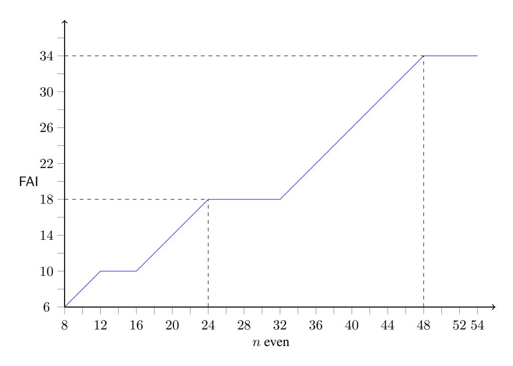
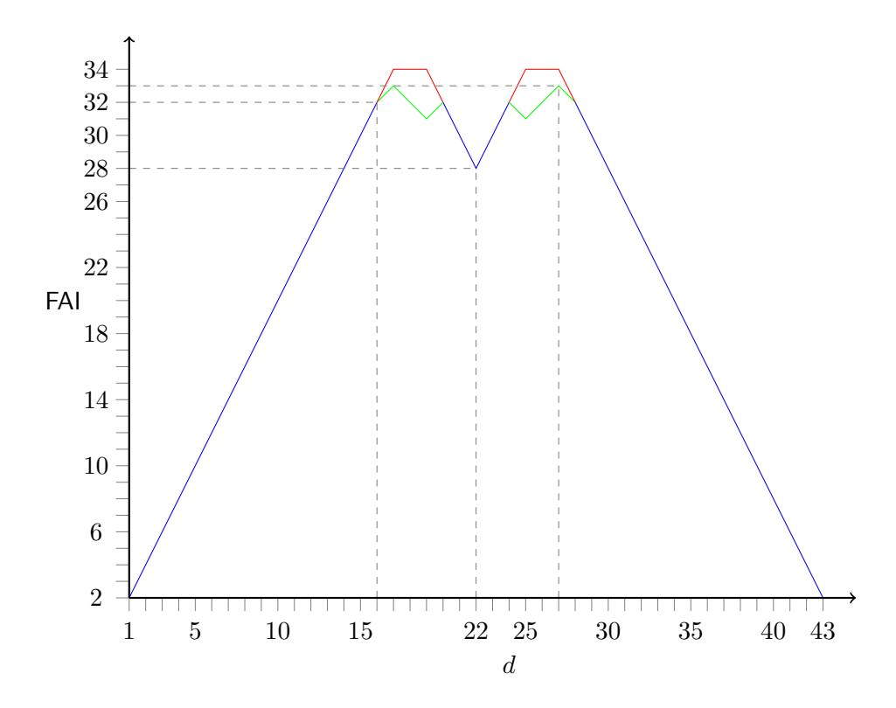
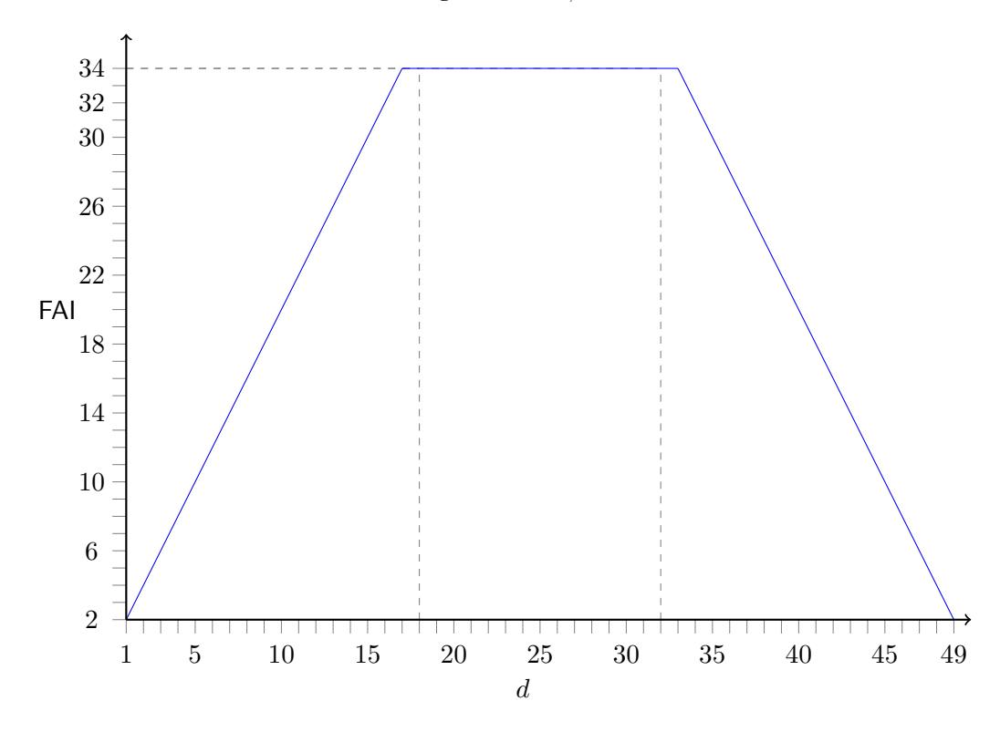
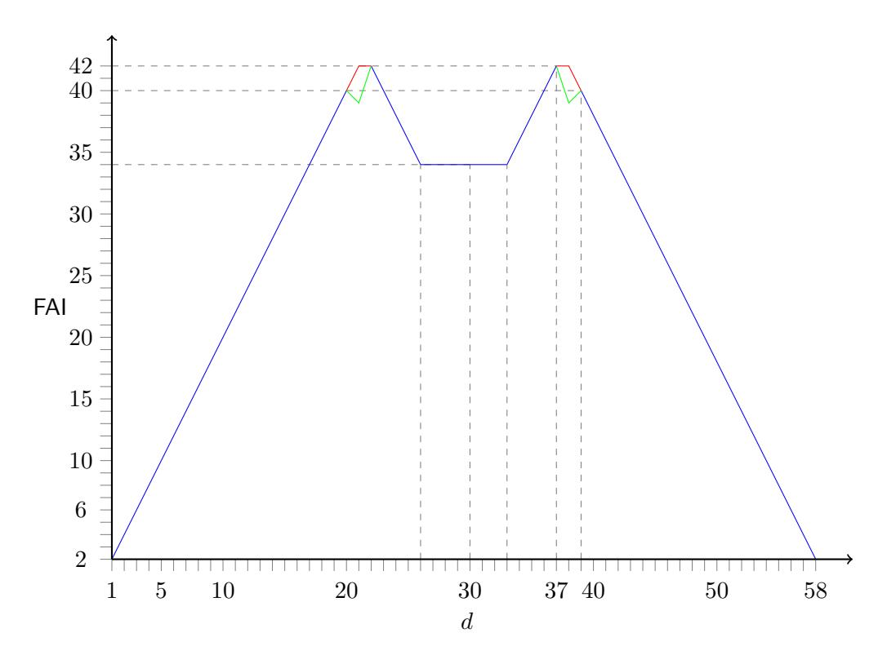

# On the Fast Algebraic Immunity of Threshold Functions

## Pierrick Meaux ´

ICTEAM/ELEN/Crypto Group, Universite catholique de Louvain, Belgium ´ pierrick.meaux@uclouvain.be

Abstract. Motivated by the impact of fast algebraic attacks on stream ciphers, and recent constructions using a threshold function as main part of the filtering function, we study the fast algebraic immunity of threshold functions. As a first result, we determine exactly the fast algebraic immunity of all majority functions in more than 8 variables. Then, For all n ≥ 8 and all threshold value between 1 and n we exhibit the fast algebraic immunity for most of the thresholds, and we determine a small range for the value related to the few remaining cases. Finally, provided m ≥ 2, we determine exactly the fast algebraic immunity of all threshold functions in 3 · 2 m or 3 · 2 m + 1 variables.

Keywords: Boolean Functions, Fast Algebraic Attacks, Symmetric Functions, Threshold Functions.

# 1 Introduction

In 2003, Courtois [\[Cou03\]](#page-20-0) introduced the fast algebraic attacks, showing their impact on filtered LFSR constructions. Since then, these attacks such as the families of algebraic attacks [\[CM03,](#page-19-0) [AL16\]](#page-19-1) are taken into account when estimating the security of stream ciphers. The complexity of fast algebraic attacks has been studied in different works (*e.g.* [\[Arm04,](#page-19-2) [HR04,](#page-20-1) [ACG](#page-19-3)+06]) and it led to the concept of Fast Algebraic Immunity (FAI), a cryptographic criterion of Boolean functions. For filtered LFSR constructions, the FAI of the filtering function enables to determine the complexity of these attacks on the encryption scheme. For more recent stream cipher constructions such as filter permutators [\[MJSC16\]](#page-20-2), improved filter permutators [\[MCJS19b\]](#page-20-3), or Goldreich's pseudo-random generators [\[Gol00\]](#page-20-4), the FAI can be used to bound (from below) the attack's complexity. These stream cipher constructions designed for efficient homomorphic evaluation, and the successive studies of the PRG's variant in NC0, led to consider simple Boolean functions where a component is a threshold function ([\[MCJS19a,](#page-20-5) [HMR20\]](#page-20-6), [\[AL16,](#page-19-1) [AL18\]](#page-19-4)). In both cases, determining the fast algebraic immunity of threshold functions allows to derive attacks' complexity on the whole construction.

For filter permutators [\[MJSC16\]](#page-20-2) and in improved filter permutators [\[MCJS19b\]](#page-20-3), the complexity of the fast algebraic attack is used as a lower bound for the complexity of different attacks of the algebraic kind on these stream ciphers. Denoting by n the key size and by f the filtering function, the (time) complexity of the fast algebraic attack is O(n FAI(f) ). In [\[MCJS19b\]](#page-20-3), attacks combining guess and determine strategies and (fast) algebraic attacks are considered and the algorithm used to estimate the security of a FiLIP instance uses the FAI of functions obtained from the filtering function. More precisely, the principle of the algorithm is to combine the probability of obtaining a particular function from f by guessing ` variables and the probability of such function to have a FAI of at most k. The overall complexity is finally obtained with a trade-off between the number of guesses needed and the complexity of the fast algebraic attacks mounted on the obtained functions. The XOR-MAJ functions proposed in [\[AL16,](#page-19-1) [AL18\]](#page-19-4) to instantiate Goldreich's PRG, considered in [\[MCJS19a\]](#page-20-5) and implemented in [\[HMR20\]](#page-20-6) for FiLIP stream-cipher, are the direct sum of a linear function and a majority function (a sub-case of threshold function). The FAI of such functions is at least the one of the threshold part, hence when f is a XOR-MAJ function, determining the FAI of the majority part gives a lower bound on the complexity of the fast algebraic attack. When variables of a XOR-threshold function are fixed, the obtained function is still the direct sum of a linear function and a threshold function: a XOR-threshold function. Hence, determining the FAI of threshold functions and using the security estimation algorithm of [\[MCJS19b\]](#page-20-3) (Section 4.5) gives a lower bound on the complexity of a fast algebraic attack with guess and determine when the filtering function is a XOR-threshold function.

Threshold functions are a sub-family of symmetric Boolean functions, which means that the output is independent of the order of the input binary variables. The n-variable function with threshold d gives 0 when less than d of its inputs are equal to 1, and 1 where d or more are equal to 1. These functions appear in various domains, for example as functions easy to evaluate with branching programs. Symmetric Boolean functions have been the focus of numerous studies in cryptography such as [\[MS02,](#page-20-7) [Car04,](#page-19-5) [CV05,](#page-20-8) [BP05,](#page-19-6) [QFLW09,](#page-20-9) [CL11,](#page-19-7) [GGZ16\]](#page-20-10), with a particular interest on the sub-family of majority functions: threshold functions where d = n/2.

Few results are known for the fast algebraic immunity of threshold functions, lower bounds in general and exact results only for cases of majority functions. In [\[CM19,](#page-19-8) [CM20\]](#page-19-9) various Boolean criteria are investigated on the whole family of threshold functions, in order to guarantee security bounds for filters used in stream ciphers following the improved filter permutator paradigm [\[MCJS19b\]](#page-20-3). The exact nonlinearity, resilience and Algebraic Immunity (AI) of threshold functions is provided, and a lower bound on the fast algebraic immunity is derived from the algebraic immunity: for all Boolean function f the FAI is at least AI(f) + 1. We will see that this bound is almost never tight for threshold functions. Regarding the FAI of majority functions, one fundamental result in this area comes from [\[ACG](#page-19-3)+06], which gives an upper bound on the FAI of all majority functions, proving that despite having optimal algebraic immunity these function cannot reach an optimal FAI. Then, two works exhibit the exact FAI for two families of majorities. Writing each integer n as 2 m + 2k + ε, such that 0 ≤ k < 2 m−1 and ε ∈ {0, 1} [\[TLD16\]](#page-20-11) handles the case k = 0, for the two possible values of ε. For m ≥ 2, [\[CGZ19\]](#page-19-10) determines the FAI for the case k = 1. The last result in this line comes from [\[Mea19\]](#page-20-12), where for ´ m ≥ 2, the FAI is exactly determined for all values of k such that 0 ≤ k < 2 m−2 .

### 1.1 Our contributions

Our first contribution is to finish the characterization of the fast algebraic immunity for the whole family of majority functions. We show that for values of n such that k ≥ 2 m−2 , the FAI equals 2 m + 2. This result is mainly obtain by combining two properties. First, we use the simplified algebraic normal form of threshold functions to show that these functions have degree 2 m. Then, we determine the minimal degree of a function g such that the degree of the product g · σ2 t is lower than the sum of the degrees (where σ2 t denotes the elementary symmetric function of degree 2 t ). Combining these results, we show that degree one functions lead to an FAI of at most 2 m + 2, and other properties of threshold functions allow us to prove that this value is minimal. Our results on the FAI of majority functions are summarized in Corollary [1.](#page-16-0)

Generalizing to threshold functions, we exhibit the exact fast algebraic immunity for various ranges of thresholds (values of d) for all n, covering most of the values of d. These results are obtained by developing different bounds. The results on σ2m previously mentioned are used to determine the FAI for values of d close to n/2 for the case k ≥ 2 m−2 . The gap technique, introduced in [\[Mea19\]](#page-20-12) is extended to show ´ lower bounds for the degree of product of threshold functions by any low degree function. We generalize the approach of [\[ACG](#page-19-3)+06] giving the upper bound in the case of majority functions. We determine the minimal degree allowing to derive an upper bound on the FAI by considering only homogeneous functions. We identify intervals where these lower and upper bounds can be combined to exhibit the FAI, it gives exact results for thresholds in the neighborhood of n/2 when k ≤ 2 m−2 , and for thresholds greater than 2 m when k ≥ 2 m−2 . Considering these bounds jointly with other structural properties of threshold functions, we determine the value of the FAI for the extreme values of d. Summing up these different approaches, the fast

algebraic immunity is fully determined for all d when n is such that  $k=2^{m-2}$  and  $m\geq 3$ , as summarized in Corollary 2. We summarize the results for all values of d for all  $n\geq 8$  in Theorem 1, providing a lower and an upper bound for the small ranges where the FAI is not exactly determined.

#### 1.2 Paper organization

In Section 2 we give some background on Boolean functions and cryptographic criteria, with a special focus on the properties of threshold functions which are used in the following parts. In Section 3 we develop and prove the different lower and upper bounds on the fast algebraic immunity of threshold functions. In Section 4 we combine the different bounds to give the main theorem and corollaries, and we illustrate the results for representative values of n. We conclude in Section 5

#### 2 Preliminaries

In addition to classic notations we use [n] to denote the subset of all integers between 1 and  $n: \{1, \ldots, n\}$ . For readability we use the notation + instead of  $\oplus$  to denote the addition in  $\mathbb{F}_2$  and  $\sum$  instead of  $\bigoplus$ . We use log to refer to the logarithm in basis 2.

Let  $v \in \mathbb{F}_2^n$ , we refer to the element v as a Boolean vector of length n or as an integer in  $[0, 2^n - 1]$ , we denote its coefficient  $v_i$  (for  $i \in [0, n - 1]$ ). When we consider  $v \in \mathbb{F}_2^n$  as an integer we refer to  $\sum_{i=0}^{n-1} v_i 2^i$ . The Hamming weight (or weight) of v is  $\mathsf{w}_\mathsf{H}(v) = \#\{v_i \neq 0 \mid i \in [0, n - 1]\}$ . We denote  $\overline{v} \in \mathbb{F}_2^n$  the complementary of v:  $\forall i \in [0, n - 1]$ ,  $\overline{v_i} = 1 - v_i$ .

We often write the integer n as  $2^m + 2k + \varepsilon$ , where  $m, k, \varepsilon$  are integers such that  $m \le 1$ ,  $0 \le k < 2^{m-1}$  and  $\varepsilon \in \{0, 1\}$ . Note that this decomposition is unique for  $n \ge 2$ .

# 2.1 Boolean Functions, and partial order over $\mathbb{F}_2^n$

**Definition 1** (Boolean Function). A Boolean function f with n variables is a function from  $\mathbb{F}_2^n$  to  $\mathbb{F}_2$ .

**Definition 2** (Algebraic Normal Form (ANF)). We call Algebraic Normal Form of a Boolean function f its n-variable polynomial representation over  $\mathbb{F}_2$  (i.e. belonging to  $\mathbb{F}_2[x_1,\ldots,x_n]/(x_1^2+x_1,\ldots,x_n^2+x_n)$ ):

$$f(x) = \sum_{I \subseteq [n]} a_I \left( \prod_{i \in I} x_i \right) = \sum_{I \subseteq [n]} a_I x^I,$$

where  $a_I \in \mathbb{F}_2$ .

**Definition 3** (Order  $\leq$ ). We denote  $\leq$  the partial order on  $\mathbb{F}_2^n$  defined as:  $a \leq b \Leftrightarrow \forall i \in [0, n-1], a_i \leq b_i$ , where  $\leq$  denotes the usual order on  $\mathbb{Z}$  and the elements  $a_i$  and  $b_i$  of  $\mathbb{F}_2$  are identified to 0 or 1 in  $\mathbb{Z}$ .

**Property 1** (Corollary of Lucas's Theorem (e.g. [Car20])). Let  $u,v \in \mathbb{F}_2^n$ :

$$u \preceq v \Leftrightarrow \binom{v}{u} \equiv 1 \mod 2,$$

where the binomial coefficient refers to the integers whose binary decomposition corresponds to u and v.

#### 2.2 Algebraic Immunity and Fast Algebraic Immunity

Definition 4 (Algebraic Immunity and Annihilators). *The algebraic immunity of a Boolean function* f ∈ Bn*, denoted as* AI(f)*, is defined as:*

$$\mathsf{AI}(f) = \min_{g \neq 0} \{ \deg(g) \mid fg = 0 \text{ or } (f+1)g = 0 \},$$

*where* deg(g) *is the algebraic degree of* g*. The function* g *is called an annihilator of* f *(or* f + 1*). We also use the notation* AN(f) *for the minimum algebraic degree of nonzero annihilator of* f*:*

$$\mathsf{AN}(f) = \min_{g \neq 0} \{ \mathsf{deg}(g) \mid fg = 0 \}.$$

Property 2 (Algebraic Immunity Properties (*e.g.* [\[Car20\]](#page-19-11))). *Let* f *be a Boolean function:*

- *The null and the all-one functions are the only functions such that* AI(f) = 0*,*
- *For all non constant* f *it holds that:* AI(f) ≤ AN(f) ≤ deg(f)*,*
- AI(f) ≤ bn+1 2 c*.*

Definition 5 (Fast Algebraic Immunity (*e.g.* [\[Car20\]](#page-19-11))). *The fast algebraic immunity of a Boolean function* f ∈ Bn*, denoted as* FAI(f)*, is defined as:*

$$\mathsf{FAI}(f) = \min \left\{ 2\mathsf{AI}(f), \min_{1 \leq \mathsf{deg}(g) < \mathsf{AI}(f)} [\mathsf{deg}(g) + \mathsf{deg}(fg)] \right\}.$$

Due to the formulation of the FAI as a minimum, we introduce two quantities to simplify the notations, in term of bounds A and B.

Definition 6 (Bounds A and B). *Let* f ∈ Bn*,* a, b ∈ [n]*, we denote:*

$$\mathsf{A}(f) = 2\mathsf{AI}(f) \quad \textit{ and } \quad \mathsf{B}_a^b(f) = \min_{a \leq \deg(g) < b} [\deg(g) + \deg(fg)].$$

*By definition we have* FAI(f) = min{A(f), B AI(f)−1 1 (f)}*. When* a = 1 *and* b = AI(f)−1*, we simply denote* B b a (f) *as* B(f)*.*

Property 3 (Fast Algebraic Immunity Properties (*e.g.* [\[Car20\]](#page-19-11))). *Let* f *be a Boolean function:*

- FAI(f) = FAI(f + 1)*,*
- FAI(f) ≤ n*,*
- FAI(f) ≥ AN(f + 1) + 1*.*

*Remark 1.* The last item comes from the fact that deg(fg) is equal to or greater than the degree of AN(f +1) since by construction fg is a nonzero annihilator of f + 1.

#### 2.3 Symmetric Functions

Symmetric functions are functions for which the output is independent of the order of the inputs. In the Boolean case they have been the focus of many investigations *e.g.* [\[Car04,](#page-19-5) [CV05,](#page-20-8) [DMS06,](#page-20-13) [QLF07,](#page-20-14) [SM07,](#page-20-15) [QFLW09\]](#page-20-9). These functions can be described more succinctly through the simplified value vector, or as a sum of elementary functions.

**Definition 7 (Simplified Value Vector).** Let f be a symmetric function in n variables, we define its simplified value vector:

$$\mathbf{s}_f = [w_0, w_1, \dots, w_n]$$

of length n + 1, where for all x such that  $w_H(x) = k$  we get  $f(x) = w_k$ , i.e.  $w_k$  is the value of f on all inputs of Hamming weight k.

**Definition 8 (Elementary Symmetric Functions and Simplified ANF).** Let  $n \in \mathbb{N}^*$ , let  $i \in \{0, \dots, n\}$ , the elementary symmetric function of degree i in n variables, denoted  $\sigma_i$ , is the function which ANF contains all the monomials of degree i and no monomials of other degrees.

The n+1 elementary symmetric functions in n variables form a basis of the symmetric functions in n variables. Any Boolean symmetric function f can be uniquely written as  $f = \sum_{i=0}^{n} \lambda_i \sigma_i$ , where  $\lambda_i \in \mathbb{F}_2$ . This representation is called the simplified ANF of f (SANF) and the  $\lambda_i$  are the simplified ANF coefficients.

We define the sub-family of threshold functions, and the special case of majority functions:

**Definition 9** (Threshold and Majority Function). For any positive integers  $d \le n + 1$  we define the Boolean function  $T_{d,n}$  as:

$$\forall x \in \mathbb{F}_2^n, \quad \mathsf{T}_{d,n}(x) = \begin{cases} 0 & \textit{if } \mathsf{w}_\mathsf{H}(x) < d, \\ 1 & \textit{otherwise}. \end{cases}$$

We call the n-variable majority function  $MAJ_n$  the threshold function with  $d = \lceil (n+1)/2 \rceil$ .

Note that for a threshold function, we have  $w_k = 0$  for k < d and 1 otherwise, so the simplified value vector of a threshold function  $\mathsf{T}_{d,n}$  is the n+1-length vector of d consecutive 0's and n+1-d consecutive 1's. In the case of n even, the choice of  $\mathsf{T}_{\frac{n}{2}+1,n}$  or  $\mathsf{T}_{\frac{n}{2},n}$  as the majority function is arbitrary, some papers considers the second choice. Note also that the extreme values d=0 and d=n+1 correspond to the two constant functions, since their AI and FAI is already known for all n, we focus our study on the threshold functions such that  $d \in [n]$ . We recall different properties of threshold functions that will be used later in the paper.

**Proposition 1** (Extended Affine Equivalence of Threshold Functions (e.g. [Méa19] Proposition 1)). Let  $n \in \mathbb{N}^*$  and  $d \in [0, n+1]$ , for all  $x \in \mathbb{F}_2^n$  let  $1_n + x$  denote the element  $(1 + x_1, \dots, 1 + x_n) \in \mathbb{F}_2^n$ , then the following relation holds for  $T_{d,n}$  and  $T_{n-d+1,n}$ :

$$\forall x \in \mathbb{F}_2^n, \quad 1 + \mathsf{T}_{d,n}(1_n + x) = \mathsf{T}_{n-d+1,n}(x).$$

In other words,  $T_{d,n}$  and  $T_{n-d+1,n}$  are extended affine equivalent, then for non constant threshold functions (i.e.  $d \in [n]$ ) they have the same degree, algebraic immunity, and fast algebraic immunity.

**Proposition 2** (AN and Al of Threshold Functions ([MCJS19a] Lemma 10)). Let  $n \in \mathbb{N}^*$  and  $d \in [n]$ , the threshold function  $T_{d,n}$  has the following property:

$$\mathsf{AN}(\mathsf{T}_{d,n}) = n-d+1, \quad \mathsf{AN}(1+\mathsf{T}_{d,n}) = d, \quad \textit{ and } \quad \mathsf{AI}(\mathsf{T}_{d,n}) = \min\{d,n-d+1\}.$$

**Proposition 3 (Algebraic Normal Form of Threshold Functions ([Méa19], Theorem 1 )).** Let n and d be two integers such that  $0 < d \le n$ , let  $D = 2^{\lceil \log d \rceil}$ . We denote the sets  $S_d = \{v \in [0, D-1] \mid v \le D-d\} = \{v \in \mathbb{F}_2^{\lceil \log d \rceil} \mid v \le \overline{d-1}\}$ , and  $S_{d,n} = \{kD+d+v \mid k \in \mathbb{N}, v \in S_d\} \cap [n] = \{kD-v \mid k \in \mathbb{N}^*, v \in S_d\} \cap [n]$ . The algebraic normal form is given by:

$$\mathsf{T}_{d,n} = \sum_{i \in S_{d,n}} \sigma_i.$$

#### 3 Fast algebraic immunity and bounds

In this section we give different bounds on the FAI of threshold functions. First we give two bounds coming directly from the value of the AN and Al of threshold functions. Then, we derive two lower bounds, in Subsection 3.1 we obtain a lower bound for threshold functions of degree a power of two, using the result of [LR81] on the rank of particular binary matrices. In Subsection 3.2, we generalize the gap technique introduced in [Méa19] for majority functions to give a lower bound for most of the threshold functions. Finally, in Subsection 3.3, we determine an upper bound by extending the result of [ACG+06] on majority functions, focusing on the degree obtained by multiplying by low degree homogeneous functions.

First, note that due to Proposition 1 for n fixed knowing the fast algebraic immunity of half of the functions is sufficient to know the value for all. Accordingly, writing n as  $2^m + 2k + \varepsilon$ , we focus on the values of d such that  $d \ge 2^{m-1} + k + 1$ .

**Proposition 4 (AI and AN bounds).** Let  $n \in \mathbb{N}^*$ ,  $n = 2^m + 2k + \varepsilon$  where  $m \ge 2$ ,  $0 \le k < 2^{m-1}$ , and  $\varepsilon \in \{0,1\}$ . Let  $d,t \in \mathbb{N}$  such that  $d = 2^{m-1} + k + 1 + t$ , and  $0 \le t \le 2^{m-1} + k - 1 + \varepsilon$ , the following holds:

$$A(T_{d,n}) = 2^m + 2(k-t) + 2\varepsilon$$
, and  $B(T_{d,n}) \ge 2^{m-1} + k + t + 2$ .

*Proof.* From Proposition 2, the AI is given by n-d+1 when d is greater that the half, it directly gives the result for A. The second part corresponds to the third item of Property 3:  $\deg(g\mathsf{T}_{d,n})$  is at least d (from Proposition 2) and  $\deg(g)$  is at least 1.

#### 3.1 Power of two degree threshold functions and lower bound

In this part we show that the bound on B can be improved by k when the degree of  $\mathsf{T}_{d,n}$  is equal to  $2^m$ . Due to the periodicity of the SANF of threshold functions, when n is fixed a considerable proportion have a degree which is a power of 2. Then, studying the minimal degree of a function g necessary to decrease the degree of the product  $g \cdot \sigma_{2^t}$  (with  $t \in \mathbb{N}^*$ ) will have an influence on several threshold functions. In a first time we determine the threshold functions of degree  $2^m$  in  $n = 2^m + 2k + \varepsilon$  variables. In a second time we examine the conditions for decreasing the degree of the product. Finally, we give a lower bound on B for these cases.

**Proposition 5** (Threshold Functions of degree  $2^m$ ). Let  $n=2^m+2k+\varepsilon$ ,  $t\in\mathbb{N}$  such that  $t\leq 2^{m-1}+2k+\varepsilon$ . The following holds:

$$\deg(\mathsf{T}_{2^{m-1}+t,n}) = 2^m \Longleftrightarrow 2k + \varepsilon - 2^{m-1} < t \le 2^{m-1}.$$

*Proof.* We use the characterization of Proposition 3, with  $d=2^{m-1}+t$ . If  $t>2^{m-1}$  then  $d>2^m$  and  $d \in S_{d,n}$  by construction so  $\deg(\mathsf{T}_{d,n})>2^m$  (Note that when  $d \in [0,n]$ ,  $\sigma_d$  is always part of the SANF).

If  $t \leq 2^{m-1}$  then  $D=2^m$  is the period of the SANF of this threshold function. Accordingly to the definition of the set  $S_{d,n}$ , the first element in its period has congruence d modulus D. Then, since  $2^m \leq n$ ,  $\mathsf{T}_{d,n}$  has degree  $2^m$  if and only if n < D+d, which corresponds to  $2k+\varepsilon < 2^{m-1}+t$ , hence  $t > 2k+\varepsilon - 2^{m-1}$ .

Remark 2. Note that it applies for  $t \ge k + 1$ , it means that the higher half of the threshold functions up to threshold  $2^m$  are all of degree  $2^m$ .

In the following, we use the ANF representation to study the degree of the product of an elementary symmetric function by a low degree function.

**Lemma 1** (Decreasing degree condition). Let  $n, i \in \mathbb{N}^*$ ,  $i \leq n$  for all Boolean function g in n variables such that  $\deg(g) \leq n - i$ , if  $\deg(g \cdot \sigma_i) < i + \deg(g)$  then:

$$\forall I \subseteq [n] \, | \, |I| = i + \deg(g), \quad \sum_{\substack{J \subset I \\ |J| = \deg(g)}} a_J \equiv 0,$$

where  $a_J$  are the ANF coefficients of g, and the sum is performed modulo 2.

*Proof.* Let us write g,  $\sigma_i$  and the product  $h = g \cdot \sigma_i$  in their ANF representation:

$$g = \sum_{|J| \leq \deg(g)} a_J x^J, \quad \sigma_i = \sum_{|I| = i} x^I, \quad h = \sum_{|J'| \leq i + \deg(g)} b_{J'} x^{J'}.$$

Then:

$$h = \left(\sum_{|J| \leq \deg(g)} a_J x^J\right) \cdot \left(\sum_{|I| = i} x^I\right) = \sum_{\substack{|J'| \leq i + \deg(g) \\ |I| = i, |J| < \deg(g)}} \left(\sum_{\substack{I,J \mid I \cup J = J' \\ |I| = i, |J| < \deg(g)}} a_J\right) x^{J'}.$$

The algebraic degree of h is lower than  $i + \deg(g)$  only if all ANF coefficients  $b_{J'}$  for  $J' \subseteq [n]$ ,  $|J'| = i + \deg(g)$  are null, which gives the final result.

Note that finding functions of degree  $\ell$  having this property of decreasing the degree of the product corresponds to solve a system of  $\binom{n}{i+\ell}$  equations (one for each subset I of size  $\ell+i$ ) and  $\binom{n}{\ell}$  Boolean unknowns (one for each subset J of size  $\ell$ ). This system has a very structured form: the  $a_J$  appearing in the equation relative to I are such that  $J\subseteq I$  and  $|J|=\ell$ . It corresponds to the incidence matrix of  $\ell$  subsets versus  $\ell+i$  subsets of [n]. This binary matrix of size  $\binom{n}{\ell}\times\binom{n}{i+\ell}$  has the rows indexed by the  $\ell$ -subsets J of the set [n] and the columns indexed by the  $(\ell+i)$ -subsets I, and the entry relative to J,I is equal to 1 if  $J\subseteq I$  and to 0 otherwise. The rank of such matrices, thereafter denoted  $M_{\ell,\ell+i}$ , over  $\mathbb{F}_2$  has been studied in [LR81], we recall their result and we show how to deduce bounds on the FAI of threshold functions from it.

#### Lemma 2 (Subsets incidence matrix rank ([LR81], Theorem 1)).

Let  $i, \ell, n \in \mathbb{N}^*$ , for  $s \in \mathbb{N}^*$  we define b(s) = S as the unique set of non-negative integers for which  $s = \sum_{x \in S} 2^x$ . We define D = b(i), for a function  $f : D \to \mathbb{Z}^+$  we define  $f(D) = \sum_{x \in D} f(x)$ . For  $n \geq 2\ell + i$  the rank of  $M_{\ell,\ell+i}$  over  $\mathbb{F}_2$  is:

$$\sum_{f:D\to\mathbb{Z}^+} (-1)^{f(D)} \binom{n}{\ell - \sum_{x\in D} f(x)2^x}.$$

Due to the periodicity of the SANF of threshold functions, we are particularly interested in the case  $i=2^t$ , and more specifically on the conditions on  $\ell$  such that the degree of the product cannot decrease.

**Lemma 3.** Let  $t \in \mathbb{N}^*$ , for all integers  $\ell$  and n such that  $0 \le \ell \le 2^{t-1}$ ,  $n \ge 2^t + 2\ell$ , for all non null Boolean function g in n variables of degree  $\ell$ :

$$\deg(g \cdot \sigma_{2^t}) = 2^t + \ell.$$

*Proof.* First, we determine the rank of the subsets incidence matrix in this case using Lemma 2. Since  $i=2^t$  it gives  $D=\{t\}$ , and since  $n\geq 2^t+2\ell$  we are in the case where the theorem applies to determine the rank of  $M_{\ell,2^t+\ell}$ :

$$\operatorname{rank}(M_{\ell,2^t+\ell}) = \sum_{f:\{t\} \rightarrow \mathbb{Z}^+} (-1)^{f(t)} \binom{n}{\ell-f(t)2^t}.$$

D being reduced to a singleton the rank formula is simpler than in the general case. Furthermore,  $\ell < 2^t$ , then the binomial is non null only in the case f(t) = 0, which allows to conclude:

$$\operatorname{rank}(M_{\ell,2^t+\ell}) = (-1)^0 \binom{n}{\ell-0\cdot 2^t} = \binom{n}{\ell}.$$

In this case, the rank equals the number of rows of M, or equivalently the system of equations of Lemma 1 has rank  $\binom{n}{\ell}$ , the number of unknowns. Note that  $\{\forall J\subseteq [n],\ |J|=\ell,\ a_J=0\}$  is a solution of:

$$\forall I \subseteq [n] \, | \, |I| = 2^t + \ell, \quad \sum_{\substack{J \subset I \\ |J| = \ell}} a_J \equiv 0.$$

Since the system of equation has rank  $\binom{n}{\ell}$ , it is the unique solution, then any other value of the coefficients  $a_J$ s implies that for at least one of the equations indexed by I of size  $2^t + \ell$  the sum is non null.

Then, we combine this result with the relation on the ANF representation according to Lemma 1. For any non null function g of degree  $\ell$  at least one ANF coefficient  $a_J$  with  $|J|=\ell$  is non null by definition of the degree. It implies that there exists at least one subset  $I\subseteq [n]$  of size  $2^t+\ell$  such that  $h_I=1$  where  $h_I$  is an ANF coefficient of  $h=g\cdot\sigma_{2^t}$ . Hence, using Lemma 1,  $\deg(g\cdot\sigma_{2^t})=2^t+\ell$ .

Combining Lemma 3 and Proposition 5 we can derive a new lower bound for  $\mathsf{B}^k_1$  and then for  $\mathsf{B}$ .

**Proposition 6** (Power of 2 Degree Bound). Let  $n = 2^m + 2k + \varepsilon$ ,  $t \in \mathbb{N}$  such that  $2k + \varepsilon - 2^{m-1} < t \le 2^{m-1}$ . The following holds:

$$\mathsf{B}^k_1(\mathsf{T}_{2^{m-1}+t,n}) = 2^m + 2, \quad \text{ and } \quad \mathsf{B}(\mathsf{T}_{2^{m-1}+t,n}) \geq \min\{2^m + 2, 2^{m-1} + t + k + 1\}.$$

*Proof.* From Proposition 5, writing d as  $2^{m-1}+t$ , we have  $\mathsf{T}_{d,n}=f+\sigma_{2^m}$  where  $\mathsf{deg}(f)<2^m$ . If we consider functions g of degree in [k] we can apply Lemma 3 on  $\sigma_{2^m}$ . It results that for any function g such that  $\mathsf{deg}(g)\in[k]$  we obtain  $\mathsf{deg}(g\cdot\mathsf{T}_{d,n})=2^m+\mathsf{deg}(g)$ . Therefore,  $\mathsf{B}_1^k=2^m+2$  and it is reached for any function of degree 1. Also, using Remark 1, since  $\mathsf{AN}(1+\mathsf{T}_{d,n})=d$  by Proposition 2,  $\mathsf{B}_{k+1}^{\mathsf{Al}-1}\geq d+k+1$ , i.e.  $2^{m-1}+t+k+1$ .

#### 3.2 Gap strategy and lower bound

In this subsection we generalize the gap strategy developed in [Méa19]. The principle consists in finding a gap in the simplified algebraic normal form of a threshold function, an interval in which the SANF coefficients are all null. Then, the threshold function  $T_{d,n}$  can be partitioned in two, on part which degree is lower than the bottom of the gap, and the remaining part with all monomials of degree higher than the top of the gap. When the higher part can be identified with another threshold function  $T_{d',n}$ , for all functions g

of degree lower than its Al we can use that  $\deg(g \cdot \mathsf{T}_{d',n}) \geq d'$ . If the degree of g is also smaller than the size of the gap, it can result in a better bound on  $\mathsf{B}(\mathsf{T}_{d,n})$  than the one of Proposition 4.

In [Méa19] the gap strategy is developed for the case of majority functions i.e.  $d = 2^{m-1} + k + 1$ , and particularly for  $k < 2^{m-2}$  where the bound obtained for B is proved to be tight.

We begin by showing a particular gap in the SANF of most of the threshold functions. The SANF of a threshold function  $\mathsf{T}_{d,n}$  is periodic, of period  $2^{\lceil \log d \rceil}$  and the SANF coefficients equal to one have congruence in  $[d,2^{\lceil \log d \rceil}]$  modulus  $2^{\lceil \log d \rceil}$  (see Proposition 3), we highlight the bigger gap in this specific range. Due to the periodic structure we only need to study the SANF of the function on  $[d,2^{\lceil \log d \rceil}]$ . We introduce an extra definition to simplify the notations of the lemmas of this subsection.

**Definition 10** (Binary Vector and Highest Zero). Let  $u, t \in \mathbb{N}$  such that  $0 \le u < 2^t - 1$ . We write u in its binary decomposition,  $u = \sum_{i=0}^{t-1} u_i 2^i$ , where for all such i:  $u^i \in \{0,1\}$  and we refer to its highest zero as:

$$hz_t(u) = \max_{0 \le i \le t-1} \{i \,|\, u_i = 0\}.$$

We also denote  $u_B = \sum_{i=0}^{hz_t(u)-1} u_i 2^i$ , and  $u_T = \sum_{i=hz_t(u)+1}^{t-1} u_i 2^i = 2^t - 2^{hz_t(u)+1}$ .

Remark that since  $u \neq 2^t - 1$ , its binary decomposition has at least one '0', which guaranties that  $hz_t(u)$  is well defined.

**Lemma 4** (SANF and Gap). Let  $d, t, u \in \mathbb{N}$  such that  $d = 2^t + u + 1$ , where  $t \ge 2$  and  $0 \le u < 2^t - 1$ . Let us denote  $j = \mathsf{hz}_t(u)$ . The following holds for  $\mathsf{T}_{d,n} \colon S_d \cap [\overline{u_B}, 2^j] = \{\overline{u_B}, 2^j\}$ , giving a gap of  $u_B$  in the SANF.

*Proof.* In this proof we often identify the integers with their binary decomposition, and use the partial order of Definition 3. First, we determine the set  $S_d$  for a function of threshold d. Using Proposition 3, since  $d=2^t+u+1$  the period of the SANF is  $2^{\lceil \log d \rceil}=2^{t+1}$ , and  $S_d=\{v \in \mathbb{F}_2^{t+1} \mid v \preceq \overline{d-1}\}=\{v \in \mathbb{F}_2^t \mid v \preceq \overline{u}\}$ .

Then, we focus on the binary decomposition of  $\overline{u}$ . By definition of  $u_T$  and  $u_B$  we have that  $u=u_T+u_B$  with  $u_B<2^j$  and  $u_T$  has binary decomposition  $1^{t-1-j}0^{j+1}$ . Therefore,  $\overline{u}=0^{t-1-j}1\overline{u_B}$ .

Finally, focusing on the elements of  $[\overline{u_B}, 2^j]$ , from the binary decomposition of  $\overline{u}$ ,  $\overline{u_B} \preceq \overline{u}$  and  $2^j \preceq \overline{u}$ . Nevertheless, for all v such that  $\overline{u_B} < v < 2^j$  we have  $v \not\preceq \overline{u_B}$ , so  $v \not\preceq \overline{u}$ . Hence,  $S_d \cap [\overline{u_B}, 2^j] = \{\overline{u_B}, 2^j\}$ , and since  $\overline{u_B} = 2^j - 1 - u_B$ , it gives a gap of  $u_B$ .

The precedent lemma guaranties that all non extreme elements of the interval  $[\overline{u_B}, 2^j]$ , modulo the period, have null SANF coefficients. With the same notations, we determine an interval where the SANF of two threshold functions is identical, the one with threshold values  $2^t + u + 1$  and  $2^t + u + 2^j + 1$ .

**Lemma 5** (Threshold Functions and Coinciding SANF). Let  $d, t, u \in \mathbb{N}$  such that  $d = 2^t + u + 1$ , where  $t \geq 2$  and  $0 \leq u < 2^t - 1$  and  $j = \mathsf{hz}_t(u)$ . The following holds: the SANF of  $\mathsf{T}_{d,n}$  and  $\mathsf{T}_{d+2^j,n}$  coincide on  $[2^t + u + 1 + 2^j, 2^{t+1} + 2^t + u] \cap [n]$ .

Proof. We consider the sets related to these two functions:  $S_{2^t+u+1}$  and  $S_{2^t+u+2^j+1}$ . By definition of j, we have  $u+2^j<2^t$ , so  $d+2^j\leq 2^{t+1}$  and then Proposition 3 gives  $S_{2^t+u+2^j+1}=\{v\in\mathbb{F}_2^t\,|\,v\preceq\overline{u+2^j}\}$ . From the proof of Lemma 4 we know that  $S_{2^t+u+1}=\{v\in\mathbb{F}_2^t\,|\,v\preceq\overline{u}\}$ , and  $\overline{u}=0^{t-1-j}1\overline{u_B}$ . Then,  $S_{2^t+u+2^j+1}\subset S_{2^t+u+1}$  and the elements of  $S_{2^t+u+1}$  greater than or equal to  $2^j$  are not in  $S_{2^t+u+2^j+1}$ . Using the second characterization of  $S_{d+2^j,n}$ , the two threshold functions have the same SANF on  $[2^{t+1}-2^j+1,2^{t+1}]\cap[n]$ , and  $2^{t+1}-2^j+1\leq d+2^j$  (since  $d=2^{t+1}-2^{j+1}+u_B+1$ ). Moreover, since in both

case the period is  $2^{t+1}$ , the SANF coefficients are null on the interval  $]2^{t+1}, 2^{t+1} + \min\{d, d+2^j\} - 1] = ]2^{t+1}, 2^{t+1} + 2^t + u]$ .

Combining Lemma 4 and Lemma 5 we can derive a new lower bound for  $\mathsf{B}^r_1$  and then for  $\mathsf{B}$ , where r is a quantity depending both on u and the algebraic immunity of second threshold function of the gap. Then, we highlight the behavior of this bound for particular cases.

**Proposition 7 (Gap Bound).** Let  $d, t, u \in \mathbb{N}$  such that  $d = 2^t + u + 1$ , where  $t \ge 2$  and  $0 \le u < 2^t - 1$ , and  $j = \mathsf{hz}_t(u)$ . Let  $n \in \mathbb{N}$  such that  $n \in [d+2^j, 2^{t+1} + d - 1]$ , we denote  $r = \min\{u_B, \mathsf{Al}(\mathsf{T}_{d+2^j,n}) - 1\}$ , the following holds:

$$\mathsf{B}_1^r(\mathsf{T}_{d,n}) \ge 2^t + u + 2^j + 2, \quad \text{ and } \quad \mathsf{B}(\mathsf{T}_{d,n}) \ge 2^t + u + r + 2.$$

*Proof.* We begin by expressing  $\mathsf{T}_{d,n}$  as a sum of two functions:  $\mathsf{T}_{d,n} = f_a + f_b$ , where  $f_a$  is composed of all the monomials of degree lower than  $d+2^j$  and  $f_b$  is the remaining part, the monomials of degree at least  $d+2^j$ . Using Lemma 4, since  $S_d \cap [2^j-u_B-1,2^j]=\{2^j-u_B-1,2^j\}$  the only non null coefficients in the SANF of  $\mathsf{T}_{d,n}$  in  $[d+2^j-u_B-1,d+2^j]$  are  $d+2^j-u_B-1$  and  $d+2^j$ . It implies  $\deg(f_a)=d+2^j-u_B-1$ . Then, we know from Lemma 5 that  $f_b=\mathsf{T}_{d+2^j,n}$  due to the restrictions on n, and we can write  $\mathsf{T}_{d,n}=f_a+\mathsf{T}_{d+2^j,n}$ .

For r defined as  $\min\{u_B, \mathsf{Al}(\mathsf{T}_{d+2^j,n})-1\}$ , for all function g such that  $1 \leq \mathsf{deg}(g) \leq r$  we get:

- $\deg(g \cdot f_a) < d + 2^j$  since  $r \le u_B$  and  $\deg(f_a) = d + 2^j u_B 1$ ,
- $-\deg(g\cdot\mathsf{T}_{d+2^j,n})\geq d+2^j \text{ since } r<\mathsf{Al}(\mathsf{T}_{d+2^j,n}) \text{ and } \mathsf{AN}(1+\mathsf{T}_{d+2^j,n})=d+2^j \text{ from Proposition 2.}$

Consequently,  $\deg(g \cdot f_a) < \deg(g \cdot f_b)$  so  $\deg(g \cdot \mathsf{T}_{d,n}) = \deg(g \cdot \mathsf{T}_{d+2^j,n})$  and we can conclude:  $\mathsf{B}^r_1(\mathsf{T}_{d,n}) \geq 2^t + u + 2^j + 2$ . Moreover,  $r \leq u_B < 2^j$  so  $2^t + u + r + 2 \leq 2^t + u + 2^j + 2$ , and  $2^t + u + r + 2$  is the lower bound on  $\mathsf{B}^{\mathsf{Al}-1}_{r+1}$  given by  $\mathsf{AN}(1+\mathsf{T}_{2^t+u+1,n})$ , leading to  $\mathsf{B}(\mathsf{T}_{d,n}) \geq 2^t + u + r + 2$ .

In the following we focus on cases where  $r = u_B$ .

**Proposition 8** (Gap Bound and Particular Cases). Let  $n \in \mathbb{N}$  such that  $n = 2^m + 2k + \varepsilon$ , where  $m \ge 3$ ,  $0 \le k < 2^{m-1}$ , and  $\varepsilon \in \{0,1\}$ . We consider two cases depending on the value of k:

1.  $0 \le k \le 2^{m-2}$ :

Let  $d, u \in \mathbb{N}$  such that  $d = 2^{m-1} + u + 1$ ,  $u < 2^{m-1} - 1$  and  $j = hz_{m-1}(u)$ . If  $u_B \le k + 2^{j-1} + (\varepsilon - 1)/2$  then:

$$\mathsf{B}_1^{u_B}(\mathsf{T}_{d,n}) \ge 2^{m-1} + u + 2^j + 2, \quad \textit{and} \quad \mathsf{B}(\mathsf{T}_{d,n}) \ge 2^{m-1} + u + u_B + 2.$$

In particular, for  $u < 2^{m-2}$ , if  $u \le k + 2^{m-3} + (\varepsilon - 1)/2$  then:

$$\mathsf{B}(\mathsf{T}_{d,n}) \ge 2^{m-1} + 2u + 2.$$

2.  $2^{m-2} < k < 2^{m-1}$ :

Let  $d, u \in \mathbb{N}$  such that  $d = 2^m + u + 1$ ,  $u < 2^m - 1$  and  $j = hz_m(u)$ . If  $u_B \le k - 2^{m-1} + 2^{j-1} + (\varepsilon - 1)/2$  then:

$$\mathsf{B}_1^{u_B}(\mathsf{T}_{d,n}) \geq 2^m + u + 2^j + 2, \quad \textit{ and } \quad \mathsf{B}(\mathsf{T}_{d,n}) \geq 2^m + u + u_B + 2.$$

In particular, for  $u < 2^{m-1}$  if  $u \le k - 2^{m-2} + (\varepsilon - 1)/2$  then:

$$\mathsf{B}(\mathsf{T}_{d,n}) \ge 2^m + 2u + 2.$$

*Proof.* We begin with the case  $k < 2^{m-2}$ . First, we show that n belongs to the appropriate interval relatively to d to apply Proposition 7. For these values of k, d belongs to  $[2^{m-1}+1,2^m-1]$  and n belongs to  $[2^m,2^m+2^{m-1}-1]$ . By definition of  $j,u+2^j \le 2^{m-1}-1$  hence  $d+2^j \le 2^m \le n$ , and since  $2^m+d+1 \ge 2^m+2^{m-1}+2 > n$ , n belongs to  $[d+2^j,2^{t+1}+d-1]$  then we can apply Proposition 7 with t=m-1. With the notation  $r=\min\{u_B,\operatorname{Al}(\mathsf{T}_{d+2^j,n})-1\}$ , the proposition gives  $\mathsf{B}_1^r(\mathsf{T}_{d,n}) \ge 2^{m-1}+u+2^j+2$  and  $\mathsf{B}(\mathsf{T}_{d,n}) \ge 2^{m-1}+u+r+2$ .

In the following we show that if  $u_B \leq k+2^{j-1}+(\varepsilon-1)/2$  then  $u_B \leq \mathsf{AI}(\mathsf{T}_{d+2^j,n})-1$ . From Proposition 2,  $\mathsf{AI}(\mathsf{T}_{d+2^j,n})=\min\{2^{m-1}+u+2^j+1,2^m+2k+\varepsilon-2^{m-1}-u-2^j\}$ . From the definition of  $j, u_T=2^{m-1}-2^{j+1}$ , hence decomposing u as  $2^{m-1}-2^{j+1}+u_B$  we can rewrite  $\mathsf{AI}(\mathsf{T}_{d+2^j,n})=\min\{2^m-2^j+u_B+1,2k+2^j+\varepsilon-u_B\}$ . Since  $j\leq m-2$  and  $k<2^{m-2}$ , we can conclude  $\mathsf{AI}(\mathsf{T}_{d+2^j,n})=2k+2^j+\varepsilon-u_B$ . Thereafter:

$$\begin{split} u_B & \leq k + 2^{j-1} + \frac{\varepsilon - 1}{2} \Leftrightarrow 2u_B \leq 2k + 2^j + \varepsilon - 1, \\ & \Leftrightarrow u_B \leq 2k + 2^j + \varepsilon - 1 - u_B, \\ & \Leftrightarrow u_B \leq \mathsf{AI}(\mathsf{T}_{d+2^j,n}) - 1. \end{split}$$

Hence, we are in a particular case of Proposition 7 where  $r=u_B$ , allowing to conclude  $\mathsf{B}_1^r(\mathsf{T}_{d,n})=\mathsf{B}_1^{u_B}(\mathsf{T}_{d,n})\geq 2^{m-1}+u+2^j+2$  and  $\mathsf{B}(\mathsf{T}_{d,n})\geq 2^{m-1}+u+r+2=2^{m-1}+u+u_B+2$ . When  $u<2^{m-2}$ , it corresponds to  $\mathsf{hz}_{m-1}(u)=m-2$  and therefore  $u_T=0$  and  $u=u_B$ , leading to  $\mathsf{B}(\mathsf{T}_{d,n})\geq 2^{m-1}+u+u_B+2=2^{m-1}+2u+2$ .

Then, we handle the second case:  $2^{m-2} \le k < 2^{m-1}$ . The structure of the proof is the same as for the first case, we begin by showing that n belongs to the appropriate interval relatively to d to apply Proposition 7. We focus on the constraint on  $u_B$  to prove  $n \ge d+2^j$ . If  $u_B \le k-2^{m-1}+2^{j-1}+(\varepsilon-1)/2$  then:

$$u_B \le 2k - 2^m + 2^j + \varepsilon - 1 \Leftrightarrow 2^m + u_B - 2^j + 1 \le 2k + \varepsilon, \tag{1}$$

$$\Leftrightarrow u + 1 + 2^j \le 2k + \varepsilon,\tag{2}$$

$$\Leftrightarrow d + 2^j \le 2^m + 2k + \varepsilon = n,\tag{3}$$

where Equation 2 is obtained by using  $u_B=u-u_T=u-2^m+2^{j+1}$ , and Equation 3 is obtained adding  $2^m$  on both sides. Moreover, for these values of  $k,d\geq 2^m+1$  and  $n\leq 2^{m+1}-1$  hence  $n\leq 2^{m+1}+d-1$ , which allows to conclude  $n\in [d+2^j,2^{m+1}+d-1]$  and we can apply Proposition 7 with t=m. With the notation  $r=\min\{u_B,\operatorname{Al}(\mathsf{T}_{d+2^j,n})-1\}$ , the proposition gives  $\mathsf{B}_1^r(\mathsf{T}_{d,n})\geq 2^m+u+2^j+2$  and  $\mathsf{B}(\mathsf{T}_{d,n})\geq 2^m+u+r+2$ .

In the following we show that if  $u_B \leq k-2^{m-1}+2^{j-1}+(\varepsilon-1)/2$  then  $u_B \leq \mathsf{AI}(\mathsf{T}_{d+2^j,n})-1$ . For these values of d and n we get  $d+2^j>n/2$  then Proposition 2 gives  $\mathsf{AI}(\mathsf{T}_{d+2^j,n})=n-d-2^j+1=2k-u-2^j+\varepsilon=2k-2^m+2^j-u_B+\varepsilon$ , where the last expression is obtained by writing u as  $u_B+2^m-2^{j+1}$ . Thereafter:

$$\begin{split} u_B & \leq k - 2^{m-1} + 2^{j-1} + \frac{\varepsilon - 1}{2} \Leftrightarrow 2u_B \leq 2k - 2^m + 2^j + \varepsilon - 1, \\ & \Leftrightarrow u_B \leq 2k - 2^m + 2^j + \varepsilon - 1 - u_B, \\ & \Leftrightarrow u_B \leq \mathsf{AI}(\mathsf{T}_{d+2^j,n}) - 1. \end{split}$$

Hence, we are in a particular case of Proposition 7 where  $r=u_B$ , allowing to conclude  $\mathsf{B}_1^r(\mathsf{T}_{d,n})=\mathsf{B}_1^{u_B}(\mathsf{T}_{d,n})\geq 2^m+u+2^j+2$  and  $\mathsf{B}(\mathsf{T}_{d,n})\geq 2^m+u+r+2=2^{m-1}+u+u_B+2$ . When  $u<2^{m-1}$ , it

corresponds to  $hz_m(u) = m-1$  and therefore  $u_T = 0$  and  $u = u_B$ , leading to  $B(T_{d,n}) \ge 2^m + u + u_B + 2 = 2^m + 2u + 2$ .

#### 3.3 Homogeneous annihilators and upper bound

In this part we extend the approach of [ACG+06] to upper bound the FAI of majority functions in the goal of applying it to the wider class of threshold functions. We first recall their result relatively to sufficient conditions to upper bound the quantity B. Then we use it to derive upper bounds for threshold functions.

**Lemma 6** (Symmetric Functions and Homogeneous Annihilators ([ACG+06], Corollary 1)). Let f be a symmetric n-variable Boolean function with simplified value vector  $\mathbf{s}_f$ , and for i,j integers in [0,n] define  $a_{i,j}$  as  $a_{i,j} = \sum_{k=0}^n \binom{i-j}{i-k} w_i \mod 2$ . Let r,s be integers such that  $r,s \in [n]$ , if  $\sum_{i=s+1}^n a_{i,r} \binom{n}{i} < \binom{n}{r}$ , then there exist an homogeneous function g of degree r and a function r of degree r such that r is r in the r in the r in the r in the r in the r in the r in the r in the r in the r in the r in the r in the r in the r in the r in the r in the r in the r in the r in the r in the r in the r in the r in the r in the r in the r in the r in the r in the r in the r in the r in the r in the r in the r in the r in the r in the r in the r in the r in the r in the r in the r in the r in the r in the r in the r in the r in the r in the r in the r in the r in the r in the r in the r in the r in the r in the r in the r in the r in the r in the r in the r in the r in the r in the r in the r in the r in the r in the r in the r in the r in the r in the r in the r in the r in the r in the r in the r in the r in the r in the r in the r in the r in the r in the r in the r in the r in the r in the r in the r in the r in the r in the r in the r in the r in the r in the r in the r in the r in the r in the r in the r in the r in the r in the r in the r in the r in the r in the r in the r in the r in the r in the r in the r interpolar in the r in the r in the r interpolar in the r interpolar in the r in the r interpolar in the r in the r in the r interpolar in r in the r in the r in the r in the r in the r in the r in the r in the r in the r interpolar in the r in the r in the r in the r in the

# **Proposition 9 (Homogeneous Function Bound).**

Let  $n \in \mathbb{N}^*$  such that  $n = 2^m + 2k + \varepsilon$ , where  $m \ge 3$ ,  $0 \le k < 2^{m-1}$ , and  $\varepsilon \in \{0, 1\}$ . We consider two cases depending on the value of k:

1.  $0 \le k < 2^{m-2}$ : Let  $d, u \in \mathbb{N}$  such that  $d = 2^{m-1} + u + 1$ ,  $u < 2^{m-1} - 1$  and  $j = hz_{m-1}(u)$ . If  $u_B > k - 1 + \varepsilon/2$  then  $\mathsf{B}(\mathsf{T}_{d,n}) \le 2^{m-1} + u + u_B + 2$ . In particular, for  $u < 2^{m-2}$  if  $u > k - 1 + \varepsilon/2$  then  $\mathsf{B}(\mathsf{T}_{d,n}) \le 2^{m-1} + 2u + 2$ . 2.  $2^{m-2} \le k < 2^{m-1}$ : Let  $d, u \in \mathbb{N}$  such that  $d = 2^m + u + 1$ ,  $u < 2^m - 1$  and  $j = hz_m(u)$ , the following holds:  $\mathsf{B}(\mathsf{T}_{d,n}) \le 2^m + u + u_B + 2$ . In particular, if  $u < 2^{m-1}$  then  $\mathsf{B}(\mathsf{T}_{d,n}) \le 2^m + 2u + 2$ .

*Proof.* The principle of this proof is to determine conditions on  $u_B$  such that Lemma 6 can be used to show the existence of functions g and h of degree  $r=u_B+1$  and s=d such that  $g\cdot \mathsf{T}_{d,n}=h$ , and then use it to derive an upper bound on  $\mathsf{B}(\mathsf{T}_{d,n})$ . Applying Lemma 6 requires to show S< R where S and R are integers obtained by sums of binomial coefficients multiplied by the so-called  $a_{i,j}$  coefficients of a symmetric function. We organize the proof in three steps, first we will give a simpler expression of the  $a_{i,j}$  coefficients of threshold functions. Then, we will show how determining S reduces to determine a particular set we will call  $X\cap Y$ . Finally, for the two cases  $(k\in[0,2^{m-2}1],$  and  $k\in[2^{m-2},2^{m-1}-1])$ , we will determine  $X\cap Y$ , the conditions on  $u_B$  allowing to apply Lemma 6, and the bound on  $\mathsf{B}(\mathsf{T}_{d,n})$ .

We begin by determining a simpler expression for the  $a_{i,j}$  coefficients for a threshold function  $\mathsf{T}_{d,n}$ . From Definition 9,  $\mathsf{T}_{d,n}$  is the symmetric function such that:  $w_i=1 \Leftrightarrow i \in [d,n]$ . Therefore its  $a_{i,j}$  coefficients are given by:

$$a_{i,j} \equiv \sum_{k=0}^{n} {i-j \choose i-k} w_k \equiv \sum_{k=d}^{n} {i-j \choose k-j} \equiv \sum_{k=d}^{n} {i-j-1 \choose k-j-1} + \sum_{k=d}^{n} {i-j-1 \choose k-j} \mod 2$$

$$\equiv {i-j-1 \choose d-j-1} + 2 \left(\sum_{k=d}^{n-1} {i-j-1 \choose k-j}\right) + {i-j-1 \choose n-j} \equiv {i-j-1 \choose d-j-1} \mod 2.$$

Then, we want to determine the  $a_{i,j}$  which are not null, for  $i \in [d+1,n]$  and  $j=u_B+1$ . We write d as  $2^t+u+1, 0 \le u < 2^t-1$  (where t=m-1 or m depending on the value of k), and we note  $j=\mathsf{hz}_t(u)$ 

(see Definition 10) which defines  $u_B$  and  $u_T$ . Therefore the value of  $a_{i,r}$  for  $r = u_B + 1$  is given by the following:

$$a_{i,r} = 1 \Leftrightarrow \binom{i-r-1}{d-r-1} \equiv 1 \mod 2 \Leftrightarrow \binom{i-u_B-2}{2^t+u_T-1} \equiv 1 \mod 2.$$

By definition of j,  $2^t + u_T = 2^{t+1} - 2^{j+1}$  and then using Property 1  $a_{i,r} = 1$  is equivalent to  $2^{t+1} - 2^{j+1} - 1 \le i - u_B - 2$ . The first integer has binary decomposition ' $1^{t-j-1}01^{j+1}$ ': on the last t+1 elements only the one corresponding to  $2^{j+1}$  is '0'. Hence, only the integers in the set X are covering this integer, where:

$$X = \{(\ell+1)2^{t+1} - 2^{j+1} - 1, (\ell+1)2^{t+1} - 1 \mid \ell \in \mathbb{N}\}.$$

Then, the values of  $i \in [d+1,n]$  such that  $a_{i,r}=1$  are the one such that  $i-u_B-2$  belongs to  $X \cap Y$  where  $Y=[d-u_B-1,n-u_B-2]$ . We denote:

$$S = \sum_{i=d+1}^n a_{i,u_B+1} \binom{n}{i} = \sum_{\substack{i \mid i=u_B-2 \in X \cap Y \\ i \neq i}} \binom{n}{i}, \quad \text{ and } R = \binom{n}{r} = \binom{2^m+2k+\varepsilon}{u_B+1}.$$

Using Lemma 6, if S < R then there exist g of degree  $r = u_B + 1$  and h of degree s = d such that  $g\mathsf{T}_{d,n} = h$ . The two cases  $k \in [0,2^{m-2}-1]$  and  $k \in [2^{m-2},2^{m-1}-1]$  give different sets  $X \cap Y$  and consequently different cases for the relation between S and R, hence we consider the two cases separately in the remaining part of the proof.

For  $k \in [0, 2^{m-2} - 1]$ , this case corresponds to t = m - 1 hence:

$$X \cap Y = \{(\ell+1)2^m - 2^{j+1} - 1, (\ell+1)2^m - 1 \mid \ell \in \mathbb{N}\} \cap [2^m - 2^{j+1}, 2^m + 2k + \varepsilon - u_B - 2].$$

Since  $k < 2^{m-2}$  we get  $2^m + 2k + \varepsilon - u_B - 2 < 2^m + 2^{m-1} - 2$  hence the elements of X for  $\ell \ge 1$  are greater than the elements of Y. For  $\ell = 0$ , the integer  $2^m - 2^{j+1} - 1$  is smaller than the ones in Y, therefore, only  $2^m - 1$  can be in the intersection. More precisely,  $X \cap Y = 2^m - 1$  is equivalent to  $2^m + 2k + \varepsilon - u_B - 2 \ge 2^m - 1$  and to  $u_B \le 2k + \varepsilon - 1$ . Otherwise  $X \cap Y = \emptyset$ .

Thereafter, if  $u_B \leq 2k + \varepsilon - 1$  we obtain  $a_{i',e} = 1$  where  $i' - u_B - 2 = 2^m - 1$  and

$$S = \begin{pmatrix} 2^m + 2k + \varepsilon \\ 2^m + u_B + 1 \end{pmatrix} = \begin{pmatrix} 2^m + 2k + \varepsilon \\ 2k + \varepsilon - u_B - 1 \end{pmatrix}.$$

When  $2k+\varepsilon-u_B-1< u_B+1$  we get S< R. If  $u_B\geq 2k+\varepsilon-1$  then  $X\cap Y=\emptyset$ , and S=0 giving S< R. The condition  $2k+\varepsilon-u_B-1< u_B+1$  is equivalent to  $u_B>k-1+(\varepsilon/2)$ , and since  $2k+\varepsilon-1>k-1+(\varepsilon/2)$  we can regroup these two cases: If  $u_B>k-1+(\varepsilon/2)$  applying Lemma 6 for  $r=u_B+1$  and s=d proves the existence of g of degree  $u_B+1$  and h of degree d such that  $g\mathsf{T}_{d,n}=h$ . It directly gives the bound  $\mathsf{B}(\mathsf{T}_{d,n})\leq d+u_B+1=2^m+u+u_B+2$ . Furthermore, the case  $u<2^{m-2}$  gives  $u_B=u$ , hence if  $u_B>k-1+(\varepsilon/2)$  then  $\mathsf{B}(\mathsf{T}_{d,n})\leq 2^m+2u+2$ .

For  $k \in [2^{m-2}, 2^{m-1} - 1]$ , it corresponds to t = m hence:

$$X \cap Y = \{(\ell+1)2^{m+1} - 2^{j+1} - 1, (\ell+1)2^{m+1} \mid \ell \in \mathbb{N}\} \cap [2^{m+1} - 2^{j+1}, 2^m + 2k + \varepsilon - u_B - 2].$$

Note that  $2^{m+1}-2^{j+1}-1$  is smaller than the elements of Y and since  $k<2^{m-1}$ , we obtain  $2^m+2k+\varepsilon-u_B-2<2^{m+1}-1$ , therefore all the other elements of X are greater than the elements of Y, hence  $X\cap Y=\emptyset$ . In this case S=0 and applying Lemma 6 since S< R there exists g of degree  $u_B+1$  and h off degree d such that  $g\mathsf{T}_{d,n}=h$ . Consequently,  $\mathsf{B}(\mathsf{T}_{d,n})\leq 2^m+u+u_B+2$ , and in the particular case  $u<2^{m-1}$  where  $u=u_B$  it leads to  $\mathsf{B}(\mathsf{T}_{d,n})\leq 2^m+2u+2$ .

In [ACG+06], Theorem 2 proves for the majority function f in  $n \geq 2$  variables the existence of a function h of degree  $d = \lfloor n/2 \rfloor + 1$  and a function g of degree e where  $e = \min\{e > 0, e = d - 2^i \mid i \in \mathbb{N}\}$ . In our terms, the majority function corresponds to the threshold  $d = 2^{m-1} + k + 1$ , and for  $0 \leq k < 2^{m-2}$  fixing u = k in the particular case of item 1 of Proposition 9 enables to retrieve this result. The main interest of the extension is to determine exactly the FAI of several threshold functions by comparing this upper bound with the lower bound given by Proposition 8.

# 4 FAI of $T_{d,n}$ , exact values and small intervals

In this part we combine the different bounds of Section 3 to determine the exact FAI of threshold functions  $\mathsf{T}_{d,n}$ . Writing the integer n as  $2^m+2k+\varepsilon$  with the restrictions used in the previous section, in a first time we determine the values of d for which the FAI can be exactly known for k such that  $0 \le k < 2^{m-2}$ . In a second time, we focus on the values of n for which k is such that  $2^{m-2} \le k < 2^{m-1}$ . For both cases, the exact FAI can be determine when an upper bound and a lower bound on B are equal or when A can be proven smaller. In the final part we sum up the different results, giving the exact FAI when it is possible or a narrow range where it lives otherwise. We highlight the results on majority functions, and we give illustrations for different values of n, representing the three different cases depending on the relation between k and  $2^{m-2}$ .

# 4.1 Exact values of FAI( $T_{d,n}$ ), case $0 \le k < 2^{m-2}$

The values of  $\mathsf{FAI}(\mathsf{T}_{d,n})$  for d in  $[1,2^{m-1}+k]$  can be determined from the one relative to d such that  $2^m+k+1 \le d \le n$  using the relation of Proposition 1, therefore we focus on the values in the second half. We separate the cases  $d \le 2^m$  and  $d > 2^m$ . The bound of Proposition 4 allows to exhibit the FAI for  $d \ge 2^m$ .

**Proposition 10.** Let  $n, m, k, d \in \mathbb{N}$ , where  $n = 2^m + 2k + \varepsilon$ ,  $m \ge 2$ ,  $0 \le k < 2^{m-2}, \varepsilon \in \{0, 1\}$ . For all  $d \in [2^m, n]$  FAI $(\mathsf{T}_{d,n}) = 2(n - d + 1)$ .

*Proof.* Using the notations of Proposition 4  $d=2^{m-1}+k+1+t$  and in this case  $t\geq 2^{m-1}-k-1$ . From the same proposition we can bound A and B. B  $\geq 2^{m-1}+k+2+2^{m-1}-k-1\geq 2^m+1$ , and A  $\leq 2^m+2k-2(2^{m-1}-k-1)+2\varepsilon\leq 4k+2\varepsilon+2$ . From the value of k, A  $\leq 2^m$  and therefore A determines the value of FAI $(T_{d,n})$ .

The remaining values for d are in  $[2^{m-1}+k+1,2^m[$ , and all the corresponding threshold functions  $\mathsf{T}_{d,n}$  have degree  $2^m$ . Hence, we can exhibit the FAI of some of them using Proposition 6.

**Proposition 11.** Let  $n, m, k, d \in \mathbb{N}$ , where  $n = 2^m + 2k + \varepsilon$ ,  $m \ge 2$ ,  $0 \le k < 2^{m-2}$ ,  $\varepsilon \in \{0, 1\}$ . For all  $d \in [2^m + 1 - k, 2^m]$ , let us write d as  $2^m + 1 - k + r$ , where  $0 \le r \le k - 1$ . The following holds:

$$\mathsf{FAI}(\mathsf{T}_{d,n}) = \begin{cases} \mathsf{A} = 2(n-d+1) & \textit{if } r \geq 3k + \varepsilon - 2^{m-1} - 1, \\ \mathsf{B} = 2^m + 2 & \textit{otherwise}. \end{cases}$$

*Proof.* From Proposition 6 since  $k < 2^{m-2}$  we obtain that for  $t \in [0, 2^{m-1}]$ ,  $\mathsf{B}^k_1(\mathsf{T}_{2^{m-1}+t,n}) = 2^m + 2$ , and  $\mathsf{B}(\mathsf{T}_{2^{m-1}+t,n}) \ge \min\{2^m + 2, 2^{m-1} + t + k + 1\}$ . We determine when  $2^m + 2$  is certain to be the minimum:  $2^m + 2 \le 2^{m-1} + t + k + 1$  which leads to  $t \ge 2^{m-1} - k + 1$ , and therefore  $\mathsf{B}(\mathsf{T}_{d,n}) = 2^m + 2$  for  $d \in [2^m + 1 - k, 2^m]$ .

Finally, we study when A  $\leq$  B for  $d \in [2^m+1-k,2^m]$ , since k is smaller than  $2^{m-2}$  the threshold is greater than n/2 hence Proposition 2 gives A  $= 2(2^m+2k+\varepsilon-2^m-1+k-r+1)=6k+2\varepsilon-2r$ . The condition A  $\leq$  B is therefore equivalent to  $3k+\varepsilon-r \leq 2^{m-1}+1$ , allowing to conclude.

Proposition 11 refers to the cases where the bound of Proposition 6 is better than the bound of B of Proposition 4, and tight. In the following we show that the bound of Proposition 6 combined with the value of A enables to exhibit the FAI of more functions.

**Proposition 12.** Let  $n, m, k, d \in \mathbb{N}$ , where  $n = 2^m + 2k + \varepsilon$ ,  $m \ge 2$ ,  $0 \le k < 2^{m-2}, \varepsilon \in \{0, 1\}$ . For all  $d \in [2^{m-1} + k + 1 + (2^{m-1} + 2\varepsilon - 2)/3, 2^m]$ , let us write d as  $2^{m-1} + k + 1 + t$ , where  $t \ge 0$ . The following holds:

$$\mathsf{FAI}(\mathsf{T}_{d,n}) = \begin{cases} \mathsf{A} = 2(n-d+1) & \textit{if } t \geq k-1+\varepsilon, \\ \mathsf{B} = 2^m+2 & \textit{otherwise}. \end{cases}$$

*Proof.* From Proposition 6 since  $k < 2^{m-2}$  we obtain that for  $s ∈ [0, 2^{m-1}]$ ,  $\mathsf{B}_1^k(\mathsf{T}_{2^{m-1}+s,n}) = 2^m + 2$ , and  $\mathsf{B}(\mathsf{T}_{2^{m-1}+s,n}) \ge \min\{2^m + 2, 2^{m-1} + s + k + 1\}$ . We determine when A is lower than or equal to  $\mathsf{B}_{k+1}^{\mathsf{Al}-1}$ . With  $d = 2^{m-1} + k + 1 + t$ , since d > n/2 from Proposition 2 A =  $2(n - d + 1) = 2^m + 2(k - t) + 2\varepsilon$ , then A ≤  $\mathsf{B}_{k+1}^{\mathsf{Al}-1}$  gives  $2^m + 2(k - t) + 2\varepsilon \le 2^{m-1} + 2k + t + 2$ , resulting in  $t \ge (2^{m-1} + 2\varepsilon - 2)/3$ .

For these values, the minimum (which is sure to be reached) is A or  $2^m + 2$ , we determine when A is minimal:  $2^m + 2(k - t) + 2\varepsilon \le 2^m + 2$  is equivalent to  $t \ge k - 1 + \varepsilon$ .

We finish this part by combining the upper bound from Proposition 8 and the lower bound from Proposition 9, showing that they are equal for thresholds close to the majority.

**Proposition 13.** Let  $n, m, k, d \in \mathbb{N}$ , where  $n = 2^m + 2k + \varepsilon$ ,  $m \geq 3$ ,  $0 \leq k < 2^{m-2}, \varepsilon \in \{0, 1\}$ . Let  $u \in \mathbb{N}$  such that  $d = 2^{m-1} + u + 1$ , if  $k \leq u \leq \min\{k + 2^{m-3} + (\varepsilon - 1)/2, 2^{m-2} - 1\}$  then  $\mathsf{FAI}(\mathsf{T}_{d,n}) = 2^{m-1} + 2u + 2$ .

*Proof.* We write d as  $2^{m-1}+u+1$ ,  $u<2^{m-1}-1$  and define  $j=\mathsf{hz}_{m-1}(u)$ . Since we consider  $u\le 2^{m-2}-1$  it gives j=m-2, which corresponds to the particular case highlighted in the first item of Proposition 8 and Proposition 9. Since  $0\le k<2^{m-2}$  and  $u\le k+2^{m-3}+(\varepsilon-1)/2$  applying Proposition 8 we get  $\mathsf{B}\ge 2^{m-1}+2u+2$ . Then, since  $0\le k<2^{m-2}$  and  $k-1+\varepsilon/2< u<2^{m-2}$  applying Proposition 9 we get  $\mathsf{B}\le 2^{m-1}+2u+2$ . These two results allow to conclude  $\mathsf{B}=2^{m-1}+2u+2$ .

Since  $d \ge n/2$ , we know from Proposition 2 that  $A = 2(n-d+1) = 2(2^{m-1}+2k+\varepsilon-u) = 2^m+4k+2\varepsilon-2u$ , and A < B is equivalent to  $u > 2^{m-3}+k+(\varepsilon-1)/2$ , thereafter  $FAI(\mathsf{T}_{d,n}) = \mathsf{B}(\mathsf{T}_{d,n})$  for all the values of u considered.

# 4.2 Exact values of $FAI(T_{d,n})$ , case $2^{m-2} \le k < 2^{m-1}$

Similarly to the case of the previous subsection, we can exhibit the FAI for several values of d. Here, the power of two degree bound (Proposition 6) enables to obtain the FAI when the threshold is between the half and  $2^m$ . Therefore it encompasses the case of the majority functions, which result was unknown for  $k \geq 2^{m-2}$ . Then, for the part  $d > 2^m$ , the bounds of Proposition 8 and Lemma 6 coincide on a part of the interval, and Proposition 4 allows us to conclude for the values close to n.

Proposition 14. *Let* n, m, k, d ∈ N*, where* n = 2m + 2k + ε*,* m ≥ 2*,* 2 m−2 ≤ k < 2 m−1 , ε ∈ {0, 1}*.*

$$\mathsf{FAI}(\mathsf{T}_{d,n}) = \begin{cases} 2^m + 2 & \text{if } 2^{m-1} + k + 1 \leq d \leq 2^m, \\ 2^m + 2v + 2 & \text{if } d = 2^m + 1 + v \text{ where } 0 \leq v \leq k - 2^{m-2} + (\varepsilon - 1)/2, \\ 2(n - d + 1) & \text{if } d \geq 2^m + 1 + k - 2^{m-2} + (k - 2^{m-2} + 2\varepsilon - 2)/3. \end{cases}$$

*Proof.* First, we handle the thresholds d ∈ [2m−1 + k + 1, 2 m], we denote t = d − 2 m−1 hence t ∈ [k + 1, 2 m−1 ]. Since k < 2 m−1 it gives t > 2k − 2 m−1 + 1, allowing us to apply Proposition [6](#page-7-1) and obtain B ≥ min{2 m + 2, 2 m−1 + t + k + 1}. The minimum min{2 m + 2, 2 m−1 + t + k + 1} is reached by 2 m + 2 since 2 m−1 + t + k + 1 ≥ 2 m−1 + 2k + 2 > 2 m + 2. Since t ≤ 2 m−1 < 2 m−1 + 2k + ε we know from Proposition [5](#page-5-3) that deg(Td,n) = 2m and therefore any degree one function g we get deg(g · Td,n) ≤ 2 m + 1, which gives B ≤ 2 m + 2, allowing to conclude B = 2m + 2. For all these cases d > n/2 hence A ≥ 2(n − d + 1) ≥ 2(2k + ε + 1) ≥ 2 m + 2, hence B gives the FAI.

Then, we handle the cases where d ∈ [2m + 1, n], let us write d as 2 m + 1 +v where v ∈ [0, 2k +ε−1]. We apply Proposition [4](#page-5-4) with d and t = v −k + 2m−1 . Since in this case t ∈ [2m−1 −k, 2 m−1 +k + 1−ε] ⊂ [0, 2 m−1 + k + 1 − ε] we obtain:

$$\mathsf{A}(\mathsf{T}_{d,n}) = 2^m + 2(k-t) + 2\varepsilon = 4k + 2\varepsilon - 2v, \quad \text{ and } \quad \mathsf{B}(\mathsf{T}_{d,n}) \geq 2^{m-1} + k + t + 2 = 2^m + v + 2.$$

Thereafter, the condition A ≤ B is equivalent to v ≥ k − 2 m−2 + (k − 2 m−2 − 2 + 2ε)/3, which proves the third part.

Finally, if v ≤ k − 2 m−2 + (ε − 1)/2 using Proposition [8](#page-9-1) with u = v we are in the particular case of the second item hence B ≥ 2 m + 2v + 2. Applying Proposition [9](#page-11-2) with u = v since v < 2 m−1 we are in the particular case of the second item then B ≤ 2 m + 2v + 2. From these two results we can conclude B = 2m + 2v + 2 and since A = 4k + 2ε − 2v from the previous paragraph we can determine when B ≤ A:

$$\mathsf{B} \leq \mathsf{A} \Leftrightarrow 2^m + 2v + 2 \leq 4k + 2\varepsilon - 2v \Leftrightarrow 4v \leq 4k - 2^m + 2\varepsilon - 2 \Leftrightarrow v \leq k - 2^{m-2} + (\varepsilon - 1)/2.$$

Hence, B ≤ A for 0 ≤ v ≤ k − 2 m−2 + (ε − 1)/2, proving the second part and concluding the proof.

# 4.3 FAI of all Td,n, exact values and intervals

We summarize the results on the FAI of threshold functions in the following theorem:

Theorem 1 (FAI of Threshold functions). *Let* n, m, k, d ∈ N*, where* n = 2m + 2k+ε*,* m ≥ 3*,* ε ∈ {0, 1}*,* d ∈ [n]*. For* k ∈ [0, 2 m−2 − 1]*, let us denote* M1 = min{k + 2m−3 + ε−1 2 , 2 m−2 − 1} *and* M2 = min{2 m − k + 1, 2 m−1 + k + 1 + 2m−1+2ε−2 3 }*, then:*

$$\mathsf{FAI}(\mathsf{T}_{d,n}) = \begin{cases} 2^{m-1} + 2t + 2 & \text{if } d = 2^{m-1} + t + 1 \text{ and } t \in [k, M_1], \\ v \in [d+k+1, 2^m + 2] & \text{if } 2^{m-1} + 1 + M_1 < d \leq \min\{2^{m-1} + 2k + \varepsilon, M_2 - 1\}, \\ v \in [d+k+1, 2(n-d+1)] & \text{if } 2^{m-1} + 2k + \varepsilon < d < M_2, \\ 2^m + 2 & \text{if } M_2 \leq d \leq 2^{m-1} + 2k + \varepsilon, \\ 2(n-d+1) & \text{if } \max\{M_2, 2^{m-1} + 2k + \varepsilon\} \leq d \leq n, \\ \mathsf{FAI}(\mathsf{T}_{n-d+1,n}) & \text{otherwise.} \end{cases}$$

For  $k \in [2^{m-2}, 2^{m-1}-1]$ , let us denote  $M_3 = k-2^{m-2}+\frac{\varepsilon-1}{2}$ , and  $M_4 = 2^m+1+k-2^{m-2}+\frac{k-2^{m-2}+2\varepsilon-2}{3}$ , then:

$$\mathsf{FAI}(\mathsf{T}_{d,n}) = \begin{cases} 2^m + 2 & \text{if } 2^{m-1} + k + 1 \leq d \leq 2^m, \\ 2^m + 2t + 2 & \text{if } d = 2^m + 1 + t \text{ where } 0 \leq t \leq M_3, \\ v \in [d+1, 2(n-d+1)] & \text{if } 2^m + 1 + M_3 < d < M_4, \\ 2(n-d+1) & \text{if } d \geq M_4, \\ \mathsf{FAI}(\mathsf{T}_{n-d+1,n}) & \text{otherwise.} \end{cases}$$

*Proof.* We begin with the values of k in  $[0, 2^{m-2} - 1]$ , which corresponds to the results of subsection 4.1. The quantity  $M_1$  corresponds to the bound on u for which Proposition 13 stops to hold, and  $M_2$  corresponds to the threshold to apply Proposition 11 or Proposition 12, and  $2^{m-1} + 2k + \varepsilon$  is the minimal value such that  $A < 2^m + 2$ .

The first case comes from Proposition 13. Then, when  $d>2^{m-1}+k+M_1$ , Proposition 13 does not apply, but when  $d\leq 2^m$ , Proposition 6 gives the lower bound of d+k+1 on B. When  $d< M_2$ , the upper bounds of  $2^m+2$  from Proposition 6 and 2(n-d+1) from Proposition 4 apply, and the minimum between both switches at  $d=2^{m-1}+2k+\varepsilon$ , justifying the two intervals. When  $d\geq M_2$ , we can apply Proposition 11 or Proposition 12, giving the two following cases. The last part,  $1\leq d\leq 2^{m-1}+k$  comes from Proposition 1.

For case  $k \in [2^{m-2}, 2^{m-1} - 1]$ , we can use the results of subsection 4.2. The two first cases are derived from Proposition 14. When  $2^m + 1 + M_3 < d < M_4$ , the lower bound and upper bound come from Proposition 4. The fourth case is proven in Proposition 14, and the last part is given by Proposition 1.

We give a first corollary, exhibiting the exact FAI for all majority functions in more than 8 variables. We illustrate this result in Figure 1, showing FAI(MAJn) for the n even between 8 and 54 (since the value of  $\varepsilon$  does not change the FAI).

**Corollary 1** (FAI of Majority Functions). Let  $n, m, k \in \mathbb{N}$  such that  $n = 2^m + 2k + \varepsilon$ , where  $n \geq 8$ ,  $0 \leq k < 2^{m-1}$ , and  $\varepsilon \in \{0, 1\}$ . The following holds:

$$\mathsf{FAI}(\mathsf{MAJ}_n) = \begin{cases} 2^{m-1} + 2k + 2 & \text{if } 0 \le k < 2^{m-2}, \\ 2^m + 2 & \text{if } 2^{m-2} \le k < 2^{m-1}. \end{cases}$$

*Proof.* By definition,  $\mathsf{MAJ}_n = \mathsf{T}_{2^{m-1}+k+1,n}$ . For  $k < 2^{m-2}$ , since  $n \geq 8$  we get  $m \geq 3$  and therefore  $M_1 \geq k$ , we are in the first case of the first part of Theorem 1. When  $k > 2^{m-2}$  it corresponds to the first case of the second part.

Then, we give a second corollary for particular values of n where the FAI can be determined exactly for all thresholds.

**Corollary 2** (Special Case of  $k = 2^{m-2}$ ). Let  $m \in \mathbb{N}$  such that  $m \geq 3$ , for all  $n = 2^m + 2^{m-1} + \varepsilon$  where  $\varepsilon \in \{0, 1\}$ , for all  $d \in [n]$ , FAI $(\mathsf{T}_{d,n})$  is known. More precisely:

$$\mathsf{FAI}(\mathsf{T}_{d,2^m+2^{m-1}+\varepsilon}) = \begin{cases} 2^m + 2 & \text{if } 2^{m-1} + 2^{m-2} + 1 \leq d \leq 2^m, \\ 2^m + 2\varepsilon - 2t & \text{if } d = 2^m + 1 + t \text{ where } 0 \leq t \leq 2^{m-1} - 1 + \varepsilon, \\ \mathsf{FAI}(\mathsf{T}_{n-d+1,n}) & \text{otherwise.} \end{cases}$$

Fig. 1. FAI of majority functions, even n ∈ [8, 54].

*Proof.* First, note that this value of n corresponds to the case k = 2m−2 . Using the second part of Theorem [1](#page-15-0) we can extract the FAI for all threshold between 2 m−1 + k + 1 and 2 m from the first case. Then, for this value of k, the condition d ≥ 2 m + 1 corresponds to d ≥ M4 where the bound from the AI applies.

To conclude, we illustrate the behavior of FAI(Td,n) for three values of n:

- In Figure [2,](#page-18-0) n = 43 which is a case where k < 2 m−2 , handled in the first part of Theorem [1.](#page-15-0) The blue parts of the curve correspond to the exact values, the green one to the lower bounds and the red one to the upper bounds.
- The case k = 2m−2 is represented in Figure [3](#page-18-1) with n = 49. In this case all values of the FAI are known, it is given by the A bound for the first and last third, and it plateaus at 2 m + 2 at the second third.
- In Figure [4,](#page-19-12) the case n = 58 is an example of k > 2 m−2 , handled in the second part of Theorem [1.](#page-15-0)

# 5 Conclusion

In this paper we finished the characterization of the fast algebraic immunity for the family of majority functions. Then, generalizing to the threshold functions we determined the exact value of the FAI or a small range containing it, for all thresholds. Finally, for m ≥ 2 we exhibited the fast algebraic immunity of all threshold functions in 3 · 2 m or 3 · 2 m + 1 variables.

## 6 Acknowledgements

The author is a beneficiary of a FSR Incoming Post-doctoral Fellowship.

Fig. 2. FAI of Td,43.

Fig. 3. FAI of Td,49.

Fig. 4. FAI of Td,58.

## References

- [ACG+06] Frederik Armknecht, Claude Carlet, Philippe Gaborit, Simon Kunzli, Willi Meier, and Olivier Ruatta. Efficient ¨ computation of algebraic immunity for algebraic and fast algebraic attacks. In Serge Vaudenay, editor, *EUROCRYPT 2006*, volume 4004 of *LNCS*. Springer, Heidelberg, May / June 2006.
  - [AL16] Benny Applebaum and Shachar Lovett. Algebraic attacks against random local functions and their countermeasures. In Daniel Wichs and Yishay Mansour, editors, *48th ACM STOC*. ACM Press, June 2016.
  - [AL18] Benny Applebaum and Shachar Lovett. Algebraic attacks against random local functions and their countermeasures. *SIAM J. Comput.*, pages 52–79, 2018.
  - [Arm04] Frederik Armknecht. Improving fast algebraic attacks. In Bimal K. Roy and Willi Meier, editors, *FSE 2004*, volume 3017 of *LNCS*, pages 65–82. Springer, Heidelberg, February 2004.
  - [BP05] An Braeken and Bart Preneel. On the algebraic immunity of symmetric boolean functions. In *Progress in Cryptology - INDOCRYPT 2005, 6th International Conference on Cryptology in India, Bangalore, India, December 10-12, 2005, Proceedings*, pages 35–48, 2005.
  - [Car04] Claude Carlet. On the degree, nonlinearity, algebraic thickness, and nonnormality of boolean functions, with developments on symmetric functions. *IEEE Trans. Information Theory*, pages 2178–2185, 2004.
  - [Car20] Claude Carlet. *Boolean Functions for Cryptography and Coding Theory*. Cambridge University Press, 2020.
  - [CGZ19] Yindong Chen, Fei Guo, and Liu Zhang. Fast algebraic immunity of 2 m + 2 and 2 m + 3 variables majority function. Cryptology ePrint Archive, Report 2019/286, 2019.
  - [CL11] Y. Chen and P. Lu. Two classes of symmetric boolean functions with optimum algebraic immunity: Construction and analysis. *IEEE Transactions on Information Theory*, 57(4):2522–2538, April 2011.
  - [CM03] Nicolas Courtois and Willi Meier. Algebraic attacks on stream ciphers with linear feedback. In Eli Biham, editor, *EUROCRYPT 2003*, volume 2656 of *LNCS*. Springer, Heidelberg, May 2003.
  - [CM19] Claude Carlet and Pierrick Meaux. Boolean functions for homomorphic-friendly stream ciphers. In ´ *Proceedings of the Conference on Algebra, Codes and Cryptology (A2C), pp. 166-182, Springer, Cham*, 2019.
  - [CM20] Claude Carlet and Pierrick Meaux. A complete study of two classes of boolean functions for homomorphic-friendly ´ stream ciphers. *IACR Cryptol. ePrint Arch.*, 2020:1562, 2020.

- [Cou03] Nicolas Courtois. Fast algebraic attacks on stream ciphers with linear feedback. In Dan Boneh, editor, *CRYPTO 2003*, volume 2729 of *LNCS*, pages 176–194. Springer, Heidelberg, August 2003.
- [CV05] Anne Canteaut and Marion Videau. Symmetric boolean functions. *IEEE Trans. Information Theory*, pages 2791–2811, 2005.
- [DMS06] Deepak Kumar Dalai, Subhamoy Maitra, and Sumanta Sarkar. Basic theory in construction of boolean functions with maximum possible annihilator immunity. *Designs, Codes and Cryptography*, 2006.
- [GGZ16] G. Gao, Y. Guo, and Y. Zhao. Recent results on balanced symmetric boolean functions. *IEEE Transactions on Information Theory*, 62(9):5199–5203, Sep. 2016.
- [Gol00] Oded Goldreich. Candidate one-way functions based on expander graphs. *Electronic Colloquium on Computational Complexity (ECCC)*, 7(90), 2000.
- [HMR20] Clement Hoffmann, Pierrick M ´ eaux, and Thomas Ricosset. Transciphering, using filip and TFHE for an efficient ´ delegation of computation. In *Progress in Cryptology - INDOCRYPT 2020 - 21st International Conference on Cryptology in India, Bangalore, India, December 13-16, 2020, Proceedings*, pages 39–61, 2020.
  - [HR04] Philip Hawkes and Gregory G. Rose. Rewriting variables: The complexity of fast algebraic attacks on stream ciphers. In Matthew Franklin, editor, *CRYPTO 2004*, volume 3152 of *LNCS*, pages 390–406. Springer, Heidelberg, August 2004.
  - [LR81] Nathan Linial and Bruce Rothschild. Incidence matrices of subsetsa rank formula. *Siam Journal on Algebraic and Discrete Methods*, 2, 09 1981.
- [MCJS19a] Pierrick Meaux, Claude Carlet, Anthony Journault, and Franc¸ois-Xavier Standaert. Improved filter permutators: ´ Combining symmetric encryption design, boolean functions, low complexity cryptography, and homomorphic encryption, for private delegation of computations. Cryptology ePrint Archive, Report 2019/483, 2019.
- [MCJS19b] Pierrick Meaux, Claude Carlet, Anthony Journault, and Franc¸ois-Xavier Standaert. Improved filter permutators for ´ efficient FHE: better instances and implementations. In Feng Hao, Sushmita Ruj, and Sourav Sen Gupta, editors, *Progress in Cryptology - INDOCRYPT*, volume 11898 of *LNCS*, pages 68–91. Springer, 2019.
  - [Mea19] ´ Pierrick Meaux. On the fast algebraic immunity of majority functions. In Peter Schwabe and Nicolas Th ´ eriault, ´ editors, *Progress in Cryptology - LATINCRYPT*, volume 11774 of *LNCS*, pages 86–105. Springer, 2019.
- [MJSC16] Pierrick Meaux, Anthony Journault, Franc¸ois-Xavier Standaert, and Claude Carlet. Towards stream ciphers for ´ efficient FHE with low-noise ciphertexts. In Marc Fischlin and Jean-Sebastien Coron, editors, ´ *EUROCRYPT 2016, Part I*, volume 9665 of *LNCS*, pages 311–343. Springer, Heidelberg, May 2016.
  - [MS02] Subhamoy Maitra and Palash Sarkar. Maximum nonlinearity of symmetric boolean functions on odd number of variables. *Information Theory, IEEE Transactions on*, 48:2626 – 2630, 10 2002.
- [QFLW09] Longjiang Qu, Keqin Feng, Feng Liu, and Lei Wang. Constructing symmetric boolean functions with maximum algebraic immunity. *IEEE Trans. Information Theory*, pages 2406–2412, 2009.
  - [QLF07] Longjiang Qu, Chao Li, and Keqin Feng. A note on symmetric boolean functions with maximum algebraic immunity in odd number of variables. *IEEE Transactions on Information Theory*, 53, 2007.
  - [SM07] Palash Sarkar and Subhamoy Maitra. Balancedness and correlation immunity of symmetric boolean functions. *Discrete Mathematics*, pages 2351 – 2358, 2007.
  - [TLD16] Deng Tang, Rong Luo, and Xiaoni Du. The exact fast algebraic immunity of two subclasses of the majority function. *IEICE Transactions*, pages 2084–2088, 2016.