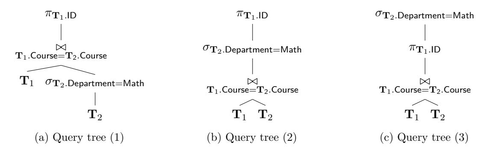
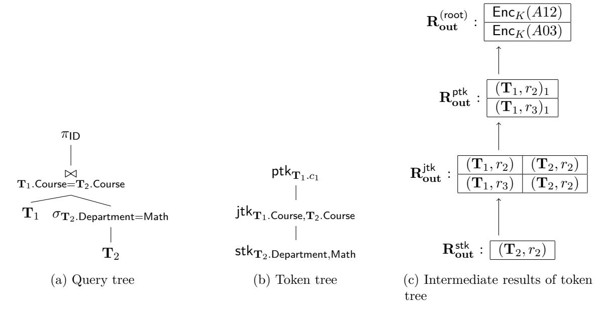

# An Optimal Relational Database Encryption Scheme

Seny Kamara \* Tarik Moataz † Stan Zdonik ‡ Zheguang Zhao § Brown University Aroki Systems Brown University Brown University

#### Abstract

Recently, Kamara and Moataz described the first encrypted relational database solution with support for a non-trivial fraction of SQL that does not make use of property-preserving encryption (Asiacrypt, 2018). More precisely, their construction, called SPX, handles the set of conjunctive SQL queries. While SPX was shown to be optimal for the subset of uncorrelated conjunctive SQL queries, it did not handle correlated queries optimally. Furthermore, it only handles queries in heuristic normal form. In this work, we address these limitations by proposing an extension of SPX that handles all conjunctive SQL queries optimally no matter what form they are in.

<sup>\*</sup>seny@brown.edu

 $<sup>^\</sup>dagger \texttt{tarik@aroki.com}$ 

<sup>‡</sup>sbz@cs.brown.edu

 $<sup>\</sup>S$ zheguang.zhao@brown.edu

# **Contents**

| 1 | Introduction                         | 3  |  |
|---|--------------------------------------|----|--|
| 2 | Preliminaries                        |    |  |
| 3 | Definitions                          |    |  |
| 4 | The OPX Construction                 | 10 |  |
|   | 4.1<br>Efficiency<br>                | 18 |  |
| 5 | Security and Leakage of OPX          | 19 |  |
|   | 5.1<br>Black-Box Leakage Profile<br> | 19 |  |
|   | OPX<br>5.2<br>Security of<br>        | 21 |  |
|   | 5.3<br>Concrete Leakage Profile<br>  | 22 |  |
| A | Proof of Theorem 4.1                 | 28 |  |
| B | Proof of Theorem 5.1                 |    |  |
| C | A Concrete Example of Indexed HNF    | 33 |  |

# <span id="page-2-0"></span>**1 Introduction**

End-to-end encrypted relational database management systems encrypt relational database in such a way that they can be be privately queried. This problem was first considered by Hacig¨um¨us, Iyer, Li and Mehrotra [[15\]](#page-25-0) who used a quantization-based approach that leaked the range within which an item fell. In [[1](#page-24-0)], Popa, Redfield, Zeldovich and Balakrishnan described a system called CryptDB that could support a non-trivial subset of SQL without quantization. CryptDB achieved this in part through the use of property-preserving encryption (PPE) schemes like deterministic and order-preserving encryption [[2](#page-24-1), [4,](#page-24-2) [5](#page-24-3)]. This approach was adopted by other systems including Cipherbase [[3](#page-24-4)] and SEEED [\[23](#page-26-0)]. While these systems were efficient and legacy-friendly, it was shown by Naveed, Kamara and Wright [\[21](#page-25-1)], that they leaked a non-trivial amount of information.

An alternative approach to designing encrypted databases is to use structured encryption (STE) [\[9](#page-25-2)] which is a generalization of index-based searchable symmetric encryption [[25](#page-26-1), [11](#page-25-3)]. STE-based systems leak less than their PPE-based counterparts while achieving similar efficiency. Initial STE-based solutions, however, have had two major limitations. The first is that they are not legacy-friendly and require custom database management systems. The second is that they could only handle a limited fraction of SQL. For example, systems based on standard STE techniques like Blind Seer [[22](#page-25-4), [12](#page-25-5)] and ESPADA [\[7,](#page-24-5) [6](#page-24-6)] can handle filtering and range queries but not joins or projections. This limitation was addressed recently by Kamara and Moataz [[16\]](#page-25-6) who proposed an STE-based scheme called SPX that handles a non-trivial fraction of SQL queries; specifically the set of conjunctive SQL queries, which have the form,

**SELECT** attributes **FROM** tables **WHERE** att<sup>1</sup> = *a ∧* att<sup>2</sup> = att<sup>3</sup> .

In addition to handling a large subset of SQL queries, the SPX construction was also shown to be efficient and even optimal for the subset of uncorrelated queries which, roughly speaking, are queries of the above form where the attributes are all distinct and from different tables. Though SPX is practical, it is not efficient enough to yield a system that is competitive with commercial plaintext database management systems (DBMS). This stems from several reasons which we now discuss.

**Query processing and optimization.** Database systems process SQL queries in a series of steps. First, a SQL query is converted into a *logical query tree* which is a tree-based representation of the query where each node is a relational algebra operator. Query trees are evaluated bottom up by evaluating the operators at the leaves on the appropriate database tables. The intermediate table that results from an operation is then passed on to its parent node until the final result table is output by the root. The initial query tree is then converted by a *query optimizer* to an equivalent but optimized query tree using various optimization techniques.

Query optimizers are one of the most important components of a DBMS and a large part of why commercial systems are so efficient. It follows then that for encrypted database systems to be competitive with commercial systems, they must support some form of query optimization. As described, however, the SPX construction does not allow for query optimization because it only handles queries in heuristic normal form (HNF) which is a very specific form of query tree.

**An overview of SPX.** We briefly recall how SPX works at a high-level. First, note that any conjunctive SQL query can be represented as an SPC query [[8](#page-25-7)] which, in turn, can be represented as a query tree with select/filter, projection and cross product operations. SPX makes use of two

kinds of encrypted data structures: encrypted multi-maps (EMM) which map encrypted labels to encrypted tuples and encrypted dictionaries which map encrypted labels to encrypted values. A database  $\mathsf{DB} = (\mathbf{T}_1, \dots, \mathbf{T}_n)$  is encrypted as  $\mathsf{EDB} = (\mathsf{EMM}_R, \mathsf{EMM}_C, \mathsf{EMM}_V, \mathsf{EDX})$  where  $\mathsf{EMM}_R$  and  $\mathsf{EMM}_C$  store encryptions of the rows and columns in the database, respectively; where  $\mathsf{EMM}_V$  is used to process filter operations and where  $\mathsf{EDX}$  is an encrypted dictionary that stores a set of encrypted multi-maps  $\{\mathsf{EMM}_{\mathbf{c},\mathbf{c}'}\}_{\mathbf{c},\mathbf{c}'\in\mathsf{DB}}$  that are used to process joins between columns  $\mathbf{c}$  and  $\mathbf{c}'$ . Given a query tree, SPX evaluates leaf operations by querying one of its EMMs directly and then uses various algorithms to process the internal operations on intermediate results. While the leaf operations are handled optimally thanks to the EMMs, internal operations are not necessarily handled in optimal or even sub-linear time.

Sub-optimality of correlated queries. Another source of SPX's sub-optimality is comes from how it handles correlated queries. Roughly speaking, a conjunctive SQL query is uncorrelated if the terms of its WHERE clause include attributes/columns that are in different tables. The query trees of uncorrelated queries are relatively simple: they have height 1 with leaves that are either join or filter operations and a root that is a Cartesian product. From the discussion above, one can see that SPX can handle these queries very efficiently since leaf operations are evaluated optimally by directly querying the EMMs. Correlated queries, on the other hand, have query trees of height 2 or more which means they have internal operations which, as discussed above, are not necessarily handled optimally.

Our contributions. In this work, we describe an extension of the SPX construction [16], called OPX, that supports query optimization and handles all conjunctive SQL queries optimally. It does this by using additional encrypted structures that are designed to optimally handle internal operations. These additional structures include an encrypted set structure to handle internal filters and an additional set of encrypted multi-maps to handle internal joins. These additional structures increase the storage overhead but only concretely; asymptotically-speaking OPX has the same storage overhead as SPX. The leakage profile of OPX is also similar to that of SPX. In addition to executing internal operations more efficiently, OPX has the advantage that it can handle any query tree; not just HNF trees. This is an important feature because it means that OPX can be used to query trees that have been optimized by standard query optimizers.

**Related work.** Since we already discussed related work on encrypted database schemes and systems, we omit a formal related work section.

 $\mathbf{S}$ 

### <span id="page-3-0"></span>2 Preliminaries

**Notation.** The set of all binary strings of length n is denoted as  $\{0,1\}^n$ , and the set of all finite binary strings as  $\{0,1\}^*$ . [n] is the set of integers  $\{1,\ldots,n\}$ . We write  $x \leftarrow \chi$  to represent an element x being sampled from a distribution  $\chi$ , and  $x \stackrel{\$}{\leftarrow} X$  to represent an element x being sampled uniformly at random from a set X. The output x of an algorithm A is denoted by  $x \leftarrow A$ . Given a sequence  $\mathbf{v}$  of n elements, we refer to its ith element as  $v_i$  or  $\mathbf{v}[i]$ . If S is a set then #S refers to its cardinality. If s is a string then |s| refers to its bit length.

**Basic cryptographic primitives.** A private-key encryption scheme is a set of three polynomialtime algorithms Π = (Gen*,* Enc*,* Dec) such that Gen is a probabilistic algorithm that takes a security parameter *k* and returns a secret key *K*; Enc is a probabilistic algorithm that takes a key *K* and a message *m* and returns a ciphertext *c*; Dec is a deterministic algorithm that takes a key *K* and a ciphertext *c* and returns *m* if *K* was the key under which *c* was produced. Informally, a private-key encryption scheme is secure against chosen-plaintext attacks (CPA) if the ciphertexts it outputs do not reveal any partial information about the plaintext even to an adversary that can adaptively query an encryption oracle. We say a scheme is random-ciphertext-secure against chosen-plaintext attacks (RCPA) if the ciphertexts it outputs are computationally indistinguishable from random even to an adversary that can adaptively query an encryption oracle.[1](#page-4-0) In addition to encryption schemes, we also make use of pseudo-random functions (PRF) and permutations (PRP), which are polynomial-time computable functions that cannot be distinguished from random functions by any probabilistic polynomial-time adversary. We refer the reader to [[20\]](#page-25-8) for formal definitions of CPA-security, PRFs and PRPs.

**Basic structures.** We make use of several basic data types including dictionaries and multi-maps which we recall here. A dictionary DX of capacity *n* is a collection of *n* label/value pairs *{*(*ℓ<sup>i</sup> , vi*)*}i≤<sup>n</sup>* and supports get and put operations. We write *v<sup>i</sup>* := DX[*ℓ<sup>i</sup>* ] to denote getting the value associated with label *ℓ<sup>i</sup>* and DX[*ℓ<sup>i</sup>* ] := *v<sup>i</sup>* to denote the operation of associating the value *v<sup>i</sup>* in DX with label *ℓ<sup>i</sup>* . A multi-map MM with capacity *n* is a collection of *n* label/tuple pairs *{*(*ℓ<sup>i</sup> ,* **t***i*)*i}i≤<sup>n</sup>* that supports get and put operations. Similarly to dictionaries, we write **t***<sup>i</sup>* := MM[*ℓ<sup>i</sup>* ] to denote getting the tuple associated with label *ℓ<sup>i</sup>* and MM[*ℓ<sup>i</sup>* ] := **t***<sup>i</sup>* to denote operation of associating the tuple **t***<sup>i</sup>* to label *ℓ<sup>i</sup>* . Multi-maps are the abstract data type instantiated by an inverted index. In the encrypted search literature multi-maps are sometimes referred to as indexes, databases or tuple-sets (T-sets).

**Relational databases.** A relational database DB = (**T**1*, . . . ,* **T***n*) is a set of *tables* where each table **T***<sup>i</sup>* is a two-dimensional array with rows corresponding to an entity (e.g., a customer or an employee) and columns corresponding to attributes (e.g., age, height, salary). For any given attribute, we refer to the set of all possible values that it can take as its *space* (e.g., integers, booleans, strings). We define the *schema* of a table **T** to be its set of attributes and denote it S(**T**). The schema of a database DB = (**T**1*, . . . ,* **T***n*) is then the set S(DB) = ∪ *<sup>i</sup>* S(**T***i*). We assume the attributes in S(DB) are unique and represented as positive integers. We denote a table **T**'s number of rows as *∥***T***∥<sup>r</sup>* and its number of columns as *∥***T***∥c*.

We sometimes view tables as a tuple of rows and write **r** *∈* **T** and sometimes as a tuple of columns and write **c** *∈* **T**<sup>⊺</sup> . Similarly, we write **r** *∈* DB and **c** *∈* DB<sup>⊺</sup> for **r** *∈* ∪ *<sup>i</sup>* **T***<sup>i</sup>* and **c** *∈* ∪ *<sup>i</sup>* **T** ⊺ *i* , respectively. For a row **r** *∈* **T***<sup>i</sup>* , its table identifier tbl(**r**) is *i* and its row rank rrk(**r**) is its position in **T***<sup>i</sup>* when viewed as a tuple of rows. Similarly, for a column **c** *∈* **T** ⊺ *i* , its table identifier tbl(**c**) is *i* and its column rank crk(**c**) is its position in **T***<sup>i</sup>* when viewed as a tuple of columns. For any row **r** *∈* DB and column **c** *∈* DB<sup>⊺</sup> , we refer to the pairs *χ*(**r**) *def* = (tbl(**r**)*,*rrk(**r**)) and *χ*(**c**) *def* = (tbl(**c**)*,* crk(**c**)), respectively, as their *coordinates* in DB. We write **r**[*i*] and **c**[*i*] to refer to the *i*th element of a row **r** and column **c**. The coordinate of the *j*th cell in row **r** *∈* **T***<sup>i</sup>* is the triple (*i,*rrk(**r**)*, j*). Given a column **c** *∈* DB<sup>⊺</sup> , we denote its corresponding attribute by att(**c**). For

<span id="page-4-0"></span><sup>1</sup>RCPA-secure encryption can be instantiated practically using either the standard PRF-based private-key encryption scheme or, e.g., AES in counter mode.

any pair of attributes  $\mathsf{att}_1, \mathsf{att}_2 \in \mathbb{S}(\mathsf{DB})$  such that  $\mathsf{dom}(\mathsf{att}_1) = \mathsf{dom}(\mathsf{att}_2), \ \mathsf{DB}_{\mathsf{att}_1 = \mathsf{att}_2}$  denotes the set of row pairs  $\{(\mathbf{r}_1, \mathbf{r}_2) \in \mathsf{DB}^2 : \mathbf{r}_1[\mathsf{att}_1] = \mathbf{r}_2[\mathsf{att}_2]\}$ . For any attribute  $\mathsf{att} \in \mathbb{S}(\mathsf{DB})$  and constant  $a \in \mathsf{dom}(\mathsf{att}), \ \mathsf{DB}_{\mathsf{att} = a}$  is the set of rows  $\{\mathbf{r} \in \mathsf{DB} : \mathbf{r}[\mathsf{att}] = a\}$ .

**SQL.** In practice, relational databases are queried using the special-purpose language called SQL. SQL is a declarative language and can be used to modify and query a relational DB. In this work, we only focus on its query operations. Informally, SQL queries have the form

SELECT attributes FROM tables WHERE condition,

where attributes is a set of attributes/columns, tables is a set of tables and condition is a predicate over the rows of tables and can itself contain a nested SQL query. More complex queries can be obtained using Group-by, Order-by and aggregate operators (i.e., max, min, average etc.) but the simple form above already captures a large subset of SQL. The most common class of queries on relational DBs are conjunctive queries [8] which have the above form with the restriction that condition is a conjunction of equalities over attributes and constants. In particular, this means there are no nested queries in condition. More precisely, conjunctive queries have the form

SELECT attributes FROM tables WHERE (att<sub>1</sub> =  $X_1 \wedge \cdots \wedge \text{att}_{\ell} = X_{\ell}$ ), where att<sub>i</sub> is an attribute in S(DB) and  $X_i$  can be either an attribute or a constant.

The SPC algebra. It was shown by Chandra and Merlin [8] that conjunctive queries could be expressed as a subset of Codd's relational algebra which is an imperative query language based on a set of basic operators. In particular, they showed that three operators select, project and cross product were enough. The select operator  $\sigma_{\Psi}$  is parameterized with a predicate  $\Psi$  and takes as input a table  $\mathbf{T}$  and outputs a new table  $\mathbf{T}'$  that includes the rows of  $\mathbf{T}$  that satisfy the predicate  $\Psi$ . The projection operator  $\pi_{\mathsf{att}_1,\ldots,\mathsf{att}_h}$  is parameterized by a set of attributes  $\mathsf{att}_1,\ldots,\mathsf{att}_h$  and takes as input a table  $\mathbf{T}$  and outputs a table  $\mathbf{T}'$  that consists of the columns of  $\mathbf{T}$  indexed by  $\mathsf{att}_1$  through  $\mathsf{att}_n$ . The cross product operator  $\times$  takes as input two tables  $\mathbf{T}_1$  and  $\mathbf{T}_2$  and outputs a new table  $\mathbf{T}' = \mathbf{T}_1 \times \mathbf{T}_2$  such that each row of  $\mathbf{T}'$  is an element of the cross product between the set of rows of  $\mathbf{T}_1$  and the set of rows of  $\mathbf{T}_2$ . The query language that results from any combination of select, project and cross product is referred to as the SPC algebra. We formalize this in Definition 2.1 below.

<span id="page-5-0"></span>**Definition 2.1** (SPC algebra). Let  $\mathsf{DB} = (\mathbf{T}_1, \dots, \mathbf{T}_n)$  be a relational database. The SPC algebra consists of any query that results from the combination of the following operators:

- $\mathbf{T}' \leftarrow \sigma_{\Psi}(\mathbf{T})$ : the select operator is parameterized with a predicate  $\Psi$  of form  $\mathsf{att}_1 = X_1 \land \cdots \land \mathsf{att}_\ell = X_\ell$ , where  $\mathsf{att}_i \in \mathbb{S}(\mathsf{DB})$  and  $X_i$  is either a constant a in the domain of  $\mathsf{att}_i$  (type-1) or an attribute  $\mathsf{x}_j \in \mathbb{S}(\mathsf{DB})$  (type-2). It takes as input a table  $\mathbf{T} \in \mathsf{DB}$  and outputs a table  $\mathbf{T}' = \{\mathbf{r} \in \mathbf{T} : \Psi(\mathbf{r}) = 1\}$ , where terms of the form  $\mathsf{att}_i = \mathsf{x}_j$  are satisfied if  $\mathbf{r}[\mathsf{att}_i] = \mathbf{r}[\mathsf{x}_j]$  and terms of the form  $\mathsf{att}_i = a$  are satisfied if  $\mathbf{r}[\mathsf{att}_i] = a$ .
- $\mathbf{T}' \leftarrow \pi_{\mathsf{att}_1, \dots, \mathsf{att}_h}(\mathbf{T})$ : the project operator is parameterized by a set of attributes  $\mathsf{att}_1, \dots, \mathsf{att}_h \in \mathbb{S}(\mathsf{DB})$ . It takes as input a table  $\mathbf{T} \in \mathsf{DB}$  and outputs a table  $\mathbf{T}' = \{\langle \mathbf{r}[\mathsf{att}_1], \dots, \mathbf{r}[\mathsf{att}_h] \rangle : \mathbf{r} \in \mathbf{T}\}$ .

<span id="page-6-1"></span>

Figure 1: Different query tree representations for the same SPC query.

•  $\mathbf{R} \leftarrow \mathbf{T}_1 \times \mathbf{T}_2$ : the cross product operator takes as input two tables  $\mathbf{T}_1$  and  $\mathbf{T}_2$  and outputs a result table  $R = \{\langle \mathbf{r}, \mathbf{v} \rangle : \mathbf{r} \in \mathbf{T}_1 \text{ and } \mathbf{v} \in \mathbf{T}_2\}$ , where  $\langle \mathbf{r}, \mathbf{v} \rangle$  is the concatenation of rows  $\mathbf{r}$  and  $\mathbf{v}$ .

We will often also consider the inner join operator which is defined as follows:

•  $\mathbf{R} \leftarrow \mathbf{T}_1 \bowtie_{\mathsf{att}_1 = \mathsf{att}_2} \mathbf{T}_2$ : the inner join operator is parameterized by an expression of the form  $\mathsf{att}_1 = \mathsf{att}_2$ . It takes as input two tables  $\mathbf{T}_1$  and  $\mathbf{T}_2$  and outputs a result table  $\mathbf{R} = \{\langle \mathbf{r}, \mathbf{v} \rangle : r \in \mathbf{T}_1 \text{ and } \mathbf{v} \in \mathbf{T}_2 \text{ and } \mathbf{r}[\mathsf{att}_1] = \mathbf{v}[\mathsf{att}_2]\}$ .

Note that adding the inner join operator to the SPC algebra does not increase its power as inner joins can be computed using select and cross product operations. This is just a notational convenience.

Intuitively, the connection between conjunctive SQL queries and the SPC algebra can be seen as follows: SELECT corresponds to the projection operator, FROM to the cross product and WHERE to the (SPC) select operator.

**Query trees.** Every query in the SPC algebra can be represented as a query tree which is a tree-based representation of the query. A query can have several query tree representations each leading to a different query complexity when executed. As an example, the following conjunctive SQL query:

SELECT  $T_1.ID$  FROM  $T_1, T_2$  WHERE  $T_2.Department = Math <math>\wedge T_2.Course = T_1.Course$ , has at least three possible query tree representations, which are illustrated in Figure (1).

### <span id="page-6-0"></span>3 Definitions

In this Section, we define the syntax and security of STE schemes. A STE scheme encrypts data structures in such a way that they can be privately queried. There are several natural forms of structured encryption. The original definition of [9] considered schemes that encrypt both a structure and a set of associated data items (e.g., documents, emails, user profiles etc.). In [10], the authors also describe structure-only schemes which only encrypt structures. Another distinction can be made between interactive and non-interactive schemes. Interactive schemes produce encrypted structures that are queried through an interactive two-party protocol, whereas non-interactive schemes produce structures that can be queried by sending a single message, i.e, the token. One

can also distinguish between *response-hiding* and *response-revealing* schemes: the latter reveal the query response to the server whereas the former do not.

In this work, we focus on non-interactive structure-only schemes. Our main construction, OPX, is response-hiding but makes use of response-revealing schemes as building blocks. As such, we define both forms below. At a high-level, non-interactive STE works as follows. During a setup phase, the client constructs an encrypted structure EDS under a key *K* from a plaintext structure DS. The client then sends EDS to the server. During the query phase, the client constructs and sends a token tk generated from its query *q* and secret key *K*. The server then uses the token tk to query EDS and recover either a response *r* or an encryption ct of *r* depending on whether the scheme is response-revealing or response-hiding.

<span id="page-7-0"></span>**Definition 3.1** (Response-revealing structured encryption [[9](#page-25-2)])**.** *A response-revealing structured encryption scheme* Σ = (Setup*,*Token*,* Query) *consists of three polynomial-time algorithms that work as follows:*

- *•* (*K,* EDS) *←* Setup(1*<sup>k</sup> ,* DS)*: is a probabilistic algorithm that takes as input a security parameter* 1 *<sup>k</sup> and a structure* DS *and outputs a secret key K and an encrypted structure* EDS*.*
- *•* tk *←* Token(*K, q*)*: is a (possibly) probabilistic algorithm that takes as input a secret key K and a query q and returns a token* tk*.*
- *•* { *⊥, r*} *←* Query(EDS*,*tk)*: is a deterministic algorithm that takes as input an encrypted structure* EDS *and a token* tk *and outputs either ⊥ or a response.*

*We say that a response-revealing structured encryption scheme* Σ *is correct if for all k ∈* N*, for all* poly(*k*)*-size structures* DS : **Q** *→* **R***, for all* (*K,* EDS) *output by* Setup(1*<sup>k</sup> ,* DS) *and all sequences of m* = poly(*k*) *queries q*1*, . . . , qm, for all tokens* tk*<sup>i</sup> output by* Token(*K, qi*)*,* Query(EDS*,*tk*i*) *returns* DS(*qi*) *with all but negligible probability.*

<span id="page-7-1"></span>**Definition 3.2** (Response-hiding structured encryption [\[9\]](#page-25-2))**.** *A response-hiding structured encryption scheme* Σ = (Setup*,*Token*,* Query*,* Dec) *consists of four polynomial-time algorithms such that* Setup *and* Token *are as in Definition [3.1](#page-7-0) and* Query *and* Dec *are defined as follows:*

- *• {⊥,* ct*} ←* Query(EDS*,*tk)*: is a deterministic algorithm that takes as input an encrypted structured* EDS *and a token* tk *and outputs either ⊥ or a ciphertext* ct*.*
- *• r ←* Dec(*K,* ct)*: is a deterministic algorithm that takes as input a secret key K and a ciphertext* ct *and outputs a response r.*

*We say that a response-hiding structured encryption scheme* Σ *is correct if for all k ∈* N*, for all* poly(*k*)*-size structures* DS : **Q** *→* **R***, for all* (*K,* EDS) *output by* Setup(1*<sup>k</sup> ,* DS) *and all sequences of m* = poly(*k*) *queries q*1*, . . . , qm, for all tokens* tk*<sup>i</sup> output by* Token(*K, qi*)*,* Dec*<sup>K</sup>* ( Query( EDS*,*tk*<sup>i</sup>* )) *returns* DS(*qi*) *with all but negligible probability.*

**Security.** The standard notion of security for structured encryption guarantees that an encrypted structure reveals no information about its underlying structure beyond the setup leakage *L*<sup>S</sup> and that the query algorithm reveals no information about the structure and the queries beyond the query leakage *L*Q. If this holds for non-adaptively chosen operations then this is referred to as non-adaptive semantic security. If, on the other hand, the operations are chosen adaptively, this leads to the stronger notion of adaptive semantic security. This notion of security was introduced by Curtmola *et al.* in the context of SSE [11] and later generalized to structured encryption in [9].

<span id="page-8-0"></span>**Definition 3.3** (Adaptive semantic security [11, 9]). Let  $\Sigma = (\mathsf{Setup}, \mathsf{Token}, \mathsf{Query})$  be a response-revealing structured encryption scheme and consider the following probabilistic experiments where  $\mathcal{A}$  is a stateful adversary,  $\mathcal{S}$  is a stateful simulator,  $\mathcal{L}_{\mathsf{S}}$  and  $\mathcal{L}_{\mathsf{Q}}$  are leakage profiles and  $z \in \{0,1\}^*$ :

 $\mathbf{Real}_{\Sigma,\mathcal{A}}(k)$ : given z the adversary  $\mathcal{A}$  outputs a structure DS. It receives EDS from the challenger, where  $(K,\mathsf{EDS}) \leftarrow \mathsf{Setup}(1^k,\mathsf{DS})$ . The adversary then adaptively chooses a polynomial number of queries  $q_1,\ldots,q_m$ . For all  $i\in[m]$ , the adversary receives  $\mathsf{tk} \leftarrow \mathsf{Token}(K,q_i)$ . Finally,  $\mathcal{A}$  outputs a bit b that is output by the experiment.

Ideal<sub> $\Sigma,A,S$ </sub>(k): given z the adversary A generates a structure DS which it sends to the challenger. Given z and leakage  $\mathcal{L}_S(\mathsf{DS})$  from the challenger, the simulator S returns an encrypted data structure EDS to A. The adversary then adaptively chooses a polynomial number of operations  $q_1,\ldots,q_m$ . For all  $i\in[m]$ , the simulator receives a tuple  $(\mathsf{DS}(q_i),\mathcal{L}_Q(\mathsf{DS},q_i))$  and returns a token  $\mathsf{tk}_i$  to A. Finally, A outputs a bit b that is output by the experiment.

We say that  $\Sigma$  is adaptively  $(\mathcal{L}_S, \mathcal{L}_Q)$ -semantically secure if for all PPT adversaries  $\mathcal{A}$ , there exists a PPT simulator  $\mathcal{S}$  such that for all  $z \in \{0,1\}^*$ , the following expression is negligible in k:

$$\left[\Pr\left[\mathbf{Real}_{\Sigma,\mathcal{A}}(k)=1\right]-\Pr\left[\mathbf{Ideal}_{\Sigma,\mathcal{A},\mathcal{S}}(k)=1\right]\right]$$

The security definition for *response-hiding* schemes can be derived from Definition 3.3 by giving the simulator  $(\bot, \mathcal{L}_{Q}(\mathsf{DS}, q_i))$  instead of  $(\mathsf{DS}(q_i), \mathcal{L}_{Q}(\mathsf{DS}, q_i))$ .

**Modeling leakage.** Every STE scheme is associated with leakage which itself can be composed of multiple *leakage patterns*. The collection of all these leakage patterns forms the scheme's *leakage profile*. Leakage patterns are (families of) functions over the various spaces associated with the underlying data structure. For concreteness, we borrow the nomenclature introduced in [18] and recall some well-known leakage patterns that we make use of in this work. Here  $\mathbb D$  and  $\mathbb Q$  refer to the space of all possible data objects and the space of all possible queries for a given data type. In this work, we consider the following leakage patterns:

- the query equality pattern is the function family  $\operatorname{\mathsf{qeq}} = \{\operatorname{\mathsf{qeq}}_{k,t}\}_{k,t\in\mathbb{N}}$  with  $\operatorname{\mathsf{qeq}}_{k,t}: \mathbb{D}_k \times \mathbb{Q}_k^t \to \{0,1\}^{t\times t}$  such that  $\operatorname{\mathsf{qeq}}_{k,t}(\mathsf{DS},q_1,\ldots,q_t) = M$ , where M is a binary  $t\times t$  matrix such that M[i,j] = 1 if  $q_i = q_j$  and M[i,j] = 0 if  $q_i \neq q_j$ . The query equality pattern is referred to as the search pattern in the SSE literature;
- the response identity pattern is the function family  $\operatorname{rid} = \{\operatorname{rid}_{k,t}\}_{k,t\in\mathbb{N}}$  with  $\operatorname{rid}_{k,t}: \mathbb{D}_k \times \mathbb{Q}_k^t \to [2^{[n]}]^t$  such that  $\operatorname{rid}_{k,t}(\mathsf{DS},q_1,\ldots,q_t) = (\mathsf{DS}[q_1],\ldots,\mathsf{DS}[q_t])$ . The response identity pattern is referred to as the access pattern in the SSE literature;
- the response length pattern is the function family  $\mathsf{rlen} = \{\mathsf{rlen}_{k,t}\}_{k,t\in\mathbb{N}}$  with  $\mathsf{rlen}_{k,t} : \mathbb{D}_k \times \mathbb{Q}_k^t \to \mathbb{N}^t$  such that  $\mathsf{rlen}_{k,t}(\mathsf{DS},q_1,\ldots,q_t) = (|\mathsf{DS}[q_1]|,\ldots,|\mathsf{DS}[q_t]|);$

### <span id="page-9-0"></span>4 The OPX Construction

We now describe our main construction, OPX, which is a response-hiding STE scheme for relational databases that supports conjunctive SQL queries. It uses a response-revealing multi-map encryption scheme  $\Sigma_{\mathsf{MM}}$ , the adaptively-secure encrypted multi-map scheme  $\Sigma_{\mathsf{MM}}^{\pi}$  by Cash et al. [6], a symmetric encryption scheme SKE, a pseudo-random function F, and a random oracle H. We describe the scheme in detail in Figures (2), (3), (4), and (5), and provide a high level description below.

**Remark on notation.** We note that the syntax of OPX matches Definition 3.2 but its queries q are query trees and its tokens tk are token trees; that is, trees where each node is a sub-token. We make this explicit here by referring to query trees as Q and to token trees as TK. Throughout, while processing a query tree, we denote by  $\mathbf{R_{in}}$  the set of inputs to an operation/node and by  $\mathbf{R_{out}}$  the set of outputs of that operation/node.

**Setup.** The Setup algorithm takes as input a database  $DB = (\mathbf{T}_1, \dots, \mathbf{T}_n)$  and a security parameter k. It first samples a key  $K_1 \stackrel{\$}{\leftarrow} \{0,1\}^k$ , and then initializes a multi-map  $\mathsf{MM}_R$  such that for all rows  $\mathbf{r} \in \mathsf{DB}$ , it sets

$$\mathsf{MM}_R\Big[\chi(\mathbf{r})\Big] := \Big(\mathsf{Enc}_{K_1}(r_1), \cdots, \mathsf{Enc}_{K_1}(r_{\#\mathbf{r}}), \chi(\mathbf{r})\Big),$$

It then computes

$$(K_R, \mathsf{EMM}_R) \leftarrow \Sigma_{\mathsf{MM}}.\mathsf{Setup}\Big(1^k, \mathsf{MM}_R\Big).$$

It initializes a multi-map  $\mathsf{MM}_C$  such that for all columns  $\mathbf{c} \in \mathsf{DB}^\intercal$ , it sets

$$\mathsf{MM}_C\Big[\chi(\mathbf{c})\Big] := \Big(\mathsf{Enc}_{K_1}(c_1), \cdots, \mathsf{Enc}_{K_1}(c_{\#\mathbf{c}}), \chi(\mathbf{c})\Big),$$

It then computes

$$(K_C, \mathsf{EMM}_C) \leftarrow \Sigma_{\mathsf{MM}}.\mathsf{Setup}\Big(1^k, \mathsf{MM}_C\Big).$$

It initializes a multi-map  $\mathsf{MM}_V$ , and for each  $\mathbf{c} \in \mathsf{DB}^\intercal$ , all  $v \in \mathbf{c}$  and  $\mathbf{r} \in \mathsf{DB}_{\mathbf{c}=v}$ , it computes

$$\mathsf{mtk}_{\mathbf{r}} \leftarrow \Sigma_{\mathsf{MM}}.\mathsf{Token}\bigg(K_R,\chi(\mathbf{r})\bigg),$$

and sets

$$\mathsf{MM}_V \Big[ \langle v, \chi(\mathbf{c}) \rangle \Big] := \Big( \mathsf{mtk}_{\mathbf{r}} \Big)_{\mathbf{r} \in \mathsf{DB}_{\mathbf{c} = v}}.$$

It then computes

$$(K_V, \mathsf{EMM}_V) \leftarrow \Sigma_{\mathsf{MM}}.\mathsf{Setup}(1^k, \mathsf{MM}_V).$$

It initializes a set of multi-maps  $\{\mathsf{MM}_{\mathbf{c}}\}_{\mathbf{c}\in\mathsf{DB}^\mathsf{T}}$ . For all columns  $\mathbf{c},\mathbf{c}'\in\mathsf{DB}^\mathsf{T}$  that have the same domain such that  $\mathsf{dom}(\mathsf{att}(\mathbf{c})) = \mathsf{dom}(\mathsf{att}(\mathbf{c}'))$ , it initiates an empty tuple  $\mathbf{t}$  that it populates as follows. For all rows  $\mathbf{r}_i$  and  $\mathbf{r}_j$  in column  $\mathbf{c}$  and  $\mathbf{c}'$ , respectively, that verify

$$\mathbf{c}[i] = \mathbf{c}'[j],$$

<span id="page-10-0"></span>Let  $\Sigma_{\mathsf{MM}} = (\mathsf{Setup}, \mathsf{Token}, \mathsf{Get})$  be a response-revealing multi-map encryption scheme,  $\Sigma_{\mathsf{MM}}^{\pi} = (\mathsf{Setup}, \mathsf{Token}, \mathsf{Get})$  be the response-revealing multi-map encryption scheme in [6],  $\mathsf{SKE} = (\mathsf{Gen}, \mathsf{Enc}, \mathsf{Dec})$  be a symmetric encryption scheme,  $F : \{0,1\}^k \times \{0,1\}^* \to \{0,1\}^m$  be a pseudo-random function, and  $H : \{0,1\}^* \to \{0,1\}^m$  be a random oracle. Consider the DB encryption scheme  $\mathsf{OPX} = (\mathsf{Setup}, \mathsf{Token}, \mathsf{Query}, \mathsf{Dec})$  defined as follows  $^a$ :

- Setup $(1^k, DB)$ :
  - 1. initialize a set SET:
  - 2. initialize multi-maps  $MM_R$ ,  $MM_C$  and  $MM_V$ ;
  - 3. initialize multi-maps (MM<sub>att</sub>)<sub>att∈DBT</sub>;
  - 4. initialize multi-maps  $(\mathsf{MM}_{\mathsf{att},\mathsf{att}'})_{\mathsf{att},\mathsf{att}'\in\mathsf{DB}^\intercal}$  such that  $\mathsf{dom}(\mathsf{att}) = \mathsf{dom}(\mathsf{att}')$ ;
  - 5. sample two keys  $K_1, K_F \stackrel{\$}{\leftarrow} \{0, 1\}^k$ ;
  - 6. for all  $\mathbf{r} \in \mathsf{DB}$  set

$$\mathsf{MM}_R\big[\chi(\mathbf{r})\big] := \bigg(\mathsf{Enc}_{K_1}(r_1), \dots \mathsf{Enc}_{K_1}(r_{\#\mathbf{r}}), \chi(\mathbf{r})\bigg);$$

- 7. compute  $(K_R, \mathsf{EMM}_R) \leftarrow \Sigma_{\mathsf{MM}}.\mathsf{Setup}(1^k, \mathsf{MM}_R);$
- 8. for all  $\mathbf{c} \in \mathsf{DB}^\mathsf{T}$ , set

$$\mathsf{MM}_{C}\big[\chi(\mathbf{c})\big] := \bigg(\mathsf{Enc}_{K_{1}}(c_{1}), \ldots \mathsf{Enc}_{K_{1}}(c_{\#\mathbf{c}}), \chi(\mathbf{c})\bigg);$$

- 9. compute  $(K_C, \mathsf{EMM}_C) \leftarrow \Sigma_{\mathsf{MM}}.\mathsf{Setup}(1^k, \mathsf{MM}_C);$
- 10. for all  $\mathbf{c} \in \mathsf{DB}^\mathsf{T}$ ,
  - (a) for all  $v \in \mathbf{c}$  and  $\mathbf{r} \in \mathsf{DB}_{\mathbf{c}=v}$ ,

i. compute 
$$\mathsf{mtk}_{\mathbf{r}} \leftarrow \Sigma_{\mathsf{MM}}.\mathsf{Token}\bigg(K_R,\chi(\mathbf{r})\bigg),$$

(b) set

$$\mathsf{MM}_V\bigg[\big\langle v, \chi(\mathbf{c}) \big\rangle\bigg] := \bigg(\mathsf{mtk}_\mathbf{r}\bigg)_{\mathbf{r} \in \mathsf{DB}_{\mathbf{c} = v}};$$

- 11. compute  $(K_V, \mathsf{EMM}_V) \leftarrow \Sigma_{\mathsf{MM}}.\mathsf{Setup}(1^k, \mathsf{MM}_V);$
- 12. for all  $\mathbf{c} \in \mathsf{DB}^\intercal$ ,
  - (a) for all  $\mathbf{c}' \in \mathsf{DB}^\intercal$  such that  $\mathsf{dom}(\mathsf{att}(\mathbf{c}')) = \mathsf{dom}(\mathsf{att}(\mathbf{c}))$ ,
    - i. initialize an empty tuple  $\mathbf{t}$ ;
    - ii. for all rows  $\mathbf{r}_i$  and  $\mathbf{r}_j$  in  $\mathbf{c}$  and  $\mathbf{c}'$ , such that  $\mathbf{c}[i] = \mathbf{c}'[j]$ ,

A. compute 
$$\mathsf{mtk}_i \leftarrow \Sigma_{\mathsf{MM}}.\mathsf{Token}\bigg(K_R,\chi(\mathbf{r}_i)\bigg);$$

B. compute 
$$\mathsf{mtk}_j \leftarrow \Sigma_{\mathsf{MM}}.\mathsf{Token}\Big(K_R,\chi(\mathbf{r}_j)\Big);$$

C. add  $(mtk_i, mtk_i)$  to  $\mathbf{t}$ ;

iii. set

$$\mathsf{MM}_{\mathbf{c}} \bigg[ \bigg\langle \chi(\mathbf{c}), \chi(\mathbf{c}') \bigg\rangle \bigg] := \mathbf{t};$$

 $\text{(b) compute } (K_{\mathbf{c}}, \mathsf{EMM}_{\mathbf{c}}) \leftarrow \Sigma_{\mathsf{MM}}.\mathsf{Setup}\big(1^k, \mathsf{MM}_{\mathbf{c}}\big);$ 

Figure 2: The OPX scheme (Part 1).

<span id="page-10-1"></span><sup>&</sup>lt;sup>a</sup>Note that we omit the description of Dec since it simply decrypts every cell of R.

```
13. for all c ∈ DB⊺
                   ,
    (a) for all v ∈ c,
          i. compute Kv ← FKF
                                  (χ(c)∥v);
          ii. set for all r ∈ DBc=v,
                                SET := SET∪{
                                                 H
                                                   (
                                                    Kv∥rtk)
                                                            }
                                                              ,
             where rtk ← ΣMM.Token(KR, χ(r));
14. for all c ∈ DB⊺
                   ,
    (a) for all c
                 ′ ∈ DB⊺
                         such that dom(att(c
                                             ′
                                              )) = dom(att(c)),
          i. initialize an empty tuple t;
          ii. for all ri
                      , rj ∈ [m] such that c[i] = c
                                                 ′
                                                  [j],
            A. add (
                     rtki
                         ,rtkj
                             )
                               to t where
                          rtki ← ΣMM.Token(KR, χ(ri)) and rtkj ← ΣMM.Token(KR, χ(rij).
         iii. for all rtk s.t. (rtk, ·) ∈ t, set
                                           MMc,c′
                                                  [
                                                    rtk]
                                                        := (
                                                             rtk′
                                                                )
                                                                  (rtk,rtk′
                                                                        )∈t
    (b) compute (Kc,c′ , EMMc,c′ ) ← Σ
                                        π
                                        MM.Setup(
                                                  1
                                                   k
                                                     , MMc,c′
                                                             )
                                                              ;
15. output K = (K1, KR, KC , KV , {Kc}c∈DB⊺ , KF , {Kc,c′}c,c′∈DB⊺ ) and EDB =
   (EMMR, EMMC , EMMV ,(EMMc,c′ )c,c′∈DB⊺ , SET,(EMMc)c∈DB⊺ ).
```

*•* Setup(1*<sup>k</sup>*

*,* Q):

Figure 3: The OPX scheme (Part 2).

- <span id="page-12-0"></span>• Token(K, Q):
  - 1. initialize a token tree TK with empty nodes and with the same structure as Q;
  - 2. for every node N accessed in a post-traversal order in Q ,
    - (a) if  $N \equiv \sigma_{\mathsf{att}=a}(\mathbf{T})$  then set  $\mathsf{TK}_N$  to

$$\mathsf{stk} \leftarrow \Sigma_{\mathsf{MM}}.\mathsf{Token}\bigg(K_V, \langle a, \chi(\mathsf{att}) \bigg);$$

(b) if  $N \equiv \sigma_{\mathsf{att}=a}(\mathbf{R_{in}})$  then set  $\mathsf{TK}_N$  to  $(\mathsf{mtk}, \mathsf{pos})$  where

$$\mathsf{mtk} \leftarrow F_{K_F}\bigg(\chi(\mathsf{att})\|a\bigg)$$

and pos denotes the position of att in  $\mathbf{R_{in}}$ .

(c) if  $N \equiv \mathbf{T}_1 \bowtie_{\mathsf{att}_1 = \mathsf{att}_2} \mathbf{T}_2$  then set  $\mathsf{TK}_N$  to  $(\mathsf{jtk}, \mathsf{pos})$  where

$$\mathsf{jtk} \leftarrow \Sigma_{\mathsf{MM}}.\mathsf{Token}\bigg(K_{\mathsf{att}_1}, \bigg\langle \chi(\mathsf{att}_1), \chi(\mathsf{att}_2) \bigg\rangle \bigg),$$

and pos is the position of attribute  $att_1$  in  $\mathbf{R_{in}}$ .

(d) if  $N \equiv \mathbf{T} \bowtie_{\mathsf{att}_1 = \mathsf{att}_2} \mathbf{R_{in}}$  then set the corresponding node in TK to  $(\mathsf{etk}, \mathsf{pos}_1, \mathsf{pos}_2)$  where

$$\mathsf{etk} := K_{\mathsf{att}_1,\mathsf{att}_2};$$

and  $pos_1$ ,  $pos_2$  are the positions of the attributes  $att_1$ ,  $att_2$  in  $R_{in}$ , respectively.

- (e) if  $N \equiv \mathbf{R}_{\mathbf{in}}^{(l)} \bowtie_{\mathsf{att}_1 = \mathsf{att}_2} \mathbf{R}_{\mathbf{in}}^{(r)}$  then set  $\mathsf{TK}_N$  to  $(\mathsf{pos}_1, \mathsf{pos}_2)$  where  $\mathsf{pos}_1$  and  $\mathsf{pos}_2$  are the column positions of  $\mathsf{att}_1$  and  $\mathsf{att}_2$  in  $\mathbf{R}_{\mathbf{in}}^{(l)}$  and  $\mathbf{R}_{\mathbf{in}}^{(r)}$ , respectively.
- (f) if  $N \equiv \pi_{\mathsf{att}}(\mathbf{T})$  then set  $\mathsf{TK}_N$  to  $\mathsf{ptk}$  where

$$\mathsf{ptk} \leftarrow \Sigma_{\mathsf{MM}}.\mathsf{Token}\bigg(K_C,\chi(\mathsf{att}_i)\bigg).$$

(g) if  $N \equiv \pi_{\mathsf{att}_1, \cdots, \mathsf{att}_z}(\mathbf{R_{in}})$  then set  $\mathsf{TK}_N$  to

$$\bigg(\mathsf{pos}_1,\cdots,\mathsf{pos}_z\bigg),$$

where  $pos_i$  is the column position of  $att_i$  in  $R_{in}$ .

- (h) if  $N \equiv [a]$  then set  $\mathsf{TK}_N$  to  $[\mathsf{Enc}_{K_1}(a)]$ .
- (i) if  $N \equiv \times$  then set  $\mathsf{TK}_N$  to  $\times$ .
- 3. output TK.

Figure 4: The OPX scheme (Part 3).

```
• Query(EDB,tk):
     1. parse EDB as (EMMR, EMMC , EMMV ,(EMMc,c′ )c,c′∈DB⊺ , SET,(EMMc)c∈DB⊺ ).
     2. for every node N accessed in a post-traversal order in TK,
          – if N ≡ stk, it computes
                                        (rtk1, · · · ,rtks) ← ΣMM.Query(
                                                                         stk, EMMV
                                                                                     )
                                                                                       ,
             and sets Rout := (rtk1, · · · ,rtks);
          – if N ≡ (mtk, pos), then for all rtk in Rin in the column at position pos, if
                                                      H(mtk∥rtk) ∈/ SET
             then it removes the row from Rin. Finally, it sets Rout := Rin;
          – if N ≡ (jtk, pos), then it computes
                                 (
                                   (rtk1,rtk′
                                            1
                                             ), . . . ,(rtks,rtk′
                                                            s
                                                             )
                                                              )
                                                                 ← ΣMM.Query(jtk, EMMpos),
             and sets
                                                  Rout := (
                                                             (rtki
                                                                 ,rtk′
                                                                     i
                                                                      )
                                                                       )
                                                                         i∈[s]
                                                                             ;
          – if N ≡ (etk, pos1
                               , pos2
                                     ), then for each row r in Rin, it computes ltk ← Σ
                                                                                          π
                                                                                          MM.Token(etk,rtk), and
                                      (rtk1, · · · ,rtks) ← Σ
                                                           π
                                                           MM.Query(ltk, EMMpos1
                                                                                   ,pos2
                                                                                        ),
             where rtk = r[attpos2
                                   ], and appends the new rows (
                                                                    rtki
                                                                        )
                                                                         i∈[s]
                                                                              × r to Rout;
          – if N ≡ (pos1
                           , pos2
                                 ), then it sets
                                                Rout := R
                                                           (l)
                                                           in ▷◁pos1=pos2 R
                                                                            (r)
                                                                            in ,
             where R
                      (l)
                      in and R
                                (r)
                                in are the left and right input respectively;
          – if N ≡ ptk then it computes
                                         (ct1, · · · , cts) ← ΣMM.Query(
                                                                         ptk, EMMC
                                                                                    )
             and sets Rout := (ct1, · · · , cts);
          – if N ≡ (pos1
                           , · · · , posz
                                     ), then it computes Rout := πpos1
                                                                         ,··· ,posz
                                                                                (Rin);
          – if N ≡ × then it computes
                                                     Rout := R
                                                                (l)
                                                                in × R
                                                                        (r)
                                                                        in ;
     3. it replaces each cell rtk in Rroot
                                      out by ct ← ΣMM.Query(rtk, EMMR);
```

Figure 5: The OPX scheme (Part 4).

4. output **R**root

**out**.

it inserts  $(\mathsf{rtk}_i, \mathsf{rtk}_j)$  in **t** where

$$\mathsf{rtk}_i \leftarrow \Sigma_{\mathsf{MM}}.\mathsf{Token}(K_R,\chi(\mathbf{r}_i))$$

and

$$\mathsf{rtk}_i \leftarrow \Sigma_{\mathsf{MM}}.\mathsf{Token}(K_R, \chi(\mathbf{r}_i j)),$$

and sets

$$\mathsf{MM}_{\mathbf{c}}\Big[\langle \chi(\mathbf{c}), \chi(\mathbf{c}')\rangle\Big] := \mathbf{t}.$$

It then computes, for all  $\mathbf{c} \in \mathsf{DB}^\intercal$ ,

$$(K_{\mathbf{c}}, \mathsf{EMM}_{\mathbf{c}}) \leftarrow \Sigma_{\mathsf{MM}}.\mathsf{Setup}\Big(1^k, \mathsf{MM}_{\mathbf{c}}\Big).$$

It initializes a set SET and computes for each column  $\mathbf{c} \in \mathsf{DB}^\intercal$ , and for all  $v \in \mathbf{c}$ , a key  $K_v$  such that

$$K_v \leftarrow F_{K_F}(\chi(\mathbf{c})||v),$$

where  $K_F \stackrel{\$}{\leftarrow} \{0,1\}^k$ . Then for all rows **r** in  $\mathsf{DB}_{\mathbf{c}=v}$ , it sets

$$\mathsf{SET} := \mathsf{SET} \bigcup \Big\{ H(K_v \| \mathsf{rtk}) \Big\},$$

where  $\mathsf{rtk} \leftarrow \Sigma_{\mathsf{MM}}.\mathsf{Token}(K_R, \chi(\mathbf{r}))$ . It then initializes a set of multi-maps  $\{\mathsf{MM}_{\mathsf{att},\mathsf{att'}}\}$  for  $\mathsf{att}, \mathsf{att'} \in \mathbb{S}(\mathsf{DB})$  and  $\mathsf{dom}(\mathsf{att}) = \mathsf{dom}(\mathsf{att'})$ . For all columns  $\mathbf{c}, \mathbf{c'} \in \mathsf{DB}^\mathsf{T}$  that have the same domain, it initiates an empty tuple  $\mathbf{t}$  that it populates as follows. For all rows  $\mathbf{r}_i$  and  $\mathbf{r}_j$  in column  $\mathbf{c}$  and  $\mathbf{c'}$ , respectively, that verify

$$\mathbf{c}[i] = \mathbf{c}'[j],$$

it inserts  $(\mathsf{rtk}_i, \mathsf{rtk}_j)$  in **t** where

$$\mathsf{rtk}_i \leftarrow \Sigma_{\mathsf{MM}}.\mathsf{Token}(K_R,\chi(\mathbf{r}_i))$$

and

$$\mathsf{rtk}_j \leftarrow \Sigma_{\mathsf{MM}}.\mathsf{Token}(K_R,\chi(\mathbf{r}_ij)).$$

Then for all rtk such that  $(rtk, \cdot) \in \mathbf{t}$ , it sets

$$\mathsf{MM}_{\mathbf{c},\mathbf{c}'}\Big[\mathsf{rtk}\Big] := \Big(\mathsf{rtk'}\Big)_{(\mathsf{rtk},\mathsf{rtk'}) \in \mathbf{t}}$$

then computes

$$(K_{\mathbf{c},\mathbf{c}'},\mathsf{EMM}_{\mathbf{c},\mathbf{c}'}) \leftarrow \Sigma_{\mathsf{MM}}^{\pi}.\mathsf{Setup}\Big(1^{k},\mathsf{MM}_{\mathbf{c},\mathbf{c}'}\Big).$$

Finally, it outputs a key  $K = (K_1, K_R, K_C, K_V, \{K_{\mathbf{c}}\}_{\mathbf{c} \in \mathsf{DB}^\mathsf{T}}, K_F, \{K_{\mathbf{c}, \mathbf{c}'}\}_{\mathbf{c}, \mathbf{c}' \in \mathsf{DB}^\mathsf{T}})$  and  $\mathsf{EDB} = (\mathsf{EMM}_R, \mathsf{EMM}_C, \mathsf{EMM}_V, (\mathsf{EMM}_{\mathbf{c}, \mathbf{c}'})_{\mathbf{c}, \mathbf{c}' \in \mathsf{DB}^\mathsf{T}}, \mathsf{SET}, (\mathsf{EMM}_{\mathbf{c}})_{\mathbf{c} \in \mathsf{DB}^\mathsf{T}}).$ 

**Token.** The Token algorithm takes as input a key K and a query tree Q and outputs a token tree TK. The token tree is a copy of Q and first initialized with empty nodes. The algorithm performs a post-order traversal of the query tree and, for every visited node N, does the following:

• (leaf select) if N is a leaf node of form  $\sigma_{\mathsf{att}=a}(\mathbf{T})$  then set the corresponding node in TK to

$$\mathsf{stk} \leftarrow \Sigma_{\mathsf{MM}}.\mathsf{Token}\Big(K_V,\langle a,\chi(\mathsf{att})\Big);$$

• (internal constant select): if N is an internal node of form  $\sigma_{\mathsf{att}=a}(\mathbf{R_{in}})$  then set the corresponding node in TK to (mtk, pos) where

$$\mathsf{mtk} \leftarrow F_{K_F} \bigg( \chi(\mathsf{att}) \| a \bigg)$$

and pos denotes the position of att in  $\mathbf{R_{in}}$ .

• (leaf join): if N is a leaf node of form  $T_1 \bowtie_{\mathsf{att}_1 = \mathsf{att}_2} T_2$  then set the corresponding node in TK to (jtk, pos) where

$$\mathsf{jtk} \leftarrow \Sigma_{\mathsf{MM}}.\mathsf{Token}\bigg(K_{\mathsf{att}_1}, \bigg\langle \chi(\mathsf{att}_1), \chi(\mathsf{att}_2) \bigg\rangle\bigg),$$

and pos denotes the positions of  $\mathsf{att}_1$  in  $\mathbf{R_{in}}$ .

• (internal join): if N is an internal node of form  $\mathbf{T} \bowtie_{\mathsf{att}_1 = \mathsf{att}_2} \mathbf{R_{in}}$ , then set the corresponding node in  $\mathsf{TK}$  to  $(\mathsf{etk}, \mathsf{pos}_1, \mathsf{pos}_2)$  where

$$\mathsf{etk} := K_{\mathsf{att}_1,\mathsf{att}_2};$$

and  $pos_1$ ,  $pos_2$  denote the positions of  $att_1$  and  $att_2$  in  $R_{in}$ , respectively.

- (intermediate internal join): if N is an internal node of form  $\mathbf{R}_{\mathbf{in}}^{(l)} \bowtie_{\mathsf{att}_1 = \mathsf{att}_2} \mathbf{R}_{\mathbf{in}}^{(r)}$  then set the corresponding node in TK to  $(\mathsf{pos}_1, \mathsf{pos}_2)$  where  $\mathsf{pos}_1$  and  $\mathsf{pos}_2$  are the column positions of  $\mathsf{att}_1$  and  $\mathsf{att}_2$  in  $\mathbf{R}_{\mathbf{in}}^{(l)}$  and  $\mathbf{R}_{\mathbf{in}}^{(r)}$ , respectively.
- (leaf projection): if N is a leaf node of form  $\pi_{\mathsf{att}}(\mathbf{T})$  then set the corresponding node to ptk where

$$\mathsf{ptk} \leftarrow \Sigma_{\mathsf{MM}}.\mathsf{Token}\bigg(K_C,\chi(\mathsf{att}_i)\bigg)$$

• (internal projection): if N is an internal node of form  $\pi_{\mathsf{att}_1,\cdots,\mathsf{att}_z}(\mathbf{R_{in}})$  then set the corresponding node to

$$(\mathsf{pos}_1,\cdots,\mathsf{pos}_z),$$

where  $pos_i$  is the column position of  $att_i$  in  $R_{in}$ .

- (leaf scalars): if N is a node of form [a] then set the corresponding node to  $[\mathsf{Enc}_{K_1}(a)]$ .
- (cross product): if N is a node of form  $\times$  then keep it with no changes.

Query. The algorithm takes as input the encrypted database EDB and the token tree TK. It performs a post-order traversal of tk and, for each visited node N, does the following:

• (leaf select): if N has form stk, it computes

$$(\mathsf{rtk}_1, \cdots, \mathsf{rtk}_s) \leftarrow \Sigma_{\mathsf{MM}}.\mathsf{Query}\Big(\mathsf{stk}, \mathsf{EMM}_V\Big)$$

and sets  $\mathbf{R_{out}} := (\mathsf{rtk}_1, \cdots, \mathsf{rtk}_s)$ .

• (internal constant select): if N has form (mtk, pos), then for all rtk in  $\mathbf{R_{in}}$  in the column at position pos, if

$$H(\mathsf{mtk} || \mathsf{rtk}) \notin \mathsf{SET}$$

then it removes the row from  $R_{in}$ . Finally, it sets  $R_{out} := R_{in}$ .

• (leaf join): if N has form (jtk, pos), then it computes

$$\bigg( (\mathsf{rtk}_1, \mathsf{rtk}_1'), \dots, (\mathsf{rtk}_s, \mathsf{rtk}_s') \bigg) \leftarrow \Sigma_{\mathsf{MM}}. \mathsf{Query}(\mathsf{jtk}, \mathsf{EMM}_{\mathsf{pos}}),$$

and sets

$$\mathbf{R_{out}} := \left( (\mathsf{rtk}_i, \mathsf{rtk}_i') \right)_{i \in [s]}$$

• (internal join): if N has form (etk,  $pos_1, pos_2$ ), then for each row  $\mathbf{r}$  in  $\mathbf{R_{in}}$ , it computes ltk  $\leftarrow \Sigma_{\mathsf{MM}}^{\pi}$ . Token(etk, rtk), and

$$(\mathsf{rtk}_1, \cdots, \mathsf{rtk}_s) \leftarrow \Sigma_{\mathsf{MM}}^\pi.\mathsf{Query}(\mathsf{ltk}, \mathsf{EMM}_{\mathsf{pos}_1, \mathsf{pos}_2}),$$

where  $\mathsf{rtk} = \mathbf{r}[\mathsf{att}_{\mathsf{pos}_2}]$ , and appends the new rows

$$\left(\mathsf{rtk}_i\right)_{i\in[s]}\times\mathbf{r}$$

to Rout

• (intermediate internal join): if N has form  $(pos_1, pos_2)$ , then it sets

$$\mathbf{R_{out}} := \mathbf{R_{in}^{(l)}} \Join_{\mathtt{pos}_1 = \mathtt{pos}_2} \mathbf{R_{in}^{(r)}}$$

• (leaf projection): if N is a leaf node of form ptk then it computes

$$(\operatorname{ct}_1,\cdots,\operatorname{ct}_s) \leftarrow \Sigma_{\mathsf{MM}}.\mathsf{Query}\Big(\mathsf{ptk},\mathsf{EMM}_C\Big)$$

and sets  $\mathbf{R_{out}} := (\mathsf{ct}_1, \cdots, \mathsf{ct}_s).$ 

• (internal projection): if N is an internal node of form  $(pos_1, \dots, pos_z)$ , then it computes

$$\mathbf{R_{out}} := \pi_{\mathtt{pos}_1, \cdots, \mathtt{pos}_z}(\mathbf{R_{in}})$$

• (cross product): if N is a node of form  $\times$  then it computes

$$\mathbf{R_{out}} := \mathbf{R_{in}}^{(l)} \times \mathbf{R_{in}}^{(r)},$$

where  $\mathbf{R_{in}}^{(l)}$  and  $\mathbf{R_{in}}^{(r)}$  are the left and right input respectively.

Now, it replaces each cell  $\mathsf{rtk}$  in  $\mathbf{R}_{\mathbf{out}}^{\mathsf{root}}$  by

$$ct \leftarrow \Sigma_{\mathsf{MM}}.\mathsf{Query}(\mathsf{rtk},\mathsf{EMM}_R).$$

### <span id="page-17-0"></span>4.1 Efficiency

We now turn to analyzing the search and storage efficiency of our construction.

**Query complexity.** Given a potentially optimized query tree Q of an SPC query, we show that the search complexity of OPX is asymptotically optimal.

<span id="page-17-1"></span>**Theorem 4.1.** If  $\Sigma_{mm}$  is optimal, then the time and space complexity of the Query algorithm presented in Section (4) is optimal.

The proof of the theorem is in Appendix A.

**Storage complexity.** The storage complexity of OPX is similar to that of SPX asymptotically, but is larger concretely. This is because OPX needs two additional encrypted structures: a collection of encrypted multi-maps  $(\mathsf{EMM}_{\mathbf{c},\mathbf{c}'})_{\mathbf{c},\mathbf{c}'\in\mathsf{DB}^\intercal}$  and an encrypted set SET.

For a database  $\mathsf{DB} = (\mathbf{T}_1, \dots, \mathbf{T}_n)$ ,  $\mathsf{OPX}$  produces three encrypted multi-maps  $\mathsf{EMM}_R$ ,  $\mathsf{EMM}_C$ ,  $\mathsf{EMM}_V$ , two collections of encrypted multi-maps  $(\mathsf{EMM}_{\mathbf{c},\mathbf{c}'})_{\mathbf{c},\mathbf{c}'\in\mathsf{DB}^\intercal}$  and  $(\mathsf{EMM}_{\mathbf{c}})_{\mathbf{c}\in\mathsf{DB}^\intercal}$ , and a set structure  $\mathsf{SET}$ . For ease of exposition, we assume that each table is composed of m rows. Also, note that standard multi-map encryption schemes [11, 9, 19, 7, 6] produce encrypted structures with storage overhead that is linear in the sum of the tuple sizes. Using such a scheme as the underlying multi-map encryption scheme, we have that  $\mathsf{EMM}_R$  and  $\mathsf{EMM}_C$  are  $O(\sum_{\mathbf{r}\in\mathsf{DB}}\#\mathbf{r})$  and  $O(\sum_{\mathbf{c}\in\mathsf{DB}^\intercal}\#\mathbf{c})$ , respectively, since the former maps the coordinates of each row in  $\mathsf{DB}$  to their (encrypted) row and the latter maps the coordinates of very column to their (encrypted) columns. Since  $\mathsf{EMM}_V$  maps each cell in  $\mathsf{DB}$  to tokens for the rows that contain the same value, it requires  $O(\sum_{\mathbf{c}\in\mathsf{DB}^\intercal}\sum_{v\in\mathbf{c}}\#\mathsf{DB}_{\mathsf{att}(\mathbf{c})=v})$  storage. Similarly,  $\mathsf{SET}$  contains the pseudo- random evaluation of the coordinate of all rows in the database and therefore requires  $O(\sum_{\mathbf{c}\in\mathsf{DB}^\intercal}\sum_{v\in\mathbf{c}}\#\mathsf{DB}_{\mathsf{att}(\mathbf{c})=v})$ . For each  $\mathbf{c}\in\mathsf{DB}^\intercal$ , an encrypted multi-map  $\mathsf{EMM}_{\mathbf{c}}$  maps each pair of form  $(\mathbf{c},\mathbf{c}')$  such that  $\mathsf{dom}(\mathsf{att}(\mathbf{c})) = \mathsf{dom}(\mathsf{att}(\mathbf{c}'))$  to a tuple of tokens for rows in  $\mathsf{DB}_{\mathsf{att}(\mathbf{c})=\mathsf{att}(\mathbf{c}')}$ . As such, the collection  $(\mathsf{EMM}_{\mathbf{c}})_{\mathbf{c}\in\mathsf{DB}^\intercal}$  has size

$$O\bigg(\sum_{\mathbf{c} \in \mathsf{DB^T}} \sum_{\mathbf{c}' : \mathsf{dom}(\mathsf{att}(\mathbf{c}')) = \mathsf{dom}(\mathsf{att}(\mathbf{c}))} \# \mathsf{DB}_{\mathsf{att}(\mathbf{c}) = \mathsf{att}(\mathbf{c}')}\bigg).$$

Similarly, for all  $\mathbf{c}, \mathbf{c}' \in \mathsf{DB}^\intercal$ , an encrypted multi-map  $\mathsf{EMM}_{\mathsf{att},\mathsf{att}'}$  maps the coordinate of each row  $\mathbf{r}$  in the column att to all the coordinates of rows  $\mathbf{r}'$  in  $\mathsf{att}'$  that have the same value such that  $\mathbf{r}[\mathsf{att}] = \mathbf{r}'[\mathsf{att}']$ . The size of  $(\mathsf{EMM}_{\mathbf{c},\mathbf{c}'})_{\mathbf{c},\mathbf{c}'\in\mathsf{DB}^\intercal}$  is exactly the same as the earlier collection.

Note that the expression above will vary greatly depending on the number of columns in DB that have the same domain. In the worst case, all columns will have a common domain and the expression will be a sum of  $O((\sum_i ||\mathbf{T}_i||_c)^2)$  terms of the form  $\#DB_{att(\mathbf{c})=att(\mathbf{c}')}$ . In the best

case, none of the columns will share a domain and both collections will be empty. In practice, however, we expect there to be some relatively small number of columns with common domains. In Appendix ([C\)](#page-32-0), we provide a concrete example of the storage overhead of an encrypted database.

# <span id="page-18-0"></span>**5 Security and Leakage of OPX**

We show that OPX is adaptively-semantically secure with respect to a well-specified leakage profile. Similar to the leakage profile SPX [\[16\]](#page-25-6), the profile of OPX is composed of a "black-box component" in the sense that it comes from the underlying STE schemes, and a "non-black-box component" that comes from OPX directly. In this section, we will first describe and prove this leakage profile in a black-box manner, i.e., without assuming any specific instantiation of the underlying STE schemes except for Σ*<sup>π</sup>* MM which is a concrete response-revealing multi-map encryption scheme by Cash et al. [\[6](#page-24-6)]. Then, as a second step, we consider two instantiations with different concrete leakage profiles that illustrate the impact on the overall leakage profile of OPX. In particular, depending on the chosen concrete instantiation, we will show that the resulting leakage profile can be significantly different.

### <span id="page-18-1"></span>**5.1 Black-Box Leakage Profile**

In the following, we describe the setup and query leakage of OPX without any assumption on how the underlying data structure encryption schemes work.

**Setup leakage.** The setup leakage captures what a persistent adversary learns by only observing the encrypted structure and before observing any query execution. The setup leakage of OPX is equal to the setup leakage of SPX along with the setup leakage of ΣDX and the number of cells of all tables in the database such that[2](#page-18-2)

$$\begin{split} \mathcal{L}_{\mathrm{S}}^{\mathrm{opx}} \big( \mathrm{DB} \big) = & \bigg( \left( \mathcal{L}_{\mathrm{S}}^{\mathrm{mm}} (\mathsf{MM}_{\mathbf{c}}) \right)_{\mathbf{c} \in \mathsf{DB}^{\mathsf{T}}}, \\ \mathcal{L}_{\mathrm{S}}^{\mathrm{mm}} \left( \mathsf{MM}_{R} \right), \mathcal{L}_{\mathrm{S}}^{\mathrm{mm}} \left( \mathsf{MM}_{C} \right), \\ \mathcal{L}_{\mathrm{S}}^{\mathrm{mm}} \left( \mathsf{MM}_{V} \right), \left( \mathcal{L}_{\mathrm{S}}^{\pi} (\mathsf{MM}_{\mathbf{c}, \mathbf{c}'}) \right)_{\mathbf{c}, \mathbf{c}' \in \mathsf{DB}^{\mathsf{T}}}, \\ n \cdot \sum_{i=1}^{n} \| T_{i} \|_{c} \bigg), \end{split}$$

where *L* mm S , *L π* S , *n* and *∥***T***i∥* are the setup leakage of ΣMM, the setup leakage of Σ*<sup>π</sup>* MM which is equal to the sum of all tuple sizes in a given multi-map, the number of tables, and the number of columns in the *i*th table, respectively.

**Query leakage.** The query leakage captures what a persistent adversary learns when it observes the token and query execution. The query leakage of OPX is represented as a *leakage tree* that has the same form as of the query tree Q. In particular, the query leakage, denoted here Λ, starts empty and is then populated in a recursive manner as the query execution goes through in a postorder traversal of the nodes of Q. In particular, for every node *N* visited in Q, the query leakage is constructed as follows.

<span id="page-18-2"></span><sup>2</sup>Note that this information will be revealed to the adversary through the size of the set structure SET

**Cross product.** If the node *N ≡* xnode, then this is is a *cross product* pattern which is defined as

$$\mathcal{X}(\mathsf{xnode}) = \begin{cases} \left( \mathtt{scalar}, |a| \right) & \text{if } \mathsf{xnode} \equiv [a]; \\ \left( \mathtt{cross}, \bot \right) & \text{if } \mathsf{xnode} \equiv \times; \end{cases}$$

This pattern captures what the server learns when it executes a scalar node or a cross product node. The query leakage is now equal to

$$\Lambda := \Lambda \bigcup \Big\{ \mathcal{X}(\mathsf{xnode}) \Big\}.$$

**Projection.** If *N ≡* pnode, then this is a *projection pattern* which is defined as

$$\mathcal{P}(\mathsf{pnode}) = \begin{cases} \left( \mathsf{leaf}, \mathcal{L}^{\mathsf{mm}}_{\mathsf{Q}} \bigg( \mathsf{MM}_{C}, \chi(\mathsf{att}) \bigg) \right) & \text{if } \mathsf{pnode} \equiv \pi_{\mathsf{att}}(\mathbf{T}); \\ \left( \mathsf{in}, f(\mathsf{att}_{1}), \cdots, f(\mathsf{att}_{z}) \right) & \text{if } \mathsf{pnode} \equiv \pi_{\mathsf{att}_{1}, \cdots, \mathsf{att}_{z}}(\mathbf{R}_{\mathsf{in}}); \end{cases}$$

where *f* \$*←* { *{*0*,* 1*} ∗ → {*0*,* 1*}* log(*ρ*) } is a uniformly sampled function and *ρ* is the total number of attributes in DB. The projection pattern captures the leakage produced when the server executes a projection node, whether it is a leaf or an internal node. If the node pnode in Q is a *leaf projection*, then *P*(pnode) captures the leakage produced when the server queries EMM*<sup>C</sup>* to retrieve the encrypted content of the column att. More precisely, *P*(pnode) reveals the ΣMM query leakage on the coordinates of the projected attribute. Otherwise, if the node pnode is an *internal projection* in Q, then *P*(pnode) reveals the position of the attributes, att1*, · · · ,* att*z*, in **Rin** – the intermediary result table given as input to pnode. The query leakage is now equal to

$$\Lambda := \Lambda \bigcup \bigg\{ \mathcal{P}(\mathsf{pnode}) \bigg\}.$$

**Selection.** If *N ≡* snode, then this is a *selection pattern* which is defined as

$$\mathcal{Z}(\mathsf{snode}) = \begin{cases} \bigg( \mathsf{leaf}, \mathcal{L}^{\mathsf{mm}}_{\mathsf{Q}} \bigg( \mathsf{MM}_{V}, \bigg\langle a, \chi(\mathsf{att}) \bigg\rangle \bigg), \bigg( \mathcal{L}^{\mathsf{mm}}_{\mathsf{Q}} (\mathsf{MM}_{R}, \chi(\mathbf{r}) \bigg)_{\mathbf{r} \in \mathsf{DB}_{\mathsf{att} = a}} \bigg) & \text{if } \mathsf{snode} \equiv \sigma_{\mathsf{att} = a}(\mathbf{T}); \\ \bigg( \mathsf{in}, f(\mathsf{att}), g(a \| \mathsf{att}), \bigg( \mathcal{L}^{\mathsf{mm}}_{\mathsf{Q}} (\mathsf{MM}_{R}, \chi(\mathbf{r}) \bigg)_{\chi(\mathbf{r}) \in \mathbf{R}_{\mathsf{in}} \wedge \mathbf{r}[\mathsf{att}] = a} \bigg) & \text{if } \mathsf{snode} \equiv \sigma_{\mathsf{att} = a}(\mathbf{R}_{\mathsf{in}}); \end{cases} \end{cases}$$

where *g* \$*←* { *{*0*,* 1*} ∗ → {*0*,* 1*}* log(*γ*) } is a uniformly sampled function, and *γ* is the sum of distinct values in every column in the entire database. The selection pattern captures the leakage produced when the server executes a selection node, whether it is a leaf or an internal node. If the node snode is a *leaf selection* node, then *Z*(snode) captures the leakage produced when the server queries EMM*<sup>V</sup>* to retrieve some row tokens. More precisely, *Z*(snode) reveals the ΣMM query leakage on the coordinates of the attribute att and the constant *a*. It also reveals the ΣMM query leakage on all coordinates of rows whose cell values at attribute att match the constant *a*. Otherwise, if the node snode is an *internal selection* node, then *Z*(snode) captures the leakage produced when the server removes all row tokens in the intermediate result set **Rin** that do not belong to the set structure

SET. In particular,  $\mathcal{Z}(\mathsf{snode})$  reveals the  $\Sigma_{\mathsf{MM}}$  query leakage on all coordinates of rows  $\mathbf{r}$  in  $\mathbf{R_{in}}$  that match the constant a at the attribute  $\mathsf{att}$ . The query leakage is now equal to

$$\Lambda := \Lambda \bigcup \bigg\{ \mathcal{Z}(\mathsf{snode}) \bigg\}.$$

**Join.** If  $N \equiv \text{jnode}$ , then this is a *join pattern* which is defined as follows. If jnode has form  $\mathbf{T}_1 \bowtie_{\mathsf{att}_1 = \mathsf{att}_2} \mathbf{T}_2$  then,

$$\begin{split} \mathcal{J}(\mathsf{jnode}) = & \bigg( \mathsf{leaf}, f(\mathsf{att}_1), \mathcal{L}^{\mathsf{mm}}_{\mathsf{Q}} \bigg( \mathsf{MM}_{\mathsf{att}_1}, \bigg\langle \chi(\mathsf{att}_1), \chi(\mathsf{att}_2) \bigg\rangle \bigg), \\ & \bigg\{ \mathcal{L}^{\mathsf{mm}}_{\mathsf{Q}} (\mathsf{MM}_R, \chi(\mathbf{r}_1), \mathcal{L}^{\mathsf{mm}}_{\mathsf{Q}} (\mathsf{MM}_R, \chi(\mathbf{r}_2)) \bigg\}_{(\mathbf{r}_1, \mathbf{r}_2) \in \mathsf{DB}_{\mathsf{att}_1 = \mathsf{att}_2}} \bigg), \end{split}$$

In this case,  $\mathcal{J}(\mathsf{jnode})$  captures the leakage produced when the server retrieves some  $\mathsf{EMM}_{\mathsf{att}_1}$  which it in turn queries to retrieve row tokens. More precisely, it reveals if and when  $\mathsf{EMM}_{\mathsf{att}_1}$  has been accessed in the past. In addition, it reveals the query leakage of  $\Sigma_{\mathsf{MM}}$  on the coordinates of  $\mathsf{att}_1$  and  $\mathsf{att}_2$  and, for every pair of rows  $(\mathbf{r}_1, \mathbf{r}_2)$  in  $\mathsf{DB}_{\mathsf{att}_{i,1} = \mathsf{att}_{i,2}}$ , it reveals the  $\Sigma_{\mathsf{MM}}$  query leakage on their coordinates. If jnode has form  $\mathbf{T} \bowtie_{\mathsf{att}_1 = \mathsf{att}_2} \mathbf{R}_{\mathsf{in}}$  then,

$$\mathcal{J}(\mathsf{jnode}) = \left(\mathtt{in}, \langle f(\mathsf{att}_1), f(\mathsf{att}_2) \rangle, \left(\mathcal{L}^\pi_\mathsf{Q}\bigg(\mathsf{MM}_{\mathsf{att}_1, \mathsf{att}_2}, \chi(\mathbf{r})\bigg)\right)_{\chi(\mathbf{r}) \in \mathbf{R_{in}}[\mathsf{att}_2]}, \left\{\mathcal{L}^\mathsf{mm}_\mathsf{Q}(\mathsf{MM}_R, \chi(\mathbf{r}_1)\right\}_{\substack{(\mathbf{r}_1, \mathbf{r}_2) \in \mathsf{DB}_{\mathsf{att}_1 = \mathsf{att}_2} \\ \land \chi(\mathbf{r}_2) \in \mathbf{R_{in}}[\mathsf{att}_2]}}, \left\{\mathcal{L}^\mathsf{mm}_\mathsf{Q}(\mathsf{MM}_R, \chi(\mathbf{r}_1))\right\}_{\substack{(\mathbf{r}_1, \mathbf{r}_2) \in \mathsf{DB}_{\mathsf{att}_1 = \mathsf{att}_2} \\ \land \chi(\mathbf{r}_2) \in \mathbf{R_{in}}[\mathsf{att}_2]}}, \left\{\mathcal{L}^\mathsf{mm}_\mathsf{Q}(\mathsf{MM}_R, \chi(\mathbf{r}_1))\right\}_{\substack{(\mathbf{r}_1, \mathbf{r}_2) \in \mathsf{DB}_{\mathsf{att}_1 = \mathsf{att}_2} \\ \land \chi(\mathbf{r}_2) \in \mathbf{R_{in}}[\mathsf{att}_2]}}, \left\{\mathcal{L}^\mathsf{mm}_\mathsf{Q}(\mathsf{MM}_R, \chi(\mathbf{r}_1))\right\}_{\substack{(\mathbf{r}_1, \mathbf{r}_2) \in \mathsf{DB}_{\mathsf{att}_1 = \mathsf{att}_2} \\ \land \chi(\mathbf{r}_2) \in \mathbf{R_{in}}[\mathsf{att}_2]}}, \left\{\mathcal{L}^\mathsf{mm}_\mathsf{Q}(\mathsf{MM}_R, \chi(\mathbf{r}_1))\right\}_{\substack{(\mathbf{r}_1, \mathbf{r}_2) \in \mathsf{DB}_{\mathsf{att}_1 = \mathsf{att}_2} \\ \land \chi(\mathbf{r}_2) \in \mathbf{R_{in}}[\mathsf{att}_2]}}, \left\{\mathcal{L}^\mathsf{mm}_\mathsf{Q}(\mathsf{MM}_R, \chi(\mathbf{r}_1))\right\}_{\substack{(\mathbf{r}_1, \mathbf{r}_2) \in \mathsf{DB}_{\mathsf{att}_1 = \mathsf{att}_2} \\ \land \chi(\mathbf{r}_2) \in \mathbf{R_{in}}[\mathsf{att}_2]}}, \left\{\mathcal{L}^\mathsf{mm}_\mathsf{Q}(\mathsf{MM}_R, \chi(\mathbf{r}_1))\right\}_{\substack{(\mathbf{r}_1, \mathbf{r}_2) \in \mathsf{DB}_{\mathsf{att}_1 = \mathsf{att}_2} \\ \land \chi(\mathbf{r}_1) \in \mathbf{R_{in}}[\mathsf{att}_2]}}, \left\{\mathcal{L}^\mathsf{mm}_\mathsf{Q}(\mathsf{MM}_R, \chi(\mathbf{r}_1))\right\}_{\substack{(\mathbf{r}_1, \mathbf{r}_2) \in \mathsf{DB}_{\mathsf{att}_1 = \mathsf{att}_2} \\ \land \chi(\mathbf{r}_1) \in \mathbf{R_{in}}[\mathsf{att}_2]}}, \left\{\mathcal{L}^\mathsf{mm}_\mathsf{Q}(\mathsf{MM}_R, \chi(\mathbf{r}_1))\right\}_{\substack{(\mathbf{r}_1, \mathbf{r}_2) \in \mathsf{DM}_{\mathsf{Q}}(\mathsf{q})}}, \left\{\mathcal{L}^\mathsf{mm}_\mathsf{Q}(\mathsf{m}_R, \chi(\mathbf{r}_1))\right\}_{\substack{(\mathbf{r}_1, \mathbf{r}_2) \in \mathsf{DM}_{\mathsf{Q}}(\mathsf{q})}}, \left\{\mathcal{L}^\mathsf{mm}_\mathsf{Q}(\mathsf{m}_R, \chi(\mathbf{r}_1))\right\}_{\substack{(\mathbf{r}_1, \mathbf{r}_2) \in \mathsf{DM}_{\mathsf{Q}}(\mathsf{q})}}, \left\{\mathcal{L}^\mathsf{mm}_\mathsf{Q}(\mathsf{m}_R, \chi(\mathbf{r}_1))\right\}_{\substack{(\mathbf{r}_1, \mathbf{r}_2) \in \mathsf{DM}_{\mathsf{Q}}(\mathsf{q})}, \left\{\mathcal{L}^\mathsf{mm}_\mathsf{Q}(\mathsf{m}_R, \chi(\mathbf{r}_1))\right\}_{\substack{(\mathbf{r}_1, \mathbf{r}_2) \in \mathsf{DM}_{\mathsf{Q}}(\mathsf{q})}}, \left\{\mathcal{L}^\mathsf{mm}_\mathsf{Q}(\mathsf{m}_R, \chi(\mathbf{r}_1))\right\}_{\substack{(\mathbf{r}_1, \mathbf{r}_2) \in \mathsf{DM}_{\mathsf{Q}}(\mathsf{q})}}, \left\{\mathcal{L}^\mathsf{mm}_\mathsf{Q}(\mathsf{m}_R, \chi(\mathbf{r}_1))\right\}_{\substack{(\mathbf{r}_1, \mathbf{r}_2) \in \mathsf{DM}_{\mathsf{Q}}(\mathsf{q})}, \left\{\mathcal{L}^\mathsf{mm}_\mathsf{Q}(\mathsf{m}_R, \chi(\mathbf{r}_1))\right\}_{\substack{(\mathbf{r}_1, \mathbf{r}_2) \in \mathsf{DM}_{\mathsf{Q}}(\mathsf{Q})}}, \left\{\mathcal{L}^\mathsf{mm}_\mathsf{Q}(\mathsf{m}_R, \chi(\mathbf{r}_1))\right\}_{\substack{(\mathbf{r}_1, \mathbf{r}_2) \in \mathsf{DM}_{\mathsf{Q}}(\mathsf{Q})}, \left\{\mathcal{L}^\mathsf{mm}_\mathsf{Q}(\mathsf{m}_R, \chi(\mathbf{r}_1))\right\}_{\substack{(\mathbf{r}_1, \mathbf{r}_2) \in \mathsf{DM}_{\mathsf{Q}}(\mathsf{Q})}, \left\{\mathcal{L}^\mathsf{mm}_\mathsf{Q}(\mathsf{m}_R, \chi(\mathbf{r}_1))\right\}_{\substack{$$

where  $\mathbf{R_{in}}[\mathsf{att}]$  denotes the cell values in  $\mathbf{R_{in}}$  at attribute att. In this case,  $\mathcal{J}(\mathsf{jnode})$  captures the leakage produced when the server retrieves  $\mathsf{EMM}_{\mathsf{att}_1,\mathsf{att}_2}$  which it in turn queries to retrieve row tokens. More precisely, it reveals if and when  $\mathsf{EMM}_{\mathsf{att}_1,\mathsf{att}_2}$  has been accessed in the past. In addition, it reveals the query leakage of  $\Sigma^{\pi}_{\mathsf{MM}}$  on the coordinates of rows  $\mathbf{r}$  that belong to  $\mathbf{R_{in}}[\mathsf{att}]$  and, for every pair of rows  $(\mathbf{r}_1,\mathbf{r}_2)$  in  $\mathsf{DB}_{\mathsf{att}_{i,1}=\mathsf{att}_{i,2}}$  such that  $\chi(\mathbf{r}_2) \in \mathbf{R_{in}}[\mathsf{att}_2]$ , it reveals the  $\Sigma_{\mathsf{MM}}$  query leakage on their row coordinates. In particular, the concrete query leakage of  $\Sigma^{\pi}_{\mathsf{MM}}$  reveals if and when the same query is evaluated (search pattern) as well as the response identifiers (access pattern). If jnode has form  $\mathbf{R_{in}}^{(l)} \bowtie_{\mathsf{att}_1=\mathsf{att}_2} \mathbf{R_{in}}^{(r)}$  then,

$$\mathcal{J}(\mathsf{jnode}) = \bigg(\mathsf{inter}, f(\mathsf{att}_1), f(\mathsf{att}_2)\bigg),$$

In this case,  $\mathcal{J}(\mathsf{jnode})$  captures the leakage produced when the server removes all the rows in  $\mathbf{R_{in}^{(l)}} \times \mathbf{R_{in}^{(r)}}$  to only keep those which have the same cell value at both attributes  $\mathsf{att}_1$  and  $\mathsf{att}_2$ . The query leakage is now equal to

$$\Lambda := \Lambda \bigcup \bigg\{ \mathcal{J}(\mathsf{jnode}) \bigg\}.$$

Finally, it sets

$$\mathcal{L}_{\mathsf{Q}}^{\mathsf{opx}}(\mathsf{DB},Q) := \Lambda.$$

#### <span id="page-20-0"></span>5.2 Security of OPX

We now prove that OPX is adaptively semantically-secure with respect to the leakage profile described in the previous sub-section.

<span id="page-21-1"></span>**Theorem 5.1.** If F is a pseudo-random function, SKE is RCPA secure,  $\Sigma_{\mathsf{MM}}^{\pi}$  is adaptively  $(\mathcal{L}_{\mathsf{S}}^{\pi}, \mathcal{L}_{\mathsf{Q}}^{\pi})$ -secure, and  $\Sigma_{\mathsf{MM}}$  is adaptively  $(\mathcal{L}_{\mathsf{S}}^{\mathsf{opx}}, \mathcal{L}_{\mathsf{Q}}^{\mathsf{opx}})$ -secure in the random oracle model.

The proof of Theorem 5.1 is in Appendix (B).

#### <span id="page-21-0"></span>5.3 Concrete Leakage Profile

In this section, we are interested in the leakage profile of OPX when the underlying data structure encryption schemes are instantiated with specific constructions and a well-specified concrete leakage profile. Note that in this section, we make the additional assumption that  $\Sigma_{\text{MM}}^{\pi}$  from [6] is replaced with an almost leakage free multi-map encryption scheme. However, this scheme needs to verify some key-equivocation property which is the case for the volume hiding schemes like PBS [18], VLH or AVLH [17] if built using the adaptively-secure  $\Sigma_{\text{MM}}^{\pi}$  scheme as the underlying multi-map encryption scheme.

(Almost) Leakage-free data structure encryption schemes. We make the assumption that the underlying response-revealing multi-map encryption scheme  $\Sigma_{mm}$  is almost-leakage free in that it leaks the response length pattern, known as the volume pattern, and the response identity pattern such that

$$\mathcal{L}^{\mathsf{mm}}_{\mathsf{Q}}(\mathsf{MM},q) = \Big(\mathsf{rlen},\mathsf{rid}\Big).$$

To instantiate such a scheme, one can use oblivious RAM (ORAM) simulation techniques [14] in a black-box fashion, or more customized/advanced schemes such as the oblivious tree structures (OTS) [?] or the TWORAM construction [13] with a careful parametrization of the block-sizes, or the AZL construction based on the piggy-backing scheme PBS [18]. These constructions however incur an additional overhead, and some of them, work under new trade-offs. Note that if a construction is response-hiding, then it may require one round of interaction to reveal the response. Note that the leakage profile of OPX can be further improved by using *completely* leakage-free data structures that can also hide the volume pattern, but we defer the details to the full version of this work.

In the following, we describe the concrete leakage profile of OPX when instantiated with a (almost) leakage-free data structure encryption. Specifically, when the node is an xnode, the revealed cross-product pattern remains the same. If the node is a pnode, then the projection pattern added to  $\Lambda$  is now equal to

$$\mathcal{P}(\mathsf{pnode}) = \begin{cases} \left( \mathtt{leaf}, \left( |c_j| \right)_{j \in [\#\mathbf{c}[\mathsf{att}]]}, \mathsf{AccP}(\mathsf{att}) \right) & \text{if } \mathsf{pnode}_i \equiv \pi_{\mathsf{att}}(\mathbf{T}); \\ \left( \mathtt{in}, f(\mathsf{att}_1), \cdots, f(\mathsf{att}_z) \right) & \text{if } \mathsf{pnode}_i \equiv \pi_{\mathsf{att}_1, \cdots, \mathsf{att}_z}(\mathbf{R_{in}}). \end{cases}$$

where AccP(att) denotes if and when the attribute att has been accessed before.

If the node is an snode, then the revealed selection pattern added to  $\Lambda$  is now equal to

$$\mathcal{Z}(\mathsf{snode}) = \begin{cases} \left( \mathsf{leaf}, \left\{ |\mathbf{r}|, \mathsf{AccP}(\mathbf{r}) \right\}_{\mathbf{r} \in \mathsf{DB}_{\mathsf{att} = a}} \right) & \text{if } \mathsf{snode} \equiv \sigma_{\mathsf{att} = a}(\mathbf{T}); \\ \left( \mathsf{in}, g(a \| \mathsf{att}), \left\{ |\mathbf{r}|, \mathsf{AccP}(\mathbf{r}) \right\}_{\chi(\mathbf{r}) \in \mathbf{R}_{\mathsf{in}} \wedge \mathbf{r}[\mathsf{att}] = a} \right) & \text{if } \mathsf{snode} \equiv \sigma_{\mathsf{att} = a}(\mathbf{R}_{\mathsf{in}}); \end{cases}$$

If the node is a jnode, then the revealed join pattern added to Λ is now equal to

$$\mathcal{J}(\mathsf{jnode}) = \biggr(\mathsf{leaf}, f(\mathsf{att}_1), \biggl\{|\mathbf{r}_1|, \mathsf{AccP}(\mathbf{r}_1), |\mathbf{r}_2|, \mathsf{AccP}(\mathbf{r}_2)\biggr\}_{(\mathbf{r}_1, \mathbf{r}_2) \in \mathsf{DB}_{\mathsf{att}_1 = \mathsf{att}_2}}\biggr),$$

if jnode has form **T**<sup>1</sup> *▷◁*att1=att<sup>2</sup> **T**<sup>2</sup> and,

$$\mathcal{J}(\mathsf{jnode}) = \!\! \left( \mathsf{in}, \langle f(\mathsf{att}_1), f(\mathsf{att}_2) \rangle, \left\{ |\mathbf{r}_1|, \mathsf{AccP}(\mathbf{r}_1) \right\}_{\substack{(\mathbf{r}_1, \mathbf{r}_2) \in \mathsf{DB}_{\mathsf{att}_1 = \mathsf{att}_2} \\ \land \chi(r_2) \in \mathbf{R}_{\mathsf{in}}[\mathsf{att}_2]}} \right)\!,$$

if jnode has form **T** *▷◁*att1=att<sup>2</sup> **Rin** and,

$$\mathcal{J}(\mathsf{jnode}) = \bigg(\mathsf{inter}, f(\mathsf{att}_1), f(\mathsf{att}_2)\bigg),$$

if jnode has form **R** (*l*) **in** *▷◁*att1=att<sup>2</sup> **R** (*r*) **in** .

**Variant.** Note that the leakage profile of OPX can be further improved with some slight modifications to the main OPX construction. In particular, if the underlying response-revealing multi-map is replaced with a response-hiding scheme, then the access pattern, AccP(**r**), of an accessed row, **r**, can be completely hidden. Note that even the response length of the intermediary results will not be disclosed as the underlying scheme is leakage-free as per our assumption. For example, in the case of a *leaf select node*, the output will now be a set of row coordinates, instead of row tokens. And in order to proceed to the next node, the client and server need to interact to first decrypt the row coordinate and execute the next operation. Note that this approach will not incur any additional query overhead to what is added by using leakage-free schemes; however it will add additional interaction between the client and the server. The concrete leakage profile of this modified scheme will be the type of nodes composing the query plan, i.e., whether the node is a join, select, or a cross-product node. We defer the details of this variant to the full version of this work.

**Efficiency.** We have shown in Theorem [4.1](#page-17-1) that both the OPX query algorithm and the equivalent plaintext execution on the same query tree Q have exactly the same query complexity if the underlying multi-map and dictionary encryption schemes are instantiated using standard techniques [\[11](#page-25-3), [9,](#page-25-2) [19,](#page-25-11) [7](#page-24-5), [6\]](#page-24-6). However, in the (almost) leakage-free setting, the query complexity of OPX is higher for the simple reason that the cost of querying a leakage-free data structure encryption scheme is higher than the one of querying a standard (optimal) scheme. More precisely, at any step where the client and server execute a Σmm query protocol, then the query complexity will be higher depending on the executed node. We describe below this impact in more details.

*•* **(case 1):** If the node is a *leaf selection node* of the form *σ*att=*a*(**T**), then the overhead is equal to

$$O\bigg(\#\mathsf{DB}_{\mathsf{att}=a} \cdot \log\bigg(m \cdot \sum_{i=1}^n \|\mathbf{T}_i\|_c\bigg)\bigg).$$

where *m* is the maximum number of cells in a table; instead of *O*(*m*) – the query complexity of a plaintext execution on the same node.

*•* **(case 2):** If the node is a *leaf join node* of the form **T**<sup>1</sup> *▷◁*att1=att<sup>2</sup> (**T**2), then the overhead is equal to

$$O\bigg(\#\mathsf{DB}_{\mathsf{att}_1 = \mathsf{att}_2} \cdot \log\bigg(\sum_{\substack{\mathsf{att} \in \mathbb{S}(\mathsf{DB})\\ \mathsf{dom}(\mathsf{att}) = \mathsf{dom}(\mathsf{att}')}} \sum_{\substack{\mathsf{dDB}\\ \mathsf{att} = \mathsf{att}'}} \#\mathsf{DB}_{\mathsf{att} = \mathsf{att}'}\bigg)\bigg),$$

where DBatt1=att<sup>2</sup> is the tuple composed of all joined pairs between columns att<sup>1</sup> and att2; instead of *O*(#DBatt1=att<sup>2</sup> ) – the query complexity of a plaintext execution on the same node.

*•* **(case 3):** If the node is an *internal join node* of the form **T** *▷◁*att1=att<sup>2</sup> (**Rin**), then the overhead is equal to

$$O\bigg(\sum_{\chi(\mathbf{r}) \in \mathbf{R_{in}}[\mathsf{att}_2]} \bigg( \# \mathsf{DB}_{\mathsf{att}_1 = Val_{\mathsf{att}_2}(\mathbf{r})} \cdot \log\bigg(\sum_{\substack{\mathsf{att} \in \mathbb{S}(\mathsf{DB})\\ \mathsf{dom}(\mathsf{att}) = \mathsf{dom}(\mathsf{att}')}} \# \mathsf{DB}_{\mathsf{att} = \mathsf{att}'} \bigg) \bigg) \bigg) \bigg),$$

where Valatt<sup>2</sup> (**r**) is the cell value of row **r** at attribute att2; instead of *O*( ∑ *χ*(**r**)*∈***Rin**[att2] (#DBatt1=Valatt<sup>2</sup> (**r**) ))– the query complexity of a plaintext execution on the same node.

*•* **(case 5):** If the node is a *leaf projection node* of the form *π*att(**T**), then the overhead is equal to

$$O\left(m \cdot \log\left(m \cdot \sum_{i=1}^{n} \|\mathbf{T}_i\|_c\right)\right),$$

where *m* is the maximum number of cells in the table.

*•* **(case 5):** if the node is a *scalar node*, a *cross-product node*, an *intermediate internal join*, an *internal projection node*, or an *internal selection node*, then the query complexity is similar to a plaintext execution as no multi-map or dictionary query executions are required in the process.

Note that using (almost) leakage-free data structures to instantiate OPX does not incur any asymptotical storage overhead.

**Standard data structure encryption schemes.** In this section, we describe the leakage profile of OPX if instantiated with standard data structure encryption schemes [[11,](#page-25-3) [9](#page-25-2), [19](#page-25-11), [7,](#page-24-5) [6](#page-24-6)]. By *standard*, we refer to a class of well-studied data structure encryption schemes that reveal the *response identity pattern* (rid), and the *query equality pattern* (qeq), known as the access pattern and the search pattern in the SSE literature, respectively. The search pattern reveals if and when a query is repeated while the access pattern reveals the identities of the responses. The concrete leakage profile of OPX when instantiated with these standard data structures is the same as the one detailed in the abstract section except that we replace the black box notation *L* mm <sup>Q</sup> with rid and qeq on the same inputs. Below, we give a high level intuition on what each pattern will disclose.

**Select pattern.** Independently of the type of the selection node, then an adversary can learn the number of rows containing the same value as well as the frequency with which a particular row has been accessed, and also the size of that row. If many queries have been performed on the same table and the same column, then the adversary can build a frequency histogram of that specific columns contents. Now depending on the composition of the query tree, an adversary can build a more detailed histogram if more *internal* selection are performed on the same attribute.

**Join pattern.** Among all patterns, the join pattern leaks the most. The adversary learns the number of rows that have equal values in a given pair of attributes. In addition, it learns the frequency with which these rows have been accessed in the past, eventually following the execution of a different type of nodes such as a projection or a selection. Similar to the selection pattern, the adversary can build therefore a histogram summarizing the frequency of apparition of rows that it gets richer with more operations down the query tree. If the join node is internal, then the adversary learns a bit more information as for every row, it knows exactly the rows in a different attribute that have the same value. The adversary can help the adversary for example to trace back to the leaf join leakage information it collected to identify the exact rows that have the same values. This is also true in general for all the information the adversary collects from different nodes as long as the operations are correlated. Finally, if the node is an *intermediate internal node*, then the execution of such a node leads to the propagation of the frequency information cross different attributes.

**Projection pattern.** This pattern simply discloses the number of rows in a specific attributes (size of the column) along with the frequency with which these rows have been accessed.

Note that we dismissed a discussion on the cross-product pattern as it is self-explanatory and does not involve querying any data structure encryption scheme.

**Efficiency.** With respect to efficiency, we have shown in Theorem [4.1](#page-17-1) that the execution of the OPX query algorithm and its plaintext counterpart have exactly the same asymptotics.

# **References**

- <span id="page-24-0"></span>[1] R. Ada Popa, C. Redfield, N. Zeldovich, and H. Balakrishnan. CryptDB: Protecting confidentiality with encrypted query processing. In *ACM Symposium on Operating Systems Principles (SOSP)*, pages 85–100, 2011.
- <span id="page-24-1"></span>[2] R. Agrawal, J. Kiernan, R. Srikant, and Y. Xu. Order preserving encryption for numeric data. In *ACM SIGMOD International Conference on Management of Data*, pages 563–574, 2004.
- <span id="page-24-4"></span>[3] A. Arasu, S. Blanas, K. Eguro, R. Kaushik, D. Kossmann, R. Ramamurthy, and R. Venkatesan. Orthogonal security with cipherbase. In *CIDR*, 2013.
- <span id="page-24-2"></span>[4] M. Bellare, A. Boldyreva, and A. O'Neill. Deterministic and efficiently searchable encryption. In A. Menezes, editor, *Advances in Cryptology – CRYPTO '07*, Lecture Notes in Computer Science, pages 535–552. Springer, 2007.
- <span id="page-24-3"></span>[5] A. Boldyreva, N. Chenette, Y. Lee, and A. O'neill. Order-preserving symmetric encryption. In *Advances in Cryptology - EUROCRYPT 2009*, pages 224–241, 2009.
- <span id="page-24-6"></span>[6] D. Cash, J. Jaeger, S. Jarecki, C. Jutla, H. Krawczyk, M. Rosu, and M. Steiner. Dynamic searchable encryption in very-large databases: Data structures and implementation. In *Network and Distributed System Security Symposium (NDSS '14)*, 2014.
- <span id="page-24-5"></span>[7] D. Cash, S. Jarecki, C. Jutla, H. Krawczyk, M. Rosu, and M. Steiner. Highly-scalable searchable symmetric encryption with support for boolean queries. In *Advances in Cryptology - CRYPTO '13*. Springer, 2013.

- <span id="page-25-7"></span>[8] A. Chandra and P. Merlin. Optimal implementation of conjunctive queries in relational data bases. In *ACM Symposium on Theory of Computing (STOC '77)*, pages 77–90. ACM, 1977.
- <span id="page-25-2"></span>[9] M. Chase and S. Kamara. Structured encryption and controlled disclosure. In *Advances in Cryptology - ASIACRYPT '10*, volume 6477 of *Lecture Notes in Computer Science*, pages 577–594. Springer, 2010.
- <span id="page-25-9"></span>[10] M. Chase and S. Kamara. Structured encryption and controlled disclosure. Technical Report 2011/010.pdf, IACR Cryptology ePrint Archive, 2010.
- <span id="page-25-3"></span>[11] R. Curtmola, J. Garay, S. Kamara, and R. Ostrovsky. Searchable symmetric encryption: Improved definitions and efficient constructions. In *ACM Conference on Computer and Communications Security (CCS '06)*, pages 79–88. ACM, 2006.
- <span id="page-25-5"></span>[12] B. A. Fisch, B. Vo, F. Krell, A. Kumarasubramanian, V. Kolesnikov, T. Malkin, and S. M. Bellovin. Malicious-client security in blind seer: a scalable private dbms. In *IEEE Symposium on Security and Privacy*, pages 395–410. IEEE, 2015.
- <span id="page-25-14"></span>[13] S. Garg, P. Mohassel, and C. Papamanthou. TWORAM: efficient oblivious RAM in two rounds with applications to searchable encryption. In *Advances in Cryptology - CRYPTO 2016*, pages 563–592, 2016.
- <span id="page-25-13"></span>[14] O. Goldreich and R. Ostrovsky. Software protection and simulation on oblivious RAMs. *Journal of the ACM*, 43(3):431–473, 1996.
- <span id="page-25-0"></span>[15] H. Hacig¨um¨u**c**s, B. Iyer, C. Li, and S. Mehrotra. Executing sql over encrypted data in the database-service-provider model. In *Proceedings of the 2002 ACM SIGMOD international conference on Management of data*, pages 216–227, 2002.
- <span id="page-25-6"></span>[16] S. Kamara and T. Moataz. SQL on Structurally-Encrypted Data. In *Asiacrypt*, 2018.
- <span id="page-25-12"></span>[17] S. Kamara and T. Moataz. Computationally volume-hiding structured encryption. In *Advances in Cryptology - Eurocrypt' 19*, 2019.
- <span id="page-25-10"></span>[18] S. Kamara, T. Moataz, and O. Ohrimenko. Structured encryption and leakae suppression. In *Advances in Cryptology - CRYPTO '18*, 2018.
- <span id="page-25-11"></span>[19] S. Kamara, C. Papamanthou, and T. Roeder. Dynamic searchable symmetric encryption. In *ACM Conference on Computer and Communications Security (CCS '12)*. ACM Press, 2012.
- <span id="page-25-8"></span>[20] J. Katz and Y. Lindell. *Introduction to Modern Cryptography*. Chapman & Hall/CRC, 2008.
- <span id="page-25-1"></span>[21] M. Naveed, S. Kamara, and C. V. Wright. Inference attacks on property-preserving encrypted databases. In *ACM Conference on Computer and Communications Security (CCS)*, CCS '15, pages 644–655. ACM, 2015.
- <span id="page-25-4"></span>[22] V. Pappas, F. Krell, B. Vo, V. Kolesnikov, T. Malkin, S.-G. Choi, W. George, A. Keromytis, and S. Bellovin. Blind seer: A scalable private dbms. In *Security and Privacy (SP), 2014 IEEE Symposium on*, pages 359–374. IEEE, 2014.

- <span id="page-26-0"></span>[23] SAP Software Solutions. SEEED. [https://www.sics.se/sites/default/files/pub/](https://www.sics.se/sites/default/files/pub/andreasschaad.pdf) [andreasschaad.pdf](https://www.sics.se/sites/default/files/pub/andreasschaad.pdf).
- [24] P. G. Selinger, M. M. Astrahan, D. D. Chamberlin, R. A. Lorie, and T. G. Price. Access path selection in a relational database management system. In *Proceedings of the 1979 ACM SIGMOD international conference on Management of data*, pages 23–34, 1979.
- <span id="page-26-1"></span>[25] D. Song, D. Wagner, and A. Perrig. Practical techniques for searching on encrypted data. In *IEEE Symposium on Research in Security and Privacy*, pages 44–55. IEEE Computer Society, 2000.

# <span id="page-27-0"></span>**A Proof of Theorem [4.1](#page-17-1)**

**Theorem [4.1](#page-17-1).** *If the query algorithm of* Σmm *is optimal, then the time and space complexity of the* Query *algorithm presented in Section [\(4\)](#page-9-0) is optimal.*

*Proof.* A query tree Q can be composed of four different types of nodes: (1) a cross-product node xnode, (2) a projection node pnode, (3) a selection node snode, and a (4) a join node jnode. We will show that for each type of nodes, the search and space complexity on plaintext text relational database is asymptotically equal to the search and space complexity required by the Query algorithm of OPX. We assume in this proof that the plaintext database has indices to speed-up lookup operations on every attribute.

*•* **(case 1):** if the node is a cross-product node, then the output of the node, xnode, in a plaintext database given a left and a right input **R** (*l*) **in** and **R** (*r*) **in** , respectively, is equal to

$$\mathbf{R_{out}} = \mathbf{R_{in}^{(l)}} \times \mathbf{R_{in}^{(r)}},$$

which is the exact same operation performed by the Query algorithm of OPX when the node is a cross-product node.

*•* **(case 2):** if the node is a projection node, then there are two possible cases. If the node pnode has form *π*att(**T**), a leaf projection node, then a plaintext database will require a work linear in *O*(*m*) to fetch all the cells of the attribute att and where *m* is the number of cell in the column. On the other hand, OPX performs a Query operation on EMM*<sup>C</sup>* to fetch the corresponding encrypted cells. Assuming that ΣMM has an optimal search complexity, the amount of work is also linear in *O*(*m*).[3](#page-27-1)

The second case is when the projection node has form *π*att(**Rin**), an interior projection node. In this case, a plaintext database will simply select the corresponding columns from the input **Rin** which has search complexity equal to *O*(#**Rin**[att]) which is the number of cells of the attribute att in **Rin**. In the Query algorithm of OPX, the exact same operation is performed and therefore, the same complexity is required.

*•* **(case 3):** if the node is a selection node, there there are three possible cases. If the node snode has form *σ*att=*a*(**T**), a leaf selection node, then a plaintext database will require a work linear in *O*(#DBatt=*a*) which is the number of cells in the attribute att equal to *a*. On the other hand, OPX performs a Query operation on EMM*<sup>C</sup>* to fetch the corresponding cells in DBatt=*a*. Assuming that ΣMM has an optimal search complexity, then the amount of work is equal to *O*(#DBatt=*a*).

The second case is when the selection node has form *σ*att=*a*(**Rin**), an interior selection node. In this case, a plaintext database has to go linearly over the entire column att in **Rin** to only output the rows in **Rin** with the cell at the attribute att equal to the constant *a*. That is, the search complexity is equal to *O*(**Rin**[att]). On the other hand, OPX tests for each row in **Rin**[att] whether it exists in SET. Assuming that test membership in SET is optimal, then the search complexity is equal to *O*(**Rin**[att])

<span id="page-27-1"></span><sup>3</sup>Note that we are not accounting for the security parameter in our computation and only focusing on the number of cells.

The third case is when the selection node has form  $\sigma_{\mathsf{att}_1 = \mathsf{att}_2}(\mathbf{R_{in}})$ , an interior variable select node. In this case, a plaintext will simply remove any row in  $\mathbf{R_{in}}$  such that the cell values are not equal. This has search complexity equal to  $O(\#\mathbf{R_{in}}[\mathsf{att}_1])$ . On the other hand, OPX similarly removes all rows that have equal equal cell value at both columns  $\mathsf{att}_1$  and  $\mathsf{att}_2$ . Clearly, the plaintext and encrypted operations have the same search and space complexity.

• (case 4): if the node is a join node, then there are two possible cases. If the node jnode has form  $\mathbf{T}_1 \bowtie_{\mathsf{att}_1 = \mathsf{att}_2} \mathbf{T}_2$ , then a plaintext database would at least require  $O(\#\mathsf{DB}_{\mathsf{att}_1 = \mathsf{att}_2})$  which is the result of the join operation on the columns  $\mathsf{att}_1$  and  $\mathsf{att}_2$ . On the other hand, OPX queries  $\mathsf{EMM}_{\mathsf{att}_1}$  to fetch the join result. Assuming that  $\Sigma_{\mathsf{MM}}$  has an optimal search complexity, then the search complexity is equal to  $O\#(\mathsf{DB}_{\mathsf{att}_1 = \mathsf{att}_2})$ .

The second case occurs when the join node has form  $\mathbf{T} \bowtie_{\mathsf{att}_1 = \mathsf{att}_2} \mathbf{R_{in}}$ , an interior join node. In this case, a plaintext database has to go over every cell at the attribute  $\mathsf{att}_2$  and checks if there are any rows in table  $\mathbf{T}$  at attribute  $\mathsf{att}_1$  that are equal to the value in the selected cell. The search complexity is equal to

$$O\bigg(\max(\#\mathbf{R_{in}}[\mathsf{att}_2], \#\mathbf{R_{out}}[\mathsf{att}_2])\bigg),$$

which is itself equal to the maximum value of either (1) the number of cells in  $\mathbf{R_{in}}[\mathsf{att}]$  or (2) the size of joinable rows which is equal to  $\#\mathbf{R_{out}}[\mathsf{att}_2]$  (or equivalently to  $\#\mathbf{R_{out}}[\mathsf{att}_1]$ ). On the other hand, OPX queries  $\mathsf{EMM_{att_1,att_2}}$  to fetch the joinable result. Similar to the plaintext scenario, OPX will for each row token in  $\mathbf{R_{in}}[\mathsf{att}_2]$  fetch the joinable rows, if any, from  $\mathsf{EMM_{att_1,att_2}}$ . Since  $\Sigma^\pi_{\mathsf{MM}}$  has an optimal search complexity, then the search complexity is equal to  $O(\max(\#\mathbf{R_{in}}[\mathsf{att}_2], \#\mathbf{R_{out}}[\mathsf{att}_2]))$  as the same operation is performed.

Finally, OPX will query  $\mathsf{EMM}_R$  to retrieve all the encrypted rows corresponding to the rows tokens in  $\mathbf{R_{in}^{root}}$ . Assuming that  $\Sigma_{\mathsf{mm}}$  has an optimal search complexity, then this step will require  $O(\#\mathbf{R_{in}^{root}})$ . Note that this operation would add exactly the same complexity as the sum of the output size of the child nodes, and therefore would not have an impact on the final asymptotic result.

To sum up, we have shown that whatever the type of the node, both the plaintext and OPX query algorithm executions require the same space and search complexities.

### <span id="page-28-0"></span>B Proof of Theorem 5.1

**Theorem 5.1.** If F is a pseudo-random function, SKE is RCPA secure,  $\Sigma_{\mathsf{MM}}^{\pi}$  is adaptively  $(\mathcal{L}_{\mathsf{S}}^{\pi}, \mathcal{L}_{\mathsf{Q}}^{\pi})$ -secure, and  $\Sigma_{\mathsf{MM}}$  is adaptively  $(\mathcal{L}_{\mathsf{S}}^{\mathsf{opx}}, \mathcal{L}_{\mathsf{Q}}^{\mathsf{opm}})$ -secure, then OPX is adaptively  $(\mathcal{L}_{\mathsf{S}}^{\mathsf{opx}}, \mathcal{L}_{\mathsf{Q}}^{\mathsf{opx}})$ -secure in the random oracle model.

Proof. Let  $\mathcal{S}_{\mathsf{MM}}$  and  $\mathcal{S}^{\pi}_{\mathsf{MM}}$  be the simulators guaranteed to exist by the adaptive security of  $\Sigma_{\mathsf{MM}}$  and  $\Sigma^{\pi}_{\mathsf{MM}}$  and consider the OPX simulator  $\mathcal{S}$  that works as follows. Given  $\mathcal{L}^{\mathsf{opx}}_{\mathsf{S}}(\mathsf{DB})$ ,  $\mathcal{S}$  simulates EDB by computing  $\mathsf{EMM}_R \leftarrow \mathcal{S}_{\mathsf{MM}}(\mathcal{L}^{\mathsf{mm}}_{\mathsf{S}}(\mathsf{MM}_R))$ ,  $\mathsf{EMM}_C \leftarrow \mathcal{S}_{\mathsf{MM}}(\mathcal{L}^{\mathsf{mm}}_{\mathsf{S}}(\mathsf{MM}_C))$ ,  $\mathsf{EMM}_V \leftarrow \mathcal{S}_{\mathsf{MM}}(\mathcal{L}^{\mathsf{mm}}_{\mathsf{S}}(\mathsf{MM}_V))$ , for all  $\mathbf{c} \in \mathsf{DB}^\intercal$ ,  $\mathsf{EMM}_{\mathbf{c}} \leftarrow \mathcal{S}_{\mathsf{MM}}(\mathcal{L}^{\mathsf{mm}}_{\mathsf{S}}(\mathsf{MM}_{\mathbf{c}}))$ , and for all  $\mathbf{c}, \mathbf{c}' \in \mathsf{DB}^\intercal$ ,  $\mathsf{EMM}_{\mathbf{c}, \mathbf{c}'} \leftarrow \mathcal{S}_{\mathsf{MM}}(\mathcal{L}^{\mathsf{mm}}_{\mathsf{S}}(\mathsf{MM}_C))$ 

 $\mathcal{S}_{\mathsf{MM}}^{\pi}(\mathcal{L}_{\mathsf{S}}^{\pi}(\mathsf{MM}_{\mathbf{c},\mathbf{c}'}))$ . Given  $(n,\rho)$ , it instantiates an empty set SET, and inserts  $r_{i,j} \stackrel{\$}{\leftarrow} \{0,1\}^k$  in SET for  $i \in [n]$  and  $j \in [\rho]$ .  $\mathcal{S}$  outputs

$$\mathsf{EDB} = (\mathsf{EMM}_R, \mathsf{EMM}_C, \mathsf{EMM}_V, (\mathsf{EMM}_\mathbf{c})_{\mathbf{c} \in \mathsf{DB}^\intercal}, \mathsf{SET}, (\mathsf{EMM}_{\mathbf{c}, \mathbf{c}'})_{\mathbf{c}, \mathbf{c}' \in \mathsf{DB}^\intercal}).$$

Recall that OPX is response-hiding so S receives  $(\bot, \mathcal{L}_{Q}^{opx}(\mathsf{DB}, Q))$  as input in the  $\mathbf{Ideal}_{\mathsf{SPX},\mathcal{A},\mathcal{S}}(k)$  experiment. Given this input, S parses  $\mathcal{L}_{Q}^{opx}(\mathsf{DB}, Q)$  as a leakage tree. It then instantiates a token tree TK with the same structure. It samples uniformly at random a key  $K_1 \overset{\$}{\leftarrow} \{0,1\}^k$ , and creates s set  $\mathsf{SET}^*$  such that  $\mathsf{SET}^* := \mathsf{SET}$ . For each node N, retrieved in a post-order traversal from the leakage tree, it simulates the corresponding node in the token tree TK as follows.

- (Cross product). If N has form (scalar, |a|) then it sets  $\mathsf{TK}_N$  to  $[\mathsf{Enc}_{K_1}(\mathbf{0}^{|a|})]$ . Otherwise if N has form (cross,  $\bot$ ), then it sets  $\mathsf{TK}_N$  to  $\times$ .
- (Projection). If N has form  $\left( \text{leaf}, \mathcal{L}_{\mathsf{Q}}^{\mathsf{mm}} \left( \mathsf{MM}_{C}, \chi(\mathsf{att}) \right) \right)$  then it sets

$$\mathsf{TK}_N \leftarrow \mathcal{S}_{\mathsf{MM}}\bigg(\mathcal{L}^{\mathsf{mm}}_{\mathsf{Q}}\bigg(\mathsf{MM}_C, \chi(\mathsf{att})\bigg)\bigg),$$

If N has form  $(in, f(att_1), \dots, f(att_z))$ , then it sets  $\mathsf{TK}_N$  to  $(f(att_1), \dots, f(att_z))$ .

• (Selection case-1). If N has form

$$\bigg(\mathtt{leaf},\mathcal{L}^{\mathsf{mm}}_{\mathsf{Q}}\bigg(\mathsf{MM}_{V},\bigg\langle a,\chi(\mathsf{att})\bigg\rangle\bigg),\bigg(\mathcal{L}^{\mathsf{mm}}_{\mathsf{Q}}(\mathsf{MM}_{R},\chi(\mathbf{r})\bigg)_{\mathbf{r}\in\mathsf{DB}_{\mathsf{att}-a}}\bigg)$$

then it first sets for all  $\mathbf{r} \in \mathsf{DB}_{\mathsf{att}=a}$ ,

$$\mathsf{mtk}_{\mathbf{r}} \leftarrow \mathcal{S}_{\mathsf{MM}} \bigg( \mathcal{L}^{\mathsf{mm}}_{\mathsf{Q}}(\mathsf{MM}_{R}, \chi(\mathbf{r})) \bigg),$$

then it sets,

$$\mathsf{TK}_N \leftarrow \mathcal{S}_{\mathsf{MM}}\bigg( \big(\mathsf{mtk}_{\mathbf{r}}\big)_{\mathbf{r} \in \mathsf{DB}_{\mathsf{att}=a}}, \mathcal{L}^{\mathsf{mm}}_{\mathsf{Q}}\bigg( \mathsf{MM}_V, \bigg\langle a, \chi(\mathsf{att}) \bigg\rangle \bigg) \bigg).$$

• (Selection case-2). If N has form

$$\left(\mathrm{in}, f(\mathsf{att}), g(a\|\mathsf{att}), \left(\mathcal{L}^{\mathsf{mm}}_{\mathsf{Q}}(\mathsf{MM}_R, \chi(\mathbf{r})\right)_{\chi(\mathbf{r}) \in \mathbf{R_{in}} \wedge \mathbf{r}[\mathsf{att}] = a}\right)$$

then if g(a||att) has never been revealed before,

- for all  $\mathbf{r} \in \mathsf{DB}$  such that  $\chi(\mathbf{r}) \in \mathbf{R_{in}}$  and  $\mathbf{r}[\mathsf{att}] = a$ , it sets

$$\mathsf{mtk}_{\mathbf{r}} \leftarrow \mathcal{S}_{\mathsf{MM}}\bigg(\mathcal{L}^{\mathsf{mm}}_{\mathsf{Q}}(\mathsf{MM}_R,\chi(\mathbf{r}))\bigg)$$

– it samples a key  $K_{g(a||\mathsf{att})} \stackrel{\$}{\leftarrow} \{0,1\}^k;$ 

- for each  $\mathbf{r} \in \mathsf{DB}$  such that  $\chi(\mathbf{r}) \in \mathbf{R_{in}}$  and  $\mathbf{r}[\mathsf{att}] = a$ , it picks and removes uniformly at random a value r in  $\mathsf{SET}^*$  and sets

$$H(K_{g(a||\mathsf{att})}||\mathsf{mtk}_{\mathbf{r}}) := r;$$

- it sets

$$\mathsf{TK}_N \leftarrow (K_{g(a||\mathsf{att})}, f(\mathsf{att})).$$

Otherwise, if g(a||att) has been revealed before then,

- for all  $\mathbf{r} \in \mathsf{DB}$  such that  $\chi(\mathbf{r}) \in \mathbf{R_{in}}$  and  $\mathbf{r}[\mathsf{att}] = a$ , it sets

$$\mathsf{mtk}_{\mathbf{r}} \leftarrow \mathcal{S}_{\mathsf{MM}} \bigg( \mathcal{L}^{\mathsf{mm}}_{\mathsf{Q}}(\mathsf{MM}_R, \chi(\mathbf{r})) \bigg)$$

– for all  $\mathbf{r} \in \mathsf{DB}$  such that  $\chi(\mathbf{r}) \in \mathbf{R_{in}}$  and  $\mathbf{r}[\mathsf{att}] = a$ , if  $H(K_{g(a||\mathsf{att})}||\mathsf{mtk_r})$  has not been set yet, then it picks and removes uniformly at random a value  $r \in \mathsf{SET}^\star$  and sets

$$H(K_{g(a||\mathsf{att})}||\mathsf{mtk}_{\mathbf{r}}) := r;$$

- it sets

$$\mathsf{TK}_N \leftarrow (K_{q(a||\mathsf{att})}, f(\mathsf{att})).$$

• (Join case-1). If N has form

$$\begin{split} & \bigg( \mathsf{leaf}, f(\mathsf{att}_1), \mathcal{L}^{\mathsf{mm}}_{\mathsf{Q}} \bigg( \mathsf{MM}_{\mathsf{att}_1}, \bigg\langle \chi(\mathsf{att}_1), \chi(\mathsf{att}_2) \bigg\rangle \bigg), \\ & \bigg\{ \mathcal{L}^{\mathsf{mm}}_{\mathsf{Q}} (\mathsf{MM}_R, \chi(\mathbf{r}_1), \mathcal{L}^{\mathsf{mm}}_{\mathsf{Q}} (\mathsf{MM}_R, \chi(\mathbf{r}_2) \bigg\}_{(\mathbf{r}_1, \mathbf{r}_2) \in \mathsf{DB}_{\mathsf{att}_1 = \mathsf{att}_2}} \bigg), \end{split}$$

then it sets for all  $(\mathbf{r}_1, \mathbf{r}_2) \in \mathsf{DB}_{\mathsf{att}_1 = \mathsf{att}_2}$ ,

$$\mathsf{mtk}_1 \leftarrow \mathcal{S}_{\mathsf{MM}} \bigg( \mathcal{L}^{\mathsf{MM}}_{\mathsf{Q}} \bigg( \mathsf{MM}_R, \chi(\mathbf{r}_1) \bigg) \bigg)$$

and

$$\mathsf{mtk}_2 \leftarrow \mathcal{S}_{\mathsf{MM}}\bigg(\mathcal{L}^{\mathsf{MM}}_{\mathsf{Q}}\bigg(\mathsf{MM}_R, \chi(\mathbf{r}_2)\bigg)\bigg),$$

it then sets

$$\mathsf{TK}_N \leftarrow \bigg(\mathcal{S}_{\mathsf{MM}}\bigg(\bigg\{\mathsf{mtk}_{\mathbf{r}_1}, \mathsf{mtk}_{\mathbf{r}_2}\bigg\}_{(\mathbf{r}_1, \mathbf{r}_2) \in \mathsf{DB}_{\mathsf{att}_1 = \mathsf{att}_2}}, \mathcal{L}^{\mathsf{mm}}_{\mathsf{Q}}\bigg(\mathsf{MM}_{\mathsf{att}_1}, \bigg\langle \chi(\mathsf{att}_1), \chi(\mathsf{att}_2) \bigg\rangle\bigg)\bigg), f(\mathsf{att}_1)\bigg)$$

• (Join case-2). If N has form

$$\left(\text{in}, \langle f(\mathsf{att}_1), f(\mathsf{att}_2) \rangle, \left(\mathcal{L}^\pi_\mathsf{Q}\Big(\mathsf{MM}_{\mathsf{att}_1, \mathsf{att}_2}, \chi(\mathbf{r})\Big)\right)_{\chi(\mathbf{r}) \in \mathbf{R_{in}}[\mathsf{att}_2]}, \left\{\mathcal{L}^\mathsf{mm}_\mathsf{Q}(\mathsf{MM}_R, \chi(\mathbf{r}_1)\right\}_{\substack{(\mathbf{r}_1, \mathbf{r}_2) \in \mathsf{DB}_{\mathsf{att}_1 = \mathsf{att}_2} \\ \land \chi(\mathbf{r}_2) \in \mathbf{R_{in}}[\mathsf{att}_2]}}, \left\{\mathcal{L}^\mathsf{mm}_\mathsf{Q}(\mathsf{MM}_R, \chi(\mathbf{r}_1))\right\}_{\substack{(\mathbf{r}_1, \mathbf{r}_2) \in \mathsf{DB}_{\mathsf{att}_1 = \mathsf{att}_2} \\ \land \chi(\mathbf{r}_2) \in \mathbf{R_{in}}[\mathsf{att}_2]}}, \right\}$$

then it first computes for all  $(\mathbf{r}_1, \mathbf{r}_2) \in \mathsf{DB}_{\mathsf{att}_1 = \mathsf{att}_2}$  and  $\chi(\mathbf{r}_2) \in \mathbf{R_{in}}[\mathsf{att}_2]$ ,

$$\mathsf{mtk}_1 \leftarrow \mathcal{S}_{\mathsf{MM}}\bigg(\mathcal{L}^{\mathsf{MM}}_{\mathsf{Q}}\bigg(\mathsf{MM}_R, \chi(\mathbf{r}_1)\bigg)\bigg)$$

then if  $\langle f(\mathsf{att}_1), f(\mathsf{att}_2) \rangle$  has never been queried before, and by leveraging the key-equivocation of  $\Sigma_{\mathsf{MM}}^{\pi}$ , it generates a key such that<sup>4</sup>

$$K_{f(\mathsf{att}_1),f(\mathsf{att}_2)} \leftarrow \mathcal{S}_\mathsf{MM}^\pi\bigg(\{\mathsf{mtk}_\mathbf{r}\}_\mathbf{r}, \bigg(\mathcal{L}_\mathsf{Q}^\pi\bigg(\mathsf{MM}_{\mathsf{att}_1,\mathsf{att}_2},\chi(\mathbf{r})\bigg)\bigg)_{\chi(\mathbf{r})}\bigg)$$

otherwise if  $\langle f(\mathsf{att}_1), f(\mathsf{att}_2) \rangle$  has been queried before, it uses the previously generated key and sets

$$\mathsf{TK}_N \leftarrow \left(K_{f(\mathsf{att}_1), f(\mathsf{att}_2)}, f(\mathsf{att}_1), f(\mathsf{att}_2)\right)$$

• (Join case-3). If N has form  $\left(\text{inter}, f(\mathsf{att}_1), f(\mathsf{att}_2)\right)$ , then it sets

$$\mathsf{TK}_N \leftarrow (f(\mathsf{att}_1), f(\mathsf{att}_2))$$

It remains to show that for all probabilistic polynomial-time adversaries  $\mathcal{A}$ , the probability that  $\mathbf{Real}_{\mathrm{OPX},\mathcal{A}}(k)$  outputs 1 is negligibly-close to the probability that  $\mathbf{Ideal}_{\mathrm{OPX},\mathcal{A},\mathcal{S}}(k)$  outputs 1. We do this using the following sequence of games:

 $\mathsf{Game}_0$ : is the same as a  $\mathbf{Real}_{\mathrm{OPX},\mathcal{A}}(k)$  experiment.

 $\mathsf{Game}_1$ : is the same as  $\mathsf{Game}_0$ , except that  $\mathsf{EMM}_C$  is replaced with the output of  $\mathcal{S}_{\mathsf{MM}}(\mathcal{L}^{\mathsf{mm}}_{\mathsf{S}}(\mathsf{MM}_C))$  and every *leaf projection* node of form  $\pi_{\mathsf{att}}(\mathbf{T})$  is replaced with the output of

$$\mathcal{S}_{\mathsf{MM}}\Big(\mathcal{L}^{\mathsf{mm}}_{\mathsf{Q}}\Big(\mathsf{MM}_C,\chi(\mathsf{att})\Big)\Big),$$

 $\mathsf{Game}_2$ : is the same as  $\mathsf{Game}_1$ , except that  $\mathsf{EMM}_V$  is replaced with the output of  $\mathcal{S}_{\mathsf{MM}}(\mathcal{L}^{\mathsf{mm}}_{\mathsf{S}}(\mathsf{MM}_V))$  and, every *leaf select* node of form  $\sigma_{\mathsf{att}=a}(\mathbf{T})$  is replaced with the output of

$$\mathcal{S}_{\mathsf{MM}}\bigg(\big(\mathsf{mtk}_{\mathbf{r}}\big)_{\mathbf{r}\in\mathsf{DB}_{\mathsf{att}=a}},\mathcal{L}^{\mathsf{mm}}_{\mathsf{Q}}\bigg(\mathsf{MM}_{V},\bigg\langle a,\chi(\mathsf{att})\bigg\rangle\bigg)\bigg).$$

 $\mathsf{Game}_{2+i}$  for  $i \in [\#\mathsf{DB}^\intercal]$ : is the same as  $\mathsf{Game}_{1+i}$ , except that  $\mathsf{EMM}_{\mathbf{c}_i}$  is replaced with the output of  $\mathcal{S}_{\mathsf{MM}}(\mathcal{L}^{\mathsf{mm}}_{\mathsf{S}}(\mathsf{MM}_{\mathbf{c}_i}))$  and, every *leaf join* node of form  $\mathbf{T}_1 \bowtie_{\mathsf{att}_1 = \mathsf{att}_2} \mathbf{T}_2$  is replaced with the output of

$$\bigg(\mathcal{S}_{\mathsf{MM}}\bigg(\bigg\{\mathsf{mtk}_{\mathbf{r}_1},\mathsf{mtk}_{\mathbf{r}_2}\bigg\}_{(\mathbf{r}_1,\mathbf{r}_2)\in\mathsf{DB}_{\mathsf{att}_1=\mathsf{att}_2}},\mathcal{L}^{\mathsf{mm}}_{\mathsf{Q}}\bigg(\mathsf{MM}_{\mathsf{att}_1},\bigg\langle\chi(\mathsf{att}_1),\chi(\mathsf{att}_2)\bigg\rangle\bigg)\bigg),f(\mathsf{att}_1)\bigg)$$

<span id="page-31-0"></span><sup>&</sup>lt;sup>4</sup>Note that the key will be generated based on all previously simulated row tokens on that particular column; and this is why we omit the indices from the notation in order to capture this aspect.

<span id="page-32-2"></span>

| ID  | Name  | Course |
|-----|-------|--------|
| A05 | Alice | 16     |
| A12 | Bob   | 18     |
| A03 | Eve   | 18     |

| Course | Department |
|--------|------------|
| 16     | CS         |
| 18     | Math       |

Figure 6: Plaintext database DB.

Game3+#DB<sup>⊺</sup> : is the same as Game2+#DB<sup>⊺</sup> , except that SET is replaced by a set composed of values generated uniformly at random, and every *internal select* node of the form *σ*att=*a*(**Rin**) is replaced with (*Kg*(*a∥*att) *, f*(att)), where *Kg*(*a∥*att) is generated as detailed above.

Game3+#DB⊺+*<sup>i</sup>* for *i ∈* [(#DB<sup>⊺</sup> ) 2 ]: is the same as Game2+#DB⊺+*<sup>i</sup>* , except that EMM**c***i,***<sup>c</sup>** *′ i* is replaced with the output of *S*MM( *L* mm S (MM**c***i,***<sup>c</sup>** *′ i* ) ) , and every *internal join* node of form **T** *▷◁*att1=att<sup>2</sup> **Rin** is replaced with the output of

$$\bigg(\mathcal{S}_{\mathsf{MM}}^{\pi}\bigg(\{\mathsf{mtk}_{\mathbf{r}}\}_{\mathbf{r}}, \bigg(\mathcal{L}_{\mathsf{Q}}^{\pi}\bigg(\mathsf{MM}_{\mathsf{att}_1,\mathsf{att}_2}, \chi(\mathbf{r})\bigg)\bigg)_{\chi(\mathbf{r})}\bigg), f(\mathsf{att}_1), f(\mathsf{att}_2)\bigg)$$

Game4+#DB⊺+(#DB<sup>⊺</sup> ) <sup>2</sup> : is the same as Game3+#DB⊺+(#DB<sup>⊺</sup> ) <sup>2</sup> except that EMM*<sup>R</sup>* is replaced with the output of *S*MM( *L* mm S (MM*R*) ) and every row token mtk**<sup>r</sup>** for a row **r** is replaced with the output of[5](#page-32-1) of

$$\mathcal{S}_{\mathsf{MM}}\bigg(\mathcal{L}^{\mathsf{mm}}_{\mathsf{Q}}\bigg(\mathsf{MM}_{R},\bigg\langle\mathsf{tbl}(\mathbf{r}),\mathsf{rrk}(\mathbf{r})\bigg\rangle\bigg)\bigg)$$

where ct*<sup>j</sup> ←* Enc*K*<sup>1</sup> (*r<sup>j</sup>* ).

Game5+#DB⊺+(#DB<sup>⊺</sup> ) <sup>2</sup> : is the same as Game4+#DB⊺+(#DB<sup>⊺</sup> ) <sup>2</sup> , except that every SKE encryption ct of a message *m* is replaced with ct *←* Enc*K*<sup>1</sup> (**0** *|m|* ).

Note that Game5+#DB⊺+(#DB<sup>⊺</sup> ) <sup>2</sup> is identical to **Ideal**OPX*,A,S*(*k*).

# <span id="page-32-0"></span>**C A Concrete Example of Indexed HNF**

Similar to [[16\]](#page-25-6), our examples also rely on a small database DB composed of two tables **T**<sup>1</sup> and **T**<sup>2</sup> that have three and two rows, respectively. The schema of **T**<sup>1</sup> is S(**T**1) = (ID, Name, Course) and that of **T**<sup>2</sup> is S(**T**2) = (Course, Department). The tables are described in Figure [\(6\)](#page-32-2).

Figure [\(7\)](#page-33-0) shows the result of applying our method to index the database DB = (**T**1*,* **T**2), as detailed in Section (**??**). There are five multi-maps MM*R*, MM*C*, MM*<sup>V</sup>* , MMCourse, MMT2*.*Course*,*T1*.*Course, and a set SET. e detail below how the indexing works for this example.

The first multi-map, MM*R*, maps every row in each table to its encrypted content. As an instance, the first row of **T**<sup>1</sup> is composed of three values (*A*05*,* Alice*,* 16) that will get encrypted

<span id="page-32-1"></span><sup>5</sup>Note that we are making the assumption that all attributes have the same domain, otherwise, there would be a number of games smaller than (#DB<sup>⊺</sup> ) 2 .

<span id="page-33-0"></span>

| $MM_R$       |                                                     |
|--------------|-----------------------------------------------------|
| $T_1    r_1$ | $Enc_K(A05),Enc_K(Alice),Enc_K(16)$                 |
| $T_1    r_2$ | $Enc_K(\mathrm{A}12),Enc_K(\mathrm{Bob}),Enc_K(18)$ |
| $T_1    r_3$ | $Enc_K(\mathrm{A03}),Enc_K(\mathrm{Eve}),Enc_K(18)$ |
| $T_2  r_1 $  | $Enc_K(16),Enc_K(\mathrm{CS})$                      |
| $T_2  r_2  $ | $Enc_K(18),Enc_K(\mathrm{Math})$                    |

| $MM_C$       |                                                                 |
|--------------|-----------------------------------------------------------------|
| $T_1 \  c_1$ | $Enc_K(A05),Enc_K(A12),Enc_K(A03)$                              |
| $T_1 \  c_2$ | $Enc_K(\mathrm{Alice}),Enc_K(\mathrm{Bob}),Enc_K(\mathrm{Eve})$ |
| $T_1 \  c_3$ | $Enc_K(16),Enc_K(18),Enc_K(18)$                                 |
| $T_2 \  c_1$ | $Enc_K(16),Enc_K(18)$                                           |
| $T_2 \  c_2$ | $Enc_K(\mathrm{CS}),Enc_K(\mathrm{Math})$                       |

| $MM_{Course}$              |                                                                                |
|----------------------------|--------------------------------------------------------------------------------|
| $T_1    c_3    T_2    c_1$ | $(T_1 \  r_1, T_2 \  r_1), (T_1 \  r_2, T_2 \  r_2), (T_1 \  r_3, T_2 \  r_2)$ |

| $MM_{T_2.Course,T_1.Course}$ |                          |  |
|------------------------------|--------------------------|--|
| $T_2 \  r_1$                 | $(T_1,r_1)$              |  |
| $T_2    r_2$                 | $(T_1, r_2), (T_1, r_3)$ |  |

| $MM_V$                |                          |
|-----------------------|--------------------------|
| $T_1    c_1    A05$   | $T_1, r_1$               |
| $T_1 \  c_1 \  A12$   | $T_1, r_2$               |
| $T_1    c_1    A03$   | $T_1, r_3$               |
| $T_1 \  c_2 \  Alice$ | $T_1, r_1$               |
| $T_1 \  c_2 \  Bob$   | $T_1, r_2$               |
| $T_1 \  c_2 \  Eve$   | $T_1, r_3$               |
| $T_1    c_3    16$    | $T_1, r_1$               |
| $T_1    c_3    18$    | $(T_1, r_2), (T_1, r_3)$ |
| $T_2  c_1  16$        | $T_2, r_1$               |
| $T_2  c_1  18$        | $T_2, r_2$               |
| $T_2 \  c_2 \  CS$    | $T_2, r_1$               |
| $T_2  c_2  $ Math     | $T_2, r_2$               |

| SET                          |
|------------------------------|
| $T_1   r_1   c_1   A05 $     |
| $T_1    r_2    c_1    A12$   |
| $T_1    r_3    c_1    A03$   |
| $T_1 \  r_1 \  c_2 \  Alice$ |
| $T_1 \  r_2 \  c_2 \  Bob$   |
| $T_1 \  r_3 \  c_2 \  Eve$   |
| $T_1   r_1   c_3   16$       |
| $T_1    r_2    c_3    18$    |
| $T_1    r_3    c_3    18$    |
| $T_2  r_1  c_1  16$          |
| $T_2  r_2  c_1  18$          |
| $T_2    r_1    c_2    CS$    |
| $T_2 \  r_2 \  c_2 \  Math $ |

Figure 7: Indexed database.

and stored in  $\mathsf{MM}_R$ . Since  $\mathsf{DB}$  has five rows,  $\mathsf{MM}_R$  has five pairs. The second multi-map,  $\mathsf{MM}_C$ , maps each column of every table to its encrypted content. Similarly, as  $\mathsf{DB}$  is composed of five columns in total,  $\mathsf{MM}_C$  has five pairs. The third multi-map,  $\mathsf{MM}_V$ , maps every unique value in every table to its coordinates in the plaintext table. For example, the value 18 in  $\mathbf{T}_1$  exists in two positions, in particular, in the second and third row. The join multi-map,  $\mathsf{MM}_{\mathsf{Course}}$ , maps the columns' coordinates to the pair of rows that have the same value. In our example, as the first row of both tables contains 16, and the second and third rows of  $\mathbf{T}_1$  and the second row of  $\mathbf{T}_2$  contain 18, the label/tuple pair

$$\bigg(\mathbf{T}_1 \| \mathbf{c}_3 \| \mathbf{T}_2 \| \mathbf{c}_1, \big( (\mathbf{T}_1 \| r_1, \mathbf{T}_2 \| r_1), (\mathbf{T}_1 \| r_2, \mathbf{T}_2 \| r_2) \big), (\mathbf{T}_1 \| r_3, \mathbf{T}_2 \| r_2) \big) \bigg)$$

is added to  $\mathsf{MM}_{\mathsf{Course}}$ . The correlated join multi-map,  $\mathsf{MM}_{\mathsf{T}_2.\mathsf{Course},\mathsf{T}_1.\mathsf{Course}}$ , maps every row in each table to all rows that contain the same value. In our example, for the attribute Course, the first row in  $\mathsf{T}_2$  maps to the first row in  $\mathsf{T}_1$  while the second row in  $\mathsf{T}_2$  maps to second and third rows in  $\mathsf{T}_1$ . Finally, the set structure SET stores all values in every row and every attribute.

<span id="page-34-0"></span>

Figure 8: A query tree translated to a token tree which is then executed using the indexed database.

A concrete query. Let us consider the following simple SQL query

Select  $T_1.ID$  From  $T_1, T_2$  Where  $T_2.Department = Math AND <math>T_2.Course = T_1.Course$ .

This SQL query can be rewritten as a query tree, see Figure (??), and then translated, based on OPX protocol into a token tree as depicted in Figure (8b).<sup>6</sup>

We detail in Figure (8c) the intermediary results of the token tree execution using the indexed database and provide below a high level description of how it works.

The server starts by fetching from  $\mathsf{MM}_V$  the tuple corresponding to  $\mathbf{T}_2 \| c_2 \| 18$ , which is equal to  $\{(\mathbf{T}_2, r_2)\}$ . This represents the first intermediary output  $\mathbf{R}^{\mathsf{stk}}_{\mathbf{out}}$  which is also the input for the next node. For each element in  $\mathbf{R}^{\mathsf{stk}}_{\mathbf{out}}$ , the server fetches the corresponding tuple in  $\mathsf{MM}_{\mathbf{T}_2.\mathsf{Course},\mathbf{T}_1.\mathsf{Course}}$ , which is equal to  $\{(\mathbf{T}_1, r_2), (\mathbf{T}_1, r_3)\}$ . Now, the second intermediary output  $\mathbf{R}^{\mathsf{jtk}}_{\mathbf{out}}$  is composed of all row coordinates from  $\mathbf{T}_1$  that match  $\mathbf{T}_2$ . For the internal projection node, given  $(1, \mathsf{in})$ , the server will simply output the row tokens in the first attribute as  $\mathbf{R}^{\mathsf{ptk}}_{\mathbf{out}}$ .

Finally, the server fetches tuples from the  $\mathsf{MM}_R$  that correspond to the remaining row tokens, as the final result of  $\mathbf{R}_{\mathbf{out}}^{\mathsf{root}}$ , which is equal to

$$\mathbf{R}_{\mathbf{out}}^{\mathsf{root}} = (\mathsf{Enc}_K(A12), \mathsf{Enc}_K(A03)).$$

Concrete storage overhead. The plaintext database DB is composed of thirteen cells excluding the tables attributes.<sup>7</sup> The indexed structure consists of fifty eight pairs. Assuming that a pair and a cell have the same bit length, our indexed representation of the database has a multiplicative

<span id="page-34-1"></span><sup>&</sup>lt;sup>6</sup>For sake of clarity, this example of token tree generation does not accurately reflect the token protocol of OPX, but only gives a high level idea of its algorithmic generation.

<span id="page-34-2"></span><sup>&</sup>lt;sup>7</sup>Note that our calculation does not take into account the security parameter and consider every (encrypted) cell as a one unit of storage.

storage overhead of 4*.*46. In particular, each of the multi-maps MM*R*, MM*C*, MM*<sup>V</sup>* and the set SET have the same size as the plaintext database (i.e., 13 pairs). This explains the 4*×* factor. It is worth emphasizing that even if one considers a larger database, the 4*×* factor remains unchanged. The additive component of the multiplicative factor, i.e., the 0*.*46, will vary, however, from one database to another depending on the number of columns with the same domain and the number of equal rows in these columns.