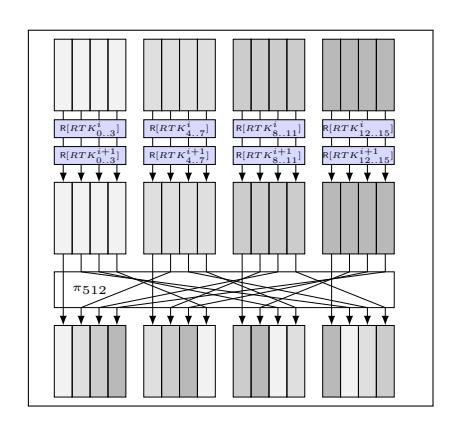
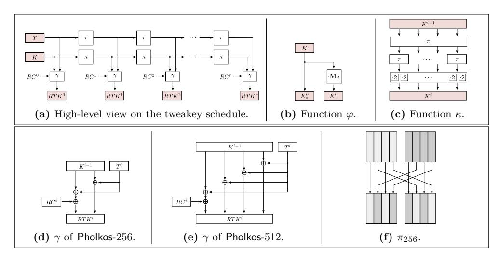
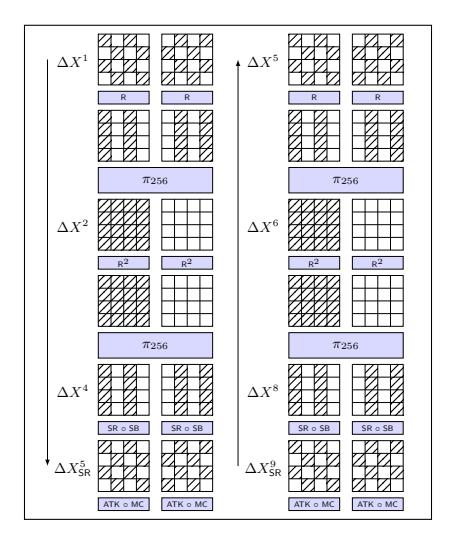
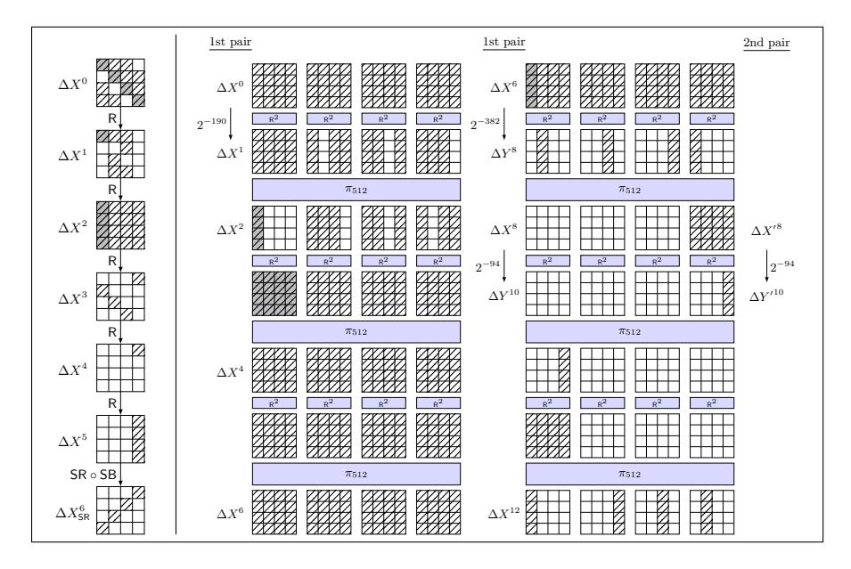
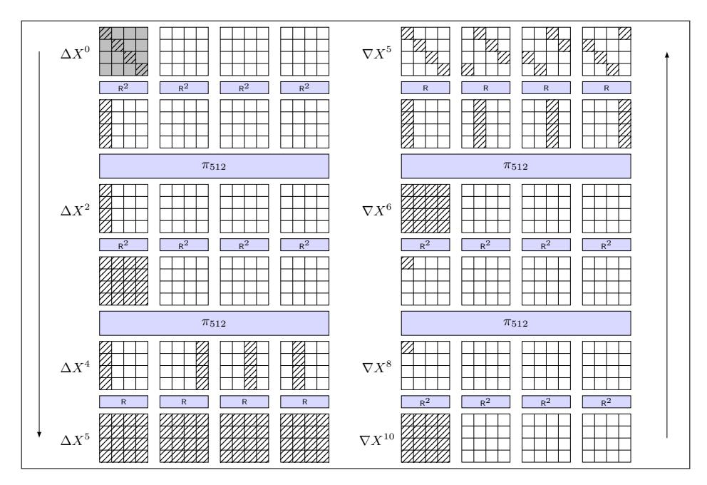
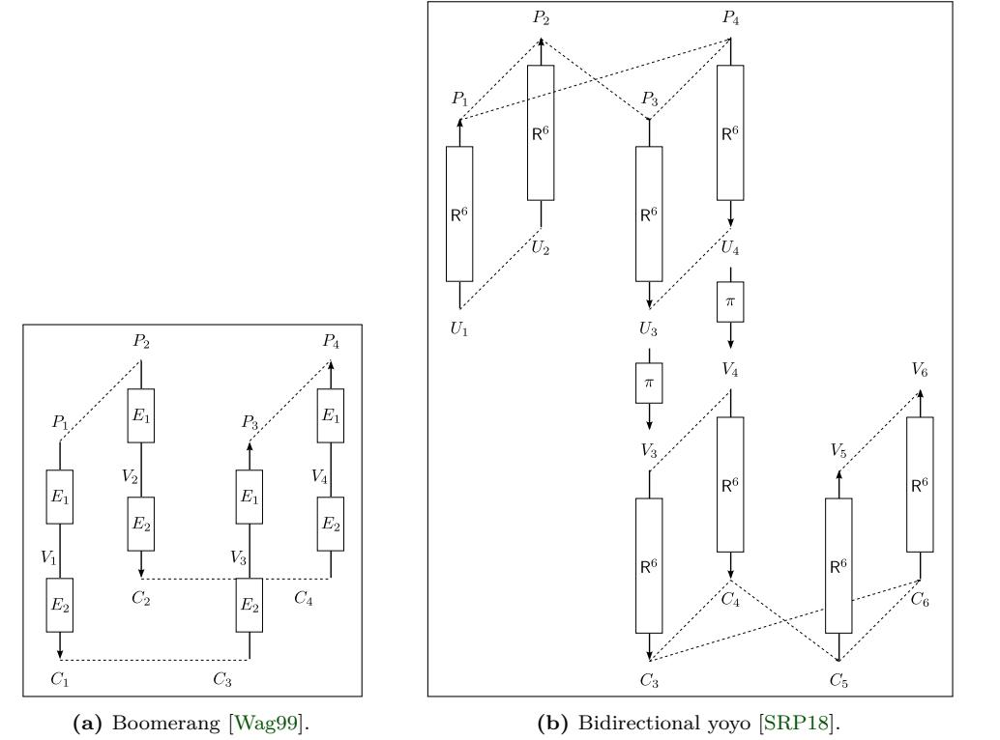
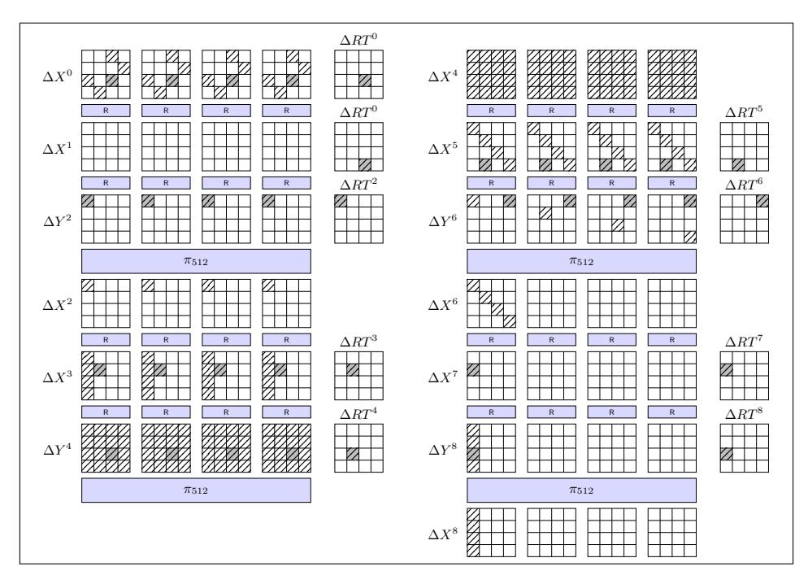
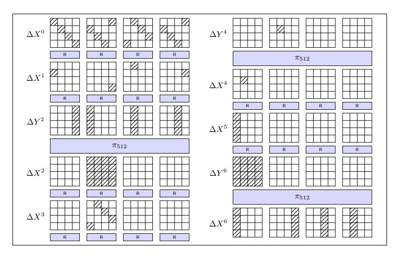
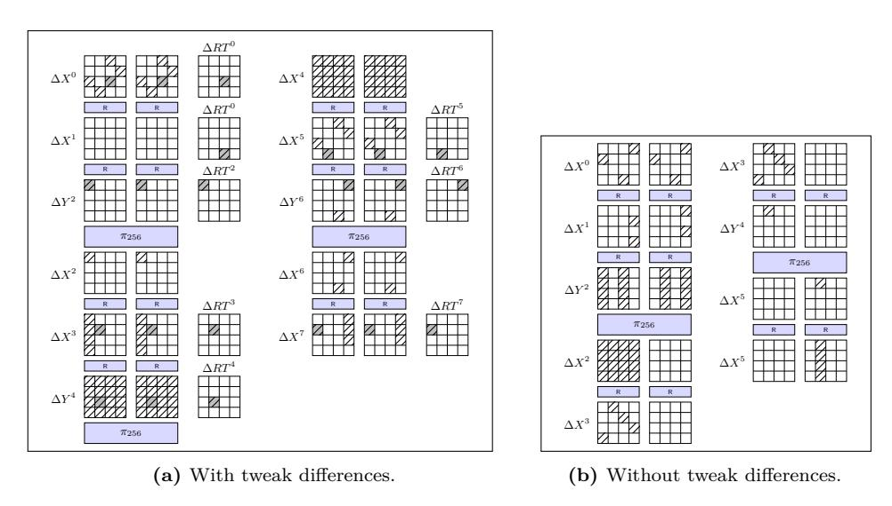

# **Pholkos – Efficient Large-state Tweakable Block Ciphers from the AES Round Function**

Jannis Bossert, Eik List, Stefan Lucks and Sebastian Schmitz

Bauhaus-Universität Weimar, Weimar Germany <firstname>.<lastname>(at)uni-weimar.de

**Abstract.** With the dawn of quantum computers, higher security than 128 bits has become desirable for primitives and modes. During the past decade, highly secure hash functions, MACs, and encryption schemes have been built primarily on top of keyless permutations, which simplified their analyses and implementation due to the absence of a key schedule. However, the security of these modes is most often limited to the birthday bound of the state size, and their analysis may require a different security model than the easier-to-handle secret-permutation setting. Yet, larger state and key sizes are desirable not only for permutations but also for other primitives such as block ciphers. Using the additional public input of tweakable block ciphers for domain separation allows for exceptionally high security or performance as recently proposed modes have shown. Therefore, it appears natural to ask for such designs. While security is fundamental for cryptographic primitives, performance is of similar relevance. Since 2009, processor-integrated instructions have allowed high throughput for the AES round function, which already motivated various constructions based on it. Moreover, the four-fold vectorization of the AES instruction sets in Intel's Ice Lake architecture is yet another leap in terms of performance and gives rise to exploit the AES round function for even more efficient designs.

This work tries to combine all aspects above into a primitive and to build upon years of existing analysis on its components. We propose Pholkos, a family of (1) highly efficient, (2) highly secure, and (3) tweakable block ciphers. Pholkos is no novel round-function design, but utilizes the AES round function, following design ideas of Haraka and AESQ to profit from earlier analysis results. It extends them to build a family of primitives with state and key sizes of 256 and 512 bits for flexible applications, providing high security at high performance. Moreover, we propose its usage with a 128-bit tweak to instantiate high-security encryption and authentication schemes such as SCT, ΘCB3, or ZAE. We study its resistance against the common attack vectors, including differential, linear, and integral distinguishers using a MILP-based approach and show an isomorphism from the AES to Pholkos-512 for bounding impossible-differential, or exchange distinguishers from the AES. Our proposals encrypt at around 1–2 cycles per byte on Skylake processors, while supporting a much more general application range and considerably higher security guarantees than comparable primitives and modes such as PAEQ/AESQ, AEGIS, Tiaoxin346, or Simpira.

**Keywords:** AES · tweakable block cipher · cryptanalysis · permutation

### **1 Introduction**

**Large-state Block Ciphers.** The capabilities of quantum computing threaten the security of many cryptographic algorithms. While this threat is of strictly theoretical nature at the moment, it might become relevant sooner than expected. Symmetric-key systems are usually unaffected by Shor's algorithm [\[Sho97\]](#page-24-0), yet Grover's algorithm [\[Gro96\]](#page-22-0) is supposed

**Table 1:** AESQ-like permutations and large-state block ciphers. RF = round function, Perm. = permutation, (T)BC = (tweakable) block cipher, SPN = substitution-permutation network.

| Construction                          | Type | Base         | Versions (n-k-t in bits) |         |                                       |  |  |  |  |  |  |
|---------------------------------------|------|--------------|--------------------------|---------|---------------------------------------|--|--|--|--|--|--|
| Permutations                          |      |              |                          |         |                                       |  |  |  |  |  |  |
| AESQ [BK14a]                          |      | Perm. AES RF | 512                      |         |                                       |  |  |  |  |  |  |
| Haraka π256 v2 [KLMR16b]              |      | Perm. AES RF | 256                      |         |                                       |  |  |  |  |  |  |
| Haraka π512 v2 [KLMR16b] Perm. AES RF |      |              | 512                      |         |                                       |  |  |  |  |  |  |
| Block ciphers                         |      |              |                          |         |                                       |  |  |  |  |  |  |
| ThreeFish [FLS+10]                    | TBC  | ARX          |                          |         | 256-256-128 512-512-128 1024-1024-128 |  |  |  |  |  |  |
| Kalyna [Oli15]                        | BC   | SPN          | 128-128                  | 256-256 | 512-512                               |  |  |  |  |  |  |

to reduce the complexity of the exhaustive key search from *O*(2*<sup>n</sup>*) to *O*(2*n/*<sup>2</sup> ) operations (cf. [\[ABB](#page-19-0)<sup>+</sup>15]). Thus, it is commonly recommended to switch to key lengths of at least 256 bits for 128-bit security [\[ABB](#page-19-0)<sup>+</sup>15, [Lil16\]](#page-23-1). Therefore, primitives with larger block and key sizes can provide long-term security also in the presence of quantum computers. Doubling the key length is a useful rule of thumb; however the true impact remains to be understood better. Kaplan et al. [\[KLLN16\]](#page-23-2) introduced two settings of quantum attacks (LQ1 and LQ2), wherein the adversary can employ quantum-computational resources. While it can ask only conventional queries and perform quantum evaluations in the former, the latter model also allows quantum queries. Kaplan et al. found that the former model might lead to little gains compared to classical attacks when the key length is similar to the block length. Yet, attacks can have significant gains when the key is longer. Thus, an increase of both block *and* key length can be effective in both models.

**Larger Block Sizes** come along with higher security guarantees in modes and reduce the risk of missed key updates. Usually, block ciphers shall provide security for up to 2 min(*k,n*) encryptions, where *k* denotes the key and *n* the block length. Numerous widespread schemes and modes for block-cipher-based authentication, encryption, or authenticated encryption limit the security to the birthday bound of the primitive, i.e., to at most 2 *n/*2 calls to the primitive. This includes the well-known modes CTR, CBC, GCM [\[MV04\]](#page-23-3), or OCB [\[Rog03\]](#page-24-2). While birthday-bound collisions are often beyond reach when ciphers with state sizes of *n* = 128-bit are employed, the key must be changed well before the processed data reaches the bound. Rekeying can – while easily be forgotten – lead to severe privacy breaches, as has been demonstrated for 64-bit ciphers [\[BL16\]](#page-20-1). Primitives with larger block sizes can encrypt more data under the same key, decreasing this risk.

For settings that need preimage or collision requirements, existing block-cipher implementations allow being transformed into a compression function, e.g., using the Davies-Meyer, or Matyas-Meyer-Oseas conversions. Though, their collision resistance is also limited to 2 *n/*2 calls. Similarly, the security of Wegman-Carter MACs [\[WC79\]](#page-25-0) (as in GCM) falls down to the birthday bound. While the complexity class of the attacks is independent of the block and key sizes, increasing *n* obviously increases the practical security of these schemes compared to instantiations with smaller block sizes.

**The AES [\[NIS01\]](#page-24-3)** is probably the most widespread block cipher. Since its publication, it received vast amounts of analysis and earned the trust of the cryptographic community. Constructions based on the AES round function can profit not only from the existing analysis of the AES, but also from highly performant hardware instruction sets in widespread desktop, server, and mobile processors. Using these operations as building blocks promises great performance on these platforms. From the tenth-generation core-i models, Intel provided the \_mm512\_aesenc\_epi128 instruction that is expected to further increase the throughput by a factor of roughly four [\[DGK19,](#page-21-0) [Int17,](#page-22-2) [Int19\]](#page-22-3).

**Few Block Ciphers** and many keyless permutations – already transform larger states based on the AES. Among AES-based constructions, the AESQ permutation under the CAESAR candidate PAEQ [\[BK14a,](#page-20-0) [BK14b\]](#page-20-2) is an AES-based 512-bit permutation that transforms four parallel AES-states. Each of these substates is transformed individually through two rounds of AES (a step). To spread the diffusion over the complete state, after each but the last step, the 32-bit words of all substates are mixed by a word-wise permutation. Despite its state size, its designers claimed a security of only 256-bits. The hash function Haraka (v1) [\[KLMR16a\]](#page-23-4) and Haraka v2 [\[KLMR16b\]](#page-23-0) use a similar approach; we focus on v2 hereafter. Haraka-*n* employs a permutation *π<sup>n</sup>* over F *n* 2 that consists of five steps of an AESQ-like design. The hash function then uses *π<sup>n</sup>* with a simple Davies-Meyer feed-forward, and truncates the output to 256 bits for the version with larger state. Since the designers focused on 256-bit (second-)preimage security for short inputs, they could reduce the number of steps to five. It differs from AESQ only in the chosen round constants and the permutation between the steps. While the first version suffered from invariants that allowed collision and preimage attacks [\[Jea16\]](#page-22-4), Haraka v2 [\[KLMR16b\]](#page-23-0) addressed the observations by Jean with an appropriate choice of round constants.

Besides permutations, a few large-state block ciphers exist in literature, e.g., the ThreeFish family underneath the SHA-3 finalist Skein [\[FLS](#page-22-1)<sup>+</sup>10] is based on modular addition, XOR and rotations. Moreover, the Ukrainian block-cipher standard Kalyna [\[Oli15\]](#page-24-1) is a recent Rijndael-like SPN with state and key lengths of 128, 256, and 512 bits.

Furthermore, three works considered the construction of keystream generators from the AES round function: AEGIS [\[WP15\]](#page-25-1), Tiaoxin346 [\[Nik16\]](#page-24-4), and the constructions by Jean and Nikolić [\[JN16\]](#page-22-5). They received considerable attention from the community for their very high performance, that is 0*.*25 (AEGIS 128L [\[WP15\]](#page-25-1)), 0*.*1875 (Tiaoxin346 [\[Nik16\]](#page-24-4)) or even only 0*.*125 cycles per byte for particular choices from [\[JN16\]](#page-22-5), respectively. However, they represent key-stream generators whose security has been limited to 128 bits under nonce-respecting adversaries. In contrast, this work aims at primitives with flexible usage and high security guarantees without nonces.

**Tweakable Block Ciphers (TBCs)** [\[LRW02\]](#page-23-5) serve useful for modes that demand a primitive with several domains. They add an additional public input called the tweak to the common state and key that can be used as efficient means for separating domains, boosting the security e.g., in MACs [\[CLS17,](#page-21-1) [IMPS17,](#page-22-6) [Nai15\]](#page-24-5), modes [\[PS16\]](#page-24-6), and authenticated encryption schemes [\[JNP16,](#page-23-6) [BGIM19\]](#page-19-1).

Various block-cipher-based modes demand multiple independent primitive instances for their security arguments to hold, e.g., CBC-MAC [\[ISO99\]](#page-22-7), GCM-SIV-*r* [\[IM16\]](#page-22-8), or Encrypted Davies Meyer (EDM) [\[MN17\]](#page-23-7). In practice, this is realized by multiple independent keys, which implies more memory, and additional operations. While some modes have seen follow-up proposals that could reduce the number of keys (e.g., CMAC [\[Dwo16\]](#page-22-9) that is MAC5 in [\[ISO11\]](#page-22-10) for CBC-MAC or the single-permutation variant of EDM [\[CS18\]](#page-21-2)), their design and analysis are more sophisticated and in some cases need to maintain additional state or operations compared to a single-primitive variant.

For such purposes, a small tweak space suffices to represent a small number of domains and simplify the designs greatly, which benefits the time and focus of cryptanalyst. Though, it opens new attack vectors, where the attacker can utilize relations between different tweaks, and a strategy is needed. One such well-studied approach for incorporating a tweak into a key schedule, Jean et al. [\[JNP14\]](#page-22-11) proposed the TWEAKEY approach for a schedule that treated key and tweak words in a unified manner.

**Contribution.** We propose Pholkos, a family of large-state tweakable block ciphers based on the AES round function and the design strategy of two-round steps from Haraka v2 and AESQ. Thus, it can benefit greatly from the existing analysis, as well as the high

performance of the AES on modern CPUs. The members of Pholkos possesses block sizes of  $n \in \{256, 512\}$  bits, respectively and employ a key that matches the block length, or a 256-bit key, in conjunction with a 128-bit tweak. In comparison with AESQ and Haraka, our proposal adds a tweakey schedule for highly performant encryption with high security guarantees. Moreover, our proposal targets higher security guarantees than AEGIS, Tiaoxin346, or the proposals from [JN16].

On Intel Skylake, Pholkos can encrypt at approximately 1.5 cycles per byte, depending on the version. For all constructions, we show their security according to their key sizes in the standard and the related-tweak model against differential, linear, and integral distinguishers. For the variants with 256-bit key, we claim 256-bit security also in the related-tweakey model. Besides the most important attacks, we provide security arguments w.r.t. zero-correlation, boomerang-type, yoyo, mixture, and meet-in-the-middle attacks.

**Outline.** In what remains, we briefly provide basic notations in Section 2, before we specify Pholkos in Section 3. Section 4 will give a design rationale. Thereupon, an initial security analysis is given in Section 5, followed by a short comment on the software implementation of Pholkos and its performance in Section 6 and Section 7 concludes.

### <span id="page-3-0"></span>2 Preliminaries

**General Notations.** We denote by  $\mathbb{F}_2$  the finite field of characteristic two. For positive integer n, we denote by  $\mathbb{F}_2^n$  the field of n-element vectors from  $\mathbb{F}$  that can be represented by n-bit strings. We represent functions by uppercase and indices by lowercase letters.  $\{0,1\}^n$  is the set of all n-bit strings and  $\{0,1\}^*$  the set of bit strings of arbitrary length. Let  $X,Y\in\mathbb{F}_2^n$ ; we index bits as  $X=(X_{n-1}\dots X_1X_0)$  where  $X_{n-1}$  is the most significant and  $X_0$  the least significant bit of X. For  $t\leq n$ ,  $\mathsf{msb}_t(X)$  returns the t most significant bits, and  $\mathsf{lsb}_t(X)$  the t least significant bits of X. For a given set  $\mathcal{X}$ , let  $\mathsf{Perm}(\mathcal{X})$  denote the set of all permutations over  $\mathcal{X}$ . For a bit string X, we write  $(X_0,\dots,X_{w-1}) \stackrel{r}{\leftarrow} X$  for the unique splitting of X into n-bit parts s. t.  $|X_i| = n$  for  $0 \leq i < w - 1$ ,  $|X_{w-1}| \leq n$ , and  $(X_0 \parallel \dots \parallel X_{w-1}) = X$ .

Brief Definition of The AES-128. We assume that the reader is already familiar with the details of the AES, so that a brief summary in the following will suffice. Details can be found in, e.g., [DR02, NIS01]. The AES-128 is a substitution-permutation network (SPN) that transforms 128-bit inputs through ten rounds, consisting of SubBytes (SB), ShiftRows (SR), MixColumns (MC), and a round-key addition (AK) with a round key  $K^i$ . Before the first round, a whitening key  $K^0$  is XORed to the state; the final round omits the MixColumns operation. We write  $S^i$  for the state after Round i, and  $S^i[j]$  for the j-th byte, for  $0 \le i \le 10$  and  $0 \le j \le 15$ . Though, we will interchangeably also use the indices for a  $4 \times 4$ -byte matrix, i.e., 0,0 for Byte 0, and 3,3 for Byte 15. So, the byte order is

$$\begin{bmatrix} 0 & 4 & 8 & 12 \\ 1 & 5 & 9 & 13 \\ 2 & 6 & 10 & 14 \\ 3 & 7 & 11 & 15 \end{bmatrix}.$$

We assume that two-dimensional indices are taken modulo four to simplify the write-up.  $R[K^i] = {}^{\mathrm{def}} \mathsf{AK}[K^i] \circ \mathsf{MC} \circ \mathsf{SR} \circ \mathsf{SB}$  denotes one application of the round function. We denote by  $\widehat{\mathsf{R}}[K^i] = {}^{\mathrm{def}} \mathsf{AK}[K^i] \circ \mathsf{SR} \circ \mathsf{SB}$  the application of the round function without the MixColumns operation and define  $\widehat{\mathsf{R}}[K^i]^{-1}$  in the natural manner.  $S^{r,\mathsf{SB}}$ ,  $S^{r,\mathsf{SR}}$ , and  $S^{r,\mathsf{MC}}$  denote the states in the r-th round directly after the application of SubBytes, ShiftRows,

<span id="page-4-2"></span>**Table 2:** Versions and parameters of Pholkos. Std. = standard model, RT = related-tweak, RTK = related-tweakey.

| ··· · · · · · · · · · · · · · · · · ·        |                |       |      |        |                 |     |     |  |  |  |  |
|----------------------------------------------|----------------|-------|------|--------|-----------------|-----|-----|--|--|--|--|
|                                              | Size           | es (b | its) | #Steps | Security (bits) |     |     |  |  |  |  |
| Version                                      | $\overline{n}$ | k     | t    | s      | Std.            | RT  | RTK |  |  |  |  |
| Pholkos-256-256                              | 256            | 256   | 128  | 8      | 256             | 256 | 256 |  |  |  |  |
| ${\sf Pholkos\text{-}}256\text{-perm}$       | 256            | -     | 128  | 12     | 256             | 256 | 256 |  |  |  |  |
| Pholkos-512-256                              | 512            | 256   | 128  | 10     | 512             | 512 | 256 |  |  |  |  |
| ${\sf Pholkos}\text{-}512\text{-}512$        | 512            | 512   | 128  | 10     | 512             | 256 | -   |  |  |  |  |
| ${\sf Pholkos}\text{-}512\text{-}{\sf perm}$ | 512            | _     | 128  | 14     | 512             | 256 | _   |  |  |  |  |

<span id="page-4-1"></span>

Figure 1: Step of Pholkos-512.

and MixColumns, respectively. Moreover, we will use  $\mathbf{M}$  for the MixColumns matrix. For the AES, MixColumns interprets each input byte as element in  $\mathbb{F}_{2^8}$  with the irreducible polynomial  $p(\mathbf{x}) = \mathbf{x}^8 + \mathbf{x}^4 + \mathbf{x}^3 + \mathbf{x} + \mathbf{1}$ . In the remainder, we use  $\mathbb{F}_{2^8}$  to refer to this field.

## <span id="page-4-0"></span>3 Specification

This section specifies the family of tweakable block ciphers Pholkos. We refer to the instances as Pholkos-n-k, with a block size of n, a key size of k, and a tweak size of 128 bits. Moreover, to address all instances of the same block size, we will use Pholkos-n. In particular, we consider Pholkos-256 and Pholkos-512. Furthermore, we refer to the to the unkeyed permutations as Pholkos-n-perm.

**Components.** Pholkos employs a k-bit key K, a 128-bit tweak T, and an n-bit input M. Pholkos is an SPN built using the wide-trail strategy and the same core principle as for AESQ or Haraka. The plaintext is transformed to a ciphertext block C through s steps. We denote the state after Round i by  $X^i$ . So, the state  $X^0$  is initialized with the plaintext M. The n-bit state  $X^i$  is partitioned into  $v = ^{\text{def}} n/128$  substates of 128 bits. These substates are split again into four 32-bit words each:  $X^i = (X^i_0, \dots, X^i_{w-1})$ . A cell (or byte) is an element in  $\mathbb{F}_{2^8}$  as for the AES. We use  $w = ^{\text{def}} 4v$  for the number of words and  $m = ^{\text{def}} 32$  for the word length in bits.

#### 3.1 Step Function

A step transforms the substates in  $r_s = ^{\operatorname{def}} 2$  AES rounds individually. Thereupon, a wordwise permutation  $\pi \in \operatorname{Perm}(\mathbb{Z}_w)$  shuffles the words across the substates. An AES round refers to the operation sequence of  $\operatorname{R}[RTK_j^i](X_j^{i-1}) = \operatorname{ATK}[RTK_j^i] \oplus \operatorname{MC}(\operatorname{SR}(\operatorname{SB}(X_j^{i-1})))$  to a substate  $X_j^{i-1}$ . We use  $\widehat{\operatorname{R}}[RTK_j^i](X_j^{i-1}) = \operatorname{ATK}[RTK_j^i] \oplus \operatorname{SR}(\operatorname{SB}(X_j^{i-1}))$  for the sequence with MixColumns omitted. We call the addition of the round tweakey  $RTK_j^i$  AddRoundTweakey (ATK). For Pholkos-512, this is illustrated in Figure 1. Initially, the round tweakey  $RTK_j^0$  is XORed into the plaintest such that a total of

Initially, the round tweakey  $RTK^0$  is XORed into the plaintext such that a total of  $r_s \cdot s + 1$  round tweakeys are required for a full encryption. We denote by  $RTK^i = (RTK_0^i, \ldots, RTK_{w-1}^i)$  the round tweakey for the end of Round i. Moreover, we denote by s the number of steps, by  $r_s = ^{\text{def}} 2$  the number of rounds per step, and thus by  $r = ^{\text{def}} s \cdot r_s$  the total number of rounds. Rounds are counted from 1..r; the numbers of proposed rounds for the instances are summarized in Table 2.

#### <span id="page-5-0"></span>**Algorithm 1** Definition of Pholkos-*n-k*

```
11: function ENCRYPT _{K}^{T}(M)
12: RTK \leftarrow Schedule(K, T)
13: X^{0} \leftarrow M \oplus RTK^{0}
                                                                                                            51: function Decrypt _{K}^{T}(C)
                                                                                                            52: X^{r_s \cdot s} \stackrel{m}{\longleftarrow} C
                                                                                                                      RTK \leftarrow \mathsf{Schedule}(K,T)
                                                                                                            53:
          for i \leftarrow 1..s - 1 do
Y^{r_s \cdot i} \leftarrow \mathsf{Step}(RTK, X^{r_s \cdot (i-1)})
                                                                                                                      Y^{r_s \cdot s} \leftarrow X^{r_s \cdot s} 
 X^{r_s \cdot (s-1)} \leftarrow \operatorname{Step}^{-1}(RTK, Y^{r_s \cdot s})
                                                                                                            54:
                                                                                                            55:
15:
                                                                                                                     \begin{array}{c} \text{for } i \leftarrow s \text{ down to } 1 \text{ do} \\ Y^{r_s \cdot i} \leftarrow \text{PermuteWords}(\pi_n^{-1}, X^{r_s \cdot i}) \end{array}
             X^{r_s \cdot i} \leftarrow \mathsf{PermuteWords}(\pi_n, Y^{r_s' \cdot i})
                                                                                                            56:
16:
          Y^{r_s \cdot s} \leftarrow \mathsf{Step}(RTK, X^{r_s \cdot (s-1)})
                                                                                                            57:
17:
                                                                                                                        X^{r_s \cdot (i-1)} \leftarrow \mathsf{Step}^{-1}(RTK, Y^{r_s \cdot i})
                                                                                                            58:
18:
          X^{r_s \cdot i} \leftarrow Y^{r_s}
                                                                                                                      M \leftarrow (X_0^0 \parallel \cdots \parallel X_{w-1}^0) \oplus RTK^0
          C \leftarrow (X_0^s \parallel \cdots \parallel X_{w-1}^s)
return C
                                                                                                            59:
20:
                                                                                                            60:
                                                                                                                       return M
                                                                                                            61: function Step<sup>-1</sup> (RTK, Y^i)
21: function Step(RTK, X^i)
                                                                                                                      (RTK^{0}, \dots, RTK^{r}) \leftarrow RTK
(X_{0}^{i}, \dots, X_{w-1}^{i}) \leftarrow Y^{i}
          (RTK^{0}, \dots, RTK^{r}) \leftarrow RTK
(X_{0}^{i}, \dots, X_{w-1}^{i}) \leftarrow X^{i}
for \ell \leftarrow 1..r_{s} do
                                                                                                            62:
                                                                                                            63.
23:
24:
                                                                                                                       for \ell \leftarrow 1..r_s do
                                                                                                            64:
                                                                                                                         \begin{array}{l} \text{for } j \leftarrow 0..w - 1 \text{ do} \\ \text{if } i + \ell < r \text{ then} \\ X_j^{i-\ell} \leftarrow \mathsf{R}[RTK_j^{i+1-\ell}]^{-1}(X_j^{i+1-\ell}) \end{array}
25:
             for j \leftarrow 0..w - 1 do
                                                                                                            65:
               if i+\ell < r then X_j^{i+\ell} \leftarrow \mathsf{R}[RTK_j^{i+\ell}](X_j^{i+\ell})
                                                                                                            66:
26:
                                                                                      ▶ Words
27:
                \mathbf{els}_{X_{j}^{i+\ell}}^{\mathbf{c}} \leftarrow \widehat{\mathbf{R}}[RTK_{j}^{i+\ell}](X_{j}^{i+\ell})
                                                                                                                            \operatorname*{else}_{X_{j}^{i-\ell}}^{s} \leftarrow \widehat{\mathsf{R}}[RTK_{j}^{i+1-\ell}]^{-1}(X_{j}^{i+1-\ell})
28:
                                                                                      ▶ Words
                                                                                                            68:
                                                                                                            69:
29:
                                                                                                                       \stackrel{\cdot}{\mathbf{return}} X^{i-r_s}
          return X^{i+r_s}
                                                                                                            70:
30:
                                                                                                            71: function \kappa(\pi, K^{i-1})
31: function SCHEDULE(K, T)
         K^0 \leftarrow \varphi_k(K)

T^0 \leftarrow T
                                                                                                                       for j \leftarrow 0..w - 1 do
                                                                                                                        K_j^i \leftarrow K_{\pi(j)}^{i-1}
33:
          RTK^0 \leftarrow \gamma(RC^0, K^0, T^0)
34:
                                                                                                                       for j \leftarrow 0..v - 1 do

⊳ Substates

          for i \leftarrow 1..r do
T^{i} \leftarrow \tau(T^{i-1})
35:
                                                                                                            75:
                                                                                                                         K_i^i \leftarrow \tau(K_i^i)
36:
                                                                                                                         for b \leftarrow 0..15 do
K_j^i[b] \leftarrow 2 \cdot K_i^i[b]
             K^i \leftarrow \kappa(K^{i-1})
                                                                                                           76:
77:
                                                                                                                                                                                                     ▷ Cells
37:
             RTK^i \leftarrow \gamma(RC^i, K^i, T^i)
38:
                                                                                                            78:
                                                                                                                     return (K_0^i, \ldots, K_{w-1}^i)
          return (RTK^0, \dots, RTK^r)
39:
41: function \gamma(RC^i, K^i, T^i)
                                                                                                            81: function \tau(K_i^i)
        for j \leftarrow 0..w - 1 do
                                                                                      ▶ Words
                                                                                                            82: L_i^i \leftarrow K_i^i
           RTK_i^i \leftarrow K_i^i \oplus T_{i \bmod 4}^i
                                                                                                                       for b \leftarrow 0..15 do
                                                                                                            83:
                                                                                                                                                                                                      ▶ Cells
44:
          RTK_0^i \leftarrow RTK_0^i \oplus RC^i
                                                                                                            84:
                                                                                                                       L_{i}^{i}[b] = K_{i}^{i}[\pi_{\tau}(b)]
45:
          return (RTK_0^i, \ldots, RTK_{w-1}^i)
                                                                                                            85:
                                                                                                                     return L^i
46: function PermuteWords(\pi, Y^i)
                                                                                                            86: function \varphi_k(K)
          47:
                                                                                      ⊳ Words
                                                                                                            87:
                                                                                                                      if |K| \ge k then
                                                                                                                         return K
48:
                                                                                                            88:
                                                                                                                       return msb_k(K \parallel \mathbf{M}_A \cdot K \parallel \mathbf{M}_B \cdot K \parallel \mathbf{M}_C \cdot K)
           \mathbf{return}\ X^i
```

For the plaintext  $X^0$  and for all odd values of i, the state  $X^i$  represents the state after the i-th round. For even values i > 0, we denote the state directly after the i-th round and before the application of  $\pi$  as  $Y^i$ ;  $X^i$  is used to refer to the state directly after the words of  $Y^i$  have been permuted by  $\pi$ . So,  $X^r$  represents the ciphertext.

The Word-wise Permutation  $\pi$  differs between the proposed instantiations of Pholkos, and from those used in Haraka and AESQ. We denote the word-wise permutations in Pholkos-n as  $\pi_n$ . Each permutation  $\pi_n$  transfers the word at index  $Y^i_{\pi(j)}$  to position j:  $X^i_j \leftarrow Y^i_{\pi(j)}$ . Algorithm 1 provides the specifications of the permutation, Figure 1 and 2f illustrate them for clarity. In the final step, the permutation is omitted and the final AES round functions are invoked without the MixColumns operation similarly as for the AES.

#### 3.2 Tweakey Schedule

The tweakey schedule [JNP14] generates round tweakeys from the secret key and tweak. While the schedule of Pholkos follows the general route from the STK, our proposal keeps the lanes for the tweak and the key separated, both of which are processed in parallel as

**Table 3:** The word-wise permutations  $\pi$  for the individual versions.

|              | i  |    |    |    |    |   |    |   |   |    |    |    |    |    |    |    |
|--------------|----|----|----|----|----|---|----|---|---|----|----|----|----|----|----|----|
| Permutation  | 0  | 1  | 2  | 3  | 4  | 5 | 6  | 7 | 8 | 9  | 10 | 11 | 12 | 13 | 14 | 15 |
| $\pi_{256}$  | 0  | 5  | 2  | 7  | 4  | 1 | 6  | 3 |   |    |    |    |    |    |    |    |
| $\pi_{512}$  | 0  | 5  | 10 | 15 | 4  | 9 | 14 | 3 | 8 | 13 | 2  | 7  | 12 | 1  | 6  | 11 |
| $\pi_{\tau}$ | 11 | 12 | 1  | 2  | 15 | 0 | 5  | 6 | 3 | 4  | 9  | 10 | 7  | 8  | 13 | 14 |

<span id="page-6-3"></span><span id="page-6-1"></span>

<span id="page-6-0"></span>Figure 2: Components of the tweakey schedule of Pholkos.

depicted in Figure 2a.<sup>1</sup> The schedule initializes a key state  $K^0 \leftarrow K$  and a tweak state  $T^0 \leftarrow T$ . Each tweakey schedule round applies in parallel the update function  $\tau$  to obtain  $T^i \leftarrow \tau(T^{i-1})$  from the previous tweak state and  $\kappa$  to compute  $K^i \leftarrow \tau(K^{i-1})$ , where  $\tau$  is a permutation of the cells. The lanes are then combined in a function  $\gamma$  to derive the round tweakey  $RTK^i \leftarrow \gamma(K^i, T^i, RC^i)$ , where  $RC^i$  is the round constant for the *i*-th round. The initial round tweakey  $RTK^0$  is derived before the first call to the update functions. In  $\gamma$ , the tweak state  $T^i$  is XORed to every 128-bit substate of the key state  $K^i$ ; the round constant  $RC^i$  is XORed to the first substate of  $K^i$  as visible in Figure 2:

$$RTK_{j}^{i} \leftarrow \begin{cases} K_{j}^{i} \oplus T_{j \bmod 4}^{i} \oplus RC^{i} & \text{if } j = 0 \\ K_{j}^{i} \oplus T_{j \bmod 4}^{i} & \text{otherwise.} \end{cases}$$

The tweak-update function  $\tau$  is instantiated by  $\pi_{\tau}$ . In the key-update function  $\kappa$ , the round key  $RK^i$  is first permuted with the word-wise permutation  $\pi_n$  from the step permutation. Next,  $\tau$  is applied to each substate before each cell of the round key is doubled in  $\mathbb{F}_{2^8}$ .

**Round Constants.** The round constants in Pholkos are 128-bit constants to destroy symmetries between and inside the different substates. As for Haraka v2 [KLMR16b], they are derived from the initial digits of the number  $\pi$  to represent "nothing-up-my-sleeve" numbers. For self-containment, they are listed in Table 11 in Appendix A. Each member of Pholkos with r rounds employs the first 2r+1 round constants for  $RTK^0$  through  $RTK^{2r}$ .

**Key Expansion.** All versions of Pholkos can be used as block cipher with a 256-bit key. The secret key is initially expanded to the block length by a function  $\varphi : \mathbb{F}_2^k \to \mathbb{F}_2^n$ , for

<span id="page-6-2"></span><sup>&</sup>lt;sup>1</sup>The term *lane* is used as equivalent to the term *word* in [JNP14, Sect. 3.2].

Pholkos-512. The leftmost 256 bits of the generated key employ the original secret key K. All subsequent 256-bit chunks are generated from the multiplication of K with a circulant matrix each. So, the key is interpreted as word vector  $K = (K_0, \ldots, K_7)$ . To create up to 512 bits of key material, a binary matrix  $\mathbf{M}_A \in (\mathbb{F}_{2^{32}})^{8 \times 8}$  is used, whose entries consist of  $\{0,1\}$  and that possesses branch number of four:  $\mathbf{M}_A = ^{\text{def}} \operatorname{circ}(11001000)$ . The expanded key words are named  $(K_8, \ldots, K_{15}) = ^{\text{def}} \mathbf{M}_A \cdot (K_0, \ldots, K_7)^{\top}$ .

**Security Claims.** For all variants of Pholkos-n-k, we claim security of up to  $D \cdot T \in O(2^{\min(k,n)})$  for T time and D data in the standard and related-tweak model against known attacks, which is equivalent to saying  $\min(k,n)$  bits of security. As the standard model, we mean that the adversary has control over only the plaintext or ciphertexts, but the tweak is constant and the key random and secret. In the related-tweak model, it can also choose the tweaks. For the permutations Pholkos-n-perm, we claim n-bit security against structural attacks (rebound etc.) in the standard and the related-tweak model. In the related-tweakey model, the adversary can choose all parts of the key. Here, we claim **only** 256-bit security for Pholkos-256, and Pholkos-512-256. We do **not** claim any related-tweakey security for Pholkos-512-512.

## <span id="page-7-0"></span>4 Design Rationale

This section explains our design choices for the components of Pholkos.

### 4.1 Step Function

The AES has been subject to a tremendous amount of cryptanalysis, which allows to derive security bounds more efficiently. Furthermore, common off-the-shelf general-purpose processors provide hardware instructions that boost its efficiency and allow parallel execution of multiple instances of the AES round function [Int17, Int19].

The PAEQ designers [BK14b] built their decision on [DLP+09]: two subsequent AES rounds (without the final MixColumns and AddRoundKey operations) can be viewed as the application of four parallel independent Super-boxes on input diagonals of 32 bits each. At the end of the second round, the application of ShiftRows and MixColumns mixes them. Thus, the AES can be viewed as a five-round SPN with Super-boxes. The branch number among active input and output columns is maximal, i.e., five. As a result, it is guaranteed that a single active cell leads to a fully active AES state after two rounds.

This principle has been scaled up by one more iteration by AESQ. Its word permutation ensured that exactly one out of the four words from each substate will be transferred to each substate between the steps (as ShiftRows does for the small AES). Consequently, one can also view four rounds in AESQ (step, word-wise permutation, step) as the parallel application of four Mega-boxes, a term that had been coined by Daemen et al. [DLP+09]. Again, this view also yields an SPN with a branch number of five in terms of active substates. The designers of Haraka [KLMR16a, KLMR16b] experimented also with different permutations in between, e.g., they employed byte-wise permutations, or blending parts of the state. Their choice for a similar permutation was performance-driven at the end. Moreover, the choice of  $r_s = 2$  AES rounds is natural since it allows the arguments on the differential bounds above, plus is minimal for achieving full diffusion inside the individual substates.

#### 4.2 The Choice of The Permutations $\pi$

For the permutation over the complete state, three approaches were considered. The first tried to replace word-wise permutations with a SPARX-like mixing layer. Furthermore, the effect of increasing the permutation word sizes in order to reduce the number of necessary

instructions was investigated. 32-bit word-wise permutations promising better security bounds than those of Haraka and AESQ were searched in order to reduce the necessary number of steps. We found that word-wise permutations of 32-bit words yielded the best security and were more performant than the SPARX-like mixing layer for equivalent levels of security. 16-bit word permutations were too slow for our purpose. In the following, we will explain why we chose the final permutations.

The permutations of both Haraka and AESQ ensure a lower bound of 150 active S-Boxes over six steps. One goal of our work was to either find a mixing layer that would improve this bound, or to show its optimality in the secret-key and the related-tweak model. In order to reach full diffusion after two steps, each substate must map exactly one word to each substate after the mixing layer. Since the words are the columns of the substate and, as explained above, two rounds of the AES round function have a branch number of five regarding the active columns, all such permutations yield the same lower bound on the number of active S-Boxes. This is due to the fact, that all columns of a state are equally probable to be active. If the permutation is changed (e.g. the first word goes to the second substate instead of the first), the differential trail can simply chose the word to be active, which goes to the first substate, without decreasing its probability. The final choice of our permutation was based on the fact that it could be implemented using the vpblendd instruction which is much faster than the punpckhdq and punpckldq instructions necessary for other permutations. Thus, the word-wise permutations preserve symmetries, which renders it crucial that the round constants destroy those symmetries. Moreover, the permutation for Pholkos-512 is equivalent to the ShiftRows operation of the AES, which simplifies the application of analysis regarding the AES to Pholkos-512.

### **4.3 Tweakey Schedule**

For a simple description, the round-tweak generation is integrated into the key schedule in a TWEAKEY-based [\[JNP14\]](#page-22-11) manner. As core property, it treated key and tweak as unit, and split both into lanes. [\[JNP14\]](#page-22-11) proposed STK construction as possible instantiation of the TWEAKEY schedule, that processes lanes of the block length in parallel. The words *STK*<sup>0</sup> , *STK*<sup>1</sup> , . . . are generated by a lane-update function to the previous words, wherein a function *h* 0 is applied to each cell individually to prevent subsequent cancellations of cell differences between the lanes.

Three important properties of STK are: (1) key and tweak word sizes are equal, (2) in each schedule round, each tweak cell is XORed with the same key cell as before, and (3) each lane is multiplied with a different factor in each round. These properties ensure that no subsequent rounds cancel differences between the lanes. We decided to use a tweak of size 128 bits, which suffices for many purposes of the tweak, such as e.g. domain separation. Moreover, the key and tweak lanes apply different cell-wise permutations. To ensure the security properties of STK for the tweakey schedule of Pholkos, we made the following decisions: We split the key into 128-bit substates and XOR the tweak into each of them. Then, the same cell-wise permutation is applied to all lanes individually to preserve the position of cells across lanes. Pholkos employs the same permutation *π<sup>n</sup>* as in the mixing layer. Next, the cell position substitution *τ* is applied to each of these subkeys and the tweak so that each cell of the tweak gets XORed to the same cells of the key every round. Since tweak updates are more frequent than key updates, we chose to multiply the key-lane by two and not that of the tweak. Thus, while we use a smaller tweak than the key, we are still able to fulfill the properties needed for the security considerations of STK. As instantiation of *π<sup>τ</sup>* , the permutation by Khoo et al. [\[KLPS17\]](#page-23-8) proved good w.r.t. to differential and meet-in-the-middle distinguishers in our analysis.

The security analysis can be seen in Section [5.](#page-9-0) Note that we claim security under the related-tweakey model only for Pholkos-256 and Pholkos-512-256.

#### **4.4 Key Expansion**

In order to generate 512 bits from a 256-bit key, we chose to use different matrix multiplications. The matrix ensures that the generated keyword is a different combination of the original key. Furthermore, each state word influences the same number of output words. Since the matrix possesses a branch number of four, it could be implemented faster than MDS codes.

### <span id="page-9-0"></span>**5 Preliminary Security Analysis**

This section presents our analysis of Pholkos w.r.t. linear and differential cryptanalysis, as well as bounds for the evaluation of the degrees. We extend our analysis to a preliminary study of the resistance against boomerangs, integrals and impossible-differential attacks. Furthermore, we consider adaptions of recent advances in AES-related attacks such as yoyo and mixture-differential attacks and their applicability to Pholkos. Still, novel attack vectors may offer advantages to potential adversaries. We motivate the cryptographic community to derive more sophisticated and fine-grained analysis than we can study.

**Existing Attacks on PAEQ and AESQ.** Several works have analyzed AESQ, its mode PAEQ/PPAE [\[BK14a\]](#page-20-0), as well as Haraka v1 [\[KLMR16b\]](#page-23-0) and Haraka v2 [\[KLMR16a\]](#page-23-4). Due to the structural similarity, all distinguishers on AESQ apply in similar manner also to Pholkos-512 when used as a permutation. Moreover, attacks in the secret-key model on *r*-round AES-128 may apply – with adaptions – also to 2*r*-round Pholkos-512.

For PPAE/PAEQ, Saha et al. [\[SKMC16,](#page-24-7) [SKMC17\]](#page-24-8) proposed meet-in-the-middle attacks on up to eight rounds with practical complexities. Their core observations was that a key length of at most 128 bits preserves the knowledge of three quarters of the state bits after almost three rounds in forward direction. While the knowledge of one fourth of the ciphertext state preserves the knowledge about one fourth of the state through three rounds in backward direction, allowing to match in the middle.

More works targeted the internal permutation of PAEQ, i.e., AESQ. Biryukov and Khovratovich considered a CICO attack (constrained-inputs constrained-outputs) [\[BDPvA11\]](#page-19-2) in 2 <sup>32</sup> on eight rounds. Moreover, they presented a rebound against 12 rounds. Bagheri et al. [\[BMS16\]](#page-20-3) reconsidered the rebound attacks, reducing the complexity of the 12-round analysis to 2 <sup>128</sup> time and memory, added time-memory trade-offs, and multi-limitedbirthday distinguishers. Most notably, they proposed an extended rebound attack on 16 rounds with 2 <sup>192</sup> computations. Saha et al. [\[SRP18\]](#page-25-2) considered yoyo attacks that we will consider in the corresponding subsection.

**Existing Attacks on Haraka.** Jean [\[Jea16\]](#page-22-4) showed five-round collisions on Haraka-256-256 v1 and 10-round preimages on Haraka-512-256 v1 with complexity of 2 <sup>192</sup>. The latter were possible due to internal symmetries from the choice of the round constants.

The designers of Haraka revised the round constants for v2 [\[KLMR16b\]](#page-23-0) to address those attacks. Their security goals targeted only resistance to (second-)preimage attacks. In [\[KLMR16b\]](#page-23-0), they presented differential bounds and of meet-in-the-middle attacks on seven rounds of Haraka-256-256 v2 and eight rounds of Haraka-512-256 v2.

While they disregarded collision attacks, they provided lower bounds for truncated differentials, indicating that there should be no second-preimage attacks for both versions after five steps, and no collisions for five-step Haraka-256-256 v2 and six-step Haraka-512-256 v2. Recently, [\[BDG](#page-19-3)<sup>+</sup>19] improved the preimage attacks for up to five steps of Haraka v2.

**Table 4:** Existing attacks on AESQ (left), and PPAE/PAEQ as well as Haraka (right). Rds. = rounds, Mem. = memory,  $p_{succ}$  = success probability, Ref. = reference, GaD = guess-and-determine, Imp. = impossible, Lim. = limited, n/a = not available.

|       |               | Con           | _           |                |         |  |  |
|-------|---------------|---------------|-------------|----------------|---------|--|--|
| #Rds. | Type          | Time          | Mem.        | $p_{\sf succ}$ | Ref.    |  |  |
| 8     | CICO          | $2^{32}$      | n/a         | n/a            | [BK14a] |  |  |
| 8     | Yoyo          | 1             | negl.       | n/a            | [SRP18] |  |  |
| 12    | Imp. Yoyo     | $2^{126}$     | negl.       | 0.84           | [SRP18] |  |  |
| 12    | Rebound       | $2^{256}$     | $2^{256}$   | 0.61           | [SRP18] |  |  |
| 12    | Rebound       | $2^{128}$     | negl.       | 0.83           | [BMS16] |  |  |
| 12    | TMTO          | $2^{102.4}$   | $2^{102.4}$ | 0.83           | [BMS16] |  |  |
| 12    | TMTO          | $2^{128-x/4}$ | $2^x$       | n/a            | [BMS16] |  |  |
| 16    | Rebound       | $2^{192}$     | $2^{128}$   | 0.83           | [BMS16] |  |  |
| 16    | Lim. birthday | $2^{188}$     | $2^{128}$   | 0.83           | [BMS16] |  |  |
| 16    | TMTO          | $2^{192+x}$   | $2^{128-x}$ | n/a            | [BMS16] |  |  |
| 16    | Imp. Yoyo     | $2^{126}$     | negl.       | 0.84           | [SRP18] |  |  |

|            |       |                      | Со        | mplexi |                |             |
|------------|-------|----------------------|-----------|--------|----------------|-------------|
| Constr.    | #Rds. | Type                 | Time      | Mem.   | $p_{\sf succ}$ | Ref.        |
| PAEQ       |       |                      |           |        |                |             |
|            | 8     | $\operatorname{GaD}$ | $2^{34}$  | n/a    | n/a            | [SKMC17]    |
|            | 8     | $\operatorname{GaD}$ | $2^{66}$  | n/a    | n/a            | [SKMC17]    |
|            | 8     | $\operatorname{GaD}$ | $2^{98}$  | n/a    | n/a            | [SKMC17]    |
| Haraka     |       |                      |           |        |                |             |
| 256-256 v1 | 5     | Collision            | $2^{16}$  | n/a    | n/a            | [Jea16]     |
| 512-256 v1 | 10    | Preimage             | $2^{192}$ | n/a    | n/a            | [Jea16]     |
| 256-256 v2 | 7     | Preimage             | $2^{248}$ | $2^8$  | n/a            | [KLMR16b]   |
| 512-256 v2 | 8     | Preimage             | $2^{504}$ | $2^8$  | n/a            | [KLMR16b]   |
| 512-256 v2 | 10    | Preimage             | $2^{504}$ | $2^8$  | n/a            | $[BDG^+19]$ |

### 5.1 Differential and Linear Cryptanalysis

**Differential Cryptanalysis** [BS90] studies the propagation of differences  $\Delta X = X \oplus X'$ between inputs  $X, X' \in \mathbb{F}_2^n$  and the difference  $\Delta Y = Y \oplus Y'$  of their corresponding outputs  $Y, Y' \in \mathbb{F}_2^n$  through a map F. A differential for F is a map  $\Delta X \xrightarrow{F} \Delta Y$ ; if its probability differs significantly from that for a random permutation, we obtain a distinguisher. For an r-round iterated cipher  $E = R^r \circ \cdots \circ R^2 \circ R^1$  with round function R. a differential characteristic is a tuple  $(\Delta^0, \ldots, \Delta^r)$  s.t.  $\Delta^{i-1} \xrightarrow{\mathsf{R}^i} \Delta^i$  and  $\Delta^i \in \mathbb{F}_2^n$  for all i. Let  $p_i = {}^{\mathrm{def}} \Pr[\Delta^{i-1} \xrightarrow{\mathsf{R}} \Delta^i]$  for  $1 \leq i \leq r$ . Under the assumption of independent uniformly random round keys plus the Markov-cipher assumption, the probability of a differential characteristic can be approximated by  $\prod_{i=1}^r p_i$ . An r-round differential is a tuple  $(\Delta^0, \Delta^r)$ that encompasses all characteristics with start difference  $\Delta^0$  and end difference  $\Delta^r$ . The resistance of AES-like ciphers against differential and linear cryptanalysis is commonly analyzed by upper bounding the minimal number of active S-boxes for any differential characteristic - assuming that the transform is an iterated Markov cipher. If the S-box S possesses a maximal differential probability  $p_{\text{max}}(S)$ , the number of active S-boxes can then simply be multiplied with those properties to obtain upper bounds on the probability of differential characteristics. For the AES S-box, it is well-known that  $p_{\text{max}}(S) = 2^{-6}$ .

**Linear Cryptanalysis** [Mat93] exploits statistical biases in linear relations between input and output bits. A linear approximation is determined by a pair of masks  $u,v\in\mathbb{F}_2^n$  and the Boolean function  $u\cdot X+v\cdot E(X)$ , where  $\cdot$  is the inner product. For  $x,y\in\mathbb{F}_2^n$ , let  $x\cdot y=^{\mathrm{def}}x\cdot y$  be the scalar product  $\sum_i x_i\cdot y_i$  in  $\mathbb{F}_2$ . The correlation of an approximation  $(u,v)\in(\mathbb{F}_2^n)^2$  through E is defined as  $\mathbf{cor}(u,v)=^{\mathrm{def}}|\{X\in\mathbb{F}_2^n:u\cdot X\oplus v\cdot E(X)=0\}|-|\{X\in\mathbb{F}_2^n:u\cdot X\oplus v\cdot E(X)=1\}|$ . If E is an iterated transform over multiple rounds,  $(u^0,u^r)$  represents the linear hull of approximations  $(u^0,u^1,\ldots,u^{r-1},u^r)$  for all  $u^i\in\mathbb{F}_2^n$  and  $i\in\{1,\ldots,r-1\}$ . If the correlation exceeds  $\mathbf{cor}(u,v)\geq 2^{-n/2}$ , one can build a distinguisher with  $O(c^{-2})$  known plaintexts for E.

In [KLW17], Kranz et al. studied the effect of linear key schedules and tweaks on linear cryptanalysis. They expressed the correlation as its Fourier coefficients  $\widehat{\mathbf{cor}}(u,v) = {}^{\mathrm{def}} \sum_{X \in \mathbb{F}_2^n} (-1)^{u \cdot X \oplus v \cdot E(X)} = 2^n \cdot \mathbf{cor}(u,v)$ . They observed that the distribution of the Fourier coefficients when subkeys were derived from a linear key schedule follows closely the distribution of coefficients when the round keys were independent and uniformly random. Thus, linear key schedules are not expected to considerably enhance linear cryptanalysis.

<span id="page-11-1"></span>**Table 5:** Lower bounds of numbers of active S-boxes for differential characteristics.

<span id="page-11-0"></span>**(a)** Minimal #active S-boxes for each version of Pholkos without tweak or key differences; gray = derived. **(b)** Minimal #active S-boxes for each version of Pholkos in the related-tweak model; gray = derived; underlined = uses tweak differences.

| #Steps                                         |   |   |   |   |   |                        |   |   |   |    |                                               | #Steps |   |   |   |   |    |    |   |            |    |
|------------------------------------------------|---|---|---|---|---|------------------------|---|---|---|----|-----------------------------------------------|--------|---|---|---|---|----|----|---|------------|----|
| Primitive                                      | 1 | 2 | 3 | 4 | 5 | 6                      | 7 | 8 | 9 | 10 | Primitive                                     | 1      | 2 | 3 | 4 | 5 | 6  | 7  | 8 | 9          | 10 |
| Pholkos-256 5 25 35 60                         |   |   |   |   |   | 80 100 110 135 140 160 |   |   |   |    | Pholkos-256 2 20 35 40 55                     |        |   |   |   |   | 70 | 75 |   | 90 105 110 |    |
| Pholkos-512 5 25 45 80 130 150 170 205 210 230 |   |   |   |   |   |                        |   |   |   |    | Pholkos-512 4 25 45 80 84 104 125 160 164 185 |        |   |   |   |   |    |    |   |            |    |

**(c)** Minimal #active S-boxes for each version of Pholkos in the related-tweakey model; gray = derived; underlined = uses tweakey differences. **(d)** Minimal #active S-boxes for Pholkos in the related-tweakey model with 256-bit key. gray = derived; underlined = uses tweakey differences.

<span id="page-11-2"></span>

| #Steps                                   |   |   |   |   |   |                           |   |   |      |
|------------------------------------------|---|---|---|---|---|---------------------------|---|---|------|
| Primitive                                | 1 | 2 | 3 | 4 | 5 | 6                         | 7 | 8 | 9 10 |
| Pholkos-256 0                            |   |   |   |   |   | 8 22 22 30 44 44 52 66 66 |   |   |      |
| Pholkos-512 0 10 29 29 39 58 58 68 87 87 |   |   |   |   |   |                           |   |   |      |

In the same work, they found that no new linear characteristics are introduced from a linear tweak schedule. So, the analysis of linear trails can focus on the round transformation through the cipher [\[BJK](#page-19-4)<sup>+</sup>16], which contrasts differential cryptanalysis.

Our analysis benefits further from the symmetries in the AES substates among different columns. Since the properties of ShiftRows and MixColumns are the same for linear approximations as for differential characteristics, the lower bounds on the number of active S-Boxes for the latter also yield lower bounds on the number of active S-boxes for the former. To conclude, for an AES-like SPN even with a linear tweak schedule, the success of linear distinguishers is closely connected to the maximum probability of differential characteristics in the secret-key model. For the AES S-box, it is well-known that its maximal correlation is given by **cor**max(S) = 2<sup>−</sup><sup>3</sup> [\[DR02\]](#page-21-3).

**MILP Model.** We chose a MILP-aided approach with gurobi to determine lower bounds on the numbers of active S-boxes for the different versions of Pholkos in the standard, relatedtweak, and related-tweakey model. With increased adversarial capabilities, the complexities of the MILP models grow significantly in terms of both variables and constraints. As a result, several models could be solved only for a reduced number of steps. The source code is will be made available to the public.

**Full Key Size – Standard Model.** Table [5a](#page-11-0) presents the results of our MILP-aided analysis concerning the minimal numbers of active S-boxes if only plain- or ciphertexts can be modified. For Pholkos-256-256 with its full eight steps, the minimal number of active S-boxes is 135, which would yield a maximum differential probability of 2 −810 . Pholkos-512-512 has a minimum of 205 active S-boxes over eight steps which corresponds to a probability at most 2 −1230 .

**Full Key Size – Related-Tweak Model.** The minimum numbers of active S-Boxes in the related-tweak model are presented in Table [5b.](#page-11-1) Pholkos-256-256 achieves at least 90 active S-Boxes after eight steps, Pholkos-512-512 139 active S-boxes after ten steps. Thus, all instances with *n*-bit keys are secure against non-truncated differential attacks in the related-tweak model.

Full Key Size – Related-tweakey Model. We could determine lower bounds for up to three steps in the related-tweakey model. Lower bounds beyond three steps are derived from those results. As a result, every third step must currently be approximated to allow a probability-1 trail for a distinguisher, although we point out that this is a very pessimistic lower bound and we expect higher security. Those bounds already yield that any characteristic of Pholkos-256-256 has at least 52 active S-Boxes after eight steps. Pholkos-512-512 achieves only 87 active S-Boxes after ten steps, corresponding to a probability of  $2^{-522}$ . Note that we do not claim security in the related-tweakey model for Pholkos-512-512.

**256-Bit Key – Related-tweakey Model.** For the instances with reduced key size, the MILP model was adjusted to include the key expansion. While the model did not allow to determine precise bounds for more than three steps, the desired maximal probability of differential characteristics of  $2^{-256}$  is reached after six steps for Pholkos-256-256 and after four for Pholkos-512-256.

### 5.2 Boomerang Cryptanalysis

Boomerang distinguishers split the primitive E into parts  $E=E_2\circ E_1\circ E_0$  [Wag99] to combine two shorter differential trails over  $E_0$  and  $E_2$ , respectively;  $E_1$  represents the (potentially empty) middle phase. Let  $\alpha\to\beta$  be a differential trail with probability p through  $E_0$ , and  $\gamma\to\delta$  a trail with probability q through  $E_2$ . A boomerang encrypts pairs (P,P') with difference  $\alpha$  to its corresponding ciphertext pair (C,C'). It derives a second pair (D,D') from adding  $\delta$  to both ciphertexts and decrypts it back to (Q,Q') and checks if  $Q\oplus Q'=\alpha$ . If the trails have probabilities p and q, respectively, and a probability r to connect  $(\beta,\beta)$  to  $(\gamma,\gamma)$  through the middle layer  $E_1$ , the probability of the boomerang is  $O(p^2q^2r)$ . If it significantly exceeds  $O(2^{-n})$ , it yields a distinguisher for E.

In theory, resistance against boomerangs can be derived from the best differential characteristics. Yet, determining the probability through the middle is sophisticated. Moreover, truncated differentials can lead to better results than differential characteristics, e.g., see [BN10, Sas18], which is not provided in our tables. From the lower bounds on the number of active S-Boxes in Tables 5a-5d, we derived the maximal number of steps. In the standard model, there can exist boomerang distinguishers on up to two steps Pholkos-256 with probability  $2^{-120}$  and on up to three steps of Pholkos-512 with probability  $2^{-360}$ . Using related tweaks, boomerang distinguishers can exist on up to two steps of Pholkos-256 with probability  $2^{-48}$  and on up three steps of Pholkos-512 with probability  $2^{-348}$ .

In the related-tweakey model, our bounds of boomerang distinguishers are derived from the shorter precise bounds that we consider very pessimistic. Though, all instances remain secure over their full number of steps. There may exist boomerang distinguishers on up to four-step construction-256 with probability  $2^{-192}$  and on up to six steps of Pholkos-512 with probability  $2^{-468}$  Note that our analyses exclude distinguishers on half-steps. For the instances of Pholkos with 256-bit keys, boomerangs cover only up to five steps since the security goal is reduced to 256 bits. The related-tweakey bounds are lower since the full key can not be chosen arbitrarily. The results covered by boomerangs under all three security models are given in Table 6.

#### 5.3 Integral Cryptanalysis

The square attack [DKR97] and its generalizations [BS01] employed structural approaches. When interpreting the transform as a (vector-)Boolean function, its maximal algebraic degree d allows to provide statements of distinguishers that iterate over  $2^{d+1}$  values and necessarily must sum to zero. Todo [Tod15] generalized integrals with the division property, which allowed more fine-grained distinguishers. They were further refined, e.g. by [BC16] and shown to evolve exactly as the evolution of the algebraic degree [BKP16]. Thus, the

<span id="page-13-0"></span>**Table 6:** Maximum number of steps covered by boomerang distinguishers.

|                 | Model    |    |     |  |  |  |  |  |
|-----------------|----------|----|-----|--|--|--|--|--|
| Instance        | Standard | RT | RTK |  |  |  |  |  |
| Pholkos-256     | 3        | 3  | 5   |  |  |  |  |  |
| Pholkos-512     | 4        | 4  | 7   |  |  |  |  |  |
| Pholkos-512-256 | 3        | 3  | 3   |  |  |  |  |  |

<span id="page-13-1"></span>**Table 7:** Maximal #rounds (not steps) covered by integral distinguishers.

|             | #Iterated bits |     |     |     |  |  |  |  |
|-------------|----------------|-----|-----|-----|--|--|--|--|
| Primitive   | 128            | 255 | 256 | 511 |  |  |  |  |
| Pholkos-256 | 7              | 7   | _   | _   |  |  |  |  |
| Pholkos-512 | 7              | -   | 7   | 7   |  |  |  |  |

number of steps after which the algebraic normal form of each component Boolean function has full degree upper bounds the number of steps of integral distinguishers.

We studied the propagation of the division property through Pholkos. The results are given in Table 7. Since the division property propagates as the degree, we conclude that there exist integral distinguishers over at most seven rounds of Pholkos-256 and -512. Note that the distinguisher on Pholkos-512 is close to the equivalent of the higher-order integral distinguisher on four-round AES.

### 5.4 Impossible-differential and Zero-correlation Cryptanalysis

Those attacks exploit differentials with probability zero or linear approximations with correlation zero, respectively. Then, subkeys in outer rounds that yield the impossible trail or have non-zero correlation can be filtered out with sufficiently many data. Sun et al. [SLR<sup>+</sup>15] showed that a zero-correlation distinguisher always implies an integral distinguisher. Thus, our upper bounds on the numbers of steps for integrals also yield upper bounds for those of zero-correlation trails. The situation differs slightly for impossible differentials: a distinguisher for an SPN E with non-linear layer S and affine layer S (its matrix representation over S mplies only a zero-correlation distinguisher on S with transposed affine layer S and affine layer S and under the standard model.

For Pholkos-256, we could identify an eight-round distinguisher that starts from Round 2 to 9 in Figure 3. Our bounds for integrals always start at the beginning of a full step. The distinguisher allows two different input and output structures each; at the input side, the structures can be combined from pairs over four active diagonals, i.e.,  $2^{128}$  texts can yield  $2^{255}$  pairs. At the output side, the probability is  $2 \cdot 2^{-128}$  (two possible patterns are possible). Thus, a structure with  $2^{64}$  texts should suffice to obtain one pair with the output difference with probability of about  $1 - e^{-1}$ .

The structural similarity of Pholkos-512 to the AES allows to adapt security arguments from the latter. There exist no impossible-differential distinguishers over five rounds of the AES structure [SLG<sup>+</sup>16, WJ18, WJ19]. This implies the absence for five or more full steps of Pholkos-512 without tweak differences. With tweak differences, we can use an argument similar as for Kiasu-BC [DEM16, DL17]: the tweak difference can be used to cancel the state difference. While only exploited on one side of an impossible differential for Kiasu-BC, it could potentially be used on both sides. While one step of Pholkos-512 is similar to an AES round, the former adds tweak differences after each round. Thus, the maximal length of impossible differentials of Pholkos-512 is at most two rounds more than for the untweaked version, i.e., at most ten rounds.

#### 5.5 Slide Attacks

The original slide attack was first described by Biryukov and Wagner [BW99] in 1999 and improved soon upon [BW00]. It has seen various further improvements since e.g.

<span id="page-14-0"></span>

Figure 3: Impossible-differential distinguisher for eight-round Pholkos-256.

[BBDK18, DKS15, DKLS19]. At their core, slide attacks exploit that round functions and the key schedule produce equal states after different rounds. The tweak addition will allow to cancel the difference between states in at most one round. However, there are no reported slide attacks on the AES. And while invariant subspace attacks have been a threat to Haraka v1 [Jea16], the round constants of Haraka v2 - that Pholkos adopts - have been tweaked to encompass this. We consider the round constants to effectively prevent slide attacks and its extensions.

#### 5.6 Yoyo Cryptanalysis

Yoyo attacks are variants of boomerangs introduced by Biham et al. [BBD<sup>+</sup>98]. Later, Biryukov et al. [BLP15] revived them for analyzing Feistel networks. Rønjom et al. [RBH17] proposed yoyos on SPNs, and described generic attacks on three-round SPNs. Since two-round AES can be seen as a one-round SPN with Super-S-boxes, they described theoretical distinguishers on six-, and a practical distinguisher on five-round AES. Saha et al. [SRP18] adapted the yoyo game for several yoyo-based distinguishers on the AESQ permutation. Their work viewed four-round AESQ as two SPN rounds with Mega-S-boxes of 128-bit S-boxes. They built a three-step distinguisher plus one round to beginning and end to obtain an eight-round deterministic voyo distinguisher, through rounds 2–9. Next, they extended it by up to four rounds at the end using an inside-out approach [AM09, MRST09]: starting from a pair of intermediate states after Round r, they played the eight-round voyo game to the ciphertexts back to Round r, and prepended an impossible or improbable differential to the plaintext. So, an impossible (truncated) difference with probability p for a random permutation but zero probability for the real cipher implied a complexity of  $O(p^{-1})$  initial text pairs, plus the same amount of adaptively chosen pairs for the yoyo. For their best distinguisher on 16 rounds of AESQ (from Round 2-17), Saha et al. added a second, mirrored yoyo game. Their distinguisher started from Round 9, decrypted the texts, derived the mixed second plaintext pair, re-encrypted it, applied a shuffle operation, and played a second similar vovo game by encrypting to the ciphertexts, mixing them, and decrypting back to Round 9. Then, they expected an impossible difference (at least one inactive 128-bit substate) for a random permutation. For the permutation of Pholkos, the distinguishers by Saha et al. also apply similarly. Since Pholkos-256 and -512 possess two and four substates, the probabilities (and thus the number of pairs) are  $2^{127}$ , and  $2^{126}$ , respectively, with negligible memory requirements.

<span id="page-15-0"></span>

Figure 4: Left: Six-round mixture-differential distinguisher on the AES [BR19b]. Right: Adapted six-step trail on Pholkos-512. Hatched bytes are active in the differences  $\Delta S^i$  between the pair (P,Q) and the differences  $\Delta S^i$  between the pair (P',Q'). The gray boxes denotes the diagonal exchanged between P and Q to form the second pair P' and Q', and its propagation.

### 5.7 Mixture-differential Cryptanalysis

Mixture differentials have been proposed by Grassi [Gra18] in deterministic form, and have been extended probabilistically by follow-up works [Bar19, BR19a, BR19b, Gra19]. At their core, they consider tuples of pairs, where the subsequent pairs are mixtures of the first one. Let (P,Q) be a pair with  $P=(P_0,\ldots,P_{w-1})$  and  $Q=(Q_0,\ldots,Q_{w-1})$  with words of  $(\mathbb{F}_{2^b})^w$ . Let  $\rho\in\mathbb{F}_2^w$  be a word-activity vector, where we order its bits as  $\rho=(\rho_0,\ldots,\rho_{w-1})$ . A mixture pair (P',Q') consists of a mixed constellation of the words from P and Q. We define the mixing function  $P'=\min(P,Q,\rho)$  that outputs  $P'=(P'_0,\ldots,P'_{w-1})$  such that  $P'_j=P_j$  if  $\rho_j=0$  and  $P'_j=Q_j$  otherwise. Similarly, we can define  $Q'_j=Q_j$  if  $\rho_j=0$  and  $Q'_j=P_j$  otherwise, or simply write  $Q'=\min(Q,P,\rho)$ .

Grassi [Gra18] showed deterministic mixture differentials for four-round AES. Assume, (P,Q) map to ciphertexts (C,D) with a certain difference. If the differential is a deterministic differential, then, (P',Q') will also lead to the same difference  $C'\oplus D'=C\oplus D$ . For instance, he showed that the exchange of two active diagonals between two texts yields the same difference in the output anti-diagonals through almost four rounds of AES. [Gra19] studied a probabilistic extension to five rounds.

Bardeh and Rønjom [Bar19, BR19b] studied probabilistic mixtures. More precisely, the mixture of the plaintext can yield a mixture in a later round. Their best distinguishers on the AES covered six rounds [Bar19], which implies a similar distinguisher on six steps of Pholkos-512. In the following, we describe an adapted variant of their AES distinguisher on Pholkos-512.

The distinguisher on six-round AES [BR19b] is illustrated on the left side of Figure 4. It starts with sets of plaintexts consisting of three active diagonals. Let (P,Q) be a first plaintext pair. Let  $(p_0,p_1,p_2,p_3)$  denote the diagonals of P and  $Q=(q_0,q_1,q_2,q_3)$  the diagonals of Q and let  $p_3=q_3$ . Let (P',Q') be a mixed pair under  $\rho=(1,0,0,0)$ , i.e.,  $P'=(q_0,p_1,p_2,p_3)$  and  $Q'=(p_0,q_1,q_2,q_3)$ . For the AES [Gra18], an exchange of diagonals preserves the difference after four rounds with probability one. Suppose, the states of

**Table 8:** Distinguishers on Pholkos. Imp. = impossible, diff. = differential, Mem. = memory,  $p_{\sf succ}$  = success probability, CP/(A)CC = chosen plaintexts/(adaptively) chosen ciphertexts.

(a) Secret-key distinguishers (single-key model).

| (Ł | ) | Distinguishers | on | the | unkeved | permutation. |
|----|---|----------------|----|-----|---------|--------------|
|----|---|----------------|----|-----|---------|--------------|

|        |               |           | Comp     | lexity    |                     |                |        |          |         |             | Complexity |       |           |                |      |
|--------|---------------|-----------|----------|-----------|---------------------|----------------|--------|----------|---------|-------------|------------|-------|-----------|----------------|------|
| #Rds.  | Type          | Time Men  |          | n. Data   |                     | $p_{\sf succ}$ | #Rds.  | Type     |         | Time Memory |            | Data  |           | $p_{\sf succ}$ |      |
| Pholko | s-256         |           |          |           |                     |                | Pholko | s-256    |         |             |            |       |           |                |      |
| 6      | DS-MitM       | $2^{216}$ | negl.    | $2^{216}$ | $\operatorname{CP}$ | 1              | 12     | Impdiff. | Yoyo    |             | $2^{127}$  | negl. | $2^{128}$ | ACC            | 0.84 |
| 8      | Impdiff. Yoyo | $2^{127}$ | negl.    | $2^{128}$ | ACC                 | 0.84           | 16     | Impdiff. | bi-dir. | Yoyo        | $2^{127}$  | negl. | $2^{128}$ | ACC            | 0.84 |
| 8      | Impdiff.      | $2^{64}$  | negl.    | $2^{64}$  | СР                  | 0.63           | Pholko | s-512    |         |             |            |       |           |                |      |
| Pholko | s-512         |           |          |           |                     |                | 12     | Impdiff. | Yoyo    |             | $2^{126}$  | negl. | $2^{127}$ | ACC            | 0.84 |
| 7      | DS-MitM       | $2^{456}$ | negl.    | $2^{456}$ | $\operatorname{CP}$ | 1              | 16     | Impdiff. | bi-dir. | Yoyo        | $2^{126}$  | negl. | $2^{127}$ | ACC            | 0.84 |
| 8      | Impdiff. Yoyo | $2^{127}$ | negl.    | $2^{128}$ | ACC                 | 0.84           |        |          |         |             |            |       |           |                |      |
| 8      | Impdiff.      | $2^{127}$ | negl.    | $2^{128}$ | ACC                 | 0.84           |        |          |         |             |            |       |           |                |      |
| 10     | Boomerang     | $2^{260}$ | $2^{32}$ | $2^{260}$ | ACC                 | 0.63           |        |          |         |             |            |       |           |                |      |
| 12     | Mixture-diff. | $2^{394}$ | negl.    | $2^{394}$ | CP                  | n/a            |        |          |         |             |            |       |           |                |      |

P and Q after almost five rounds have a single active column. The core observation by Bardeh and Rønjom [BR19b] was that the mixture of a diagonal after Round i can be equivalent to that after Round i+1, here, if the dark and bright diagonals in the difference after the Round 1 do not interfere in any diagonal. The probability is  $4 \cdot 2(^{-b})^5 \simeq 2^{-38}$  for the AES that operates on cells of b=8 bits. One of the four options with  $\Delta X^1[1,2,3,5,10]$  zero is illustrated in Figure 4. Then, the influence of the dark and bright cells is mixed only after the MixColumns operation of Round 3. With probability  $4 \cdot (2^{-32})^3$ , the difference has three inactive diagonals after Round 3. In this case, the difference can be propagated to a single active anti-diagonal with probability 1 through two more rounds. Bardeh and Rønjom extended it probabilistically by one further round from  $\Delta X^3$  to  $\Delta X^4$  with probability  $4 \cdot 2^{-24} = 2^{-22}$ . In conclusion, if this differential characteristic holds (with probability  $2^{-38} \cdot 2^{-94} \cdot 2^{-22} \simeq 2^{-154}$ ) for the first pair (P,Q), it holds with probability  $2^{-22}$  also for the second pair, i.e., with probability  $2^{-176}$ . In contrast, the probability of three inactive anti-diagonals is  $(4 \cdot 2^{-96})^2 \simeq 2^{-188}$  for a random permutation.

For Pholkos-512, an adaption would start from three active substates instead of diagonals. We will need four instead and follow a similar trail, where the diagonals/columns of the AES are substates in Pholkos-512. We obtain a probability of  $4 \cdot (2^{-128})^3 = 2^{-382}$  that their difference has three arbitrary inactive columns after five steps. Then, the probability that it has three inactive columns after six steps is also  $4 \cdot (2^{-32})^3 = 2^{-94}$ . Given  $|\mathcal{I}| = 4$  active plaintext diagonals and sets with  $|\mathcal{K}| = 1$  inactive diagonal, the probability is

$$\begin{split} P_5(|\mathcal{I}|,|\mathcal{K}|) &\stackrel{\text{def}}{=} \sum_{d=1}^4 \binom{4}{d} \cdot P(|\mathcal{I}|,|\mathcal{J}|,|\mathcal{K}|), \\ P(|\mathcal{I}|,|\mathcal{J}|,|\mathcal{K}|) &\stackrel{\text{def}}{=} (2^{-b})^{4(|\mathcal{I}|+|\mathcal{J}|)-|\mathcal{K}|\cdot|\mathcal{J}|-2\cdot|\mathcal{I}|\cdot|\mathcal{J}|} \,. \end{split}$$

Using b=32 bits for Pholkos-512, the probability becomes  $P_5(1,1)\simeq 2^{-190}$ , as can be seen in the illustration: six words  $\Delta Y^2$ ,  $\Delta Y^2_{1,2,3,5,10,15}$  need be inactive, which holds with probability  $(2^{-32})^6=2^{-192}$ . Moreover, there exist four options for the distribution of the four active words in  $\Delta Y^8$  such that they are mapped to exactly one substate of  $\Delta X^8$ , which yields a probability of  $2^{-190}$  that the mixed pair also has a single active substate after four steps. It possesses a single active column after five steps with probability  $4\cdot(2^{-32})^3=2^{-94}$ . Thus, the difference  $C\oplus D$  and  $C'\oplus D'$  have only a single active column after six steps with probability about  $2^{-382}\cdot 2^{-94}\cdot 2^{-190}\cdot 2^{-94}\simeq 2^{760}$ , whereas  $2^{-382}\cdot 2^{-382}=2^{-764}$  for a random permutation. Given a plaintext structure from the combination of m pairwise distinct values in each of the first three diagonals, Bardeh and Rønjom proposed that the

number of texts necessary to obtain such a mixture tuple is given by *G*(*m, m, m,* 1) such that *G*(*m, m, m,* 1) · 2 <sup>−</sup>22−22−<sup>94</sup> ≥ 1. The number of pairs is given by

$$\begin{split} G(m_0, m_1, m_2, m_3) & \stackrel{\text{def}}{=} \sum_{t=1}^4 L_t(m_0, m_1, m_2, m_3) \cdot \left( \sum_{j=1}^{t-1} c(t-1, j) \cdot P_5(j, 4-t) \right), \\ L_t(m_0, m_1, m_2, m_3) & \stackrel{\text{def}}{=} \sum_{\mathcal{I} \subset \{0, 1, 2, 3\}, \text{wt}(\mathcal{I}) = t} \prod_{i \in \mathcal{I}} \binom{m_i}{2} \cdot \prod_{j \in \{0, 1, 2, 3\} \setminus \mathcal{I}} m_j, \\ c(n, t) & \stackrel{\text{def}}{=} \binom{n}{t} \cdot 2^{n-1} \,. \end{split}$$

We had to adapt the distinguisher by Bardeh and Rønjom due to the computation of the number of pairs. Their six-round distinguisher on AES collected texts from structures with only three active diagonals. When scaling up their setting to our setting of Pholkos-512, each AES diagonal corresponds to a substate of Pholkos-512. For *b* = 32, *G*(*m, m, m,* 1) yields more than 2 <sup>140</sup> texts necessary from each active substate to collect a sufficient number of mixture pairs. Since each substate can consist of at most 2 <sup>128</sup> texts, we use plaintext structures with four instead of three active substates.

### **5.8 Meet-in-the-Middle (MitM) Attacks**

Demirci and Selçuk [\[DS08\]](#page-21-10) (DS-MitM attacks, hereafter) extended a property pointed out first by Gilbert and Minier [\[GM00\]](#page-22-14): given a *δ*-set of 2 8 texts that iterate over the values of a single active byte only, the sequence of each output bytes after three rounds of AES is determined by nine internal bytes only, and has therefore at most (2<sup>8</sup> ) <sup>9</sup> possible sequences instead of (2<sup>8</sup> ) <sup>256</sup> for a random permutation. This distinguisher was extended by a key-recovery phase before and afterwards. While the data complexity is low, those attacks used to require a huge precomputation phase. Demirci and Selçuk extended the concept to four rounds. The DS-MitM attacks by Derbez et al. represent still the best key-recovery attack on seven-round AES-128 and nine-round AES-192 in terms of complexity [\[DFJ13,](#page-21-11) [DF13\]](#page-21-12), and ten-round AES-256 [\[LJ16\]](#page-23-12).

Dunkelman et al. [\[DKS10\]](#page-21-13) added several ideas: (1) multisets instead of ordered sequences for reducing the memory, (2) multiple sets from the same data, (3) data-time-memory trade-offs, and (4) differential enumeration: using a pair that fulfills a differential in the middle. Derbez et al. built upon their improvements [\[DFJ13\]](#page-21-11) and proposed new trade-offs. They were further automated later by [\[BDF11,](#page-19-10) [DF13,](#page-21-12) [SSD](#page-25-7)<sup>+</sup>18].

The core positive aspect for Pholkos-512 is its structural similarity to the AES. Hence, any *r*-step distinguisher on Pholkos-512 that does not exploit tweak differences should be similarly useful as an *r*-round distinguisher for the AES. Therefore, distinguishers for more than four full subsequent steps are unlikely. Though, distinguishers that exploit tweak cancellations could potentially cover more rounds. Preliminary distinguishers we found are deferred to Appendix [D.](#page-28-0)

# <span id="page-17-0"></span>**6 Software Implementation**

All instances of Pholkos have been implemented in C with AVX2 instructions. The source code will be made available to the public. Table [9](#page-18-1) presents the performance of the variants, while Tables [10a,](#page-18-2) [10b,](#page-18-3) [10c,](#page-18-4) [10d](#page-18-5) list that of the re-tweaking and rekeying processes for enand decryption. All benchmarks have been recorded on an Intel(R) Core(TM) i5-6200U CPU at 2.30 GHz (Skylake), with TurboBoost, HyperThreading, and SpeedBoost disabled.

<span id="page-18-1"></span>**Table 9:** Performance of Pholkos en- and decryption benchmarked in counter mode.

|               | Size (bit) |             |      |
|---------------|------------|-------------|------|
| Primitive     |            | State Block | cpb  |
| Pholkos-256   | 256        | 256         | 1.36 |
| Pholkos-256x2 | 512        | 256         | 1.27 |
| Pholkos-256x4 | 1024       | 256         | 1.05 |
| Pholkos-512   | 512        | 512         | 1.91 |
| Pholkos-512x2 | 1024       | 512         | 1.16 |

**Table 10:** Benchmarks for the different operations of Pholkos for en- and decryption.

<span id="page-18-2"></span>

|  | (a) Retweaking for encryption. |  |
|--|--------------------------------|--|
|  |                                |  |

|             | Size (bit) |     |      |
|-------------|------------|-----|------|
| Primitive   | Block Key  |     | cpb  |
| Pholkos-256 | 256        | 256 | 1.18 |
| Pholkos-512 | 512        | 512 | 1.41 |

#### <span id="page-18-4"></span>**(c)** Rekeying for encryption.

|             | Size (bit) |      |
|-------------|------------|------|
| Primitive   | Block Key  | cpb  |
| Pholkos-256 | 256<br>256 | 3.92 |
| Pholkos-512 | 512<br>512 | 4.36 |

#### <span id="page-18-3"></span>**(b)** Retweaking for decryption.

|             | Size (bit) |     |      |
|-------------|------------|-----|------|
| Primitive   | Block Key  |     | cpb  |
| Pholkos-256 | 256        | 256 | 1.20 |
| Pholkos-512 | 512        | 512 | 1.41 |

#### <span id="page-18-5"></span>**(d)** Rekeying for decryption.

|             | Size (bit) |     |      |
|-------------|------------|-----|------|
| Primitive   | Block Key  |     | cpb  |
| Pholkos-256 | 256        | 256 | 4.38 |
| Pholkos-512 | 512        | 512 | 5.19 |

## <span id="page-18-0"></span>**7 Conclusion**

This work introduced the family of tweakable block ciphers Pholkos that combines performance, high security, and a tweak. With 256 and 512 bits, its instances provide an efficient large-state keyed primitive that is faster than e.g. ThreeFish or Kalyna with high security guarantees also in post-quantum applications. Its analysis benefits from existing results on AESQ and the permutation of Haraka. Moreover, the analysis of the 512-bit instance simplifies due its structural similarity to that of the AES. Consequently, our analysis not only covers the most general attack vectors, but can also apply lessons learnt from very recent results on the AES or AESQ as well as constants chosen for the absence of subspace trails in Haraka. Nevertheless, we would like to motivate third-party cryptanalysis to shed more light on the security of Pholkos, which would be particularly interesting since any novel result on the tweakless variant of Pholkos-512 could also yield novel distinguishers on the AES. We have been working actively to augment the family with a version with 1024-bit state and key sizes for enhanced security applications and are planning to provide an update in the close future. Moreover, a close-term goal are provide faster implementations on upcoming Intel Ice Lake processors.

**Acknowledgments.** We are highly thankful to fruitful discussions with Maria Eichlseder, Lorenzo Grassi, Reinhard Lüftenegger, Christian Rechberger, and Markus Schofnegger. Parts of the research leading to these results was made possible by DFG Grant LU 608/9-1.

### **References**

- <span id="page-19-0"></span>[ABB<sup>+</sup>15] Daniel Augot, Lejla Batina, Daniel J. Bernstein, Joppe Bos, Johannes Buchmann, Wouter Castryck, Orr Dunkelman, Tim Güneysü, Shay Gueron, Andreas Hülsing, Tanja Lange, Mohamed Saied Emam Mohamed, Christian Rechberger, Peter Schwabe, Nicolas Sendrier, Frederik Vercauteren, and Bo-Yin Yang. Initial recommendations of long-term secure post-quantum systems. Revision 1. Technical report, 7 Sep 2015.
- <span id="page-19-8"></span>[AM09] Jean-Philippe Aumasson and Willi Meier. Zero-sum distinguishers for reduced Keccak-*f* and for the core functions of Luffa and Hamsi. NIST mailing list, 2009.
- <span id="page-19-9"></span>[Bar19] Navid Ghaedi Bardeh. A Key-Independent Distinguisher for 6-round AES in an Adaptive Setting. *IACR Cryptology ePrint Archive*, 2019:945, 2019.
- <span id="page-19-7"></span>[BBD<sup>+</sup>98] Eli Biham, Alex Biryukov, Orr Dunkelman, Eran Richardson, and Adi Shamir. Initial Observations on Skipjack: Cryptanalysis of Skipjack-3XOR. In Stafford E. Tavares and Henk Meijer, editors, *SAC*, volume 1556 of *Lecture Notes in Computer Science*, pages 362–376. Springer, 1998.
- <span id="page-19-6"></span>[BBDK18] Achiya Bar-On, Eli Biham, Orr Dunkelman, and Nathan Keller. Efficient Slide Attacks. *J. Cryptology*, 31(3):641–670, 2018.
- <span id="page-19-5"></span>[BC16] Christina Boura and Anne Canteaut. Another View of the Division Property. In Matthew Robshaw and Jonathan Katz, editors, *CRYPTO I*, volume 9814 of *Lecture Notes in Computer Science*, pages 654–682. Springer, 2016.
- <span id="page-19-10"></span>[BDF11] Charles Bouillaguet, Patrick Derbez, and Pierre-Alain Fouque. Automatic Search of Attacks on Round-Reduced AES and Applications. In Phillip Rogaway, editor, *CRYPTO*, volume 6841 of *Lecture Notes in Computer Science*, pages 169–187. Springer, 2011.
- <span id="page-19-3"></span>[BDG<sup>+</sup>19] Zhenzhen Bao, Lin Ding, Jian Guo, Haoyang Wang, and Wenying Zhang. Improved Meet-in-the-Middle Preimage Attacks against AES Hashing Modes. Private communication, 2019.
- <span id="page-19-2"></span>[BDPvA11] Guido Bertoni, Joan Daemen, Michaël Peeters, and Gilles van Assche. Cryptographic sponge functions. Technical report, 2011.
- <span id="page-19-1"></span>[BGIM19] Zhenzhen Bao, Jian Guo, Tetsu Iwata, and Kazuhiko Minematsu. ZOCB and ZOTR: Tweakable Blockcipher Modes for Authenticated Encryption with Full Absorption. *IACR Trans. Symmetric Cryptol.*, 2019(2):1–54, 2019.
- <span id="page-19-11"></span>[Bir04] Alex Biryukov. The Boomerang Attack on 5 and 6-Round Reduced AES. In Hans Dobbertin, Vincent Rijmen, and Aleksandra Sowa, editors, *4th AES Conference*, volume 3373 of *Lecture Notes in Computer Science*, pages 11–15. Springer, 2004.
- <span id="page-19-4"></span>[BJK<sup>+</sup>16] Christof Beierle, Jérémy Jean, Stefan Kölbl, Gregor Leander, Amir Moradi, Thomas Peyrin, Yu Sasaki, Pascal Sasdrich, and Siang Meng Sim. The SKINNY Family of Block Ciphers and Its Low-Latency Variant MAN-TIS. In Matthew Robshaw and Jonathan Katz, editors, *CRYPTO II*, volume 9815 of *LNCS*, pages 123–153. Springer, 2016. Full version at https://eprint.iacr.org/2016/660.

- <span id="page-20-0"></span>[BK14a] Alex Biryukov and Dmitry Khovratovich. PAEQ: Parallelizable Permutation-Based Authenticated Encryption. In Sherman S. M. Chow, Jan Camenisch, Lucas Chi Kwong Hui, and Siu-Ming Yiu, editors, *ISC*, volume 8783 of *LNCS*, pages 72–89. Springer, 2014.
- <span id="page-20-2"></span>[BK14b] Alex Biryukov and Dmitry Khovratovich. PAEQ v1. Technical report, 2014. 2nd-round Submission to the CAESAR competition.
- <span id="page-20-7"></span>[BKP16] Alex Biryukov, Dmitry Khovratovich, and Léo Perrin. Multiset-Algebraic Cryptanalysis of Reduced Kuznyechik, Khazad, and secret SPNs. *IACR Trans. Symmetric Cryptol.*, 2016(2):226–247, 2016.
- <span id="page-20-1"></span>[BL16] Karthikeyan Bhargavan and Gaëtan Leurent. On the Practical (In-)Security of 64-bit Block Ciphers: Collision Attacks on HTTP over TLS and OpenVPN. In Edgar R. Weippl, Stefan Katzenbeisser, Christopher Kruegel, Andrew C. Myers, and Shai Halevi, editors, *ACM CCS*, pages 456–467. ACM, 2016.
- <span id="page-20-10"></span>[BLP15] Alex Biryukov, Gaëtan Leurent, and Léo Perrin. Cryptanalysis of Feistel Networks with Secret Round Functions. In Orr Dunkelman and Liam Keliher, editors, *SAC*, volume 9566 of *Lecture Notes in Computer Science*, pages 102–121. Springer, 2015.
- <span id="page-20-3"></span>[BMS16] Nasour Bagheri, Florian Mendel, and Yu Sasaki. Improved Rebound Attacks on AESQ: Core Permutation of CAESAR Candidate PAEQ. In Joseph K. Liu and Ron Steinfeld, editors, *ACISP II*, volume 9723 of *Lecture Notes in Computer Science*, pages 301–316. Springer, 2016.
- <span id="page-20-5"></span>[BN10] Alex Biryukov and Ivica Nikolic. Automatic Search for Related-Key Differential Characteristics in Byte-Oriented Block Ciphers: Application to AES, Camellia, Khazad and Others. In Henri Gilbert, editor, *EUROCRYPT*, volume 6110 of *Lecture Notes in Computer Science*, pages 322–344. Springer, 2010.
- <span id="page-20-12"></span>[BR19a] Navid Ghaedi Bardeh and Sondre Rønjom. Practical Attacks on Reduced-Round AES. In Johannes Buchmann, Abderrahmane Nitaj, and Tajjeeddine Rachidi, editors, *AFRICACRYPT*, volume 11627 of *Lecture Notes in Computer Science*, pages 297–310. Springer, 2019.
- <span id="page-20-11"></span>[BR19b] Navid Ghaedi Bardeh and Sondre Rønjom. The Exchange Attack: How to Distinguish Six Rounds of AES with 2 <sup>88</sup>*.*<sup>2</sup> Chosen Plaintexts. In Steven D. Galbraith and Shiho Moriai, editors, *ASIACRYPT III*, volume 11923 of *Lecture Notes in Computer Science*, pages 347–370. Springer, 2019.
- <span id="page-20-4"></span>[BS90] Eli Biham and Adi Shamir. Differential Cryptanalysis of DES-like Cryptosystems. In Alfred Menezes and Scott A. Vanstone, editors, *CRYPTO*, volume 537 of *Lecture Notes in Computer Science*, pages 2–21. Springer, 1990.
- <span id="page-20-6"></span>[BS01] Alex Biryukov and Adi Shamir. Structural Cryptanalysis of SASAS. In Birgit Pfitzmann, editor, *EUROCRYPT*, volume 2045 of *Lecture Notes in Computer Science*, pages 394–405. Springer, 2001.
- <span id="page-20-8"></span>[BW99] Alex Biryukov and David A. Wagner. Slide Attacks. In Lars R. Knudsen, editor, *FSE*, volume 1636 of *Lecture Notes in Computer Science*, pages 245– 259. Springer, 1999.
- <span id="page-20-9"></span>[BW00] Alex Biryukov and David A. Wagner. Advanced Slide Attacks. In Bart Preneel, editor, *EUROCRYPT*, volume 1807 of *Lecture Notes in Computer Science*, pages 589–606. Springer, 2000.

- <span id="page-21-1"></span>[CLS17] Benoít Cogliati, Jooyoung Lee, and Yannick Seurin. New Constructions of MACs from (Tweakable) Block Ciphers. In *IACR Transactions on Symmetric Cryptology*, volume 2/2017, pages 27–58, 2017.
- <span id="page-21-2"></span>[CS18] Benoît Cogliati and Yannick Seurin. Analysis of the single-permutation encrypted Davies-Meyer construction. *Des. Codes Cryptogr.*, 86(12):2703– 2723, 2018.
- <span id="page-21-6"></span>[DEM16] Christoph Dobraunig, Maria Eichlseder, and Florian Mendel. Square Attack on 7-Round Kiasu-BC. In Mark Manulis, Ahmad-Reza Sadeghi, and Steve Schneider, editors, *ACNS*, volume 9696 of *Lecture Notes in Computer Science*, pages 500–517. Springer, 2016.
- <span id="page-21-12"></span>[DF13] Patrick Derbez and Pierre-Alain Fouque. Exhausting Demirci-Selçuk Meetin-the-Middle Attacks Against Reduced-Round AES. In Shiho Moriai, editor, *FSE*, volume 8424 of *LNCS*, pages 541–560. Springer, 2013.
- <span id="page-21-11"></span>[DFJ13] Patrick Derbez, Pierre-Alain Fouque, and Jérémy Jean. Improved Key Recovery Attacks on Reduced-Round AES in the Single-Key Setting. In Thomas Johansson and Phong Q. Nguyen, editors, *EUROCRYPT*, volume 7881 of *LNCS*, pages 371–387. Springer, 2013.
- <span id="page-21-0"></span>[DGK19] Nir Drucker, Shay Gueron, and Vlad Krasnov. Making AES Great Again: The Forthcoming Vectorized AES Instruction. In Shahram Latifi, editor, *ITNG*, pages 37–41, Cham, 2019. Springer International Publishing.
- <span id="page-21-9"></span>[DKLS19] Orr Dunkelman, Nathan Keller, Noam Lasry, and Adi Shamir. New Slide Attacks on Almost Self-Similar Ciphers. *IACR Cryptology ePrint Archive*, 2019:509, 2019.
- <span id="page-21-5"></span>[DKR97] Joan Daemen, Lars R. Knudsen, and Vincent Rijmen. The Block Cipher Square. In Eli Biham, editor, *FSE*, volume 1267 of *LNCS*, pages 149–165. Springer, 1997.
- <span id="page-21-13"></span>[DKS10] Orr Dunkelman, Nathan Keller, and Adi Shamir. Improved Single-Key Attacks on 8-Round AES-192 and AES-256. In Masayuki Abe, editor, *ASIACRYPT*, volume 6477 of *Lecture Notes in Computer Science*, pages 158–176. Springer, 2010.
- <span id="page-21-8"></span>[DKS15] Orr Dunkelman, Nathan Keller, and Adi Shamir. Slidex Attacks on the Even-Mansour Encryption Scheme. *J. Cryptology*, 28(1):1–28, 2015.
- <span id="page-21-7"></span>[DL17] Christoph Dobraunig and Eik List. Impossible-Differential and Boomerang Cryptanalysis of Round-Reduced Kiasu-BC. In Helena Handschuh, editor, *CT-RSA*, volume 10159 of *Lecture Notes in Computer Science*, pages 207–222. Springer, 2017.
- <span id="page-21-4"></span>[DLP<sup>+</sup>09] Joan Daemen, Mario Lamberger, Norbert Pramstaller, Vincent Rijmen, and Frederik Vercauteren. Computational aspects of the expected differential probability of 4-round AES and AES-like ciphers. *Computing*, 85(1-2):85–104, 2009.
- <span id="page-21-3"></span>[DR02] Joan Daemen and Vincent Rijmen. *The Design of Rijndael: AES - The Advanced Encryption Standard*. Springer, 2002.
- <span id="page-21-10"></span>[DS08] Hüseyin Demirci and Ali Aydin Selçuk. A Meet-in-the-Middle Attack on 8-Round AES. In Kaisa Nyberg, editor, *FSE*, volume 5086 of *Lecture Notes in Computer Science*, pages 116–126. Springer, 2008.

- <span id="page-22-9"></span>[Dwo16] Morris J Dworkin. Recommendation for block cipher modes of operation: The cmac mode for authentication. Technical report, 2016. Supersedes SP 800-38B (https://www. nist. gov/node/562931).
- <span id="page-22-1"></span>[FLS<sup>+</sup>10] Niels Ferguson, Stefan Lucks, Bruce Schneier, Doug Whiting, Mihir Bellare, Tadayoshi Kohno, Jon Callas, and Jesse Walker. The Skein hash function family. *3rd-round submission to the NIST SHA-3 competition*, page 100, 2010.
- <span id="page-22-14"></span>[GM00] Henri Gilbert and Marine Minier. A Collision Attack on 7 Rounds of Rijndael. In *The Third Advanced Encryption Standard Candidate Conference*, pages 230–241. National Institute of Standards and Technology, 2000.
- <span id="page-22-12"></span>[Gra18] Lorenzo Grassi. Mixture Differential Cryptanalysis: a New Approach to Distinguishers and Attacks on round-reduced AES. *IACR Transactions on Symmetric Cryptology*, 2018(2):133–160, 2018.
- <span id="page-22-13"></span>[Gra19] Lorenzo Grassi. Probabilistic Mixture Differential Cryptanalysis on Round-Reduced AES. In Kenneth G. Paterson and Douglas Stebila, editors, *SAC*, volume 11959 of *Lecture Notes in Computer Science*, pages 53–84. Springer, 2019.
- <span id="page-22-0"></span>[Gro96] Lov K. Grover. A Fast Quantum Mechanical Algorithm for Database Search. In Gary L. Miller, editor, *STOC*, pages 212–219. ACM, 1996.
- <span id="page-22-8"></span>[IM16] Tetsu Iwata and Kazuhiko Minematsu. Stronger Security Variants of GCM-SIV. *IACR Trans. Symmetric Cryptol.*, 2016(1):134–157, 2016.
- <span id="page-22-6"></span>[IMPS17] Tetsu Iwata, Kazuhiko Minematsu, Thomas Peyrin, and Yannick Seurin. ZMAC: A Fast Tweakable Block Cipher Mode for Highly Secure Message Authentication. In Jonathan Katz and Hovav Shacham, editors, *CRYPTO, Part III*, volume 10403 of *LNCS*, pages 34–65. Springer, 2017. Full version at https://eprint.iacr.org/2017/535.
- <span id="page-22-2"></span>[Int17] Intel. Intel architecture instruction set extensions programming reference. https://software.intel.com/sites/default/files/managed/c5/15/ architectureinstruction-set-extensions-programming-reference.pdf, October 2017.
- <span id="page-22-3"></span>[Int19] Intel. Intrinsics guide. https://software.intel.com/sites/landingpage/- IntrinsicsGuide, 19 November 2019.
- <span id="page-22-7"></span>[ISO99] ISO/IEC. Information Technology – Security Techniques – Message Authentication Codes (MACs) – Part 1: Mechanisms Using a Block Cipher. 1999.
- <span id="page-22-10"></span>[ISO11] ISO/IEC. Information Technology – Security Techniques – Message Authentication Codes (MACs) – Part 1: Mechanisms Using a Block Cipher. 2011.
- <span id="page-22-4"></span>[Jea16] Jérémy Jean. Cryptanalysis of Haraka. *IACR Trans. Symmetric Cryptol.*, 2016(1):1–12, 2016.
- <span id="page-22-5"></span>[JN16] Jérémy Jean and Ivica Nikolić. Efficient Design Strategies Based on the AES Round Function. In Thomas Peyrin, editor, *FSE*, volume 9783 of *LNCS*, pages 334–353. Springer, 2016.
- <span id="page-22-11"></span>[JNP14] Jérémy Jean, Ivica Nikolić, and Thomas Peyrin. Tweaks and Keys for Block Ciphers: The TWEAKEY Framework. In Palash Sarkar and Tetsu Iwata, editors, *ASIACRYPT II*, volume 8874 of *LNCS*, pages 274–288. Springer, 2014.

- <span id="page-23-6"></span>[JNP16] Jérémy Jean, Ivica Nikolić, and Thomas Peyrin. Deoxys v1.41. http://competitions.cr.yp.to/caesar-submissions.html, Oct 12 2016. Thirdround submission to the CAESAR competition; Deoxys-II became finalist.
- <span id="page-23-2"></span>[KLLN16] Marc Kaplan, Gaëtan Leurent, Anthony Leverrier, and María Naya-Plasencia. Quantum Differential and Linear Cryptanalysis. *IACR Trans. Symmetric Cryptol.*, 2016(1):71–94, 2016.
- <span id="page-23-4"></span>[KLMR16a] Stefan Kölbl, Martin M. Lauridsen, Florian Mendel, and Christian Rechberger. Haraka - Efficient Short-Input Hashing for Post-Quantum Applications. *IACR Cryptology ePrint Archive*, 2016:98, 2016.
- <span id="page-23-0"></span>[KLMR16b] Stefan Kölbl, Martin M. Lauridsen, Florian Mendel, and Christian Rechberger. Haraka v2 - Efficient Short-Input Hashing for Post-Quantum Applications. *IACR Trans. Symmetric Cryptol.*, 2016(2):1–29, 2016.
- <span id="page-23-8"></span>[KLPS17] Khoongming Khoo, Eugene Lee, Thomas Peyrin, and Siang Meng Sim. Human-readable Proof of the Related-Key Security of AES-128. *IACR Trans. Symmetric Cryptol.*, 2017(2):59–83, 2017.
- <span id="page-23-10"></span>[KLW17] Thorsten Kranz, Gregor Leander, and Friedrich Wiemer. Linear Cryptanalysis: Key Schedules and Tweakable Block Ciphers. *IACR Trans. Symmetric Cryptol.*, 2017(1):474–505, 2017.
- <span id="page-23-1"></span>[Lil16] Lily Chen and Stephen Jordan and Yi-Kai Liu and Dustin Moody and Rene Peralta and Ray Perlner and Daniel Smith-Tone. NISTIR 8105 Report on Post-Quantum Cryptography. *NISTIR*, 8105, April 2016.
- <span id="page-23-12"></span>[LJ16] Rongjia Li and Chenhui Jin. Meet-in-the-middle attacks on 10-round AES-256. *Des. Codes Cryptogr.*, 80(3):459–471, 2016.
- <span id="page-23-13"></span>[LJ19] Rongjia Li and Chenhui Jin. Meet-in-the-middle attacks on round-reduced tweakable block cipher Deoxys-BC. *IET Information Security*, 13(1):70–75, 2019.
- <span id="page-23-5"></span>[LRW02] Moses Liskov, Ronald L. Rivest, and David Wagner. Tweakable Block Ciphers. In Moti Yung, editor, *CRYPTO*, volume 2442 of *LNCS*, pages 31–46. Springer, 2002.
- <span id="page-23-9"></span>[Mat93] Mitsuru Matsui. Linear Cryptanalysis Method for DES Cipher. In Tor Helleseth, editor, *EUROCRYPT*, volume 765 of *Lecture Notes in Computer Science*, pages 386–397. Springer, 1993.
- <span id="page-23-7"></span>[MN17] Bart Mennink and Samuel Neves. Encrypted Davies-Meyer and Its Dual: Towards Optimal Security Using Mirror Theory. In Jonathan Katz and Hovav Shacham, editors, *CRYPTO III*, volume 10403 of *Lecture Notes in Computer Science*, pages 556–583. Springer, 2017.
- <span id="page-23-11"></span>[MRST09] Florian Mendel, Christian Rechberger, Martin Schläffer, and Søren S. Thomsen. The Rebound Attack: Cryptanalysis of Reduced Whirlpool and Grøstl. In Orr Dunkelman, editor, *FSE*, volume 5665 of *Lecture Notes in Computer Science*, pages 260–276. Springer, 2009.
- <span id="page-23-3"></span>[MV04] David A. McGrew and John Viega. The Security and Performance of the Galois/Counter Mode (GCM) of Operation. In Anne Canteaut and Kapalee Viswanathan, editors, *INDOCRYPT*, volume 3348 of *LNCS*, pages 343–355. Springer, 2004.

- <span id="page-24-5"></span>[Nai15] Yusuke Naito. Full PRF-Secure Message Authentication Code Based on Tweakable Block Cipher. In Man Ho Au and Atsuko Miyaji, editors, *ProvSec*, volume 9451 of *LNCS*, pages 167–182. Springer, 2015.
- <span id="page-24-4"></span>[Nik16] Ivica Nikolić. Tiaoxin - 346. 19 Sep 2016. 3rd-round Submission to the CAESAR competition.
- <span id="page-24-3"></span>[NIS01] NIST. Advanced Encryption Standard (AES). *Federal Information Processing Standards (FIPS) Publication*, 197, Nov 26 2001.
- <span id="page-24-1"></span>[Oli15] Oliynykov, Roman and Gorbenko, Ivan and Kazymyrov, Oleksandr and Ruzhentsev, Victor and Kuznetsov, Oleksandr and Gorbenko, Yurii and Dyrda, Oleksandr and Dolgov, Viktor and Pushkaryov, Andrii and Mordvinov, Ruslan and others. A New Encryption Standard of Ukraine: The Kalyna Block Cipher. *IACR Cryptology ePrint Archive*, 2015:650, 2015.
- <span id="page-24-6"></span>[PS16] Thomas Peyrin and Yannick Seurin. Counter-in-Tweak: Authenticated Encryption Modes for Tweakable Block Ciphers. In Matthew Robshaw and Jonathan Katz, editors, *CRYPTO I*, volume 9814 of *LNCS*, pages 33–63. Springer, 2016.
- <span id="page-24-12"></span>[RBH17] Sondre Rønjom, Navid Ghaedi Bardeh, and Tor Helleseth. Yoyo Tricks with AES. In Tsuyoshi Takagi and Thomas Peyrin, editors, *ASIACRYPT I*, volume 10624 of *Lecture Notes in Computer Science*, pages 217–243. Springer, 2017.
- <span id="page-24-2"></span>[Rog03] Rogaway, Phillip and Bellare, Mihir and Black, John. OCB: A block-cipher mode of operation for efficient authenticated encryption. *TISSEC*, 6(3):365– 403, 2003.
- <span id="page-24-9"></span>[Sas18] Yu Sasaki. Improved Related-Tweakey Boomerang Attacks on Deoxys-BC. In Antoine Joux, Abderrahmane Nitaj, and Tajjeeddine Rachidi, editors, *AFRICACRYPT*, volume 10831 of *Lecture Notes in Computer Science*, pages 87–106. Springer, 2018.
- <span id="page-24-0"></span>[Sho97] Peter W. Shor. Polynomial-Time Algorithms for Prime Factorization and Discrete Logarithms on a Quantum Computer. *SIAM J. Comput.*, 26(5):1484– 1509, 1997.
- <span id="page-24-7"></span>[SKMC16] Dhiman Saha, Sourya Kakarla, Srinath Mandava, and Dipanwita Roy Chowdhury. Gain: Practical Key-Recovery Attacks on Round-reduced PAEQ. In Claude Carlet, M. Anwar Hasan, and Vishal Saraswat, editors, *SPACE*, volume 10076 of *Lecture Notes in Computer Science*, pages 194–210. Springer, 2016.
- <span id="page-24-8"></span>[SKMC17] Dhiman Saha, Sourya Kakarla, Srinath Mandava, and Dipanwita Roy Chowdhury. Gain: Practical Key-Recovery Attacks on Round-Reduced PAEQ. *J. Hardware and Systems Security*, 1(3):282–296, 2017.
- <span id="page-24-11"></span>[SLG<sup>+</sup>16] Bing Sun, Meicheng Liu, Jian Guo, Vincent Rijmen, and Ruilin Li. Provable Security Evaluation of Structures Against Impossible Differential and Zero Correlation Linear Cryptanalysis. In Marc Fischlin and Jean-Sébastien Coron, editors, *EUROCRYPT I*, volume 9665 of *LNCS*, pages 196–213. Springer, 2016.
- <span id="page-24-10"></span>[SLR<sup>+</sup>15] Bing Sun, Zhiqiang Liu, Vincent Rijmen, Ruilin Li, Lei Cheng, Qingju Wang, Hoda AlKhzaimi, and Chao Li. Links Among Impossible Differential, Integral and Zero Correlation Linear Cryptanalysis. In Rosario Gennaro and Matthew

- Robshaw, editors, *CRYPTO I*, volume 9215 of *Lecture Notes in Computer Science*, pages 95–115. Springer, 2015.
- <span id="page-25-2"></span>[SRP18] Dhiman Saha, Mostafizar Rahman, and Goutam Paul. New Yoyo Tricks with AES-based Permutations. *IACR Trans. Symmetric Cryptol.*, 2018(4):102–127, 2018.
- <span id="page-25-7"></span>[SSD<sup>+</sup>18] Danping Shi, Siwei Sun, Patrick Derbez, Yosuke Todo, Bing Sun, and Lei Hu. Programming the Demirci-Selçuk Meet-in-the-Middle Attack with Constraints. In Thomas Peyrin and Steven D. Galbraith, editors, *ASIACRYPT II*, volume 11273 of *Lecture Notes in Computer Science*, pages 3–34. Springer, 2018.
- <span id="page-25-4"></span>[Tod15] Yosuke Todo. Structural Evaluation by Generalized Integral Property. In Elisabeth Oswald and Marc Fischlin, editors, *EUROCRYPT I*, volume 9056 of *LNCS*, pages 287–314. Springer, 2015.
- <span id="page-25-3"></span>[Wag99] David A. Wagner. The Boomerang Attack. In Lars R. Knudsen, editor, *FSE*, volume 1636 of *Lecture Notes in Computer Science*, pages 156–170. Springer, 1999.
- <span id="page-25-0"></span>[WC79] Mark N. Wegman and Larry Carter. New Classes and Applications of Hash Functions. In *FOCS*, pages 175–182. IEEE Computer Society, 1979.
- <span id="page-25-5"></span>[WJ18] Qian Wang and Chenhui Jin. Upper bound of the length of truncated impossible differentials for AES. *Des. Codes Cryptography*, 86(7):1541–1552, 2018.
- <span id="page-25-6"></span>[WJ19] Qian Wang and Chenhui Jin. More accurate results on the provable security of AES against impossible differential cryptanalysis. *Designs, Codes and Cryptography*, July 2019.
- <span id="page-25-1"></span>[WP15] Hongjun Wu and Bart Preneel. AEGIS: A Fast Authenticated Encryption Algorithm (v1.1). 15 Sep 2015. 3rd-round submission to the CAESAR competition.

#### <span id="page-26-1"></span>**A** Round Constants

<span id="page-26-0"></span>**Table 11:** Round constants for the variants of Pholkos. Pholkos-256 employs only the first constants  $RC^0$  through  $RC^{16}$ , Pholkos-512 the first constants  $RC^0$  through  $RC^{20}$ . The remaining constants are for the permutation version and possible extensions.

| i  |            | RC       | ı i      |                  |
|----|------------|----------|----------|------------------|
| 0  | 0x9d7b8175 | f0fec5b2 | 0ac020e6 | 4c708406         |
| 1  | 0x17f7082f | a46b0f64 | 6ba0f388 | e1b4668b         |
| 2  | 0x1491029f | 609d02cf | 9884f253 | 2dde0234         |
| 3  | 0x794f5bfd | afbcf3bb | 084f7b2e | e6ead60e         |
| 4  | 0x447039be | 1ccdee79 | 8b447248 | ${\tt cbb0cfcb}$ |
| 5  | 0x7b058a2b | ed35538d | b732906e | eecdea7e         |
| 6  | 0x1bef4fda | 612741e2 | d07c2e5e | 438fc267         |
| 7  | 0x3b0bc71f | e2fd5f67 | 07cccaaf | b0d92429         |
| 8  | 0xee65d4b9 | ca8fdbec | e97f86e6 | f1634dab         |
| 9  | 0x337e03ad | 4f402a5b | 64cdb7d4 | 84bf301c         |
| 10 | 0x0098f68d | 2e8b0269 | bf231794 | b90bccb2         |
| 11 | 0x8a2d9d5c | c89eaa4a | 72556fde | a67804fa         |
| 12 | 0xd49f1229 | 2e4ffa0e | 122a776b | 2b9fb4df         |
| 13 | 0xee126abb | ae11d632 | 36a249f4 | 4403a11e         |
| 14 | 0xa6eca89c | c900965f | 8400054b | 884904af         |
| 15 | 0xec93e527 | e3c7a278 | 4f9c199d | d85e0221         |
| 16 | 0x7301d482 | cd2e28b9 | b7c959a7 | f8aa3abf         |
| 17 | 0x6b7d3010 | d9eff237 | 17ь08661 | 0d706062         |
| 18 | 0xc69afcf6 | 5391c281 | 43043021 | c245ca5a         |
| 19 | 0x3a94d136 | e892af2c | bb686b22 | 3c972392         |
| 20 | 0xb47110e5 | 58b9ba6c | eb865822 | 3892bfd3         |

# B Boomerang on Pholkos-512

Figure 5 illustrates a distinguisher on five-step Pholkos-512, derived from [Bir04]. Each part covers five rounds, i.e., the top trail covers Rounds 1–5; the bottom trail covers Rounds 6–10.

The forward differential starts with a single active diagonal in one chosen (arbitrary) substate. With probability  $4 \cdot 2^{-24}$ , it leads to a single active byte after the first round. This ensures that only one substate will be active after the first step. The remaining trail leads to a fully active state after five rounds. The bottom trail starts with a difference  $\delta$  that is active in a single substate and for which it holds that  $MC^{-1}(\delta)$  is active in a single anti-diagonal only. With probability  $4 \cdot (2^{-24})^2$ , it leads to a single active byte after the decryption of the final step that needs the same position in both pairs. With probability 1 both pairs will have exactly one active anti-diagonal after the decryption to Round 5. Since 16 bytes are active, both pairs have the same difference with probability  $2^{-128}$ . Then, the decrypted pair has the same difference  $\beta$  as the encrypted pair and will lead to a single active substate after Round 4. With probability  $4 \cdot 2^{-96}$ , the decrypted pair has only a single active column after Round 2. Then, it will lead to a single active substate in  $P_3 \oplus P_4$  with probability one. In total, the probability for the real construction is  $2^{-22} \cdot 4 \cdot 2^{-48} \cdot 2^{-128} \cdot 2^{-94} = 2^{-290}$ , whereas it is  $4 \cdot 2^{-384}$  for a random permutation. So, the distinguisher needs  $2^{-227}$  structures of  $2^{32}$  texts and the same number of chosen ciphertexts, i.e.,  $2^{260}$  texts and encryptions. The memory complexity is at most  $2^{32}$  states.

<span id="page-27-0"></span>

**Figure 5:** Top and bottom trails for the boomerang Distinguisher on five-step Pholkos-512. Hatched bytes are active; in backward direction, the dark bytes are truncated in the decrypted pair.

# C Yoyo Distinguishers



<span id="page-28-1"></span>

**Figure 7:** Preliminary Demirci-Selçuk meet-in-the-middle distinguisher on Pholkos-512.

## <span id="page-28-0"></span>**D Demirci-Selçuk Meet-in-the-Middle Distinguishers**

The best suited object for comparison is probably Deoxys-BC, one of the AES-like tweakable block ciphers by Jean et al. [\[JNP14\]](#page-22-11). While it unifies the treatment of key and tweak, it is common to write Deoxys-BC-*k*-*t* to clarify that *k*-bits are used as secret key and *t*-bits as tweak. Li and Jin [\[LJ19\]](#page-23-13) showed two distinguishers on five rounds of Deoxys-BC-128-128 that was determined by 12 bytes and seven rounds of Deoxys-BC-256-128 determined by 28 bytes (although they wrote six). They extended those with key-recovery phases to attacks on eight and ten rounds, respectively. At the core, their distinguishers combined (1) a usual differential from a single active byte to few active bytes with (2) the cancellation of the tweak difference after the first key-guessing round to cover a round for free.

While the tweak cancellation can be used in Pholkos as in Deoxys-BC, the fact that the tweak is added to each word increases the number of dependencies in our proposal. Moreover, while a step is structurally similar to a round in the AES, the fact that the tweak is added to the state in each round prevents that an entire step can be skipped due to tweak cancellation.

In the following, we sketch differentials that form the core of the off-line phase of creating a lookup table for the outputs of a *δ*-set, which is the core phase of an efficient DS-MitM attack. We follow the enumeration by [\[DFJ13,](#page-21-11) [LJ19\]](#page-23-13). Though, the precise enumeration of variables is not trivial; therefore, we stress that our estimations are lower bounds on the number of variables.

**Distinguishers on Pholkos-512.** We sketch an exemplary distinguisher on four-step Pholkos-512 at Figure [7](#page-28-1) that uses tweak cancellation and the differential-enumeration technique. It lists 57 byte dependencies from *X*<sup>1</sup> to reconstruct the sequence of two bytes of *X*<sup>8</sup> . When encrypting a structure of 2 · (2<sup>32</sup>) 4 ' 2 <sup>129</sup> texts, to *δ*-sets of 2 8 texts each, the sequence of outputs is at least (2<sup>8</sup> ) 57 ' 2 <sup>456</sup>, which is, however, much smaller than the (2<sup>8</sup> ) <sup>256</sup> possible values. This is at least the effort of the precomputation phase. The

<span id="page-29-0"></span>

**Figure 8:** Preliminary Demirci-Selçuk meet-in-the-middle distinguisher on Pholkos-512 without tweak differences.

adversary can form 2 <sup>120</sup> *δ*-sets from a structure of 2 · 2 <sup>128</sup> texts. Since one pair among the *δ*-set needs to satisfy the differential trail, which occurs with probability 2 <sup>−</sup><sup>480</sup>, the data collection phase needs at least 2 <sup>240</sup>*.*<sup>5</sup> pairs. The key-recovery phase can cover the key bytes that are necessary to obtain the active bytes before the distinguisher from *X*<sup>0</sup> to *X*<sup>1</sup> as well as two or three more rounds at the end to recover the first column of *X*<sup>8</sup> , which would yield a 10- or 11-round attack.

Without tweak differences, the best differential characteristic over three steps of Pholkos-512 from Table [5a](#page-11-0) yields a distinguisher with at least 45 byte variables over three steps (see Figure [8\)](#page-29-0). Thus, its offline phase would have a complexity of at least (2<sup>8</sup> ) 45 ' 2 360 operations. Table [5a](#page-11-0) lists already 80 active S-boxes for four-step Pholkos-512. We could not find a longer distinguisher based on the best four-step differential. It seems unlikely that such distinguishers can be extended to more than four steps for the 512-bit version.

**Distinguishers on Pholkos-256.** We could construct a six-round differential for Pholkos-256, as shown in Figure [9a](#page-30-0) with 27 byte variables from ∆*X*<sup>1</sup> to ∆*X*<sup>7</sup> . Note, that the first round is part of the key-recovery phase. Thus, the offline phase of computing all possible multisets of differentials is limited by 2 <sup>216</sup> computations.

Again, distinguishers that do not exploit tweak differences are limited by the maximal number of rounds to cover 32 active S-boxes, where the active S-boxes at some middle may not need to be taken into account since the S-boxes before and after may be sufficient to define the trail with the differential-enumeration technique. Figure [9b](#page-30-1) illustrates almost the best 3-step differential characteristic as a DS-MitM distinguisher, with 25 variables. That is the offline phase needs (2<sup>8</sup> ) <sup>25</sup> = 2<sup>200</sup> operations. As Table [5a](#page-11-0) illustrates, three steps have at least 35 and four steps at least 60 active S-boxes. We could not extend similar distinguishers to four steps given the best differential results. It seems unlikely that DS-MitM distinguishers would cover more than four steps.



<span id="page-30-1"></span><span id="page-30-0"></span>**Figure 9:** Preliminary Demirci-Selçuk meet-in-the-middle distinguishers on Pholkos-256.