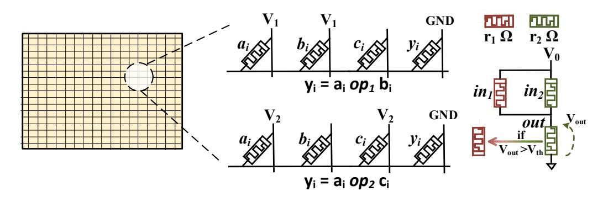
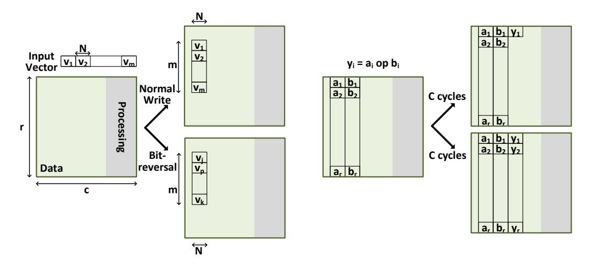
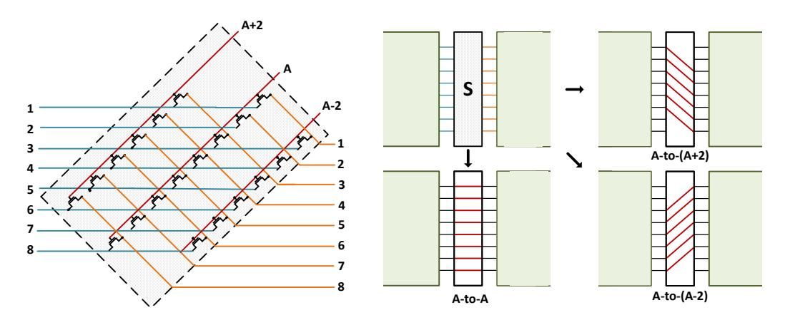
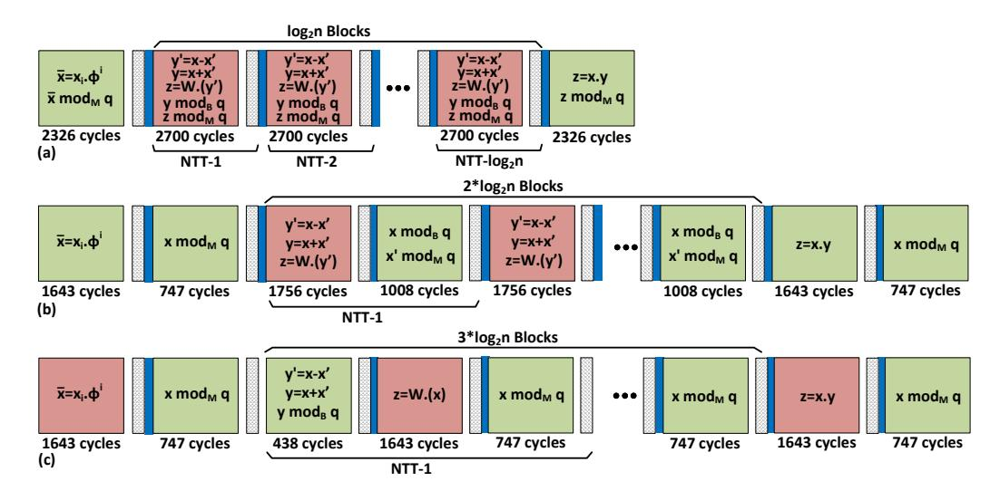
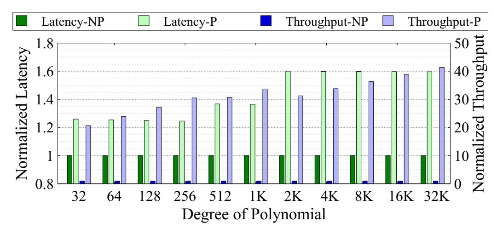
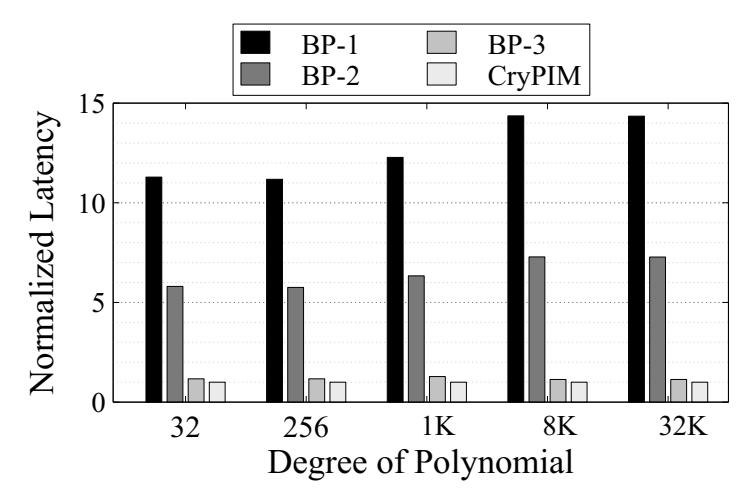

# **CryptoPIM: In-memory Acceleration for Lattice-based Cryptographic Hardware**

Hamid Nejatollahi<sup>1</sup> , Saransh Gupta<sup>2</sup> , Mohsen Imani<sup>2</sup> , Tajana Simunic Rosing<sup>2</sup> , Rosario Cammarota<sup>3</sup> and Nikil Dutt<sup>1</sup>

> <sup>1</sup> University of California Irvine, Irvine, USA <sup>2</sup> University of California San Diego, San Diego, USA 3 Intel AI, Privacy and Security Research, USA

**Abstract.** Quantum computers promise to solve hard mathematical problems such as integer factorization and discrete logarithms in polynomial time, making standardized public-key cryptography (such as digital signature and key agreement) insecure. Lattice-Based Cryptography (LBC) is a promising post-quantum public key cryptographic protocol that could replace standardized public key cryptography, thanks to the inherent post-quantum resistant properties, efficiency, and versatility. A key mathematical tool in LBC is the Number Theoretic Transform (NTT), a common method to compute polynomial multiplication that is the most compute-intensive routine, and which requires acceleration for practical deployment of LBC protocols. In this paper, we propose , a high-throughput Processing In-Memory (PIM) accelerator for NTT-based polynomial multiplier with the support of polynomials with degrees up to 32k. Compared to the fastest FPGA implementation of an NTT-based multiplier, achieves on average 31x throughput improvement with the same energy and only 28% performance reduction, thereby showing promise for practical deployment of LBC.

**Keywords:** Public-Key Cryptography, Lattice-based Cryptography, Acceleration, Number Theoretic Transform, Systolic Array

Lattice-based Cryptography, Acceleration, Number Theoretic Transform, Homomorphic Encryption, Processing in Memory

# **1 Introduction**

Shor's algorithm can solve integer factorization and discrete logarithm in polynomial time [\[1\]](#page-12-0), which gives the quantum computers the ability to break standardized public-key crypto-systems based such as RSA and ECC. The response of the cryptography community to such an urgent threat is the introduction and evaluation of quantum-resistant algorithms. These include lattice-based, multivariate, cryptography, hash-based, code-based, supersingular elliptic curve isogeny cryptography [\[2\]](#page-13-0). Moreover, the National Institute of Standards and Technology (NIST) announced a contest in 2017 to select secure candidates for replacing public-key cryptography primitives. Among the candidate scheme, Lattice-Based Cryptography (LBC) schemes are the most promising due to their versatility and superior performance

for applications such as digital signature and key agreement. Besides the basic public-key encryption schemes, LBC can be used to realize to construct protocols to compute on the encryption data, (i.e., homomorphic encryption).

Secure Standard LBC schemes involves expensive matrix-vector multiplications and large key sizes (e.g., 11kB for Frodo [\[3\]](#page-13-1)). Compared to Standard LBC schemes, Ideal LBC schemes are variants that provide better performance and memory footprint by performing the computation polynomial rings without compromising security. The hardness of such schemes is based on the Ring Learning With Error (RLWE) [\[4\]](#page-13-2) problems, in which polynomial multiplication is the most timeconsuming routine. Polynomial multiplication is usually performed using the Number Theoretic Transform (NTT), a variant of the Discrete Fourier Transform (DFT) for finite polynomial rings. The process is slow due to the repeated use of expensive operations like multiplication and modulo.

However, thousands of these operations can theoretically be implemented in parallel. An attractive solution for such highly parallel applications is to enable memory to perform computation [\[5\]](#page-13-3). This approach, often called processing inmemory PIM, reduces communication costs between the processor and memory by performing most computations directly in memory. Emerging non-volatile memory (NVM) technology, e.g., resistive memory (memristor), can be effectively used for various PIM techniques such as in-memory search [\[6\]](#page-13-4), bit-wise [\[7\]](#page-13-5) and addition operations [\[8,](#page-14-0) [9\]](#page-14-1). This enables the memory to perform computations while serving sufficient storage capacity utilizing superior characteristics of the NVM technology, such as high density, low-power consumption, and scalability [\[10\]](#page-14-2). Previous work has shown that PIM is highly energy-efficient and fast for data-intensive tasks [\[11,](#page-14-3) [12,](#page-14-4) [13\]](#page-14-5).

In this work, we design a high-throughput in-memory NTT-based polynomial multiplier that can be used inside Ideal LBC crypto-systems.

- To the author's knowledge, this is the first work to propose a PIM architecture for NTT-based polynomial multiplication.
- We identify key performance bottlenecks in NTT polynomial computation. We then propose faster in-memory multiplication and modulo operations in-memory.
- We propose NTT-specific fixed-function switches to overcome the irregular memory access issue in NTT. Our switches enable parallel data transfer between multiple NTT stages.
- We design a configurable pipelined architecture, which can support as large as 32k, accommodating requirements for public-key cryptographic systems for data at rest and in communication, and data in use (e.g., homomorphic encryption).

As compared to the fastest FPGA implementation of NTT-based multiplier, with degrees to support public-key encryption, achieves on average 31x throughput improvement with the same energy and only 28% performance reduction.

The rest of the paper is organized as follows: Section 2 provides the background for LBC and NTT-based multipliers; Sections 3 describes the . Section 4 discusses the results. Finally, we conclude the paper in Section 5.

# <span id="page-2-0"></span>2 Background and Related Work

A lattice  $L \subset \mathbb{R}^n$  is defined as all the integer linear combinations of basis vectors  $\mathbf{b}_1, \ldots, \mathbf{b}_n \in \mathbb{R}^n$ . The hardness of the lattice-based schemes are based on two mathematically hard problems: short integer solution (SIS) and, more commonly, learning With errors (LWE). Given the pair (A,pk) as a matrix of constants sampled uniformly at random in  $\mathbb{Z}_q^n$  and the public key, the learning with error problem is defined as finding the secret key sk, where  $pk = (A * sk + e) \mod q$ , and e is a small error vector that is sampled from a Gaussian distribution.

LWE-based schemes are impractical to be implemented on resource-constrained devices due to their large keys. At the same security level, Ring-LWE (RLWE) reduces the key size by a factor of n, where n is the degree of the polynomial. In Ring-LWE (RLWE), a derivation of LWE in which A is implicitly defined as a vector a in the ring  $\mathcal{R} \equiv \mathbb{Z}_q[x]/\langle x^n+1\rangle$ . Arithmetic operations for a Ring-LWE-

### <span id="page-2-1"></span>Algorithm 1 NTT-based Polynomial Multiplier

- 1: **Initialization:** w is the n-th root of unity and  $\phi$  is the 2n-th root of unity ( $\phi^2 = w \mod q$ );  $w^{-1}$  and  $\phi^{-1}$  are the inverse of  $w \mod q$  and  $\phi \mod q$ , respectively.
- 2: **Precompute:**  $\{w^i, w^{-i}, \phi^i, \phi^{-i}\} \triangleright w^i, w^{-i}$  are in reversed order, while  $\phi^i, \phi^{-i}$  are in normal order

```
3: function POLY NTT(A, B)
 4:
           bitrev(A); bitrev(B)
           for i = 0 to n - 1 do
 5:
                \bar{a_i} \leftarrow a_i \phi^i; \, \bar{b_i} \leftarrow b_i \phi^i
 6:
 7:
           end for
           \bar{A} \leftarrow NTT \ GS(\bar{a}, w)
 8:
           \bar{B} \leftarrow NTT \ GS(\bar{b}, w)
 9:
           \bar{C} = \bar{A}.\bar{B}
10:
           bitrev(\bar{C})
11:
           \bar{c} \leftarrow NTT \ GS(\bar{C}, w^{-1})
12:
           for i = 0 to n - 1 do
13:
                c_i \leftarrow \bar{c_i} \phi^{-i}
14:
15:
           end for
16:
           Return C
17: end function
```

based scheme are performed over a  $Z_p$ , the ring of integers modulo p where n (degree of the polynomial) is a power of two, p is a large prime number, and  $x^{n+1}$  is an irreducible polynomial degree n. The quotient ring  $R_p$  includes polynomials with degree less than n in  $Z_p$ , that defines  $R_p = Z_p/[x^{n+1}]$  in which coefficients of polynomials are in [0,p). Degrees of the polynomials in RLWE-based schemes vary between 256 [14] and 1024 [15] for public-key encryption and between 2k and 32k for homomorphic encryption [16].

Polynomial multiplication is commonly computed using the Number Theoretic

Transform (NTT). Two polynomials (*a* = *a*(*n* − 1) · *x <sup>n</sup>*−<sup>1</sup> + *. . .* + *a*(0) and *b* = *b*(*n* − 1) · *x <sup>n</sup>*−<sup>1</sup> + *. . .* + *b*(0)) are transformed into the NTT domain (*A* = *A*(*n* − 1) · *x <sup>n</sup>*−<sup>1</sup> + *. . .* + *A*(0) and *B* = *B*(*n* − 1) · *x <sup>n</sup>*−<sup>1</sup> + *. . .* + *B*(0)); multiplication of the two polynomial is computed as *C* = P*n*−<sup>1</sup> *<sup>i</sup>*=0 *A*(*i*) · *B*(*i*) · *x i* (coefficient-wise multiplication). The final result, *c* = *a* ∗ *b*, is computed by applying the the inverse number theoretic transform (NTT−<sup>1</sup> ) on *C*. A common method to perform the number theoretic transform is Gentleman-Sande (GS) [\[17\]](#page-14-9), which receives the input in the reverse order and produces the output in the normal order. Similar to [\[18\]](#page-14-10), we employ the Gentleman-Sande method to compute both forward and inverse number theoretic transforms. It involves changing the order of the coefficients in the vector representation (i.e., bit-reverse). Algorithm [1](#page-2-1) describes the NTT-based polynomial multiplier using the GS method.

## <span id="page-3-0"></span>**Algorithm 2** The Gentleman-Sande in-place NTT algorithm

```
1: To compute the NTT and NTT−1
                                 , twiddle is set to {w
                                                    i} and {w
                                                             −i} for all i ∈
   [0, n/2 − 1], respectively. Output is A in the frequency domain (bit-reversed order).
2: function ntt_gs(A,twiddle)
3: for (i=0;i<log2n;i+=1) do
4: for (idx=0;idx<n/2;id+=1) do
5: st ←− idx & ((1<<i)-1)
6: j ←− ((idx & !(1<<i - 1) <<1)&(n-1) + st
7: j
            0 ←− j + (1<<i)
8: W ←− twiddle[j>>(i+1)]
9: T ←− A[j]
10: A[j] ←− (T + A[j'])mod q
11: A[j
              0
               ] ←− W*(T - A[j'])mod q
12: end for
13: end for
14: end function
```

Previous researches on the acceleration of the NTT-based polynomial multiplications narrow the focus on the area and performance of the polynomial multiplier for LBC and leave the energy unexplored [\[19\]](#page-14-11) [\[20\]](#page-14-12). Some efforts have evaluated the energy as well as the area and performance of NTT accelerators [\[21\]](#page-14-13)[\[22\]](#page-14-14)[\[23\]](#page-14-15)[\[24\]](#page-14-16). We compare our results to the fastest FPGA implementation of the NTT-based multiplier in [\[18\]](#page-14-10) for the vector sizes *n* ∈ (256, 512, 1024) in terms of performance, energy, and throughput. Additionally, we report the performance, energy, and throughput for vector sizes *n* ∈ (256, 512, 1024, 2k, 4k, 8k, 16k, 32k).

While the works mentioned above try to accelerate NTT, they do not perform well for higher degree polynomials. Processing higher degree polynomial, even with NTT, involves a massive amount of computations. Moreover, these computations are often expensive, involving 64-bit multiplications. Hence, the application performance suffers due to (i) less than required on-chip memory and (ii) limited availability of complex cores. Prior work has proposed processing in memory (PIM), which is an architecture for doing in-situ computation [\[5,](#page-13-3) [25,](#page-15-0) [11\]](#page-14-3).

Recent works in PIM enable highly efficient bitwise operations in memory [\[9,](#page-14-1) [25\]](#page-15-0) and extend these operations to implement complex functions like floating-point arithmetic [\[11\]](#page-14-3). Besides, PIM has been shown to provide large dense memory and

<span id="page-4-1"></span>

Figure 1: Digital processing in memory (PIM) overview.

extensively parallel computing. Figure [1](#page-4-1) shows high-level implementation of PIM based on bitwise computation in [\[9\]](#page-14-1). The memory block on the left is a crossbar of ReRAM (resistive RAM) cells, where each row of cells share a wordline, while those in the same column share a bitline. These cells have two possible states. The cells change state when the voltage across them crosses a device threshold. A memory cell is present at the intersection of a wordline and bitline. To implement bitwise functions, it applies a voltage *V* at the input bitlines and ground the output bitline. The result of the computation is generated in the output cell. The operation performed is dependent on *V* . Also, the same operation can be executed in parallel over multiple rows of the block, enabling parallel vector-wide operations. Prior research designed PIM blocks for application acceleration, e.g., MapReduce based on 3D stacking [\[26\]](#page-15-1), nearest neighbor search using computational logics beside DRAM [\[6\]](#page-13-4), and parallel graph processing based on 3D DRAM [\[12\]](#page-14-4). Several SW interface designs have also been proposed for heterogeneous computing platforms to use the accelerators in system and coherently access host memory, e.g., IBM CAPI [\[27\]](#page-15-2), Intel HARP [\[28\]](#page-15-3), and HMC 2.0 [\[29\]](#page-15-4).

Instead, in this work, we, for the first time, propose , a high-throughput PIM accelerator for NTT-based polynomial multiplication. The proposed design optimizes the basic NTT operations, introduced new inter-block switches, and finally uses a configurable architecture to support polynomial multiplications for polynomials with degrees up to 32k.

# <span id="page-4-0"></span>**3 for RLWE Polynomial Multiplier**

In this section, we detail , a processing in-memory design for NTT-based polynomial multiplier. We start by analyzing the base algorithms to identify the basic operations involved in their execution. We then show how these operations can be mapped to PIM. In the end, we put together the individual PIM pieces to present a high-speed and highly efficient architecture for NTT-based polynomial multiplier.

## **3.1 Operational Breakdown of Polynomial Multiplication**

As discussed in Section [2,](#page-2-0) Algorithm [1](#page-2-1) contains multiple sequential operations. The computational operations involve element-wise multiplication between two

vectors and NTT calculation over a vector. While bitrev() only changes the sequence of data reads and not the data itself. Algorithm [2](#page-3-0) shows that NTT is further composed of element-wise vector addition, subtraction, and multiplication operations. Hence, NTT-based polynomial multiplication essentially comprises of bit-reversal and element-wise addition, subtraction, and multiplication. Further, each data operation is followed by a modulo operation (mod q) to maintain consistent bitwidth.

### **3.2 Mapping Operations to PIM**

Section [2](#page-2-0) shows that state-of-the-art PIM based designs [\[11,](#page-14-3) [25,](#page-15-0) [30,](#page-15-5) [31\]](#page-15-6) can implement arithmetic functions with high parallelism and energy efficiency. Moreover, using such designs for integer arithmetic, as required in our case, can further increase their benefits. Integer operations do not involve tracking decimal point (for fixed-point) or iterative data-dependent shifts (for floating-point). This simple computation logic of integer operations, combined with the vector-based operations in polynomial multiplication, make it a suitable candidate for PIM.

### **3.2.1 Data organization in**

A memory block is an array of memory cells, where each memory cell represents a bit. *N* continuous memory cells in a row represent an *N*-bit number, with the first cell storing the MSB. For a block with *r* rows and *c* columns, each row stores *c/N* numbers, with the entire block having a capacity of (*c/N*) × *r N*-bit numbers.

In PIM, each row has some data columns and some processing columns. While data columns store inputs and other relevant data like pre-computed factors, processing columns are primarily used for performing intermediate operations and storing temporary results. However, the data and processing columns are physically indistinguishable and their roles can be changed on-the-fly. An input vector with *m N*-bit values is stored in data columns such that each *N*-bit number occupies the same *N* columns in *m* rows. This is illustrated in Figure [2](#page-7-0)

#### **3.2.2 Polynomial multiplication in**

We implement the functions in polynomial multiplication to PIM as follows:

**Bit-reversal:** Bit-reversal changes the sequence of data read. In the case of PIM, where an input vector is stored over different rows in a memory block, a bit-reversal operation is equivalent to changing the row to which a value is written (shown in Figure [2.](#page-7-0) This can be easily achieved while writing the vector to the block. The arrangement can either be hard-coded or be flexible according to the target application.

**Addition/Subtraction:** The state-of-the-art PIM designs perform vectorwide addition. For subtraction, 2's complement is taken for one of the inputs (subtrahend) and then addition is performed. We use similar techniques where basic bitwise operations are cascaded to implement 1-bit adder. Then, these multiple such 1-bit additions are used to implement an *N*-bit operation. Although a single *N*-bit addition/subtraction may be a slow operation, *r* of such operations can be

executed in parallel in a *r* × *c* memory block without any additional overhead, as shown in Figure [2.](#page-7-0) The latency of *N*-bit addition is 6*N* + 1 cycles [\[9\]](#page-14-1) and for subtraction is 7*N* + 1.

**Multiplication:** An *N*-bit multiplication operation is broken into simple shift and addition of partial products. First, the partial products are generated using bitwise operations and stored in the same row as operands. Because works with bitlevel memory access, instead of explicit data shift, shifting operation is translated to selecting appropriate columns of memory block. Similar to addition/subtraction, *r* multiplication operations can also execute in parallel in a memory block which provides efficient vector-wide operations. The work in [\[32\]](#page-15-7) proposed full-precision multipliers. However, the bitwise operations used by them are expensive. Instead, we combine the algorithm in [\[32\]](#page-15-7) with the low latency bitwise operations proposed in [\[9\]](#page-14-1). As a result, *N*-bit multiplication in takes 6*.*5*N*<sup>2</sup> − 11*.*5*N* + 3 cycles, significantly less than the 13*N*<sup>2</sup> − 14*N* + 6 cycles of [\[32\]](#page-15-7).

**Modulo:** While addition of two *N*-bit numbers can result in an (*N* + 1)-bit output, a multiplication may give an output with 2*N* bits. However, to maintain the consistency in number bitwidth with minimum effect on the algorithmic correctness, each computation undergoes a modulo operation. Modulo operations traditionally involve the expensive division operations. To enable modulo operations in memory, we use Barrett reduction [\[33\]](#page-15-8) and Montgomery reduction [\[34\]](#page-15-9) after each addition and multiplication, respectively. Further, in NTT, the modulo factor (*q* in our case) is generally fixed for a specific size of the vector or polynomial's degree. For instance, we set *q* = 12289 for vector sizes of 1024 and 512, according to NewHope [\[15\]](#page-14-7), and *q* = 7681 for vector sizes of 256 and less according to Kyber [\[14\]](#page-14-6). For vector sizes of 2k, 4k, 8k, 16k, and 32k we set *q* = 786433 according to the Microsoft SEAL library [\[16\]](#page-14-8). We exploit this limited set of possible *q*s to make reduction more efficient in PIM. Instead of naively using multiple multiplications, we first convert these reduce operations into successive shift and add/subtract operations as shown in Algorithm [3.](#page-8-0) Since, we have bit-level access, we perform only the necessary bit-wise computations. For example, in line 15 of Algorithm [3,](#page-8-0) {*v* ←− *u* & ((1*<<*18)-1)} resets to 0 all but the 17 LSBs of the output of {*u* ←− (a*<<*13) - (a*<<*9) + a}. Here, we compute only 17 LSBs of *u*.

<span id="page-6-0"></span>Since *q* is the same for all the values in a vector, they require same shift (i.e. same column activations in ) and can hence be completely parallelized over the entire vector in . For each reduction, latency is dependent on the total number of bitwise additions involved in it. Table [1](#page-6-0) lists the latency of each reduction in .

Table 1: Execution time (cycles) for modulo operation

| q                    | 7681 | 12289 | 786433 |
|----------------------|------|-------|--------|
| Barrett Reduction    | 261  | 239   | 429    |
| Montgomery Reduction | 683  | 461   | 1083   |

## **3.3 Building Blocks**

The two basic building blocks of are PIM-enabled memory block and fixed-function switch. A memory block implements one phase or stage of the polynomial mul-

<span id="page-7-0"></span>

Figure 2: Data representation and parallel operations in .

<span id="page-7-1"></span>

Figure 3: (Left) Detailed circuit of fixed-function switch with 8 inputs/outputs and shift factor of 2. (Right) All possible connections for s=2.

<span id="page-8-0"></span>**Algorithm 3** Reduction algorithms using shifts and adds. *q* = 7681 for *n* ≤256, *q* = 12289 for n=512, 1024, and *q* = 786433 for n≥ 2048

```
1: function Barrett Reduce(a)
2: if q == 12289 then
3: u ←− ((a<<2)+(a)) >> 16; u ←−(u<<13) + (u<<12) + u
4: end if
5: if q == 7681 then
6: u ←− a>>13; u ←− (u<<13) - (u<<9) - u
7: end if
8: if q == 786433 then
9: u ←− a>>20; u ←− (u<<19) + (u<<18) + u
10: end if
11: Return (a − u)
12: end function
13: function Montgomery Reduction(a)
14: if q == 12289 then
15: u ←− (a<<13) + (a<<12) - a; u ←− u & ((1<<18)-1)
16: u ←− (u<<13) + (u<<12) + u; u ←− (u + a)>>18
17: end if
18: if q == 7681 then
19: u ←− (a<<13) - (a<<9) + a; u ←− u & ((1<<18)-1)
20: u ←− (u<<13) - (u<<9) - u; u ←− (u + a)>>18
21: end if
22: if q == 786433 then
23: u ←− (a<<19) - (a<<18) + a; u ←− u & ((1<<32)-1)
24: u ←− (u<<19) + (u<<18) - u; u ←− (u + a)>>32
25: end if
26: Return u
27: end function
```

tiplication. Two adjacent memory blocks are connected using the fixed-function switches as shown in Figure [3](#page-7-1) Each memory block is a PIM enabled an array of 512 × 512 memory cells and can process a vector of length 512 at a time. The fixed-function switches, unlike typical crossbar switches, enable only three types of connections: a direct rowA-to-rowA, rowA-to-row(A+s), rowA-to-row(A-s). A fixed-function switch allows just one, the in-hardware-coded value of s. However, this 's' may be different (but fixed) for different instances of this fixed-function switch in the hardware. Instead, traditional crossbar switches provide a connection between any possible input/output combination leading to an exponential increase in logic requirement with an increase in inputs or outputs. Our fixed-function crossbar switch has just three logic switches per row. The number of switches per row is independent of the number of inputs/outputs. These switches can read up to one entire column of one block and write it to the next block in parallel, requiring as many cycles as the bitwidth of data. Hence, transferring data between two blocks in NTT requires only 3\*bitwidth cycles, one each for A-to-A, A-to-(A+s), and A-to-(A-s) transfer.

All computation steps in Algorithm [1](#page-2-1) and [2](#page-3-0) are implemented using these building blocks. Each vector-wide data operation along with the involved modulo reduction is implemented in an independent memory block. Hence, we have a

<span id="page-9-0"></span>

Figure 4: Detailed stage-by-stage breakdown of (a) Area-efficient pipeline, (b) naive pipeline, and (c) pipeline. The region between two consecutive blue bars represents a pipeline stage. The slowest stage in a pipeline is colored red.

memory block each for  $a_i\phi^i$ ,  $b_i\phi^i$ ,  $\bar{A}.\bar{B}$ ,  $\bar{c}_i\phi^{-i}$ . Then, the  $log_2n$  stages in NTT uses a memory block each. Each (NTT) stage block is connected to the next stage block using the switches.

#### 3.4 Architecture

#### 3.4.1 Pipeline

The block-by-block modular architecture provides an opportunity to increase the throughput by pipelining. Figure 4a shows the most area-efficient NTT pipeline for the 16-bit datawidth. Here, the computation and its corresponding modulo operation are performed in the same block. For 16-bit datatype and n=256, this results in 2700 cycles per stage. Note that even though the logic performed in each stage have different latencies, the latency of the slowest stage determines the stage latency while pipelining. Now, the data computation and its modulo are completely independent operations and can be performed in separate blocks, leading to the pipeline shown in Figure 4b and stage latency of 1756 cycles. However, this comes at the cost of increasing the number of stages and hence, the total latency of one polynomial multiplication. We further optimized the pipeline by combining Montgomery reduction, addition/subtraction, and Barrett reduction in the same stage as shown in Figure 4c. We obtain the final stage latency of 1643 cycles.

#### 3.4.2 Configurable Architecture

consists of a ReRAM memory chip with several memory banks. A set m cascaded memory blocks map to one memory bank. A memory bank takes in 512 parallel inputs in the first block and output 512-element wide vector. Hence, it can only process polynomials with degrees up to 512. However, the degree of the polynomials in RLWE/FHWE-based schemes generally ranges up to 32k. We

design architecture such that many of these banks can be dynamically arranged in the form of *bsof t softbanks*. A softbank consists of *b<sup>m</sup>* parallel memory banks. Each softbank is responsible for processing vector-wide operations for a polynomial. Then, two softbanks dynamically form a *superbank* which completely processes multiplication between two input polynomials. To enable this configurability, uses additional switches at the intersection of different banks and softbanks to allows data communication between them.

We optimize our hardware to support 32k degree polynomials in memory. A 32k NTT pipeline has 49 blocks (from Figure [4\)](#page-9-0). Hence, each bank has 49 memory blocks. We further need 64 such memory banks for each input polynomial, requiring 128 memory banks per 32k polynomial multiplication. If the degree of input polynomial is higher than 32k, divides the inputs into segments of 32k and iteratively uses the hardware. On the other hand, if the input polynomial degree is less than 32k, we dynamically configure into multiple superbanks to enable parallel multiplication of multiple polynomial pairs.

## <span id="page-10-0"></span>**4 Evaluation**

## **4.1 Evaluation Setup**

We use an in-house cycle-accurate C++ simulator, which emulates functionality. We used HSPICE for circuit-level simulations and calculate energy consumption and performance of all the operations in the 45nm process node. We used System Verilog and Synopsys *Design Compiler* to implement and synthesize the controller. The robustness of all proposed circuits, i.e., interconnect, has been verified by considering 10% process variations on the size and threshold voltage of transistors using 5000 Monte Carlo simulations. A maximum of 25.6% reduction in resistance noise margin was observed for RRAM devices. However, this did not affect the operations in due to the high *ROF F /RON* . Here, we adopt a RRAM device with VTEAM model [\[35\]](#page-15-10). The device parameters (listed in [\[8\]](#page-14-0)) are chosen to fit practical devices [\[36\]](#page-15-11) with switching delay of 1.1ns (= cycle time in ). The behavior of bitwise PIM operations has been demonstrated using a fabricated chip in [\[37\]](#page-15-12).

#### **4.2 Performance and Energy Consumption of**

Figure [5](#page-11-0) shows the latency and throughput of both non-pipelined and pipelined over different degrees of polynomial multiplications (n). The latency of increases with increase in n, primarily due to the increased number of NTT stages. However, the pipelined-throughput remains the same for the degrees processed in same bitwidth. This is because the latency of one stage in depends on bitwidth and not n. The energy consumption of the design increases with n. This is due to increase in both the number of stages and well as the amount of parallel computations in each stage.

As evident from the results, pipelining increases the throughput tremendously with some latency overhead. For smaller degrees (n ≤ 1024), average throughput improves by 27.8×, while incurring 29% latency overhead. When is n *>* 1024, the throughput improvement increases to 36.3×, with 59.7% increment in latency.

<span id="page-11-0"></span>

<span id="page-11-1"></span>Figure 5: Normalized latency and throughput of for different degrees of polynomial. NP and P represent non-pipelined and pipelined designs respectively.



Figure 6: Comparison of with PIM baselines.

This happens because the latency of multiplication increases exponentially with the bitwidth of inputs. For n>1024 (32-bit inputs), the execution time of multiplication is  $6.8\times$  that of the second slowest operation. On the other hand, for  $n\le 1024$  (16-bit inputs), multiplication is just  $2.3\times$  slower than the second slowest operation. Hence, the pipelines is comparatively more balanced in 16-bit than 32-bit. The energy consumption of increases on average by just 1.6% for the pipelined design. While pipelining increases the number of stages, the underlying computations don't increase. Hence, the total amount of logic is same in both the pipelined and non-pipelined versions. The small increase in energy is due to increased block-to-block transfers.

#### 4.3 Comparison with state-of-the-art PIM

To show the efficiency of our optimizations, we compare with multiple PIM baselines. The first baseline PIM (BP-1) uses the operations proposed in [32], while utilizing

the same building blocks and architecture as . BP-2 is BP-1 with its *N*-bit multiplication replaced with the multiplication in . BP-3 is BP-2 with the reduction operations converted to shift and adds. Figure [6](#page-11-1) shows the latency of the three baselines and for different degrees of polynomial multiplication. To have a fair comparison, we compare the baselines with the non-pipelined version of the design. We observe that BP-2 is on average 1.9× faster than BP-1. This shows that optimized multiplications significantly improve latency. Moreover, BP-3 is 5.5× faster than BP-2, which shows that the shift and add based reduction is more efficient than multiplication based reduction. Finally, is 1.2× faster than BP-3, showing that modulo reductions are highly optimized. As a result, is 12.7× faster than the state-of-the-art PIM (BP-1).

## **4.4 Comparison with CPU and FPGA**

Table [2](#page-13-6) shows the comparison of the pipelined-in terms of latency, energy, and throughput to the FPGA (on Xilinx Zynq UltraScale+) and software (on an X86 CPU at 2GHz) implementations. Compare to the CPU implementation, on average achieves 7.6x, 111x, and 226x improvement in the performance, throughput, and energy, respectively. For the sizes suitable for public-key encryption (256, 512, and 1024) achieves on average 31x throughput improvement with the same energy and less than %30 reduction in the performance.

# <span id="page-12-1"></span>**5 Conclusion**

The (NTT) is the most time-consuming routine in ideal lattice-based cryptographic protocols. In this paper we propose a high-throughput Processing-In-Memory accelerator for NTT-based polynomial multiplication. Our fast energy-efficient design, , enables fast execution of the polynomial multiplication with the support of polynomials with degrees up to 32k, accommodating requirements for public key cryptographic systems for data at rest and in communication, and data in use (e.g., homomorphic encryption). achieves on average 31x throughput improvement with the same energy consumption and 28% latency reduction compare to the fastest NTT-based polynomial multiplier implemented on FPGA.

# **Acknowledgments**

This work was supported in part with a gift from Qualcomm Technology Inc., in part by CRISP, one of six centers in JUMP, an SRC program sponsored by DARPA, SRC-Global Research Collaboration grant, and also NSF grants 1527034, 1730158, 1826967, and 1911095.

## **References**

<span id="page-12-0"></span>[1] P. W. Shor, "Polynomial-time algorithms for prime factorization and discrete logarithms on a quantum computer," *SIAM Journal on Computing*, 1997.

<span id="page-13-6"></span>Table 2: Comparison of the to the FPGA and CPU implementation of the NTTbased polynomial multiplier. Throughput is defined as number of the polynomial multiplications per seconds. Energy is the require energy to multiply two polynomials.

| Design      | N      | Bitwidth | Latency (us) | Energy (uJ) | Throughput |
|-------------|--------|----------|--------------|-------------|------------|
|             | 256    | 16       | 84.81        | 570.60      | 11790      |
|             | 512    | 16       | 168.96       | 1179.52     | 5918       |
|             | 1k     | 16       | 349.41       | 2483.77     | 2861       |
|             | 2k     | 32       | 736.92       | 5273.07     | 1365       |
| X86 (gem5)  | 4k     | 32       | 1503.31      | 10864.64    | 665        |
|             | 8k     | 32       | 3066.76      | 22385.51    | 326        |
|             | 16k    | 32       | 6256.20      | 46123.84    | 159        |
|             | 32k    | 32       | 12762.65     | 95032.33    | 78         |
|             | 256    | 16       | 21.56        | 2.15        | 46382      |
| NTT-based   | 512    | 16       | 47.63        | 5.28        | 20995      |
| [18] (FPGA) | 1k     | 16       | 101.84       | 12.52       | 9819       |
|             | 2k-32k | -        | -            | -           | -          |
|             | 256    | 16       | 68.67        | 2.58        | 553311     |
|             | 512    | 16       | 75.90        | 5.02        | 553311     |
|             | 1k     | 16       | 83.12        | 11.04       | 553311     |
|             | 2k     | 32       | 363.60       | 82.57       | 137511     |
| Pipelined   | 4k     | 32       | 392.69       | 178.62      | 137511     |
|             | 8k     | 32       | 421.78       | 384.17      | 137511     |
|             | 16k    | 32       | 450.87       | 822.21      | 137511     |
|             | 32k    | 32       | 479.95       | 1752.15     | 137511     |

- <span id="page-13-0"></span>[2] H. Nejatollahi *et al.*, "Post-quantum lattice-based cryptography implementations: A survey," *ACM CSUR*, 2019.
- <span id="page-13-1"></span>[3] J. Bos *et al.*, "Frodo: Take off the ring! practical, quantum-secure key exchange from lwe," in *CCS*, 2016.
- <span id="page-13-2"></span>[4] V. Lyubashevsky *et al.*, "On ideal lattices and learning with errors over rings," ser. EUROCRYPT'10, 2010.
- <span id="page-13-3"></span>[5] M. Gokhale *et al.*, "Processing in memory: The terasys massively parallel pim array," *Computer*, vol. 28, no. 4, pp. 23–31, 1995.
- <span id="page-13-4"></span>[6] C. C. del Mundo *et al.*, "Ncam: Near-data processing for nearest neighbor search," in *Proceedings of the 2015 International Symposium on Memory Systems*. ACM, 2015, pp. 274–275.
- <span id="page-13-5"></span>[7] S. Li *et al.*, "Pinatubo: A processing-in-memory architecture for bulk bitwise operations in emerging non-volatile memories," in *Design Automation Conference (DAC), 2016 53nd ACM/EDAC/IEEE*. IEEE, 2016, pp. 1–6.

- <span id="page-14-0"></span>[8] N. Talati *et al.*, "Logic design within memristive memories using memristoraided logic (magic)," *NANO*, vol. 15, no. 4, pp. 635–650, 2016.
- <span id="page-14-1"></span>[9] S. Gupta *et al.*, "Felix: Fast and energy-efficient logic in memory," in *2018 IEEE/ACM International Conference on Computer-Aided Design (ICCAD)*. IEEE, 2018, pp. 1–7.
- <span id="page-14-2"></span>[10] Y. Xie, *Emerging Memory Technologies: Design, Architecture, and Applications*. Springer Science & Business Media, 2013.
- <span id="page-14-3"></span>[11] M. Imani *et al.*, "Floatpim: In-memory acceleration of deep neural network training with high precision," in *ISCA'19*. [Online]. Available: <http://doi.acm.org/10.1145/3307650.3322237>
- <span id="page-14-4"></span>[12] J. Ahn *et al.*, "A scalable processing-in-memory accelerator for parallel graph processing," *ACM SIGARCH Computer Architecture News*, vol. 43, no. 3, pp. 105–117, 2016.
- <span id="page-14-5"></span>[13] D. Lavenier *et al.*, "Dna mapping using processor-in-memory architecture," in *2016 IEEE International Conference on Bioinformatics and Biomedicine (BIBM)*. IEEE, 2016, pp. 1429–1435.
- <span id="page-14-6"></span>[14] R. Avanzi *et al.*, "Crystals-kyber," NIST, Tech. Rep., 2017.
- <span id="page-14-7"></span>[15] T. Poppelmann *et al.*, "Newhope," NIST, Tech. Rep., 2017.
- <span id="page-14-8"></span>[16] H. Chen *et al.*, "Simple encrypted arithmetic library - seal v2.1," Cryptology ePrint Archive, Report 2017/224, 2017.
- <span id="page-14-9"></span>[17] W. M. Gentleman *et al.*, "Fast fourier transforms: For fun and profit," in *AFIPS*, 1966.
- <span id="page-14-10"></span>[18] H. Nejatollahi *et al.*, "Exploring energy efficient quantum-resistant signal processing using array processors," Cryptology ePrint Archive, 2019.
- <span id="page-14-11"></span>[19] T. Pöppelmann *et al.*, "Accelerating homomorphic evaluation on reconfigurable hardware," in *Lecture Notes in Computer Science*, 2015.
- <span id="page-14-12"></span>[20] D. B. Cousins *et al.*, "An fpga co-processor implementation of homomorphic encryption," in *HPEC*, 2014.
- <span id="page-14-13"></span>[21] H. Nejatollahi *et al.*, "Synthesis of flexible accelerators for early adoption of ring-lwe post-quantum cryptography," *TECS*, 2020.
- <span id="page-14-14"></span>[22] ——, "Domain-specific accelerators for ideal lattice-based public key protocols," Cryptology ePrint Archive, 2018.
- <span id="page-14-15"></span>[23] U. Banerjee *et al.*, "Sapphire: A configurable crypto-processor for postquantumlattice-based protocols," *IACR TCHES*, 2019.
- <span id="page-14-16"></span>[24] H. Nejatollahi *et al.*, "Flexible ntt accelerators for rlwe lattice-based cryptography," *ICCD*, 2019.

- <span id="page-15-0"></span>[25] D. Fujiki *et al.*, "Duality cache for data parallel acceleration," in *Proceedings of the 46th International Symposium on Computer Architecture*. ACM, 2019, pp. 397–410.
- <span id="page-15-1"></span>[26] S. H. Pugsley *et al.*, "Ndc: Analyzing the impact of 3d-stacked memory+ logic devices on mapreduce workloads," in *Performance Analysis of Systems and Software (ISPASS), 2014 IEEE International Symposium on*. IEEE, 2014, pp. 190–200.
- <span id="page-15-2"></span>[27] J. Stuecheli *et al.*, "Capi: A coherent accelerator processor interface," *IBM Journal of Research and Development*, vol. 59, no. 1, pp. 7–1, 2015.
- <span id="page-15-3"></span>[28] P. K. Gupta, "Xeon+ fpga platform for the data center," in *Fourth Workshop on the Intersections of Computer Architecture and Reconfigurable Logic*, vol. 119, 2015.
- <span id="page-15-4"></span>[29] . M. Technology, "Hybrid memory cube," [https://www.micron.com/products/](https://www.micron.com/products/hybrid-memory-cube) [hybrid-memory-cube,](https://www.micron.com/products/hybrid-memory-cube) 2017.
- <span id="page-15-5"></span>[30] N. Talati *et al.*, "mmpu—a real processing-in-memory architecture to combat the von neumann bottleneck," in *Applications of Emerging Memory Technology*. Springer, 2020, pp. 191–213.
- <span id="page-15-6"></span>[31] S. Gupta *et al.*, "Exploring processing in-memory for different technologies," in *Proceedings of the 2019 on Great Lakes Symposium on VLSI*. ACM, 2019, pp. 201–206.
- <span id="page-15-7"></span>[32] A. Haj-Ali *et al.*, "Imaging-in-memory algorithms for image processing," *TCAS I*, no. 99, pp. 1–14, 2018.
- <span id="page-15-8"></span>[33] P. Barrett, "Implementing the rivest shamir and adleman public key encryption algorithm on a standard digital signal processor," in *CRYPTO*, 1986.
- <span id="page-15-9"></span>[34] P. L. Montgomery, "Modular multiplication without trial division," *Mathematics of computation*, 1985.
- <span id="page-15-10"></span>[35] S. Kvatinsky *et al.*, "Vteam: A general model for voltage-controlled memristors," *TCAS II*, vol. 62, no. 8, pp. 786–790, 2015.
- <span id="page-15-11"></span>[36] ——, "Magic memristor aided logic," *TCAS II*, vol. 61, no. 11, pp. 895–899, 2014.
- <span id="page-15-12"></span>[37] B. C. Jang *et al.*, "Memristive logic-in-memory integrated circuits for energyefficient flexible electronics," *Advanced Functional Materials*, vol. 28, no. 2, 2018.