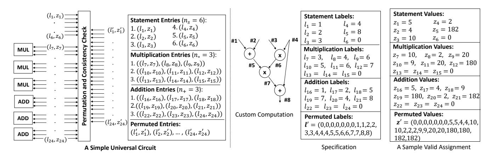

# <span id="page-0-0"></span>**MIRAGE**: Succinct Arguments for Randomized Algorithms with Applications to Universal zk-SNARKs

*Ahmed Kosba* <sup>∗</sup> *Alexandria University*

ahmed.kosba@alexu.edu.eg

*Dimitrios Papadopoulos HKUST*

dipapado@cse.ust.hk

*Charalampos Papamanthou* † *UMD*

cpap@umd.edu

*Dawn Song UC Berkeley*

dawnsong@berkeley.edu

Last updated: August 24, 2020

# Abstract

The last few years have witnessed increasing interest in the deployment of zero-knowledge proof systems, in particular ones with succinct proofs and efficient verification (zk-SNARKs). One of the main challenges facing the wide deployment of zk-SNARKs is the requirement of a trusted key generation phase per different computation to achieve practical proving performance. Existing zero-knowledge proof systems that do not require trusted setup or have a single trusted preprocessing phase suffer from increased proof size and/or additional verification overhead. On the other other hand, although universal circuit generators for zk-SNARKs (that can eliminate the need for per-computation preprocessing) have been introduced in the literature, the performance of the prover remains far from practical for real-world applications.

In this paper, we first present a new zk-SNARK system that is well-suited for randomized algorithms—in particular it does not encode randomness generation within the arithmetic circuit allowing for more practical prover times. Then, we design a universal circuit that takes as input any arithmetic circuit of a bounded number of operations as well as a possible value assignment, and performs randomized checks to verify consistency. Our universal circuit is linear in the number of operations instead of quasi-linear like other universal circuits. By applying our new zk-SNARK system to our universal circuit, we build MIRAGE, a universal zk-SNARK with very succinct proofs—the proof contains just one additional element compared to the per-circuit preprocessing state-of-the-art zk-SNARK by Groth (Eurocrypt 2016). Finally, we implement MIRAGE and experimentally evaluate its performance for different circuits and in the context of privacy-preserving smart contracts.

# 1 Introduction

Zero-knowledge proofs are a cryptographic primitive that enable an untrusted prover to prove the knowledge of a secret witness that satisfies certain properties to a skeptical verifier. This can be quite useful in many applications including authentication, privacy-preserving computations and others. Although the concept of zero-knowledge proofs was introduced multiple decades ago, it only started to get much attention in practice after recent advances in several aspects [\[1–](#page-13-0)[8\]](#page-13-1), which led to efficient implementations for a primitive called zk-SNARKs (zero-knowledge succinct non-interactive arguments of knowledge). zk-SNARKs provide constant-size proofs and verification that is only linear in the size of public statement being proven, regardless of how expensive the computation is. The promising performance properties of zk-SNARKs led to the development of various tools and improved back ends [\[5,](#page-13-2) [9](#page-13-3)[–12\]](#page-13-4), and enabled different kinds of applications including privacy-preserving transactions, certificate validation, image authentication and others [\[13](#page-13-5)[–18\]](#page-13-6).

However, using zk-SNARKs with constant-size proofs comes at a cost. For practicality reasons, such constructions typically resort to non-standard cryptographic assumptions and require a trusted key generation phase for each different computation. A compromised trusted setup process could lead to parties providing proofs for false statements while undetected. To avoid such problems in practice, distributed protocols are used for CRS generation [\[19,](#page-13-7) [20\]](#page-13-8), which will be expensive to repeat for every type of computation. These drawbacks have led to different lines of work on zero-knowledge proofs attempting to solve some or all of these issues, while providing good performance, e.g., [\[21–](#page-13-9)[28\]](#page-14-0). While these works manage to alleviate the drawbacks of zk-SNARKs, they are not as efficient as zk-SNARKs with respect to the verification overhead and proof size. For example, the proof size of these schemes can be tens or hundreds of kilobytes, while a typical zk-SNARK proof is only between 128 and 288 bytes depending on the assumptions [\[2,](#page-13-10) [7\]](#page-13-11).

These issues led to another line of work on universal zk-

<sup>∗</sup> A major part of this work was done while Ahmed Kosba was a postdoctoral scholar at UC Berkeley.

<sup>†</sup> Part of this work was done while Charalampos Papamanthou was with Oasis Labs.

SNARK systems [\[4,](#page-13-12) [29](#page-14-1)[–31\]](#page-14-2), which aim to reach a middle ground to avoid the trusted setup per computation challenge, while maintaining the succinctness and efficient verification guarantees provided by efficient zk-SNARK constructions. These systems still require a trusted setup, but such setup is done once for computations of a particular class, e.g., computations that have a certain bound on the number of their operations. In the following section, we provide a brief discussion of the existing universal zk-SNARK systems.

Universal zk-SNARK systems. There are two flavors of universality in the context of zk-SNARK systems presented in literature. The first is universality with respect to the common reference string (CRS), meaning that a CRS can be adapted without fixing a circuit. The other is the universality of the circuit itself, in which a circuit receives the computation being verified as part of the input itself, and processes its logic.

While the first approach sounds more flexible and does not require fixing any circuit, the existing approaches under that category have practical limitations. For example, the technique by Groth et al. [\[29\]](#page-14-1) requires a quadratic CRS for supporting universal SNARKs. In a more recent work, Sonic [\[31\]](#page-14-2) presented a more practical universal zk-SNARK with updatable CRS, however (in "unhelped" mode) it increases the proof size by a factor of 7×, the verification effort by a factor of 4× and the prover's effort by a factor of 50× (assuming Groth's zk-SNARK [\[7\]](#page-13-11) as a baseline). Note that Sonic also provides a helped mode that has smaller proof computation overhead and a shorter proof, but this mode requires adding an untrusted third party to help with the computations.

The advantage of the universal circuit approach is maintaining the succinct proof and the small number of pairings in the verification as enabled by zk-SNARKs, however, the most notable universal circuit approach, namely vnTinyRAM [\[4\]](#page-13-12) is not efficient enough to support applications in practice. vnTinyRAM's approach was shown to significantly increase the circuit size and prover's effort by multiple orders of magnitude [\[10\]](#page-13-13).

In this paper, we aim to address such practical limitations by building MIRAGE, a new universal zk-SNARK. In contrast to common belief, we show that the concept of universal circuits can be brought to practicality, through a modified zk-SNARK protocol and careful design of the universal circuit. While there is a cost to be paid for being universal, we managed to apply our system to applications that could benefit from our construction, such as privacy-preserving auctions and crowdfunding for a small number of participants. MIRAGE can be further scaled up using recent systems like DIZK [\[12\]](#page-13-4).

Technical Highlights. Next, we provide a brief overview of some technical aspects of MIRAGE.

*Separated zk-SNARKs.* We first explore how to enable efficient randomized checks in zk-SNARK circuits. Randomized checks can make the verification logic much faster than regular verification circuits in cases like permutation verification

and others. Informally, while it is possible to ask the prover to generate randomness by committing to the witness, doing this naively would lead to having additional expensive commitment logic *in the circuit*. To avoid that, we introduce *separated zk-SNARKs* that separate the witness values into ones that do not depend on the randomness and ones that do. Then the randomness is produced by committing to the first set of values *out of the circuit* and using this randomness to produce the second set of values. Due to this separation of the witness, our approach for universal circuits only increases the proof by one group element, and the verification effort by one pairing and two hash function calls, when compared to Groth's zk-SNARK [\[7\]](#page-13-11). Our protocol is not only useful in a universal-circuit context (as explained below), but also from a complexity theory perspective, comprising an efficient zk-SNARK for the MA complexity class.

*Linear-Size Universal Circuits.* A universal circuit is a circuit that receives the program to verify as input, besides the input values. One essential element of the verification of universal circuits is checking permutations to ensure that variables with the same labels have consistent values across the circuit. Previous approaches, e.g., vnTinyRAM [\[4\]](#page-13-12), use permutation networks which has *O*(*n*log*n*) overhead. We build a linear-size universal circuit based on an *O*(*n*) permutation verification circuit. Informally, we use the fact that two vectors v and w of size *n* are a permutation of each other if and only if the polynomials ∏(*x* − *vi*) and ∏(*x* − *wi*) are equal, which can be verified by checking equality at a random point *r*. Furthermore, in order to further reduce the prover's effort, we address different circuit design issues, and present a circuit that has better utilization than previous work. Our final universal zk-SNARK, MIRAGE, is derived by applying our separated zk-SNARK on our randomized, linear-size, universal circuit.

*Applications in Privacy-Preserving Smart Contracts.* We utilize MIRAGE in applications that require very succinct proofs and efficient verification, such as blockchain applications. We evaluate MIRAGE in the context of privacy-preserving smart contracts (e.g., HAWK [\[16\]](#page-13-14)) to address the trusted key generation per contract issue. Using MIRAGE, a universal verification key will be hardcoded on the blockchain, and for every new computation, an *untrusted* computation specifier would only provide 32 bytes encoding the computation to be verified to a custom contract. Verifying MIRAGE's proof on the chain would be very similar to verifying zk-SNARK proofs, which has been already implemented on Ethereum (our verifier would only be 1.4× expensive). Besides the evaluation of this scenario, we present detailed evaluation for different kinds of circuits.

Our contributions. We now summarize our contributions:

• We introduce *separated zk-SNARKs*, a zk-SNARK protocol that allows using randomized checks efficiently in circuits, which can be useful for both universal and non-universal contexts. This only adds one group element to the proof

in the generic group model, and adds one more pairing operation to the pairing operations done by the verifier in addition to other negligible operations in practice.

- We design a more efficient universal circuit that provides much better performance compared to the state-of-the-art by using random checks. Given a bound *N* on the number of operations (additions and multiplications), our universal circuit is linear *O*(*N*) instead of *O*(*N* log*N*).
- We build a new universal zk-SNARK, MIRAGE, by combining the above and we evaluate it in the context of privacypreserving smart contracts, e.g., HAWK [\[16\]](#page-13-14), addressing the trusted setup per contract problem that limits its usage in practice while maintaining verification efficiency.

Limitations. While MIRAGE significantly reduces the universal circuit overhead in comparison with vnTinyRAM and enables a higher scale of applications, the proof computation overhead is notably more expensive than the non-universal SNARK approach (See Section [6\)](#page-10-0). Additionally, although our system provides a more succinct proof and a more efficient verifier than Sonic, it does not provide updatable CRS.

## 1.1 Related work

Here, we discuss the existing zero-knowledge proof systems. In addition, since our system is evaluated in the context of privacy-preserving smart contracts, we provide a brief background on smart contracts and their challenges.

Zero-knowledge proof systems. Table [1](#page-3-0) gives an overview of representative zero knowledge proof constructions in the space. The constructions can be classified into different categories with respect to the setup requirements:

- Trusted setup per computation: This most notably includes the construction proposed by Gennaro et al. using quadratic arithmetic programs [\[1\]](#page-13-0). This construction was implemented, improved and extended in several later works [\[2,](#page-13-10) [4,](#page-13-12) [7,](#page-13-11) [8\]](#page-13-1). A clear advantage of this approach is that the proof size is succinct/constant-size and the verification overhead depends only on the size of the statement being proven. This made this kind of zero knowledge proofs more inviting for blockchain applications [\[13,](#page-13-5) [14,](#page-13-15) [16\]](#page-13-14).
- Transparent setup: Several constructions were proposed to eliminate the trusted setup requirement of the previous constructions. These include 1) Discrete log-based techniques, such as Bulletproofs [\[22\]](#page-13-16) and the previous work by Bootle et al. [\[33\]](#page-14-3). 2) Interactive oracle proofs techniques [\[34\]](#page-14-4), such as Ligero [\[21\]](#page-13-9), zk-STARKs [\[25\]](#page-13-17) Aurora [\[26\]](#page-13-18) and more recently Virgo [\[28\]](#page-14-0). These techniques rely on symmetric cryptography and are plausibly conjectured to have post-quantum security. 3) Interactive proof-based techniques [\[35\]](#page-14-5). Such techniques build upon several earlier works [\[36–](#page-14-6)[38\]](#page-14-7). An example is the Hyrax system by Wahby et al. [\[24\]](#page-13-19). 4) Latticebased techniques, such as the work by Baum et al. [\[32\]](#page-14-8).

• Universal trusted setup: This includes other interactive proofbased techniques, such as the techniques proposed by Zhang et al. [\[23\]](#page-13-20), and Xie et al. [\[27\]](#page-14-9). These techniques besides all techniques in the second category increase the verification overhead to an extent that might not be suitable for applications where proof size and verification overhead are a bottleneck. To avoid the trusted setup per computation problem while maintaining the verification efficiency, vnTinyRAM [\[4\]](#page-13-12) introduced a universal circuit that accepts the program to be verified besides the statement. This was shown to increase the proving cost by orders of magnitude compared to the non-universal approach [\[10\]](#page-13-13). Groth et al. introduced a universal zk-SNARK with updatable common reference strings [\[29\]](#page-14-1), however the size of the CRS in their setting is quadratic making it not practical. Recently, LegoUAC, a zk-SNARK with a linear universal CRS was introduced [\[30\]](#page-14-10), but it has polylogarithmic proofs. On the other hand, Sonic provides an updatable zk-SNARK with constant size proofs [\[31\]](#page-14-2). Sonic can run in two modes: helped and unhelped. In the helped mode, an additional untrusted party helps with making both proof computation and verification more efficient. Table [2](#page-3-1) provides a more detailed comparison between systems under the universal trusted setup category with constant proof sizes.

*Comparison with vnTinyRAM [\[4\]](#page-13-12)*. MIRAGE's circuit is linear in the number of supported operations, while vnTinyRAM's circuit is quasi-linear. Note that vnTinyRAM's construction accepts a program and a bound *T* on the number of execution steps, while our construction assumes that the desired computation is represented as an arithmetic circuit or a set of constraints. While the model is different, the same bound in the complexity comparison of the circuit sizes is used, assuming *T* = Θ(*N*). In Table [2,](#page-3-1) the concrete complexity of our prover is measured in terms of the number of additions and multiplications, but for vnTinyRAM, measuring the concrete complexity is different as it depends on the executed branches during runtime. The cost is estimated conservatively based on the per-cycle gate count in vnTinyRAM [\[4\]](#page-13-12), assuming the generic group model is used. More comparison details are in Section [5.3.](#page-10-1)

*Comparison with Sonic [\[31\]](#page-14-2)*. We mainly consider the unhelped mode of Sonic, as the availability of additional helper parties is not applicable in all contexts, especially if the computation being verified is not the same across many parties. As Table [2](#page-3-1) shows, our system is better with respect to the proof size and verification effort, and has competitive prover effort, when compared with Sonic in the unhelped case. If the universal circuit is highly utilized, i.e., *N* = *n*<sup>+</sup> +*n*∗, the prover in our case could have fewer exponentiations. Note that the reported prover cost of our system in Table [2](#page-3-1) uses a slightly modified version of the naive basic circuit presented in Section [4,](#page-7-0) that allows adding and multiplying constants cheaply. This is why the bound *N* does not consider addition or multiplication of constants. In Section [5,](#page-8-0) we also present

<span id="page-3-0"></span>Table 1: A comparison of the existing zero-knowledge proof systems. A filled circle indicates no trusted setup, while a half filled circuit indicates a universal setup for a class of computations. In this table, n is the total number of gates,  $n_*$  is the number of multiplications, u is the size of the statement, w is the witness size, N is an upper bound on the number of additions and multiplications. For Hyrax, Libra and Virgo, d is the circuit depth and g is the width of the circuit.

| Scheme            | Untrusted Setup | Proof Computation     | Proof Size               | Verification            |
|-------------------|-----------------|-----------------------|--------------------------|-------------------------|
| QAP-based [1,2,7] | 0               | $O(n_* \log n_*)$     | O(1)                     | O(u)                    |
| Ligero [21]       | •               | $O(n_* \log n_*)$     | $O(\sqrt{n_*})$          | $O(n_*)$                |
| zk-STARKs [25]    | •               | $O(n_* \log^2 n_*)$   | $O(\log^2 n_*)$          | $O(\log^2 n_*)$         |
| Bulletproofs [22] | •               | $O(n_*)$              | $O(\log n_*)$            | $O(n_*)$                |
| Hyrax [24]        | •               | $O(n+d\cdot g\log g)$ | $O(\sqrt{w} + d\log g)$  | $O(\sqrt{w} + d\log g)$ |
| Aurora [26]       | •               | $O(n_* \log n_*)$     | $O(\log^2 n_*)$          | $O(n_*)$                |
| Baum et al. [32]  | •               | $O(n_* \log n_*)$     | $O(\sqrt{n_* \log n_*})$ | $O(n_*)$                |
| Virgo [28]        | •               | $O(n + w \log w)$     | $O(d\log n + \log^2 w)$  | $O(d\log n + \log^2 w)$ |
| Libra [27]        | •               | O(n)                  | $O(d \log n)$            | $O(d \log n)$           |
| Groth et al. [29] | •               | $O(n_* \log n_*)$     | O(1)                     | O(u)                    |
| Sonic [31]        | •               | $O(n_* \log n_*)$     | O(1)                     | O(u)                    |
| LegoUAC [30]      | •               | O(n)                  | $O(\log^2 n)$            | $O(u + \log^2 n)$       |
| vnTinyRAM [4]     | •               | $O(N\log^2 N)$        | O(1)                     | O(u)                    |
| This Work         | •               | $O(N \log N)$         | O(1)                     | O(u)                    |

<span id="page-3-1"></span>Table 2: Comparison between current approaches for universal zk-SNARKs with **constant-size proofs** with respect to the non-universal scheme of Groth16 [7] as a baseline. Besides the notation used in Table 1, U is an upper bound on the statement size, m refers to the number of wires, d' refers to the maximum size of committed polynomials in Sonic [31], EX refers to exponentiations, P refers to pairing operations and T is a bound on the number of computation steps in vnTinyRAM ( $T = \Theta(N)$ ). The second group of rows correspond to schemes with universal CRS, while the last group of rows correspond to systems with universal circuits. Assuming full circuit utilization for our construction in the naive case, the bound N would be equal to  $n_* + n_+$  where  $n_+$  is the number of additions, and U would be equal to u. Note:  $n_*$  and  $n_+$  do not include multiplying by or adding constants. In all universal schemes, the custom portion of the CRS is not generated by a trusted party.

|                   |               |                  | 1               | <u> </u>                  |            | 1 /               |             |            |
|-------------------|---------------|------------------|-----------------|---------------------------|------------|-------------------|-------------|------------|
| Scheme            | CRS Size      |                  | Uni. Circ. Size | Prover's Overhead         | Proof Size | Verification      | Assumptions | Updatable? |
|                   | Universal     | Custom           |                 |                           |            |                   |             |            |
| Non-universal [7] | N/A           | $O(n_* + m)$     | N/A             | $4n_* + m - u \text{ EX}$ | 128 B      | 3 P + <i>u</i> EX | GG          | ✓          |
| Groth et al. [29] | $O(n_*^2)$    | $O(n_* + m - u)$ | N/A             | $O(n_* + m - u)$ EX       | 128 B      | 5 P + u EX        | GG          | ✓          |
| Sonic [31]        | O(d')         | $O(n_*)$         | N/A             | 273n* EX                  | 1152 B     | 13 P              | AGM, RO     | ✓          |
| Sonic (Helped)    | O(d')         | $O(n_*)$         | N/A             | $18n_*$ EX                | 256 B      | 10 P              | AGM, RO     | ✓          |
| vnTinyRAM [4]     | $O(N \log N)$ | O(1)             | $O(N \log N)$   | 5000T EX                  | 128 B      | 3 P + <i>u</i> EX | GG          | Х          |
| This work         | O(N)          | O(1)             | O(N)            | 90N + 25U EX (naive)      | 160 B      | 4 P + u EX        | GG, RO      | ×          |

another circuit design that can reduce the reported prover cost further for many applications.

Comparison with concurrent work [39, 40]: MARLIN provides a preprocessing zk-SNARK that has a universal and updatable CRS [39]. MARLIN has faster prover and verifier than Sonic, however its proof size is still 1 KB, and the reported experiments showed that its verifier's performance is about 2.6× worse than the Groth16 baseline, despite having fewer pairings. Another work in the same line, PLONK [40], improves upon Sonic. PLONK has a proof size of 448 to 512 bytes and a more efficient prover. The estimated costs reported in PLONK [40] could suggest that its performance is comparable to MARLIN's. In comparison, our proof size is 160 bytes, and the verifier's performance is only 1.4× worse than the Groth16 baseline, which makes MIRAGE's verifier more

suitable for applications that require efficient verification. On the other hand, MIRAGE's CRS is not updatable.

Smart Contracts. The emerging success of cryptocurrencies, most notably Bitcoin [41], has motivated several other applications to utilize the decentralized blockchain setting for supporting other functionalities. This further led to another generation of cryptocurrency systems that aimed at enabling users to customize the decentralized computation, by defining smart contracts. Smart contracts are executable objects that can run autonomously on top of a blockchain and are automatically enforced. Systems like Ethereum [42] enable users to program smart contracts using high-level languages and post their contracts to the chain. Besides simple transaction verification, the network in a smart contract system executes the user-specified code included in the smart con-

tract. This clearly leads to a privacy issue, as all values used by the computation will be seen by all miners.

HAWK [16] aims to address the privacy problem by using zero knowledge proofs. For example, to support a privacy-preserving decentralized auction, the involved parties and the auction manager interact through a protocol whose correct execution can be verified by a smart contract that does not learn anything about the users' bids or the winner. HAWK relies on QAP-based zk-SNARKs in their implementation as they provide succinct proofs and efficient verification. However, one implication of using this kind of zero-knowledge proofs is the trusted setup needed per computation. This limits the usage of HAWK's approach in practice. In our work, we show how to avoid this problem through our universal circuit and efficient zk-SNARK protocol for randomized verification.

### 2 Preliminaries

In this section, we provide a summary of the definitions and the protocols we use or modify.

# 2.1 Quadratic Arithmetic Programs

**Definition 1** Quadratic Arithmetic Program (QAP) [1,2] A QAP Q over field  $\mathbb{F}_q$  contains three sets of m+1 polynomials  $V = \{v_i(x)\}, W = \{w_i(x)\}, Y = \{y_i(x)\}, \text{ for } i = 0, \ldots, m, \text{ and a target polynomial } t(x).$  Let C be a circuit with m wires (a wire can be an input to the circuit or an output of a multiplication gate) out of which u wires are I/O wires  $(c_1, \ldots, c_u)$ . Then we say that Q computes C if:  $(c_1, \ldots, c_u) \in \mathbb{F}_q^u$  is a valid assignment of C's inputs and outputs, if and only if there exist coefficients  $(c_{u+1}, \ldots, c_m)$  such that t(x) divides p(x), where p(x) is the polynomial

$$(v_0(x) + \sum_{i=1}^m c_i v_i(x))(w_0(x) + \sum_{i=1}^m c_i w_i(x)) - y_0(x) - \sum_{i=1}^m c_i y_i(x).$$

#### 2.2 zk-SNARKs

zk-SNARKs (zero-knowledge succinct non-interactive arguments of knowledge) have algorithms (Setup, Prove, Verify). In summary Setup outputs prover and verification keys, on input a a circuit *C*. Algorithm Prove outputs a zero-knowledge proof of knowledge that circuit *C* is satisfiable for a fixed public statement (I/Os). Finally, Verify verifies that proof, given a public statement. For a zk-SNARK, we want *perfect completeness*, *knowledge soundness* and *zero-knowledge* to hold. Perfect completeness means that an honest prover that knows the witness to a satisfiable statement can provide a verifying proof. Knowledge soundness means that, given a verifying proof for a public statement provided by a PPT adversary  $\mathcal{A}$ , there exists an extractor that can retrieve a valid witness by inspecting  $\mathcal{A}$ 's tape. Finally, zero-knowledge means that a proof provided by an honest prover leaks nothing more than

the validity of the statement. The formal definitions of the above three properties (and the ones we use in our proofs) can be found in Definition 2 of Groth's zk-SNARK [7].

# 2.3 Groth16 protocol

We summarize the protocol proposed by Groth [7] in the generic group model, using the notation we use in this paper.

**Protocol 1** The Groth16 Protocol [7]

•  $\{vrk_C, prk_C\} \leftarrow Setup(C, 1^{\lambda})$ : Let C be an arithmetic circuit with u public input and output values from  $\mathbb{F}_q$ , i.e., u is the statement size. Build a QAP Q = (t(x), V, W, Y) of size m and let n be the degree of t(x). Let  $I_{mid} = \{u + 1, \ldots, m\}$ . Let e be a bilinear map  $e : \mathbb{G}_1 \times \mathbb{G}_2 \to \mathbb{G}_T$ , and let  $g_1$  be a generator of  $\mathbb{G}_1$  and  $g_2$  be a generator of  $\mathbb{G}_2$ .

Choose  $\alpha, \beta, \gamma, \delta, s \leftarrow \mathbb{F}_q$ . Construct the public proving key prk<sub>C</sub> as follows:

$$\begin{split} &\circ \ g_{1}^{\alpha},g_{1}^{\beta},g_{1}^{\delta},g_{2}^{\beta},g_{2}^{\delta} \\ &\circ \ \{g_{1}^{s^{i}}\}_{i=0}^{n-1},\{g_{2}^{s^{i}}\}_{i=0}^{n-1} \\ &\circ \ \{g_{1}^{(\beta v_{i}(s)+\alpha w_{i}(s)+y_{i}(s))/\delta}\}_{i\in I_{mid}} \\ &\circ \ \{g_{1}^{s^{i}t(s)/\delta}\}_{i=0}^{n-2} \end{split}$$

Construct the verification key vrkc as

$$\begin{array}{l} \circ \ g_{1}^{\alpha},g_{2}^{\beta},g_{2}^{\gamma},g_{2}^{\delta}, \\ \\ \circ \ \{g_{1}^{(\beta v_{i}(s)+\alpha w_{i}(s)+y_{i}(s))/\gamma}\}_{i=0}^{u} \end{array}$$

•  $\pi \leftarrow Prove(C, prk_C, stmt)$ : Given public statement stmt which includes the values  $\{c_i\}_{i=1}^u$ , the prover infers the values of the remaining wires in the circuit  $\{c_i\}_{i=u+1}^m$  and samples two random values  $\kappa_1$  and  $\kappa_2$  from  $\mathbb{F}_q$ . The prover then computes  $h(x) = \frac{p(x)}{t(x)}$ , and computes the proof as

$$\begin{split} &\circ \ \pi_{A} = g_{1}^{\alpha + \nu(s) + \kappa_{1} \delta} \\ &\circ \ \pi_{B} = g_{2}^{\beta + w(s) + \kappa_{2} \delta} \\ &\circ \ \pi_{C} = g_{1}^{(h(s)t(s) + I_{mid}(s))/\delta} . \pi_{A}^{\kappa_{2}} . B_{1}^{\kappa_{1}} . g_{1}^{-\kappa_{1} \kappa_{2} \delta} \end{split}$$

where

$$v(x) = \sum_{i=0}^{m} c_{i}v_{i}(x)$$

$$w(x) = \sum_{i=0}^{m} c_{i}w_{i}(x)$$

$$B_{1} = g_{1}^{\beta+w(s)+\kappa_{2}\delta}$$

$$I_{mid}(x) = \sum_{i \in I_{mid}} c_{i}(\beta v_{i}(x) + \alpha w_{i}(x) + y_{i}(x))$$

*Proof*  $\pi$  *contains*  $\pi_A$ ,  $\pi_B$  *and*  $\pi_C$ .

• {0,1} ← Verify(vrk<sub>C</sub>, stmt, π): Given the proof and the verification key, the verifier does the check

$$e(\pi_A, \pi_B) = e(g_1^{\alpha}, g_2^{\beta}).e(g_1^{\Psi_{io}(s)/\gamma}, g_2^{\gamma}).e(\pi_C, g_2^{\delta}),$$

where  $\Psi_{io}(x) = \sum_{i=0}^{u} c_i(\beta v_i(x) + \alpha w_i(x) + y_i(x))$  and where  $c_0 = 1$  and  $(c_1, \dots, c_u)$  is the public statement stmt being proved.

#### <span id="page-5-2"></span>3 Arguments for $\mathcal{MA}$ complexity class

We consider the class of languages that can be efficiently verified given a randomized verifier with public coins. Concretely, assume the class of  $\mathcal{MA}$  statements (from Merlin-Arthur) which can be viewed as the randomized analogue of  $\mathcal{NP}$ . In particular it contains languages L that come with a probabilistic polynomial-time verification algorithm  $\mathcal{L}(x, w)$ , where x in the statement and w is the witness. The requirement is that if  $x \in L$  then there is a witness w such that the probability that L(x, w) accepts is at least 2/3. If  $x \notin L$ , for all witnesses w,  $\mathcal{L}(x, w)$  accepts with probability at most 1/3. It is crucial that the coins of  $\mathcal{L}(x, w)$  are chosen **independently** of w otherwise, a cheating prover can compute a witness w and related randomness that will make  $\mathcal{L}(x, w)$  accept with probability > 1/3. The above soundness bound can be replaced with one exponentially small in |x|, |w| (e.g.,  $2^{-\lambda}$ ) and the correctness bound can be made 1, without changing the class.

Clearly,  $\mathcal{MA}$  contains  $\mathcal{NP}$  and  $\mathcal{P}$ . Interestingly, there are problems both in  $\mathcal{MA}$  and  $\mathcal{P}$  whose  $\mathcal{MA}$  verification procedure is much faster than the  $\mathcal{P}$  verification procedure. For example, *checking primality* has a slow deterministic test [43] but a fast randomized test [44]. Similarly, checking that a vector is a permutation of another vector has an  $O(n \log n)$ deterministic test but an O(n) randomized test (form polynomials where the elements of the vectors are roots and check equality at a random point). For practical purposes this is very important. In particular, our paper defines a language L that contains pairs (C, p) where C is an arbitrary arithmetic circuit of  $n_*$  multiplication gates and  $n_+$  addition gates, p is a value assignment on a subset of C's wires and  $(C, p) \in L$  iff there exist an assignment p' on the rest of C's wires such that (p, p')is a valid assignment for C. Clearly, L is in  $\mathcal{NP}$ , but we also show that L has a much faster verification procedure.

### <span id="page-5-0"></span>3.1 Baseline zk-argument for $\mathcal{MA}$

Given a language L in  $\mathcal{MA}$  with randomized verification procedure  $\mathcal{L}(x,w)$ , we can write down  $\mathcal{L}(x,w)$  as a deterministic procedure  $\mathcal{L}(x,w,r)$ , where  $r \in \{0,1\}^{\lambda}$  are the random coins used in  $\mathcal{L}(x,w)$ . A baseline way to construct a zero-knowledge argument for  $\mathcal{MA}$  from any zk-SNARK for NP, is as follows. First, we ask the prover to commit to witness w using a hiding and binding commitment  $com_w$ . Then, the verifier chooses random coins r and sends them to the prover. Finally, the prover runs the SNARK proving algorithm for

the composite statement "w is a valid opening for  $com_w$  and  $\mathcal{L}(x,w,r)$  accepts." Since the commitment scheme is hiding and the SNARK is zero-knowledge, the verifier learns nothing about w from the interaction. Assuming the commitment scheme has a "knowledge" property (enhancing it with a zero-knowledge proof-of-knowledge, if necessary), the soundness of the protocol can be proven in a straight-forward manner by extracting the pre-image of  $com_w$  and the witness used in the circuit of  $\mathcal{L}$ . If they are different, this can be used to break the commitment binding property. Else, since  $com_w$  was computed before seeing r, the probability that the extracted witness is not a valid witness for x, is negligible by the soundness property of the  $\mathcal{MA}$  argument.

If |r| is at most polylogarithmic in |w|, this protocol is a succinct zero-knowledge argument. The downside of this approach is that it required "opening"  $com_w$  inside the circuit being argued with the SNARK, which may introduce a significant overhead in practice. In the rest of this section, we describe a more efficient way to build zero-knowledge arguments for  $\mathcal{MA}$  by modifying the zk-SNARK of Groth [7].

# 3.2 Separated zk-SNARKs

Recall that in a typical zk-SNARK based on quadratic arithmetic programs, the wire indices of the circuit being verified are divided in two categories. The ones that correspond to the public statement being proved usually referred to as *IO-related* indices and the ones that correspond to the *non-IO-related* indices that we call  $I_{mid}$  (these contain the witness indices too). A *separated* zk-SNARK is a zk-SNARK with the difference that it is parametrized by a set of indices  $J \subset I_{mid}$ . More importantly, the proof  $\pi$  of a separated zk-SNARK can be written as  $[\pi', \pi_J]$  where  $\pi_J$  can be computed with access *only* to the values of the indices in J and the public parameters. We now give a separated zk-SNARK implemented off Groth's original zk-SNARK [7]. We highlight the changes with blue. We prove its knowledge soundness in the generic group model and its zero-knowledge (as per [7, Def. 2]).

#### <span id="page-5-1"></span>Protocol 2 The separated Groth16 Protocol

•  $\{vrk_{C(J)}, prk_{C(J)}\} \leftarrow Setup(C(J), 1^{\lambda})$ : Let C be an arithmetic circuit with u public input and output values from  $\mathbb{F}_q$ , i.e., u is the statement size. Build a QAPQ = (t(x), V, W, Y) of size m and let n be the degree of t(x). Let  $I_{mid} = \{u+1, \ldots, m\}$ ,  $J \subseteq I_{mid}$  and  $I = I_{mid} - J$ .

Choose  $\alpha, \beta, \gamma, \delta, \delta', s \leftarrow \mathbb{F}_q$ . Construct the public proving key  $prk_{C(J)}$  as follows:

$$\circ \ g_1^{\alpha}, g_1^{\beta}, g_1^{\delta}, g_1^{\delta'}, g_2^{\delta}, g_2^{\delta}$$

$$\circ \ \{g_1^{s^i}\}_{i=0}^{n-1}, \{g_2^{s^i}\}_{i=0}^{n-1}$$

$$\circ \{g_1^{(\beta v_i(s) + \alpha w_i(s) + y_i(s))/\delta}\}_{i \in I}$$

$$\circ \{g_1^{(\beta v_i(s) + \alpha w_i(s) + y_i(s))/\delta'}\}_{i \in J}$$

$$\{g_1^{s^i t(s)/\delta}\}_{i=0}^{n-2}$$

Construct the verification key  $vrk_{C(I)}$  as

$$\circ g_{1}^{\alpha}, g_{2}^{\beta}, g_{2}^{\gamma}, g_{2}^{\delta}, g_{2}^{\delta'}$$

$$\circ \{g_{1}^{(\beta v_{i}(s) + \alpha w_{i}(s) + y_{i}(s))/\gamma}\}_{i=0}^{u}$$

•  $\pi \leftarrow Prove(C(J), prk_{C(J)}, stmt)$ : Given public statement stmt which includes the values  $\{c_i\}_{i=1}^u$ , the prover infers the values of the remaining wires in the circuit  $\{c_i\}_{i=u+1}^m$  and samples three random values  $\kappa_1$ ,  $\kappa_2$  and  $\kappa_3$  from  $\mathbb{F}_q$ . The prover then computes  $h(x) = \frac{p(x)}{t(x)}$ , and computes the proof as

$$\begin{array}{l} \circ \ \pi_{A} = g_{1}^{\alpha+\nu(s)+\kappa_{1}\delta} \\ \circ \ \pi_{B} = g_{2}^{\beta+w(s)+\kappa_{2}\delta} \\ \circ \ \pi_{C} = g_{1}^{(h(s)t(s)+I(s))/\delta}.\pi_{A}^{\kappa_{2}}.B_{1}^{\kappa_{1}}.g_{1}^{-\kappa_{1}\kappa_{2}\delta-\kappa_{3}\delta'} \\ \circ \ \pi_{D} = g_{1}^{\kappa_{3}\delta}g_{1}^{J(s)/\delta'} \end{array}$$

where

$$v(x) = \sum_{i=0}^{m} c_{i}v_{i}(x)$$

$$v(x) = \sum_{i=0}^{m} c_{i}w_{i}(x)$$

$$B_{1} = g_{1}^{\beta+w(s)+\kappa_{2}\delta}$$

$$I(x) = \sum_{i \in I} c_{i}(\beta v_{i}(x) + \alpha w_{i}(x) + y_{i}(x))$$

$$J(x) = \sum_{i \in J} c_{i}(\beta v_{i}(x) + \alpha w_{i}(x) + y_{i}(x))$$

Write proof  $\pi$  as  $[\pi', \pi_J]$  where  $\pi'$  contains  $\pi_A$ ,  $\pi_B$  and  $\pi_C$  and  $\pi_J$  contains  $\pi_D$ .

•  $\{0,1\} \leftarrow Verify(vrk_{C(J)}, stmt, \pi)$ : Given the proof and the verification key, the verifier checks to see if  $e(\pi_A, \pi_B)$  equals

$$e(g_1^{\alpha}, g_2^{\beta}).e(g_1^{\Psi_{io}(s)/\gamma}, g_2^{\gamma}).e(\pi_C, g_2^{\delta}).e(\pi_D, g_2^{\delta'}),$$

where  $\Psi_{io}(x) = \sum_{i=0}^{u} c_i(\beta v_i(x) + \alpha w_i(x) + y_i(x))$  and where  $c_0 = 1$  and  $(c_1, \dots, c_u)$  is the public statement stmt being proved.

**Proof sketch for knowledge soundness.** Knowledge soundness holds in the generic group model. Following the proof technique in [7], we express  $\pi_A$ ,  $\pi_B$ ,  $\pi_C$  and  $\pi_D$  as  $g^A$ ,  $g^B$ ,  $g^C$  and  $g^D$ , where A, B, C and D are 6-variate Laurent polynomials in  $\alpha$ ,  $\beta$ ,  $\gamma$ ,  $\delta$ ,  $\delta'$  and s and, due to the generic group model, can be expressed as linear combinations of the elements in  $\text{vrk}_{C(J)}$ ,  $\text{prk}_{C(J)}$ . Substituting in the verification equation, we have that two Laurent polynomials should be equal. This gives rise to equations that relate to the coefficients of distinct monomials on both sides, allowing us to extract the QAP coefficients. The proof is in Appendix C.

**Proof for zero-knowledge.** The simulator can choose group elements for  $\pi_A$ ,  $\pi_B$  and  $\pi_C$  by randomly choosing their exponents and then set  $\pi_D$  to be the element satisfying the verification equation. Since  $\kappa_1, \kappa_2, \kappa_3$  are chosen uniformly at random in our construction and  $\pi_D$  is the only group element satisfying the verification equation, zero-knowledge follows.

#### 3.3 Efficient zk-SNARK for $\mathcal{MA}$

Now we build an efficient zk-SNARK for a language L in  $\mathcal{MA}$  using the above separated construction. Let  $\mathcal{L}(x, w, r)$  be the de-randomized verifier algorithm for L, as introduced before. We view L as a circuit with IO-related indices being x and r and non-IO-related indices  $I_{mid}$  being the rest of the wire indices. Define  $J \subset I_{mid}$  to be the set of all wire indices of  $\mathcal{L}(x, w, r)$  that do not depend on the randomness r—note that J includes the wires corresponding to the witness w. Let us call those wires deterministic wires.

To give an intuition about that, consider the  $\mathcal{MA}$  language that contains pairs of n-sized vectors  $(\mathbf{a}, \mathbf{b})$  such that  $(\mathbf{a}, \mathbf{b}) \in \mathcal{L}$  iff  $\mathbf{b}$  is a *sorted version* of  $\mathbf{a}$ . The  $\mathcal{MA}$  verification procedure involves two checks (note that in this case there is no explicit witness that is given as input):

- 1. (deterministic comparison check)  $b_i \le b_{i+1}$  for all i = 1, ..., n-1;
- 2. (randomized permutation check)  $\prod_{i=1}^{n} (\mathbf{a}_i + r) = \prod_{i=1}^{n} (\mathbf{b}_i + r)$ .

In this case, the set of deterministic wires J will correspond only to the wires that are used to implement the comparisons (whose values only depend on the statement).

We are now ready to describe the protocol. The common input of the verifier and the prover is a statement x; the prover additionally has a corresponding witness w. The goal of the prover is to persuade the verifier, in zero-knowledge, that  $x \in L$  where L is an  $\mathcal{MA}$  language with verification procedure L(x, w, r). Let J be the set of deterministic wires for L(x, w, r) and let  $\{\operatorname{vrk}_{L(J)}, \operatorname{prk}_{L(J)}\} \leftarrow \operatorname{Setup}(L(J), 1^{\lambda})$  be the parameters generated from the Setup of the separated zk-SNARK. Our protocol is interactive and proceeds as follows.

- 1. Given  $x \in L$  and the respective witness w, the prover computes the values of the deterministic wires J with respect to L(x, w, r) and then computes  $\pi_J$  using the public parameters  $\operatorname{prk}_{L(I)}$ . The prover sends  $\pi_J$  to the verifier;
- 2. The verifier picks a random r and sends to the prover;
- 3. The prover computes the values for the wires in  $I_{mid} J$  using randomness r. At that point he knows all the wire values for  $\mathcal{L}(x, w, r)$  and runs  $\pi \leftarrow \mathsf{Prove}(\mathcal{L}(J), \mathsf{prk}_{\mathcal{L}(J)}, x||r)$ . Parse  $\pi$  as  $[\pi' \pi_J]$  and send  $\pi'$  to the verifier;
- 4. The verifier computes  $\pi = [\pi' \ \pi_j]$  and runs  $\{0,1\} \leftarrow \text{Verify}(\text{vrk}_{\mathcal{L}}, x || r, \pi)$ , using the  $\pi_J$  received in Step 1 and the randomness r sent at Step 2.

As the randomness r is "public" since L is in  $\mathcal{MA}$  (as opposed to secret randomness used locally by the verifier),

<span id="page-6-0"></span><sup>&</sup>lt;sup>1</sup>Our separated zk-SNARK can be proven secure in the algebraic group model (AGM), following the techniques of [45].

the interaction can be removed with the Fiat-Shamir heuristic, assuming a collision-resistant hash function hash modelled as a random oracle.

- Given x and w, the prover computes the values of the deterministic wires J with respect to  $\mathcal{L}$  and then computes  $\pi_J$  using the public parameters  $\operatorname{prk}_{\mathcal{L}(J)}$ . Then the prover computes  $r = \operatorname{hash}(x||\pi_J)$ . Then the prover computes the values for the wires in  $I_{mid} J$  using randomness r. At that point, the prover knows all the wire values for  $\mathcal{L}(x, w, r)$  and runs  $\pi \leftarrow \operatorname{Prove}(\mathcal{L}, \operatorname{prk}_{\mathcal{L}(J)}, x||r)$ . Then the prover sends  $\pi$  to the verifier;
- The verifier parses  $\pi$  as  $[\pi' \pi_J]$ , computes  $r = \mathsf{hash}(x||\pi_J)$  and runs  $\{0,1\} \leftarrow \mathsf{Verify}(\mathsf{vrk}_{\mathcal{L}},x||r,\pi)$ .

As in Section 3.1, if r is of size only polylogarithmic in |w| (and polynomial in |x| and security parameter  $\lambda$ ), then the resulting protocol is a succinct non-interactive argument. The prover's runtime is asymptotically the same as that of Groth's protocol  $\tilde{O}(|\mathcal{L}|)$ .

# <span id="page-7-0"></span>4 A Universal Circuit Protocol for zk-SNARKs

In this section, we adapt the protocol described above in the context of universal circuits. We will use a simplified version of our universal circuit to make the representation less involved. (Section 5 presents the circuit design in detail).

The goal is to define a simple universal language  $L_{univ}$  that captures the operations of any circuit C that has at most  $n_*$  multiplications and  $n_+$  additions, and its statement size is bounded by  $n_s$ . We use the following notation: Let  $l_i$  and  $l_i'$  refer to an index (label) of a variable in our construction. Let  $z_i$  and  $z_i'$  refer to the values of the variables with indices  $l_i$  and  $l_i'$  respectively. An *entry* is a pair of label and value, e.g.,  $(l_i, z_i)$ . Let **spec** be a vector that specifies the functionality of a custom circuit C, i.e.,  $\mathbf{spec}_C = (l_1, l_2, \dots, l_{n_s+3n_*+3n_+})$ . The first  $n_s$  elements will correspond to the labels of the statement variables, then the following  $3n_*$  and  $3n_+$  elements will be the labels of the variables used in multiplication and addition constraints, respectively. Let  $\mathbf{stmt}$  be a vector that includes the values of the statement variables of C, i.e.,  $\mathbf{stmt} = (z_1, z_2, \dots, z_{n_s})$ . (Figure 1 illustrates an example)

Define the language  $L_{univ}$  as follows: An instance  $(\mathbf{spec}_C, \mathbf{stmt}) \in L_{univ}$  if and only if  $\mathbf{stmt}$  is a satisfying assignment for the specification of C, i.e.,

- There exists a vector  $(z_{n_s+1}, z_{n_s+2}, \dots, z_{n_s+3n_*+3n_+})$  such that  $z_{i+2} = z_i \times z_{i+1}$  for all  $i \in \{n_s+1, \dots, n_s+3n_*-2\}$ , and  $z_{i+2} = z_i + z_{i+1}$  for all  $i \in \{n_s+3n_*+1, \dots, n_s+3n_*+3n_+-2\}$ .
- There exists a vector of  $(l'_i, z'_i)$  entries where  $i \in \{1, ..., n_s + 3n_* + 3n_+\}$ , such that
- It is a permutation of the entries  $\{(l_i, z_i)\}_{i \in \{1, \dots, n_s + 3n_* + 3n_+\}}$ .

- (Consistency) For all  $i \in \{1, ..., n_s + 3n_* + 3n_+ - 1\}$ ,  $l'_i \le l'_{i+1}$ , and if  $l'_i = l'_{i+1}$ , then  $z'_i$  must be equal to  $z'_{i+1}$ .

To check membership in  $L_{univ}$ , a randomized verifier applies all the correctness and consistency constraints above, and checks the permutation constraint as follows. Given two uniformly selected random values  $r_1$  and  $r_2$  from  $\mathbb{F}_q$ , the following must hold:

$$\prod_{i=1}^{n_s+3n_*+3n_+}((l_i+r_2z_i)-r_1)=\prod_{i=1}^{n_s+3n_*+3n_+}((l_i'+r_2z_i')-r_1)$$

To show that  $L_{univ} \in \mathcal{MA}^2$ , we argue about the complexity of the verifier and the probability of failure. Let  $C_{univ}$  be a circuit that encodes the verification logic above. Note that the size of the circuit will be linear in the size of the specification. A prover would send the circuit  $C_{univ}$  to the verifier along with the values of all  $z_i$ 's and  $(l_i', z_i')$  entries. The verifier can then run the circuit given the prover's input, the specification  $\mathbf{spec}_C$ , and two independently generated random values  $r_1, r_2$ . It's easy to observe that the verifier runs in a polynomial time.  $\mathbf{Completeness.}$  If  $(\mathbf{spec}_C, \mathbf{stmt}) \in L_{univ}$ , i.e., the prover is honest, it is easy to see that verification will always succeed with probability 1.

**Soundness.** If  $(\mathbf{spec}_C, \mathbf{stmt}) \notin L_{univ}$ , i.e., the prover is dishonest, to calculate the probability of successful verification, we can compute an upper bound based on the probability of the following two events:

- The prover could cheat if for any  $i \in \{1, 2, \dots, n_s + 3n_* + 3n_+\}$  and  $j \in \{1, 2, \dots, n_s + 3n_* + 3n_+\}$ , the random value  $r_2$  was equal to the root of the polynomial  $p_{ij}(x) = l_i l'_j + x(z_i z'_j)$ , i.e.,  $r_2 = \frac{l'_j l_i}{z_i z'_j}$  when  $z_i \neq z'_j$ . Let  $p_1$  denote the probability of this event. It can be shown that  $p_1 \leq \frac{(n_s + 3n_* + 3n_+)^2}{|\mathbb{F}_q|}$ .
- The prover could cheat if the random value  $r_1$  is a root of the polynomial  $p(x) = \prod_{i=1}^{n_s+3n_*+3n_+}((l_i+r_2z_i)-x)-\prod_{i=1}^{n_s+3n_*+3n_+}((l_i'+r_2z_i')-x)$ . Let  $p_2$  denote the probability of this event. Using the Schwartz-Zippel Lemma, it can be shown that  $p_2 \leq \frac{n_s+3n_*+3n_+}{|\mathbb{F}_q|}$ . Let  $p_{cheating}$  be the total cheating probability. It can

Let  $p_{cheating}$  be the total cheating probability. It can be shown that  $p_{cheating} \leq p_1 + p_2$ , i.e.,  $p_{cheating} \leq \frac{(n_s + 3n_* + 3n_+)^2 + (n_s + 3n_* + 3n_+)}{|\mathbb{F}_q|}$ . In our implementation,  $|\mathbb{F}_q|$  is nearly  $2^{254}$ . For a cheating probability of  $2^{-128}$ ,  $(n_s + 3n_* + 3n_+)$  has to exceed  $2^{60}$  which is way beyond practical circuit sizes.

This shows that  $L_{univ} \in \mathcal{MA}$ . Now we can apply our efficient zk-SNARK for  $\mathcal{MA}$  to verify membership in  $L_{univ}$ , i.e., verify that the circuit  $C_{univ}$  is satisfied given a specification and a statement. This serves to minimize the verifier's effort and enable zero-knowledge (hiding the values of intermediate

<span id="page-7-1"></span><sup>&</sup>lt;sup>2</sup>We could also show that  $L_{univ} \in \mathcal{MA}$  by showing that  $L_{univ} \in \mathcal{NP}$  via a quasi-linear deterministic verification procedure.



<span id="page-8-1"></span>Figure 1: An example of a *simple* universal circuit and a specification of a custom circuit. # indicates a variable label. Unused entries are zeroed.

witnesses values). Appendix A illustrates how to apply our Protocol 2 for  $C_{univ}$  in detail. The following points highlight some details about the mapping and the differences:

- The statement of  $C_{univ}$  is changed to also include  $\{l'_i\}_{i\in\{1,\dots,n_s+3n_++3n_*\}}$  besides  $\{l_i\}_{i\in\{1,\dots,n_s+3n_++3n_*\}}$  and  $\{z_i\}_{i\in\{1,\dots,n_s\}}$ , as the values of  $\{l'_i\}$  are known during the specification of the custom circuit, and will be part of **spec**<sub>C</sub>.
- The set J in Protocol 2 will include the set of indices corresponding to the wires carrying the witness values of  $\{z_i\}_{i\in\{n_s,\dots,n_s+3n_++3n_*\}}, \{z_i'\}_{i\in\{1,\dots,n_s+3n_++3n_*\}}$ . Note that the prover will commit to both the values corresponding to the set J and the statement, which includes  $\{z_i\}_{i\in\{1,\dots,n_s\}}$ .
- To minimize the verifier's effort, we introduce an untrusted *derive* phase for computing the encoding of  $\{l_i\}$  and  $\{l_i'\}$  (or the circuit specification in the general case). This happens only once per a custom new circuit, and can be both computed and verified in linear time. The encoding of the specification is just one group element (32 bytes) in our setting (See vk<sub>spec</sub> in Appendix A).
- Finally, for efficiency purposes, when computing the hash of the statement and the witness commitment, instead of computing  $Hash(x||\pi_j)$  directly as described in Section 3, we use the encoding of the statement x that is computed during the zk-SNARK verification algorithm.

#### <span id="page-8-0"></span>5 Universal Circuit Design

In this section, we describe the approaches we investigated for designing the universal circuit. In the rest of the discussion, we use the term opcode to denote the type of an instruction or operation. The cost of any component is measured in terms of the number of constraints (multiplication gates) needed to implement or verify its logic in the circuit. Note that the cost of verifying a single instruction equals the cost of verifying the operation itself (based on the logic corresponding to the opcode) plus the cost of verifying the consistency of

the values of its entries with respect to the rest of the circuit (the permutation and consistency check logic). For example, for a multiplication or addition instruction as defined before, the cost of verifying operation correctness is one constraint, while the cost of verifying the consistency of the values of the entries equals 15 constraints (5 per entry).

### 5.1 Single-opcode version

The circuit design we considered in the previous sections included only two types of operations: addition and multiplication operations. This version can be slightly modified to be only a single-opcode circuit, with an additional binary input with each instruction to choose which operation should be activated (this additional input will belong to the  $\mathbf{spec}_C$  vector, and will be set during derivation). This will only add one more constraint to the instruction cost, while enabling more flexible ranges of addition or multiplication operations. Additionally, to avoid the cost of multiplying or adding constants, this opcode can also be extended using additional inputs that are specified during the derivation.

More concretely, the **spec**<sub>C</sub> vector will also include additional values  $b_j$ ,  $c_{j,1}$ ,  $c_{j,2}$ ,  $c_{j,3}$ ,  $c_{j,4}$ , for each instruction j besides the labels of the variables  $l_i$ ,  $l_{i+1}$ ,  $l_{i+2}$ . For each instruction j, the circuit applies the following logic,

• If 
$$b_i = 1$$
, verify that  $z_{i+2} = (c_{i,1} + c_{i,2}z_i)(c_{i,3} + c_{i,4}z_{i+1})$ .

• If 
$$b_j = 0$$
, verify that  $z_{i+2} = c_{j,1} + c_{j,2}z_i + c_{j,3} + c_{j,4}z_{i+1}$ .

We call the additional variables  $b_j$ ,  $c_{j,1}$ ,  $c_{j,2}$ ,  $c_{j,3}$ ,  $c_{j,4}$  functionality selectors. Note that they will also be set at the time of specifying the computation like  $l_i$  and  $l'_i$ .

Although the single-opcode circuit can represent any set of arithmetic constraints, it would result into high overhead when representing different kinds of basic operations:

1) Cost of intermediate variables. In many circuits/programs, intermediate variables are used only once. Using the naive single-opcode version described earlier to compute

a sum or product of *n* variables, or compute a dot product of two *n*-dimensional vectors for example will lead to repeated entries of intermediate variables (See *l*<sup>9</sup> and *l*<sup>11</sup> in Figure [1](#page-8-1) for an example). We will reduce the overhead of this by enabling instructions to consider the output of the previous operation that is specified in the circuit as an additional operand. For example, to compute a dot product of two *n*-elements vectors, nearly *n* instructions will be consumed instead of 2*n* instructions. Instead of specifying a computation *c* = *a*1*b*<sup>1</sup> +*a*2*b*<sup>2</sup> +*a*3*b*3, as *a*1*b*<sup>1</sup> = *t*1,*a*2*b*<sup>2</sup> = *t*2,*a*3*b*<sup>3</sup> = *t*3,*t*<sup>1</sup> +*t*<sup>2</sup> = *d*1,*d*<sup>1</sup> +*t*<sup>3</sup> = *c*, we enable expressions to optionally include the last operand from the previous operation if needed *a*1*b*<sup>1</sup> = *t*1,*a*2*b*<sup>2</sup> +*t*<sup>1</sup> = *t*2,*a*3*b*<sup>3</sup> +*t*<sup>2</sup> = *c* (See opcode 1 in the next subsection).

- 2) Bit operations and binary constraints. In many zk-SNARK circuits in practice, unpacking or splitting a variable into bits is a necessary operation. It's used for range checking, comparisons, division/mod operations, bitwise operations, exponentiations and others. For example, verifying a bitwise XOR operation would involve decomposing or splitting values into bits. For a variable *x*, this would require checking equations of the form *bib<sup>i</sup>* = *b<sup>i</sup>* and checking *x* = ∑2 *ibi* in the universal circuit, which will consume several instructions and several variable entries for each single bit, therefore using the single-opcode version described earlier will lead to a high amplification factor for such frequent checks. Instead, we combine all similar bit operations within other opcodes (See opcodes 2 and 3). Opcode 2 does not introduce entries for bits, and handles bit operations and checks within its circuit. Opcode 3 avoids the repeated entries for bit constraints, and is for explicit extraction of bits in the universal circuit.
- 3) Using randomness. As our approach enables the usage of random values in the circuit, these random values could be used to verify other functionalities that are cheaper to verify using a randomized check. In our circuit, we utilized this for implementing the verification of read/write memory accesses when the indices are not known during the specification time (See opcode 4 in the next subsection).

# <span id="page-9-0"></span>5.2 Multi-opcode version

When designing a multi-opcode circuit, there is a trade-off between the circuit utilization and the efficiency of individual basic operations. Adding an opcode per every possible basic function will lead to many unused constraints if the program being evaluated has a skewed opcode distribution. On the other hand, using a single opcode version will guarantee high utilization, but will be less effective in practice. Finding the optimal point is a problem of independent interest, as it will require careful workload characterization (See Section [7\)](#page-12-0), depending on the application set being considered.

In our design, we used the following criteria: 1) We add a new opcode whenever any of the basic operations is significantly amplified using the already available opcodes. By

basic operations, we mean the common operators provided by high-level programming languages. This includes arithmetic operations, bitwise operations (e.g., bitwise xor, shift, rotate, etc), bit extraction, integer comparison, load and write operations to random memory locations, etc. If a certain basic operation can be represented using a small constant number of calls to existing opcodes, we do not add a new opcode for that operation. 2) We combine similar basic operations together in one opcode when they share computation, or if they have additional small overhead. For example, instead of having separate opcodes for basic bitwise operations like bitwise-and, bitwise-xor and bitwise-or as in previous work, we observe that these computations can share many of their intermediate computations using a minimized circuit, and therefore, we use only one opcode for them.

Figures [2](#page-17-0) and [3](#page-18-0) in Appendix [B](#page-16-1) illustrate our design of the multi-opcode circuit. In the following list, we provide a high-level description for each opcode. Further details and examples about the functionality that can be verified by each opcode can be found in Table [6](#page-15-0) (Appendix [B\)](#page-16-1) and Appendix [D.](#page-19-0)

- Opcode 1: This is an enhanced version of the basic opcode in the single-opcode circuit. It aims to combine addition, multiplication constraints, individual bit operations (OR, AND, XOR), and equality testing. It can also include the result from the previous opcode instruction as an additional operand to reduce the cost of intermediate operations. Using a minimized circuit, our opcode 1 circuit would cost 26 constraints (11 constraints for verifying the operation, and 15 constraints for the consistency of entry values).
- Opcode 2 (Integer Bitwise Operations): Using opcode 1 to encode bitwise operations will have a high cost since each individual bit check and operation will have its own instruction. Therefore, we introduce another opcode. Given three *n*-bit integers *a*, *b* and *c*, this opcode verifies that *c* is either the bitwise-xor, bitwise-or or bitwise-and of *a* and *b*, or any of their bitwise-negations (12 possibilities in total). In our circuit, we set *n* to be 32 (Note that in the evaluation section, we will evaluate short and long-integer computations that do not align with 32-bit arithmetic). This opcode can also be used for range checking, e.g., verify that two operands *a* and *b* are bounded without introducing entries for the individual bits, which is useful for comparison, division, etc.

To illustrate the savings in the case of a bitwise-OR of two 32-bit values, using opcode 1 only would consume 96 instructions for splitting the first two operands into bits (64 instructions for booleanity checks and 32 for bits weighted sums), and 32 instructions for the OR operations, totalling 26×(96+32) = 3328 constraints. On the other hand, using a single opcode 2 instruction will cost about 135 constraints. Note that the bit checks required by the splitting operations within this opcode are done within its circuit and they do not rely on other opcodes.

• Opcode 3 (Split/Pack Operations, shift/rotation,

weighted sums): This opcode can be used to explicitly extract bit or byte values, or pack them into one value. It can also be used to support shifting/rotation operations, and weighted sums of native field elements. Note that using opcode 1 or opcode 2 for all bit extractions of a single element will not result into an efficient implementation. For example, to split a 32-bit value into bits, using opcode 1 will cost 48 instructions (1248 constraints), while using opcode 2 will require masking several times (32 instructions, costing 4320 constraints). Note that the circuit of opcode 2 does not introduce entries for the bits used within its circuit. On the other hand, the circuit of opcode 3 requires 330 constraints (while enabling other functionalities, like rotation, weighted sums, etc).

• Opcode 4 (Memory accesses): This opcode is used for accessing arrays during runtime when the index operand has an unknown value. Previous compilers use different approaches for implementing this functionality [3,4,9-11]. In the general case, a permutation network approach is used to verify permutations in previous work, which costs  $O(n \log n)$  constraints, where n denotes the number of accesses. In our circuit, we rely on the randomness values we have in the circuit to get an O(n) circuit instead (this uses a similar idea to the global permutation check).

Representation of other basic operations. Compared to the universal circuit in vnTinyRAM's implementation [46], we do not have explicit opcodes for other basic operations like comparisons, divisions and others. These operations can be implemented using few calls to some of the opcodes above. For example, performing a 32-bit unsigned integer comparison can be implemented using opcodes 1 and 2. Note that in our evaluation setting, we consider computations that heavily rely on basic operations not explicitly expressed in our opcode system, or operations that do not align with 32-bit arithmetic, such as sorting 16-bit elements, RSA (2048-bit integers) and AES (8-bit integers).

**Opcode distribution.** One remaining design decision is how many times an opcode type should appear in the circuit. Compared to previous work, we have more flexibility in choosing the distribution of the opcodes as instructions are not verified in order (See Figure 1 and Section 5.3). We noticed that having the same number of instances per each opcode type will lead to high waste if the custom computation heavily relies on the cheapest opcode. As a heuristic way to balance these factors, we consider the cost of the individual instruction circuit corresponding to each opcode and the number of basic operation categories supported by it. For a given bound on the total number of constraints of the universal circuit B, an even share is given to each of the first three opcodes, while half of that share is given to the last opcode as it is only specific to a single category (memory operations) while the other opcodes can support different arithmetic and Boolean operations (See Table 6). More concretely, if the circuit corresponding to each opcode costs  $x_1, x_2, x_3, x_4$  constraints respectively, each will

appear around  $\frac{2B}{7x_1}$ ,  $\frac{2B}{7x_2}$ ,  $\frac{2B}{7x_3}$ ,  $\frac{B}{7x_4}$  times. We believe that choosing the ideal distribution should be done based on application analysis, and is left to future work (Section 7).

# <span id="page-10-1"></span>5.3 Comparison with vnTinyRAM Circuit

vnTinyRAM follows the von Neumann paradigm, where both the program and the data are stored in the same address space [4]. In vnTinyRAM, the program instructions are loaded and verified in the circuit, and features like runtime code generation is supported. While we could integrate the techniques of MIRAGE directly to make vnTinyRAM's circuit linear, as improving the permutation check will make checking both instructions and data more efficient, we chose to focus on the circuit representation of computation and not to have explicit support or specific opcodes for loading/generating instructions during runtime. This is because of two main observations: 1) Loading instructions at runtime implies an ordered processing of instructions in the circuit, which can lead to high overhead and much less utilization of the available gates. This is because when loading unknown instructions during runtime, the circuit of each step would have to account for all possible operation types. 2) Looking into many applications involving zk-SNARKs, we are not aware of common use cases that heavily rely on runtime code generation. Furthermore, we believe there is a higher need for universal circuits that provide better performance in practice.

Our universal circuit targets the circuit representation of programs and differs in the following ways: 1) It uses a randomized check to verify the consistency across the circuit. This has a linear cost compared to the quasi-linear cost of vnTinyRAM. 2) It does not require verifying operations in the order they were executed. This implies a much better utilization of the circuit, as each computation step known at the specification time only pays for the opcode(s) it uses. 3) On the other hand, targeting the circuit representation of programs has implications. For example, mapping an if-else statement to our construction will consume instructions for both branches. Note that features like jump instructions and runtime code generation could be supported by specifying a vnTinyRAM-like circuit as input to our circuit. Although this would rely on more efficient randomized checks, instructions resolved during runtime will have a much higher cost compared to the instructions known at the specification time.

#### <span id="page-10-0"></span>6 Evaluation

We implemented our protocol on top of libsnark [46], and developed a front-end java library that generates the universal circuit, and allows a programmer to specify a computation<sup>3</sup>. In the following, we discuss the performance impact of using our construction for universal circuits in different settings.

<span id="page-10-2"></span>https://www.github.com/akosba/mirage

| Table 3: Comparison between our work and earlier non-universal and universal circuits with respect to the scale of supported |
|------------------------------------------------------------------------------------------------------------------------------|
| applications when the number of constraints (the total circuit size) is nearly the same                                      |

<span id="page-11-0"></span>

| Application                               | Construction                           | Universal Circuit? | Supported Parameters       | Number of constraints                             | Unused instructions (%) |
|-------------------------------------------|----------------------------------------|--------------------|----------------------------|---------------------------------------------------|-------------------------|
| Matrix Multiplication $O(m^3)$ operations | [10,11]<br>vnTinyRAM<br>This work      | X<br>✓             | m = 188 $m = 7$ $m = 41$   | 6.64 million<br>6.67 million [10]<br>6.5 million  | 33%                     |
| Merge Sort $O(m \log m)$ operations       | xJsnark [11]<br>vnTinyRAM<br>This work | X<br>✓             | m = 600 $m = 32$ $m = 200$ | 5.32 million<br>5.37 million [10]<br>5.32 million | 34%                     |

<span id="page-11-1"></span>Table 4: The cost of representing different primitives using the non-universal and our universal approaches in terms of the number of constraints. For the universal approach, we report the number of constraints used by the consumed instructions only for this table to study the exact amplification cost. Tables 3 and 5 provide end-to-end results involving the upper bounds on the universal circuit.

Application xJsnark [11] This work (non-universal) (universal) Cost of used instructions Matrix Mul. (m=10, Native field) 1000 26000 (26×) Merge Sort (m=64, 16-bit values) 238835 558680 (2.33×) SHA-256 (unpadded) 25538 308842 (12×) RSA-2048 ModExp (17-bit Exp.) 88949 1446638 (16×) AES-128 (Key expansion incl.) 14240 214284 (15×)

#### Comparison with non-universal and universal circuits.

First, we start by a comparison with vnTinyRAM in terms of the scale of the applications that can be supported given the same circuit size. We use the results reported in the implementation of the vnTinyRAM specification by [10] as a baseline. For our circuits, we use the multi-opcode circuits, where the opcodes are distributed according to the criteria presented earlier. We consider two applications: matrix multiplication and merge sort which use different basic operations and random memory accesses. We also compare with non-universal circuit generation tools [10, 11].

As shown in Table 3, our universal circuit supports larger-scale problems than vnTinyRAM, while reducing the gap between the universal and the non-universal approaches. With respect to the number of basic operations supported under the same circuit sizes, our circuit enables orders of magnitude higher scale compared to the vnTinyRAM circuit. Note that part of our circuit is also still available to be used by other operations, as illustrated by the ratio of available instructions.

Cost of universality. Next, we report the amplification cost of certain primitives that use different kinds of operations and does not necessarily operate in the 32-bit integer space. For this part of the evaluation, the cost of the used instructions are only counted to calculate the exact amplification cost.

Besides matrix multiplication and merge sort, we consider

three cryptographic primitives, and compare with the optimized non-universal circuits reported by xJsnark [11]. Note that the chosen primitives span basic operations not directly covered by the opcodes described in Section 5. For example, the RSA-2048 modular exponentiation circuit performs mod operations in the circuit modulo a long integer. Also, the AES-128 circuit performs random memory accesses and operates on 8-bit words, while our universal circuit opcodes are for 32-bit words. This required effort to get a concise mapping from the AES operations to the instructions of our universal circuit. Note that the optimizations of previous compilers [11] assume a cost model that is only relevant in the custom circuit scenario. Table 4 provides the comparison. While there is an amplification factor between 3 and 26× depending on the application, in comparison vnTinyRAM is expected to have 1 to 2 order of magnitude higher overhead as shown earlier.

**Privacy-preserving Smart Contracts.** Finally, we evaluate our system in the context of a practical application involving smart contracts. In particular, we address the trusted setup per contract challenge of the HAWK system [16]. In HAWK, the users' circuits do not change depending on the computation, while the manager's circuit does change per computation. The manager's circuit in the HAWK system verifies the correct execution of a pre-specified contract code, but on private data. This circuit relies on commitment and symmetric encryption gadgets besides the function being supported.

We consider two applications from the HAWK paper in our evaluation, namely privacy-preserving auctions and crowdfunding in the case of six participants (In Section 7, we discuss how to scale the system up to more participants). For this evaluation, we fix our universal multi-opcode circuit size to 10 million constraints. We used libsnark's Groth16 implementation as the back end for the baseline. The experiments were conducted on an EC2 machine (c5d.9xlarge instance), using a single processor, and consuming 36 GB of memory at most during the keygen/prove stage. Table 5 illustrates the results. We observe the following:

• The untrusted key derivation phase that happens per contract in our construction just adds one group element to the verifier's storage (the contract in our scenario), while the non-universal approach will generate a separate larger verification key per contract in a trusted manner.

<span id="page-12-1"></span>Table 5: Comparison between our system and HAWK [\[16\]](#page-13-14) in the context of privacy-preserving auction and crowdfunding applications. The number of participants in each application is set to 6 (1 manager, and 5 bidders/participants). The table reports the setup cost on one machine. In practice, techniques for distributed trusted setup would be used.

| System    | Univ. Trusted Setup (once) |        | App.     | Trusted setup per app |                        | Untrusted Key Deriv. |                    | Proof              |              | Verify               |                |                  |
|-----------|----------------------------|--------|----------|-----------------------|------------------------|----------------------|--------------------|--------------------|--------------|----------------------|----------------|------------------|
|           | Time                       | PK     | VK4      |                       | Time                   | PK                   | VK                 | Time               | VK+5         | Time                 | Size           | Time             |
| HAWK [16] |                            | N/A    |          | Auction<br>Crowdfund  | 22.78 sec<br>22.71 sec | 57.85 MB<br>57.8 MB  | 3.93 KB<br>3.93 KB |                    | N/A          | 10.3 sec<br>10.3 sec | 128 B<br>128 B | 1.5 ms<br>1.5 ms |
| This work | 610 sec                    | 1.8 GB | 39.36 KB | Auction<br>Crowdfund  |                        | N/A                  |                    | 7.9 sec<br>7.9 sec | 32 B<br>32 B | 322 sec<br>319 sec   | 160 B<br>160 B | 2.1 ms<br>2.1 ms |

- Our universal approach only adds a small overhead to the verification time and the proof size.
- There is about 30× amplification factor in the proof generation time. The reason this factor is larger than the previously reported overhead in Table [4](#page-11-1) is because nearly half of the instructions in the universal circuit were not used (mainly the opcode types that were not used heavily by the commitments or the applications being evaluated).
- Comparison with existing work: The proof size of Sonic [\[31\]](#page-14-2) is 1152 bytes in the unhelped mode (compared to 160 bytes in our case), and the verifier's effort is 3× worse than ours. For the prover, the amplification factor of the number of exponentiations in Sonic [\[31\]](#page-14-2) is more than 50× in the unhelped prover's case, compared to 30× in our case, when the circuit is highly utilized.

In the future, we will also evaluate other applications that require trusted setup per user-defined computations.

# <span id="page-12-0"></span>7 Conclusion and Discussion

In this paper, we presented MIRAGE a zk-SNARK protocol that allows the verification of randomized algorithms efficiently. Compared to baseline zk-SNARKs, our protocol increases the verification overhead by one pairing, and increases the proof size by one group element in the generic group model. We used our protocol to build an efficient universal circuit, and illustrated savings in different contexts, including privacy-preserving smart contracts. However, our work leaves several open problems for future work, which we discuss next.

### 7.1 Scalability

Although we significantly reduced the cost of universal circuits in this paper and illustrated the impact on different applications, there is still a cost that has to be paid for being universal. In this subsection, we discuss some directions that could be considered to alleviate the scalability challenges.

Distributed systems for ZK proof computation. As large zk-SNARK circuits lead to high memory consumption at the prover's side, one way to avoid such practical limitation is to use a distributed system to compute the zk-SNARK proof using multiple instances. A recent system, DIZK [\[12\]](#page-13-4), was shown to enable computations of zk-SNARK proofs for circuits that have hundreds of millions of constraints, which would fit for very large instantiations of our universal circuit. This could scale the number of participants in the application we evaluated by two orders of magnitude.

Recursive SNARKs. Another approach to increase the scalability and efficiency of the prover, while also enabling lightweight clients, would be to divide the circuit into different parts, e.g., based on opcodes, prove the correctness of each separately, and then use one layer of recursive SNARKs [\[6,](#page-13-23)[47\]](#page-14-20) to compress the proofs into one and verify the global consistency. This will have the benefit of reducing the memory requirements of the prover, and also letting the prover only pay for the opcodes that are heavily used by the computation. Cryptographic opcodes. As most zk-SNARK circuits include cryptographic gadgets for verifying knowledge of secrets, or for computing commitments, etc., it could be useful to include opcodes for well-known cryptographic functions. For instance, in the context of HAWK privacy-preserving smart contract system [\[16\]](#page-13-14), most of the manager's circuit does not depend on the computation being verified. If the universal circuit supports additional commitment opcodes, this would significantly reduce the cost of the cryptographic operations required by the protocol, and the universality cost will only include the cost of representing the custom user-defined logic. This would allow increasing the number of participants.

### 7.2 High-level tool for specifying computation

The library we developed to specify computations is currently a low-level library, which means that the programmer is expected to have knowledge of the opcodes when representing the computation in order to get an optimized performance and develop a secure representation. This is in some sense

<sup>4</sup>This experiment assumes an upper bound of 1000 field elements on the statement size (this is set independently from the application). Note: The specification component of the universal verification key (Appendix [A\)](#page-14-18) is not included in the reported universal VK size as it is not used by the proof verifier. In this experiment, the specification component was nearly 122 MB. This is only used for the derivation phase by the computation specifier to produce vk*spec* needed for verification.

<sup>5</sup>Refers to the additional part of verification key added per computation (vk*spec*). Note that this can be verified by any party.

similar to the background requirements needed when developing zk-SNARK circuits using low-level gadget libraries, e.g, [\[46\]](#page-14-19). We plan to develop a high-level tool that can compile high-level description of the computation to an optimized specification, given the opcodes. Some techniques from existing high-level frameworks [\[5,](#page-13-2) [10,](#page-13-13) [11\]](#page-13-22) could be used, however the cost model in our setting is different. Additionally, our modified zk-SNARK construction enables the usage of randomness in the circuit to check permutations and potentially many other types of computations more efficiently.

# 7.3 Workload characterization

In Section [5.2,](#page-9-0) we used a nearly uniform way to set the number of each opcode provided in the circuit. Although the opcodes we provide can represent most basic operations, their distribution might not always be the most optimal for all possible kinds of applications. A future direction would be to obtain a realistic distribution based on workload characterization of computations in different domains. If the universal circuit targets an application-specific domain like smart contracts, then studying existing smart contracts and analyzing the distributions of the basic operations could provide better insight.

## Acknowledgments

We thank Julian Loss for useful discussions. This work was supported in part by DARPA under grant N66001-15-C-4066 and the Center for Long-Term Cybersecurity (CLTC). Charalampos Papamanthou was supported by NSF awards #1514261 and #1652259 as well as by NIST. Dimitrios Papadopoulos was supported by Hong Kong RGC under grant ECS-26208318. Any opinions, findings, and conclusions or recommendations expressed in this material are those of the authors and do not necessarily reflect the views of NSF, NIST, DARPA, CLTC or Hong Kong RGC.

### References

- <span id="page-13-0"></span>[1] R. Gennaro, C. Gentry, B. Parno, and M. Raykova, "Quadratic span programs and succinct nizks without pcps," in *Advances in Cryptology– EUROCRYPT 2013*. Springer, 2013, pp. 626–645.
- <span id="page-13-10"></span>[2] B. Parno, J. Howell, C. Gentry, and M. Raykova, "Pinocchio: Nearly practical verifiable computation," in *S & P*, 2013.
- <span id="page-13-21"></span>[3] E. Ben-Sasson, A. Chiesa, D. Genkin, E. Tromer, and M. Virza, "Snarks for C: verifying program executions succinctly and in zero knowledge," in *CRYPTO*, 2013.
- <span id="page-13-12"></span>[4] E. Ben-Sasson, A. Chiesa, E. Tromer, and M. Virza, "Succinct noninteractive zero knowledge for a von neumann architecture," in *USENIX Security*, 2014.
- <span id="page-13-2"></span>[5] C. Costello, C. Fournet, J. Howell, M. Kohlweiss, B. Kreuter, M. Naehrig, B. Parno, and S. Zahur, "Geppetto: Versatile verifiable computation," in *S&P*, 2014.
- <span id="page-13-23"></span>[6] E. Ben-Sasson, A. Chiesa, E. Tromer, and M. Virza, "Scalable zero knowledge via cycles of elliptic curves," in *CRYPTO*, 2014.
- <span id="page-13-11"></span>[7] J. Groth, "On the size of pairing-based non-interactive arguments," in *EUROCRYPT 2016*, 2016, pp. 305–326.

- <span id="page-13-1"></span>[8] J. Groth and M. Maller, "Snarky signatures: Minimal signatures of knowledge from simulation-extractable snarks," in *Annual International Cryptology Conference*. Springer, 2017, pp. 581–612.
- <span id="page-13-3"></span>[9] B. Braun, A. J. Feldman, Z. Ren, S. Setty, A. J. Blumberg, and M. Walfish, "Verifying computations with state," in *Proceedings of the Twenty-Fourth ACM Symposium on Operating Systems Principles*. ACM, 2013, pp. 341–357.
- <span id="page-13-13"></span>[10] R. S. Wahby, S. T. V. Setty, Z. Ren, A. J. Blumberg, and M. Walfish, "Efficient RAM and control flow in verifiable outsourced computation," in *NDSS*, 2015.
- <span id="page-13-22"></span>[11] A. Kosba, C. Papamanthou, and E. Shi, "xJsnark: a framework for efficient verifiable computation," in *2018 IEEE Symposium on Security and Privacy*. IEEE, 2018, pp. 944–961.
- <span id="page-13-4"></span>[12] H. Wu, W. Zheng, A. Chiesa, R. A. Popa, and I. Stoica, "DIZK: A distributed zero knowledge proof system," in *27th USENIX Security Symposium (USENIX Security 18)*, 2018, pp. 675–692.
- <span id="page-13-5"></span>[13] G. Danezis, C. Fournet, M. Kohlweiss, and B. Parno, "Pinocchio Coin: building Zerocoin from a succinct pairing-based proof system," in *PETShop*, 2013.
- <span id="page-13-15"></span>[14] E. Ben-Sasson, A. Chiesa, C. Garman, M. Green, I. Miers, E. Tromer, and M. Virza, "Zerocash: Decentralized anonymous payments from bitcoin," in *S & P*, 2014.
- [15] A. Delignat-Lavaud, C. Fournet, M. Kohlweiss, and B. Parno, "Cinderella: Turning shabby x.509 certificates into elegant anonymous credentials with the magic of verifiable computation," in *S& P*, 2016.
- <span id="page-13-14"></span>[16] A. Kosba, A. Miller, E. Shi, Z. Wen, and C. Papamanthou, "Hawk: The blockchain model of cryptography and privacy-preserving smart contracts," in *IEEE Symposium on Security and Privacy*, 2016.
- [17] A. Juels, A. Kosba, and E. Shi, "The Ring of Gyges: Investigating the Future of Criminal Smart Contracts," in *Proceedings of the 2016 ACM SIGSAC Conference on Computer and Communications Security*, 2016.
- <span id="page-13-6"></span>[18] A. Naveh and E. Tromer, "Photoproof: Cryptographic image authentication for any set of permissible transformations," in *2016 IEEE Symposium on Security and Privacy (SP)*. IEEE, 2016, pp. 255–271.
- <span id="page-13-7"></span>[19] E. Ben-Sasson, A. Chiesa, M. Green, E. Tromer, and M. Virza, "Secure sampling of public parameters for succinct zero knowledge proofs," in *2015 IEEE Symposium on Security and Privacy*. IEEE, 2015, pp. 287–304.
- <span id="page-13-8"></span>[20] S. Bowe, A. Gabizon, and I. Miers, "Scalable multi-party computation for zk-snark parameters in the random beacon model," Cryptology ePrint Archive, Report 2017/1050, 2017.
- <span id="page-13-9"></span>[21] S. Ames, C. Hazay, Y. Ishai, and M. Venkitasubramaniam, "Ligero: Lightweight sublinear arguments without a trusted setup," in *Proceedings of the 2017 ACM SIGSAC Conference on Computer and Communications Security*. ACM, 2017, pp. 2087–2104.
- <span id="page-13-16"></span>[22] B. Bünz, J. Bootle, D. Boneh, A. Poelstra, P. Wuille, and G. Maxwell, "Bulletproofs: Short proofs for confidential transactions and more," in *2018 IEEE Symposium on Security and Privacy (SP)*. IEEE, 2018, pp. 315–334.
- <span id="page-13-20"></span>[23] Y. Zhang, D. Genkin, J. Katz, D. Papadopoulos, and C. Papamanthou, "A zero-knowledge version of vsql." *IACR Cryptology ePrint Archive*, 2017.
- <span id="page-13-19"></span>[24] R. S. Wahby, I. Tzialla, A. Shelat, J. Thaler, and M. Walfish, "Doublyefficient zksnarks without trusted setup," in *2018 IEEE Symposium on Security and Privacy (SP)*. IEEE, 2018, pp. 926–943.
- <span id="page-13-17"></span>[25] E. Ben-Sasson, I. Bentov, Y. Horesh, and M. Riabzev, "Scalable, transparent, and post-quantum secure computational integrity." *IACR Cryptology ePrint Archive*, 2018.
- <span id="page-13-18"></span>[26] E. Ben-Sasson, A. Chiesa, M. Riabzev, N. Spooner, M. Virza, and N. P. Ward, "Aurora: Transparent succinct arguments for r1cs," *IACR Cryptology ePrint Archive*, 2018.

- <span id="page-14-9"></span>[27] T. Xie, J. Zhang, Y. Zhang, C. Papamanthou, and D. Song, "Libra: Succinct zero-knowledge proofs with optimal prover computation," in Annual International Cryptology Conference. Springer, 2019, pp. 733–764.
- <span id="page-14-0"></span>[28] J. Zhang, T. Xie, Y. Zhang, and D. Song, "Transparent polynomial delegation and its applications to zero knowledge proof," in 2020 IEEE Symposium on Security and Privacy (SP), 2020, pp. 859–876.
- <span id="page-14-1"></span>[29] J. Groth, M. Kohlweiss, M. Maller, S. Meiklejohn, and I. Miers, "Updatable and universal common reference strings with applications to zk-snarks," in *Annual International Cryptology Conference*. Springer, 2018, pp. 698–728.
- <span id="page-14-10"></span>[30] M. Campanelli, D. Fiore, and A. Querol, "Legosnark: Modular design and composition of succinct zero-knowledge proofs," Cryptology ePrint Archive, Report 2019/142, 2019.
- <span id="page-14-2"></span>[31] M. Maller, S. Bowe, M. Kohlweiss, and S. Meiklejohn, "Sonic: Zero-knowledge snarks from linear-size universal and updatable structured reference strings," in *Proceedings of the 2019 ACM SIGSAC Conference on Computer and Communications Security*, 2019, pp. 2111–2128.
- <span id="page-14-8"></span>[32] C. Baum, J. Bootle, A. Cerulli, R. Del Pino, J. Groth, and V. Lyubashevsky, "Sub-linear lattice-based zero-knowledge arguments for arithmetic circuits," in *Annual International Cryptology Conference*. Springer, 2018, pp. 669–699.
- <span id="page-14-3"></span>[33] J. Bootle, A. Cerulli, P. Chaidos, J. Groth, and C. Petit, "Efficient zero-knowledge arguments for arithmetic circuits in the discrete log setting," in *Annual International Conference on the Theory and Applications of Cryptographic Techniques*. Springer, 2016, pp. 327–357.
- <span id="page-14-4"></span>[34] E. Ben-Sasson, A. Chiesa, and N. Spooner, "Interactive oracle proofs," in *Theory of Cryptography Conference*. Springer, 2016, pp. 31–60.
- <span id="page-14-5"></span>[35] S. Goldwasser, S. Micali, and C. Rackoff, "The knowledge complexity of interactive proof systems," *SIAM Journal on computing*, vol. 18, no. 1, pp. 186–208, 1989.
- <span id="page-14-6"></span>[36] S. Goldwasser, Y. T. Kalai, and G. N. Rothblum, "Delegating computation: interactive proofs for muggles," *Journal of the ACM (JACM)*, vol. 62, no. 4, p. 27, 2015.
- [37] G. Cormode, M. Mitzenmacher, and J. Thaler, "Practical verified computation with streaming interactive proofs," in *Proceedings of the 3rd Innovations in Theoretical Computer Science Conference*. ACM, 2012, pp. 90–112.
- <span id="page-14-7"></span>[38] J. Thaler, "Time-optimal interactive proofs for circuit evaluation," in *Annual Cryptology Conference*. Springer, 2013, pp. 71–89.
- <span id="page-14-11"></span>[39] A. Chiesa, Y. Hu, M. Maller, P. Mishra, N. Vesely, and N. Ward, "Marlin: Preprocessing zksnarks with universal and updatable srs," Cryptology ePrint Archive, Report 2019/1047, 2019.
- <span id="page-14-12"></span>[40] A. Gabizon, Z. J. Williamson, and O. Ciobotaru, "Plonk: Permutations over lagrange-bases for oecumenical noninteractive arguments of knowledge," Cryptology ePrint Archive, Report 2019/953, 2019.
- <span id="page-14-13"></span>[41] S. Nakamoto, "Bitcoin: A peer-to-peer electronic cash system," 2008.
- <span id="page-14-14"></span>[42] G. Wood, "Ethereum: A secure decentralized transaction ledger," https://ethereum.github.io/yellowpaper/paper.pdf.
- <span id="page-14-15"></span>[43] H. W. Lenstra Jr, "Primality testing with gaussian periods," in Proceedings of the 22nd Conference Kanpur on Foundations of Software Technology and Theoretical Computer Science. Springer-Verlag, 2002, p. 1.
- <span id="page-14-16"></span>[44] M. O. Rabin, "Probabilistic algorithm for testing primality," *Journal of Number Theory*, vol. 12, no. 1, pp. 128 – 138, 1980.
- <span id="page-14-17"></span>[45] G. Fuchsbauer, E. Kiltz, and J. Loss, "The algebraic group model and its applications," in Advances in Cryptology – CRYPTO 2018, 2018.
- <span id="page-14-19"></span>[46] libsnark: A C++ library for zkSNARK proofs, https://github.com/ scipr-lab/libsnark.
- <span id="page-14-20"></span>[47] S. Bowe, A. Chiesa, M. Green, I. Miers, P. Mishra, and H. Wu, "Zexe: Enabling decentralized private computation," Cryptology ePrint Archive, Report 2018/962, 2018.

### <span id="page-14-18"></span>A A zk-SNARK for Cuniv

In this section, we describe the zk-SNARK protocol for the simple universal circuit  $C_{univ}$  that was presented in Section 4 in detail. Before describing the protocol, we introduce additional notations. Let  $\phi_l$ ,  $\phi_{l'}$ ,  $\phi_z$ ,  $\phi_{z'}$  and  $\phi_r$  be mapping functions that map the variable types and indices in our universal circuit construction to the actual wire indices used in Protocol 2 in Section 3, e.g.,  $\phi_l(i)$  gets the index of the wire carrying the value of  $l_i$ . Define the following sets:

- $I_L = \{ \phi_l(i) \}_{i \in \{1,...,n_s+3n_*+3n_+\}}$
- $I_{L'} = \{ \phi_{l'}(i) \}_{i \in \{1, \dots, n_s + 3n_* + 3n_+\}}$
- $I_{spec} = I_L \cup I_{L'}$  (Note: in the general case of our multiopcode universal circuit (Section 5), this will also include the functionality selectors of the instructions).
- $I_{Z_{io}} = \{ \phi_z(i) \}_{i \in \{1,...,n_s\}}$
- $I_{Z_w} = \{\phi_z(i)\}_{i \in \{n_s+1,\dots,n_s+3n_*+3n_+\}}$
- $I_{Z'} = \{\phi_{z'}(i)\}_{i \in \{1,\dots,n_s+3n_*+3n_+\}}$
- $I_R = \{\phi_r(i)\}_{i \in \{1,2\}}$
- $I_{aux}$  represents all other intermediate wire indices in the universal circuit, i.e.,  $I_{aux} = \{k : k \in \{1,..,m\} \land k \notin I_L \cup I_{L'} \cup I_{Z_{io}} \cup I_{Z_w} \cup I_{Z'} \cup I_R\}$ , where m is the total number of wires in the universal circuit.

The public statement of the universal circuit  $C_{univ}$  itself includes the specification of the custom circuit, the custom statement,  $r_1$  and  $r_2$ . In other words, the statement of the universal circuit will be the following set of wires  $(I_{spec} \cup I_{Z_{io}} \cup I_R)$ . The set J in Protocol 2 will be equal to  $I_{Z_w} \cup I_{Z'}$ .

#### **Protocol 3** A zk-SNARK for C<sub>univ</sub>

• Universal Circuit Setup: PARAMETERS  $\leftarrow$  PARAMGEN $(C, 1^{\lambda})$  This phase generates a universal circuit  $C_{univ}$  that captures the operations of any circuit  $C \in C$ . The key generation phase PARAMGEN $(C, 1^{\lambda})$  will call a modified version of the setup algorithm in Protocol 2  $\{ vrk_{C_{univ}}, prk_{C_{univ}} \} \leftarrow Setup(C_{univ}, 1^{\lambda})$ , while setting  $J = I_{Z_w} \cup I_{Z'}, I = I_{aux}$ , i.e.,

Choose  $\alpha, \beta, \gamma, \delta, \delta', s \leftarrow \mathbb{F}_q$ . Construct the public proving key  $prk_{C_{univ}}$  as follows:

$$\circ g_{1}^{\alpha}, g_{1}^{\beta}, g_{1}^{\delta}, g_{1}^{\delta'}, g_{2}^{\beta}, g_{2}^{\delta}$$

$$\circ \{g_{1}^{s^{i}}\}_{i \in \{0, \dots, d-1\}}, \{g_{2}^{s^{i}}\}_{i \in \{0, \dots, d-1\}}$$

$$\circ \{g_{1}^{s^{i}t(s)/\delta}\}_{i \in \{0, \dots, d-2\}}$$

$$\circ \{g_{1}^{(\beta v_{k}(s) + \alpha w_{k}(s) + y_{k}(s))/\delta'}\}_{k \in I_{Z_{W}} \cup I_{Z'}}$$

$$\circ \{g_{1}^{(\beta v_{k}(s) + \alpha w_{k}(s) + y_{k}(s))/\delta}\}_{k \in I_{aux}}$$

<span id="page-15-0"></span>Table 6: The functionalities corresponding to the opcodes described in Section 5, Figures 2 and 3

| Opcode   | Supported Operations                                                                                                                                                                                     |
|----------|----------------------------------------------------------------------------------------------------------------------------------------------------------------------------------------------------------|
| Opcode 1 | <ul><li>- Arithmetic and Boolean operations: Multiplication (AND), addition, subtraction, XOR, OR.</li><li>- Conditionals: Equality or non-equality testing.</li></ul>                                   |
| Opcode 2 | <ul> <li>Bitwise operations on 32-bit words (XOR, OR, AND).</li> <li>Verifying constraints on ranges (Useful for comparisons, mod/division operations, etc).</li> </ul>                                  |
| Opcode 3 | <ul><li>Bit extraction, Packing bits into one 32-bit values, or bytes.</li><li>Weighted sums of bits or native elements (This supports bitwise rotation and shifting using static parameters).</li></ul> |
| Opcode 4 | - Random memory access: Reading from or writing to variable array indices.                                                                                                                               |

$$\circ \{g_1^{(\beta v_k(s) + \alpha w_k(s) + y_k(s))/\gamma}\}_{k \in I_{Z:-}}$$

Construct the verification key  $vrk_{C_{univ}}$  as

$$\circ g_{1}^{\alpha}, g_{2}^{\beta}, g_{2}^{\gamma}, g_{2}^{\delta}, g_{2}^{\delta'}$$

$$\circ \{g_{1}^{(\beta v_{k}(s) + \alpha w_{k}(s) + y_{k}(s))/\gamma}\}_{k \in \{0\} \cup I_{Z_{io}} \cup I_{R}}$$

$$\circ Specification component:$$

$$\{g_{1}^{(\beta v_{k}(s) + \alpha w_{k}(s) + y_{k}(s))/\gamma}\}_{k \in I_{spec}}$$

 $Set \ PARAMETERS = \{ vrk_{Comin}, prk_{Comin} \}$ 

• Derive (Custom circuit Specification):

$$\{Vrk_C, Prk_C\} \leftarrow Derive(C, parameters)$$

A party sets the values of each  $l_i$  and  $l'_i$  (besides any functionality selectors in the general case) according to the specification of the custom circuit C. The party then computes  $vrk_C$  based on the items in  $vrk_{Cuniv}$ . More specifically, vrk<sub>C</sub> will include the following,

- $-g_1^{\alpha}, g_2^{\beta}, g_2^{\gamma}, g_2^{\delta}, g_2^{\delta'}$  (Copied directly from  $\text{vrk}_{C_{univ}}$ .)
- $\{g_1^{(\beta v_k(s) + \alpha w_k(s) + y_k(s))/\gamma}\}_{k \in \{0\} \cup I_{Z_{io}} \cup I_R}$  (Copied directly
- from  $Vrk_{C_{univ}}$ .)  $Vk_{spec} = \prod_{k \in I_{spec}} g_1^{c_k(\beta v_k(s) + \alpha w_k(s) + y_k(s))/\gamma}, where c_k is the$ value of the wire k in the universal circuit.

The derivation of  $vrk_C$  does not need to happen in a trusted manner. It will be straightforward to verify the computation of the first set in linear time. The proving key of the custom circuit C will be the same as the proving key of the universal circuit besides vk<sub>spec</sub>, i.e.,  $prk_C = prk_{C_{univ}} \cup \{vk_{spec}\}.$ 

- Prove  $\pi \leftarrow \text{PROVE}(C, \{z_i\}_{i \in \{1, ..., n_s + 3n_* + 3n_+\}}, \text{PRK}_C)$ :
  - The prover samples three random values  $\kappa_1$ ,  $\kappa_2$  and  $\kappa_3$ from  $\mathbb{F}_a$ .  $\kappa_1$  and  $\kappa_2$  will be later used as in the original version of the protocol for zero-knowledge, and K3 will be used to make our commitment zero-knowledge.
  - The prover commits to the values of  $\{z_i\}$  and its permutation  $\{z'_i\}$ , via computing:

$$\begin{split} \circ & \ \mathsf{cm}_1 = \prod_{k \in I_{Z_w} \cup I_{Z'}} g_1^{c_k(\beta \nu_k(s) + \alpha w_k(s) + y_k(s))/\delta'} \\ \circ & \ \mathsf{cm}_2 = \prod_{k \in I_{Z_{io}}} g_1^{c_k(\beta \nu_k(s) + \alpha w_k(s) + y_k(s))/\gamma} \\ \circ & \ \mathsf{cm} = g_1^{\delta \mathsf{K}_3} \mathsf{cm}_1 \mathsf{cm}_2 \end{split}$$

- The prover computes the random values  $r_1$  and  $r_2$  using the previous commitment, e.g.,  $r_1 =$  $Hash(0||vk_{spec}||cm)$  and  $r_2 = Hash(1||vk_{spec}||cm)$ , and continues evaluating the circuit. The prover then computes  $h(x) = \frac{p(x)}{t(x)}$ , and computes the proof as:

$$\begin{array}{l} \circ \ \pi_{a} = g_{1}^{\alpha+\nu(s)+\kappa_{1}\delta} \\ \circ \ \pi_{b} = g_{2}^{\beta+w(s)+\kappa_{2}\delta} \\ \circ \ \pi_{c} = g_{1}^{h(s)t(s)/\delta} \pi_{a}^{\kappa_{2}} B_{1}^{\kappa_{1}} g_{1}^{-\kappa_{1}\kappa_{2}\delta-\kappa_{3}\delta'} X \\ \circ \ \pi_{d} = g_{1}^{\delta\kappa_{3}} \prod_{k \in I_{Z_{w}} \cup I_{Z'}} g_{1}^{c_{k}(\beta\nu_{k}(s)+\alpha w_{k}(s)+\nu_{k}(s))/\delta'} \end{array}$$

where

- $\circ v(x) = \sum_{k \in \{0,...,m\}} c_k v_k(x)$  (m is the total number of wires in the circuit).
- $\circ w(x) = \sum_{k \in \{0,\dots,m\}} c_k w_k(x)$  $\circ B_1 = g_1^{\beta + w(s) + \kappa_2 \delta}$  $\circ X = \prod_{k \in L_{aux}} g_1^{c_k(\beta v_k(s) + \alpha w_k(s) + y_k(s))/\delta}$
- Verify  $\{0,1\} \leftarrow \text{Verify}(\{z_i\}_{i \in \{1,...,n_S\}}, \pi, \text{Vrk}_C)$ :
  - First, the verifier computes the IO component of the commitment:  $\Psi = \prod_{k \in I_{Z_{in}}} g_1^{c_k(\beta v_k(s) + \alpha w_k(s) + y_k(s))/\gamma}.$
  - The verifier computes the commitment:  $cm = \psi.\pi_d$ .
  - The verifier then computes the random values  $r_1$ and  $r_2$  using the previous commitments, i.e.,  $r_1 =$  $Hash(0||vk_{spec}||cm)$  and  $r_2 = Hash(1||vk_{spec}||cm)$ , and computes  $\mathbf{v} = \prod_{g_1} g_1^{c_k(\beta v_k(s) + \alpha w_k(s) + y_k(s))/\gamma}$ .
  - The verifier then does the following check:

$$e(\pi_a, \pi_b) = e(g_1^{\alpha}, g_2^{\beta}) e(\mathsf{vk}_{spec}.\mathsf{v}.\psi, g_2^{\gamma}) e(\pi_c, g_2^{\delta}) e(\pi_d, g_2^{\delta'})$$

Note that  $e(g_1^{\alpha}, g_2^{\beta})$  can be hardcoded in advance. The total number of pairings done by the verifier for each instance is four pairings, and the proof size is three elements in  $\mathbb{G}_1$  and one element in  $\mathbb{G}_2$ , i.e. our protocol adds one  $\mathbb{G}_1$  element to the proof and one pairing to the verification equation.

# <span id="page-16-1"></span>**B** Multi-opcode Circuit (Supplementary)

Figures 2 and 3 illustrates the detailed design of the multiopcode circuit presented in Section 5. Table 6 illustrates which basic operations each opcode can be used to verify.

# <span id="page-16-0"></span>C Knowledge soundness proof for separated zk-SNARK

We prove that if, for a fixed public statement  $(c_1, \ldots, c_u)$ , an adversary  $\mathcal{A}$  provides  $\pi_A$ ,  $\pi_B$ ,  $\pi_C$  and  $\pi_D$  such that the verification equation holds (Equation 2), then  $\mathcal{A}$  knows  $(a_0, \ldots, a_m)$  such that

<span id="page-16-3"></span>
$$\sum_{i=0}^{m} a_i v_i(x) \sum_{i=0}^{m} a_i w_i(x) = \sum_{i=0}^{m} a_i y_i(x) \bmod t(x)$$
 (1)

where  $(a_1, \ldots, a_u) = (c_1, \ldots, c_u)$  and  $a_0 = 1$ . Let us set  $\pi_A = g^A$ ,  $\pi_B = g^B$ ,  $\pi_C = g^C$  and  $\pi_D = g^D$ . Since we are in the generic group model,  $\mathcal{A}$  knows constants  $A_\alpha$ ,  $A_\beta$ ,  $A_\delta$ ,  $A_\delta'$ ,  $C_\alpha$ ,  $C_\beta$ ,  $C_\delta$ ,  $C_\delta'$ ,  $D_\alpha$ ,  $D_\beta$ ,  $D_\delta$ ,  $D_\delta'$ ,  $B_\beta$ ,  $B_\gamma$ ,  $B_\delta$ ,  $B_\delta'$ ,  $\{A_i\}_{i=0}^m$ ,  $\{C_i\}_{i=0}^m$  and  $\{D_i\}_{i=0}^m$ , degree n-1 polynomials A(x), B(x), C(x) and D(x) and degree n-2 polynomials  $A_h(x)$ ,  $C_h(x)$  and  $D_h(x)$  such that

<span id="page-16-2"></span>
$$A = A_{\alpha}\alpha + A_{\beta}\beta + A_{\delta}\delta + A_{\delta'}\delta' + A(x) +$$

$$+ \sum_{i=0}^{u} A_{i}(\beta v_{i}(x) + \alpha w_{i}(x) + y_{i}(x))/\gamma +$$

$$+ \sum_{i \in I} A_{i}(\beta v_{i}(x) + \alpha w_{i}(x) + y_{i}(x))/\delta +$$

$$+ \sum_{i \in I} A_{i}(\beta v_{i}(x) + \alpha w_{i}(x) + y_{i}(x))/\delta' + A_{h}(x)t(x)/\delta$$

and

$$B = B_{\beta}\beta + B_{\gamma}\gamma + B_{\delta}\delta + B_{\delta'}\delta' + B(x)$$

and

$$C = C_{\alpha}\alpha + C_{\beta}\beta + C_{\delta}\delta + C_{\delta'}\delta' + C(x) +$$

$$+ \sum_{i=0}^{u} C_{i}(\beta v_{i}(x) + \alpha w_{i}(x) + y_{i}(x))/\gamma +$$

$$+ \sum_{i\in I} C_{i}(\beta v_{i}(x) + \alpha w_{i}(x) + y_{i}(x))/\delta +$$

$$+ \sum_{i\in I} C_{i}(\beta v_{i}(x) + \alpha w_{i}(x) + y_{i}(x))/\delta' + C_{h}(x)t(x)/\delta$$

and

$$\begin{split} D &= D_{\alpha}\alpha + D_{\beta}\beta + D_{\delta}\delta + D_{\delta'}\delta' + D(x) + \\ &+ \sum_{i=0}^{u} D_{i}(\beta v_{i}(x) + \alpha w_{i}(x) + y_{i}(x))/\gamma + \\ &+ \sum_{i\in I} D_{i}(\beta v_{i}(x) + \alpha w_{i}(x) + y_{i}(x))/\delta + \\ &+ \sum_{i\in I} D_{i}(\beta v_{i}(x) + \alpha w_{i}(x) + y_{i}(x))/\delta' + D_{h}(x)t(x)/\delta, \end{split}$$

Note that the expressions A, B, C and D are Laurent polynomials with indeterminates the variables x,  $\alpha$ ,  $\beta$ ,  $\gamma$ ,  $\delta$  and  $\delta'$ . Now the verification equation should hold for all x,  $\alpha$ ,  $\beta$ ,  $\gamma$ ,  $\delta$  and  $\delta'$ , i.e.,

$$A \cdot B = \alpha \cdot \beta + \sum_{i=0}^{u} c_i (\beta v_i(x) + \alpha w_i(x) + y_i(x)) + C \cdot \delta + D \cdot \delta'$$

#### **Universal Circuit Detailed Description (1/2)**

#### **Setup Parameters**

- $n_s$ : Number of entries  $(l_i, z_i)$  representing the public statement.
- $\{n_j\}$ : Number of times each opcode j appears in the circuit,  $1 \le j \le 4$ .
- $\{u_j\}$ : Number of entries used by each opcode j,  $1 \le j \le 4$ .

#### Circuit input

- Statement entries:  $(l_i, z_i)$  for all  $i \in \{1, 2, ..., n_s\}$ .
- Operation entries:  $(l_i, z_i)$  for all  $i \in \{n_s + 1, n_s + 2, \dots, n_s + \sum_{j \le 4} n_j u_j\}$ .
- Permuted entries:  $(l'_i, z'_i)$  for all  $i \in \{1, 2, ..., n_s + \sum_{i < 4} n_i u_i\}$ .
- Random values:  $r_1$ ,  $r_2$
- Functionality selectors as specified for each instruction (set during computation specification)
- Memory consistency subcircuit witnesses

#### **OpCode 1 (Generic Opcode)** (repeated $n_1$ times, $u_1 = 3$ )

- Operates on:  $((l_i, z_i), (l_{i+1}, z_{i+1}), (l_{i+2}, z_{i+2}))$  for all  $i \in \{n_s + 1, n_s + 4, ..., n_s + n_1u_1 2\}$
- Functionality selectors for each instruction (instruction indices omitted for brevity):
  - Coefficient vector:  $(c_1, c_2, c_3, c_4, c_5, c_6, c_7)$ , where  $c_j \in \mathbb{F}_q$  for all j
  - Operation bit selectors:  $\{op_{eq}, op_1, op_2, usePrev\}$
- Circuit:
  - Compute  $t_1 = (c_1 + c_2 z_i)(c_3 + c_4 z_{i+1}) + c_5$
  - Compute  $t_2 = (c_1 + c_2 z_i) + (c_3 + c_4 z_{i+1}) + c_5$
  - Compute  $t_3 = (z_i == ? z_{i+1}), t_4 = 1 t_3$
  - Compute  $k_1 = t_2 + op_1 \cdot (t_1 t_2)$
  - Compute  $k_2 = t_4 + op_1 \cdot (t_3 t_4)$
  - Compute  $result_1 = k_1 + op_{eq} \cdot (k_2 k_1)$
  - Compute  $t_5 = result_1 \cdot (c_6 + z_{i-1}) + c_7$
  - Compute  $t_6 = result_1 + (c_6 + z_{i-1}) + c_7$
  - Compute  $result_2 = t_6 + op_2 \cdot (t_5 t_6)$
  - Assert  $usePrev \cdot (result_2 result_1) = (z_{i+2} result_1)$
- Usage notes: The coefficient set can be chosen to support various operations, e.g., for multiplication,  $op_1 = c_2 = c_4 = 1$ , the rest are zeros; for xor (assuming that  $z_i$  are bits),  $op_1 = c_2 = c_3 = 1$ ,  $c_4 = -2$ ,  $c_1 = -2^{-1}$ ,  $c_5 = 2^{-1}$ , the rest are zeros.

#### **OpCode 2 (Bitwise Operations)** (repeated $n_2$ times, $u_2 = 3$ )

- Operates on:  $((l_i, z_i), (l_{i+1}, z_{i+1}), (l_{i+2}, z_{i+2}))$  for all  $i \in \{n_s + \sum_{j < 2} n_j u_j + 1, n_s + \sum_{j < 2} n_j u_j + 4, ..., n_s + \sum_{j < 2} n_j u_j 2\}$
- Functionality selectors for each instruction (instruction indices omitted for brevity)
  - Operation selectors: **op** a vector of 12 bits. (Only one of them will be active during run time. See Section 5.2)
- Circuit:
  - Extract bit vectors  $\mathbf{b_1}$ ,  $\mathbf{b_2}$  from  $z_i$  and  $z_{i+1}$  (assuming 32 is the bit length)
  - Compute  $b = b_1 \odot b_2$  ( $\odot$  refers to the Hadamard product)
  - (AND-bitwise cases) Compute  $a_1 = pack32(\mathbf{b}), a_2 = pack32(\mathbf{b_2} \mathbf{b}), a_3 = pack32(\mathbf{b_1} \mathbf{b}), a_4 = pack32(\mathbf{1} \mathbf{b_1} \mathbf{b_2} + \mathbf{b})$
  - (XOR-bitwise cases) Compute  $x_1 = pack32(\mathbf{b_1} + \mathbf{b_2} 2\mathbf{b}), x_2 = pack32(\mathbf{1} \mathbf{b_1} \mathbf{b_2} + 2\mathbf{b}), x_3 = x_2, x_4 = x_1$
  - (OR-bitwise cases) Compute  $o_1 = pack32(\mathbf{b_1} + \mathbf{b_2} \mathbf{b}), o_2 = pack32(\mathbf{1} \mathbf{b_1} + \mathbf{b}), o_2 = pack32(\mathbf{1} \mathbf{b_2} + \mathbf{b}), o_4 = pack32(\mathbf{1} \mathbf{b})$
  - Assert
    - $z_{i+2} = \mathbf{op} \cdot (a_1, a_2, a_3, a_4, x_1, x_2, x_3, x_4, o_1, o_2, o_3, o_4)$
- <span id="page-17-0"></span>· Other modes: This opcode also behaves similar to opcode 1 supporting native operations when needed (details omitted)

Figure 2: A detailed description of our universal circuit with multiple opcodes (Part 1). See Section 5 and Table 6 for an intuition and high-level description for each opcode circuit design. Note: Functionality selector inputs are added to the  $\mathbf{spec}_{\mathbb{C}}$  vector (Section 4), and set at the computation specification stage.

#### **Universal Circuit Detailed Description (2/2)**

#### **OpCode 3 (Split/Pack Operations)** (repeated $n_3$ times, $u_3 = 38$ )

- Operates on the following (for all  $i \in \{n_s + \sum_{j < 3} n_j u_j + 1, n_s + \sum_{j < 3} n_j u_j + 39, ..., n_s + \sum_{j \leq 3} n_j u_j 37\}$ ):
  - Element (Bit) vector:
    - $\mathbf{e} = ((l_i, z_i), (l_{i+1}, z_{i+1}), ..., (l_{i+31}, z_{i+31}))$
  - Byte vector:  $((l_{i+32}, z_{i+32}), (l_{i+33}, z_{i+33}), ..., (l_{i+35}, z_{i+35}))$
  - Packed elements:  $((l_{i+36}, z_{i+36}), (l_{i+37}, z_{i+37}))$
- Functionality selectors for each instruction (instruction indices omitted for brevity)
  - Force bit assertions: *check<sub>h</sub>*
  - Coefficient vector 1:  $\mathbf{s_1} = (c_{1,1}, c_{1,2}, ..., c_{1.32})$
  - Coefficient vector 2:  $\mathbf{s_2} = (c_{2,1}, c_{2,2}, ..., c_{2,32})$
- Circuit:
  - Assert  $z_i(1-z_i)check_b=0$  for all  $i \le j \le i+31$
  - Assert  $z_{i+36} = \mathbf{e} \cdot \mathbf{s_1}$ , Assert  $z_{i+37} = \mathbf{e} \cdot \mathbf{s_2}$
  - Assert  $z_{i+32+j} = \sum_{k \in \{1+8j,...,8+8j\}} c_{1,k}.z_{i+k-1}$  for all  $j \in \{0,1,2,3\}$
- Usage notes: Packing or splitting into bits can be done by setting  $s_1$  to contain powers of two, and setting  $check_b = 1$ . Shifting and rotation (static parameters) can be done by setting  $s_2$  to be a permutation of powers of two.
- Other modes: This opcode can be used to compute weighted sums of native field elements.

### **OpCode 4 (Runtime memory access)** (repeated $n_4$ times, $u_4 = 3$ )

- Operates on:  $((l_i, z_i), (l_{i+1}, z_{i+1}), (l_{i+2}, z_{i+2}))$  for all  $i \in \{n_s + \sum_{j < 4} n_j u_j + 1, n_s + \sum_{j < 4} n_j u_j + 4, ..., n_s + \sum_{j < 4} n_j u_j 2\}$
- Circuit:
  - Parse  $z_i, z_{i+1}, z_{i+2}$  as  $isWrite_k$ ,  $index_k$ ,  $value_k$ , for all  $k = (i (n_s + \sum_{j < 4} n_j u_j + 1))/3$
  - Add the tuple  $\mathbf{rec}_k = (opCounter_k = k, isWrite_k, index_k, value_k)$  to the memory consistency check circuit

#### Memory consistency check circuit

- The subcircuit operates on the tuples  $\mathbf{rec}_k$  for all  $k = \{0, 1, ..., n_4 1\}$  defined in OpCode 4.
- The subcircuit accepts additional witness inputs from the prover  $\mathbf{rec'}_k = (opCounter'_k, isWrite'_k, index'_k, value'_k)$  for all  $k = \{0, 1, ..., n_4 1\}$ . (Note that the prover will commit to this input in the first stage before knowing the randomness)
- Permutation Verification:
  - Compute  $p_1 = \prod_k (r_2 (1, r_1, r_1^2, r_1^3) \cdot \mathbf{rec}_k)$
  - Compute  $p_2 = \prod_k (r_2 (1, r_1, r_1^2, r_1^3) \cdot \mathbf{rec'}_k)$
  - Assert  $p_1 = p_2$
- Consistency Verification: This applies the memory consistency checks similar to TinyRAM [3].

#### Global consistency checks across the universal circuit

- Permutation Verification:
  - Compute  $p_1 = \prod_i (r_2 (z_i + l_i r_1))$  for all  $i \in \{1, 2, ..., n_s + \sum_{j < 4} n_j u_j\}$
  - Compute  $p_2 = \prod_i (r_2 (z_i' + l_i' r_1))$  for all  $i \in \{1, 2, ..., n_s + \sum_{i \le 4} n_i u_i\}$
  - Assert  $p_1 = p_2$
- Consistency Verification:
  - Assert  $(1-(l_i'-l_{i-1}'))(z_i'-z_{i-1}')=0$  for all  $i\in\{2,3,...,n_s+\sum_{j\leq 4}n_ju_j\}$  (Note that since  $l_i'$  are set by the computation specifier, they will be sorted and increasing by steps of 1, i.e.,  $(l_i'-l_{i-1}')$  is either 0 or 1.)

<span id="page-18-0"></span>Figure 3: A detailed description of our universal circuit with multiple opcodes (Part 2). See Section 5 and Table 6 for an intuition and high-level description for each opcode circuit design. Note: Functionality selector inputs are added to the **spec**<sub>C</sub> vector (Section 4), and set at the computation specification stage.

and the left polynomial should be equal to the right polynomial. Therefore  $A \cdot B$  can be written as

$$\begin{array}{lcl} A \cdot B & = & A \cdot (B_{\beta}\beta + B_{\gamma}\gamma + B_{\delta}\delta + B_{\delta'}\delta' + B(x)) \\ & = & (B_{\beta}\beta + B_{\gamma}\gamma + B_{\delta}\delta + B_{\delta'}\delta' + B(x))(A_{\alpha}\alpha + A_{\beta}\beta + A_{\delta}\delta + A_{\delta'}\delta' + A(x)) + \\ & + & (B_{\beta}\beta + B_{\gamma}\gamma + B_{\delta}\delta + B_{\delta'}\delta' + B(x)) \sum_{i=0}^{u} A_{i}(\beta v_{i}(x) + \alpha w_{i}(x) + y_{i}(x))/\gamma + \\ & + & (B_{\beta}\beta + B_{\gamma}\gamma + B_{\delta}\delta + B_{\delta'}\delta' + B(x)) \sum_{i \in I} A_{i}(\beta v_{i}(x) + \alpha w_{i}(x) + y_{i}(x))/\delta + \\ & + & (B_{\beta}\beta + B_{\gamma}\gamma + B_{\delta}\delta + B_{\delta'}\delta' + B(x)) \sum_{i \in J} A_{i}(\beta v_{i}(x) + \alpha w_{i}(x) + y_{i}(x))/\delta' + \\ & + & (B_{\beta}\beta + B_{\gamma}\gamma + B_{\delta}\delta + B_{\delta'}\delta' + B(x))A_{h}(x)t(x)/\delta. \end{array}$$

Now it is also easy to see that the right polynomial in the verification equation can be written as

$$\begin{split} \alpha \cdot \beta &+ \sum_{i=0}^{u} c_{i}(\beta v_{i}(x) + \alpha w_{i}(x) + y_{i}(x)) + C \cdot \delta + D \cdot \delta' = \\ \alpha \cdot \beta &+ \sum_{i=0}^{u} c_{i}(\beta v_{i}(x) + \alpha w_{i}(x) + y_{i}(x)) + \\ &+ C_{\alpha} \alpha \delta + C_{\beta} \beta \delta + C_{\delta} \delta^{2} + C_{\delta'} \delta' \delta + \delta C(x) + \\ &+ \sum_{i=0}^{u} C_{i}(\beta v_{i}(x) + \alpha w_{i}(x) + y_{i}(x)) \delta / \gamma + \\ &+ \sum_{i \in I} C_{i}(\beta v_{i}(x) + \alpha w_{i}(x) + y_{i}(x)) + \\ &+ \sum_{i \in I} C_{i}(\beta v_{i}(x) + \alpha w_{i}(x) + y_{i}(x)) \delta / \delta' + C_{h}(x) t(x) + \\ &+ D_{\alpha} \alpha \delta' + D_{\beta} \beta \delta' + D_{\delta} \delta \delta' + D_{\delta'} \delta'^{2} + D(x) \delta' + \\ &+ \sum_{i \in I} D_{i}(\beta v_{i}(x) + \alpha w_{i}(x) + y_{i}(x)) \delta' / \gamma + \\ &+ \sum_{i \in I} D_{i}(\beta v_{i}(x) + \alpha w_{i}(x) + y_{i}(x)) \delta' / \delta + \\ &+ \sum_{i \in I} D_{i}(\beta v_{i}(x) + \alpha w_{i}(x) + y_{i}(x)) + D_{h}(x) t(x) \delta' / \delta \,. \end{split}$$

From the above, the following equations should hold.

**Equality of polynomials in**  $\alpha\beta$ **:** It must be

$$A_{\alpha} \cdot B_{\beta} = 1. \tag{2}$$

Equality of polynomials in  $\alpha \gamma$ : It must be

$$A_{\alpha} \cdot B_{\gamma} = 0 \Rightarrow B_{\gamma} = 0, \tag{3}$$

by Equation 2. Similarly one can get  $B_{\delta} = 0$  and  $B_{\delta'} = 0$ .

<span id="page-19-4"></span>Equality of polynomials in  $1, x, \dots, x^{n-1}$ :

$$A(x)B(x) = \sum_{i=0}^{u} c_i y_i(x) + \sum_{i \in I} C_i y_i(x) + \sum_{i \in J} D_i y_i(x) + C_h(x)t(x).$$
(4)

Equality of polynomials in  $\alpha, \alpha \cdot x, \dots, \alpha \cdot x^{n-1}$ :

<span id="page-19-2"></span>
$$A_{\alpha}\alpha B(x) + B_{\gamma}\alpha \sum_{i=0}^{u} A_{i}w_{i}(x) +$$

$$+B_{\delta}\alpha \sum_{i\in I} A_{i}w_{i}(x) + B_{\delta'}\alpha \sum_{i\in J} A_{i}w_{i}(x) =$$

$$\alpha \sum_{i=0}^{u} c_{i}w_{i}(x) + \alpha \sum_{i\in I} C_{i}w_{i}(x) + \alpha \sum_{i\in J} D_{i}w_{i}(x) \Leftrightarrow$$

$$A_{\alpha}B(x) = \sum_{i=0}^{u} c_{i}w_{i}(x) + \sum_{i\in I} C_{i}w_{i}(x) + \sum_{i\in J} D_{i}w_{i}(x). (5)$$

by Equations 3.

<span id="page-19-3"></span>Equality of polynomials in  $\beta, \beta \cdot x, \dots, \beta \cdot x^{n-1}$  (similar as above):

$$B_{\beta}A(x) = \sum_{i=0}^{u} c_{i}v_{i}(x) + \sum_{i \in I} C_{i}v_{i}(x) + \sum_{i \in J} D_{i}v_{i}(x)$$
 (6)

Now by multiplying Equations 5 and 6 by parts, by Equation 2, by Equation 4 and by setting

$$(a_0, a_1, \ldots, a_m) = (c_0, c_1, \ldots, c_u, \{C_i\}_{i \in I}, \{D_i\}_{i \in J})$$

we get Equation 1 as required.

# <span id="page-19-0"></span>**D** Additional Examples

To further illustrate the rationale behind the opcode design and the multi-opcode universal circuit design presented in 5.2, we discuss additional *simplified* examples.

#### **D.1** Example 1: Inner Product

Given the following program that computes the inner product of two vectors  $\mathbf{a}$  and  $\mathbf{b}$  over a finite field  $\mathbb{F}_q$ , where q is the order of the native SNARK field:

```
function f(a1, a2, a3, a4, b1, b2, b3, b4){
  s = a1 * b1 + a2 * b2 + a3 * b3 + a4 * b4;
  return s;
}
```

<span id="page-19-1"></span>If we implement this function naively using the single opcode circuit, or using a circuit that only supports multiplication and addition, the universal circuit will have to introduce several intermediate variables as in the following equations. (Note that the notation is simplified in the following examples, and we only show the operations on the values of the variables For a complete example involving both the labels and values of variables, see Figure 1).

```
a1 * b1 = t1
a2 * b2 = t2
a3 * b3 = t3
a4 * b4 = t4
```

```
t1 + t2 = t5

t3 + t4 = t6

t5 + t6 = s
```

Note that additional variable entries had to be introduced for the intermediate variables  $t_1$ ,  $t_2$ ,  $t_3$ ,  $t_4$ ,  $t_5$  and  $t_6$ . In order to reduce the cost, we use another design that can reduce the number of intermediate variables via allowing the computation specifier to use the result of the previous instruction directly as a third operand (See Opcode 1 in Figure 2). **Note that this is done without compromising the universality of the circuit**. For every instance of opcode 1, the circuit receives an additional input that specifies whether to use the result of the previous instruction in the circuit and which operation to apply. For example, using the first opcode of our multi-opcode circuit, the following equations will only be verified.

```
a1 * b1 + usePrev<sub>1</sub> * k0 = k1

a2 * b2 + usePrev<sub>2</sub> * k1 = k2

a3 * b3 + usePrev<sub>3</sub> * k2 = k3

a4 * b4 + usePrev<sub>4</sub> * k3 = s
```

The usePrev inputs are values that are part of the computation specification, i.e., set by the verifier (or the computation specifier). In the realization above, let  $k_0$  denote the result of some previous unrelated operation, and hence usePrev<sub>1</sub> will be set to 0. On the other hand, all other usePrev<sub>j</sub> for 1 < j < 5 will be set to 1. This approach will be more efficient in this case, as it reduces the number of instructions and intermediate variables to be verified. While it could seem that adding a third operand makes the operations more expensive, the restriction that the third operand can only be the result of the previous instruction in the circuit, and not any arbitrary variables like  $a_i$  or  $b_i$ , allows to save many operations. It is the responsibility of the computation specifier or the compilation tool to assign dependent instructions in sequence to utilize the feature above.

The above example presented a simplified use case of opcode 1. The complete circuit of opcode 1 gives the computation specifier more options and handles different functionalities as illustrated in the complete specification in Figure 2.

# **D.2** Example 2: Mod and Bitwise Operations

Given the following program that computes addition mod  $2^{32}$ , a bit-wise XOR operation, and a rotation. These operations appear in different cryptographic primitives.

```
function f(uint32 x, uint32 x){
  uint32 w = (x + y) MOD 2<sup>32</sup>;
  uint32 v = x XOR y;
  uint32 r = w rotateleft 10
  return [w, v, r];
}
```

Using the naive single opcode version, or a circuit that only supports addition and multiplication (as in Figure 1), will lead to many instructions that verify bit decompositions and weighted sums as follows:

```
// Part 1 (MOD).
x + y = tmp
// Verify bit decomposition of tmp: b0, b1, ..., b32:
// Verify binary constraints
b0 * b0 = b0
b1 * b1 = b1
b32 * b32 = b32
// Verify relation with tmp and w
(2 * b31) + b30 = t1
(2 * t1) + b29 = t2
(2 * t30) + b0 = w
(2^{32} * b32) + w = tmp
// Part 2 (XOR):
// Verify bit decompositions of x : x0, x1, ..., x31
// Verify binary constraints
x0 * x0 = x0
x1 * x1 = x1
x31 * x31 = x31
// Verify weighted sum of x0, x1, ..., x31
(2 * x31) + x30 = k1
(2 * k1) + x29 = k2
(2 * k30) + x0 = x
// Verify bit decomposition of y similarly
// Verify bit decomposition of v similarly
// Verify the XOR operation
(x0 - 2^{-1}) * ((-2 * y0) + 1) + 2^{-1} = v0
(x1 - 2^{-1}) * ((-2 * y1) + 1) + 2^{-1} = v1
(x31 - 2^{-1}) * ((-2 * y31) + 1) + 2^{-1} = v31
// Part 3 (Rotation):
// Verify that r is a specific weighted
// sum of the bits of w (b31, b30, ..., b0)
```

As shown above, all the primitive operations used in the example lead to many instructions that deal with verifying bit values. While this is necessary for security, and also has to take place in non-universal circuits, the main drawback here is that every instruction in the above listing adds more overhead

to the consistency check, as there are entries for all variables used in every line, which are later fed as inputs to the permutation check circuit (See Figure [1,](#page-8-1) and the discussion below). To reduce such cost, our multi-opcode universal circuit verifies the above operations using fewer instructions that internally do the needed checks without introducing additional variable entries.

The following illustration sheds a light on how the functionalities of the above program are verified using the multiopcode circuit. Many details are simplified for brevity. Note that AssertBinary, and the s1, s2 are coefficient vectors set at the computation specification stage, and they are used here for verifying the bit decomposition and rotation of w in a single step (See Figure [3\)](#page-18-0). Additionally, note that the reason the 33*th* bit of *tmp*, i.e., *b*32, is verified externally by an opcode-1 instruction, is that opcode 3 in our setting uses 32-bit groups, and it would be cheaper to verify a single bit using opcode 1 instead of opcode 3. Note that in Section [6,](#page-10-0) we evaluated other computations that use shorter and longer integer arithmetic.

```
. .
/ / o pc o de 1 i n s t r u c t i o n s
x + y = tmp
( 232 * b32 ) + w = tmp
```

```
b32 * b32 = b32
/ / w i s v e r i f i e d t o be 32 b i t s below wit h o pc o de 3
/ / al o n g wit h t h e r o t a t i o n
   .
/ / o pc o de 2 i n s t r u c t i o n s
Opcode2 ( [ x , y ] , 'XOR32 ' ) = v
   .
/ / o pc o de 3 i n s t r u c t i o n s
Opcode3 ( [ b31 , b30 , . . , b0 ] , A s s e rt Bi n a r y , s1 , s2 ) = [w, r ]
```

To see why this realization is more efficient than before, note that the universal circuit will only introduce operation/permutation entries for the values of *x*, *y* and *v* without introducing entries for their bit decompositions (Recall variable entries are the pairs (*l<sup>i</sup>* ,*zi*). See Figure [2\)](#page-17-0). In the naive realization, *several* entries (*l<sup>i</sup>* ,*zi*) will need to be introduced for each bit of *x*, *y* and *v* adding more overhead to the permutation check. The cost of the global consistency check across the universal circuit depends on the number of (*l<sup>i</sup>* ,*zi*) entries (See the global consistency subcircuit in Figure [3\)](#page-18-0), and therefore reducing the number of entries that need to be checked makes the circuit more efficient. Further details about the tradeoffs of this design were discussed in Section [5.](#page-8-0)