# Impact of System-on-Chip Integration of AEAD Ciphers

Shashank Raghuraman and Leyla Nazhandali

#### Abstract

Authenticated Encryption has emerged as a high-performance and resource-efficient solution to achieve message authentication in addition to encryption. This has motivated extensive study of algorithms for Authenticated Encryption with Associated Data (AEAD). While there have been significant efforts to benchmark these algorithms on hardware and software platforms, very little work has focused on the integration of these ciphers onto a System-on-Chip (SoC). This work looks at design alternatives for the SoC integration of few of the finalists of the Competition for Authenticated Encryption: Security, Applicability, and Robustness (CAESAR). We highlight the penalty on area and performance that is incurred during SoC integration, and analyze the impact of design choices on the same. Our observations indicate that integration onto a system significantly affects the lightweight and high-performance properties of these ciphers, and achieving a trade-off requires careful design decisions.

## I. INTRODUCTION

Authenticated Encryption has gained popularity as a hardware-efficient and secure alternative to two-phase algorithms employing separate encryption and message authentication [1]. The fundamental idea is to use a single cipher that provides authenticity in addition to confidentiality and integrity. Authenticated Encryption with Associated Data (AEAD) schemes take a message or plaintext (PT) as input along with a key, associated data (AD), and a public message number (Npub). Following encryption of the message, a tag is generated that is used to verify authenticity during decryption. CAESAR [2] has been driving the development of new AEAD ciphers for lightweight and high-performance applications.

The potential benefits of integrating one-pass AEAD ciphers instead of conventional two-pass schemes as hardware coprocessors onto an SoC played an important role in motivating our work. We first illustrate these benefits before moving on to different design choices for their system integration. Currently, AE on an SoC is either implemented completely in software, or through hardware-software co-design if there is an encryption coprocessor on the SoC. For instance, MSP430FR5994 [3] comes with an AES accelerator [4] which is employed by cifra [5] cryptographic library, to perform AE through AES-EAX [6]. To have a fair comparison between conventional methods and the one-pass AEAD ciphers on an SoC, we integrate AES-128 along with the selected AEAD ciphers as coprocessors onto our target SoC platform centered around a Leon-3 processor. Following the approach in cifra [5], we implement AES-EAX in software by making use of the AES-128 coprocessor as the encryption engine. The performance of these implementations is evaluated for similar message sizes, and the results are shown in Figure 1.

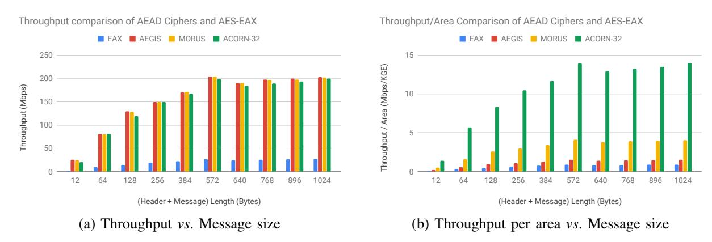

Fig. 1: Performance comparison of AES-EAX, AEGIS, MORUS, ACORN-32 after SoC integration.

As Figure 1(a) shows, the one-pass AEAD ciphers have a throughput that is on average 8× higher than that of AES-EAX. Furthermore, despite AEGIS and MORUS coprocessors having 4.5× and 1.68× higher area than the AES-128 coprocessor respectively, we see from Figure 1(b) that the throughput per area strongly favors the use of AEAD coprocessors.

Although one-pass AEAD schemes are clearly beneficial for system integration, it incurs non-negligible impact on the area, power, and performance of the ciphers. Examples of this were provided in [7]. Extensive analysis of hardware implementations of the AEAD ciphers can be found in literature [8], [9], [10]. However, existing works consider these ciphers as standalone hardware blocks, and the results do not always hold when they are integrated on to a larger system. Plugging a hardware block onto a system bus requires wrapper logic for communication, and the penalty in resources brought about by this additional logic is unavoidable. It is, therefore, upto the designers to choose a scheme that can appropriately minimize overhead in area, power, and performance.

To the best of our knowledge, such an integration of one-pass AEAD ciphers as hardware co-processors onto an SoC has not been studied. As with any hardware design, there is no golden method for building a coprocessor. Different integration schemes result in varying amount of overhead, and hence, it would not be fair to generalize results based on a single integration method. This motivated our search for different alternatives for system integration, and their relevance in a practical setting. Our aim here is to explore multiple alternatives for wrapper design that take advantage of the way the cipher cores work, and underline the benefits of each design alternative. We provide our comments on which of those is likely to be of practical utility in an SoC context, and the trade-offs to be considered in the process.

### II. BACKGROUND

In this work, three finalists of CAESAR are picked - ACORN (32-bit and 8-bit datapath), AEGIS, and MORUS. These are briefly described in this section. For greater details about the functioning and security of these ciphers, interested readers can refer to their design documents [11], [12], [13].

#### *A. ACORN*

ACORN [11] is a lightweight stream cipher, with a 293-bit state, arranged as six concatenated Linear Feedback Shift Registers (LFSRs). ACORN is popular due to its suitability to both lightweight and high-performance applications. In our work, we make use of ACORN-128 which uses a 128-bit key, and generates a 128-bit tag after encryption. The cipher employs simple AND, XOR, and NOT logic operations to update the state at every step, to generate a feedback bit, and a keystream bit.

There are four main stages involved in ACORN, described as follows:

- Initialization: The initialization stage consists of loading the key and Initialization Vector (IV) bit-by-bit to update the state. Initialization runs for 1792 steps in total.
- Processing Associated Data: In this stage, the associated data is used to update the state. Considering an AD of size *adlen* bits, this stage first runs for *adlen* steps. This is followed by 256 additional steps which are mandatory even when the length of AD is 0.
- Encryption: In addition to using plaintext to update the state, this stage generates a ciphertext bit by XOR-ing the corresponding plaintext and keystream bits. Similar to the previous stage, this stage also runs a mandatory 256 additional steps after processing *ptlen* bits of plaintext. When *ptlen* is 0, there is no ciphertext generated.
- Finalization: The final stage involves generating the tag by running for 768 steps in total. The last 128 keystream bits form the 128-bit tag. The message bit is set to 0 throughout this stage.
- *1) Parallelization of ACORN:* The designers of ACORN proposed a parallelized implementation by choosing a datapath that is either 8 or 32 bits wide. We refer to these two implementations as ACORN-8 and ACORN-32 respectively, with the former processing 8 bits of the message stream together, while the latter processes 32 bits in one cycle. Both these alternatives offer increased throughput over the basic version. ACORN-8 is especially highly suited for very lightweight applications, as it offers a logic footprint that is about 40-50% less than that of ACORN-32 [9]. ACORN-32 however is shown to provide a throughput that is almost 4× that of ACORN-8. Table I shows the number of clock cycles required for each of the four stages after parallelization.

| Stage \Datapath | ACORN-32               | ACORN-8                |
|-----------------|------------------------|------------------------|
| Initialization  | 56                     | 224                    |
| Process AD      | $\frac{adlen}{32} + 8$ | $\frac{adlen}{8} + 32$ |
| Encryption      | $\frac{ptlen}{32} + 8$ | $\frac{ptlen}{8} + 32$ |
| Finalization    | 24                     | 96                     |

TABLE I: Number of steps required for each stage of ACORN-32 and ACORN-8 ([11]).

#### B. AEGIS

AEGIS [12] is a family of AEAD ciphers popular for high-performance applications, and its throughput is among the highest of the CAESAR finalists [9]. With its high security and speed, AEGIS has been claimed to be well-suited for packet encryption in network applications [12]. In this work, we consider AEGIS-128L, which is the fastest among AEGIS ciphers.

AEGIS-128L takes a 256-bit message block per cycle, performs encryption using a 128-bit key, and generates a 128-bit tag for authentication. It consists of a 1024-bit state, whose update logic consists of eight AES round functions as shown in Figure ??. An important distinction from ACORN is that there is no state update performed when the length of AD or PT is 0. Padding on the data, if any, is performed externally before sending it to the core. Moreover, the block size here is greater, which results in reduced number of computation steps for the same data size. It is easy to observe that the high throughput and security comes at the expense of higher area resulting from high parallelization and multiple AES round functions.

| Stage          | Number of cycles    |
|----------------|---------------------|
| Initialization | 10                  |
| Process AD     | $\frac{adlen}{256}$ |
| Encryption     | $\frac{ptlen}{256}$ |
| Finalization   | 7                   |

TABLE II: Number of clock cycles required for each stage of AEGIS-128L.

There are four stages in AEGIS-128L with similar functionality as those of ACORN, but the algorithm differs in the time taken for each stage. A wider datapath and absence of padding by the core also contribute to its high speed. This is summarized in Table II.

#### C. MORUS

The MORUS family of AEAD ciphers is designed following the manner of stream cipher design which involves low-complex state-update functions [13]. The design is intended to be fast in both hardware and software, especially in the absence of AES-NI instruction. MORUS offers parts of the benefits of both AEGIS and ACORN:

- High throughput due to 256-bit messages, absence of padding steps, and small number of steps in each stage of the algorithm, all of which are similar to AEGIS.
- State-update with small logic footprint similar to ACORN, employing simple AND, XOR, and rotation operations.

| Stage          | Number of cycles             |
|----------------|------------------------------|
| Initialization | 16                           |
| Process AD     | $\frac{adlen}{256} \\ ptlen$ |
| Encryption     | $\frac{ptlen}{256}$          |
| Finalization   | 8                            |

TABLE III: Number of clock cycles required for each stage of MORUS-128L.

Its hardware efficiency stems from its replacing of AES round functions for state-update with simpler logic. As a result, MORUS achieves the best throughput-to-area ratio among the CAESAR finalists [9]. The parameters used in our analysis are those of MORUS-1280, making use of a 128-bit key, 1280-bit state, and 256-message block. Table III lists the number of computation steps required for each stage of MORUS.

#### III. METHODOLOGY

To analyze the impact of SoC integration, ACORN-32, ACORN-8, AEGIS, and MORUS are added onto a Leon3-based SoC as hardware coprocessors. These coprocessors are attached onto an APB controller that is in turn attached to the system-wide AHB bus. Making a cipher core into a hardware co-processor involves building a wrapper around the core to enable communication with the system, as shown in Figure 2.

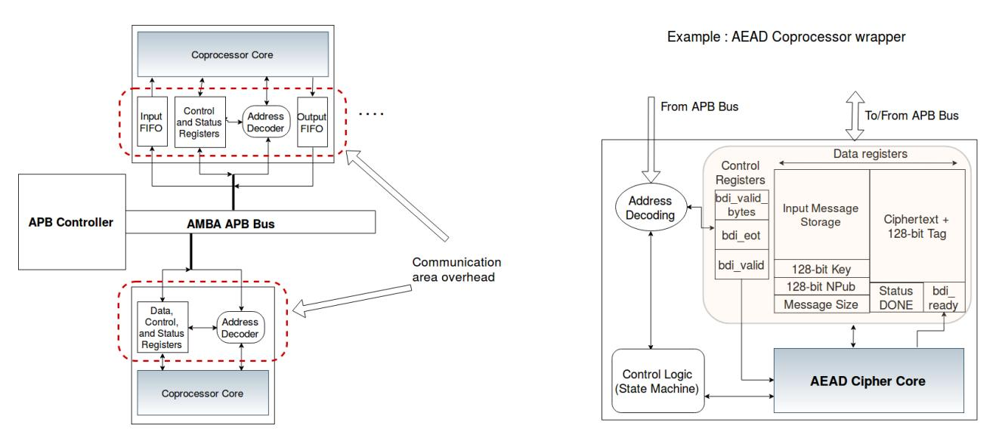

Fig. 2: A generic wrapper structure for an AEAD coprocessor on Leon3-based SoC.

A hardware co-processor wrapper designed with a memory-mapped interface consists of two main components:

- Storage elements for core signals: The AEAD cipher coprocessors considered here make use of registers to store the key, public data, input message, and the results in the form of cipher-text and tag. Additional registers are required to store the size of AD and PT, but these are small in size and hence negligible in comparison to the data registers.
- Control logic to send/receive data to/from the core: This logic is generally modeled as a Finite State Machine (FSM) that waits for the required inputs to be received by the wrapper before sending them to the core. This is essential to ensure appropriate handshaking as required by the core. Similarly, it needs to monitor the results from the core that are to be stored and sent out to the system bus when requested.

The aforementioned control logic is unavoidable since it is fundamental to the functioning of a coprocessor wrapper. Moreover, the FSM itself is not as important to the overhead as the storage is. This is simply due to the fact that the FSM consists of only a few bits of state and combinatorial state-update logic, whereas the storage of data requires large number of flip flops, which is likely to have significant effect in a lightweight context. Therefore, we narrow down our analysis to three main design alternatives that differ in the size of storage resources making up the wrapper.

#### *A. Design alternatives for SoC integration*

*1) Type 1 Wrapper - FIFOs at the input and output:* This is an intuitive and convenient scheme where the processor continuously sends all data to the coprocessor which stores them in a FIFO at the input side. The wrapper's control FSM monitors the core and reads data out of the input FIFO as and when the core is ready to accept them. The ciphertext and tag sent out of the core are stored in a FIFO on the output side. The software monitors the completion of encryption and tag generation before reading the result.

This method effectively decouples the cipher core and the processor by enabling continuous data transfer to/from the processor. The handshaking required between the wrapper and the processor is negligible since data loss will be avoided by the presence of the input FIFO. This method does not require the coprocessor designer to understand the cipher core in great detail apart from the interface signals and handshaking mechanism.

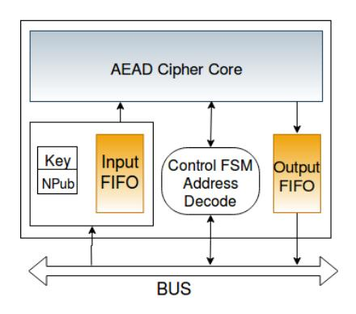

Fig. 3: Illustration of Coprocessor wrapper and Software API for integration with input and output FIFOs.

The major disadvantage of this design is that the FIFOs take up too much space. For instance, with the TSMC 180 nm library used for this chip, even a small 64-word (2KBit) FIFO built with flip flops is about 2.5× bigger than the entire ACORN core. While it can be argued that replacing flip flops with SRAM memory macros could be a better alternative, a 64-word (2KBit) SRAM macro for TSMC 180nm technology is found to take up 1.7× more space than the core. Another notable disadvantage of using FIFOs is that it limits the amount of data that can be sent to the coprocessor at one go. Failure to maintain the FIFO read rate greater than or equal to that of the write rate can potentially lead to data loss depending on the size of data. A possible workaround is to send the data in installments, reading the results for one group of data words before sending the next.

*2) Type 2 Wrapper - FIFO only at the output:* The area numbers in the previous subsection go on to show that even small FIFOs manifest as a huge overhead when added on top of a compact cipher core. As a result, the coprocessor as a whole no longer retains the lightweight properties of the core. Removing one of the FIFOs is therefore an attractive design choice since it halves the FIFO overhead. This is further made possible by the fundamental working of the AEAD cipher cores.

As was described earlier, these ciphers require only one cycle to process a particular message (AD or PT), generate the ciphertext, and get ready to accept the next word. The only wait periods when the core cannot accept inputs occur during initialization and finalization stages. What this means is that apart from the wait periods, reading data from the input FIFO can happen as fast as the rate at which data is written. This can be exploited by creating a scheme where there is no input FIFO, and data that is sent through software is forwarded to the core immediately. The software needs to perform handshaking with the wrapper during the wait periods, since no data is sent to the core in this duration.

The basic functionality of the core lends itself well to this scheme. While the extra handshaking is expected to result in a small performance penalty, the primary advantage here is the huge reduction in area and power made possible by getting rid of one entire FIFO.

This method, however, requires greater understanding of the cipher core's hardware implementation than the previous scheme. For instance, for the ciphers here, small modifications were required to ensure that the cipher core does not assume that AD and PT inputs arrive at consecutive cycles. The extent of complexity of these changes depend on the cipher used and its hardware implementation. In addition, this scheme does not solve the problem of a limit on the maximum size of data that can be sent at once. Since there is still one FIFO present, data of size greater than the FIFO's capacity needs to be sent over installments.

*3) Type 3 Wrapper - No FIFOs (Lightweight design):* This scheme makes use of a no-frills wrapper, without FIFOs to hold data. This uses only registers to hold the key and public data, along with a 128-bit (or 256-bit, for AEGIS/MORUS) message word at the input and the output. The intention here is to consider this design as a reference that indicates the best-case scenario, i.e. an estimate on the lower bound for the wrapper overhead.

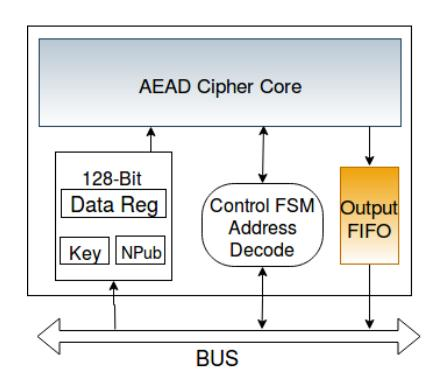

Fig. 4: Illustration of Coprocessor wrapper and Software API for integration with only an output FIFO.

While this scheme minimizes wrapper overhead, it requires changes on the software side. It is now not possible to send more than 128 (or 256) bits of data before reading the result out, since there is no FIFO at the output of the core. Therefore, this scheme requires the software to send four (or eight) 32-bit words of data, followed by an immediate reading of four (or eight) ciphertext words. This is repeated until the whole message is encrypted.

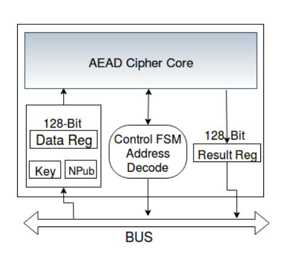

Fig. 5: Illustration of Coprocessor wrapper and Software API for lightweight integration with no FIFOs.

This design presents a good example of the minimum wrapper overhead that is unavoidable for a particular cipher. If implemented in a practical system, this design is not expected to be significantly slower than the other schemes when all data is sent only by the processor. This is because the number of read and write operations are still the same, with only the order changed.

One of the drawbacks of this design is that when compared with alternatives that send data in a burst (for example, through Direct Memory Access), this scheme is bound to have a lower performance, since it cannot support bursty data. In that sense, the practical utility of this scheme is limited. Furthermore, for ciphers that require more than one cycle to generate the result, this scheme will require constant polling by the software to monitor when the operation is done, before reading the result out. This can lead to decreased throughput and increased power consumption.

*4) Direct Memory Access (DMA) for increased throughput:* While presenting the performance of a coprocessor, care must be taken to show both the best-case and worst-case scenarios. While sending inputs from the processor is a simple method, it incurs significant loss in performance due to each data transfer going through the processor pipeline as an individual instruction. A common method followed in practical designs is to offload the task of transferring large data to a DMA controller that simply reads a large chunk of data from a source and writes it to a destination. As there is a DMA controller already included in our SoC, we consider transfers to the coprocessors through DMA, in order to understand the best-case performance achievable after SoC integration. This can be used with the first two FIFO schemes described earlier, and is very beneficial in systems that already have a DMA controller as part of the SoC.

#### *B. Analysis of hardware efficiency*

Separate coprocessor wrappers with an APB interface are first built for each type of wrapper discussed, and the design alternatives that are analyzed are as follows:

- Input and Output FIFOs, with and without DMA for ACORN-8, ACORN-32, AEGIS, and MORUS.
- Output FIFO only, with and without DMA for ACORN-32, AEGIS, and MORUS.
- No FIFO, without DMA for ACORN-32, AEGIS, and MORUS.
- *1) Studying Area and Power:* For the purpose of analysis, all the coprocessor alternatives are attached to the APB bus on the SoC, and the design is synthesized at 80 MHz using Synopsys DC with the same constraints as those on our primary chip design. We obtain the post-synthesis area from DC to understand the "price to pay" for SoC integration, i.e. how much additional area is required over the standalone cipher core.

To study power efficiency, gate-level simulation is first run on the post-synthesis netlist for each design alternative using ModelSim. The test cases used here include those provided by the designers, as well as a set of arbitrary test vectors of different sizes. VCD files generated from ModelSim are used for power analysis using Synopsys PrimeTime. We focus primarily on dynamic power consumption of the top-level design, the coprocessor, and other active components of the SoC. Static power being three orders of magnitude smaller in the 180 nm technology node, is not included here due to its negligible impact on total power.

- *2) Performance Analysis:* Performance comparison is performed through RTL simulation in Modelsim with test cases of different sizes, using the general-purpose timer present on the SoC to measure clock cycles elapsed from the start of an encryption to its end. Following similar analysis previously presented in literature [7], we observe that total time required for an authenticated encryption using a coprocessor on an SoC can be broken down into the following components:
- Computation Time: Time required for the hardware coprocessor to complete the entire authenticated encryption.
- Communication Time: This refers to the total time required for sending data and control words to the coprocessor, and reading the results back. Communication time is composed of two types of overhead:
  - *Bus Overhead*: Time taken for data transfer to and from coprocessor over the system bus.
  - *Processor overhead*: Time spent in the processor pipeline, which includes instruction decoding, cache operations, and memory accesses.

For the AEAD ciphers considered in this work, a major part of computation time overlaps with communication time due to their single-cycle state updates. The only non-overlapped portion occurs when the software waits for final tag generation to be completed after sending all data. This is illustrated in Figure 6. The contributions of each type of overhead will be presented in the following section.

## IV. RESULTS

This section presents important results from our analysis of coprocessor alternatives, and highlights the benefits and trade-offs they pose at the system-level.

## *A. ACORN-32*

*1) Area and Performance:* Figure 7(a) first shows that even with the most lightweight wrapper with no FIFOS, there is still a 1.7× increase in area over the ACORN-32 core. The storage elements needed for the key and data

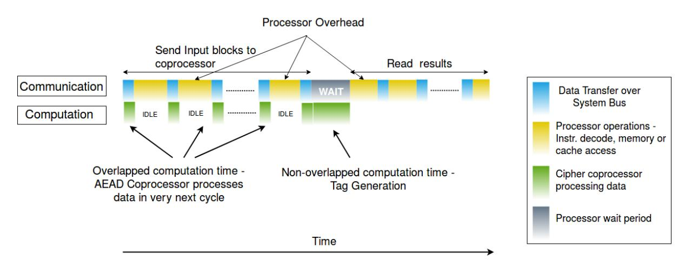

Fig. 6: An example of different sources of contribution to the total time for authenticated encryption using an AEAD coprocessor on SoC.

are comparable in size to the internal logic of ACORN-32. Furthermore, adding two 1 KBit FIFOs is seen to be highly area-inefficient, resulting in a 4× increase in area.

Figure 7(b) shows the performance comparison of the different coprocessor alternatives, represented as the ratio of the time consumed for each design, with the time required for standalone hardware. First, we see that in addition to saving 30% area, having only an output FIFO incurs only a small performance loss of less than 5% as compared to a conventional two-FIFO design. This decrease in performance arises due to additional wait period required for the former as shown in Figure 8. However, as this duration is fixed, the loss in performance remains small over all the test cases.

Another important observation from Figure 7(b) is that the DMA-based design alternatives are slower for message smaller than 32 bytes, while they provide significant speedup for longer messages. The increased speedup for large messages is because the DMA minimizes processor overhead which is the dominant component of total time consumed. The DMA controller reads data from RAM in consecutive cycles before transferring them to the coprocessor without any processor intervention in between. DMA-based design alternatives perform worse for small data sizes since there is a fixed time required to program the DMA each time it transfers a block of data. This task consumes more time than the actual data transfer. Considering the fact that this happens only for very small data sizes, we believe that using DMA is beneficial in order to extract the best possible performance in a practical setting.

Finally, Figure 7(b) indicates that the FIFO-less lightweight design maintains appreciable performance that is better than the designs not using DMA. The reason is that this design sends four data words in quick succession before reading four words of ciphertext. The processor overhead caused due to loop operations is smaller here, as opposed to FIFO-based designs. For larger test cases, the performance of this design does not drop as sharply as other non-DMA designs, and remains within 10% of the DMA-based alternatives. In Figure 7(b), it becomes faster than DMA-based designs for message sizes between 240-330 bytes. This is because the data is sent across two DMA transfers owing to FIFO limitations.

To summarize this analysis of area and performance, we use throughput-per-area as a metric to capture both the performance and silicon overhead together. This is shown for all the designs in Figure 9. Averaged over all tests, the lightweight no-FIFO wrapper wins with a 1.63× higher throughput-per-area over the next best design. For systems where the use of DMA is desired, the output-FIFO wrapper provides the best trade-off.

*2) Power and Energy efficiency:* The overall power consumed by an SoC during a particular coprocessor operation is affected by switching in the active coprocessor, as well as other active components that are necessary for the SoC's basic functionality. These mainly include the processor, memories, system bus, and the cache controller. Table IV lists the contribution of these major components to the total SoC power for an ACORN-32 test using DMA.

ACORN-32: Coprocessor Area Comparison

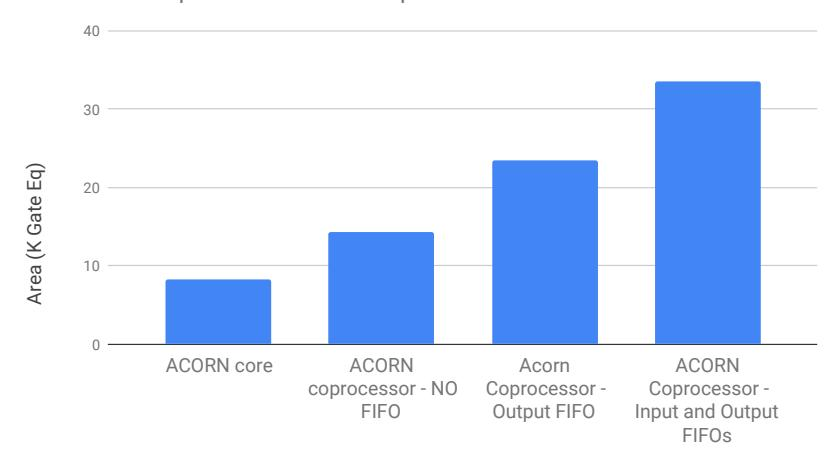

#### (a) Area overhead.

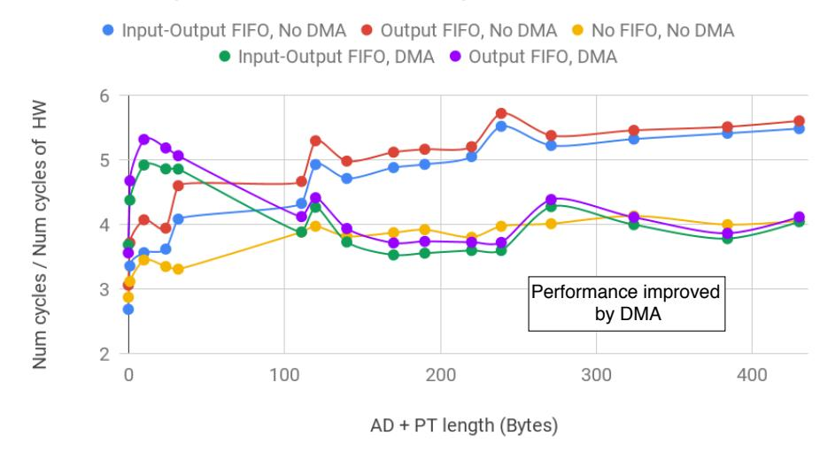

(b) Performance overhead - lower value indicates better performance.

Fig. 7: Area and performance overhead of ACORN-32 coprocessor alternatives.

| Component on Chip    | % of Total power |
|----------------------|------------------|
| On-Chip Memory       | 25.71%           |
| Processor            | 8.0%             |
| ACORN-32 Coprocessor | 7.1%             |
| DMA Controller       | 3.7%             |
| Cache controller     | 0.8%             |
| AHB                  | 0.3%             |
| APB                  | 0.3%             |

TABLE IV: Contribution of active blocks to total power during ACORN-32 tests.

From Table IV, we see that apart from memory, the processor and active coprocessor have a significant contribution. The busses and cache controller have very small impact on the total power due to their relatively lower hardware footprint. In addition, Table V shows that for the major blocks, a large part of their power consumption comes from their clock tree. This is due to constant switching of the clock network and related

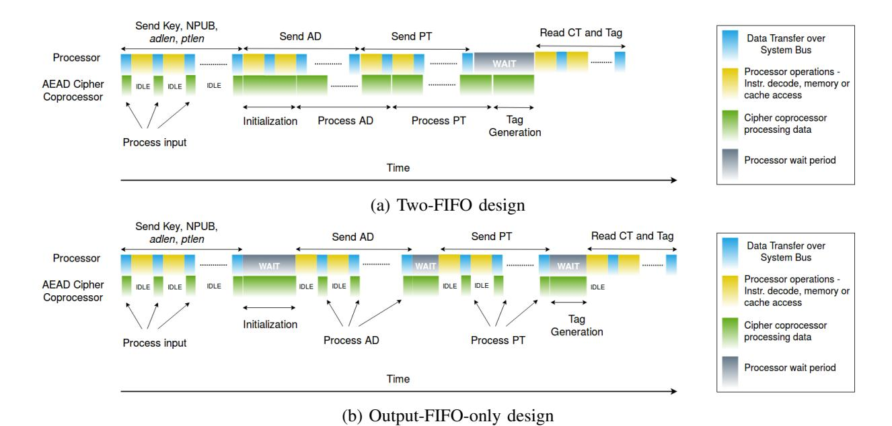

Fig. 8: Illustration of communication overhead and wait periods.

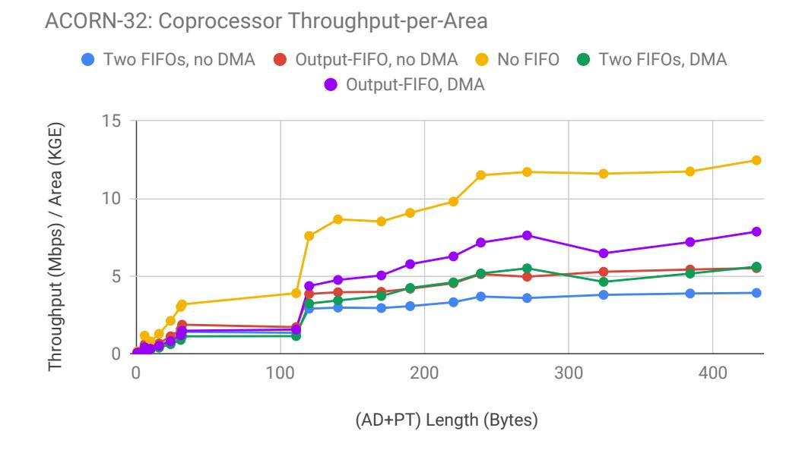

Fig. 9: Throughput-per-area of ACORN-32 coprocessor designs.

| Block                | Clock Tree power (% of block power) |
|----------------------|-------------------------------------|
| Top-level            | 59.8%                               |
| Processor            | 62.1%                               |
| ACORN-32 Coprocessor |                                     |
| With FIFOs           | 82.2%                               |
| Without FIFOs        | 65.04%                              |
| DMA Controller       | 27.6%                               |
| Cache controller     | 27.55%                              |

TABLE V: Contribution of clock tree to block-level power during ACORN-32 tests.

buffers, and this becomes more pronounced with the increase in the size of the block. We now discuss how different design alternatives affect the power of active blocks, and their impact on total power.

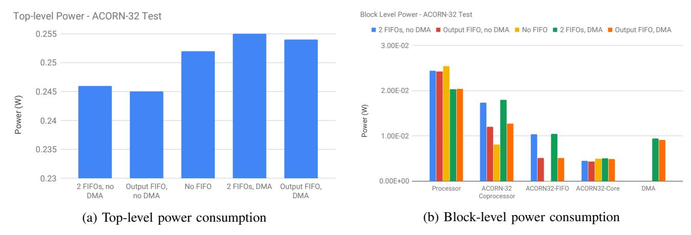

Fig. 10: Power consumption resulting from different ACORN-32 coprocessor designs.

Figure 10(a) shows that the DMA-based designs result in a 3.6% increase of chip-level (top-level) power, computed over the total simulation duration. This impact on top-level power is small since it greatly depends on SoC size, number of simultaneously active components on chip, and the extent of clock or power gating. Therefore, we additionally focus on block-level power consumption (Figure 10(b)).

While the DMA-based designs result in 16% less processor power due to reduced activity, the power consumption due to the DMA controller and its internal buffers offsets this difference. As for integration overhead on the cipher core, we see that ACORN-32 is a wrapper-limited design, with the FIFO power contributing to 59% and 42% of total coprocessor power for the two-FIFO and one-FIFO designs respectively. As a result, the no-FIFO wrapper gives the most power-efficient ACORN-32 coprocessor. However, the most power-efficient coprocessor does not necessarily result in the least power at the system level since the coprocessor amounts to less than 5% of top-level power. In this regard, it is the one-FIFO wrapper without DMA that is seen to result in smallest top-level power. The reason for this is its significantly smaller run-time as compared to other alternatives, which brings our focus onto energy-efficiency as an alternate quality metric.

There are two important points that necessitate the comparison of energy-efficiency. First, embedded applications running on battery-powered devices are required to consume lesser energy over time. Second, the design alternatives considered differ significantly in their run-time, making power comparison misleading due to its being averaged over time. Figures 10(a) and 10(b) indicate that for practical message lengths, DMA-based designs reduce top-level energy consumption per message bit by 20%, owing to their faster completion. Furthermore, the no-FIFO wrapper offers comparable energy-efficiency to the DMA-based designs at the top-level, while reducing the ACORN-32 coprocessor energy-per-bit by more than 36% for all message sizes considered. This is due to a combination of power reduction due to speed comparable to DMA-based designs (shown in Section IV-A.1), and complete elimination of FIFO power.

We summarize this analysis by suggesting that unless the message sizes are extremely small, using DMA with FIFO-based wrappers or the lightweight no-FIFO wrapper are the most energy-efficient options for ACORN-32.

#### *B. ACORN-8*

*1) Area and Performance:* Figure 12(a) shows the most important result here - there is a severe area penalty incurred during the SoC integration of a lightweight cipher with a shortened datapath width. The coprocessor wrappers needs to be able to write 32-bit data per cycle, while it can only read out 8 bits at a time. In addition, there is a large initialization time of 224 cycles when no data can be read out of the FIFO. With the FIFO-less lightweight wrapper not being suitable here, the coprocessor area becomes 6.4× that of the cipher core. This clearly negates the primary intention of making the cipher lightweight. Regarding performance, SoC integration

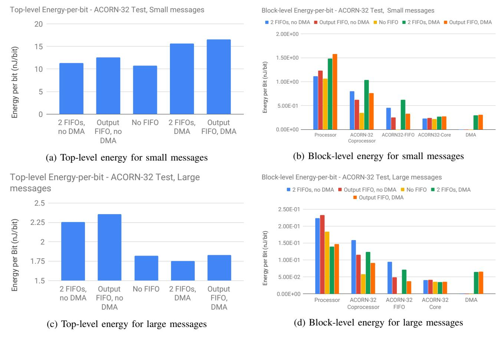

Fig. 11: Energy efficiency of ACORN-32 coprocessor alternatives.

of ACORN-8 makes it 1.6-2× slower. Using a DMA is better for performance, providing a 1.2× increase over the non-DMA alternative.

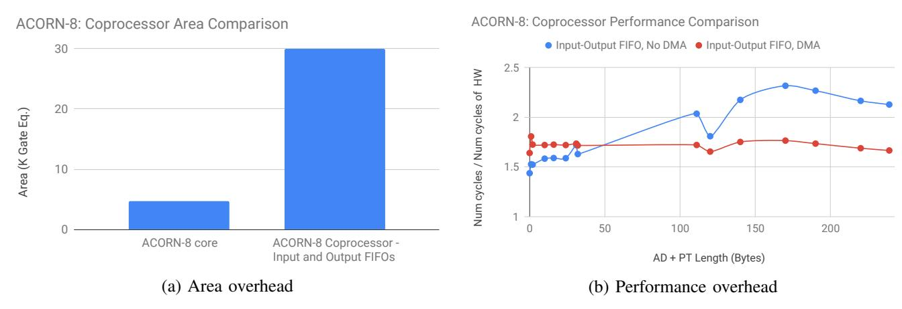

Fig. 12: Illustration of area and performance overhead arising from different alternatives for SoC integration of ACORN-8.

*2) Energy efficiency:* As there are no wrapper alternatives to minimize area, we only compare the energyefficiency with and without DMA. The latter naturally results in 18% reduced energy-per-bit for large messages.

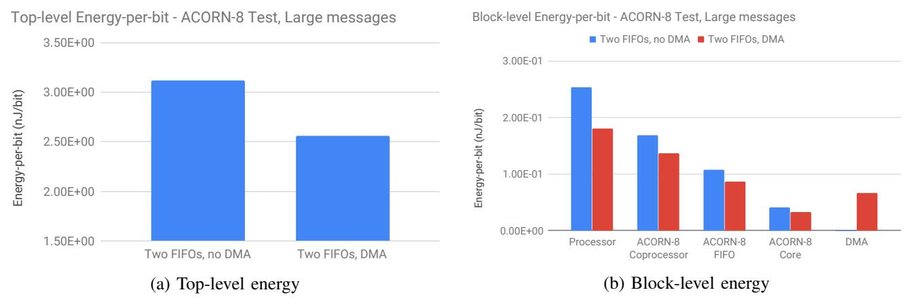

Fig. 13: Energy efficiency of ACORN-8 coprocessor alternatives, for large messages.

In summary, the results for ACORN-8 reiterate the point that in spite of its small logic footprint compared to ACORN-32, integration onto an SoC with a wider datapath negates the advantages offered by the standalone core. ACORN-32 is therefore more suited to SoC integration than ACORN-8.

#### *C. AEGIS-128L*

*1) Area and Performance:* The area of AEGIS-128L coprocessor is heavily influenced by its core, as opposed to lightweight ciphers like ACORN. This is indicated in Figure 14(a), which shows the AEGIS-128L coprocessor area to be affected more by its core than the wrapper. Adding a small 512-bit input FIFO and a 2 KBit output FIFO has only a 1.31× area overhead. A small input FIFO is sufficient since the FIFO is read immediately after every eight writes to it due to the 256-bit message block size. A FIFO-less wrapper adds 9.8% additional area to the AEGIS-128L core, while a two-FIFO design adds 31% overhead. Doing away with the input FIFO provides a negligible area reduction of 4%.

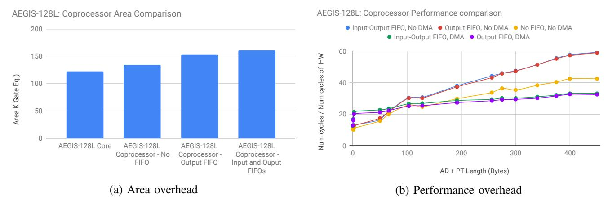

Fig. 14: Illustration of area and performance overhead arising from different alternatives for SoC integration of AEGIS-128L.

The coprocessor performance follows a similar pattern as that for ACORN, but the decrease in speed over a standalone hardware implementation is more severe due to the high speed of AEGIS-128L. As a result, the bestcase performance on SoC obtained using a DMA is still 30-35× slower than standalone AEGIS-128L hardware. The performances of the two FIFO-based designs are almost identical due to very small wait periods between stages.

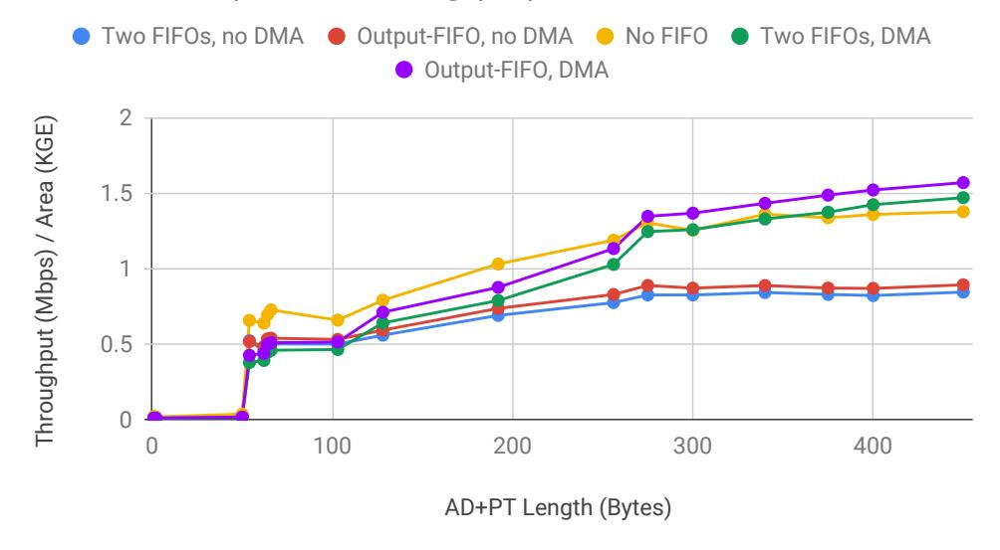

Fig. 15: Throughput-per-area of AEGIS-128L coprocessor designs.

In summary, from Figure 15, we conclude that the no-FIFO wrapper and the FIFO-based wrappers using DMA all provide appreciable area-performance trade-off. The output-FIFO design has a higher throughput-per-area for larger messages, but only by a small factor of 1.07×. This goes on to suggest that the choice of wrapper does not have a significant impact on bulky ciphers such as AEGIS.

*2) Power and Energy efficiency:* The AEGIS coprocessor contributes 12.6% to the total power, which is higher than even that of the processor. The large logic footprint of AEGIS leads to high clock network power, and the highly parallelized implementation causes increased logic switching power. Unlike ACORN, the AEGIS core contributes more to total coprocessor power than its wrapper, which results in a difference of less than 1% between the power consumption of the one-FIFO and two-FIFO designs. The DMA-based designs consume 6% more power due to their faster completion, necessitating comparison of energy-efficiency.

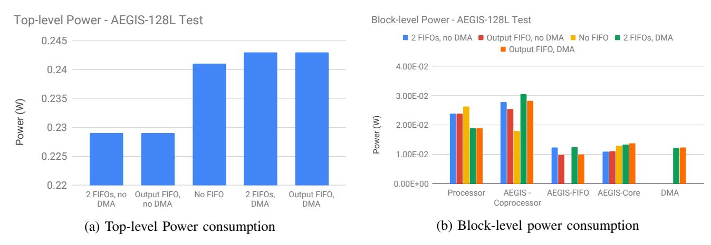

Fig. 16: Power consumption resulting from different AEGIS coprocessor designs.

We see from Figure 17(a) that the DMA-based designs are clearly more energy-efficient, by about 30% and 14% as compared to non-DMA designs with and without FIFOs respectively. Unlike ACORN, the no-FIFO wrapper does not offer a significant energy benefit due to the high energy consumption of AEGIS core. Its small reduction of coprocessor energy is nullified by an increase in processor energy, and it is the DMA's faster completion that finally wins the energy battle.

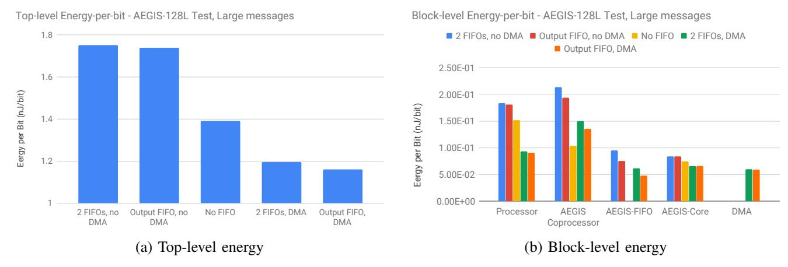

Fig. 17: Energy efficiency of AEGIS coprocessor alternatives, for large messages.

In summary, we believe that for a large cipher such as AEGIS, the use of a DMA is the best way to achieve better system-level energy-efficiency.

## *D. MORUS*

*1) Area and Performance:* Figure 18(a) shows a 32% additional area required for the most lightweight wrapper, while this value jumps to 103% for a two-FIFO wrapper with 512-bit and 2 KBit input and output FIFOs respectively. Removal of the input FIFO is a more effective option than in the case of AEGIS, with an area reduction of 11.2% over the two-FIFO alternative.

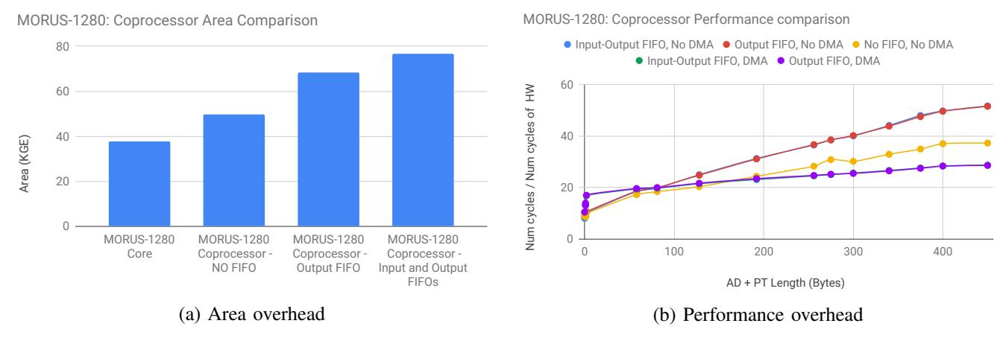

Fig. 18: Illustration of area and performance overhead arising from different alternatives for SoC integration of MORUS-1280.

For large messages, integration without using DMA makes the coprocessor 50× slower than standalone MORUS-1280. Using a DMA brings the penalty down to 28×, which is the best-case performance possible in this system. The performances of one-FIFO and two-FIFO designs are virtually indistinguishable due to negligible wait periods between MORUS stages. The lightweight no-FIFO wrapper, on the other hand, provides a reasonable 1.38× gain in performance over the alternatives not using DMA, owing to fewer looping operations.

*2) Power and Energy efficiency:* The power and energy efficiency of MORUS coprocessor alternatives are very similar to those of AEGIS, due to the cipher core's contribution being comparable to that of the FIFOs. MORUS coprocessor contributes to 8.7% of the total power - roughly the same as that of the processor. The

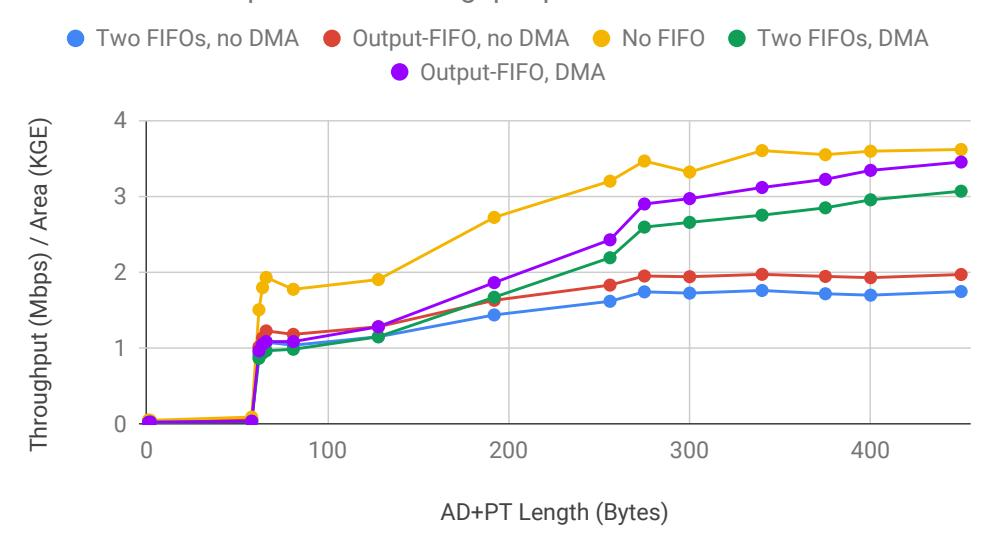

Fig. 19: Throughput-per-area of MORUS-1280 coprocessor designs.

lightweight wrapper reduces coprocessor power by more than 35%, but increases that of the processor, thereby leading to a 3.3% increase in top-level power. As seen in previous ciphers, DMA-based designs increase top-level power by 4-5%.

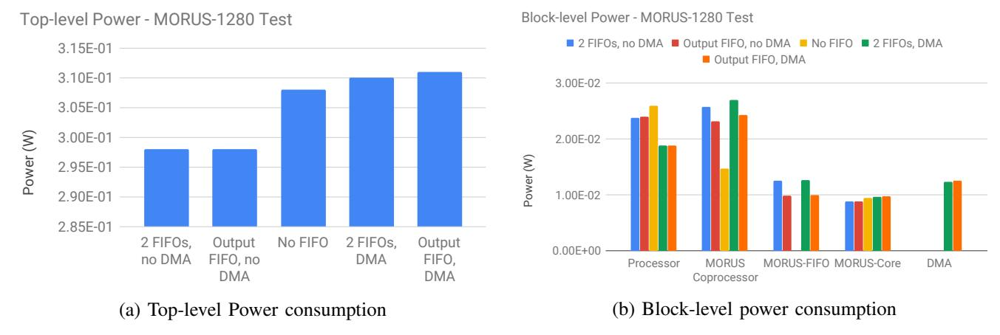

Fig. 20: Power consumption resulting from different AEGIS coprocessor designs.

DMA-based design alternatives are energy-efficient for large messages, leading to 16.4% energy reduction per message bit over the no-FIFO design. While the latter eliminates FIFO energy, the cipher core itself amounts to roughly half the coprocessor power. In addition, the processor energy is increased by the no-FIFO design, due to which it leads to an increase in overall top-level energy consumption.

#### V. CONCLUSION

The analysis in this work clearly highlights the profound impact of design choices on the efficiency of AEAD ciphers integrated onto a System-on-Chip. Popular AEAD ciphers ACORN, AEGIS, and MORUS were attached onto an SoC as hardware co-processors to analyze their behavior in a system. Such an integration is seen to be inevitably accompanied by a penalty on the area, performance, and power of the coprocessors as compared to standalone hardware ciphers. Coprocessor wrappers with no FIFO, or a single FIFO at the output were found

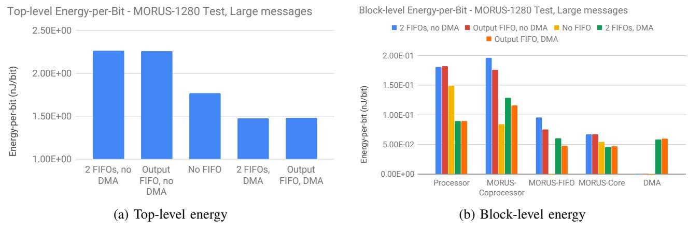

Fig. 21: Energy efficiency of MORUS coprocessor alternatives, for large messages.

to achieve the best area-performance trade-off. In addition, it was clearly shown that lightweight ciphers whose datapath width is smaller than that of the system bus incur a greater penalty on their area and performance. Hence, they are not well-suited for integration onto a system. Employing Direct Memory Access is shown to maximize throughput-by-area and minimize energy consumption by reducing processor activity.

We conclude this analysis with the comparisons shown in Figures 22(a) and 22(b). They plot the average throughput and throughput-per-area respectively against the energy consumed per bit, all averaged over identical test cases. These results are shown for the top two coprocessor alternatives that emerged from our analysis.

From these figures, we believe that while AEGIS-128L and MORUS-1280 achieve the highest throughput after SoC integration, ACORN-32 is the best choice for area-constrained applications. MORUS-1280 is a better choice for energy-constrained applications owing to its better throughput-per-area than AEGIS-128L.

#### REFERENCES

- [1] W. Diehl, F. Farahmand, A. Abdulgadir, J.-P. Kaps, and K. Gaj, "Face-off between the CAESAR lightweight finalists: ACORN vs. Ascon," Cryptology ePrint Archive, Report 2019/184, 2019, https://eprint.iacr.org/2019/184.
- [2] "CAESAR: Competition for Authenticated Encryption: Security, Applicability, and Robustness," https://competitions.cr.yp.to/caesar.html.
- [3] T. Instruments, "Msp430x5xx and msp430x6xx family user's guide," Mar. 2018. [Online]. Available: http://www.ti.com/lit/ug/slau208q/slau208q.pdf
- [4] ——, "Aes accelerator," Mar. 2018. [Online]. Available: http://www.ti.com/lit/ug/slau458f/slau458f.pdf
- [5] J. Birr-Pixton, "Cifra: Cryptographic primitive collection," 2015. [Online]. Available: https://github.com/ctz/cifra
- [6] M. Bellare, P. Rogaway, and D. A. Wagner, "The eax mode of operation," in *FSE*, 2004.
- [7] X. Guo, Z. Chen, and P. Schaumont, "Energy and performance evaluation of an FPGA-Based SoC platform with AES and PRESENT coprocessors," in *Embedded Computer Systems: Architectures, Modeling, and Simulation*. Berlin, Heidelberg: Springer Berlin Heidelberg, 2008, pp. 106–115.
- [8] F. Farahmand, W. Diehl, A. Abdulgadir, J.-P. Kaps, and K. Gaj, "Improved lightweight implementations of CAESAR Authenticated Ciphers," *2018 IEEE 26th Annual International Symposium on Field-Programmable Custom Computing Machines (FCCM)*, pp. 29–36, 2018.
- [9] S. Kumar, J. Haj-Yihia, M. Khairallah, and A. Chattopadhyay, "A comprehensive performance analysis of hardware implementations of CAESAR candidates," *IACR Cryptology ePrint Archive*, vol. 2017, p. 1261, 2017.
- [10] M. Katsaiti and N. Sklavos, "Implementation efficiency and alternations, on CAESAR finalists: AEGIS Approach," *2018 IEEE 16th Intl Conf on Dependable, Autonomic and Secure Computing, 16th Intl Conf on Pervasive Intelligence and Computing, 4th Intl Conf on Big Data Intelligence and Computing and Cyber Science and Technology Congress(DASC/PiCom/DataCom/CyberSciTech)*, pp. 661–665, 2018.
- [11] H. Wu, "ACORN:A Lightweight Authenticated Cipher," September 2016. [Online]. Available: https://competitions.cr.yp.to/round3/acornv3.pdf
- [12] ——, "AEGIS:A Fast Authenticated Encryption Algorithm (v1.1)," September 2016. [Online]. Available: https://competitions.cr.yp.to/round3/acornv3.pdf
- [13] ——, "The Authenticated Cipher MORUS (v2)," September 2016. [Online]. Available: https://competitions.cr.yp.to/round3/acornv3.pdf

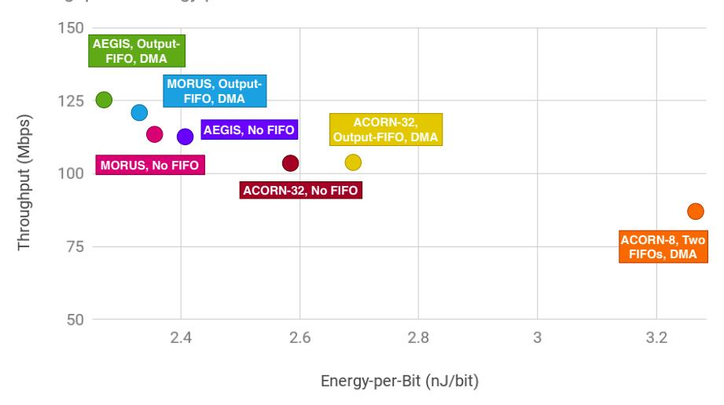

#### (a) Throughput *vs* Energy-per-bit

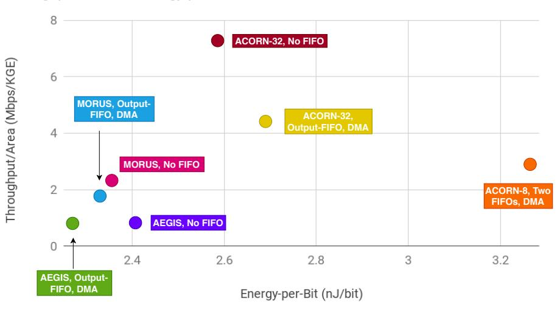

(b) Throughput-per-area *vs* Energy-per-bit

Fig. 22: Comparison of AEAD coprocessors.