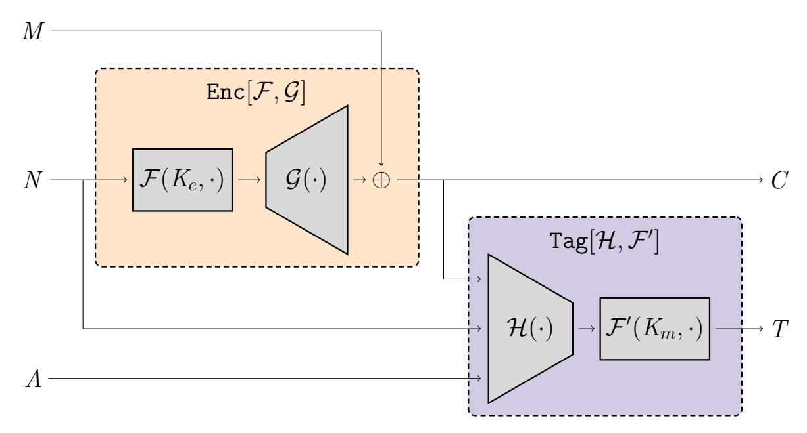
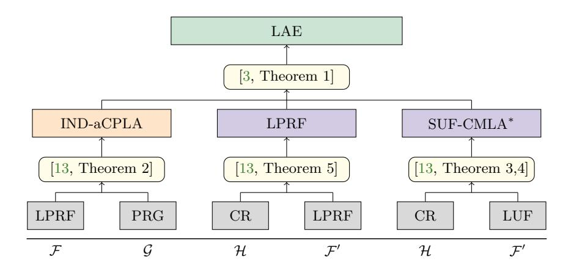
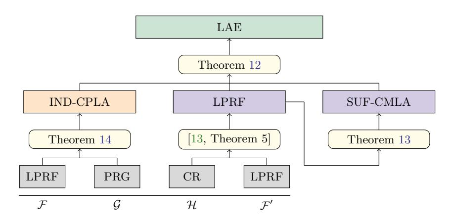

# Leakage-Resilient Authenticated Encryption from Leakage-Resilient Pseudorandom Functions

Juliane Kr¨amer and Patrick Struck

Technische Universit¨at Darmstadt, Germany {juliane,patrick}@qpc.tu-darmstadt.de

Abstract. In this work we study the leakage resilience of authenticated encryption schemes. We show that, if one settles for non-adaptive leakage, leakage-resilient authenticated encryption schemes can be built from leakage-resilient pseudorandom functions.

Degabriele et al. (ASIACRYPT 2019) introduce the FGHF0 construction which allows to build leakage-resilient authenticated encryption schemes from functions which, under leakage, retain both pseudorandomness and unpredictability. We revisit their construction and show the following. First, pseudorandomness and unpredictability do not imply one another in the leakage setting. Unfortunately, this entails that any instantiation of the FGHF0 construction indeed seems to require a function that is proven both pseudorandom and unpredictable under leakage. Second, however, we show that the unpredictability requirement is an artefact that stems from the underlying composition theorem of the N2 construction given by Barwell et al. (ASIACRYPT 2017). By recasting this composition theorem, we show that the unpredictability requirement is unnecessary for the FGHF0 construction. Thus, leakage-resilient AEAD schemes can be obtained by instantiating the FGHF0 construction with functions that are solely pseudorandom under leakage.

Keywords: AEAD · Leakage Resilience · Side Channels · FGHF0

## 1 Introduction

Authenticated encryption schemes with associated data (AEAD) are fundamental cryptographic primitives which enable Alice to send a ciphertext to Bob such that (1) Eve does not learn anything about the underlying message and (2) Bob can detect any manipulation of the ciphertext. In recent years, the study of AEAD schemes has received a lot of attention, for instance through the recent CAESAR competition [\[7\]](#page-17-0) or the ongoing NIST standardization process on lightweight cryptography [\[25\]](#page-18-0).

Recently, several AEAD schemes which are designed to be secure in the presence of leakage have been proposed [\[3,](#page-17-1) [9,](#page-17-2) [11,](#page-17-3) [13–](#page-17-4)[15,](#page-17-5) [22\]](#page-18-1). Barwell et al. [\[3\]](#page-17-1) show that the Encrypt-then-MAC paradigm [\[5\]](#page-17-6) yields a leakage-resilient AEAD scheme if both the encryption scheme and the MAC are leakage-resilient. They also introduce the corresponding security notions. Recently, Degabriele et al. [\[13\]](#page-17-4) refined this result by introducing the FGHF0 construction, showing that leakage-resilient encryption schemes and MACs can be built from fixed-input-length functions which are both pseudorandom and unpredictable under leakage. While leakage-resilient pseudorandomness is well established in the literature, leakage-resilient unpredictability has been defined by Degabriele et al. specifically for the FGHF0 construction. This security notion allows the adversary to obtain leakage for the input of which it predicts the output.[1](#page-0-0) This raises the natural question:

What is the relation of pseudorandomness and unpredictability under leakage?

While pseudorandomness and unpredictability imply one another in the leak-free setting, Degabriele et al. claim that the notions are incomparable under leakage. We confirm their claim by providing two constructions, each being secure with respect to one notion while being insecure with respect to the other. This seems to entail that any instantiation of the FGHF0 construction indeed requires a function that is proven both pseudorandom and unpredictable under leakage. Given that leakage-resilient unpredictability is a new security notion, our separation result gives rise to another question:

Can leakage-resilient AEAD schemes be built from leakage-resilient pseudorandom functions?

1 Note that the same does not work for pseudorandomness. Leakage of a single output bit allows to easily distinguish the function from a random function.

Surprisingly, we answer this question in the affirmative. We demonstrate that the necessity of leakage-resilient unpredictability stems from the composition theorem of Barwell et al. [3]. As observed in [13], this composition theorem imposes a security notion towards the MAC that prohibits constructing it from a leakage-resilient pseudorandom function. However, the composition theorem aims for arbitrary encryption schemes and MACs, while the encryption scheme and the MAC of the FGHF' construction [13] exhibit a special structure. Thus, we show that recasting the composition theorem from [3] for these encryption schemes and MACs, allows to relax the security notion of the MAC such that it can be constructed from a leakage-resilient pseudorandom function. This comes at the cost of imposing a stronger security notion for the encryption scheme. However, it turns out that the encryption scheme underlying the FGHF' construction — without any modification — achieves this stronger notion.

#### 1.1 Our Contribution

Our contribution is threefold.

- 1) We show that, in contrast to the leak-free setting, pseudorandomness and unpredictability are not equivalent under leakage, thereby confirming a conjecture made in [13].
- 2) We recast the N2 composition theorem in the leakage setting by Barwell et al. [3], for a certain class of encryption schemes and MACs. We show that, in this case, other security notions for the encryption scheme and the MAC are sufficient to build leakage-resilient AEAD schemes. More precisely, we can weaken the security notion for the MAC at the cost of strengthening the security notion for the encryption scheme.
- 3) We revisit the FGHF' construction [13] with respect to our recast composition theorem. We show that the encryption part (without any modification) achieves this stronger security notion. Regarding the MAC, we show that leakage-resilient pseudorandomness is sufficient to achieve the weaker security notion imposed by our recast composition theorem. This completely removes the necessity of leakage-resilient unpredictability to instantiate the FGHF' construction, as opposed to the initial work [13]. Since proving leakage-resilient unpredictability turned out to be a main challenge for SLAE [13] (a sponge-based instantiation of FGHF'), this is an important contribution towards building leakage-resilient AEAD schemes from simpler building blocks.

#### 1.2 Related Work

Leakage-resilient cryptographic primitives, ranging from (authenticated) encryption to MACs, have been proposed in [8,10,11,19,21,26]. In contrast to our setting, these works allow leakage on the challenge queries. However, some of underlying components are assumed to be leak-free, which is typically achieved using techniques such as masking [12]. A subset of these works also assume that the leakage is simulatable, an assumption that is not beyond dispute [23,28]. Functions and permutations which are pseudorandom under leakage have been proposed for instance in [13,16,18,29,30]. Functions which are unpredictable under leakage have only been studied in [13] which also defined this notion.

#### 1.3 Organization of the Paper

Section 2 provides the necessary background required for this work. In Section 3 we provide the motivation for our work by showing that, in the leakage setting, pseudorandomness and unpredictability of functions do not imply one another. We recast the composition theorem for the N2 construction by Barwell et al. [3] in Section 4. In Section 5, we show that the FGHF' construction [13] achieves the security notions demanded by our recast composition theorem.

#### 2 Preliminaries

## 2.1 Notation

We use the game-playing framework [6]. In a game, the adversary gets access to one or more oracles which is represented as superscripts, e.g.,  $\mathcal{A}^{\mathcal{O}}$ . In this work we mainly use distinguishing games, in which the adversary has to determine a secret bit b. The output of the game is 1, i.e., the adversary wins, if the adversary guesses the bit b correctly. Otherwise, the output of the game is 0, i.e., the adversary looses. For an adversary  $\mathcal{A}$  and a game G, we write  $G^{\mathcal{A}} \Rightarrow x$  to denote that the output of G, when interacting with  $\mathcal{A}$ , is x. Likewise, we write  $\mathcal{A}^{G} \Rightarrow x$  to denote that  $\mathcal{A}$ , when playing G, outputs x.

#### 2.2 Primitives

An authenticated encryption scheme with associated data AEAD consists of two algorithm Enc and Dec. The encryption algorithm Enc :  $\mathcal{K} \times \mathcal{N} \times \mathcal{A} \times \mathcal{M} \to \{0,1\}^*$  maps from key space  $\mathcal{K}$ , nonce space  $\mathcal{N}$ , associated data space  $\mathcal{A}$ , and message space  $\mathcal{M}$  to the ciphertext space  $\mathcal{C}$ . The decryption algorithm maps from the key space  $\mathcal{K}$ , nonce space m, associated data space  $\mathcal{A}$ , and ciphertext space  $\mathcal{C}$  to the message space  $\mathcal{M}$ . In case of an invalid ciphertext, Dec returns a special symbol  $\bot$ . Symmetric encryption schemes are defined analogously, except that the algorithms do not take associated data as input. In this work we focus on a specific class of encryption schemes, which we call mirror-like. These are encryption schemes where the encryption algorithm is an involution. Such schemes are fully determined by their encryption algorithm. Examples for mirror-like encryption schemes are the generic encryption scheme underlying the FGHF' construction [13] as well as the sponge-based encryption schemes used in the AEAD schemes SLAE [13] and ISAP [14]. Besides these concrete schemes, instantiating block ciphers with encryption modes like CFB, OFB, and CTR also yield mirror-like encryption schemes.

A message authentication code MAC consists of two algorithms Tag and Ver. The tagging algorithm Tag:  $\mathcal{K} \times \mathcal{X} \to \{0,1\}^t$  maps a key  $K \in \mathcal{K}$  and a message  $X \in \mathcal{X}$  to a tag  $T \in \{0,1\}^t$ . The verification algorithm Ver:  $\mathcal{K} \times \mathcal{X} \times \{0,1\}^t \to \{\top,\bot\}$  maps a keys  $K \in \mathcal{K}$ , a message  $X \in \mathcal{X}$ , and a tag  $T \in \{0,1\}^t$  to either  $\top$ , indicating that the tag is valid, or  $\bot$ , indicating that the tag is invalid. Within this work we only consider *canonical* MACs which are implicitly defined by the tagging algorithm Tag, i.e., the verification algorithm recomputes the tag of the message and accepts if the given tag equals the recomputed tag. We write MAC[ $\mathcal{F}$ ] to denote the canonical MAC built from a function  $\mathcal{F}$ .

## 2.3 Leakage Model

Our leakage model is the same as in [13], which follows [3], building on leakage resilience as defined in [17]. It follows the only computation leaks information assumption [24], i.e., only data that is processed during computation can leak information. For instance, encrypting a message with a certain key can not leak information about another (unused) key. Leakage is modelled by (deterministic and efficiently computable) functions from some predetermined set  $\mathcal{L}$ . Leakage of composite constructions is the composition of the underlying leakage functions. Thus, if primitive C is a composition of primitives A and A with leakage sets A and A with leakage sets A and A which we model by restricting A to be a singleton. Since the leakage depends entirely on the concrete device, the non-adaptive leakage model is suitable in practice, also argued by several works A such as A and A such as A and A such as A and A such as A and A such as A and A such as A and A and A such as A and A such as A and A and A such as A and A and A such as A and A and A and A and A and A are A and A and A and A are A and A and A and A are A and A and A are A and A and A are A and A are A and A and A are A and A and A are A and A are A and A are A and A are A and A are A and A are A and A are A and A are A and A are A and A are A and A are A and A are A and A are A and A are A and A are A and A are A are A and A are A and A are A and A are A and A are A and A are A are A and A are A are A and A are A are A and A are A are A and A are A are A and A are A and A are A and A are A are A and A are A are A are A are A are A are A are A are A are A are A are A are A are A are A are A are A are A are A are A are A are A are A are A are A are A are A are A ar

We recall the leakage resilience security notions that we need throughout this work. Following the blueprint by Barwell et al. [3], all notions are defined via security games where the adversary has access to one or more leakage oracle(s) which leak and one or more challenge oracle(s) which do not leak. According to [4], the former represent the power of the adversary while the latter model its goals in breaking the security of the scheme. Regarding the queries by the adversary, we follow [3] and say that an adversary forwards and repeats a query if it repeats a query across different oracles and the same oracle, respectively. For instance, querying the same tuple to the leakage encryption and challenge encryption is considered forwarding as is querying the output of an encryption oracle to a decryption oracle.

Non-Adaptive Leakage. All security notions below are defined following the style put forth in [13] which in turn is based on [3]. In particular, the permitted leakage functions are given by a set of leakage functions  $\mathcal{L}$ .

While all the proofs hold in the general setting of adaptive leakage, just as in [13], we emphasise that we focus on non-adaptive leakage, i.e., any leakage set should be thought of as a singleton. This stems from the fact that an instantiation of the FGHF' construction requires a leakage-resilient pseudorandom function which is unachievable in the adaptive leakage setting as discussed in [31], unless further restrictions are imposed on the leakage.

#### 2.4 Security Notions

Regarding the restrictions of nonce selection by the adversary, we define *semi-nonce-respecting* adversaries. These are adversaries which are nonce-respecting, i.e., they never repeat a nonce, with respect to the challenge encryption oracle, but not with respect to the leakage encryption oracle. This follows the recent definition of misuse-resilience given in [2] and used for instance in [20]. Regarding the decryption oracles, note that there is no restriction imposed on how the nonces are selected.

In the following we recall the (leakage) security notions from [\[3,](#page-17-1) [13\]](#page-17-4) for authenticated encryption schemes, symmetric encryption schemes, MACs, function families, pseudorandom generators, and hash functions.

For authenticated encryption schemes with associated data, we define leakage-resilient authenticated encryption (LAE) security. It is the counterpart of the security notion given by Rogaway [\[27\]](#page-18-12), recast in the leakage setting by Barwell et al. [\[3\]](#page-17-1). We use the code-based variant given by Degabriele et al. [\[13\]](#page-17-4).

Definition 1 (LAE Security [\[13\]](#page-17-4)) Let Aead = (Enc, Dec) be an authenticated encryption scheme with associated data and the game LAE be as defined in Fig. [1.](#page-3-0) For any nonce-respecting adversary A that never forwards or repeats queries to or from the oracles Enc and Dec and only makes encryption and decryption queries containing leakage functions in the respective sets LAE and LV D, describing the leakage sets for authenticated encryption and verified decryption, its corresponding LAE advantage is given by:

$$\mathbf{Adv}_{AEAD}^{\mathsf{LAE}}(\mathcal{A}, \mathcal{L}_{AE}, \mathcal{L}_{VD}) = 2 \operatorname{Pr} \left[ \mathsf{LAE}^{\mathcal{A}} \Rightarrow \operatorname{true} \right] - 1.$$

| Game LAE                      | oracle Enc(N , A, M )                                         | oracle Dec(N , A, C)                       |
|-------------------------------|---------------------------------------------------------------|--------------------------------------------|
| b ←\$ {0, 1}                  | C ← Enc(K, N , M )                                            | if b = 0                                   |
| K ←\$ K                       | if b = 0                                                      | return ⊥                                   |
| 0 ← AEnc,LEnc,Dec,LDec() b | 0 ←\$  C   return C {0, 1}                           | return M ← Dec(K, N , A, C)                |
| 0 = return (b b)        | else return C                                              | oracle LDec(N , A, C, L)                   |
|                               | oracle LEnc(N , A, M , L)                                     | Λ ← L(K, N , A, C) M ← Dec(K, N , A, C) |
|                               | Λ ← L(K, N , A, M ) C ← Enc(K, N , A, M ) return (C, Λ) | return (M , Λ)                             |

Fig. 1: LAE security game.

For symmetric encryption schemes we define IND-CPLA security as defined in [\[3\]](#page-17-1), which corresponds to the classical notion of IND-CPA security enhanced with leakage.

Definition 2 (IND-CPLA Security [\[13\]](#page-17-4)) Let Se = (Enc, Dec) be a symmetric encryption scheme and the game INDCPLA be as defined in Fig. [2.](#page-3-1) For any semi-nonce-respecting adversary A that never forwards or repeats queries to or from the oracle Enc and only makes encryption queries containing leakage functions in the set LE, its corresponding IND-CPLA advantage is given by:

$$\mathbf{Adv}_{\mathrm{SE}}^{\mathsf{INDCPLA}}(\mathcal{A}, \mathcal{L}_E) = 2 \operatorname{Pr} \left[ \mathsf{INDCPLA}^{\mathcal{A}} \Rightarrow \mathrm{true} \right] - 1.$$

The N2 composition theorem in [\[3\]](#page-17-1) requires a stronger variant called IND-aCPLA, where the 'a' stands for augmented. In this notion, the adversary also gets access to a leakage decryption oracle. The queries, however, are heavily restricted as it can only be queried on queries forwarded from the leakage encryption oracle LEnc.

| Game INDCPLA           | oracle Enc(N , M )                  | oracle LEnc(N , M , L) |
|------------------------|-------------------------------------|------------------------|
| b ←\$ {0, 1}           | C ← Enc(K, N , M )                  | Λ ← L(N , M , L)       |
| K ←\$ K                | if b = 0                            | C ← Enc(K, N , M )     |
| 0 ← AEnc,LEnc() b   | 0 ←\$  C   return C {0, 1} | return (C, Λ)          |
| 0 = return (b b) | else                                |                        |
|                        | return C                            |                        |

Fig. 2: IND-CPLA security game.

For MACs we deviate slightly from the security notion given in [\[3,](#page-17-1)[13\]](#page-17-4). The difference is that we allow the adversary to forward queries between its leakage oracles but not between its challenge oracle and its leakage oracles. In [\[3,](#page-17-1) [13\]](#page-17-4) the adversary is not allowed to forward queries between its leakage tagging oracle and any of its verification oracles, however, forwarding between its leakage verification oracle and challenge verification oracle is permitted. Since the notions are very much akin, we write SUF-CMLA for our notion and SUF-CMLA∗ for the one from [\[3,](#page-17-1) [13\]](#page-17-4).

Definition 3 (SUF-CMLA Security [\[13\]](#page-17-4)) Let Mac = (Tag, Ver) be a message authentication code and the game SUFCMLA be as defined in Fig. [3.](#page-4-0) For any adversary A that never forwards queries to or from the oracle Vfy, and only queries leakage functions to its oracles LTag and LVfy in the respective sets LT and LV , its corresponding SUF-CMLA advantage is given by:

$$\mathbf{Adv}_{\mathrm{Mac}}^{\mathsf{SUFCMLA}}(\mathcal{A}, \mathcal{L}_T, \mathcal{L}_V) = 2 \operatorname{Pr} \left[ \mathsf{SUFCMLA}^{\mathcal{A}} \Rightarrow \mathrm{true} \right] - 1.$$

| Game SUFCMLA              | oracle Vfy(X , T)             | oracle LTag(X , L)    |
|---------------------------|-------------------------------|-----------------------|
| b ←\$ {0, 1}              | if b = 0                      | Λ ← L(K, X )          |
| K ←\$ K                   | return ⊥                      | T ← Tag(K, X )        |
| 0 ← AVfy,LTag,LVfy() b | else                          | return (T, Λ)         |
| 0 = return (b b)    | v ← Ver(K, X , T) return v | oracle LVfy(X , T, L) |
|                           |                               | Λ ← L(K, X , T)       |
|                           |                               | v ← Ver(K, X , T)     |
|                           |                               | return (v, Λ)         |

Fig. 3: SUF-CMLA security game.

For function families, we define both pseudorandomness and unpredictability under leakage. The former is well established in the literature, the latter was only recently introduced [\[13\]](#page-17-4).

Definition 4 (LPRF Security [\[13\]](#page-17-4)) Let F : K × X → {0, 1} t be a function family over the domain X and indexed by K, and the game LPRF be as defined in Fig. [4.](#page-4-1) For any adversary A that never forwards or repeats queries to or from the oracle F and only queries leakage functions in the set LF , its corresponding LPRF advantage is given by:

$$\mathbf{Adv}_{\mathcal{F}}^{\mathsf{LPRF}}(\mathcal{A}, \mathcal{L}_F) = 2 \Pr \left[ \mathsf{LPRF}^{\mathcal{A}} \Rightarrow \mathrm{true} \right] - 1 \,.$$

Removing the leakage oracle LF restores the classical notion of PRF security. We denote the corresponding game analogously to the other games by PRF (dropping the L for 'leakage'). We will use this game for our separation example in Section [3.](#page-7-0)

| Game LPRF              | oracle F(X )             | oracle LF(X , L) |
|------------------------|--------------------------|------------------|
| b ←\$ {0, 1}           | if b = 0                 | y ← F(K, X )     |
| K ←\$ K                | t return y ←\$ {0, 1} | Λ ← L(K, X )     |
| 0 ← AF,LF() b       | else                     | return (y, Λ)    |
| 0 = return (b b) | return F(K, X )          |                  |

Fig. 4: LPRF security game.

Definition 5 (LUF Security [\[13\]](#page-17-4)) Let F : K × X → {0, 1} t be a function family over the domain X and indexed by K, and the LUF game be as defined in Fig. [5.](#page-5-0) Then for any adversary A its corresponding LUF advantage is given by:

$$\mathbf{Adv}_{\mathcal{F}}^{\mathsf{LUF}}(\mathcal{A}, \mathcal{L}_{\mathit{F}}) = \Pr \left[ \mathsf{LUF}^{\mathcal{A}} \Rightarrow \mathrm{true} \right].$$

A crucial difference between LUF and LPRF is that the former allows the adversary to obtain leakage for an input and still being able to win the game by predicting the output for this input while the latter does not allow such queries. This is exactly the difference that we exploit in our separation example.

| Game LUF                                    |                                         |                                           |
|---------------------------------------------|-----------------------------------------|-------------------------------------------|
| $win \leftarrow false$                      | $Y \leftarrow \mathcal{F}(K, X)$        | $\mathcal{S} \leftarrow \cup X$           |
| $\mathcal{S} \leftarrow \emptyset$          | if $X \notin \mathcal{S} \wedge Y = Y'$ | $Y \leftarrow \mathcal{F}(K, X)$          |
| $K \leftarrow s \mathcal{K}$                | $win \leftarrow true$                   | $\mathbf{return} \ Y$                     |
| $b' \leftarrow \mathcal{A}^{Guess,F,Lkg}()$ | $\mathbf{return}\ (Y=Y')$               |                                           |
| return win                                  |                                         | $\underline{ \mathbf{oracle}\ Lkg(X,L) }$ |
|                                             |                                         | $\Lambda \leftarrow L(K, X)$              |
|                                             |                                         | $\textbf{return} \ \varLambda$            |

Fig. 5: LUF security game.

We make use of the following definition of a pseudorandom generator which enables the adversary to specify the output length (in bits) by querying it to the challenge oracle. The difference to [13] is that we stick to the single challenge case as opposed to their notion of multiple challenges.

**Definition 6 (Pseudorandom Generators** [13]) Let  $\mathcal{G}: \mathcal{S} \times \mathbb{N} \to \{0,1\}^*$  be a pseudorandom generator with an associated seed space  $\mathcal{S}$ , and let the PRG game be as defined in Fig. 6. Then for any adversary  $\mathcal{A}$ , making exactly one query to G, its corresponding PRG advantage is given by:

$$\mathbf{Adv}^{\mathsf{PRG}}_{\mathcal{G}}(\mathcal{A}) = 2 \Pr \left[ \mathsf{PRG}^{\mathcal{A}} \Rightarrow \mathrm{true} \right] - 1.$$

| Game PRG                               | $\mathbf{oracle}\ G(L)$                  |
|----------------------------------------|------------------------------------------|
| $b \leftarrow \$ \left\{ 0,1 \right\}$ | if $b = 0$                               |
| $b' \leftarrow \mathcal{A}^{G}()$      | $R \leftarrow \$ \left\{ 0,1 \right\}^L$ |
| <b>return</b> $(b' = b)$               | else                                     |
|                                        | $S \leftarrow * S$                       |
|                                        | $R \leftarrow \mathcal{G}(S, L)$         |
|                                        | return R                                 |

Fig. 6: PRG security game.

For a hash function  $\mathcal{H}$  over a generic domain  $\mathcal{X}$ , we define its collision resistance below.

**Definition 7 (Collision Resistance** [13]) Let  $\mathcal{H}: \mathcal{X} \to \{0,1\}^w$  be a hash function. Then for any adversary  $\mathcal{A}$  its corresponding advantage is given by:

$$\mathbf{Adv}_{\mathcal{H}}^{\mathrm{CR}}(\mathcal{A}) = \Pr\left[\mathcal{H}(X_0) = \mathcal{H}(X_1) \land X_0 \neq X_1 \land X_0, X_1 \in \mathcal{X} \mid (X_0, X_1) \leftarrow \mathcal{A}\right].$$

#### 2.5 The FGHF' Construction

Degabriele et al. [13] developed the FGHF' construction, which allows to build a leakage-resilient AEAD scheme from four simple building blocks: two fixed-input-length functions  $\mathcal{F}$  and  $\mathcal{F}'$ , a pseudorandom generator  $\mathcal{G}$ , and a hash function  $\mathcal{H}$ . The function  $\mathcal{F}$  and the pseudorandom generator  $\mathcal{G}$  build the encryption scheme  $SE[\mathcal{F},\mathcal{G}]$  while the hash function  $\mathcal{H}$  and the function  $\mathcal{F}'$  build the MAC MAC[ $\mathcal{H},\mathcal{F}'$ ]. The construction is illustrated in Fig. 7 while the pseudocode is given in Fig. 8.

Fig. 7: Graphical illustration of the FGHF' construction [13]. It consists of an encryption scheme  $SE[\mathcal{F},\mathcal{G}]$  and a MAC MAC[ $\mathcal{H},\mathcal{F}'$ ] composed via the N2 composition. The encryption scheme consists of a fixed-input-length LPRF  $\mathcal{F}$  and a PRG  $\mathcal{G}$ . The MAC consists of a vector hash  $\mathcal{H}$  and a fixed-input-length function  $\mathcal{F}'$  that is both a LUF and an LPRF. The encryption and tagging algorithm of  $SE[\mathcal{F},\mathcal{G}]$  and  $MAC[\mathcal{H},\mathcal{F}']$  are  $Enc[\mathcal{F},\mathcal{G}]$  and  $Tag[\mathcal{H},\mathcal{F}']$ , respectively.

| $\mathbf{algorithm} \; \mathtt{Enc}((K_e,K_m),N,A,M)$         | $\mathbf{algorithm} \; \mathtt{Dec}((K_e,K_m),N,A,(\mathit{C}_e,\mathit{T}))$ |
|---------------------------------------------------------------|-------------------------------------------------------------------------------|
| // Compute ciphertext using $Se[\mathcal{F}, \mathcal{G}]$    | $H \leftarrow \mathcal{H}(N, A, C_e)$                                         |
| $S \leftarrow \mathcal{F}(K_e, N)$                            | $T' \leftarrow \mathcal{F}'(K_m, H)$                                          |
| $C_e \leftarrow \mathcal{G}(S,  M ) \oplus M$                 | if $T' = T$                                                                   |
| $/\!\!/$ Compute tag using Mac[ $\mathcal{H}, \mathcal{F}'$ ] | $S \leftarrow \mathcal{F}(K_e, N)$                                            |
| $H \leftarrow \mathcal{H}(N, A, C_e)$                         | $M \leftarrow \mathcal{G}(S,  C_e ) \oplus C_e$                               |
| $T \leftarrow \mathcal{F}'(K_m, H)$                           | $\mathbf{return}\ M$                                                          |
| return $C \leftarrow (C_e, T)$                                | $\textbf{return} \perp$                                                       |

Fig. 8: Pseudocode of the FGHF' construction [13].

The notable feature of the construction is that only the fixed-input-length functions have to be leakage-resilient, while the pseudorandom generator and the hash function can be instantiated with off-the-shelf primitives from the literature. The security implications, which illustrate one of the main results from [13], are displayed in Fig. 9. Note the special structure of the FGHF' construction, that is,  $SE[\mathcal{F},\mathcal{G}]$  being a mirror-like encryption scheme and  $MAC[\mathcal{H},\mathcal{F}']$  being a canonical MAC (considering the composition of  $\mathcal{H}$  and  $\mathcal{F}'$  a function with variable-input-length). Combined with the leakage model, we conclude that the leakage sets  $\mathcal{L}_E$  and  $\mathcal{L}_D$  for  $SE[\mathcal{F},\mathcal{G}]$  are equal as are the leakage sets  $\mathcal{L}_T$  and  $\mathcal{L}_V$  for  $MAC[\mathcal{H},\mathcal{F}']$ , i.e.,  $\mathcal{L}_E = \mathcal{L}_D = \mathcal{L}_F \times \mathcal{L}_G$  and  $\mathcal{L}_T = \mathcal{L}_V = \mathcal{L}_H \times \mathcal{L}_{F'}$ . Here,  $\mathcal{L}_F$ ,  $\mathcal{L}_G$ ,  $\mathcal{L}_H$ , and  $\mathcal{L}_{F'}$  are the leakage sets of the underlying components  $\mathcal{F}$ ,  $\mathcal{G}$ ,  $\mathcal{H}$ , and  $\mathcal{F}'$ . The very same is implicitly assumed in [13]. Likewise, we obtain the leakage sets  $\mathcal{L}_{AE} = \mathcal{L}_E \times \mathcal{L}_T = \mathcal{L}_F \times \mathcal{L}_G \times \mathcal{L}_H \times \mathcal{L}_{F'} = \mathcal{L}_D \times \mathcal{L}_V = \mathcal{L}_{VD}$  for the resulting AEAD scheme.

Fig. 9: Security implications for the FGHF' construction from [13, Theorem 6]. Note that we do not give the formal definition of IND-aCPLA and SUF-CMLA\* as we use slightly different notions.

#### 3 Unpredictability and Pseudorandomness under Leakage

Along with the FGHF' construction, Degabriele et al. [13] introduce a security notion for unpredictability of functions under leakage. They prove the existence of functions that achieve both unpredictability and pseudorandomness under leakage. Regarding the relation between these notions, they claim them to be incomparable, without giving a clear justification or a proof for this statement. We confirm this by providing a separation example which proves that the notions do not imply one another. Therefore, we give two functions: under leakage, the first function is unpredictable but not pseudorandom, while the second function is pseudorandom but not unpredictable. For both functions, we assume a function which, under leakage, is both unpredictable and pseudorandom. Note that this assumption is valid as the existence of such functions has been shown in [13] for the sponge-based instantiation SLAE of the FGHF' construction.

#### 3.1 Under Leakage: Unpredictability ⇒ Pseudorandomness

We start with the simple case, that is, a function which is unpredictable but not pseudorandom under leakage.

Construction 8 Let 
$$\mathcal{F}_*: \{0,1\}^k \times \{0,1\}^n \to \{0,1\}^t$$
 be a function. Define the function 
$$\mathcal{F}: \{0,1\}^k \times \{0,1\}^n \to \{0,1\}^{t+1}$$
$$\mathcal{F}(K,X) \mapsto 0 \parallel \mathcal{F}_*(K,X).$$

**Lemma 9** Let  $\mathcal{F}_*$  be a function that is both a LUF and an LPRF and  $\mathcal{F}$  be the function constructed from  $\mathcal{F}_*$  according to Construction 8. It holds that  $\mathcal{F}$  is a LUF but not an LPRF.

*Proof.* The function  $\mathcal{F}$  is LUF as any LUF adversary against  $\mathcal{F}$  can easily be transformed into a LUF adversary against  $\mathcal{F}_*$ . On the other hand, the leading 0 of any output makes it easy to distinguish the function from a random function. If, after several queries, an output starting with 1 is observed, the adversary outputs 0 (indicating ideal), otherwise, it outputs 1 (indicating real).

## 3.2 Under Leakage: Pseudorandomness ; Unpredictability

Now we address the complex part of the separation example and show that there are functions which are pseudorandom but not unpredictable under leakage.

Construction 10 Let FO : {0, 1} s × {0, 1} n → {0, 1} t and FI : {0, 1} k × {0, 1} n → {0, 1} s be functions. The subscripts O and I indicate the outer and inner function, respectively. Define the function

$$\mathcal{F} \colon \{0,1\}^k \times \{0,1\}^n \to \{0,1\}^t$$
$$\mathcal{F}(K,X) \mapsto \mathcal{F}_O(\mathcal{F}_I(K,X),X) \,.$$

The idea of Construction [10](#page-8-0) is as follows. It uses some master key K and, for each input X , it derives a session key using the inner function FI , i.e., Ks = FI (K, X ). The output Y is generated by the outer function FO using the session key Ks and input X . The lemma below shows that the construction is pseudorandom but not unpredictable under leakage.

Lemma 11 Let FO and FI be two functions and F be the function constructed from FO and FI according to Construction [10.](#page-8-0) Suppose FI is both a LUF and an LPRF and FO is PRF. Then F is an LPRF but not a LUF.

Proof. We first show that F is an LPRF. For simplicity, we restrict the adversary to a single challenge query and argue at the end how it can be lifted to multiple challenge queries. We make use of the games G0, G1, and G2 displayed in Fig. [10.](#page-8-1) The games are constructed such that G0 is equal to LPRF with secret bit b = 1 and G2 is equal to LPRF with secret bit b = 0. Recall that the leakage set LF of F is the Cartesian product of the leakage sets LO of FO and LI of FI . Using a simple reformulation to the adversarial advantage yields

$$\mathbf{Adv}_{\mathcal{F}}^{\mathsf{LPRF}}(\mathcal{A}, \mathcal{L}_F) = \Pr\left[\mathcal{A}^{\mathsf{LPRF}} \Rightarrow 1 \mid b = 1\right] - \Pr\left[\mathcal{A}^{\mathsf{LPRF}} \Rightarrow 1 \mid b = 0\right]$$
$$= \Pr\left[\mathcal{A}^{\mathsf{G}_0} \Rightarrow 1\right] - \Pr\left[\mathcal{A}^{\mathsf{G}_2} \Rightarrow 1\right]. \tag{1}$$

$$\begin{array}{c|ccccccccccccccccccccccccccccccccccc$$

Fig. 10: Games G0, G1, and G2 used in the proof of Lemma [11.](#page-8-2) The games share the leakage oracle LF, while each game uses its own challenge oracle as described.

For the game hop between G0 and G1, we construct an LPRF adversary Alprf against FI as follows. When A makes its query X to F, Alprf queries X to its own challenge oracle to obtain the session key Ks, computes Y ← FO(Ks, X ), and sends Y back to A. For leakage queries (X ,(LO, LI )) by A, Alprf queries its own leakage oracle on (X , LI ) to obtain (Ks, ΛI ), computes Y ← FO(Ks, X ) and ΛO ← LO(Ks, X ), and sends (Y ,(ΛO, ΛI )) back to A. It is easy to see that Alprf perfectly simulates G0 or G1 for A depending on its own challenge. Also all queries by Alprf are permitted as it queries exactly the same values as A. Hence we conclude with

$$\Pr\left[\mathcal{A}^{\mathsf{G}_0} \Rightarrow 1\right] - \Pr\left[\mathcal{A}^{\mathsf{G}_1} \Rightarrow 1\right] \leq \mathbf{Adv}_{\mathcal{F}_I}^{\mathsf{LPRF}}(\mathcal{A}_{lprf}, \mathcal{L}_I). \tag{2}$$

For the game hop between G1 and G2, we construct the following PRF adversary Aprf against FO. At the start, Aprf samples a random master key K which it will use for the leakage queries by A. Whenever  $\mathcal{A}$  queries  $(X, (L_O, L_I))$  to its leakage oracle,  $\mathcal{A}_{prf}$  (locally) computes  $K_s \leftarrow \mathcal{F}_I(K, X)$ ,  $\Lambda_I \leftarrow L_I(K, X)$ ,  $Y \leftarrow \mathcal{F}_O(K_s, X)$ , and  $\Lambda_O \leftarrow L_O(K_s, X)$ , and sends  $(Y, (\Lambda_O, \Lambda_I))$  to  $\mathcal{A}$ . For the challenge query X by  $\mathcal{A}$ ,  $\mathcal{A}_{prf}$  forwards the query to its own challenge oracle and the response back to  $\mathcal{A}$ . It is again easy to see that  $\mathcal{A}_{prf}$  perfectly simulates the games  $G_1$  and  $G_2$  for  $\mathcal{A}$  depending on its own challenge. The significant feature is that  $\mathcal{A}_{prf}$  can simulate the leakage oracle for  $\mathcal{A}$  locally, which is why we only need PRF security as opposed to LPRF security. We conclude with

$$\Pr\left[\mathcal{A}^{\mathsf{G}_1} \Rightarrow 1\right] - \Pr\left[\mathcal{A}^{\mathsf{G}_2} \Rightarrow 1\right] \le \mathbf{Adv}_{\mathcal{F}_O}^{\mathsf{PRF}}(\mathcal{A}_{prf}). \tag{3}$$

Inserting (2) and (3) in (1) yields

$$\begin{aligned} \mathbf{Adv}_{\mathcal{F}}^{\mathsf{LPRF}}(\mathcal{A}, \mathcal{L}_F) &= \Pr\left[\mathcal{A}^{\mathsf{G}_0} \Rightarrow 1\right] - \Pr\left[\mathcal{A}^{\mathsf{G}_2} \Rightarrow 1\right] \\ &\leq \mathbf{Adv}_{\mathcal{F}_I}^{\mathsf{LPRF}}(\mathcal{A}_{lprf}, \mathcal{L}_I) + \mathbf{Adv}_{\mathcal{F}_O}^{\mathsf{PRF}}(\mathcal{A}_{prf}) \,. \end{aligned}$$

We briefly discuss how the proof can be adapted if  $\mathcal{A}$  is allowed to make multiple challenge queries. The first part works exactly the same, that is,  $\mathcal{A}_{lprf}$  forwards the query X to get the session key  $K_s$  and computes  $Y \leftarrow \mathcal{F}_O(K_s, X)$ . For the second part, there is a subtle issue why the same reduction does not work if  $\mathcal{A}$  makes multiple challenge queries. In  $G_1$ ,  $\mathcal{A}$  expects that every query uses a fresh session key sampled uniformly at random, while the key used in the game PRF is fixed, thus it can not simulate the correct game for  $\mathcal{A}$ . Instead, the game hop can be lifted to multiple challenge queries via a straightforward hybrid argument, where  $\mathcal{A}_{prf}$  answers the first i-1 queries with random values, the i-th query using its own challenge oracle just as described for the single challenge case, and the last q-i queries with  $\mathcal{F}_O(K_s, X)$  for a randomly chosen session key  $K_s$ . This induces a factor q, the number of challenge queries, into the bound above.

It remains to show that  $\mathcal{F}$  is not a LUF. We construct the following LUF adversary. It queries its leakage oracle Lkg on a randomly chosen input X, leaking the session key  $K_s$ . Given the session key, it computes  $Y \leftarrow \mathcal{F}_O(K_s, X)$  and sends (X, Y) to its challenge oracle Guess, which will set the winning flag to true.

Our LUF adversary exploits the fact that the game LUF allows to obtain leakage for the input for which the output is predicted. Hence, the adversary leaks the session key  $K_s$  for some input X, which enables it to perfectly predict the output. Note that this does not enable the adversary to predict an output for a different input. Our LUF adversary bypasses the LUF security of the inner function  $\mathcal{F}_I$  and attacks the outer function  $\mathcal{F}_O$  instead. Regarding the LPRF security, observe the following. The LPRF adversary is also able to obtain a session key  $K_s$  through its leakage oracle. However, this session key is only valid for the queried input and the game LPRF does not allow to query this input to the challenge oracle, which would make the notion unachievable anyway. We essentially show that it is sufficient to secure the master key K by deriving the session keys using an inner function with strong security guarantees (LPRF and LUF in our case).

We believe this result to be of independent interest as it shows that extra caution is judicious in the leakage setting. Our constructions show how well-known and established results from the leak-free setting, like the equivalence between pseudorandomness and unpredictability, do not necessarily remain valid in the leakage setting.

## 4 Leakage Resilience of the N2 Construction

In the previous section we established that the security notions LUF and LPRF are incomparable. This entails that any instantiation of the FGHF' construction has to prove LPRF and LUF security separately. Considering the instantiation SLAE [13], proving these notions is the most complex part of the work. Thus, we now turn our attention towards removing the requirement of LUF security. As argued in [13], LUF security is required to build a secure MAC according to the composition theorem for the N2 construction [3] (see also Fig. 9). Recall that Degabriele et al. [13] prove that the encryption scheme  $SE[\mathcal{F},\mathcal{G}]$  and the MAC  $MAC[\mathcal{H},\mathcal{F}']$ , underlying the FGHF' construction, achieve the security notion required by the N2 composition theorem by Barwell et al. [3]. However, Barwell et al. prove their composition for arbitrary encryption schemes and MACs, while Degabriele et al. focus on a mirror-like encryption scheme and a canonical MAC. In this section, we recast the composition theorem for the N2 construction to the case of mirror-like encryption schemes and canonical MACs.

The theorem below shows that the N2 composition of a mirror-like encryption scheme and a canonical MAC is LAE-secure if the underlying components are. For ease of exposition, we give the full proof for our setting. Subsequently, we discuss how our proof differs from the one given in [3].

Theorem 12 (LAE Security of the N2 Construction) Let SE = (Enc, Dec) be a mirror-like symmetric encryption scheme and MAC = (Tag, Ver) be a canonical MAC with associated leakage sets  $(\mathcal{L}_E, \mathcal{L}_D)$  and  $(\mathcal{L}_T, \mathcal{L}_V)$ , respectively. Let N2 be the composition of SE and MAC as displayed in Fig. 7 with associated leakage sets  $\mathcal{L}_{AE} = \mathcal{L}_E \times \mathcal{L}_T$  and  $\mathcal{L}_{VD} = \mathcal{L}_D \times \mathcal{L}_V$ . For any nonce-respecting adversary  $\mathcal{A}_{ae}$  against N2 there exists a semi-nonce-respecting IND-CPLA adversary  $\mathcal{A}_{se}$  against SE, an LPRF adversary  $\mathcal{A}_{lprf}$  against SE, and SE and SE adversary  $\mathcal{A}_{mac}$  against SE and SE are SE and SE and SE and SE and SE and SE and SE are SE and SE and SE are SE and SE and SE are SE and SE are SE and SE are SE and SE are SE and SE are SE and SE are SE and SE are SE and SE are SE and SE are SE and SE are SE and SE are SE are SE and SE are SE and SE are SE and SE are SE and SE are SE are SE and SE are SE and SE are SE are SE and SE are SE are SE and SE are SE are SE are SE and SE are SE and SE are SE and SE are SE are SE are SE and SE are SE and SE are SE are SE are SE and SE are SE and SE are SE are SE and SE are SE and SE are SE and SE are SE are SE and SE are SE are SE and SE are SE and SE are SE are SE and SE are SE and SE are SE are SE and SE are SE and SE are SE are SE and SE are SE and SE are SE are SE are SE are SE and SE are SE and SE are SE are SE are SE and SE are SE and SE are SE and SE are SE are SE and SE are SE and SE are SE and SE are SE are SE are SE and SE are SE are SE are SE and SE are SE are SE are SE and SE are SE are SE and SE are SE and SE are SE and SE are SE and SE are SE are SE and SE are SE are SE and SE are SE and SE are

$$\begin{split} \mathbf{Adv}_{\mathrm{N2}}^{\mathsf{LAE}}(\mathcal{A}_{ae}, \mathcal{L}_{AE}, \mathcal{L}_{VD}) & \leq \mathbf{Adv}_{\mathrm{SE}}^{\mathsf{INDCPLA}}(\mathcal{A}_{se}, \mathcal{L}_{E}) + \mathbf{Adv}_{\mathsf{Tag}}^{\mathsf{LPRF}}(\mathcal{A}_{lprf}, \mathcal{L}_{T}) \\ & + \mathbf{Adv}_{\mathrm{Mac}}^{\mathsf{SUFCMLA}}(\mathcal{A}_{mac}, \mathcal{L}_{T}, \mathcal{L}_{V}) \,. \end{split}$$

*Proof.* Since SE is a mirror-like encryption scheme and MAC is a canonical MAC, it holds that  $\mathcal{L}_E = \mathcal{L}_D$  and  $\mathcal{L}_T = \mathcal{L}_V$ . This immediately implies that the leakage sets  $\mathcal{L}_{AE}$  and  $\mathcal{L}_{VD}$  of N2 are identical. We us a sequence of games  $\mathsf{G}_0, \ldots, \mathsf{G}_3$  shown in Fig. 11. Game  $\mathsf{G}_0$  is the game LAE instantiated with N2 with

| $\underline{\mathrm{Games}\ G_0,G_1,G_2,G_3}$          | oracle $Enc(N, A, M)$ in $G_0$ and $G_1$                                                                                                                                                                                          |                                                                                                                                                                                        |
|--------------------------------------------------------|-----------------------------------------------------------------------------------------------------------------------------------------------------------------------------------------------------------------------------------|----------------------------------------------------------------------------------------------------------------------------------------------------------------------------------------|
| $K_e, K_m \leftarrow s \mathcal{K}$                    | $C_e \leftarrow \mathtt{Enc}(K_e, N, M)$                                                                                                                                                                                          | $\mathbf{parse}\;L\;\mathbf{as}\;\;(L_e,L_t)$                                                                                                                                          |
| $b' \leftarrow \mathcal{A}_{ae}^{Enc,LEnc,Dec,LDec}()$ | $T \leftarrow \mathtt{Tag}(K_m, N, A, C_e)$                                                                                                                                                                                       | $C_e \leftarrow \mathtt{Enc}(K_e, N, M)$                                                                                                                                               |
|                                                        | <b>return</b> $C \leftarrow (C_e, T)$                                                                                                                                                                                             | $T \leftarrow \mathtt{Tag}(K_m, N, A, C_e)$                                                                                                                                            |
|                                                        | $\begin{aligned} \mathbf{oracle} \ Enc(N,A,M) \ \mathrm{in} \ G_2 \ & C_e \leftarrow & \left\{0,1\right\}^{\left Enc(K_e,N,M)\right } \ & T \leftarrow Tag(K_m,N,A,C_e) \ & \mathbf{return} \ C \leftarrow (C_e,T) \end{aligned}$ | $C \leftarrow (C_e, T)$ $\Lambda_e \leftarrow L_e(K_e, N, M)$ $\Lambda_t \leftarrow L_t(K_m, N, A, C_e)$ $\Lambda \leftarrow (\Lambda_e, \Lambda_t)$ return $(C, \Lambda)$ |
|                                                        | oracle $Enc(N, A, M)$ in $G_3$                                                                                                                                                                                                    | $\mathbf{oracle}\;LDec(N,A,C,L)$                                                                                                                                                       |
|                                                        | $C_e \leftarrow \$ \{0,1\}^{ \operatorname{Enc}(K_e,N,M) }$                                                                                                                                                                       | parse $L$ as $(L_d, L_v)$                                                                                                                                                              |
|                                                        | $T \leftarrow \$ \{0,1\}^{ Tag(K_m,N,A,C_e) }$                                                                                                                                                                                    | parse $C$ as $(C_e, T)$                                                                                                                                                                |
|                                                        | $\mathbf{return}\ C \leftarrow (C_e, T)$                                                                                                                                                                                          | $v \leftarrow \mathtt{Ver}(K_m, N, A, C_e, T)$                                                                                                                                         |
|                                                        | oracle $Dec(N, A, C)$ in $G_0$                                                                                                                                                                                                    | $\Lambda_v \leftarrow L_v(K_m, N, A, C_e, T)$ <b>if</b> $v = \bot$                                                                                                                  |
|                                                        | parse $C$ as $(C_e, T)$                                                                                                                                                                                                           | $\textbf{return} \ (\bot, \varLambda_v)$                                                                                                                                               |
|                                                        | $v \leftarrow \mathtt{Ver}(K_m, N, A, C_e, T)$                                                                                                                                                                                    | $M \leftarrow \mathtt{Dec}(K_e, N, C_e)$                                                                                                                                               |
|                                                        | if $v = \bot$                                                                                                                                                                                                                     | $\Lambda_d \leftarrow L_d(K_e, N, C_e)$                                                                                                                                                |
|                                                        | $\mathbf{return} \perp$                                                                                                                                                                                                           | $\textbf{return}(M, \varLambda_d, \varLambda_v)$                                                                                                                                       |
|                                                        | $\textbf{return}\ M \leftarrow \texttt{Dec}(K_e, N, C_e)$                                                                                                                                                                         |                                                                                                                                                                                        |
|                                                        | oracle $Dec(N, A, C)$ in $G_1, G_2, G_3$                                                                                                                                                                                          |                                                                                                                                                                                        |
|                                                        | $\mathbf{return} \perp$                                                                                                                                                                                                           |                                                                                                                                                                                        |

Fig. 11: Games  $G_0, \ldots, G_3$  used in the proof of Theorem 12. The oracles LEnc and LDec are identical across the games. Each game uses the oracles Enc and Dec as specified.

secret bit fixed to 1. In game  $G_1$ , the decryption oracle is changed to reject any queried ciphertext. Game  $G_2$  and  $G_3$  are like  $G_1$ , except for the following differences. Game  $G_2$  generates challenge ciphertext by sampling it at random while but still computing the real tag of this ciphertext. In game  $G_3$  both the ciphertext and the tag are sampled at random. Hence  $G_3$  equals the game LAE instantiated with N2 with secret bit fixed to 0. Using a simple reformulation to the adversarial advantage yields

$$\mathbf{Adv}_{\mathrm{N2}}^{\mathsf{LAE}}(\mathcal{A}_{ae}, \mathcal{L}_{AE}, \mathcal{L}_{VD}) = \Pr\left[\mathcal{A}_{ae}^{\mathsf{LAE}} \Rightarrow 1 \mid b = 1\right] - \Pr\left[\mathcal{A}_{ae}^{\mathsf{LAE}} \Rightarrow 1 \mid b = 0\right]$$

$$= \Pr\left[\mathcal{A}_{ae}^{\mathsf{G}_{0}} \Rightarrow 1\right] - \Pr\left[\mathcal{A}_{ae}^{\mathsf{G}_{3}} \Rightarrow 1\right]$$

$$= \sum_{i=1}^{3} \left(\Pr\left[\mathcal{A}_{ae}^{\mathsf{G}_{i-1}} \Rightarrow 1\right] - \Pr\left[\mathcal{A}_{ae}^{\mathsf{G}_{i}} \Rightarrow 1\right]\right). \tag{4}$$

Below we bound each of the game hops. The hop from  $\mathsf{G}_0$  to  $\mathsf{G}_1$  is bound by the SUF-CMLA security of the underlying MAC MAC, the hop from  $\mathsf{G}_1$  to  $\mathsf{G}_2$  by the IND-CPLA security of the underlying encryption scheme SE, and the hop from  $\mathsf{G}_2$  to  $\mathsf{G}_3$  by the LPRF security of the tagging algorithm Tag.

Let us start with the adversarial advantage between games  $G_0$  and  $G_1$ . We construct the following SUF-CMLA adversary  $\mathcal{A}_{mac}$ . It samples a random key  $K_e$  for the encryption scheme SE. Queries (N,A,M) to Enc are answered by  $\mathcal{A}_{mac}$  as follows. It computes the ciphertext  $C_e \leftarrow \operatorname{Enc}(K_e,N,M)$ , obtains the tag T by invoking its oracle LTag on  $((N,A,C_e),\emptyset)^2$ , and sends the ciphertext  $C \leftarrow (C_e,T)$  back to  $\mathcal{A}_{ae}$ . Leakage encryption queries  $(N,A,M,(L_e,L_t))$  are processed as follows. The ciphertext  $C_e \leftarrow \operatorname{Enc}(K_e,N,M)$  and corresponding leakage  $\Lambda_e \leftarrow L_e(K_e,N,M)$  are computed locally by  $\mathcal{A}_{mac}$ . Subsequently, it queries its leakage oracle LTag on  $((N,A,C_e),L_t)$  to obtain  $(T,\Lambda_t)$  and sends back  $C \leftarrow (C_e,T)$  and  $\Lambda \leftarrow (\Lambda_e,\Lambda_t)$  to  $\mathcal{A}_{ae}$ . For any leakage decryption query  $(N,A,(C_e,T),(L_d,L_v))$ ,  $\mathcal{A}_{mac}$  forwards  $((N,A,C_e),T,L_v)$  to its leakage oracle LVfy to obtain  $(V,\Lambda_v)$ , which it forwards to  $\mathcal{A}_{ae}$  if  $V = \bot$ . Otherwise, i.e.,  $V = \top$ ,  $\mathcal{A}_{mac}$  computes  $M \leftarrow \operatorname{Dec}(K_e,N,C_e)$  and  $\Lambda_d \leftarrow L_e(K_e,N,C_e)$ , and sends back  $(M,\Lambda_d,\Lambda_v)$  to  $\mathcal{A}_{ae}$ . Whenever  $\mathcal{A}_{ae}$  queries its oracle Dec on  $(N,A,(C_e,T))$ ,  $\mathcal{A}_{mac}$  forwards  $((N,A,C_e),T)$  to its oracle Vfy. If the response of Vfy is  $\bot$ , it forwards it to  $\mathcal{A}_{ae}$ , otherwise, it computes  $M \leftarrow \operatorname{Dec}(K_e,N,C_e)$  and sends it to  $\mathcal{A}_{ae}$ .

Clearly,  $\mathcal{A}_{mac}$  queries its leakage oracles LTag and LVfy only on the permissive functions, as  $\mathcal{A}_{ae}$  does.  $\mathcal{A}_{mac}$  does also not make any prohibited query, as it invokes its challenge oracle Vfy if and only if  $\mathcal{A}_{ae}$  makes a query to its challenge decryption oracle Dec which never forwards any query to or from it.

Recall that the difference between  $\mathsf{G}_0$  and  $\mathsf{G}_1$  is that the former implements the real decryption oracle while the latter rejects any decryption query. Conditioned on the secret bit b of SUFCMLA being 0,  $\mathcal{A}_{mac}$  never decrypts  $C_e$ , hence it perfectly simulates  $\mathsf{G}_1$  for  $\mathcal{A}_{ae}$ . Likewise, if b=1,  $\mathcal{A}_{mac}$  only decrypts if the tag T is valid, thus it perfectly simulates  $\mathsf{G}_0$  for  $\mathcal{A}_{ae}$ . Hence we conclude with

$$\Pr\left[\mathcal{A}_{ae}^{\mathsf{G}_0} \Rightarrow 1\right] - \Pr\left[\mathcal{A}_{ae}^{\mathsf{G}_1} \Rightarrow 1\right] \leq \mathbf{Adv}_{\mathrm{MAC}}^{\mathsf{SUFCMLA}}(\mathcal{A}_{mac}, \mathcal{L}_T, \mathcal{L}_V). \tag{5}$$

For the remaining game hops, note that the oracle Dec rejects any ciphertext irrespective of the validity of the tag which is why we omit it in the description as every reduction simply responds with  $\bot$ .

For the game hop between  $\mathsf{G}_1$  and  $\mathsf{G}_2$ , we construct an IND-CPLA adversary  $\mathcal{A}_{se}$  as follows. It generates a key  $K_m$  for MAC and runs the adversary  $\mathcal{A}_{ae}$  answering its queries as follows. For leakage queries  $(N,A,M,(L_e,L_t))$  to LEnc it passes  $(N,M,L_e)$  to its own oracle LEnc and obtains  $(C_e,\Lambda_e)$  in return. It computes the tag  $T \leftarrow \mathsf{Tag}(K_m,N,A,C_e)$ , corresponding leakage  $\Lambda_t \leftarrow L_t(K_m,N,A,C_e)$ , and sends  $((C_e,T),(\Lambda_e,\Lambda_t))$  back to  $\mathcal{A}_{ae}$ . For leakage queries  $(N,A,(C_e,T),(L_d,L_v))$  to LDec,  $\mathcal{A}_{se}$  first computes  $V \leftarrow \mathsf{Ver}(K_m,(N,A,C_e),T)$  and  $\Lambda_v \leftarrow L_v(K_m,N,A,C_e,T)$ . If  $V=\bot$ , it sends  $(\bot,\Lambda_v)$  back to  $\mathcal{A}_{ae}$ . If  $V=\top$ , it forwards  $(N,M,L_e)$  to its own leakage encryption oracle LEnc to obtain  $(M,\Lambda_d)^3$  and sends  $(M,(\Lambda_d,\Lambda_v))$  back to  $\mathcal{A}_{ae}$ . Queries (N,A,M) to Enc are handled by obtaining  $C_e$  from its own challenge encryption oracle invoked with (N,M), computing the tag  $T \leftarrow \mathsf{Tag}(K_m,N,A,C_e)$ , and sending  $(C_e,T)$  back to  $\mathcal{A}_{ae}$ .

Since  $\mathcal{A}_{ae}$  queries its leakage oracles only on functions in the corresponding leakage set, so does  $\mathcal{A}_{se}$ . Every challenge encryption query by  $\mathcal{A}_{ae}$  entails that  $\mathcal{A}_{se}$  invokes its challenge encryption query. Likewise, every leakage query, either encryption or decryption, leads to a leakage encryption query by  $\mathcal{A}_{se}$ . As a valid LAE adversary,  $\mathcal{A}_{ae}$  does not forward queries from challenge to leakage oracles or vice versa, as does  $\mathcal{A}_{se}$ . Note further that  $\mathcal{A}_{se}$  is semi-nonce-respecting. This follows from  $\mathcal{A}_{se}$  simulating both leakage oracles of  $\mathcal{A}_{ae}$  using its leakage encryption oracle and  $\mathcal{A}_{ae}$  being nonce-respecting.

It is easy to see that  $\mathcal{A}_{se}$  perfectly simulates either  $\mathsf{G}_1$  or  $\mathsf{G}_2$  for  $\mathcal{A}_{se}$ . The games differ in the ciphertext part  $C_e$  generated by Enc. In  $\mathsf{G}_1$  it is the encryption of the message M, while it is a random bit string in  $\mathsf{G}_2$ . By setting  $C_e$  to the output of its own challenge oracle,  $\mathcal{A}_{se}$  simulates  $\mathsf{G}_1$  and  $\mathsf{G}_2$  for  $\mathcal{A}_{ae}$  conditioned on the secret bit b of the game INDCPLA being 1 and 0, respectively. It holds that

$$\Pr\left[\mathcal{A}_{ae}^{\mathsf{G}_1} \Rightarrow 1\right] - \Pr\left[\mathcal{A}_{ae}^{\mathsf{G}_2} \Rightarrow 1\right] \le \mathbf{Adv}_{\mathsf{SE}}^{\mathsf{INDCPLA}}(\mathcal{A}_{se}, \mathcal{L}_E). \tag{6}$$

Finally, we construct the following LPRF adversary  $\mathcal{A}_{lprf}$  to bound the adversarial advantage between  $\mathsf{G}_2$  and  $\mathsf{G}_3$ . It generates a key  $K_e$  for the underlying encryption scheme. Leakage encryption queries  $(N,A,M,(L_e,L_t))$  are processed by locally computing  $C_e \leftarrow \mathsf{Enc}(K_e,N,M)$  and  $\Lambda_e \leftarrow L_e(K_e,N,M)$ , invoking LF on  $((N,A,C_e),L_t)$  to obtain  $(T,\Lambda_t)$ , and sending  $((C_e,T),(\Lambda_e,\Lambda_t))$  back to  $\mathcal{A}_{ae}$ . For leakage decryption queries  $(N,A,(C_e,T),(L_d,L_v))$ ,  $\mathcal{A}_{lprf}$  sends  $((N,A,C_e),L_v)$  to its leakage oracle LF to obtain  $(T',\Lambda_v)$ . If  $T \neq T'$ ,  $\mathcal{A}_{lprf}$  sends  $(\bot,\Lambda_v)$  to  $\mathcal{A}_{ae}$ . Otherwise,  $\mathcal{A}_{lprf}$  computes locally  $M \leftarrow \mathsf{Dec}(K_e,N,C_e)$ 

 $\overline{^2}$   $\mathcal{A}_{mac}$  does not submit a leakage function, as it simulates a challenge oracle for  $\mathcal{A}_{ae}$ .

&lt;sup>3 Note that  $\operatorname{Enc}(K, N, C) = \operatorname{Dec}(K, N, C)$ .

and  $\Lambda_d \leftarrow L_d(K_e, N, C_e)$ , and sends  $(M, (\Lambda_d, \Lambda_v))$  to  $\mathcal{A}_{ae}$ . For queries (N, A, M) that  $\mathcal{A}_{ae}$  makes to its challenge encryption oracle Enc,  $\mathcal{A}_{lprf}$  samples a random bit string  $C_e$  of appropriate length, invokes its challenge oracle F on  $(N, A, C_e)$  to obtain T, and sends  $(C_e, T)$  back to  $\mathcal{A}_{ae}$ .

Recall that the difference between  $G_2$  and  $G_3$  is how the tag T is generated. In  $G_2$  it is the real tag computed on a random ciphertext, in  $G_3$  it is a random bit string. By construction,  $\mathcal{A}_{lprf}$  perfectly simulates  $G_2$  and  $G_3$  if its own challenge bit b (from the game LPRF) is equal to 1 and 0, respectively.

Every challenge (leakage) query by  $\mathcal{A}_{lprf}$  stems from a challenge (leakage) query by  $\mathcal{A}_{ae}$ . As  $\mathcal{A}_{ae}$  does not forward queries between its challenge and leakage oracles neither does  $\mathcal{A}_{lprf}$ . Hence we conclude that  $\mathcal{A}_{lprf}$  is a valid LPRF adversary against Tag, which yields

$$\Pr\left[\mathcal{A}_{ae}^{\mathsf{G}_2} \Rightarrow 1\right] - \Pr\left[\mathcal{A}_{ae}^{\mathsf{G}_3} \Rightarrow 1\right] \leq \mathbf{Adv}_{\mathsf{Tag}}^{\mathsf{LPRF}}(\mathcal{A}_{lprf}, \mathcal{L}_T). \tag{7}$$

Inserting (5), (6), and (7) in (4) proves the statement.

We will now go into the differences between our proof and the proof from [3]. In [3], the first game hop differs in that it also changes the leakage decryption oracle LDec. The change is such that any leakage decryption query which are not forwarded from the leakage encryption oracle is rejected by returning  $\bot$ . In [3], this change is necessary in order to bound the second game hop with the security of the underlying encryption scheme. To detect the difference, the LAE adversary  $\mathcal{A}_{ae}$  has to submit a (fresh) valid ciphertext to LDec as an invalid ciphertext would be rejected anyway. This entails that  $\mathcal{A}_{ae}$  has generated a (fresh) valid tag for this ciphertext, which the reduction will use to distinguish whether its challenge oracle implements the verification algorithm or  $\bot$ . Since the leakage decryption oracle is simulated via the leakage verification oracle, the reduction has to forward this leakage query to its own challenge oracle to distinguish between the real and the ideal world. This is exactly the query which prevents building such a MAC from a function which is pseudorandom and ultimately led to the introduction of LUF security by Degabriele et al. [13].

The next two game hops are the same as in our proof, except that the leakage decryption oracle does not decrypt any fresh ciphertext due to the change in the first game hop. This restriction allows to bound the second game hop by the IND-aCPLA security of the underlying encryption scheme, as the only queries that can not be answered with the oracle from the game INDaCPLA (decryption of fresh ciphertext) are answered with  $\bot$ . In our case of mirror-like encryption schemes, this issue does not arise if the scheme is secure with respect to semi-nonce-respecting adversaries in which case we only need IND-CPLA security as forwarded leakage decryption queries are answered like fresh queries.

The third game hop is essentially the same, again only differing in the leakage decryption oracle. Since the LPRF adversary simulates the encryption-related part of the game locally, this difference is trivial.

Finally, Barwell et al. [3] have a fourth game hop. In this game hop, where the challenge oracles are already idealised, they merely revert the change of the leakage decryption oracle from the first game hop in order to end up with the idealised game, that is LAE with secret bit 0. Since we never change any leakage oracle throughout our proof, we do not need this additional game hop.

# 5 Leakage Resilience of the FGHF' Construction

Having established the leakage resilience of the N2 composition for mirror-like encryption schemes and canonical MACs, we turn our attention towards the FGHF' construction. Since our recast composition theorem imposes different security notions for the encryption scheme and the MAC, it remains to show that the encryption scheme  $SE[\mathcal{F},\mathcal{G}]$  and the MAC  $MAC[\mathcal{H},\mathcal{F}']$  of the FGHF' construction achieve these notions. In Section 5.1 we show that we can build a SUF-CMLA-secure MAC from a function which is pseudorandom under leakage. Combined with a result of Degabriele et al. [13] we obtain the SUF-CMLA security of  $MAC[\mathcal{H},\mathcal{F}']$ . In Section 5.2, we show that the encryption scheme  $SE[\mathcal{F},\mathcal{G}]$  (proven IND-aCPLA-secure against nonce-respecting adversaries by Degabriele et al. [13]) achieves IND-CPLA security against semi-nonce-respecting adversaries.

#### 5.1 Leakage-Resilient MACs from LPRFs

The following theorem shows that we can construct a SUF-CMLA-secure MAC from a function that is an LPRF. The difference to [13] is that our security notion does not allow the adversary to forward queries from its leakage oracle to its challenge oracle.

**Theorem 13** Let  $\mathcal{F}: \mathcal{K} \times \mathcal{X} \to \{0,1\}^t$  be a function family with associated leakage set  $\mathcal{L}_F$ , and let  $\mathrm{MAC}[\mathcal{F}]$  be the corresponding canonical MAC with associated leakage sets  $\mathcal{L}_T$ ,  $\mathcal{L}_V$  where  $\mathcal{L}_F = \mathcal{L}_T = \mathcal{L}_V$ . Then, for any SUF-CMLA adversary  $\mathcal{A}_{mac}$  against  $\mathrm{MAC}[\mathcal{F}]$  which makes q queries to Vfy, there exists an adversary  $\mathcal{A}_{lprf}$  against  $\mathcal{F}$  such that:

$$\mathbf{Adv}^{\mathsf{SUFCMLA}}_{\mathrm{MAC}[\mathcal{F}]}(\mathcal{A}_{mac}, \mathcal{L}_T, \mathcal{L}_V) \leq \mathbf{Adv}^{\mathsf{LPRF}}_{\mathcal{F}}(\mathcal{A}_{lprf}, \mathcal{L}_F) + \frac{q}{2^t - q} \,.$$

*Proof.* We prove the theorem using games  $G_0$ ,  $G_1$ , and  $G_2$  (cf. Fig. 12), where  $G_0$  and  $G_2$  are the game SUFCMLA with secret bit 1 and 0, respectively. Using adversarial advantage we obtain

$$\begin{aligned} \mathbf{Adv}_{\mathrm{MAC}[\mathcal{F}]}^{\mathsf{SUFCMLA}}(\mathcal{A}_{mac}) &= 2 \operatorname{Pr} \left[ \mathsf{SUFCMLA}^{\mathcal{A}_{mac}} \Rightarrow \mathrm{true} \right] - 1 \\ &= \operatorname{Pr} \left[ \mathcal{A}_{mac}^{\mathsf{SUFCMLA}} \Rightarrow 1 \, | \, b = 1 \right] - \operatorname{Pr} \left[ \mathcal{A}_{mac}^{\mathsf{SUFCMLA}} \Rightarrow 1 \, | \, b = 0 \right] \\ &= \operatorname{Pr} \left[ \mathcal{A}_{mac}^{\mathsf{G}_{0}} \Rightarrow 1 \right] + \operatorname{Pr} \left[ \mathcal{A}_{mac}^{\mathsf{G}_{2}} \Rightarrow 1 \right] \\ &= \sum_{i=1}^{2} \left( \operatorname{Pr} \left[ \mathcal{A}_{mac}^{\mathsf{G}_{i-1}} \Rightarrow 1 \right] - \operatorname{Pr} \left[ \mathcal{A}_{mac}^{\mathsf{G}_{i}} \Rightarrow 1 \right] \right) \,. \end{aligned} \tag{8}$$

To bound the first term, we construct an LPRF adversary  $\mathcal{A}_{lprf}$  against  $\mathcal{F}$  as follows. It runs  $\mathcal{A}_{mac}$  and answers all leakage queries (to LTag and LVfy) using its own leakage oracle LF. More formally, queries  $(X, L_t)$  to LTag are forwarded to LF as is the response  $(T, \Lambda_t)$  back to  $\mathcal{A}_{mac}$ . For queries  $(X, T, L_v)$  to LVfy,  $\mathcal{A}_{lprf}$  obtains  $(T', \Lambda_v)$  by querying LF on  $(X, L_v)$ . It sends  $(V, \Lambda_v)$  back to  $\mathcal{A}_{mac}$ , where  $V \leftarrow T$  if T = T' and  $V \leftarrow \bot$  otherwise. Whenever  $\mathcal{A}_{mac}$  makes a query (X, T) to Vfy,  $\mathcal{A}_{lprf}$  forwards X to F to obtain T'. If T = T' it sends T to  $\mathcal{A}_{mac}$ , otherwise, it sends T.

It is easy to see that  $\mathcal{A}_{lprf}$  perfectly simulates  $\mathsf{G}_0$  and  $\mathsf{G}_1$  for  $\mathcal{A}_{mac}$  conditioned on the secret bit of game LPRF being 1 and 0, respectively. For every leakage (challenge) query by  $\mathcal{A}_{mac}$ ,  $\mathcal{A}_{lprf}$  makes exactly one leakage (challenge) query. As an SUF-CMLA adversary,  $\mathcal{A}_{mac}$  does not forward queries to or from its challenge oracle, which yields that  $\mathcal{A}_{lprf}$  does not make any prohibited query. Hence we conclude with

$$\Pr\left[\mathcal{A}_{mac}^{\mathsf{G}_0} \Rightarrow 1\right] - \Pr\left[\mathcal{A}_{mac}^{\mathsf{G}_1} \Rightarrow 1\right] \leq \mathbf{Adv}_{\mathcal{F}}^{\mathsf{LPRF}}(\mathcal{A}_{lprf}, \mathcal{L}_F). \tag{9}$$

For the second term, note that the leakage oracles LTag and LVfy are independent of the challenge oracle Vfy in both  $G_1$  and  $G_2$ , thus we only consider the challenge oracle Vfy. To distinguish the games, the adversary  $\mathcal{A}_{mac}$  has to make a query (X, T) to Vfy which would result in  $\top$  in  $G_1$ . This means that  $\mathcal{A}_{mac}$  has to guess the value f[X] for an arbitrary X. Since f[] is sampled randomly from  $\{0,1\}^t$ , we have

$$\Pr\left[\mathcal{A}_{mac}^{\mathsf{G}_1} \Rightarrow 1\right] - \Pr\left[\mathcal{A}_{mac}^{\mathsf{G}_2} \Rightarrow 1\right] \le \frac{q}{2^t - q}. \tag{10}$$

Inserting (9) and (10) into (8) proves the claim.

| $\underline{\mathrm{Games}\ G_0,G_1,G_2}$     | oracle $Vfy(X,T)$ in $G_0$                    | $\mathbf{oracle}\ LTag(X,L)$                  |
|-----------------------------------------------|-----------------------------------------------|-----------------------------------------------|
| $K \leftarrow * \mathcal{K}$                  | $T' \leftarrow \mathcal{F}(K, X)$             | $\Lambda \leftarrow L(K, X)$                  |
| $b' \leftarrow \mathcal{A}^{Vfy,LTag,LVfy}()$ | $\mathbf{return}\ (\mathit{T}' = \mathit{T})$ | $T \leftarrow \mathcal{F}(K, X)$              |
|                                               |                                               | $\textbf{return}  \left(  T, \Lambda \right)$ |
|                                               | oracle $Vfy(X, T)$ in $G_1$                   |                                               |
|                                               | if $f[X] = \bot$                              |                                               |
|                                               | $f[X] \leftarrow \$ \{0,1\}^t$                | $\Lambda \leftarrow L(K,X)$                   |
|                                               | <b>return</b> $(f[X] = T)$                    | $T' \leftarrow \mathcal{F}(K, X)$             |
|                                               |                                               | if $T' = T$                                   |
|                                               | oracle $Vfy(X,T)$ in $G_2$                    | $\textbf{return}\ (\top, \varLambda)$         |
|                                               | $\mathbf{return} \perp$                       | $\textbf{return}\ (\bot, \varLambda)$         |

Fig. 12: Games  $G_0$ ,  $G_1$ , and  $G_2$  used in the proof of Theorem 13. The leakage oracles LTag and LVfy are the same across the games. Each game uses the oracle Vfy as specified above.

Note that the above theorem states that for any LPRF  $\mathcal{F}$  the canonical MAC MAC[ $\mathcal{F}$ ] is SUF-CMLA-secure with the same message space as  $\mathcal{F}$ . In order to let the MAC handle arbitrarily long inputs, we need  $\mathcal{F}$  to handle arbitrarily long inputs. This is achieved by first hashing the (arbitrarily long) input using a collision-resistant hash function and then applying the function  $\mathcal{F}$ . The resulting construction yields an LPRF with arbitrary input length as has been shown by Degabriele et al. [13, Theorem 5].

## 5.2 Leakage-Resilient Encryption from LPRFs

The theorem below states that the encryption scheme  $SE[\mathcal{F},\mathcal{G}]$  constructed from a fixed-input-length function  $\mathcal{F}$  and a PRG  $\mathcal{G}$  (cf. Fig. 7) is IND-CPLA-secure against semi-nonce-respecting adversaries if  $\mathcal{F}$  is an LPRF and  $\mathcal{G}$  is a secure PRG. We essentially show that the proof from [13] also holds for semi-nonce-respecting adversaries. Since we only need IND-CPLA security, we prove it for this case, adaptation to IND-aCPLA is straightforward.

**Theorem 14** Let  $SE[\mathcal{F}, \mathcal{G}]$  be the mirror-like encryption scheme depicted in Fig. 7, composed of a fixed-input-length function family  $\mathcal{F}$  and a PRG  $\mathcal{G}$  with respective associated leakage sets  $\mathcal{L}_F$  and  $\mathcal{L}_G$ . Then, for any semi-nonce-respecting IND-CPLA adversary  $\mathcal{A}_{se}$  against  $SE[\mathcal{F}, \mathcal{G}]$ , making q queries to Enc, and associated leakage sets  $\mathcal{L}_E = \mathcal{L}_F \times \mathcal{L}_G$ , there exist an LPRF adversary  $\mathcal{A}_{lprf}$  against  $\mathcal{F}$  and a PRG adversary  $\mathcal{A}_{prg}$  against  $\mathcal{G}$  such that:

$$\mathbf{Adv}^{\mathsf{INDCPLA}}_{\mathrm{SE}[\mathcal{F},\mathcal{G}]}(\mathcal{A}_{se},\mathcal{L}_{E}) \leq \mathbf{Adv}^{\mathsf{LPRF}}_{\mathcal{F}}(\mathcal{A}_{lprf},\mathcal{L}_{F}) + q \, \mathbf{Adv}^{\mathsf{PRG}}_{\mathcal{G}}(\mathcal{A}_{prg}) \,.$$

The difference to [13] is that they consider PRGs which can be queried multiple times while we stick to the single query case. This entails that we need a hybrid argument over the q encryption queries by  $\mathcal{A}_{se}$ , which induces the factor q. In [13], the hybrid argument appears in the proof of the sponge-based PRG.

*Proof.* The proof works through a sequence of games  $G_0, \ldots, G_3$  (cf. Fig 13). Game  $G_0$  is the game INDCPLA instantiated with  $SE[\mathcal{F},\mathcal{G}]$  and secret bit fixed to 1 and game  $G_3$  is the same with secret bit fixed to 0. Using the equivalent notion of adversarial advantage we obtain

$$\mathbf{Adv}_{\mathrm{SE}[\mathcal{F},\mathcal{G}]}^{\mathrm{INDCPLA}}(\mathcal{A}_{se},\mathcal{L}_{E}) = 2 \operatorname{Pr} \left[ \mathrm{INDCPLA}^{\mathcal{A}_{se}} \Rightarrow \operatorname{true} \right] - 1$$

$$= \operatorname{Pr} \left[ \mathcal{A}_{se}^{\mathrm{INDCPLA}} \Rightarrow 1 \mid b = 1 \right] - \operatorname{Pr} \left[ \mathcal{A}_{se}^{\mathrm{INDCPLA}} \Rightarrow 1 \mid b = 0 \right]$$

$$= \operatorname{Pr} \left[ \mathcal{A}_{se}^{\mathsf{G}_{0}} \Rightarrow 1 \right] + \operatorname{Pr} \left[ \mathcal{A}_{se}^{\mathsf{G}_{3}} \Rightarrow 1 \right]$$

$$= \sum_{i=1}^{3} \left( \operatorname{Pr} \left[ \mathcal{A}_{se}^{\mathsf{G}_{i-1}} \Rightarrow 1 \right] - \operatorname{Pr} \left[ \mathcal{A}_{se}^{\mathsf{G}_{i}} \Rightarrow 1 \right] \right) . \tag{11}$$

We start with the first term for which we construct the following LPRF adversary  $\mathcal{A}_{lprf}$  against  $\mathcal{F}$ . For queries (N,M) to Enc by  $\mathcal{A}_{se}$ ,  $\mathcal{A}_{lprf}$  invokes its own challenge oracle on N to obtain S. Subsequently, it computes  $R \leftarrow \mathcal{G}(S,|M|)$  and sends  $C \leftarrow R \oplus M$  to  $\mathcal{A}_{se}$ . Leakage queries  $(N,M,(L_F,L_G))$  are processed as follows. The tuple  $(S,\Lambda_F)$  is obtained from the oracle LF upon querying it on  $(N,L_F)$ , while  $C \leftarrow \mathcal{G}(S,|M|) \oplus M$  and  $\Lambda_G \leftarrow L_G(S,M)$  are computed locally by  $\mathcal{A}_{lprf}$  before sending  $(C,(\Lambda_F,\Lambda_G))$  to  $\mathcal{A}_{se}$ . Note that this proof is essentially the one from [13]. The difference is that we consider  $\mathcal{A}_{se}$  to be semi-nonce-respecting ([13] restricts it to be nonce-respecting). This entails that  $\mathcal{A}_{se}$  is allowed to make two queries  $(N,M_1,(L_F,L_G))$  and  $(N,M_2,(L_F,L_G))$  to its leakage oracle LEnc. By construction,  $\mathcal{A}_{lprf}$  would invoke its leakage oracle LF twice on  $(N,L_F)$ , which is not a problem since the game LPRF does not restrict such queries. Alternatively,  $\mathcal{A}_{lprf}$  could keep a table of its queries and first look up whether it already made such a query and answer accordingly.

Since the games  $G_0$  and  $G_1$  solely differ in generating the seed S for  $\mathcal{G}$  during queries to Enc,  $\mathcal{A}_{lprf}$  perfectly simulates game  $G_0$  and  $G_1$  conditioned on the secret bit of the game LPRF being 1 and 0, respectively. We conclude with

$$\Pr[\mathcal{A}_{se}^{\mathsf{G}_0} \Rightarrow 1] - \Pr[\mathcal{A}_{se}^{\mathsf{G}_1} \Rightarrow 1] \le \mathbf{Adv}_{\mathcal{F}}^{\mathsf{LPRF}}(\mathcal{A}_{lprf}, \mathcal{L}_F). \tag{12}$$

Next, we bound the game hop between  $G_1$  and  $G_2$  for which we introduce a sequence of hybrid games  $H_0, \ldots, H_q$ , displayed in Fig. 14. The games differ in how the value R is sampled. In  $H_i$ , for the first i queries, it is sampled ideally, i.e., a random bit string of length identical to the queried message. For the

remaining q-i queries, it is sampled real, i.e., the output of the PRG  $\mathcal{G}$  on input a random seed and the length of the queried message. It follows that  $\mathsf{H}_0=\mathsf{G}_1$  and  $\mathsf{H}_q=\mathsf{G}_2$ , hence

$$\begin{split} \Pr[\mathcal{A}_{se}^{\mathsf{G}_1} \Rightarrow 1] - \Pr[\mathcal{A}_{se}^{\mathsf{G}_2} \Rightarrow 1] &\leq \Pr[\mathcal{A}_{se}^{\mathsf{H}_0} \Rightarrow 1] - \Pr[\mathcal{A}_{se}^{\mathsf{H}_q} \Rightarrow 1] \\ &\leq \sum_{i=1}^q \left( \Pr\left[\mathcal{A}_{se}^{\mathsf{H}_{i-1}} \Rightarrow 1\right] - \Pr\left[\mathcal{A}_{se}^{\mathsf{H}_i} \Rightarrow 1\right] \right) \,. \end{split}$$

We construct PRG adversaries  $\mathcal{R}_1,\ldots,\mathcal{R}_q$  to bound the game hops between each pair of consecutive hybrid games. Adversary  $\mathcal{R}_i$  proceeds as follows. It samples a key K for the function  $\mathcal{F}$ . This allows to perfectly simulate the leakage oracle LEnc for  $\mathcal{A}_{se}$ . For leakage queries  $(N,M,(L_F,L_G))$ , it (locally) computes  $S \leftarrow \mathcal{F}(K,N), \ C \leftarrow \mathcal{G}(S,|M|) \oplus M, \ \Lambda_F \leftarrow L_F(K,N)$ , and  $\Lambda_G \leftarrow L_G(S,M)$ , and sends  $(C,(\Lambda_F,\Lambda_G))$  to  $\mathcal{A}_{se}$ . Repeating nonces of the semi-nonce-respecting adversary  $\mathcal{A}_{se}$  do not cause any issues,  $\mathcal{R}_i$  can even keep a table of nonces with corresponding outputs and leakage to respond correctly. Let  $(N_1,M_1),\ldots,(N_q,M_q)$  denote the challenge queries that  $\mathcal{A}_{se}$  makes to Enc. For queries  $(N_j,M_j)$  with  $j < i, \mathcal{R}_i$  samples  $R \leftarrow s \ \{0,1\}^{|M_j|}$  and sends  $C \leftarrow R \oplus M_j$  back to  $\mathcal{A}_{se}$ . For queries  $(N_j,M_j)$  with  $j > i, \mathcal{R}_i$  samples a seed S for  $\mathcal{G}$ , computes  $R \leftarrow \mathcal{G}(S,|M_j|)$  and sends  $C \leftarrow R \oplus M_j$  back to  $\mathcal{A}_{se}$ . For the i-th query,  $(N_i,M_i),\mathcal{R}_i$  invokes its own oracle G on  $|M_i|$  to obtain R, computes  $C \leftarrow R \oplus M_i$ . It is easy to see that  $\mathcal{R}_i$  simulates  $H_{i-1}$  and  $H_i$  if its challenge bit b from the game PRG is 1 and 0, respectively. Hence, we have

$$\Pr\left[\mathcal{A}_{se}^{\mathsf{H}_{i-1}} \Rightarrow 1\right] - \Pr\left[\mathcal{A}_{se}^{\mathsf{H}_{i}} \Rightarrow 1\right] \leq \mathbf{Adv}_{\mathcal{G}}^{\mathsf{PRG}}(\mathcal{R}_{i}).$$

Collecting everything and defining  $\mathcal{A}_{prg}$  to be the adversary with the highest PRG advantage among  $\mathcal{R}_1, \dots, \mathcal{R}_q$  yields

$$\Pr[\mathcal{A}_{se}^{\mathsf{G}_{1}} \Rightarrow 1] - \Pr[\mathcal{A}_{se}^{\mathsf{G}_{2}} \Rightarrow 1] \leq \sum_{i=1}^{q} \left( \Pr\left[\mathcal{A}_{se}^{\mathsf{H}_{i-1}} \Rightarrow 1\right] - \Pr\left[\mathcal{A}_{se}^{\mathsf{H}_{i}} \Rightarrow 1\right] \right)$$

$$\leq \sum_{i=1}^{q} \mathbf{Adv}_{\mathcal{G}}^{\mathsf{PRG}}(\mathcal{R}_{i})$$

$$\leq \sum_{i=1}^{q} \mathbf{Adv}_{\mathcal{G}}^{\mathsf{PRG}}(\mathcal{A}_{prg})$$

$$\leq q \mathbf{Adv}_{\mathcal{G}}^{\mathsf{PRG}}(\mathcal{A}_{prg}). \tag{13}$$

Since the challenge oracles  $\mathsf{Enc}$  in  $\mathsf{G}_2$  and  $\mathsf{G}_3$  output identically distributed ciphertexts the adversary can not distinguish these games which yields

$$\Pr[\mathcal{A}_{se}^{\mathsf{G}_2} \Rightarrow 1] - \Pr[\mathcal{A}_{se}^{\mathsf{G}_3} \Rightarrow 1] = 0. \tag{14}$$

Inserting (12), (13), and (14) into (11) proves the theorem.

## 5.3 Security of the FGHF' Construction

We can now state our main result, the following theorem, which states that the FGHF' construction yields an LAE-secure AEAD scheme, if the underlying functions  $\mathcal{F}$  and  $\mathcal{F}'$  are leakage-resilient pseudorandom,  $\mathcal{G}$  is a secure PRG, and  $\mathcal{H}$  is a collision-resistant hash function. The theorem follows directly from Theorem 12, Theorem 13, and Theorem 14 combined with [13, Theorem 5]. The implications are also illustrated in Fig. 15.

**Theorem 15** (LAE Security of the FGHF' Construction) Let  $\mathcal{F}$  be a fixed-input-length LPRF,  $\mathcal{G}$  a PRG,  $\mathcal{H}$  a vector hash function, and  $\mathcal{F}'$  be a fixed-input-length LPRF with associated leakage sets  $\mathcal{L}_F$ ,  $\mathcal{L}_G$ ,  $\mathcal{L}_H$ , and  $\mathcal{L}_{F'}$ , respectively. Let FGHF' be the composition of  $\mathcal{F}$ ,  $\mathcal{G}$ ,  $\mathcal{H}$ , and  $\mathcal{F}'$  (see Fig. 7) with associated leakage sets  $\mathcal{L}_{AE} = \mathcal{L}_{VD} = \mathcal{L}_F \times \mathcal{L}_G \times \mathcal{L}_H \times \mathcal{L}_{F'}$ . Then for any nonce-respecting LAE adversary  $\mathcal{A}_{ae}$  against FGHF', making  $q_E$  and  $q_D$  queries to Enc and Dec, respectively, there exist adversaries  $\mathcal{A}_{lprf}$ ,  $\overline{\mathcal{A}}_{lprf}$ ,  $\mathcal{A}_{prg}$ , and  $\mathcal{A}_{hash}$  such that:

$$\begin{split} \mathbf{Adv}_{\mathrm{FGHF}'}^{\mathsf{LAE}}(\mathcal{A}_{ae},\mathcal{L}_{AE},\mathcal{L}_{VD}) &\leq \mathbf{Adv}_{\mathcal{F}}^{\mathsf{LPRF}}(\mathcal{A}_{lprf},\mathcal{L}_{F}) + 2\,\mathbf{Adv}_{\mathcal{F}'}^{\mathsf{LPRF}}(\overline{\mathcal{A}}_{lprf},\mathcal{L}_{F'}) \\ &+ q_{E}\,\mathbf{Adv}_{\mathcal{G}}^{\mathsf{PRG}}(\mathcal{A}_{prg}) + 2\,\mathbf{Adv}_{\mathcal{H}}^{\mathsf{CR}}(\mathcal{A}_{hash}) + \frac{q_{D}}{2^{t} - q_{D}} \,. \end{split}$$

$$\begin{array}{cccccccccccccccccccccccccccccccccccc$$

Fig. 13: Games G0, G1, G2, and G3 used in the proof of Theorem [14.](#page-14-3) The oracle LEnc is shared across all games. Each game uses the oracle Enc as specified.

| Game Hi              | oracle Enc(N , M ) in Hi | oracle LEnc(N , M ,(LF , LG)) |
|----------------------|--------------------------|-------------------------------|
| K ←\$ K              | c ← c + 1                | S ← F(K, N )                  |
| c ← 0                | if c ≤ i                 | R ← G(S,  M  )                |
| 0 ← AEnc,LEnc() b | M  R ←\$ {0, 1}       | C ← R ⊕ M                     |
|                      | else                     | ΛF ← LF (K, N )               |
|                      | n S ←\$ {0, 1}        | ΛG ← LG(S, M )                |
|                      | R ← G(S,  M  )           | return (C,(ΛF , ΛG))          |
|                      | return C ← R ⊕ M         |                               |

Fig. 14: Hybrid games Hi used in the proof of Theorem [14.](#page-14-3) The games share the leakage oracle LEnc and differ only in the oracle Enc.

Fig. 15: Our security implications of the FGHF0 construction (cf. Theorem [15\)](#page-15-2).

Theorem 15 improves [13, Theorem 6] by removing the additional requirement of unpredictability under leakage imposed on  $\mathcal{F}'$ . This entails that any instantiation of the FGHF' construction can rely on the same function to instantiate  $\mathcal{F}$  and  $\mathcal{F}'$ , thus one could name it FGHF instead. Indeed, the sponge-based instantiation SLAE [13] uses the same function to instantiate  $\mathcal{F}$  and  $\mathcal{F}'$ , however, pseudorandomness and unpredictability under leakage were proven separately.

## Acknowledgements

We thank Jean Paul Degabriele and Christian Janson for helpful discussions. This work was funded by the Deutsche Forschungsgemeinschaft (DFG) – SFB 1119 - 236615297.

#### References

-  Michel Abdalla, Sonia Belaïd, and Pierre-Alain Fouque. Leakage-resilient symmetric encryption via rekeying. In Guido Bertoni and Jean-Sébastien Coron, editors, CHES 2013, volume 8086 of LNCS, pages 471–488. Springer, Heidelberg, August 2013.
- 2. Tomer Ashur, Orr Dunkelman, and Atul Luykx. Boosting authenticated encryption robustness with minimal modifications. In Jonathan Katz and Hovav Shacham, editors, CRYPTO 2017, Part III, volume 10403 of LNCS, pages 3–33. Springer, Heidelberg, August 2017.
- 3. Guy Barwell, Daniel P. Martin, Elisabeth Oswald, and Martijn Stam. Authenticated encryption in the face of protocol and side channel leakage. In Tsuyoshi Takagi and Thomas Peyrin, editors, *ASIACRYPT 2017*, *Part I*, volume 10624 of *LNCS*, pages 693–723. Springer, Heidelberg, December 2017.
- 4. Guy Barwell, Daniel Page, and Martijn Stam. Rogue decryption failures: Reconciling AE robustness notions. In Jens Groth, editor, 15th IMA International Conference on Cryptography and Coding, volume 9496 of LNCS, pages 94–111. Springer, Heidelberg, December 2015.
- 5. Mihir Bellare and Chanathip Namprempre. Authenticated encryption: Relations among notions and analysis of the generic composition paradigm. In Tatsuaki Okamoto, editor, ASIACRYPT 2000, volume 1976 of LNCS, pages 531–545. Springer, Heidelberg, December 2000.
- 6. Mihir Bellare and Phillip Rogaway. The security of triple encryption and a framework for code-based game-playing proofs. In Serge Vaudenay, editor, EUROCRYPT~2006, volume 4004 of LNCS, pages 409–426. Springer, Heidelberg, May / June 2006.
- 7. Daniel J. Bernstein. CAESAR: Competition for Authenticated Encryption: Security, Applicability, and Robustness, 2014.
- 8. Francesco Berti, Chun Guo, Olivier Pereira, Thomas Peters, and François-Xavier Standaert. Tedt, a leakage-resilient AEAD mode for high (physical) security applications. *IACR Cryptology ePrint Archive*, 2019:137, 2019.
- 9. Francesco Berti, Chun Guo, Olivier Pereira, Thomas Peters, and François-Xavier Standaert. Tedt, a leakage-resist AEAD mode for high physical security applications. *IACR Trans. Cryptogr. Hardw. Embed. Syst.*, 2020(1):256–320, 2020.
- 10. Francesco Berti, François Koeune, Olivier Pereira, Thomas Peters, and François-Xavier Standaert. Leakage-resilient and misuse-resistant authenticated encryption. Cryptology ePrint Archive, Report 2016/996, 2016. http://eprint.iacr.org/2016/996.
- 11. Francesco Berti, Olivier Pereira, Thomas Peters, and François-Xavier Standaert. On leakage-resilient authenticated encryption with decryption leakages. *IACR Trans. Symm. Cryptol.*, 2017(3):271–293, 2017.
- 12. Suresh Chari, Charanjit S. Jutla, Josyula R. Rao, and Pankaj Rohatgi. Towards sound approaches to counteract power-analysis attacks. In Michael J. Wiener, editor, *CRYPTO'99*, volume 1666 of *LNCS*, pages 398–412. Springer, Heidelberg, August 1999.
- 13. Jean Paul Degabriele, Christian Janson, and Patrick Struck. Sponges resist leakage: The case of authenticated encryption. In Steven D. Galbraith and Shiho Moriai, editors, *ASIACRYPT 2019*, *Part II*, volume 11922 of *LNCS*, pages 209–240. Springer, Heidelberg, December 2019.
- 14. Christoph Dobraunig, Maria Eichlseder, Stefan Mangard, Florian Mendel, and Thomas Unterluggauer. ISAP – towards side-channel secure authenticated encryption. *IACR Trans. Symm. Cryptol.*, 2017(1):80–105, 2017.
- 15. Christoph Dobraunig and Bart Mennink. Leakage resilience of the duplex construction. In Steven D. Galbraith and Shiho Moriai, editors, *ASIACRYPT 2019*, *Part III*, volume 11923 of *LNCS*, pages 225–255. Springer, Heidelberg, December 2019.
- 16. Yevgeniy Dodis and Krzysztof Pietrzak. Leakage-resilient pseudorandom functions and side-channel attacks on Feistel networks. In Tal Rabin, editor, *CRYPTO 2010*, volume 6223 of *LNCS*, pages 21–40. Springer, Heidelberg, August 2010.
- 17. Stefan Dziembowski and Krzysztof Pietrzak. Leakage-resilient cryptography. In 49th FOCS, pages 293–302. IEEE Computer Society Press, October 2008.
- 18. Sebastian Faust, Krzysztof Pietrzak, and Joachim Schipper. Practical leakage-resilient symmetric cryptography. In Emmanuel Prouff and Patrick Schaumont, editors, *CHES 2012*, volume 7428 of *LNCS*, pages 213–232. Springer, Heidelberg, September 2012.

- 19. Chun Guo, Olivier Pereira, Thomas Peters, and Fran¸cois-Xavier Standaert. Leakage-resilient authenticated encryption with misuse in the leveled leakage setting: Definitions, separation results, and constructions. Cryptology ePrint Archive, Report 2018/484, 2018. <https://eprint.iacr.org/2018/484>.
- 20. Chun Guo, Olivier Pereira, Thomas Peters, and Fran¸cois-Xavier Standaert. Authenticated encryption with nonce misuse and physical leakage: Definitions, separation results and first construction - (extended abstract). In Peter Schwabe and Nicolas Th´eriault, editors, LATINCRYPT 2019, volume 11774 of LNCS, pages 150–172. Springer, Heidelberg, 2019.
- 21. Chun Guo, Olivier Pereira, Thomas Peters, and Fran¸cois-Xavier Standaert. Towards lightweight side-channel security and the leakage-resilience of the duplex sponge. IACR Cryptology ePrint Archive, 2019:193, 2019.
- 22. Chun Guo, Olivier Pereira, Thomas Peters, and Fran¸cois-Xavier Standaert. Towards low-energy leakageresistant authenticated encryption from the duplex sponge construction. IACR Trans. Symmetric Cryptol., 2020(1):6–42, 2020.
- 23. Jake Longo, Daniel P. Martin, Elisabeth Oswald, Daniel Page, Martijn Stam, and Michael Tunstall. Simulatable leakage: Analysis, pitfalls, and new constructions. In Palash Sarkar and Tetsu Iwata, editors, ASI-ACRYPT 2014, Part I, volume 8873 of LNCS, pages 223–242. Springer, Heidelberg, December 2014.
- 24. Silvio Micali and Leonid Reyzin. Physically observable cryptography (extended abstract). In Moni Naor, editor, TCC 2004, volume 2951 of LNCS, pages 278–296. Springer, Heidelberg, February 2004.
- 25. National Institute of Standards and Technology. Lightweight cryptography standardization process, 2015.
- 26. Olivier Pereira, Fran¸cois-Xavier Standaert, and Srinivas Vivek. Leakage-resilient authentication and encryption from symmetric cryptographic primitives. In Indrajit Ray, Ninghui Li, and Christopher Kruegel, editors, ACM CCS 2015, pages 96–108. ACM Press, October 2015.
- 27. Phillip Rogaway. Authenticated-encryption with associated-data. In Vijayalakshmi Atluri, editor, ACM CCS 2002, pages 98–107. ACM Press, November 2002.
- 28. Fran¸cois-Xavier Standaert, Olivier Pereira, and Yu Yu. Leakage-resilient symmetric cryptography under empirically verifiable assumptions. In Ran Canetti and Juan A. Garay, editors, CRYPTO 2013, Part I, volume 8042 of LNCS, pages 335–352. Springer, Heidelberg, August 2013.
- 29. Fran¸cois-Xavier Standaert, Olivier Pereira, Yu Yu, Jean-Jacques Quisquater, Moti Yung, and Elisabeth Oswald. Leakage resilient cryptography in practice. In Ahmad-Reza Sadeghi and David Naccache, editors, Towards Hardware-Intrinsic Security - Foundations and Practice, Information Security and Cryptography, pages 99–134. Springer, 2010.
- 30. Yu Yu and Fran¸cois-Xavier Standaert. Practical leakage-resilient pseudorandom objects with minimum public randomness. In Ed Dawson, editor, CT-RSA 2013, volume 7779 of LNCS, pages 223–238. Springer, Heidelberg, February / March 2013.
- 31. Yu Yu, Fran¸cois-Xavier Standaert, Olivier Pereira, and Moti Yung. Practical leakage-resilient pseudorandom generators. In Ehab Al-Shaer, Angelos D. Keromytis, and Vitaly Shmatikov, editors, ACM CCS 2010, pages 141–151. ACM Press, October 2010.