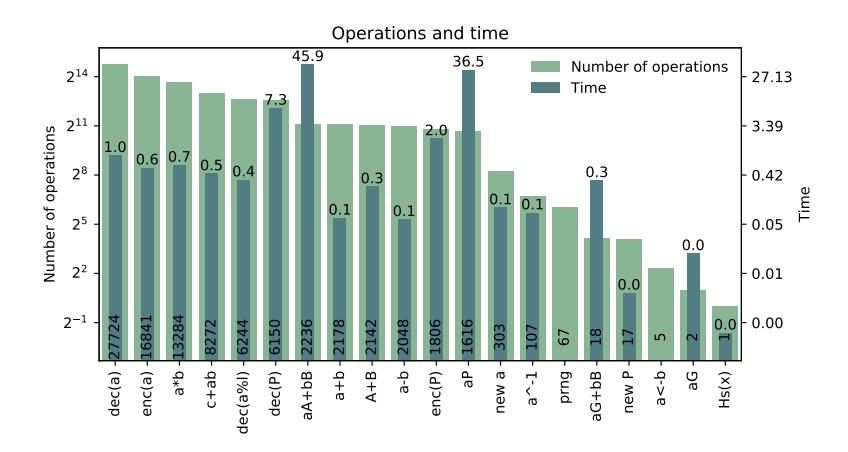

# Privacy-friendly Monero transaction signing on a hardware wallet, extended version

Dusan Klinec and Vashek Matyas

Masaryk University, Brno, Czech Republic, xklinec@fi.muni.cz, matyas@fi.muni.cz

Abstract Keeping cryptocurrency spending keys safe and being able to use them when signing a transaction is a well-known problem, addressed by hardware wallets. Our work focuses on a transaction signing process for privacy-centric cryptocurrency Monero, in the hardware wallets. We designed, implemented, and analyzed a privacy-preserving transaction signing protocol that runs on a hardware wallet and protects the spending keys. Moreover, we also implemented a privacy-preserving multi-party version of the Bulletproof zero-knowledge prover algorithm, which runs on a hardware wallet with constant memory. We present the protocols and evaluate their performance on a real hardware wallet.

Keywords: Monero · transaction signing · Bulletproofs · zero-knowledge system · multi-party computation · hardware wallets.

## 1 Introduction

Cryptocurrencies gained popularity and increased adoption by general public in the recent years. They became a valuable asset worth protecting. In the vast majority of the cryptocurrency designs, the only thing needed to transact (spend) the coins is a cryptographic key (master key). Recently, we have seen several attacks on the software wallets storing the master keys and leading to coin thefts [\[Goo19;](#page-14-0) [You17;](#page-14-1) [Cim20\]](#page-14-2)

Software wallets are inherently vulnerable to malware threats, so users seek better ways to protect their cryptographic assets. One option is to use a dedicated hardware device, the hardware wallet, that stores the master key securely and performs the signature on the transactions specified by the user. The device can be equipped with a display to show the transaction details to the user (e.g., destination and the amount) and buttons to confirm the transaction information. As the hardware wallet (HW) is a special-purpose device, it has a much smaller attack surface than a PC. The HW is limited and usually needs a PC client for operation, e.g., transaction construction, transaction scanning.

Bitcoin, the first massively used cryptocurrency, does not provide much privacy to its users. i.e., the whole transaction history is stored in a public blockchain (append-only ledger), it contains source, destination addresses (cryptographic keys, pseudonymous identifiers), and transacted amounts in a clear form so the attacker can mount several chain analysis techniques to trace the financial flow between the users. On the other hand, creating the signature and implementing the logic in the HW is usually straightforward as it requires just transaction serialization logic and ECDSA signature over the data.

We focus on a privacy-centric cryptocurrency, Monero [\[Alo18\]](#page-14-3), which is the most used privacycentric cryptocurrency[1](#page-0-0) . In Monero, all destination addresses are unique, and the amounts being transacted are hidden using Pedersen commitments [\[Ped92\]](#page-13-0). The secure implementation of the Monero transaction signing is thus a more challenging task. Moreover, HWs are resource-constrained devices with limited memory and computational power.

For the practical testing, we choose a Trezor hardware wallet model T [\[Lab19\]](#page-14-4) (Trezor for short) as it represents a class of hardware wallets with generally available processors used in the embedded

<span id="page-0-0"></span><sup>1</sup> By the market value <https://coinmarketcap.com>, accessed on 5. 1. 2020.

devices, with around 100 kB of RAM. It runs Micropython<sup>2</sup>, a Python version for resource-constrained devices. A different hardware wallet class is one with a Secure Element that has 2-10 kB of RAM. We do not aim for the Secure Element class as the transaction signing protocol already exists [Mes17], having different security properties and performance stemming from the low available memory. Our protocol works on a higher abstraction level; it has a simple and concise interface that enables easier security analysis, the protocol is more stable over protocol changes, easy to maintain, and needs less message round trips. Moreover, we provide a privacy-friendly range proofs generation.

Contribution: This work builds on our previous technical report [Kli18]. We designed and implemented a Monero transaction signing protocol for HWs. The protocol is simple, which helps with the security analysis. Moreover, it mimics the already deployed cold-signing protocol [Kli18] used with offline Monero wallets. We implemented the protocol to Trezor and Monero codebases, and it is being used in practice. Moreover, we designed and implemented a secure multi-party protocol (MPC) version of a zero-knowledge proving system called Bulletproof [Bun+18], which uses constant memory and works on HWs. The MPC version protects private values, from PC-based attacker. To the best of our knowledge, this is the first MPC implementation of the Bulletproof runnable on HWs.

General methods: As the HW is a resource-limited device, the general methods for converting arbitrary protocols into MPC, such as Garbled circuits [Yao82], are not applicable, as those usually require significantly more memory and running time than we have available. We thus resort to a more effective protocol offloading design tailored specifically to the application domain, to preserve the practical usability of the resulting protocol.

## 1.1 Cryptocurrency primer

The elementary operation of transacting a particular amount from a sender to a receiver is called *transaction*. The transaction is an atomic state transition. Transactions are stored in the blocks, the block contains a hash of a previously generated block, thus forming a ledger of blocks, a blockchain. A new block is created every 10 minutes.

Transaction has  $|\mathcal{T}^{\text{in}}| = m$  inputs  $\mathcal{T}^{\text{in}}_j$ ,  $|\mathcal{T}^{\text{out}}| = p$  outputs  $\mathcal{T}^{\text{out}}_t$  and a fee. The amounts values in the input and the output side have to be equal, i.e.,  $\sum_{j=1}^m v^{\text{out}}_j = \sum_{t=1}^p v^o_t + \text{fee}$ , so the transaction is a valid state transition (and no value is lost or created). Let's denote transaction outputs TXOs. Transaction inputs are also called unspent transaction outputs (UTXOs). UTXOs are addresses that have a non-zero balance that can be spent. A balance can be trivially computed by replaying all transactions recorded in the blockchain. Blockchain clients usually track all UTXOs and update the state with each new block.

Transaction construction is controlled from the PC client as it scans the blockchain for UTXOs that can be spent. A user enters the transaction recipient addresses and amounts on the PC. The client then performs the transaction signing protocol with an HW to obtain a signed transaction. The signed transaction is then broadcasted to the cryptocurrency network and eventually added to a block.

The Monero user wallet has two key-pairs,  $(k^v, K^v)$  and  $(k^s, K^s)$ , the *view-key*, and *spend-key*, respectively. The view-key is used to scan the blockchain for incoming transactions to the user wallet; the spend-key is required to create a signature for spending the incoming coins.

#### 1.2 Attacker model

HWs are considered as trusted in all attacker models in this paper, i.e., HW securely stores master keys, and an attacker can gain no knowledge by observing and tampering the HW device. We only focus on an attacker controlling the PC client.

The *honest-but-curious* attacker model is defined by an attacker that obeys the protocol precisely but tries to learn new information observing the protocol transcripts.

<span id="page-1-0"></span> $<sup>^2</sup>$  https://micropython.org

The *malicious* attacker model is stronger, an attacker can arbitrarily deviate from the protocol. He can start multiple instances of protocols, interleave protocol runs, send, replay, delay, or drop any messages to/from the HW.

Attacker's goals are: a) to learn new information not derivable from the input parameters, e.g., master keys, secrets, random masks that can be used later to prove some statements about the transaction to a third party, for example, the amount being transacted; b) to spend the user-owner coins, change the transaction address or amount without user knowing about it; c) cause damage or financial loss to the user; d) embed information in the created transaction, possibly compromising senders or recipient privacy.

#### 1.3 Notation

We use a standard notation used in the related literature, such as [Alo18; Bun+18]. Due to the paper application domain in the Monero transactions, we use the elliptic curve (EC) Ed25519 [Ber+12] as a specialization of the cyclic group  $\mathbb G$  of the prime order l, let's denote  $\mathbb Z_l$  the ring of integers modulo l. The  $\mathbb Z_l^*$  denotes  $\mathbb Z_l \setminus \{0\}$ . The  $x \stackrel{\$}{\leftarrow} \mathbb Z_l^*$  denotes a uniform sampling of an element from  $\mathbb Z_l^*$ . Capital letters represent points on the curve  $\mathbb G$ , lower-case letters represent scalars from  $\mathbb Z_l^*$  unless said otherwise. We use the EC additive notation for  $\mathbb G$ , e.g., P+Q is a point addition,  $aP=(P+\cdots+P)$  is a scalar multiplication, 0P=O, i.e., neutral element, point in infinity. Let  $\mathbb F^n$  denote a vector space over  $\mathbb F$ , the  $a \in \mathbb F^n$  is a vector from the vector space with elements  $a_0,\ldots,a_{n-1} \in \mathbb F$ . The  $a \cdot b = \sum_{i=0}^{n-1} a_i b_i$  denotes a dot-product of  $a, b \in \mathbb F^n$ , the  $a \circ b = \{(a_i b_i)\}_i$  is element product. We also use Python notation for vector slicing, i.e.,  $a_{[:l]} = (a_0,\ldots,a_{l-1})$ ,  $a_{[l:]} = (a_l,\ldots,a_n)$ . For  $k \in \mathbb Z_l^*$ , the  $k^n \in \mathbb F^n$  denotes the vector  $k_{[i]} = k^i$ . The G is a generator of the  $\mathbb G$ , i.e., a base point. Let's define a cryptographic hash function  $\mathcal H: \{0,1\}^* \to \{0,1\}^{256}$ , the  $\mathcal H_p: \{0,1\}^* \to \mathbb G$  is a cryptographic hash function to curve points,  $\mathcal H_s: \{0,1\}^* \to \mathbb Z_l^*$  is a cryptographic hash function to scalars. Moreover, let's define  $\mathcal H=\mathcal H_p(G)$ , a point of unknown logarithm. Binary format of the scalars and points is 256 bits long. Let's denote the binary concatenation as  $|\mathbf H|$  and a key derivation function as KDF $(x) = \mathcal H(\mathcal H(x))$ .

## 2 Transaction signing protocol

Ring signatures are signatures generated by a single private key  $k_{\pi}$  corresponding to the public key  $K_{\pi}$  which is in the ring of unrelated public keys  $\mathcal{R} = \{K_0, \dots, K_{\pi}, \dots, K_n\}$ . The verifier is not able to tell which  $K_i \in \mathcal{R}$  generated the signature. This provides n-anonymity for the signer. Keys  $K_i$ ,  $i \neq \pi$  are called decoy keys. Let's define  $n = |\mathcal{R}|$ , i.e., the ring size.

Monero uses Schnorr-style multilayered linkable spontaneous anonymous group signatures (ML-SAG) [Noe15]. The linkability is a property that links signatures generated with the same private keys. The linked signatures have the same  $key\ image$  (explained later). Signatures with already seen key images are considered as invalid to protect from double-spending the same UTXO.

Monero uses the *Pedersen commitment* to conceal the transacted amounts and to prove that transaction input amounts are equal to transaction output amounts. A Monero range proof is a zero-knowledge proof that the TXO amount encoded in the scalar value  $v \in \mathbb{Z}_l^*$  lies<sup>3</sup> in the interval of allowed values  $[0, 2^N]$ , N = 64. The range proof is an essential part of the confidential transactions as it protects from overflows and new coin generation.

The transaction generator takes  $\mathcal{T}^{\text{in}}$  and set of destination addresses and amounts  $\mathcal{T}^{\text{out}}$  and produces a transaction with signature. The value  $|\mathcal{T}^{\text{in}}|$  can be quite high and is limited by the fee the user is willing to spend for the transaction to be added to the blockchain and the current block size. The current Monero protocol version (0.15.0.1), i.e. hard-fork, specifies that for a valid transaction it holds that  $2 \leq |\mathcal{T}^{\text{out}}| \leq 16$ . Thus the  $|\mathcal{T}^{\text{in}}|$  is the main limiting factor for the transaction generator with respect to the memory. The ring size n is fixed to 11 at the current version, but it is likely to increase in the future.

<span id="page-2-0"></span><sup>&</sup>lt;sup>3</sup> v in Pedersen commitment  $\gamma G + vH$ ,  $\gamma \stackrel{\$}{\leftarrow} \mathbb{Z}_l^*$ . Refer to Section 3 for more details.

The transaction contains large elements such as range proof and signatures for each  $\mathcal{T}^{\text{in}}$  thus, it is not feasible to construct the transaction in the HW in one pass. Thus the building process has to be separated into several steps so it can be computed with limited memory. We designed, implemented, and tested the transaction generation protocol that runs in the HW with unlimited  $\mathcal{T}^{\text{in}}$  (the protocol).

A state offloading is required to build the transaction incrementally as HWs are memory-constrained devices. Some parts of the state have to be sent to the host for later retrieval during the transaction construction. The protocol uses HMAC to protect the public state parts, e.g., parts of the final transaction, and an authenticated encryption (Chacha20Poly1305) for private state information, e.g.,  $\mathcal{T}^{\text{in}}$  private spending keys. Let's denote the  $\hat{x} = x \mid\mid \text{HMAC}(x)$  and  $\tilde{x} = \text{Enc}(x)$ , respectively. The keys are systematically generated by a strategy described in the  $Step\ 1$  of the protocol.

The offloaded signing protocol is described in the following section. Due to space limitations, we do not present the original signing protocol as currently implemented in Monero. For a comprehensive description, please refer to the [Alo18]. All MLSAG signatures are generated in the HW, the  $k^s$  never leaves the device, while the  $k^v$  is exported to the host so it can scan all blockchain transactions to determine whether the funds were sent to the recipient wallet keys. Performing the blockchain scanning with the device would be inefficient.

The transaction is built on the host incrementally, from the information provided by the HW. In general, the host sends initial transaction information to the HW. Then all  $\mathcal{T}^{\text{in}}$  are sent to the HW one by one; the HW derives required signing keys, serializes  $\mathcal{T}^{\text{in}}$  to blockchain format, incrementally hashes some information required for later MLSAG construction. Then destination information is sent one by one; the HW generates  $\mathcal{T}^{\text{out}}$  related information, serializes  $\mathcal{T}^{\text{out}}$  to the blockchain format, range proof generation is handled. Finally, the MLSAG is generated per  $\mathcal{T}^{\text{in}}$ .

Step 1: Host sends to the HW basic transaction parameters: TsxData:  $\{version, unlock\_time, |\mathcal{T}^{in}|, n, fee, sub-address major index <math>\ell\uparrow$ ,  $\mathcal{T}^{out}\}$ . The destination is defined as:  $\mathcal{T}_i^{\text{out}} = \{v_i^o, K_i^{o,v}, K_i^{o,s}\}$ . The HW allocates and initializes internal state. The HW generates a transaction secret and public keys:  $r \stackrel{\$}{\leftarrow} \mathbb{Z}_l^*$  and R = rG. Then master offloading keys are generated in the following way:  $k^{mst} = \text{KDF}(\text{TsxData}||r||x \stackrel{\$}{\leftarrow} \mathbb{Z}_l^*), k^{enc} = \text{KDF}(\text{"enc"}||k^{mst}), k^{mac} = \text{KDF}(\text{"mac"}||k^{mst}).$ 

The HW displays a confirmation prompt to the user to confirm the transaction fee and destination address and amounts.

Key construction scheme: Once user confirms the data validity, the HW generates HMACs for each  $\mathcal{T}^{\text{out}}$ :  $\{\mathcal{T}_i^{\text{out}}, \text{ HMAC}(\mathcal{T}_i^{\text{out}}, \text{ key}=\text{KDF}(k^{mac} \mid | \text{"txdest"}||i))\}_i$ . The HMAC keys construction prevents from changing destination specification later in the protocol by an attacker. All the offloading keys used in the protocol are generated correspondingly, i.e., the keys are unique per the offloaded element to make the protocol strictly commit to the offloaded values and their ordering. The key is derived from the master keys, the domain separator, e.g., "txdest", and the item index. In the remaining text, we omit the HMAC key construction from the notation for brevity, unless the HMAC key is constructed differently than described.

The essential part of the transaction construction is a serialization of transaction-related information to the blockchain format and hashing the serialized data to a transaction prefix hash,  $\mathfrak{m}_p$  and pre-MLSAG message hash  $\mathfrak{m}$ . The hashes  $\mathfrak{m}_p, \mathfrak{m}$  are used later in the MLSAG. As the  $\mathfrak{m}_p$  and  $\mathfrak{m}$  relate to all transaction information, they are constructed incrementally as the transaction data such as  $\mathcal{T}_i^{\text{in}}$ ,  $\mathcal{T}_j^{\text{out}}$  are being processed. Step 1 checks for additional conditions, such as the change address is correctly constructed, i.e., we can derive the spending keys and that the change address is among destinations if applicable. The step 1 returns the  $\{\text{HMAC}(\mathcal{T}_i^{\text{out}})\}_i$ .

Step 2: The host sends  $\mathcal{T}_i^{\text{in}}$ :  $\{outputs, \pi, R, \mathbf{R}^a, t, v^{\text{in}}, \gamma^{\text{in}}, \ell \downarrow_i \}$ , where outputs:  $\{idx_{i,j}, K_{i,j}^o, C_{i,j}^{\text{in}}\}_{j \in [1,n]}$  is an array that constitutes a ring  $\mathcal{R}_i$  for a given  $\mathcal{T}_i^{\text{in}}$ , the  $idx_{i,j}$  is an absolute blockchain index of the  $\mathcal{T}_{i,j}^{\text{in}}$ , the  $K_{i,j}^o$  is an output key the  $\mathcal{T}_{i,j}^{\text{in}}$  has been sent to, the  $C_{i,j}^{\text{in}}$  is an amount commitment. The  $\pi$  is an index of the  $\mathcal{T}_{i,\pi}^{\text{in}}$  for which the transaction signer knows the private keys, other  $\mathcal{T}_{i,j}^{\text{in}}: j \neq \pi$  in the ring

are decoys. It holds that  $C_{i,\pi}^{\rm in} = \gamma^{\rm in}G + v^{\rm in}H$ . The t is an index of the  $\mathcal{T}_{i,\pi}^{\rm in}$  in the transaction output array of the sending transaction. The t is required to correctly derive transaction spending keys. The R and  $R^a$  are sending transaction public keys. The  $\ell\downarrow_i$  is a sub-address minor index (explained below). The  $\pi$  is later omitted from the index tuple to simplify the notation when we talk about  $\mathcal{T}_{i,\pi}^{\rm in}$ .

Sub-addresses is a mechanism that supports having multiple different wallet addresses associated with the same wallet secret so recipients can specify one-time recipient addresses for better payment tracking. The sub-address is specified by a tuple  $(\ell\uparrow,\ell\downarrow)$ , i.e., the major and minor sub-address index, where by convention the (0,0) keys map to standard keys  $(k^v,k^s)$ . Then  $k^{s,(\ell\uparrow,\ell\downarrow)} = \mathcal{H}_s("SubAddr"||k^v||\ell\uparrow||\ell\downarrow) + k^s$  and  $k^{v,(\ell\uparrow,\ell\downarrow)} = k^v k^{s,(\ell\uparrow,\ell\downarrow)}$ .

The one-time address  $K_t^o$  is a unique output public key that the sender generates for each transaction output instead of using the recipient address directly. Let's define recipient keys  $(k_B^v, K_B^v)$ ,  $(k_B^s, K_B^s)$ , sender knows the public parts  $(K_B^v, K_B^s)$ . Sender uses transaction private key r to generate one-time public key  $K_t^o = \mathcal{H}(8rK_B^v||t)G + K_B^s$ , where t is the  $\mathcal{T}^{\text{out}}$  index. The R = rG is stored to the transaction data. The recipient can then compute the spending private key  $k_t^o = \mathcal{H}(k_B^vR||t) + k_B^s$ .

When sending to a sub-address, the  $rK_B^{s,(\ell\uparrow,\ell\downarrow)}$  needs to be added to a transaction data  $\mathbf{R}^a$ , so the receiving and spending works in the same way as with the normal addresses. Note that  $k_B^v rK_B^{s,(\ell\uparrow,\ell\downarrow)} = rK_B^{v,(\ell\uparrow,\ell\downarrow)}$ , thus the one-time keys are  $K^o = \mathcal{H}_s(8rK_B^{v,(\ell\uparrow,\ell\downarrow)}||t)G + K_B^{s,(\ell\uparrow,\ell\downarrow)}$  and the corresponding spending private key  $k^o = \mathcal{H}_s(8rK_B^{v,(\ell\uparrow,\ell\downarrow)}||t) + k_B^{s,(\ell\uparrow,\ell\downarrow)} = \mathcal{H}_s(8k^v rK_B^{s,(\ell\uparrow,\ell\downarrow)}||t) + k_B^{s,(\ell\uparrow,\ell\downarrow)}$ . All  $\mathcal{T}^{\text{in}}$  being spent in the transaction being generated have to share the same major sub-address index  $\ell\uparrow$  by design. The  $\ell\uparrow$  is specified in the message of the step 1. We thus omit the  $\ell\uparrow$  from the equations to simplify the notation.

The HW then computes an ECDH derivation:  $d_i = 8k^vR$ , if  $(\ell \uparrow = 0 \land \ell \downarrow_i = 0)$ , or  $d_i = 8k^vR_t^a$  otherwise. The HW verifies that  $K^{s,\ell \downarrow_i} = K_i^o - \mathcal{H}_s(d_i||t)G$ . If the equation holds it means the  $\mathcal{T}_{i,\pi}^{\text{in}}$  has been sent to the  $K^{s,\ell \downarrow_i}$  and we can generate spending private key  $k_i^o = \mathcal{H}(d_i||t) + k^{s,(\ell \uparrow,\ell \downarrow_i)}$  and the key image  $\ddot{K}_i^o = k_i^o \mathcal{H}_p(k_i^o G)$ .

The HW then generates a new commitment mask  $\alpha_i \stackrel{\$}{\sim} \mathbb{Z}_l^*$  and a pseudo-output commitment  $C_i' = \alpha_i G + v_i^{\text{in}} H$ . The pseudo-output is used later in the MLSAG scheme. The HW also generates a  $\text{vin}_i$ :  $\{\text{indices}, \ddot{K}_i^o\}$ , a blockchain-encoded message which contains blockchain indices for the ring keys and the key image. The  $\{\text{vin}_i, C_i'\}$  go to the final transaction, thus they are offloaded in clear-text with HMAC, on the other hand, the  $\{\alpha_i, k_i^o\}$  are sensitive thus offloaded encrypted. The offloading keys are domain separated and contain the  $\mathcal{T}^{\text{in}}$  index. The step 2 returns:  $\{\widehat{\text{vin}_i}, \widehat{C}_i', \widetilde{\alpha}_i, \widetilde{k}_i^o, \text{HMAC}(\mathcal{T}_i^{\text{in}})\}$ .

Step 3: The Monero consensus rules require UTXOs to be ordered by key-image in a transaction. As the  $vin_i$  messages are part of the transaction prefix hash  $\mathfrak{m}_p$ , the host sends  $vin_i$  sorted by key-image, one by one to the HW in step 3, so the HW can update the hashing context  $\mathcal{H}_{\mathfrak{m}_p}$ . As HMAC keys were generated by the original ordering prior to sorting, the host needs to send also the original index  $o^i$ . The correctness of the permutation is verified by checking the set size and a string ordering on key images (no duplicates).

**Step 4:** processes transaction destinations  $\mathcal{T}_i^{\text{out}}$  one by one and is described by the pseudo-code:

- 1 function SignStep4 $(\widehat{\mathcal{T}_i^{\text{out}}})$   $\triangleright \mathcal{T}_i^{\text{out}} = \{\text{amount}_i^o, K_i^v, K_i^s\}$
- 2 Check HMAC on  $\mathcal{T}_i^{\text{out}}$   $\triangleright$  to make sure destination was confirmed by the user in the step 1
- 3  $r_i^a \stackrel{\$}{\leftarrow} \mathbb{Z}_l^*$ ;  $R_i^a \leftarrow (r_i^a K_i^s)$  if isSubaddr $(\mathcal{T}_i^{\text{out}})$  else  $(r_i^a G)$
- 4  $d_i \leftarrow 8aR$  if isChange $(\mathcal{T}_i^{\text{out}})$  else  $((8r_i^aK_i^v)$  if isSubaddr $(\mathcal{T}_i^{\text{out}})$  else  $(8rK_i^v))$
- 5  $K_i^o \leftarrow \mathcal{H}_s(d_i||i)G + K_i^s$   $\triangleright$  Derive output one-time address
- 6  $k_i^a \leftarrow \mathcal{H}_s(d_i||i); \ \gamma_i^o \leftarrow \mathcal{H}_s(\text{"commitment\_mask"}||k_i^a)$   $\triangleright$  Derive amount key and C mask
- 7 ECDH<sub>i</sub>  $\leftarrow$  {amount<sub>i</sub>  $\oplus$   $\mathcal{H}$ ("amount"|| $k_i^a$ )<sub>[:8]</sub>}  $\triangleright$  Encrypt amount in the ECDH structure
- 8 vout<sub>i</sub>  $\leftarrow \{K_i^o\}$ ;  $C_i^o \leftarrow \gamma_i^o G + \text{amount}_i^o H$  > Serialize destination, compute commitment

11

```
9
            Handle range proof generation for (amount _i^o, \gamma_i)
                                                                                                                                       \triangleright Explained in the section 3
           \mathcal{H}_{\mathfrak{m}_p}(\text{vout}_i); \ \mathcal{H}^{\text{ecdh}}_{\mathfrak{m}}(\text{ECDH}_i); \ \mathcal{H}^{\text{range}}_{\mathfrak{m}}(\text{rangeProofData}_i);
10
                                                                                                                                                  ▶ Incremental hashing
            return \{\widehat{\text{vout}}_i, \text{rangeProofData}_i, C_i^o, \text{ECDH}_i\}
```

Step 5: The extra field containing additional transaction information is serialized from the elements  $\{R, \mathbf{R}^a\}$ . The incremental hashing is finished as all required information has been computed. The structure of the message hashes is the following:  $\mathfrak{m}_p = \mathcal{H}(\text{version}, \text{unlock\_time}, \{\text{vin}_i\}_i, \{\text{vout}_i\}_i, \{\text{vout}_i\}_i, \{\text{vout}_i\}_i, \{\text{vout}_i\}_i, \{\text{vout}_i\}_i, \{\text{vout}_i\}_i, \{\text{vout}_i\}_i, \{\text{vout}_i\}_i, \{\text{vout}_i\}_i, \{\text{vout}_i\}_i, \{\text{vout}_i\}_i, \{\text{vout}_i\}_i, \{\text{vout}_i\}_i, \{\text{vout}_i\}_i, \{\text{vout}_i\}_i, \{\text{vout}_i\}_i, \{\text{vout}_i\}_i, \{\text{vout}_i\}_i, \{\text{vout}_i\}_i, \{\text{vout}_i\}_i, \{\text{vout}_i\}_i, \{\text{vout}_i\}_i, \{\text{vout}_i\}_i, \{\text{vout}_i\}_i, \{\text{vout}_i\}_i, \{\text{vout}_i\}_i, \{\text{vout}_i\}_i, \{\text{vout}_i\}_i, \{\text{vout}_i\}_i, \{\text{vout}_i\}_i, \{\text{vout}_i\}_i, \{\text{vout}_i\}_i, \{\text{vout}_i\}_i, \{\text{vout}_i\}_i, \{\text{vout}_i\}_i, \{\text{vout}_i\}_i, \{\text{vout}_i\}_i, \{\text{vout}_i\}_i, \{\text{vout}_i\}_i, \{\text{vout}_i\}_i, \{\text{vout}_i\}_i, \{\text{vout}_i\}_i, \{\text{vout}_i\}_i, \{\text{vout}_i\}_i, \{\text{vout}_i\}_i, \{\text{vout}_i\}_i, \{\text{vout}_i\}_i, \{\text{vout}_i\}_i, \{\text{vout}_i\}_i, \{\text{vout}_i\}_i, \{\text{vout}_i\}_i, \{\text{vout}_i\}_i, \{\text{vout}_i\}_i, \{\text{vout}_i\}_i, \{\text{vout}_i\}_i, \{\text{vout}_i\}_i, \{\text{vout}_i\}_i, \{\text{vout}_i\}_i, \{\text{vout}_i\}_i, \{\text{vout}_i\}_i, \{\text{vout}_i\}_i, \{\text{vout}_i\}_i, \{\text{vout}_i\}_i, \{\text{vout}_i\}_i, \{\text{vout}_i\}_i, \{\text{vout}_i\}_i, \{\text{vout}_i\}_i, \{\text{vout}_i\}_i, \{\text{vout}_i\}_i, \{\text{vout}_i\}_i, \{\text{vout}_i\}_i, \{\text{vout}_i\}_i, \{\text{vout}_i\}_i, \{\text{vout}_i\}_i, \{\text{vout}_i\}_i, \{\text{vout}_i\}_i, \{\text{vout}_i\}_i, \{\text{vout}_i\}_i, \{\text{vout}_i\}_i, \{\text{vout}_i\}_i, \{\text{vout}_i\}_i, \{\text{vout}_i\}_i, \{\text{vout}_i\}_i, \{\text{vout}_i\}_i, \{\text{vout}_i\}_i, \{\text{vout}_i\}_i, \{\text{vout}_i\}_i, \{\text{vout}_i\}_i, \{\text{vout}_i\}_i, \{\text{vout}_i\}_i, \{\text{vout}_i\}_i, \{\text{vout}_i\}_i, \{\text{vout}_i\}_i, \{\text{vout}_i\}_i, \{\text{vout}_i\}_i, \{\text{vout}_i\}_i, \{\text{vout}_i\}_i, \{\text{vout}_i\}_i, \{\text{vout}_i\}_i, \{\text{vout}_i\}_i, \{\text{vout}_i\}_i, \{\text{vout}_i\}_i, \{\text{vout}_i\}_i, \{\text{vout}_i\}_i, \{\text{vout}_i\}_i, \{\text{vout}_i\}_i, \{\text{vout}_i\}_i, \{\text{vout}_i\}_i, \{\text{vout}_i\}_i, \{\text{vout}_i\}_i, \{\text{vout}_i\}_i, \{\text{vout}_i\}_i, \{\text{vout}_i\}_i, \{\text{vout}_i\}_i, \{\text{vout}_i\}_i, \{\text{vout}_i\}_i, \{\text{vout}_i\}_i, \{\text{vout}_i\}_i, \{\text{vout}_i\}_i, \{\text{vout}_i\}_i, \{\text{vout}_i\}_i, \{\text{vout}_i\}_i, \{\text{vout}_i\}_i, \{\text{vout}_i\}_i, \{\text{vout}_i\}_i, \{\text{vout}_i\}_i, \{\text{vout}_i\}_i, \{\text{vout}_i\}_i, \{\text{vout}_i\}_i, \{\text{$ extra), then the pre-MLSAG  $\mathfrak{m} = \mathcal{H}(\mathfrak{m}_p \parallel \mathcal{H}(\{ECDH_i\}_i \parallel \{C_i^o\}_i) \parallel \mathcal{H}(\{rangeProofData_i\}_i)).$ 

MLSAG: A separate MLSAG is generated per  $\mathcal{T}_j^{\text{in}}$  message. The host then sends  $\{\widehat{\mathcal{T}_j^{\text{in}}}, \widehat{C_j'}, \widehat{\alpha_j}, \widehat{k_j^o}\}$ , one by one. The HW checks HMACs on received values and decrypts commitment mask  $\alpha_j$  and the spending private key  $k_i^o$ .

Mask balancing: The following equation has to hold to prove that the transaction input amounts equal to the transaction outputs plus transaction fee:  $\sum_j C'_j - \sum_t C^o_t - \text{fee}H = 0$ . For that to hold, the commitment masks have to balance on each side, i.e.,  $\sum_j \alpha_j = \sum_t \gamma^o_t$ . As the  $\gamma^o_t$  are generated deterministically in the step 5, the balancing has to be done on a pseudo-output commitment mask  $\alpha_j$ . The  $\alpha_i$  are generated randomly in the step 2 so to make the equation hold the last mask is recomputed in this step:  $\alpha_m = \sum_t \gamma_t^o - \sum_j^{m-1} \alpha_j$ .

The ring is then constructed as  $\mathcal{R}_j = \{\{K_{j,i}^o, (C_{j,i}^{\text{in}} - C_{j,\pi}')\}_{i \in [1,n]}\}$ . The signer can sign the ring in the MLSAG as he knows the private key for public keys at index  $\pi$ , namely  $k_j^o$  for  $K_{j,\pi}^o$  and  $z_j = (\gamma_{\pi}^{\text{in}} - \alpha_{\pi})$ for  $(C_{j,\pi}^{\text{in}} - C_{j,\pi}') = (\gamma_{\pi}^{\text{in}}G + v_{j}^{\text{in}}H - \alpha_{\pi}G - v_{j}^{\text{in}}H)$ . The *MLSAG* is then generated in the following way:

## Algorithm 1 MLSAG generator

```
1 function MLSAG(\mathfrak{m}, \mathcal{R}, \pi, k^o, z)
            \ddot{K} \leftarrow k^o \mathcal{H}_n(K_\pi)
                                                                                                                                                                                        ▷ Compute the key image
            \alpha_1 \stackrel{\$}{\leftarrow} \mathbb{Z}_l^*; \ \alpha_2 \stackrel{\$}{\leftarrow} \mathbb{Z}_l^*; \ r_{i,j} \stackrel{\$}{\leftarrow} (\mathbb{Z}_l^*)^{2i}
                                                                                                                                                                                       ▷ Generate random masks
             c_{\pi+1} \leftarrow \mathcal{H}_s(\mathfrak{m} \parallel (K_{\pi}^o \parallel \alpha_1 G \parallel \alpha_1 \mathcal{H}_p(K_{\pi}^o)) \parallel (C_{\pi}^{\mathrm{in}} - C_{\pi}' \parallel \alpha_2 G))
            for i \in (\pi + 1, \pi + 2, \dots, n, 1, 2, \dots, \pi - 1) do
5
                   c_{i+1} \leftarrow \mathcal{H}_s(\mathfrak{m} \parallel (K_i^o \parallel r_{i,1}G + c_i K_i^o \parallel r_{i,1} \mathcal{H}_p(K_i^o) + c_i \ddot{K}) \parallel (C_i^{\text{in}} - C_{\pi}' \parallel r_{i,2}G + c_i (C_i^{\text{in}} - C_{\pi}')))
6
            r_{\pi 1} \leftarrow \alpha_1 - c_{\pi} k^o; r_{\pi 2} \leftarrow \alpha_2 - c_{\pi} z
7
                                                                                                                                           \triangleright Redefine r_{\pi} as we know the privates for K_{\pi}
             return \{\ddot{K}, c_1, r_{1,1}, r_{1,2}, \dots, r_{m,2}\}
```

Step 5 returns {MLSAG<sub>t</sub>,  $C_t^o$ }, i.e., the encrypted generated signature and recomputed commitment. The verifier then starts reconstructing commitments from  $c'_2$  and checks if the final  $c'_1$  matches the value from the signature. Thus  $c'_{i+1} = \mathcal{H}_s(\mathfrak{m} \mid\mid (K_{i,1} \mid\mid r_{i,1}G + c_iK_{i,1} \mid\mid r_{i,1}\mathcal{H}_p(K_{i,1}) + c_i\ddot{K}) \mid\mid$  $(K_{i,2} \mid\mid r_{i,2}G+c_iK_{i,2}))$ . The verification works because if  $i \neq \pi$ , the  $c'_{i+1}$  are generated in the same way as in the signer algorithm. If  $i = \pi$  then it holds that  $r_{\pi,j}G + c_{\pi}K_{\pi,j} = (\alpha_j - c_{\pi}k_j)G + c_{\pi}K_{\pi,j} = \alpha_jG$ and similarly  $r_{\pi,1}\mathcal{H}_p(K_{\pi}^o) + c_{\pi}\ddot{K} = (\alpha_1 - c_{\pi}k^o)\mathcal{H}_p(K_{\pi}^o) + c_{\pi}\ddot{K} = \alpha_1\mathcal{H}_p(K_{\pi}^o) - c_{\pi}(k^o\mathcal{H}_p(K_{\pi}^o)) + c_{\pi}\ddot{K} = \alpha_1\mathcal{H}_p(K_{\pi}^o) + c_{\pi}\dot{K} = \alpha_1\mathcal{H}_p(K_{\pi}^o) + c_{\pi}\dot{K} = \alpha_1\mathcal{H}_p(K_{\pi}^o) + c_{\pi}\dot{K} = \alpha_1\mathcal{H}_p(K_{\pi}^o) + c_{\pi}\dot{K} = \alpha_1\mathcal{H}_p(K_{\pi}^o) + c_{\pi}\dot{K} = \alpha_1\mathcal{H}_p(K_{\pi}^o) + c_{\pi}\dot{K} = \alpha_1\mathcal{H}_p(K_{\pi}^o) + c_{\pi}\dot{K} = \alpha_1\mathcal{H}_p(K_{\pi}^o) + c_{\pi}\dot{K} = \alpha_1\mathcal{H}_p(K_{\pi}^o) + c_{\pi}\dot{K} = \alpha_1\mathcal{H}_p(K_{\pi}^o) + c_{\pi}\dot{K} = \alpha_1\mathcal{H}_p(K_{\pi}^o) + c_{\pi}\dot{K} = \alpha_1\mathcal{H}_p(K_{\pi}^o) + c_{\pi}\dot{K} = \alpha_1\mathcal{H}_p(K_{\pi}^o) + c_{\pi}\dot{K} = \alpha_1\mathcal{H}_p(K_{\pi}^o) + c_{\pi}\dot{K} = \alpha_1\mathcal{H}_p(K_{\pi}^o) + c_{\pi}\dot{K} = \alpha_1\mathcal{H}_p(K_{\pi}^o) + c_{\pi}\dot{K} = \alpha_1\mathcal{H}_p(K_{\pi}^o) + c_{\pi}\dot{K} = \alpha_1\mathcal{H}_p(K_{\pi}^o) + c_{\pi}\dot{K} = \alpha_1\mathcal{H}_p(K_{\pi}^o) + c_{\pi}\dot{K} = \alpha_1\mathcal{H}_p(K_{\pi}^o) + c_{\pi}\dot{K} = \alpha_1\mathcal{H}_p(K_{\pi}^o) + c_{\pi}\dot{K} = \alpha_1\mathcal{H}_p(K_{\pi}^o) + c_{\pi}\dot{K} = \alpha_1\mathcal{H}_p(K_{\pi}^o) + c_{\pi}\dot{K} = \alpha_1\mathcal{H}_p(K_{\pi}^o) + c_{\pi}\dot{K} = \alpha_1\mathcal{H}_p(K_{\pi}^o) + c_{\pi}\dot{K} = \alpha_1\mathcal{H}_p(K_{\pi}^o) + c_{\pi}\dot{K} = \alpha_1\mathcal{H}_p(K_{\pi}^o) + c_{\pi}\dot{K} = \alpha_1\mathcal{H}_p(K_{\pi}^o) + c_{\pi}\dot{K} = \alpha_1\mathcal{H}_p(K_{\pi}^o) + c_{\pi}\dot{K} = \alpha_1\mathcal{H}_p(K_{\pi}^o) + c_{\pi}\dot{K} = \alpha_1\mathcal{H}_p(K_{\pi}^o) + c_{\pi}\dot{K} = \alpha_1\mathcal{H}_p(K_{\pi}^o) + c_{\pi}\dot{K} = \alpha_1\mathcal{H}_p(K_{\pi}^o) + c_{\pi}\dot{K} = \alpha_1\mathcal{H}_p(K_{\pi}^o) + c_{\pi}\dot{K} = \alpha_1\mathcal{H}_p(K_{\pi}^o) + c_{\pi}\dot{K} = \alpha_1\mathcal{H}_p(K_{\pi}^o) + c_{\pi}\dot{K} = \alpha_1\mathcal{H}_p(K_{\pi}^o) + c_{\pi}\dot{K} = \alpha_1\mathcal{H}_p(K_{\pi}^o) + c_{\pi}\dot{K} = \alpha_1\mathcal{H}_p(K_{\pi}^o) + c_{\pi}\dot{K} = \alpha_1\mathcal{H}_p(K_{\pi}^o) + c_{\pi}\dot{K} = \alpha_1\mathcal{H}_p(K_{\pi}^o) + c_{\pi}\dot{K} = \alpha_1\mathcal{H}_p(K_{\pi}^o) + c_{\pi}\dot{K} = \alpha_1\mathcal{H}_p(K_{\pi}^o) + c_{\pi}\dot{K} = \alpha_1\mathcal{H}_p(K_{\pi}^o) + c_{\pi}\dot{K} = \alpha_1\mathcal{H}_p(K_{\pi}^o) + c_{\pi}\dot{K} = \alpha_1\mathcal{H}_p(K_{\pi}^o) + c_{\pi}\dot{K} = \alpha_1\mathcal{H}_p(K_{\pi}^o) + c_{\pi}\dot{K} = \alpha_1\mathcal{H}_p(K_{\pi}^o) + c_{\pi}\dot{K} = \alpha_1\mathcal{H}_p(K_{\pi}^o) + c_{\pi}\dot{K} = \alpha_1\mathcal{H}_p(K_{\pi}^o) + c_{\pi}\dot{K} = \alpha_1\mathcal{H}_p(K_{\pi}^o) + c_{\pi}\dot{K} = \alpha_1\mathcal{H}_p(K_{\pi}^o) + c_{\pi}\dot{K} = \alpha_1\mathcal{H}_p(K_{\pi}^o) + c_{\pi}\dot{K} = \alpha_1\mathcal{H}_p(K_{\pi}^o) + c_{\pi}\dot{K} = \alpha_1\mathcal{H}_p(K_{\pi}^o) + c_{\pi}\dot{K} = \alpha_1\mathcal{H}_p(K_{\pi}^o) + c_{\pi}\dot{K} = \alpha_1\mathcal{H}_p(K_{\pi}^o) + c_{\pi}\dot{K} = \alpha_1\mathcal{$  $\alpha_1 \mathcal{H}_p(K_\pi^o)$ .

Extension: Currently, the MLSAG is generated in memory in one message step as the only memorylimiting factor is the size of the ring  $n = |\mathcal{R}|$ , that is fixed to 11 in the current Monero version, and it can fit in memory. However, the generation algorithm can be easily extended to generate MLSAG in chunks in order to support large ring sizes. Note that each iteration requires only the current ring row  $\mathcal{R}_i$ , the  $r_{i,i}$  masks and  $c_i$  for a fixed i.

Finalization: Once all MLSAGs are generated, the HW returns a decryption keys for MLSAG<sub>t</sub>. The HW also generates transaction-dependent encryption key  $k^t = KDF(salt \stackrel{\$}{\leftarrow} \mathbb{Z}_l^* \mid\mid k^s \mid\mid \mathfrak{m}_p)$  and returns encrypted transaction private keys  $\operatorname{Enc}(k^t, r, r^a)$  so other Monero features requiring the keys are supported, such as generating a ZK proof that transaction has been sent.

Analysis: The protocol is based on cold-signing protocol implemented in Monero codebase, which takes all transaction inputs  $\mathcal{T}^{\text{in}}$ , transaction outputs  $\mathcal{T}^{\text{out}}$ , asks the user to confirm transaction outputs, and a fee and generates a valid Monero transaction. Cold-signing protocol is trivially secure as it is evaluated in a secure environment (offline Monero wallet), and the user confirms all transaction outputs. Our offloaded protocol mimics the cold-signing protocol. It is evaluated in a hardware wallet, which is considered a secure environment. The transaction is constructed incrementally, from the basic input blocks  $\mathcal{T}^{\text{in}}$ ,  $\mathcal{T}^{\text{out}}$  sent one by one to the HW. The user confirms the  $\mathcal{T}^{\text{out}}$  on the HW, as it has a display and touch screen. After the confirmation is done (Step 1), the HW generates HMAC for confirmed  $\mathcal{T}^{\text{out}}$  thus it cannot be later modified by an attacker.

Each call is guarded by a state automaton, set up in step 1 by the parameters of the transaction. This prevents from calling protocol methods in a different than expected order. Moreover, due to HMAC and encryption key construction, it is not possible to modify, reorder, reply, or drop the offloaded state elements. Protocol aborts if invalid input is provided.

The only place where the  $k^s$  is used is during spend key computation, during  $\mathcal{T}^{\text{in}}$  construction. The result of the computation is offloaded in an encrypted form, which could only be used as input in the last protocol step, during MLSAG generation per each  $\mathcal{T}^{\text{in}}$ . MLSAG signature is generated over hash commitment  $\mathfrak{m}$ , which hashes the entire transaction specification ( $\mathcal{T}^{\text{in}}$ ,  $\mathcal{T}^{\text{out}}$ ).

Moreover, final signatures can be decrypted after the whole protocol finishes successfully, as the decryption keys are sent as the last message. The protocol is thus secure in the malicious attacker model as cheating in each protocol step is detected by HMAC, auth tag, or state transition failure.

The only information the attacker can obtain from the protocol runs (without a need to finish the protocol) is key images corresponding to the  $\mathcal{T}_j^{\text{in}}$ . The key images are part of the constructed transaction. As we need the host to sort key images so some kind of order-preserving encryption would have to be used to protect key images from leaking before the protocol finish. However, we do not consider this as a required measure as the key images are computed during the blockchain scanning once the transaction sent to our wallet has been found.

**Space complexity:** The space complexity is determined by O(n+p), i.e., by a ring size and the number of the transaction outputs, i.e., n=11 and  $p \leq 16$  in the current Monero version. The whole ring is needed only for the MLSAG signature, which can be easily extended to support large rings. If the p is increased later, the protocol can be easily changed to offload all output-related values.

The state maintained by the protocol contains:  $\{k^v, k^s, k^{\text{enc}}, k^{\text{mac}}, r, n, m, p, \ell \uparrow, \text{ fee}, \mathcal{T}_{\text{change}}^{\text{out}}, r^a, \mathbf{R}^a, \text{ extra, } v_p^o, \sum v_t^o, \sum v_j^{\text{in}}, \sum \alpha_j, \sum \gamma_t, \mathbf{C'}, \mathbf{v^o}, \gamma^o, \text{ current element index, automaton state, } \mathcal{H}_{\mathfrak{m}_p}, \mathcal{H}_{\mathfrak{m}}^{\text{main}}, \mathcal{H}_{\mathfrak{m}}^{\text{ECDH}}, \mathcal{H}_{\mathfrak{m}}^{\text{range}}\}, \mathfrak{m}_p, \mathfrak{m}\}.$  However, state entries do not exist all in the same time in the memory and entries are freed once they are not needed anymore, e.g,  $\{r^a, \mathbf{R}^a, \text{ extra, } \mathbf{C'}, \mathcal{H}_{\mathfrak{m}_p}, \mathcal{H}_{\mathfrak{m}}\}$  can be deleted after step 4 as they are needed only for the hashing. Similarly, the  $\{\mathcal{T}_{\text{change}}^{\text{out}}, \mathbf{v^o}, \mathbf{\gamma^o}\}$  can be deleted after all outputs have been processed (and range proofs were generated).

*Performance:* The transaction signing protocol implemented in Micropython for Trezor HW was tested with various input transactions. Refer to Table 1 for performance overview data.

## <span id="page-6-0"></span>3 Range proof

The range proof is a zero-knowledge proof that the amount encoded in a scalar  $v \in \mathbb{Z}_l^*$  (256-bit number for Ed25519), lies in the interval  $[0, 2^{64})$ , without revealing the amount value. Range proof computations are the most resource expensive operations in the transaction construction (time and memory). Thus it makes sense to offload the computation to the host. Range proofs do not contain any wallet secrets, so the offloading optimizes the signing protocol, making it feasible to run on resource-constrained devices.

The range proofs make use of commitments  $V = \gamma G + vH$ , where  $\gamma \stackrel{*}{\leftarrow} \mathbb{Z}_l^*$  is a mask, and the V is part of the publicly stored information. If the attacker generates the masks in a special way, he can exfiltrate information about the keys or the transaction. From the binding property of the commitment scheme and the discrete logarithm problem, it is infeasible to find a different  $v', \gamma'$ , s.t.  $\gamma'G + v'H = \gamma G + vH$ .

<span id="page-7-0"></span>Table 1. Performance of the transaction signing protocol on Trezor HW. The algorithm was tested on emulator and Trezor T HW. Configuration is a tuple (#inputs, #outputs, #ring size). By default, the ring size is 11 and the third element is omitted. he first metric, "Time emu", is a runtime in an emulator, other statistics are from runs on the real hardware. "\sum\_\text{Steps}" is protocol computation time without communication overhead, "rounds" is a total number of message round-trips. Rows with "State" show a maximal state size over the protocol, where "real" is the real size measured in the implementation, "min" is the minimal space required, without Micropython objects overhead. Note that the range-proof is not included in the statistics as it is measured separately in section 3. It is visible that the state size is constant, and timing is linear to the number of inputs.

| Configuration       | 2-2    | 2-2-24 | 2-2-48 | 16-2   | 32-2   | 64-2   | 128-2  | 2-16   | 16-16  |
|---------------------|--------|--------|--------|--------|--------|--------|--------|--------|--------|
| Time Emu [s]        | 9.31   | 7.68   | 21.80  | 29.93  | 58.13  | 106.32 | 209.88 | 21.45  | 42.21  |
| Time [s]            | 16.90  | 21.45  | 30.82  | 83.22  | 156.82 | 306.74 | 604.09 | 46.13  | 118.42 |
| \sum_{\text{Steps}} | 12.49  | 14.63  | 19.59  | 56.30  | 106.69 | 207.33 | 408.42 | 36.62  | 81.05  |
| Rounds              | 14     | 14     | 14     | 56     | 104    | 200    | 392    | 28     | 70     |
| RAM [B]             | 41 264 | 70 768 | 79 328 | 42 176 | 42 208 | 42 048 | 58 512 | 41 376 | 42 464 |
| State min [B]       | 2 385  | 2 385  | 2 385  | 2 385  | 2 385  | 2 385  | 2 385  | 4 406  | 4 406  |
| State real [B]      | 5 315  | 5 315  | 5 315  | 5 315  | 5 315  | 5 315  | 5 315  | 9 224  | 9 224  |

The attacker already knows the amount as he observes the transaction construction, but knowing the masks enables the attacker to prove the amount to a third party (e.g., court). This poses a privacy risk as the attacker can prove that he has seen the transaction construction or knows the amount keys.

The Bulletproof [Bun+18] (BP) is the range proof system used in Monero. The proof size increases logarithmically with respect to the number of statements (transaction outputs). BP can prove  $M=2^x$  statements. The BP proof has the following structure: points/scalars  $A, S, T_1, T_2, \tau_x, \mu, a, b, t$ ; a vector of Pedersen commitments V of size M, vectors L, R of points of size 6log(M). In order to understand the implementation and the offloading protocol for the Bulletproofs, the Algorithm 2 describes the in-memory prover. We implemented the memory-optimized version for the Trezor HW. As the whole computation is in-memory, the algorithm is secure in the malicious attacker model.

Space complexity: Up to the while-loop on line 29, all vectors can be evaluated on-the-fly with a constant memory and low CPU overhead with just  $v, \gamma$  stored. Vectors like  $\zeta, r_0, r_1$  are evaluated in a constant time with sequential access to the elements, i.e., with internal state to  $x_i$  the  $x_{i+1}$  can be evaluated in O(1). The size of vectors is reduced by 2 with each iteration so overall memory consumption is determined by the first iteration. The values  $c_L, c_R, L_c, R_c, w$  can be computed in a constant memory with on-the-fly vector evaluation. The vectors  $\mathbf{G}', \mathbf{H}', \mathbf{a}', \mathbf{b}'$  folding on lines 36-39 require to store the results to the memory as on-the-fly evaluation of the new vectors would be infeasible due to large dependency complexity (mainly  $L_c, R_c$ ). Thus the space complexity of the whole algorithm is  $O(4\frac{MN}{2})$ . This leaves a space for minor optimization: with the O(2MN) memory we can memorize the l, r vectors before the while-loop, compute the loop up to line 37 with O(2MN) memory, but more effectively due to reduced on-the-fly evaluation costs. Before line 38, the memory consumption is O(MN), after the line 39 it is O(2MN).

Implementation: We implemented the in-memory Bulletproof prover as specified in the Algorithm 2 and the verifier in Micropython and tested on the Trezor HW. The size of the generated proof is 32(9+M+2log(NM))=672+32M+64log(M), for N=64 bits of amount and M statements. The memory usage is 32(128M+12log(M))+O(max(lg(N),M)) B. The verification algorithm runs with O(max(lg(N),M)) memory. Table 2 shows the performance of the prover and the verifier implemented on the Trezor. The RAM min shows the minimal amount of RAM required to cover the BP generation w.r.t. dominating cost - vectors, excluding the constants and state required for on-the-fly evaluation.

<span id="page-7-1"></span> $<sup>^4</sup>$  Multiplying by  $8^{-1}$  protects from small subgroup addition https://www.getmonero.org/2017/05/17/disclosure-of-a-major-bug-in-cryptonote-based-currencies.html

### **Algorithm 2** Bulletproof prover. N = 64, M = |v|, v is a vector of amount scalars

```
1 function BulletproofProver(v, \gamma)
                                                                                                                         ▶ Amounts and masks are input parameters
             (\boldsymbol{V}, A, S, T1, T2, \tau_x, \mu, x, h, l_{0,i}, l_{1,i}, r_{0,i}, r_{1,i}) \leftarrow \texttt{BulletproofPrefix}(\boldsymbol{v}, \boldsymbol{\gamma})
  2
            l_i \leftarrow l_{0,i} + x l_{1,i}
  3
                                                                                                                                                                                         \triangleright Vector \boldsymbol{l}
  4
            r_i \leftarrow r_{0,i} + xr_{1,i}
                                                                                                                                                                                        \triangleright Vector r
            t \leftarrow \boldsymbol{l} \cdot \boldsymbol{r}; \ x' \leftarrow \mathcal{H}_s(x||x||\tau_x||\mu||t)
                                                                                                          ▷ Evaluated with constant memory up to this point.
            (\boldsymbol{L}, \boldsymbol{R}, a'_0, b'_0) \leftarrow \text{BulletproofLoop}(\boldsymbol{l}, \boldsymbol{r}, \mathring{\boldsymbol{G}}, \boldsymbol{y}^{-|\mathring{H}|} \circ \mathring{\boldsymbol{H}}, MN, -1, x', x')
  6
            return (V, A, S, T1, T2, \tau_x, \mu, L, R, a'_0, b'_0, t)
  7
  8 function BulletproofPrefix(v, \gamma)

→ Amounts and masks are input parameters

            \mathring{G}_{i \in [0,...,MN)} \leftarrow \mathcal{H}_p(\mathcal{H}("bulletproof"||H||varint(2i+1)))
                                                                                                                                               > varint encodes integer to bytes
10
             \ddot{H}_{i \in [0,...,MN)} \leftarrow \mathcal{H}_p(\mathcal{H}("bulletproof"||H||varint(2i)))
            V_i \leftarrow \gamma_i G + v_i H
                                                                                                              \triangleright Compute commitment vector V used on line 18
11
12
                                                                                              \triangleright \text{ expand}(\mathbf{v}) = \mathbf{x}: \sum_{i=0}^{63} 2^i x_{64j+i} = v_j, j \in [0, |v|), x_i \in \{0, 1\}
            a_L \leftarrow \operatorname{expand}(v); a_R = a_L - 1^{MN}
13
            A \leftarrow 8^{-1} \left( \alpha G + \sum_{i=0}^{MN-1} a_{L,i} \mathring{G}_i + a_{R,i} \mathring{H}_i \right)
                                                                                                                                                        ▷ Commitment over values<sup>4</sup>
14
            \rho, R \stackrel{\$}{\leftarrow} (\mathbb{Z}_{l}^{*})^{2}
15
            s_L \leftarrow \text{randVct}(0), s_R \leftarrow \text{randVct}(1)
16
                                                                                                    \triangleright \operatorname{randVct}(j) = \boldsymbol{x} : |\boldsymbol{x}| = MN, x_i = H_s(\operatorname{"mask"}||R||i||j)
            S \leftarrow 8^{-1} \left( \rho G + \sum_{i=0}^{MN-1} s_{L,i} \mathring{G}_i + s_{R,i} \mathring{H}_i \right)
17

            y \leftarrow \mathcal{H}_s(\mathcal{H}_s(\mathbf{V})||A||S); z \leftarrow \mathcal{H}_s(y)
18
                                                                                                                 ▶ Compute commitments over inputs and masks
            \begin{aligned} \boldsymbol{l_0} \leftarrow \boldsymbol{a_L} - z \boldsymbol{1}^{MN}; \boldsymbol{l_1} \leftarrow \boldsymbol{s_L} \ \zeta_i \leftarrow z^{2 + \lfloor i/N \rfloor} \boldsymbol{2}^{i\%N} \end{aligned}
19
                                                                                                            \triangleright Vectors evaluated with constant memory, with \boldsymbol{v}
20
                                                                             ▷ Evaluated with constant memory and time with sequential access
             r_0 \leftarrow ((a_R + z) \circ y^{MN}) + \zeta; r_1 \leftarrow s_R \circ y^{MN}
21
            t_1 \leftarrow \boldsymbol{l_0} \cdot \boldsymbol{r_1} + \boldsymbol{l_1} \cdot \boldsymbol{r_0}; t_2 \leftarrow \boldsymbol{l_1} \cdot \boldsymbol{r_1}
22
            \tau_1, \tau_2 \stackrel{\$}{\leftarrow} (\mathbb{Z}_l^*)^2
23
             T_1 = 8^{-1} (\tau_1 G + t_1 H); T_2 = 8^{-1} (\tau_2 G + t_2 H)
24
            x \leftarrow \mathcal{H}_s(z||z||T1||T2)
25
            \tau_x \leftarrow \tau_1 x + \tau_2 x^2 + \sum_{i=0}^{M} \gamma_i z^{i+2}; \ \mu \leftarrow \rho x + \alpha
26
            return (V, A, S, T1, T2, \tau_x, \mu, x, h, l_{0,i}, l_{1,i}, r_{0,i}, r_{1,i})
27
28 function BulletproofLoop(a', b', G', H', n', c, w, x')
             while n' > 1 do
29
                   \bar{n} \leftarrow n'; n' \leftarrow n'/2; c \leftarrow c+1
30
                   c_L \leftarrow a'_{[0,\ldots,n']} \cdot b'_{[n',\ldots,\bar{n}]}
31
                   c_R \leftarrow a'_{[n',\dots,\bar{n})} \cdot b'_{[0,\dots,n')}
32
                  L_c \leftarrow 8^{-1} \left( \left( \sum_{i=0}^{n'} a'_i \quad G'_{i+n'} + b'_{i+n'} H'_i \right) + (c_L x') H \right)
33
                   R_c \leftarrow 8^{-1} \left( \left( \sum_{i=0}^{n'} a'_{i+n'} G'_i + b'_i H'_{i+n'} \right) + (c_R x') H \right)
34
                   w \leftarrow \mathcal{H}(w, L_c, R_c)
35
                   a'_{i \in [0, \dots, n')} \leftarrow w \quad a'_i + w^{-1} a'_{i+n'}
36
                                                                                                                  ▷ Scalar vector folding, reduces vector size by 2
                   b'_{i \in [0, \dots, n')} \leftarrow w^{-1}b'_i + w \quad b'_{i+n'}
37
                   G'_{i \in [0, \dots, n')} \leftarrow w^{-1} G'_i + w \quad G'_{i+n'}
                                                                                                  ▶ Hadamard product (folding), reduces vector size by 2
38
                   H'_{i \in [0, \dots, n')} \leftarrow w \quad H'_i + w^{-1} H'_{i+n'}
39
40
            return (\boldsymbol{L}, \boldsymbol{R}, a'_0, b'_0)
                                                                                                                                                     \triangleright vector \boldsymbol{L} composed from L_c
```

The difference between Total RAM and minimal RAM is due to memory handling mechanisms in Micropython and constant memory overhead for on-the-fly vector evaluation.

<span id="page-9-0"></span>**Table 2.** BP performance on the Trezor T hardware wallet. Verifier is faster than prover and requires significantly lower memory. Prover time and space complexity increases linearly to the input size.

| Prover outputs   | 1        | 2         | 4         | 8         | 16        |
|------------------|----------|-----------|-----------|-----------|-----------|
| Time [s]         | 16.88    | 30.55     | 57.40     | 121.21    | 246.57    |
| RAM min [B]      | $4\ 480$ | 8 640     | 16896     | $33\ 344$ | $66\ 176$ |
| RAM total [B]    | 9 648    | $13\ 536$ | $22\ 224$ | 39 696    | 74 400    |
| Verifier outputs | 1        | 2         | 4         | 8         | 16        |
| Time [s]         | 5.12     | 9.58      | 18.56     | 39.00     | 80.40     |
| RAM total [B]    | 5664     | $6\ 256$  | 6912      | $7\ 616$  | 8 512     |
| Proof size [B]   | 704      | 800       | 928       | 1120      | 1440      |

#### 3.1 Offloaded Bulletproofs

Due to rising space complexity, it is not possible to generate BPs with  $M \ge 4$  on the Trezor. We thus designed a new privacy-preserving secure multi-party protocol (MPC) to compute Bulletproofs jointly with the PC host and a hardware wallet with a constant memory on the hardware wallet side. We do not consider the time and memory requirements of the protocol running on the host in the following text.

A naïve offloading protocol computes all vector-related operations by chunking, i.e., exporting encrypted vectors to a host, then asks for vector chunks to compute the intermediate results. The vectors l, r and dot-products  $c_L, c_R, t$  can be computed incrementally as  $t = \sum l_i r_i$ . We need only sequential access to the vector elements thus the chunking method works well. This yields a constant memory protocol, but with high communication overhead.

We present basic offloading techniques in the following paragraphs, which are used to transform the in-memory prover to the privacy-preserving MPC prover with constant memory.

**Dot-product offloading:** We can evaluate dot-products and foldings on the host privately, using homomorphic property of a *blinding*. We export the vectors  $\pi_{a'} \mathbf{a}', \pi_{b'} \mathbf{b}'$  to the host, where  $\pi_{a'}, \pi_{b'} \stackrel{\$}{\leftarrow} \mathbb{Z}_t^*$  are random blinding scalars known only to the HW. The host computes the dot-product of blinded vectors  $\bar{r} = \pi_{a'} \mathbf{a}' \cdot \pi_{b'} \mathbf{b}' = \sum_{\alpha_{a'}} \pi_{a'} \pi_{b'} \mathbf{b}'_i = \pi_{a'} \pi_{b'} \sum_{\alpha_i'} a'_i b'_i$  and returns  $\bar{r}$ , i.e., blinded value r, to the HW. The HW then unblinds the  $\bar{r}$  as  $\pi_{a'}^{-1} \pi_{b'}^{-1} \bar{r} = r = \mathbf{a}' \cdot \mathbf{b}'$  to get the dot-product.

As the scalars are from  $\mathbb{Z}_l^*$  and vector elements are essentially random, the attacker cannot infer  $\mathbf{a'}$  from  $\pi_{a'}\mathbf{a'}$ . The  $\pi_{a'}\mathbf{a'}_0 = z$  does not have a unique factorization, i.e.,  $\forall z, x \; \exists y : xy = z; \; y = zx^{-1}$ . Thus, a blinded vector is indistinguishable from an unblinded one for an attacker. Moreover, each element is divisor of 1 in  $\mathbb{Z}_l^*$  so we cannot extract the blinding masks by  $GCD(\pi l_0, \pi l_1)$  as it is undefined.

<span id="page-9-1"></span>Folding offloading: A vector folding is defined as  $a'_{i\in(0,\dots,n']}=wa'_i+w^{-1}a'_{i+n'}$ , before folding it holds |a'|=2n', after the fold |a'|=n'. Computing the folding on the host saves CPU and communication round-trips. Only the w is needed for the host to compute the folding, but it is desired to keep internal constants secret to preserve the privacy-preserving property of the offloading. Thus  $\{w,w^{-1}\}$  are incorporated into blinding masks.

We have two distinct blinding constants for one vector. One for the lower half (LO), the other for the higher half (HI):  $\{\pi_{a'_{LO}}, \pi_{a'_{HI}}\}$ . The folding is then computed in two parts, as we preserve

the LO/HI blinding also for the folding result vector, as shown in Figure 3.1 and equation 1, so this blinding scheme is composable.

Let's thus define  $\boldsymbol{x_{LO}} = \boldsymbol{x_{[\frac{n}{2}]}}$  and  $\boldsymbol{x_{HI}} = \boldsymbol{x_{[\frac{n}{2}:]}}$  for vector  $\boldsymbol{x}$  of length n, Lh(0) = LO, Lh(1) = HI, then define folding constants as  $\phi_{\boldsymbol{x},j}$ ,  $\boldsymbol{x} \in \{\boldsymbol{a'}, \boldsymbol{b'}, \boldsymbol{G'}, \boldsymbol{H'}\}$ ,  $j \in [0,3]$ ,  $\phi_{\boldsymbol{x},j} = \theta_{\boldsymbol{x_{Lh}(\lfloor j/2 \rfloor)}} w^{1-(2j\%4)} \pi_{\boldsymbol{x_{Lh}(j\%2)}}$ , e.g.,  $\phi_{\boldsymbol{a'},0} = \theta_{\boldsymbol{a'_{LO}}} w \pi_{\boldsymbol{a'_{LO}}}^{-1}$ , where  $\boldsymbol{\theta}$  are randomly generated blinding masks from  $\mathbb{Z}_l^*$  for the next round. The  $\phi$  is constructed so it cancels the blinding mask  $\pi$ , multiplies by  $w^{\{1,-1\}}$ , and multiplies by a new blinding mask  $\theta$ . It is also easy to observe that folding offloading is compatible with the dot-product offloading, as  $c_L = \boldsymbol{a'_{LO}} \cdot \boldsymbol{b'_{HI}}$ ,  $c_R = \boldsymbol{a'_{HI}} \cdot \boldsymbol{b'_{LO}}$ .

The blinding technique differs from the dot-product offloading due to constants  $\{w, w^{-1}\}$  being used. We need to have distinct blinding masks for each term in the folding sum, so an attacker cannot extract the w from the blinding masks. The folding offloading works in the following way:

<span id="page-10-0"></span>
$$\begin{array}{c|ccccccccccccccccccccccccccccccccccc$$

<span id="page-10-2"></span>Initial G', H' folding: The folding of the G', H' cannot be performed as defined above as the vectors are protocol constants in the first round (known to attacker), i.e.,  $\pi_{G'} = \pi_{H'} = 1$ . Thus the attacker could extract w from the  $\phi$  and unblind the folded vectors. We define folding constants  $\phi^{(0)}$  for the first round as in the equation 2:  $\phi_{\boldsymbol{x},j}^{(0)}, \boldsymbol{x} \in \{G', H'\}, j \in [0,3], \phi_{\boldsymbol{x},j}^{(0)} = \theta_{\boldsymbol{x}_{Lh}(\lfloor j/2 \rfloor)} w^{(2j\%4)-1} + (1-j\%2)\pi_{x_{LO}},$  e.g.,  $\phi_{G',0}^{(0)} = \theta_{G'_{LO}} w^{-1} + \pi_{G'_{LO}}$ .

<span id="page-10-1"></span>The host computes the folding with the  $G', H', \phi^{(0)}$ , the HW then generates a vector of correction points  $\pi_{G'_{LO}}G'_{LO}$  and returns it to the host so the host can remove extraneous component caused by the additive blinding mask  $\pi_{G'_{LO}}$ .

$$\theta_{G'_{LO}}G'_{[:\frac{n'}{2}]} + \pi_{G'_{LO}}G'_{LO} \leftarrow (\theta_{G'_{LO}}w^{-1} + \pi_{G'_{LO}})G'_{[:n']} + (\theta_{G'_{LO}}w)G'_{[n':]}$$

$$\theta_{G'_{HI}}G'_{[\frac{n'}{2}:]} + \pi_{G'_{LO}}G'_{LO} \leftarrow (\theta_{G'_{HI}}w^{-1} + \pi_{G'_{LO}})G'_{[:n']} + (\theta_{G'_{HI}}w)G'_{[n':]}$$
(2)

 $L_c$ ,  $R_c$  offloading: Observe that  $L_c$  from line 33 can be computed from 3 independent components:  $L_c = 8^{-1} \left( \left( \sum_{i=0}^{n'} a_i' G_{i+n'}' \right) + \left( \sum_{i=0}^{n'} b_{i+n'}' H_i' \right) \right) + (c_L x') H \right)$ . Each component can be computed by the host with blinded vectors. The  $c_L$  is offloaded dot-product, host returns  $\pi_{a_{LO}'} \pi_{b_{HI}'} c_L$ . The sum  $\sum_{i=0}^{n'} a_i' G_{i+n'}'$  is computed from the blinded vectors in a similar way, the host returns:  $\overline{L_{cA}} = \pi_{a_{LO}'} \pi_{G_{HI}'} \sum_{i=0}^{n'} a_i' G_{i+n'}'$ , the other sum is analogical. The HW unblinds the components and computes  $L_c$ .

Implementation: The offloaded Bulletproof prover as defined in Algorithm 3 was implemented in the Micropython for the Trezor and performance of the implementation was evaluated. Table 3 shows a total time and memory consumption for the emulator (running the same software, but with emulated CPU, running on the desktop) and the HW. The table also contains performance statistics for previous in-memory implementation for comparison. The HW part also contains a maximal state size during the computation and maximum RAM needed for all steps of the algorithm, which gives minimal RAM needed for the offloaded algorithm. Real total RAM usage is higher due to Micropython memory management, message recoding, serialization, etc.

Algorithm 3 Bulletproof prover with offloading.  $b_{tch}$  is a number of elements to offload in one batch,  $n_{thr}$  is a n' threshold when to finish BP computation in-memory.

```
1 function \overline{\mathrm{BulletproofProverOffloaded}(v,\gamma)}
              (V, A, S, T1, T2, \tau_x, \mu, x, h, l_{0,i}, l_{1,i}, r_{0,i}, r_{1,i}) \leftarrow \text{BulletproofPrefix}(v, \gamma)
              t \leftarrow 0; c \leftarrow -1; n' \leftarrow MN; \pi \xleftarrow{\$} (\mathbb{Z}_{t}^{*})^{8}
  3
                                                                                                                                                              \triangleright New random blinding masks \pi
              for i \in \left[0, \dots, \frac{MN}{b_{tch}}\right) do
                                                                                                                                              \triangleright Compute t, export blinded l, r vectors
                    \begin{aligned} & \boldsymbol{l_c} \leftarrow l_{0,j} + x l_{1,j}; \ \boldsymbol{r_c} \leftarrow r_{0,j} + x r_{1,j}, \ j \in [ib_{tch}, (i+1)b_{tch}) \\ & \bar{\boldsymbol{l_c}} \leftarrow \pi_{a_{\delta(i)}'} \boldsymbol{l_c}; \ \overline{\boldsymbol{r_c}} \leftarrow \pi_{b_{\delta(i)}'} \boldsymbol{r_c}; \ t \leftarrow t + \boldsymbol{l_c} \cdot \boldsymbol{r_c} \\ & > \delta(x) = x < n' \ ? \ \text{LO} : \text{HI}, \ \bar{\boldsymbol{l_c}} \ \text{means blinded} \ \boldsymbol{l_c} \end{aligned}
  5
  6
                                                                                                                                      \triangleright \bar{l_c}, \bar{r_c} are \bar{a'}, \bar{b'} for the first while iteration
  7
                     \operatorname{Send}(\bar{l_c}, \overline{r_c})
              w \leftarrow x' \leftarrow \mathcal{H}_s(x||x||\tau_x||\mu||t)
  8
  9
              Send(u)
                                                                                                      \triangleright The host needs y to compute \mathbf{H'} and L_c, R_c related sums
              while n' > 1 do
                                                                                                                        \triangleright The y is public, computable from the final proof
10
                     \bar{n} \leftarrow n'; n' \leftarrow n'/2; c \leftarrow c+1
11
                     Receive(\overline{cL}, \overline{cR}, \overline{L_{cA}}, \overline{L_{cB}}, \overline{R_{cA}}, \overline{R_{cB}})
                                                                                                                                                  \triangleright \overline{L_{cA}} is first blinded sum from the L_c
12
                    L_c \leftarrow 8^{-1} \left( \pi_{a'_{LO}}^{-1} \pi_{G'_{HI}}^{-1} \overline{L_{cA}} + \pi_{b'_{HI}}^{-1} \pi_{H'_{LO}}^{-1} \overline{L_{cB}} + x' \pi_{a'_{LO}}^{-1} \pi_{b'_{HI}}^{-1} \overline{c_L} H \right)
13
                    R_c \leftarrow 8^{-1} \left( \pi_{a'_{HI}}^{-1} \pi_{G'_{I,O}}^{-1} \overline{R_{cA}} + \pi_{b'_{LO}}^{-1} \pi_{H'_{HI}}^{-1} \overline{R_{cB}} + x' \pi_{a'_{HI}}^{-1} \pi_{b'_{LO}}^{-1} \overline{c_R} H \right)
14
                     w \leftarrow \mathcal{H}(w||L_c||R_c); \boldsymbol{\theta} \xleftarrow{\$} (\mathbb{Z}_l^*)^8
                                                                                                                 \triangleright Compute w, generate blindings \theta for the next round
15
                     if n' \leq n_{thr} then
                                                                                                                                        ▷ Finish in-memory with original algorithm
16
                            Receive (\bar{a'}, \bar{b'}, \bar{G'}, \bar{H'}); Unblind to obtain \{a', b', G', H'\}
17
                            (\boldsymbol{L}, \boldsymbol{R}, a'_0, b'_0) \leftarrow \text{BulletproofLoop}(\boldsymbol{a'}, \boldsymbol{b'}, \boldsymbol{G'}, \boldsymbol{H'}, n', c, w, x')
18
                                                                                                                                                                                                 \triangleright Combine L, R
                            return (V, A, S, T1, T2, \tau_x, \mu, L, R, a'_0, b'_0, t)
19
                     \mathrm{Send}\Big(\phi_{x,l}^{(c)}: x \in \{\boldsymbol{a'},\boldsymbol{b'},\boldsymbol{G'},\boldsymbol{H'}\}, l \in [0,3]\Big) \qquad \qquad \triangleright \text{ Compute and send blindings } \phi_{x,l}^{(c)} \text{ for host folding } b \in \mathbb{C}
20
21
                            Compute and send G', H' folding correction points as defined in paragraph 3.1, by chunks
22
23
                      \pi \leftarrow \theta
                                                                                                                                       ▶ Update blinding masks for the next round
```

Attacker constraints: As we transformed the Algorithm 2 to the Algorithm 3 using offloading steps that preserve the privacy of the computation, the protocol remains secure in the honest-but-curious attacker model. The malicious attacker deviating from the protocol could tamper the intermediate results to learn new information or break the security properties of the protocol. However, such manipulation leads to an invalid proof with overwhelming probability due to the use of cryptographic hash function on line 15. As a consequence, the network nodes reject the transaction due to the invalid proof, and the attack will be noticed by the user. Another precaution against malicious attackers is to run a Bulletproof verifier on the generated proofs and abort the transaction signing and alert the user on the invalid proof. As in-memory verifier runs in constant memory, the protocol becomes malicious attacker resistant; however, the running time increases.

There might be more effective methods to verify intermediate results or catch attacker cheating with high probability. Such extensions are left for future work.

### 4 Related work

The work [Mes19] presents a signature protocol for a Ledger<sup>5</sup> HW (Ledger for short). Ledger is an HW with a secure element (SE). Using the SE and the overall architecture limits the usable RAM to a few

<span id="page-11-1"></span><sup>&</sup>lt;sup>5</sup> https://www.ledger.com

<span id="page-12-0"></span>**Table 3.** Offloaded BP performance on the Trezor emulator and Trezor, parameters:  $b_{tch} = 32, n_{thr} = 32$ . Offloaded version is faster and requires only constant memory compared to in-memory prover.

| Prover outputs         | 1        | 2          | 4         | 8         | 16           |
|------------------------|----------|------------|-----------|-----------|--------------|
| Time Emu [s]           | 6.97     | 9.69       | 14.75     | 25.48     | 44.81        |
| Total RAM Emu [B]      | 24 896   | $25\ 056$  | $25\ 120$ | $25\ 408$ | $25\ 632$    |
| Time HW [s]            | 25.10    | 37.49      | 59.03     | 99.96     | 184.02       |
| Total RAM HW [B]       | 8 768    | 8 928      | $9\ 488$  | 10 656    | $12 \ 816$   |
| Max state size [B]     | 3 603    | 5 747      | 5875      | $6\ 067$  | $6\ 387$     |
| Max state RAM used [B] | $5\ 576$ | 7 720      | 7 848     | 8 040     | 8 360        |
| Time HW in-mem [s]     | 16.88    | 30.55      | 57.40     | 121.21    | 246.57       |
| RAM HW in-mem [B]      | 9 648    | $13 \ 536$ | $22\ 224$ | 39 696    | $74\ 400$    |
| Messages               | 12       | 16         | 25        | 42        | 59           |
| Sent [B]               | 6528     | 8 576      | 8 768     | 8 960     | 9 152        |
| Received [B]           | 7 395    | $13 \ 635$ | $26\ 563$ | 51 843    | $1\ 018\ 27$ |



**Figure 1.** Privacy-preserving multi-party BP with M=16 cryptographic operations and timing breakdown. It is evident the most expensive operations are aP and point recodings.

tens kB. Thus they had to implement more low-level protocol with basic operations such as: generate key image, Hs(x), xP, get sub-address secret key, etc.

The protocol is tightly integrated into the Monero codebase. The tight coupling imposes maintainability challenges as a Monero algorithm change usually requires a HW signing protocol change. Technically, the Monero client implements a virtual device. If Ledger is used, the low-level cryptographic operations are computed in the device. The low-level protocol design makes the security analysis difficult as the information flow is quite complicated, and the attacker can call several methods in an arbitrary order, which can lead to information leak and potential vulnerability. To the best of our knowledge, the overall protocol is not documented nor analyzed. The low-level commands are documented in [\[Mes19\]](#page-14-8) only. The protocol does not use a state machine to guard the command calls.

To the best of our knowledge, there is no other Monero transaction signing protocol published nor used. Our protocol addresses issues with the security analysis, has very simple interface and thus reduced attack surface. Moreover, we compute the Bulletproofs in HW thus protecting blinding masks.

## 5 Conclusion

We designed, implemented, and tested a secure Monero transaction signing protocol for hardware wallets. We designed and analyzed the memory and time complexity of the zero-knowledge proofs (range-proofs, Bulletproofs [\[Bun+18\]](#page-14-7)), algorithms focused on low-memory consumption so they can be computed in HW. The memory consumption is linear in the number of inputs / UTXOs. The results can be easily applied to other protocols based on ring signatures, Pedersen commitments, and Bulletproof range proofs.

We also designed, implemented, and tested a privacy-preserving two-party Bulletproofs computation protocol with constant memory, enabling the computation of large input instances securely and in a reasonable time. This is the first privacy-preserving Bulletproof prover implementation running on an HW in constant memory. Techniques used in the protocol are applicable to similar protocols like Bulletproof, and Bulletproof also has several applications outside of Monero.

The implemented protocols are practically usable. The transaction signing protocol has been deployed since Nov. 7, 2018, integrated both to Trezor and Monero codebases. All implemented sources are available online under a permissive open source license at: [https://github.com/ph4r05/monero](https://github.com/ph4r05/monero-tx-paper) [-tx-paper](https://github.com/ph4r05/monero-tx-paper).

Acknowledgement: We thank our colleagues Petr Švenda and Marek Sýs, who provided valuable insights and ideas that helped to improve the protocols. Thanks also go to SatoshiLabs employees, Tomáš Sušánka, Jan Pochyla and Ondřej Vejpustek who did the security review of the design and implementation and helped significantly with simplifying the protocol implementation. We also thank the anonymous reviewers for their feedback and suggestions for improvement, and to Daniel Slamanig for shepherding the final revisions of our submission. This work was partly supported by the Czech Science Foundation project 20-03426S.

## References

- <span id="page-13-1"></span>[Yao82] Andrew C. Yao. "Protocols for secure computations." In: 23rd Annual Symposium on Foundations of Computer Science. IEEE, 1982, pp. 160–164. doi: [10.1109/SFCS.1982.88](https://doi.org/10.1109/SFCS.1982.88).
- <span id="page-13-0"></span>[Ped92] Torben P. Pedersen. "Non-Interactive and Information-Theoretic Secure Verifiable Secret Sharing." In: Advances in Cryptology, CRYPTO '91. Springer Berlin Heidelberg, 1992, pp. 129–140. isbn: 978-3-540-46766-3.
- <span id="page-13-2"></span>[Ber+12] Daniel J. Bernstein et al. "High-speed high-security signatures." In: Journal of Cryptographic Engineering 2.2 (Sept. 2012), pp. 77–89. issn: 2190-8516. doi: [10.1007/s13389-](https://doi.org/10.1007/s13389-012-0027-1) [012-0027-1](https://doi.org/10.1007/s13389-012-0027-1).
- <span id="page-13-3"></span>[Noe15] Shen Noether. Ring Signature Confidential Transactions for Monero. Cryptology ePrint Archive, Report 2015/1098. <https://eprint.iacr.org/2015/1098>. 2015.

- <span id="page-14-5"></span>[Mes17] Cédric Mesnil. Ledger device for Monero, v0.8. GitHub/LedgerHQ/blue-app-monero. [https://github.com/LedgerHQ/blue- app- monero/blob/master/doc/developer/](https://github.com/LedgerHQ/blue-app-monero/blob/master/doc/developer/blue-app-monero.pdf) [blue-app-monero.pdf](https://github.com/LedgerHQ/blue-app-monero/blob/master/doc/developer/blue-app-monero.pdf). 2017.
- <span id="page-14-1"></span>[You17] Joseph Young. Malware Steals User Funds & Bitcoin Wallet Keys From PCs. [https:](https://cointelegraph.com/news/malware-steals-user-funds-bitcoin-wallet-keys-from-pcs-bitcoin-altcoins-targeted) [//cointelegraph.com/news/malware- steals- user- funds- bitcoin- wallet- keys](https://cointelegraph.com/news/malware-steals-user-funds-bitcoin-wallet-keys-from-pcs-bitcoin-altcoins-targeted)[from-pcs-bitcoin-altcoins-targeted](https://cointelegraph.com/news/malware-steals-user-funds-bitcoin-wallet-keys-from-pcs-bitcoin-altcoins-targeted). Accessed: 26. Feb 2020. 2017.
- <span id="page-14-3"></span>[Alo18] Kurt M. Alonso. Zero to Monero: First Edition. [https://www.getmonero.org/library/](https://www.getmonero.org/library/Zero-to-Monero-1-0-0.pdf) [Zero-to-Monero-1-0-0.pdf](https://www.getmonero.org/library/Zero-to-Monero-1-0-0.pdf). Accessed: 20. Feb 2020. 2018.
- <span id="page-14-7"></span>[Bun+18] Benedikt Bunz et al. "Bulletproofs: Short Proofs for Confidential Transactions and More." In: May 2018, pp. 315–334. doi: [10.1109/SP.2018.00020](https://doi.org/10.1109/SP.2018.00020).
- <span id="page-14-6"></span>[Kli18] Dusan Klinec. Monero wallet Trezor integration. [https://github.com/ph4r05/monero](https://github.com/ph4r05/monero-trezor-doc)[trezor-doc](https://github.com/ph4r05/monero-trezor-doc). Accessed: 26. Feb 2020. 2018.
- <span id="page-14-0"></span>[Goo19] Dan Goodin. Official Monero website is hacked to deliver currency-stealing malware. [https://arstechnica.com/information- technology/2019/11/official- monero](https://arstechnica.com/information-technology/2019/11/official-monero-website-is-hacked-to-deliver-currency-stealing-malware)[website - is - hacked - to - deliver - currency - stealing - malware](https://arstechnica.com/information-technology/2019/11/official-monero-website-is-hacked-to-deliver-currency-stealing-malware). Accessed: 26. Feb 2020. 2019.
- <span id="page-14-4"></span>[Lab19] Satoshi Labs. Trezor Model T. [https://wiki.trezor.io/Trezor\\_Model\\_T](https://wiki.trezor.io/Trezor_Model_T). Accessed: 26. Feb 2020. 2019.
- <span id="page-14-8"></span>[Mes19] Cédric Mesnil. Ledger device for Monero. online. [https : / / github . com / LedgerHQ /](https://github.com/LedgerHQ/ledger-app-monero) [ledger-app-monero](https://github.com/LedgerHQ/ledger-app-monero), Accessed: 20. Feb 2020. 2019.
- <span id="page-14-2"></span>[Cim20] Catalin Cimpanu. Chrome extension caught stealing crypto-wallet private keys. [https:](https://www.zdnet.com/article/chrome-extension-caught-stealing-crypto-wallet-private-keys/) [//www.zdnet.com/article/chrome- extension- caught- stealing- crypto- wallet](https://www.zdnet.com/article/chrome-extension-caught-stealing-crypto-wallet-private-keys/)[private-keys/](https://www.zdnet.com/article/chrome-extension-caught-stealing-crypto-wallet-private-keys/). Accessed: 26. Feb 2020. 2020.