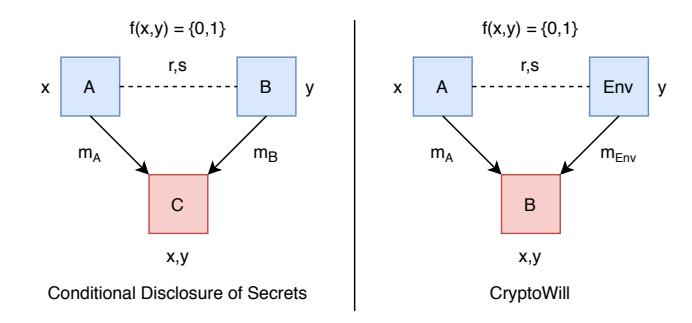

## **CryptoWills: How to Bequeath Cryptoassets**

István András Seres<sup>1,2</sup>, Omer Shlomovits<sup>2</sup>, and Pratyush Ranjan Tiwari<sup>3</sup>

<sup>1</sup>Eötvös Loránd University <sup>2</sup>KZen Research <sup>3</sup>Ashoka University

Abstract—In this paper, we put forth the problem of bequeathing cryptoassets. In this problem, a testator wishes to bequeath cryptoassets - e.g. secrets, static keys or cryptocurrency - to their heirs. Crucially, the testator should retain control of their assets before their passing. Additionally testator needs to maintain privacy, i.e. beneficiaries must not learn the bequest, moreover, beneficiaries must not be able to determine whether they will inherit at all before testator's decease. We formally define the security goals of a cryptographic will (cryptowill) protocol and subsequently present schemes fulfilling the required security properties.

*Index Terms*—Secret sharing, Blockchain, Cryptocurrency, Trusted Execution Environment, Time-Lock Puzzle

### 1. Introduction

In a will the testator expresses their wishes as to how their property is to be distributed at death and names one (or more) person(s), the executor, to manage the estate until its final distribution. In traditional wills, it is often difficult even to interpret a testator's intent [16], [19]. Moreover, in many cases, wills are suppressed, forged or executed in a non-intended way [14], [30]. To remedy these issues, in this paper, we explore the problem of cryptographic wills, cryptowills for short, where the testator aims to bequeath cryptoassets (secrets, keys or cryptocurrency) to their heirs. Required properties of a cryptographic will entail correctness, soundness, privacy, authenticity and unforgeability. Aforementioned security requirements are formally introduced in Section 4. Cryptography allows us to build cryptographic wills which fulfill prior requirements. In fact, cryptowills are strictly an improvement over traditional wills as they provide a self-sovereign way of bequeathing and do not allow fraud or misinterpretation due to built-in cryptographic mechanisms.

We differentiate between two classes of cryptographic wills depending on the nature of the bequeathed asset.

- **Static Assets.** These cryptoassets (secrets, static keys) cannot be updated, rerandomized or modified in any possible way without destroying the asset itself. We model them as constants.
- **Dynamic Assets.** These cryptoassets might be updated or rerandomized. For instance, secret keys controlling cryptocurrencies and thus corresponding addresses might be changed over time without losing ownership of those funds.

We remark that the nature of the problem crucially depends on the updateability of the bequest. In the following, in the dynamic asset case, we exclusively focus on cryptocurrencies. We also note that a protocol for static asset bequeathing immediately yields a cryptowill for dynamic assets as well. However, the updateable nature of secrets controlling cryptocurrencies allows us to create more efficient cryptowills than in the static case, see Section 6.1.

Just alone in Bitcoin, there are approximately ~4 million bitcoins (~40 Billion USD) pending to redeem for multiple years [11], [33]. This might be due to the fact that the coins' owners have lost control of their private keys or passed away. Hence, this signifies that there is a natural need for cryptographic wills.

We highlight that current solutions are unsatisfactory. The folklore solution for bequeathing cryptoassets crucially relies on the traditional legal system to enforce the terms of the will [18]. A recurring folklore proposal is to leave the bequest in a secure safe. However, in this simple case, the testator cannot be certain that inheritor(s) will indeed access the cryptoassets after testator's passing. Cryptoexchanges, for instance, Coinbase, does provide ways to address the issue of transferring cryptoassets after a person's decease through certain centralized mechanisms, but currently, no decentralized solutions exist [29].

Currently, to the best of our knowledge, there is no known decentralized protocol to achieve self-sovereign cryptographic wills for bequeathing cryptocurrencies. In this problem, a testator wants to bequeath cryptocurrency to her heirs without relying on any third parties. Present protocols rely on trusted third parties to enforce the terms of testator's will, defeating the very nature of cryptocurrencies. A straightforward solution would be, enabled by Bitcoin Scripts, to freeze funds until a time in the future<sup>1</sup>. There are two fundamental drawbacks of this simple approach: most importantly, Bitcoin scripts only allow to freeze funds until a certain time in the future, however, death does not necessarily occur before the time set in the Bitcoin script. We require the testator to preserve access to her funds until death, whose precise date is not known a priori. Moreover, this approach lacks privacy, i.e. heir(s) know before *death*, that they are going to inherit cryptocurrencies.

Therefore, in this paper, we put forth the concept of self-sovereign cryptographic wills. In such a protocol the

<span id="page-0-0"></span> $<sup>1. \</sup> See: \ https://en.bitcoin.it/wiki/Script\#Freezing\_funds\_until\_a\_time\_in\_the\_future$ 

testator can bequeath their cryptoassets to their chosen beneficiaries in a privacy-preserving manner. We note that in the dynamic asset case (e.g. cryptocurrencies) testators can bequeath cryptoassets without applying third parties.

#### 1.1. Model

Our model assumes a testator A, a beneficiary B or a set of n beneficiaries  $\{B_i\}_{i=1}^n$  and one (or more) mediator(s)  $\mathsf{T} = \{\mathsf{T}_i\}_{i=1}^k$ , sometimes called executor(s). We assume a key derivation function with hierarchical deterministic (HD) structure in place such that one secret can be used to derive all required private keys and addresses in a wallet [23]. As a result, our problem is reduced to transferring a single secret from A to B on time.

**Modelling** *death*: in this work, we consider the following definition of *death*. We model a *death* event as testator A *not responding to queries for a period of time*  $\tau$ , set by A. For formal definition see Definition 5.

Ideally, a self-sovereign cryptographic will protocol should fulfill the following high-level goals.

- **Updateability**: Testator A can update their will anytime before *death*, i.e., change designated beneficiaries before *death* but, transfer is irreversible after *death*.
- Guaranteed access: legitimate beneficiary  $B_i$  learns their entitled bequest if and only if after event *death*, see Definition 8.
- Privacy-preserving: no beneficiary B<sub>i</sub> or mediator T<sub>j</sub>, if applies, can learn anything about the bequest before death and determine whether they themselves are beneficiaries before death. Moreover, in case there are multiple beneficiaries, nobody should be able to devise the identity of any beneficiary before death, for formal definition see Definition 9.
- **Robustness**: If the protocol applies third parties, then protocol must be robust against malicious mediator(s). In other words, mediator cannot steal cryptoassets, cannot stop the protocol prematurely and any deviation from the protocol can be detected and proved to a third party by either A or one of the beneficiaries B<sub>i</sub>.

**Our contributions:** in this work, we provide the following contributions:

- Self-sovereign cryptographic will. To the best of our knowledge, we are the first to introduce and formally define the requirements of cryptographic will protocols.
- Constructions. We propose multiple protocols fulfilling the aforementioned requirements. Subsequently, we prove that our proposed constructions fulfill the necessary security properties in a gamebased security framework.

The rest of the paper is organised as follows. In Section 2 we review related work and cryptographic problems. In Section 3 we briefly provide the relevant background on the applied cryptographic building blocks. In Section 4 we introduce our threat model and formally define our security goals. In Section 5 and Section 6 we



<span id="page-1-1"></span>Figure 1. Comparison between Conditional Disclosure of Secrets (CDS) and CryptoWills. CryptoWill can be considered as a special case of CDS, where the f predicate is time-based and we allow multiple messages between parties.

introduce our schemes to achieve self-sovereign cryptographic wills. In Section 7 we discuss the practical aspects of our proposed cryptowill (CW) protocols and finally point out open questions in Section 8. We provide our security proofs in Appendix A.

### <span id="page-1-0"></span>2. Related work

Cryptowills can be considered as a special form of Conditional Disclosure of Secrets (CDS) [13]. In a CDS, there are two parties A and B with public inputs x and y respectively and they share some common randomness r and secret s. They wish to disclose secret s to party C if and only if f(x,y) = 1 by sending messages  $m_A$  and  $m_{\mathsf{B}}$ , see Figure 1. If f(x,y)=0, then party C should not learn anything about secret s. Gertner et al. [13] showed that any predicate f that can be computed by a s-size Boolean formula admits a perfect linear CDS. Similarly to a CDS, in a cryptowill a single party A (testator in our jargon) wishes to disclose a secret or bequest s to their beneficiary B. Additionally, testator A might use an environment (TEE, mediators, a blockchain etc.) to send messages to beneficiary B. However, in the case of CW, it is not clear how f(x,y) could be arithmetized, if at all. Hence, CDS protocols do not yield a solution to our bequeathing problem. Yet, CDS security requirements are related to those of CW, see Section 4.

Cryptowills are somewhat analogous to fair exchange protocols [2], [3]. However, a crucial difference is that a will is an unilateral asset transfer at an unknown date, rather than a fair exchange of assets. Although many ideas applied in fair exchange protocols, e.g. gradual release [10], might also be fruitful in a cryptowill setting.

Since wills become valid only after death, whose date is not known a priori, time-released cryptography seems a useful tool to apply [26]. Time-lock puzzles (TLP) enable one to encrypt messages "to the future". A shortcoming of TLPs is that once they are set up, one cannot elongate the time when the message should be released. Moreover, one cannot modify the time-released message once it is broadcast. Both of these requirements would be useful in our setting. Timed commitments [8] might be suitable in a will setting as well, however they do not provide elongation of release time or message updateability.

For our cryptocurrency bequeathing purposes, conditional payments are promising. Even though conditional payments are implemented in most cryptocurrencies [24],

[31], they do not offer an immediate solution to our problem. This is because conditional payments do not provide recipient privacy by default and they can only be executed at a future time, which must be known at transaction creation time. Once again, in cryptowills, the execution time, i.e. asset transfer time, is not known at will (transaction) creation time.

Recent advancements [22], [33] in threshold cryptography allow a quorum to tolerate the unavailability of a small fraction of its users. These results have many applications in cryptocurrency custody solutions. For instance, in case of a *n*-out-of-*n* access structure, participants might want to tolerate the loss of a single key. Without these techniques, such funds would have been unrecoverable in case of paralysis of a single key. These protocols are not applicable in our problem setting as they do not fulfill our privacy requirements while also incur heavier on-chain and/or off-chain communication costs. However, we do note that they might offer viable alternatives to the threshold cryptowill constructions, introduced in Section 5.2.

### <span id="page-2-0"></span>3. Preliminaries

In this section, we shortly review our used notations and the necessary building blocks of our self-sovereign cryptographic will protocols. Namely, we briefly provide relevant background on Hierarchical Deterministic (HD) wallets [17], [23] and Time-Lock Puzzles (TLPs) [26]. Afterwards, we present formally the security requirements of a cryptographic will protocol.

### <span id="page-2-2"></span>3.1. Notations

In the following let  $\lambda$  denote the security parameter. If an element r is uniformly randomly sampled from a set S, we write  $r \in_R S$ . The set of integers from 1 to k inclusive is denoted as [k]. Let  $\mathbb G$  denote a cyclic group of order q, in which the Discrete Logarithm Problem (DLP) is computationally hard. The generator of the group is denoted as G. Negligible functions are denoted as  $negl(\cdot)$ .  $hash(\cdot)$  denotes a cryptographically secure hash function.

We use standard syntax for semantically secure encryption schemes (Gen, Enc, Dec) and for digital signature schemes (Gen, Sign, Vrfy) [20]. We allow the decryption algorithm to output a special symbol  $\perp$  to indicate an invalid ciphertext. Throughout the paper, we assume that the applied digital signature scheme is existentially unforgeable.

In this paper, A denotes a testator, who wants to prepare a cryptographic will. Testator A might have a single heir, denoted as B, or possibly a set of beneficiaries:  $B = \{B_1, B_2, \ldots, B_n\}$ . A might set a time period of response, in which every period they need to provide a "life signal"; we denote the length of this period as  $\tau$ . If a protocol involves one (or more) mediator(s), we denote it as  $T = \{T_i\}_{i=1}^k$ . All parties are modelled as probabilistic polynomial-time (PPT) Turing-machines.

# 3.2. Bitcoin and Hierarchical Deterministic Wallets

In the following, we assume that the reader is familiar with the basics of Bitcoin. An extensive introduction is

provided in [1].

In this work, we assume the standardized way of generating Hierarchical Deterministic (HD) wallet is used. An HD wallet structure allows a sender to non-interactively derive addresses for a receiver. Specifically, a sender given master public key  $\hat{Q}$ , can derive so-called child public keys  $Q_1, Q_2, \ldots$ , without being able to tell the underlying secret keys  $\hat{d}, d_1, d_2$  etc. This is because there is no related-key attack against HD wallet keys. Such an attack would imply the existence of a distinguisher between the hash function  $hash(\cdot)$  and truly random bits. Hence it is safe to publicly expose  $\hat{Q}$ . As can be seen in Figure 2, HD wallet keys  $Q_i$ , indeed match child private keys  $d_i$ .

**Public Parameters:** Elliptic curve group  $\mathbb G$  of order q with generator G.

- 1) Generate a master private key  $\hat{d} \in_R \mathbb{Z}_q$ . Derive master public key  $\hat{Q} = \hat{d}G$ .
- 2) Calculate child private keys  $d_i = \hat{d} + hash(i, \hat{Q}) \mod q$ , for i = 1, 2, ...
- 3) Child public key derivation for index *i* is done by calculating:

$$Q_i = \hat{Q} + hash(i, \hat{Q})G$$

### <span id="page-2-1"></span>HD-wallet key derivation protocol

Figure 2. Hierarchical Deterministic Key Derivation protocol, adapted from BIP32

We note that BIP-32 [32] compliant Bitcoin wallets admit a vulnerability, in which the compromise of a single child public key enables an attacker to devise all the child public keys corresponding to a master public key. One can make an HD wallet resistance to such a key leakage attack up to the compromise of m child public keys [17].

### 3.3. Time-Lock Puzzles

Time-Lock Puzzles (TLPs) enable one to encrypt messages to the future. The guarantee provided by TLPs is that adversary  $\mathcal{A}$  cannot decrypt a message significantly faster than some time T, even if  $\mathcal{A}$  has "polynomially many" parallel processors and can compute a possibly large amount of precomputation. Let us recall the standard definition of Puzzles and Time-Lock Puzzles [7].

**Definition 1.** (Puzzles). A puzzle is a pair of algorithms (Puzzle.Gen, Puzzle.Sol) with the following syntax.

- Puzzle.Gen $(t, s) \to Z$  is a probabilistic algorithm that takes as input a difficulty parameter t and a solution  $s \in \{0, 1\}^{\lambda}$ , and outputs a puzzle Z.
- Puzzle.Sol(Z)  $\rightarrow$  s is a deterministic algorithm that takes as input a puzzle Z and outputs a solution s.

We require the following security requirements to hold for a puzzle.

- Completeness: for every security parameter  $\lambda$ , difficulty parameter t, solution  $s \in \{0,1\}^{\lambda}$  and puzzle Z in the support of Puzzle.Gen(t, s), Puzzle.Sol(Z) outputs s.
- Efficiency:

- Puzzle.Gen(t, s)  $\rightarrow$  Z can be computed in time  $poly(\log t, \lambda)$ .
- Puzzle.Sol(Z) can be computed in time  $t \cdot poly(\lambda)$ .

In a time-lock puzzle, we require that the parallel time required to solve a puzzle is proportional to the time it takes to solve the puzzle honestly, up to some fixed polynomial loss.

**Definition** 2. (Time-Lock Puzzles). A puzzle (Puzzle.Gen, Puzzle.Sol) is a time-lock puzzle with gap  $\epsilon \leq 1$  if there exists a polynomial  $t(\cdot)$ , such that for every polynomial  $t(\cdot) \geq \underline{t}(\cdot)$  and every polysize adversary  $\mathcal{A} = \{\mathcal{A}_{\lambda}\}_{\lambda \in \mathbb{N}}$  of depth  $\operatorname{dep}(A_{\lambda}(Z)) \leq t^{\epsilon}(\lambda)$ , there exists a negligible function  $\operatorname{negl}(\cdot)$ , such that for every  $\lambda \in \mathbb{N}$ , and every pair of solutions  $s_0, s_1 \in \{0, 1\}^{\lambda}$ :

$$\Pr\left[\begin{array}{l} b \leftarrow \mathcal{A}_{\lambda}(\mathsf{Z}) : b \leftarrow \{0,1\}, \\ \mathsf{Z} \leftarrow \mathsf{Puzzle}.\mathsf{Gen}(\mathsf{t}(\lambda),\mathsf{s_b}) \end{array}\right] \leq \tfrac{1}{2} + negl(\lambda). \tag{1}$$

### 3.4. Trusted Execution Environment

Trusted execution environment (TEE) provides a tamper-free processing and computation environment. A major aim of TEE's is to solve the problem of secure remote computation which involves processing computation on a machine owned by an untrusted party while having integrity and security guarantees. One example of such a system is Intel SGX [9], which implements a secure container using trusted hardware to grant a remote user the ability to upload the computation and data to this container. Several mechanisms are deployed to ensure the integrity of the executed computation and the confidentiality of intermediate data.

<span id="page-3-1"></span>**Definition 3.** (Secure Enclave) A TEE consists of a *Processor Reserved Memory* (PRM) system which contains *Enclave Page Cache* (EPC) which has multiple designated memory pages to store data and code. Each such page refers to a distinct secure enclave. Each enclave is required to have an associated certificate and the author is identified by the public key used to issue the certificate. A secure enclave has two different attributes, associated data and associated code. We will denote an enclave as  $\mathbb{E}(data, code)$  in the following. **Enclave measurement**,  $M(\mathbb{E}(data, code))$ , is the hash of the data and code placed inside the enclave preserving order and position.

We require the following high-level properties to hold in a TEE [27].

- Confidentiality: The code, data and runtime states, e.g. CPU registers, memory and sensitive I/O, of a TEE is not revealed to any party.
- State Integrity: The integrity of runtime states and computation inside an enclave is ensured by isolating the enclave's code and data from any external environment like the rest of the operating system and attached hardware devices. States are stored in persistent memory.

- *Dynamic:* The data and the code of a TEE can be updated during execution.
- Secure: An ideal TEE is secure against all software and hardware attacks.
- Trustworthy: A TEE can provide a proof of correctness of the executed computation to any third-party.
- Attestation: Provides users proof that they are interacting with some software running inside a secure container and that this service is hosted by trusted hardware. This, in a sense, is a proof of authenticity of the enclave.

<span id="page-3-2"></span>**Definition 4.** A TEE can be described as these following algorithms.

- TEE.Create()  $\to \mathbb{E}(\emptyset, \emptyset)$  creates a new, uninitialized enclave from a free EPC page.
- TEE.Add( $\mathbb{E}(\emptyset,\emptyset)$ , data, code)  $\to \mathbb{E}(\mathsf{data},\mathsf{code})$  loads the data and the associated code to the enclave.
- TEE.Measure( $\mathbb{E}(\mathsf{data},\mathsf{code})) \to \mathsf{M}(\mathbb{E}(\mathsf{data},\mathsf{code}))$  Outputs an enclave measurement. Enclave measurements ( $\mathsf{M}(\mathbb{E}(.,.))$  is used by a remote party for attestation purposes. Any connecting remote party would compare the expected measurement and the measurement reported by the trusted hardware to establish trust.
- TEE.KeyDerive( $\mathbb{E}(\mathsf{data},\mathsf{code})$ )  $\to$  key, pk, sk. Derives symmetric key for output encryption, decryption and the public key, secret key associated with this particular enclave. The secret key is not published but stored in the enclave.
- TEE.Execute( $\mathbb{E}(\mathsf{data},\mathsf{code}),\mathsf{input}) \to \mathsf{Enc}_{\mathsf{key}}(\mathsf{output})$  executes TEE's code on some data and input. It produces output which is encrypted with the enclave secret key.
- TEE.Remove( $\mathbb{E}(\mathsf{data},\mathsf{code})) \to \mathbb{E}(\emptyset,\emptyset)$  clears all the assigned memory and deassigns processing power assigned to the initialized enclave.

# <span id="page-3-0"></span>4. CryptoWills: definitions and security model

In this section, we describe the participants, their interactions in the system and the goals we aim to achieve by a cryptographic will protocol. Additionally, we provide an informal explanation of the setting and present formally, the algorithms and the definitions of security.

## <span id="page-3-3"></span>4.1. Participants, communication and threat model

We assume broadcast messages and transactions in the network are delivered with a maximum delay under the bounded synchronous communication setting [4]. We expect, that all communication between participants is authenticated and encrypted. Furthermore, in the case of cryptocurrency bequeathing, we assume all actors can access and read the current head of the blockchain to verify if transactions are appended to the blockchain. We remark that these are standard assumptions in the blockchain literature [5], [12].

In this work, we only explore the ramifications of the following definition of *death*, however, we do acknowledge that there might be other useful and meaningful definitions of *death*.

<span id="page-4-0"></span>**Definition 5.** (Death) Party A is considered to be dead if more than  $\tau$  time has elapsed since their last message, where  $\tau$  is a public parameter of the CW protocol.

We introduce the following predicate. The predicate is Alive(pk) given a public key pk evaluates to 1 if participant holding pk is alive, otherwise 0.

The adversary may corrupt both beneficiaries and mediators. Furthermore, we assume the adversary cannot corrupt the testator. If the testator is corrupt, then there is no meaningful cryptowill that could be established. Lastly, in the case of cryptocurrency bequeathing, we assume that the adversary cannot control the majority of the cryptocurrency consensus participants, i.e. the underlying blockchain platform is secure.

### 4.2. CryptoWill

A cryptographic will scheme consists of the following six PPT algorithms.

**Definition 6.** (Cryptographic will (CW)) A cryptographic will scheme is a tuple of PPT algorithms CW = (CW.Setup, CW.KeyGen, CW.Create, CW.Update CW.Fulfill, CW.Verify) with the following behaviour:

- CW.Setup(λ) → pp: The setup process generates public parameters pp. The public parameters includes the domains of all keys and τ time parameter introduced in Definition 5. All other algorithms take as input pp implicitly.
- CW.KeyGen(λ) → sk, pk: Testator, beneficiaries and potential third parties generate themselves a key pair for subsequent use.
- CW.Create(sk<sub>A</sub>, b, τ) → cw, aux: Testator A prepares their will given their secret key sk<sub>A</sub>, bequest b and time of response τ. The algorithm outputs a cryptowill cw and some auxiliary information aux.
- CW.Update(sk<sub>A</sub>, cw, b\*, τ\*) → cw\*, aux\*: A testator can update their will with a new bequest and potentially a new distribution of the bequest to their heirs. Testator might also update their time of response to τ\*. The update algorithm outputs a new will cw\* and new auxiliary information aux\*.
- CW.Fulfill(sk<sub>Bi</sub>, aux) → b<sub>i</sub>/⊥: Beneficiaries could fulfill testator's will cw, obtaining the intended bequest b<sub>i</sub> if isAlive(pk<sub>A</sub>) = 0 or it outputs ⊥ if they were not allowed yet to access their bequest, i.e. isAlive(pk<sub>A</sub>) = 1, or they are not included in the will as beneficiaries.
- CW.Verify( $pk_A$ ,  $b_i$ )  $\rightarrow 0/1$ : the origin of a bequest  $b_i$  can be assessed by the verification algorithm given testator's public key  $pk_A$  and the bequest  $b_i$ . If the bequest was created by  $pk_A$ , then output 1, otherwise 0.

We emphasize the difference between cw and aux. In most constructions, cw is kept secret from beneficiaries as they solely have access to some auxiliary information aux. Subsequently, aux will enable beneficiaries to recover their bequests from cryptowill cw.

In accordance with our formalisation of *death* in Defintion 5 the algorithm CW.Update will allow testators to signal in each epoch that they are alive. One can also think of that algorithm as a life signal which prevents the release of the bequests to beneficiaries.

We remark that CW.Fulfill should solely output the bequest to intended beneficiaries after testators' *death*. Hence, each beneficiary can only check the authenticity of their own bequest (CW.Verify) once they obtained it by calling CW.Fulfill. This also signifies that CW.Verify does not provide public verifiability, i.e. beneficiaries can only check the validity of their own bequest.

### 4.3. Security goals

Hereby, we motivate and subsequently formally introduce the required security properties of a cryptographic will protocol. We introduce a new predicate, namely isBeneficiary(cw, pk) returns 1, if a participant holding pk is included in a cryptographic will cw, otherwise 0.

**Definition 7.** (Correctness). A CW scheme satisfies perfect correctness iff. after testator's death each beneficiary receives their bequest they are entitled to according to the will, specifically, for each  $B_i$  when isAlive( $pk_A$ ) = 0 it always holds that CW.Fulfill( $sk_{B_i}$ , aux) =  $b_i$ .

<span id="page-4-1"></span>Naturally, we also require that beneficiaries should not be able to learn a bequest other than their own.

**Definition 8.** (Soundness). A CW scheme satisfies soundness iff. no beneficiary can access bequests other than theirs with non-negligible probability. Namely, according to the will cw, for each  $B_i$  it holds that  $\Pr[CW.Fulfill(sk_{B_i}, aux) = b_i \land i \neq j] \leq negl(\lambda)$ .

We demand privacy guarantees similar to those already achieved by traditional wills, where beneficiaries can only learn the content of the will after testator's passing. Moreover, beneficiaries cannot decide whether they are included in a *will*. Therefore we capture our notion of privacy with the following two privacy games as follows.

<span id="page-4-2"></span>**Definition 9.** (Privacy) We denote the first privacy experiment as  $\operatorname{HeirHiding}(\mathcal{A}_1,\lambda)$  with adversary  $\mathcal{A}_1$ . The privacy experiment is played between  $\mathcal{A}_1$  and a challenger C as follows: The challenger C creates a will cw and includes  $\mathcal{A}_1$  in cw with probability  $\frac{1}{2}$ . Adversary  $\mathcal{A}_1$  outputs a bit indicating whether they deem they are included in the will as beneficiary or not. The output of the  $\operatorname{HeirHiding}(\mathcal{A}_1,\lambda)$  experiment is 1, if  $\mathcal{A}_1$  guessed challenger's random choice correctly, otherwise 0. Hence, we require that no  $\mathcal{A}_1$  can do better than guessing. More formally, the probability that the adversary wins the  $\operatorname{HeirHiding}(\mathcal{A}_1,\lambda) = 1$  amounts to

$$\Pr[\mathcal{A}_1(\mathsf{pk}_\mathsf{C},\mathsf{aux}) = \mathsf{isBeneficiary}(\mathsf{cw},\mathsf{pk}_{\mathcal{A}_1})|\mathsf{isAlive}(\mathsf{pk}_\mathsf{C}) = 1] \le \frac{1}{2} + negl(\lambda) \tag{2}$$

Similarly, we define our second privacy game, BequestHiding $(\mathcal{A}_2,\lambda)$  as follows.  $\mathcal{A}_2$  chooses two bequests  $b_{\mathcal{A}_2}^0, b_{\mathcal{A}_2}^1$  and sends to the challenger. Challenger C chooses  $c \in_R \{0,1\}$  uniformly at random and creates a will cw with  $b_{\mathcal{A}_2}^c$  as the bequest. Upon receiving aux from challenger,  $\mathcal{A}_2$  outputs a bit indicating which bequest was included in the will. We

require that no  $\mathcal{A}_2$  can do better than guessing. Formally, we demand that the probability that  $\mathcal{A}_2$  wins the BequestHiding game, i.e.  $\Pr[\mathsf{BequestHiding}(\mathcal{A}_2,\lambda)=1]$  amounts to

$$\Pr[\mathcal{A}_2(\mathsf{pk}_\mathsf{C}, \mathsf{aux}) = c | \mathsf{isAlive}(\mathsf{pk}_\mathsf{C}) = 1] \le \frac{1}{2} + negl(\lambda)$$
(3)

A CW scheme is said to be private iff. there exists no  $A_1$  or  $A_2$  such that they can win the privacy games  $\mathsf{HeirHiding}(A_1,\lambda)$  or  $\mathsf{BequestHiding}(A_2,\lambda)$ .

Note that we only require privacy to hold before the passing of the testator. Clearly, no meaningful privacy can be achieved once testator deceased, since by then bequests are known to all entitled beneficiaries.

**Definition 10.** (Secure CryptoWill) A CW scheme is said to be *secure*, iff. it satisfies perfect correctness, soundness and privacy.

Hereby, we introduce the oracles which the adversary  $\mathcal{A}$  has access to. In the following, we assume that adversary  $\mathcal{A}$  can only corrupt beneficiaries or mediators but not the testator. We note that if we let testator to be corrupted, then no meaningful cryptowill is possible to be established.

- Puzzle.Sol(Z): given a TLP Z, an oracle returns to  $\mathcal{A}$  with a solution s at least in time t.
- HD.Derive(Q, i): given a public key Q and an index i, oracle returns with the ith child public key corresponding to the master public key Q.
- Key.Gen(sk): given a secret key sk  $\in_R \mathbb{Z}_p$ , the oracle outputs a random public key Q.
- Corr(i): given an index  $i \in [n]$ , the oracle returns to A with secret keys  $sk_i$  of beneficiary  $B_i$ .

### <span id="page-5-0"></span>5. Static asset bequeathing

In this section, we introduce and analyse the problem of bequeathing static cryptoassets. Such assets cannot be updated or rerandomized without destroying them. Examples include secrets or static keys. In this case, a testator's main goal is that beneficiary only learns the bequest only after testator's *death*.

Straw man solution: A simple solution might be to send out the bequest as a solution of a TLP to designated beneficiaries. Unfortunately, in this case, all beneficiaries learn all their bequests already after one epoch of length  $\tau$ . Hence, testators want to release the bequests, only when it is necessary. This could be easily achieved by a trusted third party who safeguards TLPs and sends them to beneficiaries. Since we want to lower trust assumptions as much as possible we improve upon the previous idea by replacing the trusted third party with a trusted execution environment (TEE).

### <span id="page-5-3"></span>5.1. CW from TEEs

In our first construction we assume access to a TEE. Our protocol consists of a testator A, a set of beneficiaries  $\mathcal{B}=\{B_1,B_2,\ldots,B_n\}$  and TEE T. A cryptowill CW scheme can be obtained by applying a TEE as follows.

**Definition 11.** (TEE-based CW) A TEE-based CW scheme is a tuple of six PPT algorithms, CW = (TEECW.Setup, TEECW.KeyGen, TEECW. Create, TEECW.Update, TEECW.Fulfill, TEECW.Verify).

- TEECW.Setup(λ) → pp, pk<sub>T</sub>: Public parameters pp contains the description of group G and τ, furthermore A invokes a new secure enclave TEE.Create() to allocate an enclave for CW. Moreover, the public key of the enclave, pk<sub>T</sub>, is known to all parties.
- TEECW.KeyGen(λ) → sk, pk. Each party generates a key pair: a secret key sk and a public key pk. Public keys are shared with the TEE.
- TEECW.Create(sk<sub>A</sub>, b) → cw, aux. Testator creates a cryptowill of the form cw = {cnt, b, B} = {0, {Enc<sub>pk<sub>Bi</sub></sub>(b<sub>i</sub>)}<sup>n</sup><sub>i=1</sub>, B}, where cnt is a counter, b is the array of the bequests encrypted under beneficiaries' public keys, B is the array of beneficiaries. Auxiliary information is aux = {}. Testator sends cw to T. The testator adds the will to the TEE by calling TEE.Add(E(∅, ∅), cw, code).
- TEECW.Update( $\operatorname{sk}_A$ ,  $\operatorname{cw}$ ,  $\operatorname{b}^*$ )  $\to \operatorname{cw}^*$ ,  $\operatorname{aux}^*$ . Testator can update their will by sending a new cryptowill  $\operatorname{cw}^* = \{\operatorname{cnt} + 1, \{\operatorname{Enc}_{\operatorname{pk}_{\mathsf{B}_i}}(b_i^*)\}_{i=1}^n, \mathcal{B}^*\}$ . Again, auxiliary information is  $\operatorname{aux}^* = \{\}$ . For updating the will, the testator has to remove the current enclave and follow the procedure again as after calling TEE.Init() on an enclave, the code and associated data cannot be changed. Therefore, this enclave is removed by the testator using TEE.Remove(). The testator now performs a fresh enclave setup with updated code and cryptowill by calling TEE.Create(), TEE.Add( $\mathbb{E}(\emptyset,\emptyset)$ ,  $\operatorname{cw}$ , code).
- TEECW.Fulfill(sk<sub>Bi</sub>, aux) → b<sub>i</sub>/⊥: See Algorithm 2. At a high level, B<sub>i</sub> can ask T for their bequest: TEE T would delay the answer by time τ in which the testator A can provide a proof they are alive. Only if bequest exists for B<sub>i</sub> and A is not alive, B<sub>i</sub> will get their cryptowill CWB...
- TEECW.Verify( $pk_A, b_i$ )  $\rightarrow 0/1$ .: Once  $b_i$  is released, beneficiaries verify the authenticity of their bequest. If the bequest was verified against testator's key  $pk_A$ , then  $B_i$  outputs 1, else outputs 0.

<span id="page-5-1"></span>**Security:** As per our definition of TEE, see Definitions 3 and 4, and its relevant security properties, we claim the following theorem.

**Theorem 5.1.** Assuming that the TEE is secure, the TEECW scheme is a secure CW protocol.

We give details on the proof of Theorem 5.1 in Appendix A.

<span id="page-5-2"></span>A note on clock and TEEs: We note that under our security model of TEE, there is no assumption on the TEE being able to provide a clock. On the contrary, to the best of our knowledge, TEE has no guarantees over the clock it is given. In our construction, we do require a notion of time, the testator must provide a life signal to the TEE within some time  $\tau$ . As can be seen in the construction the TEE does not rely on any clock at all.

The TEE uses the guaranteed delay given from the time lock puzzle to measure if A is respondent as they should.

We note that the previous construction introduced in Definition 11 implicitly assumes that TEE is online and responsive even after testator's decease. In the TEECW cryptowill construction the TEE operates on a secure enclave  $\mathbb{E}(\text{data}, \text{code})$ , where data is the actual cryptowill in each round, while code is the code stored and executed on the TEE, see Algorithm 2.

Algorithm 2: The code running on the TEE

```
Result: cw_{B_i}/\bot
Input: sk_{B_i}, aux;
Step1: Identify B_i: B_i signs a fresh challenge
 from T. T uses pk_{B_i} to verify;
Step2: choose s \leftarrow_R \mathbb{Z}_q;
Z = \mathsf{Puzzle}.\mathsf{Gen}(\tau, s);
send Z to B_i;
Set flaq = 0;
if any message received from testator A then
 set flaq = 1;
Upon receiving solution s^* from B_i;
if cw_{B_i} == \bot then
 | return \perp;
else
    if flag == 1 \lor s^* \neq s then
      return \perp;
    else
     | return cw_{B_i};
```

### <span id="page-6-3"></span><span id="page-6-2"></span>5.2. Threshold CWs

The previous protocol introduced in Section 5.1 assumes that the availability, integrity and confidentiality guarantees of the applied TEE scheme remain fulfilled throughout the cryptowill protocol's execution. The potential lack of any of these guarantees would harm the desired security properties of the cryptowill protocol. Therefore the TEE constitutes a single point of failure in the construction described in Section 5.1.

One might distribute the assumed trust in a static asset bequeathing protocol by applying, for instance, threshold secret sharing schemes [28]. The testator could share secret shares of beneficiaries' bequest among n designated mediators. Among these n peers, k of them is assumed to be honest and release secret shares to beneficiaries if and only if the testator has passed away. In contrast to the previous construction, this protocol tolerates compromise up to n-k mediators.

In Appendix B we provide a concrete manifestation of threshold CW based on multi-authority ciphertext-policy attribute based encryption [21].

# <span id="page-6-1"></span>6. Dynamic asset bequeathing: the case of cryptocurrencies

In this section, we introduce a protocol for bequeathing dynamic assets, i.e. assets which can be updated, modified anytime. Cryptocurrencies are a remarkable example of such an asset. Namely, cryptocurrency holders

can move their funds to new addresses anytime they want, thus "refreshing" the underlying secret keys controlling the assets. This convenient property allows us to build a bequeathing protocol without additional third parties. In the remaining of this section, we exclusively focus on enabling a testator to bequeath cryptocurrency. Nevertheless, the introduced techniques and ideas can be used to bequeath any kind of dynamic asset.

Even though most cryptocurrencies support conditional payments, they do not provide a solution to our original bequeathing problem. A conditional payment allows a sender to transfer assets to a receiver conditionally by making funds redeemable if and only if a receiver fulfills a certain condition, e.g. a receiver needs to provide a preimage of a hash value (hashlock) or funds are only redeemable after certain time elapsed (timelock).

Conditional payments with timelocks allow of building, for instance, futures contracts. Nonetheless, such a simple solution is not applicable in our context, as timelocks only provide a statically known future date for the timelock date. In stark contrast to futures contracts, the execution time of cryptowills is not known when will is prepared. Another prohibitive deficiency of timelocks is the lack of privacy guarantees, which is essential for a cryptowill.

Since previous solutions fell short to satisfy our desired properties of cryptocurrency cryptowills, in this section we introduce our self-sovereign protocol to bequeath cryptocurrency.

### <span id="page-6-0"></span>6.1. UTXO-based cryptocurrencies

In the following protocol, we assume that testator wishes to bequeath a UTXO-based cryptocurrency, for instance, Bitcoin [24]. Hereby we do not assume a Turing-complete execution environment, hence, with minor modifications, the protocol can easily be adapted to almost all cryptocurrencies.

Straw man solution: a testator might send the secret key of each UTXO comprising the bequest as a solution of n different TLPs to the n designated beneficiaries. However, in this case, both correctness and privacy would rely on the security of the TLP. This shortcoming can be amended by applying Bitcoin Scripts. Each bequest UTXO created by the testator will define a simple logic expressing when it can be redeemed by entitled beneficiaries. At a high level, each UTXO can be either redeemed by the testator or after  $\tau$  time by beneficiaries with a secret key released also in  $\tau$  time. This way correctness will be enforced by Bitcoin Scripts, while only privacy will depend on the security of TLPs.

<span id="page-6-4"></span>The intuition behind the construction is that by applying TLPs one can not only elongate the revealing of the secret but also preserve privacy utilizing an HD wallet structure. By solving a TLP B learns whether they inherit cryptoassets, if the testator has passed away. Otherwise, the testator can move the asset before the TLP can be solved. We emphasize that before solving the TLP, for beneficiaries remains hidden the intent of the testator. Crucially, the dynamic nature of the cryptoasset enables testator to elongate indefinitely the revealing of the current secret keys. Hence, we introduce our cryptocurrency cryptowill in the following.

**Definition 12.** (Cryptocurrency CryptoWill) A cryptographic will scheme for cryptocurrencies is CCW = (CCW.Setup, CCW.KeyGen, CCW.Create, CCW.Update, CCW.Fulfill, CCW.Verify) with the following behaviour:

- CCW.Setup( $\lambda$ )  $\rightarrow$  pp: is the description of group  $\mathbb G$  and time of response  $\tau$ .
- CCW.KeyGen(\(\lambda\), pp) → sk, pk: Each participant generates a key pair: a secret key sk and public key pk. We assume that pk is a master public key in a HD wallet structure allowing parties to noninteractively derive public keys for each other.
- CCW.Create( $\mathsf{sk}_\mathsf{A}, \mathsf{b}, \tau$ )  $\to$  cw, aux: cw is a cryptocurrency transaction containing output UTXOs  $b_i$ , one for each beneficiary. Each bequest UTXO is timelocked in the future with timelock  $now + \tau$ . The bequest's secret key can be obtained in the following way. Testator sends auxiliary information  $aux_i = \mathsf{Z}_i = \mathsf{Puzzle}.\mathsf{Gen}(\tau,\mathsf{s_i})$  for each beneficiary  $\mathsf{B}_i$ . The solution  $s_i$  of each TLP  $\mathsf{Z}_i$  will allow  $\mathsf{B}_i$  to redeem her bequest, UTXO  $b_i$ . The corresponding public key for each UTXO  $b_i$  can be obtained as HD.Derive( $\mathsf{pk}_\mathsf{B_i}, \mathsf{s_i}$ ). Additionally each bequest UTXO can be redeemed by testator before  $now + \tau$ .
- CCW.Update( $\operatorname{sk}_A, \operatorname{cw}, \operatorname{b}^*, \tau^*$ )  $\to \operatorname{cw}^*, \operatorname{aux}^*$ : The updated cryptowill transaction  $\operatorname{cw}^*$  redeems UTXOs  $b_i$  of  $\operatorname{cw}$ , hence invalidating it. The new cryptowill  $\operatorname{cw}^*$  contains a new set of bequest UTXOs, denoted as  $b^*$ . The new auxiliary information  $\operatorname{aux}^* = \operatorname{Z}_i^* = \operatorname{Puzzle.Gen}(\tau^*, \operatorname{s}_i^*)$  contains the new time-lock puzzles for each beneficiary. Again, each bequest UTXO can be redeemed by A before  $\operatorname{now} + \tau$  or by designated beneficiaries after  $\operatorname{now} + \tau$ .
- CCW.Fulfill( $\mathsf{sk}_{\mathsf{B}_i}, \mathsf{aux}$ )  $\to \mathsf{b}_i/\bot$ : if  $\mathsf{B}_i$  learns the solution  $s_i$  of TLP  $\mathsf{Z}_i$ , namely  $s_i = \mathsf{Puzzle.Sol}(\mathsf{Z}_i)$ , then they can redeem their corresponding UTXO  $b_i$  in the cryptowill cw. Beneficiary  $\mathsf{B}_i$  can redeem her bequest by obtaining the public key HD.Derive( $\mathsf{pk}_{\mathsf{B}_i}, \mathsf{s}_i$ ), whose corresponding secret key is only known to her due to the security guarantees provided by HD wallets [17], [23].
- CCW.Verify(pk<sub>A</sub>, b<sub>i</sub>) → 0/1: each beneficiary can verify the authenticity of the cryptowill by verifying the cryptocurrency transaction's signature. If it is signed by the public key pk<sub>A</sub> corresponding to testator A, then outputs 1, otherwise 0.

<span id="page-7-3"></span>**Theorem 6.1.** Assuming that the TLP is secure, the CCW scheme is a secure CW protocol.

### <span id="page-7-0"></span>7. Deployment and practical aspects

Recently a handful of companies started to provide and implement centralised bequeathing solutions to cryptoasset holders [25], [29]. Therefore, it is particularly important to consider the practical aspects and potential hurdles of the decentralized solutions we introduced previously.

### 7.1. CryptoWills for Static Assets

As a testator wishes to lower their trust assumptions, it is not clear which of our proposed static asset bequeathing schemes, i.e. TEE CW or Threshold CW, is more satisfying from a trust minimisation perspective. Recent severe attacks against [15] popular TEEs, i.e. Intel SGX, damaged TEEs' reputation. Moreover, it is also problematic how testator secures a machine equipped with a TEE, which is accessible over the internet even after their decease. The testator might run such a machine on its own or rent one from a cloud provider. Therefore, in practice, Threshold CWs might be more reasonable to apply.

### 7.2. CryptoWills for Dynamic Assets

Interestingly dynamic assets, specifically cryptocurrencies, admit CW schemes, where testators only need to trust the underlying blockchain for availability and integrity. We note that in our scheme, introduced in Definition 12, we implicitly assumed that testator knows a public key owned by their beneficiaries and built our construction accordingly. In case if beneficiaries do not own yet cryptocurrency addresses, then testator sends the corresponding secret key as a solution to their heirs in the TLP.

OP\_DUP OP\_HASH160 < pubKeyHashTestator > OP\_EQUALVERIFY OP\_CHECKSIG OP\_NOTIF < expirytime > OP\_CHECKLOCKTIMEVERIFY OP\_DROP OP\_DUP OP\_HASH160 < pubKeyHashBeneficiary > OP\_EQUALVERIFY OP\_CHECKSIG

<span id="page-7-2"></span>TABLE 1. BITCOIN SCRIPTS IMPLEMENTING THE SCHEME INTRODUCED IN SECTION 6

For Bitcoin, one can easily implement the simple logic safeguarding the bequest UTXOs in the Bitcoin Script programming language, see Table 1.

### <span id="page-7-1"></span>8. Conclusion and Open Questions

In this paper, we introduced and formally defined the problem of cryptographic wills. Moreover, we explored the problem space and proposed several novel solutions to address the issue of bequeathing cryptoassets in a self-sovereign and privacy-preserving way. We feel the following directions would be valuable for future work. **Definition of death**: might be interesting to explore other cryptographically meaningful definitions of event *death*. **Quantum-resistant CryptoWill**: it remains an open question whether there exists a quantum-resistant cryptowill protocol. We note, that the existence of a quantum-resistant time-lock puzzle would imply the existence of a quantum-resistant cryptowill protocol as well.

CryptoWills without timing assumptions: it remains a fascinating open problem, whether it is possible to create a CW scheme without timing assumptions.

Lower bounds for CryptoWill communication complexity: it remains an open question whether it is possible to achieve a secure CryptoWill protocol with a single

message or with 2 messages just like in the CDS protocol [\[13\]](#page-8-9). Currently, we need one message from the testator to beneficiaries in each round.

Applications: we expect to see more applications and use cases for CryptoWills. One potential application area of ideas used in CryptoWills might be futures contracts that roll forward. In a roll forward traders elongate the expiration date of the futures contract. Typically traders do not know at which date the rolling futures contract will be executed, just like in a CryptoWill. More generally speaking, CryptoWill-like protocols enable a protocol to elongate its execution or expiration date till an unknown future date.

## 9. Acknowledgements

We thank Mat´ e Horv ´ ath and Claudio Orlandi for in- ´ sightful discussions and their continuous support.

## References

- <span id="page-8-20"></span>[1] Andreas M Antonopoulos. *Mastering Bitcoin: unlocking digital cryptocurrencies*. " O'Reilly Media, Inc.", 2014.
- <span id="page-8-10"></span>[2] Nadarajah Asokan, Victor Shoup, and Michael Waidner. Optimistic fair exchange of digital signatures. In *International Conference on the Theory and Applications of Cryptographic Techniques*, pages 591–606. Springer, 1998.
- <span id="page-8-11"></span>[3] Giuseppe Ateniese. Efficient verifiable encryption (and fair exchange) of digital signatures. In *Proceedings of the 6th ACM conference on Computer and communications security*, pages 138– 146. ACM, 1999.
- <span id="page-8-25"></span>[4] Hagit Attiya and Jennifer Welch. *Distributed computing: fundamentals, simulations, and advanced topics*, volume 19. John Wiley & Sons, 2004.
- <span id="page-8-26"></span>[5] Christian Badertscher, Ueli Maurer, Daniel Tschudi, and Vassilis Zikas. Bitcoin as a transaction ledger: A composable treatment. In *Annual International Cryptology Conference*, pages 324–356. Springer, 2017.
- <span id="page-8-32"></span>[6] John Bethencourt, Amit Sahai, and Brent Waters. Ciphertext-policy attribute-based encryption. In *2007 IEEE symposium on security and privacy (SP'07)*, pages 321–334. IEEE, 2007.
- <span id="page-8-22"></span>[7] Nir Bitansky, Shafi Goldwasser, Abhishek Jain, Omer Paneth, Vinod Vaikuntanathan, and Brent Waters. Time-lock puzzles from randomized encodings. 2016.
- <span id="page-8-14"></span>[8] Dan Boneh and Moni Naor. Timed commitments. In *Annual International Cryptology Conference*, pages 236–254. Springer, 2000.
- <span id="page-8-23"></span>[9] Victor Costan and Srinivas Devadas. Intel SGX explained. *IACR Cryptology ePrint Archive*, 2016:86, 2016.
- <span id="page-8-12"></span>[10] Ivan Bjerre Damgard. Practical and provably secure release of a ˚ secret and exchange of signatures. In *Workshop on the Theory and Application of of Cryptographic Techniques*, pages 200–217. Springer, 1993.
- <span id="page-8-4"></span>[11] Sergi Delgado-Segura, Cristina Perez-Sola, Guillermo Navarro- ´ Arribas, and Jordi Herrera-Joancomart´ı. Analysis of the bitcoin utxo set. In *International Conference on Financial Cryptography and Data Security*, pages 78–91. Springer, 2018.
- <span id="page-8-27"></span>[12] Juan Garay, Aggelos Kiayias, and Nikos Leonardos. The bitcoin backbone protocol: Analysis and applications. In *Annual International Conference on the Theory and Applications of Cryptographic Techniques*, pages 281–310. Springer, 2015.
- <span id="page-8-9"></span>[13] Yael Gertner, Yuval Ishai, Eyal Kushilevitz, and Tal Malkin. Protecting data privacy in private information retrieval schemes. *Journal of Computer and System Sciences*, 60(3):592–629, 2000.
- <span id="page-8-2"></span>[14] Ralph W Gifford. Will or no will the effect of fraud and undue influence on testamentary instruments. *Colum. L. Rev.*, 20:862, 1920.

- <span id="page-8-31"></span>[15] Johannes Gotzfried, Moritz Eckert, Sebastian Schinzel, and Tilo ¨ Muller. Cache attacks on intel sgx. In ¨ *Proceedings of the 10th European Workshop on Systems Security*, pages 1–6, 2017.
- <span id="page-8-0"></span>[16] Roland Gray. Striking words out of a will. *Harv. L. Rev.*, 26:212, 1912.
- <span id="page-8-18"></span>[17] Gus Gutoski and Douglas Stebila. Hierarchical deterministic bitcoin wallets that tolerate key leakage. In *International Conference on Financial Cryptography and Data Security*, pages 497–504. Springer, 2015.
- <span id="page-8-6"></span>[18] Jamie Hopkins. What happens to my bitcoin when i die? simplifying estate planning of digital assets. [https://bit.ly/2I3yE8B,](https://bit.ly/2I3yE8B) 2019. [Online; accessed 22-Dec-2019].
- <span id="page-8-1"></span>[19] Scott T Jarboe. Interpreting a testator's intent from the language of her will: a descriptive linguistics approach. *Wash. ULQ*, 80:1365, 2002.
- <span id="page-8-19"></span>[20] Jonathan Katz and Yehuda Lindell. *Introduction to modern cryptography*. Chapman and Hall/CRC, 2014.
- <span id="page-8-29"></span>[21] Allison Lewko and Brent Waters. Decentralizing attribute-based encryption. In *Annual international conference on the theory and applications of cryptographic techniques*, pages 568–588. Springer, 2011.
- <span id="page-8-17"></span>[22] Sai Krishna Deepak Maram, Fan Zhang, Lun Wang, Andrew Low, Yupeng Zhang, Ari Juels, and Dawn Song. Churp: Dynamiccommittee proactive secret sharing. In *Proceedings of the 2019 ACM SIGSAC Conference on Computer and Communications Security*, pages 2369–2386, 2019.
- <span id="page-8-8"></span>[23] Gregory Maxwell and Iddo Bentov. Deterministic wallets, 2011.
- <span id="page-8-15"></span>[24] Satoshi Nakamoto. Bitcoin: A peer-to-peer electronic cash system. Technical report, Manubot, 2019.
- <span id="page-8-30"></span>[25] Nick Neuman. Casa's bitcoin inheritance solution is now live. [https://blog.keys.casa/](https://blog.keys.casa/casa-covenant-bitcoin-inheritance-launches-today/) [casa-covenant-bitcoin-inheritance-launches-today/,](https://blog.keys.casa/casa-covenant-bitcoin-inheritance-launches-today/) February 2020. [Online; accessed 28-Feb-2020].
- <span id="page-8-13"></span>[26] Ronald L Rivest, Adi Shamir, and David A Wagner. Time-lock puzzles and timed-release crypto. 1996.
- <span id="page-8-24"></span>[27] Mohamed Sabt, Mohammed Achemlal, and Abdelmadjid Bouabdallah. Trusted execution environment: What it is, and what it is not. In *2015 IEEE TrustCom/BigDataSE/ISPA, Helsinki, Finland, August 20-22, 2015, Volume 1*, pages 57–64, 2015.
- <span id="page-8-28"></span>[28] Adi Shamir. How to share a secret. *Communications of the ACM*, 22(11):612–613, 1979.
- <span id="page-8-7"></span>[29] Coinbase Support. How do i gain access to a deceased family member's coinbase account? [https://bit.ly/3abk62L,](https://bit.ly/3abk62L) 2019. [Online; accessed 26-Dec-2019].
- <span id="page-8-3"></span>[30] Joseph Warren. Fraud, undue influence, and mistake in wills. *Harvard Law Review*, 41(3):309–339, 1928.
- <span id="page-8-16"></span>[31] Gavin Wood et al. Ethereum: A secure decentralised generalised transaction ledger. *Ethereum project yellow paper*, 151(2014):1– 32, 2014.
- <span id="page-8-21"></span>[32] Pieter Wuille. Bip 32: Hierarchical deterministic wallets, 2012. *URL https://github. com/bitcoin/bips/blob/master/bip-0032. mediawiki. Last visited December*, 10, 2019.
- <span id="page-8-5"></span>[33] Fan Zhang, Philip Daian, Gabriel Kaptchuk, Iddo Bentov, Ian Miers, and Ari Juels. Paralysis proofs: Secure dynamic access structures for cryptocurrencies and more. *IACR ePrint*, 96:2018, 2018.

### Appendix

Hereby we enclose our informal proofs of security of Theorem [5.1](#page-5-1) and Theorem [6.1.](#page-7-3)

## <span id="page-9-0"></span>Appendix A. Security Arguments

### <span id="page-9-1"></span>A.1. Proof of Theorem [5.1](#page-5-1)

Correctness. The bequest is a ciphertext encrypted using pkB<sup>i</sup> . Therefore, conditioned on the release of the ciphertext by the TEE, it is guaranteed that B<sup>i</sup> will get access to the bequest. The release of the ciphertext can be delayed at most by time τ assuming that testator A is not responsive. Soundness. Since the bequest is a ciphertext encrypted under pkB<sup>i</sup> , another beneficiary, B<sup>j</sup> will be able to decrypt and learn the static secret bequest only if they break the semantic security of the TEE's encryption scheme.

Privacy. Privacy stems from the *confidentiality* property of the data stored in the TEE. It is not enough, however, because it covers only on the privacy notion that beneficiary will not be able to learn the content of its intended cryptowill. From our definition of privacy, it is also required that the beneficiary will not be able to tell if there is an intended bequest for them or not. This privacy notion is achieved due to the "constant time" approach that is taken in TEECW.Fulfill where no matter if there is a cryptowill or not - the first message with the challenge sent by the TEE is always the same and therefore beneficiary B<sup>i</sup> will not be able to tell the difference between a challenge given to them in case there is indeed a cryptowill and a challenge given to them if there is not.

## A.2. Proof of Theorem [6.1](#page-7-3)

Correctness. Whenever beneficiary B<sup>i</sup> learns the solution s<sup>i</sup> of the TLP, i.e. s<sup>i</sup> = Puzzle.Solve(Zi), they can derive the corresponding child public key by computing HD.Derive(pkB<sup>i</sup> ,si). Due to the master public key property of HD wallets, the beneficiary also knows the corresponding secret key, hence capable of redeeming the bequest. Soundness. Beneficiary B<sup>i</sup> cannot redeem UTXO b<sup>j</sup> corresponding to another beneficiary, for j 6= i. If this is the case then it implies that beneficiary can compute the discrete logarithm of the public key HD.Derive(pkB<sup>j</sup> , Puzzle.Solve(Zj)). This would mean that beneficiary could compute discrete logarithms in the group G, in which group by assumption the Discrete Logarithm Assumption holds.

Privacy. If a beneficiary is able to tell whether they are included in the will before *death* with probability better than guessing, then that would mean, that beneficiary can solve the TLP faster than τ .

## <span id="page-9-2"></span>Appendix B.

### Threshold CW from Multi-authority CP-ABE

In this section, we sketch a solution for the static asset bequeathing problem relying on Multi-authority ciphertext-policy (CP) attribute-based encryption (ABE). Background. For in-depth background on CP-ABE we refer to [\[6\]](#page-8-32). At a high level and using the terminology introduced in Section [3.1,](#page-2-2) in a CP-ABE system, a beneficiary's private key will be associated with an arbitrary number of attributes expressed as strings. On the other hand, when a testator encrypts a message in CP-ABE, they specify an associated access structure over attributes. A beneficiary will only be able to decrypt a ciphertext if that beneficiary's attributes pass through the ciphertexts access structure. The *Authority* generates a secret master key used to generate the beneficiary's attribute-based secret keys and a public key used to encrypt the bequest by the testator. In a multi-authority scheme [\[21\]](#page-8-29) there is no central authority. Encryption is done using a set of multiple public keys from relevant authorities. The scheme requires the beneficiary's keys, marked with some global identifier, to satisfy an access matrix (instead of a vector). We note that threshold assumption can be used either in the attribute level or in the authorities level.

Event Death. We follow the line introduced in the paper where *death* event is defined as the lack of digital presence of the testator as measured by the mediators. In CP-ABE, mediators are the authorities and digital presence can be measured in terms of attributes. Concretely, the testator may choose authorities to be ones that already track their digital footprint, such as social media platforms, i.e. Facebook, Twitter, Google and so on. Encoding testator's *death* is simply to define an attribute "Testator A is inactive for at least τ seconds". This attribute can be easily maintained and tested separately by each social media operator authority based on the last time testator checked-in. We are now ready to present the scheme in a simplified form.

- 1) *Before Death:* This step corresponds to CW.Setup, CW.KeyGen and CW.Create. The Testator A creates a CW using social media operators as authorities. It is important that each beneficiary is registered with enough common authorities, i.e. has Gmail account, Facebook profile etc. Attributes will include the isAlive predicate defined in Section [4.1](#page-3-3) and attributes that identify a specific beneficiary (i.e owner of a given email address). Finally, cw is sent to all beneficiaries.
- 2) *After Death:* At this point, a beneficiary B<sup>i</sup> can ask the authorities to generate her a secret key. The secret key will be a function of the identity attributes of B<sup>i</sup> and the conditional isAlive of the relevant testator. In case isAlive is false, which corresponds to A not being active for some given time, the generated key for the rightful B<sup>i</sup> would decrypt cw. Otherwise, decryption would fail.

We note that updating the cw is easily done by encrypting a new cw.

Security. *Correctness* follows by inspection and due to the way we defined event *death*. *Soundness* is guaranteed from the security of CP-ABE scheme: An adversary that can access a bequest not intended to them could break the security game of CP-ABE as defined in [\[21\]](#page-8-29). *Privacy* is achieved in the following sense: first, we note that the mediators do not need to learn cw to generate the key for the beneficiary. Thus, cw must be shared directly to all beneficiaries. Since cw is basically an encryption under this scheme there is no way for *any* beneficiary to tell what is the plaintext bequest before decryption is made possible.