# Database Reconstruction Attacks in Two Dimensions

Evangelia Anna Markatou Brown University markatou@brown.edu

Roberto Tamassia Brown University rt@cs.brown.edu

*Abstract*—Access and search pattern leakage have been shown to be detrimental to the security of encrypted databases that allow for range queries, as shown by an extensive body of work on efficient attacks that reconstruct one-dimensional databases. We are the first to go beyond one dimension, exploring the threat of access and search pattern leakage in two dimensions. First, we unveil an intrinsic limitation of reconstruction attacks by showing that there can be an exponential number of distinct databases that produce the same access and search pattern leakage. Next, we present attacks that reconstruct (1) the horizontal and vertical order of the points from the access pattern leakage, and (2) the coordinates of the points from the access and search pattern leakage. Our algorithms run in polynomial time and return a linear-size encoding of all databases consistent with the given leakage profile.

#### I. INTRODUCTION

Over the past few decades, we have seen a significant increase in the use of cloud storage. Unfortunately, data is often stored in plaintext in the cloud, which has led to an everincreasing number of data breaches. To prevent such breaches, one could store instead encrypted data.

As encrypted data has been traditionally hard to search, which is counter to the benefits of cloud storage, *searchable encryption* comes to the rescue to support upload of encrypted data to the cloud in a way that enables the cloud server to respond to queries issued with encrypted parameters without decrypting any of the data or query parameters (see, e.g., [2], [3], [12] and the survey by Fuller et al. [5]). For the sake of efficiency, searchable encryption schemes sacrifice full security by *leaking* some information about the queries and their responses. While these schemes prove that nothing else is leaked, they are vulnerable to inferences from the leakage.

In this paper, we consider two types of leakage: *access pattern* and *search pattern*. Consider a server that answers a query in a searchable encryption scheme. The scheme leaks the access pattern if the server observes the set of all matching (encrypted) records. It leaks the search pattern if the server can tell if they have responded to it before.

# *I-A. Contributions*

We perform the first exploration of reconstruction attacks on 2D databases that support range queries. First, we show that there exist an exponential number of databases that produce the same access and search pattern leakage (Section III). Despite this fundamental limitation due to the symmetries

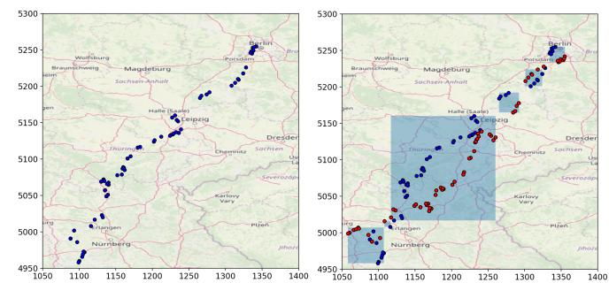

Fig. 1. Reconstruction of a real-world location dataset by our attack. The points in each highlighted box can independently flip along the diagonal without affecting the access and search pattern leakage.

introduced by the additional dimension, we develop the following reconstruction attacks:

- 1) an *order reconstruction attack* from access pattern leakage (Section V);
- 2) a *full database reconstruction attack* from both access and search pattern leakage (Section VI).

Our attacks depend on the inherent leakage of the encryption scheme and do not rely on a known query or data distribution. The threat model we consider is a persistent passive adversary. Due to the symmetries introduced by the additional dimension, our algorithms return all databases whose leakage is in a oneto-one correspondence with the original database's leakage.

Our reconstruction algorithms efficiently compute a succinct, linear-space, encoding of all databases with the given leakage.

We have experimented with our attack on a public dataset of mobile location data [19] (Section VII). An example of our reconstruction is shown in Figure 1. Table I compares our attacks with selected related work.

## *I-B. Previous Work*

There have been a number of papers on attacks on encrypted 1D databases that support range queries. The first reconstruction attack for encrypted 1D databases supporting range queries is by Kellaris, Kollios, Nissim and O'Neil [13]. They assume access and volume pattern leakage, and that the user issues queries uniformly at random. Lacharite, Minaud ´ and Paterson [16] focus on dense databases under the same problem statement. They show that dense databases can be reconstructed using just access pattern leakage. Grubbs, Lacharite, Minaud and Paterson [6] improve on previous work ´

|                           | Queries             |                    |                     | Assumptions           |                      | Leakage           |                   |
|---------------------------|---------------------|--------------------|---------------------|-----------------------|----------------------|-------------------|-------------------|
| Papers                    | 1D Range<br>Queries | 1D k-NN<br>Queries | 2D Range<br>Queries | Query<br>Distribution | Data<br>Distribution | Access<br>Pattern | Search<br>Pattern |
| Kellaris et al. [13]      |                     |                    |                     | Uniform               | Any                  | <b>√</b>          | <b>√</b>          |
| Lacharité et al. [16]     | $\checkmark$        |                    |                     | Agnostic              | Dense                | $\checkmark$      |                   |
| Kornaropoulos et al. [14] | $\checkmark$        | $\checkmark$       |                     | Uniform               | Any                  | $\checkmark$      |                   |
| Grubbs et al. [8]         | $\checkmark$        |                    |                     | Uniform               | Minor info           | $\checkmark$      |                   |
| Grubbs et al. [6]         | $\checkmark$        |                    |                     | Known                 | Any                  | $\checkmark$      |                   |
| Markatou et al. [17]      | ✓                   |                    |                     | Agnostic              | Any                  | $\checkmark$      | ✓                 |
| Kornaropoulos et al. [15] | $\checkmark$        | $\checkmark$       |                     | Agnostic              | Any                  | $\checkmark$      | $\checkmark$      |
| This Work                 |                     |                    | ✓                   | Agnostic              | Minor                | ✓                 | <b>√</b>          |

with reconstruction attacks for 1D databases that support range queries that depend on access pattern leakage. The first two attacks depend on uniform query distribution and the third one assumes knowledge of the query distribution. Markatou and Tamassia [17] fully reconstruct a 1D database using access and search pattern leakage without relying on the client's query distribution. Kornaropoulos, Papamanthou and Tamassia [14] were the first to consider k-nearest neighbor (k-NN) queries on 1D databases. They use access pattern leakage and assume the client issues queries uniformly at random. Improving on this work, they replace the uniformity assumption with search pattern leakage, and give attacks for both k-NN and range queries [15].

There are attacks on different types of leakage, like Grubbs, Lacharité, Minaud, and Paterson [9]'s volume leakage attack, and Grubbs, Ristenpart, and Shmatikov [11]'s snapshot attack. There are also attacks on encryption schemes that leak more information and attacks that assume a more active adversary [1], [4], [7], [10], [18], [20].

#### II. PRELIMINARIES AND MODEL

#### II-A. Geometric Definitions

We consider a database with n records, each comprising a unique identifier, r, and a 2D point with integer coordinates denoted  $val(r)=(x_0,x_1)$ . We assume the points are in a rectangular  $N_0\times N_1$  domain comprising points with coordinates  $1\leq x_i\leq N_i$  (i=0,1) for given positive integers  $N_0$  and  $N_1$ . We assume the points are in general position, i.e., no two points have the same  $x_0$  or  $x_1$  coordinate, and that there are at least 5 points in the database. We denote the total number of points in the domain by  $N=N_0N_1$ . Note that due to the assumption above, we have  $n\leq N_0$  and  $n\leq N_1$ . Thus,  $n^2\leq N$ .

We call *main diagonal* the line segment from (0,0) to  $(N_0,N_1)$ , and the *other diagonal* the line segment from  $(N_0,0)$  to  $(0,N_1)$ . For simplicity, we may refer to records by their associated points.

We recall the geometric concept of dominance between points. A point b dominates a point a when  $x_{0_a} \leq x_{0_b}$  and  $x_{1_a} \leq x_{1_b}$ . Conversely, b anti-dominates a when  $x_{0_b} \leq x_{0_a}$  and  $x_{1_a} \leq x_{1_b}$ . Dominance and anti-dominance are partial

orders among points. Given both the dominance and anti-dominance relations, one can determine the horizontal and vertical ordering of the points: we have  $x_{0_a} \leq x_{0_b}$  if and only if b dominates a or a anti-dominates b; conversely,  $x_{1_a} \leq x_{1_b}$  if an only if b dominates a or b anti-dominates a.

The dominance graph of a 2D point set is the directed acyclic graph that has a vertex for each point and a directed edge from a point a to a point  $b \neq a$  whenever b dominates a and there is no other point  $p \neq a, b$  such that b dominates p and p dominates a. The anti-dominance graph is defined similarly.

A range query returns the identifiers of the records whose points are in a given rectangular query range.

#### II-B. Security Model

In the searchable encryption framework, we assume a client stores a database with encrypted points on a server. We assume a record identifier r reveals no information on val(r). E.g., r could be encrypted as well. The client issues a range query by sending a *search token* to the server. This token reveals no information about the query range. The server is then able to return the query response without decrypting the database.

A searchable encryption scheme typically leaks information to an adversary. The *adversarial model* we consider is a persistent passive adversary who knows the domain of the points in the database (i.e., who knows values  $N_0$  and  $N_1$ ) and who is able to observe all communication between the client and the server. We consider two types of leakage that may be available to the adversary.

- The scheme has *access pattern leakage* if for each query, the adversary observes the identifiers in the response.
- The scheme has *search pattern leakage* if the adversary observes the search token of each query and for any two queries with tokens  $t_1$  and  $t_2$ , the adversary can determine whether  $t_1$  and  $t_2$  correspond to the same query range.

The goal of the adversary is to infer information about the points in the database exploiting the above forms of leakage. We formulate the following objectives for the adversary:

**Problem 1** (**Order Reconstruction (OR)**). Reconstruct the horizontal and vertical order (or equivalently, the dominance and anti-dominance relations) among the database points from

the access pattern leakage once all query responses have been observed.

**Problem 2** (Full Database Reconstruction (FDR)). Reconstruct the coordinates of the database points from the access pattern leakage and search pattern leakage once all query tokens and responses have been observed.

Recall from Section II-A that n is the number of records of the database,  $N_0$  and  $N_1$  are the lengths of the sides of the domain of its points, and  $N = N_0 N_1$  is the size of the domain, where  $n^2 \le N$ .

In the OR scenario, we denote with  $\ell_A$  the number of all distinct query responses. We have that  $\ell_A$  is  $\Omega(n^2)$  and  $O(n^4)$ , where the lower bound is achieved by points on a diagonal.

In the FDR scenario, we denote with  $\ell_S$  the number of distinct query ranges. We have that  $\ell_S$  is is bounded by  $\frac{N_0(N_0+1)}{2} \frac{N_1(N_1+1)}{2}$ , which is  $O(N^2)$ .

**Definition 1.** In the FDR scenario, we say that databases D and D' over the same set of record identifiers have equivalent search pattern leakage if there is a one-to-one correspondence between the search tokens of D and those of D' such that for each search token t of D and the corresponding token t' of D', the associated responses are the same.

#### III. LEAKAGE LIMITATIONS

Before we proceed to the attack, we explore how many databases produce search pattern leakage that is in a one-to-one correspondence with the leakage of the original database D. Note that the results of this section hold for arbitrary 2D databases, i.e., they do not depend on the assumption of no horizontally or vertically aligned points.

The following property of the dominance and antidominance graphs is relevant for this and later sections.

**Remark 1.** Let D be a 2D database. If D has more than one dominance component, then D has a single anti-dominance component. If D has more than one anti-dominance component, then D has a single dominance component.

Let D be the original database. If we apply the following functions to D and generate D', D' and D's search pattern leakage are equivalent.

- 1) Rotate by  $90^{\circ}$ ,  $180^{\circ}$  and  $270^{\circ}$ .
- 2) Reflect about the horizontal and vertical axis.
- 3) Reflect about the main and other diagonal.

We shall refer to the plane symmetries of the square as *Symmetries*. *Symmetries* are not the only functions that result in leakage equivalent databases as Theorem 1 shows.

**Theorem 1.** Let D be a database which can be partitioned in three sets of points  $C_0$ ,  $C_1$ , and  $C_2$ , such that each point in  $C_1$  and its reflection along the main diagonal dominates every point in  $C_0$ , and is dominated by every point in  $C_2$ . Let D' be a database that contains  $C_0$ ,  $C_1$ , and  $C_2$ , but all points in  $C_1$  are flipped along the main diagonal. We have that D and D' are leakage equivalent.

*Proof.* Let D be the database of Figure 2, containing points in the green regions and  $p_0$ ,  $p_1$ ,  $p_2$ , and  $p_3$ . Let D' be a database containing the same points as D, but  $p_0$ ,  $p_1$ ,  $p_2$  and  $p_3$  are flipped along the main diagonal, as shown in Figure 2. For the partitions,  $C_0$  and  $C_2$  correspond to the green regions, and  $C_1$  contains all points  $p_0$ ,  $p_1$ ,  $p_2$ , and  $p_3$ . We show that D and D' are leakage equivalent.

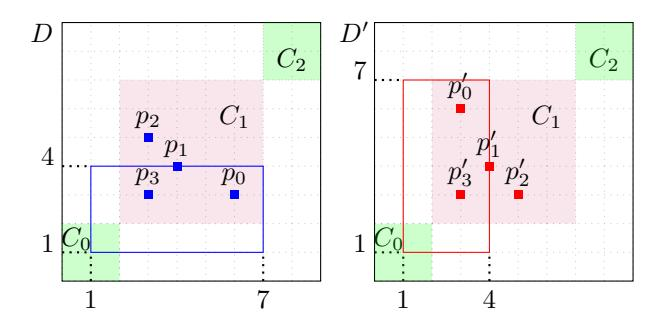

Fig. 2. Databases D and D' differ only the in placement of points in  $C_1$ , they are flipped along the diagonal. For each search token  $t \in L_s(D)$ , there exists a search token  $t' \in L_s(D')$ , such that  $L_s(D)[t] = L_s(D')[t']$ .

Suppose that t is a search token in  $L_s(D)$ , D's search pattern leakage. A search token t corresponds to a range

$$r = [(x_{0_{min}}, x_{0_{max}}), (x_{1_{min}}, x_{1_{max}})],$$

and response  $L_s(D)[t]$ .

- 1) If the search range contains only points in  $C_0$  or  $C_2$ , then search token t' that also corresponds to range r would have response  $L_s(D')[t'] = L_s(D)[t]$ .
- 2) If the search range contains only points in  $C_1$ , then search token t' that corresponds to range  $r' = [(x_{1_{min}}, x_{1_{max}}), (x_{0_{min}}, x_{0_{max}})]$  would have response  $L_s(D')[t'] = L_s(D)[t]$ .
- 3) If the search range contains all points in  $C_1$  perhaps among other points, then search token t' that also corresponds to range r would have response  $L_s(D')[t'] = L_s(D)[t]$ .
- 4) If the search range contains at least one point in  $C_0$  and a point in  $C_1$  and no points in  $C_2$ , then search token t' that corresponds to range  $r' = [(x_{0_{min}}, x_{1_{max}}), (x_{1_{min}}, x_{0_{max}})]$  would have response  $L_s(D')[t'] = L_s(D)[t]$ , as we can see in Figure 2.
- 5) If the search range contains at least one point in  $C_2$  and a point in  $C_1$  and no points in  $C_0$ , then search token t' that corresponds to range  $r' = [(x_{1_{min}}, x_{0_{max}}), (x_{0_{min}}, x_{1_{max}})]$  would have response  $L_s(D')[t'] = L_s(D)[t]$ .

**Corollary 1.** Let D and D' be databases defined as in Theorem 1. We have that no algorithm can distinguish between databases D and D' given their search pattern leakage.

As we saw, there are a number of databases that generate the same search pattern leakage, thus making it impossible to achieve FDR without access to auxiliary information. Instead, our attack produces a family of databases that are leakage equivalent with the original database.

**Corollary 2.** There exist  $2^{\Omega(n)}$  databases with n points that produce the same access and search pattern leakage.

Access pattern leakage equivalence is even stronger. Since the set of responses is not affected when adding empty rows and columns in a database, we can modify any component C, such that the smallest box that contains all its points is a square centered along the diagonal. By Theorem 1, we obtain the following result.

**Theorem 2.** Let D be a database with a disconnected dominance graph containing some component C. Let D' be a database with the same dominance and anti-dominance graphs as D, but the order of dominance in component C is flipped. Databases D and D' have equivalent access pattern leakage.

#### IV. PREPROCESSING

We recall our assumption in the statement of the order reconstruction (OR) and full database reconstruction (FDR) problems that the adversary has observed all possible responses to queries.

In the OR scenario, we represent the access pattern leakage from the responses to queries on database D observed by the adversary as an unordered list,  $L_a$ , storing all possible distinct responses to queries (i.e., sets of identifiers) that the server can return to the user. Note that each element of  $L_a$  is the set of identifiers for a response. List  $L_a$  has size  $\ell_A$ , which is  $O(n^4)$ , and uses space  $n\ell_A$ , which is  $O(n^5)$ , since each of its elements (a response) has size at most n.

Let I be the union of all the responses in  $L_a$ , i.e., the set of all identifiers returned in responses. Since we allow more than one database record to be associated with the same point, we unify the identifiers of each point. This is accomplished by finding, for each identifier  $r \in I$ , the smallest response, R in I that contains r. Clearly, the identifiers in R correspond to the same point and we rename them as r within every response. At the end of this preprocessing step, we have a unique identifier for each point in the database.

In the FDR scenario, we represent the access and search pattern leakage from the search tokens and responses to queries on D observed by the adversary as hashmap,  $L_s$ , mapping each search token to the set of identifiers of the corresponding response. Hashmap  $L_a$  has  $\ell_S$  entries, where  $\ell_S$  is  $O(N^2)$ , and uses space  $O(n\ell_S)$ , which is  $O(nN^2)$  because each of its entries (a response) has size at most n.

#### V. ORDER RECONSTRUCTION

In this section we describe how to perform order reconstruction for the points in the database up to the inherent limitations given by Theorem 2. We specifically show how to reconstruct the dominance and anti-dominance relations, which is equivalent to reconstructing the horizontal and vertical order of the points.

The following remark captures a key ingredient of our attack, namely how the responses involving certain triplets of points provide insights on the dominance and anti-dominance relations.

**Remark 2.** Let a, b and c be database points such that c dominates b and b dominates a (see Figure 3). We have:

- 1) Each response containing a and c contains also b;
- 2) There exist a response containing a and b but not c, a response containing c and b but not a, and a response containing a, b and c.

Similar properties hold for the anti-dominance relation.

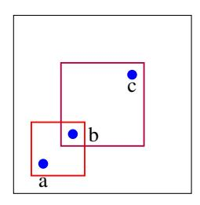

Fig. 3. Three points, a, b, and c, forming a dominance triplet.

In the next two sections, we describe how to find and use triplets to perform order reconstruction.

V-A. Dominance and Anti-Dominance Triplets

In this section, we present our algorithm for finding minimal dominance (or anti-dominance) triplets.

**Definition 2** (Minimal Dominance (Anti-Dominance) Triplet). A dominance triplet is a triplet of points, [a,b,c] such that c dominates b and b dominates a. A minimal dominance triplet is a dominance triplet [a,b,c] such that there is no point p such that [a,p,b] or [b,p,c] is a dominance triplet. (Minimal) anti-dominance triplets are defined similarly.

Given the list of responses,  $L_a$ , Algorithm 1 finds and returns the set Triplets comprising all minimal dominance and anti-dominance triplets as follows:

- 1) We iterate through  $L_a$  and find all responses of size 2.
- 2) For each response of size 2, we try to extend it to a response of size 3 that is a minimal dominance or anti-dominance triplet by using a method based on Remark 2.

**Lemma 1.** Given the list of responses to queries on a database with n points, Algorithm 1 computes all minimal dominance and anti-dominance triplets of the database in time  $O(n^2\ell_A)$ , i.e.,  $O(n^6)$ .

*Proof.* The algorithm finds all points  $p_1$ ,  $p_2$  and  $p_3$  such that responses  $[p_1, p_2]$  and  $[p_2, p_3]$  exist. If the minimal response that includes  $p_1$  and  $p_3$  contains  $p_2$ , then  $p_1$ ,  $p_2$ , and  $p_3$  are added to Triplets since they form a dominance or anti-dominance triplet.

Scanning list  $L_a$  to find all responses of size 2 and building map Pairs takes time proportional to the size of  $L_a$ , which is  $O(\ell_A)$ . Creating map MinimalResponse takes time  $O(n^2\ell_A)$ .

## Algorithm 1: Triplets(La)

```
1: Let R2 be the sublist of La comprising the responses of size 2
2: Let Pairs be an empty hash-map and Triplets an empty set
3: for response (p, q) in R2 do
4: Append q to Pairs[p], and p to Pairs[q]
5: Let MinimalResponse be a hash-map, mapping each pair of
   points (p, q) to the smallest response in La that contains both p
   and q
6: for point k in Pairs do
7: for point l in Pairs[k] do
8: for point m in Pairs[l] do
9: if l ∈ MinimalResponse(k, m) then
10: Add [k, l, m] to Triplets
11: Return Triplets
```

The loop of line 6 and its two nested loops iterate each through O(n) points. The test of line 9 is a hash-map look-up and takes constant time. We conclude that the algorithm takes time O(n 2 `<sup>A</sup> + n 3 ), i.e., O(n 2 `A).

# *V-B. Dominance and Anti-Dominance Graphs*

We reconstruct the dominance and anti-dominance graphs of the points from their minimal triplets, which serve as building blocks. We first compute the connected components of each such graph, and then determine which component belongs to which graph.

*V-B.1. (Anti-)Dominance Connected Components:* We start with the minimal triplets generated by Algorithm 1. Our approach depends on the following observation: Given triplets [a, b, c] and [b, c, d], we know that the dominance relation between a, b and c is the same as the dominance relation between b, c and d (see Figure 4).

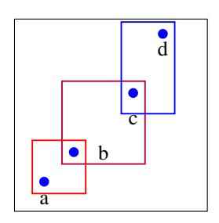

Fig. 4. Given triplet [a, b, c] and [b, c, d], we know that the dominance relation between a, b and c is the same as the dominance relation between b, c and d.

Algorithm 2 (Components) takes as input the list of responses, La, and returns a list of connected components of the dominance or anti-dominance graphs ,where each component is represented as a hash-map C that maps a point p to the set of outgoing neighbors of p in the graph, C(p). The algorithm works as follows:

1) We preprocess the triplets to build a hash-map Edges mapping a pair of points (a, b) to the set of points p such that a triplet [a, b, p] or [p, b, a] exists. Hashmap Edges represents the edges of the dominance and anti-dominance graphs in components with at least a dominance or anti-dominance triplet.

- 2) We begin building a component C by picking an edge [a, b] from Edges and adding it to C. Next, we do two breadth-first searches moving outward from a and inward from b, updating C as we go along. If we use any edges from Edges, we delete them. If the searches end while Edges is not empty, we build a new component C. We repeat this process until Edges has no more edges left.
- 3) Each hash map C we create is part of a different connected component of the dominance (or anti-dominance) graphs. Now, we might be able to merge some components. We look through pairs of components, and check points they have in common. If all common points are sources or sinks, we merge the pair of components (see Figure 5).

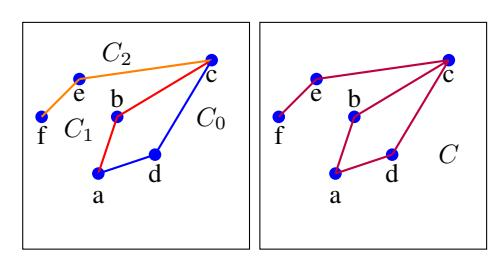

Fig. 5. Merge components C<sup>0</sup> (blue, a, d, c), C<sup>1</sup> (red, a, b, c) and C<sup>2</sup> (orange, f, e, c) that share endpoints into a single component, C (purple).

# Algorithm 2: Components(La)

25:6 Return Components.

```
1: Let Edges be an empty hash-map.
2: Let Components be an empty list.
3:
4: for each [a, b, c] in Triplets(La) (Algorithm 1) do
5: Add a to Edges[(c, b)] and c to Edges[(a, b)]
6:
7: while Edges is not empty do
8: Let C be an empty hash map
9: Pick a random pair p1, p2 from Edges
10: ToDo = [(p1, p2, →),(p2, p1, ←)]
11: while ToDo is not empty do
12: Remove an entry, (x, y, arrow) from ToDo
13: for p ∈ Edges[(x, y)] do
14: if arrow =→ then
15: Add p to C[y]
16: Add (y, p, →) and (p, y, ←) to ToDo
17: else
18: Add y to C[p]
19: Add (y, p, ←) and (p, y, →) to ToDo
20: Remove (x, y) from Edges
21: Add C to Components
22:3 while ∃C0, C1 ∈ Components whose common points are
   only sources or sinks do
24: Merge C0 and C1 and update Components
```

Lemma 2. *Algorithm 2 returns all connected dominance and anti-dominance components that contain at least a dominance or anti-dominance triplet in time* O(n 2 `A)*, which is* O(n 6 )*.*

*Proof.* All points that are part of a triplet end up in some component from the Components list, as we utilize all edges from the triplets.

We shall show that if two points are in a dominance relationship, then they are in the same component and there is a path from one to the other. Suppose that b dominates a:

- 1) If points a and b are in the same triplet, an edge is created in Edges, and that edge ends up connecting a and b in some component.
- 2) Since Algorithm 1 finds all minimal dominance triplets (Lemma 1), then there has to exist some series of triplets [a, p1, p2], [p1, .....], ..., ...[pn−1, pn, b]. All these triplets are turned into edges in Edges, one of them eventually will end up in a component. Since Algorithm 2 runs a breadth first search in both directions of that edge, a path will be created between a and b.

Now, we show that if b dominates a, and they are in some component C, then there exists no path between a and a point c ∈ C that anti-dominates a. If there existed such a path between a and c, that means that there is a triplet containing a, b and c, a series of triplets [a, p1, p2], [p1, .....], ..., ...[pn−1, pn, c], or a series of triplets [b, p1, p2], [p1, .....], ..., ...[pn−1, pn, c]. But, if that were the case a would have to be in a dominance relationship with c, or b would be in a dominance relation with c. Both outcomes lead to a contradiction.

Now, we show that we do not merge any components which represent different orders. Two components that share both a bottom and a top endpoint, indeed represent the same order. It remains to show that when we merge components that share only top (or bottom) endpoints, they also have the same order. Let's look at some component C<sup>0</sup> which contains (perhaps among other points) a, b and c, and a component C1, which contains (perhaps among other points) p and c. Notably a and b are not in C<sup>1</sup> and p is not in C0. Without loss of generosity, suppose that C<sup>0</sup> is a dominance component. As we can see in Figure 6, if p dominated (or was dominated by) b, then p would be part of C0. Thus, p cannot dominate (or be dominated by) b. If p anti-dominated (or was anti-dominated by) c, then the same relationship would hold for b too. But b /∈ C1, and so p cannot anti-dominate (or be anti-dominated by) c. Thus, there are two choices for p's placement, it can either antidominate b and be dominated by c, or be anti-dominated by b and dominated by c. In both cases, c dominates p, and thus C<sup>1</sup> represents the same order (dominance) as C0, and we can merge the components.

Algorithm 2 needs O(n 2 `A) time to run Algorithm 1. Then, it needs O(n 3 ) time to process the triplets (since there can be O(n 3 ) triplets), and O(n 3 ) to explore all edges created using the T riplets.

Thus, Algorithm 2 returns all connected components of length at least 2 of the graph in O(n 3 `<sup>A</sup> + n 3 ) time. Any component that contains one or two points does not return a triplet, and thus we cannot find it.

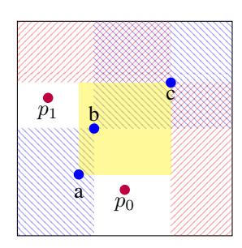

Fig. 6. A component C<sup>0</sup> contains points a, b, c and a component C<sup>1</sup> contains points p and c. Point p cannot dominate (or be dominated by) b, as it is not in C<sup>0</sup> and point p cannot anti-dominate (or be anti-dominated by) c, as b is not in C1. Thus, there are two possible options for p, as denoted by points p<sup>0</sup> and p1. In both cases c dominates p, and thus we can merge components C<sup>0</sup> and C1.

*V-B.2. Categorizing Connected Components:* In this section, we show how to classify the previously computed components into dominance and (anti-) dominance ones. First, we pick the component with the longest path CL. We declare that this component signifies a dominance relationship. Then, we look through the Components list. Any components that share points with C<sup>L</sup> form anti-dominance relations, the rest form dominance relations. We denote the largest anti-dominance component with C 0 L .

At this point, we also need to handle some special cases:

- 1) There might be one or two points that are not part of any triplet. In this case, we create a component that contains either the one point, or both of them with an edge between them. See, e.g. database D<sup>1</sup> in Figure 7.
- 2) If two points do not share a relationship, but are both in dominance components and not in anti-dominance components, then their relationship is anti-dominance. ( similar argument holds for anti-dominance. See, e.g., database D<sup>2</sup> in Figure 7.

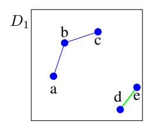

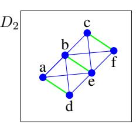

Fig. 7. In D1, points a, b and c form a dominance component (blue) while points d and e are not part of any triplet and form their own dominance relationship (green). In D2, points a, b, c, d, e and f form a dominance component (blue), but we do not have any information about anti-dominance. There is an anti-dominance relation between points that are not connected in the dominance graph, like a and d (green).

Algorithm 3 takes as input the access pattern leakage and returns a list of dominance and a list of anti-dominance components.

Lemma 3. *There are at most 2 points not in a triplet constructed by Algorithm 1.*

*Proof.* By definition, the database we're trying to reconstruct has at least five points at distinct values. Three of them must

## Algorithm 3: OrderReconstruction(La)

```
1: Components = Components(La) (Algorithm 2)
2: Let DComponents, and ADComponents be two empty lists.
3: if there exist points in no component then
4: Create C that contains them and add an edge between them
     (if applicable). Add C to Components.
5: Let CL be the largest component from Components, add it to
   DComponents
6: for C ∈ Components − {CL} do
7: if C and CL share points then
8: Add C to ADComponents.
9: else
10: Add C to DComponents.
11: Let CL0 be the largest component in ADComponents.
12:
13: Let H be an empty dictionary.
14: for (p1, p2) ∈ comp ∈ DComponents do
15: if p1 does not dominate, is not dominated by p2 then
16: if @C ∈ ADComponents, s.t. p1, p2 ∈ C then
17: Add p2 to H[p1], and p1 to H[p2].
18: Add connected components from H to ADComponents.
19:
20: Similarly for (p1, p2) in ADComponents
21:
22: Return DComponents, ADComponents.
```

form a triplet, say a dominance triplet. A fourth point that is not part a triplet has to have an anti-dominance relation with the pre-existing points, as a dominance relationship would result in a triplet.

There can be another point that is in an anti-dominance relation with the pre-existing triplet points, and in a dominance relation with the remaining point.

Any additional points added at this point result in a triplet.

Our complete order reconstruction attack is given in Algorithm 3 and its performance is summarized in the following theorem.

Theorem 3. *Let* D *be a 2D database with* n *points stored using a searchable encryption scheme that leaks the access pattern. Given all* `<sup>A</sup> *responses to queries, Algorithm 3 (*OrderReconstruction*) achieves order reconstruction of* D*, up to symmetries of the dominance and anti-dominance components, in time* O(n 2 `A)*, which is* O(n 6 ) *.*

*Proof.* We first argue that all points are in a component. Then, we argue that any components of diameter at least 2 are correctly categorized. We will conclude that any smaller components are also correctly categorized.

We know that all points will be in some component, as we add any remaining points in a component in Algorithm 3.

Any component of length three or more is found (Lemma 2). Algorithm 3 then characterizes all components in dominance and anti-dominance components. The largest component C<sup>L</sup> is a dominance component. We cannot distinguish rotations (Symmetries) of the original database, which enables us to make this arbitrary choice. Any component that shares no points with C<sup>L</sup> is also a dominance component. Indeed, if the two components shared points and were both dominance components, they would be just one connected component. The remaining components are anti-dominance.

When a triplet is not generated, we are dealing with components of diameter 1. Here, we have two cases:

- 1) Points that do not form a triplet. By Lemma 3, there are at most 2 such points, and their relationship is the one of the pre-existing component (dominance).
- 2) Points that form dominance (or anti-dominance) triplets, but not anti-dominance (or dominance respectively) triplets. Algorithm 3 identifies these points, forms the components and assigns them the correct relationship. If a point that is in a dominance relationship, and in another non-defined one, the non-defined one has to be anti-dominance.

Algorithm 3 returns two lists one containing all connected dominance components, and one containing all antidominance components. Each component graph has a direction, which is arbitrarily picked. D's points form the same dominance and anti-dominance components. Note that the (anti-)dominance directions might be different and dominance and anti-dominance swapped, but by Theorem 2, we cannot reconstruct further given just La.

Algorithm 3 runs Algorithm 2 which takes O(n 3 `A). Then, it goes through the components, and assigns them relationships. It also goes through all pairs of points in the same relationship components. Thus, the algorithm terminates in O(n 2 `A) time.

# VI. FULL DATABASE RECONSTRUCTION

Our FDR attack follows the OR attack of Section V and further relies on search pattern leakage. We use search pattern leakage to recover (i) how "close" a point is to another as well as (ii) in which "layer" of the database a points is. For example, consider two points, p and q, where q dominates p. The number of query ranges containing both p and q, denoted rpq is given by

$$r_{pq} = x_{0_p} x_{1_p} (N_0 - x_{0_q}) (N_1 - x_{1_q})$$
 (1)

The larger rpq is, the closer p and q are to each other. The number of ranges containing point p, denoted rp, is given by

$$r_p = x_{0_p} x_{1_p} (N_0 - x_{0_p}) (N_1 - x_{1_p})$$
 (2)

The larger r<sup>p</sup> is, the closer p is to the center of the domain.

Our approach is based on extracting from the access and search pattern leakage counts of ranges containing certain points. Using these counts, we apply Equations 1 and 2 to compute loci of candidate locations for these points.

First, we study FDR for a *diagonal database*, i.e., a database whose dominance graph is a single chain and whose antidominance graph is empty. Next, we address FDR for a *nondiagonal* database. We summarize below the method for each case:

1) Diagonal Database (Section VI-A): We identify the endpoints of the database, and iterate through all possible locations for them. For each such location, we sweep through the rest of the points in dominance order to determine their location.

2) Non-Diagonal Database (Section VI-B): We pick three points to act as "anchors", and construct a system of equations, which yields a constant number of possible locations for the anchors. Using these locations, we find four "pseudo-corners", which we use to find possible locations for all the points. We then partition the points in components that can independently flip along the diagonal without affecting the leakage of the corresponding database (Theorem 1). We finally iterate through all components and determine the exact two configurations for the points of each component.

The output of our FDR attack is a succinct representation of all possible reconstructions for the given access and search pattern leakage. This representation is a list, called *Databases*, whose elements are representations for different families of databases. Each family of databases is represented by a list of components. We can use these components to generate all databases of that particular family and so all databases represented by *Databases* (Algorithm 9).

#### VI-A. Diagonal Database

A diagonal database has only one (anti-)dominance component, which is a chain. In this section, we explore how to achieve FDR on diagonal databases.

First, we identify a point k which dominates the most points. The number of ranges that contain k is

$$r_k = x_{0_k} \cdot (N_0 - x_{0_k}) \cdot x_{1_k} \cdot (N_1 - x_{1_k}). \tag{3}$$

Since k's coordinates are integers, there are at most  $2(N_0+N_1)$ possible placements for k.

We then identify a point l that is dominated by the most points. The number of ranges that contain l is

$$r_l = x_{0_l} \cdot (N_0 - x_{0_l}) \cdot x_{1_l} \cdot (N_1 - x_{1_l}). \tag{4}$$

Since l's coordinates are integers, there are at most  $2(N_0+N_1)$ possible placements for l.

We also know that the number of ranges that contain l and k is

$$r_{kl} = x_{0i} \cdot (N_0 - x_{0k}) \cdot x_{1i} \cdot (N_1 - x_{1k}). \tag{5}$$

We perform an exhaustive search among the possible placements for both l and k, and create a list of possible placements for k and l that satisfy Equation 5, denoted PosPlaces.

We now iterate through PosPlaces creating a list Components = [l], and for every point p (minus k and l) in ascending dominance order, we solve for  $x_{0_p}$  and  $x_{1_p}$  using Equations 6 and 7 (see Figure 8).

$$r_{lp} = x_{0_l} \cdot (N_0 - x_{0_p}) \cdot x_{1_l} \cdot (N_1 - x_{1_p}) \tag{6}$$

$$r_{kp} = x_{0_p} \cdot (N_0 - x_{0_k}) \cdot x_{1_p} \cdot (N_1 - x_{1_k}) \tag{7}$$

We also know that

$$r_p = x_{0_p} \cdot (N_0 - x_{0_p}) \cdot x_{1_p} \cdot (N_1 - x_{1_p}). \tag{8}$$

Solving for p we get two solutions: Let c $\frac{r_{kp}}{(N_0 - x_{0_k})(N_1 - x_{1_k})}, \text{ and } d = \frac{r_{lp}}{x_{0_l} x_{1_l}}. \text{ Let } sqrt$   $\sqrt{(c - d + N_1 N_0)^2 - 4cN_1 N_0}, \text{ and } m = c - d + N_1 N_0.$ 

$$x_{0_p} = \frac{-sqrt + m}{2N_1}$$

$$x_{1_p} = \frac{sqrt + m}{2N_0}$$
(10)

$$x_{1_p} = \frac{sqrt + m}{2N_0} \tag{10}$$

$$x_{0p}' = \frac{sqrt + m}{2N_1} \tag{11}$$

$$x_{1_p}' = \frac{-sqrt + m}{2N_0} \tag{12}$$

Note that  $(x_{0_p}, x_{1_p})$  is the reflection of  $(x'_{0_p}, x'_{1_p})$  along the main diagonal.

If a solution violates the dominance order or has non-integer coordinates, then it is invalid. If there are two valid solutions, we add a new list [p] to Components, otherwise we add p to the most recently added list in Components.

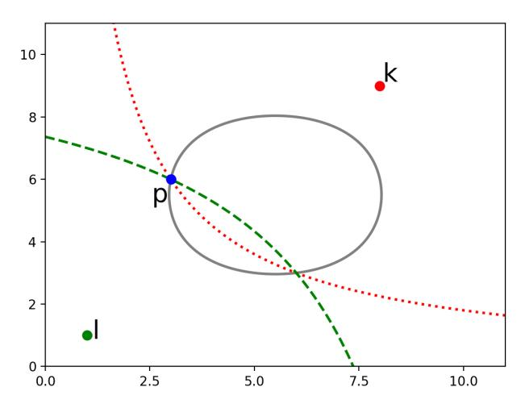

Fig. 8. Loci for point p from equations 8 (gray-solid), 6 (green-dashed) and 7 (red-dotted). The placement for point p is at one of their two intersections.

Algorithm 4 takes as input access pattern leakage and the search pattern leakage,  $L_a$  and  $L_s$ . It returns Databases, a list containing all leakage equivalent databases to D. Databases contains families of databases, each family corresponding to a different pair of k and l. A family of databases is represented by a list of lists of points, each such list of points corresponds to a square of the database that can be flipped without affecting the leakage (Theorem 1). We can generate all possible databases using Algorithm 9.

**Theorem 4.** Let D be a 2D diagonal database with n points from a domain of size N stored using a searchable encryption scheme that leaks the access pattern (with  $\ell_A$  entries) and search pattern (with  $\ell_S$  entries). Algorithm 4 (DiagonalFDR) outputs an O(nN)-size encoding of all databases with search pattern leakage equivalent to that of D and runs in time  $O(n^2\ell_A + nN\ell_S)$ , which is  $O(n^6 + nN^3)$ .

Proof. By Theorem 3, Algorithm 3 will return all dominance and anti-dominance components of the database. Since we

#### Algorithm 4: $DiagonalFDR(L_a, L_s)$

```
1: C = OrderReconstruction(L_a) (Algorithm 3)
2: Let k and l be the top and bottom points of C.
 3: Let Databases be an empty list.
4: Let PosPlaces be a list of all possible x_{0_k}, x_{1_k}, x_{0_l}, x_{1_l}
   combinations that satisfy Equations 3, 4, and 5.
6: for each x_{0_k}, x_{1_k}, x_{0_l}, x_{1_l} in PosPlaces do
7:
      Let Components be an empty list.
      Let C = [(x_{0_l}, x_{1_l})]
8:
      for each p \in R - \{k, l\} in ascending dominance order do
         Solve for p's locations using Equations 9, 10, 11, and 12
         (derived using L_s)
         Let Valid be a list of p's recovered locations that satisfy
11:
         the dominance order with all points in Components
12:
         if Valid contains two points then
13:
            Add C to Components
            Set C to a list containing just p's first recovered
14:
            location
15:
         else if Valid contains one point then
16:
            Add p's valid location to C
17:
         else
18:
            Go to the next placement in line 6.
19:
         if k and its reflection along the main diagonal dominate
         all points then
20:
            Add C to Components
            Add a list containing just k to Components
21:
22:
23:
            Add k to C
24:
            Add C to Components
25:
      Add Components to Databases
26:
27: for each Components in Databases do
      Construct D' with all points in Components
29:
      if D' leakage's is not equivalent to L_s then
         Remove Components from Databases
30:
31: Return Databases.
```

know that this database is diagonal, there is only one dominance component.

For any point we can calculate how many queries return it (among other points) using  $L_s$ . Any point p can be queried by  $r_p = x_{0_p} \cdot (N_0 - x_{0_p}) \cdot x_{1_p} \cdot (N_1 - x_{1_p})$  distinct queries. All points have integer coordinates. Thus, for any point we can deduce  $2(N_0 + N_1)$  possible placements. Note that there are no other possible placements for any point p, as that would change the search pattern leakage, mainly the count of  $r_p$ .

Using the above technique, we generate O(N) pairs of possible placements (that must satisfy Equations 3, 4, and 5) for the top and bottom point in the dominance order. For each of the possibilities, we locate each point p in the database using the same premise, how many queries return (i) the top and p, and (ii) the bottom and p. If the placement of the top and bottom is valid, there must be a solution to our system of equations. Note that again, there are no other possible placements for p, as that would modify the number of queries with a certain response.

This way we generate a list of databases. For each database, we pick the first location for each point that has more than one possible placements, and we check if its search pattern leakage

is equivalent to  $L_s$ . Note that we can indeed pick a random location for each point that has two possible placements, as both of them are valid by Theorem 1, since they do not violate the dominance order, and satisfy the search pattern leakage-derived equations.

If the search pattern leakages match, we add the constructed database to the list. Thus, we have generated a family of databases, one of which is the original D (up to rotations). We cannot further distinguish which database from our family is D, as they all have corresponding search pattern leakages.

By Theorem 3,  $OrderReconstruction(L_a)$  takes  $O(n^2\ell_A)$  time. Then, we iterate through O(N) placements, and create a database for each, which takes O(N) time. Note that we can preprocess all search token counts for the Equations in  $O(n^2\ell_S)$  time.

Then, for each of the O(N) databases, we produce its search pattern leakage  $O(n\ell_S=nN^2)$ , and compare it with the original databases' search pattern leakage  $O(n\ell_S)$ .

Algorithm 4 returns a family databases whose search pattern leakage is equivalent to  $L_s$  in  $O(n^2\ell_A+nN\ell_S=n^6+nN^3)$  time.

There are O(N) possible pairs of k and l, and each pair corresponds to a family of databases encoded in O(n) space. Thus, our encoding is of size O(nN).

**Corollary 3.** The encoding of the databases returned by Algorithm 4 can be reduced to size O(n+N).

*Proof.* Let Databases be the result of Algorithm 4. For each family of databases, we can extract the corresponding positions of k and l. The new encoding will consist of the extracted k, l pairs, the dominance order, and the relevant search leakage information for Equations 9, 10, 11, and 12. This information has size O(N+n), which is linear to the size of the database. Then, a slightly modified Algorithm 4 can be used to determine the position of the points. Mainly, we omit the for-loop in line 27, and use the given values instead of computing PosPlaces or the dominance order.

# VI-B. Non-Diagonal Database

If the database is not diagonal, we can also achieve FDR. We do so in four steps.

- 1) First, we select three points to act as "anchors," which we can then use to determine the location of "pseudocorners" of the database. Pseudocorners are points that are extreme in either dominance or anti-dominance.
- 2) We use the pseudo-corners to determine possible locations for all points in the database. This results to one or two possible locations for every point.
- 3) We identify the components of the database that can independently flip along the diagonal without modifying the leakage (Theorem 1).
- 4) We trim down the solutions, generating a family of databases that are leakage equivalent to the original database.

*VI-B.1. Locate Pseudo-Corners:* In non-diagonal databases, we can identify three points, such that two of them are in a dominance relationship and two of them are in an anti-dominance relationship. We utilize this placement to recover a constant number of possible positions for these three points as follows:

We pick three points f, g, b to find their coordinates. These points act as anchors, and we shall use search pattern leakage to find their values.

Because the database is not diagonal, there must exist a triplet of points p1, p<sup>2</sup> and p3, such that p<sup>1</sup> and p<sup>2</sup> are in a dominance relationship, and p<sup>2</sup> and p<sup>3</sup> are in an antidominance relationship. Now, p<sup>1</sup> and p<sup>3</sup> are either in a dominance or an anti-dominance relationship. We rotate and flip the database until we find a triplet (perhaps p1, p<sup>2</sup> and p3) where one point anti-dominates the other two, and the two points are in a dominance relationship:

We find the intersection (common points) I of CL, the largest dominance component and CL<sup>0</sup> , the largest antidominance component. The intersection contains at least 2 points, as the database is not diagonal. We find b and g in I, such that b dominates g. We set point f as the point that anti-dominates both b and g, and is not anti-dominated by anything. If that's not possible, we flip the anti-dominance direction. If it's still not possible, we swap the dominance and anti-dominance orders (equivalent to rotating the database by π/2), and try again.

Now, we calculate the number of ranges that contain f (perhaps among other records). On both axis, the ranges have to start before f's value and end after it. Let r<sup>f</sup> be the number of such ranges:

$$r_f = x_{0_f} \cdot (N_0 - x_{0_f}) \cdot x_{1_f} \cdot (N_1 - x_{1_f}) \tag{13}$$

Similarly for b and g:

$$r_b = x_{0_b} \cdot (N_0 - x_{0_b}) \cdot x_{1_b} \cdot (N_1 - x_{1_b}) \tag{14}$$

$$r_g = x_{0_g} \cdot (N_0 - x_{0_g}) \cdot x_{1_g} \cdot (N_1 - x_{1_g}) \tag{15}$$

Now, let's calculate the number or ranges that contain f and g, f and b, and all three points:

$$r_{fg} = x_{0_f} \cdot (N_1 - x_{1_f}) \cdot x_{1_g} \cdot (N_0 - x_{0_g})$$
 (16)

$$r_{fb} = x_{0_f} \cdot (N_1 - x_{1_f}) \cdot x_{1_b} \cdot (N_0 - x_{0_b}) \tag{17}$$

$$r_{fbg} = x_{0_f} \cdot (N_1 - x_{1_f}) \cdot x_{1_g} \cdot (N_0 - x_{0_b})$$
 (18)

We use Equations 16 and 18 to get: <sup>r</sup>f g rfbg = x0<sup>f</sup> ·(N1−x1<sup>f</sup> )·x1<sup>g</sup> ·(N0−x0<sup>g</sup> x0<sup>f</sup> ·(N1−x1<sup>f</sup> )·x1<sup>g</sup> ·(N0−x0<sup>b</sup> ) = (N0−x0<sup>g</sup> ) (N0−x0<sup>b</sup> ) . Thus:

$$x_{0_b} = N_0 - \frac{r_{fbg}}{r_{fg}} \cdot (N_0 - x_{0_g})$$
 (19)

and equations 17 and 18 to get: <sup>r</sup>fb rfbg x0<sup>f</sup> ·(N1−x1<sup>f</sup> )·x1<sup>b</sup> ·(N0−x0<sup>b</sup> ) x0<sup>f</sup> ·(N1−x1<sup>f</sup> )·x1<sup>g</sup> ·(N0−x0<sup>b</sup> ) = x1<sup>b</sup> x1<sup>g</sup> . Thus,

$$x_{1_b} = \frac{r_{fb}}{r_{fbg}} \cdot x_{1_g} \tag{20}$$

=

Now, we can substitute x0<sup>b</sup> and x1<sup>b</sup> in Equation 14:

$$r_{b} = x_{0_{b}} \cdot (N_{0} - x_{0_{b}}) \cdot x_{1_{b}} \cdot (N_{1} - x_{1_{b}})$$

$$= (N_{0} - \frac{r_{fbg}}{r_{fg}} \cdot (N_{0} - x_{0_{g}})) \cdot \frac{r_{fb}}{r_{fg}} \cdot$$

$$(N_{0} - x_{0_{g}}) \cdot x_{1_{g}} \cdot (N_{1} - \frac{r_{fb}}{r_{fbg}} \cdot x_{1_{g}})$$
(21)

Note that using search pattern and access pattern leakage, we can count how many unique search tokens return sets that contain any number of points, and thus calculate the number of ranges we use. For example, to calculate rb, we just need to count the number of search tokens that return a set which contains b.

Now, we can use Equations 15 and 21 to solve for the coordinates of point g (see Figure 9). Note that the equations we use are fourth degree curves, thus they might intersect in up to 4 points. Hence, there can be up to four possible locations for g. Using the coordinates of g, we can calculate

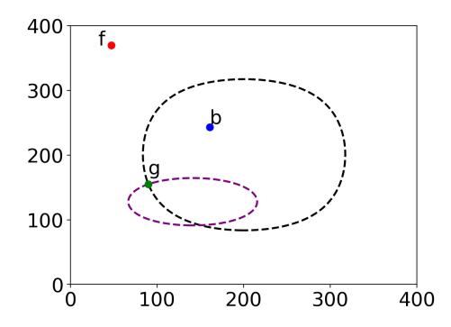

Fig. 9. Point g is at the intersection of the loci from Equations 15 and 21.

the coordinates of f. We use Equations 13 and 16, and recover two possible placements for f per possible g, so eight possibilities.

Given each pair of coordinates for g and f, we can solve for the coordinates of b using Equations 17 and

$$r_{gb} = x_{0_g} \cdot (N_1 - x_{1_b}) \cdot x_{1_g} \cdot (N_0 - x_{0_b}). \tag{22}$$

For each possible pair, there is one solution for b's coordinates. So, in total, we have eight possible placements for b.

We then find the point h that is anti-dominated by most other points, including g. We solve for h's coordinates using equations:

$$r_h = x_{0_h} \cdot (N_0 - x_{0_h}) \cdot x_{1_h} \cdot (N_1 - x_{1_h}) \tag{23}$$

$$r_{hg} = x_{0_g} \cdot (N_0 - x_{0_h}) \cdot x_{1_h} \cdot (N_1 - x_{1_g})$$
 (24)

Note that we solve for all possible coordinates we have for each point. Since there are four possible placements for g, there are at most eight solutions for the coordinates of h. If b anti-dominates h, we can trim down the set of solutions for h's coordinates using equation:

$$r_{hb} = x_{0_b} \cdot (N_0 - x_{0_h}) \cdot x_{1_h} \cdot (N_1 - x_{1_b})$$
 (25)

Finally, we find the point k that dominates the most points including g, and the point l that is dominated by the most points including g. We similarly solve for their coordinates, using equations:

$$r_k = x_{0_k} \cdot (N_0 - x_{0_k}) \cdot x_{1_k} \cdot (N_1 - x_{1_k}) \tag{26}$$

$$r_{kg} = x_{0_g} \cdot (N_0 - x_{0_k}) \cdot x_{1_g} \cdot (N_1 - x_{1_k}) \tag{27}$$

$$r_l = x_{0_l} \cdot (N_0 - x_{0_l}) \cdot x_{1_l} \cdot (N_1 - x_{1_l}) \tag{28}$$

$$r_{lg} = x_{0_l} \cdot (N_0 - x_{0_q}) \cdot x_{1_l} \cdot (N_1 - x_{1_q}) \tag{29}$$

Since there are at most four solutions for g, there are at most eight possible solutions for k and l. If b dominates l or is dominated by k, we can trim down the set of solutions for k and l's coordinates using equations:

$$r_{kb} = x_{0_b} \cdot (N_0 - x_{0_k}) \cdot x_{1_b} \cdot (N_1 - x_{1_k}) \tag{30}$$

$$r_{lb} = x_{0_l} \cdot (N_0 - x_{0_b}) \cdot x_{1_l} \cdot (N_1 - x_{1_b})$$
 (31)

We construct a list PosCoords that contains possible coordinates for points f, h, k, and l. Note that valid coordinates are integers, within the bounds of the database, and do not violate their dominance/anti-dominance order with the rest of the recovered points.

Algorithm 5 takes as input the access and search pattern leakage, and returns a list of possible pseudo-corners.

# Algorithm 5: $PseudoCorners(L_a, L_s)$

- 1:  $(DComponents, ADComponents) = OrderReconstruction(L_a)$  (Algorithm 3)
- 2: Let  $C_L$  be the largest component in DComponents
- 3: Let  $C_{L'}$  the largest component in *ADComponents*
- 4: Let I be the intersection of the two.
- 5: Let b, g be two points in a dominance relation from I (b dominates g).
- 6: Let f be an end-point of C<sub>L'</sub> that anti-dominates b and g (If impossible, flip the anti-dominance direction. If still impossible, swap DComponents and ADComponents and go to line 2).
- 7: Let h be a point anti-dominated by most points and g.
- 8: Let k and l be the points that dominate and are dominated by the most points including g.
- 9: Let  $Pos\hat{C}oords$  be an empty list.
- 10: // All Equations are derived using  $L_s$
- 11: Use Equations 15 and 21 to solve for g
- 12: **for** each point g **do**
- 13: Use Equations 14 and 22 to solve for b
- 14: Use Equations 13 and 16 to solve for f
- 15: Use Equations 23 and 24 to solve for h
- 16: Use Equations 26, and 27 to solve for k
- 17: Use Equations 28, and 29 to solve for l
- 18: Use Equations 25, 30 and 31 to trim the set of solutions.
- 19: Add any valid solutions to PosCoords
- 20: Return PosCoords

**Lemma 4.** The locations returned by Algorithm 5 (PseudoCorners) include all possible placements (perhaps along some incorrect ones) for points g, b, k, l, f and h (up to Symmetries).

*Proof.* The placement of points g, b, k, l, f and h is constricted by the search pattern leakage. Using  $L_s$  we construct Equations 13, 14, 15, 16, 17, 23, 24, 25, 26, 27, 28, 29, 30, and 31.

We show how to solve the system of equations and reconstruct possible placements for the points. Note that we keep track of all solutions that do not violate an equation, and thus we recover any possible placements for points  $g,\ b,\ k,\ l,\ f$  and h, given a certain arbitrarily chosen dominance and antidominance order. There cannot be another placement for the points, as that would result in different search pattern leakage.

*VI-B.2. Reconstructing Coordinates:* Our algorithm will now reconstruct the coordinates of every point using the recovered pseudo-corners.

For each possible placement of the pseudo-corners in PosCoords, we create a separate dataset, as if that particular placement was correct. Then, given that particular placement of the pseudo-corners, we try to determine the position of other points. First, we create a hash-map, H.

For each point p in [k, l, h, f], we add the reconstructed coordinates to H[p].

Then, we create four sets: a set with all points that dominate p, a set with all points that anti-dominate p, a set with all points that are dominated by p and a set with all points that are anti-dominated by p. We will use these sets to find the relationship of some point with the pseudo-corner p.

For each  $p \in R$ : Now, for each pair  $[p_1, p_2]$  from  $[k, l, h, f]^2$ , such that  $p_1 \neq p_2$ : Let  $r_{p,p_1}$  be the number of distinct search tokens that return p and  $p_1$  (perhaps among other points). Similarly, we define  $r_{p,p_2}$ .

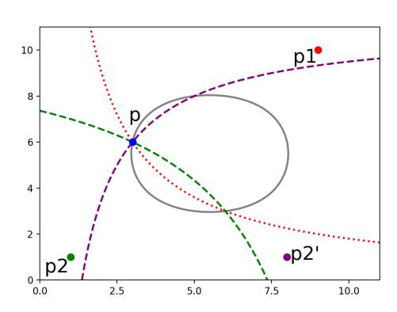

Fig. 10. The relationship between p and  $p_1$  indicates that p is on the red curve, the relationship between p and  $p_2$  indicates that p is on the green curve, the relationship between p and  $p_2'$  indicates that p is on the purple curve, and the number of search tokens that query p indicate that p is on the gray curve. We can see that when  $p_1$  and  $p_2$  are diagonal, then there are two possible solutions for p. If they are adjacent, like  $p_1$  and  $p_2'$  then the solution is unique.

To solve for the coordinates of p, we will look at the intersection of the curve defined by  $r_{p,p_1}$ , and the curve defined by  $r_{p,p_2}$ . If  $p_1$  and  $p_2$  are diagonals, then there are two solutions for p, otherwise there is one, (Figure 10).

1) If p dominates  $p_2$  and  $p_1$  anti-dominates p:

Let 
$$c = \frac{r_{p,p_1}}{x_{0p_1}(N_1 - x_{1p_1})}$$
, and  $d = \frac{r_{p,p_2}}{x_{0p_2}x_{1p_2}}$ .

$$x_{0_p} = -\frac{c + d - N_1 N_0}{N_1} \tag{32}$$

$$x_{1_p} = \frac{cN_1}{c+d} \tag{33}$$

Set H[p] to  $(x_{0_p}, x_{1_p})$ .

2) If p dominates  $p_2$  and p anti-dominates  $p_1$ : Let  $c = \frac{r_{p,p_1}}{x_{1_{p_1}}(N_0 - x_{0_{p_1}})}$ , and  $d = \frac{r_{p,p_2}}{x_{0_{p_2}}x_{1_{p_2}}}$ .

$$x_{0_p} = \frac{cN_0}{c+d} \tag{34}$$

$$x_{1_p} = -\frac{c + d - N_1 N_0}{N_0} \tag{35}$$

Set H[p] to  $(x_{0_p}, x_{1_p})$ .

3) If p is dominated by  $p_2$  and p anti-dominates  $p_1$ : Let  $c = \frac{r_{p,p_1}}{x_{1_{p_1}}(N_0 - x_{0_{p_1}})}$ , and  $d = \frac{r_{p,p_2}}{(N_0 - x_{0_{p_2}})(N_1 - x_{1_{p_2}})}$ .

$$x_{0_p} = \frac{c+d}{N_1} {36}$$

$$x_{1_p} = \frac{dN_1}{c+d} {37}$$

Set H[p] to  $(x_{0_p}, x_{1_p})$ .

4) If p is dominated by  $p_2$  and  $p_1$  anti-dominates p: Let  $c=\frac{r_{p,p_1}}{x_{0_{p_1}}(N_1-x_{1_{p_1}})},$  and  $d=\frac{r_{p,p_2}}{(N_0-x_{0_{p_2}})(N_1-x_{1_{p_2}})}.$ 

$$x_{0_p} = \frac{dN_0}{c+d} \tag{38}$$

$$x_{1_p} = \frac{c+d}{N_0} (39)$$

Set H[p] to  $(x_{0_p}, x_{1_p})$ .

5) If p dominates  $p_2$  and  $p_1$  dominates p: Let  $c = \frac{r_{p,p_1}}{(N_0 - x_{0_{p_1}})(N_1 - x_{1_{p_1}})}$ , and  $d = \frac{r_{p,p_2}}{x_{0_{p_2}} x_{1_{p_2}}}$ . Let  $sqrt = \sqrt{(c - d + N_1 N_0)^2 - 4cN_1 N_0}$ , and  $m = c - d + N_1 N_0$ .

$$x_{0_p} = \frac{-sqrt + m}{2N_1} \tag{40}$$

$$x_{1_p} = \frac{sqrt + m}{2N_0} \tag{41}$$

$$x'_{0_p} = \frac{sqrt + m}{2N_1} \tag{42}$$

$$x_{1_p}' = \frac{-sqrt + m}{2N_0} \tag{43}$$

We add  $(x_{0_p},\ x_{1_p})$  and  $(x'_{0_p},\ x'_{1_p})$  to H[p], if there is nothing there.

6) If p anti-dominates  $p_2$  and  $p_1$  anti-dominates p: Let  $c = \frac{r_{p,p_1}}{x_{0p_1}(N_1 - x_{1p_1})}$ , and  $d = \frac{r_{p,p_2}}{(N_0 - x_{0p_2})x_{1p_2}} + N_1N_0$ . Let  $sqrt = \sqrt{(-c + d + N_1N_0)^2 - 4dN_1N_0}$ .

$$x_{0_p} = \frac{-sqrt - c + d}{2N_1} \tag{44}$$

$$x_{1_p} = \frac{-sqrt + c - d}{2N_0} \tag{45}$$

$$x_{0_p}' = \frac{sqrt - c + d}{2N_1} \tag{46}$$

$$x_{1_p}' = \frac{sqrt + c - d}{2N_0} \tag{47}$$

We add  $(x_{0_p},\ x_{1_p})$  and  $(x'_{0_p},\ x'_{1_p})$  to H[p], if there is nothing there.

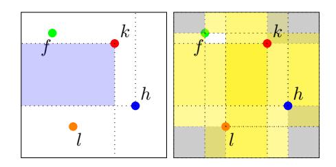

Fig. 11. Knowing the coordinates of k and h, we can determine all coordinates of points dominated by k, that also anti-dominate h (in the blue rectangle), using Equations 36 and 37, where  $p_1 = h$  and  $p_2 = k$ . Knowing the coordinates of all k, l, f and h, we can solve for the coordinates of all points on the yellow regions. Note that there are no points in the grey areas. We can also solve for the coordinates of any points in the white squares, but we get two solutions per point.

Note that if there are two solutions for a point, one solution is the reflection of the the other across the main or the other diagonal.

For any point p, its position is invalid if:

- 1) the recovered coordinates are not integers or out of bounds of the database.
- 2)  $r_p \neq x_{0_p} x_{1_p} (N_0 x_{0_p}) (N_1 x_{1_p})$
- 3) the dominance or anti-dominance order with any one of the pseudo-corners is violated.

If a solution set contains an invalid solution for one or more points, then the base coordinate set (from PosCoords) we are depending on is incorrect, and we discard it.

Algorithm 6 takes as input the access and search pattern leakage, and returns a list of hash-maps mapping each point to its possible coordinates. Each hash-map represents a possible reconstructed database.

**Lemma 5.** Algorithm 6 returns a constant number of hashmaps of size at most O(n), each hashmap stores a candidate reconstruction, where some points are duplicated by adding their reflection along the diagonal in time  $O(n^2\ell_A + n\ell_S + nN)$ , which is  $O(n^6 + nN^2)$ . One of the candidate reconstructions will be the correct one (up to Symmetries).

*Proof.* By Lemma 4, Algorithm 5 returns all possible placements of points k, l, f and h (up to Symmetries). One of the placements will be the correct one (up to Symmetries).

By Theorem 3, Algorithm 3 achieves Order Reconstruction. Thus, we can determine the dominance/anti-dominance relationship of each point k, l, f and h, with every other point in the dataset.

We show that our equations for determining the positions of the points were correct. Let  $p_1$ , and  $p_2$  be the pseudo-corners we're working with, p the point we want to locate, and  $r_{p,p_1}$ ,  $r_{p,p_2}$  defined as above.

#### **Algorithm 6:** Between The Corners $(L_a, L_s)$

```
1: Let PosDatabases be an empty list.
 2: PosCoords = PseudoCorners(L_a, L_s) (Algorithm 5)
3: for [f, h, k, l] in PosCoords do
       Let H be a hash-map.
4:
 5:
       for p \in [f, h, k, l] do
          H[p] = (x_{0_p}, x_{1_p})
 6:
7:
       // All Equations are derived using L_s
8:
9:
       for p \in R - \{f, h, k, l\} do
          for p_1, p_2 \in [f, h, k, l]^2, p_1 \neq p_2 do
10:
11:
             if p dominates p_2 and p_1 anti-dominates p then
                Use Equations 32, and 33 to solve for x_{0_p}, x_{1_p}
12.
13:
             else if p dominates p_2, and p anti-dominates p_1 then
                Use Equations 34, and 35 to solve for x_{0_p}, x_{1_p}.
14:
15:
             else if p is dominated by p_2 and p anti-dominates p_1
                Use Equations 36, and 37 to solve for x_{0_p}, x_{1_p}.
16:
17:
             else if p is dominated by p_2 and p_1 anti-dominates p
                Use Equations 38, and 39 to solve for x_{0_n}, x_{1_n}.
18:
             else if p dominates p_2 and p_1 dominates p then
19:
                Use Equations 40, and 41 to solve for x_{0_p}, x_{1_p}.
20:
                Use Equations 42, and 43 to solve for x'_{0_p}, x'_{1_p}.
21:
22:
             else if p anti-dominates p_2 and p_1 anti-dominates p
23:
                Use Equations 44, and 45 to solve for x_{0_p}, x_{1_p}.
24:
                Use Equations 46, and 47 to solve for x'_{0_n}, x'_{1_n}.
25:
             if there is only one solution for p then
26:
27:
                Set H[p] = (x_{0_p}, x_{1_p}), and go to the next p.
             else
28:
                Set H[p] = (x_{0_p}, x_{1_p}), (x'_{0_n}, x'_{1_n})
29:
30:
       if there is a valid placement for all points then
31:
          Add H to PosDatabases
32:
33: Return PosDatabases
```

1) Point p dominates  $p_2$ , and  $p_1$  anti-dominates p. Then, the following equations hold:

$$\begin{split} r_{p,p_1} &= x_{0_{p_1}} x_{1_p} (N_0 - x_{0_p}) (N_1 - x_{1_{p_1}}) \\ r_{p,p_2} &= x_{0_{p_2}} x_{1_{p_2}} (N_0 - x_{0_p}) (N_1 - x_{1_p}) \end{split}$$

Solving for  $x_{0_p}$  and  $x_{1_p}$ , we get one solution, one described by Equations 32 and 33.

2) Point p dominates  $p_2$ , and p anti-dominates  $p_1$ . Then, the following equations hold:

$$r_{p,p_1} = x_{0_p} x_{1_{p_1}} (N_0 - x_{0_{p_1}}) (N_1 - x_{1_p})$$
  
$$r_{p,p_2} = x_{0_{p_2}} x_{1_{p_2}} (N_0 - x_{0_p}) (N_1 - x_{1_p})$$

Solving for  $x_{0_p}$  and  $x_{1_p}$ , we get one solution, one described by Equations 34 and 35.

3) Point p is dominated by  $p_2$ , and p anti-dominates  $p_1$ . Then, the following equations hold:

$$r_{p,p_1} = x_{0_p} x_{1_{p_1}} (N_0 - x_{0_{p_1}}) (N_1 - x_{1_p})$$
  
$$r_{p,p_2} = x_{0_p} x_{1_p} (N_0 - x_{0_{p_2}}) (N_1 - x_{1_{p_2}})$$

Solving for  $x_{0_p}$  and  $x_{1_p}$ , we get one solution, one described by Equations 36 and 37.

4) Point p is dominated by  $p_2$ , and  $p_1$  anti-dominates p. Then, the following equations hold:

$$r_{p,p_1} = x_{0_{p_1}} x_{1_p} (N_0 - x_{0_p}) (N_1 - x_{1_{p_1}})$$
  
$$r_{p,p_2} = x_{0_p} x_{1_p} (N_0 - x_{0_{p_2}}) (N_1 - x_{1_{p_2}})$$

Solving for  $x_{0_p}$  and  $x_{1_p}$ , we get one solutions, one described by Equations 38 and 39.

5) Suppose that p dominates  $p_2$ , and that  $p_1$  dominates p. Then, the following equations hold:

$$r_{p,p_1} = x_{0_p} x_{1_p} (N_0 - x_{0_{p_1}}) (N_1 - x_{1_{p_1}})$$
  
$$r_{p,p_2} = x_{0_{p_2}} x_{1_{p_2}} (N_0 - x_{0_p}) (N_1 - x_{1_p})$$

Solving for  $x_{0_p}$  and  $x_{1_p}$ , we get two solutions, one described by Equations 40 and 41, and the other one by Equations 42 and 43.

6) Point p anti-dominates  $p_2$ , and  $p_1$  anti-dominates p. Then, the following equations hold:

$$r_{p,p_1} = x_{0_{p_1}} x_{1_p} (N_0 - x_{0_p}) (N_1 - x_{1_{p_1}})$$
  
$$r_{p,p_2} = x_{0_p} x_{1_{p_2}} (N_0 - x_{0_{p_2}}) (N_1 - x_{1_p})$$

Solving for  $x_{0_p}$  and  $x_{1_p}$ , we get two solutions, one described by Equations 44 and 45, and the other one by Equations 46 and 47.

There is no point that is not covered by these options. However, some points have more than one solutions.

Note that there are no possible point placements we have missed. This is because we explore all possible solutions of our systems of equations, any other solution would mean a different equation, which would lead to different search pattern leakage. Thus, since one of placements of points k, l, f and h for Algorithm 4 is the correct one (up to Symmetries), the set of values of the hashmap corresponding to these points form the correct candidate reconstruction, with some extra solutions that are reflections of actual points along the diagonal.

Algorithm 6 runs Algorithm 5 which takes  $O(n^2\ell_A)$  time as Algorithm 3 takes  $O(n^2\ell_A)$  time. Algorithm 5 merely goes through Dominance and Anti-dominance components returned by Algorithm 3. We can preprocess all search token counts for the Equations in  $O(n\ell_S)$  time. Algorithm 6 needs O(nN) time to go through all points and assign them valid values. Thus, Algorithm 6 it takes  $O(n^2\ell_A + n\ell_S + nN) = O(n^6 + nN^2)$  time.

VI-B.3. Partitioning the Database: Given one or two possible placements per point, we can go ahead and partition the database into squares whose independent rotation does not affect the database's leakage. First, we show that there is a unique such minimal partitioning, and then we present Algorithm 7, which greedily recovers the partitions. A minimal partitioning contains the smallest possible squares that can be flipped. A square is defined by its two diagonal corner points  $((x_{0_h}, x_{1_h}), (x_{0_t}, x_{1_t}))$ .

**Lemma 6.** Given some database D, there is a unique partitioning in k minimal squares,  $1 \le k \le n$ , such that flipping

*all points of any of the squares along the main diagonal does not affect the access or search pattern leakage of* D*.*

*Proof.* By Theorem 1, we know that we can indeed partition a database in components, such that flipping any one of them does not affect the leakage of the database. Since there are n points in the database, there could be up to n components, and there has to exist at least one component (the database itself). It remains to show that such a minimal partitioning is unique.

Suppose there were two possible ways to minimally partition P<sup>1</sup> and P2. Both P<sup>1</sup> and P<sup>2</sup> are minimal partitions so there is no empty space surrounding any of their squares, all square's boundaries are defined by some point. Since there are two partitions, P<sup>1</sup> and P<sup>2</sup> must differ in at least one square. However, because the squares are minimal, if the partitions differ in one square, one point must have moved squares, so they differ in at least two.

In Figure 12 we see P<sup>1</sup> in blue and P<sup>2</sup> in red. In this case P2, differs from P<sup>1</sup> as some point p (perhaps among others) has moved from square P<sup>1</sup><sup>B</sup> to P<sup>2</sup><sup>A</sup> .

Notably, both P<sup>1</sup> and P<sup>2</sup> are partitions, thus all points in P1<sup>A</sup> can flip along the diagonal without affecting the leakage, and so can all points in P2<sup>B</sup> . This leads to a contradiction, as the true minimal partition would have to contain squares equal to or smaller than P1<sup>A</sup> and P2<sup>B</sup> , and neither P<sup>1</sup> nor P<sup>2</sup> contain both.

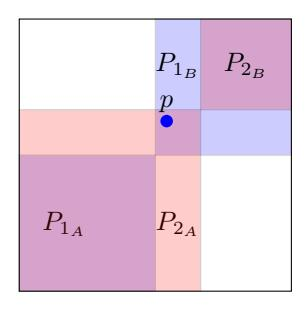

Fig. 12. Here we can see P<sup>1</sup> in blue and P<sup>2</sup> in red. The true minimal partition must include both P1<sup>A</sup> and P2<sup>B</sup> , as they can both independently rotate along the diagonal.

Note that P<sup>2</sup> might have contained one more square than P<sup>1</sup> for point p. In this case P<sup>1</sup> is clearly not a minimal partition, as P<sup>2</sup> has more squares.

Now, we show how to recover such a minimal partition for each possible database returned by Algorithm 6.

For each possible dataset, we create a new set of points G. We find the axis of rotation of the minimal squares. If the records that have two possible positions are dominated by k and dominate l, the axis of rotation is the main diagonal, otherwise it is the other diagonal. We shall refer to the axis of rotation as the diagonal.

For each key in the hash-map, if we have recovered two possible locations, we add them both to G, otherwise we add the recovered location and its reflection along the diagonal to G.

For example, if we have recovered p<sup>0</sup> = (1, 2), p<sup>1</sup> = [(5, 6),(6, 5)] and p<sup>2</sup> = (8, 13), and the axis of rotation is the main diagonal, graph G contains points (1, 2), (2, 1), (5, 6), (6, 5), (8, 13), (13, 8).

Once we have constructed G, we want to determine which components of the database can rotate independently without affecting the leakage. Note that by Theorem 1 in a database containing points in sets C<sup>0</sup> and C1, if all points in C<sup>0</sup> are dominated by all points in C<sup>1</sup> (and their reflections), we can replace each point in C<sup>0</sup> with its reflection, without affecting the leakage of the database.

We use G to recover such components. Our algorithm shall "walk-up" the diagonal of G and check if we can partition G in two sets of points, one of which (anti-)dominating the other, and create the desired partitions.

```
Algorithm 7: Partition(La, Ls)
```

```
1: P osDatabases = []
2: P osP oints = BetweenTheCorners(La, Ls) (Algorithm 6)
3: for P oints in P osP oints do
4: Let G be a set containing P oints' values and their
      reflections along the diagonal
5: P artitions = []
6: for each (x0, x1) in the diagonal of G (in ascending order)
      do
7: Let A be all p ∈ G, such that p (anti-)dominates (x0, x1)
8: Let B be all p ∈ G, such that (x0, x1) (anti-)dominates p
9: if (x0, x1) ∈ G then
10: Remove (x0, x1) from B
11: if |A| + |B| = |G| then
12: Add a hashmap to P artitions, containing
          (p, P oints[p]), ∀p ∈ A ∩ P oints
13: Set G = B
14: Add P artitions to P osDatabases
15: Return P osDatabases
```

Lemma 7. *Algorithm 7 builds a list of hashmaps, such that the points of each hashmap can independently flip along the diagonal without altering the leakage of the underlying database in* O(n 2 `<sup>A</sup> + n`<sup>S</sup> + nN)*, which is* O(n <sup>6</sup> + nN<sup>2</sup> )*.*

*Proof.* We show that the partitions returned by Algoirhtm 7 correspond to a minimal partitions of their corresponding database. Suppose that one of the partitions, say Pbad is not minimal. We explore three cases: (i) Pbad is missing points, (ii) Pbad is a bad partition, (iii) Pbad contains a component that is not minimal.

- 1) Pbad has to contain all points in the database, as all of them end up in some hashmap in line 12.
- 2) If Pbad is a bad partition, then some point in the next component Cbad+1 does not dominate all points in Cbad. However, when Cbad was to be added as a component, G was divided into A and B, where all points in A were dominated by some point (x0, x1), and all points in B dominated (x0, x1). A became Cbad, and any points in Cbad+1 where contained in B. Thus, no point in Cbad+1 could not dominate all points in Cbad.

3) If  $P_{bad}$  contains a component that is not minimal, say  $C_{bad}$ , we can split it in  $C_{bad_1}$  and  $C_{bad_2}$ . There must exist some point  $(x_0, x_1)$  on the diagonal of the database that dominates all points in  $C_{bad_1}$  and is dominated by all points in  $C_{bad_2}$ . Since our algorithm walks up the diagonal one point at a time, it would have set  $A = C_{bad_1}$ , and would have created the correct partition. When  $(x_0, x_1)$  is in the database, it is removed from B and allowed only in A resulting in a single-point component.

Thus, the partitions returned are valid and minimal.

Algorithm 7 runs Algorithm 6 to get the list of candidate databases, which takes  $O(n^2\ell_A + n\ell_S + nN)$  time. Then, the Algorithm walks up the diagonal which takes O(N) time, and on each step it partitions the points, which takes O(n) time. Thus, Algorithm 7 takes  $O(n^2\ell_A + n\ell_S + nN)$  time.

VI-B.4. Resolve All Points: By Algorithm 7, we can determine which components in the database can independently rotate without altering the leakage. We now determine the two possible configurations for the set of points of each component.

We iterate through all partition components, and resolve their points, as in pick one of each point's (up to) two placements. If a component contains no resolved points, we pick a point randomly and fix its position. Until we have resolved all points, we pick an unresolved one randomly, and check if only one of its locations satisfies the dominance/anti-dominance ordering and the corresponding search pattern leakage. If so, we resolve it.

Algorithm 8 takes as input the search and access pattern leakage of some database D and returns a list Databases. Databases contains families of databases, each family corresponding to a different coordinate combination for the pseudocorners. A family of databases is represented by a list of lists of points, each such list of points corresponds to a square of the database that can be flipped without affecting the leakage (Theorem 1). We can generate all possible databases in the family using Algorithm 9.

**Theorem 5.** Let D be a 2D non-diagonal database with n points from a domain of size N stored using a searchable encryption scheme that leaks the access pattern (with  $\ell_A$  entries) and search pattern (with  $\ell_S$  entries). Algorithm 8 (FDR) outputs an O(n)-size encoding of all databases with search pattern leakage equivalent to that of D in time  $O(n^2\ell_A + n\ell_S + nN + n^4)$ , which is  $O(n^6 + nN^2)$ .

*Proof.* Let's first show that Algorithm 8 returns at least one database which has the same access and search pattern leakage as the original database D. Note that Algorithm 8 calls directly Algorithm 7 (Partition) and Algorithm 3(OrderReconstruction), and indirectly Algorithm 6 (BetweenTheCorners), and Algorithm 5 (PseudoCorners).

By Lemma 5, for every point p, Algorithm 5 returns a constant number of hashmaps of size at most O(n), the values of one of them being a superset of the original database (up to

```
Algorithm 8: FDR(L_a, L_s)
```

```
1: Databases = []
 2: PosDatabases = Partition(L_a, L_s) (Algorithm 7)
 3: (DComponents, ADComponents) =
     OrderReconstruction(L_a) (Algorithm 3) // We will use these
    to find the relationship between pairs of points
 5: for Database in PosDatabases do
 6:
       Done = 0
       for each square in Database do
 7:
           Let Resolved be a list with all points in square with one
 8:
 9:
           Let Unresolved be a list with all points in square with
           two placements
10:
           if Resolved is empty then
              Randomly pick a position for some point and add it to
11:
              Resolved
12:
           while there are points in Unresolved do
13:
              Let p be a random point from Unresolved
14:
15:
16:
              for each point r in Resolved do
                 Let Valid = Points[p] and r_{pr} be the number of
17:
                 search tokens that returns a set that contains r and p,
                 derived using L_s.
                 for (x_{0_n}, x_{1_n}) in Points[p] do
18:
                    if p dominates r then
19:
                       if x_{0_p} < x_{0_r} \lor x_{1_p} < x_{1_r} \lor r_{pr} \neq x_{0_r} x_{1_r} (N_0 - x_{0_p}) (N_1 - x_{1_p}) then
20:
21:
                          Remove (x_{0_p}, x_{1_p}) from Valid
                    else if r dominates p then
22:
                       if x_{0_r} < x_{0_p} \lor x_{1_r} < x_{1_p} \lor
23:
                       r_{pr} = x_{0_p} x_{1_p} (N_0 - x_{0_r}) (N_1 - x_{1_r}) then
24:
                          Remove (x_{0_p}, x_{1_p}) from Valid
25:
                    else if p anti-dominates r then
                       if x_{0_p} > x_{0_r} \vee x_{1_p} < x_{1_r} \vee
26:
                       r_{pr} = x_{0_p} x_{1_r} (N_0 - x_{0_r}) (N_1 - x_{1_p}) then
27:
                          Remove (x_{0_p}, x_{1_p}) from Valid
28:
                    else if r anti-dominates p then
                       \begin{array}{l} \text{if} \quad x_{0_r} > x_{0_p} \vee x_{1_r} < x_{1_p} \vee \\ r_{pr} = x_{0_r} x_{1_p} (N_0 - x_{0_p}) (N_1 - x_{1_r}) \quad \text{then} \end{array}
29:
                          Remove (x_{0_p}, x_{1_p}) from Valid
30:
31:
32:
                 if Valid contains one placement then
                    Resolve p, adding its valid placement to Resolved
33.
34:
                    Remove p from Unresolved
35:
                 else if Valid is empty then
36:
                    Remove database from PosDatabases and go to
                    line 5
37:
           Add Resolved to Done.
       Construct D' with all points in Done
38:
39:
       if D' leakage's is not equivalent to L_s then
40:
           Add Done to Databases
41: Return Databases
```

Symmetries). Using Algorithm 7, we are able to partition the points of each hashmap into minimal components, such that each component can flip along the diagonal (Lemma 7).

Thus, one of the inputs to Algorithm 8 is a partitioned superset of the original database (up to rotation). It remains to show that our algorithm will remove any incorrect point values and keep all the correct ones on this input. The algorithm returns a list of lists of points, each list containing one of the

two possible configurations for the points. Let's focus on the unresolved points of one of the components of the partition, say C.

- 1) If C contains one (unresolved) point:
  - Because C is a member of the partition and can independently flip along the diagonal, both solutions are correct, as one is a reflection of the other. Thus, we can pick one at random, as the flipping of C encodes the information that both are valid.
- 2) If C contains more than one points and at least one of them is unresolved: Wlg, suppose that the axis of rotation is the main diagonal. If C is a chain in the dominance direction, then because C is a minimal component, the dominance order will eventually resolve any points with two locations.

If C contains two points p<sup>1</sup> and p<sup>2</sup> in an anti-dominance order, the order might not be helpful in resolving their locations. Say p<sup>1</sup> anti-dominates p2. We show that only the valid configurations (the original and its reflection along the main diagonal) satisfy the ordering and the search pattern leakage.

The possible configurations are 4: the original one, one point reflected, the other point reflected, or both points reflected. In the original configuration:

$$r_{p_1,p_2} = x_{0_{p_1}} x_{1_{p_2}} (N - x_{0_{p_2}}) (N - x_{1_{p_1}})$$

The reflection:

$$r_{p_1,p_2} = x_{0_{p_1}} x_{1_{p_2}} (N - x_{0_{p_2}}) (N - x_{1_{p_1}})$$

We can see that rp1,p<sup>2</sup> from the original and the reflection match. Below, we show if only one of them is reflected along the diagonal, the search pattern leakage changes. Suppose p<sup>2</sup> is the only one reflected, then there are 4 options:

a) p<sup>1</sup> anti-dominates p<sup>2</sup>

$$r'_{p_1,p_2} = x_{0_{p_1}} x_{0_{p_2}} (N - x_{1_{p_1}}) (N - x_{1_{p_2}}) \neq r_{p_1,p_2}$$

b) p<sup>1</sup> dominates p<sup>2</sup>

$$r'_{p_1,p_2} = x_{0_{p_1}} x_{1_{p_1}} (N - x_{1_{p_2}}) (N - x_{0_{p_2}}) \neq r_{p_1,p_2}$$

c) p<sup>2</sup> anti-dominates p<sup>1</sup>

$$r'_{p_1,p_2} = x_{0_{p_1}} x_{0_{p_2}} (N - x_{1_{p_1}}) (N - x_{1_{p_2}}) \neq r_{p_1,p_2}$$

d) p<sup>2</sup> dominates p<sup>1</sup>

$$r'_{p_1,p_2} = x_{0_{p_2}} x_{1_{p_2}} (N - x_{1_{p_1}}) (N - x_{0_{p_1}}) \neq r_{p_1,p_2}$$

We conclude that Algorithm 8 returns the family of databases whose search pattern leakage is equivalent to that of the original database, D.

The time complexity of the algorithm follows from the running time of the invoked Algorithm 7 (Partition) (see Lemma 7) and the fact that it goes next though all unresolved points and for each, generates a constant number of new databases and compares their search pattern leakage with that of the original databases, which takes O(n`S) time. Thus, Algorithm 8 terminates in O(n 2 `<sup>A</sup> + nN + n 2 `S) = O(n <sup>6</sup> + n <sup>2</sup>N<sup>2</sup> ) time.

There are a constant number of possible coordinate combinations for the pseudo-corners, and each combination corresponds to a family of databases encoded in O(n) space. Thus, the encoding is of size O(n).

# *VI-C. Generating All Databases*

Using the succint representation produced by Algorithm 4 (DiagonalFDR) or Algorithm 8 (FDR) of all possible databases that have the same access and search pattern leakage as the original database, Algorithm 9 can be used to enumerate all such databases. At this point, we can also recover how many records are stored at each value by reversing unifying the responses in Section IV.

# Algorithm 9: GeneratingAllDatabases(La, Ls)

- 1: Let Databases be the output of Algorithm 4 or 8
- 2: Let Results be the empty set
- 3: for each Family in Databases do
- 4: for each combination of flips of the components (squares) of Family do
- 5: Let D be the resulting database
- 6: Add D and its Symmetries to Results
- 7: Return Results

#### VII. EXPERIMENTS

We have experimented with out attack using a location dataset containing mobile phone records of Malte Spitz, a German Green party politician, stored by Deutsche Telekom, and contributed by Malte Spitz to Crawdad [19]. This dataset was previously used in [14], [15] for experiments on their 1D database attacks by mapping 2D points to 1D points with a space-filling curve and performing a reconstruction on the resulting 1D database.

To illustrate the complexity of the reconstruction, we choose to reconstruct the location data from August 31st 2009, as the corresponding database has one long dominance component and multiple anti-dominance components (see Figure 13). To obtain integer values, we multiplied latitude and longitude by 1000 and rounded the result.

With our order reconstruction algorithm, we first reconstruct the dominance and anti-dominance order in Figure 14.

Now that the order has been reconstructed, since the database is not diagonal, we pick f, g and b. We first locate g. As we can see in Figure 15, we look at two curves for g coming from Equations 15 and 21. There are two possible solutions g and g 0 . Upon further investigation, g 0 (the curves' second intersection) does not have integer coordinates, and thus there is a unique solution for g (up to rotation). We then use equations 13 and 16 to solve for the coordinates of f. There are two possible solutions for f, but one violates the dominance order, and thus is incorrect. Finally, we use Equations 14, 17 and 22 to locate b. Similarly, we pick and locate k, l and h. There are two choices for both k and h, but one of each violates the dominance order.

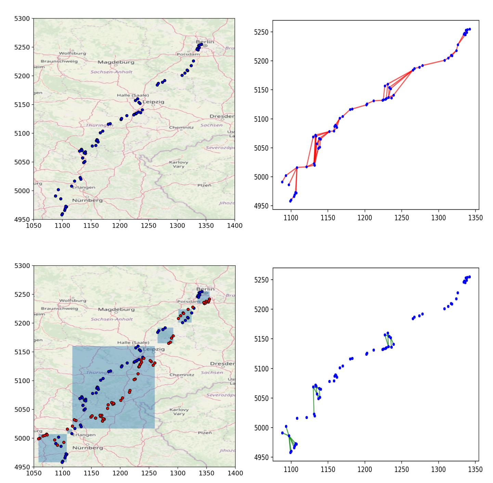

Fig. 13. The Malte Spitz location dataset for 08/31/2009 has 200 points and 62 unique ones.

Fig. 14. The database has a single dominance component and multiple antidominance components.

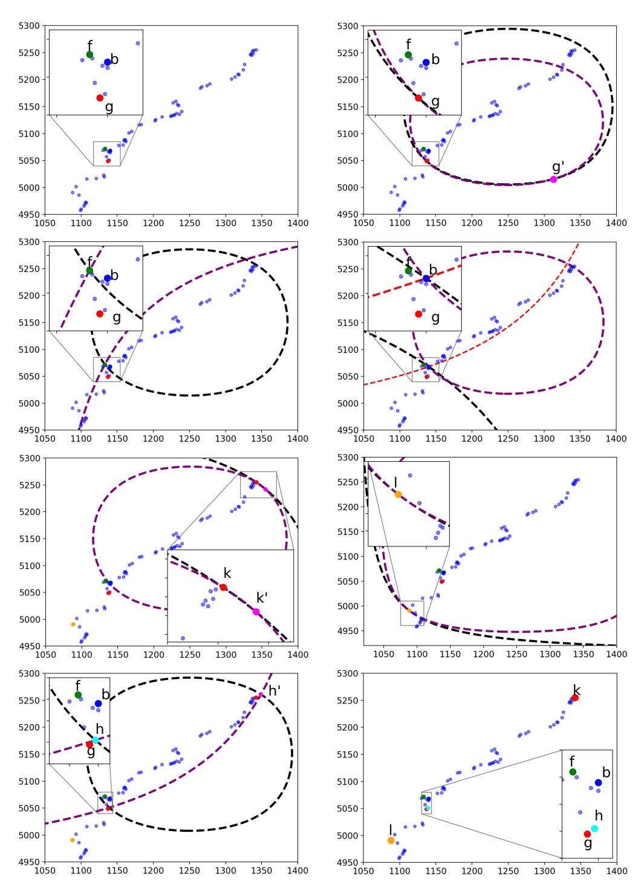

Fig. 15. Using Algorithm 5, Pseudo-Corners(La, Ls), we locate the positions of f, b, g, k, l, and h.

Algorithm 5 uses the pseudo-corners to determine one or two possible positions for every point. In Figure 16, we can see all recovered possible positions, which are then used by Algorithm 7 to determine which components of the database can independently flip (Figure 17).

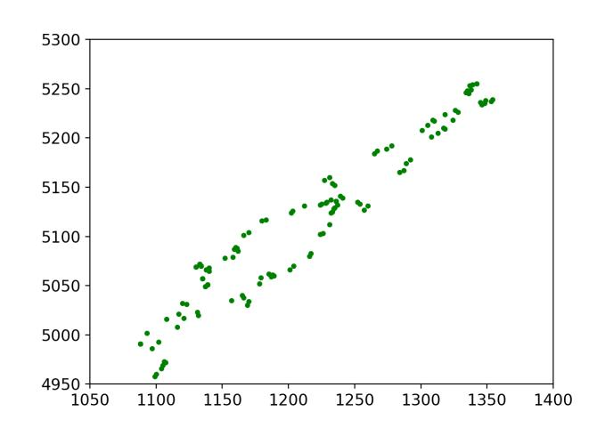

Fig. 16. Using Algorithm 6, BetweenTheCorners(La, Ls), we determine that there are points in some of the green positions.

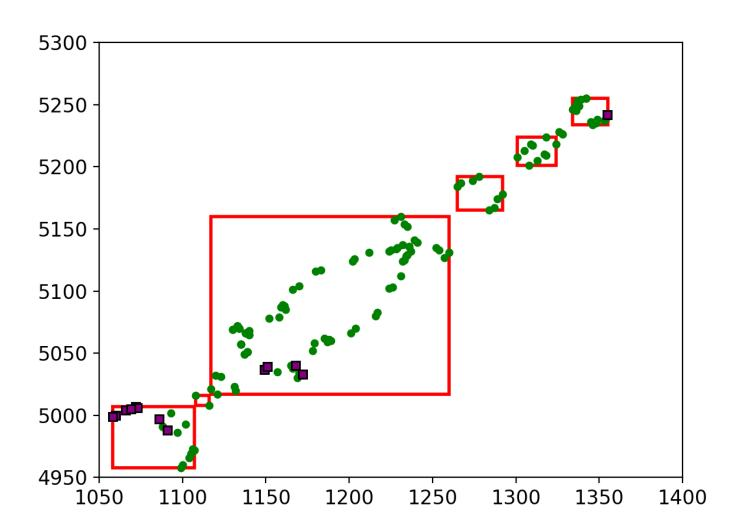

Fig. 17. Using Algorithm 7, we determine which components of the database can independently flip (red squares). We can see all points in G in this figure, the green points are the recovered ones, and the purple ones are the reflection of points that had a unique recovered position.

Finally, Algorithm 8 determines the relative positions of the set of points in each component. By Theorem 1, we cannot determine if the points take the red or blue configuration (Figure 18), but we know it is one of the two.

## VIII. CONCLUSION & OPEN PROBLEMS

Searchable encryption can be instrumental in ensuring the privacy of data currently under threat of data breaches. In order to understand the security guarantees of searchable encryption

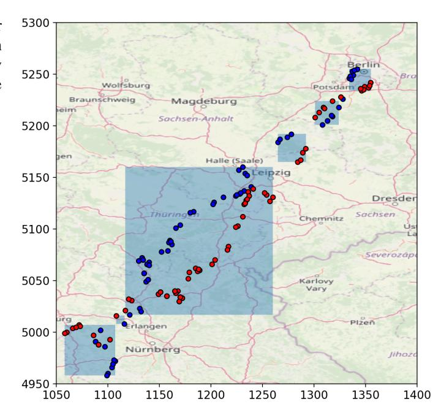

Fig. 18. The reconstructed database. Each box can independently flip along the diagonal without affecting the corresponding leakage of the new database.

schemes, we must understand the vulnerabilities introduced by their leakage.

There has been considerable work exploiting the access and search pattern leakage in one-dimensional databases that support range queries. Our paper shows that access and search pattern leakage can be exploited in two dimensions as well. As a fundamental limitation of attacks, we show there can be an exponential number of databases that produce equivalent leakage. Nevertheless, we develop attacks that reconstruct the family of such databases. Our attacks work in polynomial time and return a linear-size output.

There are a number of open problems remaining in this area. The time complexity of our attacks may be reduced with clever data structures. One could explore if we can reconstruct twodimensional databases that contain horizontally or vertically aligned points, or with less information. In particular, one may be able to achieve full or partial reconstruction using a subset of all possible responses or queries. Such a subset may be further obtained from a known or unknown query distribution. Finally, it would be interesting to explore reconstruction attacks in databases of arbitrary dimension, possibly extending the techniques of this paper.

#### ACKNOWLEDGMENT

We would like to thank Evgenios Kornaropoulos for providing insights in early stages of this work.

#### REFERENCES

- [1] David Cash, Paul Grubbs, Jason Perry, and Thomas Ristenpart. Leakageabuse attacks against searchable encryption. In *Proc. ACM Conf. on Computer and Communications Security*, CCS, 2015.
- [2] Reza Curtmola, Juan Garay, Seny Kamara, and Rafail Ostrovsky. Searchable symmetric encryption: Improved definitions and efficient constructions. *Journal of Computer Security*, 2011.
- [3] Dawn Xiaoding Song, D. Wagner, and A. Perrig. Practical techniques for searches on encrypted data. In *Proc. IEEE Symp. on Security and Privacy*, SP, 2000.
- [4] F. Betul Durak, Thomas M. DuBuisson, and David Cash. What else ¨ is revealed by order-revealing encryption? In *Proc. ACM Conf. on Computer and Communications Security*, CCS, 2016.
- [5] B. Fuller, M. Varia, A. Yerukhimovich, E. Shen, A. Hamlin, V. Gadepally, R. Shay, J. D. Mitchell, and R. K. Cunningham. SoK: Cryptographically protected database search. In *Proxc. IEEE Symposium on Security and Privacy (SP)*, May 2017.
- [6] P. Grubbs, M. Lacharite, B. Minaud, and K. G. Paterson. Learning to ´ reconstruct: Statistical learning theory and encrypted database attacks. In *Proc. IEEE Symp. on Security and Privacy*, 2019.
- [7] P. Grubbs, K. Sekniqi, V. Bindschaedler, M. Naveed, and T. Ristenpart. Leakage-abuse attacks against order-revealing encryption. In *Proc. IEEE Symp. on Security and Privacy*, SP, 2017.
- [8] Paul Grubbs, Marie-Sarah Lacharite, Brice Minaud, and Kenneth G. Paterson. Pump up the volume: Practical database reconstruction from volume leakage on range queries. In *Proc. ACM Conf. on Computer and Communications Security*, CCS, 2018.
- [9] Paul Grubbs, Marie-Sarah Lacharite, Brice Minaud, and Kenneth G. ´ Paterson. Pump up the volume: Practical database reconstruction from volume leakage on range queries. In *Proc. ACM Conf. on Computer and Communications Security*, 2018.
- [10] Paul Grubbs, Richard McPherson, Muhammad Naveed, Thomas Ristenpart, and Vitaly Shmatikov. Breaking web applications built on top of encrypted data. In *Proc. ACM Conf. on Computer and Communications Security*, CCS, 2016.
- [11] Paul Grubbs, Thomas Ristenpart, and Vitaly Shmatikov. Why your encrypted database is not secure. In *Proc. Workshop on Hot Topics in Operating Systems*, HotOS, 2017.
- [12] Seny Kamara, Charalampos Papamanthou, and Tom Roeder. Dynamic searchable symmetric encryption. In *Proc. ACM Conf. on Computer and Communications Security*, CCS. ACM, 2012.
- [13] Georgios Kellaris, George Kollios, Kobbi Nissim, and Adam O'Neill. Generic attacks on secure outsourced databases. In *Proc. ACM Conf. on Computer and Communications Security*, 2016.
- [14] Evgenios M. Kornaropoulos, Charalampos Papamanthou, and Roberto Tamassia. Data recovery on encrypted databases with k-nearest neighbor query leakage. In *Proc. IEEE Symp. on Security and Privacy*, 2019.
- [15] Evgenios M. Kornaropoulos, Charalampos Papamanthou, and Roberto Tamassia. The state of the uniform: Attacks on encrypted databases beyond the uniform query distribution. In *Proc. IEEE Symp.on Security and Privacy*, 2020. To appear.
- [16] Marie-Sarah Lacharite, Brice Minaud, and Kenneth G Paterson. Im- ´ proved reconstruction attacks on encrypted data using range query leakage. In *Proc. IEEE Symp. on Security and Privacy*, 2018.
- [17] Evangelia Anna Markatou and Roberto Tamassia. Full database reconstruction with access and search pattern leakage. In *Proc. Int. Conf on Information Security*, ISC, 2019.
- [18] David Pouliot and Charles V. Wright. The shadow nemesis: Inference attacks on efficiently deployable, efficiently searchable encryption. In *Proc. ACM Conf. on Computer and Communications Security*, CCS, 2016.
- [19] Malte Spitz. CRAWDAD dataset spitz/cellular (v. 2011-05-04). Downloaded from https://crawdad.org/spitz/cellular/20110504, May 2011.
- [20] Yupeng Zhang, Jonathan Katz, and Charalampos Papamanthou. All your queries are belong to us: The power of file-injection attacks on searchable encryption. In *Proc. USENIX Security Symposium*, 2016.