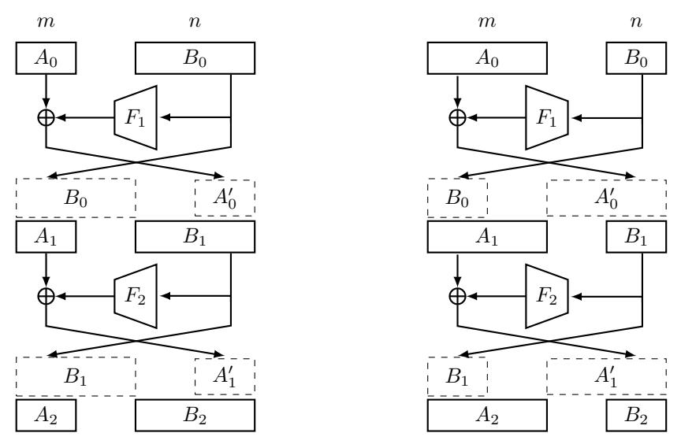
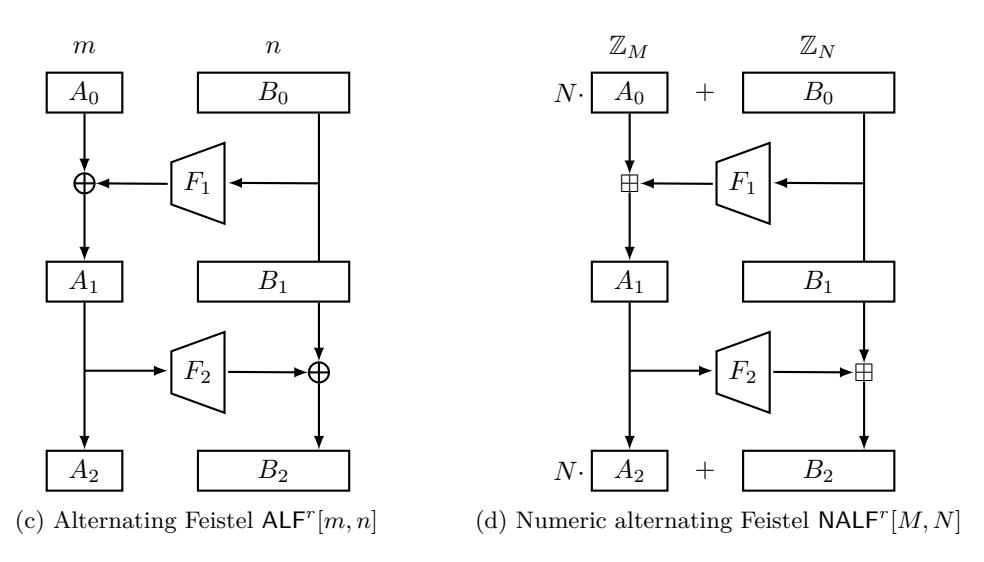
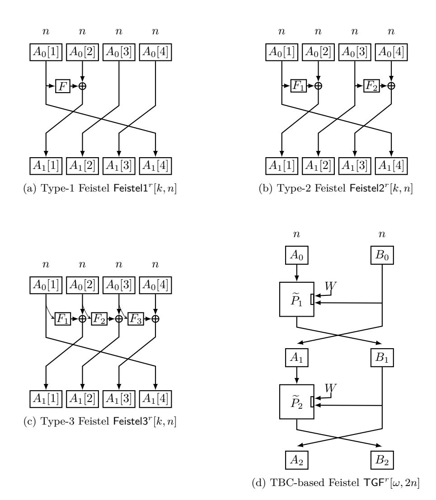

# **Improved Security Bounds for Generalized Feistel Networks**

Yaobin Shen1 , Chun Guo23() and Lei Wang1()

**Abstract.** We revisit the security of various generalized Feistel networks. Concretely, for unbalanced, alternating, type-1, type-2, and type-3 Feistel networks built from random functions, we substantially improve the coupling analyzes of Hoang and Rogaway (CRYPTO 2010). For a tweakable blockcipher-based generalized Feistel network proposed by Coron et al. (TCC 2010), we present a coupling analysis and for the first time show that with enough rounds, it achieves 2*n*-bit security, and this provides highly secure, double-length tweakable blockciphers.

**Keywords:** Block ciphers · Coupling · Tweakable block ciphers · Generalized Feistel networks · Provable security · Mode of operation

## **1 Introduction**

## **1.1 Feistel Networks**

Feistel networks consist of several iterative applications of a simple Feistel permutation

$$\Psi^{F_i}(A,B) = (B, A \oplus F_i(B)) \tag{1}$$

for a domain-preserving function *Fi* : {0*,* 1} *n* → {0*,* 1} *n* that is typically called its round function. Such networks are not only the high level abstraction of a large number of modern blockciphers including the Data Encryption Standard (DES) [\[FNS75,](#page-19-0) [Smi71\]](#page-22-0), but also widely used in many other crypto systems (e.g., inverse-free authenticated encryption [\[Min14\]](#page-20-0)).

A popular approach to analyzing the security of Feistel networks, pioneered by Luby and Rackoff [\[LR88\]](#page-20-1), is to model the round function *Fi* as a secret random function. This allows proving its information theoretic indistinguishability, i.e., any *distinguisher* should not be able to distinguish the Feistel network from a random permutation on 2*n*-bit strings. With this model, Luby and Rackoff proved the security for 4-round Feistel networks, following which a long series of work has established either better security bounds [\[Pat90,](#page-21-0) [Mau93,](#page-20-2) [MP03,](#page-20-3) [Vau03,](#page-22-1) [Pat04,](#page-21-1) [HR10a,](#page-19-1) [Pat10\]](#page-21-2) or reduced construction complexity [\[SP93,](#page-22-2) [Pat93,](#page-21-3) [Nan10,](#page-21-4) [Nan15\]](#page-21-5).

#### **1.2 Generalized Feistel Networks (GFNs)**

The above classical Feistel networks could be generalized in various manners. Concretely, replacing the domain preserving round function *Fi* by expanding or contracting ones

1 Department of Computer Science and Engineering, Shanghai Jiao Tong University, Shanghai, China

2 Key Laboratory of Cryptologic Technology and Information Security of Ministry of Education, Shandong University, Qingdao, Shandong, 266237, China

3 School of Cyber Science and Technology, Shandong University, Qingdao, Shandong, China [yb\\_shen@sjtu.edu.cn,chun.guo@sdu.edu.cn,wanglei\\_hb@sjtu.edu.cn](mailto:yb_shen@sjtu.edu.cn, chun.guo@sdu.edu.cn, wanglei_hb@sjtu.edu.cn)

results in unbalanced Feistel [SK96]; using expanding and contracting round functions in an alternative manner results in alternating Feistel [AB96, Luc96]; finally, partitioning the inputs into more than two blocks (or branches) results in multi-line generalized Feistel, and the (probably) most popular instances are Type-1, Type-2, and Type-3 Feistel networks [ZMI90], that differ in the relations among the branches. Compared to classical Feistel, the improved flexibility of GFNs significantly widens their application spectrum, ranging from ultra-lightweight blockciphers [SIH+11], full-domain secure encryption [MRS09], and wide cryptographic permutations [GM16].

Information theoretic security of GFNs could be analyzed in a model similar to classical Feistel, with various "birthday-bound" results showed in [NR99, MRS09, AB96, BR02, BRRS09, Luc96, ZMI90] and "beyond-birthday-bound" results found in [HR10a, Pat10]. Most importantly to this paper, Hoang and Rogaway (henceforth "HR") [HR10a] proved asymptotically optimal security for all the aforementioned types of GFNs via the coupling technique. In detail, with a sufficient number of rounds, all the aforementioned GFNs are CCA-secure up to  $2^{n(1-\varepsilon)}$  adversarial queries for any  $\varepsilon > 0$ . Though appearing nice, it requires a large number of rounds to asymptotically achieve n-bit security.

#### 1.3 Tweakable Blockcipher-based GFN

Tweakable permutation (TP) and tweakable blockciphers (TBC) were introduced by Liskov et al. [LRW02]: the former models a family of (efficiently invertible) permutations indexed by a parameter called the tweak, and the latter is a family of keyed TPs. With such primitives, the round function  $F_i$  of GFN may be replaced by some other primitives such as a TBC/TP, resulting in more possibilities.

As a concrete instance, Coron et al. [CDMS10] proposed a GFN that turns an n-bit TP with  $\omega$ -bit tweak ( $\omega > n$ ) into a 2n-bit TP with ( $\omega - n$ )-bit tweak, i.e., it trades the domain with the tweak space. As tweak extension is generally easier [CDMS10, MI15], this gives rise to a domain extender for TPs/TBCs. In this paper we denote by  $\mathsf{TGF}^r[\omega, 2n]$  the r-round variant of Coron et al.'s construction. Coron et al. prove that  $\mathsf{TGF}^r[\omega, 2n]$  achieves birthday  $2^{n/2}$  CCA security when r=2, and optimal  $2^n$  CCA security when r=3. However, note that the size of the inputs to the underlying TP is actually larger than 2n-bit (i.e., n-bit block plus  $\omega$ -bit tweak). As recently pointed out by Lee and Lee [LL18], the classical-sense optimal  $2^n$  security is actually the birthday-bound for such a TP Motivated by Lee and Lee's  $2^{4n/3}$  secure TBC construction, it's tempting to ask if similar beyond  $2^n$  security results could be proved for  $\mathsf{TGF}^r[\omega, 2n]$  with  $r \geq 4$  rounds.

#### 1.4 Our Contributions

For all the GFNs mentioned before, we either improve existing coupling analyzes or present new when non-existing. Concretely, motivated by Lampe and Seurin [LS15] and Nachef et al.'s [NPV17], we improve the coupling analyzes of HR [HR10a, HR10b], and prove the following results:

- For unbalanced Feistel UBFr[m, n], when  $n \geq m$ , we prove  $\frac{2q}{t+1}(\frac{4\lceil \frac{n}{m}\rceil q + 4q}{2^n})^t$  security bound at  $(2\lceil \frac{n}{m}\rceil + 2)t + 2\lceil \frac{n}{m}\rceil + 1$  rounds. The bound is comparable to HR's  $\frac{2q}{t+1}(\frac{(3\lceil \frac{n}{m}\rceil + 3)q}{2^n})^t$ , while the number of rounds is almost halved from HR  $(4\lceil \frac{n}{m}\rceil + 4)t$ . When n < m, we prove  $\frac{2q}{t+1}(\frac{4\lceil \frac{m}{n}\rceil q}{2^n})^t$  security bound (the same as HR's bound) at  $4t + 2\lceil \frac{n}{m}\rceil + 1$  rounds which is much smaller than HR's  $(2\lceil \frac{m}{n}\rceil + 4)t$  rounds.
- For alternating Feistel  $\mathsf{ALF}^r[m,n]$ , we prove  $\frac{2q}{t+1}(\frac{6\lceil\frac{n}{m}\rceil q+3q}{2^n})^t$  security bound with  $(12\lceil\frac{n}{m}\rceil+2)t+5$  rounds (compared with  $\frac{2q}{t+1}(\frac{(6\lceil\frac{n}{m}\rceil+3)q}{2^n})^t$  with  $(12\lceil\frac{n}{m}\rceil+8)t$  rounds of HR). The same improvement holds for numeric alternating Feistel.

| describe the scheme and $t$ determines the number of rounds $r$ . |                                                                                                        |                                                 |                                                                                  |                                                                      |
|-------------------------------------------------------------------|--------------------------------------------------------------------------------------------------------|-------------------------------------------------|----------------------------------------------------------------------------------|----------------------------------------------------------------------|
| Scheme                                                            | Previous Bound                                                                                         | #rounds                                         | Our Bound                                                                        | #rounds                                                              |
| $UBF^r[m,n]$                                                      |                                                                                                        |                                                 |                                                                                  |                                                                      |
| $n \ge m$                                                         | $\frac{2q}{t+1} \left( \frac{\left(3 \left\lceil \frac{n}{m} \right\rceil + 3\right)q}{2^n} \right)^t$ | $(4\lceil \frac{n}{m} \rceil + 4)t$ [HR10a]     | $\frac{2q}{t+1} \left( \frac{4 \lceil \frac{n}{m} \rceil q + 4q}{2^n} \right)^t$ | $(2\lceil \frac{n}{m} \rceil + 2)t + 2\lceil \frac{n}{m} \rceil + 1$ |
| n < m                                                             | $\frac{2q}{t+1} \left( \frac{4 \lceil \frac{m}{n} \rceil q}{2^n} \right)^t$                            | $(2\lceil \frac{m}{n} \rceil + 4)t$ [HR10a]     | $\frac{2q}{t+1} \left( \frac{4 \lceil \frac{n}{m} \rceil q}{2^n} \right)^t$      | $4t + 2\lceil \tfrac{n}{m} \rceil + 1$                               |
| $ALF^r[m,n]$                                                      | $\frac{2q}{t+1} \left( \frac{(6\lceil \frac{n}{m} \rceil + 3)q}{2^n} \right)^t$                        | $(12\lceil \frac{n}{m} \rceil + 8)t$ [HR10a]    | $\frac{2q}{t+1} \left( \frac{6 \lceil \frac{n}{m} \rceil q + 3q}{2^n} \right)^t$ | $(12\lceil \frac{n}{m}\rceil + 2)t + 5$                              |
| $NALF^r[M,N]$                                                     | $\tfrac{2q}{t+1}\big(\tfrac{(6\lceil\log_M N\rceil+3)q}{N}\big)^t$                                     | $(12\lceil\log_M N\rceil + 8)t \text{ [HR10a]}$ | $\frac{2q}{t+1} \left( \frac{6\lceil \log_M N \rceil q + 3q}{N} \right)^t$       | $(12\lceil\log_M N\rceil+2)t+5$                                      |
| $Feistel1^r[k,n]$                                                 | $\frac{2q}{t+1} \left( \frac{2k(k^2-k+1)q}{2^n} \right)^t$                                             | $(2k^2 + 2k)t$ [HR10b]                          | $\frac{2q}{t+1} \left( \frac{2k(k-1)q}{2^n} \right)^t$                           | $(k^2 + k - 2)t + 1$                                                 |
| $Feistel2^r[k,n]$                                                 | $\frac{2q}{t+1} \left( \frac{2k(k-1)q}{2^n} \right)^t$                                                 | (2k+2)t [HR10b]                                 | $\frac{2q}{t+1} \left( \frac{2k(k-1)q}{2^n} \right)^t$                           | 2kt + 1                                                              |
| $Feistel3^r[k,n]$                                                 | $\frac{2q}{t+1} \left( \frac{4(k-1)^2 q}{2^n} \right)^t$                                               | (k+4)t [HR10b]                                  | $\frac{2q}{t+1} \left( \frac{4(k-1)^2 q}{2^n} \right)^t$                         | (k+2)t+1                                                             |
| $TGF^r[\omega,2n]$                                                | $\frac{q}{2^n}$                                                                                        | 3 [CDMS10]                                      | $2 \cdot \left(\frac{q}{t+1} \left(\frac{30q}{2^{2n}}\right)^t\right)^{1/2}$     | 4t+2                                                                 |

Table 1: Summary of improved CCA bounds in this paper. The rows correspond to the generalized Feistel networks illustrated in Fig. 1 and Fig. 2. Parameters  $k, m, n, \omega, M, N$  describe the scheme and t determines the number of rounds r.

- For multi-line GFNs Feistel1r[k, n] and Feistel2r[k, n], we prove  $\frac{2q}{t+1} \left(\frac{2k(k-1)q}{2^n}\right)^t$  security bound with  $(k^2+k-2)t+1$  rounds, and  $\frac{2q}{t+1} \left(\frac{2k(k-1)q}{2^n}\right)^t$  with 2kt+1 rounds resp. (compared with  $\frac{2q}{t+1} \left(\frac{2k(k^2-k+1)q}{2^n}\right)^t$  with  $(2k^2+2k)t$  rounds, and  $\frac{2q}{t+1} \left(\frac{2k(k-1)q}{2^n}\right)^t$  with (2k+2)t rounds of HR resp.).
- for type-3 GFN Feistel3r[k, n], we prove  $\frac{2q}{t+1}(\frac{4(k-1)^2q}{2^n})^t$  security bound with (k+2)t+1 rounds (compared with  $\frac{2q}{t+1}(\frac{4(k-1)^2q}{2^n})^t$  with (k+4)t rounds of HR).

For the TBC-based GFN  $\mathsf{TGF}^r[\omega,2n]$ , we present the first coupling analysis and prove  $2\cdot\left(\frac{q}{t+1}\left(\frac{30q}{2^{2n}}\right)^t\right)^{1/2}$  security bound with 4t+2 rounds. This for the first time establishes beyond the birthday bound  $2^n$  for  $\mathsf{TGF}^r[\omega,2n]$ . Moreover, it also approaches  $2^{2n}$  as the number of rounds t increases. This gives rise to double-length blockciphers with high security: for example, when Deoxys-BC-256 is used, 10 rounds achieve  $2^{\frac{4\times128}{3}}\approx 2^{170}$  security. While the efficiency is relatively low, the high security bounds make it suitable in specific application.

#### 1.4.1 Core Ideas for Improvements

Our improvements upon HR [HR10a] are due to more fine-grained analyses of the coupling probabilities. To further illustrate, consider for example the unbalanced Feistel with contracting round functions with domain  $\{0,1\}^n$  and  $\{0,1\}^m$   $(n \ge m)$ . HR treated the construction as  $2\lceil n/m\rceil + 2$  round small "chunks", and analyzed the latter in turn. Inside each chunk, the probability that the couple fails is at most  $3\lceil n/m\rceil\ell/2^n$ . Since events in distinct chunks are independent, the final coupling probability easily follows. However, a close inspection shows that, in fact,  $\lceil n/m\rceil + 1$  rounds (i.e., half of the size of the chunk) are already sufficient for a coupling to succeed. It seems that HR's use of the additional  $\lceil n/m\rceil + 1$  rounds was intended to create a strong independence between distinct chunks and cinch a quite modular argument (as mentioned, they could focus on what happens inside a single chunk), but we are able to have a more dedicated analysis as follows:

- First, as mentioned, we narrow each chunk. Our more fine-grained analysis shows that events in distinct chunks remain independent even if chunks are smaller;
- Second, we add several rounds at the "beginning" of the construction, so that after these rounds, the intermediate values of the two evaluations (that will be considered

(a) Unbalanced Feistel UBF*r* [*m, n*] with *m* ≤ *n* (b) Unbalanced Feistel UBF*r* [*m, n*] with *m > n*

Figure 1: Unbalanced and alternating Feistel

during the coupling) will be somewhat random and collision-free. This is crucial for the coupling arguments (as in the balanced case [\[LS15\]](#page-20-7)).

As such, ultimately we are able to have a comparable bound with almost a half number of rounds.

#### **1.5 Other Related Works**

Besides information theoretic indistinguishability, existing results on GFNs mainly concentrated on structural refinements, including e.g. improving the shuffle in multi-line GFNs [\[SM10\]](#page-22-5), refining the models to fit into the so-called Feistel-2 model [\[LS15,](#page-20-7) [GW18\]](#page-19-7),

Figure 2: Type-1,2,3 Feistel and TBC-base Feistel

and discussing the practical security of using substitution-permutation-style round functions [\[BS13\]](#page-19-8).

#### **1.6 Organization**

The rest of this paper is organized as follows. Section [2](#page-4-1) gives essential notation, security definitions and two useful mathematical lemmas. The security proofs of unbalanced Feistel cipher are detailed in Section [3.](#page-6-0) Sections [4](#page-12-0) and [5](#page-13-0) summarize the improved security bounds of alternating Feistel and multi-line Feistel (including type-1, type-2 and type-3 Feistel) respectively, and the proofs of these results can be found in Appendix [A](#page-22-6) and [B](#page-24-0) respectively. Section [6](#page-14-0) presents the coupling analysis of TBC-based GFN. Section [7](#page-18-2) concludes the paper.

## **2 Preliminaries**

**Notations.** If X is a set, then *X* \$←− X denotes the operation of picking *X* from X uniformly at random. The bit length of a string *X* is denoted by |*X*|. Concatenation of strings X and Y is written as either X||Y or simply XY. We denote  $X \oplus Y$  the bitwise exclusive-or of two equal-length bit strings. For a string X, we denote by  $\mathsf{ls}_n(X)$  the last n bits of X,  $\mathsf{ms}_n(X)$  the first n bits of X for  $1 \le n \le |X|$ . We denote by [a;b] the set of integers i such that  $a \le i \le b$ .

**Security Definitions.** We denote by  $\operatorname{Func}(n,m)$  the set of all functions from  $\{0,1\}^n$  to  $\{0,1\}^m$ , and by  $\operatorname{Perm}(\mathcal{M})$  the set of all permutations on  $\mathcal{M}$ . Let  $\widetilde{\operatorname{Perm}}(\mathcal{T},\mathcal{M})$  be the set of all functions  $\widetilde{P}:\mathcal{T}\times\mathcal{M}\to\mathcal{M}$  such that for each  $t\in\mathcal{T},\ \widetilde{P}(t,\cdot)$  is a permutation on  $\mathcal{M}$ . A blockcipher  $E:\mathcal{K}\times\mathcal{M}\to\mathcal{M}$  is a family of permutations, where  $E_K(\cdot)=E(K,\cdot)$  is a permutation over  $\mathcal{M}$ . A tweakable blockcipher  $\widetilde{E}:\mathcal{K}\times\mathcal{T}\times\mathcal{M}\to\mathcal{M}$  is a family of permutations, where  $\widetilde{E}(K,t,\cdot)$  is a permutation over  $\mathcal{M}$ . We define two types of attacks with respect to the way the adversary makes its queries to the oracles, namely non-adaptive chosen-plaintext attack (NCPA) and (adaptive) chosen-plaintext and chosen-ciphertext attack (CCA).

For any q, we define the NCPA security of a block cipher  $E/{\rm a}$  tweakable block cipher  $\widetilde{E}$  as

$$\begin{split} \mathbf{Adv}_E^{\mathsf{ncpa}}(q) &= \max_A | \Pr[K \xleftarrow{\$} \mathcal{K} : A^{E_K(\cdot)} = 1] - \Pr[\pi \xleftarrow{\$} \mathsf{Perm}(\mathcal{M}) : A^{\pi(\cdot)} = 1] |, \\ \mathbf{Adv}_{\widetilde{E}}^{\widetilde{\mathsf{ncpa}}}(q) &= \max_A | \Pr[K \xleftarrow{\$} \mathcal{K} : A^{\widetilde{E}_K(\cdot, \cdot)} = 1] - \Pr[\widetilde{\pi} \xleftarrow{\$} \widetilde{\mathsf{Perm}}(\mathcal{T}, \mathcal{M}) : A^{\widetilde{\pi}(\cdot, \cdot)} = 1] |, \end{split}$$

where the maximum is taken over all distinguishers A that asks at most q non-adaptively chosen oracle queries. Similarly, we define the CCA security of  $E/\widetilde{E}$  as

$$\begin{split} \mathbf{Adv}_{E}^{\mathsf{cca}}(q) &= \max_{A} | \Pr[K \overset{\$}{\leftarrow} \mathcal{K} : A^{E_{K}(\cdot), E_{K}^{-1}(\cdot)} = 1] - \Pr[\pi \overset{\$}{\leftarrow} \mathsf{Perm}(\mathcal{M}) : A^{\pi(\cdot), \pi^{-1}(\cdot)} = 1] |, \\ \mathbf{Adv}_{\widetilde{E}}^{\widetilde{\mathsf{cca}}}(q) &= \max_{A} | \Pr[K \overset{\$}{\leftarrow} \mathcal{K} : A^{\widetilde{E}_{K}(\cdot, \cdot), \widetilde{E}_{K}^{-1}(\cdot, \cdot)} = 1] - \Pr[\widetilde{\pi} \overset{\$}{\leftarrow} \widetilde{\mathsf{Perm}}(\mathcal{T}, \mathcal{M}) : A^{\widetilde{\pi}(\cdot, \cdot), \widetilde{\pi}^{-1}(\cdot, \cdot)} = 1] |, \end{split}$$

where the maximum is taken over all distinguishers A that asks at most q oracle queries.

**Mathematical Foundations.** Given a finite event space  $\Omega$ , let  $\mu$  and  $\nu$  be two probability distributions defined on  $\Omega$ . The statistical distance (or total variation distance) between  $\mu$  and  $\nu$  is defined as

$$\|\mu - \nu\| = \frac{1}{2} \sum_{x \in \Omega} |\mu(x) - \nu(x)|.$$

A coupling of  $\mu$  and  $\nu$  is a pair of random variables (X,Y) over  $\Omega \times \Omega$  such that  $X \sim \mu$  and  $Y \sim \nu$ . In other words, (X,Y) has marginal distributions  $\mu$  and  $\nu$ . We will use the following fundamental result of the coupling technique. The proof of this result can be found in [LPS12].

**Lemma 1** (Coupling Lemma). Let  $\mu$  and  $\nu$  be two probability distributions on a finite event space  $\Omega$ . Let random variable (X,Y) be a coupling of  $\mu$  and  $\nu$ . Then  $\|\mu - \nu\| \leq \Pr[X \neq Y]$ .

In some of our proofs, we will need to use the following inequality.

**Lemma 2** (Maclaurin's inequality). Given integers  $m \ge t \ge 1$ , and non-negative real numbers  $a_1, \ldots, a_m$ , one has

$$\sum_{1 \leq \ell_1 \ldots \leq \ell_t \leq m} a_{\ell_1} \cdots a_{\ell_t} \leq \frac{\binom{m}{t}}{m^t} \left(\sum_{i=1}^m a_i\right)^t.$$

## 3 Unbalanced Feistel

**Definition of the Scheme.** Given a function  $F:\{0,1\}^n \to \{0,1\}^m$ , define the permutation  $\Psi_F$  over  $\{0,1\}^{m+n}$  as  $\Psi_F(A,B) = (B,A \oplus F(B))$  where A and B are respectively the first m bits and the last n bits of the input, and  $\oplus$  is the operation of bitwise exclusive-or. An unbalanced Feistel cipher with r rounds is specified by r round functions  $F_1,\ldots,F_r$  from  $\{0,1\}^n \to \{0,1\}^m$ , and will be denoted as  $\mathsf{UBF}^r[m,n]:\mathcal{K}\times\{0,1\}^{m+n}$ . It has key space  $\mathcal{K}=(\mathsf{Func}(n,m))^r$  and message space  $\{0,1\}^{m+n}$ , and a key  $(F_1,\ldots,F_r)\in\mathcal{K}$  names the permutation  $\Psi_{F_r}\circ\cdots\circ\Psi_{F_1}$  on  $\{0,1\}^{m+n}$ . See Fig. 1a and Fig. 1b for illustrations.

We first prove the NCPA-security of  $\mathsf{UBF}^r[m,n]$  by the way of coupling, then lift this to CCA-security by using a composition lemma from [MP03]. For  $0 \le \ell \le q-1$ , we denote  $\mu_\ell$  the distribution of the  $(\ell+1)$  outputs of the  $\mathsf{UBF}^r[m,n]$  when it receives  $(\ell+1)$  distinct inputs  $(X_1,\ldots,X_\ell,X_{\ell+1})$ , and  $\mu_{\ell+1}$  the distribution of the  $(\ell+1)$  outputs of the  $\mathsf{UBF}^r[m,n]$  when it receives  $(X_1,\ldots,X_\ell,U_{\ell+1})$ , where  $U_{\ell+1}$  is chosen uniformly at random from  $\{0,1\}^{m+n}\setminus\{X_1,\ldots,X_\ell\}$ . By hybrid argument, we have

$$\mathbf{Adv}_{\mathsf{UBF}^r[m,n]}^{\mathsf{ncpa}}(q) \le \sum_{\ell=0}^{q-1} \|\mu_{\ell} - \mu_{\ell+1}\|.$$

Fix a value  $\ell \leq q-1$ , we now turn to upper bounding  $\|\mu_{\ell} - \mu_{\ell+1}\|$ . We consider two UBFr[m, n] ciphers in parallel. The first one takes as inputs  $(X_1, \ldots, X_{\ell}, X_{\ell+1})$  and the round functions are  $(F_1, \ldots, F_r)$ , while the second one takes as inputs  $(X_1, \ldots, X_{\ell}, U_{\ell+1})$  and the round functions are  $(F'_1, \ldots, F'_r)$ . Our goal is to describe a coupling of  $\mu_{\ell}$  and  $\mu_{\ell+1}$ , whose marginal distributions are  $\mu_{\ell}$  and  $\mu_{\ell+1}$  respectively.

Coupling for Contracting Round Function Case. We first consider the case when the UBF $^r[m,n]$  is instantiated with contracting round functions, i.e.,  $m \leq n$ . For  $1 \leq j \leq \ell+1$ , let  $A^j_0$  and  $B^j_0$  denote respectively the first m bits and last n bits of  $X_j$  and for  $1 \leq i \leq r$ , let  $A^j_i$  and  $B^j_i$  be recursively defined by  $A^j_i = \mathsf{ms}_m(B^j_{i-1})$  and  $B^j_i = |\mathsf{s}_{n-m}(B^j_{i-1})| A^j_{i-1} \oplus F_i(B^j_{i-1})$ . For any  $1 \leq j \leq \ell$  and  $1 \leq i \leq r$ , we simply set  $F'_i(B^j_{i-1}) = F_i(B^j_{i-1})$ . Since the first  $\ell$  queries to the second Feistel are the same as to the first Feistel, this leads to the  $\ell$  first outputs of both ciphers being identical. Let  $C^{\ell+1}_0$  and  $D^{\ell+1}_0$  denote the first m bits and the last n bits of  $U_{\ell+1}$ . We then explain how the  $(\ell+1)$ -th queries are coupled. For  $1 \leq i \leq r$ , let  $C^{\ell+1}_i$  and  $D^{\ell+1}_i$  be recursively defined by  $C^{\ell+1}_i = \mathsf{ms}_m(D^{\ell+1}_{i-1})$  and  $D^{\ell+1}_i = |\mathsf{s}_{n-m}(D^{\ell+1}_{i-1})| |C^{\ell+1}_{i-1} \oplus F'_i(D^{\ell+1}_{i-1})|$ . Let  $b = \lceil n/m \rceil$ . For the first b rounds, we couple the random outputs in the processing of  $X_{\ell+1}$  and  $U_{\ell+1}$  arbitrarily. For round i > b, we define a bad event which may happen in each Feistel cipher. We say that  $\mathsf{coll}_i$  occurs if  $D^{\ell+1}_i$  is equal to  $D^j_i$  for some  $1 \leq j \leq \ell$ , namely the input value to the (i+1)-th round function collides with the previous input values. Similarly, we say that  $\mathsf{coll}_i'$  occurs if  $D^{\ell+1}_i$  is equal to  $D^j_i$  for some  $1 \leq j \leq \ell$ . Then for  $i = b+1, \ldots, r-1$ , we define  $F'_{i+1}(D^{\ell+1}_i)$  as follows:

- if  $\operatorname{coll}_i'$  occurs, then  $F_{i+1}'(D_i^{\ell+1})$  is defined so as to ensure consistency with the earlier query (namely, if  $D_i^{\ell+1} = B_i^j$  for some  $1 \leq j \leq \ell$ , then  $F_{i+1}'(D_i^{\ell+1}) = F_{i+1}'(B_i^j)$ );
- if  $\operatorname{coll}_i'$  does not occur while  $\operatorname{coll}_i$  occur, then  $F_{i+1}'(D_i^{\ell+1})$  is chosen uniformly at random from  $\{0,1\}^m$ ;
- if neither  $\operatorname{coll}_i'$  nor  $\operatorname{coll}_i$  occurs, we then define  $F'_{i+1}(D_i^{\ell+1})$  so that  $\operatorname{ls}_m(D_{i+1}^{\ell+1}) = \operatorname{ls}_m(B_{i+1}^{\ell+1})$ :

$$F_{i+1}'(D_i^{\ell+1}) = F_{i+1}(B_i^{\ell+1}) \oplus A_i^{\ell+1} \oplus C_i^{\ell+1}.$$

It is clear that the round functions F' in the second Feistel cipher are uniformly random when defined according to the first or the second rule above. When  $F'_{i+1}(D_i^{\ell+1})$  is defined via the third rule, then  $F'_{i+1}(D_i^{\ell+1})$  is also uniformly random since  $F_{i+1}(B_i^{\ell+1})$  is uniformly random conditioned on that  $\operatorname{coll}_i$  does not occur. Hence the distribution of the outputs of the second Feistel cipher is exactly the same as  $\mu_{\ell+1}$ . If neither  $\operatorname{coll}_i$  nor  $\operatorname{coll}_i'$  occurs for b+1 consecutive rounds  $i,i+1,\ldots,i+b$ , then  $U_{\ell+1}$  and  $X_{\ell+1}$  will have the same last m-bit outputs at rounds  $i+1,i+2,\ldots,i+b+1$ , and thus have identical outputs at round i+b+1 and so the subsequent rounds, namely the coupling will be successful. Define  $\operatorname{COLL}_i = \operatorname{coll}_i \cup \operatorname{coll}_i'$  for any  $b+1 \leq i \leq r$ . Let Fail be the event that the coupling does not succeed. Then

$$\Pr[\mathsf{Fail}] \le \Pr[\bigcap_{i=b+1}^{r-b-1} (\cup_{j=i}^{i+b} \mathsf{COLL}_j)].$$

We upper bound the term on the right side by the following lemma.

**Lemma 3.** Consider an unbalanced Feistel cipher  $\mathsf{UBF}^r[m,n]$  with  $m \leq n$ . Let  $b = \lceil n/m \rceil$ . For any  $i \in [b+1;r]$  and any subset  $S \subseteq [b+1;i-1]$ , one has

$$\Pr[\mathsf{COLL}_i \mid \cap_{s \in S} \mathsf{COLL}_s] \le \frac{4\ell}{2^n},$$

where  $\ell$  is the number of queries that has made to the cipher before the coupling.

*Proof.* We first consider the event  $\mathsf{coll}_i$ , and the result for  $\mathsf{coll}_i'$  can be obtained by similar arguments. Event  $\mathsf{coll}_i$  happens if  $B_i^{\ell+1} = B_i^j$  for some  $j \in [1;\ell]$ . This is equivalent to

$$F_i(B_{i-1}^{\ell+1}) \oplus A_{i-1}^{\ell+1} = F_i(B_{i-1}^j) \oplus A_{i-1}^j \wedge \operatorname{ls}_{n-m}(B_{i-1}^{\ell+1}) = \operatorname{ls}_{n-m}(B_{i-1}^j).$$

Writing it more concretely, it is equivalent to a series of equations:

$$F_{i}(B_{i-1}^{\ell+1}) \oplus A_{i-1}^{\ell+1} = F_{i}(B_{i-1}^{j}) \oplus A_{i-1}^{j}$$

$$F_{i-1}(B_{i-2}^{\ell+1}) \oplus A_{i-2}^{\ell+1} = F_{i-1}(B_{i-2}^{j}) \oplus A_{i-2}^{j}$$

$$\vdots$$

$$F_{i-b+2}(B_{i-b+1}^{\ell+1}) \oplus A_{i-b+1}^{\ell+1} = F_{i-b+2}(B_{i-b+1}^{j}) \oplus A_{i-b+1}^{j}$$

$$\mathsf{ls}_{n-(b-1)m}(F_{i-b+1}(B_{i-b}^{\ell+1}) \oplus A_{i-b}^{\ell+1}) = \mathsf{ls}_{n-(b-1)m}(F_{i-b+1}(B_{i-b}^{j}) \oplus A_{i-b}^{j}). \tag{2}$$

For the first equation, if  $B_{i-1}^{\ell+1} = B_{i-1}^j$ , then it cannot hold since otherwise it would contradict the hypothesis that  $X_{\ell+1}$  and  $X_j$  are distinct. If  $B_{i-1}^{\ell+1} \neq B_{i-1}^j$ , then the first equation holds with probability at most  $2^{-m}$  since  $F_i$  is uniformly random.

For the second equation, we need to take the set  $\cap_{s \in S} \mathsf{COLL}_s$  for  $S \subseteq [b+1;i-1]$  into account. If  $\mathsf{coll}_{i-2} \notin (\cap_{s \in S} \mathsf{COLL}_s)$ , then the analysis of this equation is similar to the first one and thus holds with probability at most  $2^{-m}$ . If  $\mathsf{coll}_{i-2} \in (\cap_{s \in S} \mathsf{COLL}_s)$ , then there exists some  $k \in [1;\ell]$  such that  $B_{i-2}^{\ell+1} = B_{i-2}^k$ . We further separate two cases here. If k=j, then  $B_{i-2}^{\ell+1} = B_{i-2}^j$  and thus the second equation cannot hold otherwise it would contradict the hypothesis that  $X_{\ell+1}$  and  $X_j$  are two distinct queries. If  $k \neq j$ , then the second equation is equivalent to

$$F_{i-1}(B_{i-2}^k) \oplus A_{i-2}^{\ell+1} = F_{i-1}(B_{i-2}^j) \oplus A_{i-2}^j$$

Since we are working in the non-adaptive setting, the adversary should choose all of its queries before receiving any responses from the Feistel cipher. Thus the analysis of this equation is similar to that of the first equation, and this equation holds with probability at most  $2^{-m}$ . It is easy to see that except for the last equation, the analysis of the following equations is exactly the same as the second equation and thus each of them holds with probability at most  $2^{-m}$ .

For the last equation Equation (2), we also need to take the set  $\cap_{s \in S} \mathsf{COLL}_s$  for  $S \subseteq [b+1; i-1]$  into account. The analysis for this equation is much more complicated. We divide two cases here with respect to the event in the (i-b+1)-th round.

- Case 1:  $\operatorname{coll}_{i-b} \notin (\cap_{s \in S} \mathsf{COLL}_s)$ . Then if  $B_{i-b}^{\ell+1} \neq B_{i-b}^j$ , the last equation holds with probability at most  $2^{(b-1)m-n}$  since  $F_{i-b+1}$  is a random function. Otherwise if  $B_{i-b}^{\ell+1} = B_{i-b}^j$ , then the outputs of the (i-b)-th function in these two ciphers must collide, which happens with probability at most  $2^{-m}$ . Hence, in this case, the chance that the last equation holds is at most  $2^{(b-1)m-n} + 2^{-m} \leq 2^{(b-1)m-n+1}$ .
- Case 2:  $\operatorname{coll}_{i-b} \in (\cap_{s \in S} \mathsf{COLL}_s)$ . Then there exists some  $k \in [1; \ell]$  such that  $B_{i-b}^{\ell+1} = B_{i-b}^k$ . We further divide two sub-cases here depending on whether k equals to j or not.
  - Case 2.1:  $k \neq j$ . Then the last equation is equivalent to

$$\operatorname{ls}_{n-(b-1)m}(F_{i-b+1}(B_{i-b}^k) \oplus A_{i-b}^{\ell+1}) = \operatorname{ls}_{n-(b-1)m}(F_{i-b+1}(B_{i-b}^j) \oplus A_{i-b}^j).$$

If  $B_{i-b}^k \neq B_{i-b}^j$ , then this equation holds with probability at most  $2^{(b-1)m-n}$  since  $F_{i-b+1}$  is a random function. If  $B_{i-b}^k = B_{i-b}^j$ , then we must have

$$F_{i-b}(B_{i-b-1}^k) \oplus A_{i-b-1}^k = F_{i-b}(B_{i-b-1}^j) \oplus A_{i-b-1}^j,$$

which happens with probability at most  $2^{-m}$ . Hence, in this case, the chance that the last equation holds is at most  $2^{(b-1)m-n} + 2^{-m} \le 2^{(b-1)m-n+1}$ .

- Case 2.2: k = j, namely  $B_{i-b}^{\ell+1} = B_{i-b}^{j}$ , which implies that

$$\begin{split} F_{i-b}(B_{i-b-1}^{\ell+1}) \oplus A_{i-b-1}^{\ell+1} &= F_{i-b}(B_{i-b-1}^{j}) \oplus A_{i-b-1}^{j} \\ \wedge & \ \, |\mathbf{s}_{n-m}(B_{i-b-1}^{\ell+1}) = |\mathbf{s}_{n-m}(B_{i-b-1}^{j}), \end{split}$$

and thereafter

$$\begin{split} F_{i-b}(B_{i-b-1}^{\ell+1}) \oplus A_{i-b-1}^{\ell+1} &= F_{i-b}(B_{i-b-1}^{j}) \oplus A_{i-b-1}^{j} \\ F_{i-b-1}(B_{i-b-2}^{\ell+1}) \oplus A_{i-b-2}^{\ell+1} &= F_{i-b-1}(B_{i-b-2}^{j}) \oplus A_{i-b-2}^{j} \\ &\vdots \\ F_{i-2b+2}(B_{i-2b+1}^{\ell+1}) \oplus A_{i-2b+1}^{\ell+1} &= F_{i-2b+2}(B_{i-2b+1}^{j}) \oplus A_{i-2b+1}^{j} \\ \mathsf{ls}_{n-(b-1)m}(F_{i-2b+1}(B_{i-2b}^{\ell+1}) \oplus A_{i-2b}^{\ell+1}) &= \mathsf{ls}_{n-(b-1)m}(F_{i-2b+1}(B_{i-2b}^{j}) \oplus A_{i-2b}^{j}). \end{split}$$

On the other hand, in this case Equation (2) is equivalent to

$$\operatorname{ls}_{n-(b-1)m}(A_{i-b}^{\ell+1}) = \operatorname{ls}_{n-(b-1)m}(A_{i-b}^{j}). \tag{4}$$

Note that  $0 < n - (b-1)m \le m$  and  $2n - 2(b-1)m \le n$  (if 2n - 2(b-1)m > n, then  $bm \ge n > 2(b-1)m$ , and we can obtain b < 2 which contradicts the assumption that n > m). If  $n - (b-1)m \le m/2$ , then combining Equations (3) and (4) gives

$$\operatorname{ls}_{2n-2(b-1)m}(F_{i-2b+1}(B^{\ell+1}_{i-2b}) \oplus A^{\ell+1}_{i-2b}) = \operatorname{ls}_{2n-2(b-1)m}(F_{i-2b+1}(B^{j}_{i-2b}) \oplus A^{j}_{i-2b})$$

If  $m/2 < n - (b-1)m \le m$ , then combining Equations (3) and (4) gives

$$\begin{split} F_{i-2b+1}(B_{i-2b}^{\ell+1}) \oplus A_{i-2b}^{\ell+1} &= F_{i-2b+1}(B_{i-2b}^{j}) \oplus A_{i-2b}^{j}, \text{ and} \\ \mathsf{ls}_{2n-(2b-1)m}(F_{i-2b}(B_{i-2b-1}^{\ell+1}) \oplus A_{i-2b-1}^{\ell+1}) \\ &= \mathsf{ls}_{2n-(2b-1)m}(F_{i-2b}(B_{i-2b-1}^{j}) \oplus A_{i-2b-1}^{j}). \end{split}$$

We then consider the probability that Equation (4) holds.

\* Case 2.2.1: n - (b - 1)m = m/2. Then combining Equation (3) and Equation (4) we exactly have

$$F_{i-2b+1}(B_{i-2b}^{\ell+1}) \oplus A_{i-2b}^{\ell+1} = F_{i-2b+1}(B_{i-2b}^{j}) \oplus A_{i-2b}^{j},$$

which occurs with probability at most  $2^{(b-1)m-n}$  regardless of whether  $\text{coll}_{i-2b}$  belongs to  $(\bigcap_{s \in S} \text{COLL}_s)$  or not.

\* Case 2.2.2: n - (b-1)m = m. Then Equation (4) is equivalent to

$$F_{i-2b}(B_{i-2b-1}^{\ell+1}) \oplus A_{i-2b-1}^{\ell+1} = F_{i-2b}(B_{i-2b-1}^{j}) \oplus A_{i-2b-1}^{j},$$

which occurs with probability at most  $2^{(b-1)m-n}$  regardless of whether  $\operatorname{coll}_{i-2b-1}$  belongs to  $(\cap_{s\in S}\operatorname{COLL}_s)$  or not.

- \* Case 2.2.3: i 2b < b + 1. Then we can rely on the randomness of the first b rounds, we discuss further two sub-cases here:
  - · Case 2.2.3.1:  $n-(b-1)m \leq m/2$ . Then if  $B_{i-2b}^{\ell+1} \neq B_{i-2b}^{j}$ , then Equation (4) holds with probability  $2^{(b-1)m-n}$  since  $F_{i-2b+1}$  is a random function. If  $B_{i-2b}^{\ell+1} = B_{i-2b}^{j}$ , we must have

$$F_{i-2b}(B_{i-2b-1}^{\ell+1}) \oplus A_{i-2b-1}^{\ell+1} = F_{i-2b}(B_{i-2b-1}^{j}) \oplus A_{i-2b-1}^{j}$$

which holds with probability at most  $2^{-m}$ . Hence in this sub-case, by the union bound, Equation (4) holds with probability at most  $2^{(b-1)m-n} + 2^{-m} < 2^{(b-1)m-n+1}$ .

- · Case 2.2.3.2:  $m/2 < n (b-1)m \le m$ . From the similar argument as above case, Equation (4) holds with probability at most  $2^{(b-1)m-n+1}$ .
- \* Case 2.2.4: If none of the above three cases occur, we recursively repeat the above arguments until that one of the above three cases happens since eventually we will arrive at the first b rounds and reply on the randomness of them.

Hence, the probability that Equation (4) holds is at most  $2^{(b-1)m-n+1}$ . Multiplying the probabilities from the first equation to the last equation, we finally obtain that for some  $j \in [1; \ell]$ ,

$$\Pr[B_i^{\ell+1} = B_i^j] \le \frac{2}{2^n}.$$

By the union bound and summing over  $j \in [1; \ell]$ , the probability that  $\operatorname{coll}_i$  happens is at most  $2\ell/2^n$ . Similarly the probability that  $\operatorname{coll}_i'$  happens is at most  $2\ell/2^n$ , and thus the event  $\operatorname{COLL}_i$  holds with probability at most  $4\ell/2^n$ .

This allows us to bound the probability that the coupling fails and thus the NCPA-security of  $\mathsf{UBF}^r[m,n]$ . Recall that  $b=\lceil n/m \rceil$ .

**Lemma 4.** Let  $\mathsf{UBF}^r[m,n]$  be an unbalanced Feistel cipher with r rounds, where r=b+(b+1)t+1 and  $m\leq n$ . Then

$$\mathbf{Adv}_{\mathsf{UBF}^r[m,n]}^{\mathsf{ncpa}}(q) \leq \frac{q}{t+1} \left(\frac{4bq+4q}{2^n}\right)^t.$$

*Proof.* Using Lemma 1, for any  $\ell \leq q-1$ , one has

$$\begin{split} \|\mu_{\ell} - \mu_{\ell+1}\| & \leq & \Pr[\mathsf{Fail}] \\ & \leq & \Pr[\cap_{i=b+1}^{r-b-1}(\cup_{j=i}^{i+b}\mathsf{COLL}_j)] \\ & \leq & \Pr[\cap_{i=1}^{t}(\cup_{j=bi+i}^{bi+i+b}\mathsf{COLL}_j)] \\ & = & \prod_{i=1}^{t}\Pr[\cup_{j=bi+i}^{bi+i+b}\mathsf{COLL}_j \mid \cap_{k=1}^{i-1}(\cup_{j=bk+k}^{bk+k+b}\mathsf{COLL}_j)] \\ & \leq & \left(\frac{4b\ell+4\ell}{2^n}\right)^t, \end{split}$$

where the third inequality comes from the fact that  $\Pr[A \cap B \cap C] \leq \Pr[A \cap B]$  for any three events A, B, C, namely we simply reduce the number of intersection sets which would only enlarge the probability, and the last inequality is due to Lemma 3 and the union bound. Hence, by hybrid argument, we have

$$\begin{split} \mathbf{Adv}_E^{\mathsf{ncpa}}(q) & \leq & \sum_{\ell=0}^{q-1} \|\mu_\ell - \mu_{\ell+1}\| \\ & \leq & \sum_{\ell=0}^{q-1} \left(\frac{4b\ell + 4\ell}{2^n}\right)^t \\ & \leq & \left(\frac{4b + 4}{2^n}\right)^t \int_0^q x^t dx \\ & = & \frac{q}{t+1} \left(\frac{4bq + 4q}{2^n}\right)^t, \end{split}$$

which concludes the proof.

In order to prove the CCA-security of unbalanced Feistel cipher, we follow the classical strategy to compose two NCPA-secure ciphers, which is justified by the following lemma by Maurer, Pietrzak, and Renner [MPR07, Corollary 5].

**Lemma 5** (Composition Lemma). If F and G are two independent blockciphers with the same domain, then for any q, one has

$$\mathbf{Adv}^{\mathsf{cca}}_{G^{-1} \circ H}(q) \leq \mathbf{Adv}^{\mathsf{ncpa}}_{G}(q) + \mathbf{Adv}^{\mathsf{ncpa}}_{H}(q).$$

**Theorem 1.** Let  $\mathsf{UBF}^r[m,n]$  be an unbalanced Feistel cipher with r rounds where  $r=2\lceil n/m\rceil+2(\lceil n/m\rceil+1)t+1$  and  $m\leq n$ , then one has

$$\mathbf{Adv}^{\mathsf{cca}}_{\mathsf{UBF}^r[m,n]}(q) \leq \frac{2q}{t+1} \left( \frac{4\lceil \frac{n}{m} \rceil q + 4q}{2^n} \right)^t.$$

*Proof.* Let Rev denote the operation on  $\{0,1\}^{m+n}$  where Rev(A,B) = (B,A), and |A| = m and |B| = n. Following a similar strategy in [MP03], we can rewrite a r-round unbalanced Feisel scheme as  $\text{Rev} \circ G^{-1} \circ F$  where F and G are (r+1)/2-round Feistel schemes. This can be achieved by replacing the middle round function with the xor of two independent round functions. It can be seen that such replacement does not change the distribution of the outputs of the scheme. Then from Lemma 4 and Lemma 5, we obtain the CCA-security bound of  $\mathsf{UBF}^r[m,n]$ .

Coupling for Expanding Round Function Case. We then consider the case when m > n. See Fig.1b for an illustration. Note that we define  $b = \lceil m/n \rceil$  here. The proof is the same as before, except that Lemma 3 is replaced by the following one.

**Lemma 6.** Consider an unbalanced Feistel cipher  $\mathsf{UBF}^r[m,n]$  with m > n. Let  $b = \lceil m/n \rceil$ . For any  $i \in [b+1;r]$  and any subset  $S \subseteq [b+1;i-1]$ , one has

$$\Pr[\mathsf{COLL}_i \mid \cap_{s \in S} \mathsf{COLL}_s] \le \frac{2\ell b}{2^n},$$

where  $\ell$  is the number of queries that have been made to the cipher before the coupling.

*Proof.* Recall that  $\mathsf{COLL}_i = \mathsf{coll}_i \cup \mathsf{coll}_i'$ . We first consider the event  $\mathsf{coll}_i$ , and the result for  $\mathsf{coll}_i'$  can be obtained by similar arguments. Event  $\mathsf{coll}_i$  happens if  $B_i^{\ell+1} = B_i^j$  for some  $j \in [1; \ell]$ . This is equivalent to

$$\mathsf{ls}_n(F_i(B_{i-1}^{\ell+1}) \oplus A_{i-1}^{\ell+1}) = \mathsf{ls}_n(F_i(B_{i-1}^j) \oplus A_{i-1}^j).$$

This happens with probability at most  $2^{-n}$  if  $B_{i-1}^{\ell+1}$  and  $B_{i-1}^{j}$  differs, because  $F_i$  is uniformly random. If  $B_{i-1}^{\ell+1} = B_{i-1}^{j}$ , then  $A_{i-1}^{\ell+1}$  and  $A_{i-1}^{j}$  must have the same last n bits. In other words, the (i-1)-th round outputs of these two queries must share the last 2n bits. Repeating this reasoning leads us to examine the case that for every k < b, the (i-k)-th round outputs of the two queries must have the same last (k+1)n bits. When this chain of arguments stops at round i-b+1, the outputs at such round must agree at the last bn bits, which occurs with probability at most  $2^{-n}$  by further recursive arguments. Hence by the union bound, the probability of  $B_i^{\ell+1} = B_i^j$  is at most  $b/2^n$ . Summing over  $j \in [1;\ell]$ , the probability of  $\operatorname{coll}_i^{\ell}$  is at most  $\ell b/2^n$ . Similarly, the probability of  $\operatorname{coll}_i^{\ell}$  is at most  $\ell b/2^n$ . Thus by the union bound, the event  $\operatorname{COLL}_i$  holds with probability at most  $2\ell b/2^n$ .

By the above lemma, we can obtain the NCPA-security of  $\mathsf{UBF}^r[m,n]$  with expanding round functions.

**Lemma 7.** Let  $\mathsf{UBF}^r[m,n]$  be an unbalanced Feistel cipher with r rounds, where r=b+2t+1 and m>n. Then

$$\mathbf{Adv}_{\mathsf{UBF}^r[m,n]}^{\mathsf{ncpa}}(q) \leq \frac{q}{t+1} \left(\frac{4bq}{2^n}\right)^t.$$

*Proof.* Using Lemma 1 and Lemma 6, for any  $\ell \leq q-1$ , one has

$$\begin{split} \|\mu_{\ell} - \mu_{\ell+1}\| & \leq & \Pr[\mathsf{Fail}] \\ & \leq & \Pr[\cap_{i=b+1}^{r-2}(\mathsf{COLL}_i \cup \mathsf{COLL}_{i+1})] \\ & \leq & \Pr[\cap_{i=1}^{t}(\mathsf{COLL}_{b+2i-1} \cup \mathsf{COLL}_{b+2i})] \\ & \leq & \left(\frac{4\ell b}{2^n}\right)^t. \end{split}$$

Hence by hybrid argument, we have

$$\begin{split} \mathbf{Adv}_{\mathsf{UBF}^r[m,n]}^{\mathsf{ncpa}}(q) & \leq & \sum_{\ell=0}^{q-1} \|\mu_\ell - \mu_{\ell+1}\| \\ & \leq & \sum_{\ell=0}^{q-1} \left(\frac{4\ell b}{2^n}\right)^t \\ & \leq & \left(\frac{4b}{2^n}\right)^t \int_0^q x^t dx \\ & = & \frac{q}{t+1} \left(\frac{4bq}{2^n}\right)^t, \end{split}$$

which concludes the proof.

Following the similar procedure in the case of  $m \leq n$ , we obtain the CCA-security of  $\mathsf{UBF}^r[m,n]$  with expanding round functions.

**Theorem 2.** Let  $\mathsf{UBF}^r[m,n]$  be an unbalanced Feistel cipher with r rounds where  $r=2\lceil n/m\rceil+4t+1$  and m>n, then one has

$$\mathbf{Adv}^{\mathsf{cca}}_{\mathsf{UBF}^r[m,n]}(q) \leq \frac{2q}{t+1} \left(\frac{4\lceil \frac{n}{m}\rceil q}{2^n}\right)^t.$$

**Unbalanced Numeric Feistel.** It's tempting to ask if the above improvements can be transited to numeric variants of unbalanced GFNs. However, we didn't suceed due to the high complexity of analyzing internal collision probabilities. As such, we leave this for future work.

# 4 Alternating Feistel

**Definition of the Scheme.** An alternating Feistel cipher with r rounds (denoted by  $\mathsf{ALF}^r[m,n]$ ) is specified by r round functions  $F_1,\ldots,F_r$  where  $F_i$  is from  $\{0,1\}^n$  to  $\{0,1\}^m$  if i is odd, and  $F_i$  is from  $\{0,1\}^m$  to  $\{0,1\}^n$  if i is even. We assume r is even for simplicity. It then has key space  $\mathcal{K} = (\mathsf{Func}(n,m) \times \mathsf{Func}(m,n))^{r/2}$  and message space  $\{0,1\}^{n+m}$ . See Fig. 1c for an illustration. For the numeric variant of the alternating Feistel, we define it from numeric round functions. Given integers M and N, let  $\square$  be an operation for which  $(\mathbb{Z}_M, \boxplus)$  is the group of integers modulo M and  $(\mathbb{Z}_N, \boxplus)$  is the group of integers modulo N. Then a numeric alternating Feistel cipher with r rounds (denoted by  $\mathsf{NALF}^r[M,N]$ ) is specified by r numeric round functions  $F_1,\ldots,F_r$  where  $F_i$  is from  $\mathbb{Z}_N$  to  $\mathbb{Z}_M$  if i is odd, and  $F_i$  is from  $\mathbb{Z}_M$  to  $\mathbb{Z}_N$  if i is even. See Fig. 1d for an illustration. We consider the case that the alternating Feistel cipher starts with a contracting round function  $(m \le n)$  or  $M \le N$ , because a security bound with respect to this implies the same security bound with respect to the one starting with an expanding round function after one additional round.

**Security of Alternating Feistel.** We show the improved security bounds for both the alternating Feistel cipher and numeric alternating Feistel cipher by the way of a more fine-grained coupling argument, and obtain the following two theorems.

**Theorem 3.** Let  $\mathsf{ALF}^r[m,n]$  be an alternating Feistel cipher with r rounds where  $r = (12\lceil \frac{n}{m} \rceil + 2)t + 5$  and  $m \le n$ , then one has

$$\mathbf{Adv}^{\mathsf{cca}}_{\mathsf{ALF}^r[m,n]}(q) \leq \frac{2q}{t+1} \left( \frac{6\lceil \frac{n}{m} \rceil q + 3q}{2^n} \right)^t.$$

**Theorem 4.** Let  $\mathsf{NALF}^r[M,N]$  be a numeric alternating Feistel cipher with r rounds where  $r = (12\lceil \log_M N \rceil + 2)t + 5$  and  $M \leq N$ , then one has

$$\mathbf{Adv}^{\mathsf{cca}}_{\mathsf{NALF}^r[M,N]}(q) \leq \frac{2q}{t+1} \left( \frac{6\lceil \log_M N \rceil q + 3q}{N} \right)^t.$$

We briefly discuss the reasons behind these better bounds. In the NCPA-security proof of the alternating Feistel cipher, we use  $6\lceil \frac{n}{m} \rceil + 4$  rounds to do the first coupling trial, which is the same as Hoang and Rogaway's method [HR10a], but in each of the following coupling trials, by using a stronger collision lemma, we are allowed to use only  $6\lceil \frac{n}{m} \rceil + 1$ 

rounds and thus reduce three rounds in each trial. On the other hand, in the proof from NCPA-security to CCA-security, we decompose the middle round function by the xor of two independent round functions and hence reduce one more round for the whole scheme. We obtain the improved bound of numeric alternating Feistel by using the similar method. The proofs of these two theorems can be found in Appendix A.

#### 5 Multi-line GFNs

In this section, we will first give the definition of type-1, type-2 and type-3 Feistel cipher respectively, and then show the improved security bounds.

## 5.1 Definition of Type-1, Type-2, and Type-3 Feistel

- Type-1 Feistel. Given  $k \geq 2$  and  $n \geq 1$ , let function  $F: \{0,1\}^n \to \{0,1\}^n$  define a permutation  $\Phi_F$  over  $\{0,1\}^{kn}$  by the way of  $\Phi_F(A[1],\ldots,A[k])=(F(A[1])\oplus A[2],A[3],\ldots,A[k],A[1])$ , where |A[i]|=n. A type-1 Feistel cipher with r rounds is specified by the r-fold composition of  $\Phi_F$  permutations, and will be denoted as Feistel1 $r[k,n]: \mathcal{K} \times \{0,1\}^{kn} \to \{0,1\}^{kn}$ . It has the key space  $\mathcal{K} = (\operatorname{Func}(n,n))^r$  and the message space  $\{0,1\}^{kn}$ . See Fig. 2a for an illustration.
- Type-2 Feistel. Given even  $k \geq 2$  and  $n \geq 1$ , and  $f_i : \{0,1\}^n \to \{0,1\}^n$  for every  $i \leq k/2$ , let  $F = (f_1, \ldots, f_{k/2})$  define a permutation  $\Phi_F$  over  $\{0,1\}^{kn}$  by  $\Phi_F(A[1], \ldots, A[k]) = (f_1(A[1]) \oplus A[2], A[3], f_2(A[3]) \oplus A[4], A[5], \ldots, f_{k/2}(A[k-1]) \oplus A[k], A[1])$ , where |A[i]| = n. A type-2 Feistel cipher with r rounds is obtained by the r-fold composition of  $\Phi_F$  permutations, and will be denoted as Feistel2 $^r[k, n] : \mathcal{K} \times \{0,1\}^{kn} \to \{0,1\}^{kn}$ . It has the key space  $\mathcal{K} = (\mathsf{Func}(n,n))^{rk/2}$  and the message space  $\{0,1\}^{kn}$ . See Fig. 2b for an illustration.
- Type-3 Feistel. Fix  $k \geq 2$  and  $n \geq 1$ , consider  $f_i : \{0,1\}^n \to \{0,1\}^n$  for every  $i \leq k-1$ . Let  $F = (f_1, \ldots, f_{k-1})$  define a permutation  $\Phi_F$  over  $\{0,1\}^{kn}$  by the way of  $\Phi_F(A[1], \ldots, A[k]) = (f_1(A[1]) \oplus A[2], f_2(A[2]) \oplus A[3], \ldots, f_{k-1}(A[k-1]) \oplus A[k], A[1])$ , where |A[i]| = n. A type-3 Feistel cipher with r rounds is obtained by the r-fold composition of  $\Phi_F$  permutations, and will be denoted as Feistel3 $^r[k, n] : \mathcal{K} \times \{0,1\}^{kn} \to \{0,1\}^{kn}$ . It has the key space  $\mathcal{K} = (\mathsf{Func}(n,n))^{(k-1)r}$  and the message space  $\{0,1\}^{kn}$ . See Fig. 2c for an illustration.

## 5.2 Security of Type-1, Type-2, and Type-3 Feistel

From a more careful analysis of coupling argument, we improve previous security bounds of type-1, type-2, and type-3 Feistel respectively, and obtain the following three theorems.

**Theorem 5.** Let Feistellr[k, n] be a type-1 Feistel cipher with r rounds, where  $r = (k^2 + k - 2)t + 1$ . Then

$$\mathbf{Adv}^{\mathsf{cca}}_{\mathsf{Feistel}1^r[k,n]}(q) \leq \frac{2q}{t+1} \left( \frac{2k(k-1)q}{2^n} \right)^t.$$

**Theorem 6.** Let Feistel $2^r[k,n]$  be a type-2 Feistel cipher with r rounds where r=2kt+1. Then

$$\mathbf{Adv}^{\mathsf{cca}}_{\mathsf{Feistel}2^r[k,n]}(q) \leq \frac{2q}{t+1} \left( \frac{2k(k-1)q}{2^n} \right)^t.$$

**Theorem 7.** Let Feistel $3^r[k,n]$  be a type-3 Feistel cipher with r rounds where r=(k+2)t+1. Then

$$\mathbf{Adv}^{\mathsf{cca}}_{\mathsf{Feistel5}^r[k,n]}(q) \leq \frac{2q}{t+1} \left( \frac{4(k-1)^2q}{2^n} \right)^t.$$

We use the similar idea to improve Hoang and Rogaway's bounds for these three multi-line Feistels. Taking type-1 Feistel as an example, in the proof of NCPA-security of type-1 Feistel, we use 2k-1 rounds in the first coupling trial, but in each of the following trials, by proving a stronger collision lemma, we are able to use only 2k-2 rounds and thus reduce one round in each trial. We also decompose the middle round function as the xor of two independent round functions and reduce one more round for the whole scheme. The proofs for these three theorems can be found in Appendix B.

# 6 Tweakable Blockcipher-based GFN

**Definition of the Scheme.** Given a tweakable permutation  $\widetilde{P}: \{0,1\}^{\omega} \times \{0,1\}^n \to \{0,1\}^n$ , i.e.,  $\widetilde{P} \in \widetilde{\mathsf{Perm}}(\mathcal{T},\mathcal{M})$ , define another tweakable permutation  $\widetilde{\Phi}_{\widetilde{P}}: \{0,1\}^{\omega-n} \times \{0,1\}^{2n} \to \{0,1\}^{2n}$  by  $\widetilde{\Phi}_{\widetilde{P}}(W,A\|B) = (W,B\|\widetilde{P}(W\|B,A))$  where |A| = |B| = n and  $|W| = \omega - n$ . A tweakable permutation-based generalized Feistel network with r rounds is specified by r tweakable permutations  $\widetilde{P}_1, \ldots, \widetilde{P}_r \in \widetilde{\mathsf{Perm}}(\mathcal{T},\mathcal{M})$ , and will be denoted by  $\mathsf{TGF}^r[\omega,2n]$ . It has key space  $\mathcal{K} = (\widetilde{\mathsf{Perm}}(\mathcal{T},\mathcal{M}))^r$  and message space  $\{0,1\}^{2n}$ , and a key  $(\widetilde{P}_1,\ldots,\widetilde{P}_r)$  names the tweakable permutation  $\widetilde{\Phi}_{\widetilde{P}_r} \circ \cdots \circ \widetilde{\Phi}_{\widetilde{P}_1}$  on  $\{0,1\}^{\omega-n} \times \{0,1\}^{2n}$ . See Fig. 2d for an illustration.

We first establish the NCPA-security of  $\mathsf{TGF}^r[\omega, 2n]$  by the way of coupling. Assume that the number of distinct tweak values involved in the q queries is d, and each tweak  $W_i$  corresponds to  $q_i$  queries (thus  $\sum_{i=1}^d q_i = q$ ). As such, we reorder the q non-adaptive queries according to their tweaks, i.e.,

$$(W_1, X_{1,1}), \dots, (W_1, X_{1,q_1}),$$
  
 $(W_2, X_{2,1}), \dots, (W_2, X_{2,q_2}),$   
 $\vdots$   
 $(W_d, X_{d,1}), \dots, (W_d, X_{d,q_d}).$ 

For each  $1 \leq s \leq d$  and  $1 \leq \ell \leq q_s - 1$ , we denote by  $\mu_{s,\ell}$  the distribution of the  $(\ell+1+\sum_{i=1}^{s-1}q_i)$  outputs of the  $\mathsf{TGF}^r[\omega,2n]$  when it receives inputs  $((W_1,X_{1,1}),\ldots,(W_s,X_{s,\ell}),(W_s,X_{s,\ell+1}))$ , and  $\mu_{s,\ell+1}$  the distribution of the  $(\ell+1+\sum_{i=1}^{s-1}q_i)$  outputs of the  $\mathsf{TGF}^r[\omega,2n]$  when it receives inputs  $((W_1,X_{1,1}),\ldots,(W_s,X_{s,\ell}),(W_s,U_{s,\ell+1}))$  where  $U_{s,\ell+1}$  is chosen uniformly at random from  $\{0,1\}^{2n}\setminus\{X_{s,1},\ldots,X_{s,\ell}\}$ . Note that each distinct tweak gives rise to a different (apparently independent) family of permutations. Also it is apparent that  $\|\mu_{s-1,q_s}-\mu_{s,1}\|=0$  for any  $1\leq s\leq d$ , namely the statistical distance between two consecutive distributions with different tweaks is zero. Hence we can just consider distributions among queries with the same tweak. Fix s and  $\ell$ . We now proceed to describe a coupling of  $\mu_{s,\ell}$  and  $\mu_{s,\ell+1}$ .

The Coupling. For  $1 \leq j \leq \ell+1$ , let  $A^j_{s,0}$  and  $B^j_{s,0}$  denote respectively the left half and right half of  $X_{s,j}$  and for  $1 \leq i \leq r$ , let  $A^j_{s,i}$  and  $B^j_{s,i}$  be recursively defined by  $A^j_{s,i} = B^j_{s,i-1}$  and  $B^j_{s,i} = \widetilde{P}_i(W_s \| B^j_{s,i-1}, A^j_{s,i-1})$ . For any  $1 \leq j \leq \ell$  and  $1 \leq i \leq r$ , we simply set  $\widetilde{P}'_i(W_s \| B^j_{s,i-1}, A^j_{s,i-1}) = \widetilde{P}_i(W_s \| B^j_{s,i-1}, A^j_{s,i-1})$ . Since the first  $\ell$  queries to the second Feistel are the same as to the first Feistel, this results in identical first  $\ell$  outputs from both networks. Let  $C^{\ell+1}_{s,0}$  and  $D^{\ell+1}_{s,0}$  denote the left half and right half of  $U_{s,\ell+1}$  respectively. We then explain how the  $(\ell+1)$ -th queries are coupled. For  $1 \leq i \leq r$ , let  $C^{\ell+1}_{s,i}$  and  $D^{\ell+1}_{s,i}$  be recursively defined by  $C^{\ell+1}_{s,i} = D^{\ell+1}_{s,i-1}$  and  $D^j_{s,i} = \widetilde{P}'_i(W_s \| D^j_{s,i-1}, C^j_{s,i-1})$ . We couple the random outputs in the processing  $X_{\ell+1}$  and  $U_{\ell+1}$  arbitrarily for the first round. For  $i \geq 1$ , we define two bad events as follows which may happen in each  $\mathsf{TGF}^r[\omega, 2n]$ :

- colli: there exists some  $j \leq \ell$  such that  $D_{s,i}^{\ell+1} = B_{s,i}^j \wedge B_{s,i+1}^{\ell+1} = B_{s,i+1}^j$ ;
- $\operatorname{coll}_i'$ : there exists some  $j \leq \ell$  such that  $B_{s,i}^{\ell+1} = B_{s,i}^j \wedge D_{s,i+1}^{\ell+1} = B_{s,i+1}^j$ .

We justify the intuition behind these two bad events in turn. Denote by  $\mathsf{Set}(B^j_{s,i})$  the set of previous outputs of  $\widetilde{P}_{i+1}$  under the tweak  $W_s||B^j_{s,i}$ . If the first bad event happens, then we cannot assign the value  $B^{\ell+1}_{s,i+1}$  to  $D^{\ell+1}_{s,i+1}$  because  $D^{\ell+1}_{s,i+1}$  is uniformly distributed in the set  $\{0,1\}^n \setminus \mathsf{Set}(B^j_{s,i})$  and cannot be assigned with the value in  $\mathsf{Set}(B^j_{s,i})$ . If the second bad event occurs, then we cannot assign the value  $B^{\ell+1}_{s,i+1}$  to  $D^{\ell+1}_{s,i+1}$  because  $B^{\ell+1}_{s,i+1}$  is uniformly distributed in the set  $\{0,1\}^n \setminus \mathsf{Set}(B^j_{s,i})$  and cannot have the value in  $\mathsf{Set}(B^j_{s,i})$ .

For i = 1, ..., r - 1, we define  $\widetilde{P}'_{i+1}(W_s || D_{s,i}^{\ell+1}, C_{s,i}^{\ell+1})$  as follows:

- if either  $\operatorname{coll}_i$  or  $\operatorname{coll}_i'$  happens, then  $\widetilde{P}'_{i+1}(W_s || D_{s,i}^{\ell+1}, C_{s,i}^{\ell+1})$  is defined so as to ensure consistency with earlier queries;
- if neither of the two events happens, then we define the tweakable permutation as  $\widetilde{P}'_{i+1}(W_s\|D_{s,i}^{\ell+1},C_{s,i}^{\ell+1})=\widetilde{P}_{i+1}(W_s\|B_{s,i}^{\ell+1},A_{s,i}^{\ell+1}),$  so that  $D_{s,i+1}^{\ell+1}=B_{s,i+1}^{\ell+1}$  and therewith  $D_{s,i+2}^{\ell+1}=B_{s,i+2}^{\ell+1}$  without any inconsistency: If  $B_{s,i+1}^{\ell+1}=B_{s,i+1}^{j}$  for some  $1\leq j\leq \ell,$  i.e.  $B_{s,i+1}^{\ell+1}$  has appeared before, then both  $B_{s,i+2}^{\ell+1}$  and  $D_{s,i+2}^{\ell+1}$  are distributed uniformly at random in the set  $\{0,1\}^n\setminus \operatorname{Set}(B_{s,i+1}^j)$  where  $\operatorname{Set}(B_{s,i+1}^j)$  denotes the set of previous outputs of  $\widetilde{P}_{i+2}$  under the tweak  $W_s\|B_{s,i+1}^j$ . On the other hand, if  $B_{s,i+1}^{\ell+1}\neq B_{s,i+1}^j$  for any  $1\leq j\leq \ell,$  i.e.  $B_{s,i+1}^{\ell+1}$  is fresh, then both  $B_{s,i+2}^{\ell+1}$  and  $D_{s,i+2}^{\ell+1}$  are distributed uniformly at random in the set  $\{0,1\}^n$ . So we can assign the value  $B_{s,i+2}^{\ell+1}$  to  $D_{s,i+2}^{\ell+1}$  whenever  $D_{s,i+1}^{\ell+1}=B_{s,i+1}^{\ell+1}$ .

One can check that the round functions  $\widetilde{P}'$  in the second  $\mathsf{TGF}^r[\omega,2n]$  are tweakable random permutations. This is clear when  $\widetilde{P}'_{i+1}(W_s\|D^{\ell+1}_{s,i},C^{\ell+1}_{s,i})$  is defined according to the first rule. When  $\widetilde{P}'_{i+1}(W_s\|D^{\ell+1}_{s,i},C^{\ell+1}_{s,i})$  is defined according to the second rule, since none of  $\mathsf{coll}_i$  and  $\mathsf{coll}_i'$  happens, both  $\widetilde{P}'_{i+1}(W_s\|D^{\ell+1}_{s,i},C^{\ell+1}_{s,i})$  and  $\widetilde{P}'_{i+2}(W_s\|D^{\ell+1}_{s,i+1},C^{\ell+1}_{s,i+1})$  are uniformly random and comparable with previous queries.

To bound the probability of above two bad events, we further define four events for  $i \ge 2$  as follows:

- $\mathsf{E}1_i$ :  $W_s \| D_{s,i-1}^{\ell+1}$  appears at least c times in previous queries, namely the number of indices  $j \in \{1,\ldots,\ell\}$  such that  $B_{s,i-1}^j = D_{s,i-1}^{\ell+1}$  is  $\geq c$ ;
- $\mathsf{E}2_i$ :  $W_s \| B_{s,i}^{\ell+1}$  appears at least c times in previous queries, namely the number of indices  $j \in \{1, \ldots, \ell\}$  such that  $B_{s,i}^j = B_{s,i}^{\ell+1}$  is  $\geq c$ ;
- E3i:  $W_s ||B_{s,i-1}^{\ell+1}$  appears at least c times in previous queries, namely the number of indices  $j \in \{1, \dots, \ell\}$  such that  $B_{s,i-1}^j = B_{s,i-1}^{\ell+1}$  is  $\geq c$ ;
- E4i:  $W_s ||D_{s,i}^{\ell+1}|$  appears at least c times in previous queries, namely the number of indices  $j \in \{1, \ldots, \ell\}$  such that  $B_{s,i}^j = D_{s,i}^{\ell+1}$  is  $\geq c$ .

Note that c is a threshold here and will be determined at the end of our analysis. We analyze the event  $\mathsf{E1}_i$  first. If the event  $\mathsf{E1}_i$  occurs, then there must exist a sequence of indices  $j_1, j_2, \ldots, j_c \in \{1, \ldots, \ell\}$  such that

$$B_{s,i-1}^{j_1} = B_{s,i-1}^{j_2} = \ldots = B_{s,i-1}^{j_c} = D_{s,i-1}^{\ell+1}.$$

Note that if  $B^{j_1}_{s,i-2}=B^{j_2}_{s,i-2}$ , then we cannot have  $B^{j_1}_{s,i-1}=B^{j_2}_{s,i-1}$  since otherwise this would contradict the assumption that  $X_{s,j_1}$  and  $X_{s,j_2}$  are two distinct queries. On the other hand, if  $B^{j_1}_{s,i-2}\neq B^{j_2}_{s,i-2}\neq \ldots\neq B^{j_c}_{s,i-2}\neq D^{\ell+1}_{s,i-2}$ , then the equation  $B^{j_1}_{s,i-1}=B^{j_2}_{s,i-1}=\ldots=B^{j_c}_{s,i-1}=D^{\ell+1}_{s,i-1}$  holds with probability at most  $1/2^{nc}$  since  $\widetilde{P}_{i-1}(W_s\|B^{j_1}_{s,i-2},\cdot), \ \widetilde{P}_{i-1}(W_s\|B^{j_2}_{s,i-2},\cdot),\ldots, \ \widetilde{P}_{i-1}(W_s\|B^{j_c}_{s,i-2}), \ \widetilde{P}_{i-1}(W_s\|D^{\ell+1}_{s,i-2})$  are c+1 independent permutations. Suppose there are  $a\ (a\leq 2^n)$  distinct values in  $\{B^1_{s,i-2},\ldots,B^\ell_{s,i-2}\}$  and each distinct value corresponds to  $\ell_i$  queries (thus  $\sum_{i=1}^a \ell_i = \ell$ ). Then the probability of  $\mathsf{E}1_i$  can be bounded by

$$\Pr[\mathsf{E}1_{i}] \leq \frac{\sum\limits_{1 \leq i_{1} \leq \cdots \leq i_{c} \leq a} \ell_{i_{1}} \ell_{i_{2}} \cdots \ell_{i_{c}}}{2^{nc}}$$

$$\leq \frac{\binom{a}{c} \cdot \left(\sum_{j=1}^{a} l_{j}\right)^{c}}{a^{c} \cdot 2^{nc}}$$

$$\leq \frac{a^{c} \cdot \ell^{c}}{c! \cdot a^{c} \cdot 2^{nc}}$$

$$\leq \frac{e^{c} \cdot \ell^{c}}{c^{c} \cdot 2^{nc}}$$

$$(5)$$

where (5) comes from Maclaurin's inequality (Lemma 2) and (6) comes from Stirling's approximation  $c! \geq (\frac{c}{a})^c$ . Following the similar argument as above, we can obtain

$$\Pr[\mathsf{E}2_i] \leq \frac{e^c \cdot \ell^c}{c^c \cdot 2^{nc}}, \quad \Pr[\mathsf{E}3_i] \leq \frac{e^c \cdot \ell^c}{c^c \cdot 2^{nc}}, \quad \Pr[\mathsf{E}4_i] \leq \frac{e^c \cdot \ell^c}{c^c \cdot 2^{nc}}$$

We then proceed to analyze bad events  $\operatorname{coll}_i$  and  $\operatorname{coll}_i'$ . If neither  $\operatorname{E1}_i$  nor  $\operatorname{E2}_i$  happens, then  $D_{s,i}^{\ell+1}$  is uniformly distributed in a set of size at least  $2^n-c$  and so does  $B_{s,i+1}^{\ell+1}$ . For convenience, we denote by  $\operatorname{E12}_i=\operatorname{E1}_i\vee\operatorname{E2}_i$  and obviously  $\operatorname{Pr}[\operatorname{E12}_i]\leq\operatorname{Pr}[\operatorname{E1}_i]+\operatorname{Pr}[\operatorname{E2}_i]=\frac{2e^c\cdot\ell^c}{c\cdot2^nc}$  by the union bound. Thus for the bad event  $\operatorname{coll}_i$ , we have

$$\begin{split} \Pr[\mathsf{coll}_i] &= & \Pr[\mathsf{coll}_i \wedge \mathsf{E}12_i] + \Pr[\mathsf{coll}_i \wedge \overline{\mathsf{E}12_i}] \\ &= & \Pr[\mathsf{coll}_i \mid \mathsf{E}12_i] \cdot \Pr[\mathsf{E}12_i] + \Pr[\mathsf{coll}_i \mid \overline{\mathsf{E}12_i}] \cdot \Pr[\overline{\mathsf{E}12_i}] \\ &\leq & \Pr[\mathsf{E}12_i] + \Pr[\mathsf{coll}_i \mid \overline{\mathsf{E}12_i}] \\ &\leq & \frac{2e^c \cdot \ell^c}{c^c \cdot 2^{nc}} + \frac{\ell}{(2^n - c)^2}. \end{split}$$

Similarly, denote by  $E34_i = E3_i \vee E4_i$ , for the second bad event  $coll'_i$ , we have

$$\begin{split} \Pr[\mathsf{coll}_i'] &= & \Pr[\mathsf{coll}_i' \wedge \mathsf{E}34_i] + \Pr[\mathsf{coll}_i' \wedge \overline{\mathsf{E}34_i}] \\ &= & \Pr[\mathsf{coll}_i' \mid \mathsf{E}34_i] \cdot \Pr[\mathsf{E}34_i] + \Pr[\mathsf{coll}_i' \mid \overline{\mathsf{E}34_i}] \cdot \Pr[\overline{\mathsf{E}34_i}] \\ &\leq & \Pr[\mathsf{E}34_i] + \Pr[\mathsf{coll}_i' \mid \overline{\mathsf{E}34_i}] \\ &\leq & \frac{2e^c \cdot \ell^c}{c^c \cdot 2^{nc}} + \frac{\ell}{(2^n - c)^2}. \end{split}$$

Choosing  $c = 2^{n-1}$ , we can obtain

$$\Pr[\mathsf{coll}_{i} \cup \mathsf{coll}'_{i}] \leq 4 \cdot \left(\frac{e\ell}{2^{2n-1}}\right)^{c} + \frac{2\ell}{(2^{n} - 2^{n-1})^{2}}$$

$$\leq \frac{8e\ell}{2^{2n}} + \frac{8\ell}{2^{2n}} \leq \frac{30\ell}{2^{2n}}.$$
(7)

For  $1 \le i \le r - 2$ , let  $\mathsf{COLL}_i = \mathsf{coll}_i \lor \mathsf{coll}_i'$ . If  $\mathsf{COLL}_i$  does not happen, then by above coupling method, these two ciphers would have identical outputs at (i+2)-th round, i.e.,

the coupling succeeds. Otherwise we consider next two rounds. According to the previous analysis, the upper bound probability of  $\mathsf{COLL}_i$  is unrelated to  $\mathsf{previous}\ i-2$  rounds, namely unrelated to  $\mathsf{COLL}_{i-2}, \mathsf{COLL}_{i-4}, \ldots, \mathsf{COLL}_1$ . Let  $\mathsf{Fail}_s$  denote the event that we fail to couple these two tweakable ciphers with respect to the tweak  $W_s$ . We bound the NCPA-security of  $\mathsf{TGF}^r[\omega, 2n]$  by the following lemma.

**Lemma 8.** Let  $\mathsf{TGF}^r[\omega, 2n]$  be a tweakable blockcipher-based generalized Feistel with r rounds, where r = 2t + 1. Then one has

$$\mathbf{Adv}_{\mathsf{TGF}^r[\omega,2n]}^{\mathsf{ncpa}}(q) \leq \frac{q}{t+1} \left(\frac{30q}{2^{2n}}\right)^t.$$

*Proof.* Using Lemma 1 and Equation (7), for any  $s \leq d$  and  $\ell \leq q_d - 1$ , one has

$$\begin{split} & \|\mu_{s,\ell} - \mu_{s,\ell+1}\| \\ & \leq & \Pr[\mathsf{Fail}_s] \\ & \leq & \Pr[\cap_{i=1}^{\frac{r-1}{2}} \mathsf{COLL}_{2i-1}] \\ & \leq & \Pr[\mathsf{COLL}_1] \cdot \Pr[\mathsf{COLL}_3 \mid \mathsf{COLL}_1] \cdot \cdots \cdot \Pr[\mathsf{COLL}_{2t-1} \mid \mathsf{COLL}_1 \cap \ldots \cap \mathsf{COLL}_{2t-3}] \\ & \leq & \left(\frac{30\ell}{2^{2n}}\right)^t, \end{split}$$

where the last inequality comes from the fact that the upper bound probability of  $\mathsf{COLL}_{2i-1}$  is unrelated to  $\mathsf{COLL}_{2i-1}$  for  $1 \le j \le i-1$ . By hybrid argument, we have

$$\begin{split} \mathbf{Adv}_{\mathsf{TGF}^r[\omega,2n]}^{\mathsf{ncpa}}(q) & \leq & \sum_{s=1}^d \sum_{\ell=0}^{q_d-1} \|\mu_{s,\ell} - \mu_{s,\ell+1}\| \\ & \leq & \sum_{s=1}^d \sum_{\ell=0}^{q_d-1} \left(\frac{30\ell}{2^{2n}}\right)^t \\ & \leq & \sum_{s=1}^d \frac{q_s}{t+1} \left(\frac{30q_s}{2^{2n}}\right)^t \\ & \leq & \frac{q}{t+1} \left(\frac{30q}{2^{2n}}\right)^t, \end{split}$$

which concludes the proof.

Since we are now working on tweakable blockciphers, we cannot use Lemma 5 to obtain the CCA-security of  $\mathsf{TGF}^r[\omega,2n]$ . Instead, we use another composition lemma for tweakable blockciphers to obtain the CCA-security. The proof of this lemma can be found in [LS14].

**Lemma 9.** Let  $\widetilde{E}_1$  and  $\widetilde{E}_2$  be two tweakable blockciphers with the same set of tweaks and the same message space, satisfying:

$$\mathbf{Adv}_{\widetilde{E}_1}^{\widetilde{\mathsf{ncpa}}}(q) \leq \beta_1 \text{ and } \mathbf{Adv}_{\widetilde{E}_2}^{\widetilde{\mathsf{ncpa}}}(q) \leq \beta_2.$$

Then

$$\mathbf{Adv}_{\widetilde{E}_2^{-1} \circ \widetilde{E}_1}^{\widetilde{\mathsf{cca}}}(q) \leq 2(\sqrt{\beta_1} + \sqrt{\beta_2}).$$

**Theorem 8.** Let  $\mathsf{TGF}^r[\omega, 2n]$  be a tweakable blockcipher-based Feistel with r rounds where r = 4t + 2. Then

$$\mathbf{Adv}^{\widetilde{\mathsf{cca}}}_{\mathsf{TGF}^r[\omega,2n]}(q) \leq 2 \cdot \left(\frac{q}{t+1} \left(\frac{30q}{2^{2n}}\right)^t\right)^{1/2}.$$

Proof. Since the internal construction of  $\mathsf{TGF}^r[\omega,2n]$  is different from those of previous Feistel ciphers, we cannot use the same strategy as in the proof of Theorem 1 by replacing the middle round function of a (2r'-1)-round Feistel with the xor of two independent functions. However, we can see a 2r'-round  $\mathsf{TGF}^r[\omega,2n]$  as the cascade of and r'-round  $\mathsf{TGF}^r[\omega,2n]$  and the inverse of the inverse of an independent r'-round  $\mathsf{TGF}^r[\omega,2n]$  where r'=2t+1. Note that the NCPA-security of the inverse version of  $\mathsf{TGF}^r[\omega,2n]$  is exactly the same as the NCPA-security of  $\mathsf{TGF}^r[\omega,2n]$ . The result then follows directly by combining Lemma 9 and Lemma 8.

**NCPA Tightness at 3 Rounds.** To complete this section, we demonstrate a NCPA attack against 2-round  $\mathsf{TGF}^r[\omega,2n]$  with  $2^{n/2}$  complexity. This shows that Lemma 8 is tight when t=1, i.e., with 3 rounds. The adversary choose q queries  $(W,A_0^1\|B),\ldots,(W,A_0^q\|B)$ , i.e., the right halves of these plaintexts are same while the left halves are distinct, and ask these queries to 2-round  $\mathsf{TGF}^r[\omega,2n]$ . The q left halves of the corresponding ciphertexts would be distinct since  $\widetilde{P}_1$  is a permutation for a fixed tweak  $W\|B$ . However, in the ideal world, when the adversary interacting with an 2n-bit random tweakable permutation, the chance that there exists a pair of ciphertexts having the same left half among these outputs is about  $q^2/2^n$ . Hence the distinguishing advantage is  $\approx 1$  when  $q \approx 2^{n/2}$ .

## 7 Conclusion

We present (refined) coupling arguments for various generalized Feistel networks: for unbalanced, alternating, type-1, type-2, and type-3 Feistel networks, we substantially improved existing bounds; for a tweakable blockcipher-based domain extension scheme of Coron et al., we present the first 2n-bits security proof.

Unsurprisingly, coupling only reaches 2n-bits (or n-bits) security with a large number of rounds. It's unclear if the recently introduced promising  $\chi^2$  method [DHT17] could yield this result for any of the GFNs at a relatively small number of rounds r, and we leave this as an open question.

# Acknowledgements

We thank the FSE 2020 reviewers for many insightful comments. This work has been funded in parts by National Natural Science Foundation of China (61602302, 61472250, 61672347, 61802255), Natural Science Foundation of Shanghai (16ZR1416400), Shanghai Excellent Academic Leader Funds (16XD1401300), 13th five-year National Development Fund of Cryptography (MMJJ20170114), and China Scholarship Council (201806230107). Chun Guo was partly supported by the Program of Qilu Young Scholars (Grant No. 61580089963177) of Shandong University. Part of the work was done while Yaobin Shen was visiting Florida State University.

#### References

- [AB96] Ross J. Anderson and Eli Biham. Two practical and provably secure block ciphers: BEARS and LION. In Dieter Gollmann, editor, Fast Software Encryption – FSE'96, volume 1039 of Lecture Notes in Computer Science, pages 113–120, Cambridge, UK, February 21–23, 1996. Springer, Heidelberg, Germany.
- [BR02] John Black and Phillip Rogaway. Ciphers with arbitrary finite domains. In Bart Preneel, editor, *Topics in Cryptology - CT-RSA 2002*, volume 2271

- of *Lecture Notes in Computer Science*, pages 114–130, San Jose, CA, USA, February 18–22, 2002. Springer, Heidelberg, Germany.
- [BRRS09] Mihir Bellare, Thomas Ristenpart, Phillip Rogaway, and Till Stegers. Formatpreserving encryption. In Michael J. Jacobson Jr., Vincent Rijmen, and Reihaneh Safavi-Naini, editors, *SAC 2009: 16th Annual International Workshop on Selected Areas in Cryptography*, volume 5867 of *Lecture Notes in Computer Science*, pages 295–312, Calgary, Alberta, Canada, August 13–14, 2009. Springer, Heidelberg, Germany.
- [BS13] Andrey Bogdanov and Kyoji Shibutani. Generalized Feistel networks revisited. *Des. Codes Cryptography*, 66(1-3):75–97, 2013.
- [CDMS10] Jean-Sébastien Coron, Yevgeniy Dodis, Avradip Mandal, and Yannick Seurin. A domain extender for the ideal cipher. In Daniele Micciancio, editor, *TCC 2010: 7th Theory of Cryptography Conference*, volume 5978 of *Lecture Notes in Computer Science*, pages 273–289, Zurich, Switzerland, February 9–11, 2010. Springer, Heidelberg, Germany.
- [DHT17] Wei Dai, Viet Tung Hoang, and Stefano Tessaro. Information-theoretic indistinguishability via the chi-squared method. In Jonathan Katz and Hovav Shacham, editors, *Advances in Cryptology – CRYPTO 2017, Part III*, volume 10403 of *Lecture Notes in Computer Science*, pages 497–523, Santa Barbara, CA, USA, August 20–24, 2017. Springer, Heidelberg, Germany.
- [FNS75] H. Feistel, W. A. Notz, and J. L. Smith. Some Cryptographic Techniques for Machine-to-Machine Data Communications. *Proceedings of the IEEE*, 63(11):1545–1554, Nov 1975.
- [GM16] Shay Gueron and Nicky Mouha. Simpira v2: A family of efficient permutations using the AES round function. In Jung Hee Cheon and Tsuyoshi Takagi, editors, *Advances in Cryptology – ASIACRYPT 2016, Part I*, volume 10031 of *Lecture Notes in Computer Science*, pages 95–125, Hanoi, Vietnam, December 4–8, 2016. Springer, Heidelberg, Germany.
- [GW18] Chun Guo and Lei Wang. Revisiting key-alternating feistel ciphers for shorter keys and multi-user security. In Thomas Peyrin and Steven Galbraith, editors, *Advances in Cryptology – ASIACRYPT 2018, Part I*, Lecture Notes in Computer Science, pages 213–243, Brisbane,Queensland, Australia, December 2–6, 2018. Springer, Heidelberg, Germany.
- [HR10a] Viet Tung Hoang and Phillip Rogaway. On generalized Feistel networks. In Tal Rabin, editor, *Advances in Cryptology – CRYPTO 2010*, volume 6223 of *Lecture Notes in Computer Science*, pages 613–630, Santa Barbara, CA, USA, August 15–19, 2010. Springer, Heidelberg, Germany.
- [HR10b] Viet Tung Hoang and Phillip Rogaway. On generalized Feistel networks. Cryptology ePrint Archive, Report 2010/301, 2010. [http://eprint.iacr.](http://eprint.iacr.org/2010/301) [org/2010/301](http://eprint.iacr.org/2010/301).
- [LL18] ByeongHak Lee and Jooyoung Lee. Tweakable block ciphers secure beyond the birthday bound in the ideal cipher model. In *Advances in Cryptology - ASI-ACRYPT 2018 - 24th International Conference on the Theory and Application of Cryptology and Information Security, Brisbane, QLD, Australia, December 2-6, 2018, Proceedings, Part I*, pages 305–335, 2018.

- [LPS12] Rodolphe Lampe, Jacques Patarin, and Yannick Seurin. An asymptotically tight security analysis of the iterated Even-Mansour cipher. In Xiaoyun Wang and Kazue Sako, editors, *Advances in Cryptology – ASIACRYPT 2012*, volume 7658 of *Lecture Notes in Computer Science*, pages 278–295, Beijing, China, December 2–6, 2012. Springer, Heidelberg, Germany.
- [LR88] Michael Luby and Charles Rackoff. How to Construct Pseudorandom Permutations from Pseudorandom Functions. *SIAM J. Comput.*, 17(2):373–386, 1988.
- [LRW02] Moses Liskov, Ronald L. Rivest, and David Wagner. Tweakable block ciphers. In Moti Yung, editor, *Advances in Cryptology – CRYPTO 2002*, volume 2442 of *Lecture Notes in Computer Science*, pages 31–46, Santa Barbara, CA, USA, August 18–22, 2002. Springer, Heidelberg, Germany.
- [LS14] Rodolphe Lampe and Yannick Seurin. Tweakable blockciphers with asymptotically optimal security. In Shiho Moriai, editor, *Fast Software Encryption – FSE 2013*, volume 8424 of *Lecture Notes in Computer Science*, pages 133–151, Singapore, March 11–13, 2014. Springer, Heidelberg, Germany.
- [LS15] Rodolphe Lampe and Yannick Seurin. Security analysis of key-alternating Feistel ciphers. In Carlos Cid and Christian Rechberger, editors, *Fast Software Encryption – FSE 2014*, volume 8540 of *Lecture Notes in Computer Science*, pages 243–264, London, UK, March 3–5, 2015. Springer, Heidelberg, Germany.
- [Luc96] Stefan Lucks. Faster Luby-Rackoff ciphers. In Dieter Gollmann, editor, *Fast Software Encryption – FSE'96*, volume 1039 of *Lecture Notes in Computer Science*, pages 189–203, Cambridge, UK, February 21–23, 1996. Springer, Heidelberg, Germany.
- [Mau93] Ueli M. Maurer. A simplified and generalized treatment of Luby-Rackoff pseudorandom permutation generator. In Rainer A. Rueppel, editor, *Advances in Cryptology – EUROCRYPT'92*, volume 658 of *Lecture Notes in Computer Science*, pages 239–255, Balatonfüred, Hungary, May 24–28, 1993. Springer, Heidelberg, Germany.
- [MI15] Kazuhiko Minematsu and Tetsu Iwata. Tweak-length extension for tweakable blockciphers. In Jens Groth, editor, *15th IMA International Conference on Cryptography and Coding*, volume 9496 of *Lecture Notes in Computer Science*, pages 77–93, Oxford, UK, December 15–17, 2015. Springer, Heidelberg, Germany.
- [Min14] Kazuhiko Minematsu. Parallelizable rate-1 authenticated encryption from pseudorandom functions. In Phong Q. Nguyen and Elisabeth Oswald, editors, *Advances in Cryptology – EUROCRYPT 2014*, volume 8441 of *Lecture Notes in Computer Science*, pages 275–292, Copenhagen, Denmark, May 11–15, 2014. Springer, Heidelberg, Germany.
- [MP03] Ueli M. Maurer and Krzysztof Pietrzak. The security of many-round Luby-Rackoff pseudo-random permutations. In Eli Biham, editor, *Advances in Cryptology – EUROCRYPT 2003*, volume 2656 of *Lecture Notes in Computer Science*, pages 544–561, Warsaw, Poland, May 4–8, 2003. Springer, Heidelberg, Germany.
- [MPR07] Ueli M. Maurer, Krzysztof Pietrzak, and Renato Renner. Indistinguishability amplification. In Alfred Menezes, editor, *Advances in Cryptology –*

- *CRYPTO 2007*, volume 4622 of *Lecture Notes in Computer Science*, pages 130–149, Santa Barbara, CA, USA, August 19–23, 2007. Springer, Heidelberg, Germany.
- [MRS09] Ben Morris, Phillip Rogaway, and Till Stegers. How to encipher messages on a small domain. In Shai Halevi, editor, *Advances in Cryptology – CRYPTO 2009*, volume 5677 of *Lecture Notes in Computer Science*, pages 286–302, Santa Barbara, CA, USA, August 16–20, 2009. Springer, Heidelberg, Germany.
- [Nan10] Mridul Nandi. The characterization of Luby-Rackoff and its optimum singlekey variants. In Guang Gong and Kishan Chand Gupta, editors, *Progress in Cryptology - INDOCRYPT 2010: 11th International Conference in Cryptology in India*, volume 6498 of *Lecture Notes in Computer Science*, pages 82–97, Hyderabad, India, December 12–15, 2010. Springer, Heidelberg, Germany.
- [Nan15] Mridul Nandi. On the optimality of non-linear computations of lengthpreserving encryption schemes. In Tetsu Iwata and Jung Hee Cheon, editors, *Advances in Cryptology – ASIACRYPT 2015, Part II*, volume 9453 of *Lecture Notes in Computer Science*, pages 113–133, Auckland, New Zealand, November 30 – December 3, 2015. Springer, Heidelberg, Germany.
- [NPV17] Valérie Nachef, Jacques Patarin, and Emmanuel Volte. *Feistel Ciphers - Security Proofs and Cryptanalysis*. Springer, 2017.
- [NR99] Moni Naor and Omer Reingold. On the construction of pseudorandom permutations: Luby-Rackoff revisited. *Journal of Cryptology*, 12(1):29–66, January 1999.
- [Pat90] Jacques Patarin. Pseudorandom permutations based on the D.E.S. scheme. In *ESORICS'90: 1st European Symposium on Research in Computer Security*, Lecture Notes in Computer Science, pages 185–187, Toulouse, France, October 24–26, 1990. AFCET.
- [Pat93] Jacques Patarin. How to construct pseudorandom and super pseudorandom permutations from one single pseudorandom function. In Rainer A. Rueppel, editor, *Advances in Cryptology – EUROCRYPT'92*, volume 658 of *Lecture Notes in Computer Science*, pages 256–266, Balatonfüred, Hungary, May 24–28, 1993. Springer, Heidelberg, Germany.
- [Pat04] Jacques Patarin. Security of random Feistel schemes with 5 or more rounds. In Matthew Franklin, editor, *Advances in Cryptology – CRYPTO 2004*, volume 3152 of *Lecture Notes in Computer Science*, pages 106–122, Santa Barbara, CA, USA, August 15–19, 2004. Springer, Heidelberg, Germany.
- [Pat10] Jacques Patarin. Security of balanced and unbalanced Feistel schemes with linear non equalities. Cryptology ePrint Archive, Report 2010/293, 2010. <http://eprint.iacr.org/2010/293>.
- [SIH+11] Kyoji Shibutani, Takanori Isobe, Harunaga Hiwatari, Atsushi Mitsuda, Toru Akishita, and Taizo Shirai. Piccolo: An ultra-lightweight blockcipher. In Bart Preneel and Tsuyoshi Takagi, editors, *Cryptographic Hardware and Embedded Systems – CHES 2011*, volume 6917 of *Lecture Notes in Computer Science*, pages 342–357, Nara, Japan, September 28 – October 1, 2011. Springer, Heidelberg, Germany.

- [SK96] Bruce Schneier and John Kelsey. Unbalanced Feistel networks and block cipher design. In Dieter Gollmann, editor, Fast Software Encryption – FSE'96, volume 1039 of Lecture Notes in Computer Science, pages 121–144, Cambridge, UK, February 21–23, 1996. Springer, Heidelberg, Germany.
- [SM10] Tomoyasu Suzaki and Kazuhiko Minematsu. Improving the generalized Feistel. In Seokhie Hong and Tetsu Iwata, editors, Fast Software Encryption – FSE 2010, volume 6147 of Lecture Notes in Computer Science, pages 19–39, Seoul, Korea, February 7–10, 2010. Springer, Heidelberg, Germany.
- [Smi71] John Lynn Smith. Design of Lucifer, a Cryptographic Device for Data Communications. IBM Thomas J. Watson Research Center, 1971.
- [SP93] Babak Sadeghiyan and Josef Pieprzyk. A construction for super pseudorandom permutations from a single pseudorandom function. In Rainer A. Rueppel, editor, Advances in Cryptology – EUROCRYPT'92, volume 658 of Lecture Notes in Computer Science, pages 267–284, Balatonfüred, Hungary, May 24–28, 1993. Springer, Heidelberg, Germany.
- [Vau03] Serge Vaudenay. Decorrelation: A theory for block cipher security. *Journal of Cryptology*, 16(4):249–286, September 2003.
- [ZMI90] Yuliang Zheng, Tsutomu Matsumoto, and Hideki Imai. On the construction of block ciphers provably secure and not relying on any unproved hypotheses. In Gilles Brassard, editor, Advances in Cryptology – CRYPTO'89, volume 435 of Lecture Notes in Computer Science, pages 461–480, Santa Barbara, CA, USA, August 20–24, 1990. Springer, Heidelberg, Germany.

# A Proof for Alternating Feistel

We generalize the operator  $\boxplus$  in  $\mathsf{NALF}^r[M,N]$  to any two group operators in  $\mathbb{Z}_M$  and  $\mathbb{Z}_N$ , and regard  $\mathsf{ALF}^r[m,n]$  as a special case. We now prove the NCPA-security of  $\mathsf{NALF}^r[M,N]$ . We shall use a similar strategy as in the case of  $\mathsf{UBF}^r[m,n]$ . Fix an integer  $\ell \leq q-1$ . We denote  $\mu_\ell$  the distribution of the  $(\ell+1)$  outputs of the  $\mathsf{NALF}^r[M,N]$  when it receives inputs  $(X_1,\ldots,X_\ell,X_{\ell+1})$ , and  $\mu_{\ell+1}$  the distribution of  $(\ell+1)$  outputs of the  $\mathsf{NALF}^r[M,N]$  when it receives inputs  $(X_1,\ldots,X_\ell,U_{\ell+1})$ , where  $U_{\ell+1}$  is chosen uniformly at random from  $\mathbb{Z}_{MN}\setminus\{X_1,\ldots,X_\ell\}$ . Our goal is to describe a coupling of  $\mu_\ell$  and  $\mu_{\ell+1}$ .

The Coupling. To avoid the bound falling short with  $\min(M,N)$  which has been pointed out in [HR10a], we use the same expanding round functions at each even round for these two ciphers, and show how to couple them at odd round. For  $1 \leq j \leq \ell+1$ , let  $A_0^j$  and  $B_0^j$  denote respectively the  $\mathbb{Z}_M$  part and  $\mathbb{Z}_N$  of  $X_j$  and for  $1 \leq i \leq r$ , let  $A_i^j$  and  $B_i^j$  recursively be defined as  $A_i^j = F_i(B_{i-1}^j) \boxplus A_{i-1}^j$  and  $B_i^j = B_{i-1}^j$  when i is odd, and defined as  $A_i^j = A_{i-1}^j$  and  $B_i^j = F_i(A_{i-1}^j) \boxplus B_{i-1}^j$  when i is even. For any  $1 \leq j \leq \ell$  and odd  $i \in \{1, 3, \ldots, r-1\}$ , we simply set  $F_i'(B_{i-1}^j) = F_i(B_{i-1}^j)$ . Since the first  $\ell$  queries to the second cipher are the same as to the first one, this leads to the first  $\ell$  outputs of both ciphers being identical. Let  $C_0^{\ell+1}$  and  $D_0^{\ell+1}$  denote the  $\mathbb{Z}_M$  part and  $\mathbb{Z}_N$  of  $U_{\ell+1}$ . We then explain how the  $(\ell+1)$ -th queries are coupled. For the first two rounds, we couple the random outputs in the processing of  $X_{\ell+1}$  and  $U_{\ell+1}$  arbitrarily. For  $i \in \{2,4,\ldots,r-2\}$ , we define a bad event which may occur in each Feistel cipher. We say that colli occurs if  $B_i^{\ell+1}$  is equal to  $B_i^j$  for some  $1 \leq j \leq \ell$ , namely the input value to the (i+1)-th round function at the  $(\ell+1)$ -th query collides with the input value for some previous query  $X_j$ . Similarly, we say that coll'i occurs if  $D_i^{\ell+1}$  is equal to  $B_i^j$  for some  $1 \leq j \leq \ell$ . Define

 $\mathsf{COLL}_i = \mathsf{coll}_i \cup \mathsf{coll}_i'$  for any  $i \in \{2, 4, \dots, r\}$ . Let  $b = 3\lceil \log_M N \rceil$ . For  $i \in \{2, 4, \dots, r - 2b\}$ , let  $\mathsf{BCOLL}_i$  be the event such that at least one of  $\mathsf{COLL}_i$ ,  $\mathsf{COLL}_{i+2}$ , ...,  $\mathsf{COLL}_{i+2b}$  happens. Then

$$\Pr[\mathsf{BCOLL}_i] \le \Pr[\mathsf{COLL}_i \cup \ldots \cup \mathsf{COLL}_{i+2b}]. \tag{8}$$

We first upper bound the probability of the event  $\mathsf{BCOLL}_i$ , and then show how to efficiently couple conditioned on  $\overline{\mathsf{BCOLL}}_i$ .

**Lemma 10.** Consider a numeric alternating Feistel cipher  $\mathsf{NALF}^r[M,N]$  with even r rounds. For any  $i \in \{2,4,\ldots,r\}$  and any subset  $S \subseteq \{2,4,\ldots,i-2\}$ , one has

$$\Pr[\mathsf{COLL}_i \mid \cap_{s \in S} \mathsf{COLL}_s] \le \frac{2\ell}{N},$$

where  $\ell$  is the number of queries that has made to the cipher before the coupling.

*Proof.* Event colli happens if  $B_i^{\ell+1} = B_i^j$  for some  $j \in [1; \ell]$ . This is equivalent to

$$F_i(A_{i-1}^{\ell+1}) \boxplus B_{i-1}^{\ell+1} = F_i(A_{i-1}^j) \boxplus B_{i-1}^j.$$

If  $A_{i-1}^{\ell+1} \neq A_{i-1}^j$ , then this happens with probability at most  $\frac{1}{N}$  since  $F_i$  is uniformly random and independent of  $\bigcap_{s \in S} \mathsf{COLL}_s$ . If  $A_{i-1}^{\ell+1} = A_{i-1}^j$ , then necessarily  $B_i^{\ell+1} \neq B_i^j$  otherwise this would contradict the hypothesis that  $X_{\ell+1}$  and  $X_j$  are distinct queries. Summing over  $j \in [1;\ell]$ , the probability of  $\mathsf{coll}_i$  is at most  $\frac{\ell}{N}$ . By similar reasoning, we can obtain the probability of  $\mathsf{coll}_i'$  happens is at most  $\frac{\ell}{N}$ . The result then follows by the union bound.  $\square$ 

For  $X_{\ell+1}$  and  $i \in \{2,4,\ldots,r-2b\}$ , let  $G_i = (F_{i+2},F_{i+4},\ldots,F_{i+2b})$  be a sequence of expanding round functions at rounds  $i+2,i+4,\ldots,i+2b$ , let  $C_i$  be a random vector denoting a sequence of  $\mathbb{Z}_M$  parts at rounds  $i+1,i+3,\ldots,i+2b-1$ , i.e.,  $C_i = (A_{i+1}^{\ell+1},A_{i+3}^{\ell+1},\ldots,A_{i+2b-1}^{\ell+1})$ . Let  $G_i(C_i)$  denote  $F_{i+2}(A_{i+1}^{\ell+1}) \boxplus F_{i+4}(A_{i+3}^{\ell+1}) \boxplus \cdots \boxplus F_{i+2b}(A_{i+2b-1}^{\ell+1})$ . Denote by  $x_i$  the output of  $X_{\ell+1}$  at i-th round, and if  $y_i$  is the output of  $X_{\ell+1}$  at (i+c)-th round, then it is easy to obtain

$$y_i \pmod{N} = (x_i \pmod{N}) \boxplus G_i(C_i).$$

by induction on c. Denote  $C_i^* = (C_{i+1}^{\ell+1}, C_{i+3}^{\ell+1}, \dots, C_{i+2b-1}^{\ell+1})$  and  $G_i(C_i^*) = F_{i+2}(C_{i+1}^{\ell+1}) \boxplus F_{i+4}(C_{i+3}^{\ell+1}) \boxplus \dots \boxplus F_{i+2b}(C_{i+2b-1}^{\ell+1})$  similarly for  $U_{\ell+1}$ . We shall use the following lemma by Hoang and Rogaway [HR10a, Lemma 23].

**Lemma 11.** For an integer a > 0, let  $G \stackrel{\$}{\leftarrow} \operatorname{Func}^a(\mathbb{Z}_M, \mathbb{Z}_N)$ . Then for any  $z, z^* \in \mathbb{Z}_N$ , there exist a random permutation  $\varphi$  on  $\mathbb{Z}_M^a$ , which is deterministic if given G, such that for any independent  $\mathbf{C} \stackrel{\$}{\leftarrow} \mathbb{Z}_M^a$ , the probability of  $z \boxplus G(\mathbf{C}) \neq z^* \boxplus G(\varphi(\mathbf{C}))$  is at most  $\sqrt{N/M^a}$ .

We will extend the coupling strategy in [HR10a, Appendix B] to reduce the total number of rounds in the coupling procedure. Fix some even integer  $i \in \{2,4,\ldots,r-2b-2\}$ . We let  $C_i^* = \varphi_i(C_i)$  and  $C_{i+2b+1}^{\ell+1} = A_{i+2b+1}^{\ell+1}$  whenever BCOLLi does not occur and where  $\varphi_i$  is the permutation given by Lemma 11, otherwise we couple it arbitrarily. We show this coupling strategy is sound since when BCOLLi failed,  $C_i$  is a tuple of n-bit uniformly random values and so does  $C_i^* = \varphi_i(C_i)$ , and  $A_{i+2b+1}^{\ell+1}$  is a n-bit uniformly random string and so does  $C_{i+2b+1}^{\ell+1}$ .

Hence conditioned on  $\overline{\mathsf{BCOLL}}_i$  and from Lemma 11, the chance that  $X_{\ell+1}$  and  $U_{\ell+1}$  disagree on their outputs at round i+2b+2 is at most  $\frac{1}{N}$ . From Lemma 11 and by the union bound, the probability that  $\mathsf{BCOLL}_i$  occurs is at most  $2(b+1)\ell/N$  conditioned on

 $\cap_{s \in S} \mathsf{COLL}_s$  for any subset  $S \subseteq \{2, 4, \dots, i-2\}$ . Denote by  $\mathsf{Fail}_i$  the event that we fail to couple these two ciphers at round i+2b+2, then we have

$$\Pr[\mathsf{Fail}_i] \leq \frac{2(b+1)\ell}{N} + \frac{1}{N}.$$

Let Fail denote the event that we fail to couple these two Feistel ciphers at the end. We then bound the NCPA-security of  $\mathsf{NALF}^r[M,N]$ .

**Lemma 12.** Let  $\mathsf{NALF}^r[M,N]$  be a numeric alternating Feistel cipher with r rounds, where r=2+(2b+1)t+1 and  $M\leq N$ . Then

$$\mathbf{Adv}^{\mathsf{ncpa}}_{\mathsf{NALF}^r[M,N]}(q) \leq \frac{q}{t+1} \left(\frac{2bq+3q}{N}\right)^t.$$

*Proof.* Using Lemma 1 and from the above coupling analysis, for any  $\ell \leq q-1$ , one has

$$\begin{split} \|\mu_{\ell} - \mu_{\ell+1}\| & \leq & \Pr[\mathsf{Fail}] \\ & \leq & \Pr[\cap_{i=0}^{t-1} \mathsf{Fail}_{2+(2b+1)i}] \\ & \leq & \prod_{i=0}^{t-1} \Pr[\mathsf{Fail}_{2+(2b+1)i}] \\ & \leq & \left(\frac{2b\ell + 2\ell}{N} + \frac{1}{N}\right)^t, \end{split}$$

where the last inequality is due to Lemma 10. Hence, by hybrid argument, we have

$$\begin{split} \mathbf{Adv}_{\mathsf{NALF}^r[M,N]}^{\mathsf{ncpa}}(q) & \leq & \sum_{\ell=0}^{q-1} \|\mu_\ell - \mu_{\ell+1}\| \\ & \leq & \sum_{\ell=0}^{q-1} \left(\frac{2b\ell + 2\ell}{N} + \frac{1}{N}\right)^t \\ & \leq & \left(\frac{2b+3}{N}\right)^t \int_0^q x^t dx \\ & = & \frac{q}{t+1} \left(\frac{2bq + 3q}{N}\right)^t, \end{split}$$

which concludes the proof.

Following the similar arguments as in the case of unbalanced Feistel cipers, we obtain the CCA-security of  $\mathsf{NALF}^r[M,N]$  and subsequently the CCA-security of  $\mathsf{ALF}^r[m,n]$ .

#### **B** Proof for Multi-line Feistels

#### B.1 Type-1 Feistel

We now prove the NCPA-security of  $\mathsf{Feistel1}^r[k,n]$ . Fix an integer  $\ell \leq q-1$ . We denote  $\mu_\ell$  the distribution of the  $(\ell+1)$  outputs of the  $\mathsf{Feistel1}^r[k,n]$  when it receives inputs  $(X_1,\ldots,X_\ell,X_{\ell+1})$ , and  $\mu_{\ell+1}$  the distribution of the  $(\ell+1)$  outputs of the  $\mathsf{Feistel1}^r[k,n]$  when it receives  $(X_1,\ldots,X_\ell,U_{\ell+1})$  where  $U_{\ell+1}$  is chosen uniformly at random from  $\{0,1\}^{kn}\setminus\{X_1,\ldots,X_\ell\}$ . Our goal is to describe a coupling of  $\mu_\ell$  and  $\mu_{\ell+1}$ .

The Coupling. For  $1 \leq i \leq \ell+1$  and  $1 \leq j \leq k$ , let  $A_0^i[j]$  denote the j-th n bits of  $X_i$  and for  $1 \leq s \leq r$ , let  $A_s^i[1], \ldots, A_s^i[k]$  be recursively defined as  $A_s^i[1] = F_s(A_{s-1}^i[1]) \oplus A_{s-1}^i[2], A_s^i[2] = A_{s-1}^i[3], \ldots, A_s^i[k-1] = A_{s-1}^i[k], A_s^i[k] = A_{s-1}^i[1]$ . For any  $1 \leq i \leq \ell$  and  $1 \leq s \leq r$ , we simply let  $F_i'(A_s^i[1]) = F_i(A_s^i[1])$ . Since the first  $\ell$  queries to the second Feistel are the same as those to the first one, this leads to the  $\ell$  first outputs of both ciphers being identical. For  $1 \leq j \leq k$ , let  $B_0^{\ell+1}[j]$  denote the j-th n bits of  $U_{\ell+1}$  and for  $1 \leq s \leq r$ , let  $B_s^{\ell+1}[1], \ldots, B_s^{\ell+1}[k]$  be recursively defined as  $B_s^{\ell+1}[1] = F_s'(B_{s-1}^{\ell+1}[1]) \oplus B_{s-1}^{\ell+1}[2], B_s^{\ell+1}[2] = B_{s-1}^{\ell+1}[3], \ldots, B_s^{\ell+1}[k-1] = B_{s-1}^{\ell+1}[k], B_s^{\ell+1}[k] = B_{s-1}^{\ell+1}[1]$ . We then explain how the  $(\ell+1)$ -th queries are coupled. For the first k-2 rounds, we couple the random outputs in the processing of  $X_{\ell+1}$  and  $U_{\ell+1}$  arbitrarily. For round  $i \geq k-1$ , we define a bad event which may happen in each Feistel cipher. We say that  $\operatorname{coll}_i$  occurs if  $A_i^{\ell+1}[1]$  is equal to  $A_i^j[1]$  for some  $1 \leq j \leq \ell$ . Similarly, we say that  $\operatorname{coll}_i'$  occurs if  $B_i^{\ell+1}[1]$  collides with  $A_i^j[1]$  for some  $1 \leq j \leq \ell$ . Then for  $i=0,1,\ldots,r-1$ , we define  $F_{i+1}'(B_i^{\ell+1}[1])$  as follows:

- if  $\operatorname{coll}_i'$  occurs, then  $F_i'(B_i^{\ell+1})$  is defined so as to ensure consistency with the earlier queries;
- if  $\operatorname{coll}_i'$  does not occur while  $\operatorname{coll}_i$  occurs, then  $F_{i+1}'(B_i^{\ell+1})$  is chosen uniformly at random from  $\{0,1\}^n$ ;
- if neither colli nor coll'i occurs, then we define  $F'_{i+1}(B_i^{\ell+1}[1])$  so that  $B_{i+1}^{\ell+1}[1] = A_{i+1}^{\ell+1}[1]$ :

$$F'_{i+1}(B_i^{\ell+1}[1]) = F_{i+1}(A_i^{\ell+1}[1]) \oplus A_i^{\ell+1}[2] \oplus B_i^{\ell+1}[2].$$

If neither  $\operatorname{coll}_i$  nor  $\operatorname{coll}_i'$  occurs for k consecutive rounds  $i,\ldots,i+k-1$  then  $X_{\ell+1}$  and  $U_{\ell+1}$  will have the same first n bits output at rounds  $i+1,\ldots,i+k$ , and thus have identical outputs at round i+k and so any subsequent rounds, namely the coupling will be successful. Denote  $\operatorname{COLL}_i = \operatorname{coll}_i \cup \operatorname{coll}_i'$  for any  $k-1 \leq i \leq r$ . Let Fail be the event that the coupling does not succeed. Then

$$\Pr[\mathsf{Fail}] \le \Pr[\cap_{i=k-1}^{r-k}(\cup_{j=i}^{j=i+k-1}\mathsf{COLL}_j)].$$

We upper bound the term on the right hand side by the following lemma.

**Lemma 13.** In the blockcipher Feistellr[k, n], for any  $i \in [k-1; r]$  and any subset  $S \subseteq [k-1; i-k+1]$ , one has

$$\Pr[\mathsf{COLL}_i \mid \cap_{s \in S} \mathsf{COLL}_s] \le \frac{2(k-1)\ell}{2^n},$$

where  $\ell$  is the number of queries that has made to the cipher before the coupling.

*Proof.* We first consider the event  $\text{coll}_i$ . Event  $\text{coll}_i$  occurs if  $A_i^{\ell+1}[1] = A_i^j[1]$  for some  $j \in [1; \ell]$ . This is equivalent to

$$F_i(A_{i-1}^{\ell+1}[1]) \oplus A_{i-1}^{\ell+1}[2] = F_i(A_{i-1}^j[1]) \oplus A_{i-1}^j[2].$$

If  $A_{i-1}^{\ell+1}[1]$  and  $A_{i-1}^j[1]$  differs, then this equation occurs with probability at most  $2^{-n}$ , because  $F_i$  is uniformly random and independent of  $\cap_{s\in S}\mathsf{COLL}_s$ . If  $A_{i-1}^{\ell+1}[1] = A_{i-1}^j[1]$ , this implies  $A_{i-1}^{\ell+1}[2] = A_{i-1}^j[2]$ . Repeating this argument leads us to examine the outputs at round i-2 should agree at the first 3n bits, and then the outputs at round i-3 should agree at the first 4n bits, and so on. Finally when this argument arrive at round i-k+1, the outputs at this round must be identical which contradicts the hypothesis that  $X_{\ell+1}$  and  $X_j$  are two distinct queries. Hence by the union bound and summing over  $j \in [1;\ell]$ , the event  $\mathsf{coll}_i$  holds with probability at most  $(k-1)\ell/2^n$ .

This allows us to upper bound the probability that the coupling fails and thus the NCPA-security of  $\mathsf{Feistel1}^r[k,n]$ .

**Lemma 14.** Let Feistel $1^r[k,n]$  be a type-1 Feistel cipher with r rounds, where r=2t(k-1)+1. Then

$$\mathbf{Adv}^{\mathsf{ncpa}}_{\mathsf{Feistel1}^r[k,n]}(q) \leq \frac{q}{t+1} \left( \frac{2k(k-1)q}{2^n} \right)^t$$

*Proof.* Using Lemma 1 and Lemma 13, for any  $\ell \leq q-1$ , one has

$$\begin{split} \|\mu_{\ell} - \mu_{\ell+1}\| & \leq & \Pr[\mathsf{Fail}] \\ & \leq & \Pr[\cap_{i=k-1}^{r-k} (\cup_{j=i}^{i+k-1} \mathsf{COLL}_j)] \\ & \leq & \Pr[\cap_{i=1}^{t} (\cup_{j=(2i-1)(k-1)}^{2i(k-1)} \mathsf{COLL}_j)] \\ & \leq & \left(\frac{2k(k-1)\ell}{2^n}\right)^t. \end{split}$$

Hence by hybrid argument, we have

$$\begin{aligned} \mathbf{Adv}^{\mathsf{ncpa}}_{\mathsf{Feistell}^r[k,n]}(q) & \leq & \sum_{\ell=0}^{q-1} \|\mu_\ell - \mu_{\ell+1}\| \\ & \leq & \sum_{\ell=0}^{q-1} \left(\frac{2k(k-1)\ell}{2^n}\right)^t \\ & \leq & \left(\frac{2k(k-1)}{2^n}\right)^t \int_0^q x^t dx \\ & \leq & \frac{q}{t+1} \left(\frac{2k(k-1)q}{2^n}\right)^t \end{aligned}$$

as claimed.

As pointed out in [HR10b], type-1 Feisel is not symmetric, and the inverse of type-1 Feistel has worse NCPA-security than its forward version. So we need another lemma rather than directly applying Lemma 13 to prove the NCPA-security of its inverse. We follow a similar strategy as in [HR10b], but bound the collision probability in a different way. We define another cipher called type-4 Feistel. Let  $F: \{0,1\}^n \to \{0,1\}^n$  define a permutation  $\Phi_F$  over  $\{0,1\}^{kn}$  by way of  $\Phi_F(A[1],\ldots,A[k]) = (A[k],A[1],A[2]\oplus F(A[1]),A[3],\ldots,A[k-1])$ , where |A[i]| = n. A type-4 Feistel cipher with r rounds is specified by the r-fold composition of  $\Phi_F$  permutations, and will be denoted as Feistel4r $[k,n]: \mathcal{K} \times \{0,1\}^{kn} \to \{0,1\}^{kn}$ . It has key space  $\mathcal{K} = (\operatorname{Func}(n,n))^r$  and message space  $\{0,1\}^{kn}$ .

Let  $\mathsf{Feistel1}^r[k,n]^{-1}$  be the inverse of type-1 Feistel, we can see there exists a relation between  $\mathsf{Feistel1}^r[k,n]^{-1}$  and  $\mathsf{Feistel4}^r[k,n]$ . Let Rot denote the right rotational shift by n bits. Then  $\mathsf{Rot}^{-1} \circ \mathsf{Feistel1}^r[k,n]^{-1} \circ \mathsf{Rot}$  is a  $\mathsf{Feistel4}^r[k,n]$ . It is clear Rot does not change the distinguishing advantage since it is a public operation. So it is suffices to bound the NCPA-security of  $\mathsf{Feistel4}^r[k,n]$ .

With the same notations as in the NCPA-security proof of Feistel1r[k, n], we say  $\operatorname{coll}_i$  occurs if  $A_i^{\ell+1}[1]$  is equal to  $A_i^j[1]$  for some  $1 \leq j \leq \ell$ , and say  $\operatorname{coll}_i'$  occurs if  $B_i^{\ell+1}[1]$  collides with  $A_i^j[1]$  for some  $1 \leq j \leq \ell$ . Denote  $\operatorname{COLL}_i = \operatorname{coll}_i \cup \operatorname{coll}_i'$  for any  $(k-1)^2 \leq i \leq r$ . Then the NCPA-security proof for Feistel4r[k, n] is similar to that of Feistel1r[k, n], but Lemma 13 is replaced by the following result.

**Lemma 15.** In the blockcipher Feistel4r[k, n], for any  $i \in [(k-1)^2; r]$  and any subset  $S \subseteq [(k-1)^2; i-(k-1)^2]$ , one has

$$\Pr[\mathsf{COLL}_i \mid \cap_{s \in S} \mathsf{COLL}_s] \le \frac{2(k-1)\ell}{2^n},$$

where  $\ell$  is the number of queries that has made to the cipher before the coupling.

*Proof.* We consider the event  $\operatorname{coll}_i$  first. The reasoning is similar for the probability that  $\operatorname{coll}'_i$  happens. Event  $\operatorname{coll}_i$  occurs if  $A_i^{\ell+1}[1] = A_i^j[1]$  for some  $j \in [1; \ell]$ . This is equivalent to

$$F_{i-k+2}(A^{\ell+1}_{i-k+1}[1]) \oplus A^{\ell+1}_{i-k+1}[2] = F_{i-k+2}(A^{j}_{i-k+1}[1]) \oplus A^{j}_{i-k+1}[2].$$

If  $A_{i-k+1}^{\ell+1}[1] \neq A_{i-k+1}^{j}$ , then the prior equation holds with probability at most  $2^{-n}$  since  $F_{i-k+2}$  is uniformly random and independent of  $\bigcap_{s \in S} \mathsf{COLL}_s$ . If  $A_{i-k+1}^{\ell+1}[1] = A_{i-k+1}^{j}[1]$ , this implies that  $A_{i-k+1}^{\ell+1}[2] = A_{i-k+1}^{j}[2]$ . Repeating this argument lead us to examine the outputs at round i-2(k-1) should agree at the first 2n bits, and the outputs at round i-3(k-1) should agree at the first 3n bits, and so on. Eventually when this argument arrive at round  $i-(k-1)^2$ , the outputs must be identical which contradicts the hypothesis that  $X_{\ell+1}$  and  $X_j$  are two distinct queries. Hence by the union bound and summing over  $j \in [1;\ell]$ , the event  $\mathsf{coll}_i$  holds with probability at most  $(k-1)\ell/2^n$ .

By similar proof as that of Lemma 14, we can obtain the NCPA-security of Feistel4 $^r[k, n]$ .

**Lemma 16.** Let Feistel $4^r[k, n]$  be a type-4 Feistel cipher with r rounds, where  $r = (k^2 - k)t + 1$ . Then

$$\mathbf{Adv}^{\mathsf{ncpa}}_{\mathsf{Feistel4}^r[k,n]}(q) \leq \frac{q}{t+1} \left( \frac{2k(k-1)q}{2^n} \right)^t.$$

From Lemma 5 and combining Lemma 14 and Lemma 16, we can get the CCA-security bound of  $\mathsf{Feistel1}^r[k,n]$ .

#### **B.2** Type-2 Feistel

We now prove the NCPA-security of Feistel2r[k, n]. We shall use a similar strategy as in the proof of Theorem 1. We consider two Feistel2r[k, n] in parallel. The round functions of the first Feistel2r[k, n] are denoted as  $(F_1, \ldots, F_r)$ , where  $F_i = (f_{i,1}, \ldots, f_{i,k/2})$  for  $1 \le i \le r$ , while the round functions of the second one are  $(F'_1, \ldots, F'_r)$ , where  $F'_i = (f'_{i,1}, \ldots, f'_{i,k/2})$  for  $1 \le i \le r$ . Fix an integer  $\ell \le q-1$ . We denote  $\mu_\ell$  the distribution of the  $(\ell+1)$  outputs of the Feistel2r[k, n] when fed with inputs  $(X_1, \ldots, X_\ell, X_{\ell+1})$ , and denote  $\mu_{\ell+1}$  the distribution of the  $(\ell+1)$  outputs of the Feistel2r[k, n] when fed with inputs  $(X_1, \ldots, X_\ell, U_{\ell+1})$ , where  $U_{\ell+1}$  is chosen uniformly at random from the set  $\{0,1\}^{kn} \setminus \{X_1, \ldots, X_\ell\}$ . We then show a coupling of  $\mu_\ell$  and  $\mu_{\ell+1}$ .

**The Coupling.** For  $1 \le i \le \ell + 1$  and  $1 \le j \le k$ , let  $A_0^i[j]$  denote the j-th n bits of  $X_i$  and for  $1 \le s \le r$ , let  $A_s^i[1], \ldots, A_s^i[k]$  be recursively defined as  $A_s^i[1] = f_{s,1}(A_{s-1}^i[1]) \oplus A_{s-1}^i[2], A_s^i[2] = A_{s-1}^i[3], \ldots, A_s^i[k-1] = f_{s,k/2}(A_{s-1}^i[k-1]) \oplus A_{s-1}^i[k], A_s^i[k] = A_{s-1}^i[1]$ . For any  $1 \le i \le \ell, 1 \le s \le r$ , we simply define  $f_{s,1}'(A_{s-1}^i[1]) = f_{s,1}(A_{s-1}^i[1]), \ldots, f_{s,k/2}'(A_{s-1}^i[k-1]) = f_{s,k/2}(A_{s-1}^i[k-1])$ . Because the first  $\ell$  queries to these two ciphers are the same, this turns the  $\ell$  first outputs of both ciphers to be identical. For  $1 \le j \le k$ , let  $B_0^{\ell+1}[j]$  be the j-th n bits of  $U_{\ell+1}$  and for  $1 \le s \le r$ , let  $B_s^{\ell+1}[1], \ldots, B_s^{\ell+1}[k]$  be defined as  $B_s^{\ell+1}[1] = f_{s,1}'(B_{s-1}^{\ell+1}[1]) \oplus B_{s-1}^{\ell+1}[2], B_s^{\ell+1}[2] = B_{s-1}^{\ell+1}[3], \ldots, B_s^{\ell+1}[k-1] = f_{s,k/2}'(B_{s-1}^{\ell+1}[k-1]) \oplus B_{s-1}^{\ell+1}[k], B_s^{\ell+1}[k] = B_{s-1}^{\ell+1}[1]$ . We then describe how the  $(\ell+1)$ -th queries are coupled. For the first k-1 rounds, we couple the random outputs in the

processing of  $X_{\ell+1}$  and  $U_{\ell+1}$  arbitrarily. For round i>k-1, we define a bad event that may occurs in each cipher. We say  $\operatorname{coll}_i$  occurs if there exists some  $s\le k/2$  such that  $A_i^{\ell+1}[2s-1]=A_i^j[2s-1]$  for some  $1\le j\le \ell$ , that is, the input value to the (i+1)-th round function  $f_{i+1,s}$  collides with the previous input values. Similarly, we say that  $\operatorname{coll}_i'$  occurs if  $B_i^{\ell+1}[2s-1]$  collides with  $A_i^j[2s-1]$  for some  $1\le j\le \ell$  and  $1\le s\le k/2$ . Then for  $i=0,\ldots,r-1$  and  $1\le s\le k/2$ , we define  $f'_{i+1,s}(B_i^{\ell+1}[2s-1])$  as follows:

- if  $\operatorname{coll}'_i$  occurs, then  $f'_{i+1,s}(B_i^{\ell+1}[2s-1])$  is defined so as to ensure consistency with the previous query;
- if  $\operatorname{coll}_i'$  does not occur while  $\operatorname{coll}_i$  occurs, then  $f'_{i+1,s}(B_i^{\ell+1}[2s-1])$  is chosen uniformly at random from  $\{0,1\}^n$  for  $1 \leq s \leq k/2$ ;
- if neither colli nor coll'i occurs, then we will define  $f'_{i+1,s}(B_i^{\ell+1}[2s-1])$  so that  $B_{i+1}^{\ell+1}[2s-1] = A_{i+1}^{\ell+1}[2s-1]$  for  $1 \le s \le k/2$ :

$$f'_{i+1,s}(B_i^{\ell+1}[2s-1]) = f_{i+1,s}(A_i^{\ell+1}[2s-1]) \oplus B_i^{\ell+1}[2s] \oplus A_i^{\ell+1}[2s]$$
 for  $1 \le s \le k/2$ .

If neither  $\operatorname{coll}_i$  nor  $\operatorname{coll}_i'$  occurs for two consecutive rounds i, i+1 then  $X_{\ell+1}$  and  $U_{\ell+1}$  will have identical outputs at round i+2 then so are their outputs at any subsequent rounds, namely the coupling succeeds. Denote  $\operatorname{COLL}_i = \operatorname{coll}_i \cup \operatorname{coll}_i'$  for any  $k-1 \le i \le r$ . Let Fail denote the event that the coupling does not succeed. Then

$$\Pr[\mathsf{Fail}] \le \Pr[\cap_{i=k-1}^{r-2}(\cup_{j=i}^{i+1}\mathsf{COLL}_j)].$$

We bound the probability of failure of coupling by the following lemma.

**Lemma 17.** In the blockcipher Feistel2r[k, n], for any  $i \in [k-1; r]$  and any subset  $S \subseteq [k-1, i-k+1]$ , one has

$$\Pr[\mathsf{COLL}_i \mid \cap_{s \in S} \mathsf{COLL}_s] \le \frac{k(k-1)\ell}{2^n},$$

where  $\ell$  is the number of queries that has made to the cipher before the coupling.

*Proof.* We begin to analyze the event  $\mathsf{coll}_i$ . The proof for  $\mathsf{coll}_i'$  is similar. We will show that the chance two queries have the same input to  $f_{i+1,s}$  is at most  $(k-1)/2^n$  for any  $1 \le s \le k/2$ . Hence by the union bound and summing over  $j \in [1;\ell]$ , the chance that  $\mathsf{coll}_i$  happens is as most  $k(k-1)\ell/2^{n+1}$ .

Suppose that  $X_{\ell+1}$  and  $X_j$  have the same input to  $f_{i+1,s}$ , i.e.,  $A_i^{\ell+1}[2s-1] = A_i^j[2s-1]$ . This implies that  $f_{i,s}(A_{i-1}^{\ell+1}[2s-1]) \oplus A_{i-1}^{\ell+1}[2s] = f_{i,s}(A_{i-1}^j[2s-1]) \oplus A_{i-1}^j[2s]$ . If  $A_{i-1}^{\ell+1}[2s-1] \neq A_{i-1}^j[2s-1]$ , then the prior equation occurs with probability at most  $2^{-n}$  since  $f_{i,s}$  is uniformly random and independent of  $\bigcap_{s \in S} \mathsf{COLL}_s$ . If  $A_{i-1}^{\ell+1}[2s-1]$  and  $A_{i-1}^j[2s-1]$  equal, then  $A_{i-1}^{\ell+1}[2s] = A_{i-1}^j[2s]$  must hold. Repeating this argument leads us to examine at round i-c for c < k, it should hold that  $A_{i-c}^{\ell+1}[2s-1] = A_{i-c}^j[2s-1]$ ,  $A_{i-c}^{\ell+1}[2s] = A_{i-c}^j[2s], \ldots, A_{i-c}^{\ell+1}[(2s-1+c) \mod k] = A_{i-c}^j[(2s-1+c) \mod k]$ . Finally when this argument arrive at round i-k+1, then the outputs of these two queries must be identical which is a contradiction. Hence by the union bound, the chance that  $X_{\ell+1}$  and  $X_j$  have the same input to  $f_{i+1,s}$  is at most  $(k-1)/2^n$ .

We then use the above lemma to bound the probability of coupling fails and therewith the NCPA-security of  $\mathsf{Feistel2}^r[k,n]$ .

**Lemma 18.** Let Feistel $2^r[k,n]$  be a type-2 Feistel cipher with r rounds, where r=kt+1. Then

$$\mathbf{Adv}^{\mathsf{ncpa}}_{\mathsf{Feistel2}^r[k,n]}(q) \leq \frac{q}{t+1} \left( \frac{2k(k-1)q}{2^n} \right)^t.$$

*Proof.* From Lemma 1 and Lemma 17, for any  $\ell \leq q-1$ , one has

$$\begin{split} \|\mu_{\ell} - \mu_{\ell+1}\| & \leq & \Pr[\mathsf{Fail}] \\ & \leq & \Pr[\cap_{i=k-1}^{r-2}(\cup_{j=i}^{i+1}\mathsf{COLL}_j)] \\ & \leq & \Pr[\cap_{i=1}^{t}(\cup_{j=ik-1}^{ik}\mathsf{COLL}_j)] \\ & \leq & \left(\frac{2k(k-1)\ell}{2^n}\right)^t. \end{split}$$

By hybrid argument, we can get

$$\begin{aligned} \mathbf{Adv}^{\mathsf{ncpa}}_{\mathsf{Feistel2}^r[k,n]}(q) & \leq & \sum_{\ell=0}^{q-1} \|\mu_\ell - \mu_{\ell+1}\| \\ & \leq & \sum_{\ell=0}^{q-1} \left(\frac{2k(k-1)\ell}{2^n}\right)^t \\ & \leq & \left(\frac{2k(k-1)}{2^n}\right)^t \int_0^q x^t dx \\ & \leq & \frac{q}{t+1} \left(\frac{2k(k-1)q}{2^n}\right)^t \end{aligned}$$

as claimed.

Using the similar arguments as in the proof of Theorem 1, we can obtain the CCA-security of  $\mathsf{Feistel2}^r[k,n]$  by composing two NCPA-secure ciphers.

#### B.3 Type-3 Feistel

We now prove the NCPA-security of Feistel3r[k, n]. We use the similar notations as those in type-2 case. For  $i \geq k-1$ , we say  $\operatorname{coll}_i$  occurs if there exists some  $s \leq k-1$  such that  $A_i^{\ell+1}[s] = A_i^j[s]$  for some  $1 \leq j \leq \ell$ . Similarly, we say that  $\operatorname{coll}_i'$  occurs if  $B_i^{\ell+1}[s]$  collides with  $A_i^j[s]$  for some  $1 \leq j \leq \ell$  and  $1 \leq s \leq k-1$ . Define  $\operatorname{COLL}_i = \operatorname{coll}_i \cup \operatorname{coll}_i'$  for any  $k-1 \leq i \leq r$ . The proof of Feistel3r[k, n] is similar to that of type-2 Feistel, except Lemma 17 is replaced by the following one.

**Lemma 19.** In the blockcipher Feistel3r[k, n], for any  $i \in [k-1; r]$  and any subset  $S \subseteq [k, i-k+1]$ , one has

$$\Pr[\mathsf{COLL}_i \mid \cap_{s \in S} \mathsf{COLL}_s] \le \frac{2(k-1)^2 \ell}{2^n},$$

where  $\ell$  is the number of queries that has made to the cipher before the coupling.

*Proof.* We first analyze the event  $\operatorname{coll}_i$  and the proof for  $\operatorname{coll}_i'$  is similar. We will show taht the probability that two queries have the same input to  $f_{i+1,s}$  is at most  $(k-1)/2^n$  for any  $1 \leq s \leq k-1$ . Hence by the union bound and summing over  $j \in [1; \ell]$ , the chance that  $\operatorname{coll}_i$  happens is at most  $(k-1)^2\ell/2^n$ .

Fix  $s \leq k-1$ . Suppose that  $X_{\ell+1}$  and  $X_j$  have the same input to  $f_{i+1,s}$ , i.e.  $A_i^{\ell+1}[s] = A_i^j[s]$ . This is equivalent to  $f_{i,s}(A_{i-1}^{\ell+1}[s]) \oplus A_{i-1}^{\ell+1}[s+1] = f_{i,s}(A_{i-1}^j[s]) \oplus A_{i-1}^j[s+1]$ . If  $A_{i-1}^{\ell+1}[s] \neq A_{i-1}^j[s]$ , then the prior equation holds with probability at most  $2^{-n}$  since  $f_{i,s}$  is uniformly random and independent of  $\bigcap_{s \in S} \mathsf{COLL}_s$ . If  $A_{i-1}^{\ell+1}[s]$  and  $A_{i-1}^j$  equal, then  $A_{i-1}^{\ell+1}[s+1] = A_{i-1}^j[s+1]$  must hold. Repeating this argument leads us to examine at round i-c for every c < k, it should hold that  $A_{i-c}^{\ell+1}[s] = A_{i-c}^j[s], A_{i-c}^{\ell+1}[s+1] = A_{i-c}^j[s]$ 

 $A_{i-c}^j[s+1],\ldots,A_{i-c}^{\ell+1}[(s+c) \mod k]=A_{i-c}^j[(s+c) \mod k].$  Eventually when this argument arrive at round i-k+1, the outputs of these two queries at this round must be equal which contradicts the hypothesis that  $X_{\ell+1}$  and  $X_j$  are two distinct queries. Hence by the union bound the chance that  $X_{\ell+1}$  and  $X_j$  have the same input to  $f_{i+1,s}$  is at most  $(k-1)/2^n$ .

We proceed to prove the NCPA-security of the inverse of Feistel3r[k, n], denoted by Feistel3r[k, n]-1. Using Lemma 5 then yields the result. We follow a similar strategy as in [HR10b], but bound the collision probability in a different way. Given  $f_i: \{0,1\}^n \to \{0,1\}^n$  for every  $i \le k-1$ , let  $F = (f_1, \ldots, f_{k-1})$  define a permutation  $\Phi_F$  over  $\{0,1\}^{kn}$  by  $\Phi_F(A_1[1], \ldots, A_1[k]) = (A_2[1], \ldots, A_2[k])$ , where  $|A_1[i]| = n$ ,  $A_2[2] = A_1[1]$ , and  $A_2[j] = f_{j-2}(A_2[j-1]) \oplus A_1[j-1]$  for any  $3 \le j \le k$ , and  $A_2[1] = f_{k-1}(A_2[k]) \oplus A_1[k]$ . A type-5 Feistel cipher with r rounds is obtained by the r-fold composition of  $\Phi_F$  permutations, and will be denoted as Feistel5r[k, n] :  $\mathcal{K} \times \{0,1\}^{kn} \to \{0,1\}^{kn}$ . It has key space  $\mathcal{K} = (\operatorname{Func}(n,n))^{(k-1)n}$  and message space  $\{0,1\}^{kn}$ . We can see there exists a relation between Feistel3r[k, n]-1 and Feistel5r[k, n] : Rot-1  $\circ$  Feistel3r[k, n]  $\circ$  Rot is a Feistel5r[k, n] where Rot denotes the right rotational shift by n bits. Since Rot is a public operation, it suffices to bound the NCPA-security of Feistel5r[k, n].

We use the similar notations as in type-2 case. We say  $\operatorname{coll}_i$  occurs if there exists some  $1 \leq j \leq \ell$  such that  $A_i^{\ell+1}[1] = A_i^j[1]$ , namely the first block of outputs at round i collides with some previous block. Similarly we define the event  $\operatorname{coll}_i'$  that  $B_i^{\ell+1}[1] = A_i^j$  for some  $1 \leq j \leq \ell$ , and let  $\operatorname{COLL}_i = \operatorname{coll}_i \cup \operatorname{coll}_i'$ . For the first round, we couple the internal outputs in processing of  $X_{\ell+1}$  and  $U_{\ell+1}$  arbitrarily. For  $1 \leq i \leq r$  and  $1 \leq i \leq r$  are define  $f_{i,s}'(B_i^{\ell+1}[s+1])$  as follows:

- if  $B_i^{\ell+1}[s+1]$  has appeared in the set  $\{A_i^1[s+1],\ldots,A_i^\ell[s+1]\}$  (namely  $B_i^{\ell+1}[s+1]$  is not fresh), then  $f_{i,s}'(B_i^{\ell+1}[s+1])$  is defined according to previous queries;
- if  $A_i^{\ell+1}[s+1]$  has appeared in the set  $\{A_i^1[s+1],\ldots,A_i^\ell[s+1]\}$  (namely  $A_i^{\ell+1}[s+1]$  is not fresh) while  $B_i^{\ell+1}$  does not, then  $f_{i,s}'(B_i^{\ell+1}[s+1])$  is chosen uniformly at random from  $\{0,1\}^n$ ;
- neither  $A_i^{\ell+1}[s+1]$  nor  $B_i^{\ell+1}[s+1]$  has appeared in the set  $\{A_i^1[s+1],\ldots,A_i^{\ell}[s+1]\}$ , then  $f_{i,s}'(B_i^{\ell+1}[s+1])$  is defined so that  $B_i^{\ell+1}[s+2 \mod k] = A_i^{\ell+1}[s+2 \mod k]$ :

$$f_{i,s}'(B_i^{\ell+1}[s+1]) = f_{i,s}(A_i^{\ell+1}[s+1]) \oplus A_{i-1}^{\ell+1}[s+1] \oplus B_{i-1}^{\ell+1}[s+1].$$

To bound the probability that this coupling method fails, we first prove the following lemma.

**Lemma 20.** In the blockcipher Feistel5r[k, n], for any  $i \in [1; r]$  and any subset  $S \subseteq [1, i-1]$ , one has

$$\Pr[\mathsf{COLL}_i \mid \cap_{s \in S} \mathsf{COLL}_s] \le \frac{2(k-1)\ell}{2^n},$$

where  $\ell$  is the number of queries that has made to the cipher before the coupling.

*Proof.* We first consider the event  $\mathsf{coll}_i$ . The event  $\mathsf{coll}_i$  says that  $A_i^{\ell+1}[1] = A_i^j[1]$ , namely

$$f_{i,k-1}(A_i^{\ell+1}[k]) \oplus A_{i-1}^{\ell+1}[k] = f_{i,k-1}(A_i^j[k]) \oplus A_{i-1}^j[k].$$

Since  $X_{\ell+1} \neq X_j$ , there must exist some  $1 \leq c \leq k$  such that  $A_{i-1}^{\ell+1}[c] \neq A_{i-1}^j[c]$ . If  $A_{i-1}^{\ell+1}[c] = A_{i-1}^j[c]$  for  $1 \leq c \leq k-1$  and  $A_{i-1}^{\ell+1}[k] \neq A_{i-1}^j[k]$ , then apparently the above equation cannot hold. So there must exist some  $1 \leq c \leq k-1$  such that  $A_{i-1}^{\ell+1}[c] \neq A_{i-1}^j[c]$ .

We will prove the above equation holds with probability at most  $(k-1)/2^n$  by induction on k. For k=2, the equation

$$f_{i,1}(A_i^{\ell+1}[2]) \oplus A_{i-1}^{\ell+1}[2] = f_{i,1}(A_i^j[2]) \oplus A_{i-1}^j[2]$$

is equivalent to

$$f_{i,1}(A_{i-1}^{\ell+1}[1]) \oplus A_{i-1}^{\ell+1}[2] = f_{i,1}(A_{i-1}^{j}[1]) \oplus A_{i-1}^{j}[2]$$

which holds with probability at most  $1/2^n$  since there exist some  $1 \le c \le 2$  such that  $A_{i-1}^{\ell+1}[c] \ne A_{i-1}^j[c]$ . Suppose the assumption holds for k=x-1, we will prove that it is also true when k=x. For k=x, the equation is

$$f_{i,x-1}(A_i^{\ell+1}[x]) \oplus A_{i-1}^{\ell+1}[x] = f_{i,x-1}(A_i^j[x]) \oplus A_{i-1}^j[x].$$

Since the assumption is ture when k = x - 1, namely the equation

$$A_i^{\ell+1}[x] = A_i^j[x]$$

holds with probability at most  $(x-2)/2^n$ . Thus for k=x, the targeted equation holds with probability at most

$$\frac{x-2}{2^n} + \frac{1}{2^n} = \frac{x-1}{2^n},$$

since conditioned on  $A_i^{\ell+1}[x] \neq A_i^j[x]$ , the equation holds with probability  $1/2^n$  regardless of the conditioned set  $\bigcap_{s \in S} \mathsf{COLL}_s$ . Hence the event  $\mathsf{coll}_i$  holds with probability at most  $(k-1)/2^n$ . The analysis for the event  $\mathsf{coll}_i'$  is similar and by the union bound, the event  $\mathsf{COLL}_i$  holds with probability at most  $2(k-1)/2^n$ .

We now bound the probability that the coupling fails and thus the NCPA-security of type-5 Feistel. If at rounds i and i+1, for any  $1 \leq s \leq k-1$ ,  $A_i^{\ell+1}[s+1]$  and  $B_i^{\ell+1}[s+1]$  are both fresh, namely both never appeared in the set  $\{A_i^1[s+1],\ldots,A_i^\ell[s+1]\}$ , and  $A_{i+1}^{\ell+1}[s+1]$  and  $B_{i+1}^{\ell+1}[s+1]$  are also both fresh, namely both never appeared in the set  $\{A_{i+1}^1[s+1],\ldots,A_{i+1}^\ell[s+1]\}$ , then according to above coupling rules,  $X_{\ell+1}$  and  $U_{\ell+1}$  will share the same output at round i+1 and thus any subsequent rounds. For  $2 \leq i \leq r$  and  $1 \leq s \leq k-1$ , denote by  $\mathsf{BAD1}_{i,s}$  the event that  $A_i^{\ell+1}[s+1]$  is not fresh. Note that  $\mathsf{BAD1}_{i,1}$  is exactly the event  $\mathsf{coll}_i$ . Then we have

$$\begin{split} & \Pr[\mathsf{BAD1}_{i,1} \vee \mathsf{BAD1}_{i,2} \vee \ldots \vee \mathsf{BAD1}_{i,k-1}] \\ \leq & \sum_{s=1}^{k-1} \Pr[\mathsf{BAD1}_{i,s} \mid \overline{\mathsf{BAD1}_{i,1}} \wedge \ldots \wedge \overline{\mathsf{BAD1}_{i,s-1}}] \\ \leq & \Pr[\mathsf{BAD1}_{i,1}] + \frac{(k-2)\ell}{2^n} \\ \leq & \frac{(k-1)\ell}{2^n} + \frac{(k-2)\ell}{2^n}, \end{split}$$

where the third inequality is due to Lemma 20, and the second inequality is because conditioned on  $\overline{\mathsf{BAD1}}_{i,s-1}$ ,  $f_{i,s}(A_i^{\ell+1}[s])$  is uniformly distributed in the set  $\{0,1\}^n$  and thus the probability that  $A_i^{\ell+1}[s+1] = f_{i,s}(A_i^{\ell+1}[s]) \oplus A_{i-1}^{\ell+1}[s]$  is not fresh is at most  $\ell/2^n$ . Similarly for  $2 \le i \le r$  and  $1 \le s \le k-1$ , we denote by  $\mathsf{BAD2}_{i,s}$  the event that  $B_i^{\ell+1}[s+1]$  is not fresh. For any  $i \ge 2$ , by coupling these two ciphers at rounds i and i+1, the probability that  $X_{\ell+1}$  and  $U_{\ell+1}$  do not share the same outputs at round i+1 is at most

$$4(\frac{(k-1)\ell}{2^n} + \frac{(k-2)\ell}{2^n}) = \frac{(8k-12)\ell}{2^n}.$$

Denote by Fail*i* the event that we fail to couple these two ciphers at round *i* for *i* ≥ 3, so thus we have

Pr[Fail*i* ] ≤ (8*k* − 12)*`* 2 *n*

according to above analysis. Denote by Fail the probability that we fail to couple these two ciphers at the end. Then following a similar procedure in the proof of type-1 Feistel, we can obtain the NCPA-security result of type-5 Feistel, and thus the CCA-security of type-3 Feistel.

**Lemma 21.** *Let* Feistel5*r* [*k, n*] *be a type-5 Feistel cipher with r rounds, where r* = 2*t* + 1*. Then*

$$\mathbf{Adv}^{\mathsf{ncpa}}_{\mathsf{Feistel5}^r[k,n]}(q) \leq \frac{q}{t+1} \left( \frac{(8k-12)q}{2^n} \right)^t$$

*Proof.* From Lemma [1](#page-5-0) and above analysis, for any *`* ≤ *q* − 1, one has

$$\begin{split} \|\mu_{\ell} - \mu_{\ell+1}\| & \leq & \Pr[\mathsf{Fail}] \\ & \leq & \Pr[\cap_{i=3}^r \mathsf{Fail}_i] \\ & \leq & \Pr[\cap_{i=1}^t \mathsf{Fail}_{2i+1}] \\ & \leq & \left(\frac{(8k-12)\ell}{2^n}\right)^t. \end{split}$$

By hybrid argument, we can get

$$\begin{split} \mathbf{Adv}^{\mathsf{ncpa}}_{\mathsf{Feistel5}^r[k,n]}(q) & \leq & \sum_{\ell=0}^{q-1} \|\mu_\ell - \mu_{\ell+1}\| \\ & \leq & \sum_{\ell=0}^{q-1} \left(\frac{(8k-12)\ell}{2^n}\right)^t \\ & \leq & \left(\frac{(8k-12)}{2^n}\right)^t \int_0^q x^t dx \\ & \leq & \frac{q}{t+1} \left(\frac{(8k-12)q}{2^n}\right)^t \end{split}$$

as claimed.