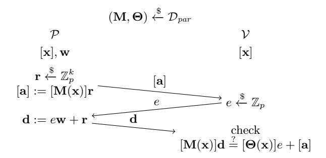
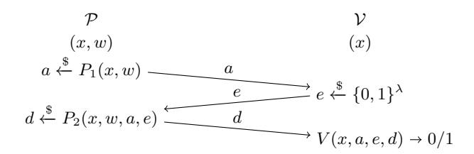
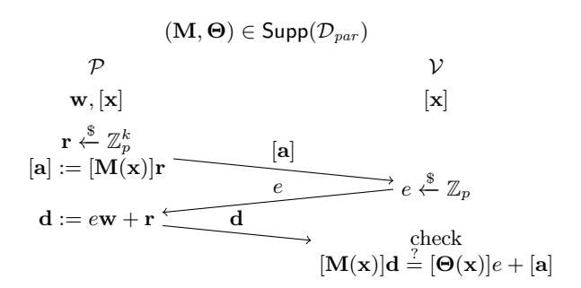
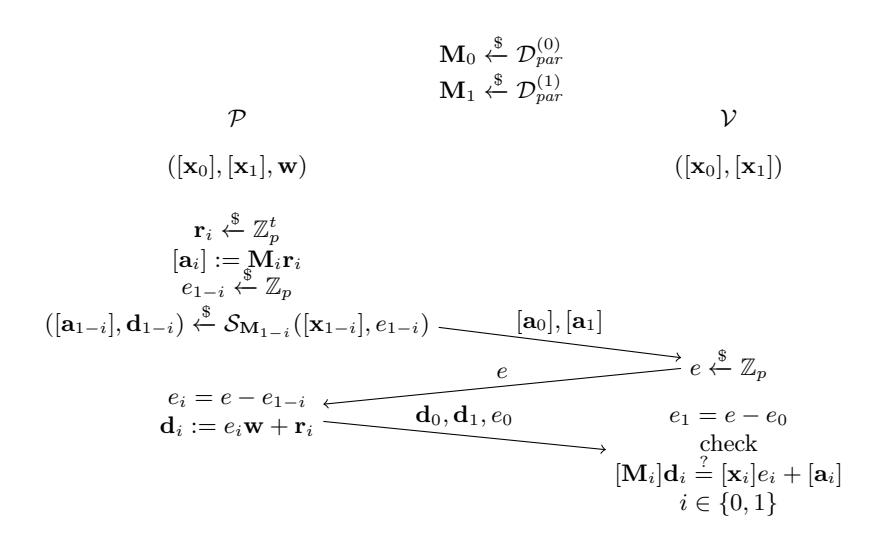

# Shorter Non-Interactive Zero-Knowledge Arguments and ZAPs for Algebraic Languages

Geoffroy Couteau<sup>1</sup> , Dominik Hartmann<sup>2</sup>

<sup>1</sup> CNRS, IRIF, Université de Paris, France couteau@irif.fr <sup>2</sup> Ruhr-University Bochum, Germany Dominik.Hartmann@rub.de

Abstract. We put forth a new framework for building pairing-based non-interactive zeroknowledge (NIZK) arguments for a wide class of algebraic languages, which are an extension of linear languages, containing disjunctions of linear languages and more. Our approach differs from the Groth-Sahai methodology, in that we rely on pairings to compile a Σ-protocol into a NIZK. Our framework enjoys a number of interesting features:

- conceptual simplicity, parameters derive from the Σ-protocol;
- proofs as short as resulting from the Fiat-Shamir heuristic applied to the underlying Σprotocol;
- fully adaptive soundness and perfect zero-knowledge in the common random string model with a single random group element as CRS;
- yields simple and efficient two-round, public coin, publicly-verifiable perfect witness-indistinguishable (WI) arguments(ZAPs) in the plain model. To our knowledge, this is the first construction

of two-rounds statistical witness-indistinguishable arguments from pairing assumptions. Our proof system relies on a new (static, falsifiable) assumption over pairing groups which generalizes the standard kernel Diffie-Hellman assumption in a natural way and holds in the generic group model (GGM) and in the algebraic group model (AGM).

Replacing Groth-Sahai NIZKs with our new proof system allows to improve several important cryptographic primitives. In particular, we obtain the shortest tightly-secure structurepreserving signature scheme (which are a core component in anonymous credentials), the shortest tightly-secure quasi-adaptive NIZK with unbounded simulation soundness (which in turns implies the shortest tightly-mCCA-secure cryptosystem), and shorter ring signatures.

Keywords: zero-knowledge arguments, non-interactive zero-knowledge arguments, satistical witness-indistinguishability, pairing-based cryptography, tight security, structure-preserving signatures.

# <span id="page-0-0"></span>1 Introduction

Zero-knowledge proof systems, introduced in the seminal paper of Goldwasser, Micali, and Rackoff [\[39\]](#page-23-0), allow a prover to convince a verifier of the truth of a statement, without revealing anything beyond this. Zero-knowledge proofs are among the most fundamental cryptographic primitives, and enjoy a tremendous number of applications. A particularly useful kind of zero-knowledge proof systems are non-interactive zero-knowledge proofs (NIZKs) [\[13\]](#page-22-0), which consist of a single flow from the prover to the verifier. NIZKs have found a wide variety of applications in cryptography, ranging from low-interactions secure computation protocols to the design of advanced cryptographic primitives and protocols such as verifiable encryption, group signatures, structure-preserving signatures, anonymous credentials, KDM-CCA2 and identity-based CCA2 encryption, among many others.

Early feasibility results for NIZKs were established in the 90's, under standard assumptions such as factorization, or the existence of (doubly-enhanced) trapdoor permutations [\[29\]](#page-22-1). While these results demonstrated the possibility of building NIZKs under standard assumption for all NP languages (in the common reference string model), they were typically built upon a reduction to an NP-complete language such as graph hamiltonicity, and were concretely inefficient.

The Fiat-Shamir (FS) transform [\[30\]](#page-22-2), which relies on a hash function to compile an interactive ZK proof into a NIZK, provides a practical alternative to the above, leading to efficient NIZK arguments; however, it only offers heuristic security guarantees and any security proof for the FS transform must overcome several barriers [\[7,](#page-22-3) [38\]](#page-23-1)<sup>1</sup> . Hence, for two decades after their introduction, essentially

<sup>1</sup>Alternatively, the Fiat-Shamir transform offers provable security in the random oracle model; we note that there have been recent developments regarding instantiating Fiat-Shamir in the standard model under strong assumptions [\[16,](#page-22-4) [56\]](#page-23-2).

two types of NIZKs coexisted: inefficient NIZKs provably secure in the standard (common reference string) model, and heuristically secure practical NIZKs.

# 1.1 Pairing-Based NIZKs

With the advent of pairing-based cryptography, this somewhat unsatisfying situation changed. Starting with the celebrated work of Groth and Sahai [45], a variety of pairing-based NIZK proof systems have been introduced. These proof systems have in common that they handle directly a large class of languages over abelian groups, avoiding the need for expensive reductions to NP-complete problems. Due to its practical significance, the Groth-Sahai proof system (and its follow-ups) initiated a wide variety of cryptographic applications. As of today, all known practically efficient (publicly verifiable) NIZKs in the standard model rely on pairing-based cryptography. Existing pairing-based NIZK proof systems can be divided in two categories:

NIZKs based on the Groth-Sahai (GS) methodology. These NIZKs directly rely on the techniques developed in [45], and enhance the seminal construction in various ways [12, 24, 26, 37, 73]. Unfortunately, in spite of these optimizations, Groth-Sahai proofs remain often unsatisfyingly inefficient, and are in particular notably less efficient than (heuristic) NIZKs obtained with the Fiat-Shamir transform. Furthermore, the design and analysis of a suitable NIZK, taking into account all existing optimizations, is often a tedious and error-prone task.

Quasi-Adaptive NIZKs for Linear Languages. In light of the above, an alternative line of research, starting with the work of [52] and culminating with [59], has investigated a different strategy for building pairing-based NIZKs. Roughly, the approach relies on a hash proof system [21] (HPS) for the target language over some abelian group  $\mathbb{G}_1$ , which can be seen as a kind of designated-verifier NIZK proof, and makes it publicly verifiable by embedding the secret hashing key in the group  $\mathbb{G}_2$ . Verifying the proof is done with the help of a pairing operation between  $\mathbb{G}_1$  and  $\mathbb{G}_2$ . The HPS-based approach leads to conceptually simple and very efficient proofs (e.g. a membership proof for the DDH language can be made as short as a single group element in [59]). However, this efficiency comes with strong limitations: this approach can only handle linear languages, and only provides a quasi-adaptive type of soundness, where the common reference string is allowed to depend on the language.

#### 1.2 Our Contribution

In this work, we introduce a new approach for building efficient, pairing-based non-interactive zero-knowledge arguments for a large class of languages, where soundness relies on a new (but plausible, static, and falsifiable) assumption, which extends the kernel Diffie-Hellman assumption [70] in a natural way. Our approach is very simple and natural; yet it has to our knowledge never been investigated. It leads to proofs which are shorter and conceptually much simpler than proofs obtained with the GS methodology. At the same time and unlike the HPS-based methodology, our proof system is not limited to linear languages, but handles a more general class of witness samplable languages where, roughly, the language parameters can be sampled together with a trapdoor which can be used to decide membership in the language (in particular, this captures the important case of disjunctions of linear languages, from which one can build linear-size NIZKs for circuit satisfiability using the GOS methodology [43]) and achieves fully adaptive soundness with very short common random strings.

Statistical ZAPs and NIWIs. An additional benefit of our NIZK proof system is that it works in the common random string model, where the CRS is just a random bit string. Furthermore, we show that if we let the verifier pick the CRS himself, our proof system still satisfies statistical witness-indistinguishability. Therefore, we obtain the shortest two-round publicly-verifiable witness-indistinguishable argument system in the plain model (i.e., a ZAP [25]) for witness-samplable algebraic languages. Our ZAPs can be turned into fully non-interactive witness-indistinguishable arguments in the plain model, using the derandomization method of [8]. We emphasize that the ZAPs obtained with our method are statistically witness-indistinguishable; to our knowledge, our construction is the first pairing-based statistical ZAP (it is in addition publicly verifiable, and public coin). Existing constructions of statistical ZAPs rely on the quasipolynomial hardness of LWE [6, 50], or rely on subexponential variants of standard assumptions and are not public coin [55]. While our result comes

at the cost of basing soundness on a new pairing-based assumption, we believe that it represents a significant contribution to the important and long standing open question of building statistical ZAPs.

Simple Dual-Mode NIZKs. Eventually, a variant of our compiler allows to compile  $\Sigma$ -protocols for algebraic languages into (dual-mode) NIZK *proofs*, based on the standard SXDH assumption, for arbitrary algebraic languages (and not only witness-sampleable languages). While the proofs obtained this way have the same size and features as (optimized) Groth-Sahai proofs, it provides a conceptually simple and elegant way of constructing them.

**High Level Overview.** At a high level, our approach consists in compiling a three-move public coin zero-knowledge protocol (so called  $\Sigma$ -protocol) with linear answers over an abelian group  $\mathbb{G}_1$  into a non-interactive zero-knowledge argument, by embedding the challenge e into a group  $\mathbb{G}_2$  such that there is an asymmetric pairing between  $\mathbb{G}_1 \times \mathbb{G}_2$  and a target group  $\mathbb{G}_T$ , and adding the embedded challenge to the common reference string. Intuitively, correctness is preserved because the pairing can be used to perform the verification procedure, zero-knowledge is perfect, and soundness follows from the fact that a cheating adversary must compute a value in  $\mathbb{G}_1$  which has a non-trivial relation to e, which is conjectured to be intractable. An important part of our work is devoted to the analysis of the soundness property of our proof system, and the underlying assumption.

In addition to the efficiency improvements it provides, an important conceptual advantage of our approach over the Groth-Sahai methodology is that it gives a very simple and natural way to construct NIZKs. The construction of optimized Groth-Sahai proofs is generally cumbersome, and a significant amount of expertise is often required for the design of the best-possible GS proof in a given context. In contrast,  $\Sigma$ -protocols are typically straightforward to construct, and require considerably less expertise to optimize. Building a NIZK with our approach requires only to design an algebraic  $\Sigma$ -protocol for the target language distribution, and compiling it into a NIZK (which essentially amounts to adding a single group element to the CRS). Computation, communication and the underlying assumption can be obtained in a straightforward way from the parameters of the underlying  $\Sigma$ -protocol. We believe that this conceptual simplicity is an important feature toward making the use of pairing-based NIZKs accessible to a wider spectrum of researchers and industrials.

#### 1.3 Technical Overview

The starting point of our approach is a (somewhat folklore)  $\Sigma$ -protocol for algebraic languages [10,17]. A  $\Sigma$ -protocol is a three-move public-coin honest-verifier zero-knowledge proof system (i.e., the message of the verifier is a random string, and the zero-knowledge property holds against verifiers that do not deviate from the specifications of the protocol). In the following, we use the implicit notations introduced in [28]: given a group  $\mathbb{G}$  in additive form, we fix a generator g and write [x] for  $x \cdot g$ . Most, if not all, algebraic languages over abelian groups considered in the literature can be written as  $\mathcal{L}_{\mathbf{M},\mathbf{\Theta}} := \{\mathbf{x} \in \mathbb{G}^l | \exists \mathbf{w} \in \mathbb{Z}_p^t : \mathbf{M}(\mathbf{x}) \cdot \mathbf{w} = \mathbf{\Theta}(\mathbf{x}) \}$ , where  $\mathbf{M} : \mathbb{G}^l \mapsto \mathbb{G}^{n \times t}$  and  $\mathbf{\Theta} : \mathbb{G}^l \mapsto \mathbb{G}^n$  are linear maps sampled according to a distribution  $\mathcal{D}_{par}$ . This captures all algebraic languages defined by systems of polynomial equations between secret exponents. Most  $\Sigma$ -protocols for algebraic languages can then be seen as particular instantiations of the generic  $\Sigma$ -protocol represented on Figure 1.

To compile this  $\Sigma$ -protocol into a NIZK, we assume that all computations take place in a group  $\mathbb{G}_1$ , such that there exists another group  $\mathbb{G}_2$  together with an asymmetric pairing  $\bullet : \mathbb{G}_1 \times \mathbb{G}_2 \mapsto \mathbb{G}_T$ . We use the standard brackets with subscripts  $[\cdot]_1, [\cdot]_2, [\cdot]_T$  to extend the implicit notation to the three groups  $\mathbb{G}_1, \mathbb{G}_2, \mathbb{G}_T$ . The setup algorithm of our proof system picks a random  $e \in \mathbb{Z}_p$  and sets the common reference string to  $[e]_2$ . The prover computes  $[\mathbf{a}]_1$  as in the  $\Sigma$ -protocol, and obtains the value  $\mathbf{d}$  embedded in  $\mathbb{G}_2$  by computing  $[\mathbf{d}]_2 := \mathbf{w} \cdot [e]_2 + \mathbf{r} \cdot [1]_2$ . Checking the verification equation can still be done, with the help of the pairing: the verifier checks that  $[\mathbf{M}(\mathbf{x})]_1 \bullet [\mathbf{d}]_2 \stackrel{?}{=} [\Theta(\mathbf{x})]_1 \bullet [e]_2 + [\mathbf{a}]_1 \bullet [1]_2$ . While this construction is relatively simple, the bulk of our technical contribution is the detailed analysis of the security guarantees it provides.

The Extended-Kernel Matrix Diffie-Hellman Assumption. To prove the soundness of our NIZK, we introduce a new family of assumptions, which we call the *extended-kernel Matrix Diffie-Hellman* assumption (extKerMDH). The regular KerMDH assumption with respect to a distribution

<span id="page-3-0"></span>

Fig. 1. Generic  $\Sigma$ -protocol for algebraic languages  $\mathcal{L}_{\mathbf{M},\Theta}$  from a distribution  $\mathcal{D}_{par}$ 

Dist over an asymmetric pairing group states that, given a matrix  $[\mathbf{A}]_2$  sampled from Dist, it is infeasible to find a vector  $[\mathbf{v}]_1$  where  $\mathbf{v}$  is in the kernel of  $\mathbf{A}$ . It is a natural computational analogue of the decisional Matrix Diffie-Hellman assumption (which it implies), and was introduced in [70]. Our new assumption further generalizes the KerMDH assumption as follows: it states that it should be infeasible, given  $[\mathbf{A}]_2$ , to find another matrix  $[\mathbf{A}']_2$  and a matrix  $[\mathbf{B}]_1$  such that  $\mathbf{B}$  spans the entire kernel of  $\mathbf{A}||\mathbf{A}'|$ . Intuitively, the adversary is allowed to extend the matrix  $[\mathbf{A}]_2$ , which facilitates finding  $\mathbb{G}_1$ -vectors in its kernel; but each time the adversary extends  $\mathbf{A}$  by one column, he must provide an additional  $\mathbb{G}_1$ -vector (linearly independent of the previous vectors) in the kernel of the extended matrix.

The extKerMDH assumption is a static, non-interactive assumption, which generalizes the KerMDH assumption in a natural way. To provide further evidence for the security of our assumption, we prove that it is unconditionally secure in the generic group model [78] (GGM), and that it reduces to the discrete logarithm assumption in the algebraic group model [31] (AGM). On the downside, the extKerMDH assumption might not in general be a falsifiable assumption [36,71]: it states that it is infeasible to output  $[\mathbf{A}']_2$  and a basis  $[\mathbf{B}]_1$  of the kernel of  $\mathbf{A}||\mathbf{A}'$ , but verifying whether the  $\mathbb{G}_1$ -matrix  $[\mathbf{B}]_1$  is full rank is not efficiently feasible in general (indeed, the hardness of deciding whether a matrix given in a group  $\mathbb{G}$  is full rank is exactly the decisional matrix Diffie-Hellman assumption). However, we show that for all witness-sampleable languages, there is a language trapdoor which does allow to efficiently check whether  $\mathbf{B}$  is full rank (intuitively, the trapdoor allows to put  $[\mathbf{B}]_1$  in triangular form, from which the rank can be easily checked), turning our new assumption into a falsifiable assumption.

Witness Samplable Languages. We give an intuition of the class of algebraic languages which satisfy our requirements. Intuitively, an algebraic language  $\mathcal{L}$  admits a NIZK (using our compiler) where soundness reduces to a falsifiable assumption if the parameters of  $\mathcal{L}$  can be sampled together with a trapdoor which allows to efficiently check language membership. For example, this captures the DDH language  $\mathcal{L}_{\text{DDH}}$ : given language parameters  $([1]_1, [s]_1)$ , the words in  $\mathcal{L}_{\text{DDH}}$  are of the form  $([x]_1, [x \cdot s]_1)$ , and the trapdoor s allows to verify that a word  $(c_1, c_2)$  belongs to  $\mathcal{L}_{\text{DDH}}$  by checking whether  $s \cdot c_1 - c_2 = [0]_1$ . Witness samplable languages need not be linear languages: for example, the language of ElGamal encryptions (in the exponent) of a plaintext  $m \in \{0, 1\}$  is not a linear language, yet the ElGamal secret key allows to efficiently check wether a pair of group elements indeed encrypts a bit, hence it is also captured by our methods. More generally, the conjunctions and disjunctions of witness samplable languages are still witness samplable. On the other hand, some natural algebraic languages are not witness-samplable; for example, the language of triples of the form  $([1]_1, [x]_1, [x^2]_1)$  does not seem to be witness samplable (since it is not clear how one could generate a word-independent trapdoor allowing to check membership to this language).

Witness-sampleable languages were originally introduced in [52], but were restricted to linear languages. We extend this notion of witness-sampleability to arbitrary algebraic languages, and will show that many languages of interest are actually witness sampleable. For these languages, we therefore obtain shorter NIZKs under a natural, static, *falsifiable* assumption. We note that for the case of linear languages (such as the language of DDH tuple), our generalized notion of witness-samplability is the same as the notion of [52], and applying our compiler to witness-samplable linear languages leads to NIZKs which are actually secure under the standard KerMDH assumption (while still being shorter than GS proofs).

# 1.4 Applications

Our new NIZKs have several attractive features and can be used to improve the efficiency of many NIZK-based primitives. We provide a non-exhaustive list of some applications below. All applications we describe rely on witness-sampleable algebraic languages, making the underlying extKerMDH assumption falsifiable.

Adaptive NIZKs for Linear Languages. We achieve the shortest and most efficient adaptive NIZKs for (witness-sampleable) linear languages, with perfect zero-knowledge and computational soundness under the kernel Diffie-Hellman assumption: a Groth-Sahai proof for the language of DDH tuples consists of four group elements, while our NIZK requires only three group elements, and considerably less pairings. We note that in the quasi-adaptive setting, where the common reference string is allowed to depend on the language, the work of [59] gives NIZKs with two group elements (for non witness-sampleable languages), or even a single group element (for witness-sampleable languages). Therefore, our work can be seen as filling a remaining gap, providing a more complete picture of the size of NIZKs for linear languages, depending on whether we allow quasi-adaptive soundness, and rely on witness-sampleability. In addition to providing a stronger soundness guarantee, full adaptivity also leads to increased efficiency when many proofs are run in some high level application: it allows to rely on a single CRS (which, in our case, consists of a *single* group element), even when executing many linear subspace proofs for different languages. In contrast, QA-NIZKs have a language-dependent CRS; hence, a different CRS must be generated for each language. The comparison is summarised in Table 1.

<span id="page-4-0"></span>

| Scheme  | Assumption | CRS | Proof size | Pairings    | WS | Fully Adaptive |
|---------|------------|-----|------------|-------------|----|----------------|
| GS [45] | SXDH       | 4   | 4(n+2t)    | 24(n(4t+8)) | Х  | ✓              |
| KW [59] | KerMDH     | 6   | 2(2)       | 3(n+1)      | X  | ×              |
| KW [59] | KerMDH     | 4   | 1(1)       | 2(n)        | ✓  | ×              |
| Ours    | KerMDH     | 1   | 3(n+t)     | 6(n+nt+2)   | 1  | ✓              |

**Table 1.** Comparison of existing NIZKs for the DDH language (linear languages described by an  $n \times t$  matrix). CRS/Proof size denotes the number of group elements in the common reference string/a proof. Pairings denotes the number of pairing operations in proof verification. "WS" indicates whether the proof system is restricted to witness sampleable languages.

Adaptive NIZKs for Disjunctions. Since our NIZKs are built by compiling a  $\Sigma$ -protocol, they are compatible with the OR-trick of [20]. The OR-trick provides a general method to construct  $\Sigma$ -protocols of partial satisfiability, such as "k of those n words belong to the language  $\mathcal{L}$ ", from a  $\Sigma$ -protocol for proving membership to  $\mathcal{L}$ . Building upon this observation, we obtain shorter NIZKs for disjunctions of statements. The state-of-the-art NIZK for partial satisfiability of equations is the one in [73]. For the important case of the disjunction between two (resp. n) DDH languages, it gives proofs of size 10 group elements under the SXDH assumption (resp. 4n + 2 group elements for 1-out-of-n proofs). For the same language, our approach leads to proofs of size 7 (resp. 3n + 1 group elements for 1-out-of-n proofs). This is detailed in Table 2. NIZKs for disjunctions of languages are a core component in several applications; we outline some applications below.

<span id="page-4-1"></span>

| Scheme   | Assumption | CRS | Proof size                          | Pairings                               | WS       |
|----------|------------|-----|-------------------------------------|----------------------------------------|----------|
| [44, 73] | SXDH       | 4   | $10(\sum_{i=1}^{2} n_i + 2t_i + 2)$ | $24(\sum_{i=1}^{2} 4n_i + 2n_i t_i)$   | Х        |
| Ours     | extKerMDH  | 1   | $7(\sum_{i=1}^{2} n_i + t_i + 1)$   | $12(\sum_{i=1}^{2} n_i + n_i t_i + 4)$ | <b>✓</b> |

**Table 2.** Comparison of existing NIZKs for the OR of two DDH languages (two linear languages described by  $n_i \times t_i$  matrices for  $i \in \{1,2\}$ ). CRS denotes the number of group elements in the common reference string. "WS" indicates whether the proof system deals only with witness sampleable languages. Note that our scheme can in fact handle non-witness sampleable languages; however, this comes at the cost of making the underlying extKerMDH assumption non-falsifiable.

Ring Signatures. Ring signatures [\[74\]](#page-24-5) allow a signer to anonymously sign on behalf of an ad-hoc group to which it belongs. They are a core component in some e-voting and e-cash schemes [\[79\]](#page-24-6) and anonymous cryptocurrencies such as Monero [\[72\]](#page-24-7). A O( √ N)-size proof of membership in a ring of size N was designed by Chandran, Groth and Sahai [\[18\]](#page-22-16) and subsequently improved in [\[73\]](#page-24-0); it relies at its core on a NIZK for (`−1)-out-of-` disjunction of DDH languages. Using our improved NIZK for disjunction, we reduce the ring signature size by <sup>√</sup> N − 1 group elements, for rings of size N.

We observe that a O(log N)-size ring signature scheme was recently introduced in [\[5\]](#page-21-0). The authors do not provide a concrete efficiency analysis and use generic tools which would likely render concrete instantiations inefficient for reasonable group sizes. We note, though, that our proof system can be used to instantiate the non-interactive witness indistinguishable proof system they rely upon, and would likely lead to efficiency improvements comparable to what we get over the ring signature of [\[73\]](#page-24-0), for concrete instantiations of their building blocks.

Tightly-Secure QA-NIZKs with Unbounded Simulation Soundness. In several applications in cryptography, the constructions require a NIZK for linear languages which satisfies a stronger soundness guarantee: soundness should hold even if the adversary is allowed to see an arbitrary number of simulated proofs. This stronger notion is known as unbounded simulation-soundness. The recent work of [\[3\]](#page-21-1) introduced the first unbounded simulation-sound quasi-adaptive NIZK (USS-QA-NIZK) which achieves simultaneously compact CRS, compact proof size, and a tight security reduction. At the core of their construction is the disjunction NIZK of [\[73\]](#page-24-0), which has 10 group elements; this accounts for most of the size of their USS-QA-NIZK, which has 14 group elements. By replacing the disjunction proof by our new NIZK, we reduce the size of their USS-QA-NIZK to only 11 group elements, and also reduce the CRS size, at the cost of requiring our new assumption. We provide a comparison to existing USS-QA-NIZKs for linear languages on Table [3.](#page-5-0) In particular, our result allows to further reduce the size of the tightly-secure IND-mCCA-secure public-key encryption scheme of [\[4\]](#page-21-2) (IND-mCCA refers to indistinguishability against chosen ciphertext attacks in the multi-user, multi-challenge setting), with a security reduction independent of the number of decryption-oracle requests of the CCA2 adversary, from 17 group elements to 14 group elements.

<span id="page-5-0"></span>

|      | CRS Size              | Proof Size | Pairings                                            |          | Sec. Loss Assumption |
|------|-----------------------|------------|-----------------------------------------------------|----------|----------------------|
| [60] | 2n + 3(t + λ) + 10    | 20         | 2n + 30                                             | O(Q)     | DLIN                 |
| [59] | (2t + 6, n + 6)       | (4, 0)     | t(n + t + 2)                                        | O(Q)     | SXDH                 |
| [61] | 2n + 3t + 24λ + 55 42 |            | 2n + 10                                             | 3λ + 7   | DLIN                 |
| [33] | (t + 6λ + 1, n + 2)   | (3, 0)     | n + 4                                               | 4λ + 1   | SXDH                 |
| [4]  | (3t + 14, n + 12)     |            | (n + 16, 2t + 5) 7n + 5t + 3nt + 121 36 log(Q) SXDH |          |                      |
| [3]  | (4t + 4, 2n + 8)      | (8, 6)     | n + 30                                              | 6 log(Q) | SXDH                 |
|      | Ours (4t + 8, 2n + 3) | (8, 3)     | n + 18                                              | 6 log Q  | SXDH,<br>extKerMDH   |

Table 3. Comparison of existing unbounded simulation-sound NIZKs for linear languages. The notation (x1, x2) denotes x<sup>1</sup> elements in G<sup>1</sup> and x<sup>2</sup> elements in G2. Q denotes the number of simulation queries, λ is the security parameter. (n, t) are the parameters of the underlying linear language, defined by a matrix M ∈ Z n×t <sup>p</sup> , with n > t.

Tightly-Secure Structure-Preserving Signatures. The notion of structure-preserving cryptography gives a paradigm for building modular protocols designed to be naturally expressed as systems of pairing-product equations, which makes them compatible with the Groth-Sahai methodology. Structure-Preserving Signatures (SPS) are one of the most fundamental primitives in structurepreserving cryptography. They are the core component in a variety of important applications, such as anonymous credentials (see e.g. [\[9,](#page-22-17)[14,](#page-22-18)[15,](#page-22-19)[19,](#page-22-20)[22,](#page-22-21)[32,](#page-23-13)[47,](#page-23-14)[65\]](#page-24-10), to name just a few), mixnets and voting systems [\[42\]](#page-23-15), or simulation-sound NIZKs [\[40,](#page-23-16) [61\]](#page-24-9).

A cryptographic scheme is tightly secure if its security loss is independent of the number of users of the scheme. A tight security reduction gives guarantees that do not degrade with the size of the setting in which the system is used. Tight security is especially important in structure-preserving cryptography, where many components rely on the same cyclic group: if a non-tightly-secure scheme is used and the number of users increases, this might require increasing the group size to compensate for the security loss, degrading the performance of all other schemes relying on the same cyclic group. There has been a long sequence of works that seeked to obtain increasingly shorter structure preserving signatures with tight security reductions; we summarize them in Table 4.

The work of [34] provides a tightly-secure SPS with 14 group elements, which combines an algebraic MAC scheme with the proof of [73] for the disjunction of two DDH languages. The latter has proof size of 10 group elements. Replacing the OR-NIZK in their work by the shorter proof which we introduce leads to a tightly-secure SPS with 11 group elements, matching the size of the best known tightly-secure SPS [3]. The work of [3] improves over [34] by replacing the underlying OR-NIZK by a designated-prover OR-NIZK, which suffices in this context. They show that in the designated-prover setting, the size of the OR-NIZK can be reduced to 7 group elements. We observe that their technique is actually compatible with our improved OR-NIZK, and leads to a quasi-adaptive designated-prover OR-NIZK with only 5 group elements (which can be of independent interest). Overall, this leads to a tightly-secure SPS with only 9 group elements under (a falsifiable flavor of) the extKerMDH assumption, significantly improving over the efficiency of the state-of-the-art. Considering a setting with security parameter  $\lambda = 80$ , a large possible number of signing queries  $Q = 2^{30}$ , and choosing a group  $\mathbb{G}$  of order  $p \approx 2^{2(\lambda + \log L)}$  to account for the security loss of L(Q) (assuming that the best attack on the group is the generic  $\sqrt{p}$ -time attack), our scheme is actually computationally more efficient than the state-of-the-art non-tightly-secure SPS of [53], and produces signatures which are only slightly larger: 241 Bytes versus 201 Bytes.

| Scheme | Sig. Size    | PK Size      | Pairings            | Sec. Loss    | Assumption      |
|--------|--------------|--------------|---------------------|--------------|-----------------|
| [48]   | $10\ell + 6$ | 13           | 81l + 1             | O(1)         | DLIN            |
| [1]    | (7, 4)       | (5, n+12)    | 16                  | Q            | SXDH, XDLIN     |
| [62]   | (10, 1)      | (16, 2n + 5) | 17 + 2n             | O(Q)         | SXDH, XDLINX    |
| [58]   | (6,1)        | (0, n+6)     | 3n + 4              | $2Q^2$       | SXDH            |
| [53]   | (5,1)        | (0, n+6)     | n+3                 | $Q \log Q$   | SXDH            |
| [2]    | (13, 12)     | (18, n+11)   | n + 16              | $80\lambda$  | SXDH            |
| [51]   | (11, 6)      | (7, n+16)    | n+22                | $116\lambda$ | SXDH            |
| [34]   | (8, 6)       | (2, n+9)     | n + 11              | $6 \log Q$   | SXDH            |
| [4]    | (6,6)        | (2, n+5)     | 7n + 5t + 3nt + 121 | $36 \log Q$  | SXDH            |
| [3]    | (7, 4)       | (2, n+11)    | n+31                | $6 \log Q$   | SXDH            |
| Ours   | (7, 2)       | (7, n + 8)   | n+23                | $6 \log Q$   | SXDH, extKerMDH |

<span id="page-6-0"></span>**Table 4.** Comparison of existing structure-preserving signatures for message space  $\mathbb{G}_1^n$ , in their most efficient variant. For [4], n and t are defined as in Table 3. The notation  $(x_1, x_2)$  denotes  $x_1$  elements in  $\mathbb{G}_1$  and  $x_2$  elements in  $\mathbb{G}_2$ . Q denotes the number of signing queries,  $\lambda$  is the security parameter. In the tree-based scheme of [48],  $\ell$  denotes the depth of the tree (which limits the number of signing queries to  $2^{\ell}$ ).

#### 1.5 Related Work

We already mentioned related works on NIZKs and SPS. Our work was partly inspired by a line of work initiated in [17,23], which compiles  $\Sigma$ -protocols into designated-verifier NIZKs, by encrypting the challenge with a malleable cryptosystem, and putting the ciphertext in the CRS. The idea of hiding the challenge of an interactive protocol in a CRS was also used in different contexts; for example, it bears similarity with methods used in [35,54].

In a recent independent work [64], Lombardi et al. constructed statistical ZAP arguments under standard pairing assumptions. Their result and our ZAPs are incomparable: we achieve public coin ZAPs, while [64] only achieves a relaxed notion of reusable ZAPs with private verifier randomness, and we only rely on a polynomial hardness assumption, while [64] requires quasi-polynomial hardness. On the other hand, [64] relies on the quasi-polynomial hardness of the standard DLIN assumption, while we must rely on a new assumption.

#### 1.6 Organization

In Section 2, we recall necessary preliminaries. Section 3 introduces our new NIZK argument system. Section 4 is devoted to the security analysis of the new proof system; to this end, it introduces

the notion of algebraic witness sampleability and the extKerMDH assumption. Section 5 extends our construction to disjunctions of algebraic languages and Section 6 describes a variant of our compiler which yields (dual-mode) NIZK proofs based on the SXDH assumption for arbitrary algebraic languages (and not only witness-sampleable languages). While the proofs obtained this way have the same size and features as (optimized) Groth-Sahai proofs, it provides a conceptually simple and elegant way of constructing them. We outline several applications of our results in Section 7. Appendix A provides examples to illustrate some of the notions we introduce. In Appendix B, we prove the security of our new assumption in the generic group model and in the algebraic group model. Appendix C shows that disjunctions of languages are in fact directly captured by the framework of algebraic languages, without going through the OR-trick of [20].

# <span id="page-7-0"></span>2 Preliminaries

Let  $\mathbb{P}$  denote the set of all primes and  $\lambda \in \mathbb{N}$  denote the security parameter. A probabilistic polynomial time algorithm (PPT, also denoted *efficient* algorithm) runs in time polynomial in the (implicit) security parameter  $\lambda$ . A function f is negligible if for any positive polynomial p there exists a bound B > 0 such that, for any integer  $k \geq B$ ,  $|f(k)| \leq 1/|p(k)|$ . We will write  $f(\lambda) \approx 0$  to indicate that f is a negligible function of  $\lambda$ ; we also write  $f(\lambda) \approx g(\lambda)$  for  $|f(\lambda) - g(\lambda)| \approx 0$ . For sampling an element according to a distribution or selecting it uniformly random from a (finite) set, we write  $p \stackrel{\$}{\leftarrow} S$ . We use the same notation for the output of a probabilistic algorithm. For output y of a deterministic algorithm A on input x, we will also use y := A(x). Matrices will always be bold, upper-case letters and vectors will be bold, lower-case letters. For a matrix A let  $\operatorname{span}(A) := \{\mathbf{x} | \exists \mathbf{r} : \mathbf{x} = A\mathbf{r} \}$  and  $\ker(A) := \{\mathbf{x} | \mathbf{x}^T \mathbf{A} = 0\}$  the left kernel of A. All interactive protocols will be performed between a prover  $\mathcal{P}$  and a verifier  $\mathcal{V}$ . If one party can deviate from the protocol, we will denote this by  $\hat{\mathcal{P}}$  and  $\hat{\mathcal{V}}$  respectively. Additionally, a simulator will be called  $\mathcal{S}$ . For language parameters  $\rho$  sampled from a language distribution  $\mathcal{D}$ , let  $\mathcal{L}_{\rho}$  denote the language defined by  $\rho$  and let  $R_{\rho}$  denote its witness relation. Finally, for a distribution  $\mathcal{D}$ , we write  $\operatorname{Supp}(\mathcal{D})$  for the support of the distribution.

### 2.1 Groups and Pairings

Throughout this work, let  $p \in \mathbb{P}$  denote a prime with bit length polynomial in the security parameter  $\lambda$ . Let  $\mathbb{G}_1$ ,  $\mathbb{G}_2$ ,  $\mathbb{G}_T$  be finite groups of prime order p with generators  $g_1, g_2$  respectively and  $e : \mathbb{G}_1 \times \mathbb{G}_2 \to \mathbb{G}_T$  a bilinear map. We set  $g_T := e(g_1, g_2)$ , which is a generator of  $\mathbb{G}_T$ .  $\mathcal{PG} = (p, \mathbb{G}_1, \mathbb{G}_2, \mathbb{G}_T, g_1, g_2, e)$  is called a pairing group setting, if the following properties hold:  $e(g_1, g_2) \neq 0_T$  (non-degenerate);  $e(ag_1, bg_2) = ab \cdot e(g_1, g_2)$  (bilinearity); and e is efficiently computable. Furthermore, we require the existence of a probabilistic algorithm PGGen, which on input  $1^{\lambda}$  generates pairing parameters as above with a group order close to  $2^{\lambda}$ , i.e.  $\mathcal{PG} \stackrel{\$}{\leftarrow} PGGen(1^{\lambda})$ .

Throughout this work, we will write all groups in implicit notation, i.e. for an additive pairing group setting  $\mathcal{PG} = (p, \mathbb{G}_1, \mathbb{G}_2, \mathbb{G}_T, g_1, g_2, e)$ , we write  $[1]_i := g_i$  and  $[x]_i := x \cdot g_i$  for all  $x \in \mathbb{Z}_p$  and  $i \in \{1, 2, T\}$ . If the group is clear from context, we will omit the index. We write  $[x]_1 \bullet [y]_2 := e([x]_1, [y]_2) = [xy]_T$  for pairings. The implicit notation also extends to matrices and vectors. For  $\mathbf{A} \in \mathbb{Z}_p^{n \times t}$ ,  $\mathbf{A} = (a_{ij})$ , let  $[\mathbf{A}]_k = ([a_{ij}]_k) \in \mathbb{G}_k^{n \times t}$  for  $k \in \{1, 2, T\}$  and we also extend the pairing notation from above to  $[\mathbf{A}]_1 \bullet [\mathbf{B}]_2 := e([\mathbf{A}]_1, [\mathbf{B}]_2) = [\mathbf{A}\mathbf{B}]_T$  for matrices  $\mathbf{A} \in \mathbb{Z}_p^{n \times t}$ ,  $\mathbf{B} \in \mathbb{Z}_p^{t \times m}$ . Furthermore, we extend the implicit notation to linear (multivariate) polynomials. Let  $\mathcal{P}_l := \{[a_0] + \sum_{i=0}^l a_i X_i | a_i \in \mathbb{Z}_p$  for  $i \in \{0, \dots, l\}\} \subset \mathbb{G}[\mathbf{x} = (X_1, \dots, X_l)]$  be the set of linear multivariate polynomials over  $\mathbb{G}$  in l variables. For  $l \in \mathcal{P}_l$  and  $\mathbf{y} = (y_1, \dots, y_l) \in \mathbb{Z}_p^l$ , we define the evaluation of l in l as applying the group operation in the exponent, i.e.

$$f([\mathbf{y}]) := f(\mathbf{y}) = [a_0] + \sum_{i=1}^{l} a_i[y_i] = [a_0] + \sum_{i=0}^{l} [a_i y_i]$$

This allows us (in a slight abuse of notation) to use polynomials from  $\mathcal{P}_l$  inside of matrices and equations in implicit notation without changing variable names, i.e.  $[a_0]X_0 = [a_0X_0]$ , since the evaluation of the polynomial is defined exactly that way. For a matrix  $\mathbf{A} = (a_{i,j}) \in \mathcal{P}_l^{n \times t}$ , the evaluation of the matrix (or vector) over  $\mathcal{P}_l$  in a vector  $\mathbf{y} \in \mathbb{G}^l$  denotes the evaluation of all entries in the given vector, i.e.  $\mathbf{A}(\mathbf{y}) := (a_{i,j}(\mathbf{y})) \in \mathbb{G}^{n \times t}$ .

#### 2.2 Matrix Assumptions

The assumptions used in this work are parametrised over matrix distributions. These are defined as follows.

**Definition 1 (Matrix Distribution).** Let  $k, l \in \mathbb{N}$  with k < l. We call  $\mathcal{D}_{k,l}$  a matrix distribution, if it outputs matrices over  $\mathbb{G}^{l \times k}$  of full rank k in polynomial time. If l = k + 1, we write  $\mathcal{D}_k$  instead. Without loss of generality, we assume that the first k rows of a matrix  $\mathbf{A} \in \mathsf{Supp}(\mathcal{D}_{k,l})$  form an invertible matrix.

We base the soundness of our construction on an extension of the *Kernel Diffie-Hellman* assumption. We recall its definition from [69] and the definition of the underlying *Matrix Diffie-Hellman* assumption from [27].

Informally, the  $\mathcal{D}_{k,l}$ -Matrix Diffie-Hellman assumption states that for a matrix distribution  $\mathcal{D}_{k,l}$ , it is hard to distinguish a random vector of length l from the image of a random vector of length k under a matrix from said distribution.

**Definition 2** ( $\mathcal{D}_{k,l}$ -Matrix Diffie-Hellman assumption ( $\mathcal{D}_{k,l}$ -MDDH)). Let  $\mathcal{D}_{k,l}$  be a matrix distribution, PGGen a pairing group generator and  $s \in \{1,2,T\}$ . We say the  $\mathcal{D}_{k,l}$ -Matrix Diffie-Hellman assumption holds relative to PGGen in group  $\mathbb{G}_s$ , if for all efficient adversaries  $\mathcal{A}$ , the function

$$\mathsf{Adv}^{mddh}_{PGGen,\mathcal{A}}(1^\lambda) = |Pr[\mathcal{A}(\mathbb{G}_s,[\mathbf{A}]_s,[\mathbf{A}\mathbf{x}]_s) = 1] - Pr[\mathcal{A}(\mathbb{G}_s,[\mathbf{A}]_s,[\mathbf{u}]_s) = 1]|$$

is negligible in  $\lambda$  with the probabilities taken over  $\mathcal{PG} \stackrel{\$}{\leftarrow} \mathrm{PGGen}$ ,  $\mathbf{A} \stackrel{\$}{\leftarrow} \mathcal{D}_{k,l}$ ,  $x \stackrel{\$}{\leftarrow} \mathbb{Z}_p^k$ ,  $u \stackrel{\$}{\leftarrow} \mathbb{Z}_p^l$ .

The computational analogue to the MDDH assumption is the KerMDH assumption [69]. Instead of checking membership in the span, the adversary has to compute a vector in the (left) kernel of a matrix. To make the assumption falsifiable, the adversary has to provide the kernel vector in the opposite group of the challenge, i.e. for a matrix given in  $\mathbb{G}_s$ , the adversary has to answer in group  $\mathbb{G}_{3-s}$ .

**Definition 3** ( $\mathcal{D}_{k,l}$ -Kernel Diffie-Hellman assumption ( $\mathcal{D}_{k,l}$ -KerMDH)). Let  $\mathcal{D}_{k,l}$  be a matrix distribution, PGGen a pairing group generator and  $s \in \{1,2\}$ . We say the  $\mathcal{D}_{k,l}$ -KerMDH assumption holds relative to PGGen in  $\mathbb{G}_s$ , if for all efficient adversaries  $\mathcal{A}$ , the function

$$\mathsf{Adv}^{ker-mdh}_{PGGen,\mathcal{A}}(1^{\lambda}) = Pr[\mathbf{c^TA} = 0 \land \mathbf{c} \neq \mathbf{0} | [\mathbf{c}]_{3-s} \xleftarrow{\$} \mathcal{A}(\mathcal{PG}, [\mathbf{A}]_s)$$

is negligible in  $\lambda$  with probabilities taken over  $\mathcal{PG} \stackrel{\$}{\leftarrow} \mathrm{PGGen}(1^{\lambda}), \mathbf{A} \stackrel{\$}{\leftarrow} \mathcal{D}_{k,l}$ .

An example for a matrix distribution for which the KerMDH and MDDH assumptions hold in the AGM is the following:

$$\mathcal{L}_k : \mathbf{M} = \begin{bmatrix} 1 & 1 & 1 & \cdots & 1 \\ e_1 & 0 & 0 & \cdots & 0 \\ 0 & e_2 & 0 & & 0 \\ 0 & 0 & e_3 & \cdots & 0 \\ \vdots & & \ddots & \ddots & \vdots \\ 0 & \cdots & & 0 & e_k \end{bmatrix}$$

For k = 1, this distribution generates Diffie-Hellman matrices and for  $k \ge 2$  these matrices correspond to the k-Lin assumption [49]. We will only consider the distribution  $\mathcal{L}_k$  in this work as it is sufficient for all of our applications. For more matrix distributions, see for example [59,69].

#### 2.3 $\Sigma$ -Protocols

Next, we recall the definition of  $\Sigma$ -protocols from [63]. A  $\Sigma$ -protocol is a public-coin, three-move interactive proof between a prover  $\mathcal{P}$  and a verifier  $\mathcal{V}$  for a relation R, where the prover sends an initial message a, the verifier responds with a random  $e \stackrel{\$}{\leftarrow} \{0,1\}^{\lambda}$  and the prover concludes with a message d. Lastly, the verifier outputs 1, if it accepts and 0 otherwise. This is depicted in Figure 2.

Three properties are required for a  $\Sigma$ -protocol: completeness, special soundness and special honest-verifier zero-knowledge.



<span id="page-9-0"></span>Fig. 2. General  $\Sigma$ -protocol.

**Definition 4 (Completeness).** A three-move protocol  $\Pi_R$  for a relation R with prover  $\mathcal{P}$  and verifier  $\mathcal{V}$  is complete, if

$$Pr\left[\mathsf{out}(V(x,a,e,d)) = 1 \middle| \begin{array}{c} (x,w) \in R, a \xleftarrow{\$} P_1(x,w), \\ e \xleftarrow{\$} \{0,1\}^{\lambda}, d \xleftarrow{\$} P_2(x,w,a,e) \end{array} \right] = 1$$

**Definition 5 (Special soundness).** A three-move protocol  $\Pi_R$  for a relation R has the special soundness property, if a polynomial time algorithm E exists, which for a statement x and two accepting transcripts (a, e, d), (a, e', d') of  $\Pi_R$  with  $e \neq e'$  outputs a witness w, s.t.  $(x, w) \in R$  with overwhelming probability.

**Definition 6 (Special honest-verifier zero-knowledge).** A three-move protocol  $\Pi_R$  for a relation R is special honest-verifier zero-knowledge, if there exists a polynomial-time simulator S such that the distributions of S(x,e) and the transcript of an honest protocol execution between P and V are identical for  $(x,w) \in R$ ,  $e \in \{0,1\}^{\lambda}$ .

# <span id="page-9-1"></span>2.4 Non-interactive Zero-Knowledge Arguments

An adaptive NIZK  $\Pi$  for a family of language distribution  $\{\mathcal{D}_{par}\}_{par}$  consists of four probabilistic algorithms:

- $\mathsf{CRSGen}(1^{\lambda})$ . On input  $1^{\lambda}$  generates public parameters par (such as group parameters), a  $\mathsf{CRS}$  and a trapdoor  $\mathcal{T}$ . For simplicity of notation, we assume that any group parameters are implicitly included in the  $\mathsf{CRS}$ .
- Prove(CRS,  $\rho$ , x, w). On input of a CRS, a language description  $\rho \in \mathcal{D}_{par}$  and a statement x with witness w, outputs a proof  $\pi$  for  $x \in \mathcal{L}_{\rho}$ .
- Verify(CRS,  $\rho$ , x,  $\pi$ ). On input of a CRS, a language description  $\rho \in \mathcal{D}_{par}$ , a statement and a proof, accepts or rejects the proof.
- SimProve(CRS,  $\mathcal{T}, \rho, x$ ). Given a CRS, the trapdoor  $\mathcal{T}$ , a language description  $\rho \in \mathcal{D}_{par}$  and a statement x, outputs a simulated proof for the statement  $x \in \mathcal{L}_{\rho}$ .

Note that the CRS does not depend on the language distribution or language parameters, i.e. we define fully adaptive NIZKs for language distributions.

The following properties need to hold for a NIZK argument (see e.g. [45]).

**Definition 7 (Perfect Completeness:).** A proof system  $\Pi$  for a family of language distributions  $\{\mathcal{D}_{par}\}_{par}$  is perfectly complete, if

$$Pr\left[ \mathsf{Verify}(\mathsf{CRS}, \rho, x, \pi) = 1 \middle| \begin{matrix} (par, \mathsf{CRS}, \mathcal{T}) \xleftarrow{\$} \mathsf{CRSGen}(1^\lambda); \rho \in \mathsf{Supp}(\mathcal{D}_{par}); \\ (x, w) \in R_\rho; \pi \xleftarrow{\$} \mathsf{Prove}(\mathsf{CRS}, \rho, x, w) \end{matrix} \right] = 1$$

A proof system is sound, if it is hard to find proofs of incorrect statements. This is captured in the following definition.

**Definition 8 (Computational Soundness).** A NIZK proof system  $\Pi$  for a family of language distributions  $\{\mathcal{D}_{par}\}_{par}$  is computationally sound, if for every efficient adversary  $\mathcal{A}$ 

$$\Pr\left[ \begin{array}{c|c} \mathsf{Verify}(\mathsf{CRS}, \rho, x, \pi) = 1 & (\mathit{par}, \mathsf{CRS}, \mathcal{T}) \xleftarrow{\$} \mathsf{CRSGen}(1^\lambda); \\ \land x \not\in \mathcal{L}_\rho & \rho \in \mathsf{Supp}(\mathcal{D}_{\mathit{par}}); (\pi, x) \xleftarrow{\$} \mathcal{A}(\mathsf{CRS}, \rho) \end{array} \right] \approx 0$$

with the probability taken over CRSGen.

A proof system is zero knowledge, if it is impossible to distinguish between the output of SimProve and Prove. This is formalised as follows.

**Definition 9 (Perfect Zero Knowledge).** A NIZK proof system  $\Pi$  for a family of language distributions  $\{\mathcal{D}_{par}\}_{par}$  is called perfectly zero-knowledge, if for all  $\lambda$ , all  $(par, \mathsf{CRS}, \mathcal{T}) \in \mathsf{Supp}(\mathsf{CRSGen}(1^{\lambda}))$ , all  $\rho \in \mathsf{Supp}(\mathcal{D}_{par})$  and all  $(x, w) \in R_{\rho}$ , the distributions

$$\mathsf{Prove}(\mathsf{CRS}, \rho, x, w) \ and \ \mathsf{SimProve}(\mathsf{CRS}, \mathcal{T}, \rho, x)$$

are identical.

We can relax the security of a NIZK argument to a Non-Interactive Witness Indistinguishable (NIWI) argument by replacing the zero-knowledge property with the following witness indistinguishability property. Note that unlike NIZKs, which can only exist in the CRS model, NIWIs are possible in the plain model.

**Definition 10 (Statistical Witness Indistinguishability).** A proof system  $\Pi = (\mathsf{CRSGen}, \mathsf{Prove}, \mathsf{SimProve}, \mathsf{Verify})$  for a family of language distributions  $\{\mathcal{D}_{par}\}_{par}$  is statistically witness indistinguishable, if for every adversary  $\mathcal{A}$ , every  $\lambda$ , every  $(par, \mathsf{CRS}, \mathcal{T}) \in \mathsf{Supp}(\mathsf{CRSGen}(1^{\lambda}))$ , all  $\rho \in \mathsf{Supp}(\mathcal{D}_{par})$  and all  $x \in \mathcal{L}_{\rho}$  with witnesses  $w_1, w_2$ , we have

$$|\Pr[\mathcal{A}(\mathsf{CRS}, \rho, x, \pi) = 1 | \pi \overset{\$}{\leftarrow} \mathsf{Prove}(\mathsf{CRS}, \rho, x, w_1)] \\ - \Pr[\mathcal{A}(\mathsf{CRS}, \rho, x, \pi) = 1 | \pi \overset{\$}{\leftarrow} \mathsf{Prove}(\mathsf{CRS}, \rho, x, w_2)]| \approx 0$$

The property adapts to interactive protocols in a natural way.

# <span id="page-10-0"></span>3 A Pairing-Based Compiler for NIZKs from $\Sigma$ -Protocols

In this section, we will describe our new approach to pairing-based non-interactive zero-knowledge arguments. Our starting point is a natural  $\Sigma$ -protocol for algebraic languages over abelian groups, which was used (implicitly or explicitly) in previous works [11,17,46]. Before describing the protocol and our NIZK construction, we formally introduce algebraic languages.

### 3.1 Algebraic Languages

We focus on languages that can be described by a set of algebraic equations over an abelian group. More precisely, we will consider languages of the form  $\{\mathbf{x} \in \mathbb{G}^l | \exists \mathbf{w} \in \mathbb{Z}_p^t : \mathbf{M}(\mathbf{x}) \cdot \mathbf{w} = \mathbf{\Theta}(\mathbf{x}) \}$ , where  $\mathbf{M} : \mathbb{G}^l \mapsto \mathbb{G}^{n \times t}$  and  $\mathbf{\Theta} : \mathbb{G}^l \mapsto \mathbb{G}^n$  are linear maps, which can be sampled efficiently according to a language distribution  $\mathcal{D}_{par}$ . These languages have been used previously in several works on zero-knowledge proofs and hash proof systems over abelian groups [11,17,46], and are quite expressive: they capture a wide variety of languages, including but not limited to, linear and polynomial relations between committed values and the plaintexts of ElGamal-style ciphertexts, or polynomial relations between exponents. We call these languages algebraic languages.

It will prove convenient in this work to view the linear maps  $\mathbf{M}$  and  $\mathbf{\Theta}$  as matrices and vectors over  $\mathcal{P}_l$ , where  $\mathcal{P}_l$  is the set of linear multivariate polynomial in l variables, via the natural extension.

**Definition 11 (Algebraic Languages).** Let  $t, l, n \in \mathbb{N}, n > t$  and  $\mathcal{P}_l := \{[a_0] + \sum_{i=1}^l a_i X_i\} \subset \mathbb{K}$   $\mathbb{G}[\mathbf{X} = (X_1, \dots, X_l)]$  the set of linear multivariate polynomials of degree at most 1. Let  $\mathcal{D}_{par}$  be a distribution that outputs pairs  $(\mathbf{M}, \mathbf{\Theta}) \in \mathcal{P}_l^{n \times t} \times \mathcal{P}_l^n$ . We define the algebraic language  $\mathcal{L}_{\mathbf{M}, \mathbf{\Theta}} \subset \mathbb{G}^n$ :

$$\mathcal{L}_{\mathbf{M},\mathbf{\Theta}} := \{\mathbf{x} \in \mathbb{G}^l | \exists \mathbf{w} \in \mathbb{Z}_p^t : \mathbf{M}(\mathbf{x}) \cdot \mathbf{w} = \mathbf{\Theta}(\mathbf{x}) \}$$

where  $\mathbf{M}(\mathbf{x})$  (resp.  $\mathbf{\Theta}(\mathbf{x})$ ) denotes the matrix(resp. vector) received by evaluating every entry of  $\mathbf{M}$ (resp.  $\mathbf{\Theta}$ ) in the points of  $\mathbf{x}$ .

**Example: Linear Languages.** Linear languages, capturing e.g. DDH relations, are obtained as a special case of algebraic languages by restricting  $\mathbf{M}(\mathbf{x})$  to be a constant matrix, independent of  $\mathbf{x}$  and  $\mathbf{\Theta}$  to being the identity. NIZKs for linear languages have been widely studied, see e.g. [52, 59].

**Definition 12 (Linear subspace languages).** Let  $\mathcal{D}_{par}$  be a parameter distribution that outputs matrices from  $\mathbb{G}^{n \times t}$ . For  $\mathbf{A} \in \mathsf{Supp}(\mathcal{D}_{par})$ , we define the language  $\mathcal{L}_{\mathbf{A}} := \{\mathbf{x} | \exists \mathbf{w} : \mathbf{A}\mathbf{w} = \mathbf{x}\}$ . Specifically, the relation  $R_{\mathbf{A}}$  is defined such that  $(\mathbf{x}, \mathbf{w}) \in R_{\mathbf{A}} \Leftrightarrow \mathbf{x} = \mathbf{A}\mathbf{w}$ . We call  $\mathcal{D}_{par}$  witness samplable, if there is a distribution  $\mathcal{D}'_{par}$  which outputs matrices from  $\mathbb{Z}_p^{n \times t}$  s.t. the distributions of  $\mathbf{A} \stackrel{\$}{\leftarrow} \mathcal{D}_{par}$  and  $[\mathbf{B}] \stackrel{\$}{\leftarrow} \mathcal{D}'_{par}$  are indistinguishable.

Effectively, witness-samplability states that the language parameters can be sampled together with a trapdoor matrix  $\mathbf{T}$  which allows to check whether  $\mathbf{x} \in L$ . For linear languages, this trapdoor matrix is simply the exponents of all matrix entries, so the original matrix can be computed from the trapdoor, hence we only sample the latter in the distribution  $\mathcal{D}'_{par}$ .

 $\Sigma$ -Protocol for Algebraic Languages. We introduce a generic  $\Sigma$ -protocol  $\Pi_{\Sigma}$  for algebraic languages on Figure 3.



<span id="page-11-0"></span>Fig. 3.  $\Sigma$ -protocol  $\Pi_{\Sigma}$  for the generic language  $\mathcal{L}_{\mathbf{M},\Theta}$ 

<span id="page-11-1"></span>**Theorem 13.** The  $\Sigma$ -protocol  $\Pi_{\Sigma}$  is complete, special honest-verifier zero-knowledge and special sound.

For the proof of Theorem 13 refer to e.g. [67]. We will however recall the special honest-verifier zero-knowledge simulation algorithm  $\mathcal{S}_{II}$ , since we need it in our construction. The simulator receives as input ( $[\mathbf{x}], e$ ) and samples  $\mathbf{d} \stackrel{\$}{\leftarrow} \mathbb{Z}_p^t$ . Then it sets  $[\mathbf{a}] := \mathbf{M}(\mathbf{x})\mathbf{d} - e[\mathbf{\Theta}(\mathbf{x})]$  and returns ( $[\mathbf{a}], \mathbf{d}$ ).

### 3.2 Compiling $\Pi_{\Sigma}$ into a NIZK

The main idea of our construction is to keep the  $\Sigma$ -protocol in group  $\mathbb{G}_1$  while moving the challenge e to a group  $\mathbb{G}_2$ , which admits a bilinear pairing  $e: \mathbb{G}_1 \times \mathbb{G}_2 \to \mathbb{G}_T$ . This keeps the challenge hidden while allowing verification due to the pairing. For protocol  $\Pi_{\Sigma}$ , the compiled NIZK  $\Pi_{\Sigma}^C$  is described in Figure 4. We present a detailed security analysis in Section 4.

<span id="page-11-2"></span>
$$\begin{array}{ll} & \frac{\mathsf{CRSGen}\;(1^\lambda):}{par := \mathcal{PG} \overset{\$}{\leftarrow} PGGen(1^\lambda)} & \frac{\mathsf{Prove}\;(\mathsf{CRS},([\mathbf{M}]_1\,,[\boldsymbol{\Theta}]_1),[\mathbf{x}]_1 \in \mathbb{G}^l_1,\mathbf{w} \in \mathbb{Z}^t_p):}{\mathbf{r} \overset{\$}{\leftarrow} \mathbb{Z}^t_p} \\ e \overset{\$}{\leftarrow} \mathbb{Z}_p & [\mathbf{a}]_1 := [\mathbf{M}(\mathbf{x})]_1\,\mathbf{r} \\ \mathsf{CRS} := (\mathcal{PG},[e]_2),\,\mathcal{T} := e & [\mathbf{d}]_2 := [e]_2\,\mathbf{w} + [\mathbf{r}]_2 \\ \mathsf{return}\;(par,\mathsf{CRS},\mathcal{T}) & \mathsf{return}\;\sigma := ([\mathbf{a}]_1\,,[\mathbf{d}]_2) \\ \\ \frac{\mathsf{SimProve}\;(\mathsf{CRS},e,([\mathbf{M}]_1\,,[\boldsymbol{\Theta}]_1),[\mathbf{x}]_1):}{([\mathbf{a}]_1\,,\mathbf{d}) := \mathcal{S}_H([\mathbf{x}]_1\,,e)} & \frac{\mathsf{Verify}\;(\mathsf{CRS},([\mathbf{M}]_1\,,[\boldsymbol{\Theta}]_1),[\mathbf{x}]_1\,,\sigma = ([\mathbf{a}]_1\,,[\mathbf{d}]_2)):}{\mathsf{check}} \\ \mathsf{return}\;\sigma := ([\mathbf{a}]_1\,,[\mathbf{d}]_2) & [\mathbf{M}(\mathbf{x})]_1\,\bullet\,[\mathbf{d}]_2 \overset{?}{=} [\boldsymbol{\Theta}(\mathbf{x})]_1\,\bullet\,[e]_2 + [\mathbf{a}]_1\,\bullet\,[1]_2 \end{array}$$

**Fig. 4.** Compiled protocol  $\Pi_{\Sigma}^{C}$ , where  $\mathcal{S}_{\Pi}$  denotes the special honest-verifier simulator of  $\Pi_{\Sigma}$  and  $([\mathbf{M}]_{1}, [\boldsymbol{\Theta}]_{1}) \in \mathcal{P}_{l}^{n \times t} \times \mathcal{P}_{l}^{n}$  is sampled from  $\mathcal{D}_{par}$ .

#### Compiled NIZK as a ZAP

The CRS in our compiled NIZK consists of just one (random) group element from  $\mathbb{G}_2$ ; therefore, our protocol actually works in the common random string model. Furthermore, we observe that by allowing the verifier to choose the CRS himself and send it as its first flow, we can transform the NIZK into a statistical ZAP in the plain model (i.e., a two-round publicly-verifiable statistical witnessindistinguishable argument system, where the first flow can be reused for an arbitrary (polynomial) number of proofs). We stress that this provides the first known construction of statistical ZAPs from pairing-based assumptions; to our knowledge, the only existing constructions rely on the quasipolynomial hardness of LWE [6, 50]. We can apply the derandomisation technique from [8] to obtain a NIWI argument in the plain model. Since correctness and soundness carry over directly from the NIZK case, it remains to show that our 2-round proof system is witness-indistinguishable. This is shown in Lemma 14.

<span id="page-12-1"></span>**Lemma 14.** The ZAP resulting from the protocol  $\Pi_{\Sigma}^{C}$  for a family of language distributions  $\{\mathcal{D}_{par}\}_{par}$ as described above is perfectly witness indistinguishable.

*Proof.* Let  $\rho := (\mathbf{M}, \boldsymbol{\Theta}) \in \mathsf{Supp}(\mathcal{D}_{par})$  and  $\mathbf{x} \in \mathcal{L}_{\rho}$  with two witnesses  $\mathbf{w}_1, \mathbf{w}_2$  and let  $\hat{\mathcal{V}}$  be a (potentially misbehaving) verifier. Let  $[e]_2$  be the CRS (i.e., first flow) chosen by  $\hat{\mathcal{V}}$ . We have to show that the distributions  $\mathsf{Prove}([e]_2, \rho, \mathbf{x}, \mathbf{w}_1)$  and  $\mathsf{Prove}([e]_2, \rho, \mathbf{x}, \mathbf{w}_2)$  are indistinguishable. A proof consists of the two vectors  $[\mathbf{a}_i]_1 = [\mathbf{M}(\mathbf{x})]_1 \mathbf{r}_i$  and  $[\mathbf{d}_i]_2 = [e]_2 \mathbf{w}_i + [\mathbf{r}_i]_2$  for random vectors  $\mathbf{r}_i$ , witnesses  $\mathbf{w}_i$  and e chosen by the verifier. Let  $\mathbf{w} := \mathbf{w}_1 - \mathbf{w}_2$ . Note that  $\mathbf{M}(\mathbf{x})\mathbf{w} = \mathbf{0}$ , since  $\mathbf{M}(\mathbf{x})\mathbf{w} = \mathbf{M}(\mathbf{x})(\mathbf{w}_1 - \mathbf{w}_2) = \mathbf{\Theta}(\mathbf{x}) - \mathbf{\Theta}(\mathbf{x}) = \mathbf{0}.$  For i = 1, we have  $\pi_1 = ([\mathbf{a}_1]_1 = [\mathbf{M}(\mathbf{x})\mathbf{r}_1]_1, [\mathbf{d}_1]_2 = [\mathbf{M}(\mathbf{x})\mathbf{r}_1]_1, [\mathbf{d}_1]_2 = [\mathbf{M}(\mathbf{x})\mathbf{r}_1]_1, [\mathbf{d}_1]_2 = [\mathbf{M}(\mathbf{x})\mathbf{r}_1]_1, [\mathbf{d}_1]_2 = [\mathbf{M}(\mathbf{x})\mathbf{r}_1]_1, [\mathbf{d}_1]_2 = [\mathbf{M}(\mathbf{x})\mathbf{r}_1]_1, [\mathbf{d}_1]_2 = [\mathbf{M}(\mathbf{x})\mathbf{r}_1]_1, [\mathbf{d}_1]_2 = [\mathbf{M}(\mathbf{x})\mathbf{r}_1]_1, [\mathbf{d}_1]_2 = [\mathbf{M}(\mathbf{x})\mathbf{r}_1]_1, [\mathbf{d}_1]_2 = [\mathbf{M}(\mathbf{x})\mathbf{r}_1]_1, [\mathbf{d}_1]_2 = [\mathbf{M}(\mathbf{x})\mathbf{r}_1]_1, [\mathbf{d}_1]_2 = [\mathbf{M}(\mathbf{x})\mathbf{r}_1]_1, [\mathbf{d}_1]_2 = [\mathbf{M}(\mathbf{x})\mathbf{r}_1]_1, [\mathbf{d}_1]_2 = [\mathbf{M}(\mathbf{x})\mathbf{r}_1]_1, [\mathbf{d}_1]_2 = [\mathbf{M}(\mathbf{x})\mathbf{r}_1]_1, [\mathbf{d}_1]_2 = [\mathbf{M}(\mathbf{x})\mathbf{r}_1]_1, [\mathbf{d}_1]_2 = [\mathbf{M}(\mathbf{x})\mathbf{r}_1]_1, [\mathbf{d}_1]_2 = [\mathbf{M}(\mathbf{x})\mathbf{r}_1]_1, [\mathbf{d}_1]_2 = [\mathbf{M}(\mathbf{x})\mathbf{r}_1]_1, [\mathbf{d}_1]_2 = [\mathbf{M}(\mathbf{x})\mathbf{r}_1]_1, [\mathbf{d}_1]_2 = [\mathbf{M}(\mathbf{x})\mathbf{r}_1]_1, [\mathbf{d}_1]_2 = [\mathbf{M}(\mathbf{x})\mathbf{r}_1]_1, [\mathbf{d}_1]_2 = [\mathbf{M}(\mathbf{x})\mathbf{r}_1]_1, [\mathbf{d}_1]_2 = [\mathbf{M}(\mathbf{x})\mathbf{r}_1]_1, [\mathbf{d}_1]_2 = [\mathbf{M}(\mathbf{x})\mathbf{r}_1]_1, [\mathbf{d}_1]_2 = [\mathbf{M}(\mathbf{x})\mathbf{r}_1]_1, [\mathbf{d}_1]_2 = [\mathbf{M}(\mathbf{x})\mathbf{r}_1]_1, [\mathbf{d}_1]_2 = [\mathbf{M}(\mathbf{x})\mathbf{r}_1]_1, [\mathbf{d}_1]_2 = [\mathbf{M}(\mathbf{x})\mathbf{r}_1]_1, [\mathbf{d}_1]_2 = [\mathbf{M}(\mathbf{x})\mathbf{r}_1]_1, [\mathbf{d}_1]_2 = [\mathbf{M}(\mathbf{x})\mathbf{r}_1]_1, [\mathbf{d}_1]_2 = [\mathbf{M}(\mathbf{x})\mathbf{r}_1]_1, [\mathbf{d}_1]_2 = [\mathbf{M}(\mathbf{x})\mathbf{r}_1]_1, [\mathbf{d}_1]_2 = [\mathbf{M}(\mathbf{x})\mathbf{r}_1]_1, [\mathbf{d}_1]_2 = [\mathbf{M}(\mathbf{x})\mathbf{r}_1]_1, [\mathbf{d}_1]_2 = [\mathbf{M}(\mathbf{x})\mathbf{r}_1]_1, [\mathbf{d}_1]_2 = [\mathbf{M}(\mathbf{x})\mathbf{r}_1]_1, [\mathbf{d}_1]_2 = [\mathbf{M}(\mathbf{x})\mathbf{r}_1]_1, [\mathbf{d}_1]_2 = [\mathbf{M}(\mathbf{x})\mathbf{r}_1]_1, [\mathbf{d}_1]_2 = [\mathbf{M}(\mathbf{x})\mathbf{r}_1]_1, [\mathbf{d}_1]_2 = [\mathbf{M}(\mathbf{x})\mathbf{r}_1]_1, [\mathbf{d}_1]_2 = [\mathbf{M}(\mathbf{x})\mathbf{r}_1]_1, [\mathbf{d}_1]_1, [\mathbf{d}_1]_2 = [\mathbf{M}(\mathbf{x})\mathbf{r}_1]_1, [\mathbf{d}_1]_1, [\mathbf{d}_1]_2 = [\mathbf{M}(\mathbf{x})\mathbf{r}_1]_1, [\mathbf{d}_1]_2 = [\mathbf{M}(\mathbf{x})\mathbf{r}_1]_1, [\mathbf{d}_1]_2 = [\mathbf{M}(\mathbf{x})\mathbf{r}_1]_1, [\mathbf{d}_1]_2 = [\mathbf{M}(\mathbf{x})\mathbf{r}_1]_1, [\mathbf{d}_1]_1, [\mathbf{d}_1]_2 = [\mathbf{M}(\mathbf{x})\mathbf{r}_1]_1, [\mathbf{d}_1]_2 = [\mathbf{M}(\mathbf{x})\mathbf{r}_1]_1, [\mathbf{d}_1]_1, [\mathbf{d}_1]_2 = [\mathbf{M}(\mathbf{x})\mathbf{r}_1]_1, [\mathbf{d}_1]_1, [\mathbf{d}_1]_2 = [\mathbf{M}(\mathbf{x})\mathbf{r}_1]_1, [\mathbf{d}_1]_1, [\mathbf{d}_1]_1, [\mathbf{d}_1]_2 = [\mathbf{M}(\mathbf{x})\mathbf{r}_1]_1, [\mathbf{d}_1]_1, [\mathbf{d}_1]_2 = [\mathbf{M}($  $[e]_2 \mathbf{w}_1 + [\mathbf{r}_1]_2$ ). For i = 2 and by replacing  $\mathbf{w}_2$  with  $\mathbf{w}_1 - \mathbf{w}$ , we get  $\pi_2 = ([\mathbf{a}_2]_1 = [\mathbf{M}(\mathbf{x})]_1 \mathbf{r}_2, [\mathbf{d}_2]_2 = [\mathbf{M}(\mathbf{x})]_1 \mathbf{r}_2$  $[e]_2$   $\mathbf{w}_1 + ([\mathbf{r}_2 - e\mathbf{w}]_2)$ ). Let  $\mathbf{r}' := -e\mathbf{w} + \mathbf{r}_2$  and consider a proof using witness  $\mathbf{w}_1$  and random vector  $\mathbf{r}'$ . We get  $[\mathbf{a}']_1 = [\mathbf{M}(\mathbf{x})]_1 \mathbf{r}' = [\mathbf{M}(\mathbf{x})]_1 (-e\mathbf{w} + \mathbf{r}_2) = -e[\mathbf{M}(\mathbf{x})]_1 \mathbf{w} + [\mathbf{M}(\mathbf{x})]_1 \mathbf{r}_2 = [\mathbf{M}(\mathbf{x})]_1 \mathbf{r}_2 = [\mathbf{a}_2]_1$  and  $[\mathbf{d}']_2 = [e]_2 \mathbf{w}_1 + [\mathbf{r}']_2 = [\mathbf{d}_2]_2$ . This is identical to the proof using  $\mathbf{w}_2$  and randomness  $\mathbf{r}_2$ .  $\mathbf{r}_1$ ,  $\mathbf{r}_2$ , and  $\mathbf{r}'$  are distributed identically (i.e. uniformly random), hence the proof distributions for witness  $\mathbf{w}_1$  and  $\mathbf{w}_2$  are identical.

#### <span id="page-12-0"></span>4 Security Analysis

After describing our compiler, we will now argue its security in this section. We will first introduce two properties of distributions of algebraic languages, which will come in handy in the security analysis. Afterwards, we will introduce the new assumption under which all of our constructions are computationally sound. Lastly, we will perform the security reductions themselves.

#### Generalised Witness Samplablility 4.1

The definition of witness samplability for linear languages does not carry over to the case of algebraic languages, since only linear languages can be in the span of the kernel of their language trapdoor. To handle this issue, we adapt the witness samplability by requiring the samplability of a language trapdoor T, sampled together with the parameters of the language, which allows to efficiently check the rank of  $(\mathbf{M}||\Theta)(\mathbf{x})$ , which will be full for words not in the language, and lower otherwise. We formally define our new notion of algebraic witness samplability in Definition 15.

<span id="page-12-2"></span>**Definition 15 (Algebraic Witness Samplability).** Let  $t, l, n \in \mathbb{N}$  with n > t. An algebraic language distribution  $\mathcal{D}_{par}$ , outputting pairs  $\rho = (\mathbf{M}, \mathbf{\Theta}) \in \mathcal{P}_l^{n \times t} \times \mathcal{P}_l^n$  is called witness samplable, if there exists a second distribution  $\mathcal{D}'_{par}$  outputting pairs  $(\rho' = (\mathbf{M}', \mathbf{\Theta}'), \mathbf{T}_{\rho'} \in \mathbb{Z}_p^{n \times n})$ , with  $\mathcal{D}'_{par}(1)$ denoting the distribution of  $\mathcal{D}'_{par}$  restricted to the first component, such that the following properties hold.

- 1. The distributions  $(\mathcal{D}_{par})$  and  $(\mathcal{D}'_{par}(1))$  are identical.
- 2.  $\operatorname{rank}(\mathbf{T}_{\rho'} \cdot (\mathbf{M}'||\mathbf{\Theta}')(\mathbf{x})) = \begin{cases} t+1 & \mathbf{x} \notin \mathcal{L}_{\rho'} \\ l' < t+1 & \mathbf{x} \in \mathcal{L}_{\rho'} \end{cases}$ 3.  $\exists \mathbf{R}, \mathbf{S} \text{ permutation matrices such that } (\mathbf{R} \cdot \mathbf{T}_{\rho'} \cdot (\mathbf{M}'||\mathbf{\Theta}') \cdot \mathbf{S}) (\mathbf{x}) \text{ is an upper triangular matrix}$

A family of language distributions  $\{\mathcal{D}_{par}\}_{par}$  is witness samplable, if  $\mathcal{D}_{par}$  is witness samplable for all possible par.

Note that  $\mathbf{R}, \mathbf{S}$  are efficiently computable from  $\mathbf{T}_{\rho'} \cdot (\mathbf{M}||\boldsymbol{\Theta})(\mathbf{x})$  (even without knowledge of  $\mathbf{T}_{\rho'}$ ), as they only rearrange the rows and columns of  $\mathbf{T}_{\rho'} \cdot (\mathbf{M}'||\Theta')(\mathbf{x})$  to a specific form.

The first property states that we can sample a distribution with or without a trapdoor without altering the distribution. The second property is the rank condition itself, which shows language membership. The last property guarantees that the second condition can always be verified in polynomial time. To provide a better intuition of this property, we illustrate it on the language of ElGamal encryptions of a bit (which is a special case of the OR-language for DDH tuples) in Appendix A of the supplementary material.

**Definition 16 (Trapdoor Reducibility).** Let  $t, l, m, n \in \mathbb{N}$  with n > t and  $\mathcal{D}_{par}$  be an algebraic language distribution which outputs pairs  $\rho = (\mathbf{M}, \mathbf{\Theta}) \in \mathcal{P}_l^{n \times t} \times \mathcal{P}_l^n$ .

 $\mathcal{D}_{par}$  is m-trapdoor reducible, if it is witness samplable with trapdoor distribution  $\mathcal{D}'_{par}$  and for every language  $(\rho', \mathbf{T}_{\rho'}) \in \mathsf{Supp}(\mathcal{D}'_{par})$ , we can instead sample a reducibility trapdoor  $\mathbf{T}'_{\rho'} \in \mathbb{Z}_p^{(n-m) \times n}$ such that the following properties hold.

- $$\begin{split} &-\mathbf{T}_{\rho'}' \subset \mathbf{T}_{\rho'}, \text{ i.e. the rows of } \mathbf{T}_{\rho'}' \text{ are a subset of the rows of } \mathbf{T}_{\rho'}. \\ &-\operatorname{rank}(\mathbf{T}_{\rho'}' \cdot (\mathbf{M}||\mathbf{\Theta})(\mathbf{x})) = \left\{ \begin{array}{cc} n-m & \mathbf{x} \not\in \mathcal{L}_{\rho'} \\ m' < n-m & \mathbf{x} \in \mathcal{L}_{\rho'} \end{array} \right. \\ &-m \text{ columns of } \mathbf{T}_{\rho'}' \cdot (\mathbf{M}||\mathbf{\Theta}) \text{ are zero-columns and the last column is a non-zero column.} \end{split}$$

A family of language distributions  $\{\mathcal{D}_{par}\}_{par}$  is trapdoor reducible, if  $\mathcal{D}_{par}$  is trapdoor reducible for all possible par.

Trapdoor reducibility captures a stronger notion of witness samplability where in addition to checking the rank of the matrix, we can also reduce the size of the check. Although this is not a necessary property, it allows us to perform reductions to weaker-parametrised assumptions and therefore to strengthen the security guarantees of our constructions for specific language distributions. We illustrate it as well in Appendix A of the supplementary material.

#### Extended-Kernel Matrix Diffie-Hellman Assumption 4.2

For the linear case, the security of our compiled NIZKs can be reduced to the KerMDH assumption. However for OR-proofs or general algebraic languages, it seems to be insufficient. Hence we propose a generalisation of the KerMDH assumption, which we will call the extKerMDH assumption, and to which we can reduce the soundness of our compiler for all algebraic languages.

**Inadequacy of the KerMDH.** Before we introduce our new assumption, we want to argue why the existing KerMDH assumption is not sufficient for our application. To do so we give an (informal) example.

For a linear language (described by matrix A), we can reduce soundness to the  $\mathcal{L}_1$ -KerMDH assumption for matrix distribution  $\mathcal{L}_1$  as follows. Suppose that a verifier in the  $\Sigma$ -protocol for a linear language (Figure 3) sends e as its challenge. Then the verification equation is  $[\mathbf{Ad}] = [\mathbf{x}]e + [\mathbf{a}]$ . If A is from a witness samplable distribution, we can use the trapdoor to find a vector t in the kernel of A, i.e.  $\mathbf{t} \cdot \mathbf{A} = 0$ . Multiplying the above equation with t then yields  $0 = [\mathbf{t}\mathbf{x}]e + [\mathbf{t}\mathbf{a}]$  and if x and a are not in the span of **A**, we have a non-zero vector in the kernel of  $\begin{bmatrix} 1 \\ e \end{bmatrix}_2$ , namely  $\begin{pmatrix} \mathbf{ta} \\ \mathbf{tx} \end{pmatrix}^T$  and therefore a solution to the KerMDH problem for  $\begin{bmatrix} 1 \\ e \end{bmatrix}_2 \in \mathsf{Supp}(\mathcal{L}_1)$ . However for the simple binary OR proof from [20] (see Figure 5 for more details), this approach already fails. Instead of one such equation, we get two equations of the form  $0 = [\mathbf{t}_i \mathbf{x}_i]e_i + [\mathbf{t}_i \mathbf{a}_i]$  for  $i \in \{0,1\}$  and with  $e = e_0 + e_1$ . Since the two vectors consist of group elements, we can't combine them to a single solution for the matrix  $\begin{bmatrix} 1 \\ e \end{bmatrix}_2$ . However, what we obtain are two linearly independent vectors in the kernel of  $\begin{bmatrix} 1, e, e_0 \end{bmatrix}_2^\mathsf{T}$ , namely  $v_1 = [\mathbf{t_0}\mathbf{a_0}, 0, \mathbf{t_0}\mathbf{x_0}]^\intercal$  and  $v_2 = [\mathbf{t_1}\mathbf{a_1}, \mathbf{t_1}\mathbf{x_1}, -\mathbf{t_1}\mathbf{x_1}]^\intercal$ . We assume that such a relation is also hard to compute and we formalise it as the extKerMDH assumption.

### The extKerMDH Assumption.

**Definition 17** ( $\mathcal{D}_k$ -l-extended Kernel Diffie-Hellman Assumption ( $\mathcal{D}_k$ -l-extKerMDH)). Let  $l, k \in \mathbb{N}$ ,  $\mathcal{PG} = (p, \mathbb{G}_1, \mathbb{G}_2, \mathbb{G}_T, g_1, g_2, e) \stackrel{\$}{\leftarrow} \mathrm{PGGen}(1^{\lambda})$  and  $\mathcal{D}_k$  be a matrix distribution. The  $\mathcal{D}_k$ -l-extKerMDH assumption holds in  $\mathbb{G}_s$  relative to PGGen, if for all efficient adversaries  $\mathcal{A}$ , the following probability is negligible.

$$\Pr\left[ \begin{bmatrix} [\mathbf{C}]_{3-s} \in \mathbb{G}_{3-s}^{l+1 \times k+l+1} \wedge [\mathbf{B}]_s \in \mathbb{G}_s^{l \times k} \\ \wedge [\mathbf{C}]_{3-s} \bullet [\mathbf{D}']_s = 0 \\ \wedge \operatorname{rank}(\mathbf{C}) \geq l+1 \end{bmatrix} \middle| \begin{array}{c} \mathcal{PG} \stackrel{\$}{\leftarrow} \operatorname{PGGen}(1^{\lambda}), \mathbf{D} \stackrel{\$}{\leftarrow} D_k \\ ([\mathbf{C}]_{3-s}, [\mathbf{B}]_s) \stackrel{\$}{\leftarrow} \mathcal{A}(\mathcal{PG}, [\mathbf{D}]_s) \\ [\mathbf{D}']_s := [\frac{\mathbf{B}}{\mathbf{B}}]_s \end{array} \right]$$

The probability is taken over then randomness of A,  $\mathcal{D}_k$  and PGGen

If in addition to the rank condition, C is also required to be an upper triangular matrix (in which case the bound on the rank can be verified in polynomial time), the assumption is called falsifiable  $\mathcal{D}_k$ -l-extKerMDH.

This assumption is to the best of our knowledge new and so we want to give an intuition on why we deem it reasonable. First, it is a natural extension of the KerMDH assumption. We give the adversary more freedom by allowing it to extend the given matrix but require it to output multiple, linearly independent vectors in the kernel. As long as the number of linearly independent vectors is strictly larger than the number of vectors the adversary gets to add, breaking the assumption requires finding vectors in  $\mathbb{G}_1$  which depend on  $[\mathbf{M}]_2$  in a non-trivial way. Second, it is a static family of assumptions (as opposed to Q-type assumptions; once  $[\mathbf{M}]_2$  is fixed, our proof system will rely on an extKerMDH assumption with fixed parameters). Third, we consider the issue of falsifiability. It turns out that the extKerMDH assumption is not always falsifiable: to check the given matrix  $\mathbf{C}$  for being a basis, one must break a DDH-like problem. However in many concrete cases of interest (formally, each time we will consider witness samplable languages), the matrix  $\mathbf{C}$  can be brought in an upper triangular form where the rank will be visible and we can instead reduce the security to the falsifiable variant. Eventually, the assumption is unconditionally secure in the Generic Group Model (GGM) and can be reduced to the discrete logarithm problem in the Algebraic Group Model (AGM). For the proofs, refer to Appendix B.

### 4.3 Security Proof

With the two definitions and the new extKerMDH assumption, we can now finally prove the security of our construction.

<span id="page-14-0"></span>**Theorem 18.** 1. The protocol  $\Pi_{\Sigma}^{C}$  described in Figure 4 is a NIZK argument for any algebraic language distribution  $\mathcal{D}_{par}$  outputting pairs  $\rho = (\mathbf{M}, \mathbf{\Theta}) \in \mathcal{P}_{l}^{n \times t} \times \mathcal{P}_{l}^{n}$ , if the  $\mathcal{L}_{1}$ -t-extKerMDH assumption holds in  $\mathbb{G}_{2}$  relative to PGGen.

- 2. If the language distribution is witness samplable with trapdoors  $\mathbf{T}_{\rho} \in \mathbb{Z}_p^{n \times n}$ , then it is a NIZK argument if the falsifiable  $\mathcal{L}_1$ -t-extKerMDH holds in  $\mathbb{G}_2$  relative to PGGen.
- 3. If the language distribution is m-trapdoor reducible, then it is a NIZK argument if the falsifiable  $\mathcal{L}_1$ -(t-m)-extKerMDH holds in  $\mathbb{G}_2$  relative to PGGen.

*Proof.* To prove theorem 18, we have to show *completeness*, *perfect zero knowledge* and *computational soundness*. The first two properties are identical for all parts of the theorem. For the second and third part, the witness samplability and the trapdoor reducibility directly imply the soundness statements, if soundness holds in the first part.

Perfect Completeness: Let  $\rho = (\mathbf{M}, \mathbf{\Theta}) \in \mathsf{Supp}(\mathcal{D}_{par})$ . If  $\mathbf{\Theta}(\mathbf{x}) = \mathbf{M}(\mathbf{x}) \cdot \mathbf{w}$  and  $\mathbf{a} = \mathbf{M}(\mathbf{x}) \cdot \mathbf{r}$ , we get

$$\begin{split} \left[\mathbf{M}(\mathbf{x})\right]_1 \bullet \left[\mathbf{d}\right]_2 &= & \left[\mathbf{M}(\mathbf{x}) \cdot \mathbf{d}\right]_T \\ &= & \left[\mathbf{M}(\mathbf{x}) \cdot (e \cdot \mathbf{w} + \mathbf{r})\right]_T \\ &= & \left[\mathbf{M}(\mathbf{x}) \cdot \mathbf{w} \cdot e\right]_T + \left[\mathbf{M}(\mathbf{x})\mathbf{r} \cdot 1\right]_T \\ &= & \left[\mathbf{\Theta}(\mathbf{x}) \cdot e\right]_T + \left[\mathbf{a} \cdot 1\right]_T \text{ (since } \mathbf{\Theta}(\mathbf{x}) = \mathbf{M}(\mathbf{x}) \cdot \mathbf{w}) \\ &= & \left[\mathbf{\Theta}(\mathbf{x})\right]_1 \bullet \left[e\right]_2 + \left[\mathbf{a}\right]_1 \bullet \left[1\right]_2 \end{split}$$

Perfect Zero Knowledge: We have to show that the distributions Prove and SimProve are identical. This directly follows from the perfect honest-verifier zero-knowledge property of the  $\Sigma$ -protocol, since we use its simulator in SimProve.

Computational Soundness: We will show that  $\Pi_{\Sigma}^{C}$  is computationally sound, if the  $\mathcal{L}_{1}$ -t-extKerMDH holds in  $\mathbb{G}_{2}$  relative to PGGen. Assume an adversary  $\mathcal{A}$  which forges a proof for  $\Pi_{\Sigma}^{C}$  with non-negligible probability. We will construct an adversary  $\mathcal{B}$  against the  $\mathcal{L}_{1}$ -t-extKerMDH assumption, that uses adversary  $\mathcal{A}$  and has the same success probability.  $\mathcal{B}$  receives a challenge  $\begin{bmatrix} 1 \\ e \end{bmatrix}_{2}$  from its challenger.  $\mathcal{B}$  then sets  $[e]_{2}$  as the CRS and samples language parameters  $\rho \overset{\$}{\leftarrow} \mathcal{D}_{par}$ . Now  $\mathcal{B}$  runs  $\mathcal{A}(\mathsf{CRS}, \rho)$  and receives a statement  $\mathbf{x}$  and a proof  $\pi = ([\mathbf{a}]_{1}, [\mathbf{d}]_{2})$  which are accepting with non-negligible probability, i.e.

$$\begin{split} \left[\mathbf{M}(\mathbf{x})\right]_1 \bullet \left[\mathbf{d}\right]_2 &= \left[\mathbf{\Theta}(\mathbf{x})\right]_1 \bullet \left[e\right]_2 + \left[\mathbf{a}\right]_1 \bullet \left[1\right]_2 \\ 0 &= \left[\mathbf{a}\right]_1 \bullet \left[1\right]_2 + \left[\mathbf{\Theta}(\mathbf{x})\right]_1 \bullet \left[e\right]_2 - \left[\mathbf{M}(\mathbf{x})\right]_1 \bullet \left[\mathbf{d}\right]_2 \\ 0 &= \left[\mathbf{a}||\mathbf{\Theta}(\mathbf{x})|| - \mathbf{M}(\mathbf{x})\right]_1 \bullet \left[1 \ e \ \mathbf{d}\right]_2^\intercal \end{split}$$

If  $\mathbf{C} := (\mathbf{a}||\mathbf{\Theta}(\mathbf{x})|| - \mathbf{M}(\mathbf{x}))$  has at least  $\mathsf{rank}(\mathbf{C}) = t + 1$ , then  $([\mathbf{C}]_1, [\mathbf{d}]_2)$  is a solution for the assumption, since  $\mathbf{d}$  has length t. This can be seen with simple linear algebra.

We know that  $\mathbf{M}(\mathbf{x})$  has full rank t. By adding the two columns  $\mathbf{a}$  and  $\mathbf{\Theta}(\mathbf{x})$ , the rank cannot decrease. Assume  $\mathbf{\Theta}(\mathbf{x})$  and  $\mathbf{a}$  are not in the span of  $\mathbf{M}$ , i.e.  $\mathcal{A}$  did produce a forgery. Then  $\mathbf{a}$  and  $\mathbf{\Theta}(\mathbf{x})$  are completely independent of  $\mathbf{M}$  and therefore the rank of the matrix will be increased by at least 1 and  $\mathcal{B}$  has a solution. For a regular proof however,  $\mathbf{a}$  and  $\mathbf{\Theta}(\mathbf{x})$  are in the span of  $\mathbf{M}(\mathbf{x})$  and therefore linearly dependant on the columns of  $\mathbf{M}(\mathbf{x})$ , therefore the rank can not increase. This shows that  $\mathbf{C}$  is full rank if and only if  $\mathcal{A}$  outputs a valid forgery and  $\mathcal{B}$  wins in this exact case.

For the second part of the theorem,  $\mathcal{B}$  samples  $(\rho, \mathbf{T}_{\rho})$  from the trapdoor distribution  $\mathcal{D}'_{par}$ , which is by definition indistinguishable from sampling  $\rho$  regularly. The statement is seen exactly as the first one except for a multiplication with the trapdoor matrix, which yields a full rank matrix in upper triangular form if and only if the given word is not in the language and we get a falsifiable solution. For the third part,  $\mathcal{B}$  samples  $(\rho, \mathbf{T}'_{\rho})$  from the trapdoor reducibility distribution (which is again indistinguishable from regular sampling) and  $\mathcal{B}$  takes the matrix received by the multiplication with the reducibility trapdoor. By removing the zero columns and removing the corresponding elements from  $\mathbf{d}$ ,  $\mathcal{B}$  can reduce  $\mathbf{d}$ 's size by exactly m and therefore gets a solution to the  $\mathcal{L}_1$ -(t-m)-extKerMDH.

# <span id="page-15-0"></span>5 Extension to Disjunctions of Languages

In this section, we will show how to obtain efficient OR-proofs by applying our compiler to the generic  $\Sigma$ -protocols for k-out-of-n disjunctions of [20]. As we show in appendix C, disjunctions of languages can directly be described as algebraic languages; however, applying our transform directly to the disjunction protocol of [20] allows us to save two group elements, hence we focus on this optimized variant.

We briefly recall the method of [20] (for concreteness, we focus on 1-out-of-2 proofs; the general case is similar). It starts from two  $\Sigma$ -protocols for memberships into languages  $\mathcal{L}_{\rho_0}$ ,  $\mathcal{L}_{\rho_1}$ , and produces a  $\Sigma$ -protocol for the language  $\mathcal{L}_{\rho_0\vee\rho_1}$ . Consider a prover knowing a witness w for  $\mathbf{x}_i \in \mathcal{L}_{\rho_i}$  but not for  $\mathbf{x}_{1-i} \in \mathcal{L}_{\rho_{(1-i)}}$ . The prover chooses a random  $e_{1-i} \stackrel{\$}{\leftarrow} \mathbb{Z}_p$  and uses the special honest-verifier zero-knowledge simulation algorithm to generate  $[a_{1-i}], d_{1-i}$  which form an accepting proof for  $\mathbf{x}_{1-i} \in \mathcal{L}_{\rho_{(1-i)}}$ . Additionally it computes an honest commitment  $[a_i]$  for the  $\Sigma$ -protocol for  $\mathcal{L}_{\rho_i}$  and sends  $[a_0], [a_1]$  to the verifier, which returns a challenge e. The prover now sets  $e_i := e - e_{1-i}$  and continues the honest protocol for  $\mathbf{x}_i \in \mathcal{L}_{\rho_i}$ , calculating  $d_i$  and concludes the protocol by sending  $d_0, d_1$  and  $e_0$ . The verifier can then calculate  $e_1 := e - e_0$  and check both proofs. This protocol can be seen in Figure 5. While this does not immediately fit into the framework of Section 3, our approach is still applicable: The prover again chooses a challenge  $e_{1-i} \stackrel{\$}{\leftarrow} \mathbb{Z}_p$  and simulates the first proof as in the interactive variant and gets the second challenge for the honest proof part only in  $\mathbb{G}_2$  as  $[e_i]_2 = [e]_2 - ([1]_2 e_{1-i})$ . In addition to the two regular proofs, we have to include  $[e_0]_2$  in the proof. This is illustrated in Figure 6. We get the following new, efficient OR-proof.

<span id="page-15-1"></span>**Theorem 19.** Let  $\mathcal{D}_{par}^{(0)}$ ,  $\mathcal{D}_{par}^{(1)}$  be two algebraic language distributions outputting matrices of dimension  $n_0 \times t_0$  and  $n_1 \times t_1$  respectively. Applying the construction from Figure 6 yields a fully adaptive NIZK argument for the OR-language of  $\rho_0 \in \text{Supp}(\mathcal{D}_{par}^{(0)})$ ,  $\rho_1 \in \text{Supp}(\mathcal{D}_{par}^{(1)})$  of size  $n_0 + n_1 + t_0 + t_1 + 1$ , if the  $\mathcal{L}_1 - (n_0 + n_1 + 1) - \text{extKerMDH}$  assumption holds in  $\mathbb{G}_2$ .

If both language distributions are witness samplable, the above holds for the falsifiable  $\mathcal{L}_1 - (n_0 + n_1 + 1) - \text{extKerMDH}$  assumption.

If  $\mathcal{D}_{par}^{(0)}$  resp.  $\mathcal{D}_{par}^{(1)}$  is  $m_0$ - resp.  $m_1$ -trapdoor reducible, the above holds for the  $\mathcal{L}_1 - (n_0 - m_0 + n_1 - m_1 + 1) - \text{extKerMDH}$  assumption.

The proof for Theorem 19 is almost identical to one for Theorem 18. The only difference lies in the soundness proof, where we apply the witness samplability (trapdoor reducibility) trapdoors of each language to the respective proofs separately and then combine the results by expressing  $e_1$  as  $e - e_0$ .



<span id="page-16-1"></span><span id="page-16-0"></span>**Fig. 5.** Sigma protocol  $\Pi_{\mathbf{M}_0 \vee \mathbf{M}_1}$  for the or language  $\mathcal{L}_{\mathbf{M}_0 \vee \mathbf{M}_1}$  from [20]

```
\frac{\mathsf{CRSGen}\ (1^\lambda):}{\mathit{par} := \mathcal{PG} \overset{\$}{\leftarrow} \mathit{PGGen}(1^\lambda)}
                                                                                                                                                                    Prove (\mathsf{CRS},([\mathbf{M}_i]_1)_{i\in\{0,1\}},[\mathbf{x}_0]_1\,,[\mathbf{x}_1]_1\,,\mathbf{w}):
                                                                                                                                                                   \sqrt{\frac{}{/\sqrt{\mathbf{x}_i = \mathbf{M}_i \mathbf{w}}}}
                                                                                                                                                                  \mathbf{r}_{i} \stackrel{\$}{\leftarrow} \mathbb{Z}_{p}^{t_{i}}, e_{1-i} \stackrel{\$}{\leftarrow} \mathbb{Z}_{p}
[e_{i}]_{2} = [e]_{2} - [e_{1-i}]_{2}
([\mathbf{a}_{i}]_{1}, [\mathbf{d}_{i}]_{2}) := ([\mathbf{M}_{i}]_{1} \mathbf{r}_{i}, [e_{i}]_{2} \mathbf{w} + [\mathbf{r}_{i}]_{2})
 \mathsf{CRS} := (\mathcal{PG}, [e]_2), \, \mathcal{T} := e
return (par, CRS, T)
                                                                                                                                                                   ([\mathbf{a}_{1-i}]_1, \mathbf{d}_{1-i}) \stackrel{\$}{\leftarrow} \mathcal{S}_{\mathbf{M_{1-i}}}([\mathbf{x}_{1-i}]_1, e_{1-i})
return \pi := ([\mathbf{a}_0]_1, [\mathbf{a}_1]_1, [\mathbf{d}_0]_2, [\mathbf{d}_1]_2, [\mathbf{e}_0]_2)
                                                                                                                                                                  Verify (\mathsf{CRS},([\mathbf{M}_i]_1)_{i\in\{0,1\}},[\mathbf{x}_0]_1\,,[\mathbf{x}_1]_1\,,\pi):
SimProve (CRS, \mathcal{T} = e, ([\mathbf{M}_i]_1)_{i \in \{0,1\}}, [\mathbf{x}_0]_1, [\mathbf{x}_1]_1):
                                                                                                                                                                   parse \pi = ([e_0]_2, ([\mathbf{a}_i]_1, [\mathbf{d}_i]_2)_{i \in \{0,1\}}))
e_0 \stackrel{\$}{\leftarrow} \mathbb{Z}_p
                                                                                                                                                                   [e_1]_2 = [e]_2 - [e_0]_2
e_1 = e - e_0
                                                                                                                                                                for j \in \{0, 1\} check
(\left[\mathbf{a}_{j}\right]_{1}, \mathbf{d}_{j}) \stackrel{\$}{\leftarrow} \mathcal{S}_{\mathbf{M}_{j}}(\left[\mathbf{x}_{j}\right]_{1}, e_{j}) \text{ for } j \in \{0, 1\}
                                                                                                                                                                       [\mathbf{M}_i]_1 \bullet [\mathbf{d}_i]_2 \stackrel{?}{=} [\mathbf{x}_i]_1 \bullet [e_i]_2 + [\mathbf{a}_i]_1 \bullet [1]_2
return \pi := ([\mathbf{a}_0]_1, [\mathbf{a}_1]_1, [\mathbf{d}_0]_2, [\mathbf{d}_1]_2, [e_0]_2)
```

**Fig. 6.** Compiled protocol  $\Pi^c_{\mathbf{M}_0 \vee \mathbf{M}_1}$ .  $S_{(\cdot)}$  denotes the SHVZK-simulator for the respective language.

The construction naturally extends to the 1 out of n setting by letting the prover choose n-1 challenges itself and setting the last as the difference of e and the sum of all chosen challenges. With n matrices  $\mathbf{M}_i$ , we get the following size, as the prover has to send n-1 challenges to uniquely determine the last challenge:  $\sum_{i=1}^{n} (n_i + t_i) + n - 1$ . In the special case of the disjunction of two DDH languages (as needed in e.g [34]), the compiled OR-trick yields a proof with 7 group elements. The construction can easily be adapted to the setting of k-out-of-n disjunctions, by using a threshold secret sharing (e.g. [77]) to force the adversary to choose at most n-k challenges by itself. Our compiler can be applied in the same way as for the 1 out of n setting and yields NIZK arguments of size  $\sum_{i=1}^{n} (n_i + t_i) + n - k$ .

# <span id="page-17-0"></span>6 Obtaining Non-Interactive Zero-Knowledge Proofs

The previously shown constructions all yields zero knowledge arguments, i.e. proofs which are perfect zero knowledge but only computationally sound. However, with a slight change (and at the cost of proof size), our construction can also be used to achieve zero knowledge proofs from  $\Sigma$ -protocols with linear answer. These proofs do not improve on the efficiency of Groth-Sahai proofs, but offer more simplicity. Additionally, the proofs are not dependant on any language distributions, as we do not require witness samplability. Lastly, we use a slightly different formalisation of zero-knowledge, namely computational composable zero-knowledge [45]. To this end, we split the CRS generation into two algorithms, CRSGen for generating a regular CRS and CRSSim to generate a simulation CRS with a trapdoor  $\mathcal{T}$ . Composable zero-knowledge requires that a regular CRS is indistinguishable from a simulated CRS and that given a simulated CRS, real and simulated proofs are indistinguishable.

The idea for the proofs is to use the unconditional special soundness of the  $\Sigma$ -protocol and adapt it to the NIZK setting. We provide two challenges in the CRS and have a prover answer both with the same randomness. The special soundness property now guarantees the existence of a witness, which results in perfect soundness. The problem with this approach is that it breaks the zero knowledge property due to the special soundness extractor. To prevent this trivial leakage, we provide the challenges to different generators. This yields unconditional soundness and computational zero knowledge, if the DDH assumption holds in  $\mathbb{G}_2$ .

Let  $\Pi$  be a  $\Sigma$ -protocol as in Figure 2 with linear answer, i.e. a 3 move protocol with commitment a, challenge e and response d, which is complete, special honest-verifier zero-knowledge and has the special soundness property.

The compiled protocol  $\Pi' := (\mathsf{CRSGen}_{\Pi'}, \mathsf{Prove}_{\Pi'}, \mathsf{Verify}_{\Pi'}, \mathsf{CRSSim}_{\Pi'}, \mathsf{SimProve}_{\Pi'})$  works as follows. For simplicity, we present the protocol for linear languages, however the algebraic case works analogously.

```
\frac{\mathrm{CRSGen}_{\Pi'}(1^{\lambda}):}{\mathcal{PG} \xleftarrow{\$} PGGen(1^{\lambda})}
                                                                                                                                                                                \frac{\text{CRSSim}_{\Pi'}(1^{\lambda}):}{\mathcal{PG} \xleftarrow{\$} PGGen(1^{\lambda})}
s_0, s_1 \stackrel{\$}{\leftarrow} \mathbb{Z}_p
\begin{split} &[e_0]_2\,,[e_1]_2 \xleftarrow{\$} \mathbb{G}_2 \\ &\mathsf{CRS} := (\mathcal{PG},([s_i]_2\,,[e_is_i]_2)_{i=0}^1) \end{split}
                                                                                                                                                                                 \begin{array}{l} e \xleftarrow{\$} \mathbb{Z}_p \\ \mathsf{CRS} = (\mathcal{PG}, \left(\left[s_i\right]_2, \left[s_i e\right]_2\right)_{i=0}^1) \end{array}
return CRS
                                                                                                                                                                                 \mathcal{T} := (s_0, s_1, e)
                                                                                                                                                                                 \mathrm{return}\ (\mathsf{CRS}, \mathcal{T})
                                                                                                                                                                                \frac{\mathrm{SimProve}_{\Pi'}(\mathsf{CRS}, \mathcal{T} = (e, s_0, s_1), [\mathbf{A}]_1, [\mathbf{x}]_1):}{([\mathbf{a}]_1, \mathbf{d}) \overset{\$}{\leftarrow} \mathcal{S}_{\Pi}([\mathbf{x}]_1, e)}\mathbf{d}_0 := s_0 \mathbf{d}
Prove_{\Pi'}(CRS, [\mathbf{A}]_1, [\mathbf{x}]_1, \mathbf{w}):
\mathbf{r} \stackrel{\$}{\leftarrow} \mathbb{Z}_p^k
\left[\mathbf{a}\right]_1 := \left[\mathbf{A}\right]_1 \mathbf{r}
 [\mathbf{d}_i]_2 := [s_i e_i]_2 \mathbf{w} + [s_i]_2 \mathbf{r}
                                                                                                                                                                                 \mathbf{d}_1 := s_1 \mathbf{d}
 return \pi := ([\mathbf{a}]_1, ([\mathbf{d}_i]_2)_{i=0}^1)
                                                                                                                                                                                 return \pi := ([\mathbf{a}]_1, ([\mathbf{d}_i]_2)_{i=0}^1)
\frac{\mathrm{Verify}_{H'}(\mathsf{CRS},[\mathbf{A}]_1\,,[\mathbf{x}]_1\,,\pi=(([\mathbf{a}]_1\,,[\mathbf{d}_i]_2)_{i=0}^1)):}{\mathrm{for}\ i\in\{0,1\}\ \mathrm{check}}
[\mathbf{A}]_1 \bullet [\mathbf{d}_i]_2 \stackrel{?}{=} [\mathbf{x}]_1 \bullet [e_i s_i]_2 + [\mathbf{a}]_1 \bullet [s_i]_2
```

Fig. 7. Compiled protocol  $\Pi'$  from  $\Pi$ .  $S_{\Pi}$  denotes the special honest-verifier zero-knowledge simulation algorithm of the  $\Sigma$ -protocol  $\Pi$ .

**Theorem 20.** The compiled protocol  $\Pi'$  is NIZK proof, if  $\Pi$  is a  $\Sigma$ -protocol with linear answer and the DDH assumption holds in  $\mathbb{G}_2$  relative to PGGen.

*Proof.* We have to show, that  $\Pi'$  is correct, perfectly sound and computationally composable zero-knowledge. We will prove these properties in the given order.

Correctness: As in the proof for 18, correctness follows directly from the correctness of the underlying sigma protocol, the only difference being that the prover answers two challenges with two different generators. Therefore, the compiled protocol is {perfectly, statistically, computationally} correct if and only if the underlying protocol is {perfectly, statistically, computationally} correct.

*Perfect Soundness*: Assume there exists an adversary  $\mathcal{A}$  which breaks the soundness of  $\Pi'$  with non-negligible probability, i.e.  $([\mathbf{x}]_1, ([\mathbf{a}]_2, [\mathbf{d}_1]_2, [\mathbf{d}_2]_2)) \stackrel{\$}{\leftarrow} \mathcal{A}(\mathsf{CRS}, [\mathbf{A}]_1)$  is an accepting proof, yet  $\mathbf{x} \not\in \mathrm{span}(\mathbf{A})$ . This means that

$$[\mathbf{A}]_1 \bullet [\mathbf{d}_i]_2 = [\mathbf{x}]_1 \bullet [e_i s_i]_2 + [\mathbf{a}]_1 \bullet [s_i]_2$$

and there are the two tuples ( $[\mathbf{a}]_1$ ,  $e_0$ ,  $s_0^{-1}\mathbf{d}_0$ ) and ( $[\mathbf{a}]_1$ ,  $e_1$ ,  $s_1^{-1}\mathbf{d}_1$ ), which are both accepting transcripts in the underlying  $\Sigma$ -protocol  $\Pi$ . By the special soundness property, there is an extraction algorithm  $\mathcal{E}$ , which on input of these tuples would output a witness  $\mathbf{w}$  for  $\mathbf{x} \in \text{span}(\mathbf{A})$ , which contradicts the assumption. Note that we can't compute  $\mathbf{w}$ , since we can't recover  $e_0$ ,  $e_1$  and the vectors  $\mathbf{d}_0$ ,  $\mathbf{d}_1$  in  $\mathbb{Z}_p$ .

Computational composable zero-knowledge: First we need to show that the outputs of CRSGen and CRSSim are computationally indistinguishable. Let  $\mathcal{A}$  be a PPT-adversary which can distinguish the two distributions. We will build an adversary  $\mathcal{B}$  on the DDH assumption in  $\mathbb{G}_2$ , which wins with the same probability as  $\mathcal{A}$  and does take only a constant time in addition to  $\mathcal{A}$ 's runtime.

 $\mathcal{B}$  receives a DDH-challenge  $\mathcal{PG}$ ,  $[1]_2$ ,  $[a]_2$ ,  $[b]_2$ ,  $[c]_2$  for  $a,b,c\in\mathbb{Z}_p$  and has to output 1 iff c=ab.  $\mathcal{B}$  now generates a CRS by setting  $s_0=1,s_0e_0:=a,s_1:=b,s_1e_1:=c$ . If c=ab, then  $e_0=e_1$  and therefore  $\mathcal{A}$  receives a simulated CRS. Otherwise,  $e_0:=\frac{c}{b}$  and therefore the CRS is distributed like a regular CRS, since b is random.  $\mathcal{B}$  outputs 1, if  $\mathcal{A}$  outputs that the CRS is simulated and 0 otherwise and therefore wins with the same probability as  $\mathcal{A}$ .

Next, we have to show that simulated and real proofs are identical when using a simulated CRS. This step is completely analogue to the proof in 18 as the indistinguishability follows from the special honest-verifier zero-knowledge property of the underlying  $\Sigma$ -protocol.

# <span id="page-18-0"></span>7 Applications

# 7.1 NIZK for linear languages

Let  $\mathbb{G}$  be a finite group of prime order p and  $\mathcal{D}_{k,n}$  be a matrix distribution. We apply our compiler to the standard  $\Sigma$ -protocol for membership to the linear language generated by  $\mathbf{A}$ , for  $\mathbf{A} \in \mathsf{Supp}(\mathcal{D}_{k,n})$ . This protocol was formally analyzed in [67]. Applying our compiler yields the protocol  $\Pi_{\mathbf{A}}^{C}$  shown in Figure 8.

```
\begin{array}{ll} & \frac{\mathsf{CRSGen}\;(1^\lambda):}{par := \mathcal{PG} \overset{\$}{\leftarrow} PGGen(1^\lambda)} & \frac{\mathsf{Prove}(\mathsf{CRS}, [\mathbf{A}]_1\,, [\mathbf{x}]_1\,, \mathbf{w}):}{\mathbf{r} \overset{\$}{\leftarrow} \mathbb{Z}_p^k} \\ [e]_2 \overset{\$}{\leftarrow} \mathbb{Z}_p & [\mathbf{a}]_1 := [\mathbf{A}]_1\,\mathbf{r} \\ \mathsf{CRS} := (\mathcal{PG}, [e]_2), \, \mathcal{T} := e \\ \mathsf{return}\;(par, \, \mathsf{CRS}, \, \mathcal{T}) & \mathsf{return}\;\pi := ([\mathbf{a}]_1\,, [\mathbf{d}]_2) \\ \\ \frac{\mathsf{SimProve}(\mathsf{CRS}, \mathcal{T} = e, [\mathbf{A}]_1\,, [\mathbf{x}]_1):}{\mathbf{d} \overset{\$}{\leftarrow} \mathbb{Z}_p^k} & \frac{\mathsf{Verify}(\mathsf{CRS}, [\mathbf{A}]_1\,, [\mathbf{x}]_1\,, \pi = ([\mathbf{a}]_1\,, [\mathbf{d}]_2)):}{\mathsf{check}\;[\mathbf{A}]_1 := [\mathbf{A}]_1\,\mathbf{d} - [\mathbf{x}]_1\,e} \\ [\mathbf{a}]_1 := [\mathbf{A}]_1\,\mathbf{d} - [\mathbf{x}]_1\,e \\ \mathsf{return}\;\pi := ([\mathbf{a}]_1\,, [\mathbf{d}]_2) & \\ \end{array}
```

<span id="page-18-1"></span>Fig. 8. Compiled protocol  $\Pi_{\mathbf{A}}^c$ .

**Theorem 21.** Protocol  $\Pi_{\mathbf{A}}^c$  is a NIZK for the language  $\mathcal{L}_{\mathbf{A}}$ , if  $\mathcal{D}_{k,n}$  is witness samplable and the  $\mathcal{L}_1$ -kerMDH (=  $\mathcal{L}_1$ -0-extKerMDH) assumption holds in  $\mathbb{G}_2$  relative to  $\mathcal{PG}$ .

*Proof.* If we show that **A** is k-trapdoor reducible, then the proof follows from Theorem 18. It is easy to see that all witness samplable matrix distributions  $\mathcal{D}_{k,n}$  are k-trapdoor reducible. We sample  $\mathbf{A} \in \mathbb{Z}_p^{n \times k}$  and compute an element in the kernel of **A**, which is exactly the reducibility trapdoor.

The construction above includes proofs for DDH tuples, the Schnorr protocol [75], and general linear subspace membership. We compare our construction instantiated for the DDH language (and asymptotic) with the Groth-Sahai framework [45] and the Kiltz-Wee proofs [59] on Table 1 from Section 1. Our construction is more efficient than Groth-Sahai both in terms of proof size as well as

CRS size. For the verification, we also need less pairings (6 versus 24 for Groth-Sahai). Of course this comes at the (mild) cost of assuming witness sampleability of the language (Note that the security is based on the standard kerMDH assumption). On the other hand, our proofs are longer than the proofs from [59] (linear versus constant size). However our construction yields fully adaptive zero-knowledge arguments, while theirs yields quasi-adaptive zero-knowledge arguments and our CRS size is constant while theirs is linear. Our construction closes a gap in characterizing the efficiency of NIZKs for linear languages (with or without witness sampleability, with or without full adaptivity).

# 7.2 Disjunction of DDH Languages and Tight USS-QA-NIZKs

Using the construction of Section 5, we obtain a NIZK for the disjunction of two DDH languages with only 7 group elements. This is three group elements less than the best previously known NIZK for this language [73]. We provide a self-contained description of the resulting proof system in Figure 6. As discussed in the introduction, combining this proof with the result of [3], we obtain shorter tightly-secure QA-NIZKs with unbounded simulation-soundness (11 versus 14 group elements) and shorter IND-mCCA-secure PKE with tight security reduction (14 versus 17 group elements).

# 7.3 Tightly-Secure Structure-Preserving Signatures

NIZKs arguments are an important building block in structure-preserving signatures (SPS). Since our constructions yield shorter NIZK arguments for OR-proofs and (in the fully adaptive case) for linear subspaces, substituting existing proofs with our constructions directly improves various SPS schemes. For example, Gay *et.al* [34] use an Or-proof for two DDH languages in their construction; using our OR-proof reduces the size of their tightly-secure SPS from 14 group elements to 11.

The same size was achieved recently by Abe et.al. [3]. They use a new approach in describing the used OR-language as a conjunction statement and build a designated-prover quasi-adaptive NIZK from this formalization, which is shorter than the (publicly-verifiable) OR-proof of [73] (7 versus 10 group elements). We notice that their OR-proof is compatible with our compiler, which allows us to reduce its size down to 5 group elements. This in turn reduces the size of the SPS by 2, resulting in a size of 9 group elements per signature.

Designated-Prover QA-NIZK for Disjunction of DDH languages First, we recall the definition of designated-prover quasi-adaptive zero-knowledge. Designated-prover quasi-adaptive non-interactive zero-knowledge is defined exactly as regular non-interactive zero-knowledge(2.4) except that the CRSGen algorithm may now depend on the language for which the proof system is intended and outputs additional, secret information for the prover. We will call this additional output  $\xi$ . The main idea behind the designated prover variant is an alternate formulation of the disjunction language for matrices from  $\mathbb{Z}_p^{2n\times n}$ . However for n>1, their formalisation does not yield a size improvement; therefore we will only consider it for the case of n=1, which already captures the case of two DDH-matrices, which suffices to build tight SPS. Let  $\mathbf{M}_i = \binom{m_{i,0}}{m_{i,1}} \in \mathbb{Z}_p^{2\times 1}$  be two matrices. We define the language

$$\mathcal{L}'_{\mathbf{M}_{0}\vee\mathbf{M}_{1}} := \left\{ \left[ \mathbf{x} \right] = \left[ \frac{x_{0}}{x_{1}} \right] \in \mathbb{G}^{2} \middle| \exists w_{0}, w_{1} \in \mathbb{Z}_{p} \text{ s.t. } \left( \frac{1 - \frac{m_{0,0}}{m_{0,1}}}{m_{1,1}} \right) \left( \frac{x_{0}}{x_{1}} \right) = w_{0} \wedge \right\}$$

**Lemma 22.** For any two matrices  $\mathbf{M}_0, \mathbf{M}_1$  as above, the languages  $\mathcal{L}_{\mathbf{M}_0 \vee \mathbf{M}_1}$  and  $\mathcal{L}'_{\mathbf{M}_0 \vee \mathbf{M}_1}$  are identical.

*Proof.* First, we will show that  $\mathcal{L}'_{\mathbf{M}_0 \vee \mathbf{M}_1}$  contains all vectors from  $\mathcal{L}_{\mathbf{M}_0 \vee \mathbf{M}_1}$ , i.e. all vectors  $\mathbf{x}$  which are in the span of either  $\mathbf{M}_0$  or  $\mathbf{M}_1$ .

Assume  $\mathbf{x} \in \text{span}(\mathbf{M}_0)$ . Then there exists a  $z \in \mathbb{Z}_p$  s.t.  $\mathbf{x} = \mathbf{M}_0 z$ . From this, the first condition of  $\mathcal{L}'_{\mathbf{M}_0 \vee \mathbf{M}_1}$  shows

$$w_0 = \left(1 - \frac{m_{0,0}}{m_{0,1}}\right) \mathbf{x} = \left(1 - \frac{m_{0,0}}{m_{0,1}}\right) \mathbf{M}_0 z$$
$$= \left(m_{0,0} - m_{0,1} \frac{m_{0,0}}{m_{0,1}}\right) z$$
$$= 0 \cdot z = 0$$

and since both matrices have a trivial kernel, the second condition shows  $w_0 = w_1 = 0$  and  $\mathbf{x} \in$  $\mathcal{L}'_{\mathbf{M}_0 \vee \mathbf{M}_1}$ 

On the other hand, assume that  $\mathbf{x} = \mathbf{M}_1 z$ . Then the second condition states

$$\begin{pmatrix} x_0 \\ x_1 \end{pmatrix} w_0 = \begin{pmatrix} m_{1,0} \\ m_{1,1} \end{pmatrix} w_1$$

$$\Leftrightarrow \begin{pmatrix} m_{1,0} \\ m_{1,1} \end{pmatrix} z w_0 = \begin{pmatrix} m_{1,0} \\ m_{1,1} \end{pmatrix} w_1$$

$$\Leftrightarrow z w_0 = w_1$$

and from the first condition we get

$$w_0 = \left(1 - \frac{m_{0,0}}{m_{0,1}}\right) \mathbf{x} \neq 0$$

since  $\mathbf{x} \notin \text{span}(\mathbf{M}_0)$ . Therefore  $\mathcal{L}_{\mathbf{M}_0 \vee \mathbf{M}_1} \subseteq \mathcal{L}'_{\mathbf{M}_0 \vee \mathbf{M}_1}$  follows. Next, we will show that  $\mathcal{L}'_{\mathbf{M}_0 \vee \mathbf{M}_1} \subseteq \mathcal{L}_{\mathbf{M}_0 \vee \mathbf{M}_1}$ . Let  $\mathbf{x} \in \mathcal{L}'_{\mathbf{M}_0 \vee \mathbf{M}_1}$  with witnesses  $w_0, w_1$ . First, assume that  $w_0 = 0$ . Then the first condition states that  $\mathbf{x} \in \text{span}(\mathbf{M}_0)$  and therefore  $\mathbf{x} \in \mathcal{L}_{\mathbf{M}_0 \vee \mathbf{M}_1}$ . Now assume  $w_0 \neq 0$ . Since  $\mathbf{M}_0$  and  $\mathbf{M}_1$  have full rank, the second equation is non-trivial, i.e. both sides aren't zero, especially  $w_1 \neq 0$ . Then we get

$$\mathbf{x}w_0 = \mathbf{M}_1 w_1$$
$$\Leftrightarrow \mathbf{x} = \mathbf{M}_1 \frac{w_1}{w_0}$$

and see that  $\mathbf{x} \in \text{span}(\mathbf{M}_1)$ . This proves  $\mathcal{L}'_{\mathbf{M}_0 \vee \mathbf{M}_1} \subseteq \mathcal{L}_{\mathbf{M}_0 \vee \mathbf{M}_1}$  and therefore  $\mathcal{L}'_{\mathbf{M}_0 \vee \mathbf{M}_1} = \mathcal{L}_{\mathbf{M}_0 \vee \mathbf{M}_1}$ 

This different formalisation of the OR-language with a conjunction instead of a disjunction allows us to express the language with a single matrix as an algebraic language. As a preparation, we will rearrange the equations to give a better understanding of the resulting matrix. By rearranging the first condition and setting  $\gamma = \frac{m_{0,0}}{m_{0,1}}$ , we get  $x_0 = w_0 + \gamma x_1$  and for the second  $x_i w_0 - m_{1,i} w_1 = 0$ . These equations describe membership in the language, however to ensure soundness, we also need to include a commitment to  $\gamma$ . Then we get the following algebraic language for  $\mathcal{L}_{\mathbf{M}_0 \vee \mathbf{M}_1}$ :

$$\mathbf{M} = \begin{pmatrix} 1 & 0 & 0 & X_1 \\ X_0 & -m_{1,0} & 0 & 0 \\ X_1 & -m_{1,1} & 0 & 0 \\ 0 & 0 & 1 & 0 \\ 0 & 0 & s & 1 \end{pmatrix}, \mathbf{\Theta} = \begin{pmatrix} X_0 \\ 0 \\ 0 \\ c_0 \\ c_1 \end{pmatrix}$$

where  $(c_0, c_1)$  is an ElGamal commitment to  $\gamma$  with randomness  $\alpha$ . By applying our compiler to this language, we obtain a proof with 9 group elements. However, the commitment part of the proof is independent of the word  $\mathbf{x}$  and only depends on the matrix  $\mathbf{M}_0$ . By relaxing the security of our NIZK from fully adaptive to quasi adaptive, we can move the whole commitment part of the NIZK to the CRS. This adds 6 group elements to the CRS  $([c_0]_1, [c_1]_1,$  their counterparts  $[\hat{c}_0]_1, [\hat{c}_1]_1$  in **a** and  $[d_{\alpha}]_2$ ,  $[d_{\gamma}]_2$ , the blinded values of  $\alpha$  and  $\gamma$  in **d**) but removes 4 from the proof (two from **d** and two from a), yielding a proof of size 5. The resulting protocol is shown on Figure 9. By plugging our new designated-prover QA-NIZK argument into the transformation of [3], we get Lemma 23.

<span id="page-20-0"></span>Lemma 23. There exists a structure-preserving signature scheme which reduces to the SXDH assumption and the  $\mathcal{L}_1$ -1-extKerMDH assumption with security loss  $6 \log Q$ , where Q is the number of signing queries, with a signature size is 9 group elements and a public key size of n+15 elements (for length-n messages).

A comparison of the resulting SPS to existing schemes can be found in Table 4. We note that our tight SPS can be converted into a bilateral tight SPS (where messages can be from both  $\mathbb{G}_1$  and  $\mathbb{G}_2$ ) using the generic transform of [58], leading to a bilateral tightly-secure SPS of size 12 group elements (versus 14 for the best known bilateral tight SPS [3]).

<span id="page-21-5"></span>
$$\begin{array}{ll} & \frac{\operatorname{CRSGen}(1^{\lambda}, [\mathbf{M}]_1, \mathbf{M}_0, \mathbf{M}_1):}{e \stackrel{\$}{\leftarrow} \mathbb{Z}_p, s, \alpha \stackrel{\$}{\leftarrow} \mathbb{Z}_p} & \frac{\mathbb{P}\operatorname{rove}(\operatorname{CRS}, \xi, [\mathbf{M}]_1, [\mathbf{x}]_1, \mathbf{w}):}{\mathbf{r} \stackrel{\$}{\leftarrow} \mathbb{Z}_p^3} \\ & \gamma := \frac{m_{0,0}}{m_{0,1}} & \begin{bmatrix} \frac{1}{\alpha_0} \\ \frac{1}{\alpha_0} \\ \frac{1}{\alpha_0} \end{bmatrix}_1 = [\mathbf{M}(\mathbf{x})]_1 \begin{pmatrix} \frac{\mathbf{r}}{\alpha} \\ \frac{1}{\alpha} \\ \frac{1}{\alpha} \end{pmatrix}_2 = [e]_2 \, \mathbf{w} + \begin{bmatrix} \frac{1}{\alpha} \\ \frac{1}{\alpha} \\ \frac{1}{\alpha} \end{pmatrix}_2 = [e]_2 \, \mathbf{w} + \begin{bmatrix} \frac{1}{\alpha} \\ \frac{1}{\alpha} \\ \frac{1}{\alpha} \end{pmatrix} \\ & \text{return } \pi = ([\mathbf{a}]_1 \in \mathbb{G}_1^3, [\mathbf{d}]_2 \in \mathbb{G}_2^2) \\ & (\hat{c}_0, \hat{c}_1) = ([\hat{c}_1]_1, [\hat{s}_{\alpha} + \hat{\gamma}]_1) \\ & d_{\alpha} = \alpha \cdot e + \hat{\alpha} \\ & d_{\gamma} = \gamma \cdot e + \hat{\gamma} \\ & \text{CRS} = ([s]_1, [e]_2, [d_{\alpha}]_2, [d_{\gamma}]_2, ([c_i]_1, [\hat{c}_i]_1)_{i=0}^1) \\ & \xi = (\alpha, \gamma, \hat{\alpha}, \hat{\gamma}) \\ & \mathcal{T} = (e, s, \alpha, \gamma, \hat{\alpha}, \hat{\gamma}) \\ & \mathcal{T} = (e, s, \alpha, \gamma, \hat{\alpha}, \hat{\gamma}) \\ & \text{return } (\operatorname{CRS}, \mathcal{T}, \xi) \\ & \frac{\operatorname{SimProve}(\operatorname{CRS}, [\mathbf{M}]_1, \mathcal{T}, [\mathbf{x}]_1):}{\mathbf{d}} & \frac{\operatorname{Verify}(\operatorname{CRS}, [\mathbf{x}]_1, \pi):}{\operatorname{parse } \pi = ([\mathbf{a}]_1, [\mathbf{d}]_2)} \\ & \frac{1}{\alpha_0} & \frac{1}{\alpha_0} & \frac{1}{\alpha_0} & \frac{1}{\alpha_0} \\ & \frac{1}{\alpha_0} & \frac{1}{\alpha_0} & \frac{1}{\alpha_0} & \frac{1}{\alpha_0} \\ & \frac{1}{\alpha_0} & \frac{1}{\alpha_0} & \frac{1}{\alpha_0} & \frac{1}{\alpha_0} \\ & \frac{1}{\alpha_0} & \frac{1}{\alpha_0} & \frac{1}{\alpha_0} & \frac{1}{\alpha_0} & \frac{1}{\alpha_0} \\ & \frac{1}{\alpha_0} & \frac{1}{\alpha_0} & \frac{1}{\alpha_0} & \frac{1}{\alpha_0} & \frac{1}{\alpha_0} & \frac{1}{\alpha_0} \\ & \frac{1}{\alpha_0} & \frac{1}{\alpha_0} & \frac{1}{\alpha_0} & \frac{1}{\alpha_0} & \frac{1}{\alpha_0} & \frac{1}{\alpha_0} \\ & \frac{1}{\alpha_0} & \frac{1}{\alpha_0} & \frac{1}{\alpha_0} & \frac{1}{\alpha_0} & \frac{1}{\alpha_0} & \frac{1}{\alpha_0} & \frac{1}{\alpha_0} \\ & \frac{1}{\alpha_0} & \frac{1}{\alpha_0} & \frac{1}{\alpha_0} & \frac{1}{\alpha_0} & \frac{1}{\alpha_0} & \frac{1}{\alpha_0} \\ & \frac{1}{\alpha_0} & \frac{1}{\alpha_0} & \frac{1}{\alpha_0} & \frac{1}{\alpha_0} & \frac{1}{\alpha_0} & \frac{1}{\alpha_0} \\ & \frac{1}{\alpha_0} & \frac{1}{\alpha_0} & \frac{1}{\alpha_0} & \frac{1}{\alpha_0} & \frac{1}{\alpha_0} & \frac{1}{\alpha_0} \\ & \frac{1}{\alpha_0} & \frac{1}{\alpha_0} & \frac{1}{\alpha_0} & \frac{1}{\alpha_0} & \frac{1}{\alpha_0} \\ & \frac{1}{\alpha_0} & \frac{1}{\alpha_0} & \frac{1}{\alpha_0} & \frac{1}{\alpha_0} & \frac{1}{\alpha_0} \\ & \frac{1}{\alpha_0} & \frac{1}{\alpha_0} & \frac{1}{\alpha_0} & \frac{1}{\alpha_0} & \frac{1}{\alpha_0} & \frac{1}{\alpha_0} \\ & \frac{1}{\alpha_0} & \frac{1}{\alpha_0} & \frac{1}{\alpha_0} & \frac{1}{\alpha_0} & \frac{1}{\alpha_0} & \frac{1}{\alpha_0} \\ & \frac{1}{\alpha_0} & \frac{1}{\alpha_0} & \frac{1}{\alpha_0} & \frac{1}{\alpha_0} & \frac{1}{\alpha_0} & \frac{1}{\alpha_0} & \frac{1}{\alpha_0} & \frac{1}{\alpha_0} \\ & \frac{1}{\alpha_0} & \frac{1}{\alpha_0} & \frac{1}{\alpha_0} & \frac{1}{\alpha_0} & \frac{1}{\alpha_0} & \frac{1}{\alpha_0} \\ & \frac{1}{\alpha_0} & \frac{1}$$

Fig. 9. Designated-prover quasi-adaptive non-interactive zero-knowledge argument for the or-language of two DDH matrices.

#### 7.4 Ring Signatures

An example of the use of k-out-of-n OR-proofs is the construction of sublinear ring signatures in the standard model [18,73]. The two constructions produce signatures of size  $\mathcal{O}(\sqrt{N})$ , where N is the size of the ring. The previous works reduce the size of the signature by rearranging the list of potential signers in the ring into a square matrix, and commit to two bit vectors of weight one, where one denotes the row and the other the column of the used key. Then, a NIZK is used to show that the signature was produce with the key at the corresponding (committed) coordinates in the matrix. This NIZK requires at its core a proof that the two vectors are actually bit vectors and sum to 1. This can be rephrased as an (n-1)-out-of-n proof of opening of the commitments to 0, together with a proof that their sum opens to one. The proof given in [73] requires  $4 \cdot \sqrt{N}$  group elements, while our proof from Section 5 only requires  $3 \cdot \sqrt{N} + 1$  group elements.

**Acknowledgements.** We would like to thank Dennis Hofheinz for discussions and contributions to early stages of this work, and Eike Kiltz for helpful comments.

The first author was supported by ERC Project PREP-CRYPTO (724307), and the second author was supported by the Deutsche Forschungsgemeinschaft (DFG) under Germany's Excellence Strategy (EXC 2092 CASA), and the German Federal Ministry of Education and Research (BMBF) iBlockchain project.

## References

- <span id="page-21-3"></span>1. Abe, M., Chase, M., David, B., Kohlweiss, M., Nishimaki, R., Ohkubo, M.: Constant-size structure-preserving signatures: Generic constructions and simple assumptions. In: Wang, X., Sako, K. (eds.) ASI-ACRYPT 2012. LNCS, vol. 7658, pp. 4–24. Springer, Heidelberg (Dec 2012)
- <span id="page-21-4"></span>2. Abe, M., Hofheinz, D., Nishimaki, R., Ohkubo, M., Pan, J.: Compact structure-preserving signatures with almost tight security. In: Katz, J., Shacham, H. (eds.) CRYPTO 2017, Part II. LNCS, vol. 10402, pp. 548–580. Springer, Heidelberg (Aug 2017)
- <span id="page-21-1"></span>3. Abe, M., Jutla, C.S., Ohkubo, M., Pan, J., Roy, A., Wang, Y.: Shorter QA-NIZK and SPS with tighter security. Asiacrypt 2019 (2019)
- <span id="page-21-2"></span>4. Abe, M., Jutla, C.S., Ohkubo, M., Roy, A.: Improved (almost) tightly-secure simulation-sound QA-NIZK with applications. In: Peyrin, T., Galbraith, S. (eds.) ASIACRYPT 2018, Part I. LNCS, vol. 11272, pp. 627–656. Springer, Heidelberg (Dec 2018)
- <span id="page-21-0"></span>5. Backes, M., Döttling, N., Hanzlik, L., Kluczniak, K., Schneider, J.: Ring signatures: Logarithmic-size, no setup - from standard assumptions. In: Rijmen, V., Ishai, Y. (eds.) EUROCRYPT 2019, Part III. pp. 281–311. LNCS, Springer, Heidelberg (May 2019)

- <span id="page-22-11"></span>6. Badrinarayanan, S., Fernando, R., Jain, A., Khurana, D., Sahai, A.: Statistical zap arguments
- <span id="page-22-3"></span>7. Barak, B.: How to go beyond the black-box simulation barrier. In: 42nd FOCS. pp. 106–115. IEEE Computer Society Press (Oct 2001)
- <span id="page-22-10"></span>8. Barak, B., Ong, S.J., Vadhan, S.P.: Derandomization in cryptography. In: Boneh, D. (ed.) CRYPTO 2003. LNCS, vol. 2729, pp. 299–315. Springer, Heidelberg (Aug 2003)
- <span id="page-22-17"></span>9. Belenkiy, M., Chase, M., Kohlweiss, M., Lysyanskaya, A.: P-signatures and noninteractive anonymous credentials. In: Canetti, R. (ed.) TCC 2008. LNCS, vol. 4948, pp. 356–374. Springer, Heidelberg (Mar 2008)
- <span id="page-22-12"></span>10. Ben Hamouda, F., Blazy, O., Chevalier, C., Pointcheval, D., Vergnaud, D.: Efficient UC-secure authenticated key-exchange for algebraic languages. In: Kurosawa, K., Hanaoka, G. (eds.) PKC 2013. LNCS, vol. 7778, pp. 272–291. Springer, Heidelberg (Feb / Mar 2013)
- <span id="page-22-24"></span>11. Benhamouda, F., Couteau, G., Pointcheval, D., Wee, H.: Implicit zero-knowledge arguments and applications to the malicious setting. In: Gennaro, R., Robshaw, M.J.B. (eds.) CRYPTO 2015, Part II. LNCS, vol. 9216, pp. 107–129. Springer, Heidelberg (Aug 2015)
- <span id="page-22-5"></span>12. Blazy, O., Fuchsbauer, G., Izabachène, M., Jambert, A., Sibert, H., Vergnaud, D.: Batch Groth-Sahai. In: Zhou, J., Yung, M. (eds.) ACNS 10. LNCS, vol. 6123, pp. 218–235. Springer, Heidelberg (Jun 2010)
- <span id="page-22-0"></span>13. Blum, M., Feldman, P., Micali, S.: Non-interactive zero-knowledge and its applications (extended abstract). In: 20th ACM STOC. pp. 103–112. ACM Press (May 1988)
- <span id="page-22-18"></span>14. Camenisch, J., Kohlweiss, M., Soriente, C.: An accumulator based on bilinear maps and efficient revocation for anonymous credentials. In: Jarecki, S., Tsudik, G. (eds.) PKC 2009. LNCS, vol. 5443, pp. 481–500. Springer, Heidelberg (Mar 2009)
- <span id="page-22-19"></span>15. Camenisch, J., Lysyanskaya, A.: Signature schemes and anonymous credentials from bilinear maps. In: Franklin, M. (ed.) CRYPTO 2004. LNCS, vol. 3152, pp. 56–72. Springer, Heidelberg (Aug 2004)
- <span id="page-22-4"></span>16. Canetti, R., Chen, Y., Reyzin, L., Rothblum, R.D.: Fiat-Shamir and correlation intractability from strong KDM-secure encryption. In: Nielsen, J.B., Rijmen, V. (eds.) EUROCRYPT 2018, Part I. LNCS, vol. 10820, pp. 91–122. Springer, Heidelberg (Apr / May 2018)
- <span id="page-22-13"></span>17. Chaidos, P., Couteau, G.: Efficient designated-verifier non-interactive zero-knowledge proofs of knowledge. In: Nielsen, J.B., Rijmen, V. (eds.) EUROCRYPT 2018, Part III. LNCS, vol. 10822, pp. 193–221. Springer, Heidelberg (Apr / May 2018)
- <span id="page-22-16"></span>18. Chandran, N., Groth, J., Sahai, A.: Ring signatures of sub-linear size without random oracles. In: Arge, L., Cachin, C., Jurdzinski, T., Tarlecki, A. (eds.) ICALP 2007. LNCS, vol. 4596, pp. 423–434. Springer, Heidelberg (Jul 2007)
- <span id="page-22-20"></span>19. Chase, M., Meiklejohn, S., Zaverucha, G.: Algebraic MACs and keyed-verification anonymous credentials. In: Ahn, G.J., Yung, M., Li, N. (eds.) ACM CCS 14. pp. 1205–1216. ACM Press (Nov 2014)
- <span id="page-22-15"></span>20. Cramer, R., Damgård, I., Schoenmakers, B.: Proofs of partial knowledge and simplified design of witness hiding protocols. In: Desmedt, Y. (ed.) CRYPTO'94. LNCS, vol. 839, pp. 174–187. Springer, Heidelberg (Aug 1994)
- <span id="page-22-8"></span>21. Cramer, R., Shoup, V.: Universal hash proofs and a paradigm for adaptive chosen ciphertext secure public-key encryption. In: Knudsen, L.R. (ed.) EUROCRYPT 2002. LNCS, vol. 2332, pp. 45–64. Springer, Heidelberg (Apr / May 2002)
- <span id="page-22-21"></span>22. Damgård, I.: Payment systems and credential mechanisms with provable security against abuse by individuals. In: Goldwasser, S. (ed.) CRYPTO'88. LNCS, vol. 403, pp. 328–335. Springer, Heidelberg (Aug 1990)
- <span id="page-22-22"></span>23. Damgård, I., Fazio, N., Nicolosi, A.: Non-interactive zero-knowledge from homomorphic encryption. In: Halevi, S., Rabin, T. (eds.) TCC 2006. LNCS, vol. 3876, pp. 41–59. Springer, Heidelberg (Mar 2006)
- <span id="page-22-6"></span>24. Daza, V., González, A., Pindado, Z., Ràfols, C., Silva, J.: Shorter quadratic QA-NIZK proofs. In: PKC 2019, Part I. pp. 314–343. LNCS, Springer, Heidelberg (2019)
- <span id="page-22-9"></span>25. Dwork, C., Naor, M.: Zaps and their applications. In: 41st FOCS. pp. 283–293. IEEE Computer Society Press (Nov 2000)
- <span id="page-22-7"></span>26. Escala, A., Groth, J.: Fine-tuning Groth-Sahai proofs. In: Krawczyk, H. (ed.) PKC 2014. LNCS, vol. 8383, pp. 630–649. Springer, Heidelberg (Mar 2014)
- <span id="page-22-23"></span>27. Escala, A., Herold, G., Kiltz, E., Ràfols, C., Villar, J.: An algebraic framework for Diffie-Hellman assumptions. In: Canetti, R., Garay, J.A. (eds.) CRYPTO 2013, Part II. LNCS, vol. 8043, pp. 129–147. Springer, Heidelberg (Aug 2013)
- <span id="page-22-14"></span>28. Escala, A., Herold, G., Kiltz, E., Ràfols, C., Villar, J.L.: An algebraic framework for Diffie-Hellman assumptions. Journal of Cryptology 30(1), 242–288 (Jan 2017)
- <span id="page-22-1"></span>29. Feige, U., Lapidot, D., Shamir, A.: Multiple non-interactive zero knowledge proofs based on a single random string (extended abstract). In: 31st FOCS. pp. 308–317. IEEE Computer Society Press (Oct 1990)
- <span id="page-22-2"></span>30. Fiat, A., Shamir, A.: How to prove yourself: Practical solutions to identification and signature problems. In: Odlyzko, A.M. (ed.) CRYPTO'86. LNCS, vol. 263, pp. 186–194. Springer, Heidelberg (Aug 1987)

- <span id="page-23-9"></span>31. Fuchsbauer, G., Kiltz, E., Loss, J.: The algebraic group model and its applications. In: Shacham, H., Boldyreva, A. (eds.) CRYPTO 2018, Part II. LNCS, vol. 10992, pp. 33–62. Springer, Heidelberg (Aug 2018)
- <span id="page-23-13"></span>32. Garman, C., Green, M., Miers, I.: Decentralized anonymous credentials. In: NDSS 2014. The Internet Society (Feb 2014)
- <span id="page-23-12"></span>33. Gay, R., Hofheinz, D., Kiltz, E., Wee, H.: Tightly CCA-secure encryption without pairings. In: Fischlin, M., Coron, J.S. (eds.) EUROCRYPT 2016, Part I. LNCS, vol. 9665, pp. 1–27. Springer, Heidelberg (May 2016)
- <span id="page-23-17"></span>34. Gay, R., Hofheinz, D., Kohl, L., Pan, J.: More efficient (almost) tightly secure structure-preserving signatures. In: Nielsen, J.B., Rijmen, V. (eds.) EUROCRYPT 2018, Part II. LNCS, vol. 10821, pp. 230–258. Springer, Heidelberg (Apr / May 2018)
- <span id="page-23-21"></span>35. Gennaro, R., Gentry, C., Parno, B., Raykova, M.: Quadratic span programs and succinct NIZKs without PCPs. Cryptology ePrint Archive, Report 2012/215 (2012), <http://eprint.iacr.org/2012/215>
- <span id="page-23-10"></span>36. Gentry, C., Wichs, D.: Separating succinct non-interactive arguments from all falsifiable assumptions. In: Fortnow, L., Vadhan, S.P. (eds.) 43rd ACM STOC. pp. 99–108. ACM Press (Jun 2011)
- <span id="page-23-4"></span>37. Ghadafi, E., Smart, N., Warinschi, B.: Groth–sahai proofs revisited. Cryptology ePrint Archive, Report 2009/599 (2009), <http://eprint.iacr.org/2009/599>
- <span id="page-23-1"></span>38. Goldwasser, S., Kalai, Y.T.: On the (in)security of the Fiat-Shamir paradigm. In: 44th FOCS. pp. 102–115. IEEE Computer Society Press (Oct 2003)
- <span id="page-23-0"></span>39. Goldwasser, S., Micali, S., Rackoff, C.: The knowledge complexity of interactive proof systems. SIAM Journal on Computing 18(1), 186–208 (1989)
- <span id="page-23-16"></span>40. Groth, J.: Simulation-sound NIZK proofs for a practical language and constant size group signatures. In: Lai, X., Chen, K. (eds.) ASIACRYPT 2006. LNCS, vol. 4284, pp. 444–459. Springer, Heidelberg (Dec 2006)
- <span id="page-23-26"></span>41. Groth, J.: Sub-linear size pairing-based non-interactive zero-knowledge arguments. Cryptology ePrint Archive, Report 2009/390 (2009), <http://eprint.iacr.org/2009/390>
- <span id="page-23-15"></span>42. Groth, J., Lu, S.: A non-interactive shuffle with pairing based verifiability. In: Kurosawa, K. (ed.) ASI-ACRYPT 2007. LNCS, vol. 4833, pp. 51–67. Springer, Heidelberg (Dec 2007)
- <span id="page-23-6"></span>43. Groth, J., Ostrovsky, R., Sahai, A.: Non-interactive zaps and new techniques for NIZK. In: Dwork, C. (ed.) CRYPTO 2006. LNCS, vol. 4117, pp. 97–111. Springer, Heidelberg (Aug 2006)
- <span id="page-23-11"></span>44. Groth, J., Ostrovsky, R., Sahai, A.: New techniques for noninteractive zero-knowledge. Journal of the ACM (JACM) 59(3), 11 (2012)
- <span id="page-23-3"></span>45. Groth, J., Sahai, A.: Efficient non-interactive proof systems for bilinear groups. In: Smart, N.P. (ed.) EUROCRYPT 2008. LNCS, vol. 4965, pp. 415–432. Springer, Heidelberg (Apr 2008)
- <span id="page-23-24"></span>46. Hamouda, F.B., Blazy, O., Chevalier, C., Pointcheval, D., Vergnaud, D.: Efficient UC-Secure authenticated key-exchange for algebraic languages. Cryptology ePrint Archive, Report 2012/284 (2012), <http://eprint.iacr.org/2012/284>
- <span id="page-23-14"></span>47. Hanser, C., Slamanig, D.: Structure-preserving signatures on equivalence classes and their application to anonymous credentials. In: Sarkar, P., Iwata, T. (eds.) ASIACRYPT 2014, Part I. LNCS, vol. 8873, pp. 491–511. Springer, Heidelberg (Dec 2014)
- <span id="page-23-19"></span>48. Hofheinz, D., Jager, T.: Tightly secure signatures and public-key encryption. In: Safavi-Naini, R., Canetti, R. (eds.) CRYPTO 2012. LNCS, vol. 7417, pp. 590–607. Springer, Heidelberg (Aug 2012)
- <span id="page-23-23"></span>49. Hofheinz, D., Kiltz, E.: Secure hybrid encryption from weakened key encapsulation. Cryptology ePrint Archive, Report 2007/288 (2007), <http://eprint.iacr.org/2007/288>
- <span id="page-23-7"></span>50. Jain, A., Jin, Z.: Statistical zap arguments from quasi-polynomial lwe. Tech. rep., Cryptology ePrint Archive, Report 2019/839, 2019. https://eprint. iacr. org . . .
- <span id="page-23-20"></span>51. Jutla, C.S., Ohkubo, M., Roy, A.: Improved (almost) tightly-secure structure-preserving signatures. In: Abdalla, M., Dahab, R. (eds.) PKC 2018, Part II. LNCS, vol. 10770, pp. 123–152. Springer, Heidelberg (Mar 2018)
- <span id="page-23-5"></span>52. Jutla, C.S., Roy, A.: Shorter quasi-adaptive NIZK proofs for linear subspaces. In: Sako, K., Sarkar, P. (eds.) ASIACRYPT 2013, Part I. LNCS, vol. 8269, pp. 1–20. Springer, Heidelberg (Dec 2013)
- <span id="page-23-18"></span>53. Jutla, C.S., Roy, A.: Improved structure preserving signatures under standard bilinear assumptions. In: Fehr, S. (ed.) PKC 2017, Part II. LNCS, vol. 10175, pp. 183–209. Springer, Heidelberg (Mar 2017)
- <span id="page-23-22"></span>54. Kalai, Y., Paneth, O., Yang, L.: On publicly verifiable delegation from standard assumptions. Cryptology ePrint Archive, Report 2018/776 (2018), <https://eprint.iacr.org/2018/776>
- <span id="page-23-8"></span>55. Kalai, Y.T., Khurana, D., Sahai, A.: Statistical witness indistinguishability (and more) in two messages. In: Nielsen, J.B., Rijmen, V. (eds.) EUROCRYPT 2018, Part III. LNCS, vol. 10822, pp. 34–65. Springer, Heidelberg (Apr / May 2018)
- <span id="page-23-2"></span>56. Kalai, Y.T., Rothblum, G.N., Rothblum, R.D.: From obfuscation to the security of Fiat-Shamir for proofs. In: Katz, J., Shacham, H. (eds.) CRYPTO 2017, Part II. LNCS, vol. 10402, pp. 224–251. Springer, Heidelberg (Aug 2017)
- <span id="page-23-25"></span>57. Kiltz, E., Loss, J.: The algebraic group model and its applications. Cryptology ePrint Archive, Report 2017/620 (2017), <http://eprint.iacr.org/2017/620>

- <span id="page-24-12"></span>58. Kiltz, E., Pan, J., Wee, H.: Structure-preserving signatures from standard assumptions, revisited. In: Gennaro, R., Robshaw, M.J.B. (eds.) CRYPTO 2015, Part II. LNCS, vol. 9216, pp. 275–295. Springer, Heidelberg (Aug 2015)
- <span id="page-24-1"></span>59. Kiltz, E., Wee, H.: Quasi-adaptive NIZK for linear subspaces revisited. In: Oswald, E., Fischlin, M. (eds.) EUROCRYPT 2015, Part II. LNCS, vol. 9057, pp. 101–128. Springer, Heidelberg (Apr 2015)
- <span id="page-24-8"></span>60. Libert, B., Peters, T., Joye, M., Yung, M.: Non-malleability from malleability: Simulation-sound quasiadaptive NIZK proofs and CCA2-secure encryption from homomorphic signatures. In: Nguyen, P.Q., Oswald, E. (eds.) EUROCRYPT 2014. LNCS, vol. 8441, pp. 514–532. Springer, Heidelberg (May 2014)
- <span id="page-24-9"></span>61. Libert, B., Peters, T., Joye, M., Yung, M.: Compactly hiding linear spans - tightly secure constant-size simulation-sound QA-NIZK proofs and applications. In: Iwata, T., Cheon, J.H. (eds.) ASIACRYPT 2015, Part I. LNCS, vol. 9452, pp. 681–707. Springer, Heidelberg (Nov / Dec 2015)
- <span id="page-24-11"></span>62. Libert, B., Peters, T., Yung, M.: Short group signatures via structure-preserving signatures: Standard model security from simple assumptions. In: Gennaro, R., Robshaw, M.J.B. (eds.) CRYPTO 2015, Part II. LNCS, vol. 9216, pp. 296–316. Springer, Heidelberg (Aug 2015)
- <span id="page-24-15"></span>63. Lindell, Y.: An efficient transform from sigma protocols to NIZK with a CRS and non-programmable random oracle. In: Dodis, Y., Nielsen, J.B. (eds.) TCC 2015, Part I. LNCS, vol. 9014, pp. 93–109. Springer, Heidelberg (Mar 2015)
- <span id="page-24-13"></span>64. Lombardi, A., Vaikuntanathan, V., Wichs, D.: Statistical ZAPR arguments from bilinear maps (2020)
- <span id="page-24-10"></span>65. Lysyanskaya, A., Rivest, R.L., Sahai, A., Wolf, S.: Pseudonym systems. In: Heys, H.M., Adams, C.M. (eds.) SAC 1999. LNCS, vol. 1758, pp. 184–199. Springer, Heidelberg (Aug 1999)
- <span id="page-24-19"></span>66. Maurer, U.M.: Abstract models of computation in cryptography (invited paper). In: Smart, N.P. (ed.) 10th IMA International Conference on Cryptography and Coding. LNCS, vol. 3796, pp. 1–12. Springer, Heidelberg (Dec 2005)
- <span id="page-24-16"></span>67. Maurer, U.M.: Unifying zero-knowledge proofs of knowledge. In: Preneel, B. (ed.) AFRICACRYPT 09. LNCS, vol. 5580, pp. 272–286. Springer, Heidelberg (Jun 2009)
- <span id="page-24-20"></span>68. Mizuide, T., Takayasu, A., Takagi, T.: Tight reductions for diffie-hellman variants in the algebraic group model. In: CT-RSA 2019. pp. 169–188. LNCS, Springer, Heidelberg (2019)
- <span id="page-24-14"></span>69. Morillo, P., Ràfols, C., Villar, J.L.: Matrix computational assumptions in multilinear groups. Cryptology ePrint Archive, Report 2015/353 (2015), <http://eprint.iacr.org/2015/353>
- <span id="page-24-2"></span>70. Morillo, P., Ràfols, C., Villar, J.L.: The kernel matrix Diffie-Hellman assumption. In: Cheon, J.H., Takagi, T. (eds.) ASIACRYPT 2016, Part I. LNCS, vol. 10031, pp. 729–758. Springer, Heidelberg (Dec 2016)
- <span id="page-24-4"></span>71. Naor, M.: On cryptographic assumptions and challenges (invited talk). In: Boneh, D. (ed.) CRYPTO 2003. LNCS, vol. 2729, pp. 96–109. Springer, Heidelberg (Aug 2003)
- <span id="page-24-7"></span>72. Noether, S.: Ring signature confidential transactions for monero. Cryptology ePrint Archive, Report 2015/1098 (2015), <http://eprint.iacr.org/2015/1098>
- <span id="page-24-0"></span>73. Ràfols, C.: Stretching groth-sahai: NIZK proofs of partial satisfiability. In: Dodis, Y., Nielsen, J.B. (eds.) TCC 2015, Part II. LNCS, vol. 9015, pp. 247–276. Springer, Heidelberg (Mar 2015)
- <span id="page-24-5"></span>74. Rivest, R.L., Shamir, A., Tauman, Y.: How to leak a secret. In: Boyd, C. (ed.) ASIACRYPT 2001. LNCS, vol. 2248, pp. 552–565. Springer, Heidelberg (Dec 2001)
- <span id="page-24-18"></span>75. Schnorr, C.P.: Efficient identification and signatures for smart cards (abstract) (rump session). In: Quisquater, J.J., Vandewalle, J. (eds.) EUROCRYPT'89. LNCS, vol. 434, pp. 688–689. Springer, Heidelberg (Apr 1990)
- <span id="page-24-21"></span>76. Schwartz, J.T.: Probabilistic algorithms for verification of polynomial identities. In: International Symposium on Symbolic and Algebraic Manipulation. pp. 200–215. Springer (1979)
- <span id="page-24-17"></span>77. Shamir, A.: How to share a secret. Communications of the Association for Computing Machinery 22(11), 612–613 (Nov 1979)
- <span id="page-24-3"></span>78. Shoup, V.: Lower bounds for discrete logarithms and related problems. In: Fumy, W. (ed.) EURO-CRYPT'97. LNCS, vol. 1233, pp. 256–266. Springer, Heidelberg (May 1997)
- <span id="page-24-6"></span>79. Tsang, P.P., Wei, V.K.: Short linkable ring signatures for e-voting, e-cash and attestation. In: International Conference on Information Security Practice and Experience. pp. 48–60. Springer (2005)
- <span id="page-24-22"></span>80. Zippel, R.: Probabilistic algorithms for sparse polynomials. In: International Symposium on Symbolic and Algebraic Manipulation. pp. 216–226. Springer (1979)

# Supplementary Material

# <span id="page-25-0"></span>A Witness Samplability Examples

# A.1 Example for Algebraic Witness Sampleability

To provide a better intuition of algebraic witness sampleability, we illustrate it below on the language of ElGamal encryptions of a bit (which is a special case of the OR-language for DDH tuples).

<span id="page-25-1"></span>Example 24. Distribution of languages of ElGamal encryptions of a bit:

$$\mathbf{M} \in \left\{ \begin{bmatrix} 1 & 0 & 0 \\ s & 1 & 0 \\ 0 & X_1 & 1 \\ 0 & X_2 - 1 & s \end{bmatrix} \middle| s \overset{\$}{\leftarrow} \mathbb{Z}_p \right\} \in \mathcal{P}_2^{4 \times 3}, \ \ \boldsymbol{\Theta} = \begin{bmatrix} X_1 \\ X_2 \\ 0 \\ 0 \end{bmatrix} \in \mathcal{P}_2^4$$

 $\mathcal{L}_{\mathbf{M},\mathbf{\Theta}} := \{(x_1,x_2) \in \mathbb{G}^2 | r \overset{\$}{\leftarrow} \mathbb{Z}_p, b \in \{0,1\}, x_1 = [r], x_2 = [sr+b] \}$  For  $\mathbf{x} = (x_1,x_2)$  as above, the witness is  $\mathbf{w} = (r,b,-rb)$ . This can be easily checked:

$$\mathbf{M}(\mathbf{x}) \cdot \mathbf{w} = \begin{bmatrix} 1 & 0 & 0 \\ s & 1 & 0 \\ 0 & r & 1 \\ 0 & sr + b - 1 & s \end{bmatrix} \cdot \begin{pmatrix} r \\ b \\ -rb \end{pmatrix}$$

$$= \begin{bmatrix} r \\ rs + b \\ rb - rb \\ srb + b^2 - b - srb \end{bmatrix} = \begin{bmatrix} r \\ rs + b \\ 0 \\ (b+1)(b-1) \end{bmatrix} = \begin{bmatrix} r \\ rs + b \\ 0 \\ 0 \end{bmatrix}$$

$$= \mathbf{\Theta}(\mathbf{x})$$

The language distribution is witness samplable since for every  $s \in \mathbb{Z}_p$ , we have the trapdoor **T**.

$$\mathbf{T} = \begin{pmatrix} 1 & 0 & 0 & 0 \\ s & (-1) & s & (-1) \\ 0 & 0 & 1 & 0 \\ 0 & 0 & s & (-1) \end{pmatrix}$$

Looking at the matrix product:

$$\begin{split} \mathbf{T} \cdot (\mathbf{M} || \mathbf{\Theta}) &= \begin{pmatrix} 1 & 0 & 0 & 0 \\ s & (-1) & s & (-1) \\ 0 & 0 & 1 & 0 \\ 0 & 0 & s & (-1) \end{pmatrix} \cdot \begin{bmatrix} 1 & 0 & 0 & X_1 \\ s & 1 & 0 & X_2 \\ 0 & X_1 & 1 & 0 \\ 0 & X_2 - 1 & s & 0 \end{bmatrix} \\ &= \begin{bmatrix} 1 & 0 & 0 & X_1 \\ 0 & sX_1 - X_2 & 0 & sX_1 - X_2 \\ 0 & X_1 & 1 & 0 \\ 0 & sX_1 - X_2 + 1 & 0 & 0 \end{bmatrix} \end{split}$$

With the right permutations (swapping column 2 and 4), the matrix can be brought into an upper triangular form. Furthermore, if  $\mathbf{x} \in \mathcal{L}_{\mathbf{M},\Theta}$ , then row 2 or 4 will consist only of zeros and the matrix won't have full rank. Otherwise both will be non-zero and therefore the matrix has full rank.

## A.2 Example for Trapdoor Reducibility

We continue the previous example and show the trapdoor reducibility of the language of ElGamal ciphertexts of bits.

Example 25. Let  $\mathbf{M}, \mathbf{\Theta}, \mathbf{T}$  be defined as in Example 24. The witness reducibility trapdoor for  $\mathcal{L}_{\mathbf{M},\mathbf{\Theta}}$  is

$$\mathbf{T}' := \begin{pmatrix} s & (-1) & s & (-1) \\ 0 & 0 & s & (-1) \end{pmatrix}$$

One can easily see that  $\mathbf{T}'$  is a submatrix of  $\mathbf{T}$ . Looking at the product  $\mathbf{T}' \cdot (\mathbf{M}||\mathbf{\Theta})(\mathbf{x})$  shows the other two properties:

$$\begin{aligned} \mathbf{T}' \cdot (\mathbf{M}||\mathbf{\Theta})(\mathbf{x}) &= \begin{pmatrix} s \ (-1) \ s \ (-1) \\ 0 \ 0 \ s \ (-1) \end{pmatrix} \cdot \begin{bmatrix} 1 & 0 & 0 \ X_1 \\ s & 1 & 0 \ X_2 \\ 0 \ X_1 & 1 & 0 \\ 0 \ X_2 - 1 \ s & 0 \end{bmatrix} \\ &= \begin{bmatrix} 0 \ sX_1 - X_2 & 0 \ sX_1 - X_2 \\ 0 \ sX_1 - X_2 + 1 \ 0 & 0 \end{bmatrix} \end{aligned}$$

The resulting matrix contains exactly the two rows used to check the rank of the matrix and contains two zero columns without the last column being one of them. This shows that the language  $\mathcal{L}_{\mathbf{M},\mathbf{\Theta}}$  is 2-trapdoor reducible.

# <span id="page-26-0"></span>B Security of extKerMDH in the Generic and Algebraic Group Models

# B.1 Generic and algebraic groups

In this section, we study the extKerMDH assumption. To argue the soundness of this new assumption, we will prove that it holds in generic and algebraic group models. We begin with some notation (adapted from [57]) and then introduce the Generic Group Model and the Algebraic Group Model.

**Definition 26 (Time and Adv).** Let  $\mathbf{G}_{\rho}$  be a security game with parameters  $\rho$  and  $\mathcal{A}$  an adversary for said game. We denote the result of the game  $\mathbf{G}_{\rho}$  with adversary  $\mathcal{A}$  as  $\mathbf{G}_{\rho}^{\mathcal{A}}$  and say that  $\mathcal{A}$  wins, if  $\mathbf{G}_{\rho}^{\mathcal{A}} = 1$ .

For the advantage of an adversary A in a security game  $G_{\rho}$ , we write  $Adv_{\rho,A}^{G} := \Pr[G_{\rho}^{A} = 1]$  and we denote the running time of the experiment as  $Time_{\rho,A}^{G}$ . In the generic group model, oracle queries count as one time unit.

Next, we define how to measure the hardness of a problem.

**Definition 27** ( $(\epsilon, t)$ -hardness). We call a problem G ( $\epsilon, t$ )-hard in the generic(algebraic) group model, if for any generic(algebraic) algorithm A it holds that

$$\mathit{Time}_{\mathcal{A}}^{\mathbf{G}} \leq t \implies \mathit{Adv}_{\mathcal{A}}^{\mathbf{G}} \leq \epsilon$$

Lastly, we define generic/algebraic reductions.

**Definition 28 (Generic/algebraic reduction).** Let G, H be two generic (algebraic) security games. We write  $H \xrightarrow{(\Delta_{\epsilon}, \Delta_{t})} G$  if there is a generic (algebraic) algorithm R, called a  $(\Delta_{\epsilon}, \Delta_{t})$ -reduction, such that for every generic (algebraic) algorithm A, an algorithm B is defined as  $R^{A}$  (denoting the algorithm R with access to A) which satisfies

$$\begin{aligned} \bm{Time}_{B}^{\mathbf{H}} & \leq \mathit{\Delta}_{t} \cdot \bm{Time}_{A}^{\mathbf{G}} \ \bm{Adv}_{B}^{\mathbf{H}} & \geq \frac{1}{\mathit{\Delta}_{c}} \cdot \bm{Adv}_{A}^{\mathbf{G}} \end{aligned}$$

Intuitively,  $\mathbf{H} \xrightarrow{(\Delta_{\epsilon}, \Delta_{t})} \mathbf{G}$  states that if  $\mathbf{H}$  is hard in the GGM/AGM, then  $\mathbf{G}$  is too. This is equivalent to saying that if  $\mathbf{H}$  is  $(\epsilon, t)$ -hard, then  $\mathbf{G}$  is  $(\epsilon \cdot \Delta_{\epsilon}, \frac{t}{\Delta_{t}})$ -hard.

As an example, the dlog problem is  $(\frac{t}{n}, t)$ -hard in generic groups [66, 78].

Generic (Bilinear) Group Model. The generic group model was first introduced by Shoup in [78] and extended to the setting of bilinear groups by Groth [41], however only for the case of symmetric pairing groups. We use a simple extension to capture asymmetric pairings. The intention of the generic group model is to limit an adversary to only using the regular group operation when trying to solve a hard problem. This is done by hiding the group structure from the adversary and only providing it with group operation oracles and handles to (hidden) group elements. This restricted model allows for information theoretic proofs of hardness, which gives strong guarantees for generic groups. Elliptic curves are an example for groups which are presumed to be generic.

In the generic group model, we define an injective encoding function  $[\cdot]$ :  $\mathbb{G} \to \{0,1\}^n$ , which assigns a random bitstring to each group element. The encoding function is defined adaptively by the challenger, who chooses a fresh random encoding, whenever a new group element comes up. The adversary only receives encodings of group elements. Since the adversary now can't compute anything by itself, the challenger provides the adversary with a group operation oracle  $\mathcal{O}(\cdot,\cdot)$ , which takes two encodings of group elements and returns the encoding of their "sum". This way, provided an encoding of a group generator, the adversary can generate random group elements and invert group elements in polynomial time using the standard double and add algorithm. Checking the equality of two group elements is simply comparing their encodings.

In the asymmetric pairing group setting, we have three groups instead of one and the pairing e. However, the approach from before extends naturally to this setting. We define three encoding functions  $[\![\cdot]\!]_i : \mathbb{G}_i \to \{0,1\}^n$  for  $i \in \{1,2,T\}$ , one for each group. For simplicity, we will slightly abuse this notation and combine it with the implicit notation, i.e. for  $x \in \mathbb{Z}_p$ ,  $[\![x]\!]_i := [\![x]\!]_i]_i$ . The challenger now provides three group operation oracles as well, again one for each group. Note that the encoding functions are still chosen adaptively. Especially, if an element  $[x]_1 \in \mathbb{G}_1$  already has an encoding  $[\![x]\!]_1$ , the same encoding will not necessarily be defined for group  $\mathbb{G}_2$ . If an encoding is not defined for group but given to the respective oracle, the oracle returns  $\bot$ . Additionally, a fourth oracle  $\mathcal{O}_{Pair}(\cdot, \cdot)$  has to be provided, which, given the encoding of two group elements  $[\![x]\!]_1$ ,  $[\![y]\!]_2$ , returns the encoding of  $[\![xy]\!]_T$ .

Algebraic (Bilinear) Group Model For the Algebraic Group Model (AGM), we will use and extend the definition of Fuchsbauer et.al. [31] and Mizuide et.al [68]. The AGM takes the middle ground between the standard model and the generic group model. Adversaries in the AGM are allowed to see and use the structure of the group, however they are required to also output a representation of every output group element as a linear combination of the inputs. Adversaries adhering to this requirement are called *algebraic*. The definition of [31] only captures regular groups. Their definition is extend in [68] for symmetric pairing groups with outputs only allowed to be from the target group  $\mathbb{G}_T$ . For our protocols however, we require asymmetric pairings and multiple outputs from different groups. We will therefore extend their definition of algebraic adversaries accordingly and define the *Algebraic Asymmetric Bilinear Group Model(AABGM)*.

Informally, an algebraic adversary in our model has to output a representation of each output group element relative to all input elements of the respective group. For elements from the target group  $\mathbb{G}_T$ , representations relative to pairings of input elements are also allowed. This notion is formalized in the following Definition 29.

<span id="page-27-0"></span>**Definition 29 (Algebraic Adversaries).** Let  $\mathcal{PG} = (p, \mathbb{G}_1, \mathbb{G}_2, \mathbb{G}_T, g_1, g_2, e)$  be a pairing group and  $[\mathbf{x}]_1 = ([x_1]_1, \dots, [x_n]_1) \in \mathbb{G}_1^n$ ,  $[\mathbf{y}]_2 = ([y_1]_2, \dots, [y_m]_2) \in \mathbb{G}_2^m$ ,  $[\mathbf{Z}]_T = ([z_1]_T, \dots, z_l) \in \mathbb{G}_T^l$  be vectors in  $\mathbb{G}_1$ ,  $\mathbb{G}_2$  and  $\mathbb{G}_T$  respectively. Let  $[\mathbf{x}]_1, [\mathbf{y}]_2, [\mathbf{z}]_T$  be the input for an algorithm  $\mathcal{A}$ .  $\mathcal{A}$  is called algebraic, if in addition to its output

$$\boldsymbol{S} = \left( \left[ S_1^{(1)} \right]_1, \dots, \left[ S_{n'}^{(1)} \right]_1, \left[ S_1^{(2)} \right]_2, \dots, \left[ S_{m'}^{(2)} \right]_2, \left[ S_1^{(T)} \right]_T, \dots, \left[ S_{l'}^{(T)} \right]_T \right) \in \mathbb{G}_1^{n'} \times \mathbb{G}_2^{m'} \times \mathbb{G}_T^{l'},$$

A provides a vector

$$s = ((\alpha_{ij})_{\substack{1 \le i \le n' \\ 1 \le j \le n}}, (\beta_{ij})_{\substack{1 \le i \le m' \\ 1 \le j \le m}}, (\gamma_{ijk})_{\substack{1 \le i \le l' \\ 1 \le j \le n \\ 1 \le k \le m}}, (\gamma'_{ij})_{\substack{1 \le i \le l' \\ 1 \le j \le l}}) \in \mathbb{Z}_p^{\zeta}$$

$$with \ \zeta = n \cdot n' + m \cdot m' + l' \cdot (l + n \cdot m)$$

such that

$$S_{i}^{(1)} = \sum_{j=1}^{n} \alpha_{ij} x_{j} \text{ for } i \in \{1, \dots, n'\}$$

$$S_{i}^{(2)} = \sum_{j=1}^{m} \beta_{ij} y_{j} \text{ for } i \in \{1, \dots, m'\}$$

$$S_{i}^{(T)} = \sum_{j=1}^{n} \sum_{k=1}^{m} e(x_{j}, y_{k})^{\gamma_{ijk}} + \sum_{j=1}^{l} \gamma'_{ij} z_{i} \text{ for } i \in \{1, \dots, l'\}$$

The additional output will be denoted as  $(\mathbf{S}; \mathbf{s}) \stackrel{\$}{\leftarrow} \mathcal{A}([\mathbf{x}]_1, [\mathbf{y}]_2, [\mathbf{z}]_T)$ .

# B.2 Analysis of extKerMDH in the GGM and AGM

We now prove the security of our assumption in the Generic Bilinear Group Model and the Algebraic Asymmetric Bilinear Group Model for the matrix distribution  $\mathcal{L}_k$ . We start with the algebraic group model and prove that the dlog problem implies the hardness of the  $\mathcal{L}_k$ -extKerMDH.

<span id="page-28-0"></span>**Theorem 30.** dlog  $\xrightarrow{(1,1+\frac{\mathcal{O}(k^3)}{t})} \mathcal{L}_k$ -l-extKerMDH, i.e. if the dlog problem is  $(\epsilon, t + \mathcal{O}(l^3))$ -hard in the algebraic bilinear group model, then the  $\mathcal{L}_k$ -l-extKerMDH problem is  $(\epsilon, t)$ -hard in the algebraic bilinear group model as well.

*Proof.* Let  $\mathcal{PG}$  be a pairing group setting. Assume an algebraic adversary  $\mathcal{A}$  on the  $\mathcal{L}_k$ -l-extKerMDH assumption. We will describe an adversary  $\mathcal{B}$  on the dlog assumption which queries  $\mathcal{A}$  exactly once and only computes a polynomial number of additional operations and is still algebraic.

Let  $[e]_2$  be the dLog challenge for adversary  $\mathcal{B}$  in group  $\mathbb{G}_2$ .  $\mathcal{B}$  then generates a matrix

$$\mathbf{M} = \begin{bmatrix} 1 & \cdots & 1 \\ e_1 & & 0 \\ & \ddots & \\ 0 & & e_k \end{bmatrix}_2 \overset{\$}{\leftarrow} \mathcal{L}_k$$

and replaces  $e_1$  with e. Then  $\mathcal{B}$  calls  $\mathcal{A}$  with input  $(\mathcal{PG}, [\mathbf{M}]_2)$  and receives a solution  $(\mathbf{C} = ([c_{i,j}]_1)_{i,j}, [\hat{\mathbf{B}}]_2)$  with probability  $\epsilon$  after time t with witness vector  $\mathbf{s}$ . Since  $\mathcal{A}$  receives no inputs in  $\mathbb{G}_1$ ,  $\mathbf{s}$  contains the discrete logarithms of all  $c_{i,j}$ . Let  $\hat{\mathbf{M}} := (\frac{\mathbf{M}}{\mathbf{B}})$ . If  $\mathcal{A}$  did indeed output a valid solution, then  $\hat{\mathbf{CM}} = 0$  and therefore for  $i \in \{0, \dots, l\}$ :

$$c_{i,0} + c_{i,1}e + \sum_{j=k+2}^{k+1+l} c_{i,j}\hat{m}_{j,i} = 0.$$

Each equation contains l+1 variables and there are l+1 equations. This equation system can be solved in time  $\mathcal{O}(l^3)$  and contains e as a variable, so  $\mathcal{B}$  can output it as its solution by using only algebraic operations.

In the generic bilinear group model, we can use the same technique, however the generic adversary  $\mathcal{A}$  will not output a representation of its solution. Yet  $\mathcal{B}$  can compute it, since it has to simulate the group operation oracles for  $\mathcal{A}$ .  $\mathcal{A}$  again gets only the generator for group  $\mathbb{G}_1$  and by counting all oracle queries of  $\mathcal{A}$  to the group operation oracle for  $\mathbb{G}_1$ ,  $\mathcal{B}$  gets the discrete logarithms of the matrix  $\mathbf{C}$  as in the proof above. It remains to describe how to simulate the bilinear groups for the adversary  $\mathcal{A}$ .

**Theorem 31.** dlog  $\xrightarrow{(1,1+\frac{\mathcal{O}(k^3)}{t})} \mathcal{L}_k$ -l-extKerMDH, i.e. if the discrete logarithm (dLog) problem is  $(\epsilon, t+\mathcal{O}(l^3))$ -hard in the generic bilinear group model, then the  $\mathcal{L}_k$ -l-extKerMDH problem is  $(\epsilon, t)$ -hard in the generic bilinear group model as well.

*Proof.* Let  $\mathcal{A}$  be a generic adversary on the  $\mathcal{L}_k$ -l-extKerMDH assumption. with running time t and success probability  $\epsilon$ . We will construct a generic adversary  $\mathcal{B}$  on the dLog assumption which uses adversary  $\mathcal{A}$ . Let  $\llbracket e \rrbracket_2$  be the dLog challenge of  $\mathcal{B}$  and let  $\mathcal{O}_2(\cdot,\cdot)$  denote the group oracle for the challenge group of  $\mathcal{B}$ .  $\mathcal{B}$  generates k-1 random elements  $(\llbracket e_2 \rrbracket_2, \ldots, \llbracket e_k \rrbracket_2)$  from its group using the oracle  $\mathcal{O}_2$  and sets  $e_1 := e$  and

$$[\![\mathbf{M}]\!]_2 = \begin{bmatrix} [\![1]\!]_2 & \cdots & [\![1]\!]_2 \\ [\![e_1]\!]_2 & & [\![0]\!]_2 \\ & \ddots & \\ [\![0]\!]_2 & & [\![e_k]\!]_2 \end{bmatrix}$$

 $[\![\mathbf{M}]\!]_2$  is given to  $\mathcal{A}$  as its challenge. Additionally,  $\mathcal{B}$  has to provide encodings of generators to pairing groups to A, however B only knows an encoding for its own group. Therefore, B generates a pairing group  $\mathcal{PG} \stackrel{\$}{\leftarrow} PGGen$  with  $\mathbb{G}_2 = \mathbb{G}$  and chooses random encodings for the generators  $g_1, g_T$  itself and gives them to  $\mathcal{A}$ . Now  $\mathcal{B}$  has to answer the oracle queries of  $\mathcal{A}$ . For group  $\mathbb{G}_1$  and  $\mathbb{G}_T$ ,  $\mathcal{B}$  behaves just like a normal oracle, since  $\mathcal{B}$  does know the underlying groups. For  $\mathbb{G}_2$ , the group provided to  $\mathcal{B}$  by the challenger,  $\mathcal{B}$  forwards all oracle queries to its own oracle  $\mathcal{O}_2$  and forwards its answers to  $\mathcal{A}$ . The pairing oracle is the challenging part, since  $\mathcal{B}$  does not know e. Therefore,  $\mathcal{B}$  internally replaces e with a variable X and regards elements from  $\mathbb{G}_2$  as polynomials in X, i.e. it outputs a new encoding, if a polynomial is not equal to an already seen polynomial. This introduces an error probability, since two different polynomials might yield the same group element when evaluated at e. However by the Schwartz-Zippel-Lemma [76,80], an upper bound for this probability is  $\frac{1}{p}$  and therefore negligible and  $\mathcal{B}$ 's simulation of the oracles is perfect except with negligible probability. By recording all of  $\mathcal{A}$ 's oracle queries,  $\mathcal{B}$  gets the discrete logarithms of  $\mathcal{A}$ 's solution from  $\mathbb{G}_1$  and can therefore solve its challenge as described in the proof for Theorem 30.

With the above, we can prove an even stronger statement: We can also show that the  $\mathcal{L}_k$ -lextKerMDH is as hard as the  $\mathcal{L}_k$ -KerMDH for any k and any l. The proof is straightforward with the algorithm above: Instead of embedding the dlog challenge in a fresh matrix, one simply forwards the KerMDH challenge matrix to the adversary and uses the same method to compute all entries of the challenge matrix. One can then use linear algebra to find an element in the kernel of the matrix. and corollary 32 follows.

<span id="page-29-1"></span>Corollary 32. If the  $\mathcal{L}_k$ -KerMDH problem is  $(\epsilon, t + k \cdot \mathcal{O}(l^3))$ -hard in the generic(algebraic) bilinear group model, then the  $\mathcal{L}_k$ -extKerMDH problem is  $(\epsilon, t)$ -hard in the generic (algebraic) bilinear group model as well.

#### <span id="page-29-0"></span> $\mathbf{C}$ Disjunctions of Algebraic Languages

# Disjunction matrices

We show that the disjunction of algebraic languages can again be described as an algebraic language. This approach was described in [11] and we recall it in Definition 33.

<span id="page-29-2"></span>**Definition 33 (Disjunction matrices).** For  $i \in \{0,1\}$ , let  $\mathbf{M}_i \in \mathcal{P}_{l_i}^{n_i \times t_i}$  and  $\mathbf{\Theta}_i \in \mathcal{P}_{l_i}^{n_i}$  define two

algebraic languages  $\mathcal{L}_{\mathbf{M}_{i},\mathbf{\Theta}_{i}}$ .

The disjunction matrix  $\hat{\mathbf{M}} \in \mathcal{P}_{l_{0}+l_{1}}^{(n_{0}+n_{1}+1)\times(t_{0}+t_{1}+2)}$  and target vector  $\hat{\mathbf{\Theta}} \in \mathcal{P}_{l_{0}+l_{1}}^{n_{0}+n_{1}+1}$  for the language  $\mathcal{L}_{\hat{\mathbf{M}},\hat{\mathbf{\Theta}}} = \mathcal{L}_{(\mathbf{M}_{0},\Theta_{0})\vee(\mathbf{M}_{1},\Theta_{1})}$  is built as seen in Figure 10

The idea of this construction is simple: Due to the -1 in the first component of  $\Theta$ , either the  $(t_0+1)$ -component or the  $(t_0+t_1+2)$ -component (or both) of the witness has to be non-zero. Therefore, either  $\Theta_0$  or  $\Theta_1$  are added at least once to the result of the matrix-witness multiplication. Since all entries of  $\Theta$  except for the first are 0, they have to be cancelled by their respective matrix  $\mathbf{M}_0$  or  $\mathbf{M}_1$ , since all other entries in the matrix are 0, too. Therefore, any accepting witness for the new algebraic language contains at least one witness for one of the two languages, which is exactly what is required.

Since the resulting matrix is again algebraic, we can apply our construction and get a NIZK argument the size of both proofs for the single languages plus two  $\mathbb{G}_2$  element. One can easily check

$$\hat{\mathbf{M}} := \begin{bmatrix} 0 & \cdots & 0 & 1 & 0 & \cdots & 0 & 1 \\ 0 & \cdots & 0 & 0 & & & \\ \vdots & \ddots & \vdots & \vdots & \mathbf{M}_0 & \mathbf{\Theta}_0 \\ 0 & \cdots & 0 & 0 & & & \\ & & & 0 & \cdots & 0 & 0 \\ \mathbf{M}_1 & \mathbf{\Theta}_1 & \vdots & \ddots & \vdots & \vdots \\ & & & 0 & \cdots & 0 & 0 \end{bmatrix}, \hat{\mathbf{\Theta}} := \begin{pmatrix} -1 \\ 0 \\ \vdots \\ 0 \end{pmatrix}$$

Fig. 10. Disjunction matrix

<span id="page-30-0"></span>that if both matrix/vector pairs are from witness samplable (trapdoor reducible) distributions with trapdoors  $\mathbf{T}_0$ ,  $\mathbf{T}_1$ , then the disjunction matrix distribution is witness samplable (trapdoor reducible) too. The new trapdoor matrix is simply the combination of both trapdoors together with a row of at the top and a column in the front containing exactly one 1 as seen in Figure 11.

$$\hat{\mathbf{T}} := \begin{bmatrix} 1 & 0 & \cdots & \cdots & 0 \ 0 & & 0 & \cdots & 0 \ \vdots & \mathbf{T}_0 & \vdots & \ddots & \vdots \ 0 & & 0 & \cdots & 0 \ 0 & 0 & \cdots & 0 \ \vdots & \vdots & \ddots & \vdots \ 0 & 0 & \cdots & 0 \ \end{pmatrix}$$

Fig. 11. Disjunction trapdoor

<span id="page-30-1"></span>One can expand this construction to obtain 1 out of n NIZK arguments by adding more matrices on the diagonal with their respective  $\Theta$  and added 1s to the first row above the  $\Theta$ s. The resulting arguments consist of  $\sum_{i=1}^{n} (t_i + n_i) + n + 1$  group elements, where the matrix  $\mathbf{M}_i$  as dimensions  $n_i \times t_i$ .

#### C.2 k-out-of-n Disjunction Matrix

Now we will adapt the disjunction matrix to the k out of n setting. First we will define a k out of n OR-language.

**Definition 34** (k out of n OR Languages). Let  $(n_i, t_i, l_i)_{i=1}^n \in \mathbb{N}$  and  $S_i = (\mathbf{M}_i \in \mathcal{P}_{l_i}^{n_i \times t_i}, \mathbf{\Theta}_i \in \mathcal{P}_{l_i}^{n_i})_{i=1}^n$  describe n algebraic languages.

We denote the k out of n disjunction language for the set  $S := \{S_i\}$  as

$$\mathcal{L}_{\mathcal{S}}^{k} := \{ (\mathbf{x} \in \mathbb{G}^{l_i})_{i=1}^{n} | \exists \mathcal{I} \subset \{1, \dots, n\}, |\mathcal{I}| \geq k : \forall i \in \mathcal{I} \exists \mathbf{w}_i \in \mathbb{Z}_p^{t_i} : \mathbf{M}_i(\mathbf{x}_i) \cdot \mathbf{w}_i = \mathbf{\Theta}_i(\mathbf{x}_i) \}$$

The next step is to adapt the disjunction matrix from Figure 10. The main problem lies in assuring that the prover knows enough witnesses. For the 1 out of n scenario, this is easy as we only need to ensure that at least one witness is given, which can be done by simply adding the values. However for  $k \geq 2$ , this approach does not work any longer. Instead we use a slightly different approach. We still add all the values multiplied with the  $\Theta$ s, but now they have to sum to k and not -1. If all values are either 0 or 1, this is enough to show that the prover knows exactly k witnesses. Therefore we let the prover commit to the factors and prove, that all these commitments contain a bit. We can do this with the ElGamal commitments of bits that we introduced in Example 24.

**Definition 35 (Generalised Disjunction Matrix).** Let  $\mathbf{M}_E$  and  $\mathbf{\Theta}_E$  denote the polynomial matrix and vector from 24. Then the generalised k out of n disjunction matrix  $\mathbf{M}_S^k$  and the vector  $\mathbf{\Theta}_S^k$  for a set of algebraic languages S as above looks as follows.

$$\mathbf{M}_{\mathcal{S}}^{k} := \begin{pmatrix} 0 & \cdots & 0 & 1 & 0 & 0 & 0 & \cdots & 0 & 1 & 0 & 0 \\ 0 & \cdots & 0 & & 0 & & \cdots & & 0 & 0 \\ \vdots & \ddots & \vdots & \mathbf{M}_{E,n} & \vdots & & \cdots & & 0 & 0 \\ 0 & \cdots & & 0 & & & \cdots & & 0 & 0 \\ \vdots & & \ddots & & \vdots & \mathbf{M}_{E,1} & 0 & & \cdots & & 0 & 0 & 0 \\ \vdots & & \ddots & & \vdots & \mathbf{M}_{1} & \mathbf{\Theta}_{1} & \vdots & \vdots & 0 & \cdots & & 0 & 0 \\ \vdots & & \ddots & & \vdots & \mathbf{M}_{1} & \mathbf{\Theta}_{1} & \vdots & \vdots & 0 & \cdots & & 0 \\ \vdots & & \ddots & & \vdots & \mathbf{M}_{1} & \mathbf{\Theta}_{1} & \vdots & \vdots & \vdots & \vdots & \vdots \\ 0 & \cdots & & 0 & & \cdots & & 0 & 0 & 0 & 0 \\ \mathbf{M}_{n} & \mathbf{\Theta}_{n} & \vdots & & \ddots & & \vdots & \vdots & \vdots & \vdots & \vdots \\ \mathbf{\Theta}_{E,1} & & \vdots & & \ddots & & \vdots & \vdots \\ \mathbf{\Theta}_{E_{n}} & & & & \vdots & & \ddots & \vdots \\ 0 & & \vdots & & & \ddots & & \vdots & \vdots \\ \mathbf{\Theta}_{E_{n}} & & & & \ddots & \vdots & \vdots \\ 0 & & \vdots & & & \ddots & \vdots & \vdots \\ 0 & & \vdots & & & \ddots & \vdots & \vdots \\ 0 & & \vdots & & & \ddots & \vdots & \vdots \\ 0 & & \vdots & & & \ddots & \vdots & \vdots \\ 0 & & \vdots & & & \ddots & \vdots & \vdots \\ 0 & & \vdots & & & \ddots & \vdots & \vdots \\ 0 & & \vdots & & & \ddots & \vdots & \vdots \\ 0 & & \vdots & & & \ddots & \vdots & \vdots \\ 0 & & \vdots & & & \ddots & \vdots & \vdots \\ 0 & & \vdots & & & \ddots & \vdots & \vdots \\ 0 & & \vdots & & & \ddots & \vdots & \vdots \\ 0 & & \vdots & & & \ddots & \vdots & \vdots \\ 0 & & \vdots & & & \ddots & \vdots & \vdots \\ 0 & & \vdots & & & \ddots & \vdots & \vdots \\ 0 & & \vdots & & & \ddots & \vdots \\ 0 & & \vdots & & & \ddots & \vdots \\ 0 & & \vdots & & & \ddots & \vdots \\ 0 & & \vdots & & & \ddots & \ddots & \vdots \\ 0 & & \vdots & & & \ddots & \vdots \\ 0 & & \vdots & & & \ddots & \ddots & \vdots \\ 0 & & \vdots & & & \ddots & \ddots & \vdots \\ 0 & & \vdots & & & \ddots & \ddots & \vdots \\ 0 & & \vdots & & \ddots & \ddots & \ddots & \vdots \\ 0 & & \vdots & & \ddots & \ddots & \ddots & \vdots \\ 0 & & \vdots & & \ddots & \ddots & \ddots & \vdots \\ 0 & & \vdots & & \ddots & \ddots & \ddots & \ddots & \vdots \\ 0 & & \vdots & & \ddots & \ddots & \ddots & \ddots & \ddots \\ 0 & & \vdots & & \ddots & \ddots & \ddots & \ddots & \ddots \\ 0 & & \vdots & & \ddots & \ddots & \ddots & \ddots & \ddots \\ 0 & & \vdots & & \ddots & \ddots & \ddots & \ddots & \ddots \\ 0 & & \vdots & & \ddots & \ddots & \ddots & \ddots & \ddots \\ 0 & & \vdots & & \ddots & \ddots & \ddots & \ddots & \ddots & \ddots \\ 0 & & \vdots & & \ddots & \ddots & \ddots & \ddots & \ddots & \ddots \\ 0 & & \vdots & & \ddots & \ddots & \ddots & \ddots & \ddots & \ddots \\ 0 & & \vdots & & \ddots & \ddots & \ddots & \ddots & \ddots & \ddots \\ 0 & & \vdots & & \ddots & \ddots & \ddots & \ddots & \ddots & \ddots & \ddots \\ 0 & & \vdots & & \ddots & \ddots & \ddots & \ddots & \ddots & \ddots & \ddots \\ 0 & & \vdots & & \ddots & \ddots & \ddots & \ddots & \ddots & \ddots & \ddots \\ 0 & & \vdots & & \ddots & \ddots & \ddots & \ddots & \ddots & \ddots & \ddots & \ddots$$

The upper part of the matrix is used to ensure that a prover has to know k witnesses as described below while the lower part is the same as in the 1 out of n case. Of course the commitment matrices in the upper part are evaluated in the different bits and witnesses.

The resulting matrix is a  $(\sum_{i=1}^{n}(n_i+5)) \times (\sum_{i=1}^{n}(t_i+1)+2)$  matrix and therefore a proof has the size  $\sum_{i=1}^{n}(n_i+t_i+5)+2$ . The result is more academic in nature as the construction from Section 5 is a lot more efficient.