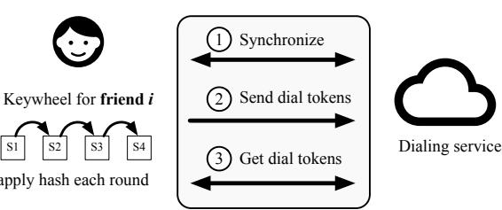
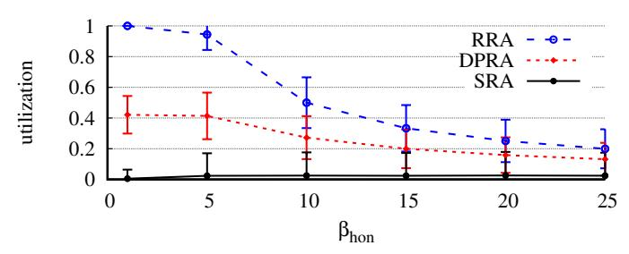
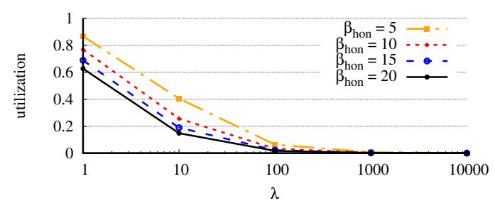
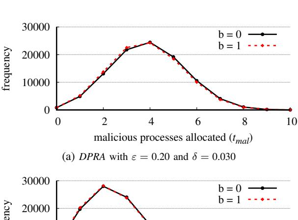
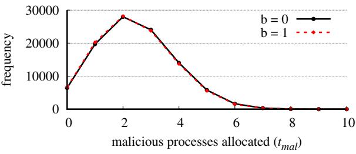
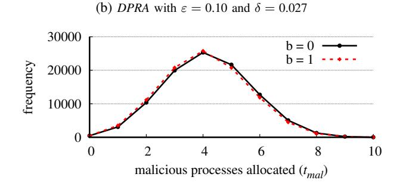
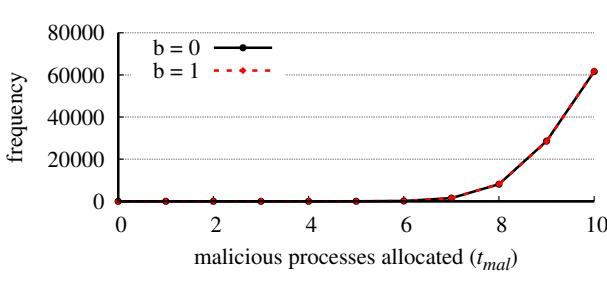
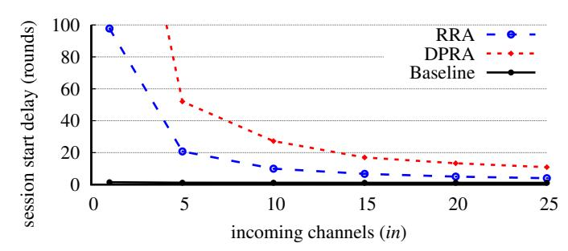
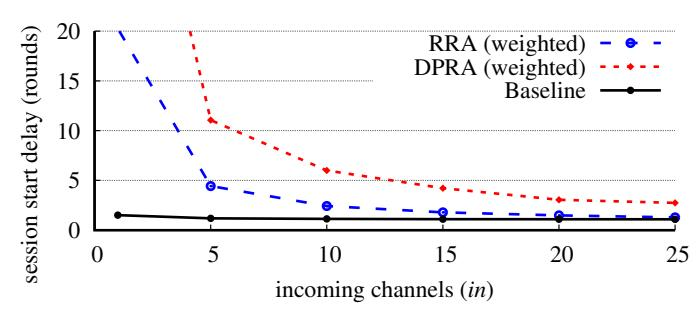

# Private resource allocators and their applications

Sebastian Angel *University of Pennsylvania*

Sampath Kannan *University of Pennsylvania*

Zachary Ratliff *Raytheon BBN Technologies*

*Abstract*—This paper introduces a new cryptographic primitive called a *private resource allocator* (PRA) that can be used to allocate resources (e.g., network bandwidth, CPUs) to a set of clients without revealing to the clients whether any other clients received resources. We give several constructions of PRAs that provide guarantees ranging from information-theoretic to differential privacy. PRAs are useful in preventing a new class of attacks that we call *allocation-based* side-channel attacks. These attacks can be used, for example, to break the privacy guarantees of anonymous messaging systems that were designed specifically to defend against side-channel and traffic analysis attacks. Our implementation of PRAs in Alpenhorn, which is a recent anonymous messaging system, shows that PRAs increase the network resources required to start a conversation by up to 16× (can be made as low as 4× in some cases), but add no overhead once the conversation has been established.

## I. INTRODUCTION

Building systems that avoid unintentional information leakage is challenging since every action or operation—innocuous as it may be—can reveal sensitive information. This is especially true in the wake of numerous *side-channel* attacks that exploit unexpected properties of a system's design, implementation, or hardware. These attacks can be based on analog signals such as the machine's power consumption [\[50\]](#page-15-0), sound produced [\[36\]](#page-15-1), photonic emissions from switching transistors [\[72\]](#page-16-0), temperature [\[43\]](#page-15-2), and electromagnetic radiation emanated [\[4,](#page-14-0) [82\]](#page-16-1), that arise as a result of the system performing some sensitive operation. Or they may be digital and monitor the timing of operations [\[51\]](#page-15-3), memory access patterns [\[38\]](#page-15-4), the contention arising from shared resources (e.g., caches [\[47\]](#page-15-5), execution ports in simultaneous multithreading [\[19\]](#page-14-1)), and the variability of network traffic [\[70\]](#page-16-2).

In the above cases, information is exposed as a result of a process in the system *consuming* a resource (e.g., sending a network packet, populating the cache, executing a conditional branch instruction). We can think of these side channels as *consumption-based*. In this paper, we are concerned with side channels that exist during the *allocation* of the resource to a process, and that are observable regardless of whether the process ultimately consumes the resource. As a result, these *allocation-based* side channels can sometimes be exploited by attackers in systems that have been explicitly designed to avoid consumption-based side channels (systems that pad all requests, regularize network traffic and memory accesses, have constant time implementations, clear caches after every operation, etc.). To prevent allocation-based side channels we propose a new primitive called a *private resource allocator* (PRA) that guarantees that the mechanism by which the system allocates resources to processes leaks no information.

At a high level, allocation-based side channels exist because a system's *resource allocator*—which includes cluster managers [\[1\]](#page-14-2), network rate limiters [\[58\]](#page-15-6), storage controllers [\[76\]](#page-16-3), data center resource managers [\[7\]](#page-14-3), flow coordinators [\[67\]](#page-16-4), lock managers [\[42\]](#page-15-7), etc.—can leak information about how many (and which) other *processes* are requesting service through the allocation itself. As a simple example, a process that receives only a fraction of the resources available from an allocator that is *work conserving* (i.e., that allocates as many resources as possible) can infer that other processes must have requested the same resources concurrently. These observations can be made even if the other processes do not use their allocated resources at all.

While the information disclosed by allocations might seem harmless at first glance, these allocation-based side channels can be used as building blocks for more serious attacks. As a motivating example, we show that allocation-based side channels can be combined with traffic analysis attacks [\[5,](#page-14-4) [26,](#page-14-5) [27,](#page-14-6) [48,](#page-15-8) [49,](#page-15-9) [59,](#page-15-10) [66,](#page-16-5) [70,](#page-16-2) [77\]](#page-16-6) to violate the guarantees of existing bidirectional anonymous messaging systems (often called metadata-private messengers or MPMs) [\[6,](#page-14-7) [10,](#page-14-8) [52,](#page-15-11) [53,](#page-15-12) [55,](#page-15-13) [56,](#page-15-14) [78,](#page-16-7) [81\]](#page-16-8). This is significant because MPMs are designed precisely to avoid side-channel attacks. In particular, Angel et al. [\[9\]](#page-14-9) show that these systems are secure only if *none* of the contacts with whom a user communicates are compromised by an adversary; otherwise, compromised contacts can learn information about the user's *other* conversations. We expand on Angel et al.'s observation in Section [II,](#page-1-0) and show that it is an instance of an allocation-based side-channel attack.

To prevent allocation-based side channels, we introduce private variants of resource allocators (PRAs) that can assign resources to processes without leaking to any processes which or how many other processes received any units of the resource. We formalize the properties of PRAs ([§III\)](#page-2-0), and propose several constructions that guarantee informationtheoretic, computational, and differential privacy under different settings ([§IV-A](#page-4-0)[–IV-C\)](#page-5-0). We also discuss how privacy interacts with classic properties of resource allocation. For example, we show that privacy implies *population monotonicity* ([§V\)](#page-7-0). Finally, we prove an impossibility result ([§III-B\)](#page-3-0): there does not exist a PRA when the number of concurrent requesting processes is not bounded ahead of time. As a result, PRAs must assume a polynomial bound on the number of requesting processes (and this bound might leak).

To showcase the benefits and costs of using PRAs, we integrate our constructions into Alpenhorn [\[57\]](#page-15-15), which is a system that manages conversations in MPMs. The result is the first MPM system that is secure in the presence of compromised friends. Interestingly, our implementation efforts reveal that naively introducing PRAs into MPMs would cripple these systems' functionality. For example, it would force clients to abruptly end ongoing conversations, and would prevent honest clients from ever starting conversations. To mitigate these issues, we propose several techniques tailored to MPMs ([§VI\)](#page-8-0).

Our evaluation of Alpenhorn shows that PRAs lead to conversations taking 16× longer to get started (or alternatively consuming 16× more network resources), though this number can be reduced to 4× by prioritizing certain users. However, once conversations have started, PRAs incur no additional overhead. While we admit that such delayed start (or bandwidth increase) further hinders the usability of MPMs, compromised friends are enough of a real threat to justify our proposal.

In summary, the contributions of this work are:

- The notion of Private Resource Allocators (PRA) that assign resources to processes without leaking how many or to which processes resources are allocated.
- An impossibility theorem that precisely captures under what circumstances privacy cannot be achieved.
- Several PRA constructions under varying assumptions.
- A study of how privacy impacts other allocation properties.
- The integration of PRAs into an MPM to avoid leaking information to compromised friends, and the corresponding experimental evaluation.

Finally, we believe that PRAs have applications beyond MPMs, and open up exciting theoretical and practical questions ([§IX\)](#page-13-0). We hope that the framework we present in the following sections serves as a good basis.

# <span id="page-1-0"></span>II. CASE STUDY: METADATA-PRIVATE MESSENGERS

In the past few years, there has been a flurry of work on messaging systems that hide not just the content of messages but also the metadata that is associated with those messages [\[6,](#page-14-7) [8,](#page-14-10) [10,](#page-14-8) [24,](#page-14-11) [53,](#page-15-12) [55,](#page-15-13) [56,](#page-15-14) [78,](#page-16-7) [81,](#page-16-8) [83\]](#page-16-9). These systems guarantee some variant of *relationship* (or third-party) *unobservability* [\[68\]](#page-16-10), in which all information (including the sender, recipient, time of day, frequency of communication, etc.) is kept hidden from anyone not directly involved in the communication. A key driver for these systems is the observation that metadata is itself sensitive and can be used—and in fact has been used [\[22,](#page-14-12) [71\]](#page-16-11) to infer the content or at least the context of conversations for a variety of purposes [\[73\]](#page-16-12). For example, a service provider could infer that a user has some health condition if the user often communicates with health professionals. Other inferable information typically considered sensitive includes religion, race, sexual orientation, and employment status [\[61\]](#page-15-16).

In these *metadata-private messengers* (MPMs), a pair of users are considered friends only if they have a shared secret. Users can determine which of their acquaintances are part of the system using a *contact discovery protocol* [\[16,](#page-14-13) [20,](#page-14-14) [60\]](#page-15-17), and can then exchange the secret needed to become friends with these acquaintances through an out-of-band channel (e.g., in person at a conference or coffee shop), or with an in-band *add-friend* protocol [\[57\]](#page-15-15). A pair of friends can then initiate a *session*. This

<span id="page-1-1"></span>

| Protocol                      | Objective                        |  |
|-------------------------------|----------------------------------|--|
| Discover friends              | Learn identifier or public key   |  |
| Add friend to contact list    | Establish a shared secret        |  |
| Dial a friend in contact list | Agree on session key and round r |  |
| Converse with friend          | Send message starting on round r |  |

FIG. 1—MPM systems consist of four protocols: friend discovery, add-friend, dialing, and conversation. Users can only converse once they are in an active session (agree on a session key and round).

is done with a *dialing* protocol [\[6,](#page-14-7) [52,](#page-15-11) [57\]](#page-15-15) whereby one user "cold calls" another user and notifies them of their intention to start a conversation. The analogous situation in the non-private setting is a dialing call on a VoIP or video chat service like Skype. Creating a session boils down to agreeing on a time or *round* to start the conversation, and generating a key that will be used to encrypt all messages in the session (derived from the shared secret and the chosen round).

Once a session between two friends has been established, the participants can exchange messages using a *conversation* protocol (this is the protocol that actually differentiates most MPM systems). In all proposed conversation protocols, communication occurs in discrete rounds—which is why part of creating a session involves identifying the round on which to start the conversation—during which a user sends and receives up to *k* messages. One can think of each of these *k* messages as being placed in a different *channel*. To guarantee no metadata leaks, users are forced to send and receive a message on each channel in every round, even when the user is idle and has nothing to send or receive (otherwise observers could determine when a user is not communicating). We summarize these protocols in Figure [1.](#page-1-1)

The above highlights a tension between performance and network costs experienced by all MPM systems. Longer rounds increase the delay between two consecutive messages but reduce the network overhead when a user is idle (due to fewer dummy messages). Having more channels improves throughput (more concurrent conversations per round or more messages per conversation) but at the cost of higher network overhead when the user is idle. Given that users are idle a large fraction of the time, most MPMs choose long round duration (tens of seconds) and a small number of channels (typically *k* = 1).

While these tradeoffs have long been understood, the impact of the number of communication channels on privacy has received less attention. We discuss this next.

## <span id="page-1-2"></span>*A. Channel allocation can leak information*

Prior works on MPMs have shown that the proposed contact discovery, add-friend, dialing, and conversation protocols are secure and leak little information (negligible or bounded) on their own, but surprisingly, none had carefully looked at their composition. Indeed, recent work by Angel et al. [\[9\]](#page-14-9) shows that existing dialing and communication protocols do not actually compose in the presence of compromised friends. The reason is that the number of communication channels (*k*) is usually smaller than the number of friends that could dial the user at any one time. As a result, when a user is dialed by *n* friends asking to start a conversation at the same time, the user must determine an allocation of the *n* friends to the *k* channels.

As one would expect, when *n* > *k*, not all of the *n* dialing requests can be allocated onto the *k* available channels since each channel can only support one conversation (for example, a user in Skype can only accept one incoming call at a time since *k* = 1). If this allocation is not done carefully—defining what "carefully" means formally is the subject of Section [III—](#page-2-0)a user's friends can learn information through dialing. In particular, a caller who dials and receives a busy signal or no response at all for a round *r* can infer that the callee has agreed to chat with other users during round *r*. <sup>1</sup> For the more general case of *k* > 1, an attacker controlling *k* callers can dial the user and observe whether all calls are answered or not; an attacker may even conduct a binary search over multiple rounds to learn the exact number of ongoing conversations.

The saving grace is that information that leaks is observed only by a user's dialing friends, as opposed to all users in the system or third-party observers (since friendship is a precondition for dialing). However, friends' accounts can be compromised by an adversary, and users could be tricked into befriending malicious parties. In fact, not only is this possible, it is actually a common occurrence: prior surveys of user behavior on online social networks show that users are very willing to accept friend requests from strangers [\[69\]](#page-16-13). Furthermore, given recent massive leaks of personal data—3 billion accounts by Yahoo in 2013 [\[54\]](#page-15-18); 43 million accounts by Equifax in 2017 [\[34\]](#page-15-19); 87 million users by Facebook in 2018 [\[74\]](#page-16-14) and an additional 549 million records in 2019 [\[80\]](#page-16-15) there is significant material for attackers to conduct social engineering and other attacks. Worse yet, many of these attacks can easily be automated [\[15\]](#page-14-15).

# *B. Traffic analysis makes things worse*

The previous section describes how an attacker, via compromised friends, can learn whether a user is busy or not in some round *r* (or get some confidence on this) by conducting an allocation-based side channel attack. While such leakage is minor on its own, it can be composed with traffic analysis techniques such as intersection [\[70\]](#page-16-2) and disclosure [\[5\]](#page-14-4) attacks (and their statistical variants [\[25\]](#page-14-16)).

As a very simple example, imagine an adversary that can compromise the friends of multiple users and can use those compromised friends to determine which users are (likely) active in a given round *r*. The adversary can then reduce the set of possible sender-recipient pairs by ignoring all the idle users (more sophisticated observations can also be made by targeting particular users). The adversary can then repeat the attack for other rounds *r* ′ , *r* ′′, etc. With each additional round, the adversary can construct intersections of active users and shrink the set of possible sender-recipient pairs under the assumption that conversations span multiple rounds.

In short, the described allocation-based side-channel attack makes existing MPM systems vulnerable to traffic analysis. In the next section we formally model the leakage of information that results from allocating dialing friends to a limited number of channels. In Sections [IV-A–](#page-4-0)[IV-C](#page-5-0) we then give several constructions of allocators that can be used by MPM systems to establish sessions without leaking information.

## III. PRIVATE RESOURCE ALLOCATORS (PRAS)

<span id="page-2-0"></span>The allocation-based side-channel attack described in the prior section essentially follows a pigeonhole-type argument whereby there are more friends than there are channels. This same idea applies to other situations. For example, whenever there is a limited number of CPU cores and many threads, the way in which threads are scheduled onto cores leaks information to the threads. Specifically, a thread that was not scheduled could infer that other threads were, even if the scheduled threads perform no operations and consume no resources. In this section we formalize this problem more generally and describe desirable security definitions.

We begin with the notion of a *private resource allocator*, which is an algorithm that assigns a limited number of resources to a set of processes that wish to use those resources. Privacy means that the outcome of the allocator does not reveal to any processes whether there were *other* processes concurrently requesting the same resource. Note that private allocators are concerned only with the information that leaks from the allocation itself; information that leaks from the use of the resource is an orthogonal concern.

In more detail, a resource allocator *RA* is an algorithm that takes as input a resource of capacity *k*, and a set of processes *P* from a universe of processes *M* (*P* ⊆ *M*). *RA* outputs the set of processes *U* ⊆ *P* that should be given a unit of the resource, such that |*U*| ≤ *k*. There are two desirable properties for an *RA*, informally given below.

- Privacy: it is hard for an adversary controlling a set of processes *Pmal* ⊆ *P* to determine whether there are other processes (i.e., *Pmal* = *P* or *Pmal* ⊂ *P*) from observing the allocations of processes in *Pmal*.
- Liveness: for all sets of processes *P*, *occasionally* at least one process in *P* receives a unit of the resource.

The liveness property is the weakest definition of progress needed for *RA*s to be useful, and helps to rule out an *RA* that achieves privacy by never allocating resources.

## *A. Formal definition*

Notation. We use *poly*(λ) and negl(λ) to mean a polynomial and negligible function<sup>2</sup> of λ's unary representation (1 λ ). We

<sup>1</sup>A lack of response does not always mean that a user is busy with others; the user could be asleep. However, existing MPMs accept requests automatically. Even if the user were involved, information would still leak and predicating correctness on behavior that is hard to characterize is undesirable.

<sup>2</sup>A function *f* : N → R is negligible if for all positive polynomials *poly*, there exists an integer *c* such that for all integers *x* greater than *c*, |*f* (*x*)| < 1/*poly*(*x*).

<span id="page-3-1"></span>

| symbol                             | description                                                 |
|------------------------------------|-------------------------------------------------------------|
| $\mathcal{C}$ and $\mathcal{A}$    | Challenger and adversary in the security game resp.         |
| $\overline{b}$ and $\overline{b}'$ | Challenger's coin flip and adversary's guess resp.          |
| $\overline{k}$                     | Amount of available resource                                |
| $\overline{M}$                     | Universe of processes                                       |
| $\overline{P}$                     | Processes requesting service concurrently ( $\subseteq M$ ) |
| $\overline{P_{hon}}$               | Honest processes in $P$ (not controlled by $A$ )            |
| $\overline{P_{mal}}$               | Malicious processes in $P$ (controlled by $A$ )             |
| $\overline{U}$                     | Allocation ( $\subseteq P$ ) of size at most $k$            |
| $\overline{\lambda}$               | Security parameter                                          |
| $\beta_x$                          | $poly(\lambda)$ bound on variable $x$                       |

FIG. 2—Summary of terms used in the security game, lemmas, and proofs, and their corresponding meaning.

use  $\beta_x$  to mean a  $poly(\lambda)$  bound on variable x. Upper case letters denote sets of processes. Figure 2 summarizes all terms.

**Security game.** We define privacy with a game played between an adversary A and a challenger C. The game is parameterized by a resource allocator RA and a security parameter  $\lambda$ . RA takes as input a set of processes P from the universe of all processes M, a resource capacity k that is  $poly(\lambda)$ , and  $\lambda$ . RA outputs a set of processes  $U \subseteq P$ , such that  $|U| \le k$ .

- 1)  $\mathcal{A}$  is given oracle access to RA, and can issue an arbitrary number of queries to RA with arbitrary inputs P and k. For each query,  $\mathcal{A}$  can observe the result  $U \leftarrow RA(P, k, \lambda)$ .
- 2)  $\mathcal{A}$  picks a positive integer k and two disjoint sets of processes  $P_{hon}, P_{mal} \subseteq M$  and sends them to  $\mathcal{C}$ . Here  $P_{hon}$  represents the set of processes requesting a resource that are honest and are not compromised by the adversary.  $P_{mal}$  represents the set of processes requesting a resource that are compromised by the adversary.
- 3) C samples a random bit b uniformly in  $\{0,1\}$ .
- 4) C sets  $P \leftarrow P_{mal}$  if b = 0 and  $P \leftarrow P_{mal} \cup P_{hon}$  if b = 1.
- 5) C calls  $RA(P, k, \lambda)$  to obtain  $U \subseteq P$  where  $|U| \le k$ .
- <span id="page-3-6"></span>6) C returns  $U_{mal} = U \cap P_{mal}$  to A.
- 7) A outputs its guess b', and wins the game if b = b'.

In summary, the adversary's goal is to determine if the challenger requested resources for the honest processes or not.

<span id="page-3-3"></span>**Definition 1** (Information-theoretic privacy). An allocator RA is IT-private if in the security game, for all algorithms  $\mathcal{A}$ ,  $\Pr[b=b']=1/2$ , where the probability is over the random coins of  $\mathcal{C}$  and RA.

<span id="page-3-5"></span>**Definition 2** (Computational privacy). An allocator RA is C-private if in the security game given parameter  $\lambda$ , for all probabilistic polynomial-time algorithms  $\mathcal{A}$ , the advantage of  $\mathcal{A}$  is negligible:  $|\Pr[b=b']-1/2| \leq \operatorname{negl}(\lambda)$ , where the probability is over the random coins of  $\mathcal{C}$  and RA.

<span id="page-3-2"></span>**Definition 3** (Liveness). An allocator RA guarantees liveness if given parameter  $\lambda$ , any non-empty set of processes P, and positive resource capacity k,  $\Pr[RA(P,k,\lambda) \neq \emptyset] \geq 1/poly(\lambda)$ .

The proposed liveness definition (Def. 3) is very weak. It simply states that the allocator must occasionally output at least one process. Notably, it says nothing about processes being allocated resources with equal likelihood, or that every process is eventually serviced (it allows starvation). Nevertheless, this weak definition is sufficient to separate trivial from non-trivial allocators; we discuss several other properties such as fairness and resource monotonicity in Section V. To compare the efficiency of non-trivial allocators, however, we need a stronger notion that we call the allocator's *utilization*.

<span id="page-3-4"></span>**Definition 4** (Utilization). The utilization of a resource allocator RA is the fraction of requests serviced by RA compared to the number of requests that would have been serviced by a non-private allocator. Formally, given a set of processes P, capacity k, and parameter  $\lambda$ , RA's utilization is  $\mathbb{E}(U)/\min(|P|, k)$ , where  $\mathbb{E}(U)$  is the expected number of output processes of  $RA(P, k, \lambda)$ .

## <span id="page-3-0"></span>B. Prior allocators fail

Before describing our constructions we discuss why straightforward resource allocators fail to achieve privacy.

**FIFO allocator.** A FIFO allocator simply allocates resources to the first k processes. This is the type of allocator currently used by MPM systems to assign dialing friends to channels (§II-A), and is also commonly found in cluster job schedulers (e.g., Spark [84]). This allocator provides no privacy. To see why, suppose that both  $P_{hon}$  and  $P_{mal}$  are ordered sets, where the order stems from the identity of the process. The adversary can interleave the identity of processes in  $P_{hon}$  and  $P_{mal}$  so that the FIFO allocator's output is k processes in  $P_{mal}$  when b=0, and k/2 processes in  $P_{mal}$  when b=1.

**Uniform allocator.** Another common allocator is one that picks k of the processes at random. At first glance this might appear to provide privacy since processes are being chosen uniformly. Nevertheless, this allocator leaks a lot of information. In particular, when b=0 the adversary expects k of its processes to be allocated (since  $P=P_{mal}$ ), whereas when b=1, fewer than k of the malicious processes are likely to be allocated. More formally, let X be the random variable describing the cardinality of the set returned to  $\mathcal{A}$ , namely  $|U \cap P_{mal}|$ . Suppose  $|P_{mal}| = |P_{hon}| = k$ . Then  $\Pr[X < k | b = 0] = 0$  and  $\Pr[X < k | b = 1] = 1 - (k! \cdot k!)/(2k)! \ge 1/2$ . As a result,  $\mathcal{A}$  can distinguish between b=0 and b=1 with non-negligible advantage by simply counting the elements in  $U \cap P_{mal}$ .

**Uniform allocator with variable-sized output.** One of the issues with the prior allocator is that the size of the output reveals too much. We could consider a simple fix that selects an output size s uniformly from the range [0, k], and allocates s processes at random. But this is also not secure.

Let  $|P_{mal}| = |P_{hon}| = k$ , and let X be the random variable representing the cardinality of the set returned to  $\mathcal{A}$ . We show that the probability that X = k is lower when b = 1. Observe that  $\Pr[X = k \mid b = 0] = \frac{1}{k+1}$ , whereas  $\Pr[X = k \mid b = 1] = (k! \cdot k!)/((k+1)(2k)!) < \frac{1}{k+1}$  for all  $k \geq 1$ . Furthermore, when  $k \geq 1$ ,  $(k! \cdot k!)/((k+1)(2k)!) \leq 1/2$ . Therefore,  $\frac{1}{k+1}$ 

<span id="page-4-2"></span>

| allocator    | leakage        | utilization                               | assumptions                                                                              |
|--------------|----------------|-------------------------------------------|------------------------------------------------------------------------------------------|
| SRA (§IV-A)  | None           | $\frac{ P }{\beta_M}$                     | <ul> <li>setup phase</li> <li> M  ≤ β<sub>M</sub></li> <li>p ∈ M identifiable</li> </ul> |
| RRA (§IV-B)  | None           | $\frac{ P }{\beta_P}$                     | • $ P  \leq \beta_P$                                                                     |
| DPRA (§IV-C) | $1/g(\lambda)$ | $\frac{ P }{ P  + h(\lambda)\beta_{hon}}$ | • $ P_{hon}  \leq \beta_{hon}$                                                           |

FIG. 3—Comparison of privacy guarantees, utilization, and assumptions of different PRAs. DPRA makes the weakest assumptions since  $P_{hon} \subseteq P \subseteq M$  and is the only one that tolerates an arbitrary number of malicious processes. g and h are polynomial functions that control the tradeoff between utilization and privacy (§IV-C).

 $(k!\cdot k!)/((k+1)(2k)!)\geq \frac{1}{k+1}\cdot [1-1/2]=\frac{1}{2(k+1)},$  which is non-negligible. As a result,  $\mathcal A$  can distinguish b=0 and b=1 with non-negligible advantage.

**Allocator from a secret distribution.** The drawback of the prior allocator is that the adversary knows the expected distribution under b=0 and b=1 for its choice of  $P_{hon}$ ,  $P_{mal}$ , and k. Suppose instead that the allocator has access to a secret distribution not known to the adversary. The allocator then uses the approach above (allocator with variable-sized output) with the secret distribution instead of a uniform distribution. This is also not secure; the proof is in Appendix A.

The intuition for the above result is that the perturbation introduced by steps 4 and 6 of the security game cannot be masked without additional assumptions. To formalize this, we present the following impossibility result that states that without a bound on the number of processes, an allocator cannot simultaneously achieve privacy and our weak definition of liveness. We focus on IT-privacy since C-privacy considers a PPT adversary; by definition, the size of the sets of processes that such an adversary can create is bounded by a polynomial.

<span id="page-4-3"></span>**Theorem 1** (Impossibility result). There does not exist a resource allocator RA that achieves IT-privacy (Def. 1) and Liveness (Def. 3) when k is  $poly(\lambda)$  and |P| is not  $poly(\lambda)$ .

The proof is given in Appendix B.

## IV. ALLOCATOR CONSTRUCTIONS

Given the impossibility result in the prior section, we propose several allocators that guarantee liveness and some variant of privacy under different assumptions. As a bare minimum, all constructions assume a  $poly(\lambda)$  bound,  $\beta_{hon}$ , on  $|P_{hon}|$ . In the context of MPM systems, this basically means that a user never receives more than a polynomial number of dial requests by honest users asking to start a conversation in the same round—which is an assumption that is easy to satisfy in practice. We note that none of our allocators can hide  $\beta_{hon}$  from an adversary, so it is best thought of as a public parameter. We summarize the properties of our constructions in Figure 3.

## <span id="page-4-0"></span>A. Slot-based resource allocator

We now discuss a simple slot-based resource allocator. It guarantees information-theoretic privacy and liveness under the assumption that the size of the universe of processes (|M|) has a bound  $\beta_M$  that is  $poly(\lambda)$ . The key idea is to map each process  $p \in M$  to a unique "allocation slot" (so there are at most  $\beta_M$  total slots), and grant resources to processes only if they request them during their allocated slots. The chosen slots are determined by a random  $\lambda$ -bit integer r.

## Slot-based resource allocator SRA:

- **Pre-condition (setup)**:  $\forall p \in M, slot(p) \in [0, |M|)$
- Inputs:  $P, k, \lambda$
- $r \leftarrow_R [0, 2^{\lambda})$
- $U \leftarrow \varnothing$
- $\forall p \in P, i \in [0, k)$ , if  $slot(p) \equiv r + i \mod |M|$ , add p to U
- Output: U

# Lemma 1. SRA guarantees IT-privacy (Def. 1).

*Proof.* Observe that a process  $p \in P$  is added to U when  $r \le slot(p) < (r+k) \mod |M|$ , which occurs independently of b. In particular, if we let  $E_p$  be the event that a process  $p \in P$  is added to U, then  $\Pr[E_p|b=0] = \Pr[E_p|b=1] = k/|M|$ . Since an adversary cannot observe differences in  $\Pr[E_p]$  when  $P = P_{mal}$  versus  $P = P_{mal} \cup P_{hon}$ , privacy is preserved. □

**Lemma 2.** SRA guarantees Liveness (Def. 3) if  $|M| \leq \beta_M$ .

*Proof.* SRA outputs at least one process when there is a  $p \in P$  such that  $r \leq slot(p) < (r+k) \mod |M|$ . For a given r, this occurs with probability  $\geq k/|M|$ .

SRA achieves our desired goals. It guarantees privacy and liveness, and achieves a utilization (Def. 4) of  $\frac{|P|}{|M|}$  whenever  $k \leq |P|$ . But it also has several limitations. First, it assumes that the cardinality of the universe of processes (|M|) is known in advance, and that it can be bounded by  $\beta_M$ . Second, it assumes a preprocessing phase in which each process in M is assigned a slot. Finally, it assumes that each individual process is identifiable since SRA must be able to compute slot(p) for every process  $p \in P$ .

Unfortunately, these limitations are problematic for many applications. For instance, consider an MPM system (§II). M represents the set of friends for a user (not just the ones dialing), so it could be large. Furthermore, users cannot add new friends without leaking information since this would change M (and therefore the periodicity of allocations), which the adversary can detect. As a result, users must bound the maximum set of friends that they will ever have  $(\beta_M)$ , use this bound in the allocator (instead of |M|), and achieve a utilization of  $\frac{|P|}{\beta_M}$ .

## <span id="page-4-1"></span>B. Randomized resource allocator

In this section we show how to relax most of the assumptions that SRA makes while achieving better utilization. In particular, we construct a randomized resource allocator RRA that guarantees privacy and liveness under the assumption that there is a  $poly(\lambda)$  bound,  $\beta_P$ , for the number of simultaneous processes

requesting a resource (|P|). RRA does not need a setup phase, and does not require uniquely identifying processes in M. More importantly, RRA achieves both requirements even when the universe of processes (M) is unbounded. These relaxations are crucial since they make RRA applicable to situations in which processes are created dynamically.

At a high level, *RRA* works by padding the set of processes (*P*) with enough dummy processes to reach the upper bound ( $\beta_P$ ). *RRA* then randomly permutes the padded set and outputs the first *k* entries (removing any dummies from the allocation). If the permutation is truly random, this allocator guarantees information-theoretic privacy since *P* is always padded to  $\beta_P$  elements regardless of the challenger's coin flip (*b*). However, it requires a source of more than  $\beta_P$  random bits, which might be too much in some scenarios. One way to address this is to generate the random permutations on the fly [18], which requires only  $O(k \log(\beta_P))$  random bits. Alternatively, we can simply assume that the adversary is computationally bounded and allow a negligible leakage of information by making the permutation pseudorandom instead.

## Randomized resource allocator RRA:

- Inputs:  $P, k, \lambda$
- $Q \leftarrow$  set of dummy processes of size  $\beta_P |P|$
- $\pi \leftarrow$  random or pseudorandom permutation of  $P \cup Q$
- $U \leftarrow$  first k entries in  $\pi$
- Output:  $U \cap P$

<span id="page-5-1"></span>**Lemma 3.** RRA guarantees IT-privacy (Def. 1) if  $|P| \leq \beta_p$  and the permutation is truly random.

*Proof.* Let  $E_p$  be the event that a process p is added to U. Then, for all  $p \in P$ ,  $\Pr[E_p] = k/\beta_P$ . Since  $\Pr[E_p]$  remains constant for all sets of processes P, an adversary has no advantage to distinguish between  $P = P_{mal}$  and  $P = P_{mal} \cup P_{hon}$ .

**Lemma 4.** RRA guarantees C-privacy (Def. 2) against all probabilistic polynomial-time (PPT) adversaries if  $|P| \leq \beta_P$ .

*Proof.* We use a simple hybrid argument. Consider the variant of *RRA* that uses a random permutation instead of a PRP. Lemma 3 shows the adversary has no advantage to distinguish between b=0 and b=1. A PPT adversary distinguishes between the above *RRA* variant and one that uses a PRP (with security parameter  $\lambda$ ) with negl( $\lambda$ ) advantage.

**Lemma 5.** RRA guarantees Liveness (Def. 3) if  $|P| \leq \beta_P$ .

*Proof. RRA* outputs at least one process if there exists a  $p \in P$  in the first k elements of  $\pi$ . This follows a hypergeometric distribution since we sample k out of  $\beta_P$  processes without replacement, and processes in P are considered a "success". The probability of at least one success is therefore:

$$\sum_{i=1}^{k} \frac{\binom{|P|}{i} \binom{|Q|}{k-i}}{\binom{\beta_P}{k}} \ge 1/\beta_P$$

which is non-negligible.

RRA achieves privacy, liveness, and a utilization (Def. 4) of  $|P|/\beta_P$  when  $k \leq |P|$ , which is a factor of  $\beta_M/\beta_P$  improvement over SRA. However, it still requires a bound on the number of concurrent processes (P). In the context of an MPM system, this requirement essentially asks the user to pick a bound (e.g.,  $\beta_P =$ 20), and assume that the adversary will not compromise more than, say, 18 of their friends, while simultaneously receiving fewer than 3 calls from honest friends. Otherwise, the adversary could simply flood the user with malicious calls and infer, via an allocation-based side channel, that the user is talking to at least one honest friend (§II). Although one could come up with values of  $\beta_P$  that are large enough to hold in practice (e.g., users in social media have on average hundreds of friends [79], so  $\beta_P = 100$  might suffice), this only works in applications where the adversary cannot commandeer an arbitrary number of processes via a sybil attack [30]. In such cases, there might not be a useful bound (e.g.,  $\beta_P = 2^{80}$  certainly holds in practice, but results in essentially 0 utilization).

The above limitation is fundamental and follows from our impossibility result. In the next section, however, we show that if one can tolerate a weaker privacy guarantee, there exist allocators that require only a  $poly(\lambda)$  bound,  $\beta_{hon}$ , on  $|P_{hon}|$ . The number of malicious processes  $(|P_{mal}|)$ , and therefore the number of total concurrent processes (|P|), can be unbounded.

## <span id="page-5-0"></span>C. Differentially private resource allocator

In this section we relax the privacy guarantees of PRAs and require only that the leakage be at most inverse polynomial in  $\lambda$ , rather than negligible. We define this guarantee in terms of  $(\varepsilon, \delta)$ -differential privacy [31].

<span id="page-5-2"></span>**Definition 5** (Differential privacy). An allocator RA is  $(\epsilon, \delta)$ -differentially private [31] if in the security game of Section III, given parameter  $\lambda$ , for all algorithms  $\mathcal{A}$  and for all  $U_{mal}$ :

$$\Pr[\mathcal{C}(b) \text{ returns } U_{mal}] \leq e^{\varepsilon} \cdot \Pr[\mathcal{C}(\bar{b}) \text{ returns } U_{mal}] + \delta$$

where  $U_{mal}$  is the set of processes returned from  $\mathcal C$  to  $\mathcal A$  in Step 6 of the security game, and  $\mathcal C(b)$  means an instance of  $\mathcal C$  where the random bit is b; similarly for  $\mathcal C(\bar b)$  where  $\bar b=1-b$ . The probability is over the random coins of  $\mathcal C$  and RA.

We show that if there is a  $poly(\lambda)$  bound,  $\beta_{hon}$ , for the number of honest processes ( $|P_{hon}|$ ), then there is an RA that achieves ( $\varepsilon$ ,  $\delta$ )-differential privacy and Liveness (Def. 3). Before introducing our construction, we discuss a subtle property of allocators that we have ignored thus far: symmetry.

**Definition 6** (Symmetry). An allocator is *symmetric* if it does not take into account the features, identities, or ordering of processes when allocating resources. This is an adaptation of symmetry in games [21, 35], in which the payoff of a player depends only on the strategy it uses, and not on the player's identity. Concretely, given an ordered set of processes P where the only difference between processes is their position in P, RA is symmetric if  $\Pr[RA(P,k,\lambda)=p]=\Pr[RA(\pi(P),k,\lambda)=p]$ , for all P and all permutations  $\pi$ . This argument extends to other identifying features (process id, permissions, time that a process is created, how many times a process has retried, etc.).

For example, the (non-private) uniform allocator of Section [III-B](#page-3-0) and the private *RRA* ([§IV-B\)](#page-4-1) are symmetric: they allocate resources without inspecting processes. On the other hand, the (non-private) FIFO allocator of Section [III-B](#page-3-0) and the private *SRA* ([§IV-A\)](#page-4-0) are not symmetric; FIFO takes into account the ordering of processes, and *SRA* requires computing the function *slot* on each process. While symmetry places some limits on what an allocator can do, in Section [V-A](#page-7-1) we show that many features (e.g., heterogeneous demands, priorities) can still be implemented.

Construction. Recall from Section [III](#page-2-0) that *RA* receives one of two requests from C depending on the bit *b* that C samples. The request is either *Pmal* or *Pmal* ∪*Phon*. We can think of these sets as two neighboring databases. Our concern is that the processes in *Pmal* that are allocated the resource might convey too much information about which of these two databases was given to *RA*, and in turn reveal *b*. To characterize this leakage, we derive the *sensitivity* of an *RA* that allocates resources uniformly.

Our key observation is that if *RA* is symmetric, then the only useful information that the adversary gets is the number of processes in *Pmal* that are allocated (i.e., |*Umal*|); the allocation is independent of the particular processes in *Pmal*. If *RA* adds no dummy processes and allocates resources uniformly, then |*Umal*| = min(|*Pmal*|, *k*|*Pmal*| |*Pmal*| ) when *b* = 0 and, in expectation, min(|*Pmal*|, *k*|*Pmal*| |*Pmal*|+|*Phon*| ) when *b* = 1. By observing |*Umal*|, the adversary learns the denominator in these fractions; the sensitivity of this denominator—and of *RA*—is |*Phon*| ≤ β*hon*.

To limit the leakage, we design an allocator that samples noise from an appropriate distribution and adds dummies based on the sampled noise. We discuss the Laplace distribution here, but other distributions (e.g., Poisson) would also work. The Laplace distribution (Lap) with location parameter µ and scale parameter *s* has the probability density function:

$$Lap(x|\mu, s) = \frac{1}{2s} \exp\left(\frac{-|x-\mu|}{s}\right)$$

Let *g*(λ) and *h*(λ) be polynomial functions of the allocator's security parameter λ. These functions will control the tradeoff between privacy and utilization: ε = 1/*g*(λ) bounds how much information leaks (a larger value of *g*(λ) leads to better privacy but worse utilization), and the ratio *h*(λ)/*g*(λ) (which impacts δ) determines how often the bound holds (a larger ratio provides a stronger guarantee, but leads to worse utilization). Given these two functions, the allocator works as follows.

## (ε, δ)-differentially private resource allocator *DPRA*:

```
• Inputs: P, k, λ
• µ ← βhon · h(λ)
• s ← βhon · g(λ)
• n ← ⌈max(0, Lap(µ,s))⌉
• t ← |P| + n
• Q ← set of dummy processes of size n
• π ← random permutation of P ∪ Q
• U ← first min(t, k) processes in π
• Output: U ∩ P
```

In short, the allocator receives a number of requests that is either |*Pmal*| or |*Pmal*∪*Phon*|. It samples noise *n* from the Laplace distribution, computes the noisy total number of processes *t* = |*P*| + *n*, and allocates min(*t*, *k*) uniformly at random.

Lemma 6. *DPRA* is (ε, δ)-differentially private (Def. [5\)](#page-5-2) for ε = *g*(λ) and δ = exp( 1−*h*(λ) *g*(λ) ) if |*Phon*| ≤ β*hon*.

*Proof strategy.* The proof that *DPRA* is differentially private uses some of the ideas from the proof for the Laplace mechanism by Dwork et al. [\[31\]](#page-14-19). A learns the total number of processes in *Pmal* that are allocated, call it *tmal*. We show that when the noise (*n*) is sufficiently large, for all ℓ ∈ [0, *k*], Pr[*tmal* = ℓ|*b* = 0] is within a factor *e* <sup>ε</sup> of Pr[*tmal* = ℓ|*b* = 1]. We then show that the noise fails to be sufficiently large with probability ≤ δ. We give the full proof in Appendix [C.](#page-17-2)

Corollary 7. If |*Phon*| ≤ β*hon*, the leakage or *privacy loss* that results from observing the output of *DPRA* is bounded by 1/*g*(λ) with probability at least 1 − δ [\[32,](#page-14-21) Lemma 3.17].

In some cases, an adversary might interact with an allocator multiple times, adapting *Pmal* in an attempt to learn more information. We can reason about the leakage after *i* interactions through differential privacy's *adaptive composition* [\[33\]](#page-15-21).

Lemma 8. *DPRA* is (ε ′ , *i*δ + δ ′ )-differentially private over *i* interactions for δ ′ > 0 and ε ′ = ε p 2*i* ln(1/δ′) + *i*ε(*e* <sup>ε</sup> − 1).

*Proof.* The proof follows from [\[33,](#page-15-21) Theorem III.3]. An optimal, albeit more complex, bound also exists [\[44,](#page-15-22) Theorem 3.3].

<span id="page-6-0"></span>Lemma 9. *DPRA* provides liveness (Def. [3\)](#page-3-2) if |*Phon*| ≤ β*hon*.

*Proof.* The expected value of Lap is β*hon* · *h*(λ) ≤ *poly*<sup>2</sup> (λ). As a result, the number of dummy processes added by *DPRA* is polynomial on average; at least one process in *P* is allocated a resource with inverse polynomial probability.

*DPRA* is efficient in expectation since with high probability, *n* does not exceed a small multiple of β*hon* ·*h*(λ) (Lemma [9\)](#page-6-0). To bound *DPRA*'s worst-case time and space complexity, we can truncate the Laplace distribution and bound *n* by exp(λ) without much additional leakage. However, even if |*P*| ∈ *poly*(λ), the noise (*n*), and thus the total number of processes (*t*) can all be exp(λ). This would require *DPRA* to have access to exp(λ) random bits to sample the dummy processes and to perform the permutation; the running time and space complexity would also be exponential. Fortunately, the generation of dummy processes, the set union, and the permutation can all be avoided (we introduced them only for simplicity). *DPRA* can compute *U* directly from *P*, *k*, and *t* as follows.

```
1: function RANDOMALLOCATION(P, k, t)
2: U ← ∅
3: for i = 0 to min(t, k) − 1 do
4: r ←R [0, 1]
5: if r < |P|/(t − i) then
6: p ← Sample uniformly from P without replacement
7: U = U ∪ {p}
8: return U
```

Finally, sampling *m* elements from *P* without replacement is equivalent to generating the first *m* elements of a random permutation of *P* on the fly, which can be done with *O*(*m* log |*P*|) random bits in *O*(*m* log |*P*|) time and *O*(*m*) space [\[18\]](#page-14-17). The same optimization (avoiding dummy processes and permutations) applies to *RRA* ([§IV-B\)](#page-4-1) as well.

## <span id="page-7-0"></span>V. EXTENSIONS AND OTHER ALLOCATOR PROPERTIES

In addition to privacy and liveness, we ask whether PRAs satisfy other properties that are often considered in resource allocation settings. We study a few of them, listed below:

- *Resource monotonicity* If the capacity of the allocator increases, the probability of any of the requesting processes to receive service should not decrease.
- *Population monotonicity* When a process stops requesting service, the probability of any of the remaining processes to receive service should not decrease.
- *Envy-freeness.* A process should not prefer the allocation probability of another process. This is our working definition of *fairness*, though the notion of preference is quite subtle, as we explain later.
- *Strategy-proofness.* A process should not benefit by lying about how many units of a resource it needs.

Before stating which allocators meet which properties, we first describe a few generalizations to PRAs.

## <span id="page-7-1"></span>*A. Weighted allocators*

Our resource allocators are egalitarian and select which processes to allocate uniformly from all requesting processes. However, they can be extended to prioritize some processes over others with the use of weights. Briefly, each process is associated with a weight, and allocation is done in proportion that weight: a request from a process with half of the weight of a different process is picked up half as often. To implement weighted allocators, the *poly*(λ) bound on the number of process (e.g., β*<sup>P</sup>* in RRA) now represents the bound on the sum of weights across all concurrent processes (normalized by the lowest weight of any of the processes), rather than the number of processes; padding is done by adding dummy processes until the normalized sum of their weights adds to the bound.

All of our privacy and liveness arguments carry over straightforwardly to this setting. The only caveat is that processes can infer their own assigned weight over time; just like the bounds, none of our allocators can keep this information private. However, processes cannot infer the weight of *other* processes beyond the trivial upper bound (i.e., the sum of the weights of any potential set of concurrent processes is β*P*).

## *B. Non-binary demands*

Thus far we have considered only allocators for processes that demand a single unit of a resource. A natural extension is to consider non-binary demands. For example, a client of a cloud service might request 5 machines to run a task. These demands could be *indivisible* (i.e., the process derives positive utility only if it receives all of its demand), or *divisible* (i.e., the process derives positive utility even if it receives a fraction of its demand). We describe two potential modifications to PRAs that handle the divisible demands case and achieve different notions of fairness; we leave a construction of PRAs for the indivisible demands case to future work.

Probability in proportion to demands. In the non-binary setting, the input to the allocator is no longer just the set of processes *P*, but also their corresponding demands *D*. A desirable notion of fairness might be to allocate resources in proportion to processes' demands. For example, if process *p*<sup>1</sup> demands 100 units, and *p*<sup>2</sup> demands 2 units, an allocation of 50 units to *p*<sup>1</sup> and 1 unit to *p*<sup>2</sup> may be fair. Our PRAs can achieve this type of fairness for integral units by treating each process as a set of processes of binary demand (the cardinality of each set is given by the corresponding non-binary demand). The bounds are therefore based on the sum of processes' demands rather than the number of processes.

Probability independent of demands. Another possibility is to allocate each unit of a resource to processes independently of how many units they demand. For example, if *p*<sup>1</sup> demands 100 units and *p*<sup>2</sup> demands 1 unit, both processes are equally likely to receive the first unit of the resource. If *p*<sup>2</sup> does not receive the first unit, both processes have an equal chance to get the second unit, etc.

To achieve this definition with PRAs, we propose to change the way that *RRA* and *DPRA* sample processes (i.e., Line [6](#page-6-0) of the RANDOMALLOCATION function given in Section [IV-C\)](#page-5-0). Instead of sampling processes uniformly without replacement and giving the chosen processes all of their demanded resources, the allocator samples processes from *P* uniformly with *infinite* replacement, and gives each sampled process one unit of the resource on every iteration. The allocator then assigns to each process *p<sup>i</sup>* the number of units sampled for *p<sup>i</sup>* at the end of the algorithm or *pi*'s demand, whichever is lower. This mechanism preserves the privacy of the allocation since it is equivalent to hypothetically running a PRA with a resource of capacity 1 and the same set of binary-demand processes *k* times in a row.

A property of this definition is that the bounds on the number of processes—β*<sup>P</sup>* in RRA ([§IV-B\)](#page-4-1) and β*hon* in DPRA ([§IV-C\)](#page-5-0) remain the same as in the binary-demand case (i.e., independent of processes' demands) since the allocator does not expose the results of the intermediate *k* hypothetical runs. However, the allocator assumes that processes have infinite demand (and discards excess allocations at the end), which ensures privacy but leads to worse utilization (based on the imbalance of demands). A potentially less wasteful alternative is to do the sampling with a bounded number of replacements (i.e., a sampled process is not replaced if its demand has been met), but we have not yet analyzed this case since it requires stateful reasoning (it is a Markov process); to our knowledge *sampling with bounded replacement* has not been previously studied.

#### C. Additional properties met by PRAs

All of our PRAs meet the first three properties listed earlier, and *SRA* and *RRA* also meet strategy-proofness; our proofs are in Appendix D, but we highlight the most interesting results.

We observe that privacy is intimately related to population monotonicity. This is most evident in *DPRA*, since its differential privacy definition states that changes in the set of processes have a bounded effect on the allocation. Indeed, we prove in Appendix D that our strongest definition of privacy, IT-privacy (Def. 1), implies population monotonicity.

SRA and RRA are trivially strategy-proof for binary demands since processes have only two choices—to request or not request the resource—and they derive positive utility only if: (a) they receive the resource; or (b) they deny some other process the resource (in some applications). Condition (b) is nullified by IT-Privacy: the existence of other processes has no impact on whether a process receives a resource (if it did, an adversary could exploit it to win the security game with non-zero advantage). Furthermore, if the resource cannot be traded (i.e., a process cannot give its resource to another process) and demands are binary, IT-privacy implies group strategy-proofness [12], which captures the notion of collusion between processes (as otherwise a set of processes controlled by the adversary could impact the allocation and violate privacy).

For non-binary demands, PRAs that meet our definition of allocation probabilities being in proportion to demands are not strategy-proof: processes have an incentive to request as many units of a resource as possible regardless of how many units they actually need. On the other hand, allocators that meet the definition of allocation probability being independent of demands are strategy-proof since the allocator assumes that all processes have infinite demand anyway.

## VI. BUILDING PRIVATE DIALING PROTOCOLS

<span id="page-8-0"></span>In Section II we show that the composition of existing dialing protocols with conversation protocols in MPM systems leaks information. In this section we show how to incorporate the PRAs from Section III into dialing protocols [6, 52, 57]. As an example, we pick Alpenhorn [57] since it has a simple dialing scheme, and describe the modifications that we make.

## A. Alpenhorn's dialing protocol

As we mention in Section II, a precondition for dialing is that both parties, caller and callee, have a shared secret. We do not discuss the specifics of how the secret is exchanged since they are orthogonal (for simplicity, assume the secret is exchanged out of band). Alpenhorn's dialing protocol achieves three goals. First, it synchronizes the state of users with the current state of the system so that clients can dial their friends. Second, it establishes an ephemeral key for a session so that all data and metadata corresponding to that session enjoys forward secrecy: if the key is compromised, the adversary does not learn the content or metadata of prior sessions. Last, it sets a round on which to start communication. The actual communication happens via an MPM's conversation protocol.

Round of a dial protocol

<span id="page-8-1"></span>

FIG. 4—Overview of Alpenhorn's dialing protocol [57]. Clients deposit dial tokens for their friends into an untrusted dialing service in rounds, and download all dial tokens sent at the end of a round. Clients then locally determine which tokens were meant for them. To derive dial tokens for a particular friend and round, clients use a per-friend data structure called a keywheel (see text for details).

We discuss how Alpenhorn achieves these goals, and summarize the steps in Figure 4.

**Synchronizing state.** Similarly to how conversation protocols operate in rounds (as we briefly discuss in Section II), dialing protocols also operate in rounds. However, the two types of rounds are quantitatively and qualitatively different. Quantitatively, dialing happens less frequently (e.g., once per minute) whereas conversations happen often (e.g., every ten seconds). Qualitatively, a round of dialing precedes several rounds of conversation, and compromised friends can only make observations at the granularity of dialing rounds.

To be able to dial other users, clients need to know the current dialing round. Clients can do this by asking the dialing service (which is typically an untrusted server or a network of mix servers) for the current round. While the dialing service could lie, it would only result in denial of service which none of these systems aims to prevent anyway.

In addition to the current dialing round, clients in Alpenhorn maintain a *keywheel* for each of their friends. A keywheel is a hash chain where the first node in the chain corresponds to the initial secret shared between a pair of users (we depict this as "S1" in Figure 4) anchored to some round. Once a dialing round advances, the client hashes the current node to obtain the next node, which gives the shared secret to be used in the new round. The client discards prior nodes to ensure forward secrecy in case of a device compromise.

Generating a dial request. To dial a friend, a client synchronizes their keywheel to obtain the shared secret for the current dialing round, and then applies a second hash function to the shared secret. This yields a *dialing token*, which the client sends to the dialing service. This token leaks no information about who is being dialed except to a recipient who knows the corresponding shared secret. To prevent traffic analysis attacks, the client sends a dialing token every dialing round, even when it has no intention to dial anyone (in such case the client creates a dummy dial token by hashing random data).

**Receiving calls.** A client fetches from the dialing service all of the tokens sent in a given dialing round by all users (this leads to quadratic communication costs for the server which

is why dialing rounds happen infrequently)<sup>3</sup> . For each friend *f* in a client's list, the client synchronizes the keywheel for *f* , uses the second hash function to compute the expected dial token, and looks to see if the corresponding value is one of the tokens downloaded from the dialing service. If there is a match, this signifies that *f* is interested in starting a conversation in the next conversation round. To derive the session key for a conversation with *f* , the client computes a third hash function (different from the prior two) on the round secret.

Responding to a call. Observe that it is possible for a client to receive many dial requests in the same dialing round. In fact, a client can receive a dial request from every one of their friends. The client is then responsible for picking which of the calls to answer. A typical choice is to pick the first *k* friends whose tokens matched, where *k* is the number of channels of the conversation protocol (typically 1, though some systems [\[8,](#page-14-10) [10\]](#page-14-8) use larger values). Once the client chooses which calls to answer, the client derives the appropriate session keys and exchanges messages using the conversation protocol.

## <span id="page-9-0"></span>*B. Incorporating private resource allocators*

The allocation mechanism used by Alpenhorn to select which calls to answer leaks information (it is the FIFO strawman of Section [III-B\)](#page-3-0). We can instead replace it with a PRA like *RRA* ([§IV-B\)](#page-4-1) to select which of the matching tokens (processes) to allocate to the *k* channels of the conversation protocol (resource). There is, however, one key issue with this proposal. We are using the resource allocator only for the incoming calls. But what about outgoing calls? Observe that each outgoing call also consumes a communication channel. Specifically, when a user dials another user, the caller commits to use the conversation protocol for the next few conversation rounds (until a new dial round). In contrast, the callee may choose not accept the caller's call. In other words, the caller uses up a communication channel even if the recipient rejects the call.

Given the above, *we study how outgoing calls impact the allocation of channels for incoming calls*.

Process outgoing calls first. We first consider an implementation in which the client subtracts each outgoing call from the available channels (*k*) and then runs the PRA with the remaining channels to select which incoming calls to answer. This approach leaks information. The security game ([§III\)](#page-2-0) chooses between two cases, one in which the adversary is the only one dialing a user (*P* = *Pmal*), and one in which honest users are also dialing the user (*P* = *Pmal* ∪ *Phon*). All of our definitions of privacy require that the adversary cannot distinguish between these two cases. However, with outgoing calls there is another parameter that varies, namely the capacity *k*; this variation is not captured by the security game.

To account for this additional variable, we ask whether an adversary can distinguish the output of a resource allocator on inputs *P*, *k*, λ (representing a universe in which the user is not making any outgoing calls) and the output of the allocator on inputs *P*, *k* ′ , λ, where *k* ′ < *k* (representing a universe in which the user is making at least one outgoing call). The answer is yes. As a simple example, consider *RRA* ([§IV-B\)](#page-4-1). The output from *RRA*(*P*, *k* = 1, λ) is very different from *RRA*(*P*, *k* = 0, λ) when |*Pmal*| = β*<sup>P</sup>* and *Phon* = ∅. The former always outputs one malicious process (since no padding is added and there are no honest processes), whereas the latter never outputs anything.

Process incoming calls first. Another approach is to reverse the order in which channels are allocated. To do so, one can first run the resource allocator on the incoming calls, and then use any remaining capacity for the outgoing calls. Since none of our allocators achieve perfect utilization (Def. [4\)](#page-3-4) anyway, there is left over capacity for outgoing calls. This keeps *k* constant, preventing the above attack.

While this approach preserves privacy and might be applicable in other contexts, it cannot be applied to Alpenhorn. Recall that users in Alpenhorn must send all of their dial tokens *before* they receive a single incoming call (see Figure [4\)](#page-8-1). Consequently, the allocator cannot possibly execute before the user decides which or how many outgoing dial requests to send.

Process calls independently. The above suggests that to securely compose Alpenhorn with a conversation protocol that operates in rounds (which is the case for existing MPM systems), users should have dedicated channels. An implication of this is that the conversation protocol must, at a bare minimum, support two concurrent communication channels. We give a concrete proposal below.

We assume that each user has *k* = *in*+*out* available channels for the conversation protocol, for some *in*, *out* ≥ 1. The *in* channels are dedicated for incoming calls; the *out* channels are for outgoing calls. When a user receives a set of incoming dial requests, it uses a PRA and passes *in* as the capacity. Independently, the user can send up to *out* outgoing dial requests each round (of course the user always sends *out* dialing tokens to preserve privacy, using dummies if necessary). This simple scheme preserves privacy since the capacity used in the PRA is independent of outgoing calls.

## <span id="page-9-1"></span>*C. Improving the fit*

The previous section discusses how to incorporate a PRA into an existing dialing protocol. However, it introduces usability issues (beyond the ones that commonly plague this space).

Conversations breaking up. Conversations often exhibit *inertia*: when two users are actively exchanging messages, they are more likely to continue to exchange messages in the near future. Meanwhile, our modifications to Alpenhorn ([§VI-B\)](#page-9-0) force clients to break up their existing conversations at the start of every dialing round, which is abrupt.

The rationale for ending existing conversations for each new dialing round is that our PRAs expect the capacity to remain constant across rounds (so users need to free those channels). Below we discuss ways to partially address this issue.

First, clients could use an allocator that has inertia built in. For example, our slot-based resource allocator *SRA* ([§IV-A\)](#page-4-0) does not need the integer *r* to be random or secret to guarantee

<sup>3</sup>Alpenhorn reduces the constant terms using bloom filters [\[57\]](#page-15-15).

privacy. Consequently, if one sets r to be the current round, SRA would assign k consecutive dialing rounds to the same caller. This allows conversations to continue smoothly across rounds. The drawback is that if a conversation ends quickly (prior to the k rounds), the user is unable to allocate someone else's call to that channel for the remaining rounds.

Second, clients could transition a conversation that is consuming an incoming channel during one dial round to a conversation that consumes an outgoing channel the next dial round. Intuitively, this is the moral equivalent of both clients calling each other during the new round. Mechanistically, clients simply send dummy dial requests (they do not dial each other) which forces an outgoing channel to be committed to a dummy conversation. Clients then synchronize their keywheels to the new dialing round, derive the session key, and hijack the channel allocated to the dummy conversation.

Note that this transition can leak information. A compromised friend who is engaged in a long-term conversation with a target user could learn if the target has transitioned other conversations from incoming to outgoing channels (or is dialing other users) by observing whether a conversation ended abruptly across dialing rounds. Ultimately, outgoing channels are a finite resource and transitioning calls makes this resource observable to an attacker. Nevertheless, this is not quite rearranging the deck chairs on the Titanic; the requirements to conduct this attack are high: the attacker needs to be in a conversation with the target that spans multiple dialing rounds, and convince the target to transition the conversation into an outgoing channel.

Lack of priorities. In many cases, users may want to prioritize the calls of certain friends (e.g., close acquaintances over someone the user met briefly during their travel abroad). This is possible with the use of our weighted allocators (§V-A). Users can give their close friends higher weights, and these friends' calls will be more likely to be accepted. A drawback of this proposal is that callers can infer their assigned weight based on how often their calls get through, which could lead to awkward situations (e.g., a user's parents may be sad to learn that their child has assigned them a low priority!).

Lack of classes. Taking the idea of priorities a step further, mobile carriers used to offer free text messaging within certain groups ("family members" or "top friends"). We can generalize the idea of incoming and outgoing channels to dedicate channels to particular sets of users. For example, there could be a family-incoming channel with its corresponding PRA. This channel is used to chat with only family members, and hence one can make strong assumptions about the bound on the number of concurrent callers—allowing for better utilization.

#### VII. IMPLEMENTATION AND EVALUATION

<span id="page-10-2"></span>We have implemented our allocators (including the weighted variants of Section V-A) on top of Alpenhorn's codebase [2] in about 600 lines of Go, and also in a standalone library written in Rust. In Alpenhorn, we modify the scanBloomFilter function, which downloads a bloom filter representing the dialing tokens from the dialing service. This function then

<span id="page-10-0"></span>

FIG. 5—Mean utilization of PRAs over 1M rounds as we vary  $\beta_{hon}$ . The error bars represent the standard deviation. We fix  $\beta_M = 2,000$  and make  $\beta_p = 10\beta_{hon}$  (the assumption modeled here is that 10% of the potential concurrent processes are honest). The number of concurrent processes that request service in a given round follows a Poisson distribution with a rate of 50 requests/round (but we bound this by  $\beta_P$ ). SRA and RRA guarantee IT-Privacy, and DPRA ensures  $(\varepsilon, \delta)$ -differential privacy for  $\varepsilon = \ln(2)$  and  $\delta = 10^{-4}$ .

tests, for each of a user's friends, whether the friend sent a dialing token. If so, it executes the client's ReceivedCall handler (a client-specific callback function that acts on the call) with the appropriate session key. Our modification instead collects all of the matching tokens, runs the PRA to select at most k of these tokens, and then calls the ReceivedCall handler with the corresponding session keys.

#### A. Evaluation questions

None of our allocators are expensive in terms of memory or computation. Even when allocating resources to 1M processes, their 95-percentile runtimes are  $4.2\mu s$ ,  $10.8\mu s$ , and  $6.9\mu s$  for *SRA*, *RRA*, *DPRA* respectively. The real impact of these allocators is the reduction in utilization (compared to a non-private variant). We therefore focus on three main questions:

- 1) How does the utilization of different allocators compare as their corresponding bounds vary?
- 2) What is the concrete tradeoff between utilization and leakage for the differentially private allocator?
- 3) How much latency do allocators introduce before friends can start a conversation in Alpenhorn?

We answer these questions in the context of the following experimental setup. We perform all of our measurements on Azure D3v2 instances (2.4 GHz Intel Xeon E5-2673 v3, 14 GB RAM) running Ubuntu Linux 18.04-LTS. We use Rust version 1.41 with the criterion benchmarking library [3], and Go version 1.12.5 for compiling and running Alpenhorn.

#### <span id="page-10-1"></span>B. Utilization of different allocators

We start by asking how different allocators compare in terms of utilization. Since the parameter space here is vast and utilization depends on the particular choice of parameters, we mostly highlight the general trends. We set the maximum number of processes to  $\beta_M = 2,000$ , and assume that 10% of processes requesting service at any given time are honest (i.e.,  $\beta_P = 10\beta_{hon}$ ). This setting is not unreasonable if we assume that sybil attacks [30] are not possible. If, however, sybil attacks are possible in the target application, then comparing the utilization of our allocators is a moot point: only *DPRA* 

<span id="page-11-0"></span>

FIG. 6—Mean utilization of DPRA with 1M rounds as we vary the bounds  $(\beta_{hon})$  and the security parameter  $(\lambda)$  for a resource of capacity k=10. Here,  $g(\lambda)=\lambda$  and  $h(\lambda)=3\lambda$ . The number of processes requesting service (|P|) is fixed to 100.

can guarantee privacy in the presence of an unbounded number of malicious processes.

To measure utilization (Definition 4), we have processes request resources following a Poisson distribution with a rate of 50 requests/round; this determines the value of |P|, which we truncate at  $\beta_P$ . We then depict the mean utilization over 1M rounds as we vary  $\beta_{hon}$  (which impacts the value of  $\beta_P$  as explained above) in Figure 5.

**Results.** SRA achieves low utilization across the board since it is inversely proportional to  $\beta_M$  and does not depend on  $\beta_{hon}$ (the utilization is much lower at  $\beta_{hon} = 1$  only because of the truncation of |P| to  $\leq 10$ ). RRA, on the other hand, achieves perfect utilization when  $\beta_{hon}$  is small. This is simply because  $|P| = \beta_P$  with high probability (again, due to the way we are setting and truncating |P|); in such case RRA adds no dummy processes. For larger values of  $\beta_{hon}$ , the difference between  $\beta_P$ and |P| increases, leading to a reduction in utilization.

As we expect, *DPRA*'s utilization is inversely proportional to  $\beta_{hon}$ . What is somewhat surprising about this experiment is that DPRA achieves worse utilization than RRA, even though it provides weaker guarantees. However, this is explained by DPRA making a weaker assumption. One could view this difference as the cost of working in a "permissionless" setting.

## C. Utilization versus privacy for DPRA

In the previous section we compare the utilization of DPRA to other allocators for a particular value of  $\varepsilon$ ,  $\delta$ , and  $\beta_{hon}$ . Here we examine how  $\lambda$  can impact utilization for a variety of bounds by conducting the same experiment but varying  $\lambda$  and  $\beta_{hon}$ . We arbitrarily set  $g(\lambda)=\lambda$  and  $h(\lambda)=3\lambda$ , which yields  $\varepsilon=1/\lambda$  and  $\delta=\frac{1}{2}\exp(\frac{1-3\lambda}{\lambda})$ . The results are in Figure 6.

We find that for high values of  $\lambda$ , the utilization is well below 10% regardless of  $\beta_{hon}$ , which is too high a price to stomachespecially since RRA leaks no information and achieves better utilization. As a result, DPRA appears useful only in cases where moderate leakage is acceptable (high values of  $\varepsilon$  and  $\delta$ ), or when there is no other choice (when there are sybils, or when the application is new and a bound cannot be predicted).

To answer whether a given  $\varepsilon$  and  $\delta$  are a good choice in terms of privacy and utilization, we can reason about it analytically using the expressions in the last row of Figure 3. However, it is also useful to visualize how DPRA works. To do this, we

<span id="page-11-1"></span>







(c) DPRA with  $\varepsilon = \ln(2)$  and  $\delta = 10^{-4}$ 

10 (d) RRA FIG. 7—Histogram of malicious processes allocated by DPRA for

different values of  $\varepsilon$  and  $\delta$  (Figures a-c) and RRA (Figure d) after 100K iterations. In b = 0, the allocators are called with  $P_{mal}$ ; in b=1, the allocators are given  $P_{mal} \cup P_{hon}$ . Differences between the two lines represents the leakage. Here  $\beta_{hon} = 10$ ,  $\beta_P = 100$ ,  $k = 10, |P_{hon}| \in_R [0, 10], \text{ and } |P_{mal}| = 100 - |P_{hon}|.$  The parameters in Figure (c) are those used by Vuvuzela [81] and Alpenhorn [57]. To achieve  $\epsilon = \ln(2)$  and  $\delta = 10^{-4}$ , we set  $g(\lambda) = \lambda/10 \ln(2)$  and  $h(\lambda) = 1.328\lambda$  for  $\lambda = 10$ .

run 100K iterations of the security game (§III) and measure how the resulting allocations differ based on the challenger's choice of b and the value of  $\varepsilon$  and  $\delta$ . We also conduct this experiment with RRA (with  $\beta_P = 100$ ) for comparison. The results are depicted in Figure 7.

If an allocator has negligible leakage, the two lines (b = 0)and b = 1) should be roughly equivalent (this is indeed the

<span id="page-12-0"></span>

FIG. 8—Average number of rounds required to establish a session in Alpenhorn when the recipient is using a PRA with a varying number of incoming channels ("in" in the terminology of Section VI-B).  $\beta_P = 100$ ,  $\beta_{hon} = 10$ ,  $\varepsilon = \ln(2)$ ,  $\delta = 10^{-4}$ .

case with *RRA*). Since *DPRA* is leaky, there are observable differences, even to the naked eye (e.g., Figure a and c). We also observe a few trends. If we fix  $g(\lambda) = \lambda$  and  $h(\lambda) = 3\lambda$  in *DPRA* (Figure 7a and b), as  $\lambda$  doubles (from Figure a to b), the frequency of values concentrates more around the mean, and the mean shifts closer to 0. Indeed, for  $\lambda = 1000$  (not depicted), the majority of the mass is clustered around 0 and 1. *RRA* is heavily concentrated around  $t_{mal} = 10$  because our setting of  $|P| = \beta_P$  guarantees perfect utilization (cf. §VII-B), and roughly 90% of the chosen processes are malicious (so they count towards  $t_{mal}$ ). For other values of  $\beta_P$ , the lines would concentrate around  $\frac{k|P_{mal}|}{\beta_P}$ .

## D. Conversation start latency in Alpenhorn

To evaluate our modified version of Alpenhorn, we choose privacy parameters that are at least as good as those in the original Alpenhorn evaluation [57] ( $\varepsilon = \ln(2)$  and  $\delta = 10^{-4}$ , see Figure 7 for details on the polynomial functions that we use), and pick bounds based on a previous study of Facebook's social graph [79]<sup>4</sup>. We set the maximum number of friends ( $\beta_M$ ) to 5,000, the maximum number of concurrent dialing friends  $(\beta_P)$  to 100, and the maximum number of concurrent honest dialing friends ( $\beta_{hon}$ ) to 20. We think these numbers are reasonable for MPMs: if dialing rounds are on the order of a minute, the likelihood of a user receiving a call from 21 different uncompromised friends while the adversary simultaneously compromises at least 80 of the users' friends is relatively low. Of course, the adversary could exploit software or hardware vulnerabilities in clients' end devices to invalidate this assumption, but crucially, MPM systems are at least not vulnerable to sybils (dialing requires a pre-shared secret).

We quantify the disruption of PRAs in Alpenhorn by measuring how many dialing rounds it takes a particular caller to establish a session with a friend as a function of the allocator's capacity (in). The baseline for comparison is the original Alpenhorn system which uses the FIFO allocator described in Section III-B. Our experiment first samples a number of concurrent callers following a Poisson distribution with an average rate of in processes/round. We set the average

<sup>4</sup>While Facebook is different from a messaging app, Facebook Messenger relies on users' Facebook contacts and has over 1.3 billion monthly users [23].



FIG. 9—Average number of rounds required to establish a session in Alpenhorn when the recipient is using a weighted PRA (§VI-C) and the caller has a priority  $5\times$  higher than all other users.  $\beta_P = 100$ ,  $\beta_{hon} = 10$ ,  $\varepsilon = \ln(2)$ , and  $\delta = 10^{-4}$ .

rate to *in* because we expect that as the system becomes more popular and users start demanding more concurrent conversations, the default per-round capacity of the system will be increased. We emphasize that this choice only helps the baseline: the number of callers (|P|) has no impact on the probability of a particular process being chosen in *SRA* or *RRA*, and has only a bounded impact in *DPRA*. In contrast, the value of |P| has a significant impact on when a process (e.g., the last process) is chosen in the FIFO allocator (lower is better).

We then label one caller  $c \in P$  at random as a distinguished caller, and have all callers dial the callee; whenever a caller's call is picked up, we remove that caller from P. Finally, we measure how many rounds it takes for c's call to be answered and repeat this experiment 100 times. The results for the baseline, RRA, and DPRA are given in Figure 8. We do not depict SRA since it requires over  $10 \times more$  rounds.

When there is a single incoming channel available (in = 1), it takes c on average 102 rounds to establish a connection with RRA and 271 rounds for DPRA; it takes the baseline roughly 1.5 rounds since the number of processes is very small. For in = 5, which is reasonable in a setting in which rounds are infrequent, c must wait for about 20 and 52 rounds, for RRA and DPRA respectively.

Given this high delay, we ask whether prioritization (§VI-C) can provide some relief. We perform the same experiment but assume that the caller c is classified as a high priority friend ( $5 \times$  higher weight). Indeed, prioritization cuts down the average session start proportional to the caller's weight. For in = 5, the average session start is 4.4 rounds in RRA versus 1.2 rounds in the baseline (a  $3.6 \times$  latency hit).

Alternate tradeoffs. It takes callers in our modified Alpenhorn  $16 \times$  longer than the baseline to establish a connection with their friends (when in=5 and there is no prioritization). If rounds are long (minutes or tens of minutes), this dramatically hinders usability. An alternative is to trade other resources for latency: clients can increase the number of conversations they can handle by  $16 \times$  (paying a corresponding network cost due to dummy messages) to regain the lower latency. Equivalently, the system can decrease the dialing round duration (again, at a CPU and network cost increase for all clients and the service).

## VIII. RELATED WORK

Several prior works study privacy in resource allocation mechanisms, including matchings and auctions [\[11,](#page-14-26) [13,](#page-14-27) [17,](#page-14-28) [40,](#page-15-23) [63,](#page-16-18) [65,](#page-16-19) [75,](#page-16-20) [85\]](#page-16-21), but the definition of privacy, the setting, and the guarantees are different from those studied in this work; the proposed solutions would not prevent allocation-based side channels. Beaude et al. [\[13\]](#page-14-27) allow clients to jointly compute an allocation without revealing their demands to each other via secure multiparty computation. Zhang and Li [\[85\]](#page-16-21) design a type of searchable encryption that allows an IoT gateway to forward tasks coming from IoT devices (e.g., smart fridges) to the appropriate fog or cloud computing node without learning anything about the tasks. Similarly, other works [\[17,](#page-14-28) [40,](#page-15-23) [63,](#page-16-18) [65,](#page-16-19) [75\]](#page-16-20) study how to compute auctions while hiding clients' bids. Unlike PRAs, the goal of all of these works is to hide the inputs from the allocator or some auditor (or to replace the allocator with a multi-party protocol), and not to hide the existence of clients.

The work of Hsu et al. [\[41\]](#page-15-24) is related to *DPRA* ([§IV-C\)](#page-5-0). They show how to compute matchings and allocations that guarantee *joint-differential privacy* [\[46\]](#page-15-25) and hide the preferences of an agent from other agents. However, their setting, techniques, and assumptions are different. We highlight a few of these differences: (1) their mechanism has a notion of price, and converges when agents stop bidding for additional resources because the price is too high for them to derive utility. In our setting, processes do not have a budget and there is no notion of prices. (2) Their scheme assumes that the allocator's capacity is at least logarithmic in the number of agents. (3) Their setting does not distinguish between honest or malicious agents, so the sensitivity is based on all agents' demands. In the presence of sybils (which as we show in Section [VII](#page-10-2) is the only setting that makes sense for *DPRA*), assumption (2) cannot be met, and (3) leads to unbounded sensitivity.

## IX. DISCUSSION AND FUTURE WORK

<span id="page-13-0"></span>We introduce private resource allocators (PRA) to deal with allocation-based side-channel attacks, and evaluate them on an existing metadata-private messenger. While PRAs might be useful in other contexts, we emphasize that their guarantees are limited to hiding which processes received resources from the allocation itself. Processes could learn this information through other means (this is not an issue in MPM systems since by design they hide all other metadata). For example, even if one uses a PRA to allocate threads to a fixed set of CPUs, the allocated threads could learn whether other CPUs were allocated by observing cache contention, changes to the filesystem state, etc.

Other applications in which allocation-based side channels could play a role are those in which processes ask for permission to consume a resource before doing so. One example is FastPass [\[67\]](#page-16-4), which is a low-latency data center architecture in which VMs first ask a centralized arbiter for permission and instructions on how to send a packet to ensure that their packets will not contribute to queue build up in the network. Similarly, Pulsar [\[7\]](#page-14-3) works in two phases: cloud hypervisors ask for

resources (network, storage, middleboxes) for their VMs to a centralized controller via a small dedicated channel before the VMs can use the shared data center resources. While the use of the shared resources is vulnerable to consumption-based side channels, the request for resources and the corresponding allocation might be vulnerable to allocation-based side channels. Indeed, we believe that systems that make a distinction between the *data plane* and *control plane* are good targets to study for potential allocation-based side channels.

Enhancements to PRAs. Note that PRAs naturally use resources to compute allocations: they execute CPU instructions, sample randomness, access memory, etc. As a result, even though the allocation itself might reveal no information, the way in which PRAs compute that allocation is subject to standard consumption-based side-channel attacks (e.g., timing attacks). For example, a process might infer how many other processes there are based on how long it took the PRA to compute the allocation. It is therefore desirable to ensure that PRA implementations are constant time and take into account the details of the hardware on which they run. To illustrate how critical this is, observe that *DPRA* ([§IV-C\)](#page-5-0) samples noise from the Laplace distribution assuming infinite precision. However, real hardware has finite precision and rounding effects for floating point numbers that violates differential privacy unless additional safeguards are used [\[28,](#page-14-29) [62\]](#page-16-22). Beyond these enhancements, we consider two other future directions.

*Private multi-resource allocators.* In some settings there is a need to allocate multiple types of resources to clients with heterogeneous demands. For example, suppose there are three resources *R*1, *R*2, *R*3 (each with its own capacity). Client *c*<sup>1</sup> wants two units of *R*1 and one unit of *R*2, and client *c*<sup>2</sup> wants one unit of *R*1 and three units of *R*3. How can we allocate resources to clients without leaking information and ensuring different definitions of fairness [\[14,](#page-14-30) [29,](#page-14-31) [37,](#page-15-26) [39,](#page-15-27) [45,](#page-15-28) [64\]](#page-16-23)? A naive approach of using a PRA for each resource independently is neither fair (for any of the proposed fairness definitions) nor optimal in terms of utilization.

*Private distributed resource allocators.* Many allocators operate in a distributed setting. For example, the transmission control protocol (TCP) allocates network capacity fairly on a per-flow basis without a central allocator. Can we distribute the logic of our PRAs while still guaranteeing privacy and liveness with minimal or no coordination?

## ACKNOWLEDGMENTS

We thank the anonymous reviewers for their thoughtful feedback, which significantly improved this paper. We also thank Aaron Roth for pointing us to related work, and Andrew Beams for his comments on an earlier draft of this paper.

# DISCLAIMER

This document does not contain technology or technical data controlled under either the U.S. International Traffic in Arms Regulations or the U.S. Export Administration Regulations.

## REFERENCES

- <span id="page-14-2"></span>[1] Apache Hadoop. [https://hadoop.apache.org.](https://hadoop.apache.org)
- <span id="page-14-23"></span>[2] Alpenhorn: Bootstrapping secure communication without leaking metadata. [https://github.com/vuvuzela/alpenhorn,](https://github.com/vuvuzela/alpenhorn) Nov. 2018. commit 3284950.
- <span id="page-14-24"></span>[3] Criterion: Statistics-driven microbenchmarking in Rust. [https://github.com/japaric/criterion.rs,](https://github.com/japaric/criterion.rs) Apr. 2019.
- <span id="page-14-0"></span>[4] D. Agrawal, B. Archambeault, J. R. Rao, and P. Rohatgi. The EM side-channel(s). In *Proceedings of the Workshop on Cryptographic Hardware and Embedded Systems (CHES)*, Aug. 2002.
- <span id="page-14-4"></span>[5] D. Agrawal and D. Kesdogan. Measuring anonymity: The disclosure attack. *IEEE Security & Privacy*, 1(6), Nov. 2003.
- <span id="page-14-7"></span>[6] N. Alexopoulos, A. Kiayias, R. Talviste, and T. Zacharias. MCMix: Anonymous messaging via secure multiparty computation. In *Proceedings of the USENIX Security Symposium*, Aug. 2017.
- <span id="page-14-3"></span>[7] S. Angel, H. Ballani, T. Karagiannis, G. O'Shea, and E. Thereska. End-to-end performance isolation through virtual datacenters. In *Proceedings of the USENIX Symposium on Operating Systems Design and Implementation (OSDI)*, Oct. 2014.
- <span id="page-14-10"></span>[8] S. Angel, H. Chen, K. Laine, and S. Setty. PIR with compressed queries and amortized query processing. In *Proceedings of the IEEE Symposium on Security and Privacy (S&P)*, May 2018.
- <span id="page-14-9"></span>[9] S. Angel, D. Lazar, and I. Tzialla. What's a little leakage between friends? In *Proceedings of the ACM Workshop on Privacy in the Electronic Society (WPES)*, Oct. 2018.
- <span id="page-14-8"></span>[10] S. Angel and S. Setty. Unobservable communication over fully untrusted infrastructure. In *Proceedings of the USENIX Symposium on Operating Systems Design and Implementation (OSDI)*, Nov. 2016.
- <span id="page-14-26"></span>[11] S. Angel and M. Walfish. Verifiable auctions for online ad exchanges. In *Proceedings of the ACM SIGCOMM Conference*, Aug. 2013.
- <span id="page-14-22"></span>[12] S. Barbera. A note on group strategy-proof decision schemes. *Econometrica*, 47(3), May 1979.
- <span id="page-14-27"></span>[13] O. Beaude, P. Benchimol, S. Gauberts, P. Jacquot, and A. Oudjane. A privacy-preserving method to optimize distributed resource allocation. arXiv:1908/03080, Aug. 2019. [http://arxiv.org/abs/1908.03080.](http://arxiv.org/abs/1908.03080)
- <span id="page-14-30"></span>[14] A. A. Bhattacharya, D. Culler, E. Friedman, A. Ghodsi, S. Shenker, and I. Stoica. Hierarchical scheduling for diverse datacenter workloads. In *Proceedings of the ACM Symposium on Cloud Computing (SOCC)*, Oct. 2013.
- <span id="page-14-15"></span>[15] L. Bilge, T. Strufe, D. Balzarotti, and E. Kirda. All your contacts are belong to us: Automated identity theft attacks on social networks. In *International World Wide Web Conference (WWW)*, Apr. 2009.
- <span id="page-14-13"></span>[16] N. Borisov, G. Danezis, and I. Goldberg. DP5: A private presence service. In *Proceedings of the Privacy Enhancing Technologies Symposium (PETS)*, June 2015.

- <span id="page-14-28"></span>[17] F. Brandt. How to obtain full privacy in auctions. *International Journal of Information Security*, 5(4), Oct. 2006.
- <span id="page-14-17"></span>[18] G. Brassard and S. Kannan. The generation of random permutations on the fly. *Information Processing Letters*, 28(4), July 1988.
- <span id="page-14-1"></span>[19] A. Cabrera Aldaya, B. B. Brumley, S. ul Hassan, C. Pereida García, and N. Tuveri. Port contention for fun and profit. In *Proceedings of the IEEE Symposium on Security and Privacy (S&P)*, May 2019.
- <span id="page-14-14"></span>[20] H. Chen, Z. Huang, K. Laine, and P. Rindal. Labeled PSI from fully homomorphic encryption with malicious security. In *Proceedings of the ACM Conference on Computer and Communications Security (CCS)*, Oct. 2018.
- <span id="page-14-20"></span>[21] S.-F. Cheng, D. M. Reeves, Y. Vorobeychik, and M. P. Wellman. Notes on equilibria in symmetric games. In *Proceedings of the International Workshop on Game Theoretic and Decision Theoretic Agents (GTDT)*, 2004.
- <span id="page-14-12"></span>[22] D. Cole. We kill people based on metadata. [http://goo.gl/LWKQLx,](http://goo.gl/LWKQLx) May 2014. The New York Review of Books.
- <span id="page-14-25"></span>[23] J. Constine. Facebook messenger will get desktop apps, co-watching, emoji status. [https://techcrunch.com/2019/](https://techcrunch.com/2019/04/30/facebook-messenger-desktop-app/) [04/30/facebook-messenger-desktop-app/.](https://techcrunch.com/2019/04/30/facebook-messenger-desktop-app/)
- <span id="page-14-11"></span>[24] H. Corrigan-Gibbs and B. Ford. Dissent: Accountable anonymous group messaging. In *Proceedings of the ACM Conference on Computer and Communications Security (CCS)*, Oct. 2010.
- <span id="page-14-16"></span>[25] G. Danezis. Statistical disclosure attacks. In *Proceedings of the IFIP Information Security Conference*, May 2003.
- <span id="page-14-5"></span>[26] G. Danezis, C. Diaz, and C. Troncoso. Two-sided statistical disclosure attack. In *Proceedings of the Workshop on Privacy Enhancing Technologies (PET)*, June 2007.
- <span id="page-14-6"></span>[27] G. Danezis and A. Serjantov. Statistical disclosure or intersection attacks on anonymity systems. In *Proceedings of the International Workshop on Information Hiding*, May 2004.
- <span id="page-14-29"></span>[28] Y. Dodis, A. López-Alt, I. Mironov, and S. Vadhan. Differential privacy with imperfect randomness. In *Proceedings of the International Cryptology Conference (CRYPTO)*, Aug. 2012.
- <span id="page-14-31"></span>[29] D. Dolev, D. G. Feitelson, J. Y. Halpern, R. Kupferman, and N. Linial. No justied complaints: On fair sharing of multiple resources. In *Proceedings of the Innovations in Theoretical Computer Science (ITCS) Conference*, Aug. 2012.
- <span id="page-14-18"></span>[30] J. R. Douceur. The sybil attack. In *Proceedings of the International Workshop on Peer-to-Peer Systems*, Mar. 2002.
- <span id="page-14-19"></span>[31] C. Dwork, F. McSherry, K. Nissim, and A. Smith. Calibrating noise to sensitivity in private data analysis. In *Proceedings of the Theory of Cryptography Conference (TCC)*, Mar. 2006.
- <span id="page-14-21"></span>[32] C. Dwork and A. Roth. *The Algorithmic Foundations of*

- *Differential Privacy*. Foundations and Trends in Theoretical Computer Science. Now Publishers Inc, 2014.
- <span id="page-15-21"></span>[33] C. Dwork, G. N. Rothblum, and S. Vadhan. Boosting and differential privacy. In *Proceedings of the IEEE Symposium on Foundations of Computer Science (FOCS)*, Oct. 2010.
- <span id="page-15-19"></span>[34] Equifax. 2017 cybersecurity incident & important consumer information. [https://www.equifaxsecurity2017.com,](https://www.equifaxsecurity2017.com) Sept. 2017.
- <span id="page-15-20"></span>[35] D. Gale, H. W. Kuhn, and A. W. Tucker. On symmetric games. In *Contributions to the Theory of Games*, Annals of Mathematics Studies. Princeton University Press, 1952.
- <span id="page-15-1"></span>[36] D. Genkin, A. Shamir, and E. Tromer. RSA key extraction via low-bandwidth acoustic cryptanalysis. In *Proceedings of the International Cryptology Conference (CRYPTO)*, Aug. 2014.
- <span id="page-15-26"></span>[37] A. Ghodsi, M. Zaharia, B. Hindman, A. Konwinski, S. Shenker, and I. Stoica. Dominant resource fairness: Fair allocation of multiple resource types. In *Proceedings of the USENIX Symposium on Networked Systems Design and Implementation (NSDI)*, Mar. 2011.
- <span id="page-15-4"></span>[38] O. Goldreich and R. Ostrovsky. Software protection and simulation on oblivious RAMs. *Journal of the ACM*, 43(3), May 1996.
- <span id="page-15-27"></span>[39] A. Gutman and N. Nisan. Fair allocation without trade. In *Proceedings of the International Conference on Autonomous Agents and Multiagent Systems (AAMAS)*, June 2012.
- <span id="page-15-23"></span>[40] M. Harkavy, J. D. Tygar, and H. Kikuchi. Electronic auctions with private bids. In *Proceedings of the USENIX Workshop on Electronic Commerce*, Aug. 1998.
- <span id="page-15-24"></span>[41] J. Hsu, Z. Huang, A. Roth, T. Roughgarden, and Z. S. Wu. Private matchings and allocations. In *Proceedings of the ACM Symposium on Theory of Computing (STOC)*, May 2014.
- <span id="page-15-7"></span>[42] P. Hunt, M. Konar, F. P. Junqueira, and B. Reed. ZooKeeper: Wait-free coordination for internet-scale systems. June 2010.
- <span id="page-15-2"></span>[43] M. Hutter and J.-M. Schmidt. The temperature side channel and heating fault attacks. In *Proceedings of the International Conference on Smart Card Research and Advanced Applications (CARDIS)*, Nov. 2013.
- <span id="page-15-22"></span>[44] P. Kairouz, S. Oh, and P. Viswanath. The composition theorem for differential privacy. In *Proceedings of the International Conference on Machine Learning (ICML)*, June 2014.
- <span id="page-15-28"></span>[45] I. Kash, A. D. Procaccia, and N. Shah. No agent left behind: Dynamic fair division of multiple resources. In *Proceedings of the International Conference on Autonomous Agents and Multiagent Systems (AAMAS)*, May 2013.
- <span id="page-15-25"></span>[46] M. Kearns, M. Pai, A. Roth, and J. Ullman. Mechanism design in large games: Incentives and privacy. In *Proceedings of the Innovations in Theoretical Computer*

- *Science (ITCS) Conference*, 2014.
- <span id="page-15-5"></span>[47] J. Kelsey, B. Schneier, D. Wagner, and C. Hall. Side channel cryptanalysis of product ciphers. In *Proceedings of the European Symposium on Research in Computer Security (ESORICS)*, Sept. 1998.
- <span id="page-15-8"></span>[48] D. Kesdogan, D. Mölle, S. Ritchter, and P. Rossmanith. Breaking anonymity by learning a unique minimum hitting set. In *Proceedings of the International Computer Science Symposium in Russia (CSR)*, Aug. 2009.
- <span id="page-15-9"></span>[49] D. Kesdogan and L. Pimenidis. The hitting set attack on anonymity protocols. In *Proceedings of the International Workshop on Information Hiding*, May 2004.
- <span id="page-15-0"></span>[50] P. Kocher, J. Jaffe, and B. Jun. Differential power analysis. In *Proceedings of the International Cryptology Conference (CRYPTO)*, Aug. 1999.
- <span id="page-15-3"></span>[51] P. C. Kocher. Timing attacks on implementations of Diffie-Hellman, RSA, DSS, and other systems. In *Proceedings of the International Cryptology Conference (CRYPTO)*, Aug. 1996.
- <span id="page-15-11"></span>[52] A. Kwon, H. Corrigan-Gibbs, S. Devadas, and B. Ford. Atom: Horizontally scaling strong anonymity. In *Proceedings of the ACM Symposium on Operating Systems Principles (SOSP)*, Oct. 2017.
- <span id="page-15-12"></span>[53] A. Kwon, D. Lu, and S. Devadas. XRD: Scalable messaging system with cryptographic privacy. arXiv:1901/04368, Jan. 2019. [http://arxiv.org/abs/1901.04368.](http://arxiv.org/abs/1901.04368)
- <span id="page-15-18"></span>[54] S. Larson. Every single yahoo account was hacked—3 billion in all. [https://money.cnn.com/2017/10/03/technology/business/](https://money.cnn.com/2017/10/03/technology/business/yahoo-breach-3-billion-accounts/index.html) [yahoo-breach-3-billion-accounts/index.html,](https://money.cnn.com/2017/10/03/technology/business/yahoo-breach-3-billion-accounts/index.html) Oct. 2017.
- <span id="page-15-13"></span>[55] D. Lazar, Y. Gilad, and N. Zeldovich. Karaoke: Distributed private messaging immune to passive traffic analysis. In *Proceedings of the USENIX Symposium on Operating Systems Design and Implementation (OSDI)*, Oct. 2018.
- <span id="page-15-14"></span>[56] D. Lazar, Y. Gilad, and N. Zeldovich. Yodel: Strong metadata security for voice calls. In *Proceedings of the ACM Symposium on Operating Systems Principles (SOSP)*, 2019.
- <span id="page-15-15"></span>[57] D. Lazar and N. Zeldovich. Alpenhorn: Bootstrapping secure communication without leaking metadata. In *Proceedings of the USENIX Symposium on Operating Systems Design and Implementation (OSDI)*, Nov. 2016.
- <span id="page-15-6"></span>[58] R. Mahajan, S. M. Bellovin, S. Floyd, J. Ioannidis, V. Paxson, and S. Shenker. Controlling high bandwidth aggregates in the network. In *ACM SIGCOMM CCR*, 2002.
- <span id="page-15-10"></span>[59] N. Mallesh and M. Wright. The reverse statistical disclosure attack. In *Proceedings of the International Workshop on Information Hiding*, June 2010.
- <span id="page-15-17"></span>[60] M. Marlinspike. Technology preview: Private contact discovery for Signal. [https://signal.org/blog/private-contact-discovery/,](https://signal.org/blog/private-contact-discovery/) Sept. 2017.
- <span id="page-15-16"></span>[61] J. Mayer, P. Mutchler, and J. C. Mitchell. Evaluating the

- privacy properties of telephone metadata. *Proceedings of the National Academy of Sciences of the United States of America (PNAS)*, 113(20), May 2016.
- <span id="page-16-22"></span>[62] I. Mironov. On significance of the least significant bits for differential privacy. In *Proceedings of the ACM Conference on Computer and Communications Security (CCS)*, Oct. 2012.
- <span id="page-16-18"></span>[63] M. Naor, B. Pinkas, and R. Summer. Privacy preserving auctions and mechanism design. In *Proceedings of the ACM Conference on Electronic Commerce (EC)*, Nov. 1999.
- <span id="page-16-23"></span>[64] D. C. Parkes, A. D. Procaccia, and N. Shah. Beyond dominant resource fairness: Extensions, limitations, and indivisibilities. In *Proceedings of the ACM Conference on Electronic Commerce (EC)*, June 2012.
- <span id="page-16-19"></span>[65] D. C. Parkes, M. O. Rabin, S. M. Shieber, and C. A. Thorpe. Practical secrecy-preserving, verifiably correct and trustworthy auctions. In *Proceedings of the ACM Conference on Electronic Commerce (EC)*, Aug. 2006.
- <span id="page-16-5"></span>[66] F. Pérez-González and C. Troncoso. Understanding statistical disclosure: A least squares approach. In *Proceedings of the Privacy Enhancing Technologies Symposium (PETS)*, July 2012.
- <span id="page-16-4"></span>[67] J. Perry, A. Ousterhout, H. Balakrishnan, D. Shah, and H. Fugal. Fastpass: A centralized "zero-queue" datacenter network. In *Proceedings of the ACM SIGCOMM Conference*, 2014.
- <span id="page-16-10"></span>[68] A. Pfitzmann and M. Hansen. A terminology for talking about privacy by data minimization: Anonymity, unlinkability, undetectability, unobservability, pseudonymity, and identity management. [http://dud.inf.](http://dud.inf.tu-dresden.de/literatur/Anon_Terminology_v0.34.pdf) [tu-dresden.de/literatur/Anon\\_Terminology\\_v0.34.pdf,](http://dud.inf.tu-dresden.de/literatur/Anon_Terminology_v0.34.pdf) Aug. 2010.
- <span id="page-16-13"></span>[69] H. Rashtian, Y. Boshmaf, P. Jaferian, and K. Beznosov. To befriend or not? A model of friend request acceptance on Facebook. In *Proceedings of the USENIX Symposium on Usable Privacy and Security (SOUPS)*, July 2014.
- <span id="page-16-2"></span>[70] J.-F. Raymond. Traffic analaysis: Protocols, attacks, design issues, and open problems. In *Proceedings of the International Workshop on Design Issues in Anonymity and Unobservability*, July 2000.
- <span id="page-16-11"></span>[71] A. Rusbridger. The Snowden leaks and the public. [http://goo.gl/VOQL86,](http://goo.gl/VOQL86) Nov. 2013. The New York Review of Books.
- <span id="page-16-0"></span>[72] A. Schlösser, D. Nedospasov, J. Krämer, S. Orlic, and J.-P. Seifert. Simple photonic emission analysis of AES. In *Proceedings of the Workshop on Cryptographic Hardware and Embedded Systems (CHES)*, Aug. 2012.
- <span id="page-16-12"></span>[73] B. Schneier. *Data and Goliath: The Hidden Battles to Collect Your Data and Control Your World*. W.W. Norton & Company, Mar. 2015.
- <span id="page-16-14"></span>[74] M. Schroepfer. An update on our plans to restrict data access on Facebook. [https://newsroom.fb.com/news/](https://newsroom.fb.com/news/2018/04/restricting-data-access/) [2018/04/restricting-data-access/,](https://newsroom.fb.com/news/2018/04/restricting-data-access/) Apr. 2018.
- <span id="page-16-20"></span>[75] Y.-E. Sun, H. Huang, X.-Y. Li, Y. Du, M. Tian, H. Xu, and M. Xiao. Privacy-preserving strategyproof auction

- mechanisms for resource allocation in wireless communications. In *International Conference on Big Data Computing and Communications (BIGCOM)*, 2016.
- <span id="page-16-3"></span>[76] E. Thereska, H. Ballani, G. O'Shea, T. Karagiannis, A. Rowstron, T. Talpey, R. Black, and T. Zhu. Ioflow: A software-defined storage architecture. In *Proceedings of the ACM Symposium on Operating Systems Principles (SOSP)*, Nov. 2013.
- <span id="page-16-6"></span>[77] C. Troncoso, B. Gierlichs, B. Preneel, and I. Verbauwhede. Perfect matching disclosure attack. In *Proceedings of the Privacy Enhancing Technologies Symposium (PETS)*, July 2008.
- <span id="page-16-7"></span>[78] N. Tyagi, Y. Gilad, D. Leung, M. Zaharia, and N. Zeldovich. Stadium: A distributed metadata-private messaging system. In *Proceedings of the ACM Symposium on Operating Systems Principles (SOSP)*, Nov. 2017.
- <span id="page-16-17"></span>[79] J. Ugander, B. Karrer, L. Backstrom, and C. Marlow. The anatomy of the Facebook social graph. arXiv:1111/4503, Nov. 2011. [http://arxiv.org/abs/1111.4503.](http://arxiv.org/abs/1111.4503)
- <span id="page-16-15"></span>[80] UpGuard. Losing face: Two more cases of third-party Facebook app data exposure. [https:](https://www.upguard.com/breaches/facebook-user-data-leak) [//www.upguard.com/breaches/facebook-user-data-leak,](https://www.upguard.com/breaches/facebook-user-data-leak) Apr. 2019.
- <span id="page-16-8"></span>[81] J. van den Hooff, D. Lazar, M. Zaharia, and N. Zeldovich. Vuvuzela: Scalable private messaging resistant to traffic analysis. In *Proceedings of the ACM Symposium on Operating Systems Principles (SOSP)*, Oct. 2015.
- <span id="page-16-1"></span>[82] W. van Eck. Electromagnetic radiation from video display units: An eavesdropping risk? *Computers & Security*, 4, 1985.
- <span id="page-16-9"></span>[83] D. I. Wolinsky, H. Corrigan-Gibbs, B. Ford, and A. Johnson. Dissent in numbers: Making strong anonymity scale. In *Proceedings of the USENIX Symposium on Operating Systems Design and Implementation (OSDI)*, Oct. 2012.
- <span id="page-16-16"></span>[84] M. Zaharia, M. Chowdhury, T. Das, A. Dave, J. Ma, M. McCauley, M. J. Franklin, S. Shenker, and I. Stoica. Resilient distributed datasets: A fault-tolerant abstraction for in-memory cluster computing. In *Proceedings of the USENIX Symposium on Networked Systems Design and Implementation (NSDI)*, Apr. 2012.
- <span id="page-16-21"></span>[85] L. Zhang and J. Li. Enabling robust and privacy-preserving resource allocation in fog computing. *IEEE Access*, 6(2018), Sept. 2018.

#### **APPENDIX**

## <span id="page-17-0"></span>A. Secret distribution allocator is insecure

Section III-B describes an allocator that chooses which processes to service based on a secret distribution that is not known to the adversary. We prove that this allocator does not guarantee C-privacy (Definition 2) and Liveness (Definition 3).

*Proof.* Suppose that  $\mathcal{A}$  sets  $P_{mal} = \{p_i\}$  and  $|P_{hon}| \geq k$ . The allocator then picks  $s \in [0,k]$  and  $U \leftarrow RA(P,k,\lambda)$  from a secret distribution not known to  $\mathcal{A}$ . Assume for purposes of contradiction that RA satisfies C-Privacy and Liveness.

A key observation is that  $\Pr[p_i \in U | b = 0 \land s > 0] = 1$ , since s processes in  $P_{mal}$  will be allocated a resource when b = 0. However,  $\Pr[p_i \in U | b = 1 \land s > 0] = x_i$ . Since RA guarantees C-Privacy,  $\Pr[s > 0] \cdot (1 - x_i)$  is negligible for any choice of  $P_{mal} = \{p_i\}$ .

# <span id="page-17-3"></span>**Claim 10.** $Pr[s > 0] = 1/poly(\lambda)$ .

This follows from the fact that RA guarantees Liveness (Definition 3), and so it must allocate resources to s > 0 processes with non-negligible probability.

By Claim 10 and C-Privacy,  $(1-x_i)$  must then be negligible since  $\Pr[s>0] \cdot (1-x_i) = (1-x_i)/poly(\lambda) = \operatorname{negl}(\lambda)$ .

Observe that since  $(1-x_i)$  is negligible for every choice of  $P_{mal} = \{p_i\}$ , this implies that every process is allocated a resource with probability close to 1 when b=1, which contradicts the capacity of RA since |P| > k. Therefore, the difference in conditional probabilities  $\Pr[s>0] \cdot (1-x_i)$  must be non-negligible for some choice of  $P_{mal} = \{p_i\}$ , which contradicts that RA satisfies C-Privacy. Furthermore, finding one such  $p_i$  is efficient as there are only  $|P| = poly(\lambda)$  elements.  $\square$ 

## <span id="page-17-1"></span>B. Proof of impossibility result

**Theorem 1** (Impossibility result). There does not exist a resource allocator RA that achieves both IT-privacy (Def. 1) and Liveness (Def. 3) when k is  $poly(\lambda)$  and |P| is  $superpoly(\lambda)$  (i.e.,  $|P| \in \omega(\lambda^c)$  for all constants c).

Proof. We start with two simple claims.

<span id="page-17-4"></span>**Claim 11.** If  $|P| = superpoly(\lambda)$ , then an overwhelming fraction of the  $p \in P$  have  $\Pr[p \in RA(P,k,\lambda)] \leq \operatorname{negl}(\lambda)$ . This follows from a simple pigeonhole argument: there are a super-polynomial number of processes requesting service, and at most a polynomial number of them can have a non-negligible probability mass.

<span id="page-17-5"></span>Claim 12. If RA guarantees liveness, then in the security game, the conditional probability  $\Pr[p \in U | b = 0 \land P_{mal} = \{p\}]$  must be non-negligible. This follows since for all RA, if  $P = \{p\}$ ,  $RA(P,k,\lambda)$  must output  $U = \{p\}$  with non-negligible probability (recall liveness holds for any set P, including the set with only one process). Therefore, in the security game when b = 0, the call to  $RA(P_{mal},k,\lambda)$  must return  $\{p\}$  with non-negligible probability.

We now prove Theorem 1 by contradiction. Suppose that an allocator RA achieves both liveness and privacy when |P|

superpoly( $\lambda$ ). Let X be a set with a super-polynomial number of processes. By Claim 11, RA allocates an overwhelming fraction of the  $p \in X$  with negligible probability, so the adversary can identify one such process. The adversary can then set  $P_{mal} = \{p\}$  and  $P_{hon} = X - \{p\}$ . This satisfies the condition of Claim 12, so we have that  $\Pr[p \in U|b=0] \geq 1/poly(\lambda)$ . Finally, when b=1, the challenger passes  $P=P_{mal} \cup P_{hon}$  as input to RA. Notice that P=X, so by Claim 11,  $\Pr[p \in U|b=1] \leq \operatorname{negl}(\lambda)$ . As a result, the advantage of the adversary is inversely polynomial, which contradicts the claim that RA guarantees IT-privacy.

# <span id="page-17-2"></span>C. DPRA guarantees differential privacy

We prove that DPRA (§IV-C) is  $(\varepsilon, \delta)$ -differentially private (Def. 5) for  $\varepsilon = \frac{1}{g(\lambda)}$  and  $\delta = \frac{1}{2} \exp(\frac{1-h(\lambda)}{g(\lambda)})$  if  $|P_{hon}| \le \beta_{hon}$ .

To simplify the notation, let  $\beta = \beta_{hon}$ . Let f(S) = |S| be a function that computes the cardinality of a set. Let P be the set of processes as a function of the challenger's bit b:

$$P(b) = \begin{cases} P_{mal} & \text{if } b = 0 \\ P_{mal} \cup P_{hon} & \text{if } b = 1 \end{cases}$$

It is helpful to think of P(0) as a database with one row and entry  $P_{mal}$ , and P(1) as a database with two rows and entries  $P_{mal}$  and  $P_{hon}$ . Accordingly, f(P(b)) is a function that sums the entries in all rows of the databases. Since we are given that  $|P_{hon}| \leq \beta$ , the  $\ell_1$ -sensitivity of  $f(\cdot)$  is bounded by  $\beta$ .

To begin, let us analyze the first half of DPRA. Assume the algorithm finishes after sampling the noise n, and the output is t (i.e., we are ignoring choosing the processes for now). Also, we will ignore the ceiling operator when computing n, since post-processing a differentially private function by rounding it up keeps it differentially private [32, Proposition 2.1]. So in what follows, n and therefore t are both real numbers. Call this algorithm M:

## Algorithm M:

- Inputs: P(b), k
- $n \leftarrow \max(0, \operatorname{Lap}(\mu, s))$
- **Output**:  $t \leftarrow |P(b)| + n$

where  $\mu$  and s are the location and scale parameters of the Laplace distribution (in *DPRA* they are functions of  $\lambda$  and  $\beta$ , but we will keep them abstract for now).

**Theorem 2.** M is  $(\varepsilon, \delta)$ -differentially private for  $\varepsilon = \beta/s$  and  $\delta = \int_{-\infty}^{\beta} \operatorname{Lap}(w|\mu, \beta/\varepsilon)dw$ . Specifically, for any subset of values L in the range,  $[f(P(0)), \infty)$  of M:

$$\Pr[M(P(0),k) \in L] \le e^{\varepsilon} \cdot \Pr[M(P(1),k) \in L] + \delta$$

and

$$\Pr[M(P(1),k) \in L] \le e^{\varepsilon} \cdot \Pr[M(P(0),k) \in L]$$

*Proof.* Let x = f(P(0)), y = f(P(1)).

We partition L into two sets:  $L_1 = L \cap [y, \infty)$  and  $L_2 = L - L_1 = L \cap [x, y)$ .

Let  $d_{P(b),k}(\cdot)$  be the probability density function for M's output when the sampled bit is b. For ease of notation, we will denote this function by  $d_b(\cdot)$ .

For any particular value  $\ell \in L_1$ , we show that  $d_0(\ell) \le e^{\varepsilon} \cdot d_1(\ell)$  and  $d_1(\ell) \le e^{\varepsilon} \cdot d_0(\ell)$ . Integrating each of these inequalities over the values in  $L_1$ , we get

$$\Pr[M(P(0),k) \in L_1] \le e^{\varepsilon} \cdot \Pr[M(P(1),k) \in L_1]$$

and

$$\Pr[M(P(1),k) \in L_1] \le e^{\varepsilon} \cdot \Pr[M(P(0),k) \in L_1]$$

Values in  $L_1$  are easy to handle because M can produce these values regardless of whether the bit b is 0 or 1 and we are able to bound pointwise the ratio of the probability densities of producing each of these values because we choose a large enough scale parameter.

Values in  $L_2$  can only be output by M if b=0, and if such values are output, information about bit b would be leaked. Because we choose a large enough location parameter, we can show that  $\Pr[M(P(0),k) \in [x,y)] \leq \delta$ .

The theorem follows by combining these two cases. We first deal with  $L_1$ .

**Lemma 13.** For any set 
$$L_1 \subseteq [y, \infty)$$
:  $\Pr[M(P(b), k) \in L_1] \le e^{\varepsilon} \cdot \Pr[M(P(\bar{b}), k) \in L_1]$ 

*Proof.* Recall the Laplace distribution with  $s = \beta/\epsilon$ :

$$\operatorname{Lap}(\ell|\mu,\beta/\varepsilon) = \frac{\varepsilon}{2\beta} \cdot \exp(\frac{-\varepsilon|\ell-\mu|}{\beta})$$

For all  $\ell \in L_1$  we have that:

$$d_{0}(\ell) = \operatorname{Lap}(\ell|\mu + x, \frac{\beta}{\varepsilon})$$

$$= \frac{\varepsilon}{2\beta} \cdot \exp(-\frac{\varepsilon|\ell - (\mu + x)|}{\beta})$$

$$d_{1}(\ell) = \operatorname{Lap}(\ell|\mu + y, \frac{\beta}{\varepsilon})$$

$$= \frac{\varepsilon}{2\beta} \cdot \exp(-\frac{\varepsilon|\ell - (\mu + y)|}{\beta})$$

It follows that for all  $\ell \in L_1$ :

$$\begin{split} \frac{d_0(\ell)}{d_1(\ell)} &= \frac{\exp(-\frac{\varepsilon|\ell - (\mu + x)|}{\beta})}{\exp(-\frac{\varepsilon|\ell - (\mu + y)|}{\beta})} \\ &= \exp(\frac{-\varepsilon|\ell - (\mu + x)| + \varepsilon|\ell - (\mu + y)|}{\beta}) \\ &= \exp(\frac{\varepsilon(|\ell - (\mu + y)| - |\ell - (\mu + x)|)}{\beta}) \\ &\leq \exp(\frac{\varepsilon|x - y|}{\beta}) \quad \text{by triangle ineq.} \\ &\leq \exp(\varepsilon) \quad \text{by def. of } \ell_1 \text{ sensitivity} \end{split}$$

A similar calculation bounds the ratio  $\frac{d_1(\ell)}{d_2(\ell)}$ .

We now prove that  $\Pr[M(P(0), k) \in [x, y)] \le \delta$ .

**Lemma 14.**  $Pr[M(P(0), k) \le y] \le \delta$ .

Proof.

$$\Pr[M(P(0), k) \le y] = \Pr[x + n \le y]$$

$$\le \Pr[x + n \le x + \beta] \quad \text{since } y - x \le \beta$$

$$= \Pr[n \le \beta]$$

$$= \Pr[\text{Lap}(\mu, s) \le \beta]$$

$$= \int_{-\infty}^{\beta} \text{Lap}(w|\mu, s) dw$$

$$= \int_{-\infty}^{\beta} \text{Lap}(w|\mu, \beta/\varepsilon) dw$$

$$= \delta$$

Finally, we can prove the theorem. For any set L:

$$\begin{split} \Pr[M(P(b),k) \in L] &= \Pr[M(P(b),k) \in L_2] \\ &+ \Pr[M(P(b),k) \in L_1] \\ &\leq \delta + \Pr[M(P(b),k) \in L_1] \\ &\leq \delta + e^{\varepsilon} \Pr[M(P(\bar{b}),k) \in L_1] \\ &\leq \delta + e^{\varepsilon} \Pr[M(P(\bar{b}),k) \in L] \end{split}$$

The above shows M is  $(\varepsilon, \delta)$ -differentially private. Note that:

$$\delta = \int_{-\infty}^{\beta} \operatorname{Lap}(w|\mu, \beta/\varepsilon) dw = \begin{cases} \frac{1}{2} \exp(\frac{\varepsilon(\beta-\mu)}{\beta}) & \text{if } \beta < \mu \\ 1 - \frac{1}{2} \exp(\frac{\varepsilon(\mu-\beta)}{\beta}) & \text{if } \beta \geq \mu \end{cases}$$

If we set  $\mu = \beta \cdot h(\lambda)$  for  $h(\lambda) > 1$ , and  $s = \beta \cdot g(\lambda)$ , this gives us the desired values of  $\varepsilon = \frac{1}{g(\lambda)}$  and  $\delta = \frac{1}{2} \cdot \exp(\frac{1 - h(\lambda)}{g(\lambda)})$ .

We now show that the rest of *DPRA* (the uniform selection of processes), remains  $(\varepsilon, \delta)$ -differentially private.

Let X be a random variable denoting the number of processes in  $P_{mal}$  that get the allocation. Since the adversary only learns which processes in  $P_{mal}$  were allocated the resource, from his point of view dummy processes and processes in  $P_{hon}$  are indistinguishable. Thus for each value  $\ell \in [0, k]$ ,

 $\Pr[X = \ell \,|\, M(P(b),k) = t \land b = 0] = \Pr[X = \ell \,|\, M(P(b),k) = t \land b = 1].$  Combined with the inequalities governing the probabilities that M outputs each value of t for b=0 and b=1 respectively, we have that  $\Pr[X = \ell \,|\, b = 0] \leq e^{\varepsilon} \Pr[X = \ell \,|\, b = 1] + \delta$  and similarly with the values of b exchanged. Thus the distribution of the number of malicious processes allocated are very close for b=0 and b=1.

Finally, since our allocator is symmetric ( $\S$ IV-C), the actual identity of the malicious processes allocated does not reveal any more information about b than this number.

<span id="page-18-0"></span>D. Proofs of other allocation properties

**Lemma 15.** Any resource allocator that achieves IT-Privacy satisfies population monotonicity.

*Proof.* We prove the contrapositive. If RA fails to achieve population monotonicity, then there exists two processes  $p_i$  and

*p<sup>j</sup>* such that when *p<sup>j</sup>* stops requesting allocation, the probability that *RA* allocates *p<sup>i</sup>* a resource decreases. An adversary A can thus construct *P* in the security game such that *p<sup>i</sup>* ∈ *Pmal* and *Phon* = {*pj*}. As a result, Pr[*p<sup>i</sup>* ∈ *Umal*|*b* = 0] < Pr[*p<sup>i</sup>* ∈ *Umal*|*b* = 1] and *RA* fails to satisfy IT-Privacy.

Lemma 16. *SRA* and *RRA* satisfy population monotonicity. This follows from the fact that *SRA* and *RRA* are IT-Private.

## Lemma 17. *DPRA* satisfies population monotonicity.

*Proof.* Observe that the probability a given process *p<sup>i</sup>* is allocated a resource is Pr[*p<sup>i</sup>* ∈ *U*] = min(*t*, *k*)/*t* where *t* is drawn from |*P*|+*n* and *n* is the noise sampled from the Laplace distribution. As a process *p<sup>j</sup>* stops requesting service, we have *t* = (|*P*|−1)+*n*. Since min(*t*, *k*)/*t* ≤ min(*t*−1, *k*)/(*t*−1), this implies Pr[*p<sup>i</sup>* ∈ *U*] is strictly increasing as |*P*| decreases.

# Lemma 18. *SRA* satisfies resource monotonicity.

*Proof.* When *SRA*'s capacity increases from *k* to *k* + *c* (with *c* positive), the allocator can accommodate *c* more processes. With |*M*| fixed, this implies the probability of a process getting allocated a resource is increased by *c* / |*M*|.

# Lemma 19. *RRA* satisfies resource monotonicity.

*Proof.* When *RRA*'s capacity increases from *k* to *k* + *c* (with *c* positive), the allocator can accommodate at most *c* more processes. With β*<sup>p</sup>* fixed, this implies the probability of a process getting allocated a resource is increased by *c* / β*p*.

# Lemma 20. *DPRA* satisfies resource monotonicity.

*Proof.* When *DPRA*'s capacity increases from *k* to *k*+*c* (with *c* positive), the allocator is able to accommodate at most *c* more processes. Although the capacity of the allocator is increasing, the distribution Lap(β*hon*/ε) remains constant. Recall that the probability a given process *p<sup>i</sup>* is allocated a resource is Pr[*p<sup>i</sup>* ∈ *U*] = min(*t*, *k*) / *t* where *t* is drawn from |*P*| + *n* and *n* is the noise sampled from the Laplace distribution. Since min(*t*, *k*) ≤ min(*t*, *k* + *c*) for all *t*, *k*, we have that Pr[*p<sup>i</sup>* ∈ *U*] is strictly increasing as *k* increases.

# Lemma 21. *SRA* satisfies envy-freeness.

*Proof. SRA* assigns every process *p<sup>i</sup>* ∈ *M* a unique allocation slot in [0, |*M*|), giving each process a constant *k*/|*M*| probability of being allocated a resource for a uniformly random *r* ∈ N<sup>≥</sup>0. Since Pr[*p<sup>i</sup>* ∈ *U*] = Pr[*p<sup>j</sup>* ∈ *U*] for all *p<sup>i</sup>* , *p<sup>j</sup>* ∈ *M*, it follows that *SRA* satisfies envy-freeness.

# Lemma 22. *RRA* satisfies envy-freeness.

*Proof. RRA* pads up to β*<sup>P</sup>* each round with dummy processes, so that each process *p<sup>i</sup>* ∈ *P* has probability 1/β*<sup>P</sup>* of being allocated a resource. Since Pr[*p<sup>i</sup>* ∈ *U*] = Pr[*p<sup>j</sup>* ∈ *U*] for all *pi* , *p<sup>j</sup>* ∈ *M*, it follows that *RRA* satisfies envy-freeness.

## Lemma 23. *DPRA* satisfies envy-freeness.

*Proof. DPRA* samples *k* random processes from *P*∪*U* where *U* consists of dummy processes added by sampling the distribution Lap(β*hon*, ε). Assuming |*P*| > *k*, for all *p* ∈ *P* it follows that Pr[*p* ∈ *U*] = *k*/(|*P*| + |*U*|). Since Pr[*p<sup>i</sup>* ∈ *U*] = Pr[*p<sup>j</sup>* ∈ *U*] for all *p<sup>i</sup>* , *p<sup>j</sup>* ∈ *M*, it follows that *DPRA* satisfies envy-freeness.