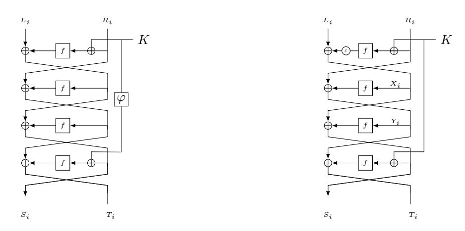
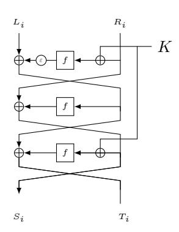
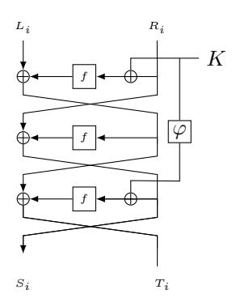

## SCIENCE CHINA

# Information Sciences

. RESEARCH PAPER .

# Secure Key-Alternating Feistel Ciphers Without Key Schedule

Yaobin SHEN1 , Hailun YAN1 , Lei WANG1,2\* & Xuejia LAI1,2

1Department of Computer Science and Engineering, Shanghai Jiao Tong University, Shanghai 200240, China yb shen@sjtu.edu.cn, helenyan@sjtu.edu.cn, wanglei hb@sjtu.edu.cn, lai-xj@cs.sjtu.edu.cn; 2Westone Cryptologic Research Center, Beijing 100070, China

Abstract Light key schedule has found many applications in lightweight blockciphers, e.g. LED, PRINTcipher and LBlock. In this paper, we study an interesting question of how to design a as light as possible key schedule from the view of provable security and revisit the four-round key-alternating Feistel cipher by Guo and Wang in Asiacrypt 18. We optimize the construction by Guo and Wang and propose a four-round key-alternating Feistel cipher with an ultra-light (in fact non-existent) key schedule. We prove our construction retain the same security level as that of Guo and Wang's construction. To the best of our knowledge, this is the first provably secure key-alternating Feistel cipher using identical round function and one n-bit master key but with ultra-light (non-existent) key schedule.

We also investigate whether the same refinement works for the three-round key-alternating Feistel cipher. This time we show a distinguishing attack on such three-round construction with only four encryption queries. On the positive side, we prove that three-round key-alternating Feistel cipher with a suitable key schedule is a pseudorandom permutation. This is also the first provable-security result for three-round key-alternating Feistel cipher.

Keywords blockciphers, key schedule, key-alternating Feistel, provable security

Citation Shen Y B, Yan H L, Wang L, Lai X J. Secure Key-Alternating Feistel Ciphers Without Key Schedule. Sci China Inf Sci, for review

#### 1 Introduction

Blockciphers play an fundamental role for cryptography in information security, which usually consist of round functions and key schedules. As one of the significant modules in blockciphers, key schedules have not received deserved attention. Commonly, the key schedule takes as input a master key and outputs the so-called round keys that are used in each round. In the case of AES-128, the master key is a 128-bit string and the total length of the round keys is 11 · 128 = 1408 bits. The AES-128 key schedule can be seen as a function from {0, 1} 128 to {0, 1} 1408 .

Scientifically designing the key schedule part of block ciphers is an important but not well-understood subject. In general, it is not yet clear what practical and necessary principles a good key schedule has to follow. In order to resist some existing attacks, there are some properties on what a key schedule should not have, e.g. avoiding (semi-) weak keys, equivalent keys, symmetry and complementation properties, and actual key information insufficiency [\[1](#page-9-0)[-2\]](#page-9-1). Moreover, it should not be possible to mount trivial guessand-determine attack attacks, meet-in-the-middle attacks, related-key attacks, slide-attacks or invariant subspace attacks. Considering the key schedule from the view of provable security is another direction. In [\[3\]](#page-9-2), Chen et al. use a lovely key schedule instantiated with a linear orthomorphism to minimize a

\* Corresponding author (email: wanglei hb@sjtu.edu.cn)

two-round Even-Mansour cipher from just one n-bit master key and one n-bit permutation. They prove such AES-like construction can achieve beyond the birthday bound security. Recently, Guo and Wang (GW) [\[4\]](#page-9-3) also use a linear-orthomorphism key schedule to obtain a birthday-bound secure four-round key-alternating Feistel (KAF) cipher from just one n-bit master key and one n-bit function. They claim this four-round construction is theoretically minimal in the sense that removing any component of this construction would ruin the security.

In addition to providing necessary cryptographic security, the efficiency of the key schedule is also of great significance, especially for lightweight blockciphers. Lightweight blockciphers are often employed in source constrained environments such as RFID tags and sensor networks. In these lightweight ciphers, the key schedules is commonly highly simplified to optimize the software and hardware efficiency. Some key schedules have round-by-round iteration with low diffusion [\[5-](#page-9-4)[7\]](#page-9-5), or do simple permutation or linear operations on master keys [\[8-](#page-9-6)[9\]](#page-9-7). In particular, some lightweight ciphers have ultra-light (in fact nonexistent) key schedule, and directly use master keys in each round [\[10-](#page-9-8)[11\]](#page-10-0).

Our Contributions We start with an interesting question of how to design a as light as possible key schedule from the view of provable security and revisit the four-round KAF by GW. Although the key schedule instantiated with linear orthomorphism can be efficient in some instances, it is still unsatisfying for lightweight ciphers when applied in many source constrained environments. In this paper, we optimize the construction by GW and propose a new four-round KAF with an ultra-light (non-existent) key schedule. Interestingly, we find the orthomorphism in their construction can be removed with a slight modification on the first round, i.e., applying one-bit rotation after the first round function. We prove this refined construction can achieve the birthday-bound security. Compared with GW's construction, our proposal has two advantages. The most significant one is that the key schedule is ultra-light (non-existent), which needs no computation/memory costs. One can simply bitwise exclusive-or (xor) the n-bit master key in corresponding rounds without bothering to any round-key derive function. Secondly, the one-bit rotation is more efficient than the linear orthomorphism used in GW's construction in most applications, because it only costs a one-bit shift rather than addition or field multiplication. We believe our construction is theoretically minimal (or even lighter than GW's construction) since removing the one-bit rotation or any other components would make it totally insecure. To the best of our knowledge, this is the first provably secure key-alternating Feistel cipher using identical round functions and n-bit master key but without any key schedule.

On the other hand, we also investigate whether the same one-bit rotation works for three-round singlekey KAF with identical round functions. This time we find such three-round construction is not a pseudorandom permutation (PRP) and show a distinguishing attack on it with only four encryption queries. On the positive side, we prove that three-round KAF with a suitable key schedule can achieve PRP security. This is also the first provable-security result for three-round key-alternating Feistel cipher, which may be independent of the interest.

Organizations. We first establish the notation and recall definitions in Section [2.](#page-1-0) In Section [3,](#page-3-0) we describe our new four-round KAF construction without key schedule and prove the security of it. We then investigate the three-round KAF, and show a distinguishing attack on three-round KAF without key schedule and also prove the security of three-round KAF with a suitable key schedule in Section [4.](#page-5-0) We finally give the conclusion in Section [5.](#page-9-9)

#### 2 Preliminaries

Notation. If X is a set, then X \$←− X denotes the operation of picking X from X uniformly at random. {0, 1} n denotes the set of all n-bit strings. We denote N = 2n for simplicity. For any two strings X, Y of equal length, X ⊕ Y denotes their bitwise exclusive-or, and X||Y denotes their concatenation. |X| denotes the bit length of string X. Func(n) denotes the set of all functions from  $\{0,1\}^n$  to  $\{0,1\}^n$ , and Perm(n) denotes the set of all permutation on  $\{0,1\}^n$ .

**Key-Alternating Feistel Cipher.** Given a function  $f:\{0,1\}^n \to \{0,1\}^n$  and a n-bit key K, define the permutation  $\Psi_K^f$  on  $\{0,1\}^{2n}$  as  $\Psi_K^f(L||R) = (R,L \oplus f(R \oplus K))$  where L and R are respectively the left and right n-bit halves of the input. A key-alternating Feistel cipher (KAF) with r rounds is specified by r public random functions  $f = (f_1, \ldots, f_r)$  from  $\{0,1\}^n$  to  $\{0,1\}^n$  and a round-key vector  $K = (K_1, \ldots, K_r)$  (denote by K the set of all key K):

$$\mathtt{KAF}^f_K(L\|R) = \Psi^{f_r}_{K_r} \circ \cdots \circ \Psi^{f_1}_{K_1}(L\|R).$$

These functions may be completely independent, or correlated or even identical. In particular, we denote by KAFSF the variant of KAF with identical round function, i.e.,

$$\mathtt{KAFSF}^f_K(L\|R) = \Psi^f_{K_r} \circ \cdots \circ \Psi^f_{K_1}(L\|R).$$

The key spaces of these schemes are not fixed and depend on the concrete contexts.

**Security Definitions.** We define two types of security notion with respect to the ability of the adversary  $\mathcal{A}$ , namely pseudorandomness permutation (PRP) and strong pseudorandomness permutation (SPRP), where in the former  $\mathcal{A}$  can only make encryption queries to the blockcipher while in the latter  $\mathcal{A}$  can make both encryption and decryption queries to the blockcipher. Formally, for any  $q_e$  and  $q_f$ , we define the PRP security of a r-round key-alternating Feistel cipher KAF as

$$\mathbf{Adv}_{\mathtt{KAF}}^{\mathtt{prp}}(q_e,q_f)$$

$$= \max_{\mathcal{A}} |\Pr[K \xleftarrow{\$} \mathcal{K}, f \xleftarrow{\$} (\mathrm{Func}(n))^r : \mathcal{A}^{\mathtt{KAF},f} = 1] - \Pr[\pi \xleftarrow{\$} \mathrm{Perm}(n), f \xleftarrow{\$} (\mathrm{Func}(n))^r : \mathcal{A}^{\pi,f} = 1]|$$

where the maximal is taken over all distinguishers A that ask at most  $q_e$  encryption queries to the permutation oracle and at most  $q_f$  queries to each function oracle. Similarly, we define the SPRP security of KAF as

$$\mathbf{Adv}^{\mathrm{sprp}}_{\mathrm{KAF}}(q_e,q_f) \\ = \max_{\mathcal{A}} |\Pr[K \overset{\$}{\leftarrow} \mathcal{K}, f \overset{\$}{\leftarrow} (\mathrm{Func}(n))^r : \mathcal{A}^{\mathrm{KAF},\mathrm{KAF}^{-1},f} = 1] - \Pr[\pi \overset{\$}{\leftarrow} \mathrm{Perm}(n), f \overset{\$}{\leftarrow} (\mathrm{Func}(n))^r : \mathcal{A}^{\pi,\pi^{-1},f} = 1]|$$

where the maximal is taken over all distinguishers  $\mathcal{A}$  that asks at most  $q_e$  queries to the permutation oracle and at most  $q_f$  queries to each function oracle.

The H-coefficient Technique. Following the notation from Hoang and Tessaro [12], it is useful to consider interactions between an adversary  $\mathcal{A}$  with an abstract system S which answers  $\mathcal{A}$ 's queries. The resulting interaction can then be recorded with a transcript  $\tau = ((X_1, Y_1), \dots, (X_q, Y_q))$ . Let  $p_S(\tau)$  denote the probability that S produces  $\tau$ . It is known that  $p_S(\tau)$  is the description of S and independent of the adversary  $\mathcal{A}$ . Let X denote the probability distribution of the transcript  $\tau$  when  $\mathcal{A}$  interacting with S. We say that a transcript is attainable for system S if  $\Pr[X = \tau] > 0$ .

We now describe the H-coefficient technique of Patarin [13-14]. Generically, it considers an adversary that aims at distinguishing a "real" system  $S_{re}$  from an "ideal" system  $S_{id}$ . The interactions of adversary with those systems induce two transcript distributions  $X_{re}$  and  $X_{id}$  respectively. It is well known that the statistical distance  $SD(X_{re}, X_{id})$  is an upper bound on the distinguishing advantage of A.

**Lemma 1.** [13-14] Let  $\Theta = \Theta_{good} \sqcup \Theta_{bad}$  be the set of attainable transcripts for ideal system  $S_{id}$ . If there exists  $\epsilon \geqslant 0$  such that for any  $\tau \in \Theta_{good}$ , it has

$$\frac{p_{\texttt{Sre}}(\tau)}{p_{\texttt{Sid}}(\tau)} \geqslant 1 - \epsilon.$$

Then  $SD(X_{re}, X_{id}) \leq \epsilon + Pr[X_{id} \in \Theta_{bad}].$ 

At the end of this section, we introduce a simple and efficient operation, i.e. one-bit rotation ε. It has been used in Luby-Rackoff construction [\[15-](#page-10-4)[16\]](#page-10-5). Note that the gap between Luby-Rackoff Feistel construction and key-alternating Feistel construction is non-negligible and one cannot simply borrow the security results of the former to the latter. We will use the following useful property of ε in our construction. The proof can be found in [\[15\]](#page-10-4).

Lemma 2. Let ε be the rotation of one bit. Then for any c ∈ {0, 1} n,

$$\Pr[x \xleftarrow{\$} \{0,1\}^n : x \oplus \varepsilon(x) = c] \leqslant \frac{2}{N}.$$

## 3 Four-Round Single-Key KAFSF Without Key Schedule

Figure 1: Left: Guo and Wang's four-round single-key KAFSF with key-schedule function ϕ. Right: Our four-round single-key KAFSF without key schedule, where ε is the rotation of one bit.

In this section, we propose a four-round single-key KAFSF without key schedule and prove that it is a strong pseudorandom permutation (SPRP). See the right of Fig. [1](#page-3-1) for an illustration.

Our security result for four-round KAF is as follows.

Theorem 1. For the four-round single-key KAFSF without key schedule, it holds

$$\mathbf{Adv}_{\mathtt{KAFSF}}^{\mathrm{sprp}}(q_e, q_f) \leqslant \frac{4q_e q_f}{N} + \frac{13q_e^2}{N} + \frac{q_e^2}{2N^2}.$$

In the remaining of this section, we will prove Theorem [1.](#page-3-2) Following the notational framework of Section 2, the real system Sre here is a pair of oracles (KAFSF, f) while the ideal system Sid is a pair of oracles (π, f), where f is the public random function in KAFSF and π is a perfect 2n-bit random permutation. The adversary A is assumed to be computationally unbounded and hence deterministic without loss of generality. A is also assumed to never make repeated queries since it only receives the same response if asking the same query. The interactions of A with its system is recorded by a pair of (QE, QF ), where QE = ((L1kR1, S1kT1), . . . ,(Lqe kRqe , Sqe kTqe )) is the qe construction queryresponse tuples when interacting with the permutation oracle (KAFSF in system Sre or π in system Sid), and QF = ((x1, y1), . . . ,(xqf , yqf )) is the qf primitive query-response tuples when interacting with the function oracle f. For convenience, we will slightly modify the security experiment by revealing to the adversary A the secret key K in the real system, or a "dummy" key K chosen uniformly at random from {0, 1} n if in the ideal system. Note that this can only enlarge the distinguishing advantage of the adversary A because it can simply ignore this piece of information if it wants. All in all, the transcript of the attack is encoded by the triplet τ = (QE, QF , K).

Bad Transcripts. Denote by Θ the set of all attainable transcripts for ideal system Sid, denote by Q + F = {x1, . . . , xqf } the set of input values to function f. We begin our proof by defining bad transcripts. Definition 1. We say a transcript τ = (QE, QF , K) is bad if there exists (LkR, SkT) ∈ QE and x ∈ Q+ F such that R ⊕ K = x or S ⊕ K = x. Denote by Θbad, resp. Θgood the set of bad, respectively good transcripts.

We upper bound the probability to obtaining a bad transcript in the ideal world.

Lemma 3. For any integers qe and qf , one has

$$\Pr[X_{\text{id}} \in \Theta_{\text{bad}}] \leqslant \frac{2q_e q_f}{N}.$$

Proof. For each of qeqf pairs of (LR, ST) and x, the event (K ⊕ R = x ∨ K ⊕ S = x) happens with probability at most 2/N since K is uniformly chosen. Hence by the union bound, the probability that τ is bad is at most 2qeqf /N.

Analysis of Good Transcripts. We now analyze good transcripts when adversary A interacting with these two systems. Let τ = (QE, QF , K) be a good transcript. Since in the ideal system, the construction oracle is a perfect 2n-bit random permutation and independent of the function f, we simply have

$$p_{\text{Sid}}(\tau) = \frac{1}{|\mathcal{K}| \cdot N^{q_f}} \cdot \prod_{i=0}^{q_e - 1} \frac{1}{N^2 - i}.$$
 (1)

We now proceed to lower bound the probability to obtain a good transcript in the real system. For 1 6 i 6 qe, we denote by Xi = ε(f(Ri ⊕ K)) ⊕ Li the input to the second round function, and Yi = f(Si ⊕ K) ⊕ Ti the input to the third round function. We define some bad conditions as follows:

- c.1 there exists some i such that Xi ∈ Q+ F or Yi ∈ Q+ F ;
- c.2 there exists a pair of (i, j) for i 6= j satisfying at least one of the following conditions:
- c.2.1 Xi ∈ {Ri ⊕ K, Yi , Si ⊕ K, Rj ⊕ K, Xj , Yj , Sj ⊕ K};
- c.2.2 Yi ∈ {Ri ⊕ K, Si ⊕ K, Rj ⊕ K, Xj , Yj , Sj ⊕ K};
- c.2.3 Xj ∈ {Ri ⊕ K, Si ⊕ K, Rj ⊕ K, Yj , Sj ⊕ K};
- c.2.4 Yj ∈ {Ri ⊕ K, Si ⊕ K, Rj ⊕ K, Sj ⊕ K}.

If none of above conditions is fulfilled, then given tuples QF and a key K, the occurrence of τ in the real system is equivalent to the event of 2qe new and distinct equations on the random round-function f, which is relatively easy to compute. We first consider the first bad condition. Since both Ri ⊕ K and Si ⊕ K are fresh inputs to function f, the values Xi and Yi remain uniformly distributed. Hence by the union bound

$$\Pr[\text{c.1}] \leqslant \frac{2q_e q_f}{N}.$$

We then analyze the condition c.2.1:

- For any element x ∈ {Ri ⊕ K, Si ⊕ K, Rj ⊕ K, Sj ⊕ K}, the equation Xi = x holds with probability at most 1/N because Xi is uniformly distributed.
- For x = Yi , if Si = Ri , then Pr[Xi = x] = Pr[ε(f(Ri ⊕ K)) ⊕ f(Ri ⊕ K) = Li ⊕ Ti ] = 2/N due to Lemma [2.](#page-3-3) Otherwise Pr[Xi = x] = 1/N since both f(Ri ⊕ K) and f(Si ⊕ K) are uniformly distributed and independent of each other.
- For x = Xj , if Ri 6= Rj , then Pr[Xi = x] = 1/N since both ε(f(Ri ⊕ K)) and ε(f(Rj ⊕ K)) are uniformly distributed and independent of each other. If Ri = Rj , then necessarily Xi 6= x since otherwise this would contradict the hypothesis that LiRi and LjRj are two distinct queries.
- For x = Yj , if Ri 6= Sj , then Pr[Xi = x] = 1/N since both ε(f(Ri ⊕ K)) and f(Sj ⊕ K) ⊕ Tj are uniformly distributed and independent of each other. Otherwise Pr[Xi = x] = Pr[ε(f(Ri ⊕ K)) ⊕ f(Sj ⊕ K) = Li ⊕ Tj ] = 2/N which comes from Lemma [2.](#page-3-3)

By the union bound and summing over above terms, for any pair (i, j), we have

$$\Pr[c.2.1] \leqslant \frac{9}{N}.$$

By similar arguments, we can obtain

$$\Pr[c.2.2] \leqslant \frac{7}{N},$$

and

$$\Pr[c.2.3] \leqslant \frac{6}{N},$$

and

$$\Pr[c.2.4] \leqslant \frac{4}{N},$$

for any pair (i, j). Since there are at most qe 2 such pairs, the probability of the occurrence of event c.2 is at most

$$\Pr[c.2] \leqslant \binom{q_e}{2} \cdot \frac{26}{N} \leqslant \frac{13q_e^2}{N}.$$

As mentioned before, if none of above bad conditions is fulfilled, then given tuples QF and a key K, the probability pSre(τ ) is equivalent to the probability of below event:

$$f(X_1) = R_1 \oplus Y_1, \dots, f(X_{q_e}) = R_{q_e} \oplus Y_{q_e},$$
  
$$f(Y_1) = S_1 \oplus X_1, \dots, f(Y_{q_e}) = S_{q_e} \oplus X_{q_e},$$

where X1, . . . , Xqe , Y1, . . . , Yqe are 2qe fresh and distinct input values to random function f. It is clear that this event holds with probability 1/N2qe . Hence for any τ ∈ Θgood,

$$\begin{split} \frac{\mathbf{p_{s_{re}}}(\tau)}{\mathbf{p_{s_{id}}}(\tau)} &\geqslant \frac{\frac{1}{|\mathcal{K}| \cdot N^{q_f}} \cdot \left(1 - \frac{2q_e q_f}{N} - \frac{13q_e^2}{N}\right) \cdot \frac{1}{N^{2q_e}}}{\frac{1}{|\mathcal{K}| \cdot N^{q_f}} \cdot \prod_{i=0}^{q_e - 1} \frac{1}{N^2 - i}} \\ &\geqslant \left(1 - \frac{2q_e q_f}{N} - \frac{13q_e^2}{N}\right) \cdot \left(1 - \frac{q_e^2}{2N^2}\right) \\ &\geqslant 1 - \frac{2q_e q_f}{N} - \frac{13q_e^2}{N} - \frac{q_e^2}{2N^2}. \end{split}$$

Applying Lemma [1](#page-2-0) and combining above equation and Lemma [3,](#page-4-0) the distinguishing advantage of the adversary A can be bounded by

$${\rm SD}(X_{\rm re},X_{\rm id}) \leqslant \frac{4q_eq_f}{N} + \frac{13q_e^2}{N} + \frac{q_e^2}{2N^2},$$

which concludes the proof of Theorem [1.](#page-3-2)

Remark. Note that the security result of our 4-round KAFSF can also be generalized to multi-user security via a similar analysis of Guo and Wang [\[4\]](#page-9-3), i.e., partitioning the key into two good and bad sets instead of partitioning transcripts, while the security result of our 3-round KAFSF (will be analyzed in next section) cannot since there exists certain bad transcripts.

## 4 Three-Round Single-Key KAFSF

One natural question is whether our refinement works for three-round key-alternating Feistel cipher. In this section, we will show a distinguishing attack on 3-round KAFSF without key schedule. After that, we present a PRP-secure 3-round single-key KAFSF with a suitable key schedule.

Figure 2: Left: 3-round single-key KAFSF without key schedule, where ε is the rotation of one bit. Right: 3-round single-key KAFSF with key-schedule function ϕ.

#### 4.1 Attack on 3-Round KAFSF Without Key Schedule

We show a distinguishing attack on 3-round KAFSF without key schedule where the one-bit rotation ε is applied after the first round function (See the left of Fig. [2.](#page-6-0) for an illustration). This attack is similar to that in [\[16\]](#page-10-5). Same analysis would work when the rotation ε is applied after the last round function. Our attack on 3-round KAFSF requires four forward queries, and is as follows:

- 1. The adversary first asks L1kR1 and L2kR1 to the three-round KAFSF, and receives the responses S1kT1 and S2kT2 respectively.
- 2. Let ∆ = ε(L1 ⊕ L2 ⊕ T1 ⊕ T2). The adversary then asks S1k0 and S2k∆ to KAFSF, and receives the responses S3kT3 and S4kT4 respectively. One can check the equation S3 ⊕ S4 = S1 ⊕ S2 holds with probability 1.

When the adversary is interacting with an 2n-bit random permutation, the probability of the event S3 ⊕ S4 = S1 ⊕ S2 occurring is about 1/N2 . Hence the success probability to distinguish this KAFSF from an 2n-bit random permutation is about 1 − 1/N2 ≈ 1.

Remark. As pointed out by Nandi [\[16\]](#page-10-5), similar attack still works for the other simple variants of function ε, e.g. when ε(x) = α · x (the Galois field multiplication by a primitive element α) or any other linear function ε as long as Pr[x \$←− {0, 1} n : ε(ε(x ⊕ c1)) ⊕ ε(ε(x ⊕ c2)) = ∆] is non-negligible for some fixed constants ∆, c1, and c2.

#### 4.2 PRP-Secure 3-Round Single-Key KAFSF With a Suitable Key Schedule

Besides providing an attack on 3-round single-key KAFSF without key schedule, on the positive side, we propose a 3-round single-key KAFSF with key-schedule function ϕ and prove that it achieves PRP security. See the right of Fig. [2.](#page-6-0) for an illustration.

Key Schedule. We begin by defining the key schedule used in our construction.

Definition 2 (orthomorphism). We say ϕ is an orthomorphism if both ϕ and x 7→ x ⊕ ϕ(x) are a permutation on {0, 1} n.

Note that ϕ(xLkxR) = xLkxL ⊕ xR and ϕ(x) = c  x (where  is the extension field multiplication) are two instances of orthomorphisms. Orthomorphisms have found many cryptographic applications, e.g. in [\[4,](#page-9-3) [17](#page-10-6)[-18\]](#page-10-7).

Our construction achieves PRP security when scheduling the key by the orthomorphism ϕ. The security result for 3-round single-key KAFSF using the orthomorphism ϕ is as follows.

**Theorem 2.** For 3-round single-key KAFSF using an orthomorphism  $\varphi$  as the key-schedule function, it holds

$$\mathbf{Adv}_{\mathtt{KAFSF}}^{\mathrm{prp}}(q_e, q_f) \leqslant \frac{3q_e q_f}{N} + \frac{6q_e^2}{N} + \frac{q_e^2}{2N^2}.$$

In the remaining of this section, we will prove Theorem 2.

Bad Transcripts. We use exactly the same notations as in the proof of 4-round KAFSF in Section 3. Note that here we only allow the adversary  $\mathcal{A}$  to make encryption queries since we are aiming at proving PRP security. Let  $\tau = (\mathcal{Q}_E, \mathcal{Q}_F, K)$  be the transcript that records the interactions of the adversary  $\mathcal{A}$  with those systems, where  $\mathcal{Q}_E = ((L_1 \| R_1, S_1 \| T_1), \dots, (L_{q_e} \| R_{q_e}, S_{q_e} \| T_{q_e}))$  and  $\mathcal{Q}_F = ((x_1, y_1), \dots, (x_{q_f}, y_{q_f}))$ . Denote by  $\mathcal{Q}_F^+ = \{x_1, \dots, x_{q_f}\}$  the set of input values to function f. Denote by  $X_{re}$  resp.  $X_{id}$  the transcript distribution when  $\mathcal{A}$  interacting with system  $S_{re} = (KAFSF, f)$ , respectively system  $S_{id} = (\pi, f)$ . We then define bad transcripts.

**Definition 3.** We say that an attainable transcript  $\tau = (\mathcal{Q}_E, \mathcal{Q}_F, K)$  is bad if at least one of the following conditions is fulfilled:

- there exists two distinct construction queries  $(L_i||R_i, S_i||T_i)$  and  $(L_j||R_j, S_j||T_j)$  in  $Q_E$  such that  $S_i = S_j$ ;
  - there exists  $(L_i||R_i, S_i||T_i) \in \mathcal{Q}_E$  and  $x_j \in \mathcal{Q}_F^+$  such that  $K \oplus R_i = x_j$  or  $\varphi(K) \oplus S_i = x_j$ ;
- there exists two (not necessarily distinct)  $(L_i||R_i, S_i||T_i)$  and  $(L_j||R_j, S_j||T_j)$  in  $Q_E$  such that  $R_i \oplus K = S_i \oplus \varphi(K)$ ;

Denote by  $\Theta_{\rm bad}$ , resp.  $\Theta_{\rm good}$  the set of bad, respectively good transcripts.

We then upper bound the chance to obtain a bad transcript in the ideal world.

**Lemma 4** (Bad Transcripts). For any integers  $q_e$  and  $q_f$ , one has

$$\Pr[X_{\mathtt{id}} \in \Theta_{\mathtt{bad}}] \leqslant \frac{q_e^2}{2(N+1)} + \frac{2q_eq_f + q_e^2}{N}.$$

Proof. We consider these three conditions one by one. Firstly, for each of the  $\binom{q_e}{2}$  pairs of  $(L_i || R_i, S_i || T_i)$  and  $(L_j || R_j, S_j || T_j)$ , the event of  $S_i = S_j$  occurs with probability at most  $N^2(N-1)/N^2(N^2-1) = 1/(N+1)$  because in the ideal world  $\pi$  is a perfect 2n-bit random permutation and independent of the function f. For each of the  $q_e q_f$  pairs of  $(L_i || R_i, S_i || T_i)$  and  $x_j$ , the chance of the event  $(K \oplus R_i = x_j \vee \varphi(K) \oplus S_i = x_j)$  occurring is at most 2/N since K is uniformly chosen and  $\varphi$  is a permutation over  $\{0,1\}^n$ . On the other hand, for each of the  $q_e^2$  pairs of  $(L_i || R_i, S_i || T_i)$  and  $(L_j || R_j, S_j || T_j)$  (not necessarily distinct), the probability of the event  $R_i \oplus K = S_j \oplus \varphi(K)$  occurring is at most 1/N since K is uniformly chosen and  $\varphi$  is an orthomorphisms. Hence by the union bound,

$$\Pr[X_{\mathtt{id}} \in \Theta_{\mathrm{bad}}] \leqslant \frac{q_e^2}{2(N+1)} + \frac{2q_eq_f + q_e^2}{N},$$

which concludes the proof.

Analysis for Good Transcripts. Let  $\tau = (\mathcal{Q}_E, \mathcal{Q}_F, K)$  be a good transcript. Since in the ideal world, the construction  $\pi$  is a perfect 2n-bit random permutation and independent of the internal function f, we simply have

$$\Pr[X_{id} = \tau] = \frac{1}{|\mathcal{K}| \cdot N^{q_f}} \cdot \prod_{i=0}^{q_e - 1} \frac{1}{N^2 - i}.$$
 (2)

We then lower bounding the probability to obtaining  $\tau$  in the real world. For  $1 \leq i \leq q_e$ , we denote by  $X_i = f(R_i \oplus K) \oplus L_i$  the input to the second round function. We define two bad conditions as follows: c.1 there exists some i such that  $X_i \in \mathcal{Q}_F^+$ ;

- c.2 there exists a pair of (i,j) for  $i \neq j$  satisfying at least one of the following conditions:
- c.2.1  $X_i \in \{R_i \oplus K, S_i \oplus \varphi(K), R_j \oplus K, X_j, S_j \oplus \varphi(K)\};$
- c.2.2  $X_j \in \{R_i \oplus K, S_i \oplus \varphi(K), R_j \oplus K, S_j \oplus \varphi(K)\}.$

If none of above conditions is fulfilled, then given the tuples  $Q_F$  and a key K, the probability of  $X_{re} = \tau$  is equivalent to the probability of  $2q_e$  new and distinct equations on the random round-function f. We bound the probability of above conditions first. We begin with the first condition. Since  $\tau$  is good, the value of  $f(R_i \oplus K)$  remains uniformly distributed, and hence

$$\Pr[c.1] \leqslant \frac{q_e q_f}{N}.$$

Next we consider the condition c.2.1:

- For any  $x \in \{R_i \oplus K, S_i \oplus \varphi(K), R_j \oplus K, S_j \oplus \varphi(K)\}$ , the event of  $X_i = x$  happens with probability at most 1/N since  $f(R_i \oplus K)$  is uniformly distributed;
- For  $x = X_j$ , if  $R_i \neq R_j$ , then  $\Pr[X_i = x] = 1/N$  since both  $f(R_i \oplus K)$  and  $f(R_j \oplus K)$  are uniformly distributed and independent of each other. If  $R_i = R_j$ , then necessarily  $X_i \neq x$  since otherwise this would contradict the hypothesis that  $L_i || R_i$  and  $L_j || R_j$  are two distinct queries. By the union bound, for any pair (i, j), we have

$$\Pr[c.2.1] \leqslant \frac{5}{N}$$

By similar arguments,

$$\Pr[c.2.2] \leqslant \frac{4}{N}.$$

Since there are  $\binom{q_e}{2}$  such pairs, the event c.2 happens with probability at most

$$\Pr[c.2] \leqslant \binom{q_e}{2} \cdot \frac{9}{N} \leqslant \frac{9q_e^2}{2N}.$$

As mentioned before, if none of above bad conditions is met, given the tuples  $Q_F$  and a key K, the event  $X_{re} = \tau$  is equivalent to the event:

$$f(X_1) = R_1 \oplus S_1, \dots, f(X_{q_e}) = R_{q_e} \oplus S_{q_e},$$
  
$$f(S_1 \oplus \varphi(K)) = X_1 \oplus T_1, \dots, f(S_{q_e} \oplus \varphi(K)) = X_{q_e} \oplus T_{q_e},$$

where  $X_1, \ldots, X_{q_e}, S_1 \oplus \varphi(K), \ldots, S_{q_e} \oplus \varphi(K)$  are  $2q_e$  fresh and distinct inputs to random function f due the goodness of  $\tau$  and the excursion of bad conditions c.1 and c.2. Hence for any good  $\tau$ ,

$$\begin{split} \frac{\Pr[X_{\text{re}} = \tau]}{\Pr[X_{\text{id}} = \tau]} &\geqslant \frac{\frac{1}{|\mathcal{K}| \cdot N^{q_f}} \cdot \left(1 - \frac{q_e q_f}{N} - \frac{9q_e^2}{2N}\right) \cdot \frac{1}{N^{2q_e}}}{\frac{1}{|\mathcal{K}| \cdot N^{q_f}} \cdot \prod_{i=0}^{q_e - 1} \frac{1}{N^2 - i}} \\ &\geqslant \left(1 - \frac{q_e q_f}{N} - \frac{9q_e^2}{2N}\right) \cdot \left(1 - \frac{q_e^2}{2N^2}\right) \\ &\geqslant 1 - \frac{q_e q_f}{N} - \frac{9q_e^2}{2N} - \frac{q_e^2}{2N^2}. \end{split}$$

Combining above equation and Lemma 4 and applying Lemma 1, the distinguishing advantage of the adversary A can be bounded by

$$\begin{split} \mathtt{SD}(X_{\mathtt{re}}, X_{\mathtt{id}}) &\leqslant \frac{q_e q_f}{N} + \frac{9q_e^2}{2N} + \frac{q_e^2}{2N^2} + \frac{q_e^2}{2(N+1)} + \frac{2q_e q_f + q_e^2}{N} \\ &\leqslant \frac{3q_e q_f}{N} + \frac{6q_e^2}{N} + \frac{q_e^2}{2N^2}, \end{split}$$

which concludes the proof of Theorem 2.

### 5 Conclusion

In this paper, we consider how to design a as light as possible key schedule which has found many applications in lightweight ciphers, from the point of view of provable security. In particular, we optimize the 4-round key-alternating Feistel by Guo and Wang [\[4\]](#page-9-3) and propose a new 4-round key-alternating Feistel with an ultra-light (non-existent) key schedule. Our result sheds some light on designing ultralight (non-existent) key schedule for blockcipher from the view of provable security. To the best of our knowledge, this is the first provably secure key-alternating Feistel without any key schedule. We also investigate whether our optimization works for 3-round key-alternating Feistel. We show a distinguishing attack on 3-round key-alternating Feistel without key schedule, and prove that with a suitable key schedule 3-round key-alternating Feistel is a PRP.

## References

- [1] RIJMEN V, DAEMEN J. The design of rijndael: Aes. The Advanced Encryption Standard. Springer, Berlin, 2002.
- [2] YAN H, LUO Y, CHEN M, et al. New observation on the key schedule of rectangle. Science China Information Sciences, 2019, 62(3):32108.
- [3] CHEN S, LAMPE R, LEE J, et al. Minimizing the two-round Even-Mansour cipher//GARAY J A, GENNARO R. Lecture Notes in Computer Science: volume 8616 Advances in Cryptology – CRYPTO 2014, Part I. Santa Barbara, CA, USA: Springer, Heidelberg, Germany, 2014: 39-56.
- [4] GUO C, WANG L. Revisiting key-alternating feistel ciphers for shorter keys and multi-user security//PEYRIN T, GALBRAITH S. Lecture Notes in Computer Science: volume 11272 Advances in Cryptology – ASIACRYPT 2018, Part I. Brisbane, Queensland, Australia: Springer, Heidelberg, Germany, 2018: 213-243.
- [5] BOGDANOV A, KNUDSEN L R, LEANDER G, et al. PRESENT: An ultra-lightweight block cipher//PAILLIER P, VERBAUWHEDE I. Lecture Notes in Computer Science: volume 4727 Cryptographic Hardware and Embedded Systems – CHES 2007. Vienna, Austria: Springer, Heidelberg, Germany, 2007: 450-466.
- [6] SUZAKI T, MINEMATSU K, MORIOKA S, et al. TWINE : A lightweight block cipher for multiple platforms//KNUDSEN L R, WU H. Lecture Notes in Computer Science: volume 7707 SAC 2012: 19th Annual International Workshop on Selected Areas in Cryptography. Windsor, Ontario, Canada: Springer, Heidelberg, Germany, 2013: 339-354.
- [7] WU W, ZHANG L. LBlock: A lightweight block cipher//LOPEZ J, TSUDIK G. Lecture Notes in Computer Science: volume 6715 ACNS 11: 9th International Conference on Applied Cryptography and Network Security. Nerja, Spain: Springer, Heidelberg, Germany, 2011: 327-344.
- [8] HONG D, SUNG J, HONG S, et al. HIGHT: A new block cipher suitable for low-resource device// GOUBIN L, MATSUI M. Lecture Notes in Computer Science: volume 4249 Cryptographic Hardware and Embedded Systems – CHES 2006. Yokohama, Japan: Springer, Heidelberg, Germany, 2006: 46-59.
- [9] NEEDHAM R M, WHEELER D J. Tea extensions. Report (Cambridge University, Cambridge, UK, 1997) Google Scholar, 1997.
- [10] GUO J, PEYRIN T, POSCHMANN A, et al. The LED block cipher//PRENEEL B, TAKAGI T. Lecture Notes in Computer Science: volume 6917 Cryptographic Hardware and Embedded Systems – CHES 2011. Nara, Japan: Springer, Heidelberg, Germany, 2011: 326-341.

- [11] KNUDSEN L R, LEANDER G, POSCHMANN A, et al. PRINTcipher: A block cipher for ICprinting//MANGARD S, STANDAERT F X. Lecture Notes in Computer Science: volume 6225 Cryptographic Hardware and Embedded Systems – CHES 2010. Santa Barbara, CA, USA: Springer, Heidelberg, Germany, 2010: 16-32.
- [12] HOANG V T, TESSARO S. Key-alternating ciphers and key-length extension: Exact bounds and multi-user security//ROBSHAW M, KATZ J. Lecture Notes in Computer Science: volume 9814 Advances in Cryptology – CRYPTO 2016, Part I. Santa Barbara, CA, USA: Springer, Heidelberg, Germany, 2016: 3-32.
- [13] PATARIN J. The "coefficients H" technique (invited talk)//AVANZI R M, KELIHER L, SICA F. Lecture Notes in Computer Science: volume 5381 SAC 2008: 15th Annual International Workshop on Selected Areas in Cryptography. Sackville, New Brunswick, Canada: Springer, Heidelberg, Germany, 2009: 328-345.
- [14] CHEN S, STEINBERGER J P. Tight security bounds for key-alternating ciphers//NGUYEN P Q, OSWALD E. Lecture Notes in Computer Science: volume 8441 Advances in Cryptology – EURO-CRYPT 2014. Copenhagen, Denmark: Springer, Heidelberg, Germany, 2014: 327-350.
- [15] PATARIN J. How to construct pseudorandom and super pseudorandom permutations from one single pseudorandom function//RUEPPEL R A. Lecture Notes in Computer Science: volume 658 Advances in Cryptology – EUROCRYPT'92. Balatonf¨ured, Hungary: Springer, Heidelberg, Germany, 1993: 256-266.
- [16] NANDI M. The characterization of Luby-Rackoff and its optimum single-key variants//GONG G, GUPTA K C. Lecture Notes in Computer Science: volume 6498 Progress in Cryptology - IN-DOCRYPT 2010: 11th International Conference in Cryptology in India. Hyderabad, India: Springer, Heidelberg, Germany, 2010: 82-97.
- [17] SADEGHIYAN B, PIEPRZYK J. A construction for super pseudorandom permutations from a single pseudorandom function//RUEPPEL R A. Lecture Notes in Computer Science: volume 658 Advances in Cryptology – EUROCRYPT'92. Balatonf¨ured, Hungary: Springer, Heidelberg, Germany, 1993: 267-284.
- [18] CHEN S, LAMPE R, LEE J, et al. Minimizing the two-round Even-Mansour cipher. Journal of Cryptology, 2018, 31(4):1064-1119.